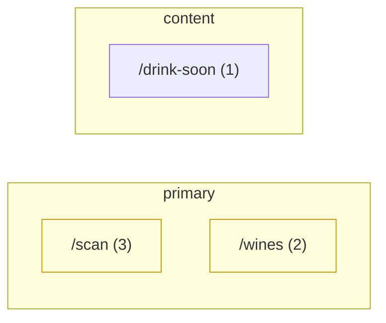

# Example: /nav-audit report

`node scripts/nav-audit.mjs --scope full` against a small wine-cellar-style app.

```
NAV FINDINGS (3)
────────────────────────────────────────────────
  [P1] coverage-gap — /drink-soon (gate-eligible)
     needed in primary for the persona but not offered there
     evidence: declared intent 'daily-pick' requires layer 'primary'; not reachable there
     confidence: high
  [P2] redundancy — /scan
     offered from multiple prime anchors — burns nav real estate
     evidence: reachable from 2 prominent anchors: TopNav, BottomNav
     confidence: high
  [P3] surprising-mapping — /wines
     control label does not match where it leads
     evidence: label "Bottles" does not match destination /wines
     confidence: low
```

| Destination | In | Affordances | Anchors | Layers |
|---|---|---|---|---|
| /scan | 3 | link, navigate-call | TopNav, BottomNav | primary |
| /wines | 2 | link | BottomNav | primary |
| /drink-soon | 1 | navigate-call | StatCard | content |



Adapters: vanilla-switchview · recall: 6 edges (0 low-conf, 0 opaque)

**Read it as**: the headline is the coverage-gap (a declared high-frequency
intent — the daily pick — isn't in the primary nav, only reachable from a stat
card). That's the one gate-eligible finding. The /scan redundancy and the
"Bottles → /wines" surprising-mapping are advisory: surface them for product
judgement, don't block on them.
