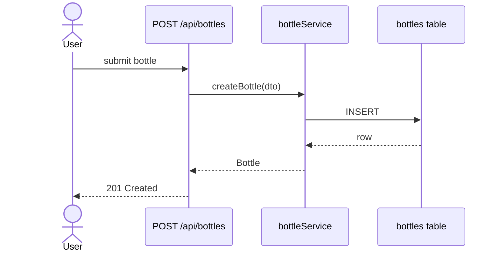
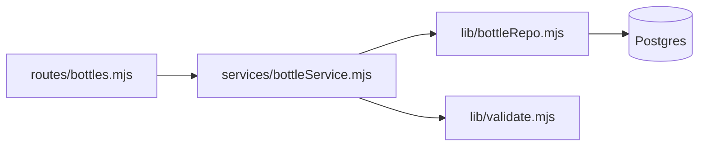
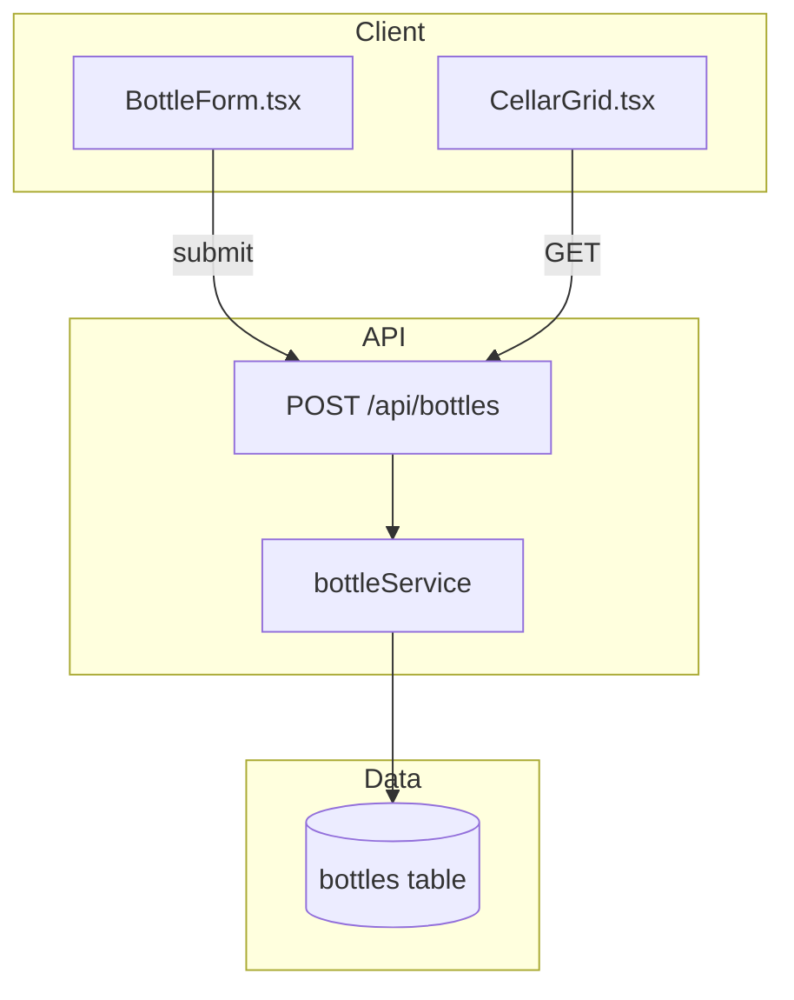
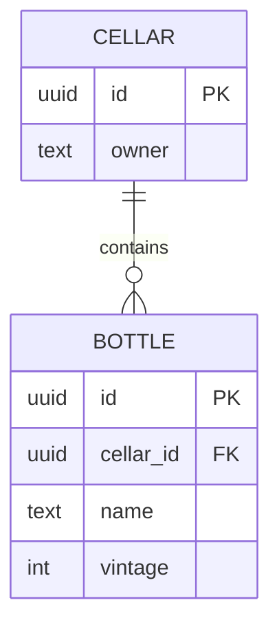
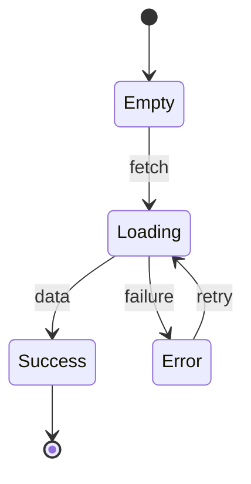

# Mermaid block templates

Copy-paste templates for the architecture diagram in Phase 6 §2 (and the
optional state diagram in §5). Pick the type from the Phase 0 scope table
in `SKILL.md`. Replace the placeholder names with real files/modules from
Phase 1 exploration — the diagram describes the **proposed** design.

These render natively in GitHub and VS Code preview. Keep them small:
a planning sketch, not an exhaustive map. If a diagram needs more than
~12 nodes, the plan is probably too broad for one document.

---

## `sequenceDiagram` — backend request lifecycle

Use for a backend plan where the *order* of calls is the interesting part
(route → service → DB → back). Each `participant` is a real module.

````markdown

````

---

## `graph LR` — backend module structure

Use when *which module depends on which* matters more than call order.
`LR` = left-to-right; use `TD` (top-down) for deep dependency chains.

````markdown

````

---

## `graph TD` with `subgraph` — full-stack tiers

Use for full-stack plans. One `subgraph` per tier makes the trust
boundary between client and server visually obvious.

````markdown

````

---

## `erDiagram` — database schema work

Use for plans that add or change tables. Show only the columns the plan
touches plus the keys — not the full schema.

````markdown

````

---

## `stateDiagram-v2` — component State Map (Phase 6 §5)

Optional. Use for a frontend component with a non-trivial state machine —
renders the Empty / Loading / Error / Success transitions from §5.

````markdown

````
