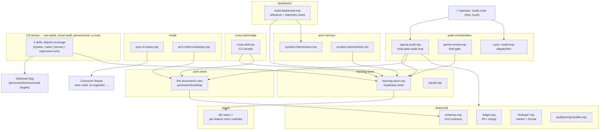

# Architecture Intent — claude-engineering-skills

- **Version**: 0.2.0
- **Last reviewed**: 2026-07-27
- **Owner**: Louis Strydom

> **Why this matters**: This is the source code for a multi-skill audit/planning
> pipeline that gets synced into consumer repos (wine-cellar-app, ai-organiser,
> power-systems repos, etc.). The architecture has natural seams between the
> audit-orchestration layer (callers), shared-lib modules (helpers), the
> learning-store integration (cloud state), and the install/sync mechanism
> (distribution). This doc + `.audit-loop/domain-map.json` together enforce
> that those seams stay clean.

---

## C4 Container View

---

## Domains

### `audit-orchestration`
The main audit pipeline (`openai-audit.mjs`, `gemini-review.mjs`, `cycle.mjs`).
Orchestrates LLM calls, R2+ deliberation loops, and the new architecture pass.
Depends on shared-lib for prompt building, schemas, ledger I/O.

### `shared-lib`
Reusable infrastructure: `schemas.mjs`, `ledger.mjs`, `audit/prompt-builder.mjs`,
the new `arch-intent/` module tree, robustness helpers. Should NOT depend on
`audit-orchestration` (would create a cycle).

### `arch-memory`
Symbol-index extraction + refresh (`scripts/symbol-index/**`,
`scripts/lib/symbol-index/**`). Walks the repo, extracts symbols + their
domain tags, writes to Supabase. Read by neighbourhood queries during /plan.

### `learning-store`
Supabase write/read layer (`learning-store.mjs`, `bandit.mjs`, `refine-prompts.mjs`,
`meta-assess.mjs`, `evolve-prompts.mjs`). The only domain that talks to Supabase
directly. Other domains should call `learning-store` rather than constructing
their own Supabase clients.

### `cross-skill-bridge`
`scripts/cross-skill.mjs` **and `scripts/lib/cross-skill/**`** — the CLI facade
invoked by skills, plus the command registry the CLI dispatches through. Routes
commands to learning-store / arch-intent / persona-test stores.

The `lib/cross-skill/**` half joined this domain in `a146bb7b` (2026-08-12) when
the command-registry migration finished: 15 modules extracted out of
`cross-skill.mjs` had been landing in `shared-lib` via the `scripts/lib/**`
catch-all, splitting one subsystem across two domains. Note the standing tension
AGENTS.md records — this domain is described as *a thin facade* and already
declares 11 deps; the retag made its real size visible rather than adding to it.

### `install`
`install*.mjs`, `sync-to-repos.mjs`, the new `arch-intent-bootstrap.mjs`. Owns
distribution to consumer repos + first-time onboarding.

### `findings`
`findings*.mjs` — finding identity, formatting, FP-tracking, outcome logging.
Standalone helpers consumed by audit-orchestration.

### `claude-hooks`
`.claude/hooks/**` — Claude Code hooks (arch-memory-check, quickfix-scan).
Run in the operator's session, not in the audit pipeline.

### `brainstorm`
`scripts/brainstorm-*` + `scripts/lib/brainstorm/**` — the /brainstorm skill's
back-end.

### `plan`
`scripts/lib/plan-*` — plan-audit specific helpers (path extraction, fingerprinting).

### `tech-debt`
`scripts/lib/debt-*`, `scripts/debt-*` — the deferred-debt ledger.

### `tests`
Everything under `tests/` — should depend on shared-lib + audit-orchestration
for testing them, but production code should NOT depend on tests.

### `arch-intent`
`scripts/lib/arch-intent/**` — this document's own generator/bootstrap
support. Promoted out of `shared-lib` into its own domain since v0.1.0 (was
shown inside the `shared-lib` box in the C4 view below, labelled "NEW — this
PR"; that placement is now stale — see the updated diagram).

### `stores`
`scripts/lib/store/**`, `scripts/lib/db/**` **except `db/errors.mjs`** — the
Postgres persistence layer (the `db/` seam + per-feature store modules). Owns
the write/read boundary
to the cloud learning store's tables. Distinct from `learning-store`, which
is the higher-level orchestration/client domain that calls into `stores`.

`db/errors.mjs` is deliberately **`shared-lib`**, not `stores`: it has zero
imports and exports one pure SQLSTATE classifier (`normalizePostgresError`) with
no I/O, connection or schema knowledge. A primitive that happens to be *about*
Postgres is not part of the persistence layer, and tagging it here manufactured a
`shared-lib -> stores` edge from `durable-write.mjs`. Likewise
`scripts/lib/audit-store-writers.mjs` is **`audit-orchestration`** — it is the
audit store's writer-registry bootstrap, not a store module.

### `dashboard`
`scripts/build-dashboard.mjs`, `scripts/lib/dashboard/**`, `dashboard/**` —
the local reference + telemetry dashboard (gitignored HTML output, Category A
per the generated-artifact policy). Collects from most other domains to
render a single operator-facing view.

### `nav-audit`, `visual-audit`, `persona-test`, `ux-lock`
The four UX-lens skills' backends (`scripts/lib/nav/**` + `nav-audit.mjs`;
`scripts/lib/visual/**` + `visual-audit.mjs`; `scripts/lib/persona/**` +
`persona-test/**` + `persona-consistency-*.mjs`; `scripts/lib/ux-lock/**`).
Each drives or statically analyses a live/deployed app from a different
angle — system-level nav graph, paint/visual contract, journey narrative,
and Playwright regression locking, respectively (see AGENTS.md's "Skill
Chain" section for the full four-lens framing).

### `model-eval`
`scripts/lib/model-eval/**` — the model swap-in evaluation harness (auditor
and adjudicator role comparisons, cost/pricing tables).

### `requirements`
`scripts/lib/requirements/**` — the de-facto invariant ledger extracted from
the codebase (`.requirements/ledger.json`), consumed by `/audit-code` as a
rubric.

### `security`
`scripts/lib/security/**` — the security-incident memory (secret/PII
classification gate, incident indexing, `/security-strategy` support).

### `solo-control`
`scripts/lib/solo-control/**` — the solo author-model research baseline
(clean-diff review with no external audit apparatus, the null-hypothesis
control for the model-A/B/C shadow).

### `arm-eval`
`scripts/lib/arm-eval/**` — the blinded Claude-judge evaluation framework
comparing brainstorm/plan/audit output quality across model arms.

### `friction`, `gate-honesty`, `fit-check`, `memory-health`, `claudemd-management`
Smaller, standalone infra domains: `friction` (session friction-note capture
+ closure loop), `gate-honesty` (skill gate-contract validation against
enforcing code+tests), `fit-check` (repo-adoption fit scoring for new
consumers), `memory-health` (the trigger-metric gate on the learning store's
own signal quality), `claudemd-management` (AGENTS.md/CLAUDE.md drift
detection + reconciliation — the very check this fix's drift gate follows
the pattern of).

### `explain`, `ship`
`scripts/explain*.mjs` (the `/explain` skill — architectural-memory +
git-history + plan synthesis for "why is this code here") and
`scripts/ship*.mjs` (the `/ship` skill's commit/push/provenance-trailer
mechanics).

### `scripts`, `skills-content`, `docs`, `supabase`
Structural/catch-all domains, not feature domains: `scripts` (the
`scripts/**` catch-all for anything not matched by a more specific rule,
**plus the repo-root `*.mjs`/`*.js` net** — `root-scripts` was retired
2026-08-12 once both of its members, `install.mjs` and `setup.mjs`, were
retagged to `install`; the catch-all rules were repointed rather than
deleted, because an untagged file is skipped by the layering analyser and
dropping them would hide any future repo-root script), `skills-content` (`skills/**` — the skill source-of-truth this
repo's own product IS), `docs` (`docs/**`, including this file), `supabase`
(`supabase/**` — SQL migrations for the cloud learning store).

---

## Cross-cutting concerns

- **Schemas (Zod)**: `shared-lib/schemas.mjs` is the source of truth for
  audit-orchestration's finding/classification shapes; feature-specific
  contracts that need to be shared across a domain boundary get their own
  small neutral module instead (e.g. `shared-lib/observed-deps-contracts.mjs`
  for `CoverageSchema`, extracted 2026-07-27 so both `stores` and
  `arch-memory` can depend on it without crossing into each other's domain —
  see `refactor-architecture-debt-remainder-2026-07.md` item 2). Modifying a
  schema is a deliberate cross-cutting event either way.
- **Atomic file writes**: `shared-lib/file-io.mjs::atomicWriteFileSync` is
  the canonical way to write durable state (ledger, FP tracker, bandit
  state). Crashing mid-write must not corrupt these.
- **Sensitive-egress gating**: `shared-lib/sensitive-egress-gate.mjs` is
  the canonical filter for content sent to external LLM APIs. Audit
  passes MUST route through it (they do — verified by the
  `.audit-loop/domain-map.json` rules).
- **Architectural memory**: `arch-memory` writes to Supabase; `learning-store`
  reads from Supabase. Both have RLS-protected access. No domain bypasses
  Supabase to talk to the symbol-index database directly.

---

## Boundary rationale

A few key allowed-dep decisions, explained:

- `audit-orchestration` → `shared-lib`: ✅ — orchestration depends on
  helpers. Standard direction.
- `shared-lib` → `audit-orchestration`: ⛔ — would create a cycle. The
  prompt-builder and schemas must not know what calls them.
- `audit-orchestration` → `learning-store`: ✅ — audits persist runs +
  findings to Supabase.
- `audit-orchestration` → `arch-memory`: ✅ — audits consult symbol-index
  for neighbourhood queries during /plan.
- `install` → `audit-orchestration`: ⛔ — sync mechanism shouldn't know
  the audit pipeline's internals. It synchronises files only.
- `tests` → `audit-orchestration` + `shared-lib`: ✅ — tests exercise both.
- `audit-orchestration` → `tests`: ⛔ — production code never imports tests.
- `learning-store` → `audit-orchestration`: ⛔ — would create a cycle.
- `cross-skill-bridge` → everything: ✅ partially — the bridge dispatches
  to many stores. Restrict to `learning-store`, `arch-memory`, `arch-intent`,
  `findings`, `tech-debt`, `plan`.

---

## Known known-violations (debt)

Current accepted debt is tracked at the enforcement layer, not duplicated
here — see `.audit-loop/domain-map.json`'s `_comment_allowedDeps` field and
any dated `_adjudication_YYYY_MM_DD` block(s) present for the live, dated
list. This section stays intentionally empty going forward; it existed to
record intent-layer debt, and the enforcement layer is now the single
source of truth for that (refactor-architecture-debt-remainder-2026-07.md
item 3).
