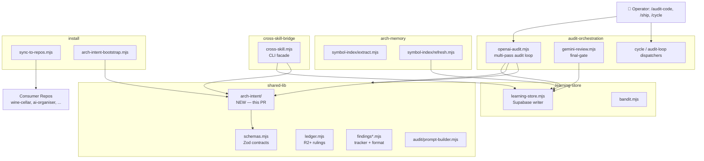

# Architecture Intent — claude-engineering-skills

- **Version**: 0.1.0
- **Last reviewed**: 2026-05-11
- **Owner**: Louis Strydom

> **Why this matters**: This is the source code for a multi-skill audit/planning
> pipeline that gets synced into consumer repos (wine-cellar-app, ai-organiser,
> power-systems repos, etc.). The architecture has natural seams between the
> audit-orchestration layer (callers), shared-lib modules (helpers), the
> learning-store integration (cloud state), and the install/sync mechanism
> (distribution). This doc + `.audit-loop/domain-map.json` together enforce
> that those seams stay clean.

---

## C4 Container View

---

## Domains

### `audit-orchestration`
The main audit pipeline (`openai-audit.mjs`, `gemini-review.mjs`, `cycle.mjs`).
Orchestrates LLM calls, R2+ deliberation loops, and the new architecture pass.
Depends on shared-lib for prompt building, schemas, ledger I/O.

### `shared-lib`
Reusable infrastructure: `schemas.mjs`, `ledger.mjs`, `audit/prompt-builder.mjs`,
the new `arch-intent/` module tree, robustness helpers. Should NOT depend on
`audit-orchestration` (would create a cycle).

### `arch-memory`
Symbol-index extraction + refresh (`scripts/symbol-index/**`,
`scripts/lib/symbol-index/**`). Walks the repo, extracts symbols + their
domain tags, writes to Supabase. Read by neighbourhood queries during /plan.

### `learning-store`
Supabase write/read layer (`learning-store.mjs`, `bandit.mjs`, `refine-prompts.mjs`,
`meta-assess.mjs`, `evolve-prompts.mjs`). The only domain that talks to Supabase
directly. Other domains should call `learning-store` rather than constructing
their own Supabase clients.

### `cross-skill-bridge`
`scripts/cross-skill.mjs` — the CLI facade invoked by skills. Routes commands
to learning-store / arch-intent / persona-test stores.

### `install`
`install*.mjs`, `sync-to-repos.mjs`, the new `arch-intent-bootstrap.mjs`. Owns
distribution to consumer repos + first-time onboarding.

### `findings`
`findings*.mjs` — finding identity, formatting, FP-tracking, outcome logging.
Standalone helpers consumed by audit-orchestration.

### `claude-hooks`
`.claude/hooks/**` — Claude Code hooks (arch-memory-check, quickfix-scan).
Run in the operator's session, not in the audit pipeline.

### `brainstorm`
`scripts/brainstorm-*` + `scripts/lib/brainstorm/**` — the /brainstorm skill's
back-end.

### `plan`
`scripts/lib/plan-*` — plan-audit specific helpers (path extraction, fingerprinting).

### `tech-debt`
`scripts/lib/debt-*`, `scripts/debt-*` — the deferred-debt ledger.

### `tests`
Everything under `tests/` — should depend on shared-lib + audit-orchestration
for testing them, but production code should NOT depend on tests.

---

## Cross-cutting concerns

- **Schemas (Zod)**: `shared-lib/schemas.mjs` is the single source of truth
  for all data contracts. Every other domain reads from it. Modifying a
  schema is a deliberate cross-cutting event.
- **Atomic file writes**: `shared-lib/file-io.mjs::atomicWriteFileSync` is
  the canonical way to write durable state (ledger, FP tracker, bandit
  state). Crashing mid-write must not corrupt these.
- **Sensitive-egress gating**: `shared-lib/sensitive-egress-gate.mjs` is
  the canonical filter for content sent to external LLM APIs. Audit
  passes MUST route through it (they do — verified by the
  `.audit-loop/domain-map.json` rules).
- **Architectural memory**: `arch-memory` writes to Supabase; `learning-store`
  reads from Supabase. Both have RLS-protected access. No domain bypasses
  Supabase to talk to the symbol-index database directly.

---

## Boundary rationale

A few key allowed-dep decisions, explained:

- `audit-orchestration` → `shared-lib`: ✅ — orchestration depends on
  helpers. Standard direction.
- `shared-lib` → `audit-orchestration`: ⛔ — would create a cycle. The
  prompt-builder and schemas must not know what calls them.
- `audit-orchestration` → `learning-store`: ✅ — audits persist runs +
  findings to Supabase.
- `audit-orchestration` → `arch-memory`: ✅ — audits consult symbol-index
  for neighbourhood queries during /plan.
- `install` → `audit-orchestration`: ⛔ — sync mechanism shouldn't know
  the audit pipeline's internals. It synchronises files only.
- `tests` → `audit-orchestration` + `shared-lib`: ✅ — tests exercise both.
- `audit-orchestration` → `tests`: ⛔ — production code never imports tests.
- `learning-store` → `audit-orchestration`: ⛔ — would create a cycle.
- `cross-skill-bridge` → everything: ✅ partially — the bridge dispatches
  to many stores. Restrict to `learning-store`, `arch-memory`, `arch-intent`,
  `findings`, `tech-debt`, `plan`.

---

## Known known-violations (debt)

(Empty for v0.1.0 — populated as the framework runs against real audits.)
