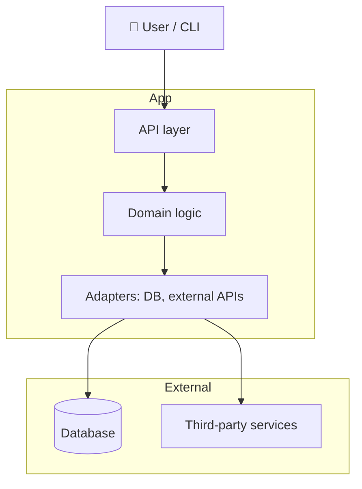

# Architecture Intent

- **Version**: 0.1.0
- **Last reviewed**: YYYY-MM-DD
- **Owner**: <your-name>

> **Why this matters**: This document is the human narrative of how the
> codebase is *supposed* to fit together. It's paired with
> `.audit-loop/domain-map.json` which is the machine-enforced contract
> (rules + `allowedDeps`). When code violates a boundary the audit
> pipeline flags it. Keep this doc and the JSON aligned manually — the
> framework does NOT auto-sync them.

---

## C4 Container View

---

## Domains

(One short paragraph per domain. Match domain names exactly to
`.audit-loop/domain-map.json` rules.)

### `<domain-1>`
Brief: what this domain owns and why it exists.

### `<domain-2>`
Brief: what this domain owns.

---

## Cross-cutting concerns

(Things that touch multiple domains and need conscious thought when
modifying.)

- **Logging / observability**: how it's wired across all domains.
- **Authentication**: where it lives and which domains it gates.
- **Configuration / secrets**: how env vars flow through layers.

---

## Boundary rationale

For each entry in `allowedDeps`, briefly explain *why* the boundary
exists in this direction.

- `<domain-from>` → `<domain-to>`: <why this is allowed>
- `<domain-from>` ⛔ `<domain-to>`: <why this is forbidden> (optional —
  helps reviewers understand the intent)

---

## Onboarding next steps (delete this section once filled in)

1. Replace the C4 diagram above with one for your repo (~7-15 nodes).
2. Fill in the Domains section: one paragraph per `rules[].domain`.
3. Run `node scripts/arch-intent-bootstrap.mjs --baseline-from-graph` to
   seed `allowedDeps` from the current import graph. Review the output
   and narrow over time.
4. Commit both this doc and the updated `.audit-loop/domain-map.json`.
