<!-- audit-loop:architectural-map -->
# Architecture Map — Lbstrydom/claude-engineering-skills

- Generated: 2026-07-14T16:30:17.068Z   commit: 5a5f2ac24965   refresh_id: c61d247a-43f2-4cf9-a972-64eb2477e21e
- Drift score: 43 / threshold 20   status: `RED`
- Domains: 23   Symbols: 3052   Layering violations: 0

## Contents
- [arch-memory](#arch-memory) — 54 symbols
- [audit-orchestration](#audit-orchestration) — 230 symbols
- [brainstorm](#brainstorm) — 66 symbols
- [claude-hooks](#claude-hooks) — 9 symbols
- [claudemd-management](#claudemd-management) — 30 symbols
- [cross-skill-bridge](#cross-skill-bridge) — 82 symbols
- [dashboard](#dashboard) — 121 symbols
- [explain](#explain) — 10 symbols
- [findings](#findings) — 22 symbols
- [install](#install) — 137 symbols
- [learning-store](#learning-store) — 31 symbols
- [memory-health](#memory-health) — 10 symbols
- [nav-audit](#nav-audit) — 126 symbols
- [persona-test](#persona-test) — 71 symbols
- [plan](#plan) — 8 symbols
- [root-scripts](#root-scripts) — 13 symbols
- [scripts](#scripts) — 284 symbols
- [shared-lib](#shared-lib) — 921 symbols
- [stores](#stores) — 208 symbols
- [tech-debt](#tech-debt) — 71 symbols
- [tests](#tests) — 391 symbols
- [ux-lock](#ux-lock) — 35 symbols
- [visual-audit](#visual-audit) — 122 symbols

---

## arch-memory

> Maps files to architectural domains via glob-pattern rules and detects stale duplication pragmas and broken cross-file references. Provides the core tagging infrastructure for the symbol-index pipeline used in dependency analysis and architectural-drift detection.

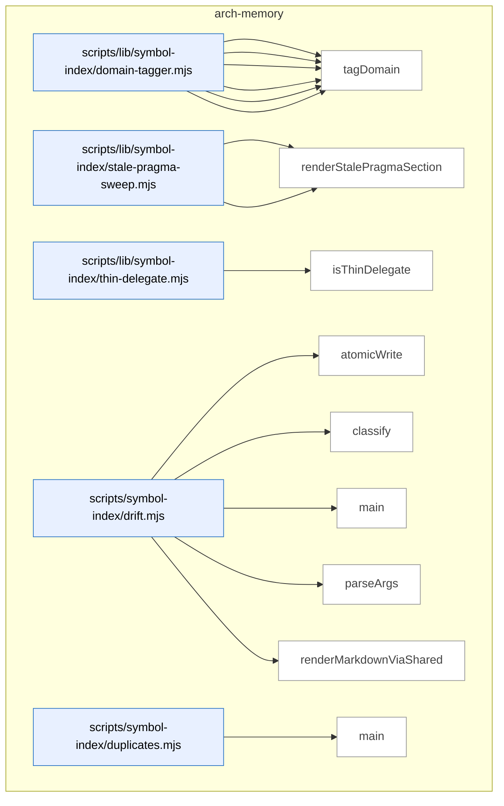

_Domain has 54 symbols (>50). Diagram shows top-15 by file order; see flat table below for the full list._

### Symbols in this domain

| Symbol | Kind | Path | Lines | Purpose | File imported by |
|---|---|---|---|---|---|
| [`computeTargetDomains`](../scripts/lib/symbol-index/domain-tagger.mjs#L150) | function | `scripts/lib/symbol-index/domain-tagger.mjs` | 150-165 | Tags target file paths against domain rules, returning tagged domains, untagged paths, and cross-domain flag. | `scripts/cross-skill.mjs`, `scripts/lib/audit/legacy-production-audit.mjs`, `scripts/lib/dashboard/collect-purposes.mjs`, +6 more |
| [`globToRegexBody`](../scripts/lib/symbol-index/domain-tagger.mjs#L51) | function | `scripts/lib/symbol-index/domain-tagger.mjs` | 51-80 | Converts a glob pattern to unanchored regex body, handling `**` (any chars/slashes), `*` (no slashes), and literal escaping. | `scripts/cross-skill.mjs`, `scripts/lib/audit/legacy-production-audit.mjs`, `scripts/lib/dashboard/collect-purposes.mjs`, +6 more |
| [`loadDomainRules`](../scripts/lib/symbol-index/domain-tagger.mjs#L181) | function | `scripts/lib/symbol-index/domain-tagger.mjs` | 181-208 | Reads and validates domain-map.json, returning an array of pattern→domain rules with error logging. | `scripts/cross-skill.mjs`, `scripts/lib/audit/legacy-production-audit.mjs`, `scripts/lib/dashboard/collect-purposes.mjs`, +6 more |
| [`makeFastTagger`](../scripts/lib/symbol-index/domain-tagger.mjs#L111) | function | `scripts/lib/symbol-index/domain-tagger.mjs` | 111-132 | Compiles domain rules into pre-built regex list for repeated fast path-to-domain lookups. | `scripts/cross-skill.mjs`, `scripts/lib/audit/legacy-production-audit.mjs`, `scripts/lib/dashboard/collect-purposes.mjs`, +6 more |
| [`matchGlob`](../scripts/lib/symbol-index/domain-tagger.mjs#L38) | function | `scripts/lib/symbol-index/domain-tagger.mjs` | 38-49 | Tests a file path against a glob pattern using anchored regex, supporting `**` and `*` wildcards. | `scripts/cross-skill.mjs`, `scripts/lib/audit/legacy-production-audit.mjs`, `scripts/lib/dashboard/collect-purposes.mjs`, +6 more |
| [`tagDomain`](../scripts/lib/symbol-index/domain-tagger.mjs#L89) | function | `scripts/lib/symbol-index/domain-tagger.mjs` | 89-96 | Matches a file path against domain rules and returns the first matching domain tag or null. | `scripts/cross-skill.mjs`, `scripts/lib/audit/legacy-production-audit.mjs`, `scripts/lib/dashboard/collect-purposes.mjs`, +6 more |
| [`findStalePragmas`](../scripts/lib/symbol-index/stale-pragma-sweep.mjs#L49) | function | `scripts/lib/symbol-index/stale-pragma-sweep.mjs` | 49-80 | Scans source code for duplicate-justification pragmas targeting non-existent files | `scripts/symbol-index/drift.mjs` |
| [`renderStalePragmaSection`](../scripts/lib/symbol-index/stale-pragma-sweep.mjs#L83) | function | `scripts/lib/symbol-index/stale-pragma-sweep.mjs` | 83-90 | Formats stale pragmas into markdown for display | `scripts/symbol-index/drift.mjs` |
| [`isThinDelegate`](../scripts/lib/symbol-index/thin-delegate.mjs#L50) | function | `scripts/lib/symbol-index/thin-delegate.mjs` | 50-85 | Detects whether a function body is a trivial pass-through (member access or brief call) after normalizing whitespace. | `scripts/symbol-index/extract.mjs` |
| [`atomicWrite`](../scripts/symbol-index/drift.mjs#L43) | function | `scripts/symbol-index/drift.mjs` | 43-49 | Atomically writes content to a file using a temporary file and rename for crash safety. | _(internal)_ |
| [`classify`](../scripts/symbol-index/drift.mjs#L51) | function | `scripts/symbol-index/drift.mjs` | 51-55 | Assigns a status (GREEN/AMBER/RED) to a drift score based on thresholds. | _(internal)_ |
| [`main`](../scripts/symbol-index/drift.mjs#L76) | function | `scripts/symbol-index/drift.mjs` | 76-147 | Computes and reports symbol-index drift, classifies status, and renders a markdown issue. | _(internal)_ |
| [`parseArgs`](../scripts/symbol-index/drift.mjs#L34) | function | `scripts/symbol-index/drift.mjs` | 34-41 | Parses `--out` and `--json` command-line flags. | _(internal)_ |
| [`renderMarkdownViaShared`](../scripts/symbol-index/drift.mjs#L61) | function | `scripts/symbol-index/drift.mjs` | 61-74 | Renders a drift report as markdown using shared issue-rendering logic. | _(internal)_ |
| [`main`](../scripts/symbol-index/duplicates.mjs#L65) | function | `scripts/symbol-index/duplicates.mjs` | 65-101 | Queries and reports cross-file exact-duplicate symbol clusters. | _(internal)_ |
| [`parseArgs`](../scripts/symbol-index/duplicates.mjs#L31) | function | `scripts/symbol-index/duplicates.mjs` | 31-46 | Parses `--limit` and `--json` flags for duplicate cluster display. | _(internal)_ |
| [`renderText`](../scripts/symbol-index/duplicates.mjs#L48) | function | `scripts/symbol-index/duplicates.mjs` | 48-63 | Formats duplicate symbol clusters as human-readable text. | _(internal)_ |
| [`embedBatch`](../scripts/symbol-index/embed.mjs#L26) | function | `scripts/symbol-index/embed.mjs` | 26-69 | Embeds a batch of texts using Azure or Gemini with retry and rate-limit backoff. | _(internal)_ |
| [`logProgress`](../scripts/symbol-index/embed.mjs#L19) | function | `scripts/symbol-index/embed.mjs` | 19-19 | Writes a progress message to stderr with `[embed]` prefix. | _(internal)_ |
| [`main`](../scripts/symbol-index/embed.mjs#L71) | function | `scripts/symbol-index/embed.mjs` | 71-119 | Reads symbols from stdin, embeds them in batches, and emits results with metadata. | _(internal)_ |
| [`emitProgress`](../scripts/symbol-index/extract.mjs#L61) | function | `scripts/symbol-index/extract.mjs` | 61-63 | Writes a progress message to stderr with `[extract]` prefix. | _(internal)_ |
| [`enumerateFiles`](../scripts/symbol-index/extract.mjs#L388) | function | `scripts/symbol-index/extract.mjs` | 388-406 | Collects files to scan for symbols, from an optional whitelist or by walking the repository. | _(internal)_ |
| [`extractGraphAndViolations`](../scripts/symbol-index/extract.mjs#L263) | function | `scripts/symbol-index/extract.mjs` | 263-329 | Extracts the import dependency graph and architectural violations using dep-cruiser. | _(internal)_ |
| [`extractSymbols`](../scripts/symbol-index/extract.mjs#L73) | function | `scripts/symbol-index/extract.mjs` | 73-256 | Extracts function/class/type symbol definitions from source files using AST parsing with ts-morph. | _(internal)_ |
| [`isInternalEdge`](../scripts/symbol-index/extract.mjs#L343) | function | `scripts/symbol-index/extract.mjs` | 343-359 | Checks if a dependency is internal (not a core/npm/node_modules module). | _(internal)_ |
| [`main`](../scripts/symbol-index/extract.mjs#L408) | function | `scripts/symbol-index/extract.mjs` | 408-420 | Extracts symbols and violations from discovered files, reporting aggregate counts. | _(internal)_ |
| [`parseArgs`](../scripts/symbol-index/extract.mjs#L39) | function | `scripts/symbol-index/extract.mjs` | 39-58 | Parses command-line arguments for root directory, file list, mode, and git options. | _(internal)_ |
| [`main`](../scripts/symbol-index/prune.mjs#L44) | function | `scripts/symbol-index/prune.mjs` | 44-94 | Prunes old refresh runs by retention class (aborted, transient, checkpoint, rollback). | _(internal)_ |
| [`parseArgs`](../scripts/symbol-index/prune.mjs#L31) | function | `scripts/symbol-index/prune.mjs` | 31-37 | Parses `--dry-run` flag. | _(internal)_ |
| [`logErr`](../scripts/symbol-index/refresh.mjs#L83) | function | `scripts/symbol-index/refresh.mjs` | 83-83 | Writes error message to stderr with [refresh] prefix. | _(internal)_ |
| [`logOk`](../scripts/symbol-index/refresh.mjs#L84) | function | `scripts/symbol-index/refresh.mjs` | 84-84 | Writes status message to stderr with [refresh] prefix. | _(internal)_ |
| [`main`](../scripts/symbol-index/refresh.mjs#L121) | function | `scripts/symbol-index/refresh.mjs` | 121-478 | Orchestrates full symbol-index refresh: extract, embed, summarize, store in Supabase. | _(internal)_ |
| [`parseArgs`](../scripts/symbol-index/refresh.mjs#L71) | function | `scripts/symbol-index/refresh.mjs` | 71-81 | Parses `--full`, `--since-commit`, `--force`, `--include-delegates` flags. | _(internal)_ |
| [`runWithHeartbeat`](../scripts/symbol-index/refresh.mjs#L112) | function | `scripts/symbol-index/refresh.mjs` | 112-119 | Wraps async operation with periodic heartbeat to keep refresh run alive. | _(internal)_ |
| [`sibling`](../scripts/symbol-index/refresh.mjs#L69) | function | `scripts/symbol-index/refresh.mjs` | 69-69 | Resolves sibling file path relative to current module directory. | _(internal)_ |
| [`throwVcsError`](../scripts/symbol-index/refresh.mjs#L95) | function | `scripts/symbol-index/refresh.mjs` | 95-102 | Throws structured error from VCS operation failure. | _(internal)_ |
| [`classify`](../scripts/symbol-index/render-mermaid.mjs#L58) | function | `scripts/symbol-index/render-mermaid.mjs` | 58-62 | Classifies drift score as GREEN, AMBER, or RED by threshold. | _(internal)_ |
| [`cleanupStaleObservedDeps`](../scripts/symbol-index/render-mermaid.mjs#L70) | function | `scripts/symbol-index/render-mermaid.mjs` | 70-80 | Deletes stale observed-deps file from prior incomplete render. | _(internal)_ |
| [`commitSha`](../scripts/symbol-index/render-mermaid.mjs#L53) | function | `scripts/symbol-index/render-mermaid.mjs` | 53-56 | Returns first 12 characters of current git commit SHA. | _(internal)_ |
| [`main`](../scripts/symbol-index/render-mermaid.mjs#L108) | function | `scripts/symbol-index/render-mermaid.mjs` | 108-291 | Generates architecture-map markdown from cloud snapshot with Mermaid diagram. | _(internal)_ |
| [`parseArgs`](../scripts/symbol-index/render-mermaid.mjs#L45) | function | `scripts/symbol-index/render-mermaid.mjs` | 45-51 | Parses `--out` flag for architecture-map output path. | _(internal)_ |
| [`writeAbortStub`](../scripts/symbol-index/render-mermaid.mjs#L89) | function | `scripts/symbol-index/render-mermaid.mjs` | 89-106 | Writes minimal architecture-map stub when render aborts early. | _(internal)_ |
| [`cacheHit`](../scripts/symbol-index/summarise-domains.mjs#L59) | function | `scripts/symbol-index/summarise-domains.mjs` | 59-66 | Determines if cached domain summary is still valid. | `scripts/symbol-index/render-mermaid.mjs` |
| [`callHaiku`](../scripts/symbol-index/summarise-domains.mjs#L68) | function | `scripts/symbol-index/summarise-domains.mjs` | 68-99 | Invokes Claude (Azure or public API) to generate domain summary. | `scripts/symbol-index/render-mermaid.mjs` |
| [`computeCompositionHash`](../scripts/symbol-index/summarise-domains.mjs#L46) | function | `scripts/symbol-index/summarise-domains.mjs` | 46-51 | Hashes symbol IDs and signatures to detect composition changes. | `scripts/symbol-index/render-mermaid.mjs` |
| [`main`](../scripts/symbol-index/summarise-domains.mjs#L232) | function | `scripts/symbol-index/summarise-domains.mjs` | 232-264 | Generates domain summaries and stores in cloud Supabase. | `scripts/symbol-index/render-mermaid.mjs` |
| [`PROMPT_TEMPLATE`](../scripts/symbol-index/summarise-domains.mjs#L39) | function | `scripts/symbol-index/summarise-domains.mjs` | 39-43 | Formats prompt requesting one-or-two-sentence domain description. | `scripts/symbol-index/render-mermaid.mjs` |
| [`runWithConcurrency`](../scripts/symbol-index/summarise-domains.mjs#L219) | function | `scripts/symbol-index/summarise-domains.mjs` | 219-229 | Runs async operations with bounded concurrency pool. | `scripts/symbol-index/render-mermaid.mjs` |
| [`summariseDomains`](../scripts/symbol-index/summarise-domains.mjs#L113) | function | `scripts/symbol-index/summarise-domains.mjs` | 113-207 | Generates or retrieves summaries for all domain symbols in snapshot. | `scripts/symbol-index/render-mermaid.mjs` |
| [`symbolCountDeltaOk`](../scripts/symbol-index/summarise-domains.mjs#L53) | function | `scripts/symbol-index/summarise-domains.mjs` | 53-57 | Checks if symbol count changed less than 20% from prior version. | `scripts/symbol-index/render-mermaid.mjs` |
| [`validateSummary`](../scripts/symbol-index/summarise-domains.mjs#L101) | function | `scripts/symbol-index/summarise-domains.mjs` | 101-107 | Validates domain summary is string with 20-400 characters. | `scripts/symbol-index/render-mermaid.mjs` |
| [`logProgress`](../scripts/symbol-index/summarise.mjs#L29) | function | `scripts/symbol-index/summarise.mjs` | 29-29 | Writes progress message to stderr with [summarise] prefix. | _(internal)_ |
| [`main`](../scripts/symbol-index/summarise.mjs#L76) | function | `scripts/symbol-index/summarise.mjs` | 76-119 | Streams symbols through Claude summarization pipeline via JSON-lines. | _(internal)_ |
| [`summariseBatch`](../scripts/symbol-index/summarise.mjs#L35) | function | `scripts/symbol-index/summarise.mjs` | 35-74 | Batch-summarizes symbols using Claude API with Azure or public routing. | _(internal)_ |

---

## audit-orchestration

> Orchestrates multi-round code audits combining GPT multi-pass analysis with mandatory Gemini final review, tracks convergence across audit rounds, and manages cleanup of temporary preimage directories and stale audit artifacts.

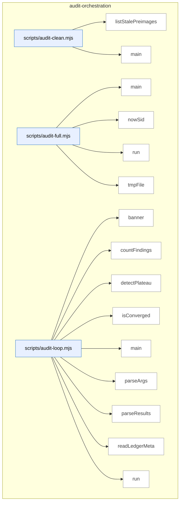

_Domain has 230 symbols (>50). Diagram shows top-15 by file order; see flat table below for the full list._

### Symbols in this domain

| Symbol | Kind | Path | Lines | Purpose | File imported by |
|---|---|---|---|---|---|
| [`listStalePreimages`](../scripts/audit-clean.mjs#L39) | function | `scripts/audit-clean.mjs` | 39-53 | Identifies orphaned preimage worktree directories older than a configured cutoff age. | _(internal)_ |
| [`main`](../scripts/audit-clean.mjs#L82) | function | `scripts/audit-clean.mjs` | 82-133 | Removes stale audit artifacts and orphaned preimage directories older than a configurable age. | _(internal)_ |
| [`main`](../scripts/audit-full.mjs#L44) | function | `scripts/audit-full.mjs` | 44-127 | Orchestrates a fused pipeline combining GPT audit with mandatory Gemini final review. | _(internal)_ |
| [`nowSid`](../scripts/audit-full.mjs#L31) | function | `scripts/audit-full.mjs` | 31-33 | Generates a timestamped session ID with an optional prefix. | _(internal)_ |
| [`run`](../scripts/audit-full.mjs#L39) | function | `scripts/audit-full.mjs` | 39-42 | Spawns a child process synchronously and returns its exit code and signal. | _(internal)_ |
| [`tmpFile`](../scripts/audit-full.mjs#L35) | function | `scripts/audit-full.mjs` | 35-37 | Returns a temporary file path in the system temp directory. | _(internal)_ |
| [`banner`](../scripts/audit-loop.mjs#L27) | function | `scripts/audit-loop.mjs` | 27-30 | Prints a centered banner message with decorative lines. | _(internal)_ |
| [`countFindings`](../scripts/audit-loop.mjs#L71) | function | `scripts/audit-loop.mjs` | 71-78 | Counts audit findings by severity level, with failure-state tracking. | _(internal)_ |
| [`detectPlateau`](../scripts/audit-loop.mjs#L93) | function | `scripts/audit-loop.mjs` | 93-109 | Detects whether finding count has plateaued across multiple rounds (<30% decrease twice). | _(internal)_ |
| [`isConverged`](../scripts/audit-loop.mjs#L80) | function | `scripts/audit-loop.mjs` | 80-84 | Determines whether audit has converged (zero HIGH, ≤2 MEDIUM findings). | _(internal)_ |
| [`main`](../scripts/audit-loop.mjs#L169) | function | `scripts/audit-loop.mjs` | 169-534 | Orchestrates multi-round audit with convergence detection, ledger persistence, and optional Gemini final review. | _(internal)_ |
| [`parseArgs`](../scripts/audit-loop.mjs#L129) | function | `scripts/audit-loop.mjs` | 129-165 | Parses command-line arguments for the audit-loop orchestrator. | _(internal)_ |
| [`parseResults`](../scripts/audit-loop.mjs#L62) | function | `scripts/audit-loop.mjs` | 62-69 | Parses audit results from a JSON file with graceful fallback to null on error. | _(internal)_ |
| [`readLedgerMeta`](../scripts/audit-loop.mjs#L119) | function | `scripts/audit-loop.mjs` | 119-127 | Extracts metadata from the adjudication ledger file with graceful fallback to empty object. | _(internal)_ |
| [`run`](../scripts/audit-loop.mjs#L32) | function | `scripts/audit-loop.mjs` | 32-45 | Executes a command synchronously with timeout and error handling. | _(internal)_ |
| [`runAudit`](../scripts/audit-loop.mjs#L47) | function | `scripts/audit-loop.mjs` | 47-60 | Invokes the openai-audit.mjs script and captures its output and exit status. | _(internal)_ |
| [`computeLocalMetrics`](../scripts/audit-metrics.mjs#L87) | function | `scripts/audit-metrics.mjs` | 87-103 | Computes local audit metrics from the outcomes ledger with pass-level aggregation. | `scripts/lib/dashboard/collect-telemetry.mjs` |
| [`displayMetrics`](../scripts/audit-metrics.mjs#L107) | function | `scripts/audit-metrics.mjs` | 107-176 | Formats and prints audit-loop metrics (runs, pass effectiveness, finding breakdown) to stdout. | `scripts/lib/dashboard/collect-telemetry.mjs` |
| [`fetchCloudMetrics`](../scripts/audit-metrics.mjs#L52) | function | `scripts/audit-metrics.mjs` | 52-80 | Queries Postgres for audit-loop metrics across runs, pass stats, and findings from the last N days. | `scripts/lib/dashboard/collect-telemetry.mjs` |
| [`main`](../scripts/audit-metrics.mjs#L180) | function | `scripts/audit-metrics.mjs` | 180-197 | Displays audit-loop metrics from cloud or local sources in human or JSON format. | `scripts/lib/dashboard/collect-telemetry.mjs` |
| [`_collectMaxLengths`](../scripts/gemini-review.mjs#L121) | function | `scripts/gemini-review.mjs` | 121-139 | Recursively extracts maxLength constraints from a Zod schema and maps them by field path. | _(internal)_ |
| [`addSemanticIds`](../scripts/gemini-review.mjs#L1563) | function | `scripts/gemini-review.mjs` | 1563-1571 | Adds semantic IDs, hashes, and source provider to findings, numbering them per provider. | _(internal)_ |
| [`applyDebtSuppression`](../scripts/gemini-review.mjs#L1496) | function | `scripts/gemini-review.mjs` | 1496-1531 | Filters findings by fuzzy-matching against pre-filtered debt topics to suppress likely false re-raises. | _(internal)_ |
| [`applyProviderSetting`](../scripts/gemini-review.mjs#L1371) | function | `scripts/gemini-review.mjs` | 1371-1389 | Updates or removes the FINAL_REVIEW_PROVIDER line in a .env file. | _(internal)_ |
| [`applyScopeFilter`](../scripts/gemini-review.mjs#L1533) | function | `scripts/gemini-review.mjs` | 1533-1561 | Filters findings to only those citing files in the changed set. | _(internal)_ |
| [`assertAzureClaudeReady`](../scripts/gemini-review.mjs#L1422) | function | `scripts/gemini-review.mjs` | 1422-1433 | Validates that AZURE_AI_ENDPOINT and AZURE_FOUNDRY_CLAUDE_DEPLOYMENT are set when using Azure-Claude provider. | _(internal)_ |
| [`buildClient`](../scripts/gemini-review.mjs#L1435) | function | `scripts/gemini-review.mjs` | 1435-1449 | Constructs an API client for the selected final-review provider (Gemini, Claude Opus, or Azure Claude). | _(internal)_ |
| [`buildShadowClient`](../scripts/gemini-review.mjs#L967) | function | `scripts/gemini-review.mjs` | 967-978 | Constructs an API client (Gemini, Anthropic, or Azure) for the shadow reviewer. | _(internal)_ |
| [`callAzureClaude`](../scripts/gemini-review.mjs#L589) | function | `scripts/gemini-review.mjs` | 589-659 | Calls Claude via Azure Foundry (supporting both native Anthropic and OpenAI API shapes). | _(internal)_ |
| [`callClaudeOpus`](../scripts/gemini-review.mjs#L500) | function | `scripts/gemini-review.mjs` | 500-578 | Calls Claude Opus with streaming and timeout guard as the fallback final reviewer. | _(internal)_ |
| [`callGemini`](../scripts/gemini-review.mjs#L353) | function | `scripts/gemini-review.mjs` | 353-450 | Calls Gemini 3.1 Pro via streaming with a JSON schema, handling timeouts and truncation. | _(internal)_ |
| [`dedupByHash`](../scripts/gemini-review.mjs#L1070) | function | `scripts/gemini-review.mjs` | 1070-1078 | Deduplicates findings by semantic hash, keeping the first occurrence of each hash. | _(internal)_ |
| [`diffFindingBuckets`](../scripts/gemini-review.mjs#L1085) | function | `scripts/gemini-review.mjs` | 1085-1101 | Compares primary and shadow findings, categorizing each as 'both', 'primary-only', or 'shadow-only'. | _(internal)_ |
| [`emitReviewOutput`](../scripts/gemini-review.mjs#L1573) | function | `scripts/gemini-review.mjs` | 1573-1588 | Outputs review results as JSON or formatted markdown depending on CLI flags and file arguments. | _(internal)_ |
| [`formatReviewResult`](../scripts/gemini-review.mjs#L835) | function | `scripts/gemini-review.mjs` | 835-898 | Formats review result as human-readable markdown with verdict, deliberation quality, and findings sections. | _(internal)_ |
| [`getReviewPrompt`](../scripts/gemini-review.mjs#L333) | function | `scripts/gemini-review.mjs` | 333-336 | Returns the Gemini review system prompt with optional role addendum. | _(internal)_ |
| [`isJsonTruncationError`](../scripts/gemini-review.mjs#L1451) | function | `scripts/gemini-review.mjs` | 1451-1455 | Detects whether an error message indicates JSON truncation. | _(internal)_ |
| [`main`](../scripts/gemini-review.mjs#L1715) | function | `scripts/gemini-review.mjs` | 1715-1786 | Parses CLI arguments (review/ping/set-provider) and dispatches to the appropriate gemini-review handler. | _(internal)_ |
| [`mapRouteToShadowProvider`](../scripts/gemini-review.mjs#L1009) | function | `scripts/gemini-review.mjs` | 1009-1013 | Maps a model-eval candidate route's transport layer to a shadow provider canonical name. | _(internal)_ |
| [`parseReviewArgs`](../scripts/gemini-review.mjs#L1273) | function | `scripts/gemini-review.mjs` | 1273-1292 | Extracts plan/transcript file paths, output format, provider override, audit mode, and other flags from command-line arguments. | _(internal)_ |
| [`recordGeminiOutcomes`](../scripts/gemini-review.mjs#L1635) | function | `scripts/gemini-review.mjs` | 1635-1657 | Records all Gemini outcomes (new findings and wrongly dismissed) to the learning store and updates bandit rewards. | _(internal)_ |
| [`recordNewFindings`](../scripts/gemini-review.mjs#L1590) | function | `scripts/gemini-review.mjs` | 1590-1609 | Records newly discovered findings to the outcomes ledger for learning-store tracking. | _(internal)_ |
| [`recordWronglyDismissed`](../scripts/gemini-review.mjs#L1611) | function | `scripts/gemini-review.mjs` | 1611-1633 | Records wrongly dismissed findings to the outcomes ledger. | _(internal)_ |
| [`refreshCatalogAndWarn`](../scripts/gemini-review.mjs#L1214) | function | `scripts/gemini-review.mjs` | 1214-1235 | Refreshes the model catalog and upgrades Gemini and Claude Opus models to newer versions if available. | _(internal)_ |
| [`resolveModelEvalShadowOverride`](../scripts/gemini-review.mjs#L1015) | function | `scripts/gemini-review.mjs` | 1015-1044 | Checks for an active model-eval adjudicator run and returns its override config if eligible. | _(internal)_ |
| [`resolveProviderSetting`](../scripts/gemini-review.mjs#L1354) | function | `scripts/gemini-review.mjs` | 1354-1357 | Reads the FINAL_REVIEW_PROVIDER environment variable setting from .env. | _(internal)_ |
| [`resolveShadow`](../scripts/gemini-review.mjs#L931) | function | `scripts/gemini-review.mjs` | 931-957 | Resolves the shadow reviewer configuration from env and returns its provider, model, and readiness state. | _(internal)_ |
| [`runAdjudicatorOnlyReview`](../scripts/gemini-review.mjs#L1487) | function | `scripts/gemini-review.mjs` | 1487-1494 | Runs final review with the adjudicator-only role addendum (Phase 12 restricted scope). | _(internal)_ |
| [`runFinalReview`](../scripts/gemini-review.mjs#L672) | function | `scripts/gemini-review.mjs` | 672-831 | Orchestrates the complete final review: reads code context, calls the reviewer, applies debt/scope filters, and returns the verdict. | _(internal)_ |
| [`runFixtureReview`](../scripts/gemini-review.mjs#L1672) | function | `scripts/gemini-review.mjs` | 1672-1713 | Returns a canned Gemini final-review response for testing, optionally simulating reversed or missed-candidate verdicts. | _(internal)_ |
| [`runPing`](../scripts/gemini-review.mjs#L1266) | function | `scripts/gemini-review.mjs` | 1266-1271 | Pings both Gemini and Claude APIs to verify they are available and working. | _(internal)_ |
| [`runPingClaude`](../scripts/gemini-review.mjs#L1249) | function | `scripts/gemini-review.mjs` | 1249-1264 | Tests Claude API connectivity by sending a small request and checking the response. | _(internal)_ |
| [`runPingGemini`](../scripts/gemini-review.mjs#L1237) | function | `scripts/gemini-review.mjs` | 1237-1247 | Tests Gemini API connectivity by sending a small request and checking the response. | _(internal)_ |
| [`runReviewWithRetry`](../scripts/gemini-review.mjs#L1457) | function | `scripts/gemini-review.mjs` | 1457-1474 | Runs final review with one automatic retry on JSON truncation, adding a conciseness hint on retry. | _(internal)_ |
| [`runSetProvider`](../scripts/gemini-review.mjs#L1396) | function | `scripts/gemini-review.mjs` | 1396-1416 | CLI command that persistently sets the FINAL_REVIEW_PROVIDER in .env or clears it to enable auto-detection. | _(internal)_ |
| [`runShadowAndPersist`](../scripts/gemini-review.mjs#L1124) | function | `scripts/gemini-review.mjs` | 1124-1208 | Runs the shadow reviewer (with model-eval override support) and persists its findings to the primary result. | _(internal)_ |
| [`runShadowReview`](../scripts/gemini-review.mjs#L1051) | function | `scripts/gemini-review.mjs` | 1051-1061 | Runs the shadow reviewer on the same inputs and returns deduplicated findings with semantic IDs. | _(internal)_ |
| [`selectProvider`](../scripts/gemini-review.mjs#L1314) | function | `scripts/gemini-review.mjs` | 1314-1351 | Selects the final-review provider (gemini, claude-opus, or azure-claude) with explicit flag override and auto-detection fallback. | _(internal)_ |
| [`shadowModelMatchesFamily`](../scripts/gemini-review.mjs#L917) | function | `scripts/gemini-review.mjs` | 917-922 | Checks whether a resolved model ID belongs to a target family (gemini or claude). | _(internal)_ |
| [`shadowSkipBlock`](../scripts/gemini-review.mjs#L1104) | function | `scripts/gemini-review.mjs` | 1104-1109 | Returns a skipped-state block indicating why the shadow reviewer did not run. | _(internal)_ |
| [`streamAnthropicMessage`](../scripts/gemini-review.mjs#L480) | function | `scripts/gemini-review.mjs` | 480-498 | Streams a Claude message and accumulates text and usage metadata. | _(internal)_ |
| [`truncateToSchema`](../scripts/gemini-review.mjs#L153) | function | `scripts/gemini-review.mjs` | 153-173 | Truncates object strings to their schema-defined maxLength limits, tracking which fields were truncated. | _(internal)_ |
| [`createEnvelope`](../scripts/lib/audit/candidate-envelope.mjs#L49) | function | `scripts/lib/audit/candidate-envelope.mjs` | 49-84 | Wraps a finding in an evidence envelope, capturing full claim provenance and source model. | `scripts/lib/audit/evidence-triage.mjs`, `scripts/lib/audit/tiered-pipeline.mjs` |
| [`flattenEnvelopeToFinding`](../scripts/lib/audit/candidate-envelope.mjs#L234) | function | `scripts/lib/audit/candidate-envelope.mjs` | 234-254 | Converts an envelope back to a flat finding, merging alternative evidence into detail. | `scripts/lib/audit/evidence-triage.mjs`, `scripts/lib/audit/tiered-pipeline.mjs` |
| [`mergeIntoEnvelopes`](../scripts/lib/audit/candidate-envelope.mjs#L119) | function | `scripts/lib/audit/candidate-envelope.mjs` | 119-180 | Consolidates findings into deduped envelopes by fingerprint, accumulating evidence alternatives. | `scripts/lib/audit/evidence-triage.mjs`, `scripts/lib/audit/tiered-pipeline.mjs` |
| [`promoteAlternative`](../scripts/lib/audit/candidate-envelope.mjs#L256) | function | `scripts/lib/audit/candidate-envelope.mjs` | 256-293 | Elevates an alternative evidence entry to canonical status while demoting the old one. | `scripts/lib/audit/evidence-triage.mjs`, `scripts/lib/audit/tiered-pipeline.mjs` |
| [`severityRank`](../scripts/lib/audit/candidate-envelope.mjs#L91) | function | `scripts/lib/audit/candidate-envelope.mjs` | 91-93 | Maps a severity level to a numeric rank for comparison. | `scripts/lib/audit/evidence-triage.mjs`, `scripts/lib/audit/tiered-pipeline.mjs` |
| [`evaluateConvergence`](../scripts/lib/audit/convergence.mjs#L21) | function | `scripts/lib/audit/convergence.mjs` | 21-25 | Checks if audit findings (high/medium/quickFix) meet convergence thresholds. | `scripts/lib/audit/legacy-production-audit.mjs` |
| [`computeCostReport`](../scripts/lib/audit/cost-budget.mjs#L58) | function | `scripts/lib/audit/cost-budget.mjs` | 58-88 | Summarizes audit cost and effort, computing cost and time per accepted HIGH finding. | `scripts/lib/audit/tiered-pipeline.mjs` |
| [`loadReviewEffortEvents`](../scripts/lib/audit/cost-budget.mjs#L136) | function | `scripts/lib/audit/cost-budget.mjs` | 136-144 | Reads and validates review effort events from a JSONL file, skipping malformed entries. | `scripts/lib/audit/tiered-pipeline.mjs` |
| [`loadUsageEvents`](../scripts/lib/audit/cost-budget.mjs#L118) | function | `scripts/lib/audit/cost-budget.mjs` | 118-133 | Reads and validates usage events from a JSONL file, skipping malformed entries. | `scripts/lib/audit/tiered-pipeline.mjs` |
| [`openReviewEffortStore`](../scripts/lib/audit/cost-budget.mjs#L96) | function | `scripts/lib/audit/cost-budget.mjs` | 96-98 | Creates an append-only store for review effort events. | `scripts/lib/audit/tiered-pipeline.mjs` |
| [`openUsageEventStore`](../scripts/lib/audit/cost-budget.mjs#L91) | function | `scripts/lib/audit/cost-budget.mjs` | 91-93 | Creates an append-only store for audit usage events. | `scripts/lib/audit/tiered-pipeline.mjs` |
| [`recordReviewEffort`](../scripts/lib/audit/cost-budget.mjs#L106) | function | `scripts/lib/audit/cost-budget.mjs` | 106-108 | Appends a review effort event to the effort store. | `scripts/lib/audit/tiered-pipeline.mjs` |
| [`recordUsageEvent`](../scripts/lib/audit/cost-budget.mjs#L101) | function | `scripts/lib/audit/cost-budget.mjs` | 101-103 | Appends a usage event to the usage event store. | `scripts/lib/audit/tiered-pipeline.mjs` |
| [`classifyDeferralEvidence`](../scripts/lib/audit/deferral-classifier.mjs#L162) | function | `scripts/lib/audit/deferral-classifier.mjs` | 162-295 | Determines if a finding can be auto-deferred based on class allowlist and deterministic SCM evidence (plan markers, changed files, prior rulings). | `scripts/lib/audit/findings-pipeline.mjs` |
| [`globMatch`](../scripts/lib/audit/deferral-classifier.mjs#L98) | function | `scripts/lib/audit/deferral-classifier.mjs` | 98-115 | Tests whether a file path matches a shell glob pattern, handling `**` for multi-level directories. | `scripts/lib/audit/findings-pipeline.mjs` |
| [`parseAcceptV1Markers`](../scripts/lib/audit/deferral-classifier.mjs#L77) | function | `scripts/lib/audit/deferral-classifier.mjs` | 77-87 | Extracts file-glob and reason pairs from audit-plan accept-v1 HTML comments. | `scripts/lib/audit/findings-pipeline.mjs` |
| [`cleanupTempRoot`](../scripts/lib/audit/diff-scope-resolver.mjs#L255) | function | `scripts/lib/audit/diff-scope-resolver.mjs` | 255-265 | Removes a temporary git worktree directory using `git worktree remove`, with filesystem fallback. | `scripts/audit-clean.mjs`, `scripts/lib/audit/legacy-production-audit.mjs`, `scripts/openai-audit.mjs` |
| [`computeEntryPoints`](../scripts/lib/audit/diff-scope-resolver.mjs#L354) | function | `scripts/lib/audit/diff-scope-resolver.mjs` | 354-423 | Discovers entry points from package.json exports and tsconfig.json, adding source equivalents for compiled output files. | `scripts/audit-clean.mjs`, `scripts/lib/audit/legacy-production-audit.mjs`, `scripts/openai-audit.mjs` |
| [`cruiseTempRoot`](../scripts/lib/audit/diff-scope-resolver.mjs#L277) | function | `scripts/lib/audit/diff-scope-resolver.mjs` | 277-339 | Runs dep-cruiser on materialized preimage files to extract their import dependencies, resolving paths back to temp-tree-relative. | `scripts/audit-clean.mjs`, `scripts/lib/audit/legacy-production-audit.mjs`, `scripts/openai-audit.mjs` |
| [`gitBuf`](../scripts/lib/audit/diff-scope-resolver.mjs#L73) | function | `scripts/lib/audit/diff-scope-resolver.mjs` | 73-85 | Executes a git command and returns its buffer output, logging stderr on failure. | `scripts/audit-clean.mjs`, `scripts/lib/audit/legacy-production-audit.mjs`, `scripts/openai-audit.mjs` |
| [`materialisePreimages`](../scripts/lib/audit/diff-scope-resolver.mjs#L214) | function | `scripts/lib/audit/diff-scope-resolver.mjs` | 214-253 | Creates a temporary git worktree at a base commit and materializes eligible source files for diff analysis. | `scripts/audit-clean.mjs`, `scripts/lib/audit/legacy-production-audit.mjs`, `scripts/openai-audit.mjs` |
| [`parseLsTreeZ`](../scripts/lib/audit/diff-scope-resolver.mjs#L153) | function | `scripts/lib/audit/diff-scope-resolver.mjs` | 153-156 | Parses `git ls-tree -z` output into a Set of file paths. | `scripts/audit-clean.mjs`, `scripts/lib/audit/legacy-production-audit.mjs`, `scripts/openai-audit.mjs` |
| [`parseNameStatusZ`](../scripts/lib/audit/diff-scope-resolver.mjs#L100) | function | `scripts/lib/audit/diff-scope-resolver.mjs` | 100-145 | Parses `git diff --name-status -z` output into records with variable-width status/path tuples, handling renames and copies. | `scripts/audit-clean.mjs`, `scripts/lib/audit/legacy-production-audit.mjs`, `scripts/openai-audit.mjs` |
| [`resolveDiffScope`](../scripts/lib/audit/diff-scope-resolver.mjs#L440) | function | `scripts/lib/audit/diff-scope-resolver.mjs` | 440-541 | Builds complete diff scope with changed files, pre-edges from base commit, entry points, and materialized preimages. | `scripts/audit-clean.mjs`, `scripts/lib/audit/legacy-production-audit.mjs`, `scripts/openai-audit.mjs` |
| [`stripLeadingDotSlash`](../scripts/lib/audit/diff-scope-resolver.mjs#L27) | function | `scripts/lib/audit/diff-scope-resolver.mjs` | 27-29 | Removes leading `./` from a string path if present. | `scripts/audit-clean.mjs`, `scripts/lib/audit/legacy-production-audit.mjs`, `scripts/openai-audit.mjs` |
| [`sweepStaleOrphanPreimages`](../scripts/lib/audit/diff-scope-resolver.mjs#L188) | function | `scripts/lib/audit/diff-scope-resolver.mjs` | 188-212 | Removes stale git worktrees (older than maxAgeMs) that were created for orphan preimage analysis. | `scripts/audit-clean.mjs`, `scripts/lib/audit/legacy-production-audit.mjs`, `scripts/openai-audit.mjs` |
| [`walkEntryPointDir`](../scripts/lib/audit/diff-scope-resolver.mjs#L49) | function | `scripts/lib/audit/diff-scope-resolver.mjs` | 49-63 | Discovers source files in a directory by walking its entries and filtering by extension. | `scripts/audit-clean.mjs`, `scripts/lib/audit/legacy-production-audit.mjs`, `scripts/openai-audit.mjs` |
| [`runDiscoveryPortfolio`](../scripts/lib/audit/discovery-portfolio.mjs#L98) | function | `scripts/lib/audit/discovery-portfolio.mjs` | 98-135 | Runs required generators (GLM, Sonnet) and optional GPT based on trigger decisions, returning combined findings. | `scripts/lib/audit/tiered-pipeline.mjs` |
| [`runOneGenerator`](../scripts/lib/audit/discovery-portfolio.mjs#L54) | function | `scripts/lib/audit/discovery-portfolio.mjs` | 54-78 | Executes a single finding generator, logging outcome (success with count or failure with error details). | `scripts/lib/audit/tiered-pipeline.mjs` |
| [`defaultAdapters`](../scripts/lib/audit/duplication-detector.mjs#L71) | function | `scripts/lib/audit/duplication-detector.mjs` | 71-103 | Returns default implementations for symbol extraction, git operations, embeddings, and neighborhood queries | `scripts/lib/audit/legacy-production-audit.mjs` |
| [`extractViaSubprocess`](../scripts/lib/audit/duplication-detector.mjs#L111) | function | `scripts/lib/audit/duplication-detector.mjs` | 111-123 | Extracts symbols from files by running a subprocess with a manifest | `scripts/lib/audit/legacy-production-audit.mjs` |
| [`findPragmaAbove`](../scripts/lib/audit/duplication-detector.mjs#L143) | function | `scripts/lib/audit/duplication-detector.mjs` | 143-151 | Searches lines above a declaration for a duplicate-justification pragma comment | `scripts/lib/audit/legacy-production-audit.mjs` |
| [`isEligibleChange`](../scripts/lib/audit/duplication-detector.mjs#L153) | function | `scripts/lib/audit/duplication-detector.mjs` | 153-158 | Checks if a file change is eligible for duplication analysis (not deleted, not excluded) | `scripts/lib/audit/legacy-production-audit.mjs` |
| [`log`](../scripts/lib/audit/duplication-detector.mjs#L68) | function | `scripts/lib/audit/duplication-detector.mjs` | 68-68 | Writes progress messages to stderr | `scripts/lib/audit/legacy-production-audit.mjs` |
| [`runDuplicationAnalysis`](../scripts/lib/audit/duplication-detector.mjs#L168) | function | `scripts/lib/audit/duplication-detector.mjs` | 168-334 | Orchestrates the full duplication detection pipeline including snapshot and file extraction | `scripts/lib/audit/legacy-production-audit.mjs` |
| [`symKey`](../scripts/lib/audit/duplication-detector.mjs#L133) | function | `scripts/lib/audit/duplication-detector.mjs` | 133-135 | Creates a unique string key combining file path, symbol name, and kind | `scripts/lib/audit/legacy-production-audit.mjs` |
| [`writeTempSource`](../scripts/lib/audit/duplication-detector.mjs#L126) | function | `scripts/lib/audit/duplication-detector.mjs` | 126-130 | Writes source code to a temporary file at a given relative path | `scripts/lib/audit/legacy-production-audit.mjs` |
| [`_resetDuplicationIdCounter`](../scripts/lib/audit/duplication-report.mjs#L47) | function | `scripts/lib/audit/duplication-report.mjs` | 47-47 | Resets the counter for generating duplication finding IDs | `scripts/lib/audit/duplication-detector.mjs`, `scripts/lib/audit/legacy-production-audit.mjs` |
| [`buildDetectorFailedFinding`](../scripts/lib/audit/duplication-report.mjs#L216) | function | `scripts/lib/audit/duplication-report.mjs` | 216-231 | Creates a finding when the duplication detector itself fails | `scripts/lib/audit/duplication-detector.mjs`, `scripts/lib/audit/legacy-production-audit.mjs` |
| [`buildDuplicationFinding`](../scripts/lib/audit/duplication-report.mjs#L193) | function | `scripts/lib/audit/duplication-report.mjs` | 193-213 | Constructs an audit finding object for a near-duplicate symbol | `scripts/lib/audit/duplication-detector.mjs`, `scripts/lib/audit/legacy-production-audit.mjs` |
| [`deriveFindingsFromDuplicationReport`](../scripts/lib/audit/duplication-report.mjs#L189) | function | `scripts/lib/audit/duplication-report.mjs` | 189-191 | Converts semantic candidates directly to findings without bouncer involvement | `scripts/lib/audit/duplication-detector.mjs`, `scripts/lib/audit/legacy-production-audit.mjs` |
| [`finalizeDeterministicFindings`](../scripts/lib/audit/duplication-report.mjs#L234) | function | `scripts/lib/audit/duplication-report.mjs` | 234-256 | Converts orphaned-pragma records into audit findings | `scripts/lib/audit/duplication-detector.mjs`, `scripts/lib/audit/legacy-production-audit.mjs` |
| [`formatCandidatesForPrompt`](../scripts/lib/audit/duplication-report.mjs#L113) | function | `scripts/lib/audit/duplication-report.mjs` | 113-147 | Formats duplication candidates into markdown for the LLM bouncer, filtering sensitive paths | `scripts/lib/audit/duplication-detector.mjs`, `scripts/lib/audit/legacy-production-audit.mjs` |
| [`isDuplicationQueryExcluded`](../scripts/lib/audit/duplication-report.mjs#L36) | function | `scripts/lib/audit/duplication-report.mjs` | 36-38 | Checks if a file path matches duplication query exclusion patterns | `scripts/lib/audit/duplication-detector.mjs`, `scripts/lib/audit/legacy-production-audit.mjs` |
| [`isDuplicationReportClean`](../scripts/lib/audit/duplication-report.mjs#L41) | function | `scripts/lib/audit/duplication-report.mjs` | 41-43 | Checks if a duplication report contains no findings | `scripts/lib/audit/duplication-detector.mjs`, `scripts/lib/audit/legacy-production-audit.mjs` |
| [`mapBouncerDecisionsToFindings`](../scripts/lib/audit/duplication-report.mjs#L166) | function | `scripts/lib/audit/duplication-report.mjs` | 166-186 | Validates and maps LLM bouncer decisions to duplication findings | `scripts/lib/audit/duplication-detector.mjs`, `scripts/lib/audit/legacy-production-audit.mjs` |
| [`nextId`](../scripts/lib/audit/duplication-report.mjs#L48) | function | `scripts/lib/audit/duplication-report.mjs` | 48-48 | Generates the next sequential duplication finding ID | `scripts/lib/audit/duplication-detector.mjs`, `scripts/lib/audit/legacy-production-audit.mjs` |
| [`readExcerpt`](../scripts/lib/audit/duplication-report.mjs#L75) | function | `scripts/lib/audit/duplication-report.mjs` | 75-93 | Reads a code excerpt for a symbol with padding, checking egress safety | `scripts/lib/audit/duplication-detector.mjs`, `scripts/lib/audit/legacy-production-audit.mjs` |
| [`extractFileDiffSection`](../scripts/lib/audit/evidence-triage.mjs#L37) | function | `scripts/lib/audit/evidence-triage.mjs` | 37-67 | Extracts a single file's diff section from unified diff text, handling quoted paths and CRLF line endings. | `scripts/lib/audit/tiered-pipeline.mjs` |
| [`normalizeWhitespace`](../scripts/lib/audit/evidence-triage.mjs#L24) | function | `scripts/lib/audit/evidence-triage.mjs` | 24-26 | Collapses multiple whitespace into single spaces and trims. | `scripts/lib/audit/tiered-pipeline.mjs` |
| [`nowIso`](../scripts/lib/audit/evidence-triage.mjs#L200) | function | `scripts/lib/audit/evidence-triage.mjs` | 200-202 | Returns current ISO timestamp or delegates to a provided clock function. | `scripts/lib/audit/tiered-pipeline.mjs` |
| [`quoteAppearsOnSide`](../scripts/lib/audit/evidence-triage.mjs#L102) | function | `scripts/lib/audit/evidence-triage.mjs` | 102-125 | Tests whether a normalized quote string appears in diff content on specified side (head/base). | `scripts/lib/audit/tiered-pipeline.mjs` |
| [`runStage0EvidenceTriage`](../scripts/lib/audit/evidence-triage.mjs#L255) | function | `scripts/lib/audit/evidence-triage.mjs` | 255-286 | Triages all evidence envelopes against diff, marking each as verified/unverifiable/rejected and logging stage decisions. | `scripts/lib/audit/tiered-pipeline.mjs` |
| [`splitIntoHunks`](../scripts/lib/audit/evidence-triage.mjs#L73) | function | `scripts/lib/audit/evidence-triage.mjs` | 73-87 | Splits a diff section into individual hunks separated by `@@` headers. | `scripts/lib/audit/tiered-pipeline.mjs` |
| [`tagPreExisting`](../scripts/lib/audit/evidence-triage.mjs#L184) | function | `scripts/lib/audit/evidence-triage.mjs` | 184-190 | Marks a finding as pre-existing and independent if blame and impact adapters both confirm the properties. | `scripts/lib/audit/tiered-pipeline.mjs` |
| [`verifyAnchor`](../scripts/lib/audit/evidence-triage.mjs#L150) | function | `scripts/lib/audit/evidence-triage.mjs` | 150-161 | Validates evidence anchor against actual diff, classifying as verified/fabricated/unverifiable based on metadata and content match. | `scripts/lib/audit/tiered-pipeline.mjs` |
| [`verifyWithFallback`](../scripts/lib/audit/evidence-triage.mjs#L215) | function | `scripts/lib/audit/evidence-triage.mjs` | 215-230 | Attempts to verify an evidence anchor, promoting alternatives if primary fails, then classifying outcome. | `scripts/lib/audit/tiered-pipeline.mjs` |
| [`anchorFileCandidates`](../scripts/lib/audit/final-adjudication.mjs#L333) | function | `scripts/lib/audit/final-adjudication.mjs` | 333-336 | Extracts newFile and oldFile from an evidence anchor. | `scripts/lib/audit/legacy-production-audit.mjs`, `scripts/lib/audit/tiered-pipeline.mjs` |
| [`buildAlternativeEvidenceLines`](../scripts/lib/audit/final-adjudication.mjs#L378) | function | `scripts/lib/audit/final-adjudication.mjs` | 378-387 | Formats alternative evidence items as markdown bullet points, filtering out sensitive-path alternatives. | `scripts/lib/audit/legacy-production-audit.mjs`, `scripts/lib/audit/tiered-pipeline.mjs` |
| [`buildFindingDetail`](../scripts/lib/audit/final-adjudication.mjs#L390) | function | `scripts/lib/audit/final-adjudication.mjs` | 390-394 | Combines canonical finding detail with alternative evidence lines if present. | `scripts/lib/audit/legacy-production-audit.mjs`, `scripts/lib/audit/tiered-pipeline.mjs` |
| [`createGeminiReviewSubprocessAdapters`](../scripts/lib/audit/final-adjudication.mjs#L498) | function | `scripts/lib/audit/final-adjudication.mjs` | 498-588 | Builds adapter functions for Stage 2 adjudication via Gemini subprocess, checking sensitive-path egress before invocation. | `scripts/lib/audit/legacy-production-audit.mjs`, `scripts/lib/audit/tiered-pipeline.mjs` |
| [`defaultGeminiReviewScriptPath`](../scripts/lib/audit/final-adjudication.mjs#L63) | function | `scripts/lib/audit/final-adjudication.mjs` | 63-65 | Returns the module-relative path to gemini-review.mjs for subprocess invocation. | `scripts/lib/audit/legacy-production-audit.mjs`, `scripts/lib/audit/tiered-pipeline.mjs` |
| [`envelopeReferencedFiles`](../scripts/lib/audit/final-adjudication.mjs#L345) | function | `scripts/lib/audit/final-adjudication.mjs` | 345-348 | Collects all file paths from an envelope's canonical and trigger anchors. | `scripts/lib/audit/legacy-production-audit.mjs`, `scripts/lib/audit/tiered-pipeline.mjs` |
| [`interpretVerdict`](../scripts/lib/audit/final-adjudication.mjs#L184) | function | `scripts/lib/audit/final-adjudication.mjs` | 184-213 | Maps Gemini review verdict to stage2 adjudication outcome (reversed/confirmed/verified), checking whether candidate was prior dismissed. | `scripts/lib/audit/legacy-production-audit.mjs`, `scripts/lib/audit/tiered-pipeline.mjs` |
| [`invokeGeminiReviewSubprocess`](../scripts/lib/audit/final-adjudication.mjs#L425) | function | `scripts/lib/audit/final-adjudication.mjs` | 425-468 | Spawns gemini-review.mjs as subprocess to review a single finding envelope, returning parsed result JSON. | `scripts/lib/audit/legacy-production-audit.mjs`, `scripts/lib/audit/tiered-pipeline.mjs` |
| [`isPathSensitive`](../scripts/lib/audit/final-adjudication.mjs#L357) | function | `scripts/lib/audit/final-adjudication.mjs` | 357-364 | Classifies a file path as sensitive using the sensitive-paths resolver, fail-closed on resolution errors. | `scripts/lib/audit/legacy-production-audit.mjs`, `scripts/lib/audit/tiered-pipeline.mjs` |
| [`nowIso`](../scripts/lib/audit/final-adjudication.mjs#L67) | function | `scripts/lib/audit/final-adjudication.mjs` | 67-69 | <no body> | `scripts/lib/audit/legacy-production-audit.mjs`, `scripts/lib/audit/tiered-pipeline.mjs` |
| [`primaryFile`](../scripts/lib/audit/final-adjudication.mjs#L397) | function | `scripts/lib/audit/final-adjudication.mjs` | 397-402 | Extracts the most relevant file path from a finding's section, anchor, and triggerAnchor fields. | `scripts/lib/audit/legacy-production-audit.mjs`, `scripts/lib/audit/tiered-pipeline.mjs` |
| [`runFinalAdjudication`](../scripts/lib/audit/final-adjudication.mjs#L233) | function | `scripts/lib/audit/final-adjudication.mjs` | 233-324 | Reviews escalated and sampled findings via Gemini subprocess, routing outcomes to reversed/confirmed/verified/unresolved/pending-security queues. | `scripts/lib/audit/legacy-production-audit.mjs`, `scripts/lib/audit/tiered-pipeline.mjs` |
| [`selectAdjudicationSample`](../scripts/lib/audit/final-adjudication.mjs#L87) | function | `scripts/lib/audit/final-adjudication.mjs` | 87-115 | Selects mandatory escalated findings, tail candidates by sample rate, and clean region files using seeded shuffle. | `scripts/lib/audit/legacy-production-audit.mjs`, `scripts/lib/audit/tiered-pipeline.mjs` |
| [`selectFinalAdjudicationWorkItems`](../scripts/lib/audit/final-adjudication.mjs#L154) | function | `scripts/lib/audit/final-adjudication.mjs` | 154-169 | Caps adjudication sample by budget limits and groups work items into mandatory/tail/clean/human-queue buckets. | `scripts/lib/audit/legacy-production-audit.mjs`, `scripts/lib/audit/tiered-pipeline.mjs` |
| [`classifyFinding`](../scripts/lib/audit/finding-verification.mjs#L70) | function | `scripts/lib/audit/finding-verification.mjs` | 70-73 | Tests whether a finding contains signals of an existence claim (e.g., "no such file" or "missing export"). | `scripts/lib/audit/legacy-production-audit.mjs`, `scripts/openai-audit.mjs` |
| [`extractCitedEntity`](../scripts/lib/audit/finding-verification.mjs#L103) | function | `scripts/lib/audit/finding-verification.mjs` | 103-122 | Extracts a single unambiguous cited entity (file, symbol, or external module) from a finding's detail/section. | `scripts/lib/audit/legacy-production-audit.mjs`, `scripts/openai-audit.mjs` |
| [`mk`](../scripts/lib/audit/finding-verification.mjs#L124) | function | `scripts/lib/audit/finding-verification.mjs` | 124-132 | Constructs a verification result object with outcome, reason, cited entity, and verdict severity. | `scripts/lib/audit/legacy-production-audit.mjs`, `scripts/openai-audit.mjs` |
| [`tokenKind`](../scripts/lib/audit/finding-verification.mjs#L84) | function | `scripts/lib/audit/finding-verification.mjs` | 84-90 | Classifies a cited token as file/external/symbol based on syntax patterns and surrounding context. | `scripts/lib/audit/legacy-production-audit.mjs`, `scripts/openai-audit.mjs` |
| [`verifyExistenceFindings`](../scripts/lib/audit/finding-verification.mjs#L149) | function | `scripts/lib/audit/finding-verification.mjs` | 149-215 | Adjudicates existence claims (file/symbol/external) against repo inventory, returning verified/requires-verification classification. | `scripts/lib/audit/legacy-production-audit.mjs`, `scripts/openai-audit.mjs` |
| [`applyAcceptV1Suppression`](../scripts/lib/audit/findings-pipeline.mjs#L191) | function | `scripts/lib/audit/findings-pipeline.mjs` | 191-214 | Drops orphan-introduced findings matching plan accept-v1 glob markers, passing through other finding kinds. | `scripts/lib/audit/legacy-production-audit.mjs`, `scripts/lib/audit/orphan-metrics.mjs`, `scripts/lib/audit/tiered-pipeline.mjs`, +1 more |
| [`applyLedgerSuppression`](../scripts/lib/audit/findings-pipeline.mjs#L74) | function | `scripts/lib/audit/findings-pipeline.mjs` | 74-103 | Drops findings whose fingerprints match ledger-dismissed entries, separating kept and dropped results. | `scripts/lib/audit/legacy-production-audit.mjs`, `scripts/lib/audit/orphan-metrics.mjs`, `scripts/lib/audit/tiered-pipeline.mjs`, +1 more |
| [`applyStage1MechanicalEarlyFilter`](../scripts/lib/audit/findings-pipeline.mjs#L128) | function | `scripts/lib/audit/findings-pipeline.mjs` | 128-177 | Fast-path suppression of stage1-mechanical dismissed findings that don't conflict with changed files or regressed state. | `scripts/lib/audit/legacy-production-audit.mjs`, `scripts/lib/audit/orphan-metrics.mjs`, `scripts/lib/audit/tiered-pipeline.mjs`, +1 more |
| [`computeAuditVerdict`](../scripts/lib/audit/findings-pipeline.mjs#L261) | function | `scripts/lib/audit/findings-pipeline.mjs` | 261-270 | Assigns overall audit verdict (PASS/NEEDS_FIXES/SIGNIFICANT_ISSUES/INCOMPLETE) based on HIGH/MEDIUM counts and completeness. | `scripts/lib/audit/legacy-production-audit.mjs`, `scripts/lib/audit/orphan-metrics.mjs`, `scripts/lib/audit/tiered-pipeline.mjs`, +1 more |
| [`findingFingerprint`](../scripts/lib/audit/findings-pipeline.mjs#L34) | function | `scripts/lib/audit/findings-pipeline.mjs` | 34-59 | Computes stable SHA256-based fingerprint for a finding, special-casing orphan-introduced by caller list. | `scripts/lib/audit/legacy-production-audit.mjs`, `scripts/lib/audit/orphan-metrics.mjs`, `scripts/lib/audit/tiered-pipeline.mjs`, +1 more |
| [`processFindings`](../scripts/lib/audit/findings-pipeline.mjs#L272) | function | `scripts/lib/audit/findings-pipeline.mjs` | 272-298 | Applies fingerprinting then a three-layer suppression pipeline (ledger, stage1-early, accept-v1), returning survivors and dropped items. | `scripts/lib/audit/legacy-production-audit.mjs`, `scripts/lib/audit/orphan-metrics.mjs`, `scripts/lib/audit/tiered-pipeline.mjs`, +1 more |
| [`globMatch`](../scripts/lib/audit/glob-match.mjs#L28) | function | `scripts/lib/audit/glob-match.mjs` | 28-38 | Tests whether a file path matches a glob pattern, supporting `**`, `*`, and literal characters. | `scripts/lib/audit/findings-pipeline.mjs`, `scripts/lib/efficacy-lints.mjs` |
| [`escapeRegex`](../scripts/lib/audit/gpt-sentinel-trigger.mjs#L42) | function | `scripts/lib/audit/gpt-sentinel-trigger.mjs` | 42-44 | Escapes all regex metacharacters in a string for literal matching. | `scripts/lib/audit/tiered-pipeline.mjs` |
| [`isExplorationSample`](../scripts/lib/audit/gpt-sentinel-trigger.mjs#L154) | function | `scripts/lib/audit/gpt-sentinel-trigger.mjs` | 154-160 | Checks if a commit is probabilistically selected for exploration sampling. | `scripts/lib/audit/tiered-pipeline.mjs` |
| [`keywordRegex`](../scripts/lib/audit/gpt-sentinel-trigger.mjs#L58) | function | `scripts/lib/audit/gpt-sentinel-trigger.mjs` | 58-66 | Builds or retrieves a cached regex pattern for keyword matching with optional stem wildcard support. | `scripts/lib/audit/tiered-pipeline.mjs` |
| [`matchKeywordGroups`](../scripts/lib/audit/gpt-sentinel-trigger.mjs#L71) | function | `scripts/lib/audit/gpt-sentinel-trigger.mjs` | 71-78 | Tests text against keyword groups and returns matching group names. | `scripts/lib/audit/tiered-pipeline.mjs` |
| [`resolveGptTrigger`](../scripts/lib/audit/gpt-sentinel-trigger.mjs#L176) | function | `scripts/lib/audit/gpt-sentinel-trigger.mjs` | 176-191 | Combines deterministic triggers, exploration, and bandit decisions to resolve GPT execution. | `scripts/lib/audit/tiered-pipeline.mjs` |
| [`shouldFireSentinel`](../scripts/lib/audit/gpt-sentinel-trigger.mjs#L132) | function | `scripts/lib/audit/gpt-sentinel-trigger.mjs` | 132-138 | Uses Thompson Sampling bandit to decide if the GPT sentinel triggers. | `scripts/lib/audit/tiered-pipeline.mjs` |
| [`shouldTriggerGpt`](../scripts/lib/audit/gpt-sentinel-trigger.mjs#L104) | function | `scripts/lib/audit/gpt-sentinel-trigger.mjs` | 104-111 | Determines if GPT should fire based on diff size threshold, keywords, or portfolio disagreement. | `scripts/lib/audit/tiered-pipeline.mjs` |
| [`buildAuditRunContext`](../scripts/lib/audit/legacy-production-audit.mjs#L3009) | function | `scripts/lib/audit/legacy-production-audit.mjs` | 3009-3093 | Parses CLI arguments and wires up providers, config, and optional tiered pipeline for audit execution. | `scripts/lib/audit/tiered-pipeline.mjs`, `scripts/openai-audit.mjs` |
| [`cachePassResult`](../scripts/lib/audit/legacy-production-audit.mjs#L243) | function | `scripts/lib/audit/legacy-production-audit.mjs` | 243-254 | Atomically writes a single pass result to cache file. | `scripts/lib/audit/tiered-pipeline.mjs`, `scripts/openai-audit.mjs` |
| [`cacheWaveResults`](../scripts/lib/audit/legacy-production-audit.mjs#L256) | function | `scripts/lib/audit/legacy-production-audit.mjs` | 256-261 | Writes all pass results for a wave to cache files and logs summary. | `scripts/lib/audit/tiered-pipeline.mjs`, `scripts/openai-audit.mjs` |
| [`cleanupCache`](../scripts/lib/audit/legacy-production-audit.mjs#L263) | function | `scripts/lib/audit/legacy-production-audit.mjs` | 263-266 | Deletes temporary audit cache directory (fail-safe). | `scripts/lib/audit/tiered-pipeline.mjs`, `scripts/openai-audit.mjs` |
| [`decideSeed`](../scripts/lib/audit/legacy-production-audit.mjs#L369) | function | `scripts/lib/audit/legacy-production-audit.mjs` | 369-414 | Selects the smallest audit unit to warm OpenAI's prefix cache if economical. | `scripts/lib/audit/tiered-pipeline.mjs`, `scripts/openai-audit.mjs` |
| [`deriveFindingsFromReport`](../scripts/lib/audit/legacy-production-audit.mjs#L988) | function | `scripts/lib/audit/legacy-production-audit.mjs` | 988-1058 | Transforms raw architecture violations into standardized Finding objects with schema validation. | `scripts/lib/audit/tiered-pipeline.mjs`, `scripts/openai-audit.mjs` |
| [`formatViolationsForPrompt`](../scripts/lib/audit/legacy-production-audit.mjs#L920) | function | `scripts/lib/audit/legacy-production-audit.mjs` | 920-969 | Formats architecture violations into a markdown block for LLM review. | `scripts/lib/audit/tiered-pipeline.mjs`, `scripts/openai-audit.mjs` |
| [`initResultCache`](../scripts/lib/audit/legacy-production-audit.mjs#L233) | function | `scripts/lib/audit/legacy-production-audit.mjs` | 233-241 | Creates temporary cache directory for audit pass results. | `scripts/lib/audit/tiered-pipeline.mjs`, `scripts/openai-audit.mjs` |
| [`normalizeFindingsForOutput`](../scripts/lib/audit/legacy-production-audit.mjs#L270) | function | `scripts/lib/audit/legacy-production-audit.mjs` | 270-272 | Wrapper that normalizes findings and passes them through semantic ID deduplication. | `scripts/lib/audit/tiered-pipeline.mjs`, `scripts/openai-audit.mjs` |
| [`orphanToStandardFinding`](../scripts/lib/audit/legacy-production-audit.mjs#L793) | function | `scripts/lib/audit/legacy-production-audit.mjs` | 793-815 | Converts raw orphan findings to standard Finding schema with risk/recommendation boilerplate. | `scripts/lib/audit/tiered-pipeline.mjs`, `scripts/openai-audit.mjs` |
| [`runArchitecturePass`](../scripts/lib/audit/legacy-production-audit.mjs#L648) | function | `scripts/lib/audit/legacy-production-audit.mjs` | 648-783 | Validates code against declared architecture boundaries by loading intent config and comparing violations. | `scripts/lib/audit/tiered-pipeline.mjs`, `scripts/openai-audit.mjs` |
| [`runLegacyProductionAudit`](../scripts/lib/audit/legacy-production-audit.mjs#L1088) | function | `scripts/lib/audit/legacy-production-audit.mjs` | 1088-2973 | Main audit orchestrator that runs all passes, manages ledgers, coordinates models, and produces final results. | `scripts/lib/audit/tiered-pipeline.mjs`, `scripts/openai-audit.mjs` |
| [`runMapReducePass`](../scripts/lib/audit/legacy-production-audit.mjs#L448) | function | `scripts/lib/audit/legacy-production-audit.mjs` | 448-630 | Orchestrates parallel map-reduce audit across file units with concurrency control and optional cache seeding. | `scripts/lib/audit/tiered-pipeline.mjs`, `scripts/openai-audit.mjs` |
| [`runOneMapUnit`](../scripts/lib/audit/legacy-production-audit.mjs#L419) | function | `scripts/lib/audit/legacy-production-audit.mjs` | 419-446 | Runs one audit unit through GPT with slot management and proper resource cleanup. | `scripts/lib/audit/tiered-pipeline.mjs`, `scripts/openai-audit.mjs` |
| [`runOrphanIntroducedPass`](../scripts/lib/audit/legacy-production-audit.mjs#L834) | function | `scripts/lib/audit/legacy-production-audit.mjs` | 834-913 | Detects newly orphaned code by comparing the current call graph against the diff. | `scripts/lib/audit/tiered-pipeline.mjs`, `scripts/openai-audit.mjs` |
| [`shouldMapReduce`](../scripts/lib/audit/legacy-production-audit.mjs#L174) | function | `scripts/lib/audit/legacy-production-audit.mjs` | 174-178 | Decides whether to use map-reduce based on file count or total character size. | `scripts/lib/audit/tiered-pipeline.mjs`, `scripts/openai-audit.mjs` |
| [`shouldMapReduceHighReasoning`](../scripts/lib/audit/legacy-production-audit.mjs#L185) | function | `scripts/lib/audit/legacy-production-audit.mjs` | 185-189 | Decides whether to use map-reduce for high-reasoning audit based on file count/size. | `scripts/lib/audit/tiered-pipeline.mjs`, `scripts/openai-audit.mjs` |
| [`throwIfConfigError`](../scripts/lib/audit/legacy-production-audit.mjs#L352) | function | `scripts/lib/audit/legacy-production-audit.mjs` | 352-358 | Throws an LLM config error immediately if one appears in a settled promise. | `scripts/lib/audit/tiered-pipeline.mjs`, `scripts/openai-audit.mjs` |
| [`validateLedgerForR2`](../scripts/lib/audit/legacy-production-audit.mjs#L292) | function | `scripts/lib/audit/legacy-production-audit.mjs` | 292-324 | Validates a ledger file's existence and schema, returning status and valid entries for R2+ suppression. | `scripts/lib/audit/tiered-pipeline.mjs`, `scripts/openai-audit.mjs` |
| [`_callGPTOnce`](../scripts/lib/audit/llm-helpers.mjs#L232) | function | `scripts/lib/audit/llm-helpers.mjs` | 232-338 | Makes a single GPT call with timeout, reasoning effort, schema parsing, and structured output. | `scripts/lib/audit/legacy-production-audit.mjs`, `scripts/lib/audit/tiered-pipeline.mjs`, `scripts/openai-audit.mjs` |
| [`buildCachePrompt`](../scripts/lib/audit/llm-helpers.mjs#L95) | function | `scripts/lib/audit/llm-helpers.mjs` | 95-112 | Combines project context, plan, and R2+ rulings into a multi-message prompt optimized for caching. | `scripts/lib/audit/legacy-production-audit.mjs`, `scripts/lib/audit/tiered-pipeline.mjs`, `scripts/openai-audit.mjs` |
| [`callGPT`](../scripts/lib/audit/llm-helpers.mjs#L344) | function | `scripts/lib/audit/llm-helpers.mjs` | 344-385 | Wraps _callGPTOnce with exponential-backoff retry logic and cumulative usage tracking. | `scripts/lib/audit/legacy-production-audit.mjs`, `scripts/lib/audit/tiered-pipeline.mjs`, `scripts/openai-audit.mjs` |
| [`getPassPrompt`](../scripts/lib/audit/llm-helpers.mjs#L68) | function | `scripts/lib/audit/llm-helpers.mjs` | 68-72 | Retrieves a pass's registered prompt or falls back to defaults. | `scripts/lib/audit/legacy-production-audit.mjs`, `scripts/lib/audit/tiered-pipeline.mjs`, `scripts/openai-audit.mjs` |
| [`normalisePromptInput`](../scripts/lib/audit/llm-helpers.mjs#L131) | function | `scripts/lib/audit/llm-helpers.mjs` | 131-162 | Validates and converts prompt input to a standardized [{role, content}] message array. | `scripts/lib/audit/legacy-production-audit.mjs`, `scripts/lib/audit/tiered-pipeline.mjs`, `scripts/openai-audit.mjs` |
| [`parseStructured`](../scripts/lib/audit/llm-helpers.mjs#L182) | function | `scripts/lib/audit/llm-helpers.mjs` | 182-222 | Calls OpenAI Responses API, falling back to chat.completions with zodResponseFormat. | `scripts/lib/audit/legacy-production-audit.mjs`, `scripts/lib/audit/tiered-pipeline.mjs`, `scripts/openai-audit.mjs` |
| [`safeCallGPT`](../scripts/lib/audit/llm-helpers.mjs#L396) | function | `scripts/lib/audit/llm-helpers.mjs` | 396-413 | Graceful degradation wrapper that catches errors and returns empty findings instead of crashing. | `scripts/lib/audit/legacy-production-audit.mjs`, `scripts/lib/audit/tiered-pipeline.mjs`, `scripts/openai-audit.mjs` |
| [`setModel`](../scripts/lib/audit/llm-helpers.mjs#L56) | function | `scripts/lib/audit/llm-helpers.mjs` | 56-58 | Sets the active audit model ID. | `scripts/lib/audit/legacy-production-audit.mjs`, `scripts/lib/audit/tiered-pipeline.mjs`, `scripts/openai-audit.mjs` |
| [`wireModel`](../scripts/lib/audit/llm-helpers.mjs#L167) | function | `scripts/lib/audit/llm-helpers.mjs` | 167-169 | Returns the deployment-specific model name (Azure or standard OpenAI). | `scripts/lib/audit/legacy-production-audit.mjs`, `scripts/lib/audit/tiered-pipeline.mjs`, `scripts/openai-audit.mjs` |
| [`detectOrphansIntroduced`](../scripts/lib/audit/orphan-introduced.mjs#L42) | function | `scripts/lib/audit/orphan-introduced.mjs` | 42-167 | Finds files that became orphaned (unreachable) after diff changes by diffing call graphs. | `scripts/lib/audit/legacy-production-audit.mjs`, `scripts/openai-audit.mjs` |
| [`isTestFile`](../scripts/lib/audit/orphan-introduced.mjs#L174) | function | `scripts/lib/audit/orphan-introduced.mjs` | 174-184 | Checks if a path matches test file name/directory patterns. | `scripts/lib/audit/legacy-production-audit.mjs`, `scripts/openai-audit.mjs` |
| [`appendOrphanMetric`](../scripts/lib/audit/orphan-metrics.mjs#L59) | function | `scripts/lib/audit/orphan-metrics.mjs` | 59-80 | Appends an orphan metric record with file locking to prevent concurrent write corruption. | `scripts/lib/audit/legacy-production-audit.mjs`, `scripts/openai-audit.mjs` |
| [`emitOrphanRunMetrics`](../scripts/lib/audit/orphan-metrics.mjs#L102) | function | `scripts/lib/audit/orphan-metrics.mjs` | 102-169 | Writes orphan detection run summary and per-finding suppression metadata with locking. | `scripts/lib/audit/legacy-production-audit.mjs`, `scripts/openai-audit.mjs` |
| [`ensureMetricsFile`](../scripts/lib/audit/orphan-metrics.mjs#L33) | function | `scripts/lib/audit/orphan-metrics.mjs` | 33-49 | Creates or ensures an orphan metrics tracking file exists atomically. | `scripts/lib/audit/legacy-production-audit.mjs`, `scripts/openai-audit.mjs` |
| [`completePlanAuditRun`](../scripts/lib/audit/plan-audit-cloud.mjs#L96) | function | `scripts/lib/audit/plan-audit-cloud.mjs` | 96-121 | Persists plan audit findings and completion stats to the cloud store. | `scripts/openai-audit.mjs` |
| [`gitAnchor`](../scripts/lib/audit/plan-audit-cloud.mjs#L33) | function | `scripts/lib/audit/plan-audit-cloud.mjs` | 33-41 | Retrieves current git commit SHA and branch name, returning nulls if not a git repo. | `scripts/openai-audit.mjs` |
| [`registerPlanAuditRun`](../scripts/lib/audit/plan-audit-cloud.mjs#L52) | function | `scripts/lib/audit/plan-audit-cloud.mjs` | 52-84 | Registers a plan audit run in the cloud store and links it to a plan artifact. | `scripts/openai-audit.mjs` |
| [`buildAuditPassPrompt`](../scripts/lib/audit/prompt-builder.mjs#L63) | function | `scripts/lib/audit/prompt-builder.mjs` | 63-108 | Constructs a multi-message audit prompt with caching-optimal message boundaries. | `scripts/lib/audit/legacy-production-audit.mjs`, `scripts/lib/audit/llm-helpers.mjs`, `scripts/openai-audit.mjs` |
| [`estimateStablePrefixTokens`](../scripts/lib/audit/prompt-builder.mjs#L167) | function | `scripts/lib/audit/prompt-builder.mjs` | 167-179 | Estimates tokens in the cacheable stable prefix of an audit prompt. | `scripts/lib/audit/legacy-production-audit.mjs`, `scripts/lib/audit/llm-helpers.mjs`, `scripts/openai-audit.mjs` |
| [`estimateTokens`](../scripts/lib/audit/prompt-builder.mjs#L149) | function | `scripts/lib/audit/prompt-builder.mjs` | 149-152 | Estimates tokens from text using character-to-token ratio (1/4). | `scripts/lib/audit/legacy-production-audit.mjs`, `scripts/lib/audit/llm-helpers.mjs`, `scripts/openai-audit.mjs` |
| [`validateOpts`](../scripts/lib/audit/prompt-builder.mjs#L110) | function | `scripts/lib/audit/prompt-builder.mjs` | 110-132 | Validates buildAuditPassPrompt options have correct types, throwing on mismatches. | `scripts/lib/audit/legacy-production-audit.mjs`, `scripts/lib/audit/llm-helpers.mjs`, `scripts/openai-audit.mjs` |
| [`buildReviewEffortEvent`](../scripts/lib/audit/review-effort-event.mjs#L63) | function | `scripts/lib/audit/review-effort-event.mjs` | 63-74 | Parses and validates raw review effort data into a schema. | `scripts/lib/audit/cost-budget.mjs` |
| [`mulberry32`](../scripts/lib/audit/seeded-random.mjs#L18) | function | `scripts/lib/audit/seeded-random.mjs` | 18-26 | 32-bit seeded PRNG using multiply-with-carry algorithm. | `scripts/lib/audit/final-adjudication.mjs`, `scripts/lib/audit/gpt-sentinel-trigger.mjs`, `scripts/lib/solo-control/cheap-triager-validate.mjs`, +2 more |
| [`seededDraw`](../scripts/lib/audit/seeded-random.mjs#L42) | function | `scripts/lib/audit/seeded-random.mjs` | 42-44 | Returns a single random draw from a seeded RNG. | `scripts/lib/audit/final-adjudication.mjs`, `scripts/lib/audit/gpt-sentinel-trigger.mjs`, `scripts/lib/solo-control/cheap-triager-validate.mjs`, +2 more |
| [`seededShuffleCopy`](../scripts/lib/audit/seeded-random.mjs#L30) | function | `scripts/lib/audit/seeded-random.mjs` | 30-37 | Fisher-Yates shuffle using seeded RNG, returning a shuffled copy. | `scripts/lib/audit/final-adjudication.mjs`, `scripts/lib/audit/gpt-sentinel-trigger.mjs`, `scripts/lib/solo-control/cheap-triager-validate.mjs`, +2 more |
| [`buildStageOneTriageInput`](../scripts/lib/audit/stage1-triage.mjs#L134) | function | `scripts/lib/audit/stage1-triage.mjs` | 134-223 | Constructs a minimal, redacted DTO for the Stage 1 cheap triager from a finding, normalizing and extracting structured evidence. | `scripts/lib/audit/tiered-pipeline.mjs` |
| [`classifyStage1Outcome`](../scripts/lib/audit/stage1-triage.mjs#L250) | function | `scripts/lib/audit/stage1-triage.mjs` | 250-263 | Classifies the Stage 1 triager outcome (survivor/escalated/mechanical dismissal) based on response quality and finding severity. | `scripts/lib/audit/tiered-pipeline.mjs` |
| [`nowIso`](../scripts/lib/audit/stage1-triage.mjs#L230) | function | `scripts/lib/audit/stage1-triage.mjs` | 230-232 | Returns the current timestamp in ISO format or delegates to a provided clock function. | `scripts/lib/audit/tiered-pipeline.mjs` |
| [`redactFreeText`](../scripts/lib/audit/stage1-triage.mjs#L67) | function | `scripts/lib/audit/stage1-triage.mjs` | 67-84 | Redacts sensitive file paths and secrets from free text, returning the cleaned text and a flag indicating whether redaction occurred. | `scripts/lib/audit/tiered-pipeline.mjs` |
| [`resolveEvidenceAnchor`](../scripts/lib/audit/stage1-triage.mjs#L91) | function | `scripts/lib/audit/stage1-triage.mjs` | 91-95 | Extracts the anchor quote from evidence based on its status (commission, omission, or missing). | `scripts/lib/audit/tiered-pipeline.mjs` |
| [`runStage1CheapTriage`](../scripts/lib/audit/stage1-triage.mjs#L340) | function | `scripts/lib/audit/stage1-triage.mjs` | 340-403 | Orchestrates Stage 1 cheap triaging of finding envelopes, separating them into mechanical dismissals, escalations, and survivors. | `scripts/lib/audit/tiered-pipeline.mjs` |
| [`writeMechanicalDismissalToLedger`](../scripts/lib/audit/stage1-triage.mjs#L284) | function | `scripts/lib/audit/stage1-triage.mjs` | 284-307 | Records a mechanically-dismissed finding to the Stage 1 ledger file with its disproof and metadata. | `scripts/lib/audit/tiered-pipeline.mjs` |
| [`loadValidationManifest`](../scripts/lib/audit/stage1-triager-resolver.mjs#L75) | function | `scripts/lib/audit/stage1-triager-resolver.mjs` | 75-93 | Reads and validates the Stage 1 triager validation manifest JSON, returning success or a classified error. | `scripts/lib/audit/tiered-pipeline.mjs` |
| [`resolveStage1TriagerModel`](../scripts/lib/audit/stage1-triager-resolver.mjs#L101) | function | `scripts/lib/audit/stage1-triager-resolver.mjs` | 101-113 | Resolves the Stage 1 triager model from operator override, a validated manifest, or a fallback. | `scripts/lib/audit/tiered-pipeline.mjs` |
| [`buildStage1TriagerPrompt`](../scripts/lib/audit/tiered-pipeline.mjs#L86) | function | `scripts/lib/audit/tiered-pipeline.mjs` | 86-97 | Constructs the prompt for the cheap Stage-1 triager to deterministically disprove findings. | `scripts/openai-audit.mjs` |
| [`defaultTriagerCall`](../scripts/lib/audit/tiered-pipeline.mjs#L111) | function | `scripts/lib/audit/tiered-pipeline.mjs` | 111-124 | Invokes GPT as the Stage-1 triager with schema validation. | `scripts/openai-audit.mjs` |
| [`runTieredAuditPipeline`](../scripts/lib/audit/tiered-pipeline.mjs#L154) | function | `scripts/lib/audit/tiered-pipeline.mjs` | 154-451 | Orchestrates tiered pipeline discovery → Stage-1 triage → Gemini Stage-2 adjudication. | `scripts/openai-audit.mjs` |
| [`validatedTriagerCall`](../scripts/lib/audit/tiered-pipeline.mjs#L138) | function | `scripts/lib/audit/tiered-pipeline.mjs` | 138-148 | Calls an alternative OSS triager provider for Stage-1 triage. | `scripts/openai-audit.mjs` |
| [`appendShadowLog`](../scripts/lib/audit/tiered-shadow-compare.mjs#L184) | function | `scripts/lib/audit/tiered-shadow-compare.mjs` | 184-191 | Appends a JSON observation record to the local shadow log file with error handling. | `scripts/lib/dashboard/collect-telemetry.mjs`, `scripts/openai-audit.mjs`, `scripts/tiered-shadow-report.mjs` |
| [`buildShadowCtx`](../scripts/lib/audit/tiered-shadow-compare.mjs#L81) | function | `scripts/lib/audit/tiered-shadow-compare.mjs` | 81-93 | Creates a modified audit context for shadow pipeline runs with disabled ledger tracking. | `scripts/lib/dashboard/collect-telemetry.mjs`, `scripts/openai-audit.mjs`, `scripts/tiered-shadow-report.mjs` |
| [`compareAuditRunResults`](../scripts/lib/audit/tiered-shadow-compare.mjs#L119) | function | `scripts/lib/audit/tiered-shadow-compare.mjs` | 119-142 | Compares legacy and tiered pipeline audit results, calculating overlap and cost/latency deltas. | `scripts/lib/dashboard/collect-telemetry.mjs`, `scripts/openai-audit.mjs`, `scripts/tiered-shadow-report.mjs` |
| [`parseTotalSeconds`](../scripts/lib/audit/tiered-shadow-compare.mjs#L102) | function | `scripts/lib/audit/tiered-shadow-compare.mjs` | 102-106 | Extracts numeric seconds from a string formatted as "Ns" (e.g., "1.5s"). | `scripts/lib/dashboard/collect-telemetry.mjs`, `scripts/openai-audit.mjs`, `scripts/tiered-shadow-report.mjs` |
| [`recordObservation`](../scripts/lib/audit/tiered-shadow-compare.mjs#L236) | function | `scripts/lib/audit/tiered-shadow-compare.mjs` | 236-253 | Writes a shadow observation to both local log and cloud database with graceful fallback. | `scripts/lib/dashboard/collect-telemetry.mjs`, `scripts/openai-audit.mjs`, `scripts/tiered-shadow-report.mjs` |
| [`runShadowTieredPipeline`](../scripts/lib/audit/tiered-shadow-compare.mjs#L154) | function | `scripts/lib/audit/tiered-shadow-compare.mjs` | 154-174 | Runs the tiered audit pipeline with a timeout, returning success/error outcome with latency. | `scripts/lib/dashboard/collect-telemetry.mjs`, `scripts/openai-audit.mjs`, `scripts/tiered-shadow-report.mjs` |
| [`runTieredShadowComparison`](../scripts/lib/audit/tiered-shadow-compare.mjs#L204) | function | `scripts/lib/audit/tiered-shadow-compare.mjs` | 204-225 | Orchestrates the shadow pipeline run and legacy result collection, then records the comparison. | `scripts/lib/dashboard/collect-telemetry.mjs`, `scripts/openai-audit.mjs`, `scripts/tiered-shadow-report.mjs` |
| [`mean`](../scripts/lib/audit/tiered-shadow-summary.mjs#L43) | function | `scripts/lib/audit/tiered-shadow-summary.mjs` | 43-45 | Calculates the arithmetic mean of a numeric array. | `scripts/lib/dashboard/collect-telemetry.mjs`, `scripts/tiered-shadow-report.mjs` |
| [`median`](../scripts/lib/audit/tiered-shadow-summary.mjs#L36) | function | `scripts/lib/audit/tiered-shadow-summary.mjs` | 36-41 | Calculates the median of a numeric array. | `scripts/lib/dashboard/collect-telemetry.mjs`, `scripts/tiered-shadow-report.mjs` |
| [`normalizeDbRow`](../scripts/lib/audit/tiered-shadow-summary.mjs#L28) | function | `scripts/lib/audit/tiered-shadow-summary.mjs` | 28-34 | Converts a Postgres database row from snake_case to camelCase for shadow observations. | `scripts/lib/dashboard/collect-telemetry.mjs`, `scripts/tiered-shadow-report.mjs` |
| [`readRecords`](../scripts/lib/audit/tiered-shadow-summary.mjs#L49) | function | `scripts/lib/audit/tiered-shadow-summary.mjs` | 49-55 | Reads and parses JSONL records from a shadow log file, skipping malformed lines. | `scripts/lib/dashboard/collect-telemetry.mjs`, `scripts/tiered-shadow-report.mjs` |
| [`summarize`](../scripts/lib/audit/tiered-shadow-summary.mjs#L86) | function | `scripts/lib/audit/tiered-shadow-summary.mjs` | 86-119 | Aggregates shadow observation records into statistics (costs, latency, finding overlap, run status counts). | `scripts/lib/dashboard/collect-telemetry.mjs`, `scripts/tiered-shadow-report.mjs` |
| [`windowProgress`](../scripts/lib/audit/tiered-shadow-summary.mjs#L127) | function | `scripts/lib/audit/tiered-shadow-summary.mjs` | 127-134 | Determines if the shadow validation window is met, within bounds, or still collecting. | `scripts/lib/dashboard/collect-telemetry.mjs`, `scripts/tiered-shadow-report.mjs` |
| [`buildUsageEvent`](../scripts/lib/audit/usage-event.mjs#L58) | function | `scripts/lib/audit/usage-event.mjs` | 58-94 | Constructs a standardized usage telemetry record from API response metadata (cost, tokens, model, reliability assessment). | `scripts/lib/audit/cost-budget.mjs` |
| [`applyExclusions`](../scripts/openai-audit.mjs#L169) | function | `scripts/openai-audit.mjs` | 169-178 | Filters a file list to remove patterns matched by micromatch. | `scripts/lib/model-eval/arm-generation.mjs` |
| [`loadExcludePatterns`](../scripts/openai-audit.mjs#L150) | function | `scripts/openai-audit.mjs` | 150-161 | Loads file exclusion patterns from CLI arguments and a `.auditignore` file. | `scripts/lib/model-eval/arm-generation.mjs` |
| [`main`](../scripts/openai-audit.mjs#L484) | function | `scripts/openai-audit.mjs` | 484-1118 | CLI entry point that refreshes the model catalog, checks for tool staleness, and prepares to run an audit. | `scripts/lib/model-eval/arm-generation.mjs` |
| [`printAuditResult`](../scripts/openai-audit.mjs#L344) | function | `scripts/openai-audit.mjs` | 344-399 | Formats and outputs audit findings as a summary and detailed report. | `scripts/lib/model-eval/arm-generation.mjs` |
| [`printCostPreflight`](../scripts/openai-audit.mjs#L106) | function | `scripts/openai-audit.mjs` | 106-124 | Logs an estimated cost for an audit pass based on input/output token counts and model pricing. | `scripts/lib/model-eval/arm-generation.mjs` |
| [`resolveDiffBase`](../scripts/openai-audit.mjs#L477) | function | `scripts/openai-audit.mjs` | 477-480 | Determines the git base commit for diff comparison (explicit base, HEAD, or HEAD~1). | `scripts/lib/model-eval/arm-generation.mjs` |
| [`runMultiPassCodeAudit`](../scripts/openai-audit.mjs#L429) | function | `scripts/openai-audit.mjs` | 429-456 | Orchestrates the tiered or legacy audit pipeline with optional shadow comparison. | `scripts/lib/model-eval/arm-generation.mjs` |

---

## brainstorm

> Generates exploratory ideas on user topics via multiple language models through CLI, optionally running debate rounds where models respond to each other's outputs, with persistence to cloud storage.

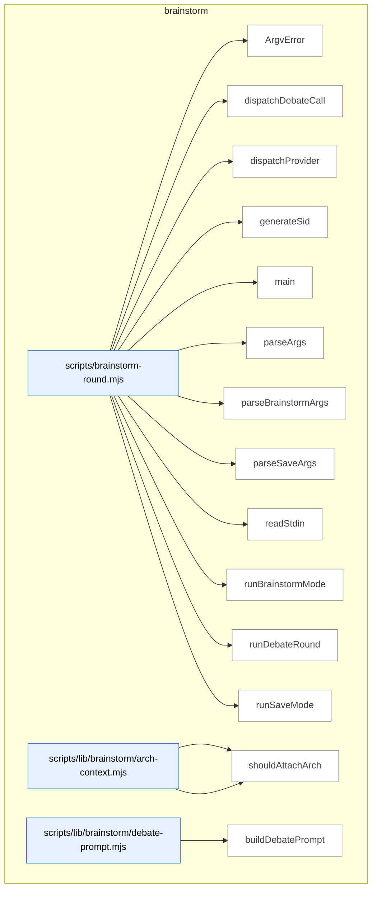

_Domain has 66 symbols (>50). Diagram shows top-15 by file order; see flat table below for the full list._

### Symbols in this domain

| Symbol | Kind | Path | Lines | Purpose | File imported by |
|---|---|---|---|---|---|
| [`ArgvError`](../scripts/brainstorm-round.mjs#L249) | class | `scripts/brainstorm-round.mjs` | 249-251 | Custom error class for CLI argument-parsing failures. | _(internal)_ |
| [`dispatchDebateCall`](../scripts/brainstorm-round.mjs#L596) | function | `scripts/brainstorm-round.mjs` | 596-624 | Route debate prompt to OpenAI or Gemini provider, reusing round-1 adapters with debate-specific prompts. | _(internal)_ |
| [`dispatchProvider`](../scripts/brainstorm-round.mjs#L626) | function | `scripts/brainstorm-round.mjs` | 626-675 | Call provider with composed topic/context, save malformed responses to debug directory. | _(internal)_ |
| [`generateSid`](../scripts/brainstorm-round.mjs#L558) | function | `scripts/brainstorm-round.mjs` | 558-561 | Generate short unique session ID from timestamp and random hex suffix. | _(internal)_ |
| [`main`](../scripts/brainstorm-round.mjs#L259) | function | `scripts/brainstorm-round.mjs` | 259-286 | Parse CLI arguments, prune old sessions, dispatch to save or brainstorm mode. | _(internal)_ |
| [`parseArgs`](../scripts/brainstorm-round.mjs#L84) | function | `scripts/brainstorm-round.mjs` | 84-97 | Dispatches to brainstorm or save argument parser based on first argv value. | _(internal)_ |
| [`parseBrainstormArgs`](../scripts/brainstorm-round.mjs#L99) | function | `scripts/brainstorm-round.mjs` | 99-198 | Parses brainstorm-specific command-line arguments (topic, models, depth, debate, etc.). | _(internal)_ |
| [`parseSaveArgs`](../scripts/brainstorm-round.mjs#L200) | function | `scripts/brainstorm-round.mjs` | 200-247 | Parses save-mode arguments for persisting a brainstorm round to the cloud store. | _(internal)_ |
| [`readStdin`](../scripts/brainstorm-round.mjs#L253) | function | `scripts/brainstorm-round.mjs` | 253-257 | Asynchronously reads all data from stdin and returns it as a UTF-8 string. | _(internal)_ |
| [`runBrainstormMode`](../scripts/brainstorm-round.mjs#L288) | function | `scripts/brainstorm-round.mjs` | 288-510 | Load topic, redact secrets, resolve model sentinels, and generate brainstorm responses from providers. | _(internal)_ |
| [`runDebateRound`](../scripts/brainstorm-round.mjs#L563) | function | `scripts/brainstorm-round.mjs` | 563-594 | Orchestrate debate round where two providers react to each other's responses if both succeeded in round 1. | _(internal)_ |
| [`runSaveMode`](../scripts/brainstorm-round.mjs#L512) | function | `scripts/brainstorm-round.mjs` | 512-556 | Validate session and round exist, then save user-provided insight to the brainstorm ledger. | _(internal)_ |
| [`loadArchSection`](../scripts/lib/brainstorm/arch-context.mjs#L84) | function | `scripts/lib/brainstorm/arch-context.mjs` | 84-86 | Loads the architecture section from project documentation. | `scripts/brainstorm-round.mjs`, `scripts/lib/brainstorm/resume-context.mjs` |
| [`shouldAttachArch`](../scripts/lib/brainstorm/arch-context.mjs#L70) | function | `scripts/lib/brainstorm/arch-context.mjs` | 70-75 | Determines whether to include architectural context based on flags or topic intent. | `scripts/brainstorm-round.mjs`, `scripts/lib/brainstorm/resume-context.mjs` |
| [`buildDebatePrompt`](../scripts/lib/brainstorm/debate-prompt.mjs#L51) | function | `scripts/lib/brainstorm/debate-prompt.mjs` | 51-84 | Constructs a debate prompt comparing two providers' responses with original context. | `scripts/brainstorm-round.mjs` |
| [`wrapUntrusted`](../scripts/lib/brainstorm/debate-prompt.mjs#L34) | function | `scripts/lib/brainstorm/debate-prompt.mjs` | 34-37 | Wraps external/user-provided text with delimiters to mark it as untrusted in prompts. | `scripts/brainstorm-round.mjs` |
| [`autoPromoteDepth`](../scripts/lib/brainstorm/depth-config.mjs#L59) | function | `scripts/lib/brainstorm/depth-config.mjs` | 59-62 | Auto-upgrades reasoning depth to "deep" if the topic suggests architectural work. | `scripts/brainstorm-round.mjs`, `scripts/lib/brainstorm/arch-context.mjs` |
| [`resolveDepth`](../scripts/lib/brainstorm/depth-config.mjs#L74) | function | `scripts/lib/brainstorm/depth-config.mjs` | 74-95 | Validates and resolves the final reasoning depth level, token budget, and reasoning effort. | `scripts/brainstorm-round.mjs`, `scripts/lib/brainstorm/arch-context.mjs` |
| [`forceRelease`](../scripts/lib/brainstorm/file-lock.mjs#L112) | function | `scripts/lib/brainstorm/file-lock.mjs` | 112-180 | Forcefully removes a lock file if it appears orphaned with stale-age verification. | `scripts/lib/brainstorm/insight-store.mjs`, `scripts/lib/brainstorm/session-store.mjs`, `scripts/lib/friction/breadcrumb.mjs`, +3 more |
| [`inspectLock`](../scripts/lib/brainstorm/file-lock.mjs#L80) | function | `scripts/lib/brainstorm/file-lock.mjs` | 80-96 | Examines the state and ownership of a lock file. | `scripts/lib/brainstorm/insight-store.mjs`, `scripts/lib/brainstorm/session-store.mjs`, `scripts/lib/friction/breadcrumb.mjs`, +3 more |
| [`isPidAlive`](../scripts/lib/brainstorm/file-lock.mjs#L41) | function | `scripts/lib/brainstorm/file-lock.mjs` | 41-48 | Checks whether a process ID is still running. | `scripts/lib/brainstorm/insight-store.mjs`, `scripts/lib/brainstorm/session-store.mjs`, `scripts/lib/friction/breadcrumb.mjs`, +3 more |
| [`LockTimeoutError`](../scripts/lib/brainstorm/file-lock.mjs#L23) | class | `scripts/lib/brainstorm/file-lock.mjs` | 23-30 | Custom error class for file lock acquisition timeouts. | `scripts/lib/brainstorm/insight-store.mjs`, `scripts/lib/brainstorm/session-store.mjs`, `scripts/lib/friction/breadcrumb.mjs`, +3 more |
| [`readLockOwnerRaw`](../scripts/lib/brainstorm/file-lock.mjs#L183) | function | `scripts/lib/brainstorm/file-lock.mjs` | 183-189 | Directly reads lock owner info (pid + token) from the lock file without state inspection. | `scripts/lib/brainstorm/insight-store.mjs`, `scripts/lib/brainstorm/session-store.mjs`, `scripts/lib/friction/breadcrumb.mjs`, +3 more |
| [`safeRelease`](../scripts/lib/brainstorm/file-lock.mjs#L197) | function | `scripts/lib/brainstorm/file-lock.mjs` | 197-214 | Releases a lock file only if the token matches, otherwise warns of ownership loss. | `scripts/lib/brainstorm/insight-store.mjs`, `scripts/lib/brainstorm/session-store.mjs`, `scripts/lib/friction/breadcrumb.mjs`, +3 more |
| [`sleep`](../scripts/lib/brainstorm/file-lock.mjs#L32) | function | `scripts/lib/brainstorm/file-lock.mjs` | 32-32 | Delays execution for a specified number of milliseconds. | `scripts/lib/brainstorm/insight-store.mjs`, `scripts/lib/brainstorm/session-store.mjs`, `scripts/lib/friction/breadcrumb.mjs`, +3 more |
| [`tryAcquireLock`](../scripts/lib/brainstorm/file-lock.mjs#L58) | function | `scripts/lib/brainstorm/file-lock.mjs` | 58-68 | Attempts to atomically create a lock file with a unique token. | `scripts/lib/brainstorm/insight-store.mjs`, `scripts/lib/brainstorm/session-store.mjs`, `scripts/lib/friction/breadcrumb.mjs`, +3 more |
| [`withFileLock`](../scripts/lib/brainstorm/file-lock.mjs#L227) | function | `scripts/lib/brainstorm/file-lock.mjs` | 227-299 | Acquires an exclusive file lock with retry-with-backoff and stale-lock recovery before running a callback. | `scripts/lib/brainstorm/insight-store.mjs`, `scripts/lib/brainstorm/session-store.mjs`, `scripts/lib/friction/breadcrumb.mjs`, +3 more |
| [`callGemini`](../scripts/lib/brainstorm/gemini-adapter.mjs#L16) | function | `scripts/lib/brainstorm/gemini-adapter.mjs` | 16-90 | Calls Gemini with timeout handling, error classification, and cost estimation. | `scripts/brainstorm-round.mjs` |
| [`classifyError`](../scripts/lib/brainstorm/gemini-adapter.mjs#L92) | function | `scripts/lib/brainstorm/gemini-adapter.mjs` | 92-123 | Categorizes Gemini API errors into specific failure types (timeout, HTTP, malformed). | `scripts/brainstorm-round.mjs` |
| [`client`](../scripts/lib/brainstorm/gemini-adapter.mjs#L6) | function | `scripts/lib/brainstorm/gemini-adapter.mjs` | 6-9 | Lazy-initializes and returns a cached GoogleGenAI client instance. | `scripts/brainstorm-round.mjs` |
| [`isValidSid`](../scripts/lib/brainstorm/id-validator.mjs#L43) | function | `scripts/lib/brainstorm/id-validator.mjs` | 43-45 | Checks whether a value is a valid session ID without throwing. | `scripts/lib/brainstorm/insight-store.mjs`, `scripts/lib/brainstorm/session-store.mjs` |
| [`validateSid`](../scripts/lib/brainstorm/id-validator.mjs#L25) | function | `scripts/lib/brainstorm/id-validator.mjs` | 25-37 | Validates a session ID string, throwing a specific error code if invalid. | `scripts/lib/brainstorm/insight-store.mjs`, `scripts/lib/brainstorm/session-store.mjs` |
| [`buildInsightFile`](../scripts/lib/brainstorm/insight-store.mjs#L138) | function | `scripts/lib/brainstorm/insight-store.mjs` | 138-153 | Formats insight text with validated YAML frontmatter into a markdown document. | `scripts/brainstorm-round.mjs` |
| [`findExistingSlugForTopic`](../scripts/lib/brainstorm/insight-store.mjs#L98) | function | `scripts/lib/brainstorm/insight-store.mjs` | 98-116 | Searches existing insight directories for one matching a given topic. | `scripts/brainstorm-round.mjs` |
| [`listAllInsights`](../scripts/lib/brainstorm/insight-store.mjs#L234) | function | `scripts/lib/brainstorm/insight-store.mjs` | 234-246 | Returns all insights across all topic directories, filtering out dotfiles. | `scripts/brainstorm-round.mjs` |
| [`listInsightsByTopic`](../scripts/lib/brainstorm/insight-store.mjs#L216) | function | `scripts/lib/brainstorm/insight-store.mjs` | 216-225 | Returns all insights matching a specific topic by slug lookup. | `scripts/brainstorm-round.mjs` |
| [`parseFrontmatter`](../scripts/lib/brainstorm/insight-store.mjs#L125) | function | `scripts/lib/brainstorm/insight-store.mjs` | 125-132 | Extracts YAML frontmatter and body from a markdown file. | `scripts/brainstorm-round.mjs` |
| [`readInsightsFromDirs`](../scripts/lib/brainstorm/insight-store.mjs#L248) | function | `scripts/lib/brainstorm/insight-store.mjs` | 248-278 | Reads markdown insight files from directories, parses frontmatter, and sorts by modification time. | `scripts/brainstorm-round.mjs` |
| [`resolveUniqueSlug`](../scripts/lib/brainstorm/insight-store.mjs#L74) | function | `scripts/lib/brainstorm/insight-store.mjs` | 74-85 | Finds a unique slug variant by appending numeric suffixes if the base slug exists. | `scripts/brainstorm-round.mjs` |
| [`rootDir`](../scripts/lib/brainstorm/insight-store.mjs#L34) | function | `scripts/lib/brainstorm/insight-store.mjs` | 34-36 | Returns the insights directory path with override support. | `scripts/brainstorm-round.mjs` |
| [`saveInsight`](../scripts/lib/brainstorm/insight-store.mjs#L162) | function | `scripts/lib/brainstorm/insight-store.mjs` | 162-205 | Persists a brainstorm insight to disk with slug allocation, idempotency checking, and collision resolution via file locking. | `scripts/brainstorm-round.mjs` |
| [`shortHash`](../scripts/lib/brainstorm/insight-store.mjs#L39) | function | `scripts/lib/brainstorm/insight-store.mjs` | 39-41 | Generates a short SHA256 hash from pipe-delimited parts. | `scripts/brainstorm-round.mjs` |
| [`slugifyTopic`](../scripts/lib/brainstorm/insight-store.mjs#L57) | function | `scripts/lib/brainstorm/insight-store.mjs` | 57-63 | Converts a topic string into a URL-safe slug with length limits. | `scripts/brainstorm-round.mjs` |
| [`tsStamp`](../scripts/lib/brainstorm/insight-store.mjs#L43) | function | `scripts/lib/brainstorm/insight-store.mjs` | 43-48 | Generates a UTC timestamp in YYYYMMDD-HHMMSS format. | `scripts/brainstorm-round.mjs` |
| [`callOpenAI`](../scripts/lib/brainstorm/openai-adapter.mjs#L27) | function | `scripts/lib/brainstorm/openai-adapter.mjs` | 27-113 | Makes an OpenAI API call with timeout, reasoning-effort fallback, and cost estimation. | `scripts/brainstorm-round.mjs`, `scripts/lib/requirements/extract.mjs`, `scripts/lib/requirements/gap-challenge.mjs` |
| [`classifyError`](../scripts/lib/brainstorm/openai-adapter.mjs#L115) | function | `scripts/lib/brainstorm/openai-adapter.mjs` | 115-144 | Categorizes OpenAI errors (timeout, HTTP, malformed) into a structured response. | `scripts/brainstorm-round.mjs`, `scripts/lib/requirements/extract.mjs`, `scripts/lib/requirements/gap-challenge.mjs` |
| [`client`](../scripts/lib/brainstorm/openai-adapter.mjs#L6) | function | `scripts/lib/brainstorm/openai-adapter.mjs` | 6-9 | Lazily initializes and returns a singleton OpenAI API client. | `scripts/brainstorm-round.mjs`, `scripts/lib/requirements/extract.mjs`, `scripts/lib/requirements/gap-challenge.mjs` |
| [`estimateCostUsd`](../scripts/lib/brainstorm/pricing.mjs#L38) | function | `scripts/lib/brainstorm/pricing.mjs` | 38-41 | Calculates estimated API cost in USD from token usage and model pricing. | `scripts/brainstorm-round.mjs`, `scripts/lib/brainstorm/gemini-adapter.mjs`, `scripts/lib/brainstorm/openai-adapter.mjs` |
| [`preflightEstimateUsd`](../scripts/lib/brainstorm/pricing.mjs#L47) | function | `scripts/lib/brainstorm/pricing.mjs` | 47-50 | Estimates API cost before a request based on character count and max output tokens. | `scripts/brainstorm-round.mjs`, `scripts/lib/brainstorm/gemini-adapter.mjs`, `scripts/lib/brainstorm/openai-adapter.mjs` |
| [`priceFor`](../scripts/lib/brainstorm/pricing.mjs#L24) | function | `scripts/lib/brainstorm/pricing.mjs` | 24-31 | Looks up token pricing rates for a given model or model family prefix. | `scripts/brainstorm-round.mjs`, `scripts/lib/brainstorm/gemini-adapter.mjs`, `scripts/lib/brainstorm/openai-adapter.mjs` |
| [`estimateTokens`](../scripts/lib/brainstorm/provider-limits.mjs#L20) | function | `scripts/lib/brainstorm/provider-limits.mjs` | 20-22 | Estimates token count from text using a 4-character-per-token heuristic. | `scripts/lib/brainstorm/resume-context.mjs` |
| [`getCeilingTokens`](../scripts/lib/brainstorm/provider-limits.mjs#L72) | function | `scripts/lib/brainstorm/provider-limits.mjs` | 72-83 | Returns the maximum input context window for a provider/model pair. | `scripts/lib/brainstorm/resume-context.mjs` |
| [`smallestCeilingTokens`](../scripts/lib/brainstorm/provider-limits.mjs#L93) | function | `scripts/lib/brainstorm/provider-limits.mjs` | 93-105 | Finds the provider/model pair with the smallest context ceiling from a list. | `scripts/lib/brainstorm/resume-context.mjs` |
| [`assembleResumeContext`](../scripts/lib/brainstorm/resume-context.mjs#L75) | function | `scripts/lib/brainstorm/resume-context.mjs` | 75-233 | Combines architecture, with-context, and resume sections into a system prompt with per-section token budgets. | `scripts/brainstorm-round.mjs` |
| [`buildArchBlock`](../scripts/lib/brainstorm/resume-context.mjs#L43) | function | `scripts/lib/brainstorm/resume-context.mjs` | 43-58 | Formats architecture context with headers/footers and truncates to a token budget. | `scripts/brainstorm-round.mjs` |
| [`appendQuarantine`](../scripts/lib/brainstorm/session-store.mjs#L228) | function | `scripts/lib/brainstorm/session-store.mjs` | 228-255 | Writes invalid session lines to a quarantine file with atomic rename for crash safety. | `scripts/brainstorm-round.mjs`, `scripts/lib/brainstorm/resume-context.mjs` |
| [`appendSession`](../scripts/lib/brainstorm/session-store.mjs#L76) | function | `scripts/lib/brainstorm/session-store.mjs` | 76-113 | Appends a brainstorm envelope to a session log under lock, auto-incrementing the round number. | `scripts/brainstorm-round.mjs`, `scripts/lib/brainstorm/resume-context.mjs` |
| [`loadSession`](../scripts/lib/brainstorm/session-store.mjs#L149) | function | `scripts/lib/brainstorm/session-store.mjs` | 149-226 | Reads and validates all rounds from a session file, quarantining invalid lines. | `scripts/brainstorm-round.mjs`, `scripts/lib/brainstorm/resume-context.mjs` |
| [`lockPath`](../scripts/lib/brainstorm/session-store.mjs#L35) | function | `scripts/lib/brainstorm/session-store.mjs` | 35-37 | Returns the file path for a session's lock file. | `scripts/brainstorm-round.mjs`, `scripts/lib/brainstorm/resume-context.mjs` |
| [`normalizeArchFields`](../scripts/lib/brainstorm/session-store.mjs#L140) | function | `scripts/lib/brainstorm/session-store.mjs` | 140-147 | Adds default values for architecture context fields in a brainstorm envelope. | `scripts/brainstorm-round.mjs`, `scripts/lib/brainstorm/resume-context.mjs` |
| [`pruneOldSessions`](../scripts/lib/brainstorm/session-store.mjs#L287) | function | `scripts/lib/brainstorm/session-store.mjs` | 287-329 | Deletes session files older than a threshold age, respecting locks and rate-limiting. | `scripts/brainstorm-round.mjs`, `scripts/lib/brainstorm/resume-context.mjs` |
| [`quarantinePath`](../scripts/lib/brainstorm/session-store.mjs#L39) | function | `scripts/lib/brainstorm/session-store.mjs` | 39-41 | Returns the file path for storing invalid/corrupted session lines. | `scripts/brainstorm-round.mjs`, `scripts/lib/brainstorm/resume-context.mjs` |
| [`readLinesUnvalidated`](../scripts/lib/brainstorm/session-store.mjs#L52) | function | `scripts/lib/brainstorm/session-store.mjs` | 52-66 | Reads raw lines from a session file, parses JSON, and tracks invalid entries. | `scripts/brainstorm-round.mjs`, `scripts/lib/brainstorm/resume-context.mjs` |
| [`sessionDir`](../scripts/lib/brainstorm/session-store.mjs#L27) | function | `scripts/lib/brainstorm/session-store.mjs` | 27-29 | Returns the root directory path for stored brainstorm sessions. | `scripts/brainstorm-round.mjs`, `scripts/lib/brainstorm/resume-context.mjs` |
| [`sessionPath`](../scripts/lib/brainstorm/session-store.mjs#L31) | function | `scripts/lib/brainstorm/session-store.mjs` | 31-33 | Returns the file path for a specific session's JSONL log. | `scripts/brainstorm-round.mjs`, `scripts/lib/brainstorm/resume-context.mjs` |
| [`summariseRound`](../scripts/lib/brainstorm/session-store.mjs#L264) | function | `scripts/lib/brainstorm/session-store.mjs` | 264-272 | Creates a human-readable one-line summary of a brainstorm round's topic and outputs. | `scripts/brainstorm-round.mjs`, `scripts/lib/brainstorm/resume-context.mjs` |

---

## claude-hooks

> Regex-based detection of mechanical code shortcuts (empty catches, masked errors, hardcoded values) in diffs, with sensitivity filtering and suppression-marker support. Tracks pattern acceptance rates for adaptive learning.

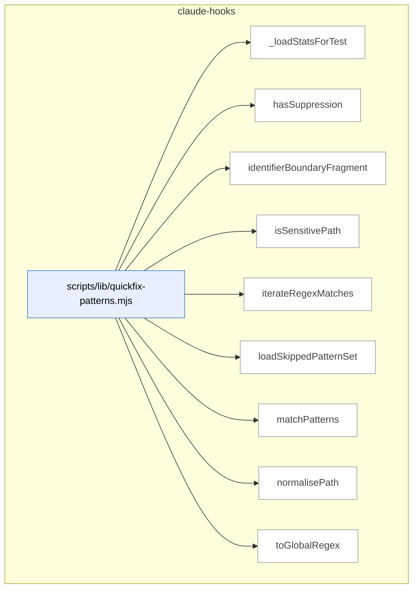

### Symbols in this domain

| Symbol | Kind | Path | Lines | Purpose | File imported by |
|---|---|---|---|---|---|
| [`_loadStatsForTest`](../scripts/lib/quickfix-patterns.mjs#L521) | function | `scripts/lib/quickfix-patterns.mjs` | 521-526 | Loads cached quickfix pattern statistics from a JSON file. | `scripts/lib/audit/finding-verification.mjs`, `scripts/lib/repo-inventory.mjs` |
| [`hasSuppression`](../scripts/lib/quickfix-patterns.mjs#L270) | function | `scripts/lib/quickfix-patterns.mjs` | 270-274 | Checks if a code line contains a language-specific comment suppression marker. | `scripts/lib/audit/finding-verification.mjs`, `scripts/lib/repo-inventory.mjs` |
| [`identifierBoundaryFragment`](../scripts/lib/quickfix-patterns.mjs#L52) | function | `scripts/lib/quickfix-patterns.mjs` | 52-56 | Builds regex fragment for matching identifier boundaries with term variations. | `scripts/lib/audit/finding-verification.mjs`, `scripts/lib/repo-inventory.mjs` |
| [`isSensitivePath`](../scripts/lib/quickfix-patterns.mjs#L258) | function | `scripts/lib/quickfix-patterns.mjs` | 258-260 | Checks if a path is classified as sensitive. | `scripts/lib/audit/finding-verification.mjs`, `scripts/lib/repo-inventory.mjs` |
| [`iterateRegexMatches`](../scripts/lib/quickfix-patterns.mjs#L303) | function | `scripts/lib/quickfix-patterns.mjs` | 303-310 | Yields each match of a regex pattern in text, preventing empty-match infinite loops. | `scripts/lib/audit/finding-verification.mjs`, `scripts/lib/repo-inventory.mjs` |
| [`loadSkippedPatternSet`](../scripts/lib/quickfix-patterns.mjs#L492) | function | `scripts/lib/quickfix-patterns.mjs` | 492-514 | Loads quickfix pattern names to skip based on low acceptance-rate thresholds. | `scripts/lib/audit/finding-verification.mjs`, `scripts/lib/repo-inventory.mjs` |
| [`matchPatterns`](../scripts/lib/quickfix-patterns.mjs#L336) | function | `scripts/lib/quickfix-patterns.mjs` | 336-457 | Scans diff text for quickfix antipatterns with size/sensitivity checks and suppression. | `scripts/lib/audit/finding-verification.mjs`, `scripts/lib/repo-inventory.mjs` |
| [`normalisePath`](../scripts/lib/quickfix-patterns.mjs#L245) | function | `scripts/lib/quickfix-patterns.mjs` | 245-247 | Normalizes a file path to canonical form. | `scripts/lib/audit/finding-verification.mjs`, `scripts/lib/repo-inventory.mjs` |
| [`toGlobalRegex`](../scripts/lib/quickfix-patterns.mjs#L288) | function | `scripts/lib/quickfix-patterns.mjs` | 288-291 | Ensures a regex has the global flag set. | `scripts/lib/audit/finding-verification.mjs`, `scripts/lib/repo-inventory.mjs` |

---

## claudemd-management

> The `claudemd-management` domain scans repositories for instruction files (CLAUDE.md, SKILL.md, etc.), detects duplicate content across documents using token-based similarity analysis, and automatically removes stale markdown links while preserving embedded references.

```mermaid
flowchart TB
subgraph dom_claudemd_management ["claudemd-management"]
  file_scripts_lib_claudemd_autofix_mjs["scripts/lib/claudemd/autofix.mjs"]:::component
  sym_scripts_lib_claudemd_autofix_mjs_applyFi["applyFixes"]:::symbol
  file_scripts_lib_claudemd_autofix_mjs --> sym_scripts_lib_claudemd_autofix_mjs_applyFi
  file_scripts_lib_claudemd_doc_similarity_mjs["scripts/lib/claudemd/doc-similarity.mjs"]:::component
  sym_scripts_lib_claudemd_doc_similarity_mjs_["extractParagraphs"]:::symbol
  file_scripts_lib_claudemd_doc_similarity_mjs --> sym_scripts_lib_claudemd_doc_similarity_mjs_
  sym_scripts_lib_claudemd_doc_similarity_mjs_["findSimilarParagraphs"]:::symbol
  file_scripts_lib_claudemd_doc_similarity_mjs --> sym_scripts_lib_claudemd_doc_similarity_mjs_
  sym_scripts_lib_claudemd_doc_similarity_mjs_["jaccardSimilarity"]:::symbol
  file_scripts_lib_claudemd_doc_similarity_mjs --> sym_scripts_lib_claudemd_doc_similarity_mjs_
  sym_scripts_lib_claudemd_doc_similarity_mjs_["normalizeMarkdown"]:::symbol
  file_scripts_lib_claudemd_doc_similarity_mjs --> sym_scripts_lib_claudemd_doc_similarity_mjs_
  sym_scripts_lib_claudemd_doc_similarity_mjs_["tokenize"]:::symbol
  file_scripts_lib_claudemd_doc_similarity_mjs --> sym_scripts_lib_claudemd_doc_similarity_mjs_
  file_scripts_lib_claudemd_file_scanner_mjs["scripts/lib/claudemd/file-scanner.mjs"]:::component
  sym_scripts_lib_claudemd_file_scanner_mjs_ma["matchPattern"]:::symbol
  file_scripts_lib_claudemd_file_scanner_mjs --> sym_scripts_lib_claudemd_file_scanner_mjs_ma
  sym_scripts_lib_claudemd_file_scanner_mjs_sc["scanInstructionFiles"]:::symbol
  file_scripts_lib_claudemd_file_scanner_mjs --> sym_scripts_lib_claudemd_file_scanner_mjs_sc
  sym_scripts_lib_claudemd_file_scanner_mjs_wa["walkDir"]:::symbol
  file_scripts_lib_claudemd_file_scanner_mjs --> sym_scripts_lib_claudemd_file_scanner_mjs_wa
  file_scripts_lib_claudemd_ref_checker_mjs["scripts/lib/claudemd/ref-checker.mjs"]:::component
  sym_scripts_lib_claudemd_ref_checker_mjs_bui["buildEnvVarIndex"]:::symbol
  file_scripts_lib_claudemd_ref_checker_mjs --> sym_scripts_lib_claudemd_ref_checker_mjs_bui
  sym_scripts_lib_claudemd_ref_checker_mjs_bui["buildFunctionIndex"]:::symbol
  file_scripts_lib_claudemd_ref_checker_mjs --> sym_scripts_lib_claudemd_ref_checker_mjs_bui
  sym_scripts_lib_claudemd_ref_checker_mjs_ext["extractEnvVarRefs"]:::symbol
  file_scripts_lib_claudemd_ref_checker_mjs --> sym_scripts_lib_claudemd_ref_checker_mjs_ext
  sym_scripts_lib_claudemd_ref_checker_mjs_ext["extractFileRefs"]:::symbol
  file_scripts_lib_claudemd_ref_checker_mjs --> sym_scripts_lib_claudemd_ref_checker_mjs_ext
  sym_scripts_lib_claudemd_ref_checker_mjs_ext["extractFunctionRefs"]:::symbol
  file_scripts_lib_claudemd_ref_checker_mjs --> sym_scripts_lib_claudemd_ref_checker_mjs_ext
  sym_scripts_lib_claudemd_ref_checker_mjs_res["resolveReferencedPath"]:::symbol
  file_scripts_lib_claudemd_ref_checker_mjs --> sym_scripts_lib_claudemd_ref_checker_mjs_res
  file_scripts_lib_claudemd_rules_mjs["scripts/lib/claudemd/rules.mjs"]:::component
  sym_scripts_lib_claudemd_rules_mjs_checkClau["checkClaudeAgentsSync"]:::symbol
  file_scripts_lib_claudemd_rules_mjs --> sym_scripts_lib_claudemd_rules_mjs_checkClau
  sym_scripts_lib_claudemd_rules_mjs_checkCros["checkCrossFileDuplication"]:::symbol
  file_scripts_lib_claudemd_rules_mjs --> sym_scripts_lib_claudemd_rules_mjs_checkCros
  sym_scripts_lib_claudemd_rules_mjs_checkDeep["checkDeepCodeDetail"]:::symbol
  file_scripts_lib_claudemd_rules_mjs --> sym_scripts_lib_claudemd_rules_mjs_checkDeep
  sym_scripts_lib_claudemd_rules_mjs_checkSize["checkSize"]:::symbol
  file_scripts_lib_claudemd_rules_mjs --> sym_scripts_lib_claudemd_rules_mjs_checkSize
  sym_scripts_lib_claudemd_rules_mjs_checkStal["checkStaleEnvVarRefs"]:::symbol
  file_scripts_lib_claudemd_rules_mjs --> sym_scripts_lib_claudemd_rules_mjs_checkStal
  sym_scripts_lib_claudemd_rules_mjs_checkStal["checkStaleFileRefs"]:::symbol
  file_scripts_lib_claudemd_rules_mjs --> sym_scripts_lib_claudemd_rules_mjs_checkStal
  sym_scripts_lib_claudemd_rules_mjs_checkStal["checkStaleFunctionRefs"]:::symbol
  file_scripts_lib_claudemd_rules_mjs --> sym_scripts_lib_claudemd_rules_mjs_checkStal
  sym_scripts_lib_claudemd_rules_mjs_extractHe["extractHeadings"]:::symbol
  file_scripts_lib_claudemd_rules_mjs --> sym_scripts_lib_claudemd_rules_mjs_extractHe
  sym_scripts_lib_claudemd_rules_mjs_runRules["runRules"]:::symbol
  file_scripts_lib_claudemd_rules_mjs --> sym_scripts_lib_claudemd_rules_mjs_runRules
  sym_scripts_lib_claudemd_rules_mjs_semanticI["semanticId"]:::symbol
  file_scripts_lib_claudemd_rules_mjs --> sym_scripts_lib_claudemd_rules_mjs_semanticI
  file_scripts_lib_claudemd_sarif_formatter_mjs["scripts/lib/claudemd/sarif-formatter.mjs"]:::component
  sym_scripts_lib_claudemd_sarif_formatter_mjs["buildRuleDescriptors"]:::symbol
  file_scripts_lib_claudemd_sarif_formatter_mjs --> sym_scripts_lib_claudemd_sarif_formatter_mjs
  sym_scripts_lib_claudemd_sarif_formatter_mjs["ruleDescription"]:::symbol
  file_scripts_lib_claudemd_sarif_formatter_mjs --> sym_scripts_lib_claudemd_sarif_formatter_mjs
  sym_scripts_lib_claudemd_sarif_formatter_mjs["sarifLevel"]:::symbol
  file_scripts_lib_claudemd_sarif_formatter_mjs --> sym_scripts_lib_claudemd_sarif_formatter_mjs
  sym_scripts_lib_claudemd_sarif_formatter_mjs["toSarif"]:::symbol
  file_scripts_lib_claudemd_sarif_formatter_mjs --> sym_scripts_lib_claudemd_sarif_formatter_mjs
  file_scripts_lib_claudemd_step65_hook_mjs["scripts/lib/claudemd/step65-hook.mjs"]:::component
  sym_scripts_lib_claudemd_step65_hook_mjs_run["runHygieneCheck"]:::symbol
  file_scripts_lib_claudemd_step65_hook_mjs --> sym_scripts_lib_claudemd_step65_hook_mjs_run
end
classDef container fill:#f5f5f5,stroke:#333,stroke-width:2px,color:#000
classDef component fill:#e8f0ff,stroke:#3178c6,color:#000
classDef symbol fill:#fff,stroke:#999,color:#444
classDef dup fill:#ffe8d8,stroke:#c0392b,stroke-width:2px,color:#000
classDef violation fill:#ffd6d6,stroke:#c0392b,stroke-width:2px,color:#000
```

### Symbols in this domain

| Symbol | Kind | Path | Lines | Purpose | File imported by |
|---|---|---|---|---|---|
| [`applyFixes`](../scripts/lib/claudemd/autofix.mjs#L16) | function | `scripts/lib/claudemd/autofix.mjs` | 16-76 | Removes broken markdown links from files by line number, supporting dry-run mode. | `scripts/claudemd-lint.mjs` |
| [`extractParagraphs`](../scripts/lib/claudemd/doc-similarity.mjs#L68) | function | `scripts/lib/claudemd/doc-similarity.mjs` | 68-103 | Splits markdown content into paragraphs, respecting code blocks and tracking line numbers. | `scripts/lib/claudemd/rules.mjs` |
| [`findSimilarParagraphs`](../scripts/lib/claudemd/doc-similarity.mjs#L114) | function | `scripts/lib/claudemd/doc-similarity.mjs` | 114-146 | Finds paragraph pairs across two documents with Jaccard similarity above a threshold. | `scripts/lib/claudemd/rules.mjs` |
| [`jaccardSimilarity`](../scripts/lib/claudemd/doc-similarity.mjs#L53) | function | `scripts/lib/claudemd/doc-similarity.mjs` | 53-61 | Computes Jaccard similarity (intersection/union) between two token sets. | `scripts/lib/claudemd/rules.mjs` |
| [`normalizeMarkdown`](../scripts/lib/claudemd/doc-similarity.mjs#L24) | function | `scripts/lib/claudemd/doc-similarity.mjs` | 24-34 | Strips markdown syntax and lowercases text for document similarity comparison. | `scripts/lib/claudemd/rules.mjs` |
| [`tokenize`](../scripts/lib/claudemd/doc-similarity.mjs#L41) | function | `scripts/lib/claudemd/doc-similarity.mjs` | 41-45 | Extracts tokens from normalized text and filters out stopwords. | `scripts/lib/claudemd/rules.mjs` |
| [`matchPattern`](../scripts/lib/claudemd/file-scanner.mjs#L72) | function | `scripts/lib/claudemd/file-scanner.mjs` | 72-93 | Tests whether a file path matches a glob-style pattern with support for `*` and `**/`. | `scripts/check-context-drift.mjs`, `scripts/claudemd-lint.mjs`, `scripts/lib/claudemd/ref-checker.mjs` |
| [`scanInstructionFiles`](../scripts/lib/claudemd/file-scanner.mjs#L102) | function | `scripts/lib/claudemd/file-scanner.mjs` | 102-133 | Finds and reads all instruction files in a repo. | `scripts/check-context-drift.mjs`, `scripts/claudemd-lint.mjs`, `scripts/lib/claudemd/ref-checker.mjs` |
| [`walkDir`](../scripts/lib/claudemd/file-scanner.mjs#L30) | function | `scripts/lib/claudemd/file-scanner.mjs` | 30-68 | Recursively traverses a directory tree and collects instruction files (CLAUDE.md, AGENTS.md, SKILL.md). | `scripts/check-context-drift.mjs`, `scripts/claudemd-lint.mjs`, `scripts/lib/claudemd/ref-checker.mjs` |
| [`buildEnvVarIndex`](../scripts/lib/claudemd/ref-checker.mjs#L194) | function | `scripts/lib/claudemd/ref-checker.mjs` | 194-235 | Scans .env.example and source code to build an index of environment variables. | `scripts/lib/claudemd/rules.mjs` |
| [`buildFunctionIndex`](../scripts/lib/claudemd/ref-checker.mjs#L91) | function | `scripts/lib/claudemd/ref-checker.mjs` | 91-124 | Walks the repo and extracts all exported function/class names from source files. | `scripts/lib/claudemd/rules.mjs` |
| [`extractEnvVarRefs`](../scripts/lib/claudemd/ref-checker.mjs#L165) | function | `scripts/lib/claudemd/ref-checker.mjs` | 165-187 | Finds backtick-quoted environment variable names (ALL_CAPS_WITH_UNDERSCORE) in content. | `scripts/lib/claudemd/rules.mjs` |
| [`extractFileRefs`](../scripts/lib/claudemd/ref-checker.mjs#L52) | function | `scripts/lib/claudemd/ref-checker.mjs` | 52-84 | Extracts file paths from markdown links and backtick-quoted file references. | `scripts/lib/claudemd/rules.mjs` |
| [`extractFunctionRefs`](../scripts/lib/claudemd/ref-checker.mjs#L132) | function | `scripts/lib/claudemd/ref-checker.mjs` | 132-158 | Finds backtick-quoted function/class name references in content. | `scripts/lib/claudemd/rules.mjs` |
| [`resolveReferencedPath`](../scripts/lib/claudemd/ref-checker.mjs#L25) | function | `scripts/lib/claudemd/ref-checker.mjs` | 25-44 | Resolves a markdown link reference to an absolute repo path and checks existence. | `scripts/lib/claudemd/rules.mjs` |
| [`checkClaudeAgentsSync`](../scripts/lib/claudemd/rules.mjs#L234) | function | `scripts/lib/claudemd/rules.mjs` | 234-271 | Detects heading conflicts between CLAUDE.md and AGENTS.md in the same directory. | `scripts/claudemd-lint.mjs` |
| [`checkCrossFileDuplication`](../scripts/lib/claudemd/rules.mjs#L203) | function | `scripts/lib/claudemd/rules.mjs` | 203-232 | Finds similar paragraphs across instruction files in the same directory tree. | `scripts/claudemd-lint.mjs` |
| [`checkDeepCodeDetail`](../scripts/lib/claudemd/rules.mjs#L186) | function | `scripts/lib/claudemd/rules.mjs` | 186-201 | Reports instruction files with too many fenced code blocks. | `scripts/claudemd-lint.mjs` |
| [`checkSize`](../scripts/lib/claudemd/rules.mjs#L108) | function | `scripts/lib/claudemd/rules.mjs` | 108-122 | Reports files exceeding size limits for documentation files. | `scripts/claudemd-lint.mjs` |
| [`checkStaleEnvVarRefs`](../scripts/lib/claudemd/rules.mjs#L168) | function | `scripts/lib/claudemd/rules.mjs` | 168-184 | Flags backtick-quoted environment variable references not defined in .env.example or source. | `scripts/claudemd-lint.mjs` |
| [`checkStaleFileRefs`](../scripts/lib/claudemd/rules.mjs#L124) | function | `scripts/lib/claudemd/rules.mjs` | 124-142 | Flags markdown file references that don't exist on disk. | `scripts/claudemd-lint.mjs` |
| [`checkStaleFunctionRefs`](../scripts/lib/claudemd/rules.mjs#L144) | function | `scripts/lib/claudemd/rules.mjs` | 144-166 | Flags backtick-quoted function/class references that don't exist in the codebase. | `scripts/claudemd-lint.mjs` |
| [`extractHeadings`](../scripts/lib/claudemd/rules.mjs#L278) | function | `scripts/lib/claudemd/rules.mjs` | 278-302 | Parses Markdown content into a Map of headings to their associated text blocks. | `scripts/claudemd-lint.mjs` |
| [`runRules`](../scripts/lib/claudemd/rules.mjs#L44) | function | `scripts/lib/claudemd/rules.mjs` | 44-106 | Applies all configured hygiene rules to files and returns structured findings. | `scripts/claudemd-lint.mjs` |
| [`semanticId`](../scripts/lib/claudemd/rules.mjs#L17) | function | `scripts/lib/claudemd/rules.mjs` | 17-22 | Generates a 16-character content hash for deduplicating hygiene findings. | `scripts/claudemd-lint.mjs` |
| [`buildRuleDescriptors`](../scripts/lib/claudemd/sarif-formatter.mjs#L49) | function | `scripts/lib/claudemd/sarif-formatter.mjs` | 49-62 | Deduplicates findings and builds unique rule descriptors for SARIF output. | `scripts/check-context-drift.mjs`, `scripts/check-model-freshness.mjs`, `scripts/claudemd-lint.mjs` |
| [`ruleDescription`](../scripts/lib/claudemd/sarif-formatter.mjs#L64) | function | `scripts/lib/claudemd/sarif-formatter.mjs` | 64-77 | Returns human-readable descriptions for SARIF rule IDs via a lookup table. | `scripts/check-context-drift.mjs`, `scripts/check-model-freshness.mjs`, `scripts/claudemd-lint.mjs` |
| [`sarifLevel`](../scripts/lib/claudemd/sarif-formatter.mjs#L40) | function | `scripts/lib/claudemd/sarif-formatter.mjs` | 40-47 | Maps severity levels to their SARIF equivalents (error/warning/note). | `scripts/check-context-drift.mjs`, `scripts/check-model-freshness.mjs`, `scripts/claudemd-lint.mjs` |
| [`toSarif`](../scripts/lib/claudemd/sarif-formatter.mjs#L11) | function | `scripts/lib/claudemd/sarif-formatter.mjs` | 11-38 | Converts an audit findings report into SARIF (Static Analysis Results Interchange Format) JSON. | `scripts/check-context-drift.mjs`, `scripts/check-model-freshness.mjs`, `scripts/claudemd-lint.mjs` |
| [`runHygieneCheck`](../scripts/lib/claudemd/step65-hook.mjs#L16) | function | `scripts/lib/claudemd/step65-hook.mjs` | 16-65 | Executes the claudemd linter as a subprocess and parses its JSON report with exit code. | _(internal)_ |

---

## cross-skill-bridge

> CLI dispatch and argument parsing layer for cross-skill operations: parses JSON payloads and flags, resolves git/repo context, and bridges command handlers to cloud-store persistence (plans, arm-eval capture).

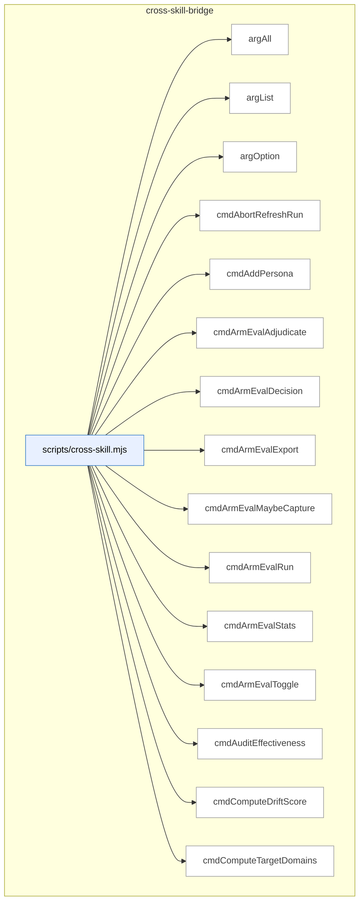

_Domain has 82 symbols (>50). Diagram shows top-15 by file order; see flat table below for the full list._

### Symbols in this domain

| Symbol | Kind | Path | Lines | Purpose | File imported by |
|---|---|---|---|---|---|
| [`argAll`](../scripts/cross-skill.mjs#L153) | function | `scripts/cross-skill.mjs` | 153-159 | Collects all values for a repeatedly-specified CLI flag | _(internal)_ |
| [`argList`](../scripts/cross-skill.mjs#L147) | function | `scripts/cross-skill.mjs` | 147-150 | Splits a comma-separated CLI flag value into a trimmed string array | _(internal)_ |
| [`argOption`](../scripts/cross-skill.mjs#L140) | function | `scripts/cross-skill.mjs` | 140-144 | Retrieves the value immediately following a named flag in CLI arguments | _(internal)_ |
| [`cmdAbortRefreshRun`](../scripts/cross-skill.mjs#L1836) | function | `scripts/cross-skill.mjs` | 1836-1846 | Cancels an active symbol-index refresh run and optionally records a reason. | _(internal)_ |
| [`cmdAddPersona`](../scripts/cross-skill.mjs#L1072) | function | `scripts/cross-skill.mjs` | 1072-1084 | Creates a new persona or returns the existing record if already registered | _(internal)_ |
| [`cmdArmEvalAdjudicate`](../scripts/cross-skill.mjs#L810) | function | `scripts/cross-skill.mjs` | 810-834 | Records human rankings of blinded arm-eval outputs or retrieves the blinded session results | _(internal)_ |
| [`cmdArmEvalDecision`](../scripts/cross-skill.mjs#L776) | function | `scripts/cross-skill.mjs` | 776-793 | Evaluates arm-eval sessions across phases to recommend which model arm to adopt | _(internal)_ |
| [`cmdArmEvalExport`](../scripts/cross-skill.mjs#L842) | function | `scripts/cross-skill.mjs` | 842-860 | Exports one or multiple arm-eval sessions with full context to local archive files | _(internal)_ |
| [`cmdArmEvalMaybeCapture`](../scripts/cross-skill.mjs#L901) | function | `scripts/cross-skill.mjs` | 901-917 | Conditionally runs an arm-eval session if the toggle is on and budget allows | _(internal)_ |
| [`cmdArmEvalRun`](../scripts/cross-skill.mjs#L754) | function | `scripts/cross-skill.mjs` | 754-773 | Executes a single arm-eval session for plan-authoring or brainstorm experiment | _(internal)_ |
| [`cmdArmEvalStats`](../scripts/cross-skill.mjs#L796) | function | `scripts/cross-skill.mjs` | 796-807 | Retrieves arm-eval leaderboard showing per-arm performance across repositories | _(internal)_ |
| [`cmdArmEvalToggle`](../scripts/cross-skill.mjs#L868) | function | `scripts/cross-skill.mjs` | 868-893 | Enables/disables arm-eval capture and sets the budget cap for the current repository | _(internal)_ |
| [`cmdAuditEffectiveness`](../scripts/cross-skill.mjs#L584) | function | `scripts/cross-skill.mjs` | 584-591 | Fetches audit precision and recall metrics for a repository | _(internal)_ |
| [`cmdComputeDriftScore`](../scripts/cross-skill.mjs#L1940) | function | `scripts/cross-skill.mjs` | 1940-1951 | Calculates a quantified measure of architectural drift in a repository. | _(internal)_ |
| [`cmdComputeTargetDomains`](../scripts/cross-skill.mjs#L1695) | function | `scripts/cross-skill.mjs` | 1695-1707 | Assigns architecture domain tags to specified file paths using project domain rules. | _(internal)_ |
| [`cmdDetectStack`](../scripts/cross-skill.mjs#L1541) | function | `scripts/cross-skill.mjs` | 1541-1558 | Detects the programming language stack and optional package/environment manager of a repository. | _(internal)_ |
| [`cmdFinalizeOutcomes`](../scripts/cross-skill.mjs#L972) | function | `scripts/cross-skill.mjs` | 972-1042 | Persists audit outcomes (findings with verdicts and remediation state) to cloud and local ledgers | _(internal)_ |
| [`cmdFinalReviewAdjudicate`](../scripts/cross-skill.mjs#L630) | function | `scripts/cross-skill.mjs` | 630-644 | Records human accept/dismiss decision on a final-review finding | _(internal)_ |
| [`cmdFinalReviewStats`](../scripts/cross-skill.mjs#L595) | function | `scripts/cross-skill.mjs` | 595-628 | Queries shadow final-reviewer findings with optional markdown worksheet export | _(internal)_ |
| [`cmdFrictionLog`](../scripts/cross-skill.mjs#L2065) | function | `scripts/cross-skill.mjs` | 2065-2070 | Delegates to friction-log CLI entry point. | _(internal)_ |
| [`cmdGetActiveRefreshId`](../scripts/cross-skill.mjs#L1578) | function | `scripts/cross-skill.mjs` | 1578-1594 | Retrieves the active symbol-index refresh ID and embedding model metadata for a repository. | _(internal)_ |
| [`cmdGetCallersForFile`](../scripts/cross-skill.mjs#L1709) | function | `scripts/cross-skill.mjs` | 1709-1772 | Lists all functions and modules that import or call a specified file. | _(internal)_ |
| [`cmdGetFrictionNeighbourhood`](../scripts/cross-skill.mjs#L1684) | function | `scripts/cross-skill.mjs` | 1684-1693 | Returns friction-log entries semantically similar to a given intent query. | _(internal)_ |
| [`cmdGetIncidentNeighbourhood`](../scripts/cross-skill.mjs#L1596) | function | `scripts/cross-skill.mjs` | 1596-1626 | Finds security incidents related to a planned code change based on intent and target files. | _(internal)_ |
| [`cmdGetNavFirstSeen`](../scripts/cross-skill.mjs#L536) | function | `scripts/cross-skill.mjs` | 536-551 | Looks up when navigation-audit drift keys first appeared across historical runs | _(internal)_ |
| [`cmdGetNeighbourhood`](../scripts/cross-skill.mjs#L1774) | function | `scripts/cross-skill.mjs` | 1774-1802 | Returns architecturally-similar symbols that match the intent and target file context. | _(internal)_ |
| [`cmdGetPersonaSessionsByRepo`](../scripts/cross-skill.mjs#L1325) | function | `scripts/cross-skill.mjs` | 1325-1353 | Retrieves persona-test sessions for a repo, optionally filtered to P0-only severity | _(internal)_ |
| [`cmdGetPersonaSessionsByUrl`](../scripts/cross-skill.mjs#L1513) | function | `scripts/cross-skill.mjs` | 1513-1539 | Fetches persona-test execution records for a given deployed app URL. | _(internal)_ |
| [`cmdGetReachabilityEvidence`](../scripts/cross-skill.mjs#L1360) | function | `scripts/cross-skill.mjs` | 1360-1394 | Fetches persona journey click-paths (reachability evidence) for navigation-audit bootstrap | _(internal)_ |
| [`cmdGetRecentFindings`](../scripts/cross-skill.mjs#L1475) | function | `scripts/cross-skill.mjs` | 1475-1505 | Retrieves recent audit findings from cloud storage, filtered by repo/severity/count. | _(internal)_ |
| [`cmdLearningBackfillOutcomes`](../scripts/cross-skill.mjs#L2049) | function | `scripts/cross-skill.mjs` | 2049-2059 | Populates missing outcome labels in learning-decision records from audit results. | _(internal)_ |
| [`cmdLearningQuickfixStats`](../scripts/cross-skill.mjs#L2092) | function | `scripts/cross-skill.mjs` | 2092-2118 | Analyzes patterns of quick-fix shortcuts and their skip-pattern effectiveness. | _(internal)_ |
| [`cmdLearningRecord`](../scripts/cross-skill.mjs#L1968) | function | `scripts/cross-skill.mjs` | 1968-2007 | Logs a code-review decision point with context and outcome for adaptive learning. | _(internal)_ |
| [`cmdLearningReplay`](../scripts/cross-skill.mjs#L2077) | function | `scripts/cross-skill.mjs` | 2077-2085 | Re-executes historical learning decisions to test decision-maker consistency. | _(internal)_ |
| [`cmdLearningStats`](../scripts/cross-skill.mjs#L2014) | function | `scripts/cross-skill.mjs` | 2014-2025 | Retrieves decision-outcome statistics for a repository's learning profile. | _(internal)_ |
| [`cmdLearningWeeklyReview`](../scripts/cross-skill.mjs#L2033) | function | `scripts/cross-skill.mjs` | 2033-2041 | Generates or simulates a weekly digest of learning decisions and outcomes. | _(internal)_ |
| [`cmdListConsistencyCandidates`](../scripts/cross-skill.mjs#L343) | function | `scripts/cross-skill.mjs` | 343-356 | Lists pending persona-consistency regression candidates for a specific repository | _(internal)_ |
| [`cmdListLayeringViolationsForSnapshot`](../scripts/cross-skill.mjs#L1927) | function | `scripts/cross-skill.mjs` | 1927-1938 | Returns all architecture layering violations found in a given refresh run. | _(internal)_ |
| [`cmdListPersonas`](../scripts/cross-skill.mjs#L1050) | function | `scripts/cross-skill.mjs` | 1050-1061 | Retrieves registered personas for a given application URL | _(internal)_ |
| [`cmdListPersonaTestCandidates`](../scripts/cross-skill.mjs#L396) | function | `scripts/cross-skill.mjs` | 396-408 | Queries actionable persona-test candidates filtered by age, count, and severity thresholds | _(internal)_ |
| [`cmdListSymbolsForSnapshot`](../scripts/cross-skill.mjs#L1914) | function | `scripts/cross-skill.mjs` | 1914-1925 | Lists all symbols discovered and indexed during a given refresh run. | _(internal)_ |
| [`cmdListUnlockedFixes`](../scripts/cross-skill.mjs#L576) | function | `scripts/cross-skill.mjs` | 576-582 | Retrieves HIGH/P0 fixes that lack a regression spec, indicating verification gaps | _(internal)_ |
| [`cmdMarkPersonaTestCandidateProposed`](../scripts/cross-skill.mjs#L410) | function | `scripts/cross-skill.mjs` | 410-422 | Marks a persona-test candidate as proposed to suppress future re-suggestions | _(internal)_ |
| [`cmdModelAbAdjudicate`](../scripts/cross-skill.mjs#L655) | function | `scripts/cross-skill.mjs` | 655-726 | Manages blinded model-A/B adjudication with optional pre-judge suggestions and worksheet UI | _(internal)_ |
| [`cmdModelAbDecision`](../scripts/cross-skill.mjs#L929) | function | `scripts/cross-skill.mjs` | 929-950 | Evaluates model-A/B findings and costs to recommend adopting a different model | _(internal)_ |
| [`cmdModelAbStats`](../scripts/cross-skill.mjs#L729) | function | `scripts/cross-skill.mjs` | 729-747 | Computes model-A/B effectiveness and cost-frontier across acceptance and recall | _(internal)_ |
| [`cmdOpenRefreshRun`](../scripts/cross-skill.mjs#L1804) | function | `scripts/cross-skill.mjs` | 1804-1822 | Starts a new symbol-index refresh cycle for a repository. | _(internal)_ |
| [`cmdPersonaOutcomes`](../scripts/cross-skill.mjs#L1233) | function | `scripts/cross-skill.mjs` | 1233-1307 | Labels persona findings as fixed/dismissed/wont_fix/stale with optional worksheet export | _(internal)_ |
| [`cmdPlanSatisfaction`](../scripts/cross-skill.mjs#L495) | function | `scripts/cross-skill.mjs` | 495-505 | Retrieves latest plan verification results and findings that failed in multiple runs | _(internal)_ |
| [`cmdPreviewGate`](../scripts/cross-skill.mjs#L1449) | function | `scripts/cross-skill.mjs` | 1449-1457 | Evaluates whether the deployment preview should halt, warn, or proceed | _(internal)_ |
| [`cmdPromoteRegressionSpec`](../scripts/cross-skill.mjs#L358) | function | `scripts/cross-skill.mjs` | 358-371 | Promotes a regression spec candidate to a locked spec with audit trail metadata | _(internal)_ |
| [`cmdPublishRefreshRun`](../scripts/cross-skill.mjs#L1824) | function | `scripts/cross-skill.mjs` | 1824-1834 | Finalizes a symbol-index refresh run and publishes its results to the store. | _(internal)_ |
| [`cmdQuality`](../scripts/cross-skill.mjs#L1633) | function | `scripts/cross-skill.mjs` | 1633-1682 | Manages friction-log entries (add/mirror/digest/link) for tracking development friction points. | _(internal)_ |
| [`cmdRecommendSkills`](../scripts/cross-skill.mjs#L1404) | function | `scripts/cross-skill.mjs` | 1404-1442 | Recommends which additional skills to run based on changed files, findings, and unlocked fixes | _(internal)_ |
| [`cmdRecordCorrelation`](../scripts/cross-skill.mjs#L442) | function | `scripts/cross-skill.mjs` | 442-460 | Links a persona-test finding to an audit finding with match quality and rationale | _(internal)_ |
| [`cmdRecordLayeringViolations`](../scripts/cross-skill.mjs#L1888) | function | `scripts/cross-skill.mjs` | 1888-1900 | Records architecture layering rule violations found during a refresh. | _(internal)_ |
| [`cmdRecordNavAuditRun`](../scripts/cross-skill.mjs#L509) | function | `scripts/cross-skill.mjs` | 509-534 | Logs a navigation-audit run with drift keys, finding counts, and tool version | _(internal)_ |
| [`cmdRecordPersonaSession`](../scripts/cross-skill.mjs#L1118) | function | `scripts/cross-skill.mjs` | 1118-1144 | Logs a persona-test session and auto-correlates its findings against candidate audit findings | _(internal)_ |
| [`cmdRecordPlanVerifyItems`](../scripts/cross-skill.mjs#L484) | function | `scripts/cross-skill.mjs` | 484-493 | Stores per-criterion pass/fail results for a plan-verify run | _(internal)_ |
| [`cmdRecordPlanVerifyRun`](../scripts/cross-skill.mjs#L462) | function | `scripts/cross-skill.mjs` | 462-482 | Logs plan-verification run totals (criteria counts, durations, context) | _(internal)_ |
| [`cmdRecordRegressionSpec`](../scripts/cross-skill.mjs#L273) | function | `scripts/cross-skill.mjs` | 273-341 | Records a regression test spec with pre-egress redaction of sensitive data in snapshots | _(internal)_ |
| [`cmdRecordRegressionSpecRun`](../scripts/cross-skill.mjs#L424) | function | `scripts/cross-skill.mjs` | 424-440 | Records pass/fail outcome and metadata for a regression spec test execution | _(internal)_ |
| [`cmdRecordShipEvent`](../scripts/cross-skill.mjs#L553) | function | `scripts/cross-skill.mjs` | 553-574 | Logs a deployment event with outcome, block reasons, UX metrics, and override status | _(internal)_ |
| [`cmdRecordSymbolDefinitions`](../scripts/cross-skill.mjs#L1848) | function | `scripts/cross-skill.mjs` | 1848-1858 | Persists symbol metadata (names, types, file locations) to the cloud architecture index. | _(internal)_ |
| [`cmdRecordSymbolEmbedding`](../scripts/cross-skill.mjs#L1874) | function | `scripts/cross-skill.mjs` | 1874-1886 | Persists semantic embeddings (vectors) for symbols to enable similarity search. | _(internal)_ |
| [`cmdRecordSymbolIndex`](../scripts/cross-skill.mjs#L1860) | function | `scripts/cross-skill.mjs` | 1860-1872 | Records discovered symbols and their properties for an active refresh run. | _(internal)_ |
| [`cmdResolveRepoIdentity`](../scripts/cross-skill.mjs#L1953) | function | `scripts/cross-skill.mjs` | 1953-1959 | Determines or stores a repository's unique identity (repoUuid) for cloud tracking. | _(internal)_ |
| [`cmdSetActiveEmbeddingModel`](../scripts/cross-skill.mjs#L1902) | function | `scripts/cross-skill.mjs` | 1902-1912 | Sets the semantic-embedding model and vector dimension for a repository. | _(internal)_ |
| [`cmdUpdatePlanStatus`](../scripts/cross-skill.mjs#L264) | function | `scripts/cross-skill.mjs` | 264-271 | Updates the status of an existing plan | _(internal)_ |
| [`cmdUpsertPersonaTestCandidate`](../scripts/cross-skill.mjs#L375) | function | `scripts/cross-skill.mjs` | 375-394 | Records or updates a persona-test finding candidate with occurrence tracking | _(internal)_ |
| [`cmdUpsertPlan`](../scripts/cross-skill.mjs#L234) | function | `scripts/cross-skill.mjs` | 234-262 | Upserts a plan record and optionally triggers arm-eval capture when task text is provided | _(internal)_ |
| [`cmdWhoami`](../scripts/cross-skill.mjs#L1560) | function | `scripts/cross-skill.mjs` | 1560-1574 | Returns current cloud connection status, active commit SHA, and git branch. | _(internal)_ |
| [`currentBranch`](../scripts/cross-skill.mjs#L183) | function | `scripts/cross-skill.mjs` | 183-188 | Returns the current git branch name, or null if not in a git repository | _(internal)_ |
| [`currentCommitSha`](../scripts/cross-skill.mjs#L176) | function | `scripts/cross-skill.mjs` | 176-181 | Returns the current git commit SHA, or null if not in a git repository | _(internal)_ |
| [`emitError`](../scripts/cross-skill.mjs#L169) | function | `scripts/cross-skill.mjs` | 169-172 | Emits a structured error response and exits with a specified code | _(internal)_ |
| [`gitChangedFiles`](../scripts/cross-skill.mjs#L1460) | function | `scripts/cross-skill.mjs` | 1460-1468 | Returns a deduplicated list of git-changed and untracked files in the repo. | _(internal)_ |
| [`hasFlag`](../scripts/cross-skill.mjs#L162) | function | `scripts/cross-skill.mjs` | 162-162 | Checks whether a boolean CLI flag is present | _(internal)_ |
| [`main`](../scripts/cross-skill.mjs#L2203) | function | `scripts/cross-skill.mjs` | 2203-2227 | Main CLI entry point that routes to subcommands and validates installation integrity. | _(internal)_ |
| [`parsePayload`](../scripts/cross-skill.mjs#L123) | function | `scripts/cross-skill.mjs` | 123-138 | Extracts JSON payload from CLI arguments via --json flag, stdin, or bare JSON suffix | _(internal)_ |
| [`resolveRepoId`](../scripts/cross-skill.mjs#L208) | function | `scripts/cross-skill.mjs` | 208-230 | Resolves a repository ID from explicit repoId/repoUuid or the current repo, refusing ambiguous writes on transient lookup errors | _(internal)_ |
| [`resolveRepoIdentityQuiet`](../scripts/cross-skill.mjs#L920) | function | `scripts/cross-skill.mjs` | 920-926 | Attempts to resolve the current repository's UUID without raising an error | _(internal)_ |
| [`runAutoCorrelate`](../scripts/cross-skill.mjs#L1156) | function | `scripts/cross-skill.mjs` | 1156-1224 | Attempts to match persona-test findings against audit findings using text similarity scoring | _(internal)_ |

---

## dashboard

> Generates static HTML dashboards from audit telemetry, reference data, and run details—collecting from multiple sources, detecting degradation, and writing atomically with git provenance.

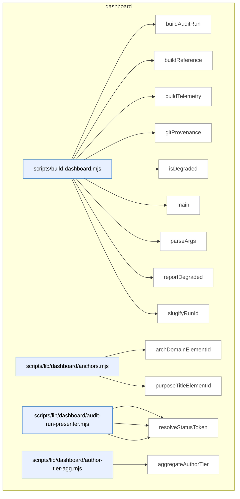

_Domain has 121 symbols (>50). Diagram shows top-15 by file order; see flat table below for the full list._

### Symbols in this domain

| Symbol | Kind | Path | Lines | Purpose | File imported by |
|---|---|---|---|---|---|
| [`buildAuditRun`](../scripts/build-dashboard.mjs#L157) | function | `scripts/build-dashboard.mjs` | 157-183 | Load audit run, augment with wall-clock provenance and mode, render HTML, write to slug-based file. | _(internal)_ |
| [`buildReference`](../scripts/build-dashboard.mjs#L131) | function | `scripts/build-dashboard.mjs` | 131-137 | Collect reference data, render HTML, and write atomically to disk. | _(internal)_ |
| [`buildTelemetry`](../scripts/build-dashboard.mjs#L139) | function | `scripts/build-dashboard.mjs` | 139-145 | Collect telemetry data, render HTML, and write atomically to disk. | _(internal)_ |
| [`gitProvenance`](../scripts/build-dashboard.mjs#L113) | function | `scripts/build-dashboard.mjs` | 113-123 | Query git for current short commit SHA and working-tree dirty state. | _(internal)_ |
| [`isDegraded`](../scripts/build-dashboard.mjs#L125) | function | `scripts/build-dashboard.mjs` | 125-129 | Check if any data source failed or returned invalid state. | _(internal)_ |
| [`main`](../scripts/build-dashboard.mjs#L198) | function | `scripts/build-dashboard.mjs` | 198-264 | Parse CLI args, dispatch to appropriate build command (reference/telemetry/audit-run/all), report degradation, exit with status. | _(internal)_ |
| [`parseArgs`](../scripts/build-dashboard.mjs#L57) | function | `scripts/build-dashboard.mjs` | 57-97 | Parse and validate dashboard CLI args, checking subcommand, flags, and their mutual compatibility. | _(internal)_ |
| [`reportDegraded`](../scripts/build-dashboard.mjs#L185) | function | `scripts/build-dashboard.mjs` | 185-196 | Log error/warning messages for any data sources that failed or are missing. | _(internal)_ |
| [`slugifyRunId`](../scripts/build-dashboard.mjs#L103) | function | `scripts/build-dashboard.mjs` | 103-110 | Convert run ID to safe filesystem slug by normalizing case and replacing special characters. | _(internal)_ |
| [`archDomainElementId`](../scripts/lib/dashboard/anchors.mjs#L15) | function | `scripts/lib/dashboard/anchors.mjs` | 15-17 | Generates a DOM element ID for an architecture domain. | `scripts/lib/dashboard/collect-purposes.mjs`, `scripts/lib/dashboard/sections/architecture.mjs` |
| [`purposeTitleElementId`](../scripts/lib/dashboard/anchors.mjs#L24) | function | `scripts/lib/dashboard/anchors.mjs` | 24-26 | Generates a DOM element ID for a purpose title. | `scripts/lib/dashboard/collect-purposes.mjs`, `scripts/lib/dashboard/sections/architecture.mjs` |
| [`presentFinding`](../scripts/lib/dashboard/audit-run-presenter.mjs#L59) | function | `scripts/lib/dashboard/audit-run-presenter.mjs` | 59-91 | Transforms a raw database finding into a presentation object with normalized labels and CSS classes. | `scripts/lib/dashboard/collect-audit-run.mjs` |
| [`presentFindings`](../scripts/lib/dashboard/audit-run-presenter.mjs#L94) | function | `scripts/lib/dashboard/audit-run-presenter.mjs` | 94-96 | Maps an array of findings through the presentFinding transformer. | `scripts/lib/dashboard/collect-audit-run.mjs` |
| [`resolveStatusToken`](../scripts/lib/dashboard/audit-run-presenter.mjs#L44) | function | `scripts/lib/dashboard/audit-run-presenter.mjs` | 44-50 | Maps finding remediation/adjudication state to a canonical status token. | `scripts/lib/dashboard/collect-audit-run.mjs` |
| [`aggregateAuthorTier`](../scripts/lib/dashboard/author-tier-agg.mjs#L28) | function | `scripts/lib/dashboard/author-tier-agg.mjs` | 28-89 | Aggregates author-tier observation rows into suggested-tier buckets and provider-model ladders with convergence counts. | `scripts/lib/dashboard/collect-telemetry.mjs` |
| [`isConverged`](../scripts/lib/dashboard/author-tier-agg.mjs#L16) | function | `scripts/lib/dashboard/author-tier-agg.mjs` | 16-18 | Checks if a value is `true`, `'true'`, or `'t'` to identify convergence flags. | `scripts/lib/dashboard/collect-telemetry.mjs` |
| [`coerceMeta`](../scripts/lib/dashboard/collect-audit-run.mjs#L64) | function | `scripts/lib/dashboard/collect-audit-run.mjs` | 64-67 | Coerces metadata object's createdAt field to ISO string if present, else returns null. | `scripts/build-dashboard.mjs` |
| [`coerceTs`](../scripts/lib/dashboard/collect-audit-run.mjs#L57) | function | `scripts/lib/dashboard/collect-audit-run.mjs` | 57-61 | Converts a value (null, Date, or string) to an ISO timestamp or null. | `scripts/build-dashboard.mjs` |
| [`collectAuditRun`](../scripts/lib/dashboard/collect-audit-run.mjs#L89) | function | `scripts/lib/dashboard/collect-audit-run.mjs` | 89-160 | Retrieves audit run metadata, findings, and convergence from cloud or gracefully reports cloud-disabled/not-found/query-error status. | `scripts/build-dashboard.mjs` |
| [`makeData`](../scripts/lib/dashboard/collect-audit-run.mjs#L69) | function | `scripts/lib/dashboard/collect-audit-run.mjs` | 69-81 | Constructs a data envelope with kind 'audit-run' and nested run metadata, meta, findings, and convergence state. | `scripts/build-dashboard.mjs` |
| [`resolveRunId`](../scripts/lib/dashboard/collect-audit-run.mjs#L35) | function | `scripts/lib/dashboard/collect-audit-run.mjs` | 35-55 | Resolves an audit run ID from an explicit parameter or a pointer file, returning the ID or an error code. | `scripts/build-dashboard.mjs` |
| [`auditCatalogCoverage`](../scripts/lib/dashboard/collect-cli.mjs#L130) | function | `scripts/lib/dashboard/collect-cli.mjs` | 130-144 | Compares npm scripts in package.json against catalog entries to find missing or orphaned scripts. | `scripts/lib/dashboard/collect-reference.mjs` |
| [`collectCli`](../scripts/lib/dashboard/collect-cli.mjs#L46) | function | `scripts/lib/dashboard/collect-cli.mjs` | 46-107 | Loads npm scripts from package.json and cross-references them against an optional .cli-catalog.json sidecar for descriptions and categories. | `scripts/lib/dashboard/collect-reference.mjs` |
| [`groupByCategory`](../scripts/lib/dashboard/collect-cli.mjs#L114) | function | `scripts/lib/dashboard/collect-cli.mjs` | 114-121 | Groups CLI entries by their category field into an object map. | `scripts/lib/dashboard/collect-reference.mjs` |
| [`canonicalRepoId`](../scripts/lib/dashboard/collect-nav.mjs#L39) | function | `scripts/lib/dashboard/collect-nav.mjs` | 39-53 | Resolves the repo's canonical database ID from cloud by repo UUID. | `scripts/lib/dashboard/collect-reference.mjs` |
| [`collectNav`](../scripts/lib/dashboard/collect-nav.mjs#L59) | function | `scripts/lib/dashboard/collect-nav.mjs` | 59-163 | Reads nav-contract.json and associated observed/verify envelopes to build a persona-scoped navigation scorecard with live findings. | `scripts/lib/dashboard/collect-reference.mjs` |
| [`readEnvelope`](../scripts/lib/dashboard/collect-nav.mjs#L165) | function | `scripts/lib/dashboard/collect-nav.mjs` | 165-179 | Reads and validates the gitignored nav-observed envelope against an expected config digest. | `scripts/lib/dashboard/collect-reference.mjs` |
| [`wrap`](../scripts/lib/dashboard/collect-nav.mjs#L181) | function | `scripts/lib/dashboard/collect-nav.mjs` | 181-183 | Wraps nav-audit results (scorecard, drift, findings) into the return object. | `scripts/lib/dashboard/collect-reference.mjs` |
| [`collectPurposes`](../scripts/lib/dashboard/collect-purposes.mjs#L54) | function | `scripts/lib/dashboard/collect-purposes.mjs` | 54-243 | Loads domain-map.json purposes config and validates it against architectural domains and flow nodes. | `scripts/lib/dashboard/collect-reference.mjs` |
| [`emptyResult`](../scripts/lib/dashboard/collect-purposes.mjs#L24) | function | `scripts/lib/dashboard/collect-purposes.mjs` | 24-41 | Returns an empty purpose-health result with zero coverage and empty hygiene flags. | `scripts/lib/dashboard/collect-reference.mjs` |
| [`collectArchitecture`](../scripts/lib/dashboard/collect-reference.mjs#L286) | function | `scripts/lib/dashboard/collect-reference.mjs` | 286-327 | Reads and parses docs/architecture-map.md to extract domain list and per-domain symbol counts from the Contents block. | `scripts/build-dashboard.mjs` |
| [`collectFlows`](../scripts/lib/dashboard/collect-reference.mjs#L340) | function | `scripts/lib/dashboard/collect-reference.mjs` | 340-367 | Reads flows.json manifest and cross-validates flow node skill references against the loaded skills. | `scripts/build-dashboard.mjs` |
| [`collectReference`](../scripts/lib/dashboard/collect-reference.mjs#L374) | function | `scripts/lib/dashboard/collect-reference.mjs` | 374-499 | Aggregates all reference data (skills, plans, architecture, flows, dependencies, requirements) for the dashboard. | `scripts/build-dashboard.mjs` |
| [`discoverPlans`](../scripts/lib/dashboard/collect-reference.mjs#L47) | function | `scripts/lib/dashboard/collect-reference.mjs` | 47-126 | Scans docs/plans and docs/completed directories to extract plan metadata from markdown headers. | `scripts/build-dashboard.mjs` |
| [`readDomainDeps`](../scripts/lib/dashboard/collect-reference.mjs#L225) | function | `scripts/lib/dashboard/collect-reference.mjs` | 225-245 | Merges observed (gitignored) and manual (committed) architectural dependencies and flattens into an edge list. | `scripts/build-dashboard.mjs` |
| [`readManualAllowedDeps`](../scripts/lib/dashboard/collect-reference.mjs#L180) | function | `scripts/lib/dashboard/collect-reference.mjs` | 180-205 | Reads the allowedDeps block from domain-map.json for manual architectural dependency rules. | `scripts/build-dashboard.mjs` |
| [`readObservedEnvelope`](../scripts/lib/dashboard/collect-reference.mjs#L137) | function | `scripts/lib/dashboard/collect-reference.mjs` | 137-166 | Reads and validates the architecture observed-deps envelope against a rule digest, falling back to manual allowedDeps if stale. | `scripts/build-dashboard.mjs` |
| [`readRequirementsLedger`](../scripts/lib/dashboard/collect-reference.mjs#L257) | function | `scripts/lib/dashboard/collect-reference.mjs` | 257-275 | Reads the committed .requirements/ledger.json and returns the requirements array or an empty state. | `scripts/build-dashboard.mjs` |
| [`aggregatePasses`](../scripts/lib/dashboard/collect-telemetry.mjs#L48) | function | `scripts/lib/dashboard/collect-telemetry.mjs` | 48-60 | Groups audit pass statistics by pass name, summing findings raised/accepted/dismissed. | `scripts/build-dashboard.mjs` |
| [`attributeHighByFile`](../scripts/lib/dashboard/collect-telemetry.mjs#L609) | function | `scripts/lib/dashboard/collect-telemetry.mjs` | 609-626 | Maps HIGH findings to purposes based on file domain classification, skipping sensitive paths. | `scripts/build-dashboard.mjs` |
| [`canonicalRepoId`](../scripts/lib/dashboard/collect-telemetry.mjs#L227) | function | `scripts/lib/dashboard/collect-telemetry.mjs` | 227-230 | Resolves the canonical database repo ID from the current directory's UUID. | `scripts/build-dashboard.mjs` |
| [`classifyPurposeBadges`](../scripts/lib/dashboard/collect-telemetry.mjs#L633) | function | `scripts/lib/dashboard/collect-telemetry.mjs` | 633-662 | Generates health badges (ok/at-risk/na) for each purpose based on signals. | `scripts/build-dashboard.mjs` |
| [`collectAuditEffectiveness`](../scripts/lib/dashboard/collect-telemetry.mjs#L420) | function | `scripts/lib/dashboard/collect-telemetry.mjs` | 420-448 | Fetches persona-audit correlation data and precision/recall metrics for the repo. | `scripts/build-dashboard.mjs` |
| [`collectAuditRuns`](../scripts/lib/dashboard/collect-telemetry.mjs#L71) | function | `scripts/lib/dashboard/collect-telemetry.mjs` | 71-110 | Gathers audit run telemetry from cloud or local sources, aggregated by pass. | `scripts/build-dashboard.mjs` |
| [`collectAuthorTier`](../scripts/lib/dashboard/collect-telemetry.mjs#L350) | function | `scripts/lib/dashboard/collect-telemetry.mjs` | 350-361 | Gathers author-tier observation statistics and diversity metrics for the repo. | `scripts/build-dashboard.mjs` |
| [`collectLearning`](../scripts/lib/dashboard/collect-telemetry.mjs#L167) | function | `scripts/lib/dashboard/collect-telemetry.mjs` | 167-187 | Fetches learning store statistics (triage queue, noBrainers, clusters) for the repo. | `scripts/build-dashboard.mjs` |
| [`collectModelAb`](../scripts/lib/dashboard/collect-telemetry.mjs#L376) | function | `scripts/lib/dashboard/collect-telemetry.mjs` | 376-412 | Retrieves model-A/B/C arm effectiveness, costs, and pending adjudication queue. | `scripts/build-dashboard.mjs` |
| [`collectPersonaTests`](../scripts/lib/dashboard/collect-telemetry.mjs#L286) | function | `scripts/lib/dashboard/collect-telemetry.mjs` | 286-337 | Retrieves persona test sessions and audit correlations for the repo. | `scripts/build-dashboard.mjs` |
| [`collectPromptVariants`](../scripts/lib/dashboard/collect-telemetry.mjs#L194) | function | `scripts/lib/dashboard/collect-telemetry.mjs` | 194-224 | Retrieves bandit arm statistics for prompt variants and their posterior distributions. | `scripts/build-dashboard.mjs` |
| [`collectPurposeHealth`](../scripts/lib/dashboard/collect-telemetry.mjs#L520) | function | `scripts/lib/dashboard/collect-telemetry.mjs` | 520-597 | Aggregates purpose-domain health by analyzing HIGH findings and refused secrets. | `scripts/build-dashboard.mjs` |
| [`collectRequirements`](../scripts/lib/dashboard/collect-telemetry.mjs#L113) | function | `scripts/lib/dashboard/collect-telemetry.mjs` | 113-154 | Reads and parses the optional `.requirements/ledger.json` file with truncation. | `scripts/build-dashboard.mjs` |
| [`collectSecurity`](../scripts/lib/dashboard/collect-telemetry.mjs#L482) | function | `scripts/lib/dashboard/collect-telemetry.mjs` | 482-497 | Retrieves incident counts, status distribution, and recent events for the repo. | `scripts/build-dashboard.mjs` |
| [`collectShipHealth`](../scripts/lib/dashboard/collect-telemetry.mjs#L233) | function | `scripts/lib/dashboard/collect-telemetry.mjs` | 233-258 | Gathers ship event outcomes and recent deployments for the repo. | `scripts/build-dashboard.mjs` |
| [`collectTelemetry`](../scripts/lib/dashboard/collect-telemetry.mjs#L759) | function | `scripts/lib/dashboard/collect-telemetry.mjs` | 759-816 | Orchestrates all telemetry collectors and returns a unified dashboard data structure. | `scripts/build-dashboard.mjs` |
| [`collectTieredShadow`](../scripts/lib/dashboard/collect-telemetry.mjs#L676) | function | `scripts/lib/dashboard/collect-telemetry.mjs` | 676-752 | Aggregates tiered-pipeline shadow observations from cloud or local repos. | `scripts/build-dashboard.mjs` |
| [`emptyAuthorTier`](../scripts/lib/dashboard/collect-telemetry.mjs#L340) | function | `scripts/lib/dashboard/collect-telemetry.mjs` | 340-342 | Returns an empty author-tier telemetry structure with default values. | `scripts/build-dashboard.mjs` |
| [`emptyEffectiveness`](../scripts/lib/dashboard/collect-telemetry.mjs#L415) | function | `scripts/lib/dashboard/collect-telemetry.mjs` | 415-417 | Returns an empty audit-effectiveness telemetry structure with default values. | `scripts/build-dashboard.mjs` |
| [`emptyModelAb`](../scripts/lib/dashboard/collect-telemetry.mjs#L364) | function | `scripts/lib/dashboard/collect-telemetry.mjs` | 364-366 | Returns an empty model-A/B/C shadow telemetry structure with default values. | `scripts/build-dashboard.mjs` |
| [`emptyPersonaTests`](../scripts/lib/dashboard/collect-telemetry.mjs#L263) | function | `scripts/lib/dashboard/collect-telemetry.mjs` | 263-265 | Returns an empty persona-test telemetry structure with default values. | `scripts/build-dashboard.mjs` |
| [`emptyPurposeHealth`](../scripts/lib/dashboard/collect-telemetry.mjs#L504) | function | `scripts/lib/dashboard/collect-telemetry.mjs` | 504-511 | Returns an empty purpose-health telemetry structure with default values. | `scripts/build-dashboard.mjs` |
| [`emptySecurity`](../scripts/lib/dashboard/collect-telemetry.mjs#L451) | function | `scripts/lib/dashboard/collect-telemetry.mjs` | 451-456 | Returns an empty security-incidents telemetry structure with default values. | `scripts/build-dashboard.mjs` |
| [`repoName`](../scripts/lib/dashboard/collect-telemetry.mjs#L157) | function | `scripts/lib/dashboard/collect-telemetry.mjs` | 157-164 | Resolves the repository name from environment or package.json. | `scripts/build-dashboard.mjs` |
| [`securityData`](../scripts/lib/dashboard/collect-telemetry.mjs#L459) | function | `scripts/lib/dashboard/collect-telemetry.mjs` | 459-475 | Normalizes security statistics into dashboard-ready format with ISO dates. | `scripts/build-dashboard.mjs` |
| [`collectVisual`](../scripts/lib/dashboard/collect-visual.mjs#L19) | function | `scripts/lib/dashboard/collect-visual.mjs` | 19-49 | Reads visual-contract.json and associated verify results to build paint-audit scorecard and findings. | `scripts/lib/dashboard/collect-reference.mjs` |
| [`wrap`](../scripts/lib/dashboard/collect-visual.mjs#L51) | function | `scripts/lib/dashboard/collect-visual.mjs` | 51-53 | Wraps visual audit data (scorecard, findings, diagnostics) into a structured result object. | `scripts/lib/dashboard/collect-reference.mjs` |
| [`buildUi`](../scripts/lib/dashboard/helpers.mjs#L106) | function | `scripts/lib/dashboard/helpers.mjs` | 106-117 | Creates a frozen object exposing UI helper functions. | `scripts/lib/dashboard/render.mjs` |
| [`emptyPanel`](../scripts/lib/dashboard/helpers.mjs#L72) | function | `scripts/lib/dashboard/helpers.mjs` | 72-75 | Renders an empty state panel with optional test ID. | `scripts/lib/dashboard/render.mjs` |
| [`escapeHtml`](../scripts/lib/dashboard/helpers.mjs#L22) | function | `scripts/lib/dashboard/helpers.mjs` | 22-29 | Escapes HTML special characters to prevent injection. | `scripts/lib/dashboard/render.mjs` |
| [`jsonScriptSafe`](../scripts/lib/dashboard/helpers.mjs#L43) | function | `scripts/lib/dashboard/helpers.mjs` | 43-50 | Escapes JSON for safe embedding inside script tags. | `scripts/lib/dashboard/render.mjs` |
| [`panel`](../scripts/lib/dashboard/helpers.mjs#L83) | function | `scripts/lib/dashboard/helpers.mjs` | 83-86 | Renders a tab panel container linked to its tab. | `scripts/lib/dashboard/render.mjs` |
| [`splitUsage`](../scripts/lib/dashboard/helpers.mjs#L93) | function | `scripts/lib/dashboard/helpers.mjs` | 93-98 | Parses a usage line into command and description components. | `scripts/lib/dashboard/render.mjs` |
| [`statusDot`](../scripts/lib/dashboard/helpers.mjs#L57) | function | `scripts/lib/dashboard/helpers.mjs` | 57-61 | Renders a colored status indicator dot (green/yellow/red). | `scripts/lib/dashboard/render.mjs` |
| [`tab`](../scripts/lib/dashboard/helpers.mjs#L77) | function | `scripts/lib/dashboard/helpers.mjs` | 77-81 | Renders an accessible tab button with ARIA attributes. | `scripts/lib/dashboard/render.mjs` |
| [`warningPanel`](../scripts/lib/dashboard/helpers.mjs#L64) | function | `scripts/lib/dashboard/helpers.mjs` | 64-69 | Renders an HTML warning panel for source status errors. | `scripts/lib/dashboard/render.mjs` |
| [`loadAssets`](../scripts/lib/dashboard/load-assets.mjs#L18) | function | `scripts/lib/dashboard/load-assets.mjs` | 18-29 | Reads bundled CSS and JavaScript assets from the filesystem. | `scripts/build-dashboard.mjs` |
| [`freshnessBanner`](../scripts/lib/dashboard/render.mjs#L141) | function | `scripts/lib/dashboard/render.mjs` | 141-153 | Renders an HTML banner showing build SHA, freshness, and generation metadata. | `scripts/build-dashboard.mjs` |
| [`nav`](../scripts/lib/dashboard/render.mjs#L158) | function | `scripts/lib/dashboard/render.mjs` | 158-166 | Renders the dashboard navigation header with Reference/Telemetry links. | `scripts/build-dashboard.mjs` |
| [`renderDocument`](../scripts/lib/dashboard/render.mjs#L178) | function | `scripts/lib/dashboard/render.mjs` | 178-271 | Builds the complete HTML document with tabbed sections. | `scripts/build-dashboard.mjs` |
| [`validateDashboardData`](../scripts/lib/dashboard/schema.mjs#L518) | function | `scripts/lib/dashboard/schema.mjs` | 518-523 | Dispatches dashboard data to type-specific Zod parsers based on kind. | `scripts/lib/dashboard/collect-purposes.mjs`, `scripts/lib/dashboard/collect-reference.mjs`, `scripts/lib/dashboard/collect-telemetry.mjs`, +1 more |
| [`archTiers`](../scripts/lib/dashboard/sections/architecture.mjs#L29) | function | `scripts/lib/dashboard/sections/architecture.mjs` | 29-46 | Computes architectural tier levels (0=leaf, 1=bridge, 2=foundation) based on dependencies. | `scripts/lib/dashboard/render.mjs` |
| [`formatDepsSourceLine`](../scripts/lib/dashboard/sections/architecture.mjs#L48) | function | `scripts/lib/dashboard/sections/architecture.mjs` | 48-72 | Formats a dependency summary line with edge counts and refresh metadata. | `scripts/lib/dashboard/render.mjs` |
| [`sectionArchitecture`](../scripts/lib/dashboard/sections/architecture.mjs#L74) | function | `scripts/lib/dashboard/sections/architecture.mjs` | 74-131 | Renders architecture domains as tiered boxes with dependency annotations. | `scripts/lib/dashboard/render.mjs` |
| [`pct`](../scripts/lib/dashboard/sections/audit-effectiveness.mjs#L14) | function | `scripts/lib/dashboard/sections/audit-effectiveness.mjs` | 14-17 | Formats a decimal as a percentage or returns em-dash if null. | `scripts/lib/dashboard/render.mjs` |
| [`sectionAuditEffectiveness`](../scripts/lib/dashboard/sections/audit-effectiveness.mjs#L19) | function | `scripts/lib/dashboard/sections/audit-effectiveness.mjs` | 19-39 | Renders a table of user-visible audit precision and recall metrics. | `scripts/lib/dashboard/render.mjs` |
| [`chip`](../scripts/lib/dashboard/sections/audit-run-detail.mjs#L34) | function | `scripts/lib/dashboard/sections/audit-run-detail.mjs` | 34-37 | Renders a clickable filter chip button for a severity/pass/status category. | `scripts/lib/dashboard/render.mjs` |
| [`filterBar`](../scripts/lib/dashboard/sections/audit-run-detail.mjs#L39) | function | `scripts/lib/dashboard/sections/audit-run-detail.mjs` | 39-65 | Renders filter controls for severity, pass, status, and filename search. | `scripts/lib/dashboard/render.mjs` |
| [`findingRow`](../scripts/lib/dashboard/sections/audit-run-detail.mjs#L67) | function | `scripts/lib/dashboard/sections/audit-run-detail.mjs` | 67-89 | Renders a table row for one audit finding with collapsible evidence details. | `scripts/lib/dashboard/render.mjs` |
| [`findingsTable`](../scripts/lib/dashboard/sections/audit-run-detail.mjs#L91) | function | `scripts/lib/dashboard/sections/audit-run-detail.mjs` | 91-100 | Renders the complete findings table with header and all finding rows. | `scripts/lib/dashboard/render.mjs` |
| [`runHeader`](../scripts/lib/dashboard/sections/audit-run-detail.mjs#L20) | function | `scripts/lib/dashboard/sections/audit-run-detail.mjs` | 20-32 | Renders the audit run header with mode, rounds, verdict, and commit SHA. | `scripts/lib/dashboard/render.mjs` |
| [`sectionAuditRunDetail`](../scripts/lib/dashboard/sections/audit-run-detail.mjs#L102) | function | `scripts/lib/dashboard/sections/audit-run-detail.mjs` | 102-143 | Renders audit findings with filter UI or error/empty panels. | `scripts/lib/dashboard/render.mjs` |
| [`sectionAuditRuns`](../scripts/lib/dashboard/sections/audit-runs.mjs#L16) | function | `scripts/lib/dashboard/sections/audit-runs.mjs` | 16-53 | Renders audit run statistics with pass-summary and outcome counts. | `scripts/lib/dashboard/render.mjs` |
| [`sectionAuthorTier`](../scripts/lib/dashboard/sections/author-tier.mjs#L14) | function | `scripts/lib/dashboard/sections/author-tier.mjs` | 14-63 | Renders author model tier observation data grouped by suggested tier. | `scripts/lib/dashboard/render.mjs` |
| [`sectionCli`](../scripts/lib/dashboard/sections/cli.mjs#L38) | function | `scripts/lib/dashboard/sections/cli.mjs` | 38-97 | Renders CLI scripts organized by category with descriptions and linked skills. | `scripts/lib/dashboard/render.mjs` |
| [`sectionFlows`](../scripts/lib/dashboard/sections/flows.mjs#L14) | function | `scripts/lib/dashboard/sections/flows.mjs` | 14-42 | Renders the skill-chain flow diagram showing handoff edges between steps. | `scripts/lib/dashboard/render.mjs` |
| [`sectionLearning`](../scripts/lib/dashboard/sections/learning.mjs#L14) | function | `scripts/lib/dashboard/sections/learning.mjs` | 14-34 | Renders learning decision metrics (pending triage, no-brainers, stale clusters). | `scripts/lib/dashboard/render.mjs` |
| [`sectionModelAb`](../scripts/lib/dashboard/sections/model-ab.mjs#L21) | function | `scripts/lib/dashboard/sections/model-ab.mjs` | 21-69 | Renders model-A/B/C arm comparison data with conformance and cost. | `scripts/lib/dashboard/render.mjs` |
| [`sectionNavAudit`](../scripts/lib/dashboard/sections/nav-audit.mjs#L17) | function | `scripts/lib/dashboard/sections/nav-audit.mjs` | 17-82 | Renders navigation audit scorecard and live-verified findings per persona. | `scripts/lib/dashboard/render.mjs` |
| [`daysAgo`](../scripts/lib/dashboard/sections/persona-tests.mjs#L15) | function | `scripts/lib/dashboard/sections/persona-tests.mjs` | 15-20 | Calculates elapsed days from an ISO timestamp. | `scripts/lib/dashboard/render.mjs` |
| [`sectionPersonaTests`](../scripts/lib/dashboard/sections/persona-tests.mjs#L26) | function | `scripts/lib/dashboard/sections/persona-tests.mjs` | 26-73 | Renders persona test sessions with latest verdicts and trend history. | `scripts/lib/dashboard/render.mjs` |
| [`escapeHtml`](../scripts/lib/dashboard/sections/plans.mjs#L40) | function | `scripts/lib/dashboard/sections/plans.mjs` | 40-47 | Escapes HTML special characters to prevent injection. | `scripts/lib/dashboard/render.mjs` |
| [`planList`](../scripts/lib/dashboard/sections/plans.mjs#L184) | function | `scripts/lib/dashboard/sections/plans.mjs` | 184-198 | Renders a list of plan details elements with status and metadata. | `scripts/lib/dashboard/render.mjs` |
| [`renderInline`](../scripts/lib/dashboard/sections/plans.mjs#L49) | function | `scripts/lib/dashboard/sections/plans.mjs` | 49-78 | Renders markdown inline formatting (bold, italic, code, links) with XSS protection. | `scripts/lib/dashboard/render.mjs` |
| [`renderMarkdown`](../scripts/lib/dashboard/sections/plans.mjs#L80) | function | `scripts/lib/dashboard/sections/plans.mjs` | 80-180 | Parses markdown to HTML (headings, lists, fenced code, Mermaid blocks). | `scripts/lib/dashboard/render.mjs` |
| [`sectionPlans`](../scripts/lib/dashboard/sections/plans.mjs#L200) | function | `scripts/lib/dashboard/sections/plans.mjs` | 200-231 | Renders active/completed plans with Mermaid diagram support via CDN. | `scripts/lib/dashboard/render.mjs` |
| [`sectionPromptVariants`](../scripts/lib/dashboard/sections/prompt-variants.mjs#L14) | function | `scripts/lib/dashboard/sections/prompt-variants.mjs` | 14-41 | Renders Thompson-sampling bandit arm statistics with posterior means. | `scripts/lib/dashboard/render.mjs` |
| [`sectionPurposeHealth`](../scripts/lib/dashboard/sections/purpose-health.mjs#L25) | function | `scripts/lib/dashboard/sections/purpose-health.mjs` | 25-67 | Renders governance health badges and per-domain audit finding counts. | `scripts/lib/dashboard/render.mjs` |
| [`renderChip`](../scripts/lib/dashboard/sections/purpose.mjs#L153) | function | `scripts/lib/dashboard/sections/purpose.mjs` | 153-162 | Renders a domain reference chip, optionally linked to its architecture entry. | `scripts/lib/dashboard/render.mjs` |
| [`renderHygiene`](../scripts/lib/dashboard/sections/purpose.mjs#L164) | function | `scripts/lib/dashboard/sections/purpose.mjs` | 164-189 | Renders purpose mapping hygiene warnings (unmapped domains, missing entries, etc.). | `scripts/lib/dashboard/render.mjs` |
| [`renderMatrix`](../scripts/lib/dashboard/sections/purpose.mjs#L88) | function | `scripts/lib/dashboard/sections/purpose.mjs` | 88-104 | Renders an outcome × domain coverage matrix showing which purposes use which domains. | `scripts/lib/dashboard/render.mjs` |
| [`renderNode`](../scripts/lib/dashboard/sections/purpose.mjs#L106) | function | `scripts/lib/dashboard/sections/purpose.mjs` | 106-151 | Renders a single purpose node with domains, flow links, and requirement groups. | `scripts/lib/dashboard/render.mjs` |
| [`sectionPurpose`](../scripts/lib/dashboard/sections/purpose.mjs#L26) | function | `scripts/lib/dashboard/sections/purpose.mjs` | 26-80 | Renders purposes with domain coverage ratios and invariant mappings. | `scripts/lib/dashboard/render.mjs` |
| [`shortReqId`](../scripts/lib/dashboard/sections/purpose.mjs#L21) | function | `scripts/lib/dashboard/sections/purpose.mjs` | 21-24 | Extracts and formats a short hash suffix from a full requirement ID. | `scripts/lib/dashboard/render.mjs` |
| [`sectionRequirements`](../scripts/lib/dashboard/sections/requirements.mjs#L17) | function | `scripts/lib/dashboard/sections/requirements.mjs` | 17-47 | Renders requirements ledger grouped by kind with status indicators. | `scripts/lib/dashboard/render.mjs` |
| [`sectionSecurity`](../scripts/lib/dashboard/sections/security.mjs#L26) | function | `scripts/lib/dashboard/sections/security.mjs` | 26-71 | Renders security incident counts, audit-trail activity, and recent events. | `scripts/lib/dashboard/render.mjs` |
| [`sectionShipHealth`](../scripts/lib/dashboard/sections/ship-health.mjs#L12) | function | `scripts/lib/dashboard/sections/ship-health.mjs` | 12-37 | Renders ship deployment outcomes and recent events as HTML dashboard tables. | `scripts/lib/dashboard/render.mjs` |
| [`sectionSkills`](../scripts/lib/dashboard/sections/skills.mjs#L24) | function | `scripts/lib/dashboard/sections/skills.mjs` | 24-62 | Renders a searchable card grid of CLI skills with triggers, usage, and descriptions. | `scripts/lib/dashboard/render.mjs` |
| [`sectionStartHere`](../scripts/lib/dashboard/sections/start-here.mjs#L13) | function | `scripts/lib/dashboard/sections/start-here.mjs` | 13-102 | Renders the dashboard reference intro page explaining the toolkit and navigation paths. | `scripts/lib/dashboard/render.mjs` |
| [`sectionTieredShadow`](../scripts/lib/dashboard/sections/tiered-shadow.mjs#L14) | function | `scripts/lib/dashboard/sections/tiered-shadow.mjs` | 14-113 | Renders the Tiered Shadow dashboard panel with progress bars and window status. | `scripts/lib/dashboard/render.mjs` |
| [`sectionVisualAudit`](../scripts/lib/dashboard/sections/visual-audit.mjs#L15) | function | `scripts/lib/dashboard/sections/visual-audit.mjs` | 15-61 | Renders visual-audit findings and contracted-surface scorecard with live/static verification status. | `scripts/lib/dashboard/render.mjs` |
| [`openBrowser`](../scripts/lib/dashboard/serve.mjs#L22) | function | `scripts/lib/dashboard/serve.mjs` | 22-34 | Spawns a platform-appropriate browser process to open a dashboard URL. | `scripts/build-dashboard.mjs` |
| [`serve`](../scripts/lib/dashboard/serve.mjs#L44) | function | `scripts/lib/dashboard/serve.mjs` | 44-118 | Serves dashboard static files via HTTP with path containment, Host validation, and cache-busting headers. | `scripts/build-dashboard.mjs` |

---

## explain

> The `explain` domain provides a multi-source historical search tool that queries git commits, brainstorm sessions, architecture memory, and plan documents for a given topic, then synthesizes results into a chronological timeline and summary report.

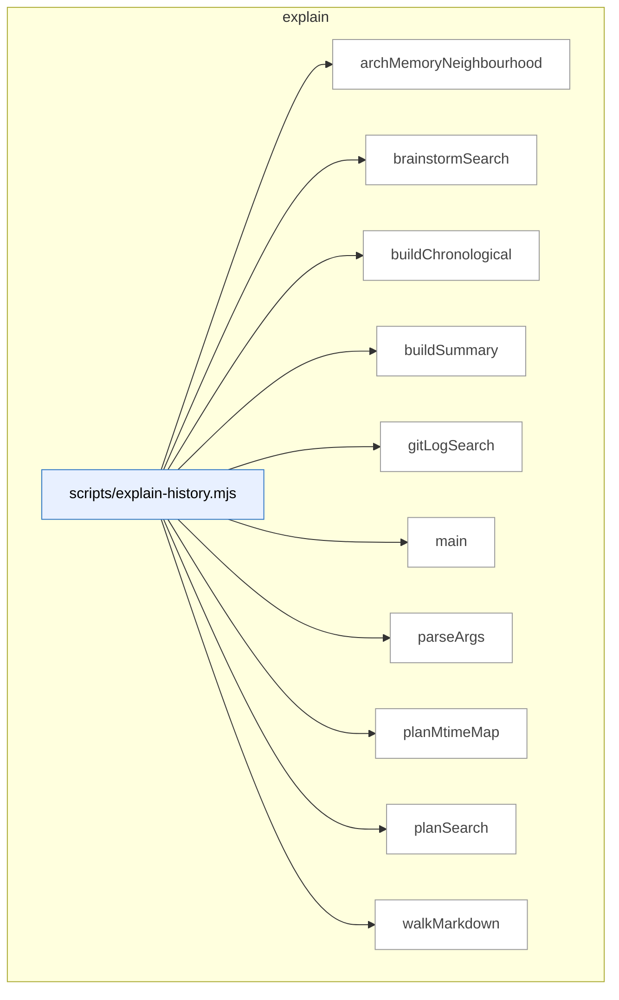

### Symbols in this domain

| Symbol | Kind | Path | Lines | Purpose | File imported by |
|---|---|---|---|---|---|
| [`archMemoryNeighbourhood`](../scripts/explain-history.mjs#L148) | function | `scripts/explain-history.mjs` | 148-184 | Queries architectural memory for similar symbols via cross-skill, returning ranked candidates with similarity scores. | _(internal)_ |
| [`brainstormSearch`](../scripts/explain-history.mjs#L237) | function | `scripts/explain-history.mjs` | 237-282 | Searches brainstorm session logs (.jsonl) for matches on topic in both the topic field and provider responses. | _(internal)_ |
| [`buildChronological`](../scripts/explain-history.mjs#L290) | function | `scripts/explain-history.mjs` | 290-305 | Merges git, brainstorm, and plan results into a chronologically sorted list (most-recent first, null dates last). | _(internal)_ |
| [`buildSummary`](../scripts/explain-history.mjs#L319) | function | `scripts/explain-history.mjs` | 319-326 | Tallies touches of a topic across git history, arch-memory, plans, and brainstorm sessions, then formats a summary string. | _(internal)_ |
| [`gitLogSearch`](../scripts/explain-history.mjs#L89) | function | `scripts/explain-history.mjs` | 89-140 | Searches git history for commits matching a topic by subject (grep) and content (-S), deduplicating results. | _(internal)_ |
| [`main`](../scripts/explain-history.mjs#L328) | function | `scripts/explain-history.mjs` | 328-385 | Orchestrates searching for a topic across four sources (git, arch-memory, plans, brainstorm) and outputs the chronological and summary results. | _(internal)_ |
| [`parseArgs`](../scripts/explain-history.mjs#L51) | function | `scripts/explain-history.mjs` | 51-80 | Parses command-line arguments (--topic, --since, --paths, --limit, --out, --skip-arch) for explain-history. | _(internal)_ |
| [`planMtimeMap`](../scripts/explain-history.mjs#L307) | function | `scripts/explain-history.mjs` | 307-317 | Builds a map of plan file paths to their last-modified timestamps as ISO strings (or null on stat error). | _(internal)_ |
| [`planSearch`](../scripts/explain-history.mjs#L191) | function | `scripts/explain-history.mjs` | 191-218 | Recursively searches docs/plans for markdown files containing the topic keyword, grouped by heading. | _(internal)_ |
| [`walkMarkdown`](../scripts/explain-history.mjs#L220) | function | `scripts/explain-history.mjs` | 220-228 | Recursively lists all .md files in a directory tree. | _(internal)_ |

---

## findings

> The `findings` domain formats security findings by severity and logs their outcomes over time, computing acceptance rates and effectiveness metrics while tracking associated remediation tasks.

```mermaid
flowchart TB
subgraph dom_findings ["findings"]
  file_scripts_lib_findings_format_mjs["scripts/lib/findings-format.mjs"]:::component
  sym_scripts_lib_findings_format_mjs_formatFi["formatFindings"]:::symbol
  file_scripts_lib_findings_format_mjs --> sym_scripts_lib_findings_format_mjs_formatFi
  file_scripts_lib_findings_outcomes_mjs["scripts/lib/findings-outcomes.mjs"]:::component
  sym_scripts_lib_findings_outcomes_mjs_append["appendOutcome"]:::symbol
  file_scripts_lib_findings_outcomes_mjs --> sym_scripts_lib_findings_outcomes_mjs_append
  sym_scripts_lib_findings_outcomes_mjs_batchA["batchAppendOutcomes"]:::symbol
  file_scripts_lib_findings_outcomes_mjs --> sym_scripts_lib_findings_outcomes_mjs_batchA
  sym_scripts_lib_findings_outcomes_mjs_compac["compactOutcomes"]:::symbol
  file_scripts_lib_findings_outcomes_mjs --> sym_scripts_lib_findings_outcomes_mjs_compac
  sym_scripts_lib_findings_outcomes_mjs_comput["computePassEffectiveness"]:::symbol
  file_scripts_lib_findings_outcomes_mjs --> sym_scripts_lib_findings_outcomes_mjs_comput
  sym_scripts_lib_findings_outcomes_mjs_comput["computePassEWR"]:::symbol
  file_scripts_lib_findings_outcomes_mjs --> sym_scripts_lib_findings_outcomes_mjs_comput
  sym_scripts_lib_findings_outcomes_mjs_loadOu["loadOutcomes"]:::symbol
  file_scripts_lib_findings_outcomes_mjs --> sym_scripts_lib_findings_outcomes_mjs_loadOu
  sym_scripts_lib_findings_outcomes_mjs_setRep["setRepoProfileCache"]:::symbol
  file_scripts_lib_findings_outcomes_mjs --> sym_scripts_lib_findings_outcomes_mjs_setRep
  file_scripts_lib_findings_tasks_mjs["scripts/lib/findings-tasks.mjs"]:::component
  sym_scripts_lib_findings_tasks_mjs_createRem["createRemediationTask"]:::symbol
  file_scripts_lib_findings_tasks_mjs --> sym_scripts_lib_findings_tasks_mjs_createRem
  sym_scripts_lib_findings_tasks_mjs_getTaskSt["getTaskStore"]:::symbol
  file_scripts_lib_findings_tasks_mjs --> sym_scripts_lib_findings_tasks_mjs_getTaskSt
  sym_scripts_lib_findings_tasks_mjs_loadTasks["loadTasks"]:::symbol
  file_scripts_lib_findings_tasks_mjs --> sym_scripts_lib_findings_tasks_mjs_loadTasks
  sym_scripts_lib_findings_tasks_mjs_persistTa["persistTask"]:::symbol
  file_scripts_lib_findings_tasks_mjs --> sym_scripts_lib_findings_tasks_mjs_persistTa
  sym_scripts_lib_findings_tasks_mjs_trackEdit["trackEdit"]:::symbol
  file_scripts_lib_findings_tasks_mjs --> sym_scripts_lib_findings_tasks_mjs_trackEdit
  sym_scripts_lib_findings_tasks_mjs_updateTas["updateTask"]:::symbol
  file_scripts_lib_findings_tasks_mjs --> sym_scripts_lib_findings_tasks_mjs_updateTas
  sym_scripts_lib_findings_tasks_mjs_verifyTas["verifyTask"]:::symbol
  file_scripts_lib_findings_tasks_mjs --> sym_scripts_lib_findings_tasks_mjs_verifyTas
  file_scripts_lib_findings_tracker_mjs["scripts/lib/findings-tracker.mjs"]:::component
  sym_scripts_lib_findings_tracker_mjs_applyLa["applyLazyDecay"]:::symbol
  file_scripts_lib_findings_tracker_mjs --> sym_scripts_lib_findings_tracker_mjs_applyLa
  sym_scripts_lib_findings_tracker_mjs_buildPa["buildPatternKey"]:::symbol
  file_scripts_lib_findings_tracker_mjs --> sym_scripts_lib_findings_tracker_mjs_buildPa
  sym_scripts_lib_findings_tracker_mjs_effecti["effectiveSampleSize"]:::symbol
  file_scripts_lib_findings_tracker_mjs --> sym_scripts_lib_findings_tracker_mjs_effecti
  sym_scripts_lib_findings_tracker_mjs_extract["extractDimensions"]:::symbol
  file_scripts_lib_findings_tracker_mjs --> sym_scripts_lib_findings_tracker_mjs_extract
  sym_scripts_lib_findings_tracker_mjs_FalsePo["FalsePositiveTracker"]:::symbol
  file_scripts_lib_findings_tracker_mjs --> sym_scripts_lib_findings_tracker_mjs_FalsePo
  sym_scripts_lib_findings_tracker_mjs_recordW["recordWithDecay"]:::symbol
  file_scripts_lib_findings_tracker_mjs --> sym_scripts_lib_findings_tracker_mjs_recordW
  file_scripts_lib_findings_mjs["scripts/lib/findings.mjs"]:::component
  sym_scripts_lib_findings_mjs_semanticId["semanticId"]:::symbol
  file_scripts_lib_findings_mjs --> sym_scripts_lib_findings_mjs_semanticId
end
classDef container fill:#f5f5f5,stroke:#333,stroke-width:2px,color:#000
classDef component fill:#e8f0ff,stroke:#3178c6,color:#000
classDef symbol fill:#fff,stroke:#999,color:#444
classDef dup fill:#ffe8d8,stroke:#c0392b,stroke-width:2px,color:#000
classDef violation fill:#ffd6d6,stroke:#c0392b,stroke-width:2px,color:#000
```

### Symbols in this domain

| Symbol | Kind | Path | Lines | Purpose | File imported by |
|---|---|---|---|---|---|
| [`formatFindings`](../scripts/lib/findings-format.mjs#L12) | function | `scripts/lib/findings-format.mjs` | 12-33 | Formats findings as markdown grouped by severity. | `scripts/lib/findings.mjs` |
| [`appendOutcome`](../scripts/lib/findings-outcomes.mjs#L38) | function | `scripts/lib/findings-outcomes.mjs` | 38-50 | Appends a single outcome record with timestamp and repo fingerprint. | `scripts/audit-metrics.mjs`, `scripts/lib/findings.mjs`, `scripts/lib/outcome-sync.mjs` |
| [`batchAppendOutcomes`](../scripts/lib/findings-outcomes.mjs#L58) | function | `scripts/lib/findings-outcomes.mjs` | 58-75 | Atomically appends multiple outcomes to a JSONL log with timestamp backfill. | `scripts/audit-metrics.mjs`, `scripts/lib/findings.mjs`, `scripts/lib/outcome-sync.mjs` |
| [`compactOutcomes`](../scripts/lib/findings-outcomes.mjs#L100) | function | `scripts/lib/findings-outcomes.mjs` | 100-138 | Prunes stale outcomes and backfills timestamps, writing atomically. | `scripts/audit-metrics.mjs`, `scripts/lib/findings.mjs`, `scripts/lib/outcome-sync.mjs` |
| [`computePassEffectiveness`](../scripts/lib/findings-outcomes.mjs#L149) | function | `scripts/lib/findings-outcomes.mjs` | 149-187 | Calculates exponentially-decayed acceptance rate and signal score per pass. | `scripts/audit-metrics.mjs`, `scripts/lib/findings.mjs`, `scripts/lib/outcome-sync.mjs` |
| [`computePassEWR`](../scripts/lib/findings-outcomes.mjs#L196) | function | `scripts/lib/findings-outcomes.mjs` | 196-216 | Calculates exponentially-weighted pass rewards with confidence decay based on age. | `scripts/audit-metrics.mjs`, `scripts/lib/findings.mjs`, `scripts/lib/outcome-sync.mjs` |
| [`loadOutcomes`](../scripts/lib/findings-outcomes.mjs#L82) | function | `scripts/lib/findings-outcomes.mjs` | 82-93 | Loads all outcomes from a JSONL log, backfilling missing timestamps. | `scripts/audit-metrics.mjs`, `scripts/lib/findings.mjs`, `scripts/lib/outcome-sync.mjs` |
| [`setRepoProfileCache`](../scripts/lib/findings-outcomes.mjs#L27) | function | `scripts/lib/findings-outcomes.mjs` | 27-29 | Caches a repo profile in module-level state. | `scripts/audit-metrics.mjs`, `scripts/lib/findings.mjs`, `scripts/lib/outcome-sync.mjs` |
| [`createRemediationTask`](../scripts/lib/findings-tasks.mjs#L34) | function | `scripts/lib/findings-tasks.mjs` | 34-48 | Constructs a new remediation task object linked to a finding with pending state. | `scripts/lib/findings.mjs` |
| [`getTaskStore`](../scripts/lib/findings-tasks.mjs#L17) | function | `scripts/lib/findings-tasks.mjs` | 17-22 | Returns or creates a singleton append-only store for remediation tasks. | `scripts/lib/findings.mjs` |
| [`loadTasks`](../scripts/lib/findings-tasks.mjs#L75) | function | `scripts/lib/findings-tasks.mjs` | 75-81 | Loads all tasks from the store, optionally filtered by run ID. | `scripts/lib/findings.mjs` |
| [`persistTask`](../scripts/lib/findings-tasks.mjs#L72) | function | `scripts/lib/findings-tasks.mjs` | 72-72 | Persists a task to the append-only store. | `scripts/lib/findings.mjs` |
| [`trackEdit`](../scripts/lib/findings-tasks.mjs#L53) | function | `scripts/lib/findings-tasks.mjs` | 53-57 | Records an edit to a task and marks it as fixed. | `scripts/lib/findings.mjs` |
| [`updateTask`](../scripts/lib/findings-tasks.mjs#L84) | function | `scripts/lib/findings-tasks.mjs` | 84-87 | Updates and re-appends a task to the store. | `scripts/lib/findings.mjs` |
| [`verifyTask`](../scripts/lib/findings-tasks.mjs#L62) | function | `scripts/lib/findings-tasks.mjs` | 62-67 | Updates a task's verification state (verified or regressed) after testing. | `scripts/lib/findings.mjs` |
| [`applyLazyDecay`](../scripts/lib/findings-tracker.mjs#L21) | function | `scripts/lib/findings-tracker.mjs` | 21-46 | Applies exponential time-decay to acceptance/dismissal counts with a configurable half-life. | `scripts/lib/findings.mjs`, `scripts/lib/suppression-policy.mjs` |
| [`buildPatternKey`](../scripts/lib/findings-tracker.mjs#L95) | function | `scripts/lib/findings-tracker.mjs` | 95-97 | Builds a colon-separated pattern key from dimensions for grouping findings. | `scripts/lib/findings.mjs`, `scripts/lib/suppression-policy.mjs` |
| [`effectiveSampleSize`](../scripts/lib/findings-tracker.mjs#L51) | function | `scripts/lib/findings-tracker.mjs` | 51-53 | Returns the effective sample size as the sum of decayed acceptance and dismissal counts. | `scripts/lib/findings.mjs`, `scripts/lib/suppression-policy.mjs` |
| [`extractDimensions`](../scripts/lib/findings-tracker.mjs#L82) | function | `scripts/lib/findings-tracker.mjs` | 82-90 | Extracts finding dimensions (category, severity, principle, repo, file-type) into a structured object. | `scripts/lib/findings.mjs`, `scripts/lib/suppression-policy.mjs` |
| [`FalsePositiveTracker`](../scripts/lib/findings-tracker.mjs#L105) | class | `scripts/lib/findings-tracker.mjs` | 105-226 | Tracks false-positive patterns with exponential decay across category/severity/principle/repo/extension scope levels. | `scripts/lib/findings.mjs`, `scripts/lib/suppression-policy.mjs` |
| [`recordWithDecay`](../scripts/lib/findings-tracker.mjs#L59) | function | `scripts/lib/findings-tracker.mjs` | 59-75 | Records an outcome (accepted/dismissed) and updates the exponential moving average with decay. | `scripts/lib/findings.mjs`, `scripts/lib/suppression-policy.mjs` |
| [`semanticId`](../scripts/lib/findings.mjs#L27) | function | `scripts/lib/findings.mjs` | 27-40 | Generates a short SHA-256 hash for deduplicating findings by rule, file, and message snippet. | `scripts/cross-skill.mjs`, `scripts/evolve-prompts.mjs`, `scripts/gemini-review.mjs`, +15 more |

---

## install

> Builds skill manifests with file hashes and metadata extraction, then validates freshness and integrity of synced tooling deployed to consumer repos via version checks and context drift detection.

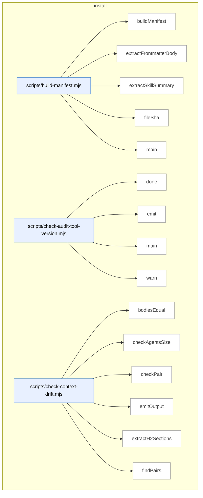

_Domain has 137 symbols (>50). Diagram shows top-15 by file order; see flat table below for the full list._

### Symbols in this domain

| Symbol | Kind | Path | Lines | Purpose | File imported by |
|---|---|---|---|---|---|
| [`buildManifest`](../scripts/build-manifest.mjs#L99) | function | `scripts/build-manifest.mjs` | 99-163 | Enumerate all skills, hash their files, extract summaries, compute manifest with bundleVersion digest. | _(internal)_ |
| [`extractFrontmatterBody`](../scripts/build-manifest.mjs#L49) | function | `scripts/build-manifest.mjs` | 49-54 | Extract YAML frontmatter body from markdown file (text between first and second ---). | _(internal)_ |
| [`extractSkillSummary`](../scripts/build-manifest.mjs#L64) | function | `scripts/build-manifest.mjs` | 64-94 | Parse YAML frontmatter to extract description field, supporting inline and block-scalar formats. | _(internal)_ |
| [`fileSha`](../scripts/build-manifest.mjs#L40) | function | `scripts/build-manifest.mjs` | 40-43 | Compute truncated (first 12 hex) SHA256 hash of file content. | _(internal)_ |
| [`main`](../scripts/build-manifest.mjs#L165) | function | `scripts/build-manifest.mjs` | 165-190 | Build skills manifest JSON or verify its freshness against committed version in check mode. | _(internal)_ |
| [`done`](../scripts/check-audit-tool-version.mjs#L49) | function | `scripts/check-audit-tool-version.mjs` | 49-51 | Set process exit code. | _(internal)_ |
| [`emit`](../scripts/check-audit-tool-version.mjs#L38) | function | `scripts/check-audit-tool-version.mjs` | 38-40 | Write object to stdout as JSON (if in JSON mode). | _(internal)_ |
| [`main`](../scripts/check-audit-tool-version.mjs#L53) | function | `scripts/check-audit-tool-version.mjs` | 53-142 | Fetch upstream tool manifest, compare consumer's synced version, emit verdict, exit. | _(internal)_ |
| [`warn`](../scripts/check-audit-tool-version.mjs#L42) | function | `scripts/check-audit-tool-version.mjs` | 42-44 | Write message to stderr unless in quiet or JSON mode. | _(internal)_ |
| [`bodiesEqual`](../scripts/check-context-drift.mjs#L182) | function | `scripts/check-context-drift.mjs` | 182-185 | Compare two line arrays for semantic equality after normalizing whitespace. | _(internal)_ |
| [`checkAgentsSize`](../scripts/check-context-drift.mjs#L275) | function | `scripts/check-context-drift.mjs` | 275-288 | Verifies AGENTS.md doesn't exceed the 1200-line sprawl cap. | _(internal)_ |
| [`checkPair`](../scripts/check-context-drift.mjs#L198) | function | `scripts/check-context-drift.mjs` | 198-263 | Validates CLAUDE.md against AGENTS.md for import, section allowlist, and size conformance. | _(internal)_ |
| [`emitOutput`](../scripts/check-context-drift.mjs#L392) | function | `scripts/check-context-drift.mjs` | 392-415 | Formats findings as text, JSON, or SARIF and writes to stdout. | _(internal)_ |
| [`extractH2Sections`](../scripts/check-context-drift.mjs#L155) | function | `scripts/check-context-drift.mjs` | 155-176 | Split markdown into H2 sections, tracking line numbers and respecting code-fence boundaries. | _(internal)_ |
| [`findPairs`](../scripts/check-context-drift.mjs#L300) | function | `scripts/check-context-drift.mjs` | 300-318 | Locates AGENTS.md and CLAUDE.md pairs grouped by directory for drift checking. | _(internal)_ |
| [`hasAgentsImport`](../scripts/check-context-drift.mjs#L191) | function | `scripts/check-context-drift.mjs` | 191-194 | Check if first 30 lines of file reference `@./AGENTS.md` import. | _(internal)_ |
| [`hashId`](../scripts/check-context-drift.mjs#L292) | function | `scripts/check-context-drift.mjs` | 292-294 | Generates a 16-char SHA256-based ID from file and key for stable finding identities. | _(internal)_ |
| [`loadConfig`](../scripts/check-context-drift.mjs#L75) | function | `scripts/check-context-drift.mjs` | 75-108 | Load optional `.claude-context-allowlist.json` config, fall back to defaults. | _(internal)_ |
| [`main`](../scripts/check-context-drift.mjs#L417) | function | `scripts/check-context-drift.mjs` | 417-428 | Entry point that runs drift check, formats output, and exits with appropriate code. | _(internal)_ |
| [`makeFenceTracker`](../scripts/check-context-drift.mjs#L122) | function | `scripts/check-context-drift.mjs` | 122-146 | Create stateful function that tracks whether a line is inside a code fence. | _(internal)_ |
| [`parseArgs`](../scripts/check-context-drift.mjs#L353) | function | `scripts/check-context-drift.mjs` | 353-368 | Parses CLI arguments for repo path, output format, and strict mode. | _(internal)_ |
| [`runDriftCheck`](../scripts/check-context-drift.mjs#L327) | function | `scripts/check-context-drift.mjs` | 327-349 | Orchestrates all context-drift checks on AGENTS.md/CLAUDE.md pairs and aggregates findings. | _(internal)_ |
| [`showHelp`](../scripts/check-context-drift.mjs#L370) | function | `scripts/check-context-drift.mjs` | 370-390 | Prints usage instructions and configuration options for the drift checker. | _(internal)_ |
| [`canResolve`](../scripts/check-deps.mjs#L52) | function | `scripts/check-deps.mjs` | 52-60 | Tests whether a Node package can be resolved via require.resolve(). | _(internal)_ |
| [`loadEnv`](../scripts/check-deps.mjs#L62) | function | `scripts/check-deps.mjs` | 62-77 | Reads and parses a .env file into key-value pairs, stripping quotes. | _(internal)_ |
| [`main`](../scripts/check-deps.mjs#L79) | function | `scripts/check-deps.mjs` | 79-173 | Checks required/optional npm packages and environment variables with human or JSON output. | _(internal)_ |
| [`main`](../scripts/check-gate-contracts.mjs#L18) | function | `scripts/check-gate-contracts.mjs` | 18-41 | Loads gate contracts from all skills and reports contracted/uncontracted/divergence status. | _(internal)_ |
| [`detectMissingFromStatic`](../scripts/check-model-freshness.mjs#L149) | function | `scripts/check-model-freshness.mjs` | 149-177 | Identifies model IDs present in live catalogs but missing from STATIC_POOL. | _(internal)_ |
| [`detectPrematureRemap`](../scripts/check-model-freshness.mjs#L183) | function | `scripts/check-model-freshness.mjs` | 183-208 | Finds model IDs in DEPRECATED_REMAP that still exist in live provider catalogs. | _(internal)_ |
| [`detectSentinelDrift`](../scripts/check-model-freshness.mjs#L83) | function | `scripts/check-model-freshness.mjs` | 83-143 | Detects drift between model sentinels in STATIC_POOL and live provider catalogs. | _(internal)_ |
| [`emitOutput`](../scripts/check-model-freshness.mjs#L310) | function | `scripts/check-model-freshness.mjs` | 310-340 | Formats freshness findings as text, JSON, or SARIF and writes to stdout. | _(internal)_ |
| [`hashId`](../scripts/check-model-freshness.mjs#L212) | function | `scripts/check-model-freshness.mjs` | 212-214 | Generates a 16-char SHA256-based ID from rule name and key for stable finding identities. | _(internal)_ |
| [`main`](../scripts/check-model-freshness.mjs#L342) | function | `scripts/check-model-freshness.mjs` | 342-353 | Entry point that runs freshness check, formats output, and exits with appropriate code. | _(internal)_ |
| [`parseArgs`](../scripts/check-model-freshness.mjs#L266) | function | `scripts/check-model-freshness.mjs` | 266-280 | Parses CLI arguments for output format and strict mode. | _(internal)_ |
| [`runFreshnessCheck`](../scripts/check-model-freshness.mjs#L225) | function | `scripts/check-model-freshness.mjs` | 225-262 | Orchestrates model-pool freshness checks against live OpenAI/Anthropic/Google catalogs. | _(internal)_ |
| [`showHelp`](../scripts/check-model-freshness.mjs#L282) | function | `scripts/check-model-freshness.mjs` | 282-308 | Prints usage instructions and environment variable requirements for the freshness checker. | _(internal)_ |
| [`main`](../scripts/check-rls.mjs#L31) | function | `scripts/check-rls.mjs` | 31-145 | Queries Postgres for RLS policy configuration across all tables in public schema. | _(internal)_ |
| [`checkAuditApiKeys`](../scripts/check-setup.mjs#L159) | function | `scripts/check-setup.mjs` | 159-176 | Validates presence of GPT and optional Gemini API keys for audit steps. | _(internal)_ |
| [`checkAuditLoop`](../scripts/check-setup.mjs#L241) | function | `scripts/check-setup.mjs` | 241-245 | Reports audit-loop section status (API keys and cloud configuration). | _(internal)_ |
| [`checkAuditSupabase`](../scripts/check-setup.mjs#L178) | function | `scripts/check-setup.mjs` | 178-239 | Verifies AUDIT_DB_URL and required audit-loop Postgres tables exist and are accessible. | _(internal)_ |
| [`checkConsistencyMode`](../scripts/check-setup.mjs#L405) | function | `scripts/check-setup.mjs` | 405-451 | Validates consistency-mode setup including surfaces.json manifest, canaries, and Playwright. | _(internal)_ |
| [`checkPersonaTest`](../scripts/check-setup.mjs#L249) | function | `scripts/check-setup.mjs` | 249-297 | Verifies persona-test configuration including repo name, Postgres tables, and Playwright. | _(internal)_ |
| [`checkPlaywrightAvailable`](../scripts/check-setup.mjs#L385) | function | `scripts/check-setup.mjs` | 385-403 | Tests whether Playwright is installed and the Chromium binary is available. | _(internal)_ |
| [`checkTables`](../scripts/check-setup.mjs#L70) | function | `scripts/check-setup.mjs` | 70-80 | Queries Postgres to check existence of specified tables in the public schema. | _(internal)_ |
| [`injectResolvedDbEnv`](../scripts/check-setup.mjs#L474) | function | `scripts/check-setup.mjs` | 474-485 | Injects AUDIT_DB_URL from ~/.audit-loop.env into process.env if not already set. | _(internal)_ |
| [`loadEnv`](../scripts/check-setup.mjs#L47) | function | `scripts/check-setup.mjs` | 47-62 | Reads and parses a .env file into an object. | _(internal)_ |
| [`main`](../scripts/check-setup.mjs#L487) | function | `scripts/check-setup.mjs` | 487-501 | Entry point that runs all setup checks (audit-loop, persona-test, consistency-mode) and prints report. | _(internal)_ |
| [`printJsonReport`](../scripts/check-setup.mjs#L360) | function | `scripts/check-setup.mjs` | 360-370 | Outputs the setup check report as JSON to stdout. | _(internal)_ |
| [`printReport`](../scripts/check-setup.mjs#L328) | function | `scripts/check-setup.mjs` | 328-358 | Renders the full setup check report to console with sections and colored status indicators. | _(internal)_ |
| [`Report`](../scripts/check-setup.mjs#L120) | class | `scripts/check-setup.mjs` | 120-155 | Accumulator class for setup check results, organized by section with status tracking. | _(internal)_ |
| [`statusIcon`](../scripts/check-setup.mjs#L304) | function | `scripts/check-setup.mjs` | 304-313 | Returns a colored terminal icon (PASS/FAIL/WARN/INFO) for status display. | _(internal)_ |
| [`verdictLine`](../scripts/check-setup.mjs#L315) | function | `scripts/check-setup.mjs` | 315-326 | Formats the final verdict line summarizing failure and warning counts. | _(internal)_ |
| [`listSkills`](../scripts/check-skill-refs.mjs#L30) | function | `scripts/check-skill-refs.mjs` | 30-36 | Lists all skill directories in the skills/ folder. | _(internal)_ |
| [`main`](../scripts/check-skill-refs.mjs#L38) | function | `scripts/check-skill-refs.mjs` | 38-74 | Entry point that lints skill reference sections for consistency and reports errors. | _(internal)_ |
| [`main`](../scripts/check-skill-updates.mjs#L25) | function | `scripts/check-skill-updates.mjs` | 25-118 | Entry point that checks local drift of synced skill files against installation receipt. | _(internal)_ |
| [`parseArgs`](../scripts/check-skill-updates.mjs#L16) | function | `scripts/check-skill-updates.mjs` | 16-23 | Parses CLI arguments for JSON mode, cache bypass, and target repo path. | _(internal)_ |
| [`checkSync`](../scripts/check-sync.mjs#L25) | function | `scripts/check-sync.mjs` | 25-153 | Orchestrates Postgres connection check, repo registration validation, and recent run history. | _(internal)_ |
| [`fail`](../scripts/check-sync.mjs#L20) | function | `scripts/check-sync.mjs` | 20-20 | Logs a [FAIL] status line. | _(internal)_ |
| [`finish`](../scripts/check-sync.mjs#L155) | function | `scripts/check-sync.mjs` | 155-178 | Formats and outputs the sync check verdict as text summary or JSON. | _(internal)_ |
| [`info`](../scripts/check-sync.mjs#L21) | function | `scripts/check-sync.mjs` | 21-21 | Logs an [INFO] status line. | _(internal)_ |
| [`log`](../scripts/check-sync.mjs#L17) | function | `scripts/check-sync.mjs` | 17-17 | Logs a message to stdout if not in JSON mode. | _(internal)_ |
| [`pass`](../scripts/check-sync.mjs#L19) | function | `scripts/check-sync.mjs` | 19-19 | Logs a [PASS] status line. | _(internal)_ |
| [`buildCopilotMergeWrite`](../scripts/install-skills.mjs#L205) | function | `scripts/install-skills.mjs` | 205-218 | Builds the Copilot instructions write, merging new skill blocks into the existing file. | _(internal)_ |
| [`buildSkillWrites`](../scripts/install-skills.mjs#L173) | function | `scripts/install-skills.mjs` | 173-203 | Builds the file-write list for a skill, validating SHA integrity against the manifest. | _(internal)_ |
| [`checkConflicts`](../scripts/install-skills.mjs#L233) | function | `scripts/install-skills.mjs` | 233-245 | Detects conflicting writes in both repo and global scope, separating safe installs from conflicts. | _(internal)_ |
| [`computeDeletes`](../scripts/install-skills.mjs#L220) | function | `scripts/install-skills.mjs` | 220-231 | Computes which previously-installed files should be deleted because they're no longer in the manifest. | _(internal)_ |
| [`expandSkillFiles`](../scripts/install-skills.mjs#L114) | function | `scripts/install-skills.mjs` | 114-120 | Expands a skill's manifest metadata into individual file entries, with backwards compatibility for v1 format. | _(internal)_ |
| [`fileShaShort`](../scripts/install-skills.mjs#L122) | function | `scripts/install-skills.mjs` | 122-124 | Computes a 12-character SHA256 hash of a file buffer for integrity verification. | _(internal)_ |
| [`loadManifest`](../scripts/install-skills.mjs#L84) | function | `scripts/install-skills.mjs` | 84-107 | Loads and validates the skills manifest JSON, verifying schema version compatibility. | _(internal)_ |
| [`main`](../scripts/install-skills.mjs#L259) | function | `scripts/install-skills.mjs` | 259-346 | Orchestrates the skills installation: loads manifest, builds writes, checks conflicts, applies with transaction support. | _(internal)_ |
| [`maybeWarnGithubSkillsDeprecation`](../scripts/install-skills.mjs#L161) | function | `scripts/install-skills.mjs` | 161-171 | Warns if deprecated .github/skills/ directory exists unless --keep-github-skills is passed. | _(internal)_ |
| [`parseArgs`](../scripts/install-skills.mjs#L56) | function | `scripts/install-skills.mjs` | 56-78 | Parses CLI arguments for the skills installer (--local, --remote, --skills, --target, etc.). | _(internal)_ |
| [`printBanner`](../scripts/install-skills.mjs#L141) | function | `scripts/install-skills.mjs` | 141-149 | Prints the installation banner showing mode, surface, target, and dry-run status. | _(internal)_ |
| [`reconcileJournals`](../scripts/install-skills.mjs#L151) | function | `scripts/install-skills.mjs` | 151-159 | Recovers from incomplete installation transactions by reading and reconciling leftover journals. | _(internal)_ |
| [`validateTarget`](../scripts/install-skills.mjs#L128) | function | `scripts/install-skills.mjs` | 128-139 | Validates that the target directory exists and is a git repo or Node package. | _(internal)_ |
| [`writeReceiptsByScope`](../scripts/install-skills.mjs#L247) | function | `scripts/install-skills.mjs` | 247-257 | Partitions managed files by scope and writes separate installation receipts for repo and global. | _(internal)_ |
| [`computeFileSha`](../scripts/lib/install/conflict-detector.mjs#L13) | function | `scripts/lib/install/conflict-detector.mjs` | 13-20 | Computes SHA-256 hash of file contents, returning first 12 hex chars or null if read fails. | `scripts/check-skill-updates.mjs`, `scripts/install-skills.mjs` |
| [`detectConflicts`](../scripts/lib/install/conflict-detector.mjs#L30) | function | `scripts/lib/install/conflict-detector.mjs` | 30-78 | Categorizes planned file writes as safe or conflicted based on existence and receipt-tracked modification status. | `scripts/check-skill-updates.mjs`, `scripts/install-skills.mjs` |
| [`detectDrift`](../scripts/lib/install/conflict-detector.mjs#L86) | function | `scripts/lib/install/conflict-detector.mjs` | 86-105 | Detects drift in managed files by comparing current SHA against receipt's expected value, reporting match/drifted/missing status. | `scripts/check-skill-updates.mjs`, `scripts/install-skills.mjs` |
| [`generateAllPromptFiles`](../scripts/lib/install/copilot-prompts.mjs#L229) | function | `scripts/lib/install/copilot-prompts.mjs` | 229-260 | Scans all skills in a directory and generates Copilot prompt files for each, returning paths and content for creation. | `scripts/regenerate-skill-copies.mjs` |
| [`generatePromptFile`](../scripts/lib/install/copilot-prompts.mjs#L180) | function | `scripts/lib/install/copilot-prompts.mjs` | 180-218 | Generates a Copilot-compatible `.prompt.md` file for a skill with metadata, summary, and CLI invocation instructions. | `scripts/regenerate-skill-copies.mjs` |
| [`parseSkillFrontmatter`](../scripts/lib/install/copilot-prompts.mjs#L140) | function | `scripts/lib/install/copilot-prompts.mjs` | 140-169 | Parses YAML frontmatter from skill markdown, extracting name and description (inline or block-scalar), with CRLF normalization. | `scripts/regenerate-skill-copies.mjs` |
| [`shaOfManagedBlock`](../scripts/lib/install/copilot-prompts.mjs#L270) | function | `scripts/lib/install/copilot-prompts.mjs` | 270-278 | Extracts the managed block (between markers) from file content and returns its SHA-256 hash (first 16 chars) or null. | `scripts/regenerate-skill-copies.mjs` |
| [`yamlQuote`](../scripts/lib/install/copilot-prompts.mjs#L129) | function | `scripts/lib/install/copilot-prompts.mjs` | 129-131 | Escapes a string for YAML by wrapping in quotes and escaping internal quotes and backslashes. | `scripts/regenerate-skill-copies.mjs` |
| [`ensureAuditDeps`](../scripts/lib/install/deps.mjs#L89) | function | `scripts/lib/install/deps.mjs` | 89-151 | Installs missing audit-loop dependencies via npm or simulates installation, logging progress and returning a summary. | `scripts/install-skills.mjs`, `scripts/sync-to-repos.mjs` |
| [`findMissingDeps`](../scripts/lib/install/deps.mjs#L58) | function | `scripts/lib/install/deps.mjs` | 58-70 | Checks which required and optional npm dependencies are absent from node_modules, also reporting package.json existence. | `scripts/install-skills.mjs`, `scripts/sync-to-repos.mjs` |
| [`checkAuditGitignore`](../scripts/lib/install/gitignore.mjs#L152) | function | `scripts/lib/install/gitignore.mjs` | 152-171 | Verifies which required audit-loop gitignore patterns exist, returning missing and present pattern lists. | `scripts/check-skill-updates.mjs`, `scripts/install-skills.mjs` |
| [`ensureAuditGitignore`](../scripts/lib/install/gitignore.mjs#L106) | function | `scripts/lib/install/gitignore.mjs` | 106-143 | Adds audit-loop gitignore patterns to .gitignore (creating if absent), returning newly-added and already-present pattern lists. | `scripts/check-skill-updates.mjs`, `scripts/install-skills.mjs` |
| [`extractBlock`](../scripts/lib/install/merge.mjs#L64) | function | `scripts/lib/install/merge.mjs` | 64-70 | Extracts and returns the managed block (between markers) from file content, or null if not found. | `scripts/install-skills.mjs` |
| [`mergeBlock`](../scripts/lib/install/merge.mjs#L36) | function | `scripts/lib/install/merge.mjs` | 36-55 | Inserts or replaces a managed block (between markers) in file content, appending if markers are absent. | `scripts/install-skills.mjs` |
| [`buildReceipt`](../scripts/lib/install/receipt.mjs#L48) | function | `scripts/lib/install/receipt.mjs` | 48-57 | Constructs an install receipt with version, timestamp, source URL, surface type, and list of managed files with SHAs. | `scripts/check-skill-updates.mjs`, `scripts/install-skills.mjs` |
| [`readReceipt`](../scripts/lib/install/receipt.mjs#L13) | function | `scripts/lib/install/receipt.mjs` | 13-24 | Parses an install receipt from JSON file if present, validates its schema, and returns the object or an error. | `scripts/check-skill-updates.mjs`, `scripts/install-skills.mjs` |
| [`writeReceipt`](../scripts/lib/install/receipt.mjs#L31) | function | `scripts/lib/install/receipt.mjs` | 31-37 | Atomically writes an install receipt via temp file + rename after validating the schema. | `scripts/check-skill-updates.mjs`, `scripts/install-skills.mjs` |
| [`findRepoRoot`](../scripts/lib/install/surface-paths.mjs#L14) | function | `scripts/lib/install/surface-paths.mjs` | 14-37 | Walks up the directory tree to find the outermost .git directory, falling back to package.json for repo root discovery. | `scripts/check-skill-updates.mjs`, `scripts/install-skills.mjs` |
| [`partitionManagedFilesByScope`](../scripts/lib/install/surface-paths.mjs#L124) | function | `scripts/lib/install/surface-paths.mjs` | 124-132 | Partitions managed files into global and repo-scoped groups by their scope field. | `scripts/check-skill-updates.mjs`, `scripts/install-skills.mjs` |
| [`receiptPath`](../scripts/lib/install/surface-paths.mjs#L110) | function | `scripts/lib/install/surface-paths.mjs` | 110-115 | Returns the path where an install receipt should be stored, either globally or repo-locally based on scope. | `scripts/check-skill-updates.mjs`, `scripts/install-skills.mjs` |
| [`resolveSkillFiles`](../scripts/lib/install/surface-paths.mjs#L79) | function | `scripts/lib/install/surface-paths.mjs` | 79-94 | Expands skill files into per-surface installation targets, combining surface locations with file paths. | `scripts/check-skill-updates.mjs`, `scripts/install-skills.mjs` |
| [`resolveSkillTargets`](../scripts/lib/install/surface-paths.mjs#L46) | function | `scripts/lib/install/surface-paths.mjs` | 46-66 | Maps a skill name to installation targets (directories and file paths) for Claude, Copilot, and agents surfaces. | `scripts/check-skill-updates.mjs`, `scripts/install-skills.mjs` |
| [`cleanupJournal`](../scripts/lib/install/transaction.mjs#L200) | function | `scripts/lib/install/transaction.mjs` | 200-203 | Removes a transaction journal file after successful completion, best-effort. | `scripts/install-skills.mjs` |
| [`defaultJournalPath`](../scripts/lib/install/transaction.mjs#L245) | function | `scripts/lib/install/transaction.mjs` | 245-247 | Returns the filesystem path for transaction journals (.audit-loop-install-txn.json). | `scripts/install-skills.mjs` |
| [`executeTransaction`](../scripts/lib/install/transaction.mjs#L81) | function | `scripts/lib/install/transaction.mjs` | 81-176 | Executes a multi-file atomic write with three phases (snapshot, stage, rename) and journal-based recovery from crashes. | `scripts/install-skills.mjs` |
| [`fsyncFile`](../scripts/lib/install/transaction.mjs#L49) | function | `scripts/lib/install/transaction.mjs` | 49-51 | Syncs a file descriptor to disk, silently ignoring fsync errors for unsupported filesystems. | `scripts/install-skills.mjs` |
| [`recoverFromJournal`](../scripts/lib/install/transaction.mjs#L211) | function | `scripts/lib/install/transaction.mjs` | 211-243 | Recovers from a crashed install by rolling forward incomplete renames or rolling back uncommitted writes, then removes the journal. | `scripts/install-skills.mjs` |
| [`rollbackPartialTransaction`](../scripts/lib/install/transaction.mjs#L178) | function | `scripts/lib/install/transaction.mjs` | 178-198 | Reverts partial transaction writes by removing temp files and restoring snapshots when execution fails mid-way. | `scripts/install-skills.mjs` |
| [`shaShort`](../scripts/lib/install/transaction.mjs#L45) | function | `scripts/lib/install/transaction.mjs` | 45-47 | Computes SHA-256 hash of a buffer, returning the first 12 hex characters. | `scripts/install-skills.mjs` |
| [`tmpSuffix`](../scripts/lib/install/transaction.mjs#L40) | function | `scripts/lib/install/transaction.mjs` | 40-43 | Generates a unique temporary file suffix using PID, millisecond timestamp, and random hex digits. | `scripts/install-skills.mjs` |
| [`writeJournal`](../scripts/lib/install/transaction.mjs#L58) | function | `scripts/lib/install/transaction.mjs` | 58-70 | Atomically writes a transaction journal via temp file + rename after creating parent directories. | `scripts/install-skills.mjs` |
| [`computeVerdict`](../scripts/regenerate-skill-copies.mjs#L196) | function | `scripts/regenerate-skill-copies.mjs` | 196-200 | Computes a sync verdict ('VIOLATIONS', 'IN SYNC', or 'CHANGES') from stats and violation count. | _(internal)_ |
| [`copyFileIfChanged`](../scripts/regenerate-skill-copies.mjs#L76) | function | `scripts/regenerate-skill-copies.mjs` | 76-88 | Copies a source file to destination if content differs, returning a status flag without erroring on unchanged files. | _(internal)_ |
| [`emitVerdict`](../scripts/regenerate-skill-copies.mjs#L202) | function | `scripts/regenerate-skill-copies.mjs` | 202-214 | Prints the sync verdict to stdout and exits with appropriate code if running in check mode or violations detected. | _(internal)_ |
| [`loadSkillsOrDie`](../scripts/regenerate-skill-copies.mjs#L63) | function | `scripts/regenerate-skill-copies.mjs` | 63-74 | Lists skill directory names, exiting if the source directory is missing or empty. | _(internal)_ |
| [`main`](../scripts/regenerate-skill-copies.mjs#L216) | function | `scripts/regenerate-skill-copies.mjs` | 216-244 | Orchestrates syncing skills and prompts to destination directories, reporting final sync status and violations. | _(internal)_ |
| [`pruneFilesNotInSource`](../scripts/regenerate-skill-copies.mjs#L90) | function | `scripts/regenerate-skill-copies.mjs` | 90-105 | Removes destination files not present in the source set, counting deletions. | _(internal)_ |
| [`pruneOrphanSkillDirs`](../scripts/regenerate-skill-copies.mjs#L130) | function | `scripts/regenerate-skill-copies.mjs` | 130-146 | Removes destination skill directories that have no corresponding source skill. | _(internal)_ |
| [`pruneStalePrompts`](../scripts/regenerate-skill-copies.mjs#L168) | function | `scripts/regenerate-skill-copies.mjs` | 168-186 | Deletes managed prompt files no longer generated, preserving operator-authored prompts. | _(internal)_ |
| [`syncCopilotPrompts`](../scripts/regenerate-skill-copies.mjs#L188) | function | `scripts/regenerate-skill-copies.mjs` | 188-194 | Generates and syncs all Copilot prompt files to destination, returning write/delete/unchanged counts. | _(internal)_ |
| [`syncSkillToDests`](../scripts/regenerate-skill-copies.mjs#L107) | function | `scripts/regenerate-skill-copies.mjs` | 107-128 | Copies all files from a skill's source to destination directories and prunes orphaned files. | _(internal)_ |
| [`warnGithubSkillsDeprecation`](../scripts/regenerate-skill-copies.mjs#L51) | function | `scripts/regenerate-skill-copies.mjs` | 51-61 | Emits a deprecation warning that .github/skills/ is no longer maintained and will not be regenerated. | _(internal)_ |
| [`writePromptFiles`](../scripts/regenerate-skill-copies.mjs#L148) | function | `scripts/regenerate-skill-copies.mjs` | 148-166 | Writes auto-generated prompt files to .github/prompts/, tracking expected files for later pruning. | _(internal)_ |
| [`confirm`](../scripts/setup-permissions.mjs#L119) | function | `scripts/setup-permissions.mjs` | 119-128 | Prompts for y/n confirmation via readline, defaulting to yes if input is empty. | _(internal)_ |
| [`main`](../scripts/setup-permissions.mjs#L183) | function | `scripts/setup-permissions.mjs` | 183-280 | Adds wildcard permission rules to project and user Claude Code settings to minimize approval prompts. | _(internal)_ |
| [`mergeRules`](../scripts/setup-permissions.mjs#L134) | function | `scripts/setup-permissions.mjs` | 134-179 | Merges new permission rules into Claude Code settings, deduplicates, cleans up covered rules, and counts changes. | _(internal)_ |
| [`readJson`](../scripts/setup-permissions.mjs#L106) | function | `scripts/setup-permissions.mjs` | 106-112 | Reads and parses a JSON file, returning null on error. | _(internal)_ |
| [`writeJson`](../scripts/setup-permissions.mjs#L114) | function | `scripts/setup-permissions.mjs` | 114-117 | Writes a JSON object to a file with pretty-printing and a trailing newline. | _(internal)_ |
| [`buildCopilotPromptFiles`](../scripts/sync-to-repos.mjs#L441) | function | `scripts/sync-to-repos.mjs` | 441-449 | Collect Copilot prompt files from source for syncing. | _(internal)_ |
| [`buildFileUniverse`](../scripts/sync-to-repos.mjs#L339) | function | `scripts/sync-to-repos.mjs` | 339-356 | Build complete set of source files in scripts/ and .claude/ trees for import resolution. | _(internal)_ |
| [`buildSkillFiles`](../scripts/sync-to-repos.mjs#L402) | function | `scripts/sync-to-repos.mjs` | 402-414 | Enumerate synced skill files from source for inclusion in consumer bundles. | _(internal)_ |
| [`bundleForRepo`](../scripts/sync-to-repos.mjs#L471) | function | `scripts/sync-to-repos.mjs` | 471-478 | Build complete file bundle for a consumer repo with repo-specific optional modules. | _(internal)_ |
| [`deepMerge`](../scripts/sync-to-repos.mjs#L518) | function | `scripts/sync-to-repos.mjs` | 518-529 | Deep-merge source object into target, preserving nested structures. | _(internal)_ |
| [`main`](../scripts/sync-to-repos.mjs#L533) | function | `scripts/sync-to-repos.mjs` | 533-1062 | Orchestrate syncing of source bundles to consumer repos with manifest generation and optional cloud config updates. | _(internal)_ |
| [`maybePromptSharedCloudUpdate`](../scripts/sync-to-repos.mjs#L1064) | function | `scripts/sync-to-repos.mjs` | 1064-1095 | Assess and prompt for shared cloud configuration updates after syncing. | _(internal)_ |
| [`readSource`](../scripts/sync-to-repos.mjs#L359) | function | `scripts/sync-to-repos.mjs` | 359-362 | Read source file content safely by relative path. | _(internal)_ |
| [`realMissingDeps`](../scripts/sync-to-repos.mjs#L386) | function | `scripts/sync-to-repos.mjs` | 386-391 | Filter import-closure unresolved list to identify real missing local dependencies. | _(internal)_ |
| [`resolveBundle`](../scripts/sync-to-repos.mjs#L371) | function | `scripts/sync-to-repos.mjs` | 371-376 | Resolve transitive import dependencies for entry points using file universe. | _(internal)_ |
| [`sha256`](../scripts/sync-to-repos.mjs#L487) | function | `scripts/sync-to-repos.mjs` | 487-494 | Compute SHA256 hash of a file safely, returning null on failure. | _(internal)_ |
| [`syncMigrations`](../scripts/sync-to-repos.mjs#L239) | function | `scripts/sync-to-repos.mjs` | 239-249 | Enumerate database migration SQL files for syncing. | _(internal)_ |
| [`unifiedDiff`](../scripts/sync-to-repos.mjs#L496) | function | `scripts/sync-to-repos.mjs` | 496-509 | Generate unified diff between source and destination files for display. | _(internal)_ |

---

## learning-store

> Persists audit outcomes and deliberation metadata to Postgres, then feeds them into a Thompson Sampling bandit algorithm that scores prompt variants by multi-signal rewards (procedural, substantive, deliberation, user-impact) to identify the highest-performing audit configurations per repository tier and language.

```mermaid
flowchart TB
subgraph dom_learning_store ["learning-store"]
  file_scripts_bandit_mjs["scripts/bandit.mjs"]:::component
  sym_scripts_bandit_mjs_buildContext["buildContext"]:::symbol
  file_scripts_bandit_mjs --> sym_scripts_bandit_mjs_buildContext
  sym_scripts_bandit_mjs_computePassReward["computePassReward"]:::symbol
  file_scripts_bandit_mjs --> sym_scripts_bandit_mjs_computePassReward
  sym_scripts_bandit_mjs_computeReward["computeReward"]:::symbol
  file_scripts_bandit_mjs --> sym_scripts_bandit_mjs_computeReward
  sym_scripts_bandit_mjs_computeUserImpactRewa["computeUserImpactReward"]:::symbol
  file_scripts_bandit_mjs --> sym_scripts_bandit_mjs_computeUserImpactRewa
  sym_scripts_bandit_mjs_contextBucketKey["contextBucketKey"]:::symbol
  file_scripts_bandit_mjs --> sym_scripts_bandit_mjs_contextBucketKey
  sym_scripts_bandit_mjs_contextSizeTier["contextSizeTier"]:::symbol
  file_scripts_bandit_mjs --> sym_scripts_bandit_mjs_contextSizeTier
  sym_scripts_bandit_mjs_deliberationSignal["deliberationSignal"]:::symbol
  file_scripts_bandit_mjs --> sym_scripts_bandit_mjs_deliberationSignal
  sym_scripts_bandit_mjs_main["main"]:::symbol
  file_scripts_bandit_mjs --> sym_scripts_bandit_mjs_main
  sym_scripts_bandit_mjs_PromptBandit["PromptBandit"]:::symbol
  file_scripts_bandit_mjs --> sym_scripts_bandit_mjs_PromptBandit
  file_scripts_evolve_prompts_mjs["scripts/evolve-prompts.mjs"]:::component
  sym_scripts_evolve_prompts_mjs_checkBaseline["checkBaselineValidity"]:::symbol
  file_scripts_evolve_prompts_mjs --> sym_scripts_evolve_prompts_mjs_checkBaseline
  sym_scripts_evolve_prompts_mjs_evolveWorstPa["evolveWorstPass"]:::symbol
  file_scripts_evolve_prompts_mjs --> sym_scripts_evolve_prompts_mjs_evolveWorstPa
  sym_scripts_evolve_prompts_mjs_formatExample["formatExample"]:::symbol
  file_scripts_evolve_prompts_mjs --> sym_scripts_evolve_prompts_mjs_formatExample
  sym_scripts_evolve_prompts_mjs_getExperiment["getExperimentManifestStore"]:::symbol
  file_scripts_evolve_prompts_mjs --> sym_scripts_evolve_prompts_mjs_getExperiment
  sym_scripts_evolve_prompts_mjs_killExperimen["killExperiment"]:::symbol
  file_scripts_evolve_prompts_mjs --> sym_scripts_evolve_prompts_mjs_killExperimen
  sym_scripts_evolve_prompts_mjs_main["main"]:::symbol
  file_scripts_evolve_prompts_mjs --> sym_scripts_evolve_prompts_mjs_main
  sym_scripts_evolve_prompts_mjs_promoteExperi["promoteExperiment"]:::symbol
  file_scripts_evolve_prompts_mjs --> sym_scripts_evolve_prompts_mjs_promoteExperi
  sym_scripts_evolve_prompts_mjs_reconcileOrph["reconcileOrphanedExperiments"]:::symbol
  file_scripts_evolve_prompts_mjs --> sym_scripts_evolve_prompts_mjs_reconcileOrph
  sym_scripts_evolve_prompts_mjs_reviewExperim["reviewExperiments"]:::symbol
  file_scripts_evolve_prompts_mjs --> sym_scripts_evolve_prompts_mjs_reviewExperim
  sym_scripts_evolve_prompts_mjs_showStats["showStats"]:::symbol
  file_scripts_evolve_prompts_mjs --> sym_scripts_evolve_prompts_mjs_showStats
  file_scripts_meta_assess_mjs["scripts/meta-assess.mjs"]:::component
  sym_scripts_meta_assess_mjs_computeAssessmen["computeAssessmentMetrics"]:::symbol
  file_scripts_meta_assess_mjs --> sym_scripts_meta_assess_mjs_computeAssessmen
  sym_scripts_meta_assess_mjs_emptyMetrics["emptyMetrics"]:::symbol
  file_scripts_meta_assess_mjs --> sym_scripts_meta_assess_mjs_emptyMetrics
  sym_scripts_meta_assess_mjs_formatAssessment["formatAssessmentReport"]:::symbol
  file_scripts_meta_assess_mjs --> sym_scripts_meta_assess_mjs_formatAssessment
  sym_scripts_meta_assess_mjs_main["main"]:::symbol
  file_scripts_meta_assess_mjs --> sym_scripts_meta_assess_mjs_main
  sym_scripts_meta_assess_mjs_markAssessmentCo["markAssessmentComplete"]:::symbol
  file_scripts_meta_assess_mjs --> sym_scripts_meta_assess_mjs_markAssessmentCo
  sym_scripts_meta_assess_mjs_runLLMAssessment["runLLMAssessment"]:::symbol
  file_scripts_meta_assess_mjs --> sym_scripts_meta_assess_mjs_runLLMAssessment
  sym_scripts_meta_assess_mjs_sampleOutcomes["sampleOutcomes"]:::symbol
  file_scripts_meta_assess_mjs --> sym_scripts_meta_assess_mjs_sampleOutcomes
  sym_scripts_meta_assess_mjs_shouldRunAssessm["shouldRunAssessment"]:::symbol
  file_scripts_meta_assess_mjs --> sym_scripts_meta_assess_mjs_shouldRunAssessm
  sym_scripts_meta_assess_mjs_storeAssessment["storeAssessment"]:::symbol
  file_scripts_meta_assess_mjs --> sym_scripts_meta_assess_mjs_storeAssessment
  file_scripts_refine_prompts_mjs["scripts/refine-prompts.mjs"]:::component
  sym_scripts_refine_prompts_mjs_analyzePass["analyzePass"]:::symbol
  file_scripts_refine_prompts_mjs --> sym_scripts_refine_prompts_mjs_analyzePass
  sym_scripts_refine_prompts_mjs_main["main"]:::symbol
  file_scripts_refine_prompts_mjs --> sym_scripts_refine_prompts_mjs_main
  sym_scripts_refine_prompts_mjs_suggestRefine["suggestRefinements"]:::symbol
  file_scripts_refine_prompts_mjs --> sym_scripts_refine_prompts_mjs_suggestRefine
end
classDef container fill:#f5f5f5,stroke:#333,stroke-width:2px,color:#000
classDef component fill:#e8f0ff,stroke:#3178c6,color:#000
classDef symbol fill:#fff,stroke:#999,color:#444
classDef dup fill:#ffe8d8,stroke:#c0392b,stroke-width:2px,color:#000
classDef violation fill:#ffd6d6,stroke:#c0392b,stroke-width:2px,color:#000
```

### Symbols in this domain

| Symbol | Kind | Path | Lines | Purpose | File imported by |
|---|---|---|---|---|---|
| [`buildContext`](../scripts/bandit.mjs#L29) | function | `scripts/bandit.mjs` | 29-35 | Constructs a Thompson-Sampling context bucket key from repo size tier and dominant language. | `scripts/evolve-prompts.mjs`, `scripts/gemini-review.mjs`, `scripts/lib/audit/legacy-production-audit.mjs`, +2 more |
| [`computePassReward`](../scripts/bandit.mjs#L410) | function | `scripts/bandit.mjs` | 410-416 | Averages per-finding rewards to produce a pass-level learning signal. | `scripts/evolve-prompts.mjs`, `scripts/gemini-review.mjs`, `scripts/lib/audit/legacy-production-audit.mjs`, +2 more |
| [`computeReward`](../scripts/bandit.mjs#L310) | function | `scripts/bandit.mjs` | 310-348 | Computes Thompson-Sampling reward signal (0–1) from procedural, substantive, deliberation, and optional user-impact components. | `scripts/evolve-prompts.mjs`, `scripts/gemini-review.mjs`, `scripts/lib/audit/legacy-production-audit.mjs`, +2 more |
| [`computeUserImpactReward`](../scripts/bandit.mjs#L359) | function | `scripts/bandit.mjs` | 359-379 | Scales a finding's reward based on persona-test correlation severity and type. | `scripts/evolve-prompts.mjs`, `scripts/gemini-review.mjs`, `scripts/lib/audit/legacy-production-audit.mjs`, +2 more |
| [`contextBucketKey`](../scripts/bandit.mjs#L44) | function | `scripts/bandit.mjs` | 44-46 | Generates a context-bucket string by joining size tier and normalized language. | `scripts/evolve-prompts.mjs`, `scripts/gemini-review.mjs`, `scripts/lib/audit/legacy-production-audit.mjs`, +2 more |
| [`contextSizeTier`](../scripts/bandit.mjs#L37) | function | `scripts/bandit.mjs` | 37-42 | Classifies repository as small/medium/large/xlarge by character count. | `scripts/evolve-prompts.mjs`, `scripts/gemini-review.mjs`, `scripts/lib/audit/legacy-production-audit.mjs`, +2 more |
| [`deliberationSignal`](../scripts/bandit.mjs#L386) | function | `scripts/bandit.mjs` | 386-403 | Computes a deliberation-quality signal (0–1) based on Claude–GPT position and ruling alignment. | `scripts/evolve-prompts.mjs`, `scripts/gemini-review.mjs`, `scripts/lib/audit/legacy-production-audit.mjs`, +2 more |
| [`main`](../scripts/bandit.mjs#L420) | function | `scripts/bandit.mjs` | 420-454 | Registers prompt variants as arms or displays per-arm Thompson-Sampling statistics. | `scripts/evolve-prompts.mjs`, `scripts/gemini-review.mjs`, `scripts/lib/audit/legacy-production-audit.mjs`, +2 more |
| [`PromptBandit`](../scripts/bandit.mjs#L50) | class | `scripts/bandit.mjs` | 50-293 | Thompson-Sampling multi-armed bandit for adaptively optimizing prompt variants across context buckets. | `scripts/evolve-prompts.mjs`, `scripts/gemini-review.mjs`, `scripts/lib/audit/legacy-production-audit.mjs`, +2 more |
| [`checkBaselineValidity`](../scripts/evolve-prompts.mjs#L341) | function | `scripts/evolve-prompts.mjs` | 341-349 | Marks an experiment as stale if its parent revision is no longer the active default for that pass. | _(internal)_ |
| [`evolveWorstPass`](../scripts/evolve-prompts.mjs#L93) | function | `scripts/evolve-prompts.mjs` | 93-235 | Finds the lowest-performing audit pass by EWR metric and evolves its prompt via LLM feedback. | _(internal)_ |
| [`formatExample`](../scripts/evolve-prompts.mjs#L337) | function | `scripts/evolve-prompts.mjs` | 337-339 | Formats a finding outcome as a single markdown bullet with severity, category, file, and detail excerpt. | _(internal)_ |
| [`getExperimentManifestStore`](../scripts/evolve-prompts.mjs#L65) | function | `scripts/evolve-prompts.mjs` | 65-67 | Returns a MutexFileStore for persisting experiment manifests by experimentId. | _(internal)_ |
| [`killExperiment`](../scripts/evolve-prompts.mjs#L307) | function | `scripts/evolve-prompts.mjs` | 307-318 | Abandons a revision and marks its experiment record as 'killed'. | _(internal)_ |
| [`main`](../scripts/evolve-prompts.mjs#L374) | function | `scripts/evolve-prompts.mjs` | 374-469 | Orchestrates prompt evolution by subcommand: `evolve` (run worst-pass evolution), `review` (check convergence), `promote`/`kill` (manage experiments). | _(internal)_ |
| [`promoteExperiment`](../scripts/evolve-prompts.mjs#L290) | function | `scripts/evolve-prompts.mjs` | 290-302 | Promotes a revision to active and updates its experiment record to 'promoted' status. | _(internal)_ |
| [`reconcileOrphanedExperiments`](../scripts/evolve-prompts.mjs#L354) | function | `scripts/evolve-prompts.mjs` | 354-370 | Identifies experiments with incomplete step chains and logs them (currently no-op cleanup). | _(internal)_ |
| [`reviewExperiments`](../scripts/evolve-prompts.mjs#L240) | function | `scripts/evolve-prompts.mjs` | 240-285 | Checks active experiments for convergence (variant separates from parent) and returns candidates for promotion. | _(internal)_ |
| [`showStats`](../scripts/evolve-prompts.mjs#L323) | function | `scripts/evolve-prompts.mjs` | 323-333 | Returns per-pass statistics, active experiments, and bandit arm statistics. | _(internal)_ |
| [`computeAssessmentMetrics`](../scripts/meta-assess.mjs#L48) | function | `scripts/meta-assess.mjs` | 48-150 | Computes FP rate, signal quality, severity calibration, and convergence speed from audit outcomes. | `scripts/audit-loop.mjs` |
| [`emptyMetrics`](../scripts/meta-assess.mjs#L152) | function | `scripts/meta-assess.mjs` | 152-162 | Returns empty metrics structure for zero-data fallback. | `scripts/audit-loop.mjs` |
| [`formatAssessmentReport`](../scripts/meta-assess.mjs#L353) | function | `scripts/meta-assess.mjs` | 353-398 | Formats assessment result (health, metrics, diagnosis, recommendations) as markdown. | `scripts/audit-loop.mjs` |
| [`main`](../scripts/meta-assess.mjs#L402) | function | `scripts/meta-assess.mjs` | 402-475 | CLI orchestrator; computes metrics, runs LLM assessment if due, stores and outputs report. | `scripts/audit-loop.mjs` |
| [`markAssessmentComplete`](../scripts/meta-assess.mjs#L190) | function | `scripts/meta-assess.mjs` | 190-198 | Records timestamp and run number of the latest assessment completion. | `scripts/audit-loop.mjs` |
| [`runLLMAssessment`](../scripts/meta-assess.mjs#L249) | function | `scripts/meta-assess.mjs` | 249-326 | Calls Gemini or GPT to analyze metrics, samples, and FP patterns; returns structured assessment. | `scripts/audit-loop.mjs` |
| [`sampleOutcomes`](../scripts/meta-assess.mjs#L202) | function | `scripts/meta-assess.mjs` | 202-214 | Samples recent dismissed vs accepted audit outcomes for LLM re-analysis. | `scripts/audit-loop.mjs` |
| [`shouldRunAssessment`](../scripts/meta-assess.mjs#L174) | function | `scripts/meta-assess.mjs` | 174-184 | Checks if enough runs have elapsed since last assessment to warrant running again. | `scripts/audit-loop.mjs` |
| [`storeAssessment`](../scripts/meta-assess.mjs#L337) | function | `scripts/meta-assess.mjs` | 337-344 | Appends assessment result as JSON line to log file. | `scripts/audit-loop.mjs` |
| [`analyzePass`](../scripts/refine-prompts.mjs#L40) | function | `scripts/refine-prompts.mjs` | 40-70 | Computes pass effectiveness stats (acceptance rate, EWR) and prints a breakdown of dismissed-category distributions. | _(internal)_ |
| [`main`](../scripts/refine-prompts.mjs#L193) | function | `scripts/refine-prompts.mjs` | 193-233 | Entry point for analyzing audit pass effectiveness and optionally requesting LLM-driven prompt refinement suggestions. | _(internal)_ |
| [`suggestRefinements`](../scripts/refine-prompts.mjs#L76) | function | `scripts/refine-prompts.mjs` | 76-191 | Analyzes audit pass outcomes and requests LLM suggestions for prompt improvements (requires 10+ outcomes minimum). | _(internal)_ |

---

## memory-health

> Measures audit finding deduplication degradation via three Postgres metrics (re-raise rate, cluster density, recurrence); auto-generates reports and GitHub issues when thresholds fire to signal pgvector-clustering upgrade from the current flat-table fingerprint design.

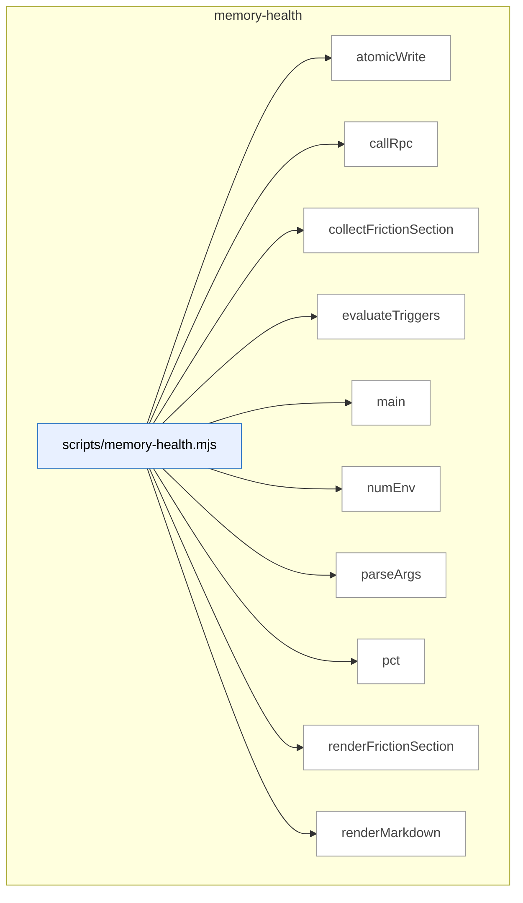

### Symbols in this domain

| Symbol | Kind | Path | Lines | Purpose | File imported by |
|---|---|---|---|---|---|
| [`atomicWrite`](../scripts/memory-health.mjs#L293) | function | `scripts/memory-health.mjs` | 293-299 | Writes file atomically using temp file + rename to prevent corruption on crash. | _(internal)_ |
| [`callRpc`](../scripts/memory-health.mjs#L72) | function | `scripts/memory-health.mjs` | 72-83 | Calls postgres RPC to fetch memory-health metrics (fuzzy re-raise, cluster density, recurrence). | _(internal)_ |
| [`collectFrictionSection`](../scripts/memory-health.mjs#L95) | function | `scripts/memory-health.mjs` | 95-125 | Fetches and ranks recurring open friction clusters from the learning store. | _(internal)_ |
| [`evaluateTriggers`](../scripts/memory-health.mjs#L171) | function | `scripts/memory-health.mjs` | 171-206 | Evaluates whether fuzzy-reraise, cluster-density, or recurrence metrics exceeded thresholds. | _(internal)_ |
| [`main`](../scripts/memory-health.mjs#L301) | function | `scripts/memory-health.mjs` | 301-341 | CLI entry point; runs health check, evaluates triggers, and outputs report or JSON. | _(internal)_ |
| [`numEnv`](../scripts/memory-health.mjs#L32) | function | `scripts/memory-health.mjs` | 32-41 | Reads a numeric environment variable with fallback and validation. | _(internal)_ |
| [`parseArgs`](../scripts/memory-health.mjs#L52) | function | `scripts/memory-health.mjs` | 52-70 | Parses CLI flags for output file path and JSON format toggle. | _(internal)_ |
| [`pct`](../scripts/memory-health.mjs#L208) | function | `scripts/memory-health.mjs` | 208-210 | Formats a decimal fraction as a percentage string. | _(internal)_ |
| [`renderFrictionSection`](../scripts/memory-health.mjs#L127) | function | `scripts/memory-health.mjs` | 127-169 | Renders friction recurrence data as markdown table, detecting hard-fail protected scopes. | _(internal)_ |
| [`renderMarkdown`](../scripts/memory-health.mjs#L212) | function | `scripts/memory-health.mjs` | 212-291 | Builds complete markdown health report with status, metrics table, and friction section. | _(internal)_ |

---

## nav-audit

> Nav-audit statically extracts the complete navigation graph from code by using framework-specific adapters (Next.js, React Router) to discover route destinations, then audits system-level information architecture for coverage gaps, redundancy, and orphaned entry points.

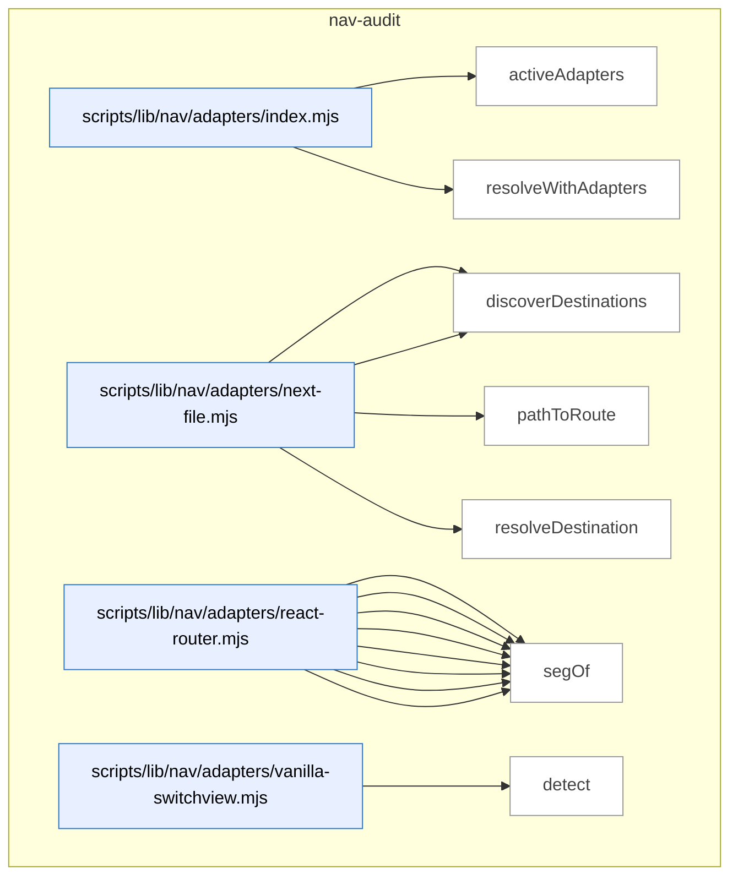

_Domain has 126 symbols (>50). Diagram shows top-15 by file order; see flat table below for the full list._

### Symbols in this domain

| Symbol | Kind | Path | Lines | Purpose | File imported by |
|---|---|---|---|---|---|
| [`activeAdapters`](../scripts/lib/nav/adapters/index.mjs#L20) | function | `scripts/lib/nav/adapters/index.mjs` | 20-24 | Returns framework adapters that detect their patterns in the codebase. | `scripts/lib/nav/extract.mjs` |
| [`resolveWithAdapters`](../scripts/lib/nav/adapters/index.mjs#L37) | function | `scripts/lib/nav/adapters/index.mjs` | 37-45 | Attempts to resolve a raw route destination using each adapter in sequence. | `scripts/lib/nav/extract.mjs` |
| [`detect`](../scripts/lib/nav/adapters/next-file.mjs#L13) | function | `scripts/lib/nav/adapters/next-file.mjs` | 13-15 | Detects Next.js by checking for page.tsx/jsx files. | `scripts/lib/nav/adapters/index.mjs` |
| [`discoverDestinations`](../scripts/lib/nav/adapters/next-file.mjs#L17) | function | `scripts/lib/nav/adapters/next-file.mjs` | 17-27 | Extracts routes from Next.js app/pages directory structure. | `scripts/lib/nav/adapters/index.mjs` |
| [`pathToRoute`](../scripts/lib/nav/adapters/next-file.mjs#L37) | function | `scripts/lib/nav/adapters/next-file.mjs` | 37-53 | Converts Next.js file path to a route destination. | `scripts/lib/nav/adapters/index.mjs` |
| [`resolveDestination`](../scripts/lib/nav/adapters/next-file.mjs#L55) | function | `scripts/lib/nav/adapters/next-file.mjs` | 55-61 | Resolves a string literal to a Next.js route. | `scripts/lib/nav/adapters/index.mjs` |
| [`collectJsxRoutes`](../scripts/lib/nav/adapters/react-router.mjs#L42) | function | `scripts/lib/nav/adapters/react-router.mjs` | 42-64 | Recursively collects Route JSX elements and composes nested paths. | `scripts/lib/nav/adapters/index.mjs` |
| [`collectObjectRoute`](../scripts/lib/nav/adapters/react-router.mjs#L67) | function | `scripts/lib/nav/adapters/react-router.mjs` | 67-89 | Extracts route paths from route-object literals (createBrowserRouter pattern). | `scripts/lib/nav/adapters/index.mjs` |
| [`dedupe`](../scripts/lib/nav/adapters/react-router.mjs#L106) | function | `scripts/lib/nav/adapters/react-router.mjs` | 106-116 | Removes duplicate route objects by id+sourceLoc. | `scripts/lib/nav/adapters/index.mjs` |
| [`detect`](../scripts/lib/nav/adapters/react-router.mjs#L17) | function | `scripts/lib/nav/adapters/react-router.mjs` | 17-19 | Detects React Router by checking imports and JSX Route elements. | `scripts/lib/nav/adapters/index.mjs` |
| [`discoverDestinations`](../scripts/lib/nav/adapters/react-router.mjs#L21) | function | `scripts/lib/nav/adapters/react-router.mjs` | 21-39 | Extracts routes from React Router JSX and route-object definitions. | `scripts/lib/nav/adapters/index.mjs` |
| [`joinRoutePath`](../scripts/lib/nav/adapters/react-router.mjs#L99) | function | `scripts/lib/nav/adapters/react-router.mjs` | 99-104 | Joins parent and child route segments handling absolute/relative paths. | `scripts/lib/nav/adapters/index.mjs` |
| [`resolveDestination`](../scripts/lib/nav/adapters/react-router.mjs#L118) | function | `scripts/lib/nav/adapters/react-router.mjs` | 118-124 | Resolves a string to a React Router route. | `scripts/lib/nav/adapters/index.mjs` |
| [`segOf`](../scripts/lib/nav/adapters/react-router.mjs#L91) | function | `scripts/lib/nav/adapters/react-router.mjs` | 91-96 | Extracts literal or template string value from a route segment. | `scripts/lib/nav/adapters/index.mjs` |
| [`detect`](../scripts/lib/nav/adapters/vanilla-switchview.mjs#L15) | function | `scripts/lib/nav/adapters/vanilla-switchview.mjs` | 15-18 | Detects vanilla switchView pattern by looking for function calls. | `scripts/lib/nav/adapters/index.mjs` |
| [`discoverDestinations`](../scripts/lib/nav/adapters/vanilla-switchview.mjs#L20) | function | `scripts/lib/nav/adapters/vanilla-switchview.mjs` | 20-37 | Extracts view destinations from VIEWS/viewRegistry object literals. | `scripts/lib/nav/adapters/index.mjs` |
| [`resolveDestination`](../scripts/lib/nav/adapters/vanilla-switchview.mjs#L48) | function | `scripts/lib/nav/adapters/vanilla-switchview.mjs` | 48-63 | Resolves VIEWS.key references and string literals to view destinations. | `scripts/lib/nav/adapters/index.mjs` |
| [`viewsObjectOf`](../scripts/lib/nav/adapters/vanilla-switchview.mjs#L39) | function | `scripts/lib/nav/adapters/vanilla-switchview.mjs` | 39-44 | Extracts a views registry object from variable declarations or assignments. | `scripts/lib/nav/adapters/index.mjs` |
| [`appRootForPath`](../scripts/lib/nav/approot.mjs#L16) | function | `scripts/lib/nav/approot.mjs` | 16-27 | Finds the best-matching app root directory for a source file. | `scripts/lib/nav/extract.mjs` |
| [`enclosingSymbol`](../scripts/lib/nav/ast-lite.mjs#L22) | function | `scripts/lib/nav/ast-lite.mjs` | 22-29 | Finds which exported symbol encloses a character index. | `scripts/lib/nav/contract.mjs`, `scripts/lib/nav/model.mjs` |
| [`indexSymbols`](../scripts/lib/nav/ast-lite.mjs#L12) | function | `scripts/lib/nav/ast-lite.mjs` | 12-18 | Extracts exported symbols and their character positions using regex. | `scripts/lib/nav/contract.mjs`, `scripts/lib/nav/model.mjs` |
| [`lineOf`](../scripts/lib/nav/ast-lite.mjs#L32) | function | `scripts/lib/nav/ast-lite.mjs` | 32-36 | Calculates the line number for a character index. | `scripts/lib/nav/contract.mjs`, `scripts/lib/nav/model.mjs` |
| [`calleeName`](../scripts/lib/nav/ast.mjs#L151) | function | `scripts/lib/nav/ast.mjs` | 151-159 | Extracts the function name from a call expression. | `scripts/lib/efficacy-lints.mjs`, `scripts/lib/nav/adapters/react-router.mjs`, `scripts/lib/nav/adapters/vanilla-switchview.mjs`, +1 more |
| [`classifyTarget`](../scripts/lib/nav/ast.mjs#L101) | function | `scripts/lib/nav/ast.mjs` | 101-118 | Classifies JSX attribute values (literals, members, templates) for route extraction. | `scripts/lib/efficacy-lints.mjs`, `scripts/lib/nav/adapters/react-router.mjs`, `scripts/lib/nav/adapters/vanilla-switchview.mjs`, +1 more |
| [`componentNameOf`](../scripts/lib/nav/ast.mjs#L85) | function | `scripts/lib/nav/ast.mjs` | 85-92 | Extracts component name from function/class/arrow declarations. | `scripts/lib/efficacy-lints.mjs`, `scripts/lib/nav/adapters/react-router.mjs`, `scripts/lib/nav/adapters/vanilla-switchview.mjs`, +1 more |
| [`jsxAttr`](../scripts/lib/nav/ast.mjs#L132) | function | `scripts/lib/nav/ast.mjs` | 132-140 | Retrieves a JSX attribute value by name. | `scripts/lib/efficacy-lints.mjs`, `scripts/lib/nav/adapters/react-router.mjs`, `scripts/lib/nav/adapters/vanilla-switchview.mjs`, +1 more |
| [`jsxLabel`](../scripts/lib/nav/ast.mjs#L121) | function | `scripts/lib/nav/ast.mjs` | 121-129 | Extracts plain text label content from JSX element children. | `scripts/lib/efficacy-lints.mjs`, `scripts/lib/nav/adapters/react-router.mjs`, `scripts/lib/nav/adapters/vanilla-switchview.mjs`, +1 more |
| [`jsxTagName`](../scripts/lib/nav/ast.mjs#L143) | function | `scripts/lib/nav/ast.mjs` | 143-148 | Extracts the tag name from a JSX opening element. | `scripts/lib/efficacy-lints.mjs`, `scripts/lib/nav/adapters/react-router.mjs`, `scripts/lib/nav/adapters/vanilla-switchview.mjs`, +1 more |
| [`parseSource`](../scripts/lib/nav/ast.mjs#L27) | function | `scripts/lib/nav/ast.mjs` | 27-39 | Parses source code into an AST with error recovery. | `scripts/lib/efficacy-lints.mjs`, `scripts/lib/nav/adapters/react-router.mjs`, `scripts/lib/nav/adapters/vanilla-switchview.mjs`, +1 more |
| [`unwrapObjectExpression`](../scripts/lib/nav/ast.mjs#L73) | function | `scripts/lib/nav/ast.mjs` | 73-82 | Unwraps Object.freeze/assign wrappers to extract base ObjectExpression. | `scripts/lib/efficacy-lints.mjs`, `scripts/lib/nav/adapters/react-router.mjs`, `scripts/lib/nav/adapters/vanilla-switchview.mjs`, +1 more |
| [`walk`](../scripts/lib/nav/ast.mjs#L49) | function | `scripts/lib/nav/ast.mjs` | 49-68 | Recursively traverses an AST visiting each node with enclosing component and line info. | `scripts/lib/efficacy-lints.mjs`, `scripts/lib/nav/adapters/react-router.mjs`, `scripts/lib/nav/adapters/vanilla-switchview.mjs`, +1 more |
| [`buildDraftCaptureWarning`](../scripts/lib/nav/bootstrap-draft.mjs#L31) | function | `scripts/lib/nav/bootstrap-draft.mjs` | 31-43 | Generates warning text when nav containers are empty or auth-gated. | `scripts/nav-audit.mjs` |
| [`byProminence`](../scripts/lib/nav/bootstrap-draft.mjs#L47) | function | `scripts/lib/nav/bootstrap-draft.mjs` | 47-49 | Comparator sorting nav containers by sticky status, target count, and insertion order. | `scripts/nav-audit.mjs` |
| [`dedupe`](../scripts/lib/nav/bootstrap-draft.mjs#L130) | function | `scripts/lib/nav/bootstrap-draft.mjs` | 130-130 | Deduplicates an array using Set conversion. | `scripts/nav-audit.mjs` |
| [`draftContractFromLive`](../scripts/lib/nav/bootstrap-draft.mjs#L61) | function | `scripts/lib/nav/bootstrap-draft.mjs` | 61-128 | Synthesizes a nav-contract from live navigation evidence. | `scripts/nav-audit.mjs` |
| [`bootstrapContract`](../scripts/lib/nav/contract.mjs#L205) | function | `scripts/lib/nav/contract.mjs` | 205-231 | Creates an initial nav contract from persona intents, destinations, and draft nav layers. | `scripts/lib/dashboard/collect-nav.mjs`, `scripts/lib/nav/findings.mjs`, `scripts/nav-audit.mjs` |
| [`coerce`](../scripts/lib/nav/contract.mjs#L175) | function | `scripts/lib/nav/contract.mjs` | 175-186 | Converts string values to their proper types (bool, list, or string) based on a type definition. | `scripts/lib/dashboard/collect-nav.mjs`, `scripts/lib/nav/findings.mjs`, `scripts/nav-audit.mjs` |
| [`contractExists`](../scripts/lib/nav/contract.mjs#L201) | function | `scripts/lib/nav/contract.mjs` | 201-203 | Checks whether a nav contract file exists in a given repository directory. | `scripts/lib/dashboard/collect-nav.mjs`, `scripts/lib/nav/findings.mjs`, `scripts/nav-audit.mjs` |
| [`isUtilityRoute`](../scripts/lib/nav/contract.mjs#L102) | function | `scripts/lib/nav/contract.mjs` | 102-105 | Checks if a route is a utility route (error, login, etc.). | `scripts/lib/dashboard/collect-nav.mjs`, `scripts/lib/nav/findings.mjs`, `scripts/nav-audit.mjs` |
| [`parseDocblockTokens`](../scripts/lib/nav/contract.mjs#L161) | function | `scripts/lib/nav/contract.mjs` | 161-173 | Parses space-separated tokens from a docblock into typed fields using a schema. | `scripts/lib/dashboard/collect-nav.mjs`, `scripts/lib/nav/findings.mjs`, `scripts/nav-audit.mjs` |
| [`parseNavMeta`](../scripts/lib/nav/contract.mjs#L119) | function | `scripts/lib/nav/contract.mjs` | 119-140 | Extracts navMeta export objects and @nav docblock declarations from source. | `scripts/lib/dashboard/collect-nav.mjs`, `scripts/lib/nav/findings.mjs`, `scripts/nav-audit.mjs` |
| [`parseObjectBody`](../scripts/lib/nav/contract.mjs#L145) | function | `scripts/lib/nav/contract.mjs` | 145-158 | Extracts key:value pairs from a docblock object body and coerces values to their schema types. | `scripts/lib/dashboard/collect-nav.mjs`, `scripts/lib/nav/findings.mjs`, `scripts/nav-audit.mjs` |
| [`readContract`](../scripts/lib/nav/contract.mjs#L59) | function | `scripts/lib/nav/contract.mjs` | 59-95 | Reads and validates nav-contract.json with schema enforcement. | `scripts/lib/dashboard/collect-nav.mjs`, `scripts/lib/nav/findings.mjs`, `scripts/nav-audit.mjs` |
| [`writeContract`](../scripts/lib/nav/contract.mjs#L239) | function | `scripts/lib/nav/contract.mjs` | 239-247 | Validates and persists a nav contract to a JSON file. | `scripts/lib/dashboard/collect-nav.mjs`, `scripts/lib/nav/findings.mjs`, `scripts/nav-audit.mjs` |
| [`ageDivergences`](../scripts/lib/nav/drift.mjs#L60) | function | `scripts/lib/nav/drift.mjs` | 60-68 | Computes the age in days of each finding since it was first observed. | `scripts/cross-skill.mjs`, `scripts/lib/dashboard/collect-nav.mjs`, `scripts/nav-audit.mjs` |
| [`divergenceKey`](../scripts/lib/nav/drift.mjs#L18) | function | `scripts/lib/nav/drift.mjs` | 18-20 | Creates a unique key from a finding's class and destination for deduplication. | `scripts/cross-skill.mjs`, `scripts/lib/dashboard/collect-nav.mjs`, `scripts/nav-audit.mjs` |
| [`firstSeenFromHistory`](../scripts/lib/nav/drift.mjs#L89) | function | `scripts/lib/nav/drift.mjs` | 89-101 | Extracts earliest first-seen timestamp for each drift key from historical database rows. | `scripts/cross-skill.mjs`, `scripts/lib/dashboard/collect-nav.mjs`, `scripts/nav-audit.mjs` |
| [`partitionFindings`](../scripts/lib/nav/drift.mjs#L27) | function | `scripts/lib/nav/drift.mjs` | 27-31 | Splits findings into gate-eligible and advisory categories. | `scripts/cross-skill.mjs`, `scripts/lib/dashboard/collect-nav.mjs`, `scripts/nav-audit.mjs` |
| [`readDriftLedger`](../scripts/lib/nav/drift.mjs#L71) | function | `scripts/lib/nav/drift.mjs` | 71-77 | Loads the JSON ledger tracking when each nav divergence was first seen. | `scripts/cross-skill.mjs`, `scripts/lib/dashboard/collect-nav.mjs`, `scripts/nav-audit.mjs` |
| [`scopeToChanged`](../scripts/lib/nav/drift.mjs#L41) | function | `scripts/lib/nav/drift.mjs` | 41-50 | Filters gate-eligible findings to only those affecting changed files or the contract itself. | `scripts/cross-skill.mjs`, `scripts/lib/dashboard/collect-nav.mjs`, `scripts/nav-audit.mjs` |
| [`writeDriftLedger`](../scripts/lib/nav/drift.mjs#L81) | function | `scripts/lib/nav/drift.mjs` | 81-86 | Saves a drift ledger tracking first-seen timestamps for active findings. | `scripts/cross-skill.mjs`, `scripts/lib/dashboard/collect-nav.mjs`, `scripts/nav-audit.mjs` |
| [`assembleEnvelope`](../scripts/lib/nav/envelope.mjs#L87) | function | `scripts/lib/nav/envelope.mjs` | 87-98 | Constructs a nav audit envelope with version, config digest, and edge/destination metadata. | `scripts/nav-audit.mjs` |
| [`readObservedEnvelope`](../scripts/lib/nav/envelope.mjs#L29) | function | `scripts/lib/nav/envelope.mjs` | 29-55 | Loads and validates a previously-generated nav audit envelope with config-digest staleness checking. | `scripts/nav-audit.mjs` |
| [`writeObservedEnvelope`](../scripts/lib/nav/envelope.mjs#L66) | function | `scripts/lib/nav/envelope.mjs` | 66-74 | Validates and persists a nav audit envelope to a JSON file. | `scripts/nav-audit.mjs` |
| [`affordancesOf`](../scripts/lib/nav/extract.mjs#L150) | function | `scripts/lib/nav/extract.mjs` | 150-162 | Extracts navigation affordances (links, calls, template strings) from an AST node. | `scripts/nav-audit.mjs` |
| [`basename`](../scripts/lib/nav/extract.mjs#L314) | function | `scripts/lib/nav/extract.mjs` | 314-316 | Extracts the filename without extension from a file path. | `scripts/nav-audit.mjs` |
| [`buildViewsMap`](../scripts/lib/nav/extract.mjs#L284) | function | `scripts/lib/nav/extract.mjs` | 284-299 | Indexes VIEWS/viewRegistry constant assignments to resolve symbolic navigation destinations. | `scripts/nav-audit.mjs` |
| [`callAffordance`](../scripts/lib/nav/extract.mjs#L179) | function | `scripts/lib/nav/extract.mjs` | 179-192 | Extracts a navigation affordance from a function call (navigate, openModal, etc.). | `scripts/nav-audit.mjs` |
| [`embeddedAffordances`](../scripts/lib/nav/extract.mjs#L202) | function | `scripts/lib/nav/extract.mjs` | 202-226 | Finds navigation affordances embedded in string literals and template strings via regex. | `scripts/nav-audit.mjs` |
| [`extractEdges`](../scripts/lib/nav/extract.mjs#L86) | function | `scripts/lib/nav/extract.mjs` | 86-144 | Discovers all navigation edges (links, redirects, navigate calls) from source code via adapters. | `scripts/nav-audit.mjs` |
| [`findDomAnchor`](../scripts/lib/nav/extract.mjs#L231) | function | `scripts/lib/nav/extract.mjs` | 231-241 | Locates a DOM container (id or class) for an affordance by searching backwards in source text. | `scripts/nav-audit.mjs` |
| [`globToRe`](../scripts/lib/nav/extract.mjs#L71) | function | `scripts/lib/nav/extract.mjs` | 71-76 | Converts a glob pattern to a regular expression for path matching. | `scripts/nav-audit.mjs` |
| [`isSkippable`](../scripts/lib/nav/extract.mjs#L253) | function | `scripts/lib/nav/extract.mjs` | 253-257 | Checks whether a navigation target should be ignored (empty, external, or missing). | `scripts/nav-audit.mjs` |
| [`jsxAffordance`](../scripts/lib/nav/extract.mjs#L164) | function | `scripts/lib/nav/extract.mjs` | 164-177 | Extracts a navigation affordance from a JSX element (Link, Navigate, etc.). | `scripts/nav-audit.mjs` |
| [`readSources`](../scripts/lib/nav/extract.mjs#L50) | function | `scripts/lib/nav/extract.mjs` | 50-68 | Filters and reads JavaScript/TypeScript source files, skipping excluded/sensitive/unreadable paths. | `scripts/nav-audit.mjs` |
| [`resolveTarget`](../scripts/lib/nav/extract.mjs#L260) | function | `scripts/lib/nav/extract.mjs` | 260-280 | Converts a parsed navigation target to a destination ID using adapters or normalization. | `scripts/nav-audit.mjs` |
| [`templateText`](../scripts/lib/nav/extract.mjs#L244) | function | `scripts/lib/nav/extract.mjs` | 244-251 | Reconstructs the text of a template literal by joining quasi-strings with placeholders. | `scripts/nav-audit.mjs` |
| [`viewsObjectOf`](../scripts/lib/nav/extract.mjs#L303) | function | `scripts/lib/nav/extract.mjs` | 303-312 | Detects and extracts a VIEWS or viewRegistry object declaration from an AST node. | `scripts/nav-audit.mjs` |
| [`competingModelsFindings`](../scripts/lib/nav/findings.mjs#L294) | function | `scripts/lib/nav/findings.mjs` | 294-307 | Detects when two prominent nav layers organize destinations disjointly. | `scripts/lib/dashboard/collect-nav.mjs`, `scripts/nav-audit.mjs` |
| [`confidenceOf`](../scripts/lib/nav/findings.mjs#L257) | function | `scripts/lib/nav/findings.mjs` | 257-262 | Computes the lowest confidence level across all edges leading to a destination. | `scripts/lib/dashboard/collect-nav.mjs`, `scripts/nav-audit.mjs` |
| [`declaredIntents`](../scripts/lib/nav/findings.mjs#L248) | function | `scripts/lib/nav/findings.mjs` | 248-251 | Extracts all navigation intents from contract personas. | `scripts/lib/dashboard/collect-nav.mjs`, `scripts/nav-audit.mjs` |
| [`isHighFrequencyIntent`](../scripts/lib/nav/findings.mjs#L253) | function | `scripts/lib/nav/findings.mjs` | 253-255 | Checks whether a destination is declared as a high-frequency user intent. | `scripts/lib/dashboard/collect-nav.mjs`, `scripts/nav-audit.mjs` |
| [`layerDestinationSets`](../scripts/lib/nav/findings.mjs#L264) | function | `scripts/lib/nav/findings.mjs` | 264-271 | Groups destinations by their navigation layer (primary, secondary, etc.). | `scripts/lib/dashboard/collect-nav.mjs`, `scripts/nav-audit.mjs` |
| [`liveLayerSets`](../scripts/lib/nav/findings.mjs#L332) | function | `scripts/lib/nav/findings.mjs` | 332-353 | Reconstructs layer/anchor/destination relationships from live DOM attribution data. | `scripts/lib/dashboard/collect-nav.mjs`, `scripts/nav-audit.mjs` |
| [`mk`](../scripts/lib/nav/findings.mjs#L244) | function | `scripts/lib/nav/findings.mjs` | 244-246 | Constructs a finding object with class, severity, destination, evidence, and verdict. | `scripts/lib/dashboard/collect-nav.mjs`, `scripts/nav-audit.mjs` |
| [`personaScorecard`](../scripts/lib/nav/findings.mjs#L207) | function | `scripts/lib/nav/findings.mjs` | 207-242 | Evaluates per-persona-intent reachability status (ok/red/unverified) from the nav model. | `scripts/lib/dashboard/collect-nav.mjs`, `scripts/nav-audit.mjs` |
| [`redundancyFindings`](../scripts/lib/nav/findings.mjs#L278) | function | `scripts/lib/nav/findings.mjs` | 278-292 | Detects when a destination is reachable from multiple prominent layers (over-exposed). | `scripts/lib/dashboard/collect-nav.mjs`, `scripts/nav-audit.mjs` |
| [`runLiveTaxonomy`](../scripts/lib/nav/findings.mjs#L363) | function | `scripts/lib/nav/findings.mjs` | 363-390 | Applies the finding taxonomy to live-captured DOM attribution, honoring capture-state gaps. | `scripts/lib/dashboard/collect-nav.mjs`, `scripts/nav-audit.mjs` |
| [`runTaxonomy`](../scripts/lib/nav/findings.mjs#L26) | function | `scripts/lib/nav/findings.mjs` | 26-195 | Applies 10 finding-class rules (coverage-gap, redundancy, etc.) to detect nav architecture issues. | `scripts/lib/dashboard/collect-nav.mjs`, `scripts/nav-audit.mjs` |
| [`sequencingFindings`](../scripts/lib/nav/findings.mjs#L309) | function | `scripts/lib/nav/findings.mjs` | 309-323 | Detects high-frequency intents that are not reachable from prominent affordances. | `scripts/lib/dashboard/collect-nav.mjs`, `scripts/nav-audit.mjs` |
| [`attributeLive`](../scripts/lib/nav/live-attribution.mjs#L57) | function | `scripts/lib/nav/live-attribution.mjs` | 57-73 | Organizes live-captured affordance evidence by destination ID with placement metadata. | `scripts/lib/nav/findings.mjs`, `scripts/lib/nav/verify.mjs` |
| [`computeCaptureStatus`](../scripts/lib/nav/live-attribution.mjs#L86) | function | `scripts/lib/nav/live-attribution.mjs` | 86-113 | Determines capture status (captured/empty/hidden/absent) for each declared nav container. | `scripts/lib/nav/findings.mjs`, `scripts/lib/nav/verify.mjs` |
| [`layerRank`](../scripts/lib/nav/live-attribution.mjs#L21) | function | `scripts/lib/nav/live-attribution.mjs` | 21-28 | Assigns a precedence rank to a nav layer for tie-breaking container depth comparisons. | `scripts/lib/nav/findings.mjs`, `scripts/lib/nav/verify.mjs` |
| [`mergeScorecard`](../scripts/lib/nav/live-attribution.mjs#L124) | function | `scripts/lib/nav/live-attribution.mjs` | 124-174 | Reconciles live-captured DOM attribution with static scorecard rows, with honesty on unverifiable layers. | `scripts/lib/nav/findings.mjs`, `scripts/lib/nav/verify.mjs` |
| [`resolveContainer`](../scripts/lib/nav/live-attribution.mjs#L37) | function | `scripts/lib/nav/live-attribution.mjs` | 37-49 | Selects the best (shallowest) container match for a destination, breaking ties by layer rank. | `scripts/lib/nav/findings.mjs`, `scripts/lib/nav/verify.mjs` |
| [`buildModel`](../scripts/lib/nav/model.mjs#L27) | function | `scripts/lib/nav/model.mjs` | 27-76 | Constructs the nav audit model by attributing edges to anchors and building destination metadata. | `scripts/lib/dashboard/collect-nav.mjs`, `scripts/nav-audit.mjs` |
| [`buildReverseContainment`](../scripts/lib/nav/model.mjs#L80) | function | `scripts/lib/nav/model.mjs` | 80-95 | Indexes component containment relationships (parent → children) from JSX usage. | `scripts/lib/dashboard/collect-nav.mjs`, `scripts/nav-audit.mjs` |
| [`declaredAncestors`](../scripts/lib/nav/model.mjs#L99) | function | `scripts/lib/nav/model.mjs` | 99-125 | Traces a component's ancestor chain up to the nearest declared nav layer via breadth-first search. | `scripts/lib/dashboard/collect-nav.mjs`, `scripts/nav-audit.mjs` |
| [`dedupe`](../scripts/lib/nav/normalize.mjs#L90) | function | `scripts/lib/nav/normalize.mjs` | 90-92 | Removes duplicate entries from an array using a Set. | `scripts/lib/nav/adapters/next-file.mjs`, `scripts/lib/nav/adapters/react-router.mjs`, `scripts/lib/nav/adapters/vanilla-switchview.mjs`, +3 more |
| [`namespaceId`](../scripts/lib/nav/normalize.mjs#L101) | function | `scripts/lib/nav/normalize.mjs` | 101-103 | Adds an app root prefix to an ID if the root exists. | `scripts/lib/nav/adapters/next-file.mjs`, `scripts/lib/nav/adapters/react-router.mjs`, `scripts/lib/nav/adapters/vanilla-switchview.mjs`, +3 more |
| [`normalizeDestination`](../scripts/lib/nav/normalize.mjs#L27) | function | `scripts/lib/nav/normalize.mjs` | 27-88 | Parses and normalizes a raw navigation destination string into structured IDs with confidence scoring. | `scripts/lib/nav/adapters/next-file.mjs`, `scripts/lib/nav/adapters/react-router.mjs`, `scripts/lib/nav/adapters/vanilla-switchview.mjs`, +3 more |
| [`mapPersonasToIntents`](../scripts/lib/nav/persona-seed.mjs#L28) | function | `scripts/lib/nav/persona-seed.mjs` | 28-47 | Converts persona navigation sessions into structured intent seeds. | `scripts/nav-audit.mjs` |
| [`slugifyDestination`](../scripts/lib/nav/persona-seed.mjs#L14) | function | `scripts/lib/nav/persona-seed.mjs` | 14-16 | Converts a destination string to a lowercase slug with hyphens. | `scripts/nav-audit.mjs` |
| [`esc`](../scripts/lib/nav/render.mjs#L119) | function | `scripts/lib/nav/render.mjs` | 119-121 | Escapes special characters in strings for safe use in output. | `scripts/nav-audit.mjs` |
| [`renderFindings`](../scripts/lib/nav/render.mjs#L49) | function | `scripts/lib/nav/render.mjs` | 49-60 | Formats navigation audit findings as a sorted text list. | `scripts/nav-audit.mjs` |
| [`renderLiveFindings`](../scripts/lib/nav/render.mjs#L67) | function | `scripts/lib/nav/render.mjs` | 67-77 | Formats live DOM evidence findings as text with sorted severity. | `scripts/nav-audit.mjs` |
| [`renderMermaid`](../scripts/lib/nav/render.mjs#L92) | function | `scripts/lib/nav/render.mjs` | 92-117 | Creates a Mermaid flowchart of the navigation graph by layer. | `scripts/nav-audit.mjs` |
| [`renderScorecard`](../scripts/lib/nav/render.mjs#L13) | function | `scripts/lib/nav/render.mjs` | 13-46 | Formats persona reachability data as a readable scorecard text. | `scripts/nav-audit.mjs` |
| [`renderTable`](../scripts/lib/nav/render.mjs#L80) | function | `scripts/lib/nav/render.mjs` | 80-87 | Generates a Markdown table of navigation destinations with their metadata. | `scripts/nav-audit.mjs` |
| [`safeId`](../scripts/lib/nav/render.mjs#L122) | function | `scripts/lib/nav/render.mjs` | 122-124 | Converts a string to a safe identifier by replacing non-alphanumeric chars. | `scripts/nav-audit.mjs` |
| [`computeConfigDigest`](../scripts/lib/nav/schema.mjs#L208) | function | `scripts/lib/nav/schema.mjs` | 208-210 | Hashes the adapter version and contract digest together. | `scripts/lib/dashboard/collect-nav.mjs`, `scripts/lib/nav/contract.mjs`, `scripts/lib/nav/drift.mjs`, +4 more |
| [`computeContractDigest`](../scripts/lib/nav/schema.mjs#L170) | function | `scripts/lib/nav/schema.mjs` | 170-198 | Computes a SHA256 hash of the navigation contract for freshness checking. | `scripts/lib/dashboard/collect-nav.mjs`, `scripts/lib/nav/contract.mjs`, `scripts/lib/nav/drift.mjs`, +4 more |
| [`sha256`](../scripts/lib/nav/schema.mjs#L221) | function | `scripts/lib/nav/schema.mjs` | 221-223 | Computes SHA256 hash of a string. | `scripts/lib/dashboard/collect-nav.mjs`, `scripts/lib/nav/contract.mjs`, `scripts/lib/nav/drift.mjs`, +4 more |
| [`sortRecordOfArrays`](../scripts/lib/nav/schema.mjs#L212) | function | `scripts/lib/nav/schema.mjs` | 212-219 | Sorts all keys and values in an object of arrays alphabetically. | `scripts/lib/dashboard/collect-nav.mjs`, `scripts/lib/nav/contract.mjs`, `scripts/lib/nav/drift.mjs`, +4 more |
| [`readVerifyResult`](../scripts/lib/nav/verify-store.mjs#L40) | function | `scripts/lib/nav/verify-store.mjs` | 40-58 | Reads and validates a nav verify result with freshness checking. | `scripts/lib/dashboard/collect-nav.mjs`, `scripts/nav-audit.mjs` |
| [`writeVerifyResult`](../scripts/lib/nav/verify-store.mjs#L23) | function | `scripts/lib/nav/verify-store.mjs` | 23-31 | Validates and atomically writes a nav verify result to disk. | `scripts/lib/dashboard/collect-nav.mjs`, `scripts/nav-audit.mjs` |
| [`collectLiveNav`](../scripts/lib/nav/verify.mjs#L328) | function | `scripts/lib/nav/verify.mjs` | 328-415 | Extracts clickable elements from a rendered page and their targets. | `scripts/lib/nav/persona-seed.mjs`, `scripts/nav-audit.mjs` |
| [`detectNavShells`](../scripts/lib/nav/verify.mjs#L434) | function | `scripts/lib/nav/verify.mjs` | 434-457 | Identifies nav-ish containers that might be empty shells. | `scripts/lib/nav/persona-seed.mjs`, `scripts/nav-audit.mjs` |
| [`discoverExpandTriggers`](../scripts/lib/nav/verify.mjs#L459) | function | `scripts/lib/nav/verify.mjs` | 459-519 | Finds buttons/toggles that expand collapsed navigation menus. | `scripts/lib/nav/persona-seed.mjs`, `scripts/nav-audit.mjs` |
| [`extractTarget`](../scripts/lib/nav/verify.mjs#L539) | function | `scripts/lib/nav/verify.mjs` | 539-557 | Extracts the navigation destination from an element's href or data attributes. | `scripts/lib/nav/persona-seed.mjs`, `scripts/nav-audit.mjs` |
| [`normalizeLiveTarget`](../scripts/lib/nav/verify.mjs#L29) | function | `scripts/lib/nav/verify.mjs` | 29-63 | Extracts and normalizes a URL/target from the live DOM. | `scripts/lib/nav/persona-seed.mjs`, `scripts/nav-audit.mjs` |
| [`reconcile`](../scripts/lib/nav/verify.mjs#L71) | function | `scripts/lib/nav/verify.mjs` | 71-87 | Compares static destinations against live targets to find matches/gaps. | `scripts/lib/nav/persona-seed.mjs`, `scripts/nav-audit.mjs` |
| [`runVerify`](../scripts/lib/nav/verify.mjs#L119) | function | `scripts/lib/nav/verify.mjs` | 119-318 | Drives Playwright to collect and verify navigation against the contract. | `scripts/lib/nav/persona-seed.mjs`, `scripts/nav-audit.mjs` |
| [`selectorLayers`](../scripts/lib/nav/verify.mjs#L90) | function | `scripts/lib/nav/verify.mjs` | 90-96 | Extracts nav-layer selectors from the contract. | `scripts/lib/nav/persona-seed.mjs`, `scripts/nav-audit.mjs` |
| [`usableHref`](../scripts/lib/nav/verify.mjs#L527) | function | `scripts/lib/nav/verify.mjs` | 527-532 | Checks if an href is a valid navigation target (not mailto/javascript/etc). | `scripts/lib/nav/persona-seed.mjs`, `scripts/nav-audit.mjs` |
| [`collectRouteMeta`](../scripts/nav-audit.mjs#L266) | function | `scripts/nav-audit.mjs` | 266-283 | Extracts declared navigation metadata (@nav docblock claims) from source files and binds them to discovered route destinations. | _(internal)_ |
| [`countBySeverity`](../scripts/nav-audit.mjs#L306) | function | `scripts/nav-audit.mjs` | 306-310 | Counts findings grouped by severity level (P0, P1, P2, P3). | _(internal)_ |
| [`gitChangedFiles`](../scripts/nav-audit.mjs#L317) | function | `scripts/nav-audit.mjs` | 317-327 | Returns file paths modified between HEAD and the merge-base of origin/HEAD. | _(internal)_ |
| [`gitHeadDate`](../scripts/nav-audit.mjs#L332) | function | `scripts/nav-audit.mjs` | 332-334 | Returns the timestamp of the current HEAD commit via git. | _(internal)_ |
| [`gitHeadSha`](../scripts/nav-audit.mjs#L329) | function | `scripts/nav-audit.mjs` | 329-331 | Returns the current HEAD commit SHA via git. | _(internal)_ |
| [`gitIsDirty`](../scripts/nav-audit.mjs#L336) | function | `scripts/nav-audit.mjs` | 336-339 | Checks whether the working tree has uncommitted or untracked changes. | _(internal)_ |
| [`listSourceFiles`](../scripts/nav-audit.mjs#L312) | function | `scripts/nav-audit.mjs` | 312-315 | Lists all source code files in the repository via git ls-files. | _(internal)_ |
| [`main`](../scripts/nav-audit.mjs#L31) | function | `scripts/nav-audit.mjs` | 31-264 | Entry point that extracts navigation graph from source code, optionally verifies against live app, and reports structural/drift findings. | _(internal)_ |
| [`parseArgs`](../scripts/nav-audit.mjs#L285) | function | `scripts/nav-audit.mjs` | 285-304 | Parses CLI flags into an options object with scope, format, verify, bootstrap, and other configuration settings. | _(internal)_ |
| [`recordNavAuditRunTelemetry`](../scripts/nav-audit.mjs#L351) | function | `scripts/nav-audit.mjs` | 351-361 | Sends nav audit run metadata (finding counts, drift keys) to the learning store via cross-skill CLI. | _(internal)_ |
| [`seedPersonaIntents`](../scripts/nav-audit.mjs#L372) | function | `scripts/nav-audit.mjs` | 372-385 | Fetches persona reachability evidence from prior persona-test sessions and derives navigation intents. | _(internal)_ |

---

## persona-test

> The `persona-test` domain validates accessibility testing manifests by verifying that DOM selectors match expected shapes, coercing DOM values to declared types, and flagging consistency contradictions like inappropriate CSS locators that should use semantic accessibility attributes instead.

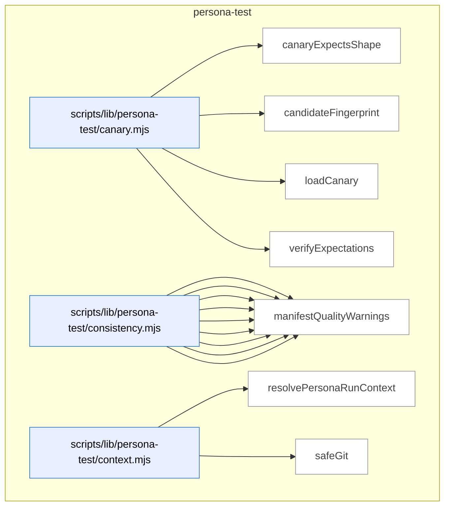

_Domain has 71 symbols (>50). Diagram shows top-15 by file order; see flat table below for the full list._

### Symbols in this domain

| Symbol | Kind | Path | Lines | Purpose | File imported by |
|---|---|---|---|---|---|
| [`canaryExpectsShape`](../scripts/lib/persona-test/canary.mjs#L289) | function | `scripts/lib/persona-test/canary.mjs` | 289-301 | Tests if a contradiction matches a shape in the canary's expectedContradictions list with optional kind filtering. | `scripts/persona-consistency-run.mjs` |
| [`candidateFingerprint`](../scripts/lib/persona-test/canary.mjs#L318) | function | `scripts/lib/persona-test/canary.mjs` | 318-337 | Generates a stable SHA-256 hash for a consistency-mode candidate using surface, field, scope, key, and kind. | `scripts/persona-consistency-run.mjs` |
| [`loadCanary`](../scripts/lib/persona-test/canary.mjs#L38) | function | `scripts/lib/persona-test/canary.mjs` | 38-141 | Loads a JSON canary spec file with validation that the file and directory are within the repo root. | `scripts/persona-consistency-run.mjs` |
| [`verifyExpectations`](../scripts/lib/persona-test/canary.mjs#L193) | function | `scripts/lib/persona-test/canary.mjs` | 193-268 | Checks that observed state contradictions meet the canary's min/max expectation thresholds with diagnostic verdict. | `scripts/persona-consistency-run.mjs` |
| [`appliesToCurrent`](../scripts/lib/persona-test/consistency.mjs#L488) | function | `scripts/lib/persona-test/consistency.mjs` | 488-506 | Checks if a surface's appliesTo constraints match the current route, step label, and state tags. | `scripts/persona-consistency-run.mjs` |
| [`clampToFloor`](../scripts/lib/persona-test/consistency.mjs#L118) | function | `scripts/lib/persona-test/consistency.mjs` | 118-122 | Raises a proposed severity toward a floor (numerically lower) if proposed is below it. | `scripts/persona-consistency-run.mjs` |
| [`coerceDomKey`](../scripts/lib/persona-test/consistency.mjs#L91) | function | `scripts/lib/persona-test/consistency.mjs` | 91-113 | Converts a DOM key string to its inferred type (string, number, boolean) with validation. | `scripts/persona-consistency-run.mjs` |
| [`coerceDomValue`](../scripts/lib/persona-test/consistency.mjs#L38) | function | `scripts/lib/persona-test/consistency.mjs` | 38-80 | Converts a DOM string value to its declared type (boolean, integer, enum, prose) with validation. | `scripts/persona-consistency-run.mjs` |
| [`deepEqual`](../scripts/lib/persona-test/consistency.mjs#L508) | function | `scripts/lib/persona-test/consistency.mjs` | 508-522 | Recursively compares two values for deep structural equality. | `scripts/persona-consistency-run.mjs` |
| [`diffClaims`](../scripts/lib/persona-test/consistency.mjs#L139) | function | `scripts/lib/persona-test/consistency.mjs` | 139-406 | Compares DOM engine claims against a manifest and witness to detect contradictions (stale, absent, mismatch, undeclared). | `scripts/persona-consistency-run.mjs` |
| [`locatorToString`](../scripts/lib/persona-test/consistency.mjs#L454) | function | `scripts/lib/persona-test/consistency.mjs` | 454-464 | Formats a locator object (role/label/testid/id/css) into a human-readable selector string. | `scripts/persona-consistency-run.mjs` |
| [`make`](../scripts/lib/persona-test/consistency.mjs#L437) | function | `scripts/lib/persona-test/consistency.mjs` | 437-452 | Factory for creating a consistency finding object with all required fields and defaults. | `scripts/persona-consistency-run.mjs` |
| [`manifestQualityWarnings`](../scripts/lib/persona-test/consistency.mjs#L420) | function | `scripts/lib/persona-test/consistency.mjs` | 420-433 | Generates warnings for manifest surfaces using CSS locators when semantic selectors are preferred. | `scripts/persona-consistency-run.mjs` |
| [`resolvePersonaRunContext`](../scripts/lib/persona-test/context.mjs#L28) | function | `scripts/lib/persona-test/context.mjs` | 28-65 | Validates and builds a persona run context object (repo, journey, commit, branch) from raw args. | _(internal)_ |
| [`safeGit`](../scripts/lib/persona-test/context.mjs#L67) | function | `scripts/lib/persona-test/context.mjs` | 67-74 | Executes a git command safely, returning trimmed output or null on failure. | _(internal)_ |
| [`normaliseForReplay`](../scripts/lib/persona-test/ledger.mjs#L156) | function | `scripts/lib/persona-test/ledger.mjs` | 156-196 | Strips timestamps and sorts arrays deterministically for consistent replay comparison. | `scripts/persona-consistency-run.mjs` |
| [`openLedger`](../scripts/lib/persona-test/ledger.mjs#L56) | function | `scripts/lib/persona-test/ledger.mjs` | 56-139 | Initializes and persists a consistency-mode session ledger file with schema version and default fields, returning an object with mutator methods. | `scripts/persona-consistency-run.mjs` |
| [`persist`](../scripts/lib/persona-test/ledger.mjs#L141) | function | `scripts/lib/persona-test/ledger.mjs` | 141-143 | Writes ledger to file atomically. | `scripts/persona-consistency-run.mjs` |
| [`s`](../scripts/lib/persona-test/ledger.mjs#L200) | function | `scripts/lib/persona-test/ledger.mjs` | 200-200 | Converts null/undefined to empty string, otherwise returns string value. | `scripts/persona-consistency-run.mjs` |
| [`stableCompareContradiction`](../scripts/lib/persona-test/ledger.mjs#L224) | function | `scripts/lib/persona-test/ledger.mjs` | 224-232 | Sorts contradictions by kind, surfaceId, engineField, scope, and key. | `scripts/persona-consistency-run.mjs` |
| [`stableCompareDom`](../scripts/lib/persona-test/ledger.mjs#L202) | function | `scripts/lib/persona-test/ledger.mjs` | 202-209 | Sorts DOM claims by surfaceId, engineField, scope, and key. | `scripts/persona-consistency-run.mjs` |
| [`stableCompareFreshness`](../scripts/lib/persona-test/ledger.mjs#L233) | function | `scripts/lib/persona-test/ledger.mjs` | 233-238 | Sorts freshness observations by surfaceId and engineField. | `scripts/persona-consistency-run.mjs` |
| [`stableCompareNetwork`](../scripts/lib/persona-test/ledger.mjs#L210) | function | `scripts/lib/persona-test/ledger.mjs` | 210-217 | Sorts network claims by surfaceId, engineField, scope, and key. | `scripts/persona-consistency-run.mjs` |
| [`stableCompareUndeclared`](../scripts/lib/persona-test/ledger.mjs#L218) | function | `scripts/lib/persona-test/ledger.mjs` | 218-223 | Sorts undeclared DOM claims by engineField and selector. | `scripts/persona-consistency-run.mjs` |
| [`stableCompareWarning`](../scripts/lib/persona-test/ledger.mjs#L239) | function | `scripts/lib/persona-test/ledger.mjs` | 239-244 | Sorts warnings by kind and surfaceId. | `scripts/persona-consistency-run.mjs` |
| [`resolveManifest`](../scripts/lib/persona-test/manifest-resolver.mjs#L50) | function | `scripts/lib/persona-test/manifest-resolver.mjs` | 50-126 | Finds and validates the first manifest file from a resolver list, refusing symlinks outside the repo. | `scripts/persona-consistency-run.mjs` |
| [`assertEgressApproved`](../scripts/lib/persona-test/semantic-compare.mjs#L39) | function | `scripts/lib/persona-test/semantic-compare.mjs` | 39-53 | Validates that a model ID belongs to Claude or Gemini providers only. | _(internal)_ |
| [`compare`](../scripts/lib/persona-test/semantic-compare.mjs#L83) | function | `scripts/lib/persona-test/semantic-compare.mjs` | 83-204 | Compares two prose values semantically via LLM, with redaction and truncation guards. | _(internal)_ |
| [`createInMemoryCache`](../scripts/lib/persona-test/semantic-compare.mjs#L248) | function | `scripts/lib/persona-test/semantic-compare.mjs` | 248-255 | Creates a Map-backed in-memory cache. | _(internal)_ |
| [`makeCacheKey`](../scripts/lib/persona-test/semantic-compare.mjs#L219) | function | `scripts/lib/persona-test/semantic-compare.mjs` | 219-227 | Generates SHA256 cache key from two text values and model ID. | _(internal)_ |
| [`renderUserPrompt`](../scripts/lib/persona-test/semantic-compare.mjs#L206) | function | `scripts/lib/persona-test/semantic-compare.mjs` | 206-217 | Formats a comparison prompt showing both inputs with optional truncation note. | _(internal)_ |
| [`safeCacheGet`](../scripts/lib/persona-test/semantic-compare.mjs#L229) | function | `scripts/lib/persona-test/semantic-compare.mjs` | 229-238 | Safely retrieves and validates a cached semantic verdict. | _(internal)_ |
| [`safeCacheSet`](../scripts/lib/persona-test/semantic-compare.mjs#L239) | function | `scripts/lib/persona-test/semantic-compare.mjs` | 239-241 | Stores a verdict in cache with error tolerance. | _(internal)_ |
| [`callCrossSkill`](../scripts/persona-consistency-promote.mjs#L70) | function | `scripts/persona-consistency-promote.mjs` | 70-95 | Invokes cross-skill CLI command and parses JSON response, with structured error extraction on failure. | _(internal)_ |
| [`defaultPrompt`](../scripts/persona-consistency-promote.mjs#L562) | function | `scripts/persona-consistency-promote.mjs` | 562-567 | Interactive readline prompt that solicits yes/no user input for TTY approval flow. | _(internal)_ |
| [`listConsistencyCandidatesViaCli`](../scripts/persona-consistency-promote.mjs#L97) | function | `scripts/persona-consistency-promote.mjs` | 97-106 | Fetches pending consistency candidates from the learning store via cross-skill CLI. | _(internal)_ |
| [`parseArgs`](../scripts/persona-consistency-promote.mjs#L141) | function | `scripts/persona-consistency-promote.mjs` | 141-158 | Parses CLI flags into arguments for auto-approve, since-timestamp, repo-root, and output-path options. | _(internal)_ |
| [`promoteCandidates`](../scripts/persona-consistency-promote.mjs#L194) | function | `scripts/persona-consistency-promote.mjs` | 194-275 | Main logic that reconciles prior crashed runs, lists candidates, iterates approval decisions, and records promotion outcomes. | _(internal)_ |
| [`promoteOne`](../scripts/persona-consistency-promote.mjs#L281) | function | `scripts/persona-consistency-promote.mjs` | 281-422 | Validates and renders a single consistency candidate into a Playwright regression spec, then persists it to the database. | _(internal)_ |
| [`promoteRegressionSpecViaCli`](../scripts/persona-consistency-promote.mjs#L108) | function | `scripts/persona-consistency-promote.mjs` | 108-114 | Promotes a consistency candidate to a locked regression spec by invoking cross-skill CLI. | _(internal)_ |
| [`readLocalRepoUuid`](../scripts/persona-consistency-promote.mjs#L569) | function | `scripts/persona-consistency-promote.mjs` | 569-575 | Reads the local repo identity UUID from .audit-loop/repo-identity.json file. | _(internal)_ |
| [`reconcilePromotionJournal`](../scripts/persona-consistency-promote.mjs#L428) | function | `scripts/persona-consistency-promote.mjs` | 428-545 | Recovers incomplete promotions from prior crashed runs by querying the database to disambiguate pending vs. committed states. | _(internal)_ |
| [`recordShipEventViaCli`](../scripts/persona-consistency-promote.mjs#L116) | function | `scripts/persona-consistency-promote.mjs` | 116-123 | Records a ship event (shipped/blocked/warned/overridden) to the learning store via cross-skill CLI. | _(internal)_ |
| [`removeJournal`](../scripts/persona-consistency-promote.mjs#L557) | function | `scripts/persona-consistency-promote.mjs` | 557-560 | Deletes a promotion journal entry file from disk. | _(internal)_ |
| [`safeGitBranch`](../scripts/persona-consistency-promote.mjs#L591) | function | `scripts/persona-consistency-promote.mjs` | 591-597 | Safely retrieves the current branch name via git command, returning null on failure. | _(internal)_ |
| [`safeGitEmail`](../scripts/persona-consistency-promote.mjs#L577) | function | `scripts/persona-consistency-promote.mjs` | 577-583 | Safely retrieves the git user email config via git command, returning null on failure. | _(internal)_ |
| [`safeGitSha`](../scripts/persona-consistency-promote.mjs#L584) | function | `scripts/persona-consistency-promote.mjs` | 584-590 | Safely retrieves the current HEAD commit SHA via git command, returning null on failure. | _(internal)_ |
| [`usage`](../scripts/persona-consistency-promote.mjs#L160) | function | `scripts/persona-consistency-promote.mjs` | 160-173 | Returns help text describing the persona-consistency-promote command and flags. | _(internal)_ |
| [`writeJournal`](../scripts/persona-consistency-promote.mjs#L551) | function | `scripts/persona-consistency-promote.mjs` | 551-555 | Persists a promotion journal entry to disk as JSON in the .journal directory. | _(internal)_ |
| [`applyWait`](../scripts/persona-consistency-run.mjs#L702) | function | `scripts/persona-consistency-run.mjs` | 702-715 | Applies a wait condition (visible/hidden/url/network/timeout) to a Playwright page until satisfied or timeout. | _(internal)_ |
| [`awaitManifestNetworkSources`](../scripts/persona-consistency-run.mjs#L534) | function | `scripts/persona-consistency-run.mjs` | 534-607 | Waits for specified network requests to complete before capturing state, with precedence from CLI flag, per-source manifest, or default timeout. | _(internal)_ |
| [`candidateDescription`](../scripts/persona-consistency-run.mjs#L766) | function | `scripts/persona-consistency-run.mjs` | 766-768 | Formats a consistency-finding candidate as a human-readable description including kind, surface, field, and severity level. | _(internal)_ |
| [`candidateWorthy`](../scripts/persona-consistency-run.mjs#L759) | function | `scripts/persona-consistency-run.mjs` | 759-764 | Filters a consistency finding to determine if it's worth promoting to a regression spec based on surface ID, P0/P1 severity, and canary-expected exclusions. | _(internal)_ |
| [`cssEscape`](../scripts/persona-consistency-run.mjs#L698) | function | `scripts/persona-consistency-run.mjs` | 698-700 | Escapes special characters in a CSS selector string using backslash notation for safe injection. | _(internal)_ |
| [`describeAction`](../scripts/persona-consistency-run.mjs#L717) | function | `scripts/persona-consistency-run.mjs` | 717-726 | Converts a journey step action object into a human-readable description string for logging. | _(internal)_ |
| [`detectUnannotatedSurfaces`](../scripts/persona-consistency-run.mjs#L629) | function | `scripts/persona-consistency-run.mjs` | 629-667 | Scans for manifest surfaces present in the DOM but lacking data-engine-claim annotations and reports them as findings. | _(internal)_ |
| [`emptyWitness`](../scripts/persona-consistency-run.mjs#L791) | function | `scripts/persona-consistency-run.mjs` | 791-800 | Creates a minimal empty witness structure for a test step with placeholder claim arrays. | _(internal)_ |
| [`executeStep`](../scripts/persona-consistency-run.mjs#L465) | function | `scripts/persona-consistency-run.mjs` | 465-504 | Executes a single journey step (navigate/click/fill/wait/evaluate) and returns the resolved target URL and response status. | _(internal)_ |
| [`joinUrl`](../scripts/persona-consistency-run.mjs#L802) | function | `scripts/persona-consistency-run.mjs` | 802-808 | Concatenates base and suffix URL parts, handling slashes and absolute URLs correctly. | _(internal)_ |
| [`locatorOf`](../scripts/persona-consistency-run.mjs#L681) | function | `scripts/persona-consistency-run.mjs` | 681-692 | Converts a locator descriptor object into a Playwright page locator by kind (role/label/testid/id/css). | _(internal)_ |
| [`locatorString`](../scripts/persona-consistency-run.mjs#L728) | function | `scripts/persona-consistency-run.mjs` | 728-738 | Converts a Playwright locator object into a human-readable selector string representation. | _(internal)_ |
| [`locatorToStringLite`](../scripts/persona-consistency-run.mjs#L669) | function | `scripts/persona-consistency-run.mjs` | 669-679 | Converts a Playwright locator object to a human-readable string (e.g., `role=button[name="OK"]`). | _(internal)_ |
| [`newAuthedContext`](../scripts/persona-consistency-run.mjs#L742) | function | `scripts/persona-consistency-run.mjs` | 742-755 | Creates a Playwright browser context with the appropriate auth method (none, storage state, or bearer token). | _(internal)_ |
| [`parseArgs`](../scripts/persona-consistency-run.mjs#L56) | function | `scripts/persona-consistency-run.mjs` | 56-77 | Parses CLI flags into arguments for canary, url, out, repo-root, and await-ms options. | _(internal)_ |
| [`readLocalRepoUuid`](../scripts/persona-consistency-run.mjs#L827) | function | `scripts/persona-consistency-run.mjs` | 827-836 | Reads the repo identity UUID from `.audit-loop/repo-identity.json`, returning null if absent or unparseable. | _(internal)_ |
| [`runConsistency`](../scripts/persona-consistency-run.mjs#L117) | function | `scripts/persona-consistency-run.mjs` | 117-458 | Main deterministic consistency-mode runner that opens ledger, loads Playwright, executes journey steps, captures contradictions, and records findings. | _(internal)_ |
| [`safeBrowserClose`](../scripts/persona-consistency-run.mjs#L823) | function | `scripts/persona-consistency-run.mjs` | 823-825 | Closes the browser without throwing errors if the operation fails. | _(internal)_ |
| [`safeCurrentRoute`](../scripts/persona-consistency-run.mjs#L810) | function | `scripts/persona-consistency-run.mjs` | 810-812 | Safely extracts the current pathname from a page URL, returning null on parse failure. | _(internal)_ |
| [`safeGitSha`](../scripts/persona-consistency-run.mjs#L814) | function | `scripts/persona-consistency-run.mjs` | 814-821 | Runs `git rev-parse HEAD` to get the current commit SHA, returning null if the command fails. | _(internal)_ |
| [`shrinkWitness`](../scripts/persona-consistency-run.mjs#L773) | function | `scripts/persona-consistency-run.mjs` | 773-787 | Filters a test witness to only include claims matching a specific candidate's properties for targeted assertion. | _(internal)_ |
| [`usage`](../scripts/persona-consistency-run.mjs#L79) | function | `scripts/persona-consistency-run.mjs` | 79-96 | Returns help text describing the persona-consistency-run command and flags. | _(internal)_ |

---

## plan

> The `plan` domain parses acceptance criteria from plan markdown into hashable criterion objects, and reconciles plan file references against the repo structure via regex path extraction and keyword-based fuzzy matching to find actual code files.

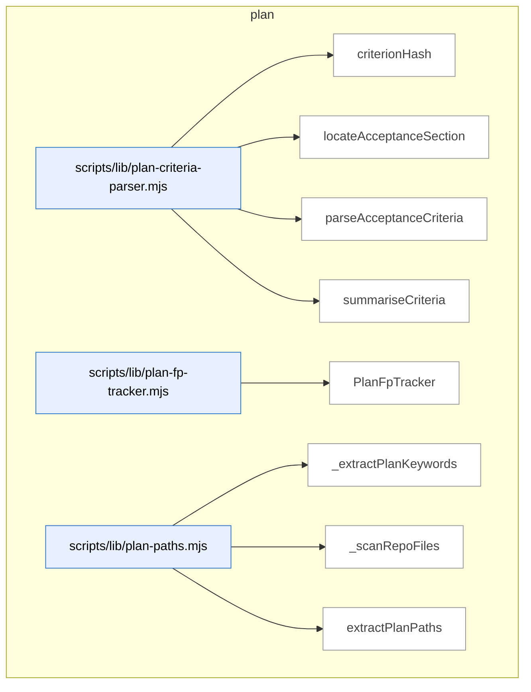

### Symbols in this domain

| Symbol | Kind | Path | Lines | Purpose | File imported by |
|---|---|---|---|---|---|
| [`criterionHash`](../scripts/lib/plan-criteria-parser.mjs#L45) | function | `scripts/lib/plan-criteria-parser.mjs` | 45-48 | Generates stable criterion hash from severity, category, and description. | `scripts/ux-lock-run.mjs` |
| [`locateAcceptanceSection`](../scripts/lib/plan-criteria-parser.mjs#L56) | function | `scripts/lib/plan-criteria-parser.mjs` | 56-77 | Locates the Acceptance Criteria heading in markdown by heading level. | `scripts/ux-lock-run.mjs` |
| [`parseAcceptanceCriteria`](../scripts/lib/plan-criteria-parser.mjs#L96) | function | `scripts/lib/plan-criteria-parser.mjs` | 96-152 | Extracts P0–P3 test criteria from markdown with severity, category, description, setup, and assertion. | `scripts/ux-lock-run.mjs` |
| [`summariseCriteria`](../scripts/lib/plan-criteria-parser.mjs#L158) | function | `scripts/lib/plan-criteria-parser.mjs` | 158-166 | Counts criteria grouped by severity and category. | `scripts/ux-lock-run.mjs` |
| [`PlanFpTracker`](../scripts/lib/plan-fp-tracker.mjs#L26) | class | `scripts/lib/plan-fp-tracker.mjs` | 26-140 | Tracks false-positive plan findings with exponential-moving-average scoring and consecutive-dismissal counts. | `scripts/lib/audit/legacy-production-audit.mjs`, `scripts/openai-audit.mjs`, `scripts/write-plan-outcomes.mjs` |
| [`_extractPlanKeywords`](../scripts/lib/plan-paths.mjs#L112) | function | `scripts/lib/plan-paths.mjs` | 112-154 | Extracts keywords from plan content via PascalCase, backtick identifiers, and heading words. | `scripts/lib/file-io.mjs`, `scripts/lib/requirements/context.mjs` |
| [`_scanRepoFiles`](../scripts/lib/plan-paths.mjs#L156) | function | `scripts/lib/plan-paths.mjs` | 156-182 | Recursively scans repo directory for source files, skipping node_modules and sensitive files. | `scripts/lib/file-io.mjs`, `scripts/lib/requirements/context.mjs` |
| [`extractPlanPaths`](../scripts/lib/plan-paths.mjs#L32) | function | `scripts/lib/plan-paths.mjs` | 32-108 | Extracts file paths from plan markdown via backticks, generic path patterns, and heading filenames. | `scripts/lib/file-io.mjs`, `scripts/lib/requirements/context.mjs` |

---

## root-scripts

> The `root-scripts` domain handles interactive setup and installation workflows, providing CLI utilities for prerequisite validation, API key configuration, database selection, and skill installation during project initialization.

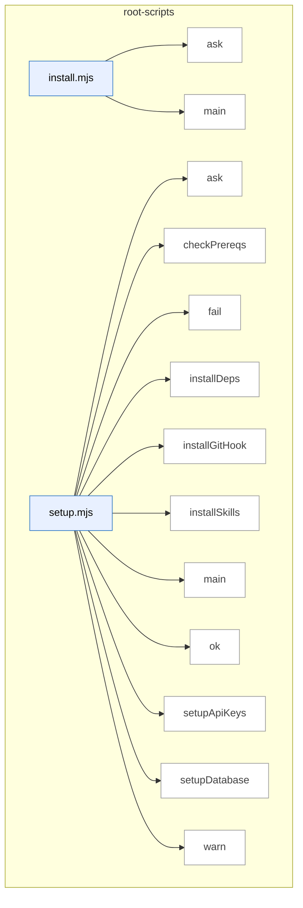

### Symbols in this domain

| Symbol | Kind | Path | Lines | Purpose | File imported by |
|---|---|---|---|---|---|
| [`ask`](../install.mjs#L18) | function | `install.mjs` | 18-18 | Prompts the user with a question and returns a Promise for their response. | _(internal)_ |
| [`main`](../install.mjs#L37) | function | `install.mjs` | 37-238 | Orchestrates multi-step installation of Claude Engineering Skills into a target project directory. | _(internal)_ |
| [`ask`](../setup.mjs#L25) | function | `setup.mjs` | 25-25 | Prompts user for input via readline. | _(internal)_ |
| [`checkPrereqs`](../setup.mjs#L34) | function | `setup.mjs` | 34-43 | Verifies Node.js 18+ and npm are installed. | _(internal)_ |
| [`fail`](../setup.mjs#L30) | function | `setup.mjs` | 30-30 | Prints a red X with a failure message. | _(internal)_ |
| [`installDeps`](../setup.mjs#L148) | function | `setup.mjs` | 148-155 | Runs npm install to fetch project dependencies. | _(internal)_ |
| [`installGitHook`](../setup.mjs#L159) | function | `setup.mjs` | 159-187 | Installs or updates a git post-merge hook to auto-sync skills. | _(internal)_ |
| [`installSkills`](../setup.mjs#L130) | function | `setup.mjs` | 130-144 | Builds and installs Claude skills globally to ~/.claude/skills/. | _(internal)_ |
| [`main`](../setup.mjs#L191) | function | `setup.mjs` | 191-254 | Orchestrates first-time setup: API keys, database, deps, skills, and git hook. | _(internal)_ |
| [`ok`](../setup.mjs#L28) | function | `setup.mjs` | 28-28 | Prints a green checkmark with a success message. | _(internal)_ |
| [`setupApiKeys`](../setup.mjs#L54) | function | `setup.mjs` | 54-81 | Prompts for OpenAI/Gemini/Anthropic API keys and writes them to .env. | _(internal)_ |
| [`setupDatabase`](../setup.mjs#L90) | function | `setup.mjs` | 90-126 | Presents database options (local/Supabase) and saves config to .env. | _(internal)_ |
| [`warn`](../setup.mjs#L29) | function | `setup.mjs` | 29-29 | Prints a yellow warning symbol with a message. | _(internal)_ |

---

## scripts

> CLI scripts and library modules that orchestrate the full development quality lifecycle: plan creation, multi-round LLM-driven code/plan audits with adjudication, UX regression locking via Playwright, live browser testing, and commit/push workflows. Includes schema contracts, cloud persistence, git integration, and sensitive-path egress guards.

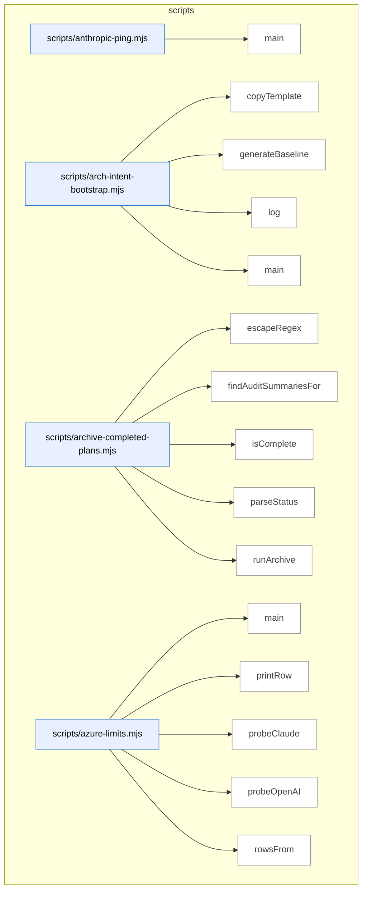

_Domain has 284 symbols (>50). Diagram shows top-15 by file order; see flat table below for the full list._

### Symbols in this domain

| Symbol | Kind | Path | Lines | Purpose | File imported by |
|---|---|---|---|---|---|
| [`main`](../scripts/anthropic-ping.mjs#L24) | function | `scripts/anthropic-ping.mjs` | 24-59 | Verifies Claude API connectivity by sending a test message and measuring response latency. | _(internal)_ |
| [`copyTemplate`](../scripts/arch-intent-bootstrap.mjs#L39) | function | `scripts/arch-intent-bootstrap.mjs` | 39-52 | Copies the architecture-intent template document to the live location if not already present. | _(internal)_ |
| [`generateBaseline`](../scripts/arch-intent-bootstrap.mjs#L54) | function | `scripts/arch-intent-bootstrap.mjs` | 54-113 | Generates a baseline architecture-intent allowedDeps block by analyzing the current import graph. | _(internal)_ |
| [`log`](../scripts/arch-intent-bootstrap.mjs#L37) | function | `scripts/arch-intent-bootstrap.mjs` | 37-37 | Logs a prefixed message to stdout for bootstrap progress tracking. | _(internal)_ |
| [`main`](../scripts/arch-intent-bootstrap.mjs#L115) | function | `scripts/arch-intent-bootstrap.mjs` | 115-130 | Bootstraps architecture-intent configuration by copying the template and optionally generating baseline rules. | _(internal)_ |
| [`escapeRegex`](../scripts/archive-completed-plans.mjs#L72) | function | `scripts/archive-completed-plans.mjs` | 72-74 | Escapes special regex characters in a string for safe literal matching. | _(internal)_ |
| [`findAuditSummariesFor`](../scripts/archive-completed-plans.mjs#L64) | function | `scripts/archive-completed-plans.mjs` | 64-70 | Locates all audit-summary files associated with a given plan file. | _(internal)_ |
| [`isComplete`](../scripts/archive-completed-plans.mjs#L54) | function | `scripts/archive-completed-plans.mjs` | 54-57 | Determines whether a plan status string indicates completion. | _(internal)_ |
| [`parseStatus`](../scripts/archive-completed-plans.mjs#L42) | function | `scripts/archive-completed-plans.mjs` | 42-46 | Extracts the Status header value from a plan document. | _(internal)_ |
| [`runArchive`](../scripts/archive-completed-plans.mjs#L86) | function | `scripts/archive-completed-plans.mjs` | 86-145 | Moves completed plans and their audit summaries from the active directory to archive. | _(internal)_ |
| [`main`](../scripts/azure-limits.mjs#L66) | function | `scripts/azure-limits.mjs` | 66-93 | Probes and displays current rate limits for all configured Azure AI Foundry deployments. | _(internal)_ |
| [`printRow`](../scripts/azure-limits.mjs#L36) | function | `scripts/azure-limits.mjs` | 36-45 | Formats and prints a single rate-limit probe result with color coding. | _(internal)_ |
| [`probeClaude`](../scripts/azure-limits.mjs#L59) | function | `scripts/azure-limits.mjs` | 59-64 | Probes Azure Foundry Claude deployment to read its current rate limits. | _(internal)_ |
| [`probeOpenAI`](../scripts/azure-limits.mjs#L47) | function | `scripts/azure-limits.mjs` | 47-57 | Probes Azure OpenAI or embeddings deployment to read its current rate limits. | _(internal)_ |
| [`rowsFrom`](../scripts/azure-limits.mjs#L22) | function | `scripts/azure-limits.mjs` | 22-34 | Extracts Azure rate-limit headers (TPM, RPM, window) from an API response. | _(internal)_ |
| [`buildSurfacesManifest`](../scripts/build-surfaces-manifest.mjs#L322) | function | `scripts/build-surfaces-manifest.mjs` | 322-343 | Find, load, and merge surface fragments into manifest, validate against schema. | _(internal)_ |
| [`canonicalLocator`](../scripts/build-surfaces-manifest.mjs#L144) | function | `scripts/build-surfaces-manifest.mjs` | 144-151 | Convert locator object (id, css, role, text) to canonical string representation. | _(internal)_ |
| [`findFragments`](../scripts/build-surfaces-manifest.mjs#L109) | function | `scripts/build-surfaces-manifest.mjs` | 109-134 | Recursively find all `.fragment.json` files in directory tree and return sorted list. | _(internal)_ |
| [`loadFragment`](../scripts/build-surfaces-manifest.mjs#L160) | function | `scripts/build-surfaces-manifest.mjs` | 160-180 | Parse fragment JSON file and validate it contains at least one surface or collection. | _(internal)_ |
| [`main`](../scripts/build-surfaces-manifest.mjs#L346) | function | `scripts/build-surfaces-manifest.mjs` | 346-393 | Build or verify surfaces manifest JSON; write to disk unless in verify mode. | _(internal)_ |
| [`mergeFragments`](../scripts/build-surfaces-manifest.mjs#L191) | function | `scripts/build-surfaces-manifest.mjs` | 191-293 | Merge multiple fragments into unified manifest, detecting and tracking duplicates and conflicts. | _(internal)_ |
| [`renderManifest`](../scripts/build-surfaces-manifest.mjs#L303) | function | `scripts/build-surfaces-manifest.mjs` | 303-305 | Serialize manifest object to formatted JSON string. | _(internal)_ |
| [`analyse`](../scripts/cache-hitrate-check.mjs#L170) | function | `scripts/cache-hitrate-check.mjs` | 170-205 | Load cache metrics from Supabase or local source and run segmentation analysis. | _(internal)_ |
| [`loadFromLocal`](../scripts/cache-hitrate-check.mjs#L109) | function | `scripts/cache-hitrate-check.mjs` | 109-128 | Read and parse local `.audit/cache-metrics.jsonl`, filter for R2+ runs with valid timestamps. | _(internal)_ |
| [`loadFromSupabase`](../scripts/cache-hitrate-check.mjs#L80) | function | `scripts/cache-hitrate-check.mjs` | 80-107 | Query Postgres for R2+ audit runs with cache metrics since specified date. | _(internal)_ |
| [`median`](../scripts/cache-hitrate-check.mjs#L71) | function | `scripts/cache-hitrate-check.mjs` | 71-78 | Compute median value from numeric array. | _(internal)_ |
| [`renderHuman`](../scripts/cache-hitrate-check.mjs#L207) | function | `scripts/cache-hitrate-check.mjs` | 207-233 | Format cache-hitrate analysis results as human-readable output with per-run breakdown. | _(internal)_ |
| [`segmentAndDecide`](../scripts/cache-hitrate-check.mjs#L139) | function | `scripts/cache-hitrate-check.mjs` | 139-168 | Segment audit runs by seed state, compute medians, recommend whether to flip AUDIT_CACHE_SEED. | _(internal)_ |
| [`argOption`](../scripts/cheap-triager-validate.mjs#L58) | function | `scripts/cheap-triager-validate.mjs` | 58-61 | Extract named command-line option value or return default. | _(internal)_ |
| [`buildGlmAdapter`](../scripts/cheap-triager-validate.mjs#L87) | function | `scripts/cheap-triager-validate.mjs` | 87-108 | Create async function that sends finding row to GLM model via OpenRouter for triage validation. | _(internal)_ |
| [`cmdManifest`](../scripts/cheap-triager-validate.mjs#L241) | function | `scripts/cheap-triager-validate.mjs` | 241-296 | Validate dataset freshness, load human grades, compute per-stratum triage statistics. | _(internal)_ |
| [`cmdWorksheet`](../scripts/cheap-triager-validate.mjs#L112) | function | `scripts/cheap-triager-validate.mjs` | 112-202 | Load CSVs, build GLM adapter, run concurrent triage on worksheet rows. | _(internal)_ |
| [`parseGradesCsv`](../scripts/cheap-triager-validate.mjs#L212) | function | `scripts/cheap-triager-validate.mjs` | 212-239 | Parse CSV of human grading verdicts (blind_id, false_dismissal, optional reason). | _(internal)_ |
| [`rowPrompt`](../scripts/cheap-triager-validate.mjs#L78) | function | `scripts/cheap-triager-validate.mjs` | 78-85 | Format finding row as multi-line triage prompt text. | _(internal)_ |
| [`loadConfig`](../scripts/claudemd-lint.mjs#L48) | function | `scripts/claudemd-lint.mjs` | 48-66 | Reads and parses a .claudemd-lint.json config file with fallback to defaults. | _(internal)_ |
| [`main`](../scripts/claudemd-lint.mjs#L68) | function | `scripts/claudemd-lint.mjs` | 68-172 | Entry point that lints instruction files (CLAUDE.md/AGENTS.md) against configured rules and outputs findings. | _(internal)_ |
| [`parseArgs`](../scripts/claudemd-lint.mjs#L26) | function | `scripts/claudemd-lint.mjs` | 26-46 | Parses CLI arguments for output format, file path, config file, fix mode, and auto-yes. | _(internal)_ |
| [`argOption`](../scripts/defect-harvest.mjs#L27) | function | `scripts/defect-harvest.mjs` | 27-30 | Extracts a command-line flag's value from argv with an optional default. | _(internal)_ |
| [`blameIntroducers`](../scripts/defect-harvest.mjs#L68) | function | `scripts/defect-harvest.mjs` | 68-84 | Identifies prior commits that introduced the changed lines via git blame -C. | _(internal)_ |
| [`changedFiles`](../scripts/defect-harvest.mjs#L52) | function | `scripts/defect-harvest.mjs` | 52-64 | Extracts changed files from a git commit's diff, filtering out sensitive/binary files. | _(internal)_ |
| [`filesFor`](../scripts/defect-harvest.mjs#L93) | function | `scripts/defect-harvest.mjs` | 93-93 | Returns the list of files changed by a commit, defaulting to empty on error. | _(internal)_ |
| [`firstFunctionOriginHint`](../scripts/defect-harvest.mjs#L97) | function | `scripts/defect-harvest.mjs` | 97-108 | Finds the original commit that introduced the function being changed using git log -L. | _(internal)_ |
| [`harvestCandidates`](../scripts/defect-harvest.mjs#L118) | function | `scripts/defect-harvest.mjs` | 118-179 | Extracts fix/defect candidate pairs from git log using revert, Fixes ref, and fix-type-prefixed commits. | _(internal)_ |
| [`hasFlag`](../scripts/defect-harvest.mjs#L31) | function | `scripts/defect-harvest.mjs` | 31-31 | Returns true if a command-line flag is present in argv. | _(internal)_ |
| [`log`](../scripts/defect-harvest.mjs#L26) | function | `scripts/defect-harvest.mjs` | 26-26 | Writes a message to stderr. | _(internal)_ |
| [`main`](../scripts/defect-harvest.mjs#L181) | function | `scripts/defect-harvest.mjs` | 181-219 | Harvests bug candidates from recent git history and optionally writes candidates to a JSON file. | _(internal)_ |
| [`makeGit`](../scripts/defect-harvest.mjs#L44) | function | `scripts/defect-harvest.mjs` | 44-48 | Creates a git command runner bound to a specific repository directory. | _(internal)_ |
| [`severityHint`](../scripts/defect-harvest.mjs#L87) | function | `scripts/defect-harvest.mjs` | 87-91 | Infers severity (HIGH/MEDIUM/LOW) from commit message keywords (security, bug, fix, etc.). | _(internal)_ |
| [`main`](../scripts/efficacy-lints-check.mjs#L17) | function | `scripts/efficacy-lints-check.mjs` | 17-37 | Runs efficacy lints, reports results per rule, and exits with code 1 if gating is enabled and findings exist. | _(internal)_ |
| [`appendLocalFallback`](../scripts/friction-log.mjs#L88) | function | `scripts/friction-log.mjs` | 88-94 | Writes a friction note to a local JSON file when cloud storage fails. | `scripts/cross-skill.mjs` |
| [`defaultExecGit`](../scripts/friction-log.mjs#L75) | function | `scripts/friction-log.mjs` | 75-84 | Executes a git command and returns stdout with timeout and silent-fail handling. | `scripts/cross-skill.mjs` |
| [`detectRepoName`](../scripts/friction-log.mjs#L61) | function | `scripts/friction-log.mjs` | 61-73 | Extracts repository name from the git remote URL, falling back to the directory basename. | `scripts/cross-skill.mjs` |
| [`helpText`](../scripts/friction-log.mjs#L164) | function | `scripts/friction-log.mjs` | 164-174 | Returns usage documentation for the friction-log command. | `scripts/cross-skill.mjs` |
| [`main`](../scripts/friction-log.mjs#L185) | function | `scripts/friction-log.mjs` | 185-207 | Entry point that calls runFrictionLog, emits JSON output, and provides human-readable confirmation to stderr. | `scripts/cross-skill.mjs` |
| [`parseArgs`](../scripts/friction-log.mjs#L31) | function | `scripts/friction-log.mjs` | 31-44 | Parses command-line flags and positional arguments for severity, repo name, and message text. | `scripts/cross-skill.mjs` |
| [`runFrictionLog`](../scripts/friction-log.mjs#L98) | function | `scripts/friction-log.mjs` | 98-162 | Records a friction note to the cloud learning store with local-file fallback on network failure. | `scripts/cross-skill.mjs` |
| [`validateArgs`](../scripts/friction-log.mjs#L46) | function | `scripts/friction-log.mjs` | 46-53 | Validates that a message is present and severity is one of the allowed values, returning error strings. | `scripts/cross-skill.mjs` |
| [`installInRepo`](../scripts/install-prepush-hook.mjs#L142) | function | `scripts/install-prepush-hook.mjs` | 142-192 | Installs or uninstalls the pre-push hook in a single repo, handling conflicts and dry-run mode. | _(internal)_ |
| [`isManagedHook`](../scripts/install-prepush-hook.mjs#L41) | function | `scripts/install-prepush-hook.mjs` | 41-45 | Checks if a pre-push hook file was installed and is managed by this installer. | _(internal)_ |
| [`main`](../scripts/install-prepush-hook.mjs#L196) | function | `scripts/install-prepush-hook.mjs` | 196-220 | Parses CLI arguments for the pre-push hook installer and applies changes across target repos. | _(internal)_ |
| [`computeArchMemoryBandOutcome`](../scripts/learning/backfill-outcomes.mjs#L559) | function | `scripts/learning/backfill-outcomes.mjs` | 559-610 | Determines if an arch-memory band recommendation was acted on by checking for recent commits in the file's directory. | `scripts/cross-skill.mjs` |
| [`computeConvergencePredictOutcome`](../scripts/learning/backfill-outcomes.mjs#L634) | function | `scripts/learning/backfill-outcomes.mjs` | 634-678 | Determines if a convergence-prediction decision was correct by checking when the audit run actually converged. | `scripts/cross-skill.mjs` |
| [`computeFileFingerprint`](../scripts/learning/backfill-outcomes.mjs#L452) | function | `scripts/learning/backfill-outcomes.mjs` | 452-464 | Computes a SHA256 hash of the first 256 bytes of a file to detect rotation and changes. | `scripts/cross-skill.mjs` |
| [`computeOutcomeFromFileState`](../scripts/learning/backfill-outcomes.mjs#L744) | function | `scripts/learning/backfill-outcomes.mjs` | 744-802 | Checks if a quickfix-hit decision was correct by verifying if the cited file still contains the problematic snippet. | `scripts/cross-skill.mjs` |
| [`computePassSelectionOutcome`](../scripts/learning/backfill-outcomes.mjs#L699) | function | `scripts/learning/backfill-outcomes.mjs` | 699-725 | Rates pass-selection decisions by computing the ratio of accepted/fixed findings to total findings. | `scripts/cross-skill.mjs` |
| [`defaultExecGit`](../scripts/learning/backfill-outcomes.mjs#L612) | function | `scripts/learning/backfill-outcomes.mjs` | 612-619 | Executes a git command synchronously with 5-second timeout for arch-memory outcome detection. | `scripts/cross-skill.mjs` |
| [`drainFrictionFallback`](../scripts/learning/backfill-outcomes.mjs#L338) | function | `scripts/learning/backfill-outcomes.mjs` | 338-402 | Drains friction notes (captured while cloud was offline) to Supabase, resolving repo names at drain time. | `scripts/cross-skill.mjs` |
| [`drainJsonlToCloud`](../scripts/learning/backfill-outcomes.mjs#L187) | function | `scripts/learning/backfill-outcomes.mjs` | 187-327 | Reads new lines from a local JSONL learning log and uploads them to Supabase with cursor tracking. | `scripts/cross-skill.mjs` |
| [`readDrainCursor`](../scripts/learning/backfill-outcomes.mjs#L417) | function | `scripts/learning/backfill-outcomes.mjs` | 417-438 | Reads the file-offset cursor state for JSONL draining, supporting both JSON and legacy integer formats. | `scripts/cross-skill.mjs` |
| [`resolveUnresolvedOutcomes`](../scripts/learning/backfill-outcomes.mjs#L468) | function | `scripts/learning/backfill-outcomes.mjs` | 468-533 | Reads pending learning decisions and computes their outcomes via type-specific detectors. | `scripts/cross-skill.mjs` |
| [`runBackfill`](../scripts/learning/backfill-outcomes.mjs#L62) | function | `scripts/learning/backfill-outcomes.mjs` | 62-171 | Backfills unresolved learning decisions by draining local JSONL to cloud and resolving outcomes. | `scripts/cross-skill.mjs` |
| [`writeDrainCursor`](../scripts/learning/backfill-outcomes.mjs#L440) | function | `scripts/learning/backfill-outcomes.mjs` | 440-445 | Persists the JSONL drain cursor (offset, fingerprint, timestamp) to disk. | `scripts/cross-skill.mjs` |
| [`fmtNum`](../scripts/learning/replay.mjs#L92) | function | `scripts/learning/replay.mjs` | 92-95 | Formats numbers for display with 2 decimal places for large values and 4 for small ones. | `scripts/cross-skill.mjs` |
| [`loadPolicy`](../scripts/learning/replay.mjs#L99) | function | `scripts/learning/replay.mjs` | 99-109 | Dynamically imports and loads a policy function from a module path. | `scripts/cross-skill.mjs` |
| [`parseDuration`](../scripts/learning/replay.mjs#L54) | function | `scripts/learning/replay.mjs` | 54-63 | Parses duration strings (e.g., "30d", "2h") into milliseconds. | `scripts/cross-skill.mjs` |
| [`renderMarkdownReport`](../scripts/learning/replay.mjs#L67) | function | `scripts/learning/replay.mjs` | 67-90 | Renders a replay policy evaluation as a markdown table comparing baseline and candidate reward distributions. | `scripts/cross-skill.mjs` |
| [`runReplayCli`](../scripts/learning/replay.mjs#L120) | function | `scripts/learning/replay.mjs` | 120-170 | Parses CLI arguments for replay script and runs a decision-replay evaluation. | `scripts/cross-skill.mjs` |
| [`applyTotalCap`](../scripts/learning/weekly-review.mjs#L135) | function | `scripts/learning/weekly-review.mjs` | 135-155 | Distributes a total item cap across four sections (friction, triage, noBrainer, stale) with priority to friction. | `scripts/cross-skill.mjs` |
| [`buildFrictionSection`](../scripts/learning/weekly-review.mjs#L116) | function | `scripts/learning/weekly-review.mjs` | 116-126 | Sorts friction notes by severity then recency, caps them, and returns shown + overflow counts. | `scripts/cross-skill.mjs` |
| [`buildNoBrainerSection`](../scripts/learning/weekly-review.mjs#L95) | function | `scripts/learning/weekly-review.mjs` | 95-103 | Sorts recurring no-brainer findings by occurrence count then recency, caps them, and returns counts. | `scripts/cross-skill.mjs` |
| [`buildStaleSection`](../scripts/learning/weekly-review.mjs#L105) | function | `scripts/learning/weekly-review.mjs` | 105-110 | Sorts stale deferred findings by age, caps them, and returns shown + overflow counts. | `scripts/cross-skill.mjs` |
| [`buildTriageSection`](../scripts/learning/weekly-review.mjs#L84) | function | `scripts/learning/weekly-review.mjs` | 84-93 | Sorts triage findings by severity then recency, caps them, and returns shown + overflow counts. | `scripts/cross-skill.mjs` |
| [`fmtPath`](../scripts/learning/weekly-review.mjs#L165) | function | `scripts/learning/weekly-review.mjs` | 165-168 | Escapes backticks in file paths for markdown inline-code spans. | `scripts/cross-skill.mjs` |
| [`fmtTitle`](../scripts/learning/weekly-review.mjs#L159) | function | `scripts/learning/weekly-review.mjs` | 159-163 | Truncates and markdown-escapes a finding title for display in the weekly review. | `scripts/cross-skill.mjs` |
| [`humanizeAgo`](../scripts/learning/weekly-review.mjs#L174) | function | `scripts/learning/weekly-review.mjs` | 174-186 | Converts an ISO timestamp to human-readable relative time format (e.g., "2h ago", "3d ago"). | `scripts/cross-skill.mjs` |
| [`mdEscape`](../scripts/learning/weekly-review.mjs#L69) | function | `scripts/learning/weekly-review.mjs` | 69-80 | Escapes markdown special characters in a string to prevent unintended formatting. | `scripts/cross-skill.mjs` |
| [`postOrUpdateStickyIssue`](../scripts/learning/weekly-review.mjs#L282) | function | `scripts/learning/weekly-review.mjs` | 282-340 | Posts or updates a sticky GitHub issue with the weekly learning review, re-opening closed issues if findings persist. | `scripts/cross-skill.mjs` |
| [`renderMarkdown`](../scripts/learning/weekly-review.mjs#L188) | function | `scripts/learning/weekly-review.mjs` | 188-278 | Renders the full weekly-review markdown body with friction, triage, no-brainer, and stale sections. | `scripts/cross-skill.mjs` |
| [`runWeeklyReview`](../scripts/learning/weekly-review.mjs#L351) | function | `scripts/learning/weekly-review.mjs` | 351-415 | Orchestrates the weekly review: fetches pending findings, formats them, and posts to GitHub. | `scripts/cross-skill.mjs` |
| [`severityRank`](../scripts/learning/weekly-review.mjs#L52) | function | `scripts/learning/weekly-review.mjs` | 52-60 | Maps severity strings to sort ranks (HIGH=0, MEDIUM=1, LOW=2, unknown=-1) for triage ordering. | `scripts/cross-skill.mjs` |
| [`argOption`](../scripts/ledger-decompose.mjs#L35) | function | `scripts/ledger-decompose.mjs` | 35-38 | Extracts the value of a command-line flag (e.g., `--stage-type value`) from process.argv. | _(internal)_ |
| [`decompose`](../scripts/ledger-decompose.mjs#L54) | function | `scripts/ledger-decompose.mjs` | 54-106 | Queries audit findings by stage type, aggregates accepted findings by round and severity weight, and computes the round-1 value share. | _(internal)_ |
| [`hasFlag`](../scripts/ledger-decompose.mjs#L39) | function | `scripts/ledger-decompose.mjs` | 39-39 | Returns true if a command-line flag is present in process.argv. | _(internal)_ |
| [`log`](../scripts/ledger-decompose.mjs#L34) | function | `scripts/ledger-decompose.mjs` | 34-34 | <no body> | _(internal)_ |
| [`main`](../scripts/ledger-decompose.mjs#L147) | function | `scripts/ledger-decompose.mjs` | 147-192 | Orchestrates ledger decomposition, queries the database, formats output as JSON or markdown, and exits with appropriate status codes. | _(internal)_ |
| [`renderMarkdown`](../scripts/ledger-decompose.mjs#L109) | function | `scripts/ledger-decompose.mjs` | 109-145 | Generates markdown documenting where accepted finding value originates (round 1 vs 2+ decision lever for Phase 1 gate). | _(internal)_ |
| [`roundBucket`](../scripts/ledger-decompose.mjs#L44) | function | `scripts/ledger-decompose.mjs` | 44-44 | Categorizes audit round numbers into buckets: round 1, round 2+, or unknown. | _(internal)_ |
| [`sevWeight`](../scripts/ledger-decompose.mjs#L32) | function | `scripts/ledger-decompose.mjs` | 32-32 | Maps severity strings (HIGH, CRITICAL, etc.) to numeric weights for computing finding value. | _(internal)_ |
| [`extractMermaidBlocks`](../scripts/lint-plan-mermaid.mjs#L41) | function | `scripts/lint-plan-mermaid.mjs` | 41-63 | Extracts mermaid diagram code blocks from markdown with line-number positions. | _(internal)_ |
| [`lintFile`](../scripts/lint-plan-mermaid.mjs#L210) | function | `scripts/lint-plan-mermaid.mjs` | 210-227 | Lints a single markdown file's mermaid blocks using both graph and label rules. | _(internal)_ |
| [`main`](../scripts/lint-plan-mermaid.mjs#L244) | function | `scripts/lint-plan-mermaid.mjs` | 244-299 | CLI entry point for plan-mermaid linting; outputs JSON or human-readable format. | _(internal)_ |
| [`parseGraphBlock`](../scripts/lint-plan-mermaid.mjs#L77) | function | `scripts/lint-plan-mermaid.mjs` | 77-129 | Parses mermaid graph/flowchart syntax to extract nodes, subgraphs, and edges. | _(internal)_ |
| [`ruleSubgraphAsEdgeEndpoint`](../scripts/lint-plan-mermaid.mjs#L137) | function | `scripts/lint-plan-mermaid.mjs` | 137-154 | Flags mermaid edges that use subgraph IDs as endpoints (invalid syntax). | _(internal)_ |
| [`ruleUnquotedSpecialCharsInLabel`](../scripts/lint-plan-mermaid.mjs#L172) | function | `scripts/lint-plan-mermaid.mjs` | 172-206 | Warns when mermaid node labels contain special chars or non-ASCII but aren't quoted. | _(internal)_ |
| [`walkMd`](../scripts/lint-plan-mermaid.mjs#L231) | function | `scripts/lint-plan-mermaid.mjs` | 231-240 | Recursively walks a directory tree to collect all `.md` files. | _(internal)_ |
| [`run`](../scripts/migrate-v3-run-metadata.mjs#L66) | function | `scripts/migrate-v3-run-metadata.mjs` | 66-84 | Executes SQL migrations against postgres connection (v3 run-metadata schema upgrade). | _(internal)_ |
| [`assertSourceIsPersonaTest`](../scripts/migrations/2026-05-20-persona-test-to-audit-loop.mjs#L58) | function | `scripts/migrations/2026-05-20-persona-test-to-audit-loop.mjs` | 58-65 | Validates source DSN contains Persona Test project ref to prevent wrong-database writes. | _(internal)_ |
| [`assertTargetIsAuditLoop`](../scripts/migrations/2026-05-20-persona-test-to-audit-loop.mjs#L66) | function | `scripts/migrations/2026-05-20-persona-test-to-audit-loop.mjs` | 66-73 | Validates target DSN contains Audit-loop project ref to prevent wrong-database writes. | _(internal)_ |
| [`bindValue`](../scripts/migrations/2026-05-20-persona-test-to-audit-loop.mjs#L122) | function | `scripts/migrations/2026-05-20-persona-test-to-audit-loop.mjs` | 122-128 | JSON-encodes jsonb/json column values for safe postgres parameter binding. | _(internal)_ |
| [`bulkInsert`](../scripts/migrations/2026-05-20-persona-test-to-audit-loop.mjs#L139) | function | `scripts/migrations/2026-05-20-persona-test-to-audit-loop.mjs` | 139-159 | Bulk-inserts rows into postgres table with ON CONFLICT DO NOTHING handling. | _(internal)_ |
| [`filterColumns`](../scripts/migrations/2026-05-20-persona-test-to-audit-loop.mjs#L102) | function | `scripts/migrations/2026-05-20-persona-test-to-audit-loop.mjs` | 102-110 | Filters source rows to include only columns present in both source and target. | _(internal)_ |
| [`getTargetColumns`](../scripts/migrations/2026-05-20-persona-test-to-audit-loop.mjs#L87) | function | `scripts/migrations/2026-05-20-persona-test-to-audit-loop.mjs` | 87-100 | Fetches column names and data types from target postgres table schema. | _(internal)_ |
| [`main`](../scripts/migrations/2026-05-20-persona-test-to-audit-loop.mjs#L163) | function | `scripts/migrations/2026-05-20-persona-test-to-audit-loop.mjs` | 163-222 | CLI orchestrator; reads source personas/sessions and bulk-inserts into target audit-loop database. | _(internal)_ |
| [`parseArgs`](../scripts/migrations/2026-05-20-persona-test-to-audit-loop.mjs#L34) | function | `scripts/migrations/2026-05-20-persona-test-to-audit-loop.mjs` | 34-54 | Parses --source-url, --target-url, and --dry-run CLI flags. | _(internal)_ |
| [`quoteIdent`](../scripts/migrations/2026-05-20-persona-test-to-audit-loop.mjs#L132) | function | `scripts/migrations/2026-05-20-persona-test-to-audit-loop.mjs` | 132-137 | Safely quotes a SQL identifier to prevent injection. | _(internal)_ |
| [`readSource`](../scripts/migrations/2026-05-20-persona-test-to-audit-loop.mjs#L77) | function | `scripts/migrations/2026-05-20-persona-test-to-audit-loop.mjs` | 77-85 | Queries source postgres for personas and persona_test_sessions tables. | _(internal)_ |
| [`argOption`](../scripts/model-eval-adjudicator.mjs#L59) | function | `scripts/model-eval-adjudicator.mjs` | 59-62 | Extracts a named option value from CLI arguments with default fallback. | _(internal)_ |
| [`main`](../scripts/model-eval-adjudicator.mjs#L87) | function | `scripts/model-eval-adjudicator.mjs` | 87-216 | CLI entry point; evals adjudicator model performance at screen or promotion tier. | _(internal)_ |
| [`parseJsonArg`](../scripts/model-eval-adjudicator.mjs#L64) | function | `scripts/model-eval-adjudicator.mjs` | 64-67 | Parses a JSON string argument or throws RunPreflightError on parse failure. | _(internal)_ |
| [`RunPreflightError`](../scripts/model-eval-adjudicator.mjs#L55) | class | `scripts/model-eval-adjudicator.mjs` | 55-57 | Custom error class for evaluation setup/configuration issues. | _(internal)_ |
| [`scoreAgainstGroundTruth`](../scripts/model-eval-adjudicator.mjs#L75) | function | `scripts/model-eval-adjudicator.mjs` | 75-85 | Runs adjudicator model on findings and scores recall/false-positive rate vs human labels. | _(internal)_ |
| [`toRawContext`](../scripts/model-eval-adjudicator.mjs#L70) | function | `scripts/model-eval-adjudicator.mjs` | 70-73 | Converts audit finding row to text context for adjudicator model evaluation. | _(internal)_ |
| [`argOption`](../scripts/model-eval-auditor.mjs#L110) | function | `scripts/model-eval-auditor.mjs` | 110-113 | Extracts a named option value from CLI arguments with default fallback. | _(internal)_ |
| [`hasFlag`](../scripts/model-eval-auditor.mjs#L114) | function | `scripts/model-eval-auditor.mjs` | 114-114 | Checks if a boolean flag is present in CLI arguments. | _(internal)_ |
| [`main`](../scripts/model-eval-auditor.mjs#L288) | function | `scripts/model-eval-auditor.mjs` | 288-404 | Entry point that parses CLI arguments, loads evaluation corpus and thresholds, runs the specified tier (screen or promotion), and outputs results. | _(internal)_ |
| [`mulberry32`](../scripts/model-eval-auditor.mjs#L58) | function | `scripts/model-eval-auditor.mjs` | 58-66 | Deterministic seeded pseudorandom number generator (multiply-and-rotate algorithm). | _(internal)_ |
| [`parseJsonArg`](../scripts/model-eval-auditor.mjs#L116) | function | `scripts/model-eval-auditor.mjs` | 116-119 | Parses a JSON string argument or throws RunPreflightError on parse failure. | _(internal)_ |
| [`RunPreflightError`](../scripts/model-eval-auditor.mjs#L48) | class | `scripts/model-eval-auditor.mjs` | 48-50 | Custom error class for pre-flight validation failures. | _(internal)_ |
| [`runPromotionTier`](../scripts/model-eval-auditor.mjs#L158) | function | `scripts/model-eval-auditor.mjs` | 158-284 | Runs the promotion-tier evaluation by generating findings from both candidate and baseline, blind-judging them, and comparing metrics. | _(internal)_ |
| [`runScreenTier`](../scripts/model-eval-auditor.mjs#L141) | function | `scripts/model-eval-auditor.mjs` | 141-154 | Runs the screen-tier evaluation by scoring with oracle metrics and computing pass/promotion/reject verdict. | _(internal)_ |
| [`scoreArmTierC`](../scripts/model-eval-auditor.mjs#L125) | function | `scripts/model-eval-auditor.mjs` | 125-137 | Scores candidate model outputs against ground truth via defect localization (recall, false-positive rate, F1). | _(internal)_ |
| [`seedFromString`](../scripts/model-eval-auditor.mjs#L67) | function | `scripts/model-eval-auditor.mjs` | 67-69 | Hashes a string to produce a 32-bit RNG seed. | _(internal)_ |
| [`stratifiedSelectKDs`](../scripts/model-eval-auditor.mjs#L79) | function | `scripts/model-eval-auditor.mjs` | 79-106 | Selects N defects stratified by severity using deterministic shuffling. | _(internal)_ |
| [`checkReadiness`](../scripts/phase7-check.mjs#L13) | function | `scripts/phase7-check.mjs` | 13-63 | Counts audit runs from local and cloud stores and reports Phase 7 readiness progress with a visual bar. | _(internal)_ |
| [`main`](../scripts/phase7-check.mjs#L65) | function | `scripts/phase7-check.mjs` | 65-68 | Ensures repo root context and invokes the readiness check. | _(internal)_ |
| [`formatHumanReport`](../scripts/postgres-parity/check-non-core-references.mjs#L166) | function | `scripts/postgres-parity/check-non-core-references.mjs` | 166-186 | Formats schema-coupling findings as a human-readable report with counts and instructions for remediation. | _(internal)_ |
| [`main`](../scripts/postgres-parity/check-non-core-references.mjs#L190) | function | `scripts/postgres-parity/check-non-core-references.mjs` | 190-217 | Parses CLI args, runs the non-core-reference scan, and outputs results as JSON or human-readable format with optional strict exit. | _(internal)_ |
| [`pathToFileUrl`](../scripts/postgres-parity/check-non-core-references.mjs#L221) | function | `scripts/postgres-parity/check-non-core-references.mjs` | 221-221 | Converts a filesystem path to a file:// URL with forward slashes. | _(internal)_ |
| [`readMigrations`](../scripts/postgres-parity/check-non-core-references.mjs#L60) | function | `scripts/postgres-parity/check-non-core-references.mjs` | 60-69 | Scans the migrations directory for SQL files and returns them sorted by filename. | _(internal)_ |
| [`scanForFindings`](../scripts/postgres-parity/check-non-core-references.mjs#L71) | function | `scripts/postgres-parity/check-non-core-references.mjs` | 71-162 | Runs regex patterns over SQL migrations to detect violations of schema-coupling rules (auth refs, roles, extensions, public-qualified symbols). | _(internal)_ |
| [`main`](../scripts/postgres-parity/generate-expected-schema.mjs#L183) | function | `scripts/postgres-parity/generate-expected-schema.mjs` | 183-217 | Connects to Postgres and exports the current schema (tables, functions, views) to JSON. | _(internal)_ |
| [`assertLocalOnly`](../scripts/postgres-parity/record-golden-fixtures.mjs#L92) | function | `scripts/postgres-parity/record-golden-fixtures.mjs` | 92-135 | Validates that a Supabase URL targets a local stack or an approved sandbox project, refusing production. | _(internal)_ |
| [`captureTableSnapshot`](../scripts/postgres-parity/record-golden-fixtures.mjs#L194) | function | `scripts/postgres-parity/record-golden-fixtures.mjs` | 194-198 | <no body> | _(internal)_ |
| [`diffSnapshots`](../scripts/postgres-parity/record-golden-fixtures.mjs#L200) | function | `scripts/postgres-parity/record-golden-fixtures.mjs` | 200-202 | <no body> | _(internal)_ |
| [`main`](../scripts/postgres-parity/record-golden-fixtures.mjs#L232) | function | `scripts/postgres-parity/record-golden-fixtures.mjs` | 232-281 | Records golden fixtures by invoking frozen learning-store functions against a local/sandbox DB and capturing their mutations. | _(internal)_ |
| [`normaliseMutation`](../scripts/postgres-parity/record-golden-fixtures.mjs#L228) | function | `scripts/postgres-parity/record-golden-fixtures.mjs` | 228-228 | Applies value normalization to a mutation record. | _(internal)_ |
| [`normaliseValues`](../scripts/postgres-parity/record-golden-fixtures.mjs#L209) | function | `scripts/postgres-parity/record-golden-fixtures.mjs` | 209-226 | Recursively normalizes fixture values, replacing UUIDs and timestamps with stable tokens for deterministic comparison. | _(internal)_ |
| [`parseArgs`](../scripts/postgres-parity/record-golden-fixtures.mjs#L47) | function | `scripts/postgres-parity/record-golden-fixtures.mjs` | 47-79 | Parses CLI flags for the golden-fixtures recorder (DB URLs, auth keys, output paths, remote sandbox approval). | _(internal)_ |
| [`runOne`](../scripts/postgres-parity/record-golden-fixtures.mjs#L158) | function | `scripts/postgres-parity/record-golden-fixtures.mjs` | 158-186 | Invokes a frozen learning-store function with input and captures before/after table mutations for golden-fixture recording. | _(internal)_ |
| [`sourceSha`](../scripts/postgres-parity/record-golden-fixtures.mjs#L283) | function | `scripts/postgres-parity/record-golden-fixtures.mjs` | 283-292 | Gets the commit SHA of a file via `git log`, falling back to a content hash if uncommitted. | _(internal)_ |
| [`argValue`](../scripts/reconcile-repo-identity.mjs#L354) | function | `scripts/reconcile-repo-identity.mjs` | 354-357 | Returns the value of a CLI flag argument (e.g., `--flag value` → `value`). | _(internal)_ |
| [`buildProposals`](../scripts/reconcile-repo-identity.mjs#L77) | function | `scripts/reconcile-repo-identity.mjs` | 77-105 | Matches legacy repo entries to canonical ones by basename, producing merge proposals and flagging ambiguous cases. | _(internal)_ |
| [`discoverRepoScopedUniqueKeys`](../scripts/reconcile-repo-identity.mjs#L319) | function | `scripts/reconcile-repo-identity.mjs` | 319-342 | Queries Postgres for unique constraints involving `repo_id` in specified tables to validate scoped constraint architecture. | _(internal)_ |
| [`main`](../scripts/reconcile-repo-identity.mjs#L107) | function | `scripts/reconcile-repo-identity.mjs` | 107-313 | Reconciles legacy (pre-uuid) and canonical (post-uuid) repo identity rows, optionally applying FK redirects to consolidated repos. | _(internal)_ |
| [`pgTextArray`](../scripts/reconcile-repo-identity.mjs#L345) | function | `scripts/reconcile-repo-identity.mjs` | 345-352 | Parses Postgres array-literal strings (or JS arrays) into normalized string arrays. | _(internal)_ |
| [`repoBaseName`](../scripts/reconcile-repo-identity.mjs#L60) | function | `scripts/reconcile-repo-identity.mjs` | 60-63 | Extracts the rightmost path component from a repo name (e.g., "org/repo" → "repo"). | _(internal)_ |
| [`cmdExtract`](../scripts/requirements.mjs#L57) | function | `scripts/requirements.mjs` | 57-99 | Extracts requirements from specified files with configurable run count, validates inputs, and writes candidates and gap assessments. | _(internal)_ |
| [`cmdIndex`](../scripts/requirements.mjs#L158) | function | `scripts/requirements.mjs` | 158-166 | Loads the requirements ledger and outputs indexed requirements as JSON or human-readable text. | _(internal)_ |
| [`cmdReconcile`](../scripts/requirements.mjs#L101) | function | `scripts/requirements.mjs` | 101-156 | Merges extracted candidates with optional gaps and user overrides into a single reconciled ledger file. | _(internal)_ |
| [`cmdRender`](../scripts/requirements.mjs#L169) | function | `scripts/requirements.mjs` | 169-179 | Renders requirements ledger to a markdown map file. | _(internal)_ |
| [`flag`](../scripts/requirements.mjs#L52) | function | `scripts/requirements.mjs` | 52-55 | Extracts and returns the value following a flag name in argv, or null if not found. | _(internal)_ |
| [`gitSha`](../scripts/requirements.mjs#L44) | function | `scripts/requirements.mjs` | 44-50 | Runs `git rev-parse HEAD` to get the current commit SHA, returning null if the command fails. | _(internal)_ |
| [`main`](../scripts/requirements.mjs#L181) | function | `scripts/requirements.mjs` | 181-198 | Dispatches to extract/reconcile/index/render subcommands after repo root validation. | _(internal)_ |
| [`classifyMitigation`](../scripts/security-memory/incident-status.mjs#L33) | function | `scripts/security-memory/incident-status.mjs` | 33-57 | Determines a security incident's mitigation status (passing/failing/unverified) based on semgrep/file-ref/manual kind. | `scripts/security-memory/refresh-incidents.mjs` |
| [`runSemgrepIfNeeded`](../scripts/security-memory/incident-status.mjs#L71) | function | `scripts/security-memory/incident-status.mjs` | 71-150 | Runs semgrep on an incident mitigation rule (local or registry) and caches the result by content hash. | `scripts/security-memory/refresh-incidents.mjs` |
| [`sha256`](../scripts/security-memory/incident-status.mjs#L152) | function | `scripts/security-memory/incident-status.mjs` | 152-154 | Computes a truncated SHA256 hash of text. | `scripts/security-memory/refresh-incidents.mjs` |
| [`computeFingerprint`](../scripts/security-memory/parse-strategy.mjs#L191) | function | `scripts/security-memory/parse-strategy.mjs` | 191-199 | Hashes an incident's normalized description, lessons, sorted paths, and mitigation ref for stable fingerprinting. | `scripts/security-memory/refresh-incidents.mjs` |
| [`deriveMitigationKind`](../scripts/security-memory/parse-strategy.mjs#L184) | function | `scripts/security-memory/parse-strategy.mjs` | 184-189 | Classifies a mitigation reference as 'manual', 'semgrep', or 'file-ref' based on string patterns. | `scripts/security-memory/refresh-incidents.mjs` |
| [`extractFields`](../scripts/security-memory/parse-strategy.mjs#L116) | function | `scripts/security-memory/parse-strategy.mjs` | 116-161 | Extracts description, affected paths, mitigation, and lessons from incident body using regex field boundaries. | `scripts/security-memory/refresh-incidents.mjs` |
| [`lineOfOffset`](../scripts/security-memory/parse-strategy.mjs#L201) | function | `scripts/security-memory/parse-strategy.mjs` | 201-207 | Converts a character offset in a string to a 1-indexed line number by counting newlines. | `scripts/security-memory/refresh-incidents.mjs` |
| [`parsePathList`](../scripts/security-memory/parse-strategy.mjs#L169) | function | `scripts/security-memory/parse-strategy.mjs` | 169-182 | Converts comma or newline-separated file paths into a deduplicated array. | `scripts/security-memory/refresh-incidents.mjs` |
| [`parseSecurityStrategy`](../scripts/security-memory/parse-strategy.mjs#L35) | function | `scripts/security-memory/parse-strategy.mjs` | 35-109 | Parses markdown security incidents and threat model, validating incident IDs and extracting fields from each block. | `scripts/security-memory/refresh-incidents.mjs` |
| [`currentBranchName`](../scripts/security-memory/refresh-incidents.mjs#L65) | function | `scripts/security-memory/refresh-incidents.mjs` | 65-70 | Returns the current git branch name, or 'unknown' if detached or errored. | _(internal)_ |
| [`generateEmbedding`](../scripts/security-memory/refresh-incidents.mjs#L128) | function | `scripts/security-memory/refresh-incidents.mjs` | 128-134 | Generates a vector embedding for text via the configured provider and model. | _(internal)_ |
| [`gitArgs`](../scripts/security-memory/refresh-incidents.mjs#L54) | function | `scripts/security-memory/refresh-incidents.mjs` | 54-56 | Executes a git command and returns trimmed stdout. | _(internal)_ |
| [`gitHeadSha`](../scripts/security-memory/refresh-incidents.mjs#L58) | function | `scripts/security-memory/refresh-incidents.mjs` | 58-61 | Returns the current HEAD commit SHA, or 'unknown' on error. | _(internal)_ |
| [`gitWho`](../scripts/security-memory/refresh-incidents.mjs#L73) | function | `scripts/security-memory/refresh-incidents.mjs` | 73-79 | Returns the git user name, falling back to $USER or $USERNAME. | _(internal)_ |
| [`isOnDefaultBranch`](../scripts/security-memory/refresh-incidents.mjs#L81) | function | `scripts/security-memory/refresh-incidents.mjs` | 81-122 | Determines if the working tree is on the default branch (main/master) by name first, then SHA if detached. | _(internal)_ |
| [`logInfo`](../scripts/security-memory/refresh-incidents.mjs#L48) | function | `scripts/security-memory/refresh-incidents.mjs` | 48-48 | Writes an info message to stderr with [security-refresh] prefix. | _(internal)_ |
| [`logWarn`](../scripts/security-memory/refresh-incidents.mjs#L49) | function | `scripts/security-memory/refresh-incidents.mjs` | 49-49 | Writes a warning message to stderr with [security-refresh] WARN prefix. | _(internal)_ |
| [`main`](../scripts/security-memory/refresh-incidents.mjs#L136) | function | `scripts/security-memory/refresh-incidents.mjs` | 136-400 | Parses security incidents from markdown, upserts them to Supabase with embeddings, and logs telemetry. | _(internal)_ |
| [`defaultPrompt`](../scripts/setup-cloud.mjs#L37) | function | `scripts/setup-cloud.mjs` | 37-46 | Prompts the user for a yes/no answer via readline, defaulting based on empty input. | _(internal)_ |
| [`main`](../scripts/setup-cloud.mjs#L48) | function | `scripts/setup-cloud.mjs` | 48-99 | Sets up shared cloud credentials (~/.audit-loop.env) by prompting for or reading a Supabase DSN and token. | _(internal)_ |
| [`applyBootstrap`](../scripts/setup-postgres.mjs#L272) | function | `scripts/setup-postgres.mjs` | 272-279 | Reads and executes compat-bootstrap.sql (or dry-runs it) to set up Supabase-compatible auth schemas. | _(internal)_ |
| [`applyMigration`](../scripts/setup-postgres.mjs#L260) | function | `scripts/setup-postgres.mjs` | 260-270 | Reads and executes a single SQL migration file (or dry-runs it) and returns its content hash. | _(internal)_ |
| [`canonicalise`](../scripts/setup-postgres.mjs#L332) | function | `scripts/setup-postgres.mjs` | 332-343 | Recursively normalizes a JavaScript value (sorted arrays/objects) for stable JSON comparison. | _(internal)_ |
| [`captureLiveSchema`](../scripts/setup-postgres.mjs#L291) | function | `scripts/setup-postgres.mjs` | 291-303 | Queries the live Postgres schema using a catalog query dictionary and returns a snapshot object. | _(internal)_ |
| [`diffSchemas`](../scripts/setup-postgres.mjs#L305) | function | `scripts/setup-postgres.mjs` | 305-329 | Compares expected vs. live schema snapshots and returns a detailed diff per category. | _(internal)_ |
| [`ensureLedger`](../scripts/setup-postgres.mjs#L229) | function | `scripts/setup-postgres.mjs` | 229-232 | Creates the audit_loop_migrations table and sets up row-level security policies. | _(internal)_ |
| [`isSupabaseManaged`](../scripts/setup-postgres.mjs#L197) | function | `scripts/setup-postgres.mjs` | 197-209 | Detects if the database is Supabase-hosted by checking auth schema owner. | _(internal)_ |
| [`listMigrations`](../scripts/setup-postgres.mjs#L249) | function | `scripts/setup-postgres.mjs` | 249-252 | Lists all .sql files in the migrations directory, sorted alphabetically. | _(internal)_ |
| [`main`](../scripts/setup-postgres.mjs#L713) | function | `scripts/setup-postgres.mjs` | 713-789 | Orchestrates database setup: preflight, bootstrap, migration, adoption, or drift-check modes with graceful AUDIT_DB_URL fallback. | _(internal)_ |
| [`parseArgs`](../scripts/setup-postgres.mjs#L68) | function | `scripts/setup-postgres.mjs` | 68-109 | Parses command-line arguments for setup-postgres, validating flag-with-value patterns and mode selection. | _(internal)_ |
| [`preflight`](../scripts/setup-postgres.mjs#L124) | function | `scripts/setup-postgres.mjs` | 124-147 | Checks Postgres preflight: current_user CREATEROLE privilege and required extensions (pgcrypto, pg_trgm, vector). | _(internal)_ |
| [`readLedger`](../scripts/setup-postgres.mjs#L234) | function | `scripts/setup-postgres.mjs` | 234-237 | Reads the migration ledger from the database as a Map of filename → SHA256. | _(internal)_ |
| [`recordApplied`](../scripts/setup-postgres.mjs#L239) | function | `scripts/setup-postgres.mjs` | 239-245 | Upserts a migration row into audit_loop_migrations with filename and content hash. | _(internal)_ |
| [`renderHumanDriftReport`](../scripts/setup-postgres.mjs#L633) | function | `scripts/setup-postgres.mjs` | 633-654 | Formats migration drift results (unapplied, sha-mismatch, orphan-ledger) as color-coded human-readable stderr output. | _(internal)_ |
| [`reportPreflight`](../scripts/setup-postgres.mjs#L149) | function | `scripts/setup-postgres.mjs` | 149-183 | Renders preflight results with color-coded status and raises hard errors when requirements unmet in strict mode. | _(internal)_ |
| [`runAdopt`](../scripts/setup-postgres.mjs#L510) | function | `scripts/setup-postgres.mjs` | 510-559 | Seeds the ledger from an expected-schema manifest without re-applying migrations, validating schema first. | _(internal)_ |
| [`runCheckDrift`](../scripts/setup-postgres.mjs#L580) | function | `scripts/setup-postgres.mjs` | 580-631 | Compares source migrations against the ledger to detect unapplied, sha-mismatched, or orphaned migrations. | _(internal)_ |
| [`runEnsureLocal`](../scripts/setup-postgres.mjs#L664) | function | `scripts/setup-postgres.mjs` | 664-711 | [SECRET_REDACTED] | _(internal)_ |
| [`runMigrate`](../scripts/setup-postgres.mjs#L469) | function | `scripts/setup-postgres.mjs` | 469-508 | Applies pending migrations from the migrations directory, skipping already-applied ones. | _(internal)_ |
| [`sha256`](../scripts/setup-postgres.mjs#L254) | function | `scripts/setup-postgres.mjs` | 254-258 | Computes the SHA256 hash of a file's contents as a hex string. | _(internal)_ |
| [`err`](../scripts/ship-commit.mjs#L41) | function | `scripts/ship-commit.mjs` | 41-41 | Writes error message to stderr. | _(internal)_ |
| [`git`](../scripts/ship-commit.mjs#L43) | function | `scripts/ship-commit.mjs` | 43-45 | Spawns a git command and returns {status, stdout, stderr, error}. | _(internal)_ |
| [`main`](../scripts/ship-commit.mjs#L78) | function | `scripts/ship-commit.mjs` | 78-281 | Parses CLI flags, validates inputs, loads evidence, constructs trailer-appended commit message, and commits. | _(internal)_ |
| [`resolveSkillNames`](../scripts/ship-commit.mjs#L51) | function | `scripts/ship-commit.mjs` | 51-76 | Scans skills/ and .claude/skills/ directories and returns set of skill directory names. | _(internal)_ |
| [`main`](../scripts/skills-fit-check.mjs#L136) | function | `scripts/skills-fit-check.mjs` | 136-153 | Entry point: parses arguments, runs the fit-check, and outputs the result as JSON or formatted text. | _(internal)_ |
| [`parseArgs`](../scripts/skills-fit-check.mjs#L26) | function | `scripts/skills-fit-check.mjs` | 26-36 | Parses command-line arguments (--repo-root, --json, --quiet, --help) into an options object. | _(internal)_ |
| [`renderCard`](../scripts/skills-fit-check.mjs#L85) | function | `scripts/skills-fit-check.mjs` | 85-131 | Formats a fit-check report as a text card showing repo profile and skill verdicts grouped by FITS/PARTIAL/MISMATCH. | _(internal)_ |
| [`runFitCheck`](../scripts/skills-fit-check.mjs#L53) | function | `scripts/skills-fit-check.mjs` | 53-83 | Detects a repo's technology stack, applies skill-fit rules, generates a report, and persists it as JSON. | _(internal)_ |
| [`yn`](../scripts/skills-fit-check.mjs#L133) | function | `scripts/skills-fit-check.mjs` | 133-133 | Returns "yes" or "no" for a boolean value. | _(internal)_ |
| [`escapePipe`](../scripts/skills-help.mjs#L259) | function | `scripts/skills-help.mjs` | 259-261 | Escapes pipe characters and newlines in a string for safe markdown table inclusion. | `scripts/lib/dashboard/collect-reference.mjs` |
| [`filterBySearch`](../scripts/skills-help.mjs#L194) | function | `scripts/skills-help.mjs` | 194-204 | Filters skills by search term against name, one-liner, triggers, and usage fields. | `scripts/lib/dashboard/collect-reference.mjs` |
| [`loadAllSkills`](../scripts/skills-help.mjs#L175) | function | `scripts/skills-help.mjs` | 175-188 | Discovers and parses all SKILL.md files in a directory into a sorted skill list. | `scripts/lib/dashboard/collect-reference.mjs` |
| [`main`](../scripts/skills-help.mjs#L270) | function | `scripts/skills-help.mjs` | 270-313 | Entry point: lists, searches, or shows detail for skills, outputting as markdown or JSON. | `scripts/lib/dashboard/collect-reference.mjs` |
| [`parseArgs`](../scripts/skills-help.mjs#L49) | function | `scripts/skills-help.mjs` | 49-72 | Parses CLI flags (--search, --json, --md, --out, --help) and extracts the skill name from positional arguments. | `scripts/lib/dashboard/collect-reference.mjs` |
| [`parseSkill`](../scripts/skills-help.mjs#L79) | function | `scripts/skills-help.mjs` | 79-169 | Extracts metadata (name, one-liner, triggers, usage) from a SKILL.md file's YAML frontmatter and content. | `scripts/lib/dashboard/collect-reference.mjs` |
| [`renderCompactMd`](../scripts/skills-help.mjs#L208) | function | `scripts/skills-help.mjs` | 208-229 | Renders a list of skills as a markdown table with name and one-liner columns. | `scripts/lib/dashboard/collect-reference.mjs` |
| [`renderDetailMd`](../scripts/skills-help.mjs#L231) | function | `scripts/skills-help.mjs` | 231-257 | Renders detailed markdown for one skill including one-liner, triggers, usage, and file path. | `scripts/lib/dashboard/collect-reference.mjs` |
| [`renderJson`](../scripts/skills-help.mjs#L263) | function | `scripts/skills-help.mjs` | 263-266 | Serializes a skill or skill list to JSON. | `scripts/lib/dashboard/collect-reference.mjs` |
| [`argOption`](../scripts/solo-control-audit.mjs#L132) | function | `scripts/solo-control-audit.mjs` | 132-135 | Retrieves the value of a CLI flag (e.g., --foo bar) or returns a default. | _(internal)_ |
| [`armLabelFor`](../scripts/solo-control-audit.mjs#L119) | function | `scripts/solo-control-audit.mjs` | 119-126 | Returns a short label (S-fable/S-sonnet/S-opus/S-haiku/S) derived from an author model name. | _(internal)_ |
| [`chunkDiff`](../scripts/solo-control-audit.mjs#L223) | function | `scripts/solo-control-audit.mjs` | 223-244 | Splits a diff into chunks under a character limit, preserving file boundaries and marking continuations. | _(internal)_ |
| [`clampField`](../scripts/solo-control-audit.mjs#L289) | function | `scripts/solo-control-audit.mjs` | 289-294 | Truncates a string to a character cap with word-break awareness and ellipsis suffix. | _(internal)_ |
| [`clampToSchema`](../scripts/solo-control-audit.mjs#L295) | function | `scripts/solo-control-audit.mjs` | 295-306 | Applies field-length caps (summary, detail, etc.) to a parsed JSON findings object. | _(internal)_ |
| [`cmdApparatus`](../scripts/solo-control-audit.mjs#L620) | function | `scripts/solo-control-audit.mjs` | 620-697 | Discovers known-defect commits, runs GPT + Gemini audit passes, dedupes findings, and writes arm A results. | _(internal)_ |
| [`cmdApparatusBC`](../scripts/solo-control-audit.mjs#L742) | function | `scripts/solo-control-audit.mjs` | 742-856 | Runs OSS (arm B), GPT (arm C), and Gemini passes on known-defect commits, dedupes, and writes results. | _(internal)_ |
| [`cmdJudgeGpt`](../scripts/solo-control-audit.mjs#L1125) | function | `scripts/solo-control-audit.mjs` | 1125-1228 | Main judging command: reads blind CSV, grades findings in batches via GPT, checkpoints progress, writes graded output. | _(internal)_ |
| [`cmdMerge`](../scripts/solo-control-audit.mjs#L1256) | function | `scripts/solo-control-audit.mjs` | 1256-1477 | Merges solo-run findings from multiple author models into a blind sheet, dedupes, samples by severity, and creates labeled CSV. | _(internal)_ |
| [`cmdRun`](../scripts/solo-control-audit.mjs#L363) | function | `scripts/solo-control-audit.mjs` | 363-534 | Main command: discovers commits with B/C findings, extracts diffs, runs N repeated audit passes per chunk, and persists findings. | _(internal)_ |
| [`cmdScore`](../scripts/solo-control-audit.mjs#L1479) | function | `scripts/solo-control-audit.mjs` | 1479-1568 | Parses the graded blind CSV, applies scoring tiers, and computes per-arm precision/recall statistics. | _(internal)_ |
| [`cmdSoloPassRetro`](../scripts/solo-control-audit.mjs#L940) | function | `scripts/solo-control-audit.mjs` | 940-1023 | Retroactively runs a single pass (GPT or Gemini) on known-defect commits for comparative analysis. | _(internal)_ |
| [`cmdSonnetGeminiRetro`](../scripts/solo-control-audit.mjs#L870) | function | `scripts/solo-control-audit.mjs` | 870-927 | Retrospectively runs Gemini on commits already processed by Sonnet, capturing net-new Gemini-only findings. | _(internal)_ |
| [`continuationMarker`](../scripts/solo-control-audit.mjs#L247) | function | `scripts/solo-control-audit.mjs` | 247-250 | Generates a markdown comment noting that a diff chunk is a continuation of a file's hunks. | _(internal)_ |
| [`csvField`](../scripts/solo-control-audit.mjs#L153) | function | `scripts/solo-control-audit.mjs` | 153-156 | Escapes a value for CSV output, quoting when it contains commas, quotes, or newlines. | _(internal)_ |
| [`dedupeFindings`](../scripts/solo-control-audit.mjs#L713) | function | `scripts/solo-control-audit.mjs` | 713-723 | Removes duplicate findings based on content-hash of category/section/detail. | _(internal)_ |
| [`discoverCommits`](../scripts/solo-control-audit.mjs#L162) | function | `scripts/solo-control-audit.mjs` | 162-172 | Queries the audit database for distinct commits that have B or C arm findings. | _(internal)_ |
| [`dupHash`](../scripts/solo-control-audit.mjs#L149) | function | `scripts/solo-control-audit.mjs` | 149-152 | Generates a 10-character SHA256 hash of category/file/detail for finding deduplication. | _(internal)_ |
| [`extractDiff`](../scripts/solo-control-audit.mjs#L192) | function | `scripts/solo-control-audit.mjs` | 192-209 | Fetches a commit's full diff from git, skips sensitive files, and redacts secrets before return. | _(internal)_ |
| [`fetchExternalFindings`](../scripts/solo-control-audit.mjs#L1240) | function | `scripts/solo-control-audit.mjs` | 1240-1254 | Queries model_ab_finding_scores table for findings from external audits on the same commits. | _(internal)_ |
| [`git`](../scripts/solo-control-audit.mjs#L137) | function | `scripts/solo-control-audit.mjs` | 137-141 | Executes a git command in a repo root, capturing output and suppressing stderr leaks. | _(internal)_ |
| [`hasFlag`](../scripts/solo-control-audit.mjs#L136) | function | `scripts/solo-control-audit.mjs` | 136-136 | Checks if a CLI flag is present. | _(internal)_ |
| [`listSFindings`](../scripts/solo-control-audit.mjs#L115) | function | `scripts/solo-control-audit.mjs` | 115-115 | Returns list of S-findings JSON files from output directory. | _(internal)_ |
| [`locateCommit`](../scripts/solo-control-audit.mjs#L175) | function | `scripts/solo-control-audit.mjs` | 175-181 | Searches multiple repo roots to find which contains a given git commit SHA. | _(internal)_ |
| [`log`](../scripts/solo-control-audit.mjs#L131) | function | `scripts/solo-control-audit.mjs` | 131-131 | Writes a message to stderr. | _(internal)_ |
| [`main`](../scripts/solo-control-audit.mjs#L1572) | function | `scripts/solo-control-audit.mjs` | 1572-1590 | Entry point dispatcher that routes to run/apparatus/merge/score/judge-gpt/etc. based on command argument. | _(internal)_ |
| [`parseCsvLine`](../scripts/solo-control-audit.mjs#L1085) | function | `scripts/solo-control-audit.mjs` | 1085-1089 | Parses a CSV line respecting quoted fields that may contain commas. | _(internal)_ |
| [`parseJsonLoose`](../scripts/solo-control-audit.mjs#L308) | function | `scripts/solo-control-audit.mjs` | 308-317 | Extracts and parses JSON from text, handling markdown code fences and partial JSON fragments. | _(internal)_ |
| [`readBlindSheet`](../scripts/solo-control-audit.mjs#L1091) | function | `scripts/solo-control-audit.mjs` | 1091-1101 | Loads a blind findings CSV file and returns header array and rows as objects. | _(internal)_ |
| [`runGeminiPass`](../scripts/solo-control-audit.mjs#L599) | function | `scripts/solo-control-audit.mjs` | 599-617 | Runs an audit pass via Gemini with structured JSON output and responseSchema. | _(internal)_ |
| [`runGeminiReview`](../scripts/solo-control-audit.mjs#L571) | function | `scripts/solo-control-audit.mjs` | 571-590 | Runs Gemini review emitting only net-new findings not already present in a prior findings list. | _(internal)_ |
| [`runGptJudgeBatch`](../scripts/solo-control-audit.mjs#L1104) | function | `scripts/solo-control-audit.mjs` | 1104-1123 | Sends a batch of blind findings to GPT for grading as proven/actionable/plausible/false. | _(internal)_ |
| [`runGptPass`](../scripts/solo-control-audit.mjs#L552) | function | `scripts/solo-control-audit.mjs` | 552-568 | Runs an audit pass via GPT with structured JSON output via openai/helpers/zod. | _(internal)_ |
| [`runOssPass`](../scripts/solo-control-audit.mjs#L727) | function | `scripts/solo-control-audit.mjs` | 727-740 | Runs an audit pass via OpenRouter's OSS API with structured output. | _(internal)_ |
| [`runPass`](../scripts/solo-control-audit.mjs#L323) | function | `scripts/solo-control-audit.mjs` | 323-359 | Runs a single audit pass via Claude API with retry-on-parse-failure logic. | _(internal)_ |
| [`sFindingsPath`](../scripts/solo-control-audit.mjs#L114) | function | `scripts/solo-control-audit.mjs` | 114-114 | Returns the file path for a labeled solo-control findings JSON file. | _(internal)_ |
| [`tryGit`](../scripts/solo-control-audit.mjs#L142) | function | `scripts/solo-control-audit.mjs` | 142-144 | Safely executes a git command, returning null on failure instead of throwing. | _(internal)_ |
| [`capture`](../scripts/sync-refresh.mjs#L29) | function | `scripts/sync-refresh.mjs` | 29-32 | Spawns subprocess and captures stdout as trimmed string. | _(internal)_ |
| [`main`](../scripts/sync-refresh.mjs#L34) | function | `scripts/sync-refresh.mjs` | 34-79 | Pulls canonical repo and syncs tooling to consumer repos. | _(internal)_ |
| [`run`](../scripts/sync-refresh.mjs#L26) | function | `scripts/sync-refresh.mjs` | 26-28 | Spawns subprocess with stdio inheritance. | _(internal)_ |
| [`findSyncTargets`](../scripts/sync-shared-audit-refs.mjs#L68) | function | `scripts/sync-shared-audit-refs.mjs` | 68-112 | Maps canonical reference files to all skill-directory targets for syncing. | _(internal)_ |
| [`main`](../scripts/sync-shared-audit-refs.mjs#L114) | function | `scripts/sync-shared-audit-refs.mjs` | 114-163 | Syncs canonical reference files to skills directories and reports drift. | _(internal)_ |
| [`loginAsTestUser`](../scripts/templates/e2e-helpers/auth.js#L16) | function | `scripts/templates/e2e-helpers/auth.js` | 16-28 | Injects bearer token and cellar ID into localStorage for authenticated e2e tests. | _(internal)_ |
| [`expectNoA11yViolations`](../scripts/templates/e2e-helpers/axe.js#L18) | function | `scripts/templates/e2e-helpers/axe.js` | 18-40 | Runs axe-core accessibility audit and throws on wcag2a/wcag2aa violations. | _(internal)_ |
| [`argOption`](../scripts/tiered-shadow-report.mjs#L43) | function | `scripts/tiered-shadow-report.mjs` | 43-47 | Extracts a CLI argument's value by flag name with an optional default. | _(internal)_ |
| [`main`](../scripts/tiered-shadow-report.mjs#L49) | function | `scripts/tiered-shadow-report.mjs` | 49-93 | Orchestrates local or cloud shadow report generation with optional JSON output. | _(internal)_ |
| [`reportLocal`](../scripts/tiered-shadow-report.mjs#L95) | function | `scripts/tiered-shadow-report.mjs` | 95-98 | Reads local shadow log and renders it as a report. | _(internal)_ |
| [`reportRows`](../scripts/tiered-shadow-report.mjs#L100) | function | `scripts/tiered-shadow-report.mjs` | 100-169 | Renders shadow observation records as text or JSON, with truncation awareness. | _(internal)_ |
| [`buildAliasMap`](../scripts/ux-lock-run.mjs#L150) | function | `scripts/ux-lock-run.mjs` | 150-158 | Merges TypeScript path aliases with CLI-provided alias overrides. | _(internal)_ |
| [`cmdSpec`](../scripts/ux-lock-run.mjs#L162) | function | `scripts/ux-lock-run.mjs` | 162-307 | Processes ux-lock spec command to create or update Playwright regression specs. | _(internal)_ |
| [`cmdVerify`](../scripts/ux-lock-run.mjs#L311) | function | `scripts/ux-lock-run.mjs` | 311-391 | Processes ux-lock verify command to grade a plan against live implementation. | _(internal)_ |
| [`fail`](../scripts/ux-lock-run.mjs#L58) | function | `scripts/ux-lock-run.mjs` | 58-61 | Emits error JSON response and exits with a specified code. | _(internal)_ |
| [`flag`](../scripts/ux-lock-run.mjs#L54) | function | `scripts/ux-lock-run.mjs` | 54-56 | Checks if a command-line flag is present. | _(internal)_ |
| [`main`](../scripts/ux-lock-run.mjs#L395) | function | `scripts/ux-lock-run.mjs` | 395-406 | Dispatches to spec or verify subcommands with selector-policy pre-checks. | _(internal)_ |
| [`opt`](../scripts/ux-lock-run.mjs#L45) | function | `scripts/ux-lock-run.mjs` | 45-48 | Extracts a single command-line option value, returning null if absent. | _(internal)_ |
| [`optAll`](../scripts/ux-lock-run.mjs#L49) | function | `scripts/ux-lock-run.mjs` | 49-53 | Extracts all values for a repeatedly-specified command-line option. | _(internal)_ |
| [`resolveRepoId`](../scripts/ux-lock-run.mjs#L64) | function | `scripts/ux-lock-run.mjs` | 64-67 | Resolves the current repo's row ID from Supabase, returning null on failure. | _(internal)_ |
| [`scanSelectorPolicy`](../scripts/ux-lock-run.mjs#L80) | function | `scripts/ux-lock-run.mjs` | 80-148 | Lints Playwright spec files for unjustified structural selectors and app imports. | _(internal)_ |
| [`main`](../scripts/write-code-outcomes.mjs#L63) | function | `scripts/write-code-outcomes.mjs` | 63-138 | Reconciles multiple round sources and persists audit findings as code outcomes. | _(internal)_ |
| [`parseArgs`](../scripts/write-code-outcomes.mjs#L41) | function | `scripts/write-code-outcomes.mjs` | 41-61 | Parses and validates --result, --ledger, and optional --round arguments. | _(internal)_ |
| [`addEntry`](../scripts/write-ledger-r1.mjs#L6) | function | `scripts/write-ledger-r1.mjs` | 6-25 | Writes a single adjudication entry to the audit ledger with full metadata. | _(internal)_ |
| [`main`](../scripts/write-plan-outcomes.mjs#L28) | function | `scripts/write-plan-outcomes.mjs` | 28-78 | Records plan finding outcomes (dismiss/fix/defer/rebut) in the FP tracker. | _(internal)_ |
| [`parseArgs`](../scripts/write-plan-outcomes.mjs#L19) | function | `scripts/write-plan-outcomes.mjs` | 19-26 | Parses --result and --outcomes JSON arguments. | _(internal)_ |

---

## shared-lib

> Focused utility modules supporting the audit-loop infrastructure—LLM client factories, secret redaction, file I/O, Postgres access, VCS integration, schema definitions, and configuration resolution organized by single concerns rather than cross-cutting themes.

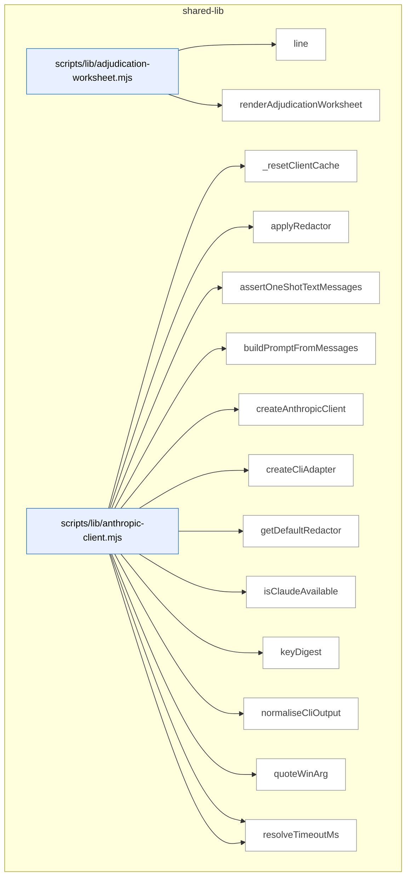

_Domain has 921 symbols (>50). Diagram shows top-15 by file order; see flat table below for the full list._

### Symbols in this domain

| Symbol | Kind | Path | Lines | Purpose | File imported by |
|---|---|---|---|---|---|
| [`line`](../scripts/lib/adjudication-worksheet.mjs#L42) | function | `scripts/lib/adjudication-worksheet.mjs` | 42-44 | Normalizes whitespace and truncates a string to a maximum character length. | `scripts/cross-skill.mjs` |
| [`renderAdjudicationWorksheet`](../scripts/lib/adjudication-worksheet.mjs#L65) | function | `scripts/lib/adjudication-worksheet.mjs` | 65-120 | Generates a PowerShell-ready markdown worksheet for human adjudication of findings with suggested verdicts and duplicate handling. | `scripts/cross-skill.mjs` |
| [`_resetClientCache`](../scripts/lib/anthropic-client.mjs#L353) | function | `scripts/lib/anthropic-client.mjs` | 353-356 | Clears the internal client cache and resets warning state (test fixture helper). | `scripts/anthropic-ping.mjs`, `scripts/azure-limits.mjs`, `scripts/evolve-prompts.mjs`, +11 more |
| [`applyRedactor`](../scripts/lib/anthropic-client.mjs#L318) | function | `scripts/lib/anthropic-client.mjs` | 318-347 | Recursively applies a redaction function to system prompt and message content blocks in an API request. | `scripts/anthropic-ping.mjs`, `scripts/azure-limits.mjs`, `scripts/evolve-prompts.mjs`, +11 more |
| [`assertOneShotTextMessages`](../scripts/lib/anthropic-client.mjs#L447) | function | `scripts/lib/anthropic-client.mjs` | 447-476 | Validates that messages contain only plain text content (no images, tool_use, or multi-turn) for CLI backend compatibility. | `scripts/anthropic-ping.mjs`, `scripts/azure-limits.mjs`, `scripts/evolve-prompts.mjs`, +11 more |
| [`buildPromptFromMessages`](../scripts/lib/anthropic-client.mjs#L484) | function | `scripts/lib/anthropic-client.mjs` | 484-501 | Joins message content blocks into a single newline-separated prompt string. | `scripts/anthropic-ping.mjs`, `scripts/azure-limits.mjs`, `scripts/evolve-prompts.mjs`, +11 more |
| [`createAnthropicClient`](../scripts/lib/anthropic-client.mjs#L183) | function | `scripts/lib/anthropic-client.mjs` | 183-251 | Factory function that creates and caches an Anthropic SDK client with configurable backend, auth, redaction, and timeouts. | `scripts/anthropic-ping.mjs`, `scripts/azure-limits.mjs`, `scripts/evolve-prompts.mjs`, +11 more |
| [`createCliAdapter`](../scripts/lib/anthropic-client.mjs#L368) | function | `scripts/lib/anthropic-client.mjs` | 368-438 | Creates an adapter object that implements messages.create by spawning the `claude` CLI subprocess. | `scripts/anthropic-ping.mjs`, `scripts/azure-limits.mjs`, `scripts/evolve-prompts.mjs`, +11 more |
| [`getDefaultRedactor`](../scripts/lib/anthropic-client.mjs#L255) | function | `scripts/lib/anthropic-client.mjs` | 255-273 | Returns a default secret-pattern-based redactor for sanitizing sensitive data in API payloads. | `scripts/anthropic-ping.mjs`, `scripts/azure-limits.mjs`, `scripts/evolve-prompts.mjs`, +11 more |
| [`isClaudeAvailable`](../scripts/lib/anthropic-client.mjs#L150) | function | `scripts/lib/anthropic-client.mjs` | 150-152 | Returns true if Claude is available via either CLI or SDK with proper authentication. | `scripts/anthropic-ping.mjs`, `scripts/azure-limits.mjs`, `scripts/evolve-prompts.mjs`, +11 more |
| [`keyDigest`](../scripts/lib/anthropic-client.mjs#L50) | function | `scripts/lib/anthropic-client.mjs` | 50-52 | Creates a 16-character hex SHA256 hash digest of an API key (for cache key anonymization). | `scripts/anthropic-ping.mjs`, `scripts/azure-limits.mjs`, `scripts/evolve-prompts.mjs`, +11 more |
| [`normaliseCliOutput`](../scripts/lib/anthropic-client.mjs#L676) | function | `scripts/lib/anthropic-client.mjs` | 676-724 | Parses and validates JSON output from `claude -p`, extracts cost/usage/model metadata, and converts timeout format. | `scripts/anthropic-ping.mjs`, `scripts/azure-limits.mjs`, `scripts/evolve-prompts.mjs`, +11 more |
| [`quoteWinArg`](../scripts/lib/anthropic-client.mjs#L750) | function | `scripts/lib/anthropic-client.mjs` | 750-755 | Escapes Windows command-line arguments with quotes and special-character handling for safe shell execution. | `scripts/anthropic-ping.mjs`, `scripts/azure-limits.mjs`, `scripts/evolve-prompts.mjs`, +11 more |
| [`resolveBackend`](../scripts/lib/anthropic-client.mjs#L120) | function | `scripts/lib/anthropic-client.mjs` | 120-133 | Validates and returns the Claude backend choice (sdk or cli), hard-failing on invalid values. | `scripts/anthropic-ping.mjs`, `scripts/azure-limits.mjs`, `scripts/evolve-prompts.mjs`, +11 more |
| [`resolveTimeoutMs`](../scripts/lib/anthropic-client.mjs#L93) | function | `scripts/lib/anthropic-client.mjs` | 93-104 | Resolves and validates the CLI timeout milliseconds from options or environment variable, enforcing bounds. | `scripts/anthropic-ping.mjs`, `scripts/azure-limits.mjs`, `scripts/evolve-prompts.mjs`, +11 more |
| [`runClaudeCli`](../scripts/lib/anthropic-client.mjs#L522) | function | `scripts/lib/anthropic-client.mjs` | 522-636 | Spawns the `claude` CLI as a subprocess with timeout and signal handling, collecting and validating JSON output. | `scripts/anthropic-ping.mjs`, `scripts/azure-limits.mjs`, `scripts/evolve-prompts.mjs`, +11 more |
| [`wrapSdkClient`](../scripts/lib/anthropic-client.mjs#L289) | function | `scripts/lib/anthropic-client.mjs` | 289-308 | Wraps a raw Anthropic SDK client to add redaction and timeout handling to messages.create. | `scripts/anthropic-ping.mjs`, `scripts/azure-limits.mjs`, `scripts/evolve-prompts.mjs`, +11 more |
| [`computeDeadIntent`](../scripts/lib/arch-intent/adapter-contract.mjs#L151) | function | `scripts/lib/arch-intent/adapter-contract.mjs` | 151-159 | Compares declared architectural domains against live files and returns domains with no implementation. | `scripts/arch-intent-bootstrap.mjs`, `scripts/lib/audit/legacy-production-audit.mjs`, `scripts/openai-audit.mjs` |
| [`deriveArchState`](../scripts/lib/arch-intent/adapter-contract.mjs#L321) | function | `scripts/lib/arch-intent/adapter-contract.mjs` | 321-332 | Maps adapter result statuses to an overall analysis state (ANALYZED_CLEAN, ANALYZED_WITH_FINDINGS, ERROR, etc.). | `scripts/arch-intent-bootstrap.mjs`, `scripts/lib/audit/legacy-production-audit.mjs`, `scripts/openai-audit.mjs` |
| [`fsWalkFallback`](../scripts/lib/arch-intent/adapter-contract.mjs#L68) | function | `scripts/lib/arch-intent/adapter-contract.mjs` | 68-88 | Recursively walks the file system to inventory source files, excluding node_modules and other directories. | `scripts/arch-intent-bootstrap.mjs`, `scripts/lib/audit/legacy-production-audit.mjs`, `scripts/openai-audit.mjs` |
| [`inventoryFiles`](../scripts/lib/arch-intent/adapter-contract.mjs#L104) | function | `scripts/lib/arch-intent/adapter-contract.mjs` | 104-140 | Lists all source files via git (tracking both committed and untracked-but-not-ignored), maps them to architectural domains, and identifies unmapped files. | `scripts/arch-intent-bootstrap.mjs`, `scripts/lib/audit/legacy-production-audit.mjs`, `scripts/openai-audit.mjs` |
| [`isArchIntentReportClean`](../scripts/lib/arch-intent/adapter-contract.mjs#L307) | function | `scripts/lib/arch-intent/adapter-contract.mjs` | 307-312 | Returns true if an architecture report has zero violations, unmapped files, dead domains, and all stacks succeeded. | `scripts/arch-intent-bootstrap.mjs`, `scripts/lib/audit/legacy-production-audit.mjs`, `scripts/openai-audit.mjs` |
| [`loadAdapter`](../scripts/lib/arch-intent/adapter-contract.mjs#L174) | function | `scripts/lib/arch-intent/adapter-contract.mjs` | 174-192 | Dynamically imports a stack-specific architecture adapter module, returning an error struct if missing or load fails. | `scripts/arch-intent-bootstrap.mjs`, `scripts/lib/audit/legacy-production-audit.mjs`, `scripts/openai-audit.mjs` |
| [`runArchIntentAnalysis`](../scripts/lib/arch-intent/adapter-contract.mjs#L223) | function | `scripts/lib/arch-intent/adapter-contract.mjs` | 223-289 | Orchestrates per-stack architecture analysis, merges violations from all stacks, and derives the overall analysis state. | `scripts/arch-intent-bootstrap.mjs`, `scripts/lib/audit/legacy-production-audit.mjs`, `scripts/openai-audit.mjs` |
| [`validateAdapterReport`](../scripts/lib/arch-intent/adapter-contract.mjs#L201) | function | `scripts/lib/arch-intent/adapter-contract.mjs` | 201-212 | Validates an adapter's report against the expected schema, raising an error on mismatch. | `scripts/arch-intent-bootstrap.mjs`, `scripts/lib/audit/legacy-production-audit.mjs`, `scripts/openai-audit.mjs` |
| [`analyseImports`](../scripts/lib/arch-intent/adapters/java.mjs#L325) | function | `scripts/lib/arch-intent/adapters/java.mjs` | 325-444 | Main analyzer for Java imports that detects architectural violations (domain-crossing packages, unresolved imports, ambiguities). | _(internal)_ |
| [`buildJavaResolutionIndex`](../scripts/lib/arch-intent/adapters/java.mjs#L176) | function | `scripts/lib/arch-intent/adapters/java.mjs` | 176-233 | Indexes all Java .java files by fully-qualified name, package, and source root for import resolution. | _(internal)_ |
| [`extractImports`](../scripts/lib/arch-intent/adapters/java.mjs#L132) | function | `scripts/lib/arch-intent/adapters/java.mjs` | 132-164 | Parses Java import statements (including static and wildcard forms) from stripped source, preserving line numbers. | _(internal)_ |
| [`extractPackage`](../scripts/lib/arch-intent/adapters/java.mjs#L115) | function | `scripts/lib/arch-intent/adapters/java.mjs` | 115-118 | Extracts the Java package name from the source code using a regex on stripped source. | _(internal)_ |
| [`progressiveResolve`](../scripts/lib/arch-intent/adapters/java.mjs#L246) | function | `scripts/lib/arch-intent/adapters/java.mjs` | 246-265 | Resolves a Java FQN to local files by progressively stripping right-hand segments, detecting vendor packages and ambiguities. | _(internal)_ |
| [`resolveJavaImport`](../scripts/lib/arch-intent/adapters/java.mjs#L275) | function | `scripts/lib/arch-intent/adapters/java.mjs` | 275-314 | Resolves a Java import reference (including static/wildcard cases) to target files using a pre-built resolution index. | _(internal)_ |
| [`stripJavaCommentsAndLiterals`](../scripts/lib/arch-intent/adapters/java.mjs#L44) | function | `scripts/lib/arch-intent/adapters/java.mjs` | 44-106 | Strips Java comments (line, block) and string/char/text-block literals from source while preserving line structure. | _(internal)_ |
| [`analyseImports`](../scripts/lib/arch-intent/adapters/js-ts.mjs#L74) | function | `scripts/lib/arch-intent/adapters/js-ts.mjs` | 74-214 | Main analyzer for JavaScript/TypeScript imports using dependency-cruiser, detects domain violations and unresolved references. | _(internal)_ |
| [`classifyEdge`](../scripts/lib/arch-intent/adapters/js-ts.mjs#L33) | function | `scripts/lib/arch-intent/adapters/js-ts.mjs` | 33-49 | Classifies a dependency edge by type (local-file, type-only, dynamic, vendor-npm, vendor-node-builtin, unresolved, etc.). | _(internal)_ |
| [`normalisePath`](../scripts/lib/arch-intent/adapters/js-ts.mjs#L58) | function | `scripts/lib/arch-intent/adapters/js-ts.mjs` | 58-63 | Converts a file path to repo-relative forward-slash format (absolute or relative input). | _(internal)_ |
| [`analyseImports`](../scripts/lib/arch-intent/adapters/postgres.mjs#L605) | function | `scripts/lib/arch-intent/adapters/postgres.mjs` | 605-698 | Analyzes SQL imports with multi-stage fault isolation, catalog building, and dependency violation detection. | _(internal)_ |
| [`buildSqlCatalog`](../scripts/lib/arch-intent/adapters/postgres.mjs#L499) | function | `scripts/lib/arch-intent/adapters/postgres.mjs` | 499-560 | Builds an indexed catalog of SQL objects (relations, functions, types) with redefinition tracking and epoch versioning. | _(internal)_ |
| [`classifyStatement`](../scripts/lib/arch-intent/adapters/postgres.mjs#L295) | function | `scripts/lib/arch-intent/adapters/postgres.mjs` | 295-427 | Parses a CREATE/ALTER/DROP statement to extract object names and references (foreign keys, partitions, views, etc.). | _(internal)_ |
| [`displayName`](../scripts/lib/arch-intent/adapters/postgres.mjs#L234) | function | `scripts/lib/arch-intent/adapters/postgres.mjs` | 234-236 | Converts a normalized SQL identifier back to human-readable form by reversing dot-escape encoding. | _(internal)_ |
| [`extractCallRefs`](../scripts/lib/arch-intent/adapters/postgres.mjs#L460) | function | `scripts/lib/arch-intent/adapters/postgres.mjs` | 460-471 | Extracts function call references from SQL code using regex pattern matching. | _(internal)_ |
| [`extractPolicyTableRefs`](../scripts/lib/arch-intent/adapters/postgres.mjs#L474) | function | `scripts/lib/arch-intent/adapters/postgres.mjs` | 474-483 | Extracts table references from SQL policy expressions via FROM/JOIN clauses and qualified names. | _(internal)_ |
| [`extractSelectRefs`](../scripts/lib/arch-intent/adapters/postgres.mjs#L440) | function | `scripts/lib/arch-intent/adapters/postgres.mjs` | 440-457 | Extracts table references from a SQL SELECT statement, excluding common table expressions. | _(internal)_ |
| [`naturalCompare`](../scripts/lib/arch-intent/adapters/postgres.mjs#L488) | function | `scripts/lib/arch-intent/adapters/postgres.mjs` | 488-490 | Compares strings with locale-aware natural-number sorting (e.g., "file10" after "file2"). | _(internal)_ |
| [`normName`](../scripts/lib/arch-intent/adapters/postgres.mjs#L197) | function | `scripts/lib/arch-intent/adapters/postgres.mjs` | 197-228 | Normalizes SQL identifiers to canonical form (lowercase for unquoted, case-preserved for quoted, with schema/table segments). | _(internal)_ |
| [`parseFile`](../scripts/lib/arch-intent/adapters/postgres.mjs#L262) | function | `scripts/lib/arch-intent/adapters/postgres.mjs` | 262-293 | Parses a SQL file into individual statements, extracts CREATE/ALTER/DROP object definitions and cross-references. | _(internal)_ |
| [`recoverFunctionBody`](../scripts/lib/arch-intent/adapters/postgres.mjs#L430) | function | `scripts/lib/arch-intent/adapters/postgres.mjs` | 430-437 | Recovers the body text of a SQL function from original source using dollar-quoting or 'as' syntax. | _(internal)_ |
| [`resolveSqlRef`](../scripts/lib/arch-intent/adapters/postgres.mjs#L571) | function | `scripts/lib/arch-intent/adapters/postgres.mjs` | 571-594 | Resolves SQL references to their defining files, handling schema qualification, unqualified names, and built-in functions. | _(internal)_ |
| [`splitTopLevel`](../scripts/lib/arch-intent/adapters/postgres.mjs#L239) | function | `scripts/lib/arch-intent/adapters/postgres.mjs` | 239-250 | Splits a string by a separator at top level only, ignoring separators inside parentheses. | _(internal)_ |
| [`stripSqlCommentsAndStrings`](../scripts/lib/arch-intent/adapters/postgres.mjs#L102) | function | `scripts/lib/arch-intent/adapters/postgres.mjs` | 102-187 | Removes SQL comments (line, block, nested) and string literals (quoted, escaped, dollar-quoted) while preserving structure. | _(internal)_ |
| [`analyseImports`](../scripts/lib/arch-intent/adapters/python.mjs#L507) | function | `scripts/lib/arch-intent/adapters/python.mjs` | 507-586 | Analyzes Python file imports across a codebase and reports domain-dependency violations. | _(internal)_ |
| [`buildPythonModuleIndex`](../scripts/lib/arch-intent/adapters/python.mjs#L383) | function | `scripts/lib/arch-intent/adapters/python.mjs` | 383-426 | Builds a dotted-module-name-to-file index from Python source files with collision detection. | _(internal)_ |
| [`countUnbalanced`](../scripts/lib/arch-intent/adapters/python.mjs#L254) | function | `scripts/lib/arch-intent/adapters/python.mjs` | 254-261 | Counts unmatched opening and closing parentheses in a string (positive = more opens). | _(internal)_ |
| [`discoverPythonRoots`](../scripts/lib/arch-intent/adapters/python.mjs#L287) | function | `scripts/lib/arch-intent/adapters/python.mjs` | 287-350 | Discovers Python package roots by scanning setup.cfg/pyproject.toml, src/ directories, and __init__.py hierarchy. | _(internal)_ |
| [`extractImports`](../scripts/lib/arch-intent/adapters/python.mjs#L196) | function | `scripts/lib/arch-intent/adapters/python.mjs` | 196-251 | Extracts Python import statements from source, handling backslash continuations and multi-line parenthesized groups. | _(internal)_ |
| [`extractPackageDirs`](../scripts/lib/arch-intent/adapters/python.mjs#L353) | function | `scripts/lib/arch-intent/adapters/python.mjs` | 353-364 | Extracts package directories from setup.cfg or pyproject.toml configuration files via regex patterns. | _(internal)_ |
| [`isPySource`](../scripts/lib/arch-intent/adapters/python.mjs#L366) | function | `scripts/lib/arch-intent/adapters/python.mjs` | 366-369 | Checks if a file is a Python source file (.py or .pyi extension). | _(internal)_ |
| [`parseImportedNames`](../scripts/lib/arch-intent/adapters/python.mjs#L264) | function | `scripts/lib/arch-intent/adapters/python.mjs` | 264-271 | Parses imported names from Python import clauses, extracting bare names from aliases and handling wildcards. | _(internal)_ |
| [`resolvePythonImport`](../scripts/lib/arch-intent/adapters/python.mjs#L439) | function | `scripts/lib/arch-intent/adapters/python.mjs` | 439-496 | Resolves Python import statements (absolute/relative) to target files using the module index. | _(internal)_ |
| [`stripPythonCommentsAndStrings`](../scripts/lib/arch-intent/adapters/python.mjs#L72) | function | `scripts/lib/arch-intent/adapters/python.mjs` | 72-178 | Removes Python comments and string literals (including f-strings with brace tracking) while preserving line structure. | _(internal)_ |
| [`checkDepAllowed`](../scripts/lib/arch-intent/domain-resolver.mjs#L53) | function | `scripts/lib/arch-intent/domain-resolver.mjs` | 53-60 | Checks if a dependency edge from one domain to another is permitted by domain-map rules. | `scripts/arch-intent-bootstrap.mjs`, `scripts/lib/arch-intent/adapter-contract.mjs`, `scripts/lib/arch-intent/adapters/java.mjs`, +4 more |
| [`computeDeclaredDomains`](../scripts/lib/arch-intent/domain-resolver.mjs#L76) | function | `scripts/lib/arch-intent/domain-resolver.mjs` | 76-86 | Collects all declared domains from rules, allowedDeps keys/values, and descriptions. | `scripts/arch-intent-bootstrap.mjs`, `scripts/lib/arch-intent/adapter-contract.mjs`, `scripts/lib/arch-intent/adapters/java.mjs`, +4 more |
| [`resolveFileToDomain`](../scripts/lib/arch-intent/domain-resolver.mjs#L29) | function | `scripts/lib/arch-intent/domain-resolver.mjs` | 29-38 | Maps a file path to its domain using pattern-matching rules. | `scripts/arch-intent-bootstrap.mjs`, `scripts/lib/arch-intent/adapter-contract.mjs`, `scripts/lib/arch-intent/adapters/java.mjs`, +4 more |
| [`ArchIntentAnalyzerError`](../scripts/lib/arch-intent/errors.mjs#L18) | class | `scripts/lib/arch-intent/errors.mjs` | 18-25 | Custom error for architectural intent analyzer execution failures. | `scripts/lib/arch-intent/adapter-contract.mjs`, `scripts/lib/arch-intent/load-config.mjs`, `scripts/lib/arch-intent/semantic-validator.mjs`, +2 more |
| [`ArchIntentConfigError`](../scripts/lib/arch-intent/errors.mjs#L9) | class | `scripts/lib/arch-intent/errors.mjs` | 9-16 | Custom error for architectural intent configuration validation failures. | `scripts/lib/arch-intent/adapter-contract.mjs`, `scripts/lib/arch-intent/load-config.mjs`, `scripts/lib/arch-intent/semantic-validator.mjs`, +2 more |
| [`parseIntentDoc`](../scripts/lib/arch-intent/intent-doc-parser.mjs#L27) | function | `scripts/lib/arch-intent/intent-doc-parser.mjs` | 27-78 | Parses intent documentation to extract mermaid diagrams, version metadata, and section narratives. | `scripts/lib/audit/legacy-production-audit.mjs`, `scripts/openai-audit.mjs` |
| [`loadArchIntentConfig`](../scripts/lib/arch-intent/load-config.mjs#L35) | function | `scripts/lib/arch-intent/load-config.mjs` | 35-69 | Loads and validates domain-map.json with structure and semantic constraint checking. | `scripts/arch-intent-bootstrap.mjs`, `scripts/lib/audit/legacy-production-audit.mjs`, `scripts/openai-audit.mjs` |
| [`rulesDeclaredDomains`](../scripts/lib/arch-intent/semantic-validator.mjs#L30) | function | `scripts/lib/arch-intent/semantic-validator.mjs` | 30-34 | Returns the set of domains declared in domain-map rules. | `scripts/lib/arch-intent/load-config.mjs` |
| [`validateDomainMapSemantics`](../scripts/lib/arch-intent/semantic-validator.mjs#L42) | function | `scripts/lib/arch-intent/semantic-validator.mjs` | 42-97 | Validates domain-map semantic constraints including undeclared domains and rule shadowing warnings. | `scripts/lib/arch-intent/load-config.mjs` |
| [`escapeMarkdown`](../scripts/lib/arch-render.mjs#L22) | function | `scripts/lib/arch-render.mjs` | 22-28 | Escapes Markdown special characters (pipes, newlines) for safe text rendering. | `scripts/symbol-index/drift.mjs`, `scripts/symbol-index/render-mermaid.mjs` |
| [`escapeMermaidLabel`](../scripts/lib/arch-render.mjs#L31) | function | `scripts/lib/arch-render.mjs` | 31-37 | Escapes text for Mermaid diagram labels by replacing quotes and removing angle brackets/pipes. | `scripts/symbol-index/drift.mjs`, `scripts/symbol-index/render-mermaid.mjs` |
| [`groupByDomain`](../scripts/lib/arch-render.mjs#L45) | function | `scripts/lib/arch-render.mjs` | 45-63 | Groups symbols by domain and sorts alphabetically within domains by file and name. | `scripts/symbol-index/drift.mjs`, `scripts/symbol-index/render-mermaid.mjs` |
| [`mermaidId`](../scripts/lib/arch-render.mjs#L40) | function | `scripts/lib/arch-render.mjs` | 40-42 | Generates a valid Mermaid node ID from a key and prefix with sanitization. | `scripts/symbol-index/drift.mjs`, `scripts/symbol-index/render-mermaid.mjs` |
| [`renderArchitectureMap`](../scripts/lib/arch-render.mjs#L171) | function | `scripts/lib/arch-render.mjs` | 171-286 | Renders complete architecture map documentation with per-domain sections, diagrams, symbols, and violations. | `scripts/symbol-index/drift.mjs`, `scripts/symbol-index/render-mermaid.mjs` |
| [`renderDriftIssue`](../scripts/lib/arch-render.mjs#L360) | function | `scripts/lib/arch-render.mjs` | 360-422 | Renders an architectural drift report with top duplication clusters and detailed violation metrics. | `scripts/symbol-index/drift.mjs`, `scripts/symbol-index/render-mermaid.mjs` |
| [`renderHeader`](../scripts/lib/arch-render.mjs#L157) | function | `scripts/lib/arch-render.mjs` | 157-168 | Renders the header section with metadata, drift score, domain/symbol/violation counts. | `scripts/symbol-index/drift.mjs`, `scripts/symbol-index/render-mermaid.mjs` |
| [`renderMermaidContainer`](../scripts/lib/arch-render.mjs#L69) | function | `scripts/lib/arch-render.mjs` | 69-103 | Renders a Mermaid flowchart showing symbols grouped by file within a domain subgraph. | `scripts/symbol-index/drift.mjs`, `scripts/symbol-index/render-mermaid.mjs` |
| [`renderNeighbourhoodCallout`](../scripts/lib/arch-render.mjs#L289) | function | `scripts/lib/arch-render.mjs` | 289-357 | Renders architectural-memory neighbourhood consultation results as Markdown with similarity scores and recommendations. | `scripts/symbol-index/drift.mjs`, `scripts/symbol-index/render-mermaid.mjs` |
| [`renderSymbolTable`](../scripts/lib/arch-render.mjs#L114) | function | `scripts/lib/arch-render.mjs` | 114-138 | Renders a Markdown table of symbols with file/line numbers, purpose, and optional "where used" column. | `scripts/symbol-index/drift.mjs`, `scripts/symbol-index/render-mermaid.mjs` |
| [`renderWhereUsed`](../scripts/lib/arch-render.mjs#L140) | function | `scripts/lib/arch-render.mjs` | 140-154 | Renders a comma-separated list of files that import a given file with truncation for length. | `scripts/symbol-index/drift.mjs`, `scripts/symbol-index/render-mermaid.mjs` |
| [`maybeFireArmEvalCaptureDetached`](../scripts/lib/arm-eval/capture-trigger.mjs#L52) | function | `scripts/lib/arm-eval/capture-trigger.mjs` | 52-83 | Spawns a detached subprocess for arm-eval capture if the toggle is enabled. | `scripts/brainstorm-round.mjs`, `scripts/cross-skill.mjs` |
| [`envelope`](../scripts/lib/arm-eval/cross-checks.mjs#L22) | function | `scripts/lib/arm-eval/cross-checks.mjs` | 22-32 | Wraps a cross-check result in a standardized envelope with name, version, status, score, and findings. | `scripts/lib/arm-eval/run.mjs` |
| [`runCrossChecks`](../scripts/lib/arm-eval/cross-checks.mjs#L80) | function | `scripts/lib/arm-eval/cross-checks.mjs` | 80-93 | Executes a list of cross-check validators and returns their enveloped results. | `scripts/lib/arm-eval/run.mjs` |
| [`evaluateArmEval`](../scripts/lib/arm-eval/decision.mjs#L94) | function | `scripts/lib/arm-eval/decision.mjs` | 94-221 | Evaluates arm-eval experiment results with rubric scoring, statistical measures, and a verdict (keep/switch/inconclusive). | `scripts/cross-skill.mjs` |
| [`kendallTau`](../scripts/lib/arm-eval/decision.mjs#L68) | function | `scripts/lib/arm-eval/decision.mjs` | 68-82 | Computes Kendall's tau correlation coefficient between two ranked lists (range -1 to 1). | `scripts/cross-skill.mjs` |
| [`mean`](../scripts/lib/arm-eval/decision.mjs#L33) | function | `scripts/lib/arm-eval/decision.mjs` | 33-33 | Computes the arithmetic mean of an array of numbers. | `scripts/cross-skill.mjs` |
| [`round4`](../scripts/lib/arm-eval/decision.mjs#L34) | function | `scripts/lib/arm-eval/decision.mjs` | 34-34 | Rounds a finite number to 4 decimal places or returns the number unchanged. | `scripts/cross-skill.mjs` |
| [`sessionArmMeans`](../scripts/lib/arm-eval/decision.mjs#L38) | function | `scripts/lib/arm-eval/decision.mjs` | 38-50 | Computes per-arm average scores from a multi-pass judge session. | `scripts/cross-skill.mjs` |
| [`sessionSelfConsistency`](../scripts/lib/arm-eval/decision.mjs#L54) | function | `scripts/lib/arm-eval/decision.mjs` | 54-64 | Computes per-arm measurement deltas between the first two consecutive passes. | `scripts/cross-skill.mjs` |
| [`getExperiment`](../scripts/lib/arm-eval/experiments.mjs#L186) | function | `scripts/lib/arm-eval/experiments.mjs` | 186-190 | Retrieves a canonical experiment definition by type name from the registry. | `scripts/cross-skill.mjs`, `scripts/lib/arm-eval/judge.mjs`, `scripts/lib/arm-eval/run.mjs` |
| [`isClaudeFamily`](../scripts/lib/arm-eval/experiments.mjs#L107) | function | `scripts/lib/arm-eval/experiments.mjs` | 107-116 | Checks if a model ID belongs to the Claude/Anthropic family via resolution or literal pattern matching. | `scripts/cross-skill.mjs`, `scripts/lib/arm-eval/judge.mjs`, `scripts/lib/arm-eval/run.mjs` |
| [`rubricFor`](../scripts/lib/arm-eval/experiments.mjs#L66) | function | `scripts/lib/arm-eval/experiments.mjs` | 66-70 | Returns the combined rubric (core + experiment-specific) for an experiment type. | `scripts/cross-skill.mjs`, `scripts/lib/arm-eval/judge.mjs`, `scripts/lib/arm-eval/run.mjs` |
| [`validateArm`](../scripts/lib/arm-eval/experiments.mjs#L122) | function | `scripts/lib/arm-eval/experiments.mjs` | 122-130 | Validates an arm configuration, rejecting Claude-family models per self-preference guard. | `scripts/cross-skill.mjs`, `scripts/lib/arm-eval/judge.mjs`, `scripts/lib/arm-eval/run.mjs` |
| [`validateExperiment`](../scripts/lib/arm-eval/experiments.mjs#L133) | function | `scripts/lib/arm-eval/experiments.mjs` | 133-141 | Validates experiment configuration including all arm schemas and Claude-family exclusion. | `scripts/cross-skill.mjs`, `scripts/lib/arm-eval/judge.mjs`, `scripts/lib/arm-eval/run.mjs` |
| [`buildSessionMarkdown`](../scripts/lib/arm-eval/export.mjs#L47) | function | `scripts/lib/arm-eval/export.mjs` | 47-111 | Renders a markdown document from session data with conditional blinding for prospective phases. | `scripts/cross-skill.mjs`, `scripts/lib/arm-eval/run.mjs` |
| [`exportSession`](../scripts/lib/arm-eval/export.mjs#L118) | function | `scripts/lib/arm-eval/export.mjs` | 118-127 | Exports a session to a markdown file and returns the written path. | `scripts/cross-skill.mjs`, `scripts/lib/arm-eval/run.mjs` |
| [`filenameFor`](../scripts/lib/arm-eval/export.mjs#L34) | function | `scripts/lib/arm-eval/export.mjs` | 34-39 | Creates a timestamped markdown filename from an audit session's metadata. | `scripts/cross-skill.mjs`, `scripts/lib/arm-eval/run.mjs` |
| [`redact`](../scripts/lib/arm-eval/export.mjs#L41) | function | `scripts/lib/arm-eval/export.mjs` | 41-41 | Applies shape-based secret redaction to a string. | `scripts/cross-skill.mjs`, `scripts/lib/arm-eval/run.mjs` |
| [`buildIntentContext`](../scripts/lib/arm-eval/intent-context.mjs#L52) | function | `scripts/lib/arm-eval/intent-context.mjs` | 52-113 | Assembles bounded repository context (architecture, domain map) for eval prompts. | `scripts/lib/arm-eval/run.mjs` |
| [`cap`](../scripts/lib/arm-eval/intent-context.mjs#L42) | function | `scripts/lib/arm-eval/intent-context.mjs` | 42-45 | Truncates text to a maximum length with a truncation notice. | `scripts/lib/arm-eval/run.mjs` |
| [`defaultDeps`](../scripts/lib/arm-eval/intent-context.mjs#L29) | function | `scripts/lib/arm-eval/intent-context.mjs` | 29-34 | Returns default filesystem read/existence-check functions. | `scripts/lib/arm-eval/run.mjs` |
| [`tryRead`](../scripts/lib/arm-eval/intent-context.mjs#L37) | function | `scripts/lib/arm-eval/intent-context.mjs` | 37-39 | Safely reads a file or returns null on failure. | `scripts/lib/arm-eval/run.mjs` |
| [`buildJudgePrompt`](../scripts/lib/arm-eval/judge.mjs#L78) | function | `scripts/lib/arm-eval/judge.mjs` | 78-93 | Constructs a blinded-judge prompt to score anonymized outputs on rubric dimensions. | `scripts/lib/arm-eval/run.mjs` |
| [`callJudgeDefault`](../scripts/lib/arm-eval/judge.mjs#L185) | function | `scripts/lib/arm-eval/judge.mjs` | 185-224 | Calls Claude Opus to judge arm outputs with egress gating and shape-based redaction. | `scripts/lib/arm-eval/run.mjs` |
| [`extractJsonObject`](../scripts/lib/arm-eval/judge.mjs#L154) | function | `scripts/lib/arm-eval/judge.mjs` | 154-170 | Extracts a single JSON object from text by finding balanced braces with escape handling. | `scripts/lib/arm-eval/run.mjs` |
| [`getShapeRedactor`](../scripts/lib/arm-eval/judge.mjs#L177) | function | `scripts/lib/arm-eval/judge.mjs` | 177-182 | Lazily loads and caches the shape-based secret redactor. | `scripts/lib/arm-eval/run.mjs` |
| [`judgePassSchema`](../scripts/lib/arm-eval/judge.mjs#L59) | function | `scripts/lib/arm-eval/judge.mjs` | 59-71 | Builds a Zod schema requiring all rubric labels scored exactly once across dimensions. | `scripts/lib/arm-eval/run.mjs` |
| [`judgeSession`](../scripts/lib/arm-eval/judge.mjs#L110) | function | `scripts/lib/arm-eval/judge.mjs` | 110-148 | Runs two-pass LLM judging with bounded retry for scoring arm outputs. | `scripts/lib/arm-eval/run.mjs` |
| [`mulberry32`](../scripts/lib/arm-eval/judge.mjs#L29) | function | `scripts/lib/arm-eval/judge.mjs` | 29-37 | Implements the Mulberry32 seeded pseudo-random generator. | `scripts/lib/arm-eval/run.mjs` |
| [`scorableDimensions`](../scripts/lib/arm-eval/judge.mjs#L49) | function | `scripts/lib/arm-eval/judge.mjs` | 49-53 | Returns applicable rubric dimensions, optionally excluding intent-specific ones. | `scripts/lib/arm-eval/run.mjs` |
| [`seededShuffle`](../scripts/lib/arm-eval/judge.mjs#L38) | function | `scripts/lib/arm-eval/judge.mjs` | 38-46 | Fisher-Yates shuffle using a seeded RNG for deterministic randomization. | `scripts/lib/arm-eval/run.mjs` |
| [`buildPlanGenPrompt`](../scripts/lib/arm-eval/plan-seed.mjs#L31) | function | `scripts/lib/arm-eval/plan-seed.mjs` | 31-37 | Constructs a prompt for an LLM to generate a plan from a task and context. | `scripts/lib/arm-eval/producers/plan.mjs`, `scripts/lib/arm-eval/run.mjs` |
| [`parsePlanIntent`](../scripts/lib/arm-eval/plan-seed.mjs#L41) | function | `scripts/lib/arm-eval/plan-seed.mjs` | 41-61 | Extracts target paths and acceptance criteria from a plan's markdown sections. | `scripts/lib/arm-eval/producers/plan.mjs`, `scripts/lib/arm-eval/run.mjs` |
| [`callModelDefault`](../scripts/lib/arm-eval/producers/brainstorm.mjs#L75) | function | `scripts/lib/arm-eval/producers/brainstorm.mjs` | 75-78 | Delegates to the model-call module for free-text LLM generation. | `scripts/lib/arm-eval/run.mjs` |
| [`hashText`](../scripts/lib/arm-eval/producers/brainstorm.mjs#L15) | function | `scripts/lib/arm-eval/producers/brainstorm.mjs` | 15-15 | Computes a short SHA256 hash of text for deduplication. | `scripts/lib/arm-eval/run.mjs` |
| [`produceBrainstorm`](../scripts/lib/arm-eval/producers/brainstorm.mjs#L24) | function | `scripts/lib/arm-eval/producers/brainstorm.mjs` | 24-72 | Runs two models in parallel to brainstorm, failing if either leg is empty. | `scripts/lib/arm-eval/run.mjs` |
| [`callModelFreeText`](../scripts/lib/arm-eval/producers/model-call.mjs#L21) | function | `scripts/lib/arm-eval/producers/model-call.mjs` | 21-45 | Invokes an LLM via the appropriate provider and returns text with usage metrics. | `scripts/lib/arm-eval/producers/brainstorm.mjs`, `scripts/lib/arm-eval/producers/plan.mjs` |
| [`providerFor`](../scripts/lib/arm-eval/producers/model-call.mjs#L14) | function | `scripts/lib/arm-eval/producers/model-call.mjs` | 14-18 | Determines which API provider (OSS, Gemini, or GPT) a model ID belongs to. | `scripts/lib/arm-eval/producers/brainstorm.mjs`, `scripts/lib/arm-eval/producers/plan.mjs` |
| [`callModelDefault`](../scripts/lib/arm-eval/producers/plan.mjs#L64) | function | `scripts/lib/arm-eval/producers/plan.mjs` | 64-67 | Delegates to the model-call module for free-text LLM generation. | `scripts/lib/arm-eval/run.mjs` |
| [`hashText`](../scripts/lib/arm-eval/producers/plan.mjs#L16) | function | `scripts/lib/arm-eval/producers/plan.mjs` | 16-16 | Computes a short SHA256 hash of text for deduplication. | `scripts/lib/arm-eval/run.mjs` |
| [`producePlan`](../scripts/lib/arm-eval/producers/plan.mjs#L24) | function | `scripts/lib/arm-eval/producers/plan.mjs` | 24-61 | Generates a plan from a task and context, validating machine-readable intent sections. | `scripts/lib/arm-eval/run.mjs` |
| [`defaultDeps`](../scripts/lib/arm-eval/run.mjs#L27) | function | `scripts/lib/arm-eval/run.mjs` | 27-36 | Returns default implementations for arm-eval producers, judges, and storage. | `scripts/cross-skill.mjs` |
| [`hashTask`](../scripts/lib/arm-eval/run.mjs#L125) | function | `scripts/lib/arm-eval/run.mjs` | 125-131 | Computes a deterministic 8-character hex hash of a task. | `scripts/cross-skill.mjs` |
| [`runArmEvalSession`](../scripts/lib/arm-eval/run.mjs#L45) | function | `scripts/lib/arm-eval/run.mjs` | 45-122 | Orchestrates a full arm-eval session: produces, judges, cross-checks, and records results. | `scripts/cross-skill.mjs` |
| [`readToggle`](../scripts/lib/arm-eval/toggle.mjs#L37) | function | `scripts/lib/arm-eval/toggle.mjs` | 37-52 | Reads the arm-eval on/off toggle state and budget from disk. | `scripts/cross-skill.mjs`, `scripts/lib/arm-eval/capture-trigger.mjs`, `scripts/lib/audit/legacy-production-audit.mjs`, +2 more |
| [`resolveShadowArmsWithToggle`](../scripts/lib/arm-eval/toggle.mjs#L85) | function | `scripts/lib/arm-eval/toggle.mjs` | 85-91 | Resolves shadow-arm models from environment or toggle file, prioritizing env. | `scripts/cross-skill.mjs`, `scripts/lib/arm-eval/capture-trigger.mjs`, `scripts/lib/audit/legacy-production-audit.mjs`, +2 more |
| [`writeToggle`](../scripts/lib/arm-eval/toggle.mjs#L59) | function | `scripts/lib/arm-eval/toggle.mjs` | 59-69 | Persists the arm-eval on/off toggle state and budget to disk. | `scripts/cross-skill.mjs`, `scripts/lib/arm-eval/capture-trigger.mjs`, `scripts/lib/audit/legacy-production-audit.mjs`, +2 more |
| [`assertRepoRoot`](../scripts/lib/assert-repo-root.mjs#L54) | function | `scripts/lib/assert-repo-root.mjs` | 54-85 | Validates the script runs from the expected repo root with an escape hatch for cross-repo use. | `scripts/bandit.mjs`, `scripts/build-dashboard.mjs`, `scripts/cache-hitrate-check.mjs`, +20 more |
| [`findExpectedRoot`](../scripts/lib/assert-repo-root.mjs#L30) | function | `scripts/lib/assert-repo-root.mjs` | 30-38 | Traces from a script path upward to find the repo root's scripts directory. | `scripts/bandit.mjs`, `scripts/build-dashboard.mjs`, `scripts/cache-hitrate-check.mjs`, +20 more |
| [`findRepoRootFromScript`](../scripts/lib/assert-repo-root.mjs#L99) | function | `scripts/lib/assert-repo-root.mjs` | 99-102 | Finds the repo root by tracing from a calling script's path. | `scripts/bandit.mjs`, `scripts/build-dashboard.mjs`, `scripts/cache-hitrate-check.mjs`, +20 more |
| [`attributeStageToArms`](../scripts/lib/audit-arms.mjs#L283) | function | `scripts/lib/audit-arms.mjs` | 283-312 | Maps a stage name to the arm(s) that own it, enforcing arm-specific vs shared stage rules and failing closed on conflicts. | `scripts/lib/arm-eval/toggle.mjs`, `scripts/lib/audit-shadow.mjs`, `scripts/lib/model-ab-decision.mjs`, +2 more |
| [`buildCandidateArm`](../scripts/lib/audit-arms.mjs#L245) | function | `scripts/lib/audit-arms.mjs` | 245-259 | Creates a candidate audit arm for a resolved-route model not generated by OSS. | `scripts/lib/arm-eval/toggle.mjs`, `scripts/lib/audit-shadow.mjs`, `scripts/lib/model-ab-decision.mjs`, +2 more |
| [`executionPlan`](../scripts/lib/audit-arms.mjs#L321) | function | `scripts/lib/audit-arms.mjs` | 321-327 | Determines which major execution components (oss-gen, gpt-gen, gpt-round, gemini) the selected arms require. | `scripts/lib/arm-eval/toggle.mjs`, `scripts/lib/audit-shadow.mjs`, `scripts/lib/model-ab-decision.mjs`, +2 more |
| [`parseArm`](../scripts/lib/audit-arms.mjs#L205) | function | `scripts/lib/audit-arms.mjs` | 205-209 | Validates and parses an audit arm configuration object, returning success with the parsed arm or validation error details. | `scripts/lib/arm-eval/toggle.mjs`, `scripts/lib/audit-shadow.mjs`, `scripts/lib/model-ab-decision.mjs`, +2 more |
| [`resolveArms`](../scripts/lib/audit-arms.mjs#L342) | function | `scripts/lib/audit-arms.mjs` | 342-370 | Parses AUDIT_MODEL_SHADOW env var into enabled experiment arms, validating IDs and rejecting baselines from shadow. | `scripts/lib/arm-eval/toggle.mjs`, `scripts/lib/audit-shadow.mjs`, `scripts/lib/model-ab-decision.mjs`, +2 more |
| [`stagesForArm`](../scripts/lib/audit-arms.mjs#L223) | function | `scripts/lib/audit-arms.mjs` | 223-228 | Lists the execution stages (oss-gen, gpt-gen, gpt-round, gemini) that a given audit arm declares. | `scripts/lib/arm-eval/toggle.mjs`, `scripts/lib/audit-shadow.mjs`, `scripts/lib/model-ab-decision.mjs`, +2 more |
| [`dispatch`](../scripts/lib/audit-dispatch.mjs#L26) | function | `scripts/lib/audit-dispatch.mjs` | 26-48 | Parses an audit input string (file path or task description) to route to /audit-plan or /audit-code with appropriate mode and arguments. | _(internal)_ |
| [`auditSubjectFileGuard`](../scripts/lib/audit-scope.mjs#L212) | function | `scripts/lib/audit-scope.mjs` | 212-218 | Validates that the audit has at least one implementation file to analyze, returning a diagnostic error message if not. | `scripts/lib/audit/legacy-production-audit.mjs`, `scripts/lib/diff-annotation.mjs`, `scripts/lib/file-io.mjs`, +1 more |
| [`buildRedactedAuditContext`](../scripts/lib/audit-scope.mjs#L161) | function | `scripts/lib/audit-scope.mjs` | 161-165 | Assembles file context, egress-scans it for secret leakage, and returns context + file count + safety verdict. | `scripts/lib/audit/legacy-production-audit.mjs`, `scripts/lib/diff-annotation.mjs`, `scripts/lib/file-io.mjs`, +1 more |
| [`classifyFiles`](../scripts/lib/audit-scope.mjs#L174) | function | `scripts/lib/audit-scope.mjs` | 174-193 | Categorizes file paths into backend/frontend/shared buckets based on heuristic path patterns. | `scripts/lib/audit/legacy-production-audit.mjs`, `scripts/lib/diff-annotation.mjs`, `scripts/lib/file-io.mjs`, +1 more |
| [`isAuditInfraFile`](../scripts/lib/audit-scope.mjs#L61) | function | `scripts/lib/audit-scope.mjs` | 61-68 | Checks if a file is audit infrastructure (scripts/*.mjs or scripts/lib/*.mjs basename). | `scripts/lib/audit/legacy-production-audit.mjs`, `scripts/lib/diff-annotation.mjs`, `scripts/lib/file-io.mjs`, +1 more |
| [`isSensitiveFile`](../scripts/lib/audit-scope.mjs#L22) | function | `scripts/lib/audit-scope.mjs` | 22-24 | Checks if a path is classified as sensitive (environment files, credentials, keys, certificates). | `scripts/lib/audit/legacy-production-audit.mjs`, `scripts/lib/diff-annotation.mjs`, `scripts/lib/file-io.mjs`, +1 more |
| [`readFilesAsContext`](../scripts/lib/audit-scope.mjs#L111) | function | `scripts/lib/audit-scope.mjs` | 111-139 | Builds a markdown-formatted context block from multiple files with language-aware code fences and context-budget enforcement. | `scripts/lib/audit/legacy-production-audit.mjs`, `scripts/lib/diff-annotation.mjs`, `scripts/lib/file-io.mjs`, +1 more |
| [`safeReadFile`](../scripts/lib/audit-scope.mjs#L83) | function | `scripts/lib/audit-scope.mjs` | 83-97 | Safely reads a file with symlink resolution, boundary containment, and size checks; returns content or null on any safety violation. | `scripts/lib/audit/legacy-production-audit.mjs`, `scripts/lib/diff-annotation.mjs`, `scripts/lib/file-io.mjs`, +1 more |
| [`bucketAgainstBaseline`](../scripts/lib/audit-shadow.mjs#L286) | function | `scripts/lib/audit-shadow.mjs` | 286-294 | Compares shadow findings against a baseline and marks them as 'both' or 'shadow-only' | `scripts/lib/audit/legacy-production-audit.mjs`, `scripts/openai-audit.mjs`, `scripts/solo-control-audit.mjs` |
| [`buildPassUserPrompt`](../scripts/lib/audit-shadow.mjs#L117) | function | `scripts/lib/audit-shadow.mjs` | 117-123 | Constructs the user prompt for a code audit pass | `scripts/lib/audit/legacy-production-audit.mjs`, `scripts/openai-audit.mjs`, `scripts/solo-control-audit.mjs` |
| [`buildPlanAuditUserPrompt`](../scripts/lib/audit-shadow.mjs#L132) | function | `scripts/lib/audit-shadow.mjs` | 132-134 | Constructs the user prompt for a plan audit | `scripts/lib/audit/legacy-production-audit.mjs`, `scripts/openai-audit.mjs`, `scripts/solo-control-audit.mjs` |
| [`callGeminiDefault`](../scripts/lib/audit-shadow.mjs#L622) | function | `scripts/lib/audit-shadow.mjs` | 622-660 | Invokes Gemini as a final-gate reviewer that emits only net-new findings | `scripts/lib/audit/legacy-production-audit.mjs`, `scripts/openai-audit.mjs`, `scripts/solo-control-audit.mjs` |
| [`callModelDefault`](../scripts/lib/audit-shadow.mjs#L567) | function | `scripts/lib/audit-shadow.mjs` | 567-617 | Dispatches an LLM call to either OSS or GPT provider with structured output | `scripts/lib/audit/legacy-production-audit.mjs`, `scripts/openai-audit.mjs`, `scripts/solo-control-audit.mjs` |
| [`classifyShadowFailure`](../scripts/lib/audit-shadow.mjs#L538) | function | `scripts/lib/audit-shadow.mjs` | 538-545 | Categorizes a shadow audit failure and creates a marker/log message | `scripts/lib/audit/legacy-production-audit.mjs`, `scripts/openai-audit.mjs`, `scripts/solo-control-audit.mjs` |
| [`dedupByHash`](../scripts/lib/audit-shadow.mjs#L74) | function | `scripts/lib/audit-shadow.mjs` | 74-84 | Removes duplicate findings by their semantic ID hash | `scripts/lib/audit/legacy-production-audit.mjs`, `scripts/openai-audit.mjs`, `scripts/solo-control-audit.mjs` |
| [`defaultDeps`](../scripts/lib/audit-shadow.mjs#L549) | function | `scripts/lib/audit-shadow.mjs` | 549-563 | Returns the default dependency implementations for shadow audit operations | `scripts/lib/audit/legacy-production-audit.mjs`, `scripts/openai-audit.mjs`, `scripts/solo-control-audit.mjs` |
| [`mulberry32`](../scripts/lib/audit-shadow.mjs#L51) | function | `scripts/lib/audit-shadow.mjs` | 51-59 | Implements a seeded Mulberry32 pseudorandom number generator | `scripts/lib/audit/legacy-production-audit.mjs`, `scripts/openai-audit.mjs`, `scripts/solo-control-audit.mjs` |
| [`persist`](../scripts/lib/audit-shadow.mjs#L297) | function | `scripts/lib/audit-shadow.mjs` | 297-340 | Persists shadow findings and pass statistics to the database | `scripts/lib/audit/legacy-production-audit.mjs`, `scripts/openai-audit.mjs`, `scripts/solo-control-audit.mjs` |
| [`runGenerationShadow`](../scripts/lib/audit-shadow.mjs#L371) | function | `scripts/lib/audit-shadow.mjs` | 371-522 | Orchestrates a model-A/B shadow audit by running multiple arms through an execution plan | `scripts/lib/audit/legacy-production-audit.mjs`, `scripts/openai-audit.mjs`, `scripts/solo-control-audit.mjs` |
| [`runStage`](../scripts/lib/audit-shadow.mjs#L187) | function | `scripts/lib/audit-shadow.mjs` | 187-283 | Executes one audit stage, running each pass and managing spend/egress/findings | `scripts/lib/audit/legacy-production-audit.mjs`, `scripts/openai-audit.mjs`, `scripts/solo-control-audit.mjs` |
| [`seededShuffle`](../scripts/lib/audit-shadow.mjs#L62) | function | `scripts/lib/audit-shadow.mjs` | 62-69 | Fisher-Yates shuffles an array using a seeded random generator | `scripts/lib/audit/legacy-production-audit.mjs`, `scripts/openai-audit.mjs`, `scripts/solo-control-audit.mjs` |
| [`stageConfigFor`](../scripts/lib/audit-shadow.mjs#L145) | function | `scripts/lib/audit-shadow.mjs` | 145-162 | Returns audit configuration (passes, prompts, reasoning) for a given stage | `scripts/lib/audit/legacy-production-audit.mjs`, `scripts/openai-audit.mjs`, `scripts/solo-control-audit.mjs` |
| [`withTimeout`](../scripts/lib/audit-shadow.mjs#L173) | function | `scripts/lib/audit-shadow.mjs` | 173-180 | Wraps a promise with a timeout that rejects if exceeded | `scripts/lib/audit/legacy-production-audit.mjs`, `scripts/openai-audit.mjs`, `scripts/solo-control-audit.mjs` |
| [`_throttleState`](../scripts/lib/azure-throttle.mjs#L79) | function | `scripts/lib/azure-throttle.mjs` | 79-81 | Returns diagnostic info about the current throttle queue state. | `scripts/azure-limits.mjs`, `scripts/gemini-review.mjs`, `scripts/lib/anthropic-client.mjs`, +5 more |
| [`acquire`](../scripts/lib/azure-throttle.mjs#L38) | function | `scripts/lib/azure-throttle.mjs` | 38-44 | Acquires a concurrency slot, queuing if the limit is reached. | `scripts/azure-limits.mjs`, `scripts/gemini-review.mjs`, `scripts/lib/anthropic-client.mjs`, +5 more |
| [`azureMaxRetries`](../scripts/lib/azure-throttle.mjs#L73) | function | `scripts/lib/azure-throttle.mjs` | 73-76 | Returns the maximum retry count for Azure operations from environment or default. | `scripts/azure-limits.mjs`, `scripts/gemini-review.mjs`, `scripts/lib/anthropic-client.mjs`, +5 more |
| [`azureThrottle`](../scripts/lib/azure-throttle.mjs#L62) | function | `scripts/lib/azure-throttle.mjs` | 62-70 | Wraps a function call with Azure concurrency throttling when the profile is active. | `scripts/azure-limits.mjs`, `scripts/gemini-review.mjs`, `scripts/lib/anthropic-client.mjs`, +5 more |
| [`maxConcurrency`](../scripts/lib/azure-throttle.mjs#L29) | function | `scripts/lib/azure-throttle.mjs` | 29-32 | Returns the maximum allowed concurrent Azure requests from environment or default. | `scripts/azure-limits.mjs`, `scripts/gemini-review.mjs`, `scripts/lib/anthropic-client.mjs`, +5 more |
| [`release`](../scripts/lib/azure-throttle.mjs#L46) | function | `scripts/lib/azure-throttle.mjs` | 46-53 | Releases a concurrency slot and processes the next queued request. | `scripts/azure-limits.mjs`, `scripts/gemini-review.mjs`, `scripts/lib/anthropic-client.mjs`, +5 more |
| [`buildRecord`](../scripts/lib/backfill-parser.mjs#L178) | function | `scripts/lib/backfill-parser.mjs` | 178-204 | Constructs a normalized finding record with inferred files, stable topic ID, and parse confidence. | `scripts/debt-backfill.mjs` |
| [`extractFilesFromText`](../scripts/lib/backfill-parser.mjs#L65) | function | `scripts/lib/backfill-parser.mjs` | 65-78 | Parses backtick-quoted file paths from text, filtering for path-like candidates. | `scripts/debt-backfill.mjs` |
| [`extractPhaseTag`](../scripts/lib/backfill-parser.mjs#L86) | function | `scripts/lib/backfill-parser.mjs` | 86-92 | Extracts a phase identifier (e.g., "phase-a") from an audit summary filename. | `scripts/debt-backfill.mjs` |
| [`parseSummaryContent`](../scripts/lib/backfill-parser.mjs#L120) | function | `scripts/lib/backfill-parser.mjs` | 120-176 | Extracts deferred/pre-existing findings from audit summary markdown using bullet and table formats. | `scripts/debt-backfill.mjs` |
| [`parseSummaryFile`](../scripts/lib/backfill-parser.mjs#L105) | function | `scripts/lib/backfill-parser.mjs` | 105-111 | Reads and parses an audit summary markdown file by path. | `scripts/debt-backfill.mjs` |
| [`parseSummaryFiles`](../scripts/lib/backfill-parser.mjs#L211) | function | `scripts/lib/backfill-parser.mjs` | 211-220 | Batch-parses multiple audit summary files and aggregates results. | `scripts/debt-backfill.mjs` |
| [`severityFromPrefix`](../scripts/lib/backfill-parser.mjs#L49) | function | `scripts/lib/backfill-parser.mjs` | 49-57 | Maps single-letter prefixes (H/M/L/T) to finding severity levels. | `scripts/debt-backfill.mjs` |
| [`fetch`](../scripts/lib/bootstrap-template.mjs#L28) | function | `scripts/lib/bootstrap-template.mjs` | 28-41 | Downloads content from an HTTPS URL with automatic redirect following. | _(internal)_ |
| [`fetchAndCache`](../scripts/lib/bootstrap-template.mjs#L51) | function | `scripts/lib/bootstrap-template.mjs` | 51-58 | Fetches a bootstrap script from GitHub and caches it locally. | _(internal)_ |
| [`getCached`](../scripts/lib/bootstrap-template.mjs#L43) | function | `scripts/lib/bootstrap-template.mjs` | 43-49 | Checks whether a cached bootstrap script exists and is still fresh. | _(internal)_ |
| [`main`](../scripts/lib/bootstrap-template.mjs#L60) | function | `scripts/lib/bootstrap-template.mjs` | 60-110 | CLI entry point handling install/check/version commands for the bootstrap toolkit. | _(internal)_ |
| [`ArgvError`](../scripts/lib/cli-io.mjs#L52) | class | `scripts/lib/cli-io.mjs` | 52-58 | Custom Error class for command-line argument validation failures. | `scripts/build-dashboard.mjs`, `scripts/cross-skill.mjs`, `scripts/explain-history.mjs`, +11 more |
| [`emit`](../scripts/lib/cli-io.mjs#L20) | function | `scripts/lib/cli-io.mjs` | 20-22 | Emits a JSON object to stdout as a single line. | `scripts/build-dashboard.mjs`, `scripts/cross-skill.mjs`, `scripts/explain-history.mjs`, +11 more |
| [`ensureDir`](../scripts/lib/cli-io.mjs#L28) | function | `scripts/lib/cli-io.mjs` | 28-34 | Creates a directory recursively, silently ignoring EEXIST errors. | `scripts/build-dashboard.mjs`, `scripts/cross-skill.mjs`, `scripts/explain-history.mjs`, +11 more |
| [`sha`](../scripts/lib/cli-io.mjs#L44) | function | `scripts/lib/cli-io.mjs` | 44-46 | Generates a truncated SHA-256 hash of a buffer. | `scripts/build-dashboard.mjs`, `scripts/cross-skill.mjs`, `scripts/explain-history.mjs`, +11 more |
| [`buildAuditUnits`](../scripts/lib/code-analysis.mjs#L201) | function | `scripts/lib/code-analysis.mjs` | 201-239 | Groups files into audit units via greedy bin-packing to respect token and file-count budgets. | `scripts/lib/audit/legacy-production-audit.mjs`, `scripts/openai-audit.mjs`, `scripts/shared.mjs` |
| [`buildDependencyGraph`](../scripts/lib/code-analysis.mjs#L161) | function | `scripts/lib/code-analysis.mjs` | 161-188 | Builds a directed dependency graph by parsing import/require statements across files. | `scripts/lib/audit/legacy-production-audit.mjs`, `scripts/openai-audit.mjs`, `scripts/shared.mjs` |
| [`chunkLargeFile`](../scripts/lib/code-analysis.mjs#L98) | function | `scripts/lib/code-analysis.mjs` | 98-132 | Breaks large files into token-budgeted chunks respecting imports, function boundaries, and per-chunk limits. | `scripts/lib/audit/legacy-production-audit.mjs`, `scripts/openai-audit.mjs`, `scripts/shared.mjs` |
| [`estimateTokens`](../scripts/lib/code-analysis.mjs#L32) | function | `scripts/lib/code-analysis.mjs` | 32-34 | Estimates token count from text using a rough 4-character-per-token ratio. | `scripts/lib/audit/legacy-production-audit.mjs`, `scripts/openai-audit.mjs`, `scripts/shared.mjs` |
| [`extractExportsOnly`](../scripts/lib/code-analysis.mjs#L142) | function | `scripts/lib/code-analysis.mjs` | 142-151 | Extracts only export statements from a file using language-specific regex patterns. | `scripts/lib/audit/legacy-production-audit.mjs`, `scripts/openai-audit.mjs`, `scripts/shared.mjs` |
| [`extractImportBlock`](../scripts/lib/code-analysis.mjs#L46) | function | `scripts/lib/code-analysis.mjs` | 46-57 | Extracts import/require statements at the start of a file using language-specific boundaries. | `scripts/lib/audit/legacy-production-audit.mjs`, `scripts/openai-audit.mjs`, `scripts/shared.mjs` |
| [`measureContextChars`](../scripts/lib/code-analysis.mjs#L272) | function | `scripts/lib/code-analysis.mjs` | 272-282 | Sums character counts of files (with per-file caps) for token-budget estimation. | `scripts/lib/audit/legacy-production-audit.mjs`, `scripts/openai-audit.mjs`, `scripts/shared.mjs` |
| [`splitAtFunctionBoundaries`](../scripts/lib/code-analysis.mjs#L66) | function | `scripts/lib/code-analysis.mjs` | 66-84 | Splits source code into chunks at function/method boundaries detected by language profile. | `scripts/lib/audit/legacy-production-audit.mjs`, `scripts/openai-audit.mjs`, `scripts/shared.mjs` |
| [`canonicaliseModels`](../scripts/lib/commit-trailers.mjs#L32) | function | `scripts/lib/commit-trailers.mjs` | 32-39 | Parses and validates comma-separated model token list, returning canonical sorted set or error. | `scripts/ship-commit.mjs` |
| [`checkMessageFileSafety`](../scripts/lib/commit-trailers.mjs#L133) | function | `scripts/lib/commit-trailers.mjs` | 133-144 | Checks message file path is readable, contained in repo, and not sensitive. | `scripts/ship-commit.mjs` |
| [`composeFinalMessage`](../scripts/lib/commit-trailers.mjs#L326) | function | `scripts/lib/commit-trailers.mjs` | 326-333 | Merges commit body and trailer block with proper spacing, normalizing line endings. | `scripts/ship-commit.mjs` |
| [`evaluateGateVerification`](../scripts/lib/commit-trailers.mjs#L241) | function | `scripts/lib/commit-trailers.mjs` | 241-263 | Verifies "passed" gate verdict is backed by fresh evidence and convergence from the audit store. | `scripts/ship-commit.mjs` |
| [`findReservedTrailers`](../scripts/lib/commit-trailers.mjs#L80) | function | `scripts/lib/commit-trailers.mjs` | 80-84 | Filters commit trailers to find those with reserved AI-* names. | `scripts/ship-commit.mjs` |
| [`formatTrailerBlock`](../scripts/lib/commit-trailers.mjs#L305) | function | `scripts/lib/commit-trailers.mjs` | 305-313 | Formats values as git trailer lines (AI-Skill, AI-Models, AI-Gate, optional AI-Run-ID). | `scripts/ship-commit.mjs` |
| [`messageFileError`](../scripts/lib/commit-trailers.mjs#L281) | function | `scripts/lib/commit-trailers.mjs` | 281-298 | Creates structured error objects for message file read failures (missing/empty/escapes-repo/sensitive). | `scripts/ship-commit.mjs` |
| [`parseMessageTrailers`](../scripts/lib/commit-trailers.mjs#L49) | function | `scripts/lib/commit-trailers.mjs` | 49-73 | Extracts git commit trailer block (key: value pairs) from message text, handling multi-line values. | `scripts/ship-commit.mjs` |
| [`renderAgentFixLines`](../scripts/lib/commit-trailers.mjs#L270) | function | `scripts/lib/commit-trailers.mjs` | 270-273 | Formats validation errors into agent-readable fix suggestions with examples. | `scripts/ship-commit.mjs` |
| [`resolveEvidence`](../scripts/lib/commit-trailers.mjs#L96) | function | `scripts/lib/commit-trailers.mjs` | 96-123 | Reads and validates state of audit-run evidence file (fresh/stale/absent/malformed/unreadable). | `scripts/ship-commit.mjs` |
| [`validateTrailerInput`](../scripts/lib/commit-trailers.mjs#L153) | function | `scripts/lib/commit-trailers.mjs` | 153-225 | Validates all ship-commit inputs (skill, models, gate, message file, evidence) with detailed errors. | `scripts/ship-commit.mjs` |
| [`buildAzureConfig`](../scripts/lib/config.mjs#L525) | function | `scripts/lib/config.mjs` | 525-594 | Builds Azure AI Foundry configuration from environment variables with deployment and endpoint resolution. | `scripts/anthropic-ping.mjs`, `scripts/azure-limits.mjs`, `scripts/bandit.mjs`, +47 more |
| [`clampConfigNumber`](../scripts/lib/config.mjs#L76) | function | `scripts/lib/config.mjs` | 76-96 | Parses and clamps a numeric config value within specified bounds, with validation and fallback. | `scripts/anthropic-ping.mjs`, `scripts/azure-limits.mjs`, `scripts/bandit.mjs`, +47 more |
| [`normalizeLanguage`](../scripts/lib/config.mjs#L253) | function | `scripts/lib/config.mjs` | 253-266 | Maps language names and aliases to normalized language codes. | `scripts/anthropic-ping.mjs`, `scripts/azure-limits.mjs`, `scripts/bandit.mjs`, +47 more |
| [`validatedEnum`](../scripts/lib/config.mjs#L28) | function | `scripts/lib/config.mjs` | 28-35 | Validates an enum environment variable against a set and returns it or a fallback value. | `scripts/anthropic-ping.mjs`, `scripts/azure-limits.mjs`, `scripts/bandit.mjs`, +47 more |
| [`consumerAliases`](../scripts/lib/consumer-repos.mjs#L66) | function | `scripts/lib/consumer-repos.mjs` | 66-68 | Returns the list of aliases for all registered consumer repositories. | `scripts/install-prepush-hook.mjs`, `scripts/lib/sync-inventory.mjs`, `scripts/sync-refresh.mjs`, +1 more |
| [`loadLocalRepos`](../scripts/lib/consumer-repos.mjs#L37) | function | `scripts/lib/consumer-repos.mjs` | 37-54 | Loads consumer repository metadata from an optional local JSON file with path resolution. | `scripts/install-prepush-hook.mjs`, `scripts/lib/sync-inventory.mjs`, `scripts/sync-refresh.mjs`, +1 more |
| [`resolveTargets`](../scripts/lib/consumer-repos.mjs#L77) | function | `scripts/lib/consumer-repos.mjs` | 77-80 | Filters consumer repos by name or alias to resolve a single target or return all repos. | `scripts/install-prepush-hook.mjs`, `scripts/lib/sync-inventory.mjs`, `scripts/sync-refresh.mjs`, +1 more |
| [`_extractRegexFacts`](../scripts/lib/context.mjs#L89) | function | `scripts/lib/context.mjs` | 89-136 | Extracts project facts (stack, dependencies, env vars) from instruction content via regex. | `scripts/check-sync.mjs`, `scripts/debt-auto-capture.mjs`, `scripts/debt-resolve.mjs`, +5 more |
| [`_getClaudeMd`](../scripts/lib/context.mjs#L58) | function | `scripts/lib/context.mjs` | 58-69 | Reads and caches CLAUDE.md (or fallback instruction files) from the filesystem. | `scripts/check-sync.mjs`, `scripts/debt-auto-capture.mjs`, `scripts/debt-resolve.mjs`, +5 more |
| [`_getClaudeMdPath`](../scripts/lib/context.mjs#L75) | function | `scripts/lib/context.mjs` | 75-81 | Locates the path to CLAUDE.md or a fallback instruction file. | `scripts/check-sync.mjs`, `scripts/debt-auto-capture.mjs`, `scripts/debt-resolve.mjs`, +5 more |
| [`_getPassAddendum`](../scripts/lib/context.mjs#L249) | function | `scripts/lib/context.mjs` | 249-263 | Extracts pass-specific instruction sections from CLAUDE.md based on the audit pass name. | `scripts/check-sync.mjs`, `scripts/debt-auto-capture.mjs`, `scripts/debt-resolve.mjs`, +5 more |
| [`_llmCondense`](../scripts/lib/context.mjs#L175) | function | `scripts/lib/context.mjs` | 175-228 | Calls Claude Haiku or Gemini Flash to generate a condensed audit brief from project guidelines. | `scripts/check-sync.mjs`, `scripts/debt-auto-capture.mjs`, `scripts/debt-resolve.mjs`, +5 more |
| [`_quickFingerprint`](../scripts/lib/context.mjs#L332) | function | `scripts/lib/context.mjs` | 332-342 | Computes a short SHA-256 hash of package.json and CLAUDE.md for cache staleness. | `scripts/check-sync.mjs`, `scripts/debt-auto-capture.mjs`, `scripts/debt-resolve.mjs`, +5 more |
| [`buildHistoryContext`](../scripts/lib/context.mjs#L639) | function | `scripts/lib/context.mjs` | 639-685 | Formats prior audit rounds from JSON history for injection to prevent re-raising resolved findings. | `scripts/check-sync.mjs`, `scripts/debt-auto-capture.mjs`, `scripts/debt-resolve.mjs`, +5 more |
| [`extractPlanForPass`](../scripts/lib/context.mjs#L608) | function | `scripts/lib/context.mjs` | 608-632 | Extracts relevant sections from a plan document based on the audit pass name. | `scripts/check-sync.mjs`, `scripts/debt-auto-capture.mjs`, `scripts/debt-resolve.mjs`, +5 more |
| [`generateRepoProfile`](../scripts/lib/context.mjs#L352) | function | `scripts/lib/context.mjs` | 352-471 | Scans the repository to build a profile of file counts, stack, and detected technologies. | `scripts/check-sync.mjs`, `scripts/debt-auto-capture.mjs`, `scripts/debt-resolve.mjs`, +5 more |
| [`getAuditBriefCache`](../scripts/lib/context.mjs#L27) | function | `scripts/lib/context.mjs` | 27-29 | Returns the cached audit brief string. | `scripts/check-sync.mjs`, `scripts/debt-auto-capture.mjs`, `scripts/debt-resolve.mjs`, +5 more |
| [`getClaudeMdCache`](../scripts/lib/context.mjs#L32) | function | `scripts/lib/context.mjs` | 32-34 | Returns the cached CLAUDE.md content. | `scripts/check-sync.mjs`, `scripts/debt-auto-capture.mjs`, `scripts/debt-resolve.mjs`, +5 more |
| [`getRepoProfileCache`](../scripts/lib/context.mjs#L22) | function | `scripts/lib/context.mjs` | 22-24 | Returns the cached repository profile object. | `scripts/check-sync.mjs`, `scripts/debt-auto-capture.mjs`, `scripts/debt-resolve.mjs`, +5 more |
| [`initAuditBrief`](../scripts/lib/context.mjs#L481) | function | `scripts/lib/context.mjs` | 481-511 | Generates an audit brief from project instructions using regex facts and LLM condensation with fallbacks. | `scripts/check-sync.mjs`, `scripts/debt-auto-capture.mjs`, `scripts/debt-resolve.mjs`, +5 more |
| [`loadKnownFpContext`](../scripts/lib/context.mjs#L560) | function | `scripts/lib/context.mjs` | 560-593 | Loads known false positives from JSON and formats them for injection into audit context. | `scripts/check-sync.mjs`, `scripts/debt-auto-capture.mjs`, `scripts/debt-resolve.mjs`, +5 more |
| [`loadSessionCache`](../scripts/lib/context.mjs#L277) | function | `scripts/lib/context.mjs` | 277-303 | Loads cached audit brief and repo profile with fingerprint staleness check. | `scripts/check-sync.mjs`, `scripts/debt-auto-capture.mjs`, `scripts/debt-resolve.mjs`, +5 more |
| [`readProjectContext`](../scripts/lib/context.mjs#L596) | function | `scripts/lib/context.mjs` | 596-600 | Returns audit brief or raw CLAUDE.md as fallback for general project context. | `scripts/check-sync.mjs`, `scripts/debt-auto-capture.mjs`, `scripts/debt-resolve.mjs`, +5 more |
| [`readProjectContextForPass`](../scripts/lib/context.mjs#L520) | function | `scripts/lib/context.mjs` | 520-538 | Returns audit brief plus pass-specific addendums and false-positive allowlist for a given pass. | `scripts/check-sync.mjs`, `scripts/debt-auto-capture.mjs`, `scripts/debt-resolve.mjs`, +5 more |
| [`saveSessionCache`](../scripts/lib/context.mjs#L311) | function | `scripts/lib/context.mjs` | 311-326 | Persists audit brief and repo profile to disk with a fingerprint for staleness detection. | `scripts/check-sync.mjs`, `scripts/debt-auto-capture.mjs`, `scripts/debt-resolve.mjs`, +5 more |
| [`resolvePreviewGate`](../scripts/lib/cycle/topology.mjs#L30) | function | `scripts/lib/cycle/topology.mjs` | 30-49 | Determines the preview gate mode (pre-merge required, post-merge warning, or not applicable) from config. | `scripts/cross-skill.mjs`, `scripts/lib/config.mjs` |
| [`_resetForTest`](../scripts/lib/db/client.mjs#L372) | function | `scripts/lib/db/client.mjs` | 372-374 | Test helper that closes the Postgres pool to reset state between test cases. | `scripts/audit-metrics.mjs`, `scripts/check-rls.mjs`, `scripts/lib/db/query.mjs`, +8 more |
| [`assertPublicSchema`](../scripts/lib/db/client.mjs#L181) | function | `scripts/lib/db/client.mjs` | 181-190 | Validates the Postgres schema is 'public' (the only supported schema in v1). | `scripts/audit-metrics.mjs`, `scripts/check-rls.mjs`, `scripts/lib/db/query.mjs`, +8 more |
| [`assertSafeDsn`](../scripts/lib/db/client.mjs#L60) | function | `scripts/lib/db/client.mjs` | 60-80 | Validates AUDIT_DB_URL is a valid postgres:// URL and rejects the unsupported Supabase transaction pooler. | `scripts/audit-metrics.mjs`, `scripts/check-rls.mjs`, `scripts/lib/db/query.mjs`, +8 more |
| [`buildPoolConfig`](../scripts/lib/db/client.mjs#L208) | function | `scripts/lib/db/client.mjs` | 208-270 | Constructs node-postgres Pool configuration with SSL validation, connection limits, and custom type parsers. | `scripts/audit-metrics.mjs`, `scripts/check-rls.mjs`, `scripts/lib/db/query.mjs`, +8 more |
| [`closePool`](../scripts/lib/db/client.mjs#L350) | function | `scripts/lib/db/client.mjs` | 350-363 | Gracefully closes the Postgres pool and resets module state. | `scripts/audit-metrics.mjs`, `scripts/check-rls.mjs`, `scripts/lib/db/query.mjs`, +8 more |
| [`getActiveTxClient`](../scripts/lib/db/client.mjs#L99) | function | `scripts/lib/db/client.mjs` | 99-102 | Returns the active Postgres transaction client from context store, or null if none. | `scripts/audit-metrics.mjs`, `scripts/check-rls.mjs`, `scripts/lib/db/query.mjs`, +8 more |
| [`getPool`](../scripts/lib/db/client.mjs#L286) | function | `scripts/lib/db/client.mjs` | 286-338 | Lazy-initializes and returns a singleton Postgres connection pool, or null if AUDIT_DB_URL is unset. | `scripts/audit-metrics.mjs`, `scripts/check-rls.mjs`, `scripts/lib/db/query.mjs`, +8 more |
| [`resolveDbUrl`](../scripts/lib/db/client.mjs#L133) | function | `scripts/lib/db/client.mjs` | 133-173 | Resolves Postgres DSN from env vars, loading shared ~/.audit-loop.env and validating configuration. | `scripts/audit-metrics.mjs`, `scripts/check-rls.mjs`, `scripts/lib/db/query.mjs`, +8 more |
| [`warnAliasOnce`](../scripts/lib/db/client.mjs#L119) | function | `scripts/lib/db/client.mjs` | 119-126 | Logs a deprecation warning for environment variable aliases, firing once per session. | `scripts/audit-metrics.mjs`, `scripts/check-rls.mjs`, `scripts/lib/db/query.mjs`, +8 more |
| [`isConnectionExceptionSqlstate`](../scripts/lib/db/errors.mjs#L31) | function | `scripts/lib/db/errors.mjs` | 31-33 | Checks if a Postgres error code is a SQLSTATE class 08 connection exception (five-digit code starting with 08). | `scripts/lib/db/query.mjs` |
| [`normalizePostgresError`](../scripts/lib/db/errors.mjs#L82) | function | `scripts/lib/db/errors.mjs` | 82-194 | Classifies Postgres errors into retryable/transient/misconfiguration categories with operator hints. | `scripts/lib/db/query.mjs` |
| [`_exec`](../scripts/lib/db/query.mjs#L420) | function | `scripts/lib/db/query.mjs` | 420-440 | Executes a parameterized SQL query against the active transaction or pool, attaching normalized error info. | `scripts/audit-metrics.mjs`, `scripts/cache-hitrate-check.mjs`, `scripts/check-setup.mjs`, +30 more |
| [`buildDelete`](../scripts/lib/db/query.mjs#L400) | function | `scripts/lib/db/query.mjs` | 400-405 | Constructs a parameterized SQL DELETE with WHERE filters and optional RETURNING clause. | `scripts/audit-metrics.mjs`, `scripts/cache-hitrate-check.mjs`, `scripts/check-setup.mjs`, +30 more |
| [`buildInsert`](../scripts/lib/db/query.mjs#L193) | function | `scripts/lib/db/query.mjs` | 193-207 | Constructs a parameterized SQL INSERT statement with optional RETURNING clause. | `scripts/audit-metrics.mjs`, `scripts/cache-hitrate-check.mjs`, `scripts/check-setup.mjs`, +30 more |
| [`buildUpdate`](../scripts/lib/db/query.mjs#L374) | function | `scripts/lib/db/query.mjs` | 374-394 | Constructs a parameterized SQL UPDATE with WHERE filters and optional RETURNING clause. | `scripts/audit-metrics.mjs`, `scripts/cache-hitrate-check.mjs`, `scripts/check-setup.mjs`, +30 more |
| [`buildUpsert`](../scripts/lib/db/query.mjs#L236) | function | `scripts/lib/db/query.mjs` | 236-324 | Constructs a parameterized INSERT...ON CONFLICT UPDATE statement for a batch with column-shape validation. | `scripts/audit-metrics.mjs`, `scripts/cache-hitrate-check.mjs`, `scripts/check-setup.mjs`, +30 more |
| [`deleteWhere`](../scripts/lib/db/query.mjs#L543) | function | `scripts/lib/db/query.mjs` | 543-548 | Deletes rows matching a WHERE filter, optionally returning the deleted rows. | `scripts/audit-metrics.mjs`, `scripts/cache-hitrate-check.mjs`, `scripts/check-setup.mjs`, +30 more |
| [`flattenWhere`](../scripts/lib/db/query.mjs#L341) | function | `scripts/lib/db/query.mjs` | 341-365 | Converts a WHERE-clause object into parameterized predicates, rejecting undefined values and empty clauses. | `scripts/audit-metrics.mjs`, `scripts/cache-hitrate-check.mjs`, `scripts/check-setup.mjs`, +30 more |
| [`insertReturning`](../scripts/lib/db/query.mjs#L492) | function | `scripts/lib/db/query.mjs` | 492-500 | Inserts a row and returns the inserted record (null if no RETURNING clause). | `scripts/audit-metrics.mjs`, `scripts/cache-hitrate-check.mjs`, `scripts/check-setup.mjs`, +30 more |
| [`many`](../scripts/lib/db/query.mjs#L479) | function | `scripts/lib/db/query.mjs` | 479-482 | Executes a query and returns all matched rows as an array. | `scripts/audit-metrics.mjs`, `scripts/cache-hitrate-check.mjs`, `scripts/check-setup.mjs`, +30 more |
| [`normalizeConflictTarget`](../scripts/lib/db/query.mjs#L130) | function | `scripts/lib/db/query.mjs` | 130-157 | Validates and formats the ON CONFLICT target (column array, constraint name, or comma-separated list). | `scripts/audit-metrics.mjs`, `scripts/cache-hitrate-check.mjs`, `scripts/check-setup.mjs`, +30 more |
| [`normalizeReturning`](../scripts/lib/db/query.mjs#L107) | function | `scripts/lib/db/query.mjs` | 107-116 | Validates and formats the RETURNING clause (true \| '*' \| string array of columns). | `scripts/audit-metrics.mjs`, `scripts/cache-hitrate-check.mjs`, `scripts/check-setup.mjs`, +30 more |
| [`one`](../scripts/lib/db/query.mjs#L462) | function | `scripts/lib/db/query.mjs` | 462-469 | Executes a query and returns exactly one row or null; throws if multiple rows match. | `scripts/audit-metrics.mjs`, `scripts/cache-hitrate-check.mjs`, `scripts/check-setup.mjs`, +30 more |
| [`pgArray`](../scripts/lib/db/query.mjs#L55) | function | `scripts/lib/db/query.mjs` | 55-58 | Tags a value as a raw Postgres array literal to bypass JSON serialization for array columns. | `scripts/audit-metrics.mjs`, `scripts/cache-hitrate-check.mjs`, `scripts/check-setup.mjs`, +30 more |
| [`query`](../scripts/lib/db/query.mjs#L449) | function | `scripts/lib/db/query.mjs` | 449-451 | Sends a raw parameterized SQL query and returns the pg Result object. | `scripts/audit-metrics.mjs`, `scripts/cache-hitrate-check.mjs`, `scripts/check-setup.mjs`, +30 more |
| [`quoteIdent`](../scripts/lib/db/query.mjs#L78) | function | `scripts/lib/db/query.mjs` | 78-86 | Escapes and double-quotes a Postgres identifier to prevent SQL injection. | `scripts/audit-metrics.mjs`, `scripts/cache-hitrate-check.mjs`, `scripts/check-setup.mjs`, +30 more |
| [`serializeWriteParam`](../scripts/lib/db/query.mjs#L62) | function | `scripts/lib/db/query.mjs` | 62-66 | JSON-stringifies arrays for jsonb columns; passes through Postgres arrays and other types unchanged. | `scripts/audit-metrics.mjs`, `scripts/cache-hitrate-check.mjs`, `scripts/check-setup.mjs`, +30 more |
| [`updateWhere`](../scripts/lib/db/query.mjs#L529) | function | `scripts/lib/db/query.mjs` | 529-534 | Updates rows matching a WHERE filter, optionally returning the modified rows. | `scripts/audit-metrics.mjs`, `scripts/cache-hitrate-check.mjs`, `scripts/check-setup.mjs`, +30 more |
| [`upsert`](../scripts/lib/db/query.mjs#L514) | function | `scripts/lib/db/query.mjs` | 514-519 | Inserts or updates multiple rows on conflict, optionally returning the affected rows. | `scripts/audit-metrics.mjs`, `scripts/cache-hitrate-check.mjs`, `scripts/check-setup.mjs`, +30 more |
| [`withTx`](../scripts/lib/db/query.mjs#L566) | function | `scripts/lib/db/query.mjs` | 566-614 | Runs a callback within a Postgres transaction, supporting nested savepoints and automatic rollback on error. | `scripts/audit-metrics.mjs`, `scripts/cache-hitrate-check.mjs`, `scripts/check-setup.mjs`, +30 more |
| [`deferFinding`](../scripts/lib/db/rpc.mjs#L96) | function | `scripts/lib/db/rpc.mjs` | 96-104 | RPC call to defer an audit finding with a reason and evidence. | `scripts/lib/store/arch/neighbourhood.mjs`, `scripts/lib/store/arch/refresh-runs.mjs`, `scripts/lib/store/friction.mjs`, +3 more |
| [`driftScore`](../scripts/lib/db/rpc.mjs#L140) | function | `scripts/lib/db/rpc.mjs` | 140-146 | RPC query to compute a drift score for a finding using similarity thresholds. | `scripts/lib/store/arch/neighbourhood.mjs`, `scripts/lib/store/arch/refresh-runs.mjs`, `scripts/lib/store/friction.mjs`, +3 more |
| [`frictionNeighbourhood`](../scripts/lib/db/rpc.mjs#L320) | function | `scripts/lib/db/rpc.mjs` | 320-330 | RPC query to find friction anchors (prompt/test keywords) related to a given prompt. | `scripts/lib/store/arch/neighbourhood.mjs`, `scripts/lib/store/arch/refresh-runs.mjs`, `scripts/lib/store/friction.mjs`, +3 more |
| [`frictionRecurrence`](../scripts/lib/db/rpc.mjs#L307) | function | `scripts/lib/db/rpc.mjs` | 307-313 | RPC query to detect recurring friction signals (failing tests, build errors) in a repo. | `scripts/lib/store/arch/neighbourhood.mjs`, `scripts/lib/store/arch/refresh-runs.mjs`, `scripts/lib/store/friction.mjs`, +3 more |
| [`incidentNeighbourhood`](../scripts/lib/db/rpc.mjs#L254) | function | `scripts/lib/db/rpc.mjs` | 254-267 | RPC query to find security incidents similar to a given intent via embedding search. | `scripts/lib/store/arch/neighbourhood.mjs`, `scripts/lib/store/arch/refresh-runs.mjs`, `scripts/lib/store/friction.mjs`, +3 more |
| [`markFindingNeedsTriage`](../scripts/lib/db/rpc.mjs#L122) | function | `scripts/lib/db/rpc.mjs` | 122-129 | RPC call to mark an audit finding as needing triage. | `scripts/lib/store/arch/neighbourhood.mjs`, `scripts/lib/store/arch/refresh-runs.mjs`, `scripts/lib/store/friction.mjs`, +3 more |
| [`memoryHealthMetrics`](../scripts/lib/db/rpc.mjs#L172) | function | `scripts/lib/db/rpc.mjs` | 172-185 | RPC query to compute memory-health telemetry (re-raise rate, cluster density, recurrence). | `scripts/lib/store/arch/neighbourhood.mjs`, `scripts/lib/store/arch/refresh-runs.mjs`, `scripts/lib/store/friction.mjs`, +3 more |
| [`publishRefreshRun`](../scripts/lib/db/rpc.mjs#L283) | function | `scripts/lib/db/rpc.mjs` | 283-298 | RPC call to finalize and publish an architecture-refresh run. | `scripts/lib/store/arch/neighbourhood.mjs`, `scripts/lib/store/arch/refresh-runs.mjs`, `scripts/lib/store/friction.mjs`, +3 more |
| [`symbolNeighbourhood`](../scripts/lib/db/rpc.mjs#L225) | function | `scripts/lib/db/rpc.mjs` | 225-239 | RPC query to find architecturally-similar symbols via embedding search. | `scripts/lib/store/arch/neighbourhood.mjs`, `scripts/lib/store/arch/refresh-runs.mjs`, `scripts/lib/store/friction.mjs`, +3 more |
| [`topDuplicateClusters`](../scripts/lib/db/rpc.mjs#L202) | function | `scripts/lib/db/rpc.mjs` | 202-207 | RPC query to find the top duplicate finding clusters for a refresh run. | `scripts/lib/store/arch/neighbourhood.mjs`, `scripts/lib/store/arch/refresh-runs.mjs`, `scripts/lib/store/friction.mjs`, +3 more |
| [`vectorLiteral`](../scripts/lib/db/rpc.mjs#L59) | function | `scripts/lib/db/rpc.mjs` | 59-76 | Converts a number array to a Postgres vector literal string with dimension validation. | `scripts/lib/store/arch/neighbourhood.mjs`, `scripts/lib/store/arch/refresh-runs.mjs`, `scripts/lib/store/friction.mjs`, +3 more |
| [`buildResizeCall`](../scripts/lib/device-presets.mjs#L158) | function | `scripts/lib/device-presets.mjs` | 158-163 | Creates a browser resize MCP tool call for a given device profile. | `scripts/lib/nav/verify.mjs`, `scripts/visual-audit.mjs` |
| [`formatLogLine`](../scripts/lib/device-presets.mjs#L152) | function | `scripts/lib/device-presets.mjs` | 152-156 | Formats a human-readable log line describing a device profile's resolution and capabilities. | `scripts/lib/nav/verify.mjs`, `scripts/visual-audit.mjs` |
| [`getPreset`](../scripts/lib/device-presets.mjs#L94) | function | `scripts/lib/device-presets.mjs` | 94-100 | Retrieves a device profile by exact name, throwing if not found. | `scripts/lib/nav/verify.mjs`, `scripts/visual-audit.mjs` |
| [`parseCliFlag`](../scripts/lib/device-presets.mjs#L211) | function | `scripts/lib/device-presets.mjs` | 211-215 | Extracts a command-line flag value by position from argv. | `scripts/lib/nav/verify.mjs`, `scripts/visual-audit.mjs` |
| [`parseDevicesFlag`](../scripts/lib/device-presets.mjs#L125) | function | `scripts/lib/device-presets.mjs` | 125-141 | Parses a comma-separated device preset name list into an array of device profiles. | `scripts/lib/nav/verify.mjs`, `scripts/visual-audit.mjs` |
| [`parseViewportFlag`](../scripts/lib/device-presets.mjs#L106) | function | `scripts/lib/device-presets.mjs` | 106-123 | Parses a WxH viewport string into a custom device profile with validated dimensions. | `scripts/lib/nav/verify.mjs`, `scripts/visual-audit.mjs` |
| [`prepClickTest`](../scripts/lib/device-presets.mjs#L181) | function | `scripts/lib/device-presets.mjs` | 181-209 | Builds a click-test execution matrix with one or more device presets, resolving flag conflicts. | `scripts/lib/nav/verify.mjs`, `scripts/visual-audit.mjs` |
| [`prepPersonaTest`](../scripts/lib/device-presets.mjs#L165) | function | `scripts/lib/device-presets.mjs` | 165-179 | Prepares device setup and mental-model tags for a persona-test run. | `scripts/lib/nav/verify.mjs`, `scripts/visual-audit.mjs` |
| [`resolveDevicePreset`](../scripts/lib/device-presets.mjs#L81) | function | `scripts/lib/device-presets.mjs` | 81-92 | Infers a device profile from natural-language description or returns the fallback preset. | `scripts/lib/nav/verify.mjs`, `scripts/visual-audit.mjs` |
| [`_annotateBlockStyle`](../scripts/lib/diff-annotation.mjs#L79) | function | `scripts/lib/diff-annotation.mjs` | 79-113 | Wraps changed hunks in comment markers while preserving unchanged context as non-flaggable. | `scripts/lib/file-io.mjs`, `scripts/lib/model-eval/known-defect-corpus.mjs` |
| [`_annotateHeaderOnlyStyle`](../scripts/lib/diff-annotation.mjs#L115) | function | `scripts/lib/diff-annotation.mjs` | 115-125 | Numbers all lines in a file and annotates the header to show which lines changed. | `scripts/lib/file-io.mjs`, `scripts/lib/model-eval/known-defect-corpus.mjs` |
| [`_buildFileBlock`](../scripts/lib/diff-annotation.mjs#L154) | function | `scripts/lib/diff-annotation.mjs` | 154-178 | Constructs a single annotated file block with language detection and optional truncation. | `scripts/lib/file-io.mjs`, `scripts/lib/model-eval/known-defect-corpus.mjs` |
| [`getCommentStyle`](../scripts/lib/diff-annotation.mjs#L72) | function | `scripts/lib/diff-annotation.mjs` | 72-77 | Determines whether a file should use block or header-only comment annotations based on extension. | `scripts/lib/file-io.mjs`, `scripts/lib/model-eval/known-defect-corpus.mjs` |
| [`parseDiffFile`](../scripts/lib/diff-annotation.mjs#L23) | function | `scripts/lib/diff-annotation.mjs` | 23-60 | Parses a unified diff file into a map of changed file paths and their modified line ranges. | `scripts/lib/file-io.mjs`, `scripts/lib/model-eval/known-defect-corpus.mjs` |
| [`readFilesAsAnnotatedContext`](../scripts/lib/diff-annotation.mjs#L138) | function | `scripts/lib/diff-annotation.mjs` | 138-152 | Reads multiple files with diff annotations, accumulating them within size budgets. | `scripts/lib/file-io.mjs`, `scripts/lib/model-eval/known-defect-corpus.mjs` |
| [`extractSection`](../scripts/lib/doc-sections.mjs#L35) | function | `scripts/lib/doc-sections.mjs` | 35-71 | Extracts a markdown section by heading, handling code fences and stopping at higher-level headings. | `scripts/lib/brainstorm/arch-context.mjs`, `scripts/lib/repo-context.mjs` |
| [`loadSection`](../scripts/lib/doc-sections.mjs#L90) | function | `scripts/lib/doc-sections.mjs` | 90-122 | Loads a markdown section from multiple candidate files, returning status and content. | `scripts/lib/brainstorm/arch-context.mjs`, `scripts/lib/repo-context.mjs` |
| [`astExtract`](../scripts/lib/efficacy-lints.mjs#L215) | function | `scripts/lib/efficacy-lints.mjs` | 215-242 | Walks an AST to locate cache_control blocks and canary gate calls with line numbers. | `scripts/efficacy-lints-check.mjs` |
| [`calleeName`](../scripts/lib/efficacy-lints.mjs#L197) | function | `scripts/lib/efficacy-lints.mjs` | 197-202 | Gets the function name of an AST CallExpression's callee. | `scripts/efficacy-lints-check.mjs` |
| [`escapeRe`](../scripts/lib/efficacy-lints.mjs#L273) | function | `scripts/lib/efficacy-lints.mjs` | 273-273 | Escapes special regex metacharacters. | `scripts/efficacy-lints-check.mjs` |
| [`estimateTokens`](../scripts/lib/efficacy-lints.mjs#L114) | function | `scripts/lib/efficacy-lints.mjs` | 114-116 | Estimates token count from text by dividing character length by 4. | `scripts/efficacy-lints-check.mjs` |
| [`extractMarkers`](../scripts/lib/efficacy-lints.mjs#L207) | function | `scripts/lib/efficacy-lints.mjs` | 207-213 | Parses source files to find cache_control and canary gate markers (AST for JS, regex elsewhere). | `scripts/efficacy-lints-check.mjs` |
| [`isBlanked`](../scripts/lib/efficacy-lints.mjs#L291) | function | `scripts/lib/efficacy-lints.mjs` | 291-293 | Checks if a source position is whitespace (originally a comment or string). | `scripts/efficacy-lints-check.mjs` |
| [`isJsLike`](../scripts/lib/efficacy-lints.mjs#L48) | function | `scripts/lib/efficacy-lints.mjs` | 48-48 | Checks whether a file extension belongs to JavaScript-family languages. | `scripts/efficacy-lints-check.mjs` |
| [`isKeyNamed`](../scripts/lib/efficacy-lints.mjs#L183) | function | `scripts/lib/efficacy-lints.mjs` | 183-185 | Tests whether an AST property key (Identifier or StringLiteral) matches a name. | `scripts/efficacy-lints-check.mjs` |
| [`lineOf`](../scripts/lib/efficacy-lints.mjs#L179) | function | `scripts/lib/efficacy-lints.mjs` | 179-179 | Counts newlines up to an index to determine the line number. | `scripts/efficacy-lints-check.mjs` |
| [`lintCacheInertness`](../scripts/lib/efficacy-lints.mjs#L297) | function | `scripts/lib/efficacy-lints.mjs` | 297-321 | Flags cache_control on prefixes shorter than the model's minimum cacheable token length. | `scripts/efficacy-lints-check.mjs` |
| [`lintCacheInstability`](../scripts/lib/efficacy-lints.mjs#L323) | function | `scripts/lib/efficacy-lints.mjs` | 323-338 | Detects cache_control near dynamic per-request-varying content that invalidates caching. | `scripts/efficacy-lints-check.mjs` |
| [`lintCanaryCoverage`](../scripts/lib/efficacy-lints.mjs#L340) | function | `scripts/lib/efficacy-lints.mjs` | 340-355 | Reports canary gates lacking a test that forces them true. | `scripts/efficacy-lints-check.mjs` |
| [`listFiles`](../scripts/lib/efficacy-lints.mjs#L373) | function | `scripts/lib/efficacy-lints.mjs` | 373-394 | Recursively lists files matching globs, excluding sensitive paths and common skip directories. | `scripts/efficacy-lints-check.mjs` |
| [`loadEfficacyConfig`](../scripts/lib/efficacy-lints.mjs#L78) | function | `scripts/lib/efficacy-lints.mjs` | 78-98 | Reads and validates an efficacy-lints configuration JSON file with comment-line stripping support. | `scripts/efficacy-lints-check.mjs` |
| [`markersFor`](../scripts/lib/efficacy-lints.mjs#L397) | function | `scripts/lib/efficacy-lints.mjs` | 397-404 | Extracts cache and canary markers from a list of files. | `scripts/efficacy-lints-check.mjs` |
| [`measureCachedBlock`](../scripts/lib/efficacy-lints.mjs#L277) | function | `scripts/lib/efficacy-lints.mjs` | 277-288 | Backtracks from a cache_control marker to extract its containing object's text content. | `scripts/efficacy-lints-check.mjs` |
| [`mk`](../scripts/lib/efficacy-lints.mjs#L357) | function | `scripts/lib/efficacy-lints.mjs` | 357-361 | Creates a finding with a semantic ID derived from category, location, and message. | `scripts/efficacy-lints-check.mjs` |
| [`modelFamily`](../scripts/lib/efficacy-lints.mjs#L120) | function | `scripts/lib/efficacy-lints.mjs` | 120-124 | Looks up the pricing-key family for a model ID (null if ID is verbatim). | `scripts/efficacy-lints-check.mjs` |
| [`regexExtract`](../scripts/lib/efficacy-lints.mjs#L244) | function | `scripts/lib/efficacy-lints.mjs` | 244-271 | Uses regex on stripped source to find cache_control and canary gates in non-JS files. | `scripts/efficacy-lints-check.mjs` |
| [`ruleStatus`](../scripts/lib/efficacy-lints.mjs#L365) | function | `scripts/lib/efficacy-lints.mjs` | 365-371 | Determines a lint rule's status (skipped/unverified/findings/clean) from coverage. | `scripts/efficacy-lints-check.mjs` |
| [`runEfficacyLints`](../scripts/lib/efficacy-lints.mjs#L414) | function | `scripts/lib/efficacy-lints.mjs` | 414-459 | Orchestrates all cache and canary lints, returning findings grouped with coverage stats. | `scripts/efficacy-lints-check.mjs` |
| [`staticStringOf`](../scripts/lib/efficacy-lints.mjs#L189) | function | `scripts/lib/efficacy-lints.mjs` | 189-195 | Extracts a static string literal or template-literal value from an AST property. | `scripts/efficacy-lints-check.mjs` |
| [`stripForDetection`](../scripts/lib/efficacy-lints.mjs#L145) | function | `scripts/lib/efficacy-lints.mjs` | 145-177 | Removes comments and strings from source, preserving line breaks for line-number accuracy. | `scripts/efficacy-lints-check.mjs` |
| [`stylesFor`](../scripts/lib/efficacy-lints.mjs#L134) | function | `scripts/lib/efficacy-lints.mjs` | 134-140 | Maps file extensions to their comment-style syntax (hash/html/css/js). | `scripts/efficacy-lints-check.mjs` |
| [`embedText`](../scripts/lib/embed-text.mjs#L67) | function | `scripts/lib/embed-text.mjs` | 67-120 | Embeds text to a vector via Azure OpenAI or Gemini, with secret redaction. | `scripts/cross-skill.mjs`, `scripts/lib/neighbourhood-query.mjs`, `scripts/security-memory/refresh-incidents.mjs`, +1 more |
| [`providerTag`](../scripts/lib/embed-text.mjs#L50) | function | `scripts/lib/embed-text.mjs` | 50-54 | Returns a provider identifier (Azure deployment name or Gemini model name). | `scripts/cross-skill.mjs`, `scripts/lib/neighbourhood-query.mjs`, `scripts/security-memory/refresh-incidents.mjs`, +1 more |
| [`validateVector`](../scripts/lib/embed-text.mjs#L123) | function | `scripts/lib/embed-text.mjs` | 123-143 | Validates an embedding is correct dimension, finite, non-empty, and all-numeric. | `scripts/cross-skill.mjs`, `scripts/lib/neighbourhood-query.mjs`, `scripts/security-memory/refresh-incidents.mjs`, +1 more |
| [`atomicWriteFileSync`](../scripts/lib/file-io.mjs#L16) | function | `scripts/lib/file-io.mjs` | 16-46 | Atomically writes a file via temp+rename, following symlinks and optionally setting mode. | `scripts/arch-intent-bootstrap.mjs`, `scripts/brainstorm-round.mjs`, `scripts/build-dashboard.mjs`, +56 more |
| [`normalizePath`](../scripts/lib/file-io.mjs#L55) | function | `scripts/lib/file-io.mjs` | 55-59 | Normalizes a path to lowercase relative form with forward slashes. | `scripts/arch-intent-bootstrap.mjs`, `scripts/brainstorm-round.mjs`, `scripts/build-dashboard.mjs`, +56 more |
| [`readFileOrDie`](../scripts/lib/file-io.mjs#L71) | function | `scripts/lib/file-io.mjs` | 71-78 | Reads a file or exits the process if not found. | `scripts/arch-intent-bootstrap.mjs`, `scripts/brainstorm-round.mjs`, `scripts/build-dashboard.mjs`, +56 more |
| [`safeInt`](../scripts/lib/file-io.mjs#L64) | function | `scripts/lib/file-io.mjs` | 64-67 | Safely parses an integer from a string with a fallback default. | `scripts/arch-intent-bootstrap.mjs`, `scripts/brainstorm-round.mjs`, `scripts/build-dashboard.mjs`, +56 more |
| [`writeOutput`](../scripts/lib/file-io.mjs#L88) | function | `scripts/lib/file-io.mjs` | 88-99 | Writes JSON data to a file with summary to stderr, or to stdout. | `scripts/arch-intent-bootstrap.mjs`, `scripts/brainstorm-round.mjs`, `scripts/build-dashboard.mjs`, +56 more |
| [`_acquireLockSync`](../scripts/lib/file-store.mjs#L38) | function | `scripts/lib/file-store.mjs` | 38-70 | Acquires an exclusive file lock with stale-lock breaking and retry. | `scripts/bandit.mjs`, `scripts/evolve-prompts.mjs`, `scripts/lib/audit/cost-budget.mjs`, +5 more |
| [`_quarantineRecord`](../scripts/lib/file-store.mjs#L18) | function | `scripts/lib/file-store.mjs` | 18-34 | Quarantines corrupted/invalid records to a timestamped directory. | `scripts/bandit.mjs`, `scripts/evolve-prompts.mjs`, `scripts/lib/audit/cost-budget.mjs`, +5 more |
| [`_releaseLock`](../scripts/lib/file-store.mjs#L72) | function | `scripts/lib/file-store.mjs` | 72-74 | Removes a lock file (best-effort). | `scripts/bandit.mjs`, `scripts/evolve-prompts.mjs`, `scripts/lib/audit/cost-budget.mjs`, +5 more |
| [`acquireLock`](../scripts/lib/file-store.mjs#L80) | function | `scripts/lib/file-store.mjs` | 80-82 | Public wrapper to acquire a file lock. | `scripts/bandit.mjs`, `scripts/evolve-prompts.mjs`, `scripts/lib/audit/cost-budget.mjs`, +5 more |
| [`AppendOnlyStore`](../scripts/lib/file-store.mjs#L208) | class | `scripts/lib/file-store.mjs` | 208-243 | Appends validated records to a JSONL file with exclusive file locking. | `scripts/bandit.mjs`, `scripts/evolve-prompts.mjs`, `scripts/lib/audit/cost-budget.mjs`, +5 more |
| [`MutexFileStore`](../scripts/lib/file-store.mjs#L117) | class | `scripts/lib/file-store.mjs` | 117-200 | Provides atomic read-modify-write JSON operations with exclusive file locking. | `scripts/bandit.mjs`, `scripts/evolve-prompts.mjs`, `scripts/lib/audit/cost-budget.mjs`, +5 more |
| [`readJsonlFile`](../scripts/lib/file-store.mjs#L94) | function | `scripts/lib/file-store.mjs` | 94-109 | Reads a JSONL file, silently skipping malformed lines. | `scripts/bandit.mjs`, `scripts/evolve-prompts.mjs`, `scripts/lib/audit/cost-budget.mjs`, +5 more |
| [`releaseLock`](../scripts/lib/file-store.mjs#L84) | function | `scripts/lib/file-store.mjs` | 84-86 | Public wrapper to release a file lock. | `scripts/bandit.mjs`, `scripts/evolve-prompts.mjs`, `scripts/lib/audit/cost-budget.mjs`, +5 more |
| [`finalizePriorRoundOutcomes`](../scripts/lib/finalize-outcomes.mjs#L156) | function | `scripts/lib/finalize-outcomes.mjs` | 156-194 | Finalizes and captures prior-round outcomes to a compact status object. | `scripts/cross-skill.mjs`, `scripts/lib/audit/legacy-production-audit.mjs`, `scripts/openai-audit.mjs`, +1 more |
| [`finalizeRoundOutcomes`](../scripts/lib/finalize-outcomes.mjs#L101) | function | `scripts/lib/finalize-outcomes.mjs` | 101-139 | Records triage outcomes and reconciles pending findings needing triage. | `scripts/cross-skill.mjs`, `scripts/lib/audit/legacy-production-audit.mjs`, `scripts/openai-audit.mjs`, +1 more |
| [`loadAuditInputs`](../scripts/lib/finalize-outcomes.mjs#L86) | function | `scripts/lib/finalize-outcomes.mjs` | 86-91 | Loads and validates result JSON and ledger JSON from file paths. | `scripts/cross-skill.mjs`, `scripts/lib/audit/legacy-production-audit.mjs`, `scripts/openai-audit.mjs`, +1 more |
| [`parseResultPath`](../scripts/lib/finalize-outcomes.mjs#L49) | function | `scripts/lib/finalize-outcomes.mjs` | 49-54 | Extracts session ID and round from a result file path via regex. | `scripts/cross-skill.mjs`, `scripts/lib/audit/legacy-production-audit.mjs`, `scripts/openai-audit.mjs`, +1 more |
| [`resolveAuditArtifacts`](../scripts/lib/finalize-outcomes.mjs#L66) | function | `scripts/lib/finalize-outcomes.mjs` | 66-77 | Resolves the prior-round result path for an audit given output file and round. | `scripts/cross-skill.mjs`, `scripts/lib/audit/legacy-production-audit.mjs`, `scripts/openai-audit.mjs`, +1 more |
| [`detectShape`](../scripts/lib/fit-check/detect.mjs#L69) | function | `scripts/lib/fit-check/detect.mjs` | 69-122 | Infers the project's tech stack (framework, test runner, UI/HTTP features, plugins) from file system and package metadata. | `scripts/skills-fit-check.mjs` |
| [`detectTestRunner`](../scripts/lib/fit-check/detect.mjs#L187) | function | `scripts/lib/fit-check/detect.mjs` | 187-199 | Identifies the test framework (pytest, vitest, jest, mocha, node-test) based on stack and packages. | `scripts/skills-fit-check.mjs` |
| [`existsAny`](../scripts/lib/fit-check/detect.mjs#L126) | function | `scripts/lib/fit-check/detect.mjs` | 126-128 | Returns true if any file in a list exists in the given directory. | `scripts/skills-fit-check.mjs` |
| [`grepForAnnotations`](../scripts/lib/fit-check/detect.mjs#L208) | function | `scripts/lib/fit-check/detect.mjs` | 208-227 | Searches for data-engine-claim HTML attributes in a bounded sample of source files. | `scripts/skills-fit-check.mjs` |
| [`hasJsonMarker`](../scripts/lib/fit-check/detect.mjs#L150) | function | `scripts/lib/fit-check/detect.mjs` | 150-157 | Checks for a JSON file at a path and validates it against a predicate. | `scripts/skills-fit-check.mjs` |
| [`pickFramework`](../scripts/lib/fit-check/detect.mjs#L180) | function | `scripts/lib/fit-check/detect.mjs` | 180-185 | Returns the first matching framework label from detection rules. | `scripts/skills-fit-check.mjs` |
| [`pkgHas`](../scripts/lib/fit-check/detect.mjs#L137) | function | `scripts/lib/fit-check/detect.mjs` | 137-142 | Checks if a dependency name exists in the project's dependencies or devDependencies. | `scripts/skills-fit-check.mjs` |
| [`pkgHasBin`](../scripts/lib/fit-check/detect.mjs#L144) | function | `scripts/lib/fit-check/detect.mjs` | 144-148 | Checks if package.json declares any executable binaries. | `scripts/skills-fit-check.mjs` |
| [`pyDepHas`](../scripts/lib/fit-check/detect.mjs#L159) | function | `scripts/lib/fit-check/detect.mjs` | 159-178 | Scans Python dependency files (pyproject.toml, requirements.txt, Pipfile) for a package with word-boundary matching. | `scripts/skills-fit-check.mjs` |
| [`readHeadOf`](../scripts/lib/fit-check/detect.mjs#L256) | function | `scripts/lib/fit-check/detect.mjs` | 256-263 | Reads and returns the first N bytes of a file as UTF-8 string. | `scripts/skills-fit-check.mjs` |
| [`readPkg`](../scripts/lib/fit-check/detect.mjs#L130) | function | `scripts/lib/fit-check/detect.mjs` | 130-135 | Safely reads and parses package.json, returning null on error. | `scripts/skills-fit-check.mjs` |
| [`walkBounded`](../scripts/lib/fit-check/detect.mjs#L233) | function | `scripts/lib/fit-check/detect.mjs` | 233-254 | Yields text files from a directory tree up to a max count, skipping node_modules and build folders. | `scripts/skills-fit-check.mjs` |
| [`applyRules`](../scripts/lib/fit-check/rules.mjs#L201) | function | `scripts/lib/fit-check/rules.mjs` | 201-206 | Maps fit-check skill rules over a profile and returns verdicts paired with skill names. | `scripts/skills-fit-check.mjs` |
| [`groupByLabel`](../scripts/lib/fit-check/rules.mjs#L212) | function | `scripts/lib/fit-check/rules.mjs` | 212-218 | Partitions verdicts into FITS, PARTIAL, and MISMATCH groups. | `scripts/skills-fit-check.mjs` |
| [`appendInjected`](../scripts/lib/friction/breadcrumb.mjs#L62) | function | `scripts/lib/friction/breadcrumb.mjs` | 62-88 | Appends a breadcrumb record with TTL-based pruning to track friction-note injections. | `scripts/lib/friction/commands.mjs` |
| [`readLines`](../scripts/lib/friction/breadcrumb.mjs#L36) | function | `scripts/lib/friction/breadcrumb.mjs` | 36-50 | Parses a JSON-lines file into records with timestamp and memory_name fields. | `scripts/lib/friction/commands.mjs` |
| [`readRecent`](../scripts/lib/friction/breadcrumb.mjs#L98) | function | `scripts/lib/friction/breadcrumb.mjs` | 98-111 | Retrieves recent breadcrumbs since a timestamp, deduped by memory_name and sorted newest-first. | `scripts/lib/friction/commands.mjs` |
| [`annotateCluster`](../scripts/lib/friction/commands.mjs#L397) | function | `scripts/lib/friction/commands.mjs` | 397-405 | Enriches a recurrence cluster with protection status, cost weight, rank, and alarm flags. | `scripts/cross-skill.mjs` |
| [`buildMemoryFileContent`](../scripts/lib/friction/commands.mjs#L211) | function | `scripts/lib/friction/commands.mjs` | 211-231 | Generates a markdown file with YAML frontmatter containing friction memory metadata and prose. | `scripts/cross-skill.mjs` |
| [`frictionAdd`](../scripts/lib/friction/commands.mjs#L258) | function | `scripts/lib/friction/commands.mjs` | 258-311 | Creates a new friction memory file locally, validates it, and syncs to cloud with secret-gating. | `scripts/cross-skill.mjs` |
| [`frictionDigest`](../scripts/lib/friction/commands.mjs#L374) | function | `scripts/lib/friction/commands.mjs` | 374-394 | Queries cloud for friction-recurrence clusters, ranks by protection/alarm/count, and returns sorted digest. | `scripts/cross-skill.mjs` |
| [`frictionLink`](../scripts/lib/friction/commands.mjs#L416) | function | `scripts/lib/friction/commands.mjs` | 416-466 | Appends a mitigation reference (commit/doc/rule/etc) to a friction memory's YAML frontmatter. | `scripts/cross-skill.mjs` |
| [`frictionMirror`](../scripts/lib/friction/commands.mjs#L321) | function | `scripts/lib/friction/commands.mjs` | 321-365 | Scans the local memory directory for friction files and syncs new/changed rows to cloud storage. | `scripts/cross-skill.mjs` |
| [`frictionNeighbourhood`](../scripts/lib/friction/commands.mjs#L513) | function | `scripts/lib/friction/commands.mjs` | 513-546 | Queries similar friction records by word-similarity for a prompt and breadcrumbs injected results. | `scripts/cross-skill.mjs` |
| [`frictionSessionReview`](../scripts/lib/friction/commands.mjs#L483) | function | `scripts/lib/friction/commands.mjs` | 483-502 | Retrieves recent breadcrumb-injected friction notes and surfaces pending link commands for review. | `scripts/cross-skill.mjs` |
| [`isSafeMemoryName`](../scripts/lib/friction/commands.mjs#L167) | function | `scripts/lib/friction/commands.mjs` | 167-169 | Validates that a memory name matches the safe single-segment slug pattern. | `scripts/cross-skill.mjs` |
| [`mirrorOneRow`](../scripts/lib/friction/commands.mjs#L196) | function | `scripts/lib/friction/commands.mjs` | 196-208 | Sanitizes and upserts a friction row to the cloud, reporting success, refusal, or error. | `scripts/cross-skill.mjs` |
| [`redactText`](../scripts/lib/friction/commands.mjs#L48) | function | `scripts/lib/friction/commands.mjs` | 48-48 | Redacts secrets from a string using the redactSecrets utility. | `scripts/cross-skill.mjs` |
| [`resolveDeps`](../scripts/lib/friction/commands.mjs#L51) | function | `scripts/lib/friction/commands.mjs` | 51-69 | Returns a dependency-injection object with friction-store methods, optionally overridden for testing. | `scripts/cross-skill.mjs` |
| [`resolveReadRepoId`](../scripts/lib/friction/commands.mjs#L189) | function | `scripts/lib/friction/commands.mjs` | 189-193 | Resolves the repo ID for reading friction records via repo UUID lookup. | `scripts/cross-skill.mjs` |
| [`resolveWriteRepoId`](../scripts/lib/friction/commands.mjs#L183) | function | `scripts/lib/friction/commands.mjs` | 183-186 | Resolves the repo ID for writing friction records via store lookup. | `scripts/cross-skill.mjs` |
| [`sanitizeFrictionQueryInput`](../scripts/lib/friction/commands.mjs#L102) | function | `scripts/lib/friction/commands.mjs` | 102-158 | Allowlist-filters friction row fields and gates prose for secrets before cloud DB write. | `scripts/cross-skill.mjs` |
| [`sanitizeRef`](../scripts/lib/friction/commands.mjs#L469) | function | `scripts/lib/friction/commands.mjs` | 469-472 | Gates a mitigation reference for secrets and returns a sanitized kind/ref pair. | `scripts/cross-skill.mjs` |
| [`slugifyTitle`](../scripts/lib/friction/commands.mjs#L172) | function | `scripts/lib/friction/commands.mjs` | 172-180 | Converts a title to a lowercase slug prefixed with "friction-", truncated and dash-trimmed. | `scripts/cross-skill.mjs` |
| [`updateMemoryIndex`](../scripts/lib/friction/commands.mjs#L234) | function | `scripts/lib/friction/commands.mjs` | 234-246 | Appends a pointer line to MEMORY.md if the file reference is not already present. | `scripts/cross-skill.mjs` |
| [`formatSummaryLines`](../scripts/lib/gate-honesty/loader.mjs#L63) | function | `scripts/lib/gate-honesty/loader.mjs` | 63-86 | Generates summary report of checked gates, uncontracted skills, and environment-skipped gates. | `scripts/check-gate-contracts.mjs` |
| [`loadGateContracts`](../scripts/lib/gate-honesty/loader.mjs#L25) | function | `scripts/lib/gate-honesty/loader.mjs` | 25-53 | Loads and validates gate-contract.json from all skill directories, detecting structural errors. | `scripts/check-gate-contracts.mjs` |
| [`cliExit`](../scripts/lib/gate-honesty/oracles.mjs#L131) | function | `scripts/lib/gate-honesty/oracles.mjs` | 131-151 | Runs a CLI script in isolation with fixtures and verifies exit code and stderr contain. | _(internal)_ |
| [`convergenceThreshold`](../scripts/lib/gate-honesty/oracles.mjs#L28) | function | `scripts/lib/gate-honesty/oracles.mjs` | 28-56 | Validates convergence oracle's constants and evaluateConvergence logic against test cases. | _(internal)_ |
| [`importImplementation`](../scripts/lib/gate-honesty/oracles.mjs#L22) | function | `scripts/lib/gate-honesty/oracles.mjs` | 22-25 | Dynamically imports a gate's implementation file via file URL. | _(internal)_ |
| [`runOracle`](../scripts/lib/gate-honesty/oracles.mjs#L167) | function | `scripts/lib/gate-honesty/oracles.mjs` | 167-175 | Dispatches a gate to its registered oracle adapter, catching and reporting thrown errors. | _(internal)_ |
| [`tieredShadowWindow`](../scripts/lib/gate-honesty/oracles.mjs#L59) | function | `scripts/lib/gate-honesty/oracles.mjs` | 59-81 | Checks tiered-shadow oracle excludes fallback_legacy runs and detects all-fallback false-positives. | _(internal)_ |
| [`visualGateUnverified`](../scripts/lib/gate-honesty/oracles.mjs#L84) | function | `scripts/lib/gate-honesty/oracles.mjs` | 84-111 | Tests visual-audit gate's gateUnverifiedReason function with known input/output cases. | _(internal)_ |
| [`existsFile`](../scripts/lib/gate-honesty/schema.mjs#L186) | function | `scripts/lib/gate-honesty/schema.mjs` | 186-188 | Returns true if file exists at absolute path (fail-open). | `scripts/lib/gate-honesty/loader.mjs` |
| [`fileTextContains`](../scripts/lib/gate-honesty/schema.mjs#L190) | function | `scripts/lib/gate-honesty/schema.mjs` | 190-192 | Returns true if file text contains exact needle string (fail-open). | `scripts/lib/gate-honesty/loader.mjs` |
| [`fileTextReferencesId`](../scripts/lib/gate-honesty/schema.mjs#L194) | function | `scripts/lib/gate-honesty/schema.mjs` | 194-196 | Returns true if file text contains an ID string (fail-open). | `scripts/lib/gate-honesty/loader.mjs` |
| [`isApprovedStatedInSource`](../scripts/lib/gate-honesty/schema.mjs#L98) | function | `scripts/lib/gate-honesty/schema.mjs` | 98-101 | Checks gate's statedIn path is either skills/{skill}/SKILL.md or AGENTS.md. | `scripts/lib/gate-honesty/loader.mjs` |
| [`resolveContainedPath`](../scripts/lib/gate-honesty/schema.mjs#L111) | function | `scripts/lib/gate-honesty/schema.mjs` | 111-116 | Validates a relative path resolves inside repo and is not sensitive or a symlink escape. | `scripts/lib/gate-honesty/loader.mjs` |
| [`validateGateContract`](../scripts/lib/gate-honesty/schema.mjs#L129) | function | `scripts/lib/gate-honesty/schema.mjs` | 129-181 | Validates gate-contract.json schema, checks for duplicate IDs, verifies file existence, and tests cross-references. | `scripts/lib/gate-honesty/loader.mjs` |
| [`buildFileReferenceRegex`](../scripts/lib/language-profiles.mjs#L302) | function | `scripts/lib/language-profiles.mjs` | 302-308 | Constructs a regex that matches relative/absolute file paths with recognized extensions in text. | `scripts/lib/audit/legacy-production-audit.mjs`, `scripts/lib/code-analysis.mjs`, `scripts/lib/ledger.mjs`, +4 more |
| [`buildLanguageContext`](../scripts/lib/language-profiles.mjs#L317) | function | `scripts/lib/language-profiles.mjs` | 317-322 | Creates a context object containing repo file set and Python package roots for import resolution. | `scripts/lib/audit/legacy-production-audit.mjs`, `scripts/lib/code-analysis.mjs`, `scripts/lib/ledger.mjs`, +4 more |
| [`countFilesByLanguage`](../scripts/lib/language-profiles.mjs#L247) | function | `scripts/lib/language-profiles.mjs` | 247-254 | Tallies files by language profile, returning a map of language ID to file count. | `scripts/lib/audit/legacy-production-audit.mjs`, `scripts/lib/code-analysis.mjs`, `scripts/lib/ledger.mjs`, +4 more |
| [`detectDominantLanguage`](../scripts/lib/language-profiles.mjs#L260) | function | `scripts/lib/language-profiles.mjs` | 260-265 | Identifies the most common language among files by profile frequency. | `scripts/lib/audit/legacy-production-audit.mjs`, `scripts/lib/code-analysis.mjs`, `scripts/lib/ledger.mjs`, +4 more |
| [`detectPythonPackageRoots`](../scripts/lib/language-profiles.mjs#L333) | function | `scripts/lib/language-profiles.mjs` | 333-356 | Identifies Python package directories by finding __init__.py files and determining root packages. | `scripts/lib/audit/legacy-production-audit.mjs`, `scripts/lib/code-analysis.mjs`, `scripts/lib/ledger.mjs`, +4 more |
| [`freezeProfile`](../scripts/lib/language-profiles.mjs#L80) | function | `scripts/lib/language-profiles.mjs` | 80-89 | Deep-freezes a language profile object and all nested arrays/objects to prevent accidental mutation. | `scripts/lib/audit/legacy-production-audit.mjs`, `scripts/lib/code-analysis.mjs`, `scripts/lib/ledger.mjs`, +4 more |
| [`getAllProfiles`](../scripts/lib/language-profiles.mjs#L228) | function | `scripts/lib/language-profiles.mjs` | 228-230 | Returns the complete set of supported language profiles (JavaScript, Python, etc.). | `scripts/lib/audit/legacy-production-audit.mjs`, `scripts/lib/code-analysis.mjs`, `scripts/lib/ledger.mjs`, +4 more |
| [`getProfile`](../scripts/lib/language-profiles.mjs#L232) | function | `scripts/lib/language-profiles.mjs` | 232-234 | Retrieves a language profile by ID or returns the unknown profile if unrecognized. | `scripts/lib/audit/legacy-production-audit.mjs`, `scripts/lib/code-analysis.mjs`, `scripts/lib/ledger.mjs`, +4 more |
| [`getProfileForFile`](../scripts/lib/language-profiles.mjs#L236) | function | `scripts/lib/language-profiles.mjs` | 236-242 | Determines which language profile applies to a file by matching its extension. | `scripts/lib/audit/legacy-production-audit.mjs`, `scripts/lib/code-analysis.mjs`, `scripts/lib/ledger.mjs`, +4 more |
| [`jsResolveImport`](../scripts/lib/language-profiles.mjs#L367) | function | `scripts/lib/language-profiles.mjs` | 367-389 | Resolves JavaScript/TypeScript relative import specifiers to file paths with language-family-matching extension preference. | `scripts/lib/audit/legacy-production-audit.mjs`, `scripts/lib/code-analysis.mjs`, `scripts/lib/ledger.mjs`, +4 more |
| [`makeRegexBoundaries`](../scripts/lib/language-profiles.mjs#L40) | function | `scripts/lib/language-profiles.mjs` | 40-48 | Creates a boundary-scanner function that finds line indices matching a regex pattern in a file's line array. | `scripts/lib/audit/legacy-production-audit.mjs`, `scripts/lib/code-analysis.mjs`, `scripts/lib/ledger.mjs`, +4 more |
| [`pyResolveImport`](../scripts/lib/language-profiles.mjs#L402) | function | `scripts/lib/language-profiles.mjs` | 402-457 | Resolves Python import statements (relative and absolute) to module files via correct package directory search. | `scripts/lib/audit/legacy-production-audit.mjs`, `scripts/lib/code-analysis.mjs`, `scripts/lib/ledger.mjs`, +4 more |
| [`pythonBoundaryScanner`](../scripts/lib/language-profiles.mjs#L56) | function | `scripts/lib/language-profiles.mjs` | 56-76 | Identifies Python function and class definition boundaries, with special handling for decorators that precede them. | `scripts/lib/audit/legacy-production-audit.mjs`, `scripts/lib/code-analysis.mjs`, `scripts/lib/ledger.mjs`, +4 more |
| [`buildAuthorTierObservation`](../scripts/lib/learning/author-tier-observation.mjs#L188) | function | `scripts/lib/learning/author-tier-observation.mjs` | 188-232 | Constructs a learning-system observation for author-tier signals, recording context, choice, and decision metadata. | `scripts/lib/audit/legacy-production-audit.mjs`, `scripts/openai-audit.mjs` |
| [`deriveSignals`](../scripts/lib/learning/author-tier-observation.mjs#L93) | function | `scripts/lib/learning/author-tier-observation.mjs` | 93-121 | Extracts observable change signals (file count, domains, sensitive touches, mechanical-only status) for author-tier inference. | `scripts/lib/audit/legacy-production-audit.mjs`, `scripts/openai-audit.mjs` |
| [`diffBucket`](../scripts/lib/learning/author-tier-observation.mjs#L68) | function | `scripts/lib/learning/author-tier-observation.mjs` | 68-71 | Categorizes a diff line count into size buckets (xs, s, m, l) for observable change signals. | `scripts/lib/audit/legacy-production-audit.mjs`, `scripts/openai-audit.mjs` |
| [`normalizeTierHint`](../scripts/lib/learning/author-tier-observation.mjs#L141) | function | `scripts/lib/learning/author-tier-observation.mjs` | 141-145 | Normalizes an author-tier hint (logical tier, model ID, or unknown) to a canonical string representation. | `scripts/lib/audit/legacy-production-audit.mjs`, `scripts/openai-audit.mjs` |
| [`suggestTier`](../scripts/lib/learning/author-tier-observation.mjs#L128) | function | `scripts/lib/learning/author-tier-observation.mjs` | 128-133 | Recommends an author model tier (economy/standard/frontier) based on change signal patterns and risk indicators. | `scripts/lib/audit/legacy-production-audit.mjs`, `scripts/openai-audit.mjs` |
| [`betaPosterior`](../scripts/lib/learning/beta-posterior.mjs#L38) | function | `scripts/lib/learning/beta-posterior.mjs` | 38-61 | Computes a Beta distribution posterior with prior conjugate updates, returning mean, variance, and 95% confidence interval. | `scripts/lib/learning/quickfix-stats.mjs` |
| [`sampleGamma`](../scripts/lib/learning/beta-posterior.mjs#L136) | function | `scripts/lib/learning/beta-posterior.mjs` | 136-159 | Generates a Gamma-distributed random sample via Marsaglia & Tsang for shape ≥ 1, with recursive boost for smaller shapes. | `scripts/lib/learning/quickfix-stats.mjs` |
| [`standardNormal`](../scripts/lib/learning/beta-posterior.mjs#L162) | function | `scripts/lib/learning/beta-posterior.mjs` | 162-168 | Generates a standard normal-distributed value using the Box-Muller polar method. | `scripts/lib/learning/quickfix-stats.mjs` |
| [`thompsonSample`](../scripts/lib/learning/beta-posterior.mjs#L74) | function | `scripts/lib/learning/beta-posterior.mjs` | 74-94 | Samples from a Thompson-Sampling Beta(a,b) arm with strict validation to catch corrupt posterior propagation. | `scripts/lib/learning/quickfix-stats.mjs` |
| [`updatePosterior`](../scripts/lib/learning/beta-posterior.mjs#L108) | function | `scripts/lib/learning/beta-posterior.mjs` | 108-127 | Updates a Beta posterior with an observation (0-1), validating inputs and keeping alpha/beta non-negative finite. | `scripts/lib/learning/quickfix-stats.mjs` |
| [`hasEnoughSamples`](../scripts/lib/learning/cold-start.mjs#L17) | function | `scripts/lib/learning/cold-start.mjs` | 17-21 | Returns true if totalSamples meets or exceeds threshold, both being valid finite numbers. | _(internal)_ |
| [`withFallback`](../scripts/lib/learning/cold-start.mjs#L36) | function | `scripts/lib/learning/cold-start.mjs` | 36-40 | Executes predictFn if threshold met, else fallbackFn, enforcing both are functions. | _(internal)_ |
| [`_canonicalise`](../scripts/lib/learning/decision-logger.mjs#L182) | function | `scripts/lib/learning/decision-logger.mjs` | 182-189 | Recursively sorts object keys and nested structures to produce a deterministic canonical form. | `scripts/lib/audit/legacy-production-audit.mjs`, `scripts/lib/neighbourhood-query.mjs`, `scripts/openai-audit.mjs` |
| [`_getStateForTest`](../scripts/lib/learning/decision-logger.mjs#L534) | function | `scripts/lib/learning/decision-logger.mjs` | 534-541 | Returns current queue sizes and dropped counts as an object for test inspection. | `scripts/lib/audit/legacy-production-audit.mjs`, `scripts/lib/neighbourhood-query.mjs`, `scripts/openai-audit.mjs` |
| [`_isKeyInt`](../scripts/lib/learning/decision-logger.mjs#L50) | function | `scripts/lib/learning/decision-logger.mjs` | 50-50 | Predicate: true if value is a non-negative safe integer (validation for round/sequence fields). | `scripts/lib/audit/legacy-production-audit.mjs`, `scripts/lib/neighbourhood-query.mjs`, `scripts/openai-audit.mjs` |
| [`_isNonEmptyString`](../scripts/lib/learning/decision-logger.mjs#L49) | function | `scripts/lib/learning/decision-logger.mjs` | 49-49 | Predicate: true if value is a non-empty, colon-free string (validation for ID fields). | `scripts/lib/audit/legacy-production-audit.mjs`, `scripts/lib/neighbourhood-query.mjs`, `scripts/openai-audit.mjs` |
| [`_resetForTest`](../scripts/lib/learning/decision-logger.mjs#L523) | function | `scripts/lib/learning/decision-logger.mjs` | 523-529 | Clears all module-global state (queues, counters, hooks) for test isolation. | `scripts/lib/audit/legacy-production-audit.mjs`, `scripts/lib/neighbourhood-query.mjs`, `scripts/openai-audit.mjs` |
| [`backfillOutcome`](../scripts/lib/learning/decision-logger.mjs#L262) | function | `scripts/lib/learning/decision-logger.mjs` | 262-294 | Mutates a queued decision's outcome or enqueues an outcome-only update for already-flushed decisions. | `scripts/lib/audit/legacy-production-audit.mjs`, `scripts/lib/neighbourhood-query.mjs`, `scripts/openai-audit.mjs` |
| [`buildDecisionKey`](../scripts/lib/learning/decision-logger.mjs#L155) | function | `scripts/lib/learning/decision-logger.mjs` | 155-170 | Builds a stable decision key from either audit-run coordinates or external ID, validating type and range. | `scripts/lib/audit/legacy-production-audit.mjs`, `scripts/lib/neighbourhood-query.mjs`, `scripts/openai-audit.mjs` |
| [`bumpDropped`](../scripts/lib/learning/decision-logger.mjs#L89) | function | `scripts/lib/learning/decision-logger.mjs` | 89-91 | Increments the dropped-entry counter for a decision type. | `scripts/lib/audit/legacy-production-audit.mjs`, `scripts/lib/neighbourhood-query.mjs`, `scripts/openai-audit.mjs` |
| [`canonicaliseContext`](../scripts/lib/learning/decision-logger.mjs#L191) | function | `scripts/lib/learning/decision-logger.mjs` | 191-193 | Stringifies the canonicalised context for hashing. | `scripts/lib/audit/legacy-production-audit.mjs`, `scripts/lib/neighbourhood-query.mjs`, `scripts/openai-audit.mjs` |
| [`contextHash`](../scripts/lib/learning/decision-logger.mjs#L195) | function | `scripts/lib/learning/decision-logger.mjs` | 195-197 | Returns the SHA256 hex hash of the canonicalised context. | `scripts/lib/audit/legacy-production-audit.mjs`, `scripts/lib/neighbourhood-query.mjs`, `scripts/openai-audit.mjs` |
| [`DecisionLoggerError`](../scripts/lib/learning/decision-logger.mjs#L108) | class | `scripts/lib/learning/decision-logger.mjs` | 108-110 | Custom error class for decision-logger failures, carrying an error code. | `scripts/lib/audit/legacy-production-audit.mjs`, `scripts/lib/neighbourhood-query.mjs`, `scripts/openai-audit.mjs` |
| [`drain`](../scripts/lib/learning/decision-logger.mjs#L484) | function | `scripts/lib/learning/decision-logger.mjs` | 484-494 | Flushes pending decisions and reconciles the outbox, preventing concurrent drain operations. | `scripts/lib/audit/legacy-production-audit.mjs`, `scripts/lib/neighbourhood-query.mjs`, `scripts/openai-audit.mjs` |
| [`flush`](../scripts/lib/learning/decision-logger.mjs#L307) | function | `scripts/lib/learning/decision-logger.mjs` | 307-376 | Writes queued decisions to the cloud store or outbox, returning flushed/dropped/lost/retained summary. | `scripts/lib/audit/legacy-production-audit.mjs`, `scripts/lib/neighbourhood-query.mjs`, `scripts/openai-audit.mjs` |
| [`getQueue`](../scripts/lib/learning/decision-logger.mjs#L83) | function | `scripts/lib/learning/decision-logger.mjs` | 83-87 | Returns or lazily creates a queue array for a decision type. | `scripts/lib/audit/legacy-production-audit.mjs`, `scripts/lib/neighbourhood-query.mjs`, `scripts/openai-audit.mjs` |
| [`installLifecycleHooks`](../scripts/lib/learning/decision-logger.mjs#L496) | function | `scripts/lib/learning/decision-logger.mjs` | 496-518 | Registers process lifecycle hooks (beforeExit, SIGINT) to gracefully drain the queue before exit. | `scripts/lib/audit/legacy-production-audit.mjs`, `scripts/lib/neighbourhood-query.mjs`, `scripts/openai-audit.mjs` |
| [`isCiEnv`](../scripts/lib/learning/decision-logger.mjs#L58) | function | `scripts/lib/learning/decision-logger.mjs` | 58-60 | Returns true if running in CI (CI or GITHUB_ACTIONS env var set). | `scripts/lib/audit/legacy-production-audit.mjs`, `scripts/lib/neighbourhood-query.mjs`, `scripts/openai-audit.mjs` |
| [`reconcileOutbox`](../scripts/lib/learning/decision-logger.mjs#L387) | function | `scripts/lib/learning/decision-logger.mjs` | 387-412 | Retries writing outbox JSON files to the cloud store, removing files on success. | `scripts/lib/audit/legacy-production-audit.mjs`, `scripts/lib/neighbourhood-query.mjs`, `scripts/openai-audit.mjs` |
| [`recordDecision`](../scripts/lib/learning/decision-logger.mjs#L217) | function | `scripts/lib/learning/decision-logger.mjs` | 217-251 | Enqueues a decision entry, enforcing per-type queue cap and dropping the oldest entry on overflow. | `scripts/lib/audit/legacy-production-audit.mjs`, `scripts/lib/neighbourhood-query.mjs`, `scripts/openai-audit.mjs` |
| [`resolveQueueCap`](../scripts/lib/learning/decision-logger.mjs#L26) | function | `scripts/lib/learning/decision-logger.mjs` | 26-37 | Parses LEARNING_QUEUE_CAP_PER_TYPE env var to a positive integer, defaulting and warning on invalid input. | `scripts/lib/audit/legacy-production-audit.mjs`, `scripts/lib/neighbourhood-query.mjs`, `scripts/openai-audit.mjs` |
| [`retryWithBackoff`](../scripts/lib/learning/decision-logger.mjs#L434) | function | `scripts/lib/learning/decision-logger.mjs` | 434-451 | Executes a function with exponential backoff retry, treating truthy/{ ok: true } as success (3 attempts in CI, 1 locally). | `scripts/lib/audit/legacy-production-audit.mjs`, `scripts/lib/neighbourhood-query.mjs`, `scripts/openai-audit.mjs` |
| [`throttledWarn`](../scripts/lib/learning/decision-logger.mjs#L93) | function | `scripts/lib/learning/decision-logger.mjs` | 93-100 | Logs a warning to stderr at most once per throttle window per key. | `scripts/lib/audit/legacy-production-audit.mjs`, `scripts/lib/neighbourhood-query.mjs`, `scripts/openai-audit.mjs` |
| [`tryWrite`](../scripts/lib/learning/decision-logger.mjs#L416) | function | `scripts/lib/learning/decision-logger.mjs` | 416-432 | Attempts to write a decision or outcome-only entry to the store with backoff retry (3 in CI, 1 locally). | `scripts/lib/audit/legacy-production-audit.mjs`, `scripts/lib/neighbourhood-query.mjs`, `scripts/openai-audit.mjs` |
| [`validateInput`](../scripts/lib/learning/decision-logger.mjs#L112) | function | `scripts/lib/learning/decision-logger.mjs` | 112-147 | Validates decision-log input has required fields and either audit-bound or external-bound key coordinates. | `scripts/lib/audit/legacy-production-audit.mjs`, `scripts/lib/neighbourhood-query.mjs`, `scripts/openai-audit.mjs` |
| [`writeOutbox`](../scripts/lib/learning/decision-logger.mjs#L453) | function | `scripts/lib/learning/decision-logger.mjs` | 453-467 | Atomically writes a decision entry to the outbox directory using temp file + rename. | `scripts/lib/audit/legacy-production-audit.mjs`, `scripts/lib/neighbourhood-query.mjs`, `scripts/openai-audit.mjs` |
| [`aggregateDecisions`](../scripts/lib/learning/quickfix-stats.mjs#L200) | function | `scripts/lib/learning/quickfix-stats.mjs` | 200-225 | Aggregates decision records into per-pattern Beta posteriors with acceptance rates and confidence intervals. | `scripts/cross-skill.mjs`, `scripts/learning/backfill-outcomes.mjs` |
| [`cliMain`](../scripts/lib/learning/quickfix-stats.mjs#L282) | function | `scripts/lib/learning/quickfix-stats.mjs` | 282-335 | CLI entry point for quickfix-stats tool supporting --stats/--rebuild/--bootstrap/--reset with JSON/markdown output. | `scripts/cross-skill.mjs`, `scripts/learning/backfill-outcomes.mjs` |
| [`computeWatermark`](../scripts/lib/learning/quickfix-stats.mjs#L227) | function | `scripts/lib/learning/quickfix-stats.mjs` | 227-234 | Computes the latest outcome timestamp and total row count from a decision list. | `scripts/cross-skill.mjs`, `scripts/learning/backfill-outcomes.mjs` |
| [`loadStats`](../scripts/lib/learning/quickfix-stats.mjs#L55) | function | `scripts/lib/learning/quickfix-stats.mjs` | 55-65 | Loads the quickfix-pattern statistics cache from disk, defaulting to empty patterns on missing/corrupt file. | `scripts/cross-skill.mjs`, `scripts/learning/backfill-outcomes.mjs` |
| [`readQuickfixDecisions`](../scripts/lib/learning/quickfix-stats.mjs#L241) | function | `scripts/lib/learning/quickfix-stats.mjs` | 241-259 | Fetches quickfix_hit decisions from the learning store with pagination, returning empty on failure. | `scripts/cross-skill.mjs`, `scripts/learning/backfill-outcomes.mjs` |
| [`rebuildFromBootstrap`](../scripts/lib/learning/quickfix-stats.mjs#L140) | function | `scripts/lib/learning/quickfix-stats.mjs` | 140-184 | Parses a bootstrap JSONL log of quickfix matches and aggregates them into pattern statistics with neutral outcomes. | `scripts/cross-skill.mjs`, `scripts/learning/backfill-outcomes.mjs` |
| [`rebuildFromCloud`](../scripts/lib/learning/quickfix-stats.mjs#L98) | function | `scripts/lib/learning/quickfix-stats.mjs` | 98-123 | Fetches quickfix decisions from the learning store and regenerates the pattern-statistics cache atomically. | `scripts/cross-skill.mjs`, `scripts/learning/backfill-outcomes.mjs` |
| [`shouldSkipPattern`](../scripts/lib/learning/quickfix-stats.mjs#L78) | function | `scripts/lib/learning/quickfix-stats.mjs` | 78-84 | Returns true if a pattern's acceptance rate is below threshold and has sufficient hits to suppress flagging it. | `scripts/cross-skill.mjs`, `scripts/learning/backfill-outcomes.mjs` |
| [`writeAtomic`](../scripts/lib/learning/quickfix-stats.mjs#L265) | function | `scripts/lib/learning/quickfix-stats.mjs` | 265-271 | Atomically writes content to a file using temp + rename with a random PID-based suffix. | `scripts/cross-skill.mjs`, `scripts/learning/backfill-outcomes.mjs` |
| [`archMemoryBandReward`](../scripts/lib/learning/replay.mjs#L292) | function | `scripts/lib/learning/replay.mjs` | 292-301 | Awards points for architectural memory consultation outcomes (reuse/extend matches vs wrong forks). | `scripts/learning/replay.mjs` |
| [`convergencePredictReward`](../scripts/lib/learning/replay.mjs#L269) | function | `scripts/lib/learning/replay.mjs` | 269-284 | Reward function for convergence-prediction correctness, penalizing early stops and wasted rounds. | `scripts/learning/replay.mjs` |
| [`distSummary`](../scripts/lib/learning/replay.mjs#L154) | function | `scripts/lib/learning/replay.mjs` | 154-163 | Computes mean, median, 90th percentile, and total from a value array. | `scripts/learning/replay.mjs` |
| [`emptyDist`](../scripts/lib/learning/replay.mjs#L165) | function | `scripts/lib/learning/replay.mjs` | 165-165 | Returns a zero-valued distribution summary. | `scripts/learning/replay.mjs` |
| [`historicalBaseline`](../scripts/lib/learning/replay.mjs#L228) | function | `scripts/lib/learning/replay.mjs` | 228-228 | Policy that returns the choice that was actually made in the row (historical baseline for comparison). | `scripts/learning/replay.mjs` |
| [`neutralBaseline`](../scripts/lib/learning/replay.mjs#L231) | function | `scripts/lib/learning/replay.mjs` | 231-231 | Policy that always returns a neutral choice (baseline for comparison). | `scripts/learning/replay.mjs` |
| [`passSelectionReward`](../scripts/lib/learning/replay.mjs#L250) | function | `scripts/lib/learning/replay.mjs` | 250-261 | Reward function weighing findings kept (HIGH/MEDIUM), persona correlation, cost, and false-positive dismissals. | `scripts/learning/replay.mjs` |
| [`percentile`](../scripts/lib/learning/replay.mjs#L167) | function | `scripts/lib/learning/replay.mjs` | 167-176 | Computes a percentile value (0–1 quantile) from a sorted array using linear interpolation. | `scripts/learning/replay.mjs` |
| [`readDecisionsForType`](../scripts/lib/learning/replay.mjs#L193) | function | `scripts/lib/learning/replay.mjs` | 193-220 | Fetches decisions of a specific type from the learning store with pagination (or fixture if cloud unavailable). | `scripts/learning/replay.mjs` |
| [`replay`](../scripts/lib/learning/replay.mjs#L62) | function | `scripts/lib/learning/replay.mjs` | 62-121 | Replays historical decisions through baseline and candidate policies, computing reward distributions and win percentages. | `scripts/learning/replay.mjs` |
| [`safeReward`](../scripts/lib/learning/replay.mjs#L139) | function | `scripts/lib/learning/replay.mjs` | 139-145 | Safely calls a reward function, returning 0 on exception or non-finite result to prevent NaN propagation. | `scripts/learning/replay.mjs` |
| [`validateInput`](../scripts/lib/learning/replay.mjs#L125) | function | `scripts/lib/learning/replay.mjs` | 125-135 | Validates replay input has non-empty decision type and both policy and reward functions. | `scripts/learning/replay.mjs` |
| [`getLearningStats`](../scripts/lib/learning/stats.mjs#L33) | function | `scripts/lib/learning/stats.mjs` | 33-68 | Fetches learning-store statistics (pending triage, no-brainer suggestions, stale clusters) for a repo, gracefully degrading when cloud is absent. | `scripts/cross-skill.mjs`, `scripts/lib/dashboard/collect-telemetry.mjs` |
| [`batchWriteLedger`](../scripts/lib/ledger.mjs#L221) | function | `scripts/lib/ledger.mjs` | 221-245 | Bulk-upserts multiple findings to a ledger file, tracking insertions, updates, rejections, and optional metadata merge. | `scripts/gemini-review.mjs`, `scripts/lib/audit/legacy-production-audit.mjs`, `scripts/lib/audit/llm-helpers.mjs`, +8 more |
| [`buildR2SystemPrompt`](../scripts/lib/ledger.mjs#L540) | function | `scripts/lib/ledger.mjs` | 540-542 | Combines R2 round modifier, rulings block, and pass rubric into a single system prompt. | `scripts/gemini-review.mjs`, `scripts/lib/audit/legacy-production-audit.mjs`, `scripts/lib/audit/llm-helpers.mjs`, +8 more |
| [`buildRulingsBlock`](../scripts/lib/ledger.mjs#L429) | function | `scripts/lib/ledger.mjs` | 429-510 | Formats prior audit rulings (dismissed, severity-adjusted, fixed findings) as a system-prompt block for R2+ rounds. | `scripts/gemini-review.mjs`, `scripts/lib/audit/legacy-production-audit.mjs`, `scripts/lib/audit/llm-helpers.mjs`, +8 more |
| [`computeImpactSet`](../scripts/lib/ledger.mjs#L552) | function | `scripts/lib/ledger.mjs` | 552-574 | Computes all files impacted by a change, including transitive imports via grep. | `scripts/gemini-review.mjs`, `scripts/lib/audit/legacy-production-audit.mjs`, `scripts/lib/audit/llm-helpers.mjs`, +8 more |
| [`finalizeLedgerOutcomes`](../scripts/lib/ledger.mjs#L602) | function | `scripts/lib/ledger.mjs` | 602-616 | Converts adjudication results into ledger update actions (mark-regressed, confirm-dismissal). | `scripts/gemini-review.mjs`, `scripts/lib/audit/legacy-production-audit.mjs`, `scripts/lib/audit/llm-helpers.mjs`, +8 more |
| [`generateTopicId`](../scripts/lib/ledger.mjs#L38) | function | `scripts/lib/ledger.mjs` | 38-48 | Creates a unique 12-char hash ID for a finding based on file, principle, category, pass, and semantic content. | `scripts/gemini-review.mjs`, `scripts/lib/audit/legacy-production-audit.mjs`, `scripts/lib/audit/llm-helpers.mjs`, +8 more |
| [`getFileRegex`](../scripts/lib/ledger.mjs#L29) | function | `scripts/lib/ledger.mjs` | 29-29 | Returns a regex pattern for extracting file paths from text blocks. | `scripts/gemini-review.mjs`, `scripts/lib/audit/legacy-production-audit.mjs`, `scripts/lib/audit/llm-helpers.mjs`, +8 more |
| [`mergeMetaLocked`](../scripts/lib/ledger.mjs#L200) | function | `scripts/lib/ledger.mjs` | 200-219 | Atomically merges metadata into a locked ledger file, handling file-level synchronization. | `scripts/gemini-review.mjs`, `scripts/lib/audit/legacy-production-audit.mjs`, `scripts/lib/audit/llm-helpers.mjs`, +8 more |
| [`populateFindingMetadata`](../scripts/lib/ledger.mjs#L255) | function | `scripts/lib/ledger.mjs` | 255-273 | Extracts file paths from a finding's section field using regex and assigns primary/affected file lists. | `scripts/gemini-review.mjs`, `scripts/lib/audit/legacy-production-audit.mjs`, `scripts/lib/audit/llm-helpers.mjs`, +8 more |
| [`readLedgerJson`](../scripts/lib/ledger.mjs#L158) | function | `scripts/lib/ledger.mjs` | 158-170 | Loads a JSON ledger file, returning an empty ledger if missing or corrupted. | `scripts/gemini-review.mjs`, `scripts/lib/audit/legacy-production-audit.mjs`, `scripts/lib/audit/llm-helpers.mjs`, +8 more |
| [`suppressReRaises`](../scripts/lib/ledger.mjs#L287) | function | `scripts/lib/ledger.mjs` | 287-418 | Filters out re-raised findings using fuzzy similarity and ledger history (dismissed/fixed/verified states), with special handling for debt/stage1-mechanical entries. | `scripts/gemini-review.mjs`, `scripts/lib/audit/legacy-production-audit.mjs`, `scripts/lib/audit/llm-helpers.mjs`, +8 more |
| [`upsertEntry`](../scripts/lib/ledger.mjs#L173) | function | `scripts/lib/ledger.mjs` | 173-197 | Updates or inserts a finding into an in-memory ledger map, merging new state with existing rulings. | `scripts/gemini-review.mjs`, `scripts/lib/audit/legacy-production-audit.mjs`, `scripts/lib/audit/llm-helpers.mjs`, +8 more |
| [`writeLedgerEntry`](../scripts/lib/ledger.mjs#L117) | function | `scripts/lib/ledger.mjs` | 117-119 | Writes an adjudication ledger entry (delegates to writeSingleLedgerEntry with schema validation). | `scripts/gemini-review.mjs`, `scripts/lib/audit/legacy-production-audit.mjs`, `scripts/lib/audit/llm-helpers.mjs`, +8 more |
| [`writeSingleLedgerEntry`](../scripts/lib/ledger.mjs#L61) | function | `scripts/lib/ledger.mjs` | 61-110 | Atomically persists a single validated audit-finding entry to a JSON ledger file, backing up on corruption. | `scripts/gemini-review.mjs`, `scripts/lib/audit/legacy-production-audit.mjs`, `scripts/lib/audit/llm-helpers.mjs`, +8 more |
| [`writeStage1MechanicalLedgerEntry`](../scripts/lib/ledger.mjs#L131) | function | `scripts/lib/ledger.mjs` | 131-133 | Writes a Stage 1 mechanical audit finding to the ledger (delegates to writeSingleLedgerEntry). | `scripts/gemini-review.mjs`, `scripts/lib/audit/legacy-production-audit.mjs`, `scripts/lib/audit/llm-helpers.mjs`, +8 more |
| [`computeMaxBuffer`](../scripts/lib/linter.mjs#L56) | function | `scripts/lib/linter.mjs` | 56-58 | Calculates max buffer size for tool execution based on audited file count. | `scripts/lib/audit/legacy-production-audit.mjs`, `scripts/openai-audit.mjs`, `scripts/shared.mjs` |
| [`executeTools`](../scripts/lib/linter.mjs#L156) | function | `scripts/lib/linter.mjs` | 156-174 | Runs all applicable linters for a given set of files, grouped by tool profile. | `scripts/lib/audit/legacy-production-audit.mjs`, `scripts/openai-audit.mjs`, `scripts/shared.mjs` |
| [`formatLintSummary`](../scripts/lib/linter.mjs#L324) | function | `scripts/lib/linter.mjs` | 324-358 | Formats detected linter findings into a concise summary block for the audit prompt, adapting to available space. | `scripts/lib/audit/legacy-production-audit.mjs`, `scripts/openai-audit.mjs`, `scripts/shared.mjs` |
| [`isToolAvailable`](../scripts/lib/linter.mjs#L77) | function | `scripts/lib/linter.mjs` | 77-84 | Checks if a linter/type-checker tool is installed and executable via availability probe. | `scripts/lib/audit/legacy-production-audit.mjs`, `scripts/openai-audit.mjs`, `scripts/shared.mjs` |
| [`normalizeExternalFinding`](../scripts/lib/linter.mjs#L272) | function | `scripts/lib/linter.mjs` | 272-294 | Converts a raw linter finding into the audit schema with severity, category, and effort metadata. | `scripts/lib/audit/legacy-production-audit.mjs`, `scripts/openai-audit.mjs`, `scripts/shared.mjs` |
| [`normalizeToolResults`](../scripts/lib/linter.mjs#L301) | function | `scripts/lib/linter.mjs` | 301-311 | Batch-converts linter results into the normalized audit finding schema. | `scripts/lib/audit/legacy-production-audit.mjs`, `scripts/openai-audit.mjs`, `scripts/shared.mjs` |
| [`parseEslintOutput`](../scripts/lib/linter.mjs#L178) | function | `scripts/lib/linter.mjs` | 178-205 | Parses ESLint's JSON output into normalized finding objects, distinguishing fatal parse errors. | `scripts/lib/audit/legacy-production-audit.mjs`, `scripts/openai-audit.mjs`, `scripts/shared.mjs` |
| [`parseFlake8PylintOutput`](../scripts/lib/linter.mjs#L239) | function | `scripts/lib/linter.mjs` | 239-254 | Parses Pylint's text output into normalized finding objects via regex. | `scripts/lib/audit/legacy-production-audit.mjs`, `scripts/openai-audit.mjs`, `scripts/shared.mjs` |
| [`parseRuffOutput`](../scripts/lib/linter.mjs#L207) | function | `scripts/lib/linter.mjs` | 207-219 | Parses Ruff's JSON output into normalized finding objects. | `scripts/lib/audit/legacy-production-audit.mjs`, `scripts/openai-audit.mjs`, `scripts/shared.mjs` |
| [`parseTscOutput`](../scripts/lib/linter.mjs#L221) | function | `scripts/lib/linter.mjs` | 221-237 | Parses TypeScript compiler's formatted output into normalized finding objects via regex. | `scripts/lib/audit/legacy-production-audit.mjs`, `scripts/openai-audit.mjs`, `scripts/shared.mjs` |
| [`resetExecFileSync`](../scripts/lib/linter.mjs#L67) | function | `scripts/lib/linter.mjs` | 67-67 | Restores the default execFileSync implementation. | `scripts/lib/audit/legacy-production-audit.mjs`, `scripts/openai-audit.mjs`, `scripts/shared.mjs` |
| [`runTool`](../scripts/lib/linter.mjs#L96) | function | `scripts/lib/linter.mjs` | 96-146 | Executes a single linter/type-checker tool and parses output into normalized findings, falling back if unavailable. | `scripts/lib/audit/legacy-production-audit.mjs`, `scripts/openai-audit.mjs`, `scripts/shared.mjs` |
| [`setExecFileSync`](../scripts/lib/linter.mjs#L65) | function | `scripts/lib/linter.mjs` | 65-65 | Replaces the execFileSync implementation (test hook for mocking shell execution). | `scripts/lib/audit/legacy-production-audit.mjs`, `scripts/openai-audit.mjs`, `scripts/shared.mjs` |
| [`incrementRunCounter`](../scripts/lib/llm-auditor.mjs#L19) | function | `scripts/lib/llm-auditor.mjs` | 19-29 | Increments and timestamps a run counter in the LLM auditor's state file. | `scripts/lib/audit/legacy-production-audit.mjs`, `scripts/openai-audit.mjs` |
| [`callClaude`](../scripts/lib/llm-wrappers.mjs#L117) | function | `scripts/lib/llm-wrappers.mjs` | 117-146 | Calls Anthropic's Claude API with optional Zod schema validation, extracting JSON from markdown if needed. | `scripts/evolve-prompts.mjs`, `scripts/lib/embed-text.mjs` |
| [`callGemini`](../scripts/lib/llm-wrappers.mjs#L68) | function | `scripts/lib/llm-wrappers.mjs` | 68-100 | Calls Google's Generative AI API with JSON schema validation, returning parsed result or null on failure. | `scripts/evolve-prompts.mjs`, `scripts/lib/embed-text.mjs` |
| [`createLearningAdapter`](../scripts/lib/llm-wrappers.mjs#L154) | function | `scripts/lib/llm-wrappers.mjs` | 154-184 | Returns a multi-LLM fallback adapter (Gemini → Claude → GPT) for structured output generation. | `scripts/evolve-prompts.mjs`, `scripts/lib/embed-text.mjs` |
| [`getGeminiClient`](../scripts/lib/llm-wrappers.mjs#L19) | function | `scripts/lib/llm-wrappers.mjs` | 19-25 | Lazy-initializes and returns a Gemini AI client from the API key. | `scripts/evolve-prompts.mjs`, `scripts/lib/embed-text.mjs` |
| [`safeCallGPT`](../scripts/lib/llm-wrappers.mjs#L37) | function | `scripts/lib/llm-wrappers.mjs` | 37-57 | Calls OpenAI's structured output API with Zod schema validation, returning parsed result or null on timeout/error. | `scripts/evolve-prompts.mjs`, `scripts/lib/embed-text.mjs` |
| [`_resetSharedEnvForTest`](../scripts/lib/load-shared-env.mjs#L149) | function | `scripts/lib/load-shared-env.mjs` | 149-154 | Resets internal state for shared-env loading (used in unit tests). | `scripts/lib/config.mjs`, `scripts/lib/db/client.mjs` |
| [`loadCwdLayer`](../scripts/lib/load-shared-env.mjs#L43) | function | `scripts/lib/load-shared-env.mjs` | 43-53 | Loads environment variables from the current working directory's .env file. | `scripts/lib/config.mjs`, `scripts/lib/db/client.mjs` |
| [`loadSharedEnv`](../scripts/lib/load-shared-env.mjs#L107) | function | `scripts/lib/load-shared-env.mjs` | 107-146 | Loads environment variables from ~/.audit-loop.env with layer precedence and DB-group guards to avoid override conflicts. | `scripts/lib/config.mjs`, `scripts/lib/db/client.mjs` |
| [`readSharedFile`](../scripts/lib/load-shared-env.mjs#L64) | function | `scripts/lib/load-shared-env.mjs` | 64-88 | Reads and parses a shared cloud config file with graceful error handling and one-time warning. | `scripts/lib/config.mjs`, `scripts/lib/db/client.mjs` |
| [`buildRow`](../scripts/lib/memory-paths.mjs#L69) | function | `scripts/lib/memory-paths.mjs` | 69-91 | Converts a friction/memory file's frontmatter into a database row with fingerprinting, excerpt, and full-text search fields. | `scripts/lib/friction/commands.mjs` |
| [`dirExists`](../scripts/lib/memory-paths.mjs#L49) | function | `scripts/lib/memory-paths.mjs` | 49-49 | Checks if a directory path exists on the filesystem. | `scripts/lib/friction/commands.mjs` |
| [`harnessProjectSlug`](../scripts/lib/memory-paths.mjs#L43) | function | `scripts/lib/memory-paths.mjs` | 43-47 | Converts an absolute repo path into a URL-safe project slug (Windows-aware case normalization + char replacement). | `scripts/lib/friction/commands.mjs` |
| [`lower`](../scripts/lib/memory-paths.mjs#L64) | function | `scripts/lib/memory-paths.mjs` | 64-64 | Returns the lowercase version of a string, safely handling null/undefined values. | `scripts/lib/friction/commands.mjs` |
| [`parseFrictionMemories`](../scripts/lib/memory-paths.mjs#L100) | function | `scripts/lib/memory-paths.mjs` | 100-134 | Scans a memory directory and parses all friction-type markdown files, validating schemas and tracking skipped entries. | `scripts/lib/friction/commands.mjs` |
| [`resolveHarnessMemoryDir`](../scripts/lib/memory-paths.mjs#L53) | function | `scripts/lib/memory-paths.mjs` | 53-61 | Determines the location of Claude's per-project memory directory (env override or derived from repo path). | `scripts/lib/friction/commands.mjs` |
| [`aggregateCost`](../scripts/lib/model-ab-decision.mjs#L203) | function | `scripts/lib/model-ab-decision.mjs` | 203-225 | Aggregates cost data by arm with totals, conformance ratios, and unknown-cost flags | `scripts/cross-skill.mjs`, `scripts/lib/audit/cost-budget.mjs`, `scripts/lib/dashboard/collect-telemetry.mjs`, +1 more |
| [`buildClusters`](../scripts/lib/model-ab-decision.mjs#L100) | function | `scripts/lib/model-ab-decision.mjs` | 100-167 | Groups audit findings by assignment+canonical ID for model A/B comparison, filtering to prospective/default variants and computing code diversity. | `scripts/cross-skill.mjs`, `scripts/lib/audit/cost-budget.mjs`, `scripts/lib/dashboard/collect-telemetry.mjs`, +1 more |
| [`distinctCodeUnits`](../scripts/lib/model-ab-decision.mjs#L176) | function | `scripts/lib/model-ab-decision.mjs` | 176-193 | Counts distinct code units (commit_sha × stage_type pairs) for diversity floor verification | `scripts/cross-skill.mjs`, `scripts/lib/audit/cost-budget.mjs`, `scripts/lib/dashboard/collect-telemetry.mjs`, +1 more |
| [`evaluateDecision`](../scripts/lib/model-ab-decision.mjs#L237) | function | `scripts/lib/model-ab-decision.mjs` | 237-356 | Main decision evaluator returning verdict status based on distinctness, adjudication, and cluster ranking | `scripts/cross-skill.mjs`, `scripts/lib/audit/cost-budget.mjs`, `scripts/lib/dashboard/collect-telemetry.mjs`, +1 more |
| [`normalizeSeverity`](../scripts/lib/model-ab-decision.mjs#L65) | function | `scripts/lib/model-ab-decision.mjs` | 65-71 | Normalizes finding severity strings (e.g., "MED" → "MEDIUM", "CRIT" → "CRITICAL") to a canonical set. | `scripts/cross-skill.mjs`, `scripts/lib/audit/cost-budget.mjs`, `scripts/lib/dashboard/collect-telemetry.mjs`, +1 more |
| [`normalizeSeverityBucketIsHigh`](../scripts/lib/model-ab-decision.mjs#L360) | function | `scripts/lib/model-ab-decision.mjs` | 360-362 | Checks if a cluster's max weighted severity meets or exceeds the HIGH threshold | `scripts/cross-skill.mjs`, `scripts/lib/audit/cost-budget.mjs`, `scripts/lib/dashboard/collect-telemetry.mjs`, +1 more |
| [`qualMult`](../scripts/lib/model-ab-decision.mjs#L83) | function | `scripts/lib/model-ab-decision.mjs` | 83-86 | Calculates a quality multiplier for a finding based on remediation state and quick-fix status. | `scripts/cross-skill.mjs`, `scripts/lib/audit/cost-budget.mjs`, `scripts/lib/dashboard/collect-telemetry.mjs`, +1 more |
| [`round4`](../scripts/lib/model-ab-decision.mjs#L364) | function | `scripts/lib/model-ab-decision.mjs` | 364-366 | Rounds a number to 4 decimal places | `scripts/cross-skill.mjs`, `scripts/lib/audit/cost-budget.mjs`, `scripts/lib/dashboard/collect-telemetry.mjs`, +1 more |
| [`sevW`](../scripts/lib/model-ab-decision.mjs#L74) | function | `scripts/lib/model-ab-decision.mjs` | 74-76 | Returns a numeric weight for a finding's severity level. | `scripts/cross-skill.mjs`, `scripts/lib/audit/cost-budget.mjs`, `scripts/lib/dashboard/collect-telemetry.mjs`, +1 more |
| [`buildGenericPlanContent`](../scripts/lib/model-eval/arm-generation.mjs#L65) | function | `scripts/lib/model-eval/arm-generation.mjs` | 65-68 | Constructs generic plan instructions with a list of changed files | `scripts/model-eval-auditor.mjs` |
| [`resolveGenerationClient`](../scripts/lib/model-eval/arm-generation.mjs#L90) | function | `scripts/lib/model-eval/arm-generation.mjs` | 90-109 | Selects and returns the appropriate OpenAI or Azure client based on generation route type | `scripts/model-eval-auditor.mjs` |
| [`runAuditGenerationArm`](../scripts/lib/model-eval/arm-generation.mjs#L118) | function | `scripts/lib/model-eval/arm-generation.mjs` | 118-251 | Executes a multi-pass code audit for one arm of a model-eval trial with egress safety gates | `scripts/model-eval-auditor.mjs` |
| [`UnsupportedGenerationTransport`](../scripts/lib/model-eval/arm-generation.mjs#L29) | class | `scripts/lib/model-eval/arm-generation.mjs` | 29-35 | <no body> | `scripts/model-eval-auditor.mjs` |
| [`appendJudgeBatch`](../scripts/lib/model-eval/blind-judge.mjs#L150) | function | `scripts/lib/model-eval/blind-judge.mjs` | 150-173 | Inserts a judge grading batch to cloud DB with duplicate-key race handling | `scripts/model-eval-auditor.mjs` |
| [`assertJudgePayloadSafe`](../scripts/lib/model-eval/blind-judge.mjs#L126) | function | `scripts/lib/model-eval/blind-judge.mjs` | 126-132 | Validates judge prompt for egress safety, blocking secrets and sensitive paths | `scripts/model-eval-auditor.mjs` |
| [`blindFindings`](../scripts/lib/model-eval/blind-judge.mjs#L102) | function | `scripts/lib/model-eval/blind-judge.mjs` | 102-122 | Combines and shuffles candidate/baseline findings into a blinded array with identity mapping | `scripts/model-eval-auditor.mjs` |
| [`getJudgeBatchesForRun`](../scripts/lib/model-eval/blind-judge.mjs#L183) | function | `scripts/lib/model-eval/blind-judge.mjs` | 183-190 | Retrieves all judge batches for a given eval run and repo | `scripts/model-eval-auditor.mjs` |
| [`MalformedJudgeOutputError`](../scripts/lib/model-eval/blind-judge.mjs#L40) | class | `scripts/lib/model-eval/blind-judge.mjs` | 40-42 | <no body> | `scripts/model-eval-auditor.mjs` |
| [`runBlindJudgeProtocol`](../scripts/lib/model-eval/blind-judge.mjs#L202) | function | `scripts/lib/model-eval/blind-judge.mjs` | 202-278 | Orchestrates a blind judge evaluation comparing candidate vs baseline findings | `scripts/model-eval-auditor.mjs` |
| [`parseThresholdConfig`](../scripts/lib/model-eval/config/schema.mjs#L109) | function | `scripts/lib/model-eval/config/schema.mjs` | 109-113 | Safely parses raw threshold config using Zod schema with error message formatting | `scripts/model-eval-adjudicator.mjs`, `scripts/model-eval-auditor.mjs` |
| [`tierSchema`](../scripts/lib/model-eval/config/schema.mjs#L54) | function | `scripts/lib/model-eval/config/schema.mjs` | 54-84 | Zod schema for threshold tier config with comparative/oracle floor validation | `scripts/model-eval-adjudicator.mjs`, `scripts/model-eval-auditor.mjs` |
| [`assembleCostRows`](../scripts/lib/model-eval/cost.mjs#L168) | function | `scripts/lib/model-eval/cost.mjs` | 168-214 | Aggregates raw usage events into deduplicated cost rows per arm/role/phase with sorted output | `scripts/lib/model-eval/arm-generation.mjs`, `scripts/model-eval-auditor.mjs` |
| [`buildUsageEvent`](../scripts/lib/model-eval/cost.mjs#L109) | function | `scripts/lib/model-eval/cost.mjs` | 109-158 | Constructs a model-eval usage event with pricing validation and cost calculation | `scripts/lib/model-eval/arm-generation.mjs`, `scripts/model-eval-auditor.mjs` |
| [`basename`](../scripts/lib/model-eval/deterministic-scorer.mjs#L84) | function | `scripts/lib/model-eval/deterministic-scorer.mjs` | 84-86 | Extracts the filename from a file path using OS-agnostic splitting | `scripts/lib/model-eval/finalize-shadow-eval.mjs`, `scripts/model-eval-adjudicator.mjs`, `scripts/model-eval-auditor.mjs` |
| [`matchScore`](../scripts/lib/model-eval/deterministic-scorer.mjs#L103) | function | `scripts/lib/model-eval/deterministic-scorer.mjs` | 103-132 | Scores match quality between a candidate finding and expected rubric by file and description similarity | `scripts/lib/model-eval/finalize-shadow-eval.mjs`, `scripts/model-eval-adjudicator.mjs`, `scripts/model-eval-auditor.mjs` |
| [`normalize`](../scripts/lib/model-eval/deterministic-scorer.mjs#L80) | function | `scripts/lib/model-eval/deterministic-scorer.mjs` | 80-82 | Lowercases and trims whitespace from a string for comparison | `scripts/lib/model-eval/finalize-shadow-eval.mjs`, `scripts/model-eval-adjudicator.mjs`, `scripts/model-eval-auditor.mjs` |
| [`scoreBinaryClassification`](../scripts/lib/model-eval/deterministic-scorer.mjs#L23) | function | `scripts/lib/model-eval/deterministic-scorer.mjs` | 23-58 | Computes precision, recall, F1 and confusion matrix from predictions vs ground truth | `scripts/lib/model-eval/finalize-shadow-eval.mjs`, `scripts/model-eval-adjudicator.mjs`, `scripts/model-eval-auditor.mjs` |
| [`scoreDefectLocalization`](../scripts/lib/model-eval/deterministic-scorer.mjs#L145) | function | `scripts/lib/model-eval/deterministic-scorer.mjs` | 145-227 | Computes recall/precision for detected defects across candidates using exact or fuzzy matching | `scripts/lib/model-eval/finalize-shadow-eval.mjs`, `scripts/model-eval-adjudicator.mjs`, `scripts/model-eval-auditor.mjs` |
| [`EgressGateError`](../scripts/lib/model-eval/egress-path-scan.mjs#L22) | class | `scripts/lib/model-eval/egress-path-scan.mjs` | 22-24 | <no body> | `scripts/lib/model-eval/arm-generation.mjs`, `scripts/lib/model-eval/blind-judge.mjs`, `scripts/lib/model-eval/known-defect-corpus.mjs`, +3 more |
| [`findSensitivePathMentions`](../scripts/lib/model-eval/egress-path-scan.mjs#L108) | function | `scripts/lib/model-eval/egress-path-scan.mjs` | 108-113 | Tokenizes text and filters for classified-sensitive path-shaped mentions | `scripts/lib/model-eval/arm-generation.mjs`, `scripts/lib/model-eval/blind-judge.mjs`, `scripts/lib/model-eval/known-defect-corpus.mjs`, +3 more |
| [`looksLikeRealPath`](../scripts/lib/model-eval/egress-path-scan.mjs#L52) | function | `scripts/lib/model-eval/egress-path-scan.mjs` | 52-60 | Heuristically detects if a token string resembles a file path or credential identifier | `scripts/lib/model-eval/arm-generation.mjs`, `scripts/lib/model-eval/blind-judge.mjs`, `scripts/lib/model-eval/known-defect-corpus.mjs`, +3 more |
| [`appendModelEvalShadowObservation`](../scripts/lib/model-eval/finalize-shadow-eval.mjs#L61) | function | `scripts/lib/model-eval/finalize-shadow-eval.mjs` | 61-71 | Inserts a shadow observation row to track eval findings with cloud fallback | `scripts/gemini-review.mjs`, `scripts/model-eval-adjudicator.mjs` |
| [`finalizeShadowEval`](../scripts/lib/model-eval/finalize-shadow-eval.mjs#L206) | function | `scripts/lib/model-eval/finalize-shadow-eval.mjs` | 206-249 | Computes final metrics and verdict for a shadow eval when terminal observations meet minimum count | `scripts/gemini-review.mjs`, `scripts/model-eval-adjudicator.mjs` |
| [`getShadowObservationsForEvalRun`](../scripts/lib/model-eval/finalize-shadow-eval.mjs#L79) | function | `scripts/lib/model-eval/finalize-shadow-eval.mjs` | 79-90 | Retrieves all shadow observations for a given eval run with timestamps ordered chronologically | `scripts/gemini-review.mjs`, `scripts/model-eval-adjudicator.mjs` |
| [`getTerminalShadowObservations`](../scripts/lib/model-eval/finalize-shadow-eval.mjs#L108) | function | `scripts/lib/model-eval/finalize-shadow-eval.mjs` | 108-133 | Filters shadow observations to those with all findings in a terminal user-action state | `scripts/gemini-review.mjs`, `scripts/model-eval-adjudicator.mjs` |
| [`ShadowObservationRepoMismatchError`](../scripts/lib/model-eval/finalize-shadow-eval.mjs#L46) | class | `scripts/lib/model-eval/finalize-shadow-eval.mjs` | 46-51 | <no body> | `scripts/gemini-review.mjs`, `scripts/model-eval-adjudicator.mjs` |
| [`toBinaryRows`](../scripts/lib/model-eval/finalize-shadow-eval.mjs#L167) | function | `scripts/lib/model-eval/finalize-shadow-eval.mjs` | 167-183 | Converts terminal shadow observations to binary prediction arrays (candidate, baseline, ground truth) | `scripts/gemini-review.mjs`, `scripts/model-eval-adjudicator.mjs` |
| [`toMetrics`](../scripts/lib/model-eval/finalize-shadow-eval.mjs#L185) | function | `scripts/lib/model-eval/finalize-shadow-eval.mjs` | 185-187 | Extracts recall, false-positive-rate, and F1 from scored binary classifications | `scripts/gemini-review.mjs`, `scripts/model-eval-adjudicator.mjs` |
| [`CorpusCaseUnavailable`](../scripts/lib/model-eval/known-defect-corpus.mjs#L35) | class | `scripts/lib/model-eval/known-defect-corpus.mjs` | 35-42 | <no body> | `scripts/model-eval-auditor.mjs` |
| [`git`](../scripts/lib/model-eval/known-defect-corpus.mjs#L58) | function | `scripts/lib/model-eval/known-defect-corpus.mjs` | 58-63 | Executes git commands in a repo with large buffer and pager suppression | `scripts/model-eval-auditor.mjs` |
| [`loadCorpusCase`](../scripts/lib/model-eval/known-defect-corpus.mjs#L112) | function | `scripts/lib/model-eval/known-defect-corpus.mjs` | 112-211 | Extracts a known-defect case (commit, diff, files) from a named repo for eval with UnsafeCharacter validation | `scripts/model-eval-auditor.mjs` |
| [`resolveRepoRoot`](../scripts/lib/model-eval/known-defect-corpus.mjs#L89) | function | `scripts/lib/model-eval/known-defect-corpus.mjs` | 89-95 | Locates a repo root directory by name from a candidate list | `scripts/model-eval-auditor.mjs` |
| [`tryGit`](../scripts/lib/model-eval/known-defect-corpus.mjs#L72) | function | `scripts/lib/model-eval/known-defect-corpus.mjs` | 72-75 | Wraps git command execution with error handling returning ok/error result tuple | `scripts/model-eval-auditor.mjs` |
| [`invokeNativeAnthropic`](../scripts/lib/model-eval/provider-adapter.mjs#L128) | function | `scripts/lib/model-eval/provider-adapter.mjs` | 128-156 | Calls native Anthropic API with structured JSON schema output in system prompt | `scripts/lib/model-eval/blind-judge.mjs`, `scripts/lib/model-eval/structured-extractor.mjs` |
| [`invokeNativeGemini`](../scripts/lib/model-eval/provider-adapter.mjs#L158) | function | `scripts/lib/model-eval/provider-adapter.mjs` | 158-200 | Calls native Google Gemini API with structured JSON schema output via responseSchema config | `scripts/lib/model-eval/blind-judge.mjs`, `scripts/lib/model-eval/structured-extractor.mjs` |
| [`invokeOpenAICompatible`](../scripts/lib/model-eval/provider-adapter.mjs#L83) | function | `scripts/lib/model-eval/provider-adapter.mjs` | 83-126 | Calls OpenAI/OSS/Azure APIs with structured output using Zod schema for parsing | `scripts/lib/model-eval/blind-judge.mjs`, `scripts/lib/model-eval/structured-extractor.mjs` |
| [`invokeStructured`](../scripts/lib/model-eval/provider-adapter.mjs#L46) | function | `scripts/lib/model-eval/provider-adapter.mjs` | 46-81 | Routes structured LLM calls through egress gates to appropriate provider adapters | `scripts/lib/model-eval/blind-judge.mjs`, `scripts/lib/model-eval/structured-extractor.mjs` |
| [`MalformedProviderOutputError`](../scripts/lib/model-eval/provider-adapter.mjs#L31) | class | `scripts/lib/model-eval/provider-adapter.mjs` | 31-33 | <no body> | `scripts/lib/model-eval/blind-judge.mjs`, `scripts/lib/model-eval/structured-extractor.mjs` |
| [`resolveOssClientConfig`](../scripts/lib/model-eval/provider-adapter.mjs#L210) | function | `scripts/lib/model-eval/provider-adapter.mjs` | 210-216 | Extracts OSS provider credentials from config, failing loudly if missing | `scripts/lib/model-eval/blind-judge.mjs`, `scripts/lib/model-eval/structured-extractor.mjs` |
| [`assertAzureTransportSupported`](../scripts/lib/model-eval/route-catalog.mjs#L271) | function | `scripts/lib/model-eval/route-catalog.mjs` | 271-275 | Fails loudly if an unsupported Azure-hosted Gemini combination is requested | `scripts/gemini-review.mjs`, `scripts/lib/model-eval/blind-judge.mjs`, `scripts/lib/model-eval/finalize-shadow-eval.mjs`, +2 more |
| [`azureTransportProvider`](../scripts/lib/model-eval/route-catalog.mjs#L279) | function | `scripts/lib/model-eval/route-catalog.mjs` | 279-287 | Looks up the Azure transport provider for a model based on profile and role. | `scripts/gemini-review.mjs`, `scripts/lib/model-eval/blind-judge.mjs`, `scripts/lib/model-eval/finalize-shadow-eval.mjs`, +2 more |
| [`buildComparisonEvidenceFromRoutes`](../scripts/lib/model-eval/route-catalog.mjs#L357) | function | `scripts/lib/model-eval/route-catalog.mjs` | 357-366 | Assembles candidate, baseline, and judge route evidence with computed tier and independence checks. | `scripts/gemini-review.mjs`, `scripts/lib/model-eval/blind-judge.mjs`, `scripts/lib/model-eval/finalize-shadow-eval.mjs`, +2 more |
| [`lineageForProvider`](../scripts/lib/model-eval/route-catalog.mjs#L112) | function | `scripts/lib/model-eval/route-catalog.mjs` | 112-114 | Constructs a model lineage identifier combining provider and optional tier/role | `scripts/gemini-review.mjs`, `scripts/lib/model-eval/blind-judge.mjs`, `scripts/lib/model-eval/finalize-shadow-eval.mjs`, +2 more |
| [`loadAzureRoutes`](../scripts/lib/model-eval/route-catalog.mjs#L79) | function | `scripts/lib/model-eval/route-catalog.mjs` | 79-99 | Loads and validates Azure deployment routes from a JSON config file with schema enforcement | `scripts/gemini-review.mjs`, `scripts/lib/model-eval/blind-judge.mjs`, `scripts/lib/model-eval/finalize-shadow-eval.mjs`, +2 more |
| [`resolveCandidateRoute`](../scripts/lib/model-eval/route-catalog.mjs#L125) | function | `scripts/lib/model-eval/route-catalog.mjs` | 125-257 | Resolves a candidate spec to a full route with provider, model, lineage, pricing, and trust provenance | `scripts/gemini-review.mjs`, `scripts/lib/model-eval/blind-judge.mjs`, `scripts/lib/model-eval/finalize-shadow-eval.mjs`, +2 more |
| [`resolveEvaluationTier`](../scripts/lib/model-eval/route-catalog.mjs#L305) | function | `scripts/lib/model-eval/route-catalog.mjs` | 305-333 | Determines whether an evaluation reaches Tier A/B or falls back to Tier C based on model independence checks. | `scripts/gemini-review.mjs`, `scripts/lib/model-eval/blind-judge.mjs`, `scripts/lib/model-eval/finalize-shadow-eval.mjs`, +2 more |
| [`RouteResolutionError`](../scripts/lib/model-eval/route-catalog.mjs#L70) | class | `scripts/lib/model-eval/route-catalog.mjs` | 70-76 | Custom error for route resolution failures, with optional preflight-failure flag. | `scripts/gemini-review.mjs`, `scripts/lib/model-eval/blind-judge.mjs`, `scripts/lib/model-eval/finalize-shadow-eval.mjs`, +2 more |
| [`toRouteEvidence`](../scripts/lib/model-eval/route-catalog.mjs#L338) | function | `scripts/lib/model-eval/route-catalog.mjs` | 338-343 | Extracts the relevant fields (judgeTier, lineageStatus, independenceEligible, lineageSource) from a route for comparison evidence. | `scripts/gemini-review.mjs`, `scripts/lib/model-eval/blind-judge.mjs`, `scripts/lib/model-eval/finalize-shadow-eval.mjs`, +2 more |
| [`transportForProvider`](../scripts/lib/model-eval/route-catalog.mjs#L103) | function | `scripts/lib/model-eval/route-catalog.mjs` | 103-108 | Maps provider name to its transport type (openai-compatible/native-anthropic/native-gemini) | `scripts/gemini-review.mjs`, `scripts/lib/model-eval/blind-judge.mjs`, `scripts/lib/model-eval/finalize-shadow-eval.mjs`, +2 more |
| [`buildAdjudicatorPrompt`](../scripts/lib/model-eval/structured-extractor.mjs#L215) | function | `scripts/lib/model-eval/structured-extractor.mjs` | 215-220 | Builds system+user prompt messages for the finding adjudicator role. | `scripts/model-eval-adjudicator.mjs`, `scripts/model-eval-auditor.mjs` |
| [`buildAuditorPrompt`](../scripts/lib/model-eval/structured-extractor.mjs#L208) | function | `scripts/lib/model-eval/structured-extractor.mjs` | 208-213 | Builds system+user prompt messages for the code auditor role. | `scripts/model-eval-adjudicator.mjs`, `scripts/model-eval-auditor.mjs` |
| [`extractDiffHeaderPaths`](../scripts/lib/model-eval/structured-extractor.mjs#L124) | function | `scripts/lib/model-eval/structured-extractor.mjs` | 124-146 | Extracts all file paths from git diff headers (diff --git, ---, +++, rename, copy lines). | `scripts/model-eval-adjudicator.mjs`, `scripts/model-eval-auditor.mjs` |
| [`ExtractionInvocationError`](../scripts/lib/model-eval/structured-extractor.mjs#L42) | class | `scripts/lib/model-eval/structured-extractor.mjs` | 42-50 | Custom error for LLM call failures, tracking HTTP status, error code, and retryability. | `scripts/model-eval-adjudicator.mjs`, `scripts/model-eval-auditor.mjs` |
| [`extractStructured`](../scripts/lib/model-eval/structured-extractor.mjs#L236) | function | `scripts/lib/model-eval/structured-extractor.mjs` | 236-295 | Main extraction function routing to auditor or adjudicator schema with LLM call and retry logic. | `scripts/model-eval-adjudicator.mjs`, `scripts/model-eval-auditor.mjs` |
| [`InvalidEvaluationInputError`](../scripts/lib/model-eval/structured-extractor.mjs#L33) | class | `scripts/lib/model-eval/structured-extractor.mjs` | 33-35 | Custom error for malformed evaluation inputs. | `scripts/model-eval-adjudicator.mjs`, `scripts/model-eval-auditor.mjs` |
| [`isRetryableMalformedOutput`](../scripts/lib/model-eval/structured-extractor.mjs#L56) | function | `scripts/lib/model-eval/structured-extractor.mjs` | 56-58 | Checks if an error (ZodError, SyntaxError, or MalformedProviderOutputError) is retryable. | `scripts/model-eval-adjudicator.mjs`, `scripts/model-eval-auditor.mjs` |
| [`nonBlankString`](../scripts/lib/model-eval/structured-extractor.mjs#L66) | function | `scripts/lib/model-eval/structured-extractor.mjs` | 66-69 | Creates a Zod schema for non-blank strings with optional maximum length. | `scripts/model-eval-adjudicator.mjs`, `scripts/model-eval-auditor.mjs` |
| [`prepareModelEvalPayloadForEgress`](../scripts/lib/model-eval/structured-extractor.mjs#L154) | function | `scripts/lib/model-eval/structured-extractor.mjs` | 154-206 | Validates model-eval input for egress safety and applies sensitive-path filtering. | `scripts/model-eval-adjudicator.mjs`, `scripts/model-eval-auditor.mjs` |
| [`unquoteDiffPath`](../scripts/lib/model-eval/structured-extractor.mjs#L112) | function | `scripts/lib/model-eval/structured-extractor.mjs` | 112-118 | Strips git C-style quoting from diff file paths. | `scripts/model-eval-adjudicator.mjs`, `scripts/model-eval-auditor.mjs` |
| [`allRoutesIndependentlyTrusted`](../scripts/lib/model-eval/verdict.mjs#L360) | function | `scripts/lib/model-eval/verdict.mjs` | 360-363 | Checks if all evaluation routes have independently trusted lineage sources. | `scripts/lib/model-eval/finalize-shadow-eval.mjs`, `scripts/lib/store/model-eval.mjs`, `scripts/model-eval-adjudicator.mjs`, +1 more |
| [`computeRawVerdict`](../scripts/lib/model-eval/verdict.mjs#L278) | function | `scripts/lib/model-eval/verdict.mjs` | 278-352 | Computes verdict (keep/switch/inconclusive) by checking floors against thresholds and sample size. | `scripts/lib/model-eval/finalize-shadow-eval.mjs`, `scripts/lib/store/model-eval.mjs`, `scripts/model-eval-adjudicator.mjs`, +1 more |
| [`computeVerdict`](../scripts/lib/model-eval/verdict.mjs#L365) | function | `scripts/lib/model-eval/verdict.mjs` | 365-404 | Main verdict computation with structural-invariant enforcement and next-action determination. | `scripts/lib/model-eval/finalize-shadow-eval.mjs`, `scripts/lib/store/model-eval.mjs`, `scripts/model-eval-adjudicator.mjs`, +1 more |
| [`findTableRow`](../scripts/lib/model-eval/verdict.mjs#L244) | function | `scripts/lib/model-eval/verdict.mjs` | 244-247 | Looks up the decision-table row matching mode, tier, and role. | `scripts/lib/model-eval/finalize-shadow-eval.mjs`, `scripts/lib/store/model-eval.mjs`, `scripts/model-eval-adjudicator.mjs`, +1 more |
| [`ratioWithinBound`](../scripts/lib/model-eval/verdict.mjs#L270) | function | `scripts/lib/model-eval/verdict.mjs` | 270-276 | Checks whether a candidate-to-baseline ratio satisfies a threshold, handling zero-baseline edge case. | `scripts/lib/model-eval/finalize-shadow-eval.mjs`, `scripts/lib/store/model-eval.mjs`, `scripts/model-eval-adjudicator.mjs`, +1 more |
| [`requiredMetric`](../scripts/lib/model-eval/verdict.mjs#L252) | function | `scripts/lib/model-eval/verdict.mjs` | 252-258 | Extracts and validates that a metric value is a finite number. | `scripts/lib/model-eval/finalize-shadow-eval.mjs`, `scripts/lib/store/model-eval.mjs`, `scripts/model-eval-adjudicator.mjs`, +1 more |
| [`costForBudget`](../scripts/lib/model-pricing.mjs#L163) | function | `scripts/lib/model-pricing.mjs` | 163-184 | Calculates cost for budget tracking with flags for estimated/unmeterable pricing. | `scripts/lib/audit-shadow.mjs`, `scripts/lib/audit/usage-event.mjs`, `scripts/lib/model-ab-decision.mjs`, +2 more |
| [`costFromUsage`](../scripts/lib/model-pricing.mjs#L128) | function | `scripts/lib/model-pricing.mjs` | 128-149 | Calculates USD cost breakdown (input, output, total) from token usage and model pricing. | `scripts/lib/audit-shadow.mjs`, `scripts/lib/audit/usage-event.mjs`, `scripts/lib/model-ab-decision.mjs`, +2 more |
| [`isPriced`](../scripts/lib/model-pricing.mjs#L113) | function | `scripts/lib/model-pricing.mjs` | 113-115 | Checks whether a model has known pricing. | `scripts/lib/audit-shadow.mjs`, `scripts/lib/audit/usage-event.mjs`, `scripts/lib/model-ab-decision.mjs`, +2 more |
| [`isValidCount`](../scripts/lib/model-pricing.mjs#L83) | function | `scripts/lib/model-pricing.mjs` | 83-85 | Validates that a value is a finite non-negative number. | `scripts/lib/audit-shadow.mjs`, `scripts/lib/audit/usage-event.mjs`, `scripts/lib/model-ab-decision.mjs`, +2 more |
| [`priceFor`](../scripts/lib/model-pricing.mjs#L105) | function | `scripts/lib/model-pricing.mjs` | 105-110 | Returns the USD pricing (input/output per million tokens) for a model ID or null. | `scripts/lib/audit-shadow.mjs`, `scripts/lib/audit/usage-event.mjs`, `scripts/lib/model-ab-decision.mjs`, +2 more |
| [`sanitizeTokens`](../scripts/lib/model-pricing.mjs#L92) | function | `scripts/lib/model-pricing.mjs` | 92-96 | Converts any value to a non-negative integer token count, defaulting invalid input to zero. | `scripts/lib/audit-shadow.mjs`, `scripts/lib/audit/usage-event.mjs`, `scripts/lib/model-ab-decision.mjs`, +2 more |
| [`toEur`](../scripts/lib/model-pricing.mjs#L187) | function | `scripts/lib/model-pricing.mjs` | 187-189 | Converts USD cost to EUR using a fixed exchange rate or returns null. | `scripts/lib/audit-shadow.mjs`, `scripts/lib/audit/usage-event.mjs`, `scripts/lib/model-ab-decision.mjs`, +2 more |
| [`_cli`](../scripts/lib/model-resolver.mjs#L684) | function | `scripts/lib/model-resolver.mjs` | 684-738 | CLI entry point for model resolution with 'resolve' and 'catalog' subcommands. | `scripts/brainstorm-round.mjs`, `scripts/cheap-triager-validate.mjs`, `scripts/check-model-freshness.mjs`, +26 more |
| [`_resetCatalogCache`](../scripts/lib/model-resolver.mjs#L490) | function | `scripts/lib/model-resolver.mjs` | 490-495 | Clears all cached model catalogs and deprecation warnings. | `scripts/brainstorm-round.mjs`, `scripts/cheap-triager-validate.mjs`, `scripts/check-model-freshness.mjs`, +26 more |
| [`compareVersions`](../scripts/lib/model-resolver.mjs#L362) | function | `scripts/lib/model-resolver.mjs` | 362-376 | Establishes version precedence for model selection (major/minor/premium/preview/dating). | `scripts/brainstorm-round.mjs`, `scripts/cheap-triager-validate.mjs`, `scripts/check-model-freshness.mjs`, +26 more |
| [`deprecatedRemap`](../scripts/lib/model-resolver.mjs#L445) | function | `scripts/lib/model-resolver.mjs` | 445-460 | Remaps deprecated model IDs to current equivalents with optional logging. | `scripts/brainstorm-round.mjs`, `scripts/cheap-triager-validate.mjs`, `scripts/check-model-freshness.mjs`, +26 more |
| [`describeModel`](../scripts/lib/model-resolver.mjs#L340) | function | `scripts/lib/model-resolver.mjs` | 340-358 | Extracts provider, family, tier, and concrete model ID from any model reference. | `scripts/brainstorm-round.mjs`, `scripts/cheap-triager-validate.mjs`, `scripts/check-model-freshness.mjs`, +26 more |
| [`fetchAnthropicModels`](../scripts/lib/model-resolver.mjs#L549) | function | `scripts/lib/model-resolver.mjs` | 549-556 | Calls Anthropic's /v1/models API for live Claude models. | `scripts/brainstorm-round.mjs`, `scripts/cheap-triager-validate.mjs`, `scripts/check-model-freshness.mjs`, +26 more |
| [`fetchGoogleModels`](../scripts/lib/model-resolver.mjs#L537) | function | `scripts/lib/model-resolver.mjs` | 537-547 | Calls Google's /v1beta/models API for live Gemini models. | `scripts/brainstorm-round.mjs`, `scripts/cheap-triager-validate.mjs`, `scripts/check-model-freshness.mjs`, +26 more |
| [`fetchOpenAIModels`](../scripts/lib/model-resolver.mjs#L528) | function | `scripts/lib/model-resolver.mjs` | 528-535 | Calls OpenAI's /v1/models API for live model list. | `scripts/brainstorm-round.mjs`, `scripts/cheap-triager-validate.mjs`, `scripts/check-model-freshness.mjs`, +26 more |
| [`fetchWithTimeout`](../scripts/lib/model-resolver.mjs#L515) | function | `scripts/lib/model-resolver.mjs` | 515-526 | Fetches a URL with timeout protection. | `scripts/brainstorm-round.mjs`, `scripts/cheap-triager-validate.mjs`, `scripts/check-model-freshness.mjs`, +26 more |
| [`getLiveCatalog`](../scripts/lib/model-resolver.mjs#L504) | function | `scripts/lib/model-resolver.mjs` | 504-509 | Retrieves cached live models if still fresh (not TTL-expired). | `scripts/brainstorm-round.mjs`, `scripts/cheap-triager-validate.mjs`, `scripts/check-model-freshness.mjs`, +26 more |
| [`isSentinel`](../scripts/lib/model-resolver.mjs#L169) | function | `scripts/lib/model-resolver.mjs` | 169-171 | Tests whether a model ID is a logical sentinel constant. | `scripts/brainstorm-round.mjs`, `scripts/cheap-triager-validate.mjs`, `scripts/check-model-freshness.mjs`, +26 more |
| [`logicalFromParsed`](../scripts/lib/model-resolver.mjs#L282) | function | `scripts/lib/model-resolver.mjs` | 282-288 | Maps parsed model metadata to logical tier (economy/standard/frontier). | `scripts/brainstorm-round.mjs`, `scripts/cheap-triager-validate.mjs`, `scripts/check-model-freshness.mjs`, +26 more |
| [`mergedPool`](../scripts/lib/model-resolver.mjs#L468) | function | `scripts/lib/model-resolver.mjs` | 468-474 | Combines live catalog IDs with static pool fallback, deduplicating. | `scripts/brainstorm-round.mjs`, `scripts/cheap-triager-validate.mjs`, `scripts/check-model-freshness.mjs`, +26 more |
| [`parseAnyModel`](../scripts/lib/model-resolver.mjs#L278) | function | `scripts/lib/model-resolver.mjs` | 278-280 | Tries parsing a model ID against all known provider parsers in order. | `scripts/brainstorm-round.mjs`, `scripts/cheap-triager-validate.mjs`, `scripts/check-model-freshness.mjs`, +26 more |
| [`parseClaudeModel`](../scripts/lib/model-resolver.mjs#L176) | function | `scripts/lib/model-resolver.mjs` | 176-189 | Parses Claude model IDs into provider, tier, and version components. | `scripts/brainstorm-round.mjs`, `scripts/cheap-triager-validate.mjs`, `scripts/check-model-freshness.mjs`, +26 more |
| [`parseGeminiModel`](../scripts/lib/model-resolver.mjs#L192) | function | `scripts/lib/model-resolver.mjs` | 192-224 | Parses Gemini model IDs including aliases, versions, and preview/lite markers. | `scripts/brainstorm-round.mjs`, `scripts/cheap-triager-validate.mjs`, `scripts/check-model-freshness.mjs`, +26 more |
| [`parseOpenAIModel`](../scripts/lib/model-resolver.mjs#L227) | function | `scripts/lib/model-resolver.mjs` | 227-255 | Parses OpenAI model IDs handling variants (mini, pro, terra, luna, sol). | `scripts/brainstorm-round.mjs`, `scripts/cheap-triager-validate.mjs`, `scripts/check-model-freshness.mjs`, +26 more |
| [`pickNewestClaude`](../scripts/lib/model-resolver.mjs#L407) | function | `scripts/lib/model-resolver.mjs` | 407-413 | Selects the newest Claude model of a given tier from a pool. | `scripts/brainstorm-round.mjs`, `scripts/cheap-triager-validate.mjs`, `scripts/check-model-freshness.mjs`, +26 more |
| [`pickNewestGemini`](../scripts/lib/model-resolver.mjs#L378) | function | `scripts/lib/model-resolver.mjs` | 378-387 | Selects the newest Gemini model of a given tier from a pool. | `scripts/brainstorm-round.mjs`, `scripts/cheap-triager-validate.mjs`, `scripts/check-model-freshness.mjs`, +26 more |
| [`pickNewestOpenAI`](../scripts/lib/model-resolver.mjs#L424) | function | `scripts/lib/model-resolver.mjs` | 424-435 | Selects the newest OpenAI model with given variant (mini/pro/plain). | `scripts/brainstorm-round.mjs`, `scripts/cheap-triager-validate.mjs`, `scripts/check-model-freshness.mjs`, +26 more |
| [`pickOssModel`](../scripts/lib/model-resolver.mjs#L397) | function | `scripts/lib/model-resolver.mjs` | 397-405 | Resolves an OSS sentinel to a concrete model with env var override support. | `scripts/brainstorm-round.mjs`, `scripts/cheap-triager-validate.mjs`, `scripts/check-model-freshness.mjs`, +26 more |
| [`pricingKey`](../scripts/lib/model-resolver.mjs#L669) | function | `scripts/lib/model-resolver.mjs` | 669-677 | Generates a pricing lookup key from a model ID. | `scripts/brainstorm-round.mjs`, `scripts/cheap-triager-validate.mjs`, `scripts/check-model-freshness.mjs`, +26 more |
| [`refreshModelCatalog`](../scripts/lib/model-resolver.mjs#L566) | function | `scripts/lib/model-resolver.mjs` | 566-592 | Fetches live catalogs from all providers with fallback to static pool. | `scripts/brainstorm-round.mjs`, `scripts/cheap-triager-validate.mjs`, `scripts/check-model-freshness.mjs`, +26 more |
| [`resolveModel`](../scripts/lib/model-resolver.mjs#L606) | function | `scripts/lib/model-resolver.mjs` | 606-648 | Converts a sentinel or model ID to a concrete model, with caching and fallback. | `scripts/brainstorm-round.mjs`, `scripts/cheap-triager-validate.mjs`, `scripts/check-model-freshness.mjs`, +26 more |
| [`sentinelForTier`](../scripts/lib/model-resolver.mjs#L323) | function | `scripts/lib/model-resolver.mjs` | 323-331 | Looks up the sentinel constant for a given tier and provider. | `scripts/brainstorm-round.mjs`, `scripts/cheap-triager-validate.mjs`, `scripts/check-model-freshness.mjs`, +26 more |
| [`setCatalog`](../scripts/lib/model-resolver.mjs#L482) | function | `scripts/lib/model-resolver.mjs` | 482-487 | Caches a live model list from a provider API. | `scripts/brainstorm-round.mjs`, `scripts/cheap-triager-validate.mjs`, `scripts/check-model-freshness.mjs`, +26 more |
| [`supportsReasoningEffort`](../scripts/lib/model-resolver.mjs#L656) | function | `scripts/lib/model-resolver.mjs` | 656-663 | Tests whether a model supports the reasoning effort parameter (o-series or gpt-5+). | `scripts/brainstorm-round.mjs`, `scripts/cheap-triager-validate.mjs`, `scripts/check-model-freshness.mjs`, +26 more |
| [`tierForModel`](../scripts/lib/model-resolver.mjs#L295) | function | `scripts/lib/model-resolver.mjs` | 295-316 | Classifies any model ID into its logical tier, handling sentinels and deprecated remaps. | `scripts/brainstorm-round.mjs`, `scripts/cheap-triager-validate.mjs`, `scripts/check-model-freshness.mjs`, +26 more |
| [`collectImportClosure`](../scripts/lib/module-graph.mjs#L166) | function | `scripts/lib/module-graph.mjs` | 166-192 | Recursively collects all files transitively imported by entry points. | `scripts/lib/audit/finding-verification.mjs`, `scripts/lib/repo-context.mjs`, `scripts/lib/requirements/context.mjs`, +2 more |
| [`isBareSpecifier`](../scripts/lib/module-graph.mjs#L29) | function | `scripts/lib/module-graph.mjs` | 29-31 | Checks whether an import specifier is a bare package name. | `scripts/lib/audit/finding-verification.mjs`, `scripts/lib/repo-context.mjs`, `scripts/lib/requirements/context.mjs`, +2 more |
| [`parseImports`](../scripts/lib/module-graph.mjs#L126) | function | `scripts/lib/module-graph.mjs` | 126-139 | Extracts static and dynamic imports and re-exports using regex. | `scripts/lib/audit/finding-verification.mjs`, `scripts/lib/repo-context.mjs`, `scripts/lib/requirements/context.mjs`, +2 more |
| [`publicExports`](../scripts/lib/module-graph.mjs#L205) | function | `scripts/lib/module-graph.mjs` | 205-223 | Extracts exported symbols (named, default, re-exports) from module source. | `scripts/lib/audit/finding-verification.mjs`, `scripts/lib/repo-context.mjs`, `scripts/lib/requirements/context.mjs`, +2 more |
| [`resolveSpecifier`](../scripts/lib/module-graph.mjs#L48) | function | `scripts/lib/module-graph.mjs` | 48-92 | Resolves an import specifier to a repo file or classifies it as external/unresolvable. | `scripts/lib/audit/finding-verification.mjs`, `scripts/lib/repo-context.mjs`, `scripts/lib/requirements/context.mjs`, +2 more |
| [`stripComments`](../scripts/lib/module-graph.mjs#L100) | function | `scripts/lib/module-graph.mjs` | 100-104 | Strips single- and multi-line comments from source code. | `scripts/lib/audit/finding-verification.mjs`, `scripts/lib/repo-context.mjs`, `scripts/lib/requirements/context.mjs`, +2 more |
| [`cacheKey`](../scripts/lib/neighbourhood-query.mjs#L31) | function | `scripts/lib/neighbourhood-query.mjs` | 31-37 | Generates a stable cache key from intent description, model, and dimension. | `scripts/cross-skill.mjs`, `scripts/lib/audit/duplication-detector.mjs` |
| [`generateIntentEmbedding`](../scripts/lib/neighbourhood-query.mjs#L83) | function | `scripts/lib/neighbourhood-query.mjs` | 83-126 | Creates an embedding for a navigation intent with provider validation. | `scripts/cross-skill.mjs`, `scripts/lib/audit/duplication-detector.mjs` |
| [`getCached`](../scripts/lib/neighbourhood-query.mjs#L56) | function | `scripts/lib/neighbourhood-query.mjs` | 56-62 | Retrieves a cached embedding if it exists and hasn't expired. | `scripts/cross-skill.mjs`, `scripts/lib/audit/duplication-detector.mjs` |
| [`getIncidentNeighbourhoodForIntent`](../scripts/lib/neighbourhood-query.mjs#L325) | function | `scripts/lib/neighbourhood-query.mjs` | 325-475 | Finds related security incidents matching the intent and target files. | `scripts/cross-skill.mjs`, `scripts/lib/audit/duplication-detector.mjs` |
| [`getNeighbourhoodForIntent`](../scripts/lib/neighbourhood-query.mjs#L139) | function | `scripts/lib/neighbourhood-query.mjs` | 139-297 | Queries the symbol index for similar code patterns matching an intent. | `scripts/cross-skill.mjs`, `scripts/lib/audit/duplication-detector.mjs` |
| [`loadCache`](../scripts/lib/neighbourhood-query.mjs#L39) | function | `scripts/lib/neighbourhood-query.mjs` | 39-47 | Reads the embedding cache from disk. | `scripts/cross-skill.mjs`, `scripts/lib/audit/duplication-detector.mjs` |
| [`putCached`](../scripts/lib/neighbourhood-query.mjs#L64) | function | `scripts/lib/neighbourhood-query.mjs` | 64-68 | Stores an embedding in the cache with a timestamp. | `scripts/cross-skill.mjs`, `scripts/lib/audit/duplication-detector.mjs` |
| [`saveCache`](../scripts/lib/neighbourhood-query.mjs#L49) | function | `scripts/lib/neighbourhood-query.mjs` | 49-54 | Writes the embedding cache to disk. | `scripts/cross-skill.mjs`, `scripts/lib/audit/duplication-detector.mjs` |
| [`enumerateNpmRunRefs`](../scripts/lib/npm-script-enumerator.mjs#L33) | function | `scripts/lib/npm-script-enumerator.mjs` | 33-41 | Extracts all npm run script references from text. | `scripts/lib/sync-isolation-verify.mjs` |
| [`findSyncedMarkdownFiles`](../scripts/lib/npm-script-enumerator.mjs#L43) | function | `scripts/lib/npm-script-enumerator.mjs` | 43-58 | Locates markdown files that were synced to a consumer repo. | `scripts/lib/sync-isolation-verify.mjs` |
| [`main`](../scripts/lib/npm-script-enumerator.mjs#L60) | function | `scripts/lib/npm-script-enumerator.mjs` | 60-97 | Validates synced markdown files and enumerates npm script references they contain. | `scripts/lib/sync-isolation-verify.mjs` |
| [`computeDomainMapDigest`](../scripts/lib/observed-deps.mjs#L43) | function | `scripts/lib/observed-deps.mjs` | 43-50 | Hashes domain mapping rules for detecting stale architecture data. | `scripts/lib/dashboard/collect-reference.mjs`, `scripts/symbol-index/render-mermaid.mjs` |
| [`computeObservedDomainDeps`](../scripts/lib/observed-deps.mjs#L64) | function | `scripts/lib/observed-deps.mjs` | 64-90 | Builds domain-level dependency edges from symbol imports. | `scripts/lib/dashboard/collect-reference.mjs`, `scripts/symbol-index/render-mermaid.mjs` |
| [`flattenMergedDeps`](../scripts/lib/observed-deps.mjs#L153) | function | `scripts/lib/observed-deps.mjs` | 153-162 | Extracts just the target domains from merged dependency entries. | `scripts/lib/dashboard/collect-reference.mjs`, `scripts/symbol-index/render-mermaid.mjs` |
| [`mergeDomainDeps`](../scripts/lib/observed-deps.mjs#L110) | function | `scripts/lib/observed-deps.mjs` | 110-144 | Combines observed and manually-declared domain dependencies with provenance tracking. | `scripts/lib/dashboard/collect-reference.mjs`, `scripts/symbol-index/render-mermaid.mjs` |
| [`azureBaseUrl`](../scripts/lib/openai-client.mjs#L69) | function | `scripts/lib/openai-client.mjs` | 69-79 | Constructs the correct Azure API endpoint URL based on purpose. | `scripts/azure-limits.mjs`, `scripts/cheap-triager-validate.mjs`, `scripts/gemini-review.mjs`, +9 more |
| [`createOpenAIClient`](../scripts/lib/openai-client.mjs#L91) | function | `scripts/lib/openai-client.mjs` | 91-160 | Instantiates an OpenAI client with Azure/OSS/public routing. | `scripts/azure-limits.mjs`, `scripts/cheap-triager-validate.mjs`, `scripts/gemini-review.mjs`, +9 more |
| [`keyDigest`](../scripts/lib/openai-client.mjs#L60) | function | `scripts/lib/openai-client.mjs` | 60-62 | Creates a short SHA256 hash of an API key for cache keying. | `scripts/azure-limits.mjs`, `scripts/cheap-triager-validate.mjs`, `scripts/gemini-review.mjs`, +9 more |
| [`normalizeApiPath`](../scripts/lib/openai-client.mjs#L53) | function | `scripts/lib/openai-client.mjs` | 53-57 | Standardizes an API path to /openai/v1 format. | `scripts/azure-limits.mjs`, `scripts/cheap-triager-validate.mjs`, `scripts/gemini-review.mjs`, +9 more |
| [`trimTrailingSlash`](../scripts/lib/openai-client.mjs#L48) | function | `scripts/lib/openai-client.mjs` | 48-50 | Removes trailing slashes from a string. | `scripts/azure-limits.mjs`, `scripts/cheap-triager-validate.mjs`, `scripts/gemini-review.mjs`, +9 more |
| [`classifyResponsesSupport`](../scripts/lib/openai-responses-capability.mjs#L34) | function | `scripts/lib/openai-responses-capability.mjs` | 34-64 | Determines if an error indicates responses API support level. | `scripts/lib/audit/llm-helpers.mjs` |
| [`describeProviderError`](../scripts/lib/oss-structured-output.mjs#L116) | function | `scripts/lib/oss-structured-output.mjs` | 116-120 | Formats an API error into a human-readable string including HTTP status and message. | `scripts/cheap-triager-validate.mjs`, `scripts/lib/audit-shadow.mjs`, `scripts/lib/audit/legacy-production-audit.mjs`, +1 more |
| [`extractRawJson`](../scripts/lib/oss-structured-output.mjs#L83) | function | `scripts/lib/oss-structured-output.mjs` | 83-92 | Extracts the JSON response from an API completion, handling both tool-call and message modes, with truncation detection. | `scripts/cheap-triager-validate.mjs`, `scripts/lib/audit-shadow.mjs`, `scripts/lib/audit/legacy-production-audit.mjs`, +1 more |
| [`isResponseFormatUnsupported`](../scripts/lib/oss-structured-output.mjs#L106) | function | `scripts/lib/oss-structured-output.mjs` | 106-113 | Detects if an error indicates the API doesn't support the requested response format (JSON schema/structured output). | `scripts/cheap-triager-validate.mjs`, `scripts/lib/audit-shadow.mjs`, `scripts/lib/audit/legacy-production-audit.mjs`, +1 more |
| [`isValidCount`](../scripts/lib/oss-structured-output.mjs#L55) | function | `scripts/lib/oss-structured-output.mjs` | 55-57 | Checks if a value is a valid non-negative integer. | `scripts/cheap-triager-validate.mjs`, `scripts/lib/audit-shadow.mjs`, `scripts/lib/audit/legacy-production-audit.mjs`, +1 more |
| [`normaliseUsage`](../scripts/lib/oss-structured-output.mjs#L59) | function | `scripts/lib/oss-structured-output.mjs` | 59-80 | Validates and sanitizes token usage and cost data from API responses. | `scripts/cheap-triager-validate.mjs`, `scripts/lib/audit-shadow.mjs`, `scripts/lib/audit/legacy-production-audit.mjs`, +1 more |
| [`ossStructuredCall`](../scripts/lib/oss-structured-output.mjs#L146) | function | `scripts/lib/oss-structured-output.mjs` | 146-284 | Makes a structured output API call with retries, schema derivation, egress gating, and error handling across multiple modes (json_schema, json_mode). | `scripts/cheap-triager-validate.mjs`, `scripts/lib/audit-shadow.mjs`, `scripts/lib/audit/legacy-production-audit.mjs`, +1 more |
| [`sanitizeSchemaName`](../scripts/lib/oss-structured-output.mjs#L95) | function | `scripts/lib/oss-structured-output.mjs` | 95-98 | Cleans a schema name by removing non-alphanumeric characters and limiting length to 64 chars. | `scripts/cheap-triager-validate.mjs`, `scripts/lib/audit-shadow.mjs`, `scripts/lib/audit/legacy-production-audit.mjs`, +1 more |
| [`computeOutcomeReward`](../scripts/lib/outcome-sync.mjs#L238) | function | `scripts/lib/outcome-sync.mjs` | 238-244 | Calculates a numeric reward for a finding based on its severity and adjudication outcome. | `scripts/lib/finalize-outcomes.mjs` |
| [`computePassCounts`](../scripts/lib/outcome-sync.mjs#L114) | function | `scripts/lib/outcome-sync.mjs` | 114-126 | Tallies findings per audit pass by adjudication outcome (accepted/dismissed/compromised). | `scripts/lib/finalize-outcomes.mjs` |
| [`dbRuling`](../scripts/lib/outcome-sync.mjs#L139) | function | `scripts/lib/outcome-sync.mjs` | 139-144 | Maps a finding's adjudication outcome to its database ruling representation (sustain/overrule/compromise). | `scripts/lib/finalize-outcomes.mjs` |
| [`enrichFindings`](../scripts/lib/outcome-sync.mjs#L92) | function | `scripts/lib/outcome-sync.mjs` | 92-107 | Augments findings with adjudication ledger data (outcome, remediation state, ruling) by matching topicIds. | `scripts/lib/finalize-outcomes.mjs` |
| [`readFinalizedKeys`](../scripts/lib/outcome-sync.mjs#L30) | function | `scripts/lib/outcome-sync.mjs` | 30-35 | Reads a set of finalized outcome keys from disk, used for idempotency guards. | `scripts/lib/finalize-outcomes.mjs` |
| [`recordTriageOutcomes`](../scripts/lib/outcome-sync.mjs#L202) | function | `scripts/lib/outcome-sync.mjs` | 202-229 | Orchestrates enriching, counting, and persisting triage outcomes to both cloud and local storage. | `scripts/lib/finalize-outcomes.mjs` |
| [`writeCloudOutcomes`](../scripts/lib/outcome-sync.mjs#L155) | function | `scripts/lib/outcome-sync.mjs` | 155-188 | Persists enriched findings and pass stats to Supabase via the learning store with graceful degradation. | `scripts/lib/finalize-outcomes.mjs` |
| [`writeLocalOutcomesOnce`](../scripts/lib/outcome-sync.mjs#L48) | function | `scripts/lib/outcome-sync.mjs` | 48-84 | Writes audit findings as outcomes to a local file with idempotency protection via file-locking when a key is provided. | `scripts/lib/finalize-outcomes.mjs` |
| [`_resetCache`](../scripts/lib/owner-resolver.mjs#L75) | function | `scripts/lib/owner-resolver.mjs` | 75-78 | Clears the cached CODEOWNERS data and file path. | `scripts/lib/debt-capture.mjs`, `scripts/shared.mjs` |
| [`findCodeownersFile`](../scripts/lib/owner-resolver.mjs#L38) | function | `scripts/lib/owner-resolver.mjs` | 38-44 | Searches for a CODEOWNERS file in standard locations within a repository root. | `scripts/lib/debt-capture.mjs`, `scripts/shared.mjs` |
| [`loadCodeownersEntries`](../scripts/lib/owner-resolver.mjs#L51) | function | `scripts/lib/owner-resolver.mjs` | 51-69 | Parses and caches CODEOWNERS entries from disk, returning null if the file is missing or unparseable. | `scripts/lib/debt-capture.mjs`, `scripts/shared.mjs` |
| [`resolveOwner`](../scripts/lib/owner-resolver.mjs#L90) | function | `scripts/lib/owner-resolver.mjs` | 90-106 | Looks up the code owner for a file path using CODEOWNERS entries and an optional explicit override. | `scripts/lib/debt-capture.mjs`, `scripts/shared.mjs` |
| [`resolveOwners`](../scripts/lib/owner-resolver.mjs#L114) | function | `scripts/lib/owner-resolver.mjs` | 114-120 | Batch-resolves code owners for multiple file paths, returning a Map of path→owner. | `scripts/lib/debt-capture.mjs`, `scripts/shared.mjs` |
| [`auditFilePathTokens`](../scripts/lib/persona/audit-correlator.mjs#L136) | function | `scripts/lib/persona/audit-correlator.mjs` | 136-138 | Extracts and tokenizes the primary file path from an audit finding. | `scripts/cross-skill.mjs`, `scripts/lib/store/persona-outcomes.mjs` |
| [`auditKeywordTokens`](../scripts/lib/persona/audit-correlator.mjs#L140) | function | `scripts/lib/persona/audit-correlator.mjs` | 140-142 | Extracts and tokenizes the detail snapshot and category from an audit finding. | `scripts/cross-skill.mjs`, `scripts/lib/store/persona-outcomes.mjs` |
| [`buildStepUrlLookup`](../scripts/lib/persona/audit-correlator.mjs#L236) | function | `scripts/lib/persona/audit-correlator.mjs` | 236-245 | Builds a Map of step number→sanitized URL from a persona click-path array. | `scripts/cross-skill.mjs`, `scripts/lib/store/persona-outcomes.mjs` |
| [`decideCorrelations`](../scripts/lib/persona/audit-correlator.mjs#L264) | function | `scripts/lib/persona/audit-correlator.mjs` | 264-324 | Matches P0/P1 persona findings to candidate audit findings and emits correlation events, avoiding duplicates. | `scripts/cross-skill.mjs`, `scripts/lib/store/persona-outcomes.mjs` |
| [`isMalformedFinding`](../scripts/lib/persona/audit-correlator.mjs#L83) | function | `scripts/lib/persona/audit-correlator.mjs` | 83-86 | Returns true if a persona finding lacks a required element or observed field. | `scripts/cross-skill.mjs`, `scripts/lib/store/persona-outcomes.mjs` |
| [`isNewerOrHigherSeverity`](../scripts/lib/persona/audit-correlator.mjs#L218) | function | `scripts/lib/persona/audit-correlator.mjs` | 218-223 | Compares two findings by creation time and severity rank to determine which is "better". | `scripts/cross-skill.mjs`, `scripts/lib/store/persona-outcomes.mjs` |
| [`isP0OrP1`](../scripts/lib/persona/audit-correlator.mjs#L70) | function | `scripts/lib/persona/audit-correlator.mjs` | 70-72 | Checks if a finding has P0 or P1 severity code. | `scripts/cross-skill.mjs`, `scripts/lib/store/persona-outcomes.mjs` |
| [`isSeverityUnderstated`](../scripts/lib/persona/audit-correlator.mjs#L226) | function | `scripts/lib/persona/audit-correlator.mjs` | 226-228 | Detects when a persona P0 finding maps to a LOW/MEDIUM audit finding (severity mismatch). | `scripts/cross-skill.mjs`, `scripts/lib/store/persona-outcomes.mjs` |
| [`matchFinding`](../scripts/lib/persona/audit-correlator.mjs#L183) | function | `scripts/lib/persona/audit-correlator.mjs` | 183-212 | Finds the best-matching audit finding for a persona finding using exact hash or fuzzy token matching. | `scripts/cross-skill.mjs`, `scripts/lib/store/persona-outcomes.mjs` |
| [`overlapCoefficient`](../scripts/lib/persona/audit-correlator.mjs#L112) | function | `scripts/lib/persona/audit-correlator.mjs` | 112-119 | Computes the Jaccard coefficient (intersection/min-size) between two token sets with informativeness threshold. | `scripts/cross-skill.mjs`, `scripts/lib/store/persona-outcomes.mjs` |
| [`personaFilePathTokens`](../scripts/lib/persona/audit-correlator.mjs#L126) | function | `scripts/lib/persona/audit-correlator.mjs` | 126-129 | Extracts and tokenizes the file path and step URL from a persona finding. | `scripts/cross-skill.mjs`, `scripts/lib/store/persona-outcomes.mjs` |
| [`personaFindingHash`](../scripts/lib/persona/audit-correlator.mjs#L62) | function | `scripts/lib/persona/audit-correlator.mjs` | 62-67 | Generates a semantic hash for a persona finding based on its element, code, and observed detail. | `scripts/cross-skill.mjs`, `scripts/lib/store/persona-outcomes.mjs` |
| [`personaKeywordTokens`](../scripts/lib/persona/audit-correlator.mjs#L131) | function | `scripts/lib/persona/audit-correlator.mjs` | 131-133 | Extracts and tokenizes the observed description from a persona finding. | `scripts/cross-skill.mjs`, `scripts/lib/store/persona-outcomes.mjs` |
| [`pickBest`](../scripts/lib/persona/audit-correlator.mjs#L214) | function | `scripts/lib/persona/audit-correlator.mjs` | 214-216 | Selects the newest or highest-severity candidate from a list using comparison criteria. | `scripts/cross-skill.mjs`, `scripts/lib/store/persona-outcomes.mjs` |
| [`scoreMatch`](../scripts/lib/persona/audit-correlator.mjs#L153) | function | `scripts/lib/persona/audit-correlator.mjs` | 153-163 | Computes a weighted match score between a persona and audit finding using file-path and keyword overlap coefficients. | `scripts/cross-skill.mjs`, `scripts/lib/store/persona-outcomes.mjs` |
| [`tokenize`](../scripts/lib/persona/audit-correlator.mjs#L94) | function | `scripts/lib/persona/audit-correlator.mjs` | 94-101 | Splits text into lowercase alphanumeric tokens of minimum length for fuzzy matching. | `scripts/cross-skill.mjs`, `scripts/lib/store/persona-outcomes.mjs` |
| [`exitCodeForStatus`](../scripts/lib/playwright-runner.mjs#L55) | function | `scripts/lib/playwright-runner.mjs` | 55-63 | Maps Playwright run status to process exit code (0 for pass, 1 for failure, 3/5 for tool errors). | `scripts/ux-lock-run.mjs` |
| [`flattenReport`](../scripts/lib/playwright-runner.mjs#L192) | function | `scripts/lib/playwright-runner.mjs` | 192-216 | Flattens nested Playwright report into a flat list of test results with status and criterion hash. | `scripts/ux-lock-run.mjs` |
| [`looksLikePlaywrightMissing`](../scripts/lib/playwright-runner.mjs#L66) | function | `scripts/lib/playwright-runner.mjs` | 66-70 | Checks whether an error message indicates Playwright CLI is not installed. | `scripts/ux-lock-run.mjs` |
| [`mapCriteriaToItems`](../scripts/lib/playwright-runner.mjs#L236) | function | `scripts/lib/playwright-runner.mjs` | 236-280 | Maps Playwright test results to acceptance criteria by criterion_hash annotation, marking orphans and gaps. | `scripts/ux-lock-run.mjs` |
| [`normalizeSpecPath`](../scripts/lib/playwright-runner.mjs#L97) | function | `scripts/lib/playwright-runner.mjs` | 97-101 | Converts spec file path to relative repo-root path with forward slashes. | `scripts/ux-lock-run.mjs` |
| [`resolveRepoRoot`](../scripts/lib/playwright-runner.mjs#L79) | function | `scripts/lib/playwright-runner.mjs` | 79-87 | Walks up the directory tree to find the enclosing git repository root. | `scripts/ux-lock-run.mjs` |
| [`runPlaywrightJson`](../scripts/lib/playwright-runner.mjs#L115) | function | `scripts/lib/playwright-runner.mjs` | 115-182 | Spawns Playwright test runner via repo's installed CLI or fallback npx, capturing JSON output. | `scripts/ux-lock-run.mjs` |
| [`statusToPassed`](../scripts/lib/playwright-runner.mjs#L290) | function | `scripts/lib/playwright-runner.mjs` | 290-307 | Converts Playwright test status to pass/fail with optional note (skipped/timedOut/etc). | `scripts/ux-lock-run.mjs` |
| [`PredictiveStrategy`](../scripts/lib/predictive-strategy.mjs#L18) | class | `scripts/lib/predictive-strategy.mjs` | 18-200 | Loads historical pass performance and file-risk data to predict which audit passes will be high-signal. | _(internal)_ |
| [`_transitionState`](../scripts/lib/prompt-registry.mjs#L140) | function | `scripts/lib/prompt-registry.mjs` | 140-151 | Updates a revision's lifecycle state (draft/promoted/retired/abandoned) with timestamp. | `scripts/evolve-prompts.mjs`, `scripts/gemini-review.mjs`, `scripts/lib/audit/legacy-production-audit.mjs`, +3 more |
| [`abandonRevision`](../scripts/lib/prompt-registry.mjs#L161) | function | `scripts/lib/prompt-registry.mjs` | 161-176 | Marks a revision as abandoned after checking no active bandit arms reference it. | `scripts/evolve-prompts.mjs`, `scripts/gemini-review.mjs`, `scripts/lib/audit/legacy-production-audit.mjs`, +3 more |
| [`bootstrapFromConstants`](../scripts/lib/prompt-registry.mjs#L185) | function | `scripts/lib/prompt-registry.mjs` | 185-198 | Saves hardcoded prompt constants as initial revisions with bootstrap metadata. | `scripts/evolve-prompts.mjs`, `scripts/gemini-review.mjs`, `scripts/lib/audit/legacy-production-audit.mjs`, +3 more |
| [`getActivePrompt`](../scripts/lib/prompt-registry.mjs#L104) | function | `scripts/lib/prompt-registry.mjs` | 104-109 | Loads the active prompt text for a pass. | `scripts/evolve-prompts.mjs`, `scripts/gemini-review.mjs`, `scripts/lib/audit/legacy-production-audit.mjs`, +3 more |
| [`getActiveRevisionId`](../scripts/lib/prompt-registry.mjs#L88) | function | `scripts/lib/prompt-registry.mjs` | 88-97 | Reads the currently-active revision alias for a pass. | `scripts/evolve-prompts.mjs`, `scripts/gemini-review.mjs`, `scripts/lib/audit/legacy-production-audit.mjs`, +3 more |
| [`listRevisions`](../scripts/lib/prompt-registry.mjs#L71) | function | `scripts/lib/prompt-registry.mjs` | 71-79 | Lists all revision IDs for a pass name. | `scripts/evolve-prompts.mjs`, `scripts/gemini-review.mjs`, `scripts/lib/audit/legacy-production-audit.mjs`, +3 more |
| [`loadRevision`](../scripts/lib/prompt-registry.mjs#L58) | function | `scripts/lib/prompt-registry.mjs` | 58-64 | Reads a prompt revision from disk. | `scripts/evolve-prompts.mjs`, `scripts/gemini-review.mjs`, `scripts/lib/audit/legacy-production-audit.mjs`, +3 more |
| [`promoteRevision`](../scripts/lib/prompt-registry.mjs#L117) | function | `scripts/lib/prompt-registry.mjs` | 117-136 | Promotes a revision to default and retires its predecessor. | `scripts/evolve-prompts.mjs`, `scripts/gemini-review.mjs`, `scripts/lib/audit/legacy-production-audit.mjs`, +3 more |
| [`revisionId`](../scripts/lib/prompt-registry.mjs#L24) | function | `scripts/lib/prompt-registry.mjs` | 24-27 | Generates content-addressed revision ID from prompt text SHA256 hash. | `scripts/evolve-prompts.mjs`, `scripts/gemini-review.mjs`, `scripts/lib/audit/legacy-production-audit.mjs`, +3 more |
| [`saveRevision`](../scripts/lib/prompt-registry.mjs#L38) | function | `scripts/lib/prompt-registry.mjs` | 38-50 | Persists a prompt revision to disk with source and lifecycle metadata. | `scripts/evolve-prompts.mjs`, `scripts/gemini-review.mjs`, `scripts/lib/audit/legacy-production-audit.mjs`, +3 more |
| [`buildClassificationRubric`](../scripts/lib/prompt-seeds.mjs#L152) | function | `scripts/lib/prompt-seeds.mjs` | 152-172 | Constructs the prompt instruction block defining finding classification fields (sonarType, effort, sourceKind, sourceName). | `scripts/gemini-review.mjs`, `scripts/lib/audit-shadow.mjs`, `scripts/lib/audit/legacy-production-audit.mjs`, +3 more |
| [`buildV2PassPrompt`](../scripts/lib/prompt-seeds.mjs#L239) | function | `scripts/lib/prompt-seeds.mjs` | 239-245 | Assembles the audit pass prompt by combining base pass prompt, positive obligations, and evidence contract. | `scripts/gemini-review.mjs`, `scripts/lib/audit-shadow.mjs`, `scripts/lib/audit/legacy-production-audit.mjs`, +3 more |
| [`redact`](../scripts/lib/redact.mjs#L28) | function | `scripts/lib/redact.mjs` | 28-38 | Redacts secrets from text and returns redaction count and matched patterns. | `scripts/cross-skill.mjs`, `scripts/lib/audit/stage1-triage.mjs`, `scripts/lib/model-eval/structured-extractor.mjs`, +3 more |
| [`redactObject`](../scripts/lib/redact.mjs#L56) | function | `scripts/lib/redact.mjs` | 56-147 | Recursively redacts secrets from nested objects with cycle and depth protection. | `scripts/cross-skill.mjs`, `scripts/lib/audit/stage1-triage.mjs`, `scripts/lib/model-eval/structured-extractor.mjs`, +3 more |
| [`getVerifiableArtifacts`](../scripts/lib/release-artifacts.mjs#L43) | function | `scripts/lib/release-artifacts.mjs` | 43-45 | Returns the list of verifiable release artifacts (skills, scripts, metadata). | _(internal)_ |
| [`fsUnlink`](../scripts/lib/remove-legacy-synced.mjs#L132) | function | `scripts/lib/remove-legacy-synced.mjs` | 132-141 | Deletes a file from the filesystem. | _(internal)_ |
| [`gitRm`](../scripts/lib/remove-legacy-synced.mjs#L119) | function | `scripts/lib/remove-legacy-synced.mjs` | 119-130 | Removes a file from git index cache. | _(internal)_ |
| [`isModified`](../scripts/lib/remove-legacy-synced.mjs#L102) | function | `scripts/lib/remove-legacy-synced.mjs` | 102-117 | Checks if a file has uncommitted changes using `git status --porcelain`. | _(internal)_ |
| [`isTracked`](../scripts/lib/remove-legacy-synced.mjs#L81) | function | `scripts/lib/remove-legacy-synced.mjs` | 81-100 | Checks if a file is tracked by git using `git ls-files`. | _(internal)_ |
| [`main`](../scripts/lib/remove-legacy-synced.mjs#L143) | function | `scripts/lib/remove-legacy-synced.mjs` | 143-317 | Orchestrates multi-stage validation and removal of legacy synced files. | _(internal)_ |
| [`parseArgs`](../scripts/lib/remove-legacy-synced.mjs#L47) | function | `scripts/lib/remove-legacy-synced.mjs` | 47-63 | Parses command-line arguments for legacy synced file removal. | _(internal)_ |
| [`validateRelPath`](../scripts/lib/remove-legacy-synced.mjs#L65) | function | `scripts/lib/remove-legacy-synced.mjs` | 65-79 | Validates a relative path for safety and containment within consumer root. | _(internal)_ |
| [`buildT0`](../scripts/lib/repo-context.mjs#L61) | function | `scripts/lib/repo-context.mjs` | 61-65 | Builds base repo inventory context block with file list. | `scripts/gemini-review.mjs`, `scripts/lib/audit/legacy-production-audit.mjs`, `scripts/openai-audit.mjs` |
| [`buildT1`](../scripts/lib/repo-context.mjs#L67) | function | `scripts/lib/repo-context.mjs` | 67-104 | Builds adjacency context block showing public exports of changed-file imports. | `scripts/gemini-review.mjs`, `scripts/lib/audit/legacy-production-audit.mjs`, `scripts/openai-audit.mjs` |
| [`buildT2`](../scripts/lib/repo-context.mjs#L106) | function | `scripts/lib/repo-context.mjs` | 106-118 | Builds documentation section context block by intent keyword. | `scripts/gemini-review.mjs`, `scripts/lib/audit/legacy-production-audit.mjs`, `scripts/openai-audit.mjs` |
| [`buildT3`](../scripts/lib/repo-context.mjs#L120) | function | `scripts/lib/repo-context.mjs` | 120-136 | Builds architecture symbol map context from the checked-in architecture-map.md file. | `scripts/gemini-review.mjs`, `scripts/lib/audit/legacy-production-audit.mjs`, `scripts/openai-audit.mjs` |
| [`commitSha`](../scripts/lib/repo-context.mjs#L45) | function | `scripts/lib/repo-context.mjs` | 45-53 | Gets the current git commit SHA. | `scripts/gemini-review.mjs`, `scripts/lib/audit/legacy-production-audit.mjs`, `scripts/openai-audit.mjs` |
| [`estimateTokens`](../scripts/lib/repo-context.mjs#L43) | function | `scripts/lib/repo-context.mjs` | 43-43 | Estimates token count by dividing character length by 4. | `scripts/gemini-review.mjs`, `scripts/lib/audit/legacy-production-audit.mjs`, `scripts/openai-audit.mjs` |
| [`getRepoContext`](../scripts/lib/repo-context.mjs#L166) | function | `scripts/lib/repo-context.mjs` | 166-214 | Retrieves repo context degrading through tiers (T3→T2→T1→T0) with token budgeting and freshness. | `scripts/gemini-review.mjs`, `scripts/lib/audit/legacy-production-audit.mjs`, `scripts/openai-audit.mjs` |
| [`stamp`](../scripts/lib/repo-context.mjs#L55) | function | `scripts/lib/repo-context.mjs` | 55-57 | Creates a git SHA stamp string for labeling generated artifacts. | `scripts/gemini-review.mjs`, `scripts/lib/audit/legacy-production-audit.mjs`, `scripts/openai-audit.mjs` |
| [`canonicaliseRemoteUrl`](../scripts/lib/repo-identity.mjs#L61) | function | `scripts/lib/repo-identity.mjs` | 61-78 | Normalizes git remote URLs to canonical host/path format. | `scripts/cross-skill.mjs`, `scripts/gemini-review.mjs`, `scripts/lib/audit/duplication-detector.mjs`, +14 more |
| [`deriveName`](../scripts/lib/repo-identity.mjs#L108) | function | `scripts/lib/repo-identity.mjs` | 108-116 | Derives a repo name from canonical remote URL or falls back to directory name. | `scripts/cross-skill.mjs`, `scripts/gemini-review.mjs`, `scripts/lib/audit/duplication-detector.mjs`, +14 more |
| [`gitOriginUrl`](../scripts/lib/repo-identity.mjs#L80) | function | `scripts/lib/repo-identity.mjs` | 80-89 | Gets the git remote origin URL. | `scripts/cross-skill.mjs`, `scripts/gemini-review.mjs`, `scripts/lib/audit/duplication-detector.mjs`, +14 more |
| [`gitTopLevel`](../scripts/lib/repo-identity.mjs#L91) | function | `scripts/lib/repo-identity.mjs` | 91-100 | Gets the git repository root directory. | `scripts/cross-skill.mjs`, `scripts/gemini-review.mjs`, `scripts/lib/audit/duplication-detector.mjs`, +14 more |
| [`persistRepoIdentity`](../scripts/lib/repo-identity.mjs#L171) | function | `scripts/lib/repo-identity.mjs` | 171-179 | Writes a UUID to a committed repo identity file (idempotent, create-only). | `scripts/cross-skill.mjs`, `scripts/gemini-review.mjs`, `scripts/lib/audit/duplication-detector.mjs`, +14 more |
| [`resolveRepoIdentity`](../scripts/lib/repo-identity.mjs#L122) | function | `scripts/lib/repo-identity.mjs` | 122-162 | Resolves unique repo identity from committed file, origin URL, or path fallback with warning. | `scripts/cross-skill.mjs`, `scripts/gemini-review.mjs`, `scripts/lib/audit/duplication-detector.mjs`, +14 more |
| [`uuidv5`](../scripts/lib/repo-identity.mjs#L37) | function | `scripts/lib/repo-identity.mjs` | 37-48 | Generates a UUID v5 from a namespace and name using SHA-1 hashing. | `scripts/cross-skill.mjs`, `scripts/gemini-review.mjs`, `scripts/lib/audit/duplication-detector.mjs`, +14 more |
| [`fsWalkInventory`](../scripts/lib/repo-inventory.mjs#L77) | function | `scripts/lib/repo-inventory.mjs` | 77-100 | Walks filesystem recursively to list files, skipping sensitive paths and directories. | `scripts/lib/audit/legacy-production-audit.mjs`, `scripts/lib/repo-context.mjs`, `scripts/lib/requirements/context.mjs`, +1 more |
| [`gitInventory`](../scripts/lib/repo-inventory.mjs#L62) | function | `scripts/lib/repo-inventory.mjs` | 62-67 | Lists all git-tracked and untracked files, excluding deleted files. | `scripts/lib/audit/legacy-production-audit.mjs`, `scripts/lib/repo-context.mjs`, `scripts/lib/requirements/context.mjs`, +1 more |
| [`gitRoot`](../scripts/lib/repo-inventory.mjs#L43) | function | `scripts/lib/repo-inventory.mjs` | 43-51 | Gets the git repository root directory. | `scripts/lib/audit/legacy-production-audit.mjs`, `scripts/lib/repo-context.mjs`, `scripts/lib/requirements/context.mjs`, +1 more |
| [`listRepoFiles`](../scripts/lib/repo-inventory.mjs#L114) | function | `scripts/lib/repo-inventory.mjs` | 114-152 | Returns repo file inventory from git or filesystem walk with metadata and completeness flag. | `scripts/lib/audit/legacy-production-audit.mjs`, `scripts/lib/repo-context.mjs`, `scripts/lib/requirements/context.mjs`, +1 more |
| [`runGit`](../scripts/lib/repo-inventory.mjs#L33) | function | `scripts/lib/repo-inventory.mjs` | 33-40 | Runs a git command and returns output as trimmed non-empty lines. | `scripts/lib/audit/legacy-production-audit.mjs`, `scripts/lib/repo-context.mjs`, `scripts/lib/requirements/context.mjs`, +1 more |
| [`detectPythonEnvironmentManager`](../scripts/lib/repo-stack.mjs#L205) | function | `scripts/lib/repo-stack.mjs` | 205-211 | Detects Python environment manager (Poetry, uv, Pipenv, venv) from lockfiles and directories. | `scripts/arch-intent-bootstrap.mjs`, `scripts/cross-skill.mjs`, `scripts/lib/audit/legacy-production-audit.mjs`, +3 more |
| [`detectPythonFramework`](../scripts/lib/repo-stack.mjs#L182) | function | `scripts/lib/repo-stack.mjs` | 182-197 | Detects Python framework (Django, FastAPI, Flask) from dependency files and markers. | `scripts/arch-intent-bootstrap.mjs`, `scripts/cross-skill.mjs`, `scripts/lib/audit/legacy-production-audit.mjs`, +3 more |
| [`detectRepoStack`](../scripts/lib/repo-stack.mjs#L41) | function | `scripts/lib/repo-stack.mjs` | 41-86 | Detects programming language stack (JS, Python, Java, Postgres) with framework/manager names. | `scripts/arch-intent-bootstrap.mjs`, `scripts/cross-skill.mjs`, `scripts/lib/audit/legacy-production-audit.mjs`, +3 more |
| [`hasJavaSources`](../scripts/lib/repo-stack.mjs#L156) | function | `scripts/lib/repo-stack.mjs` | 156-172 | Checks if repo contains Java source files via markers or git ls-files lookup. | `scripts/arch-intent-bootstrap.mjs`, `scripts/cross-skill.mjs`, `scripts/lib/audit/legacy-production-audit.mjs`, +3 more |
| [`hasPostgresSources`](../scripts/lib/repo-stack.mjs#L110) | function | `scripts/lib/repo-stack.mjs` | 110-140 | Checks if repo contains Postgres SQL sources via strong markers or bounded file content sampling. | `scripts/arch-intent-bootstrap.mjs`, `scripts/cross-skill.mjs`, `scripts/lib/audit/legacy-production-audit.mjs`, +3 more |
| [`changedSince`](../scripts/lib/requirements/context.mjs#L33) | function | `scripts/lib/requirements/context.mjs` | 33-42 | Gets set of files changed since a given git SHA via `git diff --name-only`. | `scripts/lib/audit/legacy-production-audit.mjs`, `scripts/openai-audit.mjs` |
| [`estimateTokens`](../scripts/lib/requirements/context.mjs#L20) | function | `scripts/lib/requirements/context.mjs` | 20-20 | Estimates token count by dividing character length by 4. | `scripts/lib/audit/legacy-production-audit.mjs`, `scripts/openai-audit.mjs` |
| [`getPlanRequirementsRubric`](../scripts/lib/requirements/context.mjs#L166) | function | `scripts/lib/requirements/context.mjs` | 166-170 | Gets requirements context for file targets extracted from a plan document. | `scripts/lib/audit/legacy-production-audit.mjs`, `scripts/openai-audit.mjs` |
| [`getRequirementsContext`](../scripts/lib/requirements/context.mjs#L54) | function | `scripts/lib/requirements/context.mjs` | 54-134 | Extracts in-scope and covered requirements from ledger with freshness and impact tracking. | `scripts/lib/audit/legacy-production-audit.mjs`, `scripts/openai-audit.mjs` |
| [`globMatch`](../scripts/lib/requirements/context.mjs#L23) | function | `scripts/lib/requirements/context.mjs` | 23-30 | Matches a filepath against a glob pattern supporting `*` and `**` wildcards. | `scripts/lib/audit/legacy-production-audit.mjs`, `scripts/openai-audit.mjs` |
| [`assignId`](../scripts/lib/requirements/extract.mjs#L59) | function | `scripts/lib/requirements/extract.mjs` | 59-65 | Generates a deterministic ID for a requirement from kind, assertion, and provenance hash. | `scripts/requirements.mjs` |
| [`batchFiles`](../scripts/lib/requirements/extract.mjs#L113) | function | `scripts/lib/requirements/extract.mjs` | 113-125 | Batches file bodies into chunks respecting token budget limits. | `scripts/requirements.mjs` |
| [`estimateTokens`](../scripts/lib/requirements/extract.mjs#L29) | function | `scripts/lib/requirements/extract.mjs` | 29-29 | Estimates token count by dividing text length by 4. | `scripts/requirements.mjs` |
| [`extractOneRun`](../scripts/lib/requirements/extract.mjs#L134) | function | `scripts/lib/requirements/extract.mjs` | 134-186 | Runs requirement extraction on file batches via LLM with validation and error handling. | `scripts/requirements.mjs` |
| [`extractRequirements`](../scripts/lib/requirements/extract.mjs#L198) | function | `scripts/lib/requirements/extract.mjs` | 198-281 | Parses user-specified files for requirements while blocking sensitive paths and symlink escapes. | `scripts/requirements.mjs` |
| [`mergeRequirements`](../scripts/lib/requirements/extract.mjs#L77) | function | `scripts/lib/requirements/extract.mjs` | 77-110 | Merges requirements from multiple extraction runs using Jaccard similarity clustering. | `scripts/requirements.mjs` |
| [`normalizeAssertion`](../scripts/lib/requirements/extract.mjs#L54) | function | `scripts/lib/requirements/extract.mjs` | 54-56 | Normalizes assertion text to lowercase with whitespace and trailing punctuation trimmed. | `scripts/requirements.mjs` |
| [`classifyGaps`](../scripts/lib/requirements/gap-challenge.mjs#L45) | function | `scripts/lib/requirements/gap-challenge.mjs` | 45-115 | Uses an LLM to assess requirement candidates for contradictions and gaps with graceful degradation. | `scripts/requirements.mjs` |
| [`deriveIndex`](../scripts/lib/requirements/ledger.mjs#L54) | function | `scripts/lib/requirements/ledger.mjs` | 54-58 | Extracts a summary index of requirement ID, assertion, kind, and status from a ledger. | `scripts/lib/requirements/context.mjs`, `scripts/requirements.mjs` |
| [`loadLedger`](../scripts/lib/requirements/ledger.mjs#L25) | function | `scripts/lib/requirements/ledger.mjs` | 25-37 | Reads the requirements ledger JSON, returning empty on invalid or missing files. | `scripts/lib/requirements/context.mjs`, `scripts/requirements.mjs` |
| [`norm`](../scripts/lib/requirements/ledger.mjs#L22) | function | `scripts/lib/requirements/ledger.mjs` | 22-22 | Normalizes text to lowercase with collapsed whitespace and trimmed trailing punctuation. | `scripts/lib/requirements/context.mjs`, `scripts/requirements.mjs` |
| [`reconcile`](../scripts/lib/requirements/ledger.mjs#L83) | function | `scripts/lib/requirements/ledger.mjs` | 83-176 | Merges extraction candidates with prior requirements, computing identity matches and new ledger state. | `scripts/lib/requirements/context.mjs`, `scripts/requirements.mjs` |
| [`statusFor`](../scripts/lib/requirements/ledger.mjs#L60) | function | `scripts/lib/requirements/ledger.mjs` | 60-68 | Determines a requirement's current status from override, ambiguity, and run-count signals. | `scripts/lib/requirements/context.mjs`, `scripts/requirements.mjs` |
| [`writeLedger`](../scripts/lib/requirements/ledger.mjs#L40) | function | `scripts/lib/requirements/ledger.mjs` | 40-51 | Validates and atomically persists a requirements ledger to disk. | `scripts/lib/requirements/context.mjs`, `scripts/requirements.mjs` |
| [`parseLlmJson`](../scripts/lib/requirements/llm-json.mjs#L25) | function | `scripts/lib/requirements/llm-json.mjs` | 25-29 | Extracts JSON from markdown code fences or parses raw JSON text. | `scripts/lib/requirements/extract.mjs`, `scripts/lib/requirements/gap-challenge.mjs` |
| [`cell`](../scripts/lib/requirements/render.mjs#L22) | function | `scripts/lib/requirements/render.mjs` | 22-22 | Escapes pipes and collapses newlines for safe markdown table cell content. | `scripts/requirements.mjs` |
| [`provFiles`](../scripts/lib/requirements/render.mjs#L25) | function | `scripts/lib/requirements/render.mjs` | 25-25 | Extracts unique source files from a requirement's provenance list. | `scripts/requirements.mjs` |
| [`renderRequirementsMap`](../scripts/lib/requirements/render.mjs#L34) | function | `scripts/lib/requirements/render.mjs` | 34-121 | Generates a markdown report summarizing the requirements ledger by kind and status. | `scripts/requirements.mjs` |
| [`uniqueIds`](../scripts/lib/requirements/schema.mjs#L110) | function | `scripts/lib/requirements/schema.mjs` | 110-110 | Validates that an array contains unique values for a given key function. | `scripts/lib/requirements/extract.mjs`, `scripts/lib/requirements/gap-challenge.mjs`, `scripts/lib/requirements/ledger.mjs`, +2 more |
| [`createRNG`](../scripts/lib/rng.mjs#L43) | function | `scripts/lib/rng.mjs` | 43-66 | Returns a seeded or unseeded RNG with random() and beta() methods. | `scripts/bandit.mjs`, `scripts/evolve-prompts.mjs`, `scripts/refine-prompts.mjs`, +1 more |
| [`randnWith`](../scripts/lib/rng.mjs#L10) | function | `scripts/lib/rng.mjs` | 10-15 | Generates a standard normal-distributed random number using the Box-Muller transform. | `scripts/bandit.mjs`, `scripts/evolve-prompts.mjs`, `scripts/refine-prompts.mjs`, +1 more |
| [`randomBetaWith`](../scripts/lib/rng.mjs#L32) | function | `scripts/lib/rng.mjs` | 32-36 | Generates beta-distributed random numbers from two gamma samples. | `scripts/bandit.mjs`, `scripts/evolve-prompts.mjs`, `scripts/refine-prompts.mjs`, +1 more |
| [`randomGammaWith`](../scripts/lib/rng.mjs#L18) | function | `scripts/lib/rng.mjs` | 18-29 | Produces gamma-distributed random samples via Marsaglia-Tsang algorithm. | `scripts/bandit.mjs`, `scripts/evolve-prompts.mjs`, `scripts/refine-prompts.mjs`, +1 more |
| [`reservoirSample`](../scripts/lib/rng.mjs#L75) | function | `scripts/lib/rng.mjs` | 75-86 | Selects k items uniformly at random from a sequence via reservoir sampling. | `scripts/bandit.mjs`, `scripts/evolve-prompts.mjs`, `scripts/refine-prompts.mjs`, +1 more |
| [`buildReducePayload`](../scripts/lib/robustness.mjs#L64) | function | `scripts/lib/robustness.mjs` | 64-100 | Truncates a findings array to fit a token budget while preserving severity order. | `scripts/lib/audit/legacy-production-audit.mjs`, `scripts/lib/audit/llm-helpers.mjs`, `scripts/lib/model-eval/blind-judge.mjs`, +4 more |
| [`classifyLlmError`](../scripts/lib/robustness.mjs#L46) | function | `scripts/lib/robustness.mjs` | 46-55 | Categorizes API errors as retryable or permanent based on status code and type. | `scripts/lib/audit/legacy-production-audit.mjs`, `scripts/lib/audit/llm-helpers.mjs`, `scripts/lib/model-eval/blind-judge.mjs`, +4 more |
| [`computePassLimits`](../scripts/lib/robustness.mjs#L237) | function | `scripts/lib/robustness.mjs` | 237-265 | Calculates token and timeout limits based on reasoning effort and context size. | `scripts/lib/audit/legacy-production-audit.mjs`, `scripts/lib/audit/llm-helpers.mjs`, `scripts/lib/model-eval/blind-judge.mjs`, +4 more |
| [`LlmError`](../scripts/lib/robustness.mjs#L32) | class | `scripts/lib/robustness.mjs` | 32-40 | Custom error class for LLM failures with retryability and category metadata. | `scripts/lib/audit/legacy-production-audit.mjs`, `scripts/lib/audit/llm-helpers.mjs`, `scripts/lib/model-eval/blind-judge.mjs`, +4 more |
| [`normalizeFindingsForOutput`](../scripts/lib/robustness.mjs#L108) | function | `scripts/lib/robustness.mjs` | 108-122 | Deduplicates findings by hash and sorts by severity. | `scripts/lib/audit/legacy-production-audit.mjs`, `scripts/lib/audit/llm-helpers.mjs`, `scripts/lib/model-eval/blind-judge.mjs`, +4 more |
| [`resolveLedgerPath`](../scripts/lib/robustness.mjs#L182) | function | `scripts/lib/robustness.mjs` | 182-212 | Resolves the path to the adjudication ledger for the current round and session. | `scripts/lib/audit/legacy-production-audit.mjs`, `scripts/lib/audit/llm-helpers.mjs`, `scripts/lib/model-eval/blind-judge.mjs`, +4 more |
| [`tryRepairJson`](../scripts/lib/robustness.mjs#L134) | function | `scripts/lib/robustness.mjs` | 134-171 | Repairs malformed JSON by balancing brackets and closing open strings. | `scripts/lib/audit/legacy-production-audit.mjs`, `scripts/lib/audit/llm-helpers.mjs`, `scripts/lib/model-eval/blind-judge.mjs`, +4 more |
| [`getRuleMetadata`](../scripts/lib/rule-metadata.mjs#L82) | function | `scripts/lib/rule-metadata.mjs` | 82-86 | Looks up metadata (severity, description) for a tool/rule with fallbacks. | `scripts/lib/linter.mjs`, `scripts/shared.mjs` |
| [`backfillPrimaryFile`](../scripts/lib/sanitizer.mjs#L75) | function | `scripts/lib/sanitizer.mjs` | 75-85 | Fills missing primaryFile in outcomes by matching against evaluation records. | `scripts/evolve-prompts.mjs`, `scripts/lib/dashboard/collect-audit-run.mjs`, `scripts/lib/dashboard/collect-telemetry.mjs`, +2 more |
| [`recencyBucket`](../scripts/lib/sanitizer.mjs#L31) | function | `scripts/lib/sanitizer.mjs` | 31-37 | Classifies a timestamp as 'recent' (<7 days), 'mid' (<30 days), or 'old'. | `scripts/evolve-prompts.mjs`, `scripts/lib/dashboard/collect-audit-run.mjs`, `scripts/lib/dashboard/collect-telemetry.mjs`, +2 more |
| [`redactSecrets`](../scripts/lib/sanitizer.mjs#L58) | function | `scripts/lib/sanitizer.mjs` | 58-67 | Masks API keys, tokens, and private keys in text via regex patterns. | `scripts/evolve-prompts.mjs`, `scripts/lib/dashboard/collect-audit-run.mjs`, `scripts/lib/dashboard/collect-telemetry.mjs`, +2 more |
| [`sanitizeOutcomes`](../scripts/lib/sanitizer.mjs#L95) | function | `scripts/lib/sanitizer.mjs` | 95-134 | Filters outcomes for sensitive paths, redacts secrets, and validates schema. | `scripts/evolve-prompts.mjs`, `scripts/lib/dashboard/collect-audit-run.mjs`, `scripts/lib/dashboard/collect-telemetry.mjs`, +2 more |
| [`sanitizePath`](../scripts/lib/sanitizer.mjs#L42) | function | `scripts/lib/sanitizer.mjs` | 42-46 | Extracts the last two path components for privacy-safe display. | `scripts/evolve-prompts.mjs`, `scripts/lib/dashboard/collect-audit-run.mjs`, `scripts/lib/dashboard/collect-telemetry.mjs`, +2 more |
| [`enforceDeferredReasonRequiredFields`](../scripts/lib/schemas.mjs#L670) | function | `scripts/lib/schemas.mjs` | 670-686 | Validates that deferred ledger entries have all required fields for their deferral reason type. | `scripts/cross-skill.mjs`, `scripts/debt-review.mjs`, `scripts/evolve-prompts.mjs`, +19 more |
| [`normalizeFindingEvidence`](../scripts/lib/schemas.mjs#L250) | function | `scripts/lib/schemas.mjs` | 250-260 | Extracts and normalizes evidence fields (anchor, triggerAnchor, causalChain) from a finding object. | `scripts/cross-skill.mjs`, `scripts/debt-review.mjs`, `scripts/evolve-prompts.mjs`, +19 more |
| [`stripJsonSchemaExtras`](../scripts/lib/schemas.mjs#L343) | function | `scripts/lib/schemas.mjs` | 343-360 | Recursively removes Gemini-unsupported JSON schema keys while preserving name-map structures. | `scripts/cross-skill.mjs`, `scripts/debt-review.mjs`, `scripts/evolve-prompts.mjs`, +19 more |
| [`zodToGeminiSchema`](../scripts/lib/schemas.mjs#L369) | function | `scripts/lib/schemas.mjs` | 369-372 | Converts a Zod schema to a JSON schema and removes Gemini-unsupported keys. | `scripts/cross-skill.mjs`, `scripts/debt-review.mjs`, `scripts/evolve-prompts.mjs`, +19 more |
| [`redactFields`](../scripts/lib/secret-patterns.mjs#L120) | function | `scripts/lib/secret-patterns.mjs` | 120-133 | Masks secrets in specified object fields. | `scripts/brainstorm-round.mjs`, `scripts/learning/backfill-outcomes.mjs`, `scripts/lib/anthropic-client.mjs`, +20 more |
| [`redactSecrets`](../scripts/lib/secret-patterns.mjs#L89) | function | `scripts/lib/secret-patterns.mjs` | 89-112 | Replaces detected secrets with redaction placeholders. | `scripts/brainstorm-round.mjs`, `scripts/learning/backfill-outcomes.mjs`, `scripts/lib/anthropic-client.mjs`, +20 more |
| [`scanForSecrets`](../scripts/lib/secret-patterns.mjs#L63) | function | `scripts/lib/secret-patterns.mjs` | 63-76 | Detects secret patterns (API keys, tokens, PII) in text. | `scripts/brainstorm-round.mjs`, `scripts/learning/backfill-outcomes.mjs`, `scripts/lib/anthropic-client.mjs`, +20 more |
| [`classifySecrets`](../scripts/lib/security/secret-classifier.mjs#L61) | function | `scripts/lib/security/secret-classifier.mjs` | 61-76 | Categorizes detected secrets as high or low confidence. | `scripts/lib/friction/commands.mjs`, `scripts/security-memory/refresh-incidents.mjs` |
| [`maskSample`](../scripts/lib/security/secret-classifier.mjs#L139) | function | `scripts/lib/security/secret-classifier.mjs` | 139-141 | Truncates a string to 6 characters with an ellipsis. | `scripts/lib/friction/commands.mjs`, `scripts/security-memory/refresh-incidents.mjs` |
| [`preWriteSecretGate`](../scripts/lib/security/secret-classifier.mjs#L89) | function | `scripts/lib/security/secret-classifier.mjs` | 89-136 | Refuses high-confidence secrets, auto-redacts low-confidence PII before storage. | `scripts/lib/friction/commands.mjs`, `scripts/security-memory/refresh-incidents.mjs` |
| [`assertEgressSafe`](../scripts/lib/sensitive-egress-gate.mjs#L151) | function | `scripts/lib/sensitive-egress-gate.mjs` | 151-161 | Throws if an egress payload contains detected secrets. | `scripts/lib/arm-eval/judge.mjs`, `scripts/lib/arm-eval/producers/brainstorm.mjs`, `scripts/lib/arm-eval/producers/plan.mjs`, +14 more |
| [`containsSecrets`](../scripts/lib/sensitive-egress-gate.mjs#L58) | function | `scripts/lib/sensitive-egress-gate.mjs` | 58-68 | Tests whether text contains any recognized secret patterns. | `scripts/lib/arm-eval/judge.mjs`, `scripts/lib/arm-eval/producers/brainstorm.mjs`, `scripts/lib/arm-eval/producers/plan.mjs`, +14 more |
| [`gateSymbolForEgress`](../scripts/lib/sensitive-egress-gate.mjs#L190) | function | `scripts/lib/sensitive-egress-gate.mjs` | 190-241 | Determines whether a file can be sent to an external provider, resolving symlinks. | `scripts/lib/arm-eval/judge.mjs`, `scripts/lib/arm-eval/producers/brainstorm.mjs`, `scripts/lib/arm-eval/producers/plan.mjs`, +14 more |
| [`isExtensionAllowlisted`](../scripts/lib/sensitive-egress-gate.mjs#L47) | function | `scripts/lib/sensitive-egress-gate.mjs` | 47-51 | Checks if a file extension is allowlisted for external API transmission. | `scripts/lib/arm-eval/judge.mjs`, `scripts/lib/arm-eval/producers/brainstorm.mjs`, `scripts/lib/arm-eval/producers/plan.mjs`, +14 more |
| [`isPathSensitive`](../scripts/lib/sensitive-egress-gate.mjs#L38) | function | `scripts/lib/sensitive-egress-gate.mjs` | 38-40 | Returns true if a file path matches the sensitive-path denylist. | `scripts/lib/arm-eval/judge.mjs`, `scripts/lib/arm-eval/producers/brainstorm.mjs`, `scripts/lib/arm-eval/producers/plan.mjs`, +14 more |
| [`redactSecrets`](../scripts/lib/sensitive-egress-gate.mjs#L88) | function | `scripts/lib/sensitive-egress-gate.mjs` | 88-113 | Recursively sanitizes strings and objects to strip secrets before API egress. | `scripts/lib/arm-eval/judge.mjs`, `scripts/lib/arm-eval/producers/brainstorm.mjs`, `scripts/lib/arm-eval/producers/plan.mjs`, +14 more |
| [`scanEgressPayload`](../scripts/lib/sensitive-egress-gate.mjs#L127) | function | `scripts/lib/sensitive-egress-gate.mjs` | 127-138 | Scans outgoing API payloads for secret patterns with fail-closed semantics. | `scripts/lib/arm-eval/judge.mjs`, `scripts/lib/arm-eval/producers/brainstorm.mjs`, `scripts/lib/arm-eval/producers/plan.mjs`, +14 more |
| [`_resetDebugBanner`](../scripts/lib/sensitive-paths.mjs#L472) | function | `scripts/lib/sensitive-paths.mjs` | 472-474 | Resets the debug-banner warning flag. | `scripts/defect-harvest.mjs`, `scripts/lib/audit-scope.mjs`, `scripts/lib/audit/duplication-detector.mjs`, +18 more |
| [`classifyPath`](../scripts/lib/sensitive-paths.mjs#L160) | function | `scripts/lib/sensitive-paths.mjs` | 160-166 | Classifies a path as sensitive, generated noise, or normal based on regex patterns. | `scripts/defect-harvest.mjs`, `scripts/lib/audit-scope.mjs`, `scripts/lib/audit/duplication-detector.mjs`, +18 more |
| [`defaultHash`](../scripts/lib/sensitive-paths.mjs#L404) | function | `scripts/lib/sensitive-paths.mjs` | 404-406 | Creates a truncated 8-character SHA256 hash of an input string. | `scripts/defect-harvest.mjs`, `scripts/lib/audit-scope.mjs`, `scripts/lib/audit/duplication-detector.mjs`, +18 more |
| [`emptyDiff`](../scripts/lib/sensitive-paths.mjs#L314) | function | `scripts/lib/sensitive-paths.mjs` | 314-316 | Returns an empty diff object with all action arrays initialized. | `scripts/defect-harvest.mjs`, `scripts/lib/audit-scope.mjs`, `scripts/lib/audit/duplication-detector.mjs`, +18 more |
| [`filterDiffFiles`](../scripts/lib/sensitive-paths.mjs#L330) | function | `scripts/lib/sensitive-paths.mjs` | 330-395 | Filters diff files to exclude sensitive paths, rewriting modified-to-sensitive entries as tombstones for cleanup. | `scripts/defect-harvest.mjs`, `scripts/lib/audit-scope.mjs`, `scripts/lib/audit/duplication-detector.mjs`, +18 more |
| [`formatSkipLog`](../scripts/lib/sensitive-paths.mjs#L426) | function | `scripts/lib/sensitive-paths.mjs` | 426-469 | Formats skip-log entries into console messages with optional debug redaction of sensitive paths. | `scripts/defect-harvest.mjs`, `scripts/lib/audit-scope.mjs`, `scripts/lib/audit/duplication-detector.mjs`, +18 more |
| [`matchingPattern`](../scripts/lib/sensitive-paths.mjs#L172) | function | `scripts/lib/sensitive-paths.mjs` | 172-175 | Returns the first regex pattern from a set that matches the given path. | `scripts/defect-harvest.mjs`, `scripts/lib/audit-scope.mjs`, `scripts/lib/audit/duplication-detector.mjs`, +18 more |
| [`normalisePath`](../scripts/lib/sensitive-paths.mjs#L145) | function | `scripts/lib/sensitive-paths.mjs` | 145-151 | Normalizes file paths to lowercase with forward slashes and removes leading directory prefixes. | `scripts/defect-harvest.mjs`, `scripts/lib/audit-scope.mjs`, `scripts/lib/audit/duplication-detector.mjs`, +18 more |
| [`resolveAndClassify`](../scripts/lib/sensitive-paths.mjs#L214) | function | `scripts/lib/sensitive-paths.mjs` | 214-280 | Resolves a path to its canonical form via realpath and classifies it (symlink and escape detection included). | `scripts/defect-harvest.mjs`, `scripts/lib/audit-scope.mjs`, `scripts/lib/audit/duplication-detector.mjs`, +18 more |
| [`shouldSkipForIndexing`](../scripts/lib/sensitive-paths.mjs#L294) | function | `scripts/lib/sensitive-paths.mjs` | 294-311 | Determines if a path should be excluded from indexing based on sensitive/noise/drift-exempt categories. | `scripts/defect-harvest.mjs`, `scripts/lib/audit-scope.mjs`, `scripts/lib/audit/duplication-detector.mjs`, +18 more |
| [`assessSharedCloudConfig`](../scripts/lib/shared-cloud-config.mjs#L348) | function | `scripts/lib/shared-cloud-config.mjs` | 348-436 | Assesses whether the shared cloud config is misconfigured, current, or needs creation/update with a discriminated-union result. | `scripts/check-setup.mjs`, `scripts/lib/load-shared-env.mjs`, `scripts/setup-cloud.mjs`, +1 more |
| [`diffSharedEnv`](../scripts/lib/shared-cloud-config.mjs#L226) | function | `scripts/lib/shared-cloud-config.mjs` | 226-239 | Compares the shared env file against the source repo's .env to categorize each managed key as add/change/remove/unchanged. | `scripts/check-setup.mjs`, `scripts/lib/load-shared-env.mjs`, `scripts/setup-cloud.mjs`, +1 more |
| [`discoverLocalEnvPath`](../scripts/lib/shared-cloud-config.mjs#L77) | function | `scripts/lib/shared-cloud-config.mjs` | 77-100 | Searches upward from cwd through parent dirs and git roots to locate a .env file. | `scripts/check-setup.mjs`, `scripts/lib/load-shared-env.mjs`, `scripts/setup-cloud.mjs`, +1 more |
| [`emitResult`](../scripts/lib/shared-cloud-config.mjs#L530) | function | `scripts/lib/shared-cloud-config.mjs` | 530-543 | Outputs a setup:cloud result as JSON or human-readable text with secret masking applied. | `scripts/check-setup.mjs`, `scripts/lib/load-shared-env.mjs`, `scripts/setup-cloud.mjs`, +1 more |
| [`formatDeltaPreview`](../scripts/lib/shared-cloud-config.mjs#L444) | function | `scripts/lib/shared-cloud-config.mjs` | 444-458 | Formats a delta object into human-readable lines showing added, changed, and removed variables with masked secrets. | `scripts/check-setup.mjs`, `scripts/lib/load-shared-env.mjs`, `scripts/setup-cloud.mjs`, +1 more |
| [`isSourceRepo`](../scripts/lib/shared-cloud-config.mjs#L170) | function | `scripts/lib/shared-cloud-config.mjs` | 170-172 | Checks if a directory is the source repo by verifying the sync-to-repos.mjs sentinel exists. | `scripts/check-setup.mjs`, `scripts/lib/load-shared-env.mjs`, `scripts/setup-cloud.mjs`, +1 more |
| [`maskDeltasForOutput`](../scripts/lib/shared-cloud-config.mjs#L509) | function | `scripts/lib/shared-cloud-config.mjs` | 509-528 | Masks secret values in a deltas object for safe JSON output while preserving key names. | `scripts/check-setup.mjs`, `scripts/lib/load-shared-env.mjs`, `scripts/setup-cloud.mjs`, +1 more |
| [`maskDsn`](../scripts/lib/shared-cloud-config.mjs#L440) | function | `scripts/lib/shared-cloud-config.mjs` | 440-442 | Redacts the password from a Postgres connection string for safe logging. | `scripts/check-setup.mjs`, `scripts/lib/load-shared-env.mjs`, `scripts/setup-cloud.mjs`, +1 more |
| [`parseEnvFile`](../scripts/lib/shared-cloud-config.mjs#L109) | function | `scripts/lib/shared-cloud-config.mjs` | 109-112 | Reads and parses a dotenv file from disk into key-value pairs. | `scripts/check-setup.mjs`, `scripts/lib/load-shared-env.mjs`, `scripts/setup-cloud.mjs`, +1 more |
| [`renderHumanResult`](../scripts/lib/shared-cloud-config.mjs#L545) | function | `scripts/lib/shared-cloud-config.mjs` | 545-571 | Formats a human-readable setup:cloud result message describing the outcome and next steps. | `scripts/check-setup.mjs`, `scripts/lib/load-shared-env.mjs`, `scripts/setup-cloud.mjs`, +1 more |
| [`resolveCloudConfig`](../scripts/lib/shared-cloud-config.mjs#L308) | function | `scripts/lib/shared-cloud-config.mjs` | 308-342 | Merges process.env, local .env, and shared ~/.audit-loop.env with a precedence hierarchy (process-env wins). | `scripts/check-setup.mjs`, `scripts/lib/load-shared-env.mjs`, `scripts/setup-cloud.mjs`, +1 more |
| [`resolveSourceRepo`](../scripts/lib/shared-cloud-config.mjs#L187) | function | `scripts/lib/shared-cloud-config.mjs` | 187-220 | Resolves which directory is the source repo via explicit flag, env override, cwd, or sibling scan, returning a discriminated-union result. | `scripts/check-setup.mjs`, `scripts/lib/load-shared-env.mjs`, `scripts/setup-cloud.mjs`, +1 more |
| [`runSetupCloud`](../scripts/lib/shared-cloud-config.mjs#L462) | function | `scripts/lib/shared-cloud-config.mjs` | 462-502 | Orchestrates setup:cloud workflow: assess, prompt, optionally dry-run, then write the shared env. | `scripts/check-setup.mjs`, `scripts/lib/load-shared-env.mjs`, `scripts/setup-cloud.mjs`, +1 more |
| [`serializeEnvValue`](../scripts/lib/shared-cloud-config.mjs#L136) | function | `scripts/lib/shared-cloud-config.mjs` | 136-163 | Encodes a string value for safe dotenv output, quoting or escaping as needed to avoid lexer collisions. | `scripts/check-setup.mjs`, `scripts/lib/load-shared-env.mjs`, `scripts/setup-cloud.mjs`, +1 more |
| [`sharedEnvPath`](../scripts/lib/shared-cloud-config.mjs#L71) | function | `scripts/lib/shared-cloud-config.mjs` | 71-73 | Returns the path to ~/.audit-loop.env (the shared cloud-config file). | `scripts/check-setup.mjs`, `scripts/lib/load-shared-env.mjs`, `scripts/setup-cloud.mjs`, +1 more |
| [`writeSharedEnv`](../scripts/lib/shared-cloud-config.mjs#L265) | function | `scripts/lib/shared-cloud-config.mjs` | 265-297 | Atomically writes managed cloud-config variables to ~/.audit-loop.env while preserving unmanaged key-value pairs. | `scripts/check-setup.mjs`, `scripts/lib/load-shared-env.mjs`, `scripts/setup-cloud.mjs`, +1 more |
| [`collectDirectoryMd`](../scripts/lib/skill-packaging.mjs#L97) | function | `scripts/lib/skill-packaging.mjs` | 97-128 | Recursively collects markdown files from skill subdirectories (one level deep). | `scripts/build-manifest.mjs`, `scripts/lib/gate-honesty/loader.mjs`, `scripts/lib/sync-inventory.mjs`, +2 more |
| [`enumerateSkillFiles`](../scripts/lib/skill-packaging.mjs#L47) | function | `scripts/lib/skill-packaging.mjs` | 47-91 | Lists allowed markdown and skill files in a skill directory with allowlist validation. | `scripts/build-manifest.mjs`, `scripts/lib/gate-honesty/loader.mjs`, `scripts/lib/sync-inventory.mjs`, +2 more |
| [`isExcludedBasename`](../scripts/lib/skill-packaging.mjs#L130) | function | `scripts/lib/skill-packaging.mjs` | 130-132 | Tests whether a filename matches exclusion patterns (dotfiles, etc.). | `scripts/build-manifest.mjs`, `scripts/lib/gate-honesty/loader.mjs`, `scripts/lib/sync-inventory.mjs`, +2 more |
| [`listSkillNames`](../scripts/lib/skill-packaging.mjs#L139) | function | `scripts/lib/skill-packaging.mjs` | 139-146 | Enumerates installed skills by name where SKILL.md exists. | `scripts/build-manifest.mjs`, `scripts/lib/gate-honesty/loader.mjs`, `scripts/lib/sync-inventory.mjs`, +2 more |
| [`collectLensEvidence`](../scripts/lib/skill-recommender.mjs#L49) | function | `scripts/lib/skill-recommender.mjs` | 49-94 | Scans audit findings and plan lenses for keywords to identify which UX lenses (click-test, nav-audit, visual-audit, persona-test) are most relevant. | `scripts/cross-skill.mjs` |
| [`recommendSkills`](../scripts/lib/skill-recommender.mjs#L110) | function | `scripts/lib/skill-recommender.mjs` | 110-131 | Generates a prioritized list of recommended follow-on skills (max 2) based on changed files, findings, and prior coverage. | `scripts/cross-skill.mjs` |
| [`renderRecommendationCard`](../scripts/lib/skill-recommender.mjs#L139) | function | `scripts/lib/skill-recommender.mjs` | 139-150 | Renders a skill recommendation list as an ASCII-bordered card with reasons and commands. | `scripts/cross-skill.mjs` |
| [`shortFinding`](../scripts/lib/skill-recommender.mjs#L39) | function | `scripts/lib/skill-recommender.mjs` | 39-42 | Truncates an audit finding's title to 60 characters for compact display. | `scripts/cross-skill.mjs` |
| [`lintSkill`](../scripts/lib/skill-refs-parser.mjs#L142) | function | `scripts/lib/skill-refs-parser.mjs` | 142-215 | Validates a skill directory: SKILL.md exists and every reference table entry points to a real file with matching frontmatter summary. | `scripts/check-skill-refs.mjs` |
| [`locateReferenceSection`](../scripts/lib/skill-refs-parser.mjs#L31) | function | `scripts/lib/skill-refs-parser.mjs` | 31-44 | Locates the "## Reference files" section in SKILL.md and extracts its content lines. | `scripts/check-skill-refs.mjs` |
| [`parseReferenceFrontmatter`](../scripts/lib/skill-refs-parser.mjs#L112) | function | `scripts/lib/skill-refs-parser.mjs` | 112-130 | Extracts the YAML frontmatter "summary:" value from a reference file. | `scripts/check-skill-refs.mjs` |
| [`parseReferenceTable`](../scripts/lib/skill-refs-parser.mjs#L56) | function | `scripts/lib/skill-refs-parser.mjs` | 56-105 | Parses the reference-files markdown table from SKILL.md, extracting file paths and metadata. | `scripts/check-skill-refs.mjs` |
| [`buildContrarianStratifiedWorksheet`](../scripts/lib/solo-control/cheap-triager-validate.mjs#L263) | function | `scripts/lib/solo-control/cheap-triager-validate.mjs` | 263-312 | Stratifies findings into contrarian/known-defect/dismissal/tail buckets for prioritized review. | `scripts/cheap-triager-validate.mjs` |
| [`computeDatasetHash`](../scripts/lib/solo-control/cheap-triager-validate.mjs#L396) | function | `scripts/lib/solo-control/cheap-triager-validate.mjs` | 396-398 | Computes a SHA-256 hash of graded findings and blind map text for dataset integrity verification. | `scripts/cheap-triager-validate.mjs` |
| [`computeTwoJudgeConsensus`](../scripts/lib/solo-control/cheap-triager-validate.mjs#L178) | function | `scripts/lib/solo-control/cheap-triager-validate.mjs` | 178-208 | Deduplicates judge ratings by blind ID and computes consensus tiers (valid/dismissed/no-consensus). | `scripts/cheap-triager-validate.mjs` |
| [`computeValidationManifest`](../scripts/lib/solo-control/cheap-triager-validate.mjs#L341) | function | `scripts/lib/solo-control/cheap-triager-validate.mjs` | 341-367 | Validates a cheap triager model by computing per-stratum false dismissal rates and confidence intervals against graded findings. | `scripts/cheap-triager-validate.mjs` |
| [`labelTier`](../scripts/lib/solo-control/cheap-triager-validate.mjs#L152) | function | `scripts/lib/solo-control/cheap-triager-validate.mjs` | 152-155 | Maps a validation label to a tier string (valid/dismissed) based on a factor table. | `scripts/cheap-triager-validate.mjs` |
| [`parseBlindCsv`](../scripts/lib/solo-control/cheap-triager-validate.mjs#L109) | function | `scripts/lib/solo-control/cheap-triager-validate.mjs` | 109-142 | Parses complete CSV text with header validation, error checking, and row object construction. | `scripts/cheap-triager-validate.mjs` |
| [`parseCsvRecord`](../scripts/lib/solo-control/cheap-triager-validate.mjs#L57) | function | `scripts/lib/solo-control/cheap-triager-validate.mjs` | 57-85 | Parses a single CSV record from text starting at a position, handling quoted fields and escaping. | `scripts/cheap-triager-validate.mjs` |
| [`renderValidationMarkdown`](../scripts/lib/solo-control/cheap-triager-validate.mjs#L371) | function | `scripts/lib/solo-control/cheap-triager-validate.mjs` | 371-390 | Formats validation results as a markdown table showing per-stratum false dismissal rates and pass/fail verdict. | `scripts/cheap-triager-validate.mjs` |
| [`retrofitEvidenceType`](../scripts/lib/solo-control/cheap-triager-validate.mjs#L232) | function | `scripts/lib/solo-control/cheap-triager-validate.mjs` | 232-235 | Infers evidence type (omission vs commission) from finding category and detail text. | `scripts/cheap-triager-validate.mjs` |
| [`runCandidateTriage`](../scripts/lib/solo-control/cheap-triager-validate.mjs#L415) | function | `scripts/lib/solo-control/cheap-triager-validate.mjs` | 415-427 | Runs a triager adapter over rows and collects verdicts, filtering for valid or dismissed results. | `scripts/cheap-triager-validate.mjs` |
| [`wilsonScoreInterval`](../scripts/lib/solo-control/cheap-triager-validate.mjs#L322) | function | `scripts/lib/solo-control/cheap-triager-validate.mjs` | 322-329 | Computes a 95% Wilson score confidence interval for a binomial success proportion. | `scripts/cheap-triager-validate.mjs` |
| [`dupHash`](../scripts/lib/solo-control/cluster-propose.mjs#L46) | function | `scripts/lib/solo-control/cluster-propose.mjs` | 46-49 | Generates a 10-character SHA256 hash of (category, file, detail) for deduplication clustering. | `scripts/solo-control-audit.mjs` |
| [`dupHashClusters`](../scripts/lib/solo-control/cluster-propose.mjs#L53) | function | `scripts/lib/solo-control/cluster-propose.mjs` | 53-60 | Groups rows by their dupHash into a map of hash → index arrays for finding clusters. | `scripts/solo-control-audit.mjs` |
| [`proposeChunk`](../scripts/lib/solo-control/cluster-propose.mjs#L87) | function | `scripts/lib/solo-control/cluster-propose.mjs` | 87-138 | Groups findings into clusters via Claude API with hash-based degradation fallback. | `scripts/solo-control-audit.mjs` |
| [`proposeClusters`](../scripts/lib/solo-control/cluster-propose.mjs#L150) | function | `scripts/lib/solo-control/cluster-propose.mjs` | 150-182 | Partitions findings (LLM-clusters non-sensitive, hash-clusters sensitive locally). | `scripts/solo-control-audit.mjs` |
| [`bestLabel`](../scripts/lib/solo-control/scoring.mjs#L28) | function | `scripts/lib/solo-control/scoring.mjs` | 28-28 | Returns the higher-ranked label from two candidates using a lookup table. | `scripts/lib/solo-control/cheap-triager-validate.mjs`, `scripts/solo-control-audit.mjs` |
| [`bootstrapCI`](../scripts/lib/solo-control/scoring.mjs#L137) | function | `scripts/lib/solo-control/scoring.mjs` | 137-150 | Generates a 95% confidence interval for accepted rate using bootstrap resampling. | `scripts/lib/solo-control/cheap-triager-validate.mjs`, `scripts/solo-control-audit.mjs` |
| [`costPerKnownDefect`](../scripts/lib/solo-control/scoring.mjs#L196) | function | `scripts/lib/solo-control/scoring.mjs` | 196-204 | Divides total audit cost by matched known defects to compute per-defect cost. | `scripts/lib/solo-control/cheap-triager-validate.mjs`, `scripts/solo-control-audit.mjs` |
| [`htAcceptedRate`](../scripts/lib/solo-control/scoring.mjs#L127) | function | `scripts/lib/solo-control/scoring.mjs` | 127-135 | Calculates Horvitz-Thompson weighted acceptance rate from sampled graded rows. | `scripts/lib/solo-control/cheap-triager-validate.mjs`, `scripts/solo-control-audit.mjs` |
| [`scoreArms`](../scripts/lib/solo-control/scoring.mjs#L39) | function | `scripts/lib/solo-control/scoring.mjs` | 39-112 | Scores each arm by clustering findings and computing acceptance rates and severity-weighted values. | `scripts/lib/solo-control/cheap-triager-validate.mjs`, `scripts/solo-control-audit.mjs` |
| [`scoreMediumSampleWeighted`](../scripts/lib/solo-control/scoring.mjs#L162) | function | `scripts/lib/solo-control/scoring.mjs` | 162-175 | Computes per-arm acceptance rates and confidence intervals from a weighted sample of graded rows. | `scripts/lib/solo-control/cheap-triager-validate.mjs`, `scripts/solo-control-audit.mjs` |
| [`sevWeight`](../scripts/lib/solo-control/scoring.mjs#L22) | function | `scripts/lib/solo-control/scoring.mjs` | 22-22 | Maps a severity string to its numerical weight from a lookup table. | `scripts/lib/solo-control/cheap-triager-validate.mjs`, `scripts/solo-control-audit.mjs` |
| [`matchesKnownDefect`](../scripts/lib/solo-control/stratified-sample.mjs#L34) | function | `scripts/lib/solo-control/stratified-sample.mjs` | 34-44 | Checks if a finding's file and commit match a known defect entry. | `scripts/solo-control-audit.mjs` |
| [`stratifiedMediumSample`](../scripts/lib/solo-control/stratified-sample.mjs#L61) | function | `scripts/lib/solo-control/stratified-sample.mjs` | 61-134 | Stratified samples clusters across commits with proportional allocation and per-commit cap using largest-remainder allocation. | `scripts/solo-control-audit.mjs` |
| [`runJsonLinesAsync`](../scripts/lib/subprocess.mjs#L56) | function | `scripts/lib/subprocess.mjs` | 56-128 | Spawns a subprocess, streams JSON-lines from stdout, collects parse errors, and surfaces spawn/exit/signal failures. | `scripts/lib/audit/duplication-detector.mjs`, `scripts/symbol-index/refresh.mjs` |
| [`runJsonLinesAsyncStrict`](../scripts/lib/subprocess.mjs#L149) | function | `scripts/lib/subprocess.mjs` | 149-208 | Wraps runJsonLinesAsync with strict error handling for spawn, exit code, signal termination, and parse-error budgets. | `scripts/lib/audit/duplication-detector.mjs`, `scripts/symbol-index/refresh.mjs` |
| [`buildLedgerExclusions`](../scripts/lib/suppression-policy.mjs#L22) | function | `scripts/lib/suppression-policy.mjs` | 22-34 | Extracts dismissed findings from the adjudication ledger as category/severity/principle exclusion rules. | `scripts/shared.mjs` |
| [`deduplicateExclusions`](../scripts/lib/suppression-policy.mjs#L81) | function | `scripts/lib/suppression-policy.mjs` | 81-111 | Combines ledger exclusions and high-confidence FP patterns, removing duplicates by category/severity/principle key. | `scripts/shared.mjs` |
| [`formatPolicyForPrompt`](../scripts/lib/suppression-policy.mjs#L159) | function | `scripts/lib/suppression-policy.mjs` | 159-165 | Renders the suppression policy as a human-readable system-prompt block listing known false positives. | `scripts/shared.mjs` |
| [`matchesFinding`](../scripts/lib/suppression-policy.mjs#L116) | function | `scripts/lib/suppression-policy.mjs` | 116-123 | Tests whether a finding matches a suppression pattern by normalized category, severity, and principle equality. | `scripts/shared.mjs` |
| [`resolveFpPatterns`](../scripts/lib/suppression-policy.mjs#L40) | function | `scripts/lib/suppression-policy.mjs` | 40-76 | Merges local false-positive patterns with cloud patterns, deduplicating by category/severity/principle. | `scripts/shared.mjs` |
| [`resolveSuppressionPolicy`](../scripts/lib/suppression-policy.mjs#L134) | function | `scripts/lib/suppression-policy.mjs` | 134-152 | Assembles ledger exclusions, FP patterns, and system-prompt suppression rules into a unified policy object. | `scripts/shared.mjs` |
| [`shouldSuppressFinding`](../scripts/lib/suppression-policy.mjs#L174) | function | `scripts/lib/suppression-policy.mjs` | 174-205 | Evaluates a finding against FP patterns (with hierarchical scope) and ledger exclusions, returning suppress/confidence/reason. | `scripts/shared.mjs` |
| [`chunkBatches`](../scripts/lib/symbol-index.mjs#L88) | function | `scripts/lib/symbol-index.mjs` | 88-95 | Splits an array into fixed-size chunks and returns an array of subarrays. | `scripts/lib/audit/duplication-detector.mjs`, `scripts/lib/neighbourhood-query.mjs`, `scripts/symbol-index/embed.mjs`, +2 more |
| [`compose`](../scripts/lib/symbol-index.mjs#L74) | function | `scripts/lib/symbol-index.mjs` | 74-79 | Builds a human-readable symbol description from its kind, name, file, summary, and signature. | `scripts/lib/audit/duplication-detector.mjs`, `scripts/lib/neighbourhood-query.mjs`, `scripts/symbol-index/embed.mjs`, +2 more |
| [`cosineSimilarity`](../scripts/lib/symbol-index.mjs#L105) | function | `scripts/lib/symbol-index.mjs` | 105-116 | Computes cosine similarity between two numeric vectors. | `scripts/lib/audit/duplication-detector.mjs`, `scripts/lib/neighbourhood-query.mjs`, `scripts/symbol-index/embed.mjs`, +2 more |
| [`normaliseBody`](../scripts/lib/symbol-index.mjs#L33) | function | `scripts/lib/symbol-index.mjs` | 33-43 | Normalizes a function body by stripping comments and collapsing whitespace. | `scripts/lib/audit/duplication-detector.mjs`, `scripts/lib/neighbourhood-query.mjs`, `scripts/symbol-index/embed.mjs`, +2 more |
| [`normaliseSignature`](../scripts/lib/symbol-index.mjs#L18) | function | `scripts/lib/symbol-index.mjs` | 18-24 | Normalizes a function signature by removing spaces around operators and collapsing whitespace. | `scripts/lib/audit/duplication-detector.mjs`, `scripts/lib/neighbourhood-query.mjs`, `scripts/symbol-index/embed.mjs`, +2 more |
| [`rankNeighbourhood`](../scripts/lib/symbol-index.mjs#L129) | function | `scripts/lib/symbol-index.mjs` | 129-144 | Ranks symbol records by a combined score of file-path hop distance and embedding similarity. | `scripts/lib/audit/duplication-detector.mjs`, `scripts/lib/neighbourhood-query.mjs`, `scripts/symbol-index/embed.mjs`, +2 more |
| [`recommendationFromSimilarity`](../scripts/lib/symbol-index.mjs#L151) | function | `scripts/lib/symbol-index.mjs` | 151-156 | Maps embedding similarity to a recommendation action (reuse/extend/justify-divergence/review). | `scripts/lib/audit/duplication-detector.mjs`, `scripts/lib/neighbourhood-query.mjs`, `scripts/symbol-index/embed.mjs`, +2 more |
| [`signatureHash`](../scripts/lib/symbol-index.mjs#L52) | function | `scripts/lib/symbol-index.mjs` | 52-60 | Computes a SHA-256 hash of a symbol's name, signature, and body for content-based deduplication. | `scripts/lib/audit/duplication-detector.mjs`, `scripts/lib/neighbourhood-query.mjs`, `scripts/symbol-index/embed.mjs`, +2 more |
| [`bannerTokenFor`](../scripts/lib/sync-banner.mjs#L42) | function | `scripts/lib/sync-banner.mjs` | 42-47 | Returns the appropriate comment token (# or //) for injecting upstream-source banners into synced files by extension. | `scripts/sync-to-repos.mjs` |
| [`firstContentLine`](../scripts/lib/sync-banner.mjs#L50) | function | `scripts/lib/sync-banner.mjs` | 50-62 | Extracts the first non-shebang, non-comment line from content, normalizing CRLF for idempotency checks. | `scripts/sync-to-repos.mjs` |
| [`injectUpstreamBanner`](../scripts/lib/sync-banner.mjs#L72) | function | `scripts/lib/sync-banner.mjs` | 72-94 | Prepends an upstream-source banner to synced files if not already present, preserving leading shebangs. | `scripts/sync-to-repos.mjs` |
| [`parseGitignoreState`](../scripts/lib/sync-gitignore.mjs#L33) | function | `scripts/lib/sync-gitignore.mjs` | 33-55 | Parses a .gitignore file for managed-block markers (begin/end), validating marker order. | `scripts/lib/sync-isolation-verify.mjs`, `scripts/sync-to-repos.mjs` |
| [`updateManagedBlock`](../scripts/lib/sync-gitignore.mjs#L65) | function | `scripts/lib/sync-gitignore.mjs` | 65-128 | Upserts or creates a managed .gitignore block for synced-tooling patterns with validation and error messaging. | `scripts/lib/sync-isolation-verify.mjs`, `scripts/sync-to-repos.mjs` |
| [`buildCopilotPromptFiles`](../scripts/lib/sync-inventory.mjs#L165) | function | `scripts/lib/sync-inventory.mjs` | 165-173 | Collect Copilot prompt files from .github/prompts for syncing to consumers. | `scripts/check-isolation-inventory.mjs` |
| [`buildFileUniverse`](../scripts/lib/sync-inventory.mjs#L190) | function | `scripts/lib/sync-inventory.mjs` | 190-207 | Build complete set of all relevant source files in scripts/ and .claude/ trees, skipping common ignores. | `scripts/check-isolation-inventory.mjs` |
| [`buildSkillFiles`](../scripts/lib/sync-inventory.mjs#L151) | function | `scripts/lib/sync-inventory.mjs` | 151-163 | Enumerate synced skill files from source skills directory for inclusion in consumer-repo bundles. | `scripts/check-isolation-inventory.mjs` |
| [`bundleForRepo`](../scripts/lib/sync-inventory.mjs#L229) | function | `scripts/lib/sync-inventory.mjs` | 229-241 | Assemble the full file list for a consumer repo, including core, learning, skill, and optional debt modules. | `scripts/check-isolation-inventory.mjs` |
| [`getAllConsumerInventories`](../scripts/lib/sync-inventory.mjs#L263) | function | `scripts/lib/sync-inventory.mjs` | 263-270 | Generate sync bundles for all registered consumer repos. | `scripts/check-isolation-inventory.mjs` |
| [`getFileUniverse`](../scripts/lib/sync-inventory.mjs#L210) | function | `scripts/lib/sync-inventory.mjs` | 210-213 | Return cached file universe, computing it on first call. | `scripts/check-isolation-inventory.mjs` |
| [`getSyncInventoryForRepo`](../scripts/lib/sync-inventory.mjs#L250) | function | `scripts/lib/sync-inventory.mjs` | 250-255 | Get the bundle inventory for a named consumer repo, with error on unknown repos. | `scripts/check-isolation-inventory.mjs` |
| [`readSource`](../scripts/lib/sync-inventory.mjs#L215) | function | `scripts/lib/sync-inventory.mjs` | 215-218 | Read source file content safely, returning null if file doesn't exist or can't be read. | `scripts/check-isolation-inventory.mjs` |
| [`resolveBundle`](../scripts/lib/sync-inventory.mjs#L220) | function | `scripts/lib/sync-inventory.mjs` | 220-227 | Resolve transitive import dependencies for a set of entry points. | `scripts/check-isolation-inventory.mjs` |
| [`syncMigrations`](../scripts/lib/sync-inventory.mjs#L139) | function | `scripts/lib/sync-inventory.mjs` | 139-149 | Lists all SQL migration files from supabase/migrations directory. | `scripts/check-isolation-inventory.mjs` |
| [`formatText`](../scripts/lib/sync-isolation-verify.mjs#L495) | function | `scripts/lib/sync-isolation-verify.mjs` | 495-508 | Format gate results as readable text output with pass/fail indicators. | _(internal)_ |
| [`gate1`](../scripts/lib/sync-isolation-verify.mjs#L439) | function | `scripts/lib/sync-isolation-verify.mjs` | 439-454 | Surface uncommitted/unstaged git state for operator review without blocking. | _(internal)_ |
| [`gate2A`](../scripts/lib/sync-isolation-verify.mjs#L170) | function | `scripts/lib/sync-isolation-verify.mjs` | 170-231 | Verify that the isolated tooling directory is not committed to the consumer repo. | _(internal)_ |
| [`gate2B`](../scripts/lib/sync-isolation-verify.mjs#L233) | function | `scripts/lib/sync-isolation-verify.mjs` | 233-265 | Verify integrity of all synced files by comparing disk hashes against manifest. | _(internal)_ |
| [`gate3`](../scripts/lib/sync-isolation-verify.mjs#L267) | function | `scripts/lib/sync-isolation-verify.mjs` | 267-296 | Detect lingering invocations of upstream source paths in consumer command-bearing files. | _(internal)_ |
| [`gate4`](../scripts/lib/sync-isolation-verify.mjs#L298) | function | `scripts/lib/sync-isolation-verify.mjs` | 298-362 | Verify CLI script relocations work and library modules export required symbols. | _(internal)_ |
| [`gate5`](../scripts/lib/sync-isolation-verify.mjs#L364) | function | `scripts/lib/sync-isolation-verify.mjs` | 364-411 | Detect stale upstream source invocations in npm scripts that are exposed in synced markdown. | _(internal)_ |
| [`gate6`](../scripts/lib/sync-isolation-verify.mjs#L413) | function | `scripts/lib/sync-isolation-verify.mjs` | 413-420 | Check that the manifest declares the isolated layout. | _(internal)_ |
| [`gate7`](../scripts/lib/sync-isolation-verify.mjs#L422) | function | `scripts/lib/sync-isolation-verify.mjs` | 422-437 | Verify .gitignore has correctly paired managed-block markers (begin/end). | _(internal)_ |
| [`hashFile`](../scripts/lib/sync-isolation-verify.mjs#L84) | function | `scripts/lib/sync-isolation-verify.mjs` | 84-87 | Compute SHA256 hash of a file for integrity verification. | _(internal)_ |
| [`listCommandBearingFiles`](../scripts/lib/sync-isolation-verify.mjs#L152) | function | `scripts/lib/sync-isolation-verify.mjs` | 152-162 | Identify all files that may contain npm/node command invocations. | _(internal)_ |
| [`loadConsumerManifest`](../scripts/lib/sync-isolation-verify.mjs#L109) | function | `scripts/lib/sync-isolation-verify.mjs` | 109-128 | Load and validate the consumer repo's sync manifest, returning structured errors on malformation. | _(internal)_ |
| [`main`](../scripts/lib/sync-isolation-verify.mjs#L510) | function | `scripts/lib/sync-isolation-verify.mjs` | 510-536 | CLI entry point that parses arguments, runs gates, and outputs results in requested format. | _(internal)_ |
| [`parseArgs`](../scripts/lib/sync-isolation-verify.mjs#L89) | function | `scripts/lib/sync-isolation-verify.mjs` | 89-107 | Parse CLI arguments into an options object for gate runner. | _(internal)_ |
| [`relativize`](../scripts/lib/sync-isolation-verify.mjs#L164) | function | `scripts/lib/sync-isolation-verify.mjs` | 164-166 | Convert absolute path to repo-relative path with forward-slash normalization. | _(internal)_ |
| [`runGates`](../scripts/lib/sync-isolation-verify.mjs#L458) | function | `scripts/lib/sync-isolation-verify.mjs` | 458-485 | Execute selected isolation gates and aggregate their pass/fail results. | _(internal)_ |
| [`selfcheckInventoryNotAvailable`](../scripts/lib/sync-isolation-verify.mjs#L487) | function | `scripts/lib/sync-isolation-verify.mjs` | 487-493 | Report that inventory self-check must be run from the source repo. | _(internal)_ |
| [`walkDir`](../scripts/lib/sync-isolation-verify.mjs#L130) | function | `scripts/lib/sync-isolation-verify.mjs` | 130-150 | Recursively enumerate files in a directory tree, aborting on unreadable directories rather than silently skipping. | _(internal)_ |
| [`compareToUpstream`](../scripts/lib/sync-manifest.mjs#L237) | function | `scripts/lib/sync-manifest.mjs` | 237-280 | Compares local files against upstream manifest hashes, detecting stale, missing, or rejected entries. | `scripts/check-audit-tool-version.mjs`, `scripts/lib/remove-legacy-synced.mjs`, `scripts/lib/sync-isolation-verify.mjs`, +2 more |
| [`computeFileHashes`](../scripts/lib/sync-manifest.mjs#L101) | function | `scripts/lib/sync-manifest.mjs` | 101-125 | Hashes all supplied files after validating paths and existence, skipping the manifest itself. | `scripts/check-audit-tool-version.mjs`, `scripts/lib/remove-legacy-synced.mjs`, `scripts/lib/sync-isolation-verify.mjs`, +2 more |
| [`fetchUpstreamManifest`](../scripts/lib/sync-manifest.mjs#L292) | function | `scripts/lib/sync-manifest.mjs` | 292-356 | Fetches an upstream manifest over HTTPS with a deadline timer and size limit enforcement. | `scripts/check-audit-tool-version.mjs`, `scripts/lib/remove-legacy-synced.mjs`, `scripts/lib/sync-isolation-verify.mjs`, +2 more |
| [`findRepoRoot`](../scripts/lib/sync-manifest.mjs#L147) | function | `scripts/lib/sync-manifest.mjs` | 147-157 | Uses git to find the repository root, falling back to the start directory. | `scripts/check-audit-tool-version.mjs`, `scripts/lib/remove-legacy-synced.mjs`, `scripts/lib/sync-isolation-verify.mjs`, +2 more |
| [`generateManifest`](../scripts/lib/sync-manifest.mjs#L166) | function | `scripts/lib/sync-manifest.mjs` | 166-185 | Creates a manifest object containing file hashes, git metadata, and layout configuration. | `scripts/check-audit-tool-version.mjs`, `scripts/lib/remove-legacy-synced.mjs`, `scripts/lib/sync-isolation-verify.mjs`, +2 more |
| [`getGitMeta`](../scripts/lib/sync-manifest.mjs#L127) | function | `scripts/lib/sync-manifest.mjs` | 127-139 | Retrieves the current commit SHA and branch name from git. | `scripts/check-audit-tool-version.mjs`, `scripts/lib/remove-legacy-synced.mjs`, `scripts/lib/sync-isolation-verify.mjs`, +2 more |
| [`hashesEqual`](../scripts/lib/sync-manifest.mjs#L219) | function | `scripts/lib/sync-manifest.mjs` | 219-228 | Compares two hash dictionaries for equality. | `scripts/check-audit-tool-version.mjs`, `scripts/lib/remove-legacy-synced.mjs`, `scripts/lib/sync-isolation-verify.mjs`, +2 more |
| [`hashFile`](../scripts/lib/sync-manifest.mjs#L76) | function | `scripts/lib/sync-manifest.mjs` | 76-79 | Computes the SHA256 hash of a file's raw bytes. | `scripts/check-audit-tool-version.mjs`, `scripts/lib/remove-legacy-synced.mjs`, `scripts/lib/sync-isolation-verify.mjs`, +2 more |
| [`isSourceRepo`](../scripts/lib/sync-manifest.mjs#L358) | function | `scripts/lib/sync-manifest.mjs` | 358-365 | Checks if the current repo is the claude-engineering-skills source repo by inspecting package.json. | `scripts/check-audit-tool-version.mjs`, `scripts/lib/remove-legacy-synced.mjs`, `scripts/lib/sync-isolation-verify.mjs`, +2 more |
| [`writeManifest`](../scripts/lib/sync-manifest.mjs#L187) | function | `scripts/lib/sync-manifest.mjs` | 187-217 | Writes the manifest to disk idempotently, skipping writes when hashes are unchanged. | `scripts/check-audit-tool-version.mjs`, `scripts/lib/remove-legacy-synced.mjs`, `scripts/lib/sync-isolation-verify.mjs`, +2 more |
| [`destRelToSourceRel`](../scripts/lib/sync-path-map.mjs#L113) | function | `scripts/lib/sync-path-map.mjs` | 113-129 | Reverse-maps a consumer destination path back to its source path. | `scripts/check-isolation-inventory.mjs`, `scripts/lib/npm-script-enumerator.mjs`, `scripts/lib/remove-legacy-synced.mjs`, +4 more |
| [`isExplicitException`](../scripts/lib/sync-path-map.mjs#L55) | function | `scripts/lib/sync-path-map.mjs` | 55-62 | Determines if a source path should remain at its canonical location during sync. | `scripts/check-isolation-inventory.mjs`, `scripts/lib/npm-script-enumerator.mjs`, `scripts/lib/remove-legacy-synced.mjs`, +4 more |
| [`normalise`](../scripts/lib/sync-path-map.mjs#L44) | function | `scripts/lib/sync-path-map.mjs` | 44-46 | Normalizes path separators by converting Windows backslashes to forward slashes. | `scripts/check-isolation-inventory.mjs`, `scripts/lib/npm-script-enumerator.mjs`, `scripts/lib/remove-legacy-synced.mjs`, +4 more |
| [`sourceRelToDestRel`](../scripts/lib/sync-path-map.mjs#L85) | function | `scripts/lib/sync-path-map.mjs` | 85-103 | Maps a source repo path to its destination in a consumer repo, handling tooling isolation. | `scripts/check-isolation-inventory.mjs`, `scripts/lib/npm-script-enumerator.mjs`, `scripts/lib/remove-legacy-synced.mjs`, +4 more |
| [`buildOwnedSourceTails`](../scripts/lib/sync-rewriter.mjs#L180) | function | `scripts/lib/sync-rewriter.mjs` | 180-189 | Extracts the set of owned relative paths from a source file list. | `scripts/lib/sync-isolation-verify.mjs`, `scripts/sync-to-repos.mjs` |
| [`buildOwnedSourceTailsFromConsumerManifest`](../scripts/lib/sync-rewriter.mjs#L198) | function | `scripts/lib/sync-rewriter.mjs` | 198-214 | Extracts owned paths from a consumer manifest's files map, handling both legacy and isolated layouts. | `scripts/lib/sync-isolation-verify.mjs`, `scripts/sync-to-repos.mjs` |
| [`extOf`](../scripts/lib/sync-rewriter.mjs#L109) | function | `scripts/lib/sync-rewriter.mjs` | 109-113 | Extracts the file extension from a path in lowercase. | `scripts/lib/sync-isolation-verify.mjs`, `scripts/sync-to-repos.mjs` |
| [`rewriteCommandSurface`](../scripts/lib/sync-rewriter.mjs#L121) | function | `scripts/lib/sync-rewriter.mjs` | 121-171 | Detects and rewrites command invocations in text and JSON files while preserving format and structure. | `scripts/lib/sync-isolation-verify.mjs`, `scripts/sync-to-repos.mjs` |
| [`rewriteJsonCommandInvocations`](../scripts/lib/sync-rewriter.mjs#L80) | function | `scripts/lib/sync-rewriter.mjs` | 80-104 | Recursively rewrites command invocations in JSON structures using safe prototype-pollution-resistant object creation. | `scripts/lib/sync-isolation-verify.mjs`, `scripts/sync-to-repos.mjs` |
| [`rewriteTextCommandInvocations`](../scripts/lib/sync-rewriter.mjs#L53) | function | `scripts/lib/sync-rewriter.mjs` | 53-69 | Rewrites "node scripts/..." command invocations to target isolated tooling paths. | `scripts/lib/sync-isolation-verify.mjs`, `scripts/sync-to-repos.mjs` |
| [`gitignoreToRegExp`](../scripts/lib/sync-untrack.mjs#L38) | function | `scripts/lib/sync-untrack.mjs` | 38-43 | Converts a gitignore pattern to a regular expression, treating * as a non-separator wildcard. | `scripts/sync-to-repos.mjs` |
| [`untrackNewlyIgnored`](../scripts/lib/sync-untrack.mjs#L54) | function | `scripts/lib/sync-untrack.mjs` | 54-78 | Removes files from git tracking if they newly match ignore patterns. | `scripts/sync-to-repos.mjs` |
| [`jaccardSimilarity`](../scripts/lib/text-similarity.mjs#L17) | function | `scripts/lib/text-similarity.mjs` | 17-25 | Computes Jaccard similarity between two strings as a token-overlap ratio. | `scripts/lib/ledger.mjs`, `scripts/lib/model-eval/deterministic-scorer.mjs` |
| [`classifyChildError`](../scripts/lib/vcs.mjs#L101) | function | `scripts/lib/vcs.mjs` | 101-124 | Analyzes a subprocess error and classifies it into a specific VCS error code category. | `scripts/lib/audit/duplication-detector.mjs`, `scripts/lib/audit/legacy-production-audit.mjs`, `scripts/symbol-index/refresh.mjs` |
| [`exitCodeFor`](../scripts/lib/vcs.mjs#L68) | function | `scripts/lib/vcs.mjs` | 68-77 | Maps VCS error codes to Unix process exit codes. | `scripts/lib/audit/duplication-detector.mjs`, `scripts/lib/audit/legacy-production-audit.mjs`, `scripts/symbol-index/refresh.mjs` |
| [`gitCommitSha`](../scripts/lib/vcs.mjs#L134) | function | `scripts/lib/vcs.mjs` | 134-147 | Retrieves the current HEAD commit SHA via `git rev-parse HEAD`. | `scripts/lib/audit/duplication-detector.mjs`, `scripts/lib/audit/legacy-production-audit.mjs`, `scripts/symbol-index/refresh.mjs` |
| [`gitDiffWithWorkingTree`](../scripts/lib/vcs.mjs#L160) | function | `scripts/lib/vcs.mjs` | 160-217 | Lists added/modified/deleted/renamed/untracked files using `git diff` and `git ls-files`. | `scripts/lib/audit/duplication-detector.mjs`, `scripts/lib/audit/legacy-production-audit.mjs`, `scripts/symbol-index/refresh.mjs` |
| [`gitShowFileAtRevision`](../scripts/lib/vcs.mjs#L235) | function | `scripts/lib/vcs.mjs` | 235-265 | Retrieves a file's content at a specific git revision via `git show`. | `scripts/lib/audit/duplication-detector.mjs`, `scripts/lib/audit/legacy-production-audit.mjs`, `scripts/symbol-index/refresh.mjs` |
| [`isRetryableVcsError`](../scripts/lib/vcs.mjs#L57) | function | `scripts/lib/vcs.mjs` | 57-59 | Returns true only for EXEC_FAILED, the sole retryable VCS error code. | `scripts/lib/audit/duplication-detector.mjs`, `scripts/lib/audit/legacy-production-audit.mjs`, `scripts/symbol-index/refresh.mjs` |
| [`isSafeGitRevision`](../scripts/lib/vcs.mjs#L88) | function | `scripts/lib/vcs.mjs` | 88-91 | Validates that a git revision is a safe string (non-empty, ≤200 chars, alphanumeric + punctuation). | `scripts/lib/audit/duplication-detector.mjs`, `scripts/lib/audit/legacy-production-audit.mjs`, `scripts/symbol-index/refresh.mjs` |

---

## stores

> Persists and queries architectural metadata (symbol summaries, file imports, refresh snapshots) to cloud Postgres, enabling semantic-similarity RPC lookups for the architectural-memory system that detects near-duplicate symbols before new code is written.

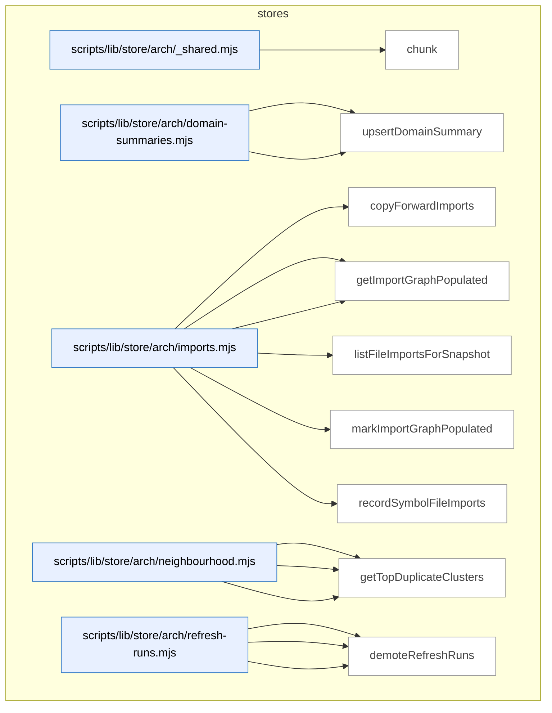

_Domain has 208 symbols (>50). Diagram shows top-15 by file order; see flat table below for the full list._

### Symbols in this domain

| Symbol | Kind | Path | Lines | Purpose | File imported by |
|---|---|---|---|---|---|
| [`chunk`](../scripts/lib/store/arch/_shared.mjs#L21) | function | `scripts/lib/store/arch/_shared.mjs` | 21-25 | Splits an array into fixed-size subarrays. | `scripts/lib/store/arch/imports.mjs`, `scripts/lib/store/arch/symbols.mjs` |
| [`getDomainSummaries`](../scripts/lib/store/arch/domain-summaries.mjs#L32) | function | `scripts/lib/store/arch/domain-summaries.mjs` | 32-55 | Fetches all domain summaries for a repo from cloud. | `scripts/lib/store/arch-memory.mjs` |
| [`upsertDomainSummary`](../scripts/lib/store/arch/domain-summaries.mjs#L14) | function | `scripts/lib/store/arch/domain-summaries.mjs` | 14-30 | Persists domain summary (hash, symbol count, metadata) to cloud. | `scripts/lib/store/arch-memory.mjs` |
| [`copyForwardImports`](../scripts/lib/store/arch/imports.mjs#L39) | function | `scripts/lib/store/arch/imports.mjs` | 39-70 | Copies import edges from prior refresh to new one, skipping touched files. | `scripts/lib/store/arch-memory.mjs` |
| [`getImportersForFiles`](../scripts/lib/store/arch/imports.mjs#L123) | function | `scripts/lib/store/arch/imports.mjs` | 123-144 | Returns files that import each of a given set of target files. | `scripts/lib/store/arch-memory.mjs` |
| [`getImportGraphPopulated`](../scripts/lib/store/arch/imports.mjs#L105) | function | `scripts/lib/store/arch/imports.mjs` | 105-116 | Checks if a refresh run's import graph has been populated. | `scripts/lib/store/arch-memory.mjs` |
| [`listFileImportsForSnapshot`](../scripts/lib/store/arch/imports.mjs#L79) | function | `scripts/lib/store/arch/imports.mjs` | 79-94 | Retrieves all import edges for a refresh run. | `scripts/lib/store/arch-memory.mjs` |
| [`markImportGraphPopulated`](../scripts/lib/store/arch/imports.mjs#L96) | function | `scripts/lib/store/arch/imports.mjs` | 96-103 | Marks a refresh run's import graph as complete. | `scripts/lib/store/arch-memory.mjs` |
| [`recordSymbolFileImports`](../scripts/lib/store/arch/imports.mjs#L17) | function | `scripts/lib/store/arch/imports.mjs` | 17-37 | Persists file-import edges to cloud in batches. | `scripts/lib/store/arch-memory.mjs` |
| [`callNeighbourhoodRpc`](../scripts/lib/store/arch/neighbourhood.mjs#L23) | function | `scripts/lib/store/arch/neighbourhood.mjs` | 23-35 | Invokes the symbol_neighbourhood RPC to find similar symbols. | `scripts/lib/store/arch-memory.mjs` |
| [`computeDriftScore`](../scripts/lib/store/arch/neighbourhood.mjs#L37) | function | `scripts/lib/store/arch/neighbourhood.mjs` | 37-46 | Calls the drift_score RPC to quantify architectural drift. | `scripts/lib/store/arch-memory.mjs` |
| [`getTopDuplicateClusters`](../scripts/lib/store/arch/neighbourhood.mjs#L48) | function | `scripts/lib/store/arch/neighbourhood.mjs` | 48-65 | Retrieves the most prevalent symbol-definition duplicates from cloud. | `scripts/lib/store/arch-memory.mjs` |
| [`abortRefreshRun`](../scripts/lib/store/arch/refresh-runs.mjs#L63) | function | `scripts/lib/store/arch/refresh-runs.mjs` | 63-77 | Marks a refresh run as aborted with optional error reason. | `scripts/lib/store/arch-memory.mjs` |
| [`deleteRefreshRuns`](../scripts/lib/store/arch/refresh-runs.mjs#L204) | function | `scripts/lib/store/arch/refresh-runs.mjs` | 204-219 | Removes refresh runs from cloud storage. | `scripts/lib/store/arch-memory.mjs` |
| [`demoteRefreshRuns`](../scripts/lib/store/arch/refresh-runs.mjs#L229) | function | `scripts/lib/store/arch/refresh-runs.mjs` | 229-244 | Changes retention class of refresh runs. | `scripts/lib/store/arch-memory.mjs` |
| [`findStaleRunningRefresh`](../scripts/lib/store/arch/refresh-runs.mjs#L140) | function | `scripts/lib/store/arch/refresh-runs.mjs` | 140-154 | Retrieves an abandoned running refresh for a repo. | `scripts/lib/store/arch-memory.mjs` |
| [`getRefreshRun`](../scripts/lib/store/arch/refresh-runs.mjs#L111) | function | `scripts/lib/store/arch/refresh-runs.mjs` | 111-134 | Fetches a refresh run's metadata with column allowlisting. | `scripts/lib/store/arch-memory.mjs` |
| [`heartbeatRefreshRun`](../scripts/lib/store/arch/refresh-runs.mjs#L80) | function | `scripts/lib/store/arch/refresh-runs.mjs` | 80-82 | Updates a refresh run's last-heartbeat timestamp. | `scripts/lib/store/arch-memory.mjs` |
| [`listPrunableRefreshRuns`](../scripts/lib/store/arch/refresh-runs.mjs#L177) | function | `scripts/lib/store/arch/refresh-runs.mjs` | 177-199 | Finds completed or aborted refresh runs older than retention period. | `scripts/lib/store/arch-memory.mjs` |
| [`listRollbacksForRepo`](../scripts/lib/store/arch/refresh-runs.mjs#L254) | function | `scripts/lib/store/arch/refresh-runs.mjs` | 254-267 | Retrieves all rollback snapshots for a repo in reverse chronological order. | `scripts/lib/store/arch-memory.mjs` |
| [`openRefreshRun`](../scripts/lib/store/arch/refresh-runs.mjs#L28) | function | `scripts/lib/store/arch/refresh-runs.mjs` | 28-47 | Creates a new architecture refresh run in cloud with cancellation token. | `scripts/lib/store/arch-memory.mjs` |
| [`publishRefreshRun`](../scripts/lib/store/arch/refresh-runs.mjs#L54) | function | `scripts/lib/store/arch/refresh-runs.mjs` | 54-60 | Marks a refresh run as complete and active for the repo. | `scripts/lib/store/arch-memory.mjs` |
| [`getActiveEmbeddingModel`](../scripts/lib/store/arch/snapshots.mjs#L69) | function | `scripts/lib/store/arch/snapshots.mjs` | 69-82 | Retrieves the active embedding model and dimension for a repo. | `scripts/lib/store/arch-memory.mjs` |
| [`getActiveSnapshot`](../scripts/lib/store/arch/snapshots.mjs#L25) | function | `scripts/lib/store/arch/snapshots.mjs` | 25-51 | Fetches the current active refresh run and embedding model for a repo. | `scripts/lib/store/arch-memory.mjs` |
| [`setActiveEmbeddingModel`](../scripts/lib/store/arch/snapshots.mjs#L57) | function | `scripts/lib/store/arch/snapshots.mjs` | 57-67 | Updates the active embedding model and dimension for a repo. | `scripts/lib/store/arch-memory.mjs` |
| [`copyForwardUntouchedFiles`](../scripts/lib/store/arch/symbols.mjs#L233) | function | `scripts/lib/store/arch/symbols.mjs` | 233-292 | Copies symbol-index rows for unchanged files to new refresh, optionally re-tagging domains. | `scripts/lib/store/arch-memory.mjs` |
| [`listLayeringViolationsForSnapshot`](../scripts/lib/store/arch/symbols.mjs#L206) | function | `scripts/lib/store/arch/symbols.mjs` | 206-226 | Retrieves all layering violations recorded in a refresh run. | `scripts/lib/store/arch-memory.mjs` |
| [`listSymbolsForSnapshot`](../scripts/lib/store/arch/symbols.mjs#L154) | function | `scripts/lib/store/arch/symbols.mjs` | 154-204 | Queries symbols from a refresh run with optional filtering by kind/domain/path. | `scripts/lib/store/arch-memory.mjs` |
| [`recordLayeringViolations`](../scripts/lib/store/arch/symbols.mjs#L123) | function | `scripts/lib/store/arch/symbols.mjs` | 123-147 | Logs architectural layering rule violations to cloud. | `scripts/lib/store/arch-memory.mjs` |
| [`recordSymbolDefinitions`](../scripts/lib/store/arch/symbols.mjs#L48) | function | `scripts/lib/store/arch/symbols.mjs` | 48-71 | Upserts symbol definitions to cloud, returns ID map. | `scripts/lib/store/arch-memory.mjs` |
| [`recordSymbolEmbedding`](../scripts/lib/store/arch/symbols.mjs#L101) | function | `scripts/lib/store/arch/symbols.mjs` | 101-121 | Inserts a symbol's vector embedding into cloud using pgvector. | `scripts/lib/store/arch-memory.mjs` |
| [`recordSymbolIndex`](../scripts/lib/store/arch/symbols.mjs#L73) | function | `scripts/lib/store/arch/symbols.mjs` | 73-99 | Persists symbol index rows (location, purpose, domain tag) to cloud. | `scripts/lib/store/arch-memory.mjs` |
| [`vectorLiteral`](../scripts/lib/store/arch/symbols.mjs#L28) | function | `scripts/lib/store/arch/symbols.mjs` | 28-42 | Validates and formats a float array as a PostgreSQL vector literal. | `scripts/lib/store/arch-memory.mjs` |
| [`armEvalSchemaReady`](../scripts/lib/store/arm-eval.mjs#L43) | function | `scripts/lib/store/arm-eval.mjs` | 43-48 | Verifies all required arm-eval tables exist in cloud. | `scripts/cross-skill.mjs`, `scripts/lib/arm-eval/export.mjs`, `scripts/lib/arm-eval/run.mjs` |
| [`getArmEvalLeaderboard`](../scripts/lib/store/arm-eval.mjs#L175) | function | `scripts/lib/store/arm-eval.mjs` | 175-189 | Retrieves arm-eval leaderboard rows filtered by repo and experiment type. | `scripts/cross-skill.mjs`, `scripts/lib/arm-eval/export.mjs`, `scripts/lib/arm-eval/run.mjs` |
| [`getBlindedSessionOutputs`](../scripts/lib/store/arm-eval.mjs#L242) | function | `scripts/lib/store/arm-eval.mjs` | 242-260 | Retrieves arm-eval outputs with presentation order but without revealing which arm produced them. | `scripts/cross-skill.mjs`, `scripts/lib/arm-eval/export.mjs`, `scripts/lib/arm-eval/run.mjs` |
| [`getSessionExportData`](../scripts/lib/store/arm-eval.mjs#L70) | function | `scripts/lib/store/arm-eval.mjs` | 70-96 | Fetches a complete arm-eval session with runs, judgments, and human rankings. | `scripts/cross-skill.mjs`, `scripts/lib/arm-eval/export.mjs`, `scripts/lib/arm-eval/run.mjs` |
| [`getSessionsForDecision`](../scripts/lib/store/arm-eval.mjs#L199) | function | `scripts/lib/store/arm-eval.mjs` | 199-234 | Fetches arm-eval sessions with their runs and judgments, organizing them for decision-making. | `scripts/cross-skill.mjs`, `scripts/lib/arm-eval/export.mjs`, `scripts/lib/arm-eval/run.mjs` |
| [`listSessionIds`](../scripts/lib/store/arm-eval.mjs#L99) | function | `scripts/lib/store/arm-eval.mjs` | 99-108 | Lists all arm-eval session IDs, optionally filtered by repo. | `scripts/cross-skill.mjs`, `scripts/lib/arm-eval/export.mjs`, `scripts/lib/arm-eval/run.mjs` |
| [`recordCrossCheck`](../scripts/lib/store/arm-eval.mjs#L146) | function | `scripts/lib/store/arm-eval.mjs` | 146-156 | Inserts an arm-eval cross-check result into the cloud database. | `scripts/cross-skill.mjs`, `scripts/lib/arm-eval/export.mjs`, `scripts/lib/arm-eval/run.mjs` |
| [`recordHumanRanking`](../scripts/lib/store/arm-eval.mjs#L158) | function | `scripts/lib/store/arm-eval.mjs` | 158-167 | Inserts a human ranking of arm-eval outputs into the cloud database. | `scripts/cross-skill.mjs`, `scripts/lib/arm-eval/export.mjs`, `scripts/lib/arm-eval/run.mjs` |
| [`recordJudgment`](../scripts/lib/store/arm-eval.mjs#L134) | function | `scripts/lib/store/arm-eval.mjs` | 134-144 | Inserts an arm-eval judgment (scores) record into the cloud database. | `scripts/cross-skill.mjs`, `scripts/lib/arm-eval/export.mjs`, `scripts/lib/arm-eval/run.mjs` |
| [`recordOutput`](../scripts/lib/store/arm-eval.mjs#L122) | function | `scripts/lib/store/arm-eval.mjs` | 122-132 | Inserts an arm-eval output record into the cloud database. | `scripts/cross-skill.mjs`, `scripts/lib/arm-eval/export.mjs`, `scripts/lib/arm-eval/run.mjs` |
| [`recordRun`](../scripts/lib/store/arm-eval.mjs#L110) | function | `scripts/lib/store/arm-eval.mjs` | 110-120 | Creates an arm-eval run record linked to a session. | `scripts/cross-skill.mjs`, `scripts/lib/arm-eval/export.mjs`, `scripts/lib/arm-eval/run.mjs` |
| [`recordSession`](../scripts/lib/store/arm-eval.mjs#L52) | function | `scripts/lib/store/arm-eval.mjs` | 52-62 | Creates an arm-evaluation session record in cloud. | `scripts/cross-skill.mjs`, `scripts/lib/arm-eval/export.mjs`, `scripts/lib/arm-eval/run.mjs` |
| [`relExists`](../scripts/lib/store/arm-eval.mjs#L23) | function | `scripts/lib/store/arm-eval.mjs` | 23-29 | Checks if a table or column exists in the database. | `scripts/cross-skill.mjs`, `scripts/lib/arm-eval/export.mjs`, `scripts/lib/arm-eval/run.mjs` |
| [`getFalsePositivePatterns`](../scripts/lib/store/bandit-fp.mjs#L167) | function | `scripts/lib/store/bandit-fp.mjs` | 167-179 | Queries false-positive patterns from the cloud database. | `scripts/learning-store.mjs`, `scripts/lib/dashboard/collect-telemetry.mjs` |
| [`getPassEffectiveness`](../scripts/lib/store/bandit-fp.mjs#L243) | function | `scripts/lib/store/bandit-fp.mjs` | 243-260 | Retrieves audit pass statistics for a repo. | `scripts/learning-store.mjs`, `scripts/lib/dashboard/collect-telemetry.mjs` |
| [`loadBanditArms`](../scripts/lib/store/bandit-fp.mjs#L56) | function | `scripts/lib/store/bandit-fp.mjs` | 56-79 | Downloads bandit arms from the cloud database into memory. | `scripts/learning-store.mjs`, `scripts/lib/dashboard/collect-telemetry.mjs` |
| [`loadFalsePositivePatterns`](../scripts/lib/store/bandit-fp.mjs#L141) | function | `scripts/lib/store/bandit-fp.mjs` | 141-162 | Downloads false-positive patterns for repo and global scopes. | `scripts/learning-store.mjs`, `scripts/lib/dashboard/collect-telemetry.mjs` |
| [`syncBanditArms`](../scripts/lib/store/bandit-fp.mjs#L27) | function | `scripts/lib/store/bandit-fp.mjs` | 27-48 | Uploads bandit Thompson-sampling arms to the cloud database. | `scripts/learning-store.mjs`, `scripts/lib/dashboard/collect-telemetry.mjs` |
| [`syncExperiments`](../scripts/lib/store/bandit-fp.mjs#L186) | function | `scripts/lib/store/bandit-fp.mjs` | 186-212 | Uploads prompt experiment metadata to the cloud database. | `scripts/learning-store.mjs`, `scripts/lib/dashboard/collect-telemetry.mjs` |
| [`syncFalsePositivePatterns`](../scripts/lib/store/bandit-fp.mjs#L113) | function | `scripts/lib/store/bandit-fp.mjs` | 113-134 | Uploads false-positive pattern data to the cloud database. | `scripts/learning-store.mjs`, `scripts/lib/dashboard/collect-telemetry.mjs` |
| [`syncPromptRevision`](../scripts/lib/store/bandit-fp.mjs#L219) | function | `scripts/lib/store/bandit-fp.mjs` | 219-234 | Stores a prompt revision with its text and checksum. | `scripts/learning-store.mjs`, `scripts/lib/dashboard/collect-telemetry.mjs` |
| [`upsertPromptVariant`](../scripts/lib/store/bandit-fp.mjs#L86) | function | `scripts/lib/store/bandit-fp.mjs` | 86-102 | Stores or updates a prompt variant with its usage statistics. | `scripts/learning-store.mjs`, `scripts/lib/dashboard/collect-telemetry.mjs` |
| [`appendDebtEventsCloud`](../scripts/lib/store/debt.mjs#L131) | function | `scripts/lib/store/debt.mjs` | 131-156 | Inserts debt event records (idempotent by event type). | `scripts/learning-store.mjs` |
| [`readDebtEntriesCloud`](../scripts/lib/store/debt.mjs#L67) | function | `scripts/lib/store/debt.mjs` | 67-105 | Fetches debt entries from the cloud database. | `scripts/learning-store.mjs` |
| [`readDebtEventsCloud`](../scripts/lib/store/debt.mjs#L163) | function | `scripts/lib/store/debt.mjs` | 163-184 | Retrieves debt events for a repo ordered by timestamp. | `scripts/learning-store.mjs` |
| [`removeDebtEntryCloud`](../scripts/lib/store/debt.mjs#L111) | function | `scripts/lib/store/debt.mjs` | 111-120 | Deletes a debt entry from the cloud database. | `scripts/learning-store.mjs` |
| [`upsertDebtEntries`](../scripts/lib/store/debt.mjs#L20) | function | `scripts/lib/store/debt.mjs` | 20-59 | Inserts or updates debt/technical-debt entries in the cloud store. | `scripts/learning-store.mjs` |
| [`appendMitigationRef`](../scripts/lib/store/friction.mjs#L155) | function | `scripts/lib/store/friction.mjs` | 155-170 | Adds a mitigation reference to a friction record's jsonb array. | `scripts/learning-store.mjs`, `scripts/lib/friction/commands.mjs`, `scripts/memory-health.mjs` |
| [`buildFrictionUpsertPayload`](../scripts/lib/store/friction.mjs#L65) | function | `scripts/lib/store/friction.mjs` | 65-86 | Constructs and validates a friction record for database insertion with redaction. | `scripts/learning-store.mjs`, `scripts/lib/friction/commands.mjs`, `scripts/memory-health.mjs` |
| [`getFrictionNeighbourhood`](../scripts/lib/store/friction.mjs#L179) | function | `scripts/lib/store/friction.mjs` | 179-184 | Calls an RPC to find similar friction entries via vector search. | `scripts/learning-store.mjs`, `scripts/lib/friction/commands.mjs`, `scripts/memory-health.mjs` |
| [`getFrictionRecurrence`](../scripts/lib/store/friction.mjs#L173) | function | `scripts/lib/store/friction.mjs` | 173-176 | Calls an RPC to compute friction recurrence statistics. | `scripts/learning-store.mjs`, `scripts/lib/friction/commands.mjs`, `scripts/memory-health.mjs` |
| [`listFrictionSourceHashes`](../scripts/lib/store/friction.mjs#L117) | function | `scripts/lib/store/friction.mjs` | 117-127 | Retrieves the current source hash for each active friction entry. | `scripts/learning-store.mjs`, `scripts/lib/friction/commands.mjs`, `scripts/memory-health.mjs` |
| [`reconcileTombstones`](../scripts/lib/store/friction.mjs#L136) | function | `scripts/lib/store/friction.mjs` | 136-152 | Marks friction entries as inactive if their names aren't in the seen set. | `scripts/learning-store.mjs`, `scripts/lib/friction/commands.mjs`, `scripts/memory-health.mjs` |
| [`redact`](../scripts/lib/store/friction.mjs#L46) | function | `scripts/lib/store/friction.mjs` | 46-46 | Applies secret redaction to a string value. | `scripts/learning-store.mjs`, `scripts/lib/friction/commands.mjs`, `scripts/memory-health.mjs` |
| [`redactArr`](../scripts/lib/store/friction.mjs#L47) | function | `scripts/lib/store/friction.mjs` | 47-47 | Applies secret redaction to each element of an array. | `scripts/learning-store.mjs`, `scripts/lib/friction/commands.mjs`, `scripts/memory-health.mjs` |
| [`safeFiles`](../scripts/lib/store/friction.mjs#L49) | function | `scripts/lib/store/friction.mjs` | 49-49 | Filters out sensitive paths from a file list. | `scripts/learning-store.mjs`, `scripts/lib/friction/commands.mjs`, `scripts/memory-health.mjs` |
| [`upsertFrictionRow`](../scripts/lib/store/friction.mjs#L93) | function | `scripts/lib/store/friction.mjs` | 93-105 | Inserts or updates a friction record in the cloud database. | `scripts/learning-store.mjs`, `scripts/lib/friction/commands.mjs`, `scripts/memory-health.mjs` |
| [`backfillLearningOutcome`](../scripts/lib/store/learning-decisions.mjs#L70) | function | `scripts/lib/store/learning-decisions.mjs` | 70-77 | Updates the outcome and timestamp for a recorded decision. | `scripts/learning-store.mjs`, `scripts/lib/dashboard/collect-telemetry.mjs` |
| [`callDeferFinding`](../scripts/lib/store/learning-decisions.mjs#L133) | function | `scripts/lib/store/learning-decisions.mjs` | 133-142 | RPC call to defer a finding with evidence and reasoning. | `scripts/learning-store.mjs`, `scripts/lib/dashboard/collect-telemetry.mjs` |
| [`callMarkFindingNeedsTriage`](../scripts/lib/store/learning-decisions.mjs#L145) | function | `scripts/lib/store/learning-decisions.mjs` | 145-152 | RPC call to mark a finding as needing manual triage. | `scripts/learning-store.mjs`, `scripts/lib/dashboard/collect-telemetry.mjs` |
| [`getAuthorTierStats`](../scripts/lib/store/learning-decisions.mjs#L195) | function | `scripts/lib/store/learning-decisions.mjs` | 195-217 | Queries learning-decision statistics grouped by author tier. | `scripts/learning-store.mjs`, `scripts/lib/dashboard/collect-telemetry.mjs` |
| [`insertFrictionNote`](../scripts/lib/store/learning-decisions.mjs#L264) | function | `scripts/lib/store/learning-decisions.mjs` | 264-282 | Inserts a friction log entry with optional audit context. | `scripts/learning-store.mjs`, `scripts/lib/dashboard/collect-telemetry.mjs` |
| [`insertLearningDecision`](../scripts/lib/store/learning-decisions.mjs#L43) | function | `scripts/lib/store/learning-decisions.mjs` | 43-62 | Records a decision point into the learning-decisions table. | `scripts/learning-store.mjs`, `scripts/lib/dashboard/collect-telemetry.mjs` |
| [`readDecisionsPaginated`](../scripts/lib/store/learning-decisions.mjs#L326) | function | `scripts/lib/store/learning-decisions.mjs` | 326-367 | Streams learning decisions in pages with optional filtering. | `scripts/learning-store.mjs`, `scripts/lib/dashboard/collect-telemetry.mjs` |
| [`readNoBrainerRecommendations`](../scripts/lib/store/learning-decisions.mjs#L174) | function | `scripts/lib/store/learning-decisions.mjs` | 174-185 | Fetches auto-deferral recommendations from the database. | `scripts/learning-store.mjs`, `scripts/lib/dashboard/collect-telemetry.mjs` |
| [`readPendingTriageFindings`](../scripts/lib/store/learning-decisions.mjs#L161) | function | `scripts/lib/store/learning-decisions.mjs` | 161-172 | Fetches findings awaiting triage from the database. | `scripts/learning-store.mjs`, `scripts/lib/dashboard/collect-telemetry.mjs` |
| [`readRecentFriction`](../scripts/lib/store/learning-decisions.mjs#L290) | function | `scripts/lib/store/learning-decisions.mjs` | 290-306 | Fetches friction log entries from the past N milliseconds. | `scripts/learning-store.mjs`, `scripts/lib/dashboard/collect-telemetry.mjs` |
| [`readStaleClusters`](../scripts/lib/store/learning-decisions.mjs#L219) | function | `scripts/lib/store/learning-decisions.mjs` | 219-233 | Fetches recurring finding clusters older than a cutoff date. | `scripts/learning-store.mjs`, `scripts/lib/dashboard/collect-telemetry.mjs` |
| [`readUnresolvedDecisions`](../scripts/lib/store/learning-decisions.mjs#L383) | function | `scripts/lib/store/learning-decisions.mjs` | 383-409 | Fetches decisions without outcomes created before a cutoff. | `scripts/learning-store.mjs`, `scripts/lib/dashboard/collect-telemetry.mjs` |
| [`recordConvergenceState`](../scripts/lib/store/learning-decisions.mjs#L94) | function | `scripts/lib/store/learning-decisions.mjs` | 94-101 | Updates convergence and rigor-pressure metadata on an audit run. | `scripts/learning-store.mjs`, `scripts/lib/dashboard/collect-telemetry.mjs` |
| [`recordDiffComplexity`](../scripts/lib/store/learning-decisions.mjs#L84) | function | `scripts/lib/store/learning-decisions.mjs` | 84-89 | Stores the diff complexity metric on an audit run. | `scripts/learning-store.mjs`, `scripts/lib/dashboard/collect-telemetry.mjs` |
| [`recordFindingResolution`](../scripts/lib/store/learning-decisions.mjs#L115) | function | `scripts/lib/store/learning-decisions.mjs` | 115-124 | Records how a user resolved or dismissed a finding. | `scripts/learning-store.mjs`, `scripts/lib/dashboard/collect-telemetry.mjs` |
| [`refreshRecurringClusters`](../scripts/lib/store/learning-decisions.mjs#L244) | function | `scripts/lib/store/learning-decisions.mjs` | 244-253 | Calls an RPC to update recurring-finding clusters. | `scripts/learning-store.mjs`, `scripts/lib/dashboard/collect-telemetry.mjs` |
| [`safeWrite`](../scripts/lib/store/learning-decisions.mjs#L24) | function | `scripts/lib/store/learning-decisions.mjs` | 24-31 | Wraps a database operation in a try-catch and returns an ok/error result. | `scripts/learning-store.mjs`, `scripts/lib/dashboard/collect-telemetry.mjs` |
| [`activeSpendSql`](../scripts/lib/store/model-ab.mjs#L164) | function | `scripts/lib/store/model-ab.mjs` | 164-169 | Builds a SQL aggregation for summing active (non-expired) and reconciled spend within a TTL window. | `scripts/learning-store.mjs`, `scripts/lib/audit-shadow.mjs`, `scripts/lib/dashboard/collect-telemetry.mjs`, +1 more |
| [`applyModelAbAdjudication`](../scripts/lib/store/model-ab.mjs#L338) | function | `scripts/lib/store/model-ab.mjs` | 338-372 | Applies adjudicator actions (accepted/dismissed/duplicate) to findings, with atomic duplicate-chain handling. | `scripts/learning-store.mjs`, `scripts/lib/audit-shadow.mjs`, `scripts/lib/dashboard/collect-telemetry.mjs`, +1 more |
| [`cumulativeSpendEur`](../scripts/lib/store/model-ab.mjs#L271) | function | `scripts/lib/store/model-ab.mjs` | 271-281 | Queries the total active spending within the TTL window to compare against the budget cap. | `scripts/learning-store.mjs`, `scripts/lib/audit-shadow.mjs`, `scripts/lib/dashboard/collect-telemetry.mjs`, +1 more |
| [`ensureArmSet`](../scripts/lib/store/model-ab.mjs#L126) | function | `scripts/lib/store/model-ab.mjs` | 126-150 | Upserts audit arm configurations including stages and baseline flags to the cloud store. | `scripts/learning-store.mjs`, `scripts/lib/audit-shadow.mjs`, `scripts/lib/dashboard/collect-telemetry.mjs`, +1 more |
| [`getAdjudicatorGroundTruth`](../scripts/lib/store/model-ab.mjs#L494) | function | `scripts/lib/store/model-ab.mjs` | 494-556 | Queries adjudicated findings as ground truth for model evaluation with cursor pagination and optional time windowing. | `scripts/learning-store.mjs`, `scripts/lib/audit-shadow.mjs`, `scripts/lib/dashboard/collect-telemetry.mjs`, +1 more |
| [`getModelAbAdjudicationQueue`](../scripts/lib/store/model-ab.mjs#L380) | function | `scripts/lib/store/model-ab.mjs` | 380-400 | Fetches unadjudicated findings awaiting human review, blinded to their source model. | `scripts/learning-store.mjs`, `scripts/lib/audit-shadow.mjs`, `scripts/lib/dashboard/collect-telemetry.mjs`, +1 more |
| [`getModelAbArmCost`](../scripts/lib/store/model-ab.mjs#L439) | function | `scripts/lib/store/model-ab.mjs` | 439-450 | Retrieves cost metrics per model arm and assignment. | `scripts/learning-store.mjs`, `scripts/lib/audit-shadow.mjs`, `scripts/lib/dashboard/collect-telemetry.mjs`, +1 more |
| [`getModelAbEffectiveness`](../scripts/lib/store/model-ab.mjs#L403) | function | `scripts/lib/store/model-ab.mjs` | 403-414 | Retrieves model-arm effectiveness scores across audit stages. | `scripts/learning-store.mjs`, `scripts/lib/audit-shadow.mjs`, `scripts/lib/dashboard/collect-telemetry.mjs`, +1 more |
| [`getModelAbFindingScores`](../scripts/lib/store/model-ab.mjs#L421) | function | `scripts/lib/store/model-ab.mjs` | 421-432 | Fetches individual finding scores for model comparison. | `scripts/learning-store.mjs`, `scripts/lib/audit-shadow.mjs`, `scripts/lib/dashboard/collect-telemetry.mjs`, +1 more |
| [`modelAbSchemaReady`](../scripts/lib/store/model-ab.mjs#L103) | function | `scripts/lib/store/model-ab.mjs` | 103-110 | Checks if the model-A/B schema tables are present in the database. | `scripts/learning-store.mjs`, `scripts/lib/audit-shadow.mjs`, `scripts/lib/dashboard/collect-telemetry.mjs`, +1 more |
| [`reconcileSpend`](../scripts/lib/store/model-ab.mjs#L218) | function | `scripts/lib/store/model-ab.mjs` | 218-231 | Marks a reserved spend entry as reconciled with its actual cost. | `scripts/learning-store.mjs`, `scripts/lib/audit-shadow.mjs`, `scripts/lib/dashboard/collect-telemetry.mjs`, +1 more |
| [`releaseOrphanedReservations`](../scripts/lib/store/model-ab.mjs#L255) | function | `scripts/lib/store/model-ab.mjs` | 255-268 | Cleans up stale budget reservations past their TTL that were never reconciled. | `scripts/learning-store.mjs`, `scripts/lib/audit-shadow.mjs`, `scripts/lib/dashboard/collect-telemetry.mjs`, +1 more |
| [`releaseSpend`](../scripts/lib/store/model-ab.mjs#L241) | function | `scripts/lib/store/model-ab.mjs` | 241-252 | Cancels a reserved budget entry by marking its status released. | `scripts/learning-store.mjs`, `scripts/lib/audit-shadow.mjs`, `scripts/lib/dashboard/collect-telemetry.mjs`, +1 more |
| [`relOrColExists`](../scripts/lib/store/model-ab.mjs#L38) | function | `scripts/lib/store/model-ab.mjs` | 38-50 | Checks if a Postgres table or column exists. | `scripts/learning-store.mjs`, `scripts/lib/audit-shadow.mjs`, `scripts/lib/dashboard/collect-telemetry.mjs`, +1 more |
| [`reserveSpend`](../scripts/lib/store/model-ab.mjs#L180) | function | `scripts/lib/store/model-ab.mjs` | 180-210 | Reserves budget from a spend cap by locking advisory, checking the ceiling, and inserting a ledger row. | `scripts/learning-store.mjs`, `scripts/lib/audit-shadow.mjs`, `scripts/lib/dashboard/collect-telemetry.mjs`, +1 more |
| [`resolveCanonicalRoot`](../scripts/lib/store/model-ab.mjs#L294) | function | `scripts/lib/store/model-ab.mjs` | 294-306 | Traverses finding equivalence links to resolve a duplicate to its canonical root. | `scripts/learning-store.mjs`, `scripts/lib/audit-shadow.mjs`, `scripts/lib/dashboard/collect-telemetry.mjs`, +1 more |
| [`setFindingOutcome`](../scripts/lib/store/model-ab.mjs#L308) | function | `scripts/lib/store/model-ab.mjs` | 308-322 | Updates a finding's adjudication outcome and records the decision timestamp. | `scripts/learning-store.mjs`, `scripts/lib/audit-shadow.mjs`, `scripts/lib/dashboard/collect-telemetry.mjs`, +1 more |
| [`createEvalRun`](../scripts/lib/store/model-eval.mjs#L139) | function | `scripts/lib/store/model-eval.mjs` | 139-167 | Inserts a new model evaluation run, rejecting duplicates with a custom error. | `scripts/gemini-review.mjs`, `scripts/lib/model-eval/finalize-shadow-eval.mjs`, `scripts/model-eval-adjudicator.mjs`, +1 more |
| [`EvalRunAlreadyActiveError`](../scripts/lib/store/model-eval.mjs#L97) | class | `scripts/lib/store/model-eval.mjs` | 97-102 | Custom error thrown when an eval run already exists for a repo/role combination. | `scripts/gemini-review.mjs`, `scripts/lib/model-eval/finalize-shadow-eval.mjs`, `scripts/model-eval-adjudicator.mjs`, +1 more |
| [`getActiveEvalRunId`](../scripts/lib/store/model-eval.mjs#L262) | function | `scripts/lib/store/model-eval.mjs` | 262-270 | Retrieves the pending shadow eval run for a repo/role pair. | `scripts/gemini-review.mjs`, `scripts/lib/model-eval/finalize-shadow-eval.mjs`, `scripts/model-eval-adjudicator.mjs`, +1 more |
| [`getEvalRuns`](../scripts/lib/store/model-eval.mjs#L233) | function | `scripts/lib/store/model-eval.mjs` | 233-249 | Fetches completed/failed eval runs with optional role filter and cursor pagination. | `scripts/gemini-review.mjs`, `scripts/lib/model-eval/finalize-shadow-eval.mjs`, `scripts/model-eval-adjudicator.mjs`, +1 more |
| [`isJsonbSafeValue`](../scripts/lib/store/model-eval.mjs#L76) | function | `scripts/lib/store/model-eval.mjs` | 76-84 | Recursively checks whether a value is JSON-serializable without functions or circular references. | `scripts/gemini-review.mjs`, `scripts/lib/model-eval/finalize-shadow-eval.mjs`, `scripts/model-eval-adjudicator.mjs`, +1 more |
| [`jsonbSafeRecord`](../scripts/lib/store/model-eval.mjs#L86) | function | `scripts/lib/store/model-eval.mjs` | 86-91 | Returns a Zod schema that enforces object records are JSON-serializable. | `scripts/gemini-review.mjs`, `scripts/lib/model-eval/finalize-shadow-eval.mjs`, `scripts/model-eval-adjudicator.mjs`, +1 more |
| [`refineRolePendingShadow`](../scripts/lib/store/model-eval.mjs#L57) | function | `scripts/lib/store/model-eval.mjs` | 57-61 | Validates that only adjudicator role can hold `pending_shadow` status. | `scripts/gemini-review.mjs`, `scripts/lib/model-eval/finalize-shadow-eval.mjs`, `scripts/model-eval-adjudicator.mjs`, +1 more |
| [`refineVerdictPair`](../scripts/lib/store/model-eval.mjs#L34) | function | `scripts/lib/store/model-eval.mjs` | 34-50 | Validates that verdict and nextAction fields are either both null or both populated with a valid pair. | `scripts/gemini-review.mjs`, `scripts/lib/model-eval/finalize-shadow-eval.mjs`, `scripts/model-eval-adjudicator.mjs`, +1 more |
| [`updateEvalRunTerminal`](../scripts/lib/store/model-eval.mjs#L187) | function | `scripts/lib/store/model-eval.mjs` | 187-221 | Atomically transitions an eval run to terminal status, disambiguating state-machine violations from idempotent completion. | `scripts/gemini-review.mjs`, `scripts/lib/model-eval/finalize-shadow-eval.mjs`, `scripts/model-eval-adjudicator.mjs`, +1 more |
| [`driftKeysContentHash`](../scripts/lib/store/nav-audit.mjs#L27) | function | `scripts/lib/store/nav-audit.mjs` | 27-30 | Computes a 16-character SHA256 hash of sorted drift keys for content deduplication. | `scripts/cross-skill.mjs`, `scripts/lib/dashboard/collect-nav.mjs` |
| [`listNavAuditRunHistory`](../scripts/lib/store/nav-audit.mjs#L126) | function | `scripts/lib/store/nav-audit.mjs` | 126-158 | Fetches recent nav audit runs within a lookback window, detecting truncation by fetching one extra row. | `scripts/cross-skill.mjs`, `scripts/lib/dashboard/collect-nav.mjs` |
| [`recordNavAuditRun`](../scripts/lib/store/nav-audit.mjs#L61) | function | `scripts/lib/store/nav-audit.mjs` | 61-95 | Persists a nav audit run with deduplication on scope/commit/drift-content hash. | `scripts/cross-skill.mjs`, `scripts/lib/dashboard/collect-nav.mjs` |
| [`getActionablePersonaOutcomeItems`](../scripts/lib/store/persona-outcomes.mjs#L253) | function | `scripts/lib/store/persona-outcomes.mjs` | 253-321 | Dedupes unlabeled P0/P1 findings across recent sessions and formats them as worksheet items for batch labeling. | `scripts/cross-skill.mjs` |
| [`getPersonaOutcomesSummary`](../scripts/lib/store/persona-outcomes.mjs#L165) | function | `scripts/lib/store/persona-outcomes.mjs` | 165-223 | Fetches the latest persona session and counts open/closed P0/P1 findings by their outcome labels. | `scripts/cross-skill.mjs` |
| [`isP0OrP1`](../scripts/lib/store/persona-outcomes.mjs#L137) | function | `scripts/lib/store/persona-outcomes.mjs` | 137-139 | Predicate returning true if a finding's severity code is P0 or P1. | `scripts/cross-skill.mjs` |
| [`resolveLabelTarget`](../scripts/lib/store/persona-outcomes.mjs#L40) | function | `scripts/lib/store/persona-outcomes.mjs` | 40-57 | Validates that a persona finding hash belongs to a session's P0/P1 findings and returns its scoped repo. | `scripts/cross-skill.mjs` |
| [`upsertPersonaFindingOutcome`](../scripts/lib/store/persona-outcomes.mjs#L98) | function | `scripts/lib/store/persona-outcomes.mjs` | 98-134 | Records or updates the human outcome label (fixed/dismissed/stale) for a persona finding, retiring correlated missed entries if dismissive. | `scripts/cross-skill.mjs` |
| [`listPersonaTestCandidates`](../scripts/lib/store/persona-test-candidates.mjs#L151) | function | `scripts/lib/store/persona-test-candidates.mjs` | 151-185 | Queries unlabeled regression candidates filtered by severity rank and recurrence age. | `scripts/learning-store.mjs` |
| [`markPersonaTestCandidateProposed`](../scripts/lib/store/persona-test-candidates.mjs#L197) | function | `scripts/lib/store/persona-test-candidates.mjs` | 197-218 | Marks a candidate as proposed to exclude it from future candidate lists. | `scripts/learning-store.mjs` |
| [`upsertPersonaTestCandidate`](../scripts/lib/store/persona-test-candidates.mjs#L48) | function | `scripts/lib/store/persona-test-candidates.mjs` | 48-136 | Records a regression candidate from consistency testing, incrementing recurrence while freezing first-sighting metadata. | `scripts/learning-store.mjs` |
| [`buildSanitizedClickPath`](../scripts/lib/store/persona.mjs#L134) | function | `scripts/lib/store/persona.mjs` | 134-157 | Converts a raw click path array to sanitized steps, truncating at a cap and counting dropped entries. | `scripts/learning-store.mjs`, `scripts/lib/dashboard/collect-telemetry.mjs`, `scripts/lib/persona/audit-correlator.mjs` |
| [`collapsePath`](../scripts/lib/store/persona.mjs#L81) | function | `scripts/lib/store/persona.mjs` | 81-85 | Redacts path segments that are secrets or follow auth keywords. | `scripts/learning-store.mjs`, `scripts/lib/dashboard/collect-telemetry.mjs`, `scripts/lib/persona/audit-correlator.mjs` |
| [`getPersonaSessionsByRepo`](../scripts/lib/store/persona.mjs#L313) | function | `scripts/lib/store/persona.mjs` | 313-340 | Fetches recent persona sessions for a repo, optionally filtering to P0-only verdicts. | `scripts/learning-store.mjs`, `scripts/lib/dashboard/collect-telemetry.mjs`, `scripts/lib/persona/audit-correlator.mjs` |
| [`getPersonaSessionsByUrl`](../scripts/lib/store/persona.mjs#L419) | function | `scripts/lib/store/persona.mjs` | 419-437 | Fetches persona sessions that visited a specific URL. | `scripts/learning-store.mjs`, `scripts/lib/dashboard/collect-telemetry.mjs`, `scripts/lib/persona/audit-correlator.mjs` |
| [`getReachabilityEvidence`](../scripts/lib/store/persona.mjs#L353) | function | `scripts/lib/store/persona.mjs` | 353-381 | Aggregates visited URLs from recent persona sessions grouped by persona name. | `scripts/learning-store.mjs`, `scripts/lib/dashboard/collect-telemetry.mjs`, `scripts/lib/persona/audit-correlator.mjs` |
| [`isPersonaCloudEnabled`](../scripts/lib/store/persona.mjs#L165) | function | `scripts/lib/store/persona.mjs` | 165-167 | Delegates to the cloud-enablement check for persona operations. | `scripts/learning-store.mjs`, `scripts/lib/dashboard/collect-telemetry.mjs`, `scripts/lib/persona/audit-correlator.mjs` |
| [`listPersonasForApp`](../scripts/lib/store/persona.mjs#L174) | function | `scripts/lib/store/persona.mjs` | 174-185 | Fetches all personas configured for a given app URL. | `scripts/learning-store.mjs`, `scripts/lib/dashboard/collect-telemetry.mjs`, `scripts/lib/persona/audit-correlator.mjs` |
| [`looksSecret`](../scripts/lib/store/persona.mjs#L32) | function | `scripts/lib/store/persona.mjs` | 32-44 | Heuristically detects whether a string resembles a credential (email, UUID, JWT, hex token, or long digit run). | `scripts/learning-store.mjs`, `scripts/lib/dashboard/collect-telemetry.mjs`, `scripts/lib/persona/audit-correlator.mjs` |
| [`recordPersonaSession`](../scripts/lib/store/persona.mjs#L230) | function | `scripts/lib/store/persona.mjs` | 230-306 | Persists a persona session with findings and click path, preserving omitted fields on re-post. | `scripts/learning-store.mjs`, `scripts/lib/dashboard/collect-telemetry.mjs`, `scripts/lib/persona/audit-correlator.mjs` |
| [`redactParams`](../scripts/lib/store/persona.mjs#L69) | function | `scripts/lib/store/persona.mjs` | 69-77 | Redacts URL parameters that look secret while preserving routing keys and parameter names. | `scripts/learning-store.mjs`, `scripts/lib/dashboard/collect-telemetry.mjs`, `scripts/lib/persona/audit-correlator.mjs` |
| [`sanitizeStepUrl`](../scripts/lib/store/persona.mjs#L87) | function | `scripts/lib/store/persona.mjs` | 87-125 | Strips credentials and PII from a URL, handling SPA hash-routes and OAuth token fragments. | `scripts/learning-store.mjs`, `scripts/lib/dashboard/collect-telemetry.mjs`, `scripts/lib/persona/audit-correlator.mjs` |
| [`unnestReachabilityRows`](../scripts/lib/store/persona.mjs#L391) | function | `scripts/lib/store/persona.mjs` | 391-413 | Transforms persona session rows into per-persona URL reachability summaries with visit counts. | `scripts/learning-store.mjs`, `scripts/lib/dashboard/collect-telemetry.mjs`, `scripts/lib/persona/audit-correlator.mjs` |
| [`upsertPersona`](../scripts/lib/store/persona.mjs#L194) | function | `scripts/lib/store/persona.mjs` | 194-222 | Inserts or updates a persona, distinguishing between fresh insert and update. | `scripts/learning-store.mjs`, `scripts/lib/dashboard/collect-telemetry.mjs`, `scripts/lib/persona/audit-correlator.mjs` |
| [`getCandidateAuditFindings`](../scripts/lib/store/plans-ship.mjs#L445) | function | `scripts/lib/store/plans-ship.mjs` | 445-472 | Retrieves HIGH audit findings from recent runs for potential correlation with persona findings. | `scripts/learning-store.mjs`, `scripts/lib/dashboard/collect-telemetry.mjs`, `scripts/lib/store/persona-outcomes.mjs` |
| [`getExistingCorrelationHashesForSession`](../scripts/lib/store/plans-ship.mjs#L484) | function | `scripts/lib/store/plans-ship.mjs` | 484-496 | Returns the set of persona finding hashes already correlated in a specific test session. | `scripts/learning-store.mjs`, `scripts/lib/dashboard/collect-telemetry.mjs`, `scripts/lib/store/persona-outcomes.mjs` |
| [`getUnlockedFixes`](../scripts/lib/store/plans-ship.mjs#L301) | function | `scripts/lib/store/plans-ship.mjs` | 301-315 | Fetches recent HIGH audit findings without a corresponding locked /ux-lock spec. | `scripts/learning-store.mjs`, `scripts/lib/dashboard/collect-telemetry.mjs`, `scripts/lib/store/persona-outcomes.mjs` |
| [`insertRunRowWithPolicyFallback`](../scripts/lib/store/plans-ship.mjs#L263) | function | `scripts/lib/store/plans-ship.mjs` | 263-274 | Inserts a row with graceful fallback when the selector_policy_violations column is absent on older schemas. | `scripts/learning-store.mjs`, `scripts/lib/dashboard/collect-telemetry.mjs`, `scripts/lib/store/persona-outcomes.mjs` |
| [`listConsistencyCandidates`](../scripts/lib/store/plans-ship.mjs#L177) | function | `scripts/lib/store/plans-ship.mjs` | 177-208 | Retrieves consistency-mode candidate specs from the database, optionally filtered by creation timestamp. | `scripts/learning-store.mjs`, `scripts/lib/dashboard/collect-telemetry.mjs`, `scripts/lib/store/persona-outcomes.mjs` |
| [`promoteRegressionSpec`](../scripts/lib/store/plans-ship.mjs#L215) | function | `scripts/lib/store/plans-ship.mjs` | 215-251 | Promotes a candidate regression spec to locked status and records promotion metadata. | `scripts/learning-store.mjs`, `scripts/lib/dashboard/collect-telemetry.mjs`, `scripts/lib/store/persona-outcomes.mjs` |
| [`readAuditEffectiveness`](../scripts/lib/store/plans-ship.mjs#L521) | function | `scripts/lib/store/plans-ship.mjs` | 521-529 | Retrieves the audit effectiveness metrics (precision/recall) view row for a repo. | `scripts/learning-store.mjs`, `scripts/lib/dashboard/collect-telemetry.mjs`, `scripts/lib/store/persona-outcomes.mjs` |
| [`readCorrelationCountsByType`](../scripts/lib/store/plans-ship.mjs#L540) | function | `scripts/lib/store/plans-ship.mjs` | 540-559 | Aggregates persona-audit correlation counts by type (confirmed/missed/false_positive) for a repo. | `scripts/learning-store.mjs`, `scripts/lib/dashboard/collect-telemetry.mjs`, `scripts/lib/store/persona-outcomes.mjs` |
| [`readCorrelationsForFinding`](../scripts/lib/store/plans-ship.mjs#L510) | function | `scripts/lib/store/plans-ship.mjs` | 510-518 | Fetches all persona-audit correlations linked to a specific audit finding. | `scripts/learning-store.mjs`, `scripts/lib/dashboard/collect-telemetry.mjs`, `scripts/lib/store/persona-outcomes.mjs` |
| [`readCorrelationsForRun`](../scripts/lib/store/plans-ship.mjs#L499) | function | `scripts/lib/store/plans-ship.mjs` | 499-507 | Fetches all persona-audit correlations linked to a specific audit run. | `scripts/learning-store.mjs`, `scripts/lib/dashboard/collect-telemetry.mjs`, `scripts/lib/store/persona-outcomes.mjs` |
| [`readPersistentPlanFailures`](../scripts/lib/store/plans-ship.mjs#L654) | function | `scripts/lib/store/plans-ship.mjs` | 654-662 | Fetches criteria that have failed in 2+ consecutive verify runs for a plan. | `scripts/learning-store.mjs`, `scripts/lib/dashboard/collect-telemetry.mjs`, `scripts/lib/store/persona-outcomes.mjs` |
| [`readPlanSatisfaction`](../scripts/lib/store/plans-ship.mjs#L643) | function | `scripts/lib/store/plans-ship.mjs` | 643-651 | Retrieves the latest verify run summary for a plan (pass rate and failing P0/P1 criteria). | `scripts/learning-store.mjs`, `scripts/lib/dashboard/collect-telemetry.mjs`, `scripts/lib/store/persona-outcomes.mjs` |
| [`readShipEvents`](../scripts/lib/store/plans-ship.mjs#L701) | function | `scripts/lib/store/plans-ship.mjs` | 701-719 | Retrieves ship event history for a repo grouped by outcome type plus recent events. | `scripts/learning-store.mjs`, `scripts/lib/dashboard/collect-telemetry.mjs`, `scripts/lib/store/persona-outcomes.mjs` |
| [`recordPersonaAuditCorrelation`](../scripts/lib/store/plans-ship.mjs#L328) | function | `scripts/lib/store/plans-ship.mjs` | 328-385 | Links a persona finding to an audit finding and retires stale "audit missed" rows to prevent double-counting. | `scripts/learning-store.mjs`, `scripts/lib/dashboard/collect-telemetry.mjs`, `scripts/lib/store/persona-outcomes.mjs` |
| [`recordPlanVerificationItems`](../scripts/lib/store/plans-ship.mjs#L592) | function | `scripts/lib/store/plans-ship.mjs` | 592-640 | Inserts per-criterion pass/fail results from a plan verification run with schema version fallback. | `scripts/learning-store.mjs`, `scripts/lib/dashboard/collect-telemetry.mjs`, `scripts/lib/store/persona-outcomes.mjs` |
| [`recordPlanVerificationRun`](../scripts/lib/store/plans-ship.mjs#L566) | function | `scripts/lib/store/plans-ship.mjs` | 566-589 | Records metadata for a /ux-lock verify run (plan execution against live implementation). | `scripts/learning-store.mjs`, `scripts/lib/dashboard/collect-telemetry.mjs`, `scripts/lib/store/persona-outcomes.mjs` |
| [`recordRegressionSpec`](../scripts/lib/store/plans-ship.mjs#L85) | function | `scripts/lib/store/plans-ship.mjs` | 85-172 | Records a Playwright regression spec to the cloud store with validation for candidate vs. locked status and required fields. | `scripts/learning-store.mjs`, `scripts/lib/dashboard/collect-telemetry.mjs`, `scripts/lib/store/persona-outcomes.mjs` |
| [`recordRegressionSpecRun`](../scripts/lib/store/plans-ship.mjs#L277) | function | `scripts/lib/store/plans-ship.mjs` | 277-295 | Records a test run result (pass/fail/regression captured) for a locked regression spec. | `scripts/learning-store.mjs`, `scripts/lib/dashboard/collect-telemetry.mjs`, `scripts/lib/store/persona-outcomes.mjs` |
| [`recordShipEvent`](../scripts/lib/store/plans-ship.mjs#L669) | function | `scripts/lib/store/plans-ship.mjs` | 669-690 | Records a /ship outcome (shipped/blocked/warned) with context like block reasons and open findings count. | `scripts/learning-store.mjs`, `scripts/lib/dashboard/collect-telemetry.mjs`, `scripts/lib/store/persona-outcomes.mjs` |
| [`retireMissedCorrelationsForHash`](../scripts/lib/store/plans-ship.mjs#L408) | function | `scripts/lib/store/plans-ship.mjs` | 408-426 | Removes auto-emitted "audit missed" correlations for a specific finding hash in a repo. | `scripts/learning-store.mjs`, `scripts/lib/dashboard/collect-telemetry.mjs`, `scripts/lib/store/persona-outcomes.mjs` |
| [`updatePlanStatus`](../scripts/lib/store/plans-ship.mjs#L53) | function | `scripts/lib/store/plans-ship.mjs` | 53-71 | Transitions a plan's status while surfacing zero-row updates as potential stale ID or RLS failures. | `scripts/learning-store.mjs`, `scripts/lib/dashboard/collect-telemetry.mjs`, `scripts/lib/store/persona-outcomes.mjs` |
| [`upsertPlan`](../scripts/lib/store/plans-ship.mjs#L22) | function | `scripts/lib/store/plans-ship.mjs` | 22-50 | Records or updates a plan artifact with skill, status, principles, and checksum. | `scripts/learning-store.mjs`, `scripts/lib/dashboard/collect-telemetry.mjs`, `scripts/lib/store/persona-outcomes.mjs` |
| [`getPurposeHealth`](../scripts/lib/store/purpose-health.mjs#L25) | function | `scripts/lib/store/purpose-health.mjs` | 25-75 | Computes a repo's health metrics (recent HIGH findings, failing plan criteria, refused secrets) over a time window. | `scripts/lib/dashboard/collect-telemetry.mjs` |
| [`scalarOrNull`](../scripts/lib/store/purpose-health.mjs#L77) | function | `scripts/lib/store/purpose-health.mjs` | 77-85 | Executes a single-scalar SQL query and returns the result or null on error, logging failures. | `scripts/lib/dashboard/collect-telemetry.mjs` |
| [`getRepoIdByName`](../scripts/lib/store/repo.mjs#L298) | function | `scripts/lib/store/repo.mjs` | 298-313 | Looks up the most recently created audit_repos row by name. | `scripts/gemini-review.mjs`, `scripts/learning-store.mjs`, `scripts/lib/dashboard/collect-audit-run.mjs`, +30 more |
| [`getRepoIdByUuid`](../scripts/lib/store/repo.mjs#L214) | function | `scripts/lib/store/repo.mjs` | 214-243 | Looks up an audit_repos row by uuid, optionally throwing on DB errors if strict mode is enabled. | `scripts/gemini-review.mjs`, `scripts/learning-store.mjs`, `scripts/lib/dashboard/collect-audit-run.mjs`, +30 more |
| [`initLearningStore`](../scripts/lib/store/repo.mjs#L41) | function | `scripts/lib/store/repo.mjs` | 41-67 | Probes cloud connectivity via Supabase DSN from environment variables and logs the result. | `scripts/gemini-review.mjs`, `scripts/learning-store.mjs`, `scripts/lib/dashboard/collect-audit-run.mjs`, +30 more |
| [`isCloudEnabled`](../scripts/lib/store/repo.mjs#L76) | function | `scripts/lib/store/repo.mjs` | 76-83 | Checks whether the cloud Postgres pool is available without throwing. | `scripts/gemini-review.mjs`, `scripts/learning-store.mjs`, `scripts/lib/dashboard/collect-audit-run.mjs`, +30 more |
| [`listRepoIds`](../scripts/lib/store/repo.mjs#L323) | function | `scripts/lib/store/repo.mjs` | 323-332 | Returns all audit_repos ids in the cloud store. | `scripts/gemini-review.mjs`, `scripts/learning-store.mjs`, `scripts/lib/dashboard/collect-audit-run.mjs`, +30 more |
| [`resolveRepoForStore`](../scripts/lib/store/repo.mjs#L142) | function | `scripts/lib/store/repo.mjs` | 142-203 | Resolves or creates an audit_repos row by uuid, updating profile if provided and returning repo id and identity. | `scripts/gemini-review.mjs`, `scripts/learning-store.mjs`, `scripts/lib/dashboard/collect-audit-run.mjs`, +30 more |
| [`upsertRepo`](../scripts/lib/store/repo.mjs#L108) | function | `scripts/lib/store/repo.mjs` | 108-116 | Deprecated: delegates to resolveRepoForStore for unified repo identity management. | `scripts/gemini-review.mjs`, `scripts/learning-store.mjs`, `scripts/lib/dashboard/collect-audit-run.mjs`, +30 more |
| [`upsertRepoByUuid`](../scripts/lib/store/repo.mjs#L253) | function | `scripts/lib/store/repo.mjs` | 253-285 | Inserts a new audit_repos row by uuid with race-condition handling or returns existing id. | `scripts/gemini-review.mjs`, `scripts/learning-store.mjs`, `scripts/lib/dashboard/collect-audit-run.mjs`, +30 more |
| [`_resetClassificationColumnCache`](../scripts/lib/store/runs-findings.mjs#L52) | function | `scripts/lib/store/runs-findings.mjs` | 52-54 | Clears the cached classification column detection state. | `scripts/learning-store.mjs`, `scripts/lib/audit-shadow.mjs`, `scripts/lib/dashboard/collect-audit-run.mjs`, +2 more |
| [`_resetPassStatsRoundColumnCache`](../scripts/lib/store/runs-findings.mjs#L103) | function | `scripts/lib/store/runs-findings.mjs` | 103-105 | Clears the cached audit_pass_stats.round column detection state. | `scripts/learning-store.mjs`, `scripts/lib/audit-shadow.mjs`, `scripts/lib/dashboard/collect-audit-run.mjs`, +2 more |
| [`adjudicateFinalReviewFinding`](../scripts/lib/store/runs-findings.mjs#L477) | function | `scripts/lib/store/runs-findings.mjs` | 477-498 | Records a user action (accepted/dismissed) on a shadow-only finding bucket. | `scripts/learning-store.mjs`, `scripts/lib/audit-shadow.mjs`, `scripts/lib/dashboard/collect-audit-run.mjs`, +2 more |
| [`auditRunExists`](../scripts/lib/store/runs-findings.mjs#L508) | function | `scripts/lib/store/runs-findings.mjs` | 508-516 | Checks if an audit_runs row with the given id exists. | `scripts/learning-store.mjs`, `scripts/lib/audit-shadow.mjs`, `scripts/lib/dashboard/collect-audit-run.mjs`, +2 more |
| [`columnExists`](../scripts/lib/store/runs-findings.mjs#L816) | function | `scripts/lib/store/runs-findings.mjs` | 816-840 | Checks if a database column exists, caching results while distinguishing genuine schema absences from transient errors. | `scripts/learning-store.mjs`, `scripts/lib/audit-shadow.mjs`, `scripts/lib/dashboard/collect-audit-run.mjs`, +2 more |
| [`detectClassificationColumns`](../scripts/lib/store/runs-findings.mjs#L81) | function | `scripts/lib/store/runs-findings.mjs` | 81-93 | Determines if sonar_type classification columns are present, caching the result. | `scripts/learning-store.mjs`, `scripts/lib/audit-shadow.mjs`, `scripts/lib/dashboard/collect-audit-run.mjs`, +2 more |
| [`detectPassStatsRoundColumn`](../scripts/lib/store/runs-findings.mjs#L107) | function | `scripts/lib/store/runs-findings.mjs` | 107-119 | Determines if the audit_pass_stats.round column is present (migration 20260605120000), caching the result. | `scripts/learning-store.mjs`, `scripts/lib/audit-shadow.mjs`, `scripts/lib/dashboard/collect-audit-run.mjs`, +2 more |
| [`getAuditRunConvergence`](../scripts/lib/store/runs-findings.mjs#L739) | function | `scripts/lib/store/runs-findings.mjs` | 739-756 | Retrieves convergence metadata for a run (round converged, rigor-pressure round). | `scripts/learning-store.mjs`, `scripts/lib/audit-shadow.mjs`, `scripts/lib/dashboard/collect-audit-run.mjs`, +2 more |
| [`getFinalReviewStats`](../scripts/lib/store/runs-findings.mjs#L566) | function | `scripts/lib/store/runs-findings.mjs` | 566-615 | Retrieves aggregated final-review findings by model, bucket, and severity, plus shadow-only queue items for adjudication. | `scripts/learning-store.mjs`, `scripts/lib/audit-shadow.mjs`, `scripts/lib/dashboard/collect-audit-run.mjs`, +2 more |
| [`getPassTimings`](../scripts/lib/store/runs-findings.mjs#L762) | function | `scripts/lib/store/runs-findings.mjs` | 762-790 | Fetches aggregated token counts and latency metrics per audit pass from the database, computing averages. | `scripts/learning-store.mjs`, `scripts/lib/audit-shadow.mjs`, `scripts/lib/dashboard/collect-audit-run.mjs`, +2 more |
| [`getRecentFindingsByRepo`](../scripts/lib/store/runs-findings.mjs#L915) | function | `scripts/lib/store/runs-findings.mjs` | 915-952 | Queries recent HIGH/MEDIUM findings across a repository ordered by creation date. | `scripts/learning-store.mjs`, `scripts/lib/audit-shadow.mjs`, `scripts/lib/dashboard/collect-audit-run.mjs`, +2 more |
| [`getRunFindingOutcomeCounts`](../scripts/lib/store/runs-findings.mjs#L718) | function | `scripts/lib/store/runs-findings.mjs` | 718-737 | Fetches totals for a run: total findings, accepted/fixed count, and whether any were adjudicated. | `scripts/learning-store.mjs`, `scripts/lib/audit-shadow.mjs`, `scripts/lib/dashboard/collect-audit-run.mjs`, +2 more |
| [`getRunFindings`](../scripts/lib/store/runs-findings.mjs#L861) | function | `scripts/lib/store/runs-findings.mjs` | 861-893 | Retrieves audit findings for a specific run, dynamically including optional columns like adjudication and remediation state. | `scripts/learning-store.mjs`, `scripts/lib/audit-shadow.mjs`, `scripts/lib/dashboard/collect-audit-run.mjs`, +2 more |
| [`getRunMeta`](../scripts/lib/store/runs-findings.mjs#L970) | function | `scripts/lib/store/runs-findings.mjs` | 970-996 | Fetches audit run metadata (plan file, mode, rounds, verdict, findings count) with graceful handling of optional columns. | `scripts/learning-store.mjs`, `scripts/lib/audit-shadow.mjs`, `scripts/lib/dashboard/collect-audit-run.mjs`, +2 more |
| [`isUndefinedColumnError`](../scripts/lib/store/runs-findings.mjs#L38) | function | `scripts/lib/store/runs-findings.mjs` | 38-46 | Checks if a Postgres error indicates a missing column or table (42703 or 42P01). | `scripts/learning-store.mjs`, `scripts/lib/audit-shadow.mjs`, `scripts/lib/dashboard/collect-audit-run.mjs`, +2 more |
| [`markRunFindingsNeedsTriage`](../scripts/lib/store/runs-findings.mjs#L529) | function | `scripts/lib/store/runs-findings.mjs` | 529-550 | Marks specific findings as needing triage when they cannot be auto-deferred. | `scripts/learning-store.mjs`, `scripts/lib/audit-shadow.mjs`, `scripts/lib/dashboard/collect-audit-run.mjs`, +2 more |
| [`normaliseBucket`](../scripts/lib/store/runs-findings.mjs#L313) | function | `scripts/lib/store/runs-findings.mjs` | 313-318 | Coerces a bucket value to a valid enum or null, logging unexpected values. | `scripts/learning-store.mjs`, `scripts/lib/audit-shadow.mjs`, `scripts/lib/dashboard/collect-audit-run.mjs`, +2 more |
| [`probeColumn`](../scripts/lib/store/runs-findings.mjs#L66) | function | `scripts/lib/store/runs-findings.mjs` | 66-79 | Tests whether a specific SQL column exists by attempting a zero-row SELECT with retry logic. | `scripts/learning-store.mjs`, `scripts/lib/audit-shadow.mjs`, `scripts/lib/dashboard/collect-audit-run.mjs`, +2 more |
| [`recordAdjudicationEvent`](../scripts/lib/store/runs-findings.mjs#L1055) | function | `scripts/lib/store/runs-findings.mjs` | 1055-1096 | Records an adjudication decision on a finding and updates its decided_at timestamp. | `scripts/learning-store.mjs`, `scripts/lib/audit-shadow.mjs`, `scripts/lib/dashboard/collect-audit-run.mjs`, +2 more |
| [`recordFinalReviewFindings`](../scripts/lib/store/runs-findings.mjs#L432) | function | `scripts/lib/store/runs-findings.mjs` | 432-462 | Atomically replaces final-review findings and updates run metadata for primary + shadow verdicts. | `scripts/learning-store.mjs`, `scripts/lib/audit-shadow.mjs`, `scripts/lib/dashboard/collect-audit-run.mjs`, +2 more |
| [`recordFindings`](../scripts/lib/store/runs-findings.mjs#L334) | function | `scripts/lib/store/runs-findings.mjs` | 334-406 | Inserts audit findings rows with optional columns for classification, source model, and A/B/C arms, guarded by schema probes. | `scripts/learning-store.mjs`, `scripts/lib/audit-shadow.mjs`, `scripts/lib/dashboard/collect-audit-run.mjs`, +2 more |
| [`recordPassStats`](../scripts/lib/store/runs-findings.mjs#L627) | function | `scripts/lib/store/runs-findings.mjs` | 627-661 | Inserts audit_pass_stats telemetry (tokens, latency, pass counts) with optional arm-execution columns. | `scripts/learning-store.mjs`, `scripts/lib/audit-shadow.mjs`, `scripts/lib/dashboard/collect-audit-run.mjs`, +2 more |
| [`recordRunComplete`](../scripts/lib/store/runs-findings.mjs#L200) | function | `scripts/lib/store/runs-findings.mjs` | 200-234 | Updates an audit_runs row with final stats (rounds, verdict, cost, findings counts). | `scripts/learning-store.mjs`, `scripts/lib/audit-shadow.mjs`, `scripts/lib/dashboard/collect-audit-run.mjs`, +2 more |
| [`recordRunStart`](../scripts/lib/store/runs-findings.mjs#L127) | function | `scripts/lib/store/runs-findings.mjs` | 127-194 | Creates or reuses an audit_runs row for multi-round audits, enforcing repo-scoped id uniqueness. | `scripts/learning-store.mjs`, `scripts/lib/audit-shadow.mjs`, `scripts/lib/dashboard/collect-audit-run.mjs`, +2 more |
| [`recordSuppressionEvents`](../scripts/lib/store/runs-findings.mjs#L1003) | function | `scripts/lib/store/runs-findings.mjs` | 1003-1042 | Logs suppression and reopening events to the database for findings that matched or fell out of prior rulings. | `scripts/learning-store.mjs`, `scripts/lib/audit-shadow.mjs`, `scripts/lib/dashboard/collect-audit-run.mjs`, +2 more |
| [`updatePassStatsPostDeliberation`](../scripts/lib/store/runs-findings.mjs#L667) | function | `scripts/lib/store/runs-findings.mjs` | 667-698 | Denormalizes final adjudication counts into the pass_stats row, scoped to the final convergence round. | `scripts/learning-store.mjs`, `scripts/lib/audit-shadow.mjs`, `scripts/lib/dashboard/collect-audit-run.mjs`, +2 more |
| [`updateRunMeta`](../scripts/lib/store/runs-findings.mjs#L240) | function | `scripts/lib/store/runs-findings.mjs` | 240-305 | Partially updates run metadata (r2 reason, verdict, final-review model/cost) with column-existence guards. | `scripts/learning-store.mjs`, `scripts/lib/audit-shadow.mjs`, `scripts/lib/dashboard/collect-audit-run.mjs`, +2 more |
| [`callIncidentNeighbourhoodRpc`](../scripts/lib/store/security.mjs#L130) | function | `scripts/lib/store/security.mjs` | 130-152 | Calls the Postgres incident_neighbourhood RPC to find similar security incidents ranked by cosine similarity and metadata bonuses. | `scripts/learning-store.mjs`, `scripts/lib/dashboard/collect-telemetry.mjs` |
| [`chunk`](../scripts/lib/store/security.mjs#L20) | function | `scripts/lib/store/security.mjs` | 20-24 | Splits an array into fixed-size chunks for batching operations. | `scripts/learning-store.mjs`, `scripts/lib/dashboard/collect-telemetry.mjs` |
| [`formatVectorOrNull`](../scripts/lib/store/security.mjs#L279) | function | `scripts/lib/store/security.mjs` | 279-285 | Formats a numeric embedding array as Postgres vector literal syntax or returns null. | `scripts/learning-store.mjs`, `scripts/lib/dashboard/collect-telemetry.mjs` |
| [`getMaxIncidentRefreshAt`](../scripts/lib/store/security.mjs#L108) | function | `scripts/lib/store/security.mjs` | 108-123 | Finds the most recent updated_at timestamp across all security incidents for a repo. | `scripts/learning-store.mjs`, `scripts/lib/dashboard/collect-telemetry.mjs` |
| [`getSecurityEvents`](../scripts/lib/store/security.mjs#L198) | function | `scripts/lib/store/security.mjs` | 198-208 | Fetches recent security-strategy audit events for a repo in reverse-chronological order. | `scripts/learning-store.mjs`, `scripts/lib/dashboard/collect-telemetry.mjs` |
| [`getSecurityIncidentsByRepo`](../scripts/lib/store/security.mjs#L74) | function | `scripts/lib/store/security.mjs` | 74-83 | Retrieves security incident metadata for a repository. | `scripts/learning-store.mjs`, `scripts/lib/dashboard/collect-telemetry.mjs` |
| [`getSecurityStats`](../scripts/lib/store/security.mjs#L221) | function | `scripts/lib/store/security.mjs` | 221-270 | Aggregates cloud statistics: total incidents by status, embedding coverage, event kind counts, and recent events. | `scripts/learning-store.mjs`, `scripts/lib/dashboard/collect-telemetry.mjs` |
| [`markIncidentsHistorical`](../scripts/lib/store/security.mjs#L90) | function | `scripts/lib/store/security.mjs` | 90-100 | Updates incident status to 'historical' for a batch of incident IDs. | `scripts/learning-store.mjs`, `scripts/lib/dashboard/collect-telemetry.mjs` |
| [`recordSecurityEvents`](../scripts/lib/store/security.mjs#L169) | function | `scripts/lib/store/security.mjs` | 169-192 | Appends audit-trail events (index/refresh/redaction actions) to the append-only security_strategy_events table. | `scripts/learning-store.mjs`, `scripts/lib/dashboard/collect-telemetry.mjs` |
| [`recordSecurityIncidents`](../scripts/lib/store/security.mjs#L41) | function | `scripts/lib/store/security.mjs` | 41-68 | Bulk-upserts security incidents to the cloud store in batched writes with vector normalization. | `scripts/learning-store.mjs`, `scripts/lib/dashboard/collect-telemetry.mjs` |
| [`appendTieredShadowObservation`](../scripts/lib/store/tiered-shadow.mjs#L44) | function | `scripts/lib/store/tiered-shadow.mjs` | 44-66 | Inserts a shadow observation row into the cloud database with validation. | `scripts/lib/audit/tiered-shadow-compare.mjs`, `scripts/lib/dashboard/collect-telemetry.mjs`, `scripts/tiered-shadow-report.mjs` |
| [`getTieredShadowObservations`](../scripts/lib/store/tiered-shadow.mjs#L94) | function | `scripts/lib/store/tiered-shadow.mjs` | 94-110 | Queries cloud database for shadow observations from specified repos within a time window. | `scripts/lib/audit/tiered-shadow-compare.mjs`, `scripts/lib/dashboard/collect-telemetry.mjs`, `scripts/tiered-shadow-report.mjs` |

---

## tech-debt

> Captures technical debt entries from a ledger file, validates them with configurable flags, and syncs the findings to cloud storage via a learning store.

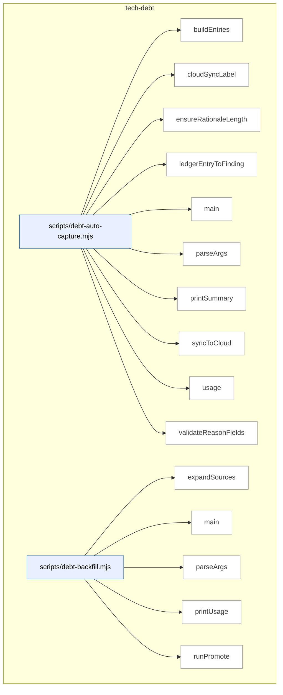

_Domain has 71 symbols (>50). Diagram shows top-15 by file order; see flat table below for the full list._

### Symbols in this domain

| Symbol | Kind | Path | Lines | Purpose | File imported by |
|---|---|---|---|---|---|
| [`buildEntries`](../scripts/debt-auto-capture.mjs#L161) | function | `scripts/debt-auto-capture.mjs` | 161-188 | Constructs validated debt-ledger entries from deferred adjudication rulings. | _(internal)_ |
| [`cloudSyncLabel`](../scripts/debt-auto-capture.mjs#L214) | function | `scripts/debt-auto-capture.mjs` | 214-217 | Formats cloud-sync status (ok/failed/skipped) for CLI output. | _(internal)_ |
| [`ensureRationaleLength`](../scripts/debt-auto-capture.mjs#L120) | function | `scripts/debt-auto-capture.mjs` | 120-128 | Ensures deferred-finding rationales meet minimum length, padding with periods if needed. | _(internal)_ |
| [`ledgerEntryToFinding`](../scripts/debt-auto-capture.mjs#L136) | function | `scripts/debt-auto-capture.mjs` | 136-155 | Converts an adjudication-ledger entry into an architectural-finding format. | _(internal)_ |
| [`main`](../scripts/debt-auto-capture.mjs#L248) | function | `scripts/debt-auto-capture.mjs` | 248-326 | Main CLI orchestrator for capturing deferred findings as technical debt. | _(internal)_ |
| [`parseArgs`](../scripts/debt-auto-capture.mjs#L34) | function | `scripts/debt-auto-capture.mjs` | 34-64 | Extracts and normalizes CLI flags for the debt-capture automation utility. | _(internal)_ |
| [`printSummary`](../scripts/debt-auto-capture.mjs#L219) | function | `scripts/debt-auto-capture.mjs` | 219-244 | Displays a formatted summary of debt entries captured and inserted. | _(internal)_ |
| [`syncToCloud`](../scripts/debt-auto-capture.mjs#L197) | function | `scripts/debt-auto-capture.mjs` | 197-210 | Persists captured debt entries to the cloud learning store. | _(internal)_ |
| [`usage`](../scripts/debt-auto-capture.mjs#L66) | function | `scripts/debt-auto-capture.mjs` | 66-87 | Displays usage instructions and available options for debt-capture. | _(internal)_ |
| [`validateReasonFields`](../scripts/debt-auto-capture.mjs#L96) | function | `scripts/debt-auto-capture.mjs` | 96-111 | Validates that all required fields are present for the selected deferral reason. | _(internal)_ |
| [`expandSources`](../scripts/debt-backfill.mjs#L85) | function | `scripts/debt-backfill.mjs` | 85-107 | Resolves glob patterns and file paths into concrete source files. | _(internal)_ |
| [`main`](../scripts/debt-backfill.mjs#L265) | function | `scripts/debt-backfill.mjs` | 265-279 | CLI entry point that orchestrates debt-entry staging and promotion workflows. | _(internal)_ |
| [`parseArgs`](../scripts/debt-backfill.mjs#L41) | function | `scripts/debt-backfill.mjs` | 41-56 | Extracts CLI flags for staging/promoting debt entries from audit summaries. | _(internal)_ |
| [`printUsage`](../scripts/debt-backfill.mjs#L58) | function | `scripts/debt-backfill.mjs` | 58-81 | Displays usage instructions for staging and promoting technical-debt entries. | _(internal)_ |
| [`runPromote`](../scripts/debt-backfill.mjs#L160) | function | `scripts/debt-backfill.mjs` | 160-261 | Validates and promotes approved staging records to the live technical-debt ledger. | _(internal)_ |
| [`runStage`](../scripts/debt-backfill.mjs#L111) | function | `scripts/debt-backfill.mjs` | 111-156 | Parses audit-summary files and creates a staged JSON for operator review and approval. | _(internal)_ |
| [`loadBudgets`](../scripts/debt-budget-check.mjs#L66) | function | `scripts/debt-budget-check.mjs` | 66-83 | Loads budget configuration from a file or from the ledger's `budgets` field. | _(internal)_ |
| [`main`](../scripts/debt-budget-check.mjs#L85) | function | `scripts/debt-budget-check.mjs` | 85-136 | Parses arguments, loads ledger and budgets, detects violations, and outputs results as JSON or human-readable text. | _(internal)_ |
| [`parseArgs`](../scripts/debt-budget-check.mjs#L33) | function | `scripts/debt-budget-check.mjs` | 33-45 | Extracts CLI flags for debt-ledger budget validation. | _(internal)_ |
| [`printUsage`](../scripts/debt-budget-check.mjs#L47) | function | `scripts/debt-budget-check.mjs` | 47-64 | Displays usage instructions for debt-ledger budget compliance checking. | _(internal)_ |
| [`findTouchedDebt`](../scripts/debt-pr-comment.mjs#L105) | function | `scripts/debt-pr-comment.mjs` | 105-117 | Filters debt entries to only those whose affected files overlap the PR's changed files. | _(internal)_ |
| [`groupTouchedByFile`](../scripts/debt-pr-comment.mjs#L120) | function | `scripts/debt-pr-comment.mjs` | 120-128 | Groups debt entries by their primary affected file for display. | _(internal)_ |
| [`loadChangedFiles`](../scripts/debt-pr-comment.mjs#L222) | function | `scripts/debt-pr-comment.mjs` | 222-236 | Loads changed files from comma-separated --changed flag or newline-delimited --changed-file. | _(internal)_ |
| [`main`](../scripts/debt-pr-comment.mjs#L240) | function | `scripts/debt-pr-comment.mjs` | 240-323 | Orchestrates loading changed files, finding touched/recurring debt, and writing a sticky PR comment. | _(internal)_ |
| [`parseArgs`](../scripts/debt-pr-comment.mjs#L53) | function | `scripts/debt-pr-comment.mjs` | 53-72 | Parses command-line arguments (--changed, --ledger, --recurring-threshold, etc.) for debt-pr-comment. | _(internal)_ |
| [`printUsage`](../scripts/debt-pr-comment.mjs#L74) | function | `scripts/debt-pr-comment.mjs` | 74-95 | Prints usage documentation for debt-pr-comment. | _(internal)_ |
| [`renderEntryLine`](../scripts/debt-pr-comment.mjs#L132) | function | `scripts/debt-pr-comment.mjs` | 132-150 | Renders a single debt entry as a markdown line with severity badge, occurrences, deferral date, and git history link. | _(internal)_ |
| [`renderPrComment`](../scripts/debt-pr-comment.mjs#L152) | function | `scripts/debt-pr-comment.mjs` | 152-218 | Generates the complete PR comment markdown with sections for touched debt, recurring debt, and metadata. | _(internal)_ |
| [`main`](../scripts/debt-resolve.mjs#L73) | function | `scripts/debt-resolve.mjs` | 73-152 | Loads ledger, finds debt entry by topicId, emits 'resolved' event, removes entry, and syncs to cloud. | _(internal)_ |
| [`parseArgs`](../scripts/debt-resolve.mjs#L34) | function | `scripts/debt-resolve.mjs` | 34-52 | Parses command-line arguments (topic ID, --rationale, --ledger, etc.) for debt-resolve. | _(internal)_ |
| [`printUsage`](../scripts/debt-resolve.mjs#L54) | function | `scripts/debt-resolve.mjs` | 54-71 | Prints usage documentation for debt-resolve. | _(internal)_ |
| [`main`](../scripts/debt-review.mjs#L332) | function | `scripts/debt-review.mjs` | 332-397 | Loads debt ledger, runs clustering (local or LLM), checks budgets, and outputs review as markdown/file. | _(internal)_ |
| [`parseArgs`](../scripts/debt-review.mjs#L44) | function | `scripts/debt-review.mjs` | 44-60 | Parses command-line arguments (--local-only, --ttl-days, --write-plan-doc, etc.) for debt-review. | _(internal)_ |
| [`printUsage`](../scripts/debt-review.mjs#L62) | function | `scripts/debt-review.mjs` | 62-80 | Prints usage documentation for debt-review. | _(internal)_ |
| [`renderMarkdown`](../scripts/debt-review.mjs#L84) | function | `scripts/debt-review.mjs` | 84-151 | Renders debt review output as markdown with budget violations, clusters, and ranked refactor candidates. | _(internal)_ |
| [`runLLMClustering`](../scripts/debt-review.mjs#L218) | function | `scripts/debt-review.mjs` | 218-284 | Sends debt entries to GPT for clustering and refactor-candidate generation (with sensitive-entry filtering). | _(internal)_ |
| [`runLocalClustering`](../scripts/debt-review.mjs#L155) | function | `scripts/debt-review.mjs` | 155-183 | Groups debt entries deterministically by file/category and ranks refactors by leverage (local, no LLM). | _(internal)_ |
| [`writeTopRefactorPlanDoc`](../scripts/debt-review.mjs#L288) | function | `scripts/debt-review.mjs` | 288-328 | Writes the top-ranked refactor candidate as a markdown plan file with effort/risks/rollback strategy. | _(internal)_ |
| [`buildDebtEntry`](../scripts/lib/debt-capture.mjs#L84) | function | `scripts/lib/debt-capture.mjs` | 84-158 | Constructs a persisted debt-capture entry with sensitivity redaction, timestamps, and orchestrator metadata. | `scripts/debt-auto-capture.mjs`, `scripts/shared.mjs` |
| [`computeSensitivity`](../scripts/lib/debt-capture.mjs#L32) | function | `scripts/lib/debt-capture.mjs` | 32-54 | Scans a finding's content and files for sensitive data (credentials, secrets, PII) and returns matches. | `scripts/debt-auto-capture.mjs`, `scripts/shared.mjs` |
| [`suggestDeferralCandidate`](../scripts/lib/debt-capture.mjs#L171) | function | `scripts/lib/debt-capture.mjs` | 171-183 | Determines whether a finding can be deferred based on in-scope status and severity level. | `scripts/debt-auto-capture.mjs`, `scripts/shared.mjs` |
| [`appendDebtEventsLocal`](../scripts/lib/debt-events.mjs#L34) | function | `scripts/lib/debt-events.mjs` | 34-56 | Appends validated debt event records to a local JSONL log file with atomic guarantees. | `scripts/debt-pr-comment.mjs`, `scripts/debt-resolve.mjs`, `scripts/debt-review.mjs`, +3 more |
| [`deriveMetricsFromEvents`](../scripts/lib/debt-events.mjs#L107) | function | `scripts/lib/debt-events.mjs` | 107-154 | Aggregates debt events into per-topic metrics tracking recurrence, escalation, and resolution status. | `scripts/debt-pr-comment.mjs`, `scripts/debt-resolve.mjs`, `scripts/debt-review.mjs`, +3 more |
| [`readDebtEventsLocal`](../scripts/lib/debt-events.mjs#L65) | function | `scripts/lib/debt-events.mjs` | 65-87 | Reads and parses debt event records from a local JSONL file, skipping malformed lines. | `scripts/debt-pr-comment.mjs`, `scripts/debt-resolve.mjs`, `scripts/debt-review.mjs`, +3 more |
| [`buildCommitUrl`](../scripts/lib/debt-git-history.mjs#L142) | function | `scripts/lib/debt-git-history.mjs` | 142-144 | Constructs a GitHub commit URL from a repository URL and commit SHA. | `scripts/debt-pr-comment.mjs`, `scripts/shared.mjs` |
| [`countCommitsTouchingTopic`](../scripts/lib/debt-git-history.mjs#L42) | function | `scripts/lib/debt-git-history.mjs` | 42-63 | Counts git commits that touched a debt topic ID using `git log -S`. | `scripts/debt-pr-comment.mjs`, `scripts/shared.mjs` |
| [`deriveOccurrencesFromGit`](../scripts/lib/debt-git-history.mjs#L154) | function | `scripts/lib/debt-git-history.mjs` | 154-161 | Maps debt topic IDs to their commit occurrence counts via git history. | `scripts/debt-pr-comment.mjs`, `scripts/shared.mjs` |
| [`detectGitHubRepoUrl`](../scripts/lib/debt-git-history.mjs#L119) | function | `scripts/lib/debt-git-history.mjs` | 119-134 | Extracts and normalizes the GitHub repository URL from git remote origin. | `scripts/debt-pr-comment.mjs`, `scripts/shared.mjs` |
| [`findFirstDeferCommit`](../scripts/lib/debt-git-history.mjs#L76) | function | `scripts/lib/debt-git-history.mjs` | 76-108 | Finds the original commit where a debt entry was first deferred, with optional GitHub URL construction. | `scripts/debt-pr-comment.mjs`, `scripts/shared.mjs` |
| [`findDebtByAlias`](../scripts/lib/debt-ledger.mjs#L273) | function | `scripts/lib/debt-ledger.mjs` | 273-280 | Searches for a debt entry by exact topic ID or content alias match. | `scripts/audit-loop.mjs`, `scripts/debt-auto-capture.mjs`, `scripts/debt-backfill.mjs`, +6 more |
| [`mergeLedgers`](../scripts/lib/debt-ledger.mjs#L252) | function | `scripts/lib/debt-ledger.mjs` | 252-262 | Merges two debt ledgers (debt + session), with session entries winning collisions. | `scripts/audit-loop.mjs`, `scripts/debt-auto-capture.mjs`, `scripts/debt-backfill.mjs`, +6 more |
| [`readDebtLedger`](../scripts/lib/debt-ledger.mjs#L42) | function | `scripts/lib/debt-ledger.mjs` | 42-89 | Reads a debt ledger JSON file and hydrates entries with event-derived metrics. | `scripts/audit-loop.mjs`, `scripts/debt-auto-capture.mjs`, `scripts/debt-backfill.mjs`, +6 more |
| [`removeDebtEntry`](../scripts/lib/debt-ledger.mjs#L207) | function | `scripts/lib/debt-ledger.mjs` | 207-236 | Deletes a debt entry from the ledger JSON by topic ID under file lock. | `scripts/audit-loop.mjs`, `scripts/debt-auto-capture.mjs`, `scripts/debt-backfill.mjs`, +6 more |
| [`writeDebtEntries`](../scripts/lib/debt-ledger.mjs#L107) | function | `scripts/lib/debt-ledger.mjs` | 107-197 | Writes or updates debt entries to a locked ledger JSON file, tracking insertions and rejections. | `scripts/audit-loop.mjs`, `scripts/debt-auto-capture.mjs`, `scripts/debt-backfill.mjs`, +6 more |
| [`appendEvents`](../scripts/lib/debt-memory.mjs#L116) | function | `scripts/lib/debt-memory.mjs` | 116-129 | Appends debt events to cloud or local storage depending on the active source. | `scripts/debt-resolve.mjs`, `scripts/lib/audit/legacy-production-audit.mjs`, `scripts/openai-audit.mjs`, +1 more |
| [`loadDebtLedger`](../scripts/lib/debt-memory.mjs#L86) | function | `scripts/lib/debt-memory.mjs` | 86-103 | Loads the debt ledger with metrics from either cloud or local event storage. | `scripts/debt-resolve.mjs`, `scripts/lib/audit/legacy-production-audit.mjs`, `scripts/openai-audit.mjs`, +1 more |
| [`persistDebtEntries`](../scripts/lib/debt-memory.mjs#L143) | function | `scripts/lib/debt-memory.mjs` | 143-157 | Persists debt entries to local JSON (primary source) and cloud (mirror) simultaneously. | `scripts/debt-resolve.mjs`, `scripts/lib/audit/legacy-production-audit.mjs`, `scripts/openai-audit.mjs`, +1 more |
| [`reconcileLocalToCloud`](../scripts/lib/debt-memory.mjs#L192) | function | `scripts/lib/debt-memory.mjs` | 192-229 | Syncs unsynced local debt events to cloud, tracking progress with a reconcile marker. | `scripts/debt-resolve.mjs`, `scripts/lib/audit/legacy-production-audit.mjs`, `scripts/openai-audit.mjs`, +1 more |
| [`removeDebt`](../scripts/lib/debt-memory.mjs#L162) | function | `scripts/lib/debt-memory.mjs` | 162-171 | Removes a debt entry from both local and cloud storage. | `scripts/debt-resolve.mjs`, `scripts/lib/audit/legacy-production-audit.mjs`, `scripts/openai-audit.mjs`, +1 more |
| [`selectEventSource`](../scripts/lib/debt-memory.mjs#L59) | function | `scripts/lib/debt-memory.mjs` | 59-73 | Selects whether debt events should route to cloud, local, or disabled storage. | `scripts/debt-resolve.mjs`, `scripts/lib/audit/legacy-production-audit.mjs`, `scripts/openai-audit.mjs`, +1 more |
| [`buildLocalClusters`](../scripts/lib/debt-review-helpers.mjs#L164) | function | `scripts/lib/debt-review-helpers.mjs` | 164-204 | Groups debt entries into thematic clusters by file, principle, and recurrence for prioritization. | `scripts/audit-loop.mjs`, `scripts/debt-budget-check.mjs`, `scripts/debt-pr-comment.mjs`, +2 more |
| [`computeLeverage`](../scripts/lib/debt-review-helpers.mjs#L45) | function | `scripts/lib/debt-review-helpers.mjs` | 45-57 | Calculates impact-per-effort leverage score for a refactoring by weighting resolved debt. | `scripts/audit-loop.mjs`, `scripts/debt-budget-check.mjs`, `scripts/debt-pr-comment.mjs`, +2 more |
| [`countDebtByFile`](../scripts/lib/debt-review-helpers.mjs#L213) | function | `scripts/lib/debt-review-helpers.mjs` | 213-221 | Counts how many debt entries are associated with each file. | `scripts/audit-loop.mjs`, `scripts/debt-budget-check.mjs`, `scripts/debt-pr-comment.mjs`, +2 more |
| [`findBudgetViolations`](../scripts/lib/debt-review-helpers.mjs#L238) | function | `scripts/lib/debt-review-helpers.mjs` | 238-264 | Identifies file patterns that have exceeded their configured debt entry budget thresholds. | `scripts/audit-loop.mjs`, `scripts/debt-budget-check.mjs`, `scripts/debt-pr-comment.mjs`, +2 more |
| [`findRecurringEntries`](../scripts/lib/debt-review-helpers.mjs#L148) | function | `scripts/lib/debt-review-helpers.mjs` | 148-152 | Filters debt entries to those appearing in ≥N distinct audit runs, sorted by recurrence. | `scripts/audit-loop.mjs`, `scripts/debt-budget-check.mjs`, `scripts/debt-pr-comment.mjs`, +2 more |
| [`findStaleEntries`](../scripts/lib/debt-review-helpers.mjs#L83) | function | `scripts/lib/debt-review-helpers.mjs` | 83-92 | Returns topic IDs of debt entries older than a specified TTL. | `scripts/audit-loop.mjs`, `scripts/debt-budget-check.mjs`, `scripts/debt-pr-comment.mjs`, +2 more |
| [`getDefaultMatcher`](../scripts/lib/debt-review-helpers.mjs#L269) | function | `scripts/lib/debt-review-helpers.mjs` | 269-280 | Lazily loads the micromatch glob library or falls back to exact-match comparison. | `scripts/audit-loop.mjs`, `scripts/debt-budget-check.mjs`, `scripts/debt-pr-comment.mjs`, +2 more |
| [`groupByFile`](../scripts/lib/debt-review-helpers.mjs#L116) | function | `scripts/lib/debt-review-helpers.mjs` | 116-124 | Partitions debt entries into buckets by their primary affected file. | `scripts/audit-loop.mjs`, `scripts/debt-budget-check.mjs`, `scripts/debt-pr-comment.mjs`, +2 more |
| [`groupByPrinciple`](../scripts/lib/debt-review-helpers.mjs#L131) | function | `scripts/lib/debt-review-helpers.mjs` | 131-139 | Partitions debt entries into buckets by their primary affected principle. | `scripts/audit-loop.mjs`, `scripts/debt-budget-check.mjs`, `scripts/debt-pr-comment.mjs`, +2 more |
| [`oldestEntryDays`](../scripts/lib/debt-review-helpers.mjs#L97) | function | `scripts/lib/debt-review-helpers.mjs` | 97-106 | Calculates how many days have elapsed since the oldest deferred debt entry. | `scripts/audit-loop.mjs`, `scripts/debt-budget-check.mjs`, `scripts/debt-pr-comment.mjs`, +2 more |
| [`rankRefactorsByLeverage`](../scripts/lib/debt-review-helpers.mjs#L65) | function | `scripts/lib/debt-review-helpers.mjs` | 65-70 | Sorts refactoring candidates by leverage score in descending order. | `scripts/audit-loop.mjs`, `scripts/debt-budget-check.mjs`, `scripts/debt-pr-comment.mjs`, +2 more |

---

## tests

> Node.js test suite with TDD-first discipline on deterministic seams (schemas, file I/O, ledger, sensitive paths, VCS); hard-tests silent-regression risks in consumer-sync contracts and sensitive-path egress, with LLM-orchestration guarded by invariants + canned fixtures.

```mermaid
flowchart TB
subgraph dom_tests ["tests"]
  file_tests_adjudication_worksheet_test_mjs["tests/adjudication-worksheet.test.mjs"]:::component
  sym_tests_adjudication_worksheet_test_mjs_it["item"]:::symbol
  file_tests_adjudication_worksheet_test_mjs --> sym_tests_adjudication_worksheet_test_mjs_it
  file_tests_ai_context_management_test_mjs["tests/ai-context-management.test.mjs"]:::component
  sym_tests_ai_context_management_test_mjs_rea["readSkillContent"]:::symbol
  file_tests_ai_context_management_test_mjs --> sym_tests_ai_context_management_test_mjs_rea
  file_tests_anthropic_client_migration_test_mj["tests/anthropic-client-migration.test.mjs"]:::component
  sym_tests_anthropic_client_migration_test_mj["collectMjs"]:::symbol
  file_tests_anthropic_client_migration_test_mj --> sym_tests_anthropic_client_migration_test_mj
  file_tests_arch_intent_adapter_java_test_mjs["tests/arch-intent-adapter-java.test.mjs"]:::component
  sym_tests_arch_intent_adapter_java_test_mjs_["writeTree"]:::symbol
  file_tests_arch_intent_adapter_java_test_mjs --> sym_tests_arch_intent_adapter_java_test_mjs_
  file_tests_arch_intent_adapter_postgres_test_["tests/arch-intent-adapter-postgres.test.mjs"]:::component
  sym_tests_arch_intent_adapter_postgres_test_["parse"]:::symbol
  file_tests_arch_intent_adapter_postgres_test_ --> sym_tests_arch_intent_adapter_postgres_test_
  sym_tests_arch_intent_adapter_postgres_test_["writeTree"]:::symbol
  file_tests_arch_intent_adapter_postgres_test_ --> sym_tests_arch_intent_adapter_postgres_test_
  file_tests_arch_intent_adapter_python_test_mj["tests/arch-intent-adapter-python.test.mjs"]:::component
  sym_tests_arch_intent_adapter_python_test_mj["writeTree"]:::symbol
  file_tests_arch_intent_adapter_python_test_mj --> sym_tests_arch_intent_adapter_python_test_mj
  file_tests_arch_intent_doc_parser_test_mjs["tests/arch-intent-doc-parser.test.mjs"]:::component
  sym_tests_arch_intent_doc_parser_test_mjs_mk["mkDoc"]:::symbol
  file_tests_arch_intent_doc_parser_test_mjs --> sym_tests_arch_intent_doc_parser_test_mjs_mk
  file_tests_arch_intent_load_config_test_mjs["tests/arch-intent-load-config.test.mjs"]:::component
  sym_tests_arch_intent_load_config_test_mjs_m["mkRepo"]:::symbol
  file_tests_arch_intent_load_config_test_mjs --> sym_tests_arch_intent_load_config_test_mjs_m
  file_tests_arch_memory_followups_test_mjs["tests/arch-memory-followups.test.mjs"]:::component
  sym_tests_arch_memory_followups_test_mjs_mak["makePlanFixture"]:::symbol
  file_tests_arch_memory_followups_test_mjs --> sym_tests_arch_memory_followups_test_mjs_mak
  file_tests_arm_eval_capture_trigger_test_mjs["tests/arm-eval-capture-trigger.test.mjs"]:::component
  sym_tests_arm_eval_capture_trigger_test_mjs_["makeSpawn"]:::symbol
  file_tests_arm_eval_capture_trigger_test_mjs --> sym_tests_arm_eval_capture_trigger_test_mjs_
  sym_tests_arm_eval_capture_trigger_test_mjs_["toggleOff"]:::symbol
  file_tests_arm_eval_capture_trigger_test_mjs --> sym_tests_arm_eval_capture_trigger_test_mjs_
  sym_tests_arm_eval_capture_trigger_test_mjs_["toggleOn"]:::symbol
  file_tests_arm_eval_capture_trigger_test_mjs --> sym_tests_arm_eval_capture_trigger_test_mjs_
  file_tests_arm_eval_decision_test_mjs["tests/arm-eval-decision.test.mjs"]:::component
  sym_tests_arm_eval_decision_test_mjs_judge["judge"]:::symbol
  file_tests_arm_eval_decision_test_mjs --> sym_tests_arm_eval_decision_test_mjs_judge
  sym_tests_arm_eval_decision_test_mjs_sess["sess"]:::symbol
  file_tests_arm_eval_decision_test_mjs --> sym_tests_arm_eval_decision_test_mjs_sess
end
classDef container fill:#f5f5f5,stroke:#333,stroke-width:2px,color:#000
classDef component fill:#e8f0ff,stroke:#3178c6,color:#000
classDef symbol fill:#fff,stroke:#999,color:#444
classDef dup fill:#ffe8d8,stroke:#c0392b,stroke-width:2px,color:#000
classDef violation fill:#ffd6d6,stroke:#c0392b,stroke-width:2px,color:#000
```

_Domain has 391 symbols (>50). Diagram shows top-15 by file order; see flat table below for the full list._

### Symbols in this domain

| Symbol | Kind | Path | Lines | Purpose | File imported by |
|---|---|---|---|---|---|
| [`item`](../tests/adjudication-worksheet.test.mjs#L16) | function | `tests/adjudication-worksheet.test.mjs` | 16-27 | Constructs a test fixture for an adjudication worksheet entry. | _(internal)_ |
| [`readSkillContent`](../tests/ai-context-management.test.mjs#L26) | function | `tests/ai-context-management.test.mjs` | 26-28 | Reads SKILL.md file content. | _(internal)_ |
| [`collectMjs`](../tests/anthropic-client-migration.test.mjs#L29) | function | `tests/anthropic-client-migration.test.mjs` | 29-40 | Recursively collects all .mjs files from a directory tree. | _(internal)_ |
| [`writeTree`](../tests/arch-intent-adapter-java.test.mjs#L22) | function | `tests/arch-intent-adapter-java.test.mjs` | 22-29 | Creates a temporary directory structure from a filepath/content map. | _(internal)_ |
| [`parse`](../tests/arch-intent-adapter-postgres.test.mjs#L29) | function | `tests/arch-intent-adapter-postgres.test.mjs` | 29-31 | Parses SQL by stripping comments and strings first. | _(internal)_ |
| [`writeTree`](../tests/arch-intent-adapter-postgres.test.mjs#L19) | function | `tests/arch-intent-adapter-postgres.test.mjs` | 19-26 | Creates a temporary directory structure from a filepath/content map. | _(internal)_ |
| [`writeTree`](../tests/arch-intent-adapter-python.test.mjs#L26) | function | `tests/arch-intent-adapter-python.test.mjs` | 26-33 | Creates a temporary directory structure from a filepath/content map. | _(internal)_ |
| [`mkDoc`](../tests/arch-intent-doc-parser.test.mjs#L9) | function | `tests/arch-intent-doc-parser.test.mjs` | 9-14 | Creates a temporary markdown file for arch-intent parser testing. | _(internal)_ |
| [`mkRepo`](../tests/arch-intent-load-config.test.mjs#L10) | function | `tests/arch-intent-load-config.test.mjs` | 10-17 | Creates a temporary repo directory with optional domain-map.json. | _(internal)_ |
| [`makePlanFixture`](../tests/arch-memory-followups.test.mjs#L49) | function | `tests/arch-memory-followups.test.mjs` | 49-51 | Generates a minimal markdown plan fixture dated today. | _(internal)_ |
| [`makeSpawn`](../tests/arm-eval-capture-trigger.test.mjs#L11) | function | `tests/arm-eval-capture-trigger.test.mjs` | 11-18 | Creates a mock spawn function that records invocations. | _(internal)_ |
| [`toggleOff`](../tests/arm-eval-capture-trigger.test.mjs#L20) | function | `tests/arm-eval-capture-trigger.test.mjs` | 20-20 | Returns a disabled arm-eval toggle config. | _(internal)_ |
| [`toggleOn`](../tests/arm-eval-capture-trigger.test.mjs#L19) | function | `tests/arm-eval-capture-trigger.test.mjs` | 19-19 | Returns an enabled arm-eval toggle config with €300 budget. | _(internal)_ |
| [`judge`](../tests/arm-eval-decision.test.mjs#L15) | function | `tests/arm-eval-decision.test.mjs` | 15-25 | Maps arm scores to labeled outputs for judgment construction. | _(internal)_ |
| [`sess`](../tests/arm-eval-decision.test.mjs#L26) | function | `tests/arm-eval-decision.test.mjs` | 26-34 | Creates an arm-eval session fixture with task/judge/conformance/ranking data. | _(internal)_ |
| [`fakeFs`](../tests/arm-eval-judge.test.mjs#L16) | function | `tests/arm-eval-judge.test.mjs` | 16-18 | Creates a mock file system supporting existence checks and reads. | _(internal)_ |
| [`fakeJudge`](../tests/arm-eval-judge.test.mjs#L58) | function | `tests/arm-eval-judge.test.mjs` | 58-65 | Creates an async mock judge that scores outputs with fixed correctness=4. | _(internal)_ |
| [`harness`](../tests/arm-eval-run.test.mjs#L10) | function | `tests/arm-eval-run.test.mjs` | 10-36 | Creates a full test harness with mock store, model calls, and Gemini review. | _(internal)_ |
| [`runCli`](../tests/audit-plan-rebuttal-split-smoke.test.mjs#L44) | function | `tests/audit-plan-rebuttal-split-smoke.test.mjs` | 44-56 | Executes openai-audit.mjs CLI and captures exit code and output. | _(internal)_ |
| [`mkdtemp`](../tests/audit-scope-egress.test.mjs#L36) | function | `tests/audit-scope-egress.test.mjs` | 36-38 | Creates and returns a temporary directory path. | _(internal)_ |
| [`genStats`](../tests/audit-shadow.test.mjs#L50) | function | `tests/audit-shadow.test.mjs` | 50-50 | Filters pass statistics to exclude Gemini-stage entries. | _(internal)_ |
| [`harness`](../tests/audit-shadow.test.mjs#L20) | function | `tests/audit-shadow.test.mjs` | 20-47 | Creates a test harness with mocks for audit-shadow: model calls, spend tracking, findings. | _(internal)_ |
| [`minimalEnvelope`](../tests/brainstorm-arch-context.test.mjs#L242) | function | `tests/brainstorm-arch-context.test.mjs` | 242-256 | Generates a minimal brainstorm envelope with required fields. | _(internal)_ |
| [`mkTmp`](../tests/brainstorm-arch-context.test.mjs#L24) | function | `tests/brainstorm-arch-context.test.mjs` | 24-26 | Creates a temporary directory for brainstorm arch-context testing. | _(internal)_ |
| [`runHelper`](../tests/brainstorm-failure-matrix.test.mjs#L20) | function | `tests/brainstorm-failure-matrix.test.mjs` | 20-28 | Spawns a helper script with arguments and optional environment. | _(internal)_ |
| [`mkTmp`](../tests/brainstorm-insight-store.test.mjs#L22) | function | `tests/brainstorm-insight-store.test.mjs` | 22-24 | Creates a temporary directory for brainstorm insight-store testing. | _(internal)_ |
| [`mkTmp`](../tests/brainstorm-resume-context.test.mjs#L13) | function | `tests/brainstorm-resume-context.test.mjs` | 13-15 | Creates a temporary directory for brainstorm resume-context testing. | _(internal)_ |
| [`helpText`](../tests/brainstorm-round-extensions.test.mjs#L34) | function | `tests/brainstorm-round-extensions.test.mjs` | 34-37 | Runs helper script with --help and returns stdout. | _(internal)_ |
| [`runHelper`](../tests/brainstorm-round.test.mjs#L17) | function | `tests/brainstorm-round.test.mjs` | 17-23 | Spawns helper script with arguments, stdin, and environment overrides. | _(internal)_ |
| [`mkTmp`](../tests/brainstorm-session-store.test.mjs#L12) | function | `tests/brainstorm-session-store.test.mjs` | 12-14 | Creates a temporary directory for brainstorm session-store testing. | _(internal)_ |
| [`mkV2Envelope`](../tests/brainstorm-session-store.test.mjs#L16) | function | `tests/brainstorm-session-store.test.mjs` | 16-27 | Generates a brainstorm v2 envelope fixture with architecture context fields. | _(internal)_ |
| [`syntheticSurface`](../tests/build-surfaces-manifest.test.mjs#L59) | function | `tests/build-surfaces-manifest.test.mjs` | 59-73 | Creates a test surface with engine fields and network source metadata. | _(internal)_ |
| [`run`](../tests/cache-hitrate-check.test.mjs#L10) | function | `tests/cache-hitrate-check.test.mjs` | 10-10 | Creates a cache-hitrate check object with hitRate and seedEnabled flags. | _(internal)_ |
| [`mkFinding`](../tests/candidate-envelope-provenance.test.mjs#L16) | function | `tests/candidate-envelope-provenance.test.mjs` | 16-25 | Constructs a test audit finding with classification, source model, and pass info. | _(internal)_ |
| [`runLint`](../tests/claudemd/integration.test.mjs#L10) | function | `tests/claudemd/integration.test.mjs` | 10-21 | Executes a CLI command and captures stdout, stderr, exit code. | _(internal)_ |
| [`allIndicesCoveredOnce`](../tests/cluster-propose.test.mjs#L5) | function | `tests/cluster-propose.test.mjs` | 5-9 | Asserts that all input indices appear in clusters exactly once. | _(internal)_ |
| [`writeStub`](../tests/code-analysis.test.mjs#L336) | function | `tests/code-analysis.test.mjs` | 336-339 | Writes a file padded to a specific byte size with repeated characters. | _(internal)_ |
| [`EV_PATH`](../tests/commit-trailers.test.mjs#L136) | function | `tests/commit-trailers.test.mjs` | 136-139 | Creates temporary directory for test evidence files, returning {dir, file} tuple. | _(internal)_ |
| [`validInput`](../tests/commit-trailers.test.mjs#L28) | function | `tests/commit-trailers.test.mjs` | 28-37 | Helper returning test input object with defaults for skill/models/gate/message/evidence. | _(internal)_ |
| [`mkdtemp`](../tests/config-shared-env.test.mjs#L21) | function | `tests/config-shared-env.test.mjs` | 21-23 | Creates a temporary directory with 'cse-' prefix. | _(internal)_ |
| [`runChild`](../tests/config-shared-env.test.mjs#L29) | function | `tests/config-shared-env.test.mjs` | 29-45 | Spawns a child process with cleaned environment to test shared-config loading. | _(internal)_ |
| [`tmpFile`](../tests/cost-budget.test.mjs#L19) | function | `tests/cost-budget.test.mjs` | 19-21 | Creates a temporary file path in a unique directory. | _(internal)_ |
| [`runCli`](../tests/cross-skill-persona.test.mjs#L8) | function | `tests/cross-skill-persona.test.mjs` | 8-35 | Executes persona-test CLI with environment stripped to force local-mode operation. | _(internal)_ |
| [`runCrossSkill`](../tests/cross-skill-target-domains.test.mjs#L13) | function | `tests/cross-skill-target-domains.test.mjs` | 13-18 | Spawns cross-skill.mjs with JSON payload and returns the spawn result. | _(internal)_ |
| [`auditRunData`](../tests/dashboard-audit-run.test.mjs#L388) | function | `tests/dashboard-audit-run.test.mjs` | 388-402 | Returns test fixture data for an audit run containing findings at different severity levels. | _(internal)_ |
| [`domainFinding`](../tests/dashboard-audit-run.test.mjs#L27) | function | `tests/dashboard-audit-run.test.mjs` | 27-32 | Creates a test audit finding with domain attribution. | _(internal)_ |
| [`makeFakeClient`](../tests/dashboard-audit-run.test.mjs#L42) | function | `tests/dashboard-audit-run.test.mjs` | 42-68 | Creates a fake database client that tracks SQL calls and simulates column-existence errors for testing. | _(internal)_ |
| [`mkScriptsDir`](../tests/dashboard-cli.test.mjs#L35) | function | `tests/dashboard-cli.test.mjs` | 35-37 | Creates a scripts subdirectory in a test root directory. | _(internal)_ |
| [`withTmp`](../tests/dashboard-cli.test.mjs#L19) | function | `tests/dashboard-cli.test.mjs` | 19-23 | Creates a temporary directory and cleans it up after the test function completes. | _(internal)_ |
| [`writeCatalog`](../tests/dashboard-cli.test.mjs#L30) | function | `tests/dashboard-cli.test.mjs` | 30-33 | Writes a .cli-catalog.json file with CLI entries to a test directory. | _(internal)_ |
| [`writePkg`](../tests/dashboard-cli.test.mjs#L25) | function | `tests/dashboard-cli.test.mjs` | 25-28 | Writes a package.json file with specified scripts to a test directory. | _(internal)_ |
| [`fixture`](../tests/dashboard-purpose-health.test.mjs#L18) | function | `tests/dashboard-purpose-health.test.mjs` | 18-29 | Returns test fixture data for dashboard purpose health including badges and scope information. | _(internal)_ |
| [`fixtureRoot`](../tests/dashboard-purpose.test.mjs#L20) | function | `tests/dashboard-purpose.test.mjs` | 20-29 | Creates a temporary directory with a domain-map.json file and registers cleanup. | _(internal)_ |
| [`renderFixture`](../tests/dashboard-purpose.test.mjs#L163) | function | `tests/dashboard-purpose.test.mjs` | 163-174 | Returns test fixture data for a rendered dashboard node with domains and requirements, with escaped HTML. | _(internal)_ |
| [`httpGet`](../tests/dashboard.test.mjs#L352) | function | `tests/dashboard.test.mjs` | 352-365 | Makes an HTTP GET request to localhost and returns the response status, headers, and body. | _(internal)_ |
| [`refData`](../tests/dashboard.test.mjs#L26) | function | `tests/dashboard.test.mjs` | 26-58 | Returns test fixture data for a dashboard reference object including skills, plans, architecture, and CLI catalog. | _(internal)_ |
| [`telData`](../tests/dashboard.test.mjs#L60) | function | `tests/dashboard.test.mjs` | 60-74 | Returns test fixture data for dashboard telemetry with audit run counts, requirements, and learning metrics. | _(internal)_ |
| [`clearEnv`](../tests/db-alias.test.mjs#L8) | function | `tests/db-alias.test.mjs` | 8-8 | Deletes all database-related environment variables from the current process. | _(internal)_ |
| [`makeEntry`](../tests/debt-budget-check-cli.test.mjs#L17) | function | `tests/debt-budget-check-cli.test.mjs` | 17-28 | Creates a test debt ledger entry with a given topic ID and standard default properties. | _(internal)_ |
| [`runCli`](../tests/debt-budget-check-cli.test.mjs#L35) | function | `tests/debt-budget-check-cli.test.mjs` | 35-37 | Spawns a Node CLI script with arguments and returns its output and exit code. | _(internal)_ |
| [`seedLedger`](../tests/debt-budget-check-cli.test.mjs#L30) | function | `tests/debt-budget-check-cli.test.mjs` | 30-33 | Writes a debt ledger JSON file containing version and entries to a specified path. | _(internal)_ |
| [`git`](../tests/debt-git-history.test.mjs#L25) | function | `tests/debt-git-history.test.mjs` | 25-36 | Executes a git command in a test directory and returns output or null on optional failure. | _(internal)_ |
| [`makeEntry`](../tests/debt-git-history.test.mjs#L43) | function | `tests/debt-git-history.test.mjs` | 43-54 | Creates a test debt ledger entry with a given topic ID and standard default properties. | _(internal)_ |
| [`writeLedger`](../tests/debt-git-history.test.mjs#L38) | function | `tests/debt-git-history.test.mjs` | 38-41 | Writes a debt ledger JSON file to .audit/tech-debt.json in a test directory. | _(internal)_ |
| [`makeEntry`](../tests/debt-ledger.test.mjs#L23) | function | `tests/debt-ledger.test.mjs` | 23-43 | Creates a test debt ledger entry with all fields initialized to standard default values. | _(internal)_ |
| [`makeEntry`](../tests/debt-pr-comment-cli.test.mjs#L18) | function | `tests/debt-pr-comment-cli.test.mjs` | 18-29 | Creates a test debt ledger entry with customizable severity, topic ID, and category. | _(internal)_ |
| [`seedLedger`](../tests/debt-pr-comment-cli.test.mjs#L31) | function | `tests/debt-pr-comment-cli.test.mjs` | 31-33 | Writes a debt ledger JSON file with version and entries to a test path. | _(internal)_ |
| [`makeEntry`](../tests/debt-pr-comment.test.mjs#L14) | function | `tests/debt-pr-comment.test.mjs` | 14-25 | Creates a test debt entry for display with severity, affected files, and deferral information. | _(internal)_ |
| [`makeEntry`](../tests/debt-resolve-cli.test.mjs#L20) | function | `tests/debt-resolve-cli.test.mjs` | 20-29 | Creates a test debt ledger entry with standard defaults and customizable overrides. | _(internal)_ |
| [`makeEntry`](../tests/debt-review-helpers.test.mjs#L24) | function | `tests/debt-review-helpers.test.mjs` | 24-36 | Creates a test debt review entry with affected principles and Sonar classification metadata. | _(internal)_ |
| [`debtEntry`](../tests/debt-suppression.test.mjs#L42) | function | `tests/debt-suppression.test.mjs` | 42-57 | Creates a test debt ledger entry with deferral and escalation properties. | _(internal)_ |
| [`makeFinding`](../tests/debt-suppression.test.mjs#L12) | function | `tests/debt-suppression.test.mjs` | 12-23 | Creates a test finding with category, section, detail, and pass properties populated. | _(internal)_ |
| [`sessionEntry`](../tests/debt-suppression.test.mjs#L25) | function | `tests/debt-suppression.test.mjs` | 25-40 | Creates a test adjudication ledger entry representing a dismissed session finding. | _(internal)_ |
| [`reSuppressAgainstDebt`](../tests/debt-transcript-suppression.test.mjs#L19) | function | `tests/debt-transcript-suppression.test.mjs` | 19-44 | Matches new findings against debt context using Jaccard similarity and returns kept and suppressed items. | _(internal)_ |
| [`fakeGit`](../tests/defect-harvest.test.mjs#L8) | function | `tests/defect-harvest.test.mjs` | 8-26 | Returns a function that simulates git log, show, and blame commands by returning pre-set output. | _(internal)_ |
| [`commit`](../tests/diff-scope-resolver.test.mjs#L48) | function | `tests/diff-scope-resolver.test.mjs` | 48-52 | Stages all changes and commits them to a test git repository with a message. | _(internal)_ |
| [`newRepo`](../tests/diff-scope-resolver.test.mjs#L35) | function | `tests/diff-scope-resolver.test.mjs` | 35-46 | Creates a temporary git repository with minimal package.json and initial commit for testing. | _(internal)_ |
| [`sh`](../tests/diff-scope-resolver.test.mjs#L24) | function | `tests/diff-scope-resolver.test.mjs` | 24-26 | Executes a git command in a test directory. | _(internal)_ |
| [`writeFile`](../tests/diff-scope-resolver.test.mjs#L28) | function | `tests/diff-scope-resolver.test.mjs` | 28-32 | Writes content to a file path, creating parent directories as needed. | _(internal)_ |
| [`mkFinding`](../tests/discovery-portfolio.test.mjs#L11) | function | `tests/discovery-portfolio.test.mjs` | 11-11 | Creates a test finding object with a sequential ID and medium severity. | _(internal)_ |
| [`mkTmp`](../tests/doc-sections.test.mjs#L13) | function | `tests/doc-sections.test.mjs` | 13-15 | Creates a temporary directory for doc-sections testing. | _(internal)_ |
| [`commitAll`](../tests/drift-stale-pragma.test.mjs#L27) | function | `tests/drift-stale-pragma.test.mjs` | 27-30 | Stages and commits all changes in a git repository | _(internal)_ |
| [`mkGitRepo`](../tests/drift-stale-pragma.test.mjs#L19) | function | `tests/drift-stale-pragma.test.mjs` | 19-25 | Creates a temporary git repository for testing | _(internal)_ |
| [`candidates`](../tests/duplication-bouncer-mapping.test.mjs#L16) | function | `tests/duplication-bouncer-mapping.test.mjs` | 16-21 | Returns test fixture duplication candidates | _(internal)_ |
| [`baseAdapters`](../tests/duplication-detector.test.mjs#L13) | function | `tests/duplication-detector.test.mjs` | 13-25 | Provides test stub implementations of duplication detector dependencies | _(internal)_ |
| [`sym`](../tests/duplication-detector.test.mjs#L27) | function | `tests/duplication-detector.test.mjs` | 27-34 | Creates a test fixture symbol object with configurable properties | _(internal)_ |
| [`baseAdapters`](../tests/duplication-egress.test.mjs#L35) | function | `tests/duplication-egress.test.mjs` | 35-47 | Provides test stubs with real file I/O and egress classification | _(internal)_ |
| [`mkRepo`](../tests/duplication-egress.test.mjs#L30) | function | `tests/duplication-egress.test.mjs` | 30-32 | Creates a temporary directory for repository testing | _(internal)_ |
| [`makeStubClient`](../tests/duplication-pipeline.test.mjs#L51) | function | `tests/duplication-pipeline.test.mjs` | 51-68 | Creates a mock OpenAI client for testing with predefined schema responses | _(internal)_ |
| [`syntheticFindingsReport`](../tests/duplication-pipeline.test.mjs#L108) | function | `tests/duplication-pipeline.test.mjs` | 108-124 | Generates a test fixture duplication report with a self-referential candidate | _(internal)_ |
| [`candidate`](../tests/duplication-report.test.mjs#L23) | function | `tests/duplication-report.test.mjs` | 23-31 | Creates a test fixture duplication candidate object | _(internal)_ |
| [`rule`](../tests/efficacy-lints.test.mjs#L24) | function | `tests/efficacy-lints.test.mjs` | 24-24 | Retrieves a rule result by ID from a rule results object. | _(internal)_ |
| [`tmpRepo`](../tests/efficacy-lints.test.mjs#L15) | function | `tests/efficacy-lints.test.mjs` | 15-23 | Creates a temporary directory and writes multiple test files into it. | _(internal)_ |
| [`fakeAzureClient`](../tests/embed-text.test.mjs#L15) | function | `tests/embed-text.test.mjs` | 15-23 | Creates a mock Azure embeddings client that returns a fixed vector and usage metadata. | _(internal)_ |
| [`fakeGeminiClient`](../tests/embed-text.test.mjs#L24) | function | `tests/embed-text.test.mjs` | 24-32 | Creates a mock Gemini embeddings client that returns a fixed vector and usage metadata. | _(internal)_ |
| [`mkTmp`](../tests/explain-history.test.mjs#L24) | function | `tests/explain-history.test.mjs` | 24-26 | Creates a temporary directory for explain-history testing. | _(internal)_ |
| [`makeDiffMap`](../tests/file-io.test.mjs#L16) | function | `tests/file-io.test.mjs` | 16-20 | Converts entries of file paths to hunks into the format expected by file-io functions. | _(internal)_ |
| [`mkEnvelope`](../tests/final-adjudication-egress.test.mjs#L53) | function | `tests/final-adjudication-egress.test.mjs` | 53-66 | Creates a test envelope with a finding, optional anchor, and empty evidence and decisions. | _(internal)_ |
| [`neverCallExecFile`](../tests/final-adjudication-egress.test.mjs#L47) | function | `tests/final-adjudication-egress.test.mjs` | 47-51 | Returns a function that throws an error if invoked to prevent unwanted subprocess execution. | _(internal)_ |
| [`captureExecFileDir`](../tests/final-adjudication-subprocess-adapter.test.mjs#L49) | function | `tests/final-adjudication-subprocess-adapter.test.mjs` | 49-54 | Wraps execFile to capture the directory of the spawned subprocess path. | _(internal)_ |
| [`mkEnvelope`](../tests/final-adjudication-subprocess-adapter.test.mjs#L75) | function | `tests/final-adjudication-subprocess-adapter.test.mjs` | 75-85 | Creates a test envelope with a finding, anchor, and empty evidence and decisions. | _(internal)_ |
| [`noKeyEnv`](../tests/final-adjudication-subprocess-adapter.test.mjs#L59) | function | `tests/final-adjudication-subprocess-adapter.test.mjs` | 59-66 | Returns a process.env object with all API keys, credentials, and learning disabled. | _(internal)_ |
| [`CLOCK`](../tests/final-adjudication.test.mjs#L11) | function | `tests/final-adjudication.test.mjs` | 11-11 | Returns a fixed ISO timestamp string for consistent test timings. | _(internal)_ |
| [`mkEnvelope`](../tests/final-adjudication.test.mjs#L13) | function | `tests/final-adjudication.test.mjs` | 13-18 | Creates a test envelope with a finding and a single stage decision for testing. | _(internal)_ |
| [`outcomesLines`](../tests/finalize-outcomes.test.mjs#L51) | function | `tests/finalize-outcomes.test.mjs` | 51-54 | Reads outcomes from a file and returns lines as an array, falling back to empty array on missing file. | _(internal)_ |
| [`ruledPair`](../tests/finalize-outcomes.test.mjs#L39) | function | `tests/finalize-outcomes.test.mjs` | 39-49 | Creates a test finding and matching adjudication entry with a shared topic ID. | _(internal)_ |
| [`finding`](../tests/finding-verification.test.mjs#L16) | function | `tests/finding-verification.test.mjs` | 16-22 | Factory function creating a test finding object with configurable severity, category, and section. | _(internal)_ |
| [`orphanFinding`](../tests/findings-pipeline.test.mjs#L13) | function | `tests/findings-pipeline.test.mjs` | 13-25 | Factory function creating a test orphan-finding object with removed-caller and retention metadata. | _(internal)_ |
| [`GET`](../tests/fixtures/fit-check/nextjs-with-playwright/app/api/cellar/route.ts#L1) | function | `tests/fixtures/fit-check/nextjs-with-playwright/app/api/cellar/route.ts` | 1-3 | API route handler returning JSON acknowledgment that cellar organization is complete. | _(internal)_ |
| [`Page`](../tests/fixtures/fit-check/nextjs-with-playwright/app/page.tsx#L1) | function | `tests/fixtures/fit-check/nextjs-with-playwright/app/page.tsx` | 1-3 | React component rendering a main element with engine-claim data attribute and "Hello" text. | _(internal)_ |
| [`App`](../tests/fixtures/fit-check/vite-react-no-playwright/src/App.tsx#L1) | function | `tests/fixtures/fit-check/vite-react-no-playwright/src/App.tsx` | 1-1 | React component rendering a simple div with "Hello" text. | _(internal)_ |
| [`evaluateConvergence`](../tests/fixtures/gate-honesty/lying-skill/fake-convergence.mjs#L5) | function | `tests/fixtures/gate-honesty/lying-skill/fake-convergence.mjs` | 5-7 | Intentionally divergent convergence checker (test fixture for gate-honesty validation). | _(internal)_ |
| [`summarize`](../tests/fixtures/gate-honesty/lying-skill/fake-tiered-shadow.mjs#L4) | function | `tests/fixtures/gate-honesty/lying-skill/fake-tiered-shadow.mjs` | 4-6 | Intentionally broken tiered-shadow summarizer that counts fallback_legacy rows (test fixture). | _(internal)_ |
| [`windowProgress`](../tests/fixtures/gate-honesty/lying-skill/fake-tiered-shadow.mjs#L7) | function | `tests/fixtures/gate-honesty/lying-skill/fake-tiered-shadow.mjs` | 7-9 | Calculates whether tiered-shadow window has met target comparison count. | _(internal)_ |
| [`evaluateConvergence`](../tests/fixtures/gate-honesty/negative/stated-absent/real-impl.mjs#L4) | function | `tests/fixtures/gate-honesty/negative/stated-absent/real-impl.mjs` | 4-6 | Real convergence checker with different thresholds for test fixture comparison. | _(internal)_ |
| [`Widget`](../tests/fixtures/harness-plan/src/components/Widget.jsx#L7) | function | `tests/fixtures/harness-plan/src/components/Widget.jsx` | 7-9 | React component mapping an items array into a comma-separated string display. | _(internal)_ |
| [`widgetTotal`](../tests/fixtures/harness-plan/src/service.mjs#L7) | function | `tests/fixtures/harness-plan/src/service.mjs` | 7-9 | Utility function summing the price property across an items array. | _(internal)_ |
| [`_resetClassificationColumnCache`](../tests/fixtures/learning-store.legacy.mjs#L248) | function | `tests/fixtures/learning-store.legacy.mjs` | 248-248 | Resets the cached classification column detection state to force a fresh check. | _(internal)_ |
| [`_safeWriteCall`](../tests/fixtures/learning-store.legacy.mjs#L2575) | function | `tests/fixtures/learning-store.legacy.mjs` | 2575-2583 | Wraps a write operation with error handling and returns a structured success/failure result. | _(internal)_ |
| [`abortRefreshRun`](../tests/fixtures/learning-store.legacy.mjs#L1857) | function | `tests/fixtures/learning-store.legacy.mjs` | 1857-1864 | Marks a refresh run as aborted with an optional error message. | _(internal)_ |
| [`appendDebtEventsCloud`](../tests/fixtures/learning-store.legacy.mjs#L526) | function | `tests/fixtures/learning-store.legacy.mjs` | 526-554 | Idempotent batch-append of debt events (transitions, resolutions, match counts) to cloud. | _(internal)_ |
| [`backfillLearningOutcome`](../tests/fixtures/learning-store.legacy.mjs#L2621) | function | `tests/fixtures/learning-store.legacy.mjs` | 2621-2628 | Backfills the observed outcome for a recorded learning decision. | _(internal)_ |
| [`callDeferFinding`](../tests/fixtures/learning-store.legacy.mjs#L2682) | function | `tests/fixtures/learning-store.legacy.mjs` | 2682-2699 | Calls a Supabase RPC to mark a finding as deferred with a dismiss reason and evidence. | _(internal)_ |
| [`callIncidentNeighbourhoodRpc`](../tests/fixtures/learning-store.legacy.mjs#L2192) | function | `tests/fixtures/learning-store.legacy.mjs` | 2192-2219 | Calls a database RPC to find security incidents similar to target paths. | _(internal)_ |
| [`callMarkFindingNeedsTriage`](../tests/fixtures/learning-store.legacy.mjs#L2702) | function | `tests/fixtures/learning-store.legacy.mjs` | 2702-2716 | Calls a Supabase RPC to flag a finding as requiring triage review. | _(internal)_ |
| [`callNeighbourhoodRpc`](../tests/fixtures/learning-store.legacy.mjs#L2080) | function | `tests/fixtures/learning-store.legacy.mjs` | 2080-2096 | Calls the database RPC to find similar symbols by embedding distance. | _(internal)_ |
| [`chunk`](../tests/fixtures/learning-store.legacy.mjs#L1917) | function | `tests/fixtures/learning-store.legacy.mjs` | 1917-1921 | Splits an array into fixed-size chunks. | _(internal)_ |
| [`computeDriftScore`](../tests/fixtures/learning-store.legacy.mjs#L2102) | function | `tests/fixtures/learning-store.legacy.mjs` | 2102-2116 | Calls a database RPC to compute similarity-based drift metrics. | _(internal)_ |
| [`copyForwardImports`](../tests/fixtures/learning-store.legacy.mjs#L2261) | function | `tests/fixtures/learning-store.legacy.mjs` | 2261-2294 | Copies import edges from a prior refresh to a new refresh, excluding touched files. | _(internal)_ |
| [`copyForwardUntouchedFiles`](../tests/fixtures/learning-store.legacy.mjs#L2519) | function | `tests/fixtures/learning-store.legacy.mjs` | 2519-2565 | Copies symbol index entries from prior refresh for untouched files, optionally retagging domains. | _(internal)_ |
| [`detectClassificationColumns`](../tests/fixtures/learning-store.legacy.mjs#L229) | function | `tests/fixtures/learning-store.legacy.mjs` | 229-245 | Checks if classification columns exist in the findings table, caches the result. | _(internal)_ |
| [`getActiveEmbeddingModel`](../tests/fixtures/learning-store.legacy.mjs#L2063) | function | `tests/fixtures/learning-store.legacy.mjs` | 2063-2072 | Fetches the active embedding model and dimension for a repo. | _(internal)_ |
| [`getActiveSnapshot`](../tests/fixtures/learning-store.legacy.mjs#L1881) | function | `tests/fixtures/learning-store.legacy.mjs` | 1881-1908 | Fetches the active refresh ID, embedding model, and import-graph status for a repo. | _(internal)_ |
| [`getDomainSummaries`](../tests/fixtures/learning-store.legacy.mjs#L2402) | function | `tests/fixtures/learning-store.legacy.mjs` | 2402-2420 | Fetches all domain summaries for a repo as a map. | _(internal)_ |
| [`getFalsePositivePatterns`](../tests/fixtures/learning-store.legacy.mjs#L886) | function | `tests/fixtures/learning-store.legacy.mjs` | 886-900 | Retrieves auto-suppress false positive patterns for a specific repo. | _(internal)_ |
| [`getImportersForFiles`](../tests/fixtures/learning-store.legacy.mjs#L2352) | function | `tests/fixtures/learning-store.legacy.mjs` | 2352-2370 | Looks up all files that import a given set of paths. | _(internal)_ |
| [`getImportGraphPopulated`](../tests/fixtures/learning-store.legacy.mjs#L2323) | function | `tests/fixtures/learning-store.legacy.mjs` | 2323-2331 | Checks whether a refresh run has a complete import graph. | _(internal)_ |
| [`getMaxIncidentRefreshAt`](../tests/fixtures/learning-store.legacy.mjs#L2178) | function | `tests/fixtures/learning-store.legacy.mjs` | 2178-2189 | Gets the most recent security incident timestamp for a repo. | _(internal)_ |
| [`getMostRecentAuditRunIdForRepo`](../tests/fixtures/learning-store.legacy.mjs#L2812) | function | `tests/fixtures/learning-store.legacy.mjs` | 2812-2823 | Looks up the most recent audit run ID for a given repo. | _(internal)_ |
| [`getPassEffectiveness`](../tests/fixtures/learning-store.legacy.mjs#L856) | function | `tests/fixtures/learning-store.legacy.mjs` | 856-881 | Two-step query retrieving effectiveness metrics (raised/accepted/dismissed counts) per pass. | _(internal)_ |
| [`getPassTimings`](../tests/fixtures/learning-store.legacy.mjs#L337) | function | `tests/fixtures/learning-store.legacy.mjs` | 337-368 | Queries and aggregates timing and token statistics across all passes by name. | _(internal)_ |
| [`getPersonaSessionsByRepo`](../tests/fixtures/learning-store.legacy.mjs#L1667) | function | `tests/fixtures/learning-store.legacy.mjs` | 1667-1682 | Fetches persona sessions for a repo, optionally filtered to P0-only and sorted by recency. | _(internal)_ |
| [`getPersonaSessionsByUrl`](../tests/fixtures/learning-store.legacy.mjs#L1694) | function | `tests/fixtures/learning-store.legacy.mjs` | 1694-1711 | Fetches persona sessions for an app URL, sorted by creation date. | _(internal)_ |
| [`getPersonaSupabase`](../tests/fixtures/learning-store.legacy.mjs#L1452) | function | `tests/fixtures/learning-store.legacy.mjs` | 1452-1495 | Lazily initializes a Supabase client for persona data with service-role auth. | _(internal)_ |
| [`getReadClient`](../tests/fixtures/learning-store.legacy.mjs#L1748) | function | `tests/fixtures/learning-store.legacy.mjs` | 1748-1748 | Returns the cached read-only Supabase client. | _(internal)_ |
| [`getRepoIdByName`](../tests/fixtures/learning-store.legacy.mjs#L2834) | function | `tests/fixtures/learning-store.legacy.mjs` | 2834-2846 | Resolves a repo name to its internal UUID from the audit repos table. | _(internal)_ |
| [`getRepoIdByUuid`](../tests/fixtures/learning-store.legacy.mjs#L1757) | function | `tests/fixtures/learning-store.legacy.mjs` | 1757-1772 | Looks up a repo by UUID and returns its ID plus active embedding metadata. | _(internal)_ |
| [`getSecurityIncidentsByRepo`](../tests/fixtures/learning-store.legacy.mjs#L2154) | function | `tests/fixtures/learning-store.legacy.mjs` | 2154-2162 | Fetches all security incidents for a repo with metadata. | _(internal)_ |
| [`getTopDuplicateClusters`](../tests/fixtures/learning-store.legacy.mjs#L2430) | function | `tests/fixtures/learning-store.legacy.mjs` | 2430-2450 | Calls an RPC to get the highest-similarity symbol clusters by duplication count. | _(internal)_ |
| [`getUnlockedFixes`](../tests/fixtures/learning-store.legacy.mjs#L1171) | function | `tests/fixtures/learning-store.legacy.mjs` | 1171-1183 | Retrieves HIGH fixes that lack regression test spec coverage. | _(internal)_ |
| [`getWriteClient`](../tests/fixtures/learning-store.legacy.mjs#L1727) | function | `tests/fixtures/learning-store.legacy.mjs` | 1727-1745 | Initializes and returns a Supabase write client with service-role credentials. | _(internal)_ |
| [`heartbeatRefreshRun`](../tests/fixtures/learning-store.legacy.mjs#L1867) | function | `tests/fixtures/learning-store.legacy.mjs` | 1867-1872 | Updates the last-heartbeat timestamp of a running refresh. | _(internal)_ |
| [`initLearningStore`](../tests/fixtures/learning-store.legacy.mjs#L42) | function | `tests/fixtures/learning-store.legacy.mjs` | 42-70 | Initializes Supabase cloud connection, verifies it works, returns success/failure boolean. | _(internal)_ |
| [`insertFrictionNote`](../tests/fixtures/learning-store.legacy.mjs#L2765) | function | `tests/fixtures/learning-store.legacy.mjs` | 2765-2778 | Writes a friction/pain-point note to the learning log with severity and context. | _(internal)_ |
| [`insertLearningDecision`](../tests/fixtures/learning-store.legacy.mjs#L2593) | function | `tests/fixtures/learning-store.legacy.mjs` | 2593-2612 | Records a learning-system decision point (choice + context) for later outcome attribution. | _(internal)_ |
| [`isCloudEnabled`](../tests/fixtures/learning-store.legacy.mjs#L73) | function | `tests/fixtures/learning-store.legacy.mjs` | 73-75 | Returns whether the cloud store is currently connected and available. | _(internal)_ |
| [`isPersonaCloudEnabled`](../tests/fixtures/learning-store.legacy.mjs#L1498) | function | `tests/fixtures/learning-store.legacy.mjs` | 1498-1501 | Checks whether persona cloud storage is available. | _(internal)_ |
| [`listConsistencyCandidates`](../tests/fixtures/learning-store.legacy.mjs#L1074) | function | `tests/fixtures/learning-store.legacy.mjs` | 1074-1095 | Lists consistency-mode candidate specs pending promotion, ordered newest first. | _(internal)_ |
| [`listLayeringViolationsForSnapshot`](../tests/fixtures/learning-store.legacy.mjs#L2490) | function | `tests/fixtures/learning-store.legacy.mjs` | 2490-2505 | Fetches all architectural layering violations for a refresh. | _(internal)_ |
| [`listPersonasForApp`](../tests/fixtures/learning-store.legacy.mjs#L1511) | function | `tests/fixtures/learning-store.legacy.mjs` | 1511-1525 | Lists all personas configured for a given app URL. | _(internal)_ |
| [`listSymbolsForSnapshot`](../tests/fixtures/learning-store.legacy.mjs#L2456) | function | `tests/fixtures/learning-store.legacy.mjs` | 2456-2488 | Paginates through all symbols in a refresh with filtering and sorting. | _(internal)_ |
| [`loadBanditArms`](../tests/fixtures/learning-store.legacy.mjs#L675) | function | `tests/fixtures/learning-store.legacy.mjs` | 675-703 | Retrieves all bandit arm states from cloud, unmarshalling to local arm objects. | _(internal)_ |
| [`loadFalsePositivePatterns`](../tests/fixtures/learning-store.legacy.mjs#L829) | function | `tests/fixtures/learning-store.legacy.mjs` | 829-849 | Retrieves auto-suppress false positive patterns filtered by repo or global scope. | _(internal)_ |
| [`markImportGraphPopulated`](../tests/fixtures/learning-store.legacy.mjs#L2305) | function | `tests/fixtures/learning-store.legacy.mjs` | 2305-2313 | Marks a refresh run's import graph as fully populated. | _(internal)_ |
| [`markIncidentsHistorical`](../tests/fixtures/learning-store.legacy.mjs#L2165) | function | `tests/fixtures/learning-store.legacy.mjs` | 2165-2175 | Marks incidents as historical to remove them from active checks. | _(internal)_ |
| [`openRefreshRun`](../tests/fixtures/learning-store.legacy.mjs#L1811) | function | `tests/fixtures/learning-store.legacy.mjs` | 1811-1834 | Creates a new refresh run and returns its ID and a cancellation token. | _(internal)_ |
| [`promoteRegressionSpec`](../tests/fixtures/learning-store.legacy.mjs#L1108) | function | `tests/fixtures/learning-store.legacy.mjs` | 1108-1134 | Promotes a consistency-mode candidate to a locked regression spec by updating source_kind. | _(internal)_ |
| [`publishRefreshRun`](../tests/fixtures/learning-store.legacy.mjs#L1844) | function | `tests/fixtures/learning-store.legacy.mjs` | 1844-1854 | Marks a refresh run as published and sets the active embedding model. | _(internal)_ |
| [`readAuditEffectiveness`](../tests/fixtures/learning-store.legacy.mjs#L1264) | function | `tests/fixtures/learning-store.legacy.mjs` | 1264-1276 | Queries the audit_effectiveness view to read precision/recall metrics for a repo. | _(internal)_ |
| [`readCorrelationsForFinding`](../tests/fixtures/learning-store.legacy.mjs#L1247) | function | `tests/fixtures/learning-store.legacy.mjs` | 1247-1258 | Retrieves all persona-audit correlations for a specific audit finding. | _(internal)_ |
| [`readCorrelationsForRun`](../tests/fixtures/learning-store.legacy.mjs#L1228) | function | `tests/fixtures/learning-store.legacy.mjs` | 1228-1239 | Retrieves all persona-audit correlations for a specific audit run. | _(internal)_ |
| [`readDebtEntriesCloud`](../tests/fixtures/learning-store.legacy.mjs#L460) | function | `tests/fixtures/learning-store.legacy.mjs` | 460-497 | Retrieves all debt entries for a repo, unmarshalling cloud format to local schema. | _(internal)_ |
| [`readDebtEventsCloud`](../tests/fixtures/learning-store.legacy.mjs#L561) | function | `tests/fixtures/learning-store.legacy.mjs` | 561-582 | Retrieves all debt events for a repo, ordered chronologically, unmarshalled to local format. | _(internal)_ |
| [`readNoBrainerRecommendations`](../tests/fixtures/learning-store.legacy.mjs#L2734) | function | `tests/fixtures/learning-store.legacy.mjs` | 2734-2742 | Retrieves quick-win recommendations from the learning store for a repo. | _(internal)_ |
| [`readPendingTriageFindings`](../tests/fixtures/learning-store.legacy.mjs#L2724) | function | `tests/fixtures/learning-store.legacy.mjs` | 2724-2732 | Fetches all findings marked as pending triage for a given repo. | _(internal)_ |
| [`readPersistentPlanFailures`](../tests/fixtures/learning-store.legacy.mjs#L1387) | function | `tests/fixtures/learning-store.legacy.mjs` | 1387-1398 | Fetches criteria that failed in consecutive runs from the database. | _(internal)_ |
| [`readPlanSatisfaction`](../tests/fixtures/learning-store.legacy.mjs#L1369) | function | `tests/fixtures/learning-store.legacy.mjs` | 1369-1381 | Queries the plan_satisfaction view to read the latest verification results for a plan. | _(internal)_ |
| [`readRecentFriction`](../tests/fixtures/learning-store.legacy.mjs#L2789) | function | `tests/fixtures/learning-store.legacy.mjs` | 2789-2802 | Fetches friction notes logged within the past N milliseconds for a repo. | _(internal)_ |
| [`readStaleClusters`](../tests/fixtures/learning-store.legacy.mjs#L2744) | function | `tests/fixtures/learning-store.legacy.mjs` | 2744-2754 | Queries recurring finding clusters older than a specified age threshold. | _(internal)_ |
| [`recordAdjudicationEvent`](../tests/fixtures/learning-store.legacy.mjs#L591) | function | `tests/fixtures/learning-store.legacy.mjs` | 591-640 | Records an adjudication verdict for a finding, idempotently replacing prior events. | _(internal)_ |
| [`recordConvergenceState`](../tests/fixtures/learning-store.legacy.mjs#L2648) | function | `tests/fixtures/learning-store.legacy.mjs` | 2648-2657 | Records convergence round and rigor-pressure metrics for an audit run. | _(internal)_ |
| [`recordDiffComplexity`](../tests/fixtures/learning-store.legacy.mjs#L2635) | function | `tests/fixtures/learning-store.legacy.mjs` | 2635-2641 | Stores the computed complexity metric for an audit run's diff. | _(internal)_ |
| [`recordFindingResolution`](../tests/fixtures/learning-store.legacy.mjs#L2664) | function | `tests/fixtures/learning-store.legacy.mjs` | 2664-2675 | Updates an audit finding with resolution metadata (user action, dismiss reason, fix commit, time-to-fix). | _(internal)_ |
| [`recordFindings`](../tests/fixtures/learning-store.legacy.mjs#L253) | function | `tests/fixtures/learning-store.legacy.mjs` | 253-280 | Batch-inserts findings into cloud, optionally including classification fields if supported. | _(internal)_ |
| [`recordLayeringViolations`](../tests/fixtures/learning-store.legacy.mjs#L2023) | function | `tests/fixtures/learning-store.legacy.mjs` | 2023-2046 | Bulk inserts architectural layering rule violations. | _(internal)_ |
| [`recordPassStats`](../tests/fixtures/learning-store.legacy.mjs#L285) | function | `tests/fixtures/learning-store.legacy.mjs` | 285-305 | Records timing and token metrics for a single audit pass to cloud. | _(internal)_ |
| [`recordPersonaAuditCorrelation`](../tests/fixtures/learning-store.legacy.mjs#L1202) | function | `tests/fixtures/learning-store.legacy.mjs` | 1202-1220 | Records a persona-finding and audit-finding correlation with severity, type, and match rationale. | _(internal)_ |
| [`recordPersonaSession`](../tests/fixtures/learning-store.legacy.mjs#L1588) | function | `tests/fixtures/learning-store.legacy.mjs` | 1588-1653 | Records a persona test session with findings and updates persona last-tested timestamp. | _(internal)_ |
| [`recordPlanVerificationItems`](../tests/fixtures/learning-store.legacy.mjs#L1343) | function | `tests/fixtures/learning-store.legacy.mjs` | 1343-1363 | Batch-inserts criterion results (pass/fail, error, duration) for a verification run. | _(internal)_ |
| [`recordPlanVerificationRun`](../tests/fixtures/learning-store.legacy.mjs#L1299) | function | `tests/fixtures/learning-store.legacy.mjs` | 1299-1324 | Creates a plan verification run record with criteria counts and execution context. | _(internal)_ |
| [`recordRegressionSpec`](../tests/fixtures/learning-store.legacy.mjs#L981) | function | `tests/fixtures/learning-store.legacy.mjs` | 981-1063 | Records a regression test spec (Playwright) to cloud with optional witness and contradiction data. | _(internal)_ |
| [`recordRegressionSpecRun`](../tests/fixtures/learning-store.legacy.mjs#L1148) | function | `tests/fixtures/learning-store.legacy.mjs` | 1148-1164 | Records the pass/fail result and duration of a regression spec execution. | _(internal)_ |
| [`recordRunComplete`](../tests/fixtures/learning-store.legacy.mjs#L168) | function | `tests/fixtures/learning-store.legacy.mjs` | 168-196 | Updates an audit run's final stats: rounds, findings counts, verdicts, cost, and cache telemetry. | _(internal)_ |
| [`recordRunStart`](../tests/fixtures/learning-store.legacy.mjs#L121) | function | `tests/fixtures/learning-store.legacy.mjs` | 121-148 | Creates a new audit run record in cloud with mode, scope, and optional commit/branch/plan metadata. | _(internal)_ |
| [`recordSecurityIncidents`](../tests/fixtures/learning-store.legacy.mjs#L2124) | function | `tests/fixtures/learning-store.legacy.mjs` | 2124-2151 | Bulk inserts security incidents with embeddings and status. | _(internal)_ |
| [`recordShipEvent`](../tests/fixtures/learning-store.legacy.mjs#L1418) | function | `tests/fixtures/learning-store.legacy.mjs` | 1418-1441 | Records a `/ship` outcome (block reasons, P0/P1 counts, override status) to the store. | _(internal)_ |
| [`recordSuppressionEvents`](../tests/fixtures/learning-store.legacy.mjs#L373) | function | `tests/fixtures/learning-store.legacy.mjs` | 373-398 | Records suppressed and reopened findings with match scores and reasons to cloud. | _(internal)_ |
| [`recordSymbolDefinitions`](../tests/fixtures/learning-store.legacy.mjs#L1953) | function | `tests/fixtures/learning-store.legacy.mjs` | 1953-1978 | Bulk inserts symbol definitions and returns a map of their database IDs. | _(internal)_ |
| [`recordSymbolEmbedding`](../tests/fixtures/learning-store.legacy.mjs#L2007) | function | `tests/fixtures/learning-store.legacy.mjs` | 2007-2021 | Records a vector embedding for a symbol definition. | _(internal)_ |
| [`recordSymbolFileImports`](../tests/fixtures/learning-store.legacy.mjs#L2230) | function | `tests/fixtures/learning-store.legacy.mjs` | 2230-2249 | Bulk inserts file-import edges. | _(internal)_ |
| [`recordSymbolIndex`](../tests/fixtures/learning-store.legacy.mjs#L1980) | function | `tests/fixtures/learning-store.legacy.mjs` | 1980-2005 | Bulk inserts symbol occurrences (line ranges, signatures, domain tags). | _(internal)_ |
| [`removeDebtEntryCloud`](../tests/fixtures/learning-store.legacy.mjs#L503) | function | `tests/fixtures/learning-store.legacy.mjs` | 503-515 | Deletes a specific debt entry by repo_id and topic_id. | _(internal)_ |
| [`setActiveEmbeddingModel`](../tests/fixtures/learning-store.legacy.mjs#L2052) | function | `tests/fixtures/learning-store.legacy.mjs` | 2052-2060 | Sets the active embedding model and dimension for a repo. | _(internal)_ |
| [`syncBanditArms`](../tests/fixtures/learning-store.legacy.mjs#L648) | function | `tests/fixtures/learning-store.legacy.mjs` | 648-669 | Batch upserts Thompson Sampling bandit arm states (alpha, beta, pulls) keyed by pass/variant/bucket. | _(internal)_ |
| [`syncExperiments`](../tests/fixtures/learning-store.legacy.mjs#L767) | function | `tests/fixtures/learning-store.legacy.mjs` | 767-793 | Batch upserts prompt experiment results including parent EWR, rationale, and final verdicts. | _(internal)_ |
| [`syncFalsePositivePatterns`](../tests/fixtures/learning-store.legacy.mjs#L736) | function | `tests/fixtures/learning-store.legacy.mjs` | 736-759 | Batch upserts false positive patterns with dismissal counts and auto-suppress thresholds. | _(internal)_ |
| [`syncPromptRevision`](../tests/fixtures/learning-store.legacy.mjs#L803) | function | `tests/fixtures/learning-store.legacy.mjs` | 803-820 | Inserts or updates a prompt revision record with SHA256 checksum and promotion timestamp. | _(internal)_ |
| [`updatePassStatsPostDeliberation`](../tests/fixtures/learning-store.legacy.mjs#L314) | function | `tests/fixtures/learning-store.legacy.mjs` | 314-330 | Updates pass stats after deliberation with revised acceptance/dismissal/compromise counts. | _(internal)_ |
| [`updatePlanStatus`](../tests/fixtures/learning-store.legacy.mjs#L955) | function | `tests/fixtures/learning-store.legacy.mjs` | 955-962 | Updates a plan's status field and timestamp. | _(internal)_ |
| [`updateRunMeta`](../tests/fixtures/learning-store.legacy.mjs#L207) | function | `tests/fixtures/learning-store.legacy.mjs` | 207-221 | Partially updates audit run fields like r2_skip_reason, gemini_verdict, and outcome counts. | _(internal)_ |
| [`upsertDebtEntries`](../tests/fixtures/learning-store.legacy.mjs#L411) | function | `tests/fixtures/learning-store.legacy.mjs` | 411-452 | Batch inserts or updates technical debt entries with severity, category, and deferral metadata. | _(internal)_ |
| [`upsertDomainSummary`](../tests/fixtures/learning-store.legacy.mjs#L2377) | function | `tests/fixtures/learning-store.legacy.mjs` | 2377-2393 | Inserts or updates an LLM-generated summary for a domain tag. | _(internal)_ |
| [`upsertPersona`](../tests/fixtures/learning-store.legacy.mjs#L1540) | function | `tests/fixtures/learning-store.legacy.mjs` | 1540-1575 | Inserts or updates a persona, returning its ID and existence flag. | _(internal)_ |
| [`upsertPlan`](../tests/fixtures/learning-store.legacy.mjs#L925) | function | `tests/fixtures/learning-store.legacy.mjs` | 925-950 | Inserts or updates a plan record with skill, status, principles cited, and focus areas. | _(internal)_ |
| [`upsertPromptVariant`](../tests/fixtures/learning-store.legacy.mjs#L710) | function | `tests/fixtures/learning-store.legacy.mjs` | 710-727 | Inserts or updates prompt variant performance stats including acceptance rate and finding counts. | _(internal)_ |
| [`upsertRepo`](../tests/fixtures/learning-store.legacy.mjs#L84) | function | `tests/fixtures/learning-store.legacy.mjs` | 84-105 | Inserts or updates a repo record with fingerprint, stack, and audit metadata to cloud. | _(internal)_ |
| [`upsertRepoByUuid`](../tests/fixtures/learning-store.legacy.mjs#L1780) | function | `tests/fixtures/learning-store.legacy.mjs` | 1780-1802 | Inserts or updates a repo record by UUID. | _(internal)_ |
| [`withRetry`](../tests/fixtures/learning-store.legacy.mjs#L1934) | function | `tests/fixtures/learning-store.legacy.mjs` | 1934-1950 | Retries an async function with exponential backoff on transient network errors. | _(internal)_ |
| [`sampleRow`](../tests/friction-cli.test.mjs#L28) | function | `tests/friction-cli.test.mjs` | 28-33 | Factory that creates a test friction/memory row fixture with sensible defaults. | _(internal)_ |
| [`divergenceLine`](../tests/gate-honesty.test.mjs#L44) | function | `tests/gate-honesty.test.mjs` | 44-46 | Formats oracle divergence finding as `[skill][gate] stated "..."; found "..."` line. | _(internal)_ |
| [`runAllOracles`](../tests/gate-honesty.test.mjs#L32) | function | `tests/gate-honesty.test.mjs` | 32-42 | Runs all executable oracles across all contracted gates and collects results. | _(internal)_ |
| [`stubResolve`](../tests/gemini-review-shadow.test.mjs#L11) | function | `tests/gemini-review-shadow.test.mjs` | 11-14 | Maps model sentinels (e.g., "latest-opus") to concrete model IDs for testing. | _(internal)_ |
| [`makeRunCli`](../tests/helpers/run-cli.mjs#L19) | function | `tests/helpers/run-cli.mjs` | 19-24 | Returns a function that spawns a Node CLI script and captures its output and exit code. | _(internal)_ |
| [`runHook`](../tests/hook-arch-memory-check.test.mjs#L25) | function | `tests/hook-arch-memory-check.test.mjs` | 25-40 | Executes a bash hook script and returns stdout, exit code, and latency. | _(internal)_ |
| [`extractSnippet`](../tests/hook-snippet-behaviour.test.mjs#L35) | function | `tests/hook-snippet-behaviour.test.mjs` | 35-45 | Parses a markdown file to extract a bash snippet between code fences. | _(internal)_ |
| [`hasBash`](../tests/hook-snippet-behaviour.test.mjs#L47) | function | `tests/hook-snippet-behaviour.test.mjs` | 47-51 | Checks whether bash is available on the system PATH. | _(internal)_ |
| [`runSnippet`](../tests/hook-snippet-behaviour.test.mjs#L57) | function | `tests/hook-snippet-behaviour.test.mjs` | 57-92 | Runs a bash snippet in an isolated temp directory with mocked node and package.json. | _(internal)_ |
| [`makeRepoRootWithCachedEmbedding`](../tests/incident-neighbourhood.test.mjs#L49) | function | `tests/incident-neighbourhood.test.mjs` | 49-61 | Creates a temporary repo structure for testing embedding cache behavior (placeholder). | _(internal)_ |
| [`mkAdapters`](../tests/incident-neighbourhood.test.mjs#L19) | function | `tests/incident-neighbourhood.test.mjs` | 19-38 | Builds a mock adapter for testing neighbourhood queries with a spy RPC counter. | _(internal)_ |
| [`journalPath`](../tests/install/lifecycle.test.mjs#L14) | function | `tests/install/lifecycle.test.mjs` | 14-14 | Returns the filesystem path to the install transaction journal. | _(internal)_ |
| [`sha12`](../tests/install/lifecycle.test.mjs#L13) | function | `tests/install/lifecycle.test.mjs` | 13-13 | Computes the first 12 characters of a SHA-256 hash. | _(internal)_ |
| [`collectMjs`](../tests/iscloudenabled-awaited.test.mjs#L24) | function | `tests/iscloudenabled-awaited.test.mjs` | 24-36 | Recursively walks a directory tree and collects all .mjs file paths. | _(internal)_ |
| [`mockRunConvergence`](../tests/learning-convergence-telemetry.test.mjs#L105) | function | `tests/learning-convergence-telemetry.test.mjs` | 105-107 | Stub async function that returns a pre-configured audit run row. | _(internal)_ |
| [`makeMockStore`](../tests/learning-decision-logger.test.mjs#L21) | function | `tests/learning-decision-logger.test.mjs` | 21-38 | Builds a mock learning store with spy arrays tracking inserts and backfill updates. | _(internal)_ |
| [`tmpOutbox`](../tests/learning-decision-logger.test.mjs#L40) | function | `tests/learning-decision-logger.test.mjs` | 40-42 | Creates a temporary directory for testing learning decision outbox behavior. | _(internal)_ |
| [`withCounts`](../tests/learning-pass-selection.test.mjs#L9) | function | `tests/learning-pass-selection.test.mjs` | 9-9 | Wraps an object with a mocked `getOutcomeCounts()` method. | _(internal)_ |
| [`fixtureStore`](../tests/learning-replay.test.mjs#L22) | function | `tests/learning-replay.test.mjs` | 22-28 | Returns a minimal mock learning store with a hardcoded rows array. | _(internal)_ |
| [`assertFixtureMatchesLive`](../tests/learning-store-contract.test.mjs#L160) | function | `tests/learning-store-contract.test.mjs` | 160-176 | Placeholder assertion to compare fixture expectations against a live Postgres store (unimplemented M3 task). | _(internal)_ |
| [`fakeQuery`](../tests/ledger-decompose.test.mjs#L6) | function | `tests/ledger-decompose.test.mjs` | 6-8 | Stub async query function that returns pre-configured rows. | _(internal)_ |
| [`mkTmp`](../tests/memory-paths.test.mjs#L19) | function | `tests/memory-paths.test.mjs` | 19-21 | Creates and returns a temporary directory path. | _(internal)_ |
| [`require_yaml`](../tests/memory-paths.test.mjs#L27) | function | `tests/memory-paths.test.mjs` | 27-43 | Converts a plain object to YAML frontmatter string format for fixture files. | _(internal)_ |
| [`writeFm`](../tests/memory-paths.test.mjs#L22) | function | `tests/memory-paths.test.mjs` | 22-25 | Writes a markdown file with YAML frontmatter to disk. | _(internal)_ |
| [`makeOutcome`](../tests/meta-assess.test.mjs#L12) | function | `tests/meta-assess.test.mjs` | 12-24 | Factory that builds a test audit outcome record with defaults and override support. | _(internal)_ |
| [`makeOutcomes`](../tests/meta-assess.test.mjs#L26) | function | `tests/meta-assess.test.mjs` | 26-32 | Generates an array of N test outcome records with sequential IDs and staggered timestamps. | _(internal)_ |
| [`crow`](../tests/model-ab-decision.test.mjs#L27) | function | `tests/model-ab-decision.test.mjs` | 27-34 | Factory that creates a test model-A/B cost/conformance row with audit execution details. | _(internal)_ |
| [`frow`](../tests/model-ab-decision.test.mjs#L17) | function | `tests/model-ab-decision.test.mjs` | 17-26 | Factory that creates a test model-A/B audit finding row with standard properties. | _(internal)_ |
| [`round4`](../tests/model-ab-decision.test.mjs#L271) | function | `tests/model-ab-decision.test.mjs` | 271-271 | Rounds a number to 4 decimal places. | _(internal)_ |
| [`fakeClient`](../tests/model-ab-egress.test.mjs#L33) | function | `tests/model-ab-egress.test.mjs` | 33-47 | Builds a mock OpenAI client stub that returns a successful structured parse result. | _(internal)_ |
| [`ev`](../tests/nav-bootstrap-draft.test.mjs#L12) | function | `tests/nav-bootstrap-draft.test.mjs` | 12-14 | Constructs a nav event object with a target and container candidates. | _(internal)_ |
| [`sel`](../tests/nav-capture-status.test.mjs#L8) | function | `tests/nav-capture-status.test.mjs` | 8-8 | Factory that creates a selector+layer tuple for nav testing. | _(internal)_ |
| [`edge`](../tests/nav-findings.test.mjs#L24) | function | `tests/nav-findings.test.mjs` | 24-26 | Factory that creates a test nav edge with affordance, confidence, and location metadata. | _(internal)_ |
| [`model`](../tests/nav-findings.test.mjs#L21) | function | `tests/nav-findings.test.mjs` | 21-23 | Builds a nav model from edges using a contract definition. | _(internal)_ |
| [`P`](../tests/nav-live-findings.test.mjs#L9) | function | `tests/nav-live-findings.test.mjs` | 9-9 | Constructs a persona placement object (container, layer, state) for nav testing. | _(internal)_ |
| [`edge`](../tests/nav-model.test.mjs#L15) | function | `tests/nav-model.test.mjs` | 15-21 | Factory that creates a nav model edge with typical link affordance properties. | _(internal)_ |
| [`result`](../tests/nav-verify-store.test.mjs#L21) | function | `tests/nav-verify-store.test.mjs` | 21-29 | Builds a test nav verify result fixture with state collection, attribution, and metadata. | _(internal)_ |
| [`tempRoot`](../tests/neighbourhood-query.test.mjs#L9) | function | `tests/neighbourhood-query.test.mjs` | 9-12 | Creates and returns a temporary directory for test fixtures. | _(internal)_ |
| [`makeFixtureRoot`](../tests/observed-deps.test.mjs#L241) | function | `tests/observed-deps.test.mjs` | 241-245 | Creates a temporary test directory with a .audit-loop subdirectory structure. | _(internal)_ |
| [`writeDomainMap`](../tests/observed-deps.test.mjs#L247) | function | `tests/observed-deps.test.mjs` | 247-252 | Writes a domain-map.json file to the fixture .audit-loop directory. | _(internal)_ |
| [`writeObserved`](../tests/observed-deps.test.mjs#L254) | function | `tests/observed-deps.test.mjs` | 254-259 | Writes the observed dependencies JSON envelope to a fixture file. | _(internal)_ |
| [`makeStubOk`](../tests/openai-wrapper-contract.test.mjs#L22) | function | `tests/openai-wrapper-contract.test.mjs` | 22-38 | Builds a mock OpenAI client stub that returns a successful structured parse response. | _(internal)_ |
| [`makeStubThrow`](../tests/openai-wrapper-contract.test.mjs#L40) | function | `tests/openai-wrapper-contract.test.mjs` | 40-42 | Builds a mock OpenAI client stub that throws a given error on parse. | _(internal)_ |
| [`makeHead`](../tests/orphan-introduced.test.mjs#L37) | function | `tests/orphan-introduced.test.mjs` | 37-44 | Creates a mock HEAD dependency graph with empty caller/target maps. | _(internal)_ |
| [`makeScope`](../tests/orphan-introduced.test.mjs#L24) | function | `tests/orphan-introduced.test.mjs` | 24-35 | Creates a mock scope fixture representing code-change analysis state. | _(internal)_ |
| [`backdate`](../tests/orphan-preimage-sweep.test.mjs#L25) | function | `tests/orphan-preimage-sweep.test.mjs` | 25-28 | Backdates file modification times to simulate aged files. | _(internal)_ |
| [`git`](../tests/orphan-preimage-sweep.test.mjs#L20) | function | `tests/orphan-preimage-sweep.test.mjs` | 20-20 | Executes git commands in a directory, piping output. | _(internal)_ |
| [`seed`](../tests/owner-resolver.test.mjs#L21) | function | `tests/owner-resolver.test.mjs` | 21-25 | Creates a CODEOWNERS test file with specified content. | _(internal)_ |
| [`auditFinding`](../tests/persona-audit-correlator.test.mjs#L17) | function | `tests/persona-audit-correlator.test.mjs` | 17-23 | Factory for mock audit-loop finding record. | _(internal)_ |
| [`p0`](../tests/persona-audit-correlator.test.mjs#L15) | function | `tests/persona-audit-correlator.test.mjs` | 15-15 | Factory for mock critical-severity persona audit finding. | _(internal)_ |
| [`p1`](../tests/persona-audit-correlator.test.mjs#L16) | function | `tests/persona-audit-correlator.test.mjs` | 16-16 | Factory for mock high-severity persona audit finding. | _(internal)_ |
| [`journalExists`](../tests/persona-consistency-promote.test.mjs#L69) | function | `tests/persona-consistency-promote.test.mjs` | 69-71 | Checks if a journal entry file exists. | _(internal)_ |
| [`writeJournalEntry`](../tests/persona-consistency-promote.test.mjs#L63) | function | `tests/persona-consistency-promote.test.mjs` | 63-67 | Persists a consistency-test journal entry to disk. | _(internal)_ |
| [`writeCanary`](../tests/persona-consistency-run-args.test.mjs#L71) | function | `tests/persona-consistency-run-args.test.mjs` | 71-77 | Creates a canary journey definition file. | _(internal)_ |
| [`writeManifest`](../tests/persona-consistency-run-args.test.mjs#L64) | function | `tests/persona-consistency-run-args.test.mjs` | 64-70 | Creates a persona-test surfaces manifest configuration file. | _(internal)_ |
| [`run`](../tests/persona-cross-skill.test.mjs#L31) | function | `tests/persona-cross-skill.test.mjs` | 31-52 | Runs Node CLI in isolated test environment without ambient env variables. | _(internal)_ |
| [`c`](../tests/persona-test-canary.test.mjs#L268) | function | `tests/persona-test-canary.test.mjs` | 268-279 | Factory for mock DOM/engine value mismatch contradiction. | _(internal)_ |
| [`writeCanary`](../tests/persona-test-canary.test.mjs#L44) | function | `tests/persona-test-canary.test.mjs` | 44-50 | Creates a canary journey definition file. | _(internal)_ |
| [`run`](../tests/persona-test-candidates-cross-skill.test.mjs#L33) | function | `tests/persona-test-candidates-cross-skill.test.mjs` | 33-51 | Runs Node CLI in isolated environment without ambient env variables. | _(internal)_ |
| [`emptyWitness`](../tests/persona-test-consistency.test.mjs#L120) | function | `tests/persona-test-consistency.test.mjs` | 120-129 | Factory for empty witness baseline with no claims. | _(internal)_ |
| [`makeDomClaim`](../tests/persona-test-consistency.test.mjs#L95) | function | `tests/persona-test-consistency.test.mjs` | 95-106 | Factory for mock DOM claim (what the page renders). | _(internal)_ |
| [`makeManifest`](../tests/persona-test-consistency.test.mjs#L78) | function | `tests/persona-test-consistency.test.mjs` | 78-93 | Factory for persona-test manifest with surface and field declarations. | _(internal)_ |
| [`makeNetClaim`](../tests/persona-test-consistency.test.mjs#L108) | function | `tests/persona-test-consistency.test.mjs` | 108-118 | Factory for mock network claim (what the API provides). | _(internal)_ |
| [`baseStep`](../tests/persona-test-ledger.test.mjs#L39) | function | `tests/persona-test-ledger.test.mjs` | 39-58 | Factory for test step with witness, actions, and contradictions. | _(internal)_ |
| [`readLedger`](../tests/persona-test-ledger.test.mjs#L35) | function | `tests/persona-test-ledger.test.mjs` | 35-37 | Reads a JSON ledger file. | _(internal)_ |
| [`renderSnapshot`](../tests/prompt-builder.snapshot.test.mjs#L43) | function | `tests/prompt-builder.snapshot.test.mjs` | 43-101 | Generates audit-prompt snapshots for R1, R2, and R2-with-units. | _(internal)_ |
| [`runHook`](../tests/quickfix-hook.test.mjs#L19) | function | `tests/quickfix-hook.test.mjs` | 19-27 | Runs quickfix-hook subprocess with JSON stdin. | _(internal)_ |
| [`fake`](../tests/recent-findings-by-repo.test.mjs#L10) | function | `tests/recent-findings-by-repo.test.mjs` | 10-20 | Creates mock database with call-tracking spy. | _(internal)_ |
| [`gitAddAll`](../tests/refresh-cli-contract.test.mjs#L45) | function | `tests/refresh-cli-contract.test.mjs` | 45-47 | Stages all changes in git working tree. | _(internal)_ |
| [`gitCommit`](../tests/refresh-cli-contract.test.mjs#L49) | function | `tests/refresh-cli-contract.test.mjs` | 49-51 | Commits staged changes. | _(internal)_ |
| [`gitInit`](../tests/refresh-cli-contract.test.mjs#L37) | function | `tests/refresh-cli-contract.test.mjs` | 37-43 | Initializes git repo with config and initial commit. | _(internal)_ |
| [`headSha`](../tests/refresh-cli-contract.test.mjs#L53) | function | `tests/refresh-cli-contract.test.mjs` | 53-55 | Reads HEAD commit SHA. | _(internal)_ |
| [`mkdtemp`](../tests/refresh-cli-contract.test.mjs#L33) | function | `tests/refresh-cli-contract.test.mjs` | 33-35 | Allocates temporary test directory. | _(internal)_ |
| [`allSyncedScripts`](../tests/relocation-guard.test.mjs#L43) | function | `tests/relocation-guard.test.mjs` | 43-57 | Enumerates all synced .mjs files across consumer inventories. | _(internal)_ |
| [`scanFile`](../tests/relocation-guard.test.mjs#L29) | function | `tests/relocation-guard.test.mjs` | 29-38 | Scans file for hardcoded relocation-unsafe paths. | _(internal)_ |
| [`assertSelfcheckOk`](../tests/relocation-selfcheck-smoke.test.mjs#L57) | function | `tests/relocation-selfcheck-smoke.test.mjs` | 57-79 | Validates --selfcheck-relocation output and detects config leaks. | _(internal)_ |
| [`hermeticEnv`](../tests/relocation-selfcheck-smoke.test.mjs#L38) | function | `tests/relocation-selfcheck-smoke.test.mjs` | 38-44 | Creates hermetic test environment without config/credentials. | _(internal)_ |
| [`mkTmp`](../tests/repo-context.test.mjs#L12) | function | `tests/repo-context.test.mjs` | 12-14 | Allocates temporary test directory. | _(internal)_ |
| [`mkTmp`](../tests/repo-inventory.test.mjs#L12) | function | `tests/repo-inventory.test.mjs` | 12-14 | Allocates temporary test directory. | _(internal)_ |
| [`write`](../tests/repo-stack.test.mjs#L16) | function | `tests/repo-stack.test.mjs` | 16-19 | Creates test files in temp directory. | _(internal)_ |
| [`cand`](../tests/requirements-context.test.mjs#L14) | function | `tests/requirements-context.test.mjs` | 14-28 | Factory for requirement with kind, provenance, and confidence. | _(internal)_ |
| [`gap`](../tests/requirements-context.test.mjs#L29) | function | `tests/requirements-context.test.mjs` | 29-29 | Factory for requirement gap assessment. | _(internal)_ |
| [`withLedger`](../tests/requirements-context.test.mjs#L32) | function | `tests/requirements-context.test.mjs` | 32-37 | Creates temp directory with reconciled requirement ledger. | _(internal)_ |
| [`raw`](../tests/requirements-extract.test.mjs#L13) | function | `tests/requirements-extract.test.mjs` | 13-19 | Factory for minimal requirement extraction record. | _(internal)_ |
| [`cand`](../tests/requirements-ledger.test.mjs#L12) | function | `tests/requirements-ledger.test.mjs` | 12-19 | Factory for requirement ledger entry. | _(internal)_ |
| [`gap`](../tests/requirements-ledger.test.mjs#L20) | function | `tests/requirements-ledger.test.mjs` | 20-20 | Factory for requirement gap assessment. | _(internal)_ |
| [`cand`](../tests/requirements-render.test.mjs#L10) | function | `tests/requirements-render.test.mjs` | 10-17 | Factory for requirement candidate. | _(internal)_ |
| [`gap`](../tests/requirements-render.test.mjs#L18) | function | `tests/requirements-render.test.mjs` | 18-18 | Factory for requirement gap assessment. | _(internal)_ |
| [`sampleLedger`](../tests/requirements-render.test.mjs#L21) | function | `tests/requirements-render.test.mjs` | 21-35 | Factory for ledger with multiple requirements and gaps. | _(internal)_ |
| [`wellFormed`](../tests/rulings-block-guard.test.mjs#L24) | function | `tests/rulings-block-guard.test.mjs` | 24-36 | Factory for valid ruling entry with adjudication state. | _(internal)_ |
| [`writeLedger`](../tests/rulings-block-guard.test.mjs#L20) | function | `tests/rulings-block-guard.test.mjs` | 20-22 | Persists ledger JSON to disk. | _(internal)_ |
| [`mkStubClient`](../tests/run-final-review-harness.test.mjs#L36) | function | `tests/run-final-review-harness.test.mjs` | 36-48 | Creates mock Anthropic client that captures responses. | _(internal)_ |
| [`defaultResponses`](../tests/run-multi-pass-code-audit-harness.test.mjs#L136) | function | `tests/run-multi-pass-code-audit-harness.test.mjs` | 136-146 | Provides default empty stub responses for all audit passes (structure, wiring, backend, frontend, sustainability, quickfix). | _(internal)_ |
| [`makeStubClient`](../tests/run-multi-pass-code-audit-harness.test.mjs#L111) | function | `tests/run-multi-pass-code-audit-harness.test.mjs` | 111-134 | Creates a mock OpenAI client for tests that routes schema-based requests to canned response handlers. | _(internal)_ |
| [`mkFinding`](../tests/run-multi-pass-code-audit-harness.test.mjs#L87) | function | `tests/run-multi-pass-code-audit-harness.test.mjs` | 87-95 | Factory for audit finding with HIGH severity and configurable details. | _(internal)_ |
| [`mkTmpFile`](../tests/run-multi-pass-code-audit-harness.test.mjs#L148) | function | `tests/run-multi-pass-code-audit-harness.test.mjs` | 148-153 | Creates a temporary file with given content and returns its path. | _(internal)_ |
| [`lastJsonLine`](../tests/run-unification.test.mjs#L113) | function | `tests/run-unification.test.mjs` | 113-119 | Extracts the last valid JSON line from text, skipping non-JSON config banners. | _(internal)_ |
| [`mkFinding`](../tests/run-unification.test.mjs#L34) | function | `tests/run-unification.test.mjs` | 34-45 | Constructs a test finding object with severity HIGH and optional field overrides. | _(internal)_ |
| [`runFinalize`](../tests/run-unification.test.mjs#L102) | function | `tests/run-unification.test.mjs` | 102-111 | Spawns the finalize-outcomes subcommand and captures its exit code and output. | _(internal)_ |
| [`mkdtemp`](../tests/sensitive-paths-canonical.test.mjs#L18) | function | `tests/sensitive-paths-canonical.test.mjs` | 18-20 | Creates a temporary directory for canonical-path resolution tests. | _(internal)_ |
| [`collectStream`](../tests/setup-postgres-check-drift.test.mjs#L57) | function | `tests/setup-postgres-check-drift.test.mjs` | 57-67 | Creates a writable stream that accumulates chunks into a string via `.text()` method. | _(internal)_ |
| [`mkdtemp`](../tests/setup-postgres-check-drift.test.mjs#L27) | function | `tests/setup-postgres-check-drift.test.mjs` | 27-29 | Creates a temporary directory for Postgres setup drift-check tests. | _(internal)_ |
| [`sha256OfString`](../tests/setup-postgres-check-drift.test.mjs#L71) | function | `tests/setup-postgres-check-drift.test.mjs` | 71-74 | Computes the SHA256 hash of a string using Node's crypto module. | _(internal)_ |
| [`spawnNode`](../tests/setup-postgres-check-drift.test.mjs#L446) | function | `tests/setup-postgres-check-drift.test.mjs` | 446-463 | Spawns setup-postgres.mjs as a subprocess with optional database env-var isolation. | _(internal)_ |
| [`stubPool`](../tests/setup-postgres-check-drift.test.mjs#L43) | function | `tests/setup-postgres-check-drift.test.mjs` | 43-55 | Creates a mock Postgres connection pool that returns hardcoded ledger queries. | _(internal)_ |
| [`writeMigrations`](../tests/setup-postgres-check-drift.test.mjs#L31) | function | `tests/setup-postgres-check-drift.test.mjs` | 31-35 | Writes multiple migration files to a directory by name and content. | _(internal)_ |
| [`collectStream`](../tests/shared-cloud-config.test.mjs#L26) | function | `tests/shared-cloud-config.test.mjs` | 26-31 | Creates a writable stream that accumulates chunks into a string via `.text()` method. | _(internal)_ |
| [`makeSourceRepo`](../tests/shared-cloud-config.test.mjs#L35) | function | `tests/shared-cloud-config.test.mjs` | 35-41 | Creates a minimal source repo fixture with scripts/ and optional .env file. | _(internal)_ |
| [`mkdtemp`](../tests/shared-cloud-config.test.mjs#L22) | function | `tests/shared-cloud-config.test.mjs` | 22-24 | Creates a temporary directory for shared-cloud-config tests. | _(internal)_ |
| [`freshTmp`](../tests/shared-env-loading.test.mjs#L44) | function | `tests/shared-env-loading.test.mjs` | 44-49 | Creates a uniquely-named temporary directory and registers it for cleanup. | _(internal)_ |
| [`hermeticEnv`](../tests/shared-env-loading.test.mjs#L61) | function | `tests/shared-env-loading.test.mjs` | 61-67 | Builds an environment object with HOME/USERPROFILE set and database env vars stripped. | _(internal)_ |
| [`resolveInChild`](../tests/shared-env-loading.test.mjs#L83) | function | `tests/shared-env-loading.test.mjs` | 83-92 | Tests resolveDbUrl() in an isolated child process with optional shared-config .env. | _(internal)_ |
| [`runChild`](../tests/shared-env-loading.test.mjs#L69) | function | `tests/shared-env-loading.test.mjs` | 69-76 | Spawns a Node script inline as a subprocess and returns parsed JSON output. | _(internal)_ |
| [`makeLedgerEntry`](../tests/shared.test.mjs#L200) | function | `tests/shared.test.mjs` | 200-219 | Constructs a test audit ledger entry with all standard fields and optional overrides. | _(internal)_ |
| [`arrange`](../tests/ship-commit-cli.test.mjs#L41) | function | `tests/ship-commit-cli.test.mjs` | 41-50 | Creates message file and optional staged changes in test repo. | _(internal)_ |
| [`BASE_ARGS`](../tests/ship-commit-cli.test.mjs#L52) | function | `tests/ship-commit-cli.test.mjs` | 52-52 | Returns base CLI arguments array for ship-commit tests (message-file, skill, models, gate). | _(internal)_ |
| [`commitCount`](../tests/ship-commit-cli.test.mjs#L35) | function | `tests/ship-commit-cli.test.mjs` | 35-38 | Returns commit count in test repo by running `git rev-list --count HEAD`. | _(internal)_ |
| [`git`](../tests/ship-commit-cli.test.mjs#L20) | function | `tests/ship-commit-cli.test.mjs` | 20-24 | Test helper to run git command in repo, asserting zero exit. | _(internal)_ |
| [`runCli`](../tests/ship-commit-cli.test.mjs#L26) | function | `tests/ship-commit-cli.test.mjs` | 26-33 | Spawns ship-commit CLI in hermetic env with blank AUDIT_DB_URL to prevent live store access. | _(internal)_ |
| [`write`](../tests/skill-packaging.test.mjs#L12) | function | `tests/skill-packaging.test.mjs` | 12-16 | Write file content to test temp directory with automatic parent directory creation. | _(internal)_ |
| [`skills`](../tests/skill-recommender.test.mjs#L12) | function | `tests/skill-recommender.test.mjs` | 12-12 | Extracts skill names from recommendation records. | _(internal)_ |
| [`write`](../tests/skill-refs-parser.test.mjs#L14) | function | `tests/skill-refs-parser.test.mjs` | 14-18 | Writes a file at a relative path, creating parent directories as needed. | _(internal)_ |
| [`copyDir`](../tests/skills-fit-check.test.mjs#L326) | function | `tests/skills-fit-check.test.mjs` | 326-334 | Recursively copies a directory tree, preserving file types. | _(internal)_ |
| [`verdictFor`](../tests/skills-fit-check.test.mjs#L24) | function | `tests/skills-fit-check.test.mjs` | 24-26 | Finds the verdict for a specific skill in a verdicts array. | _(internal)_ |
| [`mkTmpRepo`](../tests/skills-help.test.mjs#L26) | function | `tests/skills-help.test.mjs` | 26-28 | Creates a temporary directory for skills-help tests. | _(internal)_ |
| [`writeSkill`](../tests/skills-help.test.mjs#L30) | function | `tests/skills-help.test.mjs` | 30-36 | Writes a SKILL.md file into a skills/<name> directory. | _(internal)_ |
| [`classifyForPrune`](../tests/snapshot-retention.test.mjs#L17) | function | `tests/snapshot-retention.test.mjs` | 17-25 | Classifies a snapshot run for pruning based on age, retention class, and thresholds. | _(internal)_ |
| [`fileDiff`](../tests/solo-control-chunk-diff.test.mjs#L19) | function | `tests/solo-control-chunk-diff.test.mjs` | 19-26 | Generates a unified diff patch header and hunk for a file. | _(internal)_ |
| [`mkEntry`](../tests/stage1-mechanical-ledger.test.mjs#L16) | function | `tests/stage1-mechanical-ledger.test.mjs` | 16-24 | Constructs a Stage 1 mechanical ledger entry with all standard fields and optional overrides. | _(internal)_ |
| [`mkdtemp`](../tests/stage1-triage-dto.test.mjs#L29) | function | `tests/stage1-triage-dto.test.mjs` | 29-31 | Creates a temporary directory for Stage 1 DTO tests. | _(internal)_ |
| [`CLOCK`](../tests/stage1-triage.test.mjs#L13) | function | `tests/stage1-triage.test.mjs` | 13-13 | Returns a fixed ISO timestamp for deterministic test clock. | _(internal)_ |
| [`mkEnvelope`](../tests/stage1-triage.test.mjs#L23) | function | `tests/stage1-triage.test.mjs` | 23-25 | Creates a minimal test envelope with canonical finding and empty stage decisions. | _(internal)_ |
| [`fakeFs`](../tests/stage1-triager-resolver.test.mjs#L17) | function | `tests/stage1-triager-resolver.test.mjs` | 17-19 | Creates a mock filesystem that returns hardcoded content on read. | _(internal)_ |
| [`throwingFs`](../tests/stage1-triager-resolver.test.mjs#L20) | function | `tests/stage1-triager-resolver.test.mjs` | 20-22 | Creates a mock filesystem that throws an error on any read. | _(internal)_ |
| [`tmpRoot`](../tests/store-friction.test.mjs#L65) | function | `tests/store-friction.test.mjs` | 65-65 | Creates a temporary directory for friction benchmark tests. | _(internal)_ |
| [`mkScript`](../tests/subprocess.test.mjs#L22) | function | `tests/subprocess.test.mjs` | 22-26 | Creates a temporary .mjs file with given content and returns its path. | _(internal)_ |
| [`computeImportGraphPopulated`](../tests/symbol-file-imports.test.mjs#L21) | function | `tests/symbol-file-imports.test.mjs` | 21-23 | Determines if the import graph should be repopulated based on mode and prior state. | _(internal)_ |
| [`shouldCopyForward`](../tests/symbol-file-imports.test.mjs#L26) | function | `tests/symbol-file-imports.test.mjs` | 26-28 | Checks whether a symbol-import row should be copied forward (file not touched this round). | _(internal)_ |
| [`mkdtemp`](../tests/sync-manifest-idempotency.test.mjs#L18) | function | `tests/sync-manifest-idempotency.test.mjs` | 18-20 | Creates a temporary directory for sync-manifest idempotency tests. | _(internal)_ |
| [`setupRepo`](../tests/sync-manifest-idempotency.test.mjs#L22) | function | `tests/sync-manifest-idempotency.test.mjs` | 22-28 | Creates a minimal test repo with sample files. | _(internal)_ |
| [`setupRepo`](../tests/sync-shared-audit-refs.test.mjs#L11) | function | `tests/sync-shared-audit-refs.test.mjs` | 11-16 | Creates a temporary directory with skills/ and docs/audit/shared-references/ subdirectories. | _(internal)_ |
| [`teardown`](../tests/sync-shared-audit-refs.test.mjs#L18) | function | `tests/sync-shared-audit-refs.test.mjs` | 18-21 | Cleans up the test temporary directory. | _(internal)_ |
| [`collectStream`](../tests/sync-shared-env-trigger.test.mjs#L34) | function | `tests/sync-shared-env-trigger.test.mjs` | 34-39 | Creates a writable stream that accumulates chunks into a string via `.text()` method. | _(internal)_ |
| [`makeSourceRepo`](../tests/sync-shared-env-trigger.test.mjs#L41) | function | `tests/sync-shared-env-trigger.test.mjs` | 41-47 | Creates a minimal source repo fixture with scripts/ and optional .env file. | _(internal)_ |
| [`mkdtemp`](../tests/sync-shared-env-trigger.test.mjs#L30) | function | `tests/sync-shared-env-trigger.test.mjs` | 30-32 | Creates a temporary directory for sync-shared-env-trigger tests. | _(internal)_ |
| [`git`](../tests/sync-untrack.test.mjs#L15) | function | `tests/sync-untrack.test.mjs` | 15-15 | Executes a git command in the test repo and returns output. | _(internal)_ |
| [`isTracked`](../tests/sync-untrack.test.mjs#L16) | function | `tests/sync-untrack.test.mjs` | 16-18 | Checks if a file is tracked by git using git ls-files. | _(internal)_ |
| [`write`](../tests/sync-untrack.test.mjs#L28) | function | `tests/sync-untrack.test.mjs` | 28-33 | Writes a file at a relative path, creating parent directories as needed. | _(internal)_ |
| [`baseContradiction`](../tests/ux-lock-candidate-spec.test.mjs#L33) | function | `tests/ux-lock-candidate-spec.test.mjs` | 33-44 | Constructs a P0 value-mismatch contradiction between DOM and engine state. | _(internal)_ |
| [`baseJourney`](../tests/ux-lock-candidate-spec.test.mjs#L46) | function | `tests/ux-lock-candidate-spec.test.mjs` | 46-58 | Constructs a journey fixture with navigation steps, routes, and auth bootstrap config. | _(internal)_ |
| [`baseWitness`](../tests/ux-lock-candidate-spec.test.mjs#L17) | function | `tests/ux-lock-candidate-spec.test.mjs` | 17-31 | Constructs a DOM witness claim fixture for a status-chip element with current freshness. | _(internal)_ |
| [`createFakePage`](../tests/ux-lock-capture.test.mjs#L31) | function | `tests/ux-lock-capture.test.mjs` | 31-52 | Mocks a Playwright Page that captures responses and evaluates hardcoded DOM claims. | _(internal)_ |
| [`fakeResponse`](../tests/ux-lock-capture.test.mjs#L54) | function | `tests/ux-lock-capture.test.mjs` | 54-69 | Mocks an HTTP response with URL, status, method, postData handling, and JSON body. | _(internal)_ |
| [`fakeSpawn`](../tests/ux-lock-run.test.mjs#L44) | function | `tests/ux-lock-run.test.mjs` | 44-51 | Mocks a process spawner that conditionally writes a JSON report file. | _(internal)_ |
| [`lastJson`](../tests/ux-lock-run.test.mjs#L206) | function | `tests/ux-lock-run.test.mjs` | 206-212 | Extracts the last valid JSON line from stdout, skipping non-JSON banner lines. | _(internal)_ |
| [`runCli`](../tests/ux-lock-run.test.mjs#L196) | function | `tests/ux-lock-run.test.mjs` | 196-205 | Invokes the ux-lock-run CLI script and returns stdout with exit status. | _(internal)_ |
| [`runCliFull`](../tests/ux-lock-run.test.mjs#L239) | function | `tests/ux-lock-run.test.mjs` | 239-248 | Invokes the ux-lock-run CLI script and returns stdout, stderr, and exit status. | _(internal)_ |
| [`tmpSpec`](../tests/ux-lock-run.test.mjs#L250) | function | `tests/ux-lock-run.test.mjs` | 250-255 | Creates a temporary file with content and returns its absolute path. | _(internal)_ |
| [`memFs`](../tests/ux-lock-selector-policy.test.mjs#L236) | function | `tests/ux-lock-selector-policy.test.mjs` | 236-249 | Mocks a filesystem with statSync and readFileSync backed by an in-memory store. | _(internal)_ |
| [`scan`](../tests/ux-lock-selector-policy.test.mjs#L23) | function | `tests/ux-lock-selector-policy.test.mjs` | 23-24 | Scans a spec source string using canonical test paths and returns violations. | _(internal)_ |
| [`violationClasses`](../tests/ux-lock-selector-policy.test.mjs#L26) | function | `tests/ux-lock-selector-policy.test.mjs` | 26-26 | Maps a scan result to an array of violation class names. | _(internal)_ |
| [`gitInit`](../tests/vcs.test.mjs#L33) | function | `tests/vcs.test.mjs` | 33-39 | Initializes a git repository with user config and an empty initial commit. | _(internal)_ |
| [`mkdtemp`](../tests/vcs.test.mjs#L29) | function | `tests/vcs.test.mjs` | 29-31 | Creates and returns a temporary directory path. | _(internal)_ |
| [`finding`](../tests/visual-changed-scope.test.mjs#L13) | function | `tests/visual-changed-scope.test.mjs` | 13-13 | Constructs a finding fixture with surfaceId, property, and token_violation class. | _(internal)_ |
| [`withServer`](../tests/visual-extract.test.mjs#L31) | function | `tests/visual-extract.test.mjs` | 31-36 | Starts an HTTP server serving HTML fixture, runs a callback, then closes it. | _(internal)_ |
| [`src`](../tests/visual-interactive-color-lint.test.mjs#L9) | function | `tests/visual-interactive-color-lint.test.mjs` | 9-9 | Wraps a CSS file content in a source array object. | _(internal)_ |
| [`node`](../tests/visual-layout-physics.test.mjs#L9) | function | `tests/visual-layout-physics.test.mjs` | 9-9 | Merges overrides into a base display node object. | _(internal)_ |
| [`fdNode`](../tests/visual-parity-delta.test.mjs#L29) | function | `tests/visual-parity-delta.test.mjs` | 29-43 | Constructs a full-DOM node with color, background stack, and contrast data. | _(internal)_ |
| [`unadaptedPair`](../tests/visual-parity-delta.test.mjs#L47) | function | `tests/visual-parity-delta.test.mjs` | 47-51 | Creates incompatible light/dark theme node pairs for contrast parity testing. | _(internal)_ |
| [`node`](../tests/visual-reconcile-tokens.test.mjs#L13) | function | `tests/visual-reconcile-tokens.test.mjs` | 13-13 | Constructs a reconcile-tokens node with surface, device, theme, and computed styles. | _(internal)_ |
| [`n`](../tests/visual-theme-parity.test.mjs#L10) | function | `tests/visual-theme-parity.test.mjs` | 10-10 | Constructs a visual theme-parity node with theme and computed styles. | _(internal)_ |
| [`run`](../tests/visual-theme-safety-cli.test.mjs#L25) | function | `tests/visual-theme-safety-cli.test.mjs` | 25-27 | Spawns the visual-theme-safety CLI and returns the process result. | _(internal)_ |
| [`control`](../tests/visual-unadapted-color.test.mjs#L13) | function | `tests/visual-unadapted-color.test.mjs` | 13-21 | Constructs a control button node with computed styles and CSS declarations. | _(internal)_ |

---

## ux-lock

> Generates Playwright e2e regression specs by rendering a complete test from a journey (user actions) and contradiction (UI bug), locking the specific DOM state to prevent regression.

```mermaid
flowchart TB
subgraph dom_ux_lock ["ux-lock"]
  file_scripts_lib_ux_lock_candidate_spec_mjs["scripts/lib/ux-lock/candidate-spec.mjs"]:::component
  sym_scripts_lib_ux_lock_candidate_spec_mjs_c["commentSafe"]:::symbol
  file_scripts_lib_ux_lock_candidate_spec_mjs --> sym_scripts_lib_ux_lock_candidate_spec_mjs_c
  sym_scripts_lib_ux_lock_candidate_spec_mjs_l["locatorCall"]:::symbol
  file_scripts_lib_ux_lock_candidate_spec_mjs --> sym_scripts_lib_ux_lock_candidate_spec_mjs_l
  sym_scripts_lib_ux_lock_candidate_spec_mjs_l["locatorIsStructural"]:::symbol
  file_scripts_lib_ux_lock_candidate_spec_mjs --> sym_scripts_lib_ux_lock_candidate_spec_mjs_l
  sym_scripts_lib_ux_lock_candidate_spec_mjs_r["renderAssertion"]:::symbol
  file_scripts_lib_ux_lock_candidate_spec_mjs --> sym_scripts_lib_ux_lock_candidate_spec_mjs_r
  sym_scripts_lib_ux_lock_candidate_spec_mjs_r["renderCandidateSpec"]:::symbol
  file_scripts_lib_ux_lock_candidate_spec_mjs --> sym_scripts_lib_ux_lock_candidate_spec_mjs_r
  sym_scripts_lib_ux_lock_candidate_spec_mjs_r["renderHeader"]:::symbol
  file_scripts_lib_ux_lock_candidate_spec_mjs --> sym_scripts_lib_ux_lock_candidate_spec_mjs_r
  sym_scripts_lib_ux_lock_candidate_spec_mjs_r["renderImports"]:::symbol
  file_scripts_lib_ux_lock_candidate_spec_mjs --> sym_scripts_lib_ux_lock_candidate_spec_mjs_r
  sym_scripts_lib_ux_lock_candidate_spec_mjs_r["renderRoutes"]:::symbol
  file_scripts_lib_ux_lock_candidate_spec_mjs --> sym_scripts_lib_ux_lock_candidate_spec_mjs_r
  sym_scripts_lib_ux_lock_candidate_spec_mjs_r["renderStepCalls"]:::symbol
  file_scripts_lib_ux_lock_candidate_spec_mjs --> sym_scripts_lib_ux_lock_candidate_spec_mjs_r
  sym_scripts_lib_ux_lock_candidate_spec_mjs_r["renderTest"]:::symbol
  file_scripts_lib_ux_lock_candidate_spec_mjs --> sym_scripts_lib_ux_lock_candidate_spec_mjs_r
  sym_scripts_lib_ux_lock_candidate_spec_mjs_r["renderWait"]:::symbol
  file_scripts_lib_ux_lock_candidate_spec_mjs --> sym_scripts_lib_ux_lock_candidate_spec_mjs_r
  sym_scripts_lib_ux_lock_candidate_spec_mjs_r["renderWaitExpression"]:::symbol
  file_scripts_lib_ux_lock_candidate_spec_mjs --> sym_scripts_lib_ux_lock_candidate_spec_mjs_r
  sym_scripts_lib_ux_lock_candidate_spec_mjs_s["slug"]:::symbol
  file_scripts_lib_ux_lock_candidate_spec_mjs --> sym_scripts_lib_ux_lock_candidate_spec_mjs_s
  sym_scripts_lib_ux_lock_candidate_spec_mjs_w["withMarker"]:::symbol
  file_scripts_lib_ux_lock_candidate_spec_mjs --> sym_scripts_lib_ux_lock_candidate_spec_mjs_w
  file_scripts_lib_ux_lock_capture_mjs["scripts/lib/ux-lock/capture.mjs"]:::component
  sym_scripts_lib_ux_lock_capture_mjs_attachNe["attachNetworkListener"]:::symbol
  file_scripts_lib_ux_lock_capture_mjs --> sym_scripts_lib_ux_lock_capture_mjs_attachNe
  sym_scripts_lib_ux_lock_capture_mjs_captureW["captureWitness"]:::symbol
  file_scripts_lib_ux_lock_capture_mjs --> sym_scripts_lib_ux_lock_capture_mjs_captureW
  sym_scripts_lib_ux_lock_capture_mjs_createNe["createNetworkGroundTruthStore"]:::symbol
  file_scripts_lib_ux_lock_capture_mjs --> sym_scripts_lib_ux_lock_capture_mjs_createNe
  sym_scripts_lib_ux_lock_capture_mjs_extractD["extractDomClaims"]:::symbol
  file_scripts_lib_ux_lock_capture_mjs --> sym_scripts_lib_ux_lock_capture_mjs_extractD
  sym_scripts_lib_ux_lock_capture_mjs_matchRes["matchResponseAgainstManifest"]:::symbol
  file_scripts_lib_ux_lock_capture_mjs --> sym_scripts_lib_ux_lock_capture_mjs_matchRes
  sym_scripts_lib_ux_lock_capture_mjs_regexMat["regexMatch"]:::symbol
  file_scripts_lib_ux_lock_capture_mjs --> sym_scripts_lib_ux_lock_capture_mjs_regexMat
  sym_scripts_lib_ux_lock_capture_mjs_resolveJ["resolveJsonPath"]:::symbol
  file_scripts_lib_ux_lock_capture_mjs --> sym_scripts_lib_ux_lock_capture_mjs_resolveJ
  sym_scripts_lib_ux_lock_capture_mjs_stabilis["stabiliseDom"]:::symbol
  file_scripts_lib_ux_lock_capture_mjs --> sym_scripts_lib_ux_lock_capture_mjs_stabilis
  sym_scripts_lib_ux_lock_capture_mjs_stripCol["stripCollectionPrefix"]:::symbol
  file_scripts_lib_ux_lock_capture_mjs --> sym_scripts_lib_ux_lock_capture_mjs_stripCol
  file_scripts_lib_ux_lock_selector_policy_mjs["scripts/lib/ux-lock/selector-policy.mjs"]:::component
  sym_scripts_lib_ux_lock_selector_policy_mjs_["classifyImport"]:::symbol
  file_scripts_lib_ux_lock_selector_policy_mjs --> sym_scripts_lib_ux_lock_selector_policy_mjs_
  sym_scripts_lib_ux_lock_selector_policy_mjs_["classifySelector"]:::symbol
  file_scripts_lib_ux_lock_selector_policy_mjs --> sym_scripts_lib_ux_lock_selector_policy_mjs_
  sym_scripts_lib_ux_lock_selector_policy_mjs_["contains"]:::symbol
  file_scripts_lib_ux_lock_selector_policy_mjs --> sym_scripts_lib_ux_lock_selector_policy_mjs_
  sym_scripts_lib_ux_lock_selector_policy_mjs_["maskJsoncComments"]:::symbol
  file_scripts_lib_ux_lock_selector_policy_mjs --> sym_scripts_lib_ux_lock_selector_policy_mjs_
  sym_scripts_lib_ux_lock_selector_policy_mjs_["maskSource"]:::symbol
  file_scripts_lib_ux_lock_selector_policy_mjs --> sym_scripts_lib_ux_lock_selector_policy_mjs_
  sym_scripts_lib_ux_lock_selector_policy_mjs_["norm"]:::symbol
  file_scripts_lib_ux_lock_selector_policy_mjs --> sym_scripts_lib_ux_lock_selector_policy_mjs_
  sym_scripts_lib_ux_lock_selector_policy_mjs_["normKey"]:::symbol
  file_scripts_lib_ux_lock_selector_policy_mjs --> sym_scripts_lib_ux_lock_selector_policy_mjs_
  sym_scripts_lib_ux_lock_selector_policy_mjs_["readAliasMapFromTsconfig"]:::symbol
  file_scripts_lib_ux_lock_selector_policy_mjs --> sym_scripts_lib_ux_lock_selector_policy_mjs_
  sym_scripts_lib_ux_lock_selector_policy_mjs_["readPlaywrightTestDirs"]:::symbol
  file_scripts_lib_ux_lock_selector_policy_mjs --> sym_scripts_lib_ux_lock_selector_policy_mjs_
  sym_scripts_lib_ux_lock_selector_policy_mjs_["resolveTestRoot"]:::symbol
  file_scripts_lib_ux_lock_selector_policy_mjs --> sym_scripts_lib_ux_lock_selector_policy_mjs_
  sym_scripts_lib_ux_lock_selector_policy_mjs_["scanSpecClosure"]:::symbol
  file_scripts_lib_ux_lock_selector_policy_mjs --> sym_scripts_lib_ux_lock_selector_policy_mjs_
  sym_scripts_lib_ux_lock_selector_policy_mjs_["scanSpecSource"]:::symbol
  file_scripts_lib_ux_lock_selector_policy_mjs --> sym_scripts_lib_ux_lock_selector_policy_mjs_
end
classDef container fill:#f5f5f5,stroke:#333,stroke-width:2px,color:#000
classDef component fill:#e8f0ff,stroke:#3178c6,color:#000
classDef symbol fill:#fff,stroke:#999,color:#444
classDef dup fill:#ffe8d8,stroke:#c0392b,stroke-width:2px,color:#000
classDef violation fill:#ffd6d6,stroke:#c0392b,stroke-width:2px,color:#000
```

### Symbols in this domain

| Symbol | Kind | Path | Lines | Purpose | File imported by |
|---|---|---|---|---|---|
| [`commentSafe`](../scripts/lib/ux-lock/candidate-spec.mjs#L49) | function | `scripts/lib/ux-lock/candidate-spec.mjs` | 49-51 | Sanitizes a string for JavaScript comments by collapsing newlines to spaces. | `scripts/persona-consistency-promote.mjs` |
| [`locatorCall`](../scripts/lib/ux-lock/candidate-spec.mjs#L425) | function | `scripts/lib/ux-lock/candidate-spec.mjs` | 425-443 | Converts a locator object into a Playwright locator method call (getByRole, getByLabel, getByTestId, etc.). | `scripts/persona-consistency-promote.mjs` |
| [`locatorIsStructural`](../scripts/lib/ux-lock/candidate-spec.mjs#L450) | function | `scripts/lib/ux-lock/candidate-spec.mjs` | 450-455 | Determines if a locator is structural (ID/CSS-based) versus semantic (role/label/testid). | `scripts/persona-consistency-promote.mjs` |
| [`renderAssertion`](../scripts/lib/ux-lock/candidate-spec.mjs#L314) | function | `scripts/lib/ux-lock/candidate-spec.mjs` | 314-421 | Generates the final Playwright assertion code that validates the specific bug the regression spec catches. | `scripts/persona-consistency-promote.mjs` |
| [`renderCandidateSpec`](../scripts/lib/ux-lock/candidate-spec.mjs#L64) | function | `scripts/lib/ux-lock/candidate-spec.mjs` | 64-118 | Generates a Playwright spec from a consistency contradiction with journey-context validation. | `scripts/persona-consistency-promote.mjs` |
| [`renderHeader`](../scripts/lib/ux-lock/candidate-spec.mjs#L122) | function | `scripts/lib/ux-lock/candidate-spec.mjs` | 122-132 | Creates a comment header for auto-generated Playwright regression specs with source plan and surface metadata. | `scripts/persona-consistency-promote.mjs` |
| [`renderImports`](../scripts/lib/ux-lock/candidate-spec.mjs#L134) | function | `scripts/lib/ux-lock/candidate-spec.mjs` | 134-139 | Emits the import statement for Playwright test module. | `scripts/persona-consistency-promote.mjs` |
| [`renderRoutes`](../scripts/lib/ux-lock/candidate-spec.mjs#L141) | function | `scripts/lib/ux-lock/candidate-spec.mjs` | 141-145 | Generates a JavaScript object literal mapping route names to URLs for test navigation. | `scripts/persona-consistency-promote.mjs` |
| [`renderStepCalls`](../scripts/lib/ux-lock/candidate-spec.mjs#L188) | function | `scripts/lib/ux-lock/candidate-spec.mjs` | 188-278 | Converts recorded journey steps (navigate, click, etc.) into Playwright test code with locators and waits. | `scripts/persona-consistency-promote.mjs` |
| [`renderTest`](../scripts/lib/ux-lock/candidate-spec.mjs#L147) | function | `scripts/lib/ux-lock/candidate-spec.mjs` | 147-186 | Builds the main Playwright test function body with auth setup, step replay, and assertions. | `scripts/persona-consistency-promote.mjs` |
| [`renderWait`](../scripts/lib/ux-lock/candidate-spec.mjs#L294) | function | `scripts/lib/ux-lock/candidate-spec.mjs` | 294-312 | Renders a Playwright wait statement (visible, hidden, URL, network, or timeout) based on condition type. | `scripts/persona-consistency-promote.mjs` |
| [`renderWaitExpression`](../scripts/lib/ux-lock/candidate-spec.mjs#L283) | function | `scripts/lib/ux-lock/candidate-spec.mjs` | 283-292 | Generates a Playwright wait expression for URL or network conditions during pre-arm setup. | `scripts/persona-consistency-promote.mjs` |
| [`slug`](../scripts/lib/ux-lock/candidate-spec.mjs#L466) | function | `scripts/lib/ux-lock/candidate-spec.mjs` | 466-468 | Converts a string to a kebab-case slug suitable for filenames or identifiers. | `scripts/persona-consistency-promote.mjs` |
| [`withMarker`](../scripts/lib/ux-lock/candidate-spec.mjs#L458) | function | `scripts/lib/ux-lock/candidate-spec.mjs` | 458-460 | Appends the structural-selector marker comment to a line if the locator is structural. | `scripts/persona-consistency-promote.mjs` |
| [`attachNetworkListener`](../scripts/lib/ux-lock/capture.mjs#L263) | function | `scripts/lib/ux-lock/capture.mjs` | 263-284 | Installs a Playwright response listener that matches responses against the manifest and stores ground-truth network data. | `scripts/persona-consistency-run.mjs` |
| [`captureWitness`](../scripts/lib/ux-lock/capture.mjs#L461) | function | `scripts/lib/ux-lock/capture.mjs` | 461-499 | Orchestrates DOM stabilization, DOM claim extraction, and network claim resolution into a complete witness snapshot. | `scripts/persona-consistency-run.mjs` |
| [`createNetworkGroundTruthStore`](../scripts/lib/ux-lock/capture.mjs#L48) | function | `scripts/lib/ux-lock/capture.mjs` | 48-81 | Creates an LRU cache for storing network response data matched against the consistency manifest. | `scripts/persona-consistency-run.mjs` |
| [`extractDomClaims`](../scripts/lib/ux-lock/capture.mjs#L354) | function | `scripts/lib/ux-lock/capture.mjs` | 354-439 | Reads all data-engine-claim elements from the DOM, extracting their visible state, values, and scope context. | `scripts/persona-consistency-run.mjs` |
| [`matchResponseAgainstManifest`](../scripts/lib/ux-lock/capture.mjs#L115) | function | `scripts/lib/ux-lock/capture.mjs` | 115-236 | Checks if a network response matches declared network sources in the manifest and extracts the corresponding data. | `scripts/persona-consistency-run.mjs` |
| [`regexMatch`](../scripts/lib/ux-lock/capture.mjs#L92) | function | `scripts/lib/ux-lock/capture.mjs` | 92-95 | Safely tests if a string matches a regex pattern, returning false on any error. | `scripts/persona-consistency-run.mjs` |
| [`resolveJsonPath`](../scripts/lib/ux-lock/capture.mjs#L97) | function | `scripts/lib/ux-lock/capture.mjs` | 97-105 | Traverses a dot-separated path through a JSON object to extract a nested value. | `scripts/persona-consistency-run.mjs` |
| [`stabiliseDom`](../scripts/lib/ux-lock/capture.mjs#L299) | function | `scripts/lib/ux-lock/capture.mjs` | 299-336 | Polls the DOM until data-engine-claim signatures stabilize, timing out if consistency fails. | `scripts/persona-consistency-run.mjs` |
| [`stripCollectionPrefix`](../scripts/lib/ux-lock/capture.mjs#L239) | function | `scripts/lib/ux-lock/capture.mjs` | 239-245 | Removes the `<collection>[].` prefix from a field path to extract the field name. | `scripts/persona-consistency-run.mjs` |
| [`classifyImport`](../scripts/lib/ux-lock/selector-policy.mjs#L354) | function | `scripts/lib/ux-lock/selector-policy.mjs` | 354-375 | Determines whether an import specifier is allowed (clean), forbidden (app source), or test-local (closure). | `scripts/lib/ux-lock/candidate-spec.mjs`, `scripts/ux-lock-run.mjs` |
| [`classifySelector`](../scripts/lib/ux-lock/selector-policy.mjs#L194) | function | `scripts/lib/ux-lock/selector-policy.mjs` | 194-240 | Determines if a CSS selector is semantic (attribute-based, safe) or structural (positional, brittle). | `scripts/lib/ux-lock/candidate-spec.mjs`, `scripts/ux-lock-run.mjs` |
| [`contains`](../scripts/lib/ux-lock/selector-policy.mjs#L248) | function | `scripts/lib/ux-lock/selector-policy.mjs` | 248-252 | Checks if one normalized file path is contained within or equal to another. | `scripts/lib/ux-lock/candidate-spec.mjs`, `scripts/ux-lock-run.mjs` |
| [`maskJsoncComments`](../scripts/lib/ux-lock/selector-policy.mjs#L320) | function | `scripts/lib/ux-lock/selector-policy.mjs` | 320-331 | Strips single-line and block comments from JSONC source while preserving quoted strings. | `scripts/lib/ux-lock/candidate-spec.mjs`, `scripts/ux-lock-run.mjs` |
| [`maskSource`](../scripts/lib/ux-lock/selector-policy.mjs#L70) | function | `scripts/lib/ux-lock/selector-policy.mjs` | 70-185 | Masks out strings, regexes, and comments from JavaScript source code while preserving syntactic structure. | `scripts/lib/ux-lock/candidate-spec.mjs`, `scripts/ux-lock-run.mjs` |
| [`norm`](../scripts/lib/ux-lock/selector-policy.mjs#L244) | function | `scripts/lib/ux-lock/selector-policy.mjs` | 244-244 | Normalizes a file path to forward slashes and resolves . and .. components. | `scripts/lib/ux-lock/candidate-spec.mjs`, `scripts/ux-lock-run.mjs` |
| [`normKey`](../scripts/lib/ux-lock/selector-policy.mjs#L245) | function | `scripts/lib/ux-lock/selector-policy.mjs` | 245-245 | Normalizes a path and lowercases it on Windows for case-insensitive filesystem comparison. | `scripts/lib/ux-lock/candidate-spec.mjs`, `scripts/ux-lock-run.mjs` |
| [`readAliasMapFromTsconfig`](../scripts/lib/ux-lock/selector-policy.mjs#L292) | function | `scripts/lib/ux-lock/selector-policy.mjs` | 292-317 | Parses tsconfig.json or jsconfig.json to extract path alias mappings (e.g., @ → src/). | `scripts/lib/ux-lock/candidate-spec.mjs`, `scripts/ux-lock-run.mjs` |
| [`readPlaywrightTestDirs`](../scripts/lib/ux-lock/selector-policy.mjs#L334) | function | `scripts/lib/ux-lock/selector-policy.mjs` | 334-346 | Extracts testDir configuration values from playwright.config.* files. | `scripts/lib/ux-lock/candidate-spec.mjs`, `scripts/ux-lock-run.mjs` |
| [`resolveTestRoot`](../scripts/lib/ux-lock/selector-policy.mjs#L264) | function | `scripts/lib/ux-lock/selector-policy.mjs` | 264-285 | Identifies the test directory root that contains a spec file, respecting config hints and repo boundaries. | `scripts/lib/ux-lock/candidate-spec.mjs`, `scripts/ux-lock-run.mjs` |
| [`scanSpecClosure`](../scripts/lib/ux-lock/selector-policy.mjs#L517) | function | `scripts/lib/ux-lock/selector-policy.mjs` | 517-552 | Recursively scans a spec file and all its dependencies for selector-policy violations. | `scripts/lib/ux-lock/candidate-spec.mjs`, `scripts/ux-lock-run.mjs` |
| [`scanSpecSource`](../scripts/lib/ux-lock/selector-policy.mjs#L392) | function | `scripts/lib/ux-lock/selector-policy.mjs` | 392-508 | Analyzes a Playwright spec file for selector-policy violations and unresolved imports. | `scripts/lib/ux-lock/candidate-spec.mjs`, `scripts/ux-lock-run.mjs` |

---

## visual-audit

> Deterministically audits rendered paint against a visual-contract.json manifest—validating token usage, theme parity, layout geometry, and signifier states—then gates findings to code-changed sources and surfaces.

```mermaid
flowchart TB
subgraph dom_visual_audit ["visual-audit"]
  file_scripts_lib_visual_changed_scope_mjs["scripts/lib/visual/changed-scope.mjs"]:::component
  sym_scripts_lib_visual_changed_scope_mjs_fam["familyOfFinding"]:::symbol
  file_scripts_lib_visual_changed_scope_mjs --> sym_scripts_lib_visual_changed_scope_mjs_fam
  sym_scripts_lib_visual_changed_scope_mjs_glo["globMatch"]:::symbol
  file_scripts_lib_visual_changed_scope_mjs --> sym_scripts_lib_visual_changed_scope_mjs_glo
  sym_scripts_lib_visual_changed_scope_mjs_res["resolveChangedScope"]:::symbol
  file_scripts_lib_visual_changed_scope_mjs --> sym_scripts_lib_visual_changed_scope_mjs_res
  file_scripts_lib_visual_contract_mjs["scripts/lib/visual/contract.mjs"]:::component
  sym_scripts_lib_visual_contract_mjs_bootstra["bootstrapContract"]:::symbol
  file_scripts_lib_visual_contract_mjs --> sym_scripts_lib_visual_contract_mjs_bootstra
  sym_scripts_lib_visual_contract_mjs_contract["contractExists"]:::symbol
  file_scripts_lib_visual_contract_mjs --> sym_scripts_lib_visual_contract_mjs_contract
  sym_scripts_lib_visual_contract_mjs_readCont["readContract"]:::symbol
  file_scripts_lib_visual_contract_mjs --> sym_scripts_lib_visual_contract_mjs_readCont
  sym_scripts_lib_visual_contract_mjs_writeCon["writeContract"]:::symbol
  file_scripts_lib_visual_contract_mjs --> sym_scripts_lib_visual_contract_mjs_writeCon
  file_scripts_lib_visual_contrast_mjs["scripts/lib/visual/contrast.mjs"]:::component
  sym_scripts_lib_visual_contrast_mjs_clamp01["clamp01"]:::symbol
  file_scripts_lib_visual_contrast_mjs --> sym_scripts_lib_visual_contrast_mjs_clamp01
  sym_scripts_lib_visual_contrast_mjs_composit["composite"]:::symbol
  file_scripts_lib_visual_contrast_mjs --> sym_scripts_lib_visual_contrast_mjs_composit
  sym_scripts_lib_visual_contrast_mjs_contrast["contrastRatio"]:::symbol
  file_scripts_lib_visual_contrast_mjs --> sym_scripts_lib_visual_contrast_mjs_contrast
  sym_scripts_lib_visual_contrast_mjs_parseRgb["parseRgba"]:::symbol
  file_scripts_lib_visual_contrast_mjs --> sym_scripts_lib_visual_contrast_mjs_parseRgb
  sym_scripts_lib_visual_contrast_mjs_relative["relativeLuminance"]:::symbol
  file_scripts_lib_visual_contrast_mjs --> sym_scripts_lib_visual_contrast_mjs_relative
  sym_scripts_lib_visual_contrast_mjs_textCont["textContrast"]:::symbol
  file_scripts_lib_visual_contrast_mjs --> sym_scripts_lib_visual_contrast_mjs_textCont
  file_scripts_lib_visual_drift_mjs["scripts/lib/visual/drift.mjs"]:::component
  sym_scripts_lib_visual_drift_mjs_ageDivergen["ageDivergences"]:::symbol
  file_scripts_lib_visual_drift_mjs --> sym_scripts_lib_visual_drift_mjs_ageDivergen
  sym_scripts_lib_visual_drift_mjs_assessCaptu["assessCaptureIntegrity"]:::symbol
  file_scripts_lib_visual_drift_mjs --> sym_scripts_lib_visual_drift_mjs_assessCaptu
end
classDef container fill:#f5f5f5,stroke:#333,stroke-width:2px,color:#000
classDef component fill:#e8f0ff,stroke:#3178c6,color:#000
classDef symbol fill:#fff,stroke:#999,color:#444
classDef dup fill:#ffe8d8,stroke:#c0392b,stroke-width:2px,color:#000
classDef violation fill:#ffd6d6,stroke:#c0392b,stroke-width:2px,color:#000
```

_Domain has 122 symbols (>50). Diagram shows top-15 by file order; see flat table below for the full list._

### Symbols in this domain

| Symbol | Kind | Path | Lines | Purpose | File imported by |
|---|---|---|---|---|---|
| [`familyOfFinding`](../scripts/lib/visual/changed-scope.mjs#L22) | function | `scripts/lib/visual/changed-scope.mjs` | 22-34 | Maps a visual finding's property name to its design-token family (colors, spacing, fontSize, etc.). | `scripts/lib/visual/drift.mjs` |
| [`globMatch`](../scripts/lib/visual/changed-scope.mjs#L82) | function | `scripts/lib/visual/changed-scope.mjs` | 82-93 | Checks if a file path matches a glob pattern with globstar and wildcard support. | `scripts/lib/visual/drift.mjs` |
| [`resolveChangedScope`](../scripts/lib/visual/changed-scope.mjs#L46) | function | `scripts/lib/visual/changed-scope.mjs` | 46-79 | Filters visual findings to only those whose scope (surface, token family, contract) was affected by code changes. | `scripts/lib/visual/drift.mjs` |
| [`bootstrapContract`](../scripts/lib/visual/contract.mjs#L72) | function | `scripts/lib/visual/contract.mjs` | 72-97 | Generates a minimal draft visual contract template with placeholder surfaces and token sources. | `scripts/lib/dashboard/collect-visual.mjs`, `scripts/visual-audit.mjs` |
| [`contractExists`](../scripts/lib/visual/contract.mjs#L61) | function | `scripts/lib/visual/contract.mjs` | 61-63 | Checks whether a visual-contract.json file exists in the given directory. | `scripts/lib/dashboard/collect-visual.mjs`, `scripts/visual-audit.mjs` |
| [`readContract`](../scripts/lib/visual/contract.mjs#L23) | function | `scripts/lib/visual/contract.mjs` | 23-54 | Reads and parses visual-contract.json, validating schema and cross-field constraints. | `scripts/lib/dashboard/collect-visual.mjs`, `scripts/visual-audit.mjs` |
| [`writeContract`](../scripts/lib/visual/contract.mjs#L106) | function | `scripts/lib/visual/contract.mjs` | 106-118 | Persists a visual contract to disk, validating schema and refusing to overwrite without force flag. | `scripts/lib/dashboard/collect-visual.mjs`, `scripts/visual-audit.mjs` |
| [`clamp01`](../scripts/lib/visual/contrast.mjs#L74) | function | `scripts/lib/visual/contrast.mjs` | 74-74 | Restricts a number to the [0, 1] range. | `scripts/lib/visual/effective-background.mjs`, `scripts/lib/visual/theme-parity.mjs` |
| [`composite`](../scripts/lib/visual/contrast.mjs#L28) | function | `scripts/lib/visual/contrast.mjs` | 28-35 | Composites a foreground color over a background color using alpha blending. | `scripts/lib/visual/effective-background.mjs`, `scripts/lib/visual/theme-parity.mjs` |
| [`contrastRatio`](../scripts/lib/visual/contrast.mjs#L52) | function | `scripts/lib/visual/contrast.mjs` | 52-57 | Calculates the contrast ratio between two colors per WCAG standards. | `scripts/lib/visual/effective-background.mjs`, `scripts/lib/visual/theme-parity.mjs` |
| [`parseRgba`](../scripts/lib/visual/contrast.mjs#L14) | function | `scripts/lib/visual/contrast.mjs` | 14-20 | Parses a normalized rgba(r,g,b,a) color string into numeric r, g, b, a properties. | `scripts/lib/visual/effective-background.mjs`, `scripts/lib/visual/theme-parity.mjs` |
| [`relativeLuminance`](../scripts/lib/visual/contrast.mjs#L38) | function | `scripts/lib/visual/contrast.mjs` | 38-44 | Computes the relative luminance (0–1) of an RGB color per WCAG standards. | `scripts/lib/visual/effective-background.mjs`, `scripts/lib/visual/theme-parity.mjs` |
| [`textContrast`](../scripts/lib/visual/contrast.mjs#L66) | function | `scripts/lib/visual/contrast.mjs` | 66-72 | Computes the contrast ratio between foreground and background colors by parsing RGBA and compositing them. | `scripts/lib/visual/effective-background.mjs`, `scripts/lib/visual/theme-parity.mjs` |
| [`ageDivergences`](../scripts/lib/visual/drift.mjs#L43) | function | `scripts/lib/visual/drift.mjs` | 43-51 | Maps findings to their age in days since first observed, using commit dates. | `scripts/visual-audit.mjs` |
| [`assessCaptureIntegrity`](../scripts/lib/visual/drift.mjs#L63) | function | `scripts/lib/visual/drift.mjs` | 63-74 | Evaluates how many contracted surfaces were successfully captured versus declared total. | `scripts/visual-audit.mjs` |
| [`divergenceKey`](../scripts/lib/visual/drift.mjs#L12) | function | `scripts/lib/visual/drift.mjs` | 12-14 | Creates a unique key for a finding by combining its class, surface ID, node key, and property. | `scripts/visual-audit.mjs` |
| [`firstSeenFromHistory`](../scripts/lib/visual/drift.mjs#L103) | function | `scripts/lib/visual/drift.mjs` | 103-113 | Returns a closure that looks up when each finding key was first observed in history. | `scripts/visual-audit.mjs` |
| [`gateUnverifiedReason`](../scripts/lib/visual/drift.mjs#L89) | function | `scripts/lib/visual/drift.mjs` | 89-100 | Returns a human-readable explanation for why the gate cannot verify findings. | `scripts/visual-audit.mjs` |
| [`partitionFindings`](../scripts/lib/visual/drift.mjs#L21) | function | `scripts/lib/visual/drift.mjs` | 21-25 | Splits findings into gate-eligible and advisory buckets. | `scripts/visual-audit.mjs` |
| [`scopeToChanged`](../scripts/lib/visual/drift.mjs#L33) | function | `scripts/lib/visual/drift.mjs` | 33-35 | Filters gate-eligible findings to only those affecting changed files. | `scripts/visual-audit.mjs` |
| [`resolveEffectiveBackground`](../scripts/lib/visual/effective-background.mjs#L32) | function | `scripts/lib/visual/effective-background.mjs` | 32-52 | Composites background-color layers to determine the opaque effective background. | `scripts/lib/visual/theme-parity.mjs` |
| [`explainFinding`](../scripts/lib/visual/explain.mjs#L24) | function | `scripts/lib/visual/explain.mjs` | 24-74 | Generates a Claude explanation for a visual finding with redaction of secrets. | _(internal)_ |
| [`applyTheme`](../scripts/lib/visual/extract.mjs#L169) | function | `scripts/lib/visual/extract.mjs` | 169-211 | Applies a theme to a page via class, attribute, localStorage, or media-query mode. | `scripts/visual-audit.mjs` |
| [`capturePseudoStates`](../scripts/lib/visual/extract.mjs#L442) | function | `scripts/lib/visual/extract.mjs` | 442-475 | Uses Chrome DevTools Protocol to capture pseudo-state (hover, focus) computed styles. | `scripts/visual-audit.mjs` |
| [`collectDeclarations`](../scripts/lib/visual/extract.mjs#L489) | function | `scripts/lib/visual/extract.mjs` | 489-510 | Fetches matched CSS rules and inline styles for a node via CDP with specificity tracking. | `scripts/visual-audit.mjs` |
| [`collectState`](../scripts/lib/visual/extract.mjs#L217) | function | `scripts/lib/visual/extract.mjs` | 217-439 | Extracts computed styles, background stacks, pseudo-states, and metadata for surfaces and full DOM. | `scripts/visual-audit.mjs` |
| [`normalizeCdpOrigin`](../scripts/lib/visual/extract.mjs#L514) | function | `scripts/lib/visual/extract.mjs` | 514-518 | Normalizes Chrome DevTools Protocol CSS origin labels to 'user-agent', 'author', or null. | `scripts/visual-audit.mjs` |
| [`readComputed`](../scripts/lib/visual/extract.mjs#L477) | function | `scripts/lib/visual/extract.mjs` | 477-486 | Reads computed style property values for an element via page.evaluate. | `scripts/visual-audit.mjs` |
| [`resolveMatched`](../scripts/lib/visual/extract.mjs#L529) | function | `scripts/lib/visual/extract.mjs` | 529-537 | Extracts color-related winning declarations and their origin from a rules list. | `scripts/visual-audit.mjs` |
| [`runExtract`](../scripts/lib/visual/extract.mjs#L65) | function | `scripts/lib/visual/extract.mjs` | 65-159 | Orchestrates browser-based capture of visual state across multiple devices and themes. | `scripts/visual-audit.mjs` |
| [`selectorSpecificity`](../scripts/lib/visual/extract.mjs#L521) | function | `scripts/lib/visual/extract.mjs` | 521-527 | Calculates CSS specificity [IDs, classes, types] by regex-matching a selector string. | `scripts/visual-audit.mjs` |
| [`assembleLiveFindings`](../scripts/lib/visual/findings.mjs#L80) | function | `scripts/lib/visual/findings.mjs` | 80-156 | Runs five finding-detection passes and composes results grouped by device/theme pairs. | `scripts/visual-audit.mjs` |
| [`finalizeFindings`](../scripts/lib/visual/findings.mjs#L45) | function | `scripts/lib/visual/findings.mjs` | 45-69 | Deduplicates partial findings and assigns severity and gate-eligibility classifications. | `scripts/visual-audit.mjs` |
| [`blockSets`](../scripts/lib/visual/interactive-color-lint.mjs#L57) | function | `scripts/lib/visual/interactive-color-lint.mjs` | 57-67 | Parses a CSS block and records which property categories (color/box) are set. | `scripts/visual-audit.mjs` |
| [`classifyDecl`](../scripts/lib/visual/interactive-color-lint.mjs#L47) | function | `scripts/lib/visual/interactive-color-lint.mjs` | 47-54 | Classifies a CSS property as affecting color, box styling, or neither. | `scripts/visual-audit.mjs` |
| [`isInvisibleBoxValue`](../scripts/lib/visual/interactive-color-lint.mjs#L24) | function | `scripts/lib/visual/interactive-color-lint.mjs` | 24-44 | Checks if a CSS value represents an invisible or zero-size background or border. | `scripts/visual-audit.mjs` |
| [`lintInteractiveColor`](../scripts/lib/visual/interactive-color-lint.mjs#L79) | function | `scripts/lib/visual/interactive-color-lint.mjs` | 79-126 | Detects form controls that set background/border color without setting text color. | `scripts/visual-audit.mjs` |
| [`subSelectors`](../scripts/lib/visual/interactive-color-lint.mjs#L70) | function | `scripts/lib/visual/interactive-color-lint.mjs` | 70-72 | Splits a comma-separated CSS selector string into individual selectors. | `scripts/visual-audit.mjs` |
| [`detectOverlaps`](../scripts/lib/visual/layout-physics.mjs#L64) | function | `scripts/lib/visual/layout-physics.mjs` | 64-134 | Finds overlapping nodes in the same stacking layer, excluding parent-child pairs. | `scripts/lib/visual/findings.mjs` |
| [`mk`](../scripts/lib/visual/layout-physics.mjs#L140) | function | `scripts/lib/visual/layout-physics.mjs` | 140-152 | Constructs a finding object from a node with expected/actual values and metadata. | `scripts/lib/visual/findings.mjs` |
| [`rectsIntersect`](../scripts/lib/visual/layout-physics.mjs#L136) | function | `scripts/lib/visual/layout-physics.mjs` | 136-138 | Returns true if two rectangles overlap in 2D space. | `scripts/lib/visual/findings.mjs` |
| [`runLayoutPhysics`](../scripts/lib/visual/layout-physics.mjs#L28) | function | `scripts/lib/visual/layout-physics.mjs` | 28-62 | Identifies overflow, silent clipping, and image distortion issues in node layouts. | `scripts/lib/visual/findings.mjs` |
| [`sameNode`](../scripts/lib/visual/node-key.mjs#L66) | function | `scripts/lib/visual/node-key.mjs` | 66-68 | Checks if two node descriptors represent the same node by comparing stable keys. | `scripts/lib/visual/extract.mjs` |
| [`seg`](../scripts/lib/visual/node-key.mjs#L70) | function | `scripts/lib/visual/node-key.mjs` | 70-75 | Formats a node ancestor-path segment as tag[role]:nthOfType. | `scripts/lib/visual/extract.mjs` |
| [`stableNodeKey`](../scripts/lib/visual/node-key.mjs#L38) | function | `scripts/lib/visual/node-key.mjs` | 38-57 | Generates a stable node identifier using data-visual-id or ancestor path segments. | `scripts/lib/visual/extract.mjs` |
| [`cascadeCompare`](../scripts/lib/visual/provenance-resolver.mjs#L99) | function | `scripts/lib/visual/provenance-resolver.mjs` | 99-107 | Compares two declarations by cascade order: importance, layer, specificity, source order. | `scripts/lib/visual/extract.mjs`, `scripts/lib/visual/reconcile-tokens.mjs`, `scripts/lib/visual/theme-parity.mjs`, +1 more |
| [`compareSpecificity`](../scripts/lib/visual/provenance-resolver.mjs#L110) | function | `scripts/lib/visual/provenance-resolver.mjs` | 110-117 | Compares two CSS specificity triplets by their [IDs, classes, types] components. | `scripts/lib/visual/extract.mjs`, `scripts/lib/visual/reconcile-tokens.mjs`, `scripts/lib/visual/theme-parity.mjs`, +1 more |
| [`declarationUsesToken`](../scripts/lib/visual/provenance-resolver.mjs#L63) | function | `scripts/lib/visual/provenance-resolver.mjs` | 63-65 | Checks if a property's winning declaration references a CSS variable. | `scripts/lib/visual/extract.mjs`, `scripts/lib/visual/reconcile-tokens.mjs`, `scripts/lib/visual/theme-parity.mjs`, +1 more |
| [`expandFor`](../scripts/lib/visual/provenance-resolver.mjs#L82) | function | `scripts/lib/visual/provenance-resolver.mjs` | 82-96 | Returns all CSS declarations matching a property, including shorthand expansions. | `scripts/lib/visual/extract.mjs`, `scripts/lib/visual/reconcile-tokens.mjs`, `scripts/lib/visual/theme-parity.mjs`, +1 more |
| [`extractVar`](../scripts/lib/visual/provenance-resolver.mjs#L120) | function | `scripts/lib/visual/provenance-resolver.mjs` | 120-123 | Extracts a CSS custom property name (--name) from a var() reference. | `scripts/lib/visual/extract.mjs`, `scripts/lib/visual/reconcile-tokens.mjs`, `scripts/lib/visual/theme-parity.mjs`, +1 more |
| [`resolveProvenance`](../scripts/lib/visual/provenance-resolver.mjs#L49) | function | `scripts/lib/visual/provenance-resolver.mjs` | 49-55 | Finds the CSS cascade winner for a property and whether it uses a custom property. | `scripts/lib/visual/extract.mjs`, `scripts/lib/visual/reconcile-tokens.mjs`, `scripts/lib/visual/theme-parity.mjs`, +1 more |
| [`resolveWinningOrigin`](../scripts/lib/visual/provenance-resolver.mjs#L77) | function | `scripts/lib/visual/provenance-resolver.mjs` | 77-79 | Returns the CSS origin (user-agent or author) of a property's winning rule. | `scripts/lib/visual/extract.mjs`, `scripts/lib/visual/reconcile-tokens.mjs`, `scripts/lib/visual/theme-parity.mjs`, +1 more |
| [`borderPainted`](../scripts/lib/visual/reconcile-tokens.mjs#L39) | function | `scripts/lib/visual/reconcile-tokens.mjs` | 39-43 | Checks if a border side is visibly painted (non-zero style and width). | `scripts/lib/visual/findings.mjs` |
| [`runReconcileTokens`](../scripts/lib/visual/reconcile-tokens.mjs#L52) | function | `scripts/lib/visual/reconcile-tokens.mjs` | 52-112 | Audits node computed styles against a declared token allowlist for six CSS families. | `scripts/lib/visual/findings.mjs` |
| [`buildJson`](../scripts/lib/visual/render.mjs#L77) | function | `scripts/lib/visual/render.mjs` | 77-89 | Packages visual audit results into a structured JSON object. | `scripts/lib/dashboard/collect-visual.mjs`, `scripts/visual-audit.mjs` |
| [`buildScorecard`](../scripts/lib/visual/render.mjs#L92) | function | `scripts/lib/visual/render.mjs` | 92-104 | Creates a per-surface verification status and violation-count summary. | `scripts/lib/dashboard/collect-visual.mjs`, `scripts/visual-audit.mjs` |
| [`renderHuman`](../scripts/lib/visual/render.mjs#L24) | function | `scripts/lib/visual/render.mjs` | 24-74 | Formats visual audit results into a human-readable text report with scorecard and findings. | `scripts/lib/dashboard/collect-visual.mjs`, `scripts/visual-audit.mjs` |
| [`arrSort`](../scripts/lib/visual/schema.mjs#L303) | function | `scripts/lib/visual/schema.mjs` | 303-305 | Sorts an array of strings lexicographically, or returns an empty array if not an array. | `scripts/lib/dashboard/collect-visual.mjs`, `scripts/lib/visual/changed-scope.mjs`, `scripts/lib/visual/contract.mjs`, +4 more |
| [`computeConfigDigest`](../scripts/lib/visual/schema.mjs#L299) | function | `scripts/lib/visual/schema.mjs` | 299-301 | Computes a SHA256 hash of the adapter version and contract digest. | `scripts/lib/dashboard/collect-visual.mjs`, `scripts/lib/visual/changed-scope.mjs`, `scripts/lib/visual/contract.mjs`, +4 more |
| [`computeContractDigest`](../scripts/lib/visual/schema.mjs#L260) | function | `scripts/lib/visual/schema.mjs` | 260-291 | Computes a SHA256 hash of the canonical normalized visual-contract.json. | `scripts/lib/dashboard/collect-visual.mjs`, `scripts/lib/visual/changed-scope.mjs`, `scripts/lib/visual/contract.mjs`, +4 more |
| [`sha256`](../scripts/lib/visual/schema.mjs#L307) | function | `scripts/lib/visual/schema.mjs` | 307-309 | Computes the SHA256 hash of a string. | `scripts/lib/dashboard/collect-visual.mjs`, `scripts/lib/visual/changed-scope.mjs`, `scripts/lib/visual/contract.mjs`, +4 more |
| [`hasDelta`](../scripts/lib/visual/signifiers.mjs#L71) | function | `scripts/lib/visual/signifiers.mjs` | 71-77 | Compares computed CSS properties between two states to check for visual changes. | `scripts/lib/visual/findings.mjs` |
| [`hasVisibleFocusDelta`](../scripts/lib/visual/signifiers.mjs#L62) | function | `scripts/lib/visual/signifiers.mjs` | 62-69 | Detects whether an element displays a visible focus indicator (outline, ring, or border change on :focus-visible). | `scripts/lib/visual/findings.mjs` |
| [`mk`](../scripts/lib/visual/signifiers.mjs#L90) | function | `scripts/lib/visual/signifiers.mjs` | 90-102 | Constructs a standardized visual audit finding object with surface/node/theme metadata and evidence. | `scripts/lib/visual/findings.mjs` |
| [`norm`](../scripts/lib/visual/signifiers.mjs#L88) | function | `scripts/lib/visual/signifiers.mjs` | 88-88 | Normalizes a value to trimmed lowercase with collapsed whitespace. | `scripts/lib/visual/findings.mjs` |
| [`runSignifiers`](../scripts/lib/visual/signifiers.mjs#L30) | function | `scripts/lib/visual/signifiers.mjs` | 30-59 | Audits focusable, interactive, and disabled elements for visual signifiers (focus indicators, hover deltas, disabled styling). | `scripts/lib/visual/findings.mjs` |
| [`signifiesDisabled`](../scripts/lib/visual/signifiers.mjs#L79) | function | `scripts/lib/visual/signifiers.mjs` | 79-86 | Determines if a disabled element has visual signifiers (reduced opacity, grayscale filter, not-allowed cursor). | `scripts/lib/visual/findings.mjs` |
| [`collectVarNames`](../scripts/lib/visual/source-coherence.mjs#L52) | function | `scripts/lib/visual/source-coherence.mjs` | 52-59 | Collects all declared CSS variable names from a token index. | `scripts/visual-audit.mjs` |
| [`runSourceCoherence`](../scripts/lib/visual/source-coherence.mjs#L23) | function | `scripts/lib/visual/source-coherence.mjs` | 23-50 | Validates that declared CSS custom properties are referenced in usage and vice versa. | `scripts/visual-audit.mjs` |
| [`readBaseline`](../scripts/lib/visual/store.mjs#L119) | function | `scripts/lib/visual/store.mjs` | 119-127 | Loads the set of previously-accepted visual findings. | `scripts/lib/dashboard/collect-visual.mjs`, `scripts/visual-audit.mjs` |
| [`readDriftLedger`](../scripts/lib/visual/store.mjs#L97) | function | `scripts/lib/visual/store.mjs` | 97-102 | Loads the drift ledger tracking when visual findings first appeared in a repo. | `scripts/lib/dashboard/collect-visual.mjs`, `scripts/visual-audit.mjs` |
| [`readObservedEnvelope`](../scripts/lib/visual/store.mjs#L30) | function | `scripts/lib/visual/store.mjs` | 30-42 | Reads and validates the observed visual audit envelope with config digest checking. | `scripts/lib/dashboard/collect-visual.mjs`, `scripts/visual-audit.mjs` |
| [`readVerifyResult`](../scripts/lib/visual/store.mjs#L65) | function | `scripts/lib/visual/store.mjs` | 65-80 | Reads and validates the verify-result JSON with digest and tool-version staleness checks. | `scripts/lib/dashboard/collect-visual.mjs`, `scripts/visual-audit.mjs` |
| [`writeBaseline`](../scripts/lib/visual/store.mjs#L136) | function | `scripts/lib/visual/store.mjs` | 136-140 | Persists an updated set of accepted findings with timestamp. | `scripts/lib/dashboard/collect-visual.mjs`, `scripts/visual-audit.mjs` |
| [`writeDriftLedger`](../scripts/lib/visual/store.mjs#L104) | function | `scripts/lib/visual/store.mjs` | 104-109 | Records first-appearance timestamps for active visual findings. | `scripts/lib/dashboard/collect-visual.mjs`, `scripts/visual-audit.mjs` |
| [`writeObservedEnvelope`](../scripts/lib/visual/store.mjs#L49) | function | `scripts/lib/visual/store.mjs` | 49-54 | Atomically writes a validated observed envelope to disk. | `scripts/lib/dashboard/collect-visual.mjs`, `scripts/visual-audit.mjs` |
| [`writeVerifyResult`](../scripts/lib/visual/store.mjs#L87) | function | `scripts/lib/visual/store.mjs` | 87-93 | Atomically writes a verify result with embedded tool-version timestamp. | `scripts/lib/dashboard/collect-visual.mjs`, `scripts/visual-audit.mjs` |
| [`assessParityCoverage`](../scripts/lib/visual/theme-parity.mjs#L274) | function | `scripts/lib/visual/theme-parity.mjs` | 274-326 | Assesses coverage of theme-parity comparisons and flags unverifiable states (empty captures, ambiguous joins). | `scripts/lib/visual/findings.mjs`, `scripts/visual-audit.mjs` |
| [`assessParityKeyAmbiguity`](../scripts/lib/visual/theme-parity.mjs#L135) | function | `scripts/lib/visual/theme-parity.mjs` | 135-149 | Counts nodeKey collisions within and across themes for coverage diagnostics. | `scripts/lib/visual/findings.mjs`, `scripts/visual-audit.mjs` |
| [`assessThemePairResolution`](../scripts/lib/visual/theme-parity.mjs#L339) | function | `scripts/lib/visual/theme-parity.mjs` | 339-351 | Resolves which two themes to compare, handling mismatches between captured and declared themes. | `scripts/lib/visual/findings.mjs`, `scripts/visual-audit.mjs` |
| [`borderPaintedTop`](../scripts/lib/visual/theme-parity.mjs#L354) | function | `scripts/lib/visual/theme-parity.mjs` | 354-358 | Checks if an element has a visible top border. | `scripts/lib/visual/findings.mjs`, `scripts/visual-audit.mjs` |
| [`contractThemePair`](../scripts/lib/visual/theme-parity.mjs#L186) | function | `scripts/lib/visual/theme-parity.mjs` | 186-191 | Extracts the two distinct theme names from a visual contract. | `scripts/lib/visual/findings.mjs`, `scripts/visual-audit.mjs` |
| [`expandGeometry`](../scripts/lib/visual/theme-parity.mjs#L361) | function | `scripts/lib/visual/theme-parity.mjs` | 361-370 | Expands shorthand geometry properties into individual directional sides. | `scripts/lib/visual/findings.mjs`, `scripts/visual-audit.mjs` |
| [`indexByKey`](../scripts/lib/visual/theme-parity.mjs#L108) | function | `scripts/lib/visual/theme-parity.mjs` | 108-123 | Builds a deduplicated map of nodes by nodeKey, excluding ambiguous collisions. | `scripts/lib/visual/findings.mjs`, `scripts/visual-audit.mjs` |
| [`indexByLivePath`](../scripts/lib/visual/theme-parity.mjs#L167) | function | `scripts/lib/visual/theme-parity.mjs` | 167-180 | Maps nodes by live DOM path with duplicate detection and exclusion. | `scripts/lib/visual/findings.mjs`, `scripts/visual-audit.mjs` |
| [`mk`](../scripts/lib/visual/theme-parity.mjs#L372) | function | `scripts/lib/visual/theme-parity.mjs` | 372-384 | Constructs a theme-parity visual finding object with node metadata. | `scripts/lib/visual/findings.mjs`, `scripts/visual-audit.mjs` |
| [`onlyFullDom`](../scripts/lib/visual/theme-parity.mjs#L209) | function | `scripts/lib/visual/theme-parity.mjs` | 209-211 | Filters to nodes captured in full-DOM scope only. | `scripts/lib/visual/findings.mjs`, `scripts/visual-audit.mjs` |
| [`pairEligible`](../scripts/lib/visual/theme-parity.mjs#L197) | function | `scripts/lib/visual/theme-parity.mjs` | 197-203 | Checks if two nodes are valid for parity comparison (both rendered, text-bearing). | `scripts/lib/visual/findings.mjs`, `scripts/visual-audit.mjs` |
| [`runContrast`](../scripts/lib/visual/theme-parity.mjs#L89) | function | `scripts/lib/visual/theme-parity.mjs` | 89-106 | Audits text contrast ratios against minimum accessibility thresholds per theme. | `scripts/lib/visual/findings.mjs`, `scripts/visual-audit.mjs` |
| [`runContrastParityDelta`](../scripts/lib/visual/theme-parity.mjs#L221) | function | `scripts/lib/visual/theme-parity.mjs` | 221-262 | Detects contrast-ratio pass/fail mismatches across paired themes on the same element. | `scripts/lib/visual/findings.mjs`, `scripts/visual-audit.mjs` |
| [`runThemeParity`](../scripts/lib/visual/theme-parity.mjs#L30) | function | `scripts/lib/visual/theme-parity.mjs` | 30-82 | Compares geometry and mapped features across two themes to detect layout drift. | `scripts/lib/visual/findings.mjs`, `scripts/visual-audit.mjs` |
| [`isTextBearingFormControl`](../scripts/lib/visual/theme-safety-scope.mjs#L23) | function | `scripts/lib/visual/theme-safety-scope.mjs` | 23-31 | Checks if a form control element accepts text input. | `scripts/lib/visual/interactive-color-lint.mjs`, `scripts/lib/visual/unadapted-color.mjs` |
| [`buildTokenIndex`](../scripts/lib/visual/tokens.mjs#L250) | function | `scripts/lib/visual/tokens.mjs` | 250-274 | Constructs a queryable index of tokens by family:value with theme-scoping support. | `scripts/lib/visual/findings.mjs`, `scripts/lib/visual/reconcile-tokens.mjs`, `scripts/lib/visual/theme-parity.mjs`, +1 more |
| [`extractAllowedSet`](../scripts/lib/visual/tokens.mjs#L210) | function | `scripts/lib/visual/tokens.mjs` | 210-243 | Parses declared token sources and builds a normalized allowlist of values per family. | `scripts/lib/visual/findings.mjs`, `scripts/lib/visual/reconcile-tokens.mjs`, `scripts/lib/visual/theme-parity.mjs`, +1 more |
| [`familyForKey`](../scripts/lib/visual/tokens.mjs#L354) | function | `scripts/lib/visual/tokens.mjs` | 354-358 | Maps a key name to its token family via lookup tables. | `scripts/lib/visual/findings.mjs`, `scripts/lib/visual/reconcile-tokens.mjs`, `scripts/lib/visual/theme-parity.mjs`, +1 more |
| [`familyForVar`](../scripts/lib/visual/tokens.mjs#L115) | function | `scripts/lib/visual/tokens.mjs` | 115-133 | Infers a token's family (colors, spacing, radius, fontWeight, etc.) from its name and value. | `scripts/lib/visual/findings.mjs`, `scripts/lib/visual/reconcile-tokens.mjs`, `scripts/lib/visual/theme-parity.mjs`, +1 more |
| [`flattenTwGroup`](../scripts/lib/visual/tokens.mjs#L360) | function | `scripts/lib/visual/tokens.mjs` | 360-372 | Flattens Tailwind-style nested token groups into a flat family-indexed structure. | `scripts/lib/visual/findings.mjs`, `scripts/lib/visual/reconcile-tokens.mjs`, `scripts/lib/visual/theme-parity.mjs`, +1 more |
| [`inferClusters`](../scripts/lib/visual/tokens.mjs#L284) | function | `scripts/lib/visual/tokens.mjs` | 284-305 | Identifies minority-share token values that diverge from inferred design scales. | `scripts/lib/visual/findings.mjs`, `scripts/lib/visual/reconcile-tokens.mjs`, `scripts/lib/visual/theme-parity.mjs`, +1 more |
| [`normalizeByFamily`](../scripts/lib/visual/tokens.mjs#L94) | function | `scripts/lib/visual/tokens.mjs` | 94-106 | Normalizes token values per their family type (colors, weights, shadows, spacing, etc.). | `scripts/lib/visual/findings.mjs`, `scripts/lib/visual/reconcile-tokens.mjs`, `scripts/lib/visual/theme-parity.mjs`, +1 more |
| [`normalizeColor`](../scripts/lib/visual/tokens.mjs#L36) | function | `scripts/lib/visual/tokens.mjs` | 36-71 | Parses and normalizes color values (hex/rgb/rgba) to canonical r,g,b,a format. | `scripts/lib/visual/findings.mjs`, `scripts/lib/visual/reconcile-tokens.mjs`, `scripts/lib/visual/theme-parity.mjs`, +1 more |
| [`normalizeLength`](../scripts/lib/visual/tokens.mjs#L79) | function | `scripts/lib/visual/tokens.mjs` | 79-90 | Parses and normalizes length values to pixels with 1-decimal-place rounding. | `scripts/lib/visual/findings.mjs`, `scripts/lib/visual/reconcile-tokens.mjs`, `scripts/lib/visual/theme-parity.mjs`, +1 more |
| [`pushToken`](../scripts/lib/visual/tokens.mjs#L309) | function | `scripts/lib/visual/tokens.mjs` | 309-311 | Appends a token to a family's value list in the accumulating object. | `scripts/lib/visual/findings.mjs`, `scripts/lib/visual/reconcile-tokens.mjs`, `scripts/lib/visual/theme-parity.mjs`, +1 more |
| [`round1`](../scripts/lib/visual/tokens.mjs#L108) | function | `scripts/lib/visual/tokens.mjs` | 108-108 | Rounds a number to one decimal place. | `scripts/lib/visual/findings.mjs`, `scripts/lib/visual/reconcile-tokens.mjs`, `scripts/lib/visual/theme-parity.mjs`, +1 more |
| [`walkJson`](../scripts/lib/visual/tokens.mjs#L313) | function | `scripts/lib/visual/tokens.mjs` | 313-341 | Recursively extracts tokens from JSON (Style Dictionary, Tailwind) by walking nested structures. | `scripts/lib/visual/findings.mjs`, `scripts/lib/visual/reconcile-tokens.mjs`, `scripts/lib/visual/theme-parity.mjs`, +1 more |
| [`assessColorCoverage`](../scripts/lib/visual/unadapted-color.mjs#L122) | function | `scripts/lib/visual/unadapted-color.mjs` | 122-131 | Counts nodes with proven color origin evidence (required for coverage scoring). | `scripts/lib/visual/findings.mjs`, `scripts/visual-audit.mjs` |
| [`hasAuthorBox`](../scripts/lib/visual/unadapted-color.mjs#L66) | function | `scripts/lib/visual/unadapted-color.mjs` | 66-78 | Checks if an element has author-written background or border styling. | `scripts/lib/visual/findings.mjs`, `scripts/visual-audit.mjs` |
| [`hasProvenanceEvidence`](../scripts/lib/visual/unadapted-color.mjs#L39) | function | `scripts/lib/visual/unadapted-color.mjs` | 39-42 | Checks if a node has CSS declarations with author-written values for color properties. | `scripts/lib/visual/findings.mjs`, `scripts/visual-audit.mjs` |
| [`inScope`](../scripts/lib/visual/unadapted-color.mjs#L26) | function | `scripts/lib/visual/unadapted-color.mjs` | 26-28 | Checks if a node is a visible text-bearing form control (in scope for auditing). | `scripts/lib/visual/findings.mjs`, `scripts/visual-audit.mjs` |
| [`isTransparent`](../scripts/lib/visual/unadapted-color.mjs#L45) | function | `scripts/lib/visual/unadapted-color.mjs` | 45-54 | Detects transparent colors (transparent keyword or rgba with alpha=0). | `scripts/lib/visual/findings.mjs`, `scripts/visual-audit.mjs` |
| [`isVisible`](../scripts/lib/visual/unadapted-color.mjs#L21) | function | `scripts/lib/visual/unadapted-color.mjs` | 21-23 | Checks if a node is visibly rendered (not hidden, not an image). | `scripts/lib/visual/findings.mjs`, `scripts/visual-audit.mjs` |
| [`pxOf`](../scripts/lib/visual/unadapted-color.mjs#L56) | function | `scripts/lib/visual/unadapted-color.mjs` | 56-59 | Extracts the numeric pixel value from a px-suffixed string. | `scripts/lib/visual/findings.mjs`, `scripts/visual-audit.mjs` |
| [`runUnadaptedColor`](../scripts/lib/visual/unadapted-color.mjs#L86) | function | `scripts/lib/visual/unadapted-color.mjs` | 86-112 | Flags text-bearing form controls using browser-default text color on an author-styled background. | `scripts/lib/visual/findings.mjs`, `scripts/visual-audit.mjs` |
| [`emit`](../scripts/visual-audit.mjs#L334) | function | `scripts/visual-audit.mjs` | 334-338 | Outputs visual-audit findings as JSON or human-readable format. | _(internal)_ |
| [`gitChangedFiles`](../scripts/visual-audit.mjs#L381) | function | `scripts/visual-audit.mjs` | 381-388 | Retrieves the set of files changed between merge-base and HEAD. | _(internal)_ |
| [`gitHeadDate`](../scripts/visual-audit.mjs#L393) | function | `scripts/visual-audit.mjs` | 393-395 | Returns the current HEAD commit date in ISO 8601 format. | _(internal)_ |
| [`gitHeadSha`](../scripts/visual-audit.mjs#L390) | function | `scripts/visual-audit.mjs` | 390-392 | Returns the current HEAD commit SHA. | _(internal)_ |
| [`main`](../scripts/visual-audit.mjs#L38) | function | `scripts/visual-audit.mjs` | 38-294 | Audits visual contracts for token coherence and theme parity on live apps. | _(internal)_ |
| [`parseArgs`](../scripts/visual-audit.mjs#L298) | function | `scripts/visual-audit.mjs` | 298-321 | Parses command-line arguments for visual-audit with type validation. | _(internal)_ |
| [`readStyleSources`](../scripts/visual-audit.mjs#L352) | function | `scripts/visual-audit.mjs` | 352-365 | Reads style and token source files from contract-specified paths. | _(internal)_ |
| [`readUsageCorpus`](../scripts/visual-audit.mjs#L342) | function | `scripts/visual-audit.mjs` | 342-348 | Reads all token source files specified in the visual contract. | _(internal)_ |
| [`resolveDevices`](../scripts/visual-audit.mjs#L323) | function | `scripts/visual-audit.mjs` | 323-332 | Converts device preset names to full Playwright device configuration objects. | _(internal)_ |
| [`tokenSourceFamiliesChanged`](../scripts/visual-audit.mjs#L367) | function | `scripts/visual-audit.mjs` | 367-377 | Returns token families whose source files changed in the current diff. | _(internal)_ |

---

## Layering violations

_No violations detected on this snapshot._

---

## How to regenerate

```bash
npm run arch:refresh   # update the index
npm run arch:render    # regenerate this file
```

## How to interpret

- Each domain has a Mermaid diagram (containers → components → symbols) and a flat table.
- **Duplication clusters** appear with `[DUP]` in the table and the `dup` class in Mermaid.
- Layering violations appear in the dedicated section above.
- Anchor links remain stable across regenerations as long as symbol names don't change.
- The "File imported by" column lists the top files that import the file each symbol lives in (alphabetical, top 3, suffix `, +N more` if more exist). All symbols in the same file share the same list — the data is **file-level, not per-symbol** (Plan v6 §2.6).

---

## Plan a change in this area

- **Quick**: `/plan <task description>` — auto-detects scope + consults this index for near-duplicates
- **Onboarding / refactor safety**: `/explain <file:line>` — shows domain + git history + principles
- **Drift triage**: `npm run arch:duplicates` — top cross-file duplicate clusters worth refactoring
- **Full cycle**: `/cycle <task>` — runs plan → audit-plan → impl gate → audit-code → ship end-to-end
