<!-- audit-loop:architectural-map -->
# Architecture Map — Lbstrydom/claude-engineering-skills

- Generated: 2026-07-16T11:35:38.305Z   commit: c59bceb87425   refresh_id: a76daacd-fdfa-4bcd-8afa-26a93c06b91b
- Drift score: 28 / threshold 20   status: `RED`
- Domains: 23   Symbols: 3090   Layering violations: 0

## Contents
- [arch-memory](#arch-memory) — 54 symbols
- [audit-orchestration](#audit-orchestration) — 226 symbols
- [brainstorm](#brainstorm) — 67 symbols
- [claude-hooks](#claude-hooks) — 9 symbols
- [claudemd-management](#claudemd-management) — 30 symbols
- [cross-skill-bridge](#cross-skill-bridge) — 82 symbols
- [dashboard](#dashboard) — 121 symbols
- [explain](#explain) — 10 symbols
- [findings](#findings) — 22 symbols
- [install](#install) — 138 symbols
- [learning-store](#learning-store) — 31 symbols
- [memory-health](#memory-health) — 10 symbols
- [nav-audit](#nav-audit) — 126 symbols
- [persona-test](#persona-test) — 71 symbols
- [plan](#plan) — 8 symbols
- [root-scripts](#root-scripts) — 14 symbols
- [scripts](#scripts) — 302 symbols
- [shared-lib](#shared-lib) — 927 symbols
- [stores](#stores) — 208 symbols
- [tech-debt](#tech-debt) — 71 symbols
- [tests](#tests) — 406 symbols
- [ux-lock](#ux-lock) — 35 symbols
- [visual-audit](#visual-audit) — 122 symbols

---

## arch-memory

> Tags files to architectural domains via glob patterns; detects stale `@duplicate-justification` pragmas and thin-delegation patterns to flag codebase drift.

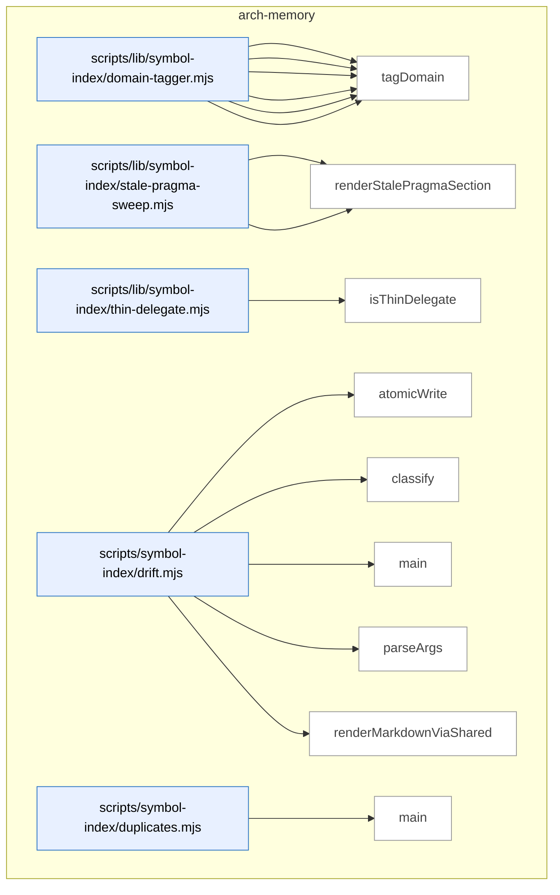

_Domain has 54 symbols (>50). Diagram shows top-15 by file order; see flat table below for the full list._

### Symbols in this domain

| Symbol | Kind | Path | Lines | Purpose | File imported by |
|---|---|---|---|---|---|
| [`computeTargetDomains`](../scripts/lib/symbol-index/domain-tagger.mjs#L150) | function | `scripts/lib/symbol-index/domain-tagger.mjs` | 150-165 | Determines which domains a set of file paths belong to, splitting tagged/untagged. | `scripts/cross-skill.mjs`, `scripts/lib/audit/legacy-production-audit.mjs`, `scripts/lib/dashboard/collect-purposes.mjs`, +6 more |
| [`globToRegexBody`](../scripts/lib/symbol-index/domain-tagger.mjs#L51) | function | `scripts/lib/symbol-index/domain-tagger.mjs` | 51-80 | Converts a glob pattern to regex body, handling ** and * wildcards and escaping literals. | `scripts/cross-skill.mjs`, `scripts/lib/audit/legacy-production-audit.mjs`, `scripts/lib/dashboard/collect-purposes.mjs`, +6 more |
| [`loadDomainRules`](../scripts/lib/symbol-index/domain-tagger.mjs#L181) | function | `scripts/lib/symbol-index/domain-tagger.mjs` | 181-208 | Reads and validates domain-tagging rules from a domain-map JSON file. | `scripts/cross-skill.mjs`, `scripts/lib/audit/legacy-production-audit.mjs`, `scripts/lib/dashboard/collect-purposes.mjs`, +6 more |
| [`makeFastTagger`](../scripts/lib/symbol-index/domain-tagger.mjs#L111) | function | `scripts/lib/symbol-index/domain-tagger.mjs` | 111-132 | Pre-compiles glob patterns into regexes for efficient bulk domain tagging. | `scripts/cross-skill.mjs`, `scripts/lib/audit/legacy-production-audit.mjs`, `scripts/lib/dashboard/collect-purposes.mjs`, +6 more |
| [`matchGlob`](../scripts/lib/symbol-index/domain-tagger.mjs#L38) | function | `scripts/lib/symbol-index/domain-tagger.mjs` | 38-49 | Tests a file path against a glob pattern using anchored regex. | `scripts/cross-skill.mjs`, `scripts/lib/audit/legacy-production-audit.mjs`, `scripts/lib/dashboard/collect-purposes.mjs`, +6 more |
| [`tagDomain`](../scripts/lib/symbol-index/domain-tagger.mjs#L89) | function | `scripts/lib/symbol-index/domain-tagger.mjs` | 89-96 | Returns the domain tag for a file path by matching against glob-to-domain rules. | `scripts/cross-skill.mjs`, `scripts/lib/audit/legacy-production-audit.mjs`, `scripts/lib/dashboard/collect-purposes.mjs`, +6 more |
| [`findStalePragmas`](../scripts/lib/symbol-index/stale-pragma-sweep.mjs#L51) | function | `scripts/lib/symbol-index/stale-pragma-sweep.mjs` | 51-59 | Finds @duplicate-justification pragmas whose target files no longer exist in the repo. | `scripts/symbol-index/drift.mjs` |
| [`renderStalePragmaSection`](../scripts/lib/symbol-index/stale-pragma-sweep.mjs#L62) | function | `scripts/lib/symbol-index/stale-pragma-sweep.mjs` | 62-69 | Returns markdown listing stale duplicate-justification pragmas referencing deleted target files. | `scripts/symbol-index/drift.mjs` |
| [`isThinDelegate`](../scripts/lib/symbol-index/thin-delegate.mjs#L50) | function | `scripts/lib/symbol-index/thin-delegate.mjs` | 50-85 | Detects whether a function body is a thin wrapper/delegate (returns or single-call delegator). | `scripts/symbol-index/extract.mjs` |
| [`atomicWrite`](../scripts/symbol-index/drift.mjs#L45) | function | `scripts/symbol-index/drift.mjs` | 45-51 | Atomically writes content via temp file + rename, creating parent dirs as needed. | _(internal)_ |
| [`classify`](../scripts/symbol-index/drift.mjs#L53) | function | `scripts/symbol-index/drift.mjs` | 53-57 | Classifies a drift score as GREEN/AMBER/RED based on thresholds. | _(internal)_ |
| [`main`](../scripts/symbol-index/drift.mjs#L78) | function | `scripts/symbol-index/drift.mjs` | 78-189 | CLI: checks cloud status, fetches repo+snapshot, computes drift score, classifies, renders issue. | _(internal)_ |
| [`parseArgs`](../scripts/symbol-index/drift.mjs#L36) | function | `scripts/symbol-index/drift.mjs` | 36-43 | Parses --out and --json flags from command line. | _(internal)_ |
| [`renderMarkdownViaShared`](../scripts/symbol-index/drift.mjs#L63) | function | `scripts/symbol-index/drift.mjs` | 63-76 | Calls shared renderDriftIssue() to produce markdown output for a drift report. | _(internal)_ |
| [`main`](../scripts/symbol-index/duplicates.mjs#L65) | function | `scripts/symbol-index/duplicates.mjs` | 65-101 | CLI entry point that fetches and renders exact-duplicate symbol clusters from the index. | _(internal)_ |
| [`parseArgs`](../scripts/symbol-index/duplicates.mjs#L31) | function | `scripts/symbol-index/duplicates.mjs` | 31-46 | Parses --limit and --json CLI flags with validation for positive integers. | _(internal)_ |
| [`renderText`](../scripts/symbol-index/duplicates.mjs#L48) | function | `scripts/symbol-index/duplicates.mjs` | 48-63 | Renders duplicate clusters as plain-text summary with file paths and symbol names. | _(internal)_ |
| [`embedBatch`](../scripts/symbol-index/embed.mjs#L26) | function | `scripts/symbol-index/embed.mjs` | 26-69 | Embeds a batch of text strings using Gemini or Azure embeddings with retry/backoff on rate limits. | _(internal)_ |
| [`logProgress`](../scripts/symbol-index/embed.mjs#L19) | function | `scripts/symbol-index/embed.mjs` | 19-19 | Writes a progress message prefixed with [embed] to stderr. | _(internal)_ |
| [`main`](../scripts/symbol-index/embed.mjs#L71) | function | `scripts/symbol-index/embed.mjs` | 71-119 | CLI entry point that reads symbols from stdin, embeds them, and outputs enriched records. | _(internal)_ |
| [`emitProgress`](../scripts/symbol-index/extract.mjs#L61) | function | `scripts/symbol-index/extract.mjs` | 61-63 | Writes a progress message prefixed with [extract] to stderr. | _(internal)_ |
| [`enumerateFiles`](../scripts/symbol-index/extract.mjs#L388) | function | `scripts/symbol-index/extract.mjs` | 388-406 | Enumerates source files from the repo via a recursive walk or from an explicit file list. | _(internal)_ |
| [`extractGraphAndViolations`](../scripts/symbol-index/extract.mjs#L263) | function | `scripts/symbol-index/extract.mjs` | 263-329 | Uses dep-cruiser to extract the dependency graph and rule violations across source directories. | _(internal)_ |
| [`extractSymbols`](../scripts/symbol-index/extract.mjs#L73) | function | `scripts/symbol-index/extract.mjs` | 73-256 | Walks source files and extracts symbol definitions (functions, classes, constants) using ts-morph AST parsing. | _(internal)_ |
| [`isInternalEdge`](../scripts/symbol-index/extract.mjs#L343) | function | `scripts/symbol-index/extract.mjs` | 343-359 | Determines if a dependency is internal to the repo (returns false for npm/node core/node_modules). | _(internal)_ |
| [`main`](../scripts/symbol-index/extract.mjs#L408) | function | `scripts/symbol-index/extract.mjs` | 408-420 | CLI entry point that extracts symbols and dependency violations, emitting JSON-lines records. | _(internal)_ |
| [`parseArgs`](../scripts/symbol-index/extract.mjs#L39) | function | `scripts/symbol-index/extract.mjs` | 39-58 | Parses --root, --files, --files-from, --mode, --since-commit, and --include-delegates CLI flags. | _(internal)_ |
| [`main`](../scripts/symbol-index/prune.mjs#L44) | function | `scripts/symbol-index/prune.mjs` | 44-94 | CLI entry point that prunes old refresh runs from the database by retention policies. | _(internal)_ |
| [`parseArgs`](../scripts/symbol-index/prune.mjs#L31) | function | `scripts/symbol-index/prune.mjs` | 31-37 | Parses the --dry-run CLI flag. | _(internal)_ |
| [`logErr`](../scripts/symbol-index/refresh.mjs#L85) | function | `scripts/symbol-index/refresh.mjs` | 85-85 | Writes a prefixed stderr message for logging refresh errors. | _(internal)_ |
| [`logOk`](../scripts/symbol-index/refresh.mjs#L86) | function | `scripts/symbol-index/refresh.mjs` | 86-86 | Writes a formatted success message to stderr with a green checkmark prefix. | _(internal)_ |
| [`main`](../scripts/symbol-index/refresh.mjs#L123) | function | `scripts/symbol-index/refresh.mjs` | 123-519 | Refreshes the architectural symbol index by extracting symbols, computing embeddings, and syncing to Supabase. | _(internal)_ |
| [`parseArgs`](../scripts/symbol-index/refresh.mjs#L73) | function | `scripts/symbol-index/refresh.mjs` | 73-83 | Parses --full, --since-commit, --force, --include-delegates flags. | _(internal)_ |
| [`runWithHeartbeat`](../scripts/symbol-index/refresh.mjs#L114) | function | `scripts/symbol-index/refresh.mjs` | 114-121 | Executes an async function while periodically sending heartbeat signals to prevent timeout. | _(internal)_ |
| [`sibling`](../scripts/symbol-index/refresh.mjs#L71) | function | `scripts/symbol-index/refresh.mjs` | 71-71 | Returns the absolute path to a file in the same directory as the current script. | _(internal)_ |
| [`throwVcsError`](../scripts/symbol-index/refresh.mjs#L97) | function | `scripts/symbol-index/refresh.mjs` | 97-104 | Wraps a VCS error with metadata and throws it as a tagged exception. | _(internal)_ |
| [`classify`](../scripts/symbol-index/render-mermaid.mjs#L58) | function | `scripts/symbol-index/render-mermaid.mjs` | 58-62 | Classifies a drift score into GREEN/AMBER/RED buckets based on threshold tiers. | _(internal)_ |
| [`cleanupStaleObservedDeps`](../scripts/symbol-index/render-mermaid.mjs#L70) | function | `scripts/symbol-index/render-mermaid.mjs` | 70-80 | Deletes a stale observed-deps JSON file if it exists, with error logging. | _(internal)_ |
| [`commitSha`](../scripts/symbol-index/render-mermaid.mjs#L53) | function | `scripts/symbol-index/render-mermaid.mjs` | 53-56 | Retrieves the current git commit SHA (short form) or null if not in a git repo. | _(internal)_ |
| [`main`](../scripts/symbol-index/render-mermaid.mjs#L108) | function | `scripts/symbol-index/render-mermaid.mjs` | 108-291 | CLI entry point that renders the architecture map markdown from indexed symbols and dependency violations. | _(internal)_ |
| [`parseArgs`](../scripts/symbol-index/render-mermaid.mjs#L45) | function | `scripts/symbol-index/render-mermaid.mjs` | 45-51 | Parses the --out CLI flag with a default output path. | _(internal)_ |
| [`writeAbortStub`](../scripts/symbol-index/render-mermaid.mjs#L89) | function | `scripts/symbol-index/render-mermaid.mjs` | 89-106 | Writes a markdown stub file explaining why the architecture map render was aborted. | _(internal)_ |
| [`cacheHit`](../scripts/symbol-index/summarise-domains.mjs#L59) | function | `scripts/symbol-index/summarise-domains.mjs` | 59-66 | Returns true if a cached domain summary matches the current composition/model/prompt version. | `scripts/symbol-index/render-mermaid.mjs` |
| [`callHaiku`](../scripts/symbol-index/summarise-domains.mjs#L68) | function | `scripts/symbol-index/summarise-domains.mjs` | 68-99 | Calls Claude Haiku (or Azure Sonnet) to generate a domain summary, returning text and usage metrics. | `scripts/symbol-index/render-mermaid.mjs` |
| [`computeCompositionHash`](../scripts/symbol-index/summarise-domains.mjs#L46) | function | `scripts/symbol-index/summarise-domains.mjs` | 46-51 | Computes a SHA256 hash of symbol signatures to detect composition changes. | `scripts/symbol-index/render-mermaid.mjs` |
| [`main`](../scripts/symbol-index/summarise-domains.mjs#L232) | function | `scripts/symbol-index/summarise-domains.mjs` | 232-264 | CLI entry point that generates or retrieves domain summaries for all domains in the index. | `scripts/symbol-index/render-mermaid.mjs` |
| [`PROMPT_TEMPLATE`](../scripts/symbol-index/summarise-domains.mjs#L39) | function | `scripts/symbol-index/summarise-domains.mjs` | 39-43 | Constructs a prompt template asking Claude to describe a domain based on sample symbols. | `scripts/symbol-index/render-mermaid.mjs` |
| [`runWithConcurrency`](../scripts/symbol-index/summarise-domains.mjs#L219) | function | `scripts/symbol-index/summarise-domains.mjs` | 219-229 | Runs async functions with bounded concurrency using a work-stealing queue pattern. | `scripts/symbol-index/render-mermaid.mjs` |
| [`summariseDomains`](../scripts/symbol-index/summarise-domains.mjs#L113) | function | `scripts/symbol-index/summarise-domains.mjs` | 113-207 | Generates or retrieves cached domain summaries for all tagged symbols in a snapshot. | `scripts/symbol-index/render-mermaid.mjs` |
| [`symbolCountDeltaOk`](../scripts/symbol-index/summarise-domains.mjs#L53) | function | `scripts/symbol-index/summarise-domains.mjs` | 53-57 | Returns true if the symbol count delta is ≤20%, false otherwise. | `scripts/symbol-index/render-mermaid.mjs` |
| [`validateSummary`](../scripts/symbol-index/summarise-domains.mjs#L101) | function | `scripts/symbol-index/summarise-domains.mjs` | 101-107 | Validates that a summary string is 20–400 characters and returns a validation result. | `scripts/symbol-index/render-mermaid.mjs` |
| [`logProgress`](../scripts/symbol-index/summarise.mjs#L29) | function | `scripts/symbol-index/summarise.mjs` | 29-29 | Writes a progress message to stderr. | _(internal)_ |
| [`main`](../scripts/symbol-index/summarise.mjs#L76) | function | `scripts/symbol-index/summarise.mjs` | 76-119 | Reads symbols from stdin, batches them, calls Claude concurrently, emits results with counts. | _(internal)_ |
| [`summariseBatch`](../scripts/symbol-index/summarise.mjs#L35) | function | `scripts/symbol-index/summarise.mjs` | 35-74 | Calls Claude to generate one-line summaries for a batch of symbols. | _(internal)_ |

---

## audit-orchestration

> Coordinates multi-stage code and plan audits by orchestrating subprocess pipelines (GPT → Gemini), parsing results, and managing temporary artifact lifecycles. Exposes fused (`audit-full`) and iterative (`audit-loop`) entry points.

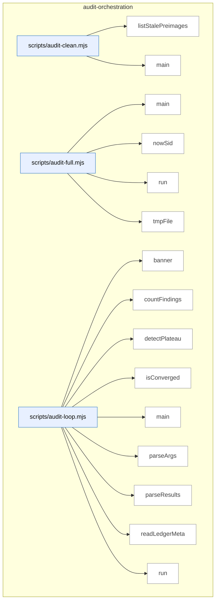

_Domain has 226 symbols (>50). Diagram shows top-15 by file order; see flat table below for the full list._

### Symbols in this domain

| Symbol | Kind | Path | Lines | Purpose | File imported by |
|---|---|---|---|---|---|
| [`listStalePreimages`](../scripts/audit-clean.mjs#L39) | function | `scripts/audit-clean.mjs` | 39-53 | Lists orphaned preimage worktree directories in temp folder that exceed maximum age threshold. | _(internal)_ |
| [`main`](../scripts/audit-clean.mjs#L82) | function | `scripts/audit-clean.mjs` | 82-133 | Sweeps aged temporary audit artifacts (logs, caches, preimages) and reports or deletes them based on file modification time. | _(internal)_ |
| [`main`](../scripts/audit-full.mjs#L44) | function | `scripts/audit-full.mjs` | 44-127 | Runs a fused audit pipeline: GPT code/plan audit followed by mandatory Gemini final review in one invocation. | _(internal)_ |
| [`nowSid`](../scripts/audit-full.mjs#L31) | function | `scripts/audit-full.mjs` | 31-33 | Generates a timestamped session ID string with a given prefix. | _(internal)_ |
| [`run`](../scripts/audit-full.mjs#L39) | function | `scripts/audit-full.mjs` | 39-42 | Spawns a subprocess and returns its exit code and kill signal. | _(internal)_ |
| [`tmpFile`](../scripts/audit-full.mjs#L35) | function | `scripts/audit-full.mjs` | 35-37 | Creates a temp file path for a given filename in the OS temp directory. | _(internal)_ |
| [`banner`](../scripts/audit-loop.mjs#L27) | function | `scripts/audit-loop.mjs` | 27-30 | Prints a centered banner message with decorative box lines to console. | _(internal)_ |
| [`countFindings`](../scripts/audit-loop.mjs#L71) | function | `scripts/audit-loop.mjs` | 71-78 | Tallies audit findings by severity level (HIGH/MEDIUM/LOW) from results object. | _(internal)_ |
| [`detectPlateau`](../scripts/audit-loop.mjs#L93) | function | `scripts/audit-loop.mjs` | 93-109 | Detects HIGH-finding plateau when decrease is <30% per round for two consecutive rounds. | _(internal)_ |
| [`isConverged`](../scripts/audit-loop.mjs#L80) | function | `scripts/audit-loop.mjs` | 80-84 | Determines audit convergence: zero HIGH findings and at most two MEDIUM findings (ignores failures). | _(internal)_ |
| [`main`](../scripts/audit-loop.mjs#L169) | function | `scripts/audit-loop.mjs` | 169-534 | Orchestrates iterative multi-round code/plan audits with convergence detection, ledger persistence, and optional Gemini final review. | _(internal)_ |
| [`parseArgs`](../scripts/audit-loop.mjs#L129) | function | `scripts/audit-loop.mjs` | 129-165 | Parses command-line arguments into a structured options object for audit-loop modes and flags. | _(internal)_ |
| [`parseResults`](../scripts/audit-loop.mjs#L62) | function | `scripts/audit-loop.mjs` | 62-69 | Parses JSON audit results from a file, returning null if read or JSON parse fails. | _(internal)_ |
| [`readLedgerMeta`](../scripts/audit-loop.mjs#L119) | function | `scripts/audit-loop.mjs` | 119-127 | Reads metadata from audit ledger JSON file, defaulting to empty object on error. | _(internal)_ |
| [`run`](../scripts/audit-loop.mjs#L32) | function | `scripts/audit-loop.mjs` | 32-45 | Executes a shell command with timeout and stdio piping, throwing on non-zero exit unless flagged to ignore. | _(internal)_ |
| [`runAudit`](../scripts/audit-loop.mjs#L47) | function | `scripts/audit-loop.mjs` | 47-60 | Invokes openai-audit.mjs as a subprocess and captures its stdout, stderr, and exit status. | _(internal)_ |
| [`computeLocalMetrics`](../scripts/audit-metrics.mjs#L87) | function | `scripts/audit-metrics.mjs` | 87-103 | Computes local audit metrics from `.audit/outcomes.jsonl` by pass and acceptance rate. | `scripts/lib/dashboard/collect-telemetry.mjs` |
| [`displayMetrics`](../scripts/audit-metrics.mjs#L107) | function | `scripts/audit-metrics.mjs` | 107-176 | Formats and prints audit loop metrics (run counts, pass effectiveness, finding breakdown) to console. | `scripts/lib/dashboard/collect-telemetry.mjs` |
| [`fetchCloudMetrics`](../scripts/audit-metrics.mjs#L52) | function | `scripts/audit-metrics.mjs` | 52-80 | Queries Postgres for audit run statistics (run counts, pass effectiveness) over the last N days, with optional repo filtering. | `scripts/lib/dashboard/collect-telemetry.mjs` |
| [`main`](../scripts/audit-metrics.mjs#L180) | function | `scripts/audit-metrics.mjs` | 180-197 | Fetches cloud metrics with graceful fallback to local-only, then displays audit loop statistics in JSON or formatted output. | `scripts/lib/dashboard/collect-telemetry.mjs` |
| [`_collectMaxLengths`](../scripts/gemini-review.mjs#L121) | function | `scripts/gemini-review.mjs` | 121-139 | Recursively walks a JSON schema to collect maxLength constraints on string fields, mapping paths to character limits. | _(internal)_ |
| [`addSemanticIds`](../scripts/gemini-review.mjs#L1563) | function | `scripts/gemini-review.mjs` | 1563-1571 | Assigns each finding an ID, semantic hash, and source-model attribution for later deduplication and tracking. | _(internal)_ |
| [`applyDebtSuppression`](../scripts/gemini-review.mjs#L1496) | function | `scripts/gemini-review.mjs` | 1496-1531 | Removes new findings that match pre-filtered debt topics using Jaccard similarity scoring above a threshold. | _(internal)_ |
| [`applyProviderSetting`](../scripts/gemini-review.mjs#L1371) | function | `scripts/gemini-review.mjs` | 1371-1389 | Updates or removes the FINAL_REVIEW_PROVIDER line in .env file text, formatting it with a managed comment. | _(internal)_ |
| [`applyScopeFilter`](../scripts/gemini-review.mjs#L1533) | function | `scripts/gemini-review.mjs` | 1533-1561 | Removes new findings that cite files not in the changed-files list from the transcript. | _(internal)_ |
| [`assertAzureClaudeReady`](../scripts/gemini-review.mjs#L1422) | function | `scripts/gemini-review.mjs` | 1422-1433 | Validates that required Azure Foundry env vars (endpoint, deployment) are set, exiting with an error if not. | _(internal)_ |
| [`buildClient`](../scripts/gemini-review.mjs#L1435) | function | `scripts/gemini-review.mjs` | 1435-1449 | Instantiates the appropriate final-review client (Gemini, Azure Claude, or public Claude Opus) based on selected provider. | _(internal)_ |
| [`buildShadowClient`](../scripts/gemini-review.mjs#L967) | function | `scripts/gemini-review.mjs` | 967-978 | Instantiates the appropriate API client (Gemini, Azure Claude, or public Claude) based on the shadow provider. | _(internal)_ |
| [`callAzureClaude`](../scripts/gemini-review.mjs#L589) | function | `scripts/gemini-review.mjs` | 589-659 | Calls Claude via Azure Foundry (supporting Anthropic and OpenAI API shapes) with streaming and timeout support. | _(internal)_ |
| [`callClaudeOpus`](../scripts/gemini-review.mjs#L500) | function | `scripts/gemini-review.mjs` | 500-578 | Calls Claude Opus with race-based timeout, parsing JSON response and returning structured audit findings. | _(internal)_ |
| [`callGemini`](../scripts/gemini-review.mjs#L353) | function | `scripts/gemini-review.mjs` | 353-450 | Calls Gemini API with streaming, parses JSON response, auto-truncates verbose fields to schema limits, and returns result with usage metrics. | _(internal)_ |
| [`dedupByHash`](../scripts/gemini-review.mjs#L1070) | function | `scripts/gemini-review.mjs` | 1070-1078 | Deduplicates findings by semantic hash, keeping only the first occurrence of each unique finding. | _(internal)_ |
| [`diffFindingBuckets`](../scripts/gemini-review.mjs#L1085) | function | `scripts/gemini-review.mjs` | 1085-1101 | Compares primary and shadow review findings, bucketing them as "both", "primary-only", or "shadow-only" and counting each. | _(internal)_ |
| [`emitReviewOutput`](../scripts/gemini-review.mjs#L1573) | function | `scripts/gemini-review.mjs` | 1573-1588 | Outputs the final-review result as JSON (if requested) or markdown (default), optionally writing to a file with summary. | _(internal)_ |
| [`formatReviewResult`](../scripts/gemini-review.mjs#L835) | function | `scripts/gemini-review.mjs` | 835-898 | Formats the final-review result into markdown with verdict, deliberation quality, findings, and wrongly-dismissed items. | _(internal)_ |
| [`getReviewPrompt`](../scripts/gemini-review.mjs#L333) | function | `scripts/gemini-review.mjs` | 333-336 | Returns the system prompt for Gemini final review, optionally with a role addendum for adjudicator-only mode. | _(internal)_ |
| [`isJsonTruncationError`](../scripts/gemini-review.mjs#L1451) | function | `scripts/gemini-review.mjs` | 1451-1455 | Detects whether an error is likely due to JSON truncation (unterminated string, parse failure). | _(internal)_ |
| [`main`](../scripts/gemini-review.mjs#L1715) | function | `scripts/gemini-review.mjs` | 1715-1786 | Entry point parsing arguments and dispatching to review, ping, or set-provider subcommands. | _(internal)_ |
| [`mapRouteToShadowProvider`](../scripts/gemini-review.mjs#L1009) | function | `scripts/gemini-review.mjs` | 1009-1013 | Maps a model-eval route's transport to a shadow provider name (gemini, azure-claude, or claude-opus). | _(internal)_ |
| [`parseReviewArgs`](../scripts/gemini-review.mjs#L1273) | function | `scripts/gemini-review.mjs` | 1273-1292 | Parses command-line arguments for review workflow, extracting plan/transcript files, output mode, provider override, and audit mode. | _(internal)_ |
| [`recordGeminiOutcomes`](../scripts/gemini-review.mjs#L1635) | function | `scripts/gemini-review.mjs` | 1635-1657 | Records Gemini findings and verdicts to the learning store, updating the prompt-bandit reward model. | _(internal)_ |
| [`recordNewFindings`](../scripts/gemini-review.mjs#L1590) | function | `scripts/gemini-review.mjs` | 1590-1609 | Records each new finding from final review to a local outcomes log and updates the false-positive tracker. | _(internal)_ |
| [`recordWronglyDismissed`](../scripts/gemini-review.mjs#L1611) | function | `scripts/gemini-review.mjs` | 1611-1633 | Iterates through wrongly-dismissed findings from Gemini review and writes each as an adjudication outcome. | _(internal)_ |
| [`refreshCatalogAndWarn`](../scripts/gemini-review.mjs#L1214) | function | `scripts/gemini-review.mjs` | 1214-1235 | Refreshes the live model catalog and upgrades Gemini reviewer / Claude Opus fallback to their latest resolved versions. | _(internal)_ |
| [`resolveModelEvalShadowOverride`](../scripts/gemini-review.mjs#L1015) | function | `scripts/gemini-review.mjs` | 1015-1044 | Checks whether an active model-eval run exists for the adjudicator role and returns its shadow provider/model override if valid. | _(internal)_ |
| [`resolveProviderSetting`](../scripts/gemini-review.mjs#L1354) | function | `scripts/gemini-review.mjs` | 1354-1357 | Reads the FINAL_REVIEW_PROVIDER env var and returns its value or null. | _(internal)_ |
| [`resolveShadow`](../scripts/gemini-review.mjs#L931) | function | `scripts/gemini-review.mjs` | 931-957 | Resolves shadow final-reviewer configuration from env/settings and returns its state (ready, skipped variants, or config details). | _(internal)_ |
| [`runAdjudicatorOnlyReview`](../scripts/gemini-review.mjs#L1487) | function | `scripts/gemini-review.mjs` | 1487-1494 | Runs final review with an adjudicator-only role addendum prepended to the system prompt. | _(internal)_ |
| [`runFinalReview`](../scripts/gemini-review.mjs#L672) | function | `scripts/gemini-review.mjs` | 672-831 | Orchestrates final review: extracts code from plan, reads files, applies debt suppression, constructs prompt, invokes model. | _(internal)_ |
| [`runFixtureReview`](../scripts/gemini-review.mjs#L1672) | function | `scripts/gemini-review.mjs` | 1672-1713 | Returns a canned Gemini review result for testing, optionally simulating reversed or missed findings. | _(internal)_ |
| [`runPing`](../scripts/gemini-review.mjs#L1266) | function | `scripts/gemini-review.mjs` | 1266-1271 | Pings available final-reviewer models (Gemini first, then Claude) to verify API connectivity. | _(internal)_ |
| [`runPingClaude`](../scripts/gemini-review.mjs#L1249) | function | `scripts/gemini-review.mjs` | 1249-1264 | Tests Claude Opus connectivity by making a minimal API call and exits with a status code. | _(internal)_ |
| [`runPingGemini`](../scripts/gemini-review.mjs#L1237) | function | `scripts/gemini-review.mjs` | 1237-1247 | Tests Gemini connectivity by making a minimal API call and exits with a status code. | _(internal)_ |
| [`runReviewWithRetry`](../scripts/gemini-review.mjs#L1457) | function | `scripts/gemini-review.mjs` | 1457-1474 | Runs final review with retry logic: if JSON truncation occurs, retries with a conciseness hint. | _(internal)_ |
| [`runSetProvider`](../scripts/gemini-review.mjs#L1396) | function | `scripts/gemini-review.mjs` | 1396-1416 | Sets FINAL_REVIEW_PROVIDER in .env to one of (gemini\|azure-claude\|anthropic\|default), persisting the choice atomically. | _(internal)_ |
| [`runShadowAndPersist`](../scripts/gemini-review.mjs#L1124) | function | `scripts/gemini-review.mjs` | 1124-1208 | Runs the shadow final review (if ready), diffs findings against primary, and persists shadow metadata and cloud observations. | _(internal)_ |
| [`runShadowReview`](../scripts/gemini-review.mjs#L1051) | function | `scripts/gemini-review.mjs` | 1051-1061 | Runs the shadow final review, deduplicates findings by hash, and applies debt/scope filters. | _(internal)_ |
| [`selectProvider`](../scripts/gemini-review.mjs#L1314) | function | `scripts/gemini-review.mjs` | 1314-1351 | Selects the final-review provider based on explicit flag, env setting, or auto-detection (Gemini → Azure → Opus). | _(internal)_ |
| [`shadowModelMatchesFamily`](../scripts/gemini-review.mjs#L917) | function | `scripts/gemini-review.mjs` | 917-922 | Checks whether a resolved model ID belongs to the expected family (Gemini or Claude). | _(internal)_ |
| [`shadowSkipBlock`](../scripts/gemini-review.mjs#L1104) | function | `scripts/gemini-review.mjs` | 1104-1109 | Constructs a nulled-out shadow-review block when the shadow reviewer is skipped (unset, Azure, no key, etc.). | _(internal)_ |
| [`streamAnthropicMessage`](../scripts/gemini-review.mjs#L480) | function | `scripts/gemini-review.mjs` | 480-498 | Handles streaming from the Anthropic SDK or falls back to non-streaming, accumulating chunks and extracting usage metadata. | _(internal)_ |
| [`truncateToSchema`](../scripts/gemini-review.mjs#L153) | function | `scripts/gemini-review.mjs` | 153-173 | Recursively truncates an object's string fields to their schema-defined maxLength limits, tracking which were truncated. | _(internal)_ |
| [`createEnvelope`](../scripts/lib/audit/candidate-envelope.mjs#L49) | function | `scripts/lib/audit/candidate-envelope.mjs` | 49-84 | Wraps a finding in an evidence envelope with source attribution, model provenance, and full-fidelity claim snapshot. | `scripts/lib/audit/evidence-triage.mjs`, `scripts/lib/audit/tiered-pipeline.mjs` |
| [`flattenEnvelopeToFinding`](../scripts/lib/audit/candidate-envelope.mjs#L234) | function | `scripts/lib/audit/candidate-envelope.mjs` | 234-254 | Extracts a flat Finding from an envelope, merging alternative evidence into the detail field. | `scripts/lib/audit/evidence-triage.mjs`, `scripts/lib/audit/tiered-pipeline.mjs` |
| [`mergeIntoEnvelopes`](../scripts/lib/audit/candidate-envelope.mjs#L119) | function | `scripts/lib/audit/candidate-envelope.mjs` | 119-180 | Consolidates multiple findings with the same fingerprint into a multi-evidence envelope structure. | `scripts/lib/audit/evidence-triage.mjs`, `scripts/lib/audit/tiered-pipeline.mjs` |
| [`promoteAlternative`](../scripts/lib/audit/candidate-envelope.mjs#L256) | function | `scripts/lib/audit/candidate-envelope.mjs` | 256-293 | Promotes an alternative evidence entry to canonical status and demotes the previous canonical to alternatives. | `scripts/lib/audit/evidence-triage.mjs`, `scripts/lib/audit/tiered-pipeline.mjs` |
| [`severityRank`](../scripts/lib/audit/candidate-envelope.mjs#L91) | function | `scripts/lib/audit/candidate-envelope.mjs` | 91-93 | Maps a severity string to its numeric rank for ordering and weighting. | `scripts/lib/audit/evidence-triage.mjs`, `scripts/lib/audit/tiered-pipeline.mjs` |
| [`evaluateConvergence`](../scripts/lib/audit/convergence.mjs#L21) | function | `scripts/lib/audit/convergence.mjs` | 21-25 | Checks if finding counts across all severity tiers meet convergence thresholds for audit termination. | `scripts/lib/audit/legacy-production-audit.mjs` |
| [`computeCostReport`](../scripts/lib/audit/cost-budget.mjs#L58) | function | `scripts/lib/audit/cost-budget.mjs` | 58-88 | Aggregates usage and effort events into cost-per-accepted-finding metrics with breakdown by severity weight. | `scripts/lib/audit/tiered-pipeline.mjs` |
| [`loadReviewEffortEvents`](../scripts/lib/audit/cost-budget.mjs#L136) | function | `scripts/lib/audit/cost-budget.mjs` | 136-144 | Reads and validates JSONL-formatted review effort events from a file. | `scripts/lib/audit/tiered-pipeline.mjs` |
| [`loadUsageEvents`](../scripts/lib/audit/cost-budget.mjs#L118) | function | `scripts/lib/audit/cost-budget.mjs` | 118-133 | Reads and validates usage events from a JSONL file, skipping malformed entries and applying schema defaults. | `scripts/lib/audit/tiered-pipeline.mjs` |
| [`openReviewEffortStore`](../scripts/lib/audit/cost-budget.mjs#L96) | function | `scripts/lib/audit/cost-budget.mjs` | 96-98 | Opens an append-only store for recording cost-budget review effort events. | `scripts/lib/audit/tiered-pipeline.mjs` |
| [`openUsageEventStore`](../scripts/lib/audit/cost-budget.mjs#L91) | function | `scripts/lib/audit/cost-budget.mjs` | 91-93 | Opens an append-only store for recording cost-budget usage events. | `scripts/lib/audit/tiered-pipeline.mjs` |
| [`recordReviewEffort`](../scripts/lib/audit/cost-budget.mjs#L106) | function | `scripts/lib/audit/cost-budget.mjs` | 106-108 | Appends a review effort event to the cost-budget store. | `scripts/lib/audit/tiered-pipeline.mjs` |
| [`recordUsageEvent`](../scripts/lib/audit/cost-budget.mjs#L101) | function | `scripts/lib/audit/cost-budget.mjs` | 101-103 | Appends a usage event to the cost-budget store. | `scripts/lib/audit/tiered-pipeline.mjs` |
| [`classifyDeferralEvidence`](../scripts/lib/audit/deferral-classifier.mjs#L162) | function | `scripts/lib/audit/deferral-classifier.mjs` | 162-295 | Classifies whether an audit finding qualifies for auto-deferral via scope, class allowlist, and SCM evidence (plan markers or file changes). | `scripts/lib/audit/findings-pipeline.mjs` |
| [`globMatch`](../scripts/lib/audit/deferral-classifier.mjs#L98) | function | `scripts/lib/audit/deferral-classifier.mjs` | 98-115 | Tests if a file path matches a glob pattern by translating glob syntax to regex. | `scripts/lib/audit/findings-pipeline.mjs` |
| [`parseAcceptV1Markers`](../scripts/lib/audit/deferral-classifier.mjs#L77) | function | `scripts/lib/audit/deferral-classifier.mjs` | 77-87 | Extracts `<!-- audit:accept-v1: ... -->` markers from plan content into file-glob/reason pairs. | `scripts/lib/audit/findings-pipeline.mjs` |
| [`cleanupTempRoot`](../scripts/lib/audit/diff-scope-resolver.mjs#L255) | function | `scripts/lib/audit/diff-scope-resolver.mjs` | 255-265 | Removes a git worktree and its metadata, falling back to filesystem deletion. | `scripts/audit-clean.mjs`, `scripts/lib/audit/legacy-production-audit.mjs`, `scripts/openai-audit.mjs` |
| [`computeEntryPoints`](../scripts/lib/audit/diff-scope-resolver.mjs#L354) | function | `scripts/lib/audit/diff-scope-resolver.mjs` | 354-423 | Identifies entry point files from package.json and tsconfig.json, with directory-scan fallback. | `scripts/audit-clean.mjs`, `scripts/lib/audit/legacy-production-audit.mjs`, `scripts/openai-audit.mjs` |
| [`cruiseTempRoot`](../scripts/lib/audit/diff-scope-resolver.mjs#L277) | function | `scripts/lib/audit/diff-scope-resolver.mjs` | 277-339 | Runs dep-cruiser on materialized preimage files to extract their import dependencies. | `scripts/audit-clean.mjs`, `scripts/lib/audit/legacy-production-audit.mjs`, `scripts/openai-audit.mjs` |
| [`gitBuf`](../scripts/lib/audit/diff-scope-resolver.mjs#L73) | function | `scripts/lib/audit/diff-scope-resolver.mjs` | 73-85 | Executes a git command with error handling and stderr logging. | `scripts/audit-clean.mjs`, `scripts/lib/audit/legacy-production-audit.mjs`, `scripts/openai-audit.mjs` |
| [`materialisePreimages`](../scripts/lib/audit/diff-scope-resolver.mjs#L214) | function | `scripts/lib/audit/diff-scope-resolver.mjs` | 214-253 | Creates a git worktree at a base commit containing eligible source files for dependency extraction. | `scripts/audit-clean.mjs`, `scripts/lib/audit/legacy-production-audit.mjs`, `scripts/openai-audit.mjs` |
| [`parseLsTreeZ`](../scripts/lib/audit/diff-scope-resolver.mjs#L153) | function | `scripts/lib/audit/diff-scope-resolver.mjs` | 153-156 | Parses git ls-tree NUL-separated output into a set of file paths. | `scripts/audit-clean.mjs`, `scripts/lib/audit/legacy-production-audit.mjs`, `scripts/openai-audit.mjs` |
| [`parseNameStatusZ`](../scripts/lib/audit/diff-scope-resolver.mjs#L100) | function | `scripts/lib/audit/diff-scope-resolver.mjs` | 100-145 | Parses git diff NUL-separated output into structured change records (status, base/head paths). | `scripts/audit-clean.mjs`, `scripts/lib/audit/legacy-production-audit.mjs`, `scripts/openai-audit.mjs` |
| [`resolveDiffScope`](../scripts/lib/audit/diff-scope-resolver.mjs#L440) | function | `scripts/lib/audit/diff-scope-resolver.mjs` | 440-541 | Resolves git refs and computes changed files, pre-edges, and entry points for a diff. | `scripts/audit-clean.mjs`, `scripts/lib/audit/legacy-production-audit.mjs`, `scripts/openai-audit.mjs` |
| [`stripLeadingDotSlash`](../scripts/lib/audit/diff-scope-resolver.mjs#L27) | function | `scripts/lib/audit/diff-scope-resolver.mjs` | 27-29 | Removes leading `./` from a string path. | `scripts/audit-clean.mjs`, `scripts/lib/audit/legacy-production-audit.mjs`, `scripts/openai-audit.mjs` |
| [`sweepStaleOrphanPreimages`](../scripts/lib/audit/diff-scope-resolver.mjs#L188) | function | `scripts/lib/audit/diff-scope-resolver.mjs` | 188-212 | Removes stale git worktrees from a temp directory and prunes git metadata. | `scripts/audit-clean.mjs`, `scripts/lib/audit/legacy-production-audit.mjs`, `scripts/openai-audit.mjs` |
| [`walkEntryPointDir`](../scripts/lib/audit/diff-scope-resolver.mjs#L49) | function | `scripts/lib/audit/diff-scope-resolver.mjs` | 49-63 | Discovers source files in a directory by extension and adds them to a set. | `scripts/audit-clean.mjs`, `scripts/lib/audit/legacy-production-audit.mjs`, `scripts/openai-audit.mjs` |
| [`runDiscoveryPortfolio`](../scripts/lib/audit/discovery-portfolio.mjs#L98) | function | `scripts/lib/audit/discovery-portfolio.mjs` | 98-135 | Orchestrates required and optional symbol discovery generators (GLM, Sonnet, GPT). | `scripts/lib/audit/tiered-pipeline.mjs` |
| [`runOneGenerator`](../scripts/lib/audit/discovery-portfolio.mjs#L54) | function | `scripts/lib/audit/discovery-portfolio.mjs` | 54-78 | Executes a symbol discovery generator and records its status and findings. | `scripts/lib/audit/tiered-pipeline.mjs` |
| [`defaultAdapters`](../scripts/lib/audit/duplication-detector.mjs#L63) | function | `scripts/lib/audit/duplication-detector.mjs` | 63-95 | Provides default implementations for symbol extraction, git history access, embeddings, and architectural-memory queries. | `scripts/lib/audit/legacy-production-audit.mjs` |
| [`extractViaSubprocess`](../scripts/lib/audit/duplication-detector.mjs#L103) | function | `scripts/lib/audit/duplication-detector.mjs` | 103-115 | Extracts symbols from a list of files by spawning a subprocess with a temp manifest file. | `scripts/lib/audit/legacy-production-audit.mjs` |
| [`findPragmaAbove`](../scripts/lib/audit/duplication-detector.mjs#L135) | function | `scripts/lib/audit/duplication-detector.mjs` | 135-143 | Searches up to 3 lines above a declaration for a duplicate-justification pragma comment. | `scripts/lib/audit/legacy-production-audit.mjs` |
| [`isEligibleChange`](../scripts/lib/audit/duplication-detector.mjs#L145) | function | `scripts/lib/audit/duplication-detector.mjs` | 145-150 | Determines if a git entry is a source-file addition/modification that should be scanned for duplication. | `scripts/lib/audit/legacy-production-audit.mjs` |
| [`log`](../scripts/lib/audit/duplication-detector.mjs#L60) | function | `scripts/lib/audit/duplication-detector.mjs` | 60-60 | Writes a duplication-detector-prefixed message to stderr. | `scripts/lib/audit/legacy-production-audit.mjs` |
| [`runDuplicationAnalysis`](../scripts/lib/audit/duplication-detector.mjs#L160) | function | `scripts/lib/audit/duplication-detector.mjs` | 160-326 | Performs deterministic and semantic duplication detection across changed files, consulting the architectural-memory store. | `scripts/lib/audit/legacy-production-audit.mjs` |
| [`symKey`](../scripts/lib/audit/duplication-detector.mjs#L125) | function | `scripts/lib/audit/duplication-detector.mjs` | 125-127 | Generates a unique key combining file path, symbol name, and kind for deduplication tracking. | `scripts/lib/audit/legacy-production-audit.mjs` |
| [`writeTempSource`](../scripts/lib/audit/duplication-detector.mjs#L118) | function | `scripts/lib/audit/duplication-detector.mjs` | 118-122 | Writes a source file to a temporary directory tree, creating intermediate directories as needed. | `scripts/lib/audit/legacy-production-audit.mjs` |
| [`_resetDuplicationIdCounter`](../scripts/lib/audit/duplication-report.mjs#L47) | function | `scripts/lib/audit/duplication-report.mjs` | 47-47 | Resets the internal duplication finding ID counter. | `scripts/lib/audit/duplication-detector.mjs`, `scripts/lib/audit/legacy-production-audit.mjs` |
| [`buildDetectorFailedFinding`](../scripts/lib/audit/duplication-report.mjs#L216) | function | `scripts/lib/audit/duplication-report.mjs` | 216-231 | Constructs an audit finding indicating the duplication detector itself failed. | `scripts/lib/audit/duplication-detector.mjs`, `scripts/lib/audit/legacy-production-audit.mjs` |
| [`buildDuplicationFinding`](../scripts/lib/audit/duplication-report.mjs#L193) | function | `scripts/lib/audit/duplication-report.mjs` | 193-213 | Constructs an audit finding for a near-duplicate with severity, recommendation, and principles. | `scripts/lib/audit/duplication-detector.mjs`, `scripts/lib/audit/legacy-production-audit.mjs` |
| [`deriveFindingsFromDuplicationReport`](../scripts/lib/audit/duplication-report.mjs#L189) | function | `scripts/lib/audit/duplication-report.mjs` | 189-191 | Extracts medium-severity findings from all semantic candidates when bouncer decision is unavailable. | `scripts/lib/audit/duplication-detector.mjs`, `scripts/lib/audit/legacy-production-audit.mjs` |
| [`finalizeDeterministicFindings`](../scripts/lib/audit/duplication-report.mjs#L234) | function | `scripts/lib/audit/duplication-report.mjs` | 234-256 | Converts deterministic records (orphaned pragmas) into audit findings. | `scripts/lib/audit/duplication-detector.mjs`, `scripts/lib/audit/legacy-production-audit.mjs` |
| [`formatCandidatesForPrompt`](../scripts/lib/audit/duplication-report.mjs#L113) | function | `scripts/lib/audit/duplication-report.mjs` | 113-147 | Formats semantic duplication candidates as markdown blocks for LLM review, filtering sensitive content. | `scripts/lib/audit/duplication-detector.mjs`, `scripts/lib/audit/legacy-production-audit.mjs` |
| [`isDuplicationQueryExcluded`](../scripts/lib/audit/duplication-report.mjs#L36) | function | `scripts/lib/audit/duplication-report.mjs` | 36-38 | Tests whether a file path is excluded from duplication analysis by glob patterns. | `scripts/lib/audit/duplication-detector.mjs`, `scripts/lib/audit/legacy-production-audit.mjs` |
| [`isDuplicationReportClean`](../scripts/lib/audit/duplication-report.mjs#L41) | function | `scripts/lib/audit/duplication-report.mjs` | 41-43 | Checks if a duplication report shows no issues found. | `scripts/lib/audit/duplication-detector.mjs`, `scripts/lib/audit/legacy-production-audit.mjs` |
| [`mapBouncerDecisionsToFindings`](../scripts/lib/audit/duplication-report.mjs#L166) | function | `scripts/lib/audit/duplication-report.mjs` | 166-186 | Validates bouncer LLM decisions and converts them to duplication findings. | `scripts/lib/audit/duplication-detector.mjs`, `scripts/lib/audit/legacy-production-audit.mjs` |
| [`nextId`](../scripts/lib/audit/duplication-report.mjs#L48) | function | `scripts/lib/audit/duplication-report.mjs` | 48-48 | Generates the next unique duplication finding ID. | `scripts/lib/audit/duplication-detector.mjs`, `scripts/lib/audit/legacy-production-audit.mjs` |
| [`readExcerpt`](../scripts/lib/audit/duplication-report.mjs#L75) | function | `scripts/lib/audit/duplication-report.mjs` | 75-93 | Reads source code excerpt for a symbol with padding, respecting sensitive-path restrictions. | `scripts/lib/audit/duplication-detector.mjs`, `scripts/lib/audit/legacy-production-audit.mjs` |
| [`extractFileDiffSection`](../scripts/lib/audit/evidence-triage.mjs#L38) | function | `scripts/lib/audit/evidence-triage.mjs` | 38-68 | Locates and returns the unified-diff section for a specific file, handling quoted paths and status detection. | `scripts/lib/audit/tiered-pipeline.mjs` |
| [`normalizeWhitespace`](../scripts/lib/audit/evidence-triage.mjs#L25) | function | `scripts/lib/audit/evidence-triage.mjs` | 25-27 | Collapses all consecutive whitespace to single spaces and trims edges. | `scripts/lib/audit/tiered-pipeline.mjs` |
| [`quoteAppearsOnSide`](../scripts/lib/audit/evidence-triage.mjs#L103) | function | `scripts/lib/audit/evidence-triage.mjs` | 103-126 | Verifies whether a quoted string appears in the head or base of a diff hunk, handling blank lines. | `scripts/lib/audit/tiered-pipeline.mjs` |
| [`runStage0EvidenceTriage`](../scripts/lib/audit/evidence-triage.mjs#L244) | function | `scripts/lib/audit/evidence-triage.mjs` | 244-275 | Verifies all finding anchors against the diff, separating verified/unverifiable cases from rejected fabrications. | `scripts/lib/audit/tiered-pipeline.mjs` |
| [`splitIntoHunks`](../scripts/lib/audit/evidence-triage.mjs#L74) | function | `scripts/lib/audit/evidence-triage.mjs` | 74-88 | Partitions a diff section into hunk content arrays, stopping at @@ markers. | `scripts/lib/audit/tiered-pipeline.mjs` |
| [`tagPreExisting`](../scripts/lib/audit/evidence-triage.mjs#L185) | function | `scripts/lib/audit/evidence-triage.mjs` | 185-191 | Marks a finding as pre-existing-independent if blame and impact adapters both confirm it predates the change and doesn't block the fix. | `scripts/lib/audit/tiered-pipeline.mjs` |
| [`verifyAnchor`](../scripts/lib/audit/evidence-triage.mjs#L151) | function | `scripts/lib/audit/evidence-triage.mjs` | 151-162 | Determines if a finding's evidence anchor can be verified, fabricated, or is unverifiable in the diff. | `scripts/lib/audit/tiered-pipeline.mjs` |
| [`verifyWithFallback`](../scripts/lib/audit/evidence-triage.mjs#L204) | function | `scripts/lib/audit/evidence-triage.mjs` | 204-219 | Attempts to verify a finding's anchor, trying alternative anchors if the primary fails. | `scripts/lib/audit/tiered-pipeline.mjs` |
| [`anchorFileCandidates`](../scripts/lib/audit/final-adjudication.mjs#L330) | function | `scripts/lib/audit/final-adjudication.mjs` | 330-333 | Extracts file paths from an anchor object's newFile and oldFile fields. | `scripts/lib/audit/legacy-production-audit.mjs`, `scripts/lib/audit/tiered-pipeline.mjs` |
| [`buildAlternativeEvidenceLines`](../scripts/lib/audit/final-adjudication.mjs#L375) | function | `scripts/lib/audit/final-adjudication.mjs` | 375-384 | Formats alternative evidence lines from an envelope, filtering out findings that reference sensitive paths. | `scripts/lib/audit/legacy-production-audit.mjs`, `scripts/lib/audit/tiered-pipeline.mjs` |
| [`buildFindingDetail`](../scripts/lib/audit/final-adjudication.mjs#L387) | function | `scripts/lib/audit/final-adjudication.mjs` | 387-391 | Combines canonical detail with alternative evidence lines into a single findings description. | `scripts/lib/audit/legacy-production-audit.mjs`, `scripts/lib/audit/tiered-pipeline.mjs` |
| [`createGeminiReviewSubprocessAdapters`](../scripts/lib/audit/final-adjudication.mjs#L495) | function | `scripts/lib/audit/final-adjudication.mjs` | 495-585 | Creates adapter functions for invoking Gemini review as a subprocess with verdict mapping. | `scripts/lib/audit/legacy-production-audit.mjs`, `scripts/lib/audit/tiered-pipeline.mjs` |
| [`defaultGeminiReviewScriptPath`](../scripts/lib/audit/final-adjudication.mjs#L64) | function | `scripts/lib/audit/final-adjudication.mjs` | 64-66 | Returns the file path to the gemini-review.mjs script for subprocess invocation. | `scripts/lib/audit/legacy-production-audit.mjs`, `scripts/lib/audit/tiered-pipeline.mjs` |
| [`envelopeReferencedFiles`](../scripts/lib/audit/final-adjudication.mjs#L342) | function | `scripts/lib/audit/final-adjudication.mjs` | 342-345 | Collects all file paths referenced by an envelope's canonical finding and evidence anchors. | `scripts/lib/audit/legacy-production-audit.mjs`, `scripts/lib/audit/tiered-pipeline.mjs` |
| [`interpretVerdict`](../scripts/lib/audit/final-adjudication.mjs#L181) | function | `scripts/lib/audit/final-adjudication.mjs` | 181-210 | Translates a Gemini review response into a stage-decision outcome, handling dismissed vs verified verdicts correctly. | `scripts/lib/audit/legacy-production-audit.mjs`, `scripts/lib/audit/tiered-pipeline.mjs` |
| [`invokeGeminiReviewSubprocess`](../scripts/lib/audit/final-adjudication.mjs#L422) | function | `scripts/lib/audit/final-adjudication.mjs` | 422-465 | Spawns a Gemini review subprocess on an audit transcript and parses its JSON result. | `scripts/lib/audit/legacy-production-audit.mjs`, `scripts/lib/audit/tiered-pipeline.mjs` |
| [`isPathSensitive`](../scripts/lib/audit/final-adjudication.mjs#L354) | function | `scripts/lib/audit/final-adjudication.mjs` | 354-361 | Checks whether a file path resolves to a sensitive location (credentials, secrets, etc.). | `scripts/lib/audit/legacy-production-audit.mjs`, `scripts/lib/audit/tiered-pipeline.mjs` |
| [`primaryFile`](../scripts/lib/audit/final-adjudication.mjs#L394) | function | `scripts/lib/audit/final-adjudication.mjs` | 394-399 | Determines the primary file affected by a finding by checking section, file, anchor, and triggerAnchor fields. | `scripts/lib/audit/legacy-production-audit.mjs`, `scripts/lib/audit/tiered-pipeline.mjs` |
| [`runFinalAdjudication`](../scripts/lib/audit/final-adjudication.mjs#L230) | function | `scripts/lib/audit/final-adjudication.mjs` | 230-321 | Runs Gemini final review on sampled findings, segregating security-review-pending items from confirmed/reversed outcomes. | `scripts/lib/audit/legacy-production-audit.mjs`, `scripts/lib/audit/tiered-pipeline.mjs` |
| [`selectAdjudicationSample`](../scripts/lib/audit/final-adjudication.mjs#L84) | function | `scripts/lib/audit/final-adjudication.mjs` | 84-112 | Stratifies adjudication work into mandatory escalations, sampled tail findings, and clean-region files using seeded randomization. | `scripts/lib/audit/legacy-production-audit.mjs`, `scripts/lib/audit/tiered-pipeline.mjs` |
| [`selectFinalAdjudicationWorkItems`](../scripts/lib/audit/final-adjudication.mjs#L151) | function | `scripts/lib/audit/final-adjudication.mjs` | 151-166 | Caps stratified work-item samples to per-bucket maximums and merges them into a final adjudication queue. | `scripts/lib/audit/legacy-production-audit.mjs`, `scripts/lib/audit/tiered-pipeline.mjs` |
| [`classifyFinding`](../scripts/lib/audit/finding-verification.mjs#L70) | function | `scripts/lib/audit/finding-verification.mjs` | 70-73 | Detects if a finding contains an existence claim about a file or symbol. | `scripts/lib/audit/legacy-production-audit.mjs`, `scripts/openai-audit.mjs` |
| [`extractCitedEntity`](../scripts/lib/audit/finding-verification.mjs#L103) | function | `scripts/lib/audit/finding-verification.mjs` | 103-122 | Extracts the cited entity (file/symbol/module name) from a finding's detail or section. | `scripts/lib/audit/legacy-production-audit.mjs`, `scripts/openai-audit.mjs` |
| [`mk`](../scripts/lib/audit/finding-verification.mjs#L124) | function | `scripts/lib/audit/finding-verification.mjs` | 124-132 | Creates a verification result object with verdict, reason, cited entity, and severity. | `scripts/lib/audit/legacy-production-audit.mjs`, `scripts/openai-audit.mjs` |
| [`tokenKind`](../scripts/lib/audit/finding-verification.mjs#L84) | function | `scripts/lib/audit/finding-verification.mjs` | 84-90 | Classifies a token as external module, file, or symbol based on syntax and context. | `scripts/lib/audit/legacy-production-audit.mjs`, `scripts/openai-audit.mjs` |
| [`verifyExistenceFindings`](../scripts/lib/audit/finding-verification.mjs#L149) | function | `scripts/lib/audit/finding-verification.mjs` | 149-215 | Verifies existence claims in findings against repo inventory, marking unverifiable ones. | `scripts/lib/audit/legacy-production-audit.mjs`, `scripts/openai-audit.mjs` |
| [`applyAcceptV1Suppression`](../scripts/lib/audit/findings-pipeline.mjs#L191) | function | `scripts/lib/audit/findings-pipeline.mjs` | 191-214 | Filters findings matching accept-v1 markers (glob patterns) in plan comments. | `scripts/lib/audit/legacy-production-audit.mjs`, `scripts/lib/audit/orphan-metrics.mjs`, `scripts/lib/audit/tiered-pipeline.mjs`, +1 more |
| [`applyLedgerSuppression`](../scripts/lib/audit/findings-pipeline.mjs#L74) | function | `scripts/lib/audit/findings-pipeline.mjs` | 74-103 | Filters findings by dropping those matching dismissed entries in the adjudication ledger. | `scripts/lib/audit/legacy-production-audit.mjs`, `scripts/lib/audit/orphan-metrics.mjs`, `scripts/lib/audit/tiered-pipeline.mjs`, +1 more |
| [`applyStage1MechanicalEarlyFilter`](../scripts/lib/audit/findings-pipeline.mjs#L128) | function | `scripts/lib/audit/findings-pipeline.mjs` | 128-177 | Fast-path suppression for stage1-mechanical ledger entries not present in changed files, skipping regressed entries. | `scripts/lib/audit/legacy-production-audit.mjs`, `scripts/lib/audit/orphan-metrics.mjs`, `scripts/lib/audit/tiered-pipeline.mjs`, +1 more |
| [`computeAuditVerdict`](../scripts/lib/audit/findings-pipeline.mjs#L261) | function | `scripts/lib/audit/findings-pipeline.mjs` | 261-270 | Computes overall audit verdict (PASS/NEEDS_FIXES/SIGNIFICANT_ISSUES/INCOMPLETE) from HIGH/MEDIUM finding counts. | `scripts/lib/audit/legacy-production-audit.mjs`, `scripts/lib/audit/orphan-metrics.mjs`, `scripts/lib/audit/tiered-pipeline.mjs`, +1 more |
| [`findingFingerprint`](../scripts/lib/audit/findings-pipeline.mjs#L34) | function | `scripts/lib/audit/findings-pipeline.mjs` | 34-59 | Generates a stable 8-char SHA hash fingerprint for a finding for deduplication. | `scripts/lib/audit/legacy-production-audit.mjs`, `scripts/lib/audit/orphan-metrics.mjs`, `scripts/lib/audit/tiered-pipeline.mjs`, +1 more |
| [`processFindings`](../scripts/lib/audit/findings-pipeline.mjs#L272) | function | `scripts/lib/audit/findings-pipeline.mjs` | 272-298 | Normalizes, fingerprints, and applies ledger/stage1/accept-v1 suppression filters to raw findings. | `scripts/lib/audit/legacy-production-audit.mjs`, `scripts/lib/audit/orphan-metrics.mjs`, `scripts/lib/audit/tiered-pipeline.mjs`, +1 more |
| [`globMatch`](../scripts/lib/audit/glob-match.mjs#L28) | function | `scripts/lib/audit/glob-match.mjs` | 28-38 | Tests if a file path matches a glob pattern using regex with `**`, `*`, and exact matching. | `scripts/lib/audit/findings-pipeline.mjs`, `scripts/lib/efficacy-lints.mjs` |
| [`escapeRegex`](../scripts/lib/audit/gpt-sentinel-trigger.mjs#L42) | function | `scripts/lib/audit/gpt-sentinel-trigger.mjs` | 42-44 | Escapes special regex metacharacters in a string. | `scripts/lib/audit/tiered-pipeline.mjs` |
| [`isExplorationSample`](../scripts/lib/audit/gpt-sentinel-trigger.mjs#L154) | function | `scripts/lib/audit/gpt-sentinel-trigger.mjs` | 154-160 | Checks if a commit seed qualifies as an exploration sample based on rate. | `scripts/lib/audit/tiered-pipeline.mjs` |
| [`keywordRegex`](../scripts/lib/audit/gpt-sentinel-trigger.mjs#L58) | function | `scripts/lib/audit/gpt-sentinel-trigger.mjs` | 58-66 | Creates and caches a case-insensitive regex pattern for a keyword, supporting wildcard stems. | `scripts/lib/audit/tiered-pipeline.mjs` |
| [`matchKeywordGroups`](../scripts/lib/audit/gpt-sentinel-trigger.mjs#L71) | function | `scripts/lib/audit/gpt-sentinel-trigger.mjs` | 71-78 | Identifies which keyword groups match a given text string. | `scripts/lib/audit/tiered-pipeline.mjs` |
| [`resolveGptTrigger`](../scripts/lib/audit/gpt-sentinel-trigger.mjs#L176) | function | `scripts/lib/audit/gpt-sentinel-trigger.mjs` | 176-191 | Combines deterministic, exploration, and sentinel bandit logic to decide GPT firing. | `scripts/lib/audit/tiered-pipeline.mjs` |
| [`shouldFireSentinel`](../scripts/lib/audit/gpt-sentinel-trigger.mjs#L132) | function | `scripts/lib/audit/gpt-sentinel-trigger.mjs` | 132-138 | Uses a Thompson-sampling bandit to decide whether GPT should fire. | `scripts/lib/audit/tiered-pipeline.mjs` |
| [`shouldTriggerGpt`](../scripts/lib/audit/gpt-sentinel-trigger.mjs#L104) | function | `scripts/lib/audit/gpt-sentinel-trigger.mjs` | 104-111 | Determines if GPT should be triggered based on diff size, keyword matches, or portfolio disagreement. | `scripts/lib/audit/tiered-pipeline.mjs` |
| [`buildAuditRunContext`](../scripts/lib/audit/legacy-production-audit.mjs#L3019) | function | `scripts/lib/audit/legacy-production-audit.mjs` | 3019-3127 | Constructs the context object needed to run a single audit including providers and ledgers. | `scripts/lib/audit/tiered-pipeline.mjs`, `scripts/openai-audit.mjs` |
| [`cachePassResult`](../scripts/lib/audit/legacy-production-audit.mjs#L243) | function | `scripts/lib/audit/legacy-production-audit.mjs` | 243-254 | Writes a single pass result to the cache directory atomically. | `scripts/lib/audit/tiered-pipeline.mjs`, `scripts/openai-audit.mjs` |
| [`cacheWaveResults`](../scripts/lib/audit/legacy-production-audit.mjs#L256) | function | `scripts/lib/audit/legacy-production-audit.mjs` | 256-261 | Saves multiple pass results to the cache directory. | `scripts/lib/audit/tiered-pipeline.mjs`, `scripts/openai-audit.mjs` |
| [`cleanupCache`](../scripts/lib/audit/legacy-production-audit.mjs#L263) | function | `scripts/lib/audit/legacy-production-audit.mjs` | 263-266 | Removes the temporary cache directory recursively. | `scripts/lib/audit/tiered-pipeline.mjs`, `scripts/openai-audit.mjs` |
| [`decideSeed`](../scripts/lib/audit/legacy-production-audit.mjs#L369) | function | `scripts/lib/audit/legacy-production-audit.mjs` | 369-417 | Determines whether to use cache seeding and selects the smallest unit to warm the cache. | `scripts/lib/audit/tiered-pipeline.mjs`, `scripts/openai-audit.mjs` |
| [`deriveFindingsFromReport`](../scripts/lib/audit/legacy-production-audit.mjs#L991) | function | `scripts/lib/audit/legacy-production-audit.mjs` | 991-1061 | Transforms an architecture report's violations into structured audit findings with IDs. | `scripts/lib/audit/tiered-pipeline.mjs`, `scripts/openai-audit.mjs` |
| [`formatViolationsForPrompt`](../scripts/lib/audit/legacy-production-audit.mjs#L923) | function | `scripts/lib/audit/legacy-production-audit.mjs` | 923-972 | Formats architecture violations, unmapped files, and dead intent for LLM consumption. | `scripts/lib/audit/tiered-pipeline.mjs`, `scripts/openai-audit.mjs` |
| [`initResultCache`](../scripts/lib/audit/legacy-production-audit.mjs#L233) | function | `scripts/lib/audit/legacy-production-audit.mjs` | 233-241 | Initializes a temporary directory for caching individual audit pass results. | `scripts/lib/audit/tiered-pipeline.mjs`, `scripts/openai-audit.mjs` |
| [`normalizeFindingsForOutput`](../scripts/lib/audit/legacy-production-audit.mjs#L270) | function | `scripts/lib/audit/legacy-production-audit.mjs` | 270-272 | Normalizes findings using a semantic ID function for deduplication. | `scripts/lib/audit/tiered-pipeline.mjs`, `scripts/openai-audit.mjs` |
| [`orphanToStandardFinding`](../scripts/lib/audit/legacy-production-audit.mjs#L796) | function | `scripts/lib/audit/legacy-production-audit.mjs` | 796-818 | Converts an orphan-introduced detection into a structured audit finding. | `scripts/lib/audit/tiered-pipeline.mjs`, `scripts/openai-audit.mjs` |
| [`runArchitecturePass`](../scripts/lib/audit/legacy-production-audit.mjs#L651) | function | `scripts/lib/audit/legacy-production-audit.mjs` | 651-786 | Runs architecture domain-boundary validation against a declared architecture intent. | `scripts/lib/audit/tiered-pipeline.mjs`, `scripts/openai-audit.mjs` |
| [`runLegacyProductionAudit`](../scripts/lib/audit/legacy-production-audit.mjs#L1091) | function | `scripts/lib/audit/legacy-production-audit.mjs` | 1091-2983 | Orchestrates the complete multi-pass code audit (structure, wiring, backend, frontend, sustainability). | `scripts/lib/audit/tiered-pipeline.mjs`, `scripts/openai-audit.mjs` |
| [`runMapReducePass`](../scripts/lib/audit/legacy-production-audit.mjs#L451) | function | `scripts/lib/audit/legacy-production-audit.mjs` | 451-633 | Orchestrates parallel map phase and reduce phase for large file audits. | `scripts/lib/audit/tiered-pipeline.mjs`, `scripts/openai-audit.mjs` |
| [`runOneMapUnit`](../scripts/lib/audit/legacy-production-audit.mjs#L422) | function | `scripts/lib/audit/legacy-production-audit.mjs` | 422-449 | Executes one audit map unit with slot-based concurrency and optional seeding. | `scripts/lib/audit/tiered-pipeline.mjs`, `scripts/openai-audit.mjs` |
| [`runOrphanIntroducedPass`](../scripts/lib/audit/legacy-production-audit.mjs#L837) | function | `scripts/lib/audit/legacy-production-audit.mjs` | 837-916 | Detects files that became unreachable from non-test callers after the diff. | `scripts/lib/audit/tiered-pipeline.mjs`, `scripts/openai-audit.mjs` |
| [`shouldMapReduce`](../scripts/lib/audit/legacy-production-audit.mjs#L174) | function | `scripts/lib/audit/legacy-production-audit.mjs` | 174-178 | Decides if map-reduce is needed based on file count or total context size. | `scripts/lib/audit/tiered-pipeline.mjs`, `scripts/openai-audit.mjs` |
| [`shouldMapReduceHighReasoning`](../scripts/lib/audit/legacy-production-audit.mjs#L185) | function | `scripts/lib/audit/legacy-production-audit.mjs` | 185-189 | Decides if high-reasoning mode requires map-reduce due to scale. | `scripts/lib/audit/tiered-pipeline.mjs`, `scripts/openai-audit.mjs` |
| [`throwIfConfigError`](../scripts/lib/audit/legacy-production-audit.mjs#L352) | function | `scripts/lib/audit/legacy-production-audit.mjs` | 352-358 | Re-throws a configuration error from a settled promise if present. | `scripts/lib/audit/tiered-pipeline.mjs`, `scripts/openai-audit.mjs` |
| [`validateLedgerForR2`](../scripts/lib/audit/legacy-production-audit.mjs#L292) | function | `scripts/lib/audit/legacy-production-audit.mjs` | 292-324 | Validates that a ledger file exists, is parseable JSON, and contains valid entries for round 2+. | `scripts/lib/audit/tiered-pipeline.mjs`, `scripts/openai-audit.mjs` |
| [`_callGPTOnce`](../scripts/lib/audit/llm-helpers.mjs#L232) | function | `scripts/lib/audit/llm-helpers.mjs` | 232-338 | Makes a single GPT call with timeout, abort handling, and structured parsing. | `scripts/lib/audit/legacy-production-audit.mjs`, `scripts/lib/audit/tiered-pipeline.mjs`, `scripts/openai-audit.mjs` |
| [`buildCachePrompt`](../scripts/lib/audit/llm-helpers.mjs#L95) | function | `scripts/lib/audit/llm-helpers.mjs` | 95-112 | Builds GPT prompt for an audit pass combining rubric, brief, plan, code, history, and ledger rulings. | `scripts/lib/audit/legacy-production-audit.mjs`, `scripts/lib/audit/tiered-pipeline.mjs`, `scripts/openai-audit.mjs` |
| [`callGPT`](../scripts/lib/audit/llm-helpers.mjs#L344) | function | `scripts/lib/audit/llm-helpers.mjs` | 344-385 | Wraps _callGPTOnce with retry logic and cumulative token/usage tracking. | `scripts/lib/audit/legacy-production-audit.mjs`, `scripts/lib/audit/tiered-pipeline.mjs`, `scripts/openai-audit.mjs` |
| [`getPassPrompt`](../scripts/lib/audit/llm-helpers.mjs#L68) | function | `scripts/lib/audit/llm-helpers.mjs` | 68-72 | Retrieves the active prompt for a pass name or falls back to default. | `scripts/lib/audit/legacy-production-audit.mjs`, `scripts/lib/audit/tiered-pipeline.mjs`, `scripts/openai-audit.mjs` |
| [`normalisePromptInput`](../scripts/lib/audit/llm-helpers.mjs#L131) | function | `scripts/lib/audit/llm-helpers.mjs` | 131-162 | Validates and normalizes prompt input (either structured or legacy mode, not both). | `scripts/lib/audit/legacy-production-audit.mjs`, `scripts/lib/audit/tiered-pipeline.mjs`, `scripts/openai-audit.mjs` |
| [`parseStructured`](../scripts/lib/audit/llm-helpers.mjs#L182) | function | `scripts/lib/audit/llm-helpers.mjs` | 182-222 | Calls OpenAI's structured output API with fallback to chat.completions.parse. | `scripts/lib/audit/legacy-production-audit.mjs`, `scripts/lib/audit/tiered-pipeline.mjs`, `scripts/openai-audit.mjs` |
| [`safeCallGPT`](../scripts/lib/audit/llm-helpers.mjs#L396) | function | `scripts/lib/audit/llm-helpers.mjs` | 396-413 | Gracefully degrades on GPT errors, returning empty results instead of crashing. | `scripts/lib/audit/legacy-production-audit.mjs`, `scripts/lib/audit/tiered-pipeline.mjs`, `scripts/openai-audit.mjs` |
| [`setModel`](../scripts/lib/audit/llm-helpers.mjs#L56) | function | `scripts/lib/audit/llm-helpers.mjs` | 56-58 | Sets the global model ID variable. | `scripts/lib/audit/legacy-production-audit.mjs`, `scripts/lib/audit/tiered-pipeline.mjs`, `scripts/openai-audit.mjs` |
| [`wireModel`](../scripts/lib/audit/llm-helpers.mjs#L167) | function | `scripts/lib/audit/llm-helpers.mjs` | 167-169 | Returns the appropriate model ID (Azure deployment or standard). | `scripts/lib/audit/legacy-production-audit.mjs`, `scripts/lib/audit/tiered-pipeline.mjs`, `scripts/openai-audit.mjs` |
| [`detectOrphansIntroduced`](../scripts/lib/audit/orphan-introduced.mjs#L42) | function | `scripts/lib/audit/orphan-introduced.mjs` | 42-167 | Detects when code changes remove function call edges (orphaned imports). | `scripts/lib/audit/legacy-production-audit.mjs`, `scripts/openai-audit.mjs` |
| [`isTestFile`](../scripts/lib/audit/orphan-introduced.mjs#L174) | function | `scripts/lib/audit/orphan-introduced.mjs` | 174-184 | Checks if a file path matches test file naming patterns. | `scripts/lib/audit/legacy-production-audit.mjs`, `scripts/openai-audit.mjs` |
| [`appendOrphanMetric`](../scripts/lib/audit/orphan-metrics.mjs#L59) | function | `scripts/lib/audit/orphan-metrics.mjs` | 59-80 | Appends a metric record to the orphan-metrics file with file-level locking. | `scripts/lib/audit/legacy-production-audit.mjs`, `scripts/openai-audit.mjs` |
| [`emitOrphanRunMetrics`](../scripts/lib/audit/orphan-metrics.mjs#L102) | function | `scripts/lib/audit/orphan-metrics.mjs` | 102-169 | Writes an orphan audit run summary including findings and suppression info. | `scripts/lib/audit/legacy-production-audit.mjs`, `scripts/openai-audit.mjs` |
| [`ensureMetricsFile`](../scripts/lib/audit/orphan-metrics.mjs#L33) | function | `scripts/lib/audit/orphan-metrics.mjs` | 33-49 | Atomically creates an empty metrics file in .audit/ if it doesn't exist. | `scripts/lib/audit/legacy-production-audit.mjs`, `scripts/openai-audit.mjs` |
| [`completePlanAuditRun`](../scripts/lib/audit/plan-audit-cloud.mjs#L96) | function | `scripts/lib/audit/plan-audit-cloud.mjs` | 96-121 | Finalizes a plan audit run by persisting findings and marking it complete. | `scripts/openai-audit.mjs` |
| [`gitAnchor`](../scripts/lib/audit/plan-audit-cloud.mjs#L33) | function | `scripts/lib/audit/plan-audit-cloud.mjs` | 33-41 | Retrieves the current git commit SHA and branch name. | `scripts/openai-audit.mjs` |
| [`registerPlanAuditRun`](../scripts/lib/audit/plan-audit-cloud.mjs#L52) | function | `scripts/lib/audit/plan-audit-cloud.mjs` | 52-84 | Registers a plan audit run in the cloud store and creates the plan artifact record. | `scripts/openai-audit.mjs` |
| [`buildAuditPassPrompt`](../scripts/lib/audit/prompt-builder.mjs#L63) | function | `scripts/lib/audit/prompt-builder.mjs` | 63-108 | Constructs a multi-message audit prompt with cacheable context, modifiers, and code. | `scripts/lib/audit/legacy-production-audit.mjs`, `scripts/lib/audit/llm-helpers.mjs`, `scripts/openai-audit.mjs` |
| [`estimateStablePrefixTokens`](../scripts/lib/audit/prompt-builder.mjs#L167) | function | `scripts/lib/audit/prompt-builder.mjs` | 167-179 | Estimates tokens in the cacheable prefix of an audit prompt. | `scripts/lib/audit/legacy-production-audit.mjs`, `scripts/lib/audit/llm-helpers.mjs`, `scripts/openai-audit.mjs` |
| [`estimateTokens`](../scripts/lib/audit/prompt-builder.mjs#L149) | function | `scripts/lib/audit/prompt-builder.mjs` | 149-152 | Approximates token count from text using a 4-character-per-token heuristic. | `scripts/lib/audit/legacy-production-audit.mjs`, `scripts/lib/audit/llm-helpers.mjs`, `scripts/openai-audit.mjs` |
| [`validateOpts`](../scripts/lib/audit/prompt-builder.mjs#L110) | function | `scripts/lib/audit/prompt-builder.mjs` | 110-132 | Validates buildAuditPassPrompt options for required/optional string fields. | `scripts/lib/audit/legacy-production-audit.mjs`, `scripts/lib/audit/llm-helpers.mjs`, `scripts/openai-audit.mjs` |
| [`buildReviewEffortEvent`](../scripts/lib/audit/review-effort-event.mjs#L63) | function | `scripts/lib/audit/review-effort-event.mjs` | 63-74 | Constructs a typed review-effort telemetry event from raw data. | `scripts/lib/audit/cost-budget.mjs` |
| [`buildStageOneTriageInput`](../scripts/lib/audit/stage1-triage.mjs#L236) | function | `scripts/lib/audit/stage1-triage.mjs` | 236-325 | Constructs a triager input from a finding, redacting sensitive paths and details. | `scripts/lib/audit/tiered-pipeline.mjs` |
| [`classifyStage1Outcome`](../scripts/lib/audit/stage1-triage.mjs#L343) | function | `scripts/lib/audit/stage1-triage.mjs` | 343-356 | Determines if a triager's dismissal attempt was valid and what disposition action to take. | `scripts/lib/audit/tiered-pipeline.mjs` |
| [`isSensitiveViaSymlinkResolution`](../scripts/lib/audit/stage1-triage.mjs#L112) | function | `scripts/lib/audit/stage1-triage.mjs` | 112-137 | Checks if a token resolves via symlink to a sensitive path outside the repo root. | `scripts/lib/audit/tiered-pipeline.mjs` |
| [`redactFreeText`](../scripts/lib/audit/stage1-triage.mjs#L164) | function | `scripts/lib/audit/stage1-triage.mjs` | 164-186 | Removes sensitive file paths and detected secrets from free-text fields. | `scripts/lib/audit/tiered-pipeline.mjs` |
| [`resolveEvidenceAnchor`](../scripts/lib/audit/stage1-triage.mjs#L193) | function | `scripts/lib/audit/stage1-triage.mjs` | 193-197 | Extracts the appropriate anchor (commission vs omission) from evidence. | `scripts/lib/audit/tiered-pipeline.mjs` |
| [`runStage1CheapTriage`](../scripts/lib/audit/stage1-triage.mjs#L451) | function | `scripts/lib/audit/stage1-triage.mjs` | 451-562 | Runs cheap-model Stage 1 triaging on all candidates with admission budget and timing. | `scripts/lib/audit/tiered-pipeline.mjs` |
| [`writeMechanicalDismissalToLedger`](../scripts/lib/audit/stage1-triage.mjs#L377) | function | `scripts/lib/audit/stage1-triage.mjs` | 377-400 | Records a mechanically dismissed finding to the adjudication ledger with disproof. | `scripts/lib/audit/tiered-pipeline.mjs` |
| [`loadValidationManifest`](../scripts/lib/audit/stage1-triager-resolver.mjs#L75) | function | `scripts/lib/audit/stage1-triager-resolver.mjs` | 75-93 | Loads and validates the Stage-1 triager's validation manifest file. | `scripts/lib/audit/tiered-pipeline.mjs` |
| [`resolveStage1TriagerModel`](../scripts/lib/audit/stage1-triager-resolver.mjs#L101) | function | `scripts/lib/audit/stage1-triager-resolver.mjs` | 101-113 | Resolves the Stage-1 triager model from override, validated manifest, or fallback. | `scripts/lib/audit/tiered-pipeline.mjs` |
| [`buildStage1TriagerPrompt`](../scripts/lib/audit/tiered-pipeline.mjs#L87) | function | `scripts/lib/audit/tiered-pipeline.mjs` | 87-98 | Constructs a system + user prompt for the Stage 1 cheap triager to deterministically disprove a finding using provided evidence. | `scripts/openai-audit.mjs` |
| [`defaultTriagerCall`](../scripts/lib/audit/tiered-pipeline.mjs#L112) | function | `scripts/lib/audit/tiered-pipeline.mjs` | 112-125 | Calls GPT as the Stage 1 triager using the cheap-model resolver for dismissal attempts. | `scripts/openai-audit.mjs` |
| [`runTieredAuditPipeline`](../scripts/lib/audit/tiered-pipeline.mjs#L168) | function | `scripts/lib/audit/tiered-pipeline.mjs` | 168-532 | Runs the three-stage tiered audit (Discovery → Stage 1 triage → Stage 2 Gemini adjudication) as an alternative to full GPT audit. | `scripts/openai-audit.mjs` |
| [`validatedTriagerCall`](../scripts/lib/audit/tiered-pipeline.mjs#L139) | function | `scripts/lib/audit/tiered-pipeline.mjs` | 139-162 | Calls the validated OSS-gateway Stage 1 triager with classified error handling and reliability hardening. | `scripts/openai-audit.mjs` |
| [`appendShadowLog`](../scripts/lib/audit/tiered-shadow-compare.mjs#L226) | function | `scripts/lib/audit/tiered-shadow-compare.mjs` | 226-233 | Appends a shadow observation record to the gitignored local log for debugging and telemetry. | `scripts/lib/dashboard/collect-telemetry.mjs`, `scripts/openai-audit.mjs`, `scripts/tiered-shadow-report.mjs` |
| [`buildShadowCtx`](../scripts/lib/audit/tiered-shadow-compare.mjs#L81) | function | `scripts/lib/audit/tiered-shadow-compare.mjs` | 81-104 | Creates a shadow audit context that disables ledger writes and cloud persistence for comparison-only runs. | `scripts/lib/dashboard/collect-telemetry.mjs`, `scripts/openai-audit.mjs`, `scripts/tiered-shadow-report.mjs` |
| [`compareAuditRunResults`](../scripts/lib/audit/tiered-shadow-compare.mjs#L130) | function | `scripts/lib/audit/tiered-shadow-compare.mjs` | 130-169 | Compares legacy and tiered audit findings to compute overlap, delta counts, costs, and latency metrics. | `scripts/lib/dashboard/collect-telemetry.mjs`, `scripts/openai-audit.mjs`, `scripts/tiered-shadow-report.mjs` |
| [`parseTotalSeconds`](../scripts/lib/audit/tiered-shadow-compare.mjs#L113) | function | `scripts/lib/audit/tiered-shadow-compare.mjs` | 113-117 | Parses "Xs" formatted duration strings into numeric seconds for latency telemetry. | `scripts/lib/dashboard/collect-telemetry.mjs`, `scripts/openai-audit.mjs`, `scripts/tiered-shadow-report.mjs` |
| [`recordObservation`](../scripts/lib/audit/tiered-shadow-compare.mjs#L278) | function | `scripts/lib/audit/tiered-shadow-compare.mjs` | 278-295 | Persists a tiered-shadow comparison observation to both local log and remote Supabase for cross-repo analysis. | `scripts/lib/dashboard/collect-telemetry.mjs`, `scripts/openai-audit.mjs`, `scripts/tiered-shadow-report.mjs` |
| [`runShadowTieredPipeline`](../scripts/lib/audit/tiered-shadow-compare.mjs#L196) | function | `scripts/lib/audit/tiered-shadow-compare.mjs` | 196-216 | Executes the tiered pipeline as an observation-only shadow with timeout protection and proper resource cleanup. | `scripts/lib/dashboard/collect-telemetry.mjs`, `scripts/openai-audit.mjs`, `scripts/tiered-shadow-report.mjs` |
| [`runTieredShadowComparison`](../scripts/lib/audit/tiered-shadow-compare.mjs#L246) | function | `scripts/lib/audit/tiered-shadow-compare.mjs` | 246-267 | Orchestrates concurrent legacy and shadow tiered audits, compares results, and records observations to storage. | `scripts/lib/dashboard/collect-telemetry.mjs`, `scripts/openai-audit.mjs`, `scripts/tiered-shadow-report.mjs` |
| [`mean`](../scripts/lib/audit/tiered-shadow-summary.mjs#L43) | function | `scripts/lib/audit/tiered-shadow-summary.mjs` | 43-45 | Computes the arithmetic mean of a numeric array. | `scripts/lib/dashboard/collect-telemetry.mjs`, `scripts/tiered-shadow-report.mjs` |
| [`median`](../scripts/lib/audit/tiered-shadow-summary.mjs#L36) | function | `scripts/lib/audit/tiered-shadow-summary.mjs` | 36-41 | Computes the median of a numeric array. | `scripts/lib/dashboard/collect-telemetry.mjs`, `scripts/tiered-shadow-report.mjs` |
| [`normalizeDbRow`](../scripts/lib/audit/tiered-shadow-summary.mjs#L28) | function | `scripts/lib/audit/tiered-shadow-summary.mjs` | 28-34 | Converts a database row object to a normalized typed observation object. | `scripts/lib/dashboard/collect-telemetry.mjs`, `scripts/tiered-shadow-report.mjs` |
| [`readRecords`](../scripts/lib/audit/tiered-shadow-summary.mjs#L49) | function | `scripts/lib/audit/tiered-shadow-summary.mjs` | 49-55 | Reads and parses JSONL records from the shadow-log file. | `scripts/lib/dashboard/collect-telemetry.mjs`, `scripts/tiered-shadow-report.mjs` |
| [`summarize`](../scripts/lib/audit/tiered-shadow-summary.mjs#L86) | function | `scripts/lib/audit/tiered-shadow-summary.mjs` | 86-119 | Aggregates shadow-comparison observations into statistical summaries. | `scripts/lib/dashboard/collect-telemetry.mjs`, `scripts/tiered-shadow-report.mjs` |
| [`windowProgress`](../scripts/lib/audit/tiered-shadow-summary.mjs#L127) | function | `scripts/lib/audit/tiered-shadow-summary.mjs` | 127-134 | Checks if the shadow-comparison collection window has met run-count targets. | `scripts/lib/dashboard/collect-telemetry.mjs`, `scripts/tiered-shadow-report.mjs` |
| [`nowIso`](../scripts/lib/audit/time-utils.mjs#L22) | function | `scripts/lib/audit/time-utils.mjs` | 22-24 | Returns current ISO timestamp, using a provided clock function if available. | `scripts/lib/audit/evidence-triage.mjs`, `scripts/lib/audit/final-adjudication.mjs`, `scripts/lib/audit/stage1-triage.mjs` |
| [`buildUsageEvent`](../scripts/lib/audit/usage-event.mjs#L58) | function | `scripts/lib/audit/usage-event.mjs` | 58-94 | Constructs a typed usage-telemetry event from raw LLM call metrics. | `scripts/lib/audit/cost-budget.mjs` |
| [`applyExclusions`](../scripts/openai-audit.mjs#L169) | function | `scripts/openai-audit.mjs` | 169-178 | Filters files using micromatch patterns and logs the exclusion count. | `scripts/lib/model-eval/arm-generation.mjs` |
| [`loadExcludePatterns`](../scripts/openai-audit.mjs#L150) | function | `scripts/openai-audit.mjs` | 150-161 | Loads file-exclusion patterns from CLI args and .auditignore file. | `scripts/lib/model-eval/arm-generation.mjs` |
| [`main`](../scripts/openai-audit.mjs#L484) | function | `scripts/openai-audit.mjs` | 484-1124 | CLI entry point for openai-audit; refreshes model catalog, runs multi-pass code audit, and handles output. | `scripts/lib/model-eval/arm-generation.mjs` |
| [`printAuditResult`](../scripts/openai-audit.mjs#L344) | function | `scripts/openai-audit.mjs` | 344-399 | Formats and outputs the audit result in markdown, JSON, or file format with severity/timing breakdown. | `scripts/lib/model-eval/arm-generation.mjs` |
| [`printCostPreflight`](../scripts/openai-audit.mjs#L106) | function | `scripts/openai-audit.mjs` | 106-124 | Prints an estimated cost breakdown for the upcoming audit run based on token counts and model pricing. | `scripts/lib/model-eval/arm-generation.mjs` |
| [`resolveDiffBase`](../scripts/openai-audit.mjs#L477) | function | `scripts/openai-audit.mjs` | 477-480 | Determines the git base revision for diff computation (HEAD~1 for clean tree, HEAD for dirty). | `scripts/lib/model-eval/arm-generation.mjs` |
| [`runMultiPassCodeAudit`](../scripts/openai-audit.mjs#L429) | function | `scripts/openai-audit.mjs` | 429-456 | Orchestrates the audit (tiered or legacy path), optionally runs shadow comparison, and prints results. | `scripts/lib/model-eval/arm-generation.mjs` |

---

## brainstorm

> Coordinates multi-model brainstorming rounds with optional peer-response debates between providers; persists insights to indexed sessions.

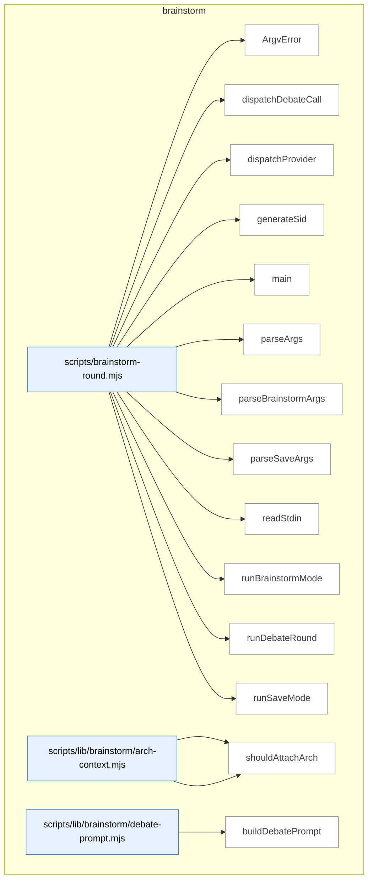

_Domain has 67 symbols (>50). Diagram shows top-15 by file order; see flat table below for the full list._

### Symbols in this domain

| Symbol | Kind | Path | Lines | Purpose | File imported by |
|---|---|---|---|---|---|
| [`ArgvError`](../scripts/brainstorm-round.mjs#L249) | class | `scripts/brainstorm-round.mjs` | 249-251 | Custom error class for CLI argument parsing errors with a code field. | _(internal)_ |
| [`dispatchDebateCall`](../scripts/brainstorm-round.mjs#L596) | function | `scripts/brainstorm-round.mjs` | 596-624 | Dispatches a single debate call to a provider, combining system and user prompts, and handling API failures. | _(internal)_ |
| [`dispatchProvider`](../scripts/brainstorm-round.mjs#L626) | function | `scripts/brainstorm-round.mjs` | 626-675 | Dispatches a brainstorm call to OpenAI or Gemini with context prepended, logging malformed responses to a debug file. | _(internal)_ |
| [`generateSid`](../scripts/brainstorm-round.mjs#L558) | function | `scripts/brainstorm-round.mjs` | 558-561 | Generates a short, sortable, collision-resistant local session ID from a timestamp and random bytes. | _(internal)_ |
| [`main`](../scripts/brainstorm-round.mjs#L259) | function | `scripts/brainstorm-round.mjs` | 259-286 | Parses CLI arguments, prunes old brainstorm sessions, and dispatches to save or brainstorm mode. | _(internal)_ |
| [`parseArgs`](../scripts/brainstorm-round.mjs#L84) | function | `scripts/brainstorm-round.mjs` | 84-97 | Detects save vs brainstorm mode from argv and dispatches to the appropriate argument parser. | _(internal)_ |
| [`parseBrainstormArgs`](../scripts/brainstorm-round.mjs#L99) | function | `scripts/brainstorm-round.mjs` | 99-198 | Parses brainstorm-mode CLI flags (topic, models, depth, debate, context attachments) into structured config. | _(internal)_ |
| [`parseSaveArgs`](../scripts/brainstorm-round.mjs#L200) | function | `scripts/brainstorm-round.mjs` | 200-247 | Parses save-mode CLI flags (session ID, round, topic, insight, tags) for persisting brainstorm results. | _(internal)_ |
| [`readStdin`](../scripts/brainstorm-round.mjs#L253) | function | `scripts/brainstorm-round.mjs` | 253-257 | Asynchronously reads stdin as a single UTF-8 string buffer. | _(internal)_ |
| [`runBrainstormMode`](../scripts/brainstorm-round.mjs#L288) | function | `scripts/brainstorm-round.mjs` | 288-510 | Loads a topic from stdin/args, redacts secrets, resolves model sentinels, and orchestrates brainstorm API calls. | _(internal)_ |
| [`runDebateRound`](../scripts/brainstorm-round.mjs#L563) | function | `scripts/brainstorm-round.mjs` | 563-594 | Runs a peer-response debate round between two providers only if both succeeded in round 1. | _(internal)_ |
| [`runSaveMode`](../scripts/brainstorm-round.mjs#L512) | function | `scripts/brainstorm-round.mjs` | 512-556 | Loads topic and insight from stdin/args, validates the session and round exist, and persists the insight to the ledger. | _(internal)_ |
| [`loadArchSection`](../scripts/lib/brainstorm/arch-context.mjs#L84) | function | `scripts/lib/brainstorm/arch-context.mjs` | 84-86 | Loads the architecture section from project context files. | `scripts/brainstorm-round.mjs`, `scripts/lib/brainstorm/resume-context.mjs` |
| [`shouldAttachArch`](../scripts/lib/brainstorm/arch-context.mjs#L70) | function | `scripts/lib/brainstorm/arch-context.mjs` | 70-75 | Determines if architectural context should attach to a brainstorm prompt based on topic intent. | `scripts/brainstorm-round.mjs`, `scripts/lib/brainstorm/resume-context.mjs` |
| [`buildDebatePrompt`](../scripts/lib/brainstorm/debate-prompt.mjs#L51) | function | `scripts/lib/brainstorm/debate-prompt.mjs` | 51-84 | Constructs a debate-round prompt with original topic, user context, and peer response for deliberation. | `scripts/brainstorm-round.mjs` |
| [`wrapUntrusted`](../scripts/lib/brainstorm/debate-prompt.mjs#L34) | function | `scripts/lib/brainstorm/debate-prompt.mjs` | 34-37 | Wraps untrusted text in a tagged block to signal to the LLM it's user-supplied. | `scripts/brainstorm-round.mjs` |
| [`autoPromoteDepth`](../scripts/lib/brainstorm/depth-config.mjs#L59) | function | `scripts/lib/brainstorm/depth-config.mjs` | 59-62 | Auto-promotes brainstorm depth to 'deep' if the topic matches architectural keywords. | `scripts/brainstorm-round.mjs`, `scripts/lib/brainstorm/arch-context.mjs` |
| [`resolveDepth`](../scripts/lib/brainstorm/depth-config.mjs#L74) | function | `scripts/lib/brainstorm/depth-config.mjs` | 74-95 | Resolves a depth configuration from explicit argument, auto-promotion, or default. | `scripts/brainstorm-round.mjs`, `scripts/lib/brainstorm/arch-context.mjs` |
| [`forceRelease`](../scripts/lib/brainstorm/file-lock.mjs#L112) | function | `scripts/lib/brainstorm/file-lock.mjs` | 112-180 | Force-removes a lock file after verifying the owner PID is dead and the lock is stale. | `scripts/lib/brainstorm/insight-store.mjs`, `scripts/lib/brainstorm/session-store.mjs`, `scripts/lib/friction/breadcrumb.mjs`, +4 more |
| [`inspectLock`](../scripts/lib/brainstorm/file-lock.mjs#L80) | function | `scripts/lib/brainstorm/file-lock.mjs` | 80-96 | Inspects a lock file and reports whether it's valid, corrupted, or unreadable. | `scripts/lib/brainstorm/insight-store.mjs`, `scripts/lib/brainstorm/session-store.mjs`, `scripts/lib/friction/breadcrumb.mjs`, +4 more |
| [`isPidAlive`](../scripts/lib/brainstorm/file-lock.mjs#L41) | function | `scripts/lib/brainstorm/file-lock.mjs` | 41-48 | Checks whether a process ID is still alive using a signal-0 test. | `scripts/lib/brainstorm/insight-store.mjs`, `scripts/lib/brainstorm/session-store.mjs`, `scripts/lib/friction/breadcrumb.mjs`, +4 more |
| [`LockTimeoutError`](../scripts/lib/brainstorm/file-lock.mjs#L23) | class | `scripts/lib/brainstorm/file-lock.mjs` | 23-30 | Custom error class signaling timeout while waiting to acquire a lock. | `scripts/lib/brainstorm/insight-store.mjs`, `scripts/lib/brainstorm/session-store.mjs`, `scripts/lib/friction/breadcrumb.mjs`, +4 more |
| [`readLockOwnerRaw`](../scripts/lib/brainstorm/file-lock.mjs#L183) | function | `scripts/lib/brainstorm/file-lock.mjs` | 183-189 | Parses a lock file and returns the owner's PID and token if valid. | `scripts/lib/brainstorm/insight-store.mjs`, `scripts/lib/brainstorm/session-store.mjs`, `scripts/lib/friction/breadcrumb.mjs`, +4 more |
| [`safeRelease`](../scripts/lib/brainstorm/file-lock.mjs#L197) | function | `scripts/lib/brainstorm/file-lock.mjs` | 197-214 | Releases a lock file if the current process still owns it. | `scripts/lib/brainstorm/insight-store.mjs`, `scripts/lib/brainstorm/session-store.mjs`, `scripts/lib/friction/breadcrumb.mjs`, +4 more |
| [`sleep`](../scripts/lib/brainstorm/file-lock.mjs#L32) | function | `scripts/lib/brainstorm/file-lock.mjs` | 32-32 | Returns a promise that resolves after a specified delay in milliseconds. | `scripts/lib/brainstorm/insight-store.mjs`, `scripts/lib/brainstorm/session-store.mjs`, `scripts/lib/friction/breadcrumb.mjs`, +4 more |
| [`tryAcquireLock`](../scripts/lib/brainstorm/file-lock.mjs#L58) | function | `scripts/lib/brainstorm/file-lock.mjs` | 58-68 | Attempts to create an exclusive file lock and returns a token on success. | `scripts/lib/brainstorm/insight-store.mjs`, `scripts/lib/brainstorm/session-store.mjs`, `scripts/lib/friction/breadcrumb.mjs`, +4 more |
| [`withFileLock`](../scripts/lib/brainstorm/file-lock.mjs#L227) | function | `scripts/lib/brainstorm/file-lock.mjs` | 227-299 | Acquires a file lock with exponential backoff, stale-lock recovery, and timeout. | `scripts/lib/brainstorm/insight-store.mjs`, `scripts/lib/brainstorm/session-store.mjs`, `scripts/lib/friction/breadcrumb.mjs`, +4 more |
| [`callGemini`](../scripts/lib/brainstorm/gemini-adapter.mjs#L16) | function | `scripts/lib/brainstorm/gemini-adapter.mjs` | 16-90 | Calls the Gemini API with a topic prompt and returns text or error state. | `scripts/brainstorm-round.mjs` |
| [`classifyError`](../scripts/lib/brainstorm/gemini-adapter.mjs#L92) | function | `scripts/lib/brainstorm/gemini-adapter.mjs` | 92-123 | Classifies Gemini API errors into semantic categories (timeout, HTTP, malformed). | `scripts/brainstorm-round.mjs` |
| [`client`](../scripts/lib/brainstorm/gemini-adapter.mjs#L6) | function | `scripts/lib/brainstorm/gemini-adapter.mjs` | 6-9 | Returns a cached Gemini API client, constructing it if absent. | `scripts/brainstorm-round.mjs` |
| [`isValidSid`](../scripts/lib/brainstorm/id-validator.mjs#L43) | function | `scripts/lib/brainstorm/id-validator.mjs` | 43-45 | Predicate that tests whether a string is a valid session ID. | `scripts/lib/brainstorm/insight-store.mjs`, `scripts/lib/brainstorm/session-store.mjs` |
| [`validateSid`](../scripts/lib/brainstorm/id-validator.mjs#L25) | function | `scripts/lib/brainstorm/id-validator.mjs` | 25-37 | Validates a session ID against a regex pattern, throwing on mismatch. | `scripts/lib/brainstorm/insight-store.mjs`, `scripts/lib/brainstorm/session-store.mjs` |
| [`buildInsightFile`](../scripts/lib/brainstorm/insight-store.mjs#L138) | function | `scripts/lib/brainstorm/insight-store.mjs` | 138-153 | Constructs a markdown file with validated YAML frontmatter and insight text. | `scripts/brainstorm-round.mjs` |
| [`findExistingSlugForTopic`](../scripts/lib/brainstorm/insight-store.mjs#L98) | function | `scripts/lib/brainstorm/insight-store.mjs` | 98-116 | Locates an existing slug directory for a given topic by scanning and parsing frontmatter. | `scripts/brainstorm-round.mjs` |
| [`listAllInsights`](../scripts/lib/brainstorm/insight-store.mjs#L234) | function | `scripts/lib/brainstorm/insight-store.mjs` | 234-246 | Returns all insights across all topics, sorted by modification time. | `scripts/brainstorm-round.mjs` |
| [`listInsightsByTopic`](../scripts/lib/brainstorm/insight-store.mjs#L216) | function | `scripts/lib/brainstorm/insight-store.mjs` | 216-225 | Returns all insights for a specific topic (or empty list if topic not found). | `scripts/brainstorm-round.mjs` |
| [`parseFrontmatter`](../scripts/lib/brainstorm/insight-store.mjs#L125) | function | `scripts/lib/brainstorm/insight-store.mjs` | 125-132 | Extracts YAML frontmatter and body from a markdown file. | `scripts/brainstorm-round.mjs` |
| [`readInsightsFromDirs`](../scripts/lib/brainstorm/insight-store.mjs#L248) | function | `scripts/lib/brainstorm/insight-store.mjs` | 248-278 | Reads markdown insight files from a list of directories, skipping unparseable entries. | `scripts/brainstorm-round.mjs` |
| [`resolveUniqueSlug`](../scripts/lib/brainstorm/insight-store.mjs#L74) | function | `scripts/lib/brainstorm/insight-store.mjs` | 74-85 | Finds a unique slug by appending numeric suffixes to handle collisions. | `scripts/brainstorm-round.mjs` |
| [`rootDir`](../scripts/lib/brainstorm/insight-store.mjs#L34) | function | `scripts/lib/brainstorm/insight-store.mjs` | 34-36 | Returns the root insights directory path (override or default). | `scripts/brainstorm-round.mjs` |
| [`saveInsight`](../scripts/lib/brainstorm/insight-store.mjs#L162) | function | `scripts/lib/brainstorm/insight-store.mjs` | 162-205 | Persists an insight to disk with lock-protected slug allocation and idempotency deduplication. | `scripts/brainstorm-round.mjs` |
| [`shortHash`](../scripts/lib/brainstorm/insight-store.mjs#L39) | function | `scripts/lib/brainstorm/insight-store.mjs` | 39-41 | Computes a 16-character SHA256 hash from pipe-separated parts. | `scripts/brainstorm-round.mjs` |
| [`slugifyTopic`](../scripts/lib/brainstorm/insight-store.mjs#L57) | function | `scripts/lib/brainstorm/insight-store.mjs` | 57-63 | Converts a topic string to a slug (lowercase, dash-separated, no punctuation). | `scripts/brainstorm-round.mjs` |
| [`tsStamp`](../scripts/lib/brainstorm/insight-store.mjs#L43) | function | `scripts/lib/brainstorm/insight-store.mjs` | 43-48 | Generates a UTC timestamp in YYYYMMDD-HHMMSS format. | `scripts/brainstorm-round.mjs` |
| [`callOpenAI`](../scripts/lib/brainstorm/openai-adapter.mjs#L40) | function | `scripts/lib/brainstorm/openai-adapter.mjs` | 40-127 | Calls the OpenAI API with a topic prompt and returns text or error state. | `scripts/brainstorm-round.mjs`, `scripts/lib/requirements/extract.mjs`, `scripts/lib/requirements/gap-challenge.mjs` |
| [`classifyError`](../scripts/lib/brainstorm/openai-adapter.mjs#L129) | function | `scripts/lib/brainstorm/openai-adapter.mjs` | 129-158 | Classifies OpenAI API errors into semantic categories (timeout, HTTP, malformed). | `scripts/brainstorm-round.mjs`, `scripts/lib/requirements/extract.mjs`, `scripts/lib/requirements/gap-challenge.mjs` |
| [`client`](../scripts/lib/brainstorm/openai-adapter.mjs#L12) | function | `scripts/lib/brainstorm/openai-adapter.mjs` | 12-15 | Returns a cached OpenAI API client, constructing it if absent. | `scripts/brainstorm-round.mjs`, `scripts/lib/requirements/extract.mjs`, `scripts/lib/requirements/gap-challenge.mjs` |
| [`wireModel`](../scripts/lib/brainstorm/openai-adapter.mjs#L20) | function | `scripts/lib/brainstorm/openai-adapter.mjs` | 20-22 | Resolves a model ID to an Azure deployment name if Azure is active, else returns the model ID. | `scripts/brainstorm-round.mjs`, `scripts/lib/requirements/extract.mjs`, `scripts/lib/requirements/gap-challenge.mjs` |
| [`estimateCostUsd`](../scripts/lib/brainstorm/pricing.mjs#L38) | function | `scripts/lib/brainstorm/pricing.mjs` | 38-41 | Calculates USD cost from token counts and model ID using pricing rates. | `scripts/brainstorm-round.mjs`, `scripts/lib/brainstorm/gemini-adapter.mjs`, `scripts/lib/brainstorm/openai-adapter.mjs` |
| [`preflightEstimateUsd`](../scripts/lib/brainstorm/pricing.mjs#L47) | function | `scripts/lib/brainstorm/pricing.mjs` | 47-50 | Estimates API cost from character count (characters-to-tokens) and max output tokens. | `scripts/brainstorm-round.mjs`, `scripts/lib/brainstorm/gemini-adapter.mjs`, `scripts/lib/brainstorm/openai-adapter.mjs` |
| [`priceFor`](../scripts/lib/brainstorm/pricing.mjs#L24) | function | `scripts/lib/brainstorm/pricing.mjs` | 24-31 | Looks up pricing rates (input/output per-token cost) for a model ID. | `scripts/brainstorm-round.mjs`, `scripts/lib/brainstorm/gemini-adapter.mjs`, `scripts/lib/brainstorm/openai-adapter.mjs` |
| [`estimateTokens`](../scripts/lib/brainstorm/provider-limits.mjs#L20) | function | `scripts/lib/brainstorm/provider-limits.mjs` | 20-22 | Estimates token count from character count using a 4-character-per-token heuristic. | `scripts/lib/brainstorm/resume-context.mjs` |
| [`getCeilingTokens`](../scripts/lib/brainstorm/provider-limits.mjs#L72) | function | `scripts/lib/brainstorm/provider-limits.mjs` | 72-83 | Returns the input token ceiling for a provider and model (with fallback). | `scripts/lib/brainstorm/resume-context.mjs` |
| [`smallestCeilingTokens`](../scripts/lib/brainstorm/provider-limits.mjs#L93) | function | `scripts/lib/brainstorm/provider-limits.mjs` | 93-105 | Finds the smallest input token ceiling across multiple providers. | `scripts/lib/brainstorm/resume-context.mjs` |
| [`assembleResumeContext`](../scripts/lib/brainstorm/resume-context.mjs#L75) | function | `scripts/lib/brainstorm/resume-context.mjs` | 75-233 | Combines architecture and context text into a resume block with independent truncation budgets. | `scripts/brainstorm-round.mjs` |
| [`buildArchBlock`](../scripts/lib/brainstorm/resume-context.mjs#L43) | function | `scripts/lib/brainstorm/resume-context.mjs` | 43-58 | Wraps and truncates architecture context to fit within a token budget. | `scripts/brainstorm-round.mjs` |
| [`appendQuarantine`](../scripts/lib/brainstorm/session-store.mjs#L228) | function | `scripts/lib/brainstorm/session-store.mjs` | 228-255 | Appends invalid lines to a quarantine log (capped, atomic via rename). | `scripts/brainstorm-round.mjs`, `scripts/lib/brainstorm/resume-context.mjs` |
| [`appendSession`](../scripts/lib/brainstorm/session-store.mjs#L76) | function | `scripts/lib/brainstorm/session-store.mjs` | 76-113 | Appends a round envelope to a session file under lock, computing the next round number. | `scripts/brainstorm-round.mjs`, `scripts/lib/brainstorm/resume-context.mjs` |
| [`loadSession`](../scripts/lib/brainstorm/session-store.mjs#L149) | function | `scripts/lib/brainstorm/session-store.mjs` | 149-226 | Reads and validates a session file, quarantining invalid JSON/schema lines for diagnostics. | `scripts/brainstorm-round.mjs`, `scripts/lib/brainstorm/resume-context.mjs` |
| [`lockPath`](../scripts/lib/brainstorm/session-store.mjs#L35) | function | `scripts/lib/brainstorm/session-store.mjs` | 35-37 | Returns the lock file path for a session. | `scripts/brainstorm-round.mjs`, `scripts/lib/brainstorm/resume-context.mjs` |
| [`normalizeArchFields`](../scripts/lib/brainstorm/session-store.mjs#L140) | function | `scripts/lib/brainstorm/session-store.mjs` | 140-147 | Adds default values for architecture-related envelope fields. | `scripts/brainstorm-round.mjs`, `scripts/lib/brainstorm/resume-context.mjs` |
| [`pruneOldSessions`](../scripts/lib/brainstorm/session-store.mjs#L287) | function | `scripts/lib/brainstorm/session-store.mjs` | 287-329 | Deletes session files older than a threshold age, with debounce sentinel and lock-based safety. | `scripts/brainstorm-round.mjs`, `scripts/lib/brainstorm/resume-context.mjs` |
| [`quarantinePath`](../scripts/lib/brainstorm/session-store.mjs#L39) | function | `scripts/lib/brainstorm/session-store.mjs` | 39-41 | Returns the quarantine log file path for invalid lines from a session. | `scripts/brainstorm-round.mjs`, `scripts/lib/brainstorm/resume-context.mjs` |
| [`readLinesUnvalidated`](../scripts/lib/brainstorm/session-store.mjs#L52) | function | `scripts/lib/brainstorm/session-store.mjs` | 52-66 | Reads JSONL lines from a session file with lenient error handling and round inference. | `scripts/brainstorm-round.mjs`, `scripts/lib/brainstorm/resume-context.mjs` |
| [`sessionDir`](../scripts/lib/brainstorm/session-store.mjs#L27) | function | `scripts/lib/brainstorm/session-store.mjs` | 27-29 | Returns the session storage directory path (override or default). | `scripts/brainstorm-round.mjs`, `scripts/lib/brainstorm/resume-context.mjs` |
| [`sessionPath`](../scripts/lib/brainstorm/session-store.mjs#L31) | function | `scripts/lib/brainstorm/session-store.mjs` | 31-33 | Returns the JSONL session log file path for a session ID. | `scripts/brainstorm-round.mjs`, `scripts/lib/brainstorm/resume-context.mjs` |
| [`summariseRound`](../scripts/lib/brainstorm/session-store.mjs#L264) | function | `scripts/lib/brainstorm/session-store.mjs` | 264-272 | Formats a brainstorm round into a human-readable one-line summary. | `scripts/brainstorm-round.mjs`, `scripts/lib/brainstorm/resume-context.mjs` |

---

## claude-hooks

> Detects mechanical coding shortcuts (empty catches, `@ts-ignore`, hardcoded localhost) via regex pattern matching, with line-level suppression comments and sensitive-path filtering to avoid false positives on credentials.

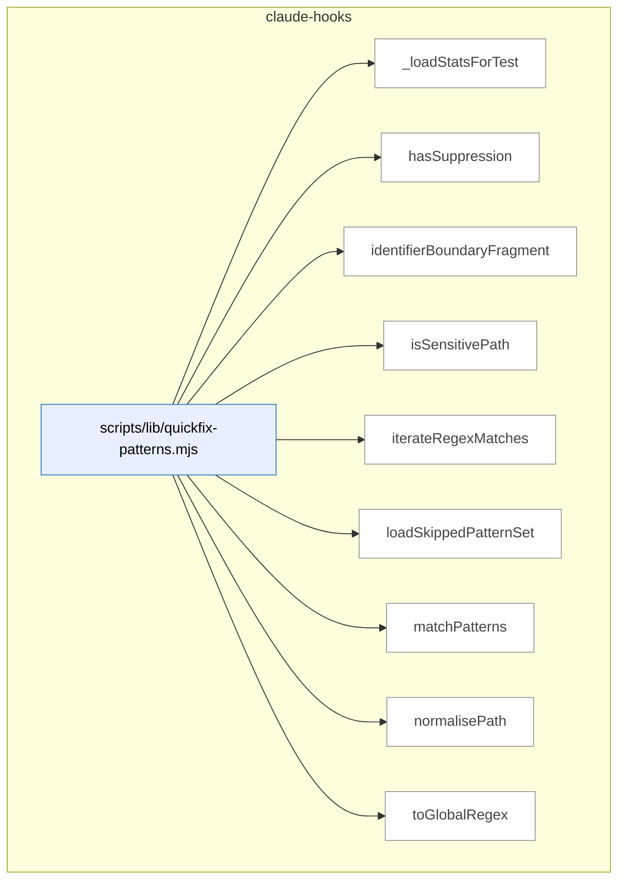

### Symbols in this domain

| Symbol | Kind | Path | Lines | Purpose | File imported by |
|---|---|---|---|---|---|
| [`_loadStatsForTest`](../scripts/lib/quickfix-patterns.mjs#L521) | function | `scripts/lib/quickfix-patterns.mjs` | 521-526 | Loads stats from a cache file for testing purposes. | `scripts/lib/audit/finding-verification.mjs`, `scripts/lib/repo-inventory.mjs` |
| [`hasSuppression`](../scripts/lib/quickfix-patterns.mjs#L270) | function | `scripts/lib/quickfix-patterns.mjs` | 270-274 | Checks if a code line has a quickfix suppression comment by file type. | `scripts/lib/audit/finding-verification.mjs`, `scripts/lib/repo-inventory.mjs` |
| [`identifierBoundaryFragment`](../scripts/lib/quickfix-patterns.mjs#L52) | function | `scripts/lib/quickfix-patterns.mjs` | 52-56 | Creates a regex fragment matching words with word/camelCase/snake_case boundaries. | `scripts/lib/audit/finding-verification.mjs`, `scripts/lib/repo-inventory.mjs` |
| [`isSensitivePath`](../scripts/lib/quickfix-patterns.mjs#L258) | function | `scripts/lib/quickfix-patterns.mjs` | 258-260 | Checks if a path is classified as sensitive (credentials/env/secrets). | `scripts/lib/audit/finding-verification.mjs`, `scripts/lib/repo-inventory.mjs` |
| [`iterateRegexMatches`](../scripts/lib/quickfix-patterns.mjs#L303) | function | `scripts/lib/quickfix-patterns.mjs` | 303-310 | Yields all non-overlapping matches of a regex in text, advancing the index correctly on zero-length matches. | `scripts/lib/audit/finding-verification.mjs`, `scripts/lib/repo-inventory.mjs` |
| [`loadSkippedPatternSet`](../scripts/lib/quickfix-patterns.mjs#L492) | function | `scripts/lib/quickfix-patterns.mjs` | 492-514 | Loads a JSON cache of patterns below acceptance threshold to skip during scanning. | `scripts/lib/audit/finding-verification.mjs`, `scripts/lib/repo-inventory.mjs` |
| [`matchPatterns`](../scripts/lib/quickfix-patterns.mjs#L336) | function | `scripts/lib/quickfix-patterns.mjs` | 336-457 | Scans diff text for quickfix patterns, filtering by sensitive paths, skip-threshold stats, and preceding-line suppression markers. | `scripts/lib/audit/finding-verification.mjs`, `scripts/lib/repo-inventory.mjs` |
| [`normalisePath`](../scripts/lib/quickfix-patterns.mjs#L245) | function | `scripts/lib/quickfix-patterns.mjs` | 245-247 | Normalizes a file path to canonical form. | `scripts/lib/audit/finding-verification.mjs`, `scripts/lib/repo-inventory.mjs` |
| [`toGlobalRegex`](../scripts/lib/quickfix-patterns.mjs#L288) | function | `scripts/lib/quickfix-patterns.mjs` | 288-291 | Ensures a regex has the global flag set for iteration. | `scripts/lib/audit/finding-verification.mjs`, `scripts/lib/repo-inventory.mjs` |

---

## claudemd-management

> Maintains consistency across instruction files (CLAUDE.md, AGENTS.md, SKILL.md) by detecting cross-file duplication via Jaccard similarity and validating/auto-fixing stale markdown references.

```mermaid
flowchart TB
subgraph dom_claudemd_management ["claudemd-management"]
  file_scripts_lib_claudemd_autofix_mjs["scripts/lib/claudemd/autofix.mjs"]:::component
  sym_scripts_lib_claudemd_autofix_mjs_applyFi["applyFixes"]:::symbol
  file_scripts_lib_claudemd_autofix_mjs --> sym_scripts_lib_claudemd_autofix_mjs_applyFi
  file_scripts_lib_claudemd_doc_similarity_mjs["scripts/lib/claudemd/doc-similarity.mjs"]:::component
  sym_scripts_lib_claudemd_doc_similarity_mjs_["extractParagraphs"]:::symbol
  file_scripts_lib_claudemd_doc_similarity_mjs --> sym_scripts_lib_claudemd_doc_similarity_mjs_
  sym_scripts_lib_claudemd_doc_similarity_mjs_["findSimilarParagraphs"]:::symbol
  file_scripts_lib_claudemd_doc_similarity_mjs --> sym_scripts_lib_claudemd_doc_similarity_mjs_
  sym_scripts_lib_claudemd_doc_similarity_mjs_["jaccardSimilarity"]:::symbol
  file_scripts_lib_claudemd_doc_similarity_mjs --> sym_scripts_lib_claudemd_doc_similarity_mjs_
  sym_scripts_lib_claudemd_doc_similarity_mjs_["normalizeMarkdown"]:::symbol
  file_scripts_lib_claudemd_doc_similarity_mjs --> sym_scripts_lib_claudemd_doc_similarity_mjs_
  sym_scripts_lib_claudemd_doc_similarity_mjs_["tokenize"]:::symbol
  file_scripts_lib_claudemd_doc_similarity_mjs --> sym_scripts_lib_claudemd_doc_similarity_mjs_
  file_scripts_lib_claudemd_file_scanner_mjs["scripts/lib/claudemd/file-scanner.mjs"]:::component
  sym_scripts_lib_claudemd_file_scanner_mjs_ma["matchPattern"]:::symbol
  file_scripts_lib_claudemd_file_scanner_mjs --> sym_scripts_lib_claudemd_file_scanner_mjs_ma
  sym_scripts_lib_claudemd_file_scanner_mjs_sc["scanInstructionFiles"]:::symbol
  file_scripts_lib_claudemd_file_scanner_mjs --> sym_scripts_lib_claudemd_file_scanner_mjs_sc
  sym_scripts_lib_claudemd_file_scanner_mjs_wa["walkDir"]:::symbol
  file_scripts_lib_claudemd_file_scanner_mjs --> sym_scripts_lib_claudemd_file_scanner_mjs_wa
  file_scripts_lib_claudemd_ref_checker_mjs["scripts/lib/claudemd/ref-checker.mjs"]:::component
  sym_scripts_lib_claudemd_ref_checker_mjs_bui["buildEnvVarIndex"]:::symbol
  file_scripts_lib_claudemd_ref_checker_mjs --> sym_scripts_lib_claudemd_ref_checker_mjs_bui
  sym_scripts_lib_claudemd_ref_checker_mjs_bui["buildFunctionIndex"]:::symbol
  file_scripts_lib_claudemd_ref_checker_mjs --> sym_scripts_lib_claudemd_ref_checker_mjs_bui
  sym_scripts_lib_claudemd_ref_checker_mjs_ext["extractEnvVarRefs"]:::symbol
  file_scripts_lib_claudemd_ref_checker_mjs --> sym_scripts_lib_claudemd_ref_checker_mjs_ext
  sym_scripts_lib_claudemd_ref_checker_mjs_ext["extractFileRefs"]:::symbol
  file_scripts_lib_claudemd_ref_checker_mjs --> sym_scripts_lib_claudemd_ref_checker_mjs_ext
  sym_scripts_lib_claudemd_ref_checker_mjs_ext["extractFunctionRefs"]:::symbol
  file_scripts_lib_claudemd_ref_checker_mjs --> sym_scripts_lib_claudemd_ref_checker_mjs_ext
  sym_scripts_lib_claudemd_ref_checker_mjs_res["resolveReferencedPath"]:::symbol
  file_scripts_lib_claudemd_ref_checker_mjs --> sym_scripts_lib_claudemd_ref_checker_mjs_res
  file_scripts_lib_claudemd_rules_mjs["scripts/lib/claudemd/rules.mjs"]:::component
  sym_scripts_lib_claudemd_rules_mjs_checkClau["checkClaudeAgentsSync"]:::symbol
  file_scripts_lib_claudemd_rules_mjs --> sym_scripts_lib_claudemd_rules_mjs_checkClau
  sym_scripts_lib_claudemd_rules_mjs_checkCros["checkCrossFileDuplication"]:::symbol
  file_scripts_lib_claudemd_rules_mjs --> sym_scripts_lib_claudemd_rules_mjs_checkCros
  sym_scripts_lib_claudemd_rules_mjs_checkDeep["checkDeepCodeDetail"]:::symbol
  file_scripts_lib_claudemd_rules_mjs --> sym_scripts_lib_claudemd_rules_mjs_checkDeep
  sym_scripts_lib_claudemd_rules_mjs_checkSize["checkSize"]:::symbol
  file_scripts_lib_claudemd_rules_mjs --> sym_scripts_lib_claudemd_rules_mjs_checkSize
  sym_scripts_lib_claudemd_rules_mjs_checkStal["checkStaleEnvVarRefs"]:::symbol
  file_scripts_lib_claudemd_rules_mjs --> sym_scripts_lib_claudemd_rules_mjs_checkStal
  sym_scripts_lib_claudemd_rules_mjs_checkStal["checkStaleFileRefs"]:::symbol
  file_scripts_lib_claudemd_rules_mjs --> sym_scripts_lib_claudemd_rules_mjs_checkStal
  sym_scripts_lib_claudemd_rules_mjs_checkStal["checkStaleFunctionRefs"]:::symbol
  file_scripts_lib_claudemd_rules_mjs --> sym_scripts_lib_claudemd_rules_mjs_checkStal
  sym_scripts_lib_claudemd_rules_mjs_extractHe["extractHeadings"]:::symbol
  file_scripts_lib_claudemd_rules_mjs --> sym_scripts_lib_claudemd_rules_mjs_extractHe
  sym_scripts_lib_claudemd_rules_mjs_runRules["runRules"]:::symbol
  file_scripts_lib_claudemd_rules_mjs --> sym_scripts_lib_claudemd_rules_mjs_runRules
  sym_scripts_lib_claudemd_rules_mjs_semanticI["semanticId"]:::symbol
  file_scripts_lib_claudemd_rules_mjs --> sym_scripts_lib_claudemd_rules_mjs_semanticI
  file_scripts_lib_claudemd_sarif_formatter_mjs["scripts/lib/claudemd/sarif-formatter.mjs"]:::component
  sym_scripts_lib_claudemd_sarif_formatter_mjs["buildRuleDescriptors"]:::symbol
  file_scripts_lib_claudemd_sarif_formatter_mjs --> sym_scripts_lib_claudemd_sarif_formatter_mjs
  sym_scripts_lib_claudemd_sarif_formatter_mjs["ruleDescription"]:::symbol
  file_scripts_lib_claudemd_sarif_formatter_mjs --> sym_scripts_lib_claudemd_sarif_formatter_mjs
  sym_scripts_lib_claudemd_sarif_formatter_mjs["sarifLevel"]:::symbol
  file_scripts_lib_claudemd_sarif_formatter_mjs --> sym_scripts_lib_claudemd_sarif_formatter_mjs
  sym_scripts_lib_claudemd_sarif_formatter_mjs["toSarif"]:::symbol
  file_scripts_lib_claudemd_sarif_formatter_mjs --> sym_scripts_lib_claudemd_sarif_formatter_mjs
  file_scripts_lib_claudemd_step65_hook_mjs["scripts/lib/claudemd/step65-hook.mjs"]:::component
  sym_scripts_lib_claudemd_step65_hook_mjs_run["runHygieneCheck"]:::symbol
  file_scripts_lib_claudemd_step65_hook_mjs --> sym_scripts_lib_claudemd_step65_hook_mjs_run
end
classDef container fill:#f5f5f5,stroke:#333,stroke-width:2px,color:#000
classDef component fill:#e8f0ff,stroke:#3178c6,color:#000
classDef symbol fill:#fff,stroke:#999,color:#444
classDef dup fill:#ffe8d8,stroke:#c0392b,stroke-width:2px,color:#000
classDef violation fill:#ffd6d6,stroke:#c0392b,stroke-width:2px,color:#000
```

### Symbols in this domain

| Symbol | Kind | Path | Lines | Purpose | File imported by |
|---|---|---|---|---|---|
| [`applyFixes`](../scripts/lib/claudemd/autofix.mjs#L16) | function | `scripts/lib/claudemd/autofix.mjs` | 16-76 | Groups findings by file and removes stale markdown link references in place (or reports what would be removed in dry-run mode). | `scripts/claudemd-lint.mjs` |
| [`extractParagraphs`](../scripts/lib/claudemd/doc-similarity.mjs#L68) | function | `scripts/lib/claudemd/doc-similarity.mjs` | 68-103 | Splits content into paragraphs (excluding code blocks) and tracks their line numbers for cross-file comparison. | `scripts/lib/claudemd/rules.mjs` |
| [`findSimilarParagraphs`](../scripts/lib/claudemd/doc-similarity.mjs#L114) | function | `scripts/lib/claudemd/doc-similarity.mjs` | 114-146 | Finds paragraphs between two files that exceed a similarity threshold using Jaccard scoring and token comparison. | `scripts/lib/claudemd/rules.mjs` |
| [`jaccardSimilarity`](../scripts/lib/claudemd/doc-similarity.mjs#L53) | function | `scripts/lib/claudemd/doc-similarity.mjs` | 53-61 | Computes the Jaccard similarity score between two token sets (intersection divided by union). | `scripts/lib/claudemd/rules.mjs` |
| [`normalizeMarkdown`](../scripts/lib/claudemd/doc-similarity.mjs#L24) | function | `scripts/lib/claudemd/doc-similarity.mjs` | 24-34 | Strips markdown syntax (links, code, bold, italic, headings, lists, tables) and lowercases text for similarity comparison. | `scripts/lib/claudemd/rules.mjs` |
| [`tokenize`](../scripts/lib/claudemd/doc-similarity.mjs#L41) | function | `scripts/lib/claudemd/doc-similarity.mjs` | 41-45 | Normalizes text and extracts meaningful words (2+ chars, filtered by stopwords) into a Set for Jaccard scoring. | `scripts/lib/claudemd/rules.mjs` |
| [`matchPattern`](../scripts/lib/claudemd/file-scanner.mjs#L72) | function | `scripts/lib/claudemd/file-scanner.mjs` | 72-93 | Tests whether a file path matches a glob-style pattern with ** and * wildcard support. | `scripts/check-context-drift.mjs`, `scripts/claudemd-lint.mjs`, `scripts/lib/claudemd/ref-checker.mjs` |
| [`scanInstructionFiles`](../scripts/lib/claudemd/file-scanner.mjs#L102) | function | `scripts/lib/claudemd/file-scanner.mjs` | 102-133 | Scans a repository for instruction files (CLAUDE.md, AGENTS.md, SKILL.md) within allowed directory trees and reads their content. | `scripts/check-context-drift.mjs`, `scripts/claudemd-lint.mjs`, `scripts/lib/claudemd/ref-checker.mjs` |
| [`walkDir`](../scripts/lib/claudemd/file-scanner.mjs#L30) | function | `scripts/lib/claudemd/file-scanner.mjs` | 30-68 | Recursively walks a directory tree to locate instruction files matching known patterns (CLAUDE.md, AGENTS.md, SKILL.md). | `scripts/check-context-drift.mjs`, `scripts/claudemd-lint.mjs`, `scripts/lib/claudemd/ref-checker.mjs` |
| [`buildEnvVarIndex`](../scripts/lib/claudemd/ref-checker.mjs#L194) | function | `scripts/lib/claudemd/ref-checker.mjs` | 194-235 | Combines platform vars, .env.example definitions, and source-code env var references into a single authoritative set. | `scripts/lib/claudemd/rules.mjs` |
| [`buildFunctionIndex`](../scripts/lib/claudemd/ref-checker.mjs#L91) | function | `scripts/lib/claudemd/ref-checker.mjs` | 91-124 | Recursively walks source files to index all exported functions, classes, and methods by parsing declaration patterns. | `scripts/lib/claudemd/rules.mjs` |
| [`extractEnvVarRefs`](../scripts/lib/claudemd/ref-checker.mjs#L165) | function | `scripts/lib/claudemd/ref-checker.mjs` | 165-187 | Extracts backtick-quoted environment variable names matching the ALL_CAPS_WITH_UNDERSCORES pattern. | `scripts/lib/claudemd/rules.mjs` |
| [`extractFileRefs`](../scripts/lib/claudemd/ref-checker.mjs#L52) | function | `scripts/lib/claudemd/ref-checker.mjs` | 52-84 | Extracts markdown links and backtick-quoted file paths from a document, skipping code blocks. | `scripts/lib/claudemd/rules.mjs` |
| [`extractFunctionRefs`](../scripts/lib/claudemd/ref-checker.mjs#L132) | function | `scripts/lib/claudemd/ref-checker.mjs` | 132-158 | Finds backtick-quoted function/class names in markdown and filters by valid naming conventions (camelCase, PascalCase, snake_case). | `scripts/lib/claudemd/rules.mjs` |
| [`resolveReferencedPath`](../scripts/lib/claudemd/ref-checker.mjs#L25) | function | `scripts/lib/claudemd/ref-checker.mjs` | 25-44 | Resolves a markdown link reference relative to its source file, checks for repo-boundary escape, and tests disk existence. | `scripts/lib/claudemd/rules.mjs` |
| [`checkClaudeAgentsSync`](../scripts/lib/claudemd/rules.mjs#L234) | function | `scripts/lib/claudemd/rules.mjs` | 234-271 | Finds headings that exist in both CLAUDE.md and AGENTS.md with different content and suggests consolidation. | `scripts/claudemd-lint.mjs` |
| [`checkCrossFileDuplication`](../scripts/lib/claudemd/rules.mjs#L203) | function | `scripts/lib/claudemd/rules.mjs` | 203-232 | Detects high-similarity paragraphs between files in the same directory tree and suggests extraction to shared docs. | `scripts/claudemd-lint.mjs` |
| [`checkDeepCodeDetail`](../scripts/lib/claudemd/rules.mjs#L186) | function | `scripts/lib/claudemd/rules.mjs` | 186-201 | Reports when a file contains more fenced code blocks than its configured limit (non-fixable, advisory). | `scripts/claudemd-lint.mjs` |
| [`checkSize`](../scripts/lib/claudemd/rules.mjs#L108) | function | `scripts/lib/claudemd/rules.mjs` | 108-122 | Reports when a file exceeds its size limit with a suggestion to extract content (non-fixable, advisory). | `scripts/claudemd-lint.mjs` |
| [`checkStaleEnvVarRefs`](../scripts/lib/claudemd/rules.mjs#L168) | function | `scripts/lib/claudemd/rules.mjs` | 168-184 | Reports backtick-quoted env vars that aren't in .env.example or discovered in source code (non-fixable). | `scripts/claudemd-lint.mjs` |
| [`checkStaleFileRefs`](../scripts/lib/claudemd/rules.mjs#L124) | function | `scripts/lib/claudemd/rules.mjs` | 124-142 | Reports referenced file paths that don't exist on disk (marked as fixable for automated removal). | `scripts/claudemd-lint.mjs` |
| [`checkStaleFunctionRefs`](../scripts/lib/claudemd/rules.mjs#L144) | function | `scripts/lib/claudemd/rules.mjs` | 144-166 | Reports backtick-quoted function/class names that aren't found in the source index (non-fixable). | `scripts/claudemd-lint.mjs` |
| [`extractHeadings`](../scripts/lib/claudemd/rules.mjs#L278) | function | `scripts/lib/claudemd/rules.mjs` | 278-302 | Parses markdown headings (h1-h4) and captures the text content under each heading as key-value pairs. | `scripts/claudemd-lint.mjs` |
| [`runRules`](../scripts/lib/claudemd/rules.mjs#L44) | function | `scripts/lib/claudemd/rules.mjs` | 44-106 | Orchestrates multiple hygiene checks (size, stale refs, duplication, sync conflicts) across instruction files and returns findings. | `scripts/claudemd-lint.mjs` |
| [`semanticId`](../scripts/lib/claudemd/rules.mjs#L17) | function | `scripts/lib/claudemd/rules.mjs` | 17-22 | Generates a 16-character SHA256-based content hash for finding deduplication and cross-round matching. | `scripts/claudemd-lint.mjs` |
| [`buildRuleDescriptors`](../scripts/lib/claudemd/sarif-formatter.mjs#L49) | function | `scripts/lib/claudemd/sarif-formatter.mjs` | 49-62 | Creates SARIF rule metadata objects for each unique ruleId found in the findings list. | `scripts/check-context-drift.mjs`, `scripts/check-model-freshness.mjs`, `scripts/claudemd-lint.mjs` |
| [`ruleDescription`](../scripts/lib/claudemd/sarif-formatter.mjs#L64) | function | `scripts/lib/claudemd/sarif-formatter.mjs` | 64-77 | Returns human-readable descriptions for each hygiene rule ID for SARIF output. | `scripts/check-context-drift.mjs`, `scripts/check-model-freshness.mjs`, `scripts/claudemd-lint.mjs` |
| [`sarifLevel`](../scripts/lib/claudemd/sarif-formatter.mjs#L40) | function | `scripts/lib/claudemd/sarif-formatter.mjs` | 40-47 | Maps internal severity levels (error/warn/info) to SARIF severity levels (error/warning/note). | `scripts/check-context-drift.mjs`, `scripts/check-model-freshness.mjs`, `scripts/claudemd-lint.mjs` |
| [`toSarif`](../scripts/lib/claudemd/sarif-formatter.mjs#L11) | function | `scripts/lib/claudemd/sarif-formatter.mjs` | 11-38 | Converts a hygiene report to SARIF 2.1.0 format with rule descriptors and findings for IDE integration. | `scripts/check-context-drift.mjs`, `scripts/check-model-freshness.mjs`, `scripts/claudemd-lint.mjs` |
| [`runHygieneCheck`](../scripts/lib/claudemd/step65-hook.mjs#L16) | function | `scripts/lib/claudemd/step65-hook.mjs` | 16-65 | Spawns the claudemd-lint subprocess, collects its JSON report, and returns a structured summary status. | _(internal)_ |

---

## cross-skill-bridge

> Parses CLI subcommands and payloads, dispatches to skill handlers, and persists cross-skill data (plans, findings, repo context) to the learning store.

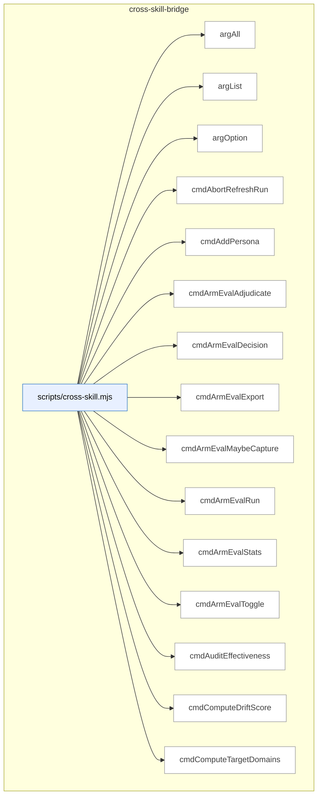

_Domain has 82 symbols (>50). Diagram shows top-15 by file order; see flat table below for the full list._

### Symbols in this domain

| Symbol | Kind | Path | Lines | Purpose | File imported by |
|---|---|---|---|---|---|
| [`argAll`](../scripts/cross-skill.mjs#L153) | function | `scripts/cross-skill.mjs` | 153-159 | Collects all values for a repeated command-line flag (e.g., multiple --flag value pairs). | _(internal)_ |
| [`argList`](../scripts/cross-skill.mjs#L147) | function | `scripts/cross-skill.mjs` | 147-150 | Parses a comma-separated --flag value into a trimmed array of strings. | _(internal)_ |
| [`argOption`](../scripts/cross-skill.mjs#L140) | function | `scripts/cross-skill.mjs` | 140-144 | Retrieves the value following a named command-line flag (e.g., --flag value). | _(internal)_ |
| [`cmdAbortRefreshRun`](../scripts/cross-skill.mjs#L1867) | function | `scripts/cross-skill.mjs` | 1867-1877 | Cancels an in-progress architectural-memory refresh session with a reason. | _(internal)_ |
| [`cmdAddPersona`](../scripts/cross-skill.mjs#L1072) | function | `scripts/cross-skill.mjs` | 1072-1084 | Creates or updates a persona definition in the learning store. | _(internal)_ |
| [`cmdArmEvalAdjudicate`](../scripts/cross-skill.mjs#L810) | function | `scripts/cross-skill.mjs` | 810-834 | Presents a blinded arm-eval output queue or records human ranking/adjudication decision. | _(internal)_ |
| [`cmdArmEvalDecision`](../scripts/cross-skill.mjs#L776) | function | `scripts/cross-skill.mjs` | 776-793 | Evaluates arm-eval experiment results across sessions and recommends a winning model/arm. | _(internal)_ |
| [`cmdArmEvalExport`](../scripts/cross-skill.mjs#L842) | function | `scripts/cross-skill.mjs` | 842-860 | Exports arm-eval session results to a committed archive file (one or all sessions). | _(internal)_ |
| [`cmdArmEvalMaybeCapture`](../scripts/cross-skill.mjs#L901) | function | `scripts/cross-skill.mjs` | 901-917 | Conditionally captures an arm-eval task if the toggle is enabled and budget allows. | _(internal)_ |
| [`cmdArmEvalRun`](../scripts/cross-skill.mjs#L754) | function | `scripts/cross-skill.mjs` | 754-773 | Launches an arm-eval experiment session with a task and optional budget override. | _(internal)_ |
| [`cmdArmEvalStats`](../scripts/cross-skill.mjs#L796) | function | `scripts/cross-skill.mjs` | 796-807 | Queries aggregate arm-eval leaderboard results filtered by experiment type and repository. | _(internal)_ |
| [`cmdArmEvalToggle`](../scripts/cross-skill.mjs#L868) | function | `scripts/cross-skill.mjs` | 868-893 | Enables/disables arm-eval capture toggling and sets the budget cap for this repository. | _(internal)_ |
| [`cmdAuditEffectiveness`](../scripts/cross-skill.mjs#L584) | function | `scripts/cross-skill.mjs` | 584-591 | Queries precision + recall audit effectiveness metrics for a repository. | _(internal)_ |
| [`cmdComputeDriftScore`](../scripts/cross-skill.mjs#L1971) | function | `scripts/cross-skill.mjs` | 1971-1982 | Calculates the architectural drift metric for a repo between two snapshots. | _(internal)_ |
| [`cmdComputeTargetDomains`](../scripts/cross-skill.mjs#L1711) | function | `scripts/cross-skill.mjs` | 1711-1723 | Determines which architectural domains target files belong to based on domain rules. | _(internal)_ |
| [`cmdDetectStack`](../scripts/cross-skill.mjs#L1546) | function | `scripts/cross-skill.mjs` | 1546-1563 | Detects the tech stack (Node, React, Python, etc.) of a repository using filesystem markers. | _(internal)_ |
| [`cmdFinalizeOutcomes`](../scripts/cross-skill.mjs#L972) | function | `scripts/cross-skill.mjs` | 972-1042 | Finalizes audit-run outcome verdicts by merging audit findings with ledger adjudications. | _(internal)_ |
| [`cmdFinalReviewAdjudicate`](../scripts/cross-skill.mjs#L630) | function | `scripts/cross-skill.mjs` | 630-644 | Records a human adjudication action (accepted/dismissed) for a shadow final-review finding. | _(internal)_ |
| [`cmdFinalReviewStats`](../scripts/cross-skill.mjs#L595) | function | `scripts/cross-skill.mjs` | 595-628 | Retrieves final-review shadow-reviewer statistics and optionally renders an adjudication worksheet. | _(internal)_ |
| [`cmdFrictionLog`](../scripts/cross-skill.mjs#L2096) | function | `scripts/cross-skill.mjs` | 2096-2101 | Dispatcher that delegates to friction-log.mjs subcommands. | _(internal)_ |
| [`cmdGetActiveRefreshId`](../scripts/cross-skill.mjs#L1583) | function | `scripts/cross-skill.mjs` | 1583-1599 | Fetches the active architectural-memory refresh ID and embedding model for a repo. | _(internal)_ |
| [`cmdGetCallersForFile`](../scripts/cross-skill.mjs#L1725) | function | `scripts/cross-skill.mjs` | 1725-1788 | Returns the list of callers/importers of a file from the architecture index. | _(internal)_ |
| [`cmdGetFrictionNeighbourhood`](../scripts/cross-skill.mjs#L1700) | function | `scripts/cross-skill.mjs` | 1700-1709 | Finds similar friction patterns and past learnings for a given prompt. | _(internal)_ |
| [`cmdGetIncidentNeighbourhood`](../scripts/cross-skill.mjs#L1601) | function | `scripts/cross-skill.mjs` | 1601-1642 | Queries the security incident memory for incidents matching a given code-change intent. | _(internal)_ |
| [`cmdGetNavFirstSeen`](../scripts/cross-skill.mjs#L536) | function | `scripts/cross-skill.mjs` | 536-551 | Queries when nav-audit drift findings were first observed in historical run data. | _(internal)_ |
| [`cmdGetNeighbourhood`](../scripts/cross-skill.mjs#L1790) | function | `scripts/cross-skill.mjs` | 1790-1833 | Queries the symbol-embedding store for architecturally similar code to an intent. | _(internal)_ |
| [`cmdGetPersonaSessionsByRepo`](../scripts/cross-skill.mjs#L1325) | function | `scripts/cross-skill.mjs` | 1325-1353 | Queries persona test sessions for a repository with optional filtering by limit and severity floor. | _(internal)_ |
| [`cmdGetPersonaSessionsByUrl`](../scripts/cross-skill.mjs#L1518) | function | `scripts/cross-skill.mjs` | 1518-1544 | Retrieves persona test sessions for a given app URL from the cloud store. | _(internal)_ |
| [`cmdGetReachabilityEvidence`](../scripts/cross-skill.mjs#L1360) | function | `scripts/cross-skill.mjs` | 1360-1394 | Retrieves persona navigation/reachability evidence per persona for nav-audit bootstrap. | _(internal)_ |
| [`cmdGetRecentFindings`](../scripts/cross-skill.mjs#L1475) | function | `scripts/cross-skill.mjs` | 1475-1510 | Fetches recent audit findings from the cloud store, filtered by repo and severity. | _(internal)_ |
| [`cmdLearningBackfillOutcomes`](../scripts/cross-skill.mjs#L2080) | function | `scripts/cross-skill.mjs` | 2080-2090 | Backfills missing outcome labels on prior learning decisions. | _(internal)_ |
| [`cmdLearningQuickfixStats`](../scripts/cross-skill.mjs#L2123) | function | `scripts/cross-skill.mjs` | 2123-2149 | Queries or rebuilds the cache of quickfix-pattern detection statistics. | _(internal)_ |
| [`cmdLearningRecord`](../scripts/cross-skill.mjs#L1999) | function | `scripts/cross-skill.mjs` | 1999-2038 | Records a learning decision point (audit choice and outcome) to the cloud store. | _(internal)_ |
| [`cmdLearningReplay`](../scripts/cross-skill.mjs#L2108) | function | `scripts/cross-skill.mjs` | 2108-2116 | Runs a replay of prior audit decisions through the current auditor for comparison. | _(internal)_ |
| [`cmdLearningStats`](../scripts/cross-skill.mjs#L2045) | function | `scripts/cross-skill.mjs` | 2045-2056 | Fetches aggregate statistics about learning decisions and outcomes for a repo. | _(internal)_ |
| [`cmdLearningWeeklyReview`](../scripts/cross-skill.mjs#L2064) | function | `scripts/cross-skill.mjs` | 2064-2072 | Generates and posts a weekly digest of recurring issues and patterns. | _(internal)_ |
| [`cmdListConsistencyCandidates`](../scripts/cross-skill.mjs#L343) | function | `scripts/cross-skill.mjs` | 343-356 | Lists pending persona-consistency regression spec candidates for a repository filtered by age and limit. | _(internal)_ |
| [`cmdListLayeringViolationsForSnapshot`](../scripts/cross-skill.mjs#L1958) | function | `scripts/cross-skill.mjs` | 1958-1969 | Lists all architectural layering violations from a refresh session. | _(internal)_ |
| [`cmdListPersonas`](../scripts/cross-skill.mjs#L1050) | function | `scripts/cross-skill.mjs` | 1050-1061 | Lists configured personas for a given application URL. | _(internal)_ |
| [`cmdListPersonaTestCandidates`](../scripts/cross-skill.mjs#L396) | function | `scripts/cross-skill.mjs` | 396-408 | Lists persona test finding candidates filtered by age, occurrence floor, and severity floor. | _(internal)_ |
| [`cmdListSymbolsForSnapshot`](../scripts/cross-skill.mjs#L1945) | function | `scripts/cross-skill.mjs` | 1945-1956 | Lists all indexed symbols from a completed refresh session. | _(internal)_ |
| [`cmdListUnlockedFixes`](../scripts/cross-skill.mjs#L576) | function | `scripts/cross-skill.mjs` | 576-582 | Lists recent HIGH-severity audit fixes lacking a regression spec lock. | _(internal)_ |
| [`cmdMarkPersonaTestCandidateProposed`](../scripts/cross-skill.mjs#L410) | function | `scripts/cross-skill.mjs` | 410-422 | Marks a persona test candidate as proposed, transitioning its state in the learning store. | _(internal)_ |
| [`cmdModelAbAdjudicate`](../scripts/cross-skill.mjs#L655) | function | `scripts/cross-skill.mjs` | 655-726 | Presents a blinded model-A/B/C adjudication queue or records human ranking decision. | _(internal)_ |
| [`cmdModelAbDecision`](../scripts/cross-skill.mjs#L929) | function | `scripts/cross-skill.mjs` | 929-950 | Evaluates model-A/B shadow findings and cost to recommend a keeper decision + budget exhaustion status. | _(internal)_ |
| [`cmdModelAbStats`](../scripts/cross-skill.mjs#L729) | function | `scripts/cross-skill.mjs` | 729-747 | Queries model-A/B/C effectiveness (recall, cost per arm, and frontier rankings). | _(internal)_ |
| [`cmdOpenRefreshRun`](../scripts/cross-skill.mjs#L1835) | function | `scripts/cross-skill.mjs` | 1835-1853 | Opens a new architectural-memory refresh session with a specified mode and start commit. | _(internal)_ |
| [`cmdPersonaOutcomes`](../scripts/cross-skill.mjs#L1233) | function | `scripts/cross-skill.mjs` | 1233-1307 | Lists actionable persona findings (unlabeled or regressed) and renders an outcome-labeling worksheet. | _(internal)_ |
| [`cmdPlanSatisfaction`](../scripts/cross-skill.mjs#L495) | function | `scripts/cross-skill.mjs` | 495-505 | Queries the latest plan verification results and lists persistent failure patterns across runs. | _(internal)_ |
| [`cmdPreviewGate`](../scripts/cross-skill.mjs#L1449) | function | `scripts/cross-skill.mjs` | 1449-1457 | Outputs the preview gate verdict (halt, warn, or ok) for the current cycle configuration. | _(internal)_ |
| [`cmdPromoteRegressionSpec`](../scripts/cross-skill.mjs#L358) | function | `scripts/cross-skill.mjs` | 358-371 | Promotes a consistency-candidate spec to a locked/committed spec and records the promoter identity. | _(internal)_ |
| [`cmdPublishRefreshRun`](../scripts/cross-skill.mjs#L1855) | function | `scripts/cross-skill.mjs` | 1855-1865 | Marks an architectural-memory refresh session as complete and publishable. | _(internal)_ |
| [`cmdQuality`](../scripts/cross-skill.mjs#L1649) | function | `scripts/cross-skill.mjs` | 1649-1698 | Dispatcher for friction tracking subcommands (add, mirror, digest, link, session-review). | _(internal)_ |
| [`cmdRecommendSkills`](../scripts/cross-skill.mjs#L1404) | function | `scripts/cross-skill.mjs` | 1404-1442 | Recommends which UI lenses to run next based on changed files, audit findings, and live-URL availability. | _(internal)_ |
| [`cmdRecordCorrelation`](../scripts/cross-skill.mjs#L442) | function | `scripts/cross-skill.mjs` | 442-460 | Records a correlation between a persona-test finding and an audit-code finding with match scoring. | _(internal)_ |
| [`cmdRecordLayeringViolations`](../scripts/cross-skill.mjs#L1919) | function | `scripts/cross-skill.mjs` | 1919-1931 | Records architectural layering violations detected during a refresh. | _(internal)_ |
| [`cmdRecordNavAuditRun`](../scripts/cross-skill.mjs#L509) | function | `scripts/cross-skill.mjs` | 509-534 | Records a nav-audit run's drift findings and verification summary, idempotent by repo/commit/scope. | _(internal)_ |
| [`cmdRecordPersonaSession`](../scripts/cross-skill.mjs#L1118) | function | `scripts/cross-skill.mjs` | 1118-1144 | Records a persona test session with findings and auto-correlates P0/P1 findings to audit candidates. | _(internal)_ |
| [`cmdRecordPlanVerifyItems`](../scripts/cross-skill.mjs#L484) | function | `scripts/cross-skill.mjs` | 484-493 | Inserts per-criterion pass/fail results for a plan verification run. | _(internal)_ |
| [`cmdRecordPlanVerifyRun`](../scripts/cross-skill.mjs#L462) | function | `scripts/cross-skill.mjs` | 462-482 | Records a plan verification run (Playwright spec execution) with totals and duration metadata. | _(internal)_ |
| [`cmdRecordRegressionSpec`](../scripts/cross-skill.mjs#L273) | function | `scripts/cross-skill.mjs` | 273-341 | Records a Playwright regression spec (lock or candidate) with pre-egress redaction of sensitive data. | _(internal)_ |
| [`cmdRecordRegressionSpecRun`](../scripts/cross-skill.mjs#L424) | function | `scripts/cross-skill.mjs` | 424-440 | Records a regression spec execution outcome (passed/failed) with optional regression capture flag. | _(internal)_ |
| [`cmdRecordShipEvent`](../scripts/cross-skill.mjs#L553) | function | `scripts/cross-skill.mjs` | 553-574 | Records a /ship deployment event including outcome, block reasons, and open finding counts. | _(internal)_ |
| [`cmdRecordSymbolDefinitions`](../scripts/cross-skill.mjs#L1879) | function | `scripts/cross-skill.mjs` | 1879-1889 | Persists symbol definitions and metadata to the cloud index. | _(internal)_ |
| [`cmdRecordSymbolEmbedding`](../scripts/cross-skill.mjs#L1905) | function | `scripts/cross-skill.mjs` | 1905-1917 | Stores embedding vectors for symbols to enable semantic similarity search. | _(internal)_ |
| [`cmdRecordSymbolIndex`](../scripts/cross-skill.mjs#L1891) | function | `scripts/cross-skill.mjs` | 1891-1903 | Writes symbol definitions and cross-file imports to a refresh snapshot. | _(internal)_ |
| [`cmdResolveRepoIdentity`](../scripts/cross-skill.mjs#L1984) | function | `scripts/cross-skill.mjs` | 1984-1990 | Returns (and optionally persists) the stable UUID for the current repo. | _(internal)_ |
| [`cmdSetActiveEmbeddingModel`](../scripts/cross-skill.mjs#L1933) | function | `scripts/cross-skill.mjs` | 1933-1943 | Updates which embedding model is used for symbol similarity queries. | _(internal)_ |
| [`cmdUpdatePlanStatus`](../scripts/cross-skill.mjs#L264) | function | `scripts/cross-skill.mjs` | 264-271 | Updates an existing plan's status field in the learning store. | _(internal)_ |
| [`cmdUpsertPersonaTestCandidate`](../scripts/cross-skill.mjs#L375) | function | `scripts/cross-skill.mjs` | 375-394 | Records or updates a persona test finding candidate with severity, fingerprint, and occurrence tracking. | _(internal)_ |
| [`cmdUpsertPlan`](../scripts/cross-skill.mjs#L234) | function | `scripts/cross-skill.mjs` | 234-262 | Records or updates a plan in the learning store and optionally triggers arm-eval capture if taskText is present. | _(internal)_ |
| [`cmdWhoami`](../scripts/cross-skill.mjs#L1565) | function | `scripts/cross-skill.mjs` | 1565-1579 | Prints the current commit SHA, branch, cloud connectivity status, and repo identity. | _(internal)_ |
| [`currentBranch`](../scripts/cross-skill.mjs#L183) | function | `scripts/cross-skill.mjs` | 183-188 | Retrieves the current Git branch name via git rev-parse --abbrev-ref HEAD. | _(internal)_ |
| [`currentCommitSha`](../scripts/cross-skill.mjs#L176) | function | `scripts/cross-skill.mjs` | 176-181 | Retrieves the current Git commit SHA via git rev-parse HEAD. | _(internal)_ |
| [`emitError`](../scripts/cross-skill.mjs#L169) | function | `scripts/cross-skill.mjs` | 169-172 | Emits a JSON error response and exits with a specified code. | _(internal)_ |
| [`gitChangedFiles`](../scripts/cross-skill.mjs#L1460) | function | `scripts/cross-skill.mjs` | 1460-1468 | Returns the list of git-changed and untracked files in the working tree. | _(internal)_ |
| [`hasFlag`](../scripts/cross-skill.mjs#L162) | function | `scripts/cross-skill.mjs` | 162-162 | Returns whether a boolean command-line flag is present in process.argv. | _(internal)_ |
| [`main`](../scripts/cross-skill.mjs#L2234) | function | `scripts/cross-skill.mjs` | 2234-2258 | Parses subcommand and dispatches to the corresponding handler function. | _(internal)_ |
| [`parsePayload`](../scripts/cross-skill.mjs#L123) | function | `scripts/cross-skill.mjs` | 123-138 | Extracts a JSON payload from command arguments via --json, --stdin, or bare JSON at the end. | _(internal)_ |
| [`resolveRepoId`](../scripts/cross-skill.mjs#L208) | function | `scripts/cross-skill.mjs` | 208-230 | Resolves a repository ID from explicit ID, repoUuid lookup, or current repo identity, failing closed on transient DB errors. | _(internal)_ |
| [`resolveRepoIdentityQuiet`](../scripts/cross-skill.mjs#L920) | function | `scripts/cross-skill.mjs` | 920-926 | Silently resolves the current repository's canonical UUID, returning null on any failure. | _(internal)_ |
| [`runAutoCorrelate`](../scripts/cross-skill.mjs#L1156) | function | `scripts/cross-skill.mjs` | 1156-1224 | Matches persona P0/P1 findings against candidate audit findings in the same repo and records correlations. | _(internal)_ |

---

## dashboard

> Builds static HTML dashboard pages (reference, telemetry, audit-run) from collected Supabase data and filesystem artifacts, handling data degradation and rendering them to disk via a CLI builder.

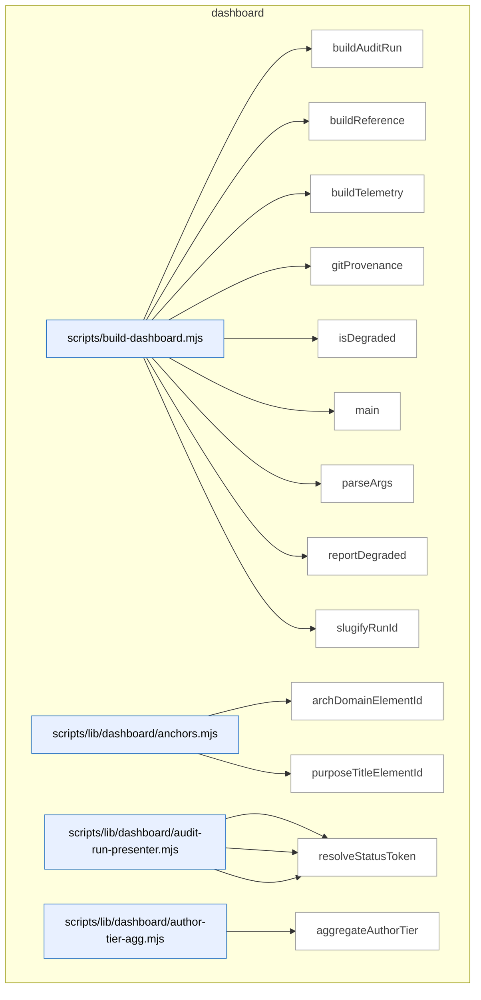

_Domain has 121 symbols (>50). Diagram shows top-15 by file order; see flat table below for the full list._

### Symbols in this domain

| Symbol | Kind | Path | Lines | Purpose | File imported by |
|---|---|---|---|---|---|
| [`buildAuditRun`](../scripts/build-dashboard.mjs#L157) | function | `scripts/build-dashboard.mjs` | 157-183 | Builds an audit-run dashboard page for a specific run, handling missing/invalid run pointers and writing to disk. | _(internal)_ |
| [`buildReference`](../scripts/build-dashboard.mjs#L131) | function | `scripts/build-dashboard.mjs` | 131-137 | Builds the reference dashboard page by collecting data, rendering HTML, and writing to disk. | _(internal)_ |
| [`buildTelemetry`](../scripts/build-dashboard.mjs#L139) | function | `scripts/build-dashboard.mjs` | 139-145 | Builds the telemetry dashboard page by collecting data, rendering HTML, and writing to disk. | _(internal)_ |
| [`gitProvenance`](../scripts/build-dashboard.mjs#L113) | function | `scripts/build-dashboard.mjs` | 113-123 | Retrieves the current git commit SHA and working-tree dirty status via git command. | _(internal)_ |
| [`isDegraded`](../scripts/build-dashboard.mjs#L125) | function | `scripts/build-dashboard.mjs` | 125-129 | Checks if any data source has failed or encountered an unexpected error. | _(internal)_ |
| [`main`](../scripts/build-dashboard.mjs#L198) | function | `scripts/build-dashboard.mjs` | 198-264 | Parses CLI args, loads dashboard assets, dispatches the appropriate build command, triggers side builds, and reports status. | _(internal)_ |
| [`parseArgs`](../scripts/build-dashboard.mjs#L57) | function | `scripts/build-dashboard.mjs` | 57-97 | Parses dashboard builder CLI flags, validating port range, subcommand names, and flag-subcommand compatibility. | _(internal)_ |
| [`reportDegraded`](../scripts/build-dashboard.mjs#L185) | function | `scripts/build-dashboard.mjs` | 185-196 | Logs warnings to stderr for any data sources that are degraded or missing optional information. | _(internal)_ |
| [`slugifyRunId`](../scripts/build-dashboard.mjs#L103) | function | `scripts/build-dashboard.mjs` | 103-110 | Converts a run ID to a filesystem-safe filename by lowercasing, removing special chars, and collapsing hyphens. | _(internal)_ |
| [`archDomainElementId`](../scripts/lib/dashboard/anchors.mjs#L15) | function | `scripts/lib/dashboard/anchors.mjs` | 15-17 | Generates a DOM element ID for an architectural domain | `scripts/lib/dashboard/collect-purposes.mjs`, `scripts/lib/dashboard/sections/architecture.mjs` |
| [`purposeTitleElementId`](../scripts/lib/dashboard/anchors.mjs#L24) | function | `scripts/lib/dashboard/anchors.mjs` | 24-26 | Generates a DOM element ID for a purpose section title | `scripts/lib/dashboard/collect-purposes.mjs`, `scripts/lib/dashboard/sections/architecture.mjs` |
| [`presentFinding`](../scripts/lib/dashboard/audit-run-presenter.mjs#L59) | function | `scripts/lib/dashboard/audit-run-presenter.mjs` | 59-91 | Transforms a raw finding into a display-friendly object with severity, status, and pass labels | `scripts/lib/dashboard/collect-audit-run.mjs` |
| [`presentFindings`](../scripts/lib/dashboard/audit-run-presenter.mjs#L94) | function | `scripts/lib/dashboard/audit-run-presenter.mjs` | 94-96 | Batch-transforms a list of findings into display-friendly objects | `scripts/lib/dashboard/collect-audit-run.mjs` |
| [`resolveStatusToken`](../scripts/lib/dashboard/audit-run-presenter.mjs#L44) | function | `scripts/lib/dashboard/audit-run-presenter.mjs` | 44-50 | Determines the current status token (remediation/adjudication state) for a finding | `scripts/lib/dashboard/collect-audit-run.mjs` |
| [`aggregateAuthorTier`](../scripts/lib/dashboard/author-tier-agg.mjs#L28) | function | `scripts/lib/dashboard/author-tier-agg.mjs` | 28-89 | Summarizes author-tier suggestion data by tier and provider, computing agreement rates | `scripts/lib/dashboard/collect-telemetry.mjs` |
| [`isConverged`](../scripts/lib/dashboard/author-tier-agg.mjs#L16) | function | `scripts/lib/dashboard/author-tier-agg.mjs` | 16-18 | Tests whether a convergence flag is truthy (handles string/boolean variants) | `scripts/lib/dashboard/collect-telemetry.mjs` |
| [`coerceMeta`](../scripts/lib/dashboard/collect-audit-run.mjs#L64) | function | `scripts/lib/dashboard/collect-audit-run.mjs` | 64-67 | Normalizes run metadata by coercing its createdAt timestamp | `scripts/build-dashboard.mjs` |
| [`coerceTs`](../scripts/lib/dashboard/collect-audit-run.mjs#L57) | function | `scripts/lib/dashboard/collect-audit-run.mjs` | 57-61 | Converts a date-like value to ISO timestamp string (or null if absent) | `scripts/build-dashboard.mjs` |
| [`collectAuditRun`](../scripts/lib/dashboard/collect-audit-run.mjs#L89) | function | `scripts/lib/dashboard/collect-audit-run.mjs` | 89-160 | Fetches audit run metadata and findings from cloud store (or returns local-only fallback) | `scripts/build-dashboard.mjs` |
| [`makeData`](../scripts/lib/dashboard/collect-audit-run.mjs#L69) | function | `scripts/lib/dashboard/collect-audit-run.mjs` | 69-81 | Constructs a structured audit-run data object for dashboard rendering | `scripts/build-dashboard.mjs` |
| [`resolveRunId`](../scripts/lib/dashboard/collect-audit-run.mjs#L35) | function | `scripts/lib/dashboard/collect-audit-run.mjs` | 35-55 | Resolves an audit run ID from explicit parameter or disk cache with error classification | `scripts/build-dashboard.mjs` |
| [`auditCatalogCoverage`](../scripts/lib/dashboard/collect-cli.mjs#L130) | function | `scripts/lib/dashboard/collect-cli.mjs` | 130-144 | Checks for missing (uncatalogued) and orphaned (catalog-only) script entries | `scripts/lib/dashboard/collect-reference.mjs` |
| [`collectCli`](../scripts/lib/dashboard/collect-cli.mjs#L46) | function | `scripts/lib/dashboard/collect-cli.mjs` | 46-107 | Reads npm scripts from package.json and merges with optional .cli-catalog.json metadata | `scripts/lib/dashboard/collect-reference.mjs` |
| [`groupByCategory`](../scripts/lib/dashboard/collect-cli.mjs#L114) | function | `scripts/lib/dashboard/collect-cli.mjs` | 114-121 | Partitions CLI entries by their category field into a grouped object | `scripts/lib/dashboard/collect-reference.mjs` |
| [`canonicalRepoId`](../scripts/lib/dashboard/collect-nav.mjs#L39) | function | `scripts/lib/dashboard/collect-nav.mjs` | 39-53 | Resolves a repository's canonical database ID using its UUID identifier | `scripts/lib/dashboard/collect-reference.mjs` |
| [`collectNav`](../scripts/lib/dashboard/collect-nav.mjs#L59) | function | `scripts/lib/dashboard/collect-nav.mjs` | 59-163 | Loads navigation audit data (contract, observed graph, live verify result) and builds display scorecard | `scripts/lib/dashboard/collect-reference.mjs` |
| [`readEnvelope`](../scripts/lib/dashboard/collect-nav.mjs#L165) | function | `scripts/lib/dashboard/collect-nav.mjs` | 165-179 | Reads and validates the static nav-audit observed-graph envelope with staleness detection | `scripts/lib/dashboard/collect-reference.mjs` |
| [`wrap`](../scripts/lib/dashboard/collect-nav.mjs#L181) | function | `scripts/lib/dashboard/collect-nav.mjs` | 181-183 | Returns a formatted navAudit result object | `scripts/lib/dashboard/collect-reference.mjs` |
| [`collectPurposes`](../scripts/lib/dashboard/collect-purposes.mjs#L54) | function | `scripts/lib/dashboard/collect-purposes.mjs` | 54-243 | Loads purpose configuration from domain-map.json and integrates with architecture domains and requirements | `scripts/lib/dashboard/collect-reference.mjs` |
| [`emptyResult`](../scripts/lib/dashboard/collect-purposes.mjs#L24) | function | `scripts/lib/dashboard/collect-purposes.mjs` | 24-41 | Constructs an empty/error purposes dashboard result with placeholder fields | `scripts/lib/dashboard/collect-reference.mjs` |
| [`collectArchitecture`](../scripts/lib/dashboard/collect-reference.mjs#L286) | function | `scripts/lib/dashboard/collect-reference.mjs` | 286-327 | Extracts architecture domains and summaries from the generated `architecture-map.md` file. | `scripts/build-dashboard.mjs` |
| [`collectFlows`](../scripts/lib/dashboard/collect-reference.mjs#L340) | function | `scripts/lib/dashboard/collect-reference.mjs` | 340-367 | Loads and validates the `flows.json` manifest describing skill execution workflows and cross-references skills. | `scripts/build-dashboard.mjs` |
| [`collectReference`](../scripts/lib/dashboard/collect-reference.mjs#L374) | function | `scripts/lib/dashboard/collect-reference.mjs` | 374-499 | Aggregates all reference data (skills, plans, architecture, flows, requirements) into a unified collection object. | `scripts/build-dashboard.mjs` |
| [`discoverPlans`](../scripts/lib/dashboard/collect-reference.mjs#L47) | function | `scripts/lib/dashboard/collect-reference.mjs` | 47-126 | Discovers markdown plan files in `docs/plans` and `docs/completed` with valid "Plan:" headings and metadata. | `scripts/build-dashboard.mjs` |
| [`readDomainDeps`](../scripts/lib/dashboard/collect-reference.mjs#L225) | function | `scripts/lib/dashboard/collect-reference.mjs` | 225-245 | Merges observed and manual dependency layers and counts edges by source (observed/manual/both). | `scripts/build-dashboard.mjs` |
| [`readManualAllowedDeps`](../scripts/lib/dashboard/collect-reference.mjs#L180) | function | `scripts/lib/dashboard/collect-reference.mjs` | 180-205 | Reads the manual `allowedDeps` architectural dependency declarations from `domain-map.json`. | `scripts/build-dashboard.mjs` |
| [`readObservedEnvelope`](../scripts/lib/dashboard/collect-reference.mjs#L137) | function | `scripts/lib/dashboard/collect-reference.mjs` | 137-166 | Loads and validates the observed dependency graph JSON, checking for freshness against domain-map rules. | `scripts/build-dashboard.mjs` |
| [`readRequirementsLedger`](../scripts/lib/dashboard/collect-reference.mjs#L257) | function | `scripts/lib/dashboard/collect-reference.mjs` | 257-275 | Parses the `.requirements/ledger.json` file containing active de-facto system requirements. | `scripts/build-dashboard.mjs` |
| [`aggregatePasses`](../scripts/lib/dashboard/collect-telemetry.mjs#L48) | function | `scripts/lib/dashboard/collect-telemetry.mjs` | 48-60 | Groups and sums pass statistics (findings raised/accepted/dismissed) by pass name. | `scripts/build-dashboard.mjs` |
| [`attributeHighByFile`](../scripts/lib/dashboard/collect-telemetry.mjs#L609) | function | `scripts/lib/dashboard/collect-telemetry.mjs` | 609-626 | Maps HIGH findings to purposes via file→domain→purpose lookup with deduplication. | `scripts/build-dashboard.mjs` |
| [`canonicalRepoId`](../scripts/lib/dashboard/collect-telemetry.mjs#L227) | function | `scripts/lib/dashboard/collect-telemetry.mjs` | 227-230 | Looks up the stable canonical repo ID by UUID for consistent cross-session correlation. | `scripts/build-dashboard.mjs` |
| [`classifyPurposeBadges`](../scripts/lib/dashboard/collect-telemetry.mjs#L633) | function | `scripts/lib/dashboard/collect-telemetry.mjs` | 633-662 | Assigns health status (ok/at-risk/na) to each purpose based on finding and secret signals. | `scripts/build-dashboard.mjs` |
| [`collectAuditEffectiveness`](../scripts/lib/dashboard/collect-telemetry.mjs#L420) | function | `scripts/lib/dashboard/collect-telemetry.mjs` | 420-448 | Queries user-visible precision/recall and severity-accuracy metrics from correlation ground-truth. | `scripts/build-dashboard.mjs` |
| [`collectAuditRuns`](../scripts/lib/dashboard/collect-telemetry.mjs#L71) | function | `scripts/lib/dashboard/collect-telemetry.mjs` | 71-110 | Fetches audit run metrics from cloud or local cache with per-pass aggregation. | `scripts/build-dashboard.mjs` |
| [`collectAuthorTier`](../scripts/lib/dashboard/collect-telemetry.mjs#L350) | function | `scripts/lib/dashboard/collect-telemetry.mjs` | 350-361 | Queries author-tier statistics aggregated by suggested model tier and provider ladder. | `scripts/build-dashboard.mjs` |
| [`collectLearning`](../scripts/lib/dashboard/collect-telemetry.mjs#L167) | function | `scripts/lib/dashboard/collect-telemetry.mjs` | 167-187 | Queries the learning store for pending triage count, no-brainer count, and stale cluster statistics. | `scripts/build-dashboard.mjs` |
| [`collectModelAb`](../scripts/lib/dashboard/collect-telemetry.mjs#L376) | function | `scripts/lib/dashboard/collect-telemetry.mjs` | 376-412 | Fetches model-A/B/C arm effectiveness scores, costs, and pending adjudication queue. | `scripts/build-dashboard.mjs` |
| [`collectPersonaTests`](../scripts/lib/dashboard/collect-telemetry.mjs#L286) | function | `scripts/lib/dashboard/collect-telemetry.mjs` | 286-337 | Fetches persona test sessions and audit↔persona correlations from cloud storage. | `scripts/build-dashboard.mjs` |
| [`collectPromptVariants`](../scripts/lib/dashboard/collect-telemetry.mjs#L194) | function | `scripts/lib/dashboard/collect-telemetry.mjs` | 194-224 | Loads Thompson-sampled bandit arms with posterior alpha/beta statistics grouped by pass and variant. | `scripts/build-dashboard.mjs` |
| [`collectPurposeHealth`](../scripts/lib/dashboard/collect-telemetry.mjs#L520) | function | `scripts/lib/dashboard/collect-telemetry.mjs` | 520-597 | Evaluates repo health by purpose based on attributed HIGH findings and refused secrets per purpose. | `scripts/build-dashboard.mjs` |
| [`collectRequirements`](../scripts/lib/dashboard/collect-telemetry.mjs#L113) | function | `scripts/lib/dashboard/collect-telemetry.mjs` | 113-154 | Loads the requirements ledger, counts active items, and previews key requirements. | `scripts/build-dashboard.mjs` |
| [`collectSecurity`](../scripts/lib/dashboard/collect-telemetry.mjs#L482) | function | `scripts/lib/dashboard/collect-telemetry.mjs` | 482-497 | Fetches security incident counts and event history for the repo from the security store. | `scripts/build-dashboard.mjs` |
| [`collectShipHealth`](../scripts/lib/dashboard/collect-telemetry.mjs#L233) | function | `scripts/lib/dashboard/collect-telemetry.mjs` | 233-258 | Retrieves ship event outcomes grouped by result type and recent deployment history. | `scripts/build-dashboard.mjs` |
| [`collectTelemetry`](../scripts/lib/dashboard/collect-telemetry.mjs#L759) | function | `scripts/lib/dashboard/collect-telemetry.mjs` | 759-816 | Orchestrates parallel collection of all telemetry sources (audit runs, learning, security, etc.) into one object. | `scripts/build-dashboard.mjs` |
| [`collectTieredShadow`](../scripts/lib/dashboard/collect-telemetry.mjs#L676) | function | `scripts/lib/dashboard/collect-telemetry.mjs` | 676-752 | Aggregates tiered-recall shadow audit statistics (latency, cost, overlap) across sibling repos. | `scripts/build-dashboard.mjs` |
| [`emptyAuthorTier`](../scripts/lib/dashboard/collect-telemetry.mjs#L340) | function | `scripts/lib/dashboard/collect-telemetry.mjs` | 340-342 | Returns empty author-tier observation structure (stub for when no data is available). | `scripts/build-dashboard.mjs` |
| [`emptyEffectiveness`](../scripts/lib/dashboard/collect-telemetry.mjs#L415) | function | `scripts/lib/dashboard/collect-telemetry.mjs` | 415-417 | Returns empty audit effectiveness structure (precision/recall, severity accuracy — stub). | `scripts/build-dashboard.mjs` |
| [`emptyModelAb`](../scripts/lib/dashboard/collect-telemetry.mjs#L364) | function | `scripts/lib/dashboard/collect-telemetry.mjs` | 364-366 | Returns empty model-A/B/C shadow telemetry structure (stub for when feature is off). | `scripts/build-dashboard.mjs` |
| [`emptyPersonaTests`](../scripts/lib/dashboard/collect-telemetry.mjs#L263) | function | `scripts/lib/dashboard/collect-telemetry.mjs` | 263-265 | Returns empty persona-test telemetry structure (stub for when no data is available). | `scripts/build-dashboard.mjs` |
| [`emptyPurposeHealth`](../scripts/lib/dashboard/collect-telemetry.mjs#L504) | function | `scripts/lib/dashboard/collect-telemetry.mjs` | 504-511 | Returns empty purpose-health assessment structure (stub for when no data is available). | `scripts/build-dashboard.mjs` |
| [`emptySecurity`](../scripts/lib/dashboard/collect-telemetry.mjs#L451) | function | `scripts/lib/dashboard/collect-telemetry.mjs` | 451-456 | Returns empty security incident telemetry structure (stub for when no data is available). | `scripts/build-dashboard.mjs` |
| [`repoName`](../scripts/lib/dashboard/collect-telemetry.mjs#L157) | function | `scripts/lib/dashboard/collect-telemetry.mjs` | 157-164 | Resolves repository name from `LEARNING_REPO_NAME` env var or `package.json` fallback. | `scripts/build-dashboard.mjs` |
| [`securityData`](../scripts/lib/dashboard/collect-telemetry.mjs#L459) | function | `scripts/lib/dashboard/collect-telemetry.mjs` | 459-475 | Formats security stats into display-ready structure with incident counts and recent events. | `scripts/build-dashboard.mjs` |
| [`collectVisual`](../scripts/lib/dashboard/collect-visual.mjs#L19) | function | `scripts/lib/dashboard/collect-visual.mjs` | 19-49 | Gathers visual-audit contract findings and verification metadata with scorecard and live status. | `scripts/lib/dashboard/collect-reference.mjs` |
| [`wrap`](../scripts/lib/dashboard/collect-visual.mjs#L51) | function | `scripts/lib/dashboard/collect-visual.mjs` | 51-53 | Wraps visual-audit data in the output envelope with scorecard and findings array. | `scripts/lib/dashboard/collect-reference.mjs` |
| [`buildUi`](../scripts/lib/dashboard/helpers.mjs#L106) | function | `scripts/lib/dashboard/helpers.mjs` | 106-117 | Returns a frozen object containing all UI helper functions. | `scripts/lib/dashboard/render.mjs` |
| [`emptyPanel`](../scripts/lib/dashboard/helpers.mjs#L72) | function | `scripts/lib/dashboard/helpers.mjs` | 72-75 | Renders an empty-state HTML panel with optional data-testid attribute. | `scripts/lib/dashboard/render.mjs` |
| [`escapeHtml`](../scripts/lib/dashboard/helpers.mjs#L22) | function | `scripts/lib/dashboard/helpers.mjs` | 22-29 | Escapes HTML special characters for safe string embedding in HTML content. | `scripts/lib/dashboard/render.mjs` |
| [`jsonScriptSafe`](../scripts/lib/dashboard/helpers.mjs#L43) | function | `scripts/lib/dashboard/helpers.mjs` | 43-50 | Escapes JSON special characters and line/paragraph separators for safe embedding in script tags. | `scripts/lib/dashboard/render.mjs` |
| [`panel`](../scripts/lib/dashboard/helpers.mjs#L83) | function | `scripts/lib/dashboard/helpers.mjs` | 83-86 | Renders a tab panel container with aria-labelledby linking to its tab button. | `scripts/lib/dashboard/render.mjs` |
| [`splitUsage`](../scripts/lib/dashboard/helpers.mjs#L93) | function | `scripts/lib/dashboard/helpers.mjs` | 93-98 | Parses a single-line usage string into command and description separated by dashes. | `scripts/lib/dashboard/render.mjs` |
| [`statusDot`](../scripts/lib/dashboard/helpers.mjs#L57) | function | `scripts/lib/dashboard/helpers.mjs` | 57-61 | Renders a colored status indicator dot (green/yellow/red) based on status value. | `scripts/lib/dashboard/render.mjs` |
| [`tab`](../scripts/lib/dashboard/helpers.mjs#L77) | function | `scripts/lib/dashboard/helpers.mjs` | 77-81 | Renders an accessible tab button with aria-selected and role attributes. | `scripts/lib/dashboard/render.mjs` |
| [`warningPanel`](../scripts/lib/dashboard/helpers.mjs#L64) | function | `scripts/lib/dashboard/helpers.mjs` | 64-69 | Renders an HTML warning panel showing a failed data source with status and detail message. | `scripts/lib/dashboard/render.mjs` |
| [`loadAssets`](../scripts/lib/dashboard/load-assets.mjs#L18) | function | `scripts/lib/dashboard/load-assets.mjs` | 18-29 | Reads bundled CSS and JavaScript assets from the dashboard asset directory. | `scripts/build-dashboard.mjs` |
| [`freshnessBanner`](../scripts/lib/dashboard/render.mjs#L141) | function | `scripts/lib/dashboard/render.mjs` | 141-153 | Renders an HTML line showing build metadata (commit SHA, freshness, mode). | `scripts/build-dashboard.mjs` |
| [`nav`](../scripts/lib/dashboard/render.mjs#L158) | function | `scripts/lib/dashboard/render.mjs` | 158-166 | Renders the navigation bar with links to Reference and Telemetry pages. | `scripts/build-dashboard.mjs` |
| [`renderDocument`](../scripts/lib/dashboard/render.mjs#L178) | function | `scripts/lib/dashboard/render.mjs` | 178-271 | Orchestrates full HTML document generation with tabs, sections, and content panels for a given dashboard view. | `scripts/build-dashboard.mjs` |
| [`validateDashboardData`](../scripts/lib/dashboard/schema.mjs#L518) | function | `scripts/lib/dashboard/schema.mjs` | 518-523 | Parses and validates dashboard data against the appropriate Zod schema (reference/telemetry/audit-run). | `scripts/lib/dashboard/collect-purposes.mjs`, `scripts/lib/dashboard/collect-reference.mjs`, `scripts/lib/dashboard/collect-telemetry.mjs`, +1 more |
| [`archTiers`](../scripts/lib/dashboard/sections/architecture.mjs#L29) | function | `scripts/lib/dashboard/sections/architecture.mjs` | 29-46 | Computes architectural tiers (0=no deps, 1=depended-upon, 2=dependent-on-others) for domains in the architecture graph. | `scripts/lib/dashboard/render.mjs` |
| [`formatDepsSourceLine`](../scripts/lib/dashboard/sections/architecture.mjs#L48) | function | `scripts/lib/dashboard/sections/architecture.mjs` | 48-72 | Formats dependency counts (observed/manual/both) with refresh metadata into a summary line. | `scripts/lib/dashboard/render.mjs` |
| [`sectionArchitecture`](../scripts/lib/dashboard/sections/architecture.mjs#L74) | function | `scripts/lib/dashboard/sections/architecture.mjs` | 74-131 | Renders architecture tiers with domain boxes, symbol-count bars, dependency arrows, and purpose mappings. | `scripts/lib/dashboard/render.mjs` |
| [`pct`](../scripts/lib/dashboard/sections/audit-effectiveness.mjs#L14) | function | `scripts/lib/dashboard/sections/audit-effectiveness.mjs` | 14-17 | Converts a decimal value to a percentage string (e.g., 0.85 → "85%"). | `scripts/lib/dashboard/render.mjs` |
| [`sectionAuditEffectiveness`](../scripts/lib/dashboard/sections/audit-effectiveness.mjs#L19) | function | `scripts/lib/dashboard/sections/audit-effectiveness.mjs` | 19-39 | Displays audit-effectiveness metrics (precision, recall, confirmed hits, false positives, severity misses) in a table. | `scripts/lib/dashboard/render.mjs` |
| [`chip`](../scripts/lib/dashboard/sections/audit-run-detail.mjs#L34) | function | `scripts/lib/dashboard/sections/audit-run-detail.mjs` | 34-37 | Generates a filterable chip button with group and value attributes for toggling severity/pass/status filters. | `scripts/lib/dashboard/render.mjs` |
| [`filterBar`](../scripts/lib/dashboard/sections/audit-run-detail.mjs#L39) | function | `scripts/lib/dashboard/sections/audit-run-detail.mjs` | 39-65 | Builds a filter UI with severity/pass/status chips and a file-search input for findings table. | `scripts/lib/dashboard/render.mjs` |
| [`findingRow`](../scripts/lib/dashboard/sections/audit-run-detail.mjs#L67) | function | `scripts/lib/dashboard/sections/audit-run-detail.mjs` | 67-89 | Renders a table row for one audit finding with collapsible evidence and metadata (severity, pass, file, status). | `scripts/lib/dashboard/render.mjs` |
| [`findingsTable`](../scripts/lib/dashboard/sections/audit-run-detail.mjs#L91) | function | `scripts/lib/dashboard/sections/audit-run-detail.mjs` | 91-100 | Wraps finding rows in an HTML table with column headers. | `scripts/lib/dashboard/render.mjs` |
| [`runHeader`](../scripts/lib/dashboard/sections/audit-run-detail.mjs#L20) | function | `scripts/lib/dashboard/sections/audit-run-detail.mjs` | 20-32 | Creates an audit-run header with ID, mode, rounds, Gemini verdict, findings count, and commit SHA. | `scripts/lib/dashboard/render.mjs` |
| [`sectionAuditRunDetail`](../scripts/lib/dashboard/sections/audit-run-detail.mjs#L102) | function | `scripts/lib/dashboard/sections/audit-run-detail.mjs` | 102-143 | Renders a complete audit-run detail page with findings table, filter bar, and run metadata or error panels. | `scripts/lib/dashboard/render.mjs` |
| [`sectionAuditRuns`](../scripts/lib/dashboard/sections/audit-runs.mjs#L16) | function | `scripts/lib/dashboard/sections/audit-runs.mjs` | 16-53 | Shows audit-run summary (count, labeled), pass statistics, and local-vs-cloud telemetry status indicator. | `scripts/lib/dashboard/render.mjs` |
| [`sectionAuthorTier`](../scripts/lib/dashboard/sections/author-tier.mjs#L14) | function | `scripts/lib/dashboard/sections/author-tier.mjs` | 14-63 | Displays author-tier observation metrics (converged rate, ladder partition, diversity gate status). | `scripts/lib/dashboard/render.mjs` |
| [`sectionCli`](../scripts/lib/dashboard/sections/cli.mjs#L38) | function | `scripts/lib/dashboard/sections/cli.mjs` | 38-97 | Lists categorized CLI commands with descriptions, related skills, output files, and full-text search. | `scripts/lib/dashboard/render.mjs` |
| [`sectionFlows`](../scripts/lib/dashboard/sections/flows.mjs#L14) | function | `scripts/lib/dashboard/sections/flows.mjs` | 14-42 | Renders skill-chain flow as connected boxes showing handoffs between skills. | `scripts/lib/dashboard/render.mjs` |
| [`sectionLearning`](../scripts/lib/dashboard/sections/learning.mjs#L14) | function | `scripts/lib/dashboard/sections/learning.mjs` | 14-34 | Shows learning-system metrics (pending triage, no-brainer recommendations, stale clusters). | `scripts/lib/dashboard/render.mjs` |
| [`sectionModelAb`](../scripts/lib/dashboard/sections/model-ab.mjs#L21) | function | `scripts/lib/dashboard/sections/model-ab.mjs` | 21-69 | Displays model-A/B/C arms with adjudication counts, acceptance/conformance rates, and EUR spend. | `scripts/lib/dashboard/render.mjs` |
| [`sectionNavAudit`](../scripts/lib/dashboard/sections/nav-audit.mjs#L17) | function | `scripts/lib/dashboard/sections/nav-audit.mjs` | 17-82 | Renders nav-audit scorecard (per-persona reachability) and drift findings with live-verify banner. | `scripts/lib/dashboard/render.mjs` |
| [`daysAgo`](../scripts/lib/dashboard/sections/persona-tests.mjs#L15) | function | `scripts/lib/dashboard/sections/persona-tests.mjs` | 15-20 | Calculates days between an ISO-8601 timestamp and now, returning null if unparseable. | `scripts/lib/dashboard/render.mjs` |
| [`sectionPersonaTests`](../scripts/lib/dashboard/sections/persona-tests.mjs#L26) | function | `scripts/lib/dashboard/sections/persona-tests.mjs` | 26-73 | Shows latest persona sessions, verdicts, P0/P1 counts, and trend by persona. | `scripts/lib/dashboard/render.mjs` |
| [`escapeHtml`](../scripts/lib/dashboard/sections/plans.mjs#L40) | function | `scripts/lib/dashboard/sections/plans.mjs` | 40-47 | HTML-escapes a string to prevent XSS injection. | `scripts/lib/dashboard/render.mjs` |
| [`planList`](../scripts/lib/dashboard/sections/plans.mjs#L184) | function | `scripts/lib/dashboard/sections/plans.mjs` | 184-198 | Renders plans as collapsible details boxes with title, status, date, path, and rendered body. | `scripts/lib/dashboard/render.mjs` |
| [`renderInline`](../scripts/lib/dashboard/sections/plans.mjs#L49) | function | `scripts/lib/dashboard/sections/plans.mjs` | 49-78 | Converts inline markdown (bold, italic, links, backtick code) to HTML with XSS safety. | `scripts/lib/dashboard/render.mjs` |
| [`renderMarkdown`](../scripts/lib/dashboard/sections/plans.mjs#L80) | function | `scripts/lib/dashboard/sections/plans.mjs` | 80-180 | Parses markdown into HTML (headings, lists, fenced code, mermaid blocks, inline rendering). | `scripts/lib/dashboard/render.mjs` |
| [`sectionPlans`](../scripts/lib/dashboard/sections/plans.mjs#L200) | function | `scripts/lib/dashboard/sections/plans.mjs` | 200-231 | Shows active and completed plans with lazy-load mermaid rendering via CDN. | `scripts/lib/dashboard/render.mjs` |
| [`sectionPromptVariants`](../scripts/lib/dashboard/sections/prompt-variants.mjs#L14) | function | `scripts/lib/dashboard/sections/prompt-variants.mjs` | 14-41 | Displays Thompson-sampling bandit arms (pass, variant, pulls, posterior mean, alpha/beta). | `scripts/lib/dashboard/render.mjs` |
| [`sectionPurposeHealth`](../scripts/lib/dashboard/sections/purpose-health.mjs#L25) | function | `scripts/lib/dashboard/sections/purpose-health.mjs` | 25-67 | Shows purpose-health governance (recent HIGHs, failing plans, unattributable findings, health badges). | `scripts/lib/dashboard/render.mjs` |
| [`renderChip`](../scripts/lib/dashboard/sections/purpose.mjs#L153) | function | `scripts/lib/dashboard/sections/purpose.mjs` | 153-162 | Renders a domain chip as a linked badge or unlinked span if no architecture entry. | `scripts/lib/dashboard/render.mjs` |
| [`renderHygiene`](../scripts/lib/dashboard/sections/purpose.mjs#L164) | function | `scripts/lib/dashboard/sections/purpose.mjs` | 164-189 | Lists hygiene issues (unmapped domains, missing architecture, unknown keys, unattached requirements). | `scripts/lib/dashboard/render.mjs` |
| [`renderMatrix`](../scripts/lib/dashboard/sections/purpose.mjs#L88) | function | `scripts/lib/dashboard/sections/purpose.mjs` | 88-104 | Creates a table showing which purposes each domain serves. | `scripts/lib/dashboard/render.mjs` |
| [`renderNode`](../scripts/lib/dashboard/sections/purpose.mjs#L106) | function | `scripts/lib/dashboard/sections/purpose.mjs` | 106-151 | Renders a single purpose node with domain chips, skill flows, and grouped requirements. | `scripts/lib/dashboard/render.mjs` |
| [`sectionPurpose`](../scripts/lib/dashboard/sections/purpose.mjs#L26) | function | `scripts/lib/dashboard/sections/purpose.mjs` | 26-80 | Renders purpose outcomes, invariant coverage, domain-purpose matrix, and hygiene warnings. | `scripts/lib/dashboard/render.mjs` |
| [`shortReqId`](../scripts/lib/dashboard/sections/purpose.mjs#L21) | function | `scripts/lib/dashboard/sections/purpose.mjs` | 21-24 | Extracts the last 6 hex characters from a requirement ID, formatting as #xxxxxx. | `scripts/lib/dashboard/render.mjs` |
| [`sectionRequirements`](../scripts/lib/dashboard/sections/requirements.mjs#L17) | function | `scripts/lib/dashboard/sections/requirements.mjs` | 17-47 | Shows requirements ledger grouped by kind (behavioural, security, etc.) with ID/statement/status. | `scripts/lib/dashboard/render.mjs` |
| [`sectionSecurity`](../scripts/lib/dashboard/sections/security.mjs#L26) | function | `scripts/lib/dashboard/sections/security.mjs` | 26-71 | Displays security incidents, by-status breakdown, audit-trail events, and recent activity. | `scripts/lib/dashboard/render.mjs` |
| [`sectionShipHealth`](../scripts/lib/dashboard/sections/ship-health.mjs#L12) | function | `scripts/lib/dashboard/sections/ship-health.mjs` | 12-37 | Shows ship outcomes (pass/blocked/warned/overridden) and recent ship events. | `scripts/lib/dashboard/render.mjs` |
| [`sectionSkills`](../scripts/lib/dashboard/sections/skills.mjs#L24) | function | `scripts/lib/dashboard/sections/skills.mjs` | 24-62 | Lists skills as searchable cards with one-liner, triggers, usage, and lock status. | `scripts/lib/dashboard/render.mjs` |
| [`sectionStartHere`](../scripts/lib/dashboard/sections/start-here.mjs#L13) | function | `scripts/lib/dashboard/sections/start-here.mjs` | 13-102 | Renders a dashboard intro page explaining purpose and cross-linking reference/telemetry sections. | `scripts/lib/dashboard/render.mjs` |
| [`sectionTieredShadow`](../scripts/lib/dashboard/sections/tiered-shadow.mjs#L14) | function | `scripts/lib/dashboard/sections/tiered-shadow.mjs` | 14-113 | Shows tiered-recall shadow-validation progress (compared runs, window state, failures, cost). | `scripts/lib/dashboard/render.mjs` |
| [`sectionVisualAudit`](../scripts/lib/dashboard/sections/visual-audit.mjs#L15) | function | `scripts/lib/dashboard/sections/visual-audit.mjs` | 15-61 | Renders visual-audit scorecard and findings with live-verify status or source-coherence diagnostics. | `scripts/lib/dashboard/render.mjs` |
| [`openBrowser`](../scripts/lib/dashboard/serve.mjs#L22) | function | `scripts/lib/dashboard/serve.mjs` | 22-34 | Spawns a detached browser process to open a URL (platform-aware: cmd/open/xdg-open). | `scripts/build-dashboard.mjs` |
| [`serve`](../scripts/lib/dashboard/serve.mjs#L44) | function | `scripts/lib/dashboard/serve.mjs` | 44-118 | Creates an HTTP server serving a local dashboard directory with DNS-rebinding defence and path containment. | `scripts/build-dashboard.mjs` |

---

## explain

> Searches for a topic across git history, architectural memory, plan documents, and brainstorm logs, then builds a chronological timeline showing when and where the topic was touched across the codebase's development history.

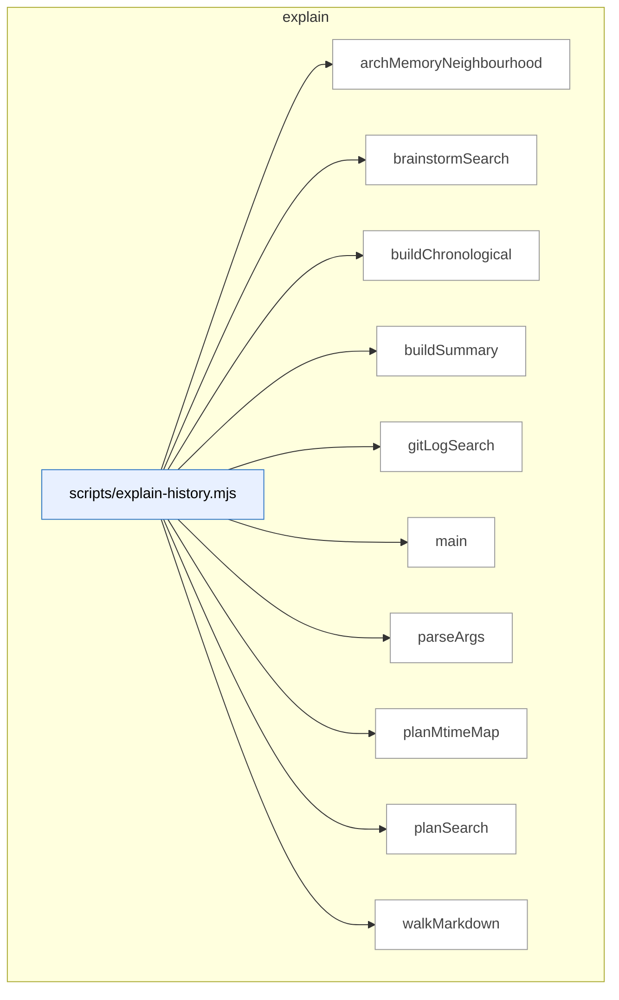

### Symbols in this domain

| Symbol | Kind | Path | Lines | Purpose | File imported by |
|---|---|---|---|---|---|
| [`archMemoryNeighbourhood`](../scripts/explain-history.mjs#L148) | function | `scripts/explain-history.mjs` | 148-184 | Queries the architectural memory index for symbols similar to the search topic with cosine similarity. | _(internal)_ |
| [`brainstormSearch`](../scripts/explain-history.mjs#L237) | function | `scripts/explain-history.mjs` | 237-282 | Searches brainstorm session JSONL logs for entries matching the topic in session topic or provider responses. | _(internal)_ |
| [`buildChronological`](../scripts/explain-history.mjs#L290) | function | `scripts/explain-history.mjs` | 290-305 | Merges git commits, brainstorm sessions, and plan documents into a single chronological list sorted by date (most recent first). | _(internal)_ |
| [`buildSummary`](../scripts/explain-history.mjs#L319) | function | `scripts/explain-history.mjs` | 319-326 | Generates a human-readable summary of how many times a topic was touched across git, arch-memory, plans, and brainstorm sources. | _(internal)_ |
| [`gitLogSearch`](../scripts/explain-history.mjs#L89) | function | `scripts/explain-history.mjs` | 89-140 | Searches git log for commits matching a topic via subject/body grep and content search, deduplicates results. | _(internal)_ |
| [`main`](../scripts/explain-history.mjs#L328) | function | `scripts/explain-history.mjs` | 328-385 | CLI entry point for explain-history: parses args, searches four sources, builds chronological timeline, and outputs results. | _(internal)_ |
| [`parseArgs`](../scripts/explain-history.mjs#L51) | function | `scripts/explain-history.mjs` | 51-80 | Parses CLI arguments to extract search topic, date range, target paths, limit, output file, and flags. | _(internal)_ |
| [`planMtimeMap`](../scripts/explain-history.mjs#L307) | function | `scripts/explain-history.mjs` | 307-317 | Creates a map of plan file paths to their modification timestamps (ISO 8601), returning null for files that can't be stat'd. | _(internal)_ |
| [`planSearch`](../scripts/explain-history.mjs#L191) | function | `scripts/explain-history.mjs` | 191-218 | Walks docs/plans recursively and searches for markdown lines containing the topic, grouped by heading. | _(internal)_ |
| [`walkMarkdown`](../scripts/explain-history.mjs#L220) | function | `scripts/explain-history.mjs` | 220-228 | Recursively collects all markdown files (.md) from a directory tree. | _(internal)_ |

---

## findings

> Formats audit findings into markdown, durably logs finding outcomes and remediation tasks to JSONL, and computes exponential-decay quality metrics (acceptance rate, reward) per audit pass.

```mermaid
flowchart TB
subgraph dom_findings ["findings"]
  file_scripts_lib_findings_format_mjs["scripts/lib/findings-format.mjs"]:::component
  sym_scripts_lib_findings_format_mjs_formatFi["formatFindings"]:::symbol
  file_scripts_lib_findings_format_mjs --> sym_scripts_lib_findings_format_mjs_formatFi
  file_scripts_lib_findings_outcomes_mjs["scripts/lib/findings-outcomes.mjs"]:::component
  sym_scripts_lib_findings_outcomes_mjs_append["appendOutcome"]:::symbol
  file_scripts_lib_findings_outcomes_mjs --> sym_scripts_lib_findings_outcomes_mjs_append
  sym_scripts_lib_findings_outcomes_mjs_batchA["batchAppendOutcomes"]:::symbol
  file_scripts_lib_findings_outcomes_mjs --> sym_scripts_lib_findings_outcomes_mjs_batchA
  sym_scripts_lib_findings_outcomes_mjs_compac["compactOutcomes"]:::symbol
  file_scripts_lib_findings_outcomes_mjs --> sym_scripts_lib_findings_outcomes_mjs_compac
  sym_scripts_lib_findings_outcomes_mjs_comput["computePassEffectiveness"]:::symbol
  file_scripts_lib_findings_outcomes_mjs --> sym_scripts_lib_findings_outcomes_mjs_comput
  sym_scripts_lib_findings_outcomes_mjs_comput["computePassEWR"]:::symbol
  file_scripts_lib_findings_outcomes_mjs --> sym_scripts_lib_findings_outcomes_mjs_comput
  sym_scripts_lib_findings_outcomes_mjs_loadOu["loadOutcomes"]:::symbol
  file_scripts_lib_findings_outcomes_mjs --> sym_scripts_lib_findings_outcomes_mjs_loadOu
  sym_scripts_lib_findings_outcomes_mjs_setRep["setRepoProfileCache"]:::symbol
  file_scripts_lib_findings_outcomes_mjs --> sym_scripts_lib_findings_outcomes_mjs_setRep
  file_scripts_lib_findings_tasks_mjs["scripts/lib/findings-tasks.mjs"]:::component
  sym_scripts_lib_findings_tasks_mjs_createRem["createRemediationTask"]:::symbol
  file_scripts_lib_findings_tasks_mjs --> sym_scripts_lib_findings_tasks_mjs_createRem
  sym_scripts_lib_findings_tasks_mjs_getTaskSt["getTaskStore"]:::symbol
  file_scripts_lib_findings_tasks_mjs --> sym_scripts_lib_findings_tasks_mjs_getTaskSt
  sym_scripts_lib_findings_tasks_mjs_loadTasks["loadTasks"]:::symbol
  file_scripts_lib_findings_tasks_mjs --> sym_scripts_lib_findings_tasks_mjs_loadTasks
  sym_scripts_lib_findings_tasks_mjs_persistTa["persistTask"]:::symbol
  file_scripts_lib_findings_tasks_mjs --> sym_scripts_lib_findings_tasks_mjs_persistTa
  sym_scripts_lib_findings_tasks_mjs_trackEdit["trackEdit"]:::symbol
  file_scripts_lib_findings_tasks_mjs --> sym_scripts_lib_findings_tasks_mjs_trackEdit
  sym_scripts_lib_findings_tasks_mjs_updateTas["updateTask"]:::symbol
  file_scripts_lib_findings_tasks_mjs --> sym_scripts_lib_findings_tasks_mjs_updateTas
  sym_scripts_lib_findings_tasks_mjs_verifyTas["verifyTask"]:::symbol
  file_scripts_lib_findings_tasks_mjs --> sym_scripts_lib_findings_tasks_mjs_verifyTas
  file_scripts_lib_findings_tracker_mjs["scripts/lib/findings-tracker.mjs"]:::component
  sym_scripts_lib_findings_tracker_mjs_applyLa["applyLazyDecay"]:::symbol
  file_scripts_lib_findings_tracker_mjs --> sym_scripts_lib_findings_tracker_mjs_applyLa
  sym_scripts_lib_findings_tracker_mjs_buildPa["buildPatternKey"]:::symbol
  file_scripts_lib_findings_tracker_mjs --> sym_scripts_lib_findings_tracker_mjs_buildPa
  sym_scripts_lib_findings_tracker_mjs_effecti["effectiveSampleSize"]:::symbol
  file_scripts_lib_findings_tracker_mjs --> sym_scripts_lib_findings_tracker_mjs_effecti
  sym_scripts_lib_findings_tracker_mjs_extract["extractDimensions"]:::symbol
  file_scripts_lib_findings_tracker_mjs --> sym_scripts_lib_findings_tracker_mjs_extract
  sym_scripts_lib_findings_tracker_mjs_FalsePo["FalsePositiveTracker"]:::symbol
  file_scripts_lib_findings_tracker_mjs --> sym_scripts_lib_findings_tracker_mjs_FalsePo
  sym_scripts_lib_findings_tracker_mjs_recordW["recordWithDecay"]:::symbol
  file_scripts_lib_findings_tracker_mjs --> sym_scripts_lib_findings_tracker_mjs_recordW
  file_scripts_lib_findings_mjs["scripts/lib/findings.mjs"]:::component
  sym_scripts_lib_findings_mjs_semanticId["semanticId"]:::symbol
  file_scripts_lib_findings_mjs --> sym_scripts_lib_findings_mjs_semanticId
end
classDef container fill:#f5f5f5,stroke:#333,stroke-width:2px,color:#000
classDef component fill:#e8f0ff,stroke:#3178c6,color:#000
classDef symbol fill:#fff,stroke:#999,color:#444
classDef dup fill:#ffe8d8,stroke:#c0392b,stroke-width:2px,color:#000
classDef violation fill:#ffd6d6,stroke:#c0392b,stroke-width:2px,color:#000
```

### Symbols in this domain

| Symbol | Kind | Path | Lines | Purpose | File imported by |
|---|---|---|---|---|---|
| [`formatFindings`](../scripts/lib/findings-format.mjs#L12) | function | `scripts/lib/findings-format.mjs` | 12-33 | Formats audit findings into markdown grouped by severity. | `scripts/lib/findings.mjs` |
| [`appendOutcome`](../scripts/lib/findings-outcomes.mjs#L38) | function | `scripts/lib/findings-outcomes.mjs` | 38-50 | Appends a single outcome record to JSONL log. | `scripts/audit-metrics.mjs`, `scripts/lib/findings.mjs`, `scripts/lib/outcome-sync.mjs` |
| [`batchAppendOutcomes`](../scripts/lib/findings-outcomes.mjs#L58) | function | `scripts/lib/findings-outcomes.mjs` | 58-75 | Atomically appends multiple outcome records to JSONL. | `scripts/audit-metrics.mjs`, `scripts/lib/findings.mjs`, `scripts/lib/outcome-sync.mjs` |
| [`compactOutcomes`](../scripts/lib/findings-outcomes.mjs#L100) | function | `scripts/lib/findings-outcomes.mjs` | 100-138 | Prunes expired outcomes and backfills missing timestamps, writing atomically. | `scripts/audit-metrics.mjs`, `scripts/lib/findings.mjs`, `scripts/lib/outcome-sync.mjs` |
| [`computePassEffectiveness`](../scripts/lib/findings-outcomes.mjs#L149) | function | `scripts/lib/findings-outcomes.mjs` | 149-187 | Computes exponential-decay weighted acceptance rate for a pass. | `scripts/audit-metrics.mjs`, `scripts/lib/findings.mjs`, `scripts/lib/outcome-sync.mjs` |
| [`computePassEWR`](../scripts/lib/findings-outcomes.mjs#L196) | function | `scripts/lib/findings-outcomes.mjs` | 196-216 | Computes exponential-weighted average reward (EWR) for a pass. | `scripts/audit-metrics.mjs`, `scripts/lib/findings.mjs`, `scripts/lib/outcome-sync.mjs` |
| [`loadOutcomes`](../scripts/lib/findings-outcomes.mjs#L82) | function | `scripts/lib/findings-outcomes.mjs` | 82-93 | Loads outcome records from JSONL with backfill of missing timestamps. | `scripts/audit-metrics.mjs`, `scripts/lib/findings.mjs`, `scripts/lib/outcome-sync.mjs` |
| [`setRepoProfileCache`](../scripts/lib/findings-outcomes.mjs#L27) | function | `scripts/lib/findings-outcomes.mjs` | 27-29 | Caches repo profile in module-level state. | `scripts/audit-metrics.mjs`, `scripts/lib/findings.mjs`, `scripts/lib/outcome-sync.mjs` |
| [`createRemediationTask`](../scripts/lib/findings-tasks.mjs#L34) | function | `scripts/lib/findings-tasks.mjs` | 34-48 | Constructs a new remediation task record from a finding. | `scripts/lib/findings.mjs` |
| [`getTaskStore`](../scripts/lib/findings-tasks.mjs#L17) | function | `scripts/lib/findings-tasks.mjs` | 17-22 | Lazily initializes and returns the append-only remediation task store. | `scripts/lib/findings.mjs` |
| [`loadTasks`](../scripts/lib/findings-tasks.mjs#L75) | function | `scripts/lib/findings-tasks.mjs` | 75-81 | Loads all remediation tasks, deduplicating by ID. | `scripts/lib/findings.mjs` |
| [`persistTask`](../scripts/lib/findings-tasks.mjs#L72) | function | `scripts/lib/findings-tasks.mjs` | 72-72 | Appends a task to the store. | `scripts/lib/findings.mjs` |
| [`trackEdit`](../scripts/lib/findings-tasks.mjs#L53) | function | `scripts/lib/findings-tasks.mjs` | 53-57 | Records an edit against a task and updates state to fixed. | `scripts/lib/findings.mjs` |
| [`updateTask`](../scripts/lib/findings-tasks.mjs#L84) | function | `scripts/lib/findings-tasks.mjs` | 84-87 | Updates a task's timestamp and appends it. | `scripts/lib/findings.mjs` |
| [`verifyTask`](../scripts/lib/findings-tasks.mjs#L62) | function | `scripts/lib/findings-tasks.mjs` | 62-67 | Records task verification result (passed or regressed). | `scripts/lib/findings.mjs` |
| [`applyLazyDecay`](../scripts/lib/findings-tracker.mjs#L21) | function | `scripts/lib/findings-tracker.mjs` | 21-46 | Applies exponential decay to a false-positive pattern's historical counts. | `scripts/lib/findings.mjs`, `scripts/lib/suppression-policy.mjs` |
| [`buildPatternKey`](../scripts/lib/findings-tracker.mjs#L95) | function | `scripts/lib/findings-tracker.mjs` | 95-97 | Builds a colon-delimited pattern key from dimensions. | `scripts/lib/findings.mjs`, `scripts/lib/suppression-policy.mjs` |
| [`effectiveSampleSize`](../scripts/lib/findings-tracker.mjs#L51) | function | `scripts/lib/findings-tracker.mjs` | 51-53 | Computes the effective sample size of a decayed pattern. | `scripts/lib/findings.mjs`, `scripts/lib/suppression-policy.mjs` |
| [`extractDimensions`](../scripts/lib/findings-tracker.mjs#L82) | function | `scripts/lib/findings-tracker.mjs` | 82-90 | Extracts category, principle, severity, repo, and file extension from a finding. | `scripts/lib/findings.mjs`, `scripts/lib/suppression-policy.mjs` |
| [`FalsePositiveTracker`](../scripts/lib/findings-tracker.mjs#L105) | class | `scripts/lib/findings-tracker.mjs` | 105-226 | Manages false-positive patterns with decay-weighted acceptance rates across multiple scopes. | `scripts/lib/findings.mjs`, `scripts/lib/suppression-policy.mjs` |
| [`recordWithDecay`](../scripts/lib/findings-tracker.mjs#L59) | function | `scripts/lib/findings-tracker.mjs` | 59-75 | Records an outcome (accepted/dismissed) against a pattern with exponential decay. | `scripts/lib/findings.mjs`, `scripts/lib/suppression-policy.mjs` |
| [`semanticId`](../scripts/lib/findings.mjs#L27) | function | `scripts/lib/findings.mjs` | 27-40 | Creates a stable 8-character hash ID for findings based on linter/type-checker classification or message content. | `scripts/cross-skill.mjs`, `scripts/evolve-prompts.mjs`, `scripts/gemini-review.mjs`, +15 more |

---

## install

> Builds skill-bundle manifests with per-file integrity hashes and metadata extraction, then verifies manifest freshness and upstream tool-version sync status for the installation pipeline.

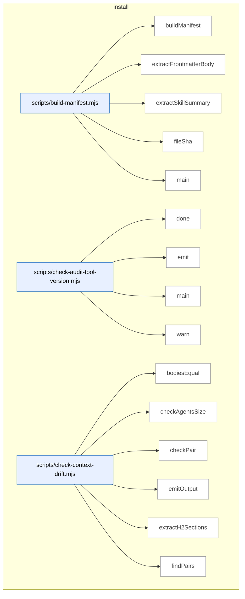

_Domain has 138 symbols (>50). Diagram shows top-15 by file order; see flat table below for the full list._

### Symbols in this domain

| Symbol | Kind | Path | Lines | Purpose | File imported by |
|---|---|---|---|---|---|
| [`buildManifest`](../scripts/build-manifest.mjs#L99) | function | `scripts/build-manifest.mjs` | 99-163 | Enumerates skill files, computes per-file SHAs, extracts summaries, and generates a bundle-version hash. | _(internal)_ |
| [`extractFrontmatterBody`](../scripts/build-manifest.mjs#L49) | function | `scripts/build-manifest.mjs` | 49-54 | Extracts the YAML frontmatter block from a Markdown file by finding the opening and closing delimiters. | _(internal)_ |
| [`extractSkillSummary`](../scripts/build-manifest.mjs#L64) | function | `scripts/build-manifest.mjs` | 64-94 | Extracts the description field from a skill's frontmatter, handling both block-scalar and inline YAML forms. | _(internal)_ |
| [`fileSha`](../scripts/build-manifest.mjs#L40) | function | `scripts/build-manifest.mjs` | 40-43 | Computes a 12-character SHA256 hash of a file's binary contents. | _(internal)_ |
| [`main`](../scripts/build-manifest.mjs#L165) | function | `scripts/build-manifest.mjs` | 165-190 | Builds the skill manifest or verifies that an existing manifest is fresh by comparing bundle versions. | _(internal)_ |
| [`done`](../scripts/check-audit-tool-version.mjs#L49) | function | `scripts/check-audit-tool-version.mjs` | 49-51 | Sets the process exit code. | _(internal)_ |
| [`emit`](../scripts/check-audit-tool-version.mjs#L38) | function | `scripts/check-audit-tool-version.mjs` | 38-40 | Emits an object as formatted JSON to stdout if JSON mode is enabled. | _(internal)_ |
| [`main`](../scripts/check-audit-tool-version.mjs#L53) | function | `scripts/check-audit-tool-version.mjs` | 53-142 | Fetches the upstream audit tool manifest, compares it to the local version, and emits a sync-status verdict. | _(internal)_ |
| [`warn`](../scripts/check-audit-tool-version.mjs#L42) | function | `scripts/check-audit-tool-version.mjs` | 42-44 | Writes a message to stderr unless quiet or JSON mode is enabled. | _(internal)_ |
| [`bodiesEqual`](../scripts/check-context-drift.mjs#L182) | function | `scripts/check-context-drift.mjs` | 182-185 | Compares two line arrays for semantic equality by normalizing whitespace. | _(internal)_ |
| [`checkAgentsSize`](../scripts/check-context-drift.mjs#L275) | function | `scripts/check-context-drift.mjs` | 275-288 | Checks whether AGENTS.md exceeds the configured line sprawl cap. | _(internal)_ |
| [`checkPair`](../scripts/check-context-drift.mjs#L198) | function | `scripts/check-context-drift.mjs` | 198-263 | Validates that CLAUDE.md imports AGENTS.md, contains only allowlisted h2 headings, and stays within line limits. | _(internal)_ |
| [`emitOutput`](../scripts/check-context-drift.mjs#L392) | function | `scripts/check-context-drift.mjs` | 392-415 | Formats and outputs findings in text, JSON, or SARIF format. | _(internal)_ |
| [`extractH2Sections`](../scripts/check-context-drift.mjs#L155) | function | `scripts/check-context-drift.mjs` | 155-176 | Extracts H2 section headers and their bodies from Markdown content, skipping lines inside code fences. | _(internal)_ |
| [`findPairs`](../scripts/check-context-drift.mjs#L300) | function | `scripts/check-context-drift.mjs` | 300-318 | Finds all AGENTS.md and CLAUDE.md file pairs in repository directories. | _(internal)_ |
| [`hasAgentsImport`](../scripts/check-context-drift.mjs#L191) | function | `scripts/check-context-drift.mjs` | 191-194 | Checks if the first 30 lines of a file contain an `@./AGENTS.md` import directive. | _(internal)_ |
| [`hashId`](../scripts/check-context-drift.mjs#L292) | function | `scripts/check-context-drift.mjs` | 292-294 | Generates a 16-character SHA256 hash from a file path and key string. | _(internal)_ |
| [`loadConfig`](../scripts/check-context-drift.mjs#L75) | function | `scripts/check-context-drift.mjs` | 75-108 | Loads context-drift configuration from a JSON file or returns schema-validated defaults. | _(internal)_ |
| [`main`](../scripts/check-context-drift.mjs#L417) | function | `scripts/check-context-drift.mjs` | 417-428 | Entry point that runs drift checks and exits with appropriate status code. | _(internal)_ |
| [`makeFenceTracker`](../scripts/check-context-drift.mjs#L122) | function | `scripts/check-context-drift.mjs` | 122-146 | Creates a function that tracks whether each line is inside a Markdown code fence (``` or ~~~). | _(internal)_ |
| [`parseArgs`](../scripts/check-context-drift.mjs#L353) | function | `scripts/check-context-drift.mjs` | 353-368 | Parses command-line arguments for output format, repo path, and strict mode. | _(internal)_ |
| [`runDriftCheck`](../scripts/check-context-drift.mjs#L327) | function | `scripts/check-context-drift.mjs` | 327-349 | Orchestrates validation of AGENTS.md/CLAUDE.md pairs and enforces size constraints. | _(internal)_ |
| [`showHelp`](../scripts/check-context-drift.mjs#L370) | function | `scripts/check-context-drift.mjs` | 370-390 | Displays usage instructions for the context drift checker tool. | _(internal)_ |
| [`canResolve`](../scripts/check-deps.mjs#L52) | function | `scripts/check-deps.mjs` | 52-60 | Attempts to import a Node.js package to verify it is installed. | _(internal)_ |
| [`loadEnv`](../scripts/check-deps.mjs#L62) | function | `scripts/check-deps.mjs` | 62-77 | Parses a .env file into a key-value object, handling comments and quoted values. | _(internal)_ |
| [`main`](../scripts/check-deps.mjs#L79) | function | `scripts/check-deps.mjs` | 79-173 | Verifies required/optional Node.js packages are installed and environment variables are set. | _(internal)_ |
| [`main`](../scripts/check-gate-contracts.mjs#L18) | function | `scripts/check-gate-contracts.mjs` | 18-41 | Validates that gate contract files exist and enforcement code matches stated gates. | _(internal)_ |
| [`bucketKeyFor`](../scripts/check-model-freshness.mjs#L84) | function | `scripts/check-model-freshness.mjs` | 84-88 | Determines the model tier category (lite/nonlite) based on provider and model ID format. | _(internal)_ |
| [`detectMissingFromStatic`](../scripts/check-model-freshness.mjs#L188) | function | `scripts/check-model-freshness.mjs` | 188-245 | Identifies live models that are newer than or completely absent from STATIC_POOL entries. | _(internal)_ |
| [`detectPrematureRemap`](../scripts/check-model-freshness.mjs#L251) | function | `scripts/check-model-freshness.mjs` | 251-276 | Flags deprecated model remaps that point to models still actively served by providers. | _(internal)_ |
| [`detectSentinelDrift`](../scripts/check-model-freshness.mjs#L109) | function | `scripts/check-model-freshness.mjs` | 109-169 | Detects mismatches between static STATIC_POOL and live provider model catalogs for each sentinel. | _(internal)_ |
| [`emitOutput`](../scripts/check-model-freshness.mjs#L378) | function | `scripts/check-model-freshness.mjs` | 378-408 | Formats findings in text, JSON, or SARIF format with provider information. | _(internal)_ |
| [`hashId`](../scripts/check-model-freshness.mjs#L280) | function | `scripts/check-model-freshness.mjs` | 280-282 | Generates a 16-character SHA256 hash from rule type and key for model freshness findings. | _(internal)_ |
| [`main`](../scripts/check-model-freshness.mjs#L410) | function | `scripts/check-model-freshness.mjs` | 410-421 | Entry point that runs model freshness checks and exits with appropriate status code. | _(internal)_ |
| [`parseArgs`](../scripts/check-model-freshness.mjs#L334) | function | `scripts/check-model-freshness.mjs` | 334-348 | Parses command-line arguments for output format and strict mode. | _(internal)_ |
| [`runFreshnessCheck`](../scripts/check-model-freshness.mjs#L293) | function | `scripts/check-model-freshness.mjs` | 293-330 | Orchestrates model catalog freshness checks by detecting drift, missing entries, and premature remaps. | _(internal)_ |
| [`showHelp`](../scripts/check-model-freshness.mjs#L350) | function | `scripts/check-model-freshness.mjs` | 350-376 | Displays usage instructions for the model freshness checker tool. | _(internal)_ |
| [`main`](../scripts/check-rls.mjs#L31) | function | `scripts/check-rls.mjs` | 31-145 | Queries Postgres to report RLS enablement status and table grants for each table. | _(internal)_ |
| [`checkAuditApiKeys`](../scripts/check-setup.mjs#L159) | function | `scripts/check-setup.mjs` | 159-192 | Validates presence of GPT, Gemini, or Claude API keys based on Azure or public profile configuration. | _(internal)_ |
| [`checkAuditLoop`](../scripts/check-setup.mjs#L257) | function | `scripts/check-setup.mjs` | 257-261 | Orchestrates checks for audit-loop API keys and Supabase database setup. | _(internal)_ |
| [`checkAuditSupabase`](../scripts/check-setup.mjs#L194) | function | `scripts/check-setup.mjs` | 194-255 | Verifies AUDIT_DB_URL is set and all required audit-loop tables exist in Postgres. | _(internal)_ |
| [`checkConsistencyMode`](../scripts/check-setup.mjs#L421) | function | `scripts/check-setup.mjs` | 421-467 | Validates surfaces.json manifest and Playwright availability for consistency mode Phase 6.5. | _(internal)_ |
| [`checkPersonaTest`](../scripts/check-setup.mjs#L265) | function | `scripts/check-setup.mjs` | 265-313 | Validates persona test repo name and checks existence of persona tables and views. | _(internal)_ |
| [`checkPlaywrightAvailable`](../scripts/check-setup.mjs#L401) | function | `scripts/check-setup.mjs` | 401-419 | Probes whether Playwright is installed and Chromium binary is available for browser automation. | _(internal)_ |
| [`checkTables`](../scripts/check-setup.mjs#L70) | function | `scripts/check-setup.mjs` | 70-80 | Queries database to verify existence of specified tables by name. | _(internal)_ |
| [`injectResolvedDbEnv`](../scripts/check-setup.mjs#L490) | function | `scripts/check-setup.mjs` | 490-501 | Loads AUDIT_DB_URL and SSL mode from .env or shared cloud config into process.env. | _(internal)_ |
| [`loadEnv`](../scripts/check-setup.mjs#L47) | function | `scripts/check-setup.mjs` | 47-62 | Reads .env file and loads key-value pairs into a plain object. | _(internal)_ |
| [`main`](../scripts/check-setup.mjs#L503) | function | `scripts/check-setup.mjs` | 503-517 | Entry point that runs all setup checks and outputs a formatted report. | _(internal)_ |
| [`printJsonReport`](../scripts/check-setup.mjs#L376) | function | `scripts/check-setup.mjs` | 376-386 | Outputs the setup check report in JSON format to stdout. | _(internal)_ |
| [`printReport`](../scripts/check-setup.mjs#L344) | function | `scripts/check-setup.mjs` | 344-374 | Outputs a human-readable setup check report with colored sections and optional fix suggestions. | _(internal)_ |
| [`Report`](../scripts/check-setup.mjs#L120) | class | `scripts/check-setup.mjs` | 120-155 | Data structure tracking check report sections, items, and counts of failures and warnings. | _(internal)_ |
| [`statusIcon`](../scripts/check-setup.mjs#L320) | function | `scripts/check-setup.mjs` | 320-329 | Returns a colored status icon string (PASS/FAIL/WARN/INFO/FIX) for report display. | _(internal)_ |
| [`verdictLine`](../scripts/check-setup.mjs#L331) | function | `scripts/check-setup.mjs` | 331-342 | Generates a summary verdict line showing failure and warning counts. | _(internal)_ |
| [`listSkills`](../scripts/check-skill-refs.mjs#L30) | function | `scripts/check-skill-refs.mjs` | 30-36 | Returns a sorted list of skill directory names from the skills/ folder. | _(internal)_ |
| [`main`](../scripts/check-skill-refs.mjs#L38) | function | `scripts/check-skill-refs.mjs` | 38-74 | Validates reference format in SKILL.md files for specified skills and reports errors. | _(internal)_ |
| [`main`](../scripts/check-skill-updates.mjs#L25) | function | `scripts/check-skill-updates.mjs` | 25-118 | Checks if synced skill files match receipt SHAs and validates .gitignore coverage. | _(internal)_ |
| [`parseArgs`](../scripts/check-skill-updates.mjs#L16) | function | `scripts/check-skill-updates.mjs` | 16-23 | Extracts --target, --json, and --no-cache command-line arguments into an options object. | _(internal)_ |
| [`checkSync`](../scripts/check-sync.mjs#L25) | function | `scripts/check-sync.mjs` | 25-153 | Orchestrates Postgres connection, repo registration, and audit run history checks against Supabase. | _(internal)_ |
| [`fail`](../scripts/check-sync.mjs#L20) | function | `scripts/check-sync.mjs` | 20-20 | Logs a [FAIL] status message with optional label text. | _(internal)_ |
| [`finish`](../scripts/check-sync.mjs#L155) | function | `scripts/check-sync.mjs` | 155-178 | Outputs final sync verdict in terminal or JSON format and exits with appropriate status code. | _(internal)_ |
| [`info`](../scripts/check-sync.mjs#L21) | function | `scripts/check-sync.mjs` | 21-21 | Logs an [INFO] status message with optional label text. | _(internal)_ |
| [`log`](../scripts/check-sync.mjs#L17) | function | `scripts/check-sync.mjs` | 17-17 | Conditionally writes a message to stdout only when not in JSON mode. | _(internal)_ |
| [`pass`](../scripts/check-sync.mjs#L19) | function | `scripts/check-sync.mjs` | 19-19 | Logs a [PASS] status message with optional label text. | _(internal)_ |
| [`buildCopilotMergeWrite`](../scripts/install-skills.mjs#L205) | function | `scripts/install-skills.mjs` | 205-218 | Merges Copilot instructions into .github/copilot-instructions.md with SHA tracking for change detection. | _(internal)_ |
| [`buildSkillWrites`](../scripts/install-skills.mjs#L173) | function | `scripts/install-skills.mjs` | 173-203 | Builds file writes for a skill with SHA validation, expanding files and checking against manifest checksums. | _(internal)_ |
| [`checkConflicts`](../scripts/install-skills.mjs#L233) | function | `scripts/install-skills.mjs` | 233-245 | Detects conflicts between new writes and existing files, respecting the --force override. | _(internal)_ |
| [`computeDeletes`](../scripts/install-skills.mjs#L220) | function | `scripts/install-skills.mjs` | 220-231 | Identifies files from prior installations that are no longer in the new write set (garbage collection). | _(internal)_ |
| [`expandSkillFiles`](../scripts/install-skills.mjs#L114) | function | `scripts/install-skills.mjs` | 114-120 | Expands skill file metadata from manifest, falling back to legacy single-SKILL.md format. | _(internal)_ |
| [`fileShaShort`](../scripts/install-skills.mjs#L122) | function | `scripts/install-skills.mjs` | 122-124 | Computes a 12-character SHA256 hash of a buffer for file integrity verification. | _(internal)_ |
| [`loadManifest`](../scripts/install-skills.mjs#L84) | function | `scripts/install-skills.mjs` | 84-107 | Reads and validates skills.manifest.json, checking schema version and rejecting unsupported formats. | _(internal)_ |
| [`main`](../scripts/install-skills.mjs#L259) | function | `scripts/install-skills.mjs` | 259-346 | CLI orchestrator that loads manifest, discovers skills, builds writes, checks conflicts, and persists receipts. | _(internal)_ |
| [`maybeWarnGithubSkillsDeprecation`](../scripts/install-skills.mjs#L161) | function | `scripts/install-skills.mjs` | 161-171 | Warns if .github/skills/ exists and offers to preserve it via --keep-github-skills flag. | _(internal)_ |
| [`parseArgs`](../scripts/install-skills.mjs#L56) | function | `scripts/install-skills.mjs` | 56-78 | Parses command-line flags into config (local/remote, surface, skills, force, dry-run, etc.). | _(internal)_ |
| [`printBanner`](../scripts/install-skills.mjs#L141) | function | `scripts/install-skills.mjs` | 141-149 | Prints formatted banner showing installation mode, surface, and target repo details. | _(internal)_ |
| [`reconcileJournals`](../scripts/install-skills.mjs#L151) | function | `scripts/install-skills.mjs` | 151-159 | Recovers from partial installations via transaction journals, rolling forward/back completed steps. | _(internal)_ |
| [`validateTarget`](../scripts/install-skills.mjs#L128) | function | `scripts/install-skills.mjs` | 128-139 | Validates target directory exists and looks like a git/Node.js repository. | _(internal)_ |
| [`writeReceiptsByScope`](../scripts/install-skills.mjs#L247) | function | `scripts/install-skills.mjs` | 247-257 | Persists installation receipts separately for repo-scoped and globally-scoped skill files. | _(internal)_ |
| [`computeFileSha`](../scripts/lib/install/conflict-detector.mjs#L13) | function | `scripts/lib/install/conflict-detector.mjs` | 13-20 | Computes a 12-character SHA256 hash of a file's content or null on error. | `scripts/check-skill-updates.mjs`, `scripts/install-skills.mjs` |
| [`detectConflicts`](../scripts/lib/install/conflict-detector.mjs#L30) | function | `scripts/lib/install/conflict-detector.mjs` | 30-78 | Identifies which planned writes are safe, conflicted, or unmanaged based on prior receipt state. | `scripts/check-skill-updates.mjs`, `scripts/install-skills.mjs` |
| [`detectDrift`](../scripts/lib/install/conflict-detector.mjs#L86) | function | `scripts/lib/install/conflict-detector.mjs` | 86-105 | Detects changes to managed files by comparing current SHA against expected SHA. | `scripts/check-skill-updates.mjs`, `scripts/install-skills.mjs` |
| [`generateAllPromptFiles`](../scripts/lib/install/copilot-prompts.mjs#L229) | function | `scripts/lib/install/copilot-prompts.mjs` | 229-260 | Generates prompt files for all skills in a directory, warning on missing registry entries. | `scripts/regenerate-skill-copies.mjs` |
| [`generatePromptFile`](../scripts/lib/install/copilot-prompts.mjs#L180) | function | `scripts/lib/install/copilot-prompts.mjs` | 180-218 | Generates a Copilot prompt file from skill metadata and entry registry. | `scripts/regenerate-skill-copies.mjs` |
| [`parseSkillFrontmatter`](../scripts/lib/install/copilot-prompts.mjs#L140) | function | `scripts/lib/install/copilot-prompts.mjs` | 140-169 | Extracts name and description from SKILL.md YAML frontmatter, handling block-scalar form. | `scripts/regenerate-skill-copies.mjs` |
| [`shaOfManagedBlock`](../scripts/lib/install/copilot-prompts.mjs#L270) | function | `scripts/lib/install/copilot-prompts.mjs` | 270-278 | Computes SHA256 hash of managed-block content between START_MARKER and END_MARKER. | `scripts/regenerate-skill-copies.mjs` |
| [`yamlQuote`](../scripts/lib/install/copilot-prompts.mjs#L129) | function | `scripts/lib/install/copilot-prompts.mjs` | 129-131 | Escapes a string for safe YAML double-quote syntax. | `scripts/regenerate-skill-copies.mjs` |
| [`ensureAuditDeps`](../scripts/lib/install/deps.mjs#L89) | function | `scripts/lib/install/deps.mjs` | 89-151 | Installs missing audit-loop npm dependencies, supports dry-run and timeout options. | `scripts/install-skills.mjs`, `scripts/sync-to-repos.mjs` |
| [`findMissingDeps`](../scripts/lib/install/deps.mjs#L58) | function | `scripts/lib/install/deps.mjs` | 58-70 | Returns missing required and optional npm dependencies from node_modules. | `scripts/install-skills.mjs`, `scripts/sync-to-repos.mjs` |
| [`checkAuditGitignore`](../scripts/lib/install/gitignore.mjs#L152) | function | `scripts/lib/install/gitignore.mjs` | 152-171 | Checks which required .gitignore patterns are present or missing. | `scripts/check-skill-updates.mjs`, `scripts/install-skills.mjs` |
| [`ensureAuditGitignore`](../scripts/lib/install/gitignore.mjs#L106) | function | `scripts/lib/install/gitignore.mjs` | 106-143 | Adds required audit-loop patterns to .gitignore, creating file if needed. | `scripts/check-skill-updates.mjs`, `scripts/install-skills.mjs` |
| [`extractBlock`](../scripts/lib/install/merge.mjs#L64) | function | `scripts/lib/install/merge.mjs` | 64-70 | Extracts text between START_MARKER and END_MARKER, returning null if absent. | `scripts/install-skills.mjs` |
| [`mergeBlock`](../scripts/lib/install/merge.mjs#L36) | function | `scripts/lib/install/merge.mjs` | 36-55 | Replaces or appends a managed block between markers in a file. | `scripts/install-skills.mjs` |
| [`buildReceipt`](../scripts/lib/install/receipt.mjs#L48) | function | `scripts/lib/install/receipt.mjs` | 48-57 | Constructs an install receipt with version, timestamp, and managed files list. | `scripts/check-skill-updates.mjs`, `scripts/install-skills.mjs` |
| [`readReceipt`](../scripts/lib/install/receipt.mjs#L13) | function | `scripts/lib/install/receipt.mjs` | 13-24 | Parses and validates the install receipt JSON file with error handling. | `scripts/check-skill-updates.mjs`, `scripts/install-skills.mjs` |
| [`writeReceipt`](../scripts/lib/install/receipt.mjs#L31) | function | `scripts/lib/install/receipt.mjs` | 31-37 | Atomically writes the install receipt JSON to disk using temp-rename. | `scripts/check-skill-updates.mjs`, `scripts/install-skills.mjs` |
| [`findRepoRoot`](../scripts/lib/install/surface-paths.mjs#L14) | function | `scripts/lib/install/surface-paths.mjs` | 14-37 | Finds the outermost .git directory or nearest package.json walking up the tree. | `scripts/check-skill-updates.mjs`, `scripts/install-skills.mjs` |
| [`partitionManagedFilesByScope`](../scripts/lib/install/surface-paths.mjs#L124) | function | `scripts/lib/install/surface-paths.mjs` | 124-132 | Partitions managed files into global-scoped and repo-scoped lists. | `scripts/check-skill-updates.mjs`, `scripts/install-skills.mjs` |
| [`receiptPath`](../scripts/lib/install/surface-paths.mjs#L110) | function | `scripts/lib/install/surface-paths.mjs` | 110-115 | Returns the install receipt path based on installation scope (global or repo). | `scripts/check-skill-updates.mjs`, `scripts/install-skills.mjs` |
| [`resolveSkillFiles`](../scripts/lib/install/surface-paths.mjs#L79) | function | `scripts/lib/install/surface-paths.mjs` | 79-94 | Expands skill file paths across specified surfaces and target directories. | `scripts/check-skill-updates.mjs`, `scripts/install-skills.mjs` |
| [`resolveSkillTargets`](../scripts/lib/install/surface-paths.mjs#L46) | function | `scripts/lib/install/surface-paths.mjs` | 46-66 | Resolves target directories for skill installation across surfaces (claude/copilot/agents). | `scripts/check-skill-updates.mjs`, `scripts/install-skills.mjs` |
| [`cleanupJournal`](../scripts/lib/install/transaction.mjs#L200) | function | `scripts/lib/install/transaction.mjs` | 200-203 | Removes the transaction journal file. | `scripts/install-skills.mjs` |
| [`defaultJournalPath`](../scripts/lib/install/transaction.mjs#L245) | function | `scripts/lib/install/transaction.mjs` | 245-247 | Returns the default transaction journal path. | `scripts/install-skills.mjs` |
| [`executeTransaction`](../scripts/lib/install/transaction.mjs#L81) | function | `scripts/lib/install/transaction.mjs` | 81-176 | Executes staged file writes and deletes with multi-phase rollback capability on crash. | `scripts/install-skills.mjs` |
| [`fsyncFile`](../scripts/lib/install/transaction.mjs#L49) | function | `scripts/lib/install/transaction.mjs` | 49-51 | Syncs a file descriptor to disk (best-effort, silently handles missing fsync support). | `scripts/install-skills.mjs` |
| [`recoverFromJournal`](../scripts/lib/install/transaction.mjs#L211) | function | `scripts/lib/install/transaction.mjs` | 211-243 | Restores incomplete file transactions from the journal via roll-forward or roll-back. | `scripts/install-skills.mjs` |
| [`rollbackPartialTransaction`](../scripts/lib/install/transaction.mjs#L178) | function | `scripts/lib/install/transaction.mjs` | 178-198 | Reverts partially-completed file operations using stored snapshots. | `scripts/install-skills.mjs` |
| [`shaShort`](../scripts/lib/install/transaction.mjs#L45) | function | `scripts/lib/install/transaction.mjs` | 45-47 | Returns a 12-character SHA256 hash of a buffer. | `scripts/install-skills.mjs` |
| [`tmpSuffix`](../scripts/lib/install/transaction.mjs#L40) | function | `scripts/lib/install/transaction.mjs` | 40-43 | Generates a collision-resistant temporary file suffix from PID, timestamp, and random bits. | `scripts/install-skills.mjs` |
| [`writeJournal`](../scripts/lib/install/transaction.mjs#L58) | function | `scripts/lib/install/transaction.mjs` | 58-70 | Atomically writes a transaction journal describing staged file operations. | `scripts/install-skills.mjs` |
| [`computeVerdict`](../scripts/regenerate-skill-copies.mjs#L196) | function | `scripts/regenerate-skill-copies.mjs` | 196-200 | Returns "VIOLATIONS", "IN SYNC", or "CHANGES" based on file modification and violation counts. | _(internal)_ |
| [`copyFileIfChanged`](../scripts/regenerate-skill-copies.mjs#L76) | function | `scripts/regenerate-skill-copies.mjs` | 76-88 | Copies a source file to destination if content has changed, tracking the result (unchanged/wrote). | _(internal)_ |
| [`emitVerdict`](../scripts/regenerate-skill-copies.mjs#L202) | function | `scripts/regenerate-skill-copies.mjs` | 202-214 | Prints sync summary and exits with status code 2 if violations exist, 1 if --check mode detects changes. | _(internal)_ |
| [`loadSkillsOrDie`](../scripts/regenerate-skill-copies.mjs#L63) | function | `scripts/regenerate-skill-copies.mjs` | 63-74 | Loads skill names from the skills directory, exiting with error if the directory is missing or empty. | _(internal)_ |
| [`main`](../scripts/regenerate-skill-copies.mjs#L216) | function | `scripts/regenerate-skill-copies.mjs` | 216-244 | Loads skills, syncs each to destinations, prunes orphaned dirs, and reports the outcome. | _(internal)_ |
| [`pruneFilesNotInSource`](../scripts/regenerate-skill-copies.mjs#L90) | function | `scripts/regenerate-skill-copies.mjs` | 90-105 | Removes files from destination that don't exist in the source skill directory. | _(internal)_ |
| [`pruneOrphanSkillDirs`](../scripts/regenerate-skill-copies.mjs#L130) | function | `scripts/regenerate-skill-copies.mjs` | 130-146 | Removes orphaned skill directories from destinations that no longer exist in the source skills directory. | _(internal)_ |
| [`pruneStalePrompts`](../scripts/regenerate-skill-copies.mjs#L168) | function | `scripts/regenerate-skill-copies.mjs` | 168-186 | Removes stale managed prompt files that are no longer generated by the skill pipeline. | _(internal)_ |
| [`syncCopilotPrompts`](../scripts/regenerate-skill-copies.mjs#L188) | function | `scripts/regenerate-skill-copies.mjs` | 188-194 | Syncs Copilot prompt files from source to `.github/prompts/`, managing writes and deletes. | _(internal)_ |
| [`syncSkillToDests`](../scripts/regenerate-skill-copies.mjs#L107) | function | `scripts/regenerate-skill-copies.mjs` | 107-128 | Syncs a single skill's files to all destination roots, tracking writes, unchanged files, and deletes. | _(internal)_ |
| [`warnGithubSkillsDeprecation`](../scripts/regenerate-skill-copies.mjs#L51) | function | `scripts/regenerate-skill-copies.mjs` | 51-61 | Warns that `.github/skills/` is deprecated and may be deleted unless --keep-github-skills is passed. | _(internal)_ |
| [`writePromptFiles`](../scripts/regenerate-skill-copies.mjs#L148) | function | `scripts/regenerate-skill-copies.mjs` | 148-166 | Writes generated prompt files to destinations, tracking changes and collecting paths for stale pruning. | _(internal)_ |
| [`confirm`](../scripts/setup-permissions.mjs#L119) | function | `scripts/setup-permissions.mjs` | 119-128 | Prompts the user for a yes/no confirmation with a message and returns the result. | _(internal)_ |
| [`main`](../scripts/setup-permissions.mjs#L183) | function | `scripts/setup-permissions.mjs` | 183-280 | Merges audit-loop permission rules into Claude Code settings at project and user levels, reporting changes. | _(internal)_ |
| [`mergeRules`](../scripts/setup-permissions.mjs#L134) | function | `scripts/setup-permissions.mjs` | 134-179 | Merges permission rules into settings, deduplicates, and removes rules covered by wildcards. | _(internal)_ |
| [`readJson`](../scripts/setup-permissions.mjs#L106) | function | `scripts/setup-permissions.mjs` | 106-112 | Reads and parses a JSON file, returning null on error. | _(internal)_ |
| [`writeJson`](../scripts/setup-permissions.mjs#L114) | function | `scripts/setup-permissions.mjs` | 114-117 | Writes a JavaScript object as formatted JSON to a file. | _(internal)_ |
| [`buildCopilotPromptFiles`](../scripts/sync-to-repos.mjs#L451) | function | `scripts/sync-to-repos.mjs` | 451-459 | Lists all .prompt.md files from the .github/prompts/ directory. | _(internal)_ |
| [`buildFileUniverse`](../scripts/sync-to-repos.mjs#L349) | function | `scripts/sync-to-repos.mjs` | 349-366 | Recursively walks scripts/ and .claude/ directories to collect all tracked files. | _(internal)_ |
| [`buildSkillFiles`](../scripts/sync-to-repos.mjs#L412) | function | `scripts/sync-to-repos.mjs` | 412-424 | Enumerates skill files to sync to .claude/skills/ and optionally .github/skills/. | _(internal)_ |
| [`bundleForRepo`](../scripts/sync-to-repos.mjs#L481) | function | `scripts/sync-to-repos.mjs` | 481-488 | Assembles the complete file list (code, assets, skills) for a specific consumer repo. | _(internal)_ |
| [`deepMerge`](../scripts/sync-to-repos.mjs#L528) | function | `scripts/sync-to-repos.mjs` | 528-539 | Recursively merges source object into target, preserving nested structure. | _(internal)_ |
| [`main`](../scripts/sync-to-repos.mjs#L543) | function | `scripts/sync-to-repos.mjs` | 543-1072 | Syncs files to consumer repos, displaying diffs and tracking new/updated/unchanged counts. | _(internal)_ |
| [`maybePromptSharedCloudUpdate`](../scripts/sync-to-repos.mjs#L1074) | function | `scripts/sync-to-repos.mjs` | 1074-1105 | Checks if shared cloud config needs updating and prompts the user with a readline prompt. | _(internal)_ |
| [`readSource`](../scripts/sync-to-repos.mjs#L369) | function | `scripts/sync-to-repos.mjs` | 369-372 | Reads a file from the source repo root, returning null on I/O failure. | _(internal)_ |
| [`realMissingDeps`](../scripts/sync-to-repos.mjs#L396) | function | `scripts/sync-to-repos.mjs` | 396-401 | Filters unresolved imports to find only relative paths that couldn't be resolved. | _(internal)_ |
| [`resolveBundle`](../scripts/sync-to-repos.mjs#L381) | function | `scripts/sync-to-repos.mjs` | 381-386 | Resolves entry points and their import closure to determine the complete file bundle. | _(internal)_ |
| [`sha256`](../scripts/sync-to-repos.mjs#L497) | function | `scripts/sync-to-repos.mjs` | 497-504 | Computes the SHA256 hash of a file's contents. | _(internal)_ |
| [`syncMigrations`](../scripts/sync-to-repos.mjs#L249) | function | `scripts/sync-to-repos.mjs` | 249-259 | Lists all SQL migration files from the supabase/migrations directory. | _(internal)_ |
| [`unifiedDiff`](../scripts/sync-to-repos.mjs#L506) | function | `scripts/sync-to-repos.mjs` | 506-519 | Generates a unified diff between two files using git diff --no-index. | _(internal)_ |

---

## learning-store

> Implements Thompson Sampling bandits for adaptive prompt-variant selection, stratifying arms by repo context (size/language) and computing rewards from audit findings, deliberation quality, and persona-test correlations to learn which prompts perform best per environment.

```mermaid
flowchart TB
subgraph dom_learning_store ["learning-store"]
  file_scripts_bandit_mjs["scripts/bandit.mjs"]:::component
  sym_scripts_bandit_mjs_buildContext["buildContext"]:::symbol
  file_scripts_bandit_mjs --> sym_scripts_bandit_mjs_buildContext
  sym_scripts_bandit_mjs_computePassReward["computePassReward"]:::symbol
  file_scripts_bandit_mjs --> sym_scripts_bandit_mjs_computePassReward
  sym_scripts_bandit_mjs_computeReward["computeReward"]:::symbol
  file_scripts_bandit_mjs --> sym_scripts_bandit_mjs_computeReward
  sym_scripts_bandit_mjs_computeUserImpactRewa["computeUserImpactReward"]:::symbol
  file_scripts_bandit_mjs --> sym_scripts_bandit_mjs_computeUserImpactRewa
  sym_scripts_bandit_mjs_contextBucketKey["contextBucketKey"]:::symbol
  file_scripts_bandit_mjs --> sym_scripts_bandit_mjs_contextBucketKey
  sym_scripts_bandit_mjs_contextSizeTier["contextSizeTier"]:::symbol
  file_scripts_bandit_mjs --> sym_scripts_bandit_mjs_contextSizeTier
  sym_scripts_bandit_mjs_deliberationSignal["deliberationSignal"]:::symbol
  file_scripts_bandit_mjs --> sym_scripts_bandit_mjs_deliberationSignal
  sym_scripts_bandit_mjs_main["main"]:::symbol
  file_scripts_bandit_mjs --> sym_scripts_bandit_mjs_main
  sym_scripts_bandit_mjs_PromptBandit["PromptBandit"]:::symbol
  file_scripts_bandit_mjs --> sym_scripts_bandit_mjs_PromptBandit
  file_scripts_evolve_prompts_mjs["scripts/evolve-prompts.mjs"]:::component
  sym_scripts_evolve_prompts_mjs_checkBaseline["checkBaselineValidity"]:::symbol
  file_scripts_evolve_prompts_mjs --> sym_scripts_evolve_prompts_mjs_checkBaseline
  sym_scripts_evolve_prompts_mjs_evolveWorstPa["evolveWorstPass"]:::symbol
  file_scripts_evolve_prompts_mjs --> sym_scripts_evolve_prompts_mjs_evolveWorstPa
  sym_scripts_evolve_prompts_mjs_formatExample["formatExample"]:::symbol
  file_scripts_evolve_prompts_mjs --> sym_scripts_evolve_prompts_mjs_formatExample
  sym_scripts_evolve_prompts_mjs_getExperiment["getExperimentManifestStore"]:::symbol
  file_scripts_evolve_prompts_mjs --> sym_scripts_evolve_prompts_mjs_getExperiment
  sym_scripts_evolve_prompts_mjs_killExperimen["killExperiment"]:::symbol
  file_scripts_evolve_prompts_mjs --> sym_scripts_evolve_prompts_mjs_killExperimen
  sym_scripts_evolve_prompts_mjs_main["main"]:::symbol
  file_scripts_evolve_prompts_mjs --> sym_scripts_evolve_prompts_mjs_main
  sym_scripts_evolve_prompts_mjs_promoteExperi["promoteExperiment"]:::symbol
  file_scripts_evolve_prompts_mjs --> sym_scripts_evolve_prompts_mjs_promoteExperi
  sym_scripts_evolve_prompts_mjs_reconcileOrph["reconcileOrphanedExperiments"]:::symbol
  file_scripts_evolve_prompts_mjs --> sym_scripts_evolve_prompts_mjs_reconcileOrph
  sym_scripts_evolve_prompts_mjs_reviewExperim["reviewExperiments"]:::symbol
  file_scripts_evolve_prompts_mjs --> sym_scripts_evolve_prompts_mjs_reviewExperim
  sym_scripts_evolve_prompts_mjs_showStats["showStats"]:::symbol
  file_scripts_evolve_prompts_mjs --> sym_scripts_evolve_prompts_mjs_showStats
  file_scripts_meta_assess_mjs["scripts/meta-assess.mjs"]:::component
  sym_scripts_meta_assess_mjs_computeAssessmen["computeAssessmentMetrics"]:::symbol
  file_scripts_meta_assess_mjs --> sym_scripts_meta_assess_mjs_computeAssessmen
  sym_scripts_meta_assess_mjs_emptyMetrics["emptyMetrics"]:::symbol
  file_scripts_meta_assess_mjs --> sym_scripts_meta_assess_mjs_emptyMetrics
  sym_scripts_meta_assess_mjs_formatAssessment["formatAssessmentReport"]:::symbol
  file_scripts_meta_assess_mjs --> sym_scripts_meta_assess_mjs_formatAssessment
  sym_scripts_meta_assess_mjs_main["main"]:::symbol
  file_scripts_meta_assess_mjs --> sym_scripts_meta_assess_mjs_main
  sym_scripts_meta_assess_mjs_markAssessmentCo["markAssessmentComplete"]:::symbol
  file_scripts_meta_assess_mjs --> sym_scripts_meta_assess_mjs_markAssessmentCo
  sym_scripts_meta_assess_mjs_runLLMAssessment["runLLMAssessment"]:::symbol
  file_scripts_meta_assess_mjs --> sym_scripts_meta_assess_mjs_runLLMAssessment
  sym_scripts_meta_assess_mjs_sampleOutcomes["sampleOutcomes"]:::symbol
  file_scripts_meta_assess_mjs --> sym_scripts_meta_assess_mjs_sampleOutcomes
  sym_scripts_meta_assess_mjs_shouldRunAssessm["shouldRunAssessment"]:::symbol
  file_scripts_meta_assess_mjs --> sym_scripts_meta_assess_mjs_shouldRunAssessm
  sym_scripts_meta_assess_mjs_storeAssessment["storeAssessment"]:::symbol
  file_scripts_meta_assess_mjs --> sym_scripts_meta_assess_mjs_storeAssessment
  file_scripts_refine_prompts_mjs["scripts/refine-prompts.mjs"]:::component
  sym_scripts_refine_prompts_mjs_analyzePass["analyzePass"]:::symbol
  file_scripts_refine_prompts_mjs --> sym_scripts_refine_prompts_mjs_analyzePass
  sym_scripts_refine_prompts_mjs_main["main"]:::symbol
  file_scripts_refine_prompts_mjs --> sym_scripts_refine_prompts_mjs_main
  sym_scripts_refine_prompts_mjs_suggestRefine["suggestRefinements"]:::symbol
  file_scripts_refine_prompts_mjs --> sym_scripts_refine_prompts_mjs_suggestRefine
end
classDef container fill:#f5f5f5,stroke:#333,stroke-width:2px,color:#000
classDef component fill:#e8f0ff,stroke:#3178c6,color:#000
classDef symbol fill:#fff,stroke:#999,color:#444
classDef dup fill:#ffe8d8,stroke:#c0392b,stroke-width:2px,color:#000
classDef violation fill:#ffd6d6,stroke:#c0392b,stroke-width:2px,color:#000
```

### Symbols in this domain

| Symbol | Kind | Path | Lines | Purpose | File imported by |
|---|---|---|---|---|---|
| [`buildContext`](../scripts/bandit.mjs#L29) | function | `scripts/bandit.mjs` | 29-35 | Extracts repo profile context (size tier and language) for stratifying bandit arms. | `scripts/evolve-prompts.mjs`, `scripts/gemini-review.mjs`, `scripts/lib/audit/legacy-production-audit.mjs`, +2 more |
| [`computePassReward`](../scripts/bandit.mjs#L410) | function | `scripts/bandit.mjs` | 410-416 | Averages per-finding rewards across a pass's finding-edit-links to get pass-level reward. | `scripts/evolve-prompts.mjs`, `scripts/gemini-review.mjs`, `scripts/lib/audit/legacy-production-audit.mjs`, +2 more |
| [`computeReward`](../scripts/bandit.mjs#L310) | function | `scripts/bandit.mjs` | 310-348 | Calculates Thompson Sampling reward signal from Claude/GPT positions, rulings, remediation state, and optional persona impact data. | `scripts/evolve-prompts.mjs`, `scripts/gemini-review.mjs`, `scripts/lib/audit/legacy-production-audit.mjs`, +2 more |
| [`computeUserImpactReward`](../scripts/bandit.mjs#L359) | function | `scripts/bandit.mjs` | 359-379 | Weights persona-audit correlation data (confirmed hit, severity delta, false positive) into a reward modifier. | `scripts/evolve-prompts.mjs`, `scripts/gemini-review.mjs`, `scripts/lib/audit/legacy-production-audit.mjs`, +2 more |
| [`contextBucketKey`](../scripts/bandit.mjs#L44) | function | `scripts/bandit.mjs` | 44-46 | Creates a stratification key from size tier and language for grouping bandit arms. | `scripts/evolve-prompts.mjs`, `scripts/gemini-review.mjs`, `scripts/lib/audit/legacy-production-audit.mjs`, +2 more |
| [`contextSizeTier`](../scripts/bandit.mjs#L37) | function | `scripts/bandit.mjs` | 37-42 | Maps character count to a size tier (small/medium/large/xlarge) for context stratification. | `scripts/evolve-prompts.mjs`, `scripts/gemini-review.mjs`, `scripts/lib/audit/legacy-production-audit.mjs`, +2 more |
| [`deliberationSignal`](../scripts/bandit.mjs#L386) | function | `scripts/bandit.mjs` | 386-403 | Scores deliberation quality (challenge-sustain agreement, rationale length, position/ruling composition) as a reward factor. | `scripts/evolve-prompts.mjs`, `scripts/gemini-review.mjs`, `scripts/lib/audit/legacy-production-audit.mjs`, +2 more |
| [`main`](../scripts/bandit.mjs#L420) | function | `scripts/bandit.mjs` | 420-454 | CLI entry point: registers prompt variants as bandit arms or displays per-arm statistics and convergence status. | `scripts/evolve-prompts.mjs`, `scripts/gemini-review.mjs`, `scripts/lib/audit/legacy-production-audit.mjs`, +2 more |
| [`PromptBandit`](../scripts/bandit.mjs#L50) | class | `scripts/bandit.mjs` | 50-293 | Thompson Sampling multi-armed bandit that tracks prompt variant performance stratified by repo size/language and selects high-performing variants. | `scripts/evolve-prompts.mjs`, `scripts/gemini-review.mjs`, `scripts/lib/audit/legacy-production-audit.mjs`, +2 more |
| [`checkBaselineValidity`](../scripts/evolve-prompts.mjs#L341) | function | `scripts/evolve-prompts.mjs` | 341-349 | Marks experiments stale if their parent revision is no longer the active default for the pass. | _(internal)_ |
| [`evolveWorstPass`](../scripts/evolve-prompts.mjs#L93) | function | `scripts/evolve-prompts.mjs` | 93-235 | Identifies the audit pass with lowest EWR score and evolves its prompt via LLM experiment. | _(internal)_ |
| [`formatExample`](../scripts/evolve-prompts.mjs#L337) | function | `scripts/evolve-prompts.mjs` | 337-339 | Formats a single audit outcome as a markdown bullet with severity, category, file, and detail snippet. | _(internal)_ |
| [`getExperimentManifestStore`](../scripts/evolve-prompts.mjs#L65) | function | `scripts/evolve-prompts.mjs` | 65-67 | Creates a file-based store for experiment manifests, keyed by experiment ID. | _(internal)_ |
| [`killExperiment`](../scripts/evolve-prompts.mjs#L307) | function | `scripts/evolve-prompts.mjs` | 307-318 | Marks an experiment as killed and stops bandit sampling for its arm. | _(internal)_ |
| [`main`](../scripts/evolve-prompts.mjs#L374) | function | `scripts/evolve-prompts.mjs` | 374-469 | Entry point dispatching to evolve, review, promote, kill, or stats subcommands for prompt optimization. | _(internal)_ |
| [`promoteExperiment`](../scripts/evolve-prompts.mjs#L290) | function | `scripts/evolve-prompts.mjs` | 290-302 | Promotes a successful experiment variant to become the active revision for its audit pass. | _(internal)_ |
| [`reconcileOrphanedExperiments`](../scripts/evolve-prompts.mjs#L354) | function | `scripts/evolve-prompts.mjs` | 354-370 | Scans experiment manifest files for incomplete (orphaned) experiments and logs them. | _(internal)_ |
| [`reviewExperiments`](../scripts/evolve-prompts.mjs#L240) | function | `scripts/evolve-prompts.mjs` | 240-285 | Checks active experiments for convergence using bandit posterior, identifies promotion candidates. | _(internal)_ |
| [`showStats`](../scripts/evolve-prompts.mjs#L323) | function | `scripts/evolve-prompts.mjs` | 323-333 | Collects EWR stats per pass, list of active experiments, and bandit arm statistics. | _(internal)_ |
| [`computeAssessmentMetrics`](../scripts/meta-assess.mjs#L48) | function | `scripts/meta-assess.mjs` | 48-150 | Calculates audit FP rate, signal quality, severity calibration, and convergence metrics over a window. | `scripts/audit-loop.mjs` |
| [`emptyMetrics`](../scripts/meta-assess.mjs#L152) | function | `scripts/meta-assess.mjs` | 152-162 | Returns a zero-valued metrics object for empty outcome sets. | `scripts/audit-loop.mjs` |
| [`formatAssessmentReport`](../scripts/meta-assess.mjs#L353) | function | `scripts/meta-assess.mjs` | 353-398 | Formats an LLM assessment into markdown with tables and prioritized recommendations. | `scripts/audit-loop.mjs` |
| [`main`](../scripts/meta-assess.mjs#L402) | function | `scripts/meta-assess.mjs` | 402-475 | CLI entry point that computes audit metrics, runs LLM assessment if due, and outputs the report. | `scripts/audit-loop.mjs` |
| [`markAssessmentComplete`](../scripts/meta-assess.mjs#L190) | function | `scripts/meta-assess.mjs` | 190-198 | Updates the assessment state file to record when the last assessment ran. | `scripts/audit-loop.mjs` |
| [`runLLMAssessment`](../scripts/meta-assess.mjs#L249) | function | `scripts/meta-assess.mjs` | 249-326 | Calls an LLM (Gemini or GPT) to synthesize metrics and samples into a structured assessment. | `scripts/audit-loop.mjs` |
| [`sampleOutcomes`](../scripts/meta-assess.mjs#L202) | function | `scripts/meta-assess.mjs` | 202-214 | Samples recent dismissed and accepted audit outcomes for LLM analysis. | `scripts/audit-loop.mjs` |
| [`shouldRunAssessment`](../scripts/meta-assess.mjs#L174) | function | `scripts/meta-assess.mjs` | 174-184 | Checks if enough audit runs have elapsed since the last assessment to warrant a new one. | `scripts/audit-loop.mjs` |
| [`storeAssessment`](../scripts/meta-assess.mjs#L337) | function | `scripts/meta-assess.mjs` | 337-344 | Appends an assessment result to a JSON-lines log file. | `scripts/audit-loop.mjs` |
| [`analyzePass`](../scripts/refine-prompts.mjs#L40) | function | `scripts/refine-prompts.mjs` | 40-70 | Analyzes pass effectiveness from outcome logs, computing acceptance rate and top dismissed categories. | _(internal)_ |
| [`main`](../scripts/refine-prompts.mjs#L193) | function | `scripts/refine-prompts.mjs` | 193-233 | Entry point that analyzes pass effectiveness from outcomes or generates refinement suggestions with optional LLM. | _(internal)_ |
| [`suggestRefinements`](../scripts/refine-prompts.mjs#L76) | function | `scripts/refine-prompts.mjs` | 76-191 | Generates LLM-based prompt refinement suggestions for a pass based on outcome data and dismissal patterns. | _(internal)_ |

---

## memory-health

> Polls postgres for three signal metrics (fuzzy re-raise rate, cluster density, recurrence rates) to assess whether the flat audit-findings design should upgrade to pgvector clustering; renders a markdown health report with trigger verdicts and recurring friction clusters.

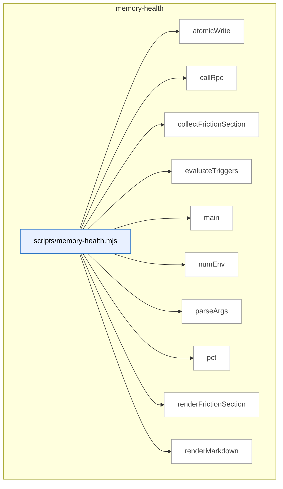

### Symbols in this domain

| Symbol | Kind | Path | Lines | Purpose | File imported by |
|---|---|---|---|---|---|
| [`atomicWrite`](../scripts/memory-health.mjs#L293) | function | `scripts/memory-health.mjs` | 293-299 | Atomically writes a file (temp + rename) to protect against process crashes. | _(internal)_ |
| [`callRpc`](../scripts/memory-health.mjs#L72) | function | `scripts/memory-health.mjs` | 72-83 | Calls the postgres RPC to fetch memory-health signal metrics. | _(internal)_ |
| [`collectFrictionSection`](../scripts/memory-health.mjs#L95) | function | `scripts/memory-health.mjs` | 95-125 | Fetches recurring open friction clusters from the store and ranks them. | _(internal)_ |
| [`evaluateTriggers`](../scripts/memory-health.mjs#L171) | function | `scripts/memory-health.mjs` | 171-206 | Evaluates three memory-health triggers against thresholds and determines overall status. | _(internal)_ |
| [`main`](../scripts/memory-health.mjs#L301) | function | `scripts/memory-health.mjs` | 301-341 | CLI entry point that collects, evaluates, and outputs a memory-health report. | _(internal)_ |
| [`numEnv`](../scripts/memory-health.mjs#L32) | function | `scripts/memory-health.mjs` | 32-41 | Reads a numeric environment variable with fallback for invalid or missing values. | _(internal)_ |
| [`parseArgs`](../scripts/memory-health.mjs#L52) | function | `scripts/memory-health.mjs` | 52-70 | Parses memory-health CLI arguments (--out, --json, --help). | _(internal)_ |
| [`pct`](../scripts/memory-health.mjs#L208) | function | `scripts/memory-health.mjs` | 208-210 | Formats a decimal as a percentage string. | _(internal)_ |
| [`renderFrictionSection`](../scripts/memory-health.mjs#L127) | function | `scripts/memory-health.mjs` | 127-169 | Formats friction recurrence data into markdown, flagging hard-fail vs advisory clusters. | _(internal)_ |
| [`renderMarkdown`](../scripts/memory-health.mjs#L212) | function | `scripts/memory-health.mjs` | 212-291 | Renders memory-health metrics and evaluation into a markdown report document. | _(internal)_ |

---

## nav-audit

> **Nav-audit** provides framework-agnostic route discovery for Next.js and React Router through pluggable adapters that normalize framework-specific routes into a unified navigation graph, enabling static analysis of application navigation structure and coverage.

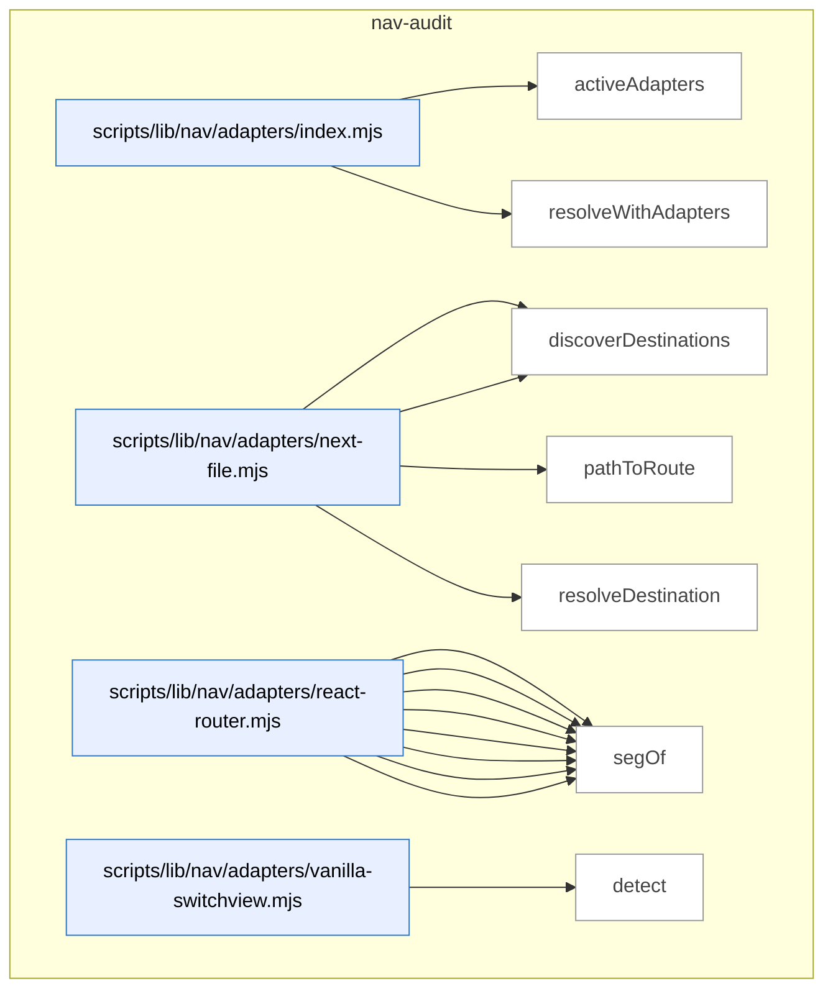

_Domain has 126 symbols (>50). Diagram shows top-15 by file order; see flat table below for the full list._

### Symbols in this domain

| Symbol | Kind | Path | Lines | Purpose | File imported by |
|---|---|---|---|---|---|
| [`activeAdapters`](../scripts/lib/nav/adapters/index.mjs#L20) | function | `scripts/lib/nav/adapters/index.mjs` | 20-24 | Filters nav adapters to those whose detect() method succeeds. | `scripts/lib/nav/extract.mjs` |
| [`resolveWithAdapters`](../scripts/lib/nav/adapters/index.mjs#L37) | function | `scripts/lib/nav/adapters/index.mjs` | 37-45 | Calls adapter resolveDestination() methods in sequence until one returns a non-null destination. | `scripts/lib/nav/extract.mjs` |
| [`detect`](../scripts/lib/nav/adapters/next-file.mjs#L13) | function | `scripts/lib/nav/adapters/next-file.mjs` | 13-15 | Detects Next.js projects by finding app/*/page.* or pages/* file patterns. | `scripts/lib/nav/adapters/index.mjs` |
| [`discoverDestinations`](../scripts/lib/nav/adapters/next-file.mjs#L17) | function | `scripts/lib/nav/adapters/next-file.mjs` | 17-27 | Converts Next.js file paths to normalized route IDs. | `scripts/lib/nav/adapters/index.mjs` |
| [`pathToRoute`](../scripts/lib/nav/adapters/next-file.mjs#L37) | function | `scripts/lib/nav/adapters/next-file.mjs` | 37-53 | Translates a Next.js file path (app/foo/bar/page.tsx) to a route ID (/foo/bar). | `scripts/lib/nav/adapters/index.mjs` |
| [`resolveDestination`](../scripts/lib/nav/adapters/next-file.mjs#L55) | function | `scripts/lib/nav/adapters/next-file.mjs` | 55-61 | Extracts a string literal or plain value as a Next.js destination. | `scripts/lib/nav/adapters/index.mjs` |
| [`collectJsxRoutes`](../scripts/lib/nav/adapters/react-router.mjs#L42) | function | `scripts/lib/nav/adapters/react-router.mjs` | 42-64 | Recursively traverses JSX to find <Route> elements and compose full paths from nesting. | `scripts/lib/nav/adapters/index.mjs` |
| [`collectObjectRoute`](../scripts/lib/nav/adapters/react-router.mjs#L67) | function | `scripts/lib/nav/adapters/react-router.mjs` | 67-89 | Recursively traverses route-object definitions to discover destinations. | `scripts/lib/nav/adapters/index.mjs` |
| [`dedupe`](../scripts/lib/nav/adapters/react-router.mjs#L106) | function | `scripts/lib/nav/adapters/react-router.mjs` | 106-116 | Removes destination duplicates by (id, sourceLoc) identity. | `scripts/lib/nav/adapters/index.mjs` |
| [`detect`](../scripts/lib/nav/adapters/react-router.mjs#L17) | function | `scripts/lib/nav/adapters/react-router.mjs` | 17-19 | Detects React Router projects by finding imports or <Route> JSX elements. | `scripts/lib/nav/adapters/index.mjs` |
| [`discoverDestinations`](../scripts/lib/nav/adapters/react-router.mjs#L21) | function | `scripts/lib/nav/adapters/react-router.mjs` | 21-39 | Discovers route destinations by walking JSX Route components and route-object definitions. | `scripts/lib/nav/adapters/index.mjs` |
| [`joinRoutePath`](../scripts/lib/nav/adapters/react-router.mjs#L99) | function | `scripts/lib/nav/adapters/react-router.mjs` | 99-104 | Concatenates a parent route path with a segment, handling slash and absolute/relative semantics. | `scripts/lib/nav/adapters/index.mjs` |
| [`resolveDestination`](../scripts/lib/nav/adapters/react-router.mjs#L118) | function | `scripts/lib/nav/adapters/react-router.mjs` | 118-124 | Extracts a string literal or plain value as a React Router destination. | `scripts/lib/nav/adapters/index.mjs` |
| [`segOf`](../scripts/lib/nav/adapters/react-router.mjs#L91) | function | `scripts/lib/nav/adapters/react-router.mjs` | 91-96 | Extracts the path segment string from a classifyTarget result. | `scripts/lib/nav/adapters/index.mjs` |
| [`detect`](../scripts/lib/nav/adapters/vanilla-switchview.mjs#L15) | function | `scripts/lib/nav/adapters/vanilla-switchview.mjs` | 15-18 | Detects vanilla view-switching by finding switchView/setView function calls. | `scripts/lib/nav/adapters/index.mjs` |
| [`discoverDestinations`](../scripts/lib/nav/adapters/vanilla-switchview.mjs#L20) | function | `scripts/lib/nav/adapters/vanilla-switchview.mjs` | 20-37 | Discovers view destinations from VIEWS/viewRegistry object definitions in AST. | `scripts/lib/nav/adapters/index.mjs` |
| [`resolveDestination`](../scripts/lib/nav/adapters/vanilla-switchview.mjs#L48) | function | `scripts/lib/nav/adapters/vanilla-switchview.mjs` | 48-63 | Resolves a destination as a VIEWS member, string literal, or plain slug/path. | `scripts/lib/nav/adapters/index.mjs` |
| [`viewsObjectOf`](../scripts/lib/nav/adapters/vanilla-switchview.mjs#L39) | function | `scripts/lib/nav/adapters/vanilla-switchview.mjs` | 39-44 | Extracts an ObjectExpression from a VIEWS/viewRegistry variable, unwrapping Object.freeze(). | `scripts/lib/nav/adapters/index.mjs` |
| [`appRootForPath`](../scripts/lib/nav/approot.mjs#L16) | function | `scripts/lib/nav/approot.mjs` | 16-27 | Finds the longest app-root directory containing a given source file. | `scripts/lib/nav/extract.mjs` |
| [`enclosingSymbol`](../scripts/lib/nav/ast-lite.mjs#L22) | function | `scripts/lib/nav/ast-lite.mjs` | 22-29 | Returns the symbol name enclosing a given character index (or null if module-level). | `scripts/lib/nav/contract.mjs`, `scripts/lib/nav/model.mjs` |
| [`indexSymbols`](../scripts/lib/nav/ast-lite.mjs#L12) | function | `scripts/lib/nav/ast-lite.mjs` | 12-18 | Extracts exported symbol names and their character offsets via regex. | `scripts/lib/nav/contract.mjs`, `scripts/lib/nav/model.mjs` |
| [`lineOf`](../scripts/lib/nav/ast-lite.mjs#L32) | function | `scripts/lib/nav/ast-lite.mjs` | 32-36 | Computes the line number of a character index by counting newlines. | `scripts/lib/nav/contract.mjs`, `scripts/lib/nav/model.mjs` |
| [`calleeName`](../scripts/lib/nav/ast.mjs#L151) | function | `scripts/lib/nav/ast.mjs` | 151-159 | Extracts the function/method name from a CallExpression node. | `scripts/lib/efficacy-lints.mjs`, `scripts/lib/nav/adapters/react-router.mjs`, `scripts/lib/nav/adapters/vanilla-switchview.mjs`, +1 more |
| [`classifyTarget`](../scripts/lib/nav/ast.mjs#L101) | function | `scripts/lib/nav/ast.mjs` | 101-118 | Categorizes a JSX attribute value (literal, template, member access, etc.) for destination extraction. | `scripts/lib/efficacy-lints.mjs`, `scripts/lib/nav/adapters/react-router.mjs`, `scripts/lib/nav/adapters/vanilla-switchview.mjs`, +1 more |
| [`componentNameOf`](../scripts/lib/nav/ast.mjs#L85) | function | `scripts/lib/nav/ast.mjs` | 85-92 | Extracts the declared name from a function/class/component declaration node. | `scripts/lib/efficacy-lints.mjs`, `scripts/lib/nav/adapters/react-router.mjs`, `scripts/lib/nav/adapters/vanilla-switchview.mjs`, +1 more |
| [`jsxAttr`](../scripts/lib/nav/ast.mjs#L132) | function | `scripts/lib/nav/ast.mjs` | 132-140 | Finds and returns the value of a named JSX attribute. | `scripts/lib/efficacy-lints.mjs`, `scripts/lib/nav/adapters/react-router.mjs`, `scripts/lib/nav/adapters/vanilla-switchview.mjs`, +1 more |
| [`jsxLabel`](../scripts/lib/nav/ast.mjs#L121) | function | `scripts/lib/nav/ast.mjs` | 121-129 | Concatenates JSXText children to form a readable label. | `scripts/lib/efficacy-lints.mjs`, `scripts/lib/nav/adapters/react-router.mjs`, `scripts/lib/nav/adapters/vanilla-switchview.mjs`, +1 more |
| [`jsxTagName`](../scripts/lib/nav/ast.mjs#L143) | function | `scripts/lib/nav/ast.mjs` | 143-148 | Extracts the tag name from a JSX opening element (Identifier or MemberExpression). | `scripts/lib/efficacy-lints.mjs`, `scripts/lib/nav/adapters/react-router.mjs`, `scripts/lib/nav/adapters/vanilla-switchview.mjs`, +1 more |
| [`parseSource`](../scripts/lib/nav/ast.mjs#L27) | function | `scripts/lib/nav/ast.mjs` | 27-39 | Parses JavaScript source into an AST using Babel with error recovery enabled. | `scripts/lib/efficacy-lints.mjs`, `scripts/lib/nav/adapters/react-router.mjs`, `scripts/lib/nav/adapters/vanilla-switchview.mjs`, +1 more |
| [`unwrapObjectExpression`](../scripts/lib/nav/ast.mjs#L73) | function | `scripts/lib/nav/ast.mjs` | 73-82 | Unwraps an ObjectExpression from a node, stripping Object.freeze() and TypeScript casts. | `scripts/lib/efficacy-lints.mjs`, `scripts/lib/nav/adapters/react-router.mjs`, `scripts/lib/nav/adapters/vanilla-switchview.mjs`, +1 more |
| [`walk`](../scripts/lib/nav/ast.mjs#L49) | function | `scripts/lib/nav/ast.mjs` | 49-68 | Recursively traverses an AST, invoking a callback with enclosing component name and line number. | `scripts/lib/efficacy-lints.mjs`, `scripts/lib/nav/adapters/react-router.mjs`, `scripts/lib/nav/adapters/vanilla-switchview.mjs`, +1 more |
| [`buildDraftCaptureWarning`](../scripts/lib/nav/bootstrap-draft.mjs#L31) | function | `scripts/lib/nav/bootstrap-draft.mjs` | 31-43 | Generates a warning if nav draft was captured unauthenticated or with empty containers. | `scripts/nav-audit.mjs` |
| [`byProminence`](../scripts/lib/nav/bootstrap-draft.mjs#L47) | function | `scripts/lib/nav/bootstrap-draft.mjs` | 47-49 | Comparator ranking nav containers by sticky status, target count, and discovery order. | `scripts/nav-audit.mjs` |
| [`dedupe`](../scripts/lib/nav/bootstrap-draft.mjs#L130) | function | `scripts/lib/nav/bootstrap-draft.mjs` | 130-130 | Removes duplicates from an array via Set conversion. | `scripts/nav-audit.mjs` |
| [`draftContractFromLive`](../scripts/lib/nav/bootstrap-draft.mjs#L61) | function | `scripts/lib/nav/bootstrap-draft.mjs` | 61-128 | Infers nav contract from live evidence, classifying containers as primary/secondary/disclosure. | `scripts/nav-audit.mjs` |
| [`bootstrapContract`](../scripts/lib/nav/contract.mjs#L205) | function | `scripts/lib/nav/contract.mjs` | 205-231 | Bootstraps an initial nav contract from persona intents and optional observed targets. | `scripts/lib/dashboard/collect-nav.mjs`, `scripts/lib/nav/findings.mjs`, `scripts/nav-audit.mjs` |
| [`coerce`](../scripts/lib/nav/contract.mjs#L175) | function | `scripts/lib/nav/contract.mjs` | 175-186 | Converts raw string values to typed fields (bool/list/string) by coercion. | `scripts/lib/dashboard/collect-nav.mjs`, `scripts/lib/nav/findings.mjs`, `scripts/nav-audit.mjs` |
| [`contractExists`](../scripts/lib/nav/contract.mjs#L201) | function | `scripts/lib/nav/contract.mjs` | 201-203 | Checks if a nav-contract.json file exists at the repo root. | `scripts/lib/dashboard/collect-nav.mjs`, `scripts/lib/nav/findings.mjs`, `scripts/nav-audit.mjs` |
| [`isUtilityRoute`](../scripts/lib/nav/contract.mjs#L102) | function | `scripts/lib/nav/contract.mjs` | 102-105 | Tests whether a destination ID matches utility/special-route patterns. | `scripts/lib/dashboard/collect-nav.mjs`, `scripts/lib/nav/findings.mjs`, `scripts/nav-audit.mjs` |
| [`parseDocblockTokens`](../scripts/lib/nav/contract.mjs#L161) | function | `scripts/lib/nav/contract.mjs` | 161-173 | Parses space-separated key=value tokens from docstrings into typed fields. | `scripts/lib/dashboard/collect-nav.mjs`, `scripts/lib/nav/findings.mjs`, `scripts/nav-audit.mjs` |
| [`parseNavMeta`](../scripts/lib/nav/contract.mjs#L119) | function | `scripts/lib/nav/contract.mjs` | 119-140 | Extracts navMeta declarations from source (export const or @nav docblock forms). | `scripts/lib/dashboard/collect-nav.mjs`, `scripts/lib/nav/findings.mjs`, `scripts/nav-audit.mjs` |
| [`parseObjectBody`](../scripts/lib/nav/contract.mjs#L145) | function | `scripts/lib/nav/contract.mjs` | 145-158 | Parses key:value pairs from a docstring body into typed fields. | `scripts/lib/dashboard/collect-nav.mjs`, `scripts/lib/nav/findings.mjs`, `scripts/nav-audit.mjs` |
| [`readContract`](../scripts/lib/nav/contract.mjs#L59) | function | `scripts/lib/nav/contract.mjs` | 59-95 | Reads nav-contract.json, validates against schema, and returns parsed contract or error. | `scripts/lib/dashboard/collect-nav.mjs`, `scripts/lib/nav/findings.mjs`, `scripts/nav-audit.mjs` |
| [`writeContract`](../scripts/lib/nav/contract.mjs#L239) | function | `scripts/lib/nav/contract.mjs` | 239-247 | Validates and atomically writes a nav contract to file. | `scripts/lib/dashboard/collect-nav.mjs`, `scripts/lib/nav/findings.mjs`, `scripts/nav-audit.mjs` |
| [`ageDivergences`](../scripts/lib/nav/drift.mjs#L60) | function | `scripts/lib/nav/drift.mjs` | 60-68 | Annotates findings with first-seen dates and age in days. | `scripts/cross-skill.mjs`, `scripts/lib/dashboard/collect-nav.mjs`, `scripts/nav-audit.mjs` |
| [`divergenceKey`](../scripts/lib/nav/drift.mjs#L18) | function | `scripts/lib/nav/drift.mjs` | 18-20 | Creates a unique key for a divergence (finding class + destination). | `scripts/cross-skill.mjs`, `scripts/lib/dashboard/collect-nav.mjs`, `scripts/nav-audit.mjs` |
| [`firstSeenFromHistory`](../scripts/lib/nav/drift.mjs#L89) | function | `scripts/lib/nav/drift.mjs` | 89-101 | Extracts first-seen timestamps from historical database rows, guarding NaN. | `scripts/cross-skill.mjs`, `scripts/lib/dashboard/collect-nav.mjs`, `scripts/nav-audit.mjs` |
| [`partitionFindings`](../scripts/lib/nav/drift.mjs#L27) | function | `scripts/lib/nav/drift.mjs` | 27-31 | Partitions findings into gate-eligible and advisory categories. | `scripts/cross-skill.mjs`, `scripts/lib/dashboard/collect-nav.mjs`, `scripts/nav-audit.mjs` |
| [`readDriftLedger`](../scripts/lib/nav/drift.mjs#L71) | function | `scripts/lib/nav/drift.mjs` | 71-77 | Loads the drift ledger tracking when divergences were first observed. | `scripts/cross-skill.mjs`, `scripts/lib/dashboard/collect-nav.mjs`, `scripts/nav-audit.mjs` |
| [`scopeToChanged`](../scripts/lib/nav/drift.mjs#L41) | function | `scripts/lib/nav/drift.mjs` | 41-50 | Filters gate-eligible findings to only those affecting changed files or the contract. | `scripts/cross-skill.mjs`, `scripts/lib/dashboard/collect-nav.mjs`, `scripts/nav-audit.mjs` |
| [`writeDriftLedger`](../scripts/lib/nav/drift.mjs#L81) | function | `scripts/lib/nav/drift.mjs` | 81-86 | Saves the drift ledger to file, maintaining first-seen dates for active keys. | `scripts/cross-skill.mjs`, `scripts/lib/dashboard/collect-nav.mjs`, `scripts/nav-audit.mjs` |
| [`assembleEnvelope`](../scripts/lib/nav/envelope.mjs#L87) | function | `scripts/lib/nav/envelope.mjs` | 87-98 | Constructs a nav-observed envelope with metadata, edges, and destinations. | `scripts/nav-audit.mjs` |
| [`readObservedEnvelope`](../scripts/lib/nav/envelope.mjs#L29) | function | `scripts/lib/nav/envelope.mjs` | 29-55 | Loads and validates the observed nav envelope, rejecting if config digest changed. | `scripts/nav-audit.mjs` |
| [`writeObservedEnvelope`](../scripts/lib/nav/envelope.mjs#L66) | function | `scripts/lib/nav/envelope.mjs` | 66-74 | Validates and atomically writes the observed nav envelope to file. | `scripts/nav-audit.mjs` |
| [`affordancesOf`](../scripts/lib/nav/extract.mjs#L150) | function | `scripts/lib/nav/extract.mjs` | 150-162 | Extracts affordances (links/redirects/calls/modals) from an AST node. | `scripts/nav-audit.mjs` |
| [`basename`](../scripts/lib/nav/extract.mjs#L314) | function | `scripts/lib/nav/extract.mjs` | 314-316 | Extracts filename without extension as an entry point identifier. | `scripts/nav-audit.mjs` |
| [`buildViewsMap`](../scripts/lib/nav/extract.mjs#L284) | function | `scripts/lib/nav/extract.mjs` | 284-299 | Builds a map of VIEWS/viewRegistry object properties to their string values. | `scripts/nav-audit.mjs` |
| [`callAffordance`](../scripts/lib/nav/extract.mjs#L179) | function | `scripts/lib/nav/extract.mjs` | 179-192 | Extracts navigate-call and modal-trigger affordances from function calls. | `scripts/nav-audit.mjs` |
| [`embeddedAffordances`](../scripts/lib/nav/extract.mjs#L202) | function | `scripts/lib/nav/extract.mjs` | 202-226 | Finds nav affordances embedded in string and template literals via regex patterns. | `scripts/nav-audit.mjs` |
| [`extractEdges`](../scripts/lib/nav/extract.mjs#L86) | function | `scripts/lib/nav/extract.mjs` | 86-144 | Discovers navigation edges from source code by running adapter discovery and walking AST. | `scripts/nav-audit.mjs` |
| [`findDomAnchor`](../scripts/lib/nav/extract.mjs#L231) | function | `scripts/lib/nav/extract.mjs` | 231-241 | Locates the nearest DOM container ID or nav-class before an affordance in text. | `scripts/nav-audit.mjs` |
| [`globToRe`](../scripts/lib/nav/extract.mjs#L71) | function | `scripts/lib/nav/extract.mjs` | 71-76 | Converts glob patterns to regular expressions with wildcard expansion. | `scripts/nav-audit.mjs` |
| [`isSkippable`](../scripts/lib/nav/extract.mjs#L253) | function | `scripts/lib/nav/extract.mjs` | 253-257 | Determines if a nav target should be skipped (empty string or external URL). | `scripts/nav-audit.mjs` |
| [`jsxAffordance`](../scripts/lib/nav/extract.mjs#L164) | function | `scripts/lib/nav/extract.mjs` | 164-177 | Extracts link/Navigate affordances from JSX element attributes. | `scripts/nav-audit.mjs` |
| [`readSources`](../scripts/lib/nav/extract.mjs#L50) | function | `scripts/lib/nav/extract.mjs` | 50-68 | Reads source files from disk, filtering out sensitive/noise paths and excluded globs. | `scripts/nav-audit.mjs` |
| [`resolveTarget`](../scripts/lib/nav/extract.mjs#L260) | function | `scripts/lib/nav/extract.mjs` | 260-280 | Resolves affordance targets to destination IDs and confidence levels via adapters. | `scripts/nav-audit.mjs` |
| [`templateText`](../scripts/lib/nav/extract.mjs#L244) | function | `scripts/lib/nav/extract.mjs` | 244-251 | Reconstructs text from template literal AST, substituting placeholders for expressions. | `scripts/nav-audit.mjs` |
| [`viewsObjectOf`](../scripts/lib/nav/extract.mjs#L303) | function | `scripts/lib/nav/extract.mjs` | 303-312 | Identifies VIEWS/viewRegistry variable declarations or assignments in AST. | `scripts/nav-audit.mjs` |
| [`competingModelsFindings`](../scripts/lib/nav/findings.mjs#L294) | function | `scripts/lib/nav/findings.mjs` | 294-307 | Detects disjointly-organized navigation in two or more prominent layers (competing models). | `scripts/lib/dashboard/collect-nav.mjs`, `scripts/nav-audit.mjs` |
| [`confidenceOf`](../scripts/lib/nav/findings.mjs#L257) | function | `scripts/lib/nav/findings.mjs` | 257-262 | Derives a destination's confidence from the worst-case confidence of its edges. | `scripts/lib/dashboard/collect-nav.mjs`, `scripts/nav-audit.mjs` |
| [`declaredIntents`](../scripts/lib/nav/findings.mjs#L248) | function | `scripts/lib/nav/findings.mjs` | 248-251 | Extracts all persona intents from the nav contract. | `scripts/lib/dashboard/collect-nav.mjs`, `scripts/nav-audit.mjs` |
| [`isHighFrequencyIntent`](../scripts/lib/nav/findings.mjs#L253) | function | `scripts/lib/nav/findings.mjs` | 253-255 | Checks if a destination is declared as high-frequency in any persona intent. | `scripts/lib/dashboard/collect-nav.mjs`, `scripts/nav-audit.mjs` |
| [`layerDestinationSets`](../scripts/lib/nav/findings.mjs#L264) | function | `scripts/lib/nav/findings.mjs` | 264-271 | Groups destinations by their nav layer, returning a map. | `scripts/lib/dashboard/collect-nav.mjs`, `scripts/nav-audit.mjs` |
| [`liveLayerSets`](../scripts/lib/nav/findings.mjs#L332) | function | `scripts/lib/nav/findings.mjs` | 332-353 | Organizes live evidence into layers and anchor data structures per app state. | `scripts/lib/dashboard/collect-nav.mjs`, `scripts/nav-audit.mjs` |
| [`mk`](../scripts/lib/nav/findings.mjs#L244) | function | `scripts/lib/nav/findings.mjs` | 244-246 | Factory function that constructs a finding object with metadata. | `scripts/lib/dashboard/collect-nav.mjs`, `scripts/nav-audit.mjs` |
| [`personaScorecard`](../scripts/lib/nav/findings.mjs#L207) | function | `scripts/lib/nav/findings.mjs` | 207-242 | Builds per-persona reachability scorecards with status (ok/red/unverified/unknown). | `scripts/lib/dashboard/collect-nav.mjs`, `scripts/nav-audit.mjs` |
| [`redundancyFindings`](../scripts/lib/nav/findings.mjs#L278) | function | `scripts/lib/nav/findings.mjs` | 278-292 | Detects destinations reachable from multiple prominent nav anchors (redundancy/over-exposure). | `scripts/lib/dashboard/collect-nav.mjs`, `scripts/nav-audit.mjs` |
| [`runLiveTaxonomy`](../scripts/lib/nav/findings.mjs#L363) | function | `scripts/lib/nav/findings.mjs` | 363-390 | Runs finding taxonomy on live DOM evidence, suppressing findings if layers are unverifiable. | `scripts/lib/dashboard/collect-nav.mjs`, `scripts/nav-audit.mjs` |
| [`runTaxonomy`](../scripts/lib/nav/findings.mjs#L26) | function | `scripts/lib/nav/findings.mjs` | 26-195 | Runs the 10-class finding taxonomy (redundancy, gaps, conflicts, coverage, etc.) over static model. | `scripts/lib/dashboard/collect-nav.mjs`, `scripts/nav-audit.mjs` |
| [`sequencingFindings`](../scripts/lib/nav/findings.mjs#L309) | function | `scripts/lib/nav/findings.mjs` | 309-323 | Detects high-frequency intents only reachable via low-prominence affordances (sequencing). | `scripts/lib/dashboard/collect-nav.mjs`, `scripts/nav-audit.mjs` |
| [`attributeLive`](../scripts/lib/nav/live-attribution.mjs#L57) | function | `scripts/lib/nav/live-attribution.mjs` | 57-73 | Organizes live evidence into a destination→placements mapping with layer/state aggregation. | `scripts/lib/nav/findings.mjs`, `scripts/lib/nav/verify.mjs` |
| [`computeCaptureStatus`](../scripts/lib/nav/live-attribution.mjs#L86) | function | `scripts/lib/nav/live-attribution.mjs` | 86-113 | Assesses container capture status (captured/empty/hidden/absent) and layer verifiability. | `scripts/lib/nav/findings.mjs`, `scripts/lib/nav/verify.mjs` |
| [`layerRank`](../scripts/lib/nav/live-attribution.mjs#L21) | function | `scripts/lib/nav/live-attribution.mjs` | 21-28 | Determines precedence ranking for a nav layer based on declared order and alphabet. | `scripts/lib/nav/findings.mjs`, `scripts/lib/nav/verify.mjs` |
| [`mergeScorecard`](../scripts/lib/nav/live-attribution.mjs#L124) | function | `scripts/lib/nav/live-attribution.mjs` | 124-174 | Merges live evidence with persona scorecard rows, applying capture-honesty checks. | `scripts/lib/nav/findings.mjs`, `scripts/lib/nav/verify.mjs` |
| [`resolveContainer`](../scripts/lib/nav/live-attribution.mjs#L37) | function | `scripts/lib/nav/live-attribution.mjs` | 37-49 | Selects the best container match by nearest depth and highest layer rank. | `scripts/lib/nav/findings.mjs`, `scripts/lib/nav/verify.mjs` |
| [`buildModel`](../scripts/lib/nav/model.mjs#L27) | function | `scripts/lib/nav/model.mjs` | 27-76 | Constructs the internal nav model from contract, edges, and component containment data. | `scripts/lib/dashboard/collect-nav.mjs`, `scripts/nav-audit.mjs` |
| [`buildReverseContainment`](../scripts/lib/nav/model.mjs#L80) | function | `scripts/lib/nav/model.mjs` | 80-95 | Builds a reverse index of component parent-child relationships via JSX usage analysis. | `scripts/lib/dashboard/collect-nav.mjs`, `scripts/nav-audit.mjs` |
| [`declaredAncestors`](../scripts/lib/nav/model.mjs#L99) | function | `scripts/lib/nav/model.mjs` | 99-125 | Traces component ancestry breadth-first to find declared nav-layer anchors within 12 hops. | `scripts/lib/dashboard/collect-nav.mjs`, `scripts/nav-audit.mjs` |
| [`dedupe`](../scripts/lib/nav/normalize.mjs#L90) | function | `scripts/lib/nav/normalize.mjs` | 90-92 | Removes duplicates from an array by converting to Set and spreading back. | `scripts/lib/nav/adapters/next-file.mjs`, `scripts/lib/nav/adapters/react-router.mjs`, `scripts/lib/nav/adapters/vanilla-switchview.mjs`, +3 more |
| [`namespaceId`](../scripts/lib/nav/normalize.mjs#L101) | function | `scripts/lib/nav/normalize.mjs` | 101-103 | Prefixes an ID with app-root namespace if provided, otherwise returns ID unchanged. | `scripts/lib/nav/adapters/next-file.mjs`, `scripts/lib/nav/adapters/react-router.mjs`, `scripts/lib/nav/adapters/vanilla-switchview.mjs`, +3 more |
| [`normalizeDestination`](../scripts/lib/nav/normalize.mjs#L27) | function | `scripts/lib/nav/normalize.mjs` | 27-88 | Normalizes raw navigation destination strings into canonical form with confidence levels, handling dynamic expressions and query-param routing. | `scripts/lib/nav/adapters/next-file.mjs`, `scripts/lib/nav/adapters/react-router.mjs`, `scripts/lib/nav/adapters/vanilla-switchview.mjs`, +3 more |
| [`mapPersonasToIntents`](../scripts/lib/nav/persona-seed.mjs#L28) | function | `scripts/lib/nav/persona-seed.mjs` | 28-47 | Extracts persona reach logs into intent records, deduplicating destinations per persona. | `scripts/nav-audit.mjs` |
| [`slugifyDestination`](../scripts/lib/nav/persona-seed.mjs#L14) | function | `scripts/lib/nav/persona-seed.mjs` | 14-16 | Converts a destination string to a URL-friendly slug (lowercase, hyphens, no special chars). | `scripts/nav-audit.mjs` |
| [`esc`](../scripts/lib/nav/render.mjs#L119) | function | `scripts/lib/nav/render.mjs` | 119-121 | Escapes special characters (quotes, newlines) for safe inclusion in Mermaid diagram text. | `scripts/nav-audit.mjs` |
| [`renderFindings`](../scripts/lib/nav/render.mjs#L49) | function | `scripts/lib/nav/render.mjs` | 49-60 | Renders navigation findings as sorted text list with severity, class, verdict, and evidence. | `scripts/nav-audit.mjs` |
| [`renderLiveFindings`](../scripts/lib/nav/render.mjs#L67) | function | `scripts/lib/nav/render.mjs` | 67-77 | Renders live DOM evidence findings as formatted text list similar to static findings. | `scripts/nav-audit.mjs` |
| [`renderMermaid`](../scripts/lib/nav/render.mjs#L92) | function | `scripts/lib/nav/render.mjs` | 92-117 | Generates a Mermaid graph showing destinations grouped by layer with in-degree highlighting. | `scripts/nav-audit.mjs` |
| [`renderScorecard`](../scripts/lib/nav/render.mjs#L13) | function | `scripts/lib/nav/render.mjs` | 13-46 | Renders a text scorecard of per-persona navigation reachability with layer placement and status indicators. | `scripts/nav-audit.mjs` |
| [`renderTable`](../scripts/lib/nav/render.mjs#L80) | function | `scripts/lib/nav/render.mjs` | 80-87 | Renders destinations as a markdown table with in-degree, affordances, anchors, and layers. | `scripts/nav-audit.mjs` |
| [`safeId`](../scripts/lib/nav/render.mjs#L122) | function | `scripts/lib/nav/render.mjs` | 122-124 | Converts a string to a valid Mermaid/CSS identifier by replacing non-alphanumeric characters with underscores. | `scripts/nav-audit.mjs` |
| [`computeConfigDigest`](../scripts/lib/nav/schema.mjs#L208) | function | `scripts/lib/nav/schema.mjs` | 208-210 | Hashes adapter version and contract digest to detect configuration changes. | `scripts/lib/dashboard/collect-nav.mjs`, `scripts/lib/nav/contract.mjs`, `scripts/lib/nav/drift.mjs`, +4 more |
| [`computeContractDigest`](../scripts/lib/nav/schema.mjs#L170) | function | `scripts/lib/nav/schema.mjs` | 170-198 | Computes a deterministic SHA256 hash of a nav contract to detect changes (sorts all arrays/keys canonically). | `scripts/lib/dashboard/collect-nav.mjs`, `scripts/lib/nav/contract.mjs`, `scripts/lib/nav/drift.mjs`, +4 more |
| [`sha256`](../scripts/lib/nav/schema.mjs#L221) | function | `scripts/lib/nav/schema.mjs` | 221-223 | Computes SHA256 hash of a string. | `scripts/lib/dashboard/collect-nav.mjs`, `scripts/lib/nav/contract.mjs`, `scripts/lib/nav/drift.mjs`, +4 more |
| [`sortRecordOfArrays`](../scripts/lib/nav/schema.mjs#L212) | function | `scripts/lib/nav/schema.mjs` | 212-219 | Sorts all object keys and array values for canonical ordering of a nested record. | `scripts/lib/dashboard/collect-nav.mjs`, `scripts/lib/nav/contract.mjs`, `scripts/lib/nav/drift.mjs`, +4 more |
| [`readVerifyResult`](../scripts/lib/nav/verify-store.mjs#L40) | function | `scripts/lib/nav/verify-store.mjs` | 40-58 | Reads and validates stored nav verify result, checking freshness against contract/tool version changes. | `scripts/lib/dashboard/collect-nav.mjs`, `scripts/nav-audit.mjs` |
| [`writeVerifyResult`](../scripts/lib/nav/verify-store.mjs#L23) | function | `scripts/lib/nav/verify-store.mjs` | 23-31 | Writes and validates a nav verify result to disk using atomic file write. | `scripts/lib/dashboard/collect-nav.mjs`, `scripts/nav-audit.mjs` |
| [`collectLiveNav`](../scripts/lib/nav/verify.mjs#L328) | function | `scripts/lib/nav/verify.mjs` | 328-415 | Browser-side script extracting clickable elements with targets, container ancestry, and data attributes. | `scripts/lib/nav/persona-seed.mjs`, `scripts/nav-audit.mjs` |
| [`detectNavShells`](../scripts/lib/nav/verify.mjs#L434) | function | `scripts/lib/nav/verify.mjs` | 434-457 | Identifies visible nav-ish DOM containers (empty shells) for detecting auth-gated navigation. | `scripts/lib/nav/persona-seed.mjs`, `scripts/nav-audit.mjs` |
| [`discoverExpandTriggers`](../scripts/lib/nav/verify.mjs#L459) | function | `scripts/lib/nav/verify.mjs` | 459-519 | Finds nav-controlling buttons/inputs and their relationships to nav containers via aria-expanded and onclick handlers. | `scripts/lib/nav/persona-seed.mjs`, `scripts/nav-audit.mjs` |
| [`extractTarget`](../scripts/lib/nav/verify.mjs#L539) | function | `scripts/lib/nav/verify.mjs` | 539-557 | Extracts navigation target from element's href or prioritized data-* attributes using semantic ranking. | `scripts/lib/nav/persona-seed.mjs`, `scripts/nav-audit.mjs` |
| [`normalizeLiveTarget`](../scripts/lib/nav/verify.mjs#L29) | function | `scripts/lib/nav/verify.mjs` | 29-63 | Normalizes a live DOM target URL to canonical form for matching static destinations. | `scripts/lib/nav/persona-seed.mjs`, `scripts/nav-audit.mjs` |
| [`reconcile`](../scripts/lib/nav/verify.mjs#L71) | function | `scripts/lib/nav/verify.mjs` | 71-87 | Compares static destinations against live targets, categorizing as confirmed/staticOnly/runtimeOnly with slug-path tolerance. | `scripts/lib/nav/persona-seed.mjs`, `scripts/nav-audit.mjs` |
| [`runVerify`](../scripts/lib/nav/verify.mjs#L119) | function | `scripts/lib/nav/verify.mjs` | 119-318 | Orchestrates browser-based nav verification across breakpoints, analyzing live state and persisting results. | `scripts/lib/nav/persona-seed.mjs`, `scripts/nav-audit.mjs` |
| [`selectorLayers`](../scripts/lib/nav/verify.mjs#L90) | function | `scripts/lib/nav/verify.mjs` | 90-96 | Extracts declared nav layer selectors from contract into {selector, layer} pairs. | `scripts/lib/nav/persona-seed.mjs`, `scripts/nav-audit.mjs` |
| [`usableHref`](../scripts/lib/nav/verify.mjs#L527) | function | `scripts/lib/nav/verify.mjs` | 527-532 | Validates if an href is a usable navigation target (excludes javascript:/mailto:/bare anchors). | `scripts/lib/nav/persona-seed.mjs`, `scripts/nav-audit.mjs` |
| [`collectRouteMeta`](../scripts/nav-audit.mjs#L266) | function | `scripts/nav-audit.mjs` | 266-283 | Extracts @nav docblock declarations from source files and binds them to discovered route destinations. | _(internal)_ |
| [`countBySeverity`](../scripts/nav-audit.mjs#L306) | function | `scripts/nav-audit.mjs` | 306-310 | Counts findings grouped by severity level (P0/P1/P2/P3). | _(internal)_ |
| [`gitChangedFiles`](../scripts/nav-audit.mjs#L317) | function | `scripts/nav-audit.mjs` | 317-327 | Returns files changed between a merge-base and HEAD using git diff. | _(internal)_ |
| [`gitHeadDate`](../scripts/nav-audit.mjs#L332) | function | `scripts/nav-audit.mjs` | 332-334 | Returns the HEAD commit date in ISO format. | _(internal)_ |
| [`gitHeadSha`](../scripts/nav-audit.mjs#L329) | function | `scripts/nav-audit.mjs` | 329-331 | Returns the HEAD commit SHA. | _(internal)_ |
| [`gitIsDirty`](../scripts/nav-audit.mjs#L336) | function | `scripts/nav-audit.mjs` | 336-339 | Tests whether the working tree has uncommitted changes. | _(internal)_ |
| [`listSourceFiles`](../scripts/nav-audit.mjs#L312) | function | `scripts/nav-audit.mjs` | 312-315 | Lists source files tracked in git (JS/TS only). | _(internal)_ |
| [`main`](../scripts/nav-audit.mjs#L31) | function | `scripts/nav-audit.mjs` | 31-264 | CLI entry point for nav-audit; extracts navigation from source files, optionally verifies against a live URL, and reports missing/orphaned routes. | _(internal)_ |
| [`parseArgs`](../scripts/nav-audit.mjs#L285) | function | `scripts/nav-audit.mjs` | 285-304 | Parses nav-audit CLI flags into a config object with defaults. | _(internal)_ |
| [`recordNavAuditRunTelemetry`](../scripts/nav-audit.mjs#L351) | function | `scripts/nav-audit.mjs` | 351-361 | Records nav-audit telemetry to the cross-skill store if the repo is clean. | _(internal)_ |
| [`seedPersonaIntents`](../scripts/nav-audit.mjs#L372) | function | `scripts/nav-audit.mjs` | 372-385 | Fetches persona click-path evidence from the store and maps it to navigation intents for bootstrap. | _(internal)_ |

---

## persona-test

> Enforces consistency contracts by comparing declared `data-engine-claim` HTML attributes against observed DOM state, detecting contradictions (stale projections, undeclared claims, missing surfaces) across journey steps.

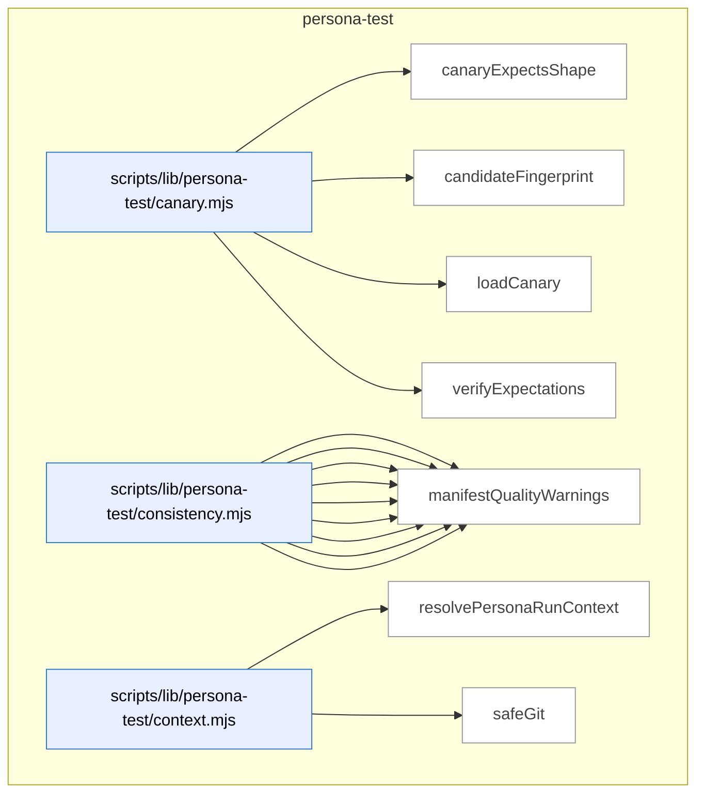

_Domain has 71 symbols (>50). Diagram shows top-15 by file order; see flat table below for the full list._

### Symbols in this domain

| Symbol | Kind | Path | Lines | Purpose | File imported by |
|---|---|---|---|---|---|
| [`canaryExpectsShape`](../scripts/lib/persona-test/canary.mjs#L289) | function | `scripts/lib/persona-test/canary.mjs` | 289-301 | Checks if contradiction matches canary-declared expected shape | `scripts/persona-consistency-run.mjs` |
| [`candidateFingerprint`](../scripts/lib/persona-test/canary.mjs#L318) | function | `scripts/lib/persona-test/canary.mjs` | 318-337 | Generates stable SHA256 fingerprint from repoId/journeyKey/contradiction identity | `scripts/persona-consistency-run.mjs` |
| [`loadCanary`](../scripts/lib/persona-test/canary.mjs#L38) | function | `scripts/lib/persona-test/canary.mjs` | 38-141 | Loads and validates consistency canary JSON with symlink-escape security checks | `scripts/persona-consistency-run.mjs` |
| [`verifyExpectations`](../scripts/lib/persona-test/canary.mjs#L193) | function | `scripts/lib/persona-test/canary.mjs` | 193-268 | Verifies observed contradictions meet expected min/max thresholds from canary | `scripts/persona-consistency-run.mjs` |
| [`appliesToCurrent`](../scripts/lib/persona-test/consistency.mjs#L488) | function | `scripts/lib/persona-test/consistency.mjs` | 488-506 | Checks if surface applies to current route/step/state context | `scripts/persona-consistency-run.mjs` |
| [`clampToFloor`](../scripts/lib/persona-test/consistency.mjs#L118) | function | `scripts/lib/persona-test/consistency.mjs` | 118-122 | Clamps severity to not exceed floor constraint | `scripts/persona-consistency-run.mjs` |
| [`coerceDomKey`](../scripts/lib/persona-test/consistency.mjs#L91) | function | `scripts/lib/persona-test/consistency.mjs` | 91-113 | Coerces DOM string key to inferred type (string/number/boolean) | `scripts/persona-consistency-run.mjs` |
| [`coerceDomValue`](../scripts/lib/persona-test/consistency.mjs#L38) | function | `scripts/lib/persona-test/consistency.mjs` | 38-80 | Coerces DOM string value to declared type (boolean/integer/enum/prose) | `scripts/persona-consistency-run.mjs` |
| [`deepEqual`](../scripts/lib/persona-test/consistency.mjs#L508) | function | `scripts/lib/persona-test/consistency.mjs` | 508-522 | Recursively compares two values for deep structural equality | `scripts/persona-consistency-run.mjs` |
| [`diffClaims`](../scripts/lib/persona-test/consistency.mjs#L139) | function | `scripts/lib/persona-test/consistency.mjs` | 139-406 | Diffs DOM engine claims against manifest declarations, emitting contradictions | `scripts/persona-consistency-run.mjs` |
| [`locatorToString`](../scripts/lib/persona-test/consistency.mjs#L454) | function | `scripts/lib/persona-test/consistency.mjs` | 454-464 | Converts locator object (role/label/testid/id/css) to readable string | `scripts/persona-consistency-run.mjs` |
| [`make`](../scripts/lib/persona-test/consistency.mjs#L437) | function | `scripts/lib/persona-test/consistency.mjs` | 437-452 | Factory creating finding record with standard contradiction shape | `scripts/persona-consistency-run.mjs` |
| [`manifestQualityWarnings`](../scripts/lib/persona-test/consistency.mjs#L420) | function | `scripts/lib/persona-test/consistency.mjs` | 420-433 | Emits quality warnings for manifest surfaces using CSS vs semantic locators | `scripts/persona-consistency-run.mjs` |
| [`resolvePersonaRunContext`](../scripts/lib/persona-test/context.mjs#L28) | function | `scripts/lib/persona-test/context.mjs` | 28-65 | Resolves and validates persona consistency run context with git metadata | _(internal)_ |
| [`safeGit`](../scripts/lib/persona-test/context.mjs#L67) | function | `scripts/lib/persona-test/context.mjs` | 67-74 | Safely executes git command, returning trimmed output or null | _(internal)_ |
| [`normaliseForReplay`](../scripts/lib/persona-test/ledger.mjs#L156) | function | `scripts/lib/persona-test/ledger.mjs` | 156-196 | Strips timestamps and sorts witness claims deterministically for replay comparison. | `scripts/persona-consistency-run.mjs` |
| [`openLedger`](../scripts/lib/persona-test/ledger.mjs#L56) | function | `scripts/lib/persona-test/ledger.mjs` | 56-139 | Creates and initializes consistency session ledger with write-once probe | `scripts/persona-consistency-run.mjs` |
| [`persist`](../scripts/lib/persona-test/ledger.mjs#L141) | function | `scripts/lib/persona-test/ledger.mjs` | 141-143 | Writes the persona-test ledger to disk atomically. | `scripts/persona-consistency-run.mjs` |
| [`s`](../scripts/lib/persona-test/ledger.mjs#L200) | function | `scripts/lib/persona-test/ledger.mjs` | 200-200 | Null-safe string conversion utility. | `scripts/persona-consistency-run.mjs` |
| [`stableCompareContradiction`](../scripts/lib/persona-test/ledger.mjs#L224) | function | `scripts/lib/persona-test/ledger.mjs` | 224-232 | Sorts contradictions by kind/surface/field/scope/key for determinism. | `scripts/persona-consistency-run.mjs` |
| [`stableCompareDom`](../scripts/lib/persona-test/ledger.mjs#L202) | function | `scripts/lib/persona-test/ledger.mjs` | 202-209 | Sorts DOM claims by surface/field/scope/key in stable order. | `scripts/persona-consistency-run.mjs` |
| [`stableCompareFreshness`](../scripts/lib/persona-test/ledger.mjs#L233) | function | `scripts/lib/persona-test/ledger.mjs` | 233-238 | Sorts freshness findings by surface and engine field. | `scripts/persona-consistency-run.mjs` |
| [`stableCompareNetwork`](../scripts/lib/persona-test/ledger.mjs#L210) | function | `scripts/lib/persona-test/ledger.mjs` | 210-217 | Sorts network claims by surface/field/scope/key in stable order. | `scripts/persona-consistency-run.mjs` |
| [`stableCompareUndeclared`](../scripts/lib/persona-test/ledger.mjs#L218) | function | `scripts/lib/persona-test/ledger.mjs` | 218-223 | Sorts undeclared DOM claims by engine field and selector. | `scripts/persona-consistency-run.mjs` |
| [`stableCompareWarning`](../scripts/lib/persona-test/ledger.mjs#L239) | function | `scripts/lib/persona-test/ledger.mjs` | 239-244 | Sorts warnings by kind and surface. | `scripts/persona-consistency-run.mjs` |
| [`resolveManifest`](../scripts/lib/persona-test/manifest-resolver.mjs#L50) | function | `scripts/lib/persona-test/manifest-resolver.mjs` | 50-126 | Finds the first matching manifest file from resolver functions with symlink-escape guards. | `scripts/persona-consistency-run.mjs` |
| [`assertEgressApproved`](../scripts/lib/persona-test/semantic-compare.mjs#L39) | function | `scripts/lib/persona-test/semantic-compare.mjs` | 39-53 | Validates that a model ID is from an approved provider (Claude or Gemini). | _(internal)_ |
| [`compare`](../scripts/lib/persona-test/semantic-compare.mjs#L83) | function | `scripts/lib/persona-test/semantic-compare.mjs` | 83-204 | Semantically compares two prose strings via LLM with caching and egress redaction. | _(internal)_ |
| [`createInMemoryCache`](../scripts/lib/persona-test/semantic-compare.mjs#L248) | function | `scripts/lib/persona-test/semantic-compare.mjs` | 248-255 | Creates a simple in-memory Map-backed cache with get/set/size methods. | _(internal)_ |
| [`makeCacheKey`](../scripts/lib/persona-test/semantic-compare.mjs#L219) | function | `scripts/lib/persona-test/semantic-compare.mjs` | 219-227 | Generates a SHA256 cache key from two strings and model ID. | _(internal)_ |
| [`renderUserPrompt`](../scripts/lib/persona-test/semantic-compare.mjs#L206) | function | `scripts/lib/persona-test/semantic-compare.mjs` | 206-217 | Formats a comparison prompt with redacted input texts and truncation note. | _(internal)_ |
| [`safeCacheGet`](../scripts/lib/persona-test/semantic-compare.mjs#L229) | function | `scripts/lib/persona-test/semantic-compare.mjs` | 229-238 | Retrieves a cached verdict with schema validation, returning null on failure. | _(internal)_ |
| [`safeCacheSet`](../scripts/lib/persona-test/semantic-compare.mjs#L239) | function | `scripts/lib/persona-test/semantic-compare.mjs` | 239-241 | Stores a verdict in the cache, silently ignoring failures. | _(internal)_ |
| [`callCrossSkill`](../scripts/persona-consistency-promote.mjs#L70) | function | `scripts/persona-consistency-promote.mjs` | 70-95 | Executes a cross-skill subcommand via subprocess and returns parsed JSON response or error. | _(internal)_ |
| [`defaultPrompt`](../scripts/persona-consistency-promote.mjs#L562) | function | `scripts/persona-consistency-promote.mjs` | 562-567 | Prompts the user for input via readline and returns their response. | _(internal)_ |
| [`listConsistencyCandidatesViaCli`](../scripts/persona-consistency-promote.mjs#L97) | function | `scripts/persona-consistency-promote.mjs` | 97-106 | Lists pending consistency-mode regression spec candidates from the store for a repo. | _(internal)_ |
| [`parseArgs`](../scripts/persona-consistency-promote.mjs#L141) | function | `scripts/persona-consistency-promote.mjs` | 141-158 | Parses persona-consistency-promote CLI flags into a config object. | _(internal)_ |
| [`promoteCandidates`](../scripts/persona-consistency-promote.mjs#L194) | function | `scripts/persona-consistency-promote.mjs` | 194-275 | Main entry point that lists consistency candidates and prompts the user to approve or decline promotion of each. | _(internal)_ |
| [`promoteOne`](../scripts/persona-consistency-promote.mjs#L281) | function | `scripts/persona-consistency-promote.mjs` | 281-422 | Renders a single consistency candidate into a Playwright spec, writes it to disk, promotes it to the store, and journals the outcome. | _(internal)_ |
| [`promoteRegressionSpecViaCli`](../scripts/persona-consistency-promote.mjs#L108) | function | `scripts/persona-consistency-promote.mjs` | 108-114 | Promotes a consistency candidate to a locked Playwright spec in the store via cross-skill. | _(internal)_ |
| [`readLocalRepoUuid`](../scripts/persona-consistency-promote.mjs#L569) | function | `scripts/persona-consistency-promote.mjs` | 569-575 | Reads the local repo UUID from .audit-loop/repo-identity.json. | _(internal)_ |
| [`reconcilePromotionJournal`](../scripts/persona-consistency-promote.mjs#L428) | function | `scripts/persona-consistency-promote.mjs` | 428-545 | Recovers incomplete promotion attempts from prior crashed runs by querying the DB and reconciling journal state. | _(internal)_ |
| [`recordShipEventViaCli`](../scripts/persona-consistency-promote.mjs#L116) | function | `scripts/persona-consistency-promote.mjs` | 116-123 | Records a ship event to the learning store via cross-skill. | _(internal)_ |
| [`removeJournal`](../scripts/persona-consistency-promote.mjs#L557) | function | `scripts/persona-consistency-promote.mjs` | 557-560 | Deletes a promotion journal file. | _(internal)_ |
| [`safeGitBranch`](../scripts/persona-consistency-promote.mjs#L591) | function | `scripts/persona-consistency-promote.mjs` | 591-597 | Safely retrieves the current branch name, returning null on failure. | _(internal)_ |
| [`safeGitEmail`](../scripts/persona-consistency-promote.mjs#L577) | function | `scripts/persona-consistency-promote.mjs` | 577-583 | Safely retrieves the git user.email config, returning null on failure. | _(internal)_ |
| [`safeGitSha`](../scripts/persona-consistency-promote.mjs#L584) | function | `scripts/persona-consistency-promote.mjs` | 584-590 | Safely retrieves the current HEAD commit SHA, returning null on failure. | _(internal)_ |
| [`usage`](../scripts/persona-consistency-promote.mjs#L160) | function | `scripts/persona-consistency-promote.mjs` | 160-173 | Returns usage text for persona-consistency-promote. | _(internal)_ |
| [`writeJournal`](../scripts/persona-consistency-promote.mjs#L551) | function | `scripts/persona-consistency-promote.mjs` | 551-555 | Atomically writes a promotion journal entry to disk. | _(internal)_ |
| [`applyWait`](../scripts/persona-consistency-run.mjs#L702) | function | `scripts/persona-consistency-run.mjs` | 702-715 | Applies a wait condition (visible, hidden, URL pattern, network response, or timeout) on a Playwright page. | _(internal)_ |
| [`awaitManifestNetworkSources`](../scripts/persona-consistency-run.mjs#L534) | function | `scripts/persona-consistency-run.mjs` | 534-607 | Waits for declared network sources (API calls matching patterns) to complete before proceeding, using manifest and CLI timeouts. | _(internal)_ |
| [`candidateDescription`](../scripts/persona-consistency-run.mjs#L766) | function | `scripts/persona-consistency-run.mjs` | 766-768 | Formats a candidate finding into a human-readable description including kind, surface, engine field, and severity. | _(internal)_ |
| [`candidateWorthy`](../scripts/persona-consistency-run.mjs#L759) | function | `scripts/persona-consistency-run.mjs` | 759-764 | Determines if a consistency finding candidate warrants promotion to a locked spec (has surfaceId, P0/P1 severity, not canary-expected). | _(internal)_ |
| [`cssEscape`](../scripts/persona-consistency-run.mjs#L698) | function | `scripts/persona-consistency-run.mjs` | 698-700 | Escapes CSS special characters and leading digits in a string for safe use in CSS selectors. | _(internal)_ |
| [`describeAction`](../scripts/persona-consistency-run.mjs#L717) | function | `scripts/persona-consistency-run.mjs` | 717-726 | Generates a human-readable description of a test action (navigate, click, fill, wait, evaluate) for logging. | _(internal)_ |
| [`detectUnannotatedSurfaces`](../scripts/persona-consistency-run.mjs#L629) | function | `scripts/persona-consistency-run.mjs` | 629-667 | Scans the live DOM for surfaces defined in the manifest but lacking data-engine-claim annotations and reports them as findings. | _(internal)_ |
| [`emptyWitness`](../scripts/persona-consistency-run.mjs#L791) | function | `scripts/persona-consistency-run.mjs` | 791-800 | Creates an empty witness record with no claims for a given step index. | _(internal)_ |
| [`executeStep`](../scripts/persona-consistency-run.mjs#L465) | function | `scripts/persona-consistency-run.mjs` | 465-504 | Executes a single journey step (navigate/click/fill/wait/evaluate) and returns the resolved target URL or status. | _(internal)_ |
| [`joinUrl`](../scripts/persona-consistency-run.mjs#L802) | function | `scripts/persona-consistency-run.mjs` | 802-808 | Joins a base URL with a relative or absolute path suffix, normalizing slashes. | _(internal)_ |
| [`locatorOf`](../scripts/persona-consistency-run.mjs#L681) | function | `scripts/persona-consistency-run.mjs` | 681-692 | Converts a locator object into a Playwright page locator using the appropriate getter method (role, label, testid, id, or CSS). | _(internal)_ |
| [`locatorString`](../scripts/persona-consistency-run.mjs#L728) | function | `scripts/persona-consistency-run.mjs` | 728-738 | Formats a locator object into a human-readable string (e.g., "role=button[name=\"Submit\"]"). | _(internal)_ |
| [`locatorToStringLite`](../scripts/persona-consistency-run.mjs#L669) | function | `scripts/persona-consistency-run.mjs` | 669-679 | Converts a Playwright locator object (role/label/testid/id/css) to a human-readable selector string. | _(internal)_ |
| [`newAuthedContext`](../scripts/persona-consistency-run.mjs#L742) | function | `scripts/persona-consistency-run.mjs` | 742-755 | Creates a new Playwright browser context with optional authentication via storage state or Bearer token header. | _(internal)_ |
| [`parseArgs`](../scripts/persona-consistency-run.mjs#L56) | function | `scripts/persona-consistency-run.mjs` | 56-77 | Parses persona-consistency-run CLI flags (canary, url, out, repo-root, await-ms). | _(internal)_ |
| [`readLocalRepoUuid`](../scripts/persona-consistency-run.mjs#L827) | function | `scripts/persona-consistency-run.mjs` | 827-836 | Reads the repo's UUID from `.audit-loop/repo-identity.json` if it exists, returning null otherwise. | _(internal)_ |
| [`runConsistency`](../scripts/persona-consistency-run.mjs#L117) | function | `scripts/persona-consistency-run.mjs` | 117-458 | Main entry point that opens a ledger, initializes Playwright, replays journey steps, captures surface state, detects engine contradictions, and records results. | _(internal)_ |
| [`safeBrowserClose`](../scripts/persona-consistency-run.mjs#L823) | function | `scripts/persona-consistency-run.mjs` | 823-825 | Safely closes a Playwright browser, swallowing any errors. | _(internal)_ |
| [`safeCurrentRoute`](../scripts/persona-consistency-run.mjs#L810) | function | `scripts/persona-consistency-run.mjs` | 810-812 | Safely parses the current page URL and returns its pathname, or null on error. | _(internal)_ |
| [`safeGitSha`](../scripts/persona-consistency-run.mjs#L814) | function | `scripts/persona-consistency-run.mjs` | 814-821 | Safely retrieves the current Git HEAD commit SHA from the repo, or null on failure. | _(internal)_ |
| [`shrinkWitness`](../scripts/persona-consistency-run.mjs#L773) | function | `scripts/persona-consistency-run.mjs` | 773-787 | Filters a witness record to contain only DOM/network claims matching a specific candidate's surface, field, scope, and key. | _(internal)_ |
| [`usage`](../scripts/persona-consistency-run.mjs#L79) | function | `scripts/persona-consistency-run.mjs` | 79-96 | Returns usage text for persona-consistency-run. | _(internal)_ |

---

## plan

> Parses P0-P3 acceptance criteria from plan markdown with setup/assertion structure, fuzzy-matches target file paths against the repo, and tracks dismissed findings to detect recurring false positives.

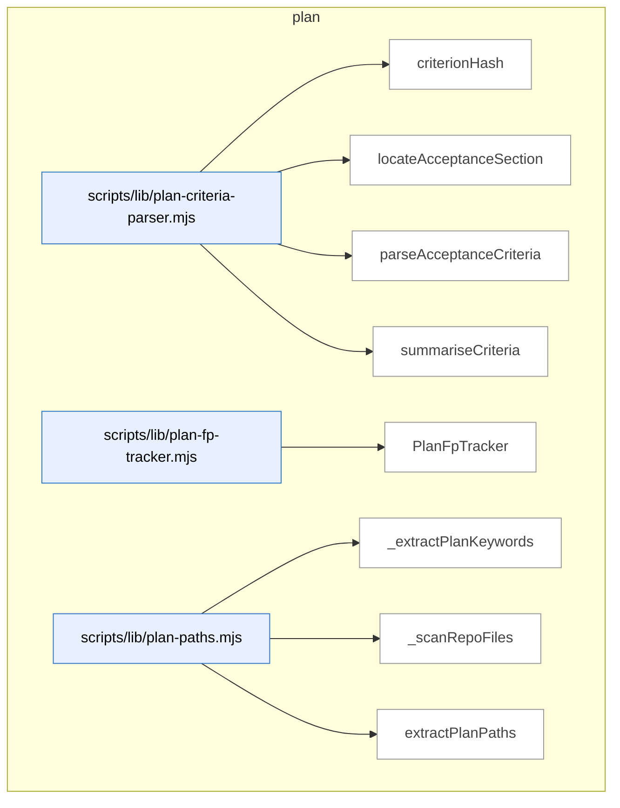

### Symbols in this domain

| Symbol | Kind | Path | Lines | Purpose | File imported by |
|---|---|---|---|---|---|
| [`criterionHash`](../scripts/lib/plan-criteria-parser.mjs#L45) | function | `scripts/lib/plan-criteria-parser.mjs` | 45-48 | Generates a stable 16-character hash from criterion severity/category/description. | `scripts/ux-lock-run.mjs` |
| [`locateAcceptanceSection`](../scripts/lib/plan-criteria-parser.mjs#L56) | function | `scripts/lib/plan-criteria-parser.mjs` | 56-77 | Locates the Acceptance Criteria markdown section by heading level. | `scripts/ux-lock-run.mjs` |
| [`parseAcceptanceCriteria`](../scripts/lib/plan-criteria-parser.mjs#L96) | function | `scripts/lib/plan-criteria-parser.mjs` | 96-152 | Parses P0-P3 acceptance criteria with setup/assertion from markdown. | `scripts/ux-lock-run.mjs` |
| [`summariseCriteria`](../scripts/lib/plan-criteria-parser.mjs#L158) | function | `scripts/lib/plan-criteria-parser.mjs` | 158-166 | Summarizes criterion count by severity and category. | `scripts/ux-lock-run.mjs` |
| [`PlanFpTracker`](../scripts/lib/plan-fp-tracker.mjs#L26) | class | `scripts/lib/plan-fp-tracker.mjs` | 26-140 | Tracks dismissed plan findings with EMA scoring to flag recurring false positives. | `scripts/lib/audit/legacy-production-audit.mjs`, `scripts/openai-audit.mjs`, `scripts/write-plan-outcomes.mjs` |
| [`_extractPlanKeywords`](../scripts/lib/plan-paths.mjs#L112) | function | `scripts/lib/plan-paths.mjs` | 112-154 | Extracts PascalCase identifiers and keywords from plan content for fuzzy matching. | `scripts/lib/file-io.mjs`, `scripts/lib/requirements/context.mjs` |
| [`_scanRepoFiles`](../scripts/lib/plan-paths.mjs#L156) | function | `scripts/lib/plan-paths.mjs` | 156-182 | Walks the repo directory tree to find all source files by extension. | `scripts/lib/file-io.mjs`, `scripts/lib/requirements/context.mjs` |
| [`extractPlanPaths`](../scripts/lib/plan-paths.mjs#L32) | function | `scripts/lib/plan-paths.mjs` | 32-108 | Extracts file paths mentioned in plan markdown via regex patterns. | `scripts/lib/file-io.mjs`, `scripts/lib/requirements/context.mjs` |

---

## root-scripts

> Handles first-time repo installation and interactive onboarding—cloning from GitHub, validating prerequisites, prompting for API keys and database configuration, and setting up local dependencies.

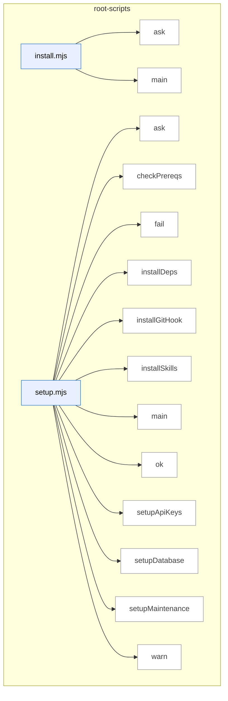

### Symbols in this domain

| Symbol | Kind | Path | Lines | Purpose | File imported by |
|---|---|---|---|---|---|
| [`ask`](../install.mjs#L18) | function | `install.mjs` | 18-18 | Prompts user for input via readline and returns a promise. | _(internal)_ |
| [`main`](../install.mjs#L37) | function | `install.mjs` | 37-238 | Multi-phase installation script that clones the repo from GitHub, copies scripts to target directory, and sets up dependencies. | _(internal)_ |
| [`ask`](../setup.mjs#L26) | function | `setup.mjs` | 26-26 | Returns a promise that resolves to the user's answer when prompted via readline. | _(internal)_ |
| [`checkPrereqs`](../setup.mjs#L35) | function | `setup.mjs` | 35-44 | Verifies Node.js version ≥18 and npm availability. | _(internal)_ |
| [`fail`](../setup.mjs#L31) | function | `setup.mjs` | 31-31 | Prints a red X followed by a failure message. | _(internal)_ |
| [`installDeps`](../setup.mjs#L183) | function | `setup.mjs` | 183-190 | Runs npm install to fetch project dependencies. | _(internal)_ |
| [`installGitHook`](../setup.mjs#L194) | function | `setup.mjs` | 194-222 | Creates or appends to a post-merge git hook that auto-updates skills on git pull. | _(internal)_ |
| [`installSkills`](../setup.mjs#L165) | function | `setup.mjs` | 165-179 | Builds the skill manifest and installs skills globally to ~/.claude/skills/. | _(internal)_ |
| [`main`](../setup.mjs#L226) | function | `setup.mjs` | 226-292 | Orchestrates seven-step first-time setup: prereqs, API keys, database, maintenance, deps, skills, hook. | _(internal)_ |
| [`ok`](../setup.mjs#L29) | function | `setup.mjs` | 29-29 | Prints a green checkmark followed by a success message. | _(internal)_ |
| [`setupApiKeys`](../setup.mjs#L55) | function | `setup.mjs` | 55-82 | Prompts for API keys and saves them to .env, skipping already-configured ones. | _(internal)_ |
| [`setupDatabase`](../setup.mjs#L91) | function | `setup.mjs` | 91-127 | Prompts user to choose a database backend and saves configuration to .env. | _(internal)_ |
| [`setupMaintenance`](../setup.mjs#L136) | function | `setup.mjs` | 136-161 | Optionally enables weekly local maintenance checks via AUDIT_LOOP_WEEKLY_MAINTENANCE=1. | _(internal)_ |
| [`warn`](../setup.mjs#L30) | function | `setup.mjs` | 30-30 | Prints a yellow warning triangle followed by a warning message. | _(internal)_ |

---

## scripts

> CLI orchestrators for multi-pass code audits (GPT 5-pass + Gemini final review), plan refinement, Playwright-driven UX testing (persona/nav/visual audits), and regression-spec locking; supporting libraries for LLM clients, Postgres persistence, schema validation, and sensitive-path egress guards.

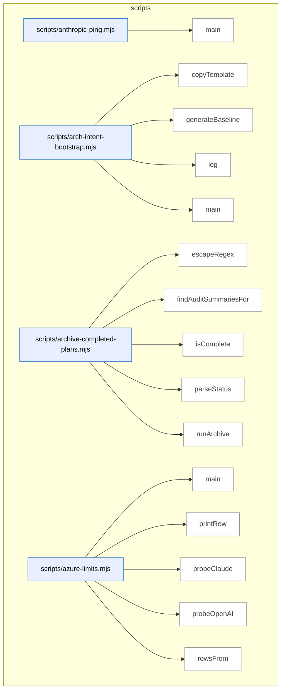

_Domain has 302 symbols (>50). Diagram shows top-15 by file order; see flat table below for the full list._

### Symbols in this domain

| Symbol | Kind | Path | Lines | Purpose | File imported by |
|---|---|---|---|---|---|
| [`main`](../scripts/anthropic-ping.mjs#L24) | function | `scripts/anthropic-ping.mjs` | 24-59 | Pings Claude API via configured backend (SDK or CLI) and reports latency, token usage, and cost. | _(internal)_ |
| [`copyTemplate`](../scripts/arch-intent-bootstrap.mjs#L39) | function | `scripts/arch-intent-bootstrap.mjs` | 39-52 | Copies architecture intent template file if it doesn't already exist at the target path. | _(internal)_ |
| [`generateBaseline`](../scripts/arch-intent-bootstrap.mjs#L54) | function | `scripts/arch-intent-bootstrap.mjs` | 54-113 | Generates an allowed-dependencies baseline by detecting the repo's tech stack and extracting the current import graph. | _(internal)_ |
| [`log`](../scripts/arch-intent-bootstrap.mjs#L37) | function | `scripts/arch-intent-bootstrap.mjs` | 37-37 | Logs bootstrap status messages to stdout with a `[arch-intent-bootstrap]` prefix. | _(internal)_ |
| [`main`](../scripts/arch-intent-bootstrap.mjs#L115) | function | `scripts/arch-intent-bootstrap.mjs` | 115-130 | Orchestrates architecture intent bootstrap: copies template and optionally generates baseline from detected imports. | _(internal)_ |
| [`escapeRegex`](../scripts/archive-completed-plans.mjs#L72) | function | `scripts/archive-completed-plans.mjs` | 72-74 | Escapes special regex characters in a string for safe literal pattern matching. | _(internal)_ |
| [`findAuditSummariesFor`](../scripts/archive-completed-plans.mjs#L64) | function | `scripts/archive-completed-plans.mjs` | 64-70 | Finds audit summary markdown files matching a plan's name via regex filename pattern. | _(internal)_ |
| [`isComplete`](../scripts/archive-completed-plans.mjs#L54) | function | `scripts/archive-completed-plans.mjs` | 54-57 | Checks if a plan's status string matches a completion pattern (e.g., "Complete", "Done"). | _(internal)_ |
| [`parseStatus`](../scripts/archive-completed-plans.mjs#L42) | function | `scripts/archive-completed-plans.mjs` | 42-46 | Extracts the `Status:` field value from a markdown plan file's header. | _(internal)_ |
| [`runArchive`](../scripts/archive-completed-plans.mjs#L86) | function | `scripts/archive-completed-plans.mjs` | 86-145 | Moves completed plans and their associated audit summaries from `docs/plans` to `docs/completed`, with dry-run option. | _(internal)_ |
| [`main`](../scripts/azure-limits.mjs#L66) | function | `scripts/azure-limits.mjs` | 66-93 | Probes Azure OpenAI and Foundry Claude deployments and reports current rate limits (tokens-per-minute and requests-per-minute). | _(internal)_ |
| [`printRow`](../scripts/azure-limits.mjs#L36) | function | `scripts/azure-limits.mjs` | 36-45 | Formats and prints a single rate-limit probe result showing TPM, RPM, and window size to stdout. | _(internal)_ |
| [`probeClaude`](../scripts/azure-limits.mjs#L59) | function | `scripts/azure-limits.mjs` | 59-64 | Hits Azure Foundry Claude endpoint to retrieve live rate-limit headers. | _(internal)_ |
| [`probeOpenAI`](../scripts/azure-limits.mjs#L47) | function | `scripts/azure-limits.mjs` | 47-57 | Hits Azure OpenAI endpoints (GPT or embedding model) to retrieve live rate-limit headers. | _(internal)_ |
| [`rowsFrom`](../scripts/azure-limits.mjs#L22) | function | `scripts/azure-limits.mjs` | 22-34 | Extracts rate-limit headers (TPM, RPM, window, reset times) from Azure OpenAI or Foundry API response. | _(internal)_ |
| [`buildSurfacesManifest`](../scripts/build-surfaces-manifest.mjs#L322) | function | `scripts/build-surfaces-manifest.mjs` | 322-343 | Finds and merges surface fragments, validates against schema, and returns the merged manifest. | _(internal)_ |
| [`canonicalLocator`](../scripts/build-surfaces-manifest.mjs#L144) | function | `scripts/build-surfaces-manifest.mjs` | 144-151 | Converts a locator object (id, css, role, text) into a canonical string for deduplication. | _(internal)_ |
| [`findFragments`](../scripts/build-surfaces-manifest.mjs#L109) | function | `scripts/build-surfaces-manifest.mjs` | 109-134 | Recursively discovers all `.data-engine-claim.json` fragment files in a directory tree, sorted for deterministic order. | _(internal)_ |
| [`loadFragment`](../scripts/build-surfaces-manifest.mjs#L160) | function | `scripts/build-surfaces-manifest.mjs` | 160-180 | Loads a fragment JSON file, validating that it contains at least one surface or collection. | _(internal)_ |
| [`main`](../scripts/build-surfaces-manifest.mjs#L346) | function | `scripts/build-surfaces-manifest.mjs` | 346-393 | Builds or verifies the surfaces manifest, writing to disk if changed or exiting with error in verify mode if stale. | _(internal)_ |
| [`mergeFragments`](../scripts/build-surfaces-manifest.mjs#L191) | function | `scripts/build-surfaces-manifest.mjs` | 191-293 | Merges multiple surface/collection fragments, deduplicating by ID and collecting validation errors. | _(internal)_ |
| [`renderManifest`](../scripts/build-surfaces-manifest.mjs#L303) | function | `scripts/build-surfaces-manifest.mjs` | 303-305 | Serializes a manifest object to pretty-printed JSON. | _(internal)_ |
| [`analyse`](../scripts/cache-hitrate-check.mjs#L175) | function | `scripts/cache-hitrate-check.mjs` | 175-210 | Loads R2+ audit runs from Supabase or local log, segments them, decides on cache-seed policy, and returns the analysis. | _(internal)_ |
| [`loadFromLocal`](../scripts/cache-hitrate-check.mjs#L112) | function | `scripts/cache-hitrate-check.mjs` | 112-131 | Loads cache metrics from a local JSONL log, filtering for R2+ runs and normalizing field names. | _(internal)_ |
| [`loadFromSupabase`](../scripts/cache-hitrate-check.mjs#L83) | function | `scripts/cache-hitrate-check.mjs` | 83-110 | Loads cache-hitrate metrics from the Postgres database for R2+ audit runs since a cutoff date. | _(internal)_ |
| [`median`](../scripts/cache-hitrate-check.mjs#L74) | function | `scripts/cache-hitrate-check.mjs` | 74-81 | Computes the median of an array of numbers, handling both even and odd lengths. | _(internal)_ |
| [`renderHuman`](../scripts/cache-hitrate-check.mjs#L212) | function | `scripts/cache-hitrate-check.mjs` | 212-238 | Formats cache-hitrate analysis as human-readable output with recommendation, per-run breakdown, and decision rationale. | _(internal)_ |
| [`segmentAndDecide`](../scripts/cache-hitrate-check.mjs#L142) | function | `scripts/cache-hitrate-check.mjs` | 142-173 | Segments runs by seed state (on/off/unknown) and recommends whether to flip AUDIT_CACHE_SEED based on median-hitrate thresholds. | _(internal)_ |
| [`argOption`](../scripts/cheap-triager-validate.mjs#L58) | function | `scripts/cheap-triager-validate.mjs` | 58-61 | Extracts a command-line option value by flag name, returning a default if absent. | _(internal)_ |
| [`buildGlmAdapter`](../scripts/cheap-triager-validate.mjs#L87) | function | `scripts/cheap-triager-validate.mjs` | 87-108 | Creates an async function that triages audit findings using a cheap LLM model via OpenRouter. | _(internal)_ |
| [`cmdManifest`](../scripts/cheap-triager-validate.mjs#L241) | function | `scripts/cheap-triager-validate.mjs` | 241-296 | Builds a triage manifest by loading state, grades, and evidence, then computing accuracy rates per finding stratum. | _(internal)_ |
| [`cmdWorksheet`](../scripts/cheap-triager-validate.mjs#L112) | function | `scripts/cheap-triager-validate.mjs` | 112-202 | Generates a worksheet of blind findings for human grading by running a candidate triage model concurrently across chunked batches. | _(internal)_ |
| [`parseGradesCsv`](../scripts/cheap-triager-validate.mjs#L212) | function | `scripts/cheap-triager-validate.mjs` | 212-239 | Parses a CSV file of human verdicts for blind findings, validating format and extracting false-dismissal grades. | _(internal)_ |
| [`rowPrompt`](../scripts/cheap-triager-validate.mjs#L78) | function | `scripts/cheap-triager-validate.mjs` | 78-85 | Formats an audit finding as a multiline prompt string for LLM-based triage. | _(internal)_ |
| [`loadConfig`](../scripts/claudemd-lint.mjs#L48) | function | `scripts/claudemd-lint.mjs` | 48-66 | Loads a JSON config file from a provided or default path, returning empty config as fallback. | _(internal)_ |
| [`main`](../scripts/claudemd-lint.mjs#L68) | function | `scripts/claudemd-lint.mjs` | 68-172 | Scans instruction files, runs linting rules, sorts findings by severity, and applies auto-fixes if requested. | _(internal)_ |
| [`parseArgs`](../scripts/claudemd-lint.mjs#L26) | function | `scripts/claudemd-lint.mjs` | 26-46 | Extracts --format, --out, --config, --fix, and --yes command-line arguments into an options object. | _(internal)_ |
| [`buildDsn`](../scripts/db-test-container.mjs#L77) | function | `scripts/db-test-container.mjs` | 77-79 | [SECRET_REDACTED] | _(internal)_ |
| [`buildStepEnv`](../scripts/db-test-container.mjs#L96) | function | `scripts/db-test-container.mjs` | 96-106 | Constructs environment variables for a test step, routing to AUDIT_DB_TEST_URL for destructive steps and AUDIT_DB_URL otherwise. | _(internal)_ |
| [`classifyRunFailure`](../scripts/db-test-container.mjs#L148) | function | `scripts/db-test-container.mjs` | 148-160 | Classifies docker run failures by stderr pattern and suggests remediation (port conflict, binding error, networking failure). | _(internal)_ |
| [`createLifecycle`](../scripts/db-test-container.mjs#L243) | function | `scripts/db-test-container.mjs` | 243-465 | Returns an object managing the full lifecycle of a test container: run, teardown, abort, and signal handling. | _(internal)_ |
| [`defaultWaitForReady`](../scripts/db-test-container.mjs#L217) | function | `scripts/db-test-container.mjs` | 217-236 | Polls a Postgres server connection until ready or timeout, returning connection-success status. | _(internal)_ |
| [`main`](../scripts/db-test-container.mjs#L469) | function | `scripts/db-test-container.mjs` | 469-495 | Parses CLI args, validates relocation contract, creates a container lifecycle, installs signal handlers, and runs the specified mode. | _(internal)_ |
| [`parseArgs`](../scripts/db-test-container.mjs#L112) | function | `scripts/db-test-container.mjs` | 112-137 | Parses CLI arguments to extract mode (suites/postgres/custom), --port, and --keep flags with validation. | _(internal)_ |
| [`realExec`](../scripts/db-test-container.mjs#L173) | function | `scripts/db-test-container.mjs` | 173-203 | Spawns a subprocess with optional timeout, capturing output, and returning exit code, signal, and streams. | _(internal)_ |
| [`sleep`](../scripts/db-test-container.mjs#L205) | function | `scripts/db-test-container.mjs` | 205-207 | <no body> | _(internal)_ |
| [`argOption`](../scripts/defect-harvest.mjs#L27) | function | `scripts/defect-harvest.mjs` | 27-30 | Returns the value following a named CLI flag, with a default fallback if flag is absent. | _(internal)_ |
| [`blameIntroducers`](../scripts/defect-harvest.mjs#L68) | function | `scripts/defect-harvest.mjs` | 68-84 | Uses git-blame to identify which commits originally introduced the lines modified in a commit. | _(internal)_ |
| [`changedFiles`](../scripts/defect-harvest.mjs#L52) | function | `scripts/defect-harvest.mjs` | 52-64 | Extracts changed files from a commit, excluding binary files and sensitive/generated paths. | _(internal)_ |
| [`filesFor`](../scripts/defect-harvest.mjs#L93) | function | `scripts/defect-harvest.mjs` | 93-93 | Safely retrieves the list of files changed in a commit, returning empty set on error. | _(internal)_ |
| [`firstFunctionOriginHint`](../scripts/defect-harvest.mjs#L97) | function | `scripts/defect-harvest.mjs` | 97-108 | Attempts to find the commit where the function containing a changed line was originally introduced. | _(internal)_ |
| [`harvestCandidates`](../scripts/defect-harvest.mjs#L118) | function | `scripts/defect-harvest.mjs` | 118-179 | Scans recent commits for defect patterns (reverts, Fixes references, fix-typed), yields candidates with confidence. | _(internal)_ |
| [`hasFlag`](../scripts/defect-harvest.mjs#L31) | function | `scripts/defect-harvest.mjs` | 31-31 | Returns true if a named CLI flag is present in process.argv. | _(internal)_ |
| [`log`](../scripts/defect-harvest.mjs#L26) | function | `scripts/defect-harvest.mjs` | 26-26 | Writes a message to stderr. | _(internal)_ |
| [`main`](../scripts/defect-harvest.mjs#L181) | function | `scripts/defect-harvest.mjs` | 181-219 | Entry point that harvests defect candidates from git history across one or more repos, optionally persists to file. | _(internal)_ |
| [`makeGit`](../scripts/defect-harvest.mjs#L44) | function | `scripts/defect-harvest.mjs` | 44-48 | Returns a function that executes git commands in a specified repository root with high buffer limits. | _(internal)_ |
| [`severityHint`](../scripts/defect-harvest.mjs#L87) | function | `scripts/defect-harvest.mjs` | 87-91 | Assigns severity hint (HIGH/MEDIUM/LOW) based on security and bug-related keywords in commit subject. | _(internal)_ |
| [`main`](../scripts/efficacy-lints-check.mjs#L17) | function | `scripts/efficacy-lints-check.mjs` | 17-37 | Runs efficacy lints on the repository and optionally gates the build if findings or unverified status is reached. | _(internal)_ |
| [`appendLocalFallback`](../scripts/friction-log.mjs#L88) | function | `scripts/friction-log.mjs` | 88-94 | Appends a friction-log record as JSON to a local fallback file, creating the directory if needed. | `scripts/cross-skill.mjs` |
| [`defaultExecGit`](../scripts/friction-log.mjs#L75) | function | `scripts/friction-log.mjs` | 75-84 | Executes a git command with timeout and returns stdout, or null on failure. | `scripts/cross-skill.mjs` |
| [`detectRepoName`](../scripts/friction-log.mjs#L61) | function | `scripts/friction-log.mjs` | 61-73 | Detects the repo name by trying git remote URL parsing, falling back to current directory's basename. | `scripts/cross-skill.mjs` |
| [`helpText`](../scripts/friction-log.mjs#L164) | function | `scripts/friction-log.mjs` | 164-174 | Returns usage help text for the friction-log CLI. | `scripts/cross-skill.mjs` |
| [`main`](../scripts/friction-log.mjs#L185) | function | `scripts/friction-log.mjs` | 185-207 | CLI entry point for friction-log: parses args, runs log operation, and outputs JSON result to stdout. | `scripts/cross-skill.mjs` |
| [`parseArgs`](../scripts/friction-log.mjs#L31) | function | `scripts/friction-log.mjs` | 31-44 | Parses command-line arguments for friction-log, extracting flags (--severity, --repo, --json) and the positional message. | `scripts/cross-skill.mjs` |
| [`runFrictionLog`](../scripts/friction-log.mjs#L98) | function | `scripts/friction-log.mjs` | 98-162 | Attempts to log friction to the cloud learning store first, then falls back to a local JSON file if that fails. | `scripts/cross-skill.mjs` |
| [`validateArgs`](../scripts/friction-log.mjs#L46) | function | `scripts/friction-log.mjs` | 46-53 | Validates parsed friction-log arguments, checking that message exists and severity matches allowed values. | `scripts/cross-skill.mjs` |
| [`installInRepo`](../scripts/install-prepush-hook.mjs#L167) | function | `scripts/install-prepush-hook.mjs` | 167-217 | Installs, updates, or uninstalls a pre-push hook in a repository with dry-run support and safety checks. | _(internal)_ |
| [`isManagedHook`](../scripts/install-prepush-hook.mjs#L41) | function | `scripts/install-prepush-hook.mjs` | 41-45 | Checks if a pre-push hook file was installed/managed by this tool or is a legacy version. | _(internal)_ |
| [`main`](../scripts/install-prepush-hook.mjs#L221) | function | `scripts/install-prepush-hook.mjs` | 221-245 | Resolves target repositories and orchestrates hook installation with human-readable or JSON output formatting. | _(internal)_ |
| [`computeArchMemoryBandOutcome`](../scripts/learning/backfill-outcomes.mjs#L559) | function | `scripts/learning/backfill-outcomes.mjs` | 559-610 | Resolves arch-memory-band decisions by checking if commits touched the file within 30 minutes of recommendation. | `scripts/cross-skill.mjs` |
| [`computeConvergencePredictOutcome`](../scripts/learning/backfill-outcomes.mjs#L634) | function | `scripts/learning/backfill-outcomes.mjs` | 634-678 | Resolves convergence-predict decisions by comparing decision round against actual run's convergence/rigor signals. | `scripts/cross-skill.mjs` |
| [`computeFileFingerprint`](../scripts/learning/backfill-outcomes.mjs#L452) | function | `scripts/learning/backfill-outcomes.mjs` | 452-464 | Computes SHA256 hash of first 256 bytes of a file for rotation detection. | `scripts/cross-skill.mjs` |
| [`computeOutcomeFromFileState`](../scripts/learning/backfill-outcomes.mjs#L744) | function | `scripts/learning/backfill-outcomes.mjs` | 744-802 | Resolves quickfix-hit decisions by verifying file existence and snippet presence (or file deletion). | `scripts/cross-skill.mjs` |
| [`computePassSelectionOutcome`](../scripts/learning/backfill-outcomes.mjs#L699) | function | `scripts/learning/backfill-outcomes.mjs` | 699-725 | Resolves pass-selection decisions by checking acceptance ratio of adjudicated audit findings. | `scripts/cross-skill.mjs` |
| [`defaultExecGit`](../scripts/learning/backfill-outcomes.mjs#L612) | function | `scripts/learning/backfill-outcomes.mjs` | 612-619 | Executes git commands synchronously with 5-second timeout and piped I/O. | `scripts/cross-skill.mjs` |
| [`drainFrictionFallback`](../scripts/learning/backfill-outcomes.mjs#L338) | function | `scripts/learning/backfill-outcomes.mjs` | 338-402 | Drains friction notes from a local JSONL fallback to the learning store, retaining failed inserts. | `scripts/cross-skill.mjs` |
| [`drainJsonlToCloud`](../scripts/learning/backfill-outcomes.mjs#L187) | function | `scripts/learning/backfill-outcomes.mjs` | 187-327 | Reads new lines from a local JSONL file using cursor tracking, syncing batches to cloud storage. | `scripts/cross-skill.mjs` |
| [`readDrainCursor`](../scripts/learning/backfill-outcomes.mjs#L417) | function | `scripts/learning/backfill-outcomes.mjs` | 417-438 | Reads the drain cursor (offset, fingerprint, timestamp) from disk, supporting both JSON and legacy int formats. | `scripts/cross-skill.mjs` |
| [`resolveUnresolvedOutcomes`](../scripts/learning/backfill-outcomes.mjs#L468) | function | `scripts/learning/backfill-outcomes.mjs` | 468-533 | Reads pending learning decisions and routes each to its type-specific resolver (quickfix, arch, convergence, pass). | `scripts/cross-skill.mjs` |
| [`runBackfill`](../scripts/learning/backfill-outcomes.mjs#L62) | function | `scripts/learning/backfill-outcomes.mjs` | 62-171 | Orchestrates draining local JSONL outcomes to cloud and resolving pending learning decisions. | `scripts/cross-skill.mjs` |
| [`writeDrainCursor`](../scripts/learning/backfill-outcomes.mjs#L440) | function | `scripts/learning/backfill-outcomes.mjs` | 440-445 | Persists drain cursor state (offset, fingerprint, updated-at) to track file-read progress. | `scripts/cross-skill.mjs` |
| [`fmtNum`](../scripts/learning/replay.mjs#L92) | function | `scripts/learning/replay.mjs` | 92-95 | Formats numbers with 2 decimals for ≥1 or 4 decimals for smaller values. | `scripts/cross-skill.mjs` |
| [`loadPolicy`](../scripts/learning/replay.mjs#L99) | function | `scripts/learning/replay.mjs` | 99-109 | Dynamically imports a policy module (file path or fallback function) with export validation. | `scripts/cross-skill.mjs` |
| [`parseDuration`](../scripts/learning/replay.mjs#L54) | function | `scripts/learning/replay.mjs` | 54-63 | Parses duration strings (e.g., "30d", "2h") into milliseconds with fallback default. | `scripts/cross-skill.mjs` |
| [`renderMarkdownReport`](../scripts/learning/replay.mjs#L67) | function | `scripts/learning/replay.mjs` | 67-90 | Formats a replay result into markdown table comparing baseline vs candidate policy reward stats. | `scripts/cross-skill.mjs` |
| [`runReplayCli`](../scripts/learning/replay.mjs#L120) | function | `scripts/learning/replay.mjs` | 120-170 | CLI handler that parses arguments and runs a policy replay simulation against historical decisions. | `scripts/cross-skill.mjs` |
| [`applyTotalCap`](../scripts/learning/weekly-review.mjs#L135) | function | `scripts/learning/weekly-review.mjs` | 135-155 | Distributes a total item cap across sections (triage, no-brainer, stale, friction) with different thresholds. | `scripts/cross-skill.mjs` |
| [`buildFrictionSection`](../scripts/learning/weekly-review.mjs#L116) | function | `scripts/learning/weekly-review.mjs` | 116-126 | Builds a capped section of friction notes ordered by severity then recency. | `scripts/cross-skill.mjs` |
| [`buildNoBrainerSection`](../scripts/learning/weekly-review.mjs#L95) | function | `scripts/learning/weekly-review.mjs` | 95-103 | Builds a capped section of recurring findings ordered by occurrence count then most-recent date. | `scripts/cross-skill.mjs` |
| [`buildStaleSection`](../scripts/learning/weekly-review.mjs#L105) | function | `scripts/learning/weekly-review.mjs` | 105-110 | Builds a capped section of stale deferred findings ordered by oldest last-seen date. | `scripts/cross-skill.mjs` |
| [`buildTriageSection`](../scripts/learning/weekly-review.mjs#L84) | function | `scripts/learning/weekly-review.mjs` | 84-93 | Builds a sorted, capped section of triage findings ordered by severity then recency. | `scripts/cross-skill.mjs` |
| [`fmtPath`](../scripts/learning/weekly-review.mjs#L165) | function | `scripts/learning/weekly-review.mjs` | 165-168 | Formats a file path for markdown display by escaping backticks. | `scripts/cross-skill.mjs` |
| [`fmtTitle`](../scripts/learning/weekly-review.mjs#L159) | function | `scripts/learning/weekly-review.mjs` | 159-163 | Normalizes and truncates a finding title to 120 characters, escaping markdown after truncation. | `scripts/cross-skill.mjs` |
| [`humanizeAgo`](../scripts/learning/weekly-review.mjs#L174) | function | `scripts/learning/weekly-review.mjs` | 174-186 | Converts ISO timestamp to human-readable relative time (e.g., "5m ago", "2d ago"). | `scripts/cross-skill.mjs` |
| [`mdEscape`](../scripts/learning/weekly-review.mjs#L69) | function | `scripts/learning/weekly-review.mjs` | 69-80 | Escapes markdown special characters (backslash, backtick, asterisk, underscore, brackets, angle brackets). | `scripts/cross-skill.mjs` |
| [`postOrUpdateStickyIssue`](../scripts/learning/weekly-review.mjs#L282) | function | `scripts/learning/weekly-review.mjs` | 282-340 | Creates or updates a GitHub issue with weekly review markdown, reopening if previously closed. | `scripts/cross-skill.mjs` |
| [`renderMarkdown`](../scripts/learning/weekly-review.mjs#L188) | function | `scripts/learning/weekly-review.mjs` | 188-278 | Generates full markdown weekly review body combining friction, triage, no-brainer, and stale sections. | `scripts/cross-skill.mjs` |
| [`runWeeklyReview`](../scripts/learning/weekly-review.mjs#L351) | function | `scripts/learning/weekly-review.mjs` | 351-415 | Fetches pending findings/recommendations from a learning store and renders them into a markdown weekly digest report. | `scripts/cross-skill.mjs` |
| [`severityRank`](../scripts/learning/weekly-review.mjs#L52) | function | `scripts/learning/weekly-review.mjs` | 52-60 | Returns sort rank (0=HIGH, 1=MEDIUM, 2=LOW, -1=unknown) for severity-ordered list sorting. | `scripts/cross-skill.mjs` |
| [`argOption`](../scripts/ledger-decompose.mjs#L35) | function | `scripts/ledger-decompose.mjs` | 35-38 | Retrieves a command-line argument value by flag name, returning a default if not present. | _(internal)_ |
| [`decompose`](../scripts/ledger-decompose.mjs#L54) | function | `scripts/ledger-decompose.mjs` | 54-106 | Queries the audit database to decompose accepted findings by round/stage/severity and analyze value distribution. | _(internal)_ |
| [`hasFlag`](../scripts/ledger-decompose.mjs#L39) | function | `scripts/ledger-decompose.mjs` | 39-39 | Checks whether a command-line flag is set in process.argv. | _(internal)_ |
| [`log`](../scripts/ledger-decompose.mjs#L34) | function | `scripts/ledger-decompose.mjs` | 34-34 | Writes a message to stderr with a trailing newline. | _(internal)_ |
| [`main`](../scripts/ledger-decompose.mjs#L147) | function | `scripts/ledger-decompose.mjs` | 147-192 | Entry point that orchestrates ledger decomposition, queries the DB, and outputs JSON or markdown. | _(internal)_ |
| [`renderMarkdown`](../scripts/ledger-decompose.mjs#L109) | function | `scripts/ledger-decompose.mjs` | 109-145 | Renders decomposed audit statistics into a markdown report showing where accepted value originates (round-share gate lever). | _(internal)_ |
| [`roundBucket`](../scripts/ledger-decompose.mjs#L44) | function | `scripts/ledger-decompose.mjs` | 44-44 | Buckets an audit round number into '1', '2+', or 'unknown' for reporting. | _(internal)_ |
| [`sevWeight`](../scripts/ledger-decompose.mjs#L32) | function | `scripts/ledger-decompose.mjs` | 32-32 | Returns the numerical weight (severity value) for an audit finding severity level. | _(internal)_ |
| [`extractMermaidBlocks`](../scripts/lint-plan-mermaid.mjs#L41) | function | `scripts/lint-plan-mermaid.mjs` | 41-63 | Extracts all mermaid code blocks from markdown with their line numbers and body content. | _(internal)_ |
| [`lintFile`](../scripts/lint-plan-mermaid.mjs#L210) | function | `scripts/lint-plan-mermaid.mjs` | 210-227 | Runs both mermaid linting rules on a single markdown file and collects issues. | _(internal)_ |
| [`main`](../scripts/lint-plan-mermaid.mjs#L244) | function | `scripts/lint-plan-mermaid.mjs` | 244-299 | CLI entry point that scans plan markdown for mermaid issues and outputs human or JSON format. | _(internal)_ |
| [`parseGraphBlock`](../scripts/lint-plan-mermaid.mjs#L77) | function | `scripts/lint-plan-mermaid.mjs` | 77-129 | Parses a mermaid graph block to extract node IDs, subgraph IDs, and edge connections. | _(internal)_ |
| [`ruleSubgraphAsEdgeEndpoint`](../scripts/lint-plan-mermaid.mjs#L137) | function | `scripts/lint-plan-mermaid.mjs` | 137-154 | Detects when a subgraph ID is used as an edge endpoint (invalid mermaid syntax). | _(internal)_ |
| [`ruleUnquotedSpecialCharsInLabel`](../scripts/lint-plan-mermaid.mjs#L172) | function | `scripts/lint-plan-mermaid.mjs` | 172-206 | Warns when node labels contain special chars or non-ASCII text without quotes. | _(internal)_ |
| [`walkMd`](../scripts/lint-plan-mermaid.mjs#L231) | function | `scripts/lint-plan-mermaid.mjs` | 231-240 | Recursively walks a directory tree to find all markdown files. | _(internal)_ |
| [`hasNewlyEligibleCheck`](../scripts/maintenance-checks.mjs#L245) | function | `scripts/maintenance-checks.mjs` | 245-249 | Returns true if a previously-skipped check is now eligible due to new env vars. | _(internal)_ |
| [`isOverdue`](../scripts/maintenance-checks.mjs#L224) | function | `scripts/maintenance-checks.mjs` | 224-229 | Returns true if the last maintenance run was older than the interval threshold. | _(internal)_ |
| [`loadHeartbeat`](../scripts/maintenance-checks.mjs#L203) | function | `scripts/maintenance-checks.mjs` | 203-214 | Reads and validates the heartbeat JSON file, returning null if missing or malformed. | _(internal)_ |
| [`main`](../scripts/maintenance-checks.mjs#L285) | function | `scripts/maintenance-checks.mjs` | 285-323 | Dispatches between status reporting, attended runs, and opportunistic background execution modes. | _(internal)_ |
| [`missingEnv`](../scripts/maintenance-checks.mjs#L144) | function | `scripts/maintenance-checks.mjs` | 144-146 | Returns the names of required environment variables that are not set. | _(internal)_ |
| [`positiveIntEnv`](../scripts/maintenance-checks.mjs#L151) | function | `scripts/maintenance-checks.mjs` | 151-160 | Parses an environment variable as a positive integer or returns a fallback default. | _(internal)_ |
| [`printHuman`](../scripts/maintenance-checks.mjs#L273) | function | `scripts/maintenance-checks.mjs` | 273-283 | Formats maintenance check results with status icons and output, printing to stdout. | _(internal)_ |
| [`runCheck`](../scripts/maintenance-checks.mjs#L169) | function | `scripts/maintenance-checks.mjs` | 169-201 | Executes a maintenance check script and returns its status, output, and any launch errors. | _(internal)_ |
| [`runExclusive`](../scripts/maintenance-checks.mjs#L264) | function | `scripts/maintenance-checks.mjs` | 264-271 | Acquires an exclusive file lock, runs checks within it, returning null if lock unavailable. | _(internal)_ |
| [`writeHeartbeat`](../scripts/maintenance-checks.mjs#L216) | function | `scripts/maintenance-checks.mjs` | 216-222 | Writes the heartbeat file with the current ISO timestamp, mode, and check results. | _(internal)_ |
| [`run`](../scripts/migrate-v3-run-metadata.mjs#L66) | function | `scripts/migrate-v3-run-metadata.mjs` | 66-84 | Executes a series of SQL migrations to upgrade run metadata in the database. | _(internal)_ |
| [`assertSourceIsPersonaTest`](../scripts/migrations/2026-05-20-persona-test-to-audit-loop.mjs#L58) | function | `scripts/migrations/2026-05-20-persona-test-to-audit-loop.mjs` | 58-65 | Verifies the source database URL belongs to the Persona Test project. | _(internal)_ |
| [`assertTargetIsAuditLoop`](../scripts/migrations/2026-05-20-persona-test-to-audit-loop.mjs#L66) | function | `scripts/migrations/2026-05-20-persona-test-to-audit-loop.mjs` | 66-73 | Verifies the target database URL belongs to the Audit-loop project. | _(internal)_ |
| [`bindValue`](../scripts/migrations/2026-05-20-persona-test-to-audit-loop.mjs#L122) | function | `scripts/migrations/2026-05-20-persona-test-to-audit-loop.mjs` | 122-128 | Prepares a value for SQL parameter binding, JSON-stringifying jsonb types. | _(internal)_ |
| [`bulkInsert`](../scripts/migrations/2026-05-20-persona-test-to-audit-loop.mjs#L139) | function | `scripts/migrations/2026-05-20-persona-test-to-audit-loop.mjs` | 139-159 | Bulk-inserts rows into a target table with ON CONFLICT DO NOTHING for deduplication. | _(internal)_ |
| [`filterColumns`](../scripts/migrations/2026-05-20-persona-test-to-audit-loop.mjs#L102) | function | `scripts/migrations/2026-05-20-persona-test-to-audit-loop.mjs` | 102-110 | Filters source rows to include only columns present in the target, tracking dropped columns. | _(internal)_ |
| [`getTargetColumns`](../scripts/migrations/2026-05-20-persona-test-to-audit-loop.mjs#L87) | function | `scripts/migrations/2026-05-20-persona-test-to-audit-loop.mjs` | 87-100 | Queries the target database schema to fetch column names and data types for each table. | _(internal)_ |
| [`main`](../scripts/migrations/2026-05-20-persona-test-to-audit-loop.mjs#L163) | function | `scripts/migrations/2026-05-20-persona-test-to-audit-loop.mjs` | 163-222 | CLI entry point for reading from Persona Test and bulk-inserting into Audit-loop database. | _(internal)_ |
| [`parseArgs`](../scripts/migrations/2026-05-20-persona-test-to-audit-loop.mjs#L34) | function | `scripts/migrations/2026-05-20-persona-test-to-audit-loop.mjs` | 34-54 | Parses command-line arguments for the persona-test–to–audit-loop data migration. | _(internal)_ |
| [`quoteIdent`](../scripts/migrations/2026-05-20-persona-test-to-audit-loop.mjs#L132) | function | `scripts/migrations/2026-05-20-persona-test-to-audit-loop.mjs` | 132-137 | Safely quotes a SQL identifier (column or table name). | _(internal)_ |
| [`readSource`](../scripts/migrations/2026-05-20-persona-test-to-audit-loop.mjs#L77) | function | `scripts/migrations/2026-05-20-persona-test-to-audit-loop.mjs` | 77-85 | Reads personas and persona_test_sessions rows from the source database. | _(internal)_ |
| [`argOption`](../scripts/model-eval-adjudicator.mjs#L59) | function | `scripts/model-eval-adjudicator.mjs` | 59-62 | Extracts a named command-line option's value or returns a default. | _(internal)_ |
| [`main`](../scripts/model-eval-adjudicator.mjs#L87) | function | `scripts/model-eval-adjudicator.mjs` | 87-216 | CLI entry point for evaluating an adjudicator model's performance against a curated test set. | _(internal)_ |
| [`parseJsonArg`](../scripts/model-eval-adjudicator.mjs#L64) | function | `scripts/model-eval-adjudicator.mjs` | 64-67 | Parses a JSON string from a command-line argument, throwing RunPreflightError if invalid. | _(internal)_ |
| [`RunPreflightError`](../scripts/model-eval-adjudicator.mjs#L55) | class | `scripts/model-eval-adjudicator.mjs` | 55-57 | Custom error class for validation failures that occur before model evaluation starts. | _(internal)_ |
| [`scoreAgainstGroundTruth`](../scripts/model-eval-adjudicator.mjs#L75) | function | `scripts/model-eval-adjudicator.mjs` | 75-85 | Extracts model verdicts for audit findings and scores them against ground-truth labels. | _(internal)_ |
| [`toRawContext`](../scripts/model-eval-adjudicator.mjs#L70) | function | `scripts/model-eval-adjudicator.mjs` | 70-73 | Converts an evaluation row into finding text and severity for LLM scoring. | _(internal)_ |
| [`argOption`](../scripts/model-eval-auditor.mjs#L103) | function | `scripts/model-eval-auditor.mjs` | 103-106 | Extracts a named command-line option value, returning a default if absent. | _(internal)_ |
| [`hasFlag`](../scripts/model-eval-auditor.mjs#L107) | function | `scripts/model-eval-auditor.mjs` | 107-107 | Checks if a boolean flag is present in the argument list. | _(internal)_ |
| [`main`](../scripts/model-eval-auditor.mjs#L281) | function | `scripts/model-eval-auditor.mjs` | 281-397 | CLI entry point: parses candidate/judge/tier/corpus/thresholds, runs appropriate tier, writes results. | _(internal)_ |
| [`parseJsonArg`](../scripts/model-eval-auditor.mjs#L109) | function | `scripts/model-eval-auditor.mjs` | 109-112 | Parses a raw string as JSON, throwing RunPreflightError on failure. | _(internal)_ |
| [`RunPreflightError`](../scripts/model-eval-auditor.mjs#L49) | class | `scripts/model-eval-auditor.mjs` | 49-51 | <no body> | _(internal)_ |
| [`runPromotionTier`](../scripts/model-eval-auditor.mjs#L151) | function | `scripts/model-eval-auditor.mjs` | 151-277 | Comparative A/B evaluation generating candidate+baseline findings then blind-judging, returning metrics+verdict. | _(internal)_ |
| [`runScreenTier`](../scripts/model-eval-auditor.mjs#L134) | function | `scripts/model-eval-auditor.mjs` | 134-147 | Evaluates a candidate route against oracle tier-C cases, returning verdict+metrics+evidence. | _(internal)_ |
| [`scoreArmTierC`](../scripts/model-eval-auditor.mjs#L118) | function | `scripts/model-eval-auditor.mjs` | 118-130 | Runs extraction on tier-C test cases and scores recall/FP-rate against ground truth. | _(internal)_ |
| [`seedFromString`](../scripts/model-eval-auditor.mjs#L60) | function | `scripts/model-eval-auditor.mjs` | 60-62 | Converts a string to a deterministic 32-bit seed via SHA256 truncation. | _(internal)_ |
| [`stratifiedSelectKDs`](../scripts/model-eval-auditor.mjs#L72) | function | `scripts/model-eval-auditor.mjs` | 72-99 | Deterministically selects n known-defects stratified by severity using shuffle-within-groups. | _(internal)_ |
| [`checkReadiness`](../scripts/phase7-check.mjs#L13) | function | `scripts/phase7-check.mjs` | 13-63 | Checks whether enough audit runs have been recorded to reach Phase 7 readiness and displays progress bars and recommendations. | _(internal)_ |
| [`main`](../scripts/phase7-check.mjs#L65) | function | `scripts/phase7-check.mjs` | 65-68 | Entry point that asserts repo root and invokes the Phase 7 readiness check. | _(internal)_ |
| [`formatHumanReport`](../scripts/postgres-parity/check-non-core-references.mjs#L166) | function | `scripts/postgres-parity/check-non-core-references.mjs` | 166-186 | Formats scan findings into a human-readable report with guidance for remediation. | _(internal)_ |
| [`main`](../scripts/postgres-parity/check-non-core-references.mjs#L190) | function | `scripts/postgres-parity/check-non-core-references.mjs` | 190-217 | Entry point that parses CLI arguments, scans migrations, and outputs findings in JSON or human format. | _(internal)_ |
| [`pathToFileUrl`](../scripts/postgres-parity/check-non-core-references.mjs#L221) | function | `scripts/postgres-parity/check-non-core-references.mjs` | 221-221 | Converts a file path to a `file://` URL with forward slashes. | _(internal)_ |
| [`readMigrations`](../scripts/postgres-parity/check-non-core-references.mjs#L60) | function | `scripts/postgres-parity/check-non-core-references.mjs` | 60-69 | Reads all SQL migration files from the migrations directory in sorted order. | _(internal)_ |
| [`scanForFindings`](../scripts/postgres-parity/check-non-core-references.mjs#L71) | function | `scripts/postgres-parity/check-non-core-references.mjs` | 71-162 | Scans SQL migrations for references to unauthorized auth, roles, extensions, and public-schema qualifications. | _(internal)_ |
| [`main`](../scripts/postgres-parity/generate-expected-schema.mjs#L183) | function | `scripts/postgres-parity/generate-expected-schema.mjs` | 183-222 | Generates a JSON manifest of the live database schema by querying a fully-migrated Postgres instance. | _(internal)_ |
| [`assertLocalOnly`](../scripts/postgres-parity/record-golden-fixtures.mjs#L92) | function | `scripts/postgres-parity/record-golden-fixtures.mjs` | 92-135 | Validates that a Supabase URL is local (127.0.0.1, localhost) or a pre-approved remote sandbox, refusing production. | _(internal)_ |
| [`captureTableSnapshot`](../scripts/postgres-parity/record-golden-fixtures.mjs#L194) | function | `scripts/postgres-parity/record-golden-fixtures.mjs` | 194-198 | <no body> | _(internal)_ |
| [`diffSnapshots`](../scripts/postgres-parity/record-golden-fixtures.mjs#L200) | function | `scripts/postgres-parity/record-golden-fixtures.mjs` | 200-202 | <no body> | _(internal)_ |
| [`main`](../scripts/postgres-parity/record-golden-fixtures.mjs#L232) | function | `scripts/postgres-parity/record-golden-fixtures.mjs` | 232-281 | Entry point that records golden fixture expectations from a frozen legacy learning-store module against a Postgres database. | _(internal)_ |
| [`normaliseMutation`](../scripts/postgres-parity/record-golden-fixtures.mjs#L228) | function | `scripts/postgres-parity/record-golden-fixtures.mjs` | 228-228 | Normalizes a mutation record by calling normaliseValues. | _(internal)_ |
| [`normaliseValues`](../scripts/postgres-parity/record-golden-fixtures.mjs#L209) | function | `scripts/postgres-parity/record-golden-fixtures.mjs` | 209-226 | Recursively normalizes values by replacing UUIDs and timestamps with stable placeholders for fixture determinism. | _(internal)_ |
| [`parseArgs`](../scripts/postgres-parity/record-golden-fixtures.mjs#L47) | function | `scripts/postgres-parity/record-golden-fixtures.mjs` | 47-79 | Parses CLI arguments for golden fixture recording (legacy path, Supabase URL, keys, allow-remote sandbox). | _(internal)_ |
| [`runOne`](../scripts/postgres-parity/record-golden-fixtures.mjs#L158) | function | `scripts/postgres-parity/record-golden-fixtures.mjs` | 158-186 | Executes a single legacy function from the snapshot module, captures table state before/after, and records mutations. | _(internal)_ |
| [`sourceSha`](../scripts/postgres-parity/record-golden-fixtures.mjs#L283) | function | `scripts/postgres-parity/record-golden-fixtures.mjs` | 283-292 | Returns the Git commit SHA for a file, or a content hash if uncommitted. | _(internal)_ |
| [`argValue`](../scripts/reconcile-repo-identity.mjs#L354) | function | `scripts/reconcile-repo-identity.mjs` | 354-357 | Extracts the next CLI argument value after a given flag name. | _(internal)_ |
| [`buildProposals`](../scripts/reconcile-repo-identity.mjs#L77) | function | `scripts/reconcile-repo-identity.mjs` | 77-105 | Matches legacy audit_repos rows to canonical rows by basename, returning merge proposals and quarantined ambiguous matches. | _(internal)_ |
| [`discoverRepoScopedUniqueKeys`](../scripts/reconcile-repo-identity.mjs#L319) | function | `scripts/reconcile-repo-identity.mjs` | 319-342 | Queries Postgres for unique constraints that include repo_id on given tables. | _(internal)_ |
| [`main`](../scripts/reconcile-repo-identity.mjs#L107) | function | `scripts/reconcile-repo-identity.mjs` | 107-313 | Entry point that reconciles legacy (fingerprint-based) and canonical (uuid-based) repo identity records in the audit database. | _(internal)_ |
| [`pgTextArray`](../scripts/reconcile-repo-identity.mjs#L345) | function | `scripts/reconcile-repo-identity.mjs` | 345-352 | Parses a Postgres array-literal string or JS array into a normalized string array. | _(internal)_ |
| [`repoBaseName`](../scripts/reconcile-repo-identity.mjs#L60) | function | `scripts/reconcile-repo-identity.mjs` | 60-63 | Extracts the base (rightmost) name component from a full repo name/path. | _(internal)_ |
| [`cmdExtract`](../scripts/requirements.mjs#L57) | function | `scripts/requirements.mjs` | 57-99 | Extracts requirements from files via multiple LLM runs, writes candidates and gap assessments to disk. | _(internal)_ |
| [`cmdIndex`](../scripts/requirements.mjs#L158) | function | `scripts/requirements.mjs` | 158-166 | Derives and prints the requirements index in human-readable or JSON format. | _(internal)_ |
| [`cmdReconcile`](../scripts/requirements.mjs#L101) | function | `scripts/requirements.mjs` | 101-156 | Reconciles extracted requirements with optional gap assessments and user overrides into a committed ledger. | _(internal)_ |
| [`cmdRender`](../scripts/requirements.mjs#L169) | function | `scripts/requirements.mjs` | 169-179 | Converts a requirements ledger to markdown and writes it to a file. | _(internal)_ |
| [`flag`](../scripts/requirements.mjs#L52) | function | `scripts/requirements.mjs` | 52-55 | Returns the value of a CLI flag name (e.g., `--files foo` → `foo`). | _(internal)_ |
| [`gitSha`](../scripts/requirements.mjs#L44) | function | `scripts/requirements.mjs` | 44-50 | Returns the current Git HEAD commit SHA or null if the command fails. | _(internal)_ |
| [`main`](../scripts/requirements.mjs#L181) | function | `scripts/requirements.mjs` | 181-198 | Dispatches to extract, reconcile, index, or render based on the subcommand argument. | _(internal)_ |
| [`classifyMitigation`](../scripts/security-memory/incident-status.mjs#L33) | function | `scripts/security-memory/incident-status.mjs` | 33-57 | Determines whether a security incident's mitigation is passing, failing, or manually-verifiable. | `scripts/security-memory/refresh-incidents.mjs` |
| [`runSemgrepIfNeeded`](../scripts/security-memory/incident-status.mjs#L71) | function | `scripts/security-memory/incident-status.mjs` | 71-150 | Runs semgrep against a local rule or registry reference with caching and path-traversal guards. | `scripts/security-memory/refresh-incidents.mjs` |
| [`sha256`](../scripts/security-memory/incident-status.mjs#L152) | function | `scripts/security-memory/incident-status.mjs` | 152-154 | Returns the first 16 hex digits of a SHA256 hash. | `scripts/security-memory/refresh-incidents.mjs` |
| [`computeFingerprint`](../scripts/security-memory/parse-strategy.mjs#L191) | function | `scripts/security-memory/parse-strategy.mjs` | 191-199 | Generates a 16-char SHA256 fingerprint of incident fields for deduplication. | `scripts/security-memory/refresh-incidents.mjs` |
| [`deriveMitigationKind`](../scripts/security-memory/parse-strategy.mjs#L184) | function | `scripts/security-memory/parse-strategy.mjs` | 184-189 | Classifies a mitigation reference as manual, semgrep, or file-ref based on its format. | `scripts/security-memory/refresh-incidents.mjs` |
| [`extractFields`](../scripts/security-memory/parse-strategy.mjs#L116) | function | `scripts/security-memory/parse-strategy.mjs` | 116-161 | Extracts description, affected paths, mitigation, and lessons learned fields from an incident block using regex. | `scripts/security-memory/refresh-incidents.mjs` |
| [`lineOfOffset`](../scripts/security-memory/parse-strategy.mjs#L201) | function | `scripts/security-memory/parse-strategy.mjs` | 201-207 | Counts the line number at a character offset by iterating through newlines. | `scripts/security-memory/refresh-incidents.mjs` |
| [`parsePathList`](../scripts/security-memory/parse-strategy.mjs#L169) | function | `scripts/security-memory/parse-strategy.mjs` | 169-182 | Parses a whitespace/comma-separated or bulleted list of file paths into an array. | `scripts/security-memory/refresh-incidents.mjs` |
| [`parseSecurityStrategy`](../scripts/security-memory/parse-strategy.mjs#L35) | function | `scripts/security-memory/parse-strategy.mjs` | 35-109 | Parses a markdown security strategy file into incidents and threat model, extracting metadata from incident:start/end blocks. | `scripts/security-memory/refresh-incidents.mjs` |
| [`currentBranchName`](../scripts/security-memory/refresh-incidents.mjs#L65) | function | `scripts/security-memory/refresh-incidents.mjs` | 65-70 | Returns the current branch name or 'unknown' if detached or unretrievable. | _(internal)_ |
| [`generateEmbedding`](../scripts/security-memory/refresh-incidents.mjs#L128) | function | `scripts/security-memory/refresh-incidents.mjs` | 128-134 | Generates a vector embedding of text using the active provider (Gemini or Azure OpenAI). | _(internal)_ |
| [`gitArgs`](../scripts/security-memory/refresh-incidents.mjs#L54) | function | `scripts/security-memory/refresh-incidents.mjs` | 54-56 | Executes a git command and returns trimmed stdout. | _(internal)_ |
| [`gitHeadSha`](../scripts/security-memory/refresh-incidents.mjs#L58) | function | `scripts/security-memory/refresh-incidents.mjs` | 58-61 | Returns the current Git HEAD SHA or 'unknown' on error. | _(internal)_ |
| [`gitWho`](../scripts/security-memory/refresh-incidents.mjs#L73) | function | `scripts/security-memory/refresh-incidents.mjs` | 73-79 | Returns the Git-configured user name, falling back to the system username. | _(internal)_ |
| [`isOnDefaultBranch`](../scripts/security-memory/refresh-incidents.mjs#L81) | function | `scripts/security-memory/refresh-incidents.mjs` | 81-122 | Determines whether HEAD is on the default branch by branch name first, then SHA if detached. | _(internal)_ |
| [`logInfo`](../scripts/security-memory/refresh-incidents.mjs#L48) | function | `scripts/security-memory/refresh-incidents.mjs` | 48-48 | Writes an info log message to stderr with a [security-refresh] prefix. | _(internal)_ |
| [`logWarn`](../scripts/security-memory/refresh-incidents.mjs#L49) | function | `scripts/security-memory/refresh-incidents.mjs` | 49-49 | Writes a warning log message to stderr with a [security-refresh] WARN prefix. | _(internal)_ |
| [`main`](../scripts/security-memory/refresh-incidents.mjs#L136) | function | `scripts/security-memory/refresh-incidents.mjs` | 136-400 | Parses security incidents from markdown, generates embeddings, and persists them to the database. | _(internal)_ |
| [`defaultPrompt`](../scripts/setup-cloud.mjs#L37) | function | `scripts/setup-cloud.mjs` | 37-46 | Prompts the user for a yes/no answer with readline and returns the parsed boolean. | _(internal)_ |
| [`main`](../scripts/setup-cloud.mjs#L48) | function | `scripts/setup-cloud.mjs` | 48-99 | Sets up cloud configuration by parsing CLI arguments, handling --yes, --dry-run, and --source-repo flags. | _(internal)_ |
| [`applyBootstrap`](../scripts/setup-postgres.mjs#L272) | function | `scripts/setup-postgres.mjs` | 272-279 | Applies the compat-bootstrap.sql file to seed Supabase-style roles (skipped if dry-run). | `scripts/db-test-container.mjs` |
| [`applyMigration`](../scripts/setup-postgres.mjs#L260) | function | `scripts/setup-postgres.mjs` | 260-270 | Executes a single migration SQL file and returns its SHA256 hash (dry-run safe). | `scripts/db-test-container.mjs` |
| [`canonicalise`](../scripts/setup-postgres.mjs#L331) | function | `scripts/setup-postgres.mjs` | 331-342 | Recursively sorts and normalizes objects and arrays for deterministic JSON comparison. | `scripts/db-test-container.mjs` |
| [`captureLiveSchema`](../scripts/setup-postgres.mjs#L291) | function | `scripts/setup-postgres.mjs` | 291-303 | Queries the live database schema using the same catalog queries as the expected-schema generator. | `scripts/db-test-container.mjs` |
| [`diffSchemas`](../scripts/setup-postgres.mjs#L305) | function | `scripts/setup-postgres.mjs` | 305-328 | Compares expected and live database schemas at the category level, returning mismatches with up-to-5 sample diffs per category. | `scripts/db-test-container.mjs` |
| [`ensureLedger`](../scripts/setup-postgres.mjs#L229) | function | `scripts/setup-postgres.mjs` | 229-232 | Creates the audit_loop_migrations ledger table and applies its RLS policies. | `scripts/db-test-container.mjs` |
| [`isSupabaseManaged`](../scripts/setup-postgres.mjs#L197) | function | `scripts/setup-postgres.mjs` | 197-209 | Detects Supabase-hosted databases by checking if the auth schema is owned by supabase_admin or supabase_auth_admin. | `scripts/db-test-container.mjs` |
| [`listMigrations`](../scripts/setup-postgres.mjs#L249) | function | `scripts/setup-postgres.mjs` | 249-252 | Lists all .sql migration files in the migrations directory sorted alphabetically. | `scripts/db-test-container.mjs` |
| [`main`](../scripts/setup-postgres.mjs#L712) | function | `scripts/setup-postgres.mjs` | 712-788 | CLI entry point that parses arguments, ensures local Postgres runs (if --ensure-local), and dispatches to migrate/adopt/check-drift modes. | `scripts/db-test-container.mjs` |
| [`parseArgs`](../scripts/setup-postgres.mjs#L68) | function | `scripts/setup-postgres.mjs` | 68-109 | Parses CLI arguments to resolve setup mode (migrate/adopt/check-drift) and options like --format and --dry-run. | `scripts/db-test-container.mjs` |
| [`preflight`](../scripts/setup-postgres.mjs#L124) | function | `scripts/setup-postgres.mjs` | 124-147 | Checks database prerequisites: current user's CREATEROLE privilege and whether required extensions (pgcrypto, pg_trgm, vector) are present or installable. | `scripts/db-test-container.mjs` |
| [`readLedger`](../scripts/setup-postgres.mjs#L234) | function | `scripts/setup-postgres.mjs` | 234-237 | Reads the migration ledger from the database and returns a Map of filename → SHA256 hash. | `scripts/db-test-container.mjs` |
| [`recordApplied`](../scripts/setup-postgres.mjs#L239) | function | `scripts/setup-postgres.mjs` | 239-245 | Upserts a migration record into the ledger with its SHA256 hash and current timestamp. | `scripts/db-test-container.mjs` |
| [`renderHumanDriftReport`](../scripts/setup-postgres.mjs#L632) | function | `scripts/setup-postgres.mjs` | 632-653 | Prints a human-readable drift report showing unapplied, edited (SHA mismatch), and orphaned ledger entries. | `scripts/db-test-container.mjs` |
| [`reportPreflight`](../scripts/setup-postgres.mjs#L149) | function | `scripts/setup-postgres.mjs` | 149-183 | Prints preflight check results (CREATEROLE status, extension availability) to stderr, failing in strict mode if requirements unmet. | `scripts/db-test-container.mjs` |
| [`runAdopt`](../scripts/setup-postgres.mjs#L509) | function | `scripts/setup-postgres.mjs` | 509-558 | Seeds the migration ledger by comparing live schema against an expected-schema manifest without replaying DDL. | `scripts/db-test-container.mjs` |
| [`runCheckDrift`](../scripts/setup-postgres.mjs#L579) | function | `scripts/setup-postgres.mjs` | 579-630 | Checks for migration drift by comparing the ledger, source SHA256s, and current database state, reporting unapplied/edited/orphaned migrations. | `scripts/db-test-container.mjs` |
| [`runEnsureLocal`](../scripts/setup-postgres.mjs#L663) | function | `scripts/setup-postgres.mjs` | 663-710 | [SECRET_REDACTED] | `scripts/db-test-container.mjs` |
| [`runMigrate`](../scripts/setup-postgres.mjs#L468) | function | `scripts/setup-postgres.mjs` | 468-507 | Applies all unapplied migrations in order, optionally skipping bootstrap, recording each in the ledger, and reporting progress. | `scripts/db-test-container.mjs` |
| [`sha256`](../scripts/setup-postgres.mjs#L254) | function | `scripts/setup-postgres.mjs` | 254-258 | Computes the SHA256 hash of a file's contents. | `scripts/db-test-container.mjs` |
| [`err`](../scripts/ship-commit.mjs#L41) | function | `scripts/ship-commit.mjs` | 41-41 | Writes an error message to stderr. | _(internal)_ |
| [`git`](../scripts/ship-commit.mjs#L43) | function | `scripts/ship-commit.mjs` | 43-45 | Runs a git command synchronously in a working directory. | _(internal)_ |
| [`main`](../scripts/ship-commit.mjs#L78) | function | `scripts/ship-commit.mjs` | 78-281 | CLI entry point that parses commit metadata (message, skill, models, gate), validates inputs, resolves repo root, and commits with AI trailers. | _(internal)_ |
| [`resolveSkillNames`](../scripts/ship-commit.mjs#L51) | function | `scripts/ship-commit.mjs` | 51-76 | Discovers all skill directory names from both `skills/` and `.claude/skills/` layouts. | _(internal)_ |
| [`main`](../scripts/skills-fit-check.mjs#L136) | function | `scripts/skills-fit-check.mjs` | 136-153 | CLI entry point that parses arguments, runs fit check, and outputs report as JSON or formatted card. | _(internal)_ |
| [`parseArgs`](../scripts/skills-fit-check.mjs#L26) | function | `scripts/skills-fit-check.mjs` | 26-36 | Parses command-line arguments for repo-root, json, quiet, and help flags. | _(internal)_ |
| [`renderCard`](../scripts/skills-fit-check.mjs#L85) | function | `scripts/skills-fit-check.mjs` | 85-131 | Formats fit-check results as a human-readable card showing repo profile and skill fit verdicts. | _(internal)_ |
| [`runFitCheck`](../scripts/skills-fit-check.mjs#L53) | function | `scripts/skills-fit-check.mjs` | 53-83 | Analyzes repository tech stack and framework, applies fit rules, and returns a verdict report for each skill. | _(internal)_ |
| [`yn`](../scripts/skills-fit-check.mjs#L133) | function | `scripts/skills-fit-check.mjs` | 133-133 | Converts a boolean to "yes" or "no". | _(internal)_ |
| [`escapePipe`](../scripts/skills-help.mjs#L259) | function | `scripts/skills-help.mjs` | 259-261 | Escapes pipe characters and newlines in a string for markdown table output. | `scripts/lib/dashboard/collect-reference.mjs` |
| [`filterBySearch`](../scripts/skills-help.mjs#L194) | function | `scripts/skills-help.mjs` | 194-204 | Filters a skills array by matching a search term against names, descriptions, triggers, and usage. | `scripts/lib/dashboard/collect-reference.mjs` |
| [`loadAllSkills`](../scripts/skills-help.mjs#L175) | function | `scripts/skills-help.mjs` | 175-188 | Scans the skills directory, parses each SKILL.md, and returns a sorted array of available skills. | `scripts/lib/dashboard/collect-reference.mjs` |
| [`main`](../scripts/skills-help.mjs#L270) | function | `scripts/skills-help.mjs` | 270-313 | CLI entry point that parses arguments, loads skills, applies search filters, and outputs help as markdown or JSON. | `scripts/lib/dashboard/collect-reference.mjs` |
| [`parseArgs`](../scripts/skills-help.mjs#L49) | function | `scripts/skills-help.mjs` | 49-72 | Parses command-line arguments for skill name, search term, format, output file, and help flag. | `scripts/lib/dashboard/collect-reference.mjs` |
| [`parseSkill`](../scripts/skills-help.mjs#L79) | function | `scripts/skills-help.mjs` | 79-169 | Reads a SKILL.md file, extracts frontmatter, parses summary/triggers/usage, and returns a structured skill record. | `scripts/lib/dashboard/collect-reference.mjs` |
| [`renderCompactMd`](../scripts/skills-help.mjs#L208) | function | `scripts/skills-help.mjs` | 208-229 | Formats a skills list as a compact markdown table with names and one-liners. | `scripts/lib/dashboard/collect-reference.mjs` |
| [`renderDetailMd`](../scripts/skills-help.mjs#L231) | function | `scripts/skills-help.mjs` | 231-257 | Formats a single skill's details as markdown including name, description, triggers, usage, and file path. | `scripts/lib/dashboard/collect-reference.mjs` |
| [`renderJson`](../scripts/skills-help.mjs#L263) | function | `scripts/skills-help.mjs` | 263-266 | Converts a skill or skills array to formatted JSON. | `scripts/lib/dashboard/collect-reference.mjs` |
| [`argOption`](../scripts/solo-control-audit.mjs#L132) | function | `scripts/solo-control-audit.mjs` | 132-135 | Retrieves the value of a named command-line option with a default fallback. | _(internal)_ |
| [`armLabelFor`](../scripts/solo-control-audit.mjs#L119) | function | `scripts/solo-control-audit.mjs` | 119-126 | Maps a model name to its arm label (S-fable, S-sonnet, S-opus, S-haiku). | _(internal)_ |
| [`chunkDiff`](../scripts/solo-control-audit.mjs#L223) | function | `scripts/solo-control-audit.mjs` | 223-244 | Splits a large diff into smaller chunks respecting file boundaries and adding continuation markers. | _(internal)_ |
| [`clampField`](../scripts/solo-control-audit.mjs#L289) | function | `scripts/solo-control-audit.mjs` | 289-294 | Truncates a string to maximum length preferring word boundaries and appends an ellipsis. | _(internal)_ |
| [`clampToSchema`](../scripts/solo-control-audit.mjs#L295) | function | `scripts/solo-control-audit.mjs` | 295-306 | Truncates specific fields in a parsed audit finding to enforce schema-defined length caps. | _(internal)_ |
| [`cmdApparatus`](../scripts/solo-control-audit.mjs#L620) | function | `scripts/solo-control-audit.mjs` | 620-697 | Runs the baseline "apparatus" audit (GPT + Gemini) across known-defect commits. | _(internal)_ |
| [`cmdApparatusBC`](../scripts/solo-control-audit.mjs#L742) | function | `scripts/solo-control-audit.mjs` | 742-856 | Runs baseline audits from OSS, GPT, and Gemini across known-defect commits to compare model performance. | _(internal)_ |
| [`cmdJudgeGpt`](../scripts/solo-control-audit.mjs#L1125) | function | `scripts/solo-control-audit.mjs` | 1125-1228 | CLI command that batches blind findings to GPT for evaluation, with resume-safety via checkpoint writes. | _(internal)_ |
| [`cmdMerge`](../scripts/solo-control-audit.mjs#L1256) | function | `scripts/solo-control-audit.mjs` | 1256-1477 | Merges solo-run findings with external model findings into a blind CSV, filtering by commit scope and severity. | _(internal)_ |
| [`cmdRun`](../scripts/solo-control-audit.mjs#L363) | function | `scripts/solo-control-audit.mjs` | 363-534 | Runs solo-control audits across multiple commits, chunking diffs and collecting findings from multiple passes per chunk. | _(internal)_ |
| [`cmdScore`](../scripts/solo-control-audit.mjs#L1479) | function | `scripts/solo-control-audit.mjs` | 1479-1568 | CLI command that scores the blind sheet by tallying verdicts and computing per-arm precision/recall. | _(internal)_ |
| [`cmdSoloPassRetro`](../scripts/solo-control-audit.mjs#L940) | function | `scripts/solo-control-audit.mjs` | 940-1023 | Runs a single audit pass (GPT or Gemini only) retroactively across known-defect commits. | _(internal)_ |
| [`cmdSonnetGeminiRetro`](../scripts/solo-control-audit.mjs#L870) | function | `scripts/solo-control-audit.mjs` | 870-927 | Compares Sonnet and Gemini findings to identify net-new issues Gemini finds that Sonnet missed. | _(internal)_ |
| [`continuationMarker`](../scripts/solo-control-audit.mjs#L247) | function | `scripts/solo-control-audit.mjs` | 247-250 | Returns a comment explaining that a diff chunk is a continuation of the same file across audit chunks. | _(internal)_ |
| [`csvField`](../scripts/solo-control-audit.mjs#L153) | function | `scripts/solo-control-audit.mjs` | 153-156 | Escapes a value for CSV output by quoting and doubling internal quotes if necessary. | _(internal)_ |
| [`dedupeFindings`](../scripts/solo-control-audit.mjs#L713) | function | `scripts/solo-control-audit.mjs` | 713-723 | Removes duplicate findings using a hash of category, section, and detail. | _(internal)_ |
| [`discoverCommits`](../scripts/solo-control-audit.mjs#L162) | function | `scripts/solo-control-audit.mjs` | 162-172 | Queries the database for all distinct commit SHAs from audit findings with arms B or C. | _(internal)_ |
| [`dupHash`](../scripts/solo-control-audit.mjs#L149) | function | `scripts/solo-control-audit.mjs` | 149-152 | Generates a short SHA256 hash of a pipe-delimited string combining category, file, and detail. | _(internal)_ |
| [`extractDiff`](../scripts/solo-control-audit.mjs#L192) | function | `scripts/solo-control-audit.mjs` | 192-209 | Retrieves unified diff for a commit, filters sensitive paths, redacts secrets, and verifies egress safety. | _(internal)_ |
| [`fetchExternalFindings`](../scripts/solo-control-audit.mjs#L1240) | function | `scripts/solo-control-audit.mjs` | 1240-1254 | Queries the database for model A/B/C findings across multiple commits, joined with audit finding metadata. | _(internal)_ |
| [`git`](../scripts/solo-control-audit.mjs#L137) | function | `scripts/solo-control-audit.mjs` | 137-141 | Runs a git command synchronously in a repository root and returns the output. | _(internal)_ |
| [`hasFlag`](../scripts/solo-control-audit.mjs#L136) | function | `scripts/solo-control-audit.mjs` | 136-136 | Checks if a boolean command-line flag is present in argv. | _(internal)_ |
| [`listSFindings`](../scripts/solo-control-audit.mjs#L115) | function | `scripts/solo-control-audit.mjs` | 115-115 | Lists all S-findings JSON files in the output directory matching the pattern. | _(internal)_ |
| [`locateCommit`](../scripts/solo-control-audit.mjs#L175) | function | `scripts/solo-control-audit.mjs` | 175-181 | Searches multiple repo roots to locate which one contains a given git commit SHA. | _(internal)_ |
| [`log`](../scripts/solo-control-audit.mjs#L131) | function | `scripts/solo-control-audit.mjs` | 131-131 | Writes a message to stderr with a newline. | _(internal)_ |
| [`main`](../scripts/solo-control-audit.mjs#L1572) | function | `scripts/solo-control-audit.mjs` | 1572-1590 | CLI dispatcher that routes subcommands (run, merge, score, judge-gpt, etc.) to their handlers. | _(internal)_ |
| [`parseCsvLine`](../scripts/solo-control-audit.mjs#L1085) | function | `scripts/solo-control-audit.mjs` | 1085-1089 | Parses a CSV line respecting quoted fields with escaped internal quotes. | _(internal)_ |
| [`parseJsonLoose`](../scripts/solo-control-audit.mjs#L308) | function | `scripts/solo-control-audit.mjs` | 308-317 | Extracts and parses JSON from markdown code blocks or fenced text, handling malformed input gracefully. | _(internal)_ |
| [`readBlindSheet`](../scripts/solo-control-audit.mjs#L1091) | function | `scripts/solo-control-audit.mjs` | 1091-1101 | Parses a CSV file of blind audit findings into structured rows with severity, category, and details. | _(internal)_ |
| [`runGeminiPass`](../scripts/solo-control-audit.mjs#L599) | function | `scripts/solo-control-audit.mjs` | 599-617 | Calls Google Gemini to audit code for a specific pass concern with structured output. | _(internal)_ |
| [`runGeminiReview`](../scripts/solo-control-audit.mjs#L571) | function | `scripts/solo-control-audit.mjs` | 571-590 | Calls Google Gemini to identify net-new findings missed by prior audits. | _(internal)_ |
| [`runGptJudgeBatch`](../scripts/solo-control-audit.mjs#L1104) | function | `scripts/solo-control-audit.mjs` | 1104-1123 | Calls GPT to grade a batch of findings against known defects, returning parsed verdicts. | _(internal)_ |
| [`runGptPass`](../scripts/solo-control-audit.mjs#L552) | function | `scripts/solo-control-audit.mjs` | 552-568 | Calls OpenAI GPT with structured output to audit code for a specific pass concern. | _(internal)_ |
| [`runOssPass`](../scripts/solo-control-audit.mjs#L727) | function | `scripts/solo-control-audit.mjs` | 727-740 | Calls an open-source model via OpenRouter to audit code for a specific pass concern. | _(internal)_ |
| [`runPass`](../scripts/solo-control-audit.mjs#L323) | function | `scripts/solo-control-audit.mjs` | 323-359 | Calls Claude with a pass prompt and code diff, parses and validates the JSON response, and returns findings. | _(internal)_ |
| [`sFindingsPath`](../scripts/solo-control-audit.mjs#L114) | function | `scripts/solo-control-audit.mjs` | 114-114 | Returns the file path for an S-findings JSON output file given a label. | _(internal)_ |
| [`tryGit`](../scripts/solo-control-audit.mjs#L142) | function | `scripts/solo-control-audit.mjs` | 142-144 | Attempts to run a git command and returns null if it fails. | _(internal)_ |
| [`capture`](../scripts/sync-refresh.mjs#L29) | function | `scripts/sync-refresh.mjs` | 29-32 | Spawns a command and captures its stdout as a trimmed string. | _(internal)_ |
| [`main`](../scripts/sync-refresh.mjs#L34) | function | `scripts/sync-refresh.mjs` | 34-79 | Pulls the canonical repo and orchestrates syncing to consumer repos. | _(internal)_ |
| [`run`](../scripts/sync-refresh.mjs#L26) | function | `scripts/sync-refresh.mjs` | 26-28 | Spawns a command synchronously with inherited stdio. | _(internal)_ |
| [`findSyncTargets`](../scripts/sync-shared-audit-refs.mjs#L68) | function | `scripts/sync-shared-audit-refs.mjs` | 68-112 | Finds pairs of canonical skill reference files and their consumer targets. | _(internal)_ |
| [`main`](../scripts/sync-shared-audit-refs.mjs#L114) | function | `scripts/sync-shared-audit-refs.mjs` | 114-163 | Verifies or syncs shared reference files from canonical to skills, exiting non-zero on drift in check mode. | _(internal)_ |
| [`loginAsTestUser`](../scripts/templates/e2e-helpers/auth.js#L16) | function | `scripts/templates/e2e-helpers/auth.js` | 16-28 | Injects auth tokens into localStorage for e2e test login via addInitScript. | _(internal)_ |
| [`expectNoA11yViolations`](../scripts/templates/e2e-helpers/axe.js#L18) | function | `scripts/templates/e2e-helpers/axe.js` | 18-40 | Runs axe-core accessibility checks and throws an error if violations are found. | _(internal)_ |
| [`argOption`](../scripts/tiered-shadow-report.mjs#L43) | function | `scripts/tiered-shadow-report.mjs` | 43-47 | Parses a command-line option flag, returning the next argument or a default value. | _(internal)_ |
| [`main`](../scripts/tiered-shadow-report.mjs#L49) | function | `scripts/tiered-shadow-report.mjs` | 49-93 | Reports tiered audit pipeline shadow validation results from cloud or local log. | _(internal)_ |
| [`reportLocal`](../scripts/tiered-shadow-report.mjs#L95) | function | `scripts/tiered-shadow-report.mjs` | 95-98 | Reads a local shadow log file and delegates to reportRows. | _(internal)_ |
| [`reportRows`](../scripts/tiered-shadow-report.mjs#L100) | function | `scripts/tiered-shadow-report.mjs` | 100-169 | Formats and outputs tiered shadow validation results as JSON or human-readable text. | _(internal)_ |
| [`buildAliasMap`](../scripts/ux-lock-run.mjs#L150) | function | `scripts/ux-lock-run.mjs` | 150-158 | Builds a path-alias map from tsconfig and CLI arguments. | _(internal)_ |
| [`cmdSpec`](../scripts/ux-lock-run.mjs#L162) | function | `scripts/ux-lock-run.mjs` | 162-307 | Main entry point for ux-lock spec generation, handling selector-policy scanning and registration. | _(internal)_ |
| [`cmdVerify`](../scripts/ux-lock-run.mjs#L311) | function | `scripts/ux-lock-run.mjs` | 311-391 | Main entry point for ux-lock verify mode, parsing criteria from plan and running Playwright specs. | _(internal)_ |
| [`fail`](../scripts/ux-lock-run.mjs#L58) | function | `scripts/ux-lock-run.mjs` | 58-61 | Emits an error object and exits with the specified code. | _(internal)_ |
| [`flag`](../scripts/ux-lock-run.mjs#L54) | function | `scripts/ux-lock-run.mjs` | 54-56 | Checks if a command-line flag is present. | _(internal)_ |
| [`main`](../scripts/ux-lock-run.mjs#L395) | function | `scripts/ux-lock-run.mjs` | 395-406 | Dispatches to cmdSpec or cmdVerify based on subcommand argument. | _(internal)_ |
| [`opt`](../scripts/ux-lock-run.mjs#L45) | function | `scripts/ux-lock-run.mjs` | 45-48 | Parses a command-line option flag, returning the next argument or null. | _(internal)_ |
| [`optAll`](../scripts/ux-lock-run.mjs#L49) | function | `scripts/ux-lock-run.mjs` | 49-53 | Collects all values for a repeated command-line option. | _(internal)_ |
| [`resolveRepoId`](../scripts/ux-lock-run.mjs#L64) | function | `scripts/ux-lock-run.mjs` | 64-67 | Resolves and returns the repo row ID from the learning store. | _(internal)_ |
| [`scanSelectorPolicy`](../scripts/ux-lock-run.mjs#L80) | function | `scripts/ux-lock-run.mjs` | 80-148 | Scans Playwright specs and closure for selector-policy violations; fails closed if scan is incomplete. | _(internal)_ |
| [`main`](../scripts/write-code-outcomes.mjs#L63) | function | `scripts/write-code-outcomes.mjs` | 63-138 | Loads audit inputs, reconciles round sources (CLI, payload, filename), and persists outcomes to the store. | _(internal)_ |
| [`parseArgs`](../scripts/write-code-outcomes.mjs#L41) | function | `scripts/write-code-outcomes.mjs` | 41-61 | Parses --result, --ledger, and --round command-line arguments with validation. | _(internal)_ |
| [`addEntry`](../scripts/write-ledger-r1.mjs#L6) | function | `scripts/write-ledger-r1.mjs` | 6-25 | Records a finding's metadata, semantic hash, adjudication outcome, and remediation state to the ledger. | _(internal)_ |
| [`main`](../scripts/write-plan-outcomes.mjs#L28) | function | `scripts/write-plan-outcomes.mjs` | 28-78 | Reads a result file and outcomes JSON, validates them, and records outcome decisions to a fingerprint tracker. | _(internal)_ |
| [`parseArgs`](../scripts/write-plan-outcomes.mjs#L19) | function | `scripts/write-plan-outcomes.mjs` | 19-26 | Parses command-line arguments for `--result` and `--outcomes` flags. | _(internal)_ |

---

## shared-lib

> **Foundational utilities: multi-backend Claude client factory (SDK or CLI), secret-redaction at LLM boundaries to block credential leaks, environment configuration resolution, and CLI formatting helpers.**

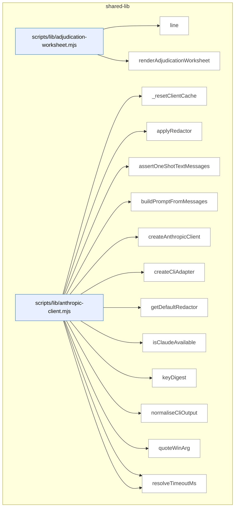

_Domain has 927 symbols (>50). Diagram shows top-15 by file order; see flat table below for the full list._

### Symbols in this domain

| Symbol | Kind | Path | Lines | Purpose | File imported by |
|---|---|---|---|---|---|
| [`line`](../scripts/lib/adjudication-worksheet.mjs#L42) | function | `scripts/lib/adjudication-worksheet.mjs` | 42-44 | Normalizes and truncates a string by collapsing whitespace and slicing to a character cap. | `scripts/cross-skill.mjs` |
| [`renderAdjudicationWorksheet`](../scripts/lib/adjudication-worksheet.mjs#L65) | function | `scripts/lib/adjudication-worksheet.mjs` | 65-120 | Formats pending adjudication items into a markdown worksheet with PowerShell-safe paste-ready commands. | `scripts/cross-skill.mjs` |
| [`_resetClientCache`](../scripts/lib/anthropic-client.mjs#L353) | function | `scripts/lib/anthropic-client.mjs` | 353-356 | Clears internal client and warning-state caches (test helper). | `scripts/anthropic-ping.mjs`, `scripts/azure-limits.mjs`, `scripts/evolve-prompts.mjs`, +11 more |
| [`applyRedactor`](../scripts/lib/anthropic-client.mjs#L318) | function | `scripts/lib/anthropic-client.mjs` | 318-347 | Recursively redacts secrets from system prompts and message content in API request payloads. | `scripts/anthropic-ping.mjs`, `scripts/azure-limits.mjs`, `scripts/evolve-prompts.mjs`, +11 more |
| [`assertOneShotTextMessages`](../scripts/lib/anthropic-client.mjs#L447) | function | `scripts/lib/anthropic-client.mjs` | 447-476 | Validates that messages are suitable for CLI backend (user-role only, text content, no tools). | `scripts/anthropic-ping.mjs`, `scripts/azure-limits.mjs`, `scripts/evolve-prompts.mjs`, +11 more |
| [`buildPromptFromMessages`](../scripts/lib/anthropic-client.mjs#L484) | function | `scripts/lib/anthropic-client.mjs` | 484-501 | Concatenates message content into a single prompt string for CLI stdin. | `scripts/anthropic-ping.mjs`, `scripts/azure-limits.mjs`, `scripts/evolve-prompts.mjs`, +11 more |
| [`createAnthropicClient`](../scripts/lib/anthropic-client.mjs#L183) | function | `scripts/lib/anthropic-client.mjs` | 183-251 | Factory that creates or caches an Anthropic client (SDK or CLI adapter) with optional request-level redaction. | `scripts/anthropic-ping.mjs`, `scripts/azure-limits.mjs`, `scripts/evolve-prompts.mjs`, +11 more |
| [`createCliAdapter`](../scripts/lib/anthropic-client.mjs#L368) | function | `scripts/lib/anthropic-client.mjs` | 368-438 | Creates a CLI adapter that wraps `claude -p` subprocess calls as a messages.create() API. | `scripts/anthropic-ping.mjs`, `scripts/azure-limits.mjs`, `scripts/evolve-prompts.mjs`, +11 more |
| [`getDefaultRedactor`](../scripts/lib/anthropic-client.mjs#L255) | function | `scripts/lib/anthropic-client.mjs` | 255-273 | Lazily initializes the default secret redactor using shape-based pattern matching (not blanket-length heuristics). | `scripts/anthropic-ping.mjs`, `scripts/azure-limits.mjs`, `scripts/evolve-prompts.mjs`, +11 more |
| [`isClaudeAvailable`](../scripts/lib/anthropic-client.mjs#L150) | function | `scripts/lib/anthropic-client.mjs` | 150-152 | Checks whether Claude is available via CLI backend or ANTHROPIC_API_KEY. | `scripts/anthropic-ping.mjs`, `scripts/azure-limits.mjs`, `scripts/evolve-prompts.mjs`, +11 more |
| [`keyDigest`](../scripts/lib/anthropic-client.mjs#L50) | function | `scripts/lib/anthropic-client.mjs` | 50-52 | Creates a short SHA-256 digest from an API key for cache identification. | `scripts/anthropic-ping.mjs`, `scripts/azure-limits.mjs`, `scripts/evolve-prompts.mjs`, +11 more |
| [`normaliseCliOutput`](../scripts/lib/anthropic-client.mjs#L676) | function | `scripts/lib/anthropic-client.mjs` | 676-724 | Parses and validates JSON output from `claude -p`, extracting content, usage, and cost telemetry. | `scripts/anthropic-ping.mjs`, `scripts/azure-limits.mjs`, `scripts/evolve-prompts.mjs`, +11 more |
| [`quoteWinArg`](../scripts/lib/anthropic-client.mjs#L750) | function | `scripts/lib/anthropic-client.mjs` | 750-755 | Shell-quotes a Windows argument to preserve spaces and special characters. | `scripts/anthropic-ping.mjs`, `scripts/azure-limits.mjs`, `scripts/evolve-prompts.mjs`, +11 more |
| [`resolveBackend`](../scripts/lib/anthropic-client.mjs#L120) | function | `scripts/lib/anthropic-client.mjs` | 120-133 | Validates and returns the configured Claude backend ('sdk' or 'cli'). | `scripts/anthropic-ping.mjs`, `scripts/azure-limits.mjs`, `scripts/evolve-prompts.mjs`, +11 more |
| [`resolveTimeoutMs`](../scripts/lib/anthropic-client.mjs#L93) | function | `scripts/lib/anthropic-client.mjs` | 93-104 | Resolves and validates the effective CLI timeout in milliseconds from options or environment. | `scripts/anthropic-ping.mjs`, `scripts/azure-limits.mjs`, `scripts/evolve-prompts.mjs`, +11 more |
| [`runClaudeCli`](../scripts/lib/anthropic-client.mjs#L522) | function | `scripts/lib/anthropic-client.mjs` | 522-636 | Spawns a `claude -p` subprocess, manages I/O, enforces timeouts, and parses JSON output. | `scripts/anthropic-ping.mjs`, `scripts/azure-limits.mjs`, `scripts/evolve-prompts.mjs`, +11 more |
| [`wrapSdkClient`](../scripts/lib/anthropic-client.mjs#L289) | function | `scripts/lib/anthropic-client.mjs` | 289-308 | Wraps an SDK client to apply redaction and normalize timeout parameter names. | `scripts/anthropic-ping.mjs`, `scripts/azure-limits.mjs`, `scripts/evolve-prompts.mjs`, +11 more |
| [`computeDeadIntent`](../scripts/lib/arch-intent/adapter-contract.mjs#L151) | function | `scripts/lib/arch-intent/adapter-contract.mjs` | 151-159 | Identifies declared domains in domain-map that have no corresponding source files. | `scripts/arch-intent-bootstrap.mjs`, `scripts/lib/audit/legacy-production-audit.mjs`, `scripts/openai-audit.mjs` |
| [`deriveArchState`](../scripts/lib/arch-intent/adapter-contract.mjs#L321) | function | `scripts/lib/arch-intent/adapter-contract.mjs` | 321-332 | Maps architecture-intent report status to a descriptive state (ANALYZED_CLEAN, ERROR_ALL_STACKS_FAILED, etc.). | `scripts/arch-intent-bootstrap.mjs`, `scripts/lib/audit/legacy-production-audit.mjs`, `scripts/openai-audit.mjs` |
| [`fsWalkFallback`](../scripts/lib/arch-intent/adapter-contract.mjs#L68) | function | `scripts/lib/arch-intent/adapter-contract.mjs` | 68-88 | Recursively inventories source files via filesystem walk, excluding node_modules and build directories. | `scripts/arch-intent-bootstrap.mjs`, `scripts/lib/audit/legacy-production-audit.mjs`, `scripts/openai-audit.mjs` |
| [`inventoryFiles`](../scripts/lib/arch-intent/adapter-contract.mjs#L104) | function | `scripts/lib/arch-intent/adapter-contract.mjs` | 104-140 | Lists repo source files via git (tracked + untracked) or fallback filesystem, normalizing to forward-slash paths. | `scripts/arch-intent-bootstrap.mjs`, `scripts/lib/audit/legacy-production-audit.mjs`, `scripts/openai-audit.mjs` |
| [`isArchIntentReportClean`](../scripts/lib/arch-intent/adapter-contract.mjs#L307) | function | `scripts/lib/arch-intent/adapter-contract.mjs` | 307-312 | Checks whether an architecture-intent report is violation-free and has no dead intent or unmapped files. | `scripts/arch-intent-bootstrap.mjs`, `scripts/lib/audit/legacy-production-audit.mjs`, `scripts/openai-audit.mjs` |
| [`loadAdapter`](../scripts/lib/arch-intent/adapter-contract.mjs#L174) | function | `scripts/lib/arch-intent/adapter-contract.mjs` | 174-192 | Dynamically imports a stack-specific architecture-intent adapter or signals if missing. | `scripts/arch-intent-bootstrap.mjs`, `scripts/lib/audit/legacy-production-audit.mjs`, `scripts/openai-audit.mjs` |
| [`runArchIntentAnalysis`](../scripts/lib/arch-intent/adapter-contract.mjs#L223) | function | `scripts/lib/arch-intent/adapter-contract.mjs` | 223-289 | Orchestrates architecture-intent analysis across multiple stacks, merging results and computing dead intent. | `scripts/arch-intent-bootstrap.mjs`, `scripts/lib/audit/legacy-production-audit.mjs`, `scripts/openai-audit.mjs` |
| [`validateAdapterReport`](../scripts/lib/arch-intent/adapter-contract.mjs#L201) | function | `scripts/lib/arch-intent/adapter-contract.mjs` | 201-212 | Validates that an adapter report conforms to schema (violations + _meta subset). | `scripts/arch-intent-bootstrap.mjs`, `scripts/lib/audit/legacy-production-audit.mjs`, `scripts/openai-audit.mjs` |
| [`analyseImports`](../scripts/lib/arch-intent/adapters/java.mjs#L325) | function | `scripts/lib/arch-intent/adapters/java.mjs` | 325-444 | Analyzes Java import dependencies across mapped files, detecting cross-domain edges and unresolved references. | _(internal)_ |
| [`buildJavaResolutionIndex`](../scripts/lib/arch-intent/adapters/java.mjs#L176) | function | `scripts/lib/arch-intent/adapters/java.mjs` | 176-233 | Indexes Java files by fully-qualified name, package, and source root for import resolution. | _(internal)_ |
| [`extractImports`](../scripts/lib/arch-intent/adapters/java.mjs#L132) | function | `scripts/lib/arch-intent/adapters/java.mjs` | 132-164 | Parses Java import statements including static and wildcard forms with line numbers. | _(internal)_ |
| [`extractPackage`](../scripts/lib/arch-intent/adapters/java.mjs#L115) | function | `scripts/lib/arch-intent/adapters/java.mjs` | 115-118 | Extracts the package declaration from Java source code. | _(internal)_ |
| [`progressiveResolve`](../scripts/lib/arch-intent/adapters/java.mjs#L246) | function | `scripts/lib/arch-intent/adapters/java.mjs` | 246-265 | Progressively resolves a Java FQN by dropping package segments or classifies as external/unresolved. | _(internal)_ |
| [`resolveJavaImport`](../scripts/lib/arch-intent/adapters/java.mjs#L275) | function | `scripts/lib/arch-intent/adapters/java.mjs` | 275-314 | Resolves a Java import reference to target files using the resolution index, handling wildcards and static imports. | _(internal)_ |
| [`stripJavaCommentsAndLiterals`](../scripts/lib/arch-intent/adapters/java.mjs#L44) | function | `scripts/lib/arch-intent/adapters/java.mjs` | 44-106 | Removes Java comments and string literals while preserving line structure for parsing. | _(internal)_ |
| [`analyseImports`](../scripts/lib/arch-intent/adapters/js-ts.mjs#L74) | function | `scripts/lib/arch-intent/adapters/js-ts.mjs` | 74-214 | Analyzes JavaScript/TypeScript import dependencies using dependency-cruiser, tracking vendor/local/dynamic/unresolved edges. | _(internal)_ |
| [`classifyEdge`](../scripts/lib/arch-intent/adapters/js-ts.mjs#L33) | function | `scripts/lib/arch-intent/adapters/js-ts.mjs` | 33-49 | Categorizes a dependency-cruiser edge as type-only, dynamic, local-file, vendor, or unresolved. | _(internal)_ |
| [`normalisePath`](../scripts/lib/arch-intent/adapters/js-ts.mjs#L58) | function | `scripts/lib/arch-intent/adapters/js-ts.mjs` | 58-63 | Normalizes a path to repo-relative forward-slash form. | _(internal)_ |
| [`analyseImports`](../scripts/lib/arch-intent/adapters/postgres.mjs#L605) | function | `scripts/lib/arch-intent/adapters/postgres.mjs` | 605-698 | Performs multi-stage SQL import analysis: parsing, cataloging, resolving references, and detecting violations. | _(internal)_ |
| [`buildSqlCatalog`](../scripts/lib/arch-intent/adapters/postgres.mjs#L499) | function | `scripts/lib/arch-intent/adapters/postgres.mjs` | 499-560 | Builds an in-memory catalog of SQL objects (relations, functions, types) from parsed files, tracking definitions, references, and redefinitions. | _(internal)_ |
| [`classifyStatement`](../scripts/lib/arch-intent/adapters/postgres.mjs#L295) | function | `scripts/lib/arch-intent/adapters/postgres.mjs` | 295-427 | Parses an individual SQL statement to extract object definitions and cross-object references (foreign keys, partitioning). | _(internal)_ |
| [`displayName`](../scripts/lib/arch-intent/adapters/postgres.mjs#L234) | function | `scripts/lib/arch-intent/adapters/postgres.mjs` | 234-236 | Reverses dot-escaping for human-readable SQL name display. | _(internal)_ |
| [`extractCallRefs`](../scripts/lib/arch-intent/adapters/postgres.mjs#L460) | function | `scripts/lib/arch-intent/adapters/postgres.mjs` | 460-471 | Extracts function call names from SQL body text and records them as reference edges. | _(internal)_ |
| [`extractPolicyTableRefs`](../scripts/lib/arch-intent/adapters/postgres.mjs#L474) | function | `scripts/lib/arch-intent/adapters/postgres.mjs` | 474-483 | Identifies table references in SQL policy expressions via FROM/JOIN and dotted-identifier patterns. | _(internal)_ |
| [`extractSelectRefs`](../scripts/lib/arch-intent/adapters/postgres.mjs#L440) | function | `scripts/lib/arch-intent/adapters/postgres.mjs` | 440-457 | Parses a SQL SELECT statement to identify table/view/CTE references in FROM and JOIN clauses. | _(internal)_ |
| [`naturalCompare`](../scripts/lib/arch-intent/adapters/postgres.mjs#L488) | function | `scripts/lib/arch-intent/adapters/postgres.mjs` | 488-490 | Performs locale-aware, numerically-aware string comparison for natural sorting. | _(internal)_ |
| [`normName`](../scripts/lib/arch-intent/adapters/postgres.mjs#L197) | function | `scripts/lib/arch-intent/adapters/postgres.mjs` | 197-228 | Normalizes a SQL schema-qualified name (lowercasing unquoted identifiers, escaping internal dots). | _(internal)_ |
| [`parseFile`](../scripts/lib/arch-intent/adapters/postgres.mjs#L262) | function | `scripts/lib/arch-intent/adapters/postgres.mjs` | 262-293 | Parses a SQL file into statements and classifies each as CREATE/ALTER/DROP, extracting definitions and references. | _(internal)_ |
| [`recoverFunctionBody`](../scripts/lib/arch-intent/adapters/postgres.mjs#L430) | function | `scripts/lib/arch-intent/adapters/postgres.mjs` | 430-437 | Extracts the body of a SQL function from source code, handling dollar-quoting and `as` string syntaxes. | _(internal)_ |
| [`resolveSqlRef`](../scripts/lib/arch-intent/adapters/postgres.mjs#L571) | function | `scripts/lib/arch-intent/adapters/postgres.mjs` | 571-594 | Resolves a SQL reference name to a local definition file, proven external/builtin, or unresolved state. | _(internal)_ |
| [`splitTopLevel`](../scripts/lib/arch-intent/adapters/postgres.mjs#L239) | function | `scripts/lib/arch-intent/adapters/postgres.mjs` | 239-250 | Splits a SQL body string by a separator at depth zero (outside parentheses). | _(internal)_ |
| [`stripSqlCommentsAndStrings`](../scripts/lib/arch-intent/adapters/postgres.mjs#L102) | function | `scripts/lib/arch-intent/adapters/postgres.mjs` | 102-187 | Removes SQL comments and string literals while preserving line structure and handling nested blocks. | _(internal)_ |
| [`analyseImports`](../scripts/lib/arch-intent/adapters/python.mjs#L507) | function | `scripts/lib/arch-intent/adapters/python.mjs` | 507-586 | Performs multi-stage Python import analysis: discovering roots, indexing modules, extracting imports, resolving, and detecting violations. | _(internal)_ |
| [`buildPythonModuleIndex`](../scripts/lib/arch-intent/adapters/python.mjs#L383) | function | `scripts/lib/arch-intent/adapters/python.mjs` | 383-426 | Builds a dotted-module-name-to-file mapping, detecting collisions where multiple files define the same module. | _(internal)_ |
| [`countUnbalanced`](../scripts/lib/arch-intent/adapters/python.mjs#L254) | function | `scripts/lib/arch-intent/adapters/python.mjs` | 254-261 | Counts net unmatched parentheses to detect whether a logical Python line continues across physical lines. | _(internal)_ |
| [`discoverPythonRoots`](../scripts/lib/arch-intent/adapters/python.mjs#L287) | function | `scripts/lib/arch-intent/adapters/python.mjs` | 287-350 | Discovers Python package root directories via packaging metadata, src/ directories, and __init__.py walk. | _(internal)_ |
| [`extractImports`](../scripts/lib/arch-intent/adapters/python.mjs#L196) | function | `scripts/lib/arch-intent/adapters/python.mjs` | 196-251 | Parses Python import statements from source, handling continuation lines and statement-per-line multiplexing. | _(internal)_ |
| [`extractPackageDirs`](../scripts/lib/arch-intent/adapters/python.mjs#L353) | function | `scripts/lib/arch-intent/adapters/python.mjs` | 353-364 | Extracts package directory paths from setup.cfg or pyproject.toml configuration. | _(internal)_ |
| [`isPySource`](../scripts/lib/arch-intent/adapters/python.mjs#L366) | function | `scripts/lib/arch-intent/adapters/python.mjs` | 366-369 | Checks if a file is Python source (.py or .pyi extension). | _(internal)_ |
| [`parseImportedNames`](../scripts/lib/arch-intent/adapters/python.mjs#L264) | function | `scripts/lib/arch-intent/adapters/python.mjs` | 264-271 | Parses the imported names in a `from ... import` clause, handling aliases and wildcards. | _(internal)_ |
| [`resolvePythonImport`](../scripts/lib/arch-intent/adapters/python.mjs#L439) | function | `scripts/lib/arch-intent/adapters/python.mjs` | 439-496 | Resolves a Python import reference to a local file, stdlib module, or unresolved state. | _(internal)_ |
| [`stripPythonCommentsAndStrings`](../scripts/lib/arch-intent/adapters/python.mjs#L72) | function | `scripts/lib/arch-intent/adapters/python.mjs` | 72-178 | Removes Python comments and string literals while preserving line structure and f-string brace tracking. | _(internal)_ |
| [`checkDepAllowed`](../scripts/lib/arch-intent/domain-resolver.mjs#L53) | function | `scripts/lib/arch-intent/domain-resolver.mjs` | 53-60 | Checks if a dependency edge from one domain to another is permitted by the allowed-dependencies config. | `scripts/arch-intent-bootstrap.mjs`, `scripts/lib/arch-intent/adapter-contract.mjs`, `scripts/lib/arch-intent/adapters/java.mjs`, +4 more |
| [`computeDeclaredDomains`](../scripts/lib/arch-intent/domain-resolver.mjs#L76) | function | `scripts/lib/arch-intent/domain-resolver.mjs` | 76-86 | Extracts all domains declared in rules, allowedDeps keys/values, or descriptions. | `scripts/arch-intent-bootstrap.mjs`, `scripts/lib/arch-intent/adapter-contract.mjs`, `scripts/lib/arch-intent/adapters/java.mjs`, +4 more |
| [`resolveFileToDomain`](../scripts/lib/arch-intent/domain-resolver.mjs#L29) | function | `scripts/lib/arch-intent/domain-resolver.mjs` | 29-38 | Matches a file path against domain rules using minimatch patterns to determine its domain assignment. | `scripts/arch-intent-bootstrap.mjs`, `scripts/lib/arch-intent/adapter-contract.mjs`, `scripts/lib/arch-intent/adapters/java.mjs`, +4 more |
| [`ArchIntentAnalyzerError`](../scripts/lib/arch-intent/errors.mjs#L18) | class | `scripts/lib/arch-intent/errors.mjs` | 18-25 | Error class for analysis-stage failures, categorizing error types and preserving cause chains. | `scripts/lib/arch-intent/adapter-contract.mjs`, `scripts/lib/arch-intent/load-config.mjs`, `scripts/lib/arch-intent/semantic-validator.mjs`, +2 more |
| [`ArchIntentConfigError`](../scripts/lib/arch-intent/errors.mjs#L9) | class | `scripts/lib/arch-intent/errors.mjs` | 9-16 | Error class for configuration loading and validation failures, distinguishing shape from semantic errors. | `scripts/lib/arch-intent/adapter-contract.mjs`, `scripts/lib/arch-intent/load-config.mjs`, `scripts/lib/arch-intent/semantic-validator.mjs`, +2 more |
| [`parseIntentDoc`](../scripts/lib/arch-intent/intent-doc-parser.mjs#L27) | function | `scripts/lib/arch-intent/intent-doc-parser.mjs` | 27-78 | Extracts mermaid diagrams, version strings, and section narratives from markdown intent documentation. | `scripts/lib/audit/legacy-production-audit.mjs`, `scripts/openai-audit.mjs` |
| [`loadArchIntentConfig`](../scripts/lib/arch-intent/load-config.mjs#L35) | function | `scripts/lib/arch-intent/load-config.mjs` | 35-69 | Loads and validates the domain-map.json configuration, performing shape and semantic validation. | `scripts/arch-intent-bootstrap.mjs`, `scripts/lib/audit/legacy-production-audit.mjs`, `scripts/openai-audit.mjs` |
| [`rulesDeclaredDomains`](../scripts/lib/arch-intent/semantic-validator.mjs#L30) | function | `scripts/lib/arch-intent/semantic-validator.mjs` | 30-34 | Extracts all domains declared in the rules array plus the VENDOR pseudo-domain. | `scripts/lib/arch-intent/load-config.mjs` |
| [`validateDomainMapSemantics`](../scripts/lib/arch-intent/semantic-validator.mjs#L42) | function | `scripts/lib/arch-intent/semantic-validator.mjs` | 42-97 | Validates domain-map semantics: ensures allowedDeps and description keys reference declared domains, detects rule shadowing. | `scripts/lib/arch-intent/load-config.mjs` |
| [`escapeMarkdown`](../scripts/lib/arch-render.mjs#L22) | function | `scripts/lib/arch-render.mjs` | 22-28 | Escapes pipe, newline, and carriage-return characters for safe markdown rendering. | `scripts/symbol-index/drift.mjs`, `scripts/symbol-index/render-mermaid.mjs` |
| [`escapeMermaidLabel`](../scripts/lib/arch-render.mjs#L31) | function | `scripts/lib/arch-render.mjs` | 31-37 | Escapes and truncates strings for safe use as mermaid node labels, replacing special characters. | `scripts/symbol-index/drift.mjs`, `scripts/symbol-index/render-mermaid.mjs` |
| [`groupByDomain`](../scripts/lib/arch-render.mjs#L45) | function | `scripts/lib/arch-render.mjs` | 45-63 | Groups symbols by domain tag and sorts both domain keys and symbols within each domain. | `scripts/symbol-index/drift.mjs`, `scripts/symbol-index/render-mermaid.mjs` |
| [`mermaidId`](../scripts/lib/arch-render.mjs#L40) | function | `scripts/lib/arch-render.mjs` | 40-42 | Generates a valid mermaid node identifier from a key by sanitizing non-alphanumeric characters. | `scripts/symbol-index/drift.mjs`, `scripts/symbol-index/render-mermaid.mjs` |
| [`renderArchitectureMap`](../scripts/lib/arch-render.mjs#L171) | function | `scripts/lib/arch-render.mjs` | 171-286 | Renders a complete architecture map document: header, table of contents, per-domain diagrams/tables, and layering violations. | `scripts/symbol-index/drift.mjs`, `scripts/symbol-index/render-mermaid.mjs` |
| [`renderDriftIssue`](../scripts/lib/arch-render.mjs#L360) | function | `scripts/lib/arch-render.mjs` | 360-422 | Renders a markdown drift report showing top duplication clusters and member symbols with similarity scores. | `scripts/symbol-index/drift.mjs`, `scripts/symbol-index/render-mermaid.mjs` |
| [`renderHeader`](../scripts/lib/arch-render.mjs#L157) | function | `scripts/lib/arch-render.mjs` | 157-168 | Renders the header section of an architecture map document with generation metadata and drift scores. | `scripts/symbol-index/drift.mjs`, `scripts/symbol-index/render-mermaid.mjs` |
| [`renderMermaidContainer`](../scripts/lib/arch-render.mjs#L69) | function | `scripts/lib/arch-render.mjs` | 69-103 | Renders a mermaid flowchart visualization of symbols grouped by domain and file, with truncation for large domains. | `scripts/symbol-index/drift.mjs`, `scripts/symbol-index/render-mermaid.mjs` |
| [`renderNeighbourhoodCallout`](../scripts/lib/arch-render.mjs#L289) | function | `scripts/lib/arch-render.mjs` | 289-357 | Renders a markdown callout displaying architectural-memory consultation results with status and reuse recommendations. | `scripts/symbol-index/drift.mjs`, `scripts/symbol-index/render-mermaid.mjs` |
| [`renderSymbolTable`](../scripts/lib/arch-render.mjs#L114) | function | `scripts/lib/arch-render.mjs` | 114-138 | Renders a markdown table of symbols with metadata, optionally including an importer "where used" column. | `scripts/symbol-index/drift.mjs`, `scripts/symbol-index/render-mermaid.mjs` |
| [`renderWhereUsed`](../scripts/lib/arch-render.mjs#L140) | function | `scripts/lib/arch-render.mjs` | 140-154 | Renders the list of files importing a given file, showing top 3 and indicating if more exist. | `scripts/symbol-index/drift.mjs`, `scripts/symbol-index/render-mermaid.mjs` |
| [`maybeFireArmEvalCaptureDetached`](../scripts/lib/arm-eval/capture-trigger.mjs#L52) | function | `scripts/lib/arm-eval/capture-trigger.mjs` | 52-83 | Conditionally spawns a detached background process to capture arm-eval experiment data if enabled. | `scripts/brainstorm-round.mjs`, `scripts/cross-skill.mjs` |
| [`envelope`](../scripts/lib/arm-eval/cross-checks.mjs#L22) | function | `scripts/lib/arm-eval/cross-checks.mjs` | 22-32 | Wraps a cross-check result in a standardized envelope with name, version, status, and findings. | `scripts/lib/arm-eval/run.mjs` |
| [`runCrossChecks`](../scripts/lib/arm-eval/cross-checks.mjs#L80) | function | `scripts/lib/arm-eval/cross-checks.mjs` | 80-93 | Executes a list of cross-check functions sequentially, enveloping results and catching errors. | `scripts/lib/arm-eval/run.mjs` |
| [`evaluateArmEval`](../scripts/lib/arm-eval/decision.mjs#L94) | function | `scripts/lib/arm-eval/decision.mjs` | 94-221 | Evaluates all collected arm-eval sessions to produce a verdict (keep/switch/inconclusive) and ranking based on rubric scores. | `scripts/cross-skill.mjs` |
| [`kendallTau`](../scripts/lib/arm-eval/decision.mjs#L68) | function | `scripts/lib/arm-eval/decision.mjs` | 68-82 | Computes Kendall's tau rank correlation coefficient between two arm rankings. | `scripts/cross-skill.mjs` |
| [`mean`](../scripts/lib/arm-eval/decision.mjs#L33) | function | `scripts/lib/arm-eval/decision.mjs` | 33-33 | Computes the arithmetic mean of a numeric array. | `scripts/cross-skill.mjs` |
| [`round4`](../scripts/lib/arm-eval/decision.mjs#L34) | function | `scripts/lib/arm-eval/decision.mjs` | 34-34 | Rounds a number to 4 decimal places. | `scripts/cross-skill.mjs` |
| [`sessionArmMeans`](../scripts/lib/arm-eval/decision.mjs#L38) | function | `scripts/lib/arm-eval/decision.mjs` | 38-50 | Computes the mean score per arm across judge passes in an arm-eval session. | `scripts/cross-skill.mjs` |
| [`sessionSelfConsistency`](../scripts/lib/arm-eval/decision.mjs#L54) | function | `scripts/lib/arm-eval/decision.mjs` | 54-64 | Computes the mean absolute delta between arm dimensions across the first two judge passes. | `scripts/cross-skill.mjs` |
| [`getExperiment`](../scripts/lib/arm-eval/experiments.mjs#L186) | function | `scripts/lib/arm-eval/experiments.mjs` | 186-190 | Looks up and returns a canonical experiment definition by type name, throwing on unknown types. | `scripts/cross-skill.mjs`, `scripts/lib/arm-eval/judge.mjs`, `scripts/lib/arm-eval/run.mjs` |
| [`isClaudeFamily`](../scripts/lib/arm-eval/experiments.mjs#L107) | function | `scripts/lib/arm-eval/experiments.mjs` | 107-116 | Checks if a model identifier refers to a Claude/Anthropic family model. | `scripts/cross-skill.mjs`, `scripts/lib/arm-eval/judge.mjs`, `scripts/lib/arm-eval/run.mjs` |
| [`rubricFor`](../scripts/lib/arm-eval/experiments.mjs#L66) | function | `scripts/lib/arm-eval/experiments.mjs` | 66-70 | Returns the complete rubric (evaluation dimensions) for an experiment type by combining core and experiment-specific dimensions. | `scripts/cross-skill.mjs`, `scripts/lib/arm-eval/judge.mjs`, `scripts/lib/arm-eval/run.mjs` |
| [`validateArm`](../scripts/lib/arm-eval/experiments.mjs#L122) | function | `scripts/lib/arm-eval/experiments.mjs` | 122-130 | Validates an arm definition, ensuring it parses correctly and contains no Claude-family models. | `scripts/cross-skill.mjs`, `scripts/lib/arm-eval/judge.mjs`, `scripts/lib/arm-eval/run.mjs` |
| [`validateExperiment`](../scripts/lib/arm-eval/experiments.mjs#L133) | function | `scripts/lib/arm-eval/experiments.mjs` | 133-141 | Validates an experiment configuration object against a schema and its arms, returning detailed error messages on failure. | `scripts/cross-skill.mjs`, `scripts/lib/arm-eval/judge.mjs`, `scripts/lib/arm-eval/run.mjs` |
| [`buildSessionMarkdown`](../scripts/lib/arm-eval/export.mjs#L47) | function | `scripts/lib/arm-eval/export.mjs` | 47-111 | Constructs the full markdown document for an exported arm-eval session, blinding output labels and author info in prospective phase. | `scripts/cross-skill.mjs`, `scripts/lib/arm-eval/run.mjs` |
| [`exportSession`](../scripts/lib/arm-eval/export.mjs#L118) | function | `scripts/lib/arm-eval/export.mjs` | 118-127 | Writes an arm-eval session to disk as a markdown file after building the document. | `scripts/cross-skill.mjs`, `scripts/lib/arm-eval/run.mjs` |
| [`filenameFor`](../scripts/lib/arm-eval/export.mjs#L34) | function | `scripts/lib/arm-eval/export.mjs` | 34-39 | Generates a timestamped, metadata-enriched filename for exporting a session to markdown. | `scripts/cross-skill.mjs`, `scripts/lib/arm-eval/run.mjs` |
| [`redact`](../scripts/lib/arm-eval/export.mjs#L41) | function | `scripts/lib/arm-eval/export.mjs` | 41-41 | Redacts secrets from a string using shape-based pattern matching. | `scripts/cross-skill.mjs`, `scripts/lib/arm-eval/run.mjs` |
| [`buildIntentContext`](../scripts/lib/arm-eval/intent-context.mjs#L52) | function | `scripts/lib/arm-eval/intent-context.mjs` | 52-113 | Assembles repository architecture map and domain configuration as context for arm-eval judge prompts. | `scripts/lib/arm-eval/run.mjs` |
| [`cap`](../scripts/lib/arm-eval/intent-context.mjs#L42) | function | `scripts/lib/arm-eval/intent-context.mjs` | 42-45 | Truncates text to a maximum length with an ellipsis indicator. | `scripts/lib/arm-eval/run.mjs` |
| [`defaultDeps`](../scripts/lib/arm-eval/intent-context.mjs#L29) | function | `scripts/lib/arm-eval/intent-context.mjs` | 29-34 | Returns default filesystem dependencies (readFile, exists) as fallback implementations. | `scripts/lib/arm-eval/run.mjs` |
| [`tryRead`](../scripts/lib/arm-eval/intent-context.mjs#L37) | function | `scripts/lib/arm-eval/intent-context.mjs` | 37-39 | Safely reads a file, returning null on any filesystem or parsing error. | `scripts/lib/arm-eval/run.mjs` |
| [`buildJudgePrompt`](../scripts/lib/arm-eval/judge.mjs#L64) | function | `scripts/lib/arm-eval/judge.mjs` | 64-79 | Constructs a system prompt for the judge to score multiple anonymized outputs against rubric dimensions. | `scripts/lib/arm-eval/run.mjs` |
| [`callJudgeDefault`](../scripts/lib/arm-eval/judge.mjs#L171) | function | `scripts/lib/arm-eval/judge.mjs` | 171-210 | Invokes Claude Opus to score anonymized outputs while applying egress-safe redaction on the outbound payload. | `scripts/lib/arm-eval/run.mjs` |
| [`extractJsonObject`](../scripts/lib/arm-eval/judge.mjs#L140) | function | `scripts/lib/arm-eval/judge.mjs` | 140-156 | Extracts the first valid JSON object from text by tracking brace depth and string escaping. | `scripts/lib/arm-eval/run.mjs` |
| [`getShapeRedactor`](../scripts/lib/arm-eval/judge.mjs#L163) | function | `scripts/lib/arm-eval/judge.mjs` | 163-168 | Lazily loads and caches a secret-redactor that preserves legitimate identifiers while removing sensitive data. | `scripts/lib/arm-eval/run.mjs` |
| [`judgePassSchema`](../scripts/lib/arm-eval/judge.mjs#L45) | function | `scripts/lib/arm-eval/judge.mjs` | 45-57 | Builds a Zod schema that validates judge scores covering all labels exactly once with all required dimensions. | `scripts/lib/arm-eval/run.mjs` |
| [`judgeSession`](../scripts/lib/arm-eval/judge.mjs#L96) | function | `scripts/lib/arm-eval/judge.mjs` | 96-134 | Orchestrates a two-pass blinded scoring session, shuffling outputs and validating conformance with retry logic. | `scripts/lib/arm-eval/run.mjs` |
| [`scorableDimensions`](../scripts/lib/arm-eval/judge.mjs#L35) | function | `scripts/lib/arm-eval/judge.mjs` | 35-39 | Returns the list of rubric dimensions to score, optionally excluding intent-only dimensions. | `scripts/lib/arm-eval/run.mjs` |
| [`seededShuffle`](../scripts/lib/arm-eval/judge.mjs#L30) | function | `scripts/lib/arm-eval/judge.mjs` | 30-32 | Shuffles an array using a seeded random number generator for reproducible randomization. | `scripts/lib/arm-eval/run.mjs` |
| [`buildPlanGenPrompt`](../scripts/lib/arm-eval/plan-seed.mjs#L31) | function | `scripts/lib/arm-eval/plan-seed.mjs` | 31-37 | Constructs a prompt for generating an implementation plan, optionally with repository architecture and intent context. | `scripts/lib/arm-eval/producers/plan.mjs`, `scripts/lib/arm-eval/run.mjs` |
| [`parsePlanIntent`](../scripts/lib/arm-eval/plan-seed.mjs#L41) | function | `scripts/lib/arm-eval/plan-seed.mjs` | 41-61 | Parses the machine-readable intent block (target paths and acceptance criteria) from plan markdown. | `scripts/lib/arm-eval/producers/plan.mjs`, `scripts/lib/arm-eval/run.mjs` |
| [`hashText`](../scripts/lib/arm-eval/producers/_shared.mjs#L12) | function | `scripts/lib/arm-eval/producers/_shared.mjs` | 12-14 | Returns the first 16 hex characters of a text's SHA256 hash. | `scripts/lib/arm-eval/producers/brainstorm.mjs`, `scripts/lib/arm-eval/producers/plan.mjs` |
| [`callModelDefault`](../scripts/lib/arm-eval/producers/brainstorm.mjs#L73) | function | `scripts/lib/arm-eval/producers/brainstorm.mjs` | 73-76 | Calls a model with up to 8000 output tokens for free-text brainstorming. | `scripts/lib/arm-eval/run.mjs` |
| [`produceBrainstorm`](../scripts/lib/arm-eval/producers/brainstorm.mjs#L22) | function | `scripts/lib/arm-eval/producers/brainstorm.mjs` | 22-70 | Generates parallel brainstorm takes from two models and combines them, requiring both legs to be non-empty. | `scripts/lib/arm-eval/run.mjs` |
| [`callModelFreeText`](../scripts/lib/arm-eval/producers/model-call.mjs#L21) | function | `scripts/lib/arm-eval/producers/model-call.mjs` | 21-45 | Calls a model (OpenRouter OSS, Gemini, or OpenAI GPT) and returns text output plus token usage and latency. | `scripts/lib/arm-eval/producers/brainstorm.mjs`, `scripts/lib/arm-eval/producers/plan.mjs` |
| [`providerFor`](../scripts/lib/arm-eval/producers/model-call.mjs#L14) | function | `scripts/lib/arm-eval/producers/model-call.mjs` | 14-18 | Routes a resolved model ID to its provider (OSS via OpenRouter, Gemini, or OpenAI GPT). | `scripts/lib/arm-eval/producers/brainstorm.mjs`, `scripts/lib/arm-eval/producers/plan.mjs` |
| [`callModelDefault`](../scripts/lib/arm-eval/producers/plan.mjs#L62) | function | `scripts/lib/arm-eval/producers/plan.mjs` | 62-65 | Calls a model for plan generation with default token limits. | `scripts/lib/arm-eval/run.mjs` |
| [`producePlan`](../scripts/lib/arm-eval/producers/plan.mjs#L22) | function | `scripts/lib/arm-eval/producers/plan.mjs` | 22-59 | Generates a single-model plan with intent-block extraction and conformance validation. | `scripts/lib/arm-eval/run.mjs` |
| [`defaultDeps`](../scripts/lib/arm-eval/run.mjs#L27) | function | `scripts/lib/arm-eval/run.mjs` | 27-36 | Returns default dependencies for arm-eval session runs (producers, store, cross-checks, seed). | `scripts/cross-skill.mjs` |
| [`hashTask`](../scripts/lib/arm-eval/run.mjs#L125) | function | `scripts/lib/arm-eval/run.mjs` | 125-131 | Generates a deterministic "task-" prefixed ID from a task string using FNV-1a hashing. | `scripts/cross-skill.mjs` |
| [`runArmEvalSession`](../scripts/lib/arm-eval/run.mjs#L45) | function | `scripts/lib/arm-eval/run.mjs` | 45-122 | Orchestrates a complete arm-eval experiment session: produces outputs per arm, judges them, runs cross-checks, and records results. | `scripts/cross-skill.mjs` |
| [`readToggle`](../scripts/lib/arm-eval/toggle.mjs#L37) | function | `scripts/lib/arm-eval/toggle.mjs` | 37-52 | Reads the arm-eval feature toggle from disk, returning enabled state, budget, and timestamp. | `scripts/cross-skill.mjs`, `scripts/lib/arm-eval/capture-trigger.mjs`, `scripts/lib/audit/legacy-production-audit.mjs`, +2 more |
| [`resolveShadowArmsWithToggle`](../scripts/lib/arm-eval/toggle.mjs#L85) | function | `scripts/lib/arm-eval/toggle.mjs` | 85-91 | Resolves shadow audit arms from environment variables or the toggle file, returning the active source. | `scripts/cross-skill.mjs`, `scripts/lib/arm-eval/capture-trigger.mjs`, `scripts/lib/audit/legacy-production-audit.mjs`, +2 more |
| [`writeToggle`](../scripts/lib/arm-eval/toggle.mjs#L59) | function | `scripts/lib/arm-eval/toggle.mjs` | 59-69 | Writes the arm-eval feature toggle state to disk in JSON format. | `scripts/cross-skill.mjs`, `scripts/lib/arm-eval/capture-trigger.mjs`, `scripts/lib/audit/legacy-production-audit.mjs`, +2 more |
| [`assertRepoRoot`](../scripts/lib/assert-repo-root.mjs#L54) | function | `scripts/lib/assert-repo-root.mjs` | 54-85 | Validates that the current working directory matches the script's repo root, exiting with error if not. | `scripts/bandit.mjs`, `scripts/build-dashboard.mjs`, `scripts/cache-hitrate-check.mjs`, +22 more |
| [`findExpectedRoot`](../scripts/lib/assert-repo-root.mjs#L30) | function | `scripts/lib/assert-repo-root.mjs` | 30-38 | Locates the repo root by walking up from a script path until finding the 'scripts' directory. | `scripts/bandit.mjs`, `scripts/build-dashboard.mjs`, `scripts/cache-hitrate-check.mjs`, +22 more |
| [`findRepoRootFromScript`](../scripts/lib/assert-repo-root.mjs#L99) | function | `scripts/lib/assert-repo-root.mjs` | 99-102 | Finds the repo root from a script's import.meta.url by searching for the 'scripts' directory. | `scripts/bandit.mjs`, `scripts/build-dashboard.mjs`, `scripts/cache-hitrate-check.mjs`, +22 more |
| [`attributeStageToArms`](../scripts/lib/audit-arms.mjs#L283) | function | `scripts/lib/audit-arms.mjs` | 283-312 | Validates and returns which arm(s) own a given pipeline stage (arm-specific vs. derived). | `scripts/lib/arm-eval/toggle.mjs`, `scripts/lib/audit-shadow.mjs`, `scripts/lib/model-ab-decision.mjs`, +2 more |
| [`buildCandidateArm`](../scripts/lib/audit-arms.mjs#L245) | function | `scripts/lib/audit-arms.mjs` | 245-259 | Constructs an audit arm from a resolved model/deployment route. | `scripts/lib/arm-eval/toggle.mjs`, `scripts/lib/audit-shadow.mjs`, `scripts/lib/model-ab-decision.mjs`, +2 more |
| [`executionPlan`](../scripts/lib/audit-arms.mjs#L321) | function | `scripts/lib/audit-arms.mjs` | 321-327 | Determines which pipeline stages need to run based on active arms. | `scripts/lib/arm-eval/toggle.mjs`, `scripts/lib/audit-shadow.mjs`, `scripts/lib/model-ab-decision.mjs`, +2 more |
| [`parseArm`](../scripts/lib/audit-arms.mjs#L205) | function | `scripts/lib/audit-arms.mjs` | 205-209 | Safely parses a raw audit-arm object via Zod schema. | `scripts/lib/arm-eval/toggle.mjs`, `scripts/lib/audit-shadow.mjs`, `scripts/lib/model-ab-decision.mjs`, +2 more |
| [`resolveArms`](../scripts/lib/audit-arms.mjs#L342) | function | `scripts/lib/audit-arms.mjs` | 342-370 | Parses AUDIT_MODEL_SHADOW env var into arm IDs and resolves them to arm objects. | `scripts/lib/arm-eval/toggle.mjs`, `scripts/lib/audit-shadow.mjs`, `scripts/lib/model-ab-decision.mjs`, +2 more |
| [`stagesForArm`](../scripts/lib/audit-arms.mjs#L223) | function | `scripts/lib/audit-arms.mjs` | 223-228 | Returns the pipeline stages that an audit arm executes (oss-gen, gpt-gen, gpt-round, gemini). | `scripts/lib/arm-eval/toggle.mjs`, `scripts/lib/audit-shadow.mjs`, `scripts/lib/model-ab-decision.mjs`, +2 more |
| [`dispatch`](../scripts/lib/audit-dispatch.mjs#L26) | function | `scripts/lib/audit-dispatch.mjs` | 26-48 | Routes an audit input to the appropriate skill (plan-audit, code-audit) based on mode keywords or file paths. | _(internal)_ |
| [`auditSubjectFileGuard`](../scripts/lib/audit-scope.mjs#L231) | function | `scripts/lib/audit-scope.mjs` | 231-237 | Returns an error message if no implementation files matched the plan, preventing empty audits. | `scripts/lib/audit/legacy-production-audit.mjs`, `scripts/lib/diff-annotation.mjs`, `scripts/lib/file-io.mjs`, +1 more |
| [`buildRedactedAuditContext`](../scripts/lib/audit-scope.mjs#L180) | function | `scripts/lib/audit-scope.mjs` | 180-184 | Generates audit context from file paths while redacting secrets and verifying egress safety. | `scripts/lib/audit/legacy-production-audit.mjs`, `scripts/lib/diff-annotation.mjs`, `scripts/lib/file-io.mjs`, +1 more |
| [`classifyFiles`](../scripts/lib/audit-scope.mjs#L193) | function | `scripts/lib/audit-scope.mjs` | 193-212 | Categorizes files into backend, frontend, or shared groups based on path patterns. | `scripts/lib/audit/legacy-production-audit.mjs`, `scripts/lib/diff-annotation.mjs`, `scripts/lib/file-io.mjs`, +1 more |
| [`isAuditInfraFile`](../scripts/lib/audit-scope.mjs#L61) | function | `scripts/lib/audit-scope.mjs` | 61-68 | Determines if a file belongs to the audit infrastructure (scripts/ directory basenames). | `scripts/lib/audit/legacy-production-audit.mjs`, `scripts/lib/diff-annotation.mjs`, `scripts/lib/file-io.mjs`, +1 more |
| [`isSensitiveFile`](../scripts/lib/audit-scope.mjs#L22) | function | `scripts/lib/audit-scope.mjs` | 22-24 | Checks if a file path is classified as sensitive (credentials, keys, .env files). | `scripts/lib/audit/legacy-production-audit.mjs`, `scripts/lib/diff-annotation.mjs`, `scripts/lib/file-io.mjs`, +1 more |
| [`readFilesAsContext`](../scripts/lib/audit-scope.mjs#L121) | function | `scripts/lib/audit-scope.mjs` | 121-152 | Concatenates files into a markdown context block with language-aware code fencing and size limits. | `scripts/lib/audit/legacy-production-audit.mjs`, `scripts/lib/diff-annotation.mjs`, `scripts/lib/file-io.mjs`, +1 more |
| [`safeReadFile`](../scripts/lib/audit-scope.mjs#L83) | function | `scripts/lib/audit-scope.mjs` | 83-97 | Safely reads a file with symlink/boundary validation, returning null if sensitive or out-of-bounds. | `scripts/lib/audit/legacy-production-audit.mjs`, `scripts/lib/diff-annotation.mjs`, `scripts/lib/file-io.mjs`, +1 more |
| [`bucketAgainstBaseline`](../scripts/lib/audit-shadow.mjs#L281) | function | `scripts/lib/audit-shadow.mjs` | 281-289 | Tags shadow findings as 'both' or 'shadow-only' based on whether they appear in a baseline audit. | `scripts/lib/audit/legacy-production-audit.mjs`, `scripts/openai-audit.mjs`, `scripts/solo-control-audit.mjs` |
| [`buildPassUserPrompt`](../scripts/lib/audit-shadow.mjs#L112) | function | `scripts/lib/audit-shadow.mjs` | 112-118 | Constructs a user prompt for a single audit pass combining concern, plan, and redacted code context. | `scripts/lib/audit/legacy-production-audit.mjs`, `scripts/openai-audit.mjs`, `scripts/solo-control-audit.mjs` |
| [`buildPlanAuditUserPrompt`](../scripts/lib/audit-shadow.mjs#L127) | function | `scripts/lib/audit-shadow.mjs` | 127-129 | Builds a specialized prompt for auditing a plan before implementation. | `scripts/lib/audit/legacy-production-audit.mjs`, `scripts/openai-audit.mjs`, `scripts/solo-control-audit.mjs` |
| [`callGeminiDefault`](../scripts/lib/audit-shadow.mjs#L617) | function | `scripts/lib/audit-shadow.mjs` | 617-655 | Calls Gemini as a final-gate reviewer, returning only net-new findings the prior audit missed. | `scripts/lib/audit/legacy-production-audit.mjs`, `scripts/openai-audit.mjs`, `scripts/solo-control-audit.mjs` |
| [`callModelDefault`](../scripts/lib/audit-shadow.mjs#L562) | function | `scripts/lib/audit-shadow.mjs` | 562-612 | Invokes a provider (OSS/OpenRouter or GPT with structured output) with timeout and reasoning-effort handling. | `scripts/lib/audit/legacy-production-audit.mjs`, `scripts/openai-audit.mjs`, `scripts/solo-control-audit.mjs` |
| [`classifyShadowFailure`](../scripts/lib/audit-shadow.mjs#L533) | function | `scripts/lib/audit-shadow.mjs` | 533-540 | Categorizes a shadow audit failure as either an egress refusal or a transient error. | `scripts/lib/audit/legacy-production-audit.mjs`, `scripts/openai-audit.mjs`, `scripts/solo-control-audit.mjs` |
| [`dedupByHash`](../scripts/lib/audit-shadow.mjs#L69) | function | `scripts/lib/audit-shadow.mjs` | 69-79 | Removes duplicate findings by semantic-hash or fingerprint, preserving insertion order. | `scripts/lib/audit/legacy-production-audit.mjs`, `scripts/openai-audit.mjs`, `scripts/solo-control-audit.mjs` |
| [`defaultDeps`](../scripts/lib/audit-shadow.mjs#L544) | function | `scripts/lib/audit-shadow.mjs` | 544-558 | Provides default dependency implementations for database and model-calling functions. | `scripts/lib/audit/legacy-production-audit.mjs`, `scripts/openai-audit.mjs`, `scripts/solo-control-audit.mjs` |
| [`persist`](../scripts/lib/audit-shadow.mjs#L292) | function | `scripts/lib/audit-shadow.mjs` | 292-335 | Persists audit findings and pass statistics to the database, handling unverified passes as coverage loss. | `scripts/lib/audit/legacy-production-audit.mjs`, `scripts/openai-audit.mjs`, `scripts/solo-control-audit.mjs` |
| [`runGenerationShadow`](../scripts/lib/audit-shadow.mjs#L366) | function | `scripts/lib/audit-shadow.mjs` | 366-517 | Runs a parallel model-A/B shadow audit with budget enforcement, arm preflight validation, and deterministic ordering. | `scripts/lib/audit/legacy-production-audit.mjs`, `scripts/openai-audit.mjs`, `scripts/solo-control-audit.mjs` |
| [`runStage`](../scripts/lib/audit-shadow.mjs#L182) | function | `scripts/lib/audit-shadow.mjs` | 182-278 | Executes a single audit stage, iterating through passes with egress-gate checks and spend-budget reservations. | `scripts/lib/audit/legacy-production-audit.mjs`, `scripts/openai-audit.mjs`, `scripts/solo-control-audit.mjs` |
| [`seededShuffle`](../scripts/lib/audit-shadow.mjs#L57) | function | `scripts/lib/audit-shadow.mjs` | 57-64 | Performs in-place array shuffle using a seeded PRNG for deterministic randomization. | `scripts/lib/audit/legacy-production-audit.mjs`, `scripts/openai-audit.mjs`, `scripts/solo-control-audit.mjs` |
| [`stageConfigFor`](../scripts/lib/audit-shadow.mjs#L140) | function | `scripts/lib/audit-shadow.mjs` | 140-157 | Returns pass configuration and prompt builders based on whether the stage is plan-audit or code-audit. | `scripts/lib/audit/legacy-production-audit.mjs`, `scripts/openai-audit.mjs`, `scripts/solo-control-audit.mjs` |
| [`withTimeout`](../scripts/lib/audit-shadow.mjs#L168) | function | `scripts/lib/audit-shadow.mjs` | 168-175 | Wraps a promise with a millisecond timeout, rejecting if the limit is exceeded. | `scripts/lib/audit/legacy-production-audit.mjs`, `scripts/openai-audit.mjs`, `scripts/solo-control-audit.mjs` |
| [`_throttleState`](../scripts/lib/azure-throttle.mjs#L79) | function | `scripts/lib/azure-throttle.mjs` | 79-81 | Returns the current throttle state (active count, queue length, max concurrency). | `scripts/azure-limits.mjs`, `scripts/gemini-review.mjs`, `scripts/lib/anthropic-client.mjs`, +5 more |
| [`acquire`](../scripts/lib/azure-throttle.mjs#L38) | function | `scripts/lib/azure-throttle.mjs` | 38-44 | Acquires a slot in the Azure concurrency semaphore, queuing if at capacity. | `scripts/azure-limits.mjs`, `scripts/gemini-review.mjs`, `scripts/lib/anthropic-client.mjs`, +5 more |
| [`azureMaxRetries`](../scripts/lib/azure-throttle.mjs#L73) | function | `scripts/lib/azure-throttle.mjs` | 73-76 | Reads the Azure retry limit from env, defaulting to 6. | `scripts/azure-limits.mjs`, `scripts/gemini-review.mjs`, `scripts/lib/anthropic-client.mjs`, +5 more |
| [`azureThrottle`](../scripts/lib/azure-throttle.mjs#L62) | function | `scripts/lib/azure-throttle.mjs` | 62-70 | Wraps a function with Azure request throttling (acquire/release guards). | `scripts/azure-limits.mjs`, `scripts/gemini-review.mjs`, `scripts/lib/anthropic-client.mjs`, +5 more |
| [`maxConcurrency`](../scripts/lib/azure-throttle.mjs#L29) | function | `scripts/lib/azure-throttle.mjs` | 29-32 | Reads the Azure concurrency limit from env, defaulting to 4. | `scripts/azure-limits.mjs`, `scripts/gemini-review.mjs`, `scripts/lib/anthropic-client.mjs`, +5 more |
| [`release`](../scripts/lib/azure-throttle.mjs#L46) | function | `scripts/lib/azure-throttle.mjs` | 46-53 | Releases a concurrency slot and processes the next queued request. | `scripts/azure-limits.mjs`, `scripts/gemini-review.mjs`, `scripts/lib/anthropic-client.mjs`, +5 more |
| [`buildRecord`](../scripts/lib/backfill-parser.mjs#L178) | function | `scripts/lib/backfill-parser.mjs` | 178-204 | Constructs a single finding record with parse confidence and placeholder topicId. | `scripts/debt-backfill.mjs` |
| [`extractFilesFromText`](../scripts/lib/backfill-parser.mjs#L65) | function | `scripts/lib/backfill-parser.mjs` | 65-78 | Extracts file paths from backtick-quoted identifiers in prose text. | `scripts/debt-backfill.mjs` |
| [`extractPhaseTag`](../scripts/lib/backfill-parser.mjs#L86) | function | `scripts/lib/backfill-parser.mjs` | 86-92 | Extracts a phase identifier from the audit-summary filename (phase-X or document name). | `scripts/debt-backfill.mjs` |
| [`parseSummaryContent`](../scripts/lib/backfill-parser.mjs#L120) | function | `scripts/lib/backfill-parser.mjs` | 120-176 | Parses markdown content for deferred findings in bullet or table format. | `scripts/debt-backfill.mjs` |
| [`parseSummaryFile`](../scripts/lib/backfill-parser.mjs#L105) | function | `scripts/lib/backfill-parser.mjs` | 105-111 | Reads and parses an audit-summary markdown file into structured finding records. | `scripts/debt-backfill.mjs` |
| [`parseSummaryFiles`](../scripts/lib/backfill-parser.mjs#L211) | function | `scripts/lib/backfill-parser.mjs` | 211-220 | Parses multiple summary files and aggregates their records. | `scripts/debt-backfill.mjs` |
| [`severityFromPrefix`](../scripts/lib/backfill-parser.mjs#L49) | function | `scripts/lib/backfill-parser.mjs` | 49-57 | Maps audit finding prefixes (H/M/L/T) to severity levels (HIGH/MEDIUM/LOW). | `scripts/debt-backfill.mjs` |
| [`fetch`](../scripts/lib/bootstrap-template.mjs#L28) | function | `scripts/lib/bootstrap-template.mjs` | 28-41 | Fetches content from a URL via HTTPS with automatic redirect following. | _(internal)_ |
| [`fetchAndCache`](../scripts/lib/bootstrap-template.mjs#L51) | function | `scripts/lib/bootstrap-template.mjs` | 51-58 | Fetches a remote script and caches it locally for offline access. | _(internal)_ |
| [`getCached`](../scripts/lib/bootstrap-template.mjs#L43) | function | `scripts/lib/bootstrap-template.mjs` | 43-49 | Checks for a cached script file and returns its path if still fresh. | _(internal)_ |
| [`main`](../scripts/lib/bootstrap-template.mjs#L60) | function | `scripts/lib/bootstrap-template.mjs` | 60-110 | CLI entry point for the bootstrap installer (install/check/version commands). | _(internal)_ |
| [`ArgvError`](../scripts/lib/cli-io.mjs#L52) | class | `scripts/lib/cli-io.mjs` | 52-58 | Custom error class for command-line argument validation failures. | `scripts/build-dashboard.mjs`, `scripts/cross-skill.mjs`, `scripts/explain-history.mjs`, +11 more |
| [`emit`](../scripts/lib/cli-io.mjs#L20) | function | `scripts/lib/cli-io.mjs` | 20-22 | Writes a JSON object followed by a newline to stdout. | `scripts/build-dashboard.mjs`, `scripts/cross-skill.mjs`, `scripts/explain-history.mjs`, +11 more |
| [`ensureDir`](../scripts/lib/cli-io.mjs#L28) | function | `scripts/lib/cli-io.mjs` | 28-34 | Creates a directory recursively, silently ignoring EEXIST errors if it already exists. | `scripts/build-dashboard.mjs`, `scripts/cross-skill.mjs`, `scripts/explain-history.mjs`, +11 more |
| [`sha`](../scripts/lib/cli-io.mjs#L44) | function | `scripts/lib/cli-io.mjs` | 44-46 | Computes a truncated SHA256 hash of a buffer (default 16 characters). | `scripts/build-dashboard.mjs`, `scripts/cross-skill.mjs`, `scripts/explain-history.mjs`, +11 more |
| [`buildAuditUnits`](../scripts/lib/code-analysis.mjs#L201) | function | `scripts/lib/code-analysis.mjs` | 201-239 | Bins files into audit units using greedy packing, chunking large files to fit token budgets. | `scripts/lib/audit/legacy-production-audit.mjs`, `scripts/openai-audit.mjs`, `scripts/shared.mjs` |
| [`buildDependencyGraph`](../scripts/lib/code-analysis.mjs#L161) | function | `scripts/lib/code-analysis.mjs` | 161-188 | Maps each file to its direct import/require dependencies by parsing statements with language-specific rules. | `scripts/lib/audit/legacy-production-audit.mjs`, `scripts/openai-audit.mjs`, `scripts/shared.mjs` |
| [`chunkLargeFile`](../scripts/lib/code-analysis.mjs#L98) | function | `scripts/lib/code-analysis.mjs` | 98-132 | Partitions a large file into audit-sized chunks, combining imports with function-boundary or line-count splits. | `scripts/lib/audit/legacy-production-audit.mjs`, `scripts/openai-audit.mjs`, `scripts/shared.mjs` |
| [`estimateTokens`](../scripts/lib/code-analysis.mjs#L32) | function | `scripts/lib/code-analysis.mjs` | 32-34 | Estimates token count by dividing text length by 4 as a rough heuristic. | `scripts/lib/audit/legacy-production-audit.mjs`, `scripts/openai-audit.mjs`, `scripts/shared.mjs` |
| [`extractExportsOnly`](../scripts/lib/code-analysis.mjs#L142) | function | `scripts/lib/code-analysis.mjs` | 142-151 | Extracts and returns only the export declarations from a file using language-specific regex patterns. | `scripts/lib/audit/legacy-production-audit.mjs`, `scripts/openai-audit.mjs`, `scripts/shared.mjs` |
| [`extractImportBlock`](../scripts/lib/code-analysis.mjs#L46) | function | `scripts/lib/code-analysis.mjs` | 46-57 | Extracts the leading import/require statements from a source file before the first function/class definition. | `scripts/lib/audit/legacy-production-audit.mjs`, `scripts/openai-audit.mjs`, `scripts/shared.mjs` |
| [`measureContextChars`](../scripts/lib/code-analysis.mjs#L272) | function | `scripts/lib/code-analysis.mjs` | 272-282 | Sums the character count of files (capped per file) to estimate the total context size in characters. | `scripts/lib/audit/legacy-production-audit.mjs`, `scripts/openai-audit.mjs`, `scripts/shared.mjs` |
| [`splitAtFunctionBoundaries`](../scripts/lib/code-analysis.mjs#L66) | function | `scripts/lib/code-analysis.mjs` | 66-84 | Splits source code into chunks at function/class boundaries using language-specific profiles. | `scripts/lib/audit/legacy-production-audit.mjs`, `scripts/openai-audit.mjs`, `scripts/shared.mjs` |
| [`canonicaliseModels`](../scripts/lib/commit-trailers.mjs#L32) | function | `scripts/lib/commit-trailers.mjs` | 32-39 | Normalizes a comma-separated model list into lowercase, deduplicated, sorted tokens and validates format. | `scripts/ship-commit.mjs` |
| [`checkMessageFileSafety`](../scripts/lib/commit-trailers.mjs#L133) | function | `scripts/lib/commit-trailers.mjs` | 133-144 | Validates that a commit message file exists, is readable, doesn't escape the repo, and contains no sensitive data. | `scripts/ship-commit.mjs` |
| [`composeFinalMessage`](../scripts/lib/commit-trailers.mjs#L326) | function | `scripts/lib/commit-trailers.mjs` | 326-333 | Combines commit message body and trailer block with appropriate line separation | `scripts/ship-commit.mjs` |
| [`evaluateGateVerification`](../scripts/lib/commit-trailers.mjs#L241) | function | `scripts/lib/commit-trailers.mjs` | 241-263 | Checks whether a "passed" gate verdict can be verified against cloud audit-run records and fresh evidence. | `scripts/ship-commit.mjs` |
| [`findReservedTrailers`](../scripts/lib/commit-trailers.mjs#L80) | function | `scripts/lib/commit-trailers.mjs` | 80-84 | Filters trailers to return only those matching reserved AI-* trailer keys. | `scripts/ship-commit.mjs` |
| [`formatTrailerBlock`](../scripts/lib/commit-trailers.mjs#L305) | function | `scripts/lib/commit-trailers.mjs` | 305-313 | Formats commit trailer lines (AI-Skill, AI-Models, AI-Gate, AI-Run-ID) from trailer values | `scripts/ship-commit.mjs` |
| [`messageFileError`](../scripts/lib/commit-trailers.mjs#L281) | function | `scripts/lib/commit-trailers.mjs` | 281-298 | Formats error messages for invalid --message-file command-line arguments | `scripts/ship-commit.mjs` |
| [`parseMessageTrailers`](../scripts/lib/commit-trailers.mjs#L49) | function | `scripts/lib/commit-trailers.mjs` | 49-73 | Parses git commit message trailers (key: value lines) from the final paragraph of a commit message. | `scripts/ship-commit.mjs` |
| [`renderAgentFixLines`](../scripts/lib/commit-trailers.mjs#L270) | function | `scripts/lib/commit-trailers.mjs` | 270-273 | Formats validation errors into actionable "AGENT FIX:" lines with field, expected value, actual value, and example. | `scripts/ship-commit.mjs` |
| [`resolveEvidence`](../scripts/lib/commit-trailers.mjs#L96) | function | `scripts/lib/commit-trailers.mjs` | 96-123 | Reads and validates an audit-run evidence file to determine its freshness state and run ID validity. | `scripts/ship-commit.mjs` |
| [`validateTrailerInput`](../scripts/lib/commit-trailers.mjs#L153) | function | `scripts/lib/commit-trailers.mjs` | 153-225 | Validates --skill, --models, --gate CLI arguments against allowed values and checks for reserved trailers in the message. | `scripts/ship-commit.mjs` |
| [`buildAzureConfig`](../scripts/lib/config.mjs#L524) | function | `scripts/lib/config.mjs` | 524-593 | Constructs and validates Azure AI Foundry configuration from environment variables | `scripts/anthropic-ping.mjs`, `scripts/azure-limits.mjs`, `scripts/bandit.mjs`, +48 more |
| [`clampConfigNumber`](../scripts/lib/config.mjs#L76) | function | `scripts/lib/config.mjs` | 76-96 | Parses and constrains a numeric environment variable to a min/max range with validation | `scripts/anthropic-ping.mjs`, `scripts/azure-limits.mjs`, `scripts/bandit.mjs`, +48 more |
| [`normalizeLanguage`](../scripts/lib/config.mjs#L253) | function | `scripts/lib/config.mjs` | 253-266 | Maps programming language names and aliases to canonical short codes (js, ts, py, etc.) | `scripts/anthropic-ping.mjs`, `scripts/azure-limits.mjs`, `scripts/bandit.mjs`, +48 more |
| [`validatedEnum`](../scripts/lib/config.mjs#L28) | function | `scripts/lib/config.mjs` | 28-35 | Validates an environment variable against an allowed set, defaulting with a warning if invalid | `scripts/anthropic-ping.mjs`, `scripts/azure-limits.mjs`, `scripts/bandit.mjs`, +48 more |
| [`consumerAliases`](../scripts/lib/consumer-repos.mjs#L66) | function | `scripts/lib/consumer-repos.mjs` | 66-68 | Returns the list of all configured consumer repository aliases | `scripts/install-prepush-hook.mjs`, `scripts/lib/sync-inventory.mjs`, `scripts/sync-refresh.mjs`, +1 more |
| [`loadLocalRepos`](../scripts/lib/consumer-repos.mjs#L37) | function | `scripts/lib/consumer-repos.mjs` | 37-54 | Loads consumer repository definitions from consumer-repos.local.json | `scripts/install-prepush-hook.mjs`, `scripts/lib/sync-inventory.mjs`, `scripts/sync-refresh.mjs`, +1 more |
| [`resolveTargets`](../scripts/lib/consumer-repos.mjs#L77) | function | `scripts/lib/consumer-repos.mjs` | 77-80 | Filters consumer repositories by name or alias, returning all if no filter specified | `scripts/install-prepush-hook.mjs`, `scripts/lib/sync-inventory.mjs`, `scripts/sync-refresh.mjs`, +1 more |
| [`_extractRegexFacts`](../scripts/lib/context.mjs#L89) | function | `scripts/lib/context.mjs` | 89-136 | Extracts verified facts (stack info, dependency versions) from instruction files using regex | `scripts/check-sync.mjs`, `scripts/debt-auto-capture.mjs`, `scripts/debt-resolve.mjs`, +5 more |
| [`_getClaudeMd`](../scripts/lib/context.mjs#L58) | function | `scripts/lib/context.mjs` | 58-69 | Reads CLAUDE.md or fallback instruction files from disk and caches the result | `scripts/check-sync.mjs`, `scripts/debt-auto-capture.mjs`, `scripts/debt-resolve.mjs`, +5 more |
| [`_getClaudeMdPath`](../scripts/lib/context.mjs#L75) | function | `scripts/lib/context.mjs` | 75-81 | Finds and returns the file path to CLAUDE.md or a fallback instruction file | `scripts/check-sync.mjs`, `scripts/debt-auto-capture.mjs`, `scripts/debt-resolve.mjs`, +5 more |
| [`_getPassAddendum`](../scripts/lib/context.mjs#L249) | function | `scripts/lib/context.mjs` | 249-263 | Extracts pass-specific context sections from CLAUDE.md for audit prompt injection | `scripts/check-sync.mjs`, `scripts/debt-auto-capture.mjs`, `scripts/debt-resolve.mjs`, +5 more |
| [`_llmCondense`](../scripts/lib/context.mjs#L175) | function | `scripts/lib/context.mjs` | 175-228 | Generates a condensed audit brief from instruction file using Claude Haiku or Gemini Flash | `scripts/check-sync.mjs`, `scripts/debt-auto-capture.mjs`, `scripts/debt-resolve.mjs`, +5 more |
| [`_quickFingerprint`](../scripts/lib/context.mjs#L332) | function | `scripts/lib/context.mjs` | 332-342 | Computes a shallow hash of package.json and instruction files to detect repo changes | `scripts/check-sync.mjs`, `scripts/debt-auto-capture.mjs`, `scripts/debt-resolve.mjs`, +5 more |
| [`buildHistoryContext`](../scripts/lib/context.mjs#L639) | function | `scripts/lib/context.mjs` | 639-685 | Formats prior audit round history (findings, resolutions) to prevent redundant re-raises | `scripts/check-sync.mjs`, `scripts/debt-auto-capture.mjs`, `scripts/debt-resolve.mjs`, +5 more |
| [`extractPlanForPass`](../scripts/lib/context.mjs#L608) | function | `scripts/lib/context.mjs` | 608-632 | Extracts relevant plan sections for a specific audit pass type | `scripts/check-sync.mjs`, `scripts/debt-auto-capture.mjs`, `scripts/debt-resolve.mjs`, +5 more |
| [`generateRepoProfile`](../scripts/lib/context.mjs#L352) | function | `scripts/lib/context.mjs` | 352-471 | Scans the repository structure to profile code organization, stack, and dependencies | `scripts/check-sync.mjs`, `scripts/debt-auto-capture.mjs`, `scripts/debt-resolve.mjs`, +5 more |
| [`getAuditBriefCache`](../scripts/lib/context.mjs#L27) | function | `scripts/lib/context.mjs` | 27-29 | Returns the cached audit brief from memory | `scripts/check-sync.mjs`, `scripts/debt-auto-capture.mjs`, `scripts/debt-resolve.mjs`, +5 more |
| [`getClaudeMdCache`](../scripts/lib/context.mjs#L32) | function | `scripts/lib/context.mjs` | 32-34 | Returns the cached CLAUDE.md content from memory | `scripts/check-sync.mjs`, `scripts/debt-auto-capture.mjs`, `scripts/debt-resolve.mjs`, +5 more |
| [`getRepoProfileCache`](../scripts/lib/context.mjs#L22) | function | `scripts/lib/context.mjs` | 22-24 | Returns the cached repository profile from memory | `scripts/check-sync.mjs`, `scripts/debt-auto-capture.mjs`, `scripts/debt-resolve.mjs`, +5 more |
| [`initAuditBrief`](../scripts/lib/context.mjs#L481) | function | `scripts/lib/context.mjs` | 481-511 | Generates an audit brief combining regex-extracted facts with optional LLM condensation | `scripts/check-sync.mjs`, `scripts/debt-auto-capture.mjs`, `scripts/debt-resolve.mjs`, +5 more |
| [`loadKnownFpContext`](../scripts/lib/context.mjs#L560) | function | `scripts/lib/context.mjs` | 560-593 | Reads known false-positive patterns from disk and formats them for audit prompt injection | `scripts/check-sync.mjs`, `scripts/debt-auto-capture.mjs`, `scripts/debt-resolve.mjs`, +5 more |
| [`loadSessionCache`](../scripts/lib/context.mjs#L277) | function | `scripts/lib/context.mjs` | 277-303 | Loads cached brief and repo profile from disk, validating freshness via fingerprint | `scripts/check-sync.mjs`, `scripts/debt-auto-capture.mjs`, `scripts/debt-resolve.mjs`, +5 more |
| [`readProjectContext`](../scripts/lib/context.mjs#L596) | function | `scripts/lib/context.mjs` | 596-600 | Returns project context (cached brief or raw CLAUDE.md) for general audit use | `scripts/check-sync.mjs`, `scripts/debt-auto-capture.mjs`, `scripts/debt-resolve.mjs`, +5 more |
| [`readProjectContextForPass`](../scripts/lib/context.mjs#L520) | function | `scripts/lib/context.mjs` | 520-538 | Returns project context (brief, pass-specific addendum, false-positive allowlist) for an audit pass | `scripts/check-sync.mjs`, `scripts/debt-auto-capture.mjs`, `scripts/debt-resolve.mjs`, +5 more |
| [`saveSessionCache`](../scripts/lib/context.mjs#L311) | function | `scripts/lib/context.mjs` | 311-326 | Saves the cached brief and repo profile to disk with a staleness fingerprint | `scripts/check-sync.mjs`, `scripts/debt-auto-capture.mjs`, `scripts/debt-resolve.mjs`, +5 more |
| [`resolvePreviewGate`](../scripts/lib/cycle/topology.mjs#L30) | function | `scripts/lib/cycle/topology.mjs` | 30-49 | Resolves preview-gate configuration to an action (halt/warn/none) with guidance message | `scripts/cross-skill.mjs`, `scripts/lib/config.mjs` |
| [`_resetForTest`](../scripts/lib/db/client.mjs#L421) | function | `scripts/lib/db/client.mjs` | 421-423 | Closes the database connection pool for test cleanup. | `scripts/audit-metrics.mjs`, `scripts/check-rls.mjs`, `scripts/lib/db/query.mjs`, +8 more |
| [`assertDisposableDbUrl`](../scripts/lib/db/client.mjs#L108) | function | `scripts/lib/db/client.mjs` | 108-129 | Ensures AUDIT_DB_TEST_URL is a disposable test database, not Supabase-hosted or production. | `scripts/audit-metrics.mjs`, `scripts/check-rls.mjs`, `scripts/lib/db/query.mjs`, +8 more |
| [`assertPublicSchema`](../scripts/lib/db/client.mjs#L230) | function | `scripts/lib/db/client.mjs` | 230-239 | Ensures AUDIT_DB_SCHEMA is unset or 'public' (arbitrary schemas not supported). | `scripts/audit-metrics.mjs`, `scripts/check-rls.mjs`, `scripts/lib/db/query.mjs`, +8 more |
| [`assertSafeDsn`](../scripts/lib/db/client.mjs#L60) | function | `scripts/lib/db/client.mjs` | 60-80 | Validates AUDIT_DB_URL is a valid postgresql:// DSN, rejecting the Supabase Transaction pooler. | `scripts/audit-metrics.mjs`, `scripts/check-rls.mjs`, `scripts/lib/db/query.mjs`, +8 more |
| [`buildPoolConfig`](../scripts/lib/db/client.mjs#L257) | function | `scripts/lib/db/client.mjs` | 257-319 | Constructs a pg.Pool configuration with SSL mode, pool size, custom type parsers, and search_path options. | `scripts/audit-metrics.mjs`, `scripts/check-rls.mjs`, `scripts/lib/db/query.mjs`, +8 more |
| [`closePool`](../scripts/lib/db/client.mjs#L399) | function | `scripts/lib/db/client.mjs` | 399-412 | Gracefully closes the singleton pg.Pool and nulls the reference. | `scripts/audit-metrics.mjs`, `scripts/check-rls.mjs`, `scripts/lib/db/query.mjs`, +8 more |
| [`getActiveTxClient`](../scripts/lib/db/client.mjs#L148) | function | `scripts/lib/db/client.mjs` | 148-151 | Returns the active transaction client from AsyncLocalStorage context, or null if none active. | `scripts/audit-metrics.mjs`, `scripts/check-rls.mjs`, `scripts/lib/db/query.mjs`, +8 more |
| [`getPool`](../scripts/lib/db/client.mjs#L335) | function | `scripts/lib/db/client.mjs` | 335-387 | Lazily initializes and returns a singleton pg.Pool instance with idempotent shared-env loading. | `scripts/audit-metrics.mjs`, `scripts/check-rls.mjs`, `scripts/lib/db/query.mjs`, +8 more |
| [`resolveDbUrl`](../scripts/lib/db/client.mjs#L182) | function | `scripts/lib/db/client.mjs` | 182-222 | Resolves AUDIT_DB_URL (or legacy alias) from environment, validates preconditions, and returns the connection string. | `scripts/audit-metrics.mjs`, `scripts/check-rls.mjs`, `scripts/lib/db/query.mjs`, +8 more |
| [`warnAliasOnce`](../scripts/lib/db/client.mjs#L168) | function | `scripts/lib/db/client.mjs` | 168-175 | Warns once per alias that a deprecated environment variable is being used. | `scripts/audit-metrics.mjs`, `scripts/check-rls.mjs`, `scripts/lib/db/query.mjs`, +8 more |
| [`isConnectionExceptionSqlstate`](../scripts/lib/db/errors.mjs#L31) | function | `scripts/lib/db/errors.mjs` | 31-33 | Checks if an error code is a Postgres connection exception (SQLSTATE class 08). | `scripts/lib/db/query.mjs` |
| [`normalizePostgresError`](../scripts/lib/db/errors.mjs#L82) | function | `scripts/lib/db/errors.mjs` | 82-194 | Classifies a Postgres error as retryable, transient, misconfigured, or fatal. | `scripts/lib/db/query.mjs` |
| [`_exec`](../scripts/lib/db/query.mjs#L420) | function | `scripts/lib/db/query.mjs` | 420-440 | Executes SQL via active transaction or connection pool with error normalization. | `scripts/audit-metrics.mjs`, `scripts/cache-hitrate-check.mjs`, `scripts/check-setup.mjs`, +30 more |
| [`buildDelete`](../scripts/lib/db/query.mjs#L400) | function | `scripts/lib/db/query.mjs` | 400-405 | Generates DELETE SQL with WHERE condition and optional RETURNING. | `scripts/audit-metrics.mjs`, `scripts/cache-hitrate-check.mjs`, `scripts/check-setup.mjs`, +30 more |
| [`buildInsert`](../scripts/lib/db/query.mjs#L193) | function | `scripts/lib/db/query.mjs` | 193-207 | Generates INSERT SQL with parameterized values and optional RETURNING clause. | `scripts/audit-metrics.mjs`, `scripts/cache-hitrate-check.mjs`, `scripts/check-setup.mjs`, +30 more |
| [`buildUpdate`](../scripts/lib/db/query.mjs#L374) | function | `scripts/lib/db/query.mjs` | 374-394 | Generates UPDATE SQL with SET clauses, WHERE condition, and optional RETURNING. | `scripts/audit-metrics.mjs`, `scripts/cache-hitrate-check.mjs`, `scripts/check-setup.mjs`, +30 more |
| [`buildUpsert`](../scripts/lib/db/query.mjs#L236) | function | `scripts/lib/db/query.mjs` | 236-324 | Generates INSERT ... ON CONFLICT UPDATE SQL for batch upserts with uniform column shapes. | `scripts/audit-metrics.mjs`, `scripts/cache-hitrate-check.mjs`, `scripts/check-setup.mjs`, +30 more |
| [`deleteWhere`](../scripts/lib/db/query.mjs#L543) | function | `scripts/lib/db/query.mjs` | 543-548 | Deletes rows matching a WHERE condition and returns deleted rows if requested. | `scripts/audit-metrics.mjs`, `scripts/cache-hitrate-check.mjs`, `scripts/check-setup.mjs`, +30 more |
| [`flattenWhere`](../scripts/lib/db/query.mjs#L341) | function | `scripts/lib/db/query.mjs` | 341-365 | Flattens a WHERE condition object into SQL clauses and parameter values. | `scripts/audit-metrics.mjs`, `scripts/cache-hitrate-check.mjs`, `scripts/check-setup.mjs`, +30 more |
| [`insertReturning`](../scripts/lib/db/query.mjs#L492) | function | `scripts/lib/db/query.mjs` | 492-500 | Inserts a row and returns the inserted row if a RETURNING clause was specified. | `scripts/audit-metrics.mjs`, `scripts/cache-hitrate-check.mjs`, `scripts/check-setup.mjs`, +30 more |
| [`many`](../scripts/lib/db/query.mjs#L479) | function | `scripts/lib/db/query.mjs` | 479-482 | Executes SQL and returns all rows. | `scripts/audit-metrics.mjs`, `scripts/cache-hitrate-check.mjs`, `scripts/check-setup.mjs`, +30 more |
| [`normalizeConflictTarget`](../scripts/lib/db/query.mjs#L130) | function | `scripts/lib/db/query.mjs` | 130-157 | Parses ON CONFLICT target into column list or constraint-name syntax. | `scripts/audit-metrics.mjs`, `scripts/cache-hitrate-check.mjs`, `scripts/check-setup.mjs`, +30 more |
| [`normalizeReturning`](../scripts/lib/db/query.mjs#L107) | function | `scripts/lib/db/query.mjs` | 107-116 | Normalizes the RETURNING clause to a SQL fragment ('*' or quoted column list). | `scripts/audit-metrics.mjs`, `scripts/cache-hitrate-check.mjs`, `scripts/check-setup.mjs`, +30 more |
| [`one`](../scripts/lib/db/query.mjs#L462) | function | `scripts/lib/db/query.mjs` | 462-469 | Executes SQL and returns the first row, or null if no rows found. | `scripts/audit-metrics.mjs`, `scripts/cache-hitrate-check.mjs`, `scripts/check-setup.mjs`, +30 more |
| [`pgArray`](../scripts/lib/db/query.mjs#L55) | function | `scripts/lib/db/query.mjs` | 55-58 | Marks a value to bypass JSON serialization and store as a Postgres array literal. | `scripts/audit-metrics.mjs`, `scripts/cache-hitrate-check.mjs`, `scripts/check-setup.mjs`, +30 more |
| [`query`](../scripts/lib/db/query.mjs#L449) | function | `scripts/lib/db/query.mjs` | 449-451 | Executes raw SQL and returns the complete query result. | `scripts/audit-metrics.mjs`, `scripts/cache-hitrate-check.mjs`, `scripts/check-setup.mjs`, +30 more |
| [`quoteIdent`](../scripts/lib/db/query.mjs#L78) | function | `scripts/lib/db/query.mjs` | 78-86 | Escapes SQL identifiers with double quotes and validates against special characters. | `scripts/audit-metrics.mjs`, `scripts/cache-hitrate-check.mjs`, `scripts/check-setup.mjs`, +30 more |
| [`serializeWriteParam`](../scripts/lib/db/query.mjs#L62) | function | `scripts/lib/db/query.mjs` | 62-66 | Converts JavaScript values to database-safe forms, encoding arrays as JSON strings. | `scripts/audit-metrics.mjs`, `scripts/cache-hitrate-check.mjs`, `scripts/check-setup.mjs`, +30 more |
| [`updateWhere`](../scripts/lib/db/query.mjs#L529) | function | `scripts/lib/db/query.mjs` | 529-534 | Updates rows matching a WHERE condition and returns affected rows if requested. | `scripts/audit-metrics.mjs`, `scripts/cache-hitrate-check.mjs`, `scripts/check-setup.mjs`, +30 more |
| [`upsert`](../scripts/lib/db/query.mjs#L514) | function | `scripts/lib/db/query.mjs` | 514-519 | Inserts multiple rows with ON CONFLICT resolution and optional RETURNING. | `scripts/audit-metrics.mjs`, `scripts/cache-hitrate-check.mjs`, `scripts/check-setup.mjs`, +30 more |
| [`withTx`](../scripts/lib/db/query.mjs#L566) | function | `scripts/lib/db/query.mjs` | 566-614 | Executes a callback function within a transaction, supporting nested savepoints. | `scripts/audit-metrics.mjs`, `scripts/cache-hitrate-check.mjs`, `scripts/check-setup.mjs`, +30 more |
| [`deferFinding`](../scripts/lib/db/rpc.mjs#L96) | function | `scripts/lib/db/rpc.mjs` | 96-104 | Calls the defer_finding stored procedure to dismiss an audit finding. | `scripts/lib/store/arch/neighbourhood.mjs`, `scripts/lib/store/arch/refresh-runs.mjs`, `scripts/lib/store/friction.mjs`, +3 more |
| [`driftScore`](../scripts/lib/db/rpc.mjs#L140) | function | `scripts/lib/db/rpc.mjs` | 140-146 | Computes a drift score via stored procedure using embedding similarities. | `scripts/lib/store/arch/neighbourhood.mjs`, `scripts/lib/store/arch/refresh-runs.mjs`, `scripts/lib/store/friction.mjs`, +3 more |
| [`frictionNeighbourhood`](../scripts/lib/db/rpc.mjs#L320) | function | `scripts/lib/db/rpc.mjs` | 320-330 | Finds friction issues related to a prompt via similarity search. | `scripts/lib/store/arch/neighbourhood.mjs`, `scripts/lib/store/arch/refresh-runs.mjs`, `scripts/lib/store/friction.mjs`, +3 more |
| [`frictionRecurrence`](../scripts/lib/db/rpc.mjs#L307) | function | `scripts/lib/db/rpc.mjs` | 307-313 | Measures how frequently findings recur across runs in a window. | `scripts/lib/store/arch/neighbourhood.mjs`, `scripts/lib/store/arch/refresh-runs.mjs`, `scripts/lib/store/friction.mjs`, +3 more |
| [`incidentNeighbourhood`](../scripts/lib/db/rpc.mjs#L254) | function | `scripts/lib/db/rpc.mjs` | 254-267 | Finds related security incidents via vector search on an intent embedding. | `scripts/lib/store/arch/neighbourhood.mjs`, `scripts/lib/store/arch/refresh-runs.mjs`, `scripts/lib/store/friction.mjs`, +3 more |
| [`markFindingNeedsTriage`](../scripts/lib/db/rpc.mjs#L122) | function | `scripts/lib/db/rpc.mjs` | 122-129 | Calls mark_finding_needs_triage to flag a finding for manual review. | `scripts/lib/store/arch/neighbourhood.mjs`, `scripts/lib/store/arch/refresh-runs.mjs`, `scripts/lib/store/friction.mjs`, +3 more |
| [`memoryHealthMetrics`](../scripts/lib/db/rpc.mjs#L172) | function | `scripts/lib/db/rpc.mjs` | 172-185 | Retrieves memory-health metrics (fuzzy re-raise, cluster density, recurrence rates). | `scripts/lib/store/arch/neighbourhood.mjs`, `scripts/lib/store/arch/refresh-runs.mjs`, `scripts/lib/store/friction.mjs`, +3 more |
| [`publishRefreshRun`](../scripts/lib/db/rpc.mjs#L283) | function | `scripts/lib/db/rpc.mjs` | 283-298 | Publishes a completed symbol-index refresh run to make it queryable. | `scripts/lib/store/arch/neighbourhood.mjs`, `scripts/lib/store/arch/refresh-runs.mjs`, `scripts/lib/store/friction.mjs`, +3 more |
| [`symbolNeighbourhood`](../scripts/lib/db/rpc.mjs#L225) | function | `scripts/lib/db/rpc.mjs` | 225-239 | Finds similar symbols via vector search on an intent embedding. | `scripts/lib/store/arch/neighbourhood.mjs`, `scripts/lib/store/arch/refresh-runs.mjs`, `scripts/lib/store/friction.mjs`, +3 more |
| [`topDuplicateClusters`](../scripts/lib/db/rpc.mjs#L202) | function | `scripts/lib/db/rpc.mjs` | 202-207 | Finds the top duplicate symbol clusters in a repo. | `scripts/lib/store/arch/neighbourhood.mjs`, `scripts/lib/store/arch/refresh-runs.mjs`, `scripts/lib/store/friction.mjs`, +3 more |
| [`vectorLiteral`](../scripts/lib/db/rpc.mjs#L59) | function | `scripts/lib/db/rpc.mjs` | 59-76 | Validates and formats an embedding vector as a Postgres literal. | `scripts/lib/store/arch/neighbourhood.mjs`, `scripts/lib/store/arch/refresh-runs.mjs`, `scripts/lib/store/friction.mjs`, +3 more |
| [`buildResizeCall`](../scripts/lib/device-presets.mjs#L158) | function | `scripts/lib/device-presets.mjs` | 158-163 | Creates a browser resize MCP call for a device. | `scripts/lib/nav/verify.mjs`, `scripts/visual-audit.mjs` |
| [`formatLogLine`](../scripts/lib/device-presets.mjs#L152) | function | `scripts/lib/device-presets.mjs` | 152-156 | Formats a log message for a device preset. | `scripts/lib/nav/verify.mjs`, `scripts/visual-audit.mjs` |
| [`getPreset`](../scripts/lib/device-presets.mjs#L94) | function | `scripts/lib/device-presets.mjs` | 94-100 | Retrieves and validates a named device preset. | `scripts/lib/nav/verify.mjs`, `scripts/visual-audit.mjs` |
| [`parseCliFlag`](../scripts/lib/device-presets.mjs#L211) | function | `scripts/lib/device-presets.mjs` | 211-215 | Extracts a command-line flag value from argv. | `scripts/lib/nav/verify.mjs`, `scripts/visual-audit.mjs` |
| [`parseDevicesFlag`](../scripts/lib/device-presets.mjs#L125) | function | `scripts/lib/device-presets.mjs` | 125-141 | Parses a comma-separated list of device preset names. | `scripts/lib/nav/verify.mjs`, `scripts/visual-audit.mjs` |
| [`parseViewportFlag`](../scripts/lib/device-presets.mjs#L106) | function | `scripts/lib/device-presets.mjs` | 106-123 | Parses and validates a custom WxH viewport flag. | `scripts/lib/nav/verify.mjs`, `scripts/visual-audit.mjs` |
| [`prepClickTest`](../scripts/lib/device-presets.mjs#L181) | function | `scripts/lib/device-presets.mjs` | 181-209 | Prepares click-test devices in single or matrix mode. | `scripts/lib/nav/verify.mjs`, `scripts/visual-audit.mjs` |
| [`prepPersonaTest`](../scripts/lib/device-presets.mjs#L165) | function | `scripts/lib/device-presets.mjs` | 165-179 | Prepares persona-test device configuration with mental model tags. | `scripts/lib/nav/verify.mjs`, `scripts/visual-audit.mjs` |
| [`resolveDevicePreset`](../scripts/lib/device-presets.mjs#L81) | function | `scripts/lib/device-presets.mjs` | 81-92 | Infers device preset from a description string using pattern rules. | `scripts/lib/nav/verify.mjs`, `scripts/visual-audit.mjs` |
| [`_annotateBlockStyle`](../scripts/lib/diff-annotation.mjs#L80) | function | `scripts/lib/diff-annotation.mjs` | 80-114 | Annotates code with block-style comments separating changed hunks from unchanged context. | `scripts/lib/file-io.mjs`, `scripts/lib/model-eval/known-defect-corpus.mjs` |
| [`_annotateHeaderOnlyStyle`](../scripts/lib/diff-annotation.mjs#L116) | function | `scripts/lib/diff-annotation.mjs` | 116-126 | Adds line numbers and a header listing which lines changed in doc/config files. | `scripts/lib/file-io.mjs`, `scripts/lib/model-eval/known-defect-corpus.mjs` |
| [`_buildFileBlock`](../scripts/lib/diff-annotation.mjs#L164) | function | `scripts/lib/diff-annotation.mjs` | 164-194 | Generates a markdown code block for one file with secret redaction and diff-based change markers. | `scripts/lib/file-io.mjs`, `scripts/lib/model-eval/known-defect-corpus.mjs` |
| [`getCommentStyle`](../scripts/lib/diff-annotation.mjs#L73) | function | `scripts/lib/diff-annotation.mjs` | 73-78 | Determines the appropriate comment style (block or header-only) for a file based on its extension. | `scripts/lib/file-io.mjs`, `scripts/lib/model-eval/known-defect-corpus.mjs` |
| [`parseDiffFile`](../scripts/lib/diff-annotation.mjs#L24) | function | `scripts/lib/diff-annotation.mjs` | 24-61 | Extracts changed file paths and line ranges from a unified diff into a map structure. | `scripts/lib/file-io.mjs`, `scripts/lib/model-eval/known-defect-corpus.mjs` |
| [`readFilesAsAnnotatedContext`](../scripts/lib/diff-annotation.mjs#L148) | function | `scripts/lib/diff-annotation.mjs` | 148-162 | Builds annotated markdown context from files, highlighting which portions were modified per diff. | `scripts/lib/file-io.mjs`, `scripts/lib/model-eval/known-defect-corpus.mjs` |
| [`extractSection`](../scripts/lib/doc-sections.mjs#L35) | function | `scripts/lib/doc-sections.mjs` | 35-71 | Extracts a markdown section by heading, respecting code fences. | `scripts/lib/brainstorm/arch-context.mjs`, `scripts/lib/repo-context.mjs` |
| [`loadSection`](../scripts/lib/doc-sections.mjs#L90) | function | `scripts/lib/doc-sections.mjs` | 90-122 | Loads a markdown section from a file with fallback paths and error states. | `scripts/lib/brainstorm/arch-context.mjs`, `scripts/lib/repo-context.mjs` |
| [`findRepoPragmas`](../scripts/lib/duplicate-justification-pragma.mjs#L57) | function | `scripts/lib/duplicate-justification-pragma.mjs` | 57-97 | Uses git grep to find all @duplicate-justification pragmas, including untracked files. | `scripts/lib/audit/duplication-detector.mjs`, `scripts/lib/symbol-index/stale-pragma-sweep.mjs`, `scripts/symbol-index/drift.mjs`, +1 more |
| [`resolvePragmasToDefinitions`](../scripts/lib/duplicate-justification-pragma.mjs#L142) | function | `scripts/lib/duplicate-justification-pragma.mjs` | 142-187 | Matches pragmas to their target symbol definitions, validating single-pragma-per-definition uniqueness. | `scripts/lib/audit/duplication-detector.mjs`, `scripts/lib/symbol-index/stale-pragma-sweep.mjs`, `scripts/symbol-index/drift.mjs`, +1 more |
| [`astExtract`](../scripts/lib/efficacy-lints.mjs#L215) | function | `scripts/lib/efficacy-lints.mjs` | 215-242 | Walks an AST to find cache_control blocks and canary gate calls. | `scripts/efficacy-lints-check.mjs` |
| [`calleeName`](../scripts/lib/efficacy-lints.mjs#L197) | function | `scripts/lib/efficacy-lints.mjs` | 197-202 | Extracts function name from an AST CallExpression. | `scripts/efficacy-lints-check.mjs` |
| [`escapeRe`](../scripts/lib/efficacy-lints.mjs#L273) | function | `scripts/lib/efficacy-lints.mjs` | 273-273 | Escapes regex metacharacters in a string. | `scripts/efficacy-lints-check.mjs` |
| [`estimateTokens`](../scripts/lib/efficacy-lints.mjs#L114) | function | `scripts/lib/efficacy-lints.mjs` | 114-116 | Estimates token count as text length divided by 4. | `scripts/efficacy-lints-check.mjs` |
| [`extractMarkers`](../scripts/lib/efficacy-lints.mjs#L207) | function | `scripts/lib/efficacy-lints.mjs` | 207-213 | Finds cache_control and canary-gate markers using AST or regex. | `scripts/efficacy-lints-check.mjs` |
| [`isBlanked`](../scripts/lib/efficacy-lints.mjs#L291) | function | `scripts/lib/efficacy-lints.mjs` | 291-293 | Checks if a source position has been blanked (replaced with whitespace). | `scripts/efficacy-lints-check.mjs` |
| [`isJsLike`](../scripts/lib/efficacy-lints.mjs#L48) | function | `scripts/lib/efficacy-lints.mjs` | 48-48 | Returns true if a filename has a JavaScript-like extension. | `scripts/efficacy-lints-check.mjs` |
| [`isKeyNamed`](../scripts/lib/efficacy-lints.mjs#L183) | function | `scripts/lib/efficacy-lints.mjs` | 183-185 | Checks if an AST property key equals a given identifier or string. | `scripts/efficacy-lints-check.mjs` |
| [`lineOf`](../scripts/lib/efficacy-lints.mjs#L179) | function | `scripts/lib/efficacy-lints.mjs` | 179-179 | Computes the line number of a character offset in source code. | `scripts/efficacy-lints-check.mjs` |
| [`lintCacheInertness`](../scripts/lib/efficacy-lints.mjs#L297) | function | `scripts/lib/efficacy-lints.mjs` | 297-321 | Identifies cache_control blocks that are provably ineffective. | `scripts/efficacy-lints-check.mjs` |
| [`lintCacheInstability`](../scripts/lib/efficacy-lints.mjs#L323) | function | `scripts/lib/efficacy-lints.mjs` | 323-338 | Identifies cache_control blocks with per-request dynamic content. | `scripts/efficacy-lints-check.mjs` |
| [`lintCanaryCoverage`](../scripts/lib/efficacy-lints.mjs#L340) | function | `scripts/lib/efficacy-lints.mjs` | 340-355 | Identifies canary gates with no corresponding test assertion. | `scripts/efficacy-lints-check.mjs` |
| [`listFiles`](../scripts/lib/efficacy-lints.mjs#L373) | function | `scripts/lib/efficacy-lints.mjs` | 373-394 | Walks directory recursively, yields files matching globs while skipping sensitive paths. | `scripts/efficacy-lints-check.mjs` |
| [`loadEfficacyConfig`](../scripts/lib/efficacy-lints.mjs#L78) | function | `scripts/lib/efficacy-lints.mjs` | 78-98 | Parses and validates the efficacy-lints configuration. | `scripts/efficacy-lints-check.mjs` |
| [`markersFor`](../scripts/lib/efficacy-lints.mjs#L397) | function | `scripts/lib/efficacy-lints.mjs` | 397-404 | Extracts code markers/patterns from a list of files. | `scripts/efficacy-lints-check.mjs` |
| [`measureCachedBlock`](../scripts/lib/efficacy-lints.mjs#L277) | function | `scripts/lib/efficacy-lints.mjs` | 277-288 | Extracts the text content of a cache_control block by backtracking braces. | `scripts/efficacy-lints-check.mjs` |
| [`mk`](../scripts/lib/efficacy-lints.mjs#L357) | function | `scripts/lib/efficacy-lints.mjs` | 357-361 | Creates an efficacy finding with semantic ID and validation. | `scripts/efficacy-lints-check.mjs` |
| [`modelFamily`](../scripts/lib/efficacy-lints.mjs#L120) | function | `scripts/lib/efficacy-lints.mjs` | 120-124 | Extracts model family (gpt, claude, gemini) from a model ID. | `scripts/efficacy-lints-check.mjs` |
| [`regexExtract`](../scripts/lib/efficacy-lints.mjs#L244) | function | `scripts/lib/efficacy-lints.mjs` | 244-271 | Uses regex to find cache_control blocks and canary gates in source. | `scripts/efficacy-lints-check.mjs` |
| [`ruleStatus`](../scripts/lib/efficacy-lints.mjs#L365) | function | `scripts/lib/efficacy-lints.mjs` | 365-371 | Determines lint rule status based on findings and verification. | `scripts/efficacy-lints-check.mjs` |
| [`runEfficacyLints`](../scripts/lib/efficacy-lints.mjs#L414) | function | `scripts/lib/efficacy-lints.mjs` | 414-459 | Runs cache-inertness and cache-instability lints on prompt-source code. | `scripts/efficacy-lints-check.mjs` |
| [`staticStringOf`](../scripts/lib/efficacy-lints.mjs#L189) | function | `scripts/lib/efficacy-lints.mjs` | 189-195 | Extracts static string value from an AST property node. | `scripts/efficacy-lints-check.mjs` |
| [`stripForDetection`](../scripts/lib/efficacy-lints.mjs#L145) | function | `scripts/lib/efficacy-lints.mjs` | 145-177 | Removes comments and strings from source while preserving positions. | `scripts/efficacy-lints-check.mjs` |
| [`stylesFor`](../scripts/lib/efficacy-lints.mjs#L134) | function | `scripts/lib/efficacy-lints.mjs` | 134-140 | Returns comment syntax rules for a file extension. | `scripts/efficacy-lints-check.mjs` |
| [`embedText`](../scripts/lib/embed-text.mjs#L81) | function | `scripts/lib/embed-text.mjs` | 81-134 | Generates vector embeddings for text via Azure or Gemini API. | `scripts/cross-skill.mjs`, `scripts/lib/neighbourhood-query.mjs`, `scripts/security-memory/refresh-incidents.mjs`, +1 more |
| [`isEmbedProviderAvailable`](../scripts/lib/embed-text.mjs#L65) | function | `scripts/lib/embed-text.mjs` | 65-68 | Checks whether an embedding provider is configured and available. | `scripts/cross-skill.mjs`, `scripts/lib/neighbourhood-query.mjs`, `scripts/security-memory/refresh-incidents.mjs`, +1 more |
| [`providerTag`](../scripts/lib/embed-text.mjs#L50) | function | `scripts/lib/embed-text.mjs` | 50-54 | Returns a provider tag string (Azure OpenAI or Gemini). | `scripts/cross-skill.mjs`, `scripts/lib/neighbourhood-query.mjs`, `scripts/security-memory/refresh-incidents.mjs`, +1 more |
| [`validateVector`](../scripts/lib/embed-text.mjs#L137) | function | `scripts/lib/embed-text.mjs` | 137-157 | Validates that an embedding vector has correct dimensions and all finite numbers. | `scripts/cross-skill.mjs`, `scripts/lib/neighbourhood-query.mjs`, `scripts/security-memory/refresh-incidents.mjs`, +1 more |
| [`atomicWriteFileSync`](../scripts/lib/file-io.mjs#L16) | function | `scripts/lib/file-io.mjs` | 16-46 | Atomically writes data to a file via temp file + rename, preserving symlinks. | `scripts/arch-intent-bootstrap.mjs`, `scripts/brainstorm-round.mjs`, `scripts/build-dashboard.mjs`, +57 more |
| [`normalizePath`](../scripts/lib/file-io.mjs#L55) | function | `scripts/lib/file-io.mjs` | 55-59 | Normalizes a path to lowercase relative path with forward slashes. | `scripts/arch-intent-bootstrap.mjs`, `scripts/brainstorm-round.mjs`, `scripts/build-dashboard.mjs`, +57 more |
| [`readFileOrDie`](../scripts/lib/file-io.mjs#L71) | function | `scripts/lib/file-io.mjs` | 71-78 | Reads a file or exits process with error message. | `scripts/arch-intent-bootstrap.mjs`, `scripts/brainstorm-round.mjs`, `scripts/build-dashboard.mjs`, +57 more |
| [`safeInt`](../scripts/lib/file-io.mjs#L64) | function | `scripts/lib/file-io.mjs` | 64-67 | Safely parses a string to integer, returning fallback if invalid. | `scripts/arch-intent-bootstrap.mjs`, `scripts/brainstorm-round.mjs`, `scripts/build-dashboard.mjs`, +57 more |
| [`writeOutput`](../scripts/lib/file-io.mjs#L88) | function | `scripts/lib/file-io.mjs` | 88-99 | Writes JSON output to file or stdout with summary log. | `scripts/arch-intent-bootstrap.mjs`, `scripts/brainstorm-round.mjs`, `scripts/build-dashboard.mjs`, +57 more |
| [`_acquireLockSync`](../scripts/lib/file-store.mjs#L38) | function | `scripts/lib/file-store.mjs` | 38-70 | Acquires a file-based lock with stale-lock detection and exponential backoff retry. | `scripts/bandit.mjs`, `scripts/evolve-prompts.mjs`, `scripts/lib/audit/cost-budget.mjs`, +5 more |
| [`_quarantineRecord`](../scripts/lib/file-store.mjs#L18) | function | `scripts/lib/file-store.mjs` | 18-34 | Quarantines corrupted data to a timestamped JSON file in a quarantine directory. | `scripts/bandit.mjs`, `scripts/evolve-prompts.mjs`, `scripts/lib/audit/cost-budget.mjs`, +5 more |
| [`_releaseLock`](../scripts/lib/file-store.mjs#L72) | function | `scripts/lib/file-store.mjs` | 72-74 | Deletes a lock file. | `scripts/bandit.mjs`, `scripts/evolve-prompts.mjs`, `scripts/lib/audit/cost-budget.mjs`, +5 more |
| [`acquireLock`](../scripts/lib/file-store.mjs#L80) | function | `scripts/lib/file-store.mjs` | 80-82 | Public wrapper acquiring a file lock. | `scripts/bandit.mjs`, `scripts/evolve-prompts.mjs`, `scripts/lib/audit/cost-budget.mjs`, +5 more |
| [`AppendOnlyStore`](../scripts/lib/file-store.mjs#L208) | class | `scripts/lib/file-store.mjs` | 208-243 | Append-only JSONL log store with optional schema validation and quarantine on failure. | `scripts/bandit.mjs`, `scripts/evolve-prompts.mjs`, `scripts/lib/audit/cost-budget.mjs`, +5 more |
| [`MutexFileStore`](../scripts/lib/file-store.mjs#L117) | class | `scripts/lib/file-store.mjs` | 117-200 | Atomic read-modify-write store using file-based mutex lock and optional Zod validation. | `scripts/bandit.mjs`, `scripts/evolve-prompts.mjs`, `scripts/lib/audit/cost-budget.mjs`, +5 more |
| [`readJsonlFile`](../scripts/lib/file-store.mjs#L94) | function | `scripts/lib/file-store.mjs` | 94-109 | Reads a JSONL file, parsing each line and skipping invalid JSON. | `scripts/bandit.mjs`, `scripts/evolve-prompts.mjs`, `scripts/lib/audit/cost-budget.mjs`, +5 more |
| [`releaseLock`](../scripts/lib/file-store.mjs#L84) | function | `scripts/lib/file-store.mjs` | 84-86 | Public wrapper releasing a file lock. | `scripts/bandit.mjs`, `scripts/evolve-prompts.mjs`, `scripts/lib/audit/cost-budget.mjs`, +5 more |
| [`finalizePriorRoundOutcomes`](../scripts/lib/finalize-outcomes.mjs#L156) | function | `scripts/lib/finalize-outcomes.mjs` | 156-194 | Finalizes and records outcomes from the prior round in a multi-round audit. | `scripts/cross-skill.mjs`, `scripts/lib/audit/legacy-production-audit.mjs`, `scripts/openai-audit.mjs`, +1 more |
| [`finalizeRoundOutcomes`](../scripts/lib/finalize-outcomes.mjs#L101) | function | `scripts/lib/finalize-outcomes.mjs` | 101-139 | Records audit finding outcomes to cloud/local stores with labeling and reconciliation. | `scripts/cross-skill.mjs`, `scripts/lib/audit/legacy-production-audit.mjs`, `scripts/openai-audit.mjs`, +1 more |
| [`loadAuditInputs`](../scripts/lib/finalize-outcomes.mjs#L86) | function | `scripts/lib/finalize-outcomes.mjs` | 86-91 | Loads and validates a result and ledger JSON files. | `scripts/cross-skill.mjs`, `scripts/lib/audit/legacy-production-audit.mjs`, `scripts/openai-audit.mjs`, +1 more |
| [`parseResultPath`](../scripts/lib/finalize-outcomes.mjs#L49) | function | `scripts/lib/finalize-outcomes.mjs` | 49-54 | Extracts session ID and round number from a result filename. | `scripts/cross-skill.mjs`, `scripts/lib/audit/legacy-production-audit.mjs`, `scripts/openai-audit.mjs`, +1 more |
| [`resolveAuditArtifacts`](../scripts/lib/finalize-outcomes.mjs#L66) | function | `scripts/lib/finalize-outcomes.mjs` | 66-77 | Resolves the prior-round result path given current round and output file metadata. | `scripts/cross-skill.mjs`, `scripts/lib/audit/legacy-production-audit.mjs`, `scripts/openai-audit.mjs`, +1 more |
| [`detectShape`](../scripts/lib/fit-check/detect.mjs#L69) | function | `scripts/lib/fit-check/detect.mjs` | 69-122 | Detects a repository's technology stack, framework, testing infrastructure, and special features (Playwright, Supabase, etc.). | `scripts/skills-fit-check.mjs` |
| [`detectTestRunner`](../scripts/lib/fit-check/detect.mjs#L187) | function | `scripts/lib/fit-check/detect.mjs` | 187-199 | Detects which test runner (pytest, vitest, jest, mocha, node-test) is configured. | `scripts/skills-fit-check.mjs` |
| [`existsAny`](../scripts/lib/fit-check/detect.mjs#L126) | function | `scripts/lib/fit-check/detect.mjs` | 126-128 | Checks if any file in a list exists in a directory. | `scripts/skills-fit-check.mjs` |
| [`grepForAnnotations`](../scripts/lib/fit-check/detect.mjs#L208) | function | `scripts/lib/fit-check/detect.mjs` | 208-227 | Scans source files in common directories for data-engine-claim annotations within a bounded scan. | `scripts/skills-fit-check.mjs` |
| [`hasJsonMarker`](../scripts/lib/fit-check/detect.mjs#L150) | function | `scripts/lib/fit-check/detect.mjs` | 150-157 | Reads a JSON file and applies a predicate function to its parsed content. | `scripts/skills-fit-check.mjs` |
| [`pickFramework`](../scripts/lib/fit-check/detect.mjs#L180) | function | `scripts/lib/fit-check/detect.mjs` | 180-185 | Iterates through framework detection rules to identify the primary framework. | `scripts/skills-fit-check.mjs` |
| [`pkgHas`](../scripts/lib/fit-check/detect.mjs#L137) | function | `scripts/lib/fit-check/detect.mjs` | 137-142 | Checks whether a dependency name appears in package.json's dependencies or devDependencies. | `scripts/skills-fit-check.mjs` |
| [`pkgHasBin`](../scripts/lib/fit-check/detect.mjs#L144) | function | `scripts/lib/fit-check/detect.mjs` | 144-148 | Checks whether package.json defines any CLI binaries. | `scripts/skills-fit-check.mjs` |
| [`pyDepHas`](../scripts/lib/fit-check/detect.mjs#L159) | function | `scripts/lib/fit-check/detect.mjs` | 159-178 | Checks whether a Python dependency appears in pyproject.toml, requirements.txt, or Pipfile via regex matching. | `scripts/skills-fit-check.mjs` |
| [`readHeadOf`](../scripts/lib/fit-check/detect.mjs#L256) | function | `scripts/lib/fit-check/detect.mjs` | 256-263 | Reads the first N bytes of a file and returns them as UTF-8 text. | `scripts/skills-fit-check.mjs` |
| [`readPkg`](../scripts/lib/fit-check/detect.mjs#L130) | function | `scripts/lib/fit-check/detect.mjs` | 130-135 | Reads and parses package.json, returning null if absent or invalid JSON. | `scripts/skills-fit-check.mjs` |
| [`walkBounded`](../scripts/lib/fit-check/detect.mjs#L233) | function | `scripts/lib/fit-check/detect.mjs` | 233-254 | Generator that yields source code file paths up to a maximum count, skipping common non-source directories. | `scripts/skills-fit-check.mjs` |
| [`applyRules`](../scripts/lib/fit-check/rules.mjs#L201) | function | `scripts/lib/fit-check/rules.mjs` | 201-206 | Evaluates each skill rule against a project profile and returns a fit/partial/mismatch verdict. | `scripts/skills-fit-check.mjs` |
| [`groupByLabel`](../scripts/lib/fit-check/rules.mjs#L212) | function | `scripts/lib/fit-check/rules.mjs` | 212-218 | Partitions skill verdicts into three buckets: FITS, PARTIAL, MISMATCH. | `scripts/skills-fit-check.mjs` |
| [`appendInjected`](../scripts/lib/friction/breadcrumb.mjs#L62) | function | `scripts/lib/friction/breadcrumb.mjs` | 62-88 | Atomically appends a memory injection record to the breadcrumb file with TTL-based pruning. | `scripts/lib/friction/commands.mjs` |
| [`readLines`](../scripts/lib/friction/breadcrumb.mjs#L36) | function | `scripts/lib/friction/breadcrumb.mjs` | 36-50 | Parses a breadcrumb file as JSON lines, filtering for records with timestamp and memory_name. | `scripts/lib/friction/commands.mjs` |
| [`readRecent`](../scripts/lib/friction/breadcrumb.mjs#L98) | function | `scripts/lib/friction/breadcrumb.mjs` | 98-111 | Returns recently injected memory records since a timestamp, deduplicated and sorted newest-first. | `scripts/lib/friction/commands.mjs` |
| [`annotateCluster`](../scripts/lib/friction/commands.mjs#L397) | function | `scripts/lib/friction/commands.mjs` | 397-405 | Enriches a friction cluster with derived fields: protected status, weight, rank, and alarm flag. | `scripts/cross-skill.mjs` |
| [`buildMemoryFileContent`](../scripts/lib/friction/commands.mjs#L211) | function | `scripts/lib/friction/commands.mjs` | 211-231 | Constructs a friction memory file with YAML frontmatter metadata and prose body. | `scripts/cross-skill.mjs` |
| [`frictionAdd`](../scripts/lib/friction/commands.mjs#L258) | function | `scripts/lib/friction/commands.mjs` | 258-311 | CLI command to create a new friction memory file locally with metadata and optional cloud mirroring. | `scripts/cross-skill.mjs` |
| [`frictionDigest`](../scripts/lib/friction/commands.mjs#L374) | function | `scripts/lib/friction/commands.mjs` | 374-394 | CLI command to retrieve and rank friction clusters from the cloud by recurrence and cost weight. | `scripts/cross-skill.mjs` |
| [`frictionLink`](../scripts/lib/friction/commands.mjs#L416) | function | `scripts/lib/friction/commands.mjs` | 416-466 | CLI command to append a mitigation reference to a friction memory's frontmatter. | `scripts/cross-skill.mjs` |
| [`frictionMirror`](../scripts/lib/friction/commands.mjs#L321) | function | `scripts/lib/friction/commands.mjs` | 321-365 | CLI command to scan local friction memories and upsert valid/safe rows to the cloud store. | `scripts/cross-skill.mjs` |
| [`frictionNeighbourhood`](../scripts/lib/friction/commands.mjs#L513) | function | `scripts/lib/friction/commands.mjs` | 513-546 | CLI command to query similar friction memories by prompt and record breadcrumb injections. | `scripts/cross-skill.mjs` |
| [`frictionSessionReview`](../scripts/lib/friction/commands.mjs#L483) | function | `scripts/lib/friction/commands.mjs` | 483-502 | CLI command to list recently injected friction memories within a time window for human review. | `scripts/cross-skill.mjs` |
| [`isSafeMemoryName`](../scripts/lib/friction/commands.mjs#L167) | function | `scripts/lib/friction/commands.mjs` | 167-169 | Checks whether a string is a valid single-segment slug for a memory file name. | `scripts/cross-skill.mjs` |
| [`mirrorOneRow`](../scripts/lib/friction/commands.mjs#L196) | function | `scripts/lib/friction/commands.mjs` | 196-208 | Attempts to upsert a sanitized friction row to the cloud store, returning success/refusal/error. | `scripts/cross-skill.mjs` |
| [`redactText`](../scripts/lib/friction/commands.mjs#L48) | function | `scripts/lib/friction/commands.mjs` | 48-48 | Redacts secrets from a string input. | `scripts/cross-skill.mjs` |
| [`resolveDeps`](../scripts/lib/friction/commands.mjs#L51) | function | `scripts/lib/friction/commands.mjs` | 51-69 | Returns a dependency object with friction-command helpers, optionally merged with overrides. | `scripts/cross-skill.mjs` |
| [`resolveReadRepoId`](../scripts/lib/friction/commands.mjs#L189) | function | `scripts/lib/friction/commands.mjs` | 189-193 | Resolves the current repository's ID from its UUID for cloud read operations. | `scripts/cross-skill.mjs` |
| [`resolveWriteRepoId`](../scripts/lib/friction/commands.mjs#L183) | function | `scripts/lib/friction/commands.mjs` | 183-186 | Resolves the current repository's ID for cloud write operations. | `scripts/cross-skill.mjs` |
| [`sanitizeFrictionQueryInput`](../scripts/lib/friction/commands.mjs#L102) | function | `scripts/lib/friction/commands.mjs` | 102-158 | Validates and redacts a friction row for safe cloud storage, filtering to allowlisted fields and gating secrets. | `scripts/cross-skill.mjs` |
| [`sanitizeRef`](../scripts/lib/friction/commands.mjs#L469) | function | `scripts/lib/friction/commands.mjs` | 469-472 | Sanitizes a reference string by redacting secrets. | `scripts/cross-skill.mjs` |
| [`slugifyTitle`](../scripts/lib/friction/commands.mjs#L172) | function | `scripts/lib/friction/commands.mjs` | 172-180 | Converts a title string into a lowercase hyphenated slug for a memory file name. | `scripts/cross-skill.mjs` |
| [`updateMemoryIndex`](../scripts/lib/friction/commands.mjs#L234) | function | `scripts/lib/friction/commands.mjs` | 234-246 | Adds a pointer line to MEMORY.md index, avoiding duplicates and sanitizing the title. | `scripts/cross-skill.mjs` |
| [`formatSummaryLines`](../scripts/lib/gate-honesty/loader.mjs#L63) | function | `scripts/lib/gate-honesty/loader.mjs` | 63-86 | Formats gate-honesty check results into human-readable summary lines grouped by contract status. | `scripts/check-gate-contracts.mjs` |
| [`loadGateContracts`](../scripts/lib/gate-honesty/loader.mjs#L25) | function | `scripts/lib/gate-honesty/loader.mjs` | 25-53 | Scans all skills for gate-contract.json files, validates each, and categorizes as contracted/uncontracted/divergent. | `scripts/check-gate-contracts.mjs` |
| [`cliExit`](../scripts/lib/gate-honesty/oracles.mjs#L131) | function | `scripts/lib/gate-honesty/oracles.mjs` | 131-151 | Validates that a CLI script exits with the expected code and stderr output for a test scenario. | _(internal)_ |
| [`convergenceThreshold`](../scripts/lib/gate-honesty/oracles.mjs#L28) | function | `scripts/lib/gate-honesty/oracles.mjs` | 28-56 | Validates that a gate's stated convergence thresholds match the actual constants and logic in its implementation. | _(internal)_ |
| [`importImplementation`](../scripts/lib/gate-honesty/oracles.mjs#L22) | function | `scripts/lib/gate-honesty/oracles.mjs` | 22-25 | Dynamically imports a gate's implementation module using file:// URL. | _(internal)_ |
| [`runOracle`](../scripts/lib/gate-honesty/oracles.mjs#L167) | function | `scripts/lib/gate-honesty/oracles.mjs` | 167-175 | Dispatches to the appropriate oracle function for a gate and handles errors gracefully. | _(internal)_ |
| [`tieredShadowWindow`](../scripts/lib/gate-honesty/oracles.mjs#L59) | function | `scripts/lib/gate-honesty/oracles.mjs` | 59-81 | Validates that tiered-recall shadow window progress excludes fallback_legacy runs and never reports "met" when all fallback. | _(internal)_ |
| [`visualGateUnverified`](../scripts/lib/gate-honesty/oracles.mjs#L84) | function | `scripts/lib/gate-honesty/oracles.mjs` | 84-111 | Validates that the visual-audit gate's unverified-reason function returns correct values for various scenarios. | _(internal)_ |
| [`existsFile`](../scripts/lib/gate-honesty/schema.mjs#L186) | function | `scripts/lib/gate-honesty/schema.mjs` | 186-188 | Safely checks whether an absolute file path exists and is a regular file. | `scripts/lib/gate-honesty/loader.mjs` |
| [`fileTextContains`](../scripts/lib/gate-honesty/schema.mjs#L190) | function | `scripts/lib/gate-honesty/schema.mjs` | 190-192 | Safely checks whether a file contains a substring, returning false on read errors. | `scripts/lib/gate-honesty/loader.mjs` |
| [`fileTextReferencesId`](../scripts/lib/gate-honesty/schema.mjs#L194) | function | `scripts/lib/gate-honesty/schema.mjs` | 194-196 | Safely checks whether a file contains a gate ID string, returning false on read errors. | `scripts/lib/gate-honesty/loader.mjs` |
| [`isApprovedStatedInSource`](../scripts/lib/gate-honesty/schema.mjs#L98) | function | `scripts/lib/gate-honesty/schema.mjs` | 98-101 | Checks whether a gate's statedIn location is an approved source (SKILL.md or AGENTS.md). | `scripts/lib/gate-honesty/loader.mjs` |
| [`resolveContainedPath`](../scripts/lib/gate-honesty/schema.mjs#L111) | function | `scripts/lib/gate-honesty/schema.mjs` | 111-116 | Validates that a relative path resolves within the repo root and is not a broken symlink. | `scripts/lib/gate-honesty/loader.mjs` |
| [`validateGateContract`](../scripts/lib/gate-honesty/schema.mjs#L129) | function | `scripts/lib/gate-honesty/schema.mjs` | 129-181 | Parses and validates a gate contract JSON, checking gate IDs, file existence, and source references. | `scripts/lib/gate-honesty/loader.mjs` |
| [`buildFileReferenceRegex`](../scripts/lib/language-profiles.mjs#L302) | function | `scripts/lib/language-profiles.mjs` | 302-308 | Creates a regex to locate file-path references in source code across all supported languages. | `scripts/lib/audit/legacy-production-audit.mjs`, `scripts/lib/code-analysis.mjs`, `scripts/lib/ledger.mjs`, +4 more |
| [`buildLanguageContext`](../scripts/lib/language-profiles.mjs#L317) | function | `scripts/lib/language-profiles.mjs` | 317-322 | Constructs context (repo files, Python package roots) for language-aware import resolution. | `scripts/lib/audit/legacy-production-audit.mjs`, `scripts/lib/code-analysis.mjs`, `scripts/lib/ledger.mjs`, +4 more |
| [`countFilesByLanguage`](../scripts/lib/language-profiles.mjs#L247) | function | `scripts/lib/language-profiles.mjs` | 247-254 | Counts files grouped by their language profile. | `scripts/lib/audit/legacy-production-audit.mjs`, `scripts/lib/code-analysis.mjs`, `scripts/lib/ledger.mjs`, +4 more |
| [`detectDominantLanguage`](../scripts/lib/language-profiles.mjs#L260) | function | `scripts/lib/language-profiles.mjs` | 260-265 | Finds the most-common language by file count in a file list. | `scripts/lib/audit/legacy-production-audit.mjs`, `scripts/lib/code-analysis.mjs`, `scripts/lib/ledger.mjs`, +4 more |
| [`detectPythonPackageRoots`](../scripts/lib/language-profiles.mjs#L333) | function | `scripts/lib/language-profiles.mjs` | 333-356 | Identifies Python package root directories from __init__.py locations, adding repo root. | `scripts/lib/audit/legacy-production-audit.mjs`, `scripts/lib/code-analysis.mjs`, `scripts/lib/ledger.mjs`, +4 more |
| [`freezeProfile`](../scripts/lib/language-profiles.mjs#L80) | function | `scripts/lib/language-profiles.mjs` | 80-89 | Deeply freezes a language profile object and all nested properties for immutability. | `scripts/lib/audit/legacy-production-audit.mjs`, `scripts/lib/code-analysis.mjs`, `scripts/lib/ledger.mjs`, +4 more |
| [`getAllProfiles`](../scripts/lib/language-profiles.mjs#L228) | function | `scripts/lib/language-profiles.mjs` | 228-230 | Returns all supported language profiles as an object map. | `scripts/lib/audit/legacy-production-audit.mjs`, `scripts/lib/code-analysis.mjs`, `scripts/lib/ledger.mjs`, +4 more |
| [`getProfile`](../scripts/lib/language-profiles.mjs#L232) | function | `scripts/lib/language-profiles.mjs` | 232-234 | Looks up a language profile by ID, returning unknown profile if not found. | `scripts/lib/audit/legacy-production-audit.mjs`, `scripts/lib/code-analysis.mjs`, `scripts/lib/ledger.mjs`, +4 more |
| [`getProfileForFile`](../scripts/lib/language-profiles.mjs#L236) | function | `scripts/lib/language-profiles.mjs` | 236-242 | Returns the language profile matching a file's extension. | `scripts/lib/audit/legacy-production-audit.mjs`, `scripts/lib/code-analysis.mjs`, `scripts/lib/ledger.mjs`, +4 more |
| [`jsResolveImport`](../scripts/lib/language-profiles.mjs#L367) | function | `scripts/lib/language-profiles.mjs` | 367-389 | Resolves JavaScript/TypeScript relative import specifiers to matching file paths. | `scripts/lib/audit/legacy-production-audit.mjs`, `scripts/lib/code-analysis.mjs`, `scripts/lib/ledger.mjs`, +4 more |
| [`makeRegexBoundaries`](../scripts/lib/language-profiles.mjs#L40) | function | `scripts/lib/language-profiles.mjs` | 40-48 | Creates a boundary-scanner function that applies a regex to detect line positions. | `scripts/lib/audit/legacy-production-audit.mjs`, `scripts/lib/code-analysis.mjs`, `scripts/lib/ledger.mjs`, +4 more |
| [`pyResolveImport`](../scripts/lib/language-profiles.mjs#L402) | function | `scripts/lib/language-profiles.mjs` | 402-457 | Resolves Python import statements to module or package files using relative/absolute strategies. | `scripts/lib/audit/legacy-production-audit.mjs`, `scripts/lib/code-analysis.mjs`, `scripts/lib/ledger.mjs`, +4 more |
| [`pythonBoundaryScanner`](../scripts/lib/language-profiles.mjs#L56) | function | `scripts/lib/language-profiles.mjs` | 56-76 | Identifies Python function/class boundaries while accounting for decorator blocks. | `scripts/lib/audit/legacy-production-audit.mjs`, `scripts/lib/code-analysis.mjs`, `scripts/lib/ledger.mjs`, +4 more |
| [`buildAuthorTierObservation`](../scripts/lib/learning/author-tier-observation.mjs#L188) | function | `scripts/lib/learning/author-tier-observation.mjs` | 188-232 | Constructs an audit learning observation capturing author-tier context and declared choice. | `scripts/lib/audit/legacy-production-audit.mjs`, `scripts/openai-audit.mjs` |
| [`deriveSignals`](../scripts/lib/learning/author-tier-observation.mjs#L93) | function | `scripts/lib/learning/author-tier-observation.mjs` | 93-121 | Extracts audit signals (file count, domains, security touches) from changed files. | `scripts/lib/audit/legacy-production-audit.mjs`, `scripts/openai-audit.mjs` |
| [`diffBucket`](../scripts/lib/learning/author-tier-observation.mjs#L68) | function | `scripts/lib/learning/author-tier-observation.mjs` | 68-71 | Categorizes a diff by line count into size buckets (economy/standard/frontier). | `scripts/lib/audit/legacy-production-audit.mjs`, `scripts/openai-audit.mjs` |
| [`normalizeTierHint`](../scripts/lib/learning/author-tier-observation.mjs#L141) | function | `scripts/lib/learning/author-tier-observation.mjs` | 141-145 | Normalizes author-tier hint to canonical logical form or derives tier from model ID. | `scripts/lib/audit/legacy-production-audit.mjs`, `scripts/openai-audit.mjs` |
| [`suggestTier`](../scripts/lib/learning/author-tier-observation.mjs#L128) | function | `scripts/lib/learning/author-tier-observation.mjs` | 128-133 | Recommends author tier (economy/standard/frontier) based on change signals and heuristics. | `scripts/lib/audit/legacy-production-audit.mjs`, `scripts/openai-audit.mjs` |
| [`betaPosterior`](../scripts/lib/learning/beta-posterior.mjs#L38) | function | `scripts/lib/learning/beta-posterior.mjs` | 38-61 | Computes posterior mean, variance, and 95% confidence interval for a beta distribution with priors. | `scripts/lib/learning/quickfix-stats.mjs` |
| [`sampleGamma`](../scripts/lib/learning/beta-posterior.mjs#L136) | function | `scripts/lib/learning/beta-posterior.mjs` | 136-159 | Generates a random Gamma-distributed sample using Marsaglia & Tsang for shape ≥ 1 and boost transform for shape < 1. | `scripts/lib/learning/quickfix-stats.mjs` |
| [`standardNormal`](../scripts/lib/learning/beta-posterior.mjs#L162) | function | `scripts/lib/learning/beta-posterior.mjs` | 162-168 | Generates a standard normal random sample using Box-Muller transform. | `scripts/lib/learning/quickfix-stats.mjs` |
| [`thompsonSample`](../scripts/lib/learning/beta-posterior.mjs#L74) | function | `scripts/lib/learning/beta-posterior.mjs` | 74-94 | Draws a sample from a Beta distribution using Thompson Sampling with strict parameter validation. | `scripts/lib/learning/quickfix-stats.mjs` |
| [`updatePosterior`](../scripts/lib/learning/beta-posterior.mjs#L108) | function | `scripts/lib/learning/beta-posterior.mjs` | 108-127 | Updates a Beta posterior given an observation (0–1), validating strictly to prevent corrupt state. | `scripts/lib/learning/quickfix-stats.mjs` |
| [`hasEnoughSamples`](../scripts/lib/learning/cold-start.mjs#L17) | function | `scripts/lib/learning/cold-start.mjs` | 17-21 | Checks if the total observation count exceeds a threshold to exit cold-start fallback mode. | _(internal)_ |
| [`withFallback`](../scripts/lib/learning/cold-start.mjs#L36) | function | `scripts/lib/learning/cold-start.mjs` | 36-40 | Routes between a prediction function or fallback based on whether sample count meets threshold. | _(internal)_ |
| [`_canonicalise`](../scripts/lib/learning/decision-logger.mjs#L182) | function | `scripts/lib/learning/decision-logger.mjs` | 182-189 | Recursively normalizes nested objects by sorting keys for deterministic hashing. | `scripts/lib/audit/legacy-production-audit.mjs`, `scripts/lib/neighbourhood-query.mjs`, `scripts/openai-audit.mjs` |
| [`_getStateForTest`](../scripts/lib/learning/decision-logger.mjs#L534) | function | `scripts/lib/learning/decision-logger.mjs` | 534-541 | Returns current queue sizes and dropped counts for test assertions. | `scripts/lib/audit/legacy-production-audit.mjs`, `scripts/lib/neighbourhood-query.mjs`, `scripts/openai-audit.mjs` |
| [`_isKeyInt`](../scripts/lib/learning/decision-logger.mjs#L50) | function | `scripts/lib/learning/decision-logger.mjs` | 50-50 | Predicate: checks if a value is a safe non-negative integer. | `scripts/lib/audit/legacy-production-audit.mjs`, `scripts/lib/neighbourhood-query.mjs`, `scripts/openai-audit.mjs` |
| [`_isNonEmptyString`](../scripts/lib/learning/decision-logger.mjs#L49) | function | `scripts/lib/learning/decision-logger.mjs` | 49-49 | Predicate: checks if a value is a non-empty, colon-free string. | `scripts/lib/audit/legacy-production-audit.mjs`, `scripts/lib/neighbourhood-query.mjs`, `scripts/openai-audit.mjs` |
| [`_resetForTest`](../scripts/lib/learning/decision-logger.mjs#L523) | function | `scripts/lib/learning/decision-logger.mjs` | 523-529 | Clears all module state for test isolation. | `scripts/lib/audit/legacy-production-audit.mjs`, `scripts/lib/neighbourhood-query.mjs`, `scripts/openai-audit.mjs` |
| [`backfillOutcome`](../scripts/lib/learning/decision-logger.mjs#L262) | function | `scripts/lib/learning/decision-logger.mjs` | 262-294 | Backfills an outcome into a queued decision or enqueues an outcome-only update for already-flushed entries. | `scripts/lib/audit/legacy-production-audit.mjs`, `scripts/lib/neighbourhood-query.mjs`, `scripts/openai-audit.mjs` |
| [`buildDecisionKey`](../scripts/lib/learning/decision-logger.mjs#L155) | function | `scripts/lib/learning/decision-logger.mjs` | 155-170 | Builds a stable decision key from either audit-run ID or external ID with strict type validation. | `scripts/lib/audit/legacy-production-audit.mjs`, `scripts/lib/neighbourhood-query.mjs`, `scripts/openai-audit.mjs` |
| [`bumpDropped`](../scripts/lib/learning/decision-logger.mjs#L89) | function | `scripts/lib/learning/decision-logger.mjs` | 89-91 | Increments the dropped-decision counter for a decision type. | `scripts/lib/audit/legacy-production-audit.mjs`, `scripts/lib/neighbourhood-query.mjs`, `scripts/openai-audit.mjs` |
| [`canonicaliseContext`](../scripts/lib/learning/decision-logger.mjs#L191) | function | `scripts/lib/learning/decision-logger.mjs` | 191-193 | Converts a context object to canonical JSON for deterministic hashing. | `scripts/lib/audit/legacy-production-audit.mjs`, `scripts/lib/neighbourhood-query.mjs`, `scripts/openai-audit.mjs` |
| [`contextHash`](../scripts/lib/learning/decision-logger.mjs#L195) | function | `scripts/lib/learning/decision-logger.mjs` | 195-197 | Computes a SHA256 hash of the canonical context. | `scripts/lib/audit/legacy-production-audit.mjs`, `scripts/lib/neighbourhood-query.mjs`, `scripts/openai-audit.mjs` |
| [`DecisionLoggerError`](../scripts/lib/learning/decision-logger.mjs#L108) | class | `scripts/lib/learning/decision-logger.mjs` | 108-110 | Custom error class for decision-logger validation and operational failures. | `scripts/lib/audit/legacy-production-audit.mjs`, `scripts/lib/neighbourhood-query.mjs`, `scripts/openai-audit.mjs` |
| [`drain`](../scripts/lib/learning/decision-logger.mjs#L484) | function | `scripts/lib/learning/decision-logger.mjs` | 484-494 | Orchestrates a graceful flush, ensuring only one is in flight at a time. | `scripts/lib/audit/legacy-production-audit.mjs`, `scripts/lib/neighbourhood-query.mjs`, `scripts/openai-audit.mjs` |
| [`flush`](../scripts/lib/learning/decision-logger.mjs#L307) | function | `scripts/lib/learning/decision-logger.mjs` | 307-376 | Flushes all queued decisions to cloud or outbox, tracking success/drop/loss counts. | `scripts/lib/audit/legacy-production-audit.mjs`, `scripts/lib/neighbourhood-query.mjs`, `scripts/openai-audit.mjs` |
| [`getQueue`](../scripts/lib/learning/decision-logger.mjs#L83) | function | `scripts/lib/learning/decision-logger.mjs` | 83-87 | Retrieves or lazily creates a queue for a given decision type. | `scripts/lib/audit/legacy-production-audit.mjs`, `scripts/lib/neighbourhood-query.mjs`, `scripts/openai-audit.mjs` |
| [`installLifecycleHooks`](../scripts/lib/learning/decision-logger.mjs#L496) | function | `scripts/lib/learning/decision-logger.mjs` | 496-518 | Registers process exit handlers to flush learning decisions before the process terminates. | `scripts/lib/audit/legacy-production-audit.mjs`, `scripts/lib/neighbourhood-query.mjs`, `scripts/openai-audit.mjs` |
| [`isCiEnv`](../scripts/lib/learning/decision-logger.mjs#L58) | function | `scripts/lib/learning/decision-logger.mjs` | 58-60 | Detects whether the script runs in a CI environment. | `scripts/lib/audit/legacy-production-audit.mjs`, `scripts/lib/neighbourhood-query.mjs`, `scripts/openai-audit.mjs` |
| [`reconcileOutbox`](../scripts/lib/learning/decision-logger.mjs#L387) | function | `scripts/lib/learning/decision-logger.mjs` | 387-412 | Retries flushing decisions from the local outbox directory when cloud becomes available again. | `scripts/lib/audit/legacy-production-audit.mjs`, `scripts/lib/neighbourhood-query.mjs`, `scripts/openai-audit.mjs` |
| [`recordDecision`](../scripts/lib/learning/decision-logger.mjs#L217) | function | `scripts/lib/learning/decision-logger.mjs` | 217-251 | Enqueues a learning decision, applying per-type queue caps and dropping oldest on overflow. | `scripts/lib/audit/legacy-production-audit.mjs`, `scripts/lib/neighbourhood-query.mjs`, `scripts/openai-audit.mjs` |
| [`resolveQueueCap`](../scripts/lib/learning/decision-logger.mjs#L26) | function | `scripts/lib/learning/decision-logger.mjs` | 26-37 | Parses `LEARNING_QUEUE_CAP_PER_TYPE` env var safely, returning a default on invalid input. | `scripts/lib/audit/legacy-production-audit.mjs`, `scripts/lib/neighbourhood-query.mjs`, `scripts/openai-audit.mjs` |
| [`retryWithBackoff`](../scripts/lib/learning/decision-logger.mjs#L434) | function | `scripts/lib/learning/decision-logger.mjs` | 434-451 | Executes a function with 3-attempt exponential backoff in CI (or single-shot locally). | `scripts/lib/audit/legacy-production-audit.mjs`, `scripts/lib/neighbourhood-query.mjs`, `scripts/openai-audit.mjs` |
| [`throttledWarn`](../scripts/lib/learning/decision-logger.mjs#L93) | function | `scripts/lib/learning/decision-logger.mjs` | 93-100 | Logs a throttled warning to avoid spam within a time window. | `scripts/lib/audit/legacy-production-audit.mjs`, `scripts/lib/neighbourhood-query.mjs`, `scripts/openai-audit.mjs` |
| [`tryWrite`](../scripts/lib/learning/decision-logger.mjs#L416) | function | `scripts/lib/learning/decision-logger.mjs` | 416-432 | Attempts a single write to cloud storage with exponential backoff retry for CI environments. | `scripts/lib/audit/legacy-production-audit.mjs`, `scripts/lib/neighbourhood-query.mjs`, `scripts/openai-audit.mjs` |
| [`validateInput`](../scripts/lib/learning/decision-logger.mjs#L112) | function | `scripts/lib/learning/decision-logger.mjs` | 112-147 | Validates decision-logger input: type-checks all fields and enforces audit-bound or external-bound key constraint. | `scripts/lib/audit/legacy-production-audit.mjs`, `scripts/lib/neighbourhood-query.mjs`, `scripts/openai-audit.mjs` |
| [`writeOutbox`](../scripts/lib/learning/decision-logger.mjs#L453) | function | `scripts/lib/learning/decision-logger.mjs` | 453-467 | Atomically writes a decision entry to the local outbox directory as a cloud-failure fallback. | `scripts/lib/audit/legacy-production-audit.mjs`, `scripts/lib/neighbourhood-query.mjs`, `scripts/openai-audit.mjs` |
| [`aggregateDecisions`](../scripts/lib/learning/quickfix-stats.mjs#L200) | function | `scripts/lib/learning/quickfix-stats.mjs` | 200-225 | Computes Beta posterior statistics (mean acceptance rate, confidence interval, total hits) per quickfix pattern. | `scripts/cross-skill.mjs`, `scripts/learning/backfill-outcomes.mjs` |
| [`cliMain`](../scripts/lib/learning/quickfix-stats.mjs#L282) | function | `scripts/lib/learning/quickfix-stats.mjs` | 282-335 | CLI entrypoint: displays, rebuilds from cloud/bootstrap, or resets the quickfix stats cache. | `scripts/cross-skill.mjs`, `scripts/learning/backfill-outcomes.mjs` |
| [`computeWatermark`](../scripts/lib/learning/quickfix-stats.mjs#L227) | function | `scripts/lib/learning/quickfix-stats.mjs` | 227-234 | Extracts maximum outcome timestamp and total decision count for cache invalidation tracking. | `scripts/cross-skill.mjs`, `scripts/learning/backfill-outcomes.mjs` |
| [`loadStats`](../scripts/lib/learning/quickfix-stats.mjs#L55) | function | `scripts/lib/learning/quickfix-stats.mjs` | 55-65 | Loads quickfix pattern statistics from disk cache, returning empty stats on miss or error. | `scripts/cross-skill.mjs`, `scripts/learning/backfill-outcomes.mjs` |
| [`readQuickfixDecisions`](../scripts/lib/learning/quickfix-stats.mjs#L241) | function | `scripts/lib/learning/quickfix-stats.mjs` | 241-259 | Queries the learning store for paginated quickfix decisions within scope. | `scripts/cross-skill.mjs`, `scripts/learning/backfill-outcomes.mjs` |
| [`rebuildFromBootstrap`](../scripts/lib/learning/quickfix-stats.mjs#L140) | function | `scripts/lib/learning/quickfix-stats.mjs` | 140-184 | Parses a JSONL quickfix log and aggregates pattern statistics using neutral outcomes. | `scripts/cross-skill.mjs`, `scripts/learning/backfill-outcomes.mjs` |
| [`rebuildFromCloud`](../scripts/lib/learning/quickfix-stats.mjs#L98) | function | `scripts/lib/learning/quickfix-stats.mjs` | 98-123 | Fetches quickfix decisions from cloud, aggregates them by pattern, and writes the cache. | `scripts/cross-skill.mjs`, `scripts/learning/backfill-outcomes.mjs` |
| [`shouldSkipPattern`](../scripts/lib/learning/quickfix-stats.mjs#L78) | function | `scripts/lib/learning/quickfix-stats.mjs` | 78-84 | Determines if a quickfix pattern has high enough dismissal rate to be suppressed. | `scripts/cross-skill.mjs`, `scripts/learning/backfill-outcomes.mjs` |
| [`writeAtomic`](../scripts/lib/learning/quickfix-stats.mjs#L265) | function | `scripts/lib/learning/quickfix-stats.mjs` | 265-271 | Atomically writes a file using temp+rename to prevent corruption on process crash. | `scripts/cross-skill.mjs`, `scripts/learning/backfill-outcomes.mjs` |
| [`archMemoryBandReward`](../scripts/lib/learning/replay.mjs#L292) | function | `scripts/lib/learning/replay.mjs` | 292-301 | Scores architectural-memory reuse decisions (+1 correct, -1 fork, 0 neutral). | `scripts/learning/replay.mjs` |
| [`convergencePredictReward`](../scripts/lib/learning/replay.mjs#L269) | function | `scripts/lib/learning/replay.mjs` | 269-284 | Scores whether a stop/continue choice correctly predicted the audit convergence round. | `scripts/learning/replay.mjs` |
| [`distSummary`](../scripts/lib/learning/replay.mjs#L154) | function | `scripts/lib/learning/replay.mjs` | 154-163 | Computes mean, median, 90th percentile, and sum of a numeric array. | `scripts/learning/replay.mjs` |
| [`emptyDist`](../scripts/lib/learning/replay.mjs#L165) | function | `scripts/lib/learning/replay.mjs` | 165-165 | Returns a zero-valued distribution summary for empty data. | `scripts/learning/replay.mjs` |
| [`historicalBaseline`](../scripts/lib/learning/replay.mjs#L228) | function | `scripts/lib/learning/replay.mjs` | 228-228 | Baseline policy that always returns the recorded choice (pure replay without learning). | `scripts/learning/replay.mjs` |
| [`neutralBaseline`](../scripts/lib/learning/replay.mjs#L231) | function | `scripts/lib/learning/replay.mjs` | 231-231 | Baseline policy that returns a neutral/no-op choice for comparison. | `scripts/learning/replay.mjs` |
| [`passSelectionReward`](../scripts/lib/learning/replay.mjs#L250) | function | `scripts/lib/learning/replay.mjs` | 250-261 | Scores a pass-selection outcome based on findings kept, cost, persona hits, and false-positive dismissals. | `scripts/learning/replay.mjs` |
| [`percentile`](../scripts/lib/learning/replay.mjs#L167) | function | `scripts/lib/learning/replay.mjs` | 167-176 | Computes linear-interpolated percentile from a sorted array. | `scripts/learning/replay.mjs` |
| [`readDecisionsForType`](../scripts/lib/learning/replay.mjs#L193) | function | `scripts/lib/learning/replay.mjs` | 193-220 | Queries the learning store for historical decisions of a type since a time threshold. | `scripts/learning/replay.mjs` |
| [`replay`](../scripts/lib/learning/replay.mjs#L62) | function | `scripts/lib/learning/replay.mjs` | 62-121 | Replays historical learning decisions through a candidate policy to measure improvement over baseline. | `scripts/learning/replay.mjs` |
| [`safeReward`](../scripts/lib/learning/replay.mjs#L139) | function | `scripts/lib/learning/replay.mjs` | 139-145 | Evaluates a reward function safely, returning 0 on error or non-finite result. | `scripts/learning/replay.mjs` |
| [`validateInput`](../scripts/lib/learning/replay.mjs#L125) | function | `scripts/lib/learning/replay.mjs` | 125-135 | Type-checks replay inputs: decisionType, candidatePolicy function, and rewardFn function. | `scripts/learning/replay.mjs` |
| [`getLearningStats`](../scripts/lib/learning/stats.mjs#L33) | function | `scripts/lib/learning/stats.mjs` | 33-68 | Fetches learning metrics (triage/no-brainer/stale-cluster counts) from cloud store by repo name. | `scripts/cross-skill.mjs`, `scripts/lib/dashboard/collect-telemetry.mjs` |
| [`batchWriteLedger`](../scripts/lib/ledger.mjs#L221) | function | `scripts/lib/ledger.mjs` | 221-245 | Batch-upserts entries into ledger and merges metadata, returning insert/update counts. | `scripts/gemini-review.mjs`, `scripts/lib/audit/legacy-production-audit.mjs`, `scripts/lib/audit/llm-helpers.mjs`, +8 more |
| [`buildR2SystemPrompt`](../scripts/lib/ledger.mjs#L540) | function | `scripts/lib/ledger.mjs` | 540-542 | Combines R2 round modifier, rulings block, and pass rubric into unified system prompt. | `scripts/gemini-review.mjs`, `scripts/lib/audit/legacy-production-audit.mjs`, `scripts/lib/audit/llm-helpers.mjs`, +8 more |
| [`buildRulingsBlock`](../scripts/lib/ledger.mjs#L429) | function | `scripts/lib/ledger.mjs` | 429-510 | Formats dismissed/adjusted/fixed ledger entries as system-prompt block scoped to a pass. | `scripts/gemini-review.mjs`, `scripts/lib/audit/legacy-production-audit.mjs`, `scripts/lib/audit/llm-helpers.mjs`, +8 more |
| [`computeImpactSet`](../scripts/lib/ledger.mjs#L552) | function | `scripts/lib/ledger.mjs` | 552-574 | Expands git-changed files to include code importing them via regex scanning. | `scripts/gemini-review.mjs`, `scripts/lib/audit/legacy-production-audit.mjs`, `scripts/lib/audit/llm-helpers.mjs`, +8 more |
| [`finalizeLedgerOutcomes`](../scripts/lib/ledger.mjs#L602) | function | `scripts/lib/ledger.mjs` | 602-616 | Extracts ledger updates (regressions, confirmed dismissals) from adjudication result. | `scripts/gemini-review.mjs`, `scripts/lib/audit/legacy-production-audit.mjs`, `scripts/lib/audit/llm-helpers.mjs`, +8 more |
| [`generateTopicId`](../scripts/lib/ledger.mjs#L38) | function | `scripts/lib/ledger.mjs` | 38-48 | Generates stable 12-char topic ID from file/principle/category/pass/content hash. | `scripts/gemini-review.mjs`, `scripts/lib/audit/legacy-production-audit.mjs`, `scripts/lib/audit/llm-helpers.mjs`, +8 more |
| [`getFileRegex`](../scripts/lib/ledger.mjs#L29) | function | `scripts/lib/ledger.mjs` | 29-29 | Returns regex pattern for extracting file paths from text sections. | `scripts/gemini-review.mjs`, `scripts/lib/audit/legacy-production-audit.mjs`, `scripts/lib/audit/llm-helpers.mjs`, +8 more |
| [`mergeMetaLocked`](../scripts/lib/ledger.mjs#L200) | function | `scripts/lib/ledger.mjs` | 200-219 | Atomically merges metadata into locked ledger file, creating if absent. | `scripts/gemini-review.mjs`, `scripts/lib/audit/legacy-production-audit.mjs`, `scripts/lib/audit/llm-helpers.mjs`, +8 more |
| [`populateFindingMetadata`](../scripts/lib/ledger.mjs#L255) | function | `scripts/lib/ledger.mjs` | 255-273 | Extracts file paths from finding section via regex, populates _primaryFile and content hash. | `scripts/gemini-review.mjs`, `scripts/lib/audit/legacy-production-audit.mjs`, `scripts/lib/audit/llm-helpers.mjs`, +8 more |
| [`readLedgerJson`](../scripts/lib/ledger.mjs#L158) | function | `scripts/lib/ledger.mjs` | 158-170 | Reads ledger JSON file, returning empty ledger on file-not-found. | `scripts/gemini-review.mjs`, `scripts/lib/audit/legacy-production-audit.mjs`, `scripts/lib/audit/llm-helpers.mjs`, +8 more |
| [`suppressReRaises`](../scripts/lib/ledger.mjs#L287) | function | `scripts/lib/ledger.mjs` | 287-418 | Identifies prior ledger rulings suppressing, reopening, or retaining new findings via fuzzy-match threshold. | `scripts/gemini-review.mjs`, `scripts/lib/audit/legacy-production-audit.mjs`, `scripts/lib/audit/llm-helpers.mjs`, +8 more |
| [`upsertEntry`](../scripts/lib/ledger.mjs#L173) | function | `scripts/lib/ledger.mjs` | 173-197 | Validates and merges/inserts entry into Map by topicId, preserving adjudication state. | `scripts/gemini-review.mjs`, `scripts/lib/audit/legacy-production-audit.mjs`, `scripts/lib/audit/llm-helpers.mjs`, +8 more |
| [`writeLedgerEntry`](../scripts/lib/ledger.mjs#L117) | function | `scripts/lib/ledger.mjs` | 117-119 | Wraps writeSingleLedgerEntry using main LedgerEntrySchema. | `scripts/gemini-review.mjs`, `scripts/lib/audit/legacy-production-audit.mjs`, `scripts/lib/audit/llm-helpers.mjs`, +8 more |
| [`writeSingleLedgerEntry`](../scripts/lib/ledger.mjs#L61) | function | `scripts/lib/ledger.mjs` | 61-110 | Atomically writes/updates single ledger entry with validation, backup, and upsert logic. | `scripts/gemini-review.mjs`, `scripts/lib/audit/legacy-production-audit.mjs`, `scripts/lib/audit/llm-helpers.mjs`, +8 more |
| [`writeStage1MechanicalLedgerEntry`](../scripts/lib/ledger.mjs#L131) | function | `scripts/lib/ledger.mjs` | 131-133 | Wraps writeSingleLedgerEntry using Stage1MechanicalLedgerEntrySchema. | `scripts/gemini-review.mjs`, `scripts/lib/audit/legacy-production-audit.mjs`, `scripts/lib/audit/llm-helpers.mjs`, +8 more |
| [`computeMaxBuffer`](../scripts/lib/linter.mjs#L56) | function | `scripts/lib/linter.mjs` | 56-58 | Scales stdout buffer size by file count. | `scripts/lib/audit/legacy-production-audit.mjs`, `scripts/openai-audit.mjs`, `scripts/shared.mjs` |
| [`executeTools`](../scripts/lib/linter.mjs#L156) | function | `scripts/lib/linter.mjs` | 156-174 | Collects all applicable tools by file profile and runs each once. | `scripts/lib/audit/legacy-production-audit.mjs`, `scripts/openai-audit.mjs`, `scripts/shared.mjs` |
| [`formatLintSummary`](../scripts/lib/linter.mjs#L324) | function | `scripts/lib/linter.mjs` | 324-358 | Summarizes pre-detected findings for audit prompt (lists small sets, aggregates large). | `scripts/lib/audit/legacy-production-audit.mjs`, `scripts/openai-audit.mjs`, `scripts/shared.mjs` |
| [`isToolAvailable`](../scripts/lib/linter.mjs#L77) | function | `scripts/lib/linter.mjs` | 77-84 | Checks if CLI tool exists by running its availability probe. | `scripts/lib/audit/legacy-production-audit.mjs`, `scripts/openai-audit.mjs`, `scripts/shared.mjs` |
| [`normalizeExternalFinding`](../scripts/lib/linter.mjs#L272) | function | `scripts/lib/linter.mjs` | 272-294 | Converts raw linter finding to audit finding with rule metadata and severity. | `scripts/lib/audit/legacy-production-audit.mjs`, `scripts/openai-audit.mjs`, `scripts/shared.mjs` |
| [`normalizeToolResults`](../scripts/lib/linter.mjs#L301) | function | `scripts/lib/linter.mjs` | 301-311 | Normalizes all tool findings in sequence with auto-incrementing index. | `scripts/lib/audit/legacy-production-audit.mjs`, `scripts/openai-audit.mjs`, `scripts/shared.mjs` |
| [`parseEslintOutput`](../scripts/lib/linter.mjs#L178) | function | `scripts/lib/linter.mjs` | 178-205 | Parses ESLint JSON output into normalized finding objects. | `scripts/lib/audit/legacy-production-audit.mjs`, `scripts/openai-audit.mjs`, `scripts/shared.mjs` |
| [`parseFlake8PylintOutput`](../scripts/lib/linter.mjs#L239) | function | `scripts/lib/linter.mjs` | 239-254 | Parses pylint "path:line: [code]" format into finding objects. | `scripts/lib/audit/legacy-production-audit.mjs`, `scripts/openai-audit.mjs`, `scripts/shared.mjs` |
| [`parseRuffOutput`](../scripts/lib/linter.mjs#L207) | function | `scripts/lib/linter.mjs` | 207-219 | Parses Ruff JSON output into normalized finding objects. | `scripts/lib/audit/legacy-production-audit.mjs`, `scripts/openai-audit.mjs`, `scripts/shared.mjs` |
| [`parseTscOutput`](../scripts/lib/linter.mjs#L221) | function | `scripts/lib/linter.mjs` | 221-237 | Parses tsc --pretty=false output (regex) into finding objects. | `scripts/lib/audit/legacy-production-audit.mjs`, `scripts/openai-audit.mjs`, `scripts/shared.mjs` |
| [`resetExecFileSync`](../scripts/lib/linter.mjs#L67) | function | `scripts/lib/linter.mjs` | 67-67 | Test helper to restore execFileSync to native. | `scripts/lib/audit/legacy-production-audit.mjs`, `scripts/openai-audit.mjs`, `scripts/shared.mjs` |
| [`runTool`](../scripts/lib/linter.mjs#L96) | function | `scripts/lib/linter.mjs` | 96-146 | Executes linter/type-checker, parses output, filters to audited files only. | `scripts/lib/audit/legacy-production-audit.mjs`, `scripts/openai-audit.mjs`, `scripts/shared.mjs` |
| [`setExecFileSync`](../scripts/lib/linter.mjs#L65) | function | `scripts/lib/linter.mjs` | 65-65 | Test helper to replace execFileSync implementation. | `scripts/lib/audit/legacy-production-audit.mjs`, `scripts/openai-audit.mjs`, `scripts/shared.mjs` |
| [`incrementRunCounter`](../scripts/lib/llm-auditor.mjs#L19) | function | `scripts/lib/llm-auditor.mjs` | 19-29 | Increments and timestamps run counter state file for telemetry. | `scripts/lib/audit/legacy-production-audit.mjs`, `scripts/openai-audit.mjs` |
| [`callClaude`](../scripts/lib/llm-wrappers.mjs#L117) | function | `scripts/lib/llm-wrappers.mjs` | 117-146 | Calls Claude with optional Zod validation, extracts JSON from markdown fences. | `scripts/evolve-prompts.mjs`, `scripts/lib/embed-text.mjs` |
| [`callGemini`](../scripts/lib/llm-wrappers.mjs#L68) | function | `scripts/lib/llm-wrappers.mjs` | 68-100 | Calls Gemini with JSON schema validation, returns result/usage/latency or null. | `scripts/evolve-prompts.mjs`, `scripts/lib/embed-text.mjs` |
| [`createLearningAdapter`](../scripts/lib/llm-wrappers.mjs#L154) | function | `scripts/lib/llm-wrappers.mjs` | 154-184 | Factory returning LLM abstraction prioritizing Gemini → Claude → GPT. | `scripts/evolve-prompts.mjs`, `scripts/lib/embed-text.mjs` |
| [`getGeminiClient`](../scripts/lib/llm-wrappers.mjs#L19) | function | `scripts/lib/llm-wrappers.mjs` | 19-25 | Lazy-initializes and caches Gemini client, returning null if key absent. | `scripts/evolve-prompts.mjs`, `scripts/lib/embed-text.mjs` |
| [`safeCallGPT`](../scripts/lib/llm-wrappers.mjs#L37) | function | `scripts/lib/llm-wrappers.mjs` | 37-57 | Calls OpenAI with structured parsing, returns result/usage/latency or null. | `scripts/evolve-prompts.mjs`, `scripts/lib/embed-text.mjs` |
| [`_resetSharedEnvForTest`](../scripts/lib/load-shared-env.mjs#L149) | function | `scripts/lib/load-shared-env.mjs` | 149-154 | Test helper clearing shared-env load state. | `scripts/lib/config.mjs`, `scripts/lib/db/client.mjs` |
| [`loadCwdLayer`](../scripts/lib/load-shared-env.mjs#L43) | function | `scripts/lib/load-shared-env.mjs` | 43-53 | Loads .env from discovered or configured path into process.env. | `scripts/lib/config.mjs`, `scripts/lib/db/client.mjs` |
| [`loadSharedEnv`](../scripts/lib/load-shared-env.mjs#L107) | function | `scripts/lib/load-shared-env.mjs` | 107-146 | Loads cwd + shared cloud env layers respecting db-group precedence. | `scripts/lib/config.mjs`, `scripts/lib/db/client.mjs` |
| [`readSharedFile`](../scripts/lib/load-shared-env.mjs#L64) | function | `scripts/lib/load-shared-env.mjs` | 64-88 | Reads and parses shared env file, returns status and key-value pairs. | `scripts/lib/config.mjs`, `scripts/lib/db/client.mjs` |
| [`buildRow`](../scripts/lib/memory-paths.mjs#L69) | function | `scripts/lib/memory-paths.mjs` | 69-91 | Transforms friction memory file into DB row with excerpts, fingerprints, trigram text. | `scripts/lib/friction/commands.mjs` |
| [`dirExists`](../scripts/lib/memory-paths.mjs#L49) | function | `scripts/lib/memory-paths.mjs` | 49-49 | Checks if path is a readable directory. | `scripts/lib/friction/commands.mjs` |
| [`harnessProjectSlug`](../scripts/lib/memory-paths.mjs#L43) | function | `scripts/lib/memory-paths.mjs` | 43-47 | Converts repo root path to lowercase-alphanumeric slug for directory naming. | `scripts/lib/friction/commands.mjs` |
| [`lower`](../scripts/lib/memory-paths.mjs#L64) | function | `scripts/lib/memory-paths.mjs` | 64-64 | Lowercases string, treating null/undefined as empty. | `scripts/lib/friction/commands.mjs` |
| [`parseFrictionMemories`](../scripts/lib/memory-paths.mjs#L100) | function | `scripts/lib/memory-paths.mjs` | 100-134 | Scans directory for .md memory files, parses YAML frontmatter, returns valid rows. | `scripts/lib/friction/commands.mjs` |
| [`resolveHarnessMemoryDir`](../scripts/lib/memory-paths.mjs#L53) | function | `scripts/lib/memory-paths.mjs` | 53-61 | Resolves harness memory dir from env or ~/.claude/projects/<slug>/memory. | `scripts/lib/friction/commands.mjs` |
| [`aggregateCost`](../scripts/lib/model-ab-decision.mjs#L203) | function | `scripts/lib/model-ab-decision.mjs` | 203-225 | Sums costs by arm and calculates pass conformance rates from cost rows. | `scripts/cross-skill.mjs`, `scripts/lib/audit/cost-budget.mjs`, `scripts/lib/dashboard/collect-telemetry.mjs`, +1 more |
| [`buildClusters`](../scripts/lib/model-ab-decision.mjs#L100) | function | `scripts/lib/model-ab-decision.mjs` | 100-167 | Groups findings into clusters by assignment ID and canonical ID for cross-model comparison. | `scripts/cross-skill.mjs`, `scripts/lib/audit/cost-budget.mjs`, `scripts/lib/dashboard/collect-telemetry.mjs`, +1 more |
| [`distinctCodeUnits`](../scripts/lib/model-ab-decision.mjs#L176) | function | `scripts/lib/model-ab-decision.mjs` | 176-193 | Counts distinct (commit_sha × stage_type) pairs across finding and cost rows. | `scripts/cross-skill.mjs`, `scripts/lib/audit/cost-budget.mjs`, `scripts/lib/dashboard/collect-telemetry.mjs`, +1 more |
| [`evaluateDecision`](../scripts/lib/model-ab-decision.mjs#L237) | function | `scripts/lib/model-ab-decision.mjs` | 237-356 | Grades whether enough data exists to make a model-A/B decision and ranks arms. | `scripts/cross-skill.mjs`, `scripts/lib/audit/cost-budget.mjs`, `scripts/lib/dashboard/collect-telemetry.mjs`, +1 more |
| [`normalizeSeverity`](../scripts/lib/model-ab-decision.mjs#L65) | function | `scripts/lib/model-ab-decision.mjs` | 65-71 | Normalizes a severity string to a canonical form (HIGH, MEDIUM, LOW, CRITICAL). | `scripts/cross-skill.mjs`, `scripts/lib/audit/cost-budget.mjs`, `scripts/lib/dashboard/collect-telemetry.mjs`, +1 more |
| [`normalizeSeverityBucketIsHigh`](../scripts/lib/model-ab-decision.mjs#L360) | function | `scripts/lib/model-ab-decision.mjs` | 360-362 | Checks if a cluster's maximum severity weight qualifies as HIGH or above. | `scripts/cross-skill.mjs`, `scripts/lib/audit/cost-budget.mjs`, `scripts/lib/dashboard/collect-telemetry.mjs`, +1 more |
| [`qualMult`](../scripts/lib/model-ab-decision.mjs#L83) | function | `scripts/lib/model-ab-decision.mjs` | 83-86 | Calculates quality multiplier based on remediation state and quick-fix classification. | `scripts/cross-skill.mjs`, `scripts/lib/audit/cost-budget.mjs`, `scripts/lib/dashboard/collect-telemetry.mjs`, +1 more |
| [`round4`](../scripts/lib/model-ab-decision.mjs#L365) | function | `scripts/lib/model-ab-decision.mjs` | 365-367 | Rounds a number to 4 decimal places, preserving non-finite values. | `scripts/cross-skill.mjs`, `scripts/lib/audit/cost-budget.mjs`, `scripts/lib/dashboard/collect-telemetry.mjs`, +1 more |
| [`sevW`](../scripts/lib/model-ab-decision.mjs#L74) | function | `scripts/lib/model-ab-decision.mjs` | 74-76 | Returns the weight multiplier for a given severity level. | `scripts/cross-skill.mjs`, `scripts/lib/audit/cost-budget.mjs`, `scripts/lib/dashboard/collect-telemetry.mjs`, +1 more |
| [`buildGenericPlanContent`](../scripts/lib/model-eval/arm-generation.mjs#L65) | function | `scripts/lib/model-eval/arm-generation.mjs` | 65-68 | Combines generic plan instructions with a formatted list of changed files. | `scripts/model-eval-auditor.mjs` |
| [`resolveGenerationClient`](../scripts/lib/model-eval/arm-generation.mjs#L90) | function | `scripts/lib/model-eval/arm-generation.mjs` | 90-109 | Resolves and returns an OpenAI-compatible client and model ID based on the generation spec (sentinel/OSS/Azure). | `scripts/model-eval-auditor.mjs` |
| [`runAuditGenerationArm`](../scripts/lib/model-eval/arm-generation.mjs#L118) | function | `scripts/lib/model-eval/arm-generation.mjs` | 118-251 | Runs a code-audit generation through the multipass audit pipeline and returns findings with token usage. | `scripts/model-eval-auditor.mjs` |
| [`UnsupportedGenerationTransport`](../scripts/lib/model-eval/arm-generation.mjs#L29) | class | `scripts/lib/model-eval/arm-generation.mjs` | 29-35 | <no body> | `scripts/model-eval-auditor.mjs` |
| [`appendJudgeBatch`](../scripts/lib/model-eval/blind-judge.mjs#L150) | function | `scripts/lib/model-eval/blind-judge.mjs` | 150-173 | Inserts a judge batch into Supabase, handling duplicate-key collisions by fetching the existing row. | `scripts/model-eval-auditor.mjs` |
| [`assertJudgePayloadSafe`](../scripts/lib/model-eval/blind-judge.mjs#L126) | function | `scripts/lib/model-eval/blind-judge.mjs` | 126-132 | Validates that a judge payload contains no egress-unsafe content or sensitive path mentions. | `scripts/model-eval-auditor.mjs` |
| [`blindFindings`](../scripts/lib/model-eval/blind-judge.mjs#L102) | function | `scripts/lib/model-eval/blind-judge.mjs` | 102-122 | Shuffles candidate and baseline findings together with random IDs and returns the blinded list plus a decryption map. | `scripts/model-eval-auditor.mjs` |
| [`getJudgeBatchesForRun`](../scripts/lib/model-eval/blind-judge.mjs#L183) | function | `scripts/lib/model-eval/blind-judge.mjs` | 183-190 | Queries Supabase for all judge batches associated with an audit run. | `scripts/model-eval-auditor.mjs` |
| [`MalformedJudgeOutputError`](../scripts/lib/model-eval/blind-judge.mjs#L40) | class | `scripts/lib/model-eval/blind-judge.mjs` | 40-42 | <no body> | `scripts/model-eval-auditor.mjs` |
| [`runBlindJudgeProtocol`](../scripts/lib/model-eval/blind-judge.mjs#L202) | function | `scripts/lib/model-eval/blind-judge.mjs` | 202-278 | Runs a blinded judge protocol comparing candidate vs baseline findings, optionally resuming from prior state. | `scripts/model-eval-auditor.mjs` |
| [`parseThresholdConfig`](../scripts/lib/model-eval/config/schema.mjs#L109) | function | `scripts/lib/model-eval/config/schema.mjs` | 109-113 | Safely parses and validates a threshold config, returning success/error result. | `scripts/model-eval-adjudicator.mjs`, `scripts/model-eval-auditor.mjs` |
| [`tierSchema`](../scripts/lib/model-eval/config/schema.mjs#L54) | function | `scripts/lib/model-eval/config/schema.mjs` | 54-84 | Returns a Zod schema for evaluation tier configuration with mandatory thresholds validation. | `scripts/model-eval-adjudicator.mjs`, `scripts/model-eval-auditor.mjs` |
| [`assembleCostRows`](../scripts/lib/model-eval/cost.mjs#L168) | function | `scripts/lib/model-eval/cost.mjs` | 168-214 | Aggregates raw usage events into cost rows by run/role/arm/candidate with per-phase breakdown. | `scripts/lib/model-eval/arm-generation.mjs`, `scripts/model-eval-auditor.mjs` |
| [`buildUsageEvent`](../scripts/lib/model-eval/cost.mjs#L109) | function | `scripts/lib/model-eval/cost.mjs` | 109-158 | Builds a usage event record from LLM response metadata with cost pricing and availability checking. | `scripts/lib/model-eval/arm-generation.mjs`, `scripts/model-eval-auditor.mjs` |
| [`basename`](../scripts/lib/model-eval/deterministic-scorer.mjs#L84) | function | `scripts/lib/model-eval/deterministic-scorer.mjs` | 84-86 | Extracts the final filename component from a file path. | `scripts/lib/model-eval/finalize-shadow-eval.mjs`, `scripts/model-eval-adjudicator.mjs`, `scripts/model-eval-auditor.mjs` |
| [`matchScore`](../scripts/lib/model-eval/deterministic-scorer.mjs#L103) | function | `scripts/lib/model-eval/deterministic-scorer.mjs` | 103-132 | Scores a candidate finding against expected rubric by file and description match (exact or fuzzy). | `scripts/lib/model-eval/finalize-shadow-eval.mjs`, `scripts/model-eval-adjudicator.mjs`, `scripts/model-eval-auditor.mjs` |
| [`normalize`](../scripts/lib/model-eval/deterministic-scorer.mjs#L80) | function | `scripts/lib/model-eval/deterministic-scorer.mjs` | 80-82 | Lowercases and collapses whitespace in a string. | `scripts/lib/model-eval/finalize-shadow-eval.mjs`, `scripts/model-eval-adjudicator.mjs`, `scripts/model-eval-auditor.mjs` |
| [`scoreBinaryClassification`](../scripts/lib/model-eval/deterministic-scorer.mjs#L23) | function | `scripts/lib/model-eval/deterministic-scorer.mjs` | 23-58 | Computes precision, recall, F1, and false-positive rate from binary predictions vs ground truth labels. | `scripts/lib/model-eval/finalize-shadow-eval.mjs`, `scripts/model-eval-adjudicator.mjs`, `scripts/model-eval-auditor.mjs` |
| [`scoreDefectLocalization`](../scripts/lib/model-eval/deterministic-scorer.mjs#L145) | function | `scripts/lib/model-eval/deterministic-scorer.mjs` | 145-227 | Scores all candidate findings against expected rubrics with configurable match mode and threshold validation. | `scripts/lib/model-eval/finalize-shadow-eval.mjs`, `scripts/model-eval-adjudicator.mjs`, `scripts/model-eval-auditor.mjs` |
| [`EgressGateError`](../scripts/lib/model-eval/egress-path-scan.mjs#L22) | class | `scripts/lib/model-eval/egress-path-scan.mjs` | 22-24 | <no body> | `scripts/lib/model-eval/arm-generation.mjs`, `scripts/lib/model-eval/blind-judge.mjs`, `scripts/lib/model-eval/known-defect-corpus.mjs`, +3 more |
| [`findSensitivePathMentions`](../scripts/lib/model-eval/egress-path-scan.mjs#L108) | function | `scripts/lib/model-eval/egress-path-scan.mjs` | 108-113 | Tokenizes text and returns only the sensitive path strings found within it. | `scripts/lib/model-eval/arm-generation.mjs`, `scripts/lib/model-eval/blind-judge.mjs`, `scripts/lib/model-eval/known-defect-corpus.mjs`, +3 more |
| [`looksLikeRealPath`](../scripts/lib/model-eval/egress-path-scan.mjs#L52) | function | `scripts/lib/model-eval/egress-path-scan.mjs` | 52-60 | Heuristically detects whether a token string looks like a real filesystem path. | `scripts/lib/model-eval/arm-generation.mjs`, `scripts/lib/model-eval/blind-judge.mjs`, `scripts/lib/model-eval/known-defect-corpus.mjs`, +3 more |
| [`appendModelEvalShadowObservation`](../scripts/lib/model-eval/finalize-shadow-eval.mjs#L61) | function | `scripts/lib/model-eval/finalize-shadow-eval.mjs` | 61-71 | Inserts a shadow evaluation observation into Supabase with idempotency handling. | `scripts/gemini-review.mjs`, `scripts/model-eval-adjudicator.mjs` |
| [`finalizeShadowEval`](../scripts/lib/model-eval/finalize-shadow-eval.mjs#L206) | function | `scripts/lib/model-eval/finalize-shadow-eval.mjs` | 206-249 | Computes final shadow evaluation metrics from terminal observations and returns a verdict or collection progress. | `scripts/gemini-review.mjs`, `scripts/model-eval-adjudicator.mjs` |
| [`getShadowObservationsForEvalRun`](../scripts/lib/model-eval/finalize-shadow-eval.mjs#L79) | function | `scripts/lib/model-eval/finalize-shadow-eval.mjs` | 79-90 | Queries Supabase for all shadow observations linked to a model-eval run. | `scripts/gemini-review.mjs`, `scripts/model-eval-adjudicator.mjs` |
| [`getTerminalShadowObservations`](../scripts/lib/model-eval/finalize-shadow-eval.mjs#L108) | function | `scripts/lib/model-eval/finalize-shadow-eval.mjs` | 108-133 | Filters shadow observations to only those whose all findings have terminal user-action labels. | `scripts/gemini-review.mjs`, `scripts/model-eval-adjudicator.mjs` |
| [`ShadowObservationRepoMismatchError`](../scripts/lib/model-eval/finalize-shadow-eval.mjs#L46) | class | `scripts/lib/model-eval/finalize-shadow-eval.mjs` | 46-51 | <no body> | `scripts/gemini-review.mjs`, `scripts/model-eval-adjudicator.mjs` |
| [`toBinaryRows`](../scripts/lib/model-eval/finalize-shadow-eval.mjs#L167) | function | `scripts/lib/model-eval/finalize-shadow-eval.mjs` | 167-183 | Converts terminal shadow observations into binary classification prediction and label rows. | `scripts/gemini-review.mjs`, `scripts/model-eval-adjudicator.mjs` |
| [`toMetrics`](../scripts/lib/model-eval/finalize-shadow-eval.mjs#L185) | function | `scripts/lib/model-eval/finalize-shadow-eval.mjs` | 185-187 | Extracts recall, false-positive rate, and F1 from a scored binary classification result. | `scripts/gemini-review.mjs`, `scripts/model-eval-adjudicator.mjs` |
| [`CorpusCaseUnavailable`](../scripts/lib/model-eval/known-defect-corpus.mjs#L35) | class | `scripts/lib/model-eval/known-defect-corpus.mjs` | 35-42 | <no body> | `scripts/model-eval-auditor.mjs` |
| [`git`](../scripts/lib/model-eval/known-defect-corpus.mjs#L58) | function | `scripts/lib/model-eval/known-defect-corpus.mjs` | 58-63 | Executes a git command in a repo root with large output buffer and pager suppression. | `scripts/model-eval-auditor.mjs` |
| [`loadCorpusCase`](../scripts/lib/model-eval/known-defect-corpus.mjs#L112) | function | `scripts/lib/model-eval/known-defect-corpus.mjs` | 112-211 | Loads a known-defect corpus case by extracting the buggy commit's diff from a git repo. | `scripts/model-eval-auditor.mjs` |
| [`resolveRepoRoot`](../scripts/lib/model-eval/known-defect-corpus.mjs#L89) | function | `scripts/lib/model-eval/known-defect-corpus.mjs` | 89-95 | Finds a repo root directory by matching its basename against a candidate paths list. | `scripts/model-eval-auditor.mjs` |
| [`tryGit`](../scripts/lib/model-eval/known-defect-corpus.mjs#L72) | function | `scripts/lib/model-eval/known-defect-corpus.mjs` | 72-75 | Wraps a git command execution in a success/error result tuple. | `scripts/model-eval-auditor.mjs` |
| [`invokeNativeAnthropic`](../scripts/lib/model-eval/provider-adapter.mjs#L128) | function | `scripts/lib/model-eval/provider-adapter.mjs` | 128-156 | Invokes the Anthropic API with structured output via JSON schema. | `scripts/lib/model-eval/blind-judge.mjs`, `scripts/lib/model-eval/structured-extractor.mjs` |
| [`invokeNativeGemini`](../scripts/lib/model-eval/provider-adapter.mjs#L158) | function | `scripts/lib/model-eval/provider-adapter.mjs` | 158-200 | Invokes the Gemini API with structured output via responseSchema. | `scripts/lib/model-eval/blind-judge.mjs`, `scripts/lib/model-eval/structured-extractor.mjs` |
| [`invokeOpenAICompatible`](../scripts/lib/model-eval/provider-adapter.mjs#L83) | function | `scripts/lib/model-eval/provider-adapter.mjs` | 83-126 | Invokes an OpenAI-compatible provider (public/OSS/Azure) with structured output response. | `scripts/lib/model-eval/blind-judge.mjs`, `scripts/lib/model-eval/structured-extractor.mjs` |
| [`invokeStructured`](../scripts/lib/model-eval/provider-adapter.mjs#L46) | function | `scripts/lib/model-eval/provider-adapter.mjs` | 46-81 | Invokes a provider with structured output by egress-gating the message payload and dispatching to transport. | `scripts/lib/model-eval/blind-judge.mjs`, `scripts/lib/model-eval/structured-extractor.mjs` |
| [`MalformedProviderOutputError`](../scripts/lib/model-eval/provider-adapter.mjs#L31) | class | `scripts/lib/model-eval/provider-adapter.mjs` | 31-33 | <no body> | `scripts/lib/model-eval/blind-judge.mjs`, `scripts/lib/model-eval/structured-extractor.mjs` |
| [`resolveOssClientConfig`](../scripts/lib/model-eval/provider-adapter.mjs#L210) | function | `scripts/lib/model-eval/provider-adapter.mjs` | 210-216 | Returns the OpenRouter base URL and API key from configuration. | `scripts/lib/model-eval/blind-judge.mjs`, `scripts/lib/model-eval/structured-extractor.mjs` |
| [`assertAzureTransportSupported`](../scripts/lib/model-eval/route-catalog.mjs#L271) | function | `scripts/lib/model-eval/route-catalog.mjs` | 271-275 | Validates that an Azure-hosted transport is supported, rejecting unsupported provider combinations. | `scripts/gemini-review.mjs`, `scripts/lib/model-eval/blind-judge.mjs`, `scripts/lib/model-eval/finalize-shadow-eval.mjs`, +2 more |
| [`azureTransportProvider`](../scripts/lib/model-eval/route-catalog.mjs#L279) | function | `scripts/lib/model-eval/route-catalog.mjs` | 279-287 | Resolves the HTTP transport mechanism (client type) for an Azure-hosted LLM based on the model's lineage family. | `scripts/gemini-review.mjs`, `scripts/lib/model-eval/blind-judge.mjs`, `scripts/lib/model-eval/finalize-shadow-eval.mjs`, +2 more |
| [`buildComparisonEvidenceFromRoutes`](../scripts/lib/model-eval/route-catalog.mjs#L357) | function | `scripts/lib/model-eval/route-catalog.mjs` | 357-366 | Assembles complete comparison evidence from three route objects, computing independence checks and the computed evaluation tier. | `scripts/gemini-review.mjs`, `scripts/lib/model-eval/blind-judge.mjs`, `scripts/lib/model-eval/finalize-shadow-eval.mjs`, +2 more |
| [`lineageForProvider`](../scripts/lib/model-eval/route-catalog.mjs#L112) | function | `scripts/lib/model-eval/route-catalog.mjs` | 112-114 | Constructs a model lineage identifier from provider and optional tier/variant/role suffix. | `scripts/gemini-review.mjs`, `scripts/lib/model-eval/blind-judge.mjs`, `scripts/lib/model-eval/finalize-shadow-eval.mjs`, +2 more |
| [`loadAzureRoutes`](../scripts/lib/model-eval/route-catalog.mjs#L79) | function | `scripts/lib/model-eval/route-catalog.mjs` | 79-99 | Loads and caches Azure deployment routes from a JSON config file with validation. | `scripts/gemini-review.mjs`, `scripts/lib/model-eval/blind-judge.mjs`, `scripts/lib/model-eval/finalize-shadow-eval.mjs`, +2 more |
| [`resolveCandidateRoute`](../scripts/lib/model-eval/route-catalog.mjs#L125) | function | `scripts/lib/model-eval/route-catalog.mjs` | 125-257 | Resolves a candidate model spec into a fully-qualified route with provider, model, lineage, and pricing info. | `scripts/gemini-review.mjs`, `scripts/lib/model-eval/blind-judge.mjs`, `scripts/lib/model-eval/finalize-shadow-eval.mjs`, +2 more |
| [`resolveEvaluationTier`](../scripts/lib/model-eval/route-catalog.mjs#L305) | function | `scripts/lib/model-eval/route-catalog.mjs` | 305-333 | Determines the evaluation tier (A, B, or C) by checking if candidate, baseline, and judge routes are known and mutually independent. | `scripts/gemini-review.mjs`, `scripts/lib/model-eval/blind-judge.mjs`, `scripts/lib/model-eval/finalize-shadow-eval.mjs`, +2 more |
| [`RouteResolutionError`](../scripts/lib/model-eval/route-catalog.mjs#L70) | class | `scripts/lib/model-eval/route-catalog.mjs` | 70-76 | Custom error class for route resolution failures, tracking whether the error occurred during preflight validation. | `scripts/gemini-review.mjs`, `scripts/lib/model-eval/blind-judge.mjs`, `scripts/lib/model-eval/finalize-shadow-eval.mjs`, +2 more |
| [`toRouteEvidence`](../scripts/lib/model-eval/route-catalog.mjs#L338) | function | `scripts/lib/model-eval/route-catalog.mjs` | 338-343 | Extracts trust-relevant fields (tier, lineage status, independence eligibility, source) from a resolved route object. | `scripts/gemini-review.mjs`, `scripts/lib/model-eval/blind-judge.mjs`, `scripts/lib/model-eval/finalize-shadow-eval.mjs`, +2 more |
| [`transportForProvider`](../scripts/lib/model-eval/route-catalog.mjs#L103) | function | `scripts/lib/model-eval/route-catalog.mjs` | 103-108 | Maps a provider name to its transport implementation (openai-compatible, native-anthropic, native-gemini). | `scripts/gemini-review.mjs`, `scripts/lib/model-eval/blind-judge.mjs`, `scripts/lib/model-eval/finalize-shadow-eval.mjs`, +2 more |
| [`buildAdjudicatorPrompt`](../scripts/lib/model-eval/structured-extractor.mjs#L215) | function | `scripts/lib/model-eval/structured-extractor.mjs` | 215-220 | Constructs the system+user message pair for the adjudicator role, providing a finding and its severity for verification. | `scripts/model-eval-adjudicator.mjs`, `scripts/model-eval-auditor.mjs` |
| [`buildAuditorPrompt`](../scripts/lib/model-eval/structured-extractor.mjs#L208) | function | `scripts/lib/model-eval/structured-extractor.mjs` | 208-213 | Constructs the system+user message pair for the auditor role, providing diff context and file list. | `scripts/model-eval-adjudicator.mjs`, `scripts/model-eval-auditor.mjs` |
| [`extractDiffHeaderPaths`](../scripts/lib/model-eval/structured-extractor.mjs#L124) | function | `scripts/lib/model-eval/structured-extractor.mjs` | 124-146 | Parses all file paths from git diff headers (diff --git, ---, +++, rename, copy), handling C-quoted paths correctly. | `scripts/model-eval-adjudicator.mjs`, `scripts/model-eval-auditor.mjs` |
| [`ExtractionInvocationError`](../scripts/lib/model-eval/structured-extractor.mjs#L42) | class | `scripts/lib/model-eval/structured-extractor.mjs` | 42-50 | Custom error for LLM invocation failures, tracking HTTP status, error code, and whether retry is possible. | `scripts/model-eval-adjudicator.mjs`, `scripts/model-eval-auditor.mjs` |
| [`extractStructured`](../scripts/lib/model-eval/structured-extractor.mjs#L236) | function | `scripts/lib/model-eval/structured-extractor.mjs` | 236-295 | Parses structured extraction output from an LLM, handling both auditor and adjudicator roles with automatic retries on malformed output. | `scripts/model-eval-adjudicator.mjs`, `scripts/model-eval-auditor.mjs` |
| [`InvalidEvaluationInputError`](../scripts/lib/model-eval/structured-extractor.mjs#L33) | class | `scripts/lib/model-eval/structured-extractor.mjs` | 33-35 | Custom error for invalid inputs to the extraction pipeline (missing required context fields). | `scripts/model-eval-adjudicator.mjs`, `scripts/model-eval-auditor.mjs` |
| [`isRetryableMalformedOutput`](../scripts/lib/model-eval/structured-extractor.mjs#L56) | function | `scripts/lib/model-eval/structured-extractor.mjs` | 56-58 | Checks if an error is a type that warrants retrying extraction (Zod validation, JSON parse, or malformed provider output). | `scripts/model-eval-adjudicator.mjs`, `scripts/model-eval-auditor.mjs` |
| [`nonBlankString`](../scripts/lib/model-eval/structured-extractor.mjs#L66) | function | `scripts/lib/model-eval/structured-extractor.mjs` | 66-69 | Returns a Zod schema for a non-empty trimmed string with optional max length. | `scripts/model-eval-adjudicator.mjs`, `scripts/model-eval-auditor.mjs` |
| [`prepareModelEvalPayloadForEgress`](../scripts/lib/model-eval/structured-extractor.mjs#L154) | function | `scripts/lib/model-eval/structured-extractor.mjs` | 154-206 | Validates and sanitizes a model-eval payload before LLM egress, blocking sensitive file paths and redacting secrets. | `scripts/model-eval-adjudicator.mjs`, `scripts/model-eval-auditor.mjs` |
| [`unquoteDiffPath`](../scripts/lib/model-eval/structured-extractor.mjs#L112) | function | `scripts/lib/model-eval/structured-extractor.mjs` | 112-118 | Unquotes a C-style escaped git diff path, removing outer quotes and unescaping internal quotes and backslashes. | `scripts/model-eval-adjudicator.mjs`, `scripts/model-eval-auditor.mjs` |
| [`allRoutesIndependentlyTrusted`](../scripts/lib/model-eval/verdict.mjs#L360) | function | `scripts/lib/model-eval/verdict.mjs` | 360-363 | Checks if all non-null routes in comparison evidence have verified or reviewed-pool lineage sources. | `scripts/lib/model-eval/finalize-shadow-eval.mjs`, `scripts/lib/store/model-eval.mjs`, `scripts/model-eval-adjudicator.mjs`, +1 more |
| [`computeRawVerdict`](../scripts/lib/model-eval/verdict.mjs#L278) | function | `scripts/lib/model-eval/verdict.mjs` | 278-352 | Evaluates all floor thresholds for a verdict input, returning verdict, floors-met status, and reasons. | `scripts/lib/model-eval/finalize-shadow-eval.mjs`, `scripts/lib/store/model-eval.mjs`, `scripts/model-eval-adjudicator.mjs`, +1 more |
| [`computeVerdict`](../scripts/lib/model-eval/verdict.mjs#L365) | function | `scripts/lib/model-eval/verdict.mjs` | 365-404 | Applies verdict thresholds and structural rules to produce a final verdict and next action. | `scripts/lib/model-eval/finalize-shadow-eval.mjs`, `scripts/lib/store/model-eval.mjs`, `scripts/model-eval-adjudicator.mjs`, +1 more |
| [`findTableRow`](../scripts/lib/model-eval/verdict.mjs#L244) | function | `scripts/lib/model-eval/verdict.mjs` | 244-247 | Looks up a decision-table row matching a mode, tier, and optionally a role. | `scripts/lib/model-eval/finalize-shadow-eval.mjs`, `scripts/lib/store/model-eval.mjs`, `scripts/model-eval-adjudicator.mjs`, +1 more |
| [`ratioWithinBound`](../scripts/lib/model-eval/verdict.mjs#L270) | function | `scripts/lib/model-eval/verdict.mjs` | 270-276 | Checks whether a candidate-to-baseline ratio stays within a threshold, handling zero-baseline edge cases. | `scripts/lib/model-eval/finalize-shadow-eval.mjs`, `scripts/lib/store/model-eval.mjs`, `scripts/model-eval-adjudicator.mjs`, +1 more |
| [`requiredMetric`](../scripts/lib/model-eval/verdict.mjs#L252) | function | `scripts/lib/model-eval/verdict.mjs` | 252-258 | Fetches a finite numeric metric from the metrics object, throwing if missing or invalid. | `scripts/lib/model-eval/finalize-shadow-eval.mjs`, `scripts/lib/store/model-eval.mjs`, `scripts/model-eval-adjudicator.mjs`, +1 more |
| [`costForBudget`](../scripts/lib/model-pricing.mjs#L163) | function | `scripts/lib/model-pricing.mjs` | 163-184 | Calculates cost with special handling for unmeterable usage and fallback pricing estimates. | `scripts/lib/audit-shadow.mjs`, `scripts/lib/audit/usage-event.mjs`, `scripts/lib/model-ab-decision.mjs`, +2 more |
| [`costFromUsage`](../scripts/lib/model-pricing.mjs#L128) | function | `scripts/lib/model-pricing.mjs` | 128-149 | Calculates USD cost breakdown (input, output, total) from token usage. | `scripts/lib/audit-shadow.mjs`, `scripts/lib/audit/usage-event.mjs`, `scripts/lib/model-ab-decision.mjs`, +2 more |
| [`isPriced`](../scripts/lib/model-pricing.mjs#L113) | function | `scripts/lib/model-pricing.mjs` | 113-115 | Checks whether a model has a known price. | `scripts/lib/audit-shadow.mjs`, `scripts/lib/audit/usage-event.mjs`, `scripts/lib/model-ab-decision.mjs`, +2 more |
| [`isValidCount`](../scripts/lib/model-pricing.mjs#L83) | function | `scripts/lib/model-pricing.mjs` | 83-85 | Checks if a value is a non-negative finite number. | `scripts/lib/audit-shadow.mjs`, `scripts/lib/audit/usage-event.mjs`, `scripts/lib/model-ab-decision.mjs`, +2 more |
| [`priceFor`](../scripts/lib/model-pricing.mjs#L105) | function | `scripts/lib/model-pricing.mjs` | 105-110 | Looks up the pricing structure for a given model ID. | `scripts/lib/audit-shadow.mjs`, `scripts/lib/audit/usage-event.mjs`, `scripts/lib/model-ab-decision.mjs`, +2 more |
| [`sanitizeTokens`](../scripts/lib/model-pricing.mjs#L92) | function | `scripts/lib/model-pricing.mjs` | 92-96 | Converts a value to a non-negative integer token count, defaulting to 0 for invalid inputs. | `scripts/lib/audit-shadow.mjs`, `scripts/lib/audit/usage-event.mjs`, `scripts/lib/model-ab-decision.mjs`, +2 more |
| [`toEur`](../scripts/lib/model-pricing.mjs#L187) | function | `scripts/lib/model-pricing.mjs` | 187-189 | Converts USD cost to EUR using a fixed exchange rate. | `scripts/lib/audit-shadow.mjs`, `scripts/lib/audit/usage-event.mjs`, `scripts/lib/model-ab-decision.mjs`, +2 more |
| [`_cli`](../scripts/lib/model-resolver.mjs#L730) | function | `scripts/lib/model-resolver.mjs` | 730-784 | CLI entry point supporting "resolve" (sentinel→ID mappings) and "catalog" (displays live catalogs). | `scripts/brainstorm-round.mjs`, `scripts/cheap-triager-validate.mjs`, `scripts/check-model-freshness.mjs`, +26 more |
| [`_resetCatalogCache`](../scripts/lib/model-resolver.mjs#L536) | function | `scripts/lib/model-resolver.mjs` | 536-541 | Clears the in-memory model catalog cache and deprecation-warning set for testing. | `scripts/brainstorm-round.mjs`, `scripts/cheap-triager-validate.mjs`, `scripts/check-model-freshness.mjs`, +26 more |
| [`compareVersions`](../scripts/lib/model-resolver.mjs#L408) | function | `scripts/lib/model-resolver.mjs` | 408-422 | Compares two parsed model versions by major, minor, premium status, preview status, and date for sorting. | `scripts/brainstorm-round.mjs`, `scripts/cheap-triager-validate.mjs`, `scripts/check-model-freshness.mjs`, +26 more |
| [`deprecatedRemap`](../scripts/lib/model-resolver.mjs#L491) | function | `scripts/lib/model-resolver.mjs` | 491-506 | Remaps a deprecated model ID to its live equivalent, emitting a one-time warning to stderr. | `scripts/brainstorm-round.mjs`, `scripts/cheap-triager-validate.mjs`, `scripts/check-model-freshness.mjs`, +26 more |
| [`describeModel`](../scripts/lib/model-resolver.mjs#L381) | function | `scripts/lib/model-resolver.mjs` | 381-399 | Returns structured metadata (provider, family, tier, concrete ID) for a model, or null if unparseable. | `scripts/brainstorm-round.mjs`, `scripts/cheap-triager-validate.mjs`, `scripts/check-model-freshness.mjs`, +26 more |
| [`fetchAnthropicModels`](../scripts/lib/model-resolver.mjs#L595) | function | `scripts/lib/model-resolver.mjs` | 595-602 | Fetches available model IDs from Anthropic's API endpoint. | `scripts/brainstorm-round.mjs`, `scripts/cheap-triager-validate.mjs`, `scripts/check-model-freshness.mjs`, +26 more |
| [`fetchGoogleModels`](../scripts/lib/model-resolver.mjs#L583) | function | `scripts/lib/model-resolver.mjs` | 583-593 | Fetches the list of model IDs from Google's /v1beta/models endpoint, stripping the `models/` prefix from each ID. | `scripts/brainstorm-round.mjs`, `scripts/cheap-triager-validate.mjs`, `scripts/check-model-freshness.mjs`, +26 more |
| [`fetchOpenAIModels`](../scripts/lib/model-resolver.mjs#L574) | function | `scripts/lib/model-resolver.mjs` | 574-581 | Fetches the list of model IDs from OpenAI's /v1/models endpoint using an API key. | `scripts/brainstorm-round.mjs`, `scripts/cheap-triager-validate.mjs`, `scripts/check-model-freshness.mjs`, +26 more |
| [`fetchWithTimeout`](../scripts/lib/model-resolver.mjs#L561) | function | `scripts/lib/model-resolver.mjs` | 561-572 | Fetches a URL with an AbortController timeout, cleaning up the timer on success or error. | `scripts/brainstorm-round.mjs`, `scripts/cheap-triager-validate.mjs`, `scripts/check-model-freshness.mjs`, +26 more |
| [`getLiveCatalog`](../scripts/lib/model-resolver.mjs#L550) | function | `scripts/lib/model-resolver.mjs` | 550-555 | Returns cached live models for a provider if not expired, empty array if missing or stale. | `scripts/brainstorm-round.mjs`, `scripts/cheap-triager-validate.mjs`, `scripts/check-model-freshness.mjs`, +26 more |
| [`isSentinel`](../scripts/lib/model-resolver.mjs#L185) | function | `scripts/lib/model-resolver.mjs` | 185-187 | Checks if a model ID is a sentinel like `latest-gpt` or `latest-opus`. | `scripts/brainstorm-round.mjs`, `scripts/cheap-triager-validate.mjs`, `scripts/check-model-freshness.mjs`, +26 more |
| [`logicalFromParsed`](../scripts/lib/model-resolver.mjs#L323) | function | `scripts/lib/model-resolver.mjs` | 323-329 | Maps a parsed model's provider and tier to a logical tier string (economy/standard/frontier). | `scripts/brainstorm-round.mjs`, `scripts/cheap-triager-validate.mjs`, `scripts/check-model-freshness.mjs`, +26 more |
| [`mergedPool`](../scripts/lib/model-resolver.mjs#L514) | function | `scripts/lib/model-resolver.mjs` | 514-520 | Merges live cached models with static pool for a provider, preferring fresh live data if not expired. | `scripts/brainstorm-round.mjs`, `scripts/cheap-triager-validate.mjs`, `scripts/check-model-freshness.mjs`, +26 more |
| [`parseAnyModel`](../scripts/lib/model-resolver.mjs#L319) | function | `scripts/lib/model-resolver.mjs` | 319-321 | Attempts to parse a model ID as Claude, Gemini, or OpenAI, returning null if none match. | `scripts/brainstorm-round.mjs`, `scripts/cheap-triager-validate.mjs`, `scripts/check-model-freshness.mjs`, +26 more |
| [`parseClaudeModel`](../scripts/lib/model-resolver.mjs#L192) | function | `scripts/lib/model-resolver.mjs` | 192-205 | Parses a Claude model ID into components (family, tier, major/minor version, optional date). | `scripts/brainstorm-round.mjs`, `scripts/cheap-triager-validate.mjs`, `scripts/check-model-freshness.mjs`, +26 more |
| [`parseGeminiModel`](../scripts/lib/model-resolver.mjs#L208) | function | `scripts/lib/model-resolver.mjs` | 208-252 | Parses a Gemini model ID including aliases, versions, and optional suffixes (preview, lite, etc.). | `scripts/brainstorm-round.mjs`, `scripts/cheap-triager-validate.mjs`, `scripts/check-model-freshness.mjs`, +26 more |
| [`parseOpenAIModel`](../scripts/lib/model-resolver.mjs#L255) | function | `scripts/lib/model-resolver.mjs` | 255-296 | Parses an OpenAI model ID including GPT variants, premium/lite SKUs, and legacy suffixes. | `scripts/brainstorm-round.mjs`, `scripts/cheap-triager-validate.mjs`, `scripts/check-model-freshness.mjs`, +26 more |
| [`pickNewestClaude`](../scripts/lib/model-resolver.mjs#L453) | function | `scripts/lib/model-resolver.mjs` | 453-459 | Selects the newest Claude model of a given tier from a pool. | `scripts/brainstorm-round.mjs`, `scripts/cheap-triager-validate.mjs`, `scripts/check-model-freshness.mjs`, +26 more |
| [`pickNewestGemini`](../scripts/lib/model-resolver.mjs#L424) | function | `scripts/lib/model-resolver.mjs` | 424-433 | Selects the newest Gemini model of a given tier from a pool, preferring Google's official alias. | `scripts/brainstorm-round.mjs`, `scripts/cheap-triager-validate.mjs`, `scripts/check-model-freshness.mjs`, +26 more |
| [`pickNewestOpenAI`](../scripts/lib/model-resolver.mjs#L470) | function | `scripts/lib/model-resolver.mjs` | 470-481 | Selects the newest OpenAI model matching a tier and variant (plain/mini/pro) from a pool. | `scripts/brainstorm-round.mjs`, `scripts/cheap-triager-validate.mjs`, `scripts/check-model-freshness.mjs`, +26 more |
| [`pickOssModel`](../scripts/lib/model-resolver.mjs#L443) | function | `scripts/lib/model-resolver.mjs` | 443-451 | Selects the first OSS model for a role from an environment variable or fallback pool. | `scripts/brainstorm-round.mjs`, `scripts/cheap-triager-validate.mjs`, `scripts/check-model-freshness.mjs`, +26 more |
| [`pricingKey`](../scripts/lib/model-resolver.mjs#L715) | function | `scripts/lib/model-resolver.mjs` | 715-723 | Returns a canonical pricing-tier key for a model derived from family and version. | `scripts/brainstorm-round.mjs`, `scripts/cheap-triager-validate.mjs`, `scripts/check-model-freshness.mjs`, +26 more |
| [`refreshModelCatalog`](../scripts/lib/model-resolver.mjs#L612) | function | `scripts/lib/model-resolver.mjs` | 612-638 | Refreshes live model catalogs from OpenAI, Google, and Anthropic APIs in parallel with static fallback. | `scripts/brainstorm-round.mjs`, `scripts/cheap-triager-validate.mjs`, `scripts/check-model-freshness.mjs`, +26 more |
| [`resolveModel`](../scripts/lib/model-resolver.mjs#L652) | function | `scripts/lib/model-resolver.mjs` | 652-694 | Resolves model sentinels (e.g., "latest-gpt") to concrete model IDs, picking newest from live catalogs. | `scripts/brainstorm-round.mjs`, `scripts/cheap-triager-validate.mjs`, `scripts/check-model-freshness.mjs`, +26 more |
| [`sentinelForTier`](../scripts/lib/model-resolver.mjs#L364) | function | `scripts/lib/model-resolver.mjs` | 364-372 | Returns a sentinel model ID matching a logical tier and provider, or null if unsupported. | `scripts/brainstorm-round.mjs`, `scripts/cheap-triager-validate.mjs`, `scripts/check-model-freshness.mjs`, +26 more |
| [`setCatalog`](../scripts/lib/model-resolver.mjs#L528) | function | `scripts/lib/model-resolver.mjs` | 528-533 | Stores a freshly-fetched model catalog for a provider with a timestamp. | `scripts/brainstorm-round.mjs`, `scripts/cheap-triager-validate.mjs`, `scripts/check-model-freshness.mjs`, +26 more |
| [`supportsReasoningEffort`](../scripts/lib/model-resolver.mjs#L702) | function | `scripts/lib/model-resolver.mjs` | 702-709 | Checks if a model supports the reasoning_effort parameter (o1/o3 and GPT-5+). | `scripts/brainstorm-round.mjs`, `scripts/cheap-triager-validate.mjs`, `scripts/check-model-freshness.mjs`, +26 more |
| [`tierForModel`](../scripts/lib/model-resolver.mjs#L336) | function | `scripts/lib/model-resolver.mjs` | 336-357 | Classifies a model ID into a logical tier, handling sentinels and deprecated remaps. | `scripts/brainstorm-round.mjs`, `scripts/cheap-triager-validate.mjs`, `scripts/check-model-freshness.mjs`, +26 more |
| [`collectImportClosure`](../scripts/lib/module-graph.mjs#L166) | function | `scripts/lib/module-graph.mjs` | 166-192 | Recursively walks module dependencies from entry points, collecting all reachable repo files. | `scripts/lib/audit/finding-verification.mjs`, `scripts/lib/repo-context.mjs`, `scripts/lib/requirements/context.mjs`, +2 more |
| [`isBareSpecifier`](../scripts/lib/module-graph.mjs#L29) | function | `scripts/lib/module-graph.mjs` | 29-31 | Tests whether an import specifier is a bare package name (not a relative or absolute path). | `scripts/lib/audit/finding-verification.mjs`, `scripts/lib/repo-context.mjs`, `scripts/lib/requirements/context.mjs`, +2 more |
| [`parseImports`](../scripts/lib/module-graph.mjs#L126) | function | `scripts/lib/module-graph.mjs` | 126-139 | Extracts import statements and dynamic import('x') calls from source via regex. | `scripts/lib/audit/finding-verification.mjs`, `scripts/lib/repo-context.mjs`, `scripts/lib/requirements/context.mjs`, +2 more |
| [`publicExports`](../scripts/lib/module-graph.mjs#L205) | function | `scripts/lib/module-graph.mjs` | 205-223 | Extracts public export names (functions, classes, variables, re-exports) from a module. | `scripts/lib/audit/finding-verification.mjs`, `scripts/lib/repo-context.mjs`, `scripts/lib/requirements/context.mjs`, +2 more |
| [`resolveSpecifier`](../scripts/lib/module-graph.mjs#L48) | function | `scripts/lib/module-graph.mjs` | 48-92 | Resolves an import specifier to a repo file or classifies it as external/unresolvable. | `scripts/lib/audit/finding-verification.mjs`, `scripts/lib/repo-context.mjs`, `scripts/lib/requirements/context.mjs`, +2 more |
| [`stripComments`](../scripts/lib/module-graph.mjs#L100) | function | `scripts/lib/module-graph.mjs` | 100-104 | Strips single-line (//) and multi-line (/* */) comments from JavaScript source. | `scripts/lib/audit/finding-verification.mjs`, `scripts/lib/repo-context.mjs`, `scripts/lib/requirements/context.mjs`, +2 more |
| [`cacheKey`](../scripts/lib/neighbourhood-query.mjs#L31) | function | `scripts/lib/neighbourhood-query.mjs` | 31-37 | Generates short SHA256-based cache key from intent description, model, and embedding dimension. | `scripts/cross-skill.mjs`, `scripts/lib/audit/duplication-detector.mjs` |
| [`generateIntentEmbedding`](../scripts/lib/neighbourhood-query.mjs#L83) | function | `scripts/lib/neighbourhood-query.mjs` | 83-126 | Generates text embedding for an intent while guarding against embedding provider/vector-space mismatches. | `scripts/cross-skill.mjs`, `scripts/lib/audit/duplication-detector.mjs` |
| [`getCached`](../scripts/lib/neighbourhood-query.mjs#L56) | function | `scripts/lib/neighbourhood-query.mjs` | 56-62 | Retrieves cached embedding if exists and hasn't exceeded TTL. | `scripts/cross-skill.mjs`, `scripts/lib/audit/duplication-detector.mjs` |
| [`getIncidentNeighbourhoodForIntent`](../scripts/lib/neighbourhood-query.mjs#L325) | function | `scripts/lib/neighbourhood-query.mjs` | 325-475 | Queries security incident index for related past incidents matching an intent. | `scripts/cross-skill.mjs`, `scripts/lib/audit/duplication-detector.mjs` |
| [`getNeighbourhoodForIntent`](../scripts/lib/neighbourhood-query.mjs#L139) | function | `scripts/lib/neighbourhood-query.mjs` | 139-297 | Queries symbol index for architecturally-similar symbols matching an intent description. | `scripts/cross-skill.mjs`, `scripts/lib/audit/duplication-detector.mjs` |
| [`loadCache`](../scripts/lib/neighbourhood-query.mjs#L39) | function | `scripts/lib/neighbourhood-query.mjs` | 39-47 | Loads embedding cache from disk, returning empty structure if missing or corrupt. | `scripts/cross-skill.mjs`, `scripts/lib/audit/duplication-detector.mjs` |
| [`putCached`](../scripts/lib/neighbourhood-query.mjs#L64) | function | `scripts/lib/neighbourhood-query.mjs` | 64-68 | Stores embedding in cache with current timestamp for TTL expiration tracking. | `scripts/cross-skill.mjs`, `scripts/lib/audit/duplication-detector.mjs` |
| [`saveCache`](../scripts/lib/neighbourhood-query.mjs#L49) | function | `scripts/lib/neighbourhood-query.mjs` | 49-54 | Writes embedding cache to disk with atomic file write. | `scripts/cross-skill.mjs`, `scripts/lib/audit/duplication-detector.mjs` |
| [`enumerateNpmRunRefs`](../scripts/lib/npm-script-enumerator.mjs#L33) | function | `scripts/lib/npm-script-enumerator.mjs` | 33-41 | Extracts all `npm run <script>` references from text using regex. | `scripts/lib/sync-isolation-verify.mjs` |
| [`findSyncedMarkdownFiles`](../scripts/lib/npm-script-enumerator.mjs#L43) | function | `scripts/lib/npm-script-enumerator.mjs` | 43-58 | Locates synced markdown files in consumer repo by parsing the sync manifest. | `scripts/lib/sync-isolation-verify.mjs` |
| [`main`](../scripts/lib/npm-script-enumerator.mjs#L60) | function | `scripts/lib/npm-script-enumerator.mjs` | 60-97 | CLI entry point enumerating npm script references across synced consumer markdown files with failure reporting. | `scripts/lib/sync-isolation-verify.mjs` |
| [`computeDomainMapDigest`](../scripts/lib/observed-deps.mjs#L43) | function | `scripts/lib/observed-deps.mjs` | 43-50 | Hashes domain-mapping rules into SHA256 digest for change detection. | `scripts/lib/dashboard/collect-reference.mjs`, `scripts/symbol-index/render-mermaid.mjs` |
| [`computeObservedDomainDeps`](../scripts/lib/observed-deps.mjs#L64) | function | `scripts/lib/observed-deps.mjs` | 64-90 | Computes domain-level dependencies from import edges using fast precompiled regex tagging. | `scripts/lib/dashboard/collect-reference.mjs`, `scripts/symbol-index/render-mermaid.mjs` |
| [`flattenMergedDeps`](../scripts/lib/observed-deps.mjs#L153) | function | `scripts/lib/observed-deps.mjs` | 153-162 | Converts merged domain dependencies into flat per-domain target lists. | `scripts/lib/dashboard/collect-reference.mjs`, `scripts/symbol-index/render-mermaid.mjs` |
| [`mergeDomainDeps`](../scripts/lib/observed-deps.mjs#L110) | function | `scripts/lib/observed-deps.mjs` | 110-144 | Merges observed and manual domain dependencies with source attribution and dangerous-key filtering. | `scripts/lib/dashboard/collect-reference.mjs`, `scripts/symbol-index/render-mermaid.mjs` |
| [`azureBaseUrl`](../scripts/lib/openai-client.mjs#L69) | function | `scripts/lib/openai-client.mjs` | 69-79 | Constructs Azure OpenAI base URL, routing foundry-claude requests separately from standard endpoints. | `scripts/azure-limits.mjs`, `scripts/cheap-triager-validate.mjs`, `scripts/gemini-review.mjs`, +9 more |
| [`createOpenAIClient`](../scripts/lib/openai-client.mjs#L91) | function | `scripts/lib/openai-client.mjs` | 91-160 | Factory function creating and caching OpenAI client with support for public, Azure, and OSS (OpenRouter) providers. | `scripts/azure-limits.mjs`, `scripts/cheap-triager-validate.mjs`, `scripts/gemini-review.mjs`, +9 more |
| [`keyDigest`](../scripts/lib/openai-client.mjs#L60) | function | `scripts/lib/openai-client.mjs` | 60-62 | Generates 16-character SHA256 digest of API key for cache/logging purposes. | `scripts/azure-limits.mjs`, `scripts/cheap-triager-validate.mjs`, `scripts/gemini-review.mjs`, +9 more |
| [`normalizeApiPath`](../scripts/lib/openai-client.mjs#L53) | function | `scripts/lib/openai-client.mjs` | 53-57 | Normalizes API paths to `/openai/v1` default format (leading slash, no trailing slash). | `scripts/azure-limits.mjs`, `scripts/cheap-triager-validate.mjs`, `scripts/gemini-review.mjs`, +9 more |
| [`trimTrailingSlash`](../scripts/lib/openai-client.mjs#L48) | function | `scripts/lib/openai-client.mjs` | 48-50 | Removes trailing slashes from URL strings. | `scripts/azure-limits.mjs`, `scripts/cheap-triager-validate.mjs`, `scripts/gemini-review.mjs`, +9 more |
| [`classifyResponsesSupport`](../scripts/lib/openai-responses-capability.mjs#L34) | function | `scripts/lib/openai-responses-capability.mjs` | 34-64 | Classifies OpenAI API errors to determine if structured-output route is unsupported or fatally misconfigured. | `scripts/lib/audit/llm-helpers.mjs` |
| [`calculateWorstCaseAttemptDuration`](../scripts/lib/oss-call-policy.mjs#L76) | function | `scripts/lib/oss-call-policy.mjs` | 76-81 | Computes the maximum total time for an OSS operation including all retries with exponential backoff. | `scripts/lib/audit/tiered-pipeline.mjs`, `scripts/lib/oss-structured-output.mjs` |
| [`createOssCallPolicyResolver`](../scripts/lib/oss-call-policy.mjs#L87) | function | `scripts/lib/oss-call-policy.mjs` | 87-137 | Creates a cached policy resolver that loads and validates operation timeouts and retry counts from oss-call-policy.json. | `scripts/lib/audit/tiered-pipeline.mjs`, `scripts/lib/oss-structured-output.mjs` |
| [`describeProviderError`](../scripts/lib/oss-structured-output.mjs#L129) | function | `scripts/lib/oss-structured-output.mjs` | 129-133 | Formats provider error details (HTTP status + message) into a readable string. | `scripts/cheap-triager-validate.mjs`, `scripts/lib/audit-shadow.mjs`, `scripts/lib/audit/legacy-production-audit.mjs`, +1 more |
| [`extractRawJson`](../scripts/lib/oss-structured-output.mjs#L96) | function | `scripts/lib/oss-structured-output.mjs` | 96-105 | Extracts raw JSON string from API completion response (text mode or tool_calls). | `scripts/cheap-triager-validate.mjs`, `scripts/lib/audit-shadow.mjs`, `scripts/lib/audit/legacy-production-audit.mjs`, +1 more |
| [`isResponseFormatUnsupported`](../scripts/lib/oss-structured-output.mjs#L119) | function | `scripts/lib/oss-structured-output.mjs` | 119-126 | Detects if an error indicates the API doesn't support response_format or json_schema. | `scripts/cheap-triager-validate.mjs`, `scripts/lib/audit-shadow.mjs`, `scripts/lib/audit/legacy-production-audit.mjs`, +1 more |
| [`normaliseUsage`](../scripts/lib/oss-structured-output.mjs#L57) | function | `scripts/lib/oss-structured-output.mjs` | 57-78 | Sanitizes and validates token usage fields from LLM API responses. | `scripts/cheap-triager-validate.mjs`, `scripts/lib/audit-shadow.mjs`, `scripts/lib/audit/legacy-production-audit.mjs`, +1 more |
| [`ossStructuredCall`](../scripts/lib/oss-structured-output.mjs#L168) | function | `scripts/lib/oss-structured-output.mjs` | 168-328 | Makes structured-output API calls with retry logic, timeout handling, and schema derivation. | `scripts/cheap-triager-validate.mjs`, `scripts/lib/audit-shadow.mjs`, `scripts/lib/audit/legacy-production-audit.mjs`, +1 more |
| [`sanitizeSchemaName`](../scripts/lib/oss-structured-output.mjs#L108) | function | `scripts/lib/oss-structured-output.mjs` | 108-111 | Cleans a schema name to alphanumeric/dash characters (max 64 chars) for API submission. | `scripts/cheap-triager-validate.mjs`, `scripts/lib/audit-shadow.mjs`, `scripts/lib/audit/legacy-production-audit.mjs`, +1 more |
| [`stripJsonMarkdownFence`](../scripts/lib/oss-structured-output.mjs#L90) | function | `scripts/lib/oss-structured-output.mjs` | 90-93 | Removes markdown code fence from JSON text. | `scripts/cheap-triager-validate.mjs`, `scripts/lib/audit-shadow.mjs`, `scripts/lib/audit/legacy-production-audit.mjs`, +1 more |
| [`computeOutcomeReward`](../scripts/lib/outcome-sync.mjs#L238) | function | `scripts/lib/outcome-sync.mjs` | 238-244 | Computes reward value from finding severity and adjudication outcome | `scripts/lib/finalize-outcomes.mjs` |
| [`computePassCounts`](../scripts/lib/outcome-sync.mjs#L114) | function | `scripts/lib/outcome-sync.mjs` | 114-126 | Tallies adjudication outcome counts grouped by audit pass name | `scripts/lib/finalize-outcomes.mjs` |
| [`dbRuling`](../scripts/lib/outcome-sync.mjs#L139) | function | `scripts/lib/outcome-sync.mjs` | 139-144 | Maps finding adjudication outcome to database ruling type | `scripts/lib/finalize-outcomes.mjs` |
| [`enrichFindings`](../scripts/lib/outcome-sync.mjs#L92) | function | `scripts/lib/outcome-sync.mjs` | 92-107 | Enriches findings with ledger-sourced adjudication and remediation state | `scripts/lib/finalize-outcomes.mjs` |
| [`readFinalizedKeys`](../scripts/lib/outcome-sync.mjs#L30) | function | `scripts/lib/outcome-sync.mjs` | 30-35 | Reads finalized outcome IDs from JSON file into a Set | `scripts/lib/finalize-outcomes.mjs` |
| [`recordTriageOutcomes`](../scripts/lib/outcome-sync.mjs#L202) | function | `scripts/lib/outcome-sync.mjs` | 202-229 | Orchestrates enriching and writing audit outcomes to both local and cloud | `scripts/lib/finalize-outcomes.mjs` |
| [`writeCloudOutcomes`](../scripts/lib/outcome-sync.mjs#L155) | function | `scripts/lib/outcome-sync.mjs` | 155-188 | Persists adjudicated findings and pass stats to Supabase learning store | `scripts/lib/finalize-outcomes.mjs` |
| [`writeLocalOutcomesOnce`](../scripts/lib/outcome-sync.mjs#L48) | function | `scripts/lib/outcome-sync.mjs` | 48-84 | Writes findings as outcomes to local file with idempotent marker-based dedup | `scripts/lib/finalize-outcomes.mjs` |
| [`_resetCache`](../scripts/lib/owner-resolver.mjs#L75) | function | `scripts/lib/owner-resolver.mjs` | 75-78 | Clears CODEOWNERS file cache (test-only export) | `scripts/lib/debt-capture.mjs`, `scripts/shared.mjs` |
| [`findCodeownersFile`](../scripts/lib/owner-resolver.mjs#L38) | function | `scripts/lib/owner-resolver.mjs` | 38-44 | Finds CODEOWNERS file in candidate locations within repo | `scripts/lib/debt-capture.mjs`, `scripts/shared.mjs` |
| [`loadCodeownersEntries`](../scripts/lib/owner-resolver.mjs#L51) | function | `scripts/lib/owner-resolver.mjs` | 51-69 | Loads and caches parsed CODEOWNERS file entries | `scripts/lib/debt-capture.mjs`, `scripts/shared.mjs` |
| [`resolveOwner`](../scripts/lib/owner-resolver.mjs#L90) | function | `scripts/lib/owner-resolver.mjs` | 90-106 | Resolves file owner using CODEOWNERS pattern matching | `scripts/lib/debt-capture.mjs`, `scripts/shared.mjs` |
| [`resolveOwners`](../scripts/lib/owner-resolver.mjs#L114) | function | `scripts/lib/owner-resolver.mjs` | 114-120 | Batch-resolves owners for multiple files, returns Map | `scripts/lib/debt-capture.mjs`, `scripts/shared.mjs` |
| [`auditFilePathTokens`](../scripts/lib/persona/audit-correlator.mjs#L136) | function | `scripts/lib/persona/audit-correlator.mjs` | 136-138 | Extracts tokens from an audit finding's primary_file path. | `scripts/cross-skill.mjs`, `scripts/lib/store/persona-outcomes.mjs` |
| [`auditKeywordTokens`](../scripts/lib/persona/audit-correlator.mjs#L140) | function | `scripts/lib/persona/audit-correlator.mjs` | 140-142 | Extracts tokens from audit finding's detail and category. | `scripts/cross-skill.mjs`, `scripts/lib/store/persona-outcomes.mjs` |
| [`buildStepUrlLookup`](../scripts/lib/persona/audit-correlator.mjs#L236) | function | `scripts/lib/persona/audit-correlator.mjs` | 236-245 | Creates a map from step number to sanitized URL from click path data. | `scripts/cross-skill.mjs`, `scripts/lib/store/persona-outcomes.mjs` |
| [`decideCorrelations`](../scripts/lib/persona/audit-correlator.mjs#L264) | function | `scripts/lib/persona/audit-correlator.mjs` | 264-324 | Matches P0/P1 persona findings to audit findings and emits correlation records. | `scripts/cross-skill.mjs`, `scripts/lib/store/persona-outcomes.mjs` |
| [`isMalformedFinding`](../scripts/lib/persona/audit-correlator.mjs#L83) | function | `scripts/lib/persona/audit-correlator.mjs` | 83-86 | Detects if a finding is missing required element or observed fields. | `scripts/cross-skill.mjs`, `scripts/lib/store/persona-outcomes.mjs` |
| [`isNewerOrHigherSeverity`](../scripts/lib/persona/audit-correlator.mjs#L218) | function | `scripts/lib/persona/audit-correlator.mjs` | 218-223 | Compares two findings by creation timestamp, then by severity rank. | `scripts/cross-skill.mjs`, `scripts/lib/store/persona-outcomes.mjs` |
| [`isP0OrP1`](../scripts/lib/persona/audit-correlator.mjs#L70) | function | `scripts/lib/persona/audit-correlator.mjs` | 70-72 | Checks if a finding has severity code P0 or P1. | `scripts/cross-skill.mjs`, `scripts/lib/store/persona-outcomes.mjs` |
| [`isSeverityUnderstated`](../scripts/lib/persona/audit-correlator.mjs#L226) | function | `scripts/lib/persona/audit-correlator.mjs` | 226-228 | Checks if a P0 persona finding maps to a LOW or MEDIUM audit finding. | `scripts/cross-skill.mjs`, `scripts/lib/store/persona-outcomes.mjs` |
| [`matchFinding`](../scripts/lib/persona/audit-correlator.mjs#L183) | function | `scripts/lib/persona/audit-correlator.mjs` | 183-212 | Finds the best matching audit finding for a persona finding via exact or fuzzy matching. | `scripts/cross-skill.mjs`, `scripts/lib/store/persona-outcomes.mjs` |
| [`overlapCoefficient`](../scripts/lib/persona/audit-correlator.mjs#L112) | function | `scripts/lib/persona/audit-correlator.mjs` | 112-119 | Calculates Jaccard similarity ratio between two token sets. | `scripts/cross-skill.mjs`, `scripts/lib/store/persona-outcomes.mjs` |
| [`personaFilePathTokens`](../scripts/lib/persona/audit-correlator.mjs#L126) | function | `scripts/lib/persona/audit-correlator.mjs` | 126-129 | Extracts tokens from a finding's element and step URL. | `scripts/cross-skill.mjs`, `scripts/lib/store/persona-outcomes.mjs` |
| [`personaFindingHash`](../scripts/lib/persona/audit-correlator.mjs#L62) | function | `scripts/lib/persona/audit-correlator.mjs` | 62-67 | Creates a unique hash for a persona finding based on element, code, and observed details. | `scripts/cross-skill.mjs`, `scripts/lib/store/persona-outcomes.mjs` |
| [`personaKeywordTokens`](../scripts/lib/persona/audit-correlator.mjs#L131) | function | `scripts/lib/persona/audit-correlator.mjs` | 131-133 | Extracts tokens from a finding's observed issue description. | `scripts/cross-skill.mjs`, `scripts/lib/store/persona-outcomes.mjs` |
| [`pickBest`](../scripts/lib/persona/audit-correlator.mjs#L214) | function | `scripts/lib/persona/audit-correlator.mjs` | 214-216 | Selects the newest or highest-severity row from a list. | `scripts/cross-skill.mjs`, `scripts/lib/store/persona-outcomes.mjs` |
| [`scoreMatch`](../scripts/lib/persona/audit-correlator.mjs#L153) | function | `scripts/lib/persona/audit-correlator.mjs` | 153-163 | Scores a persona-to-audit finding match on file path and keyword similarity. | `scripts/cross-skill.mjs`, `scripts/lib/store/persona-outcomes.mjs` |
| [`tokenize`](../scripts/lib/persona/audit-correlator.mjs#L94) | function | `scripts/lib/persona/audit-correlator.mjs` | 94-101 | Splits text into lowercase alphanumeric tokens (min length 3). | `scripts/cross-skill.mjs`, `scripts/lib/store/persona-outcomes.mjs` |
| [`exitCodeForStatus`](../scripts/lib/playwright-runner.mjs#L55) | function | `scripts/lib/playwright-runner.mjs` | 55-63 | Maps Playwright run status to process exit code. | `scripts/ux-lock-run.mjs` |
| [`flattenReport`](../scripts/lib/playwright-runner.mjs#L192) | function | `scripts/lib/playwright-runner.mjs` | 192-216 | Flattens nested Playwright JSON report into array of test results with metadata. | `scripts/ux-lock-run.mjs` |
| [`looksLikePlaywrightMissing`](../scripts/lib/playwright-runner.mjs#L66) | function | `scripts/lib/playwright-runner.mjs` | 66-70 | Detects if stderr indicates Playwright is not installed. | `scripts/ux-lock-run.mjs` |
| [`mapCriteriaToItems`](../scripts/lib/playwright-runner.mjs#L236) | function | `scripts/lib/playwright-runner.mjs` | 236-280 | Maps Playwright test results to plan criteria with pass/fail status and coverage gaps. | `scripts/ux-lock-run.mjs` |
| [`normalizeSpecPath`](../scripts/lib/playwright-runner.mjs#L97) | function | `scripts/lib/playwright-runner.mjs` | 97-101 | Converts a spec path to repo-relative forward-slash format. | `scripts/ux-lock-run.mjs` |
| [`resolveRepoRoot`](../scripts/lib/playwright-runner.mjs#L79) | function | `scripts/lib/playwright-runner.mjs` | 79-87 | Walks up directories to find the .git repository root. | `scripts/ux-lock-run.mjs` |
| [`runPlaywrightJson`](../scripts/lib/playwright-runner.mjs#L115) | function | `scripts/lib/playwright-runner.mjs` | 115-182 | Spawns Playwright test runner and returns the JSON report. | `scripts/ux-lock-run.mjs` |
| [`statusToPassed`](../scripts/lib/playwright-runner.mjs#L290) | function | `scripts/lib/playwright-runner.mjs` | 290-307 | Converts Playwright test status to pass boolean with optional note for skipped/timeout/failed. | `scripts/ux-lock-run.mjs` |
| [`PredictiveStrategy`](../scripts/lib/predictive-strategy.mjs#L18) | class | `scripts/lib/predictive-strategy.mjs` | 18-200 | Loads historical pass stats, file risks, and timings with 5-second timeout. | _(internal)_ |
| [`_transitionState`](../scripts/lib/prompt-registry.mjs#L140) | function | `scripts/lib/prompt-registry.mjs` | 140-151 | Updates a revision's lifecycle state with a timestamp (promoted/retired/abandoned). | `scripts/evolve-prompts.mjs`, `scripts/gemini-review.mjs`, `scripts/lib/audit/legacy-production-audit.mjs`, +3 more |
| [`abandonRevision`](../scripts/lib/prompt-registry.mjs#L161) | function | `scripts/lib/prompt-registry.mjs` | 161-176 | Marks a revision abandoned if no active bandit arms reference it. | `scripts/evolve-prompts.mjs`, `scripts/gemini-review.mjs`, `scripts/lib/audit/legacy-production-audit.mjs`, +3 more |
| [`bootstrapFromConstants`](../scripts/lib/prompt-registry.mjs#L185) | function | `scripts/lib/prompt-registry.mjs` | 185-198 | Initializes the prompt registry with built-in bootstrap prompts. | `scripts/evolve-prompts.mjs`, `scripts/gemini-review.mjs`, `scripts/lib/audit/legacy-production-audit.mjs`, +3 more |
| [`getActivePrompt`](../scripts/lib/prompt-registry.mjs#L104) | function | `scripts/lib/prompt-registry.mjs` | 104-109 | Retrieves the text of the currently active prompt for a pass. | `scripts/evolve-prompts.mjs`, `scripts/gemini-review.mjs`, `scripts/lib/audit/legacy-production-audit.mjs`, +3 more |
| [`getActiveRevisionId`](../scripts/lib/prompt-registry.mjs#L88) | function | `scripts/lib/prompt-registry.mjs` | 88-97 | Retrieves the currently promoted revision ID for a pass via alias file. | `scripts/evolve-prompts.mjs`, `scripts/gemini-review.mjs`, `scripts/lib/audit/legacy-production-audit.mjs`, +3 more |
| [`listRevisions`](../scripts/lib/prompt-registry.mjs#L71) | function | `scripts/lib/prompt-registry.mjs` | 71-79 | Lists all revision IDs for a given pass from the filesystem. | `scripts/evolve-prompts.mjs`, `scripts/gemini-review.mjs`, `scripts/lib/audit/legacy-production-audit.mjs`, +3 more |
| [`loadRevision`](../scripts/lib/prompt-registry.mjs#L58) | function | `scripts/lib/prompt-registry.mjs` | 58-64 | Retrieves a saved prompt revision from disk by pass and revision ID. | `scripts/evolve-prompts.mjs`, `scripts/gemini-review.mjs`, `scripts/lib/audit/legacy-production-audit.mjs`, +3 more |
| [`promoteRevision`](../scripts/lib/prompt-registry.mjs#L117) | function | `scripts/lib/prompt-registry.mjs` | 117-136 | Promotes a revision to active and demotes the previous one with state transitions. | `scripts/evolve-prompts.mjs`, `scripts/gemini-review.mjs`, `scripts/lib/audit/legacy-production-audit.mjs`, +3 more |
| [`revisionId`](../scripts/lib/prompt-registry.mjs#L24) | function | `scripts/lib/prompt-registry.mjs` | 24-27 | Generates a SHA256-based 12-character revision ID from prompt text. | `scripts/evolve-prompts.mjs`, `scripts/gemini-review.mjs`, `scripts/lib/audit/legacy-production-audit.mjs`, +3 more |
| [`saveRevision`](../scripts/lib/prompt-registry.mjs#L38) | function | `scripts/lib/prompt-registry.mjs` | 38-50 | Persists a prompt revision to disk with metadata in content-addressed storage. | `scripts/evolve-prompts.mjs`, `scripts/gemini-review.mjs`, `scripts/lib/audit/legacy-production-audit.mjs`, +3 more |
| [`buildClassificationRubric`](../scripts/lib/prompt-seeds.mjs#L152) | function | `scripts/lib/prompt-seeds.mjs` | 152-172 | Generates the classification rubric (sonarType/effort/sourceKind) for audit pass prompts. | `scripts/gemini-review.mjs`, `scripts/lib/audit-shadow.mjs`, `scripts/lib/audit/legacy-production-audit.mjs`, +3 more |
| [`buildV2PassPrompt`](../scripts/lib/prompt-seeds.mjs#L239) | function | `scripts/lib/prompt-seeds.mjs` | 239-245 | Builds the complete audit pass prompt with evidence contract and domain-specific obligations. | `scripts/gemini-review.mjs`, `scripts/lib/audit-shadow.mjs`, `scripts/lib/audit/legacy-production-audit.mjs`, +3 more |
| [`redact`](../scripts/lib/redact.mjs#L28) | function | `scripts/lib/redact.mjs` | 28-38 | Redacts secrets from a string and returns the count of patterns hit. | `scripts/cross-skill.mjs`, `scripts/lib/audit/stage1-triage.mjs`, `scripts/lib/model-eval/structured-extractor.mjs`, +3 more |
| [`redactObject`](../scripts/lib/redact.mjs#L56) | function | `scripts/lib/redact.mjs` | 56-147 | Recursively walks an object tree, redacting secrets while tracking cycles via ancestor stack and respecting depth/node caps. | `scripts/cross-skill.mjs`, `scripts/lib/audit/stage1-triage.mjs`, `scripts/lib/model-eval/structured-extractor.mjs`, +3 more |
| [`getVerifiableArtifacts`](../scripts/lib/release-artifacts.mjs#L43) | function | `scripts/lib/release-artifacts.mjs` | 43-45 | Returns the combined list of all release artifacts (skills, scripts, metadata). | _(internal)_ |
| [`fsUnlink`](../scripts/lib/remove-legacy-synced.mjs#L132) | function | `scripts/lib/remove-legacy-synced.mjs` | 132-141 | Deletes a file from disk, treating ENOENT as success. | _(internal)_ |
| [`gitRm`](../scripts/lib/remove-legacy-synced.mjs#L119) | function | `scripts/lib/remove-legacy-synced.mjs` | 119-130 | Runs git rm --cached to unstage a file, skipping in dry-run mode. | _(internal)_ |
| [`isModified`](../scripts/lib/remove-legacy-synced.mjs#L102) | function | `scripts/lib/remove-legacy-synced.mjs` | 102-117 | Checks via git status whether a tracked file is modified, propagating command errors. | _(internal)_ |
| [`isTracked`](../scripts/lib/remove-legacy-synced.mjs#L81) | function | `scripts/lib/remove-legacy-synced.mjs` | 81-100 | Checks via git ls-files whether a file is tracked, distinguishing "not tracked" (exit 1) from command failures. | _(internal)_ |
| [`main`](../scripts/lib/remove-legacy-synced.mjs#L143) | function | `scripts/lib/remove-legacy-synced.mjs` | 143-317 | Orchestrates removal of legacy synced files: parses manifest, validates paths, checks git state, and executes deletions with summary reporting. | _(internal)_ |
| [`parseArgs`](../scripts/lib/remove-legacy-synced.mjs#L47) | function | `scripts/lib/remove-legacy-synced.mjs` | 47-63 | Parses command-line arguments into a structured options object. | _(internal)_ |
| [`validateRelPath`](../scripts/lib/remove-legacy-synced.mjs#L65) | function | `scripts/lib/remove-legacy-synced.mjs` | 65-79 | Validates that a relative path is safe, contained within consumer root, and has no traversal attempts. | _(internal)_ |
| [`buildT0`](../scripts/lib/repo-context.mjs#L61) | function | `scripts/lib/repo-context.mjs` | 61-65 | Builds the basic repo inventory context block listing non-sensitive files. | `scripts/gemini-review.mjs`, `scripts/lib/audit/legacy-production-audit.mjs`, `scripts/lib/requirements/context.mjs`, +2 more |
| [`buildT1`](../scripts/lib/repo-context.mjs#L67) | function | `scripts/lib/repo-context.mjs` | 67-104 | Builds adjacency context of modules imported by changed files. | `scripts/gemini-review.mjs`, `scripts/lib/audit/legacy-production-audit.mjs`, `scripts/lib/requirements/context.mjs`, +2 more |
| [`buildT2`](../scripts/lib/repo-context.mjs#L106) | function | `scripts/lib/repo-context.mjs` | 106-118 | Builds a reference excerpt from a specific AGENTS.md documentation section. | `scripts/gemini-review.mjs`, `scripts/lib/audit/legacy-production-audit.mjs`, `scripts/lib/requirements/context.mjs`, +2 more |
| [`buildT3`](../scripts/lib/repo-context.mjs#L120) | function | `scripts/lib/repo-context.mjs` | 120-136 | Loads the checked-in architecture symbol-map documentation. | `scripts/gemini-review.mjs`, `scripts/lib/audit/legacy-production-audit.mjs`, `scripts/lib/requirements/context.mjs`, +2 more |
| [`commitSha`](../scripts/lib/repo-context.mjs#L45) | function | `scripts/lib/repo-context.mjs` | 45-53 | Retrieves the current git HEAD commit SHA. | `scripts/gemini-review.mjs`, `scripts/lib/audit/legacy-production-audit.mjs`, `scripts/lib/requirements/context.mjs`, +2 more |
| [`estimateTokens`](../scripts/lib/repo-context.mjs#L43) | function | `scripts/lib/repo-context.mjs` | 43-43 | Rough estimation of token count as text length divided by 4. | `scripts/gemini-review.mjs`, `scripts/lib/audit/legacy-production-audit.mjs`, `scripts/lib/requirements/context.mjs`, +2 more |
| [`getRepoContext`](../scripts/lib/repo-context.mjs#L166) | function | `scripts/lib/repo-context.mjs` | 166-214 | Assembles and degrades repo context blocks based on tier and token budget. | `scripts/gemini-review.mjs`, `scripts/lib/audit/legacy-production-audit.mjs`, `scripts/lib/requirements/context.mjs`, +2 more |
| [`stamp`](../scripts/lib/repo-context.mjs#L55) | function | `scripts/lib/repo-context.mjs` | 55-57 | Creates a generated-at timestamp suffix from a commit SHA. | `scripts/gemini-review.mjs`, `scripts/lib/audit/legacy-production-audit.mjs`, `scripts/lib/requirements/context.mjs`, +2 more |
| [`canonicaliseRemoteUrl`](../scripts/lib/repo-identity.mjs#L61) | function | `scripts/lib/repo-identity.mjs` | 61-78 | Normalizes a git remote URL (SSH or HTTPS) to lowercase canonical form "host/path". | `scripts/cross-skill.mjs`, `scripts/gemini-review.mjs`, `scripts/lib/audit/duplication-detector.mjs`, +14 more |
| [`deriveName`](../scripts/lib/repo-identity.mjs#L108) | function | `scripts/lib/repo-identity.mjs` | 108-116 | Extracts a repo name from canonical remote URL (last two path segments) or directory basename. | `scripts/cross-skill.mjs`, `scripts/gemini-review.mjs`, `scripts/lib/audit/duplication-detector.mjs`, +14 more |
| [`gitOriginUrl`](../scripts/lib/repo-identity.mjs#L80) | function | `scripts/lib/repo-identity.mjs` | 80-89 | Reads the origin URL from git config. | `scripts/cross-skill.mjs`, `scripts/gemini-review.mjs`, `scripts/lib/audit/duplication-detector.mjs`, +14 more |
| [`gitTopLevel`](../scripts/lib/repo-identity.mjs#L91) | function | `scripts/lib/repo-identity.mjs` | 91-100 | Gets the git repository root directory. | `scripts/cross-skill.mjs`, `scripts/gemini-review.mjs`, `scripts/lib/audit/duplication-detector.mjs`, +14 more |
| [`persistRepoIdentity`](../scripts/lib/repo-identity.mjs#L171) | function | `scripts/lib/repo-identity.mjs` | 171-179 | Writes the repo UUID to .repo-id file if it doesn't already exist. | `scripts/cross-skill.mjs`, `scripts/gemini-review.mjs`, `scripts/lib/audit/duplication-detector.mjs`, +14 more |
| [`resolveRepoIdentity`](../scripts/lib/repo-identity.mjs#L122) | function | `scripts/lib/repo-identity.mjs` | 122-162 | Resolves repo identity via committed .repo-id file, origin URL, or path fallback, returning UUID and name. | `scripts/cross-skill.mjs`, `scripts/gemini-review.mjs`, `scripts/lib/audit/duplication-detector.mjs`, +14 more |
| [`uuidv5`](../scripts/lib/repo-identity.mjs#L37) | function | `scripts/lib/repo-identity.mjs` | 37-48 | Computes a SHA1-based UUIDv5 for a name within a namespace per RFC 4122. | `scripts/cross-skill.mjs`, `scripts/gemini-review.mjs`, `scripts/lib/audit/duplication-detector.mjs`, +14 more |
| [`fsWalkInventory`](../scripts/lib/repo-inventory.mjs#L77) | function | `scripts/lib/repo-inventory.mjs` | 77-100 | Walks the filesystem tree and lists files, skipping sensitive and ignored directories. | `scripts/lib/audit/legacy-production-audit.mjs`, `scripts/lib/repo-context.mjs`, `scripts/lib/requirements/context.mjs`, +1 more |
| [`gitInventory`](../scripts/lib/repo-inventory.mjs#L62) | function | `scripts/lib/repo-inventory.mjs` | 62-67 | Lists tracked and untracked files via git, excluding deleted ones. | `scripts/lib/audit/legacy-production-audit.mjs`, `scripts/lib/repo-context.mjs`, `scripts/lib/requirements/context.mjs`, +1 more |
| [`gitRoot`](../scripts/lib/repo-inventory.mjs#L43) | function | `scripts/lib/repo-inventory.mjs` | 43-51 | Gets the git repository root. | `scripts/lib/audit/legacy-production-audit.mjs`, `scripts/lib/repo-context.mjs`, `scripts/lib/requirements/context.mjs`, +1 more |
| [`listRepoFiles`](../scripts/lib/repo-inventory.mjs#L114) | function | `scripts/lib/repo-inventory.mjs` | 114-152 | Lists repo files via git (preferred) or filesystem walk fallback, filtering sensitives and reporting completeness. | `scripts/lib/audit/legacy-production-audit.mjs`, `scripts/lib/repo-context.mjs`, `scripts/lib/requirements/context.mjs`, +1 more |
| [`runGit`](../scripts/lib/repo-inventory.mjs#L33) | function | `scripts/lib/repo-inventory.mjs` | 33-40 | Runs a git command and returns trimmed output lines. | `scripts/lib/audit/legacy-production-audit.mjs`, `scripts/lib/repo-context.mjs`, `scripts/lib/requirements/context.mjs`, +1 more |
| [`detectPythonEnvironmentManager`](../scripts/lib/repo-stack.mjs#L205) | function | `scripts/lib/repo-stack.mjs` | 205-211 | Detects Python environment manager (poetry, uv, pipenv, venv, none) by lock/config files. | `scripts/arch-intent-bootstrap.mjs`, `scripts/cross-skill.mjs`, `scripts/lib/audit/legacy-production-audit.mjs`, +3 more |
| [`detectPythonFramework`](../scripts/lib/repo-stack.mjs#L182) | function | `scripts/lib/repo-stack.mjs` | 182-197 | Detects Python framework (Django, FastAPI, Flask, none) from dependency files and marker files. | `scripts/arch-intent-bootstrap.mjs`, `scripts/cross-skill.mjs`, `scripts/lib/audit/legacy-production-audit.mjs`, +3 more |
| [`detectRepoStack`](../scripts/lib/repo-stack.mjs#L41) | function | `scripts/lib/repo-stack.mjs` | 41-86 | Detects the tech stack (JS/TS, Python, Java, Postgres, mixed) by checking file markers and content samples. | `scripts/arch-intent-bootstrap.mjs`, `scripts/cross-skill.mjs`, `scripts/lib/audit/legacy-production-audit.mjs`, +3 more |
| [`hasJavaSources`](../scripts/lib/repo-stack.mjs#L156) | function | `scripts/lib/repo-stack.mjs` | 156-172 | Checks for Java source files via root markers or git ls-files for .java files. | `scripts/arch-intent-bootstrap.mjs`, `scripts/cross-skill.mjs`, `scripts/lib/audit/legacy-production-audit.mjs`, +3 more |
| [`hasPostgresSources`](../scripts/lib/repo-stack.mjs#L110) | function | `scripts/lib/repo-stack.mjs` | 110-140 | Checks for Postgres SQL files via strong directory marker or content scan of first 20 files. | `scripts/arch-intent-bootstrap.mjs`, `scripts/cross-skill.mjs`, `scripts/lib/audit/legacy-production-audit.mjs`, +3 more |
| [`estimateTokens`](../scripts/lib/requirements/_shared.mjs#L11) | function | `scripts/lib/requirements/_shared.mjs` | 11-11 | Estimates token count by dividing string length by four. | _(internal)_ |
| [`changedSince`](../scripts/lib/requirements/context.mjs#L33) | function | `scripts/lib/requirements/context.mjs` | 33-42 | Gets the set of files changed since a given git SHA. | `scripts/lib/audit/legacy-production-audit.mjs`, `scripts/openai-audit.mjs` |
| [`getPlanRequirementsRubric`](../scripts/lib/requirements/context.mjs#L166) | function | `scripts/lib/requirements/context.mjs` | 166-170 | Extracts plan file paths and builds a requirements context for them. | `scripts/lib/audit/legacy-production-audit.mjs`, `scripts/openai-audit.mjs` |
| [`getRequirementsContext`](../scripts/lib/requirements/context.mjs#L54) | function | `scripts/lib/requirements/context.mjs` | 54-134 | Assembles a requirements rubric context block for in-scope code invariants. | `scripts/lib/audit/legacy-production-audit.mjs`, `scripts/openai-audit.mjs` |
| [`globMatch`](../scripts/lib/requirements/context.mjs#L23) | function | `scripts/lib/requirements/context.mjs` | 23-30 | Matches a file path against a glob pattern. | `scripts/lib/audit/legacy-production-audit.mjs`, `scripts/openai-audit.mjs` |
| [`assignId`](../scripts/lib/requirements/extract.mjs#L59) | function | `scripts/lib/requirements/extract.mjs` | 59-65 | Creates a deterministic ID for a requirement based on its kind, assertion, and provenance files. | `scripts/requirements.mjs` |
| [`batchFiles`](../scripts/lib/requirements/extract.mjs#L113) | function | `scripts/lib/requirements/extract.mjs` | 113-125 | Splits files into token-budget-aware batches for LLM processing. | `scripts/requirements.mjs` |
| [`extractOneRun`](../scripts/lib/requirements/extract.mjs#L134) | function | `scripts/lib/requirements/extract.mjs` | 134-186 | Runs a single extraction pass over file batches to extract requirements via LLM. | `scripts/requirements.mjs` |
| [`extractRequirements`](../scripts/lib/requirements/extract.mjs#L198) | function | `scripts/lib/requirements/extract.mjs` | 198-281 | Orchestrates requirement extraction with egress safety and symlink guards. | `scripts/requirements.mjs` |
| [`mergeRequirements`](../scripts/lib/requirements/extract.mjs#L77) | function | `scripts/lib/requirements/extract.mjs` | 77-110 | Clusters similar extracted requirements across runs and deduplicates them. | `scripts/requirements.mjs` |
| [`normalizeAssertion`](../scripts/lib/requirements/extract.mjs#L54) | function | `scripts/lib/requirements/extract.mjs` | 54-56 | Lowercases, trims whitespace, and removes trailing punctuation from a requirement assertion. | `scripts/requirements.mjs` |
| [`classifyGaps`](../scripts/lib/requirements/gap-challenge.mjs#L45) | function | `scripts/lib/requirements/gap-challenge.mjs` | 45-115 | Analyzes requirement candidates for gaps and contradictions via LLM with graceful degradation on failure. | `scripts/requirements.mjs` |
| [`deriveIndex`](../scripts/lib/requirements/ledger.mjs#L54) | function | `scripts/lib/requirements/ledger.mjs` | 54-58 | Maps ledger requirements to a simplified index of id, assertion, kind, and status. | `scripts/lib/requirements/context.mjs`, `scripts/requirements.mjs` |
| [`loadLedger`](../scripts/lib/requirements/ledger.mjs#L25) | function | `scripts/lib/requirements/ledger.mjs` | 25-37 | Loads and parses the requirements ledger JSON, returning empty object if missing or invalid. | `scripts/lib/requirements/context.mjs`, `scripts/requirements.mjs` |
| [`norm`](../scripts/lib/requirements/ledger.mjs#L22) | function | `scripts/lib/requirements/ledger.mjs` | 22-22 | Normalizes a string by lowercasing, collapsing whitespace, and trimming trailing punctuation. | `scripts/lib/requirements/context.mjs`, `scripts/requirements.mjs` |
| [`reconcile`](../scripts/lib/requirements/ledger.mjs#L83) | function | `scripts/lib/requirements/ledger.mjs` | 83-176 | Reconciles extracted requirement candidates with prior ledger via identity aliasing and gap assessment. | `scripts/lib/requirements/context.mjs`, `scripts/requirements.mjs` |
| [`statusFor`](../scripts/lib/requirements/ledger.mjs#L60) | function | `scripts/lib/requirements/ledger.mjs` | 60-68 | Determines requirement status based on overrides, ambiguity, detected gaps, and run count. | `scripts/lib/requirements/context.mjs`, `scripts/requirements.mjs` |
| [`writeLedger`](../scripts/lib/requirements/ledger.mjs#L40) | function | `scripts/lib/requirements/ledger.mjs` | 40-51 | Validates and atomically writes the requirements ledger to disk. | `scripts/lib/requirements/context.mjs`, `scripts/requirements.mjs` |
| [`parseLlmJson`](../scripts/lib/requirements/llm-json.mjs#L25) | function | `scripts/lib/requirements/llm-json.mjs` | 25-29 | Extracts JSON from text by handling markdown code fences as fallback. | `scripts/lib/requirements/extract.mjs`, `scripts/lib/requirements/gap-challenge.mjs` |
| [`cell`](../scripts/lib/requirements/render.mjs#L22) | function | `scripts/lib/requirements/render.mjs` | 22-22 | Escapes markdown table cell content by handling newlines and pipe characters. | `scripts/requirements.mjs` |
| [`provFiles`](../scripts/lib/requirements/render.mjs#L25) | function | `scripts/lib/requirements/render.mjs` | 25-25 | Extracts unique files from a requirement's provenance list. | `scripts/requirements.mjs` |
| [`renderRequirementsMap`](../scripts/lib/requirements/render.mjs#L34) | function | `scripts/lib/requirements/render.mjs` | 34-121 | Generates a markdown report of the requirements ledger with statistics and breakdowns. | `scripts/requirements.mjs` |
| [`uniqueIds`](../scripts/lib/requirements/schema.mjs#L110) | function | `scripts/lib/requirements/schema.mjs` | 110-110 | Returns a predicate that checks if all array elements have unique keys. | `scripts/lib/requirements/extract.mjs`, `scripts/lib/requirements/gap-challenge.mjs`, `scripts/lib/requirements/ledger.mjs`, +2 more |
| [`createRNG`](../scripts/lib/rng.mjs#L43) | function | `scripts/lib/rng.mjs` | 43-66 | Creates a seeded or unseeded PRNG with `random()` and `beta()` methods; uses xorshift128 when seeded. | `scripts/bandit.mjs`, `scripts/evolve-prompts.mjs`, `scripts/lib/arm-eval/judge.mjs`, +9 more |
| [`mulberry32`](../scripts/lib/rng.mjs#L98) | function | `scripts/lib/rng.mjs` | 98-106 | A 32-bit seeded PRNG using bitwise operations (Mulberry32 algorithm). | `scripts/bandit.mjs`, `scripts/evolve-prompts.mjs`, `scripts/lib/arm-eval/judge.mjs`, +9 more |
| [`randnWith`](../scripts/lib/rng.mjs#L10) | function | `scripts/lib/rng.mjs` | 10-15 | Generates a standard normal-distributed random value using Box-Muller transform. | `scripts/bandit.mjs`, `scripts/evolve-prompts.mjs`, `scripts/lib/arm-eval/judge.mjs`, +9 more |
| [`randomBetaWith`](../scripts/lib/rng.mjs#L32) | function | `scripts/lib/rng.mjs` | 32-36 | Generates a random beta-distributed value using the ratio of two gamma-distributed samples. | `scripts/bandit.mjs`, `scripts/evolve-prompts.mjs`, `scripts/lib/arm-eval/judge.mjs`, +9 more |
| [`randomGammaWith`](../scripts/lib/rng.mjs#L18) | function | `scripts/lib/rng.mjs` | 18-29 | Generates a gamma-distributed random value using Marsaglia's acceptance-rejection method. | `scripts/bandit.mjs`, `scripts/evolve-prompts.mjs`, `scripts/lib/arm-eval/judge.mjs`, +9 more |
| [`reservoirSample`](../scripts/lib/rng.mjs#L75) | function | `scripts/lib/rng.mjs` | 75-86 | Selects k random items from an array without replacement using the reservoir sampling algorithm. | `scripts/bandit.mjs`, `scripts/evolve-prompts.mjs`, `scripts/lib/arm-eval/judge.mjs`, +9 more |
| [`seededDraw`](../scripts/lib/rng.mjs#L122) | function | `scripts/lib/rng.mjs` | 122-124 | Returns a single random draw from a mulberry32 PRNG initialized with a seed. | `scripts/bandit.mjs`, `scripts/evolve-prompts.mjs`, `scripts/lib/arm-eval/judge.mjs`, +9 more |
| [`seededShuffleCopy`](../scripts/lib/rng.mjs#L110) | function | `scripts/lib/rng.mjs` | 110-117 | Returns a shuffled copy of an array using a given RNG function. | `scripts/bandit.mjs`, `scripts/evolve-prompts.mjs`, `scripts/lib/arm-eval/judge.mjs`, +9 more |
| [`buildReducePayload`](../scripts/lib/robustness.mjs#L64) | function | `scripts/lib/robustness.mjs` | 64-100 | Shrinks findings JSON to fit token budget by dropping low-severity items first. | `scripts/lib/audit/legacy-production-audit.mjs`, `scripts/lib/audit/llm-helpers.mjs`, `scripts/lib/model-eval/blind-judge.mjs`, +4 more |
| [`classifyLlmError`](../scripts/lib/robustness.mjs#L46) | function | `scripts/lib/robustness.mjs` | 46-55 | Categorizes LLM/HTTP/network errors as retryable or permanent. | `scripts/lib/audit/legacy-production-audit.mjs`, `scripts/lib/audit/llm-helpers.mjs`, `scripts/lib/model-eval/blind-judge.mjs`, +4 more |
| [`computePassLimits`](../scripts/lib/robustness.mjs#L237) | function | `scripts/lib/robustness.mjs` | 237-265 | Calculates max output tokens and timeout for an LLM pass given context size and reasoning level. | `scripts/lib/audit/legacy-production-audit.mjs`, `scripts/lib/audit/llm-helpers.mjs`, `scripts/lib/model-eval/blind-judge.mjs`, +4 more |
| [`LlmError`](../scripts/lib/robustness.mjs#L32) | class | `scripts/lib/robustness.mjs` | 32-40 | Custom error class for LLM/provider failures with category, usage, and retryability metadata. | `scripts/lib/audit/legacy-production-audit.mjs`, `scripts/lib/audit/llm-helpers.mjs`, `scripts/lib/model-eval/blind-judge.mjs`, +4 more |
| [`normalizeFindingsForOutput`](../scripts/lib/robustness.mjs#L108) | function | `scripts/lib/robustness.mjs` | 108-122 | Deduplicates findings by semantic hash and sorts by severity. | `scripts/lib/audit/legacy-production-audit.mjs`, `scripts/lib/audit/llm-helpers.mjs`, `scripts/lib/model-eval/blind-judge.mjs`, +4 more |
| [`resolveLedgerPath`](../scripts/lib/robustness.mjs#L182) | function | `scripts/lib/robustness.mjs` | 182-212 | Determines the audit ledger file path based on round, session ID, or output file. | `scripts/lib/audit/legacy-production-audit.mjs`, `scripts/lib/audit/llm-helpers.mjs`, `scripts/lib/model-eval/blind-judge.mjs`, +4 more |
| [`tryRepairJson`](../scripts/lib/robustness.mjs#L134) | function | `scripts/lib/robustness.mjs` | 134-171 | Attempts to repair malformed JSON by balancing braces/brackets and closing strings. | `scripts/lib/audit/legacy-production-audit.mjs`, `scripts/lib/audit/llm-helpers.mjs`, `scripts/lib/model-eval/blind-judge.mjs`, +4 more |
| [`getRuleMetadata`](../scripts/lib/rule-metadata.mjs#L82) | function | `scripts/lib/rule-metadata.mjs` | 82-86 | Looks up rule metadata by tool and rule ID with fallback defaults. | `scripts/lib/linter.mjs`, `scripts/shared.mjs` |
| [`backfillPrimaryFile`](../scripts/lib/sanitizer.mjs#L75) | function | `scripts/lib/sanitizer.mjs` | 75-85 | Fills missing primaryFile fields in outcomes by looking up evaluation records. | `scripts/evolve-prompts.mjs`, `scripts/lib/dashboard/collect-audit-run.mjs`, `scripts/lib/dashboard/collect-telemetry.mjs`, +2 more |
| [`recencyBucket`](../scripts/lib/sanitizer.mjs#L31) | function | `scripts/lib/sanitizer.mjs` | 31-37 | Classifies a timestamp as recent, mid, or old based on age in days. | `scripts/evolve-prompts.mjs`, `scripts/lib/dashboard/collect-audit-run.mjs`, `scripts/lib/dashboard/collect-telemetry.mjs`, +2 more |
| [`redactSecrets`](../scripts/lib/sanitizer.mjs#L58) | function | `scripts/lib/sanitizer.mjs` | 58-67 | Redacts API keys, tokens, and long random strings from text. | `scripts/evolve-prompts.mjs`, `scripts/lib/dashboard/collect-audit-run.mjs`, `scripts/lib/dashboard/collect-telemetry.mjs`, +2 more |
| [`sanitizeOutcomes`](../scripts/lib/sanitizer.mjs#L95) | function | `scripts/lib/sanitizer.mjs` | 95-134 | Filters and redacts outcomes, validating schema and checking file sensitivity. | `scripts/evolve-prompts.mjs`, `scripts/lib/dashboard/collect-audit-run.mjs`, `scripts/lib/dashboard/collect-telemetry.mjs`, +2 more |
| [`sanitizePath`](../scripts/lib/sanitizer.mjs#L42) | function | `scripts/lib/sanitizer.mjs` | 42-46 | Shortens a file path to the last two directory components or filename. | `scripts/evolve-prompts.mjs`, `scripts/lib/dashboard/collect-audit-run.mjs`, `scripts/lib/dashboard/collect-telemetry.mjs`, +2 more |
| [`enforceDeferredReasonRequiredFields`](../scripts/lib/schemas.mjs#L670) | function | `scripts/lib/schemas.mjs` | 670-686 | Validates that deferred findings include required fields per reason type. | `scripts/cross-skill.mjs`, `scripts/debt-review.mjs`, `scripts/evolve-prompts.mjs`, +19 more |
| [`normalizeFindingEvidence`](../scripts/lib/schemas.mjs#L250) | function | `scripts/lib/schemas.mjs` | 250-260 | Extracts and validates finding evidence structure (commission/omission/missing). | `scripts/cross-skill.mjs`, `scripts/debt-review.mjs`, `scripts/evolve-prompts.mjs`, +19 more |
| [`stripJsonSchemaExtras`](../scripts/lib/schemas.mjs#L343) | function | `scripts/lib/schemas.mjs` | 343-360 | Removes Gemini-unsupported JSON schema keys. | `scripts/cross-skill.mjs`, `scripts/debt-review.mjs`, `scripts/evolve-prompts.mjs`, +19 more |
| [`zodToGeminiSchema`](../scripts/lib/schemas.mjs#L369) | function | `scripts/lib/schemas.mjs` | 369-372 | Converts a Zod schema to a Gemini-compatible JSON schema. | `scripts/cross-skill.mjs`, `scripts/debt-review.mjs`, `scripts/evolve-prompts.mjs`, +19 more |
| [`redactFields`](../scripts/lib/secret-patterns.mjs#L218) | function | `scripts/lib/secret-patterns.mjs` | 218-231 | Redacts specified object fields if they contain secrets, returning the modified object and list of redacted field/pattern pairs. | `scripts/brainstorm-round.mjs`, `scripts/learning/backfill-outcomes.mjs`, `scripts/lib/anthropic-client.mjs`, +20 more |
| [`redactSecrets`](../scripts/lib/secret-patterns.mjs#L208) | function | `scripts/lib/secret-patterns.mjs` | 208-210 | Redacts text using the global SECRET_PATTERNS list. | `scripts/brainstorm-round.mjs`, `scripts/learning/backfill-outcomes.mjs`, `scripts/lib/anthropic-client.mjs`, +20 more |
| [`redactWithPatterns`](../scripts/lib/secret-patterns.mjs#L147) | function | `scripts/lib/secret-patterns.mjs` | 147-179 | Redacts matched secret patterns in text by replacing them with `[REDACTED:name]` markers while preserving newlines. | `scripts/brainstorm-round.mjs`, `scripts/learning/backfill-outcomes.mjs`, `scripts/lib/anthropic-client.mjs`, +20 more |
| [`resolveRedactionSpan`](../scripts/lib/secret-patterns.mjs#L112) | function | `scripts/lib/secret-patterns.mjs` | 112-115 | Resolves the start/end indices for redaction from regex match.indices, preferring a specified capture group. | `scripts/brainstorm-round.mjs`, `scripts/learning/backfill-outcomes.mjs`, `scripts/lib/anthropic-client.mjs`, +20 more |
| [`scanForSecrets`](../scripts/lib/secret-patterns.mjs#L73) | function | `scripts/lib/secret-patterns.mjs` | 73-87 | Tests if text contains any matched secret patterns from the SECRET_PATTERNS list. | `scripts/brainstorm-round.mjs`, `scripts/learning/backfill-outcomes.mjs`, `scripts/lib/anthropic-client.mjs`, +20 more |
| [`classifySecrets`](../scripts/lib/security/secret-classifier.mjs#L61) | function | `scripts/lib/security/secret-classifier.mjs` | 61-76 | Categorizes detected secrets as high or low confidence. | `scripts/lib/friction/commands.mjs`, `scripts/security-memory/refresh-incidents.mjs` |
| [`maskSample`](../scripts/lib/security/secret-classifier.mjs#L139) | function | `scripts/lib/security/secret-classifier.mjs` | 139-141 | Truncates a string sample to first 6 characters plus ellipsis. | `scripts/lib/friction/commands.mjs`, `scripts/security-memory/refresh-incidents.mjs` |
| [`preWriteSecretGate`](../scripts/lib/security/secret-classifier.mjs#L89) | function | `scripts/lib/security/secret-classifier.mjs` | 89-136 | Refuses high-confidence secrets, auto-redacts low-confidence PII before storage. | `scripts/lib/friction/commands.mjs`, `scripts/security-memory/refresh-incidents.mjs` |
| [`assertEgressSafe`](../scripts/lib/sensitive-egress-gate.mjs#L151) | function | `scripts/lib/sensitive-egress-gate.mjs` | 151-161 | Throws if payload contains secrets; gates before sending to external providers. | `scripts/lib/arm-eval/judge.mjs`, `scripts/lib/arm-eval/producers/brainstorm.mjs`, `scripts/lib/arm-eval/producers/plan.mjs`, +15 more |
| [`containsSecrets`](../scripts/lib/sensitive-egress-gate.mjs#L58) | function | `scripts/lib/sensitive-egress-gate.mjs` | 58-68 | Detects if text body contains secret patterns. | `scripts/lib/arm-eval/judge.mjs`, `scripts/lib/arm-eval/producers/brainstorm.mjs`, `scripts/lib/arm-eval/producers/plan.mjs`, +15 more |
| [`gateSymbolForEgress`](../scripts/lib/sensitive-egress-gate.mjs#L190) | function | `scripts/lib/sensitive-egress-gate.mjs` | 190-241 | Determines whether a file symbol is safe for LLM egress, checking symlink escapes and sensitivity. | `scripts/lib/arm-eval/judge.mjs`, `scripts/lib/arm-eval/producers/brainstorm.mjs`, `scripts/lib/arm-eval/producers/plan.mjs`, +15 more |
| [`isExtensionAllowlisted`](../scripts/lib/sensitive-egress-gate.mjs#L47) | function | `scripts/lib/sensitive-egress-gate.mjs` | 47-51 | Checks if a file extension is on the egress allowlist. | `scripts/lib/arm-eval/judge.mjs`, `scripts/lib/arm-eval/producers/brainstorm.mjs`, `scripts/lib/arm-eval/producers/plan.mjs`, +15 more |
| [`isPathSensitive`](../scripts/lib/sensitive-egress-gate.mjs#L38) | function | `scripts/lib/sensitive-egress-gate.mjs` | 38-40 | Checks if a file path matches the sensitive-path denylist. | `scripts/lib/arm-eval/judge.mjs`, `scripts/lib/arm-eval/producers/brainstorm.mjs`, `scripts/lib/arm-eval/producers/plan.mjs`, +15 more |
| [`redactSecrets`](../scripts/lib/sensitive-egress-gate.mjs#L88) | function | `scripts/lib/sensitive-egress-gate.mjs` | 88-113 | Redacts secrets from payload (string or object) with fail-closed behavior. | `scripts/lib/arm-eval/judge.mjs`, `scripts/lib/arm-eval/producers/brainstorm.mjs`, `scripts/lib/arm-eval/producers/plan.mjs`, +15 more |
| [`scanEgressPayload`](../scripts/lib/sensitive-egress-gate.mjs#L127) | function | `scripts/lib/sensitive-egress-gate.mjs` | 127-138 | Scans a payload for secret patterns and returns safety verdict and pattern list. | `scripts/lib/arm-eval/judge.mjs`, `scripts/lib/arm-eval/producers/brainstorm.mjs`, `scripts/lib/arm-eval/producers/plan.mjs`, +15 more |
| [`_resetDebugBanner`](../scripts/lib/sensitive-paths.mjs#L472) | function | `scripts/lib/sensitive-paths.mjs` | 472-474 | Resets the internal debug-banner warning flag to false. | `scripts/defect-harvest.mjs`, `scripts/lib/audit-scope.mjs`, `scripts/lib/audit/duplication-detector.mjs`, +18 more |
| [`classifyPath`](../scripts/lib/sensitive-paths.mjs#L160) | function | `scripts/lib/sensitive-paths.mjs` | 160-166 | Classifies a path as sensitive, generatedNoise, or normal based on regex pattern matching. | `scripts/defect-harvest.mjs`, `scripts/lib/audit-scope.mjs`, `scripts/lib/audit/duplication-detector.mjs`, +18 more |
| [`defaultHash`](../scripts/lib/sensitive-paths.mjs#L404) | function | `scripts/lib/sensitive-paths.mjs` | 404-406 | Generates an 8-character SHA-256 hash of a string value. | `scripts/defect-harvest.mjs`, `scripts/lib/audit-scope.mjs`, `scripts/lib/audit/duplication-detector.mjs`, +18 more |
| [`emptyDiff`](../scripts/lib/sensitive-paths.mjs#L314) | function | `scripts/lib/sensitive-paths.mjs` | 314-316 | Returns an empty diff structure with arrays for added, modified, deleted, untracked, and renamed files. | `scripts/defect-harvest.mjs`, `scripts/lib/audit-scope.mjs`, `scripts/lib/audit/duplication-detector.mjs`, +18 more |
| [`filterDiffFiles`](../scripts/lib/sensitive-paths.mjs#L330) | function | `scripts/lib/sensitive-paths.mjs` | 330-395 | Filters a diff object to exclude sensitive files, converting sensitive modifications to deletion tombstones for cleanup. | `scripts/defect-harvest.mjs`, `scripts/lib/audit-scope.mjs`, `scripts/lib/audit/duplication-detector.mjs`, +18 more |
| [`formatSkipLog`](../scripts/lib/sensitive-paths.mjs#L426) | function | `scripts/lib/sensitive-paths.mjs` | 426-469 | Formats skipped paths as log lines, aggregating sensitive entries and optionally debug-hashing them per SENSITIVE_PATHS_DEBUG. | `scripts/defect-harvest.mjs`, `scripts/lib/audit-scope.mjs`, `scripts/lib/audit/duplication-detector.mjs`, +18 more |
| [`matchingPattern`](../scripts/lib/sensitive-paths.mjs#L172) | function | `scripts/lib/sensitive-paths.mjs` | 172-175 | Finds the first regex pattern that matches a given path. | `scripts/defect-harvest.mjs`, `scripts/lib/audit-scope.mjs`, `scripts/lib/audit/duplication-detector.mjs`, +18 more |
| [`normalisePath`](../scripts/lib/sensitive-paths.mjs#L145) | function | `scripts/lib/sensitive-paths.mjs` | 145-151 | Normalizes a file path by removing backslashes, drive letters, and lowercasing. | `scripts/defect-harvest.mjs`, `scripts/lib/audit-scope.mjs`, `scripts/lib/audit/duplication-detector.mjs`, +18 more |
| [`resolveAndClassify`](../scripts/lib/sensitive-paths.mjs#L214) | function | `scripts/lib/sensitive-paths.mjs` | 214-280 | Resolves a path through symlinks and checks whether it's sensitive or escapes the repo root. | `scripts/defect-harvest.mjs`, `scripts/lib/audit-scope.mjs`, `scripts/lib/audit/duplication-detector.mjs`, +18 more |
| [`shouldSkipForIndexing`](../scripts/lib/sensitive-paths.mjs#L294) | function | `scripts/lib/sensitive-paths.mjs` | 294-311 | Checks if a path should be skipped during indexing based on its sensitivity classification. | `scripts/defect-harvest.mjs`, `scripts/lib/audit-scope.mjs`, `scripts/lib/audit/duplication-detector.mjs`, +18 more |
| [`assessSharedCloudConfig`](../scripts/lib/shared-cloud-config.mjs#L348) | function | `scripts/lib/shared-cloud-config.mjs` | 348-436 | Audits the state of shared cloud config (unset/misconfigured/created/updated/current) and returns a structured assessment. | `scripts/check-setup.mjs`, `scripts/lib/load-shared-env.mjs`, `scripts/setup-cloud.mjs`, +1 more |
| [`diffSharedEnv`](../scripts/lib/shared-cloud-config.mjs#L226) | function | `scripts/lib/shared-cloud-config.mjs` | 226-239 | Compares two .env files and categorizes each managed key as added, changed, removed, or unchanged. | `scripts/check-setup.mjs`, `scripts/lib/load-shared-env.mjs`, `scripts/setup-cloud.mjs`, +1 more |
| [`discoverLocalEnvPath`](../scripts/lib/shared-cloud-config.mjs#L77) | function | `scripts/lib/shared-cloud-config.mjs` | 77-100 | Searches upward from cwd or git root for a .env file in parent directories. | `scripts/check-setup.mjs`, `scripts/lib/load-shared-env.mjs`, `scripts/setup-cloud.mjs`, +1 more |
| [`emitResult`](../scripts/lib/shared-cloud-config.mjs#L530) | function | `scripts/lib/shared-cloud-config.mjs` | 530-543 | Emits setup results as JSON or human text with appropriate exit codes and message formatting. | `scripts/check-setup.mjs`, `scripts/lib/load-shared-env.mjs`, `scripts/setup-cloud.mjs`, +1 more |
| [`formatDeltaPreview`](../scripts/lib/shared-cloud-config.mjs#L444) | function | `scripts/lib/shared-cloud-config.mjs` | 444-458 | Formats changes between shared and source .env files into a human-readable preview. | `scripts/check-setup.mjs`, `scripts/lib/load-shared-env.mjs`, `scripts/setup-cloud.mjs`, +1 more |
| [`isSourceRepo`](../scripts/lib/shared-cloud-config.mjs#L170) | function | `scripts/lib/shared-cloud-config.mjs` | 170-172 | Checks if a directory is the source repo by verifying the presence of scripts/sync-to-repos.mjs. | `scripts/check-setup.mjs`, `scripts/lib/load-shared-env.mjs`, `scripts/setup-cloud.mjs`, +1 more |
| [`maskDeltasForOutput`](../scripts/lib/shared-cloud-config.mjs#L509) | function | `scripts/lib/shared-cloud-config.mjs` | 509-528 | Masks secret values in delta objects for safe output as JSON or human text. | `scripts/check-setup.mjs`, `scripts/lib/load-shared-env.mjs`, `scripts/setup-cloud.mjs`, +1 more |
| [`maskDsn`](../scripts/lib/shared-cloud-config.mjs#L440) | function | `scripts/lib/shared-cloud-config.mjs` | 440-442 | Masks the password portion of a DSN connection string for safe logging. | `scripts/check-setup.mjs`, `scripts/lib/load-shared-env.mjs`, `scripts/setup-cloud.mjs`, +1 more |
| [`parseEnvFile`](../scripts/lib/shared-cloud-config.mjs#L109) | function | `scripts/lib/shared-cloud-config.mjs` | 109-112 | Reads and parses a .env file into a key-value object. | `scripts/check-setup.mjs`, `scripts/lib/load-shared-env.mjs`, `scripts/setup-cloud.mjs`, +1 more |
| [`renderHumanResult`](../scripts/lib/shared-cloud-config.mjs#L545) | function | `scripts/lib/shared-cloud-config.mjs` | 545-571 | Renders an assessment result as human-readable text to stdio, handling different outcome types. | `scripts/check-setup.mjs`, `scripts/lib/load-shared-env.mjs`, `scripts/setup-cloud.mjs`, +1 more |
| [`resolveCloudConfig`](../scripts/lib/shared-cloud-config.mjs#L308) | function | `scripts/lib/shared-cloud-config.mjs` | 308-342 | Merges environment variables from process.env, local .env, and shared .env with source attribution. | `scripts/check-setup.mjs`, `scripts/lib/load-shared-env.mjs`, `scripts/setup-cloud.mjs`, +1 more |
| [`resolveSourceRepo`](../scripts/lib/shared-cloud-config.mjs#L187) | function | `scripts/lib/shared-cloud-config.mjs` | 187-220 | Locates the source repo via explicit flag, env var, cwd, or sibling scan, returning a discriminated-union result. | `scripts/check-setup.mjs`, `scripts/lib/load-shared-env.mjs`, `scripts/setup-cloud.mjs`, +1 more |
| [`runSetupCloud`](../scripts/lib/shared-cloud-config.mjs#L462) | function | `scripts/lib/shared-cloud-config.mjs` | 462-502 | Interactively sets up or updates the shared cloud config with user confirmation and atomic writes. | `scripts/check-setup.mjs`, `scripts/lib/load-shared-env.mjs`, `scripts/setup-cloud.mjs`, +1 more |
| [`serializeEnvValue`](../scripts/lib/shared-cloud-config.mjs#L136) | function | `scripts/lib/shared-cloud-config.mjs` | 136-163 | Quotes or escapes a value for safe storage in a .env file, handling embedded quotes and special characters. | `scripts/check-setup.mjs`, `scripts/lib/load-shared-env.mjs`, `scripts/setup-cloud.mjs`, +1 more |
| [`sharedEnvPath`](../scripts/lib/shared-cloud-config.mjs#L71) | function | `scripts/lib/shared-cloud-config.mjs` | 71-73 | Returns the path to the user's shared cloud config file (~/.audit-loop.env). | `scripts/check-setup.mjs`, `scripts/lib/load-shared-env.mjs`, `scripts/setup-cloud.mjs`, +1 more |
| [`writeSharedEnv`](../scripts/lib/shared-cloud-config.mjs#L265) | function | `scripts/lib/shared-cloud-config.mjs` | 265-297 | Writes managed environment variables to the shared .env file atomically while preserving unmanaged keys. | `scripts/check-setup.mjs`, `scripts/lib/load-shared-env.mjs`, `scripts/setup-cloud.mjs`, +1 more |
| [`collectDirectoryMd`](../scripts/lib/skill-packaging.mjs#L97) | function | `scripts/lib/skill-packaging.mjs` | 97-128 | Recursively collects markdown files from skill subdirectories (references/, examples/) up to two nesting levels. | `scripts/build-manifest.mjs`, `scripts/lib/gate-honesty/loader.mjs`, `scripts/lib/sync-inventory.mjs`, +2 more |
| [`enumerateSkillFiles`](../scripts/lib/skill-packaging.mjs#L47) | function | `scripts/lib/skill-packaging.mjs` | 47-91 | Recursively enumerates all allowed skill files (SKILL.md, references/**, examples/**), enforcing an allowlist. | `scripts/build-manifest.mjs`, `scripts/lib/gate-honesty/loader.mjs`, `scripts/lib/sync-inventory.mjs`, +2 more |
| [`isExcludedBasename`](../scripts/lib/skill-packaging.mjs#L130) | function | `scripts/lib/skill-packaging.mjs` | 130-132 | Tests whether a filename matches any exclusion pattern (dotfiles, temp files, etc.). | `scripts/build-manifest.mjs`, `scripts/lib/gate-honesty/loader.mjs`, `scripts/lib/sync-inventory.mjs`, +2 more |
| [`listSkillNames`](../scripts/lib/skill-packaging.mjs#L139) | function | `scripts/lib/skill-packaging.mjs` | 139-146 | Returns a sorted list of skill directory names that contain SKILL.md files. | `scripts/build-manifest.mjs`, `scripts/lib/gate-honesty/loader.mjs`, `scripts/lib/sync-inventory.mjs`, +2 more |
| [`collectLensEvidence`](../scripts/lib/skill-recommender.mjs#L49) | function | `scripts/lib/skill-recommender.mjs` | 49-94 | Scans audit findings and plan metadata to identify which UX lenses (click, nav, visual, persona) would add value. | `scripts/cross-skill.mjs` |
| [`recommendSkills`](../scripts/lib/skill-recommender.mjs#L110) | function | `scripts/lib/skill-recommender.mjs` | 110-131 | Generates a prioritized list of recommended follow-up skills based on findings, file changes, and live-URL availability. | `scripts/cross-skill.mjs` |
| [`renderRecommendationCard`](../scripts/lib/skill-recommender.mjs#L139) | function | `scripts/lib/skill-recommender.mjs` | 139-150 | Formats skill recommendations as a visual ASCII card for terminal output. | `scripts/cross-skill.mjs` |
| [`shortFinding`](../scripts/lib/skill-recommender.mjs#L39) | function | `scripts/lib/skill-recommender.mjs` | 39-42 | Truncates a finding's title or message to 60 characters for display in recommendation text. | `scripts/cross-skill.mjs` |
| [`lintSkill`](../scripts/lib/skill-refs-parser.mjs#L142) | function | `scripts/lib/skill-refs-parser.mjs` | 142-215 | Validates a skill directory structure, checking SKILL.md exists and reference files match their table entries. | `scripts/check-skill-refs.mjs` |
| [`locateReferenceSection`](../scripts/lib/skill-refs-parser.mjs#L31) | function | `scripts/lib/skill-refs-parser.mjs` | 31-44 | Locates and extracts the "## Reference files" section from markdown by finding the heading and next section boundary. | `scripts/check-skill-refs.mjs` |
| [`parseReferenceFrontmatter`](../scripts/lib/skill-refs-parser.mjs#L112) | function | `scripts/lib/skill-refs-parser.mjs` | 112-130 | Extracts and validates the "summary:" key from YAML frontmatter, enforcing length constraints. | `scripts/check-skill-refs.mjs` |
| [`parseReferenceTable`](../scripts/lib/skill-refs-parser.mjs#L56) | function | `scripts/lib/skill-refs-parser.mjs` | 56-105 | Parses a markdown table in the reference section and validates file paths, summaries, and column alignment. | `scripts/check-skill-refs.mjs` |
| [`buildContrarianStratifiedWorksheet`](../scripts/lib/solo-control/cheap-triager-validate.mjs#L263) | function | `scripts/lib/solo-control/cheap-triager-validate.mjs` | 263-312 | Stratifies findings into buckets (contrarian, known-defect, high-dismissal, omission-dismissal) for manual review. | `scripts/cheap-triager-validate.mjs` |
| [`computeDatasetHash`](../scripts/lib/solo-control/cheap-triager-validate.mjs#L396) | function | `scripts/lib/solo-control/cheap-triager-validate.mjs` | 396-398 | Creates a SHA256 hash of Claude and blind-map CSV texts for dataset identity. | `scripts/cheap-triager-validate.mjs` |
| [`computeTwoJudgeConsensus`](../scripts/lib/solo-control/cheap-triager-validate.mjs#L178) | function | `scripts/lib/solo-control/cheap-triager-validate.mjs` | 178-208 | Merges two judges' blind-ID gradings into consensus tiers (valid/dismissed/no-consensus). | `scripts/cheap-triager-validate.mjs` |
| [`computeValidationManifest`](../scripts/lib/solo-control/cheap-triager-validate.mjs#L341) | function | `scripts/lib/solo-control/cheap-triager-validate.mjs` | 341-367 | Validates false-dismissal rates against thresholds and generates a summary manifest. | `scripts/cheap-triager-validate.mjs` |
| [`labelTier`](../scripts/lib/solo-control/cheap-triager-validate.mjs#L152) | function | `scripts/lib/solo-control/cheap-triager-validate.mjs` | 152-155 | Classifies a label as 'valid' or 'dismissed' based on a factors lookup. | `scripts/cheap-triager-validate.mjs` |
| [`parseBlindCsv`](../scripts/lib/solo-control/cheap-triager-validate.mjs#L109) | function | `scripts/lib/solo-control/cheap-triager-validate.mjs` | 109-142 | Parses complete CSV text into rows, validating headers and field counts. | `scripts/cheap-triager-validate.mjs` |
| [`parseCsvRecord`](../scripts/lib/solo-control/cheap-triager-validate.mjs#L57) | function | `scripts/lib/solo-control/cheap-triager-validate.mjs` | 57-85 | Parses one CSV record from text, handling quoted fields and escaped quotes. | `scripts/cheap-triager-validate.mjs` |
| [`renderValidationMarkdown`](../scripts/lib/solo-control/cheap-triager-validate.mjs#L371) | function | `scripts/lib/solo-control/cheap-triager-validate.mjs` | 371-390 | Formats a validation manifest as a markdown table report. | `scripts/cheap-triager-validate.mjs` |
| [`retrofitEvidenceType`](../scripts/lib/solo-control/cheap-triager-validate.mjs#L232) | function | `scripts/lib/solo-control/cheap-triager-validate.mjs` | 232-235 | Classifies a finding as omission or commission based on signal text. | `scripts/cheap-triager-validate.mjs` |
| [`runCandidateTriage`](../scripts/lib/solo-control/cheap-triager-validate.mjs#L415) | function | `scripts/lib/solo-control/cheap-triager-validate.mjs` | 415-427 | Runs a triage adapter over rows and returns verdicts keyed by blind ID. | `scripts/cheap-triager-validate.mjs` |
| [`wilsonScoreInterval`](../scripts/lib/solo-control/cheap-triager-validate.mjs#L322) | function | `scripts/lib/solo-control/cheap-triager-validate.mjs` | 322-329 | Computes a 95% Wilson score confidence interval for a success rate. | `scripts/cheap-triager-validate.mjs` |
| [`dupHash`](../scripts/lib/solo-control/cluster-propose.mjs#L46) | function | `scripts/lib/solo-control/cluster-propose.mjs` | 46-49 | Generates a 10-character hash of a finding's category, file, and detail for deduplication. | `scripts/solo-control-audit.mjs` |
| [`dupHashClusters`](../scripts/lib/solo-control/cluster-propose.mjs#L53) | function | `scripts/lib/solo-control/cluster-propose.mjs` | 53-60 | Groups row indices by their deduplication hash to identify clusters of potential duplicate findings. | `scripts/solo-control-audit.mjs` |
| [`proposeChunk`](../scripts/lib/solo-control/cluster-propose.mjs#L87) | function | `scripts/lib/solo-control/cluster-propose.mjs` | 87-138 | Attempts to cluster a batch of findings via LLM with graceful degradation to hash-based clustering on failure. | `scripts/solo-control-audit.mjs` |
| [`proposeClusters`](../scripts/lib/solo-control/cluster-propose.mjs#L150) | function | `scripts/lib/solo-control/cluster-propose.mjs` | 150-182 | Partitions findings by sensitivity, sends non-sensitive ones to LLM for clustering, hash-clusters sensitive rows in-house. | `scripts/solo-control-audit.mjs` |
| [`bestLabel`](../scripts/lib/solo-control/scoring.mjs#L28) | function | `scripts/lib/solo-control/scoring.mjs` | 28-28 | Returns whichever label has higher priority rank. | `scripts/lib/solo-control/cheap-triager-validate.mjs`, `scripts/solo-control-audit.mjs` |
| [`bootstrapCI`](../scripts/lib/solo-control/scoring.mjs#L137) | function | `scripts/lib/solo-control/scoring.mjs` | 137-150 | Estimates a 95% confidence interval for acceptance rate via bootstrap resampling. | `scripts/lib/solo-control/cheap-triager-validate.mjs`, `scripts/solo-control-audit.mjs` |
| [`costPerKnownDefect`](../scripts/lib/solo-control/scoring.mjs#L196) | function | `scripts/lib/solo-control/scoring.mjs` | 196-204 | Divides total cost by matched known-defects count, handling null states gracefully. | `scripts/lib/solo-control/cheap-triager-validate.mjs`, `scripts/solo-control-audit.mjs` |
| [`htAcceptedRate`](../scripts/lib/solo-control/scoring.mjs#L127) | function | `scripts/lib/solo-control/scoring.mjs` | 127-135 | Calculates Horvitz-Thompson weighted acceptance rate for sampled findings. | `scripts/lib/solo-control/cheap-triager-validate.mjs`, `scripts/solo-control-audit.mjs` |
| [`scoreArms`](../scripts/lib/solo-control/scoring.mjs#L39) | function | `scripts/lib/solo-control/scoring.mjs` | 39-112 | Computes per-arm metrics (acceptance rate, value, known-defect matches) from clustered findings. | `scripts/lib/solo-control/cheap-triager-validate.mjs`, `scripts/solo-control-audit.mjs` |
| [`scoreMediumSampleWeighted`](../scripts/lib/solo-control/scoring.mjs#L162) | function | `scripts/lib/solo-control/scoring.mjs` | 162-175 | Estimates per-arm acceptance rates with bootstrap CIs from a stratified sample. | `scripts/lib/solo-control/cheap-triager-validate.mjs`, `scripts/solo-control-audit.mjs` |
| [`sevWeight`](../scripts/lib/solo-control/scoring.mjs#L22) | function | `scripts/lib/solo-control/scoring.mjs` | 22-22 | Returns numeric weight for a severity level (HIGH/MEDIUM/LOW/etc.). | `scripts/lib/solo-control/cheap-triager-validate.mjs`, `scripts/solo-control-audit.mjs` |
| [`matchesKnownDefect`](../scripts/lib/solo-control/stratified-sample.mjs#L34) | function | `scripts/lib/solo-control/stratified-sample.mjs` | 34-44 | Checks if a finding's file matches any file in a known-defect record. | `scripts/solo-control-audit.mjs` |
| [`stratifiedMediumSample`](../scripts/lib/solo-control/stratified-sample.mjs#L61) | function | `scripts/lib/solo-control/stratified-sample.mjs` | 61-134 | Samples clusters proportionally by commit with per-commit caps and rebalancing to exact target. | `scripts/solo-control-audit.mjs` |
| [`runJsonLinesAsync`](../scripts/lib/subprocess.mjs#L56) | function | `scripts/lib/subprocess.mjs` | 56-128 | Spawns a subprocess, streams JSON-lines output, parses lines with error tracking. | `scripts/lib/audit/duplication-detector.mjs`, `scripts/symbol-index/refresh.mjs` |
| [`runJsonLinesAsyncStrict`](../scripts/lib/subprocess.mjs#L149) | function | `scripts/lib/subprocess.mjs` | 149-208 | Wraps runJsonLinesAsync to enforce strict exit code, signal, and parse-error contracts. | `scripts/lib/audit/duplication-detector.mjs`, `scripts/symbol-index/refresh.mjs` |
| [`buildLedgerExclusions`](../scripts/lib/suppression-policy.mjs#L22) | function | `scripts/lib/suppression-policy.mjs` | 22-34 | Extracts dismissed findings from an adjudication ledger into suppression-policy format. | `scripts/shared.mjs` |
| [`deduplicateExclusions`](../scripts/lib/suppression-policy.mjs#L81) | function | `scripts/lib/suppression-policy.mjs` | 81-111 | Removes duplicate exclusion rules, including high-confidence FP patterns above threshold. | `scripts/shared.mjs` |
| [`formatPolicyForPrompt`](../scripts/lib/suppression-policy.mjs#L159) | function | `scripts/lib/suppression-policy.mjs` | 159-165 | Renders suppression exclusions as a system-prompt block listing categories to avoid re-raising. | `scripts/shared.mjs` |
| [`matchesFinding`](../scripts/lib/suppression-policy.mjs#L116) | function | `scripts/lib/suppression-policy.mjs` | 116-123 | Tests whether a finding matches a suppression pattern by normalized category/severity/principle. | `scripts/shared.mjs` |
| [`resolveFpPatterns`](../scripts/lib/suppression-policy.mjs#L40) | function | `scripts/lib/suppression-policy.mjs` | 40-76 | Merges local and cloud false-positive patterns, deduplicating by category/severity/principle. | `scripts/shared.mjs` |
| [`resolveSuppressionPolicy`](../scripts/lib/suppression-policy.mjs#L134) | function | `scripts/lib/suppression-policy.mjs` | 134-152 | Combines ledger exclusions and FP patterns into a unified suppression policy. | `scripts/shared.mjs` |
| [`shouldSuppressFinding`](../scripts/lib/suppression-policy.mjs#L174) | function | `scripts/lib/suppression-policy.mjs` | 174-205 | Determines if a finding should be suppressed by checking hierarchical FP patterns or ledger. | `scripts/shared.mjs` |
| [`chunkBatches`](../scripts/lib/symbol-index.mjs#L88) | function | `scripts/lib/symbol-index.mjs` | 88-95 | Splits an array into fixed-size chunks. | `scripts/lib/audit/duplication-detector.mjs`, `scripts/lib/neighbourhood-query.mjs`, `scripts/symbol-index/embed.mjs`, +2 more |
| [`compose`](../scripts/lib/symbol-index.mjs#L74) | function | `scripts/lib/symbol-index.mjs` | 74-79 | Formats a symbol record into a readable multi-line string. | `scripts/lib/audit/duplication-detector.mjs`, `scripts/lib/neighbourhood-query.mjs`, `scripts/symbol-index/embed.mjs`, +2 more |
| [`cosineSimilarity`](../scripts/lib/symbol-index.mjs#L105) | function | `scripts/lib/symbol-index.mjs` | 105-116 | Computes cosine similarity between two numeric vectors. | `scripts/lib/audit/duplication-detector.mjs`, `scripts/lib/neighbourhood-query.mjs`, `scripts/symbol-index/embed.mjs`, +2 more |
| [`normaliseBody`](../scripts/lib/symbol-index.mjs#L33) | function | `scripts/lib/symbol-index.mjs` | 33-43 | Strips comments and collapses whitespace in a function body for hashing. | `scripts/lib/audit/duplication-detector.mjs`, `scripts/lib/neighbourhood-query.mjs`, `scripts/symbol-index/embed.mjs`, +2 more |
| [`normaliseSignature`](../scripts/lib/symbol-index.mjs#L18) | function | `scripts/lib/symbol-index.mjs` | 18-24 | Collapses whitespace and normalizes spacing around punctuation in a signature. | `scripts/lib/audit/duplication-detector.mjs`, `scripts/lib/neighbourhood-query.mjs`, `scripts/symbol-index/embed.mjs`, +2 more |
| [`rankNeighbourhood`](../scripts/lib/symbol-index.mjs#L129) | function | `scripts/lib/symbol-index.mjs` | 129-144 | Ranks symbols by target-path proximity (40%) and embedding similarity (60%). | `scripts/lib/audit/duplication-detector.mjs`, `scripts/lib/neighbourhood-query.mjs`, `scripts/symbol-index/embed.mjs`, +2 more |
| [`recommendationFromSimilarity`](../scripts/lib/symbol-index.mjs#L151) | function | `scripts/lib/symbol-index.mjs` | 151-156 | Maps cosine-similarity score to a recommendation tier. | `scripts/lib/audit/duplication-detector.mjs`, `scripts/lib/neighbourhood-query.mjs`, `scripts/symbol-index/embed.mjs`, +2 more |
| [`signatureHash`](../scripts/lib/symbol-index.mjs#L52) | function | `scripts/lib/symbol-index.mjs` | 52-60 | Computes SHA256 hash of symbol name, normalized signature, and normalized body. | `scripts/lib/audit/duplication-detector.mjs`, `scripts/lib/neighbourhood-query.mjs`, `scripts/symbol-index/embed.mjs`, +2 more |
| [`bannerTokenFor`](../scripts/lib/sync-banner.mjs#L42) | function | `scripts/lib/sync-banner.mjs` | 42-47 | Returns the appropriate comment token (// or #) for a synced file type. | `scripts/sync-to-repos.mjs` |
| [`firstContentLine`](../scripts/lib/sync-banner.mjs#L50) | function | `scripts/lib/sync-banner.mjs` | 50-62 | Extracts the first non-shebang line from file content. | `scripts/sync-to-repos.mjs` |
| [`injectUpstreamBanner`](../scripts/lib/sync-banner.mjs#L72) | function | `scripts/lib/sync-banner.mjs` | 72-94 | Prepends an upstream-source banner to a synced file, idempotent and shebang-aware. | `scripts/sync-to-repos.mjs` |
| [`parseGitignoreState`](../scripts/lib/sync-gitignore.mjs#L33) | function | `scripts/lib/sync-gitignore.mjs` | 33-55 | Parses a .gitignore file for managed-block markers, validating their order. | `scripts/lib/sync-isolation-verify.mjs`, `scripts/sync-to-repos.mjs` |
| [`updateManagedBlock`](../scripts/lib/sync-gitignore.mjs#L65) | function | `scripts/lib/sync-gitignore.mjs` | 65-128 | Updates or creates a managed .gitignore block with patterns, validating state. | `scripts/lib/sync-isolation-verify.mjs`, `scripts/sync-to-repos.mjs` |
| [`buildCopilotPromptFiles`](../scripts/lib/sync-inventory.mjs#L165) | function | `scripts/lib/sync-inventory.mjs` | 165-173 | Collects Copilot prompt .md files from .github/prompts/ | `scripts/check-isolation-inventory.mjs` |
| [`buildFileUniverse`](../scripts/lib/sync-inventory.mjs#L190) | function | `scripts/lib/sync-inventory.mjs` | 190-207 | Recursively walks scripts/ and .claude/ to enumerate all files | `scripts/check-isolation-inventory.mjs` |
| [`buildSkillFiles`](../scripts/lib/sync-inventory.mjs#L151) | function | `scripts/lib/sync-inventory.mjs` | 151-163 | Generates .claude/skills/ output paths for all skills (optionally .github/skills/) | `scripts/check-isolation-inventory.mjs` |
| [`bundleForRepo`](../scripts/lib/sync-inventory.mjs#L229) | function | `scripts/lib/sync-inventory.mjs` | 229-241 | Assembles complete sync bundle for a consumer repo | `scripts/check-isolation-inventory.mjs` |
| [`getAllConsumerInventories`](../scripts/lib/sync-inventory.mjs#L263) | function | `scripts/lib/sync-inventory.mjs` | 263-270 | Returns sync bundles for all known consumer repos | `scripts/check-isolation-inventory.mjs` |
| [`getFileUniverse`](../scripts/lib/sync-inventory.mjs#L210) | function | `scripts/lib/sync-inventory.mjs` | 210-213 | Returns cached file universe, computing lazily on first call | `scripts/check-isolation-inventory.mjs` |
| [`getSyncInventoryForRepo`](../scripts/lib/sync-inventory.mjs#L250) | function | `scripts/lib/sync-inventory.mjs` | 250-255 | Fetches sync bundle for a specific consumer repo by alias/name | `scripts/check-isolation-inventory.mjs` |
| [`readSource`](../scripts/lib/sync-inventory.mjs#L215) | function | `scripts/lib/sync-inventory.mjs` | 215-218 | Reads a file by relative path, returning null if missing/unreadable | `scripts/check-isolation-inventory.mjs` |
| [`resolveBundle`](../scripts/lib/sync-inventory.mjs#L220) | function | `scripts/lib/sync-inventory.mjs` | 220-227 | Resolves import closure for entry points plus explicit assets | `scripts/check-isolation-inventory.mjs` |
| [`syncMigrations`](../scripts/lib/sync-inventory.mjs#L139) | function | `scripts/lib/sync-inventory.mjs` | 139-149 | Lists SQL migration files from supabase/migrations | `scripts/check-isolation-inventory.mjs` |
| [`formatText`](../scripts/lib/sync-isolation-verify.mjs#L490) | function | `scripts/lib/sync-isolation-verify.mjs` | 490-503 | Formats gate results as human-readable text with checkmarks/crosses and error details. | _(internal)_ |
| [`gate1`](../scripts/lib/sync-isolation-verify.mjs#L434) | function | `scripts/lib/sync-isolation-verify.mjs` | 434-449 | Surfaces uncommitted git status as read-only information to the operator (no enforcement). | _(internal)_ |
| [`gate2A`](../scripts/lib/sync-isolation-verify.mjs#L165) | function | `scripts/lib/sync-isolation-verify.mjs` | 165-226 | Verifies no scripts/.claude-skills/** files in git status or tracked files (both branches). | _(internal)_ |
| [`gate2B`](../scripts/lib/sync-isolation-verify.mjs#L228) | function | `scripts/lib/sync-isolation-verify.mjs` | 228-260 | Hash-checks all manifest-tracked files against expected values, catching missing/corrupted synced files. | _(internal)_ |
| [`gate3`](../scripts/lib/sync-isolation-verify.mjs#L262) | function | `scripts/lib/sync-isolation-verify.mjs` | 262-291 | Scans command-bearing files for stale ownership-confirmed source-repo paths not yet migrated. | _(internal)_ |
| [`gate4`](../scripts/lib/sync-isolation-verify.mjs#L293) | function | `scripts/lib/sync-isolation-verify.mjs` | 293-357 | Runs --selfcheck-relocation on CLI tools and import-probes on libraries to verify relocation survivability. | _(internal)_ |
| [`gate5`](../scripts/lib/sync-isolation-verify.mjs#L359) | function | `scripts/lib/sync-isolation-verify.mjs` | 359-406 | Reconciles npm-script references in package.json against manifest, detecting stale non-isolated commands. | _(internal)_ |
| [`gate6`](../scripts/lib/sync-isolation-verify.mjs#L408) | function | `scripts/lib/sync-isolation-verify.mjs` | 408-415 | Asserts manifest layout equals "isolated" (the consumer-side marker for new sync layout). | _(internal)_ |
| [`gate7`](../scripts/lib/sync-isolation-verify.mjs#L417) | function | `scripts/lib/sync-isolation-verify.mjs` | 417-432 | Validates .gitignore has a properly-formed managed block (begin/end markers present, in order). | _(internal)_ |
| [`listCommandBearingFiles`](../scripts/lib/sync-isolation-verify.mjs#L147) | function | `scripts/lib/sync-isolation-verify.mjs` | 147-157 | Collects all files from predefined command-scan paths (package.json, scripts, docs, etc.). | _(internal)_ |
| [`loadConsumerManifest`](../scripts/lib/sync-isolation-verify.mjs#L104) | function | `scripts/lib/sync-isolation-verify.mjs` | 104-123 | Loads and Zod-validates sync manifest from consumer repo, checking JSON parse. | _(internal)_ |
| [`main`](../scripts/lib/sync-isolation-verify.mjs#L505) | function | `scripts/lib/sync-isolation-verify.mjs` | 505-531 | CLI entry point: parses args, runs gates, formats output (text/json), exits with gate-specific codes. | _(internal)_ |
| [`parseArgs`](../scripts/lib/sync-isolation-verify.mjs#L84) | function | `scripts/lib/sync-isolation-verify.mjs` | 84-102 | Parses consumer-root, legacy-manifest, gates, format, and selfcheck CLI flags. | _(internal)_ |
| [`relativize`](../scripts/lib/sync-isolation-verify.mjs#L159) | function | `scripts/lib/sync-isolation-verify.mjs` | 159-161 | Converts absolute path to relative (consumer-root-based) with forward slashes. | _(internal)_ |
| [`runGates`](../scripts/lib/sync-isolation-verify.mjs#L453) | function | `scripts/lib/sync-isolation-verify.mjs` | 453-480 | Orchestrates all seven gates, loading manifest once and dispatching each with error handling. | _(internal)_ |
| [`selfcheckInventoryNotAvailable`](../scripts/lib/sync-isolation-verify.mjs#L482) | function | `scripts/lib/sync-isolation-verify.mjs` | 482-488 | Prints error that --selfcheck-inventory is source-side only and exits with code 2. | _(internal)_ |
| [`walkDir`](../scripts/lib/sync-isolation-verify.mjs#L125) | function | `scripts/lib/sync-isolation-verify.mjs` | 125-145 | Recursively walks directories yielding file paths, failing closed on unreadable dirs. | _(internal)_ |
| [`compareToUpstream`](../scripts/lib/sync-manifest.mjs#L237) | function | `scripts/lib/sync-manifest.mjs` | 237-280 | Checks local files against upstream manifest hashes, categorizing as stale/missing/rejected | `scripts/check-audit-tool-version.mjs`, `scripts/lib/install/gitignore.mjs`, `scripts/lib/remove-legacy-synced.mjs`, +3 more |
| [`computeFileHashes`](../scripts/lib/sync-manifest.mjs#L101) | function | `scripts/lib/sync-manifest.mjs` | 101-125 | Computes hashes for files and collects validation errors | `scripts/check-audit-tool-version.mjs`, `scripts/lib/install/gitignore.mjs`, `scripts/lib/remove-legacy-synced.mjs`, +3 more |
| [`fetchUpstreamManifest`](../scripts/lib/sync-manifest.mjs#L292) | function | `scripts/lib/sync-manifest.mjs` | 292-356 | Fetches sync manifest from remote URL with timeout and maximum payload size | `scripts/check-audit-tool-version.mjs`, `scripts/lib/install/gitignore.mjs`, `scripts/lib/remove-legacy-synced.mjs`, +3 more |
| [`findRepoRoot`](../scripts/lib/sync-manifest.mjs#L147) | function | `scripts/lib/sync-manifest.mjs` | 147-157 | Locates git repository root from a starting directory | `scripts/check-audit-tool-version.mjs`, `scripts/lib/install/gitignore.mjs`, `scripts/lib/remove-legacy-synced.mjs`, +3 more |
| [`generateManifest`](../scripts/lib/sync-manifest.mjs#L166) | function | `scripts/lib/sync-manifest.mjs` | 166-185 | Generates sync manifest with file hashes, git metadata, and timestamp | `scripts/check-audit-tool-version.mjs`, `scripts/lib/install/gitignore.mjs`, `scripts/lib/remove-legacy-synced.mjs`, +3 more |
| [`getGitMeta`](../scripts/lib/sync-manifest.mjs#L127) | function | `scripts/lib/sync-manifest.mjs` | 127-139 | Extracts current git commit SHA and branch name | `scripts/check-audit-tool-version.mjs`, `scripts/lib/install/gitignore.mjs`, `scripts/lib/remove-legacy-synced.mjs`, +3 more |
| [`hashesEqual`](../scripts/lib/sync-manifest.mjs#L219) | function | `scripts/lib/sync-manifest.mjs` | 219-228 | Compares two file-hash maps for key-by-key equality | `scripts/check-audit-tool-version.mjs`, `scripts/lib/install/gitignore.mjs`, `scripts/lib/remove-legacy-synced.mjs`, +3 more |
| [`hashFile`](../scripts/lib/sync-manifest.mjs#L76) | function | `scripts/lib/sync-manifest.mjs` | 76-79 | Computes SHA256 hash of a file | `scripts/check-audit-tool-version.mjs`, `scripts/lib/install/gitignore.mjs`, `scripts/lib/remove-legacy-synced.mjs`, +3 more |
| [`isSourceRepo`](../scripts/lib/sync-manifest.mjs#L358) | function | `scripts/lib/sync-manifest.mjs` | 358-365 | Checks if repo is claude-engineering-skills by package.json name | `scripts/check-audit-tool-version.mjs`, `scripts/lib/install/gitignore.mjs`, `scripts/lib/remove-legacy-synced.mjs`, +3 more |
| [`writeManifest`](../scripts/lib/sync-manifest.mjs#L187) | function | `scripts/lib/sync-manifest.mjs` | 187-217 | Writes manifest to disk atomically, skipping if content unchanged | `scripts/check-audit-tool-version.mjs`, `scripts/lib/install/gitignore.mjs`, `scripts/lib/remove-legacy-synced.mjs`, +3 more |
| [`destRelToSourceRel`](../scripts/lib/sync-path-map.mjs#L113) | function | `scripts/lib/sync-path-map.mjs` | 113-129 | Maps consumer isolation paths back to source paths | `scripts/check-isolation-inventory.mjs`, `scripts/lib/npm-script-enumerator.mjs`, `scripts/lib/remove-legacy-synced.mjs`, +4 more |
| [`isExplicitException`](../scripts/lib/sync-path-map.mjs#L55) | function | `scripts/lib/sync-path-map.mjs` | 55-62 | Checks if a path is exempt from isolation mapping rules | `scripts/check-isolation-inventory.mjs`, `scripts/lib/npm-script-enumerator.mjs`, `scripts/lib/remove-legacy-synced.mjs`, +4 more |
| [`normalise`](../scripts/lib/sync-path-map.mjs#L44) | function | `scripts/lib/sync-path-map.mjs` | 44-46 | Normalizes path separators to forward slashes | `scripts/check-isolation-inventory.mjs`, `scripts/lib/npm-script-enumerator.mjs`, `scripts/lib/remove-legacy-synced.mjs`, +4 more |
| [`sourceRelToDestRel`](../scripts/lib/sync-path-map.mjs#L85) | function | `scripts/lib/sync-path-map.mjs` | 85-103 | Maps source paths to consumer isolation paths (scripts/ → scripts/.claude-skills/) | `scripts/check-isolation-inventory.mjs`, `scripts/lib/npm-script-enumerator.mjs`, `scripts/lib/remove-legacy-synced.mjs`, +4 more |
| [`buildOwnedSourceTails`](../scripts/lib/sync-rewriter.mjs#L180) | function | `scripts/lib/sync-rewriter.mjs` | 180-189 | Extracts script path tails from a list of source paths | `scripts/lib/sync-isolation-verify.mjs`, `scripts/sync-to-repos.mjs` |
| [`buildOwnedSourceTailsFromConsumerManifest`](../scripts/lib/sync-rewriter.mjs#L198) | function | `scripts/lib/sync-rewriter.mjs` | 198-214 | Extracts script path tails from a consumer manifest's file map | `scripts/lib/sync-isolation-verify.mjs`, `scripts/sync-to-repos.mjs` |
| [`extOf`](../scripts/lib/sync-rewriter.mjs#L109) | function | `scripts/lib/sync-rewriter.mjs` | 109-113 | Extracts lowercase file extension from a path | `scripts/lib/sync-isolation-verify.mjs`, `scripts/sync-to-repos.mjs` |
| [`rewriteCommandSurface`](../scripts/lib/sync-rewriter.mjs#L121) | function | `scripts/lib/sync-rewriter.mjs` | 121-171 | Rewrites command invocations in a file, returns hits and changed status | `scripts/lib/sync-isolation-verify.mjs`, `scripts/sync-to-repos.mjs` |
| [`rewriteJsonCommandInvocations`](../scripts/lib/sync-rewriter.mjs#L80) | function | `scripts/lib/sync-rewriter.mjs` | 80-104 | Recursively rewrites command invocations throughout JSON structures | `scripts/lib/sync-isolation-verify.mjs`, `scripts/sync-to-repos.mjs` |
| [`rewriteTextCommandInvocations`](../scripts/lib/sync-rewriter.mjs#L53) | function | `scripts/lib/sync-rewriter.mjs` | 53-69 | Rewrites node command invocations to use consumer isolation paths | `scripts/lib/sync-isolation-verify.mjs`, `scripts/sync-to-repos.mjs` |
| [`gitignoreToRegExp`](../scripts/lib/sync-untrack.mjs#L38) | function | `scripts/lib/sync-untrack.mjs` | 38-43 | Converts gitignore pattern to regex for matching file paths | `scripts/sync-to-repos.mjs` |
| [`untrackNewlyIgnored`](../scripts/lib/sync-untrack.mjs#L54) | function | `scripts/lib/sync-untrack.mjs` | 54-78 | Removes tracked files from git that now match gitignore patterns | `scripts/sync-to-repos.mjs` |
| [`jaccardSimilarity`](../scripts/lib/text-similarity.mjs#L17) | function | `scripts/lib/text-similarity.mjs` | 17-25 | Calculates Jaccard similarity (intersection/union ratio) between two tokenized strings. | `scripts/lib/ledger.mjs`, `scripts/lib/model-eval/deterministic-scorer.mjs` |
| [`classifyChildError`](../scripts/lib/vcs.mjs#L101) | function | `scripts/lib/vcs.mjs` | 101-124 | Classifies a subprocess error into a named VCS error code (binary missing, bad revision, working tree unreadable, etc.). | `scripts/lib/audit/duplication-detector.mjs`, `scripts/lib/audit/legacy-production-audit.mjs`, `scripts/symbol-index/refresh.mjs` |
| [`exitCodeFor`](../scripts/lib/vcs.mjs#L68) | function | `scripts/lib/vcs.mjs` | 68-77 | Maps a VCS error code enum to its corresponding Unix process exit code. | `scripts/lib/audit/duplication-detector.mjs`, `scripts/lib/audit/legacy-production-audit.mjs`, `scripts/symbol-index/refresh.mjs` |
| [`gitCommitSha`](../scripts/lib/vcs.mjs#L134) | function | `scripts/lib/vcs.mjs` | 134-147 | Executes `git rev-parse HEAD` and returns the commit SHA in a result-object envelope with error handling. | `scripts/lib/audit/duplication-detector.mjs`, `scripts/lib/audit/legacy-production-audit.mjs`, `scripts/symbol-index/refresh.mjs` |
| [`gitDiffWithWorkingTree`](../scripts/lib/vcs.mjs#L160) | function | `scripts/lib/vcs.mjs` | 160-217 | Compares a commit against the working tree using `git diff --name-status` to categorize file changes (added, modified, deleted, renamed, untracked). | `scripts/lib/audit/duplication-detector.mjs`, `scripts/lib/audit/legacy-production-audit.mjs`, `scripts/symbol-index/refresh.mjs` |
| [`gitShowFileAtRevision`](../scripts/lib/vcs.mjs#L235) | function | `scripts/lib/vcs.mjs` | 235-265 | Retrieves the content of a file at a specific git revision, returning early if the file did not exist at that revision. | `scripts/lib/audit/duplication-detector.mjs`, `scripts/lib/audit/legacy-production-audit.mjs`, `scripts/symbol-index/refresh.mjs` |
| [`isRetryableVcsError`](../scripts/lib/vcs.mjs#L57) | function | `scripts/lib/vcs.mjs` | 57-59 | Returns true if a VCS error code is transient and retryable (subprocess execution failure only). | `scripts/lib/audit/duplication-detector.mjs`, `scripts/lib/audit/legacy-production-audit.mjs`, `scripts/symbol-index/refresh.mjs` |
| [`isSafeGitRevision`](../scripts/lib/vcs.mjs#L88) | function | `scripts/lib/vcs.mjs` | 88-91 | Validates that a git revision string is safe (no injection metacharacters, bounded length). | `scripts/lib/audit/duplication-detector.mjs`, `scripts/lib/audit/legacy-production-audit.mjs`, `scripts/symbol-index/refresh.mjs` |

---

## stores

> Persists architectural indexes to Postgres: domain summaries with LLM provenance, file-level imports, and symbol neighborhoods for the symbol-index and architectural-memory pipelines.

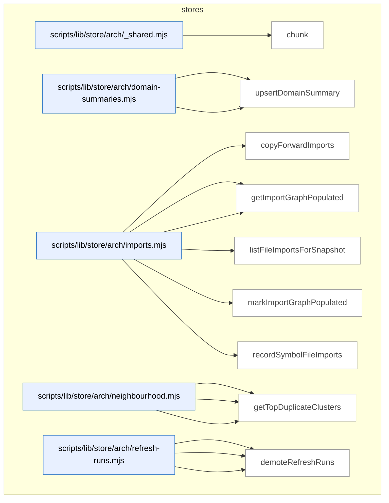

_Domain has 208 symbols (>50). Diagram shows top-15 by file order; see flat table below for the full list._

### Symbols in this domain

| Symbol | Kind | Path | Lines | Purpose | File imported by |
|---|---|---|---|---|---|
| [`chunk`](../scripts/lib/store/arch/_shared.mjs#L21) | function | `scripts/lib/store/arch/_shared.mjs` | 21-25 | Splits an array into chunks of size n. | `scripts/lib/store/arch/imports.mjs`, `scripts/lib/store/arch/symbols.mjs`, `scripts/lib/store/security.mjs` |
| [`getDomainSummaries`](../scripts/lib/store/arch/domain-summaries.mjs#L32) | function | `scripts/lib/store/arch/domain-summaries.mjs` | 32-55 | Retrieves all cached domain summaries for a repo, indexed by domain tag. | `scripts/lib/store/arch-memory.mjs` |
| [`upsertDomainSummary`](../scripts/lib/store/arch/domain-summaries.mjs#L14) | function | `scripts/lib/store/arch/domain-summaries.mjs` | 14-30 | Inserts or updates a domain summary with composition metadata and LLM provenance. | `scripts/lib/store/arch-memory.mjs` |
| [`copyForwardImports`](../scripts/lib/store/arch/imports.mjs#L39) | function | `scripts/lib/store/arch/imports.mjs` | 39-70 | Copies untouched file-import edges from one refresh run to the next. | `scripts/lib/store/arch-memory.mjs` |
| [`getImportersForFiles`](../scripts/lib/store/arch/imports.mjs#L123) | function | `scripts/lib/store/arch/imports.mjs` | 123-144 | Batches file paths and returns a map of which files import each target file. | `scripts/lib/store/arch-memory.mjs` |
| [`getImportGraphPopulated`](../scripts/lib/store/arch/imports.mjs#L105) | function | `scripts/lib/store/arch/imports.mjs` | 105-116 | Checks if a refresh run's import graph has been populated. | `scripts/lib/store/arch-memory.mjs` |
| [`listFileImportsForSnapshot`](../scripts/lib/store/arch/imports.mjs#L79) | function | `scripts/lib/store/arch/imports.mjs` | 79-94 | Returns all import edges for a refresh run as (importer, imported) pairs. | `scripts/lib/store/arch-memory.mjs` |
| [`markImportGraphPopulated`](../scripts/lib/store/arch/imports.mjs#L96) | function | `scripts/lib/store/arch/imports.mjs` | 96-103 | Flags a refresh run's import graph as complete. | `scripts/lib/store/arch-memory.mjs` |
| [`recordSymbolFileImports`](../scripts/lib/store/arch/imports.mjs#L17) | function | `scripts/lib/store/arch/imports.mjs` | 17-37 | Batches and upserts file-level import edges into symbol_file_imports. | `scripts/lib/store/arch-memory.mjs` |
| [`callNeighbourhoodRpc`](../scripts/lib/store/arch/neighbourhood.mjs#L23) | function | `scripts/lib/store/arch/neighbourhood.mjs` | 23-35 | Invokes the symbol_neighbourhood Postgres RPC to find similar/related symbols. | `scripts/lib/store/arch-memory.mjs` |
| [`computeDriftScore`](../scripts/lib/store/arch/neighbourhood.mjs#L37) | function | `scripts/lib/store/arch/neighbourhood.mjs` | 37-46 | Calls the drift_score RPC to compute similarity drift metrics. | `scripts/lib/store/arch-memory.mjs` |
| [`getTopDuplicateClusters`](../scripts/lib/store/arch/neighbourhood.mjs#L48) | function | `scripts/lib/store/arch/neighbourhood.mjs` | 48-65 | Retrieves the highest-similarity duplicate-symbol clusters for a refresh run. | `scripts/lib/store/arch-memory.mjs` |
| [`abortRefreshRun`](../scripts/lib/store/arch/refresh-runs.mjs#L63) | function | `scripts/lib/store/arch/refresh-runs.mjs` | 63-77 | Marks a refresh run as aborted with optional reason and retention class. | `scripts/lib/store/arch-memory.mjs` |
| [`deleteRefreshRuns`](../scripts/lib/store/arch/refresh-runs.mjs#L204) | function | `scripts/lib/store/arch/refresh-runs.mjs` | 204-219 | Deletes refresh_runs records by ID. | `scripts/lib/store/arch-memory.mjs` |
| [`demoteRefreshRuns`](../scripts/lib/store/arch/refresh-runs.mjs#L229) | function | `scripts/lib/store/arch/refresh-runs.mjs` | 229-244 | Updates the retention_class for a set of refresh runs. | `scripts/lib/store/arch-memory.mjs` |
| [`findStaleRunningRefresh`](../scripts/lib/store/arch/refresh-runs.mjs#L140) | function | `scripts/lib/store/arch/refresh-runs.mjs` | 140-154 | Finds the most recent running refresh for a repo (for stale-detection). | `scripts/lib/store/arch-memory.mjs` |
| [`getRefreshRun`](../scripts/lib/store/arch/refresh-runs.mjs#L111) | function | `scripts/lib/store/arch/refresh-runs.mjs` | 111-134 | Retrieves a refresh_runs row with optional column allowlist and cloud availability check. | `scripts/lib/store/arch-memory.mjs` |
| [`heartbeatRefreshRun`](../scripts/lib/store/arch/refresh-runs.mjs#L80) | function | `scripts/lib/store/arch/refresh-runs.mjs` | 80-82 | Updates the last_heartbeat_at timestamp for a running refresh. | `scripts/lib/store/arch-memory.mjs` |
| [`listPrunableRefreshRuns`](../scripts/lib/store/arch/refresh-runs.mjs#L177) | function | `scripts/lib/store/arch/refresh-runs.mjs` | 177-199 | Lists refresh run IDs matching a filter (status/retention_class) and age cutoff. | `scripts/lib/store/arch-memory.mjs` |
| [`listRollbacksForRepo`](../scripts/lib/store/arch/refresh-runs.mjs#L254) | function | `scripts/lib/store/arch/refresh-runs.mjs` | 254-267 | Retrieves completed rollback-class refresh runs for a repo, newest first. | `scripts/lib/store/arch-memory.mjs` |
| [`openRefreshRun`](../scripts/lib/store/arch/refresh-runs.mjs#L28) | function | `scripts/lib/store/arch/refresh-runs.mjs` | 28-47 | Creates a new refresh_runs record with cancellation token, failing if one is already in flight. | `scripts/lib/store/arch-memory.mjs` |
| [`publishRefreshRun`](../scripts/lib/store/arch/refresh-runs.mjs#L54) | function | `scripts/lib/store/arch/refresh-runs.mjs` | 54-60 | Marks a refresh run as active/published, making its symbols discoverable. | `scripts/lib/store/arch-memory.mjs` |
| [`getActiveEmbeddingModel`](../scripts/lib/store/arch/snapshots.mjs#L69) | function | `scripts/lib/store/arch/snapshots.mjs` | 69-82 | Retrieves a repo's currently-active embedding model and dimension. | `scripts/lib/store/arch-memory.mjs` |
| [`getActiveSnapshot`](../scripts/lib/store/arch/snapshots.mjs#L25) | function | `scripts/lib/store/arch/snapshots.mjs` | 25-51 | Returns the currently-active refresh run ID, embedding model, and import-graph-populated status. | `scripts/lib/store/arch-memory.mjs` |
| [`setActiveEmbeddingModel`](../scripts/lib/store/arch/snapshots.mjs#L57) | function | `scripts/lib/store/arch/snapshots.mjs` | 57-67 | Updates a repo's active embedding model and dimension. | `scripts/lib/store/arch-memory.mjs` |
| [`copyForwardUntouchedFiles`](../scripts/lib/store/arch/symbols.mjs#L311) | function | `scripts/lib/store/arch/symbols.mjs` | 311-370 | Copies symbol index rows from one refresh to another, optionally retagging domain per touched files. | `scripts/lib/store/arch-memory.mjs` |
| [`listLayeringViolationsForSnapshot`](../scripts/lib/store/arch/symbols.mjs#L284) | function | `scripts/lib/store/arch/symbols.mjs` | 284-304 | Queries layering violations for a refresh ID, ordered by rule name. | `scripts/lib/store/arch-memory.mjs` |
| [`listSymbolsForSnapshot`](../scripts/lib/store/arch/symbols.mjs#L232) | function | `scripts/lib/store/arch/symbols.mjs` | 232-282 | Queries symbol index for a refresh ID, filtering by kind/domain/path and applying limit/offset. | `scripts/lib/store/arch-memory.mjs` |
| [`recordDuplicateJustifications`](../scripts/lib/store/arch/symbols.mjs#L175) | function | `scripts/lib/store/arch/symbols.mjs` | 175-225 | Resets duplicate-justified flags and applies duplicate-justification pragmas to symbol index rows. | `scripts/lib/store/arch-memory.mjs` |
| [`recordLayeringViolations`](../scripts/lib/store/arch/symbols.mjs#L126) | function | `scripts/lib/store/arch/symbols.mjs` | 126-150 | Upserts architectural layering violations to the DB in chunked batches. | `scripts/lib/store/arch-memory.mjs` |
| [`recordSymbolDefinitions`](../scripts/lib/store/arch/symbols.mjs#L51) | function | `scripts/lib/store/arch/symbols.mjs` | 51-74 | Upserts symbol definitions to the DB and returns a mapping of symbol keys to row IDs. | `scripts/lib/store/arch-memory.mjs` |
| [`recordSymbolEmbedding`](../scripts/lib/store/arch/symbols.mjs#L104) | function | `scripts/lib/store/arch/symbols.mjs` | 104-124 | Inserts a pgvector embedding for a symbol with explicit `::vector` cast and conflict handling. | `scripts/lib/store/arch-memory.mjs` |
| [`recordSymbolIndex`](../scripts/lib/store/arch/symbols.mjs#L76) | function | `scripts/lib/store/arch/symbols.mjs` | 76-102 | Upserts symbol index rows (locations, summaries, domain tags) in chunked batches. | `scripts/lib/store/arch-memory.mjs` |
| [`vectorLiteral`](../scripts/lib/store/arch/symbols.mjs#L31) | function | `scripts/lib/store/arch/symbols.mjs` | 31-45 | Validates a numeric array as finite values and formats it as a pgvector SQL literal. | `scripts/lib/store/arch-memory.mjs` |
| [`armEvalSchemaReady`](../scripts/lib/store/arm-eval.mjs#L43) | function | `scripts/lib/store/arm-eval.mjs` | 43-48 | Verifies required arm-eval schema tables/columns exist, returning readiness status and missing relations. | `scripts/cross-skill.mjs`, `scripts/lib/arm-eval/export.mjs`, `scripts/lib/arm-eval/run.mjs` |
| [`getArmEvalLeaderboard`](../scripts/lib/store/arm-eval.mjs#L175) | function | `scripts/lib/store/arm-eval.mjs` | 175-189 | Fetches per-arm leaderboard scores by repo/experiment. | `scripts/cross-skill.mjs`, `scripts/lib/arm-eval/export.mjs`, `scripts/lib/arm-eval/run.mjs` |
| [`getBlindedSessionOutputs`](../scripts/lib/store/arm-eval.mjs#L242) | function | `scripts/lib/store/arm-eval.mjs` | 242-260 | Returns session outputs scrambled with arm identity hidden. | `scripts/cross-skill.mjs`, `scripts/lib/arm-eval/export.mjs`, `scripts/lib/arm-eval/run.mjs` |
| [`getSessionExportData`](../scripts/lib/store/arm-eval.mjs#L70) | function | `scripts/lib/store/arm-eval.mjs` | 70-96 | Retrieves full session export (session, runs, judgments, human rankings) for a session ID. | `scripts/cross-skill.mjs`, `scripts/lib/arm-eval/export.mjs`, `scripts/lib/arm-eval/run.mjs` |
| [`getSessionsForDecision`](../scripts/lib/store/arm-eval.mjs#L199) | function | `scripts/lib/store/arm-eval.mjs` | 199-234 | Retrieves arm-eval sessions with nested runs and judgments. | `scripts/cross-skill.mjs`, `scripts/lib/arm-eval/export.mjs`, `scripts/lib/arm-eval/run.mjs` |
| [`listSessionIds`](../scripts/lib/store/arm-eval.mjs#L99) | function | `scripts/lib/store/arm-eval.mjs` | 99-108 | Lists all arm-eval session IDs, optionally filtered by repo or unrestricted across repos. | `scripts/cross-skill.mjs`, `scripts/lib/arm-eval/export.mjs`, `scripts/lib/arm-eval/run.mjs` |
| [`recordCrossCheck`](../scripts/lib/store/arm-eval.mjs#L146) | function | `scripts/lib/store/arm-eval.mjs` | 146-156 | Logs cross-check results for an arm-eval run. | `scripts/cross-skill.mjs`, `scripts/lib/arm-eval/export.mjs`, `scripts/lib/arm-eval/run.mjs` |
| [`recordHumanRanking`](../scripts/lib/store/arm-eval.mjs#L158) | function | `scripts/lib/store/arm-eval.mjs` | 158-167 | Stores human reviewer's ranked output ordering. | `scripts/cross-skill.mjs`, `scripts/lib/arm-eval/export.mjs`, `scripts/lib/arm-eval/run.mjs` |
| [`recordJudgment`](../scripts/lib/store/arm-eval.mjs#L134) | function | `scripts/lib/store/arm-eval.mjs` | 134-144 | Records blind judge's scores for an arm-eval output. | `scripts/cross-skill.mjs`, `scripts/lib/arm-eval/export.mjs`, `scripts/lib/arm-eval/run.mjs` |
| [`recordOutput`](../scripts/lib/store/arm-eval.mjs#L122) | function | `scripts/lib/store/arm-eval.mjs` | 122-132 | Stores arm-eval output (text hash + conformance flag) to cloud. | `scripts/cross-skill.mjs`, `scripts/lib/arm-eval/export.mjs`, `scripts/lib/arm-eval/run.mjs` |
| [`recordRun`](../scripts/lib/store/arm-eval.mjs#L110) | function | `scripts/lib/store/arm-eval.mjs` | 110-120 | Inserts an arm-eval run record linking it to a session, arm, and resolved model. | `scripts/cross-skill.mjs`, `scripts/lib/arm-eval/export.mjs`, `scripts/lib/arm-eval/run.mjs` |
| [`recordSession`](../scripts/lib/store/arm-eval.mjs#L52) | function | `scripts/lib/store/arm-eval.mjs` | 52-62 | Inserts an arm-eval experiment session with task metadata and configuration versions. | `scripts/cross-skill.mjs`, `scripts/lib/arm-eval/export.mjs`, `scripts/lib/arm-eval/run.mjs` |
| [`relExists`](../scripts/lib/store/arm-eval.mjs#L23) | function | `scripts/lib/store/arm-eval.mjs` | 23-29 | Checks if a Postgres table or specific column exists, with SQL-injection prevention via identifier whitelist. | `scripts/cross-skill.mjs`, `scripts/lib/arm-eval/export.mjs`, `scripts/lib/arm-eval/run.mjs` |
| [`getFalsePositivePatterns`](../scripts/lib/store/bandit-fp.mjs#L167) | function | `scripts/lib/store/bandit-fp.mjs` | 167-179 | Fetches auto-suppress false-positive patterns for a repo. | `scripts/learning-store.mjs`, `scripts/lib/dashboard/collect-telemetry.mjs` |
| [`getPassEffectiveness`](../scripts/lib/store/bandit-fp.mjs#L243) | function | `scripts/lib/store/bandit-fp.mjs` | 243-260 | Fetches per-pass audit statistics for a repo. | `scripts/learning-store.mjs`, `scripts/lib/dashboard/collect-telemetry.mjs` |
| [`loadBanditArms`](../scripts/lib/store/bandit-fp.mjs#L56) | function | `scripts/lib/store/bandit-fp.mjs` | 56-79 | Restores bandit posteriors from cloud by pass and context. | `scripts/learning-store.mjs`, `scripts/lib/dashboard/collect-telemetry.mjs` |
| [`loadFalsePositivePatterns`](../scripts/lib/store/bandit-fp.mjs#L141) | function | `scripts/lib/store/bandit-fp.mjs` | 141-162 | Loads repo and global auto-suppress false-positive patterns. | `scripts/learning-store.mjs`, `scripts/lib/dashboard/collect-telemetry.mjs` |
| [`syncBanditArms`](../scripts/lib/store/bandit-fp.mjs#L27) | function | `scripts/lib/store/bandit-fp.mjs` | 27-48 | Syncs bandit arm posteriors to cloud. | `scripts/learning-store.mjs`, `scripts/lib/dashboard/collect-telemetry.mjs` |
| [`syncExperiments`](../scripts/lib/store/bandit-fp.mjs#L186) | function | `scripts/lib/store/bandit-fp.mjs` | 186-212 | Persists prompt-experiment metadata and EWR estimates. | `scripts/learning-store.mjs`, `scripts/lib/dashboard/collect-telemetry.mjs` |
| [`syncFalsePositivePatterns`](../scripts/lib/store/bandit-fp.mjs#L113) | function | `scripts/lib/store/bandit-fp.mjs` | 113-134 | Uploads false-positive patterns with dismissal counts and thresholds. | `scripts/learning-store.mjs`, `scripts/lib/dashboard/collect-telemetry.mjs` |
| [`syncPromptRevision`](../scripts/lib/store/bandit-fp.mjs#L219) | function | `scripts/lib/store/bandit-fp.mjs` | 219-234 | Stores promoted prompt revision with checksum. | `scripts/learning-store.mjs`, `scripts/lib/dashboard/collect-telemetry.mjs` |
| [`upsertPromptVariant`](../scripts/lib/store/bandit-fp.mjs#L86) | function | `scripts/lib/store/bandit-fp.mjs` | 86-102 | Registers prompt variant with usage statistics. | `scripts/learning-store.mjs`, `scripts/lib/dashboard/collect-telemetry.mjs` |
| [`appendDebtEventsCloud`](../scripts/lib/store/debt.mjs#L131) | function | `scripts/lib/store/debt.mjs` | 131-156 | Appends debt-event records idempotently. | `scripts/learning-store.mjs` |
| [`readDebtEntriesCloud`](../scripts/lib/store/debt.mjs#L67) | function | `scripts/lib/store/debt.mjs` | 67-105 | Fetches all debt entries for a repo from cloud. | `scripts/learning-store.mjs` |
| [`readDebtEventsCloud`](../scripts/lib/store/debt.mjs#L163) | function | `scripts/lib/store/debt.mjs` | 163-184 | Retrieves debt-event history for a repo. | `scripts/learning-store.mjs` |
| [`removeDebtEntryCloud`](../scripts/lib/store/debt.mjs#L111) | function | `scripts/lib/store/debt.mjs` | 111-120 | Deletes debt entry by repo and topic ID. | `scripts/learning-store.mjs` |
| [`upsertDebtEntries`](../scripts/lib/store/debt.mjs#L20) | function | `scripts/lib/store/debt.mjs` | 20-59 | Upserts tech-debt entries with redacted secrets and filtered paths. | `scripts/learning-store.mjs` |
| [`appendMitigationRef`](../scripts/lib/store/friction.mjs#L155) | function | `scripts/lib/store/friction.mjs` | 155-170 | Adds remediation reference to friction record idempotently. | `scripts/learning-store.mjs`, `scripts/lib/friction/commands.mjs`, `scripts/memory-health.mjs` |
| [`buildFrictionUpsertPayload`](../scripts/lib/store/friction.mjs#L65) | function | `scripts/lib/store/friction.mjs` | 65-86 | Builds DB-safe friction payload with redaction and filtering. | `scripts/learning-store.mjs`, `scripts/lib/friction/commands.mjs`, `scripts/memory-health.mjs` |
| [`getFrictionNeighbourhood`](../scripts/lib/store/friction.mjs#L179) | function | `scripts/lib/store/friction.mjs` | 179-184 | Finds similar friction records via semantic search. | `scripts/learning-store.mjs`, `scripts/lib/friction/commands.mjs`, `scripts/memory-health.mjs` |
| [`getFrictionRecurrence`](../scripts/lib/store/friction.mjs#L173) | function | `scripts/lib/store/friction.mjs` | 173-176 | Queries RPC for recurring friction patterns in a time window. | `scripts/learning-store.mjs`, `scripts/lib/friction/commands.mjs`, `scripts/memory-health.mjs` |
| [`listFrictionSourceHashes`](../scripts/lib/store/friction.mjs#L117) | function | `scripts/lib/store/friction.mjs` | 117-127 | Returns active friction names mapped to source hashes. | `scripts/learning-store.mjs`, `scripts/lib/friction/commands.mjs`, `scripts/memory-health.mjs` |
| [`reconcileTombstones`](../scripts/lib/store/friction.mjs#L136) | function | `scripts/lib/store/friction.mjs` | 136-152 | Marks friction records inactive if absent from a fresh scan. | `scripts/learning-store.mjs`, `scripts/lib/friction/commands.mjs`, `scripts/memory-health.mjs` |
| [`redact`](../scripts/lib/store/friction.mjs#L46) | function | `scripts/lib/store/friction.mjs` | 46-46 | Redacts secrets from a string. | `scripts/learning-store.mjs`, `scripts/lib/friction/commands.mjs`, `scripts/memory-health.mjs` |
| [`redactArr`](../scripts/lib/store/friction.mjs#L47) | function | `scripts/lib/store/friction.mjs` | 47-47 | Redacts secrets from array elements. | `scripts/learning-store.mjs`, `scripts/lib/friction/commands.mjs`, `scripts/memory-health.mjs` |
| [`safeFiles`](../scripts/lib/store/friction.mjs#L49) | function | `scripts/lib/store/friction.mjs` | 49-49 | Filters sensitive paths from a file list. | `scripts/learning-store.mjs`, `scripts/lib/friction/commands.mjs`, `scripts/memory-health.mjs` |
| [`upsertFrictionRow`](../scripts/lib/store/friction.mjs#L93) | function | `scripts/lib/store/friction.mjs` | 93-105 | Persists friction record to cloud with write verification. | `scripts/learning-store.mjs`, `scripts/lib/friction/commands.mjs`, `scripts/memory-health.mjs` |
| [`backfillLearningOutcome`](../scripts/lib/store/learning-decisions.mjs#L70) | function | `scripts/lib/store/learning-decisions.mjs` | 70-77 | Updates a decision record with its observed outcome. | `scripts/learning-store.mjs`, `scripts/lib/dashboard/collect-telemetry.mjs` |
| [`callDeferFinding`](../scripts/lib/store/learning-decisions.mjs#L133) | function | `scripts/lib/store/learning-decisions.mjs` | 133-142 | Marks a finding deferred via RPC with evidence. | `scripts/learning-store.mjs`, `scripts/lib/dashboard/collect-telemetry.mjs` |
| [`callMarkFindingNeedsTriage`](../scripts/lib/store/learning-decisions.mjs#L145) | function | `scripts/lib/store/learning-decisions.mjs` | 145-152 | Flags a finding for manual triage. | `scripts/learning-store.mjs`, `scripts/lib/dashboard/collect-telemetry.mjs` |
| [`getAuthorTierStats`](../scripts/lib/store/learning-decisions.mjs#L195) | function | `scripts/lib/store/learning-decisions.mjs` | 195-217 | Aggregates author-tier suggestion data. | `scripts/learning-store.mjs`, `scripts/lib/dashboard/collect-telemetry.mjs` |
| [`insertFrictionNote`](../scripts/lib/store/learning-decisions.mjs#L264) | function | `scripts/lib/store/learning-decisions.mjs` | 264-282 | Logs a friction note to an audit run's journal. | `scripts/learning-store.mjs`, `scripts/lib/dashboard/collect-telemetry.mjs` |
| [`insertLearningDecision`](../scripts/lib/store/learning-decisions.mjs#L43) | function | `scripts/lib/store/learning-decisions.mjs` | 43-62 | Records a learning decision point (skip/accept). | `scripts/learning-store.mjs`, `scripts/lib/dashboard/collect-telemetry.mjs` |
| [`readDecisionsPaginated`](../scripts/lib/store/learning-decisions.mjs#L326) | function | `scripts/lib/store/learning-decisions.mjs` | 326-367 | Streams learning decisions paginated with optional filters. | `scripts/learning-store.mjs`, `scripts/lib/dashboard/collect-telemetry.mjs` |
| [`readNoBrainerRecommendations`](../scripts/lib/store/learning-decisions.mjs#L174) | function | `scripts/lib/store/learning-decisions.mjs` | 174-185 | Retrieves auto-action recommendations. | `scripts/learning-store.mjs`, `scripts/lib/dashboard/collect-telemetry.mjs` |
| [`readPendingTriageFindings`](../scripts/lib/store/learning-decisions.mjs#L161) | function | `scripts/lib/store/learning-decisions.mjs` | 161-172 | Fetches findings awaiting manual triage. | `scripts/learning-store.mjs`, `scripts/lib/dashboard/collect-telemetry.mjs` |
| [`readRecentFriction`](../scripts/lib/store/learning-decisions.mjs#L290) | function | `scripts/lib/store/learning-decisions.mjs` | 290-306 | Retrieves recent friction log entries. | `scripts/learning-store.mjs`, `scripts/lib/dashboard/collect-telemetry.mjs` |
| [`readStaleClusters`](../scripts/lib/store/learning-decisions.mjs#L219) | function | `scripts/lib/store/learning-decisions.mjs` | 219-233 | Retrieves stale recurring-finding clusters. | `scripts/learning-store.mjs`, `scripts/lib/dashboard/collect-telemetry.mjs` |
| [`readUnresolvedDecisions`](../scripts/lib/store/learning-decisions.mjs#L383) | function | `scripts/lib/store/learning-decisions.mjs` | 383-409 | Queries learning decisions awaiting outcome evaluation. | `scripts/learning-store.mjs`, `scripts/lib/dashboard/collect-telemetry.mjs` |
| [`recordConvergenceState`](../scripts/lib/store/learning-decisions.mjs#L94) | function | `scripts/lib/store/learning-decisions.mjs` | 94-101 | Updates audit run convergence and rigor-pressure metadata. | `scripts/learning-store.mjs`, `scripts/lib/dashboard/collect-telemetry.mjs` |
| [`recordDiffComplexity`](../scripts/lib/store/learning-decisions.mjs#L84) | function | `scripts/lib/store/learning-decisions.mjs` | 84-89 | Stores diff complexity to an audit run. | `scripts/learning-store.mjs`, `scripts/lib/dashboard/collect-telemetry.mjs` |
| [`recordFindingResolution`](../scripts/lib/store/learning-decisions.mjs#L115) | function | `scripts/lib/store/learning-decisions.mjs` | 115-124 | Logs finding resolution (dismissed/fixed) with timing. | `scripts/learning-store.mjs`, `scripts/lib/dashboard/collect-telemetry.mjs` |
| [`refreshRecurringClusters`](../scripts/lib/store/learning-decisions.mjs#L244) | function | `scripts/lib/store/learning-decisions.mjs` | 244-253 | Recomputes recurring-finding clusters via RPC. | `scripts/learning-store.mjs`, `scripts/lib/dashboard/collect-telemetry.mjs` |
| [`safeWrite`](../scripts/lib/store/learning-decisions.mjs#L24) | function | `scripts/lib/store/learning-decisions.mjs` | 24-31 | Executes a cloud operation and returns success/error. | `scripts/learning-store.mjs`, `scripts/lib/dashboard/collect-telemetry.mjs` |
| [`activeSpendSql`](../scripts/lib/store/model-ab.mjs#L164) | function | `scripts/lib/store/model-ab.mjs` | 164-169 | SQL expression that sums active spend (reconciled or recently-reserved) for budget ceiling enforcement. | `scripts/learning-store.mjs`, `scripts/lib/audit-shadow.mjs`, `scripts/lib/dashboard/collect-telemetry.mjs`, +1 more |
| [`applyModelAbAdjudication`](../scripts/lib/store/model-ab.mjs#L338) | function | `scripts/lib/store/model-ab.mjs` | 338-372 | Applies a model-AB adjudication action (accept/dismiss/adjust-severity/duplicate) with transactional atomicity. | `scripts/learning-store.mjs`, `scripts/lib/audit-shadow.mjs`, `scripts/lib/dashboard/collect-telemetry.mjs`, +1 more |
| [`cumulativeSpendEur`](../scripts/lib/store/model-ab.mjs#L271) | function | `scripts/lib/store/model-ab.mjs` | 271-281 | Queries cumulative active spend in EUR across model-AB runs within a TTL window. | `scripts/learning-store.mjs`, `scripts/lib/audit-shadow.mjs`, `scripts/lib/dashboard/collect-telemetry.mjs`, +1 more |
| [`ensureArmSet`](../scripts/lib/store/model-ab.mjs#L126) | function | `scripts/lib/store/model-ab.mjs` | 126-150 | Upserts arm definitions for an A/B test set version, handling cloud availability and flagging silent write failures. | `scripts/learning-store.mjs`, `scripts/lib/audit-shadow.mjs`, `scripts/lib/dashboard/collect-telemetry.mjs`, +1 more |
| [`getAdjudicatorGroundTruth`](../scripts/lib/store/model-ab.mjs#L494) | function | `scripts/lib/store/model-ab.mjs` | 494-556 | Queries adjudicated ground-truth findings for model-eval adjudicator role, with time-windowing and pagination. | `scripts/learning-store.mjs`, `scripts/lib/audit-shadow.mjs`, `scripts/lib/dashboard/collect-telemetry.mjs`, +1 more |
| [`getModelAbAdjudicationQueue`](../scripts/lib/store/model-ab.mjs#L380) | function | `scripts/lib/store/model-ab.mjs` | 380-400 | Fetches a blinded queue of unadjudicated findings ready for human or model review. | `scripts/learning-store.mjs`, `scripts/lib/audit-shadow.mjs`, `scripts/lib/dashboard/collect-telemetry.mjs`, +1 more |
| [`getModelAbArmCost`](../scripts/lib/store/model-ab.mjs#L439) | function | `scripts/lib/store/model-ab.mjs` | 439-450 | Retrieves cost tracking for model-AB arms and assignments. | `scripts/learning-store.mjs`, `scripts/lib/audit-shadow.mjs`, `scripts/lib/dashboard/collect-telemetry.mjs`, +1 more |
| [`getModelAbEffectiveness`](../scripts/lib/store/model-ab.mjs#L403) | function | `scripts/lib/store/model-ab.mjs` | 403-414 | Retrieves model-AB effectiveness metrics (precision/recall/etc.) per arm/stage. | `scripts/learning-store.mjs`, `scripts/lib/audit-shadow.mjs`, `scripts/lib/dashboard/collect-telemetry.mjs`, +1 more |
| [`getModelAbFindingScores`](../scripts/lib/store/model-ab.mjs#L421) | function | `scripts/lib/store/model-ab.mjs` | 421-432 | Fetches model-AB finding scores (confidence, agreement, etc.) per run. | `scripts/learning-store.mjs`, `scripts/lib/audit-shadow.mjs`, `scripts/lib/dashboard/collect-telemetry.mjs`, +1 more |
| [`modelAbSchemaReady`](../scripts/lib/store/model-ab.mjs#L103) | function | `scripts/lib/store/model-ab.mjs` | 103-110 | Verifies all required model-A/B schema tables exist. | `scripts/learning-store.mjs`, `scripts/lib/audit-shadow.mjs`, `scripts/lib/dashboard/collect-telemetry.mjs`, +1 more |
| [`reconcileSpend`](../scripts/lib/store/model-ab.mjs#L218) | function | `scripts/lib/store/model-ab.mjs` | 218-231 | Records actual cost and completion status on a reserved spend entry after a model-AB audit run. | `scripts/learning-store.mjs`, `scripts/lib/audit-shadow.mjs`, `scripts/lib/dashboard/collect-telemetry.mjs`, +1 more |
| [`releaseOrphanedReservations`](../scripts/lib/store/model-ab.mjs#L255) | function | `scripts/lib/store/model-ab.mjs` | 255-268 | Cleans up expired spend reservations past their TTL, returning the count freed. | `scripts/learning-store.mjs`, `scripts/lib/audit-shadow.mjs`, `scripts/lib/dashboard/collect-telemetry.mjs`, +1 more |
| [`releaseSpend`](../scripts/lib/store/model-ab.mjs#L241) | function | `scripts/lib/store/model-ab.mjs` | 241-252 | Marks a reserved spend entry as released when its model-AB run is cancelled or abandoned. | `scripts/learning-store.mjs`, `scripts/lib/audit-shadow.mjs`, `scripts/lib/dashboard/collect-telemetry.mjs`, +1 more |
| [`relOrColExists`](../scripts/lib/store/model-ab.mjs#L38) | function | `scripts/lib/store/model-ab.mjs` | 38-50 | Checks if a table/column exists (SQL-injection-safe). | `scripts/learning-store.mjs`, `scripts/lib/audit-shadow.mjs`, `scripts/lib/dashboard/collect-telemetry.mjs`, +1 more |
| [`reserveSpend`](../scripts/lib/store/model-ab.mjs#L180) | function | `scripts/lib/store/model-ab.mjs` | 180-210 | Reserves budget for a model-AB run against a cap, validating TTL and cap bounds, returning a ledger ID. | `scripts/learning-store.mjs`, `scripts/lib/audit-shadow.mjs`, `scripts/lib/dashboard/collect-telemetry.mjs`, +1 more |
| [`resolveCanonicalRoot`](../scripts/lib/store/model-ab.mjs#L294) | function | `scripts/lib/store/model-ab.mjs` | 294-306 | Walks finding-equivalence chain to resolve a duplicate finding to its canonical root. | `scripts/learning-store.mjs`, `scripts/lib/audit-shadow.mjs`, `scripts/lib/dashboard/collect-telemetry.mjs`, +1 more |
| [`setFindingOutcome`](../scripts/lib/store/model-ab.mjs#L308) | function | `scripts/lib/store/model-ab.mjs` | 308-322 | Records adjudication outcome (accepted/dismissed) on an audit finding, updating all matching fingerprints. | `scripts/learning-store.mjs`, `scripts/lib/audit-shadow.mjs`, `scripts/lib/dashboard/collect-telemetry.mjs`, +1 more |
| [`createEvalRun`](../scripts/lib/store/model-eval.mjs#L139) | function | `scripts/lib/store/model-eval.mjs` | 139-167 | Inserts a new model-eval run, detecting conflicts when a run is already active. | `scripts/gemini-review.mjs`, `scripts/lib/model-eval/finalize-shadow-eval.mjs`, `scripts/model-eval-adjudicator.mjs`, +1 more |
| [`EvalRunAlreadyActiveError`](../scripts/lib/store/model-eval.mjs#L97) | class | `scripts/lib/store/model-eval.mjs` | 97-102 | Exception thrown when creating an eval run while one is already active. | `scripts/gemini-review.mjs`, `scripts/lib/model-eval/finalize-shadow-eval.mjs`, `scripts/model-eval-adjudicator.mjs`, +1 more |
| [`getActiveEvalRunId`](../scripts/lib/store/model-eval.mjs#L262) | function | `scripts/lib/store/model-eval.mjs` | 262-270 | Queries for the active pending-shadow eval run (at most one) per repo/role. | `scripts/gemini-review.mjs`, `scripts/lib/model-eval/finalize-shadow-eval.mjs`, `scripts/model-eval-adjudicator.mjs`, +1 more |
| [`getEvalRuns`](../scripts/lib/store/model-eval.mjs#L233) | function | `scripts/lib/store/model-eval.mjs` | 233-249 | Fetches completed model-eval runs for a repo/role with pagination, excluding running/shadow states. | `scripts/gemini-review.mjs`, `scripts/lib/model-eval/finalize-shadow-eval.mjs`, `scripts/model-eval-adjudicator.mjs`, +1 more |
| [`isJsonbSafeValue`](../scripts/lib/store/model-eval.mjs#L76) | function | `scripts/lib/store/model-eval.mjs` | 76-84 | Tests whether a value is JSON-serializable without circular refs/functions/symbols. | `scripts/gemini-review.mjs`, `scripts/lib/model-eval/finalize-shadow-eval.mjs`, `scripts/model-eval-adjudicator.mjs`, +1 more |
| [`jsonbSafeRecord`](../scripts/lib/store/model-eval.mjs#L86) | function | `scripts/lib/store/model-eval.mjs` | 86-91 | Zod schema for a record safe to store in PostgreSQL jsonb columns. | `scripts/gemini-review.mjs`, `scripts/lib/model-eval/finalize-shadow-eval.mjs`, `scripts/model-eval-adjudicator.mjs`, +1 more |
| [`refineRolePendingShadow`](../scripts/lib/store/model-eval.mjs#L57) | function | `scripts/lib/store/model-eval.mjs` | 57-61 | Enforces that pending_shadow status only applies to adjudicator role. | `scripts/gemini-review.mjs`, `scripts/lib/model-eval/finalize-shadow-eval.mjs`, `scripts/model-eval-adjudicator.mjs`, +1 more |
| [`refineVerdictPair`](../scripts/lib/store/model-eval.mjs#L34) | function | `scripts/lib/store/model-eval.mjs` | 34-50 | Validates verdict/nextAction consistency: both null/both set, terminal status constraints, valid pairs. | `scripts/gemini-review.mjs`, `scripts/lib/model-eval/finalize-shadow-eval.mjs`, `scripts/model-eval-adjudicator.mjs`, +1 more |
| [`updateEvalRunTerminal`](../scripts/lib/store/model-eval.mjs#L187) | function | `scripts/lib/store/model-eval.mjs` | 187-221 | Updates a model-eval run to terminal status, disambiguating zero-row outcomes (not found vs status mismatch vs already finalized). | `scripts/gemini-review.mjs`, `scripts/lib/model-eval/finalize-shadow-eval.mjs`, `scripts/model-eval-adjudicator.mjs`, +1 more |
| [`driftKeysContentHash`](../scripts/lib/store/nav-audit.mjs#L27) | function | `scripts/lib/store/nav-audit.mjs` | 27-30 | Computes deterministic SHA-256 hash of sorted drift keys for nav-audit deduplication. | `scripts/cross-skill.mjs`, `scripts/lib/dashboard/collect-nav.mjs` |
| [`listNavAuditRunHistory`](../scripts/lib/store/nav-audit.mjs#L126) | function | `scripts/lib/store/nav-audit.mjs` | 126-158 | Fetches nav-audit run history for a repo within a time window, detecting truncation via fetch-one-extra. | `scripts/cross-skill.mjs`, `scripts/lib/dashboard/collect-nav.mjs` |
| [`recordNavAuditRun`](../scripts/lib/store/nav-audit.mjs#L61) | function | `scripts/lib/store/nav-audit.mjs` | 61-95 | Upserts a nav-audit run record, deduplicating on (repo, sha, scope, content_hash). | `scripts/cross-skill.mjs`, `scripts/lib/dashboard/collect-nav.mjs` |
| [`getActionablePersonaOutcomeItems`](../scripts/lib/store/persona-outcomes.mjs#L248) | function | `scripts/lib/store/persona-outcomes.mjs` | 248-316 | Retrieves P0/P1 findings across recent sessions, deduped by hash, ordered for worksheet triage. | `scripts/cross-skill.mjs` |
| [`getPersonaOutcomesSummary`](../scripts/lib/store/persona-outcomes.mjs#L160) | function | `scripts/lib/store/persona-outcomes.mjs` | 160-218 | Fetches the latest persona test session and summarizes P0/P1 findings by outcome status. | `scripts/cross-skill.mjs` |
| [`resolveLabelTarget`](../scripts/lib/store/persona-outcomes.mjs#L40) | function | `scripts/lib/store/persona-outcomes.mjs` | 40-57 | Validates a persona finding hash exists in a session's P0/P1 findings and returns the repo ID. | `scripts/cross-skill.mjs` |
| [`upsertPersonaFindingOutcome`](../scripts/lib/store/persona-outcomes.mjs#L98) | function | `scripts/lib/store/persona-outcomes.mjs` | 98-134 | Upserts a persona finding outcome label (fixed/dismissed/wont_fix/stale) and retires correlations if dismissive. | `scripts/cross-skill.mjs` |
| [`listPersonaTestCandidates`](../scripts/lib/store/persona-test-candidates.mjs#L151) | function | `scripts/lib/store/persona-test-candidates.mjs` | 151-185 | Queries eligible persona-test candidates (recent, high-recurrence, unpromoted, above severity floor). | `scripts/learning-store.mjs` |
| [`markPersonaTestCandidateProposed`](../scripts/lib/store/persona-test-candidates.mjs#L197) | function | `scripts/lib/store/persona-test-candidates.mjs` | 197-218 | Sets proposed_at timestamp on a candidate, marking it no longer actionable. | `scripts/learning-store.mjs` |
| [`upsertPersonaTestCandidate`](../scripts/lib/store/persona-test-candidates.mjs#L48) | function | `scripts/lib/store/persona-test-candidates.mjs` | 48-136 | Upserts a persona-test candidate, incrementing occurrence and bumping last_seen on recurrence. | `scripts/learning-store.mjs` |
| [`buildSanitizedClickPath`](../scripts/lib/store/persona.mjs#L134) | function | `scripts/lib/store/persona.mjs` | 134-157 | Converts raw click-path entries to sanitized steps, redacting secrets and enforcing cap/truncation. | `scripts/learning-store.mjs`, `scripts/lib/dashboard/collect-telemetry.mjs`, `scripts/lib/persona/audit-correlator.mjs` |
| [`collapsePath`](../scripts/lib/store/persona.mjs#L81) | function | `scripts/lib/store/persona.mjs` | 81-85 | Redacts secret-shaped or auth-context path segments to `:param` while preserving structure. | `scripts/learning-store.mjs`, `scripts/lib/dashboard/collect-telemetry.mjs`, `scripts/lib/persona/audit-correlator.mjs` |
| [`getPersonaSessionsByRepo`](../scripts/lib/store/persona.mjs#L313) | function | `scripts/lib/store/persona.mjs` | 313-340 | Fetches recent persona test sessions for a repo, optionally filtered to P0-only. | `scripts/learning-store.mjs`, `scripts/lib/dashboard/collect-telemetry.mjs`, `scripts/lib/persona/audit-correlator.mjs` |
| [`getPersonaSessionsByUrl`](../scripts/lib/store/persona.mjs#L419) | function | `scripts/lib/store/persona.mjs` | 419-437 | Fetches persona test sessions that visited a specific URL. | `scripts/learning-store.mjs`, `scripts/lib/dashboard/collect-telemetry.mjs`, `scripts/lib/persona/audit-correlator.mjs` |
| [`getReachabilityEvidence`](../scripts/lib/store/persona.mjs#L353) | function | `scripts/lib/store/persona.mjs` | 353-381 | Aggregates click-path evidence across sessions to compute per-persona reachability (URLs, visit counts, last-seen). | `scripts/learning-store.mjs`, `scripts/lib/dashboard/collect-telemetry.mjs`, `scripts/lib/persona/audit-correlator.mjs` |
| [`isPersonaCloudEnabled`](../scripts/lib/store/persona.mjs#L165) | function | `scripts/lib/store/persona.mjs` | 165-167 | Wrapper delegating to isCloudEnabled() for persona-store availability. | `scripts/learning-store.mjs`, `scripts/lib/dashboard/collect-telemetry.mjs`, `scripts/lib/persona/audit-correlator.mjs` |
| [`listPersonasForApp`](../scripts/lib/store/persona.mjs#L174) | function | `scripts/lib/store/persona.mjs` | 174-185 | Fetches all personas registered for a given app URL. | `scripts/learning-store.mjs`, `scripts/lib/dashboard/collect-telemetry.mjs`, `scripts/lib/persona/audit-correlator.mjs` |
| [`looksSecret`](../scripts/lib/store/persona.mjs#L32) | function | `scripts/lib/store/persona.mjs` | 32-44 | Detects strings that appear to be secrets (emails, UUIDs, JWTs, tokens, etc.) by shape matching. | `scripts/learning-store.mjs`, `scripts/lib/dashboard/collect-telemetry.mjs`, `scripts/lib/persona/audit-correlator.mjs` |
| [`recordPersonaSession`](../scripts/lib/store/persona.mjs#L230) | function | `scripts/lib/store/persona.mjs` | 230-306 | Upserts a persona test session with findings, click-path evidence, verdict, and repo metadata. | `scripts/learning-store.mjs`, `scripts/lib/dashboard/collect-telemetry.mjs`, `scripts/lib/persona/audit-correlator.mjs` |
| [`redactParams`](../scripts/lib/store/persona.mjs#L69) | function | `scripts/lib/store/persona.mjs` | 69-77 | Sanitizes URL query parameters by redacting secret-shaped keys/values and preserving safe routing params. | `scripts/learning-store.mjs`, `scripts/lib/dashboard/collect-telemetry.mjs`, `scripts/lib/persona/audit-correlator.mjs` |
| [`sanitizeStepUrl`](../scripts/lib/store/persona.mjs#L87) | function | `scripts/lib/store/persona.mjs` | 87-125 | Normalizes and redacts a URL for safe storage in persona evidence, blocking dangerous schemes and redacting params. | `scripts/learning-store.mjs`, `scripts/lib/dashboard/collect-telemetry.mjs`, `scripts/lib/persona/audit-correlator.mjs` |
| [`unnestReachabilityRows`](../scripts/lib/store/persona.mjs#L391) | function | `scripts/lib/store/persona.mjs` | 391-413 | Unpacks click-path arrays into per-persona reachability maps (URLs, visit counts, last-seen dates). | `scripts/learning-store.mjs`, `scripts/lib/dashboard/collect-telemetry.mjs`, `scripts/lib/persona/audit-correlator.mjs` |
| [`upsertPersona`](../scripts/lib/store/persona.mjs#L194) | function | `scripts/lib/store/persona.mjs` | 194-222 | Inserts or updates a persona, detecting pre-existence by (name, app_url). | `scripts/learning-store.mjs`, `scripts/lib/dashboard/collect-telemetry.mjs`, `scripts/lib/persona/audit-correlator.mjs` |
| [`getCandidateAuditFindings`](../scripts/lib/store/plans-ship.mjs#L445) | function | `scripts/lib/store/plans-ship.mjs` | 445-472 | Fetches audit findings from recent runs to serve as candidates for persona-test correlation. | `scripts/learning-store.mjs`, `scripts/lib/dashboard/collect-telemetry.mjs`, `scripts/lib/store/persona-outcomes.mjs` |
| [`getExistingCorrelationHashesForSession`](../scripts/lib/store/plans-ship.mjs#L484) | function | `scripts/lib/store/plans-ship.mjs` | 484-496 | Returns the set of persona finding hashes already correlated in a given test session. | `scripts/learning-store.mjs`, `scripts/lib/dashboard/collect-telemetry.mjs`, `scripts/lib/store/persona-outcomes.mjs` |
| [`getUnlockedFixes`](../scripts/lib/store/plans-ship.mjs#L301) | function | `scripts/lib/store/plans-ship.mjs` | 301-315 | Queries recent HIGH audit fixes that lack a corresponding /ux-lock regression spec. | `scripts/learning-store.mjs`, `scripts/lib/dashboard/collect-telemetry.mjs`, `scripts/lib/store/persona-outcomes.mjs` |
| [`insertRunRowWithPolicyFallback`](../scripts/lib/store/plans-ship.mjs#L263) | function | `scripts/lib/store/plans-ship.mjs` | 263-274 | Inserts a row with fallback: if selector_policy_violations column is missing, retries without it. | `scripts/learning-store.mjs`, `scripts/lib/dashboard/collect-telemetry.mjs`, `scripts/lib/store/persona-outcomes.mjs` |
| [`listConsistencyCandidates`](../scripts/lib/store/plans-ship.mjs#L177) | function | `scripts/lib/store/plans-ship.mjs` | 177-208 | Fetches persona-consistency candidate regression specs from the store, optionally filtered by timestamp. | `scripts/learning-store.mjs`, `scripts/lib/dashboard/collect-telemetry.mjs`, `scripts/lib/store/persona-outcomes.mjs` |
| [`promoteRegressionSpec`](../scripts/lib/store/plans-ship.mjs#L215) | function | `scripts/lib/store/plans-ship.mjs` | 215-251 | Promotes a candidate regression spec to locked status by updating its source_kind and metadata. | `scripts/learning-store.mjs`, `scripts/lib/dashboard/collect-telemetry.mjs`, `scripts/lib/store/persona-outcomes.mjs` |
| [`readAuditEffectiveness`](../scripts/lib/store/plans-ship.mjs#L521) | function | `scripts/lib/store/plans-ship.mjs` | 521-529 | Retrieves the audit_effectiveness materialized view row (precision/recall) for a repo. | `scripts/learning-store.mjs`, `scripts/lib/dashboard/collect-telemetry.mjs`, `scripts/lib/store/persona-outcomes.mjs` |
| [`readCorrelationCountsByType`](../scripts/lib/store/plans-ship.mjs#L540) | function | `scripts/lib/store/plans-ship.mjs` | 540-559 | Counts persona-audit correlations grouped by type for a repo. | `scripts/learning-store.mjs`, `scripts/lib/dashboard/collect-telemetry.mjs`, `scripts/lib/store/persona-outcomes.mjs` |
| [`readCorrelationsForFinding`](../scripts/lib/store/plans-ship.mjs#L510) | function | `scripts/lib/store/plans-ship.mjs` | 510-518 | Fetches all persona-audit correlations for a specific audit finding. | `scripts/learning-store.mjs`, `scripts/lib/dashboard/collect-telemetry.mjs`, `scripts/lib/store/persona-outcomes.mjs` |
| [`readCorrelationsForRun`](../scripts/lib/store/plans-ship.mjs#L499) | function | `scripts/lib/store/plans-ship.mjs` | 499-507 | Fetches all persona-audit correlations for a specific audit run. | `scripts/learning-store.mjs`, `scripts/lib/dashboard/collect-telemetry.mjs`, `scripts/lib/store/persona-outcomes.mjs` |
| [`readPersistentPlanFailures`](../scripts/lib/store/plans-ship.mjs#L654) | function | `scripts/lib/store/plans-ship.mjs` | 654-662 | Lists criteria that have failed in ≥2 consecutive plan verification runs. | `scripts/learning-store.mjs`, `scripts/lib/dashboard/collect-telemetry.mjs`, `scripts/lib/store/persona-outcomes.mjs` |
| [`readPlanSatisfaction`](../scripts/lib/store/plans-ship.mjs#L643) | function | `scripts/lib/store/plans-ship.mjs` | 643-651 | Fetches the latest plan verification run and its P0/P1 failure counts. | `scripts/learning-store.mjs`, `scripts/lib/dashboard/collect-telemetry.mjs`, `scripts/lib/store/persona-outcomes.mjs` |
| [`readShipEvents`](../scripts/lib/store/plans-ship.mjs#L701) | function | `scripts/lib/store/plans-ship.mjs` | 701-719 | Retrieves ship event history: outcome distribution and recent outcomes for a repo. | `scripts/learning-store.mjs`, `scripts/lib/dashboard/collect-telemetry.mjs`, `scripts/lib/store/persona-outcomes.mjs` |
| [`recordPersonaAuditCorrelation`](../scripts/lib/store/plans-ship.mjs#L328) | function | `scripts/lib/store/plans-ship.mjs` | 328-385 | Records a match between a persona finding and an audit finding, retiring stale auto-emitted misses first. | `scripts/learning-store.mjs`, `scripts/lib/dashboard/collect-telemetry.mjs`, `scripts/lib/store/persona-outcomes.mjs` |
| [`recordPlanVerificationItems`](../scripts/lib/store/plans-ship.mjs#L592) | function | `scripts/lib/store/plans-ship.mjs` | 592-640 | Bulk-inserts per-criterion pass/fail results for a plan verification, with fallback for older schema. | `scripts/learning-store.mjs`, `scripts/lib/dashboard/collect-telemetry.mjs`, `scripts/lib/store/persona-outcomes.mjs` |
| [`recordPlanVerificationRun`](../scripts/lib/store/plans-ship.mjs#L566) | function | `scripts/lib/store/plans-ship.mjs` | 566-589 | Inserts a /ux-lock verify execution result (criteria counts/duration) for a plan. | `scripts/learning-store.mjs`, `scripts/lib/dashboard/collect-telemetry.mjs`, `scripts/lib/store/persona-outcomes.mjs` |
| [`recordRegressionSpec`](../scripts/lib/store/plans-ship.mjs#L85) | function | `scripts/lib/store/plans-ship.mjs` | 85-172 | Validates and redacts a regression spec, then inserts or updates it in the store with witness and contradiction data. | `scripts/learning-store.mjs`, `scripts/lib/dashboard/collect-telemetry.mjs`, `scripts/lib/store/persona-outcomes.mjs` |
| [`recordRegressionSpecRun`](../scripts/lib/store/plans-ship.mjs#L277) | function | `scripts/lib/store/plans-ship.mjs` | 277-295 | Records a regression spec test execution result (pass/fail/duration/error) to the learning store. | `scripts/learning-store.mjs`, `scripts/lib/dashboard/collect-telemetry.mjs`, `scripts/lib/store/persona-outcomes.mjs` |
| [`recordShipEvent`](../scripts/lib/store/plans-ship.mjs#L669) | function | `scripts/lib/store/plans-ship.mjs` | 669-690 | Logs a /ship execution outcome (shipped/blocked/warned + block reasons) to the store. | `scripts/learning-store.mjs`, `scripts/lib/dashboard/collect-telemetry.mjs`, `scripts/lib/store/persona-outcomes.mjs` |
| [`retireMissedCorrelationsForHash`](../scripts/lib/store/plans-ship.mjs#L408) | function | `scripts/lib/store/plans-ship.mjs` | 408-426 | Deletes auto-emitted "audit missed" correlation rows when a real match is later found. | `scripts/learning-store.mjs`, `scripts/lib/dashboard/collect-telemetry.mjs`, `scripts/lib/store/persona-outcomes.mjs` |
| [`updatePlanStatus`](../scripts/lib/store/plans-ship.mjs#L53) | function | `scripts/lib/store/plans-ship.mjs` | 53-71 | Updates a plan's status and updated_at, detecting zero-row outcomes (stale ID or RLS). | `scripts/learning-store.mjs`, `scripts/lib/dashboard/collect-telemetry.mjs`, `scripts/lib/store/persona-outcomes.mjs` |
| [`upsertPlan`](../scripts/lib/store/plans-ship.mjs#L22) | function | `scripts/lib/store/plans-ship.mjs` | 22-50 | Inserts or updates a plan artifact with path/skill/status, requiring resolved repoId for unique index safety. | `scripts/learning-store.mjs`, `scripts/lib/dashboard/collect-telemetry.mjs`, `scripts/lib/store/persona-outcomes.mjs` |
| [`getPurposeHealth`](../scripts/lib/store/purpose-health.mjs#L25) | function | `scripts/lib/store/purpose-health.mjs` | 25-75 | Computes a 3-metric health snapshot (recent HIGHs, failing criteria, refused secrets) within a lookback window. | `scripts/lib/dashboard/collect-telemetry.mjs` |
| [`scalarOrNull`](../scripts/lib/store/purpose-health.mjs#L77) | function | `scripts/lib/store/purpose-health.mjs` | 77-85 | Executes a COUNT/aggregate query and returns the numeric result or null on error. | `scripts/lib/dashboard/collect-telemetry.mjs` |
| [`getRepoIdByName`](../scripts/lib/store/repo.mjs#L298) | function | `scripts/lib/store/repo.mjs` | 298-313 | Retrieves the most recent repo row ID matching a given name. | `scripts/gemini-review.mjs`, `scripts/learning-store.mjs`, `scripts/lib/dashboard/collect-audit-run.mjs`, +30 more |
| [`getRepoIdByUuid`](../scripts/lib/store/repo.mjs#L214) | function | `scripts/lib/store/repo.mjs` | 214-243 | Looks up a repo row ID by uuid, with optional strict mode to fail on DB errors. | `scripts/gemini-review.mjs`, `scripts/learning-store.mjs`, `scripts/lib/dashboard/collect-audit-run.mjs`, +30 more |
| [`initLearningStore`](../scripts/lib/store/repo.mjs#L41) | function | `scripts/lib/store/repo.mjs` | 41-67 | Probes DB connectivity and logs Supabase status; returns false if unavailable. | `scripts/gemini-review.mjs`, `scripts/learning-store.mjs`, `scripts/lib/dashboard/collect-audit-run.mjs`, +30 more |
| [`isCloudEnabled`](../scripts/lib/store/repo.mjs#L76) | function | `scripts/lib/store/repo.mjs` | 76-83 | Returns true if the cloud store (Supabase) is reachable and configured. | `scripts/gemini-review.mjs`, `scripts/learning-store.mjs`, `scripts/lib/dashboard/collect-audit-run.mjs`, +30 more |
| [`listRepoIds`](../scripts/lib/store/repo.mjs#L323) | function | `scripts/lib/store/repo.mjs` | 323-332 | Returns all repo IDs in the store. | `scripts/gemini-review.mjs`, `scripts/learning-store.mjs`, `scripts/lib/dashboard/collect-audit-run.mjs`, +30 more |
| [`resolveRepoForStore`](../scripts/lib/store/repo.mjs#L142) | function | `scripts/lib/store/repo.mjs` | 142-203 | Upserts an audit_repos row by repo_uuid, updating profile only when a real audit is supplied. | `scripts/gemini-review.mjs`, `scripts/learning-store.mjs`, `scripts/lib/dashboard/collect-audit-run.mjs`, +30 more |
| [`upsertRepo`](../scripts/lib/store/repo.mjs#L108) | function | `scripts/lib/store/repo.mjs` | 108-116 | Deprecated: delegates to resolveRepoForStore for identity-based upsert. | `scripts/gemini-review.mjs`, `scripts/learning-store.mjs`, `scripts/lib/dashboard/collect-audit-run.mjs`, +30 more |
| [`upsertRepoByUuid`](../scripts/lib/store/repo.mjs#L253) | function | `scripts/lib/store/repo.mjs` | 253-285 | Inserts a new repo row or returns the existing ID if one with that uuid exists (handles race). | `scripts/gemini-review.mjs`, `scripts/learning-store.mjs`, `scripts/lib/dashboard/collect-audit-run.mjs`, +30 more |
| [`_resetClassificationColumnCache`](../scripts/lib/store/runs-findings.mjs#L52) | function | `scripts/lib/store/runs-findings.mjs` | 52-54 | Clears the cached detection state for audit_findings classification columns. | `scripts/learning-store.mjs`, `scripts/lib/audit-shadow.mjs`, `scripts/lib/dashboard/collect-audit-run.mjs`, +2 more |
| [`_resetPassStatsRoundColumnCache`](../scripts/lib/store/runs-findings.mjs#L103) | function | `scripts/lib/store/runs-findings.mjs` | 103-105 | Clears the cached detection state for audit_pass_stats.round column. | `scripts/learning-store.mjs`, `scripts/lib/audit-shadow.mjs`, `scripts/lib/dashboard/collect-audit-run.mjs`, +2 more |
| [`adjudicateFinalReviewFinding`](../scripts/lib/store/runs-findings.mjs#L477) | function | `scripts/lib/store/runs-findings.mjs` | 477-498 | Records user action (accepted/dismissed) on a shadow-only final-review finding. | `scripts/learning-store.mjs`, `scripts/lib/audit-shadow.mjs`, `scripts/lib/dashboard/collect-audit-run.mjs`, +2 more |
| [`auditRunExists`](../scripts/lib/store/runs-findings.mjs#L508) | function | `scripts/lib/store/runs-findings.mjs` | 508-516 | Returns true if a run ID exists in audit_runs. | `scripts/learning-store.mjs`, `scripts/lib/audit-shadow.mjs`, `scripts/lib/dashboard/collect-audit-run.mjs`, +2 more |
| [`columnExists`](../scripts/lib/store/runs-findings.mjs#L816) | function | `scripts/lib/store/runs-findings.mjs` | 816-840 | Checks if a database column exists, with caching and transient-error tolerance. | `scripts/learning-store.mjs`, `scripts/lib/audit-shadow.mjs`, `scripts/lib/dashboard/collect-audit-run.mjs`, +2 more |
| [`detectClassificationColumns`](../scripts/lib/store/runs-findings.mjs#L81) | function | `scripts/lib/store/runs-findings.mjs` | 81-93 | Checks whether sonar_type classification columns exist in audit_findings, caching the result. | `scripts/learning-store.mjs`, `scripts/lib/audit-shadow.mjs`, `scripts/lib/dashboard/collect-audit-run.mjs`, +2 more |
| [`detectPassStatsRoundColumn`](../scripts/lib/store/runs-findings.mjs#L107) | function | `scripts/lib/store/runs-findings.mjs` | 107-119 | Checks whether the round column exists in audit_pass_stats, caching the result. | `scripts/learning-store.mjs`, `scripts/lib/audit-shadow.mjs`, `scripts/lib/dashboard/collect-audit-run.mjs`, +2 more |
| [`getAuditRunConvergence`](../scripts/lib/store/runs-findings.mjs#L739) | function | `scripts/lib/store/runs-findings.mjs` | 739-756 | Fetches convergence metadata (round converged after, rigor pressure round) for a run. | `scripts/learning-store.mjs`, `scripts/lib/audit-shadow.mjs`, `scripts/lib/dashboard/collect-audit-run.mjs`, +2 more |
| [`getFinalReviewStats`](../scripts/lib/store/runs-findings.mjs#L566) | function | `scripts/lib/store/runs-findings.mjs` | 566-615 | Aggregates final-review findings by source_model/bucket/severity and lists shadow-only findings for a repo. | `scripts/learning-store.mjs`, `scripts/lib/audit-shadow.mjs`, `scripts/lib/dashboard/collect-audit-run.mjs`, +2 more |
| [`getPassTimings`](../scripts/lib/store/runs-findings.mjs#L762) | function | `scripts/lib/store/runs-findings.mjs` | 762-790 | Aggregates per-pass audit metrics (tokens, latency) into averaged summaries across runs. | `scripts/learning-store.mjs`, `scripts/lib/audit-shadow.mjs`, `scripts/lib/dashboard/collect-audit-run.mjs`, +2 more |
| [`getRecentFindingsByRepo`](../scripts/lib/store/runs-findings.mjs#L915) | function | `scripts/lib/store/runs-findings.mjs` | 915-952 | Retrieves recent HIGH/MEDIUM findings for a repository with optional filtering. | `scripts/learning-store.mjs`, `scripts/lib/audit-shadow.mjs`, `scripts/lib/dashboard/collect-audit-run.mjs`, +2 more |
| [`getRunFindingOutcomeCounts`](../scripts/lib/store/runs-findings.mjs#L718) | function | `scripts/lib/store/runs-findings.mjs` | 718-737 | Returns total, accepted, and adjudication stats for a run's findings. | `scripts/learning-store.mjs`, `scripts/lib/audit-shadow.mjs`, `scripts/lib/dashboard/collect-audit-run.mjs`, +2 more |
| [`getRunFindings`](../scripts/lib/store/runs-findings.mjs#L861) | function | `scripts/lib/store/runs-findings.mjs` | 861-893 | Fetches audit findings for a run with optional adjudication/remediation columns, ordered by severity. | `scripts/learning-store.mjs`, `scripts/lib/audit-shadow.mjs`, `scripts/lib/dashboard/collect-audit-run.mjs`, +2 more |
| [`getRunMeta`](../scripts/lib/store/runs-findings.mjs#L970) | function | `scripts/lib/store/runs-findings.mjs` | 970-996 | Returns metadata for an audit run (plan, mode, rounds, verdict, commit SHA, etc.). | `scripts/learning-store.mjs`, `scripts/lib/audit-shadow.mjs`, `scripts/lib/dashboard/collect-audit-run.mjs`, +2 more |
| [`isUndefinedColumnError`](../scripts/lib/store/runs-findings.mjs#L38) | function | `scripts/lib/store/runs-findings.mjs` | 38-46 | Returns true if an error indicates a missing column or table (42703 or 42P01). | `scripts/learning-store.mjs`, `scripts/lib/audit-shadow.mjs`, `scripts/lib/dashboard/collect-audit-run.mjs`, +2 more |
| [`markRunFindingsNeedsTriage`](../scripts/lib/store/runs-findings.mjs#L529) | function | `scripts/lib/store/runs-findings.mjs` | 529-550 | Marks specific findings in a run as needing_triage if not already adjudicated. | `scripts/learning-store.mjs`, `scripts/lib/audit-shadow.mjs`, `scripts/lib/dashboard/collect-audit-run.mjs`, +2 more |
| [`normaliseBucket`](../scripts/lib/store/runs-findings.mjs#L313) | function | `scripts/lib/store/runs-findings.mjs` | 313-318 | Normalizes bucket values to a valid set or null, logging unexpected inputs. | `scripts/learning-store.mjs`, `scripts/lib/audit-shadow.mjs`, `scripts/lib/dashboard/collect-audit-run.mjs`, +2 more |
| [`probeColumn`](../scripts/lib/store/runs-findings.mjs#L66) | function | `scripts/lib/store/runs-findings.mjs` | 66-79 | Tests whether a column exists via a minimal query, retrying once on transient failures. | `scripts/learning-store.mjs`, `scripts/lib/audit-shadow.mjs`, `scripts/lib/dashboard/collect-audit-run.mjs`, +2 more |
| [`recordAdjudicationEvent`](../scripts/lib/store/runs-findings.mjs#L1055) | function | `scripts/lib/store/runs-findings.mjs` | 1055-1096 | Records an adjudication decision (outcome, remediation state) for a finding and updates decided_at. | `scripts/learning-store.mjs`, `scripts/lib/audit-shadow.mjs`, `scripts/lib/dashboard/collect-audit-run.mjs`, +2 more |
| [`recordFinalReviewFindings`](../scripts/lib/store/runs-findings.mjs#L432) | function | `scripts/lib/store/runs-findings.mjs` | 432-462 | Atomically replaces final-review findings: deletes stale ones, inserts primary and shadow. | `scripts/learning-store.mjs`, `scripts/lib/audit-shadow.mjs`, `scripts/lib/dashboard/collect-audit-run.mjs`, +2 more |
| [`recordFindings`](../scripts/lib/store/runs-findings.mjs#L334) | function | `scripts/lib/store/runs-findings.mjs` | 334-406 | Bulk-inserts audit findings from a pass into audit_findings with per-column migration guards. | `scripts/learning-store.mjs`, `scripts/lib/audit-shadow.mjs`, `scripts/lib/dashboard/collect-audit-run.mjs`, +2 more |
| [`recordPassStats`](../scripts/lib/store/runs-findings.mjs#L627) | function | `scripts/lib/store/runs-findings.mjs` | 627-661 | Inserts an audit_pass_stats row for a pass with per-arm model/stage/cost telemetry. | `scripts/learning-store.mjs`, `scripts/lib/audit-shadow.mjs`, `scripts/lib/dashboard/collect-audit-run.mjs`, +2 more |
| [`recordRunComplete`](../scripts/lib/store/runs-findings.mjs#L200) | function | `scripts/lib/store/runs-findings.mjs` | 200-234 | Updates an audit_runs row with final stats (rounds, findings, cost, verdict, cache telemetry). | `scripts/learning-store.mjs`, `scripts/lib/audit-shadow.mjs`, `scripts/lib/dashboard/collect-audit-run.mjs`, +2 more |
| [`recordRunStart`](../scripts/lib/store/runs-findings.mjs#L127) | function | `scripts/lib/store/runs-findings.mjs` | 127-194 | Inserts or reuses an audit_runs row with repo-scoped guard against cross-repo run ID reuse. | `scripts/learning-store.mjs`, `scripts/lib/audit-shadow.mjs`, `scripts/lib/dashboard/collect-audit-run.mjs`, +2 more |
| [`recordSuppressionEvents`](../scripts/lib/store/runs-findings.mjs#L1003) | function | `scripts/lib/store/runs-findings.mjs` | 1003-1042 | Records finding suppressions and reopenings to audit-trail an adjudication run. | `scripts/learning-store.mjs`, `scripts/lib/audit-shadow.mjs`, `scripts/lib/dashboard/collect-audit-run.mjs`, +2 more |
| [`updatePassStatsPostDeliberation`](../scripts/lib/store/runs-findings.mjs#L667) | function | `scripts/lib/store/runs-findings.mjs` | 667-698 | Updates per-pass finding counts (accepted/dismissed/compromised) on the convergence-round row. | `scripts/learning-store.mjs`, `scripts/lib/audit-shadow.mjs`, `scripts/lib/dashboard/collect-audit-run.mjs`, +2 more |
| [`updateRunMeta`](../scripts/lib/store/runs-findings.mjs#L240) | function | `scripts/lib/store/runs-findings.mjs` | 240-305 | Patches individual audit_runs fields (r2_skip_reason, gemini_verdict, model/shadow costs) with column existence checks. | `scripts/learning-store.mjs`, `scripts/lib/audit-shadow.mjs`, `scripts/lib/dashboard/collect-audit-run.mjs`, +2 more |
| [`callIncidentNeighbourhoodRpc`](../scripts/lib/store/security.mjs#L145) | function | `scripts/lib/store/security.mjs` | 145-167 | Calls the SQL RPC to find similar incidents by embedding and returns them with relevance scores. | `scripts/learning-store.mjs`, `scripts/lib/dashboard/collect-telemetry.mjs` |
| [`formatVectorOrNull`](../scripts/lib/store/security.mjs#L294) | function | `scripts/lib/store/security.mjs` | 294-300 | Formats a numeric array as a pgvector literal or returns null. | `scripts/learning-store.mjs`, `scripts/lib/dashboard/collect-telemetry.mjs` |
| [`getMaxIncidentRefreshAt`](../scripts/lib/store/security.mjs#L123) | function | `scripts/lib/store/security.mjs` | 123-138 | Returns the most recent update timestamp for a repo's security incidents. | `scripts/learning-store.mjs`, `scripts/lib/dashboard/collect-telemetry.mjs` |
| [`getSecurityEvents`](../scripts/lib/store/security.mjs#L213) | function | `scripts/lib/store/security.mjs` | 213-223 | Fetches recent security events for a repo, sorted newest first. | `scripts/learning-store.mjs`, `scripts/lib/dashboard/collect-telemetry.mjs` |
| [`getSecurityIncidentsByRepo`](../scripts/lib/store/security.mjs#L88) | function | `scripts/lib/store/security.mjs` | 88-98 | Fetches security incidents for a repo, parsing embedded vectors. | `scripts/learning-store.mjs`, `scripts/lib/dashboard/collect-telemetry.mjs` |
| [`getSecurityStats`](../scripts/lib/store/security.mjs#L236) | function | `scripts/lib/store/security.mjs` | 236-285 | Aggregates security incident counts by status and event counts by kind. | `scripts/learning-store.mjs`, `scripts/lib/dashboard/collect-telemetry.mjs` |
| [`markIncidentsHistorical`](../scripts/lib/store/security.mjs#L105) | function | `scripts/lib/store/security.mjs` | 105-115 | Marks incidents as historical in the DB with current timestamp. | `scripts/learning-store.mjs`, `scripts/lib/dashboard/collect-telemetry.mjs` |
| [`parseVectorLiteral`](../scripts/lib/store/security.mjs#L76) | function | `scripts/lib/store/security.mjs` | 76-82 | Parses a pgvector string literal or array back into a numeric vector. | `scripts/learning-store.mjs`, `scripts/lib/dashboard/collect-telemetry.mjs` |
| [`recordSecurityEvents`](../scripts/lib/store/security.mjs#L184) | function | `scripts/lib/store/security.mjs` | 184-207 | Appends security strategy events (audit trail) to the DB for each commit/branch/action. | `scripts/learning-store.mjs`, `scripts/lib/dashboard/collect-telemetry.mjs` |
| [`recordSecurityIncidents`](../scripts/lib/store/security.mjs#L35) | function | `scripts/lib/store/security.mjs` | 35-62 | Upserts security incidents to the DB with embeddings and metadata in chunked batches. | `scripts/learning-store.mjs`, `scripts/lib/dashboard/collect-telemetry.mjs` |
| [`appendTieredShadowObservation`](../scripts/lib/store/tiered-shadow.mjs#L44) | function | `scripts/lib/store/tiered-shadow.mjs` | 44-66 | Records an observation comparing legacy audit vs tiered-pipeline results to cloud store. | `scripts/lib/audit/tiered-shadow-compare.mjs`, `scripts/lib/dashboard/collect-telemetry.mjs`, `scripts/tiered-shadow-report.mjs` |
| [`getTieredShadowObservations`](../scripts/lib/store/tiered-shadow.mjs#L94) | function | `scripts/lib/store/tiered-shadow.mjs` | 94-110 | Fetches tiered-shadow comparison observations for repos over a time window. | `scripts/lib/audit/tiered-shadow-compare.mjs`, `scripts/lib/dashboard/collect-telemetry.mjs`, `scripts/tiered-shadow-report.mjs` |

---

## tech-debt

> Converts audit-loop deferrals into persisted tech-debt entries with validated metadata (reason, approver, policy-ref, rationale), redacts secrets, and syncs to the Supabase learning store.

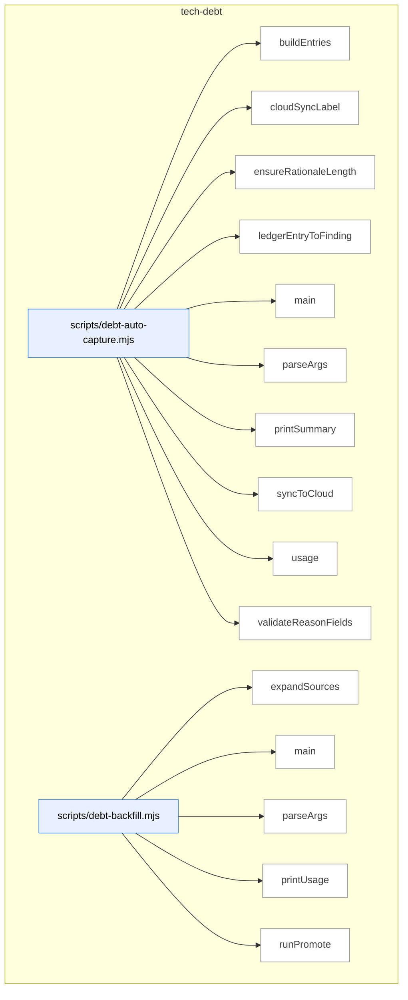

_Domain has 71 symbols (>50). Diagram shows top-15 by file order; see flat table below for the full list._

### Symbols in this domain

| Symbol | Kind | Path | Lines | Purpose | File imported by |
|---|---|---|---|---|---|
| [`buildEntries`](../scripts/debt-auto-capture.mjs#L161) | function | `scripts/debt-auto-capture.mjs` | 161-188 | Converts deferred ledger entries into debt-capture entries with sensitivity filtering. | _(internal)_ |
| [`cloudSyncLabel`](../scripts/debt-auto-capture.mjs#L214) | function | `scripts/debt-auto-capture.mjs` | 214-217 | Formats a human-readable status string for cloud sync result. | _(internal)_ |
| [`ensureRationaleLength`](../scripts/debt-auto-capture.mjs#L120) | function | `scripts/debt-auto-capture.mjs` | 120-128 | Pads or generates a deferral rationale to meet minimum length requirements. | _(internal)_ |
| [`ledgerEntryToFinding`](../scripts/debt-auto-capture.mjs#L136) | function | `scripts/debt-auto-capture.mjs` | 136-155 | Transforms an adjudication ledger entry into a deferred finding record. | _(internal)_ |
| [`main`](../scripts/debt-auto-capture.mjs#L248) | function | `scripts/debt-auto-capture.mjs` | 248-326 | Orchestrates ledger parsing, deferral validation, debt capture, and result output. | _(internal)_ |
| [`parseArgs`](../scripts/debt-auto-capture.mjs#L34) | function | `scripts/debt-auto-capture.mjs` | 34-64 | Extracts CLI flags for debt capture (reason, approver, approved-at, policy-ref, etc.). | _(internal)_ |
| [`printSummary`](../scripts/debt-auto-capture.mjs#L219) | function | `scripts/debt-auto-capture.mjs` | 219-244 | Outputs a formatted table of debt-capture results and statistics. | _(internal)_ |
| [`syncToCloud`](../scripts/debt-auto-capture.mjs#L197) | function | `scripts/debt-auto-capture.mjs` | 197-210 | Attempts to persist captured debt entries to the Supabase learning store. | _(internal)_ |
| [`usage`](../scripts/debt-auto-capture.mjs#L66) | function | `scripts/debt-auto-capture.mjs` | 66-87 | Prints the command-line help message for debt-auto-capture. | _(internal)_ |
| [`validateReasonFields`](../scripts/debt-auto-capture.mjs#L96) | function | `scripts/debt-auto-capture.mjs` | 96-111 | Validates that required flags are present for the chosen deferral reason. | _(internal)_ |
| [`expandSources`](../scripts/debt-backfill.mjs#L85) | function | `scripts/debt-backfill.mjs` | 85-107 | Resolves glob patterns into a deduplicated list of source file paths. | _(internal)_ |
| [`main`](../scripts/debt-backfill.mjs#L265) | function | `scripts/debt-backfill.mjs` | 265-279 | Routes to either stage or promote mode based on CLI arguments. | _(internal)_ |
| [`parseArgs`](../scripts/debt-backfill.mjs#L41) | function | `scripts/debt-backfill.mjs` | 41-56 | Extracts CLI flags for debt staging and promotion operations. | _(internal)_ |
| [`printUsage`](../scripts/debt-backfill.mjs#L58) | function | `scripts/debt-backfill.mjs` | 58-81 | Prints the two-stage workflow help (stage → operator review → promote). | _(internal)_ |
| [`runPromote`](../scripts/debt-backfill.mjs#L160) | function | `scripts/debt-backfill.mjs` | 160-261 | Reads approved staging records and writes them to the live tech-debt ledger. | _(internal)_ |
| [`runStage`](../scripts/debt-backfill.mjs#L111) | function | `scripts/debt-backfill.mjs` | 111-156 | Parses audit summary files and writes a staging JSON for operator review and approval. | _(internal)_ |
| [`loadBudgets`](../scripts/debt-budget-check.mjs#L66) | function | `scripts/debt-budget-check.mjs` | 66-83 | Loads budget thresholds from an external JSON file or from the ledger's `budgets` field. | _(internal)_ |
| [`main`](../scripts/debt-budget-check.mjs#L85) | function | `scripts/debt-budget-check.mjs` | 85-136 | Reads the debt ledger, loads budgets, checks for violations against paths, and exits with appropriate code. | _(internal)_ |
| [`parseArgs`](../scripts/debt-budget-check.mjs#L33) | function | `scripts/debt-budget-check.mjs` | 33-45 | Extracts CLI flags (ledger path, budgets file, JSON mode, help) into an options object. | _(internal)_ |
| [`printUsage`](../scripts/debt-budget-check.mjs#L47) | function | `scripts/debt-budget-check.mjs` | 47-64 | Prints usage instructions and exit codes for the debt budget check command. | _(internal)_ |
| [`findTouchedDebt`](../scripts/debt-pr-comment.mjs#L105) | function | `scripts/debt-pr-comment.mjs` | 105-117 | Filters debt entries to those affecting the PR's changed files using flexible path matching. | _(internal)_ |
| [`groupTouchedByFile`](../scripts/debt-pr-comment.mjs#L120) | function | `scripts/debt-pr-comment.mjs` | 120-128 | Groups touched debt entries by their primary affected file for rendering per-file sections. | _(internal)_ |
| [`loadChangedFiles`](../scripts/debt-pr-comment.mjs#L222) | function | `scripts/debt-pr-comment.mjs` | 222-236 | Parses changed file list from CLI argument (comma-separated) or reads from newline-delimited file. | _(internal)_ |
| [`main`](../scripts/debt-pr-comment.mjs#L240) | function | `scripts/debt-pr-comment.mjs` | 240-323 | Entry point that loads changed files and ledger, identifies touched/recurring debt, enriches with git metadata, writes the comment. | _(internal)_ |
| [`parseArgs`](../scripts/debt-pr-comment.mjs#L53) | function | `scripts/debt-pr-comment.mjs` | 53-72 | Parses CLI arguments for changed files list, ledger/events paths, thresholds, and output destination. | _(internal)_ |
| [`printUsage`](../scripts/debt-pr-comment.mjs#L74) | function | `scripts/debt-pr-comment.mjs` | 74-95 | Displays usage instructions for generating a sticky PR comment about debt overlapping changed code. | _(internal)_ |
| [`renderEntryLine`](../scripts/debt-pr-comment.mjs#L132) | function | `scripts/debt-pr-comment.mjs` | 132-150 | Formats a single debt entry as a markdown line with severity badge, occurrence count, and optional commit link. | _(internal)_ |
| [`renderPrComment`](../scripts/debt-pr-comment.mjs#L152) | function | `scripts/debt-pr-comment.mjs` | 152-218 | Generates the complete PR comment markdown with sections for touched debt, recurring debt, and summaries. | _(internal)_ |
| [`main`](../scripts/debt-resolve.mjs#L73) | function | `scripts/debt-resolve.mjs` | 73-152 | Validates debt entry exists, logs a resolved event, optionally syncs to cloud, removes entry from ledger. | _(internal)_ |
| [`parseArgs`](../scripts/debt-resolve.mjs#L34) | function | `scripts/debt-resolve.mjs` | 34-52 | Parses CLI arguments to extract topic ID, rationale, run ID, ledger path, and cloud/no-cloud flag. | _(internal)_ |
| [`printUsage`](../scripts/debt-resolve.mjs#L54) | function | `scripts/debt-resolve.mjs` | 54-71 | Displays usage instructions for resolving (removing) a debt entry by topic ID. | _(internal)_ |
| [`main`](../scripts/debt-review.mjs#L332) | function | `scripts/debt-review.mjs` | 332-397 | Entry point that loads ledger, applies sensitivity gates, selects clustering mode (local or LLM), outputs review report. | _(internal)_ |
| [`parseArgs`](../scripts/debt-review.mjs#L44) | function | `scripts/debt-review.mjs` | 44-60 | Parses CLI flags for local-only clustering mode, sensitive-entry inclusion, plan-doc generation, and TTL days. | _(internal)_ |
| [`printUsage`](../scripts/debt-review.mjs#L62) | function | `scripts/debt-review.mjs` | 62-80 | Displays usage instructions for clustering accumulated tech debt and ranking refactor candidates. | _(internal)_ |
| [`renderMarkdown`](../scripts/debt-review.mjs#L84) | function | `scripts/debt-review.mjs` | 84-151 | Formats debt analysis into markdown sections with summary, budget violations, identified clusters, and ranked refactors. | _(internal)_ |
| [`runLLMClustering`](../scripts/debt-review.mjs#L218) | function | `scripts/debt-review.mjs` | 218-284 | Sends debt entries to GPT for semantic clustering and refactor suggestions, with opt-in sensitive-entry filtering. | _(internal)_ |
| [`runLocalClustering`](../scripts/debt-review.mjs#L155) | function | `scripts/debt-review.mjs` | 155-183 | Performs deterministic heuristic clustering of debt entries without external LLM, estimates effort per cluster. | _(internal)_ |
| [`writeTopRefactorPlanDoc`](../scripts/debt-review.mjs#L288) | function | `scripts/debt-review.mjs` | 288-328 | Writes the highest-leverage refactor candidate as a markdown plan document linking to resolved debt entries. | _(internal)_ |
| [`buildDebtEntry`](../scripts/lib/debt-capture.mjs#L84) | function | `scripts/lib/debt-capture.mjs` | 84-158 | Constructs a persisted debt entry with secret redaction and sensitivity classification. | `scripts/debt-auto-capture.mjs`, `scripts/shared.mjs` |
| [`computeSensitivity`](../scripts/lib/debt-capture.mjs#L32) | function | `scripts/lib/debt-capture.mjs` | 32-54 | Detects if a finding contains sensitive data in paths or content. | `scripts/debt-auto-capture.mjs`, `scripts/shared.mjs` |
| [`suggestDeferralCandidate`](../scripts/lib/debt-capture.mjs#L171) | function | `scripts/lib/debt-capture.mjs` | 171-183 | Determines if a finding is eligible for deferral based on scope and severity. | `scripts/debt-auto-capture.mjs`, `scripts/shared.mjs` |
| [`appendDebtEventsLocal`](../scripts/lib/debt-events.mjs#L34) | function | `scripts/lib/debt-events.mjs` | 34-56 | Appends validated debt events to a local append-only log file. | `scripts/debt-pr-comment.mjs`, `scripts/debt-resolve.mjs`, `scripts/debt-review.mjs`, +3 more |
| [`deriveMetricsFromEvents`](../scripts/lib/debt-events.mjs#L107) | function | `scripts/lib/debt-events.mjs` | 107-154 | Aggregates an event stream into per-topic metrics (occurrence count, escalation status). | `scripts/debt-pr-comment.mjs`, `scripts/debt-resolve.mjs`, `scripts/debt-review.mjs`, +3 more |
| [`readDebtEventsLocal`](../scripts/lib/debt-events.mjs#L65) | function | `scripts/lib/debt-events.mjs` | 65-87 | Reads and parses debt events from a local JSONL file. | `scripts/debt-pr-comment.mjs`, `scripts/debt-resolve.mjs`, `scripts/debt-review.mjs`, +3 more |
| [`buildCommitUrl`](../scripts/lib/debt-git-history.mjs#L142) | function | `scripts/lib/debt-git-history.mjs` | 142-144 | Constructs a GitHub commit URL from a repository URL and SHA. | `scripts/debt-pr-comment.mjs`, `scripts/shared.mjs` |
| [`countCommitsTouchingTopic`](../scripts/lib/debt-git-history.mjs#L42) | function | `scripts/lib/debt-git-history.mjs` | 42-63 | Counts git commits that mention a topic ID in a ledger file. | `scripts/debt-pr-comment.mjs`, `scripts/shared.mjs` |
| [`deriveOccurrencesFromGit`](../scripts/lib/debt-git-history.mjs#L154) | function | `scripts/lib/debt-git-history.mjs` | 154-161 | Counts git-commit occurrences per debt entry using git log. | `scripts/debt-pr-comment.mjs`, `scripts/shared.mjs` |
| [`detectGitHubRepoUrl`](../scripts/lib/debt-git-history.mjs#L119) | function | `scripts/lib/debt-git-history.mjs` | 119-134 | Extracts a normalized GitHub repository URL from git remote origin. | `scripts/debt-pr-comment.mjs`, `scripts/shared.mjs` |
| [`findFirstDeferCommit`](../scripts/lib/debt-git-history.mjs#L76) | function | `scripts/lib/debt-git-history.mjs` | 76-108 | Finds the earliest git commit that added a deferred finding. | `scripts/debt-pr-comment.mjs`, `scripts/shared.mjs` |
| [`findDebtByAlias`](../scripts/lib/debt-ledger.mjs#L273) | function | `scripts/lib/debt-ledger.mjs` | 273-280 | Looks up a debt entry by topic ID or content-alias match. | `scripts/audit-loop.mjs`, `scripts/debt-auto-capture.mjs`, `scripts/debt-backfill.mjs`, +6 more |
| [`mergeLedgers`](../scripts/lib/debt-ledger.mjs#L252) | function | `scripts/lib/debt-ledger.mjs` | 252-262 | Merges debt and session ledgers, with session entries winning collisions. | `scripts/audit-loop.mjs`, `scripts/debt-auto-capture.mjs`, `scripts/debt-backfill.mjs`, +6 more |
| [`readDebtLedger`](../scripts/lib/debt-ledger.mjs#L42) | function | `scripts/lib/debt-ledger.mjs` | 42-89 | Loads the debt ledger and enriches entries with event-derived metrics. | `scripts/audit-loop.mjs`, `scripts/debt-auto-capture.mjs`, `scripts/debt-backfill.mjs`, +6 more |
| [`removeDebtEntry`](../scripts/lib/debt-ledger.mjs#L207) | function | `scripts/lib/debt-ledger.mjs` | 207-236 | Removes a debt entry by topic ID from the ledger. | `scripts/audit-loop.mjs`, `scripts/debt-auto-capture.mjs`, `scripts/debt-backfill.mjs`, +6 more |
| [`writeDebtEntries`](../scripts/lib/debt-ledger.mjs#L107) | function | `scripts/lib/debt-ledger.mjs` | 107-197 | Persists new and updated debt entries to the ledger file with file locking. | `scripts/audit-loop.mjs`, `scripts/debt-auto-capture.mjs`, `scripts/debt-backfill.mjs`, +6 more |
| [`appendEvents`](../scripts/lib/debt-memory.mjs#L116) | function | `scripts/lib/debt-memory.mjs` | 116-129 | Appends debt events to storage (cloud or local) based on context availability. | `scripts/debt-resolve.mjs`, `scripts/lib/audit/legacy-production-audit.mjs`, `scripts/openai-audit.mjs`, +1 more |
| [`loadDebtLedger`](../scripts/lib/debt-memory.mjs#L86) | function | `scripts/lib/debt-memory.mjs` | 86-103 | Loads debt entries from cloud or local storage depending on configured source. | `scripts/debt-resolve.mjs`, `scripts/lib/audit/legacy-production-audit.mjs`, `scripts/openai-audit.mjs`, +1 more |
| [`persistDebtEntries`](../scripts/lib/debt-memory.mjs#L143) | function | `scripts/lib/debt-memory.mjs` | 143-157 | Persists debt entries locally with optional cloud mirroring. | `scripts/debt-resolve.mjs`, `scripts/lib/audit/legacy-production-audit.mjs`, `scripts/openai-audit.mjs`, +1 more |
| [`reconcileLocalToCloud`](../scripts/lib/debt-memory.mjs#L192) | function | `scripts/lib/debt-memory.mjs` | 192-229 | Syncs unsynchronized local debt events to cloud storage. | `scripts/debt-resolve.mjs`, `scripts/lib/audit/legacy-production-audit.mjs`, `scripts/openai-audit.mjs`, +1 more |
| [`removeDebt`](../scripts/lib/debt-memory.mjs#L162) | function | `scripts/lib/debt-memory.mjs` | 162-171 | Removes a debt entry from local and cloud storage. | `scripts/debt-resolve.mjs`, `scripts/lib/audit/legacy-production-audit.mjs`, `scripts/openai-audit.mjs`, +1 more |
| [`selectEventSource`](../scripts/lib/debt-memory.mjs#L59) | function | `scripts/lib/debt-memory.mjs` | 59-73 | Selects the event storage backend (cloud, local, or disabled) based on configuration. | `scripts/debt-resolve.mjs`, `scripts/lib/audit/legacy-production-audit.mjs`, `scripts/openai-audit.mjs`, +1 more |
| [`buildLocalClusters`](../scripts/lib/debt-review-helpers.mjs#L164) | function | `scripts/lib/debt-review-helpers.mjs` | 164-204 | Organizes debt into file, principle, and recurrence-based clusters. | `scripts/audit-loop.mjs`, `scripts/debt-budget-check.mjs`, `scripts/debt-pr-comment.mjs`, +2 more |
| [`computeLeverage`](../scripts/lib/debt-review-helpers.mjs#L45) | function | `scripts/lib/debt-review-helpers.mjs` | 45-57 | Scores refactor impact-to-effort ratio using weighted sonar types. | `scripts/audit-loop.mjs`, `scripts/debt-budget-check.mjs`, `scripts/debt-pr-comment.mjs`, +2 more |
| [`countDebtByFile`](../scripts/lib/debt-review-helpers.mjs#L213) | function | `scripts/lib/debt-review-helpers.mjs` | 213-221 | Counts debt entries per file. | `scripts/audit-loop.mjs`, `scripts/debt-budget-check.mjs`, `scripts/debt-pr-comment.mjs`, +2 more |
| [`findBudgetViolations`](../scripts/lib/debt-review-helpers.mjs#L238) | function | `scripts/lib/debt-review-helpers.mjs` | 238-264 | Identifies files exceeding their configured debt budget. | `scripts/audit-loop.mjs`, `scripts/debt-budget-check.mjs`, `scripts/debt-pr-comment.mjs`, +2 more |
| [`findRecurringEntries`](../scripts/lib/debt-review-helpers.mjs#L148) | function | `scripts/lib/debt-review-helpers.mjs` | 148-152 | Filters debt entries that have recurred in multiple audit runs. | `scripts/audit-loop.mjs`, `scripts/debt-budget-check.mjs`, `scripts/debt-pr-comment.mjs`, +2 more |
| [`findStaleEntries`](../scripts/lib/debt-review-helpers.mjs#L83) | function | `scripts/lib/debt-review-helpers.mjs` | 83-92 | Finds debt entries past their time-to-live threshold. | `scripts/audit-loop.mjs`, `scripts/debt-budget-check.mjs`, `scripts/debt-pr-comment.mjs`, +2 more |
| [`getDefaultMatcher`](../scripts/lib/debt-review-helpers.mjs#L269) | function | `scripts/lib/debt-review-helpers.mjs` | 269-280 | Returns a glob-matching function, falling back to exact match. | `scripts/audit-loop.mjs`, `scripts/debt-budget-check.mjs`, `scripts/debt-pr-comment.mjs`, +2 more |
| [`groupByFile`](../scripts/lib/debt-review-helpers.mjs#L116) | function | `scripts/lib/debt-review-helpers.mjs` | 116-124 | Groups debt entries by their primary affected file. | `scripts/audit-loop.mjs`, `scripts/debt-budget-check.mjs`, `scripts/debt-pr-comment.mjs`, +2 more |
| [`groupByPrinciple`](../scripts/lib/debt-review-helpers.mjs#L131) | function | `scripts/lib/debt-review-helpers.mjs` | 131-139 | Groups debt entries by their first affected principle. | `scripts/audit-loop.mjs`, `scripts/debt-budget-check.mjs`, `scripts/debt-pr-comment.mjs`, +2 more |
| [`oldestEntryDays`](../scripts/lib/debt-review-helpers.mjs#L97) | function | `scripts/lib/debt-review-helpers.mjs` | 97-106 | Calculates age in days of the oldest debt entry. | `scripts/audit-loop.mjs`, `scripts/debt-budget-check.mjs`, `scripts/debt-pr-comment.mjs`, +2 more |
| [`rankRefactorsByLeverage`](../scripts/lib/debt-review-helpers.mjs#L65) | function | `scripts/lib/debt-review-helpers.mjs` | 65-70 | Ranks refactors by leverage score in descending order. | `scripts/audit-loop.mjs`, `scripts/debt-budget-check.mjs`, `scripts/debt-pr-comment.mjs`, +2 more |

---

## tests

> Node.js built-in test suite validating file-I/O atomicity, sensitive-path egress, schema contracts, VCS integration, consumer-repo sync mechanics, and architecture-intent parsing (SQL/docs/Python/Java).

```mermaid
flowchart TB
subgraph dom_tests ["tests"]
  file_tests_adjudication_worksheet_test_mjs["tests/adjudication-worksheet.test.mjs"]:::component
  sym_tests_adjudication_worksheet_test_mjs_it["item"]:::symbol
  file_tests_adjudication_worksheet_test_mjs --> sym_tests_adjudication_worksheet_test_mjs_it
  file_tests_ai_context_management_test_mjs["tests/ai-context-management.test.mjs"]:::component
  sym_tests_ai_context_management_test_mjs_rea["readSkillContent"]:::symbol
  file_tests_ai_context_management_test_mjs --> sym_tests_ai_context_management_test_mjs_rea
  file_tests_anthropic_client_migration_test_mj["tests/anthropic-client-migration.test.mjs"]:::component
  sym_tests_anthropic_client_migration_test_mj["collectMjs"]:::symbol
  file_tests_anthropic_client_migration_test_mj --> sym_tests_anthropic_client_migration_test_mj
  file_tests_arch_intent_adapter_java_test_mjs["tests/arch-intent-adapter-java.test.mjs"]:::component
  sym_tests_arch_intent_adapter_java_test_mjs_["writeTree"]:::symbol
  file_tests_arch_intent_adapter_java_test_mjs --> sym_tests_arch_intent_adapter_java_test_mjs_
  file_tests_arch_intent_adapter_postgres_test_["tests/arch-intent-adapter-postgres.test.mjs"]:::component
  sym_tests_arch_intent_adapter_postgres_test_["parse"]:::symbol
  file_tests_arch_intent_adapter_postgres_test_ --> sym_tests_arch_intent_adapter_postgres_test_
  sym_tests_arch_intent_adapter_postgres_test_["writeTree"]:::symbol
  file_tests_arch_intent_adapter_postgres_test_ --> sym_tests_arch_intent_adapter_postgres_test_
  file_tests_arch_intent_adapter_python_test_mj["tests/arch-intent-adapter-python.test.mjs"]:::component
  sym_tests_arch_intent_adapter_python_test_mj["writeTree"]:::symbol
  file_tests_arch_intent_adapter_python_test_mj --> sym_tests_arch_intent_adapter_python_test_mj
  file_tests_arch_intent_doc_parser_test_mjs["tests/arch-intent-doc-parser.test.mjs"]:::component
  sym_tests_arch_intent_doc_parser_test_mjs_mk["mkDoc"]:::symbol
  file_tests_arch_intent_doc_parser_test_mjs --> sym_tests_arch_intent_doc_parser_test_mjs_mk
  file_tests_arch_intent_load_config_test_mjs["tests/arch-intent-load-config.test.mjs"]:::component
  sym_tests_arch_intent_load_config_test_mjs_m["mkRepo"]:::symbol
  file_tests_arch_intent_load_config_test_mjs --> sym_tests_arch_intent_load_config_test_mjs_m
  file_tests_arch_memory_followups_test_mjs["tests/arch-memory-followups.test.mjs"]:::component
  sym_tests_arch_memory_followups_test_mjs_mak["makePlanFixture"]:::symbol
  file_tests_arch_memory_followups_test_mjs --> sym_tests_arch_memory_followups_test_mjs_mak
  file_tests_arm_eval_capture_trigger_test_mjs["tests/arm-eval-capture-trigger.test.mjs"]:::component
  sym_tests_arm_eval_capture_trigger_test_mjs_["makeSpawn"]:::symbol
  file_tests_arm_eval_capture_trigger_test_mjs --> sym_tests_arm_eval_capture_trigger_test_mjs_
  sym_tests_arm_eval_capture_trigger_test_mjs_["toggleOff"]:::symbol
  file_tests_arm_eval_capture_trigger_test_mjs --> sym_tests_arm_eval_capture_trigger_test_mjs_
  sym_tests_arm_eval_capture_trigger_test_mjs_["toggleOn"]:::symbol
  file_tests_arm_eval_capture_trigger_test_mjs --> sym_tests_arm_eval_capture_trigger_test_mjs_
  file_tests_arm_eval_decision_test_mjs["tests/arm-eval-decision.test.mjs"]:::component
  sym_tests_arm_eval_decision_test_mjs_judge["judge"]:::symbol
  file_tests_arm_eval_decision_test_mjs --> sym_tests_arm_eval_decision_test_mjs_judge
  sym_tests_arm_eval_decision_test_mjs_sess["sess"]:::symbol
  file_tests_arm_eval_decision_test_mjs --> sym_tests_arm_eval_decision_test_mjs_sess
end
classDef container fill:#f5f5f5,stroke:#333,stroke-width:2px,color:#000
classDef component fill:#e8f0ff,stroke:#3178c6,color:#000
classDef symbol fill:#fff,stroke:#999,color:#444
classDef dup fill:#ffe8d8,stroke:#c0392b,stroke-width:2px,color:#000
classDef violation fill:#ffd6d6,stroke:#c0392b,stroke-width:2px,color:#000
```

_Domain has 406 symbols (>50). Diagram shows top-15 by file order; see flat table below for the full list._

### Symbols in this domain

| Symbol | Kind | Path | Lines | Purpose | File imported by |
|---|---|---|---|---|---|
| [`item`](../tests/adjudication-worksheet.test.mjs#L16) | function | `tests/adjudication-worksheet.test.mjs` | 16-27 | Creates a test fixture adjudication worksheet item with audit metadata. | _(internal)_ |
| [`readSkillContent`](../tests/ai-context-management.test.mjs#L26) | function | `tests/ai-context-management.test.mjs` | 26-28 | Reads the SKILL.md file content. | _(internal)_ |
| [`collectMjs`](../tests/anthropic-client-migration.test.mjs#L29) | function | `tests/anthropic-client-migration.test.mjs` | 29-40 | Recursively collects all .mjs files from a directory tree. | _(internal)_ |
| [`writeTree`](../tests/arch-intent-adapter-java.test.mjs#L22) | function | `tests/arch-intent-adapter-java.test.mjs` | 22-29 | Creates a temporary directory and writes multiple test files into it. | _(internal)_ |
| [`parse`](../tests/arch-intent-adapter-postgres.test.mjs#L29) | function | `tests/arch-intent-adapter-postgres.test.mjs` | 29-31 | Parses SQL content after stripping comments and strings. | _(internal)_ |
| [`writeTree`](../tests/arch-intent-adapter-postgres.test.mjs#L19) | function | `tests/arch-intent-adapter-postgres.test.mjs` | 19-26 | Creates a temporary directory and writes multiple test files into it. | _(internal)_ |
| [`writeTree`](../tests/arch-intent-adapter-python.test.mjs#L26) | function | `tests/arch-intent-adapter-python.test.mjs` | 26-33 | Creates a temporary directory and writes multiple test files into it. | _(internal)_ |
| [`mkDoc`](../tests/arch-intent-doc-parser.test.mjs#L9) | function | `tests/arch-intent-doc-parser.test.mjs` | 9-14 | Creates a temporary markdown file for document parser testing. | _(internal)_ |
| [`mkRepo`](../tests/arch-intent-load-config.test.mjs#L10) | function | `tests/arch-intent-load-config.test.mjs` | 10-17 | Creates a temporary repo directory with .audit-loop config for testing. | _(internal)_ |
| [`makePlanFixture`](../tests/arch-memory-followups.test.mjs#L49) | function | `tests/arch-memory-followups.test.mjs` | 49-51 | Creates a minimal markdown plan fixture with date, status, and body. | _(internal)_ |
| [`makeSpawn`](../tests/arm-eval-capture-trigger.test.mjs#L11) | function | `tests/arm-eval-capture-trigger.test.mjs` | 11-18 | Creates a mock spawn function that records calls without executing. | _(internal)_ |
| [`toggleOff`](../tests/arm-eval-capture-trigger.test.mjs#L20) | function | `tests/arm-eval-capture-trigger.test.mjs` | 20-20 | Returns an object indicating arm-eval is disabled. | _(internal)_ |
| [`toggleOn`](../tests/arm-eval-capture-trigger.test.mjs#L19) | function | `tests/arm-eval-capture-trigger.test.mjs` | 19-19 | Returns an object indicating arm-eval is enabled with a budget. | _(internal)_ |
| [`judge`](../tests/arm-eval-decision.test.mjs#L15) | function | `tests/arm-eval-decision.test.mjs` | 15-25 | Creates a mock judge result with conformance, scoring dimensions, and arm labels. | _(internal)_ |
| [`sess`](../tests/arm-eval-decision.test.mjs#L26) | function | `tests/arm-eval-decision.test.mjs` | 26-34 | Creates a mock arm-eval session object with judge result, conformance, and metadata. | _(internal)_ |
| [`fakeFs`](../tests/arm-eval-judge.test.mjs#L16) | function | `tests/arm-eval-judge.test.mjs` | 16-18 | Creates a mock file system with existence checks and file reads from a map. | _(internal)_ |
| [`fakeJudge`](../tests/arm-eval-judge.test.mjs#L58) | function | `tests/arm-eval-judge.test.mjs` | 58-65 | Creates an async mock judgment function that scores outputs and returns parsed results. | _(internal)_ |
| [`harness`](../tests/arm-eval-run.test.mjs#L10) | function | `tests/arm-eval-run.test.mjs` | 10-36 | Creates a test harness with mock store and dependencies for arm-eval runs. | _(internal)_ |
| [`runCli`](../tests/audit-plan-rebuttal-split-smoke.test.mjs#L44) | function | `tests/audit-plan-rebuttal-split-smoke.test.mjs` | 44-56 | Spawns the openai-audit script with arguments and returns exit code and output. | _(internal)_ |
| [`mkdtemp`](../tests/audit-scope-egress.test.mjs#L38) | function | `tests/audit-scope-egress.test.mjs` | 38-40 | Creates a temporary directory with an OS-specific prefix. | _(internal)_ |
| [`genStats`](../tests/audit-shadow.test.mjs#L50) | function | `tests/audit-shadow.test.mjs` | 50-50 | Filters pass statistics to exclude gemini-stage entries. | _(internal)_ |
| [`harness`](../tests/audit-shadow.test.mjs#L20) | function | `tests/audit-shadow.test.mjs` | 20-47 | Creates a test harness with mock dependencies for audit-shadow testing. | _(internal)_ |
| [`minimalEnvelope`](../tests/brainstorm-arch-context.test.mjs#L242) | function | `tests/brainstorm-arch-context.test.mjs` | 242-256 | Creates a minimal brainstorm session envelope with required fields and defaults. | _(internal)_ |
| [`mkTmp`](../tests/brainstorm-arch-context.test.mjs#L24) | function | `tests/brainstorm-arch-context.test.mjs` | 24-26 | Creates a temporary directory for brainstorm tests. | _(internal)_ |
| [`runHelper`](../tests/brainstorm-failure-matrix.test.mjs#L20) | function | `tests/brainstorm-failure-matrix.test.mjs` | 20-28 | Spawns a helper script with arguments and returns its output. | _(internal)_ |
| [`mkTmp`](../tests/brainstorm-insight-store.test.mjs#L22) | function | `tests/brainstorm-insight-store.test.mjs` | 22-24 | Creates a temporary directory for brainstorm insight store tests. | _(internal)_ |
| [`mkTmp`](../tests/brainstorm-resume-context.test.mjs#L13) | function | `tests/brainstorm-resume-context.test.mjs` | 13-15 | Creates a temporary directory for brainstorm resume context tests. | _(internal)_ |
| [`helpText`](../tests/brainstorm-round-extensions.test.mjs#L34) | function | `tests/brainstorm-round-extensions.test.mjs` | 34-37 | Retrieves help text output from a helper script. | _(internal)_ |
| [`runHelper`](../tests/brainstorm-round.test.mjs#L17) | function | `tests/brainstorm-round.test.mjs` | 17-23 | Spawns a helper script with arguments and stdin input. | _(internal)_ |
| [`mkTmp`](../tests/brainstorm-session-store.test.mjs#L12) | function | `tests/brainstorm-session-store.test.mjs` | 12-14 | Creates a temporary directory for brainstorm session store tests. | _(internal)_ |
| [`mkV2Envelope`](../tests/brainstorm-session-store.test.mjs#L16) | function | `tests/brainstorm-session-store.test.mjs` | 16-27 | Creates a v2 brainstorm session envelope with architecture context fields. | _(internal)_ |
| [`syntheticSurface`](../tests/build-surfaces-manifest.test.mjs#L59) | function | `tests/build-surfaces-manifest.test.mjs` | 59-73 | Creates a test fixture UI surface with engine fields and network data sources. | _(internal)_ |
| [`run`](../tests/cache-hitrate-check.test.mjs#L10) | function | `tests/cache-hitrate-check.test.mjs` | 10-10 | Creates a test input object representing cache hitrate and seed settings. | _(internal)_ |
| [`mkFinding`](../tests/candidate-envelope-provenance.test.mjs#L16) | function | `tests/candidate-envelope-provenance.test.mjs` | 16-25 | Creates a test finding object with audit fields, metadata, and classification. | _(internal)_ |
| [`runLint`](../tests/claudemd/integration.test.mjs#L10) | function | `tests/claudemd/integration.test.mjs` | 10-21 | Runs a lint CLI command and returns stdout, stderr, and exit code. | _(internal)_ |
| [`allIndicesCoveredOnce`](../tests/cluster-propose.test.mjs#L5) | function | `tests/cluster-propose.test.mjs` | 5-9 | Asserts that every input index appears exactly once across all cluster assignments. | _(internal)_ |
| [`writeStub`](../tests/code-analysis.test.mjs#L336) | function | `tests/code-analysis.test.mjs` | 336-339 | Creates a file of specified byte size filled with repeated characters. | _(internal)_ |
| [`EV_PATH`](../tests/commit-trailers.test.mjs#L136) | function | `tests/commit-trailers.test.mjs` | 136-139 | Creates a temporary directory and returns paths for storing audit-run event data. | _(internal)_ |
| [`validInput`](../tests/commit-trailers.test.mjs#L28) | function | `tests/commit-trailers.test.mjs` | 28-37 | Builds a test input object with default fields for commit-trailer validation. | _(internal)_ |
| [`mkdtemp`](../tests/config-shared-env.test.mjs#L21) | function | `tests/config-shared-env.test.mjs` | 21-23 | Creates and returns a temporary directory path. | _(internal)_ |
| [`runChild`](../tests/config-shared-env.test.mjs#L29) | function | `tests/config-shared-env.test.mjs` | 29-45 | Spawns a subprocess with isolated environment to test shared environment variable loading. | _(internal)_ |
| [`tmpFile`](../tests/cost-budget.test.mjs#L19) | function | `tests/cost-budget.test.mjs` | 19-21 | Creates a temporary directory and returns a file path within it. | _(internal)_ |
| [`runCli`](../tests/cross-skill-persona.test.mjs#L8) | function | `tests/cross-skill-persona.test.mjs` | 8-35 | Runs the cross-skill CLI in an isolated subprocess with cloud environment variables stripped. | _(internal)_ |
| [`runCrossSkill`](../tests/cross-skill-target-domains.test.mjs#L13) | function | `tests/cross-skill-target-domains.test.mjs` | 13-18 | Spawns the cross-skill script with JSON-encoded arguments. | _(internal)_ |
| [`auditRunData`](../tests/dashboard-audit-run.test.mjs#L388) | function | `tests/dashboard-audit-run.test.mjs` | 388-402 | Creates test data for an audit run with findings for dashboard display. | _(internal)_ |
| [`domainFinding`](../tests/dashboard-audit-run.test.mjs#L27) | function | `tests/dashboard-audit-run.test.mjs` | 27-32 | Constructs a test finding object with audit-domain fields. | _(internal)_ |
| [`makeFakeClient`](../tests/dashboard-audit-run.test.mjs#L42) | function | `tests/dashboard-audit-run.test.mjs` | 42-68 | Returns a mock database client that tracks queries and simulates schema-probing errors. | _(internal)_ |
| [`mkScriptsDir`](../tests/dashboard-cli.test.mjs#L35) | function | `tests/dashboard-cli.test.mjs` | 35-37 | Creates a scripts directory. | _(internal)_ |
| [`withTmp`](../tests/dashboard-cli.test.mjs#L19) | function | `tests/dashboard-cli.test.mjs` | 19-23 | Creates a temporary directory, runs a callback with it, and cleans up afterward. | _(internal)_ |
| [`writeCatalog`](../tests/dashboard-cli.test.mjs#L30) | function | `tests/dashboard-cli.test.mjs` | 30-33 | Writes a CLI catalog JSON file to the scripts directory. | _(internal)_ |
| [`writePkg`](../tests/dashboard-cli.test.mjs#L25) | function | `tests/dashboard-cli.test.mjs` | 25-28 | Writes a package.json file to a directory. | _(internal)_ |
| [`fixture`](../tests/dashboard-purpose-health.test.mjs#L18) | function | `tests/dashboard-purpose-health.test.mjs` | 18-29 | Returns a test fixture for purpose-health dashboard data. | _(internal)_ |
| [`fixtureRoot`](../tests/dashboard-purpose.test.mjs#L20) | function | `tests/dashboard-purpose.test.mjs` | 20-29 | Creates a test repository directory with audit-loop configuration. | _(internal)_ |
| [`renderFixture`](../tests/dashboard-purpose.test.mjs#L163) | function | `tests/dashboard-purpose.test.mjs` | 163-174 | Returns a test fixture with rendered nodes including HTML escape test cases. | _(internal)_ |
| [`httpGet`](../tests/dashboard.test.mjs#L352) | function | `tests/dashboard.test.mjs` | 352-365 | Makes an HTTP GET request and returns status, headers, and body content. | _(internal)_ |
| [`refData`](../tests/dashboard.test.mjs#L26) | function | `tests/dashboard.test.mjs` | 26-58 | Constructs reference metadata for dashboard tests (skills, plans, architecture, flows). | _(internal)_ |
| [`telData`](../tests/dashboard.test.mjs#L60) | function | `tests/dashboard.test.mjs` | 60-74 | Constructs telemetry data for dashboard tests (audit runs, requirements, learning). | _(internal)_ |
| [`clearEnv`](../tests/db-alias.test.mjs#L8) | function | `tests/db-alias.test.mjs` | 8-8 | Deletes all database-related environment variables. | _(internal)_ |
| [`listVolumeNames`](../tests/db-test-container.integration.test.mjs#L31) | function | `tests/db-test-container.integration.test.mjs` | 31-34 | Executes `docker volume ls -q` and returns the set of volume names as a Set. | _(internal)_ |
| [`createFakeExec`](../tests/db-test-container.test.mjs#L259) | function | `tests/db-test-container.test.mjs` | 259-270 | Returns a mock exec function that logs calls, dispatches to handlers, and exposes a .calls array for inspection. | _(internal)_ |
| [`extractJobBlock`](../tests/db-test-container.test.mjs#L147) | function | `tests/db-test-container.test.mjs` | 147-155 | Extracts a YAML job block from workflow text by locating its marker and the boundary of the next job. | _(internal)_ |
| [`fail`](../tests/db-test-container.test.mjs#L273) | function | `tests/db-test-container.test.mjs` | 273-273 | Returns a handler that simulates a failed subprocess exit with specified stderr and exit code. | _(internal)_ |
| [`ok`](../tests/db-test-container.test.mjs#L272) | function | `tests/db-test-container.test.mjs` | 272-272 | Returns a handler that simulates a successful subprocess exit with optional stdout content. | _(internal)_ |
| [`makeEntry`](../tests/debt-budget-check-cli.test.mjs#L17) | function | `tests/debt-budget-check-cli.test.mjs` | 17-28 | Creates a test debt ledger entry with default values. | _(internal)_ |
| [`runCli`](../tests/debt-budget-check-cli.test.mjs#L35) | function | `tests/debt-budget-check-cli.test.mjs` | 35-37 | Spawns the debt-budget-check CLI script with arguments. | _(internal)_ |
| [`seedLedger`](../tests/debt-budget-check-cli.test.mjs#L30) | function | `tests/debt-budget-check-cli.test.mjs` | 30-33 | Writes a debt ledger JSON structure to a file. | _(internal)_ |
| [`git`](../tests/debt-git-history.test.mjs#L25) | function | `tests/debt-git-history.test.mjs` | 25-36 | Executes a git command in a directory, with optional failure tolerance. | _(internal)_ |
| [`makeEntry`](../tests/debt-git-history.test.mjs#L43) | function | `tests/debt-git-history.test.mjs` | 43-54 | Creates a deferred debt ledger entry with default values. | _(internal)_ |
| [`writeLedger`](../tests/debt-git-history.test.mjs#L38) | function | `tests/debt-git-history.test.mjs` | 38-41 | Writes a tech-debt ledger to a .audit directory. | _(internal)_ |
| [`makeEntry`](../tests/debt-ledger.test.mjs#L23) | function | `tests/debt-ledger.test.mjs` | 23-43 | Creates a comprehensive deferred debt ledger entry with all standard fields. | _(internal)_ |
| [`makeEntry`](../tests/debt-pr-comment-cli.test.mjs#L18) | function | `tests/debt-pr-comment-cli.test.mjs` | 18-29 | Creates a debt entry for PR comment test with customizable severity. | _(internal)_ |
| [`seedLedger`](../tests/debt-pr-comment-cli.test.mjs#L31) | function | `tests/debt-pr-comment-cli.test.mjs` | 31-33 | Writes a debt ledger structure to a file. | _(internal)_ |
| [`makeEntry`](../tests/debt-pr-comment.test.mjs#L14) | function | `tests/debt-pr-comment.test.mjs` | 14-25 | Creates a minimal debt-review entry with classification details. | _(internal)_ |
| [`makeEntry`](../tests/debt-resolve-cli.test.mjs#L20) | function | `tests/debt-resolve-cli.test.mjs` | 20-29 | Creates a deferred debt entry for resolve-CLI testing. | _(internal)_ |
| [`makeEntry`](../tests/debt-review-helpers.test.mjs#L24) | function | `tests/debt-review-helpers.test.mjs` | 24-36 | Creates a debt entry with Sonar-style classification metadata. | _(internal)_ |
| [`debtEntry`](../tests/debt-suppression.test.mjs#L42) | function | `tests/debt-suppression.test.mjs` | 42-57 | Creates a deferred debt ledger entry marked for escalation tracking. | _(internal)_ |
| [`makeFinding`](../tests/debt-suppression.test.mjs#L12) | function | `tests/debt-suppression.test.mjs` | 12-23 | Creates a finding object and populates its metadata fields. | _(internal)_ |
| [`sessionEntry`](../tests/debt-suppression.test.mjs#L25) | function | `tests/debt-suppression.test.mjs` | 25-40 | Creates a dismissed audit-session ledger entry. | _(internal)_ |
| [`reSuppressAgainstDebt`](../tests/debt-transcript-suppression.test.mjs#L19) | function | `tests/debt-transcript-suppression.test.mjs` | 19-44 | Filters findings against deferred-debt context using Jaccard similarity thresholding. | _(internal)_ |
| [`fakeGit`](../tests/defect-harvest.test.mjs#L8) | function | `tests/defect-harvest.test.mjs` | 8-26 | Returns a mock git function simulating log, show, and blame output. | _(internal)_ |
| [`mkdtemp`](../tests/diff-annotation-egress.test.mjs#L23) | function | `tests/diff-annotation-egress.test.mjs` | 23-25 | Creates a temporary directory for test fixtures. | _(internal)_ |
| [`commit`](../tests/diff-scope-resolver.test.mjs#L48) | function | `tests/diff-scope-resolver.test.mjs` | 48-52 | Stages all changes and creates a git commit. | _(internal)_ |
| [`newRepo`](../tests/diff-scope-resolver.test.mjs#L35) | function | `tests/diff-scope-resolver.test.mjs` | 35-46 | Initializes a new git repository with package.json and an initial commit. | _(internal)_ |
| [`sh`](../tests/diff-scope-resolver.test.mjs#L24) | function | `tests/diff-scope-resolver.test.mjs` | 24-26 | Executes a git command in a specified directory. | _(internal)_ |
| [`writeFile`](../tests/diff-scope-resolver.test.mjs#L28) | function | `tests/diff-scope-resolver.test.mjs` | 28-32 | Writes file content to a path, creating parent directories as needed. | _(internal)_ |
| [`mkFinding`](../tests/discovery-portfolio.test.mjs#L11) | function | `tests/discovery-portfolio.test.mjs` | 11-11 | Creates a minimal test finding with ID and severity. | _(internal)_ |
| [`mkTmp`](../tests/doc-sections.test.mjs#L13) | function | `tests/doc-sections.test.mjs` | 13-15 | Creates and returns a temporary directory path. | _(internal)_ |
| [`commitAll`](../tests/drift-stale-pragma.test.mjs#L27) | function | `tests/drift-stale-pragma.test.mjs` | 27-30 | Stages all changes and commits them to git. | _(internal)_ |
| [`mkGitRepo`](../tests/drift-stale-pragma.test.mjs#L19) | function | `tests/drift-stale-pragma.test.mjs` | 19-25 | Initializes a git repository with user configuration. | _(internal)_ |
| [`candidates`](../tests/duplication-bouncer-mapping.test.mjs#L16) | function | `tests/duplication-bouncer-mapping.test.mjs` | 16-21 | Returns test data for duplication bouncer with candidate symbols and match scores. | _(internal)_ |
| [`baseAdapters`](../tests/duplication-detector.test.mjs#L13) | function | `tests/duplication-detector.test.mjs` | 13-25 | Returns a mock adapter object with stubbed async methods for symbol extraction. | _(internal)_ |
| [`sym`](../tests/duplication-detector.test.mjs#L27) | function | `tests/duplication-detector.test.mjs` | 27-34 | Creates a symbol metadata object for duplication-detection testing. | _(internal)_ |
| [`baseAdapters`](../tests/duplication-egress.test.mjs#L35) | function | `tests/duplication-egress.test.mjs` | 35-47 | Returns a stub adapter object with default test methods for duplication detection. | _(internal)_ |
| [`mkRepo`](../tests/duplication-egress.test.mjs#L30) | function | `tests/duplication-egress.test.mjs` | 30-32 | Creates a temporary directory for test repository setup. | _(internal)_ |
| [`makeStubClient`](../tests/duplication-pipeline.test.mjs#L51) | function | `tests/duplication-pipeline.test.mjs` | 51-68 | Creates a mock OpenAI client that returns responses based on schema name from LLM params. | _(internal)_ |
| [`syntheticFindingsReport`](../tests/duplication-pipeline.test.mjs#L108) | function | `tests/duplication-pipeline.test.mjs` | 108-124 | Generates synthetic duplication pipeline output with findings and candidate matches. | _(internal)_ |
| [`candidate`](../tests/duplication-report.test.mjs#L23) | function | `tests/duplication-report.test.mjs` | 23-31 | Factory function creating a duplication candidate test object. | _(internal)_ |
| [`rule`](../tests/efficacy-lints.test.mjs#L24) | function | `tests/efficacy-lints.test.mjs` | 24-24 | Extracts a linting rule result by ID from the full rules object. | _(internal)_ |
| [`tmpRepo`](../tests/efficacy-lints.test.mjs#L15) | function | `tests/efficacy-lints.test.mjs` | 15-23 | Creates and populates a temporary directory with test files from a key-value map. | _(internal)_ |
| [`fakeAzureClient`](../tests/embed-text.test.mjs#L15) | function | `tests/embed-text.test.mjs` | 15-23 | Mock Azure embeddings client that validates input and returns a vector. | _(internal)_ |
| [`fakeGeminiClient`](../tests/embed-text.test.mjs#L24) | function | `tests/embed-text.test.mjs` | 24-32 | Mock Gemini embeddings client that validates input and returns a vector. | _(internal)_ |
| [`mkTmp`](../tests/explain-history.test.mjs#L24) | function | `tests/explain-history.test.mjs` | 24-26 | Creates a temporary directory with a standard naming prefix. | _(internal)_ |
| [`makeDiffMap`](../tests/file-io.test.mjs#L16) | function | `tests/file-io.test.mjs` | 16-20 | Converts an entries object into a Map keyed by file path with hunk data. | _(internal)_ |
| [`mkEnvelope`](../tests/final-adjudication-egress.test.mjs#L53) | function | `tests/final-adjudication-egress.test.mjs` | 53-66 | Creates a test finding envelope with optional anchor files for egress testing. | _(internal)_ |
| [`neverCallExecFile`](../tests/final-adjudication-egress.test.mjs#L47) | function | `tests/final-adjudication-egress.test.mjs` | 47-51 | Throws an error to prevent subprocess execution in sensitive tests. | _(internal)_ |
| [`captureExecFileDir`](../tests/final-adjudication-subprocess-adapter.test.mjs#L49) | function | `tests/final-adjudication-subprocess-adapter.test.mjs` | 49-54 | Wrapper for execFile that captures the working directory from command arguments. | _(internal)_ |
| [`mkEnvelope`](../tests/final-adjudication-subprocess-adapter.test.mjs#L75) | function | `tests/final-adjudication-subprocess-adapter.test.mjs` | 75-85 | Creates an adjudication test envelope with a canonical finding and metadata. | _(internal)_ |
| [`noKeyEnv`](../tests/final-adjudication-subprocess-adapter.test.mjs#L59) | function | `tests/final-adjudication-subprocess-adapter.test.mjs` | 59-66 | Returns a test environment with API keys and learning store cleared. | _(internal)_ |
| [`CLOCK`](../tests/final-adjudication.test.mjs#L11) | function | `tests/final-adjudication.test.mjs` | 11-11 | Returns a fixed ISO timestamp string for deterministic test timing. | _(internal)_ |
| [`mkEnvelope`](../tests/final-adjudication.test.mjs#L13) | function | `tests/final-adjudication.test.mjs` | 13-18 | Creates a finding envelope with severity and evidence type for adjudication tests. | _(internal)_ |
| [`outcomesLines`](../tests/finalize-outcomes.test.mjs#L51) | function | `tests/finalize-outcomes.test.mjs` | 51-54 | Reads and parses lines from the outcomes JSONL file, defaulting to empty array. | _(internal)_ |
| [`ruledPair`](../tests/finalize-outcomes.test.mjs#L39) | function | `tests/finalize-outcomes.test.mjs` | 39-49 | Creates a test pair of a canonical finding and its adjudication ledger entry. | _(internal)_ |
| [`finding`](../tests/finding-verification.test.mjs#L16) | function | `tests/finding-verification.test.mjs` | 16-22 | Factory for test finding objects with customizable severity and properties. | _(internal)_ |
| [`orphanFinding`](../tests/findings-pipeline.test.mjs#L13) | function | `tests/findings-pipeline.test.mjs` | 13-25 | Creates a test orphan-finding object representing a removed function. | _(internal)_ |
| [`GET`](../tests/fixtures/fit-check/nextjs-with-playwright/app/api/cellar/route.ts#L1) | function | `tests/fixtures/fit-check/nextjs-with-playwright/app/api/cellar/route.ts` | 1-3 | Next.js API route handler returning JSON with cellar organization status. | _(internal)_ |
| [`Page`](../tests/fixtures/fit-check/nextjs-with-playwright/app/page.tsx#L1) | function | `tests/fixtures/fit-check/nextjs-with-playwright/app/page.tsx` | 1-3 | React component rendering a main element with data-engine-claim attribute. | _(internal)_ |
| [`App`](../tests/fixtures/fit-check/vite-react-no-playwright/src/App.tsx#L1) | function | `tests/fixtures/fit-check/vite-react-no-playwright/src/App.tsx` | 1-1 | Minimal React app component returning a div with "Hello". | _(internal)_ |
| [`evaluateConvergence`](../tests/fixtures/gate-honesty/lying-skill/fake-convergence.mjs#L5) | function | `tests/fixtures/gate-honesty/lying-skill/fake-convergence.mjs` | 5-7 | Buggy convergence check (mirrors wrong constant for detecting gate criteria). | _(internal)_ |
| [`summarize`](../tests/fixtures/gate-honesty/lying-skill/fake-tiered-shadow.mjs#L4) | function | `tests/fixtures/gate-honesty/lying-skill/fake-tiered-shadow.mjs` | 4-6 | Buggy summarizer that counts all runs without excluding fallback_legacy rows. | _(internal)_ |
| [`windowProgress`](../tests/fixtures/gate-honesty/lying-skill/fake-tiered-shadow.mjs#L7) | function | `tests/fixtures/gate-honesty/lying-skill/fake-tiered-shadow.mjs` | 7-9 | Checks if tiered-recall validation window progress metrics are satisfied. | _(internal)_ |
| [`evaluateConvergence`](../tests/fixtures/gate-honesty/negative/stated-absent/real-impl.mjs#L4) | function | `tests/fixtures/gate-honesty/negative/stated-absent/real-impl.mjs` | 4-6 | Correct convergence check for finding counts and severity thresholds. | _(internal)_ |
| [`Widget`](../tests/fixtures/harness-plan/src/components/Widget.jsx#L7) | function | `tests/fixtures/harness-plan/src/components/Widget.jsx` | 7-9 | Component that renders a list of item names as a comma-separated string. | _(internal)_ |
| [`widgetTotal`](../tests/fixtures/harness-plan/src/service.mjs#L7) | function | `tests/fixtures/harness-plan/src/service.mjs` | 7-9 | Calculates total price across an array of items via reduce. | _(internal)_ |
| [`_resetClassificationColumnCache`](../tests/fixtures/learning-store.legacy.mjs#L248) | function | `tests/fixtures/learning-store.legacy.mjs` | 248-248 | Clears the cached state of classification column detection. | _(internal)_ |
| [`_safeWriteCall`](../tests/fixtures/learning-store.legacy.mjs#L2575) | function | `tests/fixtures/learning-store.legacy.mjs` | 2575-2583 | Wraps a database write operation with error handling and returns a structured result. | _(internal)_ |
| [`abortRefreshRun`](../tests/fixtures/learning-store.legacy.mjs#L1857) | function | `tests/fixtures/learning-store.legacy.mjs` | 1857-1864 | Cancels a refresh run due to an error and records the failure reason. | _(internal)_ |
| [`appendDebtEventsCloud`](../tests/fixtures/learning-store.legacy.mjs#L526) | function | `tests/fixtures/learning-store.legacy.mjs` | 526-554 | Appends debt lifecycle events (raised, resolved, reopened) to cloud. | _(internal)_ |
| [`backfillLearningOutcome`](../tests/fixtures/learning-store.legacy.mjs#L2621) | function | `tests/fixtures/learning-store.legacy.mjs` | 2621-2628 | Updates the outcome of a prior learning decision after it resolves. | _(internal)_ |
| [`callDeferFinding`](../tests/fixtures/learning-store.legacy.mjs#L2682) | function | `tests/fixtures/learning-store.legacy.mjs` | 2682-2699 | Calls an RPC to defer a finding with justification and cluster metadata. | _(internal)_ |
| [`callIncidentNeighbourhoodRpc`](../tests/fixtures/learning-store.legacy.mjs#L2192) | function | `tests/fixtures/learning-store.legacy.mjs` | 2192-2219 | Queries semantically similar security incidents near target paths via RPC with cosine scoring. | _(internal)_ |
| [`callMarkFindingNeedsTriage`](../tests/fixtures/learning-store.legacy.mjs#L2702) | function | `tests/fixtures/learning-store.legacy.mjs` | 2702-2716 | Calls an RPC to mark a finding as requiring manual triage with evidence. | _(internal)_ |
| [`callNeighbourhoodRpc`](../tests/fixtures/learning-store.legacy.mjs#L2080) | function | `tests/fixtures/learning-store.legacy.mjs` | 2080-2096 | Calls the symbol_neighbourhood Postgres RPC to find semantically similar symbols near target paths. | _(internal)_ |
| [`chunk`](../tests/fixtures/learning-store.legacy.mjs#L1917) | function | `tests/fixtures/learning-store.legacy.mjs` | 1917-1921 | Splits an array into fixed-size chunks. | _(internal)_ |
| [`computeDriftScore`](../tests/fixtures/learning-store.legacy.mjs#L2102) | function | `tests/fixtures/learning-store.legacy.mjs` | 2102-2116 | Calls an RPC to compute a drift score between symbol duplicates and name similarity. | _(internal)_ |
| [`copyForwardImports`](../tests/fixtures/learning-store.legacy.mjs#L2261) | function | `tests/fixtures/learning-store.legacy.mjs` | 2261-2294 | Copies unchanged file import edges from a prior refresh to the next, filtering by touched files. | _(internal)_ |
| [`copyForwardUntouchedFiles`](../tests/fixtures/learning-store.legacy.mjs#L2519) | function | `tests/fixtures/learning-store.legacy.mjs` | 2519-2565 | Copies symbol index rows from prior refresh for unchanged files, optionally re-tagging domains. | _(internal)_ |
| [`detectClassificationColumns`](../tests/fixtures/learning-store.legacy.mjs#L229) | function | `tests/fixtures/learning-store.legacy.mjs` | 229-245 | Checks (with caching) whether classification columns exist in the database. | _(internal)_ |
| [`getActiveEmbeddingModel`](../tests/fixtures/learning-store.legacy.mjs#L2063) | function | `tests/fixtures/learning-store.legacy.mjs` | 2063-2072 | Fetches a repo's active embedding model and its vector dimension. | _(internal)_ |
| [`getActiveSnapshot`](../tests/fixtures/learning-store.legacy.mjs#L1881) | function | `tests/fixtures/learning-store.legacy.mjs` | 1881-1908 | Fetches a repo's active embedding model, dimension, and import-graph-populated flag. | _(internal)_ |
| [`getDomainSummaries`](../tests/fixtures/learning-store.legacy.mjs#L2402) | function | `tests/fixtures/learning-store.legacy.mjs` | 2402-2420 | Retrieves all domain summaries for a repository as a keyed map. | _(internal)_ |
| [`getFalsePositivePatterns`](../tests/fixtures/learning-store.legacy.mjs#L886) | function | `tests/fixtures/learning-store.legacy.mjs` | 886-900 | Fetches auto-suppressed false-positive category patterns for a repo from Supabase. | _(internal)_ |
| [`getImportersForFiles`](../tests/fixtures/learning-store.legacy.mjs#L2352) | function | `tests/fixtures/learning-store.legacy.mjs` | 2352-2370 | Maps each imported file to its list of importers within a refresh, sorted alphabetically. | _(internal)_ |
| [`getImportGraphPopulated`](../tests/fixtures/learning-store.legacy.mjs#L2323) | function | `tests/fixtures/learning-store.legacy.mjs` | 2323-2331 | Checks whether a refresh's import graph has been populated. | _(internal)_ |
| [`getMaxIncidentRefreshAt`](../tests/fixtures/learning-store.legacy.mjs#L2178) | function | `tests/fixtures/learning-store.legacy.mjs` | 2178-2189 | Retrieves the most recent incident refresh timestamp for a repository. | _(internal)_ |
| [`getMostRecentAuditRunIdForRepo`](../tests/fixtures/learning-store.legacy.mjs#L2812) | function | `tests/fixtures/learning-store.legacy.mjs` | 2812-2823 | Fetches the most recent audit run ID for a given repository. | _(internal)_ |
| [`getPassEffectiveness`](../tests/fixtures/learning-store.legacy.mjs#L856) | function | `tests/fixtures/learning-store.legacy.mjs` | 856-881 | Queries audit pass performance stats (findings raised/accepted/dismissed) for a repo. | _(internal)_ |
| [`getPassTimings`](../tests/fixtures/learning-store.legacy.mjs#L337) | function | `tests/fixtures/learning-store.legacy.mjs` | 337-368 | Retrieves and aggregates pass timing data across all runs. | _(internal)_ |
| [`getPersonaSessionsByRepo`](../tests/fixtures/learning-store.legacy.mjs#L1667) | function | `tests/fixtures/learning-store.legacy.mjs` | 1667-1682 | Retrieves persona test sessions filtered by repo name, optionally limited to P0-only findings. | _(internal)_ |
| [`getPersonaSessionsByUrl`](../tests/fixtures/learning-store.legacy.mjs#L1694) | function | `tests/fixtures/learning-store.legacy.mjs` | 1694-1711 | Retrieves persona test sessions filtered by app URL with configurable column selection. | _(internal)_ |
| [`getPersonaSupabase`](../tests/fixtures/learning-store.legacy.mjs#L1452) | function | `tests/fixtures/learning-store.legacy.mjs` | 1452-1495 | Initializes a Supabase client for persona test tables using service-role key. | _(internal)_ |
| [`getReadClient`](../tests/fixtures/learning-store.legacy.mjs#L1748) | function | `tests/fixtures/learning-store.legacy.mjs` | 1748-1748 | Returns the cached read-only Supabase client. | _(internal)_ |
| [`getRepoIdByName`](../tests/fixtures/learning-store.legacy.mjs#L2834) | function | `tests/fixtures/learning-store.legacy.mjs` | 2834-2846 | Looks up a repository ID by its canonical name. | _(internal)_ |
| [`getRepoIdByUuid`](../tests/fixtures/learning-store.legacy.mjs#L1757) | function | `tests/fixtures/learning-store.legacy.mjs` | 1757-1772 | Looks up a repo's ID and active refresh state by its UUID. | _(internal)_ |
| [`getSecurityIncidentsByRepo`](../tests/fixtures/learning-store.legacy.mjs#L2154) | function | `tests/fixtures/learning-store.legacy.mjs` | 2154-2162 | Fetches security incidents for a repo, selecting key fields for audit correlation. | _(internal)_ |
| [`getTopDuplicateClusters`](../tests/fixtures/learning-store.legacy.mjs#L2430) | function | `tests/fixtures/learning-store.legacy.mjs` | 2430-2450 | Fetches the largest code-duplication clusters for a refresh via RPC. | _(internal)_ |
| [`getUnlockedFixes`](../tests/fixtures/learning-store.legacy.mjs#L1171) | function | `tests/fixtures/learning-store.legacy.mjs` | 1171-1183 | Fetches recent HIGH-severity audit findings that lack a corresponding /ux-lock spec. | _(internal)_ |
| [`getWriteClient`](../tests/fixtures/learning-store.legacy.mjs#L1727) | function | `tests/fixtures/learning-store.legacy.mjs` | 1727-1745 | Initializes a Supabase client with service-role credentials for mutations (throws if unavailable). | _(internal)_ |
| [`heartbeatRefreshRun`](../tests/fixtures/learning-store.legacy.mjs#L1867) | function | `tests/fixtures/learning-store.legacy.mjs` | 1867-1872 | Updates a refresh run's heartbeat timestamp to signal ongoing progress. | _(internal)_ |
| [`initLearningStore`](../tests/fixtures/learning-store.legacy.mjs#L42) | function | `tests/fixtures/learning-store.legacy.mjs` | 42-70 | Initializes and authenticates connection to Supabase cloud learning store. | _(internal)_ |
| [`insertFrictionNote`](../tests/fixtures/learning-store.legacy.mjs#L2765) | function | `tests/fixtures/learning-store.legacy.mjs` | 2765-2778 | Records an operational friction note or problem signal to the friction log. | _(internal)_ |
| [`insertLearningDecision`](../tests/fixtures/learning-store.legacy.mjs#L2593) | function | `tests/fixtures/learning-store.legacy.mjs` | 2593-2612 | Upserts a learning-system decision record to track audit choices and context. | _(internal)_ |
| [`isCloudEnabled`](../tests/fixtures/learning-store.legacy.mjs#L73) | function | `tests/fixtures/learning-store.legacy.mjs` | 73-75 | Returns boolean indicating whether cloud store is currently connected. | _(internal)_ |
| [`isPersonaCloudEnabled`](../tests/fixtures/learning-store.legacy.mjs#L1498) | function | `tests/fixtures/learning-store.legacy.mjs` | 1498-1501 | Checks whether persona Supabase connectivity is available. | _(internal)_ |
| [`listConsistencyCandidates`](../tests/fixtures/learning-store.legacy.mjs#L1074) | function | `tests/fixtures/learning-store.legacy.mjs` | 1074-1095 | Retrieves consistency-mode candidate specs awaiting promotion, ordered by recency. | _(internal)_ |
| [`listLayeringViolationsForSnapshot`](../tests/fixtures/learning-store.legacy.mjs#L2490) | function | `tests/fixtures/learning-store.legacy.mjs` | 2490-2505 | Fetches architecture-layering rule violations for a refresh. | _(internal)_ |
| [`listPersonasForApp`](../tests/fixtures/learning-store.legacy.mjs#L1511) | function | `tests/fixtures/learning-store.legacy.mjs` | 1511-1525 | Fetches all registered personas for a given app URL. | _(internal)_ |
| [`listSymbolsForSnapshot`](../tests/fixtures/learning-store.legacy.mjs#L2456) | function | `tests/fixtures/learning-store.legacy.mjs` | 2456-2488 | Paginates symbol index records for a refresh with optional filtering by kind/domain/path prefix. | _(internal)_ |
| [`loadBanditArms`](../tests/fixtures/learning-store.legacy.mjs#L675) | function | `tests/fixtures/learning-store.legacy.mjs` | 675-703 | Fetches bandit arms from Supabase and reconstructs the in-memory arm map keyed by pass:variant:bucket. | _(internal)_ |
| [`loadFalsePositivePatterns`](../tests/fixtures/learning-store.legacy.mjs#L829) | function | `tests/fixtures/learning-store.legacy.mjs` | 829-849 | Retrieves auto-suppressed false-positive patterns from both repo-scoped and global allowlists. | _(internal)_ |
| [`markImportGraphPopulated`](../tests/fixtures/learning-store.legacy.mjs#L2305) | function | `tests/fixtures/learning-store.legacy.mjs` | 2305-2313 | Sets the flag indicating an import graph has been fully populated for a refresh. | _(internal)_ |
| [`markIncidentsHistorical`](../tests/fixtures/learning-store.legacy.mjs#L2165) | function | `tests/fixtures/learning-store.legacy.mjs` | 2165-2175 | Updates incident statuses to 'historical' after mitigation verification. | _(internal)_ |
| [`openRefreshRun`](../tests/fixtures/learning-store.legacy.mjs#L1811) | function | `tests/fixtures/learning-store.legacy.mjs` | 1811-1834 | Opens a new architectural refresh run and returns its ID with a cancellation token. | _(internal)_ |
| [`promoteRegressionSpec`](../tests/fixtures/learning-store.legacy.mjs#L1108) | function | `tests/fixtures/learning-store.legacy.mjs` | 1108-1134 | Promotes a consistency candidate to locked status and associates it with a spec file path. | _(internal)_ |
| [`publishRefreshRun`](../tests/fixtures/learning-store.legacy.mjs#L1844) | function | `tests/fixtures/learning-store.legacy.mjs` | 1844-1854 | Marks a refresh run complete, updates active state, and stores embedding model provenance. | _(internal)_ |
| [`readAuditEffectiveness`](../tests/fixtures/learning-store.legacy.mjs#L1264) | function | `tests/fixtures/learning-store.legacy.mjs` | 1264-1276 | Fetches the calculated precision/recall metrics for a repo's audit effectiveness. | _(internal)_ |
| [`readCorrelationsForFinding`](../tests/fixtures/learning-store.legacy.mjs#L1247) | function | `tests/fixtures/learning-store.legacy.mjs` | 1247-1258 | Retrieves all persona-audit correlations tied to a specific audit finding. | _(internal)_ |
| [`readCorrelationsForRun`](../tests/fixtures/learning-store.legacy.mjs#L1228) | function | `tests/fixtures/learning-store.legacy.mjs` | 1228-1239 | Retrieves all persona-audit correlations for a given audit run. | _(internal)_ |
| [`readDebtEntriesCloud`](../tests/fixtures/learning-store.legacy.mjs#L460) | function | `tests/fixtures/learning-store.legacy.mjs` | 460-497 | Retrieves all debt entries for a repository from cloud storage. | _(internal)_ |
| [`readDebtEventsCloud`](../tests/fixtures/learning-store.legacy.mjs#L561) | function | `tests/fixtures/learning-store.legacy.mjs` | 561-582 | Retrieves debt events for a repo ordered by timestamp. | _(internal)_ |
| [`readNoBrainerRecommendations`](../tests/fixtures/learning-store.legacy.mjs#L2734) | function | `tests/fixtures/learning-store.legacy.mjs` | 2734-2742 | Fetches high-confidence, low-effort recommendations for a repository. | _(internal)_ |
| [`readPendingTriageFindings`](../tests/fixtures/learning-store.legacy.mjs#L2724) | function | `tests/fixtures/learning-store.legacy.mjs` | 2724-2732 | Queries findings awaiting manual triage for a repository. | _(internal)_ |
| [`readPersistentPlanFailures`](../tests/fixtures/learning-store.legacy.mjs#L1387) | function | `tests/fixtures/learning-store.legacy.mjs` | 1387-1398 | Fetches criteria that have failed in 2+ consecutive verification runs (chronic gaps). | _(internal)_ |
| [`readPlanSatisfaction`](../tests/fixtures/learning-store.legacy.mjs#L1369) | function | `tests/fixtures/learning-store.legacy.mjs` | 1369-1381 | Retrieves the latest plan verification stats (pass rate, failing criteria) from the view. | _(internal)_ |
| [`readRecentFriction`](../tests/fixtures/learning-store.legacy.mjs#L2789) | function | `tests/fixtures/learning-store.legacy.mjs` | 2789-2802 | Queries friction log entries from the past N milliseconds for a repository. | _(internal)_ |
| [`readStaleClusters`](../tests/fixtures/learning-store.legacy.mjs#L2744) | function | `tests/fixtures/learning-store.legacy.mjs` | 2744-2754 | Fetches old recurring finding clusters that haven't been seen within a cutoff window. | _(internal)_ |
| [`recordAdjudicationEvent`](../tests/fixtures/learning-store.legacy.mjs#L591) | function | `tests/fixtures/learning-store.legacy.mjs` | 591-640 | <no body> | _(internal)_ |
| [`recordConvergenceState`](../tests/fixtures/learning-store.legacy.mjs#L2648) | function | `tests/fixtures/learning-store.legacy.mjs` | 2648-2657 | Updates audit convergence state markers (round converged after, rigor-pressure round). | _(internal)_ |
| [`recordDiffComplexity`](../tests/fixtures/learning-store.legacy.mjs#L2635) | function | `tests/fixtures/learning-store.legacy.mjs` | 2635-2641 | Records the complexity score of a code diff in an audit run. | _(internal)_ |
| [`recordFindingResolution`](../tests/fixtures/learning-store.legacy.mjs#L2664) | function | `tests/fixtures/learning-store.legacy.mjs` | 2664-2675 | Updates finding resolution metadata (user action, dismissal reason, fix commit, time-to-resolve). | _(internal)_ |
| [`recordFindings`](../tests/fixtures/learning-store.legacy.mjs#L253) | function | `tests/fixtures/learning-store.legacy.mjs` | 253-280 | Batches audit findings into the cloud store with optional classification data. | _(internal)_ |
| [`recordLayeringViolations`](../tests/fixtures/learning-store.legacy.mjs#L2023) | function | `tests/fixtures/learning-store.legacy.mjs` | 2023-2046 | Batch-upserts architectural layering rule violations (forbidden cross-layer imports) in chunks. | _(internal)_ |
| [`recordPassStats`](../tests/fixtures/learning-store.legacy.mjs#L285) | function | `tests/fixtures/learning-store.legacy.mjs` | 285-305 | Records per-pass statistics (token usage, latency, findings) to cloud. | _(internal)_ |
| [`recordPersonaAuditCorrelation`](../tests/fixtures/learning-store.legacy.mjs#L1202) | function | `tests/fixtures/learning-store.legacy.mjs` | 1202-1220 | Links a persona test finding to an audit finding as corroboration evidence for learning. | _(internal)_ |
| [`recordPersonaSession`](../tests/fixtures/learning-store.legacy.mjs#L1588) | function | `tests/fixtures/learning-store.legacy.mjs` | 1588-1653 | Stores a persona test session with findings/verdict and updates the persona's last-tested timestamp. | _(internal)_ |
| [`recordPlanVerificationItems`](../tests/fixtures/learning-store.legacy.mjs#L1343) | function | `tests/fixtures/learning-store.legacy.mjs` | 1343-1363 | Batch-inserts individual verification criterion results from a /ux-lock verify run. | _(internal)_ |
| [`recordPlanVerificationRun`](../tests/fixtures/learning-store.legacy.mjs#L1299) | function | `tests/fixtures/learning-store.legacy.mjs` | 1299-1324 | Logs a /ux-lock verify invocation with pass/fail/skip tallies and duration. | _(internal)_ |
| [`recordRegressionSpec`](../tests/fixtures/learning-store.legacy.mjs#L981) | function | `tests/fixtures/learning-store.legacy.mjs` | 981-1063 | Records a regression test spec (candidate or locked) with egress redaction on JSONB fields. | _(internal)_ |
| [`recordRegressionSpecRun`](../tests/fixtures/learning-store.legacy.mjs#L1148) | function | `tests/fixtures/learning-store.legacy.mjs` | 1148-1164 | Logs a single test run's pass/fail outcome for a regression spec. | _(internal)_ |
| [`recordRunComplete`](../tests/fixtures/learning-store.legacy.mjs#L168) | function | `tests/fixtures/learning-store.legacy.mjs` | 168-196 | Updates an existing audit run with completion stats, findings, and cost telemetry. | _(internal)_ |
| [`recordRunStart`](../tests/fixtures/learning-store.legacy.mjs#L121) | function | `tests/fixtures/learning-store.legacy.mjs` | 121-148 | Creates an audit run record in the cloud and returns its ID. | _(internal)_ |
| [`recordSecurityIncidents`](../tests/fixtures/learning-store.legacy.mjs#L2124) | function | `tests/fixtures/learning-store.legacy.mjs` | 2124-2151 | Batch upserts security incident records with embeddings and mitigation metadata to the database. | _(internal)_ |
| [`recordShipEvent`](../tests/fixtures/learning-store.legacy.mjs#L1418) | function | `tests/fixtures/learning-store.legacy.mjs` | 1418-1441 | Logs a /ship execution with outcome (passed/blocked/warned), block reasons, and P0/P1 counts. | _(internal)_ |
| [`recordSuppressionEvents`](../tests/fixtures/learning-store.legacy.mjs#L373) | function | `tests/fixtures/learning-store.legacy.mjs` | 373-398 | Records suppression and reopening events for findings in audit runs. | _(internal)_ |
| [`recordSymbolDefinitions`](../tests/fixtures/learning-store.legacy.mjs#L1953) | function | `tests/fixtures/learning-store.legacy.mjs` | 1953-1978 | Batch-upserts symbol definitions (functions/classes/types) to Supabase in chunks. | _(internal)_ |
| [`recordSymbolEmbedding`](../tests/fixtures/learning-store.legacy.mjs#L2007) | function | `tests/fixtures/learning-store.legacy.mjs` | 2007-2021 | Stores a symbol's vector embedding for semantic similarity search. | _(internal)_ |
| [`recordSymbolFileImports`](../tests/fixtures/learning-store.legacy.mjs#L2230) | function | `tests/fixtures/learning-store.legacy.mjs` | 2230-2249 | Batch upserts file import/dependency edges into the database. | _(internal)_ |
| [`recordSymbolIndex`](../tests/fixtures/learning-store.legacy.mjs#L1980) | function | `tests/fixtures/learning-store.legacy.mjs` | 1980-2005 | Batch-upserts symbol file locations, line numbers, and domain tags in chunks. | _(internal)_ |
| [`removeDebtEntryCloud`](../tests/fixtures/learning-store.legacy.mjs#L503) | function | `tests/fixtures/learning-store.legacy.mjs` | 503-515 | Deletes a debt entry identified by repo and topic IDs. | _(internal)_ |
| [`setActiveEmbeddingModel`](../tests/fixtures/learning-store.legacy.mjs#L2052) | function | `tests/fixtures/learning-store.legacy.mjs` | 2052-2060 | Updates a repo's active embedding model and dimension for vector operations. | _(internal)_ |
| [`syncBanditArms`](../tests/fixtures/learning-store.legacy.mjs#L648) | function | `tests/fixtures/learning-store.legacy.mjs` | 648-669 | Upserts bandit arm state (alpha/beta/pulls) to Supabase for each pass variant. | _(internal)_ |
| [`syncExperiments`](../tests/fixtures/learning-store.legacy.mjs#L767) | function | `tests/fixtures/learning-store.legacy.mjs` | 767-793 | Uploads prompt experiment metadata (parent EWR, rationale, final verdict) to Supabase. | _(internal)_ |
| [`syncFalsePositivePatterns`](../tests/fixtures/learning-store.legacy.mjs#L736) | function | `tests/fixtures/learning-store.legacy.mjs` | 736-759 | Syncs false-positive dismissal patterns to Supabase with auto-suppression threshold logic. | _(internal)_ |
| [`syncPromptRevision`](../tests/fixtures/learning-store.legacy.mjs#L803) | function | `tests/fixtures/learning-store.legacy.mjs` | 803-820 | Stores a prompt revision text with its SHA256 checksum to Supabase. | _(internal)_ |
| [`updatePassStatsPostDeliberation`](../tests/fixtures/learning-store.legacy.mjs#L314) | function | `tests/fixtures/learning-store.legacy.mjs` | 314-330 | Updates pass stats after deliberation with final accepted/dismissed/compromised counts. | _(internal)_ |
| [`updatePlanStatus`](../tests/fixtures/learning-store.legacy.mjs#L955) | function | `tests/fixtures/learning-store.legacy.mjs` | 955-962 | Updates a plan's status field (draft/active/completed) in Supabase. | _(internal)_ |
| [`updateRunMeta`](../tests/fixtures/learning-store.legacy.mjs#L207) | function | `tests/fixtures/learning-store.legacy.mjs` | 207-221 | Selectively updates specific audit run metadata fields via safe write call. | _(internal)_ |
| [`upsertDebtEntries`](../tests/fixtures/learning-store.legacy.mjs#L411) | function | `tests/fixtures/learning-store.legacy.mjs` | 411-452 | Upserts technical debt entries with full metadata and classification. | _(internal)_ |
| [`upsertDomainSummary`](../tests/fixtures/learning-store.legacy.mjs#L2377) | function | `tests/fixtures/learning-store.legacy.mjs` | 2377-2393 | Stores or updates a domain subsystem summary with composition hash and model provenance. | _(internal)_ |
| [`upsertPersona`](../tests/fixtures/learning-store.legacy.mjs#L1540) | function | `tests/fixtures/learning-store.legacy.mjs` | 1540-1575 | Creates or updates a persona profile and returns its ID with an existed flag. | _(internal)_ |
| [`upsertPlan`](../tests/fixtures/learning-store.legacy.mjs#L925) | function | `tests/fixtures/learning-store.legacy.mjs` | 925-950 | Writes or updates a plan's path/skill/status/metadata and returns its ID. | _(internal)_ |
| [`upsertPromptVariant`](../tests/fixtures/learning-store.legacy.mjs#L710) | function | `tests/fixtures/learning-store.legacy.mjs` | 710-727 | Writes or updates a prompt variant's usage stats and acceptance rate to Supabase. | _(internal)_ |
| [`upsertRepo`](../tests/fixtures/learning-store.legacy.mjs#L84) | function | `tests/fixtures/learning-store.legacy.mjs` | 84-105 | Inserts or updates a repository record with profile and audit metadata. | _(internal)_ |
| [`upsertRepoByUuid`](../tests/fixtures/learning-store.legacy.mjs#L1780) | function | `tests/fixtures/learning-store.legacy.mjs` | 1780-1802 | Creates or updates a repo record by UUID and returns its ID. | _(internal)_ |
| [`withRetry`](../tests/fixtures/learning-store.legacy.mjs#L1934) | function | `tests/fixtures/learning-store.legacy.mjs` | 1934-1950 | Executes an async function with exponential backoff, retrying only on transient network errors. | _(internal)_ |
| [`sampleRow`](../tests/friction-cli.test.mjs#L28) | function | `tests/friction-cli.test.mjs` | 28-33 | Factory function creating a mock friction-log row with default test values. | _(internal)_ |
| [`divergenceLine`](../tests/gate-honesty.test.mjs#L44) | function | `tests/gate-honesty.test.mjs` | 44-46 | Formats a one-line error message showing stated gate expectation vs found state. | _(internal)_ |
| [`runAllOracles`](../tests/gate-honesty.test.mjs#L32) | function | `tests/gate-honesty.test.mjs` | 32-42 | Executes all contracted executable gate oracles and collects pass/fail results. | _(internal)_ |
| [`stubResolve`](../tests/gemini-review-shadow.test.mjs#L11) | function | `tests/gemini-review-shadow.test.mjs` | 11-14 | Maps model sentinels to concrete model IDs for test fixtures. | _(internal)_ |
| [`makeRunCli`](../tests/helpers/run-cli.mjs#L19) | function | `tests/helpers/run-cli.mjs` | 19-24 | Returns a function that spawns a Node script with given args, capturing output. | _(internal)_ |
| [`runHook`](../tests/hook-arch-memory-check.test.mjs#L25) | function | `tests/hook-arch-memory-check.test.mjs` | 25-40 | Executes a bash hook script with environment and timeout, capturing stdout and exit code. | _(internal)_ |
| [`extractSnippet`](../tests/hook-snippet-behaviour.test.mjs#L36) | function | `tests/hook-snippet-behaviour.test.mjs` | 36-46 | Extracts the bash snippet from a doc's migration-drift-detector marker and code fence. | _(internal)_ |
| [`runSnippet`](../tests/hook-snippet-behaviour.test.mjs#L52) | function | `tests/hook-snippet-behaviour.test.mjs` | 52-87 | Executes a bash snippet in a temp directory with a mocked node command shim. | _(internal)_ |
| [`makeRepoRootWithCachedEmbedding`](../tests/incident-neighbourhood.test.mjs#L49) | function | `tests/incident-neighbourhood.test.mjs` | 49-61 | Sets up a temporary directory structure mirroring a repo's cache layout for testing. | _(internal)_ |
| [`mkAdapters`](../tests/incident-neighbourhood.test.mjs#L19) | function | `tests/incident-neighbourhood.test.mjs` | 19-38 | Creates a mock adapter for testing incident-neighbourhood RPC calls with stubbed responses. | _(internal)_ |
| [`journalPath`](../tests/install/lifecycle.test.mjs#L14) | function | `tests/install/lifecycle.test.mjs` | 14-14 | Returns the path to the install transaction journal file. | _(internal)_ |
| [`sha12`](../tests/install/lifecycle.test.mjs#L13) | function | `tests/install/lifecycle.test.mjs` | 13-13 | Computes a 12-character SHA256 hash of a buffer. | _(internal)_ |
| [`collectMjs`](../tests/iscloudenabled-awaited.test.mjs#L24) | function | `tests/iscloudenabled-awaited.test.mjs` | 24-36 | Recursively finds all .mjs files in a directory tree, excluding node_modules. | _(internal)_ |
| [`mockRunConvergence`](../tests/learning-convergence-telemetry.test.mjs#L105) | function | `tests/learning-convergence-telemetry.test.mjs` | 105-107 | Returns an async function that yields a fixed audit-run row for convergence testing. | _(internal)_ |
| [`makeMockStore`](../tests/learning-decision-logger.test.mjs#L21) | function | `tests/learning-decision-logger.test.mjs` | 21-38 | Creates a mock learning store with insert/backfill tracking and error injection. | _(internal)_ |
| [`tmpOutbox`](../tests/learning-decision-logger.test.mjs#L40) | function | `tests/learning-decision-logger.test.mjs` | 40-42 | Creates and returns a temporary directory for learning outbox files. | _(internal)_ |
| [`withCounts`](../tests/learning-pass-selection.test.mjs#L9) | function | `tests/learning-pass-selection.test.mjs` | 9-9 | Returns a minimal mock object providing getOutcomeCounts for testing. | _(internal)_ |
| [`fixtureStore`](../tests/learning-replay.test.mjs#L22) | function | `tests/learning-replay.test.mjs` | 22-28 | Creates a mock learning store with cloud enabled and test row fixtures. | _(internal)_ |
| [`assertFixtureMatchesLive`](../tests/learning-store-contract.test.mjs#L161) | function | `tests/learning-store-contract.test.mjs` | 161-177 | Placeholder assertion that future tests will compare store function fixtures against live behavior. | _(internal)_ |
| [`fakeQuery`](../tests/ledger-decompose.test.mjs#L6) | function | `tests/ledger-decompose.test.mjs` | 6-8 | Returns an async function providing test data rows for query simulation. | _(internal)_ |
| [`hasBash`](../tests/lib/hook-test-helpers.mjs#L8) | function | `tests/lib/hook-test-helpers.mjs` | 8-12 | Spawns bash --version and returns true if bash is available on the system PATH. | _(internal)_ |
| [`extractSnippet`](../tests/maintenance-hook-snippet.test.mjs#L35) | function | `tests/maintenance-hook-snippet.test.mjs` | 35-48 | Extracts the maintenance hook bash snippet from the pre-push hook script source. | _(internal)_ |
| [`runSnippet`](../tests/maintenance-hook-snippet.test.mjs#L50) | function | `tests/maintenance-hook-snippet.test.mjs` | 50-89 | Executes the maintenance hook snippet in an isolated temp directory and returns results plus wall-clock time. | _(internal)_ |
| [`waitForLog`](../tests/maintenance-hook-snippet.test.mjs#L94) | function | `tests/maintenance-hook-snippet.test.mjs` | 94-104 | Polls for a maintenance-hook log file to appear and returns its content. | _(internal)_ |
| [`mkTmp`](../tests/memory-paths.test.mjs#L19) | function | `tests/memory-paths.test.mjs` | 19-21 | Creates a temporary directory for test file operations. | _(internal)_ |
| [`require_yaml`](../tests/memory-paths.test.mjs#L27) | function | `tests/memory-paths.test.mjs` | 27-43 | Converts a JavaScript object into YAML frontmatter format for test fixtures. | _(internal)_ |
| [`writeFm`](../tests/memory-paths.test.mjs#L22) | function | `tests/memory-paths.test.mjs` | 22-25 | Writes a YAML frontmatter markdown file for testing memory artifacts. | _(internal)_ |
| [`makeOutcome`](../tests/meta-assess.test.mjs#L12) | function | `tests/meta-assess.test.mjs` | 12-24 | Creates a test finding outcome with configurable severity, category, and verdict. | _(internal)_ |
| [`makeOutcomes`](../tests/meta-assess.test.mjs#L26) | function | `tests/meta-assess.test.mjs` | 26-32 | Generates an array of test outcomes with varied timestamps for audit rounds. | _(internal)_ |
| [`crow`](../tests/model-ab-decision.test.mjs#L27) | function | `tests/model-ab-decision.test.mjs` | 27-34 | Creates a test cost/conformance summary row for an audit assignment. | _(internal)_ |
| [`frow`](../tests/model-ab-decision.test.mjs#L17) | function | `tests/model-ab-decision.test.mjs` | 17-26 | Creates a test audit finding row with all fields for A/B model testing. | _(internal)_ |
| [`round4`](../tests/model-ab-decision.test.mjs#L271) | function | `tests/model-ab-decision.test.mjs` | 271-271 | Rounds a number to 4 decimal places for comparison tolerance. | _(internal)_ |
| [`fakeClient`](../tests/model-ab-egress.test.mjs#L33) | function | `tests/model-ab-egress.test.mjs` | 33-47 | Creates a mock OpenAI client that records requests and returns configurable responses. | _(internal)_ |
| [`ev`](../tests/nav-bootstrap-draft.test.mjs#L12) | function | `tests/nav-bootstrap-draft.test.mjs` | 12-14 | Creates a test navigation entry with selectors and sticky container candidates. | _(internal)_ |
| [`sel`](../tests/nav-capture-status.test.mjs#L8) | function | `tests/nav-capture-status.test.mjs` | 8-8 | Creates a test selector object tagged with a navigation layer. | _(internal)_ |
| [`edge`](../tests/nav-findings.test.mjs#L24) | function | `tests/nav-findings.test.mjs` | 24-26 | Creates a test navigation edge representing a link to a destination with confidence. | _(internal)_ |
| [`model`](../tests/nav-findings.test.mjs#L21) | function | `tests/nav-findings.test.mjs` | 21-23 | Builds a navigation model from edges, contract, and source/destination metadata. | _(internal)_ |
| [`P`](../tests/nav-live-findings.test.mjs#L9) | function | `tests/nav-live-findings.test.mjs` | 9-9 | Creates a test persona placement within a navigation container at a specific layer. | _(internal)_ |
| [`edge`](../tests/nav-model.test.mjs#L15) | function | `tests/nav-model.test.mjs` | 15-21 | Creates a test navigation edge with label text and destination URL. | _(internal)_ |
| [`result`](../tests/nav-verify-store.test.mjs#L21) | function | `tests/nav-verify-store.test.mjs` | 21-29 | Creates a test navigation verify result with live attribution data per surface. | _(internal)_ |
| [`tempRoot`](../tests/neighbourhood-query.test.mjs#L9) | function | `tests/neighbourhood-query.test.mjs` | 9-12 | Creates a temporary directory and returns its path for test isolation. | _(internal)_ |
| [`makeFixtureRoot`](../tests/observed-deps.test.mjs#L241) | function | `tests/observed-deps.test.mjs` | 241-245 | Creates a temporary directory with .audit-loop subdirectory for test fixtures. | _(internal)_ |
| [`writeDomainMap`](../tests/observed-deps.test.mjs#L247) | function | `tests/observed-deps.test.mjs` | 247-252 | Writes a domain-map.json test fixture to disk. | _(internal)_ |
| [`writeObserved`](../tests/observed-deps.test.mjs#L254) | function | `tests/observed-deps.test.mjs` | 254-259 | Writes an observed dependencies envelope JSON fixture to disk. | _(internal)_ |
| [`makeStubOk`](../tests/openai-wrapper-contract.test.mjs#L22) | function | `tests/openai-wrapper-contract.test.mjs` | 22-38 | Creates a mock OpenAI response with parsing output and token usage details. | _(internal)_ |
| [`makeStubThrow`](../tests/openai-wrapper-contract.test.mjs#L40) | function | `tests/openai-wrapper-contract.test.mjs` | 40-42 | Creates a mock OpenAI client configured to throw an error on request. | _(internal)_ |
| [`makeHead`](../tests/orphan-introduced.test.mjs#L37) | function | `tests/orphan-introduced.test.mjs` | 37-44 | Creates a test call-graph head state with empty caller/target mappings. | _(internal)_ |
| [`makeScope`](../tests/orphan-introduced.test.mjs#L24) | function | `tests/orphan-introduced.test.mjs` | 24-35 | Creates a test scope object representing changed files and call-graph state. | _(internal)_ |
| [`backdate`](../tests/orphan-preimage-sweep.test.mjs#L25) | function | `tests/orphan-preimage-sweep.test.mjs` | 25-28 | Sets a file's modification time to N hours in the past for age-based testing. | _(internal)_ |
| [`git`](../tests/orphan-preimage-sweep.test.mjs#L20) | function | `tests/orphan-preimage-sweep.test.mjs` | 20-20 | Runs a git command synchronously in a test working directory. | _(internal)_ |
| [`alwaysFailClient`](../tests/oss-structured-output.test.mjs#L44) | function | `tests/oss-structured-output.test.mjs` | 44-46 | Mock client for testing error handling in structured output parsing. | _(internal)_ |
| [`fakeScheduler`](../tests/oss-structured-output.test.mjs#L27) | function | `tests/oss-structured-output.test.mjs` | 27-38 | Creates a test mock scheduler that records setTimeout/setInterval calls for test assertion verification. | _(internal)_ |
| [`fencedClient`](../tests/oss-structured-output.test.mjs#L281) | function | `tests/oss-structured-output.test.mjs` | 281-286 | Mock client for testing fenced JSON response parsing. | _(internal)_ |
| [`successClient`](../tests/oss-structured-output.test.mjs#L40) | function | `tests/oss-structured-output.test.mjs` | 40-42 | <no body> | _(internal)_ |
| [`seed`](../tests/owner-resolver.test.mjs#L21) | function | `tests/owner-resolver.test.mjs` | 21-25 | Creates a CODEOWNERS file in a test directory structure for ownership resolution. | _(internal)_ |
| [`auditFinding`](../tests/persona-audit-correlator.test.mjs#L17) | function | `tests/persona-audit-correlator.test.mjs` | 17-23 | Creates a test audit finding object with fingerprint, severity, and detail snapshot. | _(internal)_ |
| [`p0`](../tests/persona-audit-correlator.test.mjs#L15) | function | `tests/persona-audit-correlator.test.mjs` | 15-15 | Creates a test P0 (critical) persona finding from a checkout journey. | _(internal)_ |
| [`p1`](../tests/persona-audit-correlator.test.mjs#L16) | function | `tests/persona-audit-correlator.test.mjs` | 16-16 | Creates a test P1 (high) persona finding from a checkout journey. | _(internal)_ |
| [`journalExists`](../tests/persona-consistency-promote.test.mjs#L69) | function | `tests/persona-consistency-promote.test.mjs` | 69-71 | Checks if a persona consistency journal entry exists for a spec ID. | _(internal)_ |
| [`writeJournalEntry`](../tests/persona-consistency-promote.test.mjs#L63) | function | `tests/persona-consistency-promote.test.mjs` | 63-67 | Writes a persona consistency journal entry JSON to disk. | _(internal)_ |
| [`writeCanary`](../tests/persona-consistency-run-args.test.mjs#L71) | function | `tests/persona-consistency-run-args.test.mjs` | 71-77 | Writes a persona consistency canary definition to the test directory. | _(internal)_ |
| [`writeManifest`](../tests/persona-consistency-run-args.test.mjs#L64) | function | `tests/persona-consistency-run-args.test.mjs` | 64-70 | Writes a surfaces.json manifest to the test directory's .persona-test folder. | _(internal)_ |
| [`run`](../tests/persona-cross-skill.test.mjs#L31) | function | `tests/persona-cross-skill.test.mjs` | 31-52 | Spawns a CLI process with isolated environment vars for cross-skill testing. | _(internal)_ |
| [`c`](../tests/persona-test-canary.test.mjs#L268) | function | `tests/persona-test-canary.test.mjs` | 268-279 | Creates a test consistency contradiction object for DOM-vs-engine value mismatches. | _(internal)_ |
| [`writeCanary`](../tests/persona-test-canary.test.mjs#L44) | function | `tests/persona-test-canary.test.mjs` | 44-50 | Writes a persona test canary fixture (value-mismatch contradiction) to disk. | _(internal)_ |
| [`run`](../tests/persona-test-candidates-cross-skill.test.mjs#L33) | function | `tests/persona-test-candidates-cross-skill.test.mjs` | 33-51 | Spawns CLI process with isolated environment for persona consistency candidate tests. | _(internal)_ |
| [`emptyWitness`](../tests/persona-test-consistency.test.mjs#L120) | function | `tests/persona-test-consistency.test.mjs` | 120-129 | Creates a test witness object with empty claims and capture state. | _(internal)_ |
| [`makeDomClaim`](../tests/persona-test-consistency.test.mjs#L95) | function | `tests/persona-test-consistency.test.mjs` | 95-106 | Creates a test DOM claim object extracted from a rendered surface. | _(internal)_ |
| [`makeManifest`](../tests/persona-test-consistency.test.mjs#L78) | function | `tests/persona-test-consistency.test.mjs` | 78-93 | Creates a test consistency manifest with surfaces, engine fields, and locators. | _(internal)_ |
| [`makeNetClaim`](../tests/persona-test-consistency.test.mjs#L108) | function | `tests/persona-test-consistency.test.mjs` | 108-118 | Creates a test network claim object from an API response. | _(internal)_ |
| [`baseStep`](../tests/persona-test-ledger.test.mjs#L39) | function | `tests/persona-test-ledger.test.mjs` | 39-58 | Creates a test persona journey step with plan, action, witness, and contradictions. | _(internal)_ |
| [`readLedger`](../tests/persona-test-ledger.test.mjs#L35) | function | `tests/persona-test-ledger.test.mjs` | 35-37 | Reads and parses a persona test ledger JSON file from disk. | _(internal)_ |
| [`renderSnapshot`](../tests/prompt-builder.snapshot.test.mjs#L43) | function | `tests/prompt-builder.snapshot.test.mjs` | 43-101 | Builds three prompt variants (R1, R2, R2+map-reduce) for audit snapshot testing. | _(internal)_ |
| [`runHook`](../tests/quickfix-hook.test.mjs#L19) | function | `tests/quickfix-hook.test.mjs` | 19-27 | Executes the quickfix hook script via subprocess with JSON stdin input. | _(internal)_ |
| [`fake`](../tests/recent-findings-by-repo.test.mjs#L10) | function | `tests/recent-findings-by-repo.test.mjs` | 10-20 | Creates a mock store with tracked call history for testing query/resolve integration. | _(internal)_ |
| [`gitAddAll`](../tests/refresh-cli-contract.test.mjs#L45) | function | `tests/refresh-cli-contract.test.mjs` | 45-47 | Stages all changes in git. | _(internal)_ |
| [`gitCommit`](../tests/refresh-cli-contract.test.mjs#L49) | function | `tests/refresh-cli-contract.test.mjs` | 49-51 | Creates a git commit with a specified message. | _(internal)_ |
| [`gitInit`](../tests/refresh-cli-contract.test.mjs#L37) | function | `tests/refresh-cli-contract.test.mjs` | 37-43 | Initializes a git repository with test configuration and an initial commit. | _(internal)_ |
| [`headSha`](../tests/refresh-cli-contract.test.mjs#L53) | function | `tests/refresh-cli-contract.test.mjs` | 53-55 | Retrieves the current HEAD commit SHA. | _(internal)_ |
| [`mkdtemp`](../tests/refresh-cli-contract.test.mjs#L33) | function | `tests/refresh-cli-contract.test.mjs` | 33-35 | Creates a temporary directory with a unique prefix. | _(internal)_ |
| [`allSyncedScripts`](../tests/relocation-guard.test.mjs#L43) | function | `tests/relocation-guard.test.mjs` | 43-57 | Yields all JavaScript files from consumer inventories that are synced to `.claude-skills/`. | _(internal)_ |
| [`scanFile`](../tests/relocation-guard.test.mjs#L29) | function | `tests/relocation-guard.test.mjs` | 29-38 | Scans a file for parent-resolve, hardcoded-spawn, and hardcoded-exec patterns. | _(internal)_ |
| [`assertSelfcheckOk`](../tests/relocation-selfcheck-smoke.test.mjs#L57) | function | `tests/relocation-selfcheck-smoke.test.mjs` | 57-79 | Verifies a script runs with `--selfcheck-relocation`, exits cleanly, and doesn't leak config paths. | _(internal)_ |
| [`hermeticEnv`](../tests/relocation-selfcheck-smoke.test.mjs#L38) | function | `tests/relocation-selfcheck-smoke.test.mjs` | 38-44 | Creates an isolated environment for testing with only essential PATH and system variables. | _(internal)_ |
| [`mkTmp`](../tests/repo-context.test.mjs#L12) | function | `tests/repo-context.test.mjs` | 12-14 | Creates a temporary directory with a test-specific prefix. | _(internal)_ |
| [`mkTmp`](../tests/repo-inventory.test.mjs#L12) | function | `tests/repo-inventory.test.mjs` | 12-14 | Creates a temporary directory for repo inventory tests. | _(internal)_ |
| [`write`](../tests/repo-stack.test.mjs#L16) | function | `tests/repo-stack.test.mjs` | 16-19 | Writes content to a file, creating parent directories as needed. | _(internal)_ |
| [`cand`](../tests/requirements-context.test.mjs#L14) | function | `tests/requirements-context.test.mjs` | 14-28 | Builds a test requirement candidate object with default values and optional overrides. | _(internal)_ |
| [`gap`](../tests/requirements-context.test.mjs#L29) | function | `tests/requirements-context.test.mjs` | 29-29 | Creates a gap assessment object linking a requirement to a gap category. | _(internal)_ |
| [`withLedger`](../tests/requirements-context.test.mjs#L32) | function | `tests/requirements-context.test.mjs` | 32-37 | Creates a temporary directory and writes a reconciled requirements ledger to it. | _(internal)_ |
| [`raw`](../tests/requirements-extract.test.mjs#L13) | function | `tests/requirements-extract.test.mjs` | 13-19 | Creates a raw requirement candidate with sensible defaults for testing. | _(internal)_ |
| [`cand`](../tests/requirements-ledger.test.mjs#L12) | function | `tests/requirements-ledger.test.mjs` | 12-19 | Builds a requirement candidate object tuned for ledger reconciliation tests. | _(internal)_ |
| [`gap`](../tests/requirements-ledger.test.mjs#L20) | function | `tests/requirements-ledger.test.mjs` | 20-20 | Creates a gap assessment with simple gap category and conflict tracking. | _(internal)_ |
| [`cand`](../tests/requirements-render.test.mjs#L10) | function | `tests/requirements-render.test.mjs` | 10-17 | Creates a requirement candidate for rendering tests with all required fields. | _(internal)_ |
| [`gap`](../tests/requirements-render.test.mjs#L18) | function | `tests/requirements-render.test.mjs` | 18-18 | Creates a gap assessment with conflict relationships. | _(internal)_ |
| [`sampleLedger`](../tests/requirements-render.test.mjs#L21) | function | `tests/requirements-render.test.mjs` | 21-35 | Builds a sample requirements ledger with multiple candidates and gap assessments. | _(internal)_ |
| [`wellFormed`](../tests/rulings-block-guard.test.mjs#L24) | function | `tests/rulings-block-guard.test.mjs` | 24-36 | Builds a well-formed ruling entry for adjudication testing. | _(internal)_ |
| [`writeLedger`](../tests/rulings-block-guard.test.mjs#L20) | function | `tests/rulings-block-guard.test.mjs` | 20-22 | Writes ledger entries to a JSON file. | _(internal)_ |
| [`mkStubClient`](../tests/run-final-review-harness.test.mjs#L36) | function | `tests/run-final-review-harness.test.mjs` | 36-48 | Creates a mock Anthropic client that captures and returns canned responses. | _(internal)_ |
| [`defaultResponses`](../tests/run-multi-pass-code-audit-harness.test.mjs#L136) | function | `tests/run-multi-pass-code-audit-harness.test.mjs` | 136-146 | Creates default empty responses for all code-audit passes. | _(internal)_ |
| [`makeStubClient`](../tests/run-multi-pass-code-audit-harness.test.mjs#L111) | function | `tests/run-multi-pass-code-audit-harness.test.mjs` | 111-134 | Creates a mock OpenAI client with `responses.parse()` that routes by schema name. | _(internal)_ |
| [`mkFinding`](../tests/run-multi-pass-code-audit-harness.test.mjs#L87) | function | `tests/run-multi-pass-code-audit-harness.test.mjs` | 87-95 | Builds a test finding object with audit metadata. | _(internal)_ |
| [`mkTmpFile`](../tests/run-multi-pass-code-audit-harness.test.mjs#L148) | function | `tests/run-multi-pass-code-audit-harness.test.mjs` | 148-153 | Creates a temporary file with content and returns its absolute path. | _(internal)_ |
| [`lastJsonLine`](../tests/run-unification.test.mjs#L113) | function | `tests/run-unification.test.mjs` | 113-119 | Extracts the last valid JSON line from multi-line stdout, skipping non-JSON. | _(internal)_ |
| [`mkFinding`](../tests/run-unification.test.mjs#L34) | function | `tests/run-unification.test.mjs` | 34-45 | Builds a test finding object for unification tests. | _(internal)_ |
| [`runFinalize`](../tests/run-unification.test.mjs#L102) | function | `tests/run-unification.test.mjs` | 102-111 | Runs the finalize-outcomes CLI and returns status and output. | _(internal)_ |
| [`mkdtemp`](../tests/sensitive-paths-canonical.test.mjs#L18) | function | `tests/sensitive-paths-canonical.test.mjs` | 18-20 | Creates a temporary directory for canonical path resolution tests. | _(internal)_ |
| [`collectStream`](../tests/setup-postgres-check-drift.test.mjs#L57) | function | `tests/setup-postgres-check-drift.test.mjs` | 57-67 | Creates a writable stream that collects output into a string buffer. | _(internal)_ |
| [`mkdtemp`](../tests/setup-postgres-check-drift.test.mjs#L27) | function | `tests/setup-postgres-check-drift.test.mjs` | 27-29 | Creates a temporary directory for postgres drift-check tests. | _(internal)_ |
| [`sha256OfString`](../tests/setup-postgres-check-drift.test.mjs#L71) | function | `tests/setup-postgres-check-drift.test.mjs` | 71-74 | Computes the SHA256 hash of a string. | _(internal)_ |
| [`spawnNode`](../tests/setup-postgres-check-drift.test.mjs#L446) | function | `tests/setup-postgres-check-drift.test.mjs` | 446-463 | Spawns a setup-postgres.mjs process with optional DB env-var cleanup. | _(internal)_ |
| [`stubPool`](../tests/setup-postgres-check-drift.test.mjs#L43) | function | `tests/setup-postgres-check-drift.test.mjs` | 43-55 | Creates a mock database pool that responds to ledger and migration queries. | _(internal)_ |
| [`writeMigrations`](../tests/setup-postgres-check-drift.test.mjs#L31) | function | `tests/setup-postgres-check-drift.test.mjs` | 31-35 | Writes multiple named migration files to a directory. | _(internal)_ |
| [`collectStream`](../tests/shared-cloud-config.test.mjs#L26) | function | `tests/shared-cloud-config.test.mjs` | 26-31 | Creates a writable stream that collects output into a string. | _(internal)_ |
| [`makeSourceRepo`](../tests/shared-cloud-config.test.mjs#L35) | function | `tests/shared-cloud-config.test.mjs` | 35-41 | Creates a fixture source repository with a sync script and optional `.env`. | _(internal)_ |
| [`mkdtemp`](../tests/shared-cloud-config.test.mjs#L22) | function | `tests/shared-cloud-config.test.mjs` | 22-24 | Creates a temporary directory for shared cloud config tests. | _(internal)_ |
| [`freshTmp`](../tests/shared-env-loading.test.mjs#L44) | function | `tests/shared-env-loading.test.mjs` | 44-49 | Creates a labeled temporary directory and registers it for cleanup. | _(internal)_ |
| [`hermeticEnv`](../tests/shared-env-loading.test.mjs#L61) | function | `tests/shared-env-loading.test.mjs` | 61-67 | Creates an isolated environment with HOME/USERPROFILE set and DB env vars removed. | _(internal)_ |
| [`resolveInChild`](../tests/shared-env-loading.test.mjs#L83) | function | `tests/shared-env-loading.test.mjs` | 83-92 | Tests DbUrl resolution in a hermetic child process with isolated filesystem. | _(internal)_ |
| [`runChild`](../tests/shared-env-loading.test.mjs#L69) | function | `tests/shared-env-loading.test.mjs` | 69-76 | Spawns a Node.js child process and returns parsed JSON output. | _(internal)_ |
| [`makeLedgerEntry`](../tests/shared.test.mjs#L200) | function | `tests/shared.test.mjs` | 200-219 | Builds a test ledger entry with full audit finding metadata. | _(internal)_ |
| [`arrange`](../tests/ship-commit-cli.test.mjs#L41) | function | `tests/ship-commit-cli.test.mjs` | 41-50 | Sets up test fixtures (message file and optional staged work file). | _(internal)_ |
| [`BASE_ARGS`](../tests/ship-commit-cli.test.mjs#L52) | function | `tests/ship-commit-cli.test.mjs` | 52-52 | Creates a default set of CLI arguments for ship-commit tests. | _(internal)_ |
| [`commitCount`](../tests/ship-commit-cli.test.mjs#L35) | function | `tests/ship-commit-cli.test.mjs` | 35-38 | Counts commits in a git repository using `rev-list`. | _(internal)_ |
| [`git`](../tests/ship-commit-cli.test.mjs#L20) | function | `tests/ship-commit-cli.test.mjs` | 20-24 | Runs a git command in a directory and asserts success. | _(internal)_ |
| [`runCli`](../tests/ship-commit-cli.test.mjs#L26) | function | `tests/ship-commit-cli.test.mjs` | 26-33 | Runs the ship-commit CLI with a hermetic environment (no real DB access). | _(internal)_ |
| [`write`](../tests/skill-packaging.test.mjs#L12) | function | `tests/skill-packaging.test.mjs` | 12-16 | Writes a file to a temporary directory, creating parent directories as needed. | _(internal)_ |
| [`skills`](../tests/skill-recommender.test.mjs#L12) | function | `tests/skill-recommender.test.mjs` | 12-12 | Extracts the `skill` property from each recommendation. | _(internal)_ |
| [`write`](../tests/skill-refs-parser.test.mjs#L14) | function | `tests/skill-refs-parser.test.mjs` | 14-18 | Writes a file to a temporary directory, creating parent directories as needed. | _(internal)_ |
| [`copyDir`](../tests/skills-fit-check.test.mjs#L326) | function | `tests/skills-fit-check.test.mjs` | 326-334 | Recursively copies a directory tree from source to destination. | _(internal)_ |
| [`verdictFor`](../tests/skills-fit-check.test.mjs#L24) | function | `tests/skills-fit-check.test.mjs` | 24-26 | Finds the verdict object matching a specific skill name. | _(internal)_ |
| [`mkTmpRepo`](../tests/skills-help.test.mjs#L26) | function | `tests/skills-help.test.mjs` | 26-28 | Creates a temporary directory with a 'skills-help-' prefix. | _(internal)_ |
| [`writeSkill`](../tests/skills-help.test.mjs#L30) | function | `tests/skills-help.test.mjs` | 30-36 | Writes a SKILL.md file to a skills directory with directory structure creation. | _(internal)_ |
| [`classifyForPrune`](../tests/snapshot-retention.test.mjs#L17) | function | `tests/snapshot-retention.test.mjs` | 17-25 | Classifies a run record for snapshot retention based on age and retention class. | _(internal)_ |
| [`fileDiff`](../tests/solo-control-chunk-diff.test.mjs#L19) | function | `tests/solo-control-chunk-diff.test.mjs` | 19-26 | Formats diff hunks into a unified diff header and footer for a single file. | _(internal)_ |
| [`mkEntry`](../tests/stage1-mechanical-ledger.test.mjs#L16) | function | `tests/stage1-mechanical-ledger.test.mjs` | 16-24 | Creates a test fixture for a stage1-mechanical ledger entry with default values. | _(internal)_ |
| [`mkdtemp`](../tests/stage1-triage-dto.test.mjs#L29) | function | `tests/stage1-triage-dto.test.mjs` | 29-31 | Creates a temporary directory with a test prefix. | _(internal)_ |
| [`CLOCK`](../tests/stage1-triage.test.mjs#L13) | function | `tests/stage1-triage.test.mjs` | 13-13 | Returns a fixed ISO timestamp for test time consistency. | _(internal)_ |
| [`mkEnvelope`](../tests/stage1-triage.test.mjs#L23) | function | `tests/stage1-triage.test.mjs` | 23-25 | Creates a test envelope object for stage1 triage with severity and evidence type. | _(internal)_ |
| [`fakeFs`](../tests/stage1-triager-resolver.test.mjs#L17) | function | `tests/stage1-triager-resolver.test.mjs` | 17-19 | Creates a mock file system object that returns preset contents when read. | _(internal)_ |
| [`throwingFs`](../tests/stage1-triager-resolver.test.mjs#L20) | function | `tests/stage1-triager-resolver.test.mjs` | 20-22 | Creates a mock file system object that throws an error when read. | _(internal)_ |
| [`tmpRoot`](../tests/store-friction.test.mjs#L65) | function | `tests/store-friction.test.mjs` | 65-65 | Creates a temporary directory with a 'friction-bc-' prefix. | _(internal)_ |
| [`mkScript`](../tests/subprocess.test.mjs#L22) | function | `tests/subprocess.test.mjs` | 22-26 | Creates a temporary JavaScript file with a unique name and writes content to it. | _(internal)_ |
| [`computeImportGraphPopulated`](../tests/symbol-file-imports.test.mjs#L21) | function | `tests/symbol-file-imports.test.mjs` | 21-23 | Determines whether the import graph has been populated based on mode and prior state. | _(internal)_ |
| [`shouldCopyForward`](../tests/symbol-file-imports.test.mjs#L26) | function | `tests/symbol-file-imports.test.mjs` | 26-28 | Checks whether a row should be copied forward if its importer path was not touched. | _(internal)_ |
| [`insertRefreshRun`](../tests/symbol-index-drift-justification.test.mjs#L31) | function | `tests/symbol-index-drift-justification.test.mjs` | 31-37 | Inserts a test refresh_run record and returns its ID. | _(internal)_ |
| [`makeSymbol`](../tests/symbol-index-drift-justification.test.mjs#L39) | function | `tests/symbol-index-drift-justification.test.mjs` | 39-46 | Creates a test symbol by recording its definition and index entries in the database. | _(internal)_ |
| [`mkdtemp`](../tests/sync-manifest-idempotency.test.mjs#L18) | function | `tests/sync-manifest-idempotency.test.mjs` | 18-20 | Creates a temporary directory with a 'sync-mft-' prefix. | _(internal)_ |
| [`setupRepo`](../tests/sync-manifest-idempotency.test.mjs#L22) | function | `tests/sync-manifest-idempotency.test.mjs` | 22-28 | Creates a test repository with a scripts directory and two text files. | _(internal)_ |
| [`setupRepo`](../tests/sync-shared-audit-refs.test.mjs#L11) | function | `tests/sync-shared-audit-refs.test.mjs` | 11-16 | Creates a test repository with audit and skills directory structures. | _(internal)_ |
| [`teardown`](../tests/sync-shared-audit-refs.test.mjs#L18) | function | `tests/sync-shared-audit-refs.test.mjs` | 18-21 | Removes the temporary test repository and clears the global reference. | _(internal)_ |
| [`collectStream`](../tests/sync-shared-env-trigger.test.mjs#L34) | function | `tests/sync-shared-env-trigger.test.mjs` | 34-39 | Creates a writable stream that collects all written chunks into a string. | _(internal)_ |
| [`makeSourceRepo`](../tests/sync-shared-env-trigger.test.mjs#L41) | function | `tests/sync-shared-env-trigger.test.mjs` | 41-47 | Creates a test source repository with a sync script and optional .env file. | _(internal)_ |
| [`mkdtemp`](../tests/sync-shared-env-trigger.test.mjs#L30) | function | `tests/sync-shared-env-trigger.test.mjs` | 30-32 | Creates a temporary directory with a 'sst-' prefix. | _(internal)_ |
| [`git`](../tests/sync-untrack.test.mjs#L15) | function | `tests/sync-untrack.test.mjs` | 15-15 | Executes a git command in the test repository and returns the output. | _(internal)_ |
| [`isTracked`](../tests/sync-untrack.test.mjs#L16) | function | `tests/sync-untrack.test.mjs` | 16-18 | Checks whether a file is tracked by git. | _(internal)_ |
| [`write`](../tests/sync-untrack.test.mjs#L28) | function | `tests/sync-untrack.test.mjs` | 28-33 | Writes a file at a relative path in the test repository, creating parent directories as needed. | _(internal)_ |
| [`baseContradiction`](../tests/ux-lock-candidate-spec.test.mjs#L33) | function | `tests/ux-lock-candidate-spec.test.mjs` | 33-44 | Creates a test fixture for a value mismatch contradiction between DOM and engine state. | _(internal)_ |
| [`baseJourney`](../tests/ux-lock-candidate-spec.test.mjs#L46) | function | `tests/ux-lock-candidate-spec.test.mjs` | 46-58 | Creates a test journey fixture with navigation and interaction steps. | _(internal)_ |
| [`baseWitness`](../tests/ux-lock-candidate-spec.test.mjs#L17) | function | `tests/ux-lock-candidate-spec.test.mjs` | 17-31 | Creates a test witness fixture representing DOM state captured in a UX lock spec. | _(internal)_ |
| [`createFakePage`](../tests/ux-lock-capture.test.mjs#L31) | function | `tests/ux-lock-capture.test.mjs` | 31-52 | Creates a mock browser page object that captures network responses and evaluates DOM state. | _(internal)_ |
| [`fakeResponse`](../tests/ux-lock-capture.test.mjs#L54) | function | `tests/ux-lock-capture.test.mjs` | 54-69 | Creates a mock HTTP response object with method, URL, status, and body. | _(internal)_ |
| [`fakeSpawn`](../tests/ux-lock-run.test.mjs#L44) | function | `tests/ux-lock-run.test.mjs` | 44-51 | Creates a mock process spawner that writes a Playwright report and returns a status. | _(internal)_ |
| [`lastJson`](../tests/ux-lock-run.test.mjs#L206) | function | `tests/ux-lock-run.test.mjs` | 206-212 | Extracts the last JSON line from CLI output, skipping banner text. | _(internal)_ |
| [`runCli`](../tests/ux-lock-run.test.mjs#L196) | function | `tests/ux-lock-run.test.mjs` | 196-205 | Runs the ux-lock-run CLI script and returns its stdout and exit status. | _(internal)_ |
| [`runCliFull`](../tests/ux-lock-run.test.mjs#L239) | function | `tests/ux-lock-run.test.mjs` | 239-248 | Runs the ux-lock-run CLI script and returns stdout, stderr, and exit status. | _(internal)_ |
| [`tmpSpec`](../tests/ux-lock-run.test.mjs#L250) | function | `tests/ux-lock-run.test.mjs` | 250-255 | Creates a temporary spec file with test content. | _(internal)_ |
| [`memFs`](../tests/ux-lock-selector-policy.test.mjs#L236) | function | `tests/ux-lock-selector-policy.test.mjs` | 236-249 | Creates an in-memory mock file system for testing without real disk I/O. | _(internal)_ |
| [`scan`](../tests/ux-lock-selector-policy.test.mjs#L23) | function | `tests/ux-lock-selector-policy.test.mjs` | 23-24 | Scans a spec source for selector policy violations with test configuration. | _(internal)_ |
| [`violationClasses`](../tests/ux-lock-selector-policy.test.mjs#L26) | function | `tests/ux-lock-selector-policy.test.mjs` | 26-26 | Extracts the violation class names from a scan result. | _(internal)_ |
| [`gitInit`](../tests/vcs.test.mjs#L33) | function | `tests/vcs.test.mjs` | 33-39 | Initializes a git repository with test configuration and an initial commit. | _(internal)_ |
| [`mkdtemp`](../tests/vcs.test.mjs#L29) | function | `tests/vcs.test.mjs` | 29-31 | Creates a temporary directory with a 'vcs-test-' prefix. | _(internal)_ |
| [`finding`](../tests/visual-changed-scope.test.mjs#L13) | function | `tests/visual-changed-scope.test.mjs` | 13-13 | Creates a test finding object for a token violation on a surface property. | _(internal)_ |
| [`withServer`](../tests/visual-extract.test.mjs#L31) | function | `tests/visual-extract.test.mjs` | 31-36 | Creates a temporary HTTP server serving HTML content and passes its URL to a test function. | _(internal)_ |
| [`src`](../tests/visual-interactive-color-lint.test.mjs#L9) | function | `tests/visual-interactive-color-lint.test.mjs` | 9-9 | Wraps CSS content in a test source file object. | _(internal)_ |
| [`node`](../tests/visual-layout-physics.test.mjs#L9) | function | `tests/visual-layout-physics.test.mjs` | 9-9 | Creates a test DOM node object with display state and optional overrides. | _(internal)_ |
| [`fdNode`](../tests/visual-parity-delta.test.mjs#L29) | function | `tests/visual-parity-delta.test.mjs` | 29-43 | Creates a test fixture for a full-DOM node with computed styles and contrast-checking color stack. | _(internal)_ |
| [`unadaptedPair`](../tests/visual-parity-delta.test.mjs#L47) | function | `tests/visual-parity-delta.test.mjs` | 47-51 | Creates a light/dark theme node pair with problematic near-black contrast to test visual-audit edge cases. | _(internal)_ |
| [`node`](../tests/visual-reconcile-tokens.test.mjs#L13) | function | `tests/visual-reconcile-tokens.test.mjs` | 13-13 | Factory for test nodes with default properties (surface `s1`, key `k1`, desktop, light theme, empty computed styles) and overrides. | _(internal)_ |
| [`n`](../tests/visual-theme-parity.test.mjs#L10) | function | `tests/visual-theme-parity.test.mjs` | 10-10 | Concise factory for creating theme-parity test nodes parameterized by theme, key, computed styles, and extra fields. | _(internal)_ |
| [`run`](../tests/visual-theme-safety-cli.test.mjs#L25) | function | `tests/visual-theme-safety-cli.test.mjs` | 25-27 | Spawns the visual-theme-safety CLI tool synchronously to test its execution and capture output. | _(internal)_ |
| [`control`](../tests/visual-unadapted-color.test.mjs#L13) | function | `tests/visual-unadapted-color.test.mjs` | 13-21 | Factory for a button test node with black-on-white styles and CSS declarations to test unadapted color detection. | _(internal)_ |

---

## ux-lock

> Transforms UX contradictions into lockable Playwright regression specs by rendering complete test code: journey replay, pre-arming waits, and contradiction-specific assertions (value-mismatch, stale-projection, etc.).

```mermaid
flowchart TB
subgraph dom_ux_lock ["ux-lock"]
  file_scripts_lib_ux_lock_candidate_spec_mjs["scripts/lib/ux-lock/candidate-spec.mjs"]:::component
  sym_scripts_lib_ux_lock_candidate_spec_mjs_c["commentSafe"]:::symbol
  file_scripts_lib_ux_lock_candidate_spec_mjs --> sym_scripts_lib_ux_lock_candidate_spec_mjs_c
  sym_scripts_lib_ux_lock_candidate_spec_mjs_l["locatorCall"]:::symbol
  file_scripts_lib_ux_lock_candidate_spec_mjs --> sym_scripts_lib_ux_lock_candidate_spec_mjs_l
  sym_scripts_lib_ux_lock_candidate_spec_mjs_l["locatorIsStructural"]:::symbol
  file_scripts_lib_ux_lock_candidate_spec_mjs --> sym_scripts_lib_ux_lock_candidate_spec_mjs_l
  sym_scripts_lib_ux_lock_candidate_spec_mjs_r["renderAssertion"]:::symbol
  file_scripts_lib_ux_lock_candidate_spec_mjs --> sym_scripts_lib_ux_lock_candidate_spec_mjs_r
  sym_scripts_lib_ux_lock_candidate_spec_mjs_r["renderCandidateSpec"]:::symbol
  file_scripts_lib_ux_lock_candidate_spec_mjs --> sym_scripts_lib_ux_lock_candidate_spec_mjs_r
  sym_scripts_lib_ux_lock_candidate_spec_mjs_r["renderHeader"]:::symbol
  file_scripts_lib_ux_lock_candidate_spec_mjs --> sym_scripts_lib_ux_lock_candidate_spec_mjs_r
  sym_scripts_lib_ux_lock_candidate_spec_mjs_r["renderImports"]:::symbol
  file_scripts_lib_ux_lock_candidate_spec_mjs --> sym_scripts_lib_ux_lock_candidate_spec_mjs_r
  sym_scripts_lib_ux_lock_candidate_spec_mjs_r["renderRoutes"]:::symbol
  file_scripts_lib_ux_lock_candidate_spec_mjs --> sym_scripts_lib_ux_lock_candidate_spec_mjs_r
  sym_scripts_lib_ux_lock_candidate_spec_mjs_r["renderStepCalls"]:::symbol
  file_scripts_lib_ux_lock_candidate_spec_mjs --> sym_scripts_lib_ux_lock_candidate_spec_mjs_r
  sym_scripts_lib_ux_lock_candidate_spec_mjs_r["renderTest"]:::symbol
  file_scripts_lib_ux_lock_candidate_spec_mjs --> sym_scripts_lib_ux_lock_candidate_spec_mjs_r
  sym_scripts_lib_ux_lock_candidate_spec_mjs_r["renderWait"]:::symbol
  file_scripts_lib_ux_lock_candidate_spec_mjs --> sym_scripts_lib_ux_lock_candidate_spec_mjs_r
  sym_scripts_lib_ux_lock_candidate_spec_mjs_r["renderWaitExpression"]:::symbol
  file_scripts_lib_ux_lock_candidate_spec_mjs --> sym_scripts_lib_ux_lock_candidate_spec_mjs_r
  sym_scripts_lib_ux_lock_candidate_spec_mjs_s["slug"]:::symbol
  file_scripts_lib_ux_lock_candidate_spec_mjs --> sym_scripts_lib_ux_lock_candidate_spec_mjs_s
  sym_scripts_lib_ux_lock_candidate_spec_mjs_w["withMarker"]:::symbol
  file_scripts_lib_ux_lock_candidate_spec_mjs --> sym_scripts_lib_ux_lock_candidate_spec_mjs_w
  file_scripts_lib_ux_lock_capture_mjs["scripts/lib/ux-lock/capture.mjs"]:::component
  sym_scripts_lib_ux_lock_capture_mjs_attachNe["attachNetworkListener"]:::symbol
  file_scripts_lib_ux_lock_capture_mjs --> sym_scripts_lib_ux_lock_capture_mjs_attachNe
  sym_scripts_lib_ux_lock_capture_mjs_captureW["captureWitness"]:::symbol
  file_scripts_lib_ux_lock_capture_mjs --> sym_scripts_lib_ux_lock_capture_mjs_captureW
  sym_scripts_lib_ux_lock_capture_mjs_createNe["createNetworkGroundTruthStore"]:::symbol
  file_scripts_lib_ux_lock_capture_mjs --> sym_scripts_lib_ux_lock_capture_mjs_createNe
  sym_scripts_lib_ux_lock_capture_mjs_extractD["extractDomClaims"]:::symbol
  file_scripts_lib_ux_lock_capture_mjs --> sym_scripts_lib_ux_lock_capture_mjs_extractD
  sym_scripts_lib_ux_lock_capture_mjs_matchRes["matchResponseAgainstManifest"]:::symbol
  file_scripts_lib_ux_lock_capture_mjs --> sym_scripts_lib_ux_lock_capture_mjs_matchRes
  sym_scripts_lib_ux_lock_capture_mjs_regexMat["regexMatch"]:::symbol
  file_scripts_lib_ux_lock_capture_mjs --> sym_scripts_lib_ux_lock_capture_mjs_regexMat
  sym_scripts_lib_ux_lock_capture_mjs_resolveJ["resolveJsonPath"]:::symbol
  file_scripts_lib_ux_lock_capture_mjs --> sym_scripts_lib_ux_lock_capture_mjs_resolveJ
  sym_scripts_lib_ux_lock_capture_mjs_stabilis["stabiliseDom"]:::symbol
  file_scripts_lib_ux_lock_capture_mjs --> sym_scripts_lib_ux_lock_capture_mjs_stabilis
  sym_scripts_lib_ux_lock_capture_mjs_stripCol["stripCollectionPrefix"]:::symbol
  file_scripts_lib_ux_lock_capture_mjs --> sym_scripts_lib_ux_lock_capture_mjs_stripCol
  file_scripts_lib_ux_lock_selector_policy_mjs["scripts/lib/ux-lock/selector-policy.mjs"]:::component
  sym_scripts_lib_ux_lock_selector_policy_mjs_["classifyImport"]:::symbol
  file_scripts_lib_ux_lock_selector_policy_mjs --> sym_scripts_lib_ux_lock_selector_policy_mjs_
  sym_scripts_lib_ux_lock_selector_policy_mjs_["classifySelector"]:::symbol
  file_scripts_lib_ux_lock_selector_policy_mjs --> sym_scripts_lib_ux_lock_selector_policy_mjs_
  sym_scripts_lib_ux_lock_selector_policy_mjs_["contains"]:::symbol
  file_scripts_lib_ux_lock_selector_policy_mjs --> sym_scripts_lib_ux_lock_selector_policy_mjs_
  sym_scripts_lib_ux_lock_selector_policy_mjs_["maskJsoncComments"]:::symbol
  file_scripts_lib_ux_lock_selector_policy_mjs --> sym_scripts_lib_ux_lock_selector_policy_mjs_
  sym_scripts_lib_ux_lock_selector_policy_mjs_["maskSource"]:::symbol
  file_scripts_lib_ux_lock_selector_policy_mjs --> sym_scripts_lib_ux_lock_selector_policy_mjs_
  sym_scripts_lib_ux_lock_selector_policy_mjs_["norm"]:::symbol
  file_scripts_lib_ux_lock_selector_policy_mjs --> sym_scripts_lib_ux_lock_selector_policy_mjs_
  sym_scripts_lib_ux_lock_selector_policy_mjs_["normKey"]:::symbol
  file_scripts_lib_ux_lock_selector_policy_mjs --> sym_scripts_lib_ux_lock_selector_policy_mjs_
  sym_scripts_lib_ux_lock_selector_policy_mjs_["readAliasMapFromTsconfig"]:::symbol
  file_scripts_lib_ux_lock_selector_policy_mjs --> sym_scripts_lib_ux_lock_selector_policy_mjs_
  sym_scripts_lib_ux_lock_selector_policy_mjs_["readPlaywrightTestDirs"]:::symbol
  file_scripts_lib_ux_lock_selector_policy_mjs --> sym_scripts_lib_ux_lock_selector_policy_mjs_
  sym_scripts_lib_ux_lock_selector_policy_mjs_["resolveTestRoot"]:::symbol
  file_scripts_lib_ux_lock_selector_policy_mjs --> sym_scripts_lib_ux_lock_selector_policy_mjs_
  sym_scripts_lib_ux_lock_selector_policy_mjs_["scanSpecClosure"]:::symbol
  file_scripts_lib_ux_lock_selector_policy_mjs --> sym_scripts_lib_ux_lock_selector_policy_mjs_
  sym_scripts_lib_ux_lock_selector_policy_mjs_["scanSpecSource"]:::symbol
  file_scripts_lib_ux_lock_selector_policy_mjs --> sym_scripts_lib_ux_lock_selector_policy_mjs_
end
classDef container fill:#f5f5f5,stroke:#333,stroke-width:2px,color:#000
classDef component fill:#e8f0ff,stroke:#3178c6,color:#000
classDef symbol fill:#fff,stroke:#999,color:#444
classDef dup fill:#ffe8d8,stroke:#c0392b,stroke-width:2px,color:#000
classDef violation fill:#ffd6d6,stroke:#c0392b,stroke-width:2px,color:#000
```

### Symbols in this domain

| Symbol | Kind | Path | Lines | Purpose | File imported by |
|---|---|---|---|---|---|
| [`commentSafe`](../scripts/lib/ux-lock/candidate-spec.mjs#L49) | function | `scripts/lib/ux-lock/candidate-spec.mjs` | 49-51 | Escapes newlines and special Unicode line terminators in a string to make it safe for comments. | `scripts/persona-consistency-promote.mjs` |
| [`locatorCall`](../scripts/lib/ux-lock/candidate-spec.mjs#L425) | function | `scripts/lib/ux-lock/candidate-spec.mjs` | 425-443 | Converts a locator descriptor into a Playwright locator chain (getByRole, getByLabel, getByTestId, etc.). | `scripts/persona-consistency-promote.mjs` |
| [`locatorIsStructural`](../scripts/lib/ux-lock/candidate-spec.mjs#L450) | function | `scripts/lib/ux-lock/candidate-spec.mjs` | 450-455 | Checks if a locator is structural (ID-based or structural CSS) rather than semantic. | `scripts/persona-consistency-promote.mjs` |
| [`renderAssertion`](../scripts/lib/ux-lock/candidate-spec.mjs#L314) | function | `scripts/lib/ux-lock/candidate-spec.mjs` | 314-421 | Generates the final DOM assertion, dispatched by contradiction type (value-mismatch, stale-projection, etc.) to catch the specific bug class. | `scripts/persona-consistency-promote.mjs` |
| [`renderCandidateSpec`](../scripts/lib/ux-lock/candidate-spec.mjs#L64) | function | `scripts/lib/ux-lock/candidate-spec.mjs` | 64-118 | Generates a complete Playwright regression spec from a contradiction, validating journey context boundaries and orchestrating all rendering passes. | `scripts/persona-consistency-promote.mjs` |
| [`renderHeader`](../scripts/lib/ux-lock/candidate-spec.mjs#L122) | function | `scripts/lib/ux-lock/candidate-spec.mjs` | 122-132 | Renders the file header comment block containing surface metadata, fingerprint, and policy notices. | `scripts/persona-consistency-promote.mjs` |
| [`renderImports`](../scripts/lib/ux-lock/candidate-spec.mjs#L134) | function | `scripts/lib/ux-lock/candidate-spec.mjs` | 134-139 | Renders the Playwright and test imports. | `scripts/persona-consistency-promote.mjs` |
| [`renderRoutes`](../scripts/lib/ux-lock/candidate-spec.mjs#L141) | function | `scripts/lib/ux-lock/candidate-spec.mjs` | 141-145 | Renders a ROUTES constant mapping logical route keys to URLs if routes are available. | `scripts/persona-consistency-promote.mjs` |
| [`renderStepCalls`](../scripts/lib/ux-lock/candidate-spec.mjs#L188) | function | `scripts/lib/ux-lock/candidate-spec.mjs` | 188-278 | Renders journey steps (navigate, click, fill, etc.) as Playwright page method calls. | `scripts/persona-consistency-promote.mjs` |
| [`renderTest`](../scripts/lib/ux-lock/candidate-spec.mjs#L147) | function | `scripts/lib/ux-lock/candidate-spec.mjs` | 147-186 | Generates the main Playwright test function, including auth setup and replay of journey steps. | `scripts/persona-consistency-promote.mjs` |
| [`renderWait`](../scripts/lib/ux-lock/candidate-spec.mjs#L294) | function | `scripts/lib/ux-lock/candidate-spec.mjs` | 294-312 | Renders wait conditions (visible, hidden, URL match, network response, timeout) as Playwright code. | `scripts/persona-consistency-promote.mjs` |
| [`renderWaitExpression`](../scripts/lib/ux-lock/candidate-spec.mjs#L283) | function | `scripts/lib/ux-lock/candidate-spec.mjs` | 283-292 | Generates a Playwright wait expression for pre-arming network/URL conditions before a step. | `scripts/persona-consistency-promote.mjs` |
| [`slug`](../scripts/lib/ux-lock/candidate-spec.mjs#L466) | function | `scripts/lib/ux-lock/candidate-spec.mjs` | 466-468 | Converts a string to a URL-safe slug (lowercase, dashes, max 40 chars, stripped endpoints). | `scripts/persona-consistency-promote.mjs` |
| [`withMarker`](../scripts/lib/ux-lock/candidate-spec.mjs#L458) | function | `scripts/lib/ux-lock/candidate-spec.mjs` | 458-460 | Appends a structural-selector marker comment if the locator requires one. | `scripts/persona-consistency-promote.mjs` |
| [`attachNetworkListener`](../scripts/lib/ux-lock/capture.mjs#L263) | function | `scripts/lib/ux-lock/capture.mjs` | 263-284 | Attaches a Playwright page response listener that captures network claims into a store. | `scripts/persona-consistency-run.mjs` |
| [`captureWitness`](../scripts/lib/ux-lock/capture.mjs#L461) | function | `scripts/lib/ux-lock/capture.mjs` | 461-499 | Captures a witness snapshot combining stabilized DOM claims with network ground-truth, flagging partial/cache-only captures. | `scripts/persona-consistency-run.mjs` |
| [`createNetworkGroundTruthStore`](../scripts/lib/ux-lock/capture.mjs#L48) | function | `scripts/lib/ux-lock/capture.mjs` | 48-81 | Creates an LRU-capped in-memory buffer for network response captures keyed by surface/field/scope tuples. | `scripts/persona-consistency-run.mjs` |
| [`extractDomClaims`](../scripts/lib/ux-lock/capture.mjs#L354) | function | `scripts/lib/ux-lock/capture.mjs` | 354-439 | Extracts declared engine claims from live DOM elements, capturing visibility, path hierarchy, and scope/key bindings. | `scripts/persona-consistency-run.mjs` |
| [`matchResponseAgainstManifest`](../scripts/lib/ux-lock/capture.mjs#L115) | function | `scripts/lib/ux-lock/capture.mjs` | 115-236 | Matches an HTTP response against consistency-mode manifest surfaces to extract network ground-truth claims. | `scripts/persona-consistency-run.mjs` |
| [`regexMatch`](../scripts/lib/ux-lock/capture.mjs#L92) | function | `scripts/lib/ux-lock/capture.mjs` | 92-95 | Safely tests a regex pattern against a string, returning false on parse error rather than throwing. | `scripts/persona-consistency-run.mjs` |
| [`resolveJsonPath`](../scripts/lib/ux-lock/capture.mjs#L97) | function | `scripts/lib/ux-lock/capture.mjs` | 97-105 | Traverses a dot-notation JSON path, returning undefined if any step fails. | `scripts/persona-consistency-run.mjs` |
| [`stabiliseDom`](../scripts/lib/ux-lock/capture.mjs#L299) | function | `scripts/lib/ux-lock/capture.mjs` | 299-336 | Polls the DOM for stabilization of `[data-engine-claim]` attributes, returning stabilization status and tick count. | `scripts/persona-consistency-run.mjs` |
| [`stripCollectionPrefix`](../scripts/lib/ux-lock/capture.mjs#L239) | function | `scripts/lib/ux-lock/capture.mjs` | 239-245 | Strips the `[].` collection prefix from a field path. | `scripts/persona-consistency-run.mjs` |
| [`classifyImport`](../scripts/lib/ux-lock/selector-policy.mjs#L354) | function | `scripts/lib/ux-lock/selector-policy.mjs` | 354-375 | Classifies an import specifier as clean, closure-relative, violation, or unresolved alias. | `scripts/lib/ux-lock/candidate-spec.mjs`, `scripts/ux-lock-run.mjs` |
| [`classifySelector`](../scripts/lib/ux-lock/selector-policy.mjs#L194) | function | `scripts/lib/ux-lock/selector-policy.mjs` | 194-240 | Classifies a CSS selector as semantic (safe data attributes) or structural (tag/class/id positional). | `scripts/lib/ux-lock/candidate-spec.mjs`, `scripts/ux-lock-run.mjs` |
| [`contains`](../scripts/lib/ux-lock/selector-policy.mjs#L248) | function | `scripts/lib/ux-lock/selector-policy.mjs` | 248-252 | Tests containment of a child path within a parent path, handling path normalization. | `scripts/lib/ux-lock/candidate-spec.mjs`, `scripts/ux-lock-run.mjs` |
| [`maskJsoncComments`](../scripts/lib/ux-lock/selector-policy.mjs#L320) | function | `scripts/lib/ux-lock/selector-policy.mjs` | 320-331 | Strips line and block comments from JSONC source while preserving quoted strings. | `scripts/lib/ux-lock/candidate-spec.mjs`, `scripts/ux-lock-run.mjs` |
| [`maskSource`](../scripts/lib/ux-lock/selector-policy.mjs#L70) | function | `scripts/lib/ux-lock/selector-policy.mjs` | 70-185 | Removes comments and strings from JavaScript source to prevent false-positive regex/selector detections. | `scripts/lib/ux-lock/candidate-spec.mjs`, `scripts/ux-lock-run.mjs` |
| [`norm`](../scripts/lib/ux-lock/selector-policy.mjs#L244) | function | `scripts/lib/ux-lock/selector-policy.mjs` | 244-244 | <no body> | `scripts/lib/ux-lock/candidate-spec.mjs`, `scripts/ux-lock-run.mjs` |
| [`normKey`](../scripts/lib/ux-lock/selector-policy.mjs#L245) | function | `scripts/lib/ux-lock/selector-policy.mjs` | 245-245 | <no body> | `scripts/lib/ux-lock/candidate-spec.mjs`, `scripts/ux-lock-run.mjs` |
| [`readAliasMapFromTsconfig`](../scripts/lib/ux-lock/selector-policy.mjs#L292) | function | `scripts/lib/ux-lock/selector-policy.mjs` | 292-317 | Parses tsconfig.json or jsconfig.json to extract path aliases for import resolution. | `scripts/lib/ux-lock/candidate-spec.mjs`, `scripts/ux-lock-run.mjs` |
| [`readPlaywrightTestDirs`](../scripts/lib/ux-lock/selector-policy.mjs#L334) | function | `scripts/lib/ux-lock/selector-policy.mjs` | 334-346 | Extracts testDir configuration from playwright.config.* files. | `scripts/lib/ux-lock/candidate-spec.mjs`, `scripts/ux-lock-run.mjs` |
| [`resolveTestRoot`](../scripts/lib/ux-lock/selector-policy.mjs#L264) | function | `scripts/lib/ux-lock/selector-policy.mjs` | 264-285 | Resolves the root test directory for a spec by checking config, ancestor directories, and patterns. | `scripts/lib/ux-lock/candidate-spec.mjs`, `scripts/ux-lock-run.mjs` |
| [`scanSpecClosure`](../scripts/lib/ux-lock/selector-policy.mjs#L517) | function | `scripts/lib/ux-lock/selector-policy.mjs` | 517-552 | Recursively scans a spec and its import closure for selector-policy violations up to a depth limit. | `scripts/lib/ux-lock/candidate-spec.mjs`, `scripts/ux-lock-run.mjs` |
| [`scanSpecSource`](../scripts/lib/ux-lock/selector-policy.mjs#L392) | function | `scripts/lib/ux-lock/selector-policy.mjs` | 392-508 | Scans a Playwright spec file for selector-policy violations (structural selectors, undeclared imports) with justification tracking. | `scripts/lib/ux-lock/candidate-spec.mjs`, `scripts/ux-lock-run.mjs` |

---

## visual-audit

> Deterministic visual-contract auditor that reconciles rendered CSS values against declared design tokens, verifies theme parity in geometry and contrast ratios, detects layout physics violations (overflow/clipping/overlap), and validates visual signifiers (focus/state/disabled states).

```mermaid
flowchart TB
subgraph dom_visual_audit ["visual-audit"]
  file_scripts_lib_visual_changed_scope_mjs["scripts/lib/visual/changed-scope.mjs"]:::component
  sym_scripts_lib_visual_changed_scope_mjs_fam["familyOfFinding"]:::symbol
  file_scripts_lib_visual_changed_scope_mjs --> sym_scripts_lib_visual_changed_scope_mjs_fam
  sym_scripts_lib_visual_changed_scope_mjs_glo["globMatch"]:::symbol
  file_scripts_lib_visual_changed_scope_mjs --> sym_scripts_lib_visual_changed_scope_mjs_glo
  sym_scripts_lib_visual_changed_scope_mjs_res["resolveChangedScope"]:::symbol
  file_scripts_lib_visual_changed_scope_mjs --> sym_scripts_lib_visual_changed_scope_mjs_res
  file_scripts_lib_visual_contract_mjs["scripts/lib/visual/contract.mjs"]:::component
  sym_scripts_lib_visual_contract_mjs_bootstra["bootstrapContract"]:::symbol
  file_scripts_lib_visual_contract_mjs --> sym_scripts_lib_visual_contract_mjs_bootstra
  sym_scripts_lib_visual_contract_mjs_contract["contractExists"]:::symbol
  file_scripts_lib_visual_contract_mjs --> sym_scripts_lib_visual_contract_mjs_contract
  sym_scripts_lib_visual_contract_mjs_readCont["readContract"]:::symbol
  file_scripts_lib_visual_contract_mjs --> sym_scripts_lib_visual_contract_mjs_readCont
  sym_scripts_lib_visual_contract_mjs_writeCon["writeContract"]:::symbol
  file_scripts_lib_visual_contract_mjs --> sym_scripts_lib_visual_contract_mjs_writeCon
  file_scripts_lib_visual_contrast_mjs["scripts/lib/visual/contrast.mjs"]:::component
  sym_scripts_lib_visual_contrast_mjs_clamp01["clamp01"]:::symbol
  file_scripts_lib_visual_contrast_mjs --> sym_scripts_lib_visual_contrast_mjs_clamp01
  sym_scripts_lib_visual_contrast_mjs_composit["composite"]:::symbol
  file_scripts_lib_visual_contrast_mjs --> sym_scripts_lib_visual_contrast_mjs_composit
  sym_scripts_lib_visual_contrast_mjs_contrast["contrastRatio"]:::symbol
  file_scripts_lib_visual_contrast_mjs --> sym_scripts_lib_visual_contrast_mjs_contrast
  sym_scripts_lib_visual_contrast_mjs_parseRgb["parseRgba"]:::symbol
  file_scripts_lib_visual_contrast_mjs --> sym_scripts_lib_visual_contrast_mjs_parseRgb
  sym_scripts_lib_visual_contrast_mjs_relative["relativeLuminance"]:::symbol
  file_scripts_lib_visual_contrast_mjs --> sym_scripts_lib_visual_contrast_mjs_relative
  sym_scripts_lib_visual_contrast_mjs_textCont["textContrast"]:::symbol
  file_scripts_lib_visual_contrast_mjs --> sym_scripts_lib_visual_contrast_mjs_textCont
  file_scripts_lib_visual_drift_mjs["scripts/lib/visual/drift.mjs"]:::component
  sym_scripts_lib_visual_drift_mjs_ageDivergen["ageDivergences"]:::symbol
  file_scripts_lib_visual_drift_mjs --> sym_scripts_lib_visual_drift_mjs_ageDivergen
  sym_scripts_lib_visual_drift_mjs_assessCaptu["assessCaptureIntegrity"]:::symbol
  file_scripts_lib_visual_drift_mjs --> sym_scripts_lib_visual_drift_mjs_assessCaptu
end
classDef container fill:#f5f5f5,stroke:#333,stroke-width:2px,color:#000
classDef component fill:#e8f0ff,stroke:#3178c6,color:#000
classDef symbol fill:#fff,stroke:#999,color:#444
classDef dup fill:#ffe8d8,stroke:#c0392b,stroke-width:2px,color:#000
classDef violation fill:#ffd6d6,stroke:#c0392b,stroke-width:2px,color:#000
```

_Domain has 122 symbols (>50). Diagram shows top-15 by file order; see flat table below for the full list._

### Symbols in this domain

| Symbol | Kind | Path | Lines | Purpose | File imported by |
|---|---|---|---|---|---|
| [`familyOfFinding`](../scripts/lib/visual/changed-scope.mjs#L22) | function | `scripts/lib/visual/changed-scope.mjs` | 22-34 | Maps a CSS property name to a design-token family (colors, spacing, fontSize, radius, etc.). | `scripts/lib/visual/drift.mjs` |
| [`globMatch`](../scripts/lib/visual/changed-scope.mjs#L82) | function | `scripts/lib/visual/changed-scope.mjs` | 82-93 | Tests if a file path matches a glob pattern supporting `**` (multi-level) and `*` (single-level) wildcards. | `scripts/lib/visual/drift.mjs` |
| [`resolveChangedScope`](../scripts/lib/visual/changed-scope.mjs#L46) | function | `scripts/lib/visual/changed-scope.mjs` | 46-79 | Filters visual-audit findings to those affected by changed source globs, token families, contract edits, or global style globs. | `scripts/lib/visual/drift.mjs` |
| [`bootstrapContract`](../scripts/lib/visual/contract.mjs#L73) | function | `scripts/lib/visual/contract.mjs` | 73-98 | Generates skeleton visual-contract.json with empty surfaces/token-sources for operator review. | `scripts/lib/dashboard/collect-visual.mjs`, `scripts/visual-audit.mjs` |
| [`contractExists`](../scripts/lib/visual/contract.mjs#L62) | function | `scripts/lib/visual/contract.mjs` | 62-64 | Checks if visual-contract.json exists in the repo root. | `scripts/lib/dashboard/collect-visual.mjs`, `scripts/visual-audit.mjs` |
| [`readContract`](../scripts/lib/visual/contract.mjs#L23) | function | `scripts/lib/visual/contract.mjs` | 23-54 | Reads and Zod-validates visual-contract.json, returning null if absent or detailed errors if invalid. | `scripts/lib/dashboard/collect-visual.mjs`, `scripts/visual-audit.mjs` |
| [`writeContract`](../scripts/lib/visual/contract.mjs#L107) | function | `scripts/lib/visual/contract.mjs` | 107-119 | Atomically writes validated visual-contract.json, refusing to overwrite without force. | `scripts/lib/dashboard/collect-visual.mjs`, `scripts/visual-audit.mjs` |
| [`clamp01`](../scripts/lib/visual/contrast.mjs#L74) | function | `scripts/lib/visual/contrast.mjs` | 74-74 | Constrains a number to [0, 1] range. | `scripts/lib/visual/effective-background.mjs`, `scripts/lib/visual/theme-parity.mjs` |
| [`composite`](../scripts/lib/visual/contrast.mjs#L28) | function | `scripts/lib/visual/contrast.mjs` | 28-35 | Blends foreground color over background using alpha compositing. | `scripts/lib/visual/effective-background.mjs`, `scripts/lib/visual/theme-parity.mjs` |
| [`contrastRatio`](../scripts/lib/visual/contrast.mjs#L52) | function | `scripts/lib/visual/contrast.mjs` | 52-57 | Calculates contrast ratio between two colors per WCAG standard. | `scripts/lib/visual/effective-background.mjs`, `scripts/lib/visual/theme-parity.mjs` |
| [`parseRgba`](../scripts/lib/visual/contrast.mjs#L14) | function | `scripts/lib/visual/contrast.mjs` | 14-20 | Parses RGBA color string into numeric components. | `scripts/lib/visual/effective-background.mjs`, `scripts/lib/visual/theme-parity.mjs` |
| [`relativeLuminance`](../scripts/lib/visual/contrast.mjs#L38) | function | `scripts/lib/visual/contrast.mjs` | 38-44 | Computes relative luminance of RGB color per WCAG specification. | `scripts/lib/visual/effective-background.mjs`, `scripts/lib/visual/theme-parity.mjs` |
| [`textContrast`](../scripts/lib/visual/contrast.mjs#L66) | function | `scripts/lib/visual/contrast.mjs` | 66-72 | Computes contrast ratio between normalized foreground and background colors. | `scripts/lib/visual/effective-background.mjs`, `scripts/lib/visual/theme-parity.mjs` |
| [`ageDivergences`](../scripts/lib/visual/drift.mjs#L43) | function | `scripts/lib/visual/drift.mjs` | 43-51 | Annotates findings with first-seen date and age-in-days, looking up prior history. | `scripts/visual-audit.mjs` |
| [`assessCaptureIntegrity`](../scripts/lib/visual/drift.mjs#L63) | function | `scripts/lib/visual/drift.mjs` | 63-74 | Classifies surface capture status (total/verified/degraded/partial/none). | `scripts/visual-audit.mjs` |
| [`divergenceKey`](../scripts/lib/visual/drift.mjs#L12) | function | `scripts/lib/visual/drift.mjs` | 12-14 | Computes a string key uniquely identifying a visual drift finding (class+surface+node+property). | `scripts/visual-audit.mjs` |
| [`firstSeenFromHistory`](../scripts/lib/visual/drift.mjs#L104) | function | `scripts/lib/visual/drift.mjs` | 104-114 | Builds a lookup function mapping divergence keys to earliest-sighting dates from history rows. | `scripts/visual-audit.mjs` |
| [`gateUnverifiedReason`](../scripts/lib/visual/drift.mjs#L89) | function | `scripts/lib/visual/drift.mjs` | 89-100 | Returns human-readable reason why the gate cannot run (no surfaces, all stalled, shallow checkout). | `scripts/visual-audit.mjs` |
| [`partitionFindings`](../scripts/lib/visual/drift.mjs#L21) | function | `scripts/lib/visual/drift.mjs` | 21-25 | Splits visual findings into gate-eligible and advisory buckets by gateEligible flag. | `scripts/visual-audit.mjs` |
| [`scopeToChanged`](../scripts/lib/visual/drift.mjs#L33) | function | `scripts/lib/visual/drift.mjs` | 33-35 | Filters gate-eligible findings to only those in the changed scope (merge-base..HEAD). | `scripts/visual-audit.mjs` |
| [`resolveEffectiveBackground`](../scripts/lib/visual/effective-background.mjs#L32) | function | `scripts/lib/visual/effective-background.mjs` | 32-52 | Composites background layers to determine effective backdrop color for contrast checking. | `scripts/lib/visual/theme-parity.mjs` |
| [`explainFinding`](../scripts/lib/visual/explain.mjs#L24) | function | `scripts/lib/visual/explain.mjs` | 24-74 | Generates Claude explanation of a visual finding with redacted secrets. | _(internal)_ |
| [`applyTheme`](../scripts/lib/visual/extract.mjs#L169) | function | `scripts/lib/visual/extract.mjs` | 169-211 | Applies theme via class, attribute, or media query and waits for render settlement. | `scripts/visual-audit.mjs` |
| [`capturePseudoStates`](../scripts/lib/visual/extract.mjs#L442) | function | `scripts/lib/visual/extract.mjs` | 442-475 | Uses Chrome DevTools Protocol to capture :hover, :focus, and :focus-visible pseudo-states. | `scripts/visual-audit.mjs` |
| [`collectDeclarations`](../scripts/lib/visual/extract.mjs#L489) | function | `scripts/lib/visual/extract.mjs` | 489-510 | Collects matched CSS rules and inline styles from Chrome DevTools. | `scripts/visual-audit.mjs` |
| [`collectState`](../scripts/lib/visual/extract.mjs#L217) | function | `scripts/lib/visual/extract.mjs` | 217-439 | Walks contracted DOM extracting colors, computed styles, and layout metrics per surface. | `scripts/visual-audit.mjs` |
| [`normalizeCdpOrigin`](../scripts/lib/visual/extract.mjs#L514) | function | `scripts/lib/visual/extract.mjs` | 514-518 | Maps Chrome DevTools CSS origin to canonical form (user-agent, author, or null). | `scripts/visual-audit.mjs` |
| [`readComputed`](../scripts/lib/visual/extract.mjs#L477) | function | `scripts/lib/visual/extract.mjs` | 477-486 | Reads specific computed style properties from an element by instance ID. | `scripts/visual-audit.mjs` |
| [`resolveMatched`](../scripts/lib/visual/extract.mjs#L529) | function | `scripts/lib/visual/extract.mjs` | 529-537 | Extracts winning declaration and token usage for color properties. | `scripts/visual-audit.mjs` |
| [`runExtract`](../scripts/lib/visual/extract.mjs#L65) | function | `scripts/lib/visual/extract.mjs` | 65-159 | Launches headless browser to capture visual state across device and theme pairs. | `scripts/visual-audit.mjs` |
| [`selectorSpecificity`](../scripts/lib/visual/extract.mjs#L521) | function | `scripts/lib/visual/extract.mjs` | 521-527 | Calculates CSS selector specificity as [id-count, class-count, type-count]. | `scripts/visual-audit.mjs` |
| [`assembleLiveFindings`](../scripts/lib/visual/findings.mjs#L80) | function | `scripts/lib/visual/findings.mjs` | 80-156 | Runs token, contrast, layout, and signifier detectors on captured states. | `scripts/visual-audit.mjs` |
| [`finalizeFindings`](../scripts/lib/visual/findings.mjs#L45) | function | `scripts/lib/visual/findings.mjs` | 45-69 | Deduplicates findings and assigns severity and gate-eligibility status. | `scripts/visual-audit.mjs` |
| [`blockSets`](../scripts/lib/visual/interactive-color-lint.mjs#L57) | function | `scripts/lib/visual/interactive-color-lint.mjs` | 57-67 | Identifies which declaration categories (color, box) appear in CSS block. | `scripts/visual-audit.mjs` |
| [`classifyDecl`](../scripts/lib/visual/interactive-color-lint.mjs#L47) | function | `scripts/lib/visual/interactive-color-lint.mjs` | 47-54 | Categorizes CSS declaration as color, box property, or unrelated. | `scripts/visual-audit.mjs` |
| [`isInvisibleBoxValue`](../scripts/lib/visual/interactive-color-lint.mjs#L24) | function | `scripts/lib/visual/interactive-color-lint.mjs` | 24-44 | Tests if background or border value is effectively invisible (transparent/zero-width). | `scripts/visual-audit.mjs` |
| [`lintInteractiveColor`](../scripts/lib/visual/interactive-color-lint.mjs#L79) | function | `scripts/lib/visual/interactive-color-lint.mjs` | 79-126 | Flags form controls that set box properties without setting color. | `scripts/visual-audit.mjs` |
| [`subSelectors`](../scripts/lib/visual/interactive-color-lint.mjs#L70) | function | `scripts/lib/visual/interactive-color-lint.mjs` | 70-72 | Splits CSS selector string on commas into sub-selectors. | `scripts/visual-audit.mjs` |
| [`detectOverlaps`](../scripts/lib/visual/layout-physics.mjs#L64) | function | `scripts/lib/visual/layout-physics.mjs` | 64-134 | Finds overlapping elements within the same stacking context layer. | `scripts/lib/visual/findings.mjs` |
| [`mk`](../scripts/lib/visual/layout-physics.mjs#L140) | function | `scripts/lib/visual/layout-physics.mjs` | 140-152 | Factory function creating a partial visual finding with node and property context. | `scripts/lib/visual/findings.mjs` |
| [`rectsIntersect`](../scripts/lib/visual/layout-physics.mjs#L136) | function | `scripts/lib/visual/layout-physics.mjs` | 136-138 | Tests whether two rectangles intersect in 2D space. | `scripts/lib/visual/findings.mjs` |
| [`runLayoutPhysics`](../scripts/lib/visual/layout-physics.mjs#L28) | function | `scripts/lib/visual/layout-physics.mjs` | 28-62 | Detects viewport overflow, silent clipping, and image aspect distortion. | `scripts/lib/visual/findings.mjs` |
| [`sameNode`](../scripts/lib/visual/node-key.mjs#L66) | function | `scripts/lib/visual/node-key.mjs` | 66-68 | Checks whether two node descriptors represent the same DOM element. | `scripts/lib/visual/extract.mjs` |
| [`seg`](../scripts/lib/visual/node-key.mjs#L70) | function | `scripts/lib/visual/node-key.mjs` | 70-75 | Formats single path segment as tag[role]:nth notation string. | `scripts/lib/visual/extract.mjs` |
| [`stableNodeKey`](../scripts/lib/visual/node-key.mjs#L38) | function | `scripts/lib/visual/node-key.mjs` | 38-57 | Generates stable node identifier using data attribute or ancestor path signature. | `scripts/lib/visual/extract.mjs` |
| [`cascadeCompare`](../scripts/lib/visual/provenance-resolver.mjs#L99) | function | `scripts/lib/visual/provenance-resolver.mjs` | 99-107 | Compares CSS declarations by cascade precedence (importance, layer, specificity, source). | `scripts/lib/visual/extract.mjs`, `scripts/lib/visual/reconcile-tokens.mjs`, `scripts/lib/visual/theme-parity.mjs`, +1 more |
| [`compareSpecificity`](../scripts/lib/visual/provenance-resolver.mjs#L110) | function | `scripts/lib/visual/provenance-resolver.mjs` | 110-117 | Compares CSS specificity tuples by ID count, class count, then type count. | `scripts/lib/visual/extract.mjs`, `scripts/lib/visual/reconcile-tokens.mjs`, `scripts/lib/visual/theme-parity.mjs`, +1 more |
| [`declarationUsesToken`](../scripts/lib/visual/provenance-resolver.mjs#L63) | function | `scripts/lib/visual/provenance-resolver.mjs` | 63-65 | Checks if property's winning declaration uses a CSS custom property token. | `scripts/lib/visual/extract.mjs`, `scripts/lib/visual/reconcile-tokens.mjs`, `scripts/lib/visual/theme-parity.mjs`, +1 more |
| [`expandFor`](../scripts/lib/visual/provenance-resolver.mjs#L82) | function | `scripts/lib/visual/provenance-resolver.mjs` | 82-96 | Collects all CSS declarations applying to property, including shorthand expansions. | `scripts/lib/visual/extract.mjs`, `scripts/lib/visual/reconcile-tokens.mjs`, `scripts/lib/visual/theme-parity.mjs`, +1 more |
| [`extractVar`](../scripts/lib/visual/provenance-resolver.mjs#L120) | function | `scripts/lib/visual/provenance-resolver.mjs` | 120-123 | Extracts CSS custom property name from var(...) function call. | `scripts/lib/visual/extract.mjs`, `scripts/lib/visual/reconcile-tokens.mjs`, `scripts/lib/visual/theme-parity.mjs`, +1 more |
| [`resolveProvenance`](../scripts/lib/visual/provenance-resolver.mjs#L49) | function | `scripts/lib/visual/provenance-resolver.mjs` | 49-55 | Finds winning CSS declaration for property and detects if it uses custom properties. | `scripts/lib/visual/extract.mjs`, `scripts/lib/visual/reconcile-tokens.mjs`, `scripts/lib/visual/theme-parity.mjs`, +1 more |
| [`resolveWinningOrigin`](../scripts/lib/visual/provenance-resolver.mjs#L77) | function | `scripts/lib/visual/provenance-resolver.mjs` | 77-79 | Returns CSS origin (user-agent or author) of property's winning declaration. | `scripts/lib/visual/extract.mjs`, `scripts/lib/visual/reconcile-tokens.mjs`, `scripts/lib/visual/theme-parity.mjs`, +1 more |
| [`borderPainted`](../scripts/lib/visual/reconcile-tokens.mjs#L39) | function | `scripts/lib/visual/reconcile-tokens.mjs` | 39-43 | Checks if a border side is visually rendered (style, width, color all set). | `scripts/lib/visual/findings.mjs` |
| [`runReconcileTokens`](../scripts/lib/visual/reconcile-tokens.mjs#L52) | function | `scripts/lib/visual/reconcile-tokens.mjs` | 52-112 | Checks if computed color and size properties match declared token values. | `scripts/lib/visual/findings.mjs` |
| [`buildJson`](../scripts/lib/visual/render.mjs#L77) | function | `scripts/lib/visual/render.mjs` | 77-89 | Formats visual audit results as JSON object. | `scripts/lib/dashboard/collect-visual.mjs`, `scripts/visual-audit.mjs` |
| [`buildScorecard`](../scripts/lib/visual/render.mjs#L92) | function | `scripts/lib/visual/render.mjs` | 92-104 | Creates per-surface summary of verification status and gate-eligible violation count. | `scripts/lib/dashboard/collect-visual.mjs`, `scripts/visual-audit.mjs` |
| [`renderHuman`](../scripts/lib/visual/render.mjs#L24) | function | `scripts/lib/visual/render.mjs` | 24-74 | Formats visual audit results as human-readable status report text. | `scripts/lib/dashboard/collect-visual.mjs`, `scripts/visual-audit.mjs` |
| [`arrSort`](../scripts/lib/visual/schema.mjs#L303) | function | `scripts/lib/visual/schema.mjs` | 303-305 | Sorts an array to strings, returning empty array if input is not an array. | `scripts/lib/dashboard/collect-visual.mjs`, `scripts/lib/visual/changed-scope.mjs`, `scripts/lib/visual/contract.mjs`, +4 more |
| [`computeConfigDigest`](../scripts/lib/visual/schema.mjs#L299) | function | `scripts/lib/visual/schema.mjs` | 299-301 | Hashes adapter version and contract digest together. | `scripts/lib/dashboard/collect-visual.mjs`, `scripts/lib/visual/changed-scope.mjs`, `scripts/lib/visual/contract.mjs`, +4 more |
| [`computeContractDigest`](../scripts/lib/visual/schema.mjs#L260) | function | `scripts/lib/visual/schema.mjs` | 260-291 | Hashes the visual-contract structure to detect operator edits (surfaces, tokens, themes, tolerances). | `scripts/lib/dashboard/collect-visual.mjs`, `scripts/lib/visual/changed-scope.mjs`, `scripts/lib/visual/contract.mjs`, +4 more |
| [`sha256`](../scripts/lib/visual/schema.mjs#L308) | function | `scripts/lib/visual/schema.mjs` | 308-310 | Computes SHA256 hex digest of a string. | `scripts/lib/dashboard/collect-visual.mjs`, `scripts/lib/visual/changed-scope.mjs`, `scripts/lib/visual/contract.mjs`, +4 more |
| [`hasDelta`](../scripts/lib/visual/signifiers.mjs#L71) | function | `scripts/lib/visual/signifiers.mjs` | 71-77 | Compares two style states for differences in given properties. | `scripts/lib/visual/findings.mjs` |
| [`hasVisibleFocusDelta`](../scripts/lib/visual/signifiers.mjs#L62) | function | `scripts/lib/visual/signifiers.mjs` | 62-69 | Detects if an element shows a visible focus outline or paint change. | `scripts/lib/visual/findings.mjs` |
| [`mk`](../scripts/lib/visual/signifiers.mjs#L90) | function | `scripts/lib/visual/signifiers.mjs` | 90-102 | Constructs a visual audit finding with node references and evidence. | `scripts/lib/visual/findings.mjs` |
| [`norm`](../scripts/lib/visual/signifiers.mjs#L88) | function | `scripts/lib/visual/signifiers.mjs` | 88-88 | Normalizes a string to lowercase with collapsed whitespace. | `scripts/lib/visual/findings.mjs` |
| [`runSignifiers`](../scripts/lib/visual/signifiers.mjs#L30) | function | `scripts/lib/visual/signifiers.mjs` | 30-59 | Audits interactive elements for missing focus indicators, hover effects, and disabled signifiers. | `scripts/lib/visual/findings.mjs` |
| [`signifiesDisabled`](../scripts/lib/visual/signifiers.mjs#L79) | function | `scripts/lib/visual/signifiers.mjs` | 79-86 | Detects visual disabled signifiers (opacity, filters, cursor). | `scripts/lib/visual/findings.mjs` |
| [`collectVarNames`](../scripts/lib/visual/source-coherence.mjs#L52) | function | `scripts/lib/visual/source-coherence.mjs` | 52-59 | Collects all CSS variable names from a token family index. | `scripts/visual-audit.mjs` |
| [`runSourceCoherence`](../scripts/lib/visual/source-coherence.mjs#L23) | function | `scripts/lib/visual/source-coherence.mjs` | 23-50 | Validates that declared CSS tokens are referenced and used tokens are declared. | `scripts/visual-audit.mjs` |
| [`readBaseline`](../scripts/lib/visual/store.mjs#L119) | function | `scripts/lib/visual/store.mjs` | 119-127 | Loads the set of previously-accepted visual findings. | `scripts/lib/dashboard/collect-visual.mjs`, `scripts/visual-audit.mjs` |
| [`readDriftLedger`](../scripts/lib/visual/store.mjs#L97) | function | `scripts/lib/visual/store.mjs` | 97-102 | Loads first-seen dates for visual findings from the drift ledger. | `scripts/lib/dashboard/collect-visual.mjs`, `scripts/visual-audit.mjs` |
| [`readObservedEnvelope`](../scripts/lib/visual/store.mjs#L30) | function | `scripts/lib/visual/store.mjs` | 30-42 | Loads and staleness-checks the cached visual-audit observed results. | `scripts/lib/dashboard/collect-visual.mjs`, `scripts/visual-audit.mjs` |
| [`readVerifyResult`](../scripts/lib/visual/store.mjs#L65) | function | `scripts/lib/visual/store.mjs` | 65-80 | Loads and staleness-checks the cached visual-audit verify result. | `scripts/lib/dashboard/collect-visual.mjs`, `scripts/visual-audit.mjs` |
| [`writeBaseline`](../scripts/lib/visual/store.mjs#L136) | function | `scripts/lib/visual/store.mjs` | 136-140 | Records accepted visual findings with a generation timestamp. | `scripts/lib/dashboard/collect-visual.mjs`, `scripts/visual-audit.mjs` |
| [`writeDriftLedger`](../scripts/lib/visual/store.mjs#L104) | function | `scripts/lib/visual/store.mjs` | 104-109 | Records first-seen dates for active visual findings. | `scripts/lib/dashboard/collect-visual.mjs`, `scripts/visual-audit.mjs` |
| [`writeObservedEnvelope`](../scripts/lib/visual/store.mjs#L49) | function | `scripts/lib/visual/store.mjs` | 49-54 | Writes a validated observed envelope with atomic safety. | `scripts/lib/dashboard/collect-visual.mjs`, `scripts/visual-audit.mjs` |
| [`writeVerifyResult`](../scripts/lib/visual/store.mjs#L87) | function | `scripts/lib/visual/store.mjs` | 87-93 | Writes a timestamped verify result with atomic safety and validation. | `scripts/lib/dashboard/collect-visual.mjs`, `scripts/visual-audit.mjs` |
| [`assessParityCoverage`](../scripts/lib/visual/theme-parity.mjs#L274) | function | `scripts/lib/visual/theme-parity.mjs` | 274-326 | Evaluates completeness and quality of theme-pair capture coverage. | `scripts/lib/visual/findings.mjs`, `scripts/visual-audit.mjs` |
| [`assessParityKeyAmbiguity`](../scripts/lib/visual/theme-parity.mjs#L135) | function | `scripts/lib/visual/theme-parity.mjs` | 135-149 | Counts duplicate node keys per theme. | `scripts/lib/visual/findings.mjs`, `scripts/visual-audit.mjs` |
| [`assessThemePairResolution`](../scripts/lib/visual/theme-parity.mjs#L339) | function | `scripts/lib/visual/theme-parity.mjs` | 339-351 | Determines the best theme pair to compare given captured and declared themes. | `scripts/lib/visual/findings.mjs`, `scripts/visual-audit.mjs` |
| [`borderPaintedTop`](../scripts/lib/visual/theme-parity.mjs#L354) | function | `scripts/lib/visual/theme-parity.mjs` | 354-358 | Checks if an element has a visible painted top border. | `scripts/lib/visual/findings.mjs`, `scripts/visual-audit.mjs` |
| [`contractThemePair`](../scripts/lib/visual/theme-parity.mjs#L186) | function | `scripts/lib/visual/theme-parity.mjs` | 186-191 | Extracts two distinct theme names from the contract if available. | `scripts/lib/visual/findings.mjs`, `scripts/visual-audit.mjs` |
| [`expandGeometry`](../scripts/lib/visual/theme-parity.mjs#L361) | function | `scripts/lib/visual/theme-parity.mjs` | 361-370 | Expands shorthand geometry properties into individual side properties. | `scripts/lib/visual/findings.mjs`, `scripts/visual-audit.mjs` |
| [`indexByKey`](../scripts/lib/visual/theme-parity.mjs#L108) | function | `scripts/lib/visual/theme-parity.mjs` | 108-123 | Indexes nodes by key, dropping ambiguous duplicates. | `scripts/lib/visual/findings.mjs`, `scripts/visual-audit.mjs` |
| [`indexByLivePath`](../scripts/lib/visual/theme-parity.mjs#L167) | function | `scripts/lib/visual/theme-parity.mjs` | 167-180 | Indexes nodes by live DOM path, tracking dropped ambiguities. | `scripts/lib/visual/findings.mjs`, `scripts/visual-audit.mjs` |
| [`mk`](../scripts/lib/visual/theme-parity.mjs#L372) | function | `scripts/lib/visual/theme-parity.mjs` | 372-384 | Constructs a visual parity finding with node, theme, and evidence. | `scripts/lib/visual/findings.mjs`, `scripts/visual-audit.mjs` |
| [`onlyFullDom`](../scripts/lib/visual/theme-parity.mjs#L209) | function | `scripts/lib/visual/theme-parity.mjs` | 209-211 | Filters to nodes captured via full-DOM instrumentation. | `scripts/lib/visual/findings.mjs`, `scripts/visual-audit.mjs` |
| [`pairEligible`](../scripts/lib/visual/theme-parity.mjs#L197) | function | `scripts/lib/visual/theme-parity.mjs` | 197-203 | Checks if two nodes are eligible for parity comparison. | `scripts/lib/visual/findings.mjs`, `scripts/visual-audit.mjs` |
| [`runContrast`](../scripts/lib/visual/theme-parity.mjs#L89) | function | `scripts/lib/visual/theme-parity.mjs` | 89-106 | Checks text elements for minimum contrast-ratio compliance. | `scripts/lib/visual/findings.mjs`, `scripts/visual-audit.mjs` |
| [`runContrastParityDelta`](../scripts/lib/visual/theme-parity.mjs#L221) | function | `scripts/lib/visual/theme-parity.mjs` | 221-262 | Audits contrast ratio differences between themes on the same elements. | `scripts/lib/visual/findings.mjs`, `scripts/visual-audit.mjs` |
| [`runThemeParity`](../scripts/lib/visual/theme-parity.mjs#L30) | function | `scripts/lib/visual/theme-parity.mjs` | 30-82 | Audits geometry and contrast alignment across two themes. | `scripts/lib/visual/findings.mjs`, `scripts/visual-audit.mjs` |
| [`isTextBearingFormControl`](../scripts/lib/visual/theme-safety-scope.mjs#L23) | function | `scripts/lib/visual/theme-safety-scope.mjs` | 23-31 | Checks if a form control is a text-input type. | `scripts/lib/visual/interactive-color-lint.mjs`, `scripts/lib/visual/unadapted-color.mjs` |
| [`buildTokenIndex`](../scripts/lib/visual/tokens.mjs#L250) | function | `scripts/lib/visual/tokens.mjs` | 250-274 | Creates a queryable index of normalized tokens with theme-scope information. | `scripts/lib/visual/findings.mjs`, `scripts/lib/visual/reconcile-tokens.mjs`, `scripts/lib/visual/theme-parity.mjs`, +1 more |
| [`extractAllowedSet`](../scripts/lib/visual/tokens.mjs#L210) | function | `scripts/lib/visual/tokens.mjs` | 210-243 | Loads design tokens from configured sources and normalizes by family. | `scripts/lib/visual/findings.mjs`, `scripts/lib/visual/reconcile-tokens.mjs`, `scripts/lib/visual/theme-parity.mjs`, +1 more |
| [`familyForKey`](../scripts/lib/visual/tokens.mjs#L354) | function | `scripts/lib/visual/tokens.mjs` | 354-358 | Maps a key name to a token family or null. | `scripts/lib/visual/findings.mjs`, `scripts/lib/visual/reconcile-tokens.mjs`, `scripts/lib/visual/theme-parity.mjs`, +1 more |
| [`familyForVar`](../scripts/lib/visual/tokens.mjs#L115) | function | `scripts/lib/visual/tokens.mjs` | 115-133 | Infers the design-token family from a variable name and value. | `scripts/lib/visual/findings.mjs`, `scripts/lib/visual/reconcile-tokens.mjs`, `scripts/lib/visual/theme-parity.mjs`, +1 more |
| [`flattenTwGroup`](../scripts/lib/visual/tokens.mjs#L360) | function | `scripts/lib/visual/tokens.mjs` | 360-372 | Recursively extracts tokens from Tailwind config group objects. | `scripts/lib/visual/findings.mjs`, `scripts/lib/visual/reconcile-tokens.mjs`, `scripts/lib/visual/theme-parity.mjs`, +1 more |
| [`inferClusters`](../scripts/lib/visual/tokens.mjs#L284) | function | `scripts/lib/visual/tokens.mjs` | 284-305 | Identifies underused token values that fall outside the dominant cluster. | `scripts/lib/visual/findings.mjs`, `scripts/lib/visual/reconcile-tokens.mjs`, `scripts/lib/visual/theme-parity.mjs`, +1 more |
| [`normalizeByFamily`](../scripts/lib/visual/tokens.mjs#L94) | function | `scripts/lib/visual/tokens.mjs` | 94-106 | Normalizes a design-token value according to its family type. | `scripts/lib/visual/findings.mjs`, `scripts/lib/visual/reconcile-tokens.mjs`, `scripts/lib/visual/theme-parity.mjs`, +1 more |
| [`normalizeColor`](../scripts/lib/visual/tokens.mjs#L36) | function | `scripts/lib/visual/tokens.mjs` | 36-71 | Parses and normalizes color values to rgb/rgba(r,g,b[,a]) format. | `scripts/lib/visual/findings.mjs`, `scripts/lib/visual/reconcile-tokens.mjs`, `scripts/lib/visual/theme-parity.mjs`, +1 more |
| [`normalizeLength`](../scripts/lib/visual/tokens.mjs#L79) | function | `scripts/lib/visual/tokens.mjs` | 79-90 | Converts lengths with various units to normalized pixel values. | `scripts/lib/visual/findings.mjs`, `scripts/lib/visual/reconcile-tokens.mjs`, `scripts/lib/visual/theme-parity.mjs`, +1 more |
| [`pushToken`](../scripts/lib/visual/tokens.mjs#L309) | function | `scripts/lib/visual/tokens.mjs` | 309-311 | Appends a token to a family's token list. | `scripts/lib/visual/findings.mjs`, `scripts/lib/visual/reconcile-tokens.mjs`, `scripts/lib/visual/theme-parity.mjs`, +1 more |
| [`round1`](../scripts/lib/visual/tokens.mjs#L108) | function | `scripts/lib/visual/tokens.mjs` | 108-108 | Rounds a number to one decimal place. | `scripts/lib/visual/findings.mjs`, `scripts/lib/visual/reconcile-tokens.mjs`, `scripts/lib/visual/theme-parity.mjs`, +1 more |
| [`walkJson`](../scripts/lib/visual/tokens.mjs#L313) | function | `scripts/lib/visual/tokens.mjs` | 313-341 | Recursively extracts tokens from JSON (Style-Dictionary and Tailwind formats). | `scripts/lib/visual/findings.mjs`, `scripts/lib/visual/reconcile-tokens.mjs`, `scripts/lib/visual/theme-parity.mjs`, +1 more |
| [`assessColorCoverage`](../scripts/lib/visual/unadapted-color.mjs#L122) | function | `scripts/lib/visual/unadapted-color.mjs` | 122-131 | Measures what fraction of elements have provenance metadata (origin) for color analysis. | `scripts/lib/visual/findings.mjs`, `scripts/visual-audit.mjs` |
| [`hasAuthorBox`](../scripts/lib/visual/unadapted-color.mjs#L66) | function | `scripts/lib/visual/unadapted-color.mjs` | 66-78 | Checks if an element has visible author-set background color or border styling. | `scripts/lib/visual/findings.mjs`, `scripts/visual-audit.mjs` |
| [`hasProvenanceEvidence`](../scripts/lib/visual/unadapted-color.mjs#L39) | function | `scripts/lib/visual/unadapted-color.mjs` | 39-42 | Checks if a node has CSS declarations from audited properties. | `scripts/lib/visual/findings.mjs`, `scripts/visual-audit.mjs` |
| [`inScope`](../scripts/lib/visual/unadapted-color.mjs#L26) | function | `scripts/lib/visual/unadapted-color.mjs` | 26-28 | Checks if a node is a visible text-bearing form control. | `scripts/lib/visual/findings.mjs`, `scripts/visual-audit.mjs` |
| [`isTransparent`](../scripts/lib/visual/unadapted-color.mjs#L45) | function | `scripts/lib/visual/unadapted-color.mjs` | 45-54 | Checks if a color value is fully transparent (the string "transparent" or rgba with 0 alpha). | `scripts/lib/visual/findings.mjs`, `scripts/visual-audit.mjs` |
| [`isVisible`](../scripts/lib/visual/unadapted-color.mjs#L21) | function | `scripts/lib/visual/unadapted-color.mjs` | 21-23 | Checks if a node is displayed and not an image. | `scripts/lib/visual/findings.mjs`, `scripts/visual-audit.mjs` |
| [`pxOf`](../scripts/lib/visual/unadapted-color.mjs#L56) | function | `scripts/lib/visual/unadapted-color.mjs` | 56-59 | Extracts the numeric pixel value from a CSS pixel string (e.g., "12px" → 12). | `scripts/lib/visual/findings.mjs`, `scripts/visual-audit.mjs` |
| [`runUnadaptedColor`](../scripts/lib/visual/unadapted-color.mjs#L86) | function | `scripts/lib/visual/unadapted-color.mjs` | 86-112 | Finds elements where the UA set text color but the author styled the box, flagging accessibility risk. | `scripts/lib/visual/findings.mjs`, `scripts/visual-audit.mjs` |
| [`emit`](../scripts/visual-audit.mjs#L334) | function | `scripts/visual-audit.mjs` | 334-338 | Outputs audit results to file (JSON), stdout (JSON), or stdout (human-readable). | _(internal)_ |
| [`gitChangedFiles`](../scripts/visual-audit.mjs#L381) | function | `scripts/visual-audit.mjs` | 381-388 | Gets the set of files changed since the merge base of origin/HEAD. | _(internal)_ |
| [`gitHeadDate`](../scripts/visual-audit.mjs#L393) | function | `scripts/visual-audit.mjs` | 393-395 | Gets the current git HEAD commit date in ISO 8601 format. | _(internal)_ |
| [`gitHeadSha`](../scripts/visual-audit.mjs#L390) | function | `scripts/visual-audit.mjs` | 390-392 | Gets the current git HEAD commit SHA. | _(internal)_ |
| [`main`](../scripts/visual-audit.mjs#L38) | function | `scripts/visual-audit.mjs` | 38-294 | Main entry point for visual-audit; runs static token extraction, then verify mode if --verify provided. | _(internal)_ |
| [`parseArgs`](../scripts/visual-audit.mjs#L298) | function | `scripts/visual-audit.mjs` | 298-321 | Parses command-line arguments into an options object. | _(internal)_ |
| [`readStyleSources`](../scripts/visual-audit.mjs#L352) | function | `scripts/visual-audit.mjs` | 352-365 | Reads CSS/style source files for token and style analysis. | _(internal)_ |
| [`readUsageCorpus`](../scripts/visual-audit.mjs#L342) | function | `scripts/visual-audit.mjs` | 342-348 | Reads token source files listed in the contract into a corpus string. | _(internal)_ |
| [`resolveDevices`](../scripts/visual-audit.mjs#L323) | function | `scripts/visual-audit.mjs` | 323-332 | Resolves device names to full Playwright device preset objects. | _(internal)_ |
| [`tokenSourceFamiliesChanged`](../scripts/visual-audit.mjs#L367) | function | `scripts/visual-audit.mjs` | 367-377 | Returns the set of token families affected by the git-changed files. | _(internal)_ |

---

## Layering violations

_No violations detected on this snapshot._

---

## How to regenerate

```bash
npm run arch:refresh   # update the index
npm run arch:render    # regenerate this file
```

## How to interpret

- Each domain has a Mermaid diagram (containers → components → symbols) and a flat table.
- **Duplication clusters** appear with `[DUP]` in the table and the `dup` class in Mermaid.
- Layering violations appear in the dedicated section above.
- Anchor links remain stable across regenerations as long as symbol names don't change.
- The "File imported by" column lists the top files that import the file each symbol lives in (alphabetical, top 3, suffix `, +N more` if more exist). All symbols in the same file share the same list — the data is **file-level, not per-symbol** (Plan v6 §2.6).

---

## Plan a change in this area

- **Quick**: `/plan <task description>` — auto-detects scope + consults this index for near-duplicates
- **Onboarding / refactor safety**: `/explain <file:line>` — shows domain + git history + principles
- **Drift triage**: `npm run arch:duplicates` — top cross-file duplicate clusters worth refactoring
- **Full cycle**: `/cycle <task>` — runs plan → audit-plan → impl gate → audit-code → ship end-to-end
