<!-- audit-loop:architectural-map -->
# Architecture Map — Lbstrydom/claude-engineering-skills

- Generated: 2026-07-18T19:42:49.972Z   commit: 5844299f0546   refresh_id: 2d8fa615-f9a8-4f56-994b-6f286b5146f9
- Drift score: 28 / threshold 20   status: `RED`
- Domains: 33   Symbols: 3313   Layering violations: 0

## Contents
- [arch-intent](#arch-intent) — 53 symbols
- [arch-memory](#arch-memory) — 81 symbols
- [arm-eval](#arm-eval) — 45 symbols
- [audit-orchestration](#audit-orchestration) — 286 symbols
- [brainstorm](#brainstorm) — 58 symbols
- [claude-hooks](#claude-hooks) — 9 symbols
- [claudemd-management](#claudemd-management) — 30 symbols
- [cross-skill-bridge](#cross-skill-bridge) — 82 symbols
- [dashboard](#dashboard) — 121 symbols
- [explain](#explain) — 10 symbols
- [findings](#findings) — 22 symbols
- [fit-check](#fit-check) — 14 symbols
- [friction](#friction) — 21 symbols
- [gate-honesty](#gate-honesty) — 14 symbols
- [install](#install) — 175 symbols
- [learning-store](#learning-store) — 89 symbols
- [memory-health](#memory-health) — 10 symbols
- [model-eval](#model-eval) — 66 symbols
- [nav-audit](#nav-audit) — 123 symbols
- [persona-test](#persona-test) — 87 symbols
- [plan](#plan) — 11 symbols
- [requirements](#requirements) — 22 symbols
- [root-scripts](#root-scripts) — 14 symbols
- [scripts](#scripts) — 333 symbols
- [security](#security) — 3 symbols
- [shared-lib](#shared-lib) — 613 symbols
- [ship](#ship) — 4 symbols
- [solo-control](#solo-control) — 24 symbols
- [stores](#stores) — 259 symbols
- [tech-debt](#tech-debt) — 72 symbols
- [tests](#tests) — 405 symbols
- [ux-lock](#ux-lock) — 35 symbols
- [visual-audit](#visual-audit) — 122 symbols

---

## arch-intent

> Maps source files to declared architectural domains and runs stack-specific analyzers to detect violations, unmapped files, and dead intent (declared-but-unused domains).

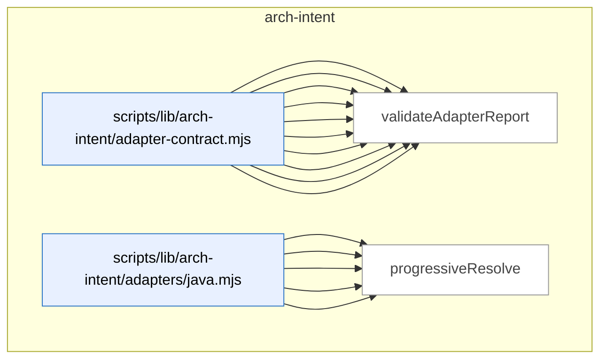

_Domain has 53 symbols (>50). Diagram shows top-15 by file order; see flat table below for the full list._

### Symbols in this domain

| Symbol | Kind | Path | Lines | Purpose | File imported by |
|---|---|---|---|---|---|
| [`computeDeadIntent`](../scripts/lib/arch-intent/adapter-contract.mjs#L191) | function | `scripts/lib/arch-intent/adapter-contract.mjs` | 191-199 | Identifies architectural domains declared but without live files. | `scripts/arch-intent-bootstrap.mjs`, `scripts/lib/audit/legacy-production-audit.mjs`, `scripts/openai-audit.mjs`, +2 more |
| [`deriveArchState`](../scripts/lib/arch-intent/adapter-contract.mjs#L363) | function | `scripts/lib/arch-intent/adapter-contract.mjs` | 363-374 | Classifies the overall analysis state based on error and adapter-status counts. | `scripts/arch-intent-bootstrap.mjs`, `scripts/lib/audit/legacy-production-audit.mjs`, `scripts/openai-audit.mjs`, +2 more |
| [`fsWalkFallback`](../scripts/lib/arch-intent/adapter-contract.mjs#L68) | function | `scripts/lib/arch-intent/adapter-contract.mjs` | 68-88 | Recursively walks a directory tree to list files, excluding certain directories. | `scripts/arch-intent-bootstrap.mjs`, `scripts/lib/audit/legacy-production-audit.mjs`, `scripts/openai-audit.mjs`, +2 more |
| [`inventoryAllPaths`](../scripts/lib/arch-intent/adapter-contract.mjs#L169) | function | `scripts/lib/arch-intent/adapter-contract.mjs` | 169-176 | Maps all repo paths to their assigned architectural domains. | `scripts/arch-intent-bootstrap.mjs`, `scripts/lib/audit/legacy-production-audit.mjs`, `scripts/openai-audit.mjs`, +2 more |
| [`inventoryFiles`](../scripts/lib/arch-intent/adapter-contract.mjs#L133) | function | `scripts/lib/arch-intent/adapter-contract.mjs` | 133-151 | Inventories source files and assigns them to architectural domains. | `scripts/arch-intent-bootstrap.mjs`, `scripts/lib/audit/legacy-production-audit.mjs`, `scripts/openai-audit.mjs`, +2 more |
| [`isArchIntentReportClean`](../scripts/lib/arch-intent/adapter-contract.mjs#L349) | function | `scripts/lib/arch-intent/adapter-contract.mjs` | 349-354 | Checks if a report has no violations, unmapped files, dead intent, or errors. | `scripts/arch-intent-bootstrap.mjs`, `scripts/lib/audit/legacy-production-audit.mjs`, `scripts/openai-audit.mjs`, +2 more |
| [`listRepoPaths`](../scripts/lib/arch-intent/adapter-contract.mjs#L103) | function | `scripts/lib/arch-intent/adapter-contract.mjs` | 103-118 | Lists git-tracked and untracked files from a repo, falling back to filesystem walk. | `scripts/arch-intent-bootstrap.mjs`, `scripts/lib/audit/legacy-production-audit.mjs`, `scripts/openai-audit.mjs`, +2 more |
| [`loadAdapter`](../scripts/lib/arch-intent/adapter-contract.mjs#L214) | function | `scripts/lib/arch-intent/adapter-contract.mjs` | 214-232 | Dynamically loads an adapter module for a given stack kind. | `scripts/arch-intent-bootstrap.mjs`, `scripts/lib/audit/legacy-production-audit.mjs`, `scripts/openai-audit.mjs`, +2 more |
| [`runArchIntentAnalysis`](../scripts/lib/arch-intent/adapter-contract.mjs#L263) | function | `scripts/lib/arch-intent/adapter-contract.mjs` | 263-331 | Orchestrates architectural-intent analysis across multiple stack adapters. | `scripts/arch-intent-bootstrap.mjs`, `scripts/lib/audit/legacy-production-audit.mjs`, `scripts/openai-audit.mjs`, +2 more |
| [`validateAdapterReport`](../scripts/lib/arch-intent/adapter-contract.mjs#L241) | function | `scripts/lib/arch-intent/adapter-contract.mjs` | 241-252 | Validates an adapter's report against the expected schema. | `scripts/arch-intent-bootstrap.mjs`, `scripts/lib/audit/legacy-production-audit.mjs`, `scripts/openai-audit.mjs`, +2 more |
| [`analyseImports`](../scripts/lib/arch-intent/adapters/java.mjs#L325) | function | `scripts/lib/arch-intent/adapters/java.mjs` | 325-444 | Analyzes all Java imports in mapped files, returning violations and metadata. | `tests/arch-intent-adapter-java.test.mjs` |
| [`buildJavaResolutionIndex`](../scripts/lib/arch-intent/adapters/java.mjs#L176) | function | `scripts/lib/arch-intent/adapters/java.mjs` | 176-233 | Builds FQN-to-file and package-to-file lookup maps for Java resolution. | `tests/arch-intent-adapter-java.test.mjs` |
| [`extractImports`](../scripts/lib/arch-intent/adapters/java.mjs#L132) | function | `scripts/lib/arch-intent/adapters/java.mjs` | 132-164 | Parses all import statements from Java source with classification and line numbers. | `tests/arch-intent-adapter-java.test.mjs` |
| [`extractPackage`](../scripts/lib/arch-intent/adapters/java.mjs#L115) | function | `scripts/lib/arch-intent/adapters/java.mjs` | 115-118 | Extracts the package declaration from Java source. | `tests/arch-intent-adapter-java.test.mjs` |
| [`progressiveResolve`](../scripts/lib/arch-intent/adapters/java.mjs#L246) | function | `scripts/lib/arch-intent/adapters/java.mjs` | 246-265 | Resolves a Java FQN by progressively dropping package segments. | `tests/arch-intent-adapter-java.test.mjs` |
| [`resolveJavaImport`](../scripts/lib/arch-intent/adapters/java.mjs#L275) | function | `scripts/lib/arch-intent/adapters/java.mjs` | 275-314 | Resolves a single import reference to target files. | `tests/arch-intent-adapter-java.test.mjs` |
| [`stripJavaCommentsAndLiterals`](../scripts/lib/arch-intent/adapters/java.mjs#L44) | function | `scripts/lib/arch-intent/adapters/java.mjs` | 44-106 | Removes comments, strings, and text blocks from Java source. | `tests/arch-intent-adapter-java.test.mjs` |
| [`analyseImports`](../scripts/lib/arch-intent/adapters/js-ts.mjs#L74) | function | `scripts/lib/arch-intent/adapters/js-ts.mjs` | 74-214 | Runs dependency-cruiser on JS/TS files, returning violations and import graph metadata. | _(internal)_ |
| [`classifyEdge`](../scripts/lib/arch-intent/adapters/js-ts.mjs#L33) | function | `scripts/lib/arch-intent/adapters/js-ts.mjs` | 33-49 | Classifies a dependency as local, vendor, type-only, or unresolved. | _(internal)_ |
| [`normalisePath`](../scripts/lib/arch-intent/adapters/js-ts.mjs#L58) | function | `scripts/lib/arch-intent/adapters/js-ts.mjs` | 58-63 | Converts absolute or relative paths to repo-relative form with forward slashes. | _(internal)_ |
| [`analyseImports`](../scripts/lib/arch-intent/adapters/postgres.mjs#L605) | function | `scripts/lib/arch-intent/adapters/postgres.mjs` | 605-698 | Parses SQL files in isolation, builds a catalog, resolves dependencies, and collects edge violations. | `tests/arch-intent-adapter-postgres.test.mjs` |
| [`buildSqlCatalog`](../scripts/lib/arch-intent/adapters/postgres.mjs#L499) | function | `scripts/lib/arch-intent/adapters/postgres.mjs` | 499-560 | Builds an indexed catalog of SQL objects (relations, functions, types) tracking redefinitions and epochs. | `tests/arch-intent-adapter-postgres.test.mjs` |
| [`classifyStatement`](../scripts/lib/arch-intent/adapters/postgres.mjs#L295) | function | `scripts/lib/arch-intent/adapters/postgres.mjs` | 295-427 | Identifies SQL statement type and extracts object and reference information. | `tests/arch-intent-adapter-postgres.test.mjs` |
| [`displayName`](../scripts/lib/arch-intent/adapters/postgres.mjs#L234) | function | `scripts/lib/arch-intent/adapters/postgres.mjs` | 234-236 | Reverses escaping in a normalized SQL name for human-readable display. | `tests/arch-intent-adapter-postgres.test.mjs` |
| [`extractCallRefs`](../scripts/lib/arch-intent/adapters/postgres.mjs#L460) | function | `scripts/lib/arch-intent/adapters/postgres.mjs` | 460-471 | Finds function call references in SQL text. | `tests/arch-intent-adapter-postgres.test.mjs` |
| [`extractPolicyTableRefs`](../scripts/lib/arch-intent/adapters/postgres.mjs#L474) | function | `scripts/lib/arch-intent/adapters/postgres.mjs` | 474-483 | Finds table references in a row-level security policy expression. | `tests/arch-intent-adapter-postgres.test.mjs` |
| [`extractSelectRefs`](../scripts/lib/arch-intent/adapters/postgres.mjs#L440) | function | `scripts/lib/arch-intent/adapters/postgres.mjs` | 440-457 | Finds table references in a SELECT statement, excluding CTEs. | `tests/arch-intent-adapter-postgres.test.mjs` |
| [`naturalCompare`](../scripts/lib/arch-intent/adapters/postgres.mjs#L488) | function | `scripts/lib/arch-intent/adapters/postgres.mjs` | 488-490 | Sorts strings with numeric-aware collation. | `tests/arch-intent-adapter-postgres.test.mjs` |
| [`normName`](../scripts/lib/arch-intent/adapters/postgres.mjs#L197) | function | `scripts/lib/arch-intent/adapters/postgres.mjs` | 197-228 | Normalizes a SQL name for canonical comparison, handling quotes and case. | `tests/arch-intent-adapter-postgres.test.mjs` |
| [`parseFile`](../scripts/lib/arch-intent/adapters/postgres.mjs#L262) | function | `scripts/lib/arch-intent/adapters/postgres.mjs` | 262-293 | Parses a SQL file into statements and classifies them as CREATE/ALTER/DROP. | `tests/arch-intent-adapter-postgres.test.mjs` |
| [`recoverFunctionBody`](../scripts/lib/arch-intent/adapters/postgres.mjs#L430) | function | `scripts/lib/arch-intent/adapters/postgres.mjs` | 430-437 | Extracts the function body text from a CREATE FUNCTION statement. | `tests/arch-intent-adapter-postgres.test.mjs` |
| [`resolveSqlRef`](../scripts/lib/arch-intent/adapters/postgres.mjs#L571) | function | `scripts/lib/arch-intent/adapters/postgres.mjs` | 571-594 | Resolves SQL object references to their defining files or marks them as builtins. | `tests/arch-intent-adapter-postgres.test.mjs` |
| [`splitTopLevel`](../scripts/lib/arch-intent/adapters/postgres.mjs#L239) | function | `scripts/lib/arch-intent/adapters/postgres.mjs` | 239-250 | Splits a string on a separator only at parenthesis depth 0. | `tests/arch-intent-adapter-postgres.test.mjs` |
| [`stripSqlCommentsAndStrings`](../scripts/lib/arch-intent/adapters/postgres.mjs#L102) | function | `scripts/lib/arch-intent/adapters/postgres.mjs` | 102-187 | Removes comments and strings from SQL source while preserving line structure. | `tests/arch-intent-adapter-postgres.test.mjs` |
| [`analyseImports`](../scripts/lib/arch-intent/adapters/python.mjs#L507) | function | `scripts/lib/arch-intent/adapters/python.mjs` | 507-586 | Analyzes Python file imports and dependencies, collecting edges and unresolved references. | `tests/arch-intent-adapter-python.test.mjs` |
| [`buildPythonModuleIndex`](../scripts/lib/arch-intent/adapters/python.mjs#L383) | function | `scripts/lib/arch-intent/adapters/python.mjs` | 383-426 | Maps Python dotted module names to file paths with collision detection. | `tests/arch-intent-adapter-python.test.mjs` |
| [`countUnbalanced`](../scripts/lib/arch-intent/adapters/python.mjs#L254) | function | `scripts/lib/arch-intent/adapters/python.mjs` | 254-261 | Counts unmatched opening/closing parentheses in a string. | `tests/arch-intent-adapter-python.test.mjs` |
| [`discoverPythonRoots`](../scripts/lib/arch-intent/adapters/python.mjs#L287) | function | `scripts/lib/arch-intent/adapters/python.mjs` | 287-350 | Discovers Python package roots by scanning metadata files, src/ directories, and `__init__.py` hierarchy. | `tests/arch-intent-adapter-python.test.mjs` |
| [`extractImports`](../scripts/lib/arch-intent/adapters/python.mjs#L196) | function | `scripts/lib/arch-intent/adapters/python.mjs` | 196-251 | Extracts Python import statements from source, handling continuations and f-string braces. | `tests/arch-intent-adapter-python.test.mjs` |
| [`extractPackageDirs`](../scripts/lib/arch-intent/adapters/python.mjs#L353) | function | `scripts/lib/arch-intent/adapters/python.mjs` | 353-364 | Extracts package directory declarations from setup.cfg/pyproject.toml. | `tests/arch-intent-adapter-python.test.mjs` |
| [`isPySource`](../scripts/lib/arch-intent/adapters/python.mjs#L366) | function | `scripts/lib/arch-intent/adapters/python.mjs` | 366-369 | Checks if a file path is a Python source file (.py or .pyi). | `tests/arch-intent-adapter-python.test.mjs` |
| [`parseImportedNames`](../scripts/lib/arch-intent/adapters/python.mjs#L264) | function | `scripts/lib/arch-intent/adapters/python.mjs` | 264-271 | Parses the names clause of a Python `from … import` statement. | `tests/arch-intent-adapter-python.test.mjs` |
| [`resolvePythonImport`](../scripts/lib/arch-intent/adapters/python.mjs#L439) | function | `scripts/lib/arch-intent/adapters/python.mjs` | 439-496 | Resolves a Python import statement to its target file, handling absolute and relative imports. | `tests/arch-intent-adapter-python.test.mjs` |
| [`stripPythonCommentsAndStrings`](../scripts/lib/arch-intent/adapters/python.mjs#L72) | function | `scripts/lib/arch-intent/adapters/python.mjs` | 72-178 | Strips Python comments and string literals while preserving line structure for parsing. | `tests/arch-intent-adapter-python.test.mjs` |
| [`checkDepAllowed`](../scripts/lib/arch-intent/domain-resolver.mjs#L53) | function | `scripts/lib/arch-intent/domain-resolver.mjs` | 53-60 | Checks if a dependency between domains is permitted by architecture rules. | `scripts/arch-intent-bootstrap.mjs`, `scripts/lib/arch-intent/adapter-contract.mjs`, `scripts/lib/arch-intent/adapters/java.mjs`, +5 more |
| [`computeDeclaredDomains`](../scripts/lib/arch-intent/domain-resolver.mjs#L76) | function | `scripts/lib/arch-intent/domain-resolver.mjs` | 76-86 | Collects all domains mentioned in architecture rules, dependencies, and descriptions. | `scripts/arch-intent-bootstrap.mjs`, `scripts/lib/arch-intent/adapter-contract.mjs`, `scripts/lib/arch-intent/adapters/java.mjs`, +5 more |
| [`resolveFileToDomain`](../scripts/lib/arch-intent/domain-resolver.mjs#L29) | function | `scripts/lib/arch-intent/domain-resolver.mjs` | 29-38 | Maps a file path to its architectural domain using glob pattern matching. | `scripts/arch-intent-bootstrap.mjs`, `scripts/lib/arch-intent/adapter-contract.mjs`, `scripts/lib/arch-intent/adapters/java.mjs`, +5 more |
| [`ArchIntentAnalyzerError`](../scripts/lib/arch-intent/errors.mjs#L18) | class | `scripts/lib/arch-intent/errors.mjs` | 18-25 | Error class for architecture analysis runtime failures. | `scripts/lib/arch-intent/adapter-contract.mjs`, `scripts/lib/arch-intent/load-config.mjs`, `scripts/lib/arch-intent/semantic-validator.mjs`, +3 more |
| [`ArchIntentConfigError`](../scripts/lib/arch-intent/errors.mjs#L9) | class | `scripts/lib/arch-intent/errors.mjs` | 9-16 | Error class for architecture configuration shape or semantic validation failures. | `scripts/lib/arch-intent/adapter-contract.mjs`, `scripts/lib/arch-intent/load-config.mjs`, `scripts/lib/arch-intent/semantic-validator.mjs`, +3 more |
| [`parseIntentDoc`](../scripts/lib/arch-intent/intent-doc-parser.mjs#L27) | function | `scripts/lib/arch-intent/intent-doc-parser.mjs` | 27-78 | Extracts the first Mermaid diagram and section narratives from intent markdown. | `scripts/lib/audit/legacy-production-audit.mjs`, `scripts/openai-audit.mjs`, `tests/arch-intent-doc-parser.test.mjs` |
| [`loadArchIntentConfig`](../scripts/lib/arch-intent/load-config.mjs#L35) | function | `scripts/lib/arch-intent/load-config.mjs` | 35-69 | Loads and Zod-validates domain-map.json, then applies semantic checks. | `scripts/arch-intent-bootstrap.mjs`, `scripts/lib/audit/legacy-production-audit.mjs`, `scripts/openai-audit.mjs`, +1 more |
| [`rulesDeclaredDomains`](../scripts/lib/arch-intent/semantic-validator.mjs#L30) | function | `scripts/lib/arch-intent/semantic-validator.mjs` | 30-34 | Returns the set of domains declared in architecture rules. | `scripts/lib/arch-intent/load-config.mjs` |
| [`validateDomainMapSemantics`](../scripts/lib/arch-intent/semantic-validator.mjs#L42) | function | `scripts/lib/arch-intent/semantic-validator.mjs` | 42-97 | Validates that allowed-deps keys/values and descriptions reference declared domains. | `scripts/lib/arch-intent/load-config.mjs` |

---

## arch-memory

> Indexes code symbols with embeddings (cached locally) and provides intent-based queries to surface similar existing code and security incidents, preventing duplicate implementations and architectural drift.

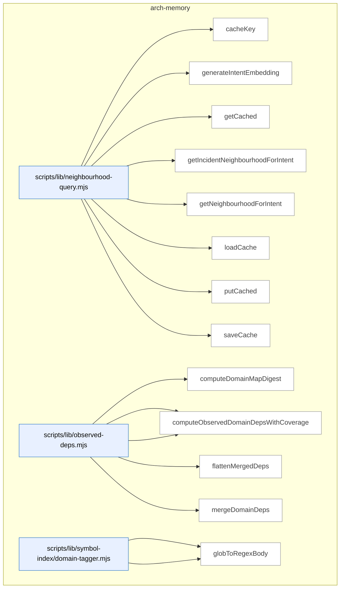

_Domain has 81 symbols (>50). Diagram shows top-15 by file order; see flat table below for the full list._

### Symbols in this domain

| Symbol | Kind | Path | Lines | Purpose | File imported by |
|---|---|---|---|---|---|
| [`cacheKey`](../scripts/lib/neighbourhood-query.mjs#L31) | function | `scripts/lib/neighbourhood-query.mjs` | 31-37 | Derives a cache key from intent description, model, and dimension using SHA256. | `scripts/cross-skill.mjs`, `scripts/lib/audit/duplication-detector.mjs`, `tests/incident-neighbourhood.test.mjs`, +1 more |
| [`generateIntentEmbedding`](../scripts/lib/neighbourhood-query.mjs#L83) | function | `scripts/lib/neighbourhood-query.mjs` | 83-132 | Embeds an intent description with provider/space/endpoint guards ensuring consistency with the index's vector space. | `scripts/cross-skill.mjs`, `scripts/lib/audit/duplication-detector.mjs`, `tests/incident-neighbourhood.test.mjs`, +1 more |
| [`getCached`](../scripts/lib/neighbourhood-query.mjs#L56) | function | `scripts/lib/neighbourhood-query.mjs` | 56-62 | Retrieves a cached embedding if present and not expired. | `scripts/cross-skill.mjs`, `scripts/lib/audit/duplication-detector.mjs`, `tests/incident-neighbourhood.test.mjs`, +1 more |
| [`getIncidentNeighbourhoodForIntent`](../scripts/lib/neighbourhood-query.mjs#L331) | function | `scripts/lib/neighbourhood-query.mjs` | 331-481 | Queries security-incident memory using incident classifiers, returning relevant records sorted by relevance. | `scripts/cross-skill.mjs`, `scripts/lib/audit/duplication-detector.mjs`, `tests/incident-neighbourhood.test.mjs`, +1 more |
| [`getNeighbourhoodForIntent`](../scripts/lib/neighbourhood-query.mjs#L145) | function | `scripts/lib/neighbourhood-query.mjs` | 145-303 | Queries the architectural-memory index to find similar symbols based on intent, with cloud fallback. | `scripts/cross-skill.mjs`, `scripts/lib/audit/duplication-detector.mjs`, `tests/incident-neighbourhood.test.mjs`, +1 more |
| [`loadCache`](../scripts/lib/neighbourhood-query.mjs#L39) | function | `scripts/lib/neighbourhood-query.mjs` | 39-47 | Reads the neighbourhood-query cache from disk, returning empty if missing. | `scripts/cross-skill.mjs`, `scripts/lib/audit/duplication-detector.mjs`, `tests/incident-neighbourhood.test.mjs`, +1 more |
| [`putCached`](../scripts/lib/neighbourhood-query.mjs#L64) | function | `scripts/lib/neighbourhood-query.mjs` | 64-68 | Caches an embedding with a timestamp for TTL tracking. | `scripts/cross-skill.mjs`, `scripts/lib/audit/duplication-detector.mjs`, `tests/incident-neighbourhood.test.mjs`, +1 more |
| [`saveCache`](../scripts/lib/neighbourhood-query.mjs#L49) | function | `scripts/lib/neighbourhood-query.mjs` | 49-54 | Writes the neighbourhood-query cache to disk atomically. | `scripts/cross-skill.mjs`, `scripts/lib/audit/duplication-detector.mjs`, `tests/incident-neighbourhood.test.mjs`, +1 more |
| [`computeDomainMapDigest`](../scripts/lib/observed-deps.mjs#L97) | function | `scripts/lib/observed-deps.mjs` | 97-104 | Computes a SHA256 digest of domain-map rules (pattern+domain pairs). | `scripts/lib/dashboard/collect-reference.mjs`, `scripts/symbol-index/render-mermaid.mjs`, `tests/observed-deps-coverage.test.mjs`, +1 more |
| [`computeObservedDomainDeps`](../scripts/lib/observed-deps.mjs#L118) | function | `scripts/lib/observed-deps.mjs` | 118-120 | Computes observed inter-domain dependencies from edges using domain-map rules. | `scripts/lib/dashboard/collect-reference.mjs`, `scripts/symbol-index/render-mermaid.mjs`, `tests/observed-deps-coverage.test.mjs`, +1 more |
| [`computeObservedDomainDepsWithCoverage`](../scripts/lib/observed-deps.mjs#L140) | function | `scripts/lib/observed-deps.mjs` | 140-187 | Computes observed domain dependencies with coverage metrics, categorizing edges by tagging status and sampling untagged paths. | `scripts/lib/dashboard/collect-reference.mjs`, `scripts/symbol-index/render-mermaid.mjs`, `tests/observed-deps-coverage.test.mjs`, +1 more |
| [`flattenMergedDeps`](../scripts/lib/observed-deps.mjs#L250) | function | `scripts/lib/observed-deps.mjs` | 250-259 | Extracts sorted target dependency names from merged dependencies, removing source metadata. | `scripts/lib/dashboard/collect-reference.mjs`, `scripts/symbol-index/render-mermaid.mjs`, `tests/observed-deps-coverage.test.mjs`, +1 more |
| [`mergeDomainDeps`](../scripts/lib/observed-deps.mjs#L207) | function | `scripts/lib/observed-deps.mjs` | 207-241 | Merges observed and manual domain dependencies into a unified result with source attribution, filtering dangerous keys. | `scripts/lib/dashboard/collect-reference.mjs`, `scripts/symbol-index/render-mermaid.mjs`, `tests/observed-deps-coverage.test.mjs`, +1 more |
| [`computeTargetDomains`](../scripts/lib/symbol-index/domain-tagger.mjs#L151) | function | `scripts/lib/symbol-index/domain-tagger.mjs` | 151-166 | Tags file paths with domains and reports which are untagged and whether they span multiple domains. | `scripts/cross-skill.mjs`, `scripts/lib/audit/legacy-production-audit.mjs`, `scripts/lib/dashboard/collect-purposes.mjs`, +7 more |
| [`globToRegexBody`](../scripts/lib/symbol-index/domain-tagger.mjs#L52) | function | `scripts/lib/symbol-index/domain-tagger.mjs` | 52-81 | Converts a glob pattern with * and ** wildcards into an anchored regex body. | `scripts/cross-skill.mjs`, `scripts/lib/audit/legacy-production-audit.mjs`, `scripts/lib/dashboard/collect-purposes.mjs`, +7 more |
| [`loadCoverageConfig`](../scripts/lib/symbol-index/domain-tagger.mjs#L201) | function | `scripts/lib/symbol-index/domain-tagger.mjs` | 201-212 | Reads and parses coverage configuration from domain-map.json, with defaults on error. | `scripts/cross-skill.mjs`, `scripts/lib/audit/legacy-production-audit.mjs`, `scripts/lib/dashboard/collect-purposes.mjs`, +7 more |
| [`loadDomainRules`](../scripts/lib/symbol-index/domain-tagger.mjs#L214) | function | `scripts/lib/symbol-index/domain-tagger.mjs` | 214-241 | Reads and validates domain rules from domain-map.json, skipping malformed entries. | `scripts/cross-skill.mjs`, `scripts/lib/audit/legacy-production-audit.mjs`, `scripts/lib/dashboard/collect-purposes.mjs`, +7 more |
| [`makeFastTagger`](../scripts/lib/symbol-index/domain-tagger.mjs#L112) | function | `scripts/lib/symbol-index/domain-tagger.mjs` | 112-133 | Pre-compiles domain rules into regexes and returns a fast closure for tagging paths. | `scripts/cross-skill.mjs`, `scripts/lib/audit/legacy-production-audit.mjs`, `scripts/lib/dashboard/collect-purposes.mjs`, +7 more |
| [`matchGlob`](../scripts/lib/symbol-index/domain-tagger.mjs#L39) | function | `scripts/lib/symbol-index/domain-tagger.mjs` | 39-50 | Tests whether a file path matches a glob pattern using regex anchoring. | `scripts/cross-skill.mjs`, `scripts/lib/audit/legacy-production-audit.mjs`, `scripts/lib/dashboard/collect-purposes.mjs`, +7 more |
| [`tagDomain`](../scripts/lib/symbol-index/domain-tagger.mjs#L90) | function | `scripts/lib/symbol-index/domain-tagger.mjs` | 90-97 | Finds the domain (e.g., "core", "audit") for a file path by matching against domain rules. | `scripts/cross-skill.mjs`, `scripts/lib/audit/legacy-production-audit.mjs`, `scripts/lib/dashboard/collect-purposes.mjs`, +7 more |
| [`assertAttributionExhaustive`](../scripts/lib/symbol-index/graph-coverage.mjs#L247) | function | `scripts/lib/symbol-index/graph-coverage.mjs` | 247-251 | Verifies that candidate-edge count matches persisted-edge count for consistency. | `scripts/symbol-index/extract.mjs`, `scripts/symbol-index/refresh.mjs`, `tests/graph-coverage.test.mjs`, +1 more |
| [`assertExtractionExhaustive`](../scripts/lib/symbol-index/graph-coverage.mjs#L230) | function | `scripts/lib/symbol-index/graph-coverage.mjs` | 230-238 | Verifies that extraction edge-bucket sums match the expected total cruised count. | `scripts/symbol-index/extract.mjs`, `scripts/symbol-index/refresh.mjs`, `tests/graph-coverage.test.mjs`, +1 more |
| [`assessAttributionCoverage`](../scripts/lib/symbol-index/graph-coverage.mjs#L186) | function | `scripts/lib/symbol-index/graph-coverage.mjs` | 186-214 | Computes what fraction of cruisable edges were successfully attributed to domain-map rules. | `scripts/symbol-index/extract.mjs`, `scripts/symbol-index/refresh.mjs`, `tests/graph-coverage.test.mjs`, +1 more |
| [`assessExtractionCoverage`](../scripts/lib/symbol-index/graph-coverage.mjs#L123) | function | `scripts/lib/symbol-index/graph-coverage.mjs` | 123-154 | Compares cruised modules against eligible sources to compute extraction coverage ratio. | `scripts/symbol-index/extract.mjs`, `scripts/symbol-index/refresh.mjs`, `tests/graph-coverage.test.mjs`, +1 more |
| [`clampCap`](../scripts/lib/symbol-index/graph-coverage.mjs#L168) | function | `scripts/lib/symbol-index/graph-coverage.mjs` | 168-171 | Clamps a sample cap to [0, 100], defaulting to 20 if not finite. | `scripts/symbol-index/extract.mjs`, `scripts/symbol-index/refresh.mjs`, `tests/graph-coverage.test.mjs`, +1 more |
| [`eligibleFiles`](../scripts/lib/symbol-index/graph-coverage.mjs#L91) | function | `scripts/lib/symbol-index/graph-coverage.mjs` | 91-104 | Filters files to include only cruisable source files within the repo. | `scripts/symbol-index/extract.mjs`, `scripts/symbol-index/refresh.mjs`, `tests/graph-coverage.test.mjs`, +1 more |
| [`normalizeEdgeBuckets`](../scripts/lib/symbol-index/graph-coverage.mjs#L157) | function | `scripts/lib/symbol-index/graph-coverage.mjs` | 157-166 | Sanitizes edge-count buckets to ensure non-negative integer values. | `scripts/symbol-index/extract.mjs`, `scripts/symbol-index/refresh.mjs`, `tests/graph-coverage.test.mjs`, +1 more |
| [`normalizeRepoPath`](../scripts/lib/symbol-index/graph-coverage.mjs#L60) | function | `scripts/lib/symbol-index/graph-coverage.mjs` | 60-68 | Converts a file path to a normalized repo-relative form, lowercased on Windows. | `scripts/symbol-index/extract.mjs`, `scripts/symbol-index/refresh.mjs`, `tests/graph-coverage.test.mjs`, +1 more |
| [`coverageGateExitCode`](../scripts/lib/symbol-index/graph-verdict.mjs#L189) | function | `scripts/lib/symbol-index/graph-verdict.mjs` | 189-194 | Returns exit code 2 if coverage is degraded/unverified and enforcement enabled, else 0. | `scripts/lib/symbol-index/domain-tagger.mjs`, `scripts/symbol-index/extract.mjs`, `scripts/symbol-index/refresh.mjs`, +1 more |
| [`graphVerdict`](../scripts/lib/symbol-index/graph-verdict.mjs#L130) | function | `scripts/lib/symbol-index/graph-verdict.mjs` | 130-177 | Determines coverage status (verified/degraded/unknown/unverified) based on extraction, attribution, and staleness. | `scripts/lib/symbol-index/domain-tagger.mjs`, `scripts/symbol-index/extract.mjs`, `scripts/symbol-index/refresh.mjs`, +1 more |
| [`parseCoverageConfig`](../scripts/lib/symbol-index/graph-verdict.mjs#L59) | function | `scripts/lib/symbol-index/graph-verdict.mjs` | 59-114 | Parses and validates coverage ratios/timeouts from domain-map.json with fallback defaults. | `scripts/lib/symbol-index/domain-tagger.mjs`, `scripts/symbol-index/extract.mjs`, `scripts/symbol-index/refresh.mjs`, +1 more |
| [`findStalePragmas`](../scripts/lib/symbol-index/stale-pragma-sweep.mjs#L51) | function | `scripts/lib/symbol-index/stale-pragma-sweep.mjs` | 51-59 | Identifies @duplicate-justification pragmas whose target files no longer exist. | `scripts/symbol-index/drift.mjs`, `tests/drift-stale-pragma.test.mjs` |
| [`renderStalePragmaSection`](../scripts/lib/symbol-index/stale-pragma-sweep.mjs#L62) | function | `scripts/lib/symbol-index/stale-pragma-sweep.mjs` | 62-69 | Formats a markdown section documenting stale suppression pragmas for audit reporting. | `scripts/symbol-index/drift.mjs`, `tests/drift-stale-pragma.test.mjs` |
| [`isThinDelegate`](../scripts/lib/symbol-index/thin-delegate.mjs#L50) | function | `scripts/lib/symbol-index/thin-delegate.mjs` | 50-85 | Heuristically detects whether a function/variable is a thin delegator (pass-through, re-export, wrapper). | `scripts/symbol-index/extract.mjs`, `tests/thin-delegate.test.mjs` |
| [`atomicWrite`](../scripts/symbol-index/drift.mjs#L44) | function | `scripts/symbol-index/drift.mjs` | 44-46 | Writes content to a file atomically. | `tests/symbol-index-drift.test.mjs` |
| [`classify`](../scripts/symbol-index/drift.mjs#L48) | function | `scripts/symbol-index/drift.mjs` | 48-52 | Categorizes a drift score as GREEN/AMBER/RED based on thresholds. | `tests/symbol-index-drift.test.mjs` |
| [`main`](../scripts/symbol-index/drift.mjs#L73) | function | `scripts/symbol-index/drift.mjs` | 73-184 | Computes and reports drift score for a snapshot, warning if above threshold. | `tests/symbol-index-drift.test.mjs` |
| [`parseArgs`](../scripts/symbol-index/drift.mjs#L35) | function | `scripts/symbol-index/drift.mjs` | 35-42 | Parses CLI arguments for --out and --json flags. | `tests/symbol-index-drift.test.mjs` |
| [`renderMarkdownViaShared`](../scripts/symbol-index/drift.mjs#L58) | function | `scripts/symbol-index/drift.mjs` | 58-71 | Formats drift data into markdown for a GitHub issue. | `tests/symbol-index-drift.test.mjs` |
| [`main`](../scripts/symbol-index/duplicates.mjs#L65) | function | `scripts/symbol-index/duplicates.mjs` | 65-101 | Fetches and displays the top cross-file duplicate symbol clusters. | _(internal)_ |
| [`parseArgs`](../scripts/symbol-index/duplicates.mjs#L31) | function | `scripts/symbol-index/duplicates.mjs` | 31-46 | Parses CLI arguments for --limit and --json with validation. | _(internal)_ |
| [`renderText`](../scripts/symbol-index/duplicates.mjs#L48) | function | `scripts/symbol-index/duplicates.mjs` | 48-63 | Formats duplicate symbol clusters into a human-readable text report. | _(internal)_ |
| [`embedBatch`](../scripts/symbol-index/embed.mjs#L26) | function | `scripts/symbol-index/embed.mjs` | 26-69 | Embeds a batch of text strings using Gemini or Azure with rate-limit retry logic. | _(internal)_ |
| [`logProgress`](../scripts/symbol-index/embed.mjs#L19) | function | `scripts/symbol-index/embed.mjs` | 19-19 | Writes a progress message to stderr with a consistent prefix. | _(internal)_ |
| [`main`](../scripts/symbol-index/embed.mjs#L71) | function | `scripts/symbol-index/embed.mjs` | 71-121 | Reads symbol records from stdin, embeds text symbols, and outputs vectorized records. | _(internal)_ |
| [`emitCoverage`](../scripts/symbol-index/extract.mjs#L438) | function | `scripts/symbol-index/extract.mjs` | 438-440 | Emits a coverage summary record for the symbol extraction. | `scripts/spikes/observed-graph-discovery-spike.mjs`, `tests/import-edge-filter.test.mjs` |
| [`emitProgress`](../scripts/symbol-index/extract.mjs#L68) | function | `scripts/symbol-index/extract.mjs` | 68-70 | Writes an extraction progress message to stderr. | `scripts/spikes/observed-graph-discovery-spike.mjs`, `tests/import-edge-filter.test.mjs` |
| [`enumerateFiles`](../scripts/symbol-index/extract.mjs#L507) | function | `scripts/symbol-index/extract.mjs` | 507-525 | Returns list of source files from repo, either from a specified list or by walking the directory tree. | `scripts/spikes/observed-graph-discovery-spike.mjs`, `tests/import-edge-filter.test.mjs` |
| [`extractGraphAndViolations`](../scripts/symbol-index/extract.mjs#L285) | function | `scripts/symbol-index/extract.mjs` | 285-426 | Runs dependency-cruiser to build an import graph and measure coverage against extracted symbols. | `scripts/spikes/observed-graph-discovery-spike.mjs`, `tests/import-edge-filter.test.mjs` |
| [`extractSymbols`](../scripts/symbol-index/extract.mjs#L80) | function | `scripts/symbol-index/extract.mjs` | 80-263 | Uses ts-morph to parse source files and extract all symbols (functions, classes, types, etc.) with metadata. | `scripts/spikes/observed-graph-discovery-spike.mjs`, `tests/import-edge-filter.test.mjs` |
| [`isInternalEdge`](../scripts/symbol-index/extract.mjs#L454) | function | `scripts/symbol-index/extract.mjs` | 454-470 | Determines if a dependency is internal to the repo (not from npm, node_modules, or Node core). | `scripts/spikes/observed-graph-discovery-spike.mjs`, `tests/import-edge-filter.test.mjs` |
| [`main`](../scripts/symbol-index/extract.mjs#L527) | function | `scripts/symbol-index/extract.mjs` | 527-573 | Extracts symbols from source files, measures architectural coverage, and stores results in cloud. | `scripts/spikes/observed-graph-discovery-spike.mjs`, `tests/import-edge-filter.test.mjs` |
| [`parseArgs`](../scripts/symbol-index/extract.mjs#L46) | function | `scripts/symbol-index/extract.mjs` | 46-65 | Parses CLI arguments including --root, --files, --files-from, --mode, --since-commit, --include-delegates. | `scripts/spikes/observed-graph-discovery-spike.mjs`, `tests/import-edge-filter.test.mjs` |
| [`main`](../scripts/symbol-index/prune.mjs#L44) | function | `scripts/symbol-index/prune.mjs` | 44-94 | Deletes old refresh runs and rollback checkpoints from the cloud store based on retention policies. | _(internal)_ |
| [`parseArgs`](../scripts/symbol-index/prune.mjs#L31) | function | `scripts/symbol-index/prune.mjs` | 31-37 | Parses command-line arguments to extract the --dry-run flag. | _(internal)_ |
| [`logErr`](../scripts/symbol-index/refresh.mjs#L106) | function | `scripts/symbol-index/refresh.mjs` | 106-106 | Writes error message to stderr with [refresh] prefix. | `tests/refresh-provenance-promotion.test.mjs` |
| [`logOk`](../scripts/symbol-index/refresh.mjs#L107) | function | `scripts/symbol-index/refresh.mjs` | 107-107 | Writes success message to stderr with [refresh] prefix. | `tests/refresh-provenance-promotion.test.mjs` |
| [`main`](../scripts/symbol-index/refresh.mjs#L144) | function | `scripts/symbol-index/refresh.mjs` | 144-643 | Orchestrates symbol extraction, embedding, domain tagging, and cloud storage of the codebase index. | `tests/refresh-provenance-promotion.test.mjs` |
| [`parseArgs`](../scripts/symbol-index/refresh.mjs#L94) | function | `scripts/symbol-index/refresh.mjs` | 94-104 | Parses CLI flags for --full, --since-commit, --force, and --include-delegates options. | `tests/refresh-provenance-promotion.test.mjs` |
| [`provenanceRequiresFullReembed`](../scripts/symbol-index/refresh.mjs#L90) | function | `scripts/symbol-index/refresh.mjs` | 90-92 | Checks if the embedding model changed since the last refresh, triggering a full re-embed if so. | `tests/refresh-provenance-promotion.test.mjs` |
| [`runWithHeartbeat`](../scripts/symbol-index/refresh.mjs#L135) | function | `scripts/symbol-index/refresh.mjs` | 135-142 | Executes async function while periodically sending heartbeat updates to keep the refresh alive. | `tests/refresh-provenance-promotion.test.mjs` |
| [`sibling`](../scripts/symbol-index/refresh.mjs#L76) | function | `scripts/symbol-index/refresh.mjs` | 76-76 | Helper to resolve a path relative to the current module directory. | `tests/refresh-provenance-promotion.test.mjs` |
| [`throwVcsError`](../scripts/symbol-index/refresh.mjs#L118) | function | `scripts/symbol-index/refresh.mjs` | 118-125 | Creates and throws a structured VCS error with metadata about the failure cause. | `tests/refresh-provenance-promotion.test.mjs` |
| [`classify`](../scripts/symbol-index/render-mermaid.mjs#L58) | function | `scripts/symbol-index/render-mermaid.mjs` | 58-62 | Classifies a coverage score as GREEN, AMBER, or RED based on a threshold. | _(internal)_ |
| [`cleanupStaleObservedDeps`](../scripts/symbol-index/render-mermaid.mjs#L70) | function | `scripts/symbol-index/render-mermaid.mjs` | 70-80 | Deletes stale observed-dependencies file if it exists (cleanup on abort). | _(internal)_ |
| [`commitSha`](../scripts/symbol-index/render-mermaid.mjs#L53) | function | `scripts/symbol-index/render-mermaid.mjs` | 53-56 | Extracts current git commit SHA (first 12 characters). | _(internal)_ |
| [`main`](../scripts/symbol-index/render-mermaid.mjs#L108) | function | `scripts/symbol-index/render-mermaid.mjs` | 108-291 | Renders the architecture map markdown from cloud snapshots, or writes a diagnostic stub on failure. | _(internal)_ |
| [`parseArgs`](../scripts/symbol-index/render-mermaid.mjs#L45) | function | `scripts/symbol-index/render-mermaid.mjs` | 45-51 | Parses the --out flag to determine output file path for architecture map. | _(internal)_ |
| [`writeAbortStub`](../scripts/symbol-index/render-mermaid.mjs#L89) | function | `scripts/symbol-index/render-mermaid.mjs` | 89-106 | Writes a stub markdown file explaining why architecture-map generation failed. | _(internal)_ |
| [`cacheHit`](../scripts/symbol-index/summarise-domains.mjs#L59) | function | `scripts/symbol-index/summarise-domains.mjs` | 59-66 | Determines if a cached domain summary is still valid based on composition and model version. | `scripts/symbol-index/render-mermaid.mjs`, `tests/domain-summaries.test.mjs`, `tests/symbol-index.test.mjs` |
| [`callHaiku`](../scripts/symbol-index/summarise-domains.mjs#L68) | function | `scripts/symbol-index/summarise-domains.mjs` | 68-99 | Calls Claude Haiku (or Azure Sonnet) to generate a one-to-two-sentence domain summary. | `scripts/symbol-index/render-mermaid.mjs`, `tests/domain-summaries.test.mjs`, `tests/symbol-index.test.mjs` |
| [`computeCompositionHash`](../scripts/symbol-index/summarise-domains.mjs#L46) | function | `scripts/symbol-index/summarise-domains.mjs` | 46-51 | Creates a hash of symbol definitions for cache validation across refreshes. | `scripts/symbol-index/render-mermaid.mjs`, `tests/domain-summaries.test.mjs`, `tests/symbol-index.test.mjs` |
| [`main`](../scripts/symbol-index/summarise-domains.mjs#L232) | function | `scripts/symbol-index/summarise-domains.mjs` | 232-264 | Generates and caches domain summaries via LLM for all domains in the snapshot. | `scripts/symbol-index/render-mermaid.mjs`, `tests/domain-summaries.test.mjs`, `tests/symbol-index.test.mjs` |
| [`PROMPT_TEMPLATE`](../scripts/symbol-index/summarise-domains.mjs#L39) | function | `scripts/symbol-index/summarise-domains.mjs` | 39-43 | Builds prompt asking Claude to describe what a domain handles, given sample symbols. | `scripts/symbol-index/render-mermaid.mjs`, `tests/domain-summaries.test.mjs`, `tests/symbol-index.test.mjs` |
| [`runWithConcurrency`](../scripts/symbol-index/summarise-domains.mjs#L219) | function | `scripts/symbol-index/summarise-domains.mjs` | 219-229 | Runs async tasks with bounded concurrency using a work queue. | `scripts/symbol-index/render-mermaid.mjs`, `tests/domain-summaries.test.mjs`, `tests/symbol-index.test.mjs` |
| [`summariseDomains`](../scripts/symbol-index/summarise-domains.mjs#L113) | function | `scripts/symbol-index/summarise-domains.mjs` | 113-207 | Generates summaries for all domains in the active snapshot, using cache and LLM in parallel. | `scripts/symbol-index/render-mermaid.mjs`, `tests/domain-summaries.test.mjs`, `tests/symbol-index.test.mjs` |
| [`symbolCountDeltaOk`](../scripts/symbol-index/summarise-domains.mjs#L53) | function | `scripts/symbol-index/summarise-domains.mjs` | 53-57 | Checks if symbol count changed less than 20% compared to prior refresh. | `scripts/symbol-index/render-mermaid.mjs`, `tests/domain-summaries.test.mjs`, `tests/symbol-index.test.mjs` |
| [`validateSummary`](../scripts/symbol-index/summarise-domains.mjs#L101) | function | `scripts/symbol-index/summarise-domains.mjs` | 101-107 | Validates generated summary meets length (20–400 chars) and quality requirements. | `scripts/symbol-index/render-mermaid.mjs`, `tests/domain-summaries.test.mjs`, `tests/symbol-index.test.mjs` |
| [`logProgress`](../scripts/symbol-index/summarise.mjs#L29) | function | `scripts/symbol-index/summarise.mjs` | 29-29 | Writes progress message to stderr with [summarise] prefix. | _(internal)_ |
| [`main`](../scripts/symbol-index/summarise.mjs#L76) | function | `scripts/symbol-index/summarise.mjs` | 76-119 | Reads symbols from stdin, batches them, generates summaries via LLM, and emits results. | _(internal)_ |
| [`summariseBatch`](../scripts/symbol-index/summarise.mjs#L35) | function | `scripts/symbol-index/summarise.mjs` | 35-74 | Calls Claude to generate one-line purpose summaries for a batch of symbols from stdin. | _(internal)_ |

---

## arm-eval

> Blinded multi-arm experimentation suite that captures arm-eval sessions, judges variants against rubric dimensions, computes statistical consensus (means, rank correlation, self-consistency), and produces keep/switch/inconclusive verdicts.

```mermaid
flowchart TB
subgraph dom_arm_eval ["arm-eval"]
  file_scripts_lib_arm_eval_capture_trigger_mjs["scripts/lib/arm-eval/capture-trigger.mjs"]:::component
  sym_scripts_lib_arm_eval_capture_trigger_mjs["maybeFireArmEvalCaptureDetached"]:::symbol
  file_scripts_lib_arm_eval_capture_trigger_mjs --> sym_scripts_lib_arm_eval_capture_trigger_mjs
  file_scripts_lib_arm_eval_cross_checks_mjs["scripts/lib/arm-eval/cross-checks.mjs"]:::component
  sym_scripts_lib_arm_eval_cross_checks_mjs_en["envelope"]:::symbol
  file_scripts_lib_arm_eval_cross_checks_mjs --> sym_scripts_lib_arm_eval_cross_checks_mjs_en
  sym_scripts_lib_arm_eval_cross_checks_mjs_ru["runCrossChecks"]:::symbol
  file_scripts_lib_arm_eval_cross_checks_mjs --> sym_scripts_lib_arm_eval_cross_checks_mjs_ru
  file_scripts_lib_arm_eval_decision_mjs["scripts/lib/arm-eval/decision.mjs"]:::component
  sym_scripts_lib_arm_eval_decision_mjs_evalua["evaluateArmEval"]:::symbol
  file_scripts_lib_arm_eval_decision_mjs --> sym_scripts_lib_arm_eval_decision_mjs_evalua
  sym_scripts_lib_arm_eval_decision_mjs_kendal["kendallTau"]:::symbol
  file_scripts_lib_arm_eval_decision_mjs --> sym_scripts_lib_arm_eval_decision_mjs_kendal
  sym_scripts_lib_arm_eval_decision_mjs_mean["mean"]:::symbol
  file_scripts_lib_arm_eval_decision_mjs --> sym_scripts_lib_arm_eval_decision_mjs_mean
  sym_scripts_lib_arm_eval_decision_mjs_round4["round4"]:::symbol
  file_scripts_lib_arm_eval_decision_mjs --> sym_scripts_lib_arm_eval_decision_mjs_round4
  sym_scripts_lib_arm_eval_decision_mjs_sessio["sessionArmMeans"]:::symbol
  file_scripts_lib_arm_eval_decision_mjs --> sym_scripts_lib_arm_eval_decision_mjs_sessio
  sym_scripts_lib_arm_eval_decision_mjs_sessio["sessionSelfConsistency"]:::symbol
  file_scripts_lib_arm_eval_decision_mjs --> sym_scripts_lib_arm_eval_decision_mjs_sessio
  file_scripts_lib_arm_eval_experiments_mjs["scripts/lib/arm-eval/experiments.mjs"]:::component
  sym_scripts_lib_arm_eval_experiments_mjs_get["getExperiment"]:::symbol
  file_scripts_lib_arm_eval_experiments_mjs --> sym_scripts_lib_arm_eval_experiments_mjs_get
  sym_scripts_lib_arm_eval_experiments_mjs_isC["isClaudeFamily"]:::symbol
  file_scripts_lib_arm_eval_experiments_mjs --> sym_scripts_lib_arm_eval_experiments_mjs_isC
  sym_scripts_lib_arm_eval_experiments_mjs_rub["rubricFor"]:::symbol
  file_scripts_lib_arm_eval_experiments_mjs --> sym_scripts_lib_arm_eval_experiments_mjs_rub
  sym_scripts_lib_arm_eval_experiments_mjs_val["validateArm"]:::symbol
  file_scripts_lib_arm_eval_experiments_mjs --> sym_scripts_lib_arm_eval_experiments_mjs_val
  sym_scripts_lib_arm_eval_experiments_mjs_val["validateExperiment"]:::symbol
  file_scripts_lib_arm_eval_experiments_mjs --> sym_scripts_lib_arm_eval_experiments_mjs_val
  file_scripts_lib_arm_eval_export_mjs["scripts/lib/arm-eval/export.mjs"]:::component
  sym_scripts_lib_arm_eval_export_mjs_buildSes["buildSessionMarkdown"]:::symbol
  file_scripts_lib_arm_eval_export_mjs --> sym_scripts_lib_arm_eval_export_mjs_buildSes
  sym_scripts_lib_arm_eval_export_mjs_exportSe["exportSession"]:::symbol
  file_scripts_lib_arm_eval_export_mjs --> sym_scripts_lib_arm_eval_export_mjs_exportSe
  sym_scripts_lib_arm_eval_export_mjs_filename["filenameFor"]:::symbol
  file_scripts_lib_arm_eval_export_mjs --> sym_scripts_lib_arm_eval_export_mjs_filename
  sym_scripts_lib_arm_eval_export_mjs_redact["redact"]:::symbol
  file_scripts_lib_arm_eval_export_mjs --> sym_scripts_lib_arm_eval_export_mjs_redact
  file_scripts_lib_arm_eval_intent_context_mjs["scripts/lib/arm-eval/intent-context.mjs"]:::component
  sym_scripts_lib_arm_eval_intent_context_mjs_["buildIntentContext"]:::symbol
  file_scripts_lib_arm_eval_intent_context_mjs --> sym_scripts_lib_arm_eval_intent_context_mjs_
  sym_scripts_lib_arm_eval_intent_context_mjs_["cap"]:::symbol
  file_scripts_lib_arm_eval_intent_context_mjs --> sym_scripts_lib_arm_eval_intent_context_mjs_
  sym_scripts_lib_arm_eval_intent_context_mjs_["defaultDeps"]:::symbol
  file_scripts_lib_arm_eval_intent_context_mjs --> sym_scripts_lib_arm_eval_intent_context_mjs_
  sym_scripts_lib_arm_eval_intent_context_mjs_["tryRead"]:::symbol
  file_scripts_lib_arm_eval_intent_context_mjs --> sym_scripts_lib_arm_eval_intent_context_mjs_
  file_scripts_lib_arm_eval_judge_mjs["scripts/lib/arm-eval/judge.mjs"]:::component
  sym_scripts_lib_arm_eval_judge_mjs_buildJudg["buildJudgePrompt"]:::symbol
  file_scripts_lib_arm_eval_judge_mjs --> sym_scripts_lib_arm_eval_judge_mjs_buildJudg
  sym_scripts_lib_arm_eval_judge_mjs_callJudge["callJudgeDefault"]:::symbol
  file_scripts_lib_arm_eval_judge_mjs --> sym_scripts_lib_arm_eval_judge_mjs_callJudge
  sym_scripts_lib_arm_eval_judge_mjs_extractJs["extractJsonObject"]:::symbol
  file_scripts_lib_arm_eval_judge_mjs --> sym_scripts_lib_arm_eval_judge_mjs_extractJs
  sym_scripts_lib_arm_eval_judge_mjs_getShapeR["getShapeRedactor"]:::symbol
  file_scripts_lib_arm_eval_judge_mjs --> sym_scripts_lib_arm_eval_judge_mjs_getShapeR
  sym_scripts_lib_arm_eval_judge_mjs_judgePass["judgePassSchema"]:::symbol
  file_scripts_lib_arm_eval_judge_mjs --> sym_scripts_lib_arm_eval_judge_mjs_judgePass
  sym_scripts_lib_arm_eval_judge_mjs_judgeSess["judgeSession"]:::symbol
  file_scripts_lib_arm_eval_judge_mjs --> sym_scripts_lib_arm_eval_judge_mjs_judgeSess
  sym_scripts_lib_arm_eval_judge_mjs_scorableD["scorableDimensions"]:::symbol
  file_scripts_lib_arm_eval_judge_mjs --> sym_scripts_lib_arm_eval_judge_mjs_scorableD
  sym_scripts_lib_arm_eval_judge_mjs_seededShu["seededShuffle"]:::symbol
  file_scripts_lib_arm_eval_judge_mjs --> sym_scripts_lib_arm_eval_judge_mjs_seededShu
  file_scripts_lib_arm_eval_plan_seed_mjs["scripts/lib/arm-eval/plan-seed.mjs"]:::component
  sym_scripts_lib_arm_eval_plan_seed_mjs_build["buildPlanGenPrompt"]:::symbol
  file_scripts_lib_arm_eval_plan_seed_mjs --> sym_scripts_lib_arm_eval_plan_seed_mjs_build
  sym_scripts_lib_arm_eval_plan_seed_mjs_parse["parsePlanIntent"]:::symbol
  file_scripts_lib_arm_eval_plan_seed_mjs --> sym_scripts_lib_arm_eval_plan_seed_mjs_parse
  file_scripts_lib_arm_eval_producers__shared_m["scripts/lib/arm-eval/producers/_shared.mjs"]:::component
  sym_scripts_lib_arm_eval_producers__shared_m["hashText"]:::symbol
  file_scripts_lib_arm_eval_producers__shared_m --> sym_scripts_lib_arm_eval_producers__shared_m
  file_scripts_lib_arm_eval_producers_brainstor["scripts/lib/arm-eval/producers/brainstorm.mjs"]:::component
  sym_scripts_lib_arm_eval_producers_brainstor["callModelDefault"]:::symbol
  file_scripts_lib_arm_eval_producers_brainstor --> sym_scripts_lib_arm_eval_producers_brainstor
  sym_scripts_lib_arm_eval_producers_brainstor["produceBrainstorm"]:::symbol
  file_scripts_lib_arm_eval_producers_brainstor --> sym_scripts_lib_arm_eval_producers_brainstor
  file_scripts_lib_arm_eval_producers_model_cal["scripts/lib/arm-eval/producers/model-call.mjs"]:::component
  sym_scripts_lib_arm_eval_producers_model_cal["callModelFreeText"]:::symbol
  file_scripts_lib_arm_eval_producers_model_cal --> sym_scripts_lib_arm_eval_producers_model_cal
  sym_scripts_lib_arm_eval_producers_model_cal["providerFor"]:::symbol
  file_scripts_lib_arm_eval_producers_model_cal --> sym_scripts_lib_arm_eval_producers_model_cal
  file_scripts_lib_arm_eval_producers_plan_mjs["scripts/lib/arm-eval/producers/plan.mjs"]:::component
  sym_scripts_lib_arm_eval_producers_plan_mjs_["callModelDefault"]:::symbol
  file_scripts_lib_arm_eval_producers_plan_mjs --> sym_scripts_lib_arm_eval_producers_plan_mjs_
  sym_scripts_lib_arm_eval_producers_plan_mjs_["producePlan"]:::symbol
  file_scripts_lib_arm_eval_producers_plan_mjs --> sym_scripts_lib_arm_eval_producers_plan_mjs_
  file_scripts_lib_arm_eval_run_mjs["scripts/lib/arm-eval/run.mjs"]:::component
  sym_scripts_lib_arm_eval_run_mjs_defaultDeps["defaultDeps"]:::symbol
  file_scripts_lib_arm_eval_run_mjs --> sym_scripts_lib_arm_eval_run_mjs_defaultDeps
  sym_scripts_lib_arm_eval_run_mjs_hashTask["hashTask"]:::symbol
  file_scripts_lib_arm_eval_run_mjs --> sym_scripts_lib_arm_eval_run_mjs_hashTask
  sym_scripts_lib_arm_eval_run_mjs_runArmEvalS["runArmEvalSession"]:::symbol
  file_scripts_lib_arm_eval_run_mjs --> sym_scripts_lib_arm_eval_run_mjs_runArmEvalS
  file_scripts_lib_arm_eval_toggle_mjs["scripts/lib/arm-eval/toggle.mjs"]:::component
  sym_scripts_lib_arm_eval_toggle_mjs_readTogg["readToggle"]:::symbol
  file_scripts_lib_arm_eval_toggle_mjs --> sym_scripts_lib_arm_eval_toggle_mjs_readTogg
  sym_scripts_lib_arm_eval_toggle_mjs_resolveS["resolveShadowArmsWithToggle"]:::symbol
  file_scripts_lib_arm_eval_toggle_mjs --> sym_scripts_lib_arm_eval_toggle_mjs_resolveS
  sym_scripts_lib_arm_eval_toggle_mjs_writeTog["writeToggle"]:::symbol
  file_scripts_lib_arm_eval_toggle_mjs --> sym_scripts_lib_arm_eval_toggle_mjs_writeTog
end
classDef container fill:#f5f5f5,stroke:#333,stroke-width:2px,color:#000
classDef component fill:#e8f0ff,stroke:#3178c6,color:#000
classDef symbol fill:#fff,stroke:#999,color:#444
classDef dup fill:#ffe8d8,stroke:#c0392b,stroke-width:2px,color:#000
classDef violation fill:#ffd6d6,stroke:#c0392b,stroke-width:2px,color:#000
```

### Symbols in this domain

| Symbol | Kind | Path | Lines | Purpose | File imported by |
|---|---|---|---|---|---|
| [`maybeFireArmEvalCaptureDetached`](../scripts/lib/arm-eval/capture-trigger.mjs#L52) | function | `scripts/lib/arm-eval/capture-trigger.mjs` | 52-83 | Conditionally spawns a detached subprocess to capture arm-eval results if toggle is enabled. | `scripts/brainstorm-round.mjs`, `scripts/cross-skill.mjs`, `tests/arm-eval-capture-trigger.test.mjs` |
| [`envelope`](../scripts/lib/arm-eval/cross-checks.mjs#L22) | function | `scripts/lib/arm-eval/cross-checks.mjs` | 22-32 | Wraps a partial cross-check result in a standardized envelope with status and metadata. | `scripts/lib/arm-eval/run.mjs`, `tests/arm-eval-producers.test.mjs` |
| [`runCrossChecks`](../scripts/lib/arm-eval/cross-checks.mjs#L80) | function | `scripts/lib/arm-eval/cross-checks.mjs` | 80-93 | Executes a list of cross-checks against plan context, handling errors gracefully. | `scripts/lib/arm-eval/run.mjs`, `tests/arm-eval-producers.test.mjs` |
| [`evaluateArmEval`](../scripts/lib/arm-eval/decision.mjs#L94) | function | `scripts/lib/arm-eval/decision.mjs` | 94-221 | Evaluates arm-eval experiment results across all sessions and arms, producing a verdict. | `scripts/cross-skill.mjs`, `tests/arm-eval-decision.test.mjs` |
| [`kendallTau`](../scripts/lib/arm-eval/decision.mjs#L68) | function | `scripts/lib/arm-eval/decision.mjs` | 68-82 | Computes Kendall's tau rank correlation between two rankings. | `scripts/cross-skill.mjs`, `tests/arm-eval-decision.test.mjs` |
| [`mean`](../scripts/lib/arm-eval/decision.mjs#L33) | function | `scripts/lib/arm-eval/decision.mjs` | 33-33 | Computes the arithmetic mean of a numeric array. | `scripts/cross-skill.mjs`, `tests/arm-eval-decision.test.mjs` |
| [`round4`](../scripts/lib/arm-eval/decision.mjs#L34) | function | `scripts/lib/arm-eval/decision.mjs` | 34-34 | Rounds a number to 4 decimal places. | `scripts/cross-skill.mjs`, `tests/arm-eval-decision.test.mjs` |
| [`sessionArmMeans`](../scripts/lib/arm-eval/decision.mjs#L38) | function | `scripts/lib/arm-eval/decision.mjs` | 38-50 | Computes per-arm mean scores across all judge passes. | `scripts/cross-skill.mjs`, `tests/arm-eval-decision.test.mjs` |
| [`sessionSelfConsistency`](../scripts/lib/arm-eval/decision.mjs#L54) | function | `scripts/lib/arm-eval/decision.mjs` | 54-64 | Computes per-arm consistency deltas between the first two judge passes. | `scripts/cross-skill.mjs`, `tests/arm-eval-decision.test.mjs` |
| [`getExperiment`](../scripts/lib/arm-eval/experiments.mjs#L186) | function | `scripts/lib/arm-eval/experiments.mjs` | 186-190 | Retrieves a canonical experiment definition by type from the registry. | `scripts/cross-skill.mjs`, `scripts/lib/arm-eval/judge.mjs`, `scripts/lib/arm-eval/run.mjs`, +2 more |
| [`isClaudeFamily`](../scripts/lib/arm-eval/experiments.mjs#L107) | function | `scripts/lib/arm-eval/experiments.mjs` | 107-116 | Checks if a model ID belongs to the Claude/Anthropic family. | `scripts/cross-skill.mjs`, `scripts/lib/arm-eval/judge.mjs`, `scripts/lib/arm-eval/run.mjs`, +2 more |
| [`rubricFor`](../scripts/lib/arm-eval/experiments.mjs#L66) | function | `scripts/lib/arm-eval/experiments.mjs` | 66-70 | Returns the evaluation rubric (core + experiment-type-specific dimensions). | `scripts/cross-skill.mjs`, `scripts/lib/arm-eval/judge.mjs`, `scripts/lib/arm-eval/run.mjs`, +2 more |
| [`validateArm`](../scripts/lib/arm-eval/experiments.mjs#L122) | function | `scripts/lib/arm-eval/experiments.mjs` | 122-130 | Validates an arm schema and rejects Claude-family models. | `scripts/cross-skill.mjs`, `scripts/lib/arm-eval/judge.mjs`, `scripts/lib/arm-eval/run.mjs`, +2 more |
| [`validateExperiment`](../scripts/lib/arm-eval/experiments.mjs#L133) | function | `scripts/lib/arm-eval/experiments.mjs` | 133-141 | Validates an experiment schema and all its constituent arms. | `scripts/cross-skill.mjs`, `scripts/lib/arm-eval/judge.mjs`, `scripts/lib/arm-eval/run.mjs`, +2 more |
| [`buildSessionMarkdown`](../scripts/lib/arm-eval/export.mjs#L47) | function | `scripts/lib/arm-eval/export.mjs` | 47-111 | Builds markdown content for a session export, showing task, outputs, judgments, and rankings. | `scripts/cross-skill.mjs`, `scripts/lib/arm-eval/run.mjs`, `tests/arm-eval-export.test.mjs` |
| [`exportSession`](../scripts/lib/arm-eval/export.mjs#L118) | function | `scripts/lib/arm-eval/export.mjs` | 118-127 | Exports an arm-eval session to markdown file with write status or error reason. | `scripts/cross-skill.mjs`, `scripts/lib/arm-eval/run.mjs`, `tests/arm-eval-export.test.mjs` |
| [`filenameFor`](../scripts/lib/arm-eval/export.mjs#L34) | function | `scripts/lib/arm-eval/export.mjs` | 34-39 | Generates a timestamped filename for a session export (yyyymmdd-hhmmss format). | `scripts/cross-skill.mjs`, `scripts/lib/arm-eval/run.mjs`, `tests/arm-eval-export.test.mjs` |
| [`redact`](../scripts/lib/arm-eval/export.mjs#L41) | function | `scripts/lib/arm-eval/export.mjs` | 41-41 | Redacts secrets from strings using shape-based pattern matching. | `scripts/cross-skill.mjs`, `scripts/lib/arm-eval/run.mjs`, `tests/arm-eval-export.test.mjs` |
| [`buildIntentContext`](../scripts/lib/arm-eval/intent-context.mjs#L52) | function | `scripts/lib/arm-eval/intent-context.mjs` | 52-113 | Assembles repo context (architecture map, domain map) for judge grounding, bounded by character limit. | `scripts/lib/arm-eval/run.mjs`, `tests/arm-eval-judge.test.mjs` |
| [`cap`](../scripts/lib/arm-eval/intent-context.mjs#L42) | function | `scripts/lib/arm-eval/intent-context.mjs` | 42-45 | Truncates text to max length with a truncation marker appended. | `scripts/lib/arm-eval/run.mjs`, `tests/arm-eval-judge.test.mjs` |
| [`defaultDeps`](../scripts/lib/arm-eval/intent-context.mjs#L29) | function | `scripts/lib/arm-eval/intent-context.mjs` | 29-34 | Returns default file I/O dependency functions (readFile, exists). | `scripts/lib/arm-eval/run.mjs`, `tests/arm-eval-judge.test.mjs` |
| [`tryRead`](../scripts/lib/arm-eval/intent-context.mjs#L37) | function | `scripts/lib/arm-eval/intent-context.mjs` | 37-39 | Safely reads a file, returning null instead of throwing on error. | `scripts/lib/arm-eval/run.mjs`, `tests/arm-eval-judge.test.mjs` |
| [`buildJudgePrompt`](../scripts/lib/arm-eval/judge.mjs#L64) | function | `scripts/lib/arm-eval/judge.mjs` | 64-79 | Constructs system prompt for Opus to score blinded, shuffled model outputs on rubric dimensions. | `scripts/lib/arm-eval/run.mjs`, `tests/arm-eval-judge.test.mjs` |
| [`callJudgeDefault`](../scripts/lib/arm-eval/judge.mjs#L171) | function | `scripts/lib/arm-eval/judge.mjs` | 171-210 | Calls Opus to judge arm outputs, applying shape redaction and egress-gate verification. | `scripts/lib/arm-eval/run.mjs`, `tests/arm-eval-judge.test.mjs` |
| [`extractJsonObject`](../scripts/lib/arm-eval/judge.mjs#L140) | function | `scripts/lib/arm-eval/judge.mjs` | 140-156 | Extracts the first balanced JSON object from text by tracking braces and string escaping. | `scripts/lib/arm-eval/run.mjs`, `tests/arm-eval-judge.test.mjs` |
| [`getShapeRedactor`](../scripts/lib/arm-eval/judge.mjs#L163) | function | `scripts/lib/arm-eval/judge.mjs` | 163-168 | Lazily loads and caches a shape-based secret redactor. | `scripts/lib/arm-eval/run.mjs`, `tests/arm-eval-judge.test.mjs` |
| [`judgePassSchema`](../scripts/lib/arm-eval/judge.mjs#L45) | function | `scripts/lib/arm-eval/judge.mjs` | 45-57 | Builds a Zod schema validating judge output: one score per label, all dimensions present. | `scripts/lib/arm-eval/run.mjs`, `tests/arm-eval-judge.test.mjs` |
| [`judgeSession`](../scripts/lib/arm-eval/judge.mjs#L96) | function | `scripts/lib/arm-eval/judge.mjs` | 96-134 | Two-pass judging orchestrator: ranks blinded arms via Opus with one bounded corrective retry. | `scripts/lib/arm-eval/run.mjs`, `tests/arm-eval-judge.test.mjs` |
| [`scorableDimensions`](../scripts/lib/arm-eval/judge.mjs#L35) | function | `scripts/lib/arm-eval/judge.mjs` | 35-39 | Returns rubric dimensions for scoring, excluding intent-only dims when context unavailable. | `scripts/lib/arm-eval/run.mjs`, `tests/arm-eval-judge.test.mjs` |
| [`seededShuffle`](../scripts/lib/arm-eval/judge.mjs#L30) | function | `scripts/lib/arm-eval/judge.mjs` | 30-32 | Shuffles an array deterministically using a seeded PRNG. | `scripts/lib/arm-eval/run.mjs`, `tests/arm-eval-judge.test.mjs` |
| [`buildPlanGenPrompt`](../scripts/lib/arm-eval/plan-seed.mjs#L31) | function | `scripts/lib/arm-eval/plan-seed.mjs` | 31-37 | Formats task + repo-intent context into a system prompt for plan generation. | `scripts/lib/arm-eval/producers/plan.mjs`, `scripts/lib/arm-eval/run.mjs`, `tests/arm-eval-producers.test.mjs` |
| [`parsePlanIntent`](../scripts/lib/arm-eval/plan-seed.mjs#L41) | function | `scripts/lib/arm-eval/plan-seed.mjs` | 41-61 | Extracts machine-readable sections (target paths, acceptance criteria) from generated plan. | `scripts/lib/arm-eval/producers/plan.mjs`, `scripts/lib/arm-eval/run.mjs`, `tests/arm-eval-producers.test.mjs` |
| [`hashText`](../scripts/lib/arm-eval/producers/_shared.mjs#L12) | function | `scripts/lib/arm-eval/producers/_shared.mjs` | 12-14 | SHA256 hashes text and returns first 16 hex characters. | `scripts/lib/arm-eval/producers/brainstorm.mjs`, `scripts/lib/arm-eval/producers/plan.mjs` |
| [`callModelDefault`](../scripts/lib/arm-eval/producers/brainstorm.mjs#L73) | function | `scripts/lib/arm-eval/producers/brainstorm.mjs` | 73-76 | Dispatcher wrapping model-call to invoke free-text generation with default tokens. | `scripts/lib/arm-eval/run.mjs`, `tests/arm-eval-producers.test.mjs` |
| [`produceBrainstorm`](../scripts/lib/arm-eval/producers/brainstorm.mjs#L22) | function | `scripts/lib/arm-eval/producers/brainstorm.mjs` | 22-70 | Generates brainstorm by parallelizing two models, failing closed if either output is empty. | `scripts/lib/arm-eval/run.mjs`, `tests/arm-eval-producers.test.mjs` |
| [`callModelFreeText`](../scripts/lib/arm-eval/producers/model-call.mjs#L21) | function | `scripts/lib/arm-eval/producers/model-call.mjs` | 21-45 | Routes free-text prompts to correct LLM API (GPT/Gemini/OpenRouter), returning text and token usage. | `scripts/lib/arm-eval/producers/brainstorm.mjs`, `scripts/lib/arm-eval/producers/plan.mjs`, `tests/arm-eval-producers.test.mjs` |
| [`providerFor`](../scripts/lib/arm-eval/producers/model-call.mjs#L14) | function | `scripts/lib/arm-eval/producers/model-call.mjs` | 14-18 | Maps resolved model IDs to provider names (OpenRouter, Gemini, OpenAI). | `scripts/lib/arm-eval/producers/brainstorm.mjs`, `scripts/lib/arm-eval/producers/plan.mjs`, `tests/arm-eval-producers.test.mjs` |
| [`callModelDefault`](../scripts/lib/arm-eval/producers/plan.mjs#L62) | function | `scripts/lib/arm-eval/producers/plan.mjs` | 62-65 | Dispatcher wrapping model-call to invoke free-text generation with default tokens. | `scripts/lib/arm-eval/run.mjs`, `tests/arm-eval-producers.test.mjs` |
| [`producePlan`](../scripts/lib/arm-eval/producers/plan.mjs#L22) | function | `scripts/lib/arm-eval/producers/plan.mjs` | 22-59 | Generates single-model plan output and validates required acceptance-criteria block parses. | `scripts/lib/arm-eval/run.mjs`, `tests/arm-eval-producers.test.mjs` |
| [`defaultDeps`](../scripts/lib/arm-eval/run.mjs#L27) | function | `scripts/lib/arm-eval/run.mjs` | 27-36 | Returns default dependencies for arm-eval runs: producers, judges, store, cross-checks, seed. | `scripts/cross-skill.mjs`, `tests/arm-eval-run.test.mjs` |
| [`hashTask`](../scripts/lib/arm-eval/run.mjs#L125) | function | `scripts/lib/arm-eval/run.mjs` | 125-131 | Generates deterministic hex ID from normalized task string via FNV-1a hash. | `scripts/cross-skill.mjs`, `tests/arm-eval-run.test.mjs` |
| [`runArmEvalSession`](../scripts/lib/arm-eval/run.mjs#L45) | function | `scripts/lib/arm-eval/run.mjs` | 45-122 | Orchestrates full arm-eval experiment: produce outputs, judge rankings, record results, persist to cloud. | `scripts/cross-skill.mjs`, `tests/arm-eval-run.test.mjs` |
| [`readToggle`](../scripts/lib/arm-eval/toggle.mjs#L37) | function | `scripts/lib/arm-eval/toggle.mjs` | 37-52 | Reads arm-eval toggle state (enabled, budget cap, activation time) from disk. | `scripts/cross-skill.mjs`, `scripts/lib/arm-eval/capture-trigger.mjs`, `scripts/lib/audit/legacy-production-audit.mjs`, +3 more |
| [`resolveShadowArmsWithToggle`](../scripts/lib/arm-eval/toggle.mjs#L85) | function | `scripts/lib/arm-eval/toggle.mjs` | 85-91 | Resolves shadow audit arms from environment or toggle file, returning active set and source. | `scripts/cross-skill.mjs`, `scripts/lib/arm-eval/capture-trigger.mjs`, `scripts/lib/audit/legacy-production-audit.mjs`, +3 more |
| [`writeToggle`](../scripts/lib/arm-eval/toggle.mjs#L59) | function | `scripts/lib/arm-eval/toggle.mjs` | 59-69 | Writes arm-eval toggle state with budget and timestamp to disk. | `scripts/cross-skill.mjs`, `scripts/lib/arm-eval/capture-trigger.mjs`, `scripts/lib/audit/legacy-production-audit.mjs`, +3 more |

---

## audit-orchestration

> Chains the GPT code audit and Gemini final review steps in sequence, manages temporary audit-session state (timestamp IDs, working directories, preimage worktrees), and garbage-collects age-based stale cache.

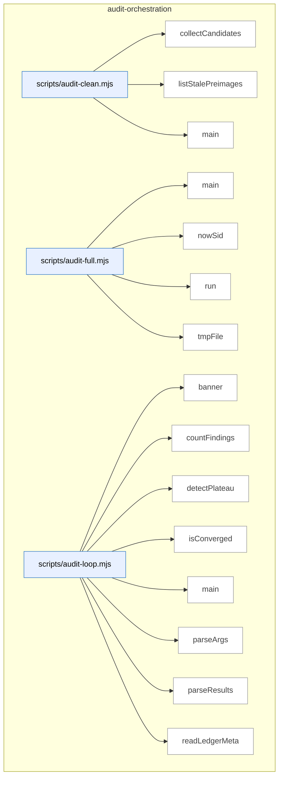

_Domain has 286 symbols (>50). Diagram shows top-15 by file order; see flat table below for the full list._

### Symbols in this domain

| Symbol | Kind | Path | Lines | Purpose | File imported by |
|---|---|---|---|---|---|
| [`collectCandidates`](../scripts/audit-clean.mjs#L162) | function | `scripts/audit-clean.mjs` | 162-199 | Recursively collects file paths matching a regex pattern that are older than a cutoff date, handling errors gracefully. | `tests/audit-clean-traversal.test.mjs` |
| [`listStalePreimages`](../scripts/audit-clean.mjs#L61) | function | `scripts/audit-clean.mjs` | 61-89 | Scans the temp directory for orphaned preimage directories older than a threshold age. | `tests/audit-clean-traversal.test.mjs` |
| [`main`](../scripts/audit-clean.mjs#L201) | function | `scripts/audit-clean.mjs` | 201-244 | Identifies and optionally deletes stale cache files and orphaned preimage worktrees based on age thresholds. | `tests/audit-clean-traversal.test.mjs` |
| [`main`](../scripts/audit-full.mjs#L44) | function | `scripts/audit-full.mjs` | 44-146 | Chains the GPT code audit and Gemini final review in sequence, ensuring Gemini always runs. | _(internal)_ |
| [`nowSid`](../scripts/audit-full.mjs#L31) | function | `scripts/audit-full.mjs` | 31-33 | Generates a session ID by combining a prefix with the current timestamp. | _(internal)_ |
| [`run`](../scripts/audit-full.mjs#L39) | function | `scripts/audit-full.mjs` | 39-42 | Spawns a child process synchronously and returns its exit code and signal. | _(internal)_ |
| [`tmpFile`](../scripts/audit-full.mjs#L35) | function | `scripts/audit-full.mjs` | 35-37 | Constructs a path for a temporary file in the system temp directory. | _(internal)_ |
| [`banner`](../scripts/audit-loop.mjs#L27) | function | `scripts/audit-loop.mjs` | 27-30 | Prints a centered banner message with decorative equals-sign borders. | _(internal)_ |
| [`countFindings`](../scripts/audit-loop.mjs#L71) | function | `scripts/audit-loop.mjs` | 71-78 | Tallies audit findings by severity level and returns summary counts. | _(internal)_ |
| [`detectPlateau`](../scripts/audit-loop.mjs#L93) | function | `scripts/audit-loop.mjs` | 93-109 | Detects when HIGH finding counts have plateaued at less than 30% improvement across rounds. | _(internal)_ |
| [`isConverged`](../scripts/audit-loop.mjs#L80) | function | `scripts/audit-loop.mjs` | 80-84 | Determines if an audit has reached a stable state (zero HIGH and ≤2 MEDIUM findings). | _(internal)_ |
| [`main`](../scripts/audit-loop.mjs#L169) | function | `scripts/audit-loop.mjs` | 169-541 | Orchestrates a multi-round audit loop with convergence detection, ledger persistence, and optional Gemini review. | _(internal)_ |
| [`parseArgs`](../scripts/audit-loop.mjs#L129) | function | `scripts/audit-loop.mjs` | 129-165 | Parses command-line arguments into an options object with defaults for audit configuration. | _(internal)_ |
| [`parseResults`](../scripts/audit-loop.mjs#L62) | function | `scripts/audit-loop.mjs` | 62-69 | Reads and parses a JSON output file from an audit run, returning null on parse failure. | _(internal)_ |
| [`readLedgerMeta`](../scripts/audit-loop.mjs#L119) | function | `scripts/audit-loop.mjs` | 119-127 | Loads metadata from an audit ledger JSON file, returning an empty object if missing. | _(internal)_ |
| [`run`](../scripts/audit-loop.mjs#L32) | function | `scripts/audit-loop.mjs` | 32-45 | Executes a shell command and returns its stdout, handling timeouts and errors. | _(internal)_ |
| [`runAudit`](../scripts/audit-loop.mjs#L47) | function | `scripts/audit-loop.mjs` | 47-60 | Invokes the openai-audit.mjs script with a plan file and captures output and exit status. | _(internal)_ |
| [`computeLocalMetrics`](../scripts/audit-metrics.mjs#L87) | function | `scripts/audit-metrics.mjs` | 87-103 | Calculates audit pass effectiveness from locally-stored outcomes, breaking down acceptance rates by pass. | `scripts/lib/dashboard/collect-telemetry.mjs` |
| [`displayMetrics`](../scripts/audit-metrics.mjs#L107) | function | `scripts/audit-metrics.mjs` | 107-176 | Formats and prints audit metrics (runs, pass effectiveness, findings) to stdout with colored output. | `scripts/lib/dashboard/collect-telemetry.mjs` |
| [`fetchCloudMetrics`](../scripts/audit-metrics.mjs#L52) | function | `scripts/audit-metrics.mjs` | 52-80 | Queries Supabase for audit run statistics and findings from the past N days with optional repo filtering. | `scripts/lib/dashboard/collect-telemetry.mjs` |
| [`main`](../scripts/audit-metrics.mjs#L180) | function | `scripts/audit-metrics.mjs` | 180-197 | Fetches cloud and local audit metrics and displays them as JSON or formatted text output. | `scripts/lib/dashboard/collect-telemetry.mjs` |
| [`_collectMaxLengths`](../scripts/gemini-review.mjs#L188) | function | `scripts/gemini-review.mjs` | 188-206 | Recursively traverses a JSON schema to extract max-length constraints for string fields. | `tests/final-review-provider.test.mjs`, `tests/gemini-review-callreviewer.test.mjs`, `tests/gemini-review-egress.test.mjs`, +4 more |
| [`addSemanticIds`](../scripts/gemini-review.mjs#L1649) | function | `scripts/gemini-review.mjs` | 1649-1657 | Assigns IDs and semantic hashes to findings for deduplication and cross-model tracking. | `tests/final-review-provider.test.mjs`, `tests/gemini-review-callreviewer.test.mjs`, `tests/gemini-review-egress.test.mjs`, +4 more |
| [`applyDebtSuppression`](../scripts/gemini-review.mjs#L1582) | function | `scripts/gemini-review.mjs` | 1582-1617 | Filters new findings by fuzzy-matching against prior debt-memory entries below a Jaccard threshold. | `tests/final-review-provider.test.mjs`, `tests/gemini-review-callreviewer.test.mjs`, `tests/gemini-review-egress.test.mjs`, +4 more |
| [`applyProviderSetting`](../scripts/gemini-review.mjs#L1475) | function | `scripts/gemini-review.mjs` | 1475-1483 | Updates FINAL_REVIEW_PROVIDER in .env while preserving file formatting and structure. | `tests/final-review-provider.test.mjs`, `tests/gemini-review-callreviewer.test.mjs`, `tests/gemini-review-egress.test.mjs`, +4 more |
| [`applyScopeFilter`](../scripts/gemini-review.mjs#L1619) | function | `scripts/gemini-review.mjs` | 1619-1647 | Removes findings that reference files outside the changed-files scope. | `tests/final-review-provider.test.mjs`, `tests/gemini-review-callreviewer.test.mjs`, `tests/gemini-review-egress.test.mjs`, +4 more |
| [`armReviewWatchdog`](../scripts/gemini-review.mjs#L116) | function | `scripts/gemini-review.mjs` | 116-125 | Sets a hard deadline timer for final review to abort hanging SDK calls and exit. | `tests/final-review-provider.test.mjs`, `tests/gemini-review-callreviewer.test.mjs`, `tests/gemini-review-egress.test.mjs`, +4 more |
| [`assertAzureClaudeReady`](../scripts/gemini-review.mjs#L1518) | function | `scripts/gemini-review.mjs` | 1518-1529 | Validates that AZURE_AI_ENDPOINT and Azure Claude deployment are set for Foundry use. | `tests/final-review-provider.test.mjs`, `tests/gemini-review-callreviewer.test.mjs`, `tests/gemini-review-egress.test.mjs`, +4 more |
| [`buildClient`](../scripts/gemini-review.mjs#L1531) | function | `scripts/gemini-review.mjs` | 1531-1535 | Instantiates the correct API client (Gemini SDK, Anthropic SDK, or OpenAI-compat) for a provider. | `tests/final-review-provider.test.mjs`, `tests/gemini-review-callreviewer.test.mjs`, `tests/gemini-review-egress.test.mjs`, +4 more |
| [`buildShadowClient`](../scripts/gemini-review.mjs#L1057) | function | `scripts/gemini-review.mjs` | 1057-1068 | Instantiates the appropriate API client for the shadow provider (Gemini, Claude, or Azure Foundry). | `tests/final-review-provider.test.mjs`, `tests/gemini-review-callreviewer.test.mjs`, `tests/gemini-review-egress.test.mjs`, +4 more |
| [`callReviewer`](../scripts/gemini-review.mjs#L542) | function | `scripts/gemini-review.mjs` | 542-614 | Invokes a final reviewer (Gemini/Claude/OpenAI) with timeout and abort-signal handling. | `tests/final-review-provider.test.mjs`, `tests/gemini-review-callreviewer.test.mjs`, `tests/gemini-review-egress.test.mjs`, +4 more |
| [`dedupByHash`](../scripts/gemini-review.mjs#L1160) | function | `scripts/gemini-review.mjs` | 1160-1168 | Deduplicates findings by semantic hash, keeping only the first of each duplicate. | `tests/final-review-provider.test.mjs`, `tests/gemini-review-callreviewer.test.mjs`, `tests/gemini-review-egress.test.mjs`, +4 more |
| [`diffFindingBuckets`](../scripts/gemini-review.mjs#L1175) | function | `scripts/gemini-review.mjs` | 1175-1191 | Compares primary and shadow findings, classifying each as both, primary-only, or shadow-only. | `tests/final-review-provider.test.mjs`, `tests/gemini-review-callreviewer.test.mjs`, `tests/gemini-review-egress.test.mjs`, +4 more |
| [`emitReviewOutput`](../scripts/gemini-review.mjs#L1659) | function | `scripts/gemini-review.mjs` | 1659-1674 | Outputs final review result as JSON or human-readable text to stdout or file. | `tests/final-review-provider.test.mjs`, `tests/gemini-review-callreviewer.test.mjs`, `tests/gemini-review-egress.test.mjs`, +4 more |
| [`finishAndExit`](../scripts/gemini-review.mjs#L93) | function | `scripts/gemini-review.mjs` | 93-109 | Safely drains stdout buffering and exits the process with a code, preventing hangs. | `tests/final-review-provider.test.mjs`, `tests/gemini-review-callreviewer.test.mjs`, `tests/gemini-review-egress.test.mjs`, +4 more |
| [`formatReviewResult`](../scripts/gemini-review.mjs#L926) | function | `scripts/gemini-review.mjs` | 926-988 | Formats final review verdict and findings as a markdown report with deliberation quality and architectural coherence assessment. | `tests/final-review-provider.test.mjs`, `tests/gemini-review-callreviewer.test.mjs`, `tests/gemini-review-egress.test.mjs`, +4 more |
| [`getReviewPrompt`](../scripts/gemini-review.mjs#L400) | function | `scripts/gemini-review.mjs` | 400-403 | Returns the system prompt for final review with optional provider-specific role addendum. | `tests/final-review-provider.test.mjs`, `tests/gemini-review-callreviewer.test.mjs`, `tests/gemini-review-egress.test.mjs`, +4 more |
| [`isJsonTruncationError`](../scripts/gemini-review.mjs#L1537) | function | `scripts/gemini-review.mjs` | 1537-1541 | Detects JSON truncation errors (unterminated string, parse failure) indicating incomplete response. | `tests/final-review-provider.test.mjs`, `tests/gemini-review-callreviewer.test.mjs`, `tests/gemini-review-egress.test.mjs`, +4 more |
| [`main`](../scripts/gemini-review.mjs#L1801) | function | `scripts/gemini-review.mjs` | 1801-1877 | Entry point dispatching review, provider configuration, or connectivity-check commands. | `tests/final-review-provider.test.mjs`, `tests/gemini-review-callreviewer.test.mjs`, `tests/gemini-review-egress.test.mjs`, +4 more |
| [`mapRouteToShadowProvider`](../scripts/gemini-review.mjs#L1099) | function | `scripts/gemini-review.mjs` | 1099-1103 | Maps a candidate route's transport type to a shadow provider identifier. | `tests/final-review-provider.test.mjs`, `tests/gemini-review-callreviewer.test.mjs`, `tests/gemini-review-egress.test.mjs`, +4 more |
| [`parseReviewArgs`](../scripts/gemini-review.mjs#L1368) | function | `scripts/gemini-review.mjs` | 1368-1387 | Parses command-line arguments for the gemini-review script (plan file, transcript, flags). | `tests/final-review-provider.test.mjs`, `tests/gemini-review-callreviewer.test.mjs`, `tests/gemini-review-egress.test.mjs`, +4 more |
| [`parseReviewJson`](../scripts/gemini-review.mjs#L428) | function | `scripts/gemini-review.mjs` | 428-443 | Robustly parses JSON from final review response, handling markdown fences and malformed output. | `tests/final-review-provider.test.mjs`, `tests/gemini-review-callreviewer.test.mjs`, `tests/gemini-review-egress.test.mjs`, +4 more |
| [`recordGeminiOutcomes`](../scripts/gemini-review.mjs#L1721) | function | `scripts/gemini-review.mjs` | 1721-1743 | Persists Gemini outcomes (new findings, wrongly-dismissed, rewards) to local stores and learning system. | `tests/final-review-provider.test.mjs`, `tests/gemini-review-callreviewer.test.mjs`, `tests/gemini-review-egress.test.mjs`, +4 more |
| [`recordNewFindings`](../scripts/gemini-review.mjs#L1676) | function | `scripts/gemini-review.mjs` | 1676-1695 | Logs new findings to the outcomes ledger and false-positive tracker for learning. | `tests/final-review-provider.test.mjs`, `tests/gemini-review-callreviewer.test.mjs`, `tests/gemini-review-egress.test.mjs`, +4 more |
| [`recordWronglyDismissed`](../scripts/gemini-review.mjs#L1697) | function | `scripts/gemini-review.mjs` | 1697-1719 | Logs findings incorrectly dismissed by prior reviewers to the outcomes ledger. | `tests/final-review-provider.test.mjs`, `tests/gemini-review-callreviewer.test.mjs`, `tests/gemini-review-egress.test.mjs`, +4 more |
| [`refreshCatalogAndWarn`](../scripts/gemini-review.mjs#L1309) | function | `scripts/gemini-review.mjs` | 1309-1330 | Refreshes the live model catalog and upgrades resolved Gemini/Claude models if newer versions exist. | `tests/final-review-provider.test.mjs`, `tests/gemini-review-callreviewer.test.mjs`, `tests/gemini-review-egress.test.mjs`, +4 more |
| [`resolveCompatCreds`](../scripts/gemini-review.mjs#L750) | function | `scripts/gemini-review.mjs` | 750-752 | Returns credentials for an OpenAI-compatible API endpoint. | `tests/final-review-provider.test.mjs`, `tests/gemini-review-callreviewer.test.mjs`, `tests/gemini-review-egress.test.mjs`, +4 more |
| [`resolveModelEvalShadowOverride`](../scripts/gemini-review.mjs#L1105) | function | `scripts/gemini-review.mjs` | 1105-1134 | Fetches active model-eval run config for the adjudicator role and returns its shadow parameters. | `tests/final-review-provider.test.mjs`, `tests/gemini-review-callreviewer.test.mjs`, `tests/gemini-review-egress.test.mjs`, +4 more |
| [`resolveOpenRouterCreds`](../scripts/gemini-review.mjs#L760) | function | `scripts/gemini-review.mjs` | 760-766 | Returns credentials for OpenRouter API with fallback to base URL and key. | `tests/final-review-provider.test.mjs`, `tests/gemini-review-callreviewer.test.mjs`, `tests/gemini-review-egress.test.mjs`, +4 more |
| [`resolveProviderSetting`](../scripts/gemini-review.mjs#L1458) | function | `scripts/gemini-review.mjs` | 1458-1461 | Reads the FINAL_REVIEW_PROVIDER environment variable from .env. | `tests/final-review-provider.test.mjs`, `tests/gemini-review-callreviewer.test.mjs`, `tests/gemini-review-egress.test.mjs`, +4 more |
| [`resolveShadow`](../scripts/gemini-review.mjs#L1021) | function | `scripts/gemini-review.mjs` | 1021-1047 | Resolves shadow reviewer configuration, validating provider availability and returning readiness state. | `tests/final-review-provider.test.mjs`, `tests/gemini-review-callreviewer.test.mjs`, `tests/gemini-review-egress.test.mjs`, +4 more |
| [`runAdjudicatorOnlyReview`](../scripts/gemini-review.mjs#L1573) | function | `scripts/gemini-review.mjs` | 1573-1580 | Runs final review in adjudicator-only mode with specialized deliberation instructions. | `tests/final-review-provider.test.mjs`, `tests/gemini-review-callreviewer.test.mjs`, `tests/gemini-review-egress.test.mjs`, +4 more |
| [`runFinalReview`](../scripts/gemini-review.mjs#L779) | function | `scripts/gemini-review.mjs` | 779-922 | Executes the full final-review workflow: parses plan, reads code files, invokes reviewer, formats output. | `tests/final-review-provider.test.mjs`, `tests/gemini-review-callreviewer.test.mjs`, `tests/gemini-review-egress.test.mjs`, +4 more |
| [`runFixtureReview`](../scripts/gemini-review.mjs#L1758) | function | `scripts/gemini-review.mjs` | 1758-1799 | Returns a canned fixture result for deterministic testing without API calls. | `tests/final-review-provider.test.mjs`, `tests/gemini-review-callreviewer.test.mjs`, `tests/gemini-review-egress.test.mjs`, +4 more |
| [`runPing`](../scripts/gemini-review.mjs#L1361) | function | `scripts/gemini-review.mjs` | 1361-1366 | Dispatches ping to Gemini or Claude based on available API keys. | `tests/final-review-provider.test.mjs`, `tests/gemini-review-callreviewer.test.mjs`, `tests/gemini-review-egress.test.mjs`, +4 more |
| [`runPingClaude`](../scripts/gemini-review.mjs#L1344) | function | `scripts/gemini-review.mjs` | 1344-1359 | Sends a test prompt to Claude API to verify connectivity. | `tests/final-review-provider.test.mjs`, `tests/gemini-review-callreviewer.test.mjs`, `tests/gemini-review-egress.test.mjs`, +4 more |
| [`runPingGemini`](../scripts/gemini-review.mjs#L1332) | function | `scripts/gemini-review.mjs` | 1332-1342 | Sends a test prompt to Gemini API to verify connectivity. | `tests/final-review-provider.test.mjs`, `tests/gemini-review-callreviewer.test.mjs`, `tests/gemini-review-egress.test.mjs`, +4 more |
| [`runReviewWithRetry`](../scripts/gemini-review.mjs#L1543) | function | `scripts/gemini-review.mjs` | 1543-1560 | Executes final review with automatic retry if response was truncated mid-JSON. | `tests/final-review-provider.test.mjs`, `tests/gemini-review-callreviewer.test.mjs`, `tests/gemini-review-egress.test.mjs`, +4 more |
| [`runSetProvider`](../scripts/gemini-review.mjs#L1490) | function | `scripts/gemini-review.mjs` | 1490-1512 | CLI command to set, clear, or rotate the FINAL_REVIEW_PROVIDER setting in .env. | `tests/final-review-provider.test.mjs`, `tests/gemini-review-callreviewer.test.mjs`, `tests/gemini-review-egress.test.mjs`, +4 more |
| [`runShadowAndPersist`](../scripts/gemini-review.mjs#L1214) | function | `scripts/gemini-review.mjs` | 1214-1303 | Orchestrates shadow review execution, buckets findings by agreement, and persists results. | `tests/final-review-provider.test.mjs`, `tests/gemini-review-callreviewer.test.mjs`, `tests/gemini-review-egress.test.mjs`, +4 more |
| [`runShadowReview`](../scripts/gemini-review.mjs#L1141) | function | `scripts/gemini-review.mjs` | 1141-1151 | Executes a final review with the shadow model and applies debt suppression and scope filters. | `tests/final-review-provider.test.mjs`, `tests/gemini-review-callreviewer.test.mjs`, `tests/gemini-review-egress.test.mjs`, +4 more |
| [`selectProvider`](../scripts/gemini-review.mjs#L1409) | function | `scripts/gemini-review.mjs` | 1409-1455 | Selects the final review provider via explicit flag, env var, or auto-detection priority order. | `tests/final-review-provider.test.mjs`, `tests/gemini-review-callreviewer.test.mjs`, `tests/gemini-review-egress.test.mjs`, +4 more |
| [`shadowModelMatchesFamily`](../scripts/gemini-review.mjs#L1007) | function | `scripts/gemini-review.mjs` | 1007-1012 | Checks if a model ID belongs to a given provider family (gemini or claude variants). | `tests/final-review-provider.test.mjs`, `tests/gemini-review-callreviewer.test.mjs`, `tests/gemini-review-egress.test.mjs`, +4 more |
| [`shadowSkipBlock`](../scripts/gemini-review.mjs#L1194) | function | `scripts/gemini-review.mjs` | 1194-1199 | Returns a minimal skip-state block when shadow review does not execute. | `tests/final-review-provider.test.mjs`, `tests/gemini-review-callreviewer.test.mjs`, `tests/gemini-review-egress.test.mjs`, +4 more |
| [`streamAnthropicMessage`](../scripts/gemini-review.mjs#L632) | function | `scripts/gemini-review.mjs` | 632-650 | Streams a message from Anthropic API, accumulating text and token usage. | `tests/final-review-provider.test.mjs`, `tests/gemini-review-callreviewer.test.mjs`, `tests/gemini-review-egress.test.mjs`, +4 more |
| [`truncateToSchema`](../scripts/gemini-review.mjs#L220) | function | `scripts/gemini-review.mjs` | 220-240 | Truncates object fields to comply with schema max-length limits and tracks what was truncated. | `tests/final-review-provider.test.mjs`, `tests/gemini-review-callreviewer.test.mjs`, `tests/gemini-review-egress.test.mjs`, +4 more |
| [`composeAdjacencyResult`](../scripts/lib/audit/adjacency-compose.mjs#L45) | function | `scripts/lib/audit/adjacency-compose.mjs` | 45-95 | Combines adjacency analysis evidence, bouncer decisions, and degradation into structured result. | `scripts/lib/audit/legacy-production-audit.mjs`, `tests/adjacency-compose.test.mjs`, `tests/audit-scope-egress.test.mjs` |
| [`deriveFindings`](../scripts/lib/audit/adjacency-compose.mjs#L102) | function | `scripts/lib/audit/adjacency-compose.mjs` | 102-126 | Converts adjacency analysis results to audit findings, handling mapping failures and emitting control findings. | `scripts/lib/audit/legacy-production-audit.mjs`, `tests/adjacency-compose.test.mjs`, `tests/audit-scope-egress.test.mjs` |
| [`classifyStatementDependence`](../scripts/lib/audit/adjacency-detector.mjs#L265) | function | `scripts/lib/audit/adjacency-detector.mjs` | 265-352 | Classifies whether a statement depends on enclosing condition (references vars/guards) or merely nested. | `scripts/lib/audit/legacy-production-audit.mjs`, `tests/adjacency-detector.test.mjs`, `tests/adjacency-state.test.mjs`, +1 more |
| [`collectReadBindings`](../scripts/lib/audit/adjacency-detector.mjs#L224) | function | `scripts/lib/audit/adjacency-detector.mjs` | 224-238 | Gathers all identifiers referenced in a statement using Babel scope binding analysis. | `scripts/lib/audit/legacy-production-audit.mjs`, `tests/adjacency-detector.test.mjs`, `tests/adjacency-state.test.mjs`, +1 more |
| [`defaultAdapters`](../scripts/lib/audit/adjacency-detector.mjs#L61) | function | `scripts/lib/audit/adjacency-detector.mjs` | 61-70 | Returns Git/filesystem adapters for adjacency analysis (numstat, diff, read, classify, scan). | `scripts/lib/audit/legacy-production-audit.mjs`, `tests/adjacency-detector.test.mjs`, `tests/adjacency-state.test.mjs`, +1 more |
| [`enumerateBlockStatements`](../scripts/lib/audit/adjacency-detector.mjs#L210) | function | `scripts/lib/audit/adjacency-detector.mjs` | 210-218 | Retrieves statements within a branch (block or single), returning paths for analysis. | `scripts/lib/audit/legacy-production-audit.mjs`, `tests/adjacency-detector.test.mjs`, `tests/adjacency-state.test.mjs`, +1 more |
| [`findEnclosingConditional`](../scripts/lib/audit/adjacency-detector.mjs#L151) | function | `scripts/lib/audit/adjacency-detector.mjs` | 151-202 | Finds innermost `if` statement containing a line, handling test-expression exclusion. | `scripts/lib/audit/legacy-production-audit.mjs`, `tests/adjacency-detector.test.mjs`, `tests/adjacency-state.test.mjs`, +1 more |
| [`incompleteness`](../scripts/lib/audit/adjacency-detector.mjs#L72) | function | `scripts/lib/audit/adjacency-detector.mjs` | 72-72 | Creates incompleteness record (kind, scope, detail) for audit degradation tracking. | `scripts/lib/audit/legacy-production-audit.mjs`, `tests/adjacency-detector.test.mjs`, `tests/adjacency-state.test.mjs`, +1 more |
| [`log`](../scripts/lib/audit/adjacency-detector.mjs#L57) | function | `scripts/lib/audit/adjacency-detector.mjs` | 57-57 | Writes debug message to stderr with [adjacency] prefix. | `scripts/lib/audit/legacy-production-audit.mjs`, `tests/adjacency-detector.test.mjs`, `tests/adjacency-state.test.mjs`, +1 more |
| [`parseHunkTargets`](../scripts/lib/audit/adjacency-detector.mjs#L96) | function | `scripts/lib/audit/adjacency-detector.mjs` | 96-124 | Extracts line numbers and file paths from unified diff hunks within conditional branches. | `scripts/lib/audit/legacy-production-audit.mjs`, `tests/adjacency-detector.test.mjs`, `tests/adjacency-state.test.mjs`, +1 more |
| [`runAdjacencyAnalysis`](../scripts/lib/audit/adjacency-detector.mjs#L366) | function | `scripts/lib/audit/adjacency-detector.mjs` | 366-520 | Main detector: scans diff hunks for statements trapped in conditionals, applies bounds, detects failures. | `scripts/lib/audit/legacy-production-audit.mjs`, `tests/adjacency-detector.test.mjs`, `tests/adjacency-state.test.mjs`, +1 more |
| [`sliceLines`](../scripts/lib/audit/adjacency-detector.mjs#L523) | function | `scripts/lib/audit/adjacency-detector.mjs` | 523-529 | Extracts line range from text, truncating with a marker if it exceeds character limit. | `scripts/lib/audit/legacy-production-audit.mjs`, `tests/adjacency-detector.test.mjs`, `tests/adjacency-state.test.mjs`, +1 more |
| [`_resetAdjacencyIdCounter`](../scripts/lib/audit/adjacency-report.mjs#L25) | function | `scripts/lib/audit/adjacency-report.mjs` | 25-25 | Resets module-global adjacency candidate ID counter to zero for testing. | `scripts/lib/audit/adjacency-compose.mjs`, `scripts/lib/audit/legacy-production-audit.mjs`, `tests/adjacency-compose.test.mjs` |
| [`buildAdjacencyFailedFinding`](../scripts/lib/audit/adjacency-report.mjs#L219) | function | `scripts/lib/audit/adjacency-report.mjs` | 219-238 | Creates an audit finding when the adjacency detector itself threw an error during execution. | `scripts/lib/audit/adjacency-compose.mjs`, `scripts/lib/audit/legacy-production-audit.mjs`, `tests/adjacency-compose.test.mjs` |
| [`buildAdjacencyFinding`](../scripts/lib/audit/adjacency-report.mjs#L162) | function | `scripts/lib/audit/adjacency-report.mjs` | 162-186 | Constructs an audit finding for a statement that may be silently skipped due to being inside a conditional branch. | `scripts/lib/audit/adjacency-compose.mjs`, `scripts/lib/audit/legacy-production-audit.mjs`, `tests/adjacency-compose.test.mjs` |
| [`buildAdjacencyIncompleteFinding`](../scripts/lib/audit/adjacency-report.mjs#L194) | function | `scripts/lib/audit/adjacency-report.mjs` | 194-214 | Builds an audit finding indicating the adjacency control hit a budget bound and couldn't enumerate all statements. | `scripts/lib/audit/adjacency-compose.mjs`, `scripts/lib/audit/legacy-production-audit.mjs`, `tests/adjacency-compose.test.mjs` |
| [`deriveFindingsFromAdjacencyReport`](../scripts/lib/audit/adjacency-report.mjs#L155) | function | `scripts/lib/audit/adjacency-report.mjs` | 155-160 | Extracts findings from adjacent statements marked safe and eligible for reporting. | `scripts/lib/audit/adjacency-compose.mjs`, `scripts/lib/audit/legacy-production-audit.mjs`, `tests/adjacency-compose.test.mjs` |
| [`formatCandidatesForPrompt`](../scripts/lib/audit/adjacency-report.mjs#L37) | function | `scripts/lib/audit/adjacency-report.mjs` | 37-78 | Formats adjacency evidence candidates to markdown blocks for judge prompt, tracking character budgets. | `scripts/lib/audit/adjacency-compose.mjs`, `scripts/lib/audit/legacy-production-audit.mjs`, `tests/adjacency-compose.test.mjs` |
| [`incompleteness`](../scripts/lib/audit/adjacency-report.mjs#L28) | function | `scripts/lib/audit/adjacency-report.mjs` | 28-28 | <no body> | `scripts/lib/audit/adjacency-compose.mjs`, `scripts/lib/audit/legacy-production-audit.mjs`, `tests/adjacency-compose.test.mjs` |
| [`mapDecisionsToFindings`](../scripts/lib/audit/adjacency-report.mjs#L131) | function | `scripts/lib/audit/adjacency-report.mjs` | 131-151 | Transforms LLM bouncer decisions into audit findings, validating completeness and consistency of the decision set. | `scripts/lib/audit/adjacency-compose.mjs`, `scripts/lib/audit/legacy-production-audit.mjs`, `tests/adjacency-compose.test.mjs` |
| [`nextId`](../scripts/lib/audit/adjacency-report.mjs#L26) | function | `scripts/lib/audit/adjacency-report.mjs` | 26-26 | Generates sequential adjacency candidate ID by incrementing and prefixing with `A`. | `scripts/lib/audit/adjacency-compose.mjs`, `scripts/lib/audit/legacy-production-audit.mjs`, `tests/adjacency-compose.test.mjs` |
| [`runAdjacencyBouncer`](../scripts/lib/audit/adjacency-report.mjs#L92) | function | `scripts/lib/audit/adjacency-report.mjs` | 92-118 | Calls an LLM to judge which candidate statements are genuinely trapped in conditionals, with graceful no-op when no eligible candidates exist. | `scripts/lib/audit/adjacency-compose.mjs`, `scripts/lib/audit/legacy-production-audit.mjs`, `tests/adjacency-compose.test.mjs` |
| [`assertCleanIsEarned`](../scripts/lib/audit/adjacency-state.mjs#L158) | function | `scripts/lib/audit/adjacency-state.mjs` | 158-173 | Validates that a "clean" adjacency result actually enumerated statements, throwing if coverage is zero. | `scripts/lib/audit/adjacency-compose.mjs`, `scripts/lib/audit/adjacency-detector.mjs`, `scripts/lib/audit/adjacency-report.mjs`, +3 more |
| [`blocksConvergence`](../scripts/lib/audit/adjacency-state.mjs#L178) | function | `scripts/lib/audit/adjacency-state.mjs` | 178-182 | Determines whether adjacency findings or incompleteness should block audit convergence. | `scripts/lib/audit/adjacency-compose.mjs`, `scripts/lib/audit/adjacency-detector.mjs`, `scripts/lib/audit/adjacency-report.mjs`, +3 more |
| [`buildAdjacencyState`](../scripts/lib/audit/adjacency-state.mjs#L96) | function | `scripts/lib/audit/adjacency-state.mjs` | 96-147 | Assembles the final state of an adjacency control run, classifying it as findings/incomplete/failed/not-applicable/clean based on coverage and candidate count. | `scripts/lib/audit/adjacency-compose.mjs`, `scripts/lib/audit/adjacency-detector.mjs`, `scripts/lib/audit/adjacency-report.mjs`, +3 more |
| [`createEnvelope`](../scripts/lib/audit/candidate-envelope.mjs#L49) | function | `scripts/lib/audit/candidate-envelope.mjs` | 49-84 | Wraps a single finding with evidence alternatives and metadata for multi-model adjudication tracking. | `scripts/lib/audit/evidence-triage.mjs`, `scripts/lib/audit/tiered-pipeline.mjs`, `tests/candidate-envelope-provenance.test.mjs`, +1 more |
| [`flattenEnvelopeToFinding`](../scripts/lib/audit/candidate-envelope.mjs#L234) | function | `scripts/lib/audit/candidate-envelope.mjs` | 234-254 | Extracts the canonical finding from an envelope, optionally appending alternative evidence sources as prose. | `scripts/lib/audit/evidence-triage.mjs`, `scripts/lib/audit/tiered-pipeline.mjs`, `tests/candidate-envelope-provenance.test.mjs`, +1 more |
| [`mergeIntoEnvelopes`](../scripts/lib/audit/candidate-envelope.mjs#L119) | function | `scripts/lib/audit/candidate-envelope.mjs` | 119-180 | Combines multiple findings with the same fingerprint into a single envelope, preserving evidence from each model as alternatives. | `scripts/lib/audit/evidence-triage.mjs`, `scripts/lib/audit/tiered-pipeline.mjs`, `tests/candidate-envelope-provenance.test.mjs`, +1 more |
| [`promoteAlternative`](../scripts/lib/audit/candidate-envelope.mjs#L256) | function | `scripts/lib/audit/candidate-envelope.mjs` | 256-293 | Demotes the canonical finding to an alternative and promotes a specified alternative evidence entry to canonical. | `scripts/lib/audit/evidence-triage.mjs`, `scripts/lib/audit/tiered-pipeline.mjs`, `tests/candidate-envelope-provenance.test.mjs`, +1 more |
| [`severityRank`](../scripts/lib/audit/candidate-envelope.mjs#L91) | function | `scripts/lib/audit/candidate-envelope.mjs` | 91-93 | Returns a numeric rank for a severity level used in comparative sorting. | `scripts/lib/audit/evidence-triage.mjs`, `scripts/lib/audit/tiered-pipeline.mjs`, `tests/candidate-envelope-provenance.test.mjs`, +1 more |
| [`evaluateConvergence`](../scripts/lib/audit/convergence.mjs#L21) | function | `scripts/lib/audit/convergence.mjs` | 21-25 | Checks if finding counts meet the convergence thresholds for ending GPT iteration. | `scripts/lib/audit/legacy-production-audit.mjs` |
| [`computeCostReport`](../scripts/lib/audit/cost-budget.mjs#L58) | function | `scripts/lib/audit/cost-budget.mjs` | 58-88 | Aggregates API usage and human review effort into cost-per-accepted-high metrics. | `scripts/lib/audit/tiered-pipeline.mjs`, `tests/cost-budget.test.mjs` |
| [`loadReviewEffortEvents`](../scripts/lib/audit/cost-budget.mjs#L136) | function | `scripts/lib/audit/cost-budget.mjs` | 136-144 | Reads and validates review-effort events from a JSONL file, skipping malformed entries and logging. | `scripts/lib/audit/tiered-pipeline.mjs`, `tests/cost-budget.test.mjs` |
| [`loadUsageEvents`](../scripts/lib/audit/cost-budget.mjs#L118) | function | `scripts/lib/audit/cost-budget.mjs` | 118-133 | Reads and validates usage events from a JSONL file, skipping malformed entries and logging. | `scripts/lib/audit/tiered-pipeline.mjs`, `tests/cost-budget.test.mjs` |
| [`openReviewEffortStore`](../scripts/lib/audit/cost-budget.mjs#L96) | function | `scripts/lib/audit/cost-budget.mjs` | 96-98 | Creates an append-only store for recording human operator review time. | `scripts/lib/audit/tiered-pipeline.mjs`, `tests/cost-budget.test.mjs` |
| [`openUsageEventStore`](../scripts/lib/audit/cost-budget.mjs#L91) | function | `scripts/lib/audit/cost-budget.mjs` | 91-93 | Creates an append-only store for recording API usage events. | `scripts/lib/audit/tiered-pipeline.mjs`, `tests/cost-budget.test.mjs` |
| [`recordReviewEffort`](../scripts/lib/audit/cost-budget.mjs#L106) | function | `scripts/lib/audit/cost-budget.mjs` | 106-108 | Appends a single review-effort event to the store. | `scripts/lib/audit/tiered-pipeline.mjs`, `tests/cost-budget.test.mjs` |
| [`recordUsageEvent`](../scripts/lib/audit/cost-budget.mjs#L101) | function | `scripts/lib/audit/cost-budget.mjs` | 101-103 | Appends a single usage event to the store. | `scripts/lib/audit/tiered-pipeline.mjs`, `tests/cost-budget.test.mjs` |
| [`classifyDeferralEvidence`](../scripts/lib/audit/deferral-classifier.mjs#L166) | function | `scripts/lib/audit/deferral-classifier.mjs` | 166-300 | Determines whether a finding can be auto-deferred based on plan markers, file-scope membership, or prior-round evidence. | `scripts/lib/audit/findings-pipeline.mjs`, `scripts/lib/audit/tiered-shadow-compare.mjs`, `tests/learning-deferral-classifier.test.mjs` |
| [`globMatch`](../scripts/lib/audit/deferral-classifier.mjs#L102) | function | `scripts/lib/audit/deferral-classifier.mjs` | 102-119 | Tests whether a file path matches a glob pattern using regex translation. | `scripts/lib/audit/findings-pipeline.mjs`, `scripts/lib/audit/tiered-shadow-compare.mjs`, `tests/learning-deferral-classifier.test.mjs` |
| [`isFileInChangedScope`](../scripts/lib/audit/deferral-classifier.mjs#L326) | function | `scripts/lib/audit/deferral-classifier.mjs` | 326-330 | Tri-state membership check: returns true/false if file is in changed list, null if changed list is absent. | `scripts/lib/audit/findings-pipeline.mjs`, `scripts/lib/audit/tiered-shadow-compare.mjs`, `tests/learning-deferral-classifier.test.mjs` |
| [`parseAcceptV1Markers`](../scripts/lib/audit/deferral-classifier.mjs#L84) | function | `scripts/lib/audit/deferral-classifier.mjs` | 84-91 | Extracts file globs and acceptance reasons from plan HTML comments marked `<!-- audit:accept-v1: ... -->`. | `scripts/lib/audit/findings-pipeline.mjs`, `scripts/lib/audit/tiered-shadow-compare.mjs`, `tests/learning-deferral-classifier.test.mjs` |
| [`buildDiffPathMap`](../scripts/lib/audit/diff-path-map.mjs#L98) | function | `scripts/lib/audit/diff-path-map.mjs` | 98-135 | Parses a unified diff into a structured map of file changes with status codes and old/new paths. | `scripts/lib/audit/tiered-pipeline.mjs`, `scripts/model-eval-discovery.mjs`, `tests/diff-path-map.test.mjs`, +1 more |
| [`hydrateAnchor`](../scripts/lib/audit/diff-path-map.mjs#L176) | function | `scripts/lib/audit/diff-path-map.mjs` | 176-211 | Validates and resolves a model-produced anchor reference into concrete file paths and line spans, detecting contradictions. | `scripts/lib/audit/tiered-pipeline.mjs`, `scripts/model-eval-discovery.mjs`, `tests/diff-path-map.test.mjs`, +1 more |
| [`mintId`](../scripts/lib/audit/diff-path-map.mjs#L56) | function | `scripts/lib/audit/diff-path-map.mjs` | 56-56 | <no body> | `scripts/lib/audit/tiered-pipeline.mjs`, `scripts/model-eval-discovery.mjs`, `tests/diff-path-map.test.mjs`, +1 more |
| [`prepareCandidates`](../scripts/lib/audit/diff-path-map.mjs#L242) | function | `scripts/lib/audit/diff-path-map.mjs` | 242-272 | Filters and validates findings from a discovery generator, hydrating anchors and catching malformed/contradicted claims. | `scripts/lib/audit/tiered-pipeline.mjs`, `scripts/model-eval-discovery.mjs`, `tests/diff-path-map.test.mjs`, +1 more |
| [`renderDiffPathTable`](../scripts/lib/audit/diff-path-map.mjs#L143) | function | `scripts/lib/audit/diff-path-map.mjs` | 143-148 | Formats diff-path-map entries into a human-readable TSV table with id, status, and paths. | `scripts/lib/audit/tiered-pipeline.mjs`, `scripts/model-eval-discovery.mjs`, `tests/diff-path-map.test.mjs`, +1 more |
| [`cleanupTempRoot`](../scripts/lib/audit/diff-scope-resolver.mjs#L255) | function | `scripts/lib/audit/diff-scope-resolver.mjs` | 255-265 | Removes a temporary git worktree via git worktree remove, with fallback to fs.rmSync. | `scripts/audit-clean.mjs`, `scripts/lib/audit/legacy-production-audit.mjs`, `scripts/openai-audit.mjs`, +2 more |
| [`computeEntryPoints`](../scripts/lib/audit/diff-scope-resolver.mjs#L354) | function | `scripts/lib/audit/diff-scope-resolver.mjs` | 354-423 | Discovers entry-point files from package.json exports, tsconfig, and directory walking, with outDir reverse-resolution. | `scripts/audit-clean.mjs`, `scripts/lib/audit/legacy-production-audit.mjs`, `scripts/openai-audit.mjs`, +2 more |
| [`cruiseTempRoot`](../scripts/lib/audit/diff-scope-resolver.mjs#L277) | function | `scripts/lib/audit/diff-scope-resolver.mjs` | 277-339 | Runs dependency-cruiser against materialized preimage files to extract pre-edges (imports) at the base commit. | `scripts/audit-clean.mjs`, `scripts/lib/audit/legacy-production-audit.mjs`, `scripts/openai-audit.mjs`, +2 more |
| [`gitBuf`](../scripts/lib/audit/diff-scope-resolver.mjs#L73) | function | `scripts/lib/audit/diff-scope-resolver.mjs` | 73-85 | Executes a git command and returns stdout, logging failures to stderr without throwing. | `scripts/audit-clean.mjs`, `scripts/lib/audit/legacy-production-audit.mjs`, `scripts/openai-audit.mjs`, +2 more |
| [`materialisePreimages`](../scripts/lib/audit/diff-scope-resolver.mjs#L214) | function | `scripts/lib/audit/diff-scope-resolver.mjs` | 214-253 | Creates a git worktree at a base commit to access pre-edge dependencies for modified/deleted files. | `scripts/audit-clean.mjs`, `scripts/lib/audit/legacy-production-audit.mjs`, `scripts/openai-audit.mjs`, +2 more |
| [`parseLsTreeZ`](../scripts/lib/audit/diff-scope-resolver.mjs#L153) | function | `scripts/lib/audit/diff-scope-resolver.mjs` | 153-156 | <no body> | `scripts/audit-clean.mjs`, `scripts/lib/audit/legacy-production-audit.mjs`, `scripts/openai-audit.mjs`, +2 more |
| [`parseNameStatusZ`](../scripts/lib/audit/diff-scope-resolver.mjs#L100) | function | `scripts/lib/audit/diff-scope-resolver.mjs` | 100-145 | Parses git diff --name-status -z output into structured change records, handling variable-width rename/copy entries. | `scripts/audit-clean.mjs`, `scripts/lib/audit/legacy-production-audit.mjs`, `scripts/openai-audit.mjs`, +2 more |
| [`resolveDiffScope`](../scripts/lib/audit/diff-scope-resolver.mjs#L440) | function | `scripts/lib/audit/diff-scope-resolver.mjs` | 440-541 | Orchestrates complete diff-scope resolution: parses changes, materializes preimages, extracts pre-edges, computes entry points. | `scripts/audit-clean.mjs`, `scripts/lib/audit/legacy-production-audit.mjs`, `scripts/openai-audit.mjs`, +2 more |
| [`stripLeadingDotSlash`](../scripts/lib/audit/diff-scope-resolver.mjs#L27) | function | `scripts/lib/audit/diff-scope-resolver.mjs` | 27-29 | <no body> | `scripts/audit-clean.mjs`, `scripts/lib/audit/legacy-production-audit.mjs`, `scripts/openai-audit.mjs`, +2 more |
| [`sweepStaleOrphanPreimages`](../scripts/lib/audit/diff-scope-resolver.mjs#L188) | function | `scripts/lib/audit/diff-scope-resolver.mjs` | 188-212 | Removes stale orphaned git worktrees left behind by previously killed audit runs. | `scripts/audit-clean.mjs`, `scripts/lib/audit/legacy-production-audit.mjs`, `scripts/openai-audit.mjs`, +2 more |
| [`walkEntryPointDir`](../scripts/lib/audit/diff-scope-resolver.mjs#L49) | function | `scripts/lib/audit/diff-scope-resolver.mjs` | 49-63 | Recursively discovers source files in a directory by extension, excluding subdirectories. | `scripts/audit-clean.mjs`, `scripts/lib/audit/legacy-production-audit.mjs`, `scripts/openai-audit.mjs`, +2 more |
| [`runDiscoveryPortfolio`](../scripts/lib/audit/discovery-portfolio.mjs#L121) | function | `scripts/lib/audit/discovery-portfolio.mjs` | 121-158 | Runs required (GLM, Sonnet) and optional (GPT) discovery generators in parallel, merging findings and tracking failures. | `scripts/lib/audit/tiered-pipeline.mjs`, `tests/discovery-portfolio.test.mjs` |
| [`runOneGenerator`](../scripts/lib/audit/discovery-portfolio.mjs#L60) | function | `scripts/lib/audit/discovery-portfolio.mjs` | 60-101 | Executes a single discovery generator (GLM, Sonnet, or GPT) and records its timing and status. | `scripts/lib/audit/tiered-pipeline.mjs`, `tests/discovery-portfolio.test.mjs` |
| [`defaultAdapters`](../scripts/lib/audit/duplication-detector.mjs#L63) | function | `scripts/lib/audit/duplication-detector.mjs` | 63-95 | <no body> | `scripts/lib/audit/legacy-production-audit.mjs`, `tests/duplication-detector.test.mjs`, `tests/duplication-egress.test.mjs` |
| [`extractViaSubprocess`](../scripts/lib/audit/duplication-detector.mjs#L103) | function | `scripts/lib/audit/duplication-detector.mjs` | 103-115 | Spawns a subprocess to extract symbol definitions from files via a temporary manifest, filtering for symbol records. | `scripts/lib/audit/legacy-production-audit.mjs`, `tests/duplication-detector.test.mjs`, `tests/duplication-egress.test.mjs` |
| [`findPragmaAbove`](../scripts/lib/audit/duplication-detector.mjs#L135) | function | `scripts/lib/audit/duplication-detector.mjs` | 135-143 | Searches for a `@duplicate-justification` pragma in the lines above a declaration to identify intentional duplications marked for suppression. | `scripts/lib/audit/legacy-production-audit.mjs`, `tests/duplication-detector.test.mjs`, `tests/duplication-egress.test.mjs` |
| [`isEligibleChange`](../scripts/lib/audit/duplication-detector.mjs#L145) | function | `scripts/lib/audit/duplication-detector.mjs` | 145-150 | Filters file change entries to include only source files that aren't deleted or excluded from the duplication query scope. | `scripts/lib/audit/legacy-production-audit.mjs`, `tests/duplication-detector.test.mjs`, `tests/duplication-egress.test.mjs` |
| [`log`](../scripts/lib/audit/duplication-detector.mjs#L60) | function | `scripts/lib/audit/duplication-detector.mjs` | 60-60 | <no body> | `scripts/lib/audit/legacy-production-audit.mjs`, `tests/duplication-detector.test.mjs`, `tests/duplication-egress.test.mjs` |
| [`runDuplicationAnalysis`](../scripts/lib/audit/duplication-detector.mjs#L160) | function | `scripts/lib/audit/duplication-detector.mjs` | 160-326 | Main orchestrator that extracts changed source code, queries architectural memory for semantic near-duplicates, and returns deterministic + semantic findings. | `scripts/lib/audit/legacy-production-audit.mjs`, `tests/duplication-detector.test.mjs`, `tests/duplication-egress.test.mjs` |
| [`symKey`](../scripts/lib/audit/duplication-detector.mjs#L125) | function | `scripts/lib/audit/duplication-detector.mjs` | 125-127 | <no body> | `scripts/lib/audit/legacy-production-audit.mjs`, `tests/duplication-detector.test.mjs`, `tests/duplication-egress.test.mjs` |
| [`writeTempSource`](../scripts/lib/audit/duplication-detector.mjs#L118) | function | `scripts/lib/audit/duplication-detector.mjs` | 118-122 | Writes content to a file in a temporary root, creating parent directories as needed. | `scripts/lib/audit/legacy-production-audit.mjs`, `tests/duplication-detector.test.mjs`, `tests/duplication-egress.test.mjs` |
| [`_resetDuplicationIdCounter`](../scripts/lib/audit/duplication-report.mjs#L47) | function | `scripts/lib/audit/duplication-report.mjs` | 47-47 | Resets the internal counter used to generate unique IDs (D1, D2, etc.) for duplication findings. | `scripts/lib/audit/duplication-detector.mjs`, `scripts/lib/audit/legacy-production-audit.mjs`, `tests/duplication-bouncer-mapping.test.mjs`, +2 more |
| [`buildDetectorFailedFinding`](../scripts/lib/audit/duplication-report.mjs#L216) | function | `scripts/lib/audit/duplication-report.mjs` | 216-231 | Generates a finding indicating the duplication detector crashed internally, signaling incomplete audit coverage. | `scripts/lib/audit/duplication-detector.mjs`, `scripts/lib/audit/legacy-production-audit.mjs`, `tests/duplication-bouncer-mapping.test.mjs`, +2 more |
| [`buildDuplicationFinding`](../scripts/lib/audit/duplication-report.mjs#L193) | function | `scripts/lib/audit/duplication-report.mjs` | 193-213 | Constructs a single duplication finding from a semantic candidate with severity, detailed rationale, and guidance to reuse or justify divergence. | `scripts/lib/audit/duplication-detector.mjs`, `scripts/lib/audit/legacy-production-audit.mjs`, `tests/duplication-bouncer-mapping.test.mjs`, +2 more |
| [`deriveFindingsFromDuplicationReport`](../scripts/lib/audit/duplication-report.mjs#L189) | function | `scripts/lib/audit/duplication-report.mjs` | 189-191 | Converts semantic candidates directly to findings when Gemini bouncer is unavailable, assigning MEDIUM severity to each. | `scripts/lib/audit/duplication-detector.mjs`, `scripts/lib/audit/legacy-production-audit.mjs`, `tests/duplication-bouncer-mapping.test.mjs`, +2 more |
| [`finalizeDeterministicFindings`](../scripts/lib/audit/duplication-report.mjs#L234) | function | `scripts/lib/audit/duplication-report.mjs` | 234-256 | Converts orphaned-pragma records into findings that flag stale or mistargeted suppression pragmas. | `scripts/lib/audit/duplication-detector.mjs`, `scripts/lib/audit/legacy-production-audit.mjs`, `tests/duplication-bouncer-mapping.test.mjs`, +2 more |
| [`formatCandidatesForPrompt`](../scripts/lib/audit/duplication-report.mjs#L113) | function | `scripts/lib/audit/duplication-report.mjs` | 113-147 | Formats semantic duplication candidates into a Markdown prompt for Gemini, filtering sensitive paths and validating safe transmission. | `scripts/lib/audit/duplication-detector.mjs`, `scripts/lib/audit/legacy-production-audit.mjs`, `tests/duplication-bouncer-mapping.test.mjs`, +2 more |
| [`isDuplicationQueryExcluded`](../scripts/lib/audit/duplication-report.mjs#L36) | function | `scripts/lib/audit/duplication-report.mjs` | 36-38 | Checks if a file path matches any glob patterns that should be excluded from duplication scanning. | `scripts/lib/audit/duplication-detector.mjs`, `scripts/lib/audit/legacy-production-audit.mjs`, `tests/duplication-bouncer-mapping.test.mjs`, +2 more |
| [`isDuplicationReportClean`](../scripts/lib/audit/duplication-report.mjs#L41) | function | `scripts/lib/audit/duplication-report.mjs` | 41-43 | Returns true if the duplication analysis report state is 'clean' (no duplicates detected). | `scripts/lib/audit/duplication-detector.mjs`, `scripts/lib/audit/legacy-production-audit.mjs`, `tests/duplication-bouncer-mapping.test.mjs`, +2 more |
| [`mapBouncerDecisionsToFindings`](../scripts/lib/audit/duplication-report.mjs#L166) | function | `scripts/lib/audit/duplication-report.mjs` | 166-186 | Converts Gemini's bouncer decisions (keep/suppress per candidate) into duplication findings while validating response completeness and consistency. | `scripts/lib/audit/duplication-detector.mjs`, `scripts/lib/audit/legacy-production-audit.mjs`, `tests/duplication-bouncer-mapping.test.mjs`, +2 more |
| [`nextId`](../scripts/lib/audit/duplication-report.mjs#L48) | function | `scripts/lib/audit/duplication-report.mjs` | 48-48 | Generates and returns the next unique ID for a duplication finding in sequence (D1, D2, D3, etc.). | `scripts/lib/audit/duplication-detector.mjs`, `scripts/lib/audit/legacy-production-audit.mjs`, `tests/duplication-bouncer-mapping.test.mjs`, +2 more |
| [`readExcerpt`](../scripts/lib/audit/duplication-report.mjs#L75) | function | `scripts/lib/audit/duplication-report.mjs` | 75-93 | Reads a code excerpt from a file with padding lines around a specified range, or falls back to file head if range is unavailable. | `scripts/lib/audit/duplication-detector.mjs`, `scripts/lib/audit/legacy-production-audit.mjs`, `tests/duplication-bouncer-mapping.test.mjs`, +2 more |
| [`extractFileDiffSection`](../scripts/lib/audit/evidence-triage.mjs#L64) | function | `scripts/lib/audit/evidence-triage.mjs` | 64-74 | Extracts the unified diff section for a specific file path from a full diff text. | `scripts/lib/audit/adjacency-detector.mjs`, `scripts/lib/audit/diff-path-map.mjs`, `scripts/lib/audit/tiered-pipeline.mjs`, +1 more |
| [`findLineRangeInContent`](../scripts/lib/audit/evidence-triage.mjs#L228) | function | `scripts/lib/audit/evidence-triage.mjs` | 228-240 | Locates a quoted snippet within file content by searching for a matching window, returning start and end line numbers. | `scripts/lib/audit/adjacency-detector.mjs`, `scripts/lib/audit/diff-path-map.mjs`, `scripts/lib/audit/tiered-pipeline.mjs`, +1 more |
| [`mapHeadLineToBase`](../scripts/lib/audit/evidence-triage.mjs#L261) | function | `scripts/lib/audit/evidence-triage.mjs` | 261-276 | Maps a line number from the HEAD version of a file back to the BASE version using diff hunks to compute offset deltas. | `scripts/lib/audit/adjacency-detector.mjs`, `scripts/lib/audit/diff-path-map.mjs`, `scripts/lib/audit/tiered-pipeline.mjs`, +1 more |
| [`mapHeadRangeToBase`](../scripts/lib/audit/evidence-triage.mjs#L289) | function | `scripts/lib/audit/evidence-triage.mjs` | 289-296 | Maps a line range from HEAD to BASE using hunk offsets, validating that range length is preserved across the translation. | `scripts/lib/audit/adjacency-detector.mjs`, `scripts/lib/audit/diff-path-map.mjs`, `scripts/lib/audit/tiered-pipeline.mjs`, +1 more |
| [`parseAllDiffSections`](../scripts/lib/audit/evidence-triage.mjs#L113) | function | `scripts/lib/audit/evidence-triage.mjs` | 113-128 | Parses a unified diff into individual file sections with metadata (old/new paths, file status like added/deleted/renamed). | `scripts/lib/audit/adjacency-detector.mjs`, `scripts/lib/audit/diff-path-map.mjs`, `scripts/lib/audit/tiered-pipeline.mjs`, +1 more |
| [`parseHunkHeader`](../scripts/lib/audit/evidence-triage.mjs#L139) | function | `scripts/lib/audit/evidence-triage.mjs` | 139-148 | Parses a unified diff hunk header line (@@..@@) to extract line numbers and counts for base and head sides. | `scripts/lib/audit/adjacency-detector.mjs`, `scripts/lib/audit/diff-path-map.mjs`, `scripts/lib/audit/tiered-pipeline.mjs`, +1 more |
| [`quoteAppearsOnSide`](../scripts/lib/audit/evidence-triage.mjs#L188) | function | `scripts/lib/audit/evidence-triage.mjs` | 188-211 | Checks if a quoted code snippet appears in the specified side (head/base) of a diff, normalizing whitespace to handle blank lines correctly. | `scripts/lib/audit/adjacency-detector.mjs`, `scripts/lib/audit/diff-path-map.mjs`, `scripts/lib/audit/tiered-pipeline.mjs`, +1 more |
| [`resolveAnchorLocation`](../scripts/lib/audit/evidence-triage.mjs#L340) | function | `scripts/lib/audit/evidence-triage.mjs` | 340-380 | Validates an evidence anchor's claim against a diff, resolving it to a hunk location or one of several failure statuses. | `scripts/lib/audit/adjacency-detector.mjs`, `scripts/lib/audit/diff-path-map.mjs`, `scripts/lib/audit/tiered-pipeline.mjs`, +1 more |
| [`resolveScopeBucketForFinding`](../scripts/lib/audit/evidence-triage.mjs#L471) | function | `scripts/lib/audit/evidence-triage.mjs` | 471-481 | Determines the most restrictive scope bucket (change_related, unchanged, etc.) for a finding based on its origin candidate IDs. | `scripts/lib/audit/adjacency-detector.mjs`, `scripts/lib/audit/diff-path-map.mjs`, `scripts/lib/audit/tiered-pipeline.mjs`, +1 more |
| [`resolveWithFallback`](../scripts/lib/audit/evidence-triage.mjs#L504) | function | `scripts/lib/audit/evidence-triage.mjs` | 504-528 | Attempts to resolve an evidence anchor, and if it fails, iteratively tries alternatives until one succeeds or all exhaust. | `scripts/lib/audit/adjacency-detector.mjs`, `scripts/lib/audit/diff-path-map.mjs`, `scripts/lib/audit/tiered-pipeline.mjs`, +1 more |
| [`runStage0EvidenceTriage`](../scripts/lib/audit/evidence-triage.mjs#L589) | function | `scripts/lib/audit/evidence-triage.mjs` | 589-705 | Stage 0 evidence verification pass that validates all finding anchors against diffs, categorizing them as verified/pre-existing/rejected/malformed. | `scripts/lib/audit/adjacency-detector.mjs`, `scripts/lib/audit/diff-path-map.mjs`, `scripts/lib/audit/tiered-pipeline.mjs`, +1 more |
| [`splitIntoHunks`](../scripts/lib/audit/evidence-triage.mjs#L159) | function | `scripts/lib/audit/evidence-triage.mjs` | 159-173 | Splits a unified diff section into hunk objects with parsed headers and raw line-by-line content. | `scripts/lib/audit/adjacency-detector.mjs`, `scripts/lib/audit/diff-path-map.mjs`, `scripts/lib/audit/tiered-pipeline.mjs`, +1 more |
| [`tagPreExisting`](../scripts/lib/audit/evidence-triage.mjs#L437) | function | `scripts/lib/audit/evidence-triage.mjs` | 437-443 | Tags a finding as pre-existing-independent if it predates the commit AND provably doesn't affect the current change's correctness. | `scripts/lib/audit/adjacency-detector.mjs`, `scripts/lib/audit/diff-path-map.mjs`, `scripts/lib/audit/tiered-pipeline.mjs`, +1 more |
| [`verifyAnchor`](../scripts/lib/audit/evidence-triage.mjs#L403) | function | `scripts/lib/audit/evidence-triage.mjs` | 403-414 | Quickly determines whether an evidence anchor is verified, fabricated, or unverifiable by checking diff metadata and content. | `scripts/lib/audit/adjacency-detector.mjs`, `scripts/lib/audit/diff-path-map.mjs`, `scripts/lib/audit/tiered-pipeline.mjs`, +1 more |
| [`anchorFileCandidates`](../scripts/lib/audit/final-adjudication.mjs#L330) | function | `scripts/lib/audit/final-adjudication.mjs` | 330-333 | Extracts the old and new file paths from an evidence anchor, filtering out nulls. | `scripts/lib/audit/legacy-production-audit.mjs`, `scripts/lib/audit/tiered-pipeline.mjs`, `tests/final-adjudication-egress.test.mjs`, +3 more |
| [`buildAlternativeEvidenceLines`](../scripts/lib/audit/final-adjudication.mjs#L375) | function | `scripts/lib/audit/final-adjudication.mjs` | 375-384 | Formats alternative evidence options from an envelope as markdown lines, excluding sensitive paths and duplicates of the canonical claim. | `scripts/lib/audit/legacy-production-audit.mjs`, `scripts/lib/audit/tiered-pipeline.mjs`, `tests/final-adjudication-egress.test.mjs`, +3 more |
| [`buildFindingDetail`](../scripts/lib/audit/final-adjudication.mjs#L387) | function | `scripts/lib/audit/final-adjudication.mjs` | 387-391 | Constructs the final detail text for a finding, appending alternative evidence lines when alternatives exist. | `scripts/lib/audit/legacy-production-audit.mjs`, `scripts/lib/audit/tiered-pipeline.mjs`, `tests/final-adjudication-egress.test.mjs`, +3 more |
| [`createGeminiReviewSubprocessAdapters`](../scripts/lib/audit/final-adjudication.mjs#L495) | function | `scripts/lib/audit/final-adjudication.mjs` | 495-585 | Factory function that creates adapters for Stage 2 adjudication, handling sensitive-path checks and Gemini subprocess invocation. | `scripts/lib/audit/legacy-production-audit.mjs`, `scripts/lib/audit/tiered-pipeline.mjs`, `tests/final-adjudication-egress.test.mjs`, +3 more |
| [`defaultGeminiReviewScriptPath`](../scripts/lib/audit/final-adjudication.mjs#L64) | function | `scripts/lib/audit/final-adjudication.mjs` | 64-66 | Returns the module-relative file path to gemini-review.mjs for subprocess invocation during Stage 2 adjudication. | `scripts/lib/audit/legacy-production-audit.mjs`, `scripts/lib/audit/tiered-pipeline.mjs`, `tests/final-adjudication-egress.test.mjs`, +3 more |
| [`envelopeReferencedFiles`](../scripts/lib/audit/final-adjudication.mjs#L342) | function | `scripts/lib/audit/final-adjudication.mjs` | 342-345 | Collects all file paths referenced by a finding's main anchor and trigger anchor. | `scripts/lib/audit/legacy-production-audit.mjs`, `scripts/lib/audit/tiered-pipeline.mjs`, `tests/final-adjudication-egress.test.mjs`, +3 more |
| [`interpretVerdict`](../scripts/lib/audit/final-adjudication.mjs#L181) | function | `scripts/lib/audit/final-adjudication.mjs` | 181-210 | Maps Gemini's verdict (reversed/confirmed/verified) and prior dismissal state to adjudication outcomes (reversed_dismissal/confirmed/verified/etc.). | `scripts/lib/audit/legacy-production-audit.mjs`, `scripts/lib/audit/tiered-pipeline.mjs`, `tests/final-adjudication-egress.test.mjs`, +3 more |
| [`invokeGeminiReviewSubprocess`](../scripts/lib/audit/final-adjudication.mjs#L422) | function | `scripts/lib/audit/final-adjudication.mjs` | 422-465 | Spawns gemini-review.mjs as a subprocess to review a single finding envelope, managing temp files and capturing structured JSON output. | `scripts/lib/audit/legacy-production-audit.mjs`, `scripts/lib/audit/tiered-pipeline.mjs`, `tests/final-adjudication-egress.test.mjs`, +3 more |
| [`isPathSensitive`](../scripts/lib/audit/final-adjudication.mjs#L354) | function | `scripts/lib/audit/final-adjudication.mjs` | 354-361 | Determines whether a file path is classified as sensitive (credentials, secrets, etc.) using canonical path resolution. | `scripts/lib/audit/legacy-production-audit.mjs`, `scripts/lib/audit/tiered-pipeline.mjs`, `tests/final-adjudication-egress.test.mjs`, +3 more |
| [`primaryFile`](../scripts/lib/audit/final-adjudication.mjs#L394) | function | `scripts/lib/audit/final-adjudication.mjs` | 394-399 | Extracts the primary file reference from a finding's section, anchor, or triggerAnchor fields. | `scripts/lib/audit/legacy-production-audit.mjs`, `scripts/lib/audit/tiered-pipeline.mjs`, `tests/final-adjudication-egress.test.mjs`, +3 more |
| [`runFinalAdjudication`](../scripts/lib/audit/final-adjudication.mjs#L230) | function | `scripts/lib/audit/final-adjudication.mjs` | 230-321 | Orchestrates Stage 2 review by calling Gemini on selected findings, categorizing outcomes into reversed/confirmed/verified/unresolved/pending_security buckets. | `scripts/lib/audit/legacy-production-audit.mjs`, `scripts/lib/audit/tiered-pipeline.mjs`, `tests/final-adjudication-egress.test.mjs`, +3 more |
| [`selectAdjudicationSample`](../scripts/lib/audit/final-adjudication.mjs#L84) | function | `scripts/lib/audit/final-adjudication.mjs` | 84-112 | Selects a deterministic seeded sample of findings for Stage 2 review: mandatory escalations, tail sample, and clean-region audit items. | `scripts/lib/audit/legacy-production-audit.mjs`, `scripts/lib/audit/tiered-pipeline.mjs`, `tests/final-adjudication-egress.test.mjs`, +3 more |
| [`selectFinalAdjudicationWorkItems`](../scripts/lib/audit/final-adjudication.mjs#L151) | function | `scripts/lib/audit/final-adjudication.mjs` | 151-166 | Wraps the adjudication sample selection and applies budget caps to limit mandatory/tail/clean-region items per configuration. | `scripts/lib/audit/legacy-production-audit.mjs`, `scripts/lib/audit/tiered-pipeline.mjs`, `tests/final-adjudication-egress.test.mjs`, +3 more |
| [`classifyFinding`](../scripts/lib/audit/finding-verification.mjs#L70) | function | `scripts/lib/audit/finding-verification.mjs` | 70-73 | Determines whether a finding is an existence claim (asserts that something exists, is imported, or is defined). | `scripts/lib/audit/legacy-production-audit.mjs`, `scripts/openai-audit.mjs`, `tests/finding-verification.test.mjs` |
| [`extractCitedEntity`](../scripts/lib/audit/finding-verification.mjs#L103) | function | `scripts/lib/audit/finding-verification.mjs` | 103-122 | Extracts the entity name and kind from a finding's claim text using regex patterns and contextual heuristics. | `scripts/lib/audit/legacy-production-audit.mjs`, `scripts/openai-audit.mjs`, `tests/finding-verification.test.mjs` |
| [`mk`](../scripts/lib/audit/finding-verification.mjs#L124) | function | `scripts/lib/audit/finding-verification.mjs` | 124-132 | Constructs a verification metadata object linking a finding to its status, reason, cited entity, and verdict impact. | `scripts/lib/audit/legacy-production-audit.mjs`, `scripts/openai-audit.mjs`, `tests/finding-verification.test.mjs` |
| [`tokenKind`](../scripts/lib/audit/finding-verification.mjs#L84) | function | `scripts/lib/audit/finding-verification.mjs` | 84-90 | Classifies a cited token as external (module/package), file (path), or symbol based on syntax and finding context. | `scripts/lib/audit/legacy-production-audit.mjs`, `scripts/openai-audit.mjs`, `tests/finding-verification.test.mjs` |
| [`verifyExistenceFindings`](../scripts/lib/audit/finding-verification.mjs#L149) | function | `scripts/lib/audit/finding-verification.mjs` | 149-215 | Runs the repo-inventory verification gate on findings, classifying external claims, symbol claims, and file existence checks. | `scripts/lib/audit/legacy-production-audit.mjs`, `scripts/openai-audit.mjs`, `tests/finding-verification.test.mjs` |
| [`applyAcceptV1Suppression`](../scripts/lib/audit/findings-pipeline.mjs#L191) | function | `scripts/lib/audit/findings-pipeline.mjs` | 191-214 | Suppresses orphan-introduced findings that match file globs in accept-v1 markers parsed from the plan document. | `scripts/lib/audit/legacy-production-audit.mjs`, `scripts/lib/audit/orphan-metrics.mjs`, `scripts/lib/audit/tiered-pipeline.mjs`, +2 more |
| [`applyLedgerSuppression`](../scripts/lib/audit/findings-pipeline.mjs#L74) | function | `scripts/lib/audit/findings-pipeline.mjs` | 74-103 | Filters findings by checking dismissed ledger entries, dropping any that match by fingerprint or topicId. | `scripts/lib/audit/legacy-production-audit.mjs`, `scripts/lib/audit/orphan-metrics.mjs`, `scripts/lib/audit/tiered-pipeline.mjs`, +2 more |
| [`applyStage1MechanicalEarlyFilter`](../scripts/lib/audit/findings-pipeline.mjs#L128) | function | `scripts/lib/audit/findings-pipeline.mjs` | 128-177 | Fast-path suppression for stage1-mechanical entries: drops mechanical dismissals unless regressed, and only for unchanged files. | `scripts/lib/audit/legacy-production-audit.mjs`, `scripts/lib/audit/orphan-metrics.mjs`, `scripts/lib/audit/tiered-pipeline.mjs`, +2 more |
| [`computeAuditVerdict`](../scripts/lib/audit/findings-pipeline.mjs#L261) | function | `scripts/lib/audit/findings-pipeline.mjs` | 261-270 | Determines audit verdict (PASS/SIGNIFICANT_ISSUES/NEEDS_FIXES/INCOMPLETE) based on finding severity counts. | `scripts/lib/audit/legacy-production-audit.mjs`, `scripts/lib/audit/orphan-metrics.mjs`, `scripts/lib/audit/tiered-pipeline.mjs`, +2 more |
| [`findingFingerprint`](../scripts/lib/audit/findings-pipeline.mjs#L34) | function | `scripts/lib/audit/findings-pipeline.mjs` | 34-59 | Generates a stable SHA256-based fingerprint for a finding used for ledger matching and deduplication across rounds. | `scripts/lib/audit/legacy-production-audit.mjs`, `scripts/lib/audit/orphan-metrics.mjs`, `scripts/lib/audit/tiered-pipeline.mjs`, +2 more |
| [`processFindings`](../scripts/lib/audit/findings-pipeline.mjs#L272) | function | `scripts/lib/audit/findings-pipeline.mjs` | 272-298 | Normalizes findings and applies suppression layers (ledger, stage1, accept-v1) to produce survivors and dropped list. | `scripts/lib/audit/legacy-production-audit.mjs`, `scripts/lib/audit/orphan-metrics.mjs`, `scripts/lib/audit/tiered-pipeline.mjs`, +2 more |
| [`buildGateEvidence`](../scripts/lib/audit/gate-evidence.mjs#L51) | function | `scripts/lib/audit/gate-evidence.mjs` | 51-58 | Constructs gate evidence object containing run ID, session ID, round, and ISO timestamp. | `scripts/lib/audit/legacy-production-audit.mjs`, `tests/gate-evidence.test.mjs` |
| [`writeGateEvidence`](../scripts/lib/audit/gate-evidence.mjs#L78) | function | `scripts/lib/audit/gate-evidence.mjs` | 78-110 | Writes gate evidence JSON marker to disk only if cloud-enabled and audit is in code mode, not plan mode. | `scripts/lib/audit/legacy-production-audit.mjs`, `tests/gate-evidence.test.mjs` |
| [`globMatch`](../scripts/lib/audit/glob-match.mjs#L28) | function | `scripts/lib/audit/glob-match.mjs` | 28-38 | Tests if a file path matches a glob pattern by escaping the glob and converting it to a regex. | `scripts/lib/audit/findings-pipeline.mjs`, `scripts/lib/efficacy-lints.mjs` |
| [`escapeRegex`](../scripts/lib/audit/gpt-sentinel-trigger.mjs#L42) | function | `scripts/lib/audit/gpt-sentinel-trigger.mjs` | 42-44 | Escapes regex metacharacters in a string for safe literal matching. | `scripts/lib/audit/tiered-pipeline.mjs`, `tests/gpt-sentinel-trigger.test.mjs` |
| [`isExplorationSample`](../scripts/lib/audit/gpt-sentinel-trigger.mjs#L154) | function | `scripts/lib/audit/gpt-sentinel-trigger.mjs` | 154-160 | Deterministically draws from exploration rate using seeded RNG for reproducible membership. | `scripts/lib/audit/tiered-pipeline.mjs`, `tests/gpt-sentinel-trigger.test.mjs` |
| [`keywordRegex`](../scripts/lib/audit/gpt-sentinel-trigger.mjs#L58) | function | `scripts/lib/audit/gpt-sentinel-trigger.mjs` | 58-66 | Caches and returns a word-boundary regex for a keyword with optional stem-matching support. | `scripts/lib/audit/tiered-pipeline.mjs`, `tests/gpt-sentinel-trigger.test.mjs` |
| [`matchKeywordGroups`](../scripts/lib/audit/gpt-sentinel-trigger.mjs#L71) | function | `scripts/lib/audit/gpt-sentinel-trigger.mjs` | 71-78 | Tests text against keyword groups and returns names of groups that matched. | `scripts/lib/audit/tiered-pipeline.mjs`, `tests/gpt-sentinel-trigger.test.mjs` |
| [`resolveGptTrigger`](../scripts/lib/audit/gpt-sentinel-trigger.mjs#L176) | function | `scripts/lib/audit/gpt-sentinel-trigger.mjs` | 176-191 | Resolves whether GPT runs via deterministic checks, exploration sampling, or bandit selection. | `scripts/lib/audit/tiered-pipeline.mjs`, `tests/gpt-sentinel-trigger.test.mjs` |
| [`shouldFireSentinel`](../scripts/lib/audit/gpt-sentinel-trigger.mjs#L132) | function | `scripts/lib/audit/gpt-sentinel-trigger.mjs` | 132-138 | Uses Thompson sampling to probabilistically decide if the GPT sentinel bandit arm should fire. | `scripts/lib/audit/tiered-pipeline.mjs`, `tests/gpt-sentinel-trigger.test.mjs` |
| [`shouldTriggerGpt`](../scripts/lib/audit/gpt-sentinel-trigger.mjs#L104) | function | `scripts/lib/audit/gpt-sentinel-trigger.mjs` | 104-111 | Determines if GPT should run based on diff size, keyword categories, or portfolio disagreement. | `scripts/lib/audit/tiered-pipeline.mjs`, `tests/gpt-sentinel-trigger.test.mjs` |
| [`buildAuditRunContext`](../scripts/lib/audit/legacy-production-audit.mjs#L3310) | function | `scripts/lib/audit/legacy-production-audit.mjs` | 3310-3429 | Constructs audit execution context from CLI arguments with config validation and provider resolution. | `scripts/lib/audit/tiered-pipeline.mjs`, `scripts/openai-audit.mjs`, `tests/legacy-audit-smoke.test.mjs`, +3 more |
| [`cachePassResult`](../scripts/lib/audit/legacy-production-audit.mjs#L247) | function | `scripts/lib/audit/legacy-production-audit.mjs` | 247-258 | Atomically writes a single pass result JSON to the cache directory. | `scripts/lib/audit/tiered-pipeline.mjs`, `scripts/openai-audit.mjs`, `tests/legacy-audit-smoke.test.mjs`, +3 more |
| [`cacheWaveResults`](../scripts/lib/audit/legacy-production-audit.mjs#L260) | function | `scripts/lib/audit/legacy-production-audit.mjs` | 260-265 | Caches multiple pass results and logs the operation to stderr. | `scripts/lib/audit/tiered-pipeline.mjs`, `scripts/openai-audit.mjs`, `tests/legacy-audit-smoke.test.mjs`, +3 more |
| [`cleanupCache`](../scripts/lib/audit/legacy-production-audit.mjs#L267) | function | `scripts/lib/audit/legacy-production-audit.mjs` | 267-270 | Removes the temporary audit cache directory with retries and forced deletion. | `scripts/lib/audit/tiered-pipeline.mjs`, `scripts/openai-audit.mjs`, `tests/legacy-audit-smoke.test.mjs`, +3 more |
| [`decideSeed`](../scripts/lib/audit/legacy-production-audit.mjs#L373) | function | `scripts/lib/audit/legacy-production-audit.mjs` | 373-421 | Selects the smallest audit unit as cache seed if multi-unit and stable-prefix is large enough to justify warming. | `scripts/lib/audit/tiered-pipeline.mjs`, `scripts/openai-audit.mjs`, `tests/legacy-audit-smoke.test.mjs`, +3 more |
| [`deriveFindingsFromReport`](../scripts/lib/audit/legacy-production-audit.mjs#L1004) | function | `scripts/lib/audit/legacy-production-audit.mjs` | 1004-1074 | Converts architecture report violations, unmapped files, and dead intent into structured findings. | `scripts/lib/audit/tiered-pipeline.mjs`, `scripts/openai-audit.mjs`, `tests/legacy-audit-smoke.test.mjs`, +3 more |
| [`formatViolationsForPrompt`](../scripts/lib/audit/legacy-production-audit.mjs#L936) | function | `scripts/lib/audit/legacy-production-audit.mjs` | 936-985 | Formats architecture violations and unmapped files as human-readable prompt context blocks. | `scripts/lib/audit/tiered-pipeline.mjs`, `scripts/openai-audit.mjs`, `tests/legacy-audit-smoke.test.mjs`, +3 more |
| [`initResultCache`](../scripts/lib/audit/legacy-production-audit.mjs#L237) | function | `scripts/lib/audit/legacy-production-audit.mjs` | 237-245 | Creates a temporary cache directory for audit pass results keyed by process ID. | `scripts/lib/audit/tiered-pipeline.mjs`, `scripts/openai-audit.mjs`, `tests/legacy-audit-smoke.test.mjs`, +3 more |
| [`normalizeFindingsForOutput`](../scripts/lib/audit/legacy-production-audit.mjs#L274) | function | `scripts/lib/audit/legacy-production-audit.mjs` | 274-276 | <no body> | `scripts/lib/audit/tiered-pipeline.mjs`, `scripts/openai-audit.mjs`, `tests/legacy-audit-smoke.test.mjs`, +3 more |
| [`orphanToStandardFinding`](../scripts/lib/audit/legacy-production-audit.mjs#L800) | function | `scripts/lib/audit/legacy-production-audit.mjs` | 800-822 | Converts an orphan-introduced finding into standard Finding schema with ID, severity, and recommendation. | `scripts/lib/audit/tiered-pipeline.mjs`, `scripts/openai-audit.mjs`, `tests/legacy-audit-smoke.test.mjs`, +3 more |
| [`runArchitecturePass`](../scripts/lib/audit/legacy-production-audit.mjs#L655) | function | `scripts/lib/audit/legacy-production-audit.mjs` | 655-790 | Runs architecture domain-boundary validation against intent config and produces violations/unmapped findings. | `scripts/lib/audit/tiered-pipeline.mjs`, `scripts/openai-audit.mjs`, `tests/legacy-audit-smoke.test.mjs`, +3 more |
| [`runLegacyProductionAudit`](../scripts/lib/audit/legacy-production-audit.mjs#L1104) | function | `scripts/lib/audit/legacy-production-audit.mjs` | 1104-3274 | Main orchestrator running 5-pass code audit with multi-round loops, ledger suppression, learning sync, and cloud recording. | `scripts/lib/audit/tiered-pipeline.mjs`, `scripts/openai-audit.mjs`, `tests/legacy-audit-smoke.test.mjs`, +3 more |
| [`runMapReducePass`](../scripts/lib/audit/legacy-production-audit.mjs#L455) | function | `scripts/lib/audit/legacy-production-audit.mjs` | 455-637 | Orchestrates parallel map-reduce audit pass with cache seeding, slot limits, result aggregation, and cleanup. | `scripts/lib/audit/tiered-pipeline.mjs`, `scripts/openai-audit.mjs`, `tests/legacy-audit-smoke.test.mjs`, +3 more |
| [`runOneMapUnit`](../scripts/lib/audit/legacy-production-audit.mjs#L426) | function | `scripts/lib/audit/legacy-production-audit.mjs` | 426-453 | Executes one audit unit with slot-based concurrency control and returns structured findings. | `scripts/lib/audit/tiered-pipeline.mjs`, `scripts/openai-audit.mjs`, `tests/legacy-audit-smoke.test.mjs`, +3 more |
| [`runOrphanIntroducedPass`](../scripts/lib/audit/legacy-production-audit.mjs#L841) | function | `scripts/lib/audit/legacy-production-audit.mjs` | 841-929 | Detects files orphaned by the diff by analyzing removed edges in the HEAD graph. | `scripts/lib/audit/tiered-pipeline.mjs`, `scripts/openai-audit.mjs`, `tests/legacy-audit-smoke.test.mjs`, +3 more |
| [`shouldMapReduce`](../scripts/lib/audit/legacy-production-audit.mjs#L178) | function | `scripts/lib/audit/legacy-production-audit.mjs` | 178-182 | Decides if map-reduce is needed based on file count or total character size thresholds. | `scripts/lib/audit/tiered-pipeline.mjs`, `scripts/openai-audit.mjs`, `tests/legacy-audit-smoke.test.mjs`, +3 more |
| [`shouldMapReduceHighReasoning`](../scripts/lib/audit/legacy-production-audit.mjs#L189) | function | `scripts/lib/audit/legacy-production-audit.mjs` | 189-193 | Decides if map-reduce is needed for high-reasoning mode using stricter file/token thresholds. | `scripts/lib/audit/tiered-pipeline.mjs`, `scripts/openai-audit.mjs`, `tests/legacy-audit-smoke.test.mjs`, +3 more |
| [`throwIfConfigError`](../scripts/lib/audit/legacy-production-audit.mjs#L356) | function | `scripts/lib/audit/legacy-production-audit.mjs` | 356-362 | Throws if a settled promise result is a rejected config-category LLM error. | `scripts/lib/audit/tiered-pipeline.mjs`, `scripts/openai-audit.mjs`, `tests/legacy-audit-smoke.test.mjs`, +3 more |
| [`validateLedgerForR2`](../scripts/lib/audit/legacy-production-audit.mjs#L296) | function | `scripts/lib/audit/legacy-production-audit.mjs` | 296-328 | Validates R2+ ledger file exists, is readable, and contains entries passing LedgerEntrySchema validation. | `scripts/lib/audit/tiered-pipeline.mjs`, `scripts/openai-audit.mjs`, `tests/legacy-audit-smoke.test.mjs`, +3 more |
| [`_callGPTOnce`](../scripts/lib/audit/llm-helpers.mjs#L232) | function | `scripts/lib/audit/llm-helpers.mjs` | 232-338 | Makes a single GPT call with timeout, structured parsing, retry preparation, and usage tracking. | `scripts/lib/audit/legacy-production-audit.mjs`, `scripts/lib/audit/tiered-pipeline.mjs`, `scripts/openai-audit.mjs` |
| [`buildCachePrompt`](../scripts/lib/audit/llm-helpers.mjs#L95) | function | `scripts/lib/audit/llm-helpers.mjs` | 95-112 | Combines code, context, history, and rulings into a stable cached multi-message prompt. | `scripts/lib/audit/legacy-production-audit.mjs`, `scripts/lib/audit/tiered-pipeline.mjs`, `scripts/openai-audit.mjs` |
| [`callGPT`](../scripts/lib/audit/llm-helpers.mjs#L344) | function | `scripts/lib/audit/llm-helpers.mjs` | 344-385 | Retries GPT calls on transient failures with exponential backoff and accumulated usage/cost metrics. | `scripts/lib/audit/legacy-production-audit.mjs`, `scripts/lib/audit/tiered-pipeline.mjs`, `scripts/openai-audit.mjs` |
| [`getPassPrompt`](../scripts/lib/audit/llm-helpers.mjs#L68) | function | `scripts/lib/audit/llm-helpers.mjs` | 68-72 | Retrieves the active override prompt or default prompt for a given pass name. | `scripts/lib/audit/legacy-production-audit.mjs`, `scripts/lib/audit/tiered-pipeline.mjs`, `scripts/openai-audit.mjs` |
| [`normalisePromptInput`](../scripts/lib/audit/llm-helpers.mjs#L131) | function | `scripts/lib/audit/llm-helpers.mjs` | 131-162 | Validates and normalizes prompt input from legacy (systemPrompt/userPrompt) or structured (system/messages) mode. | `scripts/lib/audit/legacy-production-audit.mjs`, `scripts/lib/audit/tiered-pipeline.mjs`, `scripts/openai-audit.mjs` |
| [`parseStructured`](../scripts/lib/audit/llm-helpers.mjs#L182) | function | `scripts/lib/audit/llm-helpers.mjs` | 182-222 | Parses structured output from LLM via responses API or chat-completions fallback with Zod validation. | `scripts/lib/audit/legacy-production-audit.mjs`, `scripts/lib/audit/tiered-pipeline.mjs`, `scripts/openai-audit.mjs` |
| [`safeCallGPT`](../scripts/lib/audit/llm-helpers.mjs#L396) | function | `scripts/lib/audit/llm-helpers.mjs` | 396-413 | Wraps callGPT with graceful degradation returning empty result on non-config errors. | `scripts/lib/audit/legacy-production-audit.mjs`, `scripts/lib/audit/tiered-pipeline.mjs`, `scripts/openai-audit.mjs` |
| [`setModel`](../scripts/lib/audit/llm-helpers.mjs#L56) | function | `scripts/lib/audit/llm-helpers.mjs` | 56-58 | Sets the active LLM model ID for subsequent audit calls. | `scripts/lib/audit/legacy-production-audit.mjs`, `scripts/lib/audit/tiered-pipeline.mjs`, `scripts/openai-audit.mjs` |
| [`wireModel`](../scripts/lib/audit/llm-helpers.mjs#L167) | function | `scripts/lib/audit/llm-helpers.mjs` | 167-169 | Returns the effective model ID, applying Azure deployment override if active. | `scripts/lib/audit/legacy-production-audit.mjs`, `scripts/lib/audit/tiered-pipeline.mjs`, `scripts/openai-audit.mjs` |
| [`detectOrphansIntroduced`](../scripts/lib/audit/orphan-introduced.mjs#L42) | function | `scripts/lib/audit/orphan-introduced.mjs` | 42-167 | Analyzes diff scope and HEAD graph to identify files that became unreachable from entry points. | `scripts/lib/audit/legacy-production-audit.mjs`, `scripts/openai-audit.mjs`, `tests/orphan-introduced.test.mjs` |
| [`isTestFile`](../scripts/lib/audit/orphan-introduced.mjs#L174) | function | `scripts/lib/audit/orphan-introduced.mjs` | 174-184 | Checks if a file path matches test file patterns (prefixes, path segments, or suffixes). | `scripts/lib/audit/legacy-production-audit.mjs`, `scripts/openai-audit.mjs`, `tests/orphan-introduced.test.mjs` |
| [`appendOrphanMetric`](../scripts/lib/audit/orphan-metrics.mjs#L59) | function | `scripts/lib/audit/orphan-metrics.mjs` | 59-80 | Appends a metrics record to the orphan log with file locking for safe concurrent writes. | `scripts/lib/audit/legacy-production-audit.mjs`, `scripts/openai-audit.mjs` |
| [`emitOrphanRunMetrics`](../scripts/lib/audit/orphan-metrics.mjs#L102) | function | `scripts/lib/audit/orphan-metrics.mjs` | 102-169 | Writes orphan run summary and per-finding metrics to locked metrics file with fingerprint tracking. | `scripts/lib/audit/legacy-production-audit.mjs`, `scripts/openai-audit.mjs` |
| [`ensureMetricsFile`](../scripts/lib/audit/orphan-metrics.mjs#L33) | function | `scripts/lib/audit/orphan-metrics.mjs` | 33-49 | Creates the orphan metrics file with atomic create-exclusive flag to ensure exactly one initialization. | `scripts/lib/audit/legacy-production-audit.mjs`, `scripts/openai-audit.mjs` |
| [`completePlanAuditRun`](../scripts/lib/audit/plan-audit-cloud.mjs#L91) | function | `scripts/lib/audit/plan-audit-cloud.mjs` | 91-120 | Finalizes a plan audit run by persisting findings and completion metadata to cloud. | `scripts/openai-audit.mjs`, `tests/plan-audit-cloud.test.mjs` |
| [`gitAnchor`](../scripts/lib/audit/plan-audit-cloud.mjs#L33) | function | `scripts/lib/audit/plan-audit-cloud.mjs` | 33-41 | Captures current commit SHA and branch name from git shell commands. | `scripts/openai-audit.mjs`, `tests/plan-audit-cloud.test.mjs` |
| [`registerPlanAuditRun`](../scripts/lib/audit/plan-audit-cloud.mjs#L52) | function | `scripts/lib/audit/plan-audit-cloud.mjs` | 52-79 | Records a plan audit run in cloud storage with plan registration and returns run/repo IDs. | `scripts/openai-audit.mjs`, `tests/plan-audit-cloud.test.mjs` |
| [`buildAuditPassPrompt`](../scripts/lib/audit/prompt-builder.mjs#L63) | function | `scripts/lib/audit/prompt-builder.mjs` | 63-108 | Constructs a multi-message prompt with stable cacheable section and dynamic round-specific content. | `scripts/lib/audit/legacy-production-audit.mjs`, `scripts/lib/audit/llm-helpers.mjs`, `scripts/openai-audit.mjs`, +2 more |
| [`estimateStablePrefixTokens`](../scripts/lib/audit/prompt-builder.mjs#L167) | function | `scripts/lib/audit/prompt-builder.mjs` | 167-179 | Calculates token count for the stable system+user prefix by building an audit prompt with empty code. | `scripts/lib/audit/legacy-production-audit.mjs`, `scripts/lib/audit/llm-helpers.mjs`, `scripts/openai-audit.mjs`, +2 more |
| [`estimateTokens`](../scripts/lib/audit/prompt-builder.mjs#L149) | function | `scripts/lib/audit/prompt-builder.mjs` | 149-152 | Estimates token count from text length using a simple 4-character-per-token approximation. | `scripts/lib/audit/legacy-production-audit.mjs`, `scripts/lib/audit/llm-helpers.mjs`, `scripts/openai-audit.mjs`, +2 more |
| [`validateOpts`](../scripts/lib/audit/prompt-builder.mjs#L110) | function | `scripts/lib/audit/prompt-builder.mjs` | 110-132 | Validates required and optional option types for buildAuditPassPrompt to prevent string coercion bugs. | `scripts/lib/audit/legacy-production-audit.mjs`, `scripts/lib/audit/llm-helpers.mjs`, `scripts/openai-audit.mjs`, +2 more |
| [`buildReviewEffortEvent`](../scripts/lib/audit/review-effort-event.mjs#L63) | function | `scripts/lib/audit/review-effort-event.mjs` | 63-74 | Parses and validates a raw object into a ReviewEffortEvent with reviewer ID and time-spent metadata. | `scripts/lib/audit/cost-budget.mjs`, `tests/cost-budget.test.mjs` |
| [`buildStageOneTriageInput`](../scripts/lib/audit/stage1-triage.mjs#L236) | function | `scripts/lib/audit/stage1-triage.mjs` | 236-325 | Builds a structured Stage 1 triaging input from a finding with strict validation and canonical path classification. | `scripts/lib/audit/tiered-pipeline.mjs`, `tests/stage1-triage-dto.test.mjs`, `tests/stage1-triage.test.mjs` |
| [`classifyStage1Outcome`](../scripts/lib/audit/stage1-triage.mjs#L343) | function | `scripts/lib/audit/stage1-triage.mjs` | 343-356 | Classifies the triager's dismissal outcome as confirmed/dismissed/escalated based on dismissal quality and finding severity. | `scripts/lib/audit/tiered-pipeline.mjs`, `tests/stage1-triage-dto.test.mjs`, `tests/stage1-triage.test.mjs` |
| [`isSensitiveViaSymlinkResolution`](../scripts/lib/audit/stage1-triage.mjs#L112) | function | `scripts/lib/audit/stage1-triage.mjs` | 112-137 | Checks if a token resolves to a sensitive file after symlink resolution, failing closed on permission errors. | `scripts/lib/audit/tiered-pipeline.mjs`, `tests/stage1-triage-dto.test.mjs`, `tests/stage1-triage.test.mjs` |
| [`redactFreeText`](../scripts/lib/audit/stage1-triage.mjs#L164) | function | `scripts/lib/audit/stage1-triage.mjs` | 164-186 | Scans text for sensitive paths (by classification and symlink check) and secret patterns, redacting matches globally. | `scripts/lib/audit/tiered-pipeline.mjs`, `tests/stage1-triage-dto.test.mjs`, `tests/stage1-triage.test.mjs` |
| [`resolveEvidenceAnchor`](../scripts/lib/audit/stage1-triage.mjs#L193) | function | `scripts/lib/audit/stage1-triage.mjs` | 193-197 | Extracts the evidence anchor from a finding based on its evidence status (commission or omission). | `scripts/lib/audit/tiered-pipeline.mjs`, `tests/stage1-triage-dto.test.mjs`, `tests/stage1-triage.test.mjs` |
| [`runStage1CheapTriage`](../scripts/lib/audit/stage1-triage.mjs#L451) | function | `scripts/lib/audit/stage1-triage.mjs` | 451-562 | Runs Stage 1 cheap triaging on an envelope array with budget-aware admission, classifying outcomes and tracking failures. | `scripts/lib/audit/tiered-pipeline.mjs`, `tests/stage1-triage-dto.test.mjs`, `tests/stage1-triage.test.mjs` |
| [`writeMechanicalDismissalToLedger`](../scripts/lib/audit/stage1-triage.mjs#L377) | function | `scripts/lib/audit/stage1-triage.mjs` | 377-400 | Writes a Stage 1 dismissal outcome to a ledger file with finding metadata and disproof evidence. | `scripts/lib/audit/tiered-pipeline.mjs`, `tests/stage1-triage-dto.test.mjs`, `tests/stage1-triage.test.mjs` |
| [`loadValidationManifest`](../scripts/lib/audit/stage1-triager-resolver.mjs#L75) | function | `scripts/lib/audit/stage1-triager-resolver.mjs` | 75-93 | Reads and parses a JSON validation manifest file, returning a structured success/failure result with schema checks. | `scripts/lib/audit/tiered-pipeline.mjs`, `tests/stage1-triager-resolver.test.mjs` |
| [`resolveStage1TriagerModel`](../scripts/lib/audit/stage1-triager-resolver.mjs#L101) | function | `scripts/lib/audit/stage1-triager-resolver.mjs` | 101-113 | Resolves the Stage 1 triager model from operator override, validated manifest, or fallback default. | `scripts/lib/audit/tiered-pipeline.mjs`, `tests/stage1-triager-resolver.test.mjs` |
| [`buildPreExistingDebtEntry`](../scripts/lib/audit/tiered-pipeline.mjs#L450) | function | `scripts/lib/audit/tiered-pipeline.mjs` | 450-471 | Constructs a debt ledger entry for a pre-existing finding marked as out-of-scope independent. | `scripts/lib/audit/tiered-shadow-compare.mjs`, `scripts/openai-audit.mjs`, `scripts/verify-anchor-contract.mjs`, +3 more |
| [`buildStage0RelevanceContext`](../scripts/lib/audit/tiered-pipeline.mjs#L366) | function | `scripts/lib/audit/tiered-pipeline.mjs` | 366-404 | Pre-loads file contents (head/base revisions) and impact data for Stage 0 anchor evidence resolution. | `scripts/lib/audit/tiered-shadow-compare.mjs`, `scripts/openai-audit.mjs`, `scripts/verify-anchor-contract.mjs`, +3 more |
| [`buildStage1TriagerPrompt`](../scripts/lib/audit/tiered-pipeline.mjs#L238) | function | `scripts/lib/audit/tiered-pipeline.mjs` | 238-249 | Constructs a system prompt and user message for Stage 1 triaging with evidence or "cannot dismiss" guidance. | `scripts/lib/audit/tiered-shadow-compare.mjs`, `scripts/openai-audit.mjs`, `scripts/verify-anchor-contract.mjs`, +3 more |
| [`collectCandidateAnchorFiles`](../scripts/lib/audit/tiered-pipeline.mjs#L328) | function | `scripts/lib/audit/tiered-pipeline.mjs` | 328-344 | Gathers all files referenced in finding anchors and alternatives across an envelope array. | `scripts/lib/audit/tiered-shadow-compare.mjs`, `scripts/openai-audit.mjs`, `scripts/verify-anchor-contract.mjs`, +3 more |
| [`defaultTriagerCall`](../scripts/lib/audit/tiered-pipeline.mjs#L263) | function | `scripts/lib/audit/tiered-pipeline.mjs` | 263-276 | Calls GPT with Stage 1 triager prompt and schema, returning a parsed triager response. | `scripts/lib/audit/tiered-shadow-compare.mjs`, `scripts/openai-audit.mjs`, `scripts/verify-anchor-contract.mjs`, +3 more |
| [`extractCanonicalAnchorFile`](../scripts/lib/audit/tiered-pipeline.mjs#L435) | function | `scripts/lib/audit/tiered-pipeline.mjs` | 435-440 | Extracts the canonical file path from a finding's anchor, handling both commission and omission evidence types. | `scripts/lib/audit/tiered-shadow-compare.mjs`, `scripts/openai-audit.mjs`, `scripts/verify-anchor-contract.mjs`, +3 more |
| [`failRequiredGenerator`](../scripts/lib/audit/tiered-pipeline.mjs#L547) | function | `scripts/lib/audit/tiered-pipeline.mjs` | 547-585 | Throws TieredUnavailableError in shadow mode or falls back to legacy audit in production when a required generator is unavailable. | `scripts/lib/audit/tiered-shadow-compare.mjs`, `scripts/openai-audit.mjs`, `scripts/verify-anchor-contract.mjs`, +3 more |
| [`makeBlameAdapter`](../scripts/lib/audit/tiered-pipeline.mjs#L414) | function | `scripts/lib/audit/tiered-pipeline.mjs` | 414-424 | Returns a closure that checks if a code range existed at a base revision using cached file content. | `scripts/lib/audit/tiered-shadow-compare.mjs`, `scripts/openai-audit.mjs`, `scripts/verify-anchor-contract.mjs`, +3 more |
| [`makeHeadContentAdapter`](../scripts/lib/audit/tiered-pipeline.mjs#L406) | function | `scripts/lib/audit/tiered-pipeline.mjs` | 406-408 | Returns a closure that looks up a file's head-revision content from the pre-loaded cache. | `scripts/lib/audit/tiered-shadow-compare.mjs`, `scripts/openai-audit.mjs`, `scripts/verify-anchor-contract.mjs`, +3 more |
| [`makeImpactAdapter`](../scripts/lib/audit/tiered-pipeline.mjs#L410) | function | `scripts/lib/audit/tiered-pipeline.mjs` | 410-412 | Returns a closure that looks up a file's impact/importer data from the pre-loaded cache. | `scripts/lib/audit/tiered-shadow-compare.mjs`, `scripts/openai-audit.mjs`, `scripts/verify-anchor-contract.mjs`, +3 more |
| [`resolveEligibleDiffPathMap`](../scripts/lib/audit/tiered-pipeline.mjs#L202) | function | `scripts/lib/audit/tiered-pipeline.mjs` | 202-224 | Filters diff paths by sensitivity classification, partitioning eligible entries and building a skip log. | `scripts/lib/audit/tiered-shadow-compare.mjs`, `scripts/openai-audit.mjs`, `scripts/verify-anchor-contract.mjs`, +3 more |
| [`routePreExistingIndependent`](../scripts/lib/audit/tiered-pipeline.mjs#L486) | function | `scripts/lib/audit/tiered-pipeline.mjs` | 486-530 | Routes pre-existing independent findings to the debt ledger, handling write failures with partial routing tracking. | `scripts/lib/audit/tiered-shadow-compare.mjs`, `scripts/openai-audit.mjs`, `scripts/verify-anchor-contract.mjs`, +3 more |
| [`runTieredAuditPipeline`](../scripts/lib/audit/tiered-pipeline.mjs#L659) | function | `scripts/lib/audit/tiered-pipeline.mjs` | 659-1341 | Main orchestrator for the tiered pipeline: discovers findings, classifies via Stage 0, triages via Stage 1, adjudicates via Stage 2, and routes pre-existing debt. | `scripts/lib/audit/tiered-shadow-compare.mjs`, `scripts/openai-audit.mjs`, `scripts/verify-anchor-contract.mjs`, +3 more |
| [`skippedNoGeneratorResult`](../scripts/lib/audit/tiered-pipeline.mjs#L610) | function | `scripts/lib/audit/tiered-pipeline.mjs` | 610-653 | Returns a structured empty result indicating the tiered pipeline was skipped due to invalid or empty diff input. | `scripts/lib/audit/tiered-shadow-compare.mjs`, `scripts/openai-audit.mjs`, `scripts/verify-anchor-contract.mjs`, +3 more |
| [`stripMaxLengthFor`](../scripts/lib/audit/tiered-pipeline.mjs#L176) | function | `scripts/lib/audit/tiered-pipeline.mjs` | 176-200 | Recursively walks a JSON schema and strips maxLength constraints from a named field. | `scripts/lib/audit/tiered-shadow-compare.mjs`, `scripts/openai-audit.mjs`, `scripts/verify-anchor-contract.mjs`, +3 more |
| [`TieredUnavailableError`](../scripts/lib/audit/tiered-pipeline.mjs#L99) | class | `scripts/lib/audit/tiered-pipeline.mjs` | 99-105 | Error subclass indicating the tiered pipeline cannot run because a required generator is unavailable. | `scripts/lib/audit/tiered-shadow-compare.mjs`, `scripts/openai-audit.mjs`, `scripts/verify-anchor-contract.mjs`, +3 more |
| [`validatedTriagerCall`](../scripts/lib/audit/tiered-pipeline.mjs#L290) | function | `scripts/lib/audit/tiered-pipeline.mjs` | 290-318 | Calls an OSS-validated triager with structured output, throwing on failure with categorized error info. | `scripts/lib/audit/tiered-shadow-compare.mjs`, `scripts/openai-audit.mjs`, `scripts/verify-anchor-contract.mjs`, +3 more |
| [`appendShadowLog`](../scripts/lib/audit/tiered-shadow-compare.mjs#L419) | function | `scripts/lib/audit/tiered-shadow-compare.mjs` | 419-426 | Appends a shadow comparison record to a local JSONL log file. | `scripts/lib/dashboard/collect-telemetry.mjs`, `scripts/openai-audit.mjs`, `scripts/tiered-shadow-report.mjs`, +1 more |
| [`buildLegacyBuckets`](../scripts/lib/audit/tiered-shadow-compare.mjs#L484) | function | `scripts/lib/audit/tiered-shadow-compare.mjs` | 484-492 | Maps legacy findings to scope buckets (change-related or out-of-scope) based on file inclusion in changed files. | `scripts/lib/dashboard/collect-telemetry.mjs`, `scripts/openai-audit.mjs`, `scripts/tiered-shadow-report.mjs`, +1 more |
| [`buildShadowCtx`](../scripts/lib/audit/tiered-shadow-compare.mjs#L84) | function | `scripts/lib/audit/tiered-shadow-compare.mjs` | 84-145 | Creates an isolated context copy for shadow execution, disabling ledger/debt writes and snapshot-copying mutable state arrays. | `scripts/lib/dashboard/collect-telemetry.mjs`, `scripts/openai-audit.mjs`, `scripts/tiered-shadow-report.mjs`, +1 more |
| [`buildTieredBuckets`](../scripts/lib/audit/tiered-shadow-compare.mjs#L505) | function | `scripts/lib/audit/tiered-shadow-compare.mjs` | 505-511 | Extracts scope buckets directly from tiered result findings. | `scripts/lib/dashboard/collect-telemetry.mjs`, `scripts/openai-audit.mjs`, `scripts/tiered-shadow-report.mjs`, +1 more |
| [`compareAuditRunResults`](../scripts/lib/audit/tiered-shadow-compare.mjs#L227) | function | `scripts/lib/audit/tiered-shadow-compare.mjs` | 227-351 | Compares legacy and tiered audit results by semantic finding ID, computing overlap, provenance buckets, and decision-grade metrics. | `scripts/lib/dashboard/collect-telemetry.mjs`, `scripts/openai-audit.mjs`, `scripts/tiered-shadow-report.mjs`, +1 more |
| [`findingFile`](../scripts/lib/audit/tiered-shadow-compare.mjs#L173) | function | `scripts/lib/audit/tiered-shadow-compare.mjs` | 173-179 | Extracts the primary file path from a finding via _primaryFile, affectedFiles array, or section field parsing. | `scripts/lib/dashboard/collect-telemetry.mjs`, `scripts/openai-audit.mjs`, `scripts/tiered-shadow-report.mjs`, +1 more |
| [`parseTotalSeconds`](../scripts/lib/audit/tiered-shadow-compare.mjs#L154) | function | `scripts/lib/audit/tiered-shadow-compare.mjs` | 154-162 | Parses a timing string (e.g. "1.5s") into a numeric seconds value with strict decimal validation. | `scripts/lib/dashboard/collect-telemetry.mjs`, `scripts/openai-audit.mjs`, `scripts/tiered-shadow-report.mjs`, +1 more |
| [`recordObservation`](../scripts/lib/audit/tiered-shadow-compare.mjs#L522) | function | `scripts/lib/audit/tiered-shadow-compare.mjs` | 522-539 | Writes shadow comparison observation to local JSONL log and attempts cloud persistence with error handling. | `scripts/lib/dashboard/collect-telemetry.mjs`, `scripts/openai-audit.mjs`, `scripts/tiered-shadow-report.mjs`, +1 more |
| [`runShadowTieredPipeline`](../scripts/lib/audit/tiered-shadow-compare.mjs#L378) | function | `scripts/lib/audit/tiered-shadow-compare.mjs` | 378-409 | Runs the tiered pipeline in observation-only shadow mode with timeout protection, returning status and latency. | `scripts/lib/dashboard/collect-telemetry.mjs`, `scripts/openai-audit.mjs`, `scripts/tiered-shadow-report.mjs`, +1 more |
| [`runTieredShadowComparison`](../scripts/lib/audit/tiered-shadow-compare.mjs#L439) | function | `scripts/lib/audit/tiered-shadow-compare.mjs` | 439-465 | Orchestrates shadow and legacy audit runs concurrently, compares their results, and records the observation to log and cloud. | `scripts/lib/dashboard/collect-telemetry.mjs`, `scripts/openai-audit.mjs`, `scripts/tiered-shadow-report.mjs`, +1 more |
| [`mean`](../scripts/lib/audit/tiered-shadow-summary.mjs#L43) | function | `scripts/lib/audit/tiered-shadow-summary.mjs` | 43-45 | Calculates arithmetic mean from an array of numbers. | `scripts/lib/dashboard/collect-telemetry.mjs`, `scripts/tiered-shadow-report.mjs`, `tests/tiered-shadow-summary.test.mjs` |
| [`median`](../scripts/lib/audit/tiered-shadow-summary.mjs#L36) | function | `scripts/lib/audit/tiered-shadow-summary.mjs` | 36-41 | Calculates median from an array of numbers. | `scripts/lib/dashboard/collect-telemetry.mjs`, `scripts/tiered-shadow-report.mjs`, `tests/tiered-shadow-summary.test.mjs` |
| [`normalizeDbRow`](../scripts/lib/audit/tiered-shadow-summary.mjs#L28) | function | `scripts/lib/audit/tiered-shadow-summary.mjs` | 28-34 | Transforms a database row from tiered_shadow_observations to normalized field names (snake_case to camelCase). | `scripts/lib/dashboard/collect-telemetry.mjs`, `scripts/tiered-shadow-report.mjs`, `tests/tiered-shadow-summary.test.mjs` |
| [`readRecords`](../scripts/lib/audit/tiered-shadow-summary.mjs#L49) | function | `scripts/lib/audit/tiered-shadow-summary.mjs` | 49-55 | Reads JSONL records from a log file, parsing each line and filtering out malformed entries with warnings. | `scripts/lib/dashboard/collect-telemetry.mjs`, `scripts/tiered-shadow-report.mjs`, `tests/tiered-shadow-summary.test.mjs` |
| [`summarize`](../scripts/lib/audit/tiered-shadow-summary.mjs#L117) | function | `scripts/lib/audit/tiered-shadow-summary.mjs` | 117-255 | Produces a comprehensive summary of tiered shadow observations including completion metrics, comparison stats, and overlap analysis. | `scripts/lib/dashboard/collect-telemetry.mjs`, `scripts/tiered-shadow-report.mjs`, `tests/tiered-shadow-summary.test.mjs` |
| [`windowProgress`](../scripts/lib/audit/tiered-shadow-summary.mjs#L263) | function | `scripts/lib/audit/tiered-shadow-summary.mjs` | 263-270 | Returns the window state (met, withinWindow) based on compared-runs count vs min/max thresholds. | `scripts/lib/dashboard/collect-telemetry.mjs`, `scripts/tiered-shadow-report.mjs`, `tests/tiered-shadow-summary.test.mjs` |
| [`nowIso`](../scripts/lib/audit/time-utils.mjs#L22) | function | `scripts/lib/audit/time-utils.mjs` | 22-24 | Returns current time as ISO string or delegates to a provided clock function. | `scripts/lib/audit/evidence-triage.mjs`, `scripts/lib/audit/final-adjudication.mjs`, `scripts/lib/audit/stage1-triage.mjs` |
| [`buildUsageEvent`](../scripts/lib/audit/usage-event.mjs#L58) | function | `scripts/lib/audit/usage-event.mjs` | 58-94 | Constructs a validated UsageEvent schema from a provider response with self-reported or estimated cost. | `scripts/lib/audit/cost-budget.mjs`, `tests/cost-budget.test.mjs` |
| [`resolvePreviewGate`](../scripts/lib/cycle/topology.mjs#L30) | function | `scripts/lib/cycle/topology.mjs` | 30-49 | Determines whether preview-environment testing is required or post-merge only. | `scripts/cross-skill.mjs`, `scripts/lib/config.mjs`, `tests/cycle-topology.test.mjs` |
| [`applyExclusions`](../scripts/openai-audit.mjs#L169) | function | `scripts/openai-audit.mjs` | 169-178 | Filters files by excluding those matching the provided patterns. | `scripts/lib/model-eval/arm-generation.mjs`, `tests/adjacency-pipeline.test.mjs`, `tests/diff-base-resolver.test.mjs`, +4 more |
| [`loadExcludePatterns`](../scripts/openai-audit.mjs#L150) | function | `scripts/openai-audit.mjs` | 150-161 | Reads CLI-provided exclude patterns and appends patterns from .auditignore. | `scripts/lib/model-eval/arm-generation.mjs`, `tests/adjacency-pipeline.test.mjs`, `tests/diff-base-resolver.test.mjs`, +4 more |
| [`main`](../scripts/openai-audit.mjs#L484) | function | `scripts/openai-audit.mjs` | 484-1151 | Main entry point for code audit: refreshes model catalog, checks tool staleness, parses CLI args, runs audit flow. | `scripts/lib/model-eval/arm-generation.mjs`, `tests/adjacency-pipeline.test.mjs`, `tests/diff-base-resolver.test.mjs`, +4 more |
| [`printAuditResult`](../scripts/openai-audit.mjs#L344) | function | `scripts/openai-audit.mjs` | 344-399 | Formats and outputs the audit result as JSON, markdown, or to a file with verdict/findings summary. | `scripts/lib/model-eval/arm-generation.mjs`, `tests/adjacency-pipeline.test.mjs`, `tests/diff-base-resolver.test.mjs`, +4 more |
| [`printCostPreflight`](../scripts/openai-audit.mjs#L106) | function | `scripts/openai-audit.mjs` | 106-124 | Estimates and displays the cost of the upcoming audit based on model pricing and context size. | `scripts/lib/model-eval/arm-generation.mjs`, `tests/adjacency-pipeline.test.mjs`, `tests/diff-base-resolver.test.mjs`, +4 more |
| [`resolveDiffBase`](../scripts/openai-audit.mjs#L477) | function | `scripts/openai-audit.mjs` | 477-480 | Resolves the appropriate git base revision (explicit arg, HEAD if dirty, or HEAD~1) for diff operations. | `scripts/lib/model-eval/arm-generation.mjs`, `tests/adjacency-pipeline.test.mjs`, `tests/diff-base-resolver.test.mjs`, +4 more |
| [`runMultiPassCodeAudit`](../scripts/openai-audit.mjs#L429) | function | `scripts/openai-audit.mjs` | 429-456 | Runs either tiered or legacy code audit pipeline, optionally with shadow comparison, based on config flags. | `scripts/lib/model-eval/arm-generation.mjs`, `tests/adjacency-pipeline.test.mjs`, `tests/diff-base-resolver.test.mjs`, +4 more |

---

## brainstorm

> Runs topic-based brainstorm sessions across multiple LLM providers with optional debate rounds, persists insights to a ledger, and manages session pruning.

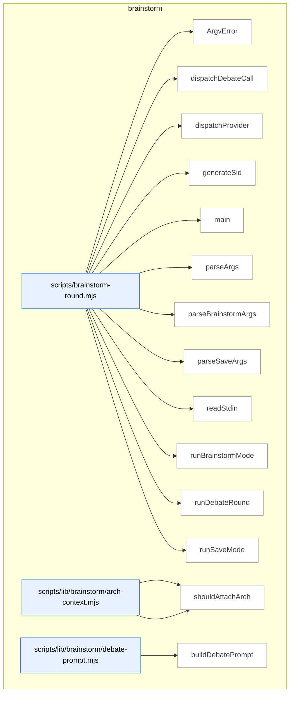

_Domain has 58 symbols (>50). Diagram shows top-15 by file order; see flat table below for the full list._

### Symbols in this domain

| Symbol | Kind | Path | Lines | Purpose | File imported by |
|---|---|---|---|---|---|
| [`ArgvError`](../scripts/brainstorm-round.mjs#L249) | class | `scripts/brainstorm-round.mjs` | 249-251 | Custom error class for command-line argument parsing failures. | _(internal)_ |
| [`dispatchDebateCall`](../scripts/brainstorm-round.mjs#L596) | function | `scripts/brainstorm-round.mjs` | 596-624 | Makes a single LLM call for a debate round, routing to OpenAI or Gemini with composed prompts. | _(internal)_ |
| [`dispatchProvider`](../scripts/brainstorm-round.mjs#L626) | function | `scripts/brainstorm-round.mjs` | 626-675 | Dispatches a single brainstorm round to an LLM provider, composing system preface and topic into the request. | _(internal)_ |
| [`generateSid`](../scripts/brainstorm-round.mjs#L558) | function | `scripts/brainstorm-round.mjs` | 558-561 | Generates a short, unique session ID by combining a timestamp and random bytes. | _(internal)_ |
| [`main`](../scripts/brainstorm-round.mjs#L259) | function | `scripts/brainstorm-round.mjs` | 259-286 | Entry point that parses CLI args, prunes old sessions, and routes to brainstorm or save mode. | _(internal)_ |
| [`parseArgs`](../scripts/brainstorm-round.mjs#L84) | function | `scripts/brainstorm-round.mjs` | 84-97 | Routes to either brainstorm or save argument parsing based on the first CLI argument. | _(internal)_ |
| [`parseBrainstormArgs`](../scripts/brainstorm-round.mjs#L99) | function | `scripts/brainstorm-round.mjs` | 99-198 | Parses brainstorm-specific CLI flags (--topic, --models, --with-gemini, --depth, etc.) into a configuration object. | _(internal)_ |
| [`parseSaveArgs`](../scripts/brainstorm-round.mjs#L200) | function | `scripts/brainstorm-round.mjs` | 200-247 | Parses command-line arguments for save mode (--sid, --round, --topic, --insight, --tags). | _(internal)_ |
| [`readStdin`](../scripts/brainstorm-round.mjs#L253) | function | `scripts/brainstorm-round.mjs` | 253-257 | Reads all pending stdin data and returns it as a UTF-8 string. | _(internal)_ |
| [`runBrainstormMode`](../scripts/brainstorm-round.mjs#L288) | function | `scripts/brainstorm-round.mjs` | 288-510 | Loads and redacts topic, resolves LLM models, handles depth/max-tokens, and orchestrates brainstorm generation. | _(internal)_ |
| [`runDebateRound`](../scripts/brainstorm-round.mjs#L563) | function | `scripts/brainstorm-round.mjs` | 563-594 | Orchestrates a peer debate between two LLM providers where each responds to the other's prior answer. | _(internal)_ |
| [`runSaveMode`](../scripts/brainstorm-round.mjs#L512) | function | `scripts/brainstorm-round.mjs` | 512-556 | Loads topic and insight from args/stdin, validates session and round exist, and saves insight with tags to ledger. | _(internal)_ |
| [`loadArchSection`](../scripts/lib/brainstorm/arch-context.mjs#L84) | function | `scripts/lib/brainstorm/arch-context.mjs` | 84-86 | Loads architectural context section from project config. | `scripts/brainstorm-round.mjs`, `scripts/lib/brainstorm/resume-context.mjs`, `tests/brainstorm-arch-context.test.mjs` |
| [`shouldAttachArch`](../scripts/lib/brainstorm/arch-context.mjs#L70) | function | `scripts/lib/brainstorm/arch-context.mjs` | 70-75 | Decides whether to include architecture context by flags or topic intent. | `scripts/brainstorm-round.mjs`, `scripts/lib/brainstorm/resume-context.mjs`, `tests/brainstorm-arch-context.test.mjs` |
| [`buildDebatePrompt`](../scripts/lib/brainstorm/debate-prompt.mjs#L51) | function | `scripts/lib/brainstorm/debate-prompt.mjs` | 51-84 | Constructs system/user message pair for peer debate between LLM providers. | `scripts/brainstorm-round.mjs`, `tests/brainstorm-debate.test.mjs` |
| [`wrapUntrusted`](../scripts/lib/brainstorm/debate-prompt.mjs#L34) | function | `scripts/lib/brainstorm/debate-prompt.mjs` | 34-37 | Wraps untrusted context in labeled delimiters for debate tracking. | `scripts/brainstorm-round.mjs`, `tests/brainstorm-debate.test.mjs` |
| [`autoPromoteDepth`](../scripts/lib/brainstorm/depth-config.mjs#L59) | function | `scripts/lib/brainstorm/depth-config.mjs` | 59-62 | Auto-promotes architectural topics to deep depth based on regex pattern. | `scripts/brainstorm-round.mjs`, `scripts/lib/brainstorm/arch-context.mjs`, `tests/brainstorm-depth.test.mjs`, +1 more |
| [`resolveDepth`](../scripts/lib/brainstorm/depth-config.mjs#L74) | function | `scripts/lib/brainstorm/depth-config.mjs` | 74-95 | Resolves depth configuration from explicit override or auto-promotion. | `scripts/brainstorm-round.mjs`, `scripts/lib/brainstorm/arch-context.mjs`, `tests/brainstorm-depth.test.mjs`, +1 more |
| [`callGemini`](../scripts/lib/brainstorm/gemini-adapter.mjs#L16) | function | `scripts/lib/brainstorm/gemini-adapter.mjs` | 16-90 | Calls Gemini API and normalizes response or error to standard shape. | `scripts/brainstorm-round.mjs` |
| [`classifyError`](../scripts/lib/brainstorm/gemini-adapter.mjs#L92) | function | `scripts/lib/brainstorm/gemini-adapter.mjs` | 92-123 | Classifies and normalizes Gemini errors into state enums. | `scripts/brainstorm-round.mjs` |
| [`client`](../scripts/lib/brainstorm/gemini-adapter.mjs#L6) | function | `scripts/lib/brainstorm/gemini-adapter.mjs` | 6-9 | Lazy-loads and caches GoogleGenAI client instance. | `scripts/brainstorm-round.mjs` |
| [`isValidSid`](../scripts/lib/brainstorm/id-validator.mjs#L43) | function | `scripts/lib/brainstorm/id-validator.mjs` | 43-45 | Boolean predicate for session ID validity. | `scripts/lib/brainstorm/insight-store.mjs`, `scripts/lib/brainstorm/session-store.mjs` |
| [`validateSid`](../scripts/lib/brainstorm/id-validator.mjs#L25) | function | `scripts/lib/brainstorm/id-validator.mjs` | 25-37 | Validates session ID format (non-empty string matching regex). | `scripts/lib/brainstorm/insight-store.mjs`, `scripts/lib/brainstorm/session-store.mjs` |
| [`buildInsightFile`](../scripts/lib/brainstorm/insight-store.mjs#L138) | function | `scripts/lib/brainstorm/insight-store.mjs` | 138-153 | Builds markdown file with validated YAML frontmatter. | `scripts/brainstorm-round.mjs`, `tests/brainstorm-insight-store.test.mjs` |
| [`findExistingSlugForTopic`](../scripts/lib/brainstorm/insight-store.mjs#L98) | function | `scripts/lib/brainstorm/insight-store.mjs` | 98-116 | Finds existing slug directory for a topic by frontmatter match. | `scripts/brainstorm-round.mjs`, `tests/brainstorm-insight-store.test.mjs` |
| [`listAllInsights`](../scripts/lib/brainstorm/insight-store.mjs#L234) | function | `scripts/lib/brainstorm/insight-store.mjs` | 234-246 | Lists all insights across topics, mtime-sorted. | `scripts/brainstorm-round.mjs`, `tests/brainstorm-insight-store.test.mjs` |
| [`listInsightsByTopic`](../scripts/lib/brainstorm/insight-store.mjs#L216) | function | `scripts/lib/brainstorm/insight-store.mjs` | 216-225 | Lists all insights for a specific topic. | `scripts/brainstorm-round.mjs`, `tests/brainstorm-insight-store.test.mjs` |
| [`parseFrontmatter`](../scripts/lib/brainstorm/insight-store.mjs#L125) | function | `scripts/lib/brainstorm/insight-store.mjs` | 125-132 | Parses YAML frontmatter and body from markdown delimited by `---`. | `scripts/brainstorm-round.mjs`, `tests/brainstorm-insight-store.test.mjs` |
| [`readInsightsFromDirs`](../scripts/lib/brainstorm/insight-store.mjs#L248) | function | `scripts/lib/brainstorm/insight-store.mjs` | 248-278 | Reads insight markdown files, parsing frontmatter with per-entry error handling. | `scripts/brainstorm-round.mjs`, `tests/brainstorm-insight-store.test.mjs` |
| [`resolveUniqueSlug`](../scripts/lib/brainstorm/insight-store.mjs#L74) | function | `scripts/lib/brainstorm/insight-store.mjs` | 74-85 | Ensures slug uniqueness by appending numeric suffix if needed. | `scripts/brainstorm-round.mjs`, `tests/brainstorm-insight-store.test.mjs` |
| [`rootDir`](../scripts/lib/brainstorm/insight-store.mjs#L34) | function | `scripts/lib/brainstorm/insight-store.mjs` | 34-36 | Resolves insights directory path from override or default. | `scripts/brainstorm-round.mjs`, `tests/brainstorm-insight-store.test.mjs` |
| [`saveInsight`](../scripts/lib/brainstorm/insight-store.mjs#L162) | function | `scripts/lib/brainstorm/insight-store.mjs` | 162-205 | Persists dated, content-deduplicated insight to slug directory under lock. | `scripts/brainstorm-round.mjs`, `tests/brainstorm-insight-store.test.mjs` |
| [`shortHash`](../scripts/lib/brainstorm/insight-store.mjs#L39) | function | `scripts/lib/brainstorm/insight-store.mjs` | 39-41 | Generates 16-character SHA-256 digest from concatenated parts. | `scripts/brainstorm-round.mjs`, `tests/brainstorm-insight-store.test.mjs` |
| [`slugifyTopic`](../scripts/lib/brainstorm/insight-store.mjs#L57) | function | `scripts/lib/brainstorm/insight-store.mjs` | 57-63 | Converts topic to lowercase slug-safe identifier. | `scripts/brainstorm-round.mjs`, `tests/brainstorm-insight-store.test.mjs` |
| [`tsStamp`](../scripts/lib/brainstorm/insight-store.mjs#L43) | function | `scripts/lib/brainstorm/insight-store.mjs` | 43-48 | Returns current UTC time in YYYYMMDD-HHMMSS format. | `scripts/brainstorm-round.mjs`, `tests/brainstorm-insight-store.test.mjs` |
| [`callOpenAI`](../scripts/lib/brainstorm/openai-adapter.mjs#L40) | function | `scripts/lib/brainstorm/openai-adapter.mjs` | 40-127 | Calls OpenAI GPT API with reasoning_effort fallback on unsupported models. | `scripts/brainstorm-round.mjs`, `scripts/lib/requirements/extract.mjs`, `scripts/lib/requirements/gap-challenge.mjs` |
| [`classifyError`](../scripts/lib/brainstorm/openai-adapter.mjs#L129) | function | `scripts/lib/brainstorm/openai-adapter.mjs` | 129-158 | Classifies and normalizes OpenAI errors into state enums. | `scripts/brainstorm-round.mjs`, `scripts/lib/requirements/extract.mjs`, `scripts/lib/requirements/gap-challenge.mjs` |
| [`client`](../scripts/lib/brainstorm/openai-adapter.mjs#L12) | function | `scripts/lib/brainstorm/openai-adapter.mjs` | 12-15 | Lazy-loads and caches OpenAI client instance. | `scripts/brainstorm-round.mjs`, `scripts/lib/requirements/extract.mjs`, `scripts/lib/requirements/gap-challenge.mjs` |
| [`wireModel`](../scripts/lib/brainstorm/openai-adapter.mjs#L20) | function | `scripts/lib/brainstorm/openai-adapter.mjs` | 20-22 | Resolves model to Azure deployment if active, else model ID. | `scripts/brainstorm-round.mjs`, `scripts/lib/requirements/extract.mjs`, `scripts/lib/requirements/gap-challenge.mjs` |
| [`estimateCostUsd`](../scripts/lib/brainstorm/pricing.mjs#L38) | function | `scripts/lib/brainstorm/pricing.mjs` | 38-41 | Calculates estimated USD cost from token counts and pricing. | `scripts/brainstorm-round.mjs`, `scripts/lib/brainstorm/gemini-adapter.mjs`, `scripts/lib/brainstorm/openai-adapter.mjs`, +1 more |
| [`preflightEstimateUsd`](../scripts/lib/brainstorm/pricing.mjs#L47) | function | `scripts/lib/brainstorm/pricing.mjs` | 47-50 | Estimates USD cost from character input and max output tokens. | `scripts/brainstorm-round.mjs`, `scripts/lib/brainstorm/gemini-adapter.mjs`, `scripts/lib/brainstorm/openai-adapter.mjs`, +1 more |
| [`priceFor`](../scripts/lib/brainstorm/pricing.mjs#L24) | function | `scripts/lib/brainstorm/pricing.mjs` | 24-31 | Looks up model's per-token input/output pricing rates. | `scripts/brainstorm-round.mjs`, `scripts/lib/brainstorm/gemini-adapter.mjs`, `scripts/lib/brainstorm/openai-adapter.mjs`, +1 more |
| [`estimateTokens`](../scripts/lib/brainstorm/provider-limits.mjs#L20) | function | `scripts/lib/brainstorm/provider-limits.mjs` | 20-22 | Approximates token count as character length divided by 4. | `scripts/lib/brainstorm/resume-context.mjs`, `tests/brainstorm-round-extensions.test.mjs` |
| [`getCeilingTokens`](../scripts/lib/brainstorm/provider-limits.mjs#L72) | function | `scripts/lib/brainstorm/provider-limits.mjs` | 72-83 | Retrieves input token ceiling for provider and optional model. | `scripts/lib/brainstorm/resume-context.mjs`, `tests/brainstorm-round-extensions.test.mjs` |
| [`smallestCeilingTokens`](../scripts/lib/brainstorm/provider-limits.mjs#L93) | function | `scripts/lib/brainstorm/provider-limits.mjs` | 93-105 | Finds provider with smallest input token ceiling. | `scripts/lib/brainstorm/resume-context.mjs`, `tests/brainstorm-round-extensions.test.mjs` |
| [`assembleResumeContext`](../scripts/lib/brainstorm/resume-context.mjs#L75) | function | `scripts/lib/brainstorm/resume-context.mjs` | 75-233 | Combines preface, arch, and context texts with separate token budgets. | `scripts/brainstorm-round.mjs`, `tests/brainstorm-arch-context.test.mjs`, `tests/brainstorm-resume-context.test.mjs` |
| [`buildArchBlock`](../scripts/lib/brainstorm/resume-context.mjs#L43) | function | `scripts/lib/brainstorm/resume-context.mjs` | 43-58 | Truncates architecture context to fit within token budget. | `scripts/brainstorm-round.mjs`, `tests/brainstorm-arch-context.test.mjs`, `tests/brainstorm-resume-context.test.mjs` |
| [`appendQuarantine`](../scripts/lib/brainstorm/session-store.mjs#L229) | function | `scripts/lib/brainstorm/session-store.mjs` | 229-263 | Appends invalid session lines to diagnostic quarantine file, trimmed to capacity. | `scripts/brainstorm-round.mjs`, `scripts/lib/brainstorm/resume-context.mjs`, `tests/brainstorm-resume-context.test.mjs`, +1 more |
| [`appendSession`](../scripts/lib/brainstorm/session-store.mjs#L77) | function | `scripts/lib/brainstorm/session-store.mjs` | 77-114 | Appends brainstorm round to session file under lock, auto-incrementing round. | `scripts/brainstorm-round.mjs`, `scripts/lib/brainstorm/resume-context.mjs`, `tests/brainstorm-resume-context.test.mjs`, +1 more |
| [`loadSession`](../scripts/lib/brainstorm/session-store.mjs#L150) | function | `scripts/lib/brainstorm/session-store.mjs` | 150-227 | Loads and validates all brainstorm rounds from session file, quarantining invalid lines. | `scripts/brainstorm-round.mjs`, `scripts/lib/brainstorm/resume-context.mjs`, `tests/brainstorm-resume-context.test.mjs`, +1 more |
| [`lockPath`](../scripts/lib/brainstorm/session-store.mjs#L36) | function | `scripts/lib/brainstorm/session-store.mjs` | 36-38 | Resolves lock file path for a session ID. | `scripts/brainstorm-round.mjs`, `scripts/lib/brainstorm/resume-context.mjs`, `tests/brainstorm-resume-context.test.mjs`, +1 more |
| [`normalizeArchFields`](../scripts/lib/brainstorm/session-store.mjs#L141) | function | `scripts/lib/brainstorm/session-store.mjs` | 141-148 | Normalizes arch-context fields to defaults. | `scripts/brainstorm-round.mjs`, `scripts/lib/brainstorm/resume-context.mjs`, `tests/brainstorm-resume-context.test.mjs`, +1 more |
| [`pruneOldSessions`](../scripts/lib/brainstorm/session-store.mjs#L295) | function | `scripts/lib/brainstorm/session-store.mjs` | 295-337 | Deletes session files older than age threshold with throttling sentinel. | `scripts/brainstorm-round.mjs`, `scripts/lib/brainstorm/resume-context.mjs`, `tests/brainstorm-resume-context.test.mjs`, +1 more |
| [`quarantinePath`](../scripts/lib/brainstorm/session-store.mjs#L40) | function | `scripts/lib/brainstorm/session-store.mjs` | 40-42 | Resolves quarantine file path for a session ID. | `scripts/brainstorm-round.mjs`, `scripts/lib/brainstorm/resume-context.mjs`, `tests/brainstorm-resume-context.test.mjs`, +1 more |
| [`readLinesUnvalidated`](../scripts/lib/brainstorm/session-store.mjs#L53) | function | `scripts/lib/brainstorm/session-store.mjs` | 53-67 | Reads JSONL lines with unvalidated JSON parsing and round assignment. | `scripts/brainstorm-round.mjs`, `scripts/lib/brainstorm/resume-context.mjs`, `tests/brainstorm-resume-context.test.mjs`, +1 more |
| [`sessionDir`](../scripts/lib/brainstorm/session-store.mjs#L28) | function | `scripts/lib/brainstorm/session-store.mjs` | 28-30 | Resolves brainstorm sessions directory path. | `scripts/brainstorm-round.mjs`, `scripts/lib/brainstorm/resume-context.mjs`, `tests/brainstorm-resume-context.test.mjs`, +1 more |
| [`sessionPath`](../scripts/lib/brainstorm/session-store.mjs#L32) | function | `scripts/lib/brainstorm/session-store.mjs` | 32-34 | Resolves session .jsonl file path for a session ID. | `scripts/brainstorm-round.mjs`, `scripts/lib/brainstorm/resume-context.mjs`, `tests/brainstorm-resume-context.test.mjs`, +1 more |
| [`summariseRound`](../scripts/lib/brainstorm/session-store.mjs#L272) | function | `scripts/lib/brainstorm/session-store.mjs` | 272-280 | Formats round data as human-readable summary with topic and provider excerpts. | `scripts/brainstorm-round.mjs`, `scripts/lib/brainstorm/resume-context.mjs`, `tests/brainstorm-resume-context.test.mjs`, +1 more |

---

## claude-hooks

> Detects mechanical coding shortcuts (empty catches, `@ts-ignore`, hardcoded localhost) via regex pattern matching, with line-level suppression comments and sensitive-path filtering to avoid false positives on credentials.

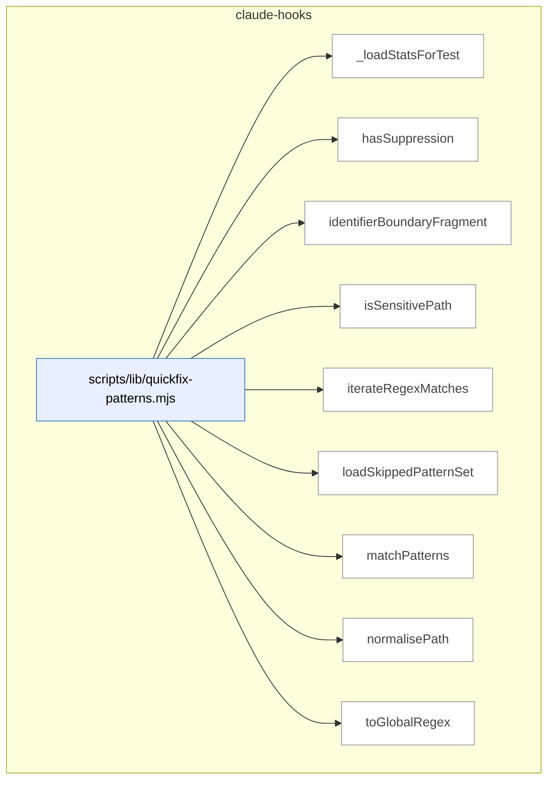

### Symbols in this domain

| Symbol | Kind | Path | Lines | Purpose | File imported by |
|---|---|---|---|---|---|
| [`_loadStatsForTest`](../scripts/lib/quickfix-patterns.mjs#L521) | function | `scripts/lib/quickfix-patterns.mjs` | 521-526 | Loads the quickfix pattern statistics cache for testing. | `scripts/lib/audit/finding-verification.mjs`, `scripts/lib/repo-inventory.mjs`, `tests/learning-quickfix-hook.test.mjs`, +1 more |
| [`hasSuppression`](../scripts/lib/quickfix-patterns.mjs#L270) | function | `scripts/lib/quickfix-patterns.mjs` | 270-274 | Detects quickfix-hook suppression comments on a code line. | `scripts/lib/audit/finding-verification.mjs`, `scripts/lib/repo-inventory.mjs`, `tests/learning-quickfix-hook.test.mjs`, +1 more |
| [`identifierBoundaryFragment`](../scripts/lib/quickfix-patterns.mjs#L52) | function | `scripts/lib/quickfix-patterns.mjs` | 52-56 | Constructs a regex fragment matching identifier word boundaries for quickfix patterns. | `scripts/lib/audit/finding-verification.mjs`, `scripts/lib/repo-inventory.mjs`, `tests/learning-quickfix-hook.test.mjs`, +1 more |
| [`isSensitivePath`](../scripts/lib/quickfix-patterns.mjs#L258) | function | `scripts/lib/quickfix-patterns.mjs` | 258-260 | Checks whether a path is classified as sensitive (env/secrets/credentials). | `scripts/lib/audit/finding-verification.mjs`, `scripts/lib/repo-inventory.mjs`, `tests/learning-quickfix-hook.test.mjs`, +1 more |
| [`iterateRegexMatches`](../scripts/lib/quickfix-patterns.mjs#L303) | function | `scripts/lib/quickfix-patterns.mjs` | 303-310 | Lazily yields all matches of a regex against text, handling zero-width matches. | `scripts/lib/audit/finding-verification.mjs`, `scripts/lib/repo-inventory.mjs`, `tests/learning-quickfix-hook.test.mjs`, +1 more |
| [`loadSkippedPatternSet`](../scripts/lib/quickfix-patterns.mjs#L492) | function | `scripts/lib/quickfix-patterns.mjs` | 492-514 | Loads the learning cache to identify low-adoption quickfix patterns for skipping. | `scripts/lib/audit/finding-verification.mjs`, `scripts/lib/repo-inventory.mjs`, `tests/learning-quickfix-hook.test.mjs`, +1 more |
| [`matchPatterns`](../scripts/lib/quickfix-patterns.mjs#L336) | function | `scripts/lib/quickfix-patterns.mjs` | 336-457 | Scans diffs for quickfix shortcuts (empty catch/hardcoded hosts/etc) with suppression and sensitive-path filtering. | `scripts/lib/audit/finding-verification.mjs`, `scripts/lib/repo-inventory.mjs`, `tests/learning-quickfix-hook.test.mjs`, +1 more |
| [`normalisePath`](../scripts/lib/quickfix-patterns.mjs#L245) | function | `scripts/lib/quickfix-patterns.mjs` | 245-247 | Normalizes file paths to canonical form. | `scripts/lib/audit/finding-verification.mjs`, `scripts/lib/repo-inventory.mjs`, `tests/learning-quickfix-hook.test.mjs`, +1 more |
| [`toGlobalRegex`](../scripts/lib/quickfix-patterns.mjs#L288) | function | `scripts/lib/quickfix-patterns.mjs` | 288-291 | Ensures a regex has the global flag for iteration over all matches. | `scripts/lib/audit/finding-verification.mjs`, `scripts/lib/repo-inventory.mjs`, `tests/learning-quickfix-hook.test.mjs`, +1 more |

---

## claudemd-management

> Scans and maintains hygiene in instruction files (CLAUDE.md, AGENTS.md, SKILL.md): validates cross-file references, detects duplicate content via Jaccard similarity, and auto-fixes stale markdown links.

```mermaid
flowchart TB
subgraph dom_claudemd_management ["claudemd-management"]
  file_scripts_lib_claudemd_autofix_mjs["scripts/lib/claudemd/autofix.mjs"]:::component
  sym_scripts_lib_claudemd_autofix_mjs_applyFi["applyFixes"]:::symbol
  file_scripts_lib_claudemd_autofix_mjs --> sym_scripts_lib_claudemd_autofix_mjs_applyFi
  file_scripts_lib_claudemd_doc_similarity_mjs["scripts/lib/claudemd/doc-similarity.mjs"]:::component
  sym_scripts_lib_claudemd_doc_similarity_mjs_["extractParagraphs"]:::symbol
  file_scripts_lib_claudemd_doc_similarity_mjs --> sym_scripts_lib_claudemd_doc_similarity_mjs_
  sym_scripts_lib_claudemd_doc_similarity_mjs_["findSimilarParagraphs"]:::symbol
  file_scripts_lib_claudemd_doc_similarity_mjs --> sym_scripts_lib_claudemd_doc_similarity_mjs_
  sym_scripts_lib_claudemd_doc_similarity_mjs_["jaccardSimilarity"]:::symbol
  file_scripts_lib_claudemd_doc_similarity_mjs --> sym_scripts_lib_claudemd_doc_similarity_mjs_
  sym_scripts_lib_claudemd_doc_similarity_mjs_["normalizeMarkdown"]:::symbol
  file_scripts_lib_claudemd_doc_similarity_mjs --> sym_scripts_lib_claudemd_doc_similarity_mjs_
  sym_scripts_lib_claudemd_doc_similarity_mjs_["tokenize"]:::symbol
  file_scripts_lib_claudemd_doc_similarity_mjs --> sym_scripts_lib_claudemd_doc_similarity_mjs_
  file_scripts_lib_claudemd_file_scanner_mjs["scripts/lib/claudemd/file-scanner.mjs"]:::component
  sym_scripts_lib_claudemd_file_scanner_mjs_ma["matchPattern"]:::symbol
  file_scripts_lib_claudemd_file_scanner_mjs --> sym_scripts_lib_claudemd_file_scanner_mjs_ma
  sym_scripts_lib_claudemd_file_scanner_mjs_sc["scanInstructionFiles"]:::symbol
  file_scripts_lib_claudemd_file_scanner_mjs --> sym_scripts_lib_claudemd_file_scanner_mjs_sc
  sym_scripts_lib_claudemd_file_scanner_mjs_wa["walkDir"]:::symbol
  file_scripts_lib_claudemd_file_scanner_mjs --> sym_scripts_lib_claudemd_file_scanner_mjs_wa
  file_scripts_lib_claudemd_ref_checker_mjs["scripts/lib/claudemd/ref-checker.mjs"]:::component
  sym_scripts_lib_claudemd_ref_checker_mjs_bui["buildEnvVarIndex"]:::symbol
  file_scripts_lib_claudemd_ref_checker_mjs --> sym_scripts_lib_claudemd_ref_checker_mjs_bui
  sym_scripts_lib_claudemd_ref_checker_mjs_bui["buildFunctionIndex"]:::symbol
  file_scripts_lib_claudemd_ref_checker_mjs --> sym_scripts_lib_claudemd_ref_checker_mjs_bui
  sym_scripts_lib_claudemd_ref_checker_mjs_ext["extractEnvVarRefs"]:::symbol
  file_scripts_lib_claudemd_ref_checker_mjs --> sym_scripts_lib_claudemd_ref_checker_mjs_ext
  sym_scripts_lib_claudemd_ref_checker_mjs_ext["extractFileRefs"]:::symbol
  file_scripts_lib_claudemd_ref_checker_mjs --> sym_scripts_lib_claudemd_ref_checker_mjs_ext
  sym_scripts_lib_claudemd_ref_checker_mjs_ext["extractFunctionRefs"]:::symbol
  file_scripts_lib_claudemd_ref_checker_mjs --> sym_scripts_lib_claudemd_ref_checker_mjs_ext
  sym_scripts_lib_claudemd_ref_checker_mjs_res["resolveReferencedPath"]:::symbol
  file_scripts_lib_claudemd_ref_checker_mjs --> sym_scripts_lib_claudemd_ref_checker_mjs_res
  file_scripts_lib_claudemd_rules_mjs["scripts/lib/claudemd/rules.mjs"]:::component
  sym_scripts_lib_claudemd_rules_mjs_checkClau["checkClaudeAgentsSync"]:::symbol
  file_scripts_lib_claudemd_rules_mjs --> sym_scripts_lib_claudemd_rules_mjs_checkClau
  sym_scripts_lib_claudemd_rules_mjs_checkCros["checkCrossFileDuplication"]:::symbol
  file_scripts_lib_claudemd_rules_mjs --> sym_scripts_lib_claudemd_rules_mjs_checkCros
  sym_scripts_lib_claudemd_rules_mjs_checkDeep["checkDeepCodeDetail"]:::symbol
  file_scripts_lib_claudemd_rules_mjs --> sym_scripts_lib_claudemd_rules_mjs_checkDeep
  sym_scripts_lib_claudemd_rules_mjs_checkSize["checkSize"]:::symbol
  file_scripts_lib_claudemd_rules_mjs --> sym_scripts_lib_claudemd_rules_mjs_checkSize
  sym_scripts_lib_claudemd_rules_mjs_checkStal["checkStaleEnvVarRefs"]:::symbol
  file_scripts_lib_claudemd_rules_mjs --> sym_scripts_lib_claudemd_rules_mjs_checkStal
  sym_scripts_lib_claudemd_rules_mjs_checkStal["checkStaleFileRefs"]:::symbol
  file_scripts_lib_claudemd_rules_mjs --> sym_scripts_lib_claudemd_rules_mjs_checkStal
  sym_scripts_lib_claudemd_rules_mjs_checkStal["checkStaleFunctionRefs"]:::symbol
  file_scripts_lib_claudemd_rules_mjs --> sym_scripts_lib_claudemd_rules_mjs_checkStal
  sym_scripts_lib_claudemd_rules_mjs_extractHe["extractHeadings"]:::symbol
  file_scripts_lib_claudemd_rules_mjs --> sym_scripts_lib_claudemd_rules_mjs_extractHe
  sym_scripts_lib_claudemd_rules_mjs_runRules["runRules"]:::symbol
  file_scripts_lib_claudemd_rules_mjs --> sym_scripts_lib_claudemd_rules_mjs_runRules
  sym_scripts_lib_claudemd_rules_mjs_semanticI["semanticId"]:::symbol
  file_scripts_lib_claudemd_rules_mjs --> sym_scripts_lib_claudemd_rules_mjs_semanticI
  file_scripts_lib_claudemd_sarif_formatter_mjs["scripts/lib/claudemd/sarif-formatter.mjs"]:::component
  sym_scripts_lib_claudemd_sarif_formatter_mjs["buildRuleDescriptors"]:::symbol
  file_scripts_lib_claudemd_sarif_formatter_mjs --> sym_scripts_lib_claudemd_sarif_formatter_mjs
  sym_scripts_lib_claudemd_sarif_formatter_mjs["ruleDescription"]:::symbol
  file_scripts_lib_claudemd_sarif_formatter_mjs --> sym_scripts_lib_claudemd_sarif_formatter_mjs
  sym_scripts_lib_claudemd_sarif_formatter_mjs["sarifLevel"]:::symbol
  file_scripts_lib_claudemd_sarif_formatter_mjs --> sym_scripts_lib_claudemd_sarif_formatter_mjs
  sym_scripts_lib_claudemd_sarif_formatter_mjs["toSarif"]:::symbol
  file_scripts_lib_claudemd_sarif_formatter_mjs --> sym_scripts_lib_claudemd_sarif_formatter_mjs
  file_scripts_lib_claudemd_step65_hook_mjs["scripts/lib/claudemd/step65-hook.mjs"]:::component
  sym_scripts_lib_claudemd_step65_hook_mjs_run["runHygieneCheck"]:::symbol
  file_scripts_lib_claudemd_step65_hook_mjs --> sym_scripts_lib_claudemd_step65_hook_mjs_run
end
classDef container fill:#f5f5f5,stroke:#333,stroke-width:2px,color:#000
classDef component fill:#e8f0ff,stroke:#3178c6,color:#000
classDef symbol fill:#fff,stroke:#999,color:#444
classDef dup fill:#ffe8d8,stroke:#c0392b,stroke-width:2px,color:#000
classDef violation fill:#ffd6d6,stroke:#c0392b,stroke-width:2px,color:#000
```

### Symbols in this domain

| Symbol | Kind | Path | Lines | Purpose | File imported by |
|---|---|---|---|---|---|
| [`applyFixes`](../scripts/lib/claudemd/autofix.mjs#L17) | function | `scripts/lib/claudemd/autofix.mjs` | 17-74 | Removes stale file-reference markdown links from CLAUDE.md in dry-run or apply mode. | `scripts/claudemd-lint.mjs`, `tests/claudemd/autofix.test.mjs` |
| [`extractParagraphs`](../scripts/lib/claudemd/doc-similarity.mjs#L68) | function | `scripts/lib/claudemd/doc-similarity.mjs` | 68-103 | Extracts paragraph blocks from markdown, excluding code blocks and blank lines. | `scripts/lib/claudemd/rules.mjs`, `tests/claudemd/doc-similarity.test.mjs` |
| [`findSimilarParagraphs`](../scripts/lib/claudemd/doc-similarity.mjs#L114) | function | `scripts/lib/claudemd/doc-similarity.mjs` | 114-146 | Finds paragraph pairs across documents with Jaccard token similarity above threshold. | `scripts/lib/claudemd/rules.mjs`, `tests/claudemd/doc-similarity.test.mjs` |
| [`jaccardSimilarity`](../scripts/lib/claudemd/doc-similarity.mjs#L53) | function | `scripts/lib/claudemd/doc-similarity.mjs` | 53-61 | Calculates Jaccard similarity (intersection/union ratio) between token sets. | `scripts/lib/claudemd/rules.mjs`, `tests/claudemd/doc-similarity.test.mjs` |
| [`normalizeMarkdown`](../scripts/lib/claudemd/doc-similarity.mjs#L24) | function | `scripts/lib/claudemd/doc-similarity.mjs` | 24-34 | Strips markdown formatting and lowercases text for similarity comparison. | `scripts/lib/claudemd/rules.mjs`, `tests/claudemd/doc-similarity.test.mjs` |
| [`tokenize`](../scripts/lib/claudemd/doc-similarity.mjs#L41) | function | `scripts/lib/claudemd/doc-similarity.mjs` | 41-45 | Extracts normalized ≥2-char tokens, filtering stopwords. | `scripts/lib/claudemd/rules.mjs`, `tests/claudemd/doc-similarity.test.mjs` |
| [`matchPattern`](../scripts/lib/claudemd/file-scanner.mjs#L72) | function | `scripts/lib/claudemd/file-scanner.mjs` | 72-93 | Tests whether a normalized file path matches a glob-like pattern with literal and wildcard components. | `scripts/check-context-drift.mjs`, `scripts/claudemd-lint.mjs`, `scripts/lib/claudemd/ref-checker.mjs`, +1 more |
| [`scanInstructionFiles`](../scripts/lib/claudemd/file-scanner.mjs#L102) | function | `scripts/lib/claudemd/file-scanner.mjs` | 102-133 | Scans the repo for instruction files (CLAUDE.md, AGENTS.md, SKILL.md), reads their content, and returns file metadata. | `scripts/check-context-drift.mjs`, `scripts/claudemd-lint.mjs`, `scripts/lib/claudemd/ref-checker.mjs`, +1 more |
| [`walkDir`](../scripts/lib/claudemd/file-scanner.mjs#L30) | function | `scripts/lib/claudemd/file-scanner.mjs` | 30-68 | Recursively walks a directory tree matching instruction file patterns and excluding specified directories. | `scripts/check-context-drift.mjs`, `scripts/claudemd-lint.mjs`, `scripts/lib/claudemd/ref-checker.mjs`, +1 more |
| [`buildEnvVarIndex`](../scripts/lib/claudemd/ref-checker.mjs#L194) | function | `scripts/lib/claudemd/ref-checker.mjs` | 194-235 | Builds a set of valid environment variables from .env.example and process.env calls in source code. | `scripts/lib/claudemd/rules.mjs`, `tests/claudemd/ref-checker.test.mjs` |
| [`buildFunctionIndex`](../scripts/lib/claudemd/ref-checker.mjs#L91) | function | `scripts/lib/claudemd/ref-checker.mjs` | 91-124 | Indexes all exported functions, classes, and Python definitions across the codebase for later validation. | `scripts/lib/claudemd/rules.mjs`, `tests/claudemd/ref-checker.test.mjs` |
| [`extractEnvVarRefs`](../scripts/lib/claudemd/ref-checker.mjs#L165) | function | `scripts/lib/claudemd/ref-checker.mjs` | 165-187 | Finds ALL_CAPS_WITH_UNDERSCORES environment variable references in backticks within text. | `scripts/lib/claudemd/rules.mjs`, `tests/claudemd/ref-checker.test.mjs` |
| [`extractFileRefs`](../scripts/lib/claudemd/ref-checker.mjs#L52) | function | `scripts/lib/claudemd/ref-checker.mjs` | 52-84 | Extracts markdown links and backtick-quoted file paths from text, skipping code blocks. | `scripts/lib/claudemd/rules.mjs`, `tests/claudemd/ref-checker.test.mjs` |
| [`extractFunctionRefs`](../scripts/lib/claudemd/ref-checker.mjs#L132) | function | `scripts/lib/claudemd/ref-checker.mjs` | 132-158 | Finds function or class name references in backticks within text. | `scripts/lib/claudemd/rules.mjs`, `tests/claudemd/ref-checker.test.mjs` |
| [`resolveReferencedPath`](../scripts/lib/claudemd/ref-checker.mjs#L25) | function | `scripts/lib/claudemd/ref-checker.mjs` | 25-44 | Resolves a markdown reference path relative to its source file, verifying it stays within the repo and exists. | `scripts/lib/claudemd/rules.mjs`, `tests/claudemd/ref-checker.test.mjs` |
| [`checkClaudeAgentsSync`](../scripts/lib/claudemd/rules.mjs#L234) | function | `scripts/lib/claudemd/rules.mjs` | 234-271 | Detects heading conflicts between colocated CLAUDE.md and AGENTS.md files. | `scripts/claudemd-lint.mjs`, `tests/claudemd/rules.test.mjs` |
| [`checkCrossFileDuplication`](../scripts/lib/claudemd/rules.mjs#L203) | function | `scripts/lib/claudemd/rules.mjs` | 203-232 | Detects paragraph-level duplication across instruction files in the same directory tree. | `scripts/claudemd-lint.mjs`, `tests/claudemd/rules.test.mjs` |
| [`checkDeepCodeDetail`](../scripts/lib/claudemd/rules.mjs#L186) | function | `scripts/lib/claudemd/rules.mjs` | 186-201 | Warns if an instruction file contains too many fenced code blocks. | `scripts/claudemd-lint.mjs`, `tests/claudemd/rules.test.mjs` |
| [`checkSize`](../scripts/lib/claudemd/rules.mjs#L108) | function | `scripts/lib/claudemd/rules.mjs` | 108-122 | Emits a finding if an instruction file exceeds its byte-size limit. | `scripts/claudemd-lint.mjs`, `tests/claudemd/rules.test.mjs` |
| [`checkStaleEnvVarRefs`](../scripts/lib/claudemd/rules.mjs#L168) | function | `scripts/lib/claudemd/rules.mjs` | 168-184 | Validates environment variable backtick references are defined in .env.example or source, reporting missing vars. | `scripts/claudemd-lint.mjs`, `tests/claudemd/rules.test.mjs` |
| [`checkStaleFileRefs`](../scripts/lib/claudemd/rules.mjs#L124) | function | `scripts/lib/claudemd/rules.mjs` | 124-142 | Validates markdown file references exist on disk, reporting missing paths. | `scripts/claudemd-lint.mjs`, `tests/claudemd/rules.test.mjs` |
| [`checkStaleFunctionRefs`](../scripts/lib/claudemd/rules.mjs#L144) | function | `scripts/lib/claudemd/rules.mjs` | 144-166 | Validates function and class backtick references exist in source code, reporting undefined symbols. | `scripts/claudemd-lint.mjs`, `tests/claudemd/rules.test.mjs` |
| [`extractHeadings`](../scripts/lib/claudemd/rules.mjs#L278) | function | `scripts/lib/claudemd/rules.mjs` | 278-302 | Parses markdown headings and groups their associated content into a map. | `scripts/claudemd-lint.mjs`, `tests/claudemd/rules.test.mjs` |
| [`runRules`](../scripts/lib/claudemd/rules.mjs#L44) | function | `scripts/lib/claudemd/rules.mjs` | 44-106 | Runs all enabled linting rules against scanned instruction files and collects the resulting findings. | `scripts/claudemd-lint.mjs`, `tests/claudemd/rules.test.mjs` |
| [`semanticId`](../scripts/lib/claudemd/rules.mjs#L17) | function | `scripts/lib/claudemd/rules.mjs` | 17-22 | Generates a stable 16-character semantic hash for a finding based on rule, file path, and content. | `scripts/claudemd-lint.mjs`, `tests/claudemd/rules.test.mjs` |
| [`buildRuleDescriptors`](../scripts/lib/claudemd/sarif-formatter.mjs#L49) | function | `scripts/lib/claudemd/sarif-formatter.mjs` | 49-62 | Builds SARIF rule descriptors from unique rule IDs present in findings. | `scripts/check-context-drift.mjs`, `scripts/check-model-freshness.mjs`, `scripts/claudemd-lint.mjs` |
| [`ruleDescription`](../scripts/lib/claudemd/sarif-formatter.mjs#L64) | function | `scripts/lib/claudemd/sarif-formatter.mjs` | 64-77 | Returns human-readable descriptions for each linting rule ID. | `scripts/check-context-drift.mjs`, `scripts/check-model-freshness.mjs`, `scripts/claudemd-lint.mjs` |
| [`sarifLevel`](../scripts/lib/claudemd/sarif-formatter.mjs#L40) | function | `scripts/lib/claudemd/sarif-formatter.mjs` | 40-47 | Maps finding severity levels (error/warn/info) to their SARIF equivalents. | `scripts/check-context-drift.mjs`, `scripts/check-model-freshness.mjs`, `scripts/claudemd-lint.mjs` |
| [`toSarif`](../scripts/lib/claudemd/sarif-formatter.mjs#L11) | function | `scripts/lib/claudemd/sarif-formatter.mjs` | 11-38 | Converts linting findings to SARIF 2.1.0 JSON format for integration with code analysis tools. | `scripts/check-context-drift.mjs`, `scripts/check-model-freshness.mjs`, `scripts/claudemd-lint.mjs` |
| [`runHygieneCheck`](../scripts/lib/claudemd/step65-hook.mjs#L16) | function | `scripts/lib/claudemd/step65-hook.mjs` | 16-65 | Executes the claudemd linter subprocess, parses its JSON output, and returns a summary. | _(internal)_ |

---

## cross-skill-bridge

> Parses CLI subcommands and payloads, dispatches to skill handlers, and persists cross-skill data (plans, findings, repo context) to the learning store.

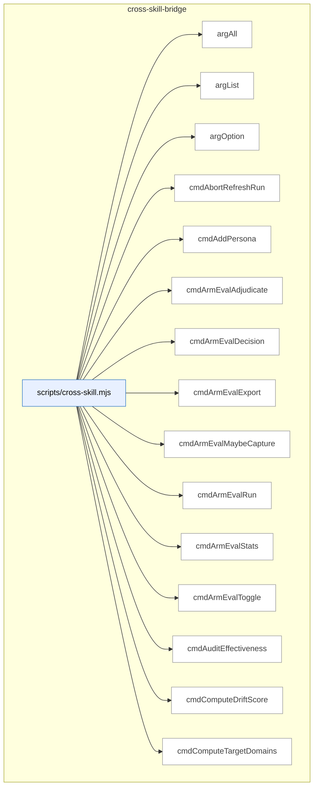

_Domain has 82 symbols (>50). Diagram shows top-15 by file order; see flat table below for the full list._

### Symbols in this domain

| Symbol | Kind | Path | Lines | Purpose | File imported by |
|---|---|---|---|---|---|
| [`argAll`](../scripts/cross-skill.mjs#L153) | function | `scripts/cross-skill.mjs` | 153-159 | Collects all values for multiply-repeated flag occurrences into an array. | _(internal)_ |
| [`argList`](../scripts/cross-skill.mjs#L147) | function | `scripts/cross-skill.mjs` | 147-150 | Retrieves a comma-separated list value and splits it into an array. | _(internal)_ |
| [`argOption`](../scripts/cross-skill.mjs#L140) | function | `scripts/cross-skill.mjs` | 140-144 | Retrieves the value immediately following a named flag (e.g., --flag value). | _(internal)_ |
| [`cmdAbortRefreshRun`](../scripts/cross-skill.mjs#L1867) | function | `scripts/cross-skill.mjs` | 1867-1877 | Aborts an in-progress symbol-index refresh run with an optional reason. | _(internal)_ |
| [`cmdAddPersona`](../scripts/cross-skill.mjs#L1072) | function | `scripts/cross-skill.mjs` | 1072-1084 | Creates or updates a persona record for an app. | _(internal)_ |
| [`cmdArmEvalAdjudicate`](../scripts/cross-skill.mjs#L810) | function | `scripts/cross-skill.mjs` | 810-834 | Records human ranking judgment of blinded arm-eval model outputs for later attribution. | _(internal)_ |
| [`cmdArmEvalDecision`](../scripts/cross-skill.mjs#L776) | function | `scripts/cross-skill.mjs` | 776-793 | Decides whether to switch to a different model based on arm-eval session comparison results. | _(internal)_ |
| [`cmdArmEvalExport`](../scripts/cross-skill.mjs#L842) | function | `scripts/cross-skill.mjs` | 842-860 | Exports arm-eval session results to committed archive files. | _(internal)_ |
| [`cmdArmEvalMaybeCapture`](../scripts/cross-skill.mjs#L901) | function | `scripts/cross-skill.mjs` | 901-917 | Conditionally captures a brainstorm or plan prompt for arm-eval if the toggle is enabled. | _(internal)_ |
| [`cmdArmEvalRun`](../scripts/cross-skill.mjs#L754) | function | `scripts/cross-skill.mjs` | 754-773 | Runs an arm-eval experiment session with configurable budget, phase, and random seed. | _(internal)_ |
| [`cmdArmEvalStats`](../scripts/cross-skill.mjs#L796) | function | `scripts/cross-skill.mjs` | 796-807 | Retrieves leaderboard statistics for arm-eval experiments across repos and phases. | _(internal)_ |
| [`cmdArmEvalToggle`](../scripts/cross-skill.mjs#L868) | function | `scripts/cross-skill.mjs` | 868-893 | Enables or disables arm-eval capture for plan-authoring and brainstorm experiments. | _(internal)_ |
| [`cmdAuditEffectiveness`](../scripts/cross-skill.mjs#L584) | function | `scripts/cross-skill.mjs` | 584-591 | Queries audit effectiveness metrics (precision/recall/accuracy) for a repo. | _(internal)_ |
| [`cmdComputeDriftScore`](../scripts/cross-skill.mjs#L1971) | function | `scripts/cross-skill.mjs` | 1971-1982 | Computes the architectural drift score for a repo at a given snapshot. | _(internal)_ |
| [`cmdComputeTargetDomains`](../scripts/cross-skill.mjs#L1711) | function | `scripts/cross-skill.mjs` | 1711-1723 | Computes domain assignments for changed file paths using domain tagging rules. | _(internal)_ |
| [`cmdDetectStack`](../scripts/cross-skill.mjs#L1546) | function | `scripts/cross-skill.mjs` | 1546-1563 | Detects the repo's tech stack (Node/Python/etc) and environment manager. | _(internal)_ |
| [`cmdFinalizeOutcomes`](../scripts/cross-skill.mjs#L972) | function | `scripts/cross-skill.mjs` | 972-1042 | Finalizes audit findings from ledger and result files into the learning store or local cache. | _(internal)_ |
| [`cmdFinalReviewAdjudicate`](../scripts/cross-skill.mjs#L630) | function | `scripts/cross-skill.mjs` | 630-644 | Records human judgment (accepted/dismissed) on a final-review finding. | _(internal)_ |
| [`cmdFinalReviewStats`](../scripts/cross-skill.mjs#L595) | function | `scripts/cross-skill.mjs` | 595-628 | Retrieves final-review findings and shadow-only queue with optional markdown worksheet. | _(internal)_ |
| [`cmdFrictionLog`](../scripts/cross-skill.mjs#L2096) | function | `scripts/cross-skill.mjs` | 2096-2101 | Logs friction/quality events (internal entry point). | _(internal)_ |
| [`cmdGetActiveRefreshId`](../scripts/cross-skill.mjs#L1583) | function | `scripts/cross-skill.mjs` | 1583-1599 | Retrieves the active symbol-index refresh ID and embedding model metadata for a repo. | _(internal)_ |
| [`cmdGetCallersForFile`](../scripts/cross-skill.mjs#L1725) | function | `scripts/cross-skill.mjs` | 1725-1788 | Retrieves callers and their domains for a symbol file from the import graph. | _(internal)_ |
| [`cmdGetFrictionNeighbourhood`](../scripts/cross-skill.mjs#L1700) | function | `scripts/cross-skill.mjs` | 1700-1709 | Retrieves friction items similar to a prompt via embedding search. | _(internal)_ |
| [`cmdGetIncidentNeighbourhood`](../scripts/cross-skill.mjs#L1601) | function | `scripts/cross-skill.mjs` | 1601-1642 | Finds similar past security incidents for an architectural intent via embedding similarity. | _(internal)_ |
| [`cmdGetNavFirstSeen`](../scripts/cross-skill.mjs#L536) | function | `scripts/cross-skill.mjs` | 536-551 | Queries nav-audit history to find first-appearance dates for drift items. | _(internal)_ |
| [`cmdGetNeighbourhood`](../scripts/cross-skill.mjs#L1790) | function | `scripts/cross-skill.mjs` | 1790-1833 | Retrieves similar existing symbols for architectural consultation via embedding search. | _(internal)_ |
| [`cmdGetPersonaSessionsByRepo`](../scripts/cross-skill.mjs#L1325) | function | `scripts/cross-skill.mjs` | 1325-1353 | Retrieves persona testing sessions for a repo with optional filtering by limit and field selection. | _(internal)_ |
| [`cmdGetPersonaSessionsByUrl`](../scripts/cross-skill.mjs#L1518) | function | `scripts/cross-skill.mjs` | 1518-1544 | Retrieves persona sessions for an app URL with optional limit and field selection. | _(internal)_ |
| [`cmdGetReachabilityEvidence`](../scripts/cross-skill.mjs#L1360) | function | `scripts/cross-skill.mjs` | 1360-1394 | Retrieves persona click-path evidence for nav-audit bootstrap. | _(internal)_ |
| [`cmdGetRecentFindings`](../scripts/cross-skill.mjs#L1475) | function | `scripts/cross-skill.mjs` | 1475-1510 | Retrieves recent audit findings filtered by repo name or ID and severity levels. | _(internal)_ |
| [`cmdLearningBackfillOutcomes`](../scripts/cross-skill.mjs#L2080) | function | `scripts/cross-skill.mjs` | 2080-2090 | Backfills missing outcome labels for learning decisions in the store. | _(internal)_ |
| [`cmdLearningQuickfixStats`](../scripts/cross-skill.mjs#L2123) | function | `scripts/cross-skill.mjs` | 2123-2149 | Rebuilds or reads the quickfix pattern skip-cache statistics. | _(internal)_ |
| [`cmdLearningRecord`](../scripts/cross-skill.mjs#L1999) | function | `scripts/cross-skill.mjs` | 1999-2038 | Records a learning decision event with context, choice, and optional outcome. | _(internal)_ |
| [`cmdLearningReplay`](../scripts/cross-skill.mjs#L2108) | function | `scripts/cross-skill.mjs` | 2108-2116 | Replays learning decisions to validate or audit the decision audit trail. | _(internal)_ |
| [`cmdLearningStats`](../scripts/cross-skill.mjs#L2045) | function | `scripts/cross-skill.mjs` | 2045-2056 | Retrieves decision and outcome statistics for a repo. | _(internal)_ |
| [`cmdLearningWeeklyReview`](../scripts/cross-skill.mjs#L2064) | function | `scripts/cross-skill.mjs` | 2064-2072 | Runs weekly learning digest and posts results to GitHub as a sticky issue. | _(internal)_ |
| [`cmdListConsistencyCandidates`](../scripts/cross-skill.mjs#L343) | function | `scripts/cross-skill.mjs` | 343-356 | Retrieves pending consistency-mode spec candidates eligible for promotion. | _(internal)_ |
| [`cmdListLayeringViolationsForSnapshot`](../scripts/cross-skill.mjs#L1958) | function | `scripts/cross-skill.mjs` | 1958-1969 | Lists architectural layering violations found in a refresh snapshot. | _(internal)_ |
| [`cmdListPersonas`](../scripts/cross-skill.mjs#L1050) | function | `scripts/cross-skill.mjs` | 1050-1061 | Lists personas registered for testing an app URL. | _(internal)_ |
| [`cmdListPersonaTestCandidates`](../scripts/cross-skill.mjs#L396) | function | `scripts/cross-skill.mjs` | 396-408 | Lists persona-test finding candidates filtered by age, occurrence count, and severity floor. | _(internal)_ |
| [`cmdListSymbolsForSnapshot`](../scripts/cross-skill.mjs#L1945) | function | `scripts/cross-skill.mjs` | 1945-1956 | Lists all symbols indexed in a symbol-index refresh snapshot. | _(internal)_ |
| [`cmdListUnlockedFixes`](../scripts/cross-skill.mjs#L576) | function | `scripts/cross-skill.mjs` | 576-582 | Retrieves recent HIGH-severity fixes lacking a /ux-lock regression spec. | _(internal)_ |
| [`cmdMarkPersonaTestCandidateProposed`](../scripts/cross-skill.mjs#L410) | function | `scripts/cross-skill.mjs` | 410-422 | Marks a persona-test candidate as having been proposed to the user. | _(internal)_ |
| [`cmdModelAbAdjudicate`](../scripts/cross-skill.mjs#L655) | function | `scripts/cross-skill.mjs` | 655-726 | Displays blinded model-A/B/C finding queue for human adjudication or records a decision. | _(internal)_ |
| [`cmdModelAbDecision`](../scripts/cross-skill.mjs#L929) | function | `scripts/cross-skill.mjs` | 929-950 | Decides whether to keep or switch the model baseline based on model-A/B finding comparison. | _(internal)_ |
| [`cmdModelAbStats`](../scripts/cross-skill.mjs#L729) | function | `scripts/cross-skill.mjs` | 729-747 | Retrieves model-A/B/C effectiveness stats, per-arm frontier, and cumulative spend. | _(internal)_ |
| [`cmdOpenRefreshRun`](../scripts/cross-skill.mjs#L1835) | function | `scripts/cross-skill.mjs` | 1835-1853 | Opens a new symbol-index refresh run for architectural analysis. | _(internal)_ |
| [`cmdPersonaOutcomes`](../scripts/cross-skill.mjs#L1233) | function | `scripts/cross-skill.mjs` | 1233-1307 | Labels persona findings as fixed/dismissed/wont_fix/stale with optional markdown worksheet rendering. | _(internal)_ |
| [`cmdPlanSatisfaction`](../scripts/cross-skill.mjs#L495) | function | `scripts/cross-skill.mjs` | 495-505 | Retrieves latest plan satisfaction metrics and chronic multi-run failures. | _(internal)_ |
| [`cmdPreviewGate`](../scripts/cross-skill.mjs#L1449) | function | `scripts/cross-skill.mjs` | 1449-1457 | Evaluates whether /ship should halt, warn, or proceed based on preview gate criteria. | _(internal)_ |
| [`cmdPromoteRegressionSpec`](../scripts/cross-skill.mjs#L358) | function | `scripts/cross-skill.mjs` | 358-371 | Promotes a candidate regression spec to a locked Playwright spec. | _(internal)_ |
| [`cmdPublishRefreshRun`](../scripts/cross-skill.mjs#L1855) | function | `scripts/cross-skill.mjs` | 1855-1865 | Publishes a completed symbol-index refresh run as finalized. | _(internal)_ |
| [`cmdQuality`](../scripts/cross-skill.mjs#L1649) | function | `scripts/cross-skill.mjs` | 1649-1698 | Manages friction/quality events: add, mirror, digest, link, or session-review subcommands. | _(internal)_ |
| [`cmdRecommendSkills`](../scripts/cross-skill.mjs#L1404) | function | `scripts/cross-skill.mjs` | 1404-1442 | Recommends the next 1–2 skills to run based on audit findings, changed files, and app state. | _(internal)_ |
| [`cmdRecordCorrelation`](../scripts/cross-skill.mjs#L442) | function | `scripts/cross-skill.mjs` | 442-460 | Links a persona-test finding to an audit finding for learning and reward computation. | _(internal)_ |
| [`cmdRecordLayeringViolations`](../scripts/cross-skill.mjs#L1919) | function | `scripts/cross-skill.mjs` | 1919-1931 | Records architectural layering violations detected during refresh. | _(internal)_ |
| [`cmdRecordNavAuditRun`](../scripts/cross-skill.mjs#L509) | function | `scripts/cross-skill.mjs` | 509-534 | Logs a nav-audit run with drift keys, scope (full/changed), and findings summary. | _(internal)_ |
| [`cmdRecordPersonaSession`](../scripts/cross-skill.mjs#L1118) | function | `scripts/cross-skill.mjs` | 1118-1144 | Records a persona testing session with findings and auto-correlates them to audit findings. | _(internal)_ |
| [`cmdRecordPlanVerifyItems`](../scripts/cross-skill.mjs#L484) | function | `scripts/cross-skill.mjs` | 484-493 | Saves per-criterion pass/fail/skip results for a plan verification run. | _(internal)_ |
| [`cmdRecordPlanVerifyRun`](../scripts/cross-skill.mjs#L462) | function | `scripts/cross-skill.mjs` | 462-482 | Records a /ux-lock verify execution with total criteria and pass/fail/skip counts. | _(internal)_ |
| [`cmdRecordRegressionSpec`](../scripts/cross-skill.mjs#L273) | function | `scripts/cross-skill.mjs` | 273-341 | Saves a Playwright regression spec (locked or candidate) with pre-egress redaction. | _(internal)_ |
| [`cmdRecordRegressionSpecRun`](../scripts/cross-skill.mjs#L424) | function | `scripts/cross-skill.mjs` | 424-440 | Logs a Playwright spec execution result (pass/fail, regression captured, error). | _(internal)_ |
| [`cmdRecordShipEvent`](../scripts/cross-skill.mjs#L553) | function | `scripts/cross-skill.mjs` | 553-574 | Logs a ship/deploy event with outcome, block reasons, P0/P1 counts, and spec deficit. | _(internal)_ |
| [`cmdRecordSymbolDefinitions`](../scripts/cross-skill.mjs#L1879) | function | `scripts/cross-skill.mjs` | 1879-1889 | Records symbol definitions to the architectural knowledge store. | _(internal)_ |
| [`cmdRecordSymbolEmbedding`](../scripts/cross-skill.mjs#L1905) | function | `scripts/cross-skill.mjs` | 1905-1917 | Records a vector embedding for a symbol definition. | _(internal)_ |
| [`cmdRecordSymbolIndex`](../scripts/cross-skill.mjs#L1891) | function | `scripts/cross-skill.mjs` | 1891-1903 | Records symbol import-graph edges for a refresh snapshot. | _(internal)_ |
| [`cmdResolveRepoIdentity`](../scripts/cross-skill.mjs#L1984) | function | `scripts/cross-skill.mjs` | 1984-1990 | Resolves a repo's canonical UUID and optionally persists it locally. | _(internal)_ |
| [`cmdSetActiveEmbeddingModel`](../scripts/cross-skill.mjs#L1933) | function | `scripts/cross-skill.mjs` | 1933-1943 | Sets the active embedding model and vector dimension for a repo. | _(internal)_ |
| [`cmdUpdatePlanStatus`](../scripts/cross-skill.mjs#L264) | function | `scripts/cross-skill.mjs` | 264-271 | Updates an existing plan's status field in the learning store. | _(internal)_ |
| [`cmdUpsertPersonaTestCandidate`](../scripts/cross-skill.mjs#L375) | function | `scripts/cross-skill.mjs` | 375-394 | Records a persona-test finding candidate with severity and occurrence tracking. | _(internal)_ |
| [`cmdUpsertPlan`](../scripts/cross-skill.mjs#L234) | function | `scripts/cross-skill.mjs` | 234-262 | Records/updates a plan with skill, path, status, checksum, and optional arm-eval capture. | _(internal)_ |
| [`cmdWhoami`](../scripts/cross-skill.mjs#L1565) | function | `scripts/cross-skill.mjs` | 1565-1579 | Returns cloud connectivity status, current commit SHA, and branch name. | _(internal)_ |
| [`currentBranch`](../scripts/cross-skill.mjs#L183) | function | `scripts/cross-skill.mjs` | 183-188 | Returns the current git branch name via git rev-parse --abbrev-ref HEAD. | _(internal)_ |
| [`currentCommitSha`](../scripts/cross-skill.mjs#L176) | function | `scripts/cross-skill.mjs` | 176-181 | Returns the current git commit SHA via git rev-parse HEAD. | _(internal)_ |
| [`emitError`](../scripts/cross-skill.mjs#L169) | function | `scripts/cross-skill.mjs` | 169-172 | Outputs an error JSON object and exits with a specified code. | _(internal)_ |
| [`gitChangedFiles`](../scripts/cross-skill.mjs#L1460) | function | `scripts/cross-skill.mjs` | 1460-1468 | Returns git-modified and untracked file paths in the repo. | _(internal)_ |
| [`hasFlag`](../scripts/cross-skill.mjs#L162) | function | `scripts/cross-skill.mjs` | 162-162 | Checks whether a named flag is present in the argument list. | _(internal)_ |
| [`main`](../scripts/cross-skill.mjs#L2234) | function | `scripts/cross-skill.mjs` | 2234-2258 | Dispatches cross-skill subcommands to handlers with selfcheck-relocation guard and error reporting. | _(internal)_ |
| [`parsePayload`](../scripts/cross-skill.mjs#L123) | function | `scripts/cross-skill.mjs` | 123-138 | Extracts JSON payload from --json flag, --stdin, or trailing JSON argument. | _(internal)_ |
| [`resolveRepoId`](../scripts/cross-skill.mjs#L208) | function | `scripts/cross-skill.mjs` | 208-230 | Resolves a repo ID from explicit payload repoId/repoUuid or current repo. | _(internal)_ |
| [`resolveRepoIdentityQuiet`](../scripts/cross-skill.mjs#L920) | function | `scripts/cross-skill.mjs` | 920-926 | Silently resolves a repo's UUID or returns null on failure. | _(internal)_ |
| [`runAutoCorrelate`](../scripts/cross-skill.mjs#L1156) | function | `scripts/cross-skill.mjs` | 1156-1224 | Correlates persona P0/P1 findings with audit findings to build ground-truth outcome labels. | _(internal)_ |

---

## dashboard

> Generates local web dashboards (reference, telemetry, audit-run pages) from audit-loop and architectural data; CLI-driven static site builder that aggregates findings and renders interactive HTML for live inspection.

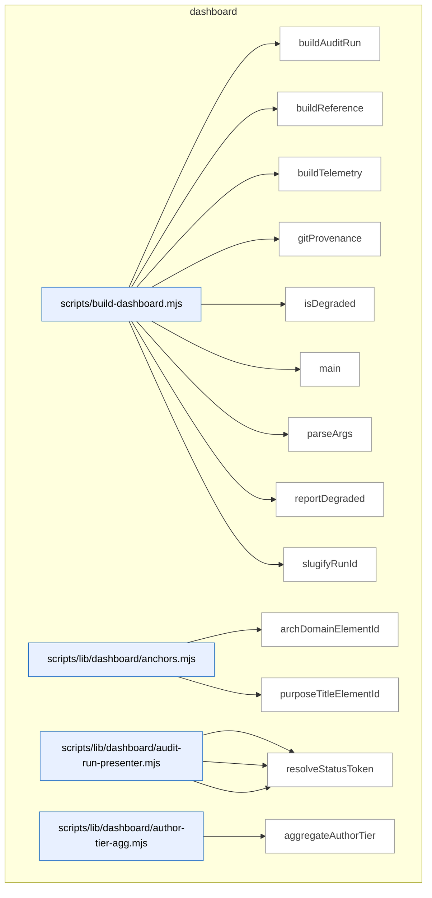

_Domain has 121 symbols (>50). Diagram shows top-15 by file order; see flat table below for the full list._

### Symbols in this domain

| Symbol | Kind | Path | Lines | Purpose | File imported by |
|---|---|---|---|---|---|
| [`buildAuditRun`](../scripts/build-dashboard.mjs#L157) | function | `scripts/build-dashboard.mjs` | 157-183 | Collects and renders an audit-run dashboard page for a specific run ID. | `tests/dashboard.test.mjs` |
| [`buildReference`](../scripts/build-dashboard.mjs#L131) | function | `scripts/build-dashboard.mjs` | 131-137 | Collects reference data and renders it as a dashboard HTML page. | `tests/dashboard.test.mjs` |
| [`buildTelemetry`](../scripts/build-dashboard.mjs#L139) | function | `scripts/build-dashboard.mjs` | 139-145 | Collects telemetry data and renders it as a dashboard HTML page. | `tests/dashboard.test.mjs` |
| [`gitProvenance`](../scripts/build-dashboard.mjs#L113) | function | `scripts/build-dashboard.mjs` | 113-123 | Extracts git commit SHA and working-tree dirty state. | `tests/dashboard.test.mjs` |
| [`isDegraded`](../scripts/build-dashboard.mjs#L125) | function | `scripts/build-dashboard.mjs` | 125-129 | Checks whether any data source has invalid or unexpected-error status. | `tests/dashboard.test.mjs` |
| [`main`](../scripts/build-dashboard.mjs#L198) | function | `scripts/build-dashboard.mjs` | 198-264 | CLI entry point for dashboard building; parses args, delegates to build functions, reports results. | `tests/dashboard.test.mjs` |
| [`parseArgs`](../scripts/build-dashboard.mjs#L57) | function | `scripts/build-dashboard.mjs` | 57-97 | Parses CLI flags for dashboard building (subcommand, port, run ID). | `tests/dashboard.test.mjs` |
| [`reportDegraded`](../scripts/build-dashboard.mjs#L185) | function | `scripts/build-dashboard.mjs` | 185-196 | Prints warnings for each degraded data source with details about what failed. | `tests/dashboard.test.mjs` |
| [`slugifyRunId`](../scripts/build-dashboard.mjs#L103) | function | `scripts/build-dashboard.mjs` | 103-110 | Converts a run ID into a URL-safe filename slug. | `tests/dashboard.test.mjs` |
| [`archDomainElementId`](../scripts/lib/dashboard/anchors.mjs#L15) | function | `scripts/lib/dashboard/anchors.mjs` | 15-17 | Generates an HTML element ID for an architectural domain. | `scripts/lib/dashboard/collect-purposes.mjs`, `scripts/lib/dashboard/sections/architecture.mjs`, `tests/dashboard-purpose.test.mjs` |
| [`purposeTitleElementId`](../scripts/lib/dashboard/anchors.mjs#L24) | function | `scripts/lib/dashboard/anchors.mjs` | 24-26 | Generates an HTML element ID for a purpose title. | `scripts/lib/dashboard/collect-purposes.mjs`, `scripts/lib/dashboard/sections/architecture.mjs`, `tests/dashboard-purpose.test.mjs` |
| [`presentFinding`](../scripts/lib/dashboard/audit-run-presenter.mjs#L59) | function | `scripts/lib/dashboard/audit-run-presenter.mjs` | 59-91 | Formats a raw finding for dashboard display with normalized severity, pass, and status labels. | `scripts/lib/dashboard/collect-audit-run.mjs`, `tests/dashboard-audit-run.test.mjs` |
| [`presentFindings`](../scripts/lib/dashboard/audit-run-presenter.mjs#L94) | function | `scripts/lib/dashboard/audit-run-presenter.mjs` | 94-96 | Formats multiple findings for dashboard display. | `scripts/lib/dashboard/collect-audit-run.mjs`, `tests/dashboard-audit-run.test.mjs` |
| [`resolveStatusToken`](../scripts/lib/dashboard/audit-run-presenter.mjs#L44) | function | `scripts/lib/dashboard/audit-run-presenter.mjs` | 44-50 | Maps a finding's remediation and adjudication state to a canonical status token. | `scripts/lib/dashboard/collect-audit-run.mjs`, `tests/dashboard-audit-run.test.mjs` |
| [`aggregateAuthorTier`](../scripts/lib/dashboard/author-tier-agg.mjs#L28) | function | `scripts/lib/dashboard/author-tier-agg.mjs` | 28-89 | Aggregates author model tier statistics across audit runs, including suggestion agreement and provider breakdown. | `scripts/lib/dashboard/collect-telemetry.mjs`, `tests/dashboard-author-tier-agg.test.mjs` |
| [`isConverged`](../scripts/lib/dashboard/author-tier-agg.mjs#L16) | function | `scripts/lib/dashboard/author-tier-agg.mjs` | 16-18 | Checks if a value represents a true/converged state (handles string/boolean coercion). | `scripts/lib/dashboard/collect-telemetry.mjs`, `tests/dashboard-author-tier-agg.test.mjs` |
| [`coerceMeta`](../scripts/lib/dashboard/collect-audit-run.mjs#L64) | function | `scripts/lib/dashboard/collect-audit-run.mjs` | 64-67 | Normalizes audit run metadata with ISO timestamp coercion. | `scripts/build-dashboard.mjs`, `tests/dashboard-audit-run.test.mjs` |
| [`coerceTs`](../scripts/lib/dashboard/collect-audit-run.mjs#L57) | function | `scripts/lib/dashboard/collect-audit-run.mjs` | 57-61 | Converts a timestamp value to ISO 8601 string format. | `scripts/build-dashboard.mjs`, `tests/dashboard-audit-run.test.mjs` |
| [`collectAuditRun`](../scripts/lib/dashboard/collect-audit-run.mjs#L89) | function | `scripts/lib/dashboard/collect-audit-run.mjs` | 89-160 | Fetches audit run metadata and findings from Supabase or reports an error with degraded states. | `scripts/build-dashboard.mjs`, `tests/dashboard-audit-run.test.mjs` |
| [`makeData`](../scripts/lib/dashboard/collect-audit-run.mjs#L69) | function | `scripts/lib/dashboard/collect-audit-run.mjs` | 69-81 | Constructs a dashboard data envelope for an audit run result. | `scripts/build-dashboard.mjs`, `tests/dashboard-audit-run.test.mjs` |
| [`resolveRunId`](../scripts/lib/dashboard/collect-audit-run.mjs#L35) | function | `scripts/lib/dashboard/collect-audit-run.mjs` | 35-55 | Resolves an audit run ID from explicit parameter or from a local pointer file. | `scripts/build-dashboard.mjs`, `tests/dashboard-audit-run.test.mjs` |
| [`auditCatalogCoverage`](../scripts/lib/dashboard/collect-cli.mjs#L130) | function | `scripts/lib/dashboard/collect-cli.mjs` | 130-144 | Identifies npm scripts missing from the catalog and orphaned catalog entries. | `scripts/lib/dashboard/collect-reference.mjs`, `tests/dashboard-cli.test.mjs` |
| [`collectCli`](../scripts/lib/dashboard/collect-cli.mjs#L46) | function | `scripts/lib/dashboard/collect-cli.mjs` | 46-107 | Collects npm scripts and their metadata from package.json and optional .cli-catalog.json. | `scripts/lib/dashboard/collect-reference.mjs`, `tests/dashboard-cli.test.mjs` |
| [`groupByCategory`](../scripts/lib/dashboard/collect-cli.mjs#L114) | function | `scripts/lib/dashboard/collect-cli.mjs` | 114-121 | Organizes CLI scripts by category for dashboard display. | `scripts/lib/dashboard/collect-reference.mjs`, `tests/dashboard-cli.test.mjs` |
| [`canonicalRepoId`](../scripts/lib/dashboard/collect-nav.mjs#L39) | function | `scripts/lib/dashboard/collect-nav.mjs` | 39-53 | Resolves a repository UUID to its Supabase database ID. | `scripts/lib/dashboard/collect-reference.mjs`, `tests/nav-dashboard.test.mjs`, `tests/nav-verify-store.test.mjs` |
| [`collectNav`](../scripts/lib/dashboard/collect-nav.mjs#L59) | function | `scripts/lib/dashboard/collect-nav.mjs` | 59-163 | Collects navigation audit results including static observed graph, live DOM evidence, and drift. | `scripts/lib/dashboard/collect-reference.mjs`, `tests/nav-dashboard.test.mjs`, `tests/nav-verify-store.test.mjs` |
| [`readEnvelope`](../scripts/lib/dashboard/collect-nav.mjs#L165) | function | `scripts/lib/dashboard/collect-nav.mjs` | 165-179 | Reads and validates the observed navigation dependencies file against config digest. | `scripts/lib/dashboard/collect-reference.mjs`, `tests/nav-dashboard.test.mjs`, `tests/nav-verify-store.test.mjs` |
| [`wrap`](../scripts/lib/dashboard/collect-nav.mjs#L181) | function | `scripts/lib/dashboard/collect-nav.mjs` | 181-183 | Wraps navigation audit components into the final collection result. | `scripts/lib/dashboard/collect-reference.mjs`, `tests/nav-dashboard.test.mjs`, `tests/nav-verify-store.test.mjs` |
| [`collectPurposes`](../scripts/lib/dashboard/collect-purposes.mjs#L54) | function | `scripts/lib/dashboard/collect-purposes.mjs` | 54-243 | Collects purpose-to-domain mappings and generates a structured graph with coverage metrics. | `scripts/lib/dashboard/collect-reference.mjs`, `tests/dashboard-purpose.test.mjs` |
| [`emptyResult`](../scripts/lib/dashboard/collect-purposes.mjs#L24) | function | `scripts/lib/dashboard/collect-purposes.mjs` | 24-41 | Creates an empty purposes collection result with zero coverage and default structure. | `scripts/lib/dashboard/collect-reference.mjs`, `tests/dashboard-purpose.test.mjs` |
| [`collectArchitecture`](../scripts/lib/dashboard/collect-reference.mjs#L334) | function | `scripts/lib/dashboard/collect-reference.mjs` | 334-375 | Extracts architecture domains and symbol counts from the `## Contents` block of `docs/architecture-map.md` via regex. | `scripts/build-dashboard.mjs`, `tests/arch-memory-followups.test.mjs`, `tests/dashboard.test.mjs`, +1 more |
| [`collectFlows`](../scripts/lib/dashboard/collect-reference.mjs#L388) | function | `scripts/lib/dashboard/collect-reference.mjs` | 388-415 | Validates `flows.json` manifest against schema and cross-checks flow node skill references against loaded skills. | `scripts/build-dashboard.mjs`, `tests/arch-memory-followups.test.mjs`, `tests/dashboard.test.mjs`, +1 more |
| [`collectReference`](../scripts/lib/dashboard/collect-reference.mjs#L422) | function | `scripts/lib/dashboard/collect-reference.mjs` | 422-547 | Master collector that loads skills, plans, architecture, flows, dependencies, and requirements, returning structured reference data with per-section status. | `scripts/build-dashboard.mjs`, `tests/arch-memory-followups.test.mjs`, `tests/dashboard.test.mjs`, +1 more |
| [`discoverPlans`](../scripts/lib/dashboard/collect-reference.mjs#L68) | function | `scripts/lib/dashboard/collect-reference.mjs` | 68-174 | Scans docs/plans and docs/completed directories to index plan documents with metadata extraction. | `scripts/build-dashboard.mjs`, `tests/arch-memory-followups.test.mjs`, `tests/dashboard.test.mjs`, +1 more |
| [`readDomainDeps`](../scripts/lib/dashboard/collect-reference.mjs#L273) | function | `scripts/lib/dashboard/collect-reference.mjs` | 273-293 | Reads and merges observed (generated) and manual domain dependencies from JSON, returning flattened structure with source metadata. | `scripts/build-dashboard.mjs`, `tests/arch-memory-followups.test.mjs`, `tests/dashboard.test.mjs`, +1 more |
| [`readManualAllowedDeps`](../scripts/lib/dashboard/collect-reference.mjs#L228) | function | `scripts/lib/dashboard/collect-reference.mjs` | 228-253 | Extracts manually-configured allowed dependencies from the domain-map.json allowedDeps block. | `scripts/build-dashboard.mjs`, `tests/arch-memory-followups.test.mjs`, `tests/dashboard.test.mjs`, +1 more |
| [`readObservedEnvelope`](../scripts/lib/dashboard/collect-reference.mjs#L185) | function | `scripts/lib/dashboard/collect-reference.mjs` | 185-214 | Reads and validates the observed architecture dependency graph with staleness detection. | `scripts/build-dashboard.mjs`, `tests/arch-memory-followups.test.mjs`, `tests/dashboard.test.mjs`, +1 more |
| [`readRequirementsLedger`](../scripts/lib/dashboard/collect-reference.mjs#L305) | function | `scripts/lib/dashboard/collect-reference.mjs` | 305-323 | Parses `.requirements/ledger.json` into requirements array with graceful handling of ENOENT and malformed JSON. | `scripts/build-dashboard.mjs`, `tests/arch-memory-followups.test.mjs`, `tests/dashboard.test.mjs`, +1 more |
| [`aggregatePasses`](../scripts/lib/dashboard/collect-telemetry.mjs#L48) | function | `scripts/lib/dashboard/collect-telemetry.mjs` | 48-60 | Aggregates pass statistics (raised/accepted/dismissed counts) by pass name, sorted by frequency. | `scripts/build-dashboard.mjs`, `tests/dashboard-purpose-health.test.mjs`, `tests/dashboard-security.test.mjs`, +1 more |
| [`attributeHighByFile`](../scripts/lib/dashboard/collect-telemetry.mjs#L609) | function | `scripts/lib/dashboard/collect-telemetry.mjs` | 609-626 | Maps HIGH findings by file to purposes via domain classification, filters secrets and unattributable entries. | `scripts/build-dashboard.mjs`, `tests/dashboard-purpose-health.test.mjs`, `tests/dashboard-security.test.mjs`, +1 more |
| [`canonicalRepoId`](../scripts/lib/dashboard/collect-telemetry.mjs#L227) | function | `scripts/lib/dashboard/collect-telemetry.mjs` | 227-230 | Resolves repo UUID to canonical database repo row ID, returning null on lookup failure. | `scripts/build-dashboard.mjs`, `tests/dashboard-purpose-health.test.mjs`, `tests/dashboard-security.test.mjs`, +1 more |
| [`classifyPurposeBadges`](../scripts/lib/dashboard/collect-telemetry.mjs#L633) | function | `scripts/lib/dashboard/collect-telemetry.mjs` | 633-662 | Classifies each purpose as ok/at-risk based on attributed HIGH findings or secret-refusal signals. | `scripts/build-dashboard.mjs`, `tests/dashboard-purpose-health.test.mjs`, `tests/dashboard-security.test.mjs`, +1 more |
| [`collectAuditEffectiveness`](../scripts/lib/dashboard/collect-telemetry.mjs#L420) | function | `scripts/lib/dashboard/collect-telemetry.mjs` | 420-448 | Fetches audit effectiveness metrics from cloud, returns null precision/recall if no persona correlations exist yet. | `scripts/build-dashboard.mjs`, `tests/dashboard-purpose-health.test.mjs`, `tests/dashboard-security.test.mjs`, +1 more |
| [`collectAuditRuns`](../scripts/lib/dashboard/collect-telemetry.mjs#L71) | function | `scripts/lib/dashboard/collect-telemetry.mjs` | 71-110 | Fetches audit run metrics from cloud or computes local metrics, returning run/label counts and pass statistics. | `scripts/build-dashboard.mjs`, `tests/dashboard-purpose-health.test.mjs`, `tests/dashboard-security.test.mjs`, +1 more |
| [`collectAuthorTier`](../scripts/lib/dashboard/collect-telemetry.mjs#L350) | function | `scripts/lib/dashboard/collect-telemetry.mjs` | 350-361 | Fetches author-tier observation stats from cloud and aggregates by suggested tier and provider ladder. | `scripts/build-dashboard.mjs`, `tests/dashboard-purpose-health.test.mjs`, `tests/dashboard-security.test.mjs`, +1 more |
| [`collectLearning`](../scripts/lib/dashboard/collect-telemetry.mjs#L167) | function | `scripts/lib/dashboard/collect-telemetry.mjs` | 167-187 | Fetches learning stats (pending triage, no-brainers, stale clusters) from cloud via canonical repo UUID. | `scripts/build-dashboard.mjs`, `tests/dashboard-purpose-health.test.mjs`, `tests/dashboard-security.test.mjs`, +1 more |
| [`collectModelAb`](../scripts/lib/dashboard/collect-telemetry.mjs#L376) | function | `scripts/lib/dashboard/collect-telemetry.mjs` | 376-412 | Fetches model-A/B/C effectiveness scores, costs, and adjudication queue; evaluates decision status and pending workload. | `scripts/build-dashboard.mjs`, `tests/dashboard-purpose-health.test.mjs`, `tests/dashboard-security.test.mjs`, +1 more |
| [`collectPersonaTests`](../scripts/lib/dashboard/collect-telemetry.mjs#L286) | function | `scripts/lib/dashboard/collect-telemetry.mjs` | 286-337 | Fetches persona test sessions by repo name, groups into trend and per-persona latest, fetches correlation counts. | `scripts/build-dashboard.mjs`, `tests/dashboard-purpose-health.test.mjs`, `tests/dashboard-security.test.mjs`, +1 more |
| [`collectPromptVariants`](../scripts/lib/dashboard/collect-telemetry.mjs#L194) | function | `scripts/lib/dashboard/collect-telemetry.mjs` | 194-224 | Loads bandit arms from cloud and computes Thompson-sampling posteriors (alpha, beta, mean) for variant selection. | `scripts/build-dashboard.mjs`, `tests/dashboard-purpose-health.test.mjs`, `tests/dashboard-security.test.mjs`, +1 more |
| [`collectPurposeHealth`](../scripts/lib/dashboard/collect-telemetry.mjs#L520) | function | `scripts/lib/dashboard/collect-telemetry.mjs` | 520-597 | Reads purpose config, fetches cloud HIGH-finding counts, attributes findings to purposes via domain tagging, classifies health badges. | `scripts/build-dashboard.mjs`, `tests/dashboard-purpose-health.test.mjs`, `tests/dashboard-security.test.mjs`, +1 more |
| [`collectRequirements`](../scripts/lib/dashboard/collect-telemetry.mjs#L113) | function | `scripts/lib/dashboard/collect-telemetry.mjs` | 113-154 | Reads and parses `.requirements/ledger.json`, truncates requirements to max items, returns with presence flag and error messages. | `scripts/build-dashboard.mjs`, `tests/dashboard-purpose-health.test.mjs`, `tests/dashboard-security.test.mjs`, +1 more |
| [`collectSecurity`](../scripts/lib/dashboard/collect-telemetry.mjs#L482) | function | `scripts/lib/dashboard/collect-telemetry.mjs` | 482-497 | Fetches security incident statistics from cloud keyed by canonical repo ID. | `scripts/build-dashboard.mjs`, `tests/dashboard-purpose-health.test.mjs`, `tests/dashboard-security.test.mjs`, +1 more |
| [`collectShipHealth`](../scripts/lib/dashboard/collect-telemetry.mjs#L233) | function | `scripts/lib/dashboard/collect-telemetry.mjs` | 233-258 | Fetches ship events from cloud, returns outcome distribution and recent 10 events by repo. | `scripts/build-dashboard.mjs`, `tests/dashboard-purpose-health.test.mjs`, `tests/dashboard-security.test.mjs`, +1 more |
| [`collectTelemetry`](../scripts/lib/dashboard/collect-telemetry.mjs#L762) | function | `scripts/lib/dashboard/collect-telemetry.mjs` | 762-819 | Master telemetry collector that runs all sub-collectors in parallel, consolidates provenance and source status. | `scripts/build-dashboard.mjs`, `tests/dashboard-purpose-health.test.mjs`, `tests/dashboard-security.test.mjs`, +1 more |
| [`collectTieredShadow`](../scripts/lib/dashboard/collect-telemetry.mjs#L676) | function | `scripts/lib/dashboard/collect-telemetry.mjs` | 676-755 | Fetches tiered-pipeline shadow observations from cloud, aggregates cost/latency deltas, finding overlap, run status distribution. | `scripts/build-dashboard.mjs`, `tests/dashboard-purpose-health.test.mjs`, `tests/dashboard-security.test.mjs`, +1 more |
| [`emptyAuthorTier`](../scripts/lib/dashboard/collect-telemetry.mjs#L340) | function | `scripts/lib/dashboard/collect-telemetry.mjs` | 340-342 | Returns default empty structure for author-tier observation telemetry (no cloud data). | `scripts/build-dashboard.mjs`, `tests/dashboard-purpose-health.test.mjs`, `tests/dashboard-security.test.mjs`, +1 more |
| [`emptyEffectiveness`](../scripts/lib/dashboard/collect-telemetry.mjs#L415) | function | `scripts/lib/dashboard/collect-telemetry.mjs` | 415-417 | Returns default empty structure for audit effectiveness (precision, recall, confirmed hits, false positives). | `scripts/build-dashboard.mjs`, `tests/dashboard-purpose-health.test.mjs`, `tests/dashboard-security.test.mjs`, +1 more |
| [`emptyModelAb`](../scripts/lib/dashboard/collect-telemetry.mjs#L364) | function | `scripts/lib/dashboard/collect-telemetry.mjs` | 364-366 | Returns default empty structure for model-A/B/C shadow experiment telemetry (inactive/off). | `scripts/build-dashboard.mjs`, `tests/dashboard-purpose-health.test.mjs`, `tests/dashboard-security.test.mjs`, +1 more |
| [`emptyPersonaTests`](../scripts/lib/dashboard/collect-telemetry.mjs#L263) | function | `scripts/lib/dashboard/collect-telemetry.mjs` | 263-265 | Returns default empty structure for persona test telemetry when no cloud data exists. | `scripts/build-dashboard.mjs`, `tests/dashboard-purpose-health.test.mjs`, `tests/dashboard-security.test.mjs`, +1 more |
| [`emptyPurposeHealth`](../scripts/lib/dashboard/collect-telemetry.mjs#L504) | function | `scripts/lib/dashboard/collect-telemetry.mjs` | 504-511 | Returns default empty structure for purpose health (recent HIGH findings, plan failures, secret refusals). | `scripts/build-dashboard.mjs`, `tests/dashboard-purpose-health.test.mjs`, `tests/dashboard-security.test.mjs`, +1 more |
| [`emptySecurity`](../scripts/lib/dashboard/collect-telemetry.mjs#L451) | function | `scripts/lib/dashboard/collect-telemetry.mjs` | 451-456 | Returns default empty structure for security incident telemetry (no cloud data). | `scripts/build-dashboard.mjs`, `tests/dashboard-purpose-health.test.mjs`, `tests/dashboard-security.test.mjs`, +1 more |
| [`repoName`](../scripts/lib/dashboard/collect-telemetry.mjs#L157) | function | `scripts/lib/dashboard/collect-telemetry.mjs` | 157-164 | Resolves repo name from `LEARNING_REPO_NAME` env or `package.json`, returns null if neither exists. | `scripts/build-dashboard.mjs`, `tests/dashboard-purpose-health.test.mjs`, `tests/dashboard-security.test.mjs`, +1 more |
| [`securityData`](../scripts/lib/dashboard/collect-telemetry.mjs#L459) | function | `scripts/lib/dashboard/collect-telemetry.mjs` | 459-475 | Formats security stats into structured data: incident counts, status/event-kind distributions, recent events. | `scripts/build-dashboard.mjs`, `tests/dashboard-purpose-health.test.mjs`, `tests/dashboard-security.test.mjs`, +1 more |
| [`collectVisual`](../scripts/lib/dashboard/collect-visual.mjs#L19) | function | `scripts/lib/dashboard/collect-visual.mjs` | 19-49 | Reads visual-contract.json, source-coherence diagnostics, and optional verify result; returns scorecard and findings. | `scripts/lib/dashboard/collect-reference.mjs` |
| [`wrap`](../scripts/lib/dashboard/collect-visual.mjs#L51) | function | `scripts/lib/dashboard/collect-visual.mjs` | 51-53 | Wraps visual audit output into the structure keyed by `visualAudit`. | `scripts/lib/dashboard/collect-reference.mjs` |
| [`buildUi`](../scripts/lib/dashboard/helpers.mjs#L106) | function | `scripts/lib/dashboard/helpers.mjs` | 106-117 | Exports frozen object bundling UI helpers (escapeHtml, panels, tabs, splitUsage) and NON_OK constant. | `scripts/lib/dashboard/render.mjs`, `tests/dashboard-persona-tests-section.test.mjs`, `tests/dashboard-purpose-health.test.mjs`, +3 more |
| [`emptyPanel`](../scripts/lib/dashboard/helpers.mjs#L72) | function | `scripts/lib/dashboard/helpers.mjs` | 72-75 | Returns HTML div empty-state panel with optional data-testid attribute. | `scripts/lib/dashboard/render.mjs`, `tests/dashboard-persona-tests-section.test.mjs`, `tests/dashboard-purpose-health.test.mjs`, +3 more |
| [`escapeHtml`](../scripts/lib/dashboard/helpers.mjs#L22) | function | `scripts/lib/dashboard/helpers.mjs` | 22-29 | HTML-escapes special characters (&, <, >, ", ') in a string. | `scripts/lib/dashboard/render.mjs`, `tests/dashboard-persona-tests-section.test.mjs`, `tests/dashboard-purpose-health.test.mjs`, +3 more |
| [`jsonScriptSafe`](../scripts/lib/dashboard/helpers.mjs#L43) | function | `scripts/lib/dashboard/helpers.mjs` | 43-50 | JSON-encodes an object and escapes characters that would break `<script>` tag injection. | `scripts/lib/dashboard/render.mjs`, `tests/dashboard-persona-tests-section.test.mjs`, `tests/dashboard-purpose-health.test.mjs`, +3 more |
| [`panel`](../scripts/lib/dashboard/helpers.mjs#L83) | function | `scripts/lib/dashboard/helpers.mjs` | 83-86 | Returns HTML div tabpanel role, optionally hidden if not selected. | `scripts/lib/dashboard/render.mjs`, `tests/dashboard-persona-tests-section.test.mjs`, `tests/dashboard-purpose-health.test.mjs`, +3 more |
| [`splitUsage`](../scripts/lib/dashboard/helpers.mjs#L93) | function | `scripts/lib/dashboard/helpers.mjs` | 93-98 | Parses a usage line into `{cmd, desc}` tuple split on em-dash or hash separator. | `scripts/lib/dashboard/render.mjs`, `tests/dashboard-persona-tests-section.test.mjs`, `tests/dashboard-purpose-health.test.mjs`, +3 more |
| [`statusDot`](../scripts/lib/dashboard/helpers.mjs#L57) | function | `scripts/lib/dashboard/helpers.mjs` | 57-61 | Returns HTML span with CSS status-dot class (ok/warn/err) based on status string. | `scripts/lib/dashboard/render.mjs`, `tests/dashboard-persona-tests-section.test.mjs`, `tests/dashboard-purpose-health.test.mjs`, +3 more |
| [`tab`](../scripts/lib/dashboard/helpers.mjs#L77) | function | `scripts/lib/dashboard/helpers.mjs` | 77-81 | Returns HTML button element for tabstrip tab role with accessibility attributes. | `scripts/lib/dashboard/render.mjs`, `tests/dashboard-persona-tests-section.test.mjs`, `tests/dashboard-purpose-health.test.mjs`, +3 more |
| [`warningPanel`](../scripts/lib/dashboard/helpers.mjs#L64) | function | `scripts/lib/dashboard/helpers.mjs` | 64-69 | Returns HTML div warning panel showing a source's status and detail message with icon. | `scripts/lib/dashboard/render.mjs`, `tests/dashboard-persona-tests-section.test.mjs`, `tests/dashboard-purpose-health.test.mjs`, +3 more |
| [`loadAssets`](../scripts/lib/dashboard/load-assets.mjs#L18) | function | `scripts/lib/dashboard/load-assets.mjs` | 18-29 | Reads dashboard.css and dashboard.js from the bundled asset directory, throws on I/O failure. | `scripts/build-dashboard.mjs` |
| [`freshnessBanner`](../scripts/lib/dashboard/render.mjs#L141) | function | `scripts/lib/dashboard/render.mjs` | 141-153 | Renders HTML freshness banner showing git SHA (dirty flag) and source hash or generation timestamp. | `scripts/build-dashboard.mjs`, `tests/dashboard-audit-run.test.mjs`, `tests/dashboard-cli.test.mjs`, +2 more |
| [`nav`](../scripts/lib/dashboard/render.mjs#L158) | function | `scripts/lib/dashboard/render.mjs` | 158-166 | Renders HTML navigation bar with links to Reference and Telemetry pages, current-page indicator. | `scripts/build-dashboard.mjs`, `tests/dashboard-audit-run.test.mjs`, `tests/dashboard-cli.test.mjs`, +2 more |
| [`renderDocument`](../scripts/lib/dashboard/render.mjs#L178) | function | `scripts/lib/dashboard/render.mjs` | 178-271 | Validates dashboard data, builds tabbed sections per REGISTRY, renders complete HTML document with page-level empty state. | `scripts/build-dashboard.mjs`, `tests/dashboard-audit-run.test.mjs`, `tests/dashboard-cli.test.mjs`, +2 more |
| [`validateDashboardData`](../scripts/lib/dashboard/schema.mjs#L528) | function | `scripts/lib/dashboard/schema.mjs` | 528-533 | Validates dashboard data against the appropriate Zod schema (reference, telemetry, or audit-run) by kind. | `scripts/lib/dashboard/collect-purposes.mjs`, `scripts/lib/dashboard/collect-reference.mjs`, `scripts/lib/dashboard/collect-telemetry.mjs`, +2 more |
| [`archTiers`](../scripts/lib/dashboard/sections/architecture.mjs#L29) | function | `scripts/lib/dashboard/sections/architecture.mjs` | 29-46 | Classifies domains into tiers (0=leaf, 1=depended-upon, 2=consumer) based on internal dependency graph. | `scripts/lib/dashboard/render.mjs`, `tests/dashboard-purpose.test.mjs` |
| [`formatDepsSourceLine`](../scripts/lib/dashboard/sections/architecture.mjs#L48) | function | `scripts/lib/dashboard/sections/architecture.mjs` | 48-72 | Renders HTML summary of dependency source breakdown (observed/manual/both) with refresh ID and diagnostic hints. | `scripts/lib/dashboard/render.mjs`, `tests/dashboard-purpose.test.mjs` |
| [`sectionArchitecture`](../scripts/lib/dashboard/sections/architecture.mjs#L74) | function | `scripts/lib/dashboard/sections/architecture.mjs` | 74-131 | Renders the architecture section with domains grouped by tier, symbol-count bars, dependency lists, and purpose mappings. | `scripts/lib/dashboard/render.mjs`, `tests/dashboard-purpose.test.mjs` |
| [`pct`](../scripts/lib/dashboard/sections/audit-effectiveness.mjs#L14) | function | `scripts/lib/dashboard/sections/audit-effectiveness.mjs` | 14-17 | Formats a percentage value as escaped HTML with em-dash fallback for null. | `scripts/lib/dashboard/render.mjs` |
| [`sectionAuditEffectiveness`](../scripts/lib/dashboard/sections/audit-effectiveness.mjs#L19) | function | `scripts/lib/dashboard/sections/audit-effectiveness.mjs` | 19-39 | Renders a dashboard section displaying user-visible precision/recall metrics from audit findings vs persona correlations. | `scripts/lib/dashboard/render.mjs` |
| [`chip`](../scripts/lib/dashboard/sections/audit-run-detail.mjs#L34) | function | `scripts/lib/dashboard/sections/audit-run-detail.mjs` | 34-37 | Creates a clickable filter chip for severity, pass, or status filtering on the audit run detail page. | `scripts/lib/dashboard/render.mjs` |
| [`filterBar`](../scripts/lib/dashboard/sections/audit-run-detail.mjs#L39) | function | `scripts/lib/dashboard/sections/audit-run-detail.mjs` | 39-65 | Renders a complete filter UI with severity/pass/status chips and a file search input for the findings table. | `scripts/lib/dashboard/render.mjs` |
| [`findingRow`](../scripts/lib/dashboard/sections/audit-run-detail.mjs#L67) | function | `scripts/lib/dashboard/sections/audit-run-detail.mjs` | 67-89 | Renders a single table row for an audit finding with severity, pass, file, status, and collapsible evidence detail. | `scripts/lib/dashboard/render.mjs` |
| [`findingsTable`](../scripts/lib/dashboard/sections/audit-run-detail.mjs#L91) | function | `scripts/lib/dashboard/sections/audit-run-detail.mjs` | 91-100 | Renders a table containing all findings from an audit run with thead/tbody structure. | `scripts/lib/dashboard/render.mjs` |
| [`runHeader`](../scripts/lib/dashboard/sections/audit-run-detail.mjs#L20) | function | `scripts/lib/dashboard/sections/audit-run-detail.mjs` | 20-32 | Renders the heading for an audit run detail page with run ID, mode, rounds, verdict, finding count, and commit. | `scripts/lib/dashboard/render.mjs` |
| [`sectionAuditRunDetail`](../scripts/lib/dashboard/sections/audit-run-detail.mjs#L102) | function | `scripts/lib/dashboard/sections/audit-run-detail.mjs` | 102-143 | Renders the complete audit run detail page, including findings table with optional cloud-disabled/not-found/query-error states. | `scripts/lib/dashboard/render.mjs` |
| [`sectionAuditRuns`](../scripts/lib/dashboard/sections/audit-runs.mjs#L16) | function | `scripts/lib/dashboard/sections/audit-runs.mjs` | 16-53 | Renders a dashboard summary of audit runs including pass statistics, run counts, and local-only/cloud fallback data. | `scripts/lib/dashboard/render.mjs` |
| [`sectionAuthorTier`](../scripts/lib/dashboard/sections/author-tier.mjs#L14) | function | `scripts/lib/dashboard/sections/author-tier.mjs` | 14-63 | Renders telemetry on observed author model tiers, suggesting convergence, and model ladder diversity. | `scripts/lib/dashboard/render.mjs` |
| [`sectionCli`](../scripts/lib/dashboard/sections/cli.mjs#L38) | function | `scripts/lib/dashboard/sections/cli.mjs` | 38-97 | Renders a searchable catalog of npm scripts grouped by category with skill linking and output file indicators. | `scripts/lib/dashboard/render.mjs` |
| [`sectionFlows`](../scripts/lib/dashboard/sections/flows.mjs#L14) | function | `scripts/lib/dashboard/sections/flows.mjs` | 14-42 | Renders the skill-chain process flow showing how each skill hands off to downstream skills with labeled edges. | `scripts/lib/dashboard/render.mjs` |
| [`sectionLearning`](../scripts/lib/dashboard/sections/learning.mjs#L14) | function | `scripts/lib/dashboard/sections/learning.mjs` | 14-34 | Renders counts of pending learning decisions, no-brainer recommendations, and stale finding clusters. | `scripts/lib/dashboard/render.mjs` |
| [`sectionModelAb`](../scripts/lib/dashboard/sections/model-ab.mjs#L21) | function | `scripts/lib/dashboard/sections/model-ab.mjs` | 21-69 | Renders model A/B/C shadow experiment results including arm stats, pass conformance, and spend tracking. | `scripts/lib/dashboard/render.mjs` |
| [`sectionNavAudit`](../scripts/lib/dashboard/sections/nav-audit.mjs#L17) | function | `scripts/lib/dashboard/sections/nav-audit.mjs` | 17-82 | Renders nav audit results including per-persona reachability scorecard, drift findings, and live verification status. | `scripts/lib/dashboard/render.mjs` |
| [`daysAgo`](../scripts/lib/dashboard/sections/persona-tests.mjs#L15) | function | `scripts/lib/dashboard/sections/persona-tests.mjs` | 15-20 | Calculates days elapsed since an ISO timestamp, returning null for invalid/absent dates. | `scripts/lib/dashboard/render.mjs`, `tests/dashboard-persona-tests-section.test.mjs` |
| [`sectionPersonaTests`](../scripts/lib/dashboard/sections/persona-tests.mjs#L26) | function | `scripts/lib/dashboard/sections/persona-tests.mjs` | 26-73 | Renders persona test results including latest sessions by persona, verdict trends, and P0/P1 correlations. | `scripts/lib/dashboard/render.mjs`, `tests/dashboard-persona-tests-section.test.mjs` |
| [`escapeHtml`](../scripts/lib/dashboard/sections/plans.mjs#L40) | function | `scripts/lib/dashboard/sections/plans.mjs` | 40-47 | Escapes HTML special characters (&, <, >, ", ') to prevent XSS. | `scripts/lib/dashboard/render.mjs`, `tests/dashboard-plans-render.test.mjs` |
| [`planList`](../scripts/lib/dashboard/sections/plans.mjs#L184) | function | `scripts/lib/dashboard/sections/plans.mjs` | 184-198 | Renders an array of plan objects as collapsible details with title, metadata, and rendered body. | `scripts/lib/dashboard/render.mjs`, `tests/dashboard-plans-render.test.mjs` |
| [`renderInline`](../scripts/lib/dashboard/sections/plans.mjs#L49) | function | `scripts/lib/dashboard/sections/plans.mjs` | 49-78 | Renders inline Markdown (bold, italic, code, links) into HTML with link scheme safety checks. | `scripts/lib/dashboard/render.mjs`, `tests/dashboard-plans-render.test.mjs` |
| [`renderMarkdown`](../scripts/lib/dashboard/sections/plans.mjs#L80) | function | `scripts/lib/dashboard/sections/plans.mjs` | 80-180 | Converts Markdown blocks (headings, lists, code fences, Mermaid) into HTML with lazy Mermaid rendering. | `scripts/lib/dashboard/render.mjs`, `tests/dashboard-plans-render.test.mjs` |
| [`sectionPlans`](../scripts/lib/dashboard/sections/plans.mjs#L200) | function | `scripts/lib/dashboard/sections/plans.mjs` | 200-231 | Renders active and completed plans grouped by status with Mermaid CDN bootstrap for lazy diagram rendering. | `scripts/lib/dashboard/render.mjs`, `tests/dashboard-plans-render.test.mjs` |
| [`sectionPromptVariants`](../scripts/lib/dashboard/sections/prompt-variants.mjs#L14) | function | `scripts/lib/dashboard/sections/prompt-variants.mjs` | 14-41 | Renders Thompson-sampling bandit arms with posterior means and pull counts from deliberation outcomes. | `scripts/lib/dashboard/render.mjs` |
| [`sectionPurposeHealth`](../scripts/lib/dashboard/sections/purpose-health.mjs#L25) | function | `scripts/lib/dashboard/sections/purpose-health.mjs` | 25-67 | Renders governance metrics on recent HIGH findings, failing plan criteria, unattributable findings, and refused secrets. | `scripts/lib/dashboard/render.mjs`, `tests/dashboard-purpose-health.test.mjs` |
| [`renderChip`](../scripts/lib/dashboard/sections/purpose.mjs#L153) | function | `scripts/lib/dashboard/sections/purpose.mjs` | 153-162 | Renders a domain chip with optional "also serves" badge and conditional architecture-map link. | `scripts/lib/dashboard/render.mjs`, `tests/dashboard-purpose.test.mjs` |
| [`renderHygiene`](../scripts/lib/dashboard/sections/purpose.mjs#L164) | function | `scripts/lib/dashboard/sections/purpose.mjs` | 164-189 | Renders validation issues for unmapped domains, missing architecture entries, unattached requirements, and skipped ledger entries. | `scripts/lib/dashboard/render.mjs`, `tests/dashboard-purpose.test.mjs` |
| [`renderMatrix`](../scripts/lib/dashboard/sections/purpose.mjs#L88) | function | `scripts/lib/dashboard/sections/purpose.mjs` | 88-104 | Renders an outcome-by-domain matrix showing which purposes deliver which domains. | `scripts/lib/dashboard/render.mjs`, `tests/dashboard-purpose.test.mjs` |
| [`renderNode`](../scripts/lib/dashboard/sections/purpose.mjs#L106) | function | `scripts/lib/dashboard/sections/purpose.mjs` | 106-151 | Renders a single purpose node with flows, domain chips, and requirement groups grouped by kind. | `scripts/lib/dashboard/render.mjs`, `tests/dashboard-purpose.test.mjs` |
| [`sectionPurpose`](../scripts/lib/dashboard/sections/purpose.mjs#L26) | function | `scripts/lib/dashboard/sections/purpose.mjs` | 26-80 | Renders the purpose map with outcome-domain matrix, invariant coverage breakdown, and data hygiene warnings. | `scripts/lib/dashboard/render.mjs`, `tests/dashboard-purpose.test.mjs` |
| [`shortReqId`](../scripts/lib/dashboard/sections/purpose.mjs#L21) | function | `scripts/lib/dashboard/sections/purpose.mjs` | 21-24 | Extracts and returns the last 6 hex characters from a requirement ID as a shortened display reference. | `scripts/lib/dashboard/render.mjs`, `tests/dashboard-purpose.test.mjs` |
| [`sectionRequirements`](../scripts/lib/dashboard/sections/requirements.mjs#L17) | function | `scripts/lib/dashboard/sections/requirements.mjs` | 17-47 | Renders the requirements ledger grouped by kind with statement, status, and truncation indicator. | `scripts/lib/dashboard/render.mjs` |
| [`sectionSecurity`](../scripts/lib/dashboard/sections/security.mjs#L26) | function | `scripts/lib/dashboard/sections/security.mjs` | 26-71 | Renders security incident summary, status breakdown, and recent audit-trail event activity counts. | `scripts/lib/dashboard/render.mjs`, `tests/dashboard-security.test.mjs` |
| [`sectionShipHealth`](../scripts/lib/dashboard/sections/ship-health.mjs#L12) | function | `scripts/lib/dashboard/sections/ship-health.mjs` | 12-37 | Renders ship event outcomes and recent ships with branch, commit, and timestamp tracking. | `scripts/lib/dashboard/render.mjs` |
| [`sectionSkills`](../scripts/lib/dashboard/sections/skills.mjs#L24) | function | `scripts/lib/dashboard/sections/skills.mjs` | 24-62 | Renders skill cards with one-liners, triggers, usage flags, and search-indexed haystack for discovery. | `scripts/lib/dashboard/render.mjs` |
| [`sectionStartHere`](../scripts/lib/dashboard/sections/start-here.mjs#L13) | function | `scripts/lib/dashboard/sections/start-here.mjs` | 13-102 | Renders the dashboard reference page explaining the toolkit, navigation between pages, and category shortcuts. | `scripts/lib/dashboard/render.mjs` |
| [`sectionTieredShadow`](../scripts/lib/dashboard/sections/tiered-shadow.mjs#L14) | function | `scripts/lib/dashboard/sections/tiered-shadow.mjs` | 14-113 | Renders tiered-recall pipeline shadow validation progress toward the Phase-14 production-flip decision window. | `scripts/lib/dashboard/render.mjs` |
| [`sectionVisualAudit`](../scripts/lib/dashboard/sections/visual-audit.mjs#L15) | function | `scripts/lib/dashboard/sections/visual-audit.mjs` | 15-61 | Renders visual audit results including contracted-surface scorecard and paint findings (token/theme/layout/signifier). | `scripts/lib/dashboard/render.mjs` |
| [`openBrowser`](../scripts/lib/dashboard/serve.mjs#L22) | function | `scripts/lib/dashboard/serve.mjs` | 22-34 | Spawns a platform-specific browser process to open a URL, silently ignoring opener unavailability. | `scripts/build-dashboard.mjs`, `tests/dashboard.test.mjs` |
| [`serve`](../scripts/lib/dashboard/serve.mjs#L44) | function | `scripts/lib/dashboard/serve.mjs` | 44-118 | Creates an HTTP server serving local dashboard files with DNS-rebinding and path-containment security checks. | `scripts/build-dashboard.mjs`, `tests/dashboard.test.mjs` |

---

## explain

> Searches for a topic across git history, architectural memory, plan documents, and brainstorm logs, then builds a chronological timeline showing when and where the topic was touched across the codebase's development history.

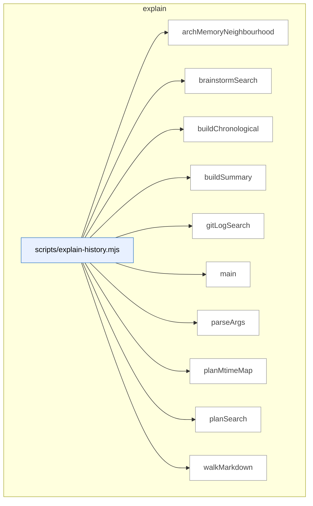

### Symbols in this domain

| Symbol | Kind | Path | Lines | Purpose | File imported by |
|---|---|---|---|---|---|
| [`archMemoryNeighbourhood`](../scripts/explain-history.mjs#L148) | function | `scripts/explain-history.mjs` | 148-184 | Queries the architectural-memory index for symbols similar to a topic description. | `tests/explain-history.test.mjs` |
| [`brainstormSearch`](../scripts/explain-history.mjs#L237) | function | `scripts/explain-history.mjs` | 237-282 | Searches brainstorm session logs for a topic in session metadata or provider responses. | `tests/explain-history.test.mjs` |
| [`buildChronological`](../scripts/explain-history.mjs#L290) | function | `scripts/explain-history.mjs` | 290-305 | Merges search results from git, plans, brainstorm, and arch-memory, then sorts chronologically. | `tests/explain-history.test.mjs` |
| [`buildSummary`](../scripts/explain-history.mjs#L319) | function | `scripts/explain-history.mjs` | 319-326 | Creates a human-readable summary string of search results across all sources. | `tests/explain-history.test.mjs` |
| [`gitLogSearch`](../scripts/explain-history.mjs#L89) | function | `scripts/explain-history.mjs` | 89-140 | Searches git commit subjects and content for a topic, deduplicating by SHA. | `tests/explain-history.test.mjs` |
| [`main`](../scripts/explain-history.mjs#L328) | function | `scripts/explain-history.mjs` | 328-385 | CLI entry point that searches for topic history across git, plans, brainstorm sessions, and architectural memory. | `tests/explain-history.test.mjs` |
| [`parseArgs`](../scripts/explain-history.mjs#L51) | function | `scripts/explain-history.mjs` | 51-80 | Parses command-line arguments for topic-based history search. | `tests/explain-history.test.mjs` |
| [`planMtimeMap`](../scripts/explain-history.mjs#L307) | function | `scripts/explain-history.mjs` | 307-317 | Builds a map of file modification times for plan documents to support date ordering. | `tests/explain-history.test.mjs` |
| [`planSearch`](../scripts/explain-history.mjs#L191) | function | `scripts/explain-history.mjs` | 191-218 | Finds references to a topic in plan markdown documents by heading and line number. | `tests/explain-history.test.mjs` |
| [`walkMarkdown`](../scripts/explain-history.mjs#L220) | function | `scripts/explain-history.mjs` | 220-228 | Recursively walks a directory tree and collects all markdown file paths. | `tests/explain-history.test.mjs` |

---

## findings

> Persists audit-finding outcomes (fixed/dismissed/severity-adjusted) to JSONL with exponential effectiveness metrics for pass selection; formats findings for review and generates remediation tasks from accepted findings.

```mermaid
flowchart TB
subgraph dom_findings ["findings"]
  file_scripts_lib_findings_format_mjs["scripts/lib/findings-format.mjs"]:::component
  sym_scripts_lib_findings_format_mjs_formatFi["formatFindings"]:::symbol
  file_scripts_lib_findings_format_mjs --> sym_scripts_lib_findings_format_mjs_formatFi
  file_scripts_lib_findings_outcomes_mjs["scripts/lib/findings-outcomes.mjs"]:::component
  sym_scripts_lib_findings_outcomes_mjs_append["appendOutcome"]:::symbol
  file_scripts_lib_findings_outcomes_mjs --> sym_scripts_lib_findings_outcomes_mjs_append
  sym_scripts_lib_findings_outcomes_mjs_batchA["batchAppendOutcomes"]:::symbol
  file_scripts_lib_findings_outcomes_mjs --> sym_scripts_lib_findings_outcomes_mjs_batchA
  sym_scripts_lib_findings_outcomes_mjs_compac["compactOutcomes"]:::symbol
  file_scripts_lib_findings_outcomes_mjs --> sym_scripts_lib_findings_outcomes_mjs_compac
  sym_scripts_lib_findings_outcomes_mjs_comput["computePassEffectiveness"]:::symbol
  file_scripts_lib_findings_outcomes_mjs --> sym_scripts_lib_findings_outcomes_mjs_comput
  sym_scripts_lib_findings_outcomes_mjs_comput["computePassEWR"]:::symbol
  file_scripts_lib_findings_outcomes_mjs --> sym_scripts_lib_findings_outcomes_mjs_comput
  sym_scripts_lib_findings_outcomes_mjs_loadOu["loadOutcomes"]:::symbol
  file_scripts_lib_findings_outcomes_mjs --> sym_scripts_lib_findings_outcomes_mjs_loadOu
  sym_scripts_lib_findings_outcomes_mjs_setRep["setRepoProfileCache"]:::symbol
  file_scripts_lib_findings_outcomes_mjs --> sym_scripts_lib_findings_outcomes_mjs_setRep
  file_scripts_lib_findings_tasks_mjs["scripts/lib/findings-tasks.mjs"]:::component
  sym_scripts_lib_findings_tasks_mjs_createRem["createRemediationTask"]:::symbol
  file_scripts_lib_findings_tasks_mjs --> sym_scripts_lib_findings_tasks_mjs_createRem
  sym_scripts_lib_findings_tasks_mjs_getTaskSt["getTaskStore"]:::symbol
  file_scripts_lib_findings_tasks_mjs --> sym_scripts_lib_findings_tasks_mjs_getTaskSt
  sym_scripts_lib_findings_tasks_mjs_loadTasks["loadTasks"]:::symbol
  file_scripts_lib_findings_tasks_mjs --> sym_scripts_lib_findings_tasks_mjs_loadTasks
  sym_scripts_lib_findings_tasks_mjs_persistTa["persistTask"]:::symbol
  file_scripts_lib_findings_tasks_mjs --> sym_scripts_lib_findings_tasks_mjs_persistTa
  sym_scripts_lib_findings_tasks_mjs_trackEdit["trackEdit"]:::symbol
  file_scripts_lib_findings_tasks_mjs --> sym_scripts_lib_findings_tasks_mjs_trackEdit
  sym_scripts_lib_findings_tasks_mjs_updateTas["updateTask"]:::symbol
  file_scripts_lib_findings_tasks_mjs --> sym_scripts_lib_findings_tasks_mjs_updateTas
  sym_scripts_lib_findings_tasks_mjs_verifyTas["verifyTask"]:::symbol
  file_scripts_lib_findings_tasks_mjs --> sym_scripts_lib_findings_tasks_mjs_verifyTas
  file_scripts_lib_findings_tracker_mjs["scripts/lib/findings-tracker.mjs"]:::component
  sym_scripts_lib_findings_tracker_mjs_applyLa["applyLazyDecay"]:::symbol
  file_scripts_lib_findings_tracker_mjs --> sym_scripts_lib_findings_tracker_mjs_applyLa
  sym_scripts_lib_findings_tracker_mjs_buildPa["buildPatternKey"]:::symbol
  file_scripts_lib_findings_tracker_mjs --> sym_scripts_lib_findings_tracker_mjs_buildPa
  sym_scripts_lib_findings_tracker_mjs_effecti["effectiveSampleSize"]:::symbol
  file_scripts_lib_findings_tracker_mjs --> sym_scripts_lib_findings_tracker_mjs_effecti
  sym_scripts_lib_findings_tracker_mjs_extract["extractDimensions"]:::symbol
  file_scripts_lib_findings_tracker_mjs --> sym_scripts_lib_findings_tracker_mjs_extract
  sym_scripts_lib_findings_tracker_mjs_FalsePo["FalsePositiveTracker"]:::symbol
  file_scripts_lib_findings_tracker_mjs --> sym_scripts_lib_findings_tracker_mjs_FalsePo
  sym_scripts_lib_findings_tracker_mjs_recordW["recordWithDecay"]:::symbol
  file_scripts_lib_findings_tracker_mjs --> sym_scripts_lib_findings_tracker_mjs_recordW
  file_scripts_lib_findings_mjs["scripts/lib/findings.mjs"]:::component
  sym_scripts_lib_findings_mjs_semanticId["semanticId"]:::symbol
  file_scripts_lib_findings_mjs --> sym_scripts_lib_findings_mjs_semanticId
end
classDef container fill:#f5f5f5,stroke:#333,stroke-width:2px,color:#000
classDef component fill:#e8f0ff,stroke:#3178c6,color:#000
classDef symbol fill:#fff,stroke:#999,color:#444
classDef dup fill:#ffe8d8,stroke:#c0392b,stroke-width:2px,color:#000
classDef violation fill:#ffd6d6,stroke:#c0392b,stroke-width:2px,color:#000
```

### Symbols in this domain

| Symbol | Kind | Path | Lines | Purpose | File imported by |
|---|---|---|---|---|---|
| [`formatFindings`](../scripts/lib/findings-format.mjs#L12) | function | `scripts/lib/findings-format.mjs` | 12-33 | Groups audit findings by severity and formats them as markdown. | `scripts/lib/findings.mjs` |
| [`appendOutcome`](../scripts/lib/findings-outcomes.mjs#L38) | function | `scripts/lib/findings-outcomes.mjs` | 38-50 | Appends a single outcome record to JSONL storage. | `scripts/audit-metrics.mjs`, `scripts/lib/findings.mjs`, `scripts/lib/outcome-sync.mjs` |
| [`batchAppendOutcomes`](../scripts/lib/findings-outcomes.mjs#L58) | function | `scripts/lib/findings-outcomes.mjs` | 58-75 | Atomically appends multiple outcome records to JSONL. | `scripts/audit-metrics.mjs`, `scripts/lib/findings.mjs`, `scripts/lib/outcome-sync.mjs` |
| [`compactOutcomes`](../scripts/lib/findings-outcomes.mjs#L100) | function | `scripts/lib/findings-outcomes.mjs` | 100-138 | Prunes stale outcomes and backfills missing timestamps. | `scripts/audit-metrics.mjs`, `scripts/lib/findings.mjs`, `scripts/lib/outcome-sync.mjs` |
| [`computePassEffectiveness`](../scripts/lib/findings-outcomes.mjs#L149) | function | `scripts/lib/findings-outcomes.mjs` | 149-187 | Calculates time-weighted acceptance rate for audit passes. | `scripts/audit-metrics.mjs`, `scripts/lib/findings.mjs`, `scripts/lib/outcome-sync.mjs` |
| [`computePassEWR`](../scripts/lib/findings-outcomes.mjs#L196) | function | `scripts/lib/findings-outcomes.mjs` | 196-216 | Computes expected weighted reward for audit passes. | `scripts/audit-metrics.mjs`, `scripts/lib/findings.mjs`, `scripts/lib/outcome-sync.mjs` |
| [`loadOutcomes`](../scripts/lib/findings-outcomes.mjs#L82) | function | `scripts/lib/findings-outcomes.mjs` | 82-93 | Loads all outcome records from JSONL. | `scripts/audit-metrics.mjs`, `scripts/lib/findings.mjs`, `scripts/lib/outcome-sync.mjs` |
| [`setRepoProfileCache`](../scripts/lib/findings-outcomes.mjs#L27) | function | `scripts/lib/findings-outcomes.mjs` | 27-29 | Caches the current repository profile. | `scripts/audit-metrics.mjs`, `scripts/lib/findings.mjs`, `scripts/lib/outcome-sync.mjs` |
| [`createRemediationTask`](../scripts/lib/findings-tasks.mjs#L34) | function | `scripts/lib/findings-tasks.mjs` | 34-48 | Creates a new task record for a finding. | `scripts/lib/findings.mjs` |
| [`getTaskStore`](../scripts/lib/findings-tasks.mjs#L17) | function | `scripts/lib/findings-tasks.mjs` | 17-22 | Returns or initializes the remediation task store. | `scripts/lib/findings.mjs` |
| [`loadTasks`](../scripts/lib/findings-tasks.mjs#L75) | function | `scripts/lib/findings-tasks.mjs` | 75-81 | Loads remediation tasks, optionally filtered by run. | `scripts/lib/findings.mjs` |
| [`persistTask`](../scripts/lib/findings-tasks.mjs#L72) | function | `scripts/lib/findings-tasks.mjs` | 72-72 | Persists a remediation task. | `scripts/lib/findings.mjs` |
| [`trackEdit`](../scripts/lib/findings-tasks.mjs#L53) | function | `scripts/lib/findings-tasks.mjs` | 53-57 | Records an edit event and marks a task fixed. | `scripts/lib/findings.mjs` |
| [`updateTask`](../scripts/lib/findings-tasks.mjs#L84) | function | `scripts/lib/findings-tasks.mjs` | 84-87 | Updates and persists a task. | `scripts/lib/findings.mjs` |
| [`verifyTask`](../scripts/lib/findings-tasks.mjs#L62) | function | `scripts/lib/findings-tasks.mjs` | 62-67 | Marks a task as verified or regressed. | `scripts/lib/findings.mjs` |
| [`applyLazyDecay`](../scripts/lib/findings-tracker.mjs#L29) | function | `scripts/lib/findings-tracker.mjs` | 29-54 | Applies exponential decay to a false-positive pattern. | `scripts/lib/findings.mjs`, `scripts/lib/suppression-policy.mjs`, `tests/legacy-audit-smoke.test.mjs`, +2 more |
| [`buildPatternKey`](../scripts/lib/findings-tracker.mjs#L103) | function | `scripts/lib/findings-tracker.mjs` | 103-105 | Builds a hierarchical pattern key from dimensions. | `scripts/lib/findings.mjs`, `scripts/lib/suppression-policy.mjs`, `tests/legacy-audit-smoke.test.mjs`, +2 more |
| [`effectiveSampleSize`](../scripts/lib/findings-tracker.mjs#L59) | function | `scripts/lib/findings-tracker.mjs` | 59-61 | Returns the effective sample size of a pattern. | `scripts/lib/findings.mjs`, `scripts/lib/suppression-policy.mjs`, `tests/legacy-audit-smoke.test.mjs`, +2 more |
| [`extractDimensions`](../scripts/lib/findings-tracker.mjs#L90) | function | `scripts/lib/findings-tracker.mjs` | 90-98 | Extracts searchable dimensions from a finding. | `scripts/lib/findings.mjs`, `scripts/lib/suppression-policy.mjs`, `tests/legacy-audit-smoke.test.mjs`, +2 more |
| [`FalsePositiveTracker`](../scripts/lib/findings-tracker.mjs#L113) | class | `scripts/lib/findings-tracker.mjs` | 113-288 | Tracks false-positive patterns with exponential decay at multiple scopes. | `scripts/lib/findings.mjs`, `scripts/lib/suppression-policy.mjs`, `tests/legacy-audit-smoke.test.mjs`, +2 more |
| [`recordWithDecay`](../scripts/lib/findings-tracker.mjs#L67) | function | `scripts/lib/findings-tracker.mjs` | 67-83 | Records an outcome and updates exponential decay. | `scripts/lib/findings.mjs`, `scripts/lib/suppression-policy.mjs`, `tests/legacy-audit-smoke.test.mjs`, +2 more |
| [`semanticId`](../scripts/lib/findings.mjs#L27) | function | `scripts/lib/findings.mjs` | 27-40 | Generates a stable 8-character hash ID for a finding. | `scripts/cross-skill.mjs`, `scripts/evolve-prompts.mjs`, `scripts/gemini-review.mjs`, +18 more |

---

## fit-check

> Detects repository technology stacks, frameworks, test runners, and special tooling (Playwright, Supabase, etc.) by scanning package metadata, filesystem markers, and source annotations to support fit-assessment verdicts and tech-aware skill routing.

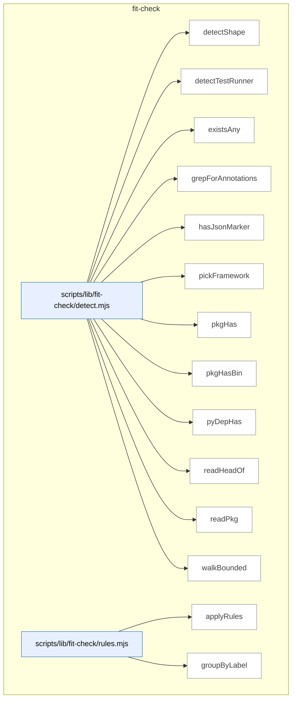

### Symbols in this domain

| Symbol | Kind | Path | Lines | Purpose | File imported by |
|---|---|---|---|---|---|
| [`detectShape`](../scripts/lib/fit-check/detect.mjs#L69) | function | `scripts/lib/fit-check/detect.mjs` | 69-122 | Detects project stack, frameworks, and capabilities. | `scripts/skills-fit-check.mjs`, `tests/skills-fit-check.test.mjs` |
| [`detectTestRunner`](../scripts/lib/fit-check/detect.mjs#L187) | function | `scripts/lib/fit-check/detect.mjs` | 187-199 | Detects the project's test runner. | `scripts/skills-fit-check.mjs`, `tests/skills-fit-check.test.mjs` |
| [`existsAny`](../scripts/lib/fit-check/detect.mjs#L126) | function | `scripts/lib/fit-check/detect.mjs` | 126-128 | Checks if any files in a list exist. | `scripts/skills-fit-check.mjs`, `tests/skills-fit-check.test.mjs` |
| [`grepForAnnotations`](../scripts/lib/fit-check/detect.mjs#L208) | function | `scripts/lib/fit-check/detect.mjs` | 208-227 | Scans for data-engine-claim annotations in source. | `scripts/skills-fit-check.mjs`, `tests/skills-fit-check.test.mjs` |
| [`hasJsonMarker`](../scripts/lib/fit-check/detect.mjs#L150) | function | `scripts/lib/fit-check/detect.mjs` | 150-157 | Checks if a JSON file exists and matches a predicate. | `scripts/skills-fit-check.mjs`, `tests/skills-fit-check.test.mjs` |
| [`pickFramework`](../scripts/lib/fit-check/detect.mjs#L180) | function | `scripts/lib/fit-check/detect.mjs` | 180-185 | Identifies the primary web or backend framework. | `scripts/skills-fit-check.mjs`, `tests/skills-fit-check.test.mjs` |
| [`pkgHas`](../scripts/lib/fit-check/detect.mjs#L137) | function | `scripts/lib/fit-check/detect.mjs` | 137-142 | Checks if a npm dependency is declared. | `scripts/skills-fit-check.mjs`, `tests/skills-fit-check.test.mjs` |
| [`pkgHasBin`](../scripts/lib/fit-check/detect.mjs#L144) | function | `scripts/lib/fit-check/detect.mjs` | 144-148 | Checks if package.json declares CLI binaries. | `scripts/skills-fit-check.mjs`, `tests/skills-fit-check.test.mjs` |
| [`pyDepHas`](../scripts/lib/fit-check/detect.mjs#L159) | function | `scripts/lib/fit-check/detect.mjs` | 159-178 | Checks if a Python dependency is declared. | `scripts/skills-fit-check.mjs`, `tests/skills-fit-check.test.mjs` |
| [`readHeadOf`](../scripts/lib/fit-check/detect.mjs#L256) | function | `scripts/lib/fit-check/detect.mjs` | 256-263 | Reads the first N bytes of a file. | `scripts/skills-fit-check.mjs`, `tests/skills-fit-check.test.mjs` |
| [`readPkg`](../scripts/lib/fit-check/detect.mjs#L130) | function | `scripts/lib/fit-check/detect.mjs` | 130-135 | Reads and parses package.json. | `scripts/skills-fit-check.mjs`, `tests/skills-fit-check.test.mjs` |
| [`walkBounded`](../scripts/lib/fit-check/detect.mjs#L233) | function | `scripts/lib/fit-check/detect.mjs` | 233-254 | Recursively yields up to N text files from a directory. | `scripts/skills-fit-check.mjs`, `tests/skills-fit-check.test.mjs` |
| [`applyRules`](../scripts/lib/fit-check/rules.mjs#L201) | function | `scripts/lib/fit-check/rules.mjs` | 201-206 | Evaluates skill-fit rules and returns verdicts. | `scripts/skills-fit-check.mjs`, `tests/skills-fit-check.test.mjs` |
| [`groupByLabel`](../scripts/lib/fit-check/rules.mjs#L212) | function | `scripts/lib/fit-check/rules.mjs` | 212-218 | Groups skill verdicts by fit level. | `scripts/skills-fit-check.mjs`, `tests/skills-fit-check.test.mjs` |

---

## friction

> Tracks friction memories—recurring pain points and pattern observations—via breadcrumb injection records with TTL-based persistence, cloud sanitization, and repo-scoped retrieval.

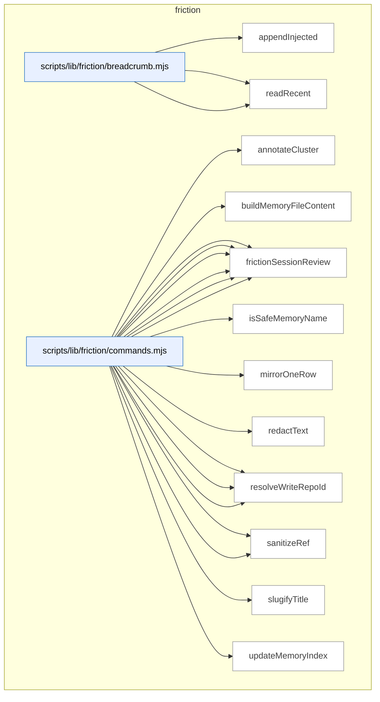

### Symbols in this domain

| Symbol | Kind | Path | Lines | Purpose | File imported by |
|---|---|---|---|---|---|
| [`appendInjected`](../scripts/lib/friction/breadcrumb.mjs#L62) | function | `scripts/lib/friction/breadcrumb.mjs` | 62-88 | Atomically appends a memory record to breadcrumb log with TTL. | `scripts/lib/friction/commands.mjs`, `tests/store-friction.test.mjs` |
| [`readLines`](../scripts/lib/friction/breadcrumb.mjs#L36) | function | `scripts/lib/friction/breadcrumb.mjs` | 36-50 | Parses and returns valid JSON lines from a file. | `scripts/lib/friction/commands.mjs`, `tests/store-friction.test.mjs` |
| [`readRecent`](../scripts/lib/friction/breadcrumb.mjs#L98) | function | `scripts/lib/friction/breadcrumb.mjs` | 98-111 | Reads recent breadcrumb entries deduped and reverse-sorted. | `scripts/lib/friction/commands.mjs`, `tests/store-friction.test.mjs` |
| [`annotateCluster`](../scripts/lib/friction/commands.mjs#L397) | function | `scripts/lib/friction/commands.mjs` | 397-405 | Enriches a friction cluster with protection flags, cost weight, recurrence rank, and alarm threshold checks. | `scripts/cross-skill.mjs`, `tests/friction-cli.test.mjs` |
| [`buildMemoryFileContent`](../scripts/lib/friction/commands.mjs#L211) | function | `scripts/lib/friction/commands.mjs` | 211-231 | Generates markdown with frontmatter for a memory file. | `scripts/cross-skill.mjs`, `tests/friction-cli.test.mjs` |
| [`frictionAdd`](../scripts/lib/friction/commands.mjs#L258) | function | `scripts/lib/friction/commands.mjs` | 258-311 | Creates a friction memory with validation and cloud sync. | `scripts/cross-skill.mjs`, `tests/friction-cli.test.mjs` |
| [`frictionDigest`](../scripts/lib/friction/commands.mjs#L374) | function | `scripts/lib/friction/commands.mjs` | 374-394 | Aggregates friction clusters from cloud storage, optionally scoped to repo, and ranks them by recurrence and alarm status. | `scripts/cross-skill.mjs`, `tests/friction-cli.test.mjs` |
| [`frictionLink`](../scripts/lib/friction/commands.mjs#L416) | function | `scripts/lib/friction/commands.mjs` | 416-466 | Appends a validated reference link (commit/rule/doc/test) to a friction memory file with path traversal protection. | `scripts/cross-skill.mjs`, `tests/friction-cli.test.mjs` |
| [`frictionMirror`](../scripts/lib/friction/commands.mjs#L321) | function | `scripts/lib/friction/commands.mjs` | 321-365 | Scans and upserts unchanged friction memories to cloud. | `scripts/cross-skill.mjs`, `tests/friction-cli.test.mjs` |
| [`frictionNeighbourhood`](../scripts/lib/friction/commands.mjs#L513) | function | `scripts/lib/friction/commands.mjs` | 513-546 | Queries cloud for friction records matching a text prompt, redacts secrets, and logs injection breadcrumbs. | `scripts/cross-skill.mjs`, `tests/friction-cli.test.mjs` |
| [`frictionSessionReview`](../scripts/lib/friction/commands.mjs#L483) | function | `scripts/lib/friction/commands.mjs` | 483-502 | Returns recently-injected friction notes pending manual commit linking, within a time window. | `scripts/cross-skill.mjs`, `tests/friction-cli.test.mjs` |
| [`isSafeMemoryName`](../scripts/lib/friction/commands.mjs#L167) | function | `scripts/lib/friction/commands.mjs` | 167-169 | Checks if a string is a safe memory file name. | `scripts/cross-skill.mjs`, `tests/friction-cli.test.mjs` |
| [`mirrorOneRow`](../scripts/lib/friction/commands.mjs#L196) | function | `scripts/lib/friction/commands.mjs` | 196-208 | Sanitizes and upserts a friction row to cloud. | `scripts/cross-skill.mjs`, `tests/friction-cli.test.mjs` |
| [`redactText`](../scripts/lib/friction/commands.mjs#L48) | function | `scripts/lib/friction/commands.mjs` | 48-48 | Redacts secrets from a string value, or passes through non-strings unchanged. | `scripts/cross-skill.mjs`, `tests/friction-cli.test.mjs` |
| [`resolveDeps`](../scripts/lib/friction/commands.mjs#L51) | function | `scripts/lib/friction/commands.mjs` | 51-69 | Returns dependency resolvers for cloud/store operations. | `scripts/cross-skill.mjs`, `tests/friction-cli.test.mjs` |
| [`resolveReadRepoId`](../scripts/lib/friction/commands.mjs#L189) | function | `scripts/lib/friction/commands.mjs` | 189-193 | Returns a repo ID from its UUID. | `scripts/cross-skill.mjs`, `tests/friction-cli.test.mjs` |
| [`resolveWriteRepoId`](../scripts/lib/friction/commands.mjs#L183) | function | `scripts/lib/friction/commands.mjs` | 183-186 | Returns the current repo ID for cloud writes. | `scripts/cross-skill.mjs`, `tests/friction-cli.test.mjs` |
| [`sanitizeFrictionQueryInput`](../scripts/lib/friction/commands.mjs#L102) | function | `scripts/lib/friction/commands.mjs` | 102-158 | Allowlist-validates and redacts secrets from a record. | `scripts/cross-skill.mjs`, `tests/friction-cli.test.mjs` |
| [`sanitizeRef`](../scripts/lib/friction/commands.mjs#L469) | function | `scripts/lib/friction/commands.mjs` | 469-472 | Redacts secrets from a reference value before storage. | `scripts/cross-skill.mjs`, `tests/friction-cli.test.mjs` |
| [`slugifyTitle`](../scripts/lib/friction/commands.mjs#L172) | function | `scripts/lib/friction/commands.mjs` | 172-180 | Converts a title to a friction-prefixed slug. | `scripts/cross-skill.mjs`, `tests/friction-cli.test.mjs` |
| [`updateMemoryIndex`](../scripts/lib/friction/commands.mjs#L234) | function | `scripts/lib/friction/commands.mjs` | 234-246 | Adds a memory entry to MEMORY.md index. | `scripts/cross-skill.mjs`, `tests/friction-cli.test.mjs` |

---

## gate-honesty

> Validates gates (binary skill-level pass/fail assertions) by running oracle adapters that test their actual implementations against declared behavior in gate-contract.json files; reports divergences where the stated logic diverges from enforced code or test definitions.

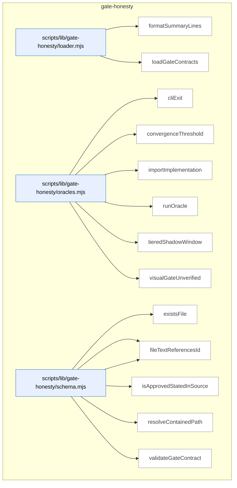

### Symbols in this domain

| Symbol | Kind | Path | Lines | Purpose | File imported by |
|---|---|---|---|---|---|
| [`formatSummaryLines`](../scripts/lib/gate-honesty/loader.mjs#L63) | function | `scripts/lib/gate-honesty/loader.mjs` | 63-86 | Formats gate-honesty check results as human-readable summary lines (executables, document-only, uncontracted, env-skipped). | `scripts/check-gate-contracts.mjs`, `tests/gate-honesty.test.mjs` |
| [`loadGateContracts`](../scripts/lib/gate-honesty/loader.mjs#L25) | function | `scripts/lib/gate-honesty/loader.mjs` | 25-53 | Loads and validates gate-contract.json from all skills, categorizing as contracted/uncontracted and reporting divergences. | `scripts/check-gate-contracts.mjs`, `tests/gate-honesty.test.mjs` |
| [`cliExit`](../scripts/lib/gate-honesty/oracles.mjs#L147) | function | `scripts/lib/gate-honesty/oracles.mjs` | 147-167 | Runs a CLI script in a temporary fixture and verifies it exits with expected code and stderr output. | `tests/gate-honesty.test.mjs` |
| [`convergenceThreshold`](../scripts/lib/gate-honesty/oracles.mjs#L28) | function | `scripts/lib/gate-honesty/oracles.mjs` | 28-56 | Verifies a convergence-threshold oracle's constants and logic match its declared parameters via test cases. | `tests/gate-honesty.test.mjs` |
| [`importImplementation`](../scripts/lib/gate-honesty/oracles.mjs#L22) | function | `scripts/lib/gate-honesty/oracles.mjs` | 22-25 | Dynamically imports a gate's implementation file as an ES module. | `tests/gate-honesty.test.mjs` |
| [`runOracle`](../scripts/lib/gate-honesty/oracles.mjs#L183) | function | `scripts/lib/gate-honesty/oracles.mjs` | 183-191 | Dispatches a gate to its registered oracle adapter and returns the result, catching errors as divergences. | `tests/gate-honesty.test.mjs` |
| [`tieredShadowWindow`](../scripts/lib/gate-honesty/oracles.mjs#L59) | function | `scripts/lib/gate-honesty/oracles.mjs` | 59-97 | Verifies a tiered-audit oracle correctly summarizes window progress and identifies decision-grade comparison rows. | `tests/gate-honesty.test.mjs` |
| [`visualGateUnverified`](../scripts/lib/gate-honesty/oracles.mjs#L100) | function | `scripts/lib/gate-honesty/oracles.mjs` | 100-127 | Verifies a visual-audit oracle correctly identifies unverifiable conditions (missing surfaces, degraded integrity, missing merge base). | `tests/gate-honesty.test.mjs` |
| [`existsFile`](../scripts/lib/gate-honesty/schema.mjs#L186) | function | `scripts/lib/gate-honesty/schema.mjs` | 186-188 | Returns true if a file exists at an absolute path. | `scripts/lib/gate-honesty/loader.mjs`, `tests/gate-honesty.test.mjs` |
| [`fileTextContains`](../scripts/lib/gate-honesty/schema.mjs#L190) | function | `scripts/lib/gate-honesty/schema.mjs` | 190-192 | Returns true if file content includes a substring. | `scripts/lib/gate-honesty/loader.mjs`, `tests/gate-honesty.test.mjs` |
| [`fileTextReferencesId`](../scripts/lib/gate-honesty/schema.mjs#L194) | function | `scripts/lib/gate-honesty/schema.mjs` | 194-196 | Returns true if file content includes a gate ID string. | `scripts/lib/gate-honesty/loader.mjs`, `tests/gate-honesty.test.mjs` |
| [`isApprovedStatedInSource`](../scripts/lib/gate-honesty/schema.mjs#L98) | function | `scripts/lib/gate-honesty/schema.mjs` | 98-101 | Checks if a gate's statedIn source is an approved location (SKILL.md or AGENTS.md). | `scripts/lib/gate-honesty/loader.mjs`, `tests/gate-honesty.test.mjs` |
| [`resolveContainedPath`](../scripts/lib/gate-honesty/schema.mjs#L111) | function | `scripts/lib/gate-honesty/schema.mjs` | 111-116 | Verifies a path doesn't escape the repo root and resolves safely via canonical symlink resolution. | `scripts/lib/gate-honesty/loader.mjs`, `tests/gate-honesty.test.mjs` |
| [`validateGateContract`](../scripts/lib/gate-honesty/schema.mjs#L129) | function | `scripts/lib/gate-honesty/schema.mjs` | 129-181 | Validates a gate-contract.json against schema, duplicate IDs, path containment, file existence, and ID references in tests. | `scripts/lib/gate-honesty/loader.mjs`, `tests/gate-honesty.test.mjs` |

---

## install

> Generates versioned skill manifests with file checksums and bundle digests. Detects when synced consumer copies drift from upstream.

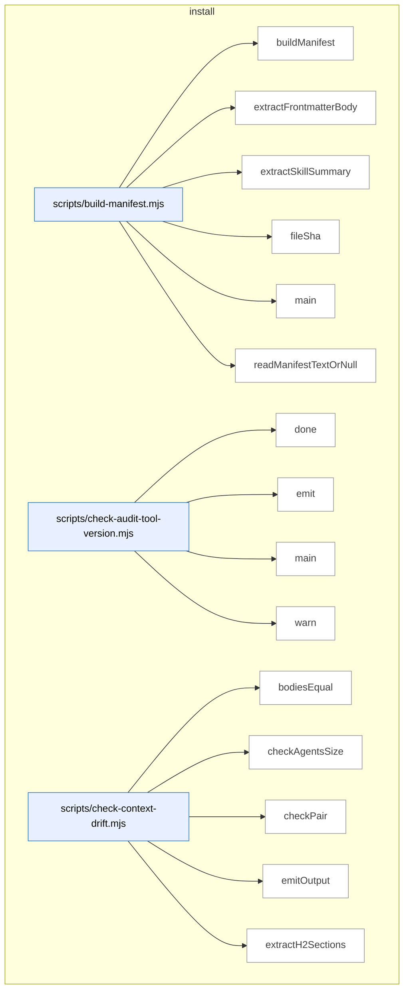

_Domain has 175 symbols (>50). Diagram shows top-15 by file order; see flat table below for the full list._

### Symbols in this domain

| Symbol | Kind | Path | Lines | Purpose | File imported by |
|---|---|---|---|---|---|
| [`buildManifest`](../scripts/build-manifest.mjs#L99) | function | `scripts/build-manifest.mjs` | 99-170 | Discovers all skills and builds a manifest with file lists, checksums, and bundle version digest. | `tests/skills-artifact-freshness-wiring.test.mjs` |
| [`extractFrontmatterBody`](../scripts/build-manifest.mjs#L49) | function | `scripts/build-manifest.mjs` | 49-54 | Extracts the YAML frontmatter block from a markdown file (content between opening and closing ---). | `tests/skills-artifact-freshness-wiring.test.mjs` |
| [`extractSkillSummary`](../scripts/build-manifest.mjs#L64) | function | `scripts/build-manifest.mjs` | 64-94 | Parses the description field from skill frontmatter YAML (handles inline and block-scalar forms). | `tests/skills-artifact-freshness-wiring.test.mjs` |
| [`fileSha`](../scripts/build-manifest.mjs#L40) | function | `scripts/build-manifest.mjs` | 40-43 | Computes a 12-character SHA256 hash of a file's binary content. | `tests/skills-artifact-freshness-wiring.test.mjs` |
| [`main`](../scripts/build-manifest.mjs#L172) | function | `scripts/build-manifest.mjs` | 172-223 | CLI entry point for building or verifying the skills manifest (--check mode). | `tests/skills-artifact-freshness-wiring.test.mjs` |
| [`readManifestTextOrNull`](../scripts/build-manifest.mjs#L235) | function | `scripts/build-manifest.mjs` | 235-240 | Reads the committed skills manifest JSON file, or returns null if not found. | `tests/skills-artifact-freshness-wiring.test.mjs` |
| [`done`](../scripts/check-audit-tool-version.mjs#L49) | function | `scripts/check-audit-tool-version.mjs` | 49-51 | Sets the process exit code. | _(internal)_ |
| [`emit`](../scripts/check-audit-tool-version.mjs#L38) | function | `scripts/check-audit-tool-version.mjs` | 38-40 | Outputs an object as JSON to stdout if in JSON mode. | _(internal)_ |
| [`main`](../scripts/check-audit-tool-version.mjs#L53) | function | `scripts/check-audit-tool-version.mjs` | 53-142 | Checks if synced audit tools are up to date with upstream manifest (network/manifest/version mismatch). | _(internal)_ |
| [`warn`](../scripts/check-audit-tool-version.mjs#L42) | function | `scripts/check-audit-tool-version.mjs` | 42-44 | Writes a warning message to stderr unless quiet or JSON mode is active. | _(internal)_ |
| [`bodiesEqual`](../scripts/check-context-drift.mjs#L182) | function | `scripts/check-context-drift.mjs` | 182-185 | Normalizes whitespace in text blocks and compares them for equality. | `tests/ai-context-management.test.mjs`, `tests/check-context-drift.test.mjs` |
| [`checkAgentsSize`](../scripts/check-context-drift.mjs#L275) | function | `scripts/check-context-drift.mjs` | 275-288 | Emits a warning when AGENTS.md exceeds the line-count sprawl cap. | `tests/ai-context-management.test.mjs`, `tests/check-context-drift.test.mjs` |
| [`checkPair`](../scripts/check-context-drift.mjs#L198) | function | `scripts/check-context-drift.mjs` | 198-263 | Validates CLAUDE.md against AGENTS.md for missing imports, disallowed headings, and size limits. | `tests/ai-context-management.test.mjs`, `tests/check-context-drift.test.mjs` |
| [`emitOutput`](../scripts/check-context-drift.mjs#L392) | function | `scripts/check-context-drift.mjs` | 392-415 | Formats findings as text, JSON, or SARIF and writes to stdout. | `tests/ai-context-management.test.mjs`, `tests/check-context-drift.test.mjs` |
| [`extractH2Sections`](../scripts/check-context-drift.mjs#L155) | function | `scripts/check-context-drift.mjs` | 155-176 | Parses markdown content to extract h2 headings with their body text, respecting fenced code blocks. | `tests/ai-context-management.test.mjs`, `tests/check-context-drift.test.mjs` |
| [`findPairs`](../scripts/check-context-drift.mjs#L300) | function | `scripts/check-context-drift.mjs` | 300-318 | Discovers AGENTS.md/CLAUDE.md file pairs organized by directory. | `tests/ai-context-management.test.mjs`, `tests/check-context-drift.test.mjs` |
| [`hasAgentsImport`](../scripts/check-context-drift.mjs#L191) | function | `scripts/check-context-drift.mjs` | 191-194 | Checks if content imports AGENTS.md within the first 30 lines. | `tests/ai-context-management.test.mjs`, `tests/check-context-drift.test.mjs` |
| [`hashId`](../scripts/check-context-drift.mjs#L292) | function | `scripts/check-context-drift.mjs` | 292-294 | Generates a 16-character SHA256 hash identifier from file path and key. | `tests/ai-context-management.test.mjs`, `tests/check-context-drift.test.mjs` |
| [`loadConfig`](../scripts/check-context-drift.mjs#L75) | function | `scripts/check-context-drift.mjs` | 75-108 | Loads optional allowlist and line-limit config from .claude-context-allowlist.json with fallback defaults. | `tests/ai-context-management.test.mjs`, `tests/check-context-drift.test.mjs` |
| [`main`](../scripts/check-context-drift.mjs#L417) | function | `scripts/check-context-drift.mjs` | 417-428 | Entry point that runs drift checks and exits with appropriate codes. | `tests/ai-context-management.test.mjs`, `tests/check-context-drift.test.mjs` |
| [`makeFenceTracker`](../scripts/check-context-drift.mjs#L122) | function | `scripts/check-context-drift.mjs` | 122-146 | Returns a stateful function that tracks whether we are inside or outside a markdown code fence (``` or ~~~). | `tests/ai-context-management.test.mjs`, `tests/check-context-drift.test.mjs` |
| [`parseArgs`](../scripts/check-context-drift.mjs#L353) | function | `scripts/check-context-drift.mjs` | 353-368 | Parses command-line flags for format, strict mode, and repo path. | `tests/ai-context-management.test.mjs`, `tests/check-context-drift.test.mjs` |
| [`runDriftCheck`](../scripts/check-context-drift.mjs#L327) | function | `scripts/check-context-drift.mjs` | 327-349 | Orchestrates all context-drift validation checks across a repository. | `tests/ai-context-management.test.mjs`, `tests/check-context-drift.test.mjs` |
| [`showHelp`](../scripts/check-context-drift.mjs#L370) | function | `scripts/check-context-drift.mjs` | 370-390 | Prints usage documentation and available options. | `tests/ai-context-management.test.mjs`, `tests/check-context-drift.test.mjs` |
| [`canResolve`](../scripts/check-deps.mjs#L52) | function | `scripts/check-deps.mjs` | 52-60 | Tests whether a Node package name can be resolved by require. | _(internal)_ |
| [`loadEnv`](../scripts/check-deps.mjs#L62) | function | `scripts/check-deps.mjs` | 62-77 | Reads and parses a .env file into an object. | _(internal)_ |
| [`main`](../scripts/check-deps.mjs#L79) | function | `scripts/check-deps.mjs` | 79-173 | Checks installed packages and environment variables against requirements, optionally fixing missing packages. | _(internal)_ |
| [`main`](../scripts/check-docs-placement.mjs#L62) | function | `scripts/check-docs-placement.mjs` | 62-109 | Validates that docs/ root contains only allowlisted files. | _(internal)_ |
| [`baselineKey`](../scripts/check-docs-refs.mjs#L224) | function | `scripts/check-docs-refs.mjs` | 224-224 | Creates a cache key from file path and target reference. | `tests/check-docs-refs.test.mjs` |
| [`classifyRef`](../scripts/check-docs-refs.mjs#L177) | function | `scripts/check-docs-refs.mjs` | 177-194 | Categorizes a reference as resolved, gone, planned, placeholder, or traversal. | `tests/check-docs-refs.test.mjs` |
| [`extractRefs`](../scripts/check-docs-refs.mjs#L141) | function | `scripts/check-docs-refs.mjs` | 141-162 | Extracts markdown reference links ([...](path)) from text using regex. | `tests/check-docs-refs.test.mjs` |
| [`gitIndexFiles`](../scripts/check-docs-refs.mjs#L496) | function | `scripts/check-docs-refs.mjs` | 496-499 | Returns list of tracked files from git ls-files. | `tests/check-docs-refs.test.mjs` |
| [`isExcluded`](../scripts/check-docs-refs.mjs#L360) | function | `scripts/check-docs-refs.mjs` | 360-363 | Tests if a file path matches exclusion patterns. | `tests/check-docs-refs.test.mjs` |
| [`lintFile`](../scripts/check-docs-refs.mjs#L371) | function | `scripts/check-docs-refs.mjs` | 371-385 | Scans a single file for broken references and collects violations. | `tests/check-docs-refs.test.mjs` |
| [`main`](../scripts/check-docs-refs.mjs#L505) | function | `scripts/check-docs-refs.mjs` | 505-580 | Entry point that validates doc references and emits findings in text or JSON format. | `tests/check-docs-refs.test.mjs` |
| [`runCheck`](../scripts/check-docs-refs.mjs#L396) | function | `scripts/check-docs-refs.mjs` | 396-493 | Main orchestrator that validates all files in git index for reference integrity. | `tests/check-docs-refs.test.mjs` |
| [`scanPolicy`](../scripts/check-docs-refs.mjs#L258) | function | `scripts/check-docs-refs.mjs` | 258-267 | Determines scanning policy for a file based on extension or basename. | `tests/check-docs-refs.test.mjs` |
| [`main`](../scripts/check-gate-contracts.mjs#L18) | function | `scripts/check-gate-contracts.mjs` | 18-41 | Validates that skill gate contracts match their enforcing code and test definitions. | _(internal)_ |
| [`bucketKeyFor`](../scripts/check-model-freshness.mjs#L84) | function | `scripts/check-model-freshness.mjs` | 84-88 | Extracts version bucket key (tier, lite/nonlite) from a parsed model identifier. | `tests/check-model-freshness.test.mjs` |
| [`detectMissingFromStatic`](../scripts/check-model-freshness.mjs#L188) | function | `scripts/check-model-freshness.mjs` | 188-245 | Identifies live models not covered by STATIC_POOL grouped by provider and tier. | `tests/check-model-freshness.test.mjs` |
| [`detectPrematureRemap`](../scripts/check-model-freshness.mjs#L251) | function | `scripts/check-model-freshness.mjs` | 251-276 | Flags deprecated model IDs that still exist in live provider catalogs. | `tests/check-model-freshness.test.mjs` |
| [`detectSentinelDrift`](../scripts/check-model-freshness.mjs#L109) | function | `scripts/check-model-freshness.mjs` | 109-169 | Detects mismatches between static STATIC_POOL and live provider model catalogs for sentinels. | `tests/check-model-freshness.test.mjs` |
| [`emitOutput`](../scripts/check-model-freshness.mjs#L378) | function | `scripts/check-model-freshness.mjs` | 378-408 | Formats findings as text, JSON, or SARIF with provider summary. | `tests/check-model-freshness.test.mjs` |
| [`hashId`](../scripts/check-model-freshness.mjs#L280) | function | `scripts/check-model-freshness.mjs` | 280-282 | Generates a 16-character SHA256 hash for a freshness finding. | `tests/check-model-freshness.test.mjs` |
| [`main`](../scripts/check-model-freshness.mjs#L410) | function | `scripts/check-model-freshness.mjs` | 410-421 | Entry point that runs model freshness checks and exits with provider-dependent codes. | `tests/check-model-freshness.test.mjs` |
| [`parseArgs`](../scripts/check-model-freshness.mjs#L334) | function | `scripts/check-model-freshness.mjs` | 334-348 | Parses command-line arguments for format and strict mode. | `tests/check-model-freshness.test.mjs` |
| [`runFreshnessCheck`](../scripts/check-model-freshness.mjs#L293) | function | `scripts/check-model-freshness.mjs` | 293-330 | Orchestrates all model catalog freshness checks (sentinel drift, missing entries, premature remaps). | `tests/check-model-freshness.test.mjs` |
| [`showHelp`](../scripts/check-model-freshness.mjs#L350) | function | `scripts/check-model-freshness.mjs` | 350-376 | Prints usage documentation for model freshness checking. | `tests/check-model-freshness.test.mjs` |
| [`isAuditSummary`](../scripts/check-plan-status.mjs#L28) | function | `scripts/check-plan-status.mjs` | 28-28 | Tests if a filename is an audit summary (exempt from status checking). | _(internal)_ |
| [`lintMode`](../scripts/check-plan-status.mjs#L38) | function | `scripts/check-plan-status.mjs` | 38-78 | Validates all plan files in docs/plans/ have conforming Status lines. | _(internal)_ |
| [`main`](../scripts/check-plan-status.mjs#L80) | function | `scripts/check-plan-status.mjs` | 80-89 | Entry point that routes to select or lint mode based on command-line arguments. | _(internal)_ |
| [`selectMode`](../scripts/check-plan-status.mjs#L30) | function | `scripts/check-plan-status.mjs` | 30-36 | Selects the active plan from a directory for auditing. | _(internal)_ |
| [`main`](../scripts/check-rls.mjs#L31) | function | `scripts/check-rls.mjs` | 31-145 | Checks Row-Level Security configuration on Postgres public schema tables. | _(internal)_ |
| [`checkAuditApiKeys`](../scripts/check-setup.mjs#L159) | function | `scripts/check-setup.mjs` | 159-202 | Validates OpenAI and Azure API keys are set according to the active profile. | _(internal)_ |
| [`checkAuditLoop`](../scripts/check-setup.mjs#L267) | function | `scripts/check-setup.mjs` | 267-271 | Orchestrates audit-loop section of setup validation. | _(internal)_ |
| [`checkAuditSupabase`](../scripts/check-setup.mjs#L204) | function | `scripts/check-setup.mjs` | 204-265 | Validates Postgres connection and required audit-loop tables exist. | _(internal)_ |
| [`checkConsistencyMode`](../scripts/check-setup.mjs#L431) | function | `scripts/check-setup.mjs` | 431-477 | Validates persona-test consistency mode (surfaces.json, canaries, Playwright). | _(internal)_ |
| [`checkPersonaTest`](../scripts/check-setup.mjs#L275) | function | `scripts/check-setup.mjs` | 275-323 | Validates persona-test configuration and required database tables. | _(internal)_ |
| [`checkPlaywrightAvailable`](../scripts/check-setup.mjs#L411) | function | `scripts/check-setup.mjs` | 411-429 | Probes for Playwright installation and chromium binary availability. | _(internal)_ |
| [`checkTables`](../scripts/check-setup.mjs#L70) | function | `scripts/check-setup.mjs` | 70-80 | Queries which specified table names exist in Postgres public schema. | _(internal)_ |
| [`injectResolvedDbEnv`](../scripts/check-setup.mjs#L500) | function | `scripts/check-setup.mjs` | 500-511 | Injects resolved database config env vars if not already present. | _(internal)_ |
| [`loadEnv`](../scripts/check-setup.mjs#L47) | function | `scripts/check-setup.mjs` | 47-62 | Reads and parses a .env file into an object. | _(internal)_ |
| [`main`](../scripts/check-setup.mjs#L513) | function | `scripts/check-setup.mjs` | 513-527 | Main orchestrator for setup checks across audit-loop, persona-test, and consistency mode. | _(internal)_ |
| [`printJsonReport`](../scripts/check-setup.mjs#L386) | function | `scripts/check-setup.mjs` | 386-396 | Outputs setup-check results as structured JSON to stdout. | _(internal)_ |
| [`printReport`](../scripts/check-setup.mjs#L354) | function | `scripts/check-setup.mjs` | 354-384 | Renders the full colored setup-check report to console with sections and verdict. | _(internal)_ |
| [`Report`](../scripts/check-setup.mjs#L120) | class | `scripts/check-setup.mjs` | 120-155 | Helper class for accumulating and categorizing check results (pass/fail/warn/info/fix). | _(internal)_ |
| [`statusIcon`](../scripts/check-setup.mjs#L330) | function | `scripts/check-setup.mjs` | 330-339 | Returns a colored status indicator string for PASS/FAIL/WARN/INFO/FIX. | _(internal)_ |
| [`verdictLine`](../scripts/check-setup.mjs#L341) | function | `scripts/check-setup.mjs` | 341-352 | Formats a summary verdict line from failure and warning counts. | _(internal)_ |
| [`listSkills`](../scripts/check-skill-refs.mjs#L30) | function | `scripts/check-skill-refs.mjs` | 30-36 | Lists all skill directories in the skills folder. | _(internal)_ |
| [`main`](../scripts/check-skill-refs.mjs#L38) | function | `scripts/check-skill-refs.mjs` | 38-74 | Validates skill reference format integrity by linting each skill directory. | _(internal)_ |
| [`main`](../scripts/check-skill-updates.mjs#L25) | function | `scripts/check-skill-updates.mjs` | 25-131 | Checks if installed skill files match source versions and reports local drift. | _(internal)_ |
| [`parseArgs`](../scripts/check-skill-updates.mjs#L16) | function | `scripts/check-skill-updates.mjs` | 16-23 | Extracts CLI flags (--json, --no-cache, --target) into an options object. | _(internal)_ |
| [`checkSync`](../scripts/check-sync.mjs#L25) | function | `scripts/check-sync.mjs` | 25-153 | Verifies Postgres/Supabase connection, repo registration, and audit-run history. | _(internal)_ |
| [`fail`](../scripts/check-sync.mjs#L20) | function | `scripts/check-sync.mjs` | 20-20 | Appends a FAIL status item and increments the failure counter. | _(internal)_ |
| [`finish`](../scripts/check-sync.mjs#L155) | function | `scripts/check-sync.mjs` | 155-178 | Formats and outputs the final sync-check report in terminal or JSON format. | _(internal)_ |
| [`info`](../scripts/check-sync.mjs#L21) | function | `scripts/check-sync.mjs` | 21-21 | Appends an INFO status item to the current report section. | _(internal)_ |
| [`log`](../scripts/check-sync.mjs#L17) | function | `scripts/check-sync.mjs` | 17-17 | Writes a message to stdout only if not in JSON-output mode. | _(internal)_ |
| [`pass`](../scripts/check-sync.mjs#L19) | function | `scripts/check-sync.mjs` | 19-19 | Appends a PASS status item to the current report section. | _(internal)_ |
| [`authoritativeScopesFor`](../scripts/install-skills.mjs#L365) | function | `scripts/install-skills.mjs` | 365-369 | Returns the scopes (global/repo) that should be processed based on the surface argument. | `tests/install/receipt-scope-seam.test.mjs` |
| [`buildCopilotMergeWrite`](../scripts/install-skills.mjs#L287) | function | `scripts/install-skills.mjs` | 287-300 | Builds a write entry for merging Copilot instructions from skills into .github/copilot-instructions.md. | `tests/install/receipt-scope-seam.test.mjs` |
| [`buildSkillWrites`](../scripts/install-skills.mjs#L255) | function | `scripts/install-skills.mjs` | 255-285 | Builds the list of skill files to write with SHA validation and resolves their target paths. | `tests/install/receipt-scope-seam.test.mjs` |
| [`checkConflicts`](../scripts/install-skills.mjs#L389) | function | `scripts/install-skills.mjs` | 389-401 | Detects conflicts between new writes and previous installations in both repo and global scopes. | `tests/install/receipt-scope-seam.test.mjs` |
| [`computeDeletes`](../scripts/install-skills.mjs#L338) | function | `scripts/install-skills.mjs` | 338-358 | Computes which previously-installed files should be deleted based on the current write set and scope/skill filter. | `tests/install/receipt-scope-seam.test.mjs` |
| [`expandSkillFiles`](../scripts/install-skills.mjs#L127) | function | `scripts/install-skills.mjs` | 127-133 | Extracts the file list from manifest skill metadata with backward-compatibility fallback. | `tests/install/receipt-scope-seam.test.mjs` |
| [`fileShaShort`](../scripts/install-skills.mjs#L135) | function | `scripts/install-skills.mjs` | 135-137 | Computes the first 12 hex characters of a SHA-256 hash of a buffer. | `tests/install/receipt-scope-seam.test.mjs` |
| [`loadManifest`](../scripts/install-skills.mjs#L97) | function | `scripts/install-skills.mjs` | 97-120 | Reads and validates the skills manifest JSON, checking schema version compatibility. | `tests/install/receipt-scope-seam.test.mjs` |
| [`main`](../scripts/install-skills.mjs#L427) | function | `scripts/install-skills.mjs` | 427-536 | CLI entry point that orchestrates skill installation, manifest loading, conflict checks, and file writes. | `tests/install/receipt-scope-seam.test.mjs` |
| [`maybeWarnGithubSkillsDeprecation`](../scripts/install-skills.mjs#L243) | function | `scripts/install-skills.mjs` | 243-253 | Warns if .github/skills/ exists and offers to preserve it with the --keep-github-skills flag. | `tests/install/receipt-scope-seam.test.mjs` |
| [`parseArgs`](../scripts/install-skills.mjs#L57) | function | `scripts/install-skills.mjs` | 57-91 | Parses command-line arguments for the skills installer (local/remote, surface, force, etc.). | `tests/install/receipt-scope-seam.test.mjs` |
| [`printBanner`](../scripts/install-skills.mjs#L154) | function | `scripts/install-skills.mjs` | 154-162 | Prints the installation banner showing mode, surface, target repo, and dry-run status. | `tests/install/receipt-scope-seam.test.mjs` |
| [`reconcileJournals`](../scripts/install-skills.mjs#L175) | function | `scripts/install-skills.mjs` | 175-210 | Scans installation transaction journals and aborts if there are unresolved transactions from a previous crash. | `tests/install/receipt-scope-seam.test.mjs` |
| [`reportDegradations`](../scripts/install-skills.mjs#L223) | function | `scripts/install-skills.mjs` | 223-241 | Reports fsync failures and durability degradation warnings during the installation process. | `tests/install/receipt-scope-seam.test.mjs` |
| [`retainUnmanagedEntries`](../scripts/install-skills.mjs#L378) | function | `scripts/install-skills.mjs` | 378-387 | Filters previous managed files to retain only those outside the current scope and skill filter. | `tests/install/receipt-scope-seam.test.mjs` |
| [`validateTarget`](../scripts/install-skills.mjs#L141) | function | `scripts/install-skills.mjs` | 141-152 | Validates that the target directory exists and contains .git or package.json, exiting with an error if invalid. | `tests/install/receipt-scope-seam.test.mjs` |
| [`writeReceiptsByScope`](../scripts/install-skills.mjs#L403) | function | `scripts/install-skills.mjs` | 403-425 | Writes installation receipts to both repo and global scopes, preserving the history of managed files. | `tests/install/receipt-scope-seam.test.mjs` |
| [`computeFileSha`](../scripts/lib/install/conflict-detector.mjs#L13) | function | `scripts/lib/install/conflict-detector.mjs` | 13-20 | Returns a 12-character SHA256 hash of file contents, or null if the file is unreadable. | `scripts/check-skill-updates.mjs`, `scripts/install-skills.mjs`, `tests/install/conflict-detector.test.mjs`, +1 more |
| [`detectConflicts`](../scripts/lib/install/conflict-detector.mjs#L30) | function | `scripts/lib/install/conflict-detector.mjs` | 30-78 | Compares planned writes against filesystem state and receipt, categorizing each as safe or conflicting based on SHA history. | `scripts/check-skill-updates.mjs`, `scripts/install-skills.mjs`, `tests/install/conflict-detector.test.mjs`, +1 more |
| [`detectDrift`](../scripts/lib/install/conflict-detector.mjs#L86) | function | `scripts/lib/install/conflict-detector.mjs` | 86-105 | Checks managed files' current SHAs against receipt expectations, classifying each as match, drifted, or missing. | `scripts/check-skill-updates.mjs`, `scripts/install-skills.mjs`, `tests/install/conflict-detector.test.mjs`, +1 more |
| [`generateAllPromptFiles`](../scripts/lib/install/copilot-prompts.mjs#L214) | function | `scripts/lib/install/copilot-prompts.mjs` | 214-245 | Generates all Copilot prompt files from skills/ directory, validating each against the registry. | `scripts/regenerate-skill-copies.mjs`, `tests/ai-context-management.test.mjs`, `tests/copilot-prompts.test.mjs` |
| [`generatePromptFile`](../scripts/lib/install/copilot-prompts.mjs#L165) | function | `scripts/lib/install/copilot-prompts.mjs` | 165-203 | Generates a Copilot .prompt.md file for a skill based on its name and frontmatter metadata. | `scripts/regenerate-skill-copies.mjs`, `tests/ai-context-management.test.mjs`, `tests/copilot-prompts.test.mjs` |
| [`parseSkillFrontmatter`](../scripts/lib/install/copilot-prompts.mjs#L125) | function | `scripts/lib/install/copilot-prompts.mjs` | 125-154 | Parses SKILL.md frontmatter into name and description, handling both inline and block-scalar YAML forms. | `scripts/regenerate-skill-copies.mjs`, `tests/ai-context-management.test.mjs`, `tests/copilot-prompts.test.mjs` |
| [`shaOfManagedBlock`](../scripts/lib/install/copilot-prompts.mjs#L255) | function | `scripts/lib/install/copilot-prompts.mjs` | 255-263 | Computes a 16-character SHA256 of the managed block (between markers) in a prompt file. | `scripts/regenerate-skill-copies.mjs`, `tests/ai-context-management.test.mjs`, `tests/copilot-prompts.test.mjs` |
| [`yamlQuote`](../scripts/lib/install/copilot-prompts.mjs#L114) | function | `scripts/lib/install/copilot-prompts.mjs` | 114-116 | Escapes and double-quotes a string for YAML syntax. | `scripts/regenerate-skill-copies.mjs`, `tests/ai-context-management.test.mjs`, `tests/copilot-prompts.test.mjs` |
| [`ensureAuditDeps`](../scripts/lib/install/deps.mjs#L89) | function | `scripts/lib/install/deps.mjs` | 89-151 | Installs missing audit-loop npm dependencies via npm install with legacy peer deps flag. | `scripts/install-skills.mjs`, `scripts/sync-to-repos.mjs` |
| [`findMissingDeps`](../scripts/lib/install/deps.mjs#L58) | function | `scripts/lib/install/deps.mjs` | 58-70 | Returns lists of missing required and optional npm dependencies from node_modules. | `scripts/install-skills.mjs`, `scripts/sync-to-repos.mjs` |
| [`checkAuditGitignore`](../scripts/lib/install/gitignore.mjs#L233) | function | `scripts/lib/install/gitignore.mjs` | 233-257 | Audits .gitignore for missing audit-loop patterns and reports presence/absence. | `scripts/check-skill-updates.mjs`, `scripts/install-skills.mjs`, `tests/install/gitignore.test.mjs` |
| [`ensureAuditGitignore`](../scripts/lib/install/gitignore.mjs#L180) | function | `scripts/lib/install/gitignore.mjs` | 180-224 | Adds missing audit-loop patterns to .gitignore, creating the file if absent. | `scripts/check-skill-updates.mjs`, `scripts/install-skills.mjs`, `tests/install/gitignore.test.mjs` |
| [`hasPattern`](../scripts/lib/install/gitignore.mjs#L157) | function | `scripts/lib/install/gitignore.mjs` | 157-166 | Checks if a .gitignore file already contains a given pattern, accounting for leading whitespace. | `scripts/check-skill-updates.mjs`, `scripts/install-skills.mjs`, `tests/install/gitignore.test.mjs` |
| [`requiredPatternsFor`](../scripts/lib/install/gitignore.mjs#L131) | function | `scripts/lib/install/gitignore.mjs` | 131-136 | Returns .gitignore patterns required for the repo (differs between source and consumer layouts). | `scripts/check-skill-updates.mjs`, `scripts/install-skills.mjs`, `tests/install/gitignore.test.mjs` |
| [`extractBlock`](../scripts/lib/install/merge.mjs#L74) | function | `scripts/lib/install/merge.mjs` | 74-80 | Extracts the managed block (between markers) from a file, or returns null if absent. | `scripts/install-skills.mjs`, `tests/install/merge.test.mjs` |
| [`mergeBlock`](../scripts/lib/install/merge.mjs#L46) | function | `scripts/lib/install/merge.mjs` | 46-65 | Merges a managed block into a file, replacing between markers or appending if no markers exist. | `scripts/install-skills.mjs`, `tests/install/merge.test.mjs` |
| [`buildReceipt`](../scripts/lib/install/receipt.mjs#L45) | function | `scripts/lib/install/receipt.mjs` | 45-54 | Constructs an install receipt object with version, timestamp, source URL, surface, and managed files. | `scripts/check-skill-updates.mjs`, `scripts/install-skills.mjs`, `tests/install/receipt-scope-seam.test.mjs`, +1 more |
| [`readReceipt`](../scripts/lib/install/receipt.mjs#L13) | function | `scripts/lib/install/receipt.mjs` | 13-24 | Reads and Zod-validates an install receipt JSON file, returning receipt or error. | `scripts/check-skill-updates.mjs`, `scripts/install-skills.mjs`, `tests/install/receipt-scope-seam.test.mjs`, +1 more |
| [`writeReceipt`](../scripts/lib/install/receipt.mjs#L31) | function | `scripts/lib/install/receipt.mjs` | 31-34 | Validates and atomically writes an install receipt JSON file. | `scripts/check-skill-updates.mjs`, `scripts/install-skills.mjs`, `tests/install/receipt-scope-seam.test.mjs`, +1 more |
| [`findRepoRoot`](../scripts/lib/install/surface-paths.mjs#L14) | function | `scripts/lib/install/surface-paths.mjs` | 14-37 | Walks up from a directory to find the outermost .git or package.json, treating either as repo root. | `scripts/check-skill-updates.mjs`, `scripts/install-skills.mjs`, `scripts/lib/install/transaction.mjs`, +4 more |
| [`globalJournalPath`](../scripts/lib/install/surface-paths.mjs#L72) | function | `scripts/lib/install/surface-paths.mjs` | 72-74 | Returns the global install journal file path. | `scripts/check-skill-updates.mjs`, `scripts/install-skills.mjs`, `scripts/lib/install/transaction.mjs`, +4 more |
| [`globalQuarantineDir`](../scripts/lib/install/surface-paths.mjs#L85) | function | `scripts/lib/install/surface-paths.mjs` | 85-87 | Returns the global quarantine directory for failed installations. | `scripts/check-skill-updates.mjs`, `scripts/install-skills.mjs`, `scripts/lib/install/transaction.mjs`, +4 more |
| [`globalSurfaceRoot`](../scripts/lib/install/surface-paths.mjs#L51) | function | `scripts/lib/install/surface-paths.mjs` | 51-53 | Returns the global Claude skills installation directory (~/.claude/skills). | `scripts/check-skill-updates.mjs`, `scripts/install-skills.mjs`, `scripts/lib/install/transaction.mjs`, +4 more |
| [`managedFileAbsPath`](../scripts/lib/install/surface-paths.mjs#L193) | function | `scripts/lib/install/surface-paths.mjs` | 193-195 | Converts a managed file record to an absolute filesystem path using its scope. | `scripts/check-skill-updates.mjs`, `scripts/install-skills.mjs`, `scripts/lib/install/transaction.mjs`, +4 more |
| [`partitionManagedFilesByScope`](../scripts/lib/install/surface-paths.mjs#L204) | function | `scripts/lib/install/surface-paths.mjs` | 204-212 | Partitions managed files into global and repo-scoped lists. | `scripts/check-skill-updates.mjs`, `scripts/install-skills.mjs`, `scripts/lib/install/transaction.mjs`, +4 more |
| [`receiptPath`](../scripts/lib/install/surface-paths.mjs#L169) | function | `scripts/lib/install/surface-paths.mjs` | 169-174 | Returns the install receipt file path, scoped globally or to the repo. | `scripts/check-skill-updates.mjs`, `scripts/install-skills.mjs`, `scripts/lib/install/transaction.mjs`, +4 more |
| [`repoQuarantineDir`](../scripts/lib/install/surface-paths.mjs#L95) | function | `scripts/lib/install/surface-paths.mjs` | 95-97 | Returns the repo-local quarantine directory for failed installations. | `scripts/check-skill-updates.mjs`, `scripts/install-skills.mjs`, `scripts/lib/install/transaction.mjs`, +4 more |
| [`resolveSkillFiles`](../scripts/lib/install/surface-paths.mjs#L138) | function | `scripts/lib/install/surface-paths.mjs` | 138-153 | Expands skill files across target surfaces, creating entries with absolute filesystem paths and scope metadata. | `scripts/check-skill-updates.mjs`, `scripts/install-skills.mjs`, `scripts/lib/install/transaction.mjs`, +4 more |
| [`resolveSkillTargets`](../scripts/lib/install/surface-paths.mjs#L106) | function | `scripts/lib/install/surface-paths.mjs` | 106-125 | Resolves skill installation target directories for claude/copilot/agents surfaces with their SKILL.md paths. | `scripts/check-skill-updates.mjs`, `scripts/install-skills.mjs`, `scripts/lib/install/transaction.mjs`, +4 more |
| [`anchorFor`](../scripts/lib/install/transaction.mjs#L274) | function | `scripts/lib/install/transaction.mjs` | 274-282 | Returns journal path and quarantine directory based on transaction scope (global or repo). | `scripts/install-skills.mjs`, `tests/install/global-journal-placement.test.mjs`, `tests/install/lifecycle.test.mjs`, +2 more |
| [`anchorForJournal`](../scripts/lib/install/transaction.mjs#L288) | function | `scripts/lib/install/transaction.mjs` | 288-292 | Determines whether a journal is global or repo-scoped by comparing its path. | `scripts/install-skills.mjs`, `tests/install/global-journal-placement.test.mjs`, `tests/install/lifecycle.test.mjs`, +2 more |
| [`attemptDelete`](../scripts/lib/install/transaction.mjs#L526) | function | `scripts/lib/install/transaction.mjs` | 526-545 | Attempts to delete a file, optionally skipping if its SHA does not match the expected value. | `scripts/install-skills.mjs`, `tests/install/global-journal-placement.test.mjs`, `tests/install/lifecycle.test.mjs`, +2 more |
| [`cleanupJournal`](../scripts/lib/install/transaction.mjs#L742) | function | `scripts/lib/install/transaction.mjs` | 742-745 | Deletes the journal file after a successful transaction completes. | `scripts/install-skills.mjs`, `tests/install/global-journal-placement.test.mjs`, `tests/install/lifecycle.test.mjs`, +2 more |
| [`defaultJournalPath`](../scripts/lib/install/transaction.mjs#L880) | function | `scripts/lib/install/transaction.mjs` | 880-882 | Returns the default journal path as `.audit-loop-install-txn.json` in the current directory. | `scripts/install-skills.mjs`, `tests/install/global-journal-placement.test.mjs`, `tests/install/lifecycle.test.mjs`, +2 more |
| [`executeTransaction`](../scripts/lib/install/transaction.mjs#L558) | function | `scripts/lib/install/transaction.mjs` | 558-718 | Executes write and delete operations atomically with journal recovery on crash. | `scripts/install-skills.mjs`, `tests/install/global-journal-placement.test.mjs`, `tests/install/lifecycle.test.mjs`, +2 more |
| [`findUnresolvedQuarantine`](../scripts/lib/install/transaction.mjs#L449) | function | `scripts/lib/install/transaction.mjs` | 449-457 | Searches for quarantined journal files matching a basename pattern in specified directories. | `scripts/install-skills.mjs`, `tests/install/global-journal-placement.test.mjs`, `tests/install/lifecycle.test.mjs`, +2 more |
| [`fsyncDir`](../scripts/lib/install/transaction.mjs#L162) | function | `scripts/lib/install/transaction.mjs` | 162-179 | Fsyncs a directory by opening it read-only and calling fsyncFile; skipped on Windows. | `scripts/install-skills.mjs`, `tests/install/global-journal-placement.test.mjs`, `tests/install/lifecycle.test.mjs`, +2 more |
| [`fsyncFile`](../scripts/lib/install/transaction.mjs#L123) | function | `scripts/lib/install/transaction.mjs` | 123-134 | Attempts to fsync a file descriptor, handling benign errors gracefully or throwing for critical ones. | `scripts/install-skills.mjs`, `tests/install/global-journal-placement.test.mjs`, `tests/install/lifecycle.test.mjs`, +2 more |
| [`globalSurfaceLockPath`](../scripts/lib/install/transaction.mjs#L398) | function | `scripts/lib/install/transaction.mjs` | 398-400 | Returns the global surface lock file path. | `scripts/install-skills.mjs`, `tests/install/global-journal-placement.test.mjs`, `tests/install/lifecycle.test.mjs`, +2 more |
| [`isWithinAllowedRoots`](../scripts/lib/install/transaction.mjs#L202) | function | `scripts/lib/install/transaction.mjs` | 202-228 | Checks if a path (after resolving symlinks and incomplete paths) stays within allowed root directories. | `scripts/install-skills.mjs`, `tests/install/global-journal-placement.test.mjs`, `tests/install/lifecycle.test.mjs`, +2 more |
| [`journalBody`](../scripts/lib/install/transaction.mjs#L505) | function | `scripts/lib/install/transaction.mjs` | 505-517 | Constructs a journal entry body with repo root, timestamp, and staged/delete operations. | `scripts/install-skills.mjs`, `tests/install/global-journal-placement.test.mjs`, `tests/install/lifecycle.test.mjs`, +2 more |
| [`quarantineJournal`](../scripts/lib/install/transaction.mjs#L414) | function | `scripts/lib/install/transaction.mjs` | 414-434 | Moves an invalid journal to a timestamped quarantine file in a target directory. | `scripts/install-skills.mjs`, `tests/install/global-journal-placement.test.mjs`, `tests/install/lifecycle.test.mjs`, +2 more |
| [`recoverFromJournal`](../scripts/lib/install/transaction.mjs#L759) | function | `scripts/lib/install/transaction.mjs` | 759-878 | Recovers a partial transaction from a persisted journal, rolling forward or back as needed. | `scripts/install-skills.mjs`, `tests/install/global-journal-placement.test.mjs`, `tests/install/lifecycle.test.mjs`, +2 more |
| [`rollbackPartialTransaction`](../scripts/lib/install/transaction.mjs#L720) | function | `scripts/lib/install/transaction.mjs` | 720-740 | Reverts completed file writes to their pre-transaction snapshots and removes temp files. | `scripts/install-skills.mjs`, `tests/install/global-journal-placement.test.mjs`, `tests/install/lifecycle.test.mjs`, +2 more |
| [`sameRoot`](../scripts/lib/install/transaction.mjs#L299) | function | `scripts/lib/install/transaction.mjs` | 299-306 | Compares two file paths after realpath resolution, ignoring case on Windows. | `scripts/install-skills.mjs`, `tests/install/global-journal-placement.test.mjs`, `tests/install/lifecycle.test.mjs`, +2 more |
| [`shaShort`](../scripts/lib/install/transaction.mjs#L105) | function | `scripts/lib/install/transaction.mjs` | 105-107 | Returns the first 12 hex characters of a SHA-256 hash of a buffer. | `scripts/install-skills.mjs`, `tests/install/global-journal-placement.test.mjs`, `tests/install/lifecycle.test.mjs`, +2 more |
| [`tmpSuffix`](../scripts/lib/install/transaction.mjs#L100) | function | `scripts/lib/install/transaction.mjs` | 100-103 | Generates a unique temp file suffix combining PID, millisecond timestamp, and random hex. | `scripts/install-skills.mjs`, `tests/install/global-journal-placement.test.mjs`, `tests/install/lifecycle.test.mjs`, +2 more |
| [`touchesGlobalSurface`](../scripts/lib/install/transaction.mjs#L255) | function | `scripts/lib/install/transaction.mjs` | 255-258 | Returns true if any write or delete operation touches the global surface. | `scripts/install-skills.mjs`, `tests/install/global-journal-placement.test.mjs`, `tests/install/lifecycle.test.mjs`, +2 more |
| [`validateJournal`](../scripts/lib/install/transaction.mjs#L357) | function | `scripts/lib/install/transaction.mjs` | 357-384 | Validates a journal's schema and ensures all staged/delete paths stay within allowed roots. | `scripts/install-skills.mjs`, `tests/install/global-journal-placement.test.mjs`, `tests/install/lifecycle.test.mjs`, +2 more |
| [`writeJournal`](../scripts/lib/install/transaction.mjs#L467) | function | `scripts/lib/install/transaction.mjs` | 467-503 | Atomically writes a journal to disk with temp file + rename + fsync durability. | `scripts/install-skills.mjs`, `tests/install/global-journal-placement.test.mjs`, `tests/install/lifecycle.test.mjs`, +2 more |
| [`computeVerdict`](../scripts/regenerate-skill-copies.mjs#L196) | function | `scripts/regenerate-skill-copies.mjs` | 196-200 | Determines overall sync status: VIOLATIONS (schema errors), IN SYNC (no changes), or CHANGES (files written/deleted). | _(internal)_ |
| [`copyFileIfChanged`](../scripts/regenerate-skill-copies.mjs#L76) | function | `scripts/regenerate-skill-copies.mjs` | 76-88 | Copies a source skill file to destination only if content differs, with dry-run/check preview output. | _(internal)_ |
| [`emitVerdict`](../scripts/regenerate-skill-copies.mjs#L202) | function | `scripts/regenerate-skill-copies.mjs` | 202-214 | Prints the final sync verdict with colored output and exits with appropriate code (2 for violations, 1 for check failures, 0 for success). | _(internal)_ |
| [`loadSkillsOrDie`](../scripts/regenerate-skill-copies.mjs#L63) | function | `scripts/regenerate-skill-copies.mjs` | 63-74 | Verifies skills/ directory exists and contains at least one skill, exiting with error otherwise. | _(internal)_ |
| [`main`](../scripts/regenerate-skill-copies.mjs#L216) | function | `scripts/regenerate-skill-copies.mjs` | 216-244 | Top-level orchestrator that syncs all skills and prompts to destinations, reports violations, and emits the final verdict. | _(internal)_ |
| [`pruneFilesNotInSource`](../scripts/regenerate-skill-copies.mjs#L90) | function | `scripts/regenerate-skill-copies.mjs` | 90-105 | Deletes files in a destination skill directory that are not present in source, with dry-run/check preview. | _(internal)_ |
| [`pruneOrphanSkillDirs`](../scripts/regenerate-skill-copies.mjs#L130) | function | `scripts/regenerate-skill-copies.mjs` | 130-146 | Removes skill directories from destinations that no longer exist in source. | _(internal)_ |
| [`pruneStalePrompts`](../scripts/regenerate-skill-copies.mjs#L168) | function | `scripts/regenerate-skill-copies.mjs` | 168-186 | Deletes managed prompt files from .github/prompts/ that are no longer generated, leaving operator-authored prompts alone. | _(internal)_ |
| [`syncCopilotPrompts`](../scripts/regenerate-skill-copies.mjs#L188) | function | `scripts/regenerate-skill-copies.mjs` | 188-194 | Generates all Copilot prompt files and syncs them to .github/prompts/, returning write/unchanged/delete counts. | _(internal)_ |
| [`syncSkillToDests`](../scripts/regenerate-skill-copies.mjs#L107) | function | `scripts/regenerate-skill-copies.mjs` | 107-128 | Copies all enumerated files from a skill's source to multiple destination roots, pruning orphans, and returns write/unchanged/delete counts. | _(internal)_ |
| [`warnGithubSkillsDeprecation`](../scripts/regenerate-skill-copies.mjs#L51) | function | `scripts/regenerate-skill-copies.mjs` | 51-61 | Warns that .github/skills/ is deprecated and no longer maintained, offering `--keep-github-skills` to preserve existing files. | _(internal)_ |
| [`writePromptFiles`](../scripts/regenerate-skill-copies.mjs#L148) | function | `scripts/regenerate-skill-copies.mjs` | 148-166 | Writes managed Copilot prompt files to .github/prompts/ and tracks which files were created/updated for cleanup. | _(internal)_ |
| [`confirm`](../scripts/setup-permissions.mjs#L119) | function | `scripts/setup-permissions.mjs` | 119-128 | Prompts user for yes/no confirmation via stdin | _(internal)_ |
| [`main`](../scripts/setup-permissions.mjs#L183) | function | `scripts/setup-permissions.mjs` | 183-280 | Main entry point for setting up Claude Code permission rules in project and user configs | _(internal)_ |
| [`mergeRules`](../scripts/setup-permissions.mjs#L134) | function | `scripts/setup-permissions.mjs` | 134-179 | Merges permission rules into settings, deduplicates, and removes rules covered by wildcards | _(internal)_ |
| [`readJson`](../scripts/setup-permissions.mjs#L106) | function | `scripts/setup-permissions.mjs` | 106-112 | Reads and parses a JSON file, returning null if the file is missing or unparseable. | _(internal)_ |
| [`writeJson`](../scripts/setup-permissions.mjs#L114) | function | `scripts/setup-permissions.mjs` | 114-117 | Writes JSON data to file after creating parent directories | _(internal)_ |
| [`buildCopilotPromptFiles`](../scripts/sync-to-repos.mjs#L517) | function | `scripts/sync-to-repos.mjs` | 517-525 | Collects all .prompt.md files from .github/prompts for syncing. | `tests/sync-shared-env-trigger.test.mjs` |
| [`buildFileUniverse`](../scripts/sync-to-repos.mjs#L415) | function | `scripts/sync-to-repos.mjs` | 415-432 | Collects all non-ignored files in scripts/ and .claude/ directories for bundling. | `tests/sync-shared-env-trigger.test.mjs` |
| [`buildSkillFiles`](../scripts/sync-to-repos.mjs#L478) | function | `scripts/sync-to-repos.mjs` | 478-490 | Collects all skill files from skills/ directory for syncing to consumers. | `tests/sync-shared-env-trigger.test.mjs` |
| [`bundleForRepo`](../scripts/sync-to-repos.mjs#L547) | function | `scripts/sync-to-repos.mjs` | 547-554 | Determines which files to sync to a specific consumer repo based on repo name. | `tests/sync-shared-env-trigger.test.mjs` |
| [`deepMerge`](../scripts/sync-to-repos.mjs#L594) | function | `scripts/sync-to-repos.mjs` | 594-605 | Recursively merges source object into target object (deep merge). | `tests/sync-shared-env-trigger.test.mjs` |
| [`main`](../scripts/sync-to-repos.mjs#L609) | function | `scripts/sync-to-repos.mjs` | 609-1164 | Syncs bundle of files from source to consumer repos with conflict detection and manifest updates. | `tests/sync-shared-env-trigger.test.mjs` |
| [`maybePromptSharedCloudUpdate`](../scripts/sync-to-repos.mjs#L1166) | function | `scripts/sync-to-repos.mjs` | 1166-1197 | Checks shared cloud config and prompts user to update if needed. | `tests/sync-shared-env-trigger.test.mjs` |
| [`readSource`](../scripts/sync-to-repos.mjs#L435) | function | `scripts/sync-to-repos.mjs` | 435-438 | Reads file from source repo and returns content, or null if not found. | `tests/sync-shared-env-trigger.test.mjs` |
| [`realMissingDeps`](../scripts/sync-to-repos.mjs#L462) | function | `scripts/sync-to-repos.mjs` | 462-467 | Filters unresolved imports to find actual missing local dependencies (not computed/dynamic). | `tests/sync-shared-env-trigger.test.mjs` |
| [`resolveBundle`](../scripts/sync-to-repos.mjs#L447) | function | `scripts/sync-to-repos.mjs` | 447-452 | Resolves the import closure of entry points to determine all needed files. | `tests/sync-shared-env-trigger.test.mjs` |
| [`sha256`](../scripts/sync-to-repos.mjs#L563) | function | `scripts/sync-to-repos.mjs` | 563-570 | Computes SHA256 hash of a file's content. | `tests/sync-shared-env-trigger.test.mjs` |
| [`syncMigrations`](../scripts/sync-to-repos.mjs#L315) | function | `scripts/sync-to-repos.mjs` | 315-325 | Lists all SQL migration files in the supabase/migrations directory. | `tests/sync-shared-env-trigger.test.mjs` |
| [`unifiedDiff`](../scripts/sync-to-repos.mjs#L572) | function | `scripts/sync-to-repos.mjs` | 572-585 | Generates unified diff between two files using git diff --no-index. | `tests/sync-shared-env-trigger.test.mjs` |

---

## learning-store

> Adaptive prompt-variant selection via Thompson Sampling bandits, bucketed by repo context size and language; computes rewards from adjudication outcomes (severity-weighted by persona), samples learned posteriors to guide next-round prompt choices.

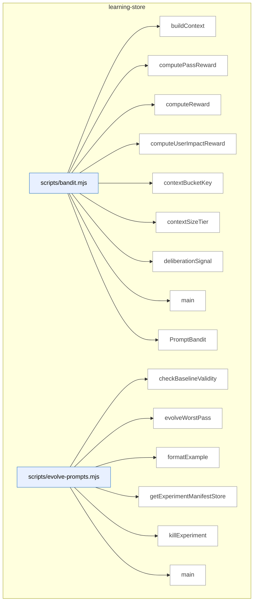

_Domain has 89 symbols (>50). Diagram shows top-15 by file order; see flat table below for the full list._

### Symbols in this domain

| Symbol | Kind | Path | Lines | Purpose | File imported by |
|---|---|---|---|---|---|
| [`buildContext`](../scripts/bandit.mjs#L29) | function | `scripts/bandit.mjs` | 29-35 | Constructs a context object from repo profile data, classifying by size tier and dominant language. | `scripts/evolve-prompts.mjs`, `scripts/gemini-review.mjs`, `scripts/lib/audit/legacy-production-audit.mjs`, +7 more |
| [`computePassReward`](../scripts/bandit.mjs#L442) | function | `scripts/bandit.mjs` | 442-448 | Averages the per-finding rewards for all findings in a pass's evaluation record. | `scripts/evolve-prompts.mjs`, `scripts/gemini-review.mjs`, `scripts/lib/audit/legacy-production-audit.mjs`, +7 more |
| [`computeReward`](../scripts/bandit.mjs#L342) | function | `scripts/bandit.mjs` | 342-380 | Calculates a weighted reward signal for a finding resolution based on procedural, substantive, deliberation, and user-impact factors. | `scripts/evolve-prompts.mjs`, `scripts/gemini-review.mjs`, `scripts/lib/audit/legacy-production-audit.mjs`, +7 more |
| [`computeUserImpactReward`](../scripts/bandit.mjs#L391) | function | `scripts/bandit.mjs` | 391-411 | Scores user-impact correlation data (confirmed hits, severity mismatches, false positives) weighted by persona severity. | `scripts/evolve-prompts.mjs`, `scripts/gemini-review.mjs`, `scripts/lib/audit/legacy-production-audit.mjs`, +7 more |
| [`contextBucketKey`](../scripts/bandit.mjs#L44) | function | `scripts/bandit.mjs` | 44-46 | Generates a composite key combining size tier and language for Thompson Sampling context stratification. | `scripts/evolve-prompts.mjs`, `scripts/gemini-review.mjs`, `scripts/lib/audit/legacy-production-audit.mjs`, +7 more |
| [`contextSizeTier`](../scripts/bandit.mjs#L37) | function | `scripts/bandit.mjs` | 37-42 | Maps character count into a size tier category (small, medium, large, xlarge) for bandit context bucketing. | `scripts/evolve-prompts.mjs`, `scripts/gemini-review.mjs`, `scripts/lib/audit/legacy-production-audit.mjs`, +7 more |
| [`deliberationSignal`](../scripts/bandit.mjs#L418) | function | `scripts/bandit.mjs` | 418-435 | Computes a 0-1 signal reflecting the quality of Claude-vs-GPT deliberation (challenge/sustain/compromise outcomes). | `scripts/evolve-prompts.mjs`, `scripts/gemini-review.mjs`, `scripts/lib/audit/legacy-production-audit.mjs`, +7 more |
| [`main`](../scripts/bandit.mjs#L452) | function | `scripts/bandit.mjs` | 452-486 | CLI entry point for managing bandit arms: registers new variants or displays Thompson Sampling statistics. | `scripts/evolve-prompts.mjs`, `scripts/gemini-review.mjs`, `scripts/lib/audit/legacy-production-audit.mjs`, +7 more |
| [`PromptBandit`](../scripts/bandit.mjs#L50) | class | `scripts/bandit.mjs` | 50-325 | Thompson Sampling engine that tracks prompt variant performance across context buckets and selects high-performing variants adaptively. | `scripts/evolve-prompts.mjs`, `scripts/gemini-review.mjs`, `scripts/lib/audit/legacy-production-audit.mjs`, +7 more |
| [`checkBaselineValidity`](../scripts/evolve-prompts.mjs#L341) | function | `scripts/evolve-prompts.mjs` | 341-349 | Marks experiments stale if their parent (baseline) prompt was replaced after launch. | `tests/evolve.test.mjs` |
| [`evolveWorstPass`](../scripts/evolve-prompts.mjs#L93) | function | `scripts/evolve-prompts.mjs` | 93-235 | Identifies the lowest-performing audit pass and proposes a prompt evolution experiment. | `tests/evolve.test.mjs` |
| [`formatExample`](../scripts/evolve-prompts.mjs#L337) | function | `scripts/evolve-prompts.mjs` | 337-339 | Formats an audit outcome as a single-line summary with severity, category, and file. | `tests/evolve.test.mjs` |
| [`getExperimentManifestStore`](../scripts/evolve-prompts.mjs#L65) | function | `scripts/evolve-prompts.mjs` | 65-67 | Creates a file-based store for experiment manifests using mutex-protected writes. | `tests/evolve.test.mjs` |
| [`killExperiment`](../scripts/evolve-prompts.mjs#L307) | function | `scripts/evolve-prompts.mjs` | 307-318 | Marks a prompt variant as the loser and abandons the experiment. | `tests/evolve.test.mjs` |
| [`main`](../scripts/evolve-prompts.mjs#L374) | function | `scripts/evolve-prompts.mjs` | 374-469 | CLI entry point for evolving audit prompts via A/B experimentation with Thompson Sampling. | `tests/evolve.test.mjs` |
| [`promoteExperiment`](../scripts/evolve-prompts.mjs#L290) | function | `scripts/evolve-prompts.mjs` | 290-302 | Marks a prompt variant as the winner and promotes it to the active prompt. | `tests/evolve.test.mjs` |
| [`reconcileOrphanedExperiments`](../scripts/evolve-prompts.mjs#L354) | function | `scripts/evolve-prompts.mjs` | 354-370 | Identifies and cleans up orphaned experiment manifests that never completed. | `tests/evolve.test.mjs` |
| [`reviewExperiments`](../scripts/evolve-prompts.mjs#L240) | function | `scripts/evolve-prompts.mjs` | 240-285 | Checks which active prompt-evolution experiments have converged and are ready to promote or kill. | `tests/evolve.test.mjs` |
| [`showStats`](../scripts/evolve-prompts.mjs#L323) | function | `scripts/evolve-prompts.mjs` | 323-333 | Reports pass effectiveness statistics and lists active evolution experiments. | `tests/evolve.test.mjs` |
| [`buildAuthorTierObservation`](../scripts/lib/learning/author-tier-observation.mjs#L188) | function | `scripts/lib/learning/author-tier-observation.mjs` | 188-232 | Constructs a decision observation record capturing author tier signals for learning. | `scripts/lib/audit/legacy-production-audit.mjs`, `scripts/openai-audit.mjs`, `tests/model-tier-observation.test.mjs` |
| [`deriveSignals`](../scripts/lib/learning/author-tier-observation.mjs#L93) | function | `scripts/lib/learning/author-tier-observation.mjs` | 93-121 | Extracts observational signals from changed files and domains (file count, security touches, etc.). | `scripts/lib/audit/legacy-production-audit.mjs`, `scripts/openai-audit.mjs`, `tests/model-tier-observation.test.mjs` |
| [`diffBucket`](../scripts/lib/learning/author-tier-observation.mjs#L68) | function | `scripts/lib/learning/author-tier-observation.mjs` | 68-71 | Categorizes a diff line count into size buckets (s, m, l, xl). | `scripts/lib/audit/legacy-production-audit.mjs`, `scripts/openai-audit.mjs`, `tests/model-tier-observation.test.mjs` |
| [`normalizeTierHint`](../scripts/lib/learning/author-tier-observation.mjs#L141) | function | `scripts/lib/learning/author-tier-observation.mjs` | 141-145 | Normalizes an author-tier hint string to a logical tier or model-derived tier. | `scripts/lib/audit/legacy-production-audit.mjs`, `scripts/openai-audit.mjs`, `tests/model-tier-observation.test.mjs` |
| [`suggestTier`](../scripts/lib/learning/author-tier-observation.mjs#L128) | function | `scripts/lib/learning/author-tier-observation.mjs` | 128-133 | Recommends a model tier based on signals about file count, domains, and change sensitivity. | `scripts/lib/audit/legacy-production-audit.mjs`, `scripts/openai-audit.mjs`, `tests/model-tier-observation.test.mjs` |
| [`betaPosterior`](../scripts/lib/learning/beta-posterior.mjs#L38) | function | `scripts/lib/learning/beta-posterior.mjs` | 38-61 | Computes Beta distribution posterior statistics (mean, variance, 95% CI) from observations. | `scripts/lib/learning/quickfix-stats.mjs`, `tests/learning-beta-posterior.test.mjs` |
| [`sampleGamma`](../scripts/lib/learning/beta-posterior.mjs#L136) | function | `scripts/lib/learning/beta-posterior.mjs` | 136-159 | Samples from a Gamma distribution using Marsaglia & Tsang accept-reject method. | `scripts/lib/learning/quickfix-stats.mjs`, `tests/learning-beta-posterior.test.mjs` |
| [`standardNormal`](../scripts/lib/learning/beta-posterior.mjs#L162) | function | `scripts/lib/learning/beta-posterior.mjs` | 162-168 | Generates a standard normal random sample using the Box-Muller transform. | `scripts/lib/learning/quickfix-stats.mjs`, `tests/learning-beta-posterior.test.mjs` |
| [`thompsonSample`](../scripts/lib/learning/beta-posterior.mjs#L74) | function | `scripts/lib/learning/beta-posterior.mjs` | 74-94 | Samples a value from a Beta distribution using Thompson Sampling with prior. | `scripts/lib/learning/quickfix-stats.mjs`, `tests/learning-beta-posterior.test.mjs` |
| [`updatePosterior`](../scripts/lib/learning/beta-posterior.mjs#L108) | function | `scripts/lib/learning/beta-posterior.mjs` | 108-127 | Updates a Beta posterior with a new binary observation (success/failure). | `scripts/lib/learning/quickfix-stats.mjs`, `tests/learning-beta-posterior.test.mjs` |
| [`hasEnoughSamples`](../scripts/lib/learning/cold-start.mjs#L17) | function | `scripts/lib/learning/cold-start.mjs` | 17-21 | Checks if a sample count meets or exceeds a threshold. | `tests/learning-cold-start.test.mjs` |
| [`withFallback`](../scripts/lib/learning/cold-start.mjs#L36) | function | `scripts/lib/learning/cold-start.mjs` | 36-40 | Calls a predict function if samples are sufficient, otherwise calls a fallback. | `tests/learning-cold-start.test.mjs` |
| [`_canonicalise`](../scripts/lib/learning/decision-logger.mjs#L183) | function | `scripts/lib/learning/decision-logger.mjs` | 183-190 | Recursively canonicalizes a value by sorting object keys and preserving array/null structure for deterministic serialization. | `scripts/lib/audit/legacy-production-audit.mjs`, `scripts/lib/neighbourhood-query.mjs`, `scripts/openai-audit.mjs`, +3 more |
| [`_getStateForTest`](../scripts/lib/learning/decision-logger.mjs#L532) | function | `scripts/lib/learning/decision-logger.mjs` | 532-539 | Exports current queue sizes and dropped counts for test assertions. | `scripts/lib/audit/legacy-production-audit.mjs`, `scripts/lib/neighbourhood-query.mjs`, `scripts/openai-audit.mjs`, +3 more |
| [`_isKeyInt`](../scripts/lib/learning/decision-logger.mjs#L51) | function | `scripts/lib/learning/decision-logger.mjs` | 51-51 | Predicate checking if a value is a safe, non-negative integer (for round/sequence validation). | `scripts/lib/audit/legacy-production-audit.mjs`, `scripts/lib/neighbourhood-query.mjs`, `scripts/openai-audit.mjs`, +3 more |
| [`_isNonEmptyString`](../scripts/lib/learning/decision-logger.mjs#L50) | function | `scripts/lib/learning/decision-logger.mjs` | 50-50 | Predicate checking if a value is a non-empty, colon-free string (for key field validation). | `scripts/lib/audit/legacy-production-audit.mjs`, `scripts/lib/neighbourhood-query.mjs`, `scripts/openai-audit.mjs`, +3 more |
| [`_resetForTest`](../scripts/lib/learning/decision-logger.mjs#L521) | function | `scripts/lib/learning/decision-logger.mjs` | 521-527 | Clears all module-level state (queues, counters, hooks) for test isolation. | `scripts/lib/audit/legacy-production-audit.mjs`, `scripts/lib/neighbourhood-query.mjs`, `scripts/openai-audit.mjs`, +3 more |
| [`backfillOutcome`](../scripts/lib/learning/decision-logger.mjs#L263) | function | `scripts/lib/learning/decision-logger.mjs` | 263-295 | Updates the outcome field of an existing decision in the queue, or creates an outcome-only update entry if already flushed. | `scripts/lib/audit/legacy-production-audit.mjs`, `scripts/lib/neighbourhood-query.mjs`, `scripts/openai-audit.mjs`, +3 more |
| [`buildDecisionKey`](../scripts/lib/learning/decision-logger.mjs#L156) | function | `scripts/lib/learning/decision-logger.mjs` | 156-171 | Constructs a stable, colon-separated decision key from either audit-run coordinates (auditRunId:decisionType:r<round>:s<sequence>) or external ID. | `scripts/lib/audit/legacy-production-audit.mjs`, `scripts/lib/neighbourhood-query.mjs`, `scripts/openai-audit.mjs`, +3 more |
| [`bumpDropped`](../scripts/lib/learning/decision-logger.mjs#L90) | function | `scripts/lib/learning/decision-logger.mjs` | 90-92 | Increments the dropped-count counter for a decision type. | `scripts/lib/audit/legacy-production-audit.mjs`, `scripts/lib/neighbourhood-query.mjs`, `scripts/openai-audit.mjs`, +3 more |
| [`canonicaliseContext`](../scripts/lib/learning/decision-logger.mjs#L192) | function | `scripts/lib/learning/decision-logger.mjs` | 192-194 | Converts a context object to a canonical JSON string for hashing. | `scripts/lib/audit/legacy-production-audit.mjs`, `scripts/lib/neighbourhood-query.mjs`, `scripts/openai-audit.mjs`, +3 more |
| [`contextHash`](../scripts/lib/learning/decision-logger.mjs#L196) | function | `scripts/lib/learning/decision-logger.mjs` | 196-198 | Computes a SHA256 hash of the canonical context representation. | `scripts/lib/audit/legacy-production-audit.mjs`, `scripts/lib/neighbourhood-query.mjs`, `scripts/openai-audit.mjs`, +3 more |
| [`DecisionLoggerError`](../scripts/lib/learning/decision-logger.mjs#L109) | class | `scripts/lib/learning/decision-logger.mjs` | 109-111 | Custom error class for decision-logger exceptions with a code property. | `scripts/lib/audit/legacy-production-audit.mjs`, `scripts/lib/neighbourhood-query.mjs`, `scripts/openai-audit.mjs`, +3 more |
| [`drain`](../scripts/lib/learning/decision-logger.mjs#L482) | function | `scripts/lib/learning/decision-logger.mjs` | 482-492 | Initiates and manages the async flush of queued decisions, preventing concurrent drain operations. | `scripts/lib/audit/legacy-production-audit.mjs`, `scripts/lib/neighbourhood-query.mjs`, `scripts/openai-audit.mjs`, +3 more |
| [`flush`](../scripts/lib/learning/decision-logger.mjs#L308) | function | `scripts/lib/learning/decision-logger.mjs` | 308-377 | Drains queued decision entries to cloud storage (if enabled) or local outbox, with two-phase staging and per-queue retention tracking. | `scripts/lib/audit/legacy-production-audit.mjs`, `scripts/lib/neighbourhood-query.mjs`, `scripts/openai-audit.mjs`, +3 more |
| [`getQueue`](../scripts/lib/learning/decision-logger.mjs#L84) | function | `scripts/lib/learning/decision-logger.mjs` | 84-88 | Gets or creates a queue array for a decision type. | `scripts/lib/audit/legacy-production-audit.mjs`, `scripts/lib/neighbourhood-query.mjs`, `scripts/openai-audit.mjs`, +3 more |
| [`installLifecycleHooks`](../scripts/lib/learning/decision-logger.mjs#L494) | function | `scripts/lib/learning/decision-logger.mjs` | 494-516 | Registers process lifecycle handlers (beforeExit, SIGINT) to ensure queued decisions are flushed before process termination. | `scripts/lib/audit/legacy-production-audit.mjs`, `scripts/lib/neighbourhood-query.mjs`, `scripts/openai-audit.mjs`, +3 more |
| [`isCiEnv`](../scripts/lib/learning/decision-logger.mjs#L59) | function | `scripts/lib/learning/decision-logger.mjs` | 59-61 | Returns true if running in a CI environment (GitHub Actions or CI env var set). | `scripts/lib/audit/legacy-production-audit.mjs`, `scripts/lib/neighbourhood-query.mjs`, `scripts/openai-audit.mjs`, +3 more |
| [`reconcileOutbox`](../scripts/lib/learning/decision-logger.mjs#L388) | function | `scripts/lib/learning/decision-logger.mjs` | 388-413 | Processes outbox JSON files, retrying failed cloud writes and removing successfully persisted files. | `scripts/lib/audit/legacy-production-audit.mjs`, `scripts/lib/neighbourhood-query.mjs`, `scripts/openai-audit.mjs`, +3 more |
| [`recordDecision`](../scripts/lib/learning/decision-logger.mjs#L218) | function | `scripts/lib/learning/decision-logger.mjs` | 218-252 | Enqueues a decision event with validation, context hashing, and per-type queue cap enforcement (oldest-entry dropping). | `scripts/lib/audit/legacy-production-audit.mjs`, `scripts/lib/neighbourhood-query.mjs`, `scripts/openai-audit.mjs`, +3 more |
| [`resolveQueueCap`](../scripts/lib/learning/decision-logger.mjs#L27) | function | `scripts/lib/learning/decision-logger.mjs` | 27-38 | Parses and validates the learning queue cap from the environment variable. | `scripts/lib/audit/legacy-production-audit.mjs`, `scripts/lib/neighbourhood-query.mjs`, `scripts/openai-audit.mjs`, +3 more |
| [`retryWithBackoff`](../scripts/lib/learning/decision-logger.mjs#L435) | function | `scripts/lib/learning/decision-logger.mjs` | 435-452 | Executes a function with exponential backoff (3 attempts in CI, single shot locally), treating truthy or `{ok:true}` as success. | `scripts/lib/audit/legacy-production-audit.mjs`, `scripts/lib/neighbourhood-query.mjs`, `scripts/openai-audit.mjs`, +3 more |
| [`throttledWarn`](../scripts/lib/learning/decision-logger.mjs#L94) | function | `scripts/lib/learning/decision-logger.mjs` | 94-101 | Limits warning output to stderr for a given key to once per STDERR_WARN_THROTTLE_MS interval. | `scripts/lib/audit/legacy-production-audit.mjs`, `scripts/lib/neighbourhood-query.mjs`, `scripts/openai-audit.mjs`, +3 more |
| [`tryWrite`](../scripts/lib/learning/decision-logger.mjs#L417) | function | `scripts/lib/learning/decision-logger.mjs` | 417-433 | Attempts to write a decision entry to the store with exponential backoff retry logic, handling both outcome-only and full decision writes. | `scripts/lib/audit/legacy-production-audit.mjs`, `scripts/lib/neighbourhood-query.mjs`, `scripts/openai-audit.mjs`, +3 more |
| [`validateInput`](../scripts/lib/learning/decision-logger.mjs#L113) | function | `scripts/lib/learning/decision-logger.mjs` | 113-148 | Validates decision-logger input structure, ensuring required fields are correctly typed and enforces audit-bound or external-bound keying constraint. | `scripts/lib/audit/legacy-production-audit.mjs`, `scripts/lib/neighbourhood-query.mjs`, `scripts/openai-audit.mjs`, +3 more |
| [`writeOutbox`](../scripts/lib/learning/decision-logger.mjs#L454) | function | `scripts/lib/learning/decision-logger.mjs` | 454-465 | Writes a decision entry to the local outbox directory with a timestamped, hash-based filename for later cloud reconciliation. | `scripts/lib/audit/legacy-production-audit.mjs`, `scripts/lib/neighbourhood-query.mjs`, `scripts/openai-audit.mjs`, +3 more |
| [`aggregateDecisions`](../scripts/lib/learning/quickfix-stats.mjs#L199) | function | `scripts/lib/learning/quickfix-stats.mjs` | 199-224 | Converts a list of decision records into pattern-level Beta posterior statistics (acceptance rate, CI bounds). | `scripts/cross-skill.mjs`, `scripts/learning/backfill-outcomes.mjs`, `tests/learning-quickfix-stats.test.mjs` |
| [`cliMain`](../scripts/lib/learning/quickfix-stats.mjs#L277) | function | `scripts/lib/learning/quickfix-stats.mjs` | 277-330 | Parses CLI arguments and dispatches to stats display, rebuild (cloud/bootstrap), or reset actions. | `scripts/cross-skill.mjs`, `scripts/learning/backfill-outcomes.mjs`, `tests/learning-quickfix-stats.test.mjs` |
| [`computeWatermark`](../scripts/lib/learning/quickfix-stats.mjs#L226) | function | `scripts/lib/learning/quickfix-stats.mjs` | 226-233 | Extracts the maximum outcome timestamp and total row count from decision records for cache metadata. | `scripts/cross-skill.mjs`, `scripts/learning/backfill-outcomes.mjs`, `tests/learning-quickfix-stats.test.mjs` |
| [`loadStats`](../scripts/lib/learning/quickfix-stats.mjs#L54) | function | `scripts/lib/learning/quickfix-stats.mjs` | 54-64 | Loads cached quickfix pattern statistics from disk, returning empty structure on missing/corrupt file. | `scripts/cross-skill.mjs`, `scripts/learning/backfill-outcomes.mjs`, `tests/learning-quickfix-stats.test.mjs` |
| [`readQuickfixDecisions`](../scripts/lib/learning/quickfix-stats.mjs#L240) | function | `scripts/lib/learning/quickfix-stats.mjs` | 240-258 | Queries cloud learning store for quickfix-decision records with pagination and error handling. | `scripts/cross-skill.mjs`, `scripts/learning/backfill-outcomes.mjs`, `tests/learning-quickfix-stats.test.mjs` |
| [`rebuildFromBootstrap`](../scripts/lib/learning/quickfix-stats.mjs#L139) | function | `scripts/lib/learning/quickfix-stats.mjs` | 139-183 | Parses a JSONL quickfix bootstrap file, converts matches to neutral-outcome decisions, and writes cache. | `scripts/cross-skill.mjs`, `scripts/learning/backfill-outcomes.mjs`, `tests/learning-quickfix-stats.test.mjs` |
| [`rebuildFromCloud`](../scripts/lib/learning/quickfix-stats.mjs#L97) | function | `scripts/lib/learning/quickfix-stats.mjs` | 97-122 | Fetches quickfix decisions from cloud storage, aggregates pattern statistics, and writes an atomic cache file. | `scripts/cross-skill.mjs`, `scripts/learning/backfill-outcomes.mjs`, `tests/learning-quickfix-stats.test.mjs` |
| [`shouldSkipPattern`](../scripts/lib/learning/quickfix-stats.mjs#L77) | function | `scripts/lib/learning/quickfix-stats.mjs` | 77-83 | Determines if a quickfix pattern should be skipped based on cached acceptance rate and hit count thresholds. | `scripts/cross-skill.mjs`, `scripts/learning/backfill-outcomes.mjs`, `tests/learning-quickfix-stats.test.mjs` |
| [`writeAtomic`](../scripts/lib/learning/quickfix-stats.mjs#L264) | function | `scripts/lib/learning/quickfix-stats.mjs` | 264-266 | Wrapper for atomicWriteFileSync for consistent file persistence in stats cache. | `scripts/cross-skill.mjs`, `scripts/learning/backfill-outcomes.mjs`, `tests/learning-quickfix-stats.test.mjs` |
| [`archMemoryBandReward`](../scripts/lib/learning/replay.mjs#L292) | function | `scripts/lib/learning/replay.mjs` | 292-301 | Calculates reward for architectural-memory band recommendations (reuse/extend vs. wrong-fork). | `scripts/learning/replay.mjs`, `tests/learning-replay.test.mjs` |
| [`convergencePredictReward`](../scripts/lib/learning/replay.mjs#L269) | function | `scripts/lib/learning/replay.mjs` | 269-284 | Calculates reward for convergence-prediction decisions (continue vs. stop) against actual convergence round. | `scripts/learning/replay.mjs`, `tests/learning-replay.test.mjs` |
| [`distSummary`](../scripts/lib/learning/replay.mjs#L154) | function | `scripts/lib/learning/replay.mjs` | 154-163 | Computes mean, median (p50), 90th percentile, and total for a numeric array. | `scripts/learning/replay.mjs`, `tests/learning-replay.test.mjs` |
| [`emptyDist`](../scripts/lib/learning/replay.mjs#L165) | function | `scripts/lib/learning/replay.mjs` | 165-165 | Returns a zero-initialized distribution summary. | `scripts/learning/replay.mjs`, `tests/learning-replay.test.mjs` |
| [`historicalBaseline`](../scripts/lib/learning/replay.mjs#L228) | function | `scripts/lib/learning/replay.mjs` | 228-228 | Baseline policy that returns the historical choice from a decision record. | `scripts/learning/replay.mjs`, `tests/learning-replay.test.mjs` |
| [`neutralBaseline`](../scripts/lib/learning/replay.mjs#L231) | function | `scripts/lib/learning/replay.mjs` | 231-231 | Baseline policy that returns a neutral/no-op choice for comparison. | `scripts/learning/replay.mjs`, `tests/learning-replay.test.mjs` |
| [`passSelectionReward`](../scripts/lib/learning/replay.mjs#L250) | function | `scripts/lib/learning/replay.mjs` | 250-261 | Calculates reward for pass-selection decisions based on findings kept, cost, persona correlation, and false positives. | `scripts/learning/replay.mjs`, `tests/learning-replay.test.mjs` |
| [`percentile`](../scripts/lib/learning/replay.mjs#L167) | function | `scripts/lib/learning/replay.mjs` | 167-176 | Computes the q-th percentile of a sorted array using linear interpolation. | `scripts/learning/replay.mjs`, `tests/learning-replay.test.mjs` |
| [`readDecisionsForType`](../scripts/lib/learning/replay.mjs#L193) | function | `scripts/lib/learning/replay.mjs` | 193-220 | Fetches historical decisions from cloud storage (or fixtures) with pagination, defaulting to empty on unavailability. | `scripts/learning/replay.mjs`, `tests/learning-replay.test.mjs` |
| [`replay`](../scripts/lib/learning/replay.mjs#L62) | function | `scripts/lib/learning/replay.mjs` | 62-121 | Simulates decision-making policies against historical records, computing reward distributions and delta summaries. | `scripts/learning/replay.mjs`, `tests/learning-replay.test.mjs` |
| [`safeReward`](../scripts/lib/learning/replay.mjs#L139) | function | `scripts/lib/learning/replay.mjs` | 139-145 | Calls a reward function with error/NaN handling, returning 0 for any failure to prevent distribution corruption. | `scripts/learning/replay.mjs`, `tests/learning-replay.test.mjs` |
| [`validateInput`](../scripts/lib/learning/replay.mjs#L125) | function | `scripts/lib/learning/replay.mjs` | 125-135 | Validates replay input types (decisionType string, candidatePolicy/rewardFn functions). | `scripts/learning/replay.mjs`, `tests/learning-replay.test.mjs` |
| [`getLearningStats`](../scripts/lib/learning/stats.mjs#L33) | function | `scripts/lib/learning/stats.mjs` | 33-68 | Fetches aggregate learning statistics for a repo (pending triage, no-brainer, stale cluster counts). | `scripts/cross-skill.mjs`, `scripts/lib/dashboard/collect-telemetry.mjs` |
| [`computeAssessmentMetrics`](../scripts/meta-assess.mjs#L48) | function | `scripts/meta-assess.mjs` | 48-150 | Computes FP rate, signal quality, severity calibration, and convergence metrics from outcomes. | `scripts/audit-loop.mjs`, `tests/meta-assess.test.mjs` |
| [`emptyMetrics`](../scripts/meta-assess.mjs#L152) | function | `scripts/meta-assess.mjs` | 152-162 | Returns a zeroed assessment metrics structure for use when data is insufficient. | `scripts/audit-loop.mjs`, `tests/meta-assess.test.mjs` |
| [`formatAssessmentReport`](../scripts/meta-assess.mjs#L353) | function | `scripts/meta-assess.mjs` | 353-398 | Formats an LLM assessment result as a markdown report with metrics and recommendations. | `scripts/audit-loop.mjs`, `tests/meta-assess.test.mjs` |
| [`main`](../scripts/meta-assess.mjs#L402) | function | `scripts/meta-assess.mjs` | 402-475 | Main entry point: loads outcomes, computes metrics, optionally runs LLM assessment. | `scripts/audit-loop.mjs`, `tests/meta-assess.test.mjs` |
| [`markAssessmentComplete`](../scripts/meta-assess.mjs#L190) | function | `scripts/meta-assess.mjs` | 190-198 | Updates the assessment state file with the current run count and timestamp. | `scripts/audit-loop.mjs`, `tests/meta-assess.test.mjs` |
| [`runLLMAssessment`](../scripts/meta-assess.mjs#L249) | function | `scripts/meta-assess.mjs` | 249-326 | Sends metrics and samples to an LLM (Gemini Flash or GPT) for diagnostic analysis. | `scripts/audit-loop.mjs`, `tests/meta-assess.test.mjs` |
| [`sampleOutcomes`](../scripts/meta-assess.mjs#L202) | function | `scripts/meta-assess.mjs` | 202-214 | Samples recently dismissed and accepted audit outcomes for LLM analysis. | `scripts/audit-loop.mjs`, `tests/meta-assess.test.mjs` |
| [`shouldRunAssessment`](../scripts/meta-assess.mjs#L174) | function | `scripts/meta-assess.mjs` | 174-184 | Checks if enough audit runs have elapsed since the last meta-assessment. | `scripts/audit-loop.mjs`, `tests/meta-assess.test.mjs` |
| [`storeAssessment`](../scripts/meta-assess.mjs#L337) | function | `scripts/meta-assess.mjs` | 337-344 | Appends an assessment result record to a JSONL log file with timestamp. | `scripts/audit-loop.mjs`, `tests/meta-assess.test.mjs` |
| [`analyzePass`](../scripts/refine-prompts.mjs#L40) | function | `scripts/refine-prompts.mjs` | 40-70 | Loads audit outcomes for a given pass, computes acceptance rate and EWR metrics, and prints top dismissed finding categories. | _(internal)_ |
| [`main`](../scripts/refine-prompts.mjs#L193) | function | `scripts/refine-prompts.mjs` | 193-233 | CLI dispatcher: routes to per-pass effectiveness stats, full-suite stats, or LLM-based prompt refinement suggestions. | _(internal)_ |
| [`suggestRefinements`](../scripts/refine-prompts.mjs#L76) | function | `scripts/refine-prompts.mjs` | 76-191 | Collects and sanitizes recent audit outcomes for a pass, then generates LLM-powered prompt refinement suggestions. | _(internal)_ |

---

## memory-health

> Monitors the audit-findings store via three signal-decay metrics (fuzzy re-raise rate, cluster density, recurrence) to detect when pgvector + community clustering would recover signal lost to dedup collisions.

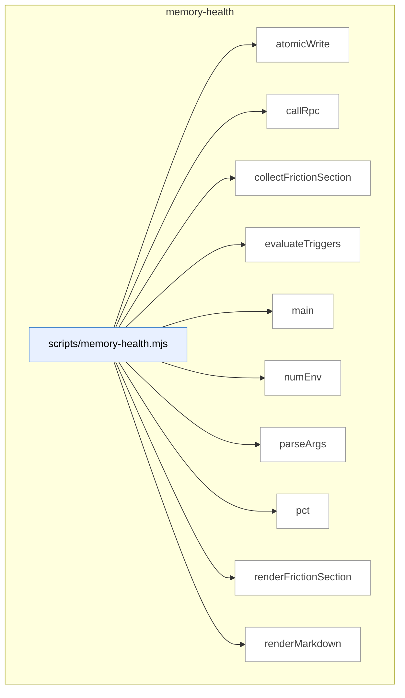

### Symbols in this domain

| Symbol | Kind | Path | Lines | Purpose | File imported by |
|---|---|---|---|---|---|
| [`atomicWrite`](../scripts/memory-health.mjs#L292) | function | `scripts/memory-health.mjs` | 292-294 | Writes contents to a file using atomic rename to prevent partial writes. | `tests/memory-health.test.mjs` |
| [`callRpc`](../scripts/memory-health.mjs#L71) | function | `scripts/memory-health.mjs` | 71-82 | Calls the memory_health_metrics Postgres RPC function with the configured window size. | `tests/memory-health.test.mjs` |
| [`collectFrictionSection`](../scripts/memory-health.mjs#L94) | function | `scripts/memory-health.mjs` | 94-124 | Retrieves recurring friction data from the store, ranking by recurrence and cost. | `tests/memory-health.test.mjs` |
| [`evaluateTriggers`](../scripts/memory-health.mjs#L170) | function | `scripts/memory-health.mjs` | 170-205 | Evaluates metrics against thresholds and returns overall health status and trigger count. | `tests/memory-health.test.mjs` |
| [`main`](../scripts/memory-health.mjs#L296) | function | `scripts/memory-health.mjs` | 296-336 | Main entry point: fetches metrics, runs evaluation, and outputs report or JSON. | `tests/memory-health.test.mjs` |
| [`numEnv`](../scripts/memory-health.mjs#L31) | function | `scripts/memory-health.mjs` | 31-40 | Reads an env var as a finite number, logging a warning and returning fallback if invalid. | `tests/memory-health.test.mjs` |
| [`parseArgs`](../scripts/memory-health.mjs#L51) | function | `scripts/memory-health.mjs` | 51-69 | Parses CLI arguments (--out, --json, --help) for the memory-health script. | `tests/memory-health.test.mjs` |
| [`pct`](../scripts/memory-health.mjs#L207) | function | `scripts/memory-health.mjs` | 207-209 | Converts a decimal number to a percentage string with one decimal place. | `tests/memory-health.test.mjs` |
| [`renderFrictionSection`](../scripts/memory-health.mjs#L126) | function | `scripts/memory-health.mjs` | 126-168 | Formats friction cluster data as a markdown table with state, rank, and alarm indicators. | `tests/memory-health.test.mjs` |
| [`renderMarkdown`](../scripts/memory-health.mjs#L211) | function | `scripts/memory-health.mjs` | 211-290 | Generates a full markdown memory-health report including metrics, triggers, and thresholds. | `tests/memory-health.test.mjs` |

---

## model-eval

> A/B testing framework for code-audit LLM models: generates findings via multiple "arms," blinds them to hide the source model, and applies a judge to compare quality.

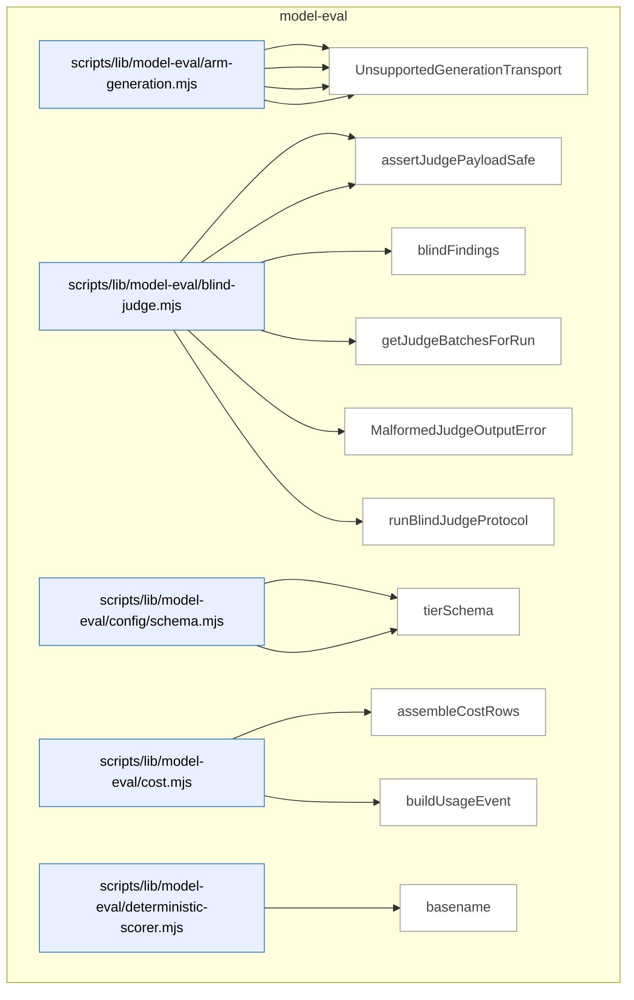

_Domain has 66 symbols (>50). Diagram shows top-15 by file order; see flat table below for the full list._

### Symbols in this domain

| Symbol | Kind | Path | Lines | Purpose | File imported by |
|---|---|---|---|---|---|
| [`buildGenericPlanContent`](../scripts/lib/model-eval/arm-generation.mjs#L65) | function | `scripts/lib/model-eval/arm-generation.mjs` | 65-68 | Constructs audit-generation prompt from file list | `scripts/model-eval-auditor.mjs`, `tests/arm-generation.test.mjs` |
| [`resolveGenerationClient`](../scripts/lib/model-eval/arm-generation.mjs#L90) | function | `scripts/lib/model-eval/arm-generation.mjs` | 90-109 | Resolves LLM client and model ID for a generation route | `scripts/model-eval-auditor.mjs`, `tests/arm-generation.test.mjs` |
| [`runAuditGenerationArm`](../scripts/lib/model-eval/arm-generation.mjs#L118) | function | `scripts/lib/model-eval/arm-generation.mjs` | 118-251 | Runs 5-pass code audit for model-eval arm with egress-safety check | `scripts/model-eval-auditor.mjs`, `tests/arm-generation.test.mjs` |
| [`UnsupportedGenerationTransport`](../scripts/lib/model-eval/arm-generation.mjs#L29) | class | `scripts/lib/model-eval/arm-generation.mjs` | 29-35 | Error class for unsupported generation transports | `scripts/model-eval-auditor.mjs`, `tests/arm-generation.test.mjs` |
| [`appendJudgeBatch`](../scripts/lib/model-eval/blind-judge.mjs#L150) | function | `scripts/lib/model-eval/blind-judge.mjs` | 150-173 | Upserts judge batch with idempotent duplicate detection | `scripts/model-eval-auditor.mjs`, `tests/blind-judge-fork-parity.test.mjs` |
| [`assertJudgePayloadSafe`](../scripts/lib/model-eval/blind-judge.mjs#L126) | function | `scripts/lib/model-eval/blind-judge.mjs` | 126-132 | Validates judge payload contains no sensitive paths | `scripts/model-eval-auditor.mjs`, `tests/blind-judge-fork-parity.test.mjs` |
| [`blindFindings`](../scripts/lib/model-eval/blind-judge.mjs#L102) | function | `scripts/lib/model-eval/blind-judge.mjs` | 102-122 | Assigns blind IDs to findings and shuffles for unbiased judging | `scripts/model-eval-auditor.mjs`, `tests/blind-judge-fork-parity.test.mjs` |
| [`getJudgeBatchesForRun`](../scripts/lib/model-eval/blind-judge.mjs#L183) | function | `scripts/lib/model-eval/blind-judge.mjs` | 183-190 | Fetches all judge batches for a model-eval run | `scripts/model-eval-auditor.mjs`, `tests/blind-judge-fork-parity.test.mjs` |
| [`MalformedJudgeOutputError`](../scripts/lib/model-eval/blind-judge.mjs#L40) | class | `scripts/lib/model-eval/blind-judge.mjs` | 40-42 | Error class for malformed judge output | `scripts/model-eval-auditor.mjs`, `tests/blind-judge-fork-parity.test.mjs` |
| [`runBlindJudgeProtocol`](../scripts/lib/model-eval/blind-judge.mjs#L202) | function | `scripts/lib/model-eval/blind-judge.mjs` | 202-278 | Runs blind judge evaluation comparing candidate vs baseline findings | `scripts/model-eval-auditor.mjs`, `tests/blind-judge-fork-parity.test.mjs` |
| [`parseThresholdConfig`](../scripts/lib/model-eval/config/schema.mjs#L109) | function | `scripts/lib/model-eval/config/schema.mjs` | 109-113 | Parses and validates threshold configuration | `scripts/model-eval-adjudicator.mjs`, `scripts/model-eval-auditor.mjs`, `tests/model-eval-core.test.mjs` |
| [`tierSchema`](../scripts/lib/model-eval/config/schema.mjs#L54) | function | `scripts/lib/model-eval/config/schema.mjs` | 54-84 | Zod schema for evaluation tier with mandatory floor validation | `scripts/model-eval-adjudicator.mjs`, `scripts/model-eval-auditor.mjs`, `tests/model-eval-core.test.mjs` |
| [`assembleCostRows`](../scripts/lib/model-eval/cost.mjs#L168) | function | `scripts/lib/model-eval/cost.mjs` | 168-214 | Aggregates usage events into cost rows per arm and phase | `scripts/lib/model-eval/arm-generation.mjs`, `scripts/model-eval-auditor.mjs`, `tests/model-eval-core.test.mjs` |
| [`buildUsageEvent`](../scripts/lib/model-eval/cost.mjs#L109) | function | `scripts/lib/model-eval/cost.mjs` | 109-158 | Constructs usage event with pricing model validation | `scripts/lib/model-eval/arm-generation.mjs`, `scripts/model-eval-auditor.mjs`, `tests/model-eval-core.test.mjs` |
| [`basename`](../scripts/lib/model-eval/deterministic-scorer.mjs#L84) | function | `scripts/lib/model-eval/deterministic-scorer.mjs` | 84-86 | Extracts filename from path | `scripts/lib/model-eval/finalize-shadow-eval.mjs`, `scripts/model-eval-adjudicator.mjs`, `scripts/model-eval-auditor.mjs`, +1 more |
| [`matchScore`](../scripts/lib/model-eval/deterministic-scorer.mjs#L103) | function | `scripts/lib/model-eval/deterministic-scorer.mjs` | 103-132 | Scores candidate finding match against expected rubric by file and description | `scripts/lib/model-eval/finalize-shadow-eval.mjs`, `scripts/model-eval-adjudicator.mjs`, `scripts/model-eval-auditor.mjs`, +1 more |
| [`normalize`](../scripts/lib/model-eval/deterministic-scorer.mjs#L80) | function | `scripts/lib/model-eval/deterministic-scorer.mjs` | 80-82 | Lowercases and normalizes whitespace in string | `scripts/lib/model-eval/finalize-shadow-eval.mjs`, `scripts/model-eval-adjudicator.mjs`, `scripts/model-eval-auditor.mjs`, +1 more |
| [`scoreBinaryClassification`](../scripts/lib/model-eval/deterministic-scorer.mjs#L23) | function | `scripts/lib/model-eval/deterministic-scorer.mjs` | 23-58 | Computes precision, recall, F1 from binary predictions vs ground truth | `scripts/lib/model-eval/finalize-shadow-eval.mjs`, `scripts/model-eval-adjudicator.mjs`, `scripts/model-eval-auditor.mjs`, +1 more |
| [`scoreDefectLocalization`](../scripts/lib/model-eval/deterministic-scorer.mjs#L145) | function | `scripts/lib/model-eval/deterministic-scorer.mjs` | 145-227 | Scores extracted defect findings against known-defect rubric | `scripts/lib/model-eval/finalize-shadow-eval.mjs`, `scripts/model-eval-adjudicator.mjs`, `scripts/model-eval-auditor.mjs`, +1 more |
| [`EgressGateError`](../scripts/lib/model-eval/egress-path-scan.mjs#L22) | class | `scripts/lib/model-eval/egress-path-scan.mjs` | 22-24 | Error class for credential/path leakage detection | `scripts/lib/model-eval/arm-generation.mjs`, `scripts/lib/model-eval/blind-judge.mjs`, `scripts/lib/model-eval/known-defect-corpus.mjs`, +6 more |
| [`findSensitivePathMentions`](../scripts/lib/model-eval/egress-path-scan.mjs#L108) | function | `scripts/lib/model-eval/egress-path-scan.mjs` | 108-113 | Extracts potential sensitive paths from text using pattern matching | `scripts/lib/model-eval/arm-generation.mjs`, `scripts/lib/model-eval/blind-judge.mjs`, `scripts/lib/model-eval/known-defect-corpus.mjs`, +6 more |
| [`looksLikeRealPath`](../scripts/lib/model-eval/egress-path-scan.mjs#L52) | function | `scripts/lib/model-eval/egress-path-scan.mjs` | 52-60 | Heuristically detects if token resembles a filesystem path | `scripts/lib/model-eval/arm-generation.mjs`, `scripts/lib/model-eval/blind-judge.mjs`, `scripts/lib/model-eval/known-defect-corpus.mjs`, +6 more |
| [`appendModelEvalShadowObservation`](../scripts/lib/model-eval/finalize-shadow-eval.mjs#L61) | function | `scripts/lib/model-eval/finalize-shadow-eval.mjs` | 61-71 | Upserts shadow eval observation with idempotent key | `scripts/gemini-review.mjs`, `scripts/model-eval-adjudicator.mjs`, `tests/finalize-shadow-eval.test.mjs` |
| [`finalizeShadowEval`](../scripts/lib/model-eval/finalize-shadow-eval.mjs#L206) | function | `scripts/lib/model-eval/finalize-shadow-eval.mjs` | 206-249 | Computes shadow eval verdict when sufficient terminal runs collected | `scripts/gemini-review.mjs`, `scripts/model-eval-adjudicator.mjs`, `tests/finalize-shadow-eval.test.mjs` |
| [`getShadowObservationsForEvalRun`](../scripts/lib/model-eval/finalize-shadow-eval.mjs#L79) | function | `scripts/lib/model-eval/finalize-shadow-eval.mjs` | 79-90 | Fetches shadow observations for a model-eval run | `scripts/gemini-review.mjs`, `scripts/model-eval-adjudicator.mjs`, `tests/finalize-shadow-eval.test.mjs` |
| [`getTerminalShadowObservations`](../scripts/lib/model-eval/finalize-shadow-eval.mjs#L108) | function | `scripts/lib/model-eval/finalize-shadow-eval.mjs` | 108-133 | Filters shadow observations to those with terminal user-action states | `scripts/gemini-review.mjs`, `scripts/model-eval-adjudicator.mjs`, `tests/finalize-shadow-eval.test.mjs` |
| [`ShadowObservationRepoMismatchError`](../scripts/lib/model-eval/finalize-shadow-eval.mjs#L46) | class | `scripts/lib/model-eval/finalize-shadow-eval.mjs` | 46-51 | Error when shadow observation mismatches repo | `scripts/gemini-review.mjs`, `scripts/model-eval-adjudicator.mjs`, `tests/finalize-shadow-eval.test.mjs` |
| [`toBinaryRows`](../scripts/lib/model-eval/finalize-shadow-eval.mjs#L167) | function | `scripts/lib/model-eval/finalize-shadow-eval.mjs` | 167-183 | Converts terminal shadow observations to binary classification rows | `scripts/gemini-review.mjs`, `scripts/model-eval-adjudicator.mjs`, `tests/finalize-shadow-eval.test.mjs` |
| [`toMetrics`](../scripts/lib/model-eval/finalize-shadow-eval.mjs#L185) | function | `scripts/lib/model-eval/finalize-shadow-eval.mjs` | 185-187 | Extracts recall, false-positive rate, and F1 metrics from binary score | `scripts/gemini-review.mjs`, `scripts/model-eval-adjudicator.mjs`, `tests/finalize-shadow-eval.test.mjs` |
| [`CorpusCaseUnavailable`](../scripts/lib/model-eval/known-defect-corpus.mjs#L35) | class | `scripts/lib/model-eval/known-defect-corpus.mjs` | 35-42 | Error class for when a known-defect corpus case cannot be loaded (missing repo, commit, or diff). | `scripts/model-eval-auditor.mjs`, `tests/known-defect-corpus.test.mjs` |
| [`git`](../scripts/lib/model-eval/known-defect-corpus.mjs#L58) | function | `scripts/lib/model-eval/known-defect-corpus.mjs` | 58-63 | Executes git command with large buffer and pager suppression | `scripts/model-eval-auditor.mjs`, `tests/known-defect-corpus.test.mjs` |
| [`loadCorpusCase`](../scripts/lib/model-eval/known-defect-corpus.mjs#L112) | function | `scripts/lib/model-eval/known-defect-corpus.mjs` | 112-211 | Loads known-defect corpus case with commit and diff extraction | `scripts/model-eval-auditor.mjs`, `tests/known-defect-corpus.test.mjs` |
| [`resolveRepoRoot`](../scripts/lib/model-eval/known-defect-corpus.mjs#L89) | function | `scripts/lib/model-eval/known-defect-corpus.mjs` | 89-95 | Finds repo root by name from candidate list | `scripts/model-eval-auditor.mjs`, `tests/known-defect-corpus.test.mjs` |
| [`tryGit`](../scripts/lib/model-eval/known-defect-corpus.mjs#L72) | function | `scripts/lib/model-eval/known-defect-corpus.mjs` | 72-75 | Wraps git execution with error handling | `scripts/model-eval-auditor.mjs`, `tests/known-defect-corpus.test.mjs` |
| [`invokeNativeAnthropic`](../scripts/lib/model-eval/provider-adapter.mjs#L128) | function | `scripts/lib/model-eval/provider-adapter.mjs` | 128-156 | Calls Anthropic Claude API with structured JSON output via the messages.create interface. | `scripts/lib/model-eval/blind-judge.mjs`, `scripts/lib/model-eval/structured-extractor.mjs` |
| [`invokeNativeGemini`](../scripts/lib/model-eval/provider-adapter.mjs#L158) | function | `scripts/lib/model-eval/provider-adapter.mjs` | 158-200 | Calls Google Gemini API with structured JSON output via generateContent. | `scripts/lib/model-eval/blind-judge.mjs`, `scripts/lib/model-eval/structured-extractor.mjs` |
| [`invokeOpenAICompatible`](../scripts/lib/model-eval/provider-adapter.mjs#L83) | function | `scripts/lib/model-eval/provider-adapter.mjs` | 83-126 | Routes structured-output calls to OpenAI-compatible transports (public OpenAI, Azure OpenAI, or OSS). | `scripts/lib/model-eval/blind-judge.mjs`, `scripts/lib/model-eval/structured-extractor.mjs` |
| [`invokeStructured`](../scripts/lib/model-eval/provider-adapter.mjs#L46) | function | `scripts/lib/model-eval/provider-adapter.mjs` | 46-81 | Invokes an LLM provider with structured output, applying egress safety checks before sending messages. | `scripts/lib/model-eval/blind-judge.mjs`, `scripts/lib/model-eval/structured-extractor.mjs` |
| [`MalformedProviderOutputError`](../scripts/lib/model-eval/provider-adapter.mjs#L31) | class | `scripts/lib/model-eval/provider-adapter.mjs` | 31-33 | Error class for malformed or unparseable structured output from a provider. | `scripts/lib/model-eval/blind-judge.mjs`, `scripts/lib/model-eval/structured-extractor.mjs` |
| [`resolveOssClientConfig`](../scripts/lib/model-eval/provider-adapter.mjs#L210) | function | `scripts/lib/model-eval/provider-adapter.mjs` | 210-216 | Retrieves OpenRouter API credentials from the audit shadow config. | `scripts/lib/model-eval/blind-judge.mjs`, `scripts/lib/model-eval/structured-extractor.mjs` |
| [`assertAzureTransportSupported`](../scripts/lib/model-eval/route-catalog.mjs#L271) | function | `scripts/lib/model-eval/route-catalog.mjs` | 271-275 | Rejects route resolution when Azure attempts to use unsupported transports like Gemini. | `scripts/gemini-review.mjs`, `scripts/lib/model-eval/blind-judge.mjs`, `scripts/lib/model-eval/finalize-shadow-eval.mjs`, +3 more |
| [`azureTransportProvider`](../scripts/lib/model-eval/route-catalog.mjs#L279) | function | `scripts/lib/model-eval/route-catalog.mjs` | 279-287 | Looks up the transport protocol for an Azure deployment by its model lineage family. | `scripts/gemini-review.mjs`, `scripts/lib/model-eval/blind-judge.mjs`, `scripts/lib/model-eval/finalize-shadow-eval.mjs`, +3 more |
| [`buildComparisonEvidenceFromRoutes`](../scripts/lib/model-eval/route-catalog.mjs#L357) | function | `scripts/lib/model-eval/route-catalog.mjs` | 357-366 | Packages three resolved routes into a comparison evidence object with independence checks. | `scripts/gemini-review.mjs`, `scripts/lib/model-eval/blind-judge.mjs`, `scripts/lib/model-eval/finalize-shadow-eval.mjs`, +3 more |
| [`lineageForProvider`](../scripts/lib/model-eval/route-catalog.mjs#L112) | function | `scripts/lib/model-eval/route-catalog.mjs` | 112-114 | Formats a provider name with optional role/tier into a lineage string. | `scripts/gemini-review.mjs`, `scripts/lib/model-eval/blind-judge.mjs`, `scripts/lib/model-eval/finalize-shadow-eval.mjs`, +3 more |
| [`loadAzureRoutes`](../scripts/lib/model-eval/route-catalog.mjs#L79) | function | `scripts/lib/model-eval/route-catalog.mjs` | 79-99 | Loads and validates Azure deployment routes from a JSON config file with schema verification. | `scripts/gemini-review.mjs`, `scripts/lib/model-eval/blind-judge.mjs`, `scripts/lib/model-eval/finalize-shadow-eval.mjs`, +3 more |
| [`resolveCandidateRoute`](../scripts/lib/model-eval/route-catalog.mjs#L125) | function | `scripts/lib/model-eval/route-catalog.mjs` | 125-257 | Parses and resolves a candidate model spec into a full route with provider, model, deployment, and trust metadata. | `scripts/gemini-review.mjs`, `scripts/lib/model-eval/blind-judge.mjs`, `scripts/lib/model-eval/finalize-shadow-eval.mjs`, +3 more |
| [`resolveEvaluationTier`](../scripts/lib/model-eval/route-catalog.mjs#L305) | function | `scripts/lib/model-eval/route-catalog.mjs` | 305-333 | Determines whether a model-eval comparison qualifies for Tier A/B/C based on route independence. | `scripts/gemini-review.mjs`, `scripts/lib/model-eval/blind-judge.mjs`, `scripts/lib/model-eval/finalize-shadow-eval.mjs`, +3 more |
| [`RouteResolutionError`](../scripts/lib/model-eval/route-catalog.mjs#L70) | class | `scripts/lib/model-eval/route-catalog.mjs` | 70-76 | Error class for route resolution failures with a preflight flag. | `scripts/gemini-review.mjs`, `scripts/lib/model-eval/blind-judge.mjs`, `scripts/lib/model-eval/finalize-shadow-eval.mjs`, +3 more |
| [`toRouteEvidence`](../scripts/lib/model-eval/route-catalog.mjs#L338) | function | `scripts/lib/model-eval/route-catalog.mjs` | 338-343 | Extracts metadata fields (judgeTier, lineageStatus, lineageSource) from a resolved route. | `scripts/gemini-review.mjs`, `scripts/lib/model-eval/blind-judge.mjs`, `scripts/lib/model-eval/finalize-shadow-eval.mjs`, +3 more |
| [`transportForProvider`](../scripts/lib/model-eval/route-catalog.mjs#L103) | function | `scripts/lib/model-eval/route-catalog.mjs` | 103-108 | Maps a provider name to its transport protocol (openai-compatible / native-anthropic / native-gemini). | `scripts/gemini-review.mjs`, `scripts/lib/model-eval/blind-judge.mjs`, `scripts/lib/model-eval/finalize-shadow-eval.mjs`, +3 more |
| [`buildAdjudicatorPrompt`](../scripts/lib/model-eval/structured-extractor.mjs#L215) | function | `scripts/lib/model-eval/structured-extractor.mjs` | 215-220 | Constructs system + user messages for an adjudicator to judge a reported finding's veracity. | `scripts/model-eval-adjudicator.mjs`, `scripts/model-eval-auditor.mjs`, `tests/model-eval-core.test.mjs` |
| [`buildAuditorPrompt`](../scripts/lib/model-eval/structured-extractor.mjs#L208) | function | `scripts/lib/model-eval/structured-extractor.mjs` | 208-213 | Constructs system + user messages for an auditor to find defects in a code diff. | `scripts/model-eval-adjudicator.mjs`, `scripts/model-eval-auditor.mjs`, `tests/model-eval-core.test.mjs` |
| [`extractDiffHeaderPaths`](../scripts/lib/model-eval/structured-extractor.mjs#L124) | function | `scripts/lib/model-eval/structured-extractor.mjs` | 124-146 | Parses git diff headers to extract modified file paths, handling both quoted and unquoted forms. | `scripts/model-eval-adjudicator.mjs`, `scripts/model-eval-auditor.mjs`, `tests/model-eval-core.test.mjs` |
| [`ExtractionInvocationError`](../scripts/lib/model-eval/structured-extractor.mjs#L42) | class | `scripts/lib/model-eval/structured-extractor.mjs` | 42-50 | Error class for provider communication/invocation failures during extraction. | `scripts/model-eval-adjudicator.mjs`, `scripts/model-eval-auditor.mjs`, `tests/model-eval-core.test.mjs` |
| [`extractStructured`](../scripts/lib/model-eval/structured-extractor.mjs#L236) | function | `scripts/lib/model-eval/structured-extractor.mjs` | 236-295 | Orchestrates extraction: validates input shape, checks for egress violations, invokes provider, parses output. | `scripts/model-eval-adjudicator.mjs`, `scripts/model-eval-auditor.mjs`, `tests/model-eval-core.test.mjs` |
| [`InvalidEvaluationInputError`](../scripts/lib/model-eval/structured-extractor.mjs#L33) | class | `scripts/lib/model-eval/structured-extractor.mjs` | 33-35 | Error class for missing or malformed input to extraction functions. | `scripts/model-eval-adjudicator.mjs`, `scripts/model-eval-auditor.mjs`, `tests/model-eval-core.test.mjs` |
| [`isRetryableMalformedOutput`](../scripts/lib/model-eval/structured-extractor.mjs#L56) | function | `scripts/lib/model-eval/structured-extractor.mjs` | 56-58 | Checks if an error from output parsing (ZodError, JSON SyntaxError, MalformedProviderOutputError) is retryable. | `scripts/model-eval-adjudicator.mjs`, `scripts/model-eval-auditor.mjs`, `tests/model-eval-core.test.mjs` |
| [`nonBlankString`](../scripts/lib/model-eval/structured-extractor.mjs#L66) | function | `scripts/lib/model-eval/structured-extractor.mjs` | 66-69 | Creates a Zod schema for a trimmed non-empty string with optional max length bound. | `scripts/model-eval-adjudicator.mjs`, `scripts/model-eval-auditor.mjs`, `tests/model-eval-core.test.mjs` |
| [`prepareModelEvalPayloadForEgress`](../scripts/lib/model-eval/structured-extractor.mjs#L154) | function | `scripts/lib/model-eval/structured-extractor.mjs` | 154-206 | Validates and redacts visible input (diff + file paths) for safety before sending to external LLMs. | `scripts/model-eval-adjudicator.mjs`, `scripts/model-eval-auditor.mjs`, `tests/model-eval-core.test.mjs` |
| [`unquoteDiffPath`](../scripts/lib/model-eval/structured-extractor.mjs#L112) | function | `scripts/lib/model-eval/structured-extractor.mjs` | 112-118 | Unquotes a C-style quoted path string from git diff headers (handling escapes). | `scripts/model-eval-adjudicator.mjs`, `scripts/model-eval-auditor.mjs`, `tests/model-eval-core.test.mjs` |
| [`allRoutesIndependentlyTrusted`](../scripts/lib/model-eval/verdict.mjs#L360) | function | `scripts/lib/model-eval/verdict.mjs` | 360-363 | Checks that all three routes (candidate, baseline, judge) have independently trusted lineage sources. | `scripts/lib/model-eval/finalize-shadow-eval.mjs`, `scripts/lib/store/model-eval.mjs`, `scripts/model-eval-adjudicator.mjs`, +2 more |
| [`computeRawVerdict`](../scripts/lib/model-eval/verdict.mjs#L278) | function | `scripts/lib/model-eval/verdict.mjs` | 278-352 | Applies floor thresholds to metrics and computes verdict + pass/fail reasoning. | `scripts/lib/model-eval/finalize-shadow-eval.mjs`, `scripts/lib/store/model-eval.mjs`, `scripts/model-eval-adjudicator.mjs`, +2 more |
| [`computeVerdict`](../scripts/lib/model-eval/verdict.mjs#L365) | function | `scripts/lib/model-eval/verdict.mjs` | 365-404 | Computes the final verdict by validating input, checking independence, applying decision rules, and enforcing invariants. | `scripts/lib/model-eval/finalize-shadow-eval.mjs`, `scripts/lib/store/model-eval.mjs`, `scripts/model-eval-adjudicator.mjs`, +2 more |
| [`findTableRow`](../scripts/lib/model-eval/verdict.mjs#L244) | function | `scripts/lib/model-eval/verdict.mjs` | 244-247 | Looks up a verdict decision rule from the table by mode, tier, and optional role. | `scripts/lib/model-eval/finalize-shadow-eval.mjs`, `scripts/lib/store/model-eval.mjs`, `scripts/model-eval-adjudicator.mjs`, +2 more |
| [`ratioWithinBound`](../scripts/lib/model-eval/verdict.mjs#L270) | function | `scripts/lib/model-eval/verdict.mjs` | 270-276 | Checks if a candidate-to-baseline ratio falls within a threshold bound. | `scripts/lib/model-eval/finalize-shadow-eval.mjs`, `scripts/lib/store/model-eval.mjs`, `scripts/model-eval-adjudicator.mjs`, +2 more |
| [`requiredMetric`](../scripts/lib/model-eval/verdict.mjs#L252) | function | `scripts/lib/model-eval/verdict.mjs` | 252-258 | Retrieves and validates a finite numeric metric value from the verdict input. | `scripts/lib/model-eval/finalize-shadow-eval.mjs`, `scripts/lib/store/model-eval.mjs`, `scripts/model-eval-adjudicator.mjs`, +2 more |

---

## nav-audit

> The `nav-audit` domain detects framework routing configurations (Next.js, React Router) and extracts normalized route destinations through adapter-based file analysis and AST traversal.

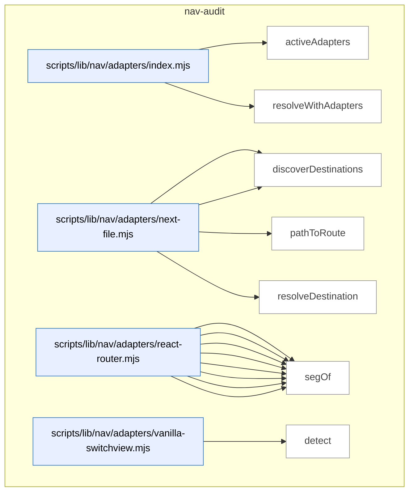

_Domain has 123 symbols (>50). Diagram shows top-15 by file order; see flat table below for the full list._

### Symbols in this domain

| Symbol | Kind | Path | Lines | Purpose | File imported by |
|---|---|---|---|---|---|
| [`activeAdapters`](../scripts/lib/nav/adapters/index.mjs#L20) | function | `scripts/lib/nav/adapters/index.mjs` | 20-24 | Filters framework adapters to those detecting a match in the given repo root. | `scripts/lib/nav/extract.mjs`, `tests/nav-extract.test.mjs` |
| [`resolveWithAdapters`](../scripts/lib/nav/adapters/index.mjs#L37) | function | `scripts/lib/nav/adapters/index.mjs` | 37-45 | Tries each adapter in sequence to resolve a destination string to a route ID. | `scripts/lib/nav/extract.mjs`, `tests/nav-extract.test.mjs` |
| [`detect`](../scripts/lib/nav/adapters/next-file.mjs#L13) | function | `scripts/lib/nav/adapters/next-file.mjs` | 13-15 | Detects Next.js file-based routing by checking for `page.[jt]sx?` files. | `scripts/lib/nav/adapters/index.mjs` |
| [`discoverDestinations`](../scripts/lib/nav/adapters/next-file.mjs#L17) | function | `scripts/lib/nav/adapters/next-file.mjs` | 17-27 | Discovers routes from Next.js app/pages directory structure. | `scripts/lib/nav/adapters/index.mjs` |
| [`pathToRoute`](../scripts/lib/nav/adapters/next-file.mjs#L37) | function | `scripts/lib/nav/adapters/next-file.mjs` | 37-53 | Converts a Next.js file path to its corresponding route path. | `scripts/lib/nav/adapters/index.mjs` |
| [`resolveDestination`](../scripts/lib/nav/adapters/next-file.mjs#L55) | function | `scripts/lib/nav/adapters/next-file.mjs` | 55-61 | Parses a string/template attribute to a normalized route destination. | `scripts/lib/nav/adapters/index.mjs` |
| [`collectJsxRoutes`](../scripts/lib/nav/adapters/react-router.mjs#L42) | function | `scripts/lib/nav/adapters/react-router.mjs` | 42-64 | Recursively collects routes from nested `<Route>` JSX elements. | `scripts/lib/nav/adapters/index.mjs` |
| [`collectObjectRoute`](../scripts/lib/nav/adapters/react-router.mjs#L67) | function | `scripts/lib/nav/adapters/react-router.mjs` | 67-89 | Extracts routes from a route-config object literal and its nested children. | `scripts/lib/nav/adapters/index.mjs` |
| [`dedupe`](../scripts/lib/nav/adapters/react-router.mjs#L106) | function | `scripts/lib/nav/adapters/react-router.mjs` | 106-116 | Deduplicates destinations by (id, sourceLoc) pair. | `scripts/lib/nav/adapters/index.mjs` |
| [`detect`](../scripts/lib/nav/adapters/react-router.mjs#L17) | function | `scripts/lib/nav/adapters/react-router.mjs` | 17-19 | Detects React Router by checking for imports and `<Route>` JSX. | `scripts/lib/nav/adapters/index.mjs` |
| [`discoverDestinations`](../scripts/lib/nav/adapters/react-router.mjs#L21) | function | `scripts/lib/nav/adapters/react-router.mjs` | 21-39 | Extracts routes from React Router JSX elements and route-config objects. | `scripts/lib/nav/adapters/index.mjs` |
| [`joinRoutePath`](../scripts/lib/nav/adapters/react-router.mjs#L99) | function | `scripts/lib/nav/adapters/react-router.mjs` | 99-104 | Joins parent and child route segments into a full path, handling absolute children. | `scripts/lib/nav/adapters/index.mjs` |
| [`resolveDestination`](../scripts/lib/nav/adapters/react-router.mjs#L118) | function | `scripts/lib/nav/adapters/react-router.mjs` | 118-124 | Parses a string/template to a normalized route destination. | `scripts/lib/nav/adapters/index.mjs` |
| [`segOf`](../scripts/lib/nav/adapters/react-router.mjs#L91) | function | `scripts/lib/nav/adapters/react-router.mjs` | 91-96 | Extracts the string value from a route segment target (literal or template). | `scripts/lib/nav/adapters/index.mjs` |
| [`detect`](../scripts/lib/nav/adapters/vanilla-switchview.mjs#L15) | function | `scripts/lib/nav/adapters/vanilla-switchview.mjs` | 15-18 | Detects vanilla switchView pattern by checking for function calls. | `scripts/lib/nav/adapters/index.mjs` |
| [`discoverDestinations`](../scripts/lib/nav/adapters/vanilla-switchview.mjs#L20) | function | `scripts/lib/nav/adapters/vanilla-switchview.mjs` | 20-37 | Discovers view names from a VIEWS configuration object. | `scripts/lib/nav/adapters/index.mjs` |
| [`resolveDestination`](../scripts/lib/nav/adapters/vanilla-switchview.mjs#L48) | function | `scripts/lib/nav/adapters/vanilla-switchview.mjs` | 48-63 | Resolves view names, strings, or registry members to normalized IDs. | `scripts/lib/nav/adapters/index.mjs` |
| [`viewsObjectOf`](../scripts/lib/nav/adapters/vanilla-switchview.mjs#L39) | function | `scripts/lib/nav/adapters/vanilla-switchview.mjs` | 39-44 | Finds the VIEWS configuration object (unwrapping Object.freeze etc.). | `scripts/lib/nav/adapters/index.mjs` |
| [`appRootForPath`](../scripts/lib/nav/approot.mjs#L16) | function | `scripts/lib/nav/approot.mjs` | 16-27 | Finds the closest app-root prefix that contains a given file path. | `scripts/lib/nav/extract.mjs` |
| [`enclosingSymbol`](../scripts/lib/nav/ast-lite.mjs#L22) | function | `scripts/lib/nav/ast-lite.mjs` | 22-29 | Finds the enclosing symbol definition that contains a given character index. | `scripts/lib/nav/contract.mjs`, `scripts/lib/nav/model.mjs` |
| [`indexSymbols`](../scripts/lib/nav/ast-lite.mjs#L12) | function | `scripts/lib/nav/ast-lite.mjs` | 12-18 | Extracts all top-level symbol names and their positions from source. | `scripts/lib/nav/contract.mjs`, `scripts/lib/nav/model.mjs` |
| [`lineOf`](../scripts/lib/nav/ast-lite.mjs#L32) | function | `scripts/lib/nav/ast-lite.mjs` | 32-36 | Computes the 1-indexed line number for a character position in source. | `scripts/lib/nav/contract.mjs`, `scripts/lib/nav/model.mjs` |
| [`calleeName`](../scripts/lib/nav/ast.mjs#L91) | function | `scripts/lib/nav/ast.mjs` | 91-99 | Extracts the function or method name being invoked in a call expression. | `scripts/lib/nav/adapters/react-router.mjs`, `scripts/lib/nav/adapters/vanilla-switchview.mjs`, `scripts/lib/nav/extract.mjs`, +1 more |
| [`classifyTarget`](../scripts/lib/nav/ast.mjs#L41) | function | `scripts/lib/nav/ast.mjs` | 41-58 | Classifies an AST node value as literal, member, template, or dynamic. | `scripts/lib/nav/adapters/react-router.mjs`, `scripts/lib/nav/adapters/vanilla-switchview.mjs`, `scripts/lib/nav/extract.mjs`, +1 more |
| [`jsxAttr`](../scripts/lib/nav/ast.mjs#L72) | function | `scripts/lib/nav/ast.mjs` | 72-80 | Retrieves the value of a JSX attribute by name. | `scripts/lib/nav/adapters/react-router.mjs`, `scripts/lib/nav/adapters/vanilla-switchview.mjs`, `scripts/lib/nav/extract.mjs`, +1 more |
| [`jsxLabel`](../scripts/lib/nav/ast.mjs#L61) | function | `scripts/lib/nav/ast.mjs` | 61-69 | Extracts trimmed text content from JSX element children. | `scripts/lib/nav/adapters/react-router.mjs`, `scripts/lib/nav/adapters/vanilla-switchview.mjs`, `scripts/lib/nav/extract.mjs`, +1 more |
| [`jsxTagName`](../scripts/lib/nav/ast.mjs#L83) | function | `scripts/lib/nav/ast.mjs` | 83-88 | Extracts the name from a JSX opening element (Identifier or MemberExpression). | `scripts/lib/nav/adapters/react-router.mjs`, `scripts/lib/nav/adapters/vanilla-switchview.mjs`, `scripts/lib/nav/extract.mjs`, +1 more |
| [`unwrapObjectExpression`](../scripts/lib/nav/ast.mjs#L23) | function | `scripts/lib/nav/ast.mjs` | 23-32 | Unwraps nested wrappers (CallExpression, TSAsExpression) to find an ObjectExpression. | `scripts/lib/nav/adapters/react-router.mjs`, `scripts/lib/nav/adapters/vanilla-switchview.mjs`, `scripts/lib/nav/extract.mjs`, +1 more |
| [`buildDraftCaptureWarning`](../scripts/lib/nav/bootstrap-draft.mjs#L31) | function | `scripts/lib/nav/bootstrap-draft.mjs` | 31-43 | Generates warning messages about auth-gated or incomplete nav container detection. | `scripts/nav-audit.mjs`, `tests/nav-bootstrap-draft.test.mjs`, `tests/persona-clickpath.test.mjs` |
| [`byProminence`](../scripts/lib/nav/bootstrap-draft.mjs#L47) | function | `scripts/lib/nav/bootstrap-draft.mjs` | 47-49 | Sorts nav containers by stickiness, target count, and declaration order. | `scripts/nav-audit.mjs`, `tests/nav-bootstrap-draft.test.mjs`, `tests/persona-clickpath.test.mjs` |
| [`dedupe`](../scripts/lib/nav/bootstrap-draft.mjs#L130) | function | `scripts/lib/nav/bootstrap-draft.mjs` | 130-130 | Removes duplicate values from an array using a Set. | `scripts/nav-audit.mjs`, `tests/nav-bootstrap-draft.test.mjs`, `tests/persona-clickpath.test.mjs` |
| [`draftContractFromLive`](../scripts/lib/nav/bootstrap-draft.mjs#L61) | function | `scripts/lib/nav/bootstrap-draft.mjs` | 61-128 | Builds a nav contract skeleton from live browser evidence of navigation structures. | `scripts/nav-audit.mjs`, `tests/nav-bootstrap-draft.test.mjs`, `tests/persona-clickpath.test.mjs` |
| [`bootstrapContract`](../scripts/lib/nav/contract.mjs#L205) | function | `scripts/lib/nav/contract.mjs` | 205-231 | Creates an initial nav contract from persona intents and discovered destinations. | `scripts/lib/dashboard/collect-nav.mjs`, `scripts/lib/nav/findings.mjs`, `scripts/nav-audit.mjs`, +3 more |
| [`coerce`](../scripts/lib/nav/contract.mjs#L175) | function | `scripts/lib/nav/contract.mjs` | 175-186 | Converts raw string values to their declared types (bool, list, string). | `scripts/lib/dashboard/collect-nav.mjs`, `scripts/lib/nav/findings.mjs`, `scripts/nav-audit.mjs`, +3 more |
| [`contractExists`](../scripts/lib/nav/contract.mjs#L201) | function | `scripts/lib/nav/contract.mjs` | 201-203 | Checks if a nav-contract.json file exists in the project root. | `scripts/lib/dashboard/collect-nav.mjs`, `scripts/lib/nav/findings.mjs`, `scripts/nav-audit.mjs`, +3 more |
| [`isUtilityRoute`](../scripts/lib/nav/contract.mjs#L102) | function | `scripts/lib/nav/contract.mjs` | 102-105 | Checks if a destination ID matches utility route patterns (404, login, etc.). | `scripts/lib/dashboard/collect-nav.mjs`, `scripts/lib/nav/findings.mjs`, `scripts/nav-audit.mjs`, +3 more |
| [`parseDocblockTokens`](../scripts/lib/nav/contract.mjs#L161) | function | `scripts/lib/nav/contract.mjs` | 161-173 | Parses space-separated tokens from a @nav docblock comment. | `scripts/lib/dashboard/collect-nav.mjs`, `scripts/lib/nav/findings.mjs`, `scripts/nav-audit.mjs`, +3 more |
| [`parseNavMeta`](../scripts/lib/nav/contract.mjs#L119) | function | `scripts/lib/nav/contract.mjs` | 119-140 | Extracts nav metadata claims from source code (navMeta exports and @nav docblocks). | `scripts/lib/dashboard/collect-nav.mjs`, `scripts/lib/nav/findings.mjs`, `scripts/nav-audit.mjs`, +3 more |
| [`parseObjectBody`](../scripts/lib/nav/contract.mjs#L145) | function | `scripts/lib/nav/contract.mjs` | 145-158 | Parses key:value pairs from a JavaScript object literal string. | `scripts/lib/dashboard/collect-nav.mjs`, `scripts/lib/nav/findings.mjs`, `scripts/nav-audit.mjs`, +3 more |
| [`readContract`](../scripts/lib/nav/contract.mjs#L59) | function | `scripts/lib/nav/contract.mjs` | 59-95 | Reads and validates a nav-contract.json file with schema enforcement. | `scripts/lib/dashboard/collect-nav.mjs`, `scripts/lib/nav/findings.mjs`, `scripts/nav-audit.mjs`, +3 more |
| [`writeContract`](../scripts/lib/nav/contract.mjs#L239) | function | `scripts/lib/nav/contract.mjs` | 239-247 | Validates and atomically writes a nav contract to disk. | `scripts/lib/dashboard/collect-nav.mjs`, `scripts/lib/nav/findings.mjs`, `scripts/nav-audit.mjs`, +3 more |
| [`ageDivergences`](../scripts/lib/nav/drift.mjs#L60) | function | `scripts/lib/nav/drift.mjs` | 60-68 | Calculates the age in days of each nav divergence since first observation. | `scripts/cross-skill.mjs`, `scripts/lib/dashboard/collect-nav.mjs`, `scripts/nav-audit.mjs`, +1 more |
| [`divergenceKey`](../scripts/lib/nav/drift.mjs#L18) | function | `scripts/lib/nav/drift.mjs` | 18-20 | Creates a unique key from a nav finding's class and destination. | `scripts/cross-skill.mjs`, `scripts/lib/dashboard/collect-nav.mjs`, `scripts/nav-audit.mjs`, +1 more |
| [`firstSeenFromHistory`](../scripts/lib/nav/drift.mjs#L89) | function | `scripts/lib/nav/drift.mjs` | 89-101 | Extracts earliest capture dates for divergence keys from database history rows. | `scripts/cross-skill.mjs`, `scripts/lib/dashboard/collect-nav.mjs`, `scripts/nav-audit.mjs`, +1 more |
| [`partitionFindings`](../scripts/lib/nav/drift.mjs#L27) | function | `scripts/lib/nav/drift.mjs` | 27-31 | Splits nav findings into gate-eligible and advisory groups. | `scripts/cross-skill.mjs`, `scripts/lib/dashboard/collect-nav.mjs`, `scripts/nav-audit.mjs`, +1 more |
| [`readDriftLedger`](../scripts/lib/nav/drift.mjs#L71) | function | `scripts/lib/nav/drift.mjs` | 71-77 | Reads the drift-history.json file tracking when divergences first appeared. | `scripts/cross-skill.mjs`, `scripts/lib/dashboard/collect-nav.mjs`, `scripts/nav-audit.mjs`, +1 more |
| [`scopeToChanged`](../scripts/lib/nav/drift.mjs#L41) | function | `scripts/lib/nav/drift.mjs` | 41-50 | Filters gate-eligible findings to only those affecting changed files or contract. | `scripts/cross-skill.mjs`, `scripts/lib/dashboard/collect-nav.mjs`, `scripts/nav-audit.mjs`, +1 more |
| [`writeDriftLedger`](../scripts/lib/nav/drift.mjs#L81) | function | `scripts/lib/nav/drift.mjs` | 81-86 | Persists the first-seen timestamps for active nav divergences to disk. | `scripts/cross-skill.mjs`, `scripts/lib/dashboard/collect-nav.mjs`, `scripts/nav-audit.mjs`, +1 more |
| [`assembleEnvelope`](../scripts/lib/nav/envelope.mjs#L87) | function | `scripts/lib/nav/envelope.mjs` | 87-98 | Constructs the nav observed envelope with version, digest, edges, and destinations. | `scripts/nav-audit.mjs`, `tests/nav-contract.test.mjs`, `tests/nav-dashboard.test.mjs`, +1 more |
| [`readObservedEnvelope`](../scripts/lib/nav/envelope.mjs#L29) | function | `scripts/lib/nav/envelope.mjs` | 29-55 | Reads and validates the observed nav graph with config-digest staleness check. | `scripts/nav-audit.mjs`, `tests/nav-contract.test.mjs`, `tests/nav-dashboard.test.mjs`, +1 more |
| [`writeObservedEnvelope`](../scripts/lib/nav/envelope.mjs#L66) | function | `scripts/lib/nav/envelope.mjs` | 66-74 | Validates and atomically writes the observed nav envelope to disk. | `scripts/nav-audit.mjs`, `tests/nav-contract.test.mjs`, `tests/nav-dashboard.test.mjs`, +1 more |
| [`affordancesOf`](../scripts/lib/nav/extract.mjs#L150) | function | `scripts/lib/nav/extract.mjs` | 150-162 | Identifies navigation affordances (links, calls, redirects, modals) within an AST node. | `scripts/nav-audit.mjs`, `tests/nav-extract.test.mjs` |
| [`basename`](../scripts/lib/nav/extract.mjs#L314) | function | `scripts/lib/nav/extract.mjs` | 314-316 | Extracts the filename without extension from a file path. | `scripts/nav-audit.mjs`, `tests/nav-extract.test.mjs` |
| [`buildViewsMap`](../scripts/lib/nav/extract.mjs#L284) | function | `scripts/lib/nav/extract.mjs` | 284-299 | Extracts a mapping of view/route registry keys to their destination paths. | `scripts/nav-audit.mjs`, `tests/nav-extract.test.mjs` |
| [`callAffordance`](../scripts/lib/nav/extract.mjs#L179) | function | `scripts/lib/nav/extract.mjs` | 179-192 | Extracts navigation affordances from function calls (navigate(), showModal(), etc.). | `scripts/nav-audit.mjs`, `tests/nav-extract.test.mjs` |
| [`embeddedAffordances`](../scripts/lib/nav/extract.mjs#L202) | function | `scripts/lib/nav/extract.mjs` | 202-226 | Finds navigation affordances in template literals and string literals (embedded hrefs, data attributes). | `scripts/nav-audit.mjs`, `tests/nav-extract.test.mjs` |
| [`extractEdges`](../scripts/lib/nav/extract.mjs#L86) | function | `scripts/lib/nav/extract.mjs` | 86-144 | Parses source files and discovers all navigation edges via adapters and affordance walk. | `scripts/nav-audit.mjs`, `tests/nav-extract.test.mjs` |
| [`findDomAnchor`](../scripts/lib/nav/extract.mjs#L231) | function | `scripts/lib/nav/extract.mjs` | 231-241 | Locates the nearest preceding DOM element ID or nav-related CSS class as a structural anchor. | `scripts/nav-audit.mjs`, `tests/nav-extract.test.mjs` |
| [`globToRe`](../scripts/lib/nav/extract.mjs#L71) | function | `scripts/lib/nav/extract.mjs` | 71-76 | Converts a glob pattern to a RegExp for file matching. | `scripts/nav-audit.mjs`, `tests/nav-extract.test.mjs` |
| [`isSkippable`](../scripts/lib/nav/extract.mjs#L253) | function | `scripts/lib/nav/extract.mjs` | 253-257 | Determines if a navigation target should be ignored (empty, external, dynamic). | `scripts/nav-audit.mjs`, `tests/nav-extract.test.mjs` |
| [`jsxAffordance`](../scripts/lib/nav/extract.mjs#L164) | function | `scripts/lib/nav/extract.mjs` | 164-177 | Extracts navigation affordances from JSX elements (Link, Navigate, etc.). | `scripts/nav-audit.mjs`, `tests/nav-extract.test.mjs` |
| [`readSources`](../scripts/lib/nav/extract.mjs#L50) | function | `scripts/lib/nav/extract.mjs` | 50-68 | Reads all JavaScript/TypeScript source files, filtering sensitive and excluded paths. | `scripts/nav-audit.mjs`, `tests/nav-extract.test.mjs` |
| [`resolveTarget`](../scripts/lib/nav/extract.mjs#L260) | function | `scripts/lib/nav/extract.mjs` | 260-280 | Resolves a navigation target to one or more destination IDs with confidence level. | `scripts/nav-audit.mjs`, `tests/nav-extract.test.mjs` |
| [`templateText`](../scripts/lib/nav/extract.mjs#L244) | function | `scripts/lib/nav/extract.mjs` | 244-251 | Reconstructs template literal text with placeholders for dynamic expressions. | `scripts/nav-audit.mjs`, `tests/nav-extract.test.mjs` |
| [`viewsObjectOf`](../scripts/lib/nav/extract.mjs#L303) | function | `scripts/lib/nav/extract.mjs` | 303-312 | Finds the VIEWS or viewRegistry object declaration in an AST node. | `scripts/nav-audit.mjs`, `tests/nav-extract.test.mjs` |
| [`competingModelsFindings`](../scripts/lib/nav/findings.mjs#L294) | function | `scripts/lib/nav/findings.mjs` | 294-307 | Detects when two prominent nav layers organize destinations disjointly (competing navigation models). | `scripts/lib/dashboard/collect-nav.mjs`, `scripts/nav-audit.mjs`, `tests/nav-findings.test.mjs`, +2 more |
| [`confidenceOf`](../scripts/lib/nav/findings.mjs#L257) | function | `scripts/lib/nav/findings.mjs` | 257-262 | Returns the lowest confidence level across a destination's edges. | `scripts/lib/dashboard/collect-nav.mjs`, `scripts/nav-audit.mjs`, `tests/nav-findings.test.mjs`, +2 more |
| [`declaredIntents`](../scripts/lib/nav/findings.mjs#L248) | function | `scripts/lib/nav/findings.mjs` | 248-251 | Flattens all navigation intents from the contract's personas into a single list. | `scripts/lib/dashboard/collect-nav.mjs`, `scripts/nav-audit.mjs`, `tests/nav-findings.test.mjs`, +2 more |
| [`isHighFrequencyIntent`](../scripts/lib/nav/findings.mjs#L253) | function | `scripts/lib/nav/findings.mjs` | 253-255 | Checks if a destination is declared as high-frequency in the contract. | `scripts/lib/dashboard/collect-nav.mjs`, `scripts/nav-audit.mjs`, `tests/nav-findings.test.mjs`, +2 more |
| [`layerDestinationSets`](../scripts/lib/nav/findings.mjs#L264) | function | `scripts/lib/nav/findings.mjs` | 264-271 | Groups destinations by their layer (primary, secondary, content, etc.). | `scripts/lib/dashboard/collect-nav.mjs`, `scripts/nav-audit.mjs`, `tests/nav-findings.test.mjs`, +2 more |
| [`liveLayerSets`](../scripts/lib/nav/findings.mjs#L332) | function | `scripts/lib/nav/findings.mjs` | 332-353 | Reconstructs layer groupings and anchor mappings from live browser attribution data (state-scoped). | `scripts/lib/dashboard/collect-nav.mjs`, `scripts/nav-audit.mjs`, `tests/nav-findings.test.mjs`, +2 more |
| [`mk`](../scripts/lib/nav/findings.mjs#L244) | function | `scripts/lib/nav/findings.mjs` | 244-246 | Factory function that creates a standardized nav finding object with class, severity, and verdict. | `scripts/lib/dashboard/collect-nav.mjs`, `scripts/nav-audit.mjs`, `tests/nav-findings.test.mjs`, +2 more |
| [`personaScorecard`](../scripts/lib/nav/findings.mjs#L207) | function | `scripts/lib/nav/findings.mjs` | 207-242 | Generates a per-persona reachability scorecard showing which declared intents are reached and from which layers. | `scripts/lib/dashboard/collect-nav.mjs`, `scripts/nav-audit.mjs`, `tests/nav-findings.test.mjs`, +2 more |
| [`redundancyFindings`](../scripts/lib/nav/findings.mjs#L278) | function | `scripts/lib/nav/findings.mjs` | 278-292 | Identifies destinations reachable from multiple prominent navigation anchors (redundancy/over-exposure). | `scripts/lib/dashboard/collect-nav.mjs`, `scripts/nav-audit.mjs`, `tests/nav-findings.test.mjs`, +2 more |
| [`runLiveTaxonomy`](../scripts/lib/nav/findings.mjs#L363) | function | `scripts/lib/nav/findings.mjs` | 363-390 | Runs taxonomy analysis on live navigation data (redundancy, competing models, sequencing) with v1.4 honesty gate to suppress findings when prominent layers couldn't be captured. | `scripts/lib/dashboard/collect-nav.mjs`, `scripts/nav-audit.mjs`, `tests/nav-findings.test.mjs`, +2 more |
| [`runTaxonomy`](../scripts/lib/nav/findings.mjs#L26) | function | `scripts/lib/nav/findings.mjs` | 26-195 | Applies a taxonomy of nav-quality finding classes (redundancy, coverage gap, competing models, etc.) to the extracted model. | `scripts/lib/dashboard/collect-nav.mjs`, `scripts/nav-audit.mjs`, `tests/nav-findings.test.mjs`, +2 more |
| [`sequencingFindings`](../scripts/lib/nav/findings.mjs#L309) | function | `scripts/lib/nav/findings.mjs` | 309-323 | Flags high-frequency intents that lack prominent navigation affordances (sequencing/Hick's law violation). | `scripts/lib/dashboard/collect-nav.mjs`, `scripts/nav-audit.mjs`, `tests/nav-findings.test.mjs`, +2 more |
| [`attributeLive`](../scripts/lib/nav/live-attribution.mjs#L57) | function | `scripts/lib/nav/live-attribution.mjs` | 57-73 | Converts live navigation evidence into a destination-keyed index with sorted layers and states per destination. | `scripts/lib/nav/findings.mjs`, `scripts/lib/nav/verify.mjs`, `tests/nav-capture-status.test.mjs`, +1 more |
| [`computeCaptureStatus`](../scripts/lib/nav/live-attribution.mjs#L86) | function | `scripts/lib/nav/live-attribution.mjs` | 86-113 | Assesses capture status (captured/empty/hidden/absent) per declared selector and determines which layers are unverifiable due to stalls or missing captures. | `scripts/lib/nav/findings.mjs`, `scripts/lib/nav/verify.mjs`, `tests/nav-capture-status.test.mjs`, +1 more |
| [`layerRank`](../scripts/lib/nav/live-attribution.mjs#L21) | function | `scripts/lib/nav/live-attribution.mjs` | 21-28 | Ranks a navigation layer by its position in a declared precedence list or alphabetically for undeclared layers. | `scripts/lib/nav/findings.mjs`, `scripts/lib/nav/verify.mjs`, `tests/nav-capture-status.test.mjs`, +1 more |
| [`mergeScorecard`](../scripts/lib/nav/live-attribution.mjs#L124) | function | `scripts/lib/nav/live-attribution.mjs` | 124-174 | Merges live attribution data into scorecard rows with v1.4 capture honesty, suppressing layer-attribution findings when required layers couldn't be verified. | `scripts/lib/nav/findings.mjs`, `scripts/lib/nav/verify.mjs`, `tests/nav-capture-status.test.mjs`, +1 more |
| [`resolveContainer`](../scripts/lib/nav/live-attribution.mjs#L37) | function | `scripts/lib/nav/live-attribution.mjs` | 37-49 | Selects the best-matching container from candidates by shallowest depth, then layer rank. | `scripts/lib/nav/findings.mjs`, `scripts/lib/nav/verify.mjs`, `tests/nav-capture-status.test.mjs`, +1 more |
| [`buildModel`](../scripts/lib/nav/model.mjs#L27) | function | `scripts/lib/nav/model.mjs` | 27-76 | Constructs a navigation model by attributing edges to layers, seeding destinations, and computing in-degrees and affordance types. | `scripts/lib/dashboard/collect-nav.mjs`, `scripts/nav-audit.mjs`, `tests/nav-findings.test.mjs`, +1 more |
| [`buildReverseContainment`](../scripts/lib/nav/model.mjs#L80) | function | `scripts/lib/nav/model.mjs` | 80-95 | Extracts parent-child JSX containment relationships by scanning source code for component nesting patterns. | `scripts/lib/dashboard/collect-nav.mjs`, `scripts/nav-audit.mjs`, `tests/nav-findings.test.mjs`, +1 more |
| [`declaredAncestors`](../scripts/lib/nav/model.mjs#L99) | function | `scripts/lib/nav/model.mjs` | 99-125 | Performs breadth-first search from a start node to find all declared ancestors (registered nav anchors) within depth 12. | `scripts/lib/dashboard/collect-nav.mjs`, `scripts/nav-audit.mjs`, `tests/nav-findings.test.mjs`, +1 more |
| [`dedupe`](../scripts/lib/nav/normalize.mjs#L90) | function | `scripts/lib/nav/normalize.mjs` | 90-92 | Deduplicates an array. | `scripts/lib/nav/adapters/next-file.mjs`, `scripts/lib/nav/adapters/react-router.mjs`, `scripts/lib/nav/adapters/vanilla-switchview.mjs`, +4 more |
| [`namespaceId`](../scripts/lib/nav/normalize.mjs#L101) | function | `scripts/lib/nav/normalize.mjs` | 101-103 | Prefixes a destination ID with an app root to form a namespace-qualified identifier. | `scripts/lib/nav/adapters/next-file.mjs`, `scripts/lib/nav/adapters/react-router.mjs`, `scripts/lib/nav/adapters/vanilla-switchview.mjs`, +4 more |
| [`normalizeDestination`](../scripts/lib/nav/normalize.mjs#L27) | function | `scripts/lib/nav/normalize.mjs` | 27-88 | Normalizes a raw route/URL/view-slug into a canonical destination ID with confidence level, handling dynamic segments, query params, and SPAs. | `scripts/lib/nav/adapters/next-file.mjs`, `scripts/lib/nav/adapters/react-router.mjs`, `scripts/lib/nav/adapters/vanilla-switchview.mjs`, +4 more |
| [`mapPersonasToIntents`](../scripts/lib/nav/persona-seed.mjs#L28) | function | `scripts/lib/nav/persona-seed.mjs` | 28-47 | Extracts persona reach evidence and converts it to persona-intent seeds with deduplication. | `scripts/nav-audit.mjs`, `tests/persona-clickpath.test.mjs` |
| [`slugifyDestination`](../scripts/lib/nav/persona-seed.mjs#L14) | function | `scripts/lib/nav/persona-seed.mjs` | 14-16 | Converts a destination URL into a URL-safe slug. | `scripts/nav-audit.mjs`, `tests/persona-clickpath.test.mjs` |
| [`esc`](../scripts/lib/nav/render.mjs#L119) | function | `scripts/lib/nav/render.mjs` | 119-121 | Escapes quotes and whitespace for safe Mermaid diagram labels. | `scripts/nav-audit.mjs` |
| [`renderFindings`](../scripts/lib/nav/render.mjs#L49) | function | `scripts/lib/nav/render.mjs` | 49-60 | Formats static navigation audit findings into sorted text grouped by severity and class. | `scripts/nav-audit.mjs` |
| [`renderLiveFindings`](../scripts/lib/nav/render.mjs#L67) | function | `scripts/lib/nav/render.mjs` | 67-77 | Formats live (runtime-observed) navigation findings into sorted text. | `scripts/nav-audit.mjs` |
| [`renderMermaid`](../scripts/lib/nav/render.mjs#L92) | function | `scripts/lib/nav/render.mjs` | 92-117 | Generates a Mermaid flowchart of top N destinations grouped by layer, highlighting high in-degree nodes. | `scripts/nav-audit.mjs` |
| [`renderScorecard`](../scripts/lib/nav/render.mjs#L13) | function | `scripts/lib/nav/render.mjs` | 13-46 | Formats a navigation reachability scorecard into human-readable text with per-persona status (pass/misplaced/missing/unverified). | `scripts/nav-audit.mjs` |
| [`renderTable`](../scripts/lib/nav/render.mjs#L80) | function | `scripts/lib/nav/render.mjs` | 80-87 | Renders the navigation model as a markdown table of destination, in-degree, affordances, anchors, and layers. | `scripts/nav-audit.mjs` |
| [`safeId`](../scripts/lib/nav/render.mjs#L122) | function | `scripts/lib/nav/render.mjs` | 122-124 | Converts a string into a Mermaid-safe identifier by replacing non-alphanumeric characters with underscores. | `scripts/nav-audit.mjs` |
| [`computeConfigDigest`](../scripts/lib/nav/schema.mjs#L208) | function | `scripts/lib/nav/schema.mjs` | 208-210 | Computes a SHA256 digest of the nav config (adapter version and contract digest). | `scripts/lib/dashboard/collect-nav.mjs`, `scripts/lib/nav/contract.mjs`, `scripts/lib/nav/drift.mjs`, +9 more |
| [`computeContractDigest`](../scripts/lib/nav/schema.mjs#L170) | function | `scripts/lib/nav/schema.mjs` | 170-198 | Computes a SHA256 digest of the nav contract (appRoots, exclude, navLayers, personas) for freshness detection. | `scripts/lib/dashboard/collect-nav.mjs`, `scripts/lib/nav/contract.mjs`, `scripts/lib/nav/drift.mjs`, +9 more |
| [`sha256`](../scripts/lib/nav/schema.mjs#L221) | function | `scripts/lib/nav/schema.mjs` | 221-223 | Computes a SHA256 hash. | `scripts/lib/dashboard/collect-nav.mjs`, `scripts/lib/nav/contract.mjs`, `scripts/lib/nav/drift.mjs`, +9 more |
| [`sortRecordOfArrays`](../scripts/lib/nav/schema.mjs#L212) | function | `scripts/lib/nav/schema.mjs` | 212-219 | Canonicalizes a record of arrays by sorting keys and contents for deterministic hashing. | `scripts/lib/dashboard/collect-nav.mjs`, `scripts/lib/nav/contract.mjs`, `scripts/lib/nav/drift.mjs`, +9 more |
| [`readVerifyResult`](../scripts/lib/nav/verify-store.mjs#L40) | function | `scripts/lib/nav/verify-store.mjs` | 40-58 | Reads and validates a stored nav-verify-result, checking staleness via contract digest and tool version. | `scripts/lib/dashboard/collect-nav.mjs`, `scripts/nav-audit.mjs`, `tests/nav-dashboard.test.mjs`, +1 more |
| [`writeVerifyResult`](../scripts/lib/nav/verify-store.mjs#L23) | function | `scripts/lib/nav/verify-store.mjs` | 23-31 | Validates and atomically writes a nav-verify-result to disk. | `scripts/lib/dashboard/collect-nav.mjs`, `scripts/nav-audit.mjs`, `tests/nav-dashboard.test.mjs`, +1 more |
| [`collectLiveNav`](../scripts/lib/nav/verify.mjs#L328) | function | `scripts/lib/nav/verify.mjs` | 328-415 | Extracts all clickable/interactive elements and their targets from the live DOM, returning navigation affordance evidence. | `scripts/lib/nav/persona-seed.mjs`, `scripts/nav-audit.mjs`, `tests/nav-live-activation.test.mjs`, +3 more |
| [`detectNavShells`](../scripts/lib/nav/verify.mjs#L434) | function | `scripts/lib/nav/verify.mjs` | 434-457 | Identifies visible nav-ish containers and detects which are empty (no interactive children). | `scripts/lib/nav/persona-seed.mjs`, `scripts/nav-audit.mjs`, `tests/nav-live-activation.test.mjs`, +3 more |
| [`discoverExpandTriggers`](../scripts/lib/nav/verify.mjs#L459) | function | `scripts/lib/nav/verify.mjs` | 459-519 | Finds collapse/expand buttons controlling nav-related containers for automated menu activation. | `scripts/lib/nav/persona-seed.mjs`, `scripts/nav-audit.mjs`, `tests/nav-live-activation.test.mjs`, +3 more |
| [`extractTarget`](../scripts/lib/nav/verify.mjs#L539) | function | `scripts/lib/nav/verify.mjs` | 539-557 | Extracts a navigation target from an element by prioritizing href, then data-* attributes. | `scripts/lib/nav/persona-seed.mjs`, `scripts/nav-audit.mjs`, `tests/nav-live-activation.test.mjs`, +3 more |
| [`normalizeLiveTarget`](../scripts/lib/nav/verify.mjs#L29) | function | `scripts/lib/nav/verify.mjs` | 29-63 | Normalizes a live DOM target (href, data-*, or view slug) into a canonical destination, handling hash-routes, SPAs, and dynamic-segment collapse. | `scripts/lib/nav/persona-seed.mjs`, `scripts/nav-audit.mjs`, `tests/nav-live-activation.test.mjs`, +3 more |
| [`reconcile`](../scripts/lib/nav/verify.mjs#L71) | function | `scripts/lib/nav/verify.mjs` | 71-87 | Compares static declared destinations with live targets, categorizing them as confirmed, static-only, or runtime-only. | `scripts/lib/nav/persona-seed.mjs`, `scripts/nav-audit.mjs`, `tests/nav-live-activation.test.mjs`, +3 more |
| [`runVerify`](../scripts/lib/nav/verify.mjs#L119) | function | `scripts/lib/nav/verify.mjs` | 119-318 | Launches a headless browser, navigates to a URL across breakpoints, captures live navigation evidence, and compares against contract. | `scripts/lib/nav/persona-seed.mjs`, `scripts/nav-audit.mjs`, `tests/nav-live-activation.test.mjs`, +3 more |
| [`selectorLayers`](../scripts/lib/nav/verify.mjs#L90) | function | `scripts/lib/nav/verify.mjs` | 90-96 | Flattens the navLayers contract into {selector, layer} pairs. | `scripts/lib/nav/persona-seed.mjs`, `scripts/nav-audit.mjs`, `tests/nav-live-activation.test.mjs`, +3 more |
| [`usableHref`](../scripts/lib/nav/verify.mjs#L527) | function | `scripts/lib/nav/verify.mjs` | 527-532 | Validates whether an href is a usable navigation target (excludes javascript:, mailto:, tel:, bare anchors). | `scripts/lib/nav/persona-seed.mjs`, `scripts/nav-audit.mjs`, `tests/nav-live-activation.test.mjs`, +3 more |
| [`collectRouteMeta`](../scripts/nav-audit.mjs#L266) | function | `scripts/nav-audit.mjs` | 266-283 | Binds declared nav metadata from source files to their extracted destination IDs. | _(internal)_ |
| [`countBySeverity`](../scripts/nav-audit.mjs#L306) | function | `scripts/nav-audit.mjs` | 306-310 | Tallies findings by severity level (P0/P1/P2/P3). | _(internal)_ |
| [`gitChangedFiles`](../scripts/nav-audit.mjs#L317) | function | `scripts/nav-audit.mjs` | 317-327 | Lists files changed since the merge base with origin, or HEAD if no upstream. | _(internal)_ |
| [`gitHeadDate`](../scripts/nav-audit.mjs#L332) | function | `scripts/nav-audit.mjs` | 332-334 | Retrieves the current HEAD commit date in ISO format. | _(internal)_ |
| [`gitHeadSha`](../scripts/nav-audit.mjs#L329) | function | `scripts/nav-audit.mjs` | 329-331 | Retrieves the current HEAD commit SHA. | _(internal)_ |
| [`gitIsDirty`](../scripts/nav-audit.mjs#L336) | function | `scripts/nav-audit.mjs` | 336-339 | Checks whether the working tree has uncommitted changes. | _(internal)_ |
| [`listSourceFiles`](../scripts/nav-audit.mjs#L312) | function | `scripts/nav-audit.mjs` | 312-315 | Lists JavaScript/TypeScript source files in the repo using git ls-files. | _(internal)_ |
| [`main`](../scripts/nav-audit.mjs#L31) | function | `scripts/nav-audit.mjs` | 31-264 | Parses CLI args, reads source files and nav contract, extracts destinations/sources, and runs the audit. | _(internal)_ |
| [`parseArgs`](../scripts/nav-audit.mjs#L285) | function | `scripts/nav-audit.mjs` | 285-304 | Parses CLI arguments into a config object with scope/format/gate/verify/out/root/breakpoints options. | _(internal)_ |
| [`recordNavAuditRunTelemetry`](../scripts/nav-audit.mjs#L351) | function | `scripts/nav-audit.mjs` | 351-361 | Records nav-audit run metadata via cross-skill when the repo is clean. | _(internal)_ |
| [`seedPersonaIntents`](../scripts/nav-audit.mjs#L372) | function | `scripts/nav-audit.mjs` | 372-385 | Retrieves persona reachability evidence from cross-skill and maps it to navigation intents. | _(internal)_ |

---

## persona-test

> **Persona-test consistency mode** detects UI/state contradictions in deployed apps by diffing DOM-rendered values against engine-claim contracts declared in canary journeys and surface manifests, with type coercion and severity clamping to validate cross-step coherence.

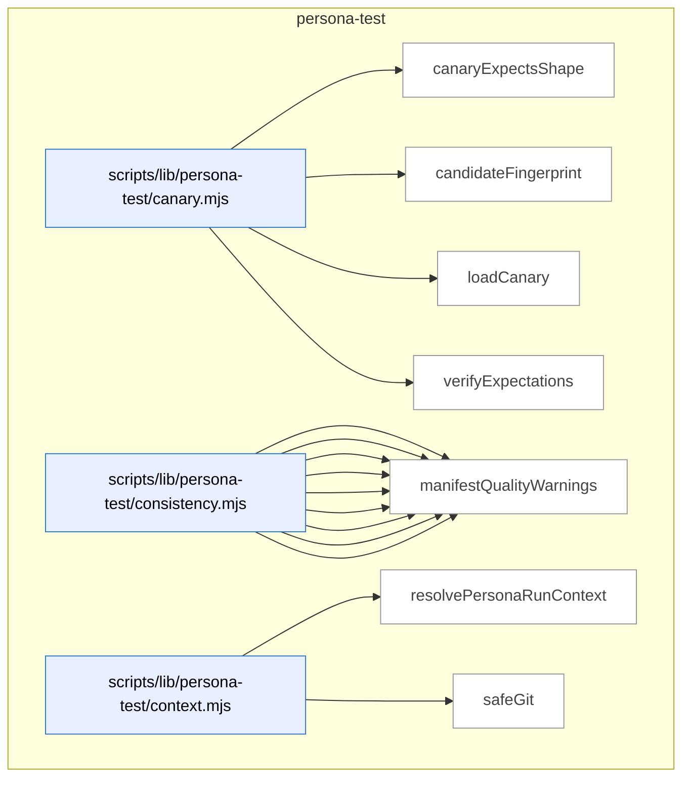

_Domain has 87 symbols (>50). Diagram shows top-15 by file order; see flat table below for the full list._

### Symbols in this domain

| Symbol | Kind | Path | Lines | Purpose | File imported by |
|---|---|---|---|---|---|
| [`canaryExpectsShape`](../scripts/lib/persona-test/canary.mjs#L289) | function | `scripts/lib/persona-test/canary.mjs` | 289-301 | Checks if a contradiction should be suppressed based on canary-defined expected shapes. | `scripts/persona-consistency-run.mjs`, `tests/persona-test-canary.test.mjs` |
| [`candidateFingerprint`](../scripts/lib/persona-test/canary.mjs#L318) | function | `scripts/lib/persona-test/canary.mjs` | 318-337 | Generates a stable semantic hash of a contradiction keyed on surface/field/scope/key/kind (not selector). | `scripts/persona-consistency-run.mjs`, `tests/persona-test-canary.test.mjs` |
| [`loadCanary`](../scripts/lib/persona-test/canary.mjs#L38) | function | `scripts/lib/persona-test/canary.mjs` | 38-141 | Loads and validates a persona-consistency canary JSON file with path-escape and symlink safety checks. | `scripts/persona-consistency-run.mjs`, `tests/persona-test-canary.test.mjs` |
| [`verifyExpectations`](../scripts/lib/persona-test/canary.mjs#L193) | function | `scripts/lib/persona-test/canary.mjs` | 193-268 | Validates that observed contradictions meet the canary's min/max expected counts for state conflicts. | `scripts/persona-consistency-run.mjs`, `tests/persona-test-canary.test.mjs` |
| [`appliesToCurrent`](../scripts/lib/persona-test/consistency.mjs#L488) | function | `scripts/lib/persona-test/consistency.mjs` | 488-506 | Checks whether a surface's `appliesTo` constraint matches the current route, step label, and active state tags. | `scripts/persona-consistency-run.mjs`, `tests/persona-test-consistency.test.mjs` |
| [`clampToFloor`](../scripts/lib/persona-test/consistency.mjs#L118) | function | `scripts/lib/persona-test/consistency.mjs` | 118-122 | Returns the proposed severity unless it's numerically higher than the floor, clamping to the floor if needed. | `scripts/persona-consistency-run.mjs`, `tests/persona-test-consistency.test.mjs` |
| [`coerceDomKey`](../scripts/lib/persona-test/consistency.mjs#L91) | function | `scripts/lib/persona-test/consistency.mjs` | 91-113 | Converts a DOM-extracted key string to its inferred type (string, number, boolean) with type coercion and validation. | `scripts/persona-consistency-run.mjs`, `tests/persona-test-consistency.test.mjs` |
| [`coerceDomValue`](../scripts/lib/persona-test/consistency.mjs#L38) | function | `scripts/lib/persona-test/consistency.mjs` | 38-80 | Converts a DOM-extracted string to its declared type (boolean, integer, enum, id, prose, freshness), validating the conversion. | `scripts/persona-consistency-run.mjs`, `tests/persona-test-consistency.test.mjs` |
| [`deepEqual`](../scripts/lib/persona-test/consistency.mjs#L508) | function | `scripts/lib/persona-test/consistency.mjs` | 508-522 | Recursively compares two values for deep structural equality, handling objects and arrays correctly. | `scripts/persona-consistency-run.mjs`, `tests/persona-test-consistency.test.mjs` |
| [`diffClaims`](../scripts/lib/persona-test/consistency.mjs#L139) | function | `scripts/lib/persona-test/consistency.mjs` | 139-406 | Compares declared surfaces and engine fields against actual DOM/network witness values, emitting consistency contradictions and mismatches. | `scripts/persona-consistency-run.mjs`, `tests/persona-test-consistency.test.mjs` |
| [`locatorToString`](../scripts/lib/persona-test/consistency.mjs#L454) | function | `scripts/lib/persona-test/consistency.mjs` | 454-464 | Converts a Playwright locator object to a human-readable string representation (role, label, testid, id, or CSS). | `scripts/persona-consistency-run.mjs`, `tests/persona-test-consistency.test.mjs` |
| [`make`](../scripts/lib/persona-test/consistency.mjs#L437) | function | `scripts/lib/persona-test/consistency.mjs` | 437-452 | Constructs a consistency finding object with DOM value, engine value, severity, and metadata. | `scripts/persona-consistency-run.mjs`, `tests/persona-test-consistency.test.mjs` |
| [`manifestQualityWarnings`](../scripts/lib/persona-test/consistency.mjs#L420) | function | `scripts/lib/persona-test/consistency.mjs` | 420-433 | Scans a surfaces manifest for quality issues such as CSS-locator usage and emits advisory warnings. | `scripts/persona-consistency-run.mjs`, `tests/persona-test-consistency.test.mjs` |
| [`resolvePersonaRunContext`](../scripts/lib/persona-test/context.mjs#L28) | function | `scripts/lib/persona-test/context.mjs` | 28-65 | Validates and returns a persona consistency run's context (repo ID, journey key, commit SHA, branch), throwing on missing fields. | _(internal)_ |
| [`safeGit`](../scripts/lib/persona-test/context.mjs#L67) | function | `scripts/lib/persona-test/context.mjs` | 67-74 | Runs a git command in a specified directory, returning trimmed stdout or null on failure. | _(internal)_ |
| [`normaliseForReplay`](../scripts/lib/persona-test/ledger.mjs#L156) | function | `scripts/lib/persona-test/ledger.mjs` | 156-196 | Strips timestamps and sorts witness claims deterministically for byte-identical replay output. | `scripts/persona-consistency-run.mjs`, `tests/persona-test-ledger.test.mjs` |
| [`openLedger`](../scripts/lib/persona-test/ledger.mjs#L56) | function | `scripts/lib/persona-test/ledger.mjs` | 56-139 | Initializes a session ledger file for recording consistency-mode steps and test candidates with methods to append and persist data. | `scripts/persona-consistency-run.mjs`, `tests/persona-test-ledger.test.mjs` |
| [`persist`](../scripts/lib/persona-test/ledger.mjs#L141) | function | `scripts/lib/persona-test/ledger.mjs` | 141-143 | Writes a ledger object to disk as formatted JSON atomically. | `scripts/persona-consistency-run.mjs`, `tests/persona-test-ledger.test.mjs` |
| [`s`](../scripts/lib/persona-test/ledger.mjs#L200) | function | `scripts/lib/persona-test/ledger.mjs` | 200-200 | Converts a value to a string, returning empty string if null or undefined. | `scripts/persona-consistency-run.mjs`, `tests/persona-test-ledger.test.mjs` |
| [`stableCompareContradiction`](../scripts/lib/persona-test/ledger.mjs#L224) | function | `scripts/lib/persona-test/ledger.mjs` | 224-232 | Comparator for sorting contradictions by kind, surface ID, engine field, scope, and key. | `scripts/persona-consistency-run.mjs`, `tests/persona-test-ledger.test.mjs` |
| [`stableCompareDom`](../scripts/lib/persona-test/ledger.mjs#L202) | function | `scripts/lib/persona-test/ledger.mjs` | 202-209 | Comparator for sorting DOM claims by surface ID, engine field, scope, and key. | `scripts/persona-consistency-run.mjs`, `tests/persona-test-ledger.test.mjs` |
| [`stableCompareFreshness`](../scripts/lib/persona-test/ledger.mjs#L233) | function | `scripts/lib/persona-test/ledger.mjs` | 233-238 | Comparator for sorting freshness findings by surface ID and engine field. | `scripts/persona-consistency-run.mjs`, `tests/persona-test-ledger.test.mjs` |
| [`stableCompareNetwork`](../scripts/lib/persona-test/ledger.mjs#L210) | function | `scripts/lib/persona-test/ledger.mjs` | 210-217 | Comparator for sorting network claims by surface ID, engine field, scope, and key. | `scripts/persona-consistency-run.mjs`, `tests/persona-test-ledger.test.mjs` |
| [`stableCompareUndeclared`](../scripts/lib/persona-test/ledger.mjs#L218) | function | `scripts/lib/persona-test/ledger.mjs` | 218-223 | Comparator for sorting undeclared DOM claims by engine field and selector. | `scripts/persona-consistency-run.mjs`, `tests/persona-test-ledger.test.mjs` |
| [`stableCompareWarning`](../scripts/lib/persona-test/ledger.mjs#L239) | function | `scripts/lib/persona-test/ledger.mjs` | 239-244 | Comparator for sorting warnings by kind and surface ID. | `scripts/persona-consistency-run.mjs`, `tests/persona-test-ledger.test.mjs` |
| [`resolveManifest`](../scripts/lib/persona-test/manifest-resolver.mjs#L50) | function | `scripts/lib/persona-test/manifest-resolver.mjs` | 50-126 | Finds and loads a consistency manifest file by trying resolver functions, validating the path stays within the repo. | `scripts/persona-consistency-run.mjs`, `tests/persona-test-manifest-resolver.test.mjs` |
| [`assertEgressApproved`](../scripts/lib/persona-test/semantic-compare.mjs#L39) | function | `scripts/lib/persona-test/semantic-compare.mjs` | 39-53 | Validates that a model ID belongs to an approved provider (Anthropic Claude or Google Gemini) before semantic comparison. | `tests/persona-test-semantic-compare.test.mjs` |
| [`compare`](../scripts/lib/persona-test/semantic-compare.mjs#L83) | function | `scripts/lib/persona-test/semantic-compare.mjs` | 83-204 | Performs LLM-based semantic similarity comparison between two prose strings with redaction, caching, and truncation safeguards. | `tests/persona-test-semantic-compare.test.mjs` |
| [`createInMemoryCache`](../scripts/lib/persona-test/semantic-compare.mjs#L248) | function | `scripts/lib/persona-test/semantic-compare.mjs` | 248-255 | Returns a simple Map-backed cache object with get/set/size methods. | `tests/persona-test-semantic-compare.test.mjs` |
| [`makeCacheKey`](../scripts/lib/persona-test/semantic-compare.mjs#L219) | function | `scripts/lib/persona-test/semantic-compare.mjs` | 219-227 | Generates a stable SHA256-based cache key from two prose strings and a model ID. | `tests/persona-test-semantic-compare.test.mjs` |
| [`renderUserPrompt`](../scripts/lib/persona-test/semantic-compare.mjs#L206) | function | `scripts/lib/persona-test/semantic-compare.mjs` | 206-217 | Formats a user prompt for the LLM comparing two prose values, noting if inputs were truncated. | `tests/persona-test-semantic-compare.test.mjs` |
| [`safeCacheGet`](../scripts/lib/persona-test/semantic-compare.mjs#L229) | function | `scripts/lib/persona-test/semantic-compare.mjs` | 229-238 | Retrieves and validates a cached semantic verdict, returning null on any error. | `tests/persona-test-semantic-compare.test.mjs` |
| [`safeCacheSet`](../scripts/lib/persona-test/semantic-compare.mjs#L239) | function | `scripts/lib/persona-test/semantic-compare.mjs` | 239-241 | Stores a verdict in cache, silently ignoring cache failures. | `tests/persona-test-semantic-compare.test.mjs` |
| [`auditFilePathTokens`](../scripts/lib/persona/audit-correlator.mjs#L136) | function | `scripts/lib/persona/audit-correlator.mjs` | 136-138 | Extracts tokens from an audit finding's primary file path. | `scripts/cross-skill.mjs`, `scripts/lib/store/persona-outcomes.mjs`, `tests/persona-audit-correlator.test.mjs` |
| [`auditKeywordTokens`](../scripts/lib/persona/audit-correlator.mjs#L140) | function | `scripts/lib/persona/audit-correlator.mjs` | 140-142 | Extracts tokens from an audit finding's detail snapshot and category. | `scripts/cross-skill.mjs`, `scripts/lib/store/persona-outcomes.mjs`, `tests/persona-audit-correlator.test.mjs` |
| [`buildStepUrlLookup`](../scripts/lib/persona/audit-correlator.mjs#L236) | function | `scripts/lib/persona/audit-correlator.mjs` | 236-245 | Creates a map from step numbers to sanitized URLs from a persona's click-path record. | `scripts/cross-skill.mjs`, `scripts/lib/store/persona-outcomes.mjs`, `tests/persona-audit-correlator.test.mjs` |
| [`decideCorrelations`](../scripts/lib/persona/audit-correlator.mjs#L264) | function | `scripts/lib/persona/audit-correlator.mjs` | 264-324 | Matches P0/P1 persona findings to audit findings and emits correlation records with match scores. | `scripts/cross-skill.mjs`, `scripts/lib/store/persona-outcomes.mjs`, `tests/persona-audit-correlator.test.mjs` |
| [`isMalformedFinding`](../scripts/lib/persona/audit-correlator.mjs#L83) | function | `scripts/lib/persona/audit-correlator.mjs` | 83-86 | Checks if a persona finding is missing required fields (element or observed text). | `scripts/cross-skill.mjs`, `scripts/lib/store/persona-outcomes.mjs`, `tests/persona-audit-correlator.test.mjs` |
| [`isNewerOrHigherSeverity`](../scripts/lib/persona/audit-correlator.mjs#L218) | function | `scripts/lib/persona/audit-correlator.mjs` | 218-223 | Compares two findings to determine which is more recent or higher severity. | `scripts/cross-skill.mjs`, `scripts/lib/store/persona-outcomes.mjs`, `tests/persona-audit-correlator.test.mjs` |
| [`isP0OrP1`](../scripts/lib/persona/audit-correlator.mjs#L70) | function | `scripts/lib/persona/audit-correlator.mjs` | 70-72 | Checks if a persona finding has P0 or P1 severity code. | `scripts/cross-skill.mjs`, `scripts/lib/store/persona-outcomes.mjs`, `tests/persona-audit-correlator.test.mjs` |
| [`isSeverityUnderstated`](../scripts/lib/persona/audit-correlator.mjs#L226) | function | `scripts/lib/persona/audit-correlator.mjs` | 226-228 | Checks if a P0 persona finding was underrated as LOW or MEDIUM in the audit. | `scripts/cross-skill.mjs`, `scripts/lib/store/persona-outcomes.mjs`, `tests/persona-audit-correlator.test.mjs` |
| [`matchFinding`](../scripts/lib/persona/audit-correlator.mjs#L183) | function | `scripts/lib/persona/audit-correlator.mjs` | 183-212 | Finds the best-matching audit finding for a persona finding via exact or fuzzy token-based matching. | `scripts/cross-skill.mjs`, `scripts/lib/store/persona-outcomes.mjs`, `tests/persona-audit-correlator.test.mjs` |
| [`overlapCoefficient`](../scripts/lib/persona/audit-correlator.mjs#L112) | function | `scripts/lib/persona/audit-correlator.mjs` | 112-119 | Calculates the overlap ratio between two token sets (intersection divided by smaller set size). | `scripts/cross-skill.mjs`, `scripts/lib/store/persona-outcomes.mjs`, `tests/persona-audit-correlator.test.mjs` |
| [`personaFilePathTokens`](../scripts/lib/persona/audit-correlator.mjs#L126) | function | `scripts/lib/persona/audit-correlator.mjs` | 126-129 | Extracts tokens from a persona finding's element description and its step URL. | `scripts/cross-skill.mjs`, `scripts/lib/store/persona-outcomes.mjs`, `tests/persona-audit-correlator.test.mjs` |
| [`personaFindingHash`](../scripts/lib/persona/audit-correlator.mjs#L62) | function | `scripts/lib/persona/audit-correlator.mjs` | 62-67 | Generates a semantic content hash for a persona finding from its element, severity, and observation. | `scripts/cross-skill.mjs`, `scripts/lib/store/persona-outcomes.mjs`, `tests/persona-audit-correlator.test.mjs` |
| [`personaKeywordTokens`](../scripts/lib/persona/audit-correlator.mjs#L131) | function | `scripts/lib/persona/audit-correlator.mjs` | 131-133 | Extracts tokens from a persona finding's observed issue description. | `scripts/cross-skill.mjs`, `scripts/lib/store/persona-outcomes.mjs`, `tests/persona-audit-correlator.test.mjs` |
| [`pickBest`](../scripts/lib/persona/audit-correlator.mjs#L214) | function | `scripts/lib/persona/audit-correlator.mjs` | 214-216 | Selects the best candidate from a list by recency and severity rank. | `scripts/cross-skill.mjs`, `scripts/lib/store/persona-outcomes.mjs`, `tests/persona-audit-correlator.test.mjs` |
| [`scoreMatch`](../scripts/lib/persona/audit-correlator.mjs#L153) | function | `scripts/lib/persona/audit-correlator.mjs` | 153-163 | Scores how well a persona finding matches an audit finding using file-path and keyword token overlap. | `scripts/cross-skill.mjs`, `scripts/lib/store/persona-outcomes.mjs`, `tests/persona-audit-correlator.test.mjs` |
| [`tokenize`](../scripts/lib/persona/audit-correlator.mjs#L94) | function | `scripts/lib/persona/audit-correlator.mjs` | 94-101 | Tokenizes text into lowercase words of 3+ characters. | `scripts/cross-skill.mjs`, `scripts/lib/store/persona-outcomes.mjs`, `tests/persona-audit-correlator.test.mjs` |
| [`callCrossSkill`](../scripts/persona-consistency-promote.mjs#L71) | function | `scripts/persona-consistency-promote.mjs` | 71-96 | Spawns cross-skill CLI subprocess and parses JSON output, with error-aware fallback to generic message. | `tests/persona-consistency-promote.test.mjs` |
| [`defaultPrompt`](../scripts/persona-consistency-promote.mjs#L563) | function | `scripts/persona-consistency-promote.mjs` | 563-568 | Prompts user on stdin for input and returns the answer. | `tests/persona-consistency-promote.test.mjs` |
| [`listConsistencyCandidatesViaCli`](../scripts/persona-consistency-promote.mjs#L98) | function | `scripts/persona-consistency-promote.mjs` | 98-107 | Fetches pending consistency-mode candidates from the cross-skill CLI since a given timestamp. | `tests/persona-consistency-promote.test.mjs` |
| [`parseArgs`](../scripts/persona-consistency-promote.mjs#L142) | function | `scripts/persona-consistency-promote.mjs` | 142-159 | Parses CLI args for promote script (--auto, --since, --repo-root, --out, --help). | `tests/persona-consistency-promote.test.mjs` |
| [`promoteCandidates`](../scripts/persona-consistency-promote.mjs#L195) | function | `scripts/persona-consistency-promote.mjs` | 195-276 | Main orchestration: lists pending candidates, prompts approval (or auto-approves), promotes each, and tracks outcomes. | `tests/persona-consistency-promote.test.mjs` |
| [`promoteOne`](../scripts/persona-consistency-promote.mjs#L282) | function | `scripts/persona-consistency-promote.mjs` | 282-423 | Validates candidate schema, renders Playwright spec deterministically, writes spec to disk, promotes via cross-skill. | `tests/persona-consistency-promote.test.mjs` |
| [`promoteRegressionSpecViaCli`](../scripts/persona-consistency-promote.mjs#L109) | function | `scripts/persona-consistency-promote.mjs` | 109-115 | Calls cross-skill to promote a regression-spec candidate row to a locked Playwright spec file. | `tests/persona-consistency-promote.test.mjs` |
| [`readLocalRepoUuid`](../scripts/persona-consistency-promote.mjs#L570) | function | `scripts/persona-consistency-promote.mjs` | 570-576 | Reads repo UUID from .audit-loop/repo-identity.json or returns null. | `tests/persona-consistency-promote.test.mjs` |
| [`reconcilePromotionJournal`](../scripts/persona-consistency-promote.mjs#L429) | function | `scripts/persona-consistency-promote.mjs` | 429-546 | Recovers incomplete promotion attempts from journal files by comparing state against the DB. | `tests/persona-consistency-promote.test.mjs` |
| [`recordShipEventViaCli`](../scripts/persona-consistency-promote.mjs#L117) | function | `scripts/persona-consistency-promote.mjs` | 117-124 | Calls cross-skill to record a ship event; cloud-optional (silent success if cloud is off). | `tests/persona-consistency-promote.test.mjs` |
| [`removeJournal`](../scripts/persona-consistency-promote.mjs#L558) | function | `scripts/persona-consistency-promote.mjs` | 558-561 | Deletes a promotion journal entry file. | `tests/persona-consistency-promote.test.mjs` |
| [`safeGitBranch`](../scripts/persona-consistency-promote.mjs#L592) | function | `scripts/persona-consistency-promote.mjs` | 592-598 | Returns current branch name or null if git fails. | `tests/persona-consistency-promote.test.mjs` |
| [`safeGitEmail`](../scripts/persona-consistency-promote.mjs#L578) | function | `scripts/persona-consistency-promote.mjs` | 578-584 | Returns configured git user email or null if git fails. | `tests/persona-consistency-promote.test.mjs` |
| [`safeGitSha`](../scripts/persona-consistency-promote.mjs#L585) | function | `scripts/persona-consistency-promote.mjs` | 585-591 | Returns current HEAD commit SHA or null if git fails. | `tests/persona-consistency-promote.test.mjs` |
| [`usage`](../scripts/persona-consistency-promote.mjs#L161) | function | `scripts/persona-consistency-promote.mjs` | 161-174 | Returns usage text for persona-consistency-promote script. | `tests/persona-consistency-promote.test.mjs` |
| [`writeJournal`](../scripts/persona-consistency-promote.mjs#L552) | function | `scripts/persona-consistency-promote.mjs` | 552-556 | Persists a promotion journal entry atomically to disk. | `tests/persona-consistency-promote.test.mjs` |
| [`applyWait`](../scripts/persona-consistency-run.mjs#L702) | function | `scripts/persona-consistency-run.mjs` | 702-715 | Waits for a condition (visible/hidden/URL/network/timeout) on the page. | `tests/persona-consistency-run-args.test.mjs` |
| [`awaitManifestNetworkSources`](../scripts/persona-consistency-run.mjs#L534) | function | `scripts/persona-consistency-run.mjs` | 534-607 | Waits for network requests matching surface-declared patterns to complete (with CLI timeout override). | `tests/persona-consistency-run-args.test.mjs` |
| [`candidateDescription`](../scripts/persona-consistency-run.mjs#L766) | function | `scripts/persona-consistency-run.mjs` | 766-768 | Returns one-liner describing a contradiction (e.g., "state_mismatch on userCard.badge (P1)"). | `tests/persona-consistency-run-args.test.mjs` |
| [`candidateWorthy`](../scripts/persona-consistency-run.mjs#L759) | function | `scripts/persona-consistency-run.mjs` | 759-764 | Returns true if a contradiction is P0/P1, has surfaceId, and is not canary-expected. | `tests/persona-consistency-run-args.test.mjs` |
| [`cssEscape`](../scripts/persona-consistency-run.mjs#L698) | function | `scripts/persona-consistency-run.mjs` | 698-700 | Escapes special characters in a CSS selector string. | `tests/persona-consistency-run-args.test.mjs` |
| [`describeAction`](../scripts/persona-consistency-run.mjs#L717) | function | `scripts/persona-consistency-run.mjs` | 717-726 | Converts a journey step to human-readable description (e.g., "click button[name=\"Save\"]"). | `tests/persona-consistency-run-args.test.mjs` |
| [`detectUnannotatedSurfaces`](../scripts/persona-consistency-run.mjs#L629) | function | `scripts/persona-consistency-run.mjs` | 629-667 | Scans live DOM for surface locators lacking data-engine-claim annotation and emits unannotated-surface findings. | `tests/persona-consistency-run-args.test.mjs` |
| [`emptyWitness`](../scripts/persona-consistency-run.mjs#L791) | function | `scripts/persona-consistency-run.mjs` | 791-800 | Returns empty witness with specified stepIndex for failed captures. | `tests/persona-consistency-run-args.test.mjs` |
| [`executeStep`](../scripts/persona-consistency-run.mjs#L465) | function | `scripts/persona-consistency-run.mjs` | 465-504 | Executes a single journey step (navigate/click/fill/wait/evaluate) and returns navigation state. | `tests/persona-consistency-run-args.test.mjs` |
| [`joinUrl`](../scripts/persona-consistency-run.mjs#L802) | function | `scripts/persona-consistency-run.mjs` | 802-808 | Joins base URL and path suffix, handling full URLs and trailing-slash edge cases. | `tests/persona-consistency-run-args.test.mjs` |
| [`locatorOf`](../scripts/persona-consistency-run.mjs#L681) | function | `scripts/persona-consistency-run.mjs` | 681-692 | Converts locator descriptor to a Playwright locator instance. | `tests/persona-consistency-run-args.test.mjs` |
| [`locatorString`](../scripts/persona-consistency-run.mjs#L728) | function | `scripts/persona-consistency-run.mjs` | 728-738 | Converts locator to brief string representation, returns '?' on unknown kind. | `tests/persona-consistency-run-args.test.mjs` |
| [`locatorToStringLite`](../scripts/persona-consistency-run.mjs#L669) | function | `scripts/persona-consistency-run.mjs` | 669-679 | Converts locator object to human-readable string (e.g., "role=button[name="Save"]"). | `tests/persona-consistency-run-args.test.mjs` |
| [`newAuthedContext`](../scripts/persona-consistency-run.mjs#L742) | function | `scripts/persona-consistency-run.mjs` | 742-755 | Creates a new Playwright browser context with auth applied (storageState/bearer token/none). | `tests/persona-consistency-run-args.test.mjs` |
| [`parseArgs`](../scripts/persona-consistency-run.mjs#L56) | function | `scripts/persona-consistency-run.mjs` | 56-77 | Parses CLI args for consistency-run (--canary, --url, --out, --repo-root, --await-ms, --help). | `tests/persona-consistency-run-args.test.mjs` |
| [`readLocalRepoUuid`](../scripts/persona-consistency-run.mjs#L827) | function | `scripts/persona-consistency-run.mjs` | 827-836 | Reads repo UUID from .audit-loop/repo-identity.json (candidate emission requires identity). | `tests/persona-consistency-run-args.test.mjs` |
| [`runConsistency`](../scripts/persona-consistency-run.mjs#L117) | function | `scripts/persona-consistency-run.mjs` | 117-458 | Main runner: opens ledger, launches browser, resolves manifest, executes canary journey, captures witness, emits spec candidates. | `tests/persona-consistency-run-args.test.mjs` |
| [`safeBrowserClose`](../scripts/persona-consistency-run.mjs#L823) | function | `scripts/persona-consistency-run.mjs` | 823-825 | Closes browser, swallowing errors. | `tests/persona-consistency-run-args.test.mjs` |
| [`safeCurrentRoute`](../scripts/persona-consistency-run.mjs#L810) | function | `scripts/persona-consistency-run.mjs` | 810-812 | Returns current page pathname or null if URL parsing fails. | `tests/persona-consistency-run-args.test.mjs` |
| [`safeGitSha`](../scripts/persona-consistency-run.mjs#L814) | function | `scripts/persona-consistency-run.mjs` | 814-821 | Returns current HEAD commit SHA or null if git fails. | `tests/persona-consistency-run-args.test.mjs` |
| [`shrinkWitness`](../scripts/persona-consistency-run.mjs#L773) | function | `scripts/persona-consistency-run.mjs` | 773-787 | Filters witness record to include only claims matching a specific contradiction. | `tests/persona-consistency-run-args.test.mjs` |
| [`usage`](../scripts/persona-consistency-run.mjs#L79) | function | `scripts/persona-consistency-run.mjs` | 79-96 | Returns usage text for persona-consistency-run script. | `tests/persona-consistency-run-args.test.mjs` |

---

## plan

> Extracts acceptance criteria and metadata from plan markdown; fuzzy-matches plan file references to the actual repo via path/keyword scanning; tracks dismissed findings to flag recurrent false positives.

```mermaid
flowchart TB
subgraph dom_plan ["plan"]
  file_scripts_lib_plan_criteria_parser_mjs["scripts/lib/plan-criteria-parser.mjs"]:::component
  sym_scripts_lib_plan_criteria_parser_mjs_cri["criterionHash"]:::symbol
  file_scripts_lib_plan_criteria_parser_mjs --> sym_scripts_lib_plan_criteria_parser_mjs_cri
  sym_scripts_lib_plan_criteria_parser_mjs_loc["locateAcceptanceSection"]:::symbol
  file_scripts_lib_plan_criteria_parser_mjs --> sym_scripts_lib_plan_criteria_parser_mjs_loc
  sym_scripts_lib_plan_criteria_parser_mjs_par["parseAcceptanceCriteria"]:::symbol
  file_scripts_lib_plan_criteria_parser_mjs --> sym_scripts_lib_plan_criteria_parser_mjs_par
  sym_scripts_lib_plan_criteria_parser_mjs_sum["summariseCriteria"]:::symbol
  file_scripts_lib_plan_criteria_parser_mjs --> sym_scripts_lib_plan_criteria_parser_mjs_sum
  file_scripts_lib_plan_fp_tracker_mjs["scripts/lib/plan-fp-tracker.mjs"]:::component
  sym_scripts_lib_plan_fp_tracker_mjs_PlanFpTr["PlanFpTracker"]:::symbol
  file_scripts_lib_plan_fp_tracker_mjs --> sym_scripts_lib_plan_fp_tracker_mjs_PlanFpTr
  file_scripts_lib_plan_paths_mjs["scripts/lib/plan-paths.mjs"]:::component
  sym_scripts_lib_plan_paths_mjs__extractPlanK["_extractPlanKeywords"]:::symbol
  file_scripts_lib_plan_paths_mjs --> sym_scripts_lib_plan_paths_mjs__extractPlanK
  sym_scripts_lib_plan_paths_mjs__scanRepoFile["_scanRepoFiles"]:::symbol
  file_scripts_lib_plan_paths_mjs --> sym_scripts_lib_plan_paths_mjs__scanRepoFile
  sym_scripts_lib_plan_paths_mjs_extractPlanPa["extractPlanPaths"]:::symbol
  file_scripts_lib_plan_paths_mjs --> sym_scripts_lib_plan_paths_mjs_extractPlanPa
  file_scripts_lib_plan_status_mjs["scripts/lib/plan-status.mjs"]:::component
  sym_scripts_lib_plan_status_mjs_isSelectable["isSelectableName"]:::symbol
  file_scripts_lib_plan_status_mjs --> sym_scripts_lib_plan_status_mjs_isSelectable
  sym_scripts_lib_plan_status_mjs_parsePlanSta["parsePlanStatus"]:::symbol
  file_scripts_lib_plan_status_mjs --> sym_scripts_lib_plan_status_mjs_parsePlanSta
  sym_scripts_lib_plan_status_mjs_selectAuditP["selectAuditPlan"]:::symbol
  file_scripts_lib_plan_status_mjs --> sym_scripts_lib_plan_status_mjs_selectAuditP
end
classDef container fill:#f5f5f5,stroke:#333,stroke-width:2px,color:#000
classDef component fill:#e8f0ff,stroke:#3178c6,color:#000
classDef symbol fill:#fff,stroke:#999,color:#444
classDef dup fill:#ffe8d8,stroke:#c0392b,stroke-width:2px,color:#000
classDef violation fill:#ffd6d6,stroke:#c0392b,stroke-width:2px,color:#000
```

### Symbols in this domain

| Symbol | Kind | Path | Lines | Purpose | File imported by |
|---|---|---|---|---|---|
| [`criterionHash`](../scripts/lib/plan-criteria-parser.mjs#L45) | function | `scripts/lib/plan-criteria-parser.mjs` | 45-48 | Generates a deterministic 16-char hash from a criterion's severity, category, and description. | `scripts/ux-lock-run.mjs`, `tests/plan-criteria-parser.test.mjs` |
| [`locateAcceptanceSection`](../scripts/lib/plan-criteria-parser.mjs#L56) | function | `scripts/lib/plan-criteria-parser.mjs` | 56-77 | Finds the "Acceptance Criteria" markdown heading (level 2–4) and extracts its content lines. | `scripts/ux-lock-run.mjs`, `tests/plan-criteria-parser.test.mjs` |
| [`parseAcceptanceCriteria`](../scripts/lib/plan-criteria-parser.mjs#L96) | function | `scripts/lib/plan-criteria-parser.mjs` | 96-152 | Extracts P0/P1/P2/P3 criteria with setup/assertion pairs from markdown, validating severities and categories. | `scripts/ux-lock-run.mjs`, `tests/plan-criteria-parser.test.mjs` |
| [`summariseCriteria`](../scripts/lib/plan-criteria-parser.mjs#L158) | function | `scripts/lib/plan-criteria-parser.mjs` | 158-166 | Counts criteria by severity and category, returning totals for dashboard display. | `scripts/ux-lock-run.mjs`, `tests/plan-criteria-parser.test.mjs` |
| [`PlanFpTracker`](../scripts/lib/plan-fp-tracker.mjs#L26) | class | `scripts/lib/plan-fp-tracker.mjs` | 26-140 | Tracks plan-finding false positives using exponential moving average scoring to identify recurring disproven issues. | `scripts/lib/audit/legacy-production-audit.mjs`, `scripts/openai-audit.mjs`, `scripts/write-plan-outcomes.mjs`, +1 more |
| [`_extractPlanKeywords`](../scripts/lib/plan-paths.mjs#L112) | function | `scripts/lib/plan-paths.mjs` | 112-154 | Extracts PascalCase identifiers, backtick-quoted words, and heading keywords from plan text, filtering noise words. | `scripts/lib/file-io.mjs`, `scripts/lib/requirements/context.mjs`, `tests/arm-generation.test.mjs`, +1 more |
| [`_scanRepoFiles`](../scripts/lib/plan-paths.mjs#L156) | function | `scripts/lib/plan-paths.mjs` | 156-182 | Walks the repo directory tree collecting source files while skipping node_modules and other noise directories. | `scripts/lib/file-io.mjs`, `scripts/lib/requirements/context.mjs`, `tests/arm-generation.test.mjs`, +1 more |
| [`extractPlanPaths`](../scripts/lib/plan-paths.mjs#L32) | function | `scripts/lib/plan-paths.mjs` | 32-108 | Regex-scans a plan markdown for code file paths and searches the repo for matching identifiers. | `scripts/lib/file-io.mjs`, `scripts/lib/requirements/context.mjs`, `tests/arm-generation.test.mjs`, +1 more |
| [`isSelectableName`](../scripts/lib/plan-status.mjs#L104) | function | `scripts/lib/plan-status.mjs` | 104-106 | Returns true if a filename is a .md file and not an audit-summary artifact. | `scripts/check-plan-status.mjs`, `scripts/generate-plans-index.mjs`, `scripts/lib/dashboard/collect-reference.mjs`, +1 more |
| [`parsePlanStatus`](../scripts/lib/plan-status.mjs#L53) | function | `scripts/lib/plan-status.mjs` | 53-101 | Parses the Status metadata line from a plan's header, validating uniqueness and returning the raw status text. | `scripts/check-plan-status.mjs`, `scripts/generate-plans-index.mjs`, `scripts/lib/dashboard/collect-reference.mjs`, +1 more |
| [`selectAuditPlan`](../scripts/lib/plan-status.mjs#L120) | function | `scripts/lib/plan-status.mjs` | 120-147 | Finds the newest active audit plan in the docs/plans/ directory, warning if multiple are active. | `scripts/check-plan-status.mjs`, `scripts/generate-plans-index.mjs`, `scripts/lib/dashboard/collect-reference.mjs`, +1 more |

---

## requirements

> Extracts de-facto requirements (behavioral invariants, safety/security constraints) from codebase via LLM batch processing, builds a committed ledger, and injects active requirements as rubric context into audit passes for verification.

```mermaid
flowchart TB
subgraph dom_requirements ["requirements"]
  file_scripts_lib_requirements_context_mjs["scripts/lib/requirements/context.mjs"]:::component
  sym_scripts_lib_requirements_context_mjs_cha["changedSince"]:::symbol
  file_scripts_lib_requirements_context_mjs --> sym_scripts_lib_requirements_context_mjs_cha
  sym_scripts_lib_requirements_context_mjs_get["getPlanRequirementsRubric"]:::symbol
  file_scripts_lib_requirements_context_mjs --> sym_scripts_lib_requirements_context_mjs_get
  sym_scripts_lib_requirements_context_mjs_get["getRequirementsContext"]:::symbol
  file_scripts_lib_requirements_context_mjs --> sym_scripts_lib_requirements_context_mjs_get
  sym_scripts_lib_requirements_context_mjs_glo["globMatch"]:::symbol
  file_scripts_lib_requirements_context_mjs --> sym_scripts_lib_requirements_context_mjs_glo
  file_scripts_lib_requirements_extract_mjs["scripts/lib/requirements/extract.mjs"]:::component
  sym_scripts_lib_requirements_extract_mjs_ass["assignId"]:::symbol
  file_scripts_lib_requirements_extract_mjs --> sym_scripts_lib_requirements_extract_mjs_ass
  sym_scripts_lib_requirements_extract_mjs_bat["batchFiles"]:::symbol
  file_scripts_lib_requirements_extract_mjs --> sym_scripts_lib_requirements_extract_mjs_bat
  sym_scripts_lib_requirements_extract_mjs_ext["extractOneRun"]:::symbol
  file_scripts_lib_requirements_extract_mjs --> sym_scripts_lib_requirements_extract_mjs_ext
  sym_scripts_lib_requirements_extract_mjs_ext["extractRequirements"]:::symbol
  file_scripts_lib_requirements_extract_mjs --> sym_scripts_lib_requirements_extract_mjs_ext
  sym_scripts_lib_requirements_extract_mjs_mer["mergeRequirements"]:::symbol
  file_scripts_lib_requirements_extract_mjs --> sym_scripts_lib_requirements_extract_mjs_mer
  sym_scripts_lib_requirements_extract_mjs_nor["normalizeAssertion"]:::symbol
  file_scripts_lib_requirements_extract_mjs --> sym_scripts_lib_requirements_extract_mjs_nor
  file_scripts_lib_requirements_gap_challenge_m["scripts/lib/requirements/gap-challenge.mjs"]:::component
  sym_scripts_lib_requirements_gap_challenge_m["classifyGaps"]:::symbol
  file_scripts_lib_requirements_gap_challenge_m --> sym_scripts_lib_requirements_gap_challenge_m
  file_scripts_lib_requirements_ledger_mjs["scripts/lib/requirements/ledger.mjs"]:::component
  sym_scripts_lib_requirements_ledger_mjs_deri["deriveIndex"]:::symbol
  file_scripts_lib_requirements_ledger_mjs --> sym_scripts_lib_requirements_ledger_mjs_deri
  sym_scripts_lib_requirements_ledger_mjs_load["loadLedger"]:::symbol
  file_scripts_lib_requirements_ledger_mjs --> sym_scripts_lib_requirements_ledger_mjs_load
  sym_scripts_lib_requirements_ledger_mjs_norm["norm"]:::symbol
  file_scripts_lib_requirements_ledger_mjs --> sym_scripts_lib_requirements_ledger_mjs_norm
  sym_scripts_lib_requirements_ledger_mjs_reco["reconcile"]:::symbol
  file_scripts_lib_requirements_ledger_mjs --> sym_scripts_lib_requirements_ledger_mjs_reco
  sym_scripts_lib_requirements_ledger_mjs_stat["statusFor"]:::symbol
  file_scripts_lib_requirements_ledger_mjs --> sym_scripts_lib_requirements_ledger_mjs_stat
  sym_scripts_lib_requirements_ledger_mjs_writ["writeLedger"]:::symbol
  file_scripts_lib_requirements_ledger_mjs --> sym_scripts_lib_requirements_ledger_mjs_writ
  file_scripts_lib_requirements_llm_json_mjs["scripts/lib/requirements/llm-json.mjs"]:::component
  sym_scripts_lib_requirements_llm_json_mjs_pa["parseLlmJson"]:::symbol
  file_scripts_lib_requirements_llm_json_mjs --> sym_scripts_lib_requirements_llm_json_mjs_pa
  file_scripts_lib_requirements_render_mjs["scripts/lib/requirements/render.mjs"]:::component
  sym_scripts_lib_requirements_render_mjs_cell["cell"]:::symbol
  file_scripts_lib_requirements_render_mjs --> sym_scripts_lib_requirements_render_mjs_cell
  sym_scripts_lib_requirements_render_mjs_prov["provFiles"]:::symbol
  file_scripts_lib_requirements_render_mjs --> sym_scripts_lib_requirements_render_mjs_prov
  sym_scripts_lib_requirements_render_mjs_rend["renderRequirementsMap"]:::symbol
  file_scripts_lib_requirements_render_mjs --> sym_scripts_lib_requirements_render_mjs_rend
  file_scripts_lib_requirements_schema_mjs["scripts/lib/requirements/schema.mjs"]:::component
  sym_scripts_lib_requirements_schema_mjs_uniq["uniqueIds"]:::symbol
  file_scripts_lib_requirements_schema_mjs --> sym_scripts_lib_requirements_schema_mjs_uniq
end
classDef container fill:#f5f5f5,stroke:#333,stroke-width:2px,color:#000
classDef component fill:#e8f0ff,stroke:#3178c6,color:#000
classDef symbol fill:#fff,stroke:#999,color:#444
classDef dup fill:#ffe8d8,stroke:#c0392b,stroke-width:2px,color:#000
classDef violation fill:#ffd6d6,stroke:#c0392b,stroke-width:2px,color:#000
```

### Symbols in this domain

| Symbol | Kind | Path | Lines | Purpose | File imported by |
|---|---|---|---|---|---|
| [`changedSince`](../scripts/lib/requirements/context.mjs#L33) | function | `scripts/lib/requirements/context.mjs` | 33-42 | Returns the set of files changed in git since a specified commit SHA. | `scripts/lib/audit/legacy-production-audit.mjs`, `scripts/openai-audit.mjs`, `tests/requirements-context.test.mjs` |
| [`getPlanRequirementsRubric`](../scripts/lib/requirements/context.mjs#L166) | function | `scripts/lib/requirements/context.mjs` | 166-170 | Extracts plan file paths from a plan document and returns the requirements rubric for those paths. | `scripts/lib/audit/legacy-production-audit.mjs`, `scripts/openai-audit.mjs`, `tests/requirements-context.test.mjs` |
| [`getRequirementsContext`](../scripts/lib/requirements/context.mjs#L54) | function | `scripts/lib/requirements/context.mjs` | 54-134 | Builds an audit context block containing active requirements, coverage gaps, staleness signals, and token estimates for a given set of files. | `scripts/lib/audit/legacy-production-audit.mjs`, `scripts/openai-audit.mjs`, `tests/requirements-context.test.mjs` |
| [`globMatch`](../scripts/lib/requirements/context.mjs#L23) | function | `scripts/lib/requirements/context.mjs` | 23-30 | Tests if a file path matches a glob pattern by converting the pattern to a regex. | `scripts/lib/audit/legacy-production-audit.mjs`, `scripts/openai-audit.mjs`, `tests/requirements-context.test.mjs` |
| [`assignId`](../scripts/lib/requirements/extract.mjs#L59) | function | `scripts/lib/requirements/extract.mjs` | 59-65 | Generates a stable hash-based ID for a requirement from its kind, assertion text, and provenance files. | `scripts/requirements.mjs`, `tests/requirements-extract.test.mjs` |
| [`batchFiles`](../scripts/lib/requirements/extract.mjs#L113) | function | `scripts/lib/requirements/extract.mjs` | 113-125 | Groups file bodies into token-budgeted chunks for LLM batch processing. | `scripts/requirements.mjs`, `tests/requirements-extract.test.mjs` |
| [`extractOneRun`](../scripts/lib/requirements/extract.mjs#L134) | function | `scripts/lib/requirements/extract.mjs` | 134-186 | Calls OpenAI to extract structured requirements from a batch of files and validates the response shape. | `scripts/requirements.mjs`, `tests/requirements-extract.test.mjs` |
| [`extractRequirements`](../scripts/lib/requirements/extract.mjs#L198) | function | `scripts/lib/requirements/extract.mjs` | 198-281 | Main entry point that validates user-supplied file paths, reads bodies, and orchestrates multi-batch LLM extraction with sensitive-path guards. | `scripts/requirements.mjs`, `tests/requirements-extract.test.mjs` |
| [`mergeRequirements`](../scripts/lib/requirements/extract.mjs#L77) | function | `scripts/lib/requirements/extract.mjs` | 77-110 | Clusters requirements across multiple runs by similarity and merges duplicates into consolidated records. | `scripts/requirements.mjs`, `tests/requirements-extract.test.mjs` |
| [`normalizeAssertion`](../scripts/lib/requirements/extract.mjs#L54) | function | `scripts/lib/requirements/extract.mjs` | 54-56 | Normalizes a requirement assertion by lowercasing, collapsing whitespace, and removing trailing punctuation. | `scripts/requirements.mjs`, `tests/requirements-extract.test.mjs` |
| [`classifyGaps`](../scripts/lib/requirements/gap-challenge.mjs#L45) | function | `scripts/lib/requirements/gap-challenge.mjs` | 45-115 | Calls OpenAI to classify extracted requirements for contradictions or unintended-but-observed gaps. | `scripts/requirements.mjs` |
| [`deriveIndex`](../scripts/lib/requirements/ledger.mjs#L54) | function | `scripts/lib/requirements/ledger.mjs` | 54-58 | Derives a lightweight index of requirement IDs, assertions, kinds, and statuses for quick lookup. | `scripts/lib/requirements/context.mjs`, `scripts/requirements.mjs`, `tests/requirements-context.test.mjs`, +2 more |
| [`loadLedger`](../scripts/lib/requirements/ledger.mjs#L25) | function | `scripts/lib/requirements/ledger.mjs` | 25-37 | Reads and schema-validates `.requirements/ledger.json` or returns an empty default. | `scripts/lib/requirements/context.mjs`, `scripts/requirements.mjs`, `tests/requirements-context.test.mjs`, +2 more |
| [`norm`](../scripts/lib/requirements/ledger.mjs#L22) | function | `scripts/lib/requirements/ledger.mjs` | 22-22 | <no body> | `scripts/lib/requirements/context.mjs`, `scripts/requirements.mjs`, `tests/requirements-context.test.mjs`, +2 more |
| [`reconcile`](../scripts/lib/requirements/ledger.mjs#L83) | function | `scripts/lib/requirements/ledger.mjs` | 83-176 | Merges new requirement candidates with prior ledger entries using ID matching, alias resolution, and Jaccard similarity aliasing. | `scripts/lib/requirements/context.mjs`, `scripts/requirements.mjs`, `tests/requirements-context.test.mjs`, +2 more |
| [`statusFor`](../scripts/lib/requirements/ledger.mjs#L60) | function | `scripts/lib/requirements/ledger.mjs` | 60-68 | Computes the operational status (active, needs-review, or inferred-only) of a requirement based on extraction frequency and gap assessment. | `scripts/lib/requirements/context.mjs`, `scripts/requirements.mjs`, `tests/requirements-context.test.mjs`, +2 more |
| [`writeLedger`](../scripts/lib/requirements/ledger.mjs#L40) | function | `scripts/lib/requirements/ledger.mjs` | 40-51 | Schema-validates and atomically writes a requirements ledger to `.requirements/ledger.json`. | `scripts/lib/requirements/context.mjs`, `scripts/requirements.mjs`, `tests/requirements-context.test.mjs`, +2 more |
| [`parseLlmJson`](../scripts/lib/requirements/llm-json.mjs#L25) | function | `scripts/lib/requirements/llm-json.mjs` | 25-29 | Parses JSON from LLM output, handling fenced triple-backtick blocks or raw JSON. | `scripts/lib/requirements/extract.mjs`, `scripts/lib/requirements/gap-challenge.mjs`, `tests/requirements-llm-json.test.mjs` |
| [`cell`](../scripts/lib/requirements/render.mjs#L22) | function | `scripts/lib/requirements/render.mjs` | 22-22 | <no body> | `scripts/requirements.mjs`, `tests/requirements-render.test.mjs` |
| [`provFiles`](../scripts/lib/requirements/render.mjs#L25) | function | `scripts/lib/requirements/render.mjs` | 25-25 | <no body> | `scripts/requirements.mjs`, `tests/requirements-render.test.mjs` |
| [`renderRequirementsMap`](../scripts/lib/requirements/render.mjs#L34) | function | `scripts/lib/requirements/render.mjs` | 34-121 | Generates a markdown documentation file listing all requirements with pie charts, tables, and per-status sections. | `scripts/requirements.mjs`, `tests/requirements-render.test.mjs` |
| [`uniqueIds`](../scripts/lib/requirements/schema.mjs#L110) | function | `scripts/lib/requirements/schema.mjs` | 110-110 | <no body> | `scripts/lib/requirements/extract.mjs`, `scripts/lib/requirements/gap-challenge.mjs`, `scripts/lib/requirements/ledger.mjs`, +3 more |

---

## root-scripts

> The `root-scripts` domain provides CLI utilities for initial project setup, including prerequisite validation, interactive prompts for API keys and database configuration, and helper functions for colored terminal output (success, warning, failure messages).

```mermaid
flowchart TB
subgraph dom_root_scripts ["root-scripts"]
  file_install_mjs["install.mjs"]:::component
  sym_install_mjs_ask["ask"]:::symbol
  file_install_mjs --> sym_install_mjs_ask
  sym_install_mjs_main["main"]:::symbol
  file_install_mjs --> sym_install_mjs_main
  file_setup_mjs["setup.mjs"]:::component
  sym_setup_mjs_ask["ask"]:::symbol
  file_setup_mjs --> sym_setup_mjs_ask
  sym_setup_mjs_checkPrereqs["checkPrereqs"]:::symbol
  file_setup_mjs --> sym_setup_mjs_checkPrereqs
  sym_setup_mjs_fail["fail"]:::symbol
  file_setup_mjs --> sym_setup_mjs_fail
  sym_setup_mjs_installDeps["installDeps"]:::symbol
  file_setup_mjs --> sym_setup_mjs_installDeps
  sym_setup_mjs_installGitHook["installGitHook"]:::symbol
  file_setup_mjs --> sym_setup_mjs_installGitHook
  sym_setup_mjs_installSkills["installSkills"]:::symbol
  file_setup_mjs --> sym_setup_mjs_installSkills
  sym_setup_mjs_main["main"]:::symbol
  file_setup_mjs --> sym_setup_mjs_main
  sym_setup_mjs_ok["ok"]:::symbol
  file_setup_mjs --> sym_setup_mjs_ok
  sym_setup_mjs_setupApiKeys["setupApiKeys"]:::symbol
  file_setup_mjs --> sym_setup_mjs_setupApiKeys
  sym_setup_mjs_setupDatabase["setupDatabase"]:::symbol
  file_setup_mjs --> sym_setup_mjs_setupDatabase
  sym_setup_mjs_setupMaintenance["setupMaintenance"]:::symbol
  file_setup_mjs --> sym_setup_mjs_setupMaintenance
  sym_setup_mjs_warn["warn"]:::symbol
  file_setup_mjs --> sym_setup_mjs_warn
end
classDef container fill:#f5f5f5,stroke:#333,stroke-width:2px,color:#000
classDef component fill:#e8f0ff,stroke:#3178c6,color:#000
classDef symbol fill:#fff,stroke:#999,color:#444
classDef dup fill:#ffe8d8,stroke:#c0392b,stroke-width:2px,color:#000
classDef violation fill:#ffd6d6,stroke:#c0392b,stroke-width:2px,color:#000
```

### Symbols in this domain

| Symbol | Kind | Path | Lines | Purpose | File imported by |
|---|---|---|---|---|---|
| [`ask`](../install.mjs#L18) | function | `install.mjs` | 18-18 | Wraps `readline.question()` as a Promise for interactive terminal prompts. | _(internal)_ |
| [`main`](../install.mjs#L37) | function | `install.mjs` | 37-238 | Orchestrates multi-phase installation: gets target directory, clones from GitHub, copies scripts, validates setup, and installs Playwright. | _(internal)_ |
| [`ask`](../setup.mjs#L26) | function | `setup.mjs` | 26-26 | Prompts user with a question and returns the answer promise. | _(internal)_ |
| [`checkPrereqs`](../setup.mjs#L35) | function | `setup.mjs` | 35-44 | Validates Node.js v18+ and npm are installed. | _(internal)_ |
| [`fail`](../setup.mjs#L31) | function | `setup.mjs` | 31-31 | Prints a red X with a message. | _(internal)_ |
| [`installDeps`](../setup.mjs#L183) | function | `setup.mjs` | 183-190 | Runs npm install to fetch dependencies. | _(internal)_ |
| [`installGitHook`](../setup.mjs#L194) | function | `setup.mjs` | 194-222 | Creates or updates post-merge git hook to auto-update skills after pulling. | _(internal)_ |
| [`installSkills`](../setup.mjs#L165) | function | `setup.mjs` | 165-179 | Installs skills to ~/.claude/skills/ for global availability across all repos. | _(internal)_ |
| [`main`](../setup.mjs#L226) | function | `setup.mjs` | 226-291 | Main setup flow orchestrating prerequisites, API keys, database, maintenance, dependencies, skills, and hooks. | _(internal)_ |
| [`ok`](../setup.mjs#L29) | function | `setup.mjs` | 29-29 | Prints a green checkmark with a message. | _(internal)_ |
| [`setupApiKeys`](../setup.mjs#L55) | function | `setup.mjs` | 55-82 | Prompts for API keys and saves them to .env (interactive or headless). | _(internal)_ |
| [`setupDatabase`](../setup.mjs#L91) | function | `setup.mjs` | 91-127 | Prompts for database choice and configures related env vars. | _(internal)_ |
| [`setupMaintenance`](../setup.mjs#L136) | function | `setup.mjs` | 136-161 | Prompts user to optionally enable weekly maintenance checks that run locally via pre-push hook. | _(internal)_ |
| [`warn`](../setup.mjs#L30) | function | `setup.mjs` | 30-30 | Prints a yellow warning symbol with a message. | _(internal)_ |

---

## scripts

```mermaid
flowchart TB
subgraph dom_scripts ["scripts"]
  file_scripts_anthropic_ping_mjs["scripts/anthropic-ping.mjs"]:::component
  sym_scripts_anthropic_ping_mjs_main["main"]:::symbol
  file_scripts_anthropic_ping_mjs --> sym_scripts_anthropic_ping_mjs_main
  file_scripts_arch_intent_bootstrap_mjs["scripts/arch-intent-bootstrap.mjs"]:::component
  sym_scripts_arch_intent_bootstrap_mjs_copyTe["copyTemplate"]:::symbol
  file_scripts_arch_intent_bootstrap_mjs --> sym_scripts_arch_intent_bootstrap_mjs_copyTe
  sym_scripts_arch_intent_bootstrap_mjs_genera["generateBaseline"]:::symbol
  file_scripts_arch_intent_bootstrap_mjs --> sym_scripts_arch_intent_bootstrap_mjs_genera
  sym_scripts_arch_intent_bootstrap_mjs_log["log"]:::symbol
  file_scripts_arch_intent_bootstrap_mjs --> sym_scripts_arch_intent_bootstrap_mjs_log
  sym_scripts_arch_intent_bootstrap_mjs_main["main"]:::symbol
  file_scripts_arch_intent_bootstrap_mjs --> sym_scripts_arch_intent_bootstrap_mjs_main
  file_scripts_azure_doctor_mjs["scripts/azure-doctor.mjs"]:::component
  sym_scripts_azure_doctor_mjs_main["main"]:::symbol
  file_scripts_azure_doctor_mjs --> sym_scripts_azure_doctor_mjs_main
  sym_scripts_azure_doctor_mjs_parseArgs["parseArgs"]:::symbol
  file_scripts_azure_doctor_mjs --> sym_scripts_azure_doctor_mjs_parseArgs
  sym_scripts_azure_doctor_mjs_renderProbeTabl["renderProbeTable"]:::symbol
  file_scripts_azure_doctor_mjs --> sym_scripts_azure_doctor_mjs_renderProbeTabl
  sym_scripts_azure_doctor_mjs_reportExitCode["reportExitCode"]:::symbol
  file_scripts_azure_doctor_mjs --> sym_scripts_azure_doctor_mjs_reportExitCode
  sym_scripts_azure_doctor_mjs_resolveEnvPath["resolveEnvPath"]:::symbol
  file_scripts_azure_doctor_mjs --> sym_scripts_azure_doctor_mjs_resolveEnvPath
  sym_scripts_azure_doctor_mjs_runAzureDoctor["runAzureDoctor"]:::symbol
  file_scripts_azure_doctor_mjs --> sym_scripts_azure_doctor_mjs_runAzureDoctor
  file_scripts_azure_limits_mjs["scripts/azure-limits.mjs"]:::component
  sym_scripts_azure_limits_mjs_main["main"]:::symbol
  file_scripts_azure_limits_mjs --> sym_scripts_azure_limits_mjs_main
  sym_scripts_azure_limits_mjs_printRow["printRow"]:::symbol
  file_scripts_azure_limits_mjs --> sym_scripts_azure_limits_mjs_printRow
  sym_scripts_azure_limits_mjs_probeClaude["probeClaude"]:::symbol
  file_scripts_azure_limits_mjs --> sym_scripts_azure_limits_mjs_probeClaude
  sym_scripts_azure_limits_mjs_probeOpenAI["probeOpenAI"]:::symbol
  file_scripts_azure_limits_mjs --> sym_scripts_azure_limits_mjs_probeOpenAI
end
classDef container fill:#f5f5f5,stroke:#333,stroke-width:2px,color:#000
classDef component fill:#e8f0ff,stroke:#3178c6,color:#000
classDef symbol fill:#fff,stroke:#999,color:#444
classDef dup fill:#ffe8d8,stroke:#c0392b,stroke-width:2px,color:#000
classDef violation fill:#ffd6d6,stroke:#c0392b,stroke-width:2px,color:#000
```

_Domain has 333 symbols (>50). Diagram shows top-15 by file order; see flat table below for the full list._

### Symbols in this domain

| Symbol | Kind | Path | Lines | Purpose | File imported by |
|---|---|---|---|---|---|
| [`main`](../scripts/anthropic-ping.mjs#L24) | function | `scripts/anthropic-ping.mjs` | 24-59 | Tests Claude API connectivity by sending a ping and reporting response, latency, and cost metrics. | _(internal)_ |
| [`copyTemplate`](../scripts/arch-intent-bootstrap.mjs#L39) | function | `scripts/arch-intent-bootstrap.mjs` | 39-52 | Copies a template domain-map file to the live location if it doesn't already exist. | _(internal)_ |
| [`generateBaseline`](../scripts/arch-intent-bootstrap.mjs#L54) | function | `scripts/arch-intent-bootstrap.mjs` | 54-113 | Generates an initial allowedDeps baseline by running architecture adapters against detected stacks. | _(internal)_ |
| [`log`](../scripts/arch-intent-bootstrap.mjs#L37) | function | `scripts/arch-intent-bootstrap.mjs` | 37-37 | Outputs a timestamped log message to stdout with module prefix. | _(internal)_ |
| [`main`](../scripts/arch-intent-bootstrap.mjs#L115) | function | `scripts/arch-intent-bootstrap.mjs` | 115-130 | Entry point that copies a template and optionally generates an initial architecture baseline from the codebase. | _(internal)_ |
| [`main`](../scripts/azure-doctor.mjs#L237) | function | `scripts/azure-doctor.mjs` | 237-286 | Entry point that probes Azure deployments and interactively guides selection and configuration of an embedding deployment. | `tests/azure-doctor.test.mjs` |
| [`parseArgs`](../scripts/azure-doctor.mjs#L196) | function | `scripts/azure-doctor.mjs` | 196-206 | Extracts command-line flags (--fix, --json, --candidate, --env-file) into an options object. | `tests/azure-doctor.test.mjs` |
| [`renderProbeTable`](../scripts/azure-doctor.mjs#L55) | function | `scripts/azure-doctor.mjs` | 55-62 | Formats a list of probed Azure deployment candidates into human-readable table rows. | `tests/azure-doctor.test.mjs` |
| [`reportExitCode`](../scripts/azure-doctor.mjs#L65) | function | `scripts/azure-doctor.mjs` | 65-69 | Maps Azure deployment verification status to appropriate shell exit codes. | `tests/azure-doctor.test.mjs` |
| [`resolveEnvPath`](../scripts/azure-doctor.mjs#L215) | function | `scripts/azure-doctor.mjs` | 215-235 | Resolves the target .env file path with symlink and containment validation to prevent writing outside the repo root. | `tests/azure-doctor.test.mjs` |
| [`runAzureDoctor`](../scripts/azure-doctor.mjs#L91) | function | `scripts/azure-doctor.mjs` | 91-194 | Probes Azure OpenAI and Foundry deployments for functionality and optionally writes the selected deployment to .env. | `tests/azure-doctor.test.mjs` |
| [`main`](../scripts/azure-limits.mjs#L73) | function | `scripts/azure-limits.mjs` | 73-100 | Probes all configured Azure deployments (GPT, embeddings, Claude variants) and displays their rate-limit quotas. | _(internal)_ |
| [`printRow`](../scripts/azure-limits.mjs#L36) | function | `scripts/azure-limits.mjs` | 36-45 | Formats and prints a single Azure deployment's rate-limit information to stdout. | _(internal)_ |
| [`probeClaude`](../scripts/azure-limits.mjs#L59) | function | `scripts/azure-limits.mjs` | 59-71 | Sends a minimal message to an Azure Foundry Claude deployment and captures its rate-limit headers. | _(internal)_ |
| [`probeOpenAI`](../scripts/azure-limits.mjs#L47) | function | `scripts/azure-limits.mjs` | 47-57 | Sends a minimal request to an Azure OpenAI deployment and captures its rate-limit headers. | _(internal)_ |
| [`rowsFrom`](../scripts/azure-limits.mjs#L22) | function | `scripts/azure-limits.mjs` | 22-34 | Extracts Azure rate-limit headers (TPM, RPM, window, reset times) from an HTTP response. | _(internal)_ |
| [`buildSurfacesManifest`](../scripts/build-surfaces-manifest.mjs#L322) | function | `scripts/build-surfaces-manifest.mjs` | 322-343 | Discovers fragments, loads and merges them, validates the schema, and returns the result. | `tests/build-surfaces-manifest.test.mjs` |
| [`canonicalLocator`](../scripts/build-surfaces-manifest.mjs#L144) | function | `scripts/build-surfaces-manifest.mjs` | 144-151 | Converts a locator object (id, css, role, text) into a canonical string key. | `tests/build-surfaces-manifest.test.mjs` |
| [`findFragments`](../scripts/build-surfaces-manifest.mjs#L109) | function | `scripts/build-surfaces-manifest.mjs` | 109-134 | Recursively walks a directory tree and collects all .fragment.json files in stable sort order. | `tests/build-surfaces-manifest.test.mjs` |
| [`loadFragment`](../scripts/build-surfaces-manifest.mjs#L160) | function | `scripts/build-surfaces-manifest.mjs` | 160-180 | Parses a .fragment.json file, validates it has surfaces or collections, and returns the structure. | `tests/build-surfaces-manifest.test.mjs` |
| [`main`](../scripts/build-surfaces-manifest.mjs#L346) | function | `scripts/build-surfaces-manifest.mjs` | 346-393 | CLI for building or verifying the surfaces.json manifest (--verify mode). | `tests/build-surfaces-manifest.test.mjs` |
| [`mergeFragments`](../scripts/build-surfaces-manifest.mjs#L191) | function | `scripts/build-surfaces-manifest.mjs` | 191-293 | Merges fragments and detects ID collisions and duplicate locator-field claims across contributions. | `tests/build-surfaces-manifest.test.mjs` |
| [`renderManifest`](../scripts/build-surfaces-manifest.mjs#L303) | function | `scripts/build-surfaces-manifest.mjs` | 303-305 | Serializes a manifest object to JSON with 2-space indentation. | `tests/build-surfaces-manifest.test.mjs` |
| [`analyse`](../scripts/cache-hitrate-check.mjs#L175) | function | `scripts/cache-hitrate-check.mjs` | 175-210 | Loads cache data from Supabase or local source and runs analysis to return recommendation and reason. | `tests/cache-hitrate-check.test.mjs` |
| [`loadFromLocal`](../scripts/cache-hitrate-check.mjs#L112) | function | `scripts/cache-hitrate-check.mjs` | 112-131 | Loads cache metrics from a local .audit/cache-metrics.jsonl JSONL log file. | `tests/cache-hitrate-check.test.mjs` |
| [`loadFromSupabase`](../scripts/cache-hitrate-check.mjs#L83) | function | `scripts/cache-hitrate-check.mjs` | 83-110 | Queries Postgres audit_runs table for cache metrics since a timestamp and normalizes to internal format. | `tests/cache-hitrate-check.test.mjs` |
| [`median`](../scripts/cache-hitrate-check.mjs#L74) | function | `scripts/cache-hitrate-check.mjs` | 74-81 | Computes the median of a numeric array by sorting and picking the middle value. | `tests/cache-hitrate-check.test.mjs` |
| [`renderHuman`](../scripts/cache-hitrate-check.mjs#L212) | function | `scripts/cache-hitrate-check.mjs` | 212-238 | Prints cache hitrate analysis results in human-readable format with per-run breakdown. | `tests/cache-hitrate-check.test.mjs` |
| [`segmentAndDecide`](../scripts/cache-hitrate-check.mjs#L142) | function | `scripts/cache-hitrate-check.mjs` | 142-173 | Segments runs by seed state and returns a recommendation (FLIP_TO_ON, HOLD, or INSUFFICIENT_DATA). | `tests/cache-hitrate-check.test.mjs` |
| [`argOption`](../scripts/cheap-triager-validate.mjs#L58) | function | `scripts/cheap-triager-validate.mjs` | 58-61 | Extracts a command-line option value (--name) or returns a default. | _(internal)_ |
| [`buildGlmAdapter`](../scripts/cheap-triager-validate.mjs#L87) | function | `scripts/cheap-triager-validate.mjs` | 87-108 | Creates an async function that calls GLM via OpenRouter for triage verdict classification. | _(internal)_ |
| [`cmdManifest`](../scripts/cheap-triager-validate.mjs#L241) | function | `scripts/cheap-triager-validate.mjs` | 241-296 | Builds a validation manifest by merging worksheet state with human grades and computing accuracy metrics. | _(internal)_ |
| [`cmdWorksheet`](../scripts/cheap-triager-validate.mjs#L112) | function | `scripts/cheap-triager-validate.mjs` | 112-202 | Generates a worksheet of audit findings for human grading by chunking rows and calling triager concurrently. | _(internal)_ |
| [`parseGradesCsv`](../scripts/cheap-triager-validate.mjs#L212) | function | `scripts/cheap-triager-validate.mjs` | 212-239 | Parses a CSV file with blind_id, human_false_dismissal, and optional reason columns. | _(internal)_ |
| [`rowPrompt`](../scripts/cheap-triager-validate.mjs#L78) | function | `scripts/cheap-triager-validate.mjs` | 78-85 | Formats an audit finding row as a prompt (severity, category, file, detail) for triager classification. | _(internal)_ |
| [`loadConfig`](../scripts/claudemd-lint.mjs#L48) | function | `scripts/claudemd-lint.mjs` | 48-66 | Reads linting rules config from a JSON file or returns empty defaults. | _(internal)_ |
| [`main`](../scripts/claudemd-lint.mjs#L68) | function | `scripts/claudemd-lint.mjs` | 68-172 | Scans instruction files, runs linting rules, outputs findings in terminal/JSON/SARIF. | _(internal)_ |
| [`parseArgs`](../scripts/claudemd-lint.mjs#L26) | function | `scripts/claudemd-lint.mjs` | 26-46 | Extracts CLI flags (--format, --out, --config, --fix, --yes) into an options object. | _(internal)_ |
| [`buildDsn`](../scripts/db-test-container.mjs#L77) | function | `scripts/db-test-container.mjs` | 77-79 | [SECRET_REDACTED] | `tests/db-test-container.integration.test.mjs`, `tests/db-test-container.test.mjs` |
| [`buildStepEnv`](../scripts/db-test-container.mjs#L96) | function | `scripts/db-test-container.mjs` | 96-106 | Configures environment variables for test steps, using AUDIT_DB_TEST_URL for destructive operations. | `tests/db-test-container.integration.test.mjs`, `tests/db-test-container.test.mjs` |
| [`classifyRunFailure`](../scripts/db-test-container.mjs#L148) | function | `scripts/db-test-container.mjs` | 148-160 | Classifies docker run failures by examining stderr for port conflicts or networking issues. | `tests/db-test-container.integration.test.mjs`, `tests/db-test-container.test.mjs` |
| [`createLifecycle`](../scripts/db-test-container.mjs#L243) | function | `scripts/db-test-container.mjs` | 243-465 | Creates a container lifecycle manager handling setup, teardown, signal handling, and step execution. | `tests/db-test-container.integration.test.mjs`, `tests/db-test-container.test.mjs` |
| [`defaultWaitForReady`](../scripts/db-test-container.mjs#L217) | function | `scripts/db-test-container.mjs` | 217-236 | Polls a PostgreSQL connection until it responds or timeout is exceeded. | `tests/db-test-container.integration.test.mjs`, `tests/db-test-container.test.mjs` |
| [`main`](../scripts/db-test-container.mjs#L469) | function | `scripts/db-test-container.mjs` | 469-495 | Entry point that parses args, sets up signal handlers, and runs the lifecycle in the specified mode. | `tests/db-test-container.integration.test.mjs`, `tests/db-test-container.test.mjs` |
| [`parseArgs`](../scripts/db-test-container.mjs#L112) | function | `scripts/db-test-container.mjs` | 112-137 | Parses CLI flags and positional mode argument for db-test-container, validating port range. | `tests/db-test-container.integration.test.mjs`, `tests/db-test-container.test.mjs` |
| [`realExec`](../scripts/db-test-container.mjs#L173) | function | `scripts/db-test-container.mjs` | 173-203 | Spawns a subprocess with optional timeout and output capture, returning exit code and streams. | `tests/db-test-container.integration.test.mjs`, `tests/db-test-container.test.mjs` |
| [`sleep`](../scripts/db-test-container.mjs#L205) | function | `scripts/db-test-container.mjs` | 205-207 | Returns a promise that resolves after a specified delay in milliseconds. | `tests/db-test-container.integration.test.mjs`, `tests/db-test-container.test.mjs` |
| [`argOption`](../scripts/defect-harvest.mjs#L27) | function | `scripts/defect-harvest.mjs` | 27-30 | Extracts a CLI argument value by flag name with optional default fallback. | `tests/defect-harvest.test.mjs` |
| [`blameIntroducers`](../scripts/defect-harvest.mjs#L68) | function | `scripts/defect-harvest.mjs` | 68-84 | Identifies which prior commits introduced each changed line in a diff via git blame. | `tests/defect-harvest.test.mjs` |
| [`changedFiles`](../scripts/defect-harvest.mjs#L52) | function | `scripts/defect-harvest.mjs` | 52-64 | Extracts file paths and line-change counts from a git commit, filtering sensitive and binary files. | `tests/defect-harvest.test.mjs` |
| [`filesFor`](../scripts/defect-harvest.mjs#L93) | function | `scripts/defect-harvest.mjs` | 93-93 | Safely returns the list of changed file paths for a commit, swallowing errors. | `tests/defect-harvest.test.mjs` |
| [`firstFunctionOriginHint`](../scripts/defect-harvest.mjs#L97) | function | `scripts/defect-harvest.mjs` | 97-108 | Finds the commit that first introduced code at a specific line number. | `tests/defect-harvest.test.mjs` |
| [`harvestCandidates`](../scripts/defect-harvest.mjs#L118) | function | `scripts/defect-harvest.mjs` | 118-179 | Harvests bug-fix candidate pairs (buggy commit + fix commit) from git history using revert/fixes-ref patterns. | `tests/defect-harvest.test.mjs` |
| [`hasFlag`](../scripts/defect-harvest.mjs#L31) | function | `scripts/defect-harvest.mjs` | 31-31 | Checks if a command-line flag is present by name. | `tests/defect-harvest.test.mjs` |
| [`log`](../scripts/defect-harvest.mjs#L26) | function | `scripts/defect-harvest.mjs` | 26-26 | Writes a message to stderr with a trailing newline. | `tests/defect-harvest.test.mjs` |
| [`main`](../scripts/defect-harvest.mjs#L181) | function | `scripts/defect-harvest.mjs` | 181-219 | CLI entry point that harvests defect pairs from recent git history and writes them to a candidates file. | `tests/defect-harvest.test.mjs` |
| [`makeGit`](../scripts/defect-harvest.mjs#L44) | function | `scripts/defect-harvest.mjs` | 44-48 | Creates a git command executor bound to a specific repository root. | `tests/defect-harvest.test.mjs` |
| [`severityHint`](../scripts/defect-harvest.mjs#L87) | function | `scripts/defect-harvest.mjs` | 87-91 | Infers bug severity (HIGH/MEDIUM/LOW) from commit message keywords. | `tests/defect-harvest.test.mjs` |
| [`main`](../scripts/efficacy-lints-check.mjs#L17) | function | `scripts/efficacy-lints-check.mjs` | 17-37 | Runs efficacy lints and reports findings with optional exit-code gating for CI. | _(internal)_ |
| [`appendLocalFallback`](../scripts/friction-log.mjs#L88) | function | `scripts/friction-log.mjs` | 88-94 | Writes a friction note to a local fallback file when cloud sync fails. | `scripts/cross-skill.mjs`, `tests/friction-log.test.mjs` |
| [`defaultExecGit`](../scripts/friction-log.mjs#L75) | function | `scripts/friction-log.mjs` | 75-84 | Safely executes a git command with timeout and error handling, returning null on failure. | `scripts/cross-skill.mjs`, `tests/friction-log.test.mjs` |
| [`detectRepoName`](../scripts/friction-log.mjs#L61) | function | `scripts/friction-log.mjs` | 61-73 | Determines repository name from git remote URL or falls back to directory name. | `scripts/cross-skill.mjs`, `tests/friction-log.test.mjs` |
| [`helpText`](../scripts/friction-log.mjs#L164) | function | `scripts/friction-log.mjs` | 164-174 | Returns usage help text for the friction log command with examples. | `scripts/cross-skill.mjs`, `tests/friction-log.test.mjs` |
| [`main`](../scripts/friction-log.mjs#L185) | function | `scripts/friction-log.mjs` | 185-207 | CLI entry point that captures real-time friction notes about the audit-loop system. | `scripts/cross-skill.mjs`, `tests/friction-log.test.mjs` |
| [`parseArgs`](../scripts/friction-log.mjs#L31) | function | `scripts/friction-log.mjs` | 31-44 | Parses command-line arguments for severity, repo name, and friction message. | `scripts/cross-skill.mjs`, `tests/friction-log.test.mjs` |
| [`runFrictionLog`](../scripts/friction-log.mjs#L98) | function | `scripts/friction-log.mjs` | 98-162 | Logs friction with the audit system to cloud (with auto-linked audit run) or local fallback. | `scripts/cross-skill.mjs`, `tests/friction-log.test.mjs` |
| [`validateArgs`](../scripts/friction-log.mjs#L46) | function | `scripts/friction-log.mjs` | 46-53 | Validates that friction log arguments have required fields and valid severity values. | `scripts/cross-skill.mjs`, `tests/friction-log.test.mjs` |
| [`collectPlans`](../scripts/generate-plans-index.mjs#L96) | function | `scripts/generate-plans-index.mjs` | 96-128 | Reads plan files and returns structured metadata (title, status token, bucket) for each. | _(internal)_ |
| [`extractStatusDetail`](../scripts/generate-plans-index.mjs#L60) | function | `scripts/generate-plans-index.mjs` | 60-69 | Pulls status detail text from a plan's Status line and truncates to fit table width. | _(internal)_ |
| [`extractTitle`](../scripts/generate-plans-index.mjs#L49) | function | `scripts/generate-plans-index.mjs` | 49-53 | Extracts markdown H1 title from plan content, falling back to filename if absent. | _(internal)_ |
| [`isAuditSummary`](../scripts/generate-plans-index.mjs#L46) | function | `scripts/generate-plans-index.mjs` | 46-46 | Regex test identifying audit-summary files by name pattern. | _(internal)_ |
| [`main`](../scripts/generate-plans-index.mjs#L212) | function | `scripts/generate-plans-index.mjs` | 212-235 | Regenerates or verifies freshness of the plans index, exiting 1 if stale. | _(internal)_ |
| [`renderIndex`](../scripts/generate-plans-index.mjs#L140) | function | `scripts/generate-plans-index.mjs` | 140-210 | Produces the complete plans index document, grouping plans by status bucket with navigation. | _(internal)_ |
| [`table`](../scripts/generate-plans-index.mjs#L130) | function | `scripts/generate-plans-index.mjs` | 130-138 | Generates a markdown table of plans with titles and optional status column. | _(internal)_ |
| [`trackedPlanNames`](../scripts/generate-plans-index.mjs#L82) | function | `scripts/generate-plans-index.mjs` | 82-93 | Retrieves the list of tracked .md files in the plans directory using git ls-files. | _(internal)_ |
| [`git`](../scripts/install-git-hooks.mjs#L42) | function | `scripts/install-git-hooks.mjs` | 42-44 | Spawns a git command in the repo root and returns trimmed stdout. | _(internal)_ |
| [`main`](../scripts/install-git-hooks.mjs#L46) | function | `scripts/install-git-hooks.mjs` | 46-70 | Configures git core.hooksPath to point to .claude/hooks for local hook activation. | _(internal)_ |
| [`installInRepo`](../scripts/install-prepush-hook.mjs#L185) | function | `scripts/install-prepush-hook.mjs` | 185-235 | Installs or uninstalls a managed pre-push hook in a single consumer repository. | `tests/prepush-hook-selection.test.mjs` |
| [`isManagedHook`](../scripts/install-prepush-hook.mjs#L48) | function | `scripts/install-prepush-hook.mjs` | 48-52 | Tests whether a pre-push hook file was created or managed by this installer. | `tests/prepush-hook-selection.test.mjs` |
| [`main`](../scripts/install-prepush-hook.mjs#L239) | function | `scripts/install-prepush-hook.mjs` | 239-263 | CLI entry point to batch-install or uninstall pre-push hooks across consumer repos. | `tests/prepush-hook-selection.test.mjs` |
| [`computeArchMemoryBandOutcome`](../scripts/learning/backfill-outcomes.mjs#L559) | function | `scripts/learning/backfill-outcomes.mjs` | 559-610 | Determines if an arch-memory recommendation was acted on by checking for commits in the file directory. | `scripts/cross-skill.mjs`, `tests/learning-arch-memory-telemetry.test.mjs`, `tests/learning-backfill-outcomes.test.mjs`, +2 more |
| [`computeConvergencePredictOutcome`](../scripts/learning/backfill-outcomes.mjs#L634) | function | `scripts/learning/backfill-outcomes.mjs` | 634-678 | Determines if a convergence prediction was correct by comparing predicted vs actual audit stop rounds. | `scripts/cross-skill.mjs`, `tests/learning-arch-memory-telemetry.test.mjs`, `tests/learning-backfill-outcomes.test.mjs`, +2 more |
| [`computeFileFingerprint`](../scripts/learning/backfill-outcomes.mjs#L452) | function | `scripts/learning/backfill-outcomes.mjs` | 452-464 | Computes SHA256 hash of the first 256 bytes of a file to detect rotation without size change. | `scripts/cross-skill.mjs`, `tests/learning-arch-memory-telemetry.test.mjs`, `tests/learning-backfill-outcomes.test.mjs`, +2 more |
| [`computeOutcomeFromFileState`](../scripts/learning/backfill-outcomes.mjs#L744) | function | `scripts/learning/backfill-outcomes.mjs` | 744-802 | Checks if a quick-fix finding's code snippet still exists in the file to assess if it was accepted. | `scripts/cross-skill.mjs`, `tests/learning-arch-memory-telemetry.test.mjs`, `tests/learning-backfill-outcomes.test.mjs`, +2 more |
| [`computePassSelectionOutcome`](../scripts/learning/backfill-outcomes.mjs#L699) | function | `scripts/learning/backfill-outcomes.mjs` | 699-725 | Computes reward for pass selection based on the ratio of accepted findings to total findings raised. | `scripts/cross-skill.mjs`, `tests/learning-arch-memory-telemetry.test.mjs`, `tests/learning-backfill-outcomes.test.mjs`, +2 more |
| [`defaultExecGit`](../scripts/learning/backfill-outcomes.mjs#L612) | function | `scripts/learning/backfill-outcomes.mjs` | 612-619 | Synchronously executes a git command with timeout and returns the output. | `scripts/cross-skill.mjs`, `tests/learning-arch-memory-telemetry.test.mjs`, `tests/learning-backfill-outcomes.test.mjs`, +2 more |
| [`drainFrictionFallback`](../scripts/learning/backfill-outcomes.mjs#L340) | function | `scripts/learning/backfill-outcomes.mjs` | 340-402 | Drains friction notes from local JSONL fallback to cloud and resolves repo names to IDs. | `scripts/cross-skill.mjs`, `tests/learning-arch-memory-telemetry.test.mjs`, `tests/learning-backfill-outcomes.test.mjs`, +2 more |
| [`drainJsonlToCloud`](../scripts/learning/backfill-outcomes.mjs#L189) | function | `scripts/learning/backfill-outcomes.mjs` | 189-329 | Reads new lines from a JSONL learning-decision log and uploads them to Supabase, detecting file rotation. | `scripts/cross-skill.mjs`, `tests/learning-arch-memory-telemetry.test.mjs`, `tests/learning-backfill-outcomes.test.mjs`, +2 more |
| [`readDrainCursor`](../scripts/learning/backfill-outcomes.mjs#L417) | function | `scripts/learning/backfill-outcomes.mjs` | 417-438 | Reads the drain cursor (offset, fingerprint) from disk, supporting both new JSON and legacy integer formats. | `scripts/cross-skill.mjs`, `tests/learning-arch-memory-telemetry.test.mjs`, `tests/learning-backfill-outcomes.test.mjs`, +2 more |
| [`resolveUnresolvedOutcomes`](../scripts/learning/backfill-outcomes.mjs#L468) | function | `scripts/learning/backfill-outcomes.mjs` | 468-533 | Queries pending learning decisions and resolves their outcomes based on file state, architecture memory, convergence, or pass selection. | `scripts/cross-skill.mjs`, `tests/learning-arch-memory-telemetry.test.mjs`, `tests/learning-backfill-outcomes.test.mjs`, +2 more |
| [`runBackfill`](../scripts/learning/backfill-outcomes.mjs#L64) | function | `scripts/learning/backfill-outcomes.mjs` | 64-173 | Drains local learning decisions to cloud, resolves their outcomes, and optionally rebuilds statistics. | `scripts/cross-skill.mjs`, `tests/learning-arch-memory-telemetry.test.mjs`, `tests/learning-backfill-outcomes.test.mjs`, +2 more |
| [`writeDrainCursor`](../scripts/learning/backfill-outcomes.mjs#L440) | function | `scripts/learning/backfill-outcomes.mjs` | 440-445 | Persists the drain cursor (offset, fingerprint, timestamp) to disk in JSON format. | `scripts/cross-skill.mjs`, `tests/learning-arch-memory-telemetry.test.mjs`, `tests/learning-backfill-outcomes.test.mjs`, +2 more |
| [`fmtNum`](../scripts/learning/replay.mjs#L92) | function | `scripts/learning/replay.mjs` | 92-95 | Formats a number with appropriate decimal places (2 for ≥1, 4 for <1). | `scripts/cross-skill.mjs`, `tests/learning-replay.test.mjs` |
| [`loadPolicy`](../scripts/learning/replay.mjs#L99) | function | `scripts/learning/replay.mjs` | 99-109 | Dynamically imports a policy module (function) from a file path or returns a fallback. | `scripts/cross-skill.mjs`, `tests/learning-replay.test.mjs` |
| [`parseDuration`](../scripts/learning/replay.mjs#L54) | function | `scripts/learning/replay.mjs` | 54-63 | Parses a duration string like "30d" or "5h" into milliseconds. | `scripts/cross-skill.mjs`, `tests/learning-replay.test.mjs` |
| [`renderMarkdownReport`](../scripts/learning/replay.mjs#L67) | function | `scripts/learning/replay.mjs` | 67-90 | Formats replay decision statistics into a markdown table comparing baseline and candidate policies. | `scripts/cross-skill.mjs`, `tests/learning-replay.test.mjs` |
| [`runReplayCli`](../scripts/learning/replay.mjs#L120) | function | `scripts/learning/replay.mjs` | 120-170 | CLI entry point for replaying learning decisions against baseline and candidate policies. | `scripts/cross-skill.mjs`, `tests/learning-replay.test.mjs` |
| [`applyTotalCap`](../scripts/learning/weekly-review.mjs#L135) | function | `scripts/learning/weekly-review.mjs` | 135-155 | Distributes an overall item cap across multiple sections (friction/triage/noBrainer/stale). | `scripts/cross-skill.mjs`, `tests/learning-weekly-review.test.mjs` |
| [`buildFrictionSection`](../scripts/learning/weekly-review.mjs#L116) | function | `scripts/learning/weekly-review.mjs` | 116-126 | Sorts and caps friction notes by severity (blocker/annoyance/note) and recency. | `scripts/cross-skill.mjs`, `tests/learning-weekly-review.test.mjs` |
| [`buildNoBrainerSection`](../scripts/learning/weekly-review.mjs#L95) | function | `scripts/learning/weekly-review.mjs` | 95-103 | Sorts and caps recurring no-brainer findings by occurrence count and last-seen date. | `scripts/cross-skill.mjs`, `tests/learning-weekly-review.test.mjs` |
| [`buildStaleSection`](../scripts/learning/weekly-review.mjs#L105) | function | `scripts/learning/weekly-review.mjs` | 105-110 | Sorts and caps stale deferred findings by oldest last-seen date. | `scripts/cross-skill.mjs`, `tests/learning-weekly-review.test.mjs` |
| [`buildTriageSection`](../scripts/learning/weekly-review.mjs#L84) | function | `scripts/learning/weekly-review.mjs` | 84-93 | Sorts and caps pending triage findings by severity and recency. | `scripts/cross-skill.mjs`, `tests/learning-weekly-review.test.mjs` |
| [`fmtPath`](../scripts/learning/weekly-review.mjs#L165) | function | `scripts/learning/weekly-review.mjs` | 165-168 | Escapes backticks in a file path for safe inclusion in inline code blocks. | `scripts/cross-skill.mjs`, `tests/learning-weekly-review.test.mjs` |
| [`fmtTitle`](../scripts/learning/weekly-review.mjs#L159) | function | `scripts/learning/weekly-review.mjs` | 159-163 | Truncates and markdown-escapes a finding title to 120 characters for safe display. | `scripts/cross-skill.mjs`, `tests/learning-weekly-review.test.mjs` |
| [`humanizeAgo`](../scripts/learning/weekly-review.mjs#L174) | function | `scripts/learning/weekly-review.mjs` | 174-186 | Formats an ISO timestamp as human-readable relative time (e.g. "5m ago", "2d ago"). | `scripts/cross-skill.mjs`, `tests/learning-weekly-review.test.mjs` |
| [`mdEscape`](../scripts/learning/weekly-review.mjs#L69) | function | `scripts/learning/weekly-review.mjs` | 69-80 | Escapes markdown special characters in a string for safe insertion into markdown prose. | `scripts/cross-skill.mjs`, `tests/learning-weekly-review.test.mjs` |
| [`postOrUpdateStickyIssue`](../scripts/learning/weekly-review.mjs#L282) | function | `scripts/learning/weekly-review.mjs` | 282-340 | Creates or updates a GitHub issue with the weekly learning digest, re-opening if user closed it. | `scripts/cross-skill.mjs`, `tests/learning-weekly-review.test.mjs` |
| [`renderMarkdown`](../scripts/learning/weekly-review.mjs#L188) | function | `scripts/learning/weekly-review.mjs` | 188-278 | Renders learning digest sections (friction/triage/noBrainer/stale) as markdown prose. | `scripts/cross-skill.mjs`, `tests/learning-weekly-review.test.mjs` |
| [`runWeeklyReview`](../scripts/learning/weekly-review.mjs#L351) | function | `scripts/learning/weekly-review.mjs` | 351-415 | Main orchestrator that queries the learning store, builds digest sections, renders markdown, and posts to GitHub. | `scripts/cross-skill.mjs`, `tests/learning-weekly-review.test.mjs` |
| [`severityRank`](../scripts/learning/weekly-review.mjs#L52) | function | `scripts/learning/weekly-review.mjs` | 52-60 | Maps severity level to sort order (0=HIGH, 1=MEDIUM, 2=LOW, -1=unknown for fail-safe ordering). | `scripts/cross-skill.mjs`, `tests/learning-weekly-review.test.mjs` |
| [`argOption`](../scripts/ledger-decompose.mjs#L35) | function | `scripts/ledger-decompose.mjs` | 35-38 | Extracts a CLI argument value by flag name with an optional default. | `tests/ledger-decompose.test.mjs` |
| [`decompose`](../scripts/ledger-decompose.mjs#L54) | function | `scripts/ledger-decompose.mjs` | 54-106 | Queries audit findings, buckets them by round/stage/severity, and computes accepted value distribution. | `tests/ledger-decompose.test.mjs` |
| [`hasFlag`](../scripts/ledger-decompose.mjs#L39) | function | `scripts/ledger-decompose.mjs` | 39-39 | <no body> | `tests/ledger-decompose.test.mjs` |
| [`log`](../scripts/ledger-decompose.mjs#L34) | function | `scripts/ledger-decompose.mjs` | 34-34 | <no body> | `tests/ledger-decompose.test.mjs` |
| [`main`](../scripts/ledger-decompose.mjs#L147) | function | `scripts/ledger-decompose.mjs` | 147-192 | CLI entry point that decomposes the audit ledger and outputs JSON or markdown report with optional Supabase query. | `tests/ledger-decompose.test.mjs` |
| [`renderMarkdown`](../scripts/ledger-decompose.mjs#L109) | function | `scripts/ledger-decompose.mjs` | 109-145 | Formats ledger decomposition statistics as a markdown analysis report showing round/stage/severity breakdown. | `tests/ledger-decompose.test.mjs` |
| [`roundBucket`](../scripts/ledger-decompose.mjs#L44) | function | `scripts/ledger-decompose.mjs` | 44-44 | Categorizes round numbers into buckets for ledger reporting. | `tests/ledger-decompose.test.mjs` |
| [`sevWeight`](../scripts/ledger-decompose.mjs#L32) | function | `scripts/ledger-decompose.mjs` | 32-32 | <no body> | `tests/ledger-decompose.test.mjs` |
| [`extractMermaidBlocks`](../scripts/lint-plan-mermaid.mjs#L41) | function | `scripts/lint-plan-mermaid.mjs` | 41-63 | Extracts all ```mermaid code blocks from a markdown file with line-number metadata. | `tests/lint-plan-mermaid.test.mjs` |
| [`lintFile`](../scripts/lint-plan-mermaid.mjs#L219) | function | `scripts/lint-plan-mermaid.mjs` | 219-247 | Runs Mermaid linting rules on all diagram blocks in a markdown file. | `tests/lint-plan-mermaid.test.mjs` |
| [`main`](../scripts/lint-plan-mermaid.mjs#L264) | function | `scripts/lint-plan-mermaid.mjs` | 264-319 | Main entry point for Mermaid linting: scans files and outputs results in human or JSON format. | `tests/lint-plan-mermaid.test.mjs` |
| [`parseGraphBlock`](../scripts/lint-plan-mermaid.mjs#L77) | function | `scripts/lint-plan-mermaid.mjs` | 77-129 | Parses a Mermaid graph block to identify nodes, subgraphs, and edges with line numbers. | `tests/lint-plan-mermaid.test.mjs` |
| [`ruleSubgraphAsEdgeEndpoint`](../scripts/lint-plan-mermaid.mjs#L137) | function | `scripts/lint-plan-mermaid.mjs` | 137-154 | Flags Mermaid edges that use subgraph IDs as endpoints (disallowed by Mermaid syntax). | `tests/lint-plan-mermaid.test.mjs` |
| [`ruleUnquotedSpecialCharsInLabel`](../scripts/lint-plan-mermaid.mjs#L172) | function | `scripts/lint-plan-mermaid.mjs` | 172-215 | Warns about unquoted Mermaid node labels containing special characters like em-dashes or <br/>. | `tests/lint-plan-mermaid.test.mjs` |
| [`walkMd`](../scripts/lint-plan-mermaid.mjs#L251) | function | `scripts/lint-plan-mermaid.mjs` | 251-260 | Recursively collects all .md files from a directory and its subdirectories. | `tests/lint-plan-mermaid.test.mjs` |
| [`hasNewlyEligibleCheck`](../scripts/maintenance-checks.mjs#L245) | function | `scripts/maintenance-checks.mjs` | 245-249 | Checks if an env var that previously prevented a check is now available. | `tests/maintenance-checks.test.mjs` |
| [`isOverdue`](../scripts/maintenance-checks.mjs#L224) | function | `scripts/maintenance-checks.mjs` | 224-229 | Determines if a maintenance task is overdue based on interval and last run time. | `tests/maintenance-checks.test.mjs` |
| [`loadHeartbeat`](../scripts/maintenance-checks.mjs#L203) | function | `scripts/maintenance-checks.mjs` | 203-214 | Reads a maintenance heartbeat file, validating its JSON structure and timestamp. | `tests/maintenance-checks.test.mjs` |
| [`main`](../scripts/maintenance-checks.mjs#L285) | function | `scripts/maintenance-checks.mjs` | 285-323 | Main entry point: runs scheduled maintenance checks with optional exclusive locking. | `tests/maintenance-checks.test.mjs` |
| [`missingEnv`](../scripts/maintenance-checks.mjs#L144) | function | `scripts/maintenance-checks.mjs` | 144-146 | Filters an array of env var names, returning only those not currently set. | `tests/maintenance-checks.test.mjs` |
| [`positiveIntEnv`](../scripts/maintenance-checks.mjs#L151) | function | `scripts/maintenance-checks.mjs` | 151-160 | Reads an env var as a positive integer, falling back to a default if absent or invalid. | `tests/maintenance-checks.test.mjs` |
| [`printHuman`](../scripts/maintenance-checks.mjs#L273) | function | `scripts/maintenance-checks.mjs` | 273-283 | Prints maintenance check results to stdout in human-readable format with status icons. | `tests/maintenance-checks.test.mjs` |
| [`runCheck`](../scripts/maintenance-checks.mjs#L169) | function | `scripts/maintenance-checks.mjs` | 169-201 | Executes a maintenance check by running its configured scripts and capturing output. | `tests/maintenance-checks.test.mjs` |
| [`runExclusive`](../scripts/maintenance-checks.mjs#L264) | function | `scripts/maintenance-checks.mjs` | 264-271 | Acquires a file lock and runs a function, returning null if lock acquisition times out. | `tests/maintenance-checks.test.mjs` |
| [`writeHeartbeat`](../scripts/maintenance-checks.mjs#L216) | function | `scripts/maintenance-checks.mjs` | 216-222 | Writes a maintenance heartbeat record with results and current ISO timestamp. | `tests/maintenance-checks.test.mjs` |
| [`run`](../scripts/migrate-v3-run-metadata.mjs#L66) | function | `scripts/migrate-v3-run-metadata.mjs` | 66-84 | Executes v3 schema migration SQL statements against a Postgres connection. | _(internal)_ |
| [`assertSourceIsPersonaTest`](../scripts/migrations/2026-05-20-persona-test-to-audit-loop.mjs#L58) | function | `scripts/migrations/2026-05-20-persona-test-to-audit-loop.mjs` | 58-65 | Validates that a source database URL belongs to the Persona Test project. | _(internal)_ |
| [`assertTargetIsAuditLoop`](../scripts/migrations/2026-05-20-persona-test-to-audit-loop.mjs#L66) | function | `scripts/migrations/2026-05-20-persona-test-to-audit-loop.mjs` | 66-73 | Validates that a Supabase URL contains the audit-loop project reference ID. | _(internal)_ |
| [`bindValue`](../scripts/migrations/2026-05-20-persona-test-to-audit-loop.mjs#L122) | function | `scripts/migrations/2026-05-20-persona-test-to-audit-loop.mjs` | 122-128 | Formats a database value for binding, JSON-stringifying jsonb/json columns. | _(internal)_ |
| [`bulkInsert`](../scripts/migrations/2026-05-20-persona-test-to-audit-loop.mjs#L139) | function | `scripts/migrations/2026-05-20-persona-test-to-audit-loop.mjs` | 139-159 | Performs a parameterized bulk INSERT with ON CONFLICT DO NOTHING. | _(internal)_ |
| [`filterColumns`](../scripts/migrations/2026-05-20-persona-test-to-audit-loop.mjs#L102) | function | `scripts/migrations/2026-05-20-persona-test-to-audit-loop.mjs` | 102-110 | Filters source rows to include only columns that exist in the target table. | _(internal)_ |
| [`getTargetColumns`](../scripts/migrations/2026-05-20-persona-test-to-audit-loop.mjs#L87) | function | `scripts/migrations/2026-05-20-persona-test-to-audit-loop.mjs` | 87-100 | Fetches column names and data types from a target database table. | _(internal)_ |
| [`main`](../scripts/migrations/2026-05-20-persona-test-to-audit-loop.mjs#L163) | function | `scripts/migrations/2026-05-20-persona-test-to-audit-loop.mjs` | 163-222 | Orchestrates reading from source database, mapping to target schema, and bulk-inserting data. | _(internal)_ |
| [`parseArgs`](../scripts/migrations/2026-05-20-persona-test-to-audit-loop.mjs#L34) | function | `scripts/migrations/2026-05-20-persona-test-to-audit-loop.mjs` | 34-54 | Parses CLI arguments (--source-url, --target-url, --dry-run) for database migration. | _(internal)_ |
| [`quoteIdent`](../scripts/migrations/2026-05-20-persona-test-to-audit-loop.mjs#L132) | function | `scripts/migrations/2026-05-20-persona-test-to-audit-loop.mjs` | 132-137 | Wraps a database identifier name in double quotes with validation. | _(internal)_ |
| [`readSource`](../scripts/migrations/2026-05-20-persona-test-to-audit-loop.mjs#L77) | function | `scripts/migrations/2026-05-20-persona-test-to-audit-loop.mjs` | 77-85 | Reads personas and persona_test_sessions rows from a source database. | _(internal)_ |
| [`argOption`](../scripts/model-eval-adjudicator.mjs#L59) | function | `scripts/model-eval-adjudicator.mjs` | 59-62 | Extracts a CLI flag's value from an args array with an optional default. | _(internal)_ |
| [`main`](../scripts/model-eval-adjudicator.mjs#L87) | function | `scripts/model-eval-adjudicator.mjs` | 87-216 | Parses CLI args, loads evaluation specs/thresholds, resolves the candidate route, and runs the evaluation. | _(internal)_ |
| [`parseJsonArg`](../scripts/model-eval-adjudicator.mjs#L64) | function | `scripts/model-eval-adjudicator.mjs` | 64-67 | Parses a JSON string or throws a validation error. | _(internal)_ |
| [`RunPreflightError`](../scripts/model-eval-adjudicator.mjs#L55) | class | `scripts/model-eval-adjudicator.mjs` | 55-57 | Custom error class for validation failures before running an evaluation. | _(internal)_ |
| [`scoreAgainstGroundTruth`](../scripts/model-eval-adjudicator.mjs#L75) | function | `scripts/model-eval-adjudicator.mjs` | 75-85 | Scores a model's predictions against ground-truth labels using binary classification metrics. | _(internal)_ |
| [`toRawContext`](../scripts/model-eval-adjudicator.mjs#L70) | function | `scripts/model-eval-adjudicator.mjs` | 70-73 | Converts an evaluation record to a context object with finding text and severity. | _(internal)_ |
| [`argOption`](../scripts/model-eval-auditor.mjs#L103) | function | `scripts/model-eval-auditor.mjs` | 103-106 | Extracts a CLI flag's value from an args array with an optional default. | `tests/model-eval-auditor-cli.test.mjs` |
| [`hasFlag`](../scripts/model-eval-auditor.mjs#L107) | function | `scripts/model-eval-auditor.mjs` | 107-107 | Checks whether a CLI flag is present in an args array. | `tests/model-eval-auditor-cli.test.mjs` |
| [`main`](../scripts/model-eval-auditor.mjs#L281) | function | `scripts/model-eval-auditor.mjs` | 281-397 | Parses CLI args, loads corpus/thresholds, and orchestrates the evaluation tier. | `tests/model-eval-auditor-cli.test.mjs` |
| [`parseJsonArg`](../scripts/model-eval-auditor.mjs#L109) | function | `scripts/model-eval-auditor.mjs` | 109-112 | Parses a JSON string or throws a validation error. | `tests/model-eval-auditor-cli.test.mjs` |
| [`RunPreflightError`](../scripts/model-eval-auditor.mjs#L49) | class | `scripts/model-eval-auditor.mjs` | 49-51 | Custom error class for validation failures before running an evaluation. | `tests/model-eval-auditor-cli.test.mjs` |
| [`runPromotionTier`](../scripts/model-eval-auditor.mjs#L151) | function | `scripts/model-eval-auditor.mjs` | 151-277 | Runs promotion-tier comparative evaluation (candidate vs baseline vs judge). | `tests/model-eval-auditor-cli.test.mjs` |
| [`runScreenTier`](../scripts/model-eval-auditor.mjs#L134) | function | `scripts/model-eval-auditor.mjs` | 134-147 | Runs screen-tier evaluation against sample cases and computes a verdict. | `tests/model-eval-auditor-cli.test.mjs` |
| [`scoreArmTierC`](../scripts/model-eval-auditor.mjs#L118) | function | `scripts/model-eval-auditor.mjs` | 118-130 | Scores an auditor model against oracle test cases using defect localization metrics. | `tests/model-eval-auditor-cli.test.mjs` |
| [`seedFromString`](../scripts/model-eval-auditor.mjs#L60) | function | `scripts/model-eval-auditor.mjs` | 60-62 | Creates a deterministic numeric seed from a string using SHA-256 hash. | `tests/model-eval-auditor-cli.test.mjs` |
| [`stratifiedSelectKDs`](../scripts/model-eval-auditor.mjs#L72) | function | `scripts/model-eval-auditor.mjs` | 72-99 | Selects K defects using stratified sampling proportional to severity groups. | `tests/model-eval-auditor-cli.test.mjs` |
| [`buildPayload`](../scripts/model-eval-discovery.mjs#L120) | function | `scripts/model-eval-discovery.mjs` | 120-174 | Extracts code and plan context for the discovery payload and builds a diff path map. | _(internal)_ |
| [`classifyOutcome`](../scripts/model-eval-discovery.mjs#L176) | function | `scripts/model-eval-discovery.mjs` | 176-183 | Categorizes an evaluation result outcome based on error type (ok, stall, nonconformant, provider_error, etc.). | _(internal)_ |
| [`flag`](../scripts/model-eval-discovery.mjs#L64) | function | `scripts/model-eval-discovery.mjs` | 64-67 | Extracts a CLI flag's value from an argv array with a fallback default. | _(internal)_ |
| [`main`](../scripts/model-eval-discovery.mjs#L211) | function | `scripts/model-eval-discovery.mjs` | 211-300 | Loads arms, builds payload, and spawns concurrent workers to test each arm against multiple models. | _(internal)_ |
| [`pct`](../scripts/model-eval-discovery.mjs#L96) | function | `scripts/model-eval-discovery.mjs` | 96-96 | Formats a number as a percentage string. | _(internal)_ |
| [`quantile`](../scripts/model-eval-discovery.mjs#L97) | function | `scripts/model-eval-discovery.mjs` | 97-97 | Returns the value at a given percentile from a sorted array. | _(internal)_ |
| [`resolveArmModels`](../scripts/model-eval-discovery.mjs#L99) | function | `scripts/model-eval-discovery.mjs` | 99-115 | Fetches available models from a provider API and binds them to arm definitions with model patterns. | _(internal)_ |
| [`summarizeArm`](../scripts/model-eval-discovery.mjs#L185) | function | `scripts/model-eval-discovery.mjs` | 185-208 | Aggregates test records per arm into availability/latency/cost statistics and outcome summaries. | _(internal)_ |
| [`computeDriftFindings`](../scripts/on-conflict-lint.mjs#L46) | function | `scripts/on-conflict-lint.mjs` | 46-62 | Filters findings to only those affecting changed store files, including untracked ones. | _(internal)_ |
| [`main`](../scripts/on-conflict-lint.mjs#L64) | function | `scripts/on-conflict-lint.mjs` | 64-116 | Lints the store tree for conflicts, optionally filtering to drift-affected changes. | _(internal)_ |
| [`resolveDefaultBase`](../scripts/on-conflict-lint.mjs#L33) | function | `scripts/on-conflict-lint.mjs` | 33-44 | Resolves the appropriate git ref (upstream or HEAD) to use as the diff base. | _(internal)_ |
| [`checkReadiness`](../scripts/phase7-check.mjs#L13) | function | `scripts/phase7-check.mjs` | 13-63 | Reports Phase 7 readiness by counting audit runs from outcomes.jsonl and optionally querying Postgres. | _(internal)_ |
| [`main`](../scripts/phase7-check.mjs#L65) | function | `scripts/phase7-check.mjs` | 65-68 | Asserts repo root and calls checkReadiness. | _(internal)_ |
| [`formatHumanReport`](../scripts/postgres-parity/check-non-core-references.mjs#L190) | function | `scripts/postgres-parity/check-non-core-references.mjs` | 190-214 | Formats scanForFindings output as human-readable report with recourse instructions. | `tests/postgres-parity-non-core-lint.test.mjs` |
| [`main`](../scripts/postgres-parity/check-non-core-references.mjs#L218) | function | `scripts/postgres-parity/check-non-core-references.mjs` | 218-245 | Parses CLI args (--json, --strict, --schema-coupling), scans migrations, outputs findings. | `tests/postgres-parity-non-core-lint.test.mjs` |
| [`pathToFileUrl`](../scripts/postgres-parity/check-non-core-references.mjs#L249) | function | `scripts/postgres-parity/check-non-core-references.mjs` | 249-249 | Converts file path to file:// URL. | `tests/postgres-parity-non-core-lint.test.mjs` |
| [`readMigrations`](../scripts/postgres-parity/check-non-core-references.mjs#L84) | function | `scripts/postgres-parity/check-non-core-references.mjs` | 84-93 | Reads all SQL migration files from supabase/migrations/ in sorted order. | `tests/postgres-parity-non-core-lint.test.mjs` |
| [`scanForFindings`](../scripts/postgres-parity/check-non-core-references.mjs#L95) | function | `scripts/postgres-parity/check-non-core-references.mjs` | 95-186 | Scans migration SQL for un-allowlisted auth references, roles, extensions, and public-qualified names. | `tests/postgres-parity-non-core-lint.test.mjs` |
| [`main`](../scripts/postgres-parity/generate-expected-schema.mjs#L183) | function | `scripts/postgres-parity/generate-expected-schema.mjs` | 183-222 | Queries a live Postgres DB for schema snapshot (tables, functions, indexes, etc.) and writes JSON. | _(internal)_ |
| [`argValue`](../scripts/reconcile-repo-identity.mjs#L354) | function | `scripts/reconcile-repo-identity.mjs` | 354-357 | Extracts the value following a flag in process.argv (e.g., `--map <path>` returns `<path>`). | `tests/reconcile-repo-identity.test.mjs` |
| [`buildProposals`](../scripts/reconcile-repo-identity.mjs#L77) | function | `scripts/reconcile-repo-identity.mjs` | 77-105 | Groups legacy audit_repos by basename and matches each to canonical repos with repo_uuid, returning proposals for merging and a quarantined list of ambiguous matches. | `tests/reconcile-repo-identity.test.mjs` |
| [`discoverRepoScopedUniqueKeys`](../scripts/reconcile-repo-identity.mjs#L319) | function | `scripts/reconcile-repo-identity.mjs` | 319-342 | Queries Postgres for unique-key constraints on repo_id columns to identify which tables will be re-pointed during reconciliation. | `tests/reconcile-repo-identity.test.mjs` |
| [`main`](../scripts/reconcile-repo-identity.mjs#L107) | function | `scripts/reconcile-repo-identity.mjs` | 107-313 | CLI entry point that inventories legacy and canonical audit_repos, proposes identity reconciliation mappings, and optionally re-points repo_id across all dependent tables. | `tests/reconcile-repo-identity.test.mjs` |
| [`pgTextArray`](../scripts/reconcile-repo-identity.mjs#L345) | function | `scripts/reconcile-repo-identity.mjs` | 345-352 | Normalizes a Postgres array_agg result (JS array or `{a,b}` string literal) into a clean JS string array. | `tests/reconcile-repo-identity.test.mjs` |
| [`repoBaseName`](../scripts/reconcile-repo-identity.mjs#L60) | function | `scripts/reconcile-repo-identity.mjs` | 60-63 | Extracts repo name from a path (last segment after splitting on /). | `tests/reconcile-repo-identity.test.mjs` |
| [`cmdExtract`](../scripts/requirements.mjs#L57) | function | `scripts/requirements.mjs` | 57-99 | Extracts behavioural requirements from specified source files via LLM, runs gap assessment on candidates, and persists both to `.requirements/candidates.json` and `.requirements/gaps.json`. | _(internal)_ |
| [`cmdIndex`](../scripts/requirements.mjs#L158) | function | `scripts/requirements.mjs` | 158-166 | Loads the requirements ledger and prints or outputs as JSON an in-memory index of active/inactive requirements. | _(internal)_ |
| [`cmdReconcile`](../scripts/requirements.mjs#L101) | function | `scripts/requirements.mjs` | 101-156 | Reconciles extracted candidates, gap assessments, and optional user overrides into a single committed ledger at `.requirements/ledger.json`. | _(internal)_ |
| [`cmdRender`](../scripts/requirements.mjs#L169) | function | `scripts/requirements.mjs` | 169-179 | Generates a human-readable requirements map markdown file from the ledger and writes it to `docs/requirements-map.md` or custom `--out` path. | _(internal)_ |
| [`flag`](../scripts/requirements.mjs#L52) | function | `scripts/requirements.mjs` | 52-55 | Extracts the value following a named flag in argv. | _(internal)_ |
| [`gitSha`](../scripts/requirements.mjs#L44) | function | `scripts/requirements.mjs` | 44-50 | Returns the current Git HEAD commit SHA or null if not in a Git repository. | _(internal)_ |
| [`main`](../scripts/requirements.mjs#L181) | function | `scripts/requirements.mjs` | 181-198 | CLI dispatcher that routes to extract, reconcile, index, or render subcommands for the requirements lifecycle. | _(internal)_ |
| [`main`](../scripts/run-tests.mjs#L87) | function | `scripts/run-tests.mjs` | 87-96 | Spawns the Node.js test runner with optional forwarded arguments and a clean environment, propagating exit status. | `tests/test-env-hermeticity.test.mjs` |
| [`scrubRoutingEnv`](../scripts/run-tests.mjs#L78) | function | `scripts/run-tests.mjs` | 78-82 | Removes LLM backend routing env vars from the environment before running tests. | `tests/test-env-hermeticity.test.mjs` |
| [`classifyMitigation`](../scripts/security-memory/incident-status.mjs#L33) | function | `scripts/security-memory/incident-status.mjs` | 33-57 | Evaluates whether a security incident's mitigation (semgrep, file-ref, or manual) is passing, failing, or requires manual verification. | `scripts/security-memory/refresh-incidents.mjs`, `tests/incident-status.test.mjs` |
| [`runSemgrepIfNeeded`](../scripts/security-memory/incident-status.mjs#L71) | function | `scripts/security-memory/incident-status.mjs` | 71-150 | Executes semgrep against a rule (registry or local file), caches results by rule content hash, and returns pass/fail status with diagnostics. | `scripts/security-memory/refresh-incidents.mjs`, `tests/incident-status.test.mjs` |
| [`sha256`](../scripts/security-memory/incident-status.mjs#L152) | function | `scripts/security-memory/incident-status.mjs` | 152-154 | Computes the first 16 hex digits of a SHA-256 hash for fingerprinting. | `scripts/security-memory/refresh-incidents.mjs`, `tests/incident-status.test.mjs` |
| [`computeFingerprint`](../scripts/security-memory/parse-strategy.mjs#L191) | function | `scripts/security-memory/parse-strategy.mjs` | 191-199 | Generates a stable 16-char SHA-256 hash of an incident's normalized fields for deduplication. | `scripts/security-memory/refresh-incidents.mjs`, `tests/parse-strategy.test.mjs` |
| [`deriveMitigationKind`](../scripts/security-memory/parse-strategy.mjs#L184) | function | `scripts/security-memory/parse-strategy.mjs` | 184-189 | Classifies a mitigation reference as 'manual', 'semgrep', or 'file-ref' based on its format. | `scripts/security-memory/refresh-incidents.mjs`, `tests/parse-strategy.test.mjs` |
| [`extractFields`](../scripts/security-memory/parse-strategy.mjs#L116) | function | `scripts/security-memory/parse-strategy.mjs` | 116-161 | Uses regex to extract description, affected_paths, mitigation, and lessons_learned fields from a single incident's markdown body. | `scripts/security-memory/refresh-incidents.mjs`, `tests/parse-strategy.test.mjs` |
| [`lineOfOffset`](../scripts/security-memory/parse-strategy.mjs#L201) | function | `scripts/security-memory/parse-strategy.mjs` | 201-207 | Counts newlines in a string up to a given character offset to determine the corresponding line number. | `scripts/security-memory/refresh-incidents.mjs`, `tests/parse-strategy.test.mjs` |
| [`parsePathList`](../scripts/security-memory/parse-strategy.mjs#L169) | function | `scripts/security-memory/parse-strategy.mjs` | 169-182 | Parses path strings from a field value, supporting both bulleted-list and comma/newline-separated formats. | `scripts/security-memory/refresh-incidents.mjs`, `tests/parse-strategy.test.mjs` |
| [`parseSecurityStrategy`](../scripts/security-memory/parse-strategy.mjs#L35) | function | `scripts/security-memory/parse-strategy.mjs` | 35-109 | Parses a security-strategy markdown file into structured incident records with ID, description, mitigation, lessons, plus a threat model prose block. | `scripts/security-memory/refresh-incidents.mjs`, `tests/parse-strategy.test.mjs` |
| [`currentBranchName`](../scripts/security-memory/refresh-incidents.mjs#L65) | function | `scripts/security-memory/refresh-incidents.mjs` | 65-70 | Returns the name of the current Git branch, or 'unknown' if detached or unavailable. | _(internal)_ |
| [`generateEmbedding`](../scripts/security-memory/refresh-incidents.mjs#L128) | function | `scripts/security-memory/refresh-incidents.mjs` | 128-134 | Generates a vector embedding for incident text using embedText with provider routing (Azure or Gemini). | _(internal)_ |
| [`gitArgs`](../scripts/security-memory/refresh-incidents.mjs#L54) | function | `scripts/security-memory/refresh-incidents.mjs` | 54-56 | Executes a Git command with given arguments and returns trimmed stdout. | _(internal)_ |
| [`gitHeadSha`](../scripts/security-memory/refresh-incidents.mjs#L58) | function | `scripts/security-memory/refresh-incidents.mjs` | 58-61 | Returns the current Git HEAD commit SHA, or 'unknown' if the command fails. | _(internal)_ |
| [`gitWho`](../scripts/security-memory/refresh-incidents.mjs#L73) | function | `scripts/security-memory/refresh-incidents.mjs` | 73-79 | Returns the Git user.name config, falling back to USER/USERNAME env var or null. | _(internal)_ |
| [`isOnDefaultBranch`](../scripts/security-memory/refresh-incidents.mjs#L81) | function | `scripts/security-memory/refresh-incidents.mjs` | 81-122 | Determines if the working directory is on the default branch (main/master) by checking branch name first, then SHA equality for detached HEAD. | _(internal)_ |
| [`logInfo`](../scripts/security-memory/refresh-incidents.mjs#L48) | function | `scripts/security-memory/refresh-incidents.mjs` | 48-48 | Writes an info-level log message to stderr with a `[security-refresh]` prefix. | _(internal)_ |
| [`logWarn`](../scripts/security-memory/refresh-incidents.mjs#L49) | function | `scripts/security-memory/refresh-incidents.mjs` | 49-49 | Writes a warning-level log message to stderr with a `[security-refresh] WARN` prefix. | _(internal)_ |
| [`main`](../scripts/security-memory/refresh-incidents.mjs#L136) | function | `scripts/security-memory/refresh-incidents.mjs` | 136-400 | Loads and parses docs/security-strategy.md, classifies incidents and mitigations, generates embeddings, and upserts rows to the cloud security_incidents table. | _(internal)_ |
| [`defaultPrompt`](../scripts/setup-cloud.mjs#L37) | function | `scripts/setup-cloud.mjs` | 37-46 | Prompts the user for a yes/no question on stdin and returns a boolean. | _(internal)_ |
| [`main`](../scripts/setup-cloud.mjs#L48) | function | `scripts/setup-cloud.mjs` | 48-99 | CLI entry point for cloud setup that validates arguments, checks Supabase connectivity, and guides configuration of shared audit-loop secrets. | _(internal)_ |
| [`applyBootstrap`](../scripts/setup-postgres.mjs#L272) | function | `scripts/setup-postgres.mjs` | 272-279 | Applies bootstrap compatibility SQL to database | `scripts/db-test-container.mjs`, `tests/db-setup.test.mjs`, `tests/setup-postgres-check-drift.test.mjs` |
| [`applyMigration`](../scripts/setup-postgres.mjs#L260) | function | `scripts/setup-postgres.mjs` | 260-270 | Applies SQL migration file to database | `scripts/db-test-container.mjs`, `tests/db-setup.test.mjs`, `tests/setup-postgres-check-drift.test.mjs` |
| [`canonicalise`](../scripts/setup-postgres.mjs#L331) | function | `scripts/setup-postgres.mjs` | 331-342 | Recursively normalizes data structures for deterministic comparison | `scripts/db-test-container.mjs`, `tests/db-setup.test.mjs`, `tests/setup-postgres-check-drift.test.mjs` |
| [`captureLiveSchema`](../scripts/setup-postgres.mjs#L291) | function | `scripts/setup-postgres.mjs` | 291-303 | Captures current database schema structure via catalog queries | `scripts/db-test-container.mjs`, `tests/db-setup.test.mjs`, `tests/setup-postgres-check-drift.test.mjs` |
| [`diffSchemas`](../scripts/setup-postgres.mjs#L305) | function | `scripts/setup-postgres.mjs` | 305-328 | Compares expected vs live schemas and lists item-level differences | `scripts/db-test-container.mjs`, `tests/db-setup.test.mjs`, `tests/setup-postgres-check-drift.test.mjs` |
| [`ensureLedger`](../scripts/setup-postgres.mjs#L229) | function | `scripts/setup-postgres.mjs` | 229-232 | Creates and enables RLS on the migration tracking ledger table | `scripts/db-test-container.mjs`, `tests/db-setup.test.mjs`, `tests/setup-postgres-check-drift.test.mjs` |
| [`isSupabaseManaged`](../scripts/setup-postgres.mjs#L197) | function | `scripts/setup-postgres.mjs` | 197-209 | Determines if database is Supabase-managed by checking auth schema ownership | `scripts/db-test-container.mjs`, `tests/db-setup.test.mjs`, `tests/setup-postgres-check-drift.test.mjs` |
| [`listMigrations`](../scripts/setup-postgres.mjs#L249) | function | `scripts/setup-postgres.mjs` | 249-252 | Lists SQL migration files from the migrations directory | `scripts/db-test-container.mjs`, `tests/db-setup.test.mjs`, `tests/setup-postgres-check-drift.test.mjs` |
| [`main`](../scripts/setup-postgres.mjs#L712) | function | `scripts/setup-postgres.mjs` | 712-788 | Routes to migrate/adopt/check-drift modes, handling preflight and early exits | `scripts/db-test-container.mjs`, `tests/db-setup.test.mjs`, `tests/setup-postgres-check-drift.test.mjs` |
| [`parseArgs`](../scripts/setup-postgres.mjs#L68) | function | `scripts/setup-postgres.mjs` | 68-109 | Parses CLI arguments for postgres setup modes (migrate, adopt, check-drift) | `scripts/db-test-container.mjs`, `tests/db-setup.test.mjs`, `tests/setup-postgres-check-drift.test.mjs` |
| [`preflight`](../scripts/setup-postgres.mjs#L124) | function | `scripts/setup-postgres.mjs` | 124-147 | Verifies database has required privileges (CREATEROLE) and extensions (pgcrypto, pg_trgm, vector) | `scripts/db-test-container.mjs`, `tests/db-setup.test.mjs`, `tests/setup-postgres-check-drift.test.mjs` |
| [`readLedger`](../scripts/setup-postgres.mjs#L234) | function | `scripts/setup-postgres.mjs` | 234-237 | Reads applied migration records from the ledger table | `scripts/db-test-container.mjs`, `tests/db-setup.test.mjs`, `tests/setup-postgres-check-drift.test.mjs` |
| [`recordApplied`](../scripts/setup-postgres.mjs#L239) | function | `scripts/setup-postgres.mjs` | 239-245 | Records migration as applied with SHA256 hash in ledger | `scripts/db-test-container.mjs`, `tests/db-setup.test.mjs`, `tests/setup-postgres-check-drift.test.mjs` |
| [`renderHumanDriftReport`](../scripts/setup-postgres.mjs#L632) | function | `scripts/setup-postgres.mjs` | 632-653 | Formats migration drift (unapplied, sha-mismatch, orphan) as human-readable console report | `scripts/db-test-container.mjs`, `tests/db-setup.test.mjs`, `tests/setup-postgres-check-drift.test.mjs` |
| [`reportPreflight`](../scripts/setup-postgres.mjs#L149) | function | `scripts/setup-postgres.mjs` | 149-183 | Reports preflight results and validates strict requirements, blocking on missing capabilities | `scripts/db-test-container.mjs`, `tests/db-setup.test.mjs`, `tests/setup-postgres-check-drift.test.mjs` |
| [`runAdopt`](../scripts/setup-postgres.mjs#L509) | function | `scripts/setup-postgres.mjs` | 509-558 | Adopts pre-provisioned DB by comparing schemas and seeding ledger without DDL replay | `scripts/db-test-container.mjs`, `tests/db-setup.test.mjs`, `tests/setup-postgres-check-drift.test.mjs` |
| [`runCheckDrift`](../scripts/setup-postgres.mjs#L579) | function | `scripts/setup-postgres.mjs` | 579-630 | Detects migration drift between source files and database ledger state | `scripts/db-test-container.mjs`, `tests/db-setup.test.mjs`, `tests/setup-postgres-check-drift.test.mjs` |
| [`runEnsureLocal`](../scripts/setup-postgres.mjs#L663) | function | `scripts/setup-postgres.mjs` | 663-710 | [SECRET_REDACTED] | `scripts/db-test-container.mjs`, `tests/db-setup.test.mjs`, `tests/setup-postgres-check-drift.test.mjs` |
| [`runMigrate`](../scripts/setup-postgres.mjs#L468) | function | `scripts/setup-postgres.mjs` | 468-507 | Applies bootstrap and pending migrations with ledger tracking and idempotency | `scripts/db-test-container.mjs`, `tests/db-setup.test.mjs`, `tests/setup-postgres-check-drift.test.mjs` |
| [`sha256`](../scripts/setup-postgres.mjs#L254) | function | `scripts/setup-postgres.mjs` | 254-258 | Computes SHA256 hash of a file | `scripts/db-test-container.mjs`, `tests/db-setup.test.mjs`, `tests/setup-postgres-check-drift.test.mjs` |
| [`main`](../scripts/skills-fit-check.mjs#L136) | function | `scripts/skills-fit-check.mjs` | 136-153 | Runs skill fit check and outputs report as card or JSON | `tests/skills-fit-check.test.mjs` |
| [`parseArgs`](../scripts/skills-fit-check.mjs#L26) | function | `scripts/skills-fit-check.mjs` | 26-36 | Parses CLI arguments for repo profile checking | `tests/skills-fit-check.test.mjs` |
| [`renderCard`](../scripts/skills-fit-check.mjs#L85) | function | `scripts/skills-fit-check.mjs` | 85-131 | Formats skill fit report as readable text card with fits/partial/mismatch groupings | `tests/skills-fit-check.test.mjs` |
| [`runFitCheck`](../scripts/skills-fit-check.mjs#L53) | function | `scripts/skills-fit-check.mjs` | 53-83 | Detects repo shape and applies skill compatibility rules | `tests/skills-fit-check.test.mjs` |
| [`yn`](../scripts/skills-fit-check.mjs#L133) | function | `scripts/skills-fit-check.mjs` | 133-133 | Converts boolean to "yes" or "no" | `tests/skills-fit-check.test.mjs` |
| [`escapePipe`](../scripts/skills-help.mjs#L259) | function | `scripts/skills-help.mjs` | 259-261 | Escapes pipe characters and newlines for markdown table cells | `scripts/lib/dashboard/collect-reference.mjs`, `tests/skills-help.test.mjs` |
| [`filterBySearch`](../scripts/skills-help.mjs#L194) | function | `scripts/skills-help.mjs` | 194-204 | Filters skills by search term matching name, description, triggers, or usage | `scripts/lib/dashboard/collect-reference.mjs`, `tests/skills-help.test.mjs` |
| [`loadAllSkills`](../scripts/skills-help.mjs#L175) | function | `scripts/skills-help.mjs` | 175-188 | Loads and parses all skills from directory | `scripts/lib/dashboard/collect-reference.mjs`, `tests/skills-help.test.mjs` |
| [`main`](../scripts/skills-help.mjs#L270) | function | `scripts/skills-help.mjs` | 270-313 | Loads skills, filters by search/name, outputs documentation as markdown or JSON | `scripts/lib/dashboard/collect-reference.mjs`, `tests/skills-help.test.mjs` |
| [`parseArgs`](../scripts/skills-help.mjs#L49) | function | `scripts/skills-help.mjs` | 49-72 | Parses CLI arguments for skill documentation queries | `scripts/lib/dashboard/collect-reference.mjs`, `tests/skills-help.test.mjs` |
| [`parseSkill`](../scripts/skills-help.mjs#L79) | function | `scripts/skills-help.mjs` | 79-169 | Extracts skill name, description, triggers, usage from SKILL.md frontmatter | `scripts/lib/dashboard/collect-reference.mjs`, `tests/skills-help.test.mjs` |
| [`renderCompactMd`](../scripts/skills-help.mjs#L208) | function | `scripts/skills-help.mjs` | 208-229 | Renders skill list as compact markdown table | `scripts/lib/dashboard/collect-reference.mjs`, `tests/skills-help.test.mjs` |
| [`renderDetailMd`](../scripts/skills-help.mjs#L231) | function | `scripts/skills-help.mjs` | 231-257 | Renders detailed markdown documentation for single skill | `scripts/lib/dashboard/collect-reference.mjs`, `tests/skills-help.test.mjs` |
| [`renderJson`](../scripts/skills-help.mjs#L263) | function | `scripts/skills-help.mjs` | 263-266 | Renders skill(s) as JSON with optional array wrapper | `scripts/lib/dashboard/collect-reference.mjs`, `tests/skills-help.test.mjs` |
| [`argOption`](../scripts/solo-control-audit.mjs#L132) | function | `scripts/solo-control-audit.mjs` | 132-135 | Extracts CLI flag value with default fallback | `tests/solo-control-chunk-diff.test.mjs` |
| [`armLabelFor`](../scripts/solo-control-audit.mjs#L119) | function | `scripts/solo-control-audit.mjs` | 119-126 | Returns audit arm label based on model name | `tests/solo-control-chunk-diff.test.mjs` |
| [`chunkDiff`](../scripts/solo-control-audit.mjs#L223) | function | `scripts/solo-control-audit.mjs` | 223-244 | Splits a large diff into chunks by file boundaries to respect a per-chunk character cap. | `tests/solo-control-chunk-diff.test.mjs` |
| [`clampField`](../scripts/solo-control-audit.mjs#L289) | function | `scripts/solo-control-audit.mjs` | 289-294 | Truncates a string to a maximum length, breaking on word boundaries when possible. | `tests/solo-control-chunk-diff.test.mjs` |
| [`clampToSchema`](../scripts/solo-control-audit.mjs#L295) | function | `scripts/solo-control-audit.mjs` | 295-306 | Enforces field-length caps on parsed audit findings (summary and per-finding). | `tests/solo-control-chunk-diff.test.mjs` |
| [`cmdApparatus`](../scripts/solo-control-audit.mjs#L620) | function | `scripts/solo-control-audit.mjs` | 620-697 | Orchestrates a full A-arm audit (GPT + Gemini final review) across known-defect commits. | `tests/solo-control-chunk-diff.test.mjs` |
| [`cmdApparatusBC`](../scripts/solo-control-audit.mjs#L742) | function | `scripts/solo-control-audit.mjs` | 742-856 | Runs a three-model audit (OSS + GPT + Gemini) on known-defects, extending prior runs incrementally. | `tests/solo-control-chunk-diff.test.mjs` |
| [`cmdJudgeGpt`](../scripts/solo-control-audit.mjs#L1125) | function | `scripts/solo-control-audit.mjs` | 1125-1228 | Orchestrates GPT grading of a blind adjudication sheet with checkpointing and result output. | `tests/solo-control-chunk-diff.test.mjs` |
| [`cmdMerge`](../scripts/solo-control-audit.mjs#L1256) | function | `scripts/solo-control-audit.mjs` | 1256-1477 | Consolidates solo-run findings into a unified dataset, filtering by commit or severity. | `tests/solo-control-chunk-diff.test.mjs` |
| [`cmdRun`](../scripts/solo-control-audit.mjs#L363) | function | `scripts/solo-control-audit.mjs` | 363-534 | Main CLI entry point that orchestrates solo audits across commits, chunking diffs and collecting model findings. | `tests/solo-control-chunk-diff.test.mjs` |
| [`cmdScore`](../scripts/solo-control-audit.mjs#L1479) | function | `scripts/solo-control-audit.mjs` | 1479-1568 | Analyzes a labeled blind sheet to compute precision/recall and arm effectiveness metrics. | `tests/solo-control-chunk-diff.test.mjs` |
| [`cmdSoloPassRetro`](../scripts/solo-control-audit.mjs#L940) | function | `scripts/solo-control-audit.mjs` | 940-1023 | Reruns a single audit pass (GPT or Gemini) across known-defect commits for retroactive analysis. | `tests/solo-control-chunk-diff.test.mjs` |
| [`cmdSonnetGeminiRetro`](../scripts/solo-control-audit.mjs#L870) | function | `scripts/solo-control-audit.mjs` | 870-927 | Evaluates Gemini's net-new findings against Sonnet solo findings for comparative analysis. | `tests/solo-control-chunk-diff.test.mjs` |
| [`continuationMarker`](../scripts/solo-control-audit.mjs#L247) | function | `scripts/solo-control-audit.mjs` | 247-250 | Generates a warning header for multi-chunk files explaining that the same file's hunks may appear in different chunks. | `tests/solo-control-chunk-diff.test.mjs` |
| [`csvField`](../scripts/solo-control-audit.mjs#L153) | function | `scripts/solo-control-audit.mjs` | 153-156 | Escapes value for CSV output with quoting | `tests/solo-control-chunk-diff.test.mjs` |
| [`dedupeFindings`](../scripts/solo-control-audit.mjs#L713) | function | `scripts/solo-control-audit.mjs` | 713-723 | Removes duplicate findings within a list by hashing category/section/detail. | `tests/solo-control-chunk-diff.test.mjs` |
| [`discoverCommits`](../scripts/solo-control-audit.mjs#L162) | function | `scripts/solo-control-audit.mjs` | 162-172 | Queries database for commits with audit findings in arms B or C | `tests/solo-control-chunk-diff.test.mjs` |
| [`dupHash`](../scripts/solo-control-audit.mjs#L149) | function | `scripts/solo-control-audit.mjs` | 149-152 | Generates short SHA256-derived hash from category/file/detail tuple | `tests/solo-control-chunk-diff.test.mjs` |
| [`extractDiff`](../scripts/solo-control-audit.mjs#L192) | function | `scripts/solo-control-audit.mjs` | 192-209 | Fetches and cleans a commit's diff, excluding sensitive/generated files and redacting secrets. | `tests/solo-control-chunk-diff.test.mjs` |
| [`fetchExternalFindings`](../scripts/solo-control-audit.mjs#L1240) | function | `scripts/solo-control-audit.mjs` | 1240-1254 | Queries the audit store for findings from model A/B/C runs on a set of commits. | `tests/solo-control-chunk-diff.test.mjs` |
| [`git`](../scripts/solo-control-audit.mjs#L137) | function | `scripts/solo-control-audit.mjs` | 137-141 | Runs git command with large output buffer and captured stderr | `tests/solo-control-chunk-diff.test.mjs` |
| [`hasFlag`](../scripts/solo-control-audit.mjs#L136) | function | `scripts/solo-control-audit.mjs` | 136-136 | Checks if CLI flag is present | `tests/solo-control-chunk-diff.test.mjs` |
| [`listSFindings`](../scripts/solo-control-audit.mjs#L115) | function | `scripts/solo-control-audit.mjs` | 115-115 | Lists all S-findings-*.json files in the output directory. | `tests/solo-control-chunk-diff.test.mjs` |
| [`locateCommit`](../scripts/solo-control-audit.mjs#L175) | function | `scripts/solo-control-audit.mjs` | 175-181 | Locates a commit SHA by searching multiple repo roots via git cat-file. | `tests/solo-control-chunk-diff.test.mjs` |
| [`log`](../scripts/solo-control-audit.mjs#L131) | function | `scripts/solo-control-audit.mjs` | 131-131 | Writes log message to stderr | `tests/solo-control-chunk-diff.test.mjs` |
| [`main`](../scripts/solo-control-audit.mjs#L1572) | function | `scripts/solo-control-audit.mjs` | 1572-1590 | Entry point dispatcher for solo-control-audit.mjs commands. | `tests/solo-control-chunk-diff.test.mjs` |
| [`parseCsvLine`](../scripts/solo-control-audit.mjs#L1085) | function | `scripts/solo-control-audit.mjs` | 1085-1089 | Parses a CSV row, handling quoted fields with embedded commas. | `tests/solo-control-chunk-diff.test.mjs` |
| [`parseJsonLoose`](../scripts/solo-control-audit.mjs#L308) | function | `scripts/solo-control-audit.mjs` | 308-317 | Extracts and parses JSON from text that may contain fenced code blocks or surrounding prose. | `tests/solo-control-chunk-diff.test.mjs` |
| [`readBlindSheet`](../scripts/solo-control-audit.mjs#L1091) | function | `scripts/solo-control-audit.mjs` | 1091-1101 | Loads a blind adjudication sheet CSV and maps column names, returning structured rows. | `tests/solo-control-chunk-diff.test.mjs` |
| [`runGeminiPass`](../scripts/solo-control-audit.mjs#L599) | function | `scripts/solo-control-audit.mjs` | 599-617 | Executes a Gemini audit pass with structured output, single-model variant. | `tests/solo-control-chunk-diff.test.mjs` |
| [`runGeminiReview`](../scripts/solo-control-audit.mjs#L571) | function | `scripts/solo-control-audit.mjs` | 571-590 | Runs Gemini as a final-gate reviewer to identify net-new findings missed by prior audits. | `tests/solo-control-chunk-diff.test.mjs` |
| [`runGptJudgeBatch`](../scripts/solo-control-audit.mjs#L1104) | function | `scripts/solo-control-audit.mjs` | 1104-1123 | Sends a batch of blind findings to GPT for grading against a commit's diff and known-defect rubric. | `tests/solo-control-chunk-diff.test.mjs` |
| [`runGptPass`](../scripts/solo-control-audit.mjs#L552) | function | `scripts/solo-control-audit.mjs` | 552-568 | Executes a GPT audit pass using structured output via openai.responses.parse(). | `tests/solo-control-chunk-diff.test.mjs` |
| [`runOssPass`](../scripts/solo-control-audit.mjs#L727) | function | `scripts/solo-control-audit.mjs` | 727-740 | Executes an audit pass using an open-source model (via openrouter) with structured output. | `tests/solo-control-chunk-diff.test.mjs` |
| [`runPass`](../scripts/solo-control-audit.mjs#L323) | function | `scripts/solo-control-audit.mjs` | 323-359 | Runs an audit pass through Claude with retry logic, parsing findings and validating against schema. | `tests/solo-control-chunk-diff.test.mjs` |
| [`sFindingsPath`](../scripts/solo-control-audit.mjs#L114) | function | `scripts/solo-control-audit.mjs` | 114-114 | Constructs the filesystem path for a findings output JSON file by label. | `tests/solo-control-chunk-diff.test.mjs` |
| [`tryGit`](../scripts/solo-control-audit.mjs#L142) | function | `scripts/solo-control-audit.mjs` | 142-144 | Attempts git command, returning null on error | `tests/solo-control-chunk-diff.test.mjs` |
| [`buildCruiseOpts`](../scripts/spikes/observed-graph-discovery-spike.mjs#L62) | function | `scripts/spikes/observed-graph-discovery-spike.mjs` | 62-69 | Constructs dependency-cruiser options with exclusions for build artifacts and standard ignore paths. | _(internal)_ |
| [`currentTargets`](../scripts/spikes/observed-graph-discovery-spike.mjs#L81) | function | `scripts/spikes/observed-graph-discovery-spike.mjs` | 81-86 | Resolves which source directories to crawl, falling back to repo root if no conventional dirs exist. | _(internal)_ |
| [`edgeSet`](../scripts/spikes/observed-graph-discovery-spike.mjs#L89) | function | `scripts/spikes/observed-graph-discovery-spike.mjs` | 89-97 | Extracts all module dependency edges from a cruiser result into a Set. | _(internal)_ |
| [`fmt`](../scripts/spikes/observed-graph-discovery-spike.mjs#L135) | function | `scripts/spikes/observed-graph-discovery-spike.mjs` | 135-137 | Formats a number to fixed decimal places or 'n/a' for non-finite values. | _(internal)_ |
| [`main`](../scripts/spikes/observed-graph-discovery-spike.mjs#L139) | function | `scripts/spikes/observed-graph-discovery-spike.mjs` | 139-325 | Orchestrates a dependency-graph discovery spike comparing baseline cruise vs source-inventory crawl. | _(internal)_ |
| [`timedCruise`](../scripts/spikes/observed-graph-discovery-spike.mjs#L99) | function | `scripts/spikes/observed-graph-discovery-spike.mjs` | 99-133 | Runs a dependency cruise with peak memory sampling and latency measurement. | _(internal)_ |
| [`capture`](../scripts/sync-refresh.mjs#L29) | function | `scripts/sync-refresh.mjs` | 29-32 | Spawns a subprocess and returns stdout as a string. | _(internal)_ |
| [`main`](../scripts/sync-refresh.mjs#L34) | function | `scripts/sync-refresh.mjs` | 34-79 | Pulls latest canonical repo and syncs to consumer repos, showing diff after sync. | _(internal)_ |
| [`run`](../scripts/sync-refresh.mjs#L26) | function | `scripts/sync-refresh.mjs` | 26-28 | Spawns a subprocess and streams its output to the terminal (used for sync operations). | _(internal)_ |
| [`findSyncTargets`](../scripts/sync-shared-audit-refs.mjs#L68) | function | `scripts/sync-shared-audit-refs.mjs` | 68-112 | Finds all shared reference files that need syncing from canonical to skill directories. | `tests/sync-shared-audit-refs.test.mjs` |
| [`main`](../scripts/sync-shared-audit-refs.mjs#L114) | function | `scripts/sync-shared-audit-refs.mjs` | 114-163 | Syncs canonical shared reference files to skill directories, checking for drift. | `tests/sync-shared-audit-refs.test.mjs` |
| [`loginAsTestUser`](../scripts/templates/e2e-helpers/auth.js#L16) | function | `scripts/templates/e2e-helpers/auth.js` | 16-28 | Injects auth tokens into browser localStorage for e2e tests. | _(internal)_ |
| [`expectNoA11yViolations`](../scripts/templates/e2e-helpers/axe.js#L18) | function | `scripts/templates/e2e-helpers/axe.js` | 18-40 | Runs axe-core accessibility audit and throws if violations found. | _(internal)_ |
| [`argOption`](../scripts/tiered-shadow-report.mjs#L43) | function | `scripts/tiered-shadow-report.mjs` | 43-47 | Extracts a CLI flag value from argv with a default. | `tests/tiered-shadow-report.test.mjs` |
| [`main`](../scripts/tiered-shadow-report.mjs#L49) | function | `scripts/tiered-shadow-report.mjs` | 49-93 | Loads tiered-shadow observations from cloud or local log and reports summary. | `tests/tiered-shadow-report.test.mjs` |
| [`reportLocal`](../scripts/tiered-shadow-report.mjs#L95) | function | `scripts/tiered-shadow-report.mjs` | 95-98 | Reads tiered-shadow observations from local JSONL log file. | `tests/tiered-shadow-report.test.mjs` |
| [`reportRows`](../scripts/tiered-shadow-report.mjs#L100) | function | `scripts/tiered-shadow-report.mjs` | 100-203 | Formats and outputs tiered-shadow summary (legacy/shadow failures, compared runs). | `tests/tiered-shadow-report.test.mjs` |
| [`buildAliasMap`](../scripts/ux-lock-run.mjs#L150) | function | `scripts/ux-lock-run.mjs` | 150-158 | Merges TypeScript path aliases from tsconfig with CLI --alias overrides. | _(internal)_ |
| [`cmdSpec`](../scripts/ux-lock-run.mjs#L162) | function | `scripts/ux-lock-run.mjs` | 162-307 | Locks Playwright specs and optionally registers them to the learning store. | _(internal)_ |
| [`cmdVerify`](../scripts/ux-lock-run.mjs#L311) | function | `scripts/ux-lock-run.mjs` | 311-391 | Verifies a plan's acceptance criteria against a Playwright spec's test results. | _(internal)_ |
| [`fail`](../scripts/ux-lock-run.mjs#L58) | function | `scripts/ux-lock-run.mjs` | 58-61 | Emits JSON error and exits with code. | _(internal)_ |
| [`flag`](../scripts/ux-lock-run.mjs#L54) | function | `scripts/ux-lock-run.mjs` | 54-56 | Checks if a CLI flag is present. | _(internal)_ |
| [`main`](../scripts/ux-lock-run.mjs#L395) | function | `scripts/ux-lock-run.mjs` | 395-406 | Routes to spec/verify subcommands with selector-policy pre-flight lint. | _(internal)_ |
| [`opt`](../scripts/ux-lock-run.mjs#L45) | function | `scripts/ux-lock-run.mjs` | 45-48 | Extracts a CLI flag value from an argument array. | _(internal)_ |
| [`optAll`](../scripts/ux-lock-run.mjs#L49) | function | `scripts/ux-lock-run.mjs` | 49-53 | Collects all values for a repeated CLI flag. | _(internal)_ |
| [`resolveRepoId`](../scripts/ux-lock-run.mjs#L64) | function | `scripts/ux-lock-run.mjs` | 64-67 | Resolves the Supabase row ID for the current repository. | _(internal)_ |
| [`scanSelectorPolicy`](../scripts/ux-lock-run.mjs#L80) | function | `scripts/ux-lock-run.mjs` | 80-148 | Lints Playwright spec files for unjustified structural selectors and app imports. | _(internal)_ |
| [`argOption`](../scripts/verify-anchor-contract.mjs#L147) | function | `scripts/verify-anchor-contract.mjs` | 147-151 | Extracts a CLI flag value from argv with a default. | `tests/verify-anchor-contract.test.mjs` |
| [`buildProbeProviders`](../scripts/verify-anchor-contract.mjs#L493) | function | `scripts/verify-anchor-contract.mjs` | 493-526 | Constructs provider clients (Anthropic, GLM, Gemini) for anchor-contract probing. | `tests/verify-anchor-contract.test.mjs` |
| [`evaluateAcceptance`](../scripts/verify-anchor-contract.mjs#L298) | function | `scripts/verify-anchor-contract.mjs` | 298-311 | Grades all generator groups and returns overall accept/fail/could-not-run verdict. | `tests/verify-anchor-contract.test.mjs` |
| [`gradeGeneratorRuns`](../scripts/verify-anchor-contract.mjs#L215) | function | `scripts/verify-anchor-contract.mjs` | 215-280 | Grades all runs for a generator against anchor-contract acceptance criteria. | `tests/verify-anchor-contract.test.mjs` |
| [`loadCommittedFixture`](../scripts/verify-anchor-contract.mjs#L402) | function | `scripts/verify-anchor-contract.mjs` | 402-454 | Loads a committed git revision as a diff fixture for tiered-pipeline probing. | `tests/verify-anchor-contract.test.mjs` |
| [`main`](../scripts/verify-anchor-contract.mjs#L636) | function | `scripts/verify-anchor-contract.mjs` | 636-746 | Probes tiered-pipeline generators against a fixture and grades acceptance criteria. | `tests/verify-anchor-contract.test.mjs` |
| [`parseGeneratorArg`](../scripts/verify-anchor-contract.mjs#L318) | function | `scripts/verify-anchor-contract.mjs` | 318-323 | Validates and parses --generator flag ('all' or specific generator name). | `tests/verify-anchor-contract.test.mjs` |
| [`parseRunsArg`](../scripts/verify-anchor-contract.mjs#L335) | function | `scripts/verify-anchor-contract.mjs` | 335-341 | Validates and parses --runs flag (positive integer). | `tests/verify-anchor-contract.test.mjs` |
| [`probeGenerator`](../scripts/verify-anchor-contract.mjs#L535) | function | `scripts/verify-anchor-contract.mjs` | 535-604 | Runs tiered-pipeline on a fixture with a specific generator and captures contract counters. | `tests/verify-anchor-contract.test.mjs` |
| [`renderHuman`](../scripts/verify-anchor-contract.mjs#L608) | function | `scripts/verify-anchor-contract.mjs` | 608-634 | Formats acceptance probe results as human-readable text. | `tests/verify-anchor-contract.test.mjs` |
| [`runGit`](../scripts/verify-anchor-contract.mjs#L361) | function | `scripts/verify-anchor-contract.mjs` | 361-386 | Executes git command and returns structured result with error classification. | `tests/verify-anchor-contract.test.mjs` |
| [`silencedGlmDiscovery`](../scripts/verify-anchor-contract.mjs#L483) | function | `scripts/verify-anchor-contract.mjs` | 483-483 | Returns a no-op GLM discovery response (empty findings list). | `tests/verify-anchor-contract.test.mjs` |
| [`stage1NoOp`](../scripts/verify-anchor-contract.mjs#L480) | function | `scripts/verify-anchor-contract.mjs` | 480-480 | Returns a no-op Stage 1 triager response. | `tests/verify-anchor-contract.test.mjs` |
| [`summariseRun`](../scripts/verify-anchor-contract.mjs#L169) | function | `scripts/verify-anchor-contract.mjs` | 169-201 | Validates a tiered-pipeline run's counters and returns usability status. | `tests/verify-anchor-contract.test.mjs` |
| [`main`](../scripts/write-code-outcomes.mjs#L63) | function | `scripts/write-code-outcomes.mjs` | 63-138 | Loads audit results and ledger, reconciles round sources, and persists code outcomes. | _(internal)_ |
| [`parseArgs`](../scripts/write-code-outcomes.mjs#L41) | function | `scripts/write-code-outcomes.mjs` | 41-61 | Parses CLI flags for write-code-outcomes (result, ledger, round). | _(internal)_ |
| [`addEntry`](../scripts/write-ledger-r1.mjs#L6) | function | `scripts/write-ledger-r1.mjs` | 6-25 | Writes a single audit finding as a ledger entry with adjudication metadata. | _(internal)_ |
| [`main`](../scripts/write-plan-outcomes.mjs#L28) | function | `scripts/write-plan-outcomes.mjs` | 28-78 | Loads plan results and outcome actions, then records them to the FP tracker. | _(internal)_ |
| [`parseArgs`](../scripts/write-plan-outcomes.mjs#L19) | function | `scripts/write-plan-outcomes.mjs` | 19-26 | Parses CLI flags for write-plan-outcomes (result, outcomes). | _(internal)_ |

---

## security

> Detects and classifies secrets in incident findings: high-confidence secrets are blocked entirely, low-confidence PII auto-redacted before indexing to the security memory.

```mermaid
flowchart TB
subgraph dom_security ["security"]
  file_scripts_lib_security_secret_classifier_m["scripts/lib/security/secret-classifier.mjs"]:::component
  sym_scripts_lib_security_secret_classifier_m["classifySecrets"]:::symbol
  file_scripts_lib_security_secret_classifier_m --> sym_scripts_lib_security_secret_classifier_m
  sym_scripts_lib_security_secret_classifier_m["maskSample"]:::symbol
  file_scripts_lib_security_secret_classifier_m --> sym_scripts_lib_security_secret_classifier_m
  sym_scripts_lib_security_secret_classifier_m["preWriteSecretGate"]:::symbol
  file_scripts_lib_security_secret_classifier_m --> sym_scripts_lib_security_secret_classifier_m
end
classDef container fill:#f5f5f5,stroke:#333,stroke-width:2px,color:#000
classDef component fill:#e8f0ff,stroke:#3178c6,color:#000
classDef symbol fill:#fff,stroke:#999,color:#444
classDef dup fill:#ffe8d8,stroke:#c0392b,stroke-width:2px,color:#000
classDef violation fill:#ffd6d6,stroke:#c0392b,stroke-width:2px,color:#000
```

### Symbols in this domain

| Symbol | Kind | Path | Lines | Purpose | File imported by |
|---|---|---|---|---|---|
| [`classifySecrets`](../scripts/lib/security/secret-classifier.mjs#L61) | function | `scripts/lib/security/secret-classifier.mjs` | 61-76 | Scans text for high and low-confidence secret patterns with categorized matches. | `scripts/lib/friction/commands.mjs`, `scripts/security-memory/refresh-incidents.mjs`, `tests/secret-classifier.test.mjs` |
| [`maskSample`](../scripts/lib/security/secret-classifier.mjs#L139) | function | `scripts/lib/security/secret-classifier.mjs` | 139-141 | Truncates a string to 6 characters and appends ellipsis. | `scripts/lib/friction/commands.mjs`, `scripts/security-memory/refresh-incidents.mjs`, `tests/secret-classifier.test.mjs` |
| [`preWriteSecretGate`](../scripts/lib/security/secret-classifier.mjs#L89) | function | `scripts/lib/security/secret-classifier.mjs` | 89-136 | Checks content for high-confidence secrets (refuses) and low-confidence patterns (auto-redacts). | `scripts/lib/friction/commands.mjs`, `scripts/security-memory/refresh-incidents.mjs`, `tests/secret-classifier.test.mjs` |

---

## shared-lib

> **Centralizes Anthropic client creation across backends (sdk/cli/Azure) with connection caching, plus reusable CLI utilities (secret redaction, text normalization, adjudication worksheets).**

```mermaid
flowchart TB
subgraph dom_shared_lib ["shared-lib"]
  file_scripts_lib_adjudication_worksheet_mjs["scripts/lib/adjudication-worksheet.mjs"]:::component
  sym_scripts_lib_adjudication_worksheet_mjs_l["line"]:::symbol
  file_scripts_lib_adjudication_worksheet_mjs --> sym_scripts_lib_adjudication_worksheet_mjs_l
  sym_scripts_lib_adjudication_worksheet_mjs_r["renderAdjudicationWorksheet"]:::symbol
  file_scripts_lib_adjudication_worksheet_mjs --> sym_scripts_lib_adjudication_worksheet_mjs_r
  file_scripts_lib_anthropic_client_mjs["scripts/lib/anthropic-client.mjs"]:::component
  sym_scripts_lib_anthropic_client_mjs__resetC["_resetClientCache"]:::symbol
  file_scripts_lib_anthropic_client_mjs --> sym_scripts_lib_anthropic_client_mjs__resetC
  sym_scripts_lib_anthropic_client_mjs_applyRe["applyRedactor"]:::symbol
  file_scripts_lib_anthropic_client_mjs --> sym_scripts_lib_anthropic_client_mjs_applyRe
  sym_scripts_lib_anthropic_client_mjs_assertO["assertOneShotTextMessages"]:::symbol
  file_scripts_lib_anthropic_client_mjs --> sym_scripts_lib_anthropic_client_mjs_assertO
  sym_scripts_lib_anthropic_client_mjs_buildPr["buildPromptFromMessages"]:::symbol
  file_scripts_lib_anthropic_client_mjs --> sym_scripts_lib_anthropic_client_mjs_buildPr
  sym_scripts_lib_anthropic_client_mjs_createA["createAnthropicClient"]:::symbol
  file_scripts_lib_anthropic_client_mjs --> sym_scripts_lib_anthropic_client_mjs_createA
  sym_scripts_lib_anthropic_client_mjs_createC["createCliAdapter"]:::symbol
  file_scripts_lib_anthropic_client_mjs --> sym_scripts_lib_anthropic_client_mjs_createC
  sym_scripts_lib_anthropic_client_mjs_getDefa["getDefaultRedactor"]:::symbol
  file_scripts_lib_anthropic_client_mjs --> sym_scripts_lib_anthropic_client_mjs_getDefa
  sym_scripts_lib_anthropic_client_mjs_isClaud["isClaudeAvailable"]:::symbol
  file_scripts_lib_anthropic_client_mjs --> sym_scripts_lib_anthropic_client_mjs_isClaud
  sym_scripts_lib_anthropic_client_mjs_keyDige["keyDigest"]:::symbol
  file_scripts_lib_anthropic_client_mjs --> sym_scripts_lib_anthropic_client_mjs_keyDige
  sym_scripts_lib_anthropic_client_mjs_normali["normaliseCliOutput"]:::symbol
  file_scripts_lib_anthropic_client_mjs --> sym_scripts_lib_anthropic_client_mjs_normali
  sym_scripts_lib_anthropic_client_mjs_normali["normalizeBaseUrl"]:::symbol
  file_scripts_lib_anthropic_client_mjs --> sym_scripts_lib_anthropic_client_mjs_normali
  sym_scripts_lib_anthropic_client_mjs_quoteWi["quoteWinArg"]:::symbol
  file_scripts_lib_anthropic_client_mjs --> sym_scripts_lib_anthropic_client_mjs_quoteWi
  sym_scripts_lib_anthropic_client_mjs_reconci["reconcileBackendWithBaseUrl"]:::symbol
  file_scripts_lib_anthropic_client_mjs --> sym_scripts_lib_anthropic_client_mjs_reconci
end
classDef container fill:#f5f5f5,stroke:#333,stroke-width:2px,color:#000
classDef component fill:#e8f0ff,stroke:#3178c6,color:#000
classDef symbol fill:#fff,stroke:#999,color:#444
classDef dup fill:#ffe8d8,stroke:#c0392b,stroke-width:2px,color:#000
classDef violation fill:#ffd6d6,stroke:#c0392b,stroke-width:2px,color:#000
```

_Domain has 613 symbols (>50). Diagram shows top-15 by file order; see flat table below for the full list._

### Symbols in this domain

| Symbol | Kind | Path | Lines | Purpose | File imported by |
|---|---|---|---|---|---|
| [`line`](../scripts/lib/adjudication-worksheet.mjs#L42) | function | `scripts/lib/adjudication-worksheet.mjs` | 42-44 | Normalizes, trims, and caps a string to a maximum length. | `scripts/cross-skill.mjs`, `tests/adjudication-worksheet.test.mjs` |
| [`renderAdjudicationWorksheet`](../scripts/lib/adjudication-worksheet.mjs#L65) | function | `scripts/lib/adjudication-worksheet.mjs` | 65-120 | Renders a markdown adjudication worksheet with paste-ready PowerShell commands. | `scripts/cross-skill.mjs`, `tests/adjudication-worksheet.test.mjs` |
| [`_resetClientCache`](../scripts/lib/anthropic-client.mjs#L449) | function | `scripts/lib/anthropic-client.mjs` | 449-452 | Clears the client cache and resets warning flags for testing. | `scripts/anthropic-ping.mjs`, `scripts/azure-limits.mjs`, `scripts/evolve-prompts.mjs`, +15 more |
| [`applyRedactor`](../scripts/lib/anthropic-client.mjs#L414) | function | `scripts/lib/anthropic-client.mjs` | 414-443 | Applies a redaction function to system and message content in an API request. | `scripts/anthropic-ping.mjs`, `scripts/azure-limits.mjs`, `scripts/evolve-prompts.mjs`, +15 more |
| [`assertOneShotTextMessages`](../scripts/lib/anthropic-client.mjs#L543) | function | `scripts/lib/anthropic-client.mjs` | 543-572 | Validates that messages are user-only single-turn text for the cli backend. | `scripts/anthropic-ping.mjs`, `scripts/azure-limits.mjs`, `scripts/evolve-prompts.mjs`, +15 more |
| [`buildPromptFromMessages`](../scripts/lib/anthropic-client.mjs#L580) | function | `scripts/lib/anthropic-client.mjs` | 580-597 | Concatenates message content into a single prompt string for CLI input. | `scripts/anthropic-ping.mjs`, `scripts/azure-limits.mjs`, `scripts/evolve-prompts.mjs`, +15 more |
| [`createAnthropicClient`](../scripts/lib/anthropic-client.mjs#L262) | function | `scripts/lib/anthropic-client.mjs` | 262-340 | Creates or retrieves a cached Anthropic client with resolved Azure/env configuration. | `scripts/anthropic-ping.mjs`, `scripts/azure-limits.mjs`, `scripts/evolve-prompts.mjs`, +15 more |
| [`createCliAdapter`](../scripts/lib/anthropic-client.mjs#L464) | function | `scripts/lib/anthropic-client.mjs` | 464-534 | Creates an adapter wrapping `claude -p` CLI as a message API. | `scripts/anthropic-ping.mjs`, `scripts/azure-limits.mjs`, `scripts/evolve-prompts.mjs`, +15 more |
| [`getDefaultRedactor`](../scripts/lib/anthropic-client.mjs#L344) | function | `scripts/lib/anthropic-client.mjs` | 344-362 | Returns a function that redacts secrets from prompts using shape-based patterns. | `scripts/anthropic-ping.mjs`, `scripts/azure-limits.mjs`, `scripts/evolve-prompts.mjs`, +15 more |
| [`isClaudeAvailable`](../scripts/lib/anthropic-client.mjs#L150) | function | `scripts/lib/anthropic-client.mjs` | 150-152 | Checks whether Claude is available via cli or API key. | `scripts/anthropic-ping.mjs`, `scripts/azure-limits.mjs`, `scripts/evolve-prompts.mjs`, +15 more |
| [`keyDigest`](../scripts/lib/anthropic-client.mjs#L50) | function | `scripts/lib/anthropic-client.mjs` | 50-52 | Creates a short SHA-256 hex digest of a key for client caching. | `scripts/anthropic-ping.mjs`, `scripts/azure-limits.mjs`, `scripts/evolve-prompts.mjs`, +15 more |
| [`normaliseCliOutput`](../scripts/lib/anthropic-client.mjs#L772) | function | `scripts/lib/anthropic-client.mjs` | 772-820 | Parses and validates JSON output from `claude -p`, extracting content and usage. | `scripts/anthropic-ping.mjs`, `scripts/azure-limits.mjs`, `scripts/evolve-prompts.mjs`, +15 more |
| [`normalizeBaseUrl`](../scripts/lib/anthropic-client.mjs#L183) | function | `scripts/lib/anthropic-client.mjs` | 183-187 | Normalizes a base URL by trimming and mapping Anthropic's canonical URL to empty. | `scripts/anthropic-ping.mjs`, `scripts/azure-limits.mjs`, `scripts/evolve-prompts.mjs`, +15 more |
| [`quoteWinArg`](../scripts/lib/anthropic-client.mjs#L846) | function | `scripts/lib/anthropic-client.mjs` | 846-851 | Quotes a Windows shell argument if it contains special characters. | `scripts/anthropic-ping.mjs`, `scripts/azure-limits.mjs`, `scripts/evolve-prompts.mjs`, +15 more |
| [`reconcileBackendWithBaseUrl`](../scripts/lib/anthropic-client.mjs#L213) | function | `scripts/lib/anthropic-client.mjs` | 213-231 | Coerces cli backend to sdk when a custom baseURL is incompatible. | `scripts/anthropic-ping.mjs`, `scripts/azure-limits.mjs`, `scripts/evolve-prompts.mjs`, +15 more |
| [`resolveBackend`](../scripts/lib/anthropic-client.mjs#L120) | function | `scripts/lib/anthropic-client.mjs` | 120-133 | Resolves and validates the Claude backend choice (sdk or cli). | `scripts/anthropic-ping.mjs`, `scripts/azure-limits.mjs`, `scripts/evolve-prompts.mjs`, +15 more |
| [`resolveTimeoutMs`](../scripts/lib/anthropic-client.mjs#L93) | function | `scripts/lib/anthropic-client.mjs` | 93-104 | Validates and returns a timeout value from options or environment. | `scripts/anthropic-ping.mjs`, `scripts/azure-limits.mjs`, `scripts/evolve-prompts.mjs`, +15 more |
| [`runClaudeCli`](../scripts/lib/anthropic-client.mjs#L618) | function | `scripts/lib/anthropic-client.mjs` | 618-732 | Spawns and manages the `claude -p` subprocess with timeout and signal handling. | `scripts/anthropic-ping.mjs`, `scripts/azure-limits.mjs`, `scripts/evolve-prompts.mjs`, +15 more |
| [`wrapSdkClient`](../scripts/lib/anthropic-client.mjs#L378) | function | `scripts/lib/anthropic-client.mjs` | 378-404 | Wraps the SDK client to redact messages and adapt timeout parameters. | `scripts/anthropic-ping.mjs`, `scripts/azure-limits.mjs`, `scripts/evolve-prompts.mjs`, +15 more |
| [`escapeMarkdown`](../scripts/lib/arch-render.mjs#L22) | function | `scripts/lib/arch-render.mjs` | 22-28 | Escapes pipe, newline, and carriage-return characters for markdown safety. | `scripts/symbol-index/drift.mjs`, `scripts/symbol-index/render-mermaid.mjs`, `tests/arch-render-anchor.test.mjs`, +2 more |
| [`escapeMermaidLabel`](../scripts/lib/arch-render.mjs#L31) | function | `scripts/lib/arch-render.mjs` | 31-37 | Escapes quotes and special characters for safe Mermaid label rendering. | `scripts/symbol-index/drift.mjs`, `scripts/symbol-index/render-mermaid.mjs`, `tests/arch-render-anchor.test.mjs`, +2 more |
| [`groupByDomain`](../scripts/lib/arch-render.mjs#L45) | function | `scripts/lib/arch-render.mjs` | 45-63 | Groups symbols by domain, then sorts domains alphabetically and symbols within each by file and name. | `scripts/symbol-index/drift.mjs`, `scripts/symbol-index/render-mermaid.mjs`, `tests/arch-render-anchor.test.mjs`, +2 more |
| [`mermaidId`](../scripts/lib/arch-render.mjs#L40) | function | `scripts/lib/arch-render.mjs` | 40-42 | Generates a safe Mermaid node ID from a prefix and arbitrary key. | `scripts/symbol-index/drift.mjs`, `scripts/symbol-index/render-mermaid.mjs`, `tests/arch-render-anchor.test.mjs`, +2 more |
| [`renderArchitectureMap`](../scripts/lib/arch-render.mjs#L171) | function | `scripts/lib/arch-render.mjs` | 171-286 | Orchestrates rendering of the complete architecture map with TOC, per-domain sections, and violations. | `scripts/symbol-index/drift.mjs`, `scripts/symbol-index/render-mermaid.mjs`, `tests/arch-render-anchor.test.mjs`, +2 more |
| [`renderDriftIssue`](../scripts/lib/arch-render.mjs#L360) | function | `scripts/lib/arch-render.mjs` | 360-422 | Renders a drift report with top duplication clusters, layering violations, and historical context. | `scripts/symbol-index/drift.mjs`, `scripts/symbol-index/render-mermaid.mjs`, `tests/arch-render-anchor.test.mjs`, +2 more |
| [`renderHeader`](../scripts/lib/arch-render.mjs#L157) | function | `scripts/lib/arch-render.mjs` | 157-168 | Renders the header section of the architecture map with metadata and status. | `scripts/symbol-index/drift.mjs`, `scripts/symbol-index/render-mermaid.mjs`, `tests/arch-render-anchor.test.mjs`, +2 more |
| [`renderMermaidContainer`](../scripts/lib/arch-render.mjs#L69) | function | `scripts/lib/arch-render.mjs` | 69-103 | Renders a domain's symbols as a Mermaid flowchart subgraph, truncating at 50 symbols. | `scripts/symbol-index/drift.mjs`, `scripts/symbol-index/render-mermaid.mjs`, `tests/arch-render-anchor.test.mjs`, +2 more |
| [`renderNeighbourhoodCallout`](../scripts/lib/arch-render.mjs#L289) | function | `scripts/lib/arch-render.mjs` | 289-357 | Renders the architectural-memory consultation results as a markdown callout with recommendations. | `scripts/symbol-index/drift.mjs`, `scripts/symbol-index/render-mermaid.mjs`, `tests/arch-render-anchor.test.mjs`, +2 more |
| [`renderSymbolTable`](../scripts/lib/arch-render.mjs#L114) | function | `scripts/lib/arch-render.mjs` | 114-138 | Renders symbols as a markdown table with kind, path, lines, purpose, and optional "where used" column. | `scripts/symbol-index/drift.mjs`, `scripts/symbol-index/render-mermaid.mjs`, `tests/arch-render-anchor.test.mjs`, +2 more |
| [`renderWhereUsed`](../scripts/lib/arch-render.mjs#L140) | function | `scripts/lib/arch-render.mjs` | 140-154 | Renders a file-level list of up to 3 importers plus a "+N more" tail. | `scripts/symbol-index/drift.mjs`, `scripts/symbol-index/render-mermaid.mjs`, `tests/arch-render-anchor.test.mjs`, +2 more |
| [`assertRepoRoot`](../scripts/lib/assert-repo-root.mjs#L54) | function | `scripts/lib/assert-repo-root.mjs` | 54-85 | Validates current directory matches repo root, with escape hatch for cross-repo invocation. | `scripts/bandit.mjs`, `scripts/build-dashboard.mjs`, `scripts/cache-hitrate-check.mjs`, +24 more |
| [`findExpectedRoot`](../scripts/lib/assert-repo-root.mjs#L30) | function | `scripts/lib/assert-repo-root.mjs` | 30-38 | Walks up from script path to find repo root by locating the `scripts` directory. | `scripts/bandit.mjs`, `scripts/build-dashboard.mjs`, `scripts/cache-hitrate-check.mjs`, +24 more |
| [`findRepoRootFromScript`](../scripts/lib/assert-repo-root.mjs#L99) | function | `scripts/lib/assert-repo-root.mjs` | 99-102 | Derives repo root from script's import URL without checking current directory. | `scripts/bandit.mjs`, `scripts/build-dashboard.mjs`, `scripts/cache-hitrate-check.mjs`, +24 more |
| [`componentNameOf`](../scripts/lib/ast.mjs#L120) | function | `scripts/lib/ast.mjs` | 120-127 | Extracts declared name from function/class/variable declarations and arrow-function assignments. | `scripts/lib/audit/adjacency-detector.mjs`, `scripts/lib/efficacy-lints.mjs`, `scripts/lib/lint/on-conflict.mjs`, +3 more |
| [`parseSource`](../scripts/lib/ast.mjs#L68) | function | `scripts/lib/ast.mjs` | 68-85 | Parses JavaScript source into Babel AST, returning errors and recovered parse diagnostics. | `scripts/lib/audit/adjacency-detector.mjs`, `scripts/lib/efficacy-lints.mjs`, `scripts/lib/lint/on-conflict.mjs`, +3 more |
| [`walk`](../scripts/lib/ast.mjs#L95) | function | `scripts/lib/ast.mjs` | 95-114 | Traverses AST visiting each node, tracking enclosing named declarations and recursing children. | `scripts/lib/audit/adjacency-detector.mjs`, `scripts/lib/efficacy-lints.mjs`, `scripts/lib/lint/on-conflict.mjs`, +3 more |
| [`attributeStageToArms`](../scripts/lib/audit-arms.mjs#L283) | function | `scripts/lib/audit-arms.mjs` | 283-312 | Validates audit stage attribution, enforcing that arm-specific stages have explicit arms and shared stages have null arms. | `scripts/lib/arm-eval/toggle.mjs`, `scripts/lib/audit-shadow.mjs`, `scripts/lib/model-ab-decision.mjs`, +6 more |
| [`buildCandidateArm`](../scripts/lib/audit-arms.mjs#L245) | function | `scripts/lib/audit-arms.mjs` | 245-259 | Constructs a candidate Arm with resolved-route generation and no GPT/Gemini rounds. | `scripts/lib/arm-eval/toggle.mjs`, `scripts/lib/audit-shadow.mjs`, `scripts/lib/model-ab-decision.mjs`, +6 more |
| [`executionPlan`](../scripts/lib/audit-arms.mjs#L321) | function | `scripts/lib/audit-arms.mjs` | 321-327 | Surveys which audit arms need OSS generation, GPT passes, GPT rounds, or Gemini gates. | `scripts/lib/arm-eval/toggle.mjs`, `scripts/lib/audit-shadow.mjs`, `scripts/lib/model-ab-decision.mjs`, +6 more |
| [`parseArm`](../scripts/lib/audit-arms.mjs#L205) | function | `scripts/lib/audit-arms.mjs` | 205-209 | Parses raw object into an Arm schema, returning ok/error result with detailed schema violations. | `scripts/lib/arm-eval/toggle.mjs`, `scripts/lib/audit-shadow.mjs`, `scripts/lib/model-ab-decision.mjs`, +6 more |
| [`resolveArms`](../scripts/lib/audit-arms.mjs#L342) | function | `scripts/lib/audit-arms.mjs` | 342-370 | Parses AUDIT_MODEL_SHADOW env to resolve and validate requested shadow arms. | `scripts/lib/arm-eval/toggle.mjs`, `scripts/lib/audit-shadow.mjs`, `scripts/lib/model-ab-decision.mjs`, +6 more |
| [`stagesForArm`](../scripts/lib/audit-arms.mjs#L223) | function | `scripts/lib/audit-arms.mjs` | 223-228 | Lists the execution stages (oss-gen/gpt-gen, gpt-round, gemini) applicable to an audit arm. | `scripts/lib/arm-eval/toggle.mjs`, `scripts/lib/audit-shadow.mjs`, `scripts/lib/model-ab-decision.mjs`, +6 more |
| [`dispatch`](../scripts/lib/audit-dispatch.mjs#L26) | function | `scripts/lib/audit-dispatch.mjs` | 26-48 | Parses user input (keywords, file paths, task descriptions) to route to audit skills. | _(internal)_ |
| [`auditSubjectFileGuard`](../scripts/lib/audit-scope.mjs#L231) | function | `scripts/lib/audit-scope.mjs` | 231-237 | Rejects audits with zero implementation files, preventing verdicts on unread code. | `scripts/lib/audit/legacy-production-audit.mjs`, `scripts/lib/diff-annotation.mjs`, `scripts/lib/file-io.mjs`, +4 more |
| [`buildRedactedAuditContext`](../scripts/lib/audit-scope.mjs#L180) | function | `scripts/lib/audit-scope.mjs` | 180-184 | Combines file reading and egress scanning to produce API-safe redacted context. | `scripts/lib/audit/legacy-production-audit.mjs`, `scripts/lib/diff-annotation.mjs`, `scripts/lib/file-io.mjs`, +4 more |
| [`classifyFiles`](../scripts/lib/audit-scope.mjs#L193) | function | `scripts/lib/audit-scope.mjs` | 193-212 | Sorts files into backend, frontend, and shared buckets by path pattern. | `scripts/lib/audit/legacy-production-audit.mjs`, `scripts/lib/diff-annotation.mjs`, `scripts/lib/file-io.mjs`, +4 more |
| [`isAuditInfraFile`](../scripts/lib/audit-scope.mjs#L61) | function | `scripts/lib/audit-scope.mjs` | 61-68 | Checks if a file is audit infrastructure (top-level scripts/ basenames). | `scripts/lib/audit/legacy-production-audit.mjs`, `scripts/lib/diff-annotation.mjs`, `scripts/lib/file-io.mjs`, +4 more |
| [`isSensitiveFile`](../scripts/lib/audit-scope.mjs#L22) | function | `scripts/lib/audit-scope.mjs` | 22-24 | Classifies a file path as sensitive (credentials, .env, keys). | `scripts/lib/audit/legacy-production-audit.mjs`, `scripts/lib/diff-annotation.mjs`, `scripts/lib/file-io.mjs`, +4 more |
| [`readFilesAsContext`](../scripts/lib/audit-scope.mjs#L121) | function | `scripts/lib/audit-scope.mjs` | 121-152 | Builds markdown code context from multiple files with highlighting, respecting budgets. | `scripts/lib/audit/legacy-production-audit.mjs`, `scripts/lib/diff-annotation.mjs`, `scripts/lib/file-io.mjs`, +4 more |
| [`safeReadFile`](../scripts/lib/audit-scope.mjs#L83) | function | `scripts/lib/audit-scope.mjs` | 83-97 | Safely reads a file with bounds checking and size limits, excluding sensitive files. | `scripts/lib/audit/legacy-production-audit.mjs`, `scripts/lib/diff-annotation.mjs`, `scripts/lib/file-io.mjs`, +4 more |
| [`bucketAgainstBaseline`](../scripts/lib/audit-shadow.mjs#L294) | function | `scripts/lib/audit-shadow.mjs` | 294-302 | Categorizes shadow findings as baseline-matched or shadow-only. | `scripts/lib/audit/legacy-production-audit.mjs`, `scripts/openai-audit.mjs`, `scripts/solo-control-audit.mjs`, +1 more |
| [`buildPassUserPrompt`](../scripts/lib/audit-shadow.mjs#L125) | function | `scripts/lib/audit-shadow.mjs` | 125-131 | Builds user prompt for code-audit pass: task, plan, and redacted code. | `scripts/lib/audit/legacy-production-audit.mjs`, `scripts/openai-audit.mjs`, `scripts/solo-control-audit.mjs`, +1 more |
| [`buildPlanAuditUserPrompt`](../scripts/lib/audit-shadow.mjs#L140) | function | `scripts/lib/audit-shadow.mjs` | 140-142 | Builds user prompt for plan audit before implementation. | `scripts/lib/audit/legacy-production-audit.mjs`, `scripts/openai-audit.mjs`, `scripts/solo-control-audit.mjs`, +1 more |
| [`callGeminiDefault`](../scripts/lib/audit-shadow.mjs#L630) | function | `scripts/lib/audit-shadow.mjs` | 630-668 | Invokes Gemini as final reviewer to surface net-new findings. | `scripts/lib/audit/legacy-production-audit.mjs`, `scripts/openai-audit.mjs`, `scripts/solo-control-audit.mjs`, +1 more |
| [`callModelDefault`](../scripts/lib/audit-shadow.mjs#L575) | function | `scripts/lib/audit-shadow.mjs` | 575-625 | Calls OSS models via OpenRouter or GPT via Responses API with structured output. | `scripts/lib/audit/legacy-production-audit.mjs`, `scripts/openai-audit.mjs`, `scripts/solo-control-audit.mjs`, +1 more |
| [`classifyShadowFailure`](../scripts/lib/audit-shadow.mjs#L546) | function | `scripts/lib/audit-shadow.mjs` | 546-553 | Classifies shadow failures as egress-gate refusal or unverified error. | `scripts/lib/audit/legacy-production-audit.mjs`, `scripts/openai-audit.mjs`, `scripts/solo-control-audit.mjs`, +1 more |
| [`dedupByHash`](../scripts/lib/audit-shadow.mjs#L69) | function | `scripts/lib/audit-shadow.mjs` | 69-79 | Deduplicates findings by semantic hash, preserving order. | `scripts/lib/audit/legacy-production-audit.mjs`, `scripts/openai-audit.mjs`, `scripts/solo-control-audit.mjs`, +1 more |
| [`defaultDeps`](../scripts/lib/audit-shadow.mjs#L557) | function | `scripts/lib/audit-shadow.mjs` | 557-571 | Returns default implementations for DB, LLM calls, and spend management. | `scripts/lib/audit/legacy-production-audit.mjs`, `scripts/openai-audit.mjs`, `scripts/solo-control-audit.mjs`, +1 more |
| [`persist`](../scripts/lib/audit-shadow.mjs#L305) | function | `scripts/lib/audit-shadow.mjs` | 305-348 | Persists shadow findings and pass stats to database, grouped by stage. | `scripts/lib/audit/legacy-production-audit.mjs`, `scripts/openai-audit.mjs`, `scripts/solo-control-audit.mjs`, +1 more |
| [`runGenerationShadow`](../scripts/lib/audit-shadow.mjs#L379) | function | `scripts/lib/audit-shadow.mjs` | 379-530 | Orchestrates full model-A/B shadow pipeline: budget, arms, spend reconciliation. | `scripts/lib/audit/legacy-production-audit.mjs`, `scripts/openai-audit.mjs`, `scripts/solo-control-audit.mjs`, +1 more |
| [`runStage`](../scripts/lib/audit-shadow.mjs#L195) | function | `scripts/lib/audit-shadow.mjs` | 195-291 | Executes a shadow audit stage: runs passes, manages spend, handles timeouts. | `scripts/lib/audit/legacy-production-audit.mjs`, `scripts/openai-audit.mjs`, `scripts/solo-control-audit.mjs`, +1 more |
| [`seededShuffle`](../scripts/lib/audit-shadow.mjs#L57) | function | `scripts/lib/audit-shadow.mjs` | 57-64 | Fisher-Yates shuffle using a seeded RNG for deterministic randomization. | `scripts/lib/audit/legacy-production-audit.mjs`, `scripts/openai-audit.mjs`, `scripts/solo-control-audit.mjs`, +1 more |
| [`stageConfigFor`](../scripts/lib/audit-shadow.mjs#L153) | function | `scripts/lib/audit-shadow.mjs` | 153-170 | Returns stage config: passes to run, system/user prompt builders, reasoning effort. | `scripts/lib/audit/legacy-production-audit.mjs`, `scripts/openai-audit.mjs`, `scripts/solo-control-audit.mjs`, +1 more |
| [`withTimeout`](../scripts/lib/audit-shadow.mjs#L181) | function | `scripts/lib/audit-shadow.mjs` | 181-188 | Wraps a promise with timeout enforcement. | `scripts/lib/audit/legacy-production-audit.mjs`, `scripts/openai-audit.mjs`, `scripts/solo-control-audit.mjs`, +1 more |
| [`_throttleState`](../scripts/lib/azure-throttle.mjs#L79) | function | `scripts/lib/azure-throttle.mjs` | 79-81 | Returns throttle state: active count, queue length, max concurrency. | `scripts/azure-doctor.mjs`, `scripts/azure-limits.mjs`, `scripts/gemini-review.mjs`, +6 more |
| [`acquire`](../scripts/lib/azure-throttle.mjs#L38) | function | `scripts/lib/azure-throttle.mjs` | 38-44 | Acquires a concurrency slot or queues until one is available. | `scripts/azure-doctor.mjs`, `scripts/azure-limits.mjs`, `scripts/gemini-review.mjs`, +6 more |
| [`azureMaxRetries`](../scripts/lib/azure-throttle.mjs#L73) | function | `scripts/lib/azure-throttle.mjs` | 73-76 | Reads AZURE_MAX_RETRIES from env, defaulting to 6. | `scripts/azure-doctor.mjs`, `scripts/azure-limits.mjs`, `scripts/gemini-review.mjs`, +6 more |
| [`azureThrottle`](../scripts/lib/azure-throttle.mjs#L62) | function | `scripts/lib/azure-throttle.mjs` | 62-70 | Enforces Azure request concurrency limits via acquire/release. | `scripts/azure-doctor.mjs`, `scripts/azure-limits.mjs`, `scripts/gemini-review.mjs`, +6 more |
| [`maxConcurrency`](../scripts/lib/azure-throttle.mjs#L29) | function | `scripts/lib/azure-throttle.mjs` | 29-32 | Reads AZURE_MAX_CONCURRENCY from env, defaulting to 4. | `scripts/azure-doctor.mjs`, `scripts/azure-limits.mjs`, `scripts/gemini-review.mjs`, +6 more |
| [`release`](../scripts/lib/azure-throttle.mjs#L46) | function | `scripts/lib/azure-throttle.mjs` | 46-53 | Releases a concurrency slot and processes next queued caller. | `scripts/azure-doctor.mjs`, `scripts/azure-limits.mjs`, `scripts/gemini-review.mjs`, +6 more |
| [`classifyProbeError`](../scripts/lib/azure/embed-discovery.mjs#L59) | function | `scripts/lib/azure/embed-discovery.mjs` | 59-78 | Interprets embedding-probe errors: deployment-not-found vs transient/config failures. | `scripts/azure-doctor.mjs`, `tests/azure-embed-discovery.test.mjs` |
| [`dedupeOrdered`](../scripts/lib/azure/embed-discovery.mjs#L42) | function | `scripts/lib/azure/embed-discovery.mjs` | 42-52 | Deduplicates strings while preserving first-seen order. | `scripts/azure-doctor.mjs`, `tests/azure-embed-discovery.test.mjs` |
| [`listEmbeddingCandidates`](../scripts/lib/azure/embed-discovery.mjs#L104) | function | `scripts/lib/azure/embed-discovery.mjs` | 104-126 | Lists available embedding models from Azure catalog or static fallback. | `scripts/azure-doctor.mjs`, `tests/azure-embed-discovery.test.mjs` |
| [`probeDeployment`](../scripts/lib/azure/embed-discovery.mjs#L87) | function | `scripts/lib/azure/embed-discovery.mjs` | 87-95 | Probes Azure embedding deployment for accessibility via ping. | `scripts/azure-doctor.mjs`, `tests/azure-embed-discovery.test.mjs` |
| [`selectEmbedDeployment`](../scripts/lib/azure/embed-discovery.mjs#L155) | function | `scripts/lib/azure/embed-discovery.mjs` | 155-184 | Probes embedding candidates in order, returning first verified or error status. | `scripts/azure-doctor.mjs`, `tests/azure-embed-discovery.test.mjs` |
| [`sortCatalog`](../scripts/lib/azure/embed-discovery.mjs#L129) | function | `scripts/lib/azure/embed-discovery.mjs` | 129-138 | Sorts embedding candidates: configured first, then by preference, alphabetically. | `scripts/azure-doctor.mjs`, `tests/azure-embed-discovery.test.mjs` |
| [`buildRecord`](../scripts/lib/backfill-parser.mjs#L178) | function | `scripts/lib/backfill-parser.mjs` | 178-204 | Builds structured finding record with inferred files and placeholder topicId. | `scripts/debt-backfill.mjs`, `tests/backfill-parser.test.mjs` |
| [`extractFilesFromText`](../scripts/lib/backfill-parser.mjs#L65) | function | `scripts/lib/backfill-parser.mjs` | 65-78 | Extracts file paths from backtick-quoted text, filtering single-word identifiers. | `scripts/debt-backfill.mjs`, `tests/backfill-parser.test.mjs` |
| [`extractPhaseTag`](../scripts/lib/backfill-parser.mjs#L86) | function | `scripts/lib/backfill-parser.mjs` | 86-92 | Extracts phase tag from summary filename or defaults to sanitized basename. | `scripts/debt-backfill.mjs`, `tests/backfill-parser.test.mjs` |
| [`parseSummaryContent`](../scripts/lib/backfill-parser.mjs#L120) | function | `scripts/lib/backfill-parser.mjs` | 120-176 | Extracts deferred findings from markdown (bullet/table) with severity and file inference. | `scripts/debt-backfill.mjs`, `tests/backfill-parser.test.mjs` |
| [`parseSummaryFile`](../scripts/lib/backfill-parser.mjs#L105) | function | `scripts/lib/backfill-parser.mjs` | 105-111 | Reads and parses a deferred-section summary file. | `scripts/debt-backfill.mjs`, `tests/backfill-parser.test.mjs` |
| [`parseSummaryFiles`](../scripts/lib/backfill-parser.mjs#L211) | function | `scripts/lib/backfill-parser.mjs` | 211-220 | Parses multiple summary files and aggregates findings. | `scripts/debt-backfill.mjs`, `tests/backfill-parser.test.mjs` |
| [`severityFromPrefix`](../scripts/lib/backfill-parser.mjs#L49) | function | `scripts/lib/backfill-parser.mjs` | 49-57 | Maps finding-id prefix (H/M/L/T) to severity level. | `scripts/debt-backfill.mjs`, `tests/backfill-parser.test.mjs` |
| [`fetch`](../scripts/lib/bootstrap-template.mjs#L28) | function | `scripts/lib/bootstrap-template.mjs` | 28-41 | Fetches HTTPS URL content with redirect following. | _(internal)_ |
| [`fetchAndCache`](../scripts/lib/bootstrap-template.mjs#L51) | function | `scripts/lib/bootstrap-template.mjs` | 51-58 | Fetches script from remote URL and caches locally. | _(internal)_ |
| [`getCached`](../scripts/lib/bootstrap-template.mjs#L43) | function | `scripts/lib/bootstrap-template.mjs` | 43-49 | Returns cached script file if exists and hasn't expired. | _(internal)_ |
| [`main`](../scripts/lib/bootstrap-template.mjs#L60) | function | `scripts/lib/bootstrap-template.mjs` | 60-110 | CLI bootstrap entry point: install, check version, display help. | _(internal)_ |
| [`ArgvError`](../scripts/lib/cli-io.mjs#L52) | class | `scripts/lib/cli-io.mjs` | 52-58 | Custom error class for command-line argument validation failures. | `scripts/build-dashboard.mjs`, `scripts/cross-skill.mjs`, `scripts/explain-history.mjs`, +11 more |
| [`emit`](../scripts/lib/cli-io.mjs#L20) | function | `scripts/lib/cli-io.mjs` | 20-22 | Writes a JSON object to stdout followed by a newline. | `scripts/build-dashboard.mjs`, `scripts/cross-skill.mjs`, `scripts/explain-history.mjs`, +11 more |
| [`ensureDir`](../scripts/lib/cli-io.mjs#L28) | function | `scripts/lib/cli-io.mjs` | 28-34 | Creates a directory recursively, silently ignoring EEXIST errors. | `scripts/build-dashboard.mjs`, `scripts/cross-skill.mjs`, `scripts/explain-history.mjs`, +11 more |
| [`sha`](../scripts/lib/cli-io.mjs#L44) | function | `scripts/lib/cli-io.mjs` | 44-46 | Computes a truncated SHA-256 hash of a buffer, returning a hex string of specified length. | `scripts/build-dashboard.mjs`, `scripts/cross-skill.mjs`, `scripts/explain-history.mjs`, +11 more |
| [`buildAuditUnits`](../scripts/lib/code-analysis.mjs#L201) | function | `scripts/lib/code-analysis.mjs` | 201-239 | Groups source files into audit units respecting token and file-count limits, chunking oversized files. | `scripts/lib/audit/legacy-production-audit.mjs`, `scripts/openai-audit.mjs`, `scripts/shared.mjs`, +2 more |
| [`buildDependencyGraph`](../scripts/lib/code-analysis.mjs#L161) | function | `scripts/lib/code-analysis.mjs` | 161-188 | Constructs a file-to-imports map by parsing import statements language-aware. | `scripts/lib/audit/legacy-production-audit.mjs`, `scripts/openai-audit.mjs`, `scripts/shared.mjs`, +2 more |
| [`chunkLargeFile`](../scripts/lib/code-analysis.mjs#L98) | function | `scripts/lib/code-analysis.mjs` | 98-132 | Divides large source files into token-limited chunks, preserving import blocks. | `scripts/lib/audit/legacy-production-audit.mjs`, `scripts/openai-audit.mjs`, `scripts/shared.mjs`, +2 more |
| [`estimateTokens`](../scripts/lib/code-analysis.mjs#L32) | function | `scripts/lib/code-analysis.mjs` | 32-34 | Rough token-count estimate by dividing byte length by 4. | `scripts/lib/audit/legacy-production-audit.mjs`, `scripts/openai-audit.mjs`, `scripts/shared.mjs`, +2 more |
| [`extractExportsOnly`](../scripts/lib/code-analysis.mjs#L142) | function | `scripts/lib/code-analysis.mjs` | 142-151 | Returns only the export statements from a source file, using language-specific patterns. | `scripts/lib/audit/legacy-production-audit.mjs`, `scripts/openai-audit.mjs`, `scripts/shared.mjs`, +2 more |
| [`extractImportBlock`](../scripts/lib/code-analysis.mjs#L46) | function | `scripts/lib/code-analysis.mjs` | 46-57 | Extracts the import/header block from source code up to the first function definition. | `scripts/lib/audit/legacy-production-audit.mjs`, `scripts/openai-audit.mjs`, `scripts/shared.mjs`, +2 more |
| [`measureContextChars`](../scripts/lib/code-analysis.mjs#L272) | function | `scripts/lib/code-analysis.mjs` | 272-282 | Sums the file sizes of specified paths for context-window estimation, capping per-file. | `scripts/lib/audit/legacy-production-audit.mjs`, `scripts/openai-audit.mjs`, `scripts/shared.mjs`, +2 more |
| [`splitAtFunctionBoundaries`](../scripts/lib/code-analysis.mjs#L66) | function | `scripts/lib/code-analysis.mjs` | 66-84 | Splits source code into chunks at function and class definition boundaries. | `scripts/lib/audit/legacy-production-audit.mjs`, `scripts/openai-audit.mjs`, `scripts/shared.mjs`, +2 more |
| [`canonicaliseModels`](../scripts/lib/commit-trailers.mjs#L32) | function | `scripts/lib/commit-trailers.mjs` | 32-39 | Parses and validates a comma-separated model list, returning lowercase sorted unique tokens. | `scripts/ship-commit.mjs`, `tests/commit-trailers.test.mjs`, `tests/gate-evidence.test.mjs` |
| [`checkMessageFileSafety`](../scripts/lib/commit-trailers.mjs#L133) | function | `scripts/lib/commit-trailers.mjs` | 133-144 | Validates a commit message file path isn't sensitive or outside the repo boundary. | `scripts/ship-commit.mjs`, `tests/commit-trailers.test.mjs`, `tests/gate-evidence.test.mjs` |
| [`composeFinalMessage`](../scripts/lib/commit-trailers.mjs#L326) | function | `scripts/lib/commit-trailers.mjs` | 326-333 | Combines commit message body with trailer block, normalizing newlines. | `scripts/ship-commit.mjs`, `tests/commit-trailers.test.mjs`, `tests/gate-evidence.test.mjs` |
| [`evaluateGateVerification`](../scripts/lib/commit-trailers.mjs#L241) | function | `scripts/lib/commit-trailers.mjs` | 241-263 | Checks if a "passed" gate verdict is backed by fresh convergence evidence from the audit store. | `scripts/ship-commit.mjs`, `tests/commit-trailers.test.mjs`, `tests/gate-evidence.test.mjs` |
| [`findReservedTrailers`](../scripts/lib/commit-trailers.mjs#L80) | function | `scripts/lib/commit-trailers.mjs` | 80-84 | Filters trailers for AI-* reserved namespace entries. | `scripts/ship-commit.mjs`, `tests/commit-trailers.test.mjs`, `tests/gate-evidence.test.mjs` |
| [`formatTrailerBlock`](../scripts/lib/commit-trailers.mjs#L305) | function | `scripts/lib/commit-trailers.mjs` | 305-313 | Formats skill, models, gate, and optional run-ID into git-trailer lines. | `scripts/ship-commit.mjs`, `tests/commit-trailers.test.mjs`, `tests/gate-evidence.test.mjs` |
| [`messageFileError`](../scripts/lib/commit-trailers.mjs#L281) | function | `scripts/lib/commit-trailers.mjs` | 281-298 | Generates specific error messages for missing, empty, or unsafe commit message files. | `scripts/ship-commit.mjs`, `tests/commit-trailers.test.mjs`, `tests/gate-evidence.test.mjs` |
| [`parseMessageTrailers`](../scripts/lib/commit-trailers.mjs#L49) | function | `scripts/lib/commit-trailers.mjs` | 49-73 | Extracts git-trailer-style key:value lines from the end of a commit message text. | `scripts/ship-commit.mjs`, `tests/commit-trailers.test.mjs`, `tests/gate-evidence.test.mjs` |
| [`renderAgentFixLines`](../scripts/lib/commit-trailers.mjs#L270) | function | `scripts/lib/commit-trailers.mjs` | 270-273 | Formats validation errors into actionable "AGENT FIX:" directives. | `scripts/ship-commit.mjs`, `tests/commit-trailers.test.mjs`, `tests/gate-evidence.test.mjs` |
| [`resolveEvidence`](../scripts/lib/commit-trailers.mjs#L96) | function | `scripts/lib/commit-trailers.mjs` | 96-123 | Checks if an audit run result file exists and is recent, returning state and metadata. | `scripts/ship-commit.mjs`, `tests/commit-trailers.test.mjs`, `tests/gate-evidence.test.mjs` |
| [`validateTrailerInput`](../scripts/lib/commit-trailers.mjs#L153) | function | `scripts/lib/commit-trailers.mjs` | 153-225 | Validates --skill, --models, --gate, and reserved-trailer constraints for /ship input. | `scripts/ship-commit.mjs`, `tests/commit-trailers.test.mjs`, `tests/gate-evidence.test.mjs` |
| [`buildAzureConfig`](../scripts/lib/config.mjs#L644) | function | `scripts/lib/config.mjs` | 644-719 | Builds an Azure AI Foundry configuration object from environment variables, active only when AZURE_OPENAI_ENDPOINT is set. | `scripts/anthropic-ping.mjs`, `scripts/azure-doctor.mjs`, `scripts/azure-limits.mjs`, +60 more |
| [`clampAdjacencyBound`](../scripts/lib/config.mjs#L462) | function | `scripts/lib/config.mjs` | 462-468 | Constrains an adjacency configuration value to a specified range with warnings. | `scripts/anthropic-ping.mjs`, `scripts/azure-doctor.mjs`, `scripts/azure-limits.mjs`, +60 more |
| [`clampConfigNumber`](../scripts/lib/config.mjs#L76) | function | `scripts/lib/config.mjs` | 76-96 | Parses an env var as a number, validates finiteness and range, logs warnings, returns clamped value. | `scripts/anthropic-ping.mjs`, `scripts/azure-doctor.mjs`, `scripts/azure-limits.mjs`, +60 more |
| [`clampFpReadLimit`](../scripts/lib/config.mjs#L389) | function | `scripts/lib/config.mjs` | 389-401 | Constrains a false-positive read limit to its safe range with warnings. | `scripts/anthropic-ping.mjs`, `scripts/azure-doctor.mjs`, `scripts/azure-limits.mjs`, +60 more |
| [`computeFinalReviewHardDeadline`](../scripts/lib/config.mjs#L155) | function | `scripts/lib/config.mjs` | 155-169 | Calculates a safe hard deadline for final review, enforcing a minimum floor based on per-attempt timeouts. | `scripts/anthropic-ping.mjs`, `scripts/azure-doctor.mjs`, `scripts/azure-limits.mjs`, +60 more |
| [`normalizeLanguage`](../scripts/lib/config.mjs#L290) | function | `scripts/lib/config.mjs` | 290-303 | Maps language names and file extensions to canonical identifiers (js, ts, py, go, other). | `scripts/anthropic-ping.mjs`, `scripts/azure-doctor.mjs`, `scripts/azure-limits.mjs`, +60 more |
| [`validatedEnum`](../scripts/lib/config.mjs#L28) | function | `scripts/lib/config.mjs` | 28-35 | Reads an env var, validates it against a whitelist, logs and defaults if invalid. | `scripts/anthropic-ping.mjs`, `scripts/azure-doctor.mjs`, `scripts/azure-limits.mjs`, +60 more |
| [`consumerAliases`](../scripts/lib/consumer-repos.mjs#L66) | function | `scripts/lib/consumer-repos.mjs` | 66-68 | Returns a list of consumer repository aliases. | `scripts/install-prepush-hook.mjs`, `scripts/lib/sync-inventory.mjs`, `scripts/sync-refresh.mjs`, +1 more |
| [`loadLocalRepos`](../scripts/lib/consumer-repos.mjs#L37) | function | `scripts/lib/consumer-repos.mjs` | 37-54 | Loads consumer repository metadata from a local JSON file with name/alias/path validation. | `scripts/install-prepush-hook.mjs`, `scripts/lib/sync-inventory.mjs`, `scripts/sync-refresh.mjs`, +1 more |
| [`resolveTargets`](../scripts/lib/consumer-repos.mjs#L77) | function | `scripts/lib/consumer-repos.mjs` | 77-80 | Filters consumer repositories by name or alias, or returns all if no target specified. | `scripts/install-prepush-hook.mjs`, `scripts/lib/sync-inventory.mjs`, `scripts/sync-refresh.mjs`, +1 more |
| [`_extractRegexFacts`](../scripts/lib/context.mjs#L89) | function | `scripts/lib/context.mjs` | 89-136 | Extracts project facts (stack, dependencies) from instruction file using regex and Markdown table parsing. | `scripts/check-sync.mjs`, `scripts/debt-auto-capture.mjs`, `scripts/debt-backfill.mjs`, +6 more |
| [`_getClaudeMd`](../scripts/lib/context.mjs#L58) | function | `scripts/lib/context.mjs` | 58-69 | Reads and caches CLAUDE.md or similar instruction files from the repo root. | `scripts/check-sync.mjs`, `scripts/debt-auto-capture.mjs`, `scripts/debt-backfill.mjs`, +6 more |
| [`_getClaudeMdPath`](../scripts/lib/context.mjs#L75) | function | `scripts/lib/context.mjs` | 75-81 | Locates CLAUDE.md or similar instruction files in the repo. | `scripts/check-sync.mjs`, `scripts/debt-auto-capture.mjs`, `scripts/debt-backfill.mjs`, +6 more |
| [`_getPassAddendum`](../scripts/lib/context.mjs#L249) | function | `scripts/lib/context.mjs` | 249-263 | Extracts pass-specific context sections from the instruction file for targeted audits. | `scripts/check-sync.mjs`, `scripts/debt-auto-capture.mjs`, `scripts/debt-backfill.mjs`, +6 more |
| [`_llmCondense`](../scripts/lib/context.mjs#L175) | function | `scripts/lib/context.mjs` | 175-228 | Summarizes a long instruction file using Claude Haiku or Gemini Flash with fallback behavior. | `scripts/check-sync.mjs`, `scripts/debt-auto-capture.mjs`, `scripts/debt-backfill.mjs`, +6 more |
| [`_quickFingerprint`](../scripts/lib/context.mjs#L332) | function | `scripts/lib/context.mjs` | 332-342 | Computes a lightweight SHA256 hash of package.json and CLAUDE.md for staleness detection. | `scripts/check-sync.mjs`, `scripts/debt-auto-capture.mjs`, `scripts/debt-backfill.mjs`, +6 more |
| [`buildHistoryContext`](../scripts/lib/context.mjs#L639) | function | `scripts/lib/context.mjs` | 639-685 | Formats prior audit round findings to provide context for avoiding re-raised issues. | `scripts/check-sync.mjs`, `scripts/debt-auto-capture.mjs`, `scripts/debt-backfill.mjs`, +6 more |
| [`extractPlanForPass`](../scripts/lib/context.mjs#L608) | function | `scripts/lib/context.mjs` | 608-632 | Extracts plan sections relevant to a specific audit pass. | `scripts/check-sync.mjs`, `scripts/debt-auto-capture.mjs`, `scripts/debt-backfill.mjs`, +6 more |
| [`generateRepoProfile`](../scripts/lib/context.mjs#L352) | function | `scripts/lib/context.mjs` | 352-471 | Scans repository structure to detect tech stack and file breakdown (backend/frontend/config/test). | `scripts/check-sync.mjs`, `scripts/debt-auto-capture.mjs`, `scripts/debt-backfill.mjs`, +6 more |
| [`getAuditBriefCache`](../scripts/lib/context.mjs#L27) | function | `scripts/lib/context.mjs` | 27-29 | Returns the cached audit brief text. | `scripts/check-sync.mjs`, `scripts/debt-auto-capture.mjs`, `scripts/debt-backfill.mjs`, +6 more |
| [`getClaudeMdCache`](../scripts/lib/context.mjs#L32) | function | `scripts/lib/context.mjs` | 32-34 | Returns the cached CLAUDE.md content. | `scripts/check-sync.mjs`, `scripts/debt-auto-capture.mjs`, `scripts/debt-backfill.mjs`, +6 more |
| [`getRepoProfileCache`](../scripts/lib/context.mjs#L22) | function | `scripts/lib/context.mjs` | 22-24 | Returns the cached repository profile. | `scripts/check-sync.mjs`, `scripts/debt-auto-capture.mjs`, `scripts/debt-backfill.mjs`, +6 more |
| [`initAuditBrief`](../scripts/lib/context.mjs#L481) | function | `scripts/lib/context.mjs` | 481-511 | Generates an audit brief from instruction files using regex extraction and LLM condensation. | `scripts/check-sync.mjs`, `scripts/debt-auto-capture.mjs`, `scripts/debt-backfill.mjs`, +6 more |
| [`loadKnownFpContext`](../scripts/lib/context.mjs#L560) | function | `scripts/lib/context.mjs` | 560-593 | Loads and formats known false positives for an audit pass to prevent re-raising. | `scripts/check-sync.mjs`, `scripts/debt-auto-capture.mjs`, `scripts/debt-backfill.mjs`, +6 more |
| [`loadSessionCache`](../scripts/lib/context.mjs#L277) | function | `scripts/lib/context.mjs` | 277-303 | Loads cached repo profile and audit brief from disk with fingerprint staleness verification. | `scripts/check-sync.mjs`, `scripts/debt-auto-capture.mjs`, `scripts/debt-backfill.mjs`, +6 more |
| [`readProjectContext`](../scripts/lib/context.mjs#L596) | function | `scripts/lib/context.mjs` | 596-600 | Returns the audit brief or raw instruction file for general project context. | `scripts/check-sync.mjs`, `scripts/debt-auto-capture.mjs`, `scripts/debt-backfill.mjs`, +6 more |
| [`readProjectContextForPass`](../scripts/lib/context.mjs#L520) | function | `scripts/lib/context.mjs` | 520-538 | Returns project context for an audit pass with addendum and known false positives injected. | `scripts/check-sync.mjs`, `scripts/debt-auto-capture.mjs`, `scripts/debt-backfill.mjs`, +6 more |
| [`saveSessionCache`](../scripts/lib/context.mjs#L311) | function | `scripts/lib/context.mjs` | 311-326 | Persists repo profile and audit brief to disk with a fingerprint for change detection. | `scripts/check-sync.mjs`, `scripts/debt-auto-capture.mjs`, `scripts/debt-backfill.mjs`, +6 more |
| [`buildResizeCall`](../scripts/lib/device-presets.mjs#L158) | function | `scripts/lib/device-presets.mjs` | 158-163 | Creates an MCP browser_resize command for a device preset | `scripts/lib/nav/verify.mjs`, `scripts/visual-audit.mjs`, `tests/device-presets.test.mjs` |
| [`formatLogLine`](../scripts/lib/device-presets.mjs#L152) | function | `scripts/lib/device-presets.mjs` | 152-156 | Formats a device preset as a human-readable log message | `scripts/lib/nav/verify.mjs`, `scripts/visual-audit.mjs`, `tests/device-presets.test.mjs` |
| [`getPreset`](../scripts/lib/device-presets.mjs#L94) | function | `scripts/lib/device-presets.mjs` | 94-100 | Looks up and returns a named device preset by name | `scripts/lib/nav/verify.mjs`, `scripts/visual-audit.mjs`, `tests/device-presets.test.mjs` |
| [`parseCliFlag`](../scripts/lib/device-presets.mjs#L211) | function | `scripts/lib/device-presets.mjs` | 211-215 | Extracts the value of a named CLI flag from argv | `scripts/lib/nav/verify.mjs`, `scripts/visual-audit.mjs`, `tests/device-presets.test.mjs` |
| [`parseDevicesFlag`](../scripts/lib/device-presets.mjs#L125) | function | `scripts/lib/device-presets.mjs` | 125-141 | Parses comma-separated device preset names into an array of presets | `scripts/lib/nav/verify.mjs`, `scripts/visual-audit.mjs`, `tests/device-presets.test.mjs` |
| [`parseViewportFlag`](../scripts/lib/device-presets.mjs#L106) | function | `scripts/lib/device-presets.mjs` | 106-123 | Parses a "WxH" viewport string into a custom device preset | `scripts/lib/nav/verify.mjs`, `scripts/visual-audit.mjs`, `tests/device-presets.test.mjs` |
| [`prepClickTest`](../scripts/lib/device-presets.mjs#L181) | function | `scripts/lib/device-presets.mjs` | 181-209 | Builds click-test matrix config for one or more device presets | `scripts/lib/nav/verify.mjs`, `scripts/visual-audit.mjs`, `tests/device-presets.test.mjs` |
| [`prepPersonaTest`](../scripts/lib/device-presets.mjs#L165) | function | `scripts/lib/device-presets.mjs` | 165-179 | Constructs persona-test prep config with device profile and mental-model tags | `scripts/lib/nav/verify.mjs`, `scripts/visual-audit.mjs`, `tests/device-presets.test.mjs` |
| [`resolveDevicePreset`](../scripts/lib/device-presets.mjs#L81) | function | `scripts/lib/device-presets.mjs` | 81-92 | Maps a device description string to a preset or returns a fallback device config | `scripts/lib/nav/verify.mjs`, `scripts/visual-audit.mjs`, `tests/device-presets.test.mjs` |
| [`_annotateBlockStyle`](../scripts/lib/diff-annotation.mjs#L90) | function | `scripts/lib/diff-annotation.mjs` | 90-124 | Marks changed vs unchanged sections of code with comment delimiters | `scripts/lib/file-io.mjs`, `scripts/lib/model-eval/known-defect-corpus.mjs`, `scripts/on-conflict-lint.mjs`, +1 more |
| [`_annotateHeaderOnlyStyle`](../scripts/lib/diff-annotation.mjs#L126) | function | `scripts/lib/diff-annotation.mjs` | 126-136 | Numbers lines and tags the header with changed line ranges | `scripts/lib/file-io.mjs`, `scripts/lib/model-eval/known-defect-corpus.mjs`, `scripts/on-conflict-lint.mjs`, +1 more |
| [`_buildFileBlock`](../scripts/lib/diff-annotation.mjs#L174) | function | `scripts/lib/diff-annotation.mjs` | 174-204 | Constructs a markdown fenced-code block for a single file with optional redaction and hunk markers | `scripts/lib/file-io.mjs`, `scripts/lib/model-eval/known-defect-corpus.mjs`, `scripts/on-conflict-lint.mjs`, +1 more |
| [`getCommentStyle`](../scripts/lib/diff-annotation.mjs#L83) | function | `scripts/lib/diff-annotation.mjs` | 83-88 | Determines the appropriate comment syntax for a file by extension | `scripts/lib/file-io.mjs`, `scripts/lib/model-eval/known-defect-corpus.mjs`, `scripts/on-conflict-lint.mjs`, +1 more |
| [`parseDiffFile`](../scripts/lib/diff-annotation.mjs#L24) | function | `scripts/lib/diff-annotation.mjs` | 24-42 | Reads and parses a unified diff file into a map of files and hunks | `scripts/lib/file-io.mjs`, `scripts/lib/model-eval/known-defect-corpus.mjs`, `scripts/on-conflict-lint.mjs`, +1 more |
| [`parseDiffText`](../scripts/lib/diff-annotation.mjs#L52) | function | `scripts/lib/diff-annotation.mjs` | 52-71 | Parses unified diff text to extract file paths and changed line ranges | `scripts/lib/file-io.mjs`, `scripts/lib/model-eval/known-defect-corpus.mjs`, `scripts/on-conflict-lint.mjs`, +1 more |
| [`readFilesAsAnnotatedContext`](../scripts/lib/diff-annotation.mjs#L158) | function | `scripts/lib/diff-annotation.mjs` | 158-172 | Builds a markdown context block from multiple files with diff annotations | `scripts/lib/file-io.mjs`, `scripts/lib/model-eval/known-defect-corpus.mjs`, `scripts/on-conflict-lint.mjs`, +1 more |
| [`extractSection`](../scripts/lib/doc-sections.mjs#L35) | function | `scripts/lib/doc-sections.mjs` | 35-71 | Extracts a markdown section by heading, skipping code fences and stopping at higher-level headings | `scripts/lib/brainstorm/arch-context.mjs`, `scripts/lib/repo-context.mjs`, `tests/doc-sections.test.mjs` |
| [`loadSection`](../scripts/lib/doc-sections.mjs#L90) | function | `scripts/lib/doc-sections.mjs` | 90-122 | Tries multiple candidate files to find and return a section by heading | `scripts/lib/brainstorm/arch-context.mjs`, `scripts/lib/repo-context.mjs`, `tests/doc-sections.test.mjs` |
| [`findRepoPragmas`](../scripts/lib/duplicate-justification-pragma.mjs#L57) | function | `scripts/lib/duplicate-justification-pragma.mjs` | 57-97 | Uses git grep to find all @duplicate-justification pragmas in the repo | `scripts/lib/audit/duplication-detector.mjs`, `scripts/lib/symbol-index/stale-pragma-sweep.mjs`, `scripts/symbol-index/drift.mjs`, +2 more |
| [`resolvePragmasToDefinitions`](../scripts/lib/duplicate-justification-pragma.mjs#L142) | function | `scripts/lib/duplicate-justification-pragma.mjs` | 142-187 | Matches pragmas to symbol definitions and resolves duplicates with ambiguity detection | `scripts/lib/audit/duplication-detector.mjs`, `scripts/lib/symbol-index/stale-pragma-sweep.mjs`, `scripts/symbol-index/drift.mjs`, +2 more |
| [`astExtract`](../scripts/lib/efficacy-lints.mjs#L215) | function | `scripts/lib/efficacy-lints.mjs` | 215-242 | Walks a JS AST to find cache_control blocks and canary gates | `scripts/efficacy-lints-check.mjs`, `tests/efficacy-lints.test.mjs` |
| [`calleeName`](../scripts/lib/efficacy-lints.mjs#L197) | function | `scripts/lib/efficacy-lints.mjs` | 197-202 | Gets the function name from a call expression's callee | `scripts/efficacy-lints-check.mjs`, `tests/efficacy-lints.test.mjs` |
| [`escapeRe`](../scripts/lib/efficacy-lints.mjs#L273) | function | `scripts/lib/efficacy-lints.mjs` | 273-273 | Escapes special regex metacharacters in a string. | `scripts/efficacy-lints-check.mjs`, `tests/efficacy-lints.test.mjs` |
| [`estimateTokens`](../scripts/lib/efficacy-lints.mjs#L114) | function | `scripts/lib/efficacy-lints.mjs` | 114-116 | Estimates token count as text length divided by 4 | `scripts/efficacy-lints-check.mjs`, `tests/efficacy-lints.test.mjs` |
| [`extractMarkers`](../scripts/lib/efficacy-lints.mjs#L207) | function | `scripts/lib/efficacy-lints.mjs` | 207-213 | Parses a source file for cache_control and canary-gate markers via AST or regex | `scripts/efficacy-lints-check.mjs`, `tests/efficacy-lints.test.mjs` |
| [`isBlanked`](../scripts/lib/efficacy-lints.mjs#L291) | function | `scripts/lib/efficacy-lints.mjs` | 291-293 | Checks if a character position in stripped source is a space (was a comment or string) | `scripts/efficacy-lints-check.mjs`, `tests/efficacy-lints.test.mjs` |
| [`isJsLike`](../scripts/lib/efficacy-lints.mjs#L48) | function | `scripts/lib/efficacy-lints.mjs` | 48-48 | Checks whether a file path has a JavaScript-like extension. | `scripts/efficacy-lints-check.mjs`, `tests/efficacy-lints.test.mjs` |
| [`isKeyNamed`](../scripts/lib/efficacy-lints.mjs#L183) | function | `scripts/lib/efficacy-lints.mjs` | 183-185 | Checks if an AST object property key matches a given name (supporting both identifier and string literal keys). | `scripts/efficacy-lints-check.mjs`, `tests/efficacy-lints.test.mjs` |
| [`lineOf`](../scripts/lib/efficacy-lints.mjs#L179) | function | `scripts/lib/efficacy-lints.mjs` | 179-179 | Returns the 1-indexed line number of a character index in source text. | `scripts/efficacy-lints-check.mjs`, `tests/efficacy-lints.test.mjs` |
| [`lintCacheInertness`](../scripts/lib/efficacy-lints.mjs#L297) | function | `scripts/lib/efficacy-lints.mjs` | 297-321 | Detects cache_control prefixes that are too small or dynamic to be effective | `scripts/efficacy-lints-check.mjs`, `tests/efficacy-lints.test.mjs` |
| [`lintCacheInstability`](../scripts/lib/efficacy-lints.mjs#L323) | function | `scripts/lib/efficacy-lints.mjs` | 323-338 | Detects cache_control blocks containing per-request-varying values | `scripts/efficacy-lints-check.mjs`, `tests/efficacy-lints.test.mjs` |
| [`lintCanaryCoverage`](../scripts/lib/efficacy-lints.mjs#L340) | function | `scripts/lib/efficacy-lints.mjs` | 340-355 | Flags canary gates that lack test coverage | `scripts/efficacy-lints-check.mjs`, `tests/efficacy-lints.test.mjs` |
| [`listFiles`](../scripts/lib/efficacy-lints.mjs#L373) | function | `scripts/lib/efficacy-lints.mjs` | 373-394 | Recursively walks a directory tree and returns file paths matching glob patterns, excluding sensitive files and standard ignore directories. | `scripts/efficacy-lints-check.mjs`, `tests/efficacy-lints.test.mjs` |
| [`loadEfficacyConfig`](../scripts/lib/efficacy-lints.mjs#L78) | function | `scripts/lib/efficacy-lints.mjs` | 78-98 | Reads and validates an efficacy-lints.config.json file | `scripts/efficacy-lints-check.mjs`, `tests/efficacy-lints.test.mjs` |
| [`markersFor`](../scripts/lib/efficacy-lints.mjs#L397) | function | `scripts/lib/efficacy-lints.mjs` | 397-404 | Extracts pattern markers from source files and pairs each file with its extracted markers. | `scripts/efficacy-lints-check.mjs`, `tests/efficacy-lints.test.mjs` |
| [`measureCachedBlock`](../scripts/lib/efficacy-lints.mjs#L277) | function | `scripts/lib/efficacy-lints.mjs` | 277-288 | Extracts the text value of a cached prefix block near a cache_control marker | `scripts/efficacy-lints-check.mjs`, `tests/efficacy-lints.test.mjs` |
| [`mk`](../scripts/lib/efficacy-lints.mjs#L357) | function | `scripts/lib/efficacy-lints.mjs` | 357-361 | Creates an EfficacyFinding with semantic ID derived from rule, location, and message | `scripts/efficacy-lints-check.mjs`, `tests/efficacy-lints.test.mjs` |
| [`modelFamily`](../scripts/lib/efficacy-lints.mjs#L120) | function | `scripts/lib/efficacy-lints.mjs` | 120-124 | Extracts the pricing family from a model ID | `scripts/efficacy-lints-check.mjs`, `tests/efficacy-lints.test.mjs` |
| [`regexExtract`](../scripts/lib/efficacy-lints.mjs#L244) | function | `scripts/lib/efficacy-lints.mjs` | 244-271 | Uses regex to find cache_control blocks and canary gates in source text | `scripts/efficacy-lints-check.mjs`, `tests/efficacy-lints.test.mjs` |
| [`ruleStatus`](../scripts/lib/efficacy-lints.mjs#L365) | function | `scripts/lib/efficacy-lints.mjs` | 365-371 | Determines the overall status (skipped/unverified/findings/clean) of an efficacy lint rule | `scripts/efficacy-lints-check.mjs`, `tests/efficacy-lints.test.mjs` |
| [`runEfficacyLints`](../scripts/lib/efficacy-lints.mjs#L414) | function | `scripts/lib/efficacy-lints.mjs` | 414-459 | Runs a suite of efficacy lints (cache-inertness, cache-instability) on prompt files and returns structured findings grouped by rule. | `scripts/efficacy-lints-check.mjs`, `tests/efficacy-lints.test.mjs` |
| [`staticStringOf`](../scripts/lib/efficacy-lints.mjs#L189) | function | `scripts/lib/efficacy-lints.mjs` | 189-195 | Extracts a static string value from a JS AST property node | `scripts/efficacy-lints-check.mjs`, `tests/efficacy-lints.test.mjs` |
| [`stripForDetection`](../scripts/lib/efficacy-lints.mjs#L145) | function | `scripts/lib/efficacy-lints.mjs` | 145-177 | Removes comments and strings from source code while preserving line structure | `scripts/efficacy-lints-check.mjs`, `tests/efficacy-lints.test.mjs` |
| [`stylesFor`](../scripts/lib/efficacy-lints.mjs#L134) | function | `scripts/lib/efficacy-lints.mjs` | 134-140 | Returns the appropriate comment-style rules for a file based on its extension | `scripts/efficacy-lints-check.mjs`, `tests/efficacy-lints.test.mjs` |
| [`azureProvenanceId`](../scripts/lib/embed-text.mjs#L70) | function | `scripts/lib/embed-text.mjs` | 70-72 | Generates a unique provenance identifier for an Azure embedding deployment based on endpoint and deployment name. | `scripts/cross-skill.mjs`, `scripts/lib/neighbourhood-query.mjs`, `scripts/security-memory/refresh-incidents.mjs`, +4 more |
| [`embedText`](../scripts/lib/embed-text.mjs#L135) | function | `scripts/lib/embed-text.mjs` | 135-209 | Embeds text via Azure OpenAI or Gemini with secret redaction, error handling, provider retry logic, and vector validation. | `scripts/cross-skill.mjs`, `scripts/lib/neighbourhood-query.mjs`, `scripts/security-memory/refresh-incidents.mjs`, +4 more |
| [`isEmbedProviderAvailable`](../scripts/lib/embed-text.mjs#L119) | function | `scripts/lib/embed-text.mjs` | 119-122 | Checks whether an embedding provider (Azure OpenAI or Gemini) is configured and available. | `scripts/cross-skill.mjs`, `scripts/lib/neighbourhood-query.mjs`, `scripts/security-memory/refresh-incidents.mjs`, +4 more |
| [`providerTag`](../scripts/lib/embed-text.mjs#L50) | function | `scripts/lib/embed-text.mjs` | 50-54 | Returns a provider-and-model identifier tag (e.g., "azure-openai:deployment" or "gemini:model-id"). | `scripts/cross-skill.mjs`, `scripts/lib/neighbourhood-query.mjs`, `scripts/security-memory/refresh-incidents.mjs`, +4 more |
| [`resolveEmbedProfile`](../scripts/lib/embed-text.mjs#L93) | function | `scripts/lib/embed-text.mjs` | 93-108 | Resolves and validates the embedding provider profile (Azure or Gemini) with concrete model/deployment details. | `scripts/cross-skill.mjs`, `scripts/lib/neighbourhood-query.mjs`, `scripts/security-memory/refresh-incidents.mjs`, +4 more |
| [`validateVector`](../scripts/lib/embed-text.mjs#L212) | function | `scripts/lib/embed-text.mjs` | 212-232 | Validates that an embedding vector has correct dimensionality and contains only finite numbers. | `scripts/cross-skill.mjs`, `scripts/lib/neighbourhood-query.mjs`, `scripts/security-memory/refresh-incidents.mjs`, +4 more |
| [`applyEnvSetting`](../scripts/lib/env-setting.mjs#L45) | function | `scripts/lib/env-setting.mjs` | 45-90 | Applies, replaces, or removes an environment variable assignment in `.env` file text while handling duplicates and managed comments. | `scripts/azure-doctor.mjs`, `scripts/gemini-review.mjs`, `tests/env-setting.test.mjs` |
| [`detectEol`](../scripts/lib/env-setting.mjs#L28) | function | `scripts/lib/env-setting.mjs` | 28-30 | Detects whether text uses CRLF or LF line endings. | `scripts/azure-doctor.mjs`, `scripts/gemini-review.mjs`, `tests/env-setting.test.mjs` |
| [`escapeRegExp`](../scripts/lib/env-setting.mjs#L23) | function | `scripts/lib/env-setting.mjs` | 23-25 | Escapes special regex metacharacters in a string. | `scripts/azure-doctor.mjs`, `scripts/gemini-review.mjs`, `tests/env-setting.test.mjs` |
| [`resolveEnvValue`](../scripts/lib/env-setting.mjs#L109) | function | `scripts/lib/env-setting.mjs` | 109-119 | Resolves the current value of an environment variable from both a `.env` file and `process.env`. | `scripts/azure-doctor.mjs`, `scripts/gemini-review.mjs`, `tests/env-setting.test.mjs` |
| [`atomicWriteFileSync`](../scripts/lib/file-io.mjs#L59) | function | `scripts/lib/file-io.mjs` | 59-61 | Atomically writes data to a file with optional permission mode. | `scripts/arch-intent-bootstrap.mjs`, `scripts/azure-doctor.mjs`, `scripts/brainstorm-round.mjs`, +73 more |
| [`atomicWriteFileSyncImpl`](../scripts/lib/file-io.mjs#L23) | function | `scripts/lib/file-io.mjs` | 23-57 | Atomically writes data to a file via temp-and-rename, preserving symlinks and supporting mode-at-create. | `scripts/arch-intent-bootstrap.mjs`, `scripts/azure-doctor.mjs`, `scripts/brainstorm-round.mjs`, +73 more |
| [`normalizePath`](../scripts/lib/file-io.mjs#L72) | function | `scripts/lib/file-io.mjs` | 72-76 | Normalizes a file path to lowercase, forward-slashed, repository-root-relative form. | `scripts/arch-intent-bootstrap.mjs`, `scripts/azure-doctor.mjs`, `scripts/brainstorm-round.mjs`, +73 more |
| [`readFileOrDie`](../scripts/lib/file-io.mjs#L88) | function | `scripts/lib/file-io.mjs` | 88-95 | Reads a file synchronously, exiting the process with error if the file does not exist. | `scripts/arch-intent-bootstrap.mjs`, `scripts/azure-doctor.mjs`, `scripts/brainstorm-round.mjs`, +73 more |
| [`safeInt`](../scripts/lib/file-io.mjs#L81) | function | `scripts/lib/file-io.mjs` | 81-84 | Parses a value as an integer with a specified fallback default. | `scripts/arch-intent-bootstrap.mjs`, `scripts/azure-doctor.mjs`, `scripts/brainstorm-round.mjs`, +73 more |
| [`writeOutput`](../scripts/lib/file-io.mjs#L105) | function | `scripts/lib/file-io.mjs` | 105-116 | Writes JSON output to a file (with directory creation) or stdout, with a summary line logged to stderr. | `scripts/arch-intent-bootstrap.mjs`, `scripts/azure-doctor.mjs`, `scripts/brainstorm-round.mjs`, +73 more |
| [`forceRelease`](../scripts/lib/file-lock.mjs#L123) | function | `scripts/lib/file-lock.mjs` | 123-191 | Forcibly releases a stale lock file after verifying its owner is dead and mtime exceeds the stale threshold. | `scripts/lib/brainstorm/insight-store.mjs`, `scripts/lib/brainstorm/session-store.mjs`, `scripts/lib/friction/breadcrumb.mjs`, +4 more |
| [`inspectLock`](../scripts/lib/file-lock.mjs#L91) | function | `scripts/lib/file-lock.mjs` | 91-107 | Inspects a lock file and reports its state (unreadable/corrupted/owned) with owner metadata. | `scripts/lib/brainstorm/insight-store.mjs`, `scripts/lib/brainstorm/session-store.mjs`, `scripts/lib/friction/breadcrumb.mjs`, +4 more |
| [`isPidAlive`](../scripts/lib/file-lock.mjs#L52) | function | `scripts/lib/file-lock.mjs` | 52-59 | Checks if a process ID is alive by attempting to signal it (returns true even if permission denied). | `scripts/lib/brainstorm/insight-store.mjs`, `scripts/lib/brainstorm/session-store.mjs`, `scripts/lib/friction/breadcrumb.mjs`, +4 more |
| [`LockTimeoutError`](../scripts/lib/file-lock.mjs#L34) | class | `scripts/lib/file-lock.mjs` | 34-41 | Custom error class for file lock acquisition timeouts, carrying lock path and owner metadata. | `scripts/lib/brainstorm/insight-store.mjs`, `scripts/lib/brainstorm/session-store.mjs`, `scripts/lib/friction/breadcrumb.mjs`, +4 more |
| [`readLockOwnerRaw`](../scripts/lib/file-lock.mjs#L194) | function | `scripts/lib/file-lock.mjs` | 194-200 | Reads and parses the owner metadata (pid and token) from a lock file if valid. | `scripts/lib/brainstorm/insight-store.mjs`, `scripts/lib/brainstorm/session-store.mjs`, `scripts/lib/friction/breadcrumb.mjs`, +4 more |
| [`safeRelease`](../scripts/lib/file-lock.mjs#L208) | function | `scripts/lib/file-lock.mjs` | 208-225 | Safely releases a lock file only if it matches our token, leaving it untouched if ownership has changed. | `scripts/lib/brainstorm/insight-store.mjs`, `scripts/lib/brainstorm/session-store.mjs`, `scripts/lib/friction/breadcrumb.mjs`, +4 more |
| [`sleep`](../scripts/lib/file-lock.mjs#L43) | function | `scripts/lib/file-lock.mjs` | 43-43 | Returns a promise that resolves after the specified milliseconds. | `scripts/lib/brainstorm/insight-store.mjs`, `scripts/lib/brainstorm/session-store.mjs`, `scripts/lib/friction/breadcrumb.mjs`, +4 more |
| [`tryAcquireLock`](../scripts/lib/file-lock.mjs#L69) | function | `scripts/lib/file-lock.mjs` | 69-79 | Attempts to acquire an exclusive lock file with a random token, returning the token on success or null if already locked. | `scripts/lib/brainstorm/insight-store.mjs`, `scripts/lib/brainstorm/session-store.mjs`, `scripts/lib/friction/breadcrumb.mjs`, +4 more |
| [`withFileLock`](../scripts/lib/file-lock.mjs#L238) | function | `scripts/lib/file-lock.mjs` | 238-310 | Acquires a file lock with exponential backoff retry, stale lock recovery, and configurable timeout. | `scripts/lib/brainstorm/insight-store.mjs`, `scripts/lib/brainstorm/session-store.mjs`, `scripts/lib/friction/breadcrumb.mjs`, +4 more |
| [`_acquireLockSync`](../scripts/lib/file-store.mjs#L38) | function | `scripts/lib/file-store.mjs` | 38-70 | Synchronously acquires an exclusive lock file with stale-age checking and automatic recovery. | `scripts/bandit.mjs`, `scripts/evolve-prompts.mjs`, `scripts/lib/audit/cost-budget.mjs`, +8 more |
| [`_quarantineRecord`](../scripts/lib/file-store.mjs#L18) | function | `scripts/lib/file-store.mjs` | 18-34 | Quarantines invalid or corrupted data to a timestamped JSON file in a quarantine directory. | `scripts/bandit.mjs`, `scripts/evolve-prompts.mjs`, `scripts/lib/audit/cost-budget.mjs`, +8 more |
| [`_releaseLock`](../scripts/lib/file-store.mjs#L72) | function | `scripts/lib/file-store.mjs` | 72-74 | Synchronously releases a lock file. | `scripts/bandit.mjs`, `scripts/evolve-prompts.mjs`, `scripts/lib/audit/cost-budget.mjs`, +8 more |
| [`acquireLock`](../scripts/lib/file-store.mjs#L80) | function | `scripts/lib/file-store.mjs` | 80-82 | Public wrapper that acquires a file lock synchronously. | `scripts/bandit.mjs`, `scripts/evolve-prompts.mjs`, `scripts/lib/audit/cost-budget.mjs`, +8 more |
| [`AppendOnlyStore`](../scripts/lib/file-store.mjs#L208) | class | `scripts/lib/file-store.mjs` | 208-243 | Provides append-only JSONL file persistence with optional schema validation and automatic quarantine on validation failure. | `scripts/bandit.mjs`, `scripts/evolve-prompts.mjs`, `scripts/lib/audit/cost-budget.mjs`, +8 more |
| [`MutexFileStore`](../scripts/lib/file-store.mjs#L117) | class | `scripts/lib/file-store.mjs` | 117-200 | Provides atomic read-modify-write operations on a JSON file with file locking and optional Zod schema validation. | `scripts/bandit.mjs`, `scripts/evolve-prompts.mjs`, `scripts/lib/audit/cost-budget.mjs`, +8 more |
| [`readJsonlFile`](../scripts/lib/file-store.mjs#L94) | function | `scripts/lib/file-store.mjs` | 94-109 | Reads a JSONL (newline-delimited JSON) file and returns an array of parsed objects, skipping invalid lines. | `scripts/bandit.mjs`, `scripts/evolve-prompts.mjs`, `scripts/lib/audit/cost-budget.mjs`, +8 more |
| [`releaseLock`](../scripts/lib/file-store.mjs#L84) | function | `scripts/lib/file-store.mjs` | 84-86 | Public wrapper that releases a file lock. | `scripts/bandit.mjs`, `scripts/evolve-prompts.mjs`, `scripts/lib/audit/cost-budget.mjs`, +8 more |
| [`finalizePriorRoundOutcomes`](../scripts/lib/finalize-outcomes.mjs#L156) | function | `scripts/lib/finalize-outcomes.mjs` | 156-194 | Captures prior-round triage outcomes when R2+ audits complete, storing compact labeling stats into the current result artifact. | `scripts/cross-skill.mjs`, `scripts/lib/audit/legacy-production-audit.mjs`, `scripts/openai-audit.mjs`, +2 more |
| [`finalizeRoundOutcomes`](../scripts/lib/finalize-outcomes.mjs#L101) | function | `scripts/lib/finalize-outcomes.mjs` | 101-139 | Triages audit findings against a ledger, records outcomes to cloud storage, and returns per-round labeling statistics. | `scripts/cross-skill.mjs`, `scripts/lib/audit/legacy-production-audit.mjs`, `scripts/openai-audit.mjs`, +2 more |
| [`loadAuditInputs`](../scripts/lib/finalize-outcomes.mjs#L86) | function | `scripts/lib/finalize-outcomes.mjs` | 86-91 | Loads and validates audit result and ledger JSON files against their Zod schemas. | `scripts/cross-skill.mjs`, `scripts/lib/audit/legacy-production-audit.mjs`, `scripts/openai-audit.mjs`, +2 more |
| [`parseResultPath`](../scripts/lib/finalize-outcomes.mjs#L49) | function | `scripts/lib/finalize-outcomes.mjs` | 49-54 | Extracts session ID and round number from an audit result file path using regex pattern matching. | `scripts/cross-skill.mjs`, `scripts/lib/audit/legacy-production-audit.mjs`, `scripts/openai-audit.mjs`, +2 more |
| [`resolveAuditArtifacts`](../scripts/lib/finalize-outcomes.mjs#L66) | function | `scripts/lib/finalize-outcomes.mjs` | 66-77 | Resolves prior-round result paths and metadata for multi-round (R2+) audit chains. | `scripts/cross-skill.mjs`, `scripts/lib/audit/legacy-production-audit.mjs`, `scripts/openai-audit.mjs`, +2 more |
| [`collectFsImportBindings`](../scripts/lib/find-rmsync-sites.mjs#L30) | function | `scripts/lib/find-rmsync-sites.mjs` | 30-53 | Extracts all `fs` module import bindings from an AST program to identify where `rmSync` might be called. | `tests/rmsync-retry-guard.test.mjs` |
| [`extractOptionsInfo`](../scripts/lib/find-rmsync-sites.mjs#L60) | function | `scripts/lib/find-rmsync-sites.mjs` | 60-79 | Extracts properties and literal values from an `rmSync` options object argument in an AST call expression. | `tests/rmsync-retry-guard.test.mjs` |
| [`findEnclosingCall`](../scripts/lib/find-rmsync-sites.mjs#L90) | function | `scripts/lib/find-rmsync-sites.mjs` | 90-126 | Finds the enclosing outer function call that wraps an `rmSync` call (for patterns like `(() => fs.rmSync(...))()`) | `tests/rmsync-retry-guard.test.mjs` |
| [`findRmSyncCallSites`](../scripts/lib/find-rmsync-sites.mjs#L162) | function | `scripts/lib/find-rmsync-sites.mjs` | 162-203 | Scans source code for all `fs.rmSync()` or `rmSync()` calls and returns metadata about each call site including options and enclosing patterns. | `tests/rmsync-retry-guard.test.mjs` |
| [`walkAst`](../scripts/lib/find-rmsync-sites.mjs#L128) | function | `scripts/lib/find-rmsync-sites.mjs` | 128-144 | Recursively walks an AST, invoking a visitor function on each node with its ancestor chain. | `tests/rmsync-retry-guard.test.mjs` |
| [`buildFileReferenceRegex`](../scripts/lib/language-profiles.mjs#L302) | function | `scripts/lib/language-profiles.mjs` | 302-308 | Creates a regex to find relative and absolute file paths in source code. | `scripts/lib/audit/legacy-production-audit.mjs`, `scripts/lib/code-analysis.mjs`, `scripts/lib/ledger.mjs`, +7 more |
| [`buildLanguageContext`](../scripts/lib/language-profiles.mjs#L317) | function | `scripts/lib/language-profiles.mjs` | 317-322 | Constructs a language context object with repo files and Python package roots. | `scripts/lib/audit/legacy-production-audit.mjs`, `scripts/lib/code-analysis.mjs`, `scripts/lib/ledger.mjs`, +7 more |
| [`countFilesByLanguage`](../scripts/lib/language-profiles.mjs#L247) | function | `scripts/lib/language-profiles.mjs` | 247-254 | Counts files grouped by language profile. | `scripts/lib/audit/legacy-production-audit.mjs`, `scripts/lib/code-analysis.mjs`, `scripts/lib/ledger.mjs`, +7 more |
| [`detectDominantLanguage`](../scripts/lib/language-profiles.mjs#L260) | function | `scripts/lib/language-profiles.mjs` | 260-265 | Returns the language ID with the most files, excluding unknown. | `scripts/lib/audit/legacy-production-audit.mjs`, `scripts/lib/code-analysis.mjs`, `scripts/lib/ledger.mjs`, +7 more |
| [`detectPythonPackageRoots`](../scripts/lib/language-profiles.mjs#L333) | function | `scripts/lib/language-profiles.mjs` | 333-356 | Finds Python package root directories by locating `__init__.py` files and their parents. | `scripts/lib/audit/legacy-production-audit.mjs`, `scripts/lib/code-analysis.mjs`, `scripts/lib/ledger.mjs`, +7 more |
| [`freezeProfile`](../scripts/lib/language-profiles.mjs#L80) | function | `scripts/lib/language-profiles.mjs` | 80-89 | Deep-freezes a language profile object and all its nested arrays for immutability. | `scripts/lib/audit/legacy-production-audit.mjs`, `scripts/lib/code-analysis.mjs`, `scripts/lib/ledger.mjs`, +7 more |
| [`getAllProfiles`](../scripts/lib/language-profiles.mjs#L228) | function | `scripts/lib/language-profiles.mjs` | 228-230 | Returns the object of all language profiles. | `scripts/lib/audit/legacy-production-audit.mjs`, `scripts/lib/code-analysis.mjs`, `scripts/lib/ledger.mjs`, +7 more |
| [`getProfile`](../scripts/lib/language-profiles.mjs#L232) | function | `scripts/lib/language-profiles.mjs` | 232-234 | Returns a language profile by ID, or an unknown profile if not found. | `scripts/lib/audit/legacy-production-audit.mjs`, `scripts/lib/code-analysis.mjs`, `scripts/lib/ledger.mjs`, +7 more |
| [`getProfileForFile`](../scripts/lib/language-profiles.mjs#L236) | function | `scripts/lib/language-profiles.mjs` | 236-242 | Looks up a language profile by file extension. | `scripts/lib/audit/legacy-production-audit.mjs`, `scripts/lib/code-analysis.mjs`, `scripts/lib/ledger.mjs`, +7 more |
| [`jsResolveImport`](../scripts/lib/language-profiles.mjs#L367) | function | `scripts/lib/language-profiles.mjs` | 367-389 | Resolves JavaScript/TypeScript relative imports to file paths, preferring typed extensions. | `scripts/lib/audit/legacy-production-audit.mjs`, `scripts/lib/code-analysis.mjs`, `scripts/lib/ledger.mjs`, +7 more |
| [`makeRegexBoundaries`](../scripts/lib/language-profiles.mjs#L40) | function | `scripts/lib/language-profiles.mjs` | 40-48 | Creates a function that finds line numbers in a file where a regex pattern matches. | `scripts/lib/audit/legacy-production-audit.mjs`, `scripts/lib/code-analysis.mjs`, `scripts/lib/ledger.mjs`, +7 more |
| [`pyResolveImport`](../scripts/lib/language-profiles.mjs#L402) | function | `scripts/lib/language-profiles.mjs` | 402-457 | <no body> | `scripts/lib/audit/legacy-production-audit.mjs`, `scripts/lib/code-analysis.mjs`, `scripts/lib/ledger.mjs`, +7 more |
| [`pythonBoundaryScanner`](../scripts/lib/language-profiles.mjs#L56) | function | `scripts/lib/language-profiles.mjs` | 56-76 | Finds Python function and class boundaries, accounting for decorator blocks at column zero. | `scripts/lib/audit/legacy-production-audit.mjs`, `scripts/lib/code-analysis.mjs`, `scripts/lib/ledger.mjs`, +7 more |
| [`batchWriteLedger`](../scripts/lib/ledger.mjs#L226) | function | `scripts/lib/ledger.mjs` | 226-250 | Upserts multiple ledger entries into a file, tracking insertions, updates, and rejections. | `scripts/gemini-review.mjs`, `scripts/lib/audit/legacy-production-audit.mjs`, `scripts/lib/audit/llm-helpers.mjs`, +18 more |
| [`buildR2SystemPrompt`](../scripts/lib/ledger.mjs#L648) | function | `scripts/lib/ledger.mjs` | 648-650 | Combines R2 modifier, rulings, and pass rubric into a unified system prompt. | `scripts/gemini-review.mjs`, `scripts/lib/audit/legacy-production-audit.mjs`, `scripts/lib/audit/llm-helpers.mjs`, +18 more |
| [`buildRulingsBlock`](../scripts/lib/ledger.mjs#L499) | function | `scripts/lib/ledger.mjs` | 499-618 | Constructs a formatted system-prompt block of prior adjudication rulings for R2 rounds. | `scripts/gemini-review.mjs`, `scripts/lib/audit/legacy-production-audit.mjs`, `scripts/lib/audit/llm-helpers.mjs`, +18 more |
| [`byDismissalPriority`](../scripts/lib/ledger.mjs#L473) | function | `scripts/lib/ledger.mjs` | 473-476 | Comparator for sorting ledger entries by resolution round and topic ID. | `scripts/gemini-review.mjs`, `scripts/lib/audit/legacy-production-audit.mjs`, `scripts/lib/audit/llm-helpers.mjs`, +18 more |
| [`computeImpactSet`](../scripts/lib/ledger.mjs#L660) | function | `scripts/lib/ledger.mjs` | 660-682 | Computes the set of files affected by a change, including transitive imports. | `scripts/gemini-review.mjs`, `scripts/lib/audit/legacy-production-audit.mjs`, `scripts/lib/audit/llm-helpers.mjs`, +18 more |
| [`finalizeLedgerOutcomes`](../scripts/lib/ledger.mjs#L710) | function | `scripts/lib/ledger.mjs` | 710-724 | Transforms adjudication results into ledger update actions (regressed, confirmed dismissal). | `scripts/gemini-review.mjs`, `scripts/lib/audit/legacy-production-audit.mjs`, `scripts/lib/audit/llm-helpers.mjs`, +18 more |
| [`generateTopicId`](../scripts/lib/ledger.mjs#L43) | function | `scripts/lib/ledger.mjs` | 43-53 | Generates a deterministic 12-char hex topic ID from finding attributes (file, principle, category, pass, content hash). | `scripts/gemini-review.mjs`, `scripts/lib/audit/legacy-production-audit.mjs`, `scripts/lib/audit/llm-helpers.mjs`, +18 more |
| [`getFileRegex`](../scripts/lib/ledger.mjs#L34) | function | `scripts/lib/ledger.mjs` | 34-34 | <no body> | `scripts/gemini-review.mjs`, `scripts/lib/audit/legacy-production-audit.mjs`, `scripts/lib/audit/llm-helpers.mjs`, +18 more |
| [`mergeMetaLocked`](../scripts/lib/ledger.mjs#L205) | function | `scripts/lib/ledger.mjs` | 205-224 | Acquires a file lock on a meta ledger, merges new metadata into the existing structure, and writes atomically. | `scripts/gemini-review.mjs`, `scripts/lib/audit/legacy-production-audit.mjs`, `scripts/lib/audit/llm-helpers.mjs`, +18 more |
| [`omissionMarkerMaxLen`](../scripts/lib/ledger.mjs#L465) | function | `scripts/lib/ledger.mjs` | 465-468 | Calculates the maximum character width of an omission marker. | `scripts/gemini-review.mjs`, `scripts/lib/audit/legacy-production-audit.mjs`, `scripts/lib/audit/llm-helpers.mjs`, +18 more |
| [`populateFindingMetadata`](../scripts/lib/ledger.mjs#L260) | function | `scripts/lib/ledger.mjs` | 260-278 | Extracts file paths from finding text and populates metadata fields (primary file, pass, content hash). | `scripts/gemini-review.mjs`, `scripts/lib/audit/legacy-production-audit.mjs`, `scripts/lib/audit/llm-helpers.mjs`, +18 more |
| [`readLedgerJson`](../scripts/lib/ledger.mjs#L163) | function | `scripts/lib/ledger.mjs` | 163-175 | Reads and parses a ledger JSON file, returning a default empty ledger on ENOENT or corruption. | `scripts/gemini-review.mjs`, `scripts/lib/audit/legacy-production-audit.mjs`, `scripts/lib/audit/llm-helpers.mjs`, +18 more |
| [`renderOmissionMarker`](../scripts/lib/ledger.mjs#L452) | function | `scripts/lib/ledger.mjs` | 452-456 | Formats a display string showing how many dismissed ledger items are omitted. | `scripts/gemini-review.mjs`, `scripts/lib/audit/legacy-production-audit.mjs`, `scripts/lib/audit/llm-helpers.mjs`, +18 more |
| [`shortTopicId`](../scripts/lib/ledger.mjs#L437) | function | `scripts/lib/ledger.mjs` | 437-437 | Returns the first N characters of a topic ID. | `scripts/gemini-review.mjs`, `scripts/lib/audit/legacy-production-audit.mjs`, `scripts/lib/audit/llm-helpers.mjs`, +18 more |
| [`suppressReRaises`](../scripts/lib/ledger.mjs#L292) | function | `scripts/lib/ledger.mjs` | 292-423 | Filters suppressed ledger entries based on adjudication outcome and remediation state, implementing R2+ re-raise defense. | `scripts/gemini-review.mjs`, `scripts/lib/audit/legacy-production-audit.mjs`, `scripts/lib/audit/llm-helpers.mjs`, +18 more |
| [`truncateAtWord`](../scripts/lib/ledger.mjs#L444) | function | `scripts/lib/ledger.mjs` | 444-450 | Truncates text to a maximum length while breaking at word boundaries. | `scripts/gemini-review.mjs`, `scripts/lib/audit/legacy-production-audit.mjs`, `scripts/lib/audit/llm-helpers.mjs`, +18 more |
| [`upsertEntry`](../scripts/lib/ledger.mjs#L178) | function | `scripts/lib/ledger.mjs` | 178-202 | Inserts or updates a batch ledger entry in memory, preserving existing adjudication state and ruling. | `scripts/gemini-review.mjs`, `scripts/lib/audit/legacy-production-audit.mjs`, `scripts/lib/audit/llm-helpers.mjs`, +18 more |
| [`writeLedgerEntry`](../scripts/lib/ledger.mjs#L122) | function | `scripts/lib/ledger.mjs` | 122-124 | Wrapper that writes a validated ledger entry using the standard LedgerEntrySchema. | `scripts/gemini-review.mjs`, `scripts/lib/audit/legacy-production-audit.mjs`, `scripts/lib/audit/llm-helpers.mjs`, +18 more |
| [`writeSingleLedgerEntry`](../scripts/lib/ledger.mjs#L66) | function | `scripts/lib/ledger.mjs` | 66-115 | Atomically upserts a validated ledger entry by topicId with corruption recovery and schema validation. | `scripts/gemini-review.mjs`, `scripts/lib/audit/legacy-production-audit.mjs`, `scripts/lib/audit/llm-helpers.mjs`, +18 more |
| [`writeStage1MechanicalLedgerEntry`](../scripts/lib/ledger.mjs#L136) | function | `scripts/lib/ledger.mjs` | 136-138 | Wrapper that writes a stage-1-mechanical ledger entry using a specialized schema. | `scripts/gemini-review.mjs`, `scripts/lib/audit/legacy-production-audit.mjs`, `scripts/lib/audit/llm-helpers.mjs`, +18 more |
| [`analyzeUpsert`](../scripts/lib/lint/on-conflict.mjs#L79) | function | `scripts/lib/lint/on-conflict.mjs` | 79-120 | Analyzes an upsert() call for database conflict-key safety violations (nullable keys, omitted scope columns). | `scripts/on-conflict-lint.mjs`, `tests/on-conflict-lint.test.mjs` |
| [`collectFrame`](../scripts/lib/lint/on-conflict.mjs#L300) | function | `scripts/lib/lint/on-conflict.mjs` | 300-321 | Traverses an AST to collect all function and variable declarations at module scope. | `scripts/on-conflict-lint.mjs`, `tests/on-conflict-lint.test.mjs` |
| [`extractUpsertSites`](../scripts/lib/lint/on-conflict.mjs#L360) | function | `scripts/lib/lint/on-conflict.mjs` | 360-398 | Parses source code to extract all upsert() call sites with conflict targets and row schemas. | `scripts/on-conflict-lint.mjs`, `tests/on-conflict-lint.test.mjs` |
| [`filterFindingsToDiff`](../scripts/lib/lint/on-conflict.mjs#L535) | function | `scripts/lib/lint/on-conflict.mjs` | 535-544 | Filters lint findings to only those overlapping changed lines in a diff. | `scripts/on-conflict-lint.mjs`, `tests/on-conflict-lint.test.mjs` |
| [`findSuppression`](../scripts/lib/lint/on-conflict.mjs#L346) | function | `scripts/lib/lint/on-conflict.mjs` | 346-352 | Searches backward from a call site for an @on-conflict-ok suppression pragma. | `scripts/on-conflict-lint.mjs`, `tests/on-conflict-lint.test.mjs` |
| [`isNullableExpr`](../scripts/lib/lint/on-conflict.mjs#L130) | function | `scripts/lib/lint/on-conflict.mjs` | 130-151 | Recursively checks whether an AST expression can evaluate to null or undefined. | `scripts/on-conflict-lint.mjs`, `tests/on-conflict-lint.test.mjs` |
| [`lintSource`](../scripts/lib/lint/on-conflict.mjs#L446) | function | `scripts/lib/lint/on-conflict.mjs` | 446-476 | Lints JavaScript source for upsert safety violations and filters findings by diff hunks. | `scripts/on-conflict-lint.mjs`, `tests/on-conflict-lint.test.mjs` |
| [`lintStoreTree`](../scripts/lib/lint/on-conflict.mjs#L498) | function | `scripts/lib/lint/on-conflict.mjs` | 498-514 | Scans the store directory for upsert safety violations across all files. | `scripts/on-conflict-lint.mjs`, `tests/on-conflict-lint.test.mjs` |
| [`listMjs`](../scripts/lib/lint/on-conflict.mjs#L479) | function | `scripts/lib/lint/on-conflict.mjs` | 479-489 | Recursively lists all .mjs files in a directory tree. | `scripts/on-conflict-lint.mjs`, `tests/on-conflict-lint.test.mjs` |
| [`makeResolver`](../scripts/lib/lint/on-conflict.mjs#L324) | function | `scripts/lib/lint/on-conflict.mjs` | 324-335 | Creates a scope resolver that looks up functions and bindings in a scope chain. | `scripts/on-conflict-lint.mjs`, `tests/on-conflict-lint.test.mjs` |
| [`processUpsertCall`](../scripts/lib/lint/on-conflict.mjs#L401) | function | `scripts/lib/lint/on-conflict.mjs` | 401-437 | Analyzes a single upsert() call node for nullable conflict keys and omitted scope columns. | `scripts/on-conflict-lint.mjs`, `tests/on-conflict-lint.test.mjs` |
| [`readConflictTarget`](../scripts/lib/lint/on-conflict.mjs#L155) | function | `scripts/lib/lint/on-conflict.mjs` | 155-167 | Extracts the static conflict-target column list from an onConflict object expression. | `scripts/on-conflict-lint.mjs`, `tests/on-conflict-lint.test.mjs` |
| [`readRowObject`](../scripts/lib/lint/on-conflict.mjs#L170) | function | `scripts/lib/lint/on-conflict.mjs` | 170-185 | Extracts column names and nullability metadata from an object literal. | `scripts/on-conflict-lint.mjs`, `tests/on-conflict-lint.test.mjs` |
| [`recordDeclaration`](../scripts/lib/lint/on-conflict.mjs#L277) | function | `scripts/lib/lint/on-conflict.mjs` | 277-295 | Records function and variable declarations into a scope frame for later resolution. | `scripts/on-conflict-lint.mjs`, `tests/on-conflict-lint.test.mjs` |
| [`resolveRowObject`](../scripts/lib/lint/on-conflict.mjs#L213) | function | `scripts/lib/lint/on-conflict.mjs` | 213-249 | Recursively resolves an AST node (identifier, array, function call, conditional) to a row object. | `scripts/on-conflict-lint.mjs`, `tests/on-conflict-lint.test.mjs` |
| [`rowObjectFromCallback`](../scripts/lib/lint/on-conflict.mjs#L189) | function | `scripts/lib/lint/on-conflict.mjs` | 189-203 | Resolves the row object returned by a callback function via return statement inspection. | `scripts/on-conflict-lint.mjs`, `tests/on-conflict-lint.test.mjs` |
| [`rowObjectFromFunction`](../scripts/lib/lint/on-conflict.mjs#L252) | function | `scripts/lib/lint/on-conflict.mjs` | 252-264 | Extracts the row shape from a function body by analyzing return statements. | `scripts/on-conflict-lint.mjs`, `tests/on-conflict-lint.test.mjs` |
| [`computeMaxBuffer`](../scripts/lib/linter.mjs#L56) | function | `scripts/lib/linter.mjs` | 56-58 | Computes the maximum buffer size for tool output based on file count. | `scripts/lib/audit/legacy-production-audit.mjs`, `scripts/openai-audit.mjs`, `scripts/shared.mjs`, +1 more |
| [`executeTools`](../scripts/lib/linter.mjs#L156) | function | `scripts/lib/linter.mjs` | 156-174 | Runs all applicable linter/type-checker tools on files, grouped by tool ID. | `scripts/lib/audit/legacy-production-audit.mjs`, `scripts/openai-audit.mjs`, `scripts/shared.mjs`, +1 more |
| [`formatLintSummary`](../scripts/lib/linter.mjs#L324) | function | `scripts/lib/linter.mjs` | 324-358 | Formats pre-detected linter findings into a summary block to exclude from LLM re-raises. | `scripts/lib/audit/legacy-production-audit.mjs`, `scripts/openai-audit.mjs`, `scripts/shared.mjs`, +1 more |
| [`isToolAvailable`](../scripts/lib/linter.mjs#L77) | function | `scripts/lib/linter.mjs` | 77-84 | Checks whether a linter/type-checker tool is installed and executable. | `scripts/lib/audit/legacy-production-audit.mjs`, `scripts/openai-audit.mjs`, `scripts/shared.mjs`, +1 more |
| [`normalizeExternalFinding`](../scripts/lib/linter.mjs#L272) | function | `scripts/lib/linter.mjs` | 272-294 | Converts a raw linter/type-checker finding into audit schema format. | `scripts/lib/audit/legacy-production-audit.mjs`, `scripts/openai-audit.mjs`, `scripts/shared.mjs`, +1 more |
| [`normalizeToolResults`](../scripts/lib/linter.mjs#L301) | function | `scripts/lib/linter.mjs` | 301-311 | Normalizes all tool results into findings for audit consumption. | `scripts/lib/audit/legacy-production-audit.mjs`, `scripts/openai-audit.mjs`, `scripts/shared.mjs`, +1 more |
| [`parseEslintOutput`](../scripts/lib/linter.mjs#L178) | function | `scripts/lib/linter.mjs` | 178-205 | Parses ESLint's JSON output into normalized finding objects. | `scripts/lib/audit/legacy-production-audit.mjs`, `scripts/openai-audit.mjs`, `scripts/shared.mjs`, +1 more |
| [`parseFlake8PylintOutput`](../scripts/lib/linter.mjs#L239) | function | `scripts/lib/linter.mjs` | 239-254 | Parses Flake8/Pylint line-based format into normalized finding objects. | `scripts/lib/audit/legacy-production-audit.mjs`, `scripts/openai-audit.mjs`, `scripts/shared.mjs`, +1 more |
| [`parseRuffOutput`](../scripts/lib/linter.mjs#L207) | function | `scripts/lib/linter.mjs` | 207-219 | Parses Ruff (Python linter) JSON output into normalized finding objects. | `scripts/lib/audit/legacy-production-audit.mjs`, `scripts/openai-audit.mjs`, `scripts/shared.mjs`, +1 more |
| [`parseTscOutput`](../scripts/lib/linter.mjs#L221) | function | `scripts/lib/linter.mjs` | 221-237 | Parses TypeScript compiler text output into normalized finding objects. | `scripts/lib/audit/legacy-production-audit.mjs`, `scripts/openai-audit.mjs`, `scripts/shared.mjs`, +1 more |
| [`resetExecFileSync`](../scripts/lib/linter.mjs#L67) | function | `scripts/lib/linter.mjs` | 67-67 | Restores execFileSync to its original implementation. | `scripts/lib/audit/legacy-production-audit.mjs`, `scripts/openai-audit.mjs`, `scripts/shared.mjs`, +1 more |
| [`runTool`](../scripts/lib/linter.mjs#L96) | function | `scripts/lib/linter.mjs` | 96-146 | Executes a single linter/type-checker tool and parses its output into normalized findings. | `scripts/lib/audit/legacy-production-audit.mjs`, `scripts/openai-audit.mjs`, `scripts/shared.mjs`, +1 more |
| [`setExecFileSync`](../scripts/lib/linter.mjs#L65) | function | `scripts/lib/linter.mjs` | 65-65 | Replaces execFileSync with a test mock. | `scripts/lib/audit/legacy-production-audit.mjs`, `scripts/openai-audit.mjs`, `scripts/shared.mjs`, +1 more |
| [`incrementRunCounter`](../scripts/lib/llm-auditor.mjs#L19) | function | `scripts/lib/llm-auditor.mjs` | 19-29 | Increments a run counter and records the last run timestamp to local state. | `scripts/lib/audit/legacy-production-audit.mjs`, `scripts/openai-audit.mjs` |
| [`callClaude`](../scripts/lib/llm-wrappers.mjs#L117) | function | `scripts/lib/llm-wrappers.mjs` | 117-146 | Makes a schema-validated Claude API call via the Anthropic client adapter. | `scripts/evolve-prompts.mjs`, `scripts/lib/embed-text.mjs` |
| [`callGemini`](../scripts/lib/llm-wrappers.mjs#L68) | function | `scripts/lib/llm-wrappers.mjs` | 68-100 | Makes a schema-validated Gemini API call with Zod validation. | `scripts/evolve-prompts.mjs`, `scripts/lib/embed-text.mjs` |
| [`createLearningAdapter`](../scripts/lib/llm-wrappers.mjs#L154) | function | `scripts/lib/llm-wrappers.mjs` | 154-184 | Creates an LLM adapter that routes structured-output requests to the best available provider (Gemini → Claude → GPT). | `scripts/evolve-prompts.mjs`, `scripts/lib/embed-text.mjs` |
| [`getGeminiClient`](../scripts/lib/llm-wrappers.mjs#L19) | function | `scripts/lib/llm-wrappers.mjs` | 19-25 | Returns a cached Gemini client instance, lazily initializing if GEMINI_API_KEY is set. | `scripts/evolve-prompts.mjs`, `scripts/lib/embed-text.mjs` |
| [`safeCallGPT`](../scripts/lib/llm-wrappers.mjs#L37) | function | `scripts/lib/llm-wrappers.mjs` | 37-57 | Makes a schema-validated GPT API call with error recovery. | `scripts/evolve-prompts.mjs`, `scripts/lib/embed-text.mjs` |
| [`_resetSharedEnvForTest`](../scripts/lib/load-shared-env.mjs#L149) | function | `scripts/lib/load-shared-env.mjs` | 149-154 | Resets shared env loading state for test isolation | `scripts/lib/config.mjs`, `scripts/lib/db/client.mjs` |
| [`loadCwdLayer`](../scripts/lib/load-shared-env.mjs#L43) | function | `scripts/lib/load-shared-env.mjs` | 43-53 | Loads the local .env file into process.env, discovering the path if not already set. | `scripts/lib/config.mjs`, `scripts/lib/db/client.mjs` |
| [`loadSharedEnv`](../scripts/lib/load-shared-env.mjs#L107) | function | `scripts/lib/load-shared-env.mjs` | 107-146 | Loads shared env vars with layer composition and DB-group key isolation | `scripts/lib/config.mjs`, `scripts/lib/db/client.mjs` |
| [`readSharedFile`](../scripts/lib/load-shared-env.mjs#L64) | function | `scripts/lib/load-shared-env.mjs` | 64-88 | Safely reads and parses a shared configuration file with error recovery. | `scripts/lib/config.mjs`, `scripts/lib/db/client.mjs` |
| [`buildRow`](../scripts/lib/memory-paths.mjs#L69) | function | `scripts/lib/memory-paths.mjs` | 69-91 | Builds database row from friction memory file with metadata search indices | `scripts/lib/friction/commands.mjs`, `tests/memory-paths.test.mjs` |
| [`dirExists`](../scripts/lib/memory-paths.mjs#L49) | function | `scripts/lib/memory-paths.mjs` | 49-49 | Checks if a directory exists on filesystem | `scripts/lib/friction/commands.mjs`, `tests/memory-paths.test.mjs` |
| [`harnessProjectSlug`](../scripts/lib/memory-paths.mjs#L43) | function | `scripts/lib/memory-paths.mjs` | 43-47 | Converts repo root path to normalized slug for directory naming | `scripts/lib/friction/commands.mjs`, `tests/memory-paths.test.mjs` |
| [`lower`](../scripts/lib/memory-paths.mjs#L64) | function | `scripts/lib/memory-paths.mjs` | 64-64 | Lowercases a string | `scripts/lib/friction/commands.mjs`, `tests/memory-paths.test.mjs` |
| [`parseFrictionMemories`](../scripts/lib/memory-paths.mjs#L100) | function | `scripts/lib/memory-paths.mjs` | 100-134 | Parses friction markdown files from directory into validated rows | `scripts/lib/friction/commands.mjs`, `tests/memory-paths.test.mjs` |
| [`resolveHarnessMemoryDir`](../scripts/lib/memory-paths.mjs#L53) | function | `scripts/lib/memory-paths.mjs` | 53-61 | Resolves on-disk friction memory directory from env or derived slug | `scripts/lib/friction/commands.mjs`, `tests/memory-paths.test.mjs` |
| [`aggregateCost`](../scripts/lib/model-ab-decision.mjs#L203) | function | `scripts/lib/model-ab-decision.mjs` | 203-225 | Aggregates cost data by arm with pass conformance metrics | `scripts/cross-skill.mjs`, `scripts/lib/audit/cost-budget.mjs`, `scripts/lib/dashboard/collect-telemetry.mjs`, +3 more |
| [`buildClusters`](../scripts/lib/model-ab-decision.mjs#L100) | function | `scripts/lib/model-ab-decision.mjs` | 100-167 | Partitions findings into clusters by assignment and canonical fingerprint | `scripts/cross-skill.mjs`, `scripts/lib/audit/cost-budget.mjs`, `scripts/lib/dashboard/collect-telemetry.mjs`, +3 more |
| [`distinctCodeUnits`](../scripts/lib/model-ab-decision.mjs#L176) | function | `scripts/lib/model-ab-decision.mjs` | 176-193 | Counts distinct code changes by commit-stage_type pairs | `scripts/cross-skill.mjs`, `scripts/lib/audit/cost-budget.mjs`, `scripts/lib/dashboard/collect-telemetry.mjs`, +3 more |
| [`evaluateDecision`](../scripts/lib/model-ab-decision.mjs#L237) | function | `scripts/lib/model-ab-decision.mjs` | 237-356 | Evaluates model-AB ranking from clustered findings and costs | `scripts/cross-skill.mjs`, `scripts/lib/audit/cost-budget.mjs`, `scripts/lib/dashboard/collect-telemetry.mjs`, +3 more |
| [`normalizeSeverity`](../scripts/lib/model-ab-decision.mjs#L65) | function | `scripts/lib/model-ab-decision.mjs` | 65-71 | Normalizes severity strings to standard enum values | `scripts/cross-skill.mjs`, `scripts/lib/audit/cost-budget.mjs`, `scripts/lib/dashboard/collect-telemetry.mjs`, +3 more |
| [`normalizeSeverityBucketIsHigh`](../scripts/lib/model-ab-decision.mjs#L360) | function | `scripts/lib/model-ab-decision.mjs` | 360-362 | Tests if finding cluster severity meets HIGH threshold | `scripts/cross-skill.mjs`, `scripts/lib/audit/cost-budget.mjs`, `scripts/lib/dashboard/collect-telemetry.mjs`, +3 more |
| [`qualMult`](../scripts/lib/model-ab-decision.mjs#L83) | function | `scripts/lib/model-ab-decision.mjs` | 83-86 | Computes quality multiplier from remediation state and quick-fix flag | `scripts/cross-skill.mjs`, `scripts/lib/audit/cost-budget.mjs`, `scripts/lib/dashboard/collect-telemetry.mjs`, +3 more |
| [`round4`](../scripts/lib/model-ab-decision.mjs#L365) | function | `scripts/lib/model-ab-decision.mjs` | 365-367 | Rounds a number to 4 decimal places | `scripts/cross-skill.mjs`, `scripts/lib/audit/cost-budget.mjs`, `scripts/lib/dashboard/collect-telemetry.mjs`, +3 more |
| [`sevW`](../scripts/lib/model-ab-decision.mjs#L74) | function | `scripts/lib/model-ab-decision.mjs` | 74-76 | Looks up numeric weight multiplier for a severity level | `scripts/cross-skill.mjs`, `scripts/lib/audit/cost-budget.mjs`, `scripts/lib/dashboard/collect-telemetry.mjs`, +3 more |
| [`costForBudget`](../scripts/lib/model-pricing.mjs#L163) | function | `scripts/lib/model-pricing.mjs` | 163-184 | Computes cost with fallback pricing and flags when token usage is unmetered. | `scripts/lib/audit-shadow.mjs`, `scripts/lib/audit/usage-event.mjs`, `scripts/lib/model-ab-decision.mjs`, +5 more |
| [`costFromUsage`](../scripts/lib/model-pricing.mjs#L128) | function | `scripts/lib/model-pricing.mjs` | 128-149 | Calculates USD cost from token usage, sanitizing invalid counts and returning null cost for unpriced models. | `scripts/lib/audit-shadow.mjs`, `scripts/lib/audit/usage-event.mjs`, `scripts/lib/model-ab-decision.mjs`, +5 more |
| [`isPriced`](../scripts/lib/model-pricing.mjs#L113) | function | `scripts/lib/model-pricing.mjs` | 113-115 | Checks whether a model has known pricing. | `scripts/lib/audit-shadow.mjs`, `scripts/lib/audit/usage-event.mjs`, `scripts/lib/model-ab-decision.mjs`, +5 more |
| [`isValidCount`](../scripts/lib/model-pricing.mjs#L83) | function | `scripts/lib/model-pricing.mjs` | 83-85 | Validates that a value is a finite non-negative number. | `scripts/lib/audit-shadow.mjs`, `scripts/lib/audit/usage-event.mjs`, `scripts/lib/model-ab-decision.mjs`, +5 more |
| [`priceFor`](../scripts/lib/model-pricing.mjs#L105) | function | `scripts/lib/model-pricing.mjs` | 105-110 | Looks up pricing (input/output rates in USD) for a model ID. | `scripts/lib/audit-shadow.mjs`, `scripts/lib/audit/usage-event.mjs`, `scripts/lib/model-ab-decision.mjs`, +5 more |
| [`sanitizeTokens`](../scripts/lib/model-pricing.mjs#L92) | function | `scripts/lib/model-pricing.mjs` | 92-96 | Converts a token count to a non-negative integer, defaulting to 0 for invalid inputs. | `scripts/lib/audit-shadow.mjs`, `scripts/lib/audit/usage-event.mjs`, `scripts/lib/model-ab-decision.mjs`, +5 more |
| [`toEur`](../scripts/lib/model-pricing.mjs#L187) | function | `scripts/lib/model-pricing.mjs` | 187-189 | Converts a USD cost to EUR using a fixed exchange rate. | `scripts/lib/audit-shadow.mjs`, `scripts/lib/audit/usage-event.mjs`, `scripts/lib/model-ab-decision.mjs`, +5 more |
| [`_cli`](../scripts/lib/model-resolver.mjs#L730) | function | `scripts/lib/model-resolver.mjs` | 730-784 | CLI entry point for `resolve` (show sentinel → concrete mapping) and `catalog` commands. | `scripts/brainstorm-round.mjs`, `scripts/cheap-triager-validate.mjs`, `scripts/check-model-freshness.mjs`, +35 more |
| [`_resetCatalogCache`](../scripts/lib/model-resolver.mjs#L536) | function | `scripts/lib/model-resolver.mjs` | 536-541 | Clears all in-memory model catalogs and remapping warnings. | `scripts/brainstorm-round.mjs`, `scripts/cheap-triager-validate.mjs`, `scripts/check-model-freshness.mjs`, +35 more |
| [`compareVersions`](../scripts/lib/model-resolver.mjs#L408) | function | `scripts/lib/model-resolver.mjs` | 408-422 | Comparison function for sorting parsed models by recency, premium status, and preview status. | `scripts/brainstorm-round.mjs`, `scripts/cheap-triager-validate.mjs`, `scripts/check-model-freshness.mjs`, +35 more |
| [`deprecatedRemap`](../scripts/lib/model-resolver.mjs#L491) | function | `scripts/lib/model-resolver.mjs` | 491-506 | Remaps deprecated model IDs to their replacements with a one-time warning. | `scripts/brainstorm-round.mjs`, `scripts/cheap-triager-validate.mjs`, `scripts/check-model-freshness.mjs`, +35 more |
| [`describeModel`](../scripts/lib/model-resolver.mjs#L381) | function | `scripts/lib/model-resolver.mjs` | 381-399 | Returns normalized metadata (provider, family, tier, concrete ID) for a model. | `scripts/brainstorm-round.mjs`, `scripts/cheap-triager-validate.mjs`, `scripts/check-model-freshness.mjs`, +35 more |
| [`fetchAnthropicModels`](../scripts/lib/model-resolver.mjs#L595) | function | `scripts/lib/model-resolver.mjs` | 595-602 | Retrieves list of available Anthropic Claude models from the official API. | `scripts/brainstorm-round.mjs`, `scripts/cheap-triager-validate.mjs`, `scripts/check-model-freshness.mjs`, +35 more |
| [`fetchGoogleModels`](../scripts/lib/model-resolver.mjs#L583) | function | `scripts/lib/model-resolver.mjs` | 583-593 | Retrieves list of available Google Gemini models from the API, stripping `models/` prefix. | `scripts/brainstorm-round.mjs`, `scripts/cheap-triager-validate.mjs`, `scripts/check-model-freshness.mjs`, +35 more |
| [`fetchOpenAIModels`](../scripts/lib/model-resolver.mjs#L574) | function | `scripts/lib/model-resolver.mjs` | 574-581 | Retrieves list of available OpenAI models from the official API. | `scripts/brainstorm-round.mjs`, `scripts/cheap-triager-validate.mjs`, `scripts/check-model-freshness.mjs`, +35 more |
| [`fetchWithTimeout`](../scripts/lib/model-resolver.mjs#L561) | function | `scripts/lib/model-resolver.mjs` | 561-572 | Executes a fetch with timeout abort to prevent hanging. | `scripts/brainstorm-round.mjs`, `scripts/cheap-triager-validate.mjs`, `scripts/check-model-freshness.mjs`, +35 more |
| [`getLiveCatalog`](../scripts/lib/model-resolver.mjs#L550) | function | `scripts/lib/model-resolver.mjs` | 550-555 | Returns cached live model IDs if within TTL, else empty array. | `scripts/brainstorm-round.mjs`, `scripts/cheap-triager-validate.mjs`, `scripts/check-model-freshness.mjs`, +35 more |
| [`isSentinel`](../scripts/lib/model-resolver.mjs#L185) | function | `scripts/lib/model-resolver.mjs` | 185-187 | Checks if a model ID is a registered sentinel like `latest-gpt`. | `scripts/brainstorm-round.mjs`, `scripts/cheap-triager-validate.mjs`, `scripts/check-model-freshness.mjs`, +35 more |
| [`logicalFromParsed`](../scripts/lib/model-resolver.mjs#L323) | function | `scripts/lib/model-resolver.mjs` | 323-329 | Maps a parsed model's provider and tier to a logical tier (economy, standard, frontier). | `scripts/brainstorm-round.mjs`, `scripts/cheap-triager-validate.mjs`, `scripts/check-model-freshness.mjs`, +35 more |
| [`mergedPool`](../scripts/lib/model-resolver.mjs#L514) | function | `scripts/lib/model-resolver.mjs` | 514-520 | Merges fresh live model catalog with static fallback pool for a provider. | `scripts/brainstorm-round.mjs`, `scripts/cheap-triager-validate.mjs`, `scripts/check-model-freshness.mjs`, +35 more |
| [`parseAnyModel`](../scripts/lib/model-resolver.mjs#L319) | function | `scripts/lib/model-resolver.mjs` | 319-321 | Attempts to parse a model ID as Claude, Gemini, or OpenAI. | `scripts/brainstorm-round.mjs`, `scripts/cheap-triager-validate.mjs`, `scripts/check-model-freshness.mjs`, +35 more |
| [`parseClaudeModel`](../scripts/lib/model-resolver.mjs#L192) | function | `scripts/lib/model-resolver.mjs` | 192-205 | Regex-parses a Claude model ID into provider, family, tier, version, and date components. | `scripts/brainstorm-round.mjs`, `scripts/cheap-triager-validate.mjs`, `scripts/check-model-freshness.mjs`, +35 more |
| [`parseGeminiModel`](../scripts/lib/model-resolver.mjs#L208) | function | `scripts/lib/model-resolver.mjs` | 208-252 | Regex-parses a Gemini model ID handling aliases, versions, multi-segment suffixes, and preview variants. | `scripts/brainstorm-round.mjs`, `scripts/cheap-triager-validate.mjs`, `scripts/check-model-freshness.mjs`, +35 more |
| [`parseOpenAIModel`](../scripts/lib/model-resolver.mjs#L255) | function | `scripts/lib/model-resolver.mjs` | 255-296 | Regex-parses an OpenAI model ID handling variants (pro, sol, mini, turbo), multi-segment suffixes, and SKU classification. | `scripts/brainstorm-round.mjs`, `scripts/cheap-triager-validate.mjs`, `scripts/check-model-freshness.mjs`, +35 more |
| [`pickNewestClaude`](../scripts/lib/model-resolver.mjs#L453) | function | `scripts/lib/model-resolver.mjs` | 453-459 | Selects the newest Claude model by tier from a pool, sorted by version. | `scripts/brainstorm-round.mjs`, `scripts/cheap-triager-validate.mjs`, `scripts/check-model-freshness.mjs`, +35 more |
| [`pickNewestGemini`](../scripts/lib/model-resolver.mjs#L424) | function | `scripts/lib/model-resolver.mjs` | 424-433 | Selects the newest Gemini model by tier from a pool, preferring Google's official alias. | `scripts/brainstorm-round.mjs`, `scripts/cheap-triager-validate.mjs`, `scripts/check-model-freshness.mjs`, +35 more |
| [`pickNewestOpenAI`](../scripts/lib/model-resolver.mjs#L470) | function | `scripts/lib/model-resolver.mjs` | 470-481 | Selects the newest OpenAI model by tier/variant from a pool, filtered for GPT family. | `scripts/brainstorm-round.mjs`, `scripts/cheap-triager-validate.mjs`, `scripts/check-model-freshness.mjs`, +35 more |
| [`pickOssModel`](../scripts/lib/model-resolver.mjs#L443) | function | `scripts/lib/model-resolver.mjs` | 443-451 | Picks an OSS model from env override or defaults to the static pool head. | `scripts/brainstorm-round.mjs`, `scripts/cheap-triager-validate.mjs`, `scripts/check-model-freshness.mjs`, +35 more |
| [`pricingKey`](../scripts/lib/model-resolver.mjs#L715) | function | `scripts/lib/model-resolver.mjs` | 715-723 | Derives a pricing tier key from a model ID for cost lookup. | `scripts/brainstorm-round.mjs`, `scripts/cheap-triager-validate.mjs`, `scripts/check-model-freshness.mjs`, +35 more |
| [`refreshModelCatalog`](../scripts/lib/model-resolver.mjs#L612) | function | `scripts/lib/model-resolver.mjs` | 612-638 | Fetches live model catalogs from all three providers in parallel with graceful fallback. | `scripts/brainstorm-round.mjs`, `scripts/cheap-triager-validate.mjs`, `scripts/check-model-freshness.mjs`, +35 more |
| [`resolveModel`](../scripts/lib/model-resolver.mjs#L652) | function | `scripts/lib/model-resolver.mjs` | 652-694 | Resolves a model sentinel or ID to a concrete model ID using live/static pools with fallback. | `scripts/brainstorm-round.mjs`, `scripts/cheap-triager-validate.mjs`, `scripts/check-model-freshness.mjs`, +35 more |
| [`sentinelForTier`](../scripts/lib/model-resolver.mjs#L364) | function | `scripts/lib/model-resolver.mjs` | 364-372 | Looks up the sentinel model ID for a logical tier within a provider. | `scripts/brainstorm-round.mjs`, `scripts/cheap-triager-validate.mjs`, `scripts/check-model-freshness.mjs`, +35 more |
| [`setCatalog`](../scripts/lib/model-resolver.mjs#L528) | function | `scripts/lib/model-resolver.mjs` | 528-533 | Caches a fetched model catalog with a timestamp for TTL comparison. | `scripts/brainstorm-round.mjs`, `scripts/cheap-triager-validate.mjs`, `scripts/check-model-freshness.mjs`, +35 more |
| [`supportsReasoningEffort`](../scripts/lib/model-resolver.mjs#L702) | function | `scripts/lib/model-resolver.mjs` | 702-709 | Checks whether a model supports OpenAI's `reasoning_effort` parameter. | `scripts/brainstorm-round.mjs`, `scripts/cheap-triager-validate.mjs`, `scripts/check-model-freshness.mjs`, +35 more |
| [`tierForModel`](../scripts/lib/model-resolver.mjs#L336) | function | `scripts/lib/model-resolver.mjs` | 336-357 | Determines the logical tier (economy/standard/frontier) for any model ID with coarse OpenAI fallback. | `scripts/brainstorm-round.mjs`, `scripts/cheap-triager-validate.mjs`, `scripts/check-model-freshness.mjs`, +35 more |
| [`collectImportClosure`](../scripts/lib/module-graph.mjs#L166) | function | `scripts/lib/module-graph.mjs` | 166-192 | Recursively collects all files in an import dependency tree starting from entry points. | `scripts/lib/audit/finding-verification.mjs`, `scripts/lib/repo-context.mjs`, `scripts/lib/requirements/context.mjs`, +4 more |
| [`isBareSpecifier`](../scripts/lib/module-graph.mjs#L29) | function | `scripts/lib/module-graph.mjs` | 29-31 | Checks if an import specifier is bare (not a relative or absolute path). | `scripts/lib/audit/finding-verification.mjs`, `scripts/lib/repo-context.mjs`, `scripts/lib/requirements/context.mjs`, +4 more |
| [`parseImports`](../scripts/lib/module-graph.mjs#L126) | function | `scripts/lib/module-graph.mjs` | 126-139 | Extracts all import/export-from specifiers from source (including dynamic imports). | `scripts/lib/audit/finding-verification.mjs`, `scripts/lib/repo-context.mjs`, `scripts/lib/requirements/context.mjs`, +4 more |
| [`publicExports`](../scripts/lib/module-graph.mjs#L205) | function | `scripts/lib/module-graph.mjs` | 205-223 | Extracts all public export names from a module (named, default, and re-exports). | `scripts/lib/audit/finding-verification.mjs`, `scripts/lib/repo-context.mjs`, `scripts/lib/requirements/context.mjs`, +4 more |
| [`resolveSpecifier`](../scripts/lib/module-graph.mjs#L48) | function | `scripts/lib/module-graph.mjs` | 48-92 | Resolves an import specifier relative to an importer file, handling `..` escapes and extensions. | `scripts/lib/audit/finding-verification.mjs`, `scripts/lib/repo-context.mjs`, `scripts/lib/requirements/context.mjs`, +4 more |
| [`stripComments`](../scripts/lib/module-graph.mjs#L100) | function | `scripts/lib/module-graph.mjs` | 100-104 | Strips block and line comments from source code via regex. | `scripts/lib/audit/finding-verification.mjs`, `scripts/lib/repo-context.mjs`, `scripts/lib/requirements/context.mjs`, +4 more |
| [`enumerateNpmRunRefs`](../scripts/lib/npm-script-enumerator.mjs#L33) | function | `scripts/lib/npm-script-enumerator.mjs` | 33-41 | Extracts all `npm run <script>` references from text. | `scripts/lib/sync-isolation-verify.mjs`, `tests/npm-script-enumerator.test.mjs` |
| [`findSyncedMarkdownFiles`](../scripts/lib/npm-script-enumerator.mjs#L43) | function | `scripts/lib/npm-script-enumerator.mjs` | 43-58 | Parses the sync manifest and returns markdown files synced to a consumer repo. | `scripts/lib/sync-isolation-verify.mjs`, `tests/npm-script-enumerator.test.mjs` |
| [`main`](../scripts/lib/npm-script-enumerator.mjs#L60) | function | `scripts/lib/npm-script-enumerator.mjs` | 60-97 | CLI entry point that enumerates `npm run` references from synced markdown files, reporting missing/unreadable files with non-zero exit on failure. | `scripts/lib/sync-isolation-verify.mjs`, `tests/npm-script-enumerator.test.mjs` |
| [`azureBaseUrl`](../scripts/lib/openai-client.mjs#L69) | function | `scripts/lib/openai-client.mjs` | 69-79 | Constructs the appropriate Azure OpenAI or Foundry base URL depending on the call's purpose. | `scripts/azure-doctor.mjs`, `scripts/azure-limits.mjs`, `scripts/cheap-triager-validate.mjs`, +14 more |
| [`createOpenAIClient`](../scripts/lib/openai-client.mjs#L91) | function | `scripts/lib/openai-client.mjs` | 91-160 | Creates and caches an OpenAI-compatible client for Azure, public, or OSS endpoints with egress safety validation. | `scripts/azure-doctor.mjs`, `scripts/azure-limits.mjs`, `scripts/cheap-triager-validate.mjs`, +14 more |
| [`keyDigest`](../scripts/lib/openai-client.mjs#L60) | function | `scripts/lib/openai-client.mjs` | 60-62 | Creates a 16-character SHA256 hex digest of an API key for cache identification. | `scripts/azure-doctor.mjs`, `scripts/azure-limits.mjs`, `scripts/cheap-triager-validate.mjs`, +14 more |
| [`normalizeApiPath`](../scripts/lib/openai-client.mjs#L53) | function | `scripts/lib/openai-client.mjs` | 53-57 | Normalizes an API path to start with `/`, defaulting to `/openai/v1` if empty. | `scripts/azure-doctor.mjs`, `scripts/azure-limits.mjs`, `scripts/cheap-triager-validate.mjs`, +14 more |
| [`trimTrailingSlash`](../scripts/lib/openai-client.mjs#L48) | function | `scripts/lib/openai-client.mjs` | 48-50 | Removes trailing slashes from a string. | `scripts/azure-doctor.mjs`, `scripts/azure-limits.mjs`, `scripts/cheap-triager-validate.mjs`, +14 more |
| [`classifyResponsesSupport`](../scripts/lib/openai-responses-capability.mjs#L34) | function | `scripts/lib/openai-responses-capability.mjs` | 34-64 | Classifies a provider error as either "unsupported responses route", "fatal config error", or indeterminate. | `scripts/lib/audit/llm-helpers.mjs`, `tests/openai-responses-capability.test.mjs` |
| [`calculateWorstCaseAttemptDuration`](../scripts/lib/oss-call-policy.mjs#L76) | function | `scripts/lib/oss-call-policy.mjs` | 76-81 | Calculates the worst-case total duration for an OSS call including all retry backoff attempts. | `scripts/lib/audit/tiered-pipeline.mjs`, `scripts/lib/oss-structured-output.mjs`, `tests/oss-call-policy.test.mjs` |
| [`createOssCallPolicyResolver`](../scripts/lib/oss-call-policy.mjs#L87) | function | `scripts/lib/oss-call-policy.mjs` | 87-137 | Loads and validates OSS operation timeouts/retry limits from a JSON config file, caching the result. | `scripts/lib/audit/tiered-pipeline.mjs`, `scripts/lib/oss-structured-output.mjs`, `tests/oss-call-policy.test.mjs` |
| [`describeProviderError`](../scripts/lib/oss-structured-output.mjs#L129) | function | `scripts/lib/oss-structured-output.mjs` | 129-133 | Formats a provider error into a readable message, including HTTP status if available. | `scripts/cheap-triager-validate.mjs`, `scripts/lib/audit-shadow.mjs`, `scripts/lib/audit/legacy-production-audit.mjs`, +5 more |
| [`extractRawJson`](../scripts/lib/oss-structured-output.mjs#L96) | function | `scripts/lib/oss-structured-output.mjs` | 96-105 | Extracts raw JSON text from an LLM completion, handling both text and tool-call response modes. | `scripts/cheap-triager-validate.mjs`, `scripts/lib/audit-shadow.mjs`, `scripts/lib/audit/legacy-production-audit.mjs`, +5 more |
| [`isResponseFormatUnsupported`](../scripts/lib/oss-structured-output.mjs#L119) | function | `scripts/lib/oss-structured-output.mjs` | 119-126 | Detects if an error message indicates structured output format is unsupported by the provider. | `scripts/cheap-triager-validate.mjs`, `scripts/lib/audit-shadow.mjs`, `scripts/lib/audit/legacy-production-audit.mjs`, +5 more |
| [`normaliseUsage`](../scripts/lib/oss-structured-output.mjs#L57) | function | `scripts/lib/oss-structured-output.mjs` | 57-78 | Validates and normalizes token usage/cost fields from an LLM response, flagging missing or invalid values. | `scripts/cheap-triager-validate.mjs`, `scripts/lib/audit-shadow.mjs`, `scripts/lib/audit/legacy-production-audit.mjs`, +5 more |
| [`ossStructuredCall`](../scripts/lib/oss-structured-output.mjs#L179) | function | `scripts/lib/oss-structured-output.mjs` | 179-343 | Makes a structured JSON output call to an OSS provider with configurable retry, timeout, and schema validation. | `scripts/cheap-triager-validate.mjs`, `scripts/lib/audit-shadow.mjs`, `scripts/lib/audit/legacy-production-audit.mjs`, +5 more |
| [`sanitizeSchemaName`](../scripts/lib/oss-structured-output.mjs#L108) | function | `scripts/lib/oss-structured-output.mjs` | 108-111 | Removes special characters from a schema name and truncates it to 64 characters. | `scripts/cheap-triager-validate.mjs`, `scripts/lib/audit-shadow.mjs`, `scripts/lib/audit/legacy-production-audit.mjs`, +5 more |
| [`stripJsonMarkdownFence`](../scripts/lib/oss-structured-output.mjs#L90) | function | `scripts/lib/oss-structured-output.mjs` | 90-93 | Strips markdown ```json fence delimiters from around JSON text. | `scripts/cheap-triager-validate.mjs`, `scripts/lib/audit-shadow.mjs`, `scripts/lib/audit/legacy-production-audit.mjs`, +5 more |
| [`computeOutcomeReward`](../scripts/lib/outcome-sync.mjs#L238) | function | `scripts/lib/outcome-sync.mjs` | 238-244 | Calculates a reward score for an adjudicated finding based on severity and outcome type. | `scripts/lib/finalize-outcomes.mjs`, `tests/run-unification.test.mjs` |
| [`computePassCounts`](../scripts/lib/outcome-sync.mjs#L114) | function | `scripts/lib/outcome-sync.mjs` | 114-126 | Tallies accepted/dismissed/compromised finding counts per audit pass. | `scripts/lib/finalize-outcomes.mjs`, `tests/run-unification.test.mjs` |
| [`dbRuling`](../scripts/lib/outcome-sync.mjs#L139) | function | `scripts/lib/outcome-sync.mjs` | 139-144 | Maps a finding's adjudication outcome to its corresponding database ruling label. | `scripts/lib/finalize-outcomes.mjs`, `tests/run-unification.test.mjs` |
| [`enrichFindings`](../scripts/lib/outcome-sync.mjs#L92) | function | `scripts/lib/outcome-sync.mjs` | 92-107 | Enriches raw findings with adjudication state and ledger metadata looked up by topic ID. | `scripts/lib/finalize-outcomes.mjs`, `tests/run-unification.test.mjs` |
| [`readFinalizedKeys`](../scripts/lib/outcome-sync.mjs#L30) | function | `scripts/lib/outcome-sync.mjs` | 30-35 | Reads a JSON file containing a set of previously-processed idempotency keys. | `scripts/lib/finalize-outcomes.mjs`, `tests/run-unification.test.mjs` |
| [`recordTriageOutcomes`](../scripts/lib/outcome-sync.mjs#L202) | function | `scripts/lib/outcome-sync.mjs` | 202-229 | Records both cloud and local outcome data with idempotency and graceful degradation on cloud failure. | `scripts/lib/finalize-outcomes.mjs`, `tests/run-unification.test.mjs` |
| [`writeCloudOutcomes`](../scripts/lib/outcome-sync.mjs#L155) | function | `scripts/lib/outcome-sync.mjs` | 155-188 | Persists adjudicated findings and pass statistics to the Supabase cloud store. | `scripts/lib/finalize-outcomes.mjs`, `tests/run-unification.test.mjs` |
| [`writeLocalOutcomesOnce`](../scripts/lib/outcome-sync.mjs#L48) | function | `scripts/lib/outcome-sync.mjs` | 48-84 | Appends adjudication outcomes to a local file, idempotency-guarded to prevent duplicate writes. | `scripts/lib/finalize-outcomes.mjs`, `tests/run-unification.test.mjs` |
| [`_resetCache`](../scripts/lib/owner-resolver.mjs#L75) | function | `scripts/lib/owner-resolver.mjs` | 75-78 | Clears the CODEOWNERS cache (test-only helper). | `scripts/lib/debt-capture.mjs`, `scripts/shared.mjs`, `tests/owner-resolver.test.mjs` |
| [`findCodeownersFile`](../scripts/lib/owner-resolver.mjs#L38) | function | `scripts/lib/owner-resolver.mjs` | 38-44 | Locates the CODEOWNERS file in standard locations within a directory tree. | `scripts/lib/debt-capture.mjs`, `scripts/shared.mjs`, `tests/owner-resolver.test.mjs` |
| [`loadCodeownersEntries`](../scripts/lib/owner-resolver.mjs#L51) | function | `scripts/lib/owner-resolver.mjs` | 51-69 | Reads and caches parsed CODEOWNERS entries for matching file paths to owners. | `scripts/lib/debt-capture.mjs`, `scripts/shared.mjs`, `tests/owner-resolver.test.mjs` |
| [`resolveOwner`](../scripts/lib/owner-resolver.mjs#L90) | function | `scripts/lib/owner-resolver.mjs` | 90-106 | Resolves the code owner(s) for a file by matching it against CODEOWNERS patterns. | `scripts/lib/debt-capture.mjs`, `scripts/shared.mjs`, `tests/owner-resolver.test.mjs` |
| [`resolveOwners`](../scripts/lib/owner-resolver.mjs#L114) | function | `scripts/lib/owner-resolver.mjs` | 114-120 | Batch-resolves code owners for multiple file paths. | `scripts/lib/debt-capture.mjs`, `scripts/shared.mjs`, `tests/owner-resolver.test.mjs` |
| [`exitCodeForStatus`](../scripts/lib/playwright-runner.mjs#L55) | function | `scripts/lib/playwright-runner.mjs` | 55-63 | Maps a Playwright runner status to an appropriate process exit code. | `scripts/ux-lock-run.mjs`, `tests/ux-lock-run.test.mjs` |
| [`flattenReport`](../scripts/lib/playwright-runner.mjs#L192) | function | `scripts/lib/playwright-runner.mjs` | 192-216 | Walks a Playwright JSON report's suite tree, flattening specs/tests into a flat array with status, duration, and criterion hash. | `scripts/ux-lock-run.mjs`, `tests/ux-lock-run.test.mjs` |
| [`looksLikePlaywrightMissing`](../scripts/lib/playwright-runner.mjs#L66) | function | `scripts/lib/playwright-runner.mjs` | 66-70 | Checks process error messages to detect if Playwright is not installed. | `scripts/ux-lock-run.mjs`, `tests/ux-lock-run.test.mjs` |
| [`mapCriteriaToItems`](../scripts/lib/playwright-runner.mjs#L236) | function | `scripts/lib/playwright-runner.mjs` | 236-280 | Matches Playwright test results to expected criteria by hash, identifying passes, failures, orphans, and coverage gaps. | `scripts/ux-lock-run.mjs`, `tests/ux-lock-run.test.mjs` |
| [`normalizeSpecPath`](../scripts/lib/playwright-runner.mjs#L97) | function | `scripts/lib/playwright-runner.mjs` | 97-101 | Converts a spec file path to a repo-relative forward-slash path. | `scripts/ux-lock-run.mjs`, `tests/ux-lock-run.test.mjs` |
| [`resolveRepoRoot`](../scripts/lib/playwright-runner.mjs#L79) | function | `scripts/lib/playwright-runner.mjs` | 79-87 | Walks up the directory tree until finding .git, returning the repo root path. | `scripts/ux-lock-run.mjs`, `tests/ux-lock-run.test.mjs` |
| [`runPlaywrightJson`](../scripts/lib/playwright-runner.mjs#L115) | function | `scripts/lib/playwright-runner.mjs` | 115-182 | Invokes Playwright test CLI with spec files, capturing and returning JSON output. | `scripts/ux-lock-run.mjs`, `tests/ux-lock-run.test.mjs` |
| [`statusToPassed`](../scripts/lib/playwright-runner.mjs#L290) | function | `scripts/lib/playwright-runner.mjs` | 290-307 | Converts a Playwright test status string to a {passed, note} object. | `scripts/ux-lock-run.mjs`, `tests/ux-lock-run.test.mjs` |
| [`PredictiveStrategy`](../scripts/lib/predictive-strategy.mjs#L18) | class | `scripts/lib/predictive-strategy.mjs` | 18-200 | Loads historical audit pass statistics and file risk scores to predict which passes are most likely to find HIGH findings. | _(internal)_ |
| [`_transitionState`](../scripts/lib/prompt-registry.mjs#L140) | function | `scripts/lib/prompt-registry.mjs` | 140-151 | Updates a revision's lifecycle state (draft/promoted/retired/abandoned) with timestamps. | `scripts/evolve-prompts.mjs`, `scripts/gemini-review.mjs`, `scripts/lib/audit/legacy-production-audit.mjs`, +3 more |
| [`abandonRevision`](../scripts/lib/prompt-registry.mjs#L161) | function | `scripts/lib/prompt-registry.mjs` | 161-176 | Marks a revision as abandoned only if no active bandit arms reference it. | `scripts/evolve-prompts.mjs`, `scripts/gemini-review.mjs`, `scripts/lib/audit/legacy-production-audit.mjs`, +3 more |
| [`bootstrapFromConstants`](../scripts/lib/prompt-registry.mjs#L207) | function | `scripts/lib/prompt-registry.mjs` | 207-227 | Seeds the prompt registry from constants, advancing older versions and promoting new seeds. | `scripts/evolve-prompts.mjs`, `scripts/gemini-review.mjs`, `scripts/lib/audit/legacy-production-audit.mjs`, +3 more |
| [`getActivePrompt`](../scripts/lib/prompt-registry.mjs#L104) | function | `scripts/lib/prompt-registry.mjs` | 104-109 | Fetches the prompt text of the active revision. | `scripts/evolve-prompts.mjs`, `scripts/gemini-review.mjs`, `scripts/lib/audit/legacy-production-audit.mjs`, +3 more |
| [`getActiveRevisionId`](../scripts/lib/prompt-registry.mjs#L88) | function | `scripts/lib/prompt-registry.mjs` | 88-97 | Reads the currently-active revision ID for a pass from an alias file. | `scripts/evolve-prompts.mjs`, `scripts/gemini-review.mjs`, `scripts/lib/audit/legacy-production-audit.mjs`, +3 more |
| [`listRevisions`](../scripts/lib/prompt-registry.mjs#L71) | function | `scripts/lib/prompt-registry.mjs` | 71-79 | Enumerates all revision IDs for a pass name from the filesystem. | `scripts/evolve-prompts.mjs`, `scripts/gemini-review.mjs`, `scripts/lib/audit/legacy-production-audit.mjs`, +3 more |
| [`loadRevision`](../scripts/lib/prompt-registry.mjs#L58) | function | `scripts/lib/prompt-registry.mjs` | 58-64 | Retrieves a prompt revision from disk, returning null if absent or corrupted. | `scripts/evolve-prompts.mjs`, `scripts/gemini-review.mjs`, `scripts/lib/audit/legacy-production-audit.mjs`, +3 more |
| [`promoteRevision`](../scripts/lib/prompt-registry.mjs#L117) | function | `scripts/lib/prompt-registry.mjs` | 117-136 | Promotes a revision to active and transitions the prior active one to retired. | `scripts/evolve-prompts.mjs`, `scripts/gemini-review.mjs`, `scripts/lib/audit/legacy-production-audit.mjs`, +3 more |
| [`revisionId`](../scripts/lib/prompt-registry.mjs#L24) | function | `scripts/lib/prompt-registry.mjs` | 24-27 | Generates a deterministic 12-char revision ID from a prompt's SHA256 hash. | `scripts/evolve-prompts.mjs`, `scripts/gemini-review.mjs`, `scripts/lib/audit/legacy-production-audit.mjs`, +3 more |
| [`saveRevision`](../scripts/lib/prompt-registry.mjs#L38) | function | `scripts/lib/prompt-registry.mjs` | 38-50 | Content-addressed persistent storage of prompt revisions with lifecycle state tracking. | `scripts/evolve-prompts.mjs`, `scripts/gemini-review.mjs`, `scripts/lib/audit/legacy-production-audit.mjs`, +3 more |
| [`buildClassificationRubric`](../scripts/lib/prompt-seeds.mjs#L175) | function | `scripts/lib/prompt-seeds.mjs` | 175-195 | Generates the classification instruction block (sonarType, effort, sourceKind, sourceName). | `scripts/gemini-review.mjs`, `scripts/lib/audit-shadow.mjs`, `scripts/lib/audit/legacy-production-audit.mjs`, +7 more |
| [`buildV2PassPrompt`](../scripts/lib/prompt-seeds.mjs#L297) | function | `scripts/lib/prompt-seeds.mjs` | 297-303 | Assembles a pass-specific prompt by combining base template with evidence contract and obligations. | `scripts/gemini-review.mjs`, `scripts/lib/audit-shadow.mjs`, `scripts/lib/audit/legacy-production-audit.mjs`, +7 more |
| [`redact`](../scripts/lib/redact.mjs#L28) | function | `scripts/lib/redact.mjs` | 28-38 | Redacts secret patterns from string text and returns redacted result with hit metadata. | `scripts/cross-skill.mjs`, `scripts/lib/audit/stage1-triage.mjs`, `scripts/lib/model-eval/structured-extractor.mjs`, +4 more |
| [`redactObject`](../scripts/lib/redact.mjs#L56) | function | `scripts/lib/redact.mjs` | 56-147 | Recursively redacts secrets from objects/arrays with ancestor-stack cycle detection and depth/node caps. | `scripts/cross-skill.mjs`, `scripts/lib/audit/stage1-triage.mjs`, `scripts/lib/model-eval/structured-extractor.mjs`, +4 more |
| [`fsUnlink`](../scripts/lib/remove-legacy-synced.mjs#L132) | function | `scripts/lib/remove-legacy-synced.mjs` | 132-141 | Deletes a file from the filesystem, treating ENOENT as success. | _(internal)_ |
| [`gitRm`](../scripts/lib/remove-legacy-synced.mjs#L119) | function | `scripts/lib/remove-legacy-synced.mjs` | 119-130 | Removes a file from git's index while preserving it on disk. | _(internal)_ |
| [`isModified`](../scripts/lib/remove-legacy-synced.mjs#L102) | function | `scripts/lib/remove-legacy-synced.mjs` | 102-117 | Checks if a file has uncommitted changes via git status porcelain format. | _(internal)_ |
| [`isTracked`](../scripts/lib/remove-legacy-synced.mjs#L81) | function | `scripts/lib/remove-legacy-synced.mjs` | 81-100 | Checks if a file is tracked in git, distinguishing "untracked" from git command failures. | _(internal)_ |
| [`main`](../scripts/lib/remove-legacy-synced.mjs#L143) | function | `scripts/lib/remove-legacy-synced.mjs` | 143-317 | Orchestrates discovery and removal of legacy synced files from a consumer repo with validation. | _(internal)_ |
| [`parseArgs`](../scripts/lib/remove-legacy-synced.mjs#L47) | function | `scripts/lib/remove-legacy-synced.mjs` | 47-63 | Parses command-line arguments for the legacy-synced cleanup script. | _(internal)_ |
| [`validateRelPath`](../scripts/lib/remove-legacy-synced.mjs#L65) | function | `scripts/lib/remove-legacy-synced.mjs` | 65-79 | Validates a relative path for safety (no traversal/escape) and returns normalized and absolute forms. | _(internal)_ |
| [`buildT0`](../scripts/lib/repo-context.mjs#L61) | function | `scripts/lib/repo-context.mjs` | 61-65 | Builds minimal repo inventory context (file list, sensitive paths excluded). | `scripts/gemini-review.mjs`, `scripts/lib/audit/legacy-production-audit.mjs`, `scripts/lib/requirements/context.mjs`, +3 more |
| [`buildT1`](../scripts/lib/repo-context.mjs#L67) | function | `scripts/lib/repo-context.mjs` | 67-104 | Builds adjacency context showing imports from changed files into unchanged modules. | `scripts/gemini-review.mjs`, `scripts/lib/audit/legacy-production-audit.mjs`, `scripts/lib/requirements/context.mjs`, +3 more |
| [`buildT2`](../scripts/lib/repo-context.mjs#L106) | function | `scripts/lib/repo-context.mjs` | 106-118 | Retrieves a documentation section (by intent) from AGENTS.md or related docs. | `scripts/gemini-review.mjs`, `scripts/lib/audit/legacy-production-audit.mjs`, `scripts/lib/requirements/context.mjs`, +3 more |
| [`buildT3`](../scripts/lib/repo-context.mjs#L120) | function | `scripts/lib/repo-context.mjs` | 120-136 | Loads the architecture-map.md symbol index as context. | `scripts/gemini-review.mjs`, `scripts/lib/audit/legacy-production-audit.mjs`, `scripts/lib/requirements/context.mjs`, +3 more |
| [`commitSha`](../scripts/lib/repo-context.mjs#L45) | function | `scripts/lib/repo-context.mjs` | 45-53 | Fetches the current HEAD commit SHA from git. | `scripts/gemini-review.mjs`, `scripts/lib/audit/legacy-production-audit.mjs`, `scripts/lib/requirements/context.mjs`, +3 more |
| [`estimateTokens`](../scripts/lib/repo-context.mjs#L43) | function | `scripts/lib/repo-context.mjs` | 43-43 | Estimates token count by dividing character count by 4. | `scripts/gemini-review.mjs`, `scripts/lib/audit/legacy-production-audit.mjs`, `scripts/lib/requirements/context.mjs`, +3 more |
| [`getRepoContext`](../scripts/lib/repo-context.mjs#L166) | function | `scripts/lib/repo-context.mjs` | 166-214 | Assembles tiered repo context (T3→T2→T1→T0) by degrading until one tier succeeds. | `scripts/gemini-review.mjs`, `scripts/lib/audit/legacy-production-audit.mjs`, `scripts/lib/requirements/context.mjs`, +3 more |
| [`stamp`](../scripts/lib/repo-context.mjs#L55) | function | `scripts/lib/repo-context.mjs` | 55-57 | Returns a generated-at timestamp string with short commit SHA. | `scripts/gemini-review.mjs`, `scripts/lib/audit/legacy-production-audit.mjs`, `scripts/lib/requirements/context.mjs`, +3 more |
| [`canonicaliseRemoteUrl`](../scripts/lib/repo-identity.mjs#L61) | function | `scripts/lib/repo-identity.mjs` | 61-78 | Normalizes git remote URLs to canonical lowercase host/path form (no .git). | `scripts/azure-doctor.mjs`, `scripts/cross-skill.mjs`, `scripts/gemini-review.mjs`, +17 more |
| [`deriveName`](../scripts/lib/repo-identity.mjs#L108) | function | `scripts/lib/repo-identity.mjs` | 108-116 | Derives repo name from canonical remote URL (last 2 path segments) or directory basename. | `scripts/azure-doctor.mjs`, `scripts/cross-skill.mjs`, `scripts/gemini-review.mjs`, +17 more |
| [`gitOriginUrl`](../scripts/lib/repo-identity.mjs#L80) | function | `scripts/lib/repo-identity.mjs` | 80-89 | Reads the git remote.origin.url from config. | `scripts/azure-doctor.mjs`, `scripts/cross-skill.mjs`, `scripts/gemini-review.mjs`, +17 more |
| [`gitTopLevel`](../scripts/lib/repo-identity.mjs#L91) | function | `scripts/lib/repo-identity.mjs` | 91-100 | Returns the git repository root directory. | `scripts/azure-doctor.mjs`, `scripts/cross-skill.mjs`, `scripts/gemini-review.mjs`, +17 more |
| [`persistRepoIdentity`](../scripts/lib/repo-identity.mjs#L171) | function | `scripts/lib/repo-identity.mjs` | 171-179 | Writes repo UUID to .repo-id file for persistent identification. | `scripts/azure-doctor.mjs`, `scripts/cross-skill.mjs`, `scripts/gemini-review.mjs`, +17 more |
| [`resolveRepoIdentity`](../scripts/lib/repo-identity.mjs#L122) | function | `scripts/lib/repo-identity.mjs` | 122-162 | Resolves a stable repo UUID by checking committed file, origin URL, or path fallback. | `scripts/azure-doctor.mjs`, `scripts/cross-skill.mjs`, `scripts/gemini-review.mjs`, +17 more |
| [`uuidv5`](../scripts/lib/repo-identity.mjs#L37) | function | `scripts/lib/repo-identity.mjs` | 37-48 | Generates UUIDv5 from namespace UUID and name using SHA-1. | `scripts/azure-doctor.mjs`, `scripts/cross-skill.mjs`, `scripts/gemini-review.mjs`, +17 more |
| [`fsWalkInventory`](../scripts/lib/repo-inventory.mjs#L77) | function | `scripts/lib/repo-inventory.mjs` | 77-100 | Enumerates files by filesystem walk, skipping hidden/node_modules/sensitive directories. | `scripts/lib/audit/legacy-production-audit.mjs`, `scripts/lib/repo-context.mjs`, `scripts/lib/requirements/context.mjs`, +2 more |
| [`gitInventory`](../scripts/lib/repo-inventory.mjs#L62) | function | `scripts/lib/repo-inventory.mjs` | 62-67 | Lists all files via git (tracked + untracked, excluding deleted). | `scripts/lib/audit/legacy-production-audit.mjs`, `scripts/lib/repo-context.mjs`, `scripts/lib/requirements/context.mjs`, +2 more |
| [`gitRoot`](../scripts/lib/repo-inventory.mjs#L43) | function | `scripts/lib/repo-inventory.mjs` | 43-51 | Returns the git repository root directory. | `scripts/lib/audit/legacy-production-audit.mjs`, `scripts/lib/repo-context.mjs`, `scripts/lib/requirements/context.mjs`, +2 more |
| [`listRepoFiles`](../scripts/lib/repo-inventory.mjs#L114) | function | `scripts/lib/repo-inventory.mjs` | 114-152 | Composes file inventory from git or fs-walk fallback, filters sensitive paths, returns results. | `scripts/lib/audit/legacy-production-audit.mjs`, `scripts/lib/repo-context.mjs`, `scripts/lib/requirements/context.mjs`, +2 more |
| [`runGit`](../scripts/lib/repo-inventory.mjs#L33) | function | `scripts/lib/repo-inventory.mjs` | 33-40 | Executes a git command and returns output as trimmed lines. | `scripts/lib/audit/legacy-production-audit.mjs`, `scripts/lib/repo-context.mjs`, `scripts/lib/requirements/context.mjs`, +2 more |
| [`detectPythonEnvironmentManager`](../scripts/lib/repo-stack.mjs#L205) | function | `scripts/lib/repo-stack.mjs` | 205-211 | Identifies the Python environment manager (Poetry, uv, Pipenv, or venv) from lock files or directory presence. | `scripts/arch-intent-bootstrap.mjs`, `scripts/cross-skill.mjs`, `scripts/lib/audit/legacy-production-audit.mjs`, +4 more |
| [`detectPythonFramework`](../scripts/lib/repo-stack.mjs#L182) | function | `scripts/lib/repo-stack.mjs` | 182-197 | Identifies the Python web framework (Django, FastAPI, or Flask) used in a repo from dependency files or `manage.py`. | `scripts/arch-intent-bootstrap.mjs`, `scripts/cross-skill.mjs`, `scripts/lib/audit/legacy-production-audit.mjs`, +4 more |
| [`detectRepoStack`](../scripts/lib/repo-stack.mjs#L41) | function | `scripts/lib/repo-stack.mjs` | 41-86 | Detects repo tech stack (JS/TS, Python, Java, PostgreSQL, mixed) from filesystem markers. | `scripts/arch-intent-bootstrap.mjs`, `scripts/cross-skill.mjs`, `scripts/lib/audit/legacy-production-audit.mjs`, +4 more |
| [`hasJavaSources`](../scripts/lib/repo-stack.mjs#L156) | function | `scripts/lib/repo-stack.mjs` | 156-172 | Detects Java source files in a repo via root-marker directories or git file listing. | `scripts/arch-intent-bootstrap.mjs`, `scripts/cross-skill.mjs`, `scripts/lib/audit/legacy-production-audit.mjs`, +4 more |
| [`hasPostgresSources`](../scripts/lib/repo-stack.mjs#L110) | function | `scripts/lib/repo-stack.mjs` | 110-140 | Detects PostgreSQL source files in a repo by checking for strong directories or scanning SQL files for distinctive syntax markers. | `scripts/arch-intent-bootstrap.mjs`, `scripts/cross-skill.mjs`, `scripts/lib/audit/legacy-production-audit.mjs`, +4 more |
| [`blockingSleep`](../scripts/lib/retry-transient-fs.mjs#L14) | function | `scripts/lib/retry-transient-fs.mjs` | 14-18 | Blocks the current thread for a given milliseconds using SharedArrayBuffer and Atomics.wait. | `scripts/audit-clean.mjs`, `scripts/learning/backfill-outcomes.mjs`, `scripts/lib/file-io.mjs`, +5 more |
| [`isFiniteNonNegative`](../scripts/lib/retry-transient-fs.mjs#L32) | function | `scripts/lib/retry-transient-fs.mjs` | 32-34 | Checks if a number is finite and non-negative. | `scripts/audit-clean.mjs`, `scripts/learning/backfill-outcomes.mjs`, `scripts/lib/file-io.mjs`, +5 more |
| [`isNonNegativeInteger`](../scripts/lib/retry-transient-fs.mjs#L36) | function | `scripts/lib/retry-transient-fs.mjs` | 36-38 | Checks if a value is an integer and non-negative. | `scripts/audit-clean.mjs`, `scripts/learning/backfill-outcomes.mjs`, `scripts/lib/file-io.mjs`, +5 more |
| [`isStringArray`](../scripts/lib/retry-transient-fs.mjs#L40) | function | `scripts/lib/retry-transient-fs.mjs` | 40-42 | Checks if a value is an array containing only strings. | `scripts/audit-clean.mjs`, `scripts/learning/backfill-outcomes.mjs`, `scripts/lib/file-io.mjs`, +5 more |
| [`retrySync`](../scripts/lib/retry-transient-fs.mjs#L44) | function | `scripts/lib/retry-transient-fs.mjs` | 44-86 | Retries a synchronous function up to maxRetries times with exponential backoff, only retrying on whitelisted error codes. | `scripts/audit-clean.mjs`, `scripts/learning/backfill-outcomes.mjs`, `scripts/lib/file-io.mjs`, +5 more |
| [`createRNG`](../scripts/lib/rng.mjs#L43) | function | `scripts/lib/rng.mjs` | 43-66 | Creates a seedable RNG object with methods for uniform random() and beta(alpha, beta) sampling. | `scripts/bandit.mjs`, `scripts/evolve-prompts.mjs`, `scripts/lib/arm-eval/judge.mjs`, +12 more |
| [`mulberry32`](../scripts/lib/rng.mjs#L98) | function | `scripts/lib/rng.mjs` | 98-106 | Returns a fast 32-bit seeded PRNG function based on xorshift-like state mutation. | `scripts/bandit.mjs`, `scripts/evolve-prompts.mjs`, `scripts/lib/arm-eval/judge.mjs`, +12 more |
| [`randnWith`](../scripts/lib/rng.mjs#L10) | function | `scripts/lib/rng.mjs` | 10-15 | Generates a standard normal (Gaussian) random number using the Box-Muller transform. | `scripts/bandit.mjs`, `scripts/evolve-prompts.mjs`, `scripts/lib/arm-eval/judge.mjs`, +12 more |
| [`randomBetaWith`](../scripts/lib/rng.mjs#L32) | function | `scripts/lib/rng.mjs` | 32-36 | Generates a beta-distributed random number as the ratio of two independent gamma samples. | `scripts/bandit.mjs`, `scripts/evolve-prompts.mjs`, `scripts/lib/arm-eval/judge.mjs`, +12 more |
| [`randomGammaWith`](../scripts/lib/rng.mjs#L18) | function | `scripts/lib/rng.mjs` | 18-29 | Generates a gamma-distributed random number via acceptance-rejection method, handling shape < 1 recursively. | `scripts/bandit.mjs`, `scripts/evolve-prompts.mjs`, `scripts/lib/arm-eval/judge.mjs`, +12 more |
| [`reservoirSample`](../scripts/lib/rng.mjs#L75) | function | `scripts/lib/rng.mjs` | 75-86 | Randomly selects k items from an array using the reservoir sampling algorithm. | `scripts/bandit.mjs`, `scripts/evolve-prompts.mjs`, `scripts/lib/arm-eval/judge.mjs`, +12 more |
| [`seededDraw`](../scripts/lib/rng.mjs#L122) | function | `scripts/lib/rng.mjs` | 122-124 | Draws a single random value from a seeded mulberry32 generator. | `scripts/bandit.mjs`, `scripts/evolve-prompts.mjs`, `scripts/lib/arm-eval/judge.mjs`, +12 more |
| [`seededShuffleCopy`](../scripts/lib/rng.mjs#L110) | function | `scripts/lib/rng.mjs` | 110-117 | Returns a shuffled copy of an array using Fisher-Yates with a seeded RNG. | `scripts/bandit.mjs`, `scripts/evolve-prompts.mjs`, `scripts/lib/arm-eval/judge.mjs`, +12 more |
| [`buildReducePayload`](../scripts/lib/robustness.mjs#L64) | function | `scripts/lib/robustness.mjs` | 64-100 | Compresses findings JSON to fit a token budget by dropping low-priority items and truncating detail fields. | `scripts/lib/audit/legacy-production-audit.mjs`, `scripts/lib/audit/llm-helpers.mjs`, `scripts/lib/model-eval/blind-judge.mjs`, +7 more |
| [`classifyLlmError`](../scripts/lib/robustness.mjs#L46) | function | `scripts/lib/robustness.mjs` | 46-55 | Classifies an LLM error as retryable or permanent and extracts HTTP status or network/timeout category. | `scripts/lib/audit/legacy-production-audit.mjs`, `scripts/lib/audit/llm-helpers.mjs`, `scripts/lib/model-eval/blind-judge.mjs`, +7 more |
| [`computePassLimits`](../scripts/lib/robustness.mjs#L237) | function | `scripts/lib/robustness.mjs` | 237-265 | Calculates max output tokens and timeout for an LLM call based on context size and reasoning effort level. | `scripts/lib/audit/legacy-production-audit.mjs`, `scripts/lib/audit/llm-helpers.mjs`, `scripts/lib/model-eval/blind-judge.mjs`, +7 more |
| [`LlmError`](../scripts/lib/robustness.mjs#L32) | class | `scripts/lib/robustness.mjs` | 32-40 | Custom error class for LLM failures carrying category, token usage, and retry eligibility metadata. | `scripts/lib/audit/legacy-production-audit.mjs`, `scripts/lib/audit/llm-helpers.mjs`, `scripts/lib/model-eval/blind-judge.mjs`, +7 more |
| [`normalizeFindingsForOutput`](../scripts/lib/robustness.mjs#L108) | function | `scripts/lib/robustness.mjs` | 108-122 | Deduplicates findings by semantic hash and sorts by severity and ID. | `scripts/lib/audit/legacy-production-audit.mjs`, `scripts/lib/audit/llm-helpers.mjs`, `scripts/lib/model-eval/blind-judge.mjs`, +7 more |
| [`resolveLedgerPath`](../scripts/lib/robustness.mjs#L182) | function | `scripts/lib/robustness.mjs` | 182-212 | Determines the audit ledger file path based on round number, session ID, or explicit --out option. | `scripts/lib/audit/legacy-production-audit.mjs`, `scripts/lib/audit/llm-helpers.mjs`, `scripts/lib/model-eval/blind-judge.mjs`, +7 more |
| [`tryRepairJson`](../scripts/lib/robustness.mjs#L134) | function | `scripts/lib/robustness.mjs` | 134-171 | Attempts to parse JSON and repairs common syntax errors (trailing commas, unbalanced brackets, unclosed strings). | `scripts/lib/audit/legacy-production-audit.mjs`, `scripts/lib/audit/llm-helpers.mjs`, `scripts/lib/model-eval/blind-judge.mjs`, +7 more |
| [`getRuleMetadata`](../scripts/lib/rule-metadata.mjs#L82) | function | `scripts/lib/rule-metadata.mjs` | 82-86 | Looks up audit rule metadata (severity, documentation URL) by tool and rule ID. | `scripts/lib/linter.mjs`, `scripts/shared.mjs`, `tests/rule-metadata.test.mjs` |
| [`backfillPrimaryFile`](../scripts/lib/sanitizer.mjs#L75) | function | `scripts/lib/sanitizer.mjs` | 75-85 | Populates missing primaryFile fields in outcomes by matching them to evaluation records. | `scripts/evolve-prompts.mjs`, `scripts/lib/dashboard/collect-audit-run.mjs`, `scripts/lib/dashboard/collect-telemetry.mjs`, +4 more |
| [`recencyBucket`](../scripts/lib/sanitizer.mjs#L31) | function | `scripts/lib/sanitizer.mjs` | 31-37 | Categorizes a timestamp as recent (<7 days), mid (<30 days), or old. | `scripts/evolve-prompts.mjs`, `scripts/lib/dashboard/collect-audit-run.mjs`, `scripts/lib/dashboard/collect-telemetry.mjs`, +4 more |
| [`redactSecrets`](../scripts/lib/sanitizer.mjs#L58) | function | `scripts/lib/sanitizer.mjs` | 58-67 | Redacts passwords, API keys, tokens, PEM blocks, and untrusted long tokens from text while preserving safe identifiers. | `scripts/evolve-prompts.mjs`, `scripts/lib/dashboard/collect-audit-run.mjs`, `scripts/lib/dashboard/collect-telemetry.mjs`, +4 more |
| [`sanitizeOutcomes`](../scripts/lib/sanitizer.mjs#L95) | function | `scripts/lib/sanitizer.mjs` | 95-134 | Filters outcomes by file metadata and sensitivity, redacts secrets, validates schema, and returns cleaned records. | `scripts/evolve-prompts.mjs`, `scripts/lib/dashboard/collect-audit-run.mjs`, `scripts/lib/dashboard/collect-telemetry.mjs`, +4 more |
| [`sanitizePath`](../scripts/lib/sanitizer.mjs#L42) | function | `scripts/lib/sanitizer.mjs` | 42-46 | Shortens a file path to its last two path components (or just the filename if only one). | `scripts/evolve-prompts.mjs`, `scripts/lib/dashboard/collect-audit-run.mjs`, `scripts/lib/dashboard/collect-telemetry.mjs`, +4 more |
| [`clampToJsonSchemaLimits`](../scripts/lib/schemas.mjs#L537) | function | `scripts/lib/schemas.mjs` | 537-581 | Recursively truncates string values to JSON Schema maxLength limits and handles anyOf/oneOf branches. | `scripts/cross-skill.mjs`, `scripts/debt-review.mjs`, `scripts/evolve-prompts.mjs`, +37 more |
| [`enforceDeferredReasonRequiredFields`](../scripts/lib/schemas.mjs#L903) | function | `scripts/lib/schemas.mjs` | 903-919 | Validates that deferred ledger entries have all required fields for their deferredReason type. | `scripts/cross-skill.mjs`, `scripts/debt-review.mjs`, `scripts/evolve-prompts.mjs`, +37 more |
| [`makeProducerFindingV3Schema`](../scripts/lib/schemas.mjs#L285) | function | `scripts/lib/schemas.mjs` | 285-307 | Creates a Zod schema for producer findings with commission or omission evidence types based on diff path IDs. | `scripts/cross-skill.mjs`, `scripts/debt-review.mjs`, `scripts/evolve-prompts.mjs`, +37 more |
| [`normalizeFindingEvidence`](../scripts/lib/schemas.mjs#L373) | function | `scripts/lib/schemas.mjs` | 373-383 | Normalizes a finding into a structured evidence object with status, anchors, and causal chain. | `scripts/cross-skill.mjs`, `scripts/debt-review.mjs`, `scripts/evolve-prompts.mjs`, +37 more |
| [`stripJsonSchemaExtras`](../scripts/lib/schemas.mjs#L478) | function | `scripts/lib/schemas.mjs` | 478-495 | Recursively removes Gemini-unsupported JSON Schema keys and processes name-map objects. | `scripts/cross-skill.mjs`, `scripts/debt-review.mjs`, `scripts/evolve-prompts.mjs`, +37 more |
| [`zodToGeminiSchema`](../scripts/lib/schemas.mjs#L504) | function | `scripts/lib/schemas.mjs` | 504-507 | Converts a Zod schema to JSON Schema format and strips unsupported Gemini keys. | `scripts/cross-skill.mjs`, `scripts/debt-review.mjs`, `scripts/evolve-prompts.mjs`, +37 more |
| [`redactFields`](../scripts/lib/secret-patterns.mjs#L218) | function | `scripts/lib/secret-patterns.mjs` | 218-231 | Redacts secret patterns in specified object fields and returns the modified object. | `scripts/brainstorm-round.mjs`, `scripts/learning/backfill-outcomes.mjs`, `scripts/lib/anthropic-client.mjs`, +23 more |
| [`redactSecrets`](../scripts/lib/secret-patterns.mjs#L208) | function | `scripts/lib/secret-patterns.mjs` | 208-210 | Redacts secrets in text using the predefined SECRET_PATTERNS list. | `scripts/brainstorm-round.mjs`, `scripts/learning/backfill-outcomes.mjs`, `scripts/lib/anthropic-client.mjs`, +23 more |
| [`redactWithPatterns`](../scripts/lib/secret-patterns.mjs#L147) | function | `scripts/lib/secret-patterns.mjs` | 147-179 | Replaces secret pattern matches in text with [REDACTED:pattern-name] placeholders, preserving newlines. | `scripts/brainstorm-round.mjs`, `scripts/learning/backfill-outcomes.mjs`, `scripts/lib/anthropic-client.mjs`, +23 more |
| [`resolveRedactionSpan`](../scripts/lib/secret-patterns.mjs#L112) | function | `scripts/lib/secret-patterns.mjs` | 112-115 | Returns the capture-group indices from a regex match, falling back to the full match span. | `scripts/brainstorm-round.mjs`, `scripts/learning/backfill-outcomes.mjs`, `scripts/lib/anthropic-client.mjs`, +23 more |
| [`scanForSecrets`](../scripts/lib/secret-patterns.mjs#L73) | function | `scripts/lib/secret-patterns.mjs` | 73-87 | Tests text against secret patterns and returns which ones matched. | `scripts/brainstorm-round.mjs`, `scripts/learning/backfill-outcomes.mjs`, `scripts/lib/anthropic-client.mjs`, +23 more |
| [`assertEgressSafe`](../scripts/lib/sensitive-egress-gate.mjs#L151) | function | `scripts/lib/sensitive-egress-gate.mjs` | 151-161 | Throws an error if a payload contains secret patterns. | `scripts/lib/arm-eval/judge.mjs`, `scripts/lib/arm-eval/producers/brainstorm.mjs`, `scripts/lib/arm-eval/producers/plan.mjs`, +24 more |
| [`containsSecrets`](../scripts/lib/sensitive-egress-gate.mjs#L58) | function | `scripts/lib/sensitive-egress-gate.mjs` | 58-68 | Scans a text body for secret patterns. | `scripts/lib/arm-eval/judge.mjs`, `scripts/lib/arm-eval/producers/brainstorm.mjs`, `scripts/lib/arm-eval/producers/plan.mjs`, +24 more |
| [`gateSymbolForEgress`](../scripts/lib/sensitive-egress-gate.mjs#L190) | function | `scripts/lib/sensitive-egress-gate.mjs` | 190-241 | Classifies a path for egress safety by checking lexical and canonical (symlink-resolved) forms. | `scripts/lib/arm-eval/judge.mjs`, `scripts/lib/arm-eval/producers/brainstorm.mjs`, `scripts/lib/arm-eval/producers/plan.mjs`, +24 more |
| [`isExtensionAllowlisted`](../scripts/lib/sensitive-egress-gate.mjs#L47) | function | `scripts/lib/sensitive-egress-gate.mjs` | 47-51 | Tests whether a file's extension is on the egress allowlist. | `scripts/lib/arm-eval/judge.mjs`, `scripts/lib/arm-eval/producers/brainstorm.mjs`, `scripts/lib/arm-eval/producers/plan.mjs`, +24 more |
| [`isPathSensitive`](../scripts/lib/sensitive-egress-gate.mjs#L38) | function | `scripts/lib/sensitive-egress-gate.mjs` | 38-40 | Checks if a file path matches the sensitive paths classification. | `scripts/lib/arm-eval/judge.mjs`, `scripts/lib/arm-eval/producers/brainstorm.mjs`, `scripts/lib/arm-eval/producers/plan.mjs`, +24 more |
| [`redactSecrets`](../scripts/lib/sensitive-egress-gate.mjs#L88) | function | `scripts/lib/sensitive-egress-gate.mjs` | 88-113 | Redacts secrets from any payload type using pattern-based and recursive strategies. | `scripts/lib/arm-eval/judge.mjs`, `scripts/lib/arm-eval/producers/brainstorm.mjs`, `scripts/lib/arm-eval/producers/plan.mjs`, +24 more |
| [`scanEgressPayload`](../scripts/lib/sensitive-egress-gate.mjs#L127) | function | `scripts/lib/sensitive-egress-gate.mjs` | 127-138 | Scans a payload for secrets and returns whether it's safe to send externally. | `scripts/lib/arm-eval/judge.mjs`, `scripts/lib/arm-eval/producers/brainstorm.mjs`, `scripts/lib/arm-eval/producers/plan.mjs`, +24 more |
| [`_resetDebugBanner`](../scripts/lib/sensitive-paths.mjs#L472) | function | `scripts/lib/sensitive-paths.mjs` | 472-474 | <no body> | `scripts/defect-harvest.mjs`, `scripts/lib/audit-scope.mjs`, `scripts/lib/audit/adjacency-detector.mjs`, +26 more |
| [`classifyPath`](../scripts/lib/sensitive-paths.mjs#L160) | function | `scripts/lib/sensitive-paths.mjs` | 160-166 | Classifies a file path as sensitive, generated-noise, or safe. | `scripts/defect-harvest.mjs`, `scripts/lib/audit-scope.mjs`, `scripts/lib/audit/adjacency-detector.mjs`, +26 more |
| [`defaultHash`](../scripts/lib/sensitive-paths.mjs#L404) | function | `scripts/lib/sensitive-paths.mjs` | 404-406 | Computes the first 8 characters of a SHA256 hash. | `scripts/defect-harvest.mjs`, `scripts/lib/audit-scope.mjs`, `scripts/lib/audit/adjacency-detector.mjs`, +26 more |
| [`emptyDiff`](../scripts/lib/sensitive-paths.mjs#L314) | function | `scripts/lib/sensitive-paths.mjs` | 314-316 | <no body> | `scripts/defect-harvest.mjs`, `scripts/lib/audit-scope.mjs`, `scripts/lib/audit/adjacency-detector.mjs`, +26 more |
| [`filterDiffFiles`](../scripts/lib/sensitive-paths.mjs#L330) | function | `scripts/lib/sensitive-paths.mjs` | 330-395 | Filters diff entries to skip sensitive/noise paths and rewrites modified-to-sensitive as deletions. | `scripts/defect-harvest.mjs`, `scripts/lib/audit-scope.mjs`, `scripts/lib/audit/adjacency-detector.mjs`, +26 more |
| [`formatSkipLog`](../scripts/lib/sensitive-paths.mjs#L426) | function | `scripts/lib/sensitive-paths.mjs` | 426-469 | Formats skip log entries with aggregation for sensitive paths and individual logs for noise. | `scripts/defect-harvest.mjs`, `scripts/lib/audit-scope.mjs`, `scripts/lib/audit/adjacency-detector.mjs`, +26 more |
| [`matchingPattern`](../scripts/lib/sensitive-paths.mjs#L172) | function | `scripts/lib/sensitive-paths.mjs` | 172-175 | Finds the regex pattern that matches a normalized path. | `scripts/defect-harvest.mjs`, `scripts/lib/audit-scope.mjs`, `scripts/lib/audit/adjacency-detector.mjs`, +26 more |
| [`normalisePath`](../scripts/lib/sensitive-paths.mjs#L145) | function | `scripts/lib/sensitive-paths.mjs` | 145-151 | Normalizes file paths to forward slashes, removes drive letters, and lowercases for comparison. | `scripts/defect-harvest.mjs`, `scripts/lib/audit-scope.mjs`, `scripts/lib/audit/adjacency-detector.mjs`, +26 more |
| [`resolveAndClassify`](../scripts/lib/sensitive-paths.mjs#L214) | function | `scripts/lib/sensitive-paths.mjs` | 214-280 | Classifies a path lexically, then resolves symlinks to canonical target and re-classifies, detecting repo escapes. | `scripts/defect-harvest.mjs`, `scripts/lib/audit-scope.mjs`, `scripts/lib/audit/adjacency-detector.mjs`, +26 more |
| [`shouldSkipForIndexing`](../scripts/lib/sensitive-paths.mjs#L294) | function | `scripts/lib/sensitive-paths.mjs` | 294-311 | Checks if a path matches any denylist categories (sensitive, generatedNoise, driftExempt). | `scripts/defect-harvest.mjs`, `scripts/lib/audit-scope.mjs`, `scripts/lib/audit/adjacency-detector.mjs`, +26 more |
| [`assessSharedCloudConfig`](../scripts/lib/shared-cloud-config.mjs#L348) | function | `scripts/lib/shared-cloud-config.mjs` | 348-436 | Validates source repo resolution and assesses cloud config status (created/updated/current/misconfigured). | `scripts/check-setup.mjs`, `scripts/lib/load-shared-env.mjs`, `scripts/setup-cloud.mjs`, +3 more |
| [`diffSharedEnv`](../scripts/lib/shared-cloud-config.mjs#L226) | function | `scripts/lib/shared-cloud-config.mjs` | 226-239 | Compares managed keys between shared and source .env files into add/change/remove/unchanged categories. | `scripts/check-setup.mjs`, `scripts/lib/load-shared-env.mjs`, `scripts/setup-cloud.mjs`, +3 more |
| [`discoverLocalEnvPath`](../scripts/lib/shared-cloud-config.mjs#L77) | function | `scripts/lib/shared-cloud-config.mjs` | 77-100 | Searches up from cwd for .env in pwd, git root, or git common dir. | `scripts/check-setup.mjs`, `scripts/lib/load-shared-env.mjs`, `scripts/setup-cloud.mjs`, +3 more |
| [`emitResult`](../scripts/lib/shared-cloud-config.mjs#L530) | function | `scripts/lib/shared-cloud-config.mjs` | 530-543 | Outputs setup result as JSON (masked) or human text with exit code assignment. | `scripts/check-setup.mjs`, `scripts/lib/load-shared-env.mjs`, `scripts/setup-cloud.mjs`, +3 more |
| [`formatDeltaPreview`](../scripts/lib/shared-cloud-config.mjs#L444) | function | `scripts/lib/shared-cloud-config.mjs` | 444-458 | Formats env delta changes into a human-readable diff preview with masked secrets. | `scripts/check-setup.mjs`, `scripts/lib/load-shared-env.mjs`, `scripts/setup-cloud.mjs`, +3 more |
| [`isSourceRepo`](../scripts/lib/shared-cloud-config.mjs#L170) | function | `scripts/lib/shared-cloud-config.mjs` | 170-172 | Checks if a directory contains scripts/sync-to-repos.mjs. | `scripts/check-setup.mjs`, `scripts/lib/load-shared-env.mjs`, `scripts/setup-cloud.mjs`, +3 more |
| [`maskDeltasForOutput`](../scripts/lib/shared-cloud-config.mjs#L509) | function | `scripts/lib/shared-cloud-config.mjs` | 509-528 | Masks secret values in delta objects for safe JSON/human output. | `scripts/check-setup.mjs`, `scripts/lib/load-shared-env.mjs`, `scripts/setup-cloud.mjs`, +3 more |
| [`maskDsn`](../scripts/lib/shared-cloud-config.mjs#L440) | function | `scripts/lib/shared-cloud-config.mjs` | 440-442 | Masks the password portion of a database DSN with ***. | `scripts/check-setup.mjs`, `scripts/lib/load-shared-env.mjs`, `scripts/setup-cloud.mjs`, +3 more |
| [`parseEnvFile`](../scripts/lib/shared-cloud-config.mjs#L109) | function | `scripts/lib/shared-cloud-config.mjs` | 109-112 | Reads and parses a .env file if it exists. | `scripts/check-setup.mjs`, `scripts/lib/load-shared-env.mjs`, `scripts/setup-cloud.mjs`, +3 more |
| [`renderHumanResult`](../scripts/lib/shared-cloud-config.mjs#L545) | function | `scripts/lib/shared-cloud-config.mjs` | 545-571 | Renders setup result outcome as human-readable text with instructions. | `scripts/check-setup.mjs`, `scripts/lib/load-shared-env.mjs`, `scripts/setup-cloud.mjs`, +3 more |
| [`resolveCloudConfig`](../scripts/lib/shared-cloud-config.mjs#L308) | function | `scripts/lib/shared-cloud-config.mjs` | 308-342 | Merges env vars from process.env, local .env, and shared .env with priority order and attribution. | `scripts/check-setup.mjs`, `scripts/lib/load-shared-env.mjs`, `scripts/setup-cloud.mjs`, +3 more |
| [`resolveSourceRepo`](../scripts/lib/shared-cloud-config.mjs#L187) | function | `scripts/lib/shared-cloud-config.mjs` | 187-220 | Resolves the source repo via explicit flag, env var, cwd, or sibling scan. | `scripts/check-setup.mjs`, `scripts/lib/load-shared-env.mjs`, `scripts/setup-cloud.mjs`, +3 more |
| [`runSetupCloud`](../scripts/lib/shared-cloud-config.mjs#L462) | function | `scripts/lib/shared-cloud-config.mjs` | 462-502 | Orchestrates cloud config creation/update with user prompt, dry-run, and atomic write. | `scripts/check-setup.mjs`, `scripts/lib/load-shared-env.mjs`, `scripts/setup-cloud.mjs`, +3 more |
| [`serializeEnvValue`](../scripts/lib/shared-cloud-config.mjs#L136) | function | `scripts/lib/shared-cloud-config.mjs` | 136-163 | Encodes a value for .env file writing with appropriate quoting or bare form. | `scripts/check-setup.mjs`, `scripts/lib/load-shared-env.mjs`, `scripts/setup-cloud.mjs`, +3 more |
| [`sharedEnvPath`](../scripts/lib/shared-cloud-config.mjs#L71) | function | `scripts/lib/shared-cloud-config.mjs` | 71-73 | Returns the path to ~/.audit-loop.env. | `scripts/check-setup.mjs`, `scripts/lib/load-shared-env.mjs`, `scripts/setup-cloud.mjs`, +3 more |
| [`writeSharedEnv`](../scripts/lib/shared-cloud-config.mjs#L265) | function | `scripts/lib/shared-cloud-config.mjs` | 265-297 | Writes managed and preserved env vars to ~/.audit-loop.env atomically. | `scripts/check-setup.mjs`, `scripts/lib/load-shared-env.mjs`, `scripts/setup-cloud.mjs`, +3 more |
| [`collectDirectoryMd`](../scripts/lib/skill-packaging.mjs#L97) | function | `scripts/lib/skill-packaging.mjs` | 97-128 | Recursively collects markdown files from a skill directory (one level of nesting for references/examples) and tracks unexpected file types. | `scripts/build-manifest.mjs`, `scripts/lib/gate-honesty/loader.mjs`, `scripts/lib/sync-inventory.mjs`, +4 more |
| [`enumerateSkillFiles`](../scripts/lib/skill-packaging.mjs#L47) | function | `scripts/lib/skill-packaging.mjs` | 47-91 | Lists allowed .md files and directories from a skill directory, optionally checking for unexpected entries. | `scripts/build-manifest.mjs`, `scripts/lib/gate-honesty/loader.mjs`, `scripts/lib/sync-inventory.mjs`, +4 more |
| [`isExcludedBasename`](../scripts/lib/skill-packaging.mjs#L130) | function | `scripts/lib/skill-packaging.mjs` | 130-132 | Tests whether a filename matches any excluded basename pattern (dotfiles, node_modules, etc.). | `scripts/build-manifest.mjs`, `scripts/lib/gate-honesty/loader.mjs`, `scripts/lib/sync-inventory.mjs`, +4 more |
| [`listSkillNames`](../scripts/lib/skill-packaging.mjs#L139) | function | `scripts/lib/skill-packaging.mjs` | 139-146 | Lists all skill directory names that contain a SKILL.md file, sorted alphabetically. | `scripts/build-manifest.mjs`, `scripts/lib/gate-honesty/loader.mjs`, `scripts/lib/sync-inventory.mjs`, +4 more |
| [`collectLensEvidence`](../scripts/lib/skill-recommender.mjs#L49) | function | `scripts/lib/skill-recommender.mjs` | 49-94 | Categorizes audit findings and plan-declared lenses across four UX-testing domains (nav, visual, click, persona) by keyword and explicit intent matching. | `scripts/cross-skill.mjs`, `tests/skill-recommender.test.mjs` |
| [`recommendSkills`](../scripts/lib/skill-recommender.mjs#L110) | function | `scripts/lib/skill-recommender.mjs` | 110-131 | Recommends the next 1–2 UX-testing skills to run based on code changes, audit findings, plan declarations, and environment availability. | `scripts/cross-skill.mjs`, `tests/skill-recommender.test.mjs` |
| [`renderRecommendationCard`](../scripts/lib/skill-recommender.mjs#L139) | function | `scripts/lib/skill-recommender.mjs` | 139-150 | Formats skill recommendations as a console card with reasons and an advisory disclaimer. | `scripts/cross-skill.mjs`, `tests/skill-recommender.test.mjs` |
| [`shortFinding`](../scripts/lib/skill-recommender.mjs#L39) | function | `scripts/lib/skill-recommender.mjs` | 39-42 | Truncates an audit finding's title to 60 characters with ellipsis for compact display. | `scripts/cross-skill.mjs`, `tests/skill-recommender.test.mjs` |
| [`lintSkill`](../scripts/lib/skill-refs-parser.mjs#L142) | function | `scripts/lib/skill-refs-parser.mjs` | 142-215 | Validates a skill directory's SKILL.md reference section and all declared reference/example files for existence and frontmatter consistency. | `scripts/check-skill-refs.mjs`, `tests/skill-refs-parser.test.mjs` |
| [`locateReferenceSection`](../scripts/lib/skill-refs-parser.mjs#L31) | function | `scripts/lib/skill-refs-parser.mjs` | 31-44 | Locates the "## Reference files" section in a markdown document and returns its line range. | `scripts/check-skill-refs.mjs`, `tests/skill-refs-parser.test.mjs` |
| [`parseReferenceFrontmatter`](../scripts/lib/skill-refs-parser.mjs#L112) | function | `scripts/lib/skill-refs-parser.mjs` | 112-130 | Extracts and validates the "summary:" YAML frontmatter key from a reference file, enforcing max length and presence. | `scripts/check-skill-refs.mjs`, `tests/skill-refs-parser.test.mjs` |
| [`parseReferenceTable`](../scripts/lib/skill-refs-parser.mjs#L56) | function | `scripts/lib/skill-refs-parser.mjs` | 56-105 | Parses a markdown reference-index table (file, summary, read-when columns) and validates path/summary/length constraints. | `scripts/check-skill-refs.mjs`, `tests/skill-refs-parser.test.mjs` |
| [`runJsonLinesAsync`](../scripts/lib/subprocess.mjs#L67) | function | `scripts/lib/subprocess.mjs` | 67-165 | Spawns a subprocess and collects its JSON-lines output, handling timeouts and parse errors. | `scripts/lib/audit/duplication-detector.mjs`, `scripts/symbol-index/refresh.mjs`, `tests/subprocess-timeout.test.mjs`, +1 more |
| [`runJsonLinesAsyncStrict`](../scripts/lib/subprocess.mjs#L186) | function | `scripts/lib/subprocess.mjs` | 186-267 | Wraps runJsonLinesAsync with strict error handling, throwing on spawn/timeout/signal/parse failures. | `scripts/lib/audit/duplication-detector.mjs`, `scripts/symbol-index/refresh.mjs`, `tests/subprocess-timeout.test.mjs`, +1 more |
| [`applyCloudFpSuppression`](../scripts/lib/suppression-policy.mjs#L305) | function | `scripts/lib/suppression-policy.mjs` | 305-307 | Splits findings into kept and suppressed using cloud false-positive policy. | `scripts/lib/audit/legacy-production-audit.mjs`, `scripts/shared.mjs`, `tests/suppression-policy.test.mjs` |
| [`applyLocalFpSuppression`](../scripts/lib/suppression-policy.mjs#L364) | function | `scripts/lib/suppression-policy.mjs` | 364-382 | Splits findings using local FP tracker, preserving the matched pattern key for audit attribution. | `scripts/lib/audit/legacy-production-audit.mjs`, `scripts/shared.mjs`, `tests/suppression-policy.test.mjs` |
| [`buildCloudFpPolicy`](../scripts/lib/suppression-policy.mjs#L255) | function | `scripts/lib/suppression-policy.mjs` | 255-286 | Constructs a suppression policy from a cloud FP-pattern envelope, handling failures and degradation. | `scripts/lib/audit/legacy-production-audit.mjs`, `scripts/shared.mjs`, `tests/suppression-policy.test.mjs` |
| [`buildLedgerExclusions`](../scripts/lib/suppression-policy.mjs#L24) | function | `scripts/lib/suppression-policy.mjs` | 24-36 | Extracts dismissed findings from the audit ledger to build suppression exclusion rules. | `scripts/lib/audit/legacy-production-audit.mjs`, `scripts/shared.mjs`, `tests/suppression-policy.test.mjs` |
| [`matchesFinding`](../scripts/lib/suppression-policy.mjs#L135) | function | `scripts/lib/suppression-policy.mjs` | 135-142 | Checks if a finding matches a suppression pattern by category, severity, and principle. | `scripts/lib/audit/legacy-production-audit.mjs`, `scripts/shared.mjs`, `tests/suppression-policy.test.mjs` |
| [`partitionByVerdict`](../scripts/lib/suppression-policy.mjs#L340) | function | `scripts/lib/suppression-policy.mjs` | 340-362 | Partitions findings by a verdict function, tracking suppression scope/reason/confidence per finding. | `scripts/lib/audit/legacy-production-audit.mjs`, `scripts/shared.mjs`, `tests/suppression-policy.test.mjs` |
| [`resolveFpPatterns`](../scripts/lib/suppression-policy.mjs#L49) | function | `scripts/lib/suppression-policy.mjs` | 49-130 | Merges local and cloud false-positive patterns into a unified list with scope/repo/file-type metadata. | `scripts/lib/audit/legacy-production-audit.mjs`, `scripts/shared.mjs`, `tests/suppression-policy.test.mjs` |
| [`resolveSuppressionPolicy`](../scripts/lib/suppression-policy.mjs#L167) | function | `scripts/lib/suppression-policy.mjs` | 167-171 | Combines ledger exclusions and false-positive patterns into a single suppression policy. | `scripts/lib/audit/legacy-production-audit.mjs`, `scripts/shared.mjs`, `tests/suppression-policy.test.mjs` |
| [`runCloudFpPass`](../scripts/lib/suppression-policy.mjs#L446) | function | `scripts/lib/suppression-policy.mjs` | 446-454 | Runs cloud FP suppression with formatted output for each suppressed finding. | `scripts/lib/audit/legacy-production-audit.mjs`, `scripts/shared.mjs`, `tests/suppression-policy.test.mjs` |
| [`runFpPass`](../scripts/lib/suppression-policy.mjs#L408) | function | `scripts/lib/suppression-policy.mjs` | 408-414 | Applies a suppression source (local or cloud) to findings with per-line and summary logging. | `scripts/lib/audit/legacy-production-audit.mjs`, `scripts/shared.mjs`, `tests/suppression-policy.test.mjs` |
| [`runLocalFpPass`](../scripts/lib/suppression-policy.mjs#L416) | function | `scripts/lib/suppression-policy.mjs` | 416-424 | Runs local FP suppression with formatted output for each suppressed finding. | `scripts/lib/audit/legacy-production-audit.mjs`, `scripts/shared.mjs`, `tests/suppression-policy.test.mjs` |
| [`runSuppressionPasses`](../scripts/lib/suppression-policy.mjs#L495) | function | `scripts/lib/suppression-policy.mjs` | 495-536 | Chains local and cloud FP passes, updating suppression-data counts and the suppressed list. | `scripts/lib/audit/legacy-production-audit.mjs`, `scripts/shared.mjs`, `tests/suppression-policy.test.mjs` |
| [`scopeCompleteness`](../scripts/lib/suppression-policy.mjs#L219) | function | `scripts/lib/suppression-policy.mjs` | 219-226 | Assesses whether a cloud policy scope (repo/global) was successfully loaded and complete. | `scripts/lib/audit/legacy-production-audit.mjs`, `scripts/shared.mjs`, `tests/suppression-policy.test.mjs` |
| [`shouldSuppressFinding`](../scripts/lib/suppression-policy.mjs#L180) | function | `scripts/lib/suppression-policy.mjs` | 180-214 | Determines whether a finding should be suppressed, checking FP patterns hierarchically then ledger, returning reason and confidence. | `scripts/lib/audit/legacy-production-audit.mjs`, `scripts/shared.mjs`, `tests/suppression-policy.test.mjs` |
| [`chunkBatches`](../scripts/lib/symbol-index.mjs#L88) | function | `scripts/lib/symbol-index.mjs` | 88-95 | Splits an array into contiguous sub-arrays of size n. | `scripts/lib/audit/duplication-detector.mjs`, `scripts/lib/neighbourhood-query.mjs`, `scripts/symbol-index/embed.mjs`, +4 more |
| [`compose`](../scripts/lib/symbol-index.mjs#L74) | function | `scripts/lib/symbol-index.mjs` | 74-79 | Formats a symbol record as a human-readable string with kind, name, file, summary, and signature. | `scripts/lib/audit/duplication-detector.mjs`, `scripts/lib/neighbourhood-query.mjs`, `scripts/symbol-index/embed.mjs`, +4 more |
| [`cosineSimilarity`](../scripts/lib/symbol-index.mjs#L105) | function | `scripts/lib/symbol-index.mjs` | 105-116 | Computes cosine similarity between two embedding vectors. | `scripts/lib/audit/duplication-detector.mjs`, `scripts/lib/neighbourhood-query.mjs`, `scripts/symbol-index/embed.mjs`, +4 more |
| [`normaliseBody`](../scripts/lib/symbol-index.mjs#L33) | function | `scripts/lib/symbol-index.mjs` | 33-43 | Strips comments and collapses whitespace in code bodies for deterministic hashing. | `scripts/lib/audit/duplication-detector.mjs`, `scripts/lib/neighbourhood-query.mjs`, `scripts/symbol-index/embed.mjs`, +4 more |
| [`normaliseSignature`](../scripts/lib/symbol-index.mjs#L18) | function | `scripts/lib/symbol-index.mjs` | 18-24 | Collapses whitespace in a function signature for deterministic hashing. | `scripts/lib/audit/duplication-detector.mjs`, `scripts/lib/neighbourhood-query.mjs`, `scripts/symbol-index/embed.mjs`, +4 more |
| [`rankNeighbourhood`](../scripts/lib/symbol-index.mjs#L129) | function | `scripts/lib/symbol-index.mjs` | 129-144 | Scores and ranks symbols by target-file proximity (40%) and semantic similarity (60%) to an intent embedding. | `scripts/lib/audit/duplication-detector.mjs`, `scripts/lib/neighbourhood-query.mjs`, `scripts/symbol-index/embed.mjs`, +4 more |
| [`recommendationFromSimilarity`](../scripts/lib/symbol-index.mjs#L151) | function | `scripts/lib/symbol-index.mjs` | 151-156 | Maps cosine similarity thresholds to architectural-memory recommendation levels (reuse/extend/justify/review). | `scripts/lib/audit/duplication-detector.mjs`, `scripts/lib/neighbourhood-query.mjs`, `scripts/symbol-index/embed.mjs`, +4 more |
| [`signatureHash`](../scripts/lib/symbol-index.mjs#L52) | function | `scripts/lib/symbol-index.mjs` | 52-60 | Computes a deterministic SHA-256 hash of a symbol's name, signature, and normalized body. | `scripts/lib/audit/duplication-detector.mjs`, `scripts/lib/neighbourhood-query.mjs`, `scripts/symbol-index/embed.mjs`, +4 more |
| [`bannerTokenFor`](../scripts/lib/sync-banner.mjs#L42) | function | `scripts/lib/sync-banner.mjs` | 42-47 | Returns the comment token (e.g., `//` or `#`) for a synced-file destination path. | `scripts/sync-to-repos.mjs`, `tests/sync-banner.test.mjs` |
| [`firstContentLine`](../scripts/lib/sync-banner.mjs#L50) | function | `scripts/lib/sync-banner.mjs` | 50-62 | Extracts the first non-shebang line of a file for banner idempotency detection. | `scripts/sync-to-repos.mjs`, `tests/sync-banner.test.mjs` |
| [`injectUpstreamBanner`](../scripts/lib/sync-banner.mjs#L72) | function | `scripts/lib/sync-banner.mjs` | 72-94 | Prepends a synced-file banner to content, idempotent and shebang-preserving. | `scripts/sync-to-repos.mjs`, `tests/sync-banner.test.mjs` |
| [`parseGitignoreState`](../scripts/lib/sync-gitignore.mjs#L33) | function | `scripts/lib/sync-gitignore.mjs` | 33-55 | Parses a .gitignore file to extract positions and validate ordering of managed-block begin/end markers. | `scripts/lib/sync-isolation-verify.mjs`, `scripts/sync-to-repos.mjs`, `tests/sync-gitattributes.test.mjs`, +1 more |
| [`updateManagedBlock`](../scripts/lib/sync-gitignore.mjs#L65) | function | `scripts/lib/sync-gitignore.mjs` | 65-128 | Replaces or creates a managed block in .gitignore with new patterns, validating no duplicates or orphans exist. | `scripts/lib/sync-isolation-verify.mjs`, `scripts/sync-to-repos.mjs`, `tests/sync-gitattributes.test.mjs`, +1 more |
| [`buildCopilotPromptFiles`](../scripts/lib/sync-inventory.mjs#L165) | function | `scripts/lib/sync-inventory.mjs` | 165-173 | Lists all .prompt.md files from .github/prompts/ directory. | `scripts/check-isolation-inventory.mjs`, `tests/relocation-guard.test.mjs` |
| [`buildFileUniverse`](../scripts/lib/sync-inventory.mjs#L190) | function | `scripts/lib/sync-inventory.mjs` | 190-207 | Recursively walks scripts/ and .claude/ directories to collect all file paths, excluding node_modules, .git, and audit directories. | `scripts/check-isolation-inventory.mjs`, `tests/relocation-guard.test.mjs` |
| [`buildSkillFiles`](../scripts/lib/sync-inventory.mjs#L151) | function | `scripts/lib/sync-inventory.mjs` | 151-163 | Enumerates all skill files from skills/ directory, mapping them to .claude/skills/ and optionally .github/skills/ destinations. | `scripts/check-isolation-inventory.mjs`, `tests/relocation-guard.test.mjs` |
| [`bundleForRepo`](../scripts/lib/sync-inventory.mjs#L229) | function | `scripts/lib/sync-inventory.mjs` | 229-241 | Assembles all files to sync for a consumer repo, including core entry points, skills, and editor configs. | `scripts/check-isolation-inventory.mjs`, `tests/relocation-guard.test.mjs` |
| [`getAllConsumerInventories`](../scripts/lib/sync-inventory.mjs#L263) | function | `scripts/lib/sync-inventory.mjs` | 263-270 | Builds sync inventories for all known consumer repos, returning a map keyed by alias. | `scripts/check-isolation-inventory.mjs`, `tests/relocation-guard.test.mjs` |
| [`getFileUniverse`](../scripts/lib/sync-inventory.mjs#L210) | function | `scripts/lib/sync-inventory.mjs` | 210-213 | Caches and returns the file universe built by buildFileUniverse. | `scripts/check-isolation-inventory.mjs`, `tests/relocation-guard.test.mjs` |
| [`getSyncInventoryForRepo`](../scripts/lib/sync-inventory.mjs#L250) | function | `scripts/lib/sync-inventory.mjs` | 250-255 | Looks up a consumer repo by name/alias and returns its sync inventory (files and unresolved imports). | `scripts/check-isolation-inventory.mjs`, `tests/relocation-guard.test.mjs` |
| [`readSource`](../scripts/lib/sync-inventory.mjs#L215) | function | `scripts/lib/sync-inventory.mjs` | 215-218 | Reads a file from the repo root and returns its contents or null if it doesn't exist. | `scripts/check-isolation-inventory.mjs`, `tests/relocation-guard.test.mjs` |
| [`resolveBundle`](../scripts/lib/sync-inventory.mjs#L220) | function | `scripts/lib/sync-inventory.mjs` | 220-227 | Computes the transitive import closure of entry points, combining with assets. | `scripts/check-isolation-inventory.mjs`, `tests/relocation-guard.test.mjs` |
| [`syncMigrations`](../scripts/lib/sync-inventory.mjs#L139) | function | `scripts/lib/sync-inventory.mjs` | 139-149 | Lists all SQL migration files from supabase/migrations directory as relative paths. | `scripts/check-isolation-inventory.mjs`, `tests/relocation-guard.test.mjs` |
| [`formatText`](../scripts/lib/sync-isolation-verify.mjs#L498) | function | `scripts/lib/sync-isolation-verify.mjs` | 498-511 | Formats gate results as human-readable text with pass/fail indicators and error details. | `tests/relocation-guard.test.mjs`, `tests/relocation-selfcheck-smoke.test.mjs` |
| [`gate1`](../scripts/lib/sync-isolation-verify.mjs#L442) | function | `scripts/lib/sync-isolation-verify.mjs` | 442-457 | Reports uncommitted git state as a read-only detail for the operator to review. | `tests/relocation-guard.test.mjs`, `tests/relocation-selfcheck-smoke.test.mjs` |
| [`gate2A`](../scripts/lib/sync-isolation-verify.mjs#L173) | function | `scripts/lib/sync-isolation-verify.mjs` | 173-234 | Verifies that scripts/.claude-skills/ is neither staged nor committed in git. | `tests/relocation-guard.test.mjs`, `tests/relocation-selfcheck-smoke.test.mjs` |
| [`gate2B`](../scripts/lib/sync-isolation-verify.mjs#L236) | function | `scripts/lib/sync-isolation-verify.mjs` | 236-268 | Verifies that all files in the manifest exist on disk and match their recorded hashes. | `tests/relocation-guard.test.mjs`, `tests/relocation-selfcheck-smoke.test.mjs` |
| [`gate3`](../scripts/lib/sync-isolation-verify.mjs#L270) | function | `scripts/lib/sync-isolation-verify.mjs` | 270-299 | Verifies that no stale ownership-confirmed source paths appear in command-bearing files. | `tests/relocation-guard.test.mjs`, `tests/relocation-selfcheck-smoke.test.mjs` |
| [`gate4`](../scripts/lib/sync-isolation-verify.mjs#L301) | function | `scripts/lib/sync-isolation-verify.mjs` | 301-365 | Verifies that all CLI tools in the isolated directory pass their --selfcheck-relocation test and all libraries can be imported. | `tests/relocation-guard.test.mjs`, `tests/relocation-selfcheck-smoke.test.mjs` |
| [`gate5`](../scripts/lib/sync-isolation-verify.mjs#L367) | function | `scripts/lib/sync-isolation-verify.mjs` | 367-414 | Verifies that package.json npm scripts don't reference stale pre-isolated-layout source paths. | `tests/relocation-guard.test.mjs`, `tests/relocation-selfcheck-smoke.test.mjs` |
| [`gate6`](../scripts/lib/sync-isolation-verify.mjs#L416) | function | `scripts/lib/sync-isolation-verify.mjs` | 416-423 | Verifies that the manifest's layout field is "isolated". | `tests/relocation-guard.test.mjs`, `tests/relocation-selfcheck-smoke.test.mjs` |
| [`gate7`](../scripts/lib/sync-isolation-verify.mjs#L425) | function | `scripts/lib/sync-isolation-verify.mjs` | 425-440 | Verifies that .gitignore has a properly formed managed block with matching begin and end markers. | `tests/relocation-guard.test.mjs`, `tests/relocation-selfcheck-smoke.test.mjs` |
| [`listCommandBearingFiles`](../scripts/lib/sync-isolation-verify.mjs#L155) | function | `scripts/lib/sync-isolation-verify.mjs` | 155-165 | Lists all files in command-scan paths (package.json, shell scripts, etc.) that may contain command invocations. | `tests/relocation-guard.test.mjs`, `tests/relocation-selfcheck-smoke.test.mjs` |
| [`loadConsumerManifest`](../scripts/lib/sync-isolation-verify.mjs#L112) | function | `scripts/lib/sync-isolation-verify.mjs` | 112-131 | Reads and validates a consumer's sync manifest JSON against schema, failing closed on parse/validation errors. | `tests/relocation-guard.test.mjs`, `tests/relocation-selfcheck-smoke.test.mjs` |
| [`main`](../scripts/lib/sync-isolation-verify.mjs#L513) | function | `scripts/lib/sync-isolation-verify.mjs` | 513-539 | Entry point: parses arguments, runs gates, formats output (text or JSON), and exits with appropriate code. | `tests/relocation-guard.test.mjs`, `tests/relocation-selfcheck-smoke.test.mjs` |
| [`parseArgs`](../scripts/lib/sync-isolation-verify.mjs#L92) | function | `scripts/lib/sync-isolation-verify.mjs` | 92-110 | Parses command-line arguments into an options object with defaults. | `tests/relocation-guard.test.mjs`, `tests/relocation-selfcheck-smoke.test.mjs` |
| [`relativize`](../scripts/lib/sync-isolation-verify.mjs#L167) | function | `scripts/lib/sync-isolation-verify.mjs` | 167-169 | Converts an absolute path to a repository-relative path with forward slashes. | `tests/relocation-guard.test.mjs`, `tests/relocation-selfcheck-smoke.test.mjs` |
| [`runGates`](../scripts/lib/sync-isolation-verify.mjs#L461) | function | `scripts/lib/sync-isolation-verify.mjs` | 461-488 | Runs a selected set of isolation-verification gates in sequence, returning results for all. | `tests/relocation-guard.test.mjs`, `tests/relocation-selfcheck-smoke.test.mjs` |
| [`selfcheckInventoryNotAvailable`](../scripts/lib/sync-isolation-verify.mjs#L490) | function | `scripts/lib/sync-isolation-verify.mjs` | 490-496 | Prints an error message and exits when --selfcheck-inventory is run from a consumer repo. | `tests/relocation-guard.test.mjs`, `tests/relocation-selfcheck-smoke.test.mjs` |
| [`walkDir`](../scripts/lib/sync-isolation-verify.mjs#L133) | function | `scripts/lib/sync-isolation-verify.mjs` | 133-153 | Recursively yields all file paths under a directory, failing closed if the directory cannot be read. | `tests/relocation-guard.test.mjs`, `tests/relocation-selfcheck-smoke.test.mjs` |
| [`compareToUpstream`](../scripts/lib/sync-manifest.mjs#L237) | function | `scripts/lib/sync-manifest.mjs` | 237-280 | Compares a local repo's files against an upstream manifest, identifying stale, missing, and rejected entries. | `scripts/check-audit-tool-version.mjs`, `scripts/lib/install/gitignore.mjs`, `scripts/lib/remove-legacy-synced.mjs`, +4 more |
| [`computeFileHashes`](../scripts/lib/sync-manifest.mjs#L101) | function | `scripts/lib/sync-manifest.mjs` | 101-125 | Computes SHA256 hashes for a list of files, returning a map of relative path to hash and an errors array. | `scripts/check-audit-tool-version.mjs`, `scripts/lib/install/gitignore.mjs`, `scripts/lib/remove-legacy-synced.mjs`, +4 more |
| [`fetchUpstreamManifest`](../scripts/lib/sync-manifest.mjs#L292) | function | `scripts/lib/sync-manifest.mjs` | 292-356 | Fetches a manifest JSON from a remote URL with a timeout deadline and connection cleanup. | `scripts/check-audit-tool-version.mjs`, `scripts/lib/install/gitignore.mjs`, `scripts/lib/remove-legacy-synced.mjs`, +4 more |
| [`findRepoRoot`](../scripts/lib/sync-manifest.mjs#L147) | function | `scripts/lib/sync-manifest.mjs` | 147-157 | Finds the git repository root by running `git rev-parse --show-toplevel` or falls back to the start directory. | `scripts/check-audit-tool-version.mjs`, `scripts/lib/install/gitignore.mjs`, `scripts/lib/remove-legacy-synced.mjs`, +4 more |
| [`generateManifest`](../scripts/lib/sync-manifest.mjs#L166) | function | `scripts/lib/sync-manifest.mjs` | 166-185 | Creates a sync manifest object with metadata, file hashes, and layout information. | `scripts/check-audit-tool-version.mjs`, `scripts/lib/install/gitignore.mjs`, `scripts/lib/remove-legacy-synced.mjs`, +4 more |
| [`getGitMeta`](../scripts/lib/sync-manifest.mjs#L127) | function | `scripts/lib/sync-manifest.mjs` | 127-139 | Extracts current git commit SHA and branch name from the repository. | `scripts/check-audit-tool-version.mjs`, `scripts/lib/install/gitignore.mjs`, `scripts/lib/remove-legacy-synced.mjs`, +4 more |
| [`hashesEqual`](../scripts/lib/sync-manifest.mjs#L219) | function | `scripts/lib/sync-manifest.mjs` | 219-228 | Compares two hash maps for equality by key and value, returning true if all entries match. | `scripts/check-audit-tool-version.mjs`, `scripts/lib/install/gitignore.mjs`, `scripts/lib/remove-legacy-synced.mjs`, +4 more |
| [`hashFile`](../scripts/lib/sync-manifest.mjs#L76) | function | `scripts/lib/sync-manifest.mjs` | 76-79 | Computes SHA256 hash of a file and returns it prefixed with "sha256:". | `scripts/check-audit-tool-version.mjs`, `scripts/lib/install/gitignore.mjs`, `scripts/lib/remove-legacy-synced.mjs`, +4 more |
| [`isSourceRepo`](../scripts/lib/sync-manifest.mjs#L358) | function | `scripts/lib/sync-manifest.mjs` | 358-365 | Checks if the current directory is the claude-engineering-skills source repo by examining package.json. | `scripts/check-audit-tool-version.mjs`, `scripts/lib/install/gitignore.mjs`, `scripts/lib/remove-legacy-synced.mjs`, +4 more |
| [`writeManifest`](../scripts/lib/sync-manifest.mjs#L187) | function | `scripts/lib/sync-manifest.mjs` | 187-217 | Writes a sync manifest to disk atomically, skipping writes when file hashes and layout haven't changed. | `scripts/check-audit-tool-version.mjs`, `scripts/lib/install/gitignore.mjs`, `scripts/lib/remove-legacy-synced.mjs`, +4 more |
| [`destRelToSourceRel`](../scripts/lib/sync-path-map.mjs#L113) | function | `scripts/lib/sync-path-map.mjs` | 113-129 | Maps a consumer-repo relative path back to its source-repo relative path, reversing the sourceRelToDestRel mapping. | `scripts/check-isolation-inventory.mjs`, `scripts/lib/npm-script-enumerator.mjs`, `scripts/lib/remove-legacy-synced.mjs`, +6 more |
| [`isExplicitException`](../scripts/lib/sync-path-map.mjs#L55) | function | `scripts/lib/sync-path-map.mjs` | 55-62 | Checks whether a normalized path is in the explicit exceptions list (stays at canonical path). | `scripts/check-isolation-inventory.mjs`, `scripts/lib/npm-script-enumerator.mjs`, `scripts/lib/remove-legacy-synced.mjs`, +6 more |
| [`normalise`](../scripts/lib/sync-path-map.mjs#L44) | function | `scripts/lib/sync-path-map.mjs` | 44-46 | Converts backslashes to forward slashes in a path string. | `scripts/check-isolation-inventory.mjs`, `scripts/lib/npm-script-enumerator.mjs`, `scripts/lib/remove-legacy-synced.mjs`, +6 more |
| [`sourceRelToDestRel`](../scripts/lib/sync-path-map.mjs#L85) | function | `scripts/lib/sync-path-map.mjs` | 85-103 | Maps a source-repo relative path to its destination path in a consumer repo, handling migrations and scripts/. | `scripts/check-isolation-inventory.mjs`, `scripts/lib/npm-script-enumerator.mjs`, `scripts/lib/remove-legacy-synced.mjs`, +6 more |
| [`buildOwnedSourceTails`](../scripts/lib/sync-rewriter.mjs#L180) | function | `scripts/lib/sync-rewriter.mjs` | 180-189 | Extracts the "tails" (post-scripts/ part) of source paths that should be synced to consumers. | `scripts/lib/sync-isolation-verify.mjs`, `scripts/sync-to-repos.mjs`, `tests/sync-rewriter.test.mjs` |
| [`buildOwnedSourceTailsFromConsumerManifest`](../scripts/lib/sync-rewriter.mjs#L198) | function | `scripts/lib/sync-rewriter.mjs` | 198-214 | Extracts owned source tails from a consumer's manifest, handling both legacy and isolated layouts. | `scripts/lib/sync-isolation-verify.mjs`, `scripts/sync-to-repos.mjs`, `tests/sync-rewriter.test.mjs` |
| [`extOf`](../scripts/lib/sync-rewriter.mjs#L109) | function | `scripts/lib/sync-rewriter.mjs` | 109-113 | Extracts the file extension (lowercased) from a relative path, returning empty string if no extension exists. | `scripts/lib/sync-isolation-verify.mjs`, `scripts/sync-to-repos.mjs`, `tests/sync-rewriter.test.mjs` |
| [`rewriteCommandSurface`](../scripts/lib/sync-rewriter.mjs#L121) | function | `scripts/lib/sync-rewriter.mjs` | 121-171 | Rewrites command invocations in a file (text or JSON), tracking hit count and preserving original format/newlines. | `scripts/lib/sync-isolation-verify.mjs`, `scripts/sync-to-repos.mjs`, `tests/sync-rewriter.test.mjs` |
| [`rewriteJsonCommandInvocations`](../scripts/lib/sync-rewriter.mjs#L80) | function | `scripts/lib/sync-rewriter.mjs` | 80-104 | Recursively rewrites command invocations in JSON values (strings, arrays, objects) without prototype pollution. | `scripts/lib/sync-isolation-verify.mjs`, `scripts/sync-to-repos.mjs`, `tests/sync-rewriter.test.mjs` |
| [`rewriteTextCommandInvocations`](../scripts/lib/sync-rewriter.mjs#L53) | function | `scripts/lib/sync-rewriter.mjs` | 53-69 | Rewrites `node scripts/X` invocations to `node scripts/.claude-skills/X` for owned paths in text files. | `scripts/lib/sync-isolation-verify.mjs`, `scripts/sync-to-repos.mjs`, `tests/sync-rewriter.test.mjs` |
| [`gitignoreToRegExp`](../scripts/lib/sync-untrack.mjs#L38) | function | `scripts/lib/sync-untrack.mjs` | 38-43 | Converts a gitignore pattern to a RegExp by escaping metachars and replacing `*` with `[^/]*`. | `scripts/sync-to-repos.mjs`, `tests/sync-ignore-vs-untrack.test.mjs`, `tests/sync-untrack.test.mjs` |
| [`untrackNewlyIgnored`](../scripts/lib/sync-untrack.mjs#L54) | function | `scripts/lib/sync-untrack.mjs` | 54-78 | Removes tracked files from git's index when they match newly-added gitignore patterns. | `scripts/sync-to-repos.mjs`, `tests/sync-ignore-vs-untrack.test.mjs`, `tests/sync-untrack.test.mjs` |
| [`normalizeWhitespace`](../scripts/lib/text-normalize.mjs#L21) | function | `scripts/lib/text-normalize.mjs` | 21-23 | Collapses whitespace runs into single spaces and trims ends. | `scripts/lib/audit/evidence-triage.mjs`, `tests/text-normalize.test.mjs` |
| [`jaccardSimilarity`](../scripts/lib/text-similarity.mjs#L17) | function | `scripts/lib/text-similarity.mjs` | 17-25 | Calculates Jaccard similarity (intersection/union) between two tokenized strings. | `scripts/lib/ledger.mjs`, `scripts/lib/model-eval/deterministic-scorer.mjs` |
| [`canonicalizeForOccurrenceMatch`](../scripts/lib/vcs.mjs#L436) | function | `scripts/lib/vcs.mjs` | 436-442 | Normalizes whitespace in content for cross-version occurrence matching. | `scripts/lib/audit/adjacency-detector.mjs`, `scripts/lib/audit/duplication-detector.mjs`, `scripts/lib/audit/legacy-production-audit.mjs`, +6 more |
| [`classifyChildError`](../scripts/lib/vcs.mjs#L101) | function | `scripts/lib/vcs.mjs` | 101-124 | Categorizes subprocess errors into typed VCS error codes (binary missing, not a repo, bad revision, etc.). | `scripts/lib/audit/adjacency-detector.mjs`, `scripts/lib/audit/duplication-detector.mjs`, `scripts/lib/audit/legacy-production-audit.mjs`, +6 more |
| [`contentExistsAtMappedRange`](../scripts/lib/vcs.mjs#L401) | function | `scripts/lib/vcs.mjs` | 401-418 | Checks if a quoted string exists within a line-range window at a base revision. | `scripts/lib/audit/adjacency-detector.mjs`, `scripts/lib/audit/duplication-detector.mjs`, `scripts/lib/audit/legacy-production-audit.mjs`, +6 more |
| [`exitCodeFor`](../scripts/lib/vcs.mjs#L68) | function | `scripts/lib/vcs.mjs` | 68-77 | Maps VCS error codes to their corresponding process exit codes. | `scripts/lib/audit/adjacency-detector.mjs`, `scripts/lib/audit/duplication-detector.mjs`, `scripts/lib/audit/legacy-production-audit.mjs`, +6 more |
| [`gitCommitSha`](../scripts/lib/vcs.mjs#L134) | function | `scripts/lib/vcs.mjs` | 134-147 | Retrieves the current HEAD commit SHA via git rev-parse. | `scripts/lib/audit/adjacency-detector.mjs`, `scripts/lib/audit/duplication-detector.mjs`, `scripts/lib/audit/legacy-production-audit.mjs`, +6 more |
| [`gitDiffWithWorkingTree`](../scripts/lib/vcs.mjs#L160) | function | `scripts/lib/vcs.mjs` | 160-217 | Lists added/modified/deleted/untracked/renamed files since a given commit. | `scripts/lib/audit/adjacency-detector.mjs`, `scripts/lib/audit/duplication-detector.mjs`, `scripts/lib/audit/legacy-production-audit.mjs`, +6 more |
| [`gitNumstatWithWorkingTree`](../scripts/lib/vcs.mjs#L256) | function | `scripts/lib/vcs.mjs` | 256-289 | Computes line addition and deletion counts per file since a commit via git diff --numstat. | `scripts/lib/audit/adjacency-detector.mjs`, `scripts/lib/audit/duplication-detector.mjs`, `scripts/lib/audit/legacy-production-audit.mjs`, +6 more |
| [`gitShowFileAtRevision`](../scripts/lib/vcs.mjs#L334) | function | `scripts/lib/vcs.mjs` | 334-364 | Retrieves file content at a specific git revision. | `scripts/lib/audit/adjacency-detector.mjs`, `scripts/lib/audit/duplication-detector.mjs`, `scripts/lib/audit/legacy-production-audit.mjs`, +6 more |
| [`gitUnifiedDiffWithWorkingTree`](../scripts/lib/vcs.mjs#L308) | function | `scripts/lib/vcs.mjs` | 308-332 | Retrieves unified diff output with zero-line context since a commit. | `scripts/lib/audit/adjacency-detector.mjs`, `scripts/lib/audit/duplication-detector.mjs`, `scripts/lib/audit/legacy-production-audit.mjs`, +6 more |
| [`isRetryableVcsError`](../scripts/lib/vcs.mjs#L57) | function | `scripts/lib/vcs.mjs` | 57-59 | Checks if a VCS error code is retryable—only EXEC_FAILED allows retry. | `scripts/lib/audit/adjacency-detector.mjs`, `scripts/lib/audit/duplication-detector.mjs`, `scripts/lib/audit/legacy-production-audit.mjs`, +6 more |
| [`isSafeGitRevision`](../scripts/lib/vcs.mjs#L88) | function | `scripts/lib/vcs.mjs` | 88-91 | Validates that a git revision string is safe from injection attacks. | `scripts/lib/audit/adjacency-detector.mjs`, `scripts/lib/audit/duplication-detector.mjs`, `scripts/lib/audit/legacy-production-audit.mjs`, +6 more |

---

## ship

> Constructs and commits git changes with AI provenance trailers (AI-Skill, AI-Models, AI-Gate), verifying the audit gate verdict before shipping.

```mermaid
flowchart TB
subgraph dom_ship ["ship"]
  file_scripts_ship_commit_mjs["scripts/ship-commit.mjs"]:::component
  sym_scripts_ship_commit_mjs_err["err"]:::symbol
  file_scripts_ship_commit_mjs --> sym_scripts_ship_commit_mjs_err
  sym_scripts_ship_commit_mjs_git["git"]:::symbol
  file_scripts_ship_commit_mjs --> sym_scripts_ship_commit_mjs_git
  sym_scripts_ship_commit_mjs_main["main"]:::symbol
  file_scripts_ship_commit_mjs --> sym_scripts_ship_commit_mjs_main
  sym_scripts_ship_commit_mjs_resolveSkillName["resolveSkillNames"]:::symbol
  file_scripts_ship_commit_mjs --> sym_scripts_ship_commit_mjs_resolveSkillName
end
classDef container fill:#f5f5f5,stroke:#333,stroke-width:2px,color:#000
classDef component fill:#e8f0ff,stroke:#3178c6,color:#000
classDef symbol fill:#fff,stroke:#999,color:#444
classDef dup fill:#ffe8d8,stroke:#c0392b,stroke-width:2px,color:#000
classDef violation fill:#ffd6d6,stroke:#c0392b,stroke-width:2px,color:#000
```

### Symbols in this domain

| Symbol | Kind | Path | Lines | Purpose | File imported by |
|---|---|---|---|---|---|
| [`err`](../scripts/ship-commit.mjs#L41) | function | `scripts/ship-commit.mjs` | 41-41 | Writes error message to stderr | _(internal)_ |
| [`git`](../scripts/ship-commit.mjs#L43) | function | `scripts/ship-commit.mjs` | 43-45 | Runs git command and returns spawned result with status/stdout/stderr | _(internal)_ |
| [`main`](../scripts/ship-commit.mjs#L78) | function | `scripts/ship-commit.mjs` | 78-281 | Validates commit metadata and writes git trailers for audit provenance | _(internal)_ |
| [`resolveSkillNames`](../scripts/ship-commit.mjs#L51) | function | `scripts/ship-commit.mjs` | 51-76 | Discovers skill directories from both source and generated layouts | _(internal)_ |

---

## solo-control

> Validates audit findings via dual-judge blind grading: merges independent judge verdicts from CSV files, computes statistical confidence intervals on false-dismissal rates, and stratifies findings into contrarian/known-defect/high-dismissal buckets for manual review.

```mermaid
flowchart TB
subgraph dom_solo_control ["solo-control"]
  file_scripts_lib_solo_control_cheap_triager_v["scripts/lib/solo-control/cheap-triager-validate.mjs"]:::component
  sym_scripts_lib_solo_control_cheap_triager_v["buildContrarianStratifiedWorksheet"]:::symbol
  file_scripts_lib_solo_control_cheap_triager_v --> sym_scripts_lib_solo_control_cheap_triager_v
  sym_scripts_lib_solo_control_cheap_triager_v["computeDatasetHash"]:::symbol
  file_scripts_lib_solo_control_cheap_triager_v --> sym_scripts_lib_solo_control_cheap_triager_v
  sym_scripts_lib_solo_control_cheap_triager_v["computeTwoJudgeConsensus"]:::symbol
  file_scripts_lib_solo_control_cheap_triager_v --> sym_scripts_lib_solo_control_cheap_triager_v
  sym_scripts_lib_solo_control_cheap_triager_v["computeValidationManifest"]:::symbol
  file_scripts_lib_solo_control_cheap_triager_v --> sym_scripts_lib_solo_control_cheap_triager_v
  sym_scripts_lib_solo_control_cheap_triager_v["labelTier"]:::symbol
  file_scripts_lib_solo_control_cheap_triager_v --> sym_scripts_lib_solo_control_cheap_triager_v
  sym_scripts_lib_solo_control_cheap_triager_v["parseBlindCsv"]:::symbol
  file_scripts_lib_solo_control_cheap_triager_v --> sym_scripts_lib_solo_control_cheap_triager_v
  sym_scripts_lib_solo_control_cheap_triager_v["parseCsvRecord"]:::symbol
  file_scripts_lib_solo_control_cheap_triager_v --> sym_scripts_lib_solo_control_cheap_triager_v
  sym_scripts_lib_solo_control_cheap_triager_v["renderValidationMarkdown"]:::symbol
  file_scripts_lib_solo_control_cheap_triager_v --> sym_scripts_lib_solo_control_cheap_triager_v
  sym_scripts_lib_solo_control_cheap_triager_v["retrofitEvidenceType"]:::symbol
  file_scripts_lib_solo_control_cheap_triager_v --> sym_scripts_lib_solo_control_cheap_triager_v
  sym_scripts_lib_solo_control_cheap_triager_v["runCandidateTriage"]:::symbol
  file_scripts_lib_solo_control_cheap_triager_v --> sym_scripts_lib_solo_control_cheap_triager_v
  sym_scripts_lib_solo_control_cheap_triager_v["wilsonScoreInterval"]:::symbol
  file_scripts_lib_solo_control_cheap_triager_v --> sym_scripts_lib_solo_control_cheap_triager_v
  file_scripts_lib_solo_control_cluster_propose["scripts/lib/solo-control/cluster-propose.mjs"]:::component
  sym_scripts_lib_solo_control_cluster_propose["dupHash"]:::symbol
  file_scripts_lib_solo_control_cluster_propose --> sym_scripts_lib_solo_control_cluster_propose
  sym_scripts_lib_solo_control_cluster_propose["dupHashClusters"]:::symbol
  file_scripts_lib_solo_control_cluster_propose --> sym_scripts_lib_solo_control_cluster_propose
  sym_scripts_lib_solo_control_cluster_propose["proposeChunk"]:::symbol
  file_scripts_lib_solo_control_cluster_propose --> sym_scripts_lib_solo_control_cluster_propose
  sym_scripts_lib_solo_control_cluster_propose["proposeClusters"]:::symbol
  file_scripts_lib_solo_control_cluster_propose --> sym_scripts_lib_solo_control_cluster_propose
  file_scripts_lib_solo_control_scoring_mjs["scripts/lib/solo-control/scoring.mjs"]:::component
  sym_scripts_lib_solo_control_scoring_mjs_bes["bestLabel"]:::symbol
  file_scripts_lib_solo_control_scoring_mjs --> sym_scripts_lib_solo_control_scoring_mjs_bes
  sym_scripts_lib_solo_control_scoring_mjs_boo["bootstrapCI"]:::symbol
  file_scripts_lib_solo_control_scoring_mjs --> sym_scripts_lib_solo_control_scoring_mjs_boo
  sym_scripts_lib_solo_control_scoring_mjs_cos["costPerKnownDefect"]:::symbol
  file_scripts_lib_solo_control_scoring_mjs --> sym_scripts_lib_solo_control_scoring_mjs_cos
  sym_scripts_lib_solo_control_scoring_mjs_htA["htAcceptedRate"]:::symbol
  file_scripts_lib_solo_control_scoring_mjs --> sym_scripts_lib_solo_control_scoring_mjs_htA
  sym_scripts_lib_solo_control_scoring_mjs_sco["scoreArms"]:::symbol
  file_scripts_lib_solo_control_scoring_mjs --> sym_scripts_lib_solo_control_scoring_mjs_sco
  sym_scripts_lib_solo_control_scoring_mjs_sco["scoreMediumSampleWeighted"]:::symbol
  file_scripts_lib_solo_control_scoring_mjs --> sym_scripts_lib_solo_control_scoring_mjs_sco
  sym_scripts_lib_solo_control_scoring_mjs_sev["sevWeight"]:::symbol
  file_scripts_lib_solo_control_scoring_mjs --> sym_scripts_lib_solo_control_scoring_mjs_sev
  file_scripts_lib_solo_control_stratified_samp["scripts/lib/solo-control/stratified-sample.mjs"]:::component
  sym_scripts_lib_solo_control_stratified_samp["matchesKnownDefect"]:::symbol
  file_scripts_lib_solo_control_stratified_samp --> sym_scripts_lib_solo_control_stratified_samp
  sym_scripts_lib_solo_control_stratified_samp["stratifiedMediumSample"]:::symbol
  file_scripts_lib_solo_control_stratified_samp --> sym_scripts_lib_solo_control_stratified_samp
end
classDef container fill:#f5f5f5,stroke:#333,stroke-width:2px,color:#000
classDef component fill:#e8f0ff,stroke:#3178c6,color:#000
classDef symbol fill:#fff,stroke:#999,color:#444
classDef dup fill:#ffe8d8,stroke:#c0392b,stroke-width:2px,color:#000
classDef violation fill:#ffd6d6,stroke:#c0392b,stroke-width:2px,color:#000
```

### Symbols in this domain

| Symbol | Kind | Path | Lines | Purpose | File imported by |
|---|---|---|---|---|---|
| [`buildContrarianStratifiedWorksheet`](../scripts/lib/solo-control/cheap-triager-validate.mjs#L263) | function | `scripts/lib/solo-control/cheap-triager-validate.mjs` | 263-312 | Stratifies findings into contrarian/known-defect/high-dismissal/omission-dismissal buckets and renders a seeded-shuffled review worksheet. | `scripts/cheap-triager-validate.mjs`, `tests/cheap-triager-validate.test.mjs` |
| [`computeDatasetHash`](../scripts/lib/solo-control/cheap-triager-validate.mjs#L396) | function | `scripts/lib/solo-control/cheap-triager-validate.mjs` | 396-398 | Computes SHA256 hash of graded CSV + blind-ID map for reproducible validation-result identification. | `scripts/cheap-triager-validate.mjs`, `tests/cheap-triager-validate.test.mjs` |
| [`computeTwoJudgeConsensus`](../scripts/lib/solo-control/cheap-triager-validate.mjs#L178) | function | `scripts/lib/solo-control/cheap-triager-validate.mjs` | 178-208 | Deduplicates and cross-matches graded rows from two judges to identify per-blind-ID consensus or disagreement. | `scripts/cheap-triager-validate.mjs`, `tests/cheap-triager-validate.test.mjs` |
| [`computeValidationManifest`](../scripts/lib/solo-control/cheap-triager-validate.mjs#L341) | function | `scripts/lib/solo-control/cheap-triager-validate.mjs` | 341-367 | Produces a validation report with per-stratum false-dismissal rates, confidence intervals, thresholds, and a pass/fail verdict. | `scripts/cheap-triager-validate.mjs`, `tests/cheap-triager-validate.test.mjs` |
| [`labelTier`](../scripts/lib/solo-control/cheap-triager-validate.mjs#L152) | function | `scripts/lib/solo-control/cheap-triager-validate.mjs` | 152-155 | Maps a human-graded label string to a tier classification (valid or dismissed) using a factor lookup. | `scripts/cheap-triager-validate.mjs`, `tests/cheap-triager-validate.test.mjs` |
| [`parseBlindCsv`](../scripts/lib/solo-control/cheap-triager-validate.mjs#L109) | function | `scripts/lib/solo-control/cheap-triager-validate.mjs` | 109-142 | Parses a complete blind CSV file with headers, validates column structure and escape sequences, and returns row objects. | `scripts/cheap-triager-validate.mjs`, `tests/cheap-triager-validate.test.mjs` |
| [`parseCsvRecord`](../scripts/lib/solo-control/cheap-triager-validate.mjs#L57) | function | `scripts/lib/solo-control/cheap-triager-validate.mjs` | 57-85 | Parses a single CSV record from text, handling quoted fields, escapes, and newline termination. | `scripts/cheap-triager-validate.mjs`, `tests/cheap-triager-validate.test.mjs` |
| [`renderValidationMarkdown`](../scripts/lib/solo-control/cheap-triager-validate.mjs#L371) | function | `scripts/lib/solo-control/cheap-triager-validate.mjs` | 371-390 | Formats a validation manifest as markdown with candidate model, dataset hash, per-stratum table, and threshold summary. | `scripts/cheap-triager-validate.mjs`, `tests/cheap-triager-validate.test.mjs` |
| [`retrofitEvidenceType`](../scripts/lib/solo-control/cheap-triager-validate.mjs#L232) | function | `scripts/lib/solo-control/cheap-triager-validate.mjs` | 232-235 | Classifies a finding as an omission or commission based on keywords (missing, absent, etc.) in category/detail. | `scripts/cheap-triager-validate.mjs`, `tests/cheap-triager-validate.test.mjs` |
| [`runCandidateTriage`](../scripts/lib/solo-control/cheap-triager-validate.mjs#L415) | function | `scripts/lib/solo-control/cheap-triager-validate.mjs` | 415-427 | Sends each finding through a candidate-model triager and collects valid/dismissed verdicts in a blind-ID-keyed map. | `scripts/cheap-triager-validate.mjs`, `tests/cheap-triager-validate.test.mjs` |
| [`wilsonScoreInterval`](../scripts/lib/solo-control/cheap-triager-validate.mjs#L322) | function | `scripts/lib/solo-control/cheap-triager-validate.mjs` | 322-329 | Computes a 95% binomial confidence interval using Wilson score method. | `scripts/cheap-triager-validate.mjs`, `tests/cheap-triager-validate.test.mjs` |
| [`dupHash`](../scripts/lib/solo-control/cluster-propose.mjs#L46) | function | `scripts/lib/solo-control/cluster-propose.mjs` | 46-49 | Computes a 10-character hash of a finding's category/file/detail for fast duplicate grouping. | `scripts/solo-control-audit.mjs`, `tests/cluster-propose.test.mjs` |
| [`dupHashClusters`](../scripts/lib/solo-control/cluster-propose.mjs#L53) | function | `scripts/lib/solo-control/cluster-propose.mjs` | 53-60 | Groups findings by dupHash into clusters (hash → indices) for deduplication. | `scripts/solo-control-audit.mjs`, `tests/cluster-propose.test.mjs` |
| [`proposeChunk`](../scripts/lib/solo-control/cluster-propose.mjs#L87) | function | `scripts/lib/solo-control/cluster-propose.mjs` | 87-138 | Clusters up to ~30 findings via Claude with JSON fallback; degrades to dupHash clustering if LLM fails or secrets detected. | `scripts/solo-control-audit.mjs`, `tests/cluster-propose.test.mjs` |
| [`proposeClusters`](../scripts/lib/solo-control/cluster-propose.mjs#L150) | function | `scripts/lib/solo-control/cluster-propose.mjs` | 150-182 | Partitions rows into sendable (non-sensitive) and sensitive subsets, clusters sendable via Claude, and dupHash-clusters sensitive rows locally. | `scripts/solo-control-audit.mjs`, `tests/cluster-propose.test.mjs` |
| [`bestLabel`](../scripts/lib/solo-control/scoring.mjs#L28) | function | `scripts/lib/solo-control/scoring.mjs` | 28-28 | Returns the label with the higher severity rank between two inputs (used to collapse cluster labels). | `scripts/lib/solo-control/cheap-triager-validate.mjs`, `scripts/solo-control-audit.mjs`, `tests/solo-control-scoring.test.mjs` |
| [`bootstrapCI`](../scripts/lib/solo-control/scoring.mjs#L137) | function | `scripts/lib/solo-control/scoring.mjs` | 137-150 | Bootstraps 95% confidence interval on a weighted acceptance rate via resampling with seeded RNG. | `scripts/lib/solo-control/cheap-triager-validate.mjs`, `scripts/solo-control-audit.mjs`, `tests/solo-control-scoring.test.mjs` |
| [`costPerKnownDefect`](../scripts/lib/solo-control/scoring.mjs#L196) | function | `scripts/lib/solo-control/scoring.mjs` | 196-204 | Calculates USD cost per matched known-defect for cost-effectiveness comparison across model arms. | `scripts/lib/solo-control/cheap-triager-validate.mjs`, `scripts/solo-control-audit.mjs`, `tests/solo-control-scoring.test.mjs` |
| [`htAcceptedRate`](../scripts/lib/solo-control/scoring.mjs#L127) | function | `scripts/lib/solo-control/scoring.mjs` | 127-135 | Computes Horvitz-Thompson weighted acceptance rate for an inclusion-probability-weighted sample. | `scripts/lib/solo-control/cheap-triager-validate.mjs`, `scripts/solo-control-audit.mjs`, `tests/solo-control-scoring.test.mjs` |
| [`scoreArms`](../scripts/lib/solo-control/scoring.mjs#L39) | function | `scripts/lib/solo-control/scoring.mjs` | 39-112 | Collapses graded rows into (commit, arm, cluster) units and computes per-arm value/coverage metrics for model comparison. | `scripts/lib/solo-control/cheap-triager-validate.mjs`, `scripts/solo-control-audit.mjs`, `tests/solo-control-scoring.test.mjs` |
| [`scoreMediumSampleWeighted`](../scripts/lib/solo-control/scoring.mjs#L162) | function | `scripts/lib/solo-control/scoring.mjs` | 162-175 | Computes per-arm weighted-acceptance rates and bootstrap 95% CIs for a stratified medium sample. | `scripts/lib/solo-control/cheap-triager-validate.mjs`, `scripts/solo-control-audit.mjs`, `tests/solo-control-scoring.test.mjs` |
| [`sevWeight`](../scripts/lib/solo-control/scoring.mjs#L22) | function | `scripts/lib/solo-control/scoring.mjs` | 22-22 | Maps severity strings (HIGH/MEDIUM/LOW) to numeric weights for scoring aggregation. | `scripts/lib/solo-control/cheap-triager-validate.mjs`, `scripts/solo-control-audit.mjs`, `tests/solo-control-scoring.test.mjs` |
| [`matchesKnownDefect`](../scripts/lib/solo-control/stratified-sample.mjs#L34) | function | `scripts/lib/solo-control/stratified-sample.mjs` | 34-44 | Checks whether a finding's (commit, file) pair matches a known-defect entry using loose path matching. | `scripts/solo-control-audit.mjs`, `tests/stratified-sample.test.mjs` |
| [`stratifiedMediumSample`](../scripts/lib/solo-control/stratified-sample.mjs#L61) | function | `scripts/lib/solo-control/stratified-sample.mjs` | 61-134 | Stratified-sample with per-commit caps and largest-remainder rounding to achieve a target sample size. | `scripts/solo-control-audit.mjs`, `tests/stratified-sample.test.mjs` |

---

## stores

> Initializes and manages the Postgres connection pool via `pg.Pool`, validates DSN safety (rejects test-against-prod mishaps), resolves credentials from env vars, and provides transaction-scoped client access.

```mermaid
flowchart TB
subgraph dom_stores ["stores"]
  file_scripts_lib_db_client_mjs["scripts/lib/db/client.mjs"]:::component
  sym_scripts_lib_db_client_mjs__resetForTest["_resetForTest"]:::symbol
  file_scripts_lib_db_client_mjs --> sym_scripts_lib_db_client_mjs__resetForTest
  sym_scripts_lib_db_client_mjs_assertDisposab["assertDisposableDbUrl"]:::symbol
  file_scripts_lib_db_client_mjs --> sym_scripts_lib_db_client_mjs_assertDisposab
  sym_scripts_lib_db_client_mjs_assertPublicSc["assertPublicSchema"]:::symbol
  file_scripts_lib_db_client_mjs --> sym_scripts_lib_db_client_mjs_assertPublicSc
  sym_scripts_lib_db_client_mjs_assertSafeDsn["assertSafeDsn"]:::symbol
  file_scripts_lib_db_client_mjs --> sym_scripts_lib_db_client_mjs_assertSafeDsn
  sym_scripts_lib_db_client_mjs_buildPoolConfi["buildPoolConfig"]:::symbol
  file_scripts_lib_db_client_mjs --> sym_scripts_lib_db_client_mjs_buildPoolConfi
  sym_scripts_lib_db_client_mjs_closePool["closePool"]:::symbol
  file_scripts_lib_db_client_mjs --> sym_scripts_lib_db_client_mjs_closePool
  sym_scripts_lib_db_client_mjs_getActiveTxCli["getActiveTxClient"]:::symbol
  file_scripts_lib_db_client_mjs --> sym_scripts_lib_db_client_mjs_getActiveTxCli
  sym_scripts_lib_db_client_mjs_getPool["getPool"]:::symbol
  file_scripts_lib_db_client_mjs --> sym_scripts_lib_db_client_mjs_getPool
  sym_scripts_lib_db_client_mjs_resolveDbUrl["resolveDbUrl"]:::symbol
  file_scripts_lib_db_client_mjs --> sym_scripts_lib_db_client_mjs_resolveDbUrl
  sym_scripts_lib_db_client_mjs_warnAliasOnce["warnAliasOnce"]:::symbol
  file_scripts_lib_db_client_mjs --> sym_scripts_lib_db_client_mjs_warnAliasOnce
  file_scripts_lib_db_errors_mjs["scripts/lib/db/errors.mjs"]:::component
  sym_scripts_lib_db_errors_mjs_isConnectionEx["isConnectionExceptionSqlstate"]:::symbol
  file_scripts_lib_db_errors_mjs --> sym_scripts_lib_db_errors_mjs_isConnectionEx
  sym_scripts_lib_db_errors_mjs_normalizePostg["normalizePostgresError"]:::symbol
  file_scripts_lib_db_errors_mjs --> sym_scripts_lib_db_errors_mjs_normalizePostg
  file_scripts_lib_db_query_mjs["scripts/lib/db/query.mjs"]:::component
  sym_scripts_lib_db_query_mjs__exec["_exec"]:::symbol
  file_scripts_lib_db_query_mjs --> sym_scripts_lib_db_query_mjs__exec
  sym_scripts_lib_db_query_mjs_buildDelete["buildDelete"]:::symbol
  file_scripts_lib_db_query_mjs --> sym_scripts_lib_db_query_mjs_buildDelete
  sym_scripts_lib_db_query_mjs_buildInsert["buildInsert"]:::symbol
  file_scripts_lib_db_query_mjs --> sym_scripts_lib_db_query_mjs_buildInsert
end
classDef container fill:#f5f5f5,stroke:#333,stroke-width:2px,color:#000
classDef component fill:#e8f0ff,stroke:#3178c6,color:#000
classDef symbol fill:#fff,stroke:#999,color:#444
classDef dup fill:#ffe8d8,stroke:#c0392b,stroke-width:2px,color:#000
classDef violation fill:#ffd6d6,stroke:#c0392b,stroke-width:2px,color:#000
```

_Domain has 259 symbols (>50). Diagram shows top-15 by file order; see flat table below for the full list._

### Symbols in this domain

| Symbol | Kind | Path | Lines | Purpose | File imported by |
|---|---|---|---|---|---|
| [`_resetForTest`](../scripts/lib/db/client.mjs#L421) | function | `scripts/lib/db/client.mjs` | 421-423 | <no body> | `scripts/audit-metrics.mjs`, `scripts/check-rls.mjs`, `scripts/lib/db/query.mjs`, +18 more |
| [`assertDisposableDbUrl`](../scripts/lib/db/client.mjs#L108) | function | `scripts/lib/db/client.mjs` | 108-129 | Refuses to run destructive integration tests against hosted Supabase or production databases. | `scripts/audit-metrics.mjs`, `scripts/check-rls.mjs`, `scripts/lib/db/query.mjs`, +18 more |
| [`assertPublicSchema`](../scripts/lib/db/client.mjs#L230) | function | `scripts/lib/db/client.mjs` | 230-239 | Enforces that only the `public` Postgres schema is supported, rejecting arbitrary-schema configurations. | `scripts/audit-metrics.mjs`, `scripts/check-rls.mjs`, `scripts/lib/db/query.mjs`, +18 more |
| [`assertSafeDsn`](../scripts/lib/db/client.mjs#L60) | function | `scripts/lib/db/client.mjs` | 60-80 | Validates a Postgres DSN is valid, rejects non-postgres protocols and Supabase transaction pooler on port 6543. | `scripts/audit-metrics.mjs`, `scripts/check-rls.mjs`, `scripts/lib/db/query.mjs`, +18 more |
| [`buildPoolConfig`](../scripts/lib/db/client.mjs#L257) | function | `scripts/lib/db/client.mjs` | 257-319 | Constructs pg.Pool configuration with SSL mode validation, pool size limits, custom type parsers, and search_path startup. | `scripts/audit-metrics.mjs`, `scripts/check-rls.mjs`, `scripts/lib/db/query.mjs`, +18 more |
| [`closePool`](../scripts/lib/db/client.mjs#L399) | function | `scripts/lib/db/client.mjs` | 399-412 | Gracefully closes the pg.Pool and clears the cached reference, suppressing duplicate-close errors. | `scripts/audit-metrics.mjs`, `scripts/check-rls.mjs`, `scripts/lib/db/query.mjs`, +18 more |
| [`getActiveTxClient`](../scripts/lib/db/client.mjs#L148) | function | `scripts/lib/db/client.mjs` | 148-151 | Retrieves the active transaction client from async-local storage, returning null if no transaction is active. | `scripts/audit-metrics.mjs`, `scripts/check-rls.mjs`, `scripts/lib/db/query.mjs`, +18 more |
| [`getPool`](../scripts/lib/db/client.mjs#L335) | function | `scripts/lib/db/client.mjs` | 335-387 | Initializes and returns a cached pg.Pool singleton with connection safety checks and error handling. | `scripts/audit-metrics.mjs`, `scripts/check-rls.mjs`, `scripts/lib/db/query.mjs`, +18 more |
| [`resolveDbUrl`](../scripts/lib/db/client.mjs#L182) | function | `scripts/lib/db/client.mjs` | 182-222 | Resolves the Postgres DSN from env vars with fallback aliases and legacy validation, loading shared ~/.audit-loop.env. | `scripts/audit-metrics.mjs`, `scripts/check-rls.mjs`, `scripts/lib/db/query.mjs`, +18 more |
| [`warnAliasOnce`](../scripts/lib/db/client.mjs#L168) | function | `scripts/lib/db/client.mjs` | 168-175 | Logs a deprecation warning once for an old environment variable alias, tracking which aliases have been warned. | `scripts/audit-metrics.mjs`, `scripts/check-rls.mjs`, `scripts/lib/db/query.mjs`, +18 more |
| [`isConnectionExceptionSqlstate`](../scripts/lib/db/errors.mjs#L31) | function | `scripts/lib/db/errors.mjs` | 31-33 | Checks if a SQL state code is a Postgres connection exception class (08xxx). | `scripts/lib/db/query.mjs`, `tests/db-query.test.mjs` |
| [`normalizePostgresError`](../scripts/lib/db/errors.mjs#L82) | function | `scripts/lib/db/errors.mjs` | 82-194 | Classifies Postgres errors as transient/permanent and determines retry/buffer strategy based on error code and message. | `scripts/lib/db/query.mjs`, `tests/db-query.test.mjs` |
| [`_exec`](../scripts/lib/db/query.mjs#L420) | function | `scripts/lib/db/query.mjs` | 420-440 | Executes SQL via transaction client (if active) or connection pool, normalizing Postgres errors. | `scripts/audit-metrics.mjs`, `scripts/cache-hitrate-check.mjs`, `scripts/check-setup.mjs`, +38 more |
| [`buildDelete`](../scripts/lib/db/query.mjs#L400) | function | `scripts/lib/db/query.mjs` | 400-405 | Builds a parameterized DELETE statement with WHERE clause. | `scripts/audit-metrics.mjs`, `scripts/cache-hitrate-check.mjs`, `scripts/check-setup.mjs`, +38 more |
| [`buildInsert`](../scripts/lib/db/query.mjs#L193) | function | `scripts/lib/db/query.mjs` | 193-207 | Builds a parameterized INSERT statement with optional RETURNING clause. | `scripts/audit-metrics.mjs`, `scripts/cache-hitrate-check.mjs`, `scripts/check-setup.mjs`, +38 more |
| [`buildUpdate`](../scripts/lib/db/query.mjs#L374) | function | `scripts/lib/db/query.mjs` | 374-394 | Builds a parameterized UPDATE statement with SET and WHERE clauses. | `scripts/audit-metrics.mjs`, `scripts/cache-hitrate-check.mjs`, `scripts/check-setup.mjs`, +38 more |
| [`buildUpsert`](../scripts/lib/db/query.mjs#L236) | function | `scripts/lib/db/query.mjs` | 236-324 | Builds a parameterized INSERT … ON CONFLICT DO UPDATE statement for bulk upserts. | `scripts/audit-metrics.mjs`, `scripts/cache-hitrate-check.mjs`, `scripts/check-setup.mjs`, +38 more |
| [`deleteWhere`](../scripts/lib/db/query.mjs#L543) | function | `scripts/lib/db/query.mjs` | 543-548 | Deletes rows matching a where clause, returns count or deleted rows. | `scripts/audit-metrics.mjs`, `scripts/cache-hitrate-check.mjs`, `scripts/check-setup.mjs`, +38 more |
| [`flattenWhere`](../scripts/lib/db/query.mjs#L341) | function | `scripts/lib/db/query.mjs` | 341-365 | Converts a where-clause object into SQL AND-joined predicates, rejecting undefined values. | `scripts/audit-metrics.mjs`, `scripts/cache-hitrate-check.mjs`, `scripts/check-setup.mjs`, +38 more |
| [`insertReturning`](../scripts/lib/db/query.mjs#L492) | function | `scripts/lib/db/query.mjs` | 492-500 | Inserts a row and optionally returns the inserted row or null. | `scripts/audit-metrics.mjs`, `scripts/cache-hitrate-check.mjs`, `scripts/check-setup.mjs`, +38 more |
| [`many`](../scripts/lib/db/query.mjs#L479) | function | `scripts/lib/db/query.mjs` | 479-482 | Executes query and returns all rows as an array. | `scripts/audit-metrics.mjs`, `scripts/cache-hitrate-check.mjs`, `scripts/check-setup.mjs`, +38 more |
| [`normalizeConflictTarget`](../scripts/lib/db/query.mjs#L130) | function | `scripts/lib/db/query.mjs` | 130-157 | Normalizes an ON CONFLICT target (column list or ON CONSTRAINT) into SQL syntax. | `scripts/audit-metrics.mjs`, `scripts/cache-hitrate-check.mjs`, `scripts/check-setup.mjs`, +38 more |
| [`normalizeReturning`](../scripts/lib/db/query.mjs#L107) | function | `scripts/lib/db/query.mjs` | 107-116 | Normalizes a RETURNING clause spec (true, '*', or column names) into SQL syntax. | `scripts/audit-metrics.mjs`, `scripts/cache-hitrate-check.mjs`, `scripts/check-setup.mjs`, +38 more |
| [`one`](../scripts/lib/db/query.mjs#L462) | function | `scripts/lib/db/query.mjs` | 462-469 | Executes query and returns the single row, null if absent, or throws if multiple rows exist. | `scripts/audit-metrics.mjs`, `scripts/cache-hitrate-check.mjs`, `scripts/check-setup.mjs`, +38 more |
| [`pgArray`](../scripts/lib/db/query.mjs#L55) | function | `scripts/lib/db/query.mjs` | 55-58 | Marks a value as a PostgreSQL array literal to prevent JSON stringification in jsonb columns. | `scripts/audit-metrics.mjs`, `scripts/cache-hitrate-check.mjs`, `scripts/check-setup.mjs`, +38 more |
| [`query`](../scripts/lib/db/query.mjs#L449) | function | `scripts/lib/db/query.mjs` | 449-451 | Executes raw SQL and returns the result object. | `scripts/audit-metrics.mjs`, `scripts/cache-hitrate-check.mjs`, `scripts/check-setup.mjs`, +38 more |
| [`quoteIdent`](../scripts/lib/db/query.mjs#L78) | function | `scripts/lib/db/query.mjs` | 78-86 | Escapes and double-quotes a PostgreSQL identifier to prevent injection. | `scripts/audit-metrics.mjs`, `scripts/cache-hitrate-check.mjs`, `scripts/check-setup.mjs`, +38 more |
| [`serializeWriteParam`](../scripts/lib/db/query.mjs#L62) | function | `scripts/lib/db/query.mjs` | 62-66 | Serializes write parameters by converting arrays to JSON for jsonb, but exempts pgArray-marked values. | `scripts/audit-metrics.mjs`, `scripts/cache-hitrate-check.mjs`, `scripts/check-setup.mjs`, +38 more |
| [`updateWhere`](../scripts/lib/db/query.mjs#L529) | function | `scripts/lib/db/query.mjs` | 529-534 | Updates rows matching a where clause with a patch object, returns count or rows. | `scripts/audit-metrics.mjs`, `scripts/cache-hitrate-check.mjs`, `scripts/check-setup.mjs`, +38 more |
| [`upsert`](../scripts/lib/db/query.mjs#L514) | function | `scripts/lib/db/query.mjs` | 514-519 | Bulk insert-or-updates rows and returns row count or the upserted rows. | `scripts/audit-metrics.mjs`, `scripts/cache-hitrate-check.mjs`, `scripts/check-setup.mjs`, +38 more |
| [`withTx`](../scripts/lib/db/query.mjs#L566) | function | `scripts/lib/db/query.mjs` | 566-614 | Executes a function within a database transaction, with savepoint nesting for subtransactions. | `scripts/audit-metrics.mjs`, `scripts/cache-hitrate-check.mjs`, `scripts/check-setup.mjs`, +38 more |
| [`deferFinding`](../scripts/lib/db/rpc.mjs#L96) | function | `scripts/lib/db/rpc.mjs` | 96-104 | RPC call to defer an audit finding with reason, evidence, and clustering metadata. | `scripts/lib/store/arch/neighbourhood.mjs`, `scripts/lib/store/arch/refresh-runs.mjs`, `scripts/lib/store/friction.mjs`, +4 more |
| [`driftScore`](../scripts/lib/db/rpc.mjs#L140) | function | `scripts/lib/db/rpc.mjs` | 140-146 | RPC call to compute the drift score between two symbol-index refresh runs. | `scripts/lib/store/arch/neighbourhood.mjs`, `scripts/lib/store/arch/refresh-runs.mjs`, `scripts/lib/store/friction.mjs`, +4 more |
| [`frictionNeighbourhood`](../scripts/lib/db/rpc.mjs#L320) | function | `scripts/lib/db/rpc.mjs` | 320-330 | RPC call to find similar friction prompts by text similarity threshold. | `scripts/lib/store/arch/neighbourhood.mjs`, `scripts/lib/store/arch/refresh-runs.mjs`, `scripts/lib/store/friction.mjs`, +4 more |
| [`frictionRecurrence`](../scripts/lib/db/rpc.mjs#L307) | function | `scripts/lib/db/rpc.mjs` | 307-313 | RPC call to compute friction recurrence metrics across audits. | `scripts/lib/store/arch/neighbourhood.mjs`, `scripts/lib/store/arch/refresh-runs.mjs`, `scripts/lib/store/friction.mjs`, +4 more |
| [`incidentNeighbourhood`](../scripts/lib/db/rpc.mjs#L254) | function | `scripts/lib/db/rpc.mjs` | 254-267 | RPC call to find related security incidents by intent embedding and file paths. | `scripts/lib/store/arch/neighbourhood.mjs`, `scripts/lib/store/arch/refresh-runs.mjs`, `scripts/lib/store/friction.mjs`, +4 more |
| [`markFindingNeedsTriage`](../scripts/lib/db/rpc.mjs#L122) | function | `scripts/lib/db/rpc.mjs` | 122-129 | RPC call to mark an audit finding as needing triage with a reason. | `scripts/lib/store/arch/neighbourhood.mjs`, `scripts/lib/store/arch/refresh-runs.mjs`, `scripts/lib/store/friction.mjs`, +4 more |
| [`memoryHealthMetrics`](../scripts/lib/db/rpc.mjs#L172) | function | `scripts/lib/db/rpc.mjs` | 172-185 | RPC call to compute memory health metrics (fuzzy re-raise rate, cluster density, recurrence). | `scripts/lib/store/arch/neighbourhood.mjs`, `scripts/lib/store/arch/refresh-runs.mjs`, `scripts/lib/store/friction.mjs`, +4 more |
| [`publishRefreshRun`](../scripts/lib/db/rpc.mjs#L283) | function | `scripts/lib/db/rpc.mjs` | 283-298 | RPC call to finalize and publish a symbol-index refresh run with embedding metadata. | `scripts/lib/store/arch/neighbourhood.mjs`, `scripts/lib/store/arch/refresh-runs.mjs`, `scripts/lib/store/friction.mjs`, +4 more |
| [`symbolNeighbourhood`](../scripts/lib/db/rpc.mjs#L225) | function | `scripts/lib/db/rpc.mjs` | 225-239 | RPC call to find similar symbols by intent embedding and target file paths. | `scripts/lib/store/arch/neighbourhood.mjs`, `scripts/lib/store/arch/refresh-runs.mjs`, `scripts/lib/store/friction.mjs`, +4 more |
| [`topDuplicateClusters`](../scripts/lib/db/rpc.mjs#L202) | function | `scripts/lib/db/rpc.mjs` | 202-207 | RPC call to fetch the top duplicate symbol clusters by similarity. | `scripts/lib/store/arch/neighbourhood.mjs`, `scripts/lib/store/arch/refresh-runs.mjs`, `scripts/lib/store/friction.mjs`, +4 more |
| [`vectorLiteral`](../scripts/lib/db/rpc.mjs#L59) | function | `scripts/lib/db/rpc.mjs` | 59-76 | Converts a numeric embedding array to PostgreSQL vector literal syntax with dimension validation. | `scripts/lib/store/arch/neighbourhood.mjs`, `scripts/lib/store/arch/refresh-runs.mjs`, `scripts/lib/store/friction.mjs`, +4 more |
| [`chunk`](../scripts/lib/store/arch/_shared.mjs#L21) | function | `scripts/lib/store/arch/_shared.mjs` | 21-25 | Splits an array into fixed-size chunks. | `scripts/lib/store/arch/imports.mjs`, `scripts/lib/store/arch/symbols.mjs`, `scripts/lib/store/security.mjs` |
| [`copyForwardCoverage`](../scripts/lib/store/arch/coverage.mjs#L109) | function | `scripts/lib/store/arch/coverage.mjs` | 109-123 | Copies coverage from one refresh to another (marked stale) when only some files changed between runs. | `scripts/symbol-index/refresh.mjs` |
| [`getGraphCoverage`](../scripts/lib/store/arch/coverage.mjs#L79) | function | `scripts/lib/store/arch/coverage.mjs` | 79-91 | Retrieves the stored coverage payload for a given refresh run from the database. | `scripts/symbol-index/refresh.mjs` |
| [`recordGraphCoverage`](../scripts/lib/store/arch/coverage.mjs#L37) | function | `scripts/lib/store/arch/coverage.mjs` | 37-66 | Persists symbol-graph coverage verdict/status/payload to the database, with support for stale measurement forwarding. | `scripts/symbol-index/refresh.mjs` |
| [`getDomainSummaries`](../scripts/lib/store/arch/domain-summaries.mjs#L32) | function | `scripts/lib/store/arch/domain-summaries.mjs` | 32-55 | Retrieves all domain summaries for a repo, keyed by domain tag. | `scripts/lib/store/arch-memory.mjs` |
| [`upsertDomainSummary`](../scripts/lib/store/arch/domain-summaries.mjs#L14) | function | `scripts/lib/store/arch/domain-summaries.mjs` | 14-30 | Persists a domain-tag description and metadata to the domain_summaries table. | `scripts/lib/store/arch-memory.mjs` |
| [`copyForwardImports`](../scripts/lib/store/arch/imports.mjs#L40) | function | `scripts/lib/store/arch/imports.mjs` | 40-71 | Copies import-graph edges from one refresh to another, skipping edges from modified files (incremental refresh). | `scripts/lib/audit/tiered-pipeline.mjs`, `scripts/lib/store/arch-memory.mjs` |
| [`getFreshImportersOrNull`](../scripts/lib/store/arch/imports.mjs#L187) | function | `scripts/lib/store/arch/imports.mjs` | 187-257 | Checks whether a file's import-graph data is fresh (same commit, graph populated); returns null if stale, false if locally changed, list if fresh. | `scripts/lib/audit/tiered-pipeline.mjs`, `scripts/lib/store/arch-memory.mjs` |
| [`getImportersForFiles`](../scripts/lib/store/arch/imports.mjs#L124) | function | `scripts/lib/store/arch/imports.mjs` | 124-145 | Queries which files depend on (import) a given set of files, returning a map of file → importers list. | `scripts/lib/audit/tiered-pipeline.mjs`, `scripts/lib/store/arch-memory.mjs` |
| [`getImportGraphPopulated`](../scripts/lib/store/arch/imports.mjs#L106) | function | `scripts/lib/store/arch/imports.mjs` | 106-117 | Checks whether a refresh's import graph has been populated (returns true/false gracefully, never throws). | `scripts/lib/audit/tiered-pipeline.mjs`, `scripts/lib/store/arch-memory.mjs` |
| [`listFileImportsForSnapshot`](../scripts/lib/store/arch/imports.mjs#L80) | function | `scripts/lib/store/arch/imports.mjs` | 80-95 | Retrieves all import-graph edges for a refresh run as (importer, imported) file pairs. | `scripts/lib/audit/tiered-pipeline.mjs`, `scripts/lib/store/arch-memory.mjs` |
| [`markImportGraphPopulated`](../scripts/lib/store/arch/imports.mjs#L97) | function | `scripts/lib/store/arch/imports.mjs` | 97-104 | Sets the import-graph population completion flag on a refresh run after graph construction succeeds. | `scripts/lib/audit/tiered-pipeline.mjs`, `scripts/lib/store/arch-memory.mjs` |
| [`recordSymbolFileImports`](../scripts/lib/store/arch/imports.mjs#L18) | function | `scripts/lib/store/arch/imports.mjs` | 18-38 | Upserts import-graph edges (file-to-file dependencies) into the database in batches. | `scripts/lib/audit/tiered-pipeline.mjs`, `scripts/lib/store/arch-memory.mjs` |
| [`callNeighbourhoodRpc`](../scripts/lib/store/arch/neighbourhood.mjs#L23) | function | `scripts/lib/store/arch/neighbourhood.mjs` | 23-35 | Calls the symbol_neighbourhood Postgres RPC to find semantically-similar symbols via embedding search. | `scripts/lib/store/arch-memory.mjs`, `tests/symbol-index-drift-justification.test.mjs` |
| [`computeDriftScore`](../scripts/lib/store/arch/neighbourhood.mjs#L37) | function | `scripts/lib/store/arch/neighbourhood.mjs` | 37-46 | Calls the drift_score Postgres RPC to quantify architectural change for a duplicate/name pair. | `scripts/lib/store/arch-memory.mjs`, `tests/symbol-index-drift-justification.test.mjs` |
| [`getTopDuplicateClusters`](../scripts/lib/store/arch/neighbourhood.mjs#L48) | function | `scripts/lib/store/arch/neighbourhood.mjs` | 48-65 | Retrieves the top N duplicate-symbol clusters (sorted by file count) from the database. | `scripts/lib/store/arch-memory.mjs`, `tests/symbol-index-drift-justification.test.mjs` |
| [`abortRefreshRun`](../scripts/lib/store/arch/refresh-runs.mjs#L63) | function | `scripts/lib/store/arch/refresh-runs.mjs` | 63-77 | Marks a refresh run as aborted with optional error reason and completion timestamp. | `scripts/lib/store/arch-memory.mjs` |
| [`deleteRefreshRuns`](../scripts/lib/store/arch/refresh-runs.mjs#L204) | function | `scripts/lib/store/arch/refresh-runs.mjs` | 204-219 | Deletes multiple refresh runs from the database by ID. | `scripts/lib/store/arch-memory.mjs` |
| [`demoteRefreshRuns`](../scripts/lib/store/arch/refresh-runs.mjs#L229) | function | `scripts/lib/store/arch/refresh-runs.mjs` | 229-244 | Changes the retention class of multiple refresh runs to archive or demote them. | `scripts/lib/store/arch-memory.mjs` |
| [`findStaleRunningRefresh`](../scripts/lib/store/arch/refresh-runs.mjs#L140) | function | `scripts/lib/store/arch/refresh-runs.mjs` | 140-154 | Finds the most recent still-running refresh for a repo to detect stalled processes. | `scripts/lib/store/arch-memory.mjs` |
| [`getRefreshRun`](../scripts/lib/store/arch/refresh-runs.mjs#L111) | function | `scripts/lib/store/arch/refresh-runs.mjs` | 111-134 | Fetches a specific refresh run with flexible column selection and cloud fallback. | `scripts/lib/store/arch-memory.mjs` |
| [`heartbeatRefreshRun`](../scripts/lib/store/arch/refresh-runs.mjs#L80) | function | `scripts/lib/store/arch/refresh-runs.mjs` | 80-82 | Updates the last heartbeat timestamp for an active refresh run. | `scripts/lib/store/arch-memory.mjs` |
| [`listPrunableRefreshRuns`](../scripts/lib/store/arch/refresh-runs.mjs#L177) | function | `scripts/lib/store/arch/refresh-runs.mjs` | 177-199 | Lists refresh run IDs older than a retention threshold eligible for deletion. | `scripts/lib/store/arch-memory.mjs` |
| [`listRollbacksForRepo`](../scripts/lib/store/arch/refresh-runs.mjs#L254) | function | `scripts/lib/store/arch/refresh-runs.mjs` | 254-267 | Lists rollback-marked refresh runs for a repo in reverse chronological order. | `scripts/lib/store/arch-memory.mjs` |
| [`openRefreshRun`](../scripts/lib/store/arch/refresh-runs.mjs#L28) | function | `scripts/lib/store/arch/refresh-runs.mjs` | 28-47 | Creates a new refresh run with cancellation token, throwing if one already exists. | `scripts/lib/store/arch-memory.mjs` |
| [`publishRefreshRun`](../scripts/lib/store/arch/refresh-runs.mjs#L54) | function | `scripts/lib/store/arch/refresh-runs.mjs` | 54-60 | Publishes a completed refresh run with embedding model metadata via RPC. | `scripts/lib/store/arch-memory.mjs` |
| [`getActiveEmbeddingModel`](../scripts/lib/store/arch/snapshots.mjs#L69) | function | `scripts/lib/store/arch/snapshots.mjs` | 69-82 | Fetches the active embedding model and vector dimensions for a repo. | `scripts/azure-doctor.mjs`, `scripts/lib/store/arch-memory.mjs` |
| [`getActiveSnapshot`](../scripts/lib/store/arch/snapshots.mjs#L25) | function | `scripts/lib/store/arch/snapshots.mjs` | 25-51 | Retrieves the current active refresh run and embedding model/dimensions for a repo. | `scripts/azure-doctor.mjs`, `scripts/lib/store/arch-memory.mjs` |
| [`setActiveEmbeddingModel`](../scripts/lib/store/arch/snapshots.mjs#L57) | function | `scripts/lib/store/arch/snapshots.mjs` | 57-67 | Updates the active embedding model and dimensionality for a repo. | `scripts/azure-doctor.mjs`, `scripts/lib/store/arch-memory.mjs` |
| [`copyForwardUntouchedFiles`](../scripts/lib/store/arch/symbols.mjs#L311) | function | `scripts/lib/store/arch/symbols.mjs` | 311-370 | Copies symbol entries from a prior refresh to a new one, skipping modified files. | `scripts/lib/store/arch-memory.mjs`, `tests/symbol-index-drift-justification.test.mjs` |
| [`listLayeringViolationsForSnapshot`](../scripts/lib/store/arch/symbols.mjs#L284) | function | `scripts/lib/store/arch/symbols.mjs` | 284-304 | Retrieves all architectural rule violations recorded during a refresh run. | `scripts/lib/store/arch-memory.mjs`, `tests/symbol-index-drift-justification.test.mjs` |
| [`listSymbolsForSnapshot`](../scripts/lib/store/arch/symbols.mjs#L232) | function | `scripts/lib/store/arch/symbols.mjs` | 232-282 | Queries indexed symbols for a refresh with optional filtering by kind, domain, or path. | `scripts/lib/store/arch-memory.mjs`, `tests/symbol-index-drift-justification.test.mjs` |
| [`recordDuplicateJustifications`](../scripts/lib/store/arch/symbols.mjs#L175) | function | `scripts/lib/store/arch/symbols.mjs` | 175-225 | Marks symbols as intentionally duplicated with target and reason annotations. | `scripts/lib/store/arch-memory.mjs`, `tests/symbol-index-drift-justification.test.mjs` |
| [`recordLayeringViolations`](../scripts/lib/store/arch/symbols.mjs#L126) | function | `scripts/lib/store/arch/symbols.mjs` | 126-150 | Batch-inserts architectural rule violations between files. | `scripts/lib/store/arch-memory.mjs`, `tests/symbol-index-drift-justification.test.mjs` |
| [`recordSymbolDefinitions`](../scripts/lib/store/arch/symbols.mjs#L51) | function | `scripts/lib/store/arch/symbols.mjs` | 51-74 | Batch-inserts symbol definitions and returns their database IDs. | `scripts/lib/store/arch-memory.mjs`, `tests/symbol-index-drift-justification.test.mjs` |
| [`recordSymbolEmbedding`](../scripts/lib/store/arch/symbols.mjs#L104) | function | `scripts/lib/store/arch/symbols.mjs` | 104-124 | Inserts a vector embedding for a symbol with proper pgvector type casting. | `scripts/lib/store/arch-memory.mjs`, `tests/symbol-index-drift-justification.test.mjs` |
| [`recordSymbolIndex`](../scripts/lib/store/arch/symbols.mjs#L76) | function | `scripts/lib/store/arch/symbols.mjs` | 76-102 | Batch-inserts indexed symbol occurrences with metadata like line ranges and domain tags. | `scripts/lib/store/arch-memory.mjs`, `tests/symbol-index-drift-justification.test.mjs` |
| [`vectorLiteral`](../scripts/lib/store/arch/symbols.mjs#L31) | function | `scripts/lib/store/arch/symbols.mjs` | 31-45 | Validates and formats a numeric vector as a Postgres pgvector literal. | `scripts/lib/store/arch-memory.mjs`, `tests/symbol-index-drift-justification.test.mjs` |
| [`armEvalSchemaReady`](../scripts/lib/store/arm-eval.mjs#L43) | function | `scripts/lib/store/arm-eval.mjs` | 43-48 | Verifies all required arm-eval tables and columns exist. | `scripts/cross-skill.mjs`, `scripts/lib/arm-eval/export.mjs`, `scripts/lib/arm-eval/run.mjs`, +1 more |
| [`getArmEvalLeaderboard`](../scripts/lib/store/arm-eval.mjs#L175) | function | `scripts/lib/store/arm-eval.mjs` | 175-189 | Fetches aggregate arm performance metrics from the leaderboard. | `scripts/cross-skill.mjs`, `scripts/lib/arm-eval/export.mjs`, `scripts/lib/arm-eval/run.mjs`, +1 more |
| [`getBlindedSessionOutputs`](../scripts/lib/store/arm-eval.mjs#L242) | function | `scripts/lib/store/arm-eval.mjs` | 242-260 | Returns output texts with presentation order labels for blinded judging. | `scripts/cross-skill.mjs`, `scripts/lib/arm-eval/export.mjs`, `scripts/lib/arm-eval/run.mjs`, +1 more |
| [`getSessionExportData`](../scripts/lib/store/arm-eval.mjs#L70) | function | `scripts/lib/store/arm-eval.mjs` | 70-96 | Exports full session data including runs, judgments, and human rankings. | `scripts/cross-skill.mjs`, `scripts/lib/arm-eval/export.mjs`, `scripts/lib/arm-eval/run.mjs`, +1 more |
| [`getSessionsForDecision`](../scripts/lib/store/arm-eval.mjs#L199) | function | `scripts/lib/store/arm-eval.mjs` | 199-234 | Retrieves arm-eval sessions with run conformance and judgment scores for decisions. | `scripts/cross-skill.mjs`, `scripts/lib/arm-eval/export.mjs`, `scripts/lib/arm-eval/run.mjs`, +1 more |
| [`listSessionIds`](../scripts/lib/store/arm-eval.mjs#L99) | function | `scripts/lib/store/arm-eval.mjs` | 99-108 | Lists arm-eval session IDs optionally filtered by repo. | `scripts/cross-skill.mjs`, `scripts/lib/arm-eval/export.mjs`, `scripts/lib/arm-eval/run.mjs`, +1 more |
| [`recordCrossCheck`](../scripts/lib/store/arm-eval.mjs#L146) | function | `scripts/lib/store/arm-eval.mjs` | 146-156 | Logs validation check results for an arm-eval run. | `scripts/cross-skill.mjs`, `scripts/lib/arm-eval/export.mjs`, `scripts/lib/arm-eval/run.mjs`, +1 more |
| [`recordHumanRanking`](../scripts/lib/store/arm-eval.mjs#L158) | function | `scripts/lib/store/arm-eval.mjs` | 158-167 | Stores a human reviewer's ranked arm ordering. | `scripts/cross-skill.mjs`, `scripts/lib/arm-eval/export.mjs`, `scripts/lib/arm-eval/run.mjs`, +1 more |
| [`recordJudgment`](../scripts/lib/store/arm-eval.mjs#L134) | function | `scripts/lib/store/arm-eval.mjs` | 134-144 | Records a judge's evaluation scores for an arm-eval output. | `scripts/cross-skill.mjs`, `scripts/lib/arm-eval/export.mjs`, `scripts/lib/arm-eval/run.mjs`, +1 more |
| [`recordOutput`](../scripts/lib/store/arm-eval.mjs#L122) | function | `scripts/lib/store/arm-eval.mjs` | 122-132 | Stores output text and conformance metadata for an arm-eval run. | `scripts/cross-skill.mjs`, `scripts/lib/arm-eval/export.mjs`, `scripts/lib/arm-eval/run.mjs`, +1 more |
| [`recordRun`](../scripts/lib/store/arm-eval.mjs#L110) | function | `scripts/lib/store/arm-eval.mjs` | 110-120 | Records an arm-eval run for a session/arm/model combination. | `scripts/cross-skill.mjs`, `scripts/lib/arm-eval/export.mjs`, `scripts/lib/arm-eval/run.mjs`, +1 more |
| [`recordSession`](../scripts/lib/store/arm-eval.mjs#L52) | function | `scripts/lib/store/arm-eval.mjs` | 52-62 | Records a new arm-eval session with task and configuration details. | `scripts/cross-skill.mjs`, `scripts/lib/arm-eval/export.mjs`, `scripts/lib/arm-eval/run.mjs`, +1 more |
| [`relExists`](../scripts/lib/store/arm-eval.mjs#L23) | function | `scripts/lib/store/arm-eval.mjs` | 23-29 | Checks if a table or column exists in the database. | `scripts/cross-skill.mjs`, `scripts/lib/arm-eval/export.mjs`, `scripts/lib/arm-eval/run.mjs`, +1 more |
| [`buildBanditArmRows`](../scripts/lib/store/bandit-fp.mjs#L44) | function | `scripts/lib/store/bandit-fp.mjs` | 44-56 | Converts in-memory bandit arms to database row format. | `scripts/learning-store.mjs`, `scripts/lib/dashboard/collect-telemetry.mjs`, `tests/store-bandit-fp.test.mjs`, +1 more |
| [`buildFpPatternRows`](../scripts/lib/store/bandit-fp.mjs#L219) | function | `scripts/lib/store/bandit-fp.mjs` | 219-255 | Converts in-memory FP patterns to database rows with EMA decay and suppression flags. | `scripts/learning-store.mjs`, `scripts/lib/dashboard/collect-telemetry.mjs`, `tests/store-bandit-fp.test.mjs`, +1 more |
| [`buildFpReadQuery`](../scripts/lib/store/bandit-fp.mjs#L192) | function | `scripts/lib/store/bandit-fp.mjs` | 192-204 | Builds SQL to fetch false-positive patterns with optional auto-suppress filter. | `scripts/learning-store.mjs`, `scripts/lib/dashboard/collect-telemetry.mjs`, `tests/store-bandit-fp.test.mjs`, +1 more |
| [`fpPatternReadColumns`](../scripts/lib/store/bandit-fp.mjs#L160) | function | `scripts/lib/store/bandit-fp.mjs` | 160-162 | Returns database columns to select when reading false-positive patterns. | `scripts/learning-store.mjs`, `scripts/lib/dashboard/collect-telemetry.mjs`, `tests/store-bandit-fp.test.mjs`, +1 more |
| [`getFalsePositivePatterns`](../scripts/lib/store/bandit-fp.mjs#L395) | function | `scripts/lib/store/bandit-fp.mjs` | 395-407 | Fetches auto-suppression-eligible false-positive patterns for a repo. | `scripts/learning-store.mjs`, `scripts/lib/dashboard/collect-telemetry.mjs`, `tests/store-bandit-fp.test.mjs`, +1 more |
| [`getPassEffectiveness`](../scripts/lib/store/bandit-fp.mjs#L471) | function | `scripts/lib/store/bandit-fp.mjs` | 471-488 | Queries audit pass statistics (findings raised/accepted/dismissed) for a repo. | `scripts/learning-store.mjs`, `scripts/lib/dashboard/collect-telemetry.mjs`, `tests/store-bandit-fp.test.mjs`, +1 more |
| [`isSyncableRepoId`](../scripts/lib/store/bandit-fp.mjs#L274) | function | `scripts/lib/store/bandit-fp.mjs` | 274-276 | Validates that a repo ID is a valid UUID. | `scripts/learning-store.mjs`, `scripts/lib/dashboard/collect-telemetry.mjs`, `tests/store-bandit-fp.test.mjs`, +1 more |
| [`loadBanditArms`](../scripts/lib/store/bandit-fp.mjs#L86) | function | `scripts/lib/store/bandit-fp.mjs` | 86-111 | Loads all bandit arms from cloud and reconstructs in-memory state. | `scripts/learning-store.mjs`, `scripts/lib/dashboard/collect-telemetry.mjs`, `tests/store-bandit-fp.test.mjs`, +1 more |
| [`loadFalsePositivePatterns`](../scripts/lib/store/bandit-fp.mjs#L363) | function | `scripts/lib/store/bandit-fp.mjs` | 363-390 | Loads both repo-scoped and global false-positive patterns in parallel. | `scripts/learning-store.mjs`, `scripts/lib/dashboard/collect-telemetry.mjs`, `tests/store-bandit-fp.test.mjs`, +1 more |
| [`readFpScope`](../scripts/lib/store/bandit-fp.mjs#L326) | function | `scripts/lib/store/bandit-fp.mjs` | 326-340 | Queries FP patterns for one scope and reports whether the limit was exceeded. | `scripts/learning-store.mjs`, `scripts/lib/dashboard/collect-telemetry.mjs`, `tests/store-bandit-fp.test.mjs`, +1 more |
| [`syncBanditArms`](../scripts/lib/store/bandit-fp.mjs#L65) | function | `scripts/lib/store/bandit-fp.mjs` | 65-78 | Upserts bandit arm parameters to cloud storage. | `scripts/learning-store.mjs`, `scripts/lib/dashboard/collect-telemetry.mjs`, `tests/store-bandit-fp.test.mjs`, +1 more |
| [`syncExperiments`](../scripts/lib/store/bandit-fp.mjs#L414) | function | `scripts/lib/store/bandit-fp.mjs` | 414-440 | Upserts prompt experiment metadata to cloud storage. | `scripts/learning-store.mjs`, `scripts/lib/dashboard/collect-telemetry.mjs`, `tests/store-bandit-fp.test.mjs`, +1 more |
| [`syncFalsePositivePatterns`](../scripts/lib/store/bandit-fp.mjs#L288) | function | `scripts/lib/store/bandit-fp.mjs` | 288-320 | Upserts false-positive patterns to cloud while refusing non-UUID repo IDs. | `scripts/learning-store.mjs`, `scripts/lib/dashboard/collect-telemetry.mjs`, `tests/store-bandit-fp.test.mjs`, +1 more |
| [`syncPromptRevision`](../scripts/lib/store/bandit-fp.mjs#L447) | function | `scripts/lib/store/bandit-fp.mjs` | 447-462 | Records a prompt variant and its SHA256 checksum. | `scripts/learning-store.mjs`, `scripts/lib/dashboard/collect-telemetry.mjs`, `tests/store-bandit-fp.test.mjs`, +1 more |
| [`appendDebtEventsCloud`](../scripts/lib/store/debt.mjs#L131) | function | `scripts/lib/store/debt.mjs` | 131-180 | Appends debt events with idempotency guard refusing null topicId to prevent dedup failure. | `scripts/learning-store.mjs`, `tests/debt-events.test.mjs` |
| [`readDebtEntriesCloud`](../scripts/lib/store/debt.mjs#L67) | function | `scripts/lib/store/debt.mjs` | 67-105 | Reads and maps all debt entries for a repo from the cloud. | `scripts/learning-store.mjs`, `tests/debt-events.test.mjs` |
| [`readDebtEventsCloud`](../scripts/lib/store/debt.mjs#L187) | function | `scripts/lib/store/debt.mjs` | 187-208 | Reads debt lifecycle events for a repo in chronological order. | `scripts/learning-store.mjs`, `tests/debt-events.test.mjs` |
| [`removeDebtEntryCloud`](../scripts/lib/store/debt.mjs#L111) | function | `scripts/lib/store/debt.mjs` | 111-120 | Deletes a debt entry from the cloud by topic ID. | `scripts/learning-store.mjs`, `tests/debt-events.test.mjs` |
| [`upsertDebtEntries`](../scripts/lib/store/debt.mjs#L20) | function | `scripts/lib/store/debt.mjs` | 20-59 | Upserts debt entries to the cloud database, no-op if offline or list is empty. | `scripts/learning-store.mjs`, `tests/debt-events.test.mjs` |
| [`appendMitigationRef`](../scripts/lib/store/friction.mjs#L155) | function | `scripts/lib/store/friction.mjs` | 155-170 | Idempotently appends a mitigation reference to a friction row's jsonb via containment check. | `scripts/learning-store.mjs`, `scripts/lib/friction/commands.mjs`, `scripts/memory-health.mjs`, +1 more |
| [`buildFrictionUpsertPayload`](../scripts/lib/store/friction.mjs#L65) | function | `scripts/lib/store/friction.mjs` | 65-86 | Transforms a friction row into DB-ready payload with secret redaction and sensitive-path filtering. | `scripts/learning-store.mjs`, `scripts/lib/friction/commands.mjs`, `scripts/memory-health.mjs`, +1 more |
| [`getFrictionNeighbourhood`](../scripts/lib/store/friction.mjs#L179) | function | `scripts/lib/store/friction.mjs` | 179-184 | Finds similar friction rows via semantic search given a prompt string. | `scripts/learning-store.mjs`, `scripts/lib/friction/commands.mjs`, `scripts/memory-health.mjs`, +1 more |
| [`getFrictionRecurrence`](../scripts/lib/store/friction.mjs#L173) | function | `scripts/lib/store/friction.mjs` | 173-176 | Queries the cloud for friction recurrence statistics within a window. | `scripts/learning-store.mjs`, `scripts/lib/friction/commands.mjs`, `scripts/memory-health.mjs`, +1 more |
| [`listFrictionSourceHashes`](../scripts/lib/store/friction.mjs#L117) | function | `scripts/lib/store/friction.mjs` | 117-127 | Returns a Map of active friction memory names to source hashes for change detection. | `scripts/learning-store.mjs`, `scripts/lib/friction/commands.mjs`, `scripts/memory-health.mjs`, +1 more |
| [`reconcileTombstones`](../scripts/lib/store/friction.mjs#L136) | function | `scripts/lib/store/friction.mjs` | 136-152 | Tombstones friction rows absent from a seen-set, only if the scan completed. | `scripts/learning-store.mjs`, `scripts/lib/friction/commands.mjs`, `scripts/memory-health.mjs`, +1 more |
| [`redact`](../scripts/lib/store/friction.mjs#L46) | function | `scripts/lib/store/friction.mjs` | 46-46 | Redacts secrets from a string, returning input unchanged if not a string. | `scripts/learning-store.mjs`, `scripts/lib/friction/commands.mjs`, `scripts/memory-health.mjs`, +1 more |
| [`redactArr`](../scripts/lib/store/friction.mjs#L47) | function | `scripts/lib/store/friction.mjs` | 47-47 | Maps redaction over an array, returning empty array if input is not an array. | `scripts/learning-store.mjs`, `scripts/lib/friction/commands.mjs`, `scripts/memory-health.mjs`, +1 more |
| [`safeFiles`](../scripts/lib/store/friction.mjs#L49) | function | `scripts/lib/store/friction.mjs` | 49-49 | Filters an array to exclude sensitive paths, returning empty if input is not an array. | `scripts/learning-store.mjs`, `scripts/lib/friction/commands.mjs`, `scripts/memory-health.mjs`, +1 more |
| [`upsertFrictionRow`](../scripts/lib/store/friction.mjs#L93) | function | `scripts/lib/store/friction.mjs` | 93-105 | Upserts a friction row, throwing if the write yields zero rows (RLS/constraint failure). | `scripts/learning-store.mjs`, `scripts/lib/friction/commands.mjs`, `scripts/memory-health.mjs`, +1 more |
| [`backfillLearningOutcome`](../scripts/lib/store/learning-decisions.mjs#L70) | function | `scripts/lib/store/learning-decisions.mjs` | 70-77 | Updates outcome and timestamp on an existing learning decision. | `scripts/learning-store.mjs`, `scripts/lib/audit/legacy-production-audit.mjs`, `scripts/lib/dashboard/collect-telemetry.mjs` |
| [`callDeferFinding`](../scripts/lib/store/learning-decisions.mjs#L133) | function | `scripts/lib/store/learning-decisions.mjs` | 133-142 | Calls RPC to defer a finding with evidence and run context. | `scripts/learning-store.mjs`, `scripts/lib/audit/legacy-production-audit.mjs`, `scripts/lib/dashboard/collect-telemetry.mjs` |
| [`callMarkFindingNeedsTriage`](../scripts/lib/store/learning-decisions.mjs#L145) | function | `scripts/lib/store/learning-decisions.mjs` | 145-152 | Calls RPC to mark a finding for manual triage. | `scripts/learning-store.mjs`, `scripts/lib/audit/legacy-production-audit.mjs`, `scripts/lib/dashboard/collect-telemetry.mjs` |
| [`getAuthorTierStats`](../scripts/lib/store/learning-decisions.mjs#L195) | function | `scripts/lib/store/learning-decisions.mjs` | 195-217 | Aggregates author-tier learning decisions by source, provider, model, and convergence status. | `scripts/learning-store.mjs`, `scripts/lib/audit/legacy-production-audit.mjs`, `scripts/lib/dashboard/collect-telemetry.mjs` |
| [`insertFrictionNote`](../scripts/lib/store/learning-decisions.mjs#L264) | function | `scripts/lib/store/learning-decisions.mjs` | 264-282 | Inserts a friction log note attached to an audit run and returns its ID. | `scripts/learning-store.mjs`, `scripts/lib/audit/legacy-production-audit.mjs`, `scripts/lib/dashboard/collect-telemetry.mjs` |
| [`insertLearningDecision`](../scripts/lib/store/learning-decisions.mjs#L43) | function | `scripts/lib/store/learning-decisions.mjs` | 43-62 | Upserts a learning decision with on-conflict-ignore semantics. | `scripts/learning-store.mjs`, `scripts/lib/audit/legacy-production-audit.mjs`, `scripts/lib/dashboard/collect-telemetry.mjs` |
| [`readDecisionsPaginated`](../scripts/lib/store/learning-decisions.mjs#L326) | function | `scripts/lib/store/learning-decisions.mjs` | 326-367 | Streams learning decisions in paginated chunks with optional filtering by type, repo, and age. | `scripts/learning-store.mjs`, `scripts/lib/audit/legacy-production-audit.mjs`, `scripts/lib/dashboard/collect-telemetry.mjs` |
| [`readNoBrainerRecommendations`](../scripts/lib/store/learning-decisions.mjs#L174) | function | `scripts/lib/store/learning-decisions.mjs` | 174-185 | Reads no-brainer recommendations for a repo with a limit. | `scripts/learning-store.mjs`, `scripts/lib/audit/legacy-production-audit.mjs`, `scripts/lib/dashboard/collect-telemetry.mjs` |
| [`readPendingTriageFindings`](../scripts/lib/store/learning-decisions.mjs#L161) | function | `scripts/lib/store/learning-decisions.mjs` | 161-172 | Reads pending-triage findings for a repo with a limit. | `scripts/learning-store.mjs`, `scripts/lib/audit/legacy-production-audit.mjs`, `scripts/lib/dashboard/collect-telemetry.mjs` |
| [`readRecentFriction`](../scripts/lib/store/learning-decisions.mjs#L290) | function | `scripts/lib/store/learning-decisions.mjs` | 290-306 | Reads friction log entries for a repo since a time window, most recent first. | `scripts/learning-store.mjs`, `scripts/lib/audit/legacy-production-audit.mjs`, `scripts/lib/dashboard/collect-telemetry.mjs` |
| [`readStaleClusters`](../scripts/lib/store/learning-decisions.mjs#L219) | function | `scripts/lib/store/learning-decisions.mjs` | 219-233 | Reads recurring-finding clusters older than a cutoff date that are still open. | `scripts/learning-store.mjs`, `scripts/lib/audit/legacy-production-audit.mjs`, `scripts/lib/dashboard/collect-telemetry.mjs` |
| [`readUnresolvedDecisions`](../scripts/lib/store/learning-decisions.mjs#L383) | function | `scripts/lib/store/learning-decisions.mjs` | 383-409 | Reads unresolved learning decisions filtered by type array, repo, age cutoff, and limit. | `scripts/learning-store.mjs`, `scripts/lib/audit/legacy-production-audit.mjs`, `scripts/lib/dashboard/collect-telemetry.mjs` |
| [`recordConvergenceState`](../scripts/lib/store/learning-decisions.mjs#L94) | function | `scripts/lib/store/learning-decisions.mjs` | 94-101 | Updates convergence and rigor-pressure round metrics on an audit run. | `scripts/learning-store.mjs`, `scripts/lib/audit/legacy-production-audit.mjs`, `scripts/lib/dashboard/collect-telemetry.mjs` |
| [`recordDiffComplexity`](../scripts/lib/store/learning-decisions.mjs#L84) | function | `scripts/lib/store/learning-decisions.mjs` | 84-89 | Records diff complexity metric on an audit run. | `scripts/learning-store.mjs`, `scripts/lib/audit/legacy-production-audit.mjs`, `scripts/lib/dashboard/collect-telemetry.mjs` |
| [`recordFindingResolution`](../scripts/lib/store/learning-decisions.mjs#L115) | function | `scripts/lib/store/learning-decisions.mjs` | 115-124 | Patches resolution metadata (user action, dismiss reason, fix commit, time-to-fix) on an audit finding. | `scripts/learning-store.mjs`, `scripts/lib/audit/legacy-production-audit.mjs`, `scripts/lib/dashboard/collect-telemetry.mjs` |
| [`refreshRecurringClusters`](../scripts/lib/store/learning-decisions.mjs#L244) | function | `scripts/lib/store/learning-decisions.mjs` | 244-253 | Calls RPC to refresh recurring-finding-cluster aggregation for a repo. | `scripts/learning-store.mjs`, `scripts/lib/audit/legacy-production-audit.mjs`, `scripts/lib/dashboard/collect-telemetry.mjs` |
| [`safeWrite`](../scripts/lib/store/learning-decisions.mjs#L24) | function | `scripts/lib/store/learning-decisions.mjs` | 24-31 | Wraps async functions with try-catch, returning {ok:true/false, error?}. | `scripts/learning-store.mjs`, `scripts/lib/audit/legacy-production-audit.mjs`, `scripts/lib/dashboard/collect-telemetry.mjs` |
| [`activeSpendSql`](../scripts/lib/store/model-ab.mjs#L164) | function | `scripts/lib/store/model-ab.mjs` | 164-169 | Returns SQL fragment computing cumulative active spend (reconciled + time-valid reserved). | `scripts/learning-store.mjs`, `scripts/lib/audit-shadow.mjs`, `scripts/lib/dashboard/collect-telemetry.mjs`, +3 more |
| [`applyModelAbAdjudication`](../scripts/lib/store/model-ab.mjs#L338) | function | `scripts/lib/store/model-ab.mjs` | 338-372 | Applies adjudication actions (accept/dismiss/duplicate) to findings with atomic equivalence handling. | `scripts/learning-store.mjs`, `scripts/lib/audit-shadow.mjs`, `scripts/lib/dashboard/collect-telemetry.mjs`, +3 more |
| [`cumulativeSpendEur`](../scripts/lib/store/model-ab.mjs#L271) | function | `scripts/lib/store/model-ab.mjs` | 271-281 | Returns total active spend in EUR across all recent reservations. | `scripts/learning-store.mjs`, `scripts/lib/audit-shadow.mjs`, `scripts/lib/dashboard/collect-telemetry.mjs`, +3 more |
| [`ensureArmSet`](../scripts/lib/store/model-ab.mjs#L126) | function | `scripts/lib/store/model-ab.mjs` | 126-150 | Upserts audit-arm baselines for a version, logging non-fatal schema write issues. | `scripts/learning-store.mjs`, `scripts/lib/audit-shadow.mjs`, `scripts/lib/dashboard/collect-telemetry.mjs`, +3 more |
| [`getAdjudicatorGroundTruth`](../scripts/lib/store/model-ab.mjs#L494) | function | `scripts/lib/store/model-ab.mjs` | 494-556 | Reads decided findings (accepted/dismissed) for evaluation with windowing and cursor pagination. | `scripts/learning-store.mjs`, `scripts/lib/audit-shadow.mjs`, `scripts/lib/dashboard/collect-telemetry.mjs`, +3 more |
| [`getModelAbAdjudicationQueue`](../scripts/lib/store/model-ab.mjs#L380) | function | `scripts/lib/store/model-ab.mjs` | 380-400 | Fetches pending findings for blind adjudication, excluding source-model column. | `scripts/learning-store.mjs`, `scripts/lib/audit-shadow.mjs`, `scripts/lib/dashboard/collect-telemetry.mjs`, +3 more |
| [`getModelAbArmCost`](../scripts/lib/store/model-ab.mjs#L439) | function | `scripts/lib/store/model-ab.mjs` | 439-450 | Retrieves model-A/B arm cost records, optionally filtered by assignment. | `scripts/learning-store.mjs`, `scripts/lib/audit-shadow.mjs`, `scripts/lib/dashboard/collect-telemetry.mjs`, +3 more |
| [`getModelAbEffectiveness`](../scripts/lib/store/model-ab.mjs#L403) | function | `scripts/lib/store/model-ab.mjs` | 403-414 | Retrieves model-A/B effectiveness metrics (precision, recall, etc.) per arm and stage. | `scripts/learning-store.mjs`, `scripts/lib/audit-shadow.mjs`, `scripts/lib/dashboard/collect-telemetry.mjs`, +3 more |
| [`getModelAbFindingScores`](../scripts/lib/store/model-ab.mjs#L421) | function | `scripts/lib/store/model-ab.mjs` | 421-432 | Retrieves model-A/B individual finding scores per arm and stage. | `scripts/learning-store.mjs`, `scripts/lib/audit-shadow.mjs`, `scripts/lib/dashboard/collect-telemetry.mjs`, +3 more |
| [`modelAbSchemaReady`](../scripts/lib/store/model-ab.mjs#L103) | function | `scripts/lib/store/model-ab.mjs` | 103-110 | Checks if model-A/B schema tables and columns exist, returning missing identifiers. | `scripts/learning-store.mjs`, `scripts/lib/audit-shadow.mjs`, `scripts/lib/dashboard/collect-telemetry.mjs`, +3 more |
| [`reconcileSpend`](../scripts/lib/store/model-ab.mjs#L218) | function | `scripts/lib/store/model-ab.mjs` | 218-231 | Marks a reserved spend as reconciled with actual amount or unmeterable flag. | `scripts/learning-store.mjs`, `scripts/lib/audit-shadow.mjs`, `scripts/lib/dashboard/collect-telemetry.mjs`, +3 more |
| [`releaseOrphanedReservations`](../scripts/lib/store/model-ab.mjs#L255) | function | `scripts/lib/store/model-ab.mjs` | 255-268 | Releases all spend reservations older than a TTL window. | `scripts/learning-store.mjs`, `scripts/lib/audit-shadow.mjs`, `scripts/lib/dashboard/collect-telemetry.mjs`, +3 more |
| [`releaseSpend`](../scripts/lib/store/model-ab.mjs#L241) | function | `scripts/lib/store/model-ab.mjs` | 241-252 | Marks a reserved spend as released and zeroed out. | `scripts/learning-store.mjs`, `scripts/lib/audit-shadow.mjs`, `scripts/lib/dashboard/collect-telemetry.mjs`, +3 more |
| [`relOrColExists`](../scripts/lib/store/model-ab.mjs#L38) | function | `scripts/lib/store/model-ab.mjs` | 38-50 | Checks if a Postgres table or column exists via probe query, distinguishing error types. | `scripts/learning-store.mjs`, `scripts/lib/audit-shadow.mjs`, `scripts/lib/dashboard/collect-telemetry.mjs`, +3 more |
| [`reserveSpend`](../scripts/lib/store/model-ab.mjs#L180) | function | `scripts/lib/store/model-ab.mjs` | 180-210 | Reserves budget for a model-A/B run under a cap with TTL, using advisory locks. | `scripts/learning-store.mjs`, `scripts/lib/audit-shadow.mjs`, `scripts/lib/dashboard/collect-telemetry.mjs`, +3 more |
| [`resolveCanonicalRoot`](../scripts/lib/store/model-ab.mjs#L294) | function | `scripts/lib/store/model-ab.mjs` | 294-306 | Traverses the finding-equivalence chain to resolve a duplicate finding to its canonical root. | `scripts/learning-store.mjs`, `scripts/lib/audit-shadow.mjs`, `scripts/lib/dashboard/collect-telemetry.mjs`, +3 more |
| [`setFindingOutcome`](../scripts/lib/store/model-ab.mjs#L308) | function | `scripts/lib/store/model-ab.mjs` | 308-322 | Updates an audit finding's adjudication outcome and user action, returning affected row count. | `scripts/learning-store.mjs`, `scripts/lib/audit-shadow.mjs`, `scripts/lib/dashboard/collect-telemetry.mjs`, +3 more |
| [`createEvalRun`](../scripts/lib/store/model-eval.mjs#L139) | function | `scripts/lib/store/model-eval.mjs` | 139-167 | Inserts a model eval run into the database, throwing if one already exists for that repo/role pair. | `scripts/gemini-review.mjs`, `scripts/lib/model-eval/finalize-shadow-eval.mjs`, `scripts/model-eval-adjudicator.mjs`, +2 more |
| [`EvalRunAlreadyActiveError`](../scripts/lib/store/model-eval.mjs#L97) | class | `scripts/lib/store/model-eval.mjs` | 97-102 | Error class for duplicate active eval runs in the same repo/role. | `scripts/gemini-review.mjs`, `scripts/lib/model-eval/finalize-shadow-eval.mjs`, `scripts/model-eval-adjudicator.mjs`, +2 more |
| [`getActiveEvalRunId`](../scripts/lib/store/model-eval.mjs#L262) | function | `scripts/lib/store/model-eval.mjs` | 262-270 | Looks up the currently-active (pending_shadow) eval run ID and candidate reference for a repo/role. | `scripts/gemini-review.mjs`, `scripts/lib/model-eval/finalize-shadow-eval.mjs`, `scripts/model-eval-adjudicator.mjs`, +2 more |
| [`getEvalRuns`](../scripts/lib/store/model-eval.mjs#L233) | function | `scripts/lib/store/model-eval.mjs` | 233-249 | Fetches completed eval runs for a repo with optional role filtering and cursor-based pagination. | `scripts/gemini-review.mjs`, `scripts/lib/model-eval/finalize-shadow-eval.mjs`, `scripts/model-eval-adjudicator.mjs`, +2 more |
| [`isJsonbSafeValue`](../scripts/lib/store/model-eval.mjs#L76) | function | `scripts/lib/store/model-eval.mjs` | 76-84 | Checks if a value can be safely JSON-serialized without functions, symbols, bigints, or circular references. | `scripts/gemini-review.mjs`, `scripts/lib/model-eval/finalize-shadow-eval.mjs`, `scripts/model-eval-adjudicator.mjs`, +2 more |
| [`jsonbSafeRecord`](../scripts/lib/store/model-eval.mjs#L86) | function | `scripts/lib/store/model-eval.mjs` | 86-91 | Creates a Zod schema enforcing JSON-serializable record values. | `scripts/gemini-review.mjs`, `scripts/lib/model-eval/finalize-shadow-eval.mjs`, `scripts/model-eval-adjudicator.mjs`, +2 more |
| [`refineRolePendingShadow`](../scripts/lib/store/model-eval.mjs#L57) | function | `scripts/lib/store/model-eval.mjs` | 57-61 | Validates that pending_shadow status only applies to adjudicator-role eval runs. | `scripts/gemini-review.mjs`, `scripts/lib/model-eval/finalize-shadow-eval.mjs`, `scripts/model-eval-adjudicator.mjs`, +2 more |
| [`refineVerdictPair`](../scripts/lib/store/model-eval.mjs#L34) | function | `scripts/lib/store/model-eval.mjs` | 34-50 | Zod validator ensuring verdict/nextAction are both null or both non-null and consistent with status. | `scripts/gemini-review.mjs`, `scripts/lib/model-eval/finalize-shadow-eval.mjs`, `scripts/model-eval-adjudicator.mjs`, +2 more |
| [`updateEvalRunTerminal`](../scripts/lib/store/model-eval.mjs#L187) | function | `scripts/lib/store/model-eval.mjs` | 187-221 | Updates a terminal eval run and disambiguates zero-row results by querying the current status. | `scripts/gemini-review.mjs`, `scripts/lib/model-eval/finalize-shadow-eval.mjs`, `scripts/model-eval-adjudicator.mjs`, +2 more |
| [`driftKeysContentHash`](../scripts/lib/store/nav-audit.mjs#L27) | function | `scripts/lib/store/nav-audit.mjs` | 27-30 | Computes a 16-char SHA256 hash of sorted drift keys. | `scripts/cross-skill.mjs`, `scripts/lib/dashboard/collect-nav.mjs`, `tests/store-nav-audit.test.mjs` |
| [`listNavAuditRunHistory`](../scripts/lib/store/nav-audit.mjs#L126) | function | `scripts/lib/store/nav-audit.mjs` | 126-158 | Fetches nav audit run history for a repo within a date window, detecting truncation by requesting limit+1. | `scripts/cross-skill.mjs`, `scripts/lib/dashboard/collect-nav.mjs`, `tests/store-nav-audit.test.mjs` |
| [`recordNavAuditRun`](../scripts/lib/store/nav-audit.mjs#L61) | function | `scripts/lib/store/nav-audit.mjs` | 61-95 | Records a nav audit run with deduplication on repo/sha/scope/content_hash, returning status (recorded/deduplicated/failed). | `scripts/cross-skill.mjs`, `scripts/lib/dashboard/collect-nav.mjs`, `tests/store-nav-audit.test.mjs` |
| [`getActionablePersonaOutcomeItems`](../scripts/lib/store/persona-outcomes.mjs#L248) | function | `scripts/lib/store/persona-outcomes.mjs` | 248-316 | Queries recent P0/P1 findings across multiple sessions for a review worksheet, deduping by hash across sessions. | `scripts/cross-skill.mjs`, `tests/persona-outcomes.test.mjs` |
| [`getPersonaOutcomesSummary`](../scripts/lib/store/persona-outcomes.mjs#L160) | function | `scripts/lib/store/persona-outcomes.mjs` | 160-218 | Fetches the latest persona session for a repo with outcome-label counts breaking P0/P1 into open/fixed/stale/unlabeled. | `scripts/cross-skill.mjs`, `tests/persona-outcomes.test.mjs` |
| [`resolveLabelTarget`](../scripts/lib/store/persona-outcomes.mjs#L40) | function | `scripts/lib/store/persona-outcomes.mjs` | 40-57 | Validates a persona finding hash against a session's actual findings and returns the session's repo_id. | `scripts/cross-skill.mjs`, `tests/persona-outcomes.test.mjs` |
| [`upsertPersonaFindingOutcome`](../scripts/lib/store/persona-outcomes.mjs#L98) | function | `scripts/lib/store/persona-outcomes.mjs` | 98-134 | Upserts a persona finding outcome label and cleans up stale missed-finding correlations if dismissive. | `scripts/cross-skill.mjs`, `tests/persona-outcomes.test.mjs` |
| [`listPersonaTestCandidates`](../scripts/lib/store/persona-test-candidates.mjs#L151) | function | `scripts/lib/store/persona-test-candidates.mjs` | 151-185 | Lists unharnessed persona test candidates by repo, severity floor, age, and occurrence minimum. | `scripts/learning-store.mjs` |
| [`markPersonaTestCandidateProposed`](../scripts/lib/store/persona-test-candidates.mjs#L197) | function | `scripts/lib/store/persona-test-candidates.mjs` | 197-218 | Sets proposed_at on a candidate to mark it as captured in a harness. | `scripts/learning-store.mjs` |
| [`upsertPersonaTestCandidate`](../scripts/lib/store/persona-test-candidates.mjs#L48) | function | `scripts/lib/store/persona-test-candidates.mjs` | 48-136 | Upserts a persona test candidate with incremented occurrences and frozen first-sighting metadata. | `scripts/learning-store.mjs` |
| [`buildSanitizedClickPath`](../scripts/lib/store/persona.mjs#L134) | function | `scripts/lib/store/persona.mjs` | 134-157 | Converts raw click-path entries to sanitized steps, tracking drops and truncation. | `scripts/learning-store.mjs`, `scripts/lib/dashboard/collect-telemetry.mjs`, `scripts/lib/persona/audit-correlator.mjs`, +1 more |
| [`collapsePath`](../scripts/lib/store/persona.mjs#L81) | function | `scripts/lib/store/persona.mjs` | 81-85 | Collapses URL path segments, redacting those that look secret or follow auth keywords. | `scripts/learning-store.mjs`, `scripts/lib/dashboard/collect-telemetry.mjs`, `scripts/lib/persona/audit-correlator.mjs`, +1 more |
| [`getPersonaSessionsByRepo`](../scripts/lib/store/persona.mjs#L313) | function | `scripts/lib/store/persona.mjs` | 313-340 | Queries persona sessions for a repo, optionally filtered to P0-only, with configurable column selection. | `scripts/learning-store.mjs`, `scripts/lib/dashboard/collect-telemetry.mjs`, `scripts/lib/persona/audit-correlator.mjs`, +1 more |
| [`getPersonaSessionsByUrl`](../scripts/lib/store/persona.mjs#L419) | function | `scripts/lib/store/persona.mjs` | 419-437 | Fetches persona sessions that visited a specific URL with configurable column selection. | `scripts/learning-store.mjs`, `scripts/lib/dashboard/collect-telemetry.mjs`, `scripts/lib/persona/audit-correlator.mjs`, +1 more |
| [`getReachabilityEvidence`](../scripts/lib/store/persona.mjs#L353) | function | `scripts/lib/store/persona.mjs` | 353-381 | Extracts deduplicated reached-URL evidence from session click-paths, grouped by persona with session counts. | `scripts/learning-store.mjs`, `scripts/lib/dashboard/collect-telemetry.mjs`, `scripts/lib/persona/audit-correlator.mjs`, +1 more |
| [`isPersonaCloudEnabled`](../scripts/lib/store/persona.mjs#L165) | function | `scripts/lib/store/persona.mjs` | 165-167 | Delegates to the main cloud-enabled check. | `scripts/learning-store.mjs`, `scripts/lib/dashboard/collect-telemetry.mjs`, `scripts/lib/persona/audit-correlator.mjs`, +1 more |
| [`listPersonasForApp`](../scripts/lib/store/persona.mjs#L174) | function | `scripts/lib/store/persona.mjs` | 174-185 | Fetches all personas registered for a specific app URL. | `scripts/learning-store.mjs`, `scripts/lib/dashboard/collect-telemetry.mjs`, `scripts/lib/persona/audit-correlator.mjs`, +1 more |
| [`looksSecret`](../scripts/lib/store/persona.mjs#L32) | function | `scripts/lib/store/persona.mjs` | 32-44 | Detects likely secrets in a string via regex (emails, UUIDs, JWTs, hex, base64 tokens, long digit runs). | `scripts/learning-store.mjs`, `scripts/lib/dashboard/collect-telemetry.mjs`, `scripts/lib/persona/audit-correlator.mjs`, +1 more |
| [`recordPersonaSession`](../scripts/lib/store/persona.mjs#L230) | function | `scripts/lib/store/persona.mjs` | 230-306 | Upserts a persona test session with redacted click-path, findings, reports, and optional repo/persona linking. | `scripts/learning-store.mjs`, `scripts/lib/dashboard/collect-telemetry.mjs`, `scripts/lib/persona/audit-correlator.mjs`, +1 more |
| [`redactParams`](../scripts/lib/store/persona.mjs#L69) | function | `scripts/lib/store/persona.mjs` | 69-77 | Sanitizes URL query parameters by redacting secret-looking keys and safe-list routing params. | `scripts/learning-store.mjs`, `scripts/lib/dashboard/collect-telemetry.mjs`, `scripts/lib/persona/audit-correlator.mjs`, +1 more |
| [`sanitizeStepUrl`](../scripts/lib/store/persona.mjs#L87) | function | `scripts/lib/store/persona.mjs` | 87-125 | Normalizes a URL and redacts query/hash tokens, collapsing paths and preserving safe routing parameters. | `scripts/learning-store.mjs`, `scripts/lib/dashboard/collect-telemetry.mjs`, `scripts/lib/persona/audit-correlator.mjs`, +1 more |
| [`unnestReachabilityRows`](../scripts/lib/store/persona.mjs#L391) | function | `scripts/lib/store/persona.mjs` | 391-413 | Transforms click-path session rows into a persona→reached-URLs structure with click-text and session counts. | `scripts/learning-store.mjs`, `scripts/lib/dashboard/collect-telemetry.mjs`, `scripts/lib/persona/audit-correlator.mjs`, +1 more |
| [`upsertPersona`](../scripts/lib/store/persona.mjs#L194) | function | `scripts/lib/store/persona.mjs` | 194-222 | Inserts or updates a persona record and reports whether it was a new insert or update. | `scripts/learning-store.mjs`, `scripts/lib/dashboard/collect-telemetry.mjs`, `scripts/lib/persona/audit-correlator.mjs`, +1 more |
| [`getCandidateAuditFindings`](../scripts/lib/store/plans-ship.mjs#L445) | function | `scripts/lib/store/plans-ship.mjs` | 445-472 | Queries recent audit findings for a repo by date range or exact commit SHA. | `scripts/learning-store.mjs`, `scripts/lib/dashboard/collect-telemetry.mjs`, `scripts/lib/store/persona-outcomes.mjs`, +1 more |
| [`getExistingCorrelationHashesForSession`](../scripts/lib/store/plans-ship.mjs#L484) | function | `scripts/lib/store/plans-ship.mjs` | 484-496 | Returns the set of persona finding hashes already correlated to a persona test session. | `scripts/learning-store.mjs`, `scripts/lib/dashboard/collect-telemetry.mjs`, `scripts/lib/store/persona-outcomes.mjs`, +1 more |
| [`getUnlockedFixes`](../scripts/lib/store/plans-ship.mjs#L301) | function | `scripts/lib/store/plans-ship.mjs` | 301-315 | Fetches HIGH audit findings without a /ux-lock spec for a repo. | `scripts/learning-store.mjs`, `scripts/lib/dashboard/collect-telemetry.mjs`, `scripts/lib/store/persona-outcomes.mjs`, +1 more |
| [`insertRunRowWithPolicyFallback`](../scripts/lib/store/plans-ship.mjs#L263) | function | `scripts/lib/store/plans-ship.mjs` | 263-274 | Wraps insertions to silently omit selector_policy_violations if that column doesn't exist in the DB. | `scripts/learning-store.mjs`, `scripts/lib/dashboard/collect-telemetry.mjs`, `scripts/lib/store/persona-outcomes.mjs`, +1 more |
| [`listConsistencyCandidates`](../scripts/lib/store/plans-ship.mjs#L177) | function | `scripts/lib/store/plans-ship.mjs` | 177-208 | Queries unpromoteed persona-consistency regression candidates, optionally since a timestamp. | `scripts/learning-store.mjs`, `scripts/lib/dashboard/collect-telemetry.mjs`, `scripts/lib/store/persona-outcomes.mjs`, +1 more |
| [`promoteRegressionSpec`](../scripts/lib/store/plans-ship.mjs#L215) | function | `scripts/lib/store/plans-ship.mjs` | 215-251 | Transitions a consistency candidate spec to locked status with spec_path and promotion metadata. | `scripts/learning-store.mjs`, `scripts/lib/dashboard/collect-telemetry.mjs`, `scripts/lib/store/persona-outcomes.mjs`, +1 more |
| [`readAuditEffectiveness`](../scripts/lib/store/plans-ship.mjs#L521) | function | `scripts/lib/store/plans-ship.mjs` | 521-529 | Retrieves the audit_effectiveness summary view row for a repo. | `scripts/learning-store.mjs`, `scripts/lib/dashboard/collect-telemetry.mjs`, `scripts/lib/store/persona-outcomes.mjs`, +1 more |
| [`readCorrelationCountsByType`](../scripts/lib/store/plans-ship.mjs#L540) | function | `scripts/lib/store/plans-ship.mjs` | 540-559 | Counts persona-audit correlations by type (confirmed/missed/false_positive/etc.) for a repo. | `scripts/learning-store.mjs`, `scripts/lib/dashboard/collect-telemetry.mjs`, `scripts/lib/store/persona-outcomes.mjs`, +1 more |
| [`readCorrelationsForFinding`](../scripts/lib/store/plans-ship.mjs#L510) | function | `scripts/lib/store/plans-ship.mjs` | 510-518 | Fetches all persona-audit correlations for a given audit finding. | `scripts/learning-store.mjs`, `scripts/lib/dashboard/collect-telemetry.mjs`, `scripts/lib/store/persona-outcomes.mjs`, +1 more |
| [`readCorrelationsForRun`](../scripts/lib/store/plans-ship.mjs#L499) | function | `scripts/lib/store/plans-ship.mjs` | 499-507 | Fetches all persona-audit correlations for a given audit run. | `scripts/learning-store.mjs`, `scripts/lib/dashboard/collect-telemetry.mjs`, `scripts/lib/store/persona-outcomes.mjs`, +1 more |
| [`readPersistentPlanFailures`](../scripts/lib/store/plans-ship.mjs#L654) | function | `scripts/lib/store/plans-ship.mjs` | 654-662 | Fetches a plan's historical failure criteria from the store (empty if cloud disabled). | `scripts/learning-store.mjs`, `scripts/lib/dashboard/collect-telemetry.mjs`, `scripts/lib/store/persona-outcomes.mjs`, +1 more |
| [`readPlanSatisfaction`](../scripts/lib/store/plans-ship.mjs#L643) | function | `scripts/lib/store/plans-ship.mjs` | 643-651 | Fetches the plan_satisfaction summary view row for a plan. | `scripts/learning-store.mjs`, `scripts/lib/dashboard/collect-telemetry.mjs`, `scripts/lib/store/persona-outcomes.mjs`, +1 more |
| [`readShipEvents`](../scripts/lib/store/plans-ship.mjs#L701) | function | `scripts/lib/store/plans-ship.mjs` | 701-719 | Retrieves ship events for a repo grouped by outcome and a recent event list. | `scripts/learning-store.mjs`, `scripts/lib/dashboard/collect-telemetry.mjs`, `scripts/lib/store/persona-outcomes.mjs`, +1 more |
| [`recordPersonaAuditCorrelation`](../scripts/lib/store/plans-ship.mjs#L328) | function | `scripts/lib/store/plans-ship.mjs` | 328-385 | Upserts a persona↔audit finding correlation pair and retires stale NULL-finding rows in a transaction. | `scripts/learning-store.mjs`, `scripts/lib/dashboard/collect-telemetry.mjs`, `scripts/lib/store/persona-outcomes.mjs`, +1 more |
| [`recordPlanVerificationItems`](../scripts/lib/store/plans-ship.mjs#L592) | function | `scripts/lib/store/plans-ship.mjs` | 592-640 | Batch-inserts plan verification criteria results with fallback for DBs missing the skipped column. | `scripts/learning-store.mjs`, `scripts/lib/dashboard/collect-telemetry.mjs`, `scripts/lib/store/persona-outcomes.mjs`, +1 more |
| [`recordPlanVerificationRun`](../scripts/lib/store/plans-ship.mjs#L566) | function | `scripts/lib/store/plans-ship.mjs` | 566-589 | Records a /ux-lock verify run with optional selector-policy violation telemetry. | `scripts/learning-store.mjs`, `scripts/lib/dashboard/collect-telemetry.mjs`, `scripts/lib/store/persona-outcomes.mjs`, +1 more |
| [`recordRegressionSpec`](../scripts/lib/store/plans-ship.mjs#L85) | function | `scripts/lib/store/plans-ship.mjs` | 85-172 | Records a regression spec (locked or candidate) with PII redaction and repo_id validation to prevent duplicates. | `scripts/learning-store.mjs`, `scripts/lib/dashboard/collect-telemetry.mjs`, `scripts/lib/store/persona-outcomes.mjs`, +1 more |
| [`recordRegressionSpecRun`](../scripts/lib/store/plans-ship.mjs#L277) | function | `scripts/lib/store/plans-ship.mjs` | 277-295 | Records a regression spec test run (pass/fail/captured status) with optional selector-policy violation counts. | `scripts/learning-store.mjs`, `scripts/lib/dashboard/collect-telemetry.mjs`, `scripts/lib/store/persona-outcomes.mjs`, +1 more |
| [`recordShipEvent`](../scripts/lib/store/plans-ship.mjs#L669) | function | `scripts/lib/store/plans-ship.mjs` | 669-690 | Records a ship event (outcome, block reasons, findings counts) to the cloud learning store. | `scripts/learning-store.mjs`, `scripts/lib/dashboard/collect-telemetry.mjs`, `scripts/lib/store/persona-outcomes.mjs`, +1 more |
| [`retireMissedCorrelationsForHash`](../scripts/lib/store/plans-ship.mjs#L408) | function | `scripts/lib/store/plans-ship.mjs` | 408-426 | Deletes auto-emitted "missed audit finding" correlation rows for a persona finding hash across a repo. | `scripts/learning-store.mjs`, `scripts/lib/dashboard/collect-telemetry.mjs`, `scripts/lib/store/persona-outcomes.mjs`, +1 more |
| [`updatePlanStatus`](../scripts/lib/store/plans-ship.mjs#L53) | function | `scripts/lib/store/plans-ship.mjs` | 53-71 | Updates a plan's status and updated_at timestamp, surfacing zero-row updates via stderr. | `scripts/learning-store.mjs`, `scripts/lib/dashboard/collect-telemetry.mjs`, `scripts/lib/store/persona-outcomes.mjs`, +1 more |
| [`upsertPlan`](../scripts/lib/store/plans-ship.mjs#L22) | function | `scripts/lib/store/plans-ship.mjs` | 22-50 | Inserts or updates a plan by (repo_id, path), guarding against NULL repo_id to prevent duplicate rows. | `scripts/learning-store.mjs`, `scripts/lib/dashboard/collect-telemetry.mjs`, `scripts/lib/store/persona-outcomes.mjs`, +1 more |
| [`getPurposeHealth`](../scripts/lib/store/purpose-health.mjs#L25) | function | `scripts/lib/store/purpose-health.mjs` | 25-75 | Calculates repo health: recent HIGH findings, failing P0/P1 criteria, and refused secrets within a time window. | `scripts/lib/dashboard/collect-telemetry.mjs` |
| [`scalarOrNull`](../scripts/lib/store/purpose-health.mjs#L77) | function | `scripts/lib/store/purpose-health.mjs` | 77-85 | Executes a SQL query and returns its scalar `n` value, or null on error. | `scripts/lib/dashboard/collect-telemetry.mjs` |
| [`getRepoIdByName`](../scripts/lib/store/repo.mjs#L298) | function | `scripts/lib/store/repo.mjs` | 298-313 | Looks up a repo's ID by name (returns the most-recently-created match if duplicates exist). | `scripts/gemini-review.mjs`, `scripts/learning-store.mjs`, `scripts/lib/dashboard/collect-audit-run.mjs`, +33 more |
| [`getRepoIdByUuid`](../scripts/lib/store/repo.mjs#L214) | function | `scripts/lib/store/repo.mjs` | 214-243 | Fetches a repo's ID and metadata (embedding model, dimension) by its UUID. | `scripts/gemini-review.mjs`, `scripts/learning-store.mjs`, `scripts/lib/dashboard/collect-audit-run.mjs`, +33 more |
| [`initLearningStore`](../scripts/lib/store/repo.mjs#L41) | function | `scripts/lib/store/repo.mjs` | 41-67 | Initializes the cloud store pool and verifies connectivity with a probe query. | `scripts/gemini-review.mjs`, `scripts/learning-store.mjs`, `scripts/lib/dashboard/collect-audit-run.mjs`, +33 more |
| [`isCloudEnabled`](../scripts/lib/store/repo.mjs#L76) | function | `scripts/lib/store/repo.mjs` | 76-83 | Returns whether the cloud store pool is available and connected. | `scripts/gemini-review.mjs`, `scripts/learning-store.mjs`, `scripts/lib/dashboard/collect-audit-run.mjs`, +33 more |
| [`listRepoIds`](../scripts/lib/store/repo.mjs#L323) | function | `scripts/lib/store/repo.mjs` | 323-332 | Returns all repo IDs in the store. | `scripts/gemini-review.mjs`, `scripts/learning-store.mjs`, `scripts/lib/dashboard/collect-audit-run.mjs`, +33 more |
| [`resolveRepoForStore`](../scripts/lib/store/repo.mjs#L142) | function | `scripts/lib/store/repo.mjs` | 142-203 | Resolves or creates the canonical audit_repos row by UUID, optionally updating profile fields. | `scripts/gemini-review.mjs`, `scripts/learning-store.mjs`, `scripts/lib/dashboard/collect-audit-run.mjs`, +33 more |
| [`upsertRepo`](../scripts/lib/store/repo.mjs#L108) | function | `scripts/lib/store/repo.mjs` | 108-116 | Deprecated wrapper that delegates to resolveRepoForStore for repo identity resolution. | `scripts/gemini-review.mjs`, `scripts/learning-store.mjs`, `scripts/lib/dashboard/collect-audit-run.mjs`, +33 more |
| [`upsertRepoByUuid`](../scripts/lib/store/repo.mjs#L253) | function | `scripts/lib/store/repo.mjs` | 253-285 | Inserts a new repo row or reuses an existing one by UUID, with race-condition handling. | `scripts/gemini-review.mjs`, `scripts/learning-store.mjs`, `scripts/lib/dashboard/collect-audit-run.mjs`, +33 more |
| [`_resetClassificationColumnCache`](../scripts/lib/store/runs-findings.mjs#L52) | function | `scripts/lib/store/runs-findings.mjs` | 52-54 | Clears the cached state of classification-column presence. | `scripts/learning-store.mjs`, `scripts/lib/audit-shadow.mjs`, `scripts/lib/dashboard/collect-audit-run.mjs`, +4 more |
| [`_resetPassStatsRoundColumnCache`](../scripts/lib/store/runs-findings.mjs#L103) | function | `scripts/lib/store/runs-findings.mjs` | 103-105 | Clears the cached state of the round column in audit_pass_stats. | `scripts/learning-store.mjs`, `scripts/lib/audit-shadow.mjs`, `scripts/lib/dashboard/collect-audit-run.mjs`, +4 more |
| [`adjudicateFinalReviewFinding`](../scripts/lib/store/runs-findings.mjs#L490) | function | `scripts/lib/store/runs-findings.mjs` | 490-511 | Records a user's adjudication action (accepted/dismissed) on a shadow-only finding. | `scripts/learning-store.mjs`, `scripts/lib/audit-shadow.mjs`, `scripts/lib/dashboard/collect-audit-run.mjs`, +4 more |
| [`auditRunExists`](../scripts/lib/store/runs-findings.mjs#L521) | function | `scripts/lib/store/runs-findings.mjs` | 521-529 | Checks whether an audit_runs row exists by ID. | `scripts/learning-store.mjs`, `scripts/lib/audit-shadow.mjs`, `scripts/lib/dashboard/collect-audit-run.mjs`, +4 more |
| [`columnExists`](../scripts/lib/store/runs-findings.mjs#L829) | function | `scripts/lib/store/runs-findings.mjs` | 829-853 | Checks whether a table column exists with caching that avoids poisoning on transient errors. | `scripts/learning-store.mjs`, `scripts/lib/audit-shadow.mjs`, `scripts/lib/dashboard/collect-audit-run.mjs`, +4 more |
| [`detectClassificationColumns`](../scripts/lib/store/runs-findings.mjs#L81) | function | `scripts/lib/store/runs-findings.mjs` | 81-93 | Detects and caches whether audit_findings has classification columns. | `scripts/learning-store.mjs`, `scripts/lib/audit-shadow.mjs`, `scripts/lib/dashboard/collect-audit-run.mjs`, +4 more |
| [`detectPassStatsRoundColumn`](../scripts/lib/store/runs-findings.mjs#L107) | function | `scripts/lib/store/runs-findings.mjs` | 107-119 | Detects and caches whether audit_pass_stats has a round column. | `scripts/learning-store.mjs`, `scripts/lib/audit-shadow.mjs`, `scripts/lib/dashboard/collect-audit-run.mjs`, +4 more |
| [`getAuditRunConvergence`](../scripts/lib/store/runs-findings.mjs#L752) | function | `scripts/lib/store/runs-findings.mjs` | 752-769 | Fetches convergence metadata (converged round, rigor pressure round, total rounds). | `scripts/learning-store.mjs`, `scripts/lib/audit-shadow.mjs`, `scripts/lib/dashboard/collect-audit-run.mjs`, +4 more |
| [`getFinalReviewStats`](../scripts/lib/store/runs-findings.mjs#L579) | function | `scripts/lib/store/runs-findings.mjs` | 579-628 | Fetches final-review finding counts by source model/bucket/severity plus the adjudication queue. | `scripts/learning-store.mjs`, `scripts/lib/audit-shadow.mjs`, `scripts/lib/dashboard/collect-audit-run.mjs`, +4 more |
| [`getPassTimings`](../scripts/lib/store/runs-findings.mjs#L775) | function | `scripts/lib/store/runs-findings.mjs` | 775-803 | Aggregates token and latency statistics by pass name across all runs. | `scripts/learning-store.mjs`, `scripts/lib/audit-shadow.mjs`, `scripts/lib/dashboard/collect-audit-run.mjs`, +4 more |
| [`getRecentFindingsByRepo`](../scripts/lib/store/runs-findings.mjs#L928) | function | `scripts/lib/store/runs-findings.mjs` | 928-965 | Fetches recent HIGH/MEDIUM findings for a repo, supporting ID or name lookup. | `scripts/learning-store.mjs`, `scripts/lib/audit-shadow.mjs`, `scripts/lib/dashboard/collect-audit-run.mjs`, +4 more |
| [`getRunFindingOutcomeCounts`](../scripts/lib/store/runs-findings.mjs#L731) | function | `scripts/lib/store/runs-findings.mjs` | 731-750 | Returns total, accepted-or-fixed, and adjudicated finding counts for a run. | `scripts/learning-store.mjs`, `scripts/lib/audit-shadow.mjs`, `scripts/lib/dashboard/collect-audit-run.mjs`, +4 more |
| [`getRunFindings`](../scripts/lib/store/runs-findings.mjs#L874) | function | `scripts/lib/store/runs-findings.mjs` | 874-906 | Retrieves all findings for a run with optional adjudication and remediation state. | `scripts/learning-store.mjs`, `scripts/lib/audit-shadow.mjs`, `scripts/lib/dashboard/collect-audit-run.mjs`, +4 more |
| [`getRunMeta`](../scripts/lib/store/runs-findings.mjs#L983) | function | `scripts/lib/store/runs-findings.mjs` | 983-1009 | Retrieves run metadata (plan, mode, rounds, verdict, commit, branch, timestamp). | `scripts/learning-store.mjs`, `scripts/lib/audit-shadow.mjs`, `scripts/lib/dashboard/collect-audit-run.mjs`, +4 more |
| [`isUndefinedColumnError`](../scripts/lib/store/runs-findings.mjs#L38) | function | `scripts/lib/store/runs-findings.mjs` | 38-46 | Classifies a Postgres error as definitively indicating a missing column or table. | `scripts/learning-store.mjs`, `scripts/lib/audit-shadow.mjs`, `scripts/lib/dashboard/collect-audit-run.mjs`, +4 more |
| [`markRunFindingsNeedsTriage`](../scripts/lib/store/runs-findings.mjs#L542) | function | `scripts/lib/store/runs-findings.mjs` | 542-563 | Marks unadjudicated findings as needing triage. | `scripts/learning-store.mjs`, `scripts/lib/audit-shadow.mjs`, `scripts/lib/dashboard/collect-audit-run.mjs`, +4 more |
| [`normaliseBucket`](../scripts/lib/store/runs-findings.mjs#L313) | function | `scripts/lib/store/runs-findings.mjs` | 313-318 | Validates a bucket value against the allowed set, returning null if invalid. | `scripts/learning-store.mjs`, `scripts/lib/audit-shadow.mjs`, `scripts/lib/dashboard/collect-audit-run.mjs`, +4 more |
| [`probeColumn`](../scripts/lib/store/runs-findings.mjs#L66) | function | `scripts/lib/store/runs-findings.mjs` | 66-79 | Tests whether a SQL column exists with one retry on transient errors. | `scripts/learning-store.mjs`, `scripts/lib/audit-shadow.mjs`, `scripts/lib/dashboard/collect-audit-run.mjs`, +4 more |
| [`recordAdjudicationEvent`](../scripts/lib/store/runs-findings.mjs#L1068) | function | `scripts/lib/store/runs-findings.mjs` | 1068-1109 | Records a user adjudication decision and updates the finding's adjudication outcome. | `scripts/learning-store.mjs`, `scripts/lib/audit-shadow.mjs`, `scripts/lib/dashboard/collect-audit-run.mjs`, +4 more |
| [`recordFinalReviewFindings`](../scripts/lib/store/runs-findings.mjs#L437) | function | `scripts/lib/store/runs-findings.mjs` | 437-475 | Atomically replaces final-review findings and records the verdict in the audit_runs row. | `scripts/learning-store.mjs`, `scripts/lib/audit-shadow.mjs`, `scripts/lib/dashboard/collect-audit-run.mjs`, +4 more |
| [`recordFindings`](../scripts/lib/store/runs-findings.mjs#L334) | function | `scripts/lib/store/runs-findings.mjs` | 334-406 | Batch-inserts audit findings with column-presence guards for optional classification/bucket/stage/arm fields. | `scripts/learning-store.mjs`, `scripts/lib/audit-shadow.mjs`, `scripts/lib/dashboard/collect-audit-run.mjs`, +4 more |
| [`recordPassStats`](../scripts/lib/store/runs-findings.mjs#L640) | function | `scripts/lib/store/runs-findings.mjs` | 640-674 | Inserts per-pass telemetry (tokens, latency, stage, cost, arm) with schema-migration guards. | `scripts/learning-store.mjs`, `scripts/lib/audit-shadow.mjs`, `scripts/lib/dashboard/collect-audit-run.mjs`, +4 more |
| [`recordRunComplete`](../scripts/lib/store/runs-findings.mjs#L200) | function | `scripts/lib/store/runs-findings.mjs` | 200-234 | Updates an audit_runs row with final stats (rounds, findings, verdict, cost, duration). | `scripts/learning-store.mjs`, `scripts/lib/audit-shadow.mjs`, `scripts/lib/dashboard/collect-audit-run.mjs`, +4 more |
| [`recordRunStart`](../scripts/lib/store/runs-findings.mjs#L127) | function | `scripts/lib/store/runs-findings.mjs` | 127-194 | Creates or reuses an audit_runs row, validating repo identity to prevent cross-repo data corruption. | `scripts/learning-store.mjs`, `scripts/lib/audit-shadow.mjs`, `scripts/lib/dashboard/collect-audit-run.mjs`, +4 more |
| [`recordSuppressionEvents`](../scripts/lib/store/runs-findings.mjs#L1016) | function | `scripts/lib/store/runs-findings.mjs` | 1016-1055 | Logs suppression and reopening events for findings into the suppression_events table. | `scripts/learning-store.mjs`, `scripts/lib/audit-shadow.mjs`, `scripts/lib/dashboard/collect-audit-run.mjs`, +4 more |
| [`updatePassStatsPostDeliberation`](../scripts/lib/store/runs-findings.mjs#L680) | function | `scripts/lib/store/runs-findings.mjs` | 680-711 | Updates pass stats with final adjudication counts, scoped to the convergence round. | `scripts/learning-store.mjs`, `scripts/lib/audit-shadow.mjs`, `scripts/lib/dashboard/collect-audit-run.mjs`, +4 more |
| [`updateRunMeta`](../scripts/lib/store/runs-findings.mjs#L240) | function | `scripts/lib/store/runs-findings.mjs` | 240-305 | Partially updates run metadata (skip reason, verdict, model attribution, shadow costs). | `scripts/learning-store.mjs`, `scripts/lib/audit-shadow.mjs`, `scripts/lib/dashboard/collect-audit-run.mjs`, +4 more |
| [`callIncidentNeighbourhoodRpc`](../scripts/lib/store/security.mjs#L145) | function | `scripts/lib/store/security.mjs` | 145-167 | Invokes the incident_neighbourhood RPC to find similar incidents by embedding and path overlap. | `scripts/learning-store.mjs`, `scripts/lib/dashboard/collect-telemetry.mjs`, `tests/store-security.test.mjs` |
| [`formatVectorOrNull`](../scripts/lib/store/security.mjs#L294) | function | `scripts/lib/store/security.mjs` | 294-300 | Converts a number array to a Postgres vector literal string or null. | `scripts/learning-store.mjs`, `scripts/lib/dashboard/collect-telemetry.mjs`, `tests/store-security.test.mjs` |
| [`getMaxIncidentRefreshAt`](../scripts/lib/store/security.mjs#L123) | function | `scripts/lib/store/security.mjs` | 123-138 | Returns the most recent update timestamp of any security incident in a repo. | `scripts/learning-store.mjs`, `scripts/lib/dashboard/collect-telemetry.mjs`, `tests/store-security.test.mjs` |
| [`getSecurityEvents`](../scripts/lib/store/security.mjs#L213) | function | `scripts/lib/store/security.mjs` | 213-223 | Retrieves recent security strategy events for a repo ordered by creation time. | `scripts/learning-store.mjs`, `scripts/lib/dashboard/collect-telemetry.mjs`, `tests/store-security.test.mjs` |
| [`getSecurityIncidentsByRepo`](../scripts/lib/store/security.mjs#L88) | function | `scripts/lib/store/security.mjs` | 88-98 | Fetches all security incidents for a repo with parsed embeddings. | `scripts/learning-store.mjs`, `scripts/lib/dashboard/collect-telemetry.mjs`, `tests/store-security.test.mjs` |
| [`getSecurityStats`](../scripts/lib/store/security.mjs#L236) | function | `scripts/lib/store/security.mjs` | 236-285 | Aggregates repo security metrics (incident counts by status, embedded count, event tallies, recent events). | `scripts/learning-store.mjs`, `scripts/lib/dashboard/collect-telemetry.mjs`, `tests/store-security.test.mjs` |
| [`markIncidentsHistorical`](../scripts/lib/store/security.mjs#L105) | function | `scripts/lib/store/security.mjs` | 105-115 | Marks a list of incidents as historical/resolved in the store. | `scripts/learning-store.mjs`, `scripts/lib/dashboard/collect-telemetry.mjs`, `tests/store-security.test.mjs` |
| [`parseVectorLiteral`](../scripts/lib/store/security.mjs#L76) | function | `scripts/lib/store/security.mjs` | 76-82 | Converts a string or array vector representation to a numeric array. | `scripts/learning-store.mjs`, `scripts/lib/dashboard/collect-telemetry.mjs`, `tests/store-security.test.mjs` |
| [`recordSecurityEvents`](../scripts/lib/store/security.mjs#L184) | function | `scripts/lib/store/security.mjs` | 184-207 | Appends audit-trail events (refreshes, decisions) to the security_strategy_events table. | `scripts/learning-store.mjs`, `scripts/lib/dashboard/collect-telemetry.mjs`, `tests/store-security.test.mjs` |
| [`recordSecurityIncidents`](../scripts/lib/store/security.mjs#L35) | function | `scripts/lib/store/security.mjs` | 35-62 | Batch-upserts security incidents with embeddings, upserting by repo_id + incident_id. | `scripts/learning-store.mjs`, `scripts/lib/dashboard/collect-telemetry.mjs`, `tests/store-security.test.mjs` |
| [`appendTieredShadowObservation`](../scripts/lib/store/tiered-shadow.mjs#L44) | function | `scripts/lib/store/tiered-shadow.mjs` | 44-66 | Validates and persists tiered audit-run performance data (legacy vs shadow) to the cloud store. | `scripts/lib/audit/tiered-shadow-compare.mjs`, `scripts/lib/dashboard/collect-telemetry.mjs`, `scripts/tiered-shadow-report.mjs`, +1 more |
| [`getTieredShadowObservations`](../scripts/lib/store/tiered-shadow.mjs#L94) | function | `scripts/lib/store/tiered-shadow.mjs` | 94-110 | Fetches tiered shadow observations from the database within a time window, reverse-chronologically ordered. | `scripts/lib/audit/tiered-shadow-compare.mjs`, `scripts/lib/dashboard/collect-telemetry.mjs`, `scripts/tiered-shadow-report.mjs`, +1 more |

---

## tech-debt

> Transforms audit findings into persistent tech-debt entries with validated metadata (reason, approver, policy-ref, rationale), redacts sensitive data, and syncs to Supabase for cross-repo trend tracking.

```mermaid
flowchart TB
subgraph dom_tech_debt ["tech-debt"]
  file_scripts_debt_auto_capture_mjs["scripts/debt-auto-capture.mjs"]:::component
  sym_scripts_debt_auto_capture_mjs_buildEntri["buildEntries"]:::symbol
  file_scripts_debt_auto_capture_mjs --> sym_scripts_debt_auto_capture_mjs_buildEntri
  sym_scripts_debt_auto_capture_mjs_cloudSyncL["cloudSyncLabel"]:::symbol
  file_scripts_debt_auto_capture_mjs --> sym_scripts_debt_auto_capture_mjs_cloudSyncL
  sym_scripts_debt_auto_capture_mjs_ensureRati["ensureRationaleLength"]:::symbol
  file_scripts_debt_auto_capture_mjs --> sym_scripts_debt_auto_capture_mjs_ensureRati
  sym_scripts_debt_auto_capture_mjs_ledgerEntr["ledgerEntryToFinding"]:::symbol
  file_scripts_debt_auto_capture_mjs --> sym_scripts_debt_auto_capture_mjs_ledgerEntr
  sym_scripts_debt_auto_capture_mjs_main["main"]:::symbol
  file_scripts_debt_auto_capture_mjs --> sym_scripts_debt_auto_capture_mjs_main
  sym_scripts_debt_auto_capture_mjs_parseArgs["parseArgs"]:::symbol
  file_scripts_debt_auto_capture_mjs --> sym_scripts_debt_auto_capture_mjs_parseArgs
  sym_scripts_debt_auto_capture_mjs_printSumma["printSummary"]:::symbol
  file_scripts_debt_auto_capture_mjs --> sym_scripts_debt_auto_capture_mjs_printSumma
  sym_scripts_debt_auto_capture_mjs_syncToClou["syncToCloud"]:::symbol
  file_scripts_debt_auto_capture_mjs --> sym_scripts_debt_auto_capture_mjs_syncToClou
  sym_scripts_debt_auto_capture_mjs_usage["usage"]:::symbol
  file_scripts_debt_auto_capture_mjs --> sym_scripts_debt_auto_capture_mjs_usage
  sym_scripts_debt_auto_capture_mjs_validateRe["validateReasonFields"]:::symbol
  file_scripts_debt_auto_capture_mjs --> sym_scripts_debt_auto_capture_mjs_validateRe
  file_scripts_debt_backfill_mjs["scripts/debt-backfill.mjs"]:::component
  sym_scripts_debt_backfill_mjs_expandSources["expandSources"]:::symbol
  file_scripts_debt_backfill_mjs --> sym_scripts_debt_backfill_mjs_expandSources
  sym_scripts_debt_backfill_mjs_main["main"]:::symbol
  file_scripts_debt_backfill_mjs --> sym_scripts_debt_backfill_mjs_main
  sym_scripts_debt_backfill_mjs_parseArgs["parseArgs"]:::symbol
  file_scripts_debt_backfill_mjs --> sym_scripts_debt_backfill_mjs_parseArgs
  sym_scripts_debt_backfill_mjs_printUsage["printUsage"]:::symbol
  file_scripts_debt_backfill_mjs --> sym_scripts_debt_backfill_mjs_printUsage
  sym_scripts_debt_backfill_mjs_resolveDebtCon["resolveDebtContext"]:::symbol
  file_scripts_debt_backfill_mjs --> sym_scripts_debt_backfill_mjs_resolveDebtCon
end
classDef container fill:#f5f5f5,stroke:#333,stroke-width:2px,color:#000
classDef component fill:#e8f0ff,stroke:#3178c6,color:#000
classDef symbol fill:#fff,stroke:#999,color:#444
classDef dup fill:#ffe8d8,stroke:#c0392b,stroke-width:2px,color:#000
classDef violation fill:#ffd6d6,stroke:#c0392b,stroke-width:2px,color:#000
```

_Domain has 72 symbols (>50). Diagram shows top-15 by file order; see flat table below for the full list._

### Symbols in this domain

| Symbol | Kind | Path | Lines | Purpose | File imported by |
|---|---|---|---|---|---|
| [`buildEntries`](../scripts/debt-auto-capture.mjs#L161) | function | `scripts/debt-auto-capture.mjs` | 161-188 | Transforms deferred ledger entries into debt entries, tracking both successes and skipped entries. | _(internal)_ |
| [`cloudSyncLabel`](../scripts/debt-auto-capture.mjs#L214) | function | `scripts/debt-auto-capture.mjs` | 214-217 | Generates a human-readable label for cloud sync outcome (ok/failed/skipped). | _(internal)_ |
| [`ensureRationaleLength`](../scripts/debt-auto-capture.mjs#L120) | function | `scripts/debt-auto-capture.mjs` | 120-128 | Pads or returns a rationale string to meet minimum length requirements. | _(internal)_ |
| [`ledgerEntryToFinding`](../scripts/debt-auto-capture.mjs#L136) | function | `scripts/debt-auto-capture.mjs` | 136-155 | Converts an adjudication ledger entry into a finding object with extracted metadata. | _(internal)_ |
| [`main`](../scripts/debt-auto-capture.mjs#L248) | function | `scripts/debt-auto-capture.mjs` | 248-326 | Entry point that validates args, reads ledger, builds entries, syncs to cloud, and prints summary. | _(internal)_ |
| [`parseArgs`](../scripts/debt-auto-capture.mjs#L34) | function | `scripts/debt-auto-capture.mjs` | 34-64 | Parses CLI arguments for debt capture including reason, approval metadata, and output options. | _(internal)_ |
| [`printSummary`](../scripts/debt-auto-capture.mjs#L219) | function | `scripts/debt-auto-capture.mjs` | 219-244 | Renders a formatted summary table of captured debt with counts and sync status. | _(internal)_ |
| [`syncToCloud`](../scripts/debt-auto-capture.mjs#L197) | function | `scripts/debt-auto-capture.mjs` | 197-210 | Syncs built debt entries to Supabase, returning a boolean success result. | _(internal)_ |
| [`usage`](../scripts/debt-auto-capture.mjs#L66) | function | `scripts/debt-auto-capture.mjs` | 66-87 | Prints usage/help text for the debt-auto-capture command. | _(internal)_ |
| [`validateReasonFields`](../scripts/debt-auto-capture.mjs#L96) | function | `scripts/debt-auto-capture.mjs` | 96-111 | Validates that required fields are present for the chosen deferredReason. | _(internal)_ |
| [`expandSources`](../scripts/debt-backfill.mjs#L112) | function | `scripts/debt-backfill.mjs` | 112-134 | Expands comma-separated file paths and glob patterns into a concrete set of file paths. | _(internal)_ |
| [`main`](../scripts/debt-backfill.mjs#L303) | function | `scripts/debt-backfill.mjs` | 303-317 | Entry point that routes execution to either stage or promote subcommand based on CLI args. | _(internal)_ |
| [`parseArgs`](../scripts/debt-backfill.mjs#L68) | function | `scripts/debt-backfill.mjs` | 68-83 | Parses CLI arguments to extract source globs, stage path, promotion file, and options. | _(internal)_ |
| [`printUsage`](../scripts/debt-backfill.mjs#L85) | function | `scripts/debt-backfill.mjs` | 85-108 | Prints usage/help text for the debt-backfill command describing stage and promote modes. | _(internal)_ |
| [`resolveDebtContext`](../scripts/debt-backfill.mjs#L53) | function | `scripts/debt-backfill.mjs` | 53-64 | Initializes cloud connection and resolves repo identity for debt operations with graceful local fallback. | _(internal)_ |
| [`runPromote`](../scripts/debt-backfill.mjs#L187) | function | `scripts/debt-backfill.mjs` | 187-299 | Reads approved staging records, validates them, and writes to the live debt ledger. | _(internal)_ |
| [`runStage`](../scripts/debt-backfill.mjs#L138) | function | `scripts/debt-backfill.mjs` | 138-183 | Parses summary files, extracts debt records, and writes a staging JSON for operator review. | _(internal)_ |
| [`loadBudgets`](../scripts/debt-budget-check.mjs#L66) | function | `scripts/debt-budget-check.mjs` | 66-83 | Loads debt budget constraints from an external file or the ledger's budgets field. | _(internal)_ |
| [`main`](../scripts/debt-budget-check.mjs#L85) | function | `scripts/debt-budget-check.mjs` | 85-136 | Entry point that loads ledger and budgets, detects violations, and reports in JSON or human format. | _(internal)_ |
| [`parseArgs`](../scripts/debt-budget-check.mjs#L33) | function | `scripts/debt-budget-check.mjs` | 33-45 | Parses CLI arguments for debt budget checking including ledger path and output format. | _(internal)_ |
| [`printUsage`](../scripts/debt-budget-check.mjs#L47) | function | `scripts/debt-budget-check.mjs` | 47-64 | Prints usage/help text for the debt-budget-check command with exit code reference. | _(internal)_ |
| [`findTouchedDebt`](../scripts/debt-pr-comment.mjs#L105) | function | `scripts/debt-pr-comment.mjs` | 105-117 | Filters debt entries that overlap with PR-changed files using substring and exact matching. | `tests/debt-pr-comment.test.mjs` |
| [`groupTouchedByFile`](../scripts/debt-pr-comment.mjs#L120) | function | `scripts/debt-pr-comment.mjs` | 120-128 | Groups touched debt entries by their primary affected file for organized rendering. | `tests/debt-pr-comment.test.mjs` |
| [`loadChangedFiles`](../scripts/debt-pr-comment.mjs#L222) | function | `scripts/debt-pr-comment.mjs` | 222-236 | Reads changed files from either a comma-separated string or a newline-delimited file. | `tests/debt-pr-comment.test.mjs` |
| [`main`](../scripts/debt-pr-comment.mjs#L240) | function | `scripts/debt-pr-comment.mjs` | 240-323 | Entry point that loads debt ledger, finds touched/recurring entries, enriches with git history, and renders PR comment. | `tests/debt-pr-comment.test.mjs` |
| [`parseArgs`](../scripts/debt-pr-comment.mjs#L53) | function | `scripts/debt-pr-comment.mjs` | 53-72 | Parses CLI arguments for PR comment generation including changed files and enrichment options. | `tests/debt-pr-comment.test.mjs` |
| [`printUsage`](../scripts/debt-pr-comment.mjs#L74) | function | `scripts/debt-pr-comment.mjs` | 74-95 | Prints usage/help text for the debt-pr-comment command. | `tests/debt-pr-comment.test.mjs` |
| [`renderEntryLine`](../scripts/debt-pr-comment.mjs#L132) | function | `scripts/debt-pr-comment.mjs` | 132-150 | Formats a single debt entry as a markdown line with severity badge and enrichment data. | `tests/debt-pr-comment.test.mjs` |
| [`renderPrComment`](../scripts/debt-pr-comment.mjs#L152) | function | `scripts/debt-pr-comment.mjs` | 152-218 | Generates the full markdown PR comment showing touched and recurring debt with git enrichment. | `tests/debt-pr-comment.test.mjs` |
| [`main`](../scripts/debt-resolve.mjs#L73) | function | `scripts/debt-resolve.mjs` | 73-152 | Entry point that validates arguments, finds the debt entry, emits resolved event, and updates ledger/cloud. | _(internal)_ |
| [`parseArgs`](../scripts/debt-resolve.mjs#L34) | function | `scripts/debt-resolve.mjs` | 34-52 | Parses CLI arguments for resolving a debt entry including topicId and rationale. | _(internal)_ |
| [`printUsage`](../scripts/debt-resolve.mjs#L54) | function | `scripts/debt-resolve.mjs` | 54-71 | Prints usage/help text for the debt-resolve command. | _(internal)_ |
| [`main`](../scripts/debt-review.mjs#L332) | function | `scripts/debt-review.mjs` | 332-397 | Entry point that loads ledger, validates sensitivity, selects clustering mode, and writes output. | _(internal)_ |
| [`parseArgs`](../scripts/debt-review.mjs#L44) | function | `scripts/debt-review.mjs` | 44-60 | Parses CLI arguments for debt review including clustering mode and output format. | _(internal)_ |
| [`printUsage`](../scripts/debt-review.mjs#L62) | function | `scripts/debt-review.mjs` | 62-80 | Prints usage/help text for the debt-review command describing modes and options. | _(internal)_ |
| [`renderMarkdown`](../scripts/debt-review.mjs#L84) | function | `scripts/debt-review.mjs` | 84-151 | Formats debt review results as markdown with clusters, refactor plan, and budget violations. | _(internal)_ |
| [`runLLMClustering`](../scripts/debt-review.mjs#L218) | function | `scripts/debt-review.mjs` | 218-284 | Sends debt entries to GPT for semantic clustering and refactor planning with sensitivity filtering. | _(internal)_ |
| [`runLocalClustering`](../scripts/debt-review.mjs#L155) | function | `scripts/debt-review.mjs` | 155-183 | Performs deterministic heuristic clustering of debt entries without external LLM calls. | _(internal)_ |
| [`writeTopRefactorPlanDoc`](../scripts/debt-review.mjs#L288) | function | `scripts/debt-review.mjs` | 288-328 | Generates a markdown plan document for the top refactor candidate with resolved debt entries. | _(internal)_ |
| [`buildDebtEntry`](../scripts/lib/debt-capture.mjs#L84) | function | `scripts/lib/debt-capture.mjs` | 84-158 | Constructs a persistent debt entry with sensitivity detection and secret redaction. | `scripts/debt-auto-capture.mjs`, `scripts/lib/audit/tiered-pipeline.mjs`, `scripts/shared.mjs`, +1 more |
| [`computeSensitivity`](../scripts/lib/debt-capture.mjs#L32) | function | `scripts/lib/debt-capture.mjs` | 32-54 | Scans a finding for sensitive file paths and secret patterns in its content. | `scripts/debt-auto-capture.mjs`, `scripts/lib/audit/tiered-pipeline.mjs`, `scripts/shared.mjs`, +1 more |
| [`suggestDeferralCandidate`](../scripts/lib/debt-capture.mjs#L171) | function | `scripts/lib/debt-capture.mjs` | 171-183 | Determines if a finding is eligible for auto-deferral based on scope and severity. | `scripts/debt-auto-capture.mjs`, `scripts/lib/audit/tiered-pipeline.mjs`, `scripts/shared.mjs`, +1 more |
| [`appendDebtEventsLocal`](../scripts/lib/debt-events.mjs#L34) | function | `scripts/lib/debt-events.mjs` | 34-56 | Appends validated debt events to a local JSONL log file atomically. | `scripts/debt-pr-comment.mjs`, `scripts/debt-resolve.mjs`, `scripts/debt-review.mjs`, +4 more |
| [`deriveMetricsFromEvents`](../scripts/lib/debt-events.mjs#L107) | function | `scripts/lib/debt-events.mjs` | 107-154 | Aggregates debt events into per-topic metrics (run count, recurrence, escalation status). | `scripts/debt-pr-comment.mjs`, `scripts/debt-resolve.mjs`, `scripts/debt-review.mjs`, +4 more |
| [`readDebtEventsLocal`](../scripts/lib/debt-events.mjs#L65) | function | `scripts/lib/debt-events.mjs` | 65-87 | Reads and parses debt events from a local JSONL log, skipping malformed lines. | `scripts/debt-pr-comment.mjs`, `scripts/debt-resolve.mjs`, `scripts/debt-review.mjs`, +4 more |
| [`buildCommitUrl`](../scripts/lib/debt-git-history.mjs#L142) | function | `scripts/lib/debt-git-history.mjs` | 142-144 | Constructs a GitHub commit URL from repo URL and commit SHA. | `scripts/debt-pr-comment.mjs`, `scripts/shared.mjs`, `tests/debt-git-history.test.mjs` |
| [`countCommitsTouchingTopic`](../scripts/lib/debt-git-history.mjs#L42) | function | `scripts/lib/debt-git-history.mjs` | 42-63 | Counts git commits that mention a topic ID in the debt ledger. | `scripts/debt-pr-comment.mjs`, `scripts/shared.mjs`, `tests/debt-git-history.test.mjs` |
| [`deriveOccurrencesFromGit`](../scripts/lib/debt-git-history.mjs#L154) | function | `scripts/lib/debt-git-history.mjs` | 154-161 | Maps debt topics to their git commit-touch counts via `countCommitsTouchingTopic`. | `scripts/debt-pr-comment.mjs`, `scripts/shared.mjs`, `tests/debt-git-history.test.mjs` |
| [`detectGitHubRepoUrl`](../scripts/lib/debt-git-history.mjs#L119) | function | `scripts/lib/debt-git-history.mjs` | 119-134 | Extracts the GitHub repo URL from git remote origin (normalizes SSH and HTTPS forms). | `scripts/debt-pr-comment.mjs`, `scripts/shared.mjs`, `tests/debt-git-history.test.mjs` |
| [`findFirstDeferCommit`](../scripts/lib/debt-git-history.mjs#L76) | function | `scripts/lib/debt-git-history.mjs` | 76-108 | Finds the earliest commit that added a deferral for a topic, with GitHub URL. | `scripts/debt-pr-comment.mjs`, `scripts/shared.mjs`, `tests/debt-git-history.test.mjs` |
| [`findDebtByAlias`](../scripts/lib/debt-ledger.mjs#L273) | function | `scripts/lib/debt-ledger.mjs` | 273-280 | Finds a debt entry by topic ID or by content alias. | `scripts/audit-loop.mjs`, `scripts/debt-auto-capture.mjs`, `scripts/debt-backfill.mjs`, +9 more |
| [`mergeLedgers`](../scripts/lib/debt-ledger.mjs#L252) | function | `scripts/lib/debt-ledger.mjs` | 252-262 | Merges debt and session ledgers into one, with session entries overriding debt on collision. | `scripts/audit-loop.mjs`, `scripts/debt-auto-capture.mjs`, `scripts/debt-backfill.mjs`, +9 more |
| [`readDebtLedger`](../scripts/lib/debt-ledger.mjs#L42) | function | `scripts/lib/debt-ledger.mjs` | 42-89 | Reads and parses the debt ledger JSON, hydrating entries with event-derived metrics. | `scripts/audit-loop.mjs`, `scripts/debt-auto-capture.mjs`, `scripts/debt-backfill.mjs`, +9 more |
| [`removeDebtEntry`](../scripts/lib/debt-ledger.mjs#L207) | function | `scripts/lib/debt-ledger.mjs` | 207-236 | Removes a debt entry from the ledger by topic ID under file locking. | `scripts/audit-loop.mjs`, `scripts/debt-auto-capture.mjs`, `scripts/debt-backfill.mjs`, +9 more |
| [`writeDebtEntries`](../scripts/lib/debt-ledger.mjs#L107) | function | `scripts/lib/debt-ledger.mjs` | 107-197 | Writes new and updated debt entries to the ledger file under file locking. | `scripts/audit-loop.mjs`, `scripts/debt-auto-capture.mjs`, `scripts/debt-backfill.mjs`, +9 more |
| [`appendEvents`](../scripts/lib/debt-memory.mjs#L116) | function | `scripts/lib/debt-memory.mjs` | 116-129 | Appends debt events to cloud or local storage based on the event source. | `scripts/debt-backfill.mjs`, `scripts/debt-resolve.mjs`, `scripts/lib/audit/legacy-production-audit.mjs`, +3 more |
| [`loadDebtLedger`](../scripts/lib/debt-memory.mjs#L86) | function | `scripts/lib/debt-memory.mjs` | 86-103 | Loads the debt ledger from cloud or local source, with events merged in. | `scripts/debt-backfill.mjs`, `scripts/debt-resolve.mjs`, `scripts/lib/audit/legacy-production-audit.mjs`, +3 more |
| [`persistDebtEntries`](../scripts/lib/debt-memory.mjs#L143) | function | `scripts/lib/debt-memory.mjs` | 143-157 | Writes debt entries to the committed ledger and optionally mirrors them to cloud storage. | `scripts/debt-backfill.mjs`, `scripts/debt-resolve.mjs`, `scripts/lib/audit/legacy-production-audit.mjs`, +3 more |
| [`reconcileLocalToCloud`](../scripts/lib/debt-memory.mjs#L192) | function | `scripts/lib/debt-memory.mjs` | 192-229 | Syncs local debt events to cloud after the last reconciliation marker | `scripts/debt-backfill.mjs`, `scripts/debt-resolve.mjs`, `scripts/lib/audit/legacy-production-audit.mjs`, +3 more |
| [`removeDebt`](../scripts/lib/debt-memory.mjs#L162) | function | `scripts/lib/debt-memory.mjs` | 162-171 | Removes a debt entry from local and/or cloud storage | `scripts/debt-backfill.mjs`, `scripts/debt-resolve.mjs`, `scripts/lib/audit/legacy-production-audit.mjs`, +3 more |
| [`selectEventSource`](../scripts/lib/debt-memory.mjs#L59) | function | `scripts/lib/debt-memory.mjs` | 59-73 | Determines whether debt events should use cloud storage, local file, or be disabled. | `scripts/debt-backfill.mjs`, `scripts/debt-resolve.mjs`, `scripts/lib/audit/legacy-production-audit.mjs`, +3 more |
| [`buildLocalClusters`](../scripts/lib/debt-review-helpers.mjs#L164) | function | `scripts/lib/debt-review-helpers.mjs` | 164-204 | Creates file, principle, and recurrence-based clusters of debt entries for refactor planning | `scripts/audit-loop.mjs`, `scripts/debt-budget-check.mjs`, `scripts/debt-pr-comment.mjs`, +3 more |
| [`computeLeverage`](../scripts/lib/debt-review-helpers.mjs#L45) | function | `scripts/lib/debt-review-helpers.mjs` | 45-57 | Calculates a refactor's impact-to-effort ratio based on affected debt entries | `scripts/audit-loop.mjs`, `scripts/debt-budget-check.mjs`, `scripts/debt-pr-comment.mjs`, +3 more |
| [`countDebtByFile`](../scripts/lib/debt-review-helpers.mjs#L213) | function | `scripts/lib/debt-review-helpers.mjs` | 213-221 | Tallies debt entry counts per file | `scripts/audit-loop.mjs`, `scripts/debt-budget-check.mjs`, `scripts/debt-pr-comment.mjs`, +3 more |
| [`findBudgetViolations`](../scripts/lib/debt-review-helpers.mjs#L238) | function | `scripts/lib/debt-review-helpers.mjs` | 238-264 | Identifies files exceeding their configured debt count limits | `scripts/audit-loop.mjs`, `scripts/debt-budget-check.mjs`, `scripts/debt-pr-comment.mjs`, +3 more |
| [`findRecurringEntries`](../scripts/lib/debt-review-helpers.mjs#L148) | function | `scripts/lib/debt-review-helpers.mjs` | 148-152 | Filters debt entries that occur in at least a minimum number of audit runs | `scripts/audit-loop.mjs`, `scripts/debt-budget-check.mjs`, `scripts/debt-pr-comment.mjs`, +3 more |
| [`findStaleEntries`](../scripts/lib/debt-review-helpers.mjs#L83) | function | `scripts/lib/debt-review-helpers.mjs` | 83-92 | Finds debt entries older than a specified TTL in days | `scripts/audit-loop.mjs`, `scripts/debt-budget-check.mjs`, `scripts/debt-pr-comment.mjs`, +3 more |
| [`getDefaultMatcher`](../scripts/lib/debt-review-helpers.mjs#L269) | function | `scripts/lib/debt-review-helpers.mjs` | 269-280 | Provides glob matching via micromatch with fallback to exact-match | `scripts/audit-loop.mjs`, `scripts/debt-budget-check.mjs`, `scripts/debt-pr-comment.mjs`, +3 more |
| [`groupByFile`](../scripts/lib/debt-review-helpers.mjs#L116) | function | `scripts/lib/debt-review-helpers.mjs` | 116-124 | Groups debt entries by their primary affected file | `scripts/audit-loop.mjs`, `scripts/debt-budget-check.mjs`, `scripts/debt-pr-comment.mjs`, +3 more |
| [`groupByPrinciple`](../scripts/lib/debt-review-helpers.mjs#L131) | function | `scripts/lib/debt-review-helpers.mjs` | 131-139 | Groups debt entries by their first affected principle | `scripts/audit-loop.mjs`, `scripts/debt-budget-check.mjs`, `scripts/debt-pr-comment.mjs`, +3 more |
| [`oldestEntryDays`](../scripts/lib/debt-review-helpers.mjs#L97) | function | `scripts/lib/debt-review-helpers.mjs` | 97-106 | Calculates the age in days of the oldest debt entry | `scripts/audit-loop.mjs`, `scripts/debt-budget-check.mjs`, `scripts/debt-pr-comment.mjs`, +3 more |
| [`rankRefactorsByLeverage`](../scripts/lib/debt-review-helpers.mjs#L65) | function | `scripts/lib/debt-review-helpers.mjs` | 65-70 | Sorts refactors by their leverage scores in descending order | `scripts/audit-loop.mjs`, `scripts/debt-budget-check.mjs`, `scripts/debt-pr-comment.mjs`, +3 more |

---

## tests

> Tests audit-finding representation, adjacency-containment detection, LLM client mocking, skill-file utilities, and adjudication mechanics via Node.js built-in test-runner.

```mermaid
flowchart TB
subgraph dom_tests ["tests"]
  file_tests_adjacency_compose_test_mjs["tests/adjacency-compose.test.mjs"]:::component
  sym_tests_adjacency_compose_test_mjs_ev["ev"]:::symbol
  file_tests_adjacency_compose_test_mjs --> sym_tests_adjacency_compose_test_mjs_ev
  sym_tests_adjacency_compose_test_mjs_facts["facts"]:::symbol
  file_tests_adjacency_compose_test_mjs --> sym_tests_adjacency_compose_test_mjs_facts
  file_tests_adjacency_detector_test_mjs["tests/adjacency-detector.test.mjs"]:::component
  sym_tests_adjacency_detector_test_mjs_classi["classifyContainerAt"]:::symbol
  file_tests_adjacency_detector_test_mjs --> sym_tests_adjacency_detector_test_mjs_classi
  file_tests_adjacency_pipeline_test_mjs["tests/adjacency-pipeline.test.mjs"]:::component
  sym_tests_adjacency_pipeline_test_mjs_makeSt["makeStubClient"]:::symbol
  file_tests_adjacency_pipeline_test_mjs --> sym_tests_adjacency_pipeline_test_mjs_makeSt
  sym_tests_adjacency_pipeline_test_mjs_synthe["syntheticFacts"]:::symbol
  file_tests_adjacency_pipeline_test_mjs --> sym_tests_adjacency_pipeline_test_mjs_synthe
  file_tests_adjacency_state_test_mjs["tests/adjacency-state.test.mjs"]:::component
  sym_tests_adjacency_state_test_mjs_candidate["candidate"]:::symbol
  file_tests_adjacency_state_test_mjs --> sym_tests_adjacency_state_test_mjs_candidate
  sym_tests_adjacency_state_test_mjs_incomplet["incomplete"]:::symbol
  file_tests_adjacency_state_test_mjs --> sym_tests_adjacency_state_test_mjs_incomplet
  file_tests_adjudication_worksheet_test_mjs["tests/adjudication-worksheet.test.mjs"]:::component
  sym_tests_adjudication_worksheet_test_mjs_it["item"]:::symbol
  file_tests_adjudication_worksheet_test_mjs --> sym_tests_adjudication_worksheet_test_mjs_it
  file_tests_ai_context_management_test_mjs["tests/ai-context-management.test.mjs"]:::component
  sym_tests_ai_context_management_test_mjs_rea["readSkillContent"]:::symbol
  file_tests_ai_context_management_test_mjs --> sym_tests_ai_context_management_test_mjs_rea
  file_tests_anthropic_client_migration_test_mj["tests/anthropic-client-migration.test.mjs"]:::component
  sym_tests_anthropic_client_migration_test_mj["collectMjs"]:::symbol
  file_tests_anthropic_client_migration_test_mj --> sym_tests_anthropic_client_migration_test_mj
  file_tests_arch_intent_adapter_java_test_mjs["tests/arch-intent-adapter-java.test.mjs"]:::component
  sym_tests_arch_intent_adapter_java_test_mjs_["writeTree"]:::symbol
  file_tests_arch_intent_adapter_java_test_mjs --> sym_tests_arch_intent_adapter_java_test_mjs_
  file_tests_arch_intent_adapter_postgres_test_["tests/arch-intent-adapter-postgres.test.mjs"]:::component
  sym_tests_arch_intent_adapter_postgres_test_["parse"]:::symbol
  file_tests_arch_intent_adapter_postgres_test_ --> sym_tests_arch_intent_adapter_postgres_test_
  sym_tests_arch_intent_adapter_postgres_test_["writeTree"]:::symbol
  file_tests_arch_intent_adapter_postgres_test_ --> sym_tests_arch_intent_adapter_postgres_test_
  file_tests_arch_intent_adapter_python_test_mj["tests/arch-intent-adapter-python.test.mjs"]:::component
  sym_tests_arch_intent_adapter_python_test_mj["writeTree"]:::symbol
  file_tests_arch_intent_adapter_python_test_mj --> sym_tests_arch_intent_adapter_python_test_mj
  file_tests_arch_intent_doc_parser_test_mjs["tests/arch-intent-doc-parser.test.mjs"]:::component
  sym_tests_arch_intent_doc_parser_test_mjs_mk["mkDoc"]:::symbol
  file_tests_arch_intent_doc_parser_test_mjs --> sym_tests_arch_intent_doc_parser_test_mjs_mk
end
classDef container fill:#f5f5f5,stroke:#333,stroke-width:2px,color:#000
classDef component fill:#e8f0ff,stroke:#3178c6,color:#000
classDef symbol fill:#fff,stroke:#999,color:#444
classDef dup fill:#ffe8d8,stroke:#c0392b,stroke-width:2px,color:#000
classDef violation fill:#ffd6d6,stroke:#c0392b,stroke-width:2px,color:#000
```

_Domain has 405 symbols (>50). Diagram shows top-15 by file order; see flat table below for the full list._

### Symbols in this domain

| Symbol | Kind | Path | Lines | Purpose | File imported by |
|---|---|---|---|---|---|
| [`ev`](../tests/adjacency-compose.test.mjs#L32) | function | `tests/adjacency-compose.test.mjs` | 32-42 | Creates test fixture for adjacency event with default properties (coverage, span, dependence). | _(internal)_ |
| [`facts`](../tests/adjacency-compose.test.mjs#L44) | function | `tests/adjacency-compose.test.mjs` | 44-50 | Creates test fixture for adjacency facts object (coverage stats, candidates, incompleteness records). | _(internal)_ |
| [`classifyContainerAt`](../tests/adjacency-detector.test.mjs#L39) | function | `tests/adjacency-detector.test.mjs` | 39-51 | Finds conditional container at a source line and returns its statements classified by dependence. | _(internal)_ |
| [`makeStubClient`](../tests/adjacency-pipeline.test.mjs#L48) | function | `tests/adjacency-pipeline.test.mjs` | 48-65 | Creates mock LLM client for testing that returns stubbed responses keyed by schema name. | _(internal)_ |
| [`syntheticFacts`](../tests/adjacency-pipeline.test.mjs#L73) | function | `tests/adjacency-pipeline.test.mjs` | 73-91 | Generates test fixture for adjacency facts with a synthetic candidate entry (safe or unsafe payload). | _(internal)_ |
| [`candidate`](../tests/adjacency-state.test.mjs#L24) | function | `tests/adjacency-state.test.mjs` | 24-24 | Test helper returning minimal candidate object with ID and independence classification. | _(internal)_ |
| [`incomplete`](../tests/adjacency-state.test.mjs#L25) | function | `tests/adjacency-state.test.mjs` | 25-26 | Test helper returning incompleteness record (enumeration bound, scope, detail). | _(internal)_ |
| [`item`](../tests/adjudication-worksheet.test.mjs#L16) | function | `tests/adjudication-worksheet.test.mjs` | 16-27 | Creates test fixture for audit finding with severity, category, file, and detail metadata. | _(internal)_ |
| [`readSkillContent`](../tests/ai-context-management.test.mjs#L26) | function | `tests/ai-context-management.test.mjs` | 26-28 | Reads and returns markdown content of a skill file. | _(internal)_ |
| [`collectMjs`](../tests/anthropic-client-migration.test.mjs#L29) | function | `tests/anthropic-client-migration.test.mjs` | 29-40 | Recursively collects all .mjs file paths from a directory tree, skipping node_modules. | _(internal)_ |
| [`writeTree`](../tests/arch-intent-adapter-java.test.mjs#L22) | function | `tests/arch-intent-adapter-java.test.mjs` | 22-29 | Creates temporary directory and writes files from a path-to-content map. | _(internal)_ |
| [`parse`](../tests/arch-intent-adapter-postgres.test.mjs#L29) | function | `tests/arch-intent-adapter-postgres.test.mjs` | 29-31 | Parses SQL file after stripping comments/strings and returns parsed intent objects. | _(internal)_ |
| [`writeTree`](../tests/arch-intent-adapter-postgres.test.mjs#L19) | function | `tests/arch-intent-adapter-postgres.test.mjs` | 19-26 | Creates temporary directory and writes files from a path-to-content map (duplicate of 17). | _(internal)_ |
| [`writeTree`](../tests/arch-intent-adapter-python.test.mjs#L26) | function | `tests/arch-intent-adapter-python.test.mjs` | 26-33 | Creates temporary directory and writes files from a path-to-content map (duplicate of 17/18). | _(internal)_ |
| [`mkDoc`](../tests/arch-intent-doc-parser.test.mjs#L9) | function | `tests/arch-intent-doc-parser.test.mjs` | 9-14 | Creates temporary directory with markdown document file for testing. | _(internal)_ |
| [`mkRepo`](../tests/arch-intent-load-config.test.mjs#L10) | function | `tests/arch-intent-load-config.test.mjs` | 10-17 | Creates temporary repo structure with .audit-loop directory and optional domain-map.json config. | _(internal)_ |
| [`makePlanFixture`](../tests/arch-memory-followups.test.mjs#L49) | function | `tests/arch-memory-followups.test.mjs` | 49-51 | Generates minimal plan markdown string with date and Draft status. | _(internal)_ |
| [`makeSpawn`](../tests/arm-eval-capture-trigger.test.mjs#L11) | function | `tests/arm-eval-capture-trigger.test.mjs` | 11-18 | Creates mock child_process.spawn function that records calls without actually spawning processes. | _(internal)_ |
| [`toggleOff`](../tests/arm-eval-capture-trigger.test.mjs#L20) | function | `tests/arm-eval-capture-trigger.test.mjs` | 20-20 | Returns arm-eval config object with enabled=false. | _(internal)_ |
| [`toggleOn`](../tests/arm-eval-capture-trigger.test.mjs#L19) | function | `tests/arm-eval-capture-trigger.test.mjs` | 19-19 | Returns arm-eval config object with enabled=true and €300 budget. | _(internal)_ |
| [`judge`](../tests/arm-eval-decision.test.mjs#L15) | function | `tests/arm-eval-decision.test.mjs` | 15-25 | Creates test fixture for judged arm-eval session with conformance, correctness scores, and arm mapping. | _(internal)_ |
| [`sess`](../tests/arm-eval-decision.test.mjs#L26) | function | `tests/arm-eval-decision.test.mjs` | 26-34 | Creates test fixture for arm-eval session combining judge result, conformance, and optional metadata. | _(internal)_ |
| [`fakeFs`](../tests/arm-eval-judge.test.mjs#L16) | function | `tests/arm-eval-judge.test.mjs` | 16-18 | Creates mock filesystem that checks file existence and reads content from a provided map. | _(internal)_ |
| [`fakeJudge`](../tests/arm-eval-judge.test.mjs#L58) | function | `tests/arm-eval-judge.test.mjs` | 58-65 | Creates async mock judge function that records calls and returns Zod-validated correctness scores. | _(internal)_ |
| [`harness`](../tests/arm-eval-run.test.mjs#L10) | function | `tests/arm-eval-run.test.mjs` | 10-36 | Creates comprehensive mock harness with store methods and LLM/Gemini dependencies for arm-eval testing. | _(internal)_ |
| [`assertAllSitesRetrySyncWrapped`](../tests/atomic-write-adoption-guard.test.mjs#L200) | function | `tests/atomic-write-adoption-guard.test.mjs` | 200-222 | Verifies all fs.renameSync/unlinkSync calls in a file (or function scope) are wrapped with retrySync. | _(internal)_ |
| [`collectFsMethodBindings`](../tests/atomic-write-adoption-guard.test.mjs#L47) | function | `tests/atomic-write-adoption-guard.test.mjs` | 47-62 | Extracts local binding names for fs methods (writeFileSync, renameSync, unlinkSync) imported in a file. | _(internal)_ |
| [`collectNamedImportBindings`](../tests/atomic-write-adoption-guard.test.mjs#L30) | function | `tests/atomic-write-adoption-guard.test.mjs` | 30-44 | Finds all local binding names that import a specific named export from a target module. | _(internal)_ |
| [`findEnclosingCall`](../tests/atomic-write-adoption-guard.test.mjs#L81) | function | `tests/atomic-write-adoption-guard.test.mjs` | 81-103 | Locates the enclosing function call if a node sits inside an arrow function passed as an argument. | _(internal)_ |
| [`findFsMethodSites`](../tests/atomic-write-adoption-guard.test.mjs#L106) | function | `tests/atomic-write-adoption-guard.test.mjs` | 106-126 | Scans AST for all calls to fs methods and detects whether they're wrapped in outer calls. | _(internal)_ |
| [`findNamedFunctionRange`](../tests/atomic-write-adoption-guard.test.mjs#L129) | function | `tests/atomic-write-adoption-guard.test.mjs` | 129-147 | Finds start/end character positions of a named function declaration or arrow function in AST. | _(internal)_ |
| [`functionCallsAtomicWriteFileSync`](../tests/atomic-write-adoption-guard.test.mjs#L150) | function | `tests/atomic-write-adoption-guard.test.mjs` | 150-160 | Checks if a named function contains a call to atomicWriteFileSync. | _(internal)_ |
| [`parseFile`](../tests/atomic-write-adoption-guard.test.mjs#L23) | function | `tests/atomic-write-adoption-guard.test.mjs` | 23-27 | Reads a file and parses it with @babel/parser, returning both source text and AST tree. | _(internal)_ |
| [`walkAst`](../tests/atomic-write-adoption-guard.test.mjs#L64) | function | `tests/atomic-write-adoption-guard.test.mjs` | 64-78 | Recursively traverses an AST tree, calling visitor function on each node with its ancestor stack. | _(internal)_ |
| [`agedFile`](../tests/audit-clean-traversal.test.mjs#L50) | function | `tests/audit-clean-traversal.test.mjs` | 50-55 | Creates a file with modification time set to 14 days ago for age-based filtering tests. | _(internal)_ |
| [`CUTOFF`](../tests/audit-clean-traversal.test.mjs#L82) | function | `tests/audit-clean-traversal.test.mjs` | 82-82 | Returns timestamp for 14 days ago to filter aged files in tests. | _(internal)_ |
| [`mkTmp`](../tests/audit-clean-traversal.test.mjs#L31) | function | `tests/audit-clean-traversal.test.mjs` | 31-35 | Creates and tracks a labeled temporary directory for test cleanup. | _(internal)_ |
| [`spy`](../tests/audit-clean-traversal.test.mjs#L44) | function | `tests/audit-clean-traversal.test.mjs` | 44-47 | Creates mock logger that collects warn messages into an array for assertion. | _(internal)_ |
| [`trySymlink`](../tests/audit-clean-traversal.test.mjs#L70) | function | `tests/audit-clean-traversal.test.mjs` | 70-76 | Attempts to create a symlink, returning false if symlinks aren't supported on the host platform. | _(internal)_ |
| [`runCli`](../tests/audit-plan-rebuttal-split-smoke.test.mjs#L44) | function | `tests/audit-plan-rebuttal-split-smoke.test.mjs` | 44-56 | Executes openai-audit.mjs CLI with given arguments and returns exit code and combined stdout/stderr. | _(internal)_ |
| [`mkdtemp`](../tests/audit-scope-egress.test.mjs#L38) | function | `tests/audit-scope-egress.test.mjs` | 38-40 | Creates temporary directory with given prefix label. | _(internal)_ |
| [`genStats`](../tests/audit-shadow.test.mjs#L50) | function | `tests/audit-shadow.test.mjs` | 50-50 | Filters pass statistics to exclude Gemini stage results. | _(internal)_ |
| [`harness`](../tests/audit-shadow.test.mjs#L20) | function | `tests/audit-shadow.test.mjs` | 20-47 | Creates comprehensive mock harness with store, model, and Gemini tracking for audit-shadow pipeline testing. | _(internal)_ |
| [`harness`](../tests/azure-doctor.test.mjs#L15) | function | `tests/azure-doctor.test.mjs` | 15-32 | Creates mock harness with Azure environment config, snapshots, and output collection for doctor testing. | _(internal)_ |
| [`verified`](../tests/azure-doctor.test.mjs#L34) | function | `tests/azure-doctor.test.mjs` | 34-34 | Creates a mock Azure deployment verification status object. | _(internal)_ |
| [`err`](../tests/azure-embed-discovery.test.mjs#L32) | function | `tests/azure-embed-discovery.test.mjs` | 32-32 | Factory for mock error objects with HTTP status and error code. | _(internal)_ |
| [`fakeClient`](../tests/azure-embed-discovery.test.mjs#L14) | function | `tests/azure-embed-discovery.test.mjs` | 14-30 | Mock OpenAI client simulating embeddings API and model catalog listing. | _(internal)_ |
| [`minimalEnvelope`](../tests/brainstorm-arch-context.test.mjs#L242) | function | `tests/brainstorm-arch-context.test.mjs` | 242-256 | Builds a minimal brainstorm session envelope with required schema fields. | _(internal)_ |
| [`mkTmp`](../tests/brainstorm-arch-context.test.mjs#L24) | function | `tests/brainstorm-arch-context.test.mjs` | 24-26 | Creates a temporary directory for test isolation. | _(internal)_ |
| [`runHelper`](../tests/brainstorm-failure-matrix.test.mjs#L20) | function | `tests/brainstorm-failure-matrix.test.mjs` | 20-28 | Spawns a Node process running a helper script with arguments and I/O. | _(internal)_ |
| [`mkTmp`](../tests/brainstorm-insight-store.test.mjs#L22) | function | `tests/brainstorm-insight-store.test.mjs` | 22-24 | Creates a temporary directory for brainstorm architecture context testing. | _(internal)_ |
| [`mkTmp`](../tests/brainstorm-resume-context.test.mjs#L13) | function | `tests/brainstorm-resume-context.test.mjs` | 13-15 | Creates a temporary directory for brainstorm resume context testing. | _(internal)_ |
| [`helpText`](../tests/brainstorm-round-extensions.test.mjs#L34) | function | `tests/brainstorm-round-extensions.test.mjs` | 34-37 | Extracts help text output from a helper script by running it with --help. | _(internal)_ |
| [`runHelper`](../tests/brainstorm-round.test.mjs#L17) | function | `tests/brainstorm-round.test.mjs` | 17-23 | Spawns a Node process with arguments and stdin for brainstorm round testing. | _(internal)_ |
| [`mkTmp`](../tests/brainstorm-session-store.test.mjs#L12) | function | `tests/brainstorm-session-store.test.mjs` | 12-14 | Creates a temporary directory for session store testing. | _(internal)_ |
| [`mkV2Envelope`](../tests/brainstorm-session-store.test.mjs#L16) | function | `tests/brainstorm-session-store.test.mjs` | 16-27 | Builds a v2 brainstorm session envelope with arch-context requirement fields. | _(internal)_ |
| [`syntheticSurface`](../tests/build-surfaces-manifest.test.mjs#L59) | function | `tests/build-surfaces-manifest.test.mjs` | 59-73 | Constructs a test surface object with engine field metadata and network source. | _(internal)_ |
| [`run`](../tests/cache-hitrate-check.test.mjs#L10) | function | `tests/cache-hitrate-check.test.mjs` | 10-10 | Creates a hitRate and seedEnabled test object. | _(internal)_ |
| [`mkFinding`](../tests/candidate-envelope-provenance.test.mjs#L16) | function | `tests/candidate-envelope-provenance.test.mjs` | 16-25 | Constructs an audit finding object with full classification and metadata. | _(internal)_ |
| [`validFinding`](../tests/clamp-json-schema-limits.test.mjs#L20) | function | `tests/clamp-json-schema-limits.test.mjs` | 20-40 | Creates a fully valid audit finding object for schema compliance testing. | _(internal)_ |
| [`mkTmpRepo`](../tests/claudemd/autofix.test.mjs#L9) | function | `tests/claudemd/autofix.test.mjs` | 9-13 | Creates and registers a temporary repository directory for testing. | _(internal)_ |
| [`runLint`](../tests/claudemd/integration.test.mjs#L10) | function | `tests/claudemd/integration.test.mjs` | 10-21 | Executes a linting CLI command and returns exit code with output. | _(internal)_ |
| [`allIndicesCoveredOnce`](../tests/cluster-propose.test.mjs#L5) | function | `tests/cluster-propose.test.mjs` | 5-9 | Asserts that each index appears in exactly one cluster partition. | _(internal)_ |
| [`writeStub`](../tests/code-analysis.test.mjs#L336) | function | `tests/code-analysis.test.mjs` | 336-339 | Writes a file filled with repeated characters to achieve a target byte size. | _(internal)_ |
| [`EV_PATH`](../tests/commit-trailers.test.mjs#L136) | function | `tests/commit-trailers.test.mjs` | 136-139 | Creates a temporary directory structure for evidence path testing. | _(internal)_ |
| [`validInput`](../tests/commit-trailers.test.mjs#L28) | function | `tests/commit-trailers.test.mjs` | 28-37 | Creates a valid commit trailer input object with test defaults. | _(internal)_ |
| [`mkdtemp`](../tests/config-shared-env.test.mjs#L21) | function | `tests/config-shared-env.test.mjs` | 21-23 | Creates a temporary directory with a csb configuration prefix. | _(internal)_ |
| [`runChild`](../tests/config-shared-env.test.mjs#L29) | function | `tests/config-shared-env.test.mjs` | 29-45 | Spawns a child process with isolated environment variables for config testing. | _(internal)_ |
| [`tmpFile`](../tests/cost-budget.test.mjs#L19) | function | `tests/cost-budget.test.mjs` | 19-21 | Creates a path to a file inside a temporary directory. | _(internal)_ |
| [`runCli`](../tests/cross-skill-persona.test.mjs#L8) | function | `tests/cross-skill-persona.test.mjs` | 8-35 | Spawns a CLI subprocess with cloud environment variables stripped. | _(internal)_ |
| [`runCrossSkill`](../tests/cross-skill-target-domains.test.mjs#L13) | function | `tests/cross-skill-target-domains.test.mjs` | 13-18 | Executes a cross-skill command with a JSON payload. | _(internal)_ |
| [`auditRunData`](../tests/dashboard-audit-run.test.mjs#L388) | function | `tests/dashboard-audit-run.test.mjs` | 388-402 | Builds test audit run data with multiple findings at different severity levels. | _(internal)_ |
| [`domainFinding`](../tests/dashboard-audit-run.test.mjs#L27) | function | `tests/dashboard-audit-run.test.mjs` | 27-32 | Constructs a domain-specific audit finding object. | _(internal)_ |
| [`makeFakeClient`](../tests/dashboard-audit-run.test.mjs#L42) | function | `tests/dashboard-audit-run.test.mjs` | 42-68 | Creates a mock database client that intercepts and logs queries. | _(internal)_ |
| [`mkScriptsDir`](../tests/dashboard-cli.test.mjs#L35) | function | `tests/dashboard-cli.test.mjs` | 35-37 | Creates a scripts directory structure for testing. | _(internal)_ |
| [`withTmp`](../tests/dashboard-cli.test.mjs#L19) | function | `tests/dashboard-cli.test.mjs` | 19-23 | Creates a temporary directory, executes a function, and cleans up. | _(internal)_ |
| [`writeCatalog`](../tests/dashboard-cli.test.mjs#L30) | function | `tests/dashboard-cli.test.mjs` | 30-33 | Writes a CLI catalog JSON file to the scripts directory. | _(internal)_ |
| [`writePkg`](../tests/dashboard-cli.test.mjs#L25) | function | `tests/dashboard-cli.test.mjs` | 25-28 | Writes a package.json file to a specified directory. | _(internal)_ |
| [`fixture`](../tests/dashboard-purpose-health.test.mjs#L18) | function | `tests/dashboard-purpose-health.test.mjs` | 18-29 | Constructs test data for dashboard purpose health metrics and badges. | _(internal)_ |
| [`fixtureRoot`](../tests/dashboard-purpose.test.mjs#L20) | function | `tests/dashboard-purpose.test.mjs` | 20-29 | Creates a temporary repository with a domain map configuration file. | _(internal)_ |
| [`renderFixture`](../tests/dashboard-purpose.test.mjs#L163) | function | `tests/dashboard-purpose.test.mjs` | 163-174 | Builds test data representing a rendered dashboard purpose node with domain info. | _(internal)_ |
| [`httpGet`](../tests/dashboard.test.mjs#L363) | function | `tests/dashboard.test.mjs` | 363-376 | Makes an HTTP GET request and returns status code, headers, and body. | _(internal)_ |
| [`refData`](../tests/dashboard.test.mjs#L26) | function | `tests/dashboard.test.mjs` | 26-58 | Constructs reference data for dashboard with skills, plans, and architecture. | _(internal)_ |
| [`telData`](../tests/dashboard.test.mjs#L60) | function | `tests/dashboard.test.mjs` | 60-74 | Builds telemetry data for dashboard with audit runs, requirements, and learning stats. | _(internal)_ |
| [`clearEnv`](../tests/db-alias.test.mjs#L8) | function | `tests/db-alias.test.mjs` | 8-8 | Removes all database-related environment variables for test isolation. | _(internal)_ |
| [`listVolumeNames`](../tests/db-test-container.integration.test.mjs#L31) | function | `tests/db-test-container.integration.test.mjs` | 31-34 | Retrieves a set of Docker volume names via the Docker CLI. | _(internal)_ |
| [`createFakeExec`](../tests/db-test-container.test.mjs#L259) | function | `tests/db-test-container.test.mjs` | 259-270 | Creates a mock exec function that routes commands to handler functions. | _(internal)_ |
| [`extractJobBlock`](../tests/db-test-container.test.mjs#L147) | function | `tests/db-test-container.test.mjs` | 147-155 | Parses and extracts a YAML job definition block by job name. | _(internal)_ |
| [`fail`](../tests/db-test-container.test.mjs#L273) | function | `tests/db-test-container.test.mjs` | 273-273 | Returns an async function simulating failed command execution with error. | _(internal)_ |
| [`ok`](../tests/db-test-container.test.mjs#L272) | function | `tests/db-test-container.test.mjs` | 272-272 | Returns an async function simulating successful command execution. | _(internal)_ |
| [`makeEntry`](../tests/debt-budget-check-cli.test.mjs#L17) | function | `tests/debt-budget-check-cli.test.mjs` | 17-28 | Constructs a deferred debt budget entry with full metadata. | _(internal)_ |
| [`runCli`](../tests/debt-budget-check-cli.test.mjs#L35) | function | `tests/debt-budget-check-cli.test.mjs` | 35-37 | Spawns the debt-budget-check CLI script with arguments. | _(internal)_ |
| [`seedLedger`](../tests/debt-budget-check-cli.test.mjs#L30) | function | `tests/debt-budget-check-cli.test.mjs` | 30-33 | Writes a ledger JSON file with entries and optional budget configurations. | _(internal)_ |
| [`git`](../tests/debt-git-history.test.mjs#L25) | function | `tests/debt-git-history.test.mjs` | 25-36 | Executes git commands in a temporary directory and returns output. | _(internal)_ |
| [`makeEntry`](../tests/debt-git-history.test.mjs#L43) | function | `tests/debt-git-history.test.mjs` | 43-54 | Creates a test debt entry with all required fields including deferral info. | _(internal)_ |
| [`writeLedger`](../tests/debt-git-history.test.mjs#L38) | function | `tests/debt-git-history.test.mjs` | 38-41 | Writes a versioned ledger JSON file to a test directory. | _(internal)_ |
| [`makeEntry`](../tests/debt-ledger.test.mjs#L23) | function | `tests/debt-ledger.test.mjs` | 23-43 | Creates a test debt entry with customizable properties. | _(internal)_ |
| [`makeEntry`](../tests/debt-pr-comment-cli.test.mjs#L18) | function | `tests/debt-pr-comment-cli.test.mjs` | 18-29 | Creates a test debt entry parameterized by topic, severity, and filename. | _(internal)_ |
| [`seedLedger`](../tests/debt-pr-comment-cli.test.mjs#L31) | function | `tests/debt-pr-comment-cli.test.mjs` | 31-33 | Writes a versioned ledger to a file. | _(internal)_ |
| [`makeEntry`](../tests/debt-pr-comment.test.mjs#L14) | function | `tests/debt-pr-comment.test.mjs` | 14-25 | Creates a simplified test debt entry. | _(internal)_ |
| [`makeEntry`](../tests/debt-resolve-cli.test.mjs#L20) | function | `tests/debt-resolve-cli.test.mjs` | 20-29 | Creates a test debt entry for CLI resolve testing. | _(internal)_ |
| [`makeEntry`](../tests/debt-review-helpers.test.mjs#L24) | function | `tests/debt-review-helpers.test.mjs` | 24-36 | Creates a test debt entry with classification metadata. | _(internal)_ |
| [`debtEntry`](../tests/debt-suppression.test.mjs#L42) | function | `tests/debt-suppression.test.mjs` | 42-57 | Creates a test debt entry with deferral tracking. | _(internal)_ |
| [`makeFinding`](../tests/debt-suppression.test.mjs#L12) | function | `tests/debt-suppression.test.mjs` | 12-23 | Creates a test finding and populates its pass-specific metadata. | _(internal)_ |
| [`sessionEntry`](../tests/debt-suppression.test.mjs#L25) | function | `tests/debt-suppression.test.mjs` | 25-40 | Creates a test session entry with adjudication and remediation state. | _(internal)_ |
| [`reSuppressAgainstDebt`](../tests/debt-transcript-suppression.test.mjs#L19) | function | `tests/debt-transcript-suppression.test.mjs` | 19-44 | Filters findings against debt using Jaccard similarity, returning kept and suppressed. | _(internal)_ |
| [`fakeGit`](../tests/defect-harvest.test.mjs#L8) | function | `tests/defect-harvest.test.mjs` | 8-26 | Returns a mock git executor for log, show, and blame operations. | _(internal)_ |
| [`mkdtemp`](../tests/diff-annotation-egress.test.mjs#L23) | function | `tests/diff-annotation-egress.test.mjs` | 23-25 | Creates a temporary directory. | _(internal)_ |
| [`section`](../tests/diff-path-map.test.mjs#L16) | function | `tests/diff-path-map.test.mjs` | 16-17 | Formats a git diff section with header and body. | _(internal)_ |
| [`commit`](../tests/diff-scope-resolver.test.mjs#L48) | function | `tests/diff-scope-resolver.test.mjs` | 48-52 | Stages and commits changes to git. | _(internal)_ |
| [`newRepo`](../tests/diff-scope-resolver.test.mjs#L35) | function | `tests/diff-scope-resolver.test.mjs` | 35-46 | Creates and initializes a temporary git repository. | _(internal)_ |
| [`sh`](../tests/diff-scope-resolver.test.mjs#L24) | function | `tests/diff-scope-resolver.test.mjs` | 24-26 | Executes a git command in a directory. | _(internal)_ |
| [`writeFile`](../tests/diff-scope-resolver.test.mjs#L28) | function | `tests/diff-scope-resolver.test.mjs` | 28-32 | Writes a file, creating parent directories as needed. | _(internal)_ |
| [`mkFinding`](../tests/discovery-portfolio.test.mjs#L11) | function | `tests/discovery-portfolio.test.mjs` | 11-11 | Creates a test finding with ID and severity. | _(internal)_ |
| [`mkTmp`](../tests/doc-sections.test.mjs#L13) | function | `tests/doc-sections.test.mjs` | 13-15 | Creates a temporary directory for testing. | _(internal)_ |
| [`commitAll`](../tests/drift-stale-pragma.test.mjs#L27) | function | `tests/drift-stale-pragma.test.mjs` | 27-30 | Stages and commits changes to git. | _(internal)_ |
| [`mkGitRepo`](../tests/drift-stale-pragma.test.mjs#L19) | function | `tests/drift-stale-pragma.test.mjs` | 19-25 | Creates and initializes a temporary git repository. | _(internal)_ |
| [`candidates`](../tests/duplication-bouncer-mapping.test.mjs#L16) | function | `tests/duplication-bouncer-mapping.test.mjs` | 16-21 | Returns an array of test duplication candidates with similarity scores. | _(internal)_ |
| [`baseAdapters`](../tests/duplication-detector.test.mjs#L13) | function | `tests/duplication-detector.test.mjs` | 13-25 | Returns a mock adapter for repository and symbol operations. | _(internal)_ |
| [`sym`](../tests/duplication-detector.test.mjs#L27) | function | `tests/duplication-detector.test.mjs` | 27-34 | Creates a test symbol object with file path and position. | _(internal)_ |
| [`baseAdapters`](../tests/duplication-egress.test.mjs#L35) | function | `tests/duplication-egress.test.mjs` | 35-47 | Returns a mock adapter with sensitive-path and file-reading support. | _(internal)_ |
| [`mkRepo`](../tests/duplication-egress.test.mjs#L30) | function | `tests/duplication-egress.test.mjs` | 30-32 | Creates a temporary directory. | _(internal)_ |
| [`makeStubClient`](../tests/duplication-pipeline.test.mjs#L51) | function | `tests/duplication-pipeline.test.mjs` | 51-68 | Returns a mock Anthropic client that parses structured schema responses. | _(internal)_ |
| [`syntheticFindingsReport`](../tests/duplication-pipeline.test.mjs#L108) | function | `tests/duplication-pipeline.test.mjs` | 108-124 | Returns a synthetic duplication findings report with test candidate. | _(internal)_ |
| [`candidate`](../tests/duplication-report.test.mjs#L23) | function | `tests/duplication-report.test.mjs` | 23-31 | Creates a test duplication candidate with top match. | _(internal)_ |
| [`rule`](../tests/efficacy-lints.test.mjs#L24) | function | `tests/efficacy-lints.test.mjs` | 24-24 | Extracts a rule from linting output by ID. | _(internal)_ |
| [`tmpRepo`](../tests/efficacy-lints.test.mjs#L15) | function | `tests/efficacy-lints.test.mjs` | 15-23 | Creates a temporary directory with nested test files. | _(internal)_ |
| [`src`](../tests/embed-provenance.test.mjs#L16) | function | `tests/embed-provenance.test.mjs` | 16-16 | Reads a file from the repository root. | _(internal)_ |
| [`fakeAzureClient`](../tests/embed-text.test.mjs#L15) | function | `tests/embed-text.test.mjs` | 15-23 | Returns a mock Azure embeddings client. | _(internal)_ |
| [`fakeGeminiClient`](../tests/embed-text.test.mjs#L24) | function | `tests/embed-text.test.mjs` | 24-32 | Returns a mock Gemini embeddings client. | _(internal)_ |
| [`mkTmp`](../tests/explain-history.test.mjs#L24) | function | `tests/explain-history.test.mjs` | 24-26 | Creates a temporary directory. | _(internal)_ |
| [`makeDiffMap`](../tests/file-io.test.mjs#L16) | function | `tests/file-io.test.mjs` | 16-20 | Constructs a Map of file paths to diff hunks. | _(internal)_ |
| [`mkEnvelope`](../tests/final-adjudication-egress.test.mjs#L53) | function | `tests/final-adjudication-egress.test.mjs` | 53-66 | Creates a test envelope with finding and optional file anchors. | _(internal)_ |
| [`neverCallExecFile`](../tests/final-adjudication-egress.test.mjs#L47) | function | `tests/final-adjudication-egress.test.mjs` | 47-51 | Returns a mock that throws if execFile is called. | _(internal)_ |
| [`captureExecFileDir`](../tests/final-adjudication-subprocess-adapter.test.mjs#L49) | function | `tests/final-adjudication-subprocess-adapter.test.mjs` | 49-54 | Wraps execFile to capture the working directory. | _(internal)_ |
| [`mkEnvelope`](../tests/final-adjudication-subprocess-adapter.test.mjs#L75) | function | `tests/final-adjudication-subprocess-adapter.test.mjs` | 75-85 | Creates a test envelope with severity and file-anchored finding. | _(internal)_ |
| [`noKeyEnv`](../tests/final-adjudication-subprocess-adapter.test.mjs#L59) | function | `tests/final-adjudication-subprocess-adapter.test.mjs` | 59-66 | Returns an environment with empty API keys and disabled features. | _(internal)_ |
| [`CLOCK`](../tests/final-adjudication.test.mjs#L11) | function | `tests/final-adjudication.test.mjs` | 11-11 | Returns a fixed ISO timestamp for testing. | _(internal)_ |
| [`mkEnvelope`](../tests/final-adjudication.test.mjs#L13) | function | `tests/final-adjudication.test.mjs` | 13-18 | Creates a test envelope with stage decisions and evidence type. | _(internal)_ |
| [`outcomesLines`](../tests/finalize-outcomes.test.mjs#L51) | function | `tests/finalize-outcomes.test.mjs` | 51-54 | Reads and parses outcomes from a JSONL file or returns empty array. | _(internal)_ |
| [`ruledPair`](../tests/finalize-outcomes.test.mjs#L39) | function | `tests/finalize-outcomes.test.mjs` | 39-49 | Creates a finding-entry pair with adjudication outcome and ruling. | _(internal)_ |
| [`finding`](../tests/finding-verification.test.mjs#L16) | function | `tests/finding-verification.test.mjs` | 16-22 | Creates a test finding with severity, category, and section. | _(internal)_ |
| [`orphanFinding`](../tests/findings-pipeline.test.mjs#L13) | function | `tests/findings-pipeline.test.mjs` | 13-25 | Creates a test orphan-finding with callers and loss rationale. | _(internal)_ |
| [`GET`](../tests/fixtures/fit-check/nextjs-with-playwright/app/api/cellar/route.ts#L1) | function | `tests/fixtures/fit-check/nextjs-with-playwright/app/api/cellar/route.ts` | 1-3 | Returns a JSON response indicating cellar organization status. | _(internal)_ |
| [`Page`](../tests/fixtures/fit-check/nextjs-with-playwright/app/page.tsx#L1) | function | `tests/fixtures/fit-check/nextjs-with-playwright/app/page.tsx` | 1-3 | React page component that renders "Hello" in a main element with a data-engine-claim attribute for testing. | _(internal)_ |
| [`App`](../tests/fixtures/fit-check/vite-react-no-playwright/src/App.tsx#L1) | function | `tests/fixtures/fit-check/vite-react-no-playwright/src/App.tsx` | 1-1 | Minimal React app component rendering "Hello" in a div. | _(internal)_ |
| [`evaluateConvergence`](../tests/fixtures/gate-honesty/lying-skill/fake-convergence.mjs#L5) | function | `tests/fixtures/gate-honesty/lying-skill/fake-convergence.mjs` | 5-7 | Checks convergence criteria by testing high=0, medium≤3, and quickFix=0 (with documented bug). | _(internal)_ |
| [`summarize`](../tests/fixtures/gate-honesty/lying-skill/fake-tiered-shadow.mjs#L4) | function | `tests/fixtures/gate-honesty/lying-skill/fake-tiered-shadow.mjs` | 4-6 | Returns the count of compared runs for tiered-recall validation window (buggy: includes fallback_legacy). | _(internal)_ |
| [`windowProgress`](../tests/fixtures/gate-honesty/lying-skill/fake-tiered-shadow.mjs#L7) | function | `tests/fixtures/gate-honesty/lying-skill/fake-tiered-shadow.mjs` | 7-9 | Reports tiered-recall validation window progress based on compared runs threshold. | _(internal)_ |
| [`evaluateConvergence`](../tests/fixtures/gate-honesty/negative/stated-absent/real-impl.mjs#L4) | function | `tests/fixtures/gate-honesty/negative/stated-absent/real-impl.mjs` | 4-6 | Checks convergence criteria by testing high=0, medium≤2, and quickFix=0. | _(internal)_ |
| [`Widget`](../tests/fixtures/harness-plan/src/components/Widget.jsx#L7) | function | `tests/fixtures/harness-plan/src/components/Widget.jsx` | 7-9 | Renders a comma-separated list of item names. | _(internal)_ |
| [`widgetTotal`](../tests/fixtures/harness-plan/src/service.mjs#L7) | function | `tests/fixtures/harness-plan/src/service.mjs` | 7-9 | Sums prices across an items array. | _(internal)_ |
| [`sampleRow`](../tests/friction-cli.test.mjs#L28) | function | `tests/friction-cli.test.mjs` | 28-33 | Constructs a friction-found row object with defaults, mergeable with overrides. | _(internal)_ |
| [`fsStub`](../tests/gate-evidence.test.mjs#L31) | function | `tests/gate-evidence.test.mjs` | 31-40 | Creates a mock in-memory file system that throws ENOENT for missing files. | _(internal)_ |
| [`divergenceLine`](../tests/gate-honesty.test.mjs#L44) | function | `tests/gate-honesty.test.mjs` | 44-46 | Formats a divergence report showing skill, gate, and verdict mismatch. | _(internal)_ |
| [`runAllOracles`](../tests/gate-honesty.test.mjs#L32) | function | `tests/gate-honesty.test.mjs` | 32-42 | Runs all executable gate-honesty oracles and collects stated-vs-found verdict results. | _(internal)_ |
| [`stubResolve`](../tests/gemini-review-shadow.test.mjs#L11) | function | `tests/gemini-review-shadow.test.mjs` | 11-14 | Maps model sentinels to concrete model IDs for testing with a fallback. | _(internal)_ |
| [`runCli`](../tests/gemini-review-termination.test.mjs#L43) | function | `tests/gemini-review-termination.test.mjs` | 43-61 | Spawns a CLI subprocess with a kill timeout to test hang/termination behavior. | _(internal)_ |
| [`startServer`](../tests/gemini-review-termination.test.mjs#L64) | function | `tests/gemini-review-termination.test.mjs` | 64-79 | Starts an HTTP server that hangs or responds with valid Gemini review, with keep-alive enabled. | _(internal)_ |
| [`git`](../tests/git-hooks-wiring.test.mjs#L27) | function | `tests/git-hooks-wiring.test.mjs` | 27-27 | Runs a git command and returns trimmed output. | _(internal)_ |
| [`okExtraction`](../tests/graph-coverage.test.mjs#L29) | function | `tests/graph-coverage.test.mjs` | 29-33 | Builds a mock graph coverage extraction result with sensible defaults. | _(internal)_ |
| [`rel`](../tests/graph-coverage.test.mjs#L26) | function | `tests/graph-coverage.test.mjs` | 26-26 | Normalizes file paths by lowercasing on Windows. | _(internal)_ |
| [`makeRunCli`](../tests/helpers/run-cli.mjs#L19) | function | `tests/helpers/run-cli.mjs` | 19-24 | Returns a function that spawns a Node script with arguments. | `tests/debt-pr-comment-cli.test.mjs`, `tests/debt-resolve-cli.test.mjs` |
| [`runHook`](../tests/hook-arch-memory-check.test.mjs#L25) | function | `tests/hook-arch-memory-check.test.mjs` | 25-40 | Executes a bash hook script with optional env and measures latency. | _(internal)_ |
| [`extractSnippet`](../tests/hook-snippet-behaviour.test.mjs#L36) | function | `tests/hook-snippet-behaviour.test.mjs` | 36-46 | Extracts a bash code snippet from markdown between fence markers. | _(internal)_ |
| [`runSnippet`](../tests/hook-snippet-behaviour.test.mjs#L52) | function | `tests/hook-snippet-behaviour.test.mjs` | 52-87 | Wraps a bash snippet in a test harness with mocked node command and runs it in a temp directory. | _(internal)_ |
| [`makeRepoRootWithCachedEmbedding`](../tests/incident-neighbourhood.test.mjs#L49) | function | `tests/incident-neighbourhood.test.mjs` | 49-61 | Creates a temp directory with .audit-loop/cache subdirectory for embedding cache testing. | _(internal)_ |
| [`mkAdapters`](../tests/incident-neighbourhood.test.mjs#L19) | function | `tests/incident-neighbourhood.test.mjs` | 19-38 | Creates mock incident-neighbourhood adapters with RPC call tracking for testing. | _(internal)_ |
| [`mkRepo`](../tests/install/gitignore.test.mjs#L34) | function | `tests/install/gitignore.test.mjs` | 34-40 | Creates a temp directory with optional package.json for testing. | _(internal)_ |
| [`backdateLock`](../tests/install/global-journal-placement.test.mjs#L121) | function | `tests/install/global-journal-placement.test.mjs` | 121-126 | Modifies a lock file's timestamp to simulate age for testing. | _(internal)_ |
| [`crashMidGlobalRename`](../tests/install/global-journal-placement.test.mjs#L66) | function | `tests/install/global-journal-placement.test.mjs` | 66-92 | Stubs fs.renameSync to crash mid-transaction for testing install recovery. | _(internal)_ |
| [`globalTarget`](../tests/install/global-journal-placement.test.mjs#L53) | function | `tests/install/global-journal-placement.test.mjs` | 53-53 | Returns the path to a skill file in ~/.claude/skills/demo/. | _(internal)_ |
| [`homeEnv`](../tests/install/global-journal-placement.test.mjs#L50) | function | `tests/install/global-journal-placement.test.mjs` | 50-50 | Returns env vars with HOME and USERPROFILE set to a test directory. | _(internal)_ |
| [`mkTmp`](../tests/install/global-journal-placement.test.mjs#L35) | function | `tests/install/global-journal-placement.test.mjs` | 35-41 | Creates a temp directory with symlink resolution for testing. | _(internal)_ |
| [`reconcileThenInstall`](../tests/install/global-journal-placement.test.mjs#L95) | function | `tests/install/global-journal-placement.test.mjs` | 95-113 | Tests install flow by reconciling journals and executing a multi-location transaction. | _(internal)_ |
| [`recoverFromJournalIn`](../tests/install/global-journal-placement.test.mjs#L116) | function | `tests/install/global-journal-placement.test.mjs` | 116-118 | Recovers from a transaction journal file in a repo's root. | _(internal)_ |
| [`runNode`](../tests/install/global-journal-placement.test.mjs#L55) | function | `tests/install/global-journal-placement.test.mjs` | 55-59 | Runs an inline Node.js ESM script with custom home env vars. | _(internal)_ |
| [`skillsRoot`](../tests/install/global-journal-placement.test.mjs#L52) | function | `tests/install/global-journal-placement.test.mjs` | 52-52 | Returns the path to ~/.claude/skills. | _(internal)_ |
| [`journalPath`](../tests/install/lifecycle.test.mjs#L14) | function | `tests/install/lifecycle.test.mjs` | 14-14 | Returns the path to the install transaction journal. | _(internal)_ |
| [`sha12`](../tests/install/lifecycle.test.mjs#L13) | function | `tests/install/lifecycle.test.mjs` | 13-13 | Computes the first 12 characters of a SHA256 hash. | _(internal)_ |
| [`mkTmp`](../tests/install/receipt-scope-seam.test.mjs#L33) | function | `tests/install/receipt-scope-seam.test.mjs` | 33-37 | Creates a temp directory with symlink resolution for testing. | _(internal)_ |
| [`receiptOf`](../tests/install/receipt-scope-seam.test.mjs#L45) | function | `tests/install/receipt-scope-seam.test.mjs` | 45-47 | Builds a receipt object for managed files with standard metadata. | _(internal)_ |
| [`mkRepo`](../tests/install/reconcile-journals.test.mjs#L25) | function | `tests/install/reconcile-journals.test.mjs` | 25-29 | Creates a temp directory for testing. | _(internal)_ |
| [`runReconcile`](../tests/install/reconcile-journals.test.mjs#L47) | function | `tests/install/reconcile-journals.test.mjs` | 47-63 | Tests reconcileJournals function via Node ESM with custom home directory. | _(internal)_ |
| [`journalIn`](../tests/install/transaction-hardening.test.mjs#L39) | function | `tests/install/transaction-hardening.test.mjs` | 39-39 | Returns the path to the install transaction journal in a root directory. | _(internal)_ |
| [`mkTmp`](../tests/install/transaction-hardening.test.mjs#L27) | function | `tests/install/transaction-hardening.test.mjs` | 27-31 | Creates a temp directory for transaction hardening tests. | _(internal)_ |
| [`writeRawJournal`](../tests/install/transaction-hardening.test.mjs#L41) | function | `tests/install/transaction-hardening.test.mjs` | 41-45 | Writes a raw transaction journal file (string or JSON) to the standard journal path. | _(internal)_ |
| [`collectMjs`](../tests/iscloudenabled-awaited.test.mjs#L24) | function | `tests/iscloudenabled-awaited.test.mjs` | 24-36 | Recursively collects all .mjs files from a directory, skipping node_modules. | _(internal)_ |
| [`mockRunConvergence`](../tests/learning-convergence-telemetry.test.mjs#L105) | function | `tests/learning-convergence-telemetry.test.mjs` | 105-107 | Returns an async function that resolves to a mock convergence run row. | _(internal)_ |
| [`makeMockStore`](../tests/learning-decision-logger.test.mjs#L21) | function | `tests/learning-decision-logger.test.mjs` | 21-38 | Creates a mock learning store that tracks entries and optionally fails on specific operations. | _(internal)_ |
| [`tmpOutbox`](../tests/learning-decision-logger.test.mjs#L40) | function | `tests/learning-decision-logger.test.mjs` | 40-42 | Creates a temp directory for learning-decision outbox files. | _(internal)_ |
| [`withCounts`](../tests/learning-pass-selection.test.mjs#L9) | function | `tests/learning-pass-selection.test.mjs` | 9-9 | Wraps outcome counts in a mock store object with a getOutcomeCounts method. | _(internal)_ |
| [`fixtureStore`](../tests/learning-replay.test.mjs#L22) | function | `tests/learning-replay.test.mjs` | 22-28 | Creates a mock learning store initialized with fixture rows. | _(internal)_ |
| [`fakeQuery`](../tests/ledger-decompose.test.mjs#L6) | function | `tests/ledger-decompose.test.mjs` | 6-8 | Returns an async function that resolves to test data rows. | _(internal)_ |
| [`assertResultContract`](../tests/legacy-audit-smoke.test.mjs#L164) | function | `tests/legacy-audit-smoke.test.mjs` | 164-170 | Validates audit result has findings array and optional suppression block. | _(internal)_ |
| [`cleanup`](../tests/legacy-audit-smoke.test.mjs#L160) | function | `tests/legacy-audit-smoke.test.mjs` | 160-162 | Recursively deletes a temporary directory. | _(internal)_ |
| [`makeSmokeInput`](../tests/legacy-audit-smoke.test.mjs#L74) | function | `tests/legacy-audit-smoke.test.mjs` | 74-158 | Creates temp directory with patch file and optional R2+ ledger for audit testing. | _(internal)_ |
| [`poisonedHandle`](../tests/legacy-audit-smoke.test.mjs#L54) | function | `tests/legacy-audit-smoke.test.mjs` | 54-65 | Proxy that throws on real access but stays transparent to runtime type checks. | _(internal)_ |
| [`hasBash`](../tests/lib/hook-test-helpers.mjs#L8) | function | `tests/lib/hook-test-helpers.mjs` | 8-12 | Verifies bash is available on PATH. | `tests/hook-snippet-behaviour.test.mjs`, `tests/maintenance-hook-snippet.test.mjs` |
| [`blockingSleep`](../tests/maintenance-hook-snippet.test.mjs#L153) | function | `tests/maintenance-hook-snippet.test.mjs` | 153-155 | Atomically blocks thread for specified milliseconds. | _(internal)_ |
| [`extractFullHookBody`](../tests/maintenance-hook-snippet.test.mjs#L58) | function | `tests/maintenance-hook-snippet.test.mjs` | 58-69 | Extracts shell script body from JavaScript template literal, unescaping backticks. | _(internal)_ |
| [`extractSnippet`](../tests/maintenance-hook-snippet.test.mjs#L71) | function | `tests/maintenance-hook-snippet.test.mjs` | 71-84 | Extracts shell code section between marker and closing `fi`. | _(internal)_ |
| [`readLog`](../tests/maintenance-hook-snippet.test.mjs#L158) | function | `tests/maintenance-hook-snippet.test.mjs` | 158-163 | Reads maintenance log and returns contents if it matches expected output. | _(internal)_ |
| [`runSnippet`](../tests/maintenance-hook-snippet.test.mjs#L95) | function | `tests/maintenance-hook-snippet.test.mjs` | 95-147 | Runs shell snippet in isolated temp directory with optional blocking and mocks. | _(internal)_ |
| [`waitForLog`](../tests/maintenance-hook-snippet.test.mjs#L173) | function | `tests/maintenance-hook-snippet.test.mjs` | 173-181 | Polls log repeatedly until contents appear or timeout. | _(internal)_ |
| [`mkTmp`](../tests/memory-health.test.mjs#L9) | function | `tests/memory-health.test.mjs` | 9-13 | Creates temp directory and tracks for cleanup. | _(internal)_ |
| [`mkTmp`](../tests/memory-paths.test.mjs#L19) | function | `tests/memory-paths.test.mjs` | 19-21 | Creates temp directory. | _(internal)_ |
| [`require_yaml`](../tests/memory-paths.test.mjs#L27) | function | `tests/memory-paths.test.mjs` | 27-43 | Generates YAML frontmatter string from metadata object. | _(internal)_ |
| [`writeFm`](../tests/memory-paths.test.mjs#L22) | function | `tests/memory-paths.test.mjs` | 22-25 | Writes markdown file with YAML frontmatter. | _(internal)_ |
| [`makeOutcome`](../tests/meta-assess.test.mjs#L12) | function | `tests/meta-assess.test.mjs` | 12-24 | Creates audit outcome test fixture. | _(internal)_ |
| [`makeOutcomes`](../tests/meta-assess.test.mjs#L26) | function | `tests/meta-assess.test.mjs` | 26-32 | Creates array of outcome fixtures with staggered timestamps. | _(internal)_ |
| [`crow`](../tests/model-ab-decision.test.mjs#L27) | function | `tests/model-ab-decision.test.mjs` | 27-34 | Creates model-AB cost/conformance row fixture. | _(internal)_ |
| [`frow`](../tests/model-ab-decision.test.mjs#L17) | function | `tests/model-ab-decision.test.mjs` | 17-26 | Creates model-AB finding result row fixture. | _(internal)_ |
| [`round4`](../tests/model-ab-decision.test.mjs#L271) | function | `tests/model-ab-decision.test.mjs` | 271-271 | Rounds number to 4 decimal places. | _(internal)_ |
| [`fakeClient`](../tests/model-ab-egress.test.mjs#L33) | function | `tests/model-ab-egress.test.mjs` | 33-47 | Mock OpenAI client that records calls and returns configurable responses. | _(internal)_ |
| [`ev`](../tests/nav-bootstrap-draft.test.mjs#L12) | function | `tests/nav-bootstrap-draft.test.mjs` | 12-14 | Builds event object with target and container candidates. | _(internal)_ |
| [`sel`](../tests/nav-capture-status.test.mjs#L8) | function | `tests/nav-capture-status.test.mjs` | 8-8 | Creates selector object with layer property. | _(internal)_ |
| [`edge`](../tests/nav-findings.test.mjs#L24) | function | `tests/nav-findings.test.mjs` | 24-26 | Creates test navigation edge fixture with link defaults. | _(internal)_ |
| [`model`](../tests/nav-findings.test.mjs#L21) | function | `tests/nav-findings.test.mjs` | 21-23 | Builds navigation model from edges. | _(internal)_ |
| [`P`](../tests/nav-live-findings.test.mjs#L9) | function | `tests/nav-live-findings.test.mjs` | 9-9 | Creates container placement object for a state. | _(internal)_ |
| [`edge`](../tests/nav-model.test.mjs#L15) | function | `tests/nav-model.test.mjs` | 15-21 | Creates test navigation edge with content-layer defaults. | _(internal)_ |
| [`result`](../tests/nav-verify-store.test.mjs#L21) | function | `tests/nav-verify-store.test.mjs` | 21-29 | Creates nav-audit verify result with version and attribution data. | _(internal)_ |
| [`tempRoot`](../tests/neighbourhood-query.test.mjs#L9) | function | `tests/neighbourhood-query.test.mjs` | 9-12 | Creates temp directory. | _(internal)_ |
| [`makeFixtureRoot`](../tests/observed-deps.test.mjs#L241) | function | `tests/observed-deps.test.mjs` | 241-245 | Creates temp directory with .audit-loop subdirectory. | _(internal)_ |
| [`writeDomainMap`](../tests/observed-deps.test.mjs#L247) | function | `tests/observed-deps.test.mjs` | 247-252 | Writes domain-map JSON file. | _(internal)_ |
| [`writeObserved`](../tests/observed-deps.test.mjs#L254) | function | `tests/observed-deps.test.mjs` | 254-259 | Writes observed-dependencies JSON file. | _(internal)_ |
| [`makeStubOk`](../tests/openai-wrapper-contract.test.mjs#L22) | function | `tests/openai-wrapper-contract.test.mjs` | 22-38 | Mock OpenAI client returning successful structured output. | _(internal)_ |
| [`makeStubThrow`](../tests/openai-wrapper-contract.test.mjs#L40) | function | `tests/openai-wrapper-contract.test.mjs` | 40-42 | Mock OpenAI client that always throws. | _(internal)_ |
| [`makeHead`](../tests/orphan-introduced.test.mjs#L37) | function | `tests/orphan-introduced.test.mjs` | 37-44 | Creates head graph state with caller/target mappings. | _(internal)_ |
| [`makeScope`](../tests/orphan-introduced.test.mjs#L24) | function | `tests/orphan-introduced.test.mjs` | 24-35 | Creates scope object for analyzed dependency graph. | _(internal)_ |
| [`backdate`](../tests/orphan-preimage-sweep.test.mjs#L26) | function | `tests/orphan-preimage-sweep.test.mjs` | 26-29 | Sets file modification time to N hours ago. | _(internal)_ |
| [`git`](../tests/orphan-preimage-sweep.test.mjs#L21) | function | `tests/orphan-preimage-sweep.test.mjs` | 21-21 | Runs git command and returns output. | _(internal)_ |
| [`alwaysFailClient`](../tests/oss-structured-output.test.mjs#L44) | function | `tests/oss-structured-output.test.mjs` | 44-46 | Mock OpenAI client that always throws. | _(internal)_ |
| [`fakeScheduler`](../tests/oss-structured-output.test.mjs#L27) | function | `tests/oss-structured-output.test.mjs` | 27-38 | Mock scheduler recording setTimeout/setInterval calls. | _(internal)_ |
| [`fencedClient`](../tests/oss-structured-output.test.mjs#L281) | function | `tests/oss-structured-output.test.mjs` | 281-286 | Mock OpenAI client returning JSON in code fence markers. | _(internal)_ |
| [`successClient`](../tests/oss-structured-output.test.mjs#L40) | function | `tests/oss-structured-output.test.mjs` | 40-42 | Mock OpenAI client returning JSON completion. | _(internal)_ |
| [`seed`](../tests/owner-resolver.test.mjs#L21) | function | `tests/owner-resolver.test.mjs` | 21-25 | Writes CODEOWNERS file to test directory. | _(internal)_ |
| [`auditFinding`](../tests/persona-audit-correlator.test.mjs#L17) | function | `tests/persona-audit-correlator.test.mjs` | 17-23 | Creates audit finding fixture. | _(internal)_ |
| [`p0`](../tests/persona-audit-correlator.test.mjs#L15) | function | `tests/persona-audit-correlator.test.mjs` | 15-15 | Creates P0 persona finding fixture. | _(internal)_ |
| [`p1`](../tests/persona-audit-correlator.test.mjs#L16) | function | `tests/persona-audit-correlator.test.mjs` | 16-16 | Creates P1 persona finding fixture. | _(internal)_ |
| [`journalExists`](../tests/persona-consistency-promote.test.mjs#L69) | function | `tests/persona-consistency-promote.test.mjs` | 69-71 | Checks if journal entry file exists. | _(internal)_ |
| [`writeJournalEntry`](../tests/persona-consistency-promote.test.mjs#L63) | function | `tests/persona-consistency-promote.test.mjs` | 63-67 | Writes consistency-mode journal entry file. | _(internal)_ |
| [`writeCanary`](../tests/persona-consistency-run-args.test.mjs#L71) | function | `tests/persona-consistency-run-args.test.mjs` | 71-77 | Writes canary journey file for persona consistency. | _(internal)_ |
| [`writeManifest`](../tests/persona-consistency-run-args.test.mjs#L64) | function | `tests/persona-consistency-run-args.test.mjs` | 64-70 | Writes surfaces.json manifest for persona consistency. | _(internal)_ |
| [`run`](../tests/persona-cross-skill.test.mjs#L31) | function | `tests/persona-cross-skill.test.mjs` | 31-52 | Spawns a Node process with Supabase and audit DB env vars stripped for isolated test execution. | _(internal)_ |
| [`c`](../tests/persona-test-canary.test.mjs#L268) | function | `tests/persona-test-canary.test.mjs` | 268-279 | Creates a value-mismatch finding record with optional overrides for consistency testing. | _(internal)_ |
| [`writeCanary`](../tests/persona-test-canary.test.mjs#L44) | function | `tests/persona-test-canary.test.mjs` | 44-50 | Writes a JSON payload to a file in a temporary canary directory. | _(internal)_ |
| [`run`](../tests/persona-test-candidates-cross-skill.test.mjs#L33) | function | `tests/persona-test-candidates-cross-skill.test.mjs` | 33-51 | Spawns a Node process with clean env vars (Supabase/audit DB stripped) for isolated cross-skill testing. | _(internal)_ |
| [`emptyWitness`](../tests/persona-test-consistency.test.mjs#L120) | function | `tests/persona-test-consistency.test.mjs` | 120-129 | Creates an empty witness record (DOM/network claims, partial captures) with optional overrides. | _(internal)_ |
| [`makeDomClaim`](../tests/persona-test-consistency.test.mjs#L95) | function | `tests/persona-test-consistency.test.mjs` | 95-106 | Constructs a DOM claim record representing captured DOM values with optional field overrides. | _(internal)_ |
| [`makeManifest`](../tests/persona-test-consistency.test.mjs#L78) | function | `tests/persona-test-consistency.test.mjs` | 78-93 | Creates a persona-test consistency manifest with surface and engine-field definitions and optional overrides. | _(internal)_ |
| [`makeNetClaim`](../tests/persona-test-consistency.test.mjs#L108) | function | `tests/persona-test-consistency.test.mjs` | 108-118 | Constructs a network claim record representing API response data with optional field overrides. | _(internal)_ |
| [`baseStep`](../tests/persona-test-ledger.test.mjs#L39) | function | `tests/persona-test-ledger.test.mjs` | 39-58 | Creates a base persona-test step record with default values and optional overrides. | _(internal)_ |
| [`readLedger`](../tests/persona-test-ledger.test.mjs#L35) | function | `tests/persona-test-ledger.test.mjs` | 35-37 | Reads and parses a JSON ledger file. | _(internal)_ |
| [`countAll`](../tests/postgres-parity-non-core-lint.test.mjs#L25) | function | `tests/postgres-parity-non-core-lint.test.mjs` | 25-27 | Counts all items across multiple finding categories, optionally filtered by coupling flag. | _(internal)_ |
| [`mig`](../tests/postgres-parity-non-core-lint.test.mjs#L23) | function | `tests/postgres-parity-non-core-lint.test.mjs` | 23-23 | Factory function that creates a migration object with name, virtual path, and content. | _(internal)_ |
| [`renderSnapshot`](../tests/prompt-builder.snapshot.test.mjs#L43) | function | `tests/prompt-builder.snapshot.test.mjs` | 43-101 | Renders snapshot fixtures of audit-pass prompts for R1, R2, and R2-with-rulings variations. | _(internal)_ |
| [`freshRegistry`](../tests/prompt-registry-bootstrap.test.mjs#L36) | function | `tests/prompt-registry-bootstrap.test.mjs` | 36-39 | Dynamically imports the prompt-registry module with cache-busting query parameter to resolve against current cwd. | _(internal)_ |
| [`mkCwd`](../tests/prompt-registry-bootstrap.test.mjs#L30) | function | `tests/prompt-registry-bootstrap.test.mjs` | 30-35 | Creates a temporary directory and changes to it for testing. | _(internal)_ |
| [`findRefinements`](../tests/provider-contract-enforceable.test.mjs#L118) | function | `tests/provider-contract-enforceable.test.mjs` | 118-139 | Recursively searches a Zod schema for custom refinements that survive provider serialization. | _(internal)_ |
| [`isDroppedRefinement`](../tests/provider-contract-enforceable.test.mjs#L95) | function | `tests/provider-contract-enforceable.test.mjs` | 95-97 | Checks if a Zod schema contains a custom refinement that may not serialize through provider contracts. | _(internal)_ |
| [`runHook`](../tests/quickfix-hook.test.mjs#L19) | function | `tests/quickfix-hook.test.mjs` | 19-27 | Spawns the quickfix-hook subprocess with JSON input and returns stdout, stderr, and exit status. | _(internal)_ |
| [`fake`](../tests/recent-findings-by-repo.test.mjs#L10) | function | `tests/recent-findings-by-repo.test.mjs` | 10-20 | Creates a fake dependency object that tracks calls to cloud-provider methods for testing. | _(internal)_ |
| [`gitAddAll`](../tests/refresh-cli-contract.test.mjs#L45) | function | `tests/refresh-cli-contract.test.mjs` | 45-47 | Stages all changes in a git repository via `git add -A`. | _(internal)_ |
| [`gitCommit`](../tests/refresh-cli-contract.test.mjs#L49) | function | `tests/refresh-cli-contract.test.mjs` | 49-51 | Creates a git commit with a message in a repository. | _(internal)_ |
| [`gitInit`](../tests/refresh-cli-contract.test.mjs#L37) | function | `tests/refresh-cli-contract.test.mjs` | 37-43 | Initializes a git repository with basic config (user, no GPG sign) for testing. | _(internal)_ |
| [`headSha`](../tests/refresh-cli-contract.test.mjs#L53) | function | `tests/refresh-cli-contract.test.mjs` | 53-55 | Retrieves the SHA of the HEAD commit in a repository. | _(internal)_ |
| [`mkdtemp`](../tests/refresh-cli-contract.test.mjs#L33) | function | `tests/refresh-cli-contract.test.mjs` | 33-35 | Creates a temporary directory prefixed with 'refresh-cli-'. | _(internal)_ |
| [`allSyncedScripts`](../tests/relocation-guard.test.mjs#L43) | function | `tests/relocation-guard.test.mjs` | 43-57 | Iterates over all synced .mjs/.js scripts across consumer inventories deployed to `.claude-skills/`. | _(internal)_ |
| [`scanFile`](../tests/relocation-guard.test.mjs#L29) | function | `tests/relocation-guard.test.mjs` | 29-38 | Scans a file for parent-relative imports and hardcoded spawn/exec path patterns. | _(internal)_ |
| [`assertSelfcheckOk`](../tests/relocation-selfcheck-smoke.test.mjs#L57) | function | `tests/relocation-selfcheck-smoke.test.mjs` | 57-79 | Runs a script's relocation self-check and asserts it exits 0 with 'OK' output and no config-path leaks. | _(internal)_ |
| [`hermeticEnv`](../tests/relocation-selfcheck-smoke.test.mjs#L38) | function | `tests/relocation-selfcheck-smoke.test.mjs` | 38-44 | Creates a minimal hermetic environment (PATH, system vars only) for relocation self-check execution. | _(internal)_ |
| [`mkTmp`](../tests/repo-context.test.mjs#L12) | function | `tests/repo-context.test.mjs` | 12-14 | Creates a temporary directory prefixed with 'repo-ctx-'. | _(internal)_ |
| [`mkTmp`](../tests/repo-inventory.test.mjs#L12) | function | `tests/repo-inventory.test.mjs` | 12-14 | Creates a temporary directory prefixed with 'repo-inv-'. | _(internal)_ |
| [`write`](../tests/repo-stack.test.mjs#L16) | function | `tests/repo-stack.test.mjs` | 16-19 | Writes a file to a temporary directory, creating parent directories as needed. | _(internal)_ |
| [`cand`](../tests/requirements-context.test.mjs#L14) | function | `tests/requirements-context.test.mjs` | 14-28 | Creates a requirements candidate object with default values and optional overrides. | _(internal)_ |
| [`gap`](../tests/requirements-context.test.mjs#L29) | function | `tests/requirements-context.test.mjs` | 29-29 | Creates a requirements gap-assessment object with optional conflict and gap specifications. | _(internal)_ |
| [`withLedger`](../tests/requirements-context.test.mjs#L32) | function | `tests/requirements-context.test.mjs` | 32-37 | Creates a temporary directory and populates it with a reconciled requirements ledger. | _(internal)_ |
| [`raw`](../tests/requirements-extract.test.mjs#L13) | function | `tests/requirements-extract.test.mjs` | 13-19 | Creates a raw requirements candidate with default values and optional overrides. | _(internal)_ |
| [`cand`](../tests/requirements-ledger.test.mjs#L12) | function | `tests/requirements-ledger.test.mjs` | 12-19 | Creates a requirements candidate object with default values and optional overrides. | _(internal)_ |
| [`gap`](../tests/requirements-ledger.test.mjs#L20) | function | `tests/requirements-ledger.test.mjs` | 20-20 | Creates a requirements gap-assessment object. | _(internal)_ |
| [`cand`](../tests/requirements-render.test.mjs#L10) | function | `tests/requirements-render.test.mjs` | 10-17 | Creates a requirements candidate object with default values and optional overrides. | _(internal)_ |
| [`gap`](../tests/requirements-render.test.mjs#L18) | function | `tests/requirements-render.test.mjs` | 18-18 | Creates a requirements gap-assessment object with optional conflict and gap parameters. | _(internal)_ |
| [`sampleLedger`](../tests/requirements-render.test.mjs#L21) | function | `tests/requirements-render.test.mjs` | 21-35 | Creates a sample requirements ledger with candidates, gaps, and conflicts for testing. | _(internal)_ |
| [`collectRetrySyncBindings`](../tests/rmsync-retry-guard.test.mjs#L42) | function | `tests/rmsync-retry-guard.test.mjs` | 42-58 | Parses a file's imports to find all `retrySync` bindings from the retry-transient-fs module. | _(internal)_ |
| [`discoverTargetFiles`](../tests/rmsync-retry-guard.test.mjs#L29) | function | `tests/rmsync-retry-guard.test.mjs` | 29-34 | Discovers all .mjs files in the tests/ and scripts/ directories for retry-guard compliance checking. | _(internal)_ |
| [`isCompliantInline`](../tests/rmsync-retry-guard.test.mjs#L60) | function | `tests/rmsync-retry-guard.test.mjs` | 60-65 | Checks if an inline fs.rm call has the required retry options (maxRetries: 3, retryDelay: 50). | _(internal)_ |
| [`isCompliantWrapped`](../tests/rmsync-retry-guard.test.mjs#L67) | function | `tests/rmsync-retry-guard.test.mjs` | 67-71 | Checks if an fs.rm call is wrapped with the `retrySync` function. | _(internal)_ |
| [`walkMjsFiles`](../tests/rmsync-retry-guard.test.mjs#L17) | function | `tests/rmsync-retry-guard.test.mjs` | 17-27 | Recursively walks a directory tree collecting all .mjs file paths, skipping node_modules and .git. | _(internal)_ |
| [`section`](../tests/rulings-block-guard.test.mjs#L114) | function | `tests/rulings-block-guard.test.mjs` | 114-120 | Extracts a markdown section from an adjudication block by heading name. | _(internal)_ |
| [`wellFormed`](../tests/rulings-block-guard.test.mjs#L24) | function | `tests/rulings-block-guard.test.mjs` | 24-36 | Creates a well-formed adjudication ledger entry with default values and optional overrides. | _(internal)_ |
| [`writeLedger`](../tests/rulings-block-guard.test.mjs#L20) | function | `tests/rulings-block-guard.test.mjs` | 20-22 | Writes adjudication ledger entries to a JSON file. | _(internal)_ |
| [`mkStubClient`](../tests/run-final-review-harness.test.mjs#L36) | function | `tests/run-final-review-harness.test.mjs` | 36-48 | Creates a stub LLM client that returns canned responses for final-review testing. | _(internal)_ |
| [`defaultResponses`](../tests/run-multi-pass-code-audit-harness.test.mjs#L136) | function | `tests/run-multi-pass-code-audit-harness.test.mjs` | 136-146 | Provides default empty response objects for all audit pass types | _(internal)_ |
| [`makeStubClient`](../tests/run-multi-pass-code-audit-harness.test.mjs#L111) | function | `tests/run-multi-pass-code-audit-harness.test.mjs` | 111-134 | Mock GPT client responding to structured-output schema requests with stub data | _(internal)_ |
| [`mkFinding`](../tests/run-multi-pass-code-audit-harness.test.mjs#L87) | function | `tests/run-multi-pass-code-audit-harness.test.mjs` | 87-95 | Creates a test audit finding record with default values and optional overrides. | _(internal)_ |
| [`mkTmpFile`](../tests/run-multi-pass-code-audit-harness.test.mjs#L148) | function | `tests/run-multi-pass-code-audit-harness.test.mjs` | 148-153 | Creates and returns path to temporary test file | _(internal)_ |
| [`lastJsonLine`](../tests/run-unification.test.mjs#L113) | function | `tests/run-unification.test.mjs` | 113-119 | Extracts last JSON line from multi-line output | _(internal)_ |
| [`mkFinding`](../tests/run-unification.test.mjs#L34) | function | `tests/run-unification.test.mjs` | 34-45 | Factory for mock audit findings with overrideable fields | _(internal)_ |
| [`runFinalize`](../tests/run-unification.test.mjs#L102) | function | `tests/run-unification.test.mjs` | 102-111 | Runs cross-skill.mjs finalize-outcomes via subprocess | _(internal)_ |
| [`mkdtemp`](../tests/sensitive-paths-canonical.test.mjs#L18) | function | `tests/sensitive-paths-canonical.test.mjs` | 18-20 | Creates temp directory for canonical symlink-resolution tests | _(internal)_ |
| [`collectStream`](../tests/setup-postgres-check-drift.test.mjs#L57) | function | `tests/setup-postgres-check-drift.test.mjs` | 57-67 | Writable stream collecting chunks into in-memory string | _(internal)_ |
| [`mkdtemp`](../tests/setup-postgres-check-drift.test.mjs#L27) | function | `tests/setup-postgres-check-drift.test.mjs` | 27-29 | Creates temp directory for migration drift-check tests | _(internal)_ |
| [`sha256OfString`](../tests/setup-postgres-check-drift.test.mjs#L71) | function | `tests/setup-postgres-check-drift.test.mjs` | 71-74 | Computes SHA256 hash of buffer content | _(internal)_ |
| [`spawnNode`](../tests/setup-postgres-check-drift.test.mjs#L446) | function | `tests/setup-postgres-check-drift.test.mjs` | 446-463 | Spawns setup-postgres.mjs subprocess with optional env stripping | _(internal)_ |
| [`stubPool`](../tests/setup-postgres-check-drift.test.mjs#L43) | function | `tests/setup-postgres-check-drift.test.mjs` | 43-55 | Mock Postgres pool simulating audit_loop_migrations table | _(internal)_ |
| [`writeMigrations`](../tests/setup-postgres-check-drift.test.mjs#L31) | function | `tests/setup-postgres-check-drift.test.mjs` | 31-35 | Writes SQL migrations to test directory | _(internal)_ |
| [`collectStream`](../tests/shared-cloud-config.test.mjs#L26) | function | `tests/shared-cloud-config.test.mjs` | 26-31 | Writable stream collecting text chunks | _(internal)_ |
| [`makeSourceRepo`](../tests/shared-cloud-config.test.mjs#L35) | function | `tests/shared-cloud-config.test.mjs` | 35-41 | Creates fixture source repo with scripts directory | _(internal)_ |
| [`mkdtemp`](../tests/shared-cloud-config.test.mjs#L22) | function | `tests/shared-cloud-config.test.mjs` | 22-24 | Creates temp directory for ~/.audit-loop.env configuration tests | _(internal)_ |
| [`freshTmp`](../tests/shared-env-loading.test.mjs#L44) | function | `tests/shared-env-loading.test.mjs` | 44-49 | Creates unique temp directory and registers for cleanup | _(internal)_ |
| [`hermeticEnv`](../tests/shared-env-loading.test.mjs#L61) | function | `tests/shared-env-loading.test.mjs` | 61-67 | Returns environment with database variables stripped | _(internal)_ |
| [`resolveInChild`](../tests/shared-env-loading.test.mjs#L83) | function | `tests/shared-env-loading.test.mjs` | 83-92 | Tests database URL resolution in child process with isolated environment | _(internal)_ |
| [`runChild`](../tests/shared-env-loading.test.mjs#L69) | function | `tests/shared-env-loading.test.mjs` | 69-76 | Runs Node script in child process with isolated HOME and returns JSON result | _(internal)_ |
| [`makeLedgerEntry`](../tests/shared.test.mjs#L299) | function | `tests/shared.test.mjs` | 299-318 | Factory for audit-ledger entries with test defaults | _(internal)_ |
| [`arrange`](../tests/ship-commit-cli.test.mjs#L41) | function | `tests/ship-commit-cli.test.mjs` | 41-50 | Sets up message file and optional staged content | _(internal)_ |
| [`BASE_ARGS`](../tests/ship-commit-cli.test.mjs#L52) | function | `tests/ship-commit-cli.test.mjs` | 52-52 | Base CLI arguments for ship-commit tests | _(internal)_ |
| [`commitCount`](../tests/ship-commit-cli.test.mjs#L35) | function | `tests/ship-commit-cli.test.mjs` | 35-38 | Counts commits in repository via git rev-list | _(internal)_ |
| [`git`](../tests/ship-commit-cli.test.mjs#L20) | function | `tests/ship-commit-cli.test.mjs` | 20-24 | Runs git command and asserts success | _(internal)_ |
| [`runCli`](../tests/ship-commit-cli.test.mjs#L26) | function | `tests/ship-commit-cli.test.mjs` | 26-33 | Spawns ship-commit CLI with hermetic environment (no real DB access) | _(internal)_ |
| [`write`](../tests/skill-packaging.test.mjs#L12) | function | `tests/skill-packaging.test.mjs` | 12-16 | Writes file to test directory with parent creation | _(internal)_ |
| [`skills`](../tests/skill-recommender.test.mjs#L12) | function | `tests/skill-recommender.test.mjs` | 12-12 | Extracts skill names from recommendations | _(internal)_ |
| [`write`](../tests/skill-refs-parser.test.mjs#L14) | function | `tests/skill-refs-parser.test.mjs` | 14-18 | Writes file to test directory for skill-refs tests | _(internal)_ |
| [`scriptsIn`](../tests/skills-artifact-freshness-wiring.test.mjs#L36) | function | `tests/skills-artifact-freshness-wiring.test.mjs` | 36-38 | Extracts Node script paths from command strings | _(internal)_ |
| [`copyDir`](../tests/skills-fit-check.test.mjs#L326) | function | `tests/skills-fit-check.test.mjs` | 326-334 | Recursively copies directory tree | _(internal)_ |
| [`verdictFor`](../tests/skills-fit-check.test.mjs#L24) | function | `tests/skills-fit-check.test.mjs` | 24-26 | Finds verdict object for given skill name | _(internal)_ |
| [`mkTmpRepo`](../tests/skills-help.test.mjs#L26) | function | `tests/skills-help.test.mjs` | 26-28 | Creates temp directory for skills-help tests | _(internal)_ |
| [`writeSkill`](../tests/skills-help.test.mjs#L30) | function | `tests/skills-help.test.mjs` | 30-36 | Writes SKILL.md to skills directory | _(internal)_ |
| [`classifyForPrune`](../tests/snapshot-retention.test.mjs#L17) | function | `tests/snapshot-retention.test.mjs` | 17-25 | Classifies snapshot run for retention/pruning by age and class | _(internal)_ |
| [`fileDiff`](../tests/solo-control-chunk-diff.test.mjs#L19) | function | `tests/solo-control-chunk-diff.test.mjs` | 19-26 | Constructs unified diff hunk string | _(internal)_ |
| [`mkEntry`](../tests/stage1-mechanical-ledger.test.mjs#L16) | function | `tests/stage1-mechanical-ledger.test.mjs` | 16-24 | Factory for stage1-mechanical ledger entries | _(internal)_ |
| [`mkdtemp`](../tests/stage1-triage-dto.test.mjs#L29) | function | `tests/stage1-triage-dto.test.mjs` | 29-31 | Creates temp directory for stage1 DTO tests | _(internal)_ |
| [`CLOCK`](../tests/stage1-triage.test.mjs#L16) | function | `tests/stage1-triage.test.mjs` | 16-16 | Returns fixed ISO timestamp for deterministic tests | _(internal)_ |
| [`mkEnvelope`](../tests/stage1-triage.test.mjs#L26) | function | `tests/stage1-triage.test.mjs` | 26-28 | Creates stage1-triage envelope with finding | _(internal)_ |
| [`fakeFs`](../tests/stage1-triager-resolver.test.mjs#L17) | function | `tests/stage1-triager-resolver.test.mjs` | 17-19 | Mock filesystem returning preset file contents | _(internal)_ |
| [`throwingFs`](../tests/stage1-triager-resolver.test.mjs#L20) | function | `tests/stage1-triager-resolver.test.mjs` | 20-22 | Mock filesystem throwing error on read | _(internal)_ |
| [`declaredFpPatternColumns`](../tests/store-bandit-fp.test.mjs#L217) | function | `tests/store-bandit-fp.test.mjs` | 217-247 | Extracts declared columns from false_positive_patterns table via migrations | _(internal)_ |
| [`makeTracker`](../tests/store-bandit-fp.test.mjs#L500) | function | `tests/store-bandit-fp.test.mjs` | 500-504 | Creates FalsePositiveTracker with mock storage | _(internal)_ |
| [`migrationsText`](../tests/store-bandit-fp.test.mjs#L272) | function | `tests/store-bandit-fp.test.mjs` | 272-277 | Concatenates all SQL migration files | _(internal)_ |
| [`tmpRoot`](../tests/store-friction.test.mjs#L65) | function | `tests/store-friction.test.mjs` | 65-65 | Creates temp directory for friction tests | _(internal)_ |
| [`mkScript`](../tests/subprocess.test.mjs#L22) | function | `tests/subprocess.test.mjs` | 22-26 | Creates and returns path to temporary script file | _(internal)_ |
| [`ledgerBranchRange`](../tests/suppression-call-site.test.mjs#L47) | function | `tests/suppression-call-site.test.mjs` | 47-69 | Finds ledger branch source-code range via brace-counting | _(internal)_ |
| [`cloudRow`](../tests/suppression-policy.test.mjs#L42) | function | `tests/suppression-policy.test.mjs` | 42-62 | Factory for cloud false_positive_patterns database row | _(internal)_ |
| [`envelope`](../tests/suppression-policy.test.mjs#L68) | function | `tests/suppression-policy.test.mjs` | 68-71 | Builds a suppression policy envelope with repo and global pattern sections. | _(internal)_ |
| [`finding`](../tests/suppression-policy.test.mjs#L64) | function | `tests/suppression-policy.test.mjs` | 64-66 | Factory for audit finding with category/severity/principle | _(internal)_ |
| [`iso`](../tests/suppression-policy.test.mjs#L37) | function | `tests/suppression-policy.test.mjs` | 37-37 | Converts a millisecond timestamp to ISO 8601 string format. | _(internal)_ |
| [`localFinding`](../tests/suppression-policy.test.mjs#L333) | function | `tests/suppression-policy.test.mjs` | 333-333 | Creates a test finding object with default category, severity, and principle. | _(internal)_ |
| [`suppressingPolicy`](../tests/suppression-policy.test.mjs#L170) | function | `tests/suppression-policy.test.mjs` | 170-172 | Resolves a suppression policy with cloud row patterns for test scenarios. | _(internal)_ |
| [`trackerFor`](../tests/suppression-policy.test.mjs#L318) | function | `tests/suppression-policy.test.mjs` | 318-332 | Creates a FalsePositiveTracker with a mocked store for policy testing. | _(internal)_ |
| [`computeImportGraphPopulated`](../tests/symbol-file-imports.test.mjs#L21) | function | `tests/symbol-file-imports.test.mjs` | 21-23 | Determines if import graph should be populated based on audit mode and prior state. | _(internal)_ |
| [`shouldCopyForward`](../tests/symbol-file-imports.test.mjs#L26) | function | `tests/symbol-file-imports.test.mjs` | 26-28 | Checks whether a symbol file import row was not modified in the current run. | _(internal)_ |
| [`insertRefreshRun`](../tests/symbol-index-drift-justification.test.mjs#L31) | function | `tests/symbol-index-drift-justification.test.mjs` | 31-37 | Inserts a refresh run record into the database and returns its ID. | _(internal)_ |
| [`makeSymbol`](../tests/symbol-index-drift-justification.test.mjs#L39) | function | `tests/symbol-index-drift-justification.test.mjs` | 39-46 | Records symbol definitions and index entries, returning the definition ID. | _(internal)_ |
| [`mkTmp`](../tests/symbol-index-drift.test.mjs#L13) | function | `tests/symbol-index-drift.test.mjs` | 13-17 | Creates a temporary directory with cleanup tracking. | _(internal)_ |
| [`collectMjs`](../tests/sync-fs-read-assets.test.mjs#L44) | function | `tests/sync-fs-read-assets.test.mjs` | 44-55 | Recursively collects all .mjs file paths from a directory tree. | _(internal)_ |
| [`arrayLiterals`](../tests/sync-ignore-vs-untrack.test.mjs#L37) | function | `tests/sync-ignore-vs-untrack.test.mjs` | 37-41 | Extracts string literals from a named top-level array declaration using regex. | _(internal)_ |
| [`mkdtemp`](../tests/sync-manifest-idempotency.test.mjs#L18) | function | `tests/sync-manifest-idempotency.test.mjs` | 18-20 | Creates a temporary directory using fs.mkdtempSync. | _(internal)_ |
| [`setupRepo`](../tests/sync-manifest-idempotency.test.mjs#L22) | function | `tests/sync-manifest-idempotency.test.mjs` | 22-28 | Sets up a test repo directory with sample text files. | _(internal)_ |
| [`setupRepo`](../tests/sync-shared-audit-refs.test.mjs#L11) | function | `tests/sync-shared-audit-refs.test.mjs` | 11-16 | Creates a temporary directory structure mimicking audit shared references. | _(internal)_ |
| [`teardown`](../tests/sync-shared-audit-refs.test.mjs#L18) | function | `tests/sync-shared-audit-refs.test.mjs` | 18-21 | Cleans up a temporary test directory with retry logic. | _(internal)_ |
| [`collectStream`](../tests/sync-shared-env-trigger.test.mjs#L34) | function | `tests/sync-shared-env-trigger.test.mjs` | 34-39 | Creates a writable stream that accumulates chunks into a .text() method. | _(internal)_ |
| [`makeSourceRepo`](../tests/sync-shared-env-trigger.test.mjs#L41) | function | `tests/sync-shared-env-trigger.test.mjs` | 41-47 | Creates a temporary source repo with optional .env file. | _(internal)_ |
| [`mkdtemp`](../tests/sync-shared-env-trigger.test.mjs#L30) | function | `tests/sync-shared-env-trigger.test.mjs` | 30-32 | Creates a temporary directory for sync shared environment trigger tests. | _(internal)_ |
| [`git`](../tests/sync-untrack.test.mjs#L15) | function | `tests/sync-untrack.test.mjs` | 15-15 | Executes a git command in the test repo with piped output. | _(internal)_ |
| [`isTracked`](../tests/sync-untrack.test.mjs#L16) | function | `tests/sync-untrack.test.mjs` | 16-18 | Checks if a file path is tracked in the test repo's git index. | _(internal)_ |
| [`write`](../tests/sync-untrack.test.mjs#L28) | function | `tests/sync-untrack.test.mjs` | 28-33 | Writes a file to a test repo directory and returns its relative path. | _(internal)_ |
| [`probeAzureActive`](../tests/test-env-hermeticity.test.mjs#L35) | function | `tests/test-env-hermeticity.test.mjs` | 35-45 | Probes whether Azure configuration is active in a given environment. | _(internal)_ |
| [`commit`](../tests/tiered-pipeline-stage0-wiring.test.mjs#L139) | function | `tests/tiered-pipeline-stage0-wiring.test.mjs` | 139-144 | Writes a file, stages it, commits it, and returns the commit SHA. | _(internal)_ |
| [`gitInit`](../tests/tiered-pipeline-stage0-wiring.test.mjs#L131) | function | `tests/tiered-pipeline-stage0-wiring.test.mjs` | 131-136 | Initializes a git repository with test user configuration. | _(internal)_ |
| [`HEAD_ANCHOR`](../tests/tiered-pipeline-stage0-wiring.test.mjs#L156) | function | `tests/tiered-pipeline-stage0-wiring.test.mjs` | 156-160 | Creates a default HEAD-side diff anchor object with customizable overrides. | _(internal)_ |
| [`mkdtemp`](../tests/tiered-pipeline-stage0-wiring.test.mjs#L126) | function | `tests/tiered-pipeline-stage0-wiring.test.mjs` | 126-128 | Creates a temporary directory for tiered pipeline stage 0 wiring tests. | _(internal)_ |
| [`mkEnvelope`](../tests/tiered-pipeline-stage0-wiring.test.mjs#L162) | function | `tests/tiered-pipeline-stage0-wiring.test.mjs` | 162-171 | Constructs a test evidence envelope with fingerprint and diff anchor. | _(internal)_ |
| [`withCwd`](../tests/tiered-pipeline-stage0-wiring.test.mjs#L146) | function | `tests/tiered-pipeline-stage0-wiring.test.mjs` | 146-154 | Temporarily switches working directory while executing a function. | _(internal)_ |
| [`mkFinding`](../tests/tiered-shadow-compare.test.mjs#L34) | function | `tests/tiered-shadow-compare.test.mjs` | 34-40 | Creates a test finding with id, severity, category, and custom properties. | _(internal)_ |
| [`baseContradiction`](../tests/ux-lock-candidate-spec.test.mjs#L33) | function | `tests/ux-lock-candidate-spec.test.mjs` | 33-44 | Creates a base DOM-vs-engine value-mismatch contradiction object. | _(internal)_ |
| [`baseJourney`](../tests/ux-lock-candidate-spec.test.mjs#L46) | function | `tests/ux-lock-candidate-spec.test.mjs` | 46-58 | Constructs a base journey with navigation steps, routes, and a candidate fingerprint. | _(internal)_ |
| [`baseWitness`](../tests/ux-lock-candidate-spec.test.mjs#L17) | function | `tests/ux-lock-candidate-spec.test.mjs` | 17-31 | Constructs a base DOM witness with role-based locator and engine field claim. | _(internal)_ |
| [`createFakePage`](../tests/ux-lock-capture.test.mjs#L31) | function | `tests/ux-lock-capture.test.mjs` | 31-52 | Creates a mock Playwright page object with response event handling and evaluate simulation. | _(internal)_ |
| [`fakeResponse`](../tests/ux-lock-capture.test.mjs#L54) | function | `tests/ux-lock-capture.test.mjs` | 54-69 | Creates a mock HTTP response object with url, status, method, postData, and json methods. | _(internal)_ |
| [`fakeSpawn`](../tests/ux-lock-run.test.mjs#L44) | function | `tests/ux-lock-run.test.mjs` | 44-51 | Creates a mock spawn function that optionally writes a JSON test report. | _(internal)_ |
| [`lastJson`](../tests/ux-lock-run.test.mjs#L206) | function | `tests/ux-lock-run.test.mjs` | 206-212 | Extracts the last valid JSON object from newline-separated CLI output. | _(internal)_ |
| [`runCli`](../tests/ux-lock-run.test.mjs#L196) | function | `tests/ux-lock-run.test.mjs` | 196-205 | Runs the ux-lock-run CLI script and returns stdout and exit status. | _(internal)_ |
| [`runCliFull`](../tests/ux-lock-run.test.mjs#L239) | function | `tests/ux-lock-run.test.mjs` | 239-248 | Runs the ux-lock-run CLI and returns stdout, stderr, and exit status. | _(internal)_ |
| [`tmpSpec`](../tests/ux-lock-run.test.mjs#L250) | function | `tests/ux-lock-run.test.mjs` | 250-255 | Writes a spec file to a temp directory and returns its path. | _(internal)_ |
| [`memFs`](../tests/ux-lock-selector-policy.test.mjs#L236) | function | `tests/ux-lock-selector-policy.test.mjs` | 236-249 | Creates an in-memory filesystem mock with file existence and read operations. | _(internal)_ |
| [`scan`](../tests/ux-lock-selector-policy.test.mjs#L23) | function | `tests/ux-lock-selector-policy.test.mjs` | 23-24 | Scans spec source code for selector policy violations. | _(internal)_ |
| [`violationClasses`](../tests/ux-lock-selector-policy.test.mjs#L26) | function | `tests/ux-lock-selector-policy.test.mjs` | 26-26 | Maps scan results to their violation class names. | _(internal)_ |
| [`commit`](../tests/vcs-blame.test.mjs#L32) | function | `tests/vcs-blame.test.mjs` | 32-37 | Writes a file, stages it, commits it, and returns the commit SHA. | _(internal)_ |
| [`gitInit`](../tests/vcs-blame.test.mjs#L25) | function | `tests/vcs-blame.test.mjs` | 25-30 | Initializes a git repository with test user configuration. | _(internal)_ |
| [`mkdtemp`](../tests/vcs-blame.test.mjs#L20) | function | `tests/vcs-blame.test.mjs` | 20-22 | Creates a temporary directory for VCS blame test fixtures. | _(internal)_ |
| [`gitInit`](../tests/vcs.test.mjs#L33) | function | `tests/vcs.test.mjs` | 33-39 | Initializes a git repository with test config and an initial empty commit. | _(internal)_ |
| [`mkdtemp`](../tests/vcs.test.mjs#L29) | function | `tests/vcs.test.mjs` | 29-31 | Creates a temporary directory for VCS operation tests. | _(internal)_ |
| [`group`](../tests/verify-anchor-contract.test.mjs#L50) | function | `tests/verify-anchor-contract.test.mjs` | 50-50 | Wraps a generator and its test runs into a single object. | _(internal)_ |
| [`okRuns`](../tests/verify-anchor-contract.test.mjs#L48) | function | `tests/verify-anchor-contract.test.mjs` | 48-48 | Generates an array of N successful run result objects. | _(internal)_ |
| [`run`](../tests/verify-anchor-contract.test.mjs#L46) | function | `tests/verify-anchor-contract.test.mjs` | 46-46 | Creates a success result object with merged counter overrides. | _(internal)_ |
| [`finding`](../tests/visual-changed-scope.test.mjs#L13) | function | `tests/visual-changed-scope.test.mjs` | 13-13 | Factory for token-violation findings with a surface and property. | _(internal)_ |
| [`withServer`](../tests/visual-extract.test.mjs#L31) | function | `tests/visual-extract.test.mjs` | 31-36 | Test helper that starts an HTTP server, runs a callback, and closes it. | _(internal)_ |
| [`src`](../tests/visual-interactive-color-lint.test.mjs#L9) | function | `tests/visual-interactive-color-lint.test.mjs` | 9-9 | Creates a CSS source file fixture with default path `a.css`. | _(internal)_ |
| [`node`](../tests/visual-layout-physics.test.mjs#L9) | function | `tests/visual-layout-physics.test.mjs` | 9-9 | Builds a displayed DOM node fixture by merging base properties with overrides. | _(internal)_ |
| [`fdNode`](../tests/visual-parity-delta.test.mjs#L29) | function | `tests/visual-parity-delta.test.mjs` | 29-43 | Factory for a DOM node with computed styles, background stack, and theme for contrast/parity testing. | _(internal)_ |
| [`unadaptedPair`](../tests/visual-parity-delta.test.mjs#L47) | function | `tests/visual-parity-delta.test.mjs` | 47-51 | Builds a light/dark theme pair where the dark variant has insufficient contrast (black-on-near-black). | _(internal)_ |
| [`node`](../tests/visual-reconcile-tokens.test.mjs#L13) | function | `tests/visual-reconcile-tokens.test.mjs` | 13-13 | Factory for a DOM node with token-reconciliation defaults (surface, key, theme, computed styles). | _(internal)_ |
| [`n`](../tests/visual-theme-parity.test.mjs#L10) | function | `tests/visual-theme-parity.test.mjs` | 10-10 | Builds a DOM node with theme and computed style properties for theme-parity test assertions. | _(internal)_ |
| [`run`](../tests/visual-theme-safety-cli.test.mjs#L25) | function | `tests/visual-theme-safety-cli.test.mjs` | 25-27 | Executes a CLI script synchronously with args and returns the result. | _(internal)_ |
| [`control`](../tests/visual-unadapted-color.test.mjs#L13) | function | `tests/visual-unadapted-color.test.mjs` | 13-21 | Builds a reference button-element fixture with computed styles and CSS declarations for color-adaptation testing. | _(internal)_ |

---

## ux-lock

> Transforms UX contradictions into lockable Playwright regression specs by rendering complete test code: journey replay, pre-arming waits, and contradiction-specific assertions (value-mismatch, stale-projection, etc.).

```mermaid
flowchart TB
subgraph dom_ux_lock ["ux-lock"]
  file_scripts_lib_ux_lock_candidate_spec_mjs["scripts/lib/ux-lock/candidate-spec.mjs"]:::component
  sym_scripts_lib_ux_lock_candidate_spec_mjs_c["commentSafe"]:::symbol
  file_scripts_lib_ux_lock_candidate_spec_mjs --> sym_scripts_lib_ux_lock_candidate_spec_mjs_c
  sym_scripts_lib_ux_lock_candidate_spec_mjs_l["locatorCall"]:::symbol
  file_scripts_lib_ux_lock_candidate_spec_mjs --> sym_scripts_lib_ux_lock_candidate_spec_mjs_l
  sym_scripts_lib_ux_lock_candidate_spec_mjs_l["locatorIsStructural"]:::symbol
  file_scripts_lib_ux_lock_candidate_spec_mjs --> sym_scripts_lib_ux_lock_candidate_spec_mjs_l
  sym_scripts_lib_ux_lock_candidate_spec_mjs_r["renderAssertion"]:::symbol
  file_scripts_lib_ux_lock_candidate_spec_mjs --> sym_scripts_lib_ux_lock_candidate_spec_mjs_r
  sym_scripts_lib_ux_lock_candidate_spec_mjs_r["renderCandidateSpec"]:::symbol
  file_scripts_lib_ux_lock_candidate_spec_mjs --> sym_scripts_lib_ux_lock_candidate_spec_mjs_r
  sym_scripts_lib_ux_lock_candidate_spec_mjs_r["renderHeader"]:::symbol
  file_scripts_lib_ux_lock_candidate_spec_mjs --> sym_scripts_lib_ux_lock_candidate_spec_mjs_r
  sym_scripts_lib_ux_lock_candidate_spec_mjs_r["renderImports"]:::symbol
  file_scripts_lib_ux_lock_candidate_spec_mjs --> sym_scripts_lib_ux_lock_candidate_spec_mjs_r
  sym_scripts_lib_ux_lock_candidate_spec_mjs_r["renderRoutes"]:::symbol
  file_scripts_lib_ux_lock_candidate_spec_mjs --> sym_scripts_lib_ux_lock_candidate_spec_mjs_r
  sym_scripts_lib_ux_lock_candidate_spec_mjs_r["renderStepCalls"]:::symbol
  file_scripts_lib_ux_lock_candidate_spec_mjs --> sym_scripts_lib_ux_lock_candidate_spec_mjs_r
  sym_scripts_lib_ux_lock_candidate_spec_mjs_r["renderTest"]:::symbol
  file_scripts_lib_ux_lock_candidate_spec_mjs --> sym_scripts_lib_ux_lock_candidate_spec_mjs_r
  sym_scripts_lib_ux_lock_candidate_spec_mjs_r["renderWait"]:::symbol
  file_scripts_lib_ux_lock_candidate_spec_mjs --> sym_scripts_lib_ux_lock_candidate_spec_mjs_r
  sym_scripts_lib_ux_lock_candidate_spec_mjs_r["renderWaitExpression"]:::symbol
  file_scripts_lib_ux_lock_candidate_spec_mjs --> sym_scripts_lib_ux_lock_candidate_spec_mjs_r
  sym_scripts_lib_ux_lock_candidate_spec_mjs_s["slug"]:::symbol
  file_scripts_lib_ux_lock_candidate_spec_mjs --> sym_scripts_lib_ux_lock_candidate_spec_mjs_s
  sym_scripts_lib_ux_lock_candidate_spec_mjs_w["withMarker"]:::symbol
  file_scripts_lib_ux_lock_candidate_spec_mjs --> sym_scripts_lib_ux_lock_candidate_spec_mjs_w
  file_scripts_lib_ux_lock_capture_mjs["scripts/lib/ux-lock/capture.mjs"]:::component
  sym_scripts_lib_ux_lock_capture_mjs_attachNe["attachNetworkListener"]:::symbol
  file_scripts_lib_ux_lock_capture_mjs --> sym_scripts_lib_ux_lock_capture_mjs_attachNe
  sym_scripts_lib_ux_lock_capture_mjs_captureW["captureWitness"]:::symbol
  file_scripts_lib_ux_lock_capture_mjs --> sym_scripts_lib_ux_lock_capture_mjs_captureW
  sym_scripts_lib_ux_lock_capture_mjs_createNe["createNetworkGroundTruthStore"]:::symbol
  file_scripts_lib_ux_lock_capture_mjs --> sym_scripts_lib_ux_lock_capture_mjs_createNe
  sym_scripts_lib_ux_lock_capture_mjs_extractD["extractDomClaims"]:::symbol
  file_scripts_lib_ux_lock_capture_mjs --> sym_scripts_lib_ux_lock_capture_mjs_extractD
  sym_scripts_lib_ux_lock_capture_mjs_matchRes["matchResponseAgainstManifest"]:::symbol
  file_scripts_lib_ux_lock_capture_mjs --> sym_scripts_lib_ux_lock_capture_mjs_matchRes
  sym_scripts_lib_ux_lock_capture_mjs_regexMat["regexMatch"]:::symbol
  file_scripts_lib_ux_lock_capture_mjs --> sym_scripts_lib_ux_lock_capture_mjs_regexMat
  sym_scripts_lib_ux_lock_capture_mjs_resolveJ["resolveJsonPath"]:::symbol
  file_scripts_lib_ux_lock_capture_mjs --> sym_scripts_lib_ux_lock_capture_mjs_resolveJ
  sym_scripts_lib_ux_lock_capture_mjs_stabilis["stabiliseDom"]:::symbol
  file_scripts_lib_ux_lock_capture_mjs --> sym_scripts_lib_ux_lock_capture_mjs_stabilis
  sym_scripts_lib_ux_lock_capture_mjs_stripCol["stripCollectionPrefix"]:::symbol
  file_scripts_lib_ux_lock_capture_mjs --> sym_scripts_lib_ux_lock_capture_mjs_stripCol
  file_scripts_lib_ux_lock_selector_policy_mjs["scripts/lib/ux-lock/selector-policy.mjs"]:::component
  sym_scripts_lib_ux_lock_selector_policy_mjs_["classifyImport"]:::symbol
  file_scripts_lib_ux_lock_selector_policy_mjs --> sym_scripts_lib_ux_lock_selector_policy_mjs_
  sym_scripts_lib_ux_lock_selector_policy_mjs_["classifySelector"]:::symbol
  file_scripts_lib_ux_lock_selector_policy_mjs --> sym_scripts_lib_ux_lock_selector_policy_mjs_
  sym_scripts_lib_ux_lock_selector_policy_mjs_["contains"]:::symbol
  file_scripts_lib_ux_lock_selector_policy_mjs --> sym_scripts_lib_ux_lock_selector_policy_mjs_
  sym_scripts_lib_ux_lock_selector_policy_mjs_["maskJsoncComments"]:::symbol
  file_scripts_lib_ux_lock_selector_policy_mjs --> sym_scripts_lib_ux_lock_selector_policy_mjs_
  sym_scripts_lib_ux_lock_selector_policy_mjs_["maskSource"]:::symbol
  file_scripts_lib_ux_lock_selector_policy_mjs --> sym_scripts_lib_ux_lock_selector_policy_mjs_
  sym_scripts_lib_ux_lock_selector_policy_mjs_["norm"]:::symbol
  file_scripts_lib_ux_lock_selector_policy_mjs --> sym_scripts_lib_ux_lock_selector_policy_mjs_
  sym_scripts_lib_ux_lock_selector_policy_mjs_["normKey"]:::symbol
  file_scripts_lib_ux_lock_selector_policy_mjs --> sym_scripts_lib_ux_lock_selector_policy_mjs_
  sym_scripts_lib_ux_lock_selector_policy_mjs_["readAliasMapFromTsconfig"]:::symbol
  file_scripts_lib_ux_lock_selector_policy_mjs --> sym_scripts_lib_ux_lock_selector_policy_mjs_
  sym_scripts_lib_ux_lock_selector_policy_mjs_["readPlaywrightTestDirs"]:::symbol
  file_scripts_lib_ux_lock_selector_policy_mjs --> sym_scripts_lib_ux_lock_selector_policy_mjs_
  sym_scripts_lib_ux_lock_selector_policy_mjs_["resolveTestRoot"]:::symbol
  file_scripts_lib_ux_lock_selector_policy_mjs --> sym_scripts_lib_ux_lock_selector_policy_mjs_
  sym_scripts_lib_ux_lock_selector_policy_mjs_["scanSpecClosure"]:::symbol
  file_scripts_lib_ux_lock_selector_policy_mjs --> sym_scripts_lib_ux_lock_selector_policy_mjs_
  sym_scripts_lib_ux_lock_selector_policy_mjs_["scanSpecSource"]:::symbol
  file_scripts_lib_ux_lock_selector_policy_mjs --> sym_scripts_lib_ux_lock_selector_policy_mjs_
end
classDef container fill:#f5f5f5,stroke:#333,stroke-width:2px,color:#000
classDef component fill:#e8f0ff,stroke:#3178c6,color:#000
classDef symbol fill:#fff,stroke:#999,color:#444
classDef dup fill:#ffe8d8,stroke:#c0392b,stroke-width:2px,color:#000
classDef violation fill:#ffd6d6,stroke:#c0392b,stroke-width:2px,color:#000
```

### Symbols in this domain

| Symbol | Kind | Path | Lines | Purpose | File imported by |
|---|---|---|---|---|---|
| [`commentSafe`](../scripts/lib/ux-lock/candidate-spec.mjs#L49) | function | `scripts/lib/ux-lock/candidate-spec.mjs` | 49-51 | Escapes line breaks in strings for safe inclusion in code comments. | `scripts/persona-consistency-promote.mjs`, `tests/ux-lock-candidate-spec.test.mjs` |
| [`locatorCall`](../scripts/lib/ux-lock/candidate-spec.mjs#L425) | function | `scripts/lib/ux-lock/candidate-spec.mjs` | 425-443 | Converts a locator descriptor to Playwright locator API syntax (role, label, text, testid, id, or CSS). | `scripts/persona-consistency-promote.mjs`, `tests/ux-lock-candidate-spec.test.mjs` |
| [`locatorIsStructural`](../scripts/lib/ux-lock/candidate-spec.mjs#L450) | function | `scripts/lib/ux-lock/candidate-spec.mjs` | 450-455 | Determines if a locator uses positional/structural CSS vs semantic data attributes. | `scripts/persona-consistency-promote.mjs`, `tests/ux-lock-candidate-spec.test.mjs` |
| [`renderAssertion`](../scripts/lib/ux-lock/candidate-spec.mjs#L314) | function | `scripts/lib/ux-lock/candidate-spec.mjs` | 314-421 | Generates DOM contract assertions tailored to contradiction type (value-mismatch, stale-projection, undeclared, etc.). | `scripts/persona-consistency-promote.mjs`, `tests/ux-lock-candidate-spec.test.mjs` |
| [`renderCandidateSpec`](../scripts/lib/ux-lock/candidate-spec.mjs#L64) | function | `scripts/lib/ux-lock/candidate-spec.mjs` | 64-118 | Generates a Playwright regression test spec from a witnessed DOM-vs-network contradiction and replay journey. | `scripts/persona-consistency-promote.mjs`, `tests/ux-lock-candidate-spec.test.mjs` |
| [`renderHeader`](../scripts/lib/ux-lock/candidate-spec.mjs#L122) | function | `scripts/lib/ux-lock/candidate-spec.mjs` | 122-132 | Builds the header comment block documenting surface, fingerprint, and selector policy for an auto-generated spec. | `scripts/persona-consistency-promote.mjs`, `tests/ux-lock-candidate-spec.test.mjs` |
| [`renderImports`](../scripts/lib/ux-lock/candidate-spec.mjs#L134) | function | `scripts/lib/ux-lock/candidate-spec.mjs` | 134-139 | Generates the Playwright imports for an auto-generated spec. | `scripts/persona-consistency-promote.mjs`, `tests/ux-lock-candidate-spec.test.mjs` |
| [`renderRoutes`](../scripts/lib/ux-lock/candidate-spec.mjs#L141) | function | `scripts/lib/ux-lock/candidate-spec.mjs` | 141-145 | Generates route constants object from journey context routes for spec replay. | `scripts/persona-consistency-promote.mjs`, `tests/ux-lock-candidate-spec.test.mjs` |
| [`renderStepCalls`](../scripts/lib/ux-lock/candidate-spec.mjs#L188) | function | `scripts/lib/ux-lock/candidate-spec.mjs` | 188-278 | Converts journey replay steps (navigate, click, fill, wait) into Playwright page method calls. | `scripts/persona-consistency-promote.mjs`, `tests/ux-lock-candidate-spec.test.mjs` |
| [`renderTest`](../scripts/lib/ux-lock/candidate-spec.mjs#L147) | function | `scripts/lib/ux-lock/candidate-spec.mjs` | 147-186 | Builds the main test function with auth setup, journey replay, and contract assertion. | `scripts/persona-consistency-promote.mjs`, `tests/ux-lock-candidate-spec.test.mjs` |
| [`renderWait`](../scripts/lib/ux-lock/candidate-spec.mjs#L294) | function | `scripts/lib/ux-lock/candidate-spec.mjs` | 294-312 | Generates Playwright wait assertions for DOM visibility, URL changes, network responses, or timeouts. | `scripts/persona-consistency-promote.mjs`, `tests/ux-lock-candidate-spec.test.mjs` |
| [`renderWaitExpression`](../scripts/lib/ux-lock/candidate-spec.mjs#L283) | function | `scripts/lib/ux-lock/candidate-spec.mjs` | 283-292 | Generates Playwright wait expressions for network URL patterns or request matching. | `scripts/persona-consistency-promote.mjs`, `tests/ux-lock-candidate-spec.test.mjs` |
| [`slug`](../scripts/lib/ux-lock/candidate-spec.mjs#L466) | function | `scripts/lib/ux-lock/candidate-spec.mjs` | 466-468 | Converts a string to a URL-safe slug (lowercase, alphanumeric, max 40 chars). | `scripts/persona-consistency-promote.mjs`, `tests/ux-lock-candidate-spec.test.mjs` |
| [`withMarker`](../scripts/lib/ux-lock/candidate-spec.mjs#L458) | function | `scripts/lib/ux-lock/candidate-spec.mjs` | 458-460 | Appends structural-selector justification marker if the locator is structural. | `scripts/persona-consistency-promote.mjs`, `tests/ux-lock-candidate-spec.test.mjs` |
| [`attachNetworkListener`](../scripts/lib/ux-lock/capture.mjs#L263) | function | `scripts/lib/ux-lock/capture.mjs` | 263-284 | Attaches a Playwright response listener to intercept and cache network ground truth for engine claims. | `scripts/persona-consistency-run.mjs`, `tests/ux-lock-capture.test.mjs` |
| [`captureWitness`](../scripts/lib/ux-lock/capture.mjs#L461) | function | `scripts/lib/ux-lock/capture.mjs` | 461-499 | Captures DOM claims and their network ground-truth counterparts as witness evidence of a contradiction. | `scripts/persona-consistency-run.mjs`, `tests/ux-lock-capture.test.mjs` |
| [`createNetworkGroundTruthStore`](../scripts/lib/ux-lock/capture.mjs#L48) | function | `scripts/lib/ux-lock/capture.mjs` | 48-81 | Creates an LRU-bounded cache of network response matches keyed by surface/field/scope/key tuples. | `scripts/persona-consistency-run.mjs`, `tests/ux-lock-capture.test.mjs` |
| [`extractDomClaims`](../scripts/lib/ux-lock/capture.mjs#L354) | function | `scripts/lib/ux-lock/capture.mjs` | 354-439 | Extracts all visible elements carrying data-engine-claim attributes, computing DOM paths and freshness. | `scripts/persona-consistency-run.mjs`, `tests/ux-lock-capture.test.mjs` |
| [`matchResponseAgainstManifest`](../scripts/lib/ux-lock/capture.mjs#L115) | function | `scripts/lib/ux-lock/capture.mjs` | 115-236 | Extracts engine claims from HTTP responses by matching URL patterns, methods, and request body conditions. | `scripts/persona-consistency-run.mjs`, `tests/ux-lock-capture.test.mjs` |
| [`regexMatch`](../scripts/lib/ux-lock/capture.mjs#L92) | function | `scripts/lib/ux-lock/capture.mjs` | 92-95 | Safely tests if a subject string matches a regex pattern, returning false on parse failure. | `scripts/persona-consistency-run.mjs`, `tests/ux-lock-capture.test.mjs` |
| [`resolveJsonPath`](../scripts/lib/ux-lock/capture.mjs#L97) | function | `scripts/lib/ux-lock/capture.mjs` | 97-105 | Navigates a dotted JSON path through nested objects, returning undefined if unreachable. | `scripts/persona-consistency-run.mjs`, `tests/ux-lock-capture.test.mjs` |
| [`stabiliseDom`](../scripts/lib/ux-lock/capture.mjs#L299) | function | `scripts/lib/ux-lock/capture.mjs` | 299-336 | Polls the DOM until data-engine-claim signatures stabilize or timeout, detecting live data flakiness. | `scripts/persona-consistency-run.mjs`, `tests/ux-lock-capture.test.mjs` |
| [`stripCollectionPrefix`](../scripts/lib/ux-lock/capture.mjs#L239) | function | `scripts/lib/ux-lock/capture.mjs` | 239-245 | Strips collection bracket-notation prefix from array-scoped field paths. | `scripts/persona-consistency-run.mjs`, `tests/ux-lock-capture.test.mjs` |
| [`classifyImport`](../scripts/lib/ux-lock/selector-policy.mjs#L354) | function | `scripts/lib/ux-lock/selector-policy.mjs` | 354-375 | Classifies an import specifier as clean, app-source violation, closure (in-test), or unresolved alias. | `scripts/lib/ux-lock/candidate-spec.mjs`, `scripts/ux-lock-run.mjs`, `tests/ux-lock-selector-policy.test.mjs` |
| [`classifySelector`](../scripts/lib/ux-lock/selector-policy.mjs#L194) | function | `scripts/lib/ux-lock/selector-policy.mjs` | 194-240 | Classifies a CSS selector as semantic (data-driven) or structural (positional/tag-based). | `scripts/lib/ux-lock/candidate-spec.mjs`, `scripts/ux-lock-run.mjs`, `tests/ux-lock-selector-policy.test.mjs` |
| [`contains`](../scripts/lib/ux-lock/selector-policy.mjs#L248) | function | `scripts/lib/ux-lock/selector-policy.mjs` | 248-252 | Checks if a child filesystem path is contained within a parent path. | `scripts/lib/ux-lock/candidate-spec.mjs`, `scripts/ux-lock-run.mjs`, `tests/ux-lock-selector-policy.test.mjs` |
| [`maskJsoncComments`](../scripts/lib/ux-lock/selector-policy.mjs#L320) | function | `scripts/lib/ux-lock/selector-policy.mjs` | 320-331 | Removes line and block comments from JSON-with-comments syntax, preserving quoted strings. | `scripts/lib/ux-lock/candidate-spec.mjs`, `scripts/ux-lock-run.mjs`, `tests/ux-lock-selector-policy.test.mjs` |
| [`maskSource`](../scripts/lib/ux-lock/selector-policy.mjs#L70) | function | `scripts/lib/ux-lock/selector-policy.mjs` | 70-185 | Blanks comments and string literals in source code while preserving line breaks and structure for regex analysis. | `scripts/lib/ux-lock/candidate-spec.mjs`, `scripts/ux-lock-run.mjs`, `tests/ux-lock-selector-policy.test.mjs` |
| [`norm`](../scripts/lib/ux-lock/selector-policy.mjs#L244) | function | `scripts/lib/ux-lock/selector-policy.mjs` | 244-244 | <no body> | `scripts/lib/ux-lock/candidate-spec.mjs`, `scripts/ux-lock-run.mjs`, `tests/ux-lock-selector-policy.test.mjs` |
| [`normKey`](../scripts/lib/ux-lock/selector-policy.mjs#L245) | function | `scripts/lib/ux-lock/selector-policy.mjs` | 245-245 | <no body> | `scripts/lib/ux-lock/candidate-spec.mjs`, `scripts/ux-lock-run.mjs`, `tests/ux-lock-selector-policy.test.mjs` |
| [`readAliasMapFromTsconfig`](../scripts/lib/ux-lock/selector-policy.mjs#L292) | function | `scripts/lib/ux-lock/selector-policy.mjs` | 292-317 | Extracts TypeScript/JavaScript path alias mappings from tsconfig.json or jsconfig.json. | `scripts/lib/ux-lock/candidate-spec.mjs`, `scripts/ux-lock-run.mjs`, `tests/ux-lock-selector-policy.test.mjs` |
| [`readPlaywrightTestDirs`](../scripts/lib/ux-lock/selector-policy.mjs#L334) | function | `scripts/lib/ux-lock/selector-policy.mjs` | 334-346 | Extracts testDir paths from Playwright config files. | `scripts/lib/ux-lock/candidate-spec.mjs`, `scripts/ux-lock-run.mjs`, `tests/ux-lock-selector-policy.test.mjs` |
| [`resolveTestRoot`](../scripts/lib/ux-lock/selector-policy.mjs#L264) | function | `scripts/lib/ux-lock/selector-policy.mjs` | 264-285 | Determines the test root directory for a spec file by searching for test directories or matching config. | `scripts/lib/ux-lock/candidate-spec.mjs`, `scripts/ux-lock-run.mjs`, `tests/ux-lock-selector-policy.test.mjs` |
| [`scanSpecClosure`](../scripts/lib/ux-lock/selector-policy.mjs#L517) | function | `scripts/lib/ux-lock/selector-policy.mjs` | 517-552 | Recursively scans a spec file and its import closure for selector violations, tracking files and failures. | `scripts/lib/ux-lock/candidate-spec.mjs`, `scripts/ux-lock-run.mjs`, `tests/ux-lock-selector-policy.test.mjs` |
| [`scanSpecSource`](../scripts/lib/ux-lock/selector-policy.mjs#L392) | function | `scripts/lib/ux-lock/selector-policy.mjs` | 392-508 | Scans a spec file source for selector policy violations (structural selectors, app imports) and justified exemptions. | `scripts/lib/ux-lock/candidate-spec.mjs`, `scripts/ux-lock-run.mjs`, `tests/ux-lock-selector-policy.test.mjs` |

---

## visual-audit

> Deterministic visual-contract auditor that reconciles rendered CSS values against declared design tokens, verifies theme parity in geometry and contrast ratios, detects layout physics violations (overflow/clipping/overlap), and validates visual signifiers (focus/state/disabled states).

```mermaid
flowchart TB
subgraph dom_visual_audit ["visual-audit"]
  file_scripts_lib_visual_changed_scope_mjs["scripts/lib/visual/changed-scope.mjs"]:::component
  sym_scripts_lib_visual_changed_scope_mjs_fam["familyOfFinding"]:::symbol
  file_scripts_lib_visual_changed_scope_mjs --> sym_scripts_lib_visual_changed_scope_mjs_fam
  sym_scripts_lib_visual_changed_scope_mjs_glo["globMatch"]:::symbol
  file_scripts_lib_visual_changed_scope_mjs --> sym_scripts_lib_visual_changed_scope_mjs_glo
  sym_scripts_lib_visual_changed_scope_mjs_res["resolveChangedScope"]:::symbol
  file_scripts_lib_visual_changed_scope_mjs --> sym_scripts_lib_visual_changed_scope_mjs_res
  file_scripts_lib_visual_contract_mjs["scripts/lib/visual/contract.mjs"]:::component
  sym_scripts_lib_visual_contract_mjs_bootstra["bootstrapContract"]:::symbol
  file_scripts_lib_visual_contract_mjs --> sym_scripts_lib_visual_contract_mjs_bootstra
  sym_scripts_lib_visual_contract_mjs_contract["contractExists"]:::symbol
  file_scripts_lib_visual_contract_mjs --> sym_scripts_lib_visual_contract_mjs_contract
  sym_scripts_lib_visual_contract_mjs_readCont["readContract"]:::symbol
  file_scripts_lib_visual_contract_mjs --> sym_scripts_lib_visual_contract_mjs_readCont
  sym_scripts_lib_visual_contract_mjs_writeCon["writeContract"]:::symbol
  file_scripts_lib_visual_contract_mjs --> sym_scripts_lib_visual_contract_mjs_writeCon
  file_scripts_lib_visual_contrast_mjs["scripts/lib/visual/contrast.mjs"]:::component
  sym_scripts_lib_visual_contrast_mjs_clamp01["clamp01"]:::symbol
  file_scripts_lib_visual_contrast_mjs --> sym_scripts_lib_visual_contrast_mjs_clamp01
  sym_scripts_lib_visual_contrast_mjs_composit["composite"]:::symbol
  file_scripts_lib_visual_contrast_mjs --> sym_scripts_lib_visual_contrast_mjs_composit
  sym_scripts_lib_visual_contrast_mjs_contrast["contrastRatio"]:::symbol
  file_scripts_lib_visual_contrast_mjs --> sym_scripts_lib_visual_contrast_mjs_contrast
  sym_scripts_lib_visual_contrast_mjs_parseRgb["parseRgba"]:::symbol
  file_scripts_lib_visual_contrast_mjs --> sym_scripts_lib_visual_contrast_mjs_parseRgb
  sym_scripts_lib_visual_contrast_mjs_relative["relativeLuminance"]:::symbol
  file_scripts_lib_visual_contrast_mjs --> sym_scripts_lib_visual_contrast_mjs_relative
  sym_scripts_lib_visual_contrast_mjs_textCont["textContrast"]:::symbol
  file_scripts_lib_visual_contrast_mjs --> sym_scripts_lib_visual_contrast_mjs_textCont
  file_scripts_lib_visual_drift_mjs["scripts/lib/visual/drift.mjs"]:::component
  sym_scripts_lib_visual_drift_mjs_ageDivergen["ageDivergences"]:::symbol
  file_scripts_lib_visual_drift_mjs --> sym_scripts_lib_visual_drift_mjs_ageDivergen
  sym_scripts_lib_visual_drift_mjs_assessCaptu["assessCaptureIntegrity"]:::symbol
  file_scripts_lib_visual_drift_mjs --> sym_scripts_lib_visual_drift_mjs_assessCaptu
end
classDef container fill:#f5f5f5,stroke:#333,stroke-width:2px,color:#000
classDef component fill:#e8f0ff,stroke:#3178c6,color:#000
classDef symbol fill:#fff,stroke:#999,color:#444
classDef dup fill:#ffe8d8,stroke:#c0392b,stroke-width:2px,color:#000
classDef violation fill:#ffd6d6,stroke:#c0392b,stroke-width:2px,color:#000
```

_Domain has 122 symbols (>50). Diagram shows top-15 by file order; see flat table below for the full list._

### Symbols in this domain

| Symbol | Kind | Path | Lines | Purpose | File imported by |
|---|---|---|---|---|---|
| [`familyOfFinding`](../scripts/lib/visual/changed-scope.mjs#L22) | function | `scripts/lib/visual/changed-scope.mjs` | 22-34 | Classifies a CSS property name into its design-token family (colors, spacing, radius, etc.). | `scripts/lib/visual/drift.mjs`, `tests/visual-changed-scope.test.mjs` |
| [`globMatch`](../scripts/lib/visual/changed-scope.mjs#L82) | function | `scripts/lib/visual/changed-scope.mjs` | 82-93 | Matches file paths against glob patterns (**, *, ?) using regex. | `scripts/lib/visual/drift.mjs`, `tests/visual-changed-scope.test.mjs` |
| [`resolveChangedScope`](../scripts/lib/visual/changed-scope.mjs#L46) | function | `scripts/lib/visual/changed-scope.mjs` | 46-79 | Filters visual findings to those affected by changed files or full-scope mode. | `scripts/lib/visual/drift.mjs`, `tests/visual-changed-scope.test.mjs` |
| [`bootstrapContract`](../scripts/lib/visual/contract.mjs#L73) | function | `scripts/lib/visual/contract.mjs` | 73-98 | Generates a default visual-contract.json template with surfaces, themes, and policies. | `scripts/lib/dashboard/collect-visual.mjs`, `scripts/visual-audit.mjs` |
| [`contractExists`](../scripts/lib/visual/contract.mjs#L62) | function | `scripts/lib/visual/contract.mjs` | 62-64 | Checks whether visual-contract.json exists. | `scripts/lib/dashboard/collect-visual.mjs`, `scripts/visual-audit.mjs` |
| [`readContract`](../scripts/lib/visual/contract.mjs#L23) | function | `scripts/lib/visual/contract.mjs` | 23-54 | Reads and validates visual-contract.json, returning parsed contract or error. | `scripts/lib/dashboard/collect-visual.mjs`, `scripts/visual-audit.mjs` |
| [`writeContract`](../scripts/lib/visual/contract.mjs#L107) | function | `scripts/lib/visual/contract.mjs` | 107-119 | Writes a validated visual-contract.json atomically. | `scripts/lib/dashboard/collect-visual.mjs`, `scripts/visual-audit.mjs` |
| [`clamp01`](../scripts/lib/visual/contrast.mjs#L74) | function | `scripts/lib/visual/contrast.mjs` | 74-74 | Clamps a number to [0,1]. | `scripts/lib/visual/effective-background.mjs`, `scripts/lib/visual/theme-parity.mjs`, `tests/visual-contrast.test.mjs` |
| [`composite`](../scripts/lib/visual/contrast.mjs#L28) | function | `scripts/lib/visual/contrast.mjs` | 28-35 | Composites foreground RGBA over background RGB via alpha blending. | `scripts/lib/visual/effective-background.mjs`, `scripts/lib/visual/theme-parity.mjs`, `tests/visual-contrast.test.mjs` |
| [`contrastRatio`](../scripts/lib/visual/contrast.mjs#L52) | function | `scripts/lib/visual/contrast.mjs` | 52-57 | Computes WCAG contrast ratio between two RGB colors. | `scripts/lib/visual/effective-background.mjs`, `scripts/lib/visual/theme-parity.mjs`, `tests/visual-contrast.test.mjs` |
| [`parseRgba`](../scripts/lib/visual/contrast.mjs#L14) | function | `scripts/lib/visual/contrast.mjs` | 14-20 | Parses a comma-separated "R,G,B[,A]" string into an RGBA object. | `scripts/lib/visual/effective-background.mjs`, `scripts/lib/visual/theme-parity.mjs`, `tests/visual-contrast.test.mjs` |
| [`relativeLuminance`](../scripts/lib/visual/contrast.mjs#L38) | function | `scripts/lib/visual/contrast.mjs` | 38-44 | Computes WCAG relative luminance of an RGB color. | `scripts/lib/visual/effective-background.mjs`, `scripts/lib/visual/theme-parity.mjs`, `tests/visual-contrast.test.mjs` |
| [`textContrast`](../scripts/lib/visual/contrast.mjs#L66) | function | `scripts/lib/visual/contrast.mjs` | 66-72 | Parses color strings and returns their WCAG contrast ratio. | `scripts/lib/visual/effective-background.mjs`, `scripts/lib/visual/theme-parity.mjs`, `tests/visual-contrast.test.mjs` |
| [`ageDivergences`](../scripts/lib/visual/drift.mjs#L43) | function | `scripts/lib/visual/drift.mjs` | 43-51 | Annotates findings with first-seen date and age in days. | `scripts/visual-audit.mjs`, `tests/visual-drift.test.mjs` |
| [`assessCaptureIntegrity`](../scripts/lib/visual/drift.mjs#L63) | function | `scripts/lib/visual/drift.mjs` | 63-74 | Evaluates whether contracted surfaces were captured in all themes. | `scripts/visual-audit.mjs`, `tests/visual-drift.test.mjs` |
| [`divergenceKey`](../scripts/lib/visual/drift.mjs#L12) | function | `scripts/lib/visual/drift.mjs` | 12-14 | Creates a unique key for a visual finding (class\|surface\|node\|property). | `scripts/visual-audit.mjs`, `tests/visual-drift.test.mjs` |
| [`firstSeenFromHistory`](../scripts/lib/visual/drift.mjs#L104) | function | `scripts/lib/visual/drift.mjs` | 104-114 | Builds a lookup returning the earliest date each divergence was observed. | `scripts/visual-audit.mjs`, `tests/visual-drift.test.mjs` |
| [`gateUnverifiedReason`](../scripts/lib/visual/drift.mjs#L89) | function | `scripts/lib/visual/drift.mjs` | 89-100 | Returns a reason explaining why the gate cannot run (no surfaces, stall, etc.). | `scripts/visual-audit.mjs`, `tests/visual-drift.test.mjs` |
| [`partitionFindings`](../scripts/lib/visual/drift.mjs#L21) | function | `scripts/lib/visual/drift.mjs` | 21-25 | Partitions findings into gate-eligible vs advisory. | `scripts/visual-audit.mjs`, `tests/visual-drift.test.mjs` |
| [`scopeToChanged`](../scripts/lib/visual/drift.mjs#L33) | function | `scripts/lib/visual/drift.mjs` | 33-35 | Filters gate-eligible findings to those affected by changed files. | `scripts/visual-audit.mjs`, `tests/visual-drift.test.mjs` |
| [`resolveEffectiveBackground`](../scripts/lib/visual/effective-background.mjs#L32) | function | `scripts/lib/visual/effective-background.mjs` | 32-52 | Computes effective opaque background by compositing a layer stack. | `scripts/lib/visual/theme-parity.mjs`, `tests/visual-effective-background.test.mjs` |
| [`explainFinding`](../scripts/lib/visual/explain.mjs#L24) | function | `scripts/lib/visual/explain.mjs` | 24-74 | Calls Claude to explain a visual-audit finding to developers. | _(internal)_ |
| [`applyTheme`](../scripts/lib/visual/extract.mjs#L169) | function | `scripts/lib/visual/extract.mjs` | 169-211 | Applies a theme to a page via class/attribute/localStorage/media query. | `scripts/visual-audit.mjs`, `tests/visual-extract.test.mjs` |
| [`capturePseudoStates`](../scripts/lib/visual/extract.mjs#L442) | function | `scripts/lib/visual/extract.mjs` | 442-475 | Uses Chrome DevTools to force pseudo-states (hover, focus) and read their computed styles. | `scripts/visual-audit.mjs`, `tests/visual-extract.test.mjs` |
| [`collectDeclarations`](../scripts/lib/visual/extract.mjs#L489) | function | `scripts/lib/visual/extract.mjs` | 489-510 | Extracts matched CSS declarations for a node via CDP, sorted by cascade priority. | `scripts/visual-audit.mjs`, `tests/visual-extract.test.mjs` |
| [`collectState`](../scripts/lib/visual/extract.mjs#L217) | function | `scripts/lib/visual/extract.mjs` | 217-439 | Evaluates contracted surface nodes for computed styles, layout, background, pseudo-states. | `scripts/visual-audit.mjs`, `tests/visual-extract.test.mjs` |
| [`normalizeCdpOrigin`](../scripts/lib/visual/extract.mjs#L514) | function | `scripts/lib/visual/extract.mjs` | 514-518 | Maps Chrome DevTools style origins (user-agent/inspector/regular) to audit categories. | `scripts/visual-audit.mjs`, `tests/visual-extract.test.mjs` |
| [`readComputed`](../scripts/lib/visual/extract.mjs#L477) | function | `scripts/lib/visual/extract.mjs` | 477-486 | Fetches computed CSS properties for an element via page.evaluate. | `scripts/visual-audit.mjs`, `tests/visual-extract.test.mjs` |
| [`resolveMatched`](../scripts/lib/visual/extract.mjs#L529) | function | `scripts/lib/visual/extract.mjs` | 529-537 | Returns the winning CSS declaration for color/background-color/border-color. | `scripts/visual-audit.mjs`, `tests/visual-extract.test.mjs` |
| [`runExtract`](../scripts/lib/visual/extract.mjs#L65) | function | `scripts/lib/visual/extract.mjs` | 65-159 | Launches Chromium, renders across theme/device combos, and extracts paint/layout data. | `scripts/visual-audit.mjs`, `tests/visual-extract.test.mjs` |
| [`selectorSpecificity`](../scripts/lib/visual/extract.mjs#L521) | function | `scripts/lib/visual/extract.mjs` | 521-527 | Computes CSS selector specificity [IDs, classes, elements]. | `scripts/visual-audit.mjs`, `tests/visual-extract.test.mjs` |
| [`assembleLiveFindings`](../scripts/lib/visual/findings.mjs#L80) | function | `scripts/lib/visual/findings.mjs` | 80-156 | Runs all audit checks on captured render states, producing findings. | `scripts/visual-audit.mjs`, `tests/visual-parity-delta.test.mjs` |
| [`finalizeFindings`](../scripts/lib/visual/findings.mjs#L45) | function | `scripts/lib/visual/findings.mjs` | 45-69 | Deduplicates and canonicalizes partial findings into final audit output. | `scripts/visual-audit.mjs`, `tests/visual-parity-delta.test.mjs` |
| [`blockSets`](../scripts/lib/visual/interactive-color-lint.mjs#L57) | function | `scripts/lib/visual/interactive-color-lint.mjs` | 57-67 | Determines whether a CSS rule block sets color or box properties. | `scripts/visual-audit.mjs`, `tests/visual-interactive-color-lint.test.mjs` |
| [`classifyDecl`](../scripts/lib/visual/interactive-color-lint.mjs#L47) | function | `scripts/lib/visual/interactive-color-lint.mjs` | 47-54 | Categorizes a CSS declaration (text-color, box-background/border, or none). | `scripts/visual-audit.mjs`, `tests/visual-interactive-color-lint.test.mjs` |
| [`isInvisibleBoxValue`](../scripts/lib/visual/interactive-color-lint.mjs#L24) | function | `scripts/lib/visual/interactive-color-lint.mjs` | 24-44 | Detects whether a CSS value renders invisible (transparent, none, zero width). | `scripts/visual-audit.mjs`, `tests/visual-interactive-color-lint.test.mjs` |
| [`lintInteractiveColor`](../scripts/lib/visual/interactive-color-lint.mjs#L79) | function | `scripts/lib/visual/interactive-color-lint.mjs` | 79-126 | Flags form controls that set background/border without setting text color. | `scripts/visual-audit.mjs`, `tests/visual-interactive-color-lint.test.mjs` |
| [`subSelectors`](../scripts/lib/visual/interactive-color-lint.mjs#L70) | function | `scripts/lib/visual/interactive-color-lint.mjs` | 70-72 | Splits a comma-separated selector into individual sub-selectors. | `scripts/visual-audit.mjs`, `tests/visual-interactive-color-lint.test.mjs` |
| [`detectOverlaps`](../scripts/lib/visual/layout-physics.mjs#L64) | function | `scripts/lib/visual/layout-physics.mjs` | 64-134 | Finds unintended overlaps between nodes, excluding ancestor/descendant and cross-layer pairs. | `scripts/lib/visual/findings.mjs`, `tests/visual-layout-physics.test.mjs` |
| [`mk`](../scripts/lib/visual/layout-physics.mjs#L140) | function | `scripts/lib/visual/layout-physics.mjs` | 140-152 | Constructs a partial finding object with standard fields (class, surface, node, property, etc.). | `scripts/lib/visual/findings.mjs`, `tests/visual-layout-physics.test.mjs` |
| [`rectsIntersect`](../scripts/lib/visual/layout-physics.mjs#L136) | function | `scripts/lib/visual/layout-physics.mjs` | 136-138 | Tests whether two rectangles intersect. | `scripts/lib/visual/findings.mjs`, `tests/visual-layout-physics.test.mjs` |
| [`runLayoutPhysics`](../scripts/lib/visual/layout-physics.mjs#L28) | function | `scripts/lib/visual/layout-physics.mjs` | 28-62 | Detects overflow, content clipping, and image distortion in rendered nodes. | `scripts/lib/visual/findings.mjs`, `tests/visual-layout-physics.test.mjs` |
| [`sameNode`](../scripts/lib/visual/node-key.mjs#L66) | function | `scripts/lib/visual/node-key.mjs` | 66-68 | Compares two node descriptors by their stable keys. | `scripts/lib/visual/extract.mjs`, `tests/visual-node-key.test.mjs` |
| [`seg`](../scripts/lib/visual/node-key.mjs#L70) | function | `scripts/lib/visual/node-key.mjs` | 70-75 | Formats a path segment as "tag[role]:nth". | `scripts/lib/visual/extract.mjs`, `tests/visual-node-key.test.mjs` |
| [`stableNodeKey`](../scripts/lib/visual/node-key.mjs#L38) | function | `scripts/lib/visual/node-key.mjs` | 38-57 | Generates a stable node identifier using data-attribute, ancestor path, or tag+role. | `scripts/lib/visual/extract.mjs`, `tests/visual-node-key.test.mjs` |
| [`cascadeCompare`](../scripts/lib/visual/provenance-resolver.mjs#L99) | function | `scripts/lib/visual/provenance-resolver.mjs` | 99-107 | Comparator for CSS cascade: importance, layer order, specificity, then source order. | `scripts/lib/visual/extract.mjs`, `scripts/lib/visual/reconcile-tokens.mjs`, `scripts/lib/visual/theme-parity.mjs`, +3 more |
| [`compareSpecificity`](../scripts/lib/visual/provenance-resolver.mjs#L110) | function | `scripts/lib/visual/provenance-resolver.mjs` | 110-117 | Compares two CSS specificity tuples [IDs, classes, elements]. | `scripts/lib/visual/extract.mjs`, `scripts/lib/visual/reconcile-tokens.mjs`, `scripts/lib/visual/theme-parity.mjs`, +3 more |
| [`declarationUsesToken`](../scripts/lib/visual/provenance-resolver.mjs#L63) | function | `scripts/lib/visual/provenance-resolver.mjs` | 63-65 | Checks if a property's winning declaration uses a CSS custom property. | `scripts/lib/visual/extract.mjs`, `scripts/lib/visual/reconcile-tokens.mjs`, `scripts/lib/visual/theme-parity.mjs`, +3 more |
| [`expandFor`](../scripts/lib/visual/provenance-resolver.mjs#L82) | function | `scripts/lib/visual/provenance-resolver.mjs` | 82-96 | Expands shorthand CSS properties (border, background) to their affected longhands. | `scripts/lib/visual/extract.mjs`, `scripts/lib/visual/reconcile-tokens.mjs`, `scripts/lib/visual/theme-parity.mjs`, +3 more |
| [`extractVar`](../scripts/lib/visual/provenance-resolver.mjs#L120) | function | `scripts/lib/visual/provenance-resolver.mjs` | 120-123 | Extracts CSS variable name from `var(--name)` string syntax. | `scripts/lib/visual/extract.mjs`, `scripts/lib/visual/reconcile-tokens.mjs`, `scripts/lib/visual/theme-parity.mjs`, +3 more |
| [`resolveProvenance`](../scripts/lib/visual/provenance-resolver.mjs#L49) | function | `scripts/lib/visual/provenance-resolver.mjs` | 49-55 | Finds the winning CSS declaration for a property and extracts its token variable name. | `scripts/lib/visual/extract.mjs`, `scripts/lib/visual/reconcile-tokens.mjs`, `scripts/lib/visual/theme-parity.mjs`, +3 more |
| [`resolveWinningOrigin`](../scripts/lib/visual/provenance-resolver.mjs#L77) | function | `scripts/lib/visual/provenance-resolver.mjs` | 77-79 | Returns the origin (user-agent or author) of the winning declaration for a property. | `scripts/lib/visual/extract.mjs`, `scripts/lib/visual/reconcile-tokens.mjs`, `scripts/lib/visual/theme-parity.mjs`, +3 more |
| [`borderPainted`](../scripts/lib/visual/reconcile-tokens.mjs#L39) | function | `scripts/lib/visual/reconcile-tokens.mjs` | 39-43 | Checks if a border side has visible paint (non-none style and positive width). | `scripts/lib/visual/findings.mjs`, `tests/visual-reconcile-tokens.test.mjs` |
| [`runReconcileTokens`](../scripts/lib/visual/reconcile-tokens.mjs#L52) | function | `scripts/lib/visual/reconcile-tokens.mjs` | 52-112 | Audits computed styles against declared token definitions and reports violations. | `scripts/lib/visual/findings.mjs`, `tests/visual-reconcile-tokens.test.mjs` |
| [`buildJson`](../scripts/lib/visual/render.mjs#L77) | function | `scripts/lib/visual/render.mjs` | 77-89 | Packages visual audit results into JSON structure. | `scripts/lib/dashboard/collect-visual.mjs`, `scripts/visual-audit.mjs` |
| [`buildScorecard`](../scripts/lib/visual/render.mjs#L92) | function | `scripts/lib/visual/render.mjs` | 92-104 | Builds per-surface violation summary scorecard from findings. | `scripts/lib/dashboard/collect-visual.mjs`, `scripts/visual-audit.mjs` |
| [`renderHuman`](../scripts/lib/visual/render.mjs#L24) | function | `scripts/lib/visual/render.mjs` | 24-74 | Formats visual audit findings as human-readable text with scorecard and findings summary. | `scripts/lib/dashboard/collect-visual.mjs`, `scripts/visual-audit.mjs` |
| [`arrSort`](../scripts/lib/visual/schema.mjs#L303) | function | `scripts/lib/visual/schema.mjs` | 303-305 | Converts array to sorted string array. | `scripts/lib/dashboard/collect-visual.mjs`, `scripts/lib/visual/changed-scope.mjs`, `scripts/lib/visual/contract.mjs`, +6 more |
| [`computeConfigDigest`](../scripts/lib/visual/schema.mjs#L299) | function | `scripts/lib/visual/schema.mjs` | 299-301 | Creates SHA-256 hash of adapter version and contract digest. | `scripts/lib/dashboard/collect-visual.mjs`, `scripts/lib/visual/changed-scope.mjs`, `scripts/lib/visual/contract.mjs`, +6 more |
| [`computeContractDigest`](../scripts/lib/visual/schema.mjs#L260) | function | `scripts/lib/visual/schema.mjs` | 260-291 | Creates deterministic SHA-256 hash of visual contract structure for freshness checks. | `scripts/lib/dashboard/collect-visual.mjs`, `scripts/lib/visual/changed-scope.mjs`, `scripts/lib/visual/contract.mjs`, +6 more |
| [`sha256`](../scripts/lib/visual/schema.mjs#L308) | function | `scripts/lib/visual/schema.mjs` | 308-310 | Computes SHA-256 hash of input string. | `scripts/lib/dashboard/collect-visual.mjs`, `scripts/lib/visual/changed-scope.mjs`, `scripts/lib/visual/contract.mjs`, +6 more |
| [`hasDelta`](../scripts/lib/visual/signifiers.mjs#L71) | function | `scripts/lib/visual/signifiers.mjs` | 71-77 | Compares computed styles for a property across two states to detect visual delta. | `scripts/lib/visual/findings.mjs`, `tests/visual-signifiers.test.mjs` |
| [`hasVisibleFocusDelta`](../scripts/lib/visual/signifiers.mjs#L62) | function | `scripts/lib/visual/signifiers.mjs` | 62-69 | Detects if `:focus-visible` pseudo-state produces a visible paint change from default. | `scripts/lib/visual/findings.mjs`, `tests/visual-signifiers.test.mjs` |
| [`mk`](../scripts/lib/visual/signifiers.mjs#L90) | function | `scripts/lib/visual/signifiers.mjs` | 90-102 | Factories a visual finding object with element metadata and evidence references. | `scripts/lib/visual/findings.mjs`, `tests/visual-signifiers.test.mjs` |
| [`norm`](../scripts/lib/visual/signifiers.mjs#L88) | function | `scripts/lib/visual/signifiers.mjs` | 88-88 | Normalizes string by trimming, lowercasing, and collapsing whitespace. | `scripts/lib/visual/findings.mjs`, `tests/visual-signifiers.test.mjs` |
| [`runSignifiers`](../scripts/lib/visual/signifiers.mjs#L30) | function | `scripts/lib/visual/signifiers.mjs` | 30-59 | Audits interactive elements for visible focus indicators, hover states, and disabled appearance. | `scripts/lib/visual/findings.mjs`, `tests/visual-signifiers.test.mjs` |
| [`signifiesDisabled`](../scripts/lib/visual/signifiers.mjs#L79) | function | `scripts/lib/visual/signifiers.mjs` | 79-86 | Checks if element signals disabled state via opacity, filter, or cursor style. | `scripts/lib/visual/findings.mjs`, `tests/visual-signifiers.test.mjs` |
| [`collectVarNames`](../scripts/lib/visual/source-coherence.mjs#L52) | function | `scripts/lib/visual/source-coherence.mjs` | 52-59 | Collects all declared CSS variable names from token family index. | `scripts/visual-audit.mjs`, `tests/visual-source-coherence.test.mjs` |
| [`runSourceCoherence`](../scripts/lib/visual/source-coherence.mjs#L23) | function | `scripts/lib/visual/source-coherence.mjs` | 23-50 | Audits token source definitions against actual usage in source code. | `scripts/visual-audit.mjs`, `tests/visual-source-coherence.test.mjs` |
| [`readBaseline`](../scripts/lib/visual/store.mjs#L119) | function | `scripts/lib/visual/store.mjs` | 119-127 | Reads accepted/baseline findings from disk as a Set. | `scripts/lib/dashboard/collect-visual.mjs`, `scripts/visual-audit.mjs`, `tests/visual-drift.test.mjs` |
| [`readDriftLedger`](../scripts/lib/visual/store.mjs#L97) | function | `scripts/lib/visual/store.mjs` | 97-102 | Reads first-seen timestamps for findings from drift ledger. | `scripts/lib/dashboard/collect-visual.mjs`, `scripts/visual-audit.mjs`, `tests/visual-drift.test.mjs` |
| [`readObservedEnvelope`](../scripts/lib/visual/store.mjs#L30) | function | `scripts/lib/visual/store.mjs` | 30-42 | Reads and validates static visual audit envelope from `.audit-loop/visual-observed.json`. | `scripts/lib/dashboard/collect-visual.mjs`, `scripts/visual-audit.mjs`, `tests/visual-drift.test.mjs` |
| [`readVerifyResult`](../scripts/lib/visual/store.mjs#L65) | function | `scripts/lib/visual/store.mjs` | 65-80 | Reads and validates live verify result from `.audit-loop/visual-verify-result.json`. | `scripts/lib/dashboard/collect-visual.mjs`, `scripts/visual-audit.mjs`, `tests/visual-drift.test.mjs` |
| [`writeBaseline`](../scripts/lib/visual/store.mjs#L136) | function | `scripts/lib/visual/store.mjs` | 136-140 | Writes accepted findings to disk with generation timestamp. | `scripts/lib/dashboard/collect-visual.mjs`, `scripts/visual-audit.mjs`, `tests/visual-drift.test.mjs` |
| [`writeDriftLedger`](../scripts/lib/visual/store.mjs#L104) | function | `scripts/lib/visual/store.mjs` | 104-109 | Writes first-seen timestamps for active findings, preserving prior history. | `scripts/lib/dashboard/collect-visual.mjs`, `scripts/visual-audit.mjs`, `tests/visual-drift.test.mjs` |
| [`writeObservedEnvelope`](../scripts/lib/visual/store.mjs#L49) | function | `scripts/lib/visual/store.mjs` | 49-54 | Writes validated visual audit envelope to disk atomically with schema check. | `scripts/lib/dashboard/collect-visual.mjs`, `scripts/visual-audit.mjs`, `tests/visual-drift.test.mjs` |
| [`writeVerifyResult`](../scripts/lib/visual/store.mjs#L87) | function | `scripts/lib/visual/store.mjs` | 87-93 | Writes validated verify result to disk with tool version stamp. | `scripts/lib/dashboard/collect-visual.mjs`, `scripts/visual-audit.mjs`, `tests/visual-drift.test.mjs` |
| [`assessParityCoverage`](../scripts/lib/visual/theme-parity.mjs#L274) | function | `scripts/lib/visual/theme-parity.mjs` | 274-326 | Evaluates coverage of nodes for theme parity assessment, degrading on capture stalls. | `scripts/lib/visual/findings.mjs`, `scripts/visual-audit.mjs`, `tests/visual-parity-delta.test.mjs`, +1 more |
| [`assessParityKeyAmbiguity`](../scripts/lib/visual/theme-parity.mjs#L135) | function | `scripts/lib/visual/theme-parity.mjs` | 135-149 | Counts ambiguous/duplicate nodeKeys within each theme. | `scripts/lib/visual/findings.mjs`, `scripts/visual-audit.mjs`, `tests/visual-parity-delta.test.mjs`, +1 more |
| [`assessThemePairResolution`](../scripts/lib/visual/theme-parity.mjs#L339) | function | `scripts/lib/visual/theme-parity.mjs` | 339-351 | Resolves which two themes to compare from captured data, detecting capture/contract mismatches. | `scripts/lib/visual/findings.mjs`, `scripts/visual-audit.mjs`, `tests/visual-parity-delta.test.mjs`, +1 more |
| [`borderPaintedTop`](../scripts/lib/visual/theme-parity.mjs#L354) | function | `scripts/lib/visual/theme-parity.mjs` | 354-358 | Checks if top border has visible paint (non-none style and positive width). | `scripts/lib/visual/findings.mjs`, `scripts/visual-audit.mjs`, `tests/visual-parity-delta.test.mjs`, +1 more |
| [`contractThemePair`](../scripts/lib/visual/theme-parity.mjs#L186) | function | `scripts/lib/visual/theme-parity.mjs` | 186-191 | Extracts exactly two distinct theme names from contract (returns null if unsupported). | `scripts/lib/visual/findings.mjs`, `scripts/visual-audit.mjs`, `tests/visual-parity-delta.test.mjs`, +1 more |
| [`expandGeometry`](../scripts/lib/visual/theme-parity.mjs#L361) | function | `scripts/lib/visual/theme-parity.mjs` | 361-370 | Expands shorthand geometry properties (padding/margin) into individual sides. | `scripts/lib/visual/findings.mjs`, `scripts/visual-audit.mjs`, `tests/visual-parity-delta.test.mjs`, +1 more |
| [`indexByKey`](../scripts/lib/visual/theme-parity.mjs#L108) | function | `scripts/lib/visual/theme-parity.mjs` | 108-123 | Indexes nodes by nodeKey within a theme, dropping ambiguous duplicates. | `scripts/lib/visual/findings.mjs`, `scripts/visual-audit.mjs`, `tests/visual-parity-delta.test.mjs`, +1 more |
| [`indexByLivePath`](../scripts/lib/visual/theme-parity.mjs#L167) | function | `scripts/lib/visual/theme-parity.mjs` | 167-180 | Indexes nodes by DOM livePath, tracking ambiguity count per theme. | `scripts/lib/visual/findings.mjs`, `scripts/visual-audit.mjs`, `tests/visual-parity-delta.test.mjs`, +1 more |
| [`mk`](../scripts/lib/visual/theme-parity.mjs#L372) | function | `scripts/lib/visual/theme-parity.mjs` | 372-384 | Factories a theme-parity finding object with node metadata and evidence. | `scripts/lib/visual/findings.mjs`, `scripts/visual-audit.mjs`, `tests/visual-parity-delta.test.mjs`, +1 more |
| [`onlyFullDom`](../scripts/lib/visual/theme-parity.mjs#L209) | function | `scripts/lib/visual/theme-parity.mjs` | 209-211 | Filters nodes to only those captured at full-DOM scope. | `scripts/lib/visual/findings.mjs`, `scripts/visual-audit.mjs`, `tests/visual-parity-delta.test.mjs`, +1 more |
| [`pairEligible`](../scripts/lib/visual/theme-parity.mjs#L197) | function | `scripts/lib/visual/theme-parity.mjs` | 197-203 | Checks if two nodes are eligible for parity comparison (both displayed, both have text). | `scripts/lib/visual/findings.mjs`, `scripts/visual-audit.mjs`, `tests/visual-parity-delta.test.mjs`, +1 more |
| [`runContrast`](../scripts/lib/visual/theme-parity.mjs#L89) | function | `scripts/lib/visual/theme-parity.mjs` | 89-106 | Audits text contrast ratios against minimum threshold on rendered text nodes. | `scripts/lib/visual/findings.mjs`, `scripts/visual-audit.mjs`, `tests/visual-parity-delta.test.mjs`, +1 more |
| [`runContrastParityDelta`](../scripts/lib/visual/theme-parity.mjs#L221) | function | `scripts/lib/visual/theme-parity.mjs` | 221-262 | Audits text contrast ratio stability across two themes via livePath join. | `scripts/lib/visual/findings.mjs`, `scripts/visual-audit.mjs`, `tests/visual-parity-delta.test.mjs`, +1 more |
| [`runThemeParity`](../scripts/lib/visual/theme-parity.mjs#L30) | function | `scripts/lib/visual/theme-parity.mjs` | 30-82 | Audits geometry parity (width, height, padding, margin) across theme variants within tolerance. | `scripts/lib/visual/findings.mjs`, `scripts/visual-audit.mjs`, `tests/visual-parity-delta.test.mjs`, +1 more |
| [`isTextBearingFormControl`](../scripts/lib/visual/theme-safety-scope.mjs#L23) | function | `scripts/lib/visual/theme-safety-scope.mjs` | 23-31 | Checks if element is a form control that accepts text input. | `scripts/lib/visual/interactive-color-lint.mjs`, `scripts/lib/visual/unadapted-color.mjs` |
| [`buildTokenIndex`](../scripts/lib/visual/tokens.mjs#L250) | function | `scripts/lib/visual/tokens.mjs` | 250-274 | Builds lookup index from token families by `family:value` key with theme tracking. | `scripts/lib/visual/findings.mjs`, `scripts/lib/visual/reconcile-tokens.mjs`, `scripts/lib/visual/theme-parity.mjs`, +4 more |
| [`extractAllowedSet`](../scripts/lib/visual/tokens.mjs#L210) | function | `scripts/lib/visual/tokens.mjs` | 210-243 | Loads and normalizes token definitions from contract sources, tracking duplicates. | `scripts/lib/visual/findings.mjs`, `scripts/lib/visual/reconcile-tokens.mjs`, `scripts/lib/visual/theme-parity.mjs`, +4 more |
| [`familyForKey`](../scripts/lib/visual/tokens.mjs#L354) | function | `scripts/lib/visual/tokens.mjs` | 354-358 | Normalizes a key string and looks up its token family from a predefined mapping. | `scripts/lib/visual/findings.mjs`, `scripts/lib/visual/reconcile-tokens.mjs`, `scripts/lib/visual/theme-parity.mjs`, +4 more |
| [`familyForVar`](../scripts/lib/visual/tokens.mjs#L115) | function | `scripts/lib/visual/tokens.mjs` | 115-133 | Infers token family from variable name and value heuristics. | `scripts/lib/visual/findings.mjs`, `scripts/lib/visual/reconcile-tokens.mjs`, `scripts/lib/visual/theme-parity.mjs`, +4 more |
| [`flattenTwGroup`](../scripts/lib/visual/tokens.mjs#L360) | function | `scripts/lib/visual/tokens.mjs` | 360-372 | Flattens a Tailwind config group into individual token declarations handling arrays and nested objects. | `scripts/lib/visual/findings.mjs`, `scripts/lib/visual/reconcile-tokens.mjs`, `scripts/lib/visual/theme-parity.mjs`, +4 more |
| [`inferClusters`](../scripts/lib/visual/tokens.mjs#L284) | function | `scripts/lib/visual/tokens.mjs` | 284-305 | Identifies dominant and minority value clusters in untokened observed paint. | `scripts/lib/visual/findings.mjs`, `scripts/lib/visual/reconcile-tokens.mjs`, `scripts/lib/visual/theme-parity.mjs`, +4 more |
| [`normalizeByFamily`](../scripts/lib/visual/tokens.mjs#L94) | function | `scripts/lib/visual/tokens.mjs` | 94-106 | Normalizes token value by family type (colors, spacing, fontSize, fontWeight, etc.). | `scripts/lib/visual/findings.mjs`, `scripts/lib/visual/reconcile-tokens.mjs`, `scripts/lib/visual/theme-parity.mjs`, +4 more |
| [`normalizeColor`](../scripts/lib/visual/tokens.mjs#L36) | function | `scripts/lib/visual/tokens.mjs` | 36-71 | Converts color values (hex, rgb, rgba) to canonical `r,g,b[,a]` format. | `scripts/lib/visual/findings.mjs`, `scripts/lib/visual/reconcile-tokens.mjs`, `scripts/lib/visual/theme-parity.mjs`, +4 more |
| [`normalizeLength`](../scripts/lib/visual/tokens.mjs#L79) | function | `scripts/lib/visual/tokens.mjs` | 79-90 | Converts length values to canonical `Npx` format with rem-to-px scaling. | `scripts/lib/visual/findings.mjs`, `scripts/lib/visual/reconcile-tokens.mjs`, `scripts/lib/visual/theme-parity.mjs`, +4 more |
| [`pushToken`](../scripts/lib/visual/tokens.mjs#L309) | function | `scripts/lib/visual/tokens.mjs` | 309-311 | Appends token to family list in values map (internal helper). | `scripts/lib/visual/findings.mjs`, `scripts/lib/visual/reconcile-tokens.mjs`, `scripts/lib/visual/theme-parity.mjs`, +4 more |
| [`round1`](../scripts/lib/visual/tokens.mjs#L108) | function | `scripts/lib/visual/tokens.mjs` | 108-108 | Rounds number to one decimal place. | `scripts/lib/visual/findings.mjs`, `scripts/lib/visual/reconcile-tokens.mjs`, `scripts/lib/visual/theme-parity.mjs`, +4 more |
| [`walkJson`](../scripts/lib/visual/tokens.mjs#L313) | function | `scripts/lib/visual/tokens.mjs` | 313-341 | Recursively extracts design tokens from JSON by family type and stores them with theme info. | `scripts/lib/visual/findings.mjs`, `scripts/lib/visual/reconcile-tokens.mjs`, `scripts/lib/visual/theme-parity.mjs`, +4 more |
| [`assessColorCoverage`](../scripts/lib/visual/unadapted-color.mjs#L122) | function | `scripts/lib/visual/unadapted-color.mjs` | 122-131 | Counts eligible form controls in scope and how many have CSS provenance evidence. | `scripts/lib/visual/findings.mjs`, `scripts/visual-audit.mjs`, `tests/visual-unadapted-color.test.mjs` |
| [`hasAuthorBox`](../scripts/lib/visual/unadapted-color.mjs#L66) | function | `scripts/lib/visual/unadapted-color.mjs` | 66-78 | Checks if a node has author-set background color or border styling. | `scripts/lib/visual/findings.mjs`, `scripts/visual-audit.mjs`, `tests/visual-unadapted-color.test.mjs` |
| [`hasProvenanceEvidence`](../scripts/lib/visual/unadapted-color.mjs#L39) | function | `scripts/lib/visual/unadapted-color.mjs` | 39-42 | Verifies a node has CSS declarations with audited properties that have origin metadata. | `scripts/lib/visual/findings.mjs`, `scripts/visual-audit.mjs`, `tests/visual-unadapted-color.test.mjs` |
| [`inScope`](../scripts/lib/visual/unadapted-color.mjs#L26) | function | `scripts/lib/visual/unadapted-color.mjs` | 26-28 | Determines if a node is a text-bearing form control that's visible and in audit scope. | `scripts/lib/visual/findings.mjs`, `scripts/visual-audit.mjs`, `tests/visual-unadapted-color.test.mjs` |
| [`isTransparent`](../scripts/lib/visual/unadapted-color.mjs#L45) | function | `scripts/lib/visual/unadapted-color.mjs` | 45-54 | Tests whether a CSS color value is transparent (handles rgba, hsla, and keyword forms). | `scripts/lib/visual/findings.mjs`, `scripts/visual-audit.mjs`, `tests/visual-unadapted-color.test.mjs` |
| [`isVisible`](../scripts/lib/visual/unadapted-color.mjs#L21) | function | `scripts/lib/visual/unadapted-color.mjs` | 21-23 | Checks if a DOM node is displayed and not an image element. | `scripts/lib/visual/findings.mjs`, `scripts/visual-audit.mjs`, `tests/visual-unadapted-color.test.mjs` |
| [`pxOf`](../scripts/lib/visual/unadapted-color.mjs#L56) | function | `scripts/lib/visual/unadapted-color.mjs` | 56-59 | Extracts the numeric pixel value from a CSS dimension string like "10px". | `scripts/lib/visual/findings.mjs`, `scripts/visual-audit.mjs`, `tests/visual-unadapted-color.test.mjs` |
| [`runUnadaptedColor`](../scripts/lib/visual/unadapted-color.mjs#L86) | function | `scripts/lib/visual/unadapted-color.mjs` | 86-112 | Finds form controls with author-styled boxes but UA-default text color (unadapted text). | `scripts/lib/visual/findings.mjs`, `scripts/visual-audit.mjs`, `tests/visual-unadapted-color.test.mjs` |
| [`emit`](../scripts/visual-audit.mjs#L334) | function | `scripts/visual-audit.mjs` | 334-338 | Outputs visual-audit results as JSON file, JSON stdout, or human text. | _(internal)_ |
| [`gitChangedFiles`](../scripts/visual-audit.mjs#L381) | function | `scripts/visual-audit.mjs` | 381-388 | Returns set of files changed on current branch vs origin/HEAD. | _(internal)_ |
| [`gitHeadDate`](../scripts/visual-audit.mjs#L393) | function | `scripts/visual-audit.mjs` | 393-395 | Gets the current git HEAD commit date in ISO format. | _(internal)_ |
| [`gitHeadSha`](../scripts/visual-audit.mjs#L390) | function | `scripts/visual-audit.mjs` | 390-392 | Gets the current git HEAD commit SHA. | _(internal)_ |
| [`main`](../scripts/visual-audit.mjs#L38) | function | `scripts/visual-audit.mjs` | 38-294 | Bootstraps visual-contract, extracts tokens, captures live UI, and emits findings. | _(internal)_ |
| [`parseArgs`](../scripts/visual-audit.mjs#L298) | function | `scripts/visual-audit.mjs` | 298-321 | Parses CLI flags for visual-audit (bootstrap, verify, scope, themes, devices, etc.). | _(internal)_ |
| [`readStyleSources`](../scripts/visual-audit.mjs#L352) | function | `scripts/visual-audit.mjs` | 352-365 | Reads literal (non-glob) CSS files listed in the contract. | _(internal)_ |
| [`readUsageCorpus`](../scripts/visual-audit.mjs#L342) | function | `scripts/visual-audit.mjs` | 342-348 | Reads all token-source files into a concatenated string for token validation. | _(internal)_ |
| [`resolveDevices`](../scripts/visual-audit.mjs#L323) | function | `scripts/visual-audit.mjs` | 323-332 | Converts device preset names to full Playwright device configs. | _(internal)_ |
| [`tokenSourceFamiliesChanged`](../scripts/visual-audit.mjs#L367) | function | `scripts/visual-audit.mjs` | 367-377 | Returns token families whose source files changed in git. | _(internal)_ |

---

## Layering violations

_No violations detected on this snapshot._

---

## How to regenerate

```bash
npm run arch:refresh   # update the index
npm run arch:render    # regenerate this file
```

## How to interpret

- Each domain has a Mermaid diagram (containers → components → symbols) and a flat table.
- **Duplication clusters** appear with `[DUP]` in the table and the `dup` class in Mermaid.
- Layering violations appear in the dedicated section above.
- Anchor links remain stable across regenerations as long as symbol names don't change.
- The "File imported by" column lists the top files that import the file each symbol lives in (alphabetical, top 3, suffix `, +N more` if more exist). All symbols in the same file share the same list — the data is **file-level, not per-symbol** (Plan v6 §2.6).

---

## Plan a change in this area

- **Quick**: `/plan <task description>` — auto-detects scope + consults this index for near-duplicates
- **Onboarding / refactor safety**: `/explain <file:line>` — shows domain + git history + principles
- **Drift triage**: `npm run arch:duplicates` — top cross-file duplicate clusters worth refactoring
- **Full cycle**: `/cycle <task>` — runs plan → audit-plan → impl gate → audit-code → ship end-to-end
