<!-- audit-loop:architectural-map -->
# Architecture Map — Lbstrydom/claude-engineering-skills

- Generated: 2026-07-13T04:48:32.644Z   commit: 67f339e24653   refresh_id: 1763ffa8-d8e2-4ecd-baed-1ec172bc1e8c
- Drift score: 53 / threshold 20   status: `RED`
- Domains: 24   Symbols: 2770   Layering violations: 0

## Contents
- [arch-memory](#arch-memory) — 52 symbols
- [audit-orchestration](#audit-orchestration) — 198 symbols
- [brainstorm](#brainstorm) — 66 symbols
- [claude-hooks](#claude-hooks) — 14 symbols
- [claudemd-management](#claudemd-management) — 30 symbols
- [cross-skill-bridge](#cross-skill-bridge) — 68 symbols
- [dashboard](#dashboard) — 110 symbols
- [docs](#docs) — 48 symbols
- [explain](#explain) — 10 symbols
- [findings](#findings) — 22 symbols
- [install](#install) — 135 symbols
- [learning-store](#learning-store) — 31 symbols
- [memory-health](#memory-health) — 10 symbols
- [nav-audit](#nav-audit) — 124 symbols
- [persona-test](#persona-test) — 71 symbols
- [plan](#plan) — 8 symbols
- [root-scripts](#root-scripts) — 13 symbols
- [scripts](#scripts) — 257 symbols
- [shared-lib](#shared-lib) — 791 symbols
- [stores](#stores) — 181 symbols
- [tech-debt](#tech-debt) — 71 symbols
- [tests](#tests) — 340 symbols
- [ux-lock](#ux-lock) — 35 symbols
- [visual-audit](#visual-audit) — 85 symbols

---

## arch-memory

> **arch-memory** classifies source files into architectural domains using glob-pattern rules from `domain-map.json`, identifies thin-delegate forwarding functions, and detects drift in symbol-index assignments to enforce architecture boundaries and prevent cross-domain violations.

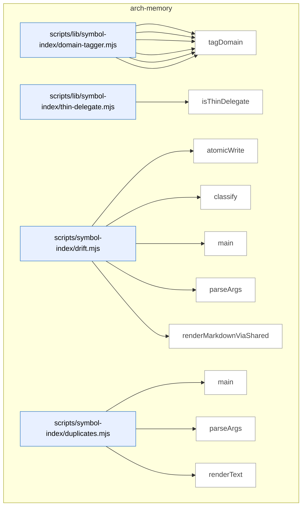

_Domain has 52 symbols (>50). Diagram shows top-15 by file order; see flat table below for the full list._

### Symbols in this domain

| Symbol | Kind | Path | Lines | Purpose | File imported by |
|---|---|---|---|---|---|
| [`computeTargetDomains`](../scripts/lib/symbol-index/domain-tagger.mjs#L150) | function | `scripts/lib/symbol-index/domain-tagger.mjs` | 150-165 | Categorizes target paths into tagged domains and untagged paths, reporting whether symbols span multiple domains. | `scripts/cross-skill.mjs`, `scripts/lib/audit/legacy-production-audit.mjs`, `scripts/lib/dashboard/collect-purposes.mjs`, +6 more |
| [`globToRegexBody`](../scripts/lib/symbol-index/domain-tagger.mjs#L51) | function | `scripts/lib/symbol-index/domain-tagger.mjs` | 51-80 | Converts a glob pattern string to an anchored regex body, handling `**` (match any), `*` (match non-slash), and escaping literal characters. | `scripts/cross-skill.mjs`, `scripts/lib/audit/legacy-production-audit.mjs`, `scripts/lib/dashboard/collect-purposes.mjs`, +6 more |
| [`loadDomainRules`](../scripts/lib/symbol-index/domain-tagger.mjs#L181) | function | `scripts/lib/symbol-index/domain-tagger.mjs` | 181-208 | Loads and validates domain-to-rule mappings from a JSON file, warning on malformed entries. | `scripts/cross-skill.mjs`, `scripts/lib/audit/legacy-production-audit.mjs`, `scripts/lib/dashboard/collect-purposes.mjs`, +6 more |
| [`makeFastTagger`](../scripts/lib/symbol-index/domain-tagger.mjs#L111) | function | `scripts/lib/symbol-index/domain-tagger.mjs` | 111-132 | Returns a compiled fast-path tagger function that maps file paths to domains without re-parsing patterns. | `scripts/cross-skill.mjs`, `scripts/lib/audit/legacy-production-audit.mjs`, `scripts/lib/dashboard/collect-purposes.mjs`, +6 more |
| [`matchGlob`](../scripts/lib/symbol-index/domain-tagger.mjs#L38) | function | `scripts/lib/symbol-index/domain-tagger.mjs` | 38-49 | Tests a file path against a glob pattern by normalizing both and applying regex with `**` and `*` wildcard semantics. | `scripts/cross-skill.mjs`, `scripts/lib/audit/legacy-production-audit.mjs`, `scripts/lib/dashboard/collect-purposes.mjs`, +6 more |
| [`tagDomain`](../scripts/lib/symbol-index/domain-tagger.mjs#L89) | function | `scripts/lib/symbol-index/domain-tagger.mjs` | 89-96 | Returns the domain assigned to a file by finding the first matching rule pattern in order. | `scripts/cross-skill.mjs`, `scripts/lib/audit/legacy-production-audit.mjs`, `scripts/lib/dashboard/collect-purposes.mjs`, +6 more |
| [`isThinDelegate`](../scripts/lib/symbol-index/thin-delegate.mjs#L50) | function | `scripts/lib/symbol-index/thin-delegate.mjs` | 50-85 | Determines if a function body is a "thin delegate" by stripping comments, removing variable prefixes and function keywords, and checking if the remaining code is a simple pass-through expression. | `scripts/symbol-index/extract.mjs` |
| [`atomicWrite`](../scripts/symbol-index/drift.mjs#L42) | function | `scripts/symbol-index/drift.mjs` | 42-48 | Atomically writes content to a file by writing to a temporary file first, then renaming it. | _(internal)_ |
| [`classify`](../scripts/symbol-index/drift.mjs#L50) | function | `scripts/symbol-index/drift.mjs` | 50-54 | Classifies a drift score as GREEN, AMBER, or RED based on thresholds. | _(internal)_ |
| [`main`](../scripts/symbol-index/drift.mjs#L75) | function | `scripts/symbol-index/drift.mjs` | 75-145 | Main entry point that computes drift score, fetches duplicate clusters, and outputs results. | _(internal)_ |
| [`parseArgs`](../scripts/symbol-index/drift.mjs#L33) | function | `scripts/symbol-index/drift.mjs` | 33-40 | Parses command-line arguments for output file and JSON format flag. | _(internal)_ |
| [`renderMarkdownViaShared`](../scripts/symbol-index/drift.mjs#L60) | function | `scripts/symbol-index/drift.mjs` | 60-73 | Renders a drift issue to markdown format with metadata and violation details. | _(internal)_ |
| [`main`](../scripts/symbol-index/duplicates.mjs#L65) | function | `scripts/symbol-index/duplicates.mjs` | 65-101 | Main entry point that fetches duplicate clusters from the store and outputs them as JSON or text. | _(internal)_ |
| [`parseArgs`](../scripts/symbol-index/duplicates.mjs#L31) | function | `scripts/symbol-index/duplicates.mjs` | 31-46 | Parses command-line arguments for limit, JSON flag, and help, validating the limit is a positive integer. | _(internal)_ |
| [`renderText`](../scripts/symbol-index/duplicates.mjs#L48) | function | `scripts/symbol-index/duplicates.mjs` | 48-63 | Formats duplicate clusters as human-readable text listing files, kinds, and example purposes. | _(internal)_ |
| [`compose`](../scripts/symbol-index/embed.mjs#L71) | function | `scripts/symbol-index/embed.mjs` | 71-77 | Composes a stable text representation of a symbol including kind, name, path, summary, and signature. | _(internal)_ |
| [`embedBatch`](../scripts/symbol-index/embed.mjs#L26) | function | `scripts/symbol-index/embed.mjs` | 26-69 | <no body> | _(internal)_ |
| [`logProgress`](../scripts/symbol-index/embed.mjs#L19) | function | `scripts/symbol-index/embed.mjs` | 19-19 | Writes a progress message to stderr prefixed with [embed]. | _(internal)_ |
| [`main`](../scripts/symbol-index/embed.mjs#L79) | function | `scripts/symbol-index/embed.mjs` | 79-127 | <no body> | _(internal)_ |
| [`emitProgress`](../scripts/symbol-index/extract.mjs#L61) | function | `scripts/symbol-index/extract.mjs` | 61-63 | Writes progress messages to stderr with standard prefix. | _(internal)_ |
| [`enumerateFiles`](../scripts/symbol-index/extract.mjs#L388) | function | `scripts/symbol-index/extract.mjs` | 388-406 | Returns restricted file list or recursively walks repo to enumerate source files. | _(internal)_ |
| [`extractGraphAndViolations`](../scripts/symbol-index/extract.mjs#L263) | function | `scripts/symbol-index/extract.mjs` | 263-329 | Analyzes dependency graph via dep-cruiser to detect and report import rule violations. | _(internal)_ |
| [`extractSymbols`](../scripts/symbol-index/extract.mjs#L73) | function | `scripts/symbol-index/extract.mjs` | 73-256 | Walks source files, parses with ts-morph, extracts symbols, skipping sensitive and generated paths. | _(internal)_ |
| [`isInternalEdge`](../scripts/symbol-index/extract.mjs#L343) | function | `scripts/symbol-index/extract.mjs` | 343-359 | Checks if dependency is internal (not core/npm) based on dep-cruiser metadata. | _(internal)_ |
| [`main`](../scripts/symbol-index/extract.mjs#L408) | function | `scripts/symbol-index/extract.mjs` | 408-420 | CLI entry extracting symbols and violations, emitting summary statistics. | _(internal)_ |
| [`parseArgs`](../scripts/symbol-index/extract.mjs#L39) | function | `scripts/symbol-index/extract.mjs` | 39-58 | Parses CLI flags for root, files, mode, since-commit, and include-delegates options. | _(internal)_ |
| [`main`](../scripts/symbol-index/prune.mjs#L44) | function | `scripts/symbol-index/prune.mjs` | 44-94 | Main entry point that prunes old refresh runs by retention class (aborted, transient, checkpoints) and demotes old rollbacks. | _(internal)_ |
| [`parseArgs`](../scripts/symbol-index/prune.mjs#L31) | function | `scripts/symbol-index/prune.mjs` | 31-37 | Parses command-line arguments for dry-run flag. | _(internal)_ |
| [`logErr`](../scripts/symbol-index/refresh.mjs#L83) | function | `scripts/symbol-index/refresh.mjs` | 83-83 | Writes error messages to stderr with a [refresh] prefix. | _(internal)_ |
| [`logOk`](../scripts/symbol-index/refresh.mjs#L84) | function | `scripts/symbol-index/refresh.mjs` | 84-84 | Writes status messages to stderr with a [refresh] prefix. | _(internal)_ |
| [`main`](../scripts/symbol-index/refresh.mjs#L121) | function | `scripts/symbol-index/refresh.mjs` | 121-478 | Orchestrates symbol-index refresh: validates domain rules, resolves embedding model, upserts symbols to Postgres via learned store. | _(internal)_ |
| [`parseArgs`](../scripts/symbol-index/refresh.mjs#L71) | function | `scripts/symbol-index/refresh.mjs` | 71-81 | Parses CLI flags (--full, --since-commit, --force, --include-delegates) into an args object. | _(internal)_ |
| [`runWithHeartbeat`](../scripts/symbol-index/refresh.mjs#L112) | function | `scripts/symbol-index/refresh.mjs` | 112-119 | Executes an async function with periodic heartbeat signals sent to the cloud store. | _(internal)_ |
| [`sibling`](../scripts/symbol-index/refresh.mjs#L69) | function | `scripts/symbol-index/refresh.mjs` | 69-69 | Returns the path to a sibling file relative to the current module. | _(internal)_ |
| [`throwVcsError`](../scripts/symbol-index/refresh.mjs#L95) | function | `scripts/symbol-index/refresh.mjs` | 95-102 | Creates and throws a structured VCS error with code, message, and optional cause. | _(internal)_ |
| [`classify`](../scripts/symbol-index/render-mermaid.mjs#L58) | function | `scripts/symbol-index/render-mermaid.mjs` | 58-62 | Classifies a drift score as GREEN, AMBER, or RED based on thresholds. | _(internal)_ |
| [`cleanupStaleObservedDeps`](../scripts/symbol-index/render-mermaid.mjs#L70) | function | `scripts/symbol-index/render-mermaid.mjs` | 70-80 | Clears a stale observed-deps file if it exists from a previous aborted render. | _(internal)_ |
| [`commitSha`](../scripts/symbol-index/render-mermaid.mjs#L53) | function | `scripts/symbol-index/render-mermaid.mjs` | 53-56 | Retrieves the current commit SHA by running git rev-parse HEAD. | _(internal)_ |
| [`main`](../scripts/symbol-index/render-mermaid.mjs#L108) | function | `scripts/symbol-index/render-mermaid.mjs` | 108-291 | <no body> | _(internal)_ |
| [`parseArgs`](../scripts/symbol-index/render-mermaid.mjs#L45) | function | `scripts/symbol-index/render-mermaid.mjs` | 45-51 | Parses command-line arguments for output file path, defaulting to docs/architecture-map.md. | _(internal)_ |
| [`writeAbortStub`](../scripts/symbol-index/render-mermaid.mjs#L89) | function | `scripts/symbol-index/render-mermaid.mjs` | 89-106 | Writes an abort stub to the architecture map file with a reason and hint message. | _(internal)_ |
| [`cacheHit`](../scripts/symbol-index/summarise-domains.mjs#L59) | function | `scripts/symbol-index/summarise-domains.mjs` | 59-66 | Determines if a cached domain summary is still valid based on composition hash, symbol count, model, and count delta. | `scripts/symbol-index/render-mermaid.mjs` |
| [`callHaiku`](../scripts/symbol-index/summarise-domains.mjs#L68) | function | `scripts/symbol-index/summarise-domains.mjs` | 68-99 | Calls Claude API (via Azure or public Anthropic) with a prompt to generate a domain summary, with timeout and retry logic. | `scripts/symbol-index/render-mermaid.mjs` |
| [`computeCompositionHash`](../scripts/symbol-index/summarise-domains.mjs#L46) | function | `scripts/symbol-index/summarise-domains.mjs` | 46-51 | Computes a SHA256 hash of symbol definition IDs and signature hashes for composition tracking. | `scripts/symbol-index/render-mermaid.mjs` |
| [`main`](../scripts/symbol-index/summarise-domains.mjs#L183) | function | `scripts/symbol-index/summarise-domains.mjs` | 183-215 | Main entry point that summarises domains by fetching symbols, building cache hits, calling Claude, and emitting JSON results. | `scripts/symbol-index/render-mermaid.mjs` |
| [`PROMPT_TEMPLATE`](../scripts/symbol-index/summarise-domains.mjs#L39) | function | `scripts/symbol-index/summarise-domains.mjs` | 39-43 | Generates a prompt template asking Claude to describe a domain's purpose given sample symbols. | `scripts/symbol-index/render-mermaid.mjs` |
| [`summariseDomains`](../scripts/symbol-index/summarise-domains.mjs#L113) | function | `scripts/symbol-index/summarise-domains.mjs` | 113-180 | <no body> | `scripts/symbol-index/render-mermaid.mjs` |
| [`symbolCountDeltaOk`](../scripts/symbol-index/summarise-domains.mjs#L53) | function | `scripts/symbol-index/summarise-domains.mjs` | 53-57 | Checks if the symbol count change between prior and current is within 20 percent tolerance. | `scripts/symbol-index/render-mermaid.mjs` |
| [`validateSummary`](../scripts/symbol-index/summarise-domains.mjs#L101) | function | `scripts/symbol-index/summarise-domains.mjs` | 101-107 | Validates that a summary is a string between 20 and 400 characters. | `scripts/symbol-index/render-mermaid.mjs` |
| [`logProgress`](../scripts/symbol-index/summarise.mjs#L29) | function | `scripts/symbol-index/summarise.mjs` | 29-29 | Writes a progress message to stderr prefixed with [summarise]. | _(internal)_ |
| [`main`](../scripts/symbol-index/summarise.mjs#L76) | function | `scripts/symbol-index/summarise.mjs` | 76-119 | <no body> | _(internal)_ |
| [`summariseBatch`](../scripts/symbol-index/summarise.mjs#L35) | function | `scripts/symbol-index/summarise.mjs` | 35-74 | <no body> | _(internal)_ |

---

## audit-orchestration

> Orchestrates multi-round code audits by spawning GPT and Gemini review processes, parsing results, tracking convergence across rounds, and managing session state and temp files for the audit pipeline.

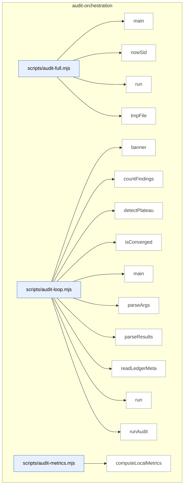

_Domain has 198 symbols (>50). Diagram shows top-15 by file order; see flat table below for the full list._

### Symbols in this domain

| Symbol | Kind | Path | Lines | Purpose | File imported by |
|---|---|---|---|---|---|
| [`main`](../scripts/audit-full.mjs#L44) | function | `scripts/audit-full.mjs` | 44-127 | Runs OpenAI audit followed by Gemini review in sequence, with optional final review skip. | _(internal)_ |
| [`nowSid`](../scripts/audit-full.mjs#L31) | function | `scripts/audit-full.mjs` | 31-33 | Generates a timestamped session ID with a given prefix. | _(internal)_ |
| [`run`](../scripts/audit-full.mjs#L39) | function | `scripts/audit-full.mjs` | 39-42 | Spawns a child process synchronously and returns its exit code and signal. | _(internal)_ |
| [`tmpFile`](../scripts/audit-full.mjs#L35) | function | `scripts/audit-full.mjs` | 35-37 | Returns the path to a temporary file in the system temp directory. | _(internal)_ |
| [`banner`](../scripts/audit-loop.mjs#L27) | function | `scripts/audit-loop.mjs` | 27-30 | Prints a centered banner message with decorative lines. | _(internal)_ |
| [`countFindings`](../scripts/audit-loop.mjs#L71) | function | `scripts/audit-loop.mjs` | 71-78 | Counts findings by severity level from parsed audit results. | _(internal)_ |
| [`detectPlateau`](../scripts/audit-loop.mjs#L93) | function | `scripts/audit-loop.mjs` | 93-109 | Detects a convergence plateau by checking if HIGH finding decreases have been <30% for two consecutive rounds. | _(internal)_ |
| [`isConverged`](../scripts/audit-loop.mjs#L80) | function | `scripts/audit-loop.mjs` | 80-84 | Determines if an audit round has converged (no HIGH findings and ≤2 MEDIUM). | _(internal)_ |
| [`main`](../scripts/audit-loop.mjs#L169) | function | `scripts/audit-loop.mjs` | 169-534 | <no body> | _(internal)_ |
| [`parseArgs`](../scripts/audit-loop.mjs#L129) | function | `scripts/audit-loop.mjs` | 129-165 | Parses command-line arguments into an audit configuration object with defaults and option flags. | _(internal)_ |
| [`parseResults`](../scripts/audit-loop.mjs#L62) | function | `scripts/audit-loop.mjs` | 62-69 | Reads and parses JSON from an audit results file, returning null on read/parse errors. | _(internal)_ |
| [`readLedgerMeta`](../scripts/audit-loop.mjs#L119) | function | `scripts/audit-loop.mjs` | 119-127 | Reads metadata from a ledger file, returning an empty object on missing or invalid files. | _(internal)_ |
| [`run`](../scripts/audit-loop.mjs#L32) | function | `scripts/audit-loop.mjs` | 32-45 | Executes a shell command synchronously with timeout and error handling. | _(internal)_ |
| [`runAudit`](../scripts/audit-loop.mjs#L47) | function | `scripts/audit-loop.mjs` | 47-60 | Runs openai-audit.mjs as a child process, returning both stdout and stderr regardless of exit status. | _(internal)_ |
| [`computeLocalMetrics`](../scripts/audit-metrics.mjs#L87) | function | `scripts/audit-metrics.mjs` | 87-103 | Loads local outcomes from a JSONL file, filters by recency and labeled status, and aggregates acceptance counts by pass. | `scripts/lib/dashboard/collect-telemetry.mjs` |
| [`displayMetrics`](../scripts/audit-metrics.mjs#L107) | function | `scripts/audit-metrics.mjs` | 107-176 | <no body> | `scripts/lib/dashboard/collect-telemetry.mjs` |
| [`fetchCloudMetrics`](../scripts/audit-metrics.mjs#L52) | function | `scripts/audit-metrics.mjs` | 52-80 | Queries the database for audit runs, pass statistics, and findings within a time window, filtered optionally by repository. | `scripts/lib/dashboard/collect-telemetry.mjs` |
| [`main`](../scripts/audit-metrics.mjs#L180) | function | `scripts/audit-metrics.mjs` | 180-197 | Fetches cloud metrics (with graceful degradation), computes local metrics, and displays or outputs them in JSON format. | `scripts/lib/dashboard/collect-telemetry.mjs` |
| [`_collectMaxLengths`](../scripts/gemini-review.mjs#L121) | function | `scripts/gemini-review.mjs` | 121-139 | Recursively collects maxLength constraints from a Zod schema and stores them by path for later truncation. | _(internal)_ |
| [`addSemanticIds`](../scripts/gemini-review.mjs#L1563) | function | `scripts/gemini-review.mjs` | 1563-1571 | Assigns provider-prefixed IDs, semantic hashes, and source attribution to findings. | _(internal)_ |
| [`applyDebtSuppression`](../scripts/gemini-review.mjs#L1496) | function | `scripts/gemini-review.mjs` | 1496-1531 | Filters findings matching prior debt-suppression context via Jaccard similarity. | _(internal)_ |
| [`applyProviderSetting`](../scripts/gemini-review.mjs#L1371) | function | `scripts/gemini-review.mjs` | 1371-1389 | Adds/updates/removes the FINAL_REVIEW_PROVIDER line in .env text. | _(internal)_ |
| [`applyScopeFilter`](../scripts/gemini-review.mjs#L1533) | function | `scripts/gemini-review.mjs` | 1533-1561 | Removes findings that cite files outside the changed_files scope. | _(internal)_ |
| [`assertAzureClaudeReady`](../scripts/gemini-review.mjs#L1422) | function | `scripts/gemini-review.mjs` | 1422-1433 | Validates that required Azure environment variables are set for Foundry Claude. | _(internal)_ |
| [`buildClient`](../scripts/gemini-review.mjs#L1435) | function | `scripts/gemini-review.mjs` | 1435-1449 | Constructs an API client for the selected provider (Gemini, Azure Claude, or public Opus). | _(internal)_ |
| [`buildShadowClient`](../scripts/gemini-review.mjs#L967) | function | `scripts/gemini-review.mjs` | 967-978 | Constructs an API client for the shadow reviewer based on provider type. | _(internal)_ |
| [`callAzureClaude`](../scripts/gemini-review.mjs#L589) | function | `scripts/gemini-review.mjs` | 589-659 | Calls Claude Opus on Azure Foundry with support for both Anthropic and OpenAI API shapes. | _(internal)_ |
| [`callClaudeOpus`](../scripts/gemini-review.mjs#L500) | function | `scripts/gemini-review.mjs` | 500-578 | Calls Claude Opus via Anthropic SDK with streaming support for oversized outputs and timeout-race cleanup. | _(internal)_ |
| [`callGemini`](../scripts/gemini-review.mjs#L353) | function | `scripts/gemini-review.mjs` | 353-450 | Calls Gemini 3.1 Pro via streaming JSON output with timeout race protection and chunk accumulation. | _(internal)_ |
| [`dedupByHash`](../scripts/gemini-review.mjs#L1070) | function | `scripts/gemini-review.mjs` | 1070-1078 | Deduplicates findings by semantic hash, retaining only the first occurrence of each unique hash. | _(internal)_ |
| [`diffFindingBuckets`](../scripts/gemini-review.mjs#L1085) | function | `scripts/gemini-review.mjs` | 1085-1101 | Compares primary and shadow finding sets, bucketing into both/primary-only/shadow-only categories. | _(internal)_ |
| [`emitReviewOutput`](../scripts/gemini-review.mjs#L1573) | function | `scripts/gemini-review.mjs` | 1573-1588 | Outputs the review result as formatted markdown or JSON per CLI flags. | _(internal)_ |
| [`formatReviewResult`](../scripts/gemini-review.mjs#L835) | function | `scripts/gemini-review.mjs` | 835-898 | Formats the final review result into markdown with verdict, deliberation quality, and finding summaries. | _(internal)_ |
| [`getReviewPrompt`](../scripts/gemini-review.mjs#L333) | function | `scripts/gemini-review.mjs` | 333-336 | Returns the active Gemini system prompt with an optional role-specific addendum. | _(internal)_ |
| [`isJsonTruncationError`](../scripts/gemini-review.mjs#L1451) | function | `scripts/gemini-review.mjs` | 1451-1455 | Detects JSON parsing errors that indicate truncated output. | _(internal)_ |
| [`main`](../scripts/gemini-review.mjs#L1715) | function | `scripts/gemini-review.mjs` | 1715-1786 | Entry point that parses CLI args and dispatches to review/set-provider/ping modes. | _(internal)_ |
| [`mapRouteToShadowProvider`](../scripts/gemini-review.mjs#L1009) | function | `scripts/gemini-review.mjs` | 1009-1013 | Maps a candidate route's transport type to a shadow provider name for A/B testing. | _(internal)_ |
| [`parseReviewArgs`](../scripts/gemini-review.mjs#L1273) | function | `scripts/gemini-review.mjs` | 1273-1292 | Extracts and validates CLI arguments for review mode (files, flags, provider, role). | _(internal)_ |
| [`recordGeminiOutcomes`](../scripts/gemini-review.mjs#L1635) | function | `scripts/gemini-review.mjs` | 1635-1657 | Records Gemini review verdicts and findings to the learning store with reward signals. | _(internal)_ |
| [`recordNewFindings`](../scripts/gemini-review.mjs#L1590) | function | `scripts/gemini-review.mjs` | 1590-1609 | Logs new Gemini findings into the learning outcomes ledger. | _(internal)_ |
| [`recordWronglyDismissed`](../scripts/gemini-review.mjs#L1611) | function | `scripts/gemini-review.mjs` | 1611-1633 | Logs findings wrongly dismissed by GPT but caught by Gemini. | _(internal)_ |
| [`refreshCatalogAndWarn`](../scripts/gemini-review.mjs#L1214) | function | `scripts/gemini-review.mjs` | 1214-1235 | Refreshes the model catalog and upgrades Gemini/Opus model IDs to latest available versions. | _(internal)_ |
| [`resolveModelEvalShadowOverride`](../scripts/gemini-review.mjs#L1015) | function | `scripts/gemini-review.mjs` | 1015-1044 | Fetches the active model-eval adjudicator run and resolves its candidate route as a shadow override. | _(internal)_ |
| [`resolveProviderSetting`](../scripts/gemini-review.mjs#L1354) | function | `scripts/gemini-review.mjs` | 1354-1357 | Reads the FINAL_REVIEW_PROVIDER env var if set. | _(internal)_ |
| [`resolveShadow`](../scripts/gemini-review.mjs#L931) | function | `scripts/gemini-review.mjs` | 931-957 | Resolves shadow-reviewer config from environment, validating provider/model pairing and readiness state. | _(internal)_ |
| [`runAdjudicatorOnlyReview`](../scripts/gemini-review.mjs#L1487) | function | `scripts/gemini-review.mjs` | 1487-1494 | Runs final review with an adjudicator-specific prompt addendum for model-eval. | _(internal)_ |
| [`runFinalReview`](../scripts/gemini-review.mjs#L672) | function | `scripts/gemini-review.mjs` | 672-831 | Orchestrates final review by extracting code context, applying debt suppression, and invoking the selected LLM. | _(internal)_ |
| [`runFixtureReview`](../scripts/gemini-review.mjs#L1672) | function | `scripts/gemini-review.mjs` | 1672-1713 | Returns a deterministic canned Gemini review result for testing (NODE_ENV=test only). | _(internal)_ |
| [`runPing`](../scripts/gemini-review.mjs#L1266) | function | `scripts/gemini-review.mjs` | 1266-1271 | Attempts to ping either Gemini or Claude depending on which API keys are set. | _(internal)_ |
| [`runPingClaude`](../scripts/gemini-review.mjs#L1249) | function | `scripts/gemini-review.mjs` | 1249-1264 | Tests Claude Opus API connectivity with a trivial request. | _(internal)_ |
| [`runPingGemini`](../scripts/gemini-review.mjs#L1237) | function | `scripts/gemini-review.mjs` | 1237-1247 | Tests Gemini API connectivity with a trivial request. | _(internal)_ |
| [`runReviewWithRetry`](../scripts/gemini-review.mjs#L1457) | function | `scripts/gemini-review.mjs` | 1457-1474 | Retries final review with conciseness hints on JSON truncation. | _(internal)_ |
| [`runSetProvider`](../scripts/gemini-review.mjs#L1396) | function | `scripts/gemini-review.mjs` | 1396-1416 | CLI command to set or clear the FINAL_REVIEW_PROVIDER setting in .env. | _(internal)_ |
| [`runShadowAndPersist`](../scripts/gemini-review.mjs#L1124) | function | `scripts/gemini-review.mjs` | 1124-1208 | Executes shadow review if ready, persists results with model-eval override logic. | _(internal)_ |
| [`runShadowReview`](../scripts/gemini-review.mjs#L1051) | function | `scripts/gemini-review.mjs` | 1051-1061 | Executes the shadow reviewer in parallel, handling client creation and finding deduplication. | _(internal)_ |
| [`selectProvider`](../scripts/gemini-review.mjs#L1314) | function | `scripts/gemini-review.mjs` | 1314-1351 | Selects the final-review provider from explicit flag, env setting, or auto-detect order (Gemini → Azure → Opus). | _(internal)_ |
| [`shadowModelMatchesFamily`](../scripts/gemini-review.mjs#L917) | function | `scripts/gemini-review.mjs` | 917-922 | Checks whether a model ID belongs to a specified LLM family (gemini or claude). | _(internal)_ |
| [`shadowSkipBlock`](../scripts/gemini-review.mjs#L1104) | function | `scripts/gemini-review.mjs` | 1104-1109 | Creates a skip-state descriptor when shadow review is not ready. | _(internal)_ |
| [`streamAnthropicMessage`](../scripts/gemini-review.mjs#L480) | function | `scripts/gemini-review.mjs` | 480-498 | Adapts Anthropic SDK streaming to a unified shape by collecting text chunks and extracting usage metadata. | _(internal)_ |
| [`truncateToSchema`](../scripts/gemini-review.mjs#L153) | function | `scripts/gemini-review.mjs` | 153-173 | Recursively truncates string fields in an object to their declared maxLength limits. | _(internal)_ |
| [`createEnvelope`](../scripts/lib/audit/candidate-envelope.mjs#L49) | function | `scripts/lib/audit/candidate-envelope.mjs` | 49-84 | Wraps a finding into an envelope with evidence provenance, storing canonical and full-claim metadata. | `scripts/lib/audit/evidence-triage.mjs`, `scripts/lib/audit/tiered-pipeline.mjs` |
| [`flattenEnvelopeToFinding`](../scripts/lib/audit/candidate-envelope.mjs#L234) | function | `scripts/lib/audit/candidate-envelope.mjs` | 234-254 | Converts an envelope back to a flat Finding by extracting canonical finding and appending alternative evidence. | `scripts/lib/audit/evidence-triage.mjs`, `scripts/lib/audit/tiered-pipeline.mjs` |
| [`mergeIntoEnvelopes`](../scripts/lib/audit/candidate-envelope.mjs#L119) | function | `scripts/lib/audit/candidate-envelope.mjs` | 119-180 | Merges findings into envelopes by fingerprint, consolidating multiple models' evidence into evidenceAlternatives. | `scripts/lib/audit/evidence-triage.mjs`, `scripts/lib/audit/tiered-pipeline.mjs` |
| [`promoteAlternative`](../scripts/lib/audit/candidate-envelope.mjs#L256) | function | `scripts/lib/audit/candidate-envelope.mjs` | 256-293 | Promotes an alternative evidence entry to canonical in an envelope, demoting the old canonical. | `scripts/lib/audit/evidence-triage.mjs`, `scripts/lib/audit/tiered-pipeline.mjs` |
| [`severityRank`](../scripts/lib/audit/candidate-envelope.mjs#L91) | function | `scripts/lib/audit/candidate-envelope.mjs` | 91-93 | Returns a numeric rank for a severity level. | `scripts/lib/audit/evidence-triage.mjs`, `scripts/lib/audit/tiered-pipeline.mjs` |
| [`computeCostReport`](../scripts/lib/audit/cost-budget.mjs#L58) | function | `scripts/lib/audit/cost-budget.mjs` | 58-88 | Aggregates usage and review-effort events to compute per-accepted-high cost metrics. | `scripts/lib/audit/tiered-pipeline.mjs` |
| [`loadReviewEffortEvents`](../scripts/lib/audit/cost-budget.mjs#L136) | function | `scripts/lib/audit/cost-budget.mjs` | 136-144 | Reads and validates ReviewEffortEvent records from JSONL, skipping invalid entries. | `scripts/lib/audit/tiered-pipeline.mjs` |
| [`loadUsageEvents`](../scripts/lib/audit/cost-budget.mjs#L118) | function | `scripts/lib/audit/cost-budget.mjs` | 118-133 | Reads and validates UsageEvent records from JSONL, skipping invalid entries. | `scripts/lib/audit/tiered-pipeline.mjs` |
| [`openReviewEffortStore`](../scripts/lib/audit/cost-budget.mjs#L96) | function | `scripts/lib/audit/cost-budget.mjs` | 96-98 | Returns an AppendOnlyStore for ReviewEffortEvent records. | `scripts/lib/audit/tiered-pipeline.mjs` |
| [`openUsageEventStore`](../scripts/lib/audit/cost-budget.mjs#L91) | function | `scripts/lib/audit/cost-budget.mjs` | 91-93 | Returns an AppendOnlyStore for UsageEvent records. | `scripts/lib/audit/tiered-pipeline.mjs` |
| [`recordReviewEffort`](../scripts/lib/audit/cost-budget.mjs#L106) | function | `scripts/lib/audit/cost-budget.mjs` | 106-108 | Appends a review-effort event to the store. | `scripts/lib/audit/tiered-pipeline.mjs` |
| [`recordUsageEvent`](../scripts/lib/audit/cost-budget.mjs#L101) | function | `scripts/lib/audit/cost-budget.mjs` | 101-103 | Appends a usage event to the store. | `scripts/lib/audit/tiered-pipeline.mjs` |
| [`classifyDeferralEvidence`](../scripts/lib/audit/deferral-classifier.mjs#L162) | function | `scripts/lib/audit/deferral-classifier.mjs` | 162-295 | Determines if a finding has deterministic SCM evidence for auto-deferral eligibility. | `scripts/lib/audit/findings-pipeline.mjs` |
| [`globMatch`](../scripts/lib/audit/deferral-classifier.mjs#L98) | function | `scripts/lib/audit/deferral-classifier.mjs` | 98-115 | Tests whether a file path matches a glob pattern (handles `**` and `*`). | `scripts/lib/audit/findings-pipeline.mjs` |
| [`parseAcceptV1Markers`](../scripts/lib/audit/deferral-classifier.mjs#L77) | function | `scripts/lib/audit/deferral-classifier.mjs` | 77-87 | Extracts `audit:accept-v1` plan markers (glob + reason) via regex. | `scripts/lib/audit/findings-pipeline.mjs` |
| [`cleanupTempRoot`](../scripts/lib/audit/diff-scope-resolver.mjs#L209) | function | `scripts/lib/audit/diff-scope-resolver.mjs` | 209-219 | Forcefully removes a temporary git worktree and falls back to recursive filesystem deletion if the worktree was never registered. | `scripts/audit-clean.mjs`, `scripts/lib/audit/legacy-production-audit.mjs`, `scripts/openai-audit.mjs` |
| [`computeEntryPoints`](../scripts/lib/audit/diff-scope-resolver.mjs#L308) | function | `scripts/lib/audit/diff-scope-resolver.mjs` | 308-377 | Extracts entry points from package.json and tsconfig.json, adding TypeScript source equivalents when compiled output paths are found. | `scripts/audit-clean.mjs`, `scripts/lib/audit/legacy-production-audit.mjs`, `scripts/openai-audit.mjs` |
| [`cruiseTempRoot`](../scripts/lib/audit/diff-scope-resolver.mjs#L231) | function | `scripts/lib/audit/diff-scope-resolver.mjs` | 231-293 | Runs dep-cruiser on materialized source files in a temporary directory, translates relative paths back to the temp root, and returns a map of callers to their dependencies. | `scripts/audit-clean.mjs`, `scripts/lib/audit/legacy-production-audit.mjs`, `scripts/openai-audit.mjs` |
| [`gitBuf`](../scripts/lib/audit/diff-scope-resolver.mjs#L73) | function | `scripts/lib/audit/diff-scope-resolver.mjs` | 73-85 | Executes a git command and returns the buffer output, or null on failure with stderr logging. | `scripts/audit-clean.mjs`, `scripts/lib/audit/legacy-production-audit.mjs`, `scripts/openai-audit.mjs` |
| [`materialisePreimages`](../scripts/lib/audit/diff-scope-resolver.mjs#L172) | function | `scripts/lib/audit/diff-scope-resolver.mjs` | 172-207 | Creates a temporary git worktree at baseRef, materialises eligible preimage files, and returns the temp root path. | `scripts/audit-clean.mjs`, `scripts/lib/audit/legacy-production-audit.mjs`, `scripts/openai-audit.mjs` |
| [`parseLsTreeZ`](../scripts/lib/audit/diff-scope-resolver.mjs#L153) | function | `scripts/lib/audit/diff-scope-resolver.mjs` | 153-156 | Parses `git ls-tree -z` output into a set of file paths. | `scripts/audit-clean.mjs`, `scripts/lib/audit/legacy-production-audit.mjs`, `scripts/openai-audit.mjs` |
| [`parseNameStatusZ`](../scripts/lib/audit/diff-scope-resolver.mjs#L100) | function | `scripts/lib/audit/diff-scope-resolver.mjs` | 100-145 | Parses `git diff --name-status -z` output into records with variable-width token handling for renames/copies. | `scripts/audit-clean.mjs`, `scripts/lib/audit/legacy-production-audit.mjs`, `scripts/openai-audit.mjs` |
| [`resolveDiffScope`](../scripts/lib/audit/diff-scope-resolver.mjs#L394) | function | `scripts/lib/audit/diff-scope-resolver.mjs` | 394-495 | Resolves git refs to commit SHAs, builds a list of changed files via git diff, extracts pre-edge information from the base commit, and returns the diff scope with optional partial-parse tracking. | `scripts/audit-clean.mjs`, `scripts/lib/audit/legacy-production-audit.mjs`, `scripts/openai-audit.mjs` |
| [`stripLeadingDotSlash`](../scripts/lib/audit/diff-scope-resolver.mjs#L27) | function | `scripts/lib/audit/diff-scope-resolver.mjs` | 27-29 | Removes a leading `./` prefix from a string if present. | `scripts/audit-clean.mjs`, `scripts/lib/audit/legacy-production-audit.mjs`, `scripts/openai-audit.mjs` |
| [`walkEntryPointDir`](../scripts/lib/audit/diff-scope-resolver.mjs#L49) | function | `scripts/lib/audit/diff-scope-resolver.mjs` | 49-63 | Walks a directory to discover source files matching specified extensions (non-recursive). | `scripts/audit-clean.mjs`, `scripts/lib/audit/legacy-production-audit.mjs`, `scripts/openai-audit.mjs` |
| [`runDiscoveryPortfolio`](../scripts/lib/audit/discovery-portfolio.mjs#L98) | function | `scripts/lib/audit/discovery-portfolio.mjs` | 98-135 | Runs required (GLM, Sonnet) and optional (GPT if triggered) finding generators in parallel, tracking outcomes. | `scripts/lib/audit/tiered-pipeline.mjs` |
| [`runOneGenerator`](../scripts/lib/audit/discovery-portfolio.mjs#L54) | function | `scripts/lib/audit/discovery-portfolio.mjs` | 54-78 | Executes a finding generator, catching errors and non-array returns, recording outcomes. | `scripts/lib/audit/tiered-pipeline.mjs` |
| [`extractFileDiffSection`](../scripts/lib/audit/evidence-triage.mjs#L37) | function | `scripts/lib/audit/evidence-triage.mjs` | 37-67 | Extracts a file's diff section from unified diff, handling quoted paths and CRLF headers. | `scripts/lib/audit/tiered-pipeline.mjs` |
| [`normalizeWhitespace`](../scripts/lib/audit/evidence-triage.mjs#L24) | function | `scripts/lib/audit/evidence-triage.mjs` | 24-26 | Collapses multiple whitespace to single space and trims. | `scripts/lib/audit/tiered-pipeline.mjs` |
| [`nowIso`](../scripts/lib/audit/evidence-triage.mjs#L200) | function | `scripts/lib/audit/evidence-triage.mjs` | 200-202 | Returns current time as ISO string or uses a provided clock function. | `scripts/lib/audit/tiered-pipeline.mjs` |
| [`quoteAppearsOnSide`](../scripts/lib/audit/evidence-triage.mjs#L102) | function | `scripts/lib/audit/evidence-triage.mjs` | 102-125 | Checks if a normalized quote appears in the specified diff side, accounting for whitespace normalization. | `scripts/lib/audit/tiered-pipeline.mjs` |
| [`runStage0EvidenceTriage`](../scripts/lib/audit/evidence-triage.mjs#L255) | function | `scripts/lib/audit/evidence-triage.mjs` | 255-286 | Triages envelopes by verifying anchors, splitting into verified and rejected buckets. | `scripts/lib/audit/tiered-pipeline.mjs` |
| [`splitIntoHunks`](../scripts/lib/audit/evidence-triage.mjs#L73) | function | `scripts/lib/audit/evidence-triage.mjs` | 73-87 | Splits a file's diff section into hunks using @@ markers. | `scripts/lib/audit/tiered-pipeline.mjs` |
| [`tagPreExisting`](../scripts/lib/audit/evidence-triage.mjs#L184) | function | `scripts/lib/audit/evidence-triage.mjs` | 184-190 | Determines if a finding is pre-existing and independent using blame and impact adapters. | `scripts/lib/audit/tiered-pipeline.mjs` |
| [`verifyAnchor`](../scripts/lib/audit/evidence-triage.mjs#L150) | function | `scripts/lib/audit/evidence-triage.mjs` | 150-161 | Validates an evidence anchor against diff content, returning verified/fabricated/unverifiable. | `scripts/lib/audit/tiered-pipeline.mjs` |
| [`verifyWithFallback`](../scripts/lib/audit/evidence-triage.mjs#L215) | function | `scripts/lib/audit/evidence-triage.mjs` | 215-230 | Verifies an envelope's anchor; if failed, tries alternatives and promotes the first verified one. | `scripts/lib/audit/tiered-pipeline.mjs` |
| [`anchorFileCandidates`](../scripts/lib/audit/final-adjudication.mjs#L315) | function | `scripts/lib/audit/final-adjudication.mjs` | 315-318 | Extracts old and new file paths from an anchor. | `scripts/lib/audit/tiered-pipeline.mjs` |
| [`buildAlternativeEvidenceLines`](../scripts/lib/audit/final-adjudication.mjs#L360) | function | `scripts/lib/audit/final-adjudication.mjs` | 360-369 | Formats alternative evidence entries as markdown lines, filtering out sensitive-path alternatives. | `scripts/lib/audit/tiered-pipeline.mjs` |
| [`buildFindingDetail`](../scripts/lib/audit/final-adjudication.mjs#L372) | function | `scripts/lib/audit/final-adjudication.mjs` | 372-376 | Combines canonical detail with formatted alternative-evidence lines for output. | `scripts/lib/audit/tiered-pipeline.mjs` |
| [`createGeminiReviewSubprocessAdapters`](../scripts/lib/audit/final-adjudication.mjs#L480) | function | `scripts/lib/audit/final-adjudication.mjs` | 480-567 | Factory that creates reviewCall and adapter functions for subprocess-based Gemini review with security filtering. | `scripts/lib/audit/tiered-pipeline.mjs` |
| [`envelopeReferencedFiles`](../scripts/lib/audit/final-adjudication.mjs#L327) | function | `scripts/lib/audit/final-adjudication.mjs` | 327-330 | Collects all files referenced by an envelope's anchors. | `scripts/lib/audit/tiered-pipeline.mjs` |
| [`interpretVerdict`](../scripts/lib/audit/final-adjudication.mjs#L166) | function | `scripts/lib/audit/final-adjudication.mjs` | 166-195 | Interprets Gemini's verdict (reversed/confirmed/verified) into outcome (reversed/confirmed_dismissal/verified), accounting for prior dismissal. | `scripts/lib/audit/tiered-pipeline.mjs` |
| [`invokeGeminiReviewSubprocess`](../scripts/lib/audit/final-adjudication.mjs#L407) | function | `scripts/lib/audit/final-adjudication.mjs` | 407-450 | Spawns gemini-review.mjs subprocess with a transcript, captures and parses the JSON result. | `scripts/lib/audit/tiered-pipeline.mjs` |
| [`isPathSensitive`](../scripts/lib/audit/final-adjudication.mjs#L339) | function | `scripts/lib/audit/final-adjudication.mjs` | 339-346 | Checks if a file path is classified as sensitive. | `scripts/lib/audit/tiered-pipeline.mjs` |
| [`nowIso`](../scripts/lib/audit/final-adjudication.mjs#L49) | function | `scripts/lib/audit/final-adjudication.mjs` | 49-51 | Returns current time as ISO string or uses a provided clock function. | `scripts/lib/audit/tiered-pipeline.mjs` |
| [`primaryFile`](../scripts/lib/audit/final-adjudication.mjs#L379) | function | `scripts/lib/audit/final-adjudication.mjs` | 379-384 | Extracts the primary file from an envelope using section, file, or anchor paths. | `scripts/lib/audit/tiered-pipeline.mjs` |
| [`runFinalAdjudication`](../scripts/lib/audit/final-adjudication.mjs#L215) | function | `scripts/lib/audit/final-adjudication.mjs` | 215-306 | Runs Stage 2 Gemini review on selected envelopes, accumulating reversed/confirmed-dismissal/verified/unresolved/pending-security-review outcomes. | `scripts/lib/audit/tiered-pipeline.mjs` |
| [`selectAdjudicationSample`](../scripts/lib/audit/final-adjudication.mjs#L69) | function | `scripts/lib/audit/final-adjudication.mjs` | 69-97 | Selects mandatory escalated candidates, random tail sample of dismissed candidates, and random clean-region files. | `scripts/lib/audit/tiered-pipeline.mjs` |
| [`selectFinalAdjudicationWorkItems`](../scripts/lib/audit/final-adjudication.mjs#L136) | function | `scripts/lib/audit/final-adjudication.mjs` | 136-151 | Applies per-category budget caps to adjudication sample, returning mandatory/tail/clean-region/human-queue work items. | `scripts/lib/audit/tiered-pipeline.mjs` |
| [`classifyFinding`](../scripts/lib/audit/finding-verification.mjs#L70) | function | `scripts/lib/audit/finding-verification.mjs` | 70-73 | Detects whether a finding claims the existence of something (code, file, or symbol). | `scripts/lib/audit/legacy-production-audit.mjs`, `scripts/openai-audit.mjs` |
| [`extractCitedEntity`](../scripts/lib/audit/finding-verification.mjs#L103) | function | `scripts/lib/audit/finding-verification.mjs` | 103-122 | Extracts a cited entity (name, kind, optional file path) from a finding's detail and section. | `scripts/lib/audit/legacy-production-audit.mjs`, `scripts/openai-audit.mjs` |
| [`mk`](../scripts/lib/audit/finding-verification.mjs#L124) | function | `scripts/lib/audit/finding-verification.mjs` | 124-132 | Wraps a verification result with metadata about severity and verdict contribution. | `scripts/lib/audit/legacy-production-audit.mjs`, `scripts/openai-audit.mjs` |
| [`tokenKind`](../scripts/lib/audit/finding-verification.mjs#L84) | function | `scripts/lib/audit/finding-verification.mjs` | 84-90 | Classifies a token as external, file, or symbol based on syntax and context. | `scripts/lib/audit/legacy-production-audit.mjs`, `scripts/openai-audit.mjs` |
| [`verifyExistenceFindings`](../scripts/lib/audit/finding-verification.mjs#L149) | function | `scripts/lib/audit/finding-verification.mjs` | 149-215 | Verifies existence claims in audit findings against the repo inventory, marking external and symbol claims as requiring manual review. | `scripts/lib/audit/legacy-production-audit.mjs`, `scripts/openai-audit.mjs` |
| [`applyAcceptV1Suppression`](../scripts/lib/audit/findings-pipeline.mjs#L191) | function | `scripts/lib/audit/findings-pipeline.mjs` | 191-214 | Filters orphan findings matching accept-v1 plan markers. | `scripts/lib/audit/legacy-production-audit.mjs`, `scripts/lib/audit/orphan-metrics.mjs`, `scripts/lib/audit/tiered-pipeline.mjs`, +1 more |
| [`applyLedgerSuppression`](../scripts/lib/audit/findings-pipeline.mjs#L74) | function | `scripts/lib/audit/findings-pipeline.mjs` | 74-103 | Filters out findings dismissed or severity-adjusted in prior ledger entries. | `scripts/lib/audit/legacy-production-audit.mjs`, `scripts/lib/audit/orphan-metrics.mjs`, `scripts/lib/audit/tiered-pipeline.mjs`, +1 more |
| [`applyStage1MechanicalEarlyFilter`](../scripts/lib/audit/findings-pipeline.mjs#L128) | function | `scripts/lib/audit/findings-pipeline.mjs` | 128-177 | Fast-path filters stage1-mechanical ledger entries, skipping regressed ones. | `scripts/lib/audit/legacy-production-audit.mjs`, `scripts/lib/audit/orphan-metrics.mjs`, `scripts/lib/audit/tiered-pipeline.mjs`, +1 more |
| [`computeAuditVerdict`](../scripts/lib/audit/findings-pipeline.mjs#L261) | function | `scripts/lib/audit/findings-pipeline.mjs` | 261-270 | Maps finding counts (HIGH/MEDIUM) to audit verdicts (PASS/NEEDS_FIXES/SIGNIFICANT_ISSUES). | `scripts/lib/audit/legacy-production-audit.mjs`, `scripts/lib/audit/orphan-metrics.mjs`, `scripts/lib/audit/tiered-pipeline.mjs`, +1 more |
| [`findingFingerprint`](../scripts/lib/audit/findings-pipeline.mjs#L34) | function | `scripts/lib/audit/findings-pipeline.mjs` | 34-59 | Generates a stable 8-char hash fingerprint for a finding based on kind, file, and content. | `scripts/lib/audit/legacy-production-audit.mjs`, `scripts/lib/audit/orphan-metrics.mjs`, `scripts/lib/audit/tiered-pipeline.mjs`, +1 more |
| [`processFindings`](../scripts/lib/audit/findings-pipeline.mjs#L272) | function | `scripts/lib/audit/findings-pipeline.mjs` | 272-298 | Normalizes, fingerprints, and applies layered suppression filters to findings. | `scripts/lib/audit/legacy-production-audit.mjs`, `scripts/lib/audit/orphan-metrics.mjs`, `scripts/lib/audit/tiered-pipeline.mjs`, +1 more |
| [`globMatch`](../scripts/lib/audit/glob-match.mjs#L28) | function | `scripts/lib/audit/glob-match.mjs` | 28-38 | Tests whether a file path matches a glob pattern by escaping special regex characters and converting `*` and `**` wildcards to appropriate regex quantifiers. | `scripts/lib/audit/findings-pipeline.mjs`, `scripts/lib/efficacy-lints.mjs` |
| [`escapeRegex`](../scripts/lib/audit/gpt-sentinel-trigger.mjs#L42) | function | `scripts/lib/audit/gpt-sentinel-trigger.mjs` | 42-44 | Escapes special regex characters in a string. | `scripts/lib/audit/tiered-pipeline.mjs` |
| [`isExplorationSample`](../scripts/lib/audit/gpt-sentinel-trigger.mjs#L154) | function | `scripts/lib/audit/gpt-sentinel-trigger.mjs` | 154-160 | Checks if a commit qualifies for exploration sampling using a deterministic seeded RNG. | `scripts/lib/audit/tiered-pipeline.mjs` |
| [`keywordRegex`](../scripts/lib/audit/gpt-sentinel-trigger.mjs#L58) | function | `scripts/lib/audit/gpt-sentinel-trigger.mjs` | 58-66 | Caches and returns a compiled regex for a keyword with optional stem-matching (*) suffix, case-insensitive. | `scripts/lib/audit/tiered-pipeline.mjs` |
| [`matchKeywordGroups`](../scripts/lib/audit/gpt-sentinel-trigger.mjs#L71) | function | `scripts/lib/audit/gpt-sentinel-trigger.mjs` | 71-78 | Returns the list of KEYWORD_GROUPS whose keywords match the given text. | `scripts/lib/audit/tiered-pipeline.mjs` |
| [`resolveGptTrigger`](../scripts/lib/audit/gpt-sentinel-trigger.mjs#L176) | function | `scripts/lib/audit/gpt-sentinel-trigger.mjs` | 176-191 | Combines deterministic triggers, exploration sampling, and bandit decisions to resolve GPT firing. | `scripts/lib/audit/tiered-pipeline.mjs` |
| [`shouldFireSentinel`](../scripts/lib/audit/gpt-sentinel-trigger.mjs#L132) | function | `scripts/lib/audit/gpt-sentinel-trigger.mjs` | 132-138 | Uses bandit Thompson sampling to decide whether a GPT sentinel variant should activate. | `scripts/lib/audit/tiered-pipeline.mjs` |
| [`shouldTriggerGpt`](../scripts/lib/audit/gpt-sentinel-trigger.mjs#L104) | function | `scripts/lib/audit/gpt-sentinel-trigger.mjs` | 104-111 | Determines if GPT should fire based on diff size, keyword matches, or portfolio disagreement. | `scripts/lib/audit/tiered-pipeline.mjs` |
| [`buildAuditRunContext`](../scripts/lib/audit/legacy-production-audit.mjs#L2931) | function | `scripts/lib/audit/legacy-production-audit.mjs` | 2931-2976 | Assembles provider clients, configuration, and other context needed for a complete audit invocation. | `scripts/lib/audit/tiered-pipeline.mjs`, `scripts/openai-audit.mjs` |
| [`cachePassResult`](../scripts/lib/audit/legacy-production-audit.mjs#L235) | function | `scripts/lib/audit/legacy-production-audit.mjs` | 235-246 | Atomically writes a single audit pass result to the cache directory. | `scripts/lib/audit/tiered-pipeline.mjs`, `scripts/openai-audit.mjs` |
| [`cacheWaveResults`](../scripts/lib/audit/legacy-production-audit.mjs#L248) | function | `scripts/lib/audit/legacy-production-audit.mjs` | 248-253 | Caches multiple pass results and logs the cache operation to stderr. | `scripts/lib/audit/tiered-pipeline.mjs`, `scripts/openai-audit.mjs` |
| [`cleanupCache`](../scripts/lib/audit/legacy-production-audit.mjs#L255) | function | `scripts/lib/audit/legacy-production-audit.mjs` | 255-258 | Removes the temporary cache directory and all cached artifacts. | `scripts/lib/audit/tiered-pipeline.mjs`, `scripts/openai-audit.mjs` |
| [`decideSeed`](../scripts/lib/audit/legacy-production-audit.mjs#L361) | function | `scripts/lib/audit/legacy-production-audit.mjs` | 361-406 | Selects the smallest audit unit to seed OpenAI's prefix cache, validating that the stable prefix is large enough. | `scripts/lib/audit/tiered-pipeline.mjs`, `scripts/openai-audit.mjs` |
| [`deriveFindingsFromReport`](../scripts/lib/audit/legacy-production-audit.mjs#L980) | function | `scripts/lib/audit/legacy-production-audit.mjs` | 980-1050 | Converts architecture analysis violations (boundaries, unmapped files, dead intent) into structured Finding objects. | `scripts/lib/audit/tiered-pipeline.mjs`, `scripts/openai-audit.mjs` |
| [`finalizePriorRoundOutcomes`](../scripts/lib/audit/legacy-production-audit.mjs#L1061) | function | `scripts/lib/audit/legacy-production-audit.mjs` | 1061-1099 | Persists prior-round findings and ledger state to the cloud store before starting the next audit round. | `scripts/lib/audit/tiered-pipeline.mjs`, `scripts/openai-audit.mjs` |
| [`formatViolationsForPrompt`](../scripts/lib/audit/legacy-production-audit.mjs#L912) | function | `scripts/lib/audit/legacy-production-audit.mjs` | 912-961 | Formats architecture violations, unmapped files, and dead-intent entries into prompt text for GPT. | `scripts/lib/audit/tiered-pipeline.mjs`, `scripts/openai-audit.mjs` |
| [`initResultCache`](../scripts/lib/audit/legacy-production-audit.mjs#L225) | function | `scripts/lib/audit/legacy-production-audit.mjs` | 225-233 | Initializes a temporary directory for caching audit pass results during a run. | `scripts/lib/audit/tiered-pipeline.mjs`, `scripts/openai-audit.mjs` |
| [`normalizeFindingsForOutput`](../scripts/lib/audit/legacy-production-audit.mjs#L262) | function | `scripts/lib/audit/legacy-production-audit.mjs` | 262-264 | Normalizes findings for output formatting using semantic content hashes. | `scripts/lib/audit/tiered-pipeline.mjs`, `scripts/openai-audit.mjs` |
| [`orphanToStandardFinding`](../scripts/lib/audit/legacy-production-audit.mjs#L785) | function | `scripts/lib/audit/legacy-production-audit.mjs` | 785-807 | Converts an orphan-introduced report entry (born-orphan or newly-orphaned file) into a Finding object. | `scripts/lib/audit/tiered-pipeline.mjs`, `scripts/openai-audit.mjs` |
| [`runArchitecturePass`](../scripts/lib/audit/legacy-production-audit.mjs#L640) | function | `scripts/lib/audit/legacy-production-audit.mjs` | 640-775 | Validates architecture domain boundaries against domain-map intent, emitting violations as findings. | `scripts/lib/audit/tiered-pipeline.mjs`, `scripts/openai-audit.mjs` |
| [`runLegacyProductionAudit`](../scripts/lib/audit/legacy-production-audit.mjs#L1125) | function | `scripts/lib/audit/legacy-production-audit.mjs` | 1125-2896 | Main orchestrator for the legacy 5-pass GPT code audit (structure, wiring, backend, frontend, sustainability). | `scripts/lib/audit/tiered-pipeline.mjs`, `scripts/openai-audit.mjs` |
| [`runMapReducePass`](../scripts/lib/audit/legacy-production-audit.mjs#L440) | function | `scripts/lib/audit/legacy-production-audit.mjs` | 440-622 | Orchestrates the map phase (parallel GPT calls with concurrency limits) and reduce phase of an audit pass. | `scripts/lib/audit/tiered-pipeline.mjs`, `scripts/openai-audit.mjs` |
| [`runOneMapUnit`](../scripts/lib/audit/legacy-production-audit.mjs#L411) | function | `scripts/lib/audit/legacy-production-audit.mjs` | 411-438 | Runs a single audit unit through GPT with context assembly, concurrency control, and result extraction. | `scripts/lib/audit/tiered-pipeline.mjs`, `scripts/openai-audit.mjs` |
| [`runOrphanIntroducedPass`](../scripts/lib/audit/legacy-production-audit.mjs#L826) | function | `scripts/lib/audit/legacy-production-audit.mjs` | 826-905 | Detects files introduced or orphaned by a diff against the call graph and the baseline HEAD state. | `scripts/lib/audit/tiered-pipeline.mjs`, `scripts/openai-audit.mjs` |
| [`shouldMapReduce`](../scripts/lib/audit/legacy-production-audit.mjs#L166) | function | `scripts/lib/audit/legacy-production-audit.mjs` | 166-170 | Decides if a file set is large enough (by count or tokens) to require map-reduce processing. | `scripts/lib/audit/tiered-pipeline.mjs`, `scripts/openai-audit.mjs` |
| [`shouldMapReduceHighReasoning`](../scripts/lib/audit/legacy-production-audit.mjs#L177) | function | `scripts/lib/audit/legacy-production-audit.mjs` | 177-181 | Decides if a file set requires map-reduce when using high reasoning effort (lower threshold). | `scripts/lib/audit/tiered-pipeline.mjs`, `scripts/openai-audit.mjs` |
| [`throwIfConfigError`](../scripts/lib/audit/legacy-production-audit.mjs#L344) | function | `scripts/lib/audit/legacy-production-audit.mjs` | 344-350 | Re-throws configuration-category LLM errors (programmer bugs) from settled promises. | `scripts/lib/audit/tiered-pipeline.mjs`, `scripts/openai-audit.mjs` |
| [`validateLedgerForR2`](../scripts/lib/audit/legacy-production-audit.mjs#L284) | function | `scripts/lib/audit/legacy-production-audit.mjs` | 284-316 | Validates that a ledger file exists, is readable, and contains valid Zod-parsed entries for R2+ suppression. | `scripts/lib/audit/tiered-pipeline.mjs`, `scripts/openai-audit.mjs` |
| [`_callGPTOnce`](../scripts/lib/audit/llm-helpers.mjs#L232) | function | `scripts/lib/audit/llm-helpers.mjs` | 232-338 | Executes a single GPT call with timeout, schema validation, and accumulated usage tracking. | `scripts/lib/audit/legacy-production-audit.mjs`, `scripts/lib/audit/tiered-pipeline.mjs`, `scripts/openai-audit.mjs` |
| [`buildCachePrompt`](../scripts/lib/audit/llm-helpers.mjs#L95) | function | `scripts/lib/audit/llm-helpers.mjs` | 95-112 | Combines pass rubric, project context, plan slice, and R2+ ledger rulings into a cacheable audit prompt. | `scripts/lib/audit/legacy-production-audit.mjs`, `scripts/lib/audit/tiered-pipeline.mjs`, `scripts/openai-audit.mjs` |
| [`callGPT`](../scripts/lib/audit/llm-helpers.mjs#L344) | function | `scripts/lib/audit/llm-helpers.mjs` | 344-385 | Wraps _callGPTOnce with retry logic (up to 3 attempts) and accumulated usage across retries. | `scripts/lib/audit/legacy-production-audit.mjs`, `scripts/lib/audit/tiered-pipeline.mjs`, `scripts/openai-audit.mjs` |
| [`getPassPrompt`](../scripts/lib/audit/llm-helpers.mjs#L68) | function | `scripts/lib/audit/llm-helpers.mjs` | 68-72 | Retrieves the active rubric for a pass name, falling back to default pass prompts if no override is registered. | `scripts/lib/audit/legacy-production-audit.mjs`, `scripts/lib/audit/tiered-pipeline.mjs`, `scripts/openai-audit.mjs` |
| [`normalisePromptInput`](../scripts/lib/audit/llm-helpers.mjs#L131) | function | `scripts/lib/audit/llm-helpers.mjs` | 131-162 | Validates and normalizes prompt input to either structured (system + messages) or legacy (systemPrompt + userPrompt) mode. | `scripts/lib/audit/legacy-production-audit.mjs`, `scripts/lib/audit/tiered-pipeline.mjs`, `scripts/openai-audit.mjs` |
| [`parseStructured`](../scripts/lib/audit/llm-helpers.mjs#L182) | function | `scripts/lib/audit/llm-helpers.mjs` | 182-222 | Calls GPT with the Responses API, falling back to zodResponseFormat if Responses is unsupported on the deployment. | `scripts/lib/audit/legacy-production-audit.mjs`, `scripts/lib/audit/tiered-pipeline.mjs`, `scripts/openai-audit.mjs` |
| [`safeCallGPT`](../scripts/lib/audit/llm-helpers.mjs#L396) | function | `scripts/lib/audit/llm-helpers.mjs` | 396-413 | Wraps callGPT with graceful degradation, returning empty results on non-config errors. | `scripts/lib/audit/legacy-production-audit.mjs`, `scripts/lib/audit/tiered-pipeline.mjs`, `scripts/openai-audit.mjs` |
| [`setModel`](../scripts/lib/audit/llm-helpers.mjs#L56) | function | `scripts/lib/audit/llm-helpers.mjs` | 56-58 | Sets the active GPT model ID for subsequent audit calls. | `scripts/lib/audit/legacy-production-audit.mjs`, `scripts/lib/audit/tiered-pipeline.mjs`, `scripts/openai-audit.mjs` |
| [`wireModel`](../scripts/lib/audit/llm-helpers.mjs#L167) | function | `scripts/lib/audit/llm-helpers.mjs` | 167-169 | Returns the GPT model ID, routing to Azure deployment when Azure config is active. | `scripts/lib/audit/legacy-production-audit.mjs`, `scripts/lib/audit/tiered-pipeline.mjs`, `scripts/openai-audit.mjs` |
| [`detectOrphansIntroduced`](../scripts/lib/audit/orphan-introduced.mjs#L42) | function | `scripts/lib/audit/orphan-introduced.mjs` | 42-167 | Analyzes a diff scope and head graph to detect orphaned targets (modules that lost all their callers), recording exact attribution of removed edges and classifying findings by removal type. | `scripts/lib/audit/legacy-production-audit.mjs`, `scripts/openai-audit.mjs` |
| [`isTestFile`](../scripts/lib/audit/orphan-introduced.mjs#L174) | function | `scripts/lib/audit/orphan-introduced.mjs` | 174-184 | Determines if a file path is a test file by checking against known test directory prefixes, segment patterns, and file suffix rules. | `scripts/lib/audit/legacy-production-audit.mjs`, `scripts/openai-audit.mjs` |
| [`appendOrphanMetric`](../scripts/lib/audit/orphan-metrics.mjs#L59) | function | `scripts/lib/audit/orphan-metrics.mjs` | 59-80 | Appends an orphan metric record to the metrics file with file-level locking, gracefully degrading on permission or filesystem errors. | `scripts/lib/audit/legacy-production-audit.mjs`, `scripts/openai-audit.mjs` |
| [`emitOrphanRunMetrics`](../scripts/lib/audit/orphan-metrics.mjs#L102) | function | `scripts/lib/audit/orphan-metrics.mjs` | 102-169 | Emits a summary record and per-finding records to the metrics file, tracking suppression status and pass state for all findings. | `scripts/lib/audit/legacy-production-audit.mjs`, `scripts/openai-audit.mjs` |
| [`ensureMetricsFile`](../scripts/lib/audit/orphan-metrics.mjs#L33) | function | `scripts/lib/audit/orphan-metrics.mjs` | 33-49 | Ensures a metrics file exists at `.audit/metrics.jsonl` by creating the directory and atomically initializing the file if it doesn't already exist. | `scripts/lib/audit/legacy-production-audit.mjs`, `scripts/openai-audit.mjs` |
| [`buildAuditPassPrompt`](../scripts/lib/audit/prompt-builder.mjs#L63) | function | `scripts/lib/audit/prompt-builder.mjs` | 63-108 | Builds a three-message audit prompt with stable prefix, dynamic round content, and code, supporting caching. | `scripts/lib/audit/legacy-production-audit.mjs`, `scripts/lib/audit/llm-helpers.mjs`, `scripts/openai-audit.mjs` |
| [`estimateStablePrefixTokens`](../scripts/lib/audit/prompt-builder.mjs#L167) | function | `scripts/lib/audit/prompt-builder.mjs` | 167-179 | Estimates stable prefix tokens by building a prompt with empty code and no round/history context. | `scripts/lib/audit/legacy-production-audit.mjs`, `scripts/lib/audit/llm-helpers.mjs`, `scripts/openai-audit.mjs` |
| [`estimateTokens`](../scripts/lib/audit/prompt-builder.mjs#L149) | function | `scripts/lib/audit/prompt-builder.mjs` | 149-152 | Estimates tokens from text length using a 4-character-per-token approximation. | `scripts/lib/audit/legacy-production-audit.mjs`, `scripts/lib/audit/llm-helpers.mjs`, `scripts/openai-audit.mjs` |
| [`validateOpts`](../scripts/lib/audit/prompt-builder.mjs#L110) | function | `scripts/lib/audit/prompt-builder.mjs` | 110-132 | Validates that prompt builder options contain required string fields and optional fields of correct types. | `scripts/lib/audit/legacy-production-audit.mjs`, `scripts/lib/audit/llm-helpers.mjs`, `scripts/openai-audit.mjs` |
| [`buildReviewEffortEvent`](../scripts/lib/audit/review-effort-event.mjs#L63) | function | `scripts/lib/audit/review-effort-event.mjs` | 63-74 | Constructs a validated ReviewEffortEvent schema object from reviewer effort and duration data. | `scripts/lib/audit/cost-budget.mjs` |
| [`mulberry32`](../scripts/lib/audit/seeded-random.mjs#L18) | function | `scripts/lib/audit/seeded-random.mjs` | 18-26 | Implements the Mulberry32 seeded pseudorandom number generator. | `scripts/lib/audit/final-adjudication.mjs`, `scripts/lib/audit/gpt-sentinel-trigger.mjs` |
| [`seededDraw`](../scripts/lib/audit/seeded-random.mjs#L42) | function | `scripts/lib/audit/seeded-random.mjs` | 42-44 | Draws a single random number in [0,1) from a seeded RNG. | `scripts/lib/audit/final-adjudication.mjs`, `scripts/lib/audit/gpt-sentinel-trigger.mjs` |
| [`seededShuffleCopy`](../scripts/lib/audit/seeded-random.mjs#L30) | function | `scripts/lib/audit/seeded-random.mjs` | 30-37 | Returns a shuffled copy of an array using the Fisher-Yates algorithm with a seeded RNG. | `scripts/lib/audit/final-adjudication.mjs`, `scripts/lib/audit/gpt-sentinel-trigger.mjs` |
| [`buildStageOneTriageInput`](../scripts/lib/audit/stage1-triage.mjs#L134) | function | `scripts/lib/audit/stage1-triage.mjs` | 134-223 | Builds a validated Stage 1 triage input DTO from a finding with sensitive-path redaction and schema validation. | `scripts/lib/audit/tiered-pipeline.mjs` |
| [`classifyStage1Outcome`](../scripts/lib/audit/stage1-triage.mjs#L250) | function | `scripts/lib/audit/stage1-triage.mjs` | 250-263 | Classifies the Stage 1 triager response to determine if a finding is dismissed, escalated, or survives triage. | `scripts/lib/audit/tiered-pipeline.mjs` |
| [`nowIso`](../scripts/lib/audit/stage1-triage.mjs#L230) | function | `scripts/lib/audit/stage1-triage.mjs` | 230-232 | Returns the current time as ISO 8601 string or uses a provided clock function for testing. | `scripts/lib/audit/tiered-pipeline.mjs` |
| [`redactFreeText`](../scripts/lib/audit/stage1-triage.mjs#L67) | function | `scripts/lib/audit/stage1-triage.mjs` | 67-84 | Redacts sensitive file paths and detected secrets from free-form text using tokenization and classification. | `scripts/lib/audit/tiered-pipeline.mjs` |
| [`resolveEvidenceAnchor`](../scripts/lib/audit/stage1-triage.mjs#L91) | function | `scripts/lib/audit/stage1-triage.mjs` | 91-95 | Extracts the relevant evidence anchor (citation or trigger) from an audit finding's evidence object. | `scripts/lib/audit/tiered-pipeline.mjs` |
| [`runStage1CheapTriage`](../scripts/lib/audit/stage1-triage.mjs#L340) | function | `scripts/lib/audit/stage1-triage.mjs` | 340-403 | Runs GPT-based cheap triage on audit candidates to filter out deterministic false positives before escalation. | `scripts/lib/audit/tiered-pipeline.mjs` |
| [`writeMechanicalDismissalToLedger`](../scripts/lib/audit/stage1-triage.mjs#L284) | function | `scripts/lib/audit/stage1-triage.mjs` | 284-307 | Records a mechanically-dismissed finding to the audit ledger for deduplication and R2+ suppression. | `scripts/lib/audit/tiered-pipeline.mjs` |
| [`loadValidationManifest`](../scripts/lib/audit/stage1-triager-resolver.mjs#L75) | function | `scripts/lib/audit/stage1-triager-resolver.mjs` | 75-93 | Reads and validates the Stage 1 triager validation manifest JSON, returning success/failure with reason. | `scripts/lib/audit/tiered-pipeline.mjs` |
| [`resolveStage1TriagerModel`](../scripts/lib/audit/stage1-triager-resolver.mjs#L101) | function | `scripts/lib/audit/stage1-triager-resolver.mjs` | 101-113 | Resolves which Stage 1 triager model to use: operator override, validated manifest candidate, or fallback. | `scripts/lib/audit/tiered-pipeline.mjs` |
| [`buildStage1TriagerPrompt`](../scripts/lib/audit/tiered-pipeline.mjs#L86) | function | `scripts/lib/audit/tiered-pipeline.mjs` | 86-97 | Constructs the system prompt and user question for Stage 1 triager, packaging evidence (commission/omission/missing) into a structured message to evaluate dismissibility. | `scripts/openai-audit.mjs` |
| [`defaultTriagerCall`](../scripts/lib/audit/tiered-pipeline.mjs#L111) | function | `scripts/lib/audit/tiered-pipeline.mjs` | 111-124 | Invokes GPT as the Stage 1 triager using the built prompt, with low reasoning effort and no retries. | `scripts/openai-audit.mjs` |
| [`runTieredAuditPipeline`](../scripts/lib/audit/tiered-pipeline.mjs#L163) | function | `scripts/lib/audit/tiered-pipeline.mjs` | 163-442 | Orchestrates the multi-stage tiered audit pipeline (Discovery, Stage 0/1/2), routing findings through deterministic triage and a Gemini adjudication gate. | `scripts/openai-audit.mjs` |
| [`unwiredGeminiCall`](../scripts/lib/audit/tiered-pipeline.mjs#L151) | function | `scripts/lib/audit/tiered-pipeline.mjs` | 151-157 | Placeholder that throws an error indicating Stage 2 Gemini adjudication is not yet wired. | `scripts/openai-audit.mjs` |
| [`validatedTriagerCall`](../scripts/lib/audit/tiered-pipeline.mjs#L138) | function | `scripts/lib/audit/tiered-pipeline.mjs` | 138-148 | Invokes a validated OSS model as Stage 1 triager as an alternative to GPT. | `scripts/openai-audit.mjs` |
| [`appendShadowLog`](../scripts/lib/audit/tiered-shadow-compare.mjs#L171) | function | `scripts/lib/audit/tiered-shadow-compare.mjs` | 171-178 | Appends a JSON record to the shadow-comparison log file, creating parent directories as needed. | `scripts/openai-audit.mjs`, `scripts/tiered-shadow-report.mjs` |
| [`buildShadowCtx`](../scripts/lib/audit/tiered-shadow-compare.mjs#L73) | function | `scripts/lib/audit/tiered-shadow-compare.mjs` | 73-85 | Clones an audit context for shadow comparison, stripping ledger and debt-persistence flags. | `scripts/openai-audit.mjs`, `scripts/tiered-shadow-report.mjs` |
| [`compareAuditRunResults`](../scripts/lib/audit/tiered-shadow-compare.mjs#L111) | function | `scripts/lib/audit/tiered-shadow-compare.mjs` | 111-129 | Compares legacy vs tiered audit findings by semantic ID overlap, cost, latency, and status. | `scripts/openai-audit.mjs`, `scripts/tiered-shadow-report.mjs` |
| [`parseTotalSeconds`](../scripts/lib/audit/tiered-shadow-compare.mjs#L94) | function | `scripts/lib/audit/tiered-shadow-compare.mjs` | 94-98 | Parses a timing string like "123.45s" to a float. | `scripts/openai-audit.mjs`, `scripts/tiered-shadow-report.mjs` |
| [`runShadowTieredPipeline`](../scripts/lib/audit/tiered-shadow-compare.mjs#L141) | function | `scripts/lib/audit/tiered-shadow-compare.mjs` | 141-161 | Runs the tiered pipeline with timeout protection, clearing the timer to prevent event-loop hangs. | `scripts/openai-audit.mjs`, `scripts/tiered-shadow-report.mjs` |
| [`runTieredShadowComparison`](../scripts/lib/audit/tiered-shadow-compare.mjs#L191) | function | `scripts/lib/audit/tiered-shadow-compare.mjs` | 191-212 | Orchestrates parallel legacy audit + shadow tiered pipeline, logging comparison results when both succeed. | `scripts/openai-audit.mjs`, `scripts/tiered-shadow-report.mjs` |
| [`buildUsageEvent`](../scripts/lib/audit/usage-event.mjs#L58) | function | `scripts/lib/audit/usage-event.mjs` | 58-94 | Constructs a validated UsageEvent from LLM call metadata, computing cost and normalizing token counts. | `scripts/lib/audit/cost-budget.mjs` |
| [`applyExclusions`](../scripts/openai-audit.mjs#L168) | function | `scripts/openai-audit.mjs` | 168-177 | Filters a file list using micromatch patterns, logging excluded counts. | `scripts/lib/model-eval/arm-generation.mjs` |
| [`loadExcludePatterns`](../scripts/openai-audit.mjs#L149) | function | `scripts/openai-audit.mjs` | 149-160 | Reads audit exclusion patterns from CLI flags and `.auditignore` file. | `scripts/lib/model-eval/arm-generation.mjs` |
| [`main`](../scripts/openai-audit.mjs#L478) | function | `scripts/openai-audit.mjs` | 478-1072 | CLI entry point that refreshes model catalog, checks audit-tool staleness, parses args, and orchestrates the audit. | `scripts/lib/model-eval/arm-generation.mjs` |
| [`printAuditResult`](../scripts/openai-audit.mjs#L343) | function | `scripts/openai-audit.mjs` | 343-398 | Formats and outputs audit findings (HIGH/MEDIUM/LOW counts, verdict, timings) to file, JSON, or markdown. | `scripts/lib/model-eval/arm-generation.mjs` |
| [`printCostPreflight`](../scripts/openai-audit.mjs#L105) | function | `scripts/openai-audit.mjs` | 105-123 | Calculates and logs estimated cost for an audit pass given model pricing, token counts, and reasoning overhead. | `scripts/lib/model-eval/arm-generation.mjs` |
| [`resolveDiffBase`](../scripts/openai-audit.mjs#L471) | function | `scripts/openai-audit.mjs` | 471-474 | Determines the git base commit for diffing (explicit, HEAD if dirty, or HEAD~1). | `scripts/lib/model-eval/arm-generation.mjs` |
| [`runMultiPassCodeAudit`](../scripts/openai-audit.mjs#L428) | function | `scripts/openai-audit.mjs` | 428-450 | Dispatches to either the tiered pipeline or legacy 5-pass audit, optionally running shadow comparison in parallel. | `scripts/lib/model-eval/arm-generation.mjs` |

---

## brainstorm

> The `brainstorm` domain runs an interactive CLI tool for multi-round brainstorming and debate sessions, allowing users to generate ideas with AI providers, save insights with tags, and manage session persistence.

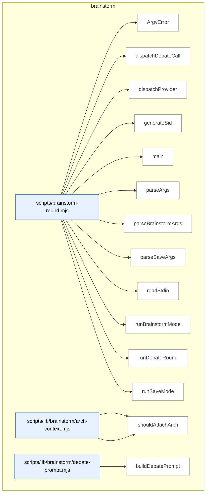

_Domain has 66 symbols (>50). Diagram shows top-15 by file order; see flat table below for the full list._

### Symbols in this domain

| Symbol | Kind | Path | Lines | Purpose | File imported by |
|---|---|---|---|---|---|
| [`ArgvError`](../scripts/brainstorm-round.mjs#L249) | class | `scripts/brainstorm-round.mjs` | 249-251 | Custom error class for argument parsing failures. | _(internal)_ |
| [`dispatchDebateCall`](../scripts/brainstorm-round.mjs#L576) | function | `scripts/brainstorm-round.mjs` | 576-604 | Dispatches a debate call to a provider, reusing round-1 adapters with concatenated debate prompts. | _(internal)_ |
| [`dispatchProvider`](../scripts/brainstorm-round.mjs#L606) | function | `scripts/brainstorm-round.mjs` | 606-653 | <no body> | _(internal)_ |
| [`generateSid`](../scripts/brainstorm-round.mjs#L538) | function | `scripts/brainstorm-round.mjs` | 538-541 | Generates a short, sortable, unique session ID using timestamp base-36 and random hex suffix. | _(internal)_ |
| [`main`](../scripts/brainstorm-round.mjs#L259) | function | `scripts/brainstorm-round.mjs` | 259-286 | Parses CLI arguments, prunes old sessions, and dispatches to brainstorm or save mode. | _(internal)_ |
| [`parseArgs`](../scripts/brainstorm-round.mjs#L84) | function | `scripts/brainstorm-round.mjs` | 84-97 | Detects save mode from argv and delegates to the appropriate parser. | _(internal)_ |
| [`parseBrainstormArgs`](../scripts/brainstorm-round.mjs#L99) | function | `scripts/brainstorm-round.mjs` | 99-198 | <no body> | _(internal)_ |
| [`parseSaveArgs`](../scripts/brainstorm-round.mjs#L200) | function | `scripts/brainstorm-round.mjs` | 200-247 | <no body> | _(internal)_ |
| [`readStdin`](../scripts/brainstorm-round.mjs#L253) | function | `scripts/brainstorm-round.mjs` | 253-257 | Reads all chunks from stdin and returns decoded UTF-8 text. | _(internal)_ |
| [`runBrainstormMode`](../scripts/brainstorm-round.mjs#L288) | function | `scripts/brainstorm-round.mjs` | 288-490 | <no body> | _(internal)_ |
| [`runDebateRound`](../scripts/brainstorm-round.mjs#L543) | function | `scripts/brainstorm-round.mjs` | 543-574 | Runs a debate round where both providers respond to each other's round-1 output. | _(internal)_ |
| [`runSaveMode`](../scripts/brainstorm-round.mjs#L492) | function | `scripts/brainstorm-round.mjs` | 492-536 | Loads topic and insight (supporting stdin variants), validates session/round exist, and saves the insight with tags. | _(internal)_ |
| [`loadArchSection`](../scripts/lib/brainstorm/arch-context.mjs#L84) | function | `scripts/lib/brainstorm/arch-context.mjs` | 84-86 | Loads the architecture section from brainstorm documentation. | `scripts/brainstorm-round.mjs`, `scripts/lib/brainstorm/resume-context.mjs` |
| [`shouldAttachArch`](../scripts/lib/brainstorm/arch-context.mjs#L70) | function | `scripts/lib/brainstorm/arch-context.mjs` | 70-75 | Decides whether to attach architecture context based on explicit flags or intent keywords. | `scripts/brainstorm-round.mjs`, `scripts/lib/brainstorm/resume-context.mjs` |
| [`buildDebatePrompt`](../scripts/lib/brainstorm/debate-prompt.mjs#L51) | function | `scripts/lib/brainstorm/debate-prompt.mjs` | 51-84 | Builds a system and user message for a debate prompt, wrapping untrusted content and assembling segments with validation. | `scripts/brainstorm-round.mjs` |
| [`wrapUntrusted`](../scripts/lib/brainstorm/debate-prompt.mjs#L34) | function | `scripts/lib/brainstorm/debate-prompt.mjs` | 34-37 | Escapes > characters and wraps text in a <<<UNTRUSTED:label>>> container. | `scripts/brainstorm-round.mjs` |
| [`autoPromoteDepth`](../scripts/lib/brainstorm/depth-config.mjs#L44) | function | `scripts/lib/brainstorm/depth-config.mjs` | 44-47 | Auto-promotes depth to 'deep' if the topic matches an architecture intent regex. | `scripts/brainstorm-round.mjs`, `scripts/lib/brainstorm/arch-context.mjs` |
| [`resolveDepth`](../scripts/lib/brainstorm/depth-config.mjs#L59) | function | `scripts/lib/brainstorm/depth-config.mjs` | 59-80 | Resolves depth configuration by checking explicit overrides, auto-promotion, or defaulting to 'standard'. | `scripts/brainstorm-round.mjs`, `scripts/lib/brainstorm/arch-context.mjs` |
| [`forceRelease`](../scripts/lib/brainstorm/file-lock.mjs#L112) | function | `scripts/lib/brainstorm/file-lock.mjs` | 112-180 | Forces deletion of a stale lock file after verifying it's genuinely orphaned and hasn't been updated recently. | `scripts/lib/brainstorm/insight-store.mjs`, `scripts/lib/brainstorm/session-store.mjs`, `scripts/lib/friction/breadcrumb.mjs`, +3 more |
| [`inspectLock`](../scripts/lib/brainstorm/file-lock.mjs#L80) | function | `scripts/lib/brainstorm/file-lock.mjs` | 80-96 | Reads and parses a lock file, returning its state (unreadable, corrupted, or owned with details). | `scripts/lib/brainstorm/insight-store.mjs`, `scripts/lib/brainstorm/session-store.mjs`, `scripts/lib/friction/breadcrumb.mjs`, +3 more |
| [`isPidAlive`](../scripts/lib/brainstorm/file-lock.mjs#L41) | function | `scripts/lib/brainstorm/file-lock.mjs` | 41-48 | Checks whether a process ID is currently alive by attempting to signal it. | `scripts/lib/brainstorm/insight-store.mjs`, `scripts/lib/brainstorm/session-store.mjs`, `scripts/lib/friction/breadcrumb.mjs`, +3 more |
| [`LockTimeoutError`](../scripts/lib/brainstorm/file-lock.mjs#L23) | class | `scripts/lib/brainstorm/file-lock.mjs` | 23-30 | Error class thrown when a file lock cannot be acquired within the timeout period. | `scripts/lib/brainstorm/insight-store.mjs`, `scripts/lib/brainstorm/session-store.mjs`, `scripts/lib/friction/breadcrumb.mjs`, +3 more |
| [`readLockOwnerRaw`](../scripts/lib/brainstorm/file-lock.mjs#L183) | function | `scripts/lib/brainstorm/file-lock.mjs` | 183-189 | Safely reads the owner information from a lock file, returning null if parsing fails. | `scripts/lib/brainstorm/insight-store.mjs`, `scripts/lib/brainstorm/session-store.mjs`, `scripts/lib/friction/breadcrumb.mjs`, +3 more |
| [`safeRelease`](../scripts/lib/brainstorm/file-lock.mjs#L197) | function | `scripts/lib/brainstorm/file-lock.mjs` | 197-214 | Releases a lock file only if the stored token matches the one we hold. | `scripts/lib/brainstorm/insight-store.mjs`, `scripts/lib/brainstorm/session-store.mjs`, `scripts/lib/friction/breadcrumb.mjs`, +3 more |
| [`sleep`](../scripts/lib/brainstorm/file-lock.mjs#L32) | function | `scripts/lib/brainstorm/file-lock.mjs` | 32-32 | <no body> | `scripts/lib/brainstorm/insight-store.mjs`, `scripts/lib/brainstorm/session-store.mjs`, `scripts/lib/friction/breadcrumb.mjs`, +3 more |
| [`tryAcquireLock`](../scripts/lib/brainstorm/file-lock.mjs#L58) | function | `scripts/lib/brainstorm/file-lock.mjs` | 58-68 | Atomically creates a lock file with a random token, returning the token on success or null if the file already exists. | `scripts/lib/brainstorm/insight-store.mjs`, `scripts/lib/brainstorm/session-store.mjs`, `scripts/lib/friction/breadcrumb.mjs`, +3 more |
| [`withFileLock`](../scripts/lib/brainstorm/file-lock.mjs#L227) | function | `scripts/lib/brainstorm/file-lock.mjs` | 227-299 | Acquires an exclusive file lock with retry logic, stale-lock recovery, and timeout handling. | `scripts/lib/brainstorm/insight-store.mjs`, `scripts/lib/brainstorm/session-store.mjs`, `scripts/lib/friction/breadcrumb.mjs`, +3 more |
| [`callGemini`](../scripts/lib/brainstorm/gemini-adapter.mjs#L16) | function | `scripts/lib/brainstorm/gemini-adapter.mjs` | 16-90 | Calls Gemini API with timeout, abort control, and structured response—detects safety blocks, empty responses, and errors. | `scripts/brainstorm-round.mjs` |
| [`classifyError`](../scripts/lib/brainstorm/gemini-adapter.mjs#L92) | function | `scripts/lib/brainstorm/gemini-adapter.mjs` | 92-123 | Classifies Gemini adapter errors into timeout, HTTP error, or malformed categories with appropriate messages. | `scripts/brainstorm-round.mjs` |
| [`client`](../scripts/lib/brainstorm/gemini-adapter.mjs#L6) | function | `scripts/lib/brainstorm/gemini-adapter.mjs` | 6-9 | Lazily initializes and returns a Google Generative AI client singleton. | `scripts/brainstorm-round.mjs` |
| [`isValidSid`](../scripts/lib/brainstorm/id-validator.mjs#L43) | function | `scripts/lib/brainstorm/id-validator.mjs` | 43-45 | Returns whether a given value is a valid session ID without throwing. | `scripts/lib/brainstorm/insight-store.mjs`, `scripts/lib/brainstorm/session-store.mjs` |
| [`validateSid`](../scripts/lib/brainstorm/id-validator.mjs#L25) | function | `scripts/lib/brainstorm/id-validator.mjs` | 25-37 | Validates that a session ID is a non-empty string matching the required format, throwing an error if invalid. | `scripts/lib/brainstorm/insight-store.mjs`, `scripts/lib/brainstorm/session-store.mjs` |
| [`buildInsightFile`](../scripts/lib/brainstorm/insight-store.mjs#L138) | function | `scripts/lib/brainstorm/insight-store.mjs` | 138-153 | Builds a markdown file with YAML frontmatter (validated against schema) and insight text body. | `scripts/brainstorm-round.mjs` |
| [`findExistingSlugForTopic`](../scripts/lib/brainstorm/insight-store.mjs#L98) | function | `scripts/lib/brainstorm/insight-store.mjs` | 98-116 | Finds an existing insights directory slug for a given topic by checking frontmatter topic field. | `scripts/brainstorm-round.mjs` |
| [`listAllInsights`](../scripts/lib/brainstorm/insight-store.mjs#L234) | function | `scripts/lib/brainstorm/insight-store.mjs` | 234-246 | Lists all insights by iterating over non-dotfile directories in the insights root. | `scripts/brainstorm-round.mjs` |
| [`listInsightsByTopic`](../scripts/lib/brainstorm/insight-store.mjs#L216) | function | `scripts/lib/brainstorm/insight-store.mjs` | 216-225 | Lists insights matching a specific topic by finding its slug and reading from that directory. | `scripts/brainstorm-round.mjs` |
| [`parseFrontmatter`](../scripts/lib/brainstorm/insight-store.mjs#L125) | function | `scripts/lib/brainstorm/insight-store.mjs` | 125-132 | Parses YAML frontmatter and body from markdown delimited by `---` markers. | `scripts/brainstorm-round.mjs` |
| [`readInsightsFromDirs`](../scripts/lib/brainstorm/insight-store.mjs#L248) | function | `scripts/lib/brainstorm/insight-store.mjs` | 248-278 | Reads markdown files from insight directories, parses frontmatter, and returns sorted by modification time. | `scripts/brainstorm-round.mjs` |
| [`resolveUniqueSlug`](../scripts/lib/brainstorm/insight-store.mjs#L74) | function | `scripts/lib/brainstorm/insight-store.mjs` | 74-85 | Allocates a unique slug by appending numeric suffixes until no directory exists. | `scripts/brainstorm-round.mjs` |
| [`rootDir`](../scripts/lib/brainstorm/insight-store.mjs#L34) | function | `scripts/lib/brainstorm/insight-store.mjs` | 34-36 | Returns the insights directory path, using an override or falling back to the default. | `scripts/brainstorm-round.mjs` |
| [`saveInsight`](../scripts/lib/brainstorm/insight-store.mjs#L162) | function | `scripts/lib/brainstorm/insight-store.mjs` | 162-205 | Saves an insight file under a topic slug with idempotency checks and concurrent slug allocation safety. | `scripts/brainstorm-round.mjs` |
| [`shortHash`](../scripts/lib/brainstorm/insight-store.mjs#L39) | function | `scripts/lib/brainstorm/insight-store.mjs` | 39-41 | Computes a 16-character SHA256 hash of pipe-separated parts. | `scripts/brainstorm-round.mjs` |
| [`slugifyTopic`](../scripts/lib/brainstorm/insight-store.mjs#L57) | function | `scripts/lib/brainstorm/insight-store.mjs` | 57-63 | Converts a topic to a lowercase slug by removing non-alphanumeric characters and truncating. | `scripts/brainstorm-round.mjs` |
| [`tsStamp`](../scripts/lib/brainstorm/insight-store.mjs#L43) | function | `scripts/lib/brainstorm/insight-store.mjs` | 43-48 | Generates a UTC timestamp string in YYYYMMDD-HHMMSS format. | `scripts/brainstorm-round.mjs` |
| [`callOpenAI`](../scripts/lib/brainstorm/openai-adapter.mjs#L23) | function | `scripts/lib/brainstorm/openai-adapter.mjs` | 23-96 | Calls OpenAI chat API with timeout, abort control, and structured response—detects content filters, empty responses, and errors. | `scripts/brainstorm-round.mjs`, `scripts/lib/requirements/extract.mjs`, `scripts/lib/requirements/gap-challenge.mjs` |
| [`classifyError`](../scripts/lib/brainstorm/openai-adapter.mjs#L98) | function | `scripts/lib/brainstorm/openai-adapter.mjs` | 98-127 | Classifies OpenAI adapter errors into timeout, HTTP error, or malformed categories with appropriate messages. | `scripts/brainstorm-round.mjs`, `scripts/lib/requirements/extract.mjs`, `scripts/lib/requirements/gap-challenge.mjs` |
| [`client`](../scripts/lib/brainstorm/openai-adapter.mjs#L6) | function | `scripts/lib/brainstorm/openai-adapter.mjs` | 6-9 | Lazily initializes and returns an OpenAI client singleton. | `scripts/brainstorm-round.mjs`, `scripts/lib/requirements/extract.mjs`, `scripts/lib/requirements/gap-challenge.mjs` |
| [`estimateCostUsd`](../scripts/lib/brainstorm/pricing.mjs#L38) | function | `scripts/lib/brainstorm/pricing.mjs` | 38-41 | Estimates USD cost for a generation based on input/output token counts and looked-up model pricing. | `scripts/brainstorm-round.mjs`, `scripts/lib/brainstorm/gemini-adapter.mjs`, `scripts/lib/brainstorm/openai-adapter.mjs` |
| [`preflightEstimateUsd`](../scripts/lib/brainstorm/pricing.mjs#L47) | function | `scripts/lib/brainstorm/pricing.mjs` | 47-50 | Pre-estimates USD cost for a hypothetical generation from input character count and maximum output tokens. | `scripts/brainstorm-round.mjs`, `scripts/lib/brainstorm/gemini-adapter.mjs`, `scripts/lib/brainstorm/openai-adapter.mjs` |
| [`priceFor`](../scripts/lib/brainstorm/pricing.mjs#L24) | function | `scripts/lib/brainstorm/pricing.mjs` | 24-31 | Looks up price rates for a model ID, with prefix fallback to FALLBACK rate if exact match not found. | `scripts/brainstorm-round.mjs`, `scripts/lib/brainstorm/gemini-adapter.mjs`, `scripts/lib/brainstorm/openai-adapter.mjs` |
| [`estimateTokens`](../scripts/lib/brainstorm/provider-limits.mjs#L20) | function | `scripts/lib/brainstorm/provider-limits.mjs` | 20-22 | Estimates tokens from text length using a 4-character-per-token approximation. | `scripts/lib/brainstorm/resume-context.mjs` |
| [`getCeilingTokens`](../scripts/lib/brainstorm/provider-limits.mjs#L72) | function | `scripts/lib/brainstorm/provider-limits.mjs` | 72-83 | Returns the input ceiling token count for a provider and optional model sentinel. | `scripts/lib/brainstorm/resume-context.mjs` |
| [`smallestCeilingTokens`](../scripts/lib/brainstorm/provider-limits.mjs#L93) | function | `scripts/lib/brainstorm/provider-limits.mjs` | 93-105 | Finds the smallest input ceiling across multiple provider–model pairs. | `scripts/lib/brainstorm/resume-context.mjs` |
| [`assembleResumeContext`](../scripts/lib/brainstorm/resume-context.mjs#L75) | function | `scripts/lib/brainstorm/resume-context.mjs` | 75-233 | Assembles resume context by allocating and truncating three independent budgets (arch, with-context, resume). | `scripts/brainstorm-round.mjs` |
| [`buildArchBlock`](../scripts/lib/brainstorm/resume-context.mjs#L43) | function | `scripts/lib/brainstorm/resume-context.mjs` | 43-58 | Wraps architecture context text with markers and truncates to fit a token budget. | `scripts/brainstorm-round.mjs` |
| [`appendQuarantine`](../scripts/lib/brainstorm/session-store.mjs#L228) | function | `scripts/lib/brainstorm/session-store.mjs` | 228-255 | Appends invalid lines to a quarantine file with best-effort atomic writes and size trimming. | `scripts/brainstorm-round.mjs`, `scripts/lib/brainstorm/resume-context.mjs` |
| [`appendSession`](../scripts/lib/brainstorm/session-store.mjs#L76) | function | `scripts/lib/brainstorm/session-store.mjs` | 76-113 | Appends a validated brainstorm envelope to a session file with automatic round numbering, filtering corrupted entries. | `scripts/brainstorm-round.mjs`, `scripts/lib/brainstorm/resume-context.mjs` |
| [`loadSession`](../scripts/lib/brainstorm/session-store.mjs#L149) | function | `scripts/lib/brainstorm/session-store.mjs` | 149-226 | Loads and validates all rounds from a session file, quarantining invalid JSON and schema violations. | `scripts/brainstorm-round.mjs`, `scripts/lib/brainstorm/resume-context.mjs` |
| [`lockPath`](../scripts/lib/brainstorm/session-store.mjs#L35) | function | `scripts/lib/brainstorm/session-store.mjs` | 35-37 | Returns the lock file path for a given session ID. | `scripts/brainstorm-round.mjs`, `scripts/lib/brainstorm/resume-context.mjs` |
| [`normalizeArchFields`](../scripts/lib/brainstorm/session-store.mjs#L140) | function | `scripts/lib/brainstorm/session-store.mjs` | 140-147 | Sets default values for architecture context fields in an envelope. | `scripts/brainstorm-round.mjs`, `scripts/lib/brainstorm/resume-context.mjs` |
| [`pruneOldSessions`](../scripts/lib/brainstorm/session-store.mjs#L287) | function | `scripts/lib/brainstorm/session-store.mjs` | 287-329 | Deletes session files older than a specified age, using a sentinel to throttle pruning runs. | `scripts/brainstorm-round.mjs`, `scripts/lib/brainstorm/resume-context.mjs` |
| [`quarantinePath`](../scripts/lib/brainstorm/session-store.mjs#L39) | function | `scripts/lib/brainstorm/session-store.mjs` | 39-41 | Returns the quarantine file path for a given session ID. | `scripts/brainstorm-round.mjs`, `scripts/lib/brainstorm/resume-context.mjs` |
| [`readLinesUnvalidated`](../scripts/lib/brainstorm/session-store.mjs#L52) | function | `scripts/lib/brainstorm/session-store.mjs` | 52-66 | Reads JSON lines from a session file, parsing each line and assigning round numbers, quarantining parse errors. | `scripts/brainstorm-round.mjs`, `scripts/lib/brainstorm/resume-context.mjs` |
| [`sessionDir`](../scripts/lib/brainstorm/session-store.mjs#L27) | function | `scripts/lib/brainstorm/session-store.mjs` | 27-29 | Returns the session directory path, using an override or falling back to the default. | `scripts/brainstorm-round.mjs`, `scripts/lib/brainstorm/resume-context.mjs` |
| [`sessionPath`](../scripts/lib/brainstorm/session-store.mjs#L31) | function | `scripts/lib/brainstorm/session-store.mjs` | 31-33 | Returns the JSONL session file path for a given session ID. | `scripts/brainstorm-round.mjs`, `scripts/lib/brainstorm/resume-context.mjs` |
| [`summariseRound`](../scripts/lib/brainstorm/session-store.mjs#L264) | function | `scripts/lib/brainstorm/session-store.mjs` | 264-272 | Formats a brainstorm round as a human-readable summary with topic and provider outputs. | `scripts/brainstorm-round.mjs`, `scripts/lib/brainstorm/resume-context.mjs` |

---

## claude-hooks

> Quick-fix pattern detection via Claude Code hooks, flagging mechanical shortcuts (TODOs, magic numbers, hardcoded URLs, empty catch blocks) at edit time with per-line suppression and sensitive-path filtering.

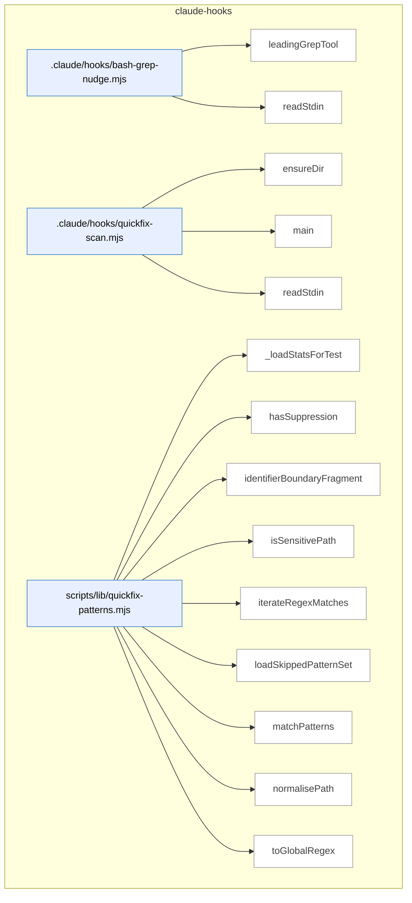

### Symbols in this domain

| Symbol | Kind | Path | Lines | Purpose | File imported by |
|---|---|---|---|---|---|
| [`leadingGrepTool`](../.claude/hooks/bash-grep-nudge.mjs#L24) | function | `.claude/hooks/bash-grep-nudge.mjs` | 24-28 | Extracts the leading grep-like command name (grep, rg, egrep, fgrep) from a shell command string. | _(internal)_ |
| [`readStdin`](../.claude/hooks/bash-grep-nudge.mjs#L18) | function | `.claude/hooks/bash-grep-nudge.mjs` | 18-22 | Reads all stdin data into a buffer and returns it as a UTF-8 string. | _(internal)_ |
| [`ensureDir`](../.claude/hooks/quickfix-scan.mjs#L38) | function | `.claude/hooks/quickfix-scan.mjs` | 38-41 | Creates a directory recursively, silently ignoring EEXIST errors. | _(internal)_ |
| [`main`](../.claude/hooks/quickfix-scan.mjs#L43) | function | `.claude/hooks/quickfix-scan.mjs` | 43-168 | Parses a tool-invocation payload, extracts file path and diff content, filters by extension and sensitivity, then canonicalizes the path for pattern scanning. | _(internal)_ |
| [`readStdin`](../.claude/hooks/quickfix-scan.mjs#L32) | function | `.claude/hooks/quickfix-scan.mjs` | 32-36 | Reads stdin as a complete UTF-8 string via async iteration and buffering. | _(internal)_ |
| [`_loadStatsForTest`](../scripts/lib/quickfix-patterns.mjs#L521) | function | `scripts/lib/quickfix-patterns.mjs` | 521-526 | Test helper that loads and parses pattern statistics from a cache file, returning null on any error. | `scripts/lib/audit/finding-verification.mjs`, `scripts/lib/repo-inventory.mjs` |
| [`hasSuppression`](../scripts/lib/quickfix-patterns.mjs#L270) | function | `scripts/lib/quickfix-patterns.mjs` | 270-274 | Tests a line against the extension-specific suppression comment regex. | `scripts/lib/audit/finding-verification.mjs`, `scripts/lib/repo-inventory.mjs` |
| [`identifierBoundaryFragment`](../scripts/lib/quickfix-patterns.mjs#L52) | function | `scripts/lib/quickfix-patterns.mjs` | 52-56 | Generates a regex fragment matching identifiers with word-boundary variations (camelCase, snake_case, space-separated). | `scripts/lib/audit/finding-verification.mjs`, `scripts/lib/repo-inventory.mjs` |
| [`isSensitivePath`](../scripts/lib/quickfix-patterns.mjs#L258) | function | `scripts/lib/quickfix-patterns.mjs` | 258-260 | Checks whether a file path is classified as sensitive and should skip scanning. | `scripts/lib/audit/finding-verification.mjs`, `scripts/lib/repo-inventory.mjs` |
| [`iterateRegexMatches`](../scripts/lib/quickfix-patterns.mjs#L303) | function | `scripts/lib/quickfix-patterns.mjs` | 303-310 | Generator yielding successive regex matches with zero-length-match safety (advances lastIndex by 1 when match is empty). | `scripts/lib/audit/finding-verification.mjs`, `scripts/lib/repo-inventory.mjs` |
| [`loadSkippedPatternSet`](../scripts/lib/quickfix-patterns.mjs#L492) | function | `scripts/lib/quickfix-patterns.mjs` | 492-514 | Loads low-confidence patterns from the learning cache based on acceptance-rate thresholds and hit counts. | `scripts/lib/audit/finding-verification.mjs`, `scripts/lib/repo-inventory.mjs` |
| [`matchPatterns`](../scripts/lib/quickfix-patterns.mjs#L336) | function | `scripts/lib/quickfix-patterns.mjs` | 336-457 | Scans diff text for quick-fix patterns while enforcing size caps, sensitive-path exclusion, and per-line suppression comments. | `scripts/lib/audit/finding-verification.mjs`, `scripts/lib/repo-inventory.mjs` |
| [`normalisePath`](../scripts/lib/quickfix-patterns.mjs#L245) | function | `scripts/lib/quickfix-patterns.mjs` | 245-247 | Normalizes file paths to canonical (Windows-compatible, lowercase) form. | `scripts/lib/audit/finding-verification.mjs`, `scripts/lib/repo-inventory.mjs` |
| [`toGlobalRegex`](../scripts/lib/quickfix-patterns.mjs#L288) | function | `scripts/lib/quickfix-patterns.mjs` | 288-291 | Ensures a regex has the global 'g' flag, adding it if absent. | `scripts/lib/audit/finding-verification.mjs`, `scripts/lib/repo-inventory.mjs` |

---

## claudemd-management

> The `claudemd-management` domain scans repositories for instruction files (CLAUDE.md, SKILL.md, etc.), detects duplicate content across documents using token-based similarity analysis, and automatically removes stale markdown links while preserving embedded references.

```mermaid
flowchart TB
subgraph dom_claudemd_management ["claudemd-management"]
  file_scripts_lib_claudemd_autofix_mjs["scripts/lib/claudemd/autofix.mjs"]:::component
  sym_scripts_lib_claudemd_autofix_mjs_applyFi["applyFixes"]:::symbol
  file_scripts_lib_claudemd_autofix_mjs --> sym_scripts_lib_claudemd_autofix_mjs_applyFi
  file_scripts_lib_claudemd_doc_similarity_mjs["scripts/lib/claudemd/doc-similarity.mjs"]:::component
  sym_scripts_lib_claudemd_doc_similarity_mjs_["extractParagraphs"]:::symbol
  file_scripts_lib_claudemd_doc_similarity_mjs --> sym_scripts_lib_claudemd_doc_similarity_mjs_
  sym_scripts_lib_claudemd_doc_similarity_mjs_["findSimilarParagraphs"]:::symbol
  file_scripts_lib_claudemd_doc_similarity_mjs --> sym_scripts_lib_claudemd_doc_similarity_mjs_
  sym_scripts_lib_claudemd_doc_similarity_mjs_["jaccardSimilarity"]:::symbol
  file_scripts_lib_claudemd_doc_similarity_mjs --> sym_scripts_lib_claudemd_doc_similarity_mjs_
  sym_scripts_lib_claudemd_doc_similarity_mjs_["normalizeMarkdown"]:::symbol
  file_scripts_lib_claudemd_doc_similarity_mjs --> sym_scripts_lib_claudemd_doc_similarity_mjs_
  sym_scripts_lib_claudemd_doc_similarity_mjs_["tokenize"]:::symbol
  file_scripts_lib_claudemd_doc_similarity_mjs --> sym_scripts_lib_claudemd_doc_similarity_mjs_
  file_scripts_lib_claudemd_file_scanner_mjs["scripts/lib/claudemd/file-scanner.mjs"]:::component
  sym_scripts_lib_claudemd_file_scanner_mjs_ma["matchPattern"]:::symbol
  file_scripts_lib_claudemd_file_scanner_mjs --> sym_scripts_lib_claudemd_file_scanner_mjs_ma
  sym_scripts_lib_claudemd_file_scanner_mjs_sc["scanInstructionFiles"]:::symbol
  file_scripts_lib_claudemd_file_scanner_mjs --> sym_scripts_lib_claudemd_file_scanner_mjs_sc
  sym_scripts_lib_claudemd_file_scanner_mjs_wa["walkDir"]:::symbol
  file_scripts_lib_claudemd_file_scanner_mjs --> sym_scripts_lib_claudemd_file_scanner_mjs_wa
  file_scripts_lib_claudemd_ref_checker_mjs["scripts/lib/claudemd/ref-checker.mjs"]:::component
  sym_scripts_lib_claudemd_ref_checker_mjs_bui["buildEnvVarIndex"]:::symbol
  file_scripts_lib_claudemd_ref_checker_mjs --> sym_scripts_lib_claudemd_ref_checker_mjs_bui
  sym_scripts_lib_claudemd_ref_checker_mjs_bui["buildFunctionIndex"]:::symbol
  file_scripts_lib_claudemd_ref_checker_mjs --> sym_scripts_lib_claudemd_ref_checker_mjs_bui
  sym_scripts_lib_claudemd_ref_checker_mjs_ext["extractEnvVarRefs"]:::symbol
  file_scripts_lib_claudemd_ref_checker_mjs --> sym_scripts_lib_claudemd_ref_checker_mjs_ext
  sym_scripts_lib_claudemd_ref_checker_mjs_ext["extractFileRefs"]:::symbol
  file_scripts_lib_claudemd_ref_checker_mjs --> sym_scripts_lib_claudemd_ref_checker_mjs_ext
  sym_scripts_lib_claudemd_ref_checker_mjs_ext["extractFunctionRefs"]:::symbol
  file_scripts_lib_claudemd_ref_checker_mjs --> sym_scripts_lib_claudemd_ref_checker_mjs_ext
  sym_scripts_lib_claudemd_ref_checker_mjs_res["resolveReferencedPath"]:::symbol
  file_scripts_lib_claudemd_ref_checker_mjs --> sym_scripts_lib_claudemd_ref_checker_mjs_res
  file_scripts_lib_claudemd_rules_mjs["scripts/lib/claudemd/rules.mjs"]:::component
  sym_scripts_lib_claudemd_rules_mjs_checkClau["checkClaudeAgentsSync"]:::symbol
  file_scripts_lib_claudemd_rules_mjs --> sym_scripts_lib_claudemd_rules_mjs_checkClau
  sym_scripts_lib_claudemd_rules_mjs_checkCros["checkCrossFileDuplication"]:::symbol
  file_scripts_lib_claudemd_rules_mjs --> sym_scripts_lib_claudemd_rules_mjs_checkCros
  sym_scripts_lib_claudemd_rules_mjs_checkDeep["checkDeepCodeDetail"]:::symbol
  file_scripts_lib_claudemd_rules_mjs --> sym_scripts_lib_claudemd_rules_mjs_checkDeep
  sym_scripts_lib_claudemd_rules_mjs_checkSize["checkSize"]:::symbol
  file_scripts_lib_claudemd_rules_mjs --> sym_scripts_lib_claudemd_rules_mjs_checkSize
  sym_scripts_lib_claudemd_rules_mjs_checkStal["checkStaleEnvVarRefs"]:::symbol
  file_scripts_lib_claudemd_rules_mjs --> sym_scripts_lib_claudemd_rules_mjs_checkStal
  sym_scripts_lib_claudemd_rules_mjs_checkStal["checkStaleFileRefs"]:::symbol
  file_scripts_lib_claudemd_rules_mjs --> sym_scripts_lib_claudemd_rules_mjs_checkStal
  sym_scripts_lib_claudemd_rules_mjs_checkStal["checkStaleFunctionRefs"]:::symbol
  file_scripts_lib_claudemd_rules_mjs --> sym_scripts_lib_claudemd_rules_mjs_checkStal
  sym_scripts_lib_claudemd_rules_mjs_extractHe["extractHeadings"]:::symbol
  file_scripts_lib_claudemd_rules_mjs --> sym_scripts_lib_claudemd_rules_mjs_extractHe
  sym_scripts_lib_claudemd_rules_mjs_runRules["runRules"]:::symbol
  file_scripts_lib_claudemd_rules_mjs --> sym_scripts_lib_claudemd_rules_mjs_runRules
  sym_scripts_lib_claudemd_rules_mjs_semanticI["semanticId"]:::symbol
  file_scripts_lib_claudemd_rules_mjs --> sym_scripts_lib_claudemd_rules_mjs_semanticI
  file_scripts_lib_claudemd_sarif_formatter_mjs["scripts/lib/claudemd/sarif-formatter.mjs"]:::component
  sym_scripts_lib_claudemd_sarif_formatter_mjs["buildRuleDescriptors"]:::symbol
  file_scripts_lib_claudemd_sarif_formatter_mjs --> sym_scripts_lib_claudemd_sarif_formatter_mjs
  sym_scripts_lib_claudemd_sarif_formatter_mjs["ruleDescription"]:::symbol
  file_scripts_lib_claudemd_sarif_formatter_mjs --> sym_scripts_lib_claudemd_sarif_formatter_mjs
  sym_scripts_lib_claudemd_sarif_formatter_mjs["sarifLevel"]:::symbol
  file_scripts_lib_claudemd_sarif_formatter_mjs --> sym_scripts_lib_claudemd_sarif_formatter_mjs
  sym_scripts_lib_claudemd_sarif_formatter_mjs["toSarif"]:::symbol
  file_scripts_lib_claudemd_sarif_formatter_mjs --> sym_scripts_lib_claudemd_sarif_formatter_mjs
  file_scripts_lib_claudemd_step65_hook_mjs["scripts/lib/claudemd/step65-hook.mjs"]:::component
  sym_scripts_lib_claudemd_step65_hook_mjs_run["runHygieneCheck"]:::symbol
  file_scripts_lib_claudemd_step65_hook_mjs --> sym_scripts_lib_claudemd_step65_hook_mjs_run
end
classDef container fill:#f5f5f5,stroke:#333,stroke-width:2px,color:#000
classDef component fill:#e8f0ff,stroke:#3178c6,color:#000
classDef symbol fill:#fff,stroke:#999,color:#444
classDef dup fill:#ffe8d8,stroke:#c0392b,stroke-width:2px,color:#000
classDef violation fill:#ffd6d6,stroke:#c0392b,stroke-width:2px,color:#000
```

### Symbols in this domain

| Symbol | Kind | Path | Lines | Purpose | File imported by |
|---|---|---|---|---|---|
| [`applyFixes`](../scripts/lib/claudemd/autofix.mjs#L16) | function | `scripts/lib/claudemd/autofix.mjs` | 16-76 | Applies automatic fixes to audit findings—removes stale standalone markdown links from files in place or as dry-run, skipping embedded references. | `scripts/claudemd-lint.mjs` |
| [`extractParagraphs`](../scripts/lib/claudemd/doc-similarity.mjs#L68) | function | `scripts/lib/claudemd/doc-similarity.mjs` | 68-103 | Extracts paragraphs from markdown content, skipping code blocks and preserving line numbers for each paragraph. | `scripts/lib/claudemd/rules.mjs` |
| [`findSimilarParagraphs`](../scripts/lib/claudemd/doc-similarity.mjs#L114) | function | `scripts/lib/claudemd/doc-similarity.mjs` | 114-146 | Finds similar paragraph pairs across two documents using Jaccard token similarity above a threshold. | `scripts/lib/claudemd/rules.mjs` |
| [`jaccardSimilarity`](../scripts/lib/claudemd/doc-similarity.mjs#L53) | function | `scripts/lib/claudemd/doc-similarity.mjs` | 53-61 | Computes Jaccard similarity between two token sets (intersection over union). | `scripts/lib/claudemd/rules.mjs` |
| [`normalizeMarkdown`](../scripts/lib/claudemd/doc-similarity.mjs#L24) | function | `scripts/lib/claudemd/doc-similarity.mjs` | 24-34 | Normalizes markdown by stripping links, code, formatting markers, and headings, then lowercasing for similarity comparison. | `scripts/lib/claudemd/rules.mjs` |
| [`tokenize`](../scripts/lib/claudemd/doc-similarity.mjs#L41) | function | `scripts/lib/claudemd/doc-similarity.mjs` | 41-45 | Tokenizes normalized text into a set of words (2+ chars, excluding stopwords) for document similarity analysis. | `scripts/lib/claudemd/rules.mjs` |
| [`matchPattern`](../scripts/lib/claudemd/file-scanner.mjs#L72) | function | `scripts/lib/claudemd/file-scanner.mjs` | 72-93 | Matches a file path against a glob-style pattern supporting `**/` anywhere matching and `*` single-segment wildcards. | `scripts/check-context-drift.mjs`, `scripts/claudemd-lint.mjs`, `scripts/lib/claudemd/ref-checker.mjs` |
| [`scanInstructionFiles`](../scripts/lib/claudemd/file-scanner.mjs#L102) | function | `scripts/lib/claudemd/file-scanner.mjs` | 102-133 | Scans a repo for instruction files (CLAUDE.md, AGENTS.md, SKILL.md) with customizable exclusions, returning file content and metadata. | `scripts/check-context-drift.mjs`, `scripts/claudemd-lint.mjs`, `scripts/lib/claudemd/ref-checker.mjs` |
| [`walkDir`](../scripts/lib/claudemd/file-scanner.mjs#L30) | function | `scripts/lib/claudemd/file-scanner.mjs` | 30-68 | Recursively walks a directory to find files matching instruction file patterns (e.g., CLAUDE.md, SKILL.md), excluding specified directories. | `scripts/check-context-drift.mjs`, `scripts/claudemd-lint.mjs`, `scripts/lib/claudemd/ref-checker.mjs` |
| [`buildEnvVarIndex`](../scripts/lib/claudemd/ref-checker.mjs#L194) | function | `scripts/lib/claudemd/ref-checker.mjs` | 194-235 | Builds an index of environment variables from .env.example and process.env/os.environ references in source code. | `scripts/lib/claudemd/rules.mjs` |
| [`buildFunctionIndex`](../scripts/lib/claudemd/ref-checker.mjs#L91) | function | `scripts/lib/claudemd/ref-checker.mjs` | 91-124 | Indexes exported functions and classes from all source code files (JS/TS/Python) across the repo. | `scripts/lib/claudemd/rules.mjs` |
| [`extractEnvVarRefs`](../scripts/lib/claudemd/ref-checker.mjs#L165) | function | `scripts/lib/claudemd/ref-checker.mjs` | 165-187 | Extracts environment variable references (ALL_CAPS_WITH_UNDERSCORES pattern) from backtick-quoted text in markdown. | `scripts/lib/claudemd/rules.mjs` |
| [`extractFileRefs`](../scripts/lib/claudemd/ref-checker.mjs#L52) | function | `scripts/lib/claudemd/ref-checker.mjs` | 52-84 | Extracts file references from markdown (link hrefs and backtick paths) while skipping code blocks. | `scripts/lib/claudemd/rules.mjs` |
| [`extractFunctionRefs`](../scripts/lib/claudemd/ref-checker.mjs#L132) | function | `scripts/lib/claudemd/ref-checker.mjs` | 132-158 | Extracts function and class name references from backtick-quoted identifiers in markdown while skipping code blocks. | `scripts/lib/claudemd/rules.mjs` |
| [`resolveReferencedPath`](../scripts/lib/claudemd/ref-checker.mjs#L25) | function | `scripts/lib/claudemd/ref-checker.mjs` | 25-44 | Resolves a markdown link target to an absolute repo path, skipping external URLs and rejecting paths escaping the repo root. | `scripts/lib/claudemd/rules.mjs` |
| [`checkClaudeAgentsSync`](../scripts/lib/claudemd/rules.mjs#L234) | function | `scripts/lib/claudemd/rules.mjs` | 234-271 | Finds conflicting headings between CLAUDE.md and AGENTS.md files. | `scripts/claudemd-lint.mjs` |
| [`checkCrossFileDuplication`](../scripts/lib/claudemd/rules.mjs#L203) | function | `scripts/lib/claudemd/rules.mjs` | 203-232 | Detects duplicate paragraphs across files in the same directory tree. | `scripts/claudemd-lint.mjs` |
| [`checkDeepCodeDetail`](../scripts/lib/claudemd/rules.mjs#L186) | function | `scripts/lib/claudemd/rules.mjs` | 186-201 | Flags files with too many fenced code blocks in instruction documents. | `scripts/claudemd-lint.mjs` |
| [`checkSize`](../scripts/lib/claudemd/rules.mjs#L108) | function | `scripts/lib/claudemd/rules.mjs` | 108-122 | Checks if a documentation file exceeds a configured byte limit and reports a non-fixable finding if so. | `scripts/claudemd-lint.mjs` |
| [`checkStaleEnvVarRefs`](../scripts/lib/claudemd/rules.mjs#L168) | function | `scripts/lib/claudemd/rules.mjs` | 168-184 | Checks markdown environment variable references against an index and reports undefined variables. | `scripts/claudemd-lint.mjs` |
| [`checkStaleFileRefs`](../scripts/lib/claudemd/rules.mjs#L124) | function | `scripts/lib/claudemd/rules.mjs` | 124-142 | Checks markdown file references for existence and reports stale/missing file findings with fixable flag. | `scripts/claudemd-lint.mjs` |
| [`checkStaleFunctionRefs`](../scripts/lib/claudemd/rules.mjs#L144) | function | `scripts/lib/claudemd/rules.mjs` | 144-166 | Checks markdown function/class name references against an index and reports undefined references. | `scripts/claudemd-lint.mjs` |
| [`extractHeadings`](../scripts/lib/claudemd/rules.mjs#L278) | function | `scripts/lib/claudemd/rules.mjs` | 278-302 | Extracts markdown headings and their content into a Map. | `scripts/claudemd-lint.mjs` |
| [`runRules`](../scripts/lib/claudemd/rules.mjs#L44) | function | `scripts/lib/claudemd/rules.mjs` | 44-106 | Runs a suite of claudemd hygiene rules against documentation files, building indexes once and checking size, stale refs, and deep code detail. | `scripts/claudemd-lint.mjs` |
| [`semanticId`](../scripts/lib/claudemd/rules.mjs#L17) | function | `scripts/lib/claudemd/rules.mjs` | 17-22 | Generates a deterministic semantic ID for a finding by hashing rule, file path, and normalized content. | `scripts/claudemd-lint.mjs` |
| [`buildRuleDescriptors`](../scripts/lib/claudemd/sarif-formatter.mjs#L49) | function | `scripts/lib/claudemd/sarif-formatter.mjs` | 49-62 | Deduplicates and formats rule descriptors for SARIF output. | `scripts/check-context-drift.mjs`, `scripts/check-model-freshness.mjs`, `scripts/claudemd-lint.mjs` |
| [`ruleDescription`](../scripts/lib/claudemd/sarif-formatter.mjs#L64) | function | `scripts/lib/claudemd/sarif-formatter.mjs` | 64-77 | Returns human-readable descriptions for each linting rule ID. | `scripts/check-context-drift.mjs`, `scripts/check-model-freshness.mjs`, `scripts/claudemd-lint.mjs` |
| [`sarifLevel`](../scripts/lib/claudemd/sarif-formatter.mjs#L40) | function | `scripts/lib/claudemd/sarif-formatter.mjs` | 40-47 | Maps severity levels to SARIF-compatible level strings. | `scripts/check-context-drift.mjs`, `scripts/check-model-freshness.mjs`, `scripts/claudemd-lint.mjs` |
| [`toSarif`](../scripts/lib/claudemd/sarif-formatter.mjs#L11) | function | `scripts/lib/claudemd/sarif-formatter.mjs` | 11-38 | Converts linting findings into SARIF format for tool integration. | `scripts/check-context-drift.mjs`, `scripts/check-model-freshness.mjs`, `scripts/claudemd-lint.mjs` |
| [`runHygieneCheck`](../scripts/lib/claudemd/step65-hook.mjs#L16) | function | `scripts/lib/claudemd/step65-hook.mjs` | 16-65 | Executes the linter subprocess and parses results into a summary report. | _(internal)_ |

---

## cross-skill-bridge

> CLI argument parser and learning-store bridge for skill commands. Extracts JSON payloads, git context, and repo identity, then upserts plans, regression specs, and audit correlations to Postgres.

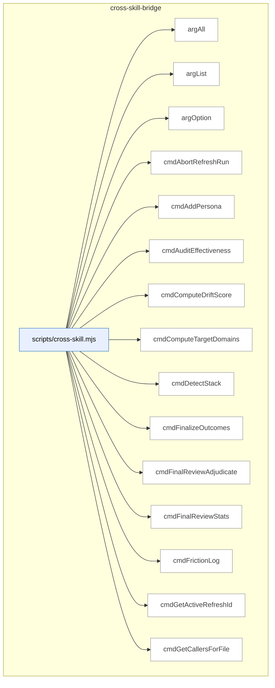

_Domain has 68 symbols (>50). Diagram shows top-15 by file order; see flat table below for the full list._

### Symbols in this domain

| Symbol | Kind | Path | Lines | Purpose | File imported by |
|---|---|---|---|---|---|
| [`argAll`](../scripts/cross-skill.mjs#L138) | function | `scripts/cross-skill.mjs` | 138-144 | Retrieves all occurrences of a named command-line option as an array. | _(internal)_ |
| [`argList`](../scripts/cross-skill.mjs#L132) | function | `scripts/cross-skill.mjs` | 132-135 | Retrieves a comma-separated list of values for a named command-line option. | _(internal)_ |
| [`argOption`](../scripts/cross-skill.mjs#L125) | function | `scripts/cross-skill.mjs` | 125-129 | Retrieves a single value for a named command-line option. | _(internal)_ |
| [`cmdAbortRefreshRun`](../scripts/cross-skill.mjs#L1273) | function | `scripts/cross-skill.mjs` | 1273-1283 | Cancels an in-flight symbol index refresh run. | _(internal)_ |
| [`cmdAddPersona`](../scripts/cross-skill.mjs#L677) | function | `scripts/cross-skill.mjs` | 677-689 | Creates or updates a persona definition. | _(internal)_ |
| [`cmdAuditEffectiveness`](../scripts/cross-skill.mjs#L523) | function | `scripts/cross-skill.mjs` | 523-530 | Fetches gate-blocking findings for a repo. | _(internal)_ |
| [`cmdComputeDriftScore`](../scripts/cross-skill.mjs#L1377) | function | `scripts/cross-skill.mjs` | 1377-1388 | Calculates how far observed imports diverge from declared architecture. | _(internal)_ |
| [`cmdComputeTargetDomains`](../scripts/cross-skill.mjs#L1132) | function | `scripts/cross-skill.mjs` | 1132-1144 | Classifies target files by architectural domain (system/feature/infrastructure). | _(internal)_ |
| [`cmdDetectStack`](../scripts/cross-skill.mjs#L978) | function | `scripts/cross-skill.mjs` | 978-995 | Detects repository tech stack (languages, frameworks, environment manager). | _(internal)_ |
| [`cmdFinalizeOutcomes`](../scripts/cross-skill.mjs#L579) | function | `scripts/cross-skill.mjs` | 579-647 | Finalizes audit outcomes by enriching findings with ledger rulings and persisting to cloud/local. | _(internal)_ |
| [`cmdFinalReviewAdjudicate`](../scripts/cross-skill.mjs#L543) | function | `scripts/cross-skill.mjs` | 543-557 | Accepts or dismisses a shadow final-review finding. | _(internal)_ |
| [`cmdFinalReviewStats`](../scripts/cross-skill.mjs#L534) | function | `scripts/cross-skill.mjs` | 534-541 | Retrieves adjudication stats for shadow final-review A/B experiments. | _(internal)_ |
| [`cmdFrictionLog`](../scripts/cross-skill.mjs#L1502) | function | `scripts/cross-skill.mjs` | 1502-1507 | Logs identified code friction points to persistent ledger. | _(internal)_ |
| [`cmdGetActiveRefreshId`](../scripts/cross-skill.mjs#L1015) | function | `scripts/cross-skill.mjs` | 1015-1031 | Retrieves active symbol index snapshot metadata (refresh ID, embedding model, dimension). | _(internal)_ |
| [`cmdGetCallersForFile`](../scripts/cross-skill.mjs#L1146) | function | `scripts/cross-skill.mjs` | 1146-1209 | Queries all symbols that import a given symbol from the dependency graph. | _(internal)_ |
| [`cmdGetFrictionNeighbourhood`](../scripts/cross-skill.mjs#L1121) | function | `scripts/cross-skill.mjs` | 1121-1130 | Finds similar existing friction items in the learning store. | _(internal)_ |
| [`cmdGetIncidentNeighbourhood`](../scripts/cross-skill.mjs#L1033) | function | `scripts/cross-skill.mjs` | 1033-1063 | Fetches similar past security incidents for a changed file. | _(internal)_ |
| [`cmdGetNeighbourhood`](../scripts/cross-skill.mjs#L1211) | function | `scripts/cross-skill.mjs` | 1211-1239 | Finds similar/reusable existing symbols for target files. | _(internal)_ |
| [`cmdGetPersonaSessionsByRepo`](../scripts/cross-skill.mjs#L762) | function | `scripts/cross-skill.mjs` | 762-790 | Retrieves persona findings from a repo with optional severity/selection filters. | _(internal)_ |
| [`cmdGetPersonaSessionsByUrl`](../scripts/cross-skill.mjs#L950) | function | `scripts/cross-skill.mjs` | 950-976 | Fetches app instances for testing from cloud store based on URL/limit/select flags. | _(internal)_ |
| [`cmdGetReachabilityEvidence`](../scripts/cross-skill.mjs#L797) | function | `scripts/cross-skill.mjs` | 797-831 | Retrieves persona-intent evidence for nav-audit canary seeding. | _(internal)_ |
| [`cmdGetRecentFindings`](../scripts/cross-skill.mjs#L912) | function | `scripts/cross-skill.mjs` | 912-942 | Retrieves audit findings from the learning store with optional repo/severity filtering. | _(internal)_ |
| [`cmdLearningBackfillOutcomes`](../scripts/cross-skill.mjs#L1486) | function | `scripts/cross-skill.mjs` | 1486-1496 | Fills in missing outcomes for queued learning decisions. | _(internal)_ |
| [`cmdLearningQuickfixStats`](../scripts/cross-skill.mjs#L1529) | function | `scripts/cross-skill.mjs` | 1529-1555 | Manages quickfix shortcut statistics (rebuilds cache or reads from disk). | _(internal)_ |
| [`cmdLearningRecord`](../scripts/cross-skill.mjs#L1405) | function | `scripts/cross-skill.mjs` | 1405-1444 | Logs a learning decision with context, choice, and outcome for model training. | _(internal)_ |
| [`cmdLearningReplay`](../scripts/cross-skill.mjs#L1514) | function | `scripts/cross-skill.mjs` | 1514-1522 | Replays past decisions for testing and debugging scenarios. | _(internal)_ |
| [`cmdLearningStats`](../scripts/cross-skill.mjs#L1451) | function | `scripts/cross-skill.mjs` | 1451-1462 | Retrieves decision statistics and effectiveness metrics for a repo. | _(internal)_ |
| [`cmdLearningWeeklyReview`](../scripts/cross-skill.mjs#L1470) | function | `scripts/cross-skill.mjs` | 1470-1478 | Generates weekly digest of learning patterns and high-impact decisions. | _(internal)_ |
| [`cmdListConsistencyCandidates`](../scripts/cross-skill.mjs#L316) | function | `scripts/cross-skill.mjs` | 316-329 | Retrieves regression-spec candidates from the cloud store. | _(internal)_ |
| [`cmdListLayeringViolationsForSnapshot`](../scripts/cross-skill.mjs#L1364) | function | `scripts/cross-skill.mjs` | 1364-1375 | Lists domain classification violations from a refresh run. | _(internal)_ |
| [`cmdListPersonas`](../scripts/cross-skill.mjs#L655) | function | `scripts/cross-skill.mjs` | 655-666 | Lists persona definitions for a given app URL. | _(internal)_ |
| [`cmdListPersonaTestCandidates`](../scripts/cross-skill.mjs#L369) | function | `scripts/cross-skill.mjs` | 369-381 | Lists recurring findings that reappear frequently across audit rounds. | _(internal)_ |
| [`cmdListSymbolsForSnapshot`](../scripts/cross-skill.mjs#L1351) | function | `scripts/cross-skill.mjs` | 1351-1362 | Lists all indexed symbols from a completed refresh run. | _(internal)_ |
| [`cmdListUnlockedFixes`](../scripts/cross-skill.mjs#L515) | function | `scripts/cross-skill.mjs` | 515-521 | Retrieves HIGH-severity fixes lacking /ux-lock regression specs. | _(internal)_ |
| [`cmdMarkPersonaTestCandidateProposed`](../scripts/cross-skill.mjs#L383) | function | `scripts/cross-skill.mjs` | 383-395 | Marks a recurring finding as fixed in the learning store. | _(internal)_ |
| [`cmdOpenRefreshRun`](../scripts/cross-skill.mjs#L1241) | function | `scripts/cross-skill.mjs` | 1241-1259 | Starts a symbol index refresh run in the database. | _(internal)_ |
| [`cmdPlanSatisfaction`](../scripts/cross-skill.mjs#L467) | function | `scripts/cross-skill.mjs` | 467-477 | Retrieves the latest verification run and chronic failing criteria for a plan. | _(internal)_ |
| [`cmdPreviewGate`](../scripts/cross-skill.mjs#L886) | function | `scripts/cross-skill.mjs` | 886-894 | Resolves and displays the preview deployment gate (OK/WARN/HALT). | _(internal)_ |
| [`cmdPromoteRegressionSpec`](../scripts/cross-skill.mjs#L331) | function | `scripts/cross-skill.mjs` | 331-344 | Promotes a regression-spec candidate to a locked, permanent spec. | _(internal)_ |
| [`cmdPublishRefreshRun`](../scripts/cross-skill.mjs#L1261) | function | `scripts/cross-skill.mjs` | 1261-1271 | Marks a symbol index refresh run as complete/published. | _(internal)_ |
| [`cmdQuality`](../scripts/cross-skill.mjs#L1070) | function | `scripts/cross-skill.mjs` | 1070-1119 | Dispatches friction quality subcommands (add, mirror, digest, link, session-review). | _(internal)_ |
| [`cmdRecommendSkills`](../scripts/cross-skill.mjs#L841) | function | `scripts/cross-skill.mjs` | 841-879 | Recommends follow-up skills based on changed files, audit findings, and live-URL availability. | _(internal)_ |
| [`cmdRecordCorrelation`](../scripts/cross-skill.mjs#L415) | function | `scripts/cross-skill.mjs` | 415-432 | Creates a correlation link between a persona finding and an audit finding. | _(internal)_ |
| [`cmdRecordLayeringViolations`](../scripts/cross-skill.mjs#L1325) | function | `scripts/cross-skill.mjs` | 1325-1337 | Records architectural dependency rule violations and breaches. | _(internal)_ |
| [`cmdRecordNavAuditRun`](../scripts/cross-skill.mjs#L479) | function | `scripts/cross-skill.mjs` | 479-490 | Records nav-audit run metadata (v1 placeholder, no-op). | _(internal)_ |
| [`cmdRecordPersonaSession`](../scripts/cross-skill.mjs#L719) | function | `scripts/cross-skill.mjs` | 719-744 | Records a persona-test session run with metadata and optional repo-identity resolution. | _(internal)_ |
| [`cmdRecordPlanVerifyItems`](../scripts/cross-skill.mjs#L456) | function | `scripts/cross-skill.mjs` | 456-465 | Records per-criterion pass/fail results for a plan-verification run. | _(internal)_ |
| [`cmdRecordPlanVerifyRun`](../scripts/cross-skill.mjs#L434) | function | `scripts/cross-skill.mjs` | 434-454 | Registers a plan-verification run with criteria counts and metadata. | _(internal)_ |
| [`cmdRecordRegressionSpec`](../scripts/cross-skill.mjs#L246) | function | `scripts/cross-skill.mjs` | 246-314 | Records a regression-spec candidate with pre-egress secret redaction. | _(internal)_ |
| [`cmdRecordRegressionSpecRun`](../scripts/cross-skill.mjs#L397) | function | `scripts/cross-skill.mjs` | 397-413 | Records a regression-spec test-run outcome. | _(internal)_ |
| [`cmdRecordShipEvent`](../scripts/cross-skill.mjs#L492) | function | `scripts/cross-skill.mjs` | 492-513 | Logs a deployment event with outcome, block reasons, and metrics. | _(internal)_ |
| [`cmdRecordSymbolDefinitions`](../scripts/cross-skill.mjs#L1285) | function | `scripts/cross-skill.mjs` | 1285-1295 | Creates a mapping of symbol definitions to their metadata and locations. | _(internal)_ |
| [`cmdRecordSymbolEmbedding`](../scripts/cross-skill.mjs#L1311) | function | `scripts/cross-skill.mjs` | 1311-1323 | Stores vector embeddings for indexed symbols. | _(internal)_ |
| [`cmdRecordSymbolIndex`](../scripts/cross-skill.mjs#L1297) | function | `scripts/cross-skill.mjs` | 1297-1309 | Persists symbol definitions (names, files, lines) to the database. | _(internal)_ |
| [`cmdResolveRepoIdentity`](../scripts/cross-skill.mjs#L1390) | function | `scripts/cross-skill.mjs` | 1390-1396 | Resolves and optionally persists repository identity UUID. | _(internal)_ |
| [`cmdSetActiveEmbeddingModel`](../scripts/cross-skill.mjs#L1339) | function | `scripts/cross-skill.mjs` | 1339-1349 | Configures the embedding model and dimension for similarity searches. | _(internal)_ |
| [`cmdUpdatePlanStatus`](../scripts/cross-skill.mjs#L237) | function | `scripts/cross-skill.mjs` | 237-244 | Updates the status of an existing plan. | _(internal)_ |
| [`cmdUpsertPersonaTestCandidate`](../scripts/cross-skill.mjs#L348) | function | `scripts/cross-skill.mjs` | 348-367 | Records a persona finding and its occurrence metadata for audit correlation. | _(internal)_ |
| [`cmdUpsertPlan`](../scripts/cross-skill.mjs#L219) | function | `scripts/cross-skill.mjs` | 219-235 | Creates or updates a plan record in the learning store. | _(internal)_ |
| [`cmdWhoami`](../scripts/cross-skill.mjs#L997) | function | `scripts/cross-skill.mjs` | 997-1011 | Reports current authentication status, cloud connection, commit SHA, and branch. | _(internal)_ |
| [`currentBranch`](../scripts/cross-skill.mjs#L168) | function | `scripts/cross-skill.mjs` | 168-173 | Retrieves the current git branch name. | _(internal)_ |
| [`currentCommitSha`](../scripts/cross-skill.mjs#L161) | function | `scripts/cross-skill.mjs` | 161-166 | Retrieves the current git commit SHA. | _(internal)_ |
| [`emitError`](../scripts/cross-skill.mjs#L154) | function | `scripts/cross-skill.mjs` | 154-157 | Outputs a structured error response and exits the process. | _(internal)_ |
| [`gitChangedFiles`](../scripts/cross-skill.mjs#L897) | function | `scripts/cross-skill.mjs` | 897-905 | Lists all changed and untracked files in the git working tree. | _(internal)_ |
| [`hasFlag`](../scripts/cross-skill.mjs#L147) | function | `scripts/cross-skill.mjs` | 147-147 | Checks whether a named command-line flag is present. | _(internal)_ |
| [`main`](../scripts/cross-skill.mjs#L1626) | function | `scripts/cross-skill.mjs` | 1626-1650 | CLI entry point that routes arguments to appropriate subcommand handler. | _(internal)_ |
| [`parsePayload`](../scripts/cross-skill.mjs#L108) | function | `scripts/cross-skill.mjs` | 108-123 | Extracts JSON payload from CLI args via --json flag, --stdin, or bare JSON. | _(internal)_ |
| [`resolveRepoId`](../scripts/cross-skill.mjs#L193) | function | `scripts/cross-skill.mjs` | 193-215 | Resolves a repository ID from payload metadata or current-repo context. | _(internal)_ |

---

## dashboard

> The `dashboard` domain builds and serves static HTML dashboards from audit telemetry and reference data, handling data collection, rendering, atomic file writes, and degradation detection across multiple dashboard types (reference, telemetry, audit-run).

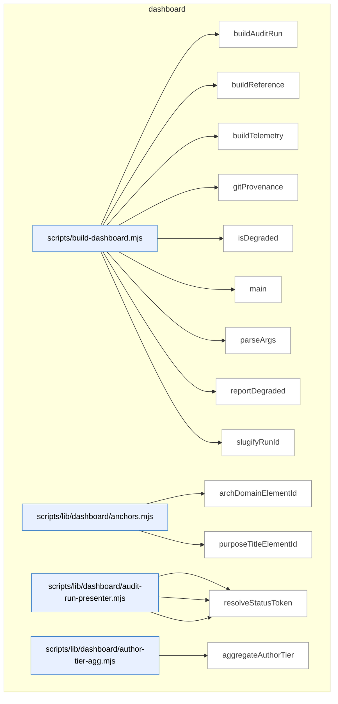

_Domain has 110 symbols (>50). Diagram shows top-15 by file order; see flat table below for the full list._

### Symbols in this domain

| Symbol | Kind | Path | Lines | Purpose | File imported by |
|---|---|---|---|---|---|
| [`buildAuditRun`](../scripts/build-dashboard.mjs#L157) | function | `scripts/build-dashboard.mjs` | 157-183 | Builds an audit-run dashboard page with provenance metadata, handling missing/invalid run pointers and degraded source detection. | _(internal)_ |
| [`buildReference`](../scripts/build-dashboard.mjs#L131) | function | `scripts/build-dashboard.mjs` | 131-137 | Collects reference data, renders it to HTML, writes it atomically, and reports source degradation. | _(internal)_ |
| [`buildTelemetry`](../scripts/build-dashboard.mjs#L139) | function | `scripts/build-dashboard.mjs` | 139-145 | Collects telemetry data, renders it to HTML, writes it atomically, and reports source degradation. | _(internal)_ |
| [`gitProvenance`](../scripts/build-dashboard.mjs#L113) | function | `scripts/build-dashboard.mjs` | 113-123 | Retrieves the current git commit SHA and dirty status, falling back to "unknown" if git is unavailable. | _(internal)_ |
| [`isDegraded`](../scripts/build-dashboard.mjs#L125) | function | `scripts/build-dashboard.mjs` | 125-129 | Checks whether any data source has an invalid or unexpected-error status. | _(internal)_ |
| [`main`](../scripts/build-dashboard.mjs#L198) | function | `scripts/build-dashboard.mjs` | 198-264 | Orchestrates dashboard builds for the specified subcommand (reference/telemetry/all/audit-run/serve), managing side builds and exit codes. | _(internal)_ |
| [`parseArgs`](../scripts/build-dashboard.mjs#L57) | function | `scripts/build-dashboard.mjs` | 57-97 | Parses command-line arguments for dashboard build modes, validating ports, run IDs, and subcommand names. | _(internal)_ |
| [`reportDegraded`](../scripts/build-dashboard.mjs#L185) | function | `scripts/build-dashboard.mjs` | 185-196 | Logs stderr warnings for each degraded dashboard source, with special messaging for missing architecture data. | _(internal)_ |
| [`slugifyRunId`](../scripts/build-dashboard.mjs#L103) | function | `scripts/build-dashboard.mjs` | 103-110 | Converts a run ID string to a URL-safe filename slug by lowercasing, removing special characters, and collapsing hyphens. | _(internal)_ |
| [`archDomainElementId`](../scripts/lib/dashboard/anchors.mjs#L15) | function | `scripts/lib/dashboard/anchors.mjs` | 15-17 | Generates a DOM element ID for an architecture domain based on its name. | `scripts/lib/dashboard/collect-purposes.mjs`, `scripts/lib/dashboard/sections/architecture.mjs` |
| [`purposeTitleElementId`](../scripts/lib/dashboard/anchors.mjs#L24) | function | `scripts/lib/dashboard/anchors.mjs` | 24-26 | Generates a DOM element ID for a purpose title based on its purpose ID. | `scripts/lib/dashboard/collect-purposes.mjs`, `scripts/lib/dashboard/sections/architecture.mjs` |
| [`presentFinding`](../scripts/lib/dashboard/audit-run-presenter.mjs#L59) | function | `scripts/lib/dashboard/audit-run-presenter.mjs` | 59-91 | Transforms a raw finding object into a presenter model with normalized severity, pass, status, and file labels. | `scripts/lib/dashboard/collect-audit-run.mjs` |
| [`presentFindings`](../scripts/lib/dashboard/audit-run-presenter.mjs#L94) | function | `scripts/lib/dashboard/audit-run-presenter.mjs` | 94-96 | Maps an array of findings through the presentFinding transformer. | `scripts/lib/dashboard/collect-audit-run.mjs` |
| [`resolveStatusToken`](../scripts/lib/dashboard/audit-run-presenter.mjs#L44) | function | `scripts/lib/dashboard/audit-run-presenter.mjs` | 44-50 | Resolves a finding's status token by checking remediation, adjudication, or defaulting to 'none'. | `scripts/lib/dashboard/collect-audit-run.mjs` |
| [`aggregateAuthorTier`](../scripts/lib/dashboard/author-tier-agg.mjs#L28) | function | `scripts/lib/dashboard/author-tier-agg.mjs` | 28-89 | Aggregates author-tier observation data by suggested tier and deployment ladder. | `scripts/lib/dashboard/collect-telemetry.mjs` |
| [`isConverged`](../scripts/lib/dashboard/author-tier-agg.mjs#L16) | function | `scripts/lib/dashboard/author-tier-agg.mjs` | 16-18 | Checks if a value represents a true boolean state. | `scripts/lib/dashboard/collect-telemetry.mjs` |
| [`coerceMeta`](../scripts/lib/dashboard/collect-audit-run.mjs#L64) | function | `scripts/lib/dashboard/collect-audit-run.mjs` | 64-67 | Wraps metadata with coerced createdAt timestamp or returns null if metadata absent. | `scripts/build-dashboard.mjs` |
| [`coerceTs`](../scripts/lib/dashboard/collect-audit-run.mjs#L57) | function | `scripts/lib/dashboard/collect-audit-run.mjs` | 57-61 | Coerces a value to ISO timestamp string or null. | `scripts/build-dashboard.mjs` |
| [`collectAuditRun`](../scripts/lib/dashboard/collect-audit-run.mjs#L89) | function | `scripts/lib/dashboard/collect-audit-run.mjs` | 89-160 | <no body> | `scripts/build-dashboard.mjs` |
| [`makeData`](../scripts/lib/dashboard/collect-audit-run.mjs#L69) | function | `scripts/lib/dashboard/collect-audit-run.mjs` | 69-81 | Constructs a standardized data envelope for an audit run with provenance, status, and findings. | `scripts/build-dashboard.mjs` |
| [`resolveRunId`](../scripts/lib/dashboard/collect-audit-run.mjs#L35) | function | `scripts/lib/dashboard/collect-audit-run.mjs` | 35-55 | Resolves an audit run ID from explicit argument or a pointer file, returning the ID and any error code. | `scripts/build-dashboard.mjs` |
| [`auditCatalogCoverage`](../scripts/lib/dashboard/collect-cli.mjs#L130) | function | `scripts/lib/dashboard/collect-cli.mjs` | 130-144 | Audits CLI catalog coverage by comparing package.json scripts against catalog entries. | `scripts/lib/dashboard/collect-reference.mjs` |
| [`collectCli`](../scripts/lib/dashboard/collect-cli.mjs#L46) | function | `scripts/lib/dashboard/collect-cli.mjs` | 46-107 | Collects npm scripts from package.json and optional CLI catalog metadata. | `scripts/lib/dashboard/collect-reference.mjs` |
| [`groupByCategory`](../scripts/lib/dashboard/collect-cli.mjs#L114) | function | `scripts/lib/dashboard/collect-cli.mjs` | 114-121 | Groups CLI entries by category. | `scripts/lib/dashboard/collect-reference.mjs` |
| [`collectNav`](../scripts/lib/dashboard/collect-nav.mjs#L27) | function | `scripts/lib/dashboard/collect-nav.mjs` | 27-106 | Collects navigation audit data by reading contracts, computing digests, and merging live verification results with static scorecards. | `scripts/lib/dashboard/collect-reference.mjs` |
| [`readEnvelope`](../scripts/lib/dashboard/collect-nav.mjs#L108) | function | `scripts/lib/dashboard/collect-nav.mjs` | 108-122 | Reads and validates a stored envelope file against an expected config digest, returning parsed data or error details. | `scripts/lib/dashboard/collect-reference.mjs` |
| [`wrap`](../scripts/lib/dashboard/collect-nav.mjs#L124) | function | `scripts/lib/dashboard/collect-nav.mjs` | 124-126 | Wraps scorecard, drift, status, and metadata into a navAudit result object. | `scripts/lib/dashboard/collect-reference.mjs` |
| [`collectPurposes`](../scripts/lib/dashboard/collect-purposes.mjs#L54) | function | `scripts/lib/dashboard/collect-purposes.mjs` | 54-243 | Reads the domain-map.json, validates the purpose configuration, collects architecture domain nodes, and computes coverage statistics. | `scripts/lib/dashboard/collect-reference.mjs` |
| [`emptyResult`](../scripts/lib/dashboard/collect-purposes.mjs#L24) | function | `scripts/lib/dashboard/collect-purposes.mjs` | 24-41 | Returns an empty result object with default structure and zero coverage metrics. | `scripts/lib/dashboard/collect-reference.mjs` |
| [`collectArchitecture`](../scripts/lib/dashboard/collect-reference.mjs#L286) | function | `scripts/lib/dashboard/collect-reference.mjs` | 286-327 | Parses architecture-map.md and extracts domain names with symbol counts. | `scripts/build-dashboard.mjs` |
| [`collectFlows`](../scripts/lib/dashboard/collect-reference.mjs#L340) | function | `scripts/lib/dashboard/collect-reference.mjs` | 340-367 | Loads and validates the flows.json manifest with skill cross-references. | `scripts/build-dashboard.mjs` |
| [`collectReference`](../scripts/lib/dashboard/collect-reference.mjs#L374) | function | `scripts/lib/dashboard/collect-reference.mjs` | 374-499 | Collects skills, plans, architecture, domains, flows, and requirements into a reference dataset. | `scripts/build-dashboard.mjs` |
| [`discoverPlans`](../scripts/lib/dashboard/collect-reference.mjs#L47) | function | `scripts/lib/dashboard/collect-reference.mjs` | 47-126 | Discovers and parses plan markdown files from active and completed directories. | `scripts/build-dashboard.mjs` |
| [`readDomainDeps`](../scripts/lib/dashboard/collect-reference.mjs#L225) | function | `scripts/lib/dashboard/collect-reference.mjs` | 225-245 | Merges observed and manual domain dependencies and computes edge counts. | `scripts/build-dashboard.mjs` |
| [`readManualAllowedDeps`](../scripts/lib/dashboard/collect-reference.mjs#L180) | function | `scripts/lib/dashboard/collect-reference.mjs` | 180-205 | Reads manual dependency allowlist from domain-map.json. | `scripts/build-dashboard.mjs` |
| [`readObservedEnvelope`](../scripts/lib/dashboard/collect-reference.mjs#L137) | function | `scripts/lib/dashboard/collect-reference.mjs` | 137-166 | Loads and validates observed dependency envelopes against domain rules. | `scripts/build-dashboard.mjs` |
| [`readRequirementsLedger`](../scripts/lib/dashboard/collect-reference.mjs#L257) | function | `scripts/lib/dashboard/collect-reference.mjs` | 257-275 | Loads the requirements ledger JSON file. | `scripts/build-dashboard.mjs` |
| [`aggregatePasses`](../scripts/lib/dashboard/collect-telemetry.mjs#L36) | function | `scripts/lib/dashboard/collect-telemetry.mjs` | 36-48 | Aggregates pass statistics by name, summing runs, raised findings, and acceptance/dismissal counts. | `scripts/build-dashboard.mjs` |
| [`attributeHighByFile`](../scripts/lib/dashboard/collect-telemetry.mjs#L467) | function | `scripts/lib/dashboard/collect-telemetry.mjs` | 467-484 | Tallies high-severity findings by purpose ID from file data, filtering out secrets and unattributable findings. | `scripts/build-dashboard.mjs` |
| [`canonicalRepoId`](../scripts/lib/dashboard/collect-telemetry.mjs#L215) | function | `scripts/lib/dashboard/collect-telemetry.mjs` | 215-218 | Resolves the canonical repository ID from UUID for consistent cross-feature identity linking. | `scripts/build-dashboard.mjs` |
| [`classifyPurposeBadges`](../scripts/lib/dashboard/collect-telemetry.mjs#L491) | function | `scripts/lib/dashboard/collect-telemetry.mjs` | 491-520 | Builds a list of purpose health status badges indicating risk level and reason for each configured purpose. | `scripts/build-dashboard.mjs` |
| [`collectAuditEffectiveness`](../scripts/lib/dashboard/collect-telemetry.mjs#L278) | function | `scripts/lib/dashboard/collect-telemetry.mjs` | 278-306 | Queries the cloud database for audit effectiveness statistics (hits, misses, false positives, precision, recall) and returns them or empty data if unavailable. | `scripts/build-dashboard.mjs` |
| [`collectAuditRuns`](../scripts/lib/dashboard/collect-telemetry.mjs#L59) | function | `scripts/lib/dashboard/collect-telemetry.mjs` | 59-98 | Collects cloud and local audit run metrics including pass aggregation and labeled run counts. | `scripts/build-dashboard.mjs` |
| [`collectAuthorTier`](../scripts/lib/dashboard/collect-telemetry.mjs#L259) | function | `scripts/lib/dashboard/collect-telemetry.mjs` | 259-270 | Fetches author-tier statistics from the cloud database for a repository and aggregates them, or returns empty data if unavailable. | `scripts/build-dashboard.mjs` |
| [`collectLearning`](../scripts/lib/dashboard/collect-telemetry.mjs#L155) | function | `scripts/lib/dashboard/collect-telemetry.mjs` | 155-175 | Retrieves learning statistics (triage pending, no-brainer, stale cluster counts) from cloud or cache. | `scripts/build-dashboard.mjs` |
| [`collectPromptVariants`](../scripts/lib/dashboard/collect-telemetry.mjs#L182) | function | `scripts/lib/dashboard/collect-telemetry.mjs` | 182-212 | Loads bandit arm statistics (multi-armed bandit state) with pulls, alpha/beta, and context bucketing. | `scripts/build-dashboard.mjs` |
| [`collectPurposeHealth`](../scripts/lib/dashboard/collect-telemetry.mjs#L378) | function | `scripts/lib/dashboard/collect-telemetry.mjs` | 378-455 | Loads purpose configuration from disk, queries cloud database for purpose health counts, and attributes high-severity findings to purposes by domain mapping. | `scripts/build-dashboard.mjs` |
| [`collectRequirements`](../scripts/lib/dashboard/collect-telemetry.mjs#L101) | function | `scripts/lib/dashboard/collect-telemetry.mjs` | 101-142 | Reads and validates the requirements ledger, extracting requirement items with status and metadata. | `scripts/build-dashboard.mjs` |
| [`collectSecurity`](../scripts/lib/dashboard/collect-telemetry.mjs#L340) | function | `scripts/lib/dashboard/collect-telemetry.mjs` | 340-355 | Fetches security incident statistics from the cloud database for a repository and returns formatted data or empty state if unavailable. | `scripts/build-dashboard.mjs` |
| [`collectShipHealth`](../scripts/lib/dashboard/collect-telemetry.mjs#L221) | function | `scripts/lib/dashboard/collect-telemetry.mjs` | 221-246 | Collects ship health metrics including deployment outcomes and recent event history grouped by outcome. | `scripts/build-dashboard.mjs` |
| [`collectTelemetry`](../scripts/lib/dashboard/collect-telemetry.mjs#L527) | function | `scripts/lib/dashboard/collect-telemetry.mjs` | 527-575 | Collects telemetry from all dashboard sources (audit runs, learning, security, purposes, prompts, ships, effectiveness, author-tier) in parallel and returns aggregated telemetry data. | `scripts/build-dashboard.mjs` |
| [`emptyAuthorTier`](../scripts/lib/dashboard/collect-telemetry.mjs#L249) | function | `scripts/lib/dashboard/collect-telemetry.mjs` | 249-251 | Returns an empty author-tier telemetry object with default zero counts and false flags. | `scripts/build-dashboard.mjs` |
| [`emptyEffectiveness`](../scripts/lib/dashboard/collect-telemetry.mjs#L273) | function | `scripts/lib/dashboard/collect-telemetry.mjs` | 273-275 | Returns an empty effectiveness metrics object with zero counts and null precision/recall values. | `scripts/build-dashboard.mjs` |
| [`emptyPurposeHealth`](../scripts/lib/dashboard/collect-telemetry.mjs#L362) | function | `scripts/lib/dashboard/collect-telemetry.mjs` | 362-369 | Returns an empty purpose-health object with current timestamp, window duration, and empty purpose badges. | `scripts/build-dashboard.mjs` |
| [`emptySecurity`](../scripts/lib/dashboard/collect-telemetry.mjs#L309) | function | `scripts/lib/dashboard/collect-telemetry.mjs` | 309-314 | Returns an empty security incidents object with zero counts and empty arrays. | `scripts/build-dashboard.mjs` |
| [`repoName`](../scripts/lib/dashboard/collect-telemetry.mjs#L145) | function | `scripts/lib/dashboard/collect-telemetry.mjs` | 145-152 | Extracts the repository name from LEARNING_REPO_NAME env or package.json. | `scripts/build-dashboard.mjs` |
| [`securityData`](../scripts/lib/dashboard/collect-telemetry.mjs#L317) | function | `scripts/lib/dashboard/collect-telemetry.mjs` | 317-333 | Transforms raw security statistics into a formatted object with incident counts, statuses, event kinds, and recent events. | `scripts/build-dashboard.mjs` |
| [`collectVisual`](../scripts/lib/dashboard/collect-visual.mjs#L19) | function | `scripts/lib/dashboard/collect-visual.mjs` | 19-49 | Collects visual audit data by reading contracts, computing digests, and building scorecards from verification findings. | `scripts/lib/dashboard/collect-reference.mjs` |
| [`wrap`](../scripts/lib/dashboard/collect-visual.mjs#L51) | function | `scripts/lib/dashboard/collect-visual.mjs` | 51-53 | Wraps scorecard, findings, diagnostics, and metadata into a visualAudit result object. | `scripts/lib/dashboard/collect-reference.mjs` |
| [`buildUi`](../scripts/lib/dashboard/helpers.mjs#L106) | function | `scripts/lib/dashboard/helpers.mjs` | 106-117 | Freezes and exports a UI helper object containing all rendering utilities. | `scripts/lib/dashboard/render.mjs` |
| [`emptyPanel`](../scripts/lib/dashboard/helpers.mjs#L72) | function | `scripts/lib/dashboard/helpers.mjs` | 72-75 | Renders an HTML panel with optional test ID and empty state message. | `scripts/lib/dashboard/render.mjs` |
| [`escapeHtml`](../scripts/lib/dashboard/helpers.mjs#L22) | function | `scripts/lib/dashboard/helpers.mjs` | 22-29 | Escapes HTML special characters to prevent injection. | `scripts/lib/dashboard/render.mjs` |
| [`jsonScriptSafe`](../scripts/lib/dashboard/helpers.mjs#L43) | function | `scripts/lib/dashboard/helpers.mjs` | 43-50 | Converts an object to JSON while escaping HTML-unsafe characters for safe embedding in script tags. | `scripts/lib/dashboard/render.mjs` |
| [`panel`](../scripts/lib/dashboard/helpers.mjs#L83) | function | `scripts/lib/dashboard/helpers.mjs` | 83-86 | Generates an accessible tab panel div with optional hidden attribute. | `scripts/lib/dashboard/render.mjs` |
| [`splitUsage`](../scripts/lib/dashboard/helpers.mjs#L93) | function | `scripts/lib/dashboard/helpers.mjs` | 93-98 | Splits a line on a separator (em-dash or hash) into command and description parts. | `scripts/lib/dashboard/render.mjs` |
| [`statusDot`](../scripts/lib/dashboard/helpers.mjs#L57) | function | `scripts/lib/dashboard/helpers.mjs` | 57-61 | Returns a colored status indicator dot (green, yellow, or red) based on status value. | `scripts/lib/dashboard/render.mjs` |
| [`tab`](../scripts/lib/dashboard/helpers.mjs#L77) | function | `scripts/lib/dashboard/helpers.mjs` | 77-81 | Generates an accessible tab button with ARIA attributes and selection state. | `scripts/lib/dashboard/render.mjs` |
| [`warningPanel`](../scripts/lib/dashboard/helpers.mjs#L64) | function | `scripts/lib/dashboard/helpers.mjs` | 64-69 | Renders an HTML warning panel showing a source name and error detail. | `scripts/lib/dashboard/render.mjs` |
| [`loadAssets`](../scripts/lib/dashboard/load-assets.mjs#L18) | function | `scripts/lib/dashboard/load-assets.mjs` | 18-29 | Loads bundled CSS and JavaScript assets for the dashboard. | `scripts/build-dashboard.mjs` |
| [`freshnessBanner`](../scripts/lib/dashboard/render.mjs#L102) | function | `scripts/lib/dashboard/render.mjs` | 102-114 | Renders a freshness banner showing source hash, commit, or generation timestamp. | `scripts/build-dashboard.mjs` |
| [`nav`](../scripts/lib/dashboard/render.mjs#L119) | function | `scripts/lib/dashboard/render.mjs` | 119-127 | Generates navigation tabs linking reference and telemetry pages. | `scripts/build-dashboard.mjs` |
| [`renderDocument`](../scripts/lib/dashboard/render.mjs#L139) | function | `scripts/lib/dashboard/render.mjs` | 139-205 | Builds and renders a complete dashboard page with sections and status indicators. | `scripts/build-dashboard.mjs` |
| [`validateDashboardData`](../scripts/lib/dashboard/schema.mjs#L457) | function | `scripts/lib/dashboard/schema.mjs` | 457-462 | Validates incoming dashboard data against the appropriate schema based on kind (reference, telemetry, or audit-run). | `scripts/lib/dashboard/collect-purposes.mjs`, `scripts/lib/dashboard/collect-reference.mjs`, `scripts/lib/dashboard/collect-telemetry.mjs`, +1 more |
| [`archTiers`](../scripts/lib/dashboard/sections/architecture.mjs#L29) | function | `scripts/lib/dashboard/sections/architecture.mjs` | 29-46 | Assigns architectural tiers (0=foundation, 1=depended-upon, 2=consumer) to domains based on dependency graph. | `scripts/lib/dashboard/render.mjs` |
| [`formatDepsSourceLine`](../scripts/lib/dashboard/sections/architecture.mjs#L48) | function | `scripts/lib/dashboard/sections/architecture.mjs` | 48-72 | Formats a summary line describing dependency edge counts (observed, manual, confirmed). | `scripts/lib/dashboard/render.mjs` |
| [`sectionArchitecture`](../scripts/lib/dashboard/sections/architecture.mjs#L74) | function | `scripts/lib/dashboard/sections/architecture.mjs` | 74-131 | Renders the architecture section with domain boxes, dependencies, and tier layout. | `scripts/lib/dashboard/render.mjs` |
| [`pct`](../scripts/lib/dashboard/sections/audit-effectiveness.mjs#L14) | function | `scripts/lib/dashboard/sections/audit-effectiveness.mjs` | 14-17 | Formats a numeric ratio as a percentage string, or returns a muted dash if null. | `scripts/lib/dashboard/render.mjs` |
| [`sectionAuditEffectiveness`](../scripts/lib/dashboard/sections/audit-effectiveness.mjs#L19) | function | `scripts/lib/dashboard/sections/audit-effectiveness.mjs` | 19-39 | Renders the audit-effectiveness section with precision/recall metrics and correlation-derived statistics. | `scripts/lib/dashboard/render.mjs` |
| [`chip`](../scripts/lib/dashboard/sections/audit-run-detail.mjs#L34) | function | `scripts/lib/dashboard/sections/audit-run-detail.mjs` | 34-37 | Creates a filter chip button for severity/pass/status filtering in the findings table. | `scripts/lib/dashboard/render.mjs` |
| [`filterBar`](../scripts/lib/dashboard/sections/audit-run-detail.mjs#L39) | function | `scripts/lib/dashboard/sections/audit-run-detail.mjs` | 39-65 | <no body> | `scripts/lib/dashboard/render.mjs` |
| [`findingRow`](../scripts/lib/dashboard/sections/audit-run-detail.mjs#L67) | function | `scripts/lib/dashboard/sections/audit-run-detail.mjs` | 67-89 | Renders a single finding row with severity badge, pass status, file, status, and expandable evidence details. | `scripts/lib/dashboard/render.mjs` |
| [`findingsTable`](../scripts/lib/dashboard/sections/audit-run-detail.mjs#L91) | function | `scripts/lib/dashboard/sections/audit-run-detail.mjs` | 91-100 | Wraps finding rows in an HTML table with headers for severity, pass, file, status, and detail columns. | `scripts/lib/dashboard/render.mjs` |
| [`runHeader`](../scripts/lib/dashboard/sections/audit-run-detail.mjs#L20) | function | `scripts/lib/dashboard/sections/audit-run-detail.mjs` | 20-32 | Builds an audit run header with metadata details (mode, rounds, Gemini verdict, commit, plan). | `scripts/lib/dashboard/render.mjs` |
| [`sectionAuditRunDetail`](../scripts/lib/dashboard/sections/audit-run-detail.mjs#L102) | function | `scripts/lib/dashboard/sections/audit-run-detail.mjs` | 102-143 | <no body> | `scripts/lib/dashboard/render.mjs` |
| [`sectionAuditRuns`](../scripts/lib/dashboard/sections/audit-runs.mjs#L16) | function | `scripts/lib/dashboard/sections/audit-runs.mjs` | 16-53 | Renders the Audit Runs telemetry section with pass statistics table and cloud/local source indicators. | `scripts/lib/dashboard/render.mjs` |
| [`sectionAuthorTier`](../scripts/lib/dashboard/sections/author-tier.mjs#L14) | function | `scripts/lib/dashboard/sections/author-tier.mjs` | 14-63 | Renders the author-tier telemetry section in the dashboard HTML. | `scripts/lib/dashboard/render.mjs` |
| [`sectionCli`](../scripts/lib/dashboard/sections/cli.mjs#L38) | function | `scripts/lib/dashboard/sections/cli.mjs` | 38-97 | Renders the CLI section with searchable npm script cards grouped by category. | `scripts/lib/dashboard/render.mjs` |
| [`sectionFlows`](../scripts/lib/dashboard/sections/flows.mjs#L14) | function | `scripts/lib/dashboard/sections/flows.mjs` | 14-42 | Renders the skill-chain flow section as connected steps with handoff arrows. | `scripts/lib/dashboard/render.mjs` |
| [`sectionLearning`](../scripts/lib/dashboard/sections/learning.mjs#L14) | function | `scripts/lib/dashboard/sections/learning.mjs` | 14-34 | Renders the learning section showing pending triage and no-brainer decision counts. | `scripts/lib/dashboard/render.mjs` |
| [`sectionNavAudit`](../scripts/lib/dashboard/sections/nav-audit.mjs#L17) | function | `scripts/lib/dashboard/sections/nav-audit.mjs` | 17-82 | Renders an HTML section displaying per-persona reachability scorecards with live-verified or static status banners and detailed tables. | `scripts/lib/dashboard/render.mjs` |
| [`escapeHtml`](../scripts/lib/dashboard/sections/plans.mjs#L40) | function | `scripts/lib/dashboard/sections/plans.mjs` | 40-47 | Escapes HTML special characters (replaceAll variant for plan rendering). | `scripts/lib/dashboard/render.mjs` |
| [`planList`](../scripts/lib/dashboard/sections/plans.mjs#L184) | function | `scripts/lib/dashboard/sections/plans.mjs` | 184-198 | Renders a collapsible list of plan items with title, status, date, and body content. | `scripts/lib/dashboard/render.mjs` |
| [`renderInline`](../scripts/lib/dashboard/sections/plans.mjs#L49) | function | `scripts/lib/dashboard/sections/plans.mjs` | 49-78 | Renders inline markdown tokens (bold, italic, code, links) with injection protection. | `scripts/lib/dashboard/render.mjs` |
| [`renderMarkdown`](../scripts/lib/dashboard/sections/plans.mjs#L80) | function | `scripts/lib/dashboard/sections/plans.mjs` | 80-180 | Parses multi-line markdown into HTML blocks (headings, lists, code fences, Mermaid diagrams). | `scripts/lib/dashboard/render.mjs` |
| [`sectionPlans`](../scripts/lib/dashboard/sections/plans.mjs#L200) | function | `scripts/lib/dashboard/sections/plans.mjs` | 200-231 | Renders the plans section with active/completed lists and Mermaid CDN bootstrap script. | `scripts/lib/dashboard/render.mjs` |
| [`sectionPromptVariants`](../scripts/lib/dashboard/sections/prompt-variants.mjs#L14) | function | `scripts/lib/dashboard/sections/prompt-variants.mjs` | 14-41 | Renders the prompt-variants (bandit arms) section showing Thompson-sampling pull counts and posterior means. | `scripts/lib/dashboard/render.mjs` |
| [`sectionPurposeHealth`](../scripts/lib/dashboard/sections/purpose-health.mjs#L25) | function | `scripts/lib/dashboard/sections/purpose-health.mjs` | 25-67 | Renders purpose health governance metrics and per-purpose health badges. | `scripts/lib/dashboard/render.mjs` |
| [`renderChip`](../scripts/lib/dashboard/sections/purpose.mjs#L153) | function | `scripts/lib/dashboard/sections/purpose.mjs` | 153-162 | Renders a domain chip with optional link to architecture map entry and a badge showing additional purposes it serves. | `scripts/lib/dashboard/render.mjs` |
| [`renderHygiene`](../scripts/lib/dashboard/sections/purpose.mjs#L164) | function | `scripts/lib/dashboard/sections/purpose.mjs` | 164-189 | Renders purpose hygiene warnings for unmapped domains, missing architecture entries, unknown keys, and unattached invariants. | `scripts/lib/dashboard/render.mjs` |
| [`renderMatrix`](../scripts/lib/dashboard/sections/purpose.mjs#L88) | function | `scripts/lib/dashboard/sections/purpose.mjs` | 88-104 | Builds and returns an HTML table matrix showing which purposes deliver to which domains. | `scripts/lib/dashboard/render.mjs` |
| [`renderNode`](../scripts/lib/dashboard/sections/purpose.mjs#L106) | function | `scripts/lib/dashboard/sections/purpose.mjs` | 106-151 | Renders a single purpose node card with flow references, domain chips, and grouped requirement details. | `scripts/lib/dashboard/render.mjs` |
| [`sectionPurpose`](../scripts/lib/dashboard/sections/purpose.mjs#L26) | function | `scripts/lib/dashboard/sections/purpose.mjs` | 26-80 | Renders the Purpose section showing purpose nodes, domain coverage matrix, invariant requirements, and hygiene warnings. | `scripts/lib/dashboard/render.mjs` |
| [`shortReqId`](../scripts/lib/dashboard/sections/purpose.mjs#L21) | function | `scripts/lib/dashboard/sections/purpose.mjs` | 21-24 | Extracts and returns a short 6-character hash suffix from a requirement ID for concise display. | `scripts/lib/dashboard/render.mjs` |
| [`sectionRequirements`](../scripts/lib/dashboard/sections/requirements.mjs#L17) | function | `scripts/lib/dashboard/sections/requirements.mjs` | 17-47 | Renders the requirements section grouped by kind with status sorting and item counts. | `scripts/lib/dashboard/render.mjs` |
| [`sectionSecurity`](../scripts/lib/dashboard/sections/security.mjs#L26) | function | `scripts/lib/dashboard/sections/security.mjs` | 26-71 | Renders the security section showing incident totals, status breakdowns, and audit-trail events. | `scripts/lib/dashboard/render.mjs` |
| [`sectionShipHealth`](../scripts/lib/dashboard/sections/ship-health.mjs#L12) | function | `scripts/lib/dashboard/sections/ship-health.mjs` | 12-37 | Renders the ship-health section with outcome tallies and a recent-ships table including branches and commits. | `scripts/lib/dashboard/render.mjs` |
| [`sectionSkills`](../scripts/lib/dashboard/sections/skills.mjs#L24) | function | `scripts/lib/dashboard/sections/skills.mjs` | 24-62 | Renders searchable skill cards with one-liners, usage examples, and trigger chips. | `scripts/lib/dashboard/render.mjs` |
| [`sectionVisualAudit`](../scripts/lib/dashboard/sections/visual-audit.mjs#L15) | function | `scripts/lib/dashboard/sections/visual-audit.mjs` | 15-61 | Renders an HTML section displaying contracted-surface audit results, diagnostics, and violations with live-verified or static status banners. | `scripts/lib/dashboard/render.mjs` |
| [`openBrowser`](../scripts/lib/dashboard/serve.mjs#L22) | function | `scripts/lib/dashboard/serve.mjs` | 22-34 | Opens a browser to a URL using platform-appropriate system commands. | `scripts/build-dashboard.mjs` |
| [`serve`](../scripts/lib/dashboard/serve.mjs#L44) | function | `scripts/lib/dashboard/serve.mjs` | 44-118 | HTTP server handler that serves files from a dashboard directory with security checks. | `scripts/build-dashboard.mjs` |

---

## docs

> The `docs` domain provides utilities for generating text embeddings via Azure OpenAI and checking pgvector database capabilities for storing security incident embeddings.

```mermaid
flowchart TB
subgraph dom_docs ["docs"]
  file_docs_plans_security_files_scripts_lib_se["docs/plans/security/files/scripts/lib/security/azure-embed.m"]:::component
  sym_docs_plans_security_files_scripts_lib_se["_resetClientForTest"]:::symbol
  file_docs_plans_security_files_scripts_lib_se --> sym_docs_plans_security_files_scripts_lib_se
  sym_docs_plans_security_files_scripts_lib_se["_setClientForTest"]:::symbol
  file_docs_plans_security_files_scripts_lib_se --> sym_docs_plans_security_files_scripts_lib_se
  sym_docs_plans_security_files_scripts_lib_se["azureEmbed"]:::symbol
  file_docs_plans_security_files_scripts_lib_se --> sym_docs_plans_security_files_scripts_lib_se
  sym_docs_plans_security_files_scripts_lib_se["embedDeployment"]:::symbol
  file_docs_plans_security_files_scripts_lib_se --> sym_docs_plans_security_files_scripts_lib_se
  sym_docs_plans_security_files_scripts_lib_se["envInt"]:::symbol
  file_docs_plans_security_files_scripts_lib_se --> sym_docs_plans_security_files_scripts_lib_se
  sym_docs_plans_security_files_scripts_lib_se["getClient"]:::symbol
  file_docs_plans_security_files_scripts_lib_se --> sym_docs_plans_security_files_scripts_lib_se
  file_docs_plans_security_files_scripts_lib_se["docs/plans/security/files/scripts/lib/security/pgvector-chec"]:::component
  sym_docs_plans_security_files_scripts_lib_se["_resetPgvectorCacheForTest"]:::symbol
  file_docs_plans_security_files_scripts_lib_se --> sym_docs_plans_security_files_scripts_lib_se
  sym_docs_plans_security_files_scripts_lib_se["embeddingsEnabled"]:::symbol
  file_docs_plans_security_files_scripts_lib_se --> sym_docs_plans_security_files_scripts_lib_se
  sym_docs_plans_security_files_scripts_lib_se["pgvectorAvailable"]:::symbol
  file_docs_plans_security_files_scripts_lib_se --> sym_docs_plans_security_files_scripts_lib_se
  sym_docs_plans_security_files_scripts_lib_se["securityEmbeddingColumnExists"]:::symbol
  file_docs_plans_security_files_scripts_lib_se --> sym_docs_plans_security_files_scripts_lib_se
  file_docs_plans_security_files_scripts_lib_se["docs/plans/security/files/scripts/lib/security/repo-name.mjs"]:::component
  sym_docs_plans_security_files_scripts_lib_se["securityRepoName"]:::symbol
  file_docs_plans_security_files_scripts_lib_se --> sym_docs_plans_security_files_scripts_lib_se
  file_docs_plans_security_files_scripts_lib_se["docs/plans/security/files/scripts/lib/security/secret-classi"]:::component
  sym_docs_plans_security_files_scripts_lib_se["classifySecrets"]:::symbol
  file_docs_plans_security_files_scripts_lib_se --> sym_docs_plans_security_files_scripts_lib_se
  sym_docs_plans_security_files_scripts_lib_se["maskSample"]:::symbol
  file_docs_plans_security_files_scripts_lib_se --> sym_docs_plans_security_files_scripts_lib_se
  sym_docs_plans_security_files_scripts_lib_se["preWriteSecretGate"]:::symbol
  file_docs_plans_security_files_scripts_lib_se --> sym_docs_plans_security_files_scripts_lib_se
  file_docs_plans_security_files_scripts_lib_st["docs/plans/security/files/scripts/lib/store/security.mjs"]:::component
  sym_docs_plans_security_files_scripts_lib_st["chunk"]:::symbol
  file_docs_plans_security_files_scripts_lib_st --> sym_docs_plans_security_files_scripts_lib_st
  sym_docs_plans_security_files_scripts_lib_st["getSecurityIncidentsByRepo"]:::symbol
  file_docs_plans_security_files_scripts_lib_st --> sym_docs_plans_security_files_scripts_lib_st
  sym_docs_plans_security_files_scripts_lib_st["getSecurityStats"]:::symbol
  file_docs_plans_security_files_scripts_lib_st --> sym_docs_plans_security_files_scripts_lib_st
  sym_docs_plans_security_files_scripts_lib_st["markIncidentsHistorical"]:::symbol
  file_docs_plans_security_files_scripts_lib_st --> sym_docs_plans_security_files_scripts_lib_st
  sym_docs_plans_security_files_scripts_lib_st["queryIncidentNeighbourhood"]:::symbol
  file_docs_plans_security_files_scripts_lib_st --> sym_docs_plans_security_files_scripts_lib_st
  sym_docs_plans_security_files_scripts_lib_st["recordSecurityIncidents"]:::symbol
  file_docs_plans_security_files_scripts_lib_st --> sym_docs_plans_security_files_scripts_lib_st
  sym_docs_plans_security_files_scripts_lib_st["recordStrategyEvents"]:::symbol
  file_docs_plans_security_files_scripts_lib_st --> sym_docs_plans_security_files_scripts_lib_st
  sym_docs_plans_security_files_scripts_lib_st["resolveSecurityRepoId"]:::symbol
  file_docs_plans_security_files_scripts_lib_st --> sym_docs_plans_security_files_scripts_lib_st
  sym_docs_plans_security_files_scripts_lib_st["vectorLiteral"]:::symbol
  file_docs_plans_security_files_scripts_lib_st --> sym_docs_plans_security_files_scripts_lib_st
  file_docs_plans_security_files_scripts_securi["docs/plans/security/files/scripts/security-incidents.mjs"]:::component
  sym_docs_plans_security_files_scripts_securi["currentBranch"]:::symbol
  file_docs_plans_security_files_scripts_securi --> sym_docs_plans_security_files_scripts_securi
  sym_docs_plans_security_files_scripts_securi["flag"]:::symbol
  file_docs_plans_security_files_scripts_securi --> sym_docs_plans_security_files_scripts_securi
  file_docs_plans_security_files_scripts_securi["docs/plans/security/files/scripts/security-memory/incident-s"]:::component
  sym_docs_plans_security_files_scripts_securi["classifyMitigation"]:::symbol
  file_docs_plans_security_files_scripts_securi --> sym_docs_plans_security_files_scripts_securi
  sym_docs_plans_security_files_scripts_securi["runSemgrepIfNeeded"]:::symbol
  file_docs_plans_security_files_scripts_securi --> sym_docs_plans_security_files_scripts_securi
  sym_docs_plans_security_files_scripts_securi["sha256"]:::symbol
  file_docs_plans_security_files_scripts_securi --> sym_docs_plans_security_files_scripts_securi
  file_docs_plans_security_files_scripts_securi["docs/plans/security/files/scripts/security-memory/parse-stra"]:::component
  sym_docs_plans_security_files_scripts_securi["computeFingerprint"]:::symbol
  file_docs_plans_security_files_scripts_securi --> sym_docs_plans_security_files_scripts_securi
  sym_docs_plans_security_files_scripts_securi["deriveMitigationKind"]:::symbol
  file_docs_plans_security_files_scripts_securi --> sym_docs_plans_security_files_scripts_securi
  sym_docs_plans_security_files_scripts_securi["extractFields"]:::symbol
  file_docs_plans_security_files_scripts_securi --> sym_docs_plans_security_files_scripts_securi
  sym_docs_plans_security_files_scripts_securi["lineOfOffset"]:::symbol
  file_docs_plans_security_files_scripts_securi --> sym_docs_plans_security_files_scripts_securi
  sym_docs_plans_security_files_scripts_securi["parseList"]:::symbol
  file_docs_plans_security_files_scripts_securi --> sym_docs_plans_security_files_scripts_securi
  sym_docs_plans_security_files_scripts_securi["parseSecurityStrategy"]:::symbol
  file_docs_plans_security_files_scripts_securi --> sym_docs_plans_security_files_scripts_securi
  sym_docs_plans_security_files_scripts_securi["stripMarkerComments"]:::symbol
  file_docs_plans_security_files_scripts_securi --> sym_docs_plans_security_files_scripts_securi
  sym_docs_plans_security_files_scripts_securi["unwrapBackticks"]:::symbol
  file_docs_plans_security_files_scripts_securi --> sym_docs_plans_security_files_scripts_securi
  file_docs_plans_security_files_scripts_securi["docs/plans/security/files/scripts/security-memory/refresh-in"]:::component
  sym_docs_plans_security_files_scripts_securi["currentBranch"]:::symbol
  file_docs_plans_security_files_scripts_securi --> sym_docs_plans_security_files_scripts_securi
  sym_docs_plans_security_files_scripts_securi["currentCommitSha"]:::symbol
  file_docs_plans_security_files_scripts_securi --> sym_docs_plans_security_files_scripts_securi
  sym_docs_plans_security_files_scripts_securi["emit"]:::symbol
  file_docs_plans_security_files_scripts_securi --> sym_docs_plans_security_files_scripts_securi
  sym_docs_plans_security_files_scripts_securi["git"]:::symbol
  file_docs_plans_security_files_scripts_securi --> sym_docs_plans_security_files_scripts_securi
  sym_docs_plans_security_files_scripts_securi["gitUser"]:::symbol
  file_docs_plans_security_files_scripts_securi --> sym_docs_plans_security_files_scripts_securi
  sym_docs_plans_security_files_scripts_securi["logInfo"]:::symbol
  file_docs_plans_security_files_scripts_securi --> sym_docs_plans_security_files_scripts_securi
  sym_docs_plans_security_files_scripts_securi["logWarn"]:::symbol
  file_docs_plans_security_files_scripts_securi --> sym_docs_plans_security_files_scripts_securi
  sym_docs_plans_security_files_scripts_securi["main"]:::symbol
  file_docs_plans_security_files_scripts_securi --> sym_docs_plans_security_files_scripts_securi
  sym_docs_plans_security_files_scripts_securi["parseFlags"]:::symbol
  file_docs_plans_security_files_scripts_securi --> sym_docs_plans_security_files_scripts_securi
  file_docs_plans_security_files_tests_azure_em["docs/plans/security/files/tests/azure-embed.test.mjs"]:::component
  sym_docs_plans_security_files_tests_azure_em["fakeClient"]:::symbol
  file_docs_plans_security_files_tests_azure_em --> sym_docs_plans_security_files_tests_azure_em
  file_docs_plans_security_files_tests_incident["docs/plans/security/files/tests/incident-neighbourhood.test."]:::component
  sym_docs_plans_security_files_tests_incident["securityTableExists"]:::symbol
  file_docs_plans_security_files_tests_incident --> sym_docs_plans_security_files_tests_incident
  file_docs_plans_security_files_tests_pgvector["docs/plans/security/files/tests/pgvector-fallback.test.mjs"]:::component
  sym_docs_plans_security_files_tests_pgvector["fakePool"]:::symbol
  file_docs_plans_security_files_tests_pgvector --> sym_docs_plans_security_files_tests_pgvector
end
classDef container fill:#f5f5f5,stroke:#333,stroke-width:2px,color:#000
classDef component fill:#e8f0ff,stroke:#3178c6,color:#000
classDef symbol fill:#fff,stroke:#999,color:#444
classDef dup fill:#ffe8d8,stroke:#c0392b,stroke-width:2px,color:#000
classDef violation fill:#ffd6d6,stroke:#c0392b,stroke-width:2px,color:#000
```

### Symbols in this domain

| Symbol | Kind | Path | Lines | Purpose | File imported by |
|---|---|---|---|---|---|
| [`_resetClientForTest`](../docs/plans/security/files/scripts/lib/security/azure-embed.mjs#L101) | function | `docs/plans/security/files/scripts/lib/security/azure-embed.mjs` | 101-103 | Clears the cached Azure client for testing purposes. | _(internal)_ |
| [`_setClientForTest`](../docs/plans/security/files/scripts/lib/security/azure-embed.mjs#L109) | function | `docs/plans/security/files/scripts/lib/security/azure-embed.mjs` | 109-111 | Injects a fake client for testing without calling the real Azure service. | _(internal)_ |
| [`azureEmbed`](../docs/plans/security/files/scripts/lib/security/azure-embed.mjs#L64) | function | `docs/plans/security/files/scripts/lib/security/azure-embed.mjs` | 64-98 | Generates text embeddings via Azure OpenAI with dimension validation and exponential backoff retry. | _(internal)_ |
| [`embedDeployment`](../docs/plans/security/files/scripts/lib/security/azure-embed.mjs#L34) | function | `docs/plans/security/files/scripts/lib/security/azure-embed.mjs` | 34-36 | Returns the Azure OpenAI embedding deployment name from environment or defaults to 'text-embedding-3-small'. | _(internal)_ |
| [`envInt`](../docs/plans/security/files/scripts/lib/security/azure-embed.mjs#L26) | function | `docs/plans/security/files/scripts/lib/security/azure-embed.mjs` | 26-29 | Parses an environment variable as a non-negative integer with a fallback default. | _(internal)_ |
| [`getClient`](../docs/plans/security/files/scripts/lib/security/azure-embed.mjs#L39) | function | `docs/plans/security/files/scripts/lib/security/azure-embed.mjs` | 39-55 | Initializes and caches an OpenAI client configured for Azure endpoints with retry logic. | _(internal)_ |
| [`_resetPgvectorCacheForTest`](../docs/plans/security/files/scripts/lib/security/pgvector-check.mjs#L74) | function | `docs/plans/security/files/scripts/lib/security/pgvector-check.mjs` | 74-77 | Resets both pgvector and embedding column caches for test cleanup. | _(internal)_ |
| [`embeddingsEnabled`](../docs/plans/security/files/scripts/lib/security/pgvector-check.mjs#L69) | function | `docs/plans/security/files/scripts/lib/security/pgvector-check.mjs` | 69-71 | Returns true only if both pgvector is installed and the embedding column exists. | _(internal)_ |
| [`pgvectorAvailable`](../docs/plans/security/files/scripts/lib/security/pgvector-check.mjs#L26) | function | `docs/plans/security/files/scripts/lib/security/pgvector-check.mjs` | 26-36 | Checks if the pgvector extension is installed in the database with caching. | _(internal)_ |
| [`securityEmbeddingColumnExists`](../docs/plans/security/files/scripts/lib/security/pgvector-check.mjs#L42) | function | `docs/plans/security/files/scripts/lib/security/pgvector-check.mjs` | 42-61 | Checks if the security_incidents table has an embedding column in the public schema. | _(internal)_ |
| [`securityRepoName`](../docs/plans/security/files/scripts/lib/security/repo-name.mjs#L26) | function | `docs/plans/security/files/scripts/lib/security/repo-name.mjs` | 26-41 | Derives the security repository name from git origin or environment override or directory basename. | _(internal)_ |
| [`classifySecrets`](../docs/plans/security/files/scripts/lib/security/secret-classifier.mjs#L53) | function | `docs/plans/security/files/scripts/lib/security/secret-classifier.mjs` | 53-68 | Scans text for high and low confidence secret patterns using regex matching. | _(internal)_ |
| [`maskSample`](../docs/plans/security/files/scripts/lib/security/secret-classifier.mjs#L129) | function | `docs/plans/security/files/scripts/lib/security/secret-classifier.mjs` | 129-131 | Truncates a string sample to 6 characters plus ellipsis for safe logging. | _(internal)_ |
| [`preWriteSecretGate`](../docs/plans/security/files/scripts/lib/security/secret-classifier.mjs#L81) | function | `docs/plans/security/files/scripts/lib/security/secret-classifier.mjs` | 81-126 | Validates markdown content for secrets, refuses high-confidence hits, redacts low-confidence patterns, and returns audit events. | _(internal)_ |
| [`chunk`](../docs/plans/security/files/scripts/lib/store/security.mjs#L24) | function | `docs/plans/security/files/scripts/lib/store/security.mjs` | 24-28 | Splits an array into fixed-size chunks for batch processing. | _(internal)_ |
| [`getSecurityIncidentsByRepo`](../docs/plans/security/files/scripts/lib/store/security.mjs#L63) | function | `docs/plans/security/files/scripts/lib/store/security.mjs` | 63-72 | Fetches all non-historical security incidents for a given repository. | _(internal)_ |
| [`getSecurityStats`](../docs/plans/security/files/scripts/lib/store/security.mjs#L244) | function | `docs/plans/security/files/scripts/lib/store/security.mjs` | 244-291 | Aggregates statistics on security incidents including counts by status, classification, and embedding coverage. | _(internal)_ |
| [`markIncidentsHistorical`](../docs/plans/security/files/scripts/lib/store/security.mjs#L130) | function | `docs/plans/security/files/scripts/lib/store/security.mjs` | 130-140 | Marks a list of incidents as historical with the current timestamp. | _(internal)_ |
| [`queryIncidentNeighbourhood`](../docs/plans/security/files/scripts/lib/store/security.mjs#L183) | function | `docs/plans/security/files/scripts/lib/store/security.mjs` | 183-226 | Queries security incidents by affected paths and optional embedding similarity with fallback path-overlap ranking. | _(internal)_ |
| [`recordSecurityIncidents`](../docs/plans/security/files/scripts/lib/store/security.mjs#L83) | function | `docs/plans/security/files/scripts/lib/store/security.mjs` | 83-122 | Batch-inserts or updates security incidents with optional embedding vectors. | _(internal)_ |
| [`recordStrategyEvents`](../docs/plans/security/files/scripts/lib/store/security.mjs#L150) | function | `docs/plans/security/files/scripts/lib/store/security.mjs` | 150-167 | Appends security strategy event records to an audit trail table. | _(internal)_ |
| [`resolveSecurityRepoId`](../docs/plans/security/files/scripts/lib/store/security.mjs#L45) | function | `docs/plans/security/files/scripts/lib/store/security.mjs` | 45-56 | Retrieves or creates a repo_id for security tracking using a deterministic fingerprint. | _(internal)_ |
| [`vectorLiteral`](../docs/plans/security/files/scripts/lib/store/security.mjs#L31) | function | `docs/plans/security/files/scripts/lib/store/security.mjs` | 31-37 | Converts a numeric embedding array to SQL vector literal syntax or returns null. | _(internal)_ |
| [`currentBranch`](../docs/plans/security/files/scripts/security-incidents.mjs#L50) | function | `docs/plans/security/files/scripts/security-incidents.mjs` | 50-57 | Returns the current Git branch name via execFileSync, falling back to 'unknown' on error. | _(internal)_ |
| [`flag`](../docs/plans/security/files/scripts/security-incidents.mjs#L28) | function | `docs/plans/security/files/scripts/security-incidents.mjs` | 28-31 | Extracts a command-line flag value by name, returning a fallback if the flag is absent or lacks a value. | _(internal)_ |
| [`classifyMitigation`](../docs/plans/security/files/scripts/security-memory/incident-status.mjs#L33) | function | `docs/plans/security/files/scripts/security-memory/incident-status.mjs` | 33-54 | Classifies mitigation status based on semgrep run results, rule presence, and tool errors. | _(internal)_ |
| [`runSemgrepIfNeeded`](../docs/plans/security/files/scripts/security-memory/incident-status.mjs#L68) | function | `docs/plans/security/files/scripts/security-memory/incident-status.mjs` | 68-133 | Runs semgrep against a mitigation reference with caching by rule content or registry hash. | _(internal)_ |
| [`sha256`](../docs/plans/security/files/scripts/security-memory/incident-status.mjs#L135) | function | `docs/plans/security/files/scripts/security-memory/incident-status.mjs` | 135-137 | Hashes text to a 16-character sha256 hex digest for fingerprinting. | _(internal)_ |
| [`computeFingerprint`](../docs/plans/security/files/scripts/security-memory/parse-strategy.mjs#L216) | function | `docs/plans/security/files/scripts/security-memory/parse-strategy.mjs` | 216-224 | Computes a stable 16-character fingerprint from normalized incident fields. | _(internal)_ |
| [`deriveMitigationKind`](../docs/plans/security/files/scripts/security-memory/parse-strategy.mjs#L210) | function | `docs/plans/security/files/scripts/security-memory/parse-strategy.mjs` | 210-214 | Determines mitigation type (manual, semgrep, or file-ref) from the mitigation reference. | _(internal)_ |
| [`extractFields`](../docs/plans/security/files/scripts/security-memory/parse-strategy.mjs#L128) | function | `docs/plans/security/files/scripts/security-memory/parse-strategy.mjs` | 128-184 | Extracts structured fields (description, paths, mitigation, etc.) from markdown incident blocks. | _(internal)_ |
| [`lineOfOffset`](../docs/plans/security/files/scripts/security-memory/parse-strategy.mjs#L231) | function | `docs/plans/security/files/scripts/security-memory/parse-strategy.mjs` | 231-237 | Calculates the line number of a given text offset by counting newlines. | _(internal)_ |
| [`parseList`](../docs/plans/security/files/scripts/security-memory/parse-strategy.mjs#L195) | function | `docs/plans/security/files/scripts/security-memory/parse-strategy.mjs` | 195-204 | Parses a value as a bulleted list or comma/newline-separated items with backtick unwrapping. | _(internal)_ |
| [`parseSecurityStrategy`](../docs/plans/security/files/scripts/security-memory/parse-strategy.mjs#L44) | function | `docs/plans/security/files/scripts/security-memory/parse-strategy.mjs` | 44-121 | Parses markdown security strategy document into incidents, threat model, and validation warnings. | _(internal)_ |
| [`stripMarkerComments`](../docs/plans/security/files/scripts/security-memory/parse-strategy.mjs#L227) | function | `docs/plans/security/files/scripts/security-memory/parse-strategy.mjs` | 227-229 | Removes HTML comments from a string. | _(internal)_ |
| [`unwrapBackticks`](../docs/plans/security/files/scripts/security-memory/parse-strategy.mjs#L206) | function | `docs/plans/security/files/scripts/security-memory/parse-strategy.mjs` | 206-208 | Removes surrounding backticks and whitespace from a string. | _(internal)_ |
| [`currentBranch`](../docs/plans/security/files/scripts/security-memory/refresh-incidents.mjs#L79) | function | `docs/plans/security/files/scripts/security-memory/refresh-incidents.mjs` | 79-81 | Returns the current Git branch name using the git helper function. | _(internal)_ |
| [`currentCommitSha`](../docs/plans/security/files/scripts/security-memory/refresh-incidents.mjs#L83) | function | `docs/plans/security/files/scripts/security-memory/refresh-incidents.mjs` | 83-85 | Returns the current commit SHA using the git helper function. | _(internal)_ |
| [`emit`](../docs/plans/security/files/scripts/security-memory/refresh-incidents.mjs#L56) | function | `docs/plans/security/files/scripts/security-memory/refresh-incidents.mjs` | 56-56 | Writes a JSON-serialized object to stdout as a single line. | _(internal)_ |
| [`git`](../docs/plans/security/files/scripts/security-memory/refresh-incidents.mjs#L71) | function | `docs/plans/security/files/scripts/security-memory/refresh-incidents.mjs` | 71-77 | Executes a Git command via execFileSync and returns trimmed output or a fallback on error. | _(internal)_ |
| [`gitUser`](../docs/plans/security/files/scripts/security-memory/refresh-incidents.mjs#L87) | function | `docs/plans/security/files/scripts/security-memory/refresh-incidents.mjs` | 87-89 | Returns the Git user name from GIT_AUTHOR_NAME env, git config, or USER/USERNAME env variables. | _(internal)_ |
| [`logInfo`](../docs/plans/security/files/scripts/security-memory/refresh-incidents.mjs#L54) | function | `docs/plans/security/files/scripts/security-memory/refresh-incidents.mjs` | 54-54 | Writes an info message to stderr with a [security-refresh] prefix. | _(internal)_ |
| [`logWarn`](../docs/plans/security/files/scripts/security-memory/refresh-incidents.mjs#L55) | function | `docs/plans/security/files/scripts/security-memory/refresh-incidents.mjs` | 55-55 | Writes a warning message to stderr with a [security-refresh] WARN prefix. | _(internal)_ |
| [`main`](../docs/plans/security/files/scripts/security-memory/refresh-incidents.mjs#L92) | function | `docs/plans/security/files/scripts/security-memory/refresh-incidents.mjs` | 92-322 | <no body> | _(internal)_ |
| [`parseFlags`](../docs/plans/security/files/scripts/security-memory/refresh-incidents.mjs#L58) | function | `docs/plans/security/files/scripts/security-memory/refresh-incidents.mjs` | 58-69 | Parses command-line arguments into a flag object, treating arguments starting with -- as keys. | _(internal)_ |
| [`fakeClient`](../docs/plans/security/files/tests/azure-embed.test.mjs#L16) | function | `docs/plans/security/files/tests/azure-embed.test.mjs` | 16-18 | Returns a fake Azure OpenAI client that yields a hardcoded test embedding vector. | _(internal)_ |
| [`securityTableExists`](../docs/plans/security/files/tests/incident-neighbourhood.test.mjs#L22) | function | `docs/plans/security/files/tests/incident-neighbourhood.test.mjs` | 22-29 | Checks if the security_incidents table exists in the public schema. | _(internal)_ |
| [`fakePool`](../docs/plans/security/files/tests/pgvector-fallback.test.mjs#L14) | function | `docs/plans/security/files/tests/pgvector-fallback.test.mjs` | 14-24 | Returns a fake database pool that tracks queries and returns predefined answers sequentially. | _(internal)_ |

---

## explain

> The `explain` domain provides a multi-source historical search tool that queries git commits, brainstorm sessions, architecture memory, and plan documents for a given topic, then synthesizes results into a chronological timeline and summary report.

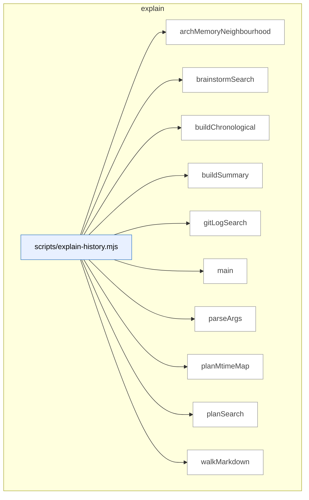

### Symbols in this domain

| Symbol | Kind | Path | Lines | Purpose | File imported by |
|---|---|---|---|---|---|
| [`archMemoryNeighbourhood`](../scripts/explain-history.mjs#L148) | function | `scripts/explain-history.mjs` | 148-184 | Queries arch-memory neighbourhood via cross-skill subprocess and formats matching records. | _(internal)_ |
| [`brainstormSearch`](../scripts/explain-history.mjs#L237) | function | `scripts/explain-history.mjs` | 237-282 | Searches brainstorm session JSONL files for topic hits in session metadata or provider responses. | _(internal)_ |
| [`buildChronological`](../scripts/explain-history.mjs#L290) | function | `scripts/explain-history.mjs` | 290-305 | Builds a chronological timeline merging git, brainstorm, and plan matches sorted by recency. | _(internal)_ |
| [`buildSummary`](../scripts/explain-history.mjs#L319) | function | `scripts/explain-history.mjs` | 319-326 | Summarizes touch counts across git, arch-memory, plans, and brainstorm for a topic. | _(internal)_ |
| [`gitLogSearch`](../scripts/explain-history.mjs#L89) | function | `scripts/explain-history.mjs` | 89-140 | Searches git history by subject and content for a topic, deduplicating and limiting results. | _(internal)_ |
| [`main`](../scripts/explain-history.mjs#L328) | function | `scripts/explain-history.mjs` | 328-385 | Orchestrates multi-source historical search, producing a combined timeline and summary report. | _(internal)_ |
| [`parseArgs`](../scripts/explain-history.mjs#L51) | function | `scripts/explain-history.mjs` | 51-80 | Parses CLI arguments for explain-history, extracting topic, date range, paths, and output format. | _(internal)_ |
| [`planMtimeMap`](../scripts/explain-history.mjs#L307) | function | `scripts/explain-history.mjs` | 307-317 | Collects file modification timestamps for plan documents. | _(internal)_ |
| [`planSearch`](../scripts/explain-history.mjs#L191) | function | `scripts/explain-history.mjs` | 191-218 | Searches plan documents in docs/plans for topic mentions with line-level context. | _(internal)_ |
| [`walkMarkdown`](../scripts/explain-history.mjs#L220) | function | `scripts/explain-history.mjs` | 220-228 | Recursively walks a directory collecting markdown file paths. | _(internal)_ |

---

## findings

> The `findings` domain formats security findings by severity and logs their outcomes over time, computing acceptance rates and effectiveness metrics while tracking associated remediation tasks.

```mermaid
flowchart TB
subgraph dom_findings ["findings"]
  file_scripts_lib_findings_format_mjs["scripts/lib/findings-format.mjs"]:::component
  sym_scripts_lib_findings_format_mjs_formatFi["formatFindings"]:::symbol
  file_scripts_lib_findings_format_mjs --> sym_scripts_lib_findings_format_mjs_formatFi
  file_scripts_lib_findings_outcomes_mjs["scripts/lib/findings-outcomes.mjs"]:::component
  sym_scripts_lib_findings_outcomes_mjs_append["appendOutcome"]:::symbol
  file_scripts_lib_findings_outcomes_mjs --> sym_scripts_lib_findings_outcomes_mjs_append
  sym_scripts_lib_findings_outcomes_mjs_batchA["batchAppendOutcomes"]:::symbol
  file_scripts_lib_findings_outcomes_mjs --> sym_scripts_lib_findings_outcomes_mjs_batchA
  sym_scripts_lib_findings_outcomes_mjs_compac["compactOutcomes"]:::symbol
  file_scripts_lib_findings_outcomes_mjs --> sym_scripts_lib_findings_outcomes_mjs_compac
  sym_scripts_lib_findings_outcomes_mjs_comput["computePassEffectiveness"]:::symbol
  file_scripts_lib_findings_outcomes_mjs --> sym_scripts_lib_findings_outcomes_mjs_comput
  sym_scripts_lib_findings_outcomes_mjs_comput["computePassEWR"]:::symbol
  file_scripts_lib_findings_outcomes_mjs --> sym_scripts_lib_findings_outcomes_mjs_comput
  sym_scripts_lib_findings_outcomes_mjs_loadOu["loadOutcomes"]:::symbol
  file_scripts_lib_findings_outcomes_mjs --> sym_scripts_lib_findings_outcomes_mjs_loadOu
  sym_scripts_lib_findings_outcomes_mjs_setRep["setRepoProfileCache"]:::symbol
  file_scripts_lib_findings_outcomes_mjs --> sym_scripts_lib_findings_outcomes_mjs_setRep
  file_scripts_lib_findings_tasks_mjs["scripts/lib/findings-tasks.mjs"]:::component
  sym_scripts_lib_findings_tasks_mjs_createRem["createRemediationTask"]:::symbol
  file_scripts_lib_findings_tasks_mjs --> sym_scripts_lib_findings_tasks_mjs_createRem
  sym_scripts_lib_findings_tasks_mjs_getTaskSt["getTaskStore"]:::symbol
  file_scripts_lib_findings_tasks_mjs --> sym_scripts_lib_findings_tasks_mjs_getTaskSt
  sym_scripts_lib_findings_tasks_mjs_loadTasks["loadTasks"]:::symbol
  file_scripts_lib_findings_tasks_mjs --> sym_scripts_lib_findings_tasks_mjs_loadTasks
  sym_scripts_lib_findings_tasks_mjs_persistTa["persistTask"]:::symbol
  file_scripts_lib_findings_tasks_mjs --> sym_scripts_lib_findings_tasks_mjs_persistTa
  sym_scripts_lib_findings_tasks_mjs_trackEdit["trackEdit"]:::symbol
  file_scripts_lib_findings_tasks_mjs --> sym_scripts_lib_findings_tasks_mjs_trackEdit
  sym_scripts_lib_findings_tasks_mjs_updateTas["updateTask"]:::symbol
  file_scripts_lib_findings_tasks_mjs --> sym_scripts_lib_findings_tasks_mjs_updateTas
  sym_scripts_lib_findings_tasks_mjs_verifyTas["verifyTask"]:::symbol
  file_scripts_lib_findings_tasks_mjs --> sym_scripts_lib_findings_tasks_mjs_verifyTas
  file_scripts_lib_findings_tracker_mjs["scripts/lib/findings-tracker.mjs"]:::component
  sym_scripts_lib_findings_tracker_mjs_applyLa["applyLazyDecay"]:::symbol
  file_scripts_lib_findings_tracker_mjs --> sym_scripts_lib_findings_tracker_mjs_applyLa
  sym_scripts_lib_findings_tracker_mjs_buildPa["buildPatternKey"]:::symbol
  file_scripts_lib_findings_tracker_mjs --> sym_scripts_lib_findings_tracker_mjs_buildPa
  sym_scripts_lib_findings_tracker_mjs_effecti["effectiveSampleSize"]:::symbol
  file_scripts_lib_findings_tracker_mjs --> sym_scripts_lib_findings_tracker_mjs_effecti
  sym_scripts_lib_findings_tracker_mjs_extract["extractDimensions"]:::symbol
  file_scripts_lib_findings_tracker_mjs --> sym_scripts_lib_findings_tracker_mjs_extract
  sym_scripts_lib_findings_tracker_mjs_FalsePo["FalsePositiveTracker"]:::symbol
  file_scripts_lib_findings_tracker_mjs --> sym_scripts_lib_findings_tracker_mjs_FalsePo
  sym_scripts_lib_findings_tracker_mjs_recordW["recordWithDecay"]:::symbol
  file_scripts_lib_findings_tracker_mjs --> sym_scripts_lib_findings_tracker_mjs_recordW
  file_scripts_lib_findings_mjs["scripts/lib/findings.mjs"]:::component
  sym_scripts_lib_findings_mjs_semanticId["semanticId"]:::symbol
  file_scripts_lib_findings_mjs --> sym_scripts_lib_findings_mjs_semanticId
end
classDef container fill:#f5f5f5,stroke:#333,stroke-width:2px,color:#000
classDef component fill:#e8f0ff,stroke:#3178c6,color:#000
classDef symbol fill:#fff,stroke:#999,color:#444
classDef dup fill:#ffe8d8,stroke:#c0392b,stroke-width:2px,color:#000
classDef violation fill:#ffd6d6,stroke:#c0392b,stroke-width:2px,color:#000
```

### Symbols in this domain

| Symbol | Kind | Path | Lines | Purpose | File imported by |
|---|---|---|---|---|---|
| [`formatFindings`](../scripts/lib/findings-format.mjs#L12) | function | `scripts/lib/findings-format.mjs` | 12-33 | Formats findings into markdown grouped by severity with risk, principles, and recommendations. | `scripts/lib/findings.mjs` |
| [`appendOutcome`](../scripts/lib/findings-outcomes.mjs#L38) | function | `scripts/lib/findings-outcomes.mjs` | 38-50 | Appends a single outcome record with timestamp and repo fingerprint to a JSONL log. | `scripts/audit-metrics.mjs`, `scripts/lib/findings.mjs`, `scripts/lib/outcome-sync.mjs` |
| [`batchAppendOutcomes`](../scripts/lib/findings-outcomes.mjs#L58) | function | `scripts/lib/findings-outcomes.mjs` | 58-75 | Atomically appends multiple outcome records to a JSONL log with timestamps. | `scripts/audit-metrics.mjs`, `scripts/lib/findings.mjs`, `scripts/lib/outcome-sync.mjs` |
| [`compactOutcomes`](../scripts/lib/findings-outcomes.mjs#L100) | function | `scripts/lib/findings-outcomes.mjs` | 100-138 | Backfills legacy outcomes with timestamps and prunes stale entries based on age. | `scripts/audit-metrics.mjs`, `scripts/lib/findings.mjs`, `scripts/lib/outcome-sync.mjs` |
| [`computePassEffectiveness`](../scripts/lib/findings-outcomes.mjs#L149) | function | `scripts/lib/findings-outcomes.mjs` | 149-187 | Computes weighted acceptance rate and signal score for a pass using exponential decay. | `scripts/audit-metrics.mjs`, `scripts/lib/findings.mjs`, `scripts/lib/outcome-sync.mjs` |
| [`computePassEWR`](../scripts/lib/findings-outcomes.mjs#L196) | function | `scripts/lib/findings-outcomes.mjs` | 196-216 | Computes effective weighted reward (EWR) for a pass with confidence based on recency weighting. | `scripts/audit-metrics.mjs`, `scripts/lib/findings.mjs`, `scripts/lib/outcome-sync.mjs` |
| [`loadOutcomes`](../scripts/lib/findings-outcomes.mjs#L82) | function | `scripts/lib/findings-outcomes.mjs` | 82-93 | Loads all outcome records from the log file and backfills missing timestamps. | `scripts/audit-metrics.mjs`, `scripts/lib/findings.mjs`, `scripts/lib/outcome-sync.mjs` |
| [`setRepoProfileCache`](../scripts/lib/findings-outcomes.mjs#L27) | function | `scripts/lib/findings-outcomes.mjs` | 27-29 | Caches a repository profile for use in outcome logging. | `scripts/audit-metrics.mjs`, `scripts/lib/findings.mjs`, `scripts/lib/outcome-sync.mjs` |
| [`createRemediationTask`](../scripts/lib/findings-tasks.mjs#L34) | function | `scripts/lib/findings-tasks.mjs` | 34-48 | Creates a remediation task record from a finding with a semantic hash and initial state. | `scripts/lib/findings.mjs` |
| [`getTaskStore`](../scripts/lib/findings-tasks.mjs#L17) | function | `scripts/lib/findings-tasks.mjs` | 17-22 | Lazily initializes and returns an append-only store for remediation tasks. | `scripts/lib/findings.mjs` |
| [`loadTasks`](../scripts/lib/findings-tasks.mjs#L75) | function | `scripts/lib/findings-tasks.mjs` | 75-81 | Loads all tasks from store, deduplicates by taskId, and optionally filters by runId. | `scripts/lib/findings.mjs` |
| [`persistTask`](../scripts/lib/findings-tasks.mjs#L72) | function | `scripts/lib/findings-tasks.mjs` | 72-72 | Persists a task object to the task store. | `scripts/lib/findings.mjs` |
| [`trackEdit`](../scripts/lib/findings-tasks.mjs#L53) | function | `scripts/lib/findings-tasks.mjs` | 53-57 | Records an edit to a task with timestamp and marks remediation as fixed. | `scripts/lib/findings.mjs` |
| [`updateTask`](../scripts/lib/findings-tasks.mjs#L84) | function | `scripts/lib/findings-tasks.mjs` | 84-87 | Updates task timestamp and appends it to the store. | `scripts/lib/findings.mjs` |
| [`verifyTask`](../scripts/lib/findings-tasks.mjs#L62) | function | `scripts/lib/findings-tasks.mjs` | 62-67 | Updates task verification status, verifier info, and timestamps based on pass/fail result. | `scripts/lib/findings.mjs` |
| [`applyLazyDecay`](../scripts/lib/findings-tracker.mjs#L21) | function | `scripts/lib/findings-tracker.mjs` | 21-46 | Applies exponential decay to acceptance/dismissal counts based on elapsed time and half-life. | `scripts/lib/findings.mjs`, `scripts/lib/suppression-policy.mjs` |
| [`buildPatternKey`](../scripts/lib/findings-tracker.mjs#L95) | function | `scripts/lib/findings-tracker.mjs` | 95-97 | Constructs a colon-delimited pattern key from dimension values including scope. | `scripts/lib/findings.mjs`, `scripts/lib/suppression-policy.mjs` |
| [`effectiveSampleSize`](../scripts/lib/findings-tracker.mjs#L51) | function | `scripts/lib/findings-tracker.mjs` | 51-53 | Returns the sum of decayed accepted and dismissed counts. | `scripts/lib/findings.mjs`, `scripts/lib/suppression-policy.mjs` |
| [`extractDimensions`](../scripts/lib/findings-tracker.mjs#L82) | function | `scripts/lib/findings-tracker.mjs` | 82-90 | Extracts and normalizes category, principle, severity, repo, and file extension dimensions from a finding. | `scripts/lib/findings.mjs`, `scripts/lib/suppression-policy.mjs` |
| [`FalsePositiveTracker`](../scripts/lib/findings-tracker.mjs#L105) | class | `scripts/lib/findings-tracker.mjs` | 105-226 | <no body> | `scripts/lib/findings.mjs`, `scripts/lib/suppression-policy.mjs` |
| [`recordWithDecay`](../scripts/lib/findings-tracker.mjs#L59) | function | `scripts/lib/findings-tracker.mjs` | 59-75 | Records a new outcome (accepted/dismissed) and updates exponential moving average with decay applied. | `scripts/lib/findings.mjs`, `scripts/lib/suppression-policy.mjs` |
| [`semanticId`](../scripts/lib/findings.mjs#L27) | function | `scripts/lib/findings.mjs` | 27-40 | Generates a short semantic hash of a finding based on linter rule/file or generic content. | `scripts/cross-skill.mjs`, `scripts/evolve-prompts.mjs`, `scripts/gemini-review.mjs`, +14 more |

---

## install

> Builds and validates the skills manifest (inventory with SHA hashes, summaries, and version digest), then installs verified skills to `~/.claude/skills` globally with freshness checks and upstream version-mismatch detection.

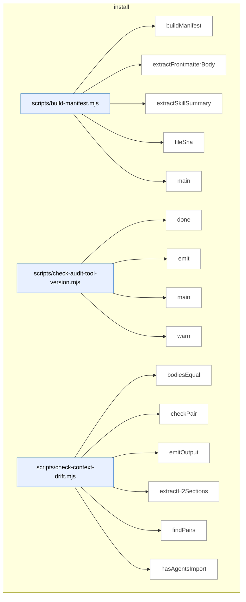

_Domain has 135 symbols (>50). Diagram shows top-15 by file order; see flat table below for the full list._

### Symbols in this domain

| Symbol | Kind | Path | Lines | Purpose | File imported by |
|---|---|---|---|---|---|
| [`buildManifest`](../scripts/build-manifest.mjs#L99) | function | `scripts/build-manifest.mjs` | 99-163 | Builds a manifest of all skills with file lists, SHAs, summaries, and a bundleVersion hash. | _(internal)_ |
| [`extractFrontmatterBody`](../scripts/build-manifest.mjs#L49) | function | `scripts/build-manifest.mjs` | 49-54 | Extracts YAML frontmatter body between triple-dashes from markdown content. | _(internal)_ |
| [`extractSkillSummary`](../scripts/build-manifest.mjs#L64) | function | `scripts/build-manifest.mjs` | 64-94 | Parses frontmatter to extract the skill description field (block or inline form), truncating to 100 characters. | _(internal)_ |
| [`fileSha`](../scripts/build-manifest.mjs#L40) | function | `scripts/build-manifest.mjs` | 40-43 | Computes a 12-character SHA256 hash of a file's content. | _(internal)_ |
| [`main`](../scripts/build-manifest.mjs#L165) | function | `scripts/build-manifest.mjs` | 165-190 | Validates or regenerates skills.manifest.json, checking bundle freshness and reporting schema version. | _(internal)_ |
| [`done`](../scripts/check-audit-tool-version.mjs#L49) | function | `scripts/check-audit-tool-version.mjs` | 49-51 | Sets the process exit code. | _(internal)_ |
| [`emit`](../scripts/check-audit-tool-version.mjs#L38) | function | `scripts/check-audit-tool-version.mjs` | 38-40 | Writes a JSON object to stdout in JSON mode. | _(internal)_ |
| [`main`](../scripts/check-audit-tool-version.mjs#L53) | function | `scripts/check-audit-tool-version.mjs` | 53-142 | Checks if the audit tool version matches upstream, handling network errors and version mismatches gracefully. | _(internal)_ |
| [`warn`](../scripts/check-audit-tool-version.mjs#L42) | function | `scripts/check-audit-tool-version.mjs` | 42-44 | Writes a message to stderr if not in quiet or JSON mode. | _(internal)_ |
| [`bodiesEqual`](../scripts/check-context-drift.mjs#L168) | function | `scripts/check-context-drift.mjs` | 168-171 | Compares two text bodies after normalizing whitespace for semantic equality. | _(internal)_ |
| [`checkPair`](../scripts/check-context-drift.mjs#L184) | function | `scripts/check-context-drift.mjs` | 184-249 | Validates CLAUDE.md against drift rules: import presence, allowlist compliance, size cap, and section body matching. | _(internal)_ |
| [`emitOutput`](../scripts/check-context-drift.mjs#L346) | function | `scripts/check-context-drift.mjs` | 346-369 | Outputs findings in text, JSON, or SARIF format with severity-based aggregation. | _(internal)_ |
| [`extractH2Sections`](../scripts/check-context-drift.mjs#L141) | function | `scripts/check-context-drift.mjs` | 141-162 | Extracts H2 sections from markdown content, respecting code fence boundaries. | _(internal)_ |
| [`findPairs`](../scripts/check-context-drift.mjs#L261) | function | `scripts/check-context-drift.mjs` | 261-279 | Builds pairs of AGENTS.md and CLAUDE.md files from a flat file list grouped by directory. | _(internal)_ |
| [`hasAgentsImport`](../scripts/check-context-drift.mjs#L177) | function | `scripts/check-context-drift.mjs` | 177-180 | Checks if content imports AGENTS.md via @import directive in the first 30 lines. | _(internal)_ |
| [`hashId`](../scripts/check-context-drift.mjs#L253) | function | `scripts/check-context-drift.mjs` | 253-255 | Creates a deterministic 16-character semantic hash from a file path and rule key. | _(internal)_ |
| [`loadConfig`](../scripts/check-context-drift.mjs#L63) | function | `scripts/check-context-drift.mjs` | 63-94 | Loads and validates configuration from .claude-context-allowlist.json, returning defaults on parse failure. | _(internal)_ |
| [`main`](../scripts/check-context-drift.mjs#L371) | function | `scripts/check-context-drift.mjs` | 371-382 | Parses CLI arguments and runs a context-drift check, then exits with appropriate codes based on error/warning severity. | _(internal)_ |
| [`makeFenceTracker`](../scripts/check-context-drift.mjs#L108) | function | `scripts/check-context-drift.mjs` | 108-132 | Tracks entry/exit from code fences (``` or ~~~) to ignore headings inside code blocks. | _(internal)_ |
| [`parseArgs`](../scripts/check-context-drift.mjs#L309) | function | `scripts/check-context-drift.mjs` | 309-324 | Parses command-line arguments for repo path, output format, and strictness flag. | _(internal)_ |
| [`runDriftCheck`](../scripts/check-context-drift.mjs#L288) | function | `scripts/check-context-drift.mjs` | 288-305 | Runs drift checks on all AGENTS/CLAUDE pairs and aggregates findings. | _(internal)_ |
| [`showHelp`](../scripts/check-context-drift.mjs#L326) | function | `scripts/check-context-drift.mjs` | 326-344 | Prints usage help and configuration guide for the drift check tool. | _(internal)_ |
| [`canResolve`](../scripts/check-deps.mjs#L52) | function | `scripts/check-deps.mjs` | 52-60 | Tests whether a package can be resolved using require.resolve. | _(internal)_ |
| [`loadEnv`](../scripts/check-deps.mjs#L62) | function | `scripts/check-deps.mjs` | 62-77 | Parses a .env file into process.env, skipping comments and handling quotes. | _(internal)_ |
| [`main`](../scripts/check-deps.mjs#L79) | function | `scripts/check-deps.mjs` | 79-173 | <no body> | _(internal)_ |
| [`detectMissingFromStatic`](../scripts/check-model-freshness.mjs#L149) | function | `scripts/check-model-freshness.mjs` | 149-177 | Identifies models in live provider catalogs that match tier patterns but are missing from STATIC_POOL, reporting them as potential offline-resolution gaps. | _(internal)_ |
| [`detectPrematureRemap`](../scripts/check-model-freshness.mjs#L183) | function | `scripts/check-model-freshness.mjs` | 183-208 | Flags deprecated model remappings that are still actively served by providers, suggesting they may be premature or undocumented. | _(internal)_ |
| [`detectSentinelDrift`](../scripts/check-model-freshness.mjs#L83) | function | `scripts/check-model-freshness.mjs` | 83-143 | Detects drift between static model pool and live provider catalogs by resolving sentinels with both caches, identifying stale or missing models. | _(internal)_ |
| [`emitOutput`](../scripts/check-model-freshness.mjs#L310) | function | `scripts/check-model-freshness.mjs` | 310-340 | Outputs model freshness findings in JSON, SARIF, or human-readable format, displaying provider coverage and severity summaries. | _(internal)_ |
| [`hashId`](../scripts/check-model-freshness.mjs#L212) | function | `scripts/check-model-freshness.mjs` | 212-214 | Hashes a rule identifier and key into a 16-character SHA256 digest for deduplicating semantic findings. | _(internal)_ |
| [`main`](../scripts/check-model-freshness.mjs#L342) | function | `scripts/check-model-freshness.mjs` | 342-353 | Parses CLI args, runs freshness check, emits output, and exits with code 3 for no providers, 1 for errors, 2 for warnings, or 0 for success. | _(internal)_ |
| [`parseArgs`](../scripts/check-model-freshness.mjs#L266) | function | `scripts/check-model-freshness.mjs` | 266-280 | Parses command-line arguments for format, strict mode, and help, validating that format is one of text/json/sarif. | _(internal)_ |
| [`runFreshnessCheck`](../scripts/check-model-freshness.mjs#L225) | function | `scripts/check-model-freshness.mjs` | 225-262 | Fetches live model catalogs from providers (or uses cached/empty if refresh disabled), validates schema, and runs drift detection rules. | _(internal)_ |
| [`showHelp`](../scripts/check-model-freshness.mjs#L282) | function | `scripts/check-model-freshness.mjs` | 282-308 | Displays usage information, exit codes, environment variables, and instructions for model freshness checking. | _(internal)_ |
| [`main`](../scripts/check-rls.mjs#L31) | function | `scripts/check-rls.mjs` | 31-145 | Main RLS audit function that queries pgSQL for table row-level security status and permission grants. | _(internal)_ |
| [`checkAuditApiKeys`](../scripts/check-setup.mjs#L159) | function | `scripts/check-setup.mjs` | 159-176 | Checks for required audit API keys (OPENAI) and optional review keys (GEMINI/ANTHROPIC), reporting pass/warn status. | _(internal)_ |
| [`checkAuditLoop`](../scripts/check-setup.mjs#L241) | function | `scripts/check-setup.mjs` | 241-245 | Runs audit-loop setup checks including API keys and Supabase/cloud database tables. | _(internal)_ |
| [`checkAuditSupabase`](../scripts/check-setup.mjs#L178) | function | `scripts/check-setup.mjs` | 178-239 | Resolves AUDIT_DB_URL from process/local/.env/shared config sources, verifies cloud database connectivity, and checks required audit tables. | _(internal)_ |
| [`checkConsistencyMode`](../scripts/check-setup.mjs#L405) | function | `scripts/check-setup.mjs` | 405-451 | Checks consistency-mode adoption by looking for surfaces.json manifest, validating canaries directory, and probing Playwright. | _(internal)_ |
| [`checkPersonaTest`](../scripts/check-setup.mjs#L249) | function | `scripts/check-setup.mjs` | 249-297 | Checks persona-test setup including database URL, required tables/views, and Playwright availability for consistency mode. | _(internal)_ |
| [`checkPlaywrightAvailable`](../scripts/check-setup.mjs#L385) | function | `scripts/check-setup.mjs` | 385-403 | Probes for Playwright availability by checking node_modules, running version command, and verifying chromium binary presence. | _(internal)_ |
| [`checkTables`](../scripts/check-setup.mjs#L70) | function | `scripts/check-setup.mjs` | 70-80 | Queries information_schema to check which of the given table names exist in the public schema. | _(internal)_ |
| [`injectResolvedDbEnv`](../scripts/check-setup.mjs#L474) | function | `scripts/check-setup.mjs` | 474-485 | Injects resolved AUDIT_DB_URL and AUDIT_DB_SSL_MODE from cloud config into process.env if unset, enabling database access. | _(internal)_ |
| [`loadEnv`](../scripts/check-setup.mjs#L47) | function | `scripts/check-setup.mjs` | 47-62 | Parses .env file line-by-line, extracting key=value pairs while skipping comments and empty lines. | _(internal)_ |
| [`main`](../scripts/check-setup.mjs#L487) | function | `scripts/check-setup.mjs` | 487-501 | Main entry point that loads .env, resolves cloud DB config, runs all checks, and reports with appropriate exit code. | _(internal)_ |
| [`printJsonReport`](../scripts/check-setup.mjs#L360) | function | `scripts/check-setup.mjs` | 360-370 | Outputs setup check results as pretty-printed JSON to stdout. | _(internal)_ |
| [`printReport`](../scripts/check-setup.mjs#L328) | function | `scripts/check-setup.mjs` | 328-358 | Prints formatted terminal report with sections, items, status icons, and optional fix commands to stdout. | _(internal)_ |
| [`Report`](../scripts/check-setup.mjs#L120) | class | `scripts/check-setup.mjs` | 120-155 | Report class that accumulates check results organized by section, tracking failures/warnings and providing methods to add items. | _(internal)_ |
| [`statusIcon`](../scripts/check-setup.mjs#L304) | function | `scripts/check-setup.mjs` | 304-313 | Returns a colored status icon string matching the report item status (PASS/FAIL/WARN/INFO/FIX). | _(internal)_ |
| [`verdictLine`](../scripts/check-setup.mjs#L315) | function | `scripts/check-setup.mjs` | 315-326 | Formats a summary verdict line showing counts of failures and warnings with appropriate color coding. | _(internal)_ |
| [`listSkills`](../scripts/check-skill-refs.mjs#L30) | function | `scripts/check-skill-refs.mjs` | 30-36 | Lists all skill directories in SKILLS_DIR by reading filesystem and filtering for directories, sorted alphabetically. | _(internal)_ |
| [`main`](../scripts/check-skill-refs.mjs#L38) | function | `scripts/check-skill-refs.mjs` | 38-74 | Lints one or more skills by directory, reporting pass/fail with entry counts and aggregating results with colored output. | _(internal)_ |
| [`main`](../scripts/check-skill-updates.mjs#L25) | function | `scripts/check-skill-updates.mjs` | 25-118 | <no body> | _(internal)_ |
| [`parseArgs`](../scripts/check-skill-updates.mjs#L16) | function | `scripts/check-skill-updates.mjs` | 16-23 | Parses command-line arguments for JSON output, no-cache flag, and optional target directory path. | _(internal)_ |
| [`checkSync`](../scripts/check-sync.mjs#L25) | function | `scripts/check-sync.mjs` | 25-153 | Validates Supabase/Postgres connection and sync status, checking environment variables, database connectivity, repo registration, and audit run history. | _(internal)_ |
| [`fail`](../scripts/check-sync.mjs#L20) | function | `scripts/check-sync.mjs` | 20-20 | Logs a failing check result. | _(internal)_ |
| [`finish`](../scripts/check-sync.mjs#L155) | function | `scripts/check-sync.mjs` | 155-178 | Prints a formatted sync status verdict or JSON output, then exits with appropriate code. | _(internal)_ |
| [`info`](../scripts/check-sync.mjs#L21) | function | `scripts/check-sync.mjs` | 21-21 | Logs an informational check result. | _(internal)_ |
| [`log`](../scripts/check-sync.mjs#L17) | function | `scripts/check-sync.mjs` | 17-17 | Writes a message to stdout unless JSON mode is enabled. | _(internal)_ |
| [`pass`](../scripts/check-sync.mjs#L19) | function | `scripts/check-sync.mjs` | 19-19 | Logs a passing check result. | _(internal)_ |
| [`buildCopilotMergeWrite`](../scripts/install-skills.mjs#L205) | function | `scripts/install-skills.mjs` | 205-218 | Merges skill instructions into the copilot-instructions.md file and records the merged result with SHA tracking. | _(internal)_ |
| [`buildSkillWrites`](../scripts/install-skills.mjs#L173) | function | `scripts/install-skills.mjs` | 173-203 | Builds write operations for skill files by resolving paths, validating SHA integrity, and recording managed file metadata. | _(internal)_ |
| [`checkConflicts`](../scripts/install-skills.mjs#L233) | function | `scripts/install-skills.mjs` | 233-245 | Detects conflicts between incoming writes and previous receipts, separating repo-scoped and global-scoped conflicts. | _(internal)_ |
| [`computeDeletes`](../scripts/install-skills.mjs#L220) | function | `scripts/install-skills.mjs` | 220-231 | Identifies files from previous receipts that are no longer in the new write list, collecting them for deletion. | _(internal)_ |
| [`expandSkillFiles`](../scripts/install-skills.mjs#L114) | function | `scripts/install-skills.mjs` | 114-120 | Expands a skill's file list from manifest metadata, falling back to a legacy single-file format if needed. | _(internal)_ |
| [`fileShaShort`](../scripts/install-skills.mjs#L122) | function | `scripts/install-skills.mjs` | 122-124 | Computes a 12-character SHA256 hash of a buffer for file integrity verification. | _(internal)_ |
| [`loadManifest`](../scripts/install-skills.mjs#L84) | function | `scripts/install-skills.mjs` | 84-107 | Loads and validates the skills manifest JSON file, checking schema version compatibility and exiting on parse errors. | _(internal)_ |
| [`main`](../scripts/install-skills.mjs#L259) | function | `scripts/install-skills.mjs` | 259-346 | <no body> | _(internal)_ |
| [`maybeWarnGithubSkillsDeprecation`](../scripts/install-skills.mjs#L161) | function | `scripts/install-skills.mjs` | 161-171 | Warns about deprecated .github/skills/ directory and suggests passing --keep-github-skills to preserve it. | _(internal)_ |
| [`parseArgs`](../scripts/install-skills.mjs#L56) | function | `scripts/install-skills.mjs` | 56-78 | Parses command-line arguments into an options object with defaults for local/remote mode, surface targets, skills filter, and installation flags. | _(internal)_ |
| [`printBanner`](../scripts/install-skills.mjs#L141) | function | `scripts/install-skills.mjs` | 141-149 | Prints installation banner showing mode, surface, target repo, and any dry-run or cross-repo notices. | _(internal)_ |
| [`reconcileJournals`](../scripts/install-skills.mjs#L151) | function | `scripts/install-skills.mjs` | 151-159 | Recovers from journal files tracking previous installation transactions, reporting rolled-forward or rolled-back changes. | _(internal)_ |
| [`validateTarget`](../scripts/install-skills.mjs#L128) | function | `scripts/install-skills.mjs` | 128-139 | Validates that the target directory exists and contains git or package.json markers, warning if neither is found. | _(internal)_ |
| [`writeReceiptsByScope`](../scripts/install-skills.mjs#L247) | function | `scripts/install-skills.mjs` | 247-257 | Writes installation receipts to disk partitioned by scope, recording manifest version and managed files. | _(internal)_ |
| [`computeFileSha`](../scripts/lib/install/conflict-detector.mjs#L13) | function | `scripts/lib/install/conflict-detector.mjs` | 13-20 | Computes a 12-character SHA256 hash of a file's content, returning null on read error. | `scripts/check-skill-updates.mjs`, `scripts/install-skills.mjs` |
| [`detectConflicts`](../scripts/lib/install/conflict-detector.mjs#L30) | function | `scripts/lib/install/conflict-detector.mjs` | 30-78 | Partitions planned file writes into safe and conflicted based on receipt history and SHA comparison. | `scripts/check-skill-updates.mjs`, `scripts/install-skills.mjs` |
| [`detectDrift`](../scripts/lib/install/conflict-detector.mjs#L86) | function | `scripts/lib/install/conflict-detector.mjs` | 86-105 | Detects drift in managed files by comparing expected vs actual SHA hashes. | `scripts/check-skill-updates.mjs`, `scripts/install-skills.mjs` |
| [`generateAllPromptFiles`](../scripts/lib/install/copilot-prompts.mjs#L229) | function | `scripts/lib/install/copilot-prompts.mjs` | 229-260 | Discovers skills and generates prompt files for each. | `scripts/regenerate-skill-copies.mjs` |
| [`generatePromptFile`](../scripts/lib/install/copilot-prompts.mjs#L180) | function | `scripts/lib/install/copilot-prompts.mjs` | 180-218 | Generates a VS Code Copilot prompt file from skill metadata. | `scripts/regenerate-skill-copies.mjs` |
| [`parseSkillFrontmatter`](../scripts/lib/install/copilot-prompts.mjs#L140) | function | `scripts/lib/install/copilot-prompts.mjs` | 140-169 | Parses SKILL.md frontmatter to extract name and description. | `scripts/regenerate-skill-copies.mjs` |
| [`shaOfManagedBlock`](../scripts/lib/install/copilot-prompts.mjs#L270) | function | `scripts/lib/install/copilot-prompts.mjs` | 270-278 | Computes a short SHA256 hash of a managed block between markers. | `scripts/regenerate-skill-copies.mjs` |
| [`yamlQuote`](../scripts/lib/install/copilot-prompts.mjs#L129) | function | `scripts/lib/install/copilot-prompts.mjs` | 129-131 | Escapes a string as YAML double-quoted scalar. | `scripts/regenerate-skill-copies.mjs` |
| [`ensureAuditDeps`](../scripts/lib/install/deps.mjs#L89) | function | `scripts/lib/install/deps.mjs` | 89-151 | Installs missing audit-loop dependencies via npm with dry-run support and formatted output. | `scripts/install-skills.mjs`, `scripts/sync-to-repos.mjs` |
| [`findMissingDeps`](../scripts/lib/install/deps.mjs#L58) | function | `scripts/lib/install/deps.mjs` | 58-70 | Checks which required and optional npm dependencies are missing from node_modules. | `scripts/install-skills.mjs`, `scripts/sync-to-repos.mjs` |
| [`checkAuditGitignore`](../scripts/lib/install/gitignore.mjs#L152) | function | `scripts/lib/install/gitignore.mjs` | 152-171 | Checks .gitignore for presence of required patterns and returns missing/present lists. | `scripts/check-skill-updates.mjs`, `scripts/install-skills.mjs` |
| [`ensureAuditGitignore`](../scripts/lib/install/gitignore.mjs#L106) | function | `scripts/lib/install/gitignore.mjs` | 106-143 | Adds or creates .gitignore with required audit-loop patterns. | `scripts/check-skill-updates.mjs`, `scripts/install-skills.mjs` |
| [`extractBlock`](../scripts/lib/install/merge.mjs#L64) | function | `scripts/lib/install/merge.mjs` | 64-70 | Extracts the content between start and end markers from a file. | `scripts/install-skills.mjs` |
| [`mergeBlock`](../scripts/lib/install/merge.mjs#L36) | function | `scripts/lib/install/merge.mjs` | 36-55 | Merges a managed block into a file, replacing existing markers or appending if none exist. | `scripts/install-skills.mjs` |
| [`buildReceipt`](../scripts/lib/install/receipt.mjs#L48) | function | `scripts/lib/install/receipt.mjs` | 48-57 | Constructs an install receipt object with version, bundle info, and managed files list. | `scripts/check-skill-updates.mjs`, `scripts/install-skills.mjs` |
| [`readReceipt`](../scripts/lib/install/receipt.mjs#L13) | function | `scripts/lib/install/receipt.mjs` | 13-24 | Reads and validates an install receipt from JSON file. | `scripts/check-skill-updates.mjs`, `scripts/install-skills.mjs` |
| [`writeReceipt`](../scripts/lib/install/receipt.mjs#L31) | function | `scripts/lib/install/receipt.mjs` | 31-37 | Validates and atomically writes an install receipt with temp-rename pattern. | `scripts/check-skill-updates.mjs`, `scripts/install-skills.mjs` |
| [`findRepoRoot`](../scripts/lib/install/surface-paths.mjs#L14) | function | `scripts/lib/install/surface-paths.mjs` | 14-37 | Finds the outermost .git directory or package.json as repo root, walking up from a start directory. | `scripts/check-skill-updates.mjs`, `scripts/install-skills.mjs` |
| [`partitionManagedFilesByScope`](../scripts/lib/install/surface-paths.mjs#L124) | function | `scripts/lib/install/surface-paths.mjs` | 124-132 | Partitions managed files into global and repo-scoped lists. | `scripts/check-skill-updates.mjs`, `scripts/install-skills.mjs` |
| [`receiptPath`](../scripts/lib/install/surface-paths.mjs#L110) | function | `scripts/lib/install/surface-paths.mjs` | 110-115 | Returns the path to the install receipt, global or repo-scoped based on scope parameter. | `scripts/check-skill-updates.mjs`, `scripts/install-skills.mjs` |
| [`resolveSkillFiles`](../scripts/lib/install/surface-paths.mjs#L79) | function | `scripts/lib/install/surface-paths.mjs` | 79-94 | Expands skill files across multiple surfaces and scopes with full file paths. | `scripts/check-skill-updates.mjs`, `scripts/install-skills.mjs` |
| [`resolveSkillTargets`](../scripts/lib/install/surface-paths.mjs#L46) | function | `scripts/lib/install/surface-paths.mjs` | 46-66 | Resolves target installation directories for a skill across specified surfaces (claude/copilot/agents). | `scripts/check-skill-updates.mjs`, `scripts/install-skills.mjs` |
| [`cleanupJournal`](../scripts/lib/install/transaction.mjs#L200) | function | `scripts/lib/install/transaction.mjs` | 200-203 | Removes the transaction journal file on best-effort basis. | `scripts/install-skills.mjs` |
| [`defaultJournalPath`](../scripts/lib/install/transaction.mjs#L245) | function | `scripts/lib/install/transaction.mjs` | 245-247 | Returns the default transaction journal path in the current directory. | `scripts/install-skills.mjs` |
| [`executeTransaction`](../scripts/lib/install/transaction.mjs#L81) | function | `scripts/lib/install/transaction.mjs` | 81-176 | <no body> | `scripts/install-skills.mjs` |
| [`fsyncFile`](../scripts/lib/install/transaction.mjs#L49) | function | `scripts/lib/install/transaction.mjs` | 49-51 | Calls fsync on a file descriptor with best-effort error suppression. | `scripts/install-skills.mjs` |
| [`recoverFromJournal`](../scripts/lib/install/transaction.mjs#L211) | function | `scripts/lib/install/transaction.mjs` | 211-243 | Recovers from a partial transaction journal by rolling forward renames or rolling back staged files. | `scripts/install-skills.mjs` |
| [`rollbackPartialTransaction`](../scripts/lib/install/transaction.mjs#L178) | function | `scripts/lib/install/transaction.mjs` | 178-198 | Reverts completed file renames to their original snapshots on transaction failure. | `scripts/install-skills.mjs` |
| [`shaShort`](../scripts/lib/install/transaction.mjs#L45) | function | `scripts/lib/install/transaction.mjs` | 45-47 | Computes a 12-character SHA256 hash of a buffer. | `scripts/install-skills.mjs` |
| [`tmpSuffix`](../scripts/lib/install/transaction.mjs#L40) | function | `scripts/lib/install/transaction.mjs` | 40-43 | Generates a unique temporary file suffix using PID, millisecond timestamp, and random hex. | `scripts/install-skills.mjs` |
| [`writeJournal`](../scripts/lib/install/transaction.mjs#L58) | function | `scripts/lib/install/transaction.mjs` | 58-70 | Atomically writes a JSON journal entry to disk with fsync and temp-rename. | `scripts/install-skills.mjs` |
| [`computeVerdict`](../scripts/regenerate-skill-copies.mjs#L196) | function | `scripts/regenerate-skill-copies.mjs` | 196-200 | Determines the overall verdict (violations, changes, or in-sync) based on sync statistics and violation count. | _(internal)_ |
| [`copyFileIfChanged`](../scripts/regenerate-skill-copies.mjs#L76) | function | `scripts/regenerate-skill-copies.mjs` | 76-88 | Copies a file if its content differs from the destination, creating parent directories and reporting the operation. | _(internal)_ |
| [`emitVerdict`](../scripts/regenerate-skill-copies.mjs#L202) | function | `scripts/regenerate-skill-copies.mjs` | 202-214 | Outputs a summary of sync operations and exits with appropriate status if violations or unsynced changes exist. | _(internal)_ |
| [`loadSkillsOrDie`](../scripts/regenerate-skill-copies.mjs#L63) | function | `scripts/regenerate-skill-copies.mjs` | 63-74 | Loads the skill definitions from disk and exits if the skills directory is missing or empty. | _(internal)_ |
| [`main`](../scripts/regenerate-skill-copies.mjs#L216) | function | `scripts/regenerate-skill-copies.mjs` | 216-244 | Main entry point that orchestrates skill synchronization across all destinations and handles dry-run or check modes. | _(internal)_ |
| [`pruneFilesNotInSource`](../scripts/regenerate-skill-copies.mjs#L90) | function | `scripts/regenerate-skill-copies.mjs` | 90-105 | Removes destination files that no longer exist in the source skill directory. | _(internal)_ |
| [`pruneOrphanSkillDirs`](../scripts/regenerate-skill-copies.mjs#L130) | function | `scripts/regenerate-skill-copies.mjs` | 130-146 | Removes skill directories from destination roots that have no corresponding source skill. | _(internal)_ |
| [`pruneStalePrompts`](../scripts/regenerate-skill-copies.mjs#L168) | function | `scripts/regenerate-skill-copies.mjs` | 168-186 | Deletes stale managed prompts from the prompt directory that are not in the current expected set. | _(internal)_ |
| [`syncCopilotPrompts`](../scripts/regenerate-skill-copies.mjs#L188) | function | `scripts/regenerate-skill-copies.mjs` | 188-194 | Regenerates Copilot-compatible prompt files from skill sources, coordinating writes and pruning. | _(internal)_ |
| [`syncSkillToDests`](../scripts/regenerate-skill-copies.mjs#L107) | function | `scripts/regenerate-skill-copies.mjs` | 107-128 | Synchronizes a single skill from source to all configured destination roots, handling file copies and orphan cleanup. | _(internal)_ |
| [`warnGithubSkillsDeprecation`](../scripts/regenerate-skill-copies.mjs#L51) | function | `scripts/regenerate-skill-copies.mjs` | 51-61 | Warns that .github/skills/ is deprecated and no longer auto-regenerated unless explicitly preserved via flag. | _(internal)_ |
| [`writePromptFiles`](../scripts/regenerate-skill-copies.mjs#L148) | function | `scripts/regenerate-skill-copies.mjs` | 148-166 | Writes generated prompt files to disk, tracking which files were created or updated versus left unchanged. | _(internal)_ |
| [`confirm`](../scripts/setup-permissions.mjs#L119) | function | `scripts/setup-permissions.mjs` | 119-128 | Prompts user for Y/n confirmation via stdin, returning true if yes or skipped (unless AUTO_YES), or bypassing if auto-yes mode. | _(internal)_ |
| [`main`](../scripts/setup-permissions.mjs#L183) | function | `scripts/setup-permissions.mjs` | 183-280 | Reads project and user-level Claude settings, merges audit-loop permission rules, displays added/removed changes, and writes if confirmed. | _(internal)_ |
| [`mergeRules`](../scripts/setup-permissions.mjs#L134) | function | `scripts/setup-permissions.mjs` | 134-179 | Merges new permission rules into Claude Code settings, deduplicates, cleans up rules covered by wildcards, and merges deny rules. | _(internal)_ |
| [`readJson`](../scripts/setup-permissions.mjs#L106) | function | `scripts/setup-permissions.mjs` | 106-112 | Reads and parses a JSON file, returning null if file doesn't exist or JSON is invalid. | _(internal)_ |
| [`writeJson`](../scripts/setup-permissions.mjs#L114) | function | `scripts/setup-permissions.mjs` | 114-117 | Writes a JSON object to a file with pretty-printing and 2-space indentation, creating parent directories as needed. | _(internal)_ |
| [`buildCopilotPromptFiles`](../scripts/sync-to-repos.mjs#L404) | function | `scripts/sync-to-repos.mjs` | 404-412 | Lists .github/prompts/*.prompt.md files for Copilot prompt shim syncing. | _(internal)_ |
| [`buildFileUniverse`](../scripts/sync-to-repos.mjs#L302) | function | `scripts/sync-to-repos.mjs` | 302-319 | Recursively scans scripts/ and .claude/ directories to build a set of all trackable files. | _(internal)_ |
| [`buildSkillFiles`](../scripts/sync-to-repos.mjs#L365) | function | `scripts/sync-to-repos.mjs` | 365-377 | Enumerates skill markdown and other files into .claude/skills/ (and optionally .github/skills/) paths. | _(internal)_ |
| [`bundleForRepo`](../scripts/sync-to-repos.mjs#L434) | function | `scripts/sync-to-repos.mjs` | 434-441 | Resolves which tooling/skill/config files to sync to a specific consumer repo based on its name and entry points. | _(internal)_ |
| [`deepMerge`](../scripts/sync-to-repos.mjs#L481) | function | `scripts/sync-to-repos.mjs` | 481-492 | Deep-merges a source object into a target object recursively. | _(internal)_ |
| [`main`](../scripts/sync-to-repos.mjs#L496) | function | `scripts/sync-to-repos.mjs` | 496-1025 | Syncs tooling, skills, configs, migrations, and .gitignore blocks to consumer repos with dry-run preview. | _(internal)_ |
| [`maybePromptSharedCloudUpdate`](../scripts/sync-to-repos.mjs#L1027) | function | `scripts/sync-to-repos.mjs` | 1027-1058 | Checks shared-cloud-config state and prompts the user to set up or update Supabase credentials if needed. | _(internal)_ |
| [`readSource`](../scripts/sync-to-repos.mjs#L322) | function | `scripts/sync-to-repos.mjs` | 322-325 | Reads a source file content, returning null if the file cannot be read. | _(internal)_ |
| [`realMissingDeps`](../scripts/sync-to-repos.mjs#L349) | function | `scripts/sync-to-repos.mjs` | 349-354 | Filters unresolved module references to find only real missing relative imports (no URLs, no eval strings). | _(internal)_ |
| [`resolveBundle`](../scripts/sync-to-repos.mjs#L334) | function | `scripts/sync-to-repos.mjs` | 334-339 | Resolves entry points to their transitive imports, deduplicating and filtering results. | _(internal)_ |
| [`sha256`](../scripts/sync-to-repos.mjs#L450) | function | `scripts/sync-to-repos.mjs` | 450-457 | Computes SHA256 hash of a file for detecting changes between source and destination. | _(internal)_ |
| [`syncMigrations`](../scripts/sync-to-repos.mjs#L202) | function | `scripts/sync-to-repos.mjs` | 202-212 | Lists SQL migration files from supabase/migrations directory. | _(internal)_ |
| [`unifiedDiff`](../scripts/sync-to-repos.mjs#L459) | function | `scripts/sync-to-repos.mjs` | 459-472 | Generates unified diff output between two files via git diff --no-index. | _(internal)_ |

---

## learning-store

> Persists audit outcomes and deliberation metadata to Postgres, then feeds them into a Thompson Sampling bandit algorithm that scores prompt variants by multi-signal rewards (procedural, substantive, deliberation, user-impact) to identify the highest-performing audit configurations per repository tier and language.

```mermaid
flowchart TB
subgraph dom_learning_store ["learning-store"]
  file_scripts_bandit_mjs["scripts/bandit.mjs"]:::component
  sym_scripts_bandit_mjs_buildContext["buildContext"]:::symbol
  file_scripts_bandit_mjs --> sym_scripts_bandit_mjs_buildContext
  sym_scripts_bandit_mjs_computePassReward["computePassReward"]:::symbol
  file_scripts_bandit_mjs --> sym_scripts_bandit_mjs_computePassReward
  sym_scripts_bandit_mjs_computeReward["computeReward"]:::symbol
  file_scripts_bandit_mjs --> sym_scripts_bandit_mjs_computeReward
  sym_scripts_bandit_mjs_computeUserImpactRewa["computeUserImpactReward"]:::symbol
  file_scripts_bandit_mjs --> sym_scripts_bandit_mjs_computeUserImpactRewa
  sym_scripts_bandit_mjs_contextBucketKey["contextBucketKey"]:::symbol
  file_scripts_bandit_mjs --> sym_scripts_bandit_mjs_contextBucketKey
  sym_scripts_bandit_mjs_contextSizeTier["contextSizeTier"]:::symbol
  file_scripts_bandit_mjs --> sym_scripts_bandit_mjs_contextSizeTier
  sym_scripts_bandit_mjs_deliberationSignal["deliberationSignal"]:::symbol
  file_scripts_bandit_mjs --> sym_scripts_bandit_mjs_deliberationSignal
  sym_scripts_bandit_mjs_main["main"]:::symbol
  file_scripts_bandit_mjs --> sym_scripts_bandit_mjs_main
  sym_scripts_bandit_mjs_PromptBandit["PromptBandit"]:::symbol
  file_scripts_bandit_mjs --> sym_scripts_bandit_mjs_PromptBandit
  file_scripts_evolve_prompts_mjs["scripts/evolve-prompts.mjs"]:::component
  sym_scripts_evolve_prompts_mjs_checkBaseline["checkBaselineValidity"]:::symbol
  file_scripts_evolve_prompts_mjs --> sym_scripts_evolve_prompts_mjs_checkBaseline
  sym_scripts_evolve_prompts_mjs_evolveWorstPa["evolveWorstPass"]:::symbol
  file_scripts_evolve_prompts_mjs --> sym_scripts_evolve_prompts_mjs_evolveWorstPa
  sym_scripts_evolve_prompts_mjs_formatExample["formatExample"]:::symbol
  file_scripts_evolve_prompts_mjs --> sym_scripts_evolve_prompts_mjs_formatExample
  sym_scripts_evolve_prompts_mjs_getExperiment["getExperimentManifestStore"]:::symbol
  file_scripts_evolve_prompts_mjs --> sym_scripts_evolve_prompts_mjs_getExperiment
  sym_scripts_evolve_prompts_mjs_killExperimen["killExperiment"]:::symbol
  file_scripts_evolve_prompts_mjs --> sym_scripts_evolve_prompts_mjs_killExperimen
  sym_scripts_evolve_prompts_mjs_main["main"]:::symbol
  file_scripts_evolve_prompts_mjs --> sym_scripts_evolve_prompts_mjs_main
  sym_scripts_evolve_prompts_mjs_promoteExperi["promoteExperiment"]:::symbol
  file_scripts_evolve_prompts_mjs --> sym_scripts_evolve_prompts_mjs_promoteExperi
  sym_scripts_evolve_prompts_mjs_reconcileOrph["reconcileOrphanedExperiments"]:::symbol
  file_scripts_evolve_prompts_mjs --> sym_scripts_evolve_prompts_mjs_reconcileOrph
  sym_scripts_evolve_prompts_mjs_reviewExperim["reviewExperiments"]:::symbol
  file_scripts_evolve_prompts_mjs --> sym_scripts_evolve_prompts_mjs_reviewExperim
  sym_scripts_evolve_prompts_mjs_showStats["showStats"]:::symbol
  file_scripts_evolve_prompts_mjs --> sym_scripts_evolve_prompts_mjs_showStats
  file_scripts_meta_assess_mjs["scripts/meta-assess.mjs"]:::component
  sym_scripts_meta_assess_mjs_computeAssessmen["computeAssessmentMetrics"]:::symbol
  file_scripts_meta_assess_mjs --> sym_scripts_meta_assess_mjs_computeAssessmen
  sym_scripts_meta_assess_mjs_emptyMetrics["emptyMetrics"]:::symbol
  file_scripts_meta_assess_mjs --> sym_scripts_meta_assess_mjs_emptyMetrics
  sym_scripts_meta_assess_mjs_formatAssessment["formatAssessmentReport"]:::symbol
  file_scripts_meta_assess_mjs --> sym_scripts_meta_assess_mjs_formatAssessment
  sym_scripts_meta_assess_mjs_main["main"]:::symbol
  file_scripts_meta_assess_mjs --> sym_scripts_meta_assess_mjs_main
  sym_scripts_meta_assess_mjs_markAssessmentCo["markAssessmentComplete"]:::symbol
  file_scripts_meta_assess_mjs --> sym_scripts_meta_assess_mjs_markAssessmentCo
  sym_scripts_meta_assess_mjs_runLLMAssessment["runLLMAssessment"]:::symbol
  file_scripts_meta_assess_mjs --> sym_scripts_meta_assess_mjs_runLLMAssessment
  sym_scripts_meta_assess_mjs_sampleOutcomes["sampleOutcomes"]:::symbol
  file_scripts_meta_assess_mjs --> sym_scripts_meta_assess_mjs_sampleOutcomes
  sym_scripts_meta_assess_mjs_shouldRunAssessm["shouldRunAssessment"]:::symbol
  file_scripts_meta_assess_mjs --> sym_scripts_meta_assess_mjs_shouldRunAssessm
  sym_scripts_meta_assess_mjs_storeAssessment["storeAssessment"]:::symbol
  file_scripts_meta_assess_mjs --> sym_scripts_meta_assess_mjs_storeAssessment
  file_scripts_refine_prompts_mjs["scripts/refine-prompts.mjs"]:::component
  sym_scripts_refine_prompts_mjs_analyzePass["analyzePass"]:::symbol
  file_scripts_refine_prompts_mjs --> sym_scripts_refine_prompts_mjs_analyzePass
  sym_scripts_refine_prompts_mjs_main["main"]:::symbol
  file_scripts_refine_prompts_mjs --> sym_scripts_refine_prompts_mjs_main
  sym_scripts_refine_prompts_mjs_suggestRefine["suggestRefinements"]:::symbol
  file_scripts_refine_prompts_mjs --> sym_scripts_refine_prompts_mjs_suggestRefine
end
classDef container fill:#f5f5f5,stroke:#333,stroke-width:2px,color:#000
classDef component fill:#e8f0ff,stroke:#3178c6,color:#000
classDef symbol fill:#fff,stroke:#999,color:#444
classDef dup fill:#ffe8d8,stroke:#c0392b,stroke-width:2px,color:#000
classDef violation fill:#ffd6d6,stroke:#c0392b,stroke-width:2px,color:#000
```

### Symbols in this domain

| Symbol | Kind | Path | Lines | Purpose | File imported by |
|---|---|---|---|---|---|
| [`buildContext`](../scripts/bandit.mjs#L29) | function | `scripts/bandit.mjs` | 29-35 | Builds a context object with size tier and dominant language from repository profile. | `scripts/evolve-prompts.mjs`, `scripts/gemini-review.mjs`, `scripts/lib/audit/legacy-production-audit.mjs`, +2 more |
| [`computePassReward`](../scripts/bandit.mjs#L410) | function | `scripts/bandit.mjs` | 410-416 | Averages the per-finding rewards from an evaluation record's finding-edit-links. | `scripts/evolve-prompts.mjs`, `scripts/gemini-review.mjs`, `scripts/lib/audit/legacy-production-audit.mjs`, +2 more |
| [`computeReward`](../scripts/bandit.mjs#L310) | function | `scripts/bandit.mjs` | 310-348 | Computes a multi-signal reward score combining procedural ruling, substantive remediation, deliberation quality, and optional user-impact correlation. | `scripts/evolve-prompts.mjs`, `scripts/gemini-review.mjs`, `scripts/lib/audit/legacy-production-audit.mjs`, +2 more |
| [`computeUserImpactReward`](../scripts/bandit.mjs#L359) | function | `scripts/bandit.mjs` | 359-379 | Converts a user-impact correlation type and persona severity into a 0–1 reward value. | `scripts/evolve-prompts.mjs`, `scripts/gemini-review.mjs`, `scripts/lib/audit/legacy-production-audit.mjs`, +2 more |
| [`contextBucketKey`](../scripts/bandit.mjs#L44) | function | `scripts/bandit.mjs` | 44-46 | Returns a bucket key combining size tier and language for bandit arm grouping. | `scripts/evolve-prompts.mjs`, `scripts/gemini-review.mjs`, `scripts/lib/audit/legacy-production-audit.mjs`, +2 more |
| [`contextSizeTier`](../scripts/bandit.mjs#L37) | function | `scripts/bandit.mjs` | 37-42 | Classifies character count into a size tier: small, medium, large, or xlarge. | `scripts/evolve-prompts.mjs`, `scripts/gemini-review.mjs`, `scripts/lib/audit/legacy-production-audit.mjs`, +2 more |
| [`deliberationSignal`](../scripts/bandit.mjs#L386) | function | `scripts/bandit.mjs` | 386-403 | Scores deliberation quality based on challenge stance, compromise ruling, detailed rationale, and acceptance patterns. | `scripts/evolve-prompts.mjs`, `scripts/gemini-review.mjs`, `scripts/lib/audit/legacy-production-audit.mjs`, +2 more |
| [`main`](../scripts/bandit.mjs#L420) | function | `scripts/bandit.mjs` | 420-454 | CLI entry point for the bandit multi-armed bandit algorithm; supports adding arms and displaying statistics. | `scripts/evolve-prompts.mjs`, `scripts/gemini-review.mjs`, `scripts/lib/audit/legacy-production-audit.mjs`, +2 more |
| [`PromptBandit`](../scripts/bandit.mjs#L50) | class | `scripts/bandit.mjs` | 50-293 | <no body> | `scripts/evolve-prompts.mjs`, `scripts/gemini-review.mjs`, `scripts/lib/audit/legacy-production-audit.mjs`, +2 more |
| [`checkBaselineValidity`](../scripts/evolve-prompts.mjs#L341) | function | `scripts/evolve-prompts.mjs` | 341-349 | Marks experiments stale when the default prompt changes. | _(internal)_ |
| [`evolveWorstPass`](../scripts/evolve-prompts.mjs#L93) | function | `scripts/evolve-prompts.mjs` | 93-235 | Finds worst pass, extracts failure examples, uses LLM to propose improved prompt. | _(internal)_ |
| [`formatExample`](../scripts/evolve-prompts.mjs#L337) | function | `scripts/evolve-prompts.mjs` | 337-339 | Formats an audit finding as a single-line summary. | _(internal)_ |
| [`getExperimentManifestStore`](../scripts/evolve-prompts.mjs#L65) | function | `scripts/evolve-prompts.mjs` | 65-67 | Creates a file-locked store for experiment state keyed by experiment ID. | _(internal)_ |
| [`killExperiment`](../scripts/evolve-prompts.mjs#L307) | function | `scripts/evolve-prompts.mjs` | 307-318 | Marks a failed experiment as killed and records its status. | _(internal)_ |
| [`main`](../scripts/evolve-prompts.mjs#L374) | function | `scripts/evolve-prompts.mjs` | 374-469 | CLI entry point for prompt evolution, experiment review, or statistics display. | _(internal)_ |
| [`promoteExperiment`](../scripts/evolve-prompts.mjs#L290) | function | `scripts/evolve-prompts.mjs` | 290-302 | Promotes a successful experiment variant to become the new default prompt. | _(internal)_ |
| [`reconcileOrphanedExperiments`](../scripts/evolve-prompts.mjs#L354) | function | `scripts/evolve-prompts.mjs` | 354-370 | Deletes experiment manifests that were partially saved but not completed. | _(internal)_ |
| [`reviewExperiments`](../scripts/evolve-prompts.mjs#L240) | function | `scripts/evolve-prompts.mjs` | 240-285 | Checks if prompt experiments have converged (statistical separation from baseline). | _(internal)_ |
| [`showStats`](../scripts/evolve-prompts.mjs#L323) | function | `scripts/evolve-prompts.mjs` | 323-333 | Prints performance statistics for all audit passes and active experiments. | _(internal)_ |
| [`computeAssessmentMetrics`](../scripts/meta-assess.mjs#L48) | function | `scripts/meta-assess.mjs` | 48-150 | Computes assessment metrics including FP rates by pass, signal quality, severity calibration, and convergence speed over a window. | `scripts/audit-loop.mjs` |
| [`emptyMetrics`](../scripts/meta-assess.mjs#L152) | function | `scripts/meta-assess.mjs` | 152-162 | Returns a zero-valued metrics object when there are no outcomes to assess. | `scripts/audit-loop.mjs` |
| [`formatAssessmentReport`](../scripts/meta-assess.mjs#L353) | function | `scripts/meta-assess.mjs` | 353-398 | Formats audit-loop meta-assessment metrics and diagnostic findings into a markdown report with tables, FP rates by pass, and actionable recommendations. | `scripts/audit-loop.mjs` |
| [`main`](../scripts/meta-assess.mjs#L402) | function | `scripts/meta-assess.mjs` | 402-475 | Parses CLI arguments and loads outcome data to compute and output assessment metrics, optionally skipping if not due based on run interval. | `scripts/audit-loop.mjs` |
| [`markAssessmentComplete`](../scripts/meta-assess.mjs#L190) | function | `scripts/meta-assess.mjs` | 190-198 | Updates the assessment state file to record when the last assessment completed. | `scripts/audit-loop.mjs` |
| [`runLLMAssessment`](../scripts/meta-assess.mjs#L249) | function | `scripts/meta-assess.mjs` | 249-326 | Calls an LLM (Gemini or GPT) with metrics and samples to generate a narrative assessment report. | `scripts/audit-loop.mjs` |
| [`sampleOutcomes`](../scripts/meta-assess.mjs#L202) | function | `scripts/meta-assess.mjs` | 202-214 | Extracts recent dismissed and accepted outcomes by category, limiting and truncating for LLM analysis. | `scripts/audit-loop.mjs` |
| [`shouldRunAssessment`](../scripts/meta-assess.mjs#L174) | function | `scripts/meta-assess.mjs` | 174-184 | Checks whether enough runs have elapsed since the last assessment to trigger a new one. | `scripts/audit-loop.mjs` |
| [`storeAssessment`](../scripts/meta-assess.mjs#L337) | function | `scripts/meta-assess.mjs` | 337-344 | Appends an assessment result record to a jsonl log file for historical tracking. | `scripts/audit-loop.mjs` |
| [`analyzePass`](../scripts/refine-prompts.mjs#L40) | function | `scripts/refine-prompts.mjs` | 40-70 | Loads outcomes and prints pass acceptance rate, dismissal breakdown, and effectiveness metrics. | _(internal)_ |
| [`main`](../scripts/refine-prompts.mjs#L193) | function | `scripts/refine-prompts.mjs` | 193-233 | CLI entry parsing pass name and outcomes path, dispatching to analysis or refinement generation. | _(internal)_ |
| [`suggestRefinements`](../scripts/refine-prompts.mjs#L76) | function | `scripts/refine-prompts.mjs` | 76-191 | Generates prompt refinement suggestions using LLM analysis of dismissed findings. | _(internal)_ |

---

## memory-health

> Measures audit finding deduplication degradation via three Postgres metrics (re-raise rate, cluster density, recurrence); auto-generates reports and GitHub issues when thresholds fire to signal pgvector-clustering upgrade from the current flat-table fingerprint design.

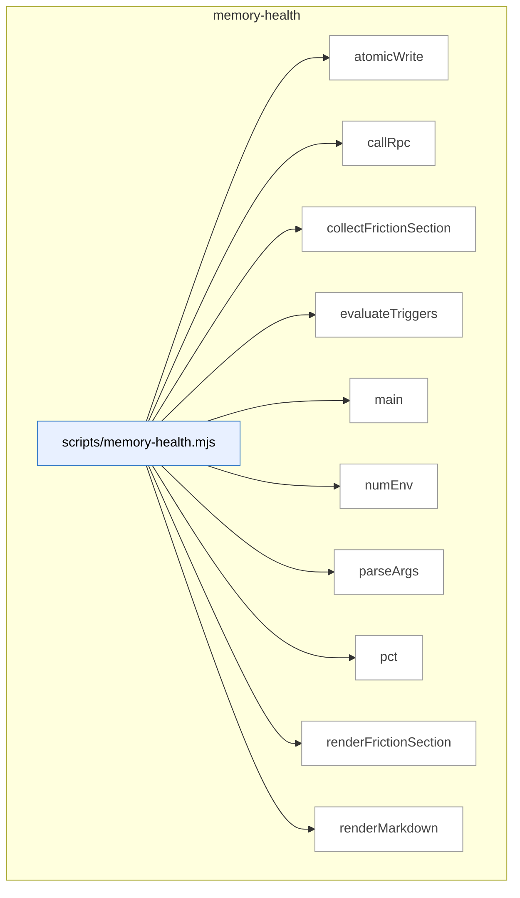

### Symbols in this domain

| Symbol | Kind | Path | Lines | Purpose | File imported by |
|---|---|---|---|---|---|
| [`atomicWrite`](../scripts/memory-health.mjs#L293) | function | `scripts/memory-health.mjs` | 293-299 | Entry point: fetches metrics, evaluates triggers, renders report, outputs results, exits. | _(internal)_ |
| [`callRpc`](../scripts/memory-health.mjs#L72) | function | `scripts/memory-health.mjs` | 72-83 | Fetches friction-recurrence clusters from cloud store with ranking and protected-scope annotations. | _(internal)_ |
| [`collectFrictionSection`](../scripts/memory-health.mjs#L95) | function | `scripts/memory-health.mjs` | 95-125 | Formats friction recurrence data as a markdown table with severity and recurrence counts. | _(internal)_ |
| [`evaluateTriggers`](../scripts/memory-health.mjs#L171) | function | `scripts/memory-health.mjs` | 171-206 | Formats a number as a percentage string with one decimal place. | _(internal)_ |
| [`main`](../scripts/memory-health.mjs#L301) | function | `scripts/memory-health.mjs` | 301-341 | Main entry point for nav-audit: orchestrates extraction, contract management, and live verification. | _(internal)_ |
| [`numEnv`](../scripts/memory-health.mjs#L32) | function | `scripts/memory-health.mjs` | 32-41 | Parses command-line arguments for memory-health report output and format. | _(internal)_ |
| [`parseArgs`](../scripts/memory-health.mjs#L52) | function | `scripts/memory-health.mjs` | 52-70 | Invokes Postgres RPC to fetch memory-health metrics from the audit database. | _(internal)_ |
| [`pct`](../scripts/memory-health.mjs#L208) | function | `scripts/memory-health.mjs` | 208-210 | Generates full memory-health markdown report with metrics, thresholds, and recommendations. | _(internal)_ |
| [`renderFrictionSection`](../scripts/memory-health.mjs#L127) | function | `scripts/memory-health.mjs` | 127-169 | Checks metrics against thresholds to determine memory-health status and trigger counts. | _(internal)_ |
| [`renderMarkdown`](../scripts/memory-health.mjs#L212) | function | `scripts/memory-health.mjs` | 212-291 | Writes content to a file atomically using a temp file and rename to prevent corruption. | _(internal)_ |

---

## nav-audit

> Extracts application routes from framework-specific routing systems (Next.js, React Router) by detecting project types and converting file paths and route definitions into normalized route identifiers for navigation graph analysis.

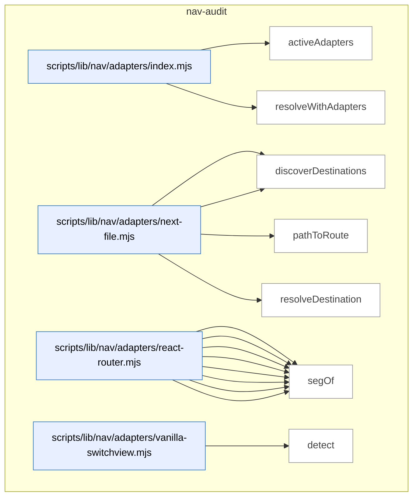

_Domain has 124 symbols (>50). Diagram shows top-15 by file order; see flat table below for the full list._

### Symbols in this domain

| Symbol | Kind | Path | Lines | Purpose | File imported by |
|---|---|---|---|---|---|
| [`activeAdapters`](../scripts/lib/nav/adapters/index.mjs#L20) | function | `scripts/lib/nav/adapters/index.mjs` | 20-24 | Filters the available navigation adapter array to only those whose detect function returns true for the given sources. | `scripts/lib/nav/extract.mjs` |
| [`resolveWithAdapters`](../scripts/lib/nav/adapters/index.mjs#L37) | function | `scripts/lib/nav/adapters/index.mjs` | 37-45 | Attempts to resolve a raw destination value through each adapter in sequence, returning the first non-null result. | `scripts/lib/nav/extract.mjs` |
| [`detect`](../scripts/lib/nav/adapters/next-file.mjs#L13) | function | `scripts/lib/nav/adapters/next-file.mjs` | 13-15 | Detects Next.js projects by checking if any source file path matches the app or pages router pattern. | `scripts/lib/nav/adapters/index.mjs` |
| [`discoverDestinations`](../scripts/lib/nav/adapters/next-file.mjs#L17) | function | `scripts/lib/nav/adapters/next-file.mjs` | 17-27 | Extracts route destinations from Next.js page files by converting file paths to normalized route IDs. | `scripts/lib/nav/adapters/index.mjs` |
| [`pathToRoute`](../scripts/lib/nav/adapters/next-file.mjs#L37) | function | `scripts/lib/nav/adapters/next-file.mjs` | 37-53 | Converts Next.js app or pages router file paths to their corresponding route identifiers. | `scripts/lib/nav/adapters/index.mjs` |
| [`resolveDestination`](../scripts/lib/nav/adapters/next-file.mjs#L55) | function | `scripts/lib/nav/adapters/next-file.mjs` | 55-61 | Resolves a string literal or code expression to a normalized route ID if it starts with a forward slash. | `scripts/lib/nav/adapters/index.mjs` |
| [`collectJsxRoutes`](../scripts/lib/nav/adapters/react-router.mjs#L42) | function | `scripts/lib/nav/adapters/react-router.mjs` | 42-64 | Recursively collects route paths from JSX Route elements, handling path attributes, index routes, and nested children. | `scripts/lib/nav/adapters/index.mjs` |
| [`collectObjectRoute`](../scripts/lib/nav/adapters/react-router.mjs#L67) | function | `scripts/lib/nav/adapters/react-router.mjs` | 67-89 | Recursively collects route paths from plain route object definitions, extracting path, index, and children properties. | `scripts/lib/nav/adapters/index.mjs` |
| [`dedupe`](../scripts/lib/nav/adapters/react-router.mjs#L106) | function | `scripts/lib/nav/adapters/react-router.mjs` | 106-116 | Removes duplicate route entries by keyed combination of id and source location. | `scripts/lib/nav/adapters/index.mjs` |
| [`detect`](../scripts/lib/nav/adapters/react-router.mjs#L17) | function | `scripts/lib/nav/adapters/react-router.mjs` | 17-19 | Detects React Router projects by checking for react-router imports or Route JSX tags in source files. | `scripts/lib/nav/adapters/index.mjs` |
| [`discoverDestinations`](../scripts/lib/nav/adapters/react-router.mjs#L21) | function | `scripts/lib/nav/adapters/react-router.mjs` | 21-39 | Extracts route destinations from React Router by collecting JSX Route elements and route object definitions. | `scripts/lib/nav/adapters/index.mjs` |
| [`joinRoutePath`](../scripts/lib/nav/adapters/react-router.mjs#L99) | function | `scripts/lib/nav/adapters/react-router.mjs` | 99-104 | Joins a segment to a parent route path, handling absolute children and proper slash normalization. | `scripts/lib/nav/adapters/index.mjs` |
| [`resolveDestination`](../scripts/lib/nav/adapters/react-router.mjs#L118) | function | `scripts/lib/nav/adapters/react-router.mjs` | 118-124 | Resolves a string literal or code value to a normalized route ID. | `scripts/lib/nav/adapters/index.mjs` |
| [`segOf`](../scripts/lib/nav/adapters/react-router.mjs#L91) | function | `scripts/lib/nav/adapters/react-router.mjs` | 91-96 | Extracts a literal or template string value from a target node, returning null for other types. | `scripts/lib/nav/adapters/index.mjs` |
| [`detect`](../scripts/lib/nav/adapters/vanilla-switchview.mjs#L15) | function | `scripts/lib/nav/adapters/vanilla-switchview.mjs` | 15-18 | Detects vanilla view-switch projects by checking for switchView or setView function calls in source files. | `scripts/lib/nav/adapters/index.mjs` |
| [`discoverDestinations`](../scripts/lib/nav/adapters/vanilla-switchview.mjs#L20) | function | `scripts/lib/nav/adapters/vanilla-switchview.mjs` | 20-37 | Extracts view identifiers from a VIEWS object by walking the AST and collecting string literal properties. | `scripts/lib/nav/adapters/index.mjs` |
| [`resolveDestination`](../scripts/lib/nav/adapters/vanilla-switchview.mjs#L48) | function | `scripts/lib/nav/adapters/vanilla-switchview.mjs` | 48-63 | Resolves a raw view reference (VIEWS member, string literal, or slug) to a normalized view ID, with fallback to computed slugs. | `scripts/lib/nav/adapters/index.mjs` |
| [`viewsObjectOf`](../scripts/lib/nav/adapters/vanilla-switchview.mjs#L39) | function | `scripts/lib/nav/adapters/vanilla-switchview.mjs` | 39-44 | Unwraps variable or assignment declarations that define the views map, including Object.freeze wrappers. | `scripts/lib/nav/adapters/index.mjs` |
| [`appRootForPath`](../scripts/lib/nav/approot.mjs#L16) | function | `scripts/lib/nav/approot.mjs` | 16-27 | Finds the best-matching app root directory for a given source file path by longest prefix matching. | `scripts/lib/nav/extract.mjs` |
| [`enclosingSymbol`](../scripts/lib/nav/ast-lite.mjs#L22) | function | `scripts/lib/nav/ast-lite.mjs` | 22-29 | Finds the enclosing symbol name for a given character index by searching symbol positions. | `scripts/lib/nav/contract.mjs`, `scripts/lib/nav/model.mjs` |
| [`indexSymbols`](../scripts/lib/nav/ast-lite.mjs#L12) | function | `scripts/lib/nav/ast-lite.mjs` | 12-18 | Extracts all symbol (function/class/variable) declarations and their positions from source content via regex. | `scripts/lib/nav/contract.mjs`, `scripts/lib/nav/model.mjs` |
| [`lineOf`](../scripts/lib/nav/ast-lite.mjs#L32) | function | `scripts/lib/nav/ast-lite.mjs` | 32-36 | Counts newlines up to a given index to compute the line number. | `scripts/lib/nav/contract.mjs`, `scripts/lib/nav/model.mjs` |
| [`calleeName`](../scripts/lib/nav/ast.mjs#L151) | function | `scripts/lib/nav/ast.mjs` | 151-159 | Extracts the function name from a call expression (identifier or member expression). | `scripts/lib/efficacy-lints.mjs`, `scripts/lib/nav/adapters/react-router.mjs`, `scripts/lib/nav/adapters/vanilla-switchview.mjs`, +1 more |
| [`classifyTarget`](../scripts/lib/nav/ast.mjs#L101) | function | `scripts/lib/nav/ast.mjs` | 101-118 | Classifies an AST node to extract its static literal, member reference, or template structure. | `scripts/lib/efficacy-lints.mjs`, `scripts/lib/nav/adapters/react-router.mjs`, `scripts/lib/nav/adapters/vanilla-switchview.mjs`, +1 more |
| [`componentNameOf`](../scripts/lib/nav/ast.mjs#L85) | function | `scripts/lib/nav/ast.mjs` | 85-92 | Extracts function, class, or variable declaration names that represent component definitions. | `scripts/lib/efficacy-lints.mjs`, `scripts/lib/nav/adapters/react-router.mjs`, `scripts/lib/nav/adapters/vanilla-switchview.mjs`, +1 more |
| [`jsxAttr`](../scripts/lib/nav/ast.mjs#L132) | function | `scripts/lib/nav/ast.mjs` | 132-140 | Finds a JSX attribute value by name(s) from an opening element. | `scripts/lib/efficacy-lints.mjs`, `scripts/lib/nav/adapters/react-router.mjs`, `scripts/lib/nav/adapters/vanilla-switchview.mjs`, +1 more |
| [`jsxLabel`](../scripts/lib/nav/ast.mjs#L121) | function | `scripts/lib/nav/ast.mjs` | 121-129 | Extracts plain text content from JSX element children, joining whitespace-trimmed parts. | `scripts/lib/efficacy-lints.mjs`, `scripts/lib/nav/adapters/react-router.mjs`, `scripts/lib/nav/adapters/vanilla-switchview.mjs`, +1 more |
| [`jsxTagName`](../scripts/lib/nav/ast.mjs#L143) | function | `scripts/lib/nav/ast.mjs` | 143-148 | Extracts the tag name from a JSX opening element (identifier or member expression). | `scripts/lib/efficacy-lints.mjs`, `scripts/lib/nav/adapters/react-router.mjs`, `scripts/lib/nav/adapters/vanilla-switchview.mjs`, +1 more |
| [`parseSource`](../scripts/lib/nav/ast.mjs#L27) | function | `scripts/lib/nav/ast.mjs` | 27-39 | Parses JavaScript/TypeScript source into an AST using Babel with error recovery enabled. | `scripts/lib/efficacy-lints.mjs`, `scripts/lib/nav/adapters/react-router.mjs`, `scripts/lib/nav/adapters/vanilla-switchview.mjs`, +1 more |
| [`unwrapObjectExpression`](../scripts/lib/nav/ast.mjs#L73) | function | `scripts/lib/nav/ast.mjs` | 73-82 | Unwraps object expressions from call expressions, type assertions, and satisfies expressions. | `scripts/lib/efficacy-lints.mjs`, `scripts/lib/nav/adapters/react-router.mjs`, `scripts/lib/nav/adapters/vanilla-switchview.mjs`, +1 more |
| [`walk`](../scripts/lib/nav/ast.mjs#L49) | function | `scripts/lib/nav/ast.mjs` | 49-68 | Traverses an AST depth-first, visiting each node and passing enclosing component name and line number. | `scripts/lib/efficacy-lints.mjs`, `scripts/lib/nav/adapters/react-router.mjs`, `scripts/lib/nav/adapters/vanilla-switchview.mjs`, +1 more |
| [`buildDraftCaptureWarning`](../scripts/lib/nav/bootstrap-draft.mjs#L31) | function | `scripts/lib/nav/bootstrap-draft.mjs` | 31-43 | Generates a warning if nav bootstrap draft is incomplete (empty shells or missing auth). | `scripts/nav-audit.mjs` |
| [`byProminence`](../scripts/lib/nav/bootstrap-draft.mjs#L47) | function | `scripts/lib/nav/bootstrap-draft.mjs` | 47-49 | Comparator sorting nav containers by sticky, target count, then order. | `scripts/nav-audit.mjs` |
| [`dedupe`](../scripts/lib/nav/bootstrap-draft.mjs#L130) | function | `scripts/lib/nav/bootstrap-draft.mjs` | 130-130 | Removes duplicates from an array using Set. | `scripts/nav-audit.mjs` |
| [`draftContractFromLive`](../scripts/lib/nav/bootstrap-draft.mjs#L61) | function | `scripts/lib/nav/bootstrap-draft.mjs` | 61-128 | Extracts nav container candidates from live evidence, filtering to multi-target containers. | `scripts/nav-audit.mjs` |
| [`bootstrapContract`](../scripts/lib/nav/contract.mjs#L205) | function | `scripts/lib/nav/contract.mjs` | 205-231 | Creates an initial nav-contract from persona intents and draft nav layers. | `scripts/lib/dashboard/collect-nav.mjs`, `scripts/lib/nav/findings.mjs`, `scripts/nav-audit.mjs` |
| [`coerce`](../scripts/lib/nav/contract.mjs#L175) | function | `scripts/lib/nav/contract.mjs` | 175-186 | Converts raw string values to appropriate types (bool, list, string). | `scripts/lib/dashboard/collect-nav.mjs`, `scripts/lib/nav/findings.mjs`, `scripts/nav-audit.mjs` |
| [`contractExists`](../scripts/lib/nav/contract.mjs#L201) | function | `scripts/lib/nav/contract.mjs` | 201-203 | Checks if nav-contract.json file exists in repo root. | `scripts/lib/dashboard/collect-nav.mjs`, `scripts/lib/nav/findings.mjs`, `scripts/nav-audit.mjs` |
| [`isUtilityRoute`](../scripts/lib/nav/contract.mjs#L102) | function | `scripts/lib/nav/contract.mjs` | 102-105 | Checks if a destination ID matches utility route patterns (login, logout, etc). | `scripts/lib/dashboard/collect-nav.mjs`, `scripts/lib/nav/findings.mjs`, `scripts/nav-audit.mjs` |
| [`parseDocblockTokens`](../scripts/lib/nav/contract.mjs#L161) | function | `scripts/lib/nav/contract.mjs` | 161-173 | Parses space-separated tokens from a docblock, extracting key=value pairs. | `scripts/lib/dashboard/collect-nav.mjs`, `scripts/lib/nav/findings.mjs`, `scripts/nav-audit.mjs` |
| [`parseNavMeta`](../scripts/lib/nav/contract.mjs#L119) | function | `scripts/lib/nav/contract.mjs` | 119-140 | Extracts nav metadata claims from source code (export const navMeta or @nav docblocks). | `scripts/lib/dashboard/collect-nav.mjs`, `scripts/lib/nav/findings.mjs`, `scripts/nav-audit.mjs` |
| [`parseObjectBody`](../scripts/lib/nav/contract.mjs#L145) | function | `scripts/lib/nav/contract.mjs` | 145-158 | Parses key:value pairs from a JavaScript object literal body string. | `scripts/lib/dashboard/collect-nav.mjs`, `scripts/lib/nav/findings.mjs`, `scripts/nav-audit.mjs` |
| [`readContract`](../scripts/lib/nav/contract.mjs#L59) | function | `scripts/lib/nav/contract.mjs` | 59-95 | Reads and validates nav-contract.json from repo root. | `scripts/lib/dashboard/collect-nav.mjs`, `scripts/lib/nav/findings.mjs`, `scripts/nav-audit.mjs` |
| [`writeContract`](../scripts/lib/nav/contract.mjs#L239) | function | `scripts/lib/nav/contract.mjs` | 239-247 | Validates and writes nav-contract.json atomically to repo. | `scripts/lib/dashboard/collect-nav.mjs`, `scripts/lib/nav/findings.mjs`, `scripts/nav-audit.mjs` |
| [`ageDivergences`](../scripts/lib/nav/drift.mjs#L60) | function | `scripts/lib/nav/drift.mjs` | 60-68 | Computes the age in days for each finding since it was first seen, using a lookup table or the head commit date. | `scripts/lib/dashboard/collect-nav.mjs`, `scripts/nav-audit.mjs` |
| [`divergenceKey`](../scripts/lib/nav/drift.mjs#L18) | function | `scripts/lib/nav/drift.mjs` | 18-20 | Generates a deduplication key for a finding by combining its class and destination. | `scripts/lib/dashboard/collect-nav.mjs`, `scripts/nav-audit.mjs` |
| [`firstSeenFromHistory`](../scripts/lib/nav/drift.mjs#L89) | function | `scripts/lib/nav/drift.mjs` | 89-101 | Builds a lookup function that returns the earliest observed timestamp for each drift key from historical rows, guarding against invalid timestamps. | `scripts/lib/dashboard/collect-nav.mjs`, `scripts/nav-audit.mjs` |
| [`partitionFindings`](../scripts/lib/nav/drift.mjs#L27) | function | `scripts/lib/nav/drift.mjs` | 27-31 | Separates findings into gate-eligible and advisory categories based on their gateEligible property. | `scripts/lib/dashboard/collect-nav.mjs`, `scripts/nav-audit.mjs` |
| [`readDriftLedger`](../scripts/lib/nav/drift.mjs#L71) | function | `scripts/lib/nav/drift.mjs` | 71-77 | Reads and parses the drift ledger JSON file to retrieve first-seen timestamps, returning an empty object if the file is missing or invalid. | `scripts/lib/dashboard/collect-nav.mjs`, `scripts/nav-audit.mjs` |
| [`scopeToChanged`](../scripts/lib/nav/drift.mjs#L41) | function | `scripts/lib/nav/drift.mjs` | 41-50 | Filters gate-eligible findings to only those affected by file changes, or returns all if no files changed or contract was edited. | `scripts/lib/dashboard/collect-nav.mjs`, `scripts/nav-audit.mjs` |
| [`writeDriftLedger`](../scripts/lib/nav/drift.mjs#L81) | function | `scripts/lib/nav/drift.mjs` | 81-86 | Writes an updated drift ledger that preserves previously recorded first-seen dates for active findings and records new ones. | `scripts/lib/dashboard/collect-nav.mjs`, `scripts/nav-audit.mjs` |
| [`assembleEnvelope`](../scripts/lib/nav/envelope.mjs#L87) | function | `scripts/lib/nav/envelope.mjs` | 87-98 | Assembles a nav envelope object containing version, refresh ID, config digest, head SHA, generation timestamp, edges, and destinations. | `scripts/nav-audit.mjs` |
| [`readObservedEnvelope`](../scripts/lib/nav/envelope.mjs#L29) | function | `scripts/lib/nav/envelope.mjs` | 29-55 | Reads and validates the observed nav envelope from disk, checking JSON validity and config digest staleness against an expected digest. | `scripts/nav-audit.mjs` |
| [`writeObservedEnvelope`](../scripts/lib/nav/envelope.mjs#L66) | function | `scripts/lib/nav/envelope.mjs` | 66-74 | Validates and atomically writes a nav envelope object to disk in JSON format. | `scripts/nav-audit.mjs` |
| [`affordancesOf`](../scripts/lib/nav/extract.mjs#L150) | function | `scripts/lib/nav/extract.mjs` | 150-162 | Extracts navigation affordances (links, calls, modals) from an AST node by checking for JSX elements, function calls, and string literals. | `scripts/nav-audit.mjs` |
| [`basename`](../scripts/lib/nav/extract.mjs#L314) | function | `scripts/lib/nav/extract.mjs` | 314-316 | Extracts the last path segment from a file path and removes the file extension. | `scripts/nav-audit.mjs` |
| [`buildViewsMap`](../scripts/lib/nav/extract.mjs#L284) | function | `scripts/lib/nav/extract.mjs` | 284-299 | Builds a map of view names to view paths by walking the AST for VIEWS or viewRegistry object declarations. | `scripts/nav-audit.mjs` |
| [`callAffordance`](../scripts/lib/nav/extract.mjs#L179) | function | `scripts/lib/nav/extract.mjs` | 179-192 | Detects and extracts affordances from function calls like navigate or modal triggers. | `scripts/nav-audit.mjs` |
| [`embeddedAffordances`](../scripts/lib/nav/extract.mjs#L202) | function | `scripts/lib/nav/extract.mjs` | 202-226 | Extracts navigation affordances from string content via regex patterns for embedded links, nav calls, and data attributes. | `scripts/nav-audit.mjs` |
| [`extractEdges`](../scripts/lib/nav/extract.mjs#L86) | function | `scripts/lib/nav/extract.mjs` | 86-144 | <no body> | `scripts/nav-audit.mjs` |
| [`findDomAnchor`](../scripts/lib/nav/extract.mjs#L231) | function | `scripts/lib/nav/extract.mjs` | 231-241 | Finds the nearest DOM anchor (by ID or nav-related class) before a given string index to attribute an affordance. | `scripts/nav-audit.mjs` |
| [`globToRe`](../scripts/lib/nav/extract.mjs#L71) | function | `scripts/lib/nav/extract.mjs` | 71-76 | Converts a glob pattern to a regular expression, handling wildcards and special characters. | `scripts/nav-audit.mjs` |
| [`isSkippable`](../scripts/lib/nav/extract.mjs#L253) | function | `scripts/lib/nav/extract.mjs` | 253-257 | Returns true if a target is empty, external, or undefined — marking it as skippable. | `scripts/nav-audit.mjs` |
| [`jsxAffordance`](../scripts/lib/nav/extract.mjs#L164) | function | `scripts/lib/nav/extract.mjs` | 164-177 | Detects and extracts link affordances from JSX elements, including link tags and Navigate components with href/to attributes. | `scripts/nav-audit.mjs` |
| [`readSources`](../scripts/lib/nav/extract.mjs#L50) | function | `scripts/lib/nav/extract.mjs` | 50-68 | Reads source files from disk, filtering by extension and exclude patterns, and classifying them for sensitivity and generated content. | `scripts/nav-audit.mjs` |
| [`resolveTarget`](../scripts/lib/nav/extract.mjs#L260) | function | `scripts/lib/nav/extract.mjs` | 260-280 | Resolves an affordance target to destination ID(s) and confidence level using adapters or view registry lookups. | `scripts/nav-audit.mjs` |
| [`templateText`](../scripts/lib/nav/extract.mjs#L244) | function | `scripts/lib/nav/extract.mjs` | 244-251 | Extracts the text content of a template literal, replacing expressions with a placeholder. | `scripts/nav-audit.mjs` |
| [`viewsObjectOf`](../scripts/lib/nav/extract.mjs#L303) | function | `scripts/lib/nav/extract.mjs` | 303-312 | Extracts the object value from variable declarations or assignments to VIEWS or viewRegistry. | `scripts/nav-audit.mjs` |
| [`competingModelsFindings`](../scripts/lib/nav/findings.mjs#L294) | function | `scripts/lib/nav/findings.mjs` | 294-307 | Detects competing navigation models when two prominent layers organize destinations completely disjointly (P2 finding). | `scripts/lib/dashboard/collect-nav.mjs`, `scripts/nav-audit.mjs` |
| [`confidenceOf`](../scripts/lib/nav/findings.mjs#L257) | function | `scripts/lib/nav/findings.mjs` | 257-262 | Returns the worst-case confidence level across all edges reaching a destination. | `scripts/lib/dashboard/collect-nav.mjs`, `scripts/nav-audit.mjs` |
| [`declaredIntents`](../scripts/lib/nav/findings.mjs#L248) | function | `scripts/lib/nav/findings.mjs` | 248-251 | Flattens all declared intents from the contract's personas into a single array with persona IDs attached. | `scripts/lib/dashboard/collect-nav.mjs`, `scripts/nav-audit.mjs` |
| [`isHighFrequencyIntent`](../scripts/lib/nav/findings.mjs#L253) | function | `scripts/lib/nav/findings.mjs` | 253-255 | Checks if a destination has at least one high-frequency intent declared in the contract. | `scripts/lib/dashboard/collect-nav.mjs`, `scripts/nav-audit.mjs` |
| [`layerDestinationSets`](../scripts/lib/nav/findings.mjs#L264) | function | `scripts/lib/nav/findings.mjs` | 264-271 | Groups destination IDs by their layer, returning a map of layer name to set of destination IDs. | `scripts/lib/dashboard/collect-nav.mjs`, `scripts/nav-audit.mjs` |
| [`liveLayerSets`](../scripts/lib/nav/findings.mjs#L332) | function | `scripts/lib/nav/findings.mjs` | 332-353 | Builds layer attribution data from live DOM evidence, organizing destinations by their observed containers and layers. | `scripts/lib/dashboard/collect-nav.mjs`, `scripts/nav-audit.mjs` |
| [`mk`](../scripts/lib/nav/findings.mjs#L244) | function | `scripts/lib/nav/findings.mjs` | 244-246 | Constructs a finding object with class, severity, destination, evidence, confidence, gate-eligibility, and verdict. | `scripts/lib/dashboard/collect-nav.mjs`, `scripts/nav-audit.mjs` |
| [`personaScorecard`](../scripts/lib/nav/findings.mjs#L207) | function | `scripts/lib/nav/findings.mjs` | 207-242 | Generates a per-persona scorecard showing each intent's reachability status (ok/red/unverified/unknown) based on observed anchors and required layers. | `scripts/lib/dashboard/collect-nav.mjs`, `scripts/nav-audit.mjs` |
| [`redundancyFindings`](../scripts/lib/nav/findings.mjs#L278) | function | `scripts/lib/nav/findings.mjs` | 278-292 | Identifies findings where a destination is reachable from multiple prominent anchors (redundancy), escalated to P2/P3 based on declared high-frequency intent. | `scripts/lib/dashboard/collect-nav.mjs`, `scripts/nav-audit.mjs` |
| [`runLiveTaxonomy`](../scripts/lib/nav/findings.mjs#L363) | function | `scripts/lib/nav/findings.mjs` | 363-390 | <no body> | `scripts/lib/dashboard/collect-nav.mjs`, `scripts/nav-audit.mjs` |
| [`runTaxonomy`](../scripts/lib/nav/findings.mjs#L26) | function | `scripts/lib/nav/findings.mjs` | 26-195 | <no body> | `scripts/lib/dashboard/collect-nav.mjs`, `scripts/nav-audit.mjs` |
| [`sequencingFindings`](../scripts/lib/nav/findings.mjs#L309) | function | `scripts/lib/nav/findings.mjs` | 309-323 | Identifies high-frequency intents that are reachable only from low-prominence affordances, violating Hick's law (P2 finding). | `scripts/lib/dashboard/collect-nav.mjs`, `scripts/nav-audit.mjs` |
| [`attributeLive`](../scripts/lib/nav/live-attribution.mjs#L57) | function | `scripts/lib/nav/live-attribution.mjs` | 57-73 | Aggregates live evidence into a destination-keyed object tracking placements, layers, states, and roles observed in the DOM. | `scripts/lib/nav/findings.mjs`, `scripts/lib/nav/verify.mjs` |
| [`computeCaptureStatus`](../scripts/lib/nav/live-attribution.mjs#L86) | function | `scripts/lib/nav/live-attribution.mjs` | 86-113 | <no body> | `scripts/lib/nav/findings.mjs`, `scripts/lib/nav/verify.mjs` |
| [`layerRank`](../scripts/lib/nav/live-attribution.mjs#L21) | function | `scripts/lib/nav/live-attribution.mjs` | 21-28 | Maps a layer name to its precedence rank, with declared layers ranked by contract order, then alphabetically, else 999. | `scripts/lib/nav/findings.mjs`, `scripts/lib/nav/verify.mjs` |
| [`mergeScorecard`](../scripts/lib/nav/live-attribution.mjs#L124) | function | `scripts/lib/nav/live-attribution.mjs` | 124-174 | <no body> | `scripts/lib/nav/findings.mjs`, `scripts/lib/nav/verify.mjs` |
| [`resolveContainer`](../scripts/lib/nav/live-attribution.mjs#L37) | function | `scripts/lib/nav/live-attribution.mjs` | 37-49 | Selects the best (shallowest, highest-precedence layer) matching container for an affordance from a set of candidates. | `scripts/lib/nav/findings.mjs`, `scripts/lib/nav/verify.mjs` |
| [`buildModel`](../scripts/lib/nav/model.mjs#L27) | function | `scripts/lib/nav/model.mjs` | 27-76 | <no body> | `scripts/lib/dashboard/collect-nav.mjs`, `scripts/nav-audit.mjs` |
| [`buildReverseContainment`](../scripts/lib/nav/model.mjs#L80) | function | `scripts/lib/nav/model.mjs` | 80-95 | Builds a reverse-containment map showing which parent components render which child components by scanning JSX usage. | `scripts/lib/dashboard/collect-nav.mjs`, `scripts/nav-audit.mjs` |
| [`declaredAncestors`](../scripts/lib/nav/model.mjs#L99) | function | `scripts/lib/nav/model.mjs` | 99-125 | Traverses the component containment tree upward to find all declared anchor ancestors and the nearest one, up to depth 12. | `scripts/lib/dashboard/collect-nav.mjs`, `scripts/nav-audit.mjs` |
| [`dedupe`](../scripts/lib/nav/normalize.mjs#L90) | function | `scripts/lib/nav/normalize.mjs` | 90-92 | Removes duplicates from array using Set. | `scripts/lib/nav/adapters/next-file.mjs`, `scripts/lib/nav/adapters/react-router.mjs`, `scripts/lib/nav/adapters/vanilla-switchview.mjs`, +3 more |
| [`namespaceId`](../scripts/lib/nav/normalize.mjs#L101) | function | `scripts/lib/nav/normalize.mjs` | 101-103 | Prefixes a destination ID with app root if provided. | `scripts/lib/nav/adapters/next-file.mjs`, `scripts/lib/nav/adapters/react-router.mjs`, `scripts/lib/nav/adapters/vanilla-switchview.mjs`, +3 more |
| [`normalizeDestination`](../scripts/lib/nav/normalize.mjs#L27) | function | `scripts/lib/nav/normalize.mjs` | 27-88 | Normalizes a static destination string to canonical form(s) with confidence level. | `scripts/lib/nav/adapters/next-file.mjs`, `scripts/lib/nav/adapters/react-router.mjs`, `scripts/lib/nav/adapters/vanilla-switchview.mjs`, +3 more |
| [`mapPersonasToIntents`](../scripts/lib/nav/persona-seed.mjs#L28) | function | `scripts/lib/nav/persona-seed.mjs` | 28-47 | Builds persona-intent seeds from reach-log destinations, deduplicating by persona and normalized URL. | `scripts/nav-audit.mjs` |
| [`slugifyDestination`](../scripts/lib/nav/persona-seed.mjs#L14) | function | `scripts/lib/nav/persona-seed.mjs` | 14-16 | Slugifies a destination URL into a dash-separated lowercase identifier. | `scripts/nav-audit.mjs` |
| [`esc`](../scripts/lib/nav/render.mjs#L119) | function | `scripts/lib/nav/render.mjs` | 119-121 | Escapes quotes and newlines in strings for safe Mermaid embedding. | `scripts/nav-audit.mjs` |
| [`renderFindings`](../scripts/lib/nav/render.mjs#L49) | function | `scripts/lib/nav/render.mjs` | 49-60 | Formats discovered nav findings sorted by severity and class, including verdict, evidence, and confidence for each. | `scripts/nav-audit.mjs` |
| [`renderLiveFindings`](../scripts/lib/nav/render.mjs#L67) | function | `scripts/lib/nav/render.mjs` | 67-77 | Formats live-verified nav findings found during DOM inspection, sorted by severity and class. | `scripts/nav-audit.mjs` |
| [`renderMermaid`](../scripts/lib/nav/render.mjs#L92) | function | `scripts/lib/nav/render.mjs` | 92-117 | Renders the top N destinations from a navigation model as a Mermaid graph diagram, grouped by layer with node styling based on in-degree. | `scripts/nav-audit.mjs` |
| [`renderScorecard`](../scripts/lib/nav/render.mjs#L13) | function | `scripts/lib/nav/render.mjs` | 13-46 | Renders a formatted text scorecard of per-persona intent reachability with status marks and layer information. | `scripts/nav-audit.mjs` |
| [`renderTable`](../scripts/lib/nav/render.mjs#L80) | function | `scripts/lib/nav/render.mjs` | 80-87 | Renders a markdown table of all destinations, sorted by in-degree, with columns for affordance types, anchors, and layers. | `scripts/nav-audit.mjs` |
| [`safeId`](../scripts/lib/nav/render.mjs#L122) | function | `scripts/lib/nav/render.mjs` | 122-124 | Sanitizes strings to valid Mermaid identifiers by replacing non-alphanumeric characters with underscores. | `scripts/nav-audit.mjs` |
| [`computeConfigDigest`](../scripts/lib/nav/schema.mjs#L208) | function | `scripts/lib/nav/schema.mjs` | 208-210 | Computes SHA256 of adapter version plus contract digest. | `scripts/lib/dashboard/collect-nav.mjs`, `scripts/lib/nav/contract.mjs`, `scripts/lib/nav/drift.mjs`, +4 more |
| [`computeContractDigest`](../scripts/lib/nav/schema.mjs#L170) | function | `scripts/lib/nav/schema.mjs` | 170-198 | Computes SHA256 hash of canonical contract JSON for freshness checking. | `scripts/lib/dashboard/collect-nav.mjs`, `scripts/lib/nav/contract.mjs`, `scripts/lib/nav/drift.mjs`, +4 more |
| [`sha256`](../scripts/lib/nav/schema.mjs#L221) | function | `scripts/lib/nav/schema.mjs` | 221-223 | Computes SHA256 hash of a string. | `scripts/lib/dashboard/collect-nav.mjs`, `scripts/lib/nav/contract.mjs`, `scripts/lib/nav/drift.mjs`, +4 more |
| [`sortRecordOfArrays`](../scripts/lib/nav/schema.mjs#L212) | function | `scripts/lib/nav/schema.mjs` | 212-219 | Sorts object keys and their array values for canonical form. | `scripts/lib/dashboard/collect-nav.mjs`, `scripts/lib/nav/contract.mjs`, `scripts/lib/nav/drift.mjs`, +4 more |
| [`readVerifyResult`](../scripts/lib/nav/verify-store.mjs#L40) | function | `scripts/lib/nav/verify-store.mjs` | 40-58 | Reads and validates a cached navigation verify result, checking contract and tool version staleness. | `scripts/lib/dashboard/collect-nav.mjs`, `scripts/nav-audit.mjs` |
| [`writeVerifyResult`](../scripts/lib/nav/verify-store.mjs#L23) | function | `scripts/lib/nav/verify-store.mjs` | 23-31 | Validates and atomically writes a navigation verify result to disk. | `scripts/lib/dashboard/collect-nav.mjs`, `scripts/nav-audit.mjs` |
| [`collectLiveNav`](../scripts/lib/nav/verify.mjs#L328) | function | `scripts/lib/nav/verify.mjs` | 328-415 | Node-side evaluation extracting clickable elements and their nav container/target info. | `scripts/lib/nav/persona-seed.mjs`, `scripts/nav-audit.mjs` |
| [`detectNavShells`](../scripts/lib/nav/verify.mjs#L434) | function | `scripts/lib/nav/verify.mjs` | 434-457 | Identifies visible nav-ish containers and whether they're empty (have children). | `scripts/lib/nav/persona-seed.mjs`, `scripts/nav-audit.mjs` |
| [`discoverExpandTriggers`](../scripts/lib/nav/verify.mjs#L459) | function | `scripts/lib/nav/verify.mjs` | 459-519 | Node-side evaluation finding elements matching declared selectors with nav context checking. | `scripts/lib/nav/persona-seed.mjs`, `scripts/nav-audit.mjs` |
| [`extractTarget`](../scripts/lib/nav/verify.mjs#L539) | function | `scripts/lib/nav/verify.mjs` | 539-557 | Extracts a target URL from a shape object, checking hrefs first, then prioritizing data attributes by whitelist and name suffix. | `scripts/lib/nav/persona-seed.mjs`, `scripts/nav-audit.mjs` |
| [`normalizeLiveTarget`](../scripts/lib/nav/verify.mjs#L29) | function | `scripts/lib/nav/verify.mjs` | 29-63 | Normalizes a live DOM href/target to canonical destination form. | `scripts/lib/nav/persona-seed.mjs`, `scripts/nav-audit.mjs` |
| [`reconcile`](../scripts/lib/nav/verify.mjs#L71) | function | `scripts/lib/nav/verify.mjs` | 71-87 | Compares static and live destinations, categorizing as confirmed/staticOnly/runtimeOnly. | `scripts/lib/nav/persona-seed.mjs`, `scripts/nav-audit.mjs` |
| [`runVerify`](../scripts/lib/nav/verify.mjs#L119) | function | `scripts/lib/nav/verify.mjs` | 119-318 | Launches browser, navigates across breakpoints/states, collects nav evidence via selectors. | `scripts/lib/nav/persona-seed.mjs`, `scripts/nav-audit.mjs` |
| [`selectorLayers`](../scripts/lib/nav/verify.mjs#L90) | function | `scripts/lib/nav/verify.mjs` | 90-96 | Extracts selector→layer mappings from nav contract. | `scripts/lib/nav/persona-seed.mjs`, `scripts/nav-audit.mjs` |
| [`usableHref`](../scripts/lib/nav/verify.mjs#L527) | function | `scripts/lib/nav/verify.mjs` | 527-532 | Checks if an href is a valid, usable navigation link (not javascript/mailto/tel/bare anchor). | `scripts/lib/nav/persona-seed.mjs`, `scripts/nav-audit.mjs` |
| [`collectRouteMeta`](../scripts/nav-audit.mjs#L260) | function | `scripts/nav-audit.mjs` | 260-277 | Parses command-line arguments for nav-audit scope, format, gate, and verification options. | _(internal)_ |
| [`countBySeverity`](../scripts/nav-audit.mjs#L300) | function | `scripts/nav-audit.mjs` | 300-304 | Uses git to list JavaScript and TypeScript source files in the repository. | _(internal)_ |
| [`gitChangedFiles`](../scripts/nav-audit.mjs#L311) | function | `scripts/nav-audit.mjs` | 311-321 | Retrieves the current git HEAD commit SHA. | _(internal)_ |
| [`gitHeadDate`](../scripts/nav-audit.mjs#L326) | function | `scripts/nav-audit.mjs` | 326-328 | Fetches persona navigation intents from cross-skill store for contract bootstrapping. | _(internal)_ |
| [`gitHeadSha`](../scripts/nav-audit.mjs#L323) | function | `scripts/nav-audit.mjs` | 323-325 | Retrieves the current git HEAD commit date in ISO 8601 format. | _(internal)_ |
| [`listSourceFiles`](../scripts/nav-audit.mjs#L306) | function | `scripts/nav-audit.mjs` | 306-309 | Returns files changed between the merge-base and HEAD commit. | _(internal)_ |
| [`main`](../scripts/nav-audit.mjs#L31) | function | `scripts/nav-audit.mjs` | 31-258 | Binds route metadata claims to discovered route destinations when unambiguous. | _(internal)_ |
| [`parseArgs`](../scripts/nav-audit.mjs#L279) | function | `scripts/nav-audit.mjs` | 279-298 | Counts findings grouped by severity level (P0, P1, P2, P3). | _(internal)_ |
| [`seedPersonaIntents`](../scripts/nav-audit.mjs#L339) | function | `scripts/nav-audit.mjs` | 339-352 | Estimates and prints expected GPT audit cost before execution begins. | _(internal)_ |

---

## persona-test

> The `persona-test` domain validates accessibility testing manifests by verifying that DOM selectors match expected shapes, coercing DOM values to declared types, and flagging consistency contradictions like inappropriate CSS locators that should use semantic accessibility attributes instead.

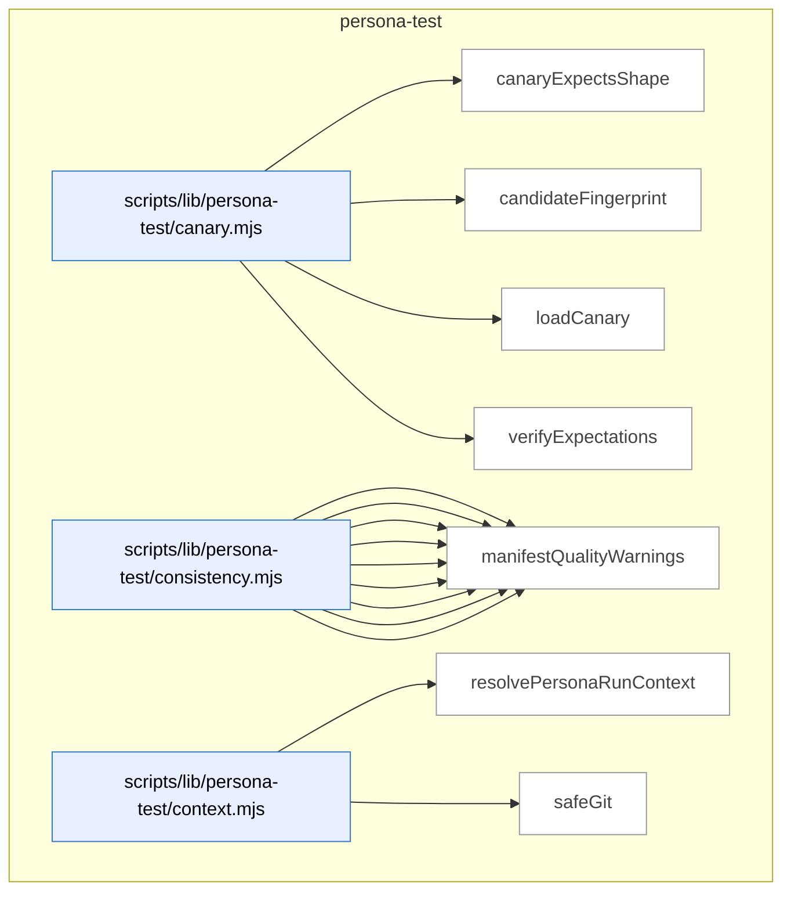

_Domain has 71 symbols (>50). Diagram shows top-15 by file order; see flat table below for the full list._

### Symbols in this domain

| Symbol | Kind | Path | Lines | Purpose | File imported by |
|---|---|---|---|---|---|
| [`canaryExpectsShape`](../scripts/lib/persona-test/canary.mjs#L289) | function | `scripts/lib/persona-test/canary.mjs` | 289-301 | Checks if a contradiction matches an expected shape spec by surface, field, and optional kind. | `scripts/persona-consistency-run.mjs` |
| [`candidateFingerprint`](../scripts/lib/persona-test/canary.mjs#L318) | function | `scripts/lib/persona-test/canary.mjs` | 318-337 | Generates a stable SHA-256 fingerprint for a contradiction candidate using semantic identifiers. | `scripts/persona-consistency-run.mjs` |
| [`loadCanary`](../scripts/lib/persona-test/canary.mjs#L38) | function | `scripts/lib/persona-test/canary.mjs` | 38-141 | <no body> | `scripts/persona-consistency-run.mjs` |
| [`verifyExpectations`](../scripts/lib/persona-test/canary.mjs#L193) | function | `scripts/lib/persona-test/canary.mjs` | 193-268 | <no body> | `scripts/persona-consistency-run.mjs` |
| [`appliesToCurrent`](../scripts/lib/persona-test/consistency.mjs#L488) | function | `scripts/lib/persona-test/consistency.mjs` | 488-506 | Checks if a surface's appliesTo restrictions match the current route, step label, and active state tags. | `scripts/persona-consistency-run.mjs` |
| [`clampToFloor`](../scripts/lib/persona-test/consistency.mjs#L118) | function | `scripts/lib/persona-test/consistency.mjs` | 118-122 | Clamps a severity level to a minimum floor if the proposed level is below it numerically. | `scripts/persona-consistency-run.mjs` |
| [`coerceDomKey`](../scripts/lib/persona-test/consistency.mjs#L91) | function | `scripts/lib/persona-test/consistency.mjs` | 91-113 | Coerces a DOM key string to a number, string, or boolean based on inferred type. | `scripts/persona-consistency-run.mjs` |
| [`coerceDomValue`](../scripts/lib/persona-test/consistency.mjs#L38) | function | `scripts/lib/persona-test/consistency.mjs` | 38-80 | Coerces a DOM string value to its declared type (boolean, integer, enum, id, prose, freshness). | `scripts/persona-consistency-run.mjs` |
| [`deepEqual`](../scripts/lib/persona-test/consistency.mjs#L508) | function | `scripts/lib/persona-test/consistency.mjs` | 508-522 | Recursively compares two values for deep equality, handling objects and arrays. | `scripts/persona-consistency-run.mjs` |
| [`diffClaims`](../scripts/lib/persona-test/consistency.mjs#L139) | function | `scripts/lib/persona-test/consistency.mjs` | 139-406 | <no body> | `scripts/persona-consistency-run.mjs` |
| [`locatorToString`](../scripts/lib/persona-test/consistency.mjs#L454) | function | `scripts/lib/persona-test/consistency.mjs` | 454-464 | Converts a locator object to a human-readable string representation based on its kind. | `scripts/persona-consistency-run.mjs` |
| [`make`](../scripts/lib/persona-test/consistency.mjs#L437) | function | `scripts/lib/persona-test/consistency.mjs` | 437-452 | Constructs a finding object describing a consistency contradiction with severity and details. | `scripts/persona-consistency-run.mjs` |
| [`manifestQualityWarnings`](../scripts/lib/persona-test/consistency.mjs#L420) | function | `scripts/lib/persona-test/consistency.mjs` | 420-433 | Inspects manifest surfaces and warns about CSS locators that should use semantic accessibility attributes instead. | `scripts/persona-consistency-run.mjs` |
| [`resolvePersonaRunContext`](../scripts/lib/persona-test/context.mjs#L28) | function | `scripts/lib/persona-test/context.mjs` | 28-65 | Validates and assembles a persona run context with repo ID, journey key, commit SHA, and branch. | _(internal)_ |
| [`safeGit`](../scripts/lib/persona-test/context.mjs#L67) | function | `scripts/lib/persona-test/context.mjs` | 67-74 | Safely executes a git command and returns trimmed stdout, or null on failure. | _(internal)_ |
| [`normaliseForReplay`](../scripts/lib/persona-test/ledger.mjs#L156) | function | `scripts/lib/persona-test/ledger.mjs` | 156-196 | Normalizes a ledger for replay by zeroing timestamps and sorting claims/contradictions deterministically. | `scripts/persona-consistency-run.mjs` |
| [`openLedger`](../scripts/lib/persona-test/ledger.mjs#L56) | function | `scripts/lib/persona-test/ledger.mjs` | 56-139 | <no body> | `scripts/persona-consistency-run.mjs` |
| [`persist`](../scripts/lib/persona-test/ledger.mjs#L141) | function | `scripts/lib/persona-test/ledger.mjs` | 141-143 | Atomically writes a ledger state object to disk as JSON. | `scripts/persona-consistency-run.mjs` |
| [`s`](../scripts/lib/persona-test/ledger.mjs#L200) | function | `scripts/lib/persona-test/ledger.mjs` | 200-200 | Converts a value to a string, using empty string for null/undefined. | `scripts/persona-consistency-run.mjs` |
| [`stableCompareContradiction`](../scripts/lib/persona-test/ledger.mjs#L224) | function | `scripts/lib/persona-test/ledger.mjs` | 224-232 | Comparator that sorts contradictions by kind, surfaceId, engineField, scope, then key. | `scripts/persona-consistency-run.mjs` |
| [`stableCompareDom`](../scripts/lib/persona-test/ledger.mjs#L202) | function | `scripts/lib/persona-test/ledger.mjs` | 202-209 | Comparator that sorts DOM claims by surfaceId, engineField, scope, then key. | `scripts/persona-consistency-run.mjs` |
| [`stableCompareFreshness`](../scripts/lib/persona-test/ledger.mjs#L233) | function | `scripts/lib/persona-test/ledger.mjs` | 233-238 | Comparator that sorts freshness records by surfaceId then engineField. | `scripts/persona-consistency-run.mjs` |
| [`stableCompareNetwork`](../scripts/lib/persona-test/ledger.mjs#L210) | function | `scripts/lib/persona-test/ledger.mjs` | 210-217 | Comparator that sorts network claims by surfaceId, engineField, scope, then key. | `scripts/persona-consistency-run.mjs` |
| [`stableCompareUndeclared`](../scripts/lib/persona-test/ledger.mjs#L218) | function | `scripts/lib/persona-test/ledger.mjs` | 218-223 | Comparator that sorts undeclared claims by engineField then selector. | `scripts/persona-consistency-run.mjs` |
| [`stableCompareWarning`](../scripts/lib/persona-test/ledger.mjs#L239) | function | `scripts/lib/persona-test/ledger.mjs` | 239-244 | Comparator that sorts warnings by kind then surfaceId. | `scripts/persona-consistency-run.mjs` |
| [`resolveManifest`](../scripts/lib/persona-test/manifest-resolver.mjs#L50) | function | `scripts/lib/persona-test/manifest-resolver.mjs` | 50-126 | <no body> | `scripts/persona-consistency-run.mjs` |
| [`assertEgressApproved`](../scripts/lib/persona-test/semantic-compare.mjs#L39) | function | `scripts/lib/persona-test/semantic-compare.mjs` | 39-53 | Validates that a model ID belongs to approved providers (Claude or Gemini only) for semantic comparison tasks. | _(internal)_ |
| [`compare`](../scripts/lib/persona-test/semantic-compare.mjs#L83) | function | `scripts/lib/persona-test/semantic-compare.mjs` | 83-204 | Compares two prose text values semantically by redacting secrets, truncating safely, and preparing inputs for LLM comparison. | _(internal)_ |
| [`createInMemoryCache`](../scripts/lib/persona-test/semantic-compare.mjs#L248) | function | `scripts/lib/persona-test/semantic-compare.mjs` | 248-255 | Creates an in-memory Map-backed cache with get/set/size operations. | _(internal)_ |
| [`makeCacheKey`](../scripts/lib/persona-test/semantic-compare.mjs#L219) | function | `scripts/lib/persona-test/semantic-compare.mjs` | 219-227 | Generates a SHA256 hash cache key from two texts and a model identifier. | _(internal)_ |
| [`renderUserPrompt`](../scripts/lib/persona-test/semantic-compare.mjs#L206) | function | `scripts/lib/persona-test/semantic-compare.mjs` | 206-217 | Formats prose comparison inputs into a human-readable prompt for the LLM verdict. | _(internal)_ |
| [`safeCacheGet`](../scripts/lib/persona-test/semantic-compare.mjs#L229) | function | `scripts/lib/persona-test/semantic-compare.mjs` | 229-238 | Retrieves and validates a cached semantic comparison verdict from storage. | _(internal)_ |
| [`safeCacheSet`](../scripts/lib/persona-test/semantic-compare.mjs#L239) | function | `scripts/lib/persona-test/semantic-compare.mjs` | 239-241 | Stores a semantic comparison verdict in the cache, silently ignoring any cache failures. | _(internal)_ |
| [`callCrossSkill`](../scripts/persona-consistency-promote.mjs#L70) | function | `scripts/persona-consistency-promote.mjs` | 70-95 | Calls cross-skill CLI via Node's execFileSync and parses structured JSON error responses. | _(internal)_ |
| [`defaultPrompt`](../scripts/persona-consistency-promote.mjs#L562) | function | `scripts/persona-consistency-promote.mjs` | 562-567 | Prompts the user interactively via readline and returns the response. | _(internal)_ |
| [`listConsistencyCandidatesViaCli`](../scripts/persona-consistency-promote.mjs#L97) | function | `scripts/persona-consistency-promote.mjs` | 97-106 | Fetches consistency promotion candidates from the learning store via cross-skill. | _(internal)_ |
| [`parseArgs`](../scripts/persona-consistency-promote.mjs#L141) | function | `scripts/persona-consistency-promote.mjs` | 141-158 | Parses command-line arguments for the promote-candidates tool (--auto, --since, --repo-root, --out, --help). | _(internal)_ |
| [`promoteCandidates`](../scripts/persona-consistency-promote.mjs#L194) | function | `scripts/persona-consistency-promote.mjs` | 194-275 | Main flow for promoting consistency candidates: validates setup, fetches candidates, prompts user, and promotes each one. | _(internal)_ |
| [`promoteOne`](../scripts/persona-consistency-promote.mjs#L281) | function | `scripts/persona-consistency-promote.mjs` | 281-422 | Validates and renders a single candidate into a locked spec file with witness validation and journey context threading. | _(internal)_ |
| [`promoteRegressionSpecViaCli`](../scripts/persona-consistency-promote.mjs#L108) | function | `scripts/persona-consistency-promote.mjs` | 108-114 | Promotes a batch of consistency candidates to locked specs via cross-skill. | _(internal)_ |
| [`readLocalRepoUuid`](../scripts/persona-consistency-promote.mjs#L569) | function | `scripts/persona-consistency-promote.mjs` | 569-575 | Reads the local repo UUID from `.audit-loop/repo-identity.json`. | _(internal)_ |
| [`reconcilePromotionJournal`](../scripts/persona-consistency-promote.mjs#L428) | function | `scripts/persona-consistency-promote.mjs` | 428-545 | Recovers incomplete promotion journals from crashed runs by disambiguating pending entries via database queries. | _(internal)_ |
| [`recordShipEventViaCli`](../scripts/persona-consistency-promote.mjs#L116) | function | `scripts/persona-consistency-promote.mjs` | 116-123 | Records a ship event in the learning store via cross-skill, silently succeeding if cloud is disabled. | _(internal)_ |
| [`removeJournal`](../scripts/persona-consistency-promote.mjs#L557) | function | `scripts/persona-consistency-promote.mjs` | 557-560 | Removes a promotion journal entry file. | _(internal)_ |
| [`safeGitBranch`](../scripts/persona-consistency-promote.mjs#L591) | function | `scripts/persona-consistency-promote.mjs` | 591-597 | Safely retrieves the current git branch name. | _(internal)_ |
| [`safeGitEmail`](../scripts/persona-consistency-promote.mjs#L577) | function | `scripts/persona-consistency-promote.mjs` | 577-583 | Safely retrieves the git user email via `git config`. | _(internal)_ |
| [`safeGitSha`](../scripts/persona-consistency-promote.mjs#L584) | function | `scripts/persona-consistency-promote.mjs` | 584-590 | Safely retrieves the current git HEAD commit SHA. | _(internal)_ |
| [`usage`](../scripts/persona-consistency-promote.mjs#L160) | function | `scripts/persona-consistency-promote.mjs` | 160-173 | Returns the usage/help text for the promote-candidates tool. | _(internal)_ |
| [`writeJournal`](../scripts/persona-consistency-promote.mjs#L551) | function | `scripts/persona-consistency-promote.mjs` | 551-555 | Writes a promotion journal entry to disk atomically. | _(internal)_ |
| [`applyWait`](../scripts/persona-consistency-run.mjs#L702) | function | `scripts/persona-consistency-run.mjs` | 702-715 | Applies a wait condition (visible, hidden, URL match, network response, or timeout) using Playwright's page API. | _(internal)_ |
| [`awaitManifestNetworkSources`](../scripts/persona-consistency-run.mjs#L534) | function | `scripts/persona-consistency-run.mjs` | 534-607 | Builds a map of URL pattern timeouts from manifest config with CLI/source-level overrides, giving precedence to the most generous timeout. | _(internal)_ |
| [`candidateDescription`](../scripts/persona-consistency-run.mjs#L766) | function | `scripts/persona-consistency-run.mjs` | 766-768 | Formats a candidate finding as a compact severity-labeled string for output. | _(internal)_ |
| [`candidateWorthy`](../scripts/persona-consistency-run.mjs#L759) | function | `scripts/persona-consistency-run.mjs` | 759-764 | Determines whether a candidate finding is worth reporting based on severity, surface ID, and canary expectations. | _(internal)_ |
| [`cssEscape`](../scripts/persona-consistency-run.mjs#L698) | function | `scripts/persona-consistency-run.mjs` | 698-700 | Escapes special characters in CSS identifiers to make them safe for use in selectors. | _(internal)_ |
| [`describeAction`](../scripts/persona-consistency-run.mjs#L717) | function | `scripts/persona-consistency-run.mjs` | 717-726 | Generates a human-readable description of a step action for logging and diagnostics. | _(internal)_ |
| [`detectUnannotatedSurfaces`](../scripts/persona-consistency-run.mjs#L629) | function | `scripts/persona-consistency-run.mjs` | 629-667 | Scans the page for unannotated surfaces (matching DOM but lacking data-engine-claim attributes) and emits diagnostic findings. | _(internal)_ |
| [`emptyWitness`](../scripts/persona-consistency-run.mjs#L791) | function | `scripts/persona-consistency-run.mjs` | 791-800 | Creates an empty witness object with no claims and partial capture flagged for a given step. | _(internal)_ |
| [`executeStep`](../scripts/persona-consistency-run.mjs#L465) | function | `scripts/persona-consistency-run.mjs` | 465-504 | Executes a single step action (navigate, click, fill, wait, or evaluate) and returns the resolved target URL and response status. | _(internal)_ |
| [`joinUrl`](../scripts/persona-consistency-run.mjs#L802) | function | `scripts/persona-consistency-run.mjs` | 802-808 | Joins a base URL with a suffix path, handling absolute URLs and leading/trailing slashes correctly. | _(internal)_ |
| [`locatorOf`](../scripts/persona-consistency-run.mjs#L681) | function | `scripts/persona-consistency-run.mjs` | 681-692 | Converts a locator object to a Playwright page locator using the appropriate method (getByRole, getByLabel, getByTestId, etc). | _(internal)_ |
| [`locatorString`](../scripts/persona-consistency-run.mjs#L728) | function | `scripts/persona-consistency-run.mjs` | 728-738 | Formats a locator object as a readable string for UI display in logs. | _(internal)_ |
| [`locatorToStringLite`](../scripts/persona-consistency-run.mjs#L669) | function | `scripts/persona-consistency-run.mjs` | 669-679 | Converts a locator object to a human-readable string representation using role, label, testid, id, or CSS selectors. | _(internal)_ |
| [`newAuthedContext`](../scripts/persona-consistency-run.mjs#L742) | function | `scripts/persona-consistency-run.mjs` | 742-755 | Creates a new browser context with optional authentication (none, storageState, or Bearer token). | _(internal)_ |
| [`parseArgs`](../scripts/persona-consistency-run.mjs#L56) | function | `scripts/persona-consistency-run.mjs` | 56-77 | Parses command-line arguments for the source-monitor tool (--canary, --url, --out, --repo-root, --await-ms, --help). | _(internal)_ |
| [`readLocalRepoUuid`](../scripts/persona-consistency-run.mjs#L827) | function | `scripts/persona-consistency-run.mjs` | 827-836 | Reads and returns the repo UUID from .audit-loop/repo-identity.json, or null if missing. | _(internal)_ |
| [`runConsistency`](../scripts/persona-consistency-run.mjs#L117) | function | `scripts/persona-consistency-run.mjs` | 117-458 | Parses CLI arguments, validates requirements, opens a ledger, launches Playwright, and orchestrates the full test execution pipeline with error handling. | _(internal)_ |
| [`safeBrowserClose`](../scripts/persona-consistency-run.mjs#L823) | function | `scripts/persona-consistency-run.mjs` | 823-825 | Safely closes the browser, swallowing any exceptions. | _(internal)_ |
| [`safeCurrentRoute`](../scripts/persona-consistency-run.mjs#L810) | function | `scripts/persona-consistency-run.mjs` | 810-812 | Safely extracts the current page pathname, returning null if the URL is invalid. | _(internal)_ |
| [`safeGitSha`](../scripts/persona-consistency-run.mjs#L814) | function | `scripts/persona-consistency-run.mjs` | 814-821 | Safely retrieves the current git HEAD commit SHA, returning null on failure. | _(internal)_ |
| [`shrinkWitness`](../scripts/persona-consistency-run.mjs#L773) | function | `scripts/persona-consistency-run.mjs` | 773-787 | Filters a witness object to include only claims matching a specific candidate's surface, field, scope, and key. | _(internal)_ |
| [`usage`](../scripts/persona-consistency-run.mjs#L79) | function | `scripts/persona-consistency-run.mjs` | 79-96 | Returns formatted help text for the consistency-mode runner script with usage examples and flag descriptions. | _(internal)_ |

---

## plan

> The `plan` domain parses acceptance criteria from plan markdown into hashable criterion objects, and reconciles plan file references against the repo structure via regex path extraction and keyword-based fuzzy matching to find actual code files.

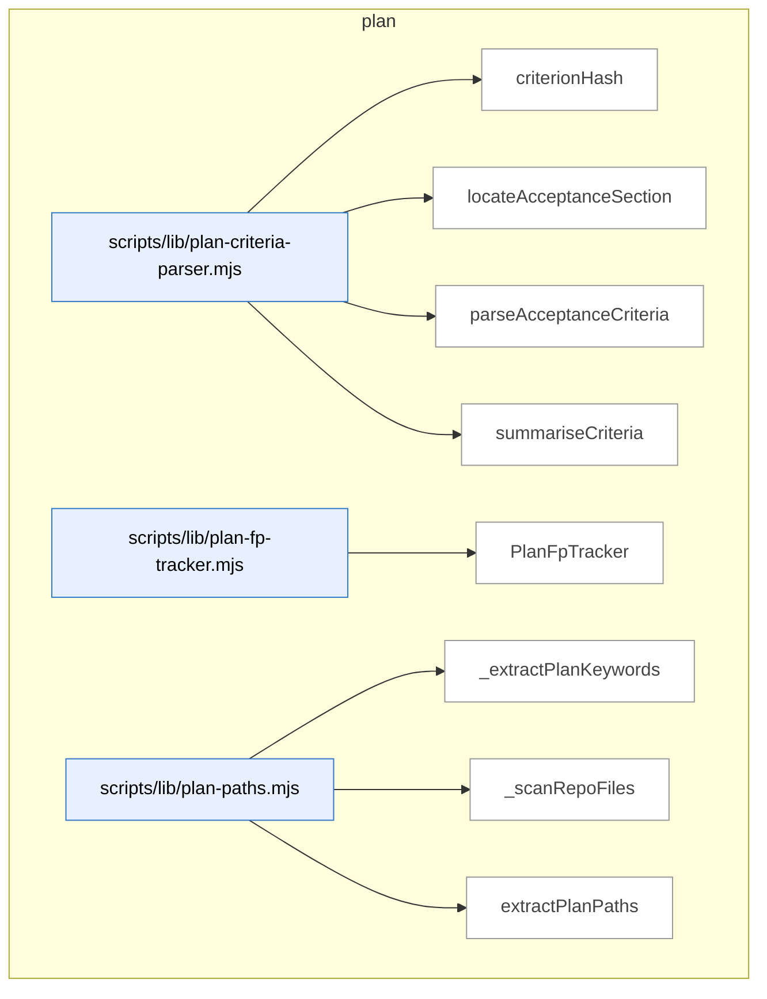

### Symbols in this domain

| Symbol | Kind | Path | Lines | Purpose | File imported by |
|---|---|---|---|---|---|
| [`criterionHash`](../scripts/lib/plan-criteria-parser.mjs#L45) | function | `scripts/lib/plan-criteria-parser.mjs` | 45-48 | Generates a 16-character SHA256-based hash from a criterion's severity, category, and description. | `scripts/ux-lock-run.mjs` |
| [`locateAcceptanceSection`](../scripts/lib/plan-criteria-parser.mjs#L56) | function | `scripts/lib/plan-criteria-parser.mjs` | 56-77 | Locates the "Acceptance Criteria" markdown section by heading level, returning start index and content lines. | `scripts/ux-lock-run.mjs` |
| [`parseAcceptanceCriteria`](../scripts/lib/plan-criteria-parser.mjs#L96) | function | `scripts/lib/plan-criteria-parser.mjs` | 96-152 | <no body> | `scripts/ux-lock-run.mjs` |
| [`summariseCriteria`](../scripts/lib/plan-criteria-parser.mjs#L158) | function | `scripts/lib/plan-criteria-parser.mjs` | 158-166 | Summarizes parsed criteria by counting total, severity distribution, and category distribution. | `scripts/ux-lock-run.mjs` |
| [`PlanFpTracker`](../scripts/lib/plan-fp-tracker.mjs#L26) | class | `scripts/lib/plan-fp-tracker.mjs` | 26-140 | <no body> | `scripts/lib/audit/legacy-production-audit.mjs`, `scripts/openai-audit.mjs`, `scripts/write-plan-outcomes.mjs` |
| [`_extractPlanKeywords`](../scripts/lib/plan-paths.mjs#L112) | function | `scripts/lib/plan-paths.mjs` | 112-154 | Extracts keywords from plan (PascalCase, backtick identifiers, headings) for fuzzy file matching. | `scripts/lib/file-io.mjs` |
| [`_scanRepoFiles`](../scripts/lib/plan-paths.mjs#L156) | function | `scripts/lib/plan-paths.mjs` | 156-182 | Walks the repo directory to enumerate code files by extension, skipping infrastructure directories. | `scripts/lib/file-io.mjs` |
| [`extractPlanPaths`](../scripts/lib/plan-paths.mjs#L32) | function | `scripts/lib/plan-paths.mjs` | 32-108 | Extracts file paths from plan markdown using regex patterns (backticks, headings, inline paths). | `scripts/lib/file-io.mjs` |

---

## root-scripts

> The `root-scripts` domain handles interactive setup and installation workflows, providing CLI utilities for prerequisite validation, API key configuration, database selection, and skill installation during project initialization.

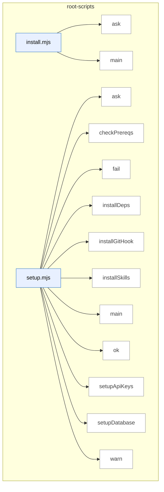

### Symbols in this domain

| Symbol | Kind | Path | Lines | Purpose | File imported by |
|---|---|---|---|---|---|
| [`ask`](../install.mjs#L18) | function | `install.mjs` | 18-18 | Prompts the user with a question and returns a promise that resolves to their input. | _(internal)_ |
| [`main`](../install.mjs#L37) | function | `install.mjs` | 37-238 | <no body> | _(internal)_ |
| [`ask`](../setup.mjs#L25) | function | `setup.mjs` | 25-25 | Returns a promise that prompts the user for input via readline and resolves with their answer. | _(internal)_ |
| [`checkPrereqs`](../setup.mjs#L34) | function | `setup.mjs` | 34-43 | Checks that Node.js version is 18+ and npm is installed, reporting results. | _(internal)_ |
| [`fail`](../setup.mjs#L30) | function | `setup.mjs` | 30-30 | Logs a failure message with a red X symbol prefix. | _(internal)_ |
| [`installDeps`](../setup.mjs#L147) | function | `setup.mjs` | 147-154 | Installs npm dependencies with a timeout, warning if the install fails. | _(internal)_ |
| [`installGitHook`](../setup.mjs#L158) | function | `setup.mjs` | 158-186 | Creates or updates a git post-merge hook to auto-install skills after pulls, handling both new and existing hooks. | _(internal)_ |
| [`installSkills`](../setup.mjs#L129) | function | `setup.mjs` | 129-143 | Builds the skill manifest and installs skills to ~/.claude/skills globally, warning on failure. | _(internal)_ |
| [`main`](../setup.mjs#L190) | function | `setup.mjs` | 190-253 | <no body> | _(internal)_ |
| [`ok`](../setup.mjs#L28) | function | `setup.mjs` | 28-28 | Logs a success message with a green checkmark prefix. | _(internal)_ |
| [`setupApiKeys`](../setup.mjs#L53) | function | `setup.mjs` | 53-80 | Interactively prompts for and saves API keys to .env, skipping required keys in headless mode with a warning. | _(internal)_ |
| [`setupDatabase`](../setup.mjs#L89) | function | `setup.mjs` | 89-125 | Guides the user to select and configure a learning database option, saving relevant environment variables. | _(internal)_ |
| [`warn`](../setup.mjs#L29) | function | `setup.mjs` | 29-29 | Logs a warning message with a yellow warning symbol prefix. | _(internal)_ |

---

## scripts

> Exposes audit-loop and skill tooling as CLI scripts: multi-pass code audit (GPT + Gemini), plan generation/verification, browser-driven UX testing (four semantic lenses), and deployment orchestration.

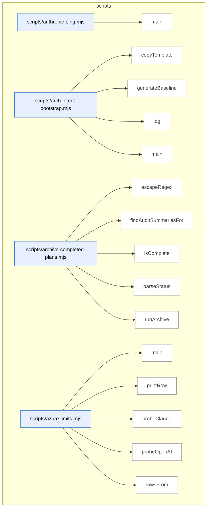

_Domain has 257 symbols (>50). Diagram shows top-15 by file order; see flat table below for the full list._

### Symbols in this domain

| Symbol | Kind | Path | Lines | Purpose | File imported by |
|---|---|---|---|---|---|
| [`main`](../scripts/anthropic-ping.mjs#L24) | function | `scripts/anthropic-ping.mjs` | 24-59 | Tests Claude API connectivity by sending a ping request and reporting latency, usage, and cost. | _(internal)_ |
| [`copyTemplate`](../scripts/arch-intent-bootstrap.mjs#L39) | function | `scripts/arch-intent-bootstrap.mjs` | 39-52 | Copies an architecture-intent template file if it doesn't already exist. | _(internal)_ |
| [`generateBaseline`](../scripts/arch-intent-bootstrap.mjs#L54) | function | `scripts/arch-intent-bootstrap.mjs` | 54-113 | Generates a baseline allowed-dependencies map by analyzing the current import graph across all detected language stacks. | _(internal)_ |
| [`log`](../scripts/arch-intent-bootstrap.mjs#L37) | function | `scripts/arch-intent-bootstrap.mjs` | 37-37 | Writes a prefixed log message to stdout. | _(internal)_ |
| [`main`](../scripts/arch-intent-bootstrap.mjs#L115) | function | `scripts/arch-intent-bootstrap.mjs` | 115-130 | Orchestrates bootstrap setup by copying templates and optionally generating a baseline dependency allowlist. | _(internal)_ |
| [`escapeRegex`](../scripts/archive-completed-plans.mjs#L72) | function | `scripts/archive-completed-plans.mjs` | 72-74 | Escapes special regex characters in a string. | _(internal)_ |
| [`findAuditSummariesFor`](../scripts/archive-completed-plans.mjs#L64) | function | `scripts/archive-completed-plans.mjs` | 64-70 | Finds audit-summary files associated with a given plan file by name pattern. | _(internal)_ |
| [`isComplete`](../scripts/archive-completed-plans.mjs#L54) | function | `scripts/archive-completed-plans.mjs` | 54-57 | Tests whether a status string matches the completion pattern. | _(internal)_ |
| [`parseStatus`](../scripts/archive-completed-plans.mjs#L42) | function | `scripts/archive-completed-plans.mjs` | 42-46 | Extracts the Status line value from plan file content using a regex. | _(internal)_ |
| [`runArchive`](../scripts/archive-completed-plans.mjs#L86) | function | `scripts/archive-completed-plans.mjs` | 86-145 | Moves completed plan files and their audit summaries to an archive directory with duplicate handling. | _(internal)_ |
| [`main`](../scripts/azure-limits.mjs#L66) | function | `scripts/azure-limits.mjs` | 66-93 | Main entry point that discovers all configured deployments (GPT, Embeddings, Opus, Sonnet) and prints their current rate limits with throttle settings. | _(internal)_ |
| [`printRow`](../scripts/azure-limits.mjs#L36) | function | `scripts/azure-limits.mjs` | 36-45 | Formats and prints a single deployment's rate-limit status (success or error) with TPM/RPM values to stdout. | _(internal)_ |
| [`probeClaude`](../scripts/azure-limits.mjs#L59) | function | `scripts/azure-limits.mjs` | 59-64 | Probes Azure Claude deployment via messages API to retrieve rate-limit headers. | _(internal)_ |
| [`probeOpenAI`](../scripts/azure-limits.mjs#L47) | function | `scripts/azure-limits.mjs` | 47-57 | Probes Azure OpenAI embeddings or chat endpoints with a minimal request to retrieve rate-limit headers. | _(internal)_ |
| [`rowsFrom`](../scripts/azure-limits.mjs#L22) | function | `scripts/azure-limits.mjs` | 22-34 | Extracts rate-limit headers from an API response into a normalized object with token/request limits and reset times. | _(internal)_ |
| [`buildSurfacesManifest`](../scripts/build-surfaces-manifest.mjs#L322) | function | `scripts/build-surfaces-manifest.mjs` | 322-343 | Discovers, loads, and merges all surface fragments, validating the final manifest against schema. | _(internal)_ |
| [`canonicalLocator`](../scripts/build-surfaces-manifest.mjs#L144) | function | `scripts/build-surfaces-manifest.mjs` | 144-151 | Converts a locator object (id/css/role/text) to its canonical string form. | _(internal)_ |
| [`findFragments`](../scripts/build-surfaces-manifest.mjs#L109) | function | `scripts/build-surfaces-manifest.mjs` | 109-134 | Recursively finds all .fragment.json files in a directory tree. | _(internal)_ |
| [`loadFragment`](../scripts/build-surfaces-manifest.mjs#L160) | function | `scripts/build-surfaces-manifest.mjs` | 160-180 | Loads and validates a JSON fragment file, rejecting empty fragments. | _(internal)_ |
| [`main`](../scripts/build-surfaces-manifest.mjs#L346) | function | `scripts/build-surfaces-manifest.mjs` | 346-393 | CLI entry point that builds and optionally verifies surface manifests from fragments. | _(internal)_ |
| [`mergeFragments`](../scripts/build-surfaces-manifest.mjs#L191) | function | `scripts/build-surfaces-manifest.mjs` | 191-293 | Merges surface and collection fragments from multiple files, detecting duplicate IDs and conflicting claims. | _(internal)_ |
| [`renderManifest`](../scripts/build-surfaces-manifest.mjs#L303) | function | `scripts/build-surfaces-manifest.mjs` | 303-305 | Serializes a manifest object to formatted JSON. | _(internal)_ |
| [`analyse`](../scripts/cache-hitrate-check.mjs#L170) | function | `scripts/cache-hitrate-check.mjs` | 170-205 | Loads cache hit-rate data from either Supabase or local source, applies segmentation logic, and returns structured recommendation with supporting stats. | _(internal)_ |
| [`loadFromLocal`](../scripts/cache-hitrate-check.mjs#L109) | function | `scripts/cache-hitrate-check.mjs` | 109-128 | Reads local cache-metrics.jsonl log file, parses JSONL entries, filters rounds ≥2 and by timestamp, normalizing seed state. | _(internal)_ |
| [`loadFromSupabase`](../scripts/cache-hitrate-check.mjs#L80) | function | `scripts/cache-hitrate-check.mjs` | 80-107 | Queries Supabase Postgres for cache metrics from audit runs since a threshold date, returning normalized run records. | _(internal)_ |
| [`median`](../scripts/cache-hitrate-check.mjs#L71) | function | `scripts/cache-hitrate-check.mjs` | 71-78 | Finds the median value of a numeric array, handling even-length arrays by averaging the two middle values. | _(internal)_ |
| [`renderHuman`](../scripts/cache-hitrate-check.mjs#L207) | function | `scripts/cache-hitrate-check.mjs` | 207-233 | Prints human-readable cache-seed decision report to console with per-run breakdown, thresholds, and actionable recommendation. | _(internal)_ |
| [`segmentAndDecide`](../scripts/cache-hitrate-check.mjs#L139) | function | `scripts/cache-hitrate-check.mjs` | 139-168 | Segments audit runs by seed state and decides whether to flip AUDIT_CACHE_SEED based on median hit-rate thresholds and minimum run counts. | _(internal)_ |
| [`loadConfig`](../scripts/claudemd-lint.mjs#L48) | function | `scripts/claudemd-lint.mjs` | 48-66 | Loads linting configuration from specified path or default .claudemd-lint.json, returning empty object if neither exists or on parse error. | _(internal)_ |
| [`main`](../scripts/claudemd-lint.mjs#L68) | function | `scripts/claudemd-lint.mjs` | 68-172 | <no body> | _(internal)_ |
| [`parseArgs`](../scripts/claudemd-lint.mjs#L26) | function | `scripts/claudemd-lint.mjs` | 26-46 | Parses command-line arguments for format, output file, config path, fix mode, and yes-to-all flag. | _(internal)_ |
| [`main`](../scripts/efficacy-lints-check.mjs#L17) | function | `scripts/efficacy-lints-check.mjs` | 17-37 | Runs efficacy lints against prompt cache markers and gates based on rule findings. | _(internal)_ |
| [`appendLocalFallback`](../scripts/friction-log.mjs#L88) | function | `scripts/friction-log.mjs` | 88-94 | Writes a JSON record to a local fallback file when cloud logging is unavailable. | `scripts/cross-skill.mjs` |
| [`defaultExecGit`](../scripts/friction-log.mjs#L75) | function | `scripts/friction-log.mjs` | 75-84 | Executes git commands with a timeout and returns output or null on failure. | `scripts/cross-skill.mjs` |
| [`detectRepoName`](../scripts/friction-log.mjs#L61) | function | `scripts/friction-log.mjs` | 61-73 | Detects the repository name from a git remote URL or falls back to the current directory basename. | `scripts/cross-skill.mjs` |
| [`helpText`](../scripts/friction-log.mjs#L164) | function | `scripts/friction-log.mjs` | 164-174 | Returns formatted usage help text for the friction-log CLI tool. | `scripts/cross-skill.mjs` |
| [`main`](../scripts/friction-log.mjs#L185) | function | `scripts/friction-log.mjs` | 185-207 | Entry point that parses arguments, runs friction logging, and outputs results to stdout/stderr with appropriate exit codes. | `scripts/cross-skill.mjs` |
| [`parseArgs`](../scripts/friction-log.mjs#L31) | function | `scripts/friction-log.mjs` | 31-44 | Parses command-line arguments into an object with severity, repo, message, and JSON flag options. | `scripts/cross-skill.mjs` |
| [`runFrictionLog`](../scripts/friction-log.mjs#L98) | function | `scripts/friction-log.mjs` | 98-162 | Orchestrates friction logging by parsing/validating arguments, attempting cloud submission, and falling back to local storage. | `scripts/cross-skill.mjs` |
| [`validateArgs`](../scripts/friction-log.mjs#L46) | function | `scripts/friction-log.mjs` | 46-53 | Validates parsed arguments for required message and valid severity values. | `scripts/cross-skill.mjs` |
| [`installInRepo`](../scripts/install-prepush-hook.mjs#L142) | function | `scripts/install-prepush-hook.mjs` | 142-192 | Installs or uninstalls a pre-push hook in a repository with dry-run and overwrite protection. | _(internal)_ |
| [`isManagedHook`](../scripts/install-prepush-hook.mjs#L41) | function | `scripts/install-prepush-hook.mjs` | 41-45 | Detects if a file contains markers indicating it's a managed pre-push hook. | _(internal)_ |
| [`main`](../scripts/install-prepush-hook.mjs#L196) | function | `scripts/install-prepush-hook.mjs` | 196-220 | Entry point that resolves target repos and orchestrates hook installation, outputting JSON or human-readable results. | _(internal)_ |
| [`computeArchMemoryBandOutcome`](../scripts/learning/backfill-outcomes.mjs#L559) | function | `scripts/learning/backfill-outcomes.mjs` | 559-610 | Detects whether an arch_memory_band recommendation was acted upon by checking git commits in the file's directory within 30 minutes after the decision. | `scripts/cross-skill.mjs` |
| [`computeConvergencePredictOutcome`](../scripts/learning/backfill-outcomes.mjs#L634) | function | `scripts/learning/backfill-outcomes.mjs` | 634-678 | Resolves convergence_predict outcomes by fetching the audit run metadata and comparing the decision round against convergence/rigor/final signals. | `scripts/cross-skill.mjs` |
| [`computeFileFingerprint`](../scripts/learning/backfill-outcomes.mjs#L452) | function | `scripts/learning/backfill-outcomes.mjs` | 452-464 | Computes a SHA256 fingerprint of the first 256 bytes of a file to detect rotations. | `scripts/cross-skill.mjs` |
| [`computeOutcomeFromFileState`](../scripts/learning/backfill-outcomes.mjs#L744) | function | `scripts/learning/backfill-outcomes.mjs` | 744-802 | Resolves quickfix_hit outcomes by checking if a snippet still exists in a file, inferring acceptance if the file is deleted or snippet is gone. | `scripts/cross-skill.mjs` |
| [`computePassSelectionOutcome`](../scripts/learning/backfill-outcomes.mjs#L699) | function | `scripts/learning/backfill-outcomes.mjs` | 699-725 | Resolves pass_selection outcomes by fetching adjudication counts from the audit run and classifying as useful or low-yield based on acceptance ratio. | `scripts/cross-skill.mjs` |
| [`defaultExecGit`](../scripts/learning/backfill-outcomes.mjs#L612) | function | `scripts/learning/backfill-outcomes.mjs` | 612-619 | Spawns the `git` CLI command with the given arguments and options, returning stdout as UTF-8. | `scripts/cross-skill.mjs` |
| [`drainFrictionFallback`](../scripts/learning/backfill-outcomes.mjs#L338) | function | `scripts/learning/backfill-outcomes.mjs` | 338-402 | Reads friction notes from a JSONL file, resolves repo names to IDs, inserts them into the learning store, and rewrites the file with only failed records for retry. | `scripts/cross-skill.mjs` |
| [`drainJsonlToCloud`](../scripts/learning/backfill-outcomes.mjs#L187) | function | `scripts/learning/backfill-outcomes.mjs` | 187-327 | Reads new JSONL lines from a hits file, detects file rotation via fingerprint and size, parses records, and batches them for cloud insertion while tracking cursor position. | `scripts/cross-skill.mjs` |
| [`readDrainCursor`](../scripts/learning/backfill-outcomes.mjs#L417) | function | `scripts/learning/backfill-outcomes.mjs` | 417-438 | Loads the drain cursor from disk, supporting both JSON (new format with fingerprint) and legacy integer format. | `scripts/cross-skill.mjs` |
| [`resolveUnresolvedOutcomes`](../scripts/learning/backfill-outcomes.mjs#L468) | function | `scripts/learning/backfill-outcomes.mjs` | 468-533 | Reads pending learning decisions from the store, routes each to a type-specific resolver (quickfix, arch_memory_band, convergence_predict, pass_selection), and updates outcomes in batch. | `scripts/cross-skill.mjs` |
| [`runBackfill`](../scripts/learning/backfill-outcomes.mjs#L62) | function | `scripts/learning/backfill-outcomes.mjs` | 62-171 | Backfills cloud learning store by draining local outcome logs and friction notes, then rebuilds statistics. | `scripts/cross-skill.mjs` |
| [`writeDrainCursor`](../scripts/learning/backfill-outcomes.mjs#L440) | function | `scripts/learning/backfill-outcomes.mjs` | 440-445 | Writes the drain cursor state (offset, fingerprint, timestamp) to disk as JSON. | `scripts/cross-skill.mjs` |
| [`fmtNum`](../scripts/learning/replay.mjs#L92) | function | `scripts/learning/replay.mjs` | 92-95 | Formats a number to 2 decimals if ≥1, otherwise 4 decimals. | `scripts/cross-skill.mjs` |
| [`loadPolicy`](../scripts/learning/replay.mjs#L99) | function | `scripts/learning/replay.mjs` | 99-109 | Dynamically imports a policy function from a file path (absolute or relative), validating it exports default or named 'policy'. | `scripts/cross-skill.mjs` |
| [`parseDuration`](../scripts/learning/replay.mjs#L54) | function | `scripts/learning/replay.mjs` | 54-63 | Parses duration strings like "30d", "5h", "1000ms" into milliseconds using regex and multiplier table. | `scripts/cross-skill.mjs` |
| [`renderMarkdownReport`](../scripts/learning/replay.mjs#L67) | function | `scripts/learning/replay.mjs` | 67-90 | Renders a markdown report table showing baseline vs. candidate policy reward distributions, delta, and promotion gates. | `scripts/cross-skill.mjs` |
| [`runReplayCli`](../scripts/learning/replay.mjs#L120) | function | `scripts/learning/replay.mjs` | 120-170 | CLI entry point for replay: parses decision_type and option flags, loads policies, and runs replay simulation with optional JSON/markdown output. | `scripts/cross-skill.mjs` |
| [`applyTotalCap`](../scripts/learning/weekly-review.mjs#L135) | function | `scripts/learning/weekly-review.mjs` | 135-155 | Distributes a total item cap across four sections (friction, triage, noBrainer, stale) with adjusted limits depending on whether friction notes exist. | `scripts/cross-skill.mjs` |
| [`buildFrictionSection`](../scripts/learning/weekly-review.mjs#L116) | function | `scripts/learning/weekly-review.mjs` | 116-126 | Sorts friction notes by severity rank then recency, slices to a cap, and returns items with overflow count. | `scripts/cross-skill.mjs` |
| [`buildNoBrainerSection`](../scripts/learning/weekly-review.mjs#L95) | function | `scripts/learning/weekly-review.mjs` | 95-103 | Sorts findings by occurrence count (descending) then last-seen date, slices to a cap, and returns items with overflow count. | `scripts/cross-skill.mjs` |
| [`buildStaleSection`](../scripts/learning/weekly-review.mjs#L105) | function | `scripts/learning/weekly-review.mjs` | 105-110 | Sorts stale deferrals by oldest-first, slices to a cap, and returns items with overflow count. | `scripts/cross-skill.mjs` |
| [`buildTriageSection`](../scripts/learning/weekly-review.mjs#L84) | function | `scripts/learning/weekly-review.mjs` | 84-93 | Sorts triage findings by severity then recency, slices to a cap, and returns items with overflow count. | `scripts/cross-skill.mjs` |
| [`fmtPath`](../scripts/learning/weekly-review.mjs#L165) | function | `scripts/learning/weekly-review.mjs` | 165-168 | Escapes backticks in a file path for safe inclusion in Markdown code spans. | `scripts/cross-skill.mjs` |
| [`fmtTitle`](../scripts/learning/weekly-review.mjs#L159) | function | `scripts/learning/weekly-review.mjs` | 159-163 | Trims and Markdown-escapes a title string, capping it at 120 characters. | `scripts/cross-skill.mjs` |
| [`humanizeAgo`](../scripts/learning/weekly-review.mjs#L174) | function | `scripts/learning/weekly-review.mjs` | 174-186 | Converts an ISO timestamp to a human-readable relative time string (e.g., "3h ago"). | `scripts/cross-skill.mjs` |
| [`mdEscape`](../scripts/learning/weekly-review.mjs#L69) | function | `scripts/learning/weekly-review.mjs` | 69-80 | Escapes special Markdown and HTML characters to safely embed text in Markdown output. | `scripts/cross-skill.mjs` |
| [`postOrUpdateStickyIssue`](../scripts/learning/weekly-review.mjs#L282) | function | `scripts/learning/weekly-review.mjs` | 282-340 | Posts or updates a sticky GitHub issue with the weekly review Markdown, searching by label to find and re-open existing issues. | `scripts/cross-skill.mjs` |
| [`renderMarkdown`](../scripts/learning/weekly-review.mjs#L188) | function | `scripts/learning/weekly-review.mjs` | 188-278 | Renders all review sections (friction, triage, no-brainers, stale) as a Markdown document with section headings and overflow indicators. | `scripts/cross-skill.mjs` |
| [`runWeeklyReview`](../scripts/learning/weekly-review.mjs#L351) | function | `scripts/learning/weekly-review.mjs` | 351-415 | Orchestrates the full weekly review pipeline: fetches triage/no-brainer/stale/friction rows, applies caps, renders Markdown, and posts to GitHub. | `scripts/cross-skill.mjs` |
| [`severityRank`](../scripts/learning/weekly-review.mjs#L52) | function | `scripts/learning/weekly-review.mjs` | 52-60 | Maps severity strings to rank order (HIGH=0, MEDIUM=1, LOW=2, unknown=-1) for sorting. | `scripts/cross-skill.mjs` |
| [`extractMermaidBlocks`](../scripts/lint-plan-mermaid.mjs#L41) | function | `scripts/lint-plan-mermaid.mjs` | 41-63 | Extracts all mermaid diagram blocks from markdown, returning their line offsets and bodies. | _(internal)_ |
| [`lintFile`](../scripts/lint-plan-mermaid.mjs#L210) | function | `scripts/lint-plan-mermaid.mjs` | 210-227 | Lints a markdown file for mermaid diagram issues and returns all violations found. | _(internal)_ |
| [`main`](../scripts/lint-plan-mermaid.mjs#L244) | function | `scripts/lint-plan-mermaid.mjs` | 244-299 | Main entry point that lints mermaid diagrams in target files or default directories, outputting results in human or JSON format. | _(internal)_ |
| [`parseGraphBlock`](../scripts/lint-plan-mermaid.mjs#L77) | function | `scripts/lint-plan-mermaid.mjs` | 77-129 | <no body> | _(internal)_ |
| [`ruleSubgraphAsEdgeEndpoint`](../scripts/lint-plan-mermaid.mjs#L137) | function | `scripts/lint-plan-mermaid.mjs` | 137-154 | Reports issues when subgraph IDs are used as edge endpoints in mermaid diagrams. | _(internal)_ |
| [`ruleUnquotedSpecialCharsInLabel`](../scripts/lint-plan-mermaid.mjs#L172) | function | `scripts/lint-plan-mermaid.mjs` | 172-206 | Flags unquoted node labels containing special characters or non-ASCII text in mermaid diagrams. | _(internal)_ |
| [`walkMd`](../scripts/lint-plan-mermaid.mjs#L231) | function | `scripts/lint-plan-mermaid.mjs` | 231-240 | Recursively walks a directory tree to collect all .md files. | _(internal)_ |
| [`run`](../scripts/migrate-v3-run-metadata.mjs#L66) | function | `scripts/migrate-v3-run-metadata.mjs` | 66-84 | Connects to PostgreSQL and applies database schema migrations, exiting with error code if any fail. | _(internal)_ |
| [`assertSourceIsPersonaTest`](../scripts/migrations/2026-05-20-persona-test-to-audit-loop.mjs#L58) | function | `scripts/migrations/2026-05-20-persona-test-to-audit-loop.mjs` | 58-65 | Validates that the source URL contains the Persona Test project reference. | _(internal)_ |
| [`assertTargetIsAuditLoop`](../scripts/migrations/2026-05-20-persona-test-to-audit-loop.mjs#L66) | function | `scripts/migrations/2026-05-20-persona-test-to-audit-loop.mjs` | 66-73 | Validates that the target URL contains the Audit-loop project reference. | _(internal)_ |
| [`bindValue`](../scripts/migrations/2026-05-20-persona-test-to-audit-loop.mjs#L122) | function | `scripts/migrations/2026-05-20-persona-test-to-audit-loop.mjs` | 122-128 | Serializes JSON/JSONB values and returns other values unchanged for SQL binding. | _(internal)_ |
| [`bulkInsert`](../scripts/migrations/2026-05-20-persona-test-to-audit-loop.mjs#L139) | function | `scripts/migrations/2026-05-20-persona-test-to-audit-loop.mjs` | 139-159 | Bulk-inserts rows into a table with ON CONFLICT DO NOTHING, returning inserted/skipped counts. | _(internal)_ |
| [`filterColumns`](../scripts/migrations/2026-05-20-persona-test-to-audit-loop.mjs#L102) | function | `scripts/migrations/2026-05-20-persona-test-to-audit-loop.mjs` | 102-110 | Filters source rows to include only columns that exist in the target, tracking dropped columns. | _(internal)_ |
| [`getTargetColumns`](../scripts/migrations/2026-05-20-persona-test-to-audit-loop.mjs#L87) | function | `scripts/migrations/2026-05-20-persona-test-to-audit-loop.mjs` | 87-100 | Fetches target table column names and data types to filter compatible columns. | _(internal)_ |
| [`main`](../scripts/migrations/2026-05-20-persona-test-to-audit-loop.mjs#L163) | function | `scripts/migrations/2026-05-20-persona-test-to-audit-loop.mjs` | 163-222 | <no body> | _(internal)_ |
| [`parseArgs`](../scripts/migrations/2026-05-20-persona-test-to-audit-loop.mjs#L34) | function | `scripts/migrations/2026-05-20-persona-test-to-audit-loop.mjs` | 34-54 | Parses CLI arguments for source/target URLs and dry-run flag, exiting on missing required args. | _(internal)_ |
| [`quoteIdent`](../scripts/migrations/2026-05-20-persona-test-to-audit-loop.mjs#L132) | function | `scripts/migrations/2026-05-20-persona-test-to-audit-loop.mjs` | 132-137 | Quotes a PostgreSQL identifier, throwing if it contains invalid characters. | _(internal)_ |
| [`readSource`](../scripts/migrations/2026-05-20-persona-test-to-audit-loop.mjs#L77) | function | `scripts/migrations/2026-05-20-persona-test-to-audit-loop.mjs` | 77-85 | Queries both personas and persona_test_sessions tables from the source database. | _(internal)_ |
| [`argOption`](../scripts/model-eval-adjudicator.mjs#L58) | function | `scripts/model-eval-adjudicator.mjs` | 58-61 | Extracts a named CLI argument value with a default fallback. | _(internal)_ |
| [`main`](../scripts/model-eval-adjudicator.mjs#L86) | function | `scripts/model-eval-adjudicator.mjs` | 86-210 | CLI entry point for the adjudicator that validates arguments, loads thresholds, and runs the evaluation tier. | _(internal)_ |
| [`parseJsonArg`](../scripts/model-eval-adjudicator.mjs#L63) | function | `scripts/model-eval-adjudicator.mjs` | 63-66 | Parses a JSON CLI argument with error reporting. | _(internal)_ |
| [`RunPreflightError`](../scripts/model-eval-adjudicator.mjs#L54) | class | `scripts/model-eval-adjudicator.mjs` | 54-56 | Error for preflight validation failures with a reason code. | _(internal)_ |
| [`scoreAgainstGroundTruth`](../scripts/model-eval-adjudicator.mjs#L74) | function | `scripts/model-eval-adjudicator.mjs` | 74-84 | Scores candidate predictions against ground-truth labels via LLM extraction and binary classification metrics. | _(internal)_ |
| [`toRawContext`](../scripts/model-eval-adjudicator.mjs#L69) | function | `scripts/model-eval-adjudicator.mjs` | 69-72 | Formats a defect row into a context object containing finding text and severity. | _(internal)_ |
| [`argOption`](../scripts/model-eval-auditor.mjs#L110) | function | `scripts/model-eval-auditor.mjs` | 110-113 | Retrieves a named command-line option value or returns a default. | _(internal)_ |
| [`hasFlag`](../scripts/model-eval-auditor.mjs#L114) | function | `scripts/model-eval-auditor.mjs` | 114-114 | Checks if a named boolean flag exists in command-line arguments. | _(internal)_ |
| [`main`](../scripts/model-eval-auditor.mjs#L288) | function | `scripts/model-eval-auditor.mjs` | 288-404 | CLI entry point parsing arguments, loading corpus/thresholds, refreshing model catalog, and dispatching screen or promotion tier. | _(internal)_ |
| [`mulberry32`](../scripts/model-eval-auditor.mjs#L58) | function | `scripts/model-eval-auditor.mjs` | 58-66 | Seeded pseudorandom number generator returning floats in [0,1). | _(internal)_ |
| [`parseJsonArg`](../scripts/model-eval-auditor.mjs#L116) | function | `scripts/model-eval-auditor.mjs` | 116-119 | Parses JSON from a command-line argument, throwing on syntax error. | _(internal)_ |
| [`RunPreflightError`](../scripts/model-eval-auditor.mjs#L48) | class | `scripts/model-eval-auditor.mjs` | 48-50 | Custom error class for preflight validation failures with a reason code. | _(internal)_ |
| [`runPromotionTier`](../scripts/model-eval-auditor.mjs#L158) | function | `scripts/model-eval-auditor.mjs` | 158-284 | Runs comparative Tier A/B/C evaluation with generation + blind judging, serialized to avoid process.chdir() races. | _(internal)_ |
| [`runScreenTier`](../scripts/model-eval-auditor.mjs#L141) | function | `scripts/model-eval-auditor.mjs` | 141-154 | Runs oracle-mode evaluation and computes screen-tier verdict on candidate model. | _(internal)_ |
| [`scoreArmTierC`](../scripts/model-eval-auditor.mjs#L125) | function | `scripts/model-eval-auditor.mjs` | 125-137 | Scores a candidate model's defect-localization accuracy (recall, false-positive rate, F1) on test cases. | _(internal)_ |
| [`seedFromString`](../scripts/model-eval-auditor.mjs#L67) | function | `scripts/model-eval-auditor.mjs` | 67-69 | Converts a string to a 32-bit numeric seed via SHA256 hash. | _(internal)_ |
| [`stratifiedSelectKDs`](../scripts/model-eval-auditor.mjs#L79) | function | `scripts/model-eval-auditor.mjs` | 79-106 | Stratified random selection of defects by severity group with deterministic shuffling. | _(internal)_ |
| [`checkReadiness`](../scripts/phase7-check.mjs#L13) | function | `scripts/phase7-check.mjs` | 13-63 | Measures progress toward Phase 7 readiness by counting unique audit runs from the outcomes log and comparing against a threshold. | _(internal)_ |
| [`main`](../scripts/phase7-check.mjs#L65) | function | `scripts/phase7-check.mjs` | 65-68 | Checks if the current session has enough audit data to enable Phase 7 ML-based pass selection. | _(internal)_ |
| [`formatHumanReport`](../scripts/postgres-parity/check-non-core-references.mjs#L166) | function | `scripts/postgres-parity/check-non-core-references.mjs` | 166-186 | Formats findings into a human-readable report with remediation guidance or an OK message. | _(internal)_ |
| [`main`](../scripts/postgres-parity/check-non-core-references.mjs#L190) | function | `scripts/postgres-parity/check-non-core-references.mjs` | 190-217 | Main entry point that reads migrations, scans for findings, outputs JSON or human report, and exits with code 1 if strict mode and violations found. | _(internal)_ |
| [`pathToFileUrl`](../scripts/postgres-parity/check-non-core-references.mjs#L221) | function | `scripts/postgres-parity/check-non-core-references.mjs` | 221-221 | Converts a file path to a file:// URL with proper escaping and normalization. | _(internal)_ |
| [`readMigrations`](../scripts/postgres-parity/check-non-core-references.mjs#L60) | function | `scripts/postgres-parity/check-non-core-references.mjs` | 60-69 | Reads and parses all .sql migration files from the migrations directory in sorted order. | _(internal)_ |
| [`scanForFindings`](../scripts/postgres-parity/check-non-core-references.mjs#L71) | function | `scripts/postgres-parity/check-non-core-references.mjs` | 71-162 | Scans migrations for disallowed references (auth functions, roles, extensions, public qualifications) and collects findings. | _(internal)_ |
| [`main`](../scripts/postgres-parity/generate-expected-schema.mjs#L183) | function | `scripts/postgres-parity/generate-expected-schema.mjs` | 183-217 | Main entry point that queries a migrated Postgres database and writes the current schema state to a JSON file. | _(internal)_ |
| [`assertLocalOnly`](../scripts/postgres-parity/record-golden-fixtures.mjs#L92) | function | `scripts/postgres-parity/record-golden-fixtures.mjs` | 92-135 | Validates that fixture recording runs only against local or explicitly-allowed remote Supabase projects, blocking production. | _(internal)_ |
| [`captureTableSnapshot`](../scripts/postgres-parity/record-golden-fixtures.mjs#L194) | function | `scripts/postgres-parity/record-golden-fixtures.mjs` | 194-198 | Placeholder function that returns an empty snapshot to surface TODO implementation. | _(internal)_ |
| [`diffSnapshots`](../scripts/postgres-parity/record-golden-fixtures.mjs#L200) | function | `scripts/postgres-parity/record-golden-fixtures.mjs` | 200-202 | Placeholder function that returns an empty diff since snapshot capture is not yet implemented. | _(internal)_ |
| [`main`](../scripts/postgres-parity/record-golden-fixtures.mjs#L232) | function | `scripts/postgres-parity/record-golden-fixtures.mjs` | 232-281 | Main entry point that records golden fixtures: sets up environment, loads legacy module, runs matrix of functions, writes JSON fixtures with frozen SHAs. | _(internal)_ |
| [`normaliseMutation`](../scripts/postgres-parity/record-golden-fixtures.mjs#L228) | function | `scripts/postgres-parity/record-golden-fixtures.mjs` | 228-228 | Normalizes a mutation object using the generic normalizeValues function. | _(internal)_ |
| [`normaliseValues`](../scripts/postgres-parity/record-golden-fixtures.mjs#L209) | function | `scripts/postgres-parity/record-golden-fixtures.mjs` | 209-226 | Normalizes function return values by replacing UUIDs and timestamps with placeholders and recursing through nested structures. | _(internal)_ |
| [`parseArgs`](../scripts/postgres-parity/record-golden-fixtures.mjs#L47) | function | `scripts/postgres-parity/record-golden-fixtures.mjs` | 47-79 | Parses CLI arguments for fixture recording (legacy path, Supabase credentials, output dir, remote allowlist). | _(internal)_ |
| [`runOne`](../scripts/postgres-parity/record-golden-fixtures.mjs#L158) | function | `scripts/postgres-parity/record-golden-fixtures.mjs` | 158-186 | Records golden fixtures by invoking a legacy function with input, capturing mutations, normalizing values/UUIDs/timestamps. | _(internal)_ |
| [`sourceSha`](../scripts/postgres-parity/record-golden-fixtures.mjs#L283) | function | `scripts/postgres-parity/record-golden-fixtures.mjs` | 283-292 | Gets the git commit SHA for a source file, falling back to a content hash if uncommitted. | _(internal)_ |
| [`argValue`](../scripts/reconcile-repo-identity.mjs#L354) | function | `scripts/reconcile-repo-identity.mjs` | 354-357 | Retrieves the value following a command-line flag from process.argv. | _(internal)_ |
| [`buildProposals`](../scripts/reconcile-repo-identity.mjs#L77) | function | `scripts/reconcile-repo-identity.mjs` | 77-105 | Matches legacy repositories to canonical ones by base name and generates reconciliation proposals or quarantine records. | _(internal)_ |
| [`discoverRepoScopedUniqueKeys`](../scripts/reconcile-repo-identity.mjs#L319) | function | `scripts/reconcile-repo-identity.mjs` | 319-342 | Queries PostgreSQL for unique constraints on specified tables and extracts column lists that include repo_id. | _(internal)_ |
| [`main`](../scripts/reconcile-repo-identity.mjs#L107) | function | `scripts/reconcile-repo-identity.mjs` | 107-313 | <no body> | _(internal)_ |
| [`pgTextArray`](../scripts/reconcile-repo-identity.mjs#L345) | function | `scripts/reconcile-repo-identity.mjs` | 345-352 | Converts PostgreSQL array literal strings (or JS arrays) into normalized JavaScript string arrays. | _(internal)_ |
| [`repoBaseName`](../scripts/reconcile-repo-identity.mjs#L60) | function | `scripts/reconcile-repo-identity.mjs` | 60-63 | Extracts the repository base name (last path segment) from a full repository name string. | _(internal)_ |
| [`cmdExtract`](../scripts/requirements.mjs#L57) | function | `scripts/requirements.mjs` | 57-99 | Extracts requirements from source files with configurable run count, validates input, and writes candidates and gaps JSON files under lock. | _(internal)_ |
| [`cmdIndex`](../scripts/requirements.mjs#L158) | function | `scripts/requirements.mjs` | 158-166 | Loads the requirements ledger and outputs an index of all requirements with kind/status filters. | _(internal)_ |
| [`cmdReconcile`](../scripts/requirements.mjs#L101) | function | `scripts/requirements.mjs` | 101-156 | Reconciles extracted requirements with gap assessments and overrides, validates schemas, and produces a final ledger JSON under lock. | _(internal)_ |
| [`cmdRender`](../scripts/requirements.mjs#L169) | function | `scripts/requirements.mjs` | 169-179 | Renders the requirements ledger as a Markdown map and writes it to the output file. | _(internal)_ |
| [`flag`](../scripts/requirements.mjs#L52) | function | `scripts/requirements.mjs` | 52-55 | Extracts a flag value from argv by finding the flag name and returning the next argument. | _(internal)_ |
| [`gitSha`](../scripts/requirements.mjs#L44) | function | `scripts/requirements.mjs` | 44-50 | Gets the current git commit SHA, returning null if unavailable. | _(internal)_ |
| [`main`](../scripts/requirements.mjs#L181) | function | `scripts/requirements.mjs` | 181-198 | Main entry point that dispatches to extract/reconcile/index/render subcommands based on argv[0]. | _(internal)_ |
| [`classifyMitigation`](../scripts/security-memory/incident-status.mjs#L33) | function | `scripts/security-memory/incident-status.mjs` | 33-57 | Classifies mitigation status by checking semgrep rule existence, execution success, and test pass/fail. | `scripts/security-memory/refresh-incidents.mjs` |
| [`runSemgrepIfNeeded`](../scripts/security-memory/incident-status.mjs#L71) | function | `scripts/security-memory/incident-status.mjs` | 71-150 | Runs semgrep rule if not cached, verifying rule file path safety and handling registry-vs-local rules. | `scripts/security-memory/refresh-incidents.mjs` |
| [`sha256`](../scripts/security-memory/incident-status.mjs#L152) | function | `scripts/security-memory/incident-status.mjs` | 152-154 | Returns the first 16 hex characters of a SHA256 hash of input text. | `scripts/security-memory/refresh-incidents.mjs` |
| [`computeFingerprint`](../scripts/security-memory/parse-strategy.mjs#L191) | function | `scripts/security-memory/parse-strategy.mjs` | 191-199 | Generates a 16-character SHA-256 hash of normalized incident metadata for deduplication. | `scripts/security-memory/refresh-incidents.mjs` |
| [`deriveMitigationKind`](../scripts/security-memory/parse-strategy.mjs#L184) | function | `scripts/security-memory/parse-strategy.mjs` | 184-189 | Determines mitigation kind (manual/semgrep/file-ref) from mitigation reference string format. | `scripts/security-memory/refresh-incidents.mjs` |
| [`extractFields`](../scripts/security-memory/parse-strategy.mjs#L116) | function | `scripts/security-memory/parse-strategy.mjs` | 116-161 | Extracts typed fields (description, affected paths, mitigation, lessons) from an incident block. | `scripts/security-memory/refresh-incidents.mjs` |
| [`lineOfOffset`](../scripts/security-memory/parse-strategy.mjs#L201) | function | `scripts/security-memory/parse-strategy.mjs` | 201-207 | Counts newlines in text up to a given offset to determine the line number. | `scripts/security-memory/refresh-incidents.mjs` |
| [`parsePathList`](../scripts/security-memory/parse-strategy.mjs#L169) | function | `scripts/security-memory/parse-strategy.mjs` | 169-182 | Parses a comma- or newline-delimited list of paths, supporting bulleted format. | `scripts/security-memory/refresh-incidents.mjs` |
| [`parseSecurityStrategy`](../scripts/security-memory/parse-strategy.mjs#L35) | function | `scripts/security-memory/parse-strategy.mjs` | 35-109 | Parses markdown security strategy document, extracting threat model and incident blocks with validation. | `scripts/security-memory/refresh-incidents.mjs` |
| [`currentBranchName`](../scripts/security-memory/refresh-incidents.mjs#L65) | function | `scripts/security-memory/refresh-incidents.mjs` | 65-70 | Safely returns the current branch name via git, defaulting to 'unknown' on failure. | _(internal)_ |
| [`generateEmbedding`](../scripts/security-memory/refresh-incidents.mjs#L128) | function | `scripts/security-memory/refresh-incidents.mjs` | 128-134 | Generates an embedding vector for the given text using the configured model and dimension, delegating to embedText. | _(internal)_ |
| [`gitArgs`](../scripts/security-memory/refresh-incidents.mjs#L54) | function | `scripts/security-memory/refresh-incidents.mjs` | 54-56 | Runs a git command and returns its trimmed stdout output. | _(internal)_ |
| [`gitHeadSha`](../scripts/security-memory/refresh-incidents.mjs#L58) | function | `scripts/security-memory/refresh-incidents.mjs` | 58-61 | Safely returns the current HEAD commit SHA via git, defaulting to 'unknown' on failure. | _(internal)_ |
| [`gitWho`](../scripts/security-memory/refresh-incidents.mjs#L73) | function | `scripts/security-memory/refresh-incidents.mjs` | 73-79 | Returns the git-configured user name, falling back to USER/USERNAME env vars or null. | _(internal)_ |
| [`isOnDefaultBranch`](../scripts/security-memory/refresh-incidents.mjs#L81) | function | `scripts/security-memory/refresh-incidents.mjs` | 81-122 | Determines whether the current HEAD is on the default branch by checking branch name first, then SHA equality for detached HEAD. | _(internal)_ |
| [`logInfo`](../scripts/security-memory/refresh-incidents.mjs#L48) | function | `scripts/security-memory/refresh-incidents.mjs` | 48-48 | Writes an info-level message to stderr with a consistent prefix. | _(internal)_ |
| [`logWarn`](../scripts/security-memory/refresh-incidents.mjs#L49) | function | `scripts/security-memory/refresh-incidents.mjs` | 49-49 | Writes a warn-level message to stderr with a consistent prefix. | _(internal)_ |
| [`main`](../scripts/security-memory/refresh-incidents.mjs#L136) | function | `scripts/security-memory/refresh-incidents.mjs` | 136-400 | Main entry point that bootstraps the security memory refresh by validating prerequisites, upserting repo metadata, and orchestrating the incident processing pipeline. | _(internal)_ |
| [`defaultPrompt`](../scripts/setup-cloud.mjs#L37) | function | `scripts/setup-cloud.mjs` | 37-46 | Prompts the user for a yes/no answer on stderr and returns a boolean. | _(internal)_ |
| [`main`](../scripts/setup-cloud.mjs#L48) | function | `scripts/setup-cloud.mjs` | 48-99 | <no body> | _(internal)_ |
| [`applyBootstrap`](../scripts/setup-postgres.mjs#L272) | function | `scripts/setup-postgres.mjs` | 272-279 | Applies the compat-bootstrap.sql file to create Supabase compatibility roles; dry-run capable. | _(internal)_ |
| [`applyMigration`](../scripts/setup-postgres.mjs#L260) | function | `scripts/setup-postgres.mjs` | 260-270 | Executes a single SQL migration file or dry-runs it; returns SHA256 for ledger recording. | _(internal)_ |
| [`canonicalise`](../scripts/setup-postgres.mjs#L332) | function | `scripts/setup-postgres.mjs` | 332-343 | Recursively canonicalizes data structures by sorting keys and array elements for deterministic JSON comparison. | _(internal)_ |
| [`captureLiveSchema`](../scripts/setup-postgres.mjs#L291) | function | `scripts/setup-postgres.mjs` | 291-303 | Queries the live database schema (tables, indexes, constraints, etc.) and returns it as structured object. | _(internal)_ |
| [`diffSchemas`](../scripts/setup-postgres.mjs#L305) | function | `scripts/setup-postgres.mjs` | 305-329 | Compares expected and live schemas row-by-row, returning categories with items missing in live or extra in live. | _(internal)_ |
| [`ensureLedger`](../scripts/setup-postgres.mjs#L229) | function | `scripts/setup-postgres.mjs` | 229-232 | Creates the audit_loop_migrations ledger table and RLS policy if not present. | _(internal)_ |
| [`isSupabaseManaged`](../scripts/setup-postgres.mjs#L197) | function | `scripts/setup-postgres.mjs` | 197-209 | Detects Supabase-managed database by checking if auth schema is owned by supabase_admin or supabase_auth_admin. | _(internal)_ |
| [`listMigrations`](../scripts/setup-postgres.mjs#L249) | function | `scripts/setup-postgres.mjs` | 249-252 | Returns sorted list of .sql migration files from the migrations directory. | _(internal)_ |
| [`main`](../scripts/setup-postgres.mjs#L713) | function | `scripts/setup-postgres.mjs` | 713-789 | Entry point that routes between migrate, adopt, check-drift, and ensure-local modes with pool connection management. | _(internal)_ |
| [`parseArgs`](../scripts/setup-postgres.mjs#L68) | function | `scripts/setup-postgres.mjs` | 68-109 | Parses command-line arguments into structured object with mode and flags (migrate, adopt, check-drift, ensure-local, etc.). | _(internal)_ |
| [`preflight`](../scripts/setup-postgres.mjs#L124) | function | `scripts/setup-postgres.mjs` | 124-147 | Checks database prerequisites: CREATEROLE privilege and required extensions (pgcrypto, pg_trgm, vector). | _(internal)_ |
| [`readLedger`](../scripts/setup-postgres.mjs#L234) | function | `scripts/setup-postgres.mjs` | 234-237 | Reads migration filenames and SHA256 hashes from the ledger table into a Map. | _(internal)_ |
| [`recordApplied`](../scripts/setup-postgres.mjs#L239) | function | `scripts/setup-postgres.mjs` | 239-245 | Inserts or updates a migration record in the ledger with filename and SHA256 hash. | _(internal)_ |
| [`renderHumanDriftReport`](../scripts/setup-postgres.mjs#L633) | function | `scripts/setup-postgres.mjs` | 633-654 | Displays migration drift check results in human-readable format with color-coded categories and counts. | _(internal)_ |
| [`reportPreflight`](../scripts/setup-postgres.mjs#L149) | function | `scripts/setup-postgres.mjs` | 149-183 | Displays preflight check results in color with privilege status and extension availability; strict mode hard-fails on missing requirements. | _(internal)_ |
| [`runAdopt`](../scripts/setup-postgres.mjs#L510) | function | `scripts/setup-postgres.mjs` | 510-559 | Seeds the ledger from expected-schema manifest when adopting a pre-provisioned database; aborts on schema drift. | _(internal)_ |
| [`runCheckDrift`](../scripts/setup-postgres.mjs#L580) | function | `scripts/setup-postgres.mjs` | 580-631 | Reports differences between applied migrations and source files (unapplied, SHA-mismatched, orphaned ledger entries). | _(internal)_ |
| [`runEnsureLocal`](../scripts/setup-postgres.mjs#L664) | function | `scripts/setup-postgres.mjs` | 664-711 | Verifies Postgres installation and DSN configuration; auto-installs Postgres if missing and continues to migrate mode. | _(internal)_ |
| [`runMigrate`](../scripts/setup-postgres.mjs#L469) | function | `scripts/setup-postgres.mjs` | 469-508 | Applies bootstrap (if not Supabase-managed) and migrations in order, skipping already-applied ones via ledger SHA256 check. | _(internal)_ |
| [`sha256`](../scripts/setup-postgres.mjs#L254) | function | `scripts/setup-postgres.mjs` | 254-258 | Computes SHA256 hash of a migration file for integrity verification. | _(internal)_ |
| [`main`](../scripts/skills-fit-check.mjs#L136) | function | `scripts/skills-fit-check.mjs` | 136-153 | Parses CLI arguments, runs a fit check, and outputs results as JSON or formatted card, exiting with appropriate code. | _(internal)_ |
| [`parseArgs`](../scripts/skills-fit-check.mjs#L26) | function | `scripts/skills-fit-check.mjs` | 26-36 | Parses CLI arguments for repo root, JSON output, quiet mode, and help flag. | _(internal)_ |
| [`renderCard`](../scripts/skills-fit-check.mjs#L85) | function | `scripts/skills-fit-check.mjs` | 85-131 | Renders a formatted ASCII card displaying repo profile, fit verdicts grouped by status (fits/partial/mismatch), and setup guidance. | _(internal)_ |
| [`runFitCheck`](../scripts/skills-fit-check.mjs#L53) | function | `scripts/skills-fit-check.mjs` | 53-83 | Runs the skills fit-check: detects repo shape, applies rules, groups verdicts, persists report, and returns exit code with report. | _(internal)_ |
| [`yn`](../scripts/skills-fit-check.mjs#L133) | function | `scripts/skills-fit-check.mjs` | 133-133 | Returns "yes" or "no" string based on boolean input. | _(internal)_ |
| [`escapePipe`](../scripts/skills-help.mjs#L259) | function | `scripts/skills-help.mjs` | 259-261 | Escapes pipe characters and newlines in a string for safe inclusion in Markdown table cells. | `scripts/lib/dashboard/collect-reference.mjs` |
| [`filterBySearch`](../scripts/skills-help.mjs#L194) | function | `scripts/skills-help.mjs` | 194-204 | Filters skills by matching name, description, triggers, or usage against a search term. | `scripts/lib/dashboard/collect-reference.mjs` |
| [`loadAllSkills`](../scripts/skills-help.mjs#L175) | function | `scripts/skills-help.mjs` | 175-188 | Loads and sorts all skills from the skills directory by parsing their SKILL.md files. | `scripts/lib/dashboard/collect-reference.mjs` |
| [`main`](../scripts/skills-help.mjs#L270) | function | `scripts/skills-help.mjs` | 270-313 | Main entry point that loads skills, handles command-line arguments, and outputs help text, detailed skill info, search results, or all skills in requested format. | `scripts/lib/dashboard/collect-reference.mjs` |
| [`parseArgs`](../scripts/skills-help.mjs#L49) | function | `scripts/skills-help.mjs` | 49-72 | Parses CLI arguments for skill name, search term, output format, and destination file. | `scripts/lib/dashboard/collect-reference.mjs` |
| [`parseSkill`](../scripts/skills-help.mjs#L79) | function | `scripts/skills-help.mjs` | 79-169 | Extracts structured metadata from a SKILL.md file including name, one-liner description, triggers, and usage examples. | `scripts/lib/dashboard/collect-reference.mjs` |
| [`renderCompactMd`](../scripts/skills-help.mjs#L208) | function | `scripts/skills-help.mjs` | 208-229 | Renders a compact Markdown table listing all skills with their one-liners and manual-invocation flags. | `scripts/lib/dashboard/collect-reference.mjs` |
| [`renderDetailMd`](../scripts/skills-help.mjs#L231) | function | `scripts/skills-help.mjs` | 231-257 | Renders full Markdown documentation for a single skill including triggers, usage examples, and invocation mode. | `scripts/lib/dashboard/collect-reference.mjs` |
| [`renderJson`](../scripts/skills-help.mjs#L263) | function | `scripts/skills-help.mjs` | 263-266 | Converts a skill or array of skills to pretty-printed JSON format. | `scripts/lib/dashboard/collect-reference.mjs` |
| [`argOption`](../scripts/solo-control-audit.mjs#L132) | function | `scripts/solo-control-audit.mjs` | 132-135 | Extracts CLI argument value for a given option name with optional default. | _(internal)_ |
| [`armLabelFor`](../scripts/solo-control-audit.mjs#L119) | function | `scripts/solo-control-audit.mjs` | 119-126 | Maps model name to a short arm label (S-sonnet, S-fable, etc.). | _(internal)_ |
| [`chunkDiff`](../scripts/solo-control-audit.mjs#L223) | function | `scripts/solo-control-audit.mjs` | 223-244 | Splits diff into chunks by character limit, preserving file boundaries. | _(internal)_ |
| [`clampField`](../scripts/solo-control-audit.mjs#L289) | function | `scripts/solo-control-audit.mjs` | 289-294 | Truncates string to max length, breaking at word boundary. | _(internal)_ |
| [`clampToSchema`](../scripts/solo-control-audit.mjs#L295) | function | `scripts/solo-control-audit.mjs` | 295-306 | Truncates finding field values to schema-defined character caps. | _(internal)_ |
| [`cmdApparatus`](../scripts/solo-control-audit.mjs#L620) | function | `scripts/solo-control-audit.mjs` | 620-697 | Generates arm-A baseline findings (GPT multi-pass + Gemini final review gate). | _(internal)_ |
| [`cmdApparatusBC`](../scripts/solo-control-audit.mjs#L742) | function | `scripts/solo-control-audit.mjs` | 742-856 | Generates arms B and C findings (OSS + GPT + Gemini across multiple chunks). | _(internal)_ |
| [`cmdJudgeGpt`](../scripts/solo-control-audit.mjs#L1125) | function | `scripts/solo-control-audit.mjs` | 1125-1228 | CLI command that reads/resumes a blind CSV, grades findings by commit in batches via GPT with crash-safe checkpointing. | _(internal)_ |
| [`cmdMerge`](../scripts/solo-control-audit.mjs#L1256) | function | `scripts/solo-control-audit.mjs` | 1256-1477 | Merges solo-run finding files into a blind CSV, filters by commit/severity, and randomly orders rows for blinded adjudication. | _(internal)_ |
| [`cmdRun`](../scripts/solo-control-audit.mjs#L363) | function | `scripts/solo-control-audit.mjs` | 363-534 | Main entry point for solo-control audit run mode: chunks diffs, executes passes, collects findings. | _(internal)_ |
| [`cmdScore`](../scripts/solo-control-audit.mjs#L1479) | function | `scripts/solo-control-audit.mjs` | 1479-1568 | Parses a labeled blind CSV and scores model-arm accuracy against ground truth, handling stratified sampling. | _(internal)_ |
| [`cmdSoloPassRetro`](../scripts/solo-control-audit.mjs#L940) | function | `scripts/solo-control-audit.mjs` | 940-1023 | Runs single-engine (GPT-only or Gemini-only) code audit retrospectively. | _(internal)_ |
| [`cmdSonnetGeminiRetro`](../scripts/solo-control-audit.mjs#L870) | function | `scripts/solo-control-audit.mjs` | 870-927 | Extracts findings from Gemini that Sonnet missed (Sonnet baseline subtraction). | _(internal)_ |
| [`continuationMarker`](../scripts/solo-control-audit.mjs#L247) | function | `scripts/solo-control-audit.mjs` | 247-250 | Creates header comment explaining context for multi-chunk diff fragments. | _(internal)_ |
| [`csvField`](../scripts/solo-control-audit.mjs#L153) | function | `scripts/solo-control-audit.mjs` | 153-156 | Escapes string for CSV output (quotes and double-quotes special chars). | _(internal)_ |
| [`dedupeFindings`](../scripts/solo-control-audit.mjs#L713) | function | `scripts/solo-control-audit.mjs` | 713-723 | Removes duplicate findings by dedup hash. | _(internal)_ |
| [`discoverCommits`](../scripts/solo-control-audit.mjs#L162) | function | `scripts/solo-control-audit.mjs` | 162-172 | Queries database for commits with B/C arm audit findings. | _(internal)_ |
| [`dupHash`](../scripts/solo-control-audit.mjs#L149) | function | `scripts/solo-control-audit.mjs` | 149-152 | Creates 10-character SHA256 hex hash from category, file, detail for deduplication. | _(internal)_ |
| [`extractDiff`](../scripts/solo-control-audit.mjs#L192) | function | `scripts/solo-control-audit.mjs` | 192-209 | Extracts git diff for commit, filters sensitive/generated files, redacts secrets. | _(internal)_ |
| [`fetchExternalFindings`](../scripts/solo-control-audit.mjs#L1240) | function | `scripts/solo-control-audit.mjs` | 1240-1254 | Queries the DB for audit findings across model A/B/C arms by commit, joining audit_findings metadata. | _(internal)_ |
| [`git`](../scripts/solo-control-audit.mjs#L137) | function | `scripts/solo-control-audit.mjs` | 137-141 | Executes git command in repo root and returns output, captures stderr. | _(internal)_ |
| [`hasFlag`](../scripts/solo-control-audit.mjs#L136) | function | `scripts/solo-control-audit.mjs` | 136-136 | Checks if a CLI flag is present in process.argv. | _(internal)_ |
| [`listSFindings`](../scripts/solo-control-audit.mjs#L115) | function | `scripts/solo-control-audit.mjs` | 115-115 | Lists S-findings-*.json filenames from the output directory. | _(internal)_ |
| [`locateCommit`](../scripts/solo-control-audit.mjs#L175) | function | `scripts/solo-control-audit.mjs` | 175-181 | Locates which repo root contains a given commit SHA. | _(internal)_ |
| [`log`](../scripts/solo-control-audit.mjs#L131) | function | `scripts/solo-control-audit.mjs` | 131-131 | Writes message to stderr with newline. | _(internal)_ |
| [`main`](../scripts/solo-control-audit.mjs#L1572) | function | `scripts/solo-control-audit.mjs` | 1572-1590 | Entry point that routes to run/apparatus/sonnet-gemini-retro/merge/score/judge-gpt commands. | _(internal)_ |
| [`parseCsvLine`](../scripts/solo-control-audit.mjs#L1085) | function | `scripts/solo-control-audit.mjs` | 1085-1089 | Parses CSV line respecting quoted fields and comma separators. | _(internal)_ |
| [`parseJsonLoose`](../scripts/solo-control-audit.mjs#L308) | function | `scripts/solo-control-audit.mjs` | 308-317 | Extracts and parses JSON from text with triple-backtick and bracket fallbacks. | _(internal)_ |
| [`readBlindSheet`](../scripts/solo-control-audit.mjs#L1091) | function | `scripts/solo-control-audit.mjs` | 1091-1101 | Reads blind-judging CSV file and returns header + typed rows. | _(internal)_ |
| [`runGeminiPass`](../scripts/solo-control-audit.mjs#L599) | function | `scripts/solo-control-audit.mjs` | 599-617 | Executes code audit pass via Gemini with structured JSON output. | _(internal)_ |
| [`runGeminiReview`](../scripts/solo-control-audit.mjs#L571) | function | `scripts/solo-control-audit.mjs` | 571-590 | Runs Gemini as independent final reviewer, emitting only net-new findings. | _(internal)_ |
| [`runGptJudgeBatch`](../scripts/solo-control-audit.mjs#L1104) | function | `scripts/solo-control-audit.mjs` | 1104-1123 | Formats commit diff, known-defect rubric, and findings into a user prompt, then calls OpenAI to grade findings with zodTextFormat parsing. | _(internal)_ |
| [`runGptPass`](../scripts/solo-control-audit.mjs#L552) | function | `scripts/solo-control-audit.mjs` | 552-568 | Executes code audit pass via GPT with structured output parsing. | _(internal)_ |
| [`runOssPass`](../scripts/solo-control-audit.mjs#L727) | function | `scripts/solo-control-audit.mjs` | 727-740 | Executes code audit pass via OpenRouter OSS model with structured output. | _(internal)_ |
| [`runPass`](../scripts/solo-control-audit.mjs#L323) | function | `scripts/solo-control-audit.mjs` | 323-359 | Executes single code audit pass via Claude, retries on JSON parse failure. | _(internal)_ |
| [`sFindingsPath`](../scripts/solo-control-audit.mjs#L114) | function | `scripts/solo-control-audit.mjs` | 114-114 | Returns the file path for an S-findings-{label}.json output file. | _(internal)_ |
| [`tryGit`](../scripts/solo-control-audit.mjs#L142) | function | `scripts/solo-control-audit.mjs` | 142-144 | Attempts git command and returns null on failure. | _(internal)_ |
| [`capture`](../scripts/sync-refresh.mjs#L29) | function | `scripts/sync-refresh.mjs` | 29-32 | Spawns a synchronous child process and returns captured stdout as a trimmed string. | _(internal)_ |
| [`main`](../scripts/sync-refresh.mjs#L34) | function | `scripts/sync-refresh.mjs` | 34-79 | Pulls canonical repository changes and syncs them to a target consumer repository, displaying git status afterward. | _(internal)_ |
| [`run`](../scripts/sync-refresh.mjs#L26) | function | `scripts/sync-refresh.mjs` | 26-28 | Spawns a synchronous child process with stdio inherited, for interactive command execution. | _(internal)_ |
| [`findSyncTargets`](../scripts/sync-shared-audit-refs.mjs#L68) | function | `scripts/sync-shared-audit-refs.mjs` | 68-112 | Discovers canonical shared reference documents and pairs them with expected and auto-discovered skill consumer locations. | _(internal)_ |
| [`main`](../scripts/sync-shared-audit-refs.mjs#L114) | function | `scripts/sync-shared-audit-refs.mjs` | 114-163 | Synchronizes canonical audit reference files to skill directories, tracking sync status and reporting drift or changes. | _(internal)_ |
| [`loginAsTestUser`](../scripts/templates/e2e-helpers/auth.js#L16) | function | `scripts/templates/e2e-helpers/auth.js` | 16-28 | Injects authentication token and cellar ID into browser localStorage for test login. | _(internal)_ |
| [`expectNoA11yViolations`](../scripts/templates/e2e-helpers/axe.js#L18) | function | `scripts/templates/e2e-helpers/axe.js` | 18-40 | Runs axe-core accessibility audit and throws if WCAG violations are found. | _(internal)_ |
| [`argOption`](../scripts/tiered-shadow-report.mjs#L19) | function | `scripts/tiered-shadow-report.mjs` | 19-22 | Parses a CLI flag value from `process.argv` with a default fallback. | _(internal)_ |
| [`main`](../scripts/tiered-shadow-report.mjs#L70) | function | `scripts/tiered-shadow-report.mjs` | 70-101 | CLI entry point that reads shadow logs and prints or JSON-outputs summary statistics. | _(internal)_ |
| [`mean`](../scripts/tiered-shadow-report.mjs#L31) | function | `scripts/tiered-shadow-report.mjs` | 31-33 | Computes the arithmetic mean of a numeric array. | _(internal)_ |
| [`median`](../scripts/tiered-shadow-report.mjs#L24) | function | `scripts/tiered-shadow-report.mjs` | 24-29 | Computes the median of a numeric array. | _(internal)_ |
| [`readRecords`](../scripts/tiered-shadow-report.mjs#L35) | function | `scripts/tiered-shadow-report.mjs` | 35-41 | Reads and parses shadow-log JSONL, skipping malformed lines with warnings. | _(internal)_ |
| [`summarize`](../scripts/tiered-shadow-report.mjs#L43) | function | `scripts/tiered-shadow-report.mjs` | 43-68 | Aggregates shadow-log records into summary statistics (run counts, cost/latency deltas, finding overlap rates). | _(internal)_ |
| [`buildAliasMap`](../scripts/ux-lock-run.mjs#L150) | function | `scripts/ux-lock-run.mjs` | 150-158 | Builds a TypeScript path alias map from tsconfig and CLI arguments. | _(internal)_ |
| [`cmdSpec`](../scripts/ux-lock-run.mjs#L162) | function | `scripts/ux-lock-run.mjs` | 162-307 | Handles the 'spec' subcommand to run Playwright tests and register regression specs. | _(internal)_ |
| [`cmdVerify`](../scripts/ux-lock-run.mjs#L311) | function | `scripts/ux-lock-run.mjs` | 311-391 | Handles the 'verify' subcommand to run Playwright specs against a plan's acceptance criteria. | _(internal)_ |
| [`fail`](../scripts/ux-lock-run.mjs#L58) | function | `scripts/ux-lock-run.mjs` | 58-61 | Emits an error JSON and exits with the specified exit code. | _(internal)_ |
| [`flag`](../scripts/ux-lock-run.mjs#L54) | function | `scripts/ux-lock-run.mjs` | 54-56 | Checks if a boolean CLI flag is present. | _(internal)_ |
| [`main`](../scripts/ux-lock-run.mjs#L395) | function | `scripts/ux-lock-run.mjs` | 395-406 | Routes CLI invocations to spec or verify subcommands and handles self-relocation smoke checks. | _(internal)_ |
| [`opt`](../scripts/ux-lock-run.mjs#L45) | function | `scripts/ux-lock-run.mjs` | 45-48 | Extracts the value of a named CLI option (e.g., --spec path). | _(internal)_ |
| [`optAll`](../scripts/ux-lock-run.mjs#L49) | function | `scripts/ux-lock-run.mjs` | 49-53 | Collects all values for a CLI option that appears multiple times. | _(internal)_ |
| [`resolveRepoId`](../scripts/ux-lock-run.mjs#L64) | function | `scripts/ux-lock-run.mjs` | 64-67 | Resolves the repo's unique ID from the cloud store. | _(internal)_ |
| [`scanSelectorPolicy`](../scripts/ux-lock-run.mjs#L80) | function | `scripts/ux-lock-run.mjs` | 80-148 | Scans spec files for selector policy violations (unjustified structural selectors, forbidden imports). | _(internal)_ |
| [`main`](../scripts/write-code-outcomes.mjs#L63) | function | `scripts/write-code-outcomes.mjs` | 63-138 | Validates and persists code audit outcomes to the learning store, reconciling round number from CLI, payload, and filename. | _(internal)_ |
| [`parseArgs`](../scripts/write-code-outcomes.mjs#L41) | function | `scripts/write-code-outcomes.mjs` | 41-61 | Parses CLI arguments (--result, --ledger, --round) with strict validation that --round is a positive integer. | _(internal)_ |
| [`addEntry`](../scripts/write-ledger-r1.mjs#L6) | function | `scripts/write-ledger-r1.mjs` | 6-25 | Records a security finding in the audit ledger with outcome and remediation metadata. | _(internal)_ |
| [`main`](../scripts/write-plan-outcomes.mjs#L28) | function | `scripts/write-plan-outcomes.mjs` | 28-78 | Reads result JSON, applies outcome actions (dismiss/fix/defer/rebut) to findings, and records them in tracker. | _(internal)_ |
| [`parseArgs`](../scripts/write-plan-outcomes.mjs#L19) | function | `scripts/write-plan-outcomes.mjs` | 19-26 | Parses command-line arguments for `--result` and `--outcomes` file paths. | _(internal)_ |

---

## shared-lib

> Focused utility modules providing LLM client routing (Anthropic/OpenAI/Gemini) with backend-swapping and redaction, validated config management, code analysis infrastructure (AST, chunking, dependency graphs), sensitive-path classification, audit-scope filtering, and VCS helpers—the deterministic backbone enabling all skill operations.

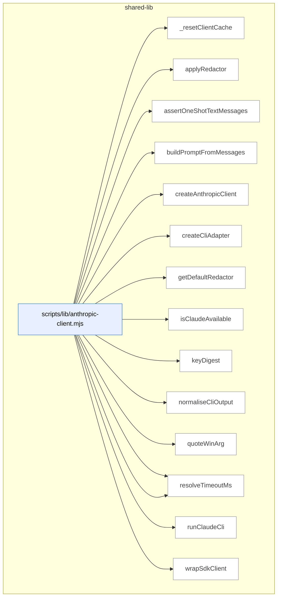

_Domain has 791 symbols (>50). Diagram shows top-15 by file order; see flat table below for the full list._

### Symbols in this domain

| Symbol | Kind | Path | Lines | Purpose | File imported by |
|---|---|---|---|---|---|
| [`_resetClientCache`](../scripts/lib/anthropic-client.mjs#L353) | function | `scripts/lib/anthropic-client.mjs` | 353-356 | Clears cached Anthropic clients and resets CLI warning state. | `scripts/anthropic-ping.mjs`, `scripts/azure-limits.mjs`, `scripts/evolve-prompts.mjs`, +11 more |
| [`applyRedactor`](../scripts/lib/anthropic-client.mjs#L318) | function | `scripts/lib/anthropic-client.mjs` | 318-347 | Recursively redacts sensitive content from Claude API request parameters. | `scripts/anthropic-ping.mjs`, `scripts/azure-limits.mjs`, `scripts/evolve-prompts.mjs`, +11 more |
| [`assertOneShotTextMessages`](../scripts/lib/anthropic-client.mjs#L447) | function | `scripts/lib/anthropic-client.mjs` | 447-476 | Validates that messages are plain-text, user-role-only (no multi-turn) for CLI backend. | `scripts/anthropic-ping.mjs`, `scripts/azure-limits.mjs`, `scripts/evolve-prompts.mjs`, +11 more |
| [`buildPromptFromMessages`](../scripts/lib/anthropic-client.mjs#L484) | function | `scripts/lib/anthropic-client.mjs` | 484-501 | Concatenates text blocks from a messages array into a single prompt string. | `scripts/anthropic-ping.mjs`, `scripts/azure-limits.mjs`, `scripts/evolve-prompts.mjs`, +11 more |
| [`createAnthropicClient`](../scripts/lib/anthropic-client.mjs#L183) | function | `scripts/lib/anthropic-client.mjs` | 183-251 | Factory that creates or returns a cached Anthropic client with backend routing and redaction. | `scripts/anthropic-ping.mjs`, `scripts/azure-limits.mjs`, `scripts/evolve-prompts.mjs`, +11 more |
| [`createCliAdapter`](../scripts/lib/anthropic-client.mjs#L368) | function | `scripts/lib/anthropic-client.mjs` | 368-438 | Creates an Anthropic-compatible adapter wrapping the `claude -p` CLI subprocess. | `scripts/anthropic-ping.mjs`, `scripts/azure-limits.mjs`, `scripts/evolve-prompts.mjs`, +11 more |
| [`getDefaultRedactor`](../scripts/lib/anthropic-client.mjs#L255) | function | `scripts/lib/anthropic-client.mjs` | 255-273 | Creates a redactor function using shape-based secret pattern matching to sanitize prompts. | `scripts/anthropic-ping.mjs`, `scripts/azure-limits.mjs`, `scripts/evolve-prompts.mjs`, +11 more |
| [`isClaudeAvailable`](../scripts/lib/anthropic-client.mjs#L150) | function | `scripts/lib/anthropic-client.mjs` | 150-152 | Returns true if Claude is available (cli backend active or ANTHROPIC_API_KEY present). | `scripts/anthropic-ping.mjs`, `scripts/azure-limits.mjs`, `scripts/evolve-prompts.mjs`, +11 more |
| [`keyDigest`](../scripts/lib/anthropic-client.mjs#L50) | function | `scripts/lib/anthropic-client.mjs` | 50-52 | Returns first 16 hex chars of SHA256 hash of a key string. | `scripts/anthropic-ping.mjs`, `scripts/azure-limits.mjs`, `scripts/evolve-prompts.mjs`, +11 more |
| [`normaliseCliOutput`](../scripts/lib/anthropic-client.mjs#L676) | function | `scripts/lib/anthropic-client.mjs` | 676-724 | Parses claude CLI JSON output and maps it to SDK response shape with usage/cost fields. | `scripts/anthropic-ping.mjs`, `scripts/azure-limits.mjs`, `scripts/evolve-prompts.mjs`, +11 more |
| [`quoteWinArg`](../scripts/lib/anthropic-client.mjs#L750) | function | `scripts/lib/anthropic-client.mjs` | 750-755 | Escapes and quotes command-line arguments for Windows shell execution. | `scripts/anthropic-ping.mjs`, `scripts/azure-limits.mjs`, `scripts/evolve-prompts.mjs`, +11 more |
| [`resolveBackend`](../scripts/lib/anthropic-client.mjs#L120) | function | `scripts/lib/anthropic-client.mjs` | 120-133 | Parses and validates CLAUDE_BACKEND env var, rejecting invalid values with hard error. | `scripts/anthropic-ping.mjs`, `scripts/azure-limits.mjs`, `scripts/evolve-prompts.mjs`, +11 more |
| [`resolveTimeoutMs`](../scripts/lib/anthropic-client.mjs#L93) | function | `scripts/lib/anthropic-client.mjs` | 93-104 | Validates and returns timeout from options or env var, enforcing min/max bounds. | `scripts/anthropic-ping.mjs`, `scripts/azure-limits.mjs`, `scripts/evolve-prompts.mjs`, +11 more |
| [`runClaudeCli`](../scripts/lib/anthropic-client.mjs#L522) | function | `scripts/lib/anthropic-client.mjs` | 522-636 | Spawns the claude CLI with stdin prompt piping, timeout handling, and process-tree cleanup. | `scripts/anthropic-ping.mjs`, `scripts/azure-limits.mjs`, `scripts/evolve-prompts.mjs`, +11 more |
| [`wrapSdkClient`](../scripts/lib/anthropic-client.mjs#L289) | function | `scripts/lib/anthropic-client.mjs` | 289-308 | Wraps the Anthropic SDK client with diagnostic passthrough and per-request redaction. | `scripts/anthropic-ping.mjs`, `scripts/azure-limits.mjs`, `scripts/evolve-prompts.mjs`, +11 more |
| [`computeDeadIntent`](../scripts/lib/arch-intent/adapter-contract.mjs#L151) | function | `scripts/lib/arch-intent/adapter-contract.mjs` | 151-159 | Computes which declared domains have no live files and returns them sorted. | `scripts/arch-intent-bootstrap.mjs`, `scripts/lib/audit/legacy-production-audit.mjs`, `scripts/openai-audit.mjs` |
| [`deriveArchState`](../scripts/lib/arch-intent/adapter-contract.mjs#L321) | function | `scripts/lib/arch-intent/adapter-contract.mjs` | 321-332 | Determines the overall analysis state of an architecture report based on stack results (ok/error/unsupported/clean). | `scripts/arch-intent-bootstrap.mjs`, `scripts/lib/audit/legacy-production-audit.mjs`, `scripts/openai-audit.mjs` |
| [`fsWalkFallback`](../scripts/lib/arch-intent/adapter-contract.mjs#L68) | function | `scripts/lib/arch-intent/adapter-contract.mjs` | 68-88 | Recursively walks a directory tree excluding common non-source directories, returning relative file paths. | `scripts/arch-intent-bootstrap.mjs`, `scripts/lib/audit/legacy-production-audit.mjs`, `scripts/openai-audit.mjs` |
| [`inventoryFiles`](../scripts/lib/arch-intent/adapter-contract.mjs#L104) | function | `scripts/lib/arch-intent/adapter-contract.mjs` | 104-140 | Inventories repository source files using git ls-files or fallback fs-walk, then maps each to its domain. | `scripts/arch-intent-bootstrap.mjs`, `scripts/lib/audit/legacy-production-audit.mjs`, `scripts/openai-audit.mjs` |
| [`isArchIntentReportClean`](../scripts/lib/arch-intent/adapter-contract.mjs#L307) | function | `scripts/lib/arch-intent/adapter-contract.mjs` | 307-312 | Checks whether an arch-intent report is clean (no violations, unmapped files, dead intent, or errors). | `scripts/arch-intent-bootstrap.mjs`, `scripts/lib/audit/legacy-production-audit.mjs`, `scripts/openai-audit.mjs` |
| [`loadAdapter`](../scripts/lib/arch-intent/adapter-contract.mjs#L174) | function | `scripts/lib/arch-intent/adapter-contract.mjs` | 174-192 | Dynamically imports an adapter module for a given stack kind, checking existence before loading. | `scripts/arch-intent-bootstrap.mjs`, `scripts/lib/audit/legacy-production-audit.mjs`, `scripts/openai-audit.mjs` |
| [`runArchIntentAnalysis`](../scripts/lib/arch-intent/adapter-contract.mjs#L223) | function | `scripts/lib/arch-intent/adapter-contract.mjs` | 223-289 | Orchestrates multi-stack import analysis by inventorying files, loading adapters, analyzing violations, and merging results. | `scripts/arch-intent-bootstrap.mjs`, `scripts/lib/audit/legacy-production-audit.mjs`, `scripts/openai-audit.mjs` |
| [`validateAdapterReport`](../scripts/lib/arch-intent/adapter-contract.mjs#L201) | function | `scripts/lib/arch-intent/adapter-contract.mjs` | 201-212 | Validates an adapter's return value against the report schema, throwing on mismatch. | `scripts/arch-intent-bootstrap.mjs`, `scripts/lib/audit/legacy-production-audit.mjs`, `scripts/openai-audit.mjs` |
| [`analyseImports`](../scripts/lib/arch-intent/adapters/java.mjs#L325) | function | `scripts/lib/arch-intent/adapters/java.mjs` | 325-444 | Analyzes all Java imports in mapped files and emits violations for cross-domain dependencies. | _(internal)_ |
| [`buildJavaResolutionIndex`](../scripts/lib/arch-intent/adapters/java.mjs#L176) | function | `scripts/lib/arch-intent/adapters/java.mjs` | 176-233 | Builds indices mapping fully-qualified names and packages to Java files, with source root resolution. | _(internal)_ |
| [`extractImports`](../scripts/lib/arch-intent/adapters/java.mjs#L132) | function | `scripts/lib/arch-intent/adapters/java.mjs` | 132-164 | Parses all import statements from Java source, capturing FQN, static/wildcard flags, and line numbers. | _(internal)_ |
| [`extractPackage`](../scripts/lib/arch-intent/adapters/java.mjs#L115) | function | `scripts/lib/arch-intent/adapters/java.mjs` | 115-118 | Extracts the package declaration from stripped Java source code. | _(internal)_ |
| [`progressiveResolve`](../scripts/lib/arch-intent/adapters/java.mjs#L246) | function | `scripts/lib/arch-intent/adapters/java.mjs` | 246-265 | Resolves a Java class reference by progressively matching qualified name segments against the FQN index. | _(internal)_ |
| [`resolveJavaImport`](../scripts/lib/arch-intent/adapters/java.mjs#L275) | function | `scripts/lib/arch-intent/adapters/java.mjs` | 275-314 | Resolves Java import statements (static, wildcard, regular) to local or external targets using the resolution index. | _(internal)_ |
| [`stripJavaCommentsAndLiterals`](../scripts/lib/arch-intent/adapters/java.mjs#L44) | function | `scripts/lib/arch-intent/adapters/java.mjs` | 44-106 | Strips Java comments (line/block) and string/char literals from source while preserving line structure. | _(internal)_ |
| [`analyseImports`](../scripts/lib/arch-intent/adapters/js-ts.mjs#L74) | function | `scripts/lib/arch-intent/adapters/js-ts.mjs` | 74-214 | Runs dependency-cruiser against mapped JS/TS files and produces a normalised edge graph with metadata. | _(internal)_ |
| [`classifyEdge`](../scripts/lib/arch-intent/adapters/js-ts.mjs#L33) | function | `scripts/lib/arch-intent/adapters/js-ts.mjs` | 33-49 | Classifies a dependency edge as type-only, dynamic, unresolved, vendor, or local-file based on dependency-cruiser metadata. | _(internal)_ |
| [`normalisePath`](../scripts/lib/arch-intent/adapters/js-ts.mjs#L58) | function | `scripts/lib/arch-intent/adapters/js-ts.mjs` | 58-63 | Normalises a file path to be relative to the repository root with forward slashes. | _(internal)_ |
| [`analyseImports`](../scripts/lib/arch-intent/adapters/postgres.mjs#L605) | function | `scripts/lib/arch-intent/adapters/postgres.mjs` | 605-698 | Analyzes all SQL files in mapped files and emits violations for cross-domain object references. | _(internal)_ |
| [`buildSqlCatalog`](../scripts/lib/arch-intent/adapters/postgres.mjs#L499) | function | `scripts/lib/arch-intent/adapters/postgres.mjs` | 499-560 | Builds a catalogue mapping SQL object names to their definitions and tracking redefinitions and epochs. | _(internal)_ |
| [`classifyStatement`](../scripts/lib/arch-intent/adapters/postgres.mjs#L295) | function | `scripts/lib/arch-intent/adapters/postgres.mjs` | 295-427 | Classifies individual SQL statements (CREATE TABLE/VIEW/FUNCTION/etc) and extracts object references. | _(internal)_ |
| [`displayName`](../scripts/lib/arch-intent/adapters/postgres.mjs#L234) | function | `scripts/lib/arch-intent/adapters/postgres.mjs` | 234-236 | Reverses the dot-escaping applied by `normName` for human-readable display. | _(internal)_ |
| [`extractCallRefs`](../scripts/lib/arch-intent/adapters/postgres.mjs#L460) | function | `scripts/lib/arch-intent/adapters/postgres.mjs` | 460-471 | Extracts function call references from a SQL expression body via regex pattern matching. | _(internal)_ |
| [`extractPolicyTableRefs`](../scripts/lib/arch-intent/adapters/postgres.mjs#L474) | function | `scripts/lib/arch-intent/adapters/postgres.mjs` | 474-483 | Extracts table references from a SQL policy expression via FROM/JOIN clauses and qualified names. | _(internal)_ |
| [`extractSelectRefs`](../scripts/lib/arch-intent/adapters/postgres.mjs#L440) | function | `scripts/lib/arch-intent/adapters/postgres.mjs` | 440-457 | Extracts table/view references from a SQL SELECT statement, excluding CTEs and function calls. | _(internal)_ |
| [`naturalCompare`](../scripts/lib/arch-intent/adapters/postgres.mjs#L488) | function | `scripts/lib/arch-intent/adapters/postgres.mjs` | 488-490 | Performs natural (numeric-aware) string comparison for sorting. | _(internal)_ |
| [`normName`](../scripts/lib/arch-intent/adapters/postgres.mjs#L197) | function | `scripts/lib/arch-intent/adapters/postgres.mjs` | 197-228 | Normalises a SQL identifier by splitting on unquoted dots, preserving case in quoted segments, and escaping literal dots. | _(internal)_ |
| [`parseFile`](../scripts/lib/arch-intent/adapters/postgres.mjs#L262) | function | `scripts/lib/arch-intent/adapters/postgres.mjs` | 262-293 | Parses a SQL file into statement boundaries, tracking quoted identifiers to avoid false statement splits. | _(internal)_ |
| [`recoverFunctionBody`](../scripts/lib/arch-intent/adapters/postgres.mjs#L430) | function | `scripts/lib/arch-intent/adapters/postgres.mjs` | 430-437 | Extracts the body text of a SQL function from dollar-quoted or string-literal syntax. | _(internal)_ |
| [`resolveSqlRef`](../scripts/lib/arch-intent/adapters/postgres.mjs#L571) | function | `scripts/lib/arch-intent/adapters/postgres.mjs` | 571-594 | Resolves a SQL reference name to a local definition or proven-external (builtin/pg_catalog) state. | _(internal)_ |
| [`splitTopLevel`](../scripts/lib/arch-intent/adapters/postgres.mjs#L239) | function | `scripts/lib/arch-intent/adapters/postgres.mjs` | 239-250 | Splits a string on a separator character only at depth-0 parentheses (respecting nesting). | _(internal)_ |
| [`stripSqlCommentsAndStrings`](../scripts/lib/arch-intent/adapters/postgres.mjs#L102) | function | `scripts/lib/arch-intent/adapters/postgres.mjs` | 102-187 | Strips PostgreSQL comments (line/block/nested) and string literals (single-quoted, dollar-quoted) from source. | _(internal)_ |
| [`analyseImports`](../scripts/lib/arch-intent/adapters/python.mjs#L507) | function | `scripts/lib/arch-intent/adapters/python.mjs` | 507-586 | Analyzes all Python imports in mapped files and emits violations for cross-domain module references. | _(internal)_ |
| [`buildPythonModuleIndex`](../scripts/lib/arch-intent/adapters/python.mjs#L383) | function | `scripts/lib/arch-intent/adapters/python.mjs` | 383-426 | Builds an index mapping dotted module names to their defining files, tracking collisions. | _(internal)_ |
| [`countUnbalanced`](../scripts/lib/arch-intent/adapters/python.mjs#L254) | function | `scripts/lib/arch-intent/adapters/python.mjs` | 254-261 | Counts unbalanced opening/closing parentheses in a string for continuation detection. | _(internal)_ |
| [`discoverPythonRoots`](../scripts/lib/arch-intent/adapters/python.mjs#L287) | function | `scripts/lib/arch-intent/adapters/python.mjs` | 287-350 | Discovers Python package roots by inspecting metadata files, src/ directories, and __init__.py locations. | _(internal)_ |
| [`extractImports`](../scripts/lib/arch-intent/adapters/python.mjs#L196) | function | `scripts/lib/arch-intent/adapters/python.mjs` | 196-251 | Extracts import statements from Python source (both `import` and `from...import` forms), handling continuations. | _(internal)_ |
| [`extractPackageDirs`](../scripts/lib/arch-intent/adapters/python.mjs#L353) | function | `scripts/lib/arch-intent/adapters/python.mjs` | 353-364 | Extracts package directory declarations from setup.cfg/pyproject.toml configuration files. | _(internal)_ |
| [`isPySource`](../scripts/lib/arch-intent/adapters/python.mjs#L366) | function | `scripts/lib/arch-intent/adapters/python.mjs` | 366-369 | Checks if a file path is a Python source file (.py or .pyi extension). | _(internal)_ |
| [`parseImportedNames`](../scripts/lib/arch-intent/adapters/python.mjs#L264) | function | `scripts/lib/arch-intent/adapters/python.mjs` | 264-271 | Parses the imported names from a Python import clause, handling aliases and wildcards. | _(internal)_ |
| [`resolvePythonImport`](../scripts/lib/arch-intent/adapters/python.mjs#L439) | function | `scripts/lib/arch-intent/adapters/python.mjs` | 439-496 | Resolves a Python import reference (absolute or relative) to local files or proven-external state. | _(internal)_ |
| [`stripPythonCommentsAndStrings`](../scripts/lib/arch-intent/adapters/python.mjs#L72) | function | `scripts/lib/arch-intent/adapters/python.mjs` | 72-178 | Strips Python comments and string literals (raw/f-string/triple-quoted) from source while preserving structure. | _(internal)_ |
| [`checkDepAllowed`](../scripts/lib/arch-intent/domain-resolver.mjs#L53) | function | `scripts/lib/arch-intent/domain-resolver.mjs` | 53-60 | Checks whether a dependency from one domain to another is allowed by the domain map configuration. | `scripts/arch-intent-bootstrap.mjs`, `scripts/lib/arch-intent/adapter-contract.mjs`, `scripts/lib/arch-intent/adapters/java.mjs`, +4 more |
| [`computeDeclaredDomains`](../scripts/lib/arch-intent/domain-resolver.mjs#L76) | function | `scripts/lib/arch-intent/domain-resolver.mjs` | 76-86 | Collects all declared domains from rules, allowedDeps keys/values, and description keys. | `scripts/arch-intent-bootstrap.mjs`, `scripts/lib/arch-intent/adapter-contract.mjs`, `scripts/lib/arch-intent/adapters/java.mjs`, +4 more |
| [`resolveFileToDomain`](../scripts/lib/arch-intent/domain-resolver.mjs#L29) | function | `scripts/lib/arch-intent/domain-resolver.mjs` | 29-38 | Maps a file path to its domain using glob pattern matching against domain-map rules. | `scripts/arch-intent-bootstrap.mjs`, `scripts/lib/arch-intent/adapter-contract.mjs`, `scripts/lib/arch-intent/adapters/java.mjs`, +4 more |
| [`ArchIntentAnalyzerError`](../scripts/lib/arch-intent/errors.mjs#L18) | class | `scripts/lib/arch-intent/errors.mjs` | 18-25 | Custom error class for architecture intent analyzer failures with stack kind and cause tracking. | `scripts/lib/arch-intent/adapter-contract.mjs`, `scripts/lib/arch-intent/load-config.mjs`, `scripts/lib/arch-intent/semantic-validator.mjs`, +2 more |
| [`ArchIntentConfigError`](../scripts/lib/arch-intent/errors.mjs#L9) | class | `scripts/lib/arch-intent/errors.mjs` | 9-16 | Custom error class for architecture intent configuration issues with semantic validation flag. | `scripts/lib/arch-intent/adapter-contract.mjs`, `scripts/lib/arch-intent/load-config.mjs`, `scripts/lib/arch-intent/semantic-validator.mjs`, +2 more |
| [`parseIntentDoc`](../scripts/lib/arch-intent/intent-doc-parser.mjs#L27) | function | `scripts/lib/arch-intent/intent-doc-parser.mjs` | 27-78 | Parses an intent document (markdown) to extract mermaid diagram, version, and section narratives. | `scripts/lib/audit/legacy-production-audit.mjs`, `scripts/openai-audit.mjs` |
| [`loadArchIntentConfig`](../scripts/lib/arch-intent/load-config.mjs#L35) | function | `scripts/lib/arch-intent/load-config.mjs` | 35-69 | Loads and validates the domain-map.json configuration file with schema and semantic checks. | `scripts/arch-intent-bootstrap.mjs`, `scripts/lib/audit/legacy-production-audit.mjs`, `scripts/openai-audit.mjs` |
| [`rulesDeclaredDomains`](../scripts/lib/arch-intent/semantic-validator.mjs#L30) | function | `scripts/lib/arch-intent/semantic-validator.mjs` | 30-34 | Extracts the set of domains declared in the rules array. | `scripts/lib/arch-intent/load-config.mjs` |
| [`validateDomainMapSemantics`](../scripts/lib/arch-intent/semantic-validator.mjs#L42) | function | `scripts/lib/arch-intent/semantic-validator.mjs` | 42-97 | Validates domain-map semantics: checks allowedDeps references, description keys, and rule shadowing. | `scripts/lib/arch-intent/load-config.mjs` |
| [`escapeMarkdown`](../scripts/lib/arch-render.mjs#L22) | function | `scripts/lib/arch-render.mjs` | 22-28 | Escapes pipe characters, newlines, and carriage returns for Markdown. | `scripts/symbol-index/drift.mjs`, `scripts/symbol-index/render-mermaid.mjs` |
| [`escapeMermaidLabel`](../scripts/lib/arch-render.mjs#L31) | function | `scripts/lib/arch-render.mjs` | 31-37 | Escapes quotes and special characters, truncates to 60 chars for Mermaid labels. | `scripts/symbol-index/drift.mjs`, `scripts/symbol-index/render-mermaid.mjs` |
| [`groupByDomain`](../scripts/lib/arch-render.mjs#L45) | function | `scripts/lib/arch-render.mjs` | 45-63 | Groups symbols by domain tag and sorts alphabetically by domain, then by file and name within each. | `scripts/symbol-index/drift.mjs`, `scripts/symbol-index/render-mermaid.mjs` |
| [`mermaidId`](../scripts/lib/arch-render.mjs#L40) | function | `scripts/lib/arch-render.mjs` | 40-42 | Sanitizes a key into a valid Mermaid identifier with prefix and character limits. | `scripts/symbol-index/drift.mjs`, `scripts/symbol-index/render-mermaid.mjs` |
| [`renderArchitectureMap`](../scripts/lib/arch-render.mjs#L171) | function | `scripts/lib/arch-render.mjs` | 171-286 | Generates a complete architecture map document with TOC, per-domain sections, diagrams, tables, and violations. | `scripts/symbol-index/drift.mjs`, `scripts/symbol-index/render-mermaid.mjs` |
| [`renderDriftIssue`](../scripts/lib/arch-render.mjs#L360) | function | `scripts/lib/arch-render.mjs` | 360-422 | Renders a drift report with top duplication clusters and their members. | `scripts/symbol-index/drift.mjs`, `scripts/symbol-index/render-mermaid.mjs` |
| [`renderHeader`](../scripts/lib/arch-render.mjs#L157) | function | `scripts/lib/arch-render.mjs` | 157-168 | Renders the header metadata block with repo name, generation info, and drift metrics. | `scripts/symbol-index/drift.mjs`, `scripts/symbol-index/render-mermaid.mjs` |
| [`renderMermaidContainer`](../scripts/lib/arch-render.mjs#L69) | function | `scripts/lib/arch-render.mjs` | 69-103 | Renders a Mermaid flowchart showing domain structure with file-to-symbol hierarchy, truncating if >50 symbols. | `scripts/symbol-index/drift.mjs`, `scripts/symbol-index/render-mermaid.mjs` |
| [`renderNeighbourhoodCallout`](../scripts/lib/arch-render.mjs#L289) | function | `scripts/lib/arch-render.mjs` | 289-357 | Renders a callout block showing neighbourhood symbol-index consultation results or error status. | `scripts/symbol-index/drift.mjs`, `scripts/symbol-index/render-mermaid.mjs` |
| [`renderSymbolTable`](../scripts/lib/arch-render.mjs#L114) | function | `scripts/lib/arch-render.mjs` | 114-138 | Renders symbols as a Markdown table with optional "where used" column showing importing files. | `scripts/symbol-index/drift.mjs`, `scripts/symbol-index/render-mermaid.mjs` |
| [`renderWhereUsed`](../scripts/lib/arch-render.mjs#L140) | function | `scripts/lib/arch-render.mjs` | 140-154 | Formats a list of file importers for display, showing top 3 with count of remaining. | `scripts/symbol-index/drift.mjs`, `scripts/symbol-index/render-mermaid.mjs` |
| [`assertRepoRoot`](../scripts/lib/assert-repo-root.mjs#L54) | function | `scripts/lib/assert-repo-root.mjs` | 54-85 | Validates that current directory matches the repo root, with escape hatch for cross-repo audit invocation. | `scripts/bandit.mjs`, `scripts/build-dashboard.mjs`, `scripts/cache-hitrate-check.mjs`, +20 more |
| [`findExpectedRoot`](../scripts/lib/assert-repo-root.mjs#L30) | function | `scripts/lib/assert-repo-root.mjs` | 30-38 | Walks directories upward to locate the repository root from a script's file path. | `scripts/bandit.mjs`, `scripts/build-dashboard.mjs`, `scripts/cache-hitrate-check.mjs`, +20 more |
| [`findRepoRootFromScript`](../scripts/lib/assert-repo-root.mjs#L99) | function | `scripts/lib/assert-repo-root.mjs` | 99-102 | Determines the expected repository root from a script's import.meta.url without validation. | `scripts/bandit.mjs`, `scripts/build-dashboard.mjs`, `scripts/cache-hitrate-check.mjs`, +20 more |
| [`attributeStageToArms`](../scripts/lib/audit-arms.mjs#L283) | function | `scripts/lib/audit-arms.mjs` | 283-312 | Validates and derives which arms execute a stage, enforcing arm-specific vs shared rules. | `scripts/lib/arm-eval/toggle.mjs`, `scripts/lib/audit-shadow.mjs`, `scripts/lib/model-ab-decision.mjs`, +2 more |
| [`buildCandidateArm`](../scripts/lib/audit-arms.mjs#L245) | function | `scripts/lib/audit-arms.mjs` | 245-259 | Creates an arm definition from a resolved-route candidate spec. | `scripts/lib/arm-eval/toggle.mjs`, `scripts/lib/audit-shadow.mjs`, `scripts/lib/model-ab-decision.mjs`, +2 more |
| [`executionPlan`](../scripts/lib/audit-arms.mjs#L321) | function | `scripts/lib/audit-arms.mjs` | 321-327 | Determines which execution stages need to run based on selected arms' declarations. | `scripts/lib/arm-eval/toggle.mjs`, `scripts/lib/audit-shadow.mjs`, `scripts/lib/model-ab-decision.mjs`, +2 more |
| [`parseArm`](../scripts/lib/audit-arms.mjs#L205) | function | `scripts/lib/audit-arms.mjs` | 205-209 | Validates raw arm data against ArmSchema and returns parse result. | `scripts/lib/arm-eval/toggle.mjs`, `scripts/lib/audit-shadow.mjs`, `scripts/lib/model-ab-decision.mjs`, +2 more |
| [`resolveArms`](../scripts/lib/audit-arms.mjs#L342) | function | `scripts/lib/audit-arms.mjs` | 342-370 | Parses and validates AUDIT_MODEL_SHADOW env var, returning enabled arms for A/B testing. | `scripts/lib/arm-eval/toggle.mjs`, `scripts/lib/audit-shadow.mjs`, `scripts/lib/model-ab-decision.mjs`, +2 more |
| [`stagesForArm`](../scripts/lib/audit-arms.mjs#L223) | function | `scripts/lib/audit-arms.mjs` | 223-228 | Lists execution stages (oss-gen, gpt-gen, gpt-round, gemini) declared by an arm. | `scripts/lib/arm-eval/toggle.mjs`, `scripts/lib/audit-shadow.mjs`, `scripts/lib/model-ab-decision.mjs`, +2 more |
| [`dispatch`](../scripts/lib/audit-dispatch.mjs#L26) | function | `scripts/lib/audit-dispatch.mjs` | 26-48 | Parses user input to dispatch audit tasks—recognizes mode keywords (plan/code/full), file paths to existing .md files, or free-form task descriptions. | _(internal)_ |
| [`auditSubjectFileGuard`](../scripts/lib/audit-scope.mjs#L185) | function | `scripts/lib/audit-scope.mjs` | 185-191 | Generates an error message when audit scope matched zero implementation files. | `scripts/lib/audit/legacy-production-audit.mjs`, `scripts/lib/diff-annotation.mjs`, `scripts/lib/file-io.mjs`, +1 more |
| [`classifyFiles`](../scripts/lib/audit-scope.mjs#L147) | function | `scripts/lib/audit-scope.mjs` | 147-166 | Categorizes file paths into backend, frontend, or shared categories by regex pattern. | `scripts/lib/audit/legacy-production-audit.mjs`, `scripts/lib/diff-annotation.mjs`, `scripts/lib/file-io.mjs`, +1 more |
| [`isAuditInfraFile`](../scripts/lib/audit-scope.mjs#L60) | function | `scripts/lib/audit-scope.mjs` | 60-67 | Checks if a file is audit infrastructure code (scripts/lib/ files). | `scripts/lib/audit/legacy-production-audit.mjs`, `scripts/lib/diff-annotation.mjs`, `scripts/lib/file-io.mjs`, +1 more |
| [`isSensitiveFile`](../scripts/lib/audit-scope.mjs#L21) | function | `scripts/lib/audit-scope.mjs` | 21-23 | Checks if a relative path is classified as sensitive (credentials, keys, env files). | `scripts/lib/audit/legacy-production-audit.mjs`, `scripts/lib/diff-annotation.mjs`, `scripts/lib/file-io.mjs`, +1 more |
| [`readFilesAsContext`](../scripts/lib/audit-scope.mjs#L110) | function | `scripts/lib/audit-scope.mjs` | 110-138 | Reads multiple files into formatted markdown context with per-file and total size budgets. | `scripts/lib/audit/legacy-production-audit.mjs`, `scripts/lib/diff-annotation.mjs`, `scripts/lib/file-io.mjs`, +1 more |
| [`safeReadFile`](../scripts/lib/audit-scope.mjs#L82) | function | `scripts/lib/audit-scope.mjs` | 82-96 | Reads a file safely with checks for sensitivity, symlink escape, and size constraints. | `scripts/lib/audit/legacy-production-audit.mjs`, `scripts/lib/diff-annotation.mjs`, `scripts/lib/file-io.mjs`, +1 more |
| [`_throttleState`](../scripts/lib/azure-throttle.mjs#L79) | function | `scripts/lib/azure-throttle.mjs` | 79-81 | Returns the current throttle state (active count, queue length, max concurrency). | `scripts/azure-limits.mjs`, `scripts/gemini-review.mjs`, `scripts/lib/anthropic-client.mjs`, +5 more |
| [`acquire`](../scripts/lib/azure-throttle.mjs#L38) | function | `scripts/lib/azure-throttle.mjs` | 38-44 | Acquires a concurrency slot, returning immediately if below the limit or queueing a promise otherwise. | `scripts/azure-limits.mjs`, `scripts/gemini-review.mjs`, `scripts/lib/anthropic-client.mjs`, +5 more |
| [`azureMaxRetries`](../scripts/lib/azure-throttle.mjs#L73) | function | `scripts/lib/azure-throttle.mjs` | 73-76 | Reads the maximum retry count from an environment variable, defaulting to 6 if absent or invalid. | `scripts/azure-limits.mjs`, `scripts/gemini-review.mjs`, `scripts/lib/anthropic-client.mjs`, +5 more |
| [`azureThrottle`](../scripts/lib/azure-throttle.mjs#L62) | function | `scripts/lib/azure-throttle.mjs` | 62-70 | Wraps a function with acquire/release logic to enforce Azure concurrent request limits. | `scripts/azure-limits.mjs`, `scripts/gemini-review.mjs`, `scripts/lib/anthropic-client.mjs`, +5 more |
| [`maxConcurrency`](../scripts/lib/azure-throttle.mjs#L29) | function | `scripts/lib/azure-throttle.mjs` | 29-32 | Reads a concurrency limit from an environment variable, defaulting to 4 if absent or invalid. | `scripts/azure-limits.mjs`, `scripts/gemini-review.mjs`, `scripts/lib/anthropic-client.mjs`, +5 more |
| [`release`](../scripts/lib/azure-throttle.mjs#L46) | function | `scripts/lib/azure-throttle.mjs` | 46-53 | Releases a concurrency slot and processes the next queued request if any are waiting. | `scripts/azure-limits.mjs`, `scripts/gemini-review.mjs`, `scripts/lib/anthropic-client.mjs`, +5 more |
| [`buildRecord`](../scripts/lib/backfill-parser.mjs#L178) | function | `scripts/lib/backfill-parser.mjs` | 178-204 | Builds a structured audit finding record with inferred file paths, suggested topic ID hash, and confidence scores for each parsed field. | `scripts/debt-backfill.mjs` |
| [`extractFilesFromText`](../scripts/lib/backfill-parser.mjs#L65) | function | `scripts/lib/backfill-parser.mjs` | 65-78 | Extracts file paths from backtick-quoted text, filtering out bare identifiers to reduce noise. | `scripts/debt-backfill.mjs` |
| [`extractPhaseTag`](../scripts/lib/backfill-parser.mjs#L86) | function | `scripts/lib/backfill-parser.mjs` | 86-92 | Extracts a phase tag from audit summary filenames (e.g., "phase-a" or falls back to stem before "-audit-summary"). | `scripts/debt-backfill.mjs` |
| [`parseSummaryContent`](../scripts/lib/backfill-parser.mjs#L120) | function | `scripts/lib/backfill-parser.mjs` | 120-176 | Parses audit summary markdown content to extract deferred-section findings in bullet or table format, yielding records with finding IDs and severity. | `scripts/debt-backfill.mjs` |
| [`parseSummaryFile`](../scripts/lib/backfill-parser.mjs#L105) | function | `scripts/lib/backfill-parser.mjs` | 105-111 | Reads and parses a single audit summary file, delegating content parsing to a shared handler. | `scripts/debt-backfill.mjs` |
| [`parseSummaryFiles`](../scripts/lib/backfill-parser.mjs#L211) | function | `scripts/lib/backfill-parser.mjs` | 211-220 | Batch-parses multiple audit summary files and aggregates their findings into a single record list with per-file diagnostics. | `scripts/debt-backfill.mjs` |
| [`severityFromPrefix`](../scripts/lib/backfill-parser.mjs#L49) | function | `scripts/lib/backfill-parser.mjs` | 49-57 | Maps single-letter severity prefixes (H/M/L/T) to standardized severity levels for audit findings. | `scripts/debt-backfill.mjs` |
| [`fetch`](../scripts/lib/bootstrap-template.mjs#L28) | function | `scripts/lib/bootstrap-template.mjs` | 28-41 | Fetches content from an HTTPS URL with redirect support and error handling. | _(internal)_ |
| [`fetchAndCache`](../scripts/lib/bootstrap-template.mjs#L51) | function | `scripts/lib/bootstrap-template.mjs` | 51-58 | Fetches a script from a remote URL and caches it locally under a sanitized filename. | _(internal)_ |
| [`getCached`](../scripts/lib/bootstrap-template.mjs#L43) | function | `scripts/lib/bootstrap-template.mjs` | 43-49 | Checks if a cached script exists and is fresh (within TTL), returning the path or null. | _(internal)_ |
| [`main`](../scripts/lib/bootstrap-template.mjs#L60) | function | `scripts/lib/bootstrap-template.mjs` | 60-110 | CLI entry point for bootstrap tool—handles install/check/version/help commands, using cache when available and spawning remote scripts with pass-through arguments. | _(internal)_ |
| [`ArgvError`](../scripts/lib/cli-io.mjs#L52) | class | `scripts/lib/cli-io.mjs` | 52-58 | Custom error class for command-line argument parsing failures. | `scripts/build-dashboard.mjs`, `scripts/cross-skill.mjs`, `scripts/explain-history.mjs`, +11 more |
| [`emit`](../scripts/lib/cli-io.mjs#L20) | function | `scripts/lib/cli-io.mjs` | 20-22 | Outputs a JSON object to stdout with a newline. | `scripts/build-dashboard.mjs`, `scripts/cross-skill.mjs`, `scripts/explain-history.mjs`, +11 more |
| [`ensureDir`](../scripts/lib/cli-io.mjs#L28) | function | `scripts/lib/cli-io.mjs` | 28-34 | Creates a directory recursively if it doesn't exist. | `scripts/build-dashboard.mjs`, `scripts/cross-skill.mjs`, `scripts/explain-history.mjs`, +11 more |
| [`sha`](../scripts/lib/cli-io.mjs#L44) | function | `scripts/lib/cli-io.mjs` | 44-46 | Computes a truncated SHA-256 hash of a buffer. | `scripts/build-dashboard.mjs`, `scripts/cross-skill.mjs`, `scripts/explain-history.mjs`, +11 more |
| [`buildAuditUnits`](../scripts/lib/code-analysis.mjs#L201) | function | `scripts/lib/code-analysis.mjs` | 201-239 | Packs files into audit units respecting token and file count limits. | `scripts/lib/audit/legacy-production-audit.mjs`, `scripts/openai-audit.mjs`, `scripts/shared.mjs` |
| [`buildDependencyGraph`](../scripts/lib/code-analysis.mjs#L161) | function | `scripts/lib/code-analysis.mjs` | 161-188 | Maps file dependencies by parsing imports and resolving paths. | `scripts/lib/audit/legacy-production-audit.mjs`, `scripts/openai-audit.mjs`, `scripts/shared.mjs` |
| [`chunkLargeFile`](../scripts/lib/code-analysis.mjs#L98) | function | `scripts/lib/code-analysis.mjs` | 98-132 | Divides large files into token-bounded chunks with imports preserved. | `scripts/lib/audit/legacy-production-audit.mjs`, `scripts/openai-audit.mjs`, `scripts/shared.mjs` |
| [`estimateTokens`](../scripts/lib/code-analysis.mjs#L32) | function | `scripts/lib/code-analysis.mjs` | 32-34 | Estimates token count from text length using a 4-character-per-token ratio. | `scripts/lib/audit/legacy-production-audit.mjs`, `scripts/openai-audit.mjs`, `scripts/shared.mjs` |
| [`extractExportsOnly`](../scripts/lib/code-analysis.mjs#L142) | function | `scripts/lib/code-analysis.mjs` | 142-151 | Extracts only export declarations from a file in a language-specific manner. | `scripts/lib/audit/legacy-production-audit.mjs`, `scripts/openai-audit.mjs`, `scripts/shared.mjs` |
| [`extractImportBlock`](../scripts/lib/code-analysis.mjs#L46) | function | `scripts/lib/code-analysis.mjs` | 46-57 | Extracts imports from source code up to the first function boundary. | `scripts/lib/audit/legacy-production-audit.mjs`, `scripts/openai-audit.mjs`, `scripts/shared.mjs` |
| [`measureContextChars`](../scripts/lib/code-analysis.mjs#L272) | function | `scripts/lib/code-analysis.mjs` | 272-282 | Sums up character counts across files capped by a per-file maximum. | `scripts/lib/audit/legacy-production-audit.mjs`, `scripts/openai-audit.mjs`, `scripts/shared.mjs` |
| [`splitAtFunctionBoundaries`](../scripts/lib/code-analysis.mjs#L66) | function | `scripts/lib/code-analysis.mjs` | 66-84 | Splits source code into chunks at function boundaries with line numbers. | `scripts/lib/audit/legacy-production-audit.mjs`, `scripts/openai-audit.mjs`, `scripts/shared.mjs` |
| [`buildAzureConfig`](../scripts/lib/config.mjs#L519) | function | `scripts/lib/config.mjs` | 519-588 | Constructs Azure OpenAI/Foundry configuration when active; returns a frozen inert snapshot otherwise. | `scripts/anthropic-ping.mjs`, `scripts/azure-limits.mjs`, `scripts/bandit.mjs`, +45 more |
| [`clampConfigNumber`](../scripts/lib/config.mjs#L76) | function | `scripts/lib/config.mjs` | 76-96 | Parses a numeric environment variable with bounds checking, clamping out-of-range values and emitting warnings. | `scripts/anthropic-ping.mjs`, `scripts/azure-limits.mjs`, `scripts/bandit.mjs`, +45 more |
| [`normalizeLanguage`](../scripts/lib/config.mjs#L253) | function | `scripts/lib/config.mjs` | 253-266 | Normalizes a language identifier (e.g., `javascript` → `js`, `python3` → `py`) to a canonical form. | `scripts/anthropic-ping.mjs`, `scripts/azure-limits.mjs`, `scripts/bandit.mjs`, +45 more |
| [`validatedEnum`](../scripts/lib/config.mjs#L28) | function | `scripts/lib/config.mjs` | 28-35 | Parses an environment variable as one of a predefined set, warning and falling back to default if invalid. | `scripts/anthropic-ping.mjs`, `scripts/azure-limits.mjs`, `scripts/bandit.mjs`, +45 more |
| [`consumerAliases`](../scripts/lib/consumer-repos.mjs#L66) | function | `scripts/lib/consumer-repos.mjs` | 66-68 | Returns the list of all consumer repository aliases. | `scripts/install-prepush-hook.mjs`, `scripts/lib/sync-inventory.mjs`, `scripts/sync-refresh.mjs`, +1 more |
| [`loadLocalRepos`](../scripts/lib/consumer-repos.mjs#L37) | function | `scripts/lib/consumer-repos.mjs` | 37-54 | Reads and validates a local consumer-repos.json file, filtering entries by required fields and resolving paths. | `scripts/install-prepush-hook.mjs`, `scripts/lib/sync-inventory.mjs`, `scripts/sync-refresh.mjs`, +1 more |
| [`resolveTargets`](../scripts/lib/consumer-repos.mjs#L77) | function | `scripts/lib/consumer-repos.mjs` | 77-80 | Filters consumer repositories by name or alias, returning all repos if no target is specified. | `scripts/install-prepush-hook.mjs`, `scripts/lib/sync-inventory.mjs`, `scripts/sync-refresh.mjs`, +1 more |
| [`_extractRegexFacts`](../scripts/lib/context.mjs#L89) | function | `scripts/lib/context.mjs` | 89-136 | <no body> | `scripts/check-sync.mjs`, `scripts/debt-auto-capture.mjs`, `scripts/debt-resolve.mjs`, +5 more |
| [`_getClaudeMd`](../scripts/lib/context.mjs#L58) | function | `scripts/lib/context.mjs` | 58-69 | Reads Claude instruction file from disk using multiple candidate names, caching result on first load. | `scripts/check-sync.mjs`, `scripts/debt-auto-capture.mjs`, `scripts/debt-resolve.mjs`, +5 more |
| [`_getClaudeMdPath`](../scripts/lib/context.mjs#L75) | function | `scripts/lib/context.mjs` | 75-81 | Finds the first existing Claude instruction file by checking candidate names in order. | `scripts/check-sync.mjs`, `scripts/debt-auto-capture.mjs`, `scripts/debt-resolve.mjs`, +5 more |
| [`_getPassAddendum`](../scripts/lib/context.mjs#L249) | function | `scripts/lib/context.mjs` | 249-263 | Extracts and returns a pass-specific section from the Claude instruction file. | `scripts/check-sync.mjs`, `scripts/debt-auto-capture.mjs`, `scripts/debt-resolve.mjs`, +5 more |
| [`_llmCondense`](../scripts/lib/context.mjs#L175) | function | `scripts/lib/context.mjs` | 175-228 | Truncates and sends project guidelines to Claude Haiku (or Gemini Flash fallback) to generate a condensed audit brief. | `scripts/check-sync.mjs`, `scripts/debt-auto-capture.mjs`, `scripts/debt-resolve.mjs`, +5 more |
| [`_quickFingerprint`](../scripts/lib/context.mjs#L332) | function | `scripts/lib/context.mjs` | 332-342 | Computes a 16-character SHA256 hash of package.json and Claude instruction files for detecting repo changes. | `scripts/check-sync.mjs`, `scripts/debt-auto-capture.mjs`, `scripts/debt-resolve.mjs`, +5 more |
| [`buildHistoryContext`](../scripts/lib/context.mjs#L639) | function | `scripts/lib/context.mjs` | 639-685 | <no body> | `scripts/check-sync.mjs`, `scripts/debt-auto-capture.mjs`, `scripts/debt-resolve.mjs`, +5 more |
| [`extractPlanForPass`](../scripts/lib/context.mjs#L608) | function | `scripts/lib/context.mjs` | 608-632 | Extracts pass-relevant sections from plan content using pattern matching and returns truncated result. | `scripts/check-sync.mjs`, `scripts/debt-auto-capture.mjs`, `scripts/debt-resolve.mjs`, +5 more |
| [`generateRepoProfile`](../scripts/lib/context.mjs#L352) | function | `scripts/lib/context.mjs` | 352-471 | <no body> | `scripts/check-sync.mjs`, `scripts/debt-auto-capture.mjs`, `scripts/debt-resolve.mjs`, +5 more |
| [`getAuditBriefCache`](../scripts/lib/context.mjs#L27) | function | `scripts/lib/context.mjs` | 27-29 | Returns the cached audit brief or null if not yet loaded. | `scripts/check-sync.mjs`, `scripts/debt-auto-capture.mjs`, `scripts/debt-resolve.mjs`, +5 more |
| [`getClaudeMdCache`](../scripts/lib/context.mjs#L32) | function | `scripts/lib/context.mjs` | 32-34 | Returns the cached Claude instruction markdown or null if not yet loaded. | `scripts/check-sync.mjs`, `scripts/debt-auto-capture.mjs`, `scripts/debt-resolve.mjs`, +5 more |
| [`getRepoProfileCache`](../scripts/lib/context.mjs#L22) | function | `scripts/lib/context.mjs` | 22-24 | Returns the cached repository profile or null if not yet loaded. | `scripts/check-sync.mjs`, `scripts/debt-auto-capture.mjs`, `scripts/debt-resolve.mjs`, +5 more |
| [`initAuditBrief`](../scripts/lib/context.mjs#L481) | function | `scripts/lib/context.mjs` | 481-511 | Generates an audit brief by extracting regex-verified facts and optionally condensing guidelines via LLM. | `scripts/check-sync.mjs`, `scripts/debt-auto-capture.mjs`, `scripts/debt-resolve.mjs`, +5 more |
| [`loadKnownFpContext`](../scripts/lib/context.mjs#L560) | function | `scripts/lib/context.mjs` | 560-593 | Loads and formats known false-positive patterns from disk, filtering by pass name. | `scripts/check-sync.mjs`, `scripts/debt-auto-capture.mjs`, `scripts/debt-resolve.mjs`, +5 more |
| [`loadSessionCache`](../scripts/lib/context.mjs#L277) | function | `scripts/lib/context.mjs` | 277-303 | Loads cached audit brief and repo profile from disk, checking fingerprint for staleness. | `scripts/check-sync.mjs`, `scripts/debt-auto-capture.mjs`, `scripts/debt-resolve.mjs`, +5 more |
| [`readProjectContext`](../scripts/lib/context.mjs#L596) | function | `scripts/lib/context.mjs` | 596-600 | Returns the cached audit brief or raw instruction file content for general use. | `scripts/check-sync.mjs`, `scripts/debt-auto-capture.mjs`, `scripts/debt-resolve.mjs`, +5 more |
| [`readProjectContextForPass`](../scripts/lib/context.mjs#L520) | function | `scripts/lib/context.mjs` | 520-538 | Returns project context for a pass, merging brief, pass-specific addendum, and known false-positive allowlist. | `scripts/check-sync.mjs`, `scripts/debt-auto-capture.mjs`, `scripts/debt-resolve.mjs`, +5 more |
| [`saveSessionCache`](../scripts/lib/context.mjs#L311) | function | `scripts/lib/context.mjs` | 311-326 | Saves audit brief and repo profile to disk with fingerprint for cache validation. | `scripts/check-sync.mjs`, `scripts/debt-auto-capture.mjs`, `scripts/debt-resolve.mjs`, +5 more |
| [`resolvePreviewGate`](../scripts/lib/cycle/topology.mjs#L30) | function | `scripts/lib/cycle/topology.mjs` | 30-49 | Determines whether preview-environment testing is required, warned, or optional for a change. | `scripts/cross-skill.mjs`, `scripts/lib/config.mjs` |
| [`_resetForTest`](../scripts/lib/db/client.mjs#L372) | function | `scripts/lib/db/client.mjs` | 372-374 | Closes the pool for test cleanup and isolation. | `scripts/audit-metrics.mjs`, `scripts/check-rls.mjs`, `scripts/lib/db/query.mjs`, +8 more |
| [`assertPublicSchema`](../scripts/lib/db/client.mjs#L181) | function | `scripts/lib/db/client.mjs` | 181-190 | Validates that the target schema is 'public' (v1 constraint). | `scripts/audit-metrics.mjs`, `scripts/check-rls.mjs`, `scripts/lib/db/query.mjs`, +8 more |
| [`assertSafeDsn`](../scripts/lib/db/client.mjs#L60) | function | `scripts/lib/db/client.mjs` | 60-80 | Validates a Postgres DSN and rejects transaction pooler or non-Postgres URLs. | `scripts/audit-metrics.mjs`, `scripts/check-rls.mjs`, `scripts/lib/db/query.mjs`, +8 more |
| [`buildPoolConfig`](../scripts/lib/db/client.mjs#L208) | function | `scripts/lib/db/client.mjs` | 208-270 | Constructs a pg Pool configuration with SSL mode, connection limits, and custom type parsers. | `scripts/audit-metrics.mjs`, `scripts/check-rls.mjs`, `scripts/lib/db/query.mjs`, +8 more |
| [`closePool`](../scripts/lib/db/client.mjs#L350) | function | `scripts/lib/db/client.mjs` | 350-363 | Gracefully closes and resets the connection pool. | `scripts/audit-metrics.mjs`, `scripts/check-rls.mjs`, `scripts/lib/db/query.mjs`, +8 more |
| [`getActiveTxClient`](../scripts/lib/db/client.mjs#L99) | function | `scripts/lib/db/client.mjs` | 99-102 | Retrieves the active transaction client from async-local context store. | `scripts/audit-metrics.mjs`, `scripts/check-rls.mjs`, `scripts/lib/db/query.mjs`, +8 more |
| [`getPool`](../scripts/lib/db/client.mjs#L286) | function | `scripts/lib/db/client.mjs` | 286-338 | Lazily initializes and returns the global Postgres connection pool. | `scripts/audit-metrics.mjs`, `scripts/check-rls.mjs`, `scripts/lib/db/query.mjs`, +8 more |
| [`resolveDbUrl`](../scripts/lib/db/client.mjs#L133) | function | `scripts/lib/db/client.mjs` | 133-173 | Resolves Postgres connection URL from environment with support for legacy aliases. | `scripts/audit-metrics.mjs`, `scripts/check-rls.mjs`, `scripts/lib/db/query.mjs`, +8 more |
| [`warnAliasOnce`](../scripts/lib/db/client.mjs#L119) | function | `scripts/lib/db/client.mjs` | 119-126 | Warns about a deprecated environment variable alias, emitting only once per process. | `scripts/audit-metrics.mjs`, `scripts/check-rls.mjs`, `scripts/lib/db/query.mjs`, +8 more |
| [`isConnectionExceptionSqlstate`](../scripts/lib/db/errors.mjs#L31) | function | `scripts/lib/db/errors.mjs` | 31-33 | Checks if an error code is a Postgres connection exception (SQLSTATE class 08). | `scripts/lib/db/query.mjs` |
| [`normalizePostgresError`](../scripts/lib/db/errors.mjs#L82) | function | `scripts/lib/db/errors.mjs` | 82-194 | Normalizes Postgres errors into structured tuples with retry hints and operator guidance. | `scripts/lib/db/query.mjs` |
| [`_exec`](../scripts/lib/db/query.mjs#L393) | function | `scripts/lib/db/query.mjs` | 393-413 | Executes SQL queries through the active transaction client or connection pool, normalizing errors. | `scripts/audit-metrics.mjs`, `scripts/cache-hitrate-check.mjs`, `scripts/check-setup.mjs`, +27 more |
| [`buildDelete`](../scripts/lib/db/query.mjs#L373) | function | `scripts/lib/db/query.mjs` | 373-378 | Constructs a SQL DELETE statement with parameterized WHERE conditions. | `scripts/audit-metrics.mjs`, `scripts/cache-hitrate-check.mjs`, `scripts/check-setup.mjs`, +27 more |
| [`buildInsert`](../scripts/lib/db/query.mjs#L193) | function | `scripts/lib/db/query.mjs` | 193-207 | Constructs a parameterized INSERT SQL statement from a single-row object. | `scripts/audit-metrics.mjs`, `scripts/cache-hitrate-check.mjs`, `scripts/check-setup.mjs`, +27 more |
| [`buildUpdate`](../scripts/lib/db/query.mjs#L347) | function | `scripts/lib/db/query.mjs` | 347-367 | Constructs a SQL UPDATE statement from a patch object with parameterized WHERE conditions. | `scripts/audit-metrics.mjs`, `scripts/cache-hitrate-check.mjs`, `scripts/check-setup.mjs`, +27 more |
| [`buildUpsert`](../scripts/lib/db/query.mjs#L226) | function | `scripts/lib/db/query.mjs` | 226-297 | Constructs a parameterized INSERT ... ON CONFLICT UPDATE SQL statement from multiple rows. | `scripts/audit-metrics.mjs`, `scripts/cache-hitrate-check.mjs`, `scripts/check-setup.mjs`, +27 more |
| [`deleteWhere`](../scripts/lib/db/query.mjs#L516) | function | `scripts/lib/db/query.mjs` | 516-521 | Deletes rows matching WHERE conditions and returns affected row count. | `scripts/audit-metrics.mjs`, `scripts/cache-hitrate-check.mjs`, `scripts/check-setup.mjs`, +27 more |
| [`flattenWhere`](../scripts/lib/db/query.mjs#L314) | function | `scripts/lib/db/query.mjs` | 314-338 | Converts a WHERE clause object into SQL predicates and parameter bindings, rejecting undefined values. | `scripts/audit-metrics.mjs`, `scripts/cache-hitrate-check.mjs`, `scripts/check-setup.mjs`, +27 more |
| [`insertReturning`](../scripts/lib/db/query.mjs#L465) | function | `scripts/lib/db/query.mjs` | 465-473 | Inserts a row and optionally returns the inserted record. | `scripts/audit-metrics.mjs`, `scripts/cache-hitrate-check.mjs`, `scripts/check-setup.mjs`, +27 more |
| [`many`](../scripts/lib/db/query.mjs#L452) | function | `scripts/lib/db/query.mjs` | 452-455 | Executes a query and returns all rows. | `scripts/audit-metrics.mjs`, `scripts/cache-hitrate-check.mjs`, `scripts/check-setup.mjs`, +27 more |
| [`normalizeConflictTarget`](../scripts/lib/db/query.mjs#L130) | function | `scripts/lib/db/query.mjs` | 130-157 | Parses and validates an ON CONFLICT target (column list or constraint name). | `scripts/audit-metrics.mjs`, `scripts/cache-hitrate-check.mjs`, `scripts/check-setup.mjs`, +27 more |
| [`normalizeReturning`](../scripts/lib/db/query.mjs#L107) | function | `scripts/lib/db/query.mjs` | 107-116 | Validates and normalizes a RETURNING clause specification into SQL syntax. | `scripts/audit-metrics.mjs`, `scripts/cache-hitrate-check.mjs`, `scripts/check-setup.mjs`, +27 more |
| [`one`](../scripts/lib/db/query.mjs#L435) | function | `scripts/lib/db/query.mjs` | 435-442 | Executes a query and returns exactly one row or null, rejecting multiple results. | `scripts/audit-metrics.mjs`, `scripts/cache-hitrate-check.mjs`, `scripts/check-setup.mjs`, +27 more |
| [`pgArray`](../scripts/lib/db/query.mjs#L55) | function | `scripts/lib/db/query.mjs` | 55-58 | Wraps a value to signal it should serialize as a Postgres ARRAY literal (not JSON). | `scripts/audit-metrics.mjs`, `scripts/cache-hitrate-check.mjs`, `scripts/check-setup.mjs`, +27 more |
| [`query`](../scripts/lib/db/query.mjs#L422) | function | `scripts/lib/db/query.mjs` | 422-424 | Executes a SQL query and returns raw row results. | `scripts/audit-metrics.mjs`, `scripts/cache-hitrate-check.mjs`, `scripts/check-setup.mjs`, +27 more |
| [`quoteIdent`](../scripts/lib/db/query.mjs#L78) | function | `scripts/lib/db/query.mjs` | 78-86 | SQL-quotes an identifier to safely include it in SQL statements. | `scripts/audit-metrics.mjs`, `scripts/cache-hitrate-check.mjs`, `scripts/check-setup.mjs`, +27 more |
| [`serializeWriteParam`](../scripts/lib/db/query.mjs#L62) | function | `scripts/lib/db/query.mjs` | 62-66 | Converts a parameter value for safe binding in INSERT/UPDATE SQL, handling jsonb arrays specially. | `scripts/audit-metrics.mjs`, `scripts/cache-hitrate-check.mjs`, `scripts/check-setup.mjs`, +27 more |
| [`updateWhere`](../scripts/lib/db/query.mjs#L502) | function | `scripts/lib/db/query.mjs` | 502-507 | Updates rows matching WHERE conditions and returns affected row count. | `scripts/audit-metrics.mjs`, `scripts/cache-hitrate-check.mjs`, `scripts/check-setup.mjs`, +27 more |
| [`upsert`](../scripts/lib/db/query.mjs#L487) | function | `scripts/lib/db/query.mjs` | 487-492 | Inserts or updates multiple rows (UPSERT) and returns affected row count. | `scripts/audit-metrics.mjs`, `scripts/cache-hitrate-check.mjs`, `scripts/check-setup.mjs`, +27 more |
| [`withTx`](../scripts/lib/db/query.mjs#L539) | function | `scripts/lib/db/query.mjs` | 539-587 | Executes a function within a database transaction, supporting nested savepoints for partial rollback. | `scripts/audit-metrics.mjs`, `scripts/cache-hitrate-check.mjs`, `scripts/check-setup.mjs`, +27 more |
| [`deferFinding`](../scripts/lib/db/rpc.mjs#L96) | function | `scripts/lib/db/rpc.mjs` | 96-104 | Calls RPC to dismiss a finding with evidence and classification metadata. | `scripts/lib/store/arch/neighbourhood.mjs`, `scripts/lib/store/arch/refresh-runs.mjs`, `scripts/lib/store/friction.mjs`, +3 more |
| [`driftScore`](../scripts/lib/db/rpc.mjs#L140) | function | `scripts/lib/db/rpc.mjs` | 140-146 | Computes a similarity drift score between two indexed versions via RPC. | `scripts/lib/store/arch/neighbourhood.mjs`, `scripts/lib/store/arch/refresh-runs.mjs`, `scripts/lib/store/friction.mjs`, +3 more |
| [`frictionNeighbourhood`](../scripts/lib/db/rpc.mjs#L320) | function | `scripts/lib/db/rpc.mjs` | 320-330 | <no body> | `scripts/lib/store/arch/neighbourhood.mjs`, `scripts/lib/store/arch/refresh-runs.mjs`, `scripts/lib/store/friction.mjs`, +3 more |
| [`frictionRecurrence`](../scripts/lib/db/rpc.mjs#L307) | function | `scripts/lib/db/rpc.mjs` | 307-313 | Measures how frequently similar friction entries recur within a time window across repos. | `scripts/lib/store/arch/neighbourhood.mjs`, `scripts/lib/store/arch/refresh-runs.mjs`, `scripts/lib/store/friction.mjs`, +3 more |
| [`incidentNeighbourhood`](../scripts/lib/db/rpc.mjs#L254) | function | `scripts/lib/db/rpc.mjs` | 254-267 | <no body> | `scripts/lib/store/arch/neighbourhood.mjs`, `scripts/lib/store/arch/refresh-runs.mjs`, `scripts/lib/store/friction.mjs`, +3 more |
| [`markFindingNeedsTriage`](../scripts/lib/db/rpc.mjs#L122) | function | `scripts/lib/db/rpc.mjs` | 122-129 | <no body> | `scripts/lib/store/arch/neighbourhood.mjs`, `scripts/lib/store/arch/refresh-runs.mjs`, `scripts/lib/store/friction.mjs`, +3 more |
| [`memoryHealthMetrics`](../scripts/lib/db/rpc.mjs#L172) | function | `scripts/lib/db/rpc.mjs` | 172-185 | Retrieves memory-health triggers (re-raise rate, cluster density, recurrence) via RPC. | `scripts/lib/store/arch/neighbourhood.mjs`, `scripts/lib/store/arch/refresh-runs.mjs`, `scripts/lib/store/friction.mjs`, +3 more |
| [`publishRefreshRun`](../scripts/lib/db/rpc.mjs#L283) | function | `scripts/lib/db/rpc.mjs` | 283-298 | Records the completion of a symbol index refresh run with embedding dimensions. | `scripts/lib/store/arch/neighbourhood.mjs`, `scripts/lib/store/arch/refresh-runs.mjs`, `scripts/lib/store/friction.mjs`, +3 more |
| [`symbolNeighbourhood`](../scripts/lib/db/rpc.mjs#L225) | function | `scripts/lib/db/rpc.mjs` | 225-239 | Finds similar symbols in the codebase using embedding similarity search within target paths. | `scripts/lib/store/arch/neighbourhood.mjs`, `scripts/lib/store/arch/refresh-runs.mjs`, `scripts/lib/store/friction.mjs`, +3 more |
| [`topDuplicateClusters`](../scripts/lib/db/rpc.mjs#L202) | function | `scripts/lib/db/rpc.mjs` | 202-207 | <no body> | `scripts/lib/store/arch/neighbourhood.mjs`, `scripts/lib/store/arch/refresh-runs.mjs`, `scripts/lib/store/friction.mjs`, +3 more |
| [`vectorLiteral`](../scripts/lib/db/rpc.mjs#L59) | function | `scripts/lib/db/rpc.mjs` | 59-76 | Validates and converts an embedding array to Postgres vector literal syntax with dimension checking. | `scripts/lib/store/arch/neighbourhood.mjs`, `scripts/lib/store/arch/refresh-runs.mjs`, `scripts/lib/store/friction.mjs`, +3 more |
| [`buildResizeCall`](../scripts/lib/device-presets.mjs#L158) | function | `scripts/lib/device-presets.mjs` | 158-163 | Builds a browser resize tool call with target width and height. | `scripts/lib/nav/verify.mjs`, `scripts/visual-audit.mjs` |
| [`formatLogLine`](../scripts/lib/device-presets.mjs#L152) | function | `scripts/lib/device-presets.mjs` | 152-156 | Formats a log line describing the resolved device, viewport, and touch capabilities. | `scripts/lib/nav/verify.mjs`, `scripts/visual-audit.mjs` |
| [`getPreset`](../scripts/lib/device-presets.mjs#L94) | function | `scripts/lib/device-presets.mjs` | 94-100 | Retrieves a named device preset or throws an error if unknown. | `scripts/lib/nav/verify.mjs`, `scripts/visual-audit.mjs` |
| [`parseCliFlag`](../scripts/lib/device-presets.mjs#L211) | function | `scripts/lib/device-presets.mjs` | 211-215 | Extracts a CLI flag value from argv by flag name. | `scripts/lib/nav/verify.mjs`, `scripts/visual-audit.mjs` |
| [`parseDevicesFlag`](../scripts/lib/device-presets.mjs#L125) | function | `scripts/lib/device-presets.mjs` | 125-141 | Parses comma-separated preset names into an array of device configurations. | `scripts/lib/nav/verify.mjs`, `scripts/visual-audit.mjs` |
| [`parseViewportFlag`](../scripts/lib/device-presets.mjs#L106) | function | `scripts/lib/device-presets.mjs` | 106-123 | Parses and validates a WIDTHxHEIGHT viewport string into a custom device preset. | `scripts/lib/nav/verify.mjs`, `scripts/visual-audit.mjs` |
| [`prepClickTest`](../scripts/lib/device-presets.mjs#L181) | function | `scripts/lib/device-presets.mjs` | 181-209 | Prepares click test matrix metadata for multiple device presets with pass indices. | `scripts/lib/nav/verify.mjs`, `scripts/visual-audit.mjs` |
| [`prepPersonaTest`](../scripts/lib/device-presets.mjs#L165) | function | `scripts/lib/device-presets.mjs` | 165-179 | Prepares persona test metadata including device, expected first MCP call, and mental model tags. | `scripts/lib/nav/verify.mjs`, `scripts/visual-audit.mjs` |
| [`resolveDevicePreset`](../scripts/lib/device-presets.mjs#L81) | function | `scripts/lib/device-presets.mjs` | 81-92 | Resolves a device preset from a description string by pattern matching. | `scripts/lib/nav/verify.mjs`, `scripts/visual-audit.mjs` |
| [`_annotateBlockStyle`](../scripts/lib/diff-annotation.mjs#L79) | function | `scripts/lib/diff-annotation.mjs` | 79-113 | Annotates source code with markers for changed and unchanged sections using block-style comments. | `scripts/lib/file-io.mjs`, `scripts/lib/model-eval/known-defect-corpus.mjs` |
| [`_annotateHeaderOnlyStyle`](../scripts/lib/diff-annotation.mjs#L115) | function | `scripts/lib/diff-annotation.mjs` | 115-125 | Annotates source code with line numbers and changed line ranges in a header comment. | `scripts/lib/file-io.mjs`, `scripts/lib/model-eval/known-defect-corpus.mjs` |
| [`_buildFileBlock`](../scripts/lib/diff-annotation.mjs#L154) | function | `scripts/lib/diff-annotation.mjs` | 154-178 | Constructs a markdown code block for a single file with optional diff annotations. | `scripts/lib/file-io.mjs`, `scripts/lib/model-eval/known-defect-corpus.mjs` |
| [`getCommentStyle`](../scripts/lib/diff-annotation.mjs#L72) | function | `scripts/lib/diff-annotation.mjs` | 72-77 | Determines comment style (block or header-only) based on file extension. | `scripts/lib/file-io.mjs`, `scripts/lib/model-eval/known-defect-corpus.mjs` |
| [`parseDiffFile`](../scripts/lib/diff-annotation.mjs#L23) | function | `scripts/lib/diff-annotation.mjs` | 23-60 | Parses a unified diff file into a map of file paths with changed line ranges. | `scripts/lib/file-io.mjs`, `scripts/lib/model-eval/known-defect-corpus.mjs` |
| [`readFilesAsAnnotatedContext`](../scripts/lib/diff-annotation.mjs#L138) | function | `scripts/lib/diff-annotation.mjs` | 138-152 | Builds and returns a concatenated context string of annotated file blocks up to size limits. | `scripts/lib/file-io.mjs`, `scripts/lib/model-eval/known-defect-corpus.mjs` |
| [`extractSection`](../scripts/lib/doc-sections.mjs#L35) | function | `scripts/lib/doc-sections.mjs` | 35-71 | Extracts a Markdown section by heading, respecting code fences and section hierarchy. | `scripts/lib/brainstorm/arch-context.mjs`, `scripts/lib/repo-context.mjs` |
| [`loadSection`](../scripts/lib/doc-sections.mjs#L90) | function | `scripts/lib/doc-sections.mjs` | 90-122 | Loads a Markdown section from candidate files with state tracking and error handling. | `scripts/lib/brainstorm/arch-context.mjs`, `scripts/lib/repo-context.mjs` |
| [`astExtract`](../scripts/lib/efficacy-lints.mjs#L215) | function | `scripts/lib/efficacy-lints.mjs` | 215-242 | Finds cache_control blocks and canary gates by walking an AST. | `scripts/efficacy-lints-check.mjs` |
| [`calleeName`](../scripts/lib/efficacy-lints.mjs#L197) | function | `scripts/lib/efficacy-lints.mjs` | 197-202 | Extracts the function name from a call expression AST node. | `scripts/efficacy-lints-check.mjs` |
| [`escapeRe`](../scripts/lib/efficacy-lints.mjs#L273) | function | `scripts/lib/efficacy-lints.mjs` | 273-273 | Escapes regex special characters in a string. | `scripts/efficacy-lints-check.mjs` |
| [`estimateTokens`](../scripts/lib/efficacy-lints.mjs#L114) | function | `scripts/lib/efficacy-lints.mjs` | 114-116 | Estimates token count by dividing text length by 4. | `scripts/efficacy-lints-check.mjs` |
| [`extractMarkers`](../scripts/lib/efficacy-lints.mjs#L207) | function | `scripts/lib/efficacy-lints.mjs` | 207-213 | Extracts cache_control and canary gate markers from source code using AST or regex. | `scripts/efficacy-lints-check.mjs` |
| [`isBlanked`](../scripts/lib/efficacy-lints.mjs#L291) | function | `scripts/lib/efficacy-lints.mjs` | 291-293 | Checks whether a source position was blanked during comment/string removal. | `scripts/efficacy-lints-check.mjs` |
| [`isJsLike`](../scripts/lib/efficacy-lints.mjs#L48) | function | `scripts/lib/efficacy-lints.mjs` | 48-48 | Checks whether a file has a JavaScript-like extension. | `scripts/efficacy-lints-check.mjs` |
| [`isKeyNamed`](../scripts/lib/efficacy-lints.mjs#L183) | function | `scripts/lib/efficacy-lints.mjs` | 183-185 | Checks whether an AST property key matches a given name. | `scripts/efficacy-lints-check.mjs` |
| [`lineOf`](../scripts/lib/efficacy-lints.mjs#L179) | function | `scripts/lib/efficacy-lints.mjs` | 179-179 | Gets the line number of a character index in source code. | `scripts/efficacy-lints-check.mjs` |
| [`lintCacheInertness`](../scripts/lib/efficacy-lints.mjs#L297) | function | `scripts/lib/efficacy-lints.mjs` | 297-321 | Detects cache_control blocks with cached prefix below the model's minimum cacheable length. | `scripts/efficacy-lints-check.mjs` |
| [`lintCacheInstability`](../scripts/lib/efficacy-lints.mjs#L323) | function | `scripts/lib/efficacy-lints.mjs` | 323-338 | Detects cache_control blocks near per-request-varying values that invalidate caching. | `scripts/efficacy-lints-check.mjs` |
| [`lintCanaryCoverage`](../scripts/lib/efficacy-lints.mjs#L340) | function | `scripts/lib/efficacy-lints.mjs` | 340-355 | Ensures every canary gate in source has a corresponding test that forces it true. | `scripts/efficacy-lints-check.mjs` |
| [`listFiles`](../scripts/lib/efficacy-lints.mjs#L373) | function | `scripts/lib/efficacy-lints.mjs` | 373-394 | Lists files matching glob patterns while excluding sensitive paths and ignored directories. | `scripts/efficacy-lints-check.mjs` |
| [`loadEfficacyConfig`](../scripts/lib/efficacy-lints.mjs#L78) | function | `scripts/lib/efficacy-lints.mjs` | 78-98 | Loads and validates the efficacy-lints configuration file from disk. | `scripts/efficacy-lints-check.mjs` |
| [`markersFor`](../scripts/lib/efficacy-lints.mjs#L397) | function | `scripts/lib/efficacy-lints.mjs` | 397-404 | Reads source files and extracts cache_control and canary markers from each. | `scripts/efficacy-lints-check.mjs` |
| [`measureCachedBlock`](../scripts/lib/efficacy-lints.mjs#L277) | function | `scripts/lib/efficacy-lints.mjs` | 277-288 | Extracts the cached text value from a cache_control block by scanning backwards. | `scripts/efficacy-lints-check.mjs` |
| [`mk`](../scripts/lib/efficacy-lints.mjs#L357) | function | `scripts/lib/efficacy-lints.mjs` | 357-361 | Creates and validates a finding record with semantic ID. | `scripts/efficacy-lints-check.mjs` |
| [`modelFamily`](../scripts/lib/efficacy-lints.mjs#L120) | function | `scripts/lib/efficacy-lints.mjs` | 120-124 | Extracts the model family (e.g., gpt, claude) from a model ID string. | `scripts/efficacy-lints-check.mjs` |
| [`regexExtract`](../scripts/lib/efficacy-lints.mjs#L244) | function | `scripts/lib/efficacy-lints.mjs` | 244-271 | Finds cache_control blocks and canary gates using regex pattern matching. | `scripts/efficacy-lints-check.mjs` |
| [`ruleStatus`](../scripts/lib/efficacy-lints.mjs#L365) | function | `scripts/lib/efficacy-lints.mjs` | 365-371 | Determines the overall status (skipped/unverified/findings/clean) of a linting rule. | `scripts/efficacy-lints-check.mjs` |
| [`runEfficacyLints`](../scripts/lib/efficacy-lints.mjs#L414) | function | `scripts/lib/efficacy-lints.mjs` | 414-459 | Runs all efficacy lint rules and aggregates findings with coverage statistics. | `scripts/efficacy-lints-check.mjs` |
| [`staticStringOf`](../scripts/lib/efficacy-lints.mjs#L189) | function | `scripts/lib/efficacy-lints.mjs` | 189-195 | Extracts static string value from an AST property node. | `scripts/efficacy-lints-check.mjs` |
| [`stripForDetection`](../scripts/lib/efficacy-lints.mjs#L145) | function | `scripts/lib/efficacy-lints.mjs` | 145-177 | Removes comments and string literals from source code while preserving line numbers. | `scripts/efficacy-lints-check.mjs` |
| [`stylesFor`](../scripts/lib/efficacy-lints.mjs#L134) | function | `scripts/lib/efficacy-lints.mjs` | 134-140 | Returns the appropriate comment style (hash, html, css, js) based on file extension. | `scripts/efficacy-lints-check.mjs` |
| [`embedText`](../scripts/lib/embed-text.mjs#L67) | function | `scripts/lib/embed-text.mjs` | 67-120 | Embeds text using either Azure OpenAI or Gemini API, validating input and returning vector with usage and latency. | `scripts/lib/neighbourhood-query.mjs`, `scripts/security-memory/refresh-incidents.mjs`, `scripts/symbol-index/embed.mjs` |
| [`providerTag`](../scripts/lib/embed-text.mjs#L50) | function | `scripts/lib/embed-text.mjs` | 50-54 | Returns a provider tag string indicating either Azure OpenAI or Gemini with model/deployment identifier. | `scripts/lib/neighbourhood-query.mjs`, `scripts/security-memory/refresh-incidents.mjs`, `scripts/symbol-index/embed.mjs` |
| [`validateVector`](../scripts/lib/embed-text.mjs#L123) | function | `scripts/lib/embed-text.mjs` | 123-143 | Validates that an embedding vector has correct dimensionality and finite numeric values. | `scripts/lib/neighbourhood-query.mjs`, `scripts/security-memory/refresh-incidents.mjs`, `scripts/symbol-index/embed.mjs` |
| [`atomicWriteFileSync`](../scripts/lib/file-io.mjs#L16) | function | `scripts/lib/file-io.mjs` | 16-46 | Writes file contents atomically using temp file + rename, following symlinks to avoid breaking dotfile managers. | `scripts/arch-intent-bootstrap.mjs`, `scripts/brainstorm-round.mjs`, `scripts/build-dashboard.mjs`, +55 more |
| [`normalizePath`](../scripts/lib/file-io.mjs#L55) | function | `scripts/lib/file-io.mjs` | 55-59 | Normalizes a file path to lowercase with forward slashes and removes working-directory prefix. | `scripts/arch-intent-bootstrap.mjs`, `scripts/brainstorm-round.mjs`, `scripts/build-dashboard.mjs`, +55 more |
| [`readFileOrDie`](../scripts/lib/file-io.mjs#L71) | function | `scripts/lib/file-io.mjs` | 71-78 | Reads a file synchronously or exits the process with an error message if not found. | `scripts/arch-intent-bootstrap.mjs`, `scripts/brainstorm-round.mjs`, `scripts/build-dashboard.mjs`, +55 more |
| [`safeInt`](../scripts/lib/file-io.mjs#L64) | function | `scripts/lib/file-io.mjs` | 64-67 | Parses a string to integer, returning a fallback value on NaN. | `scripts/arch-intent-bootstrap.mjs`, `scripts/brainstorm-round.mjs`, `scripts/build-dashboard.mjs`, +55 more |
| [`writeOutput`](../scripts/lib/file-io.mjs#L88) | function | `scripts/lib/file-io.mjs` | 88-99 | Writes JSON output to a file (creating directories as needed) or stdout with a summary message. | `scripts/arch-intent-bootstrap.mjs`, `scripts/brainstorm-round.mjs`, `scripts/build-dashboard.mjs`, +55 more |
| [`_acquireLockSync`](../scripts/lib/file-store.mjs#L38) | function | `scripts/lib/file-store.mjs` | 38-70 | Acquires an exclusive lock via filesystem with stale lock detection and retry logic. | `scripts/bandit.mjs`, `scripts/evolve-prompts.mjs`, `scripts/lib/audit/cost-budget.mjs`, +5 more |
| [`_quarantineRecord`](../scripts/lib/file-store.mjs#L18) | function | `scripts/lib/file-store.mjs` | 18-34 | Quarantines corrupted data to a timestamped JSON file for inspection. | `scripts/bandit.mjs`, `scripts/evolve-prompts.mjs`, `scripts/lib/audit/cost-budget.mjs`, +5 more |
| [`_releaseLock`](../scripts/lib/file-store.mjs#L72) | function | `scripts/lib/file-store.mjs` | 72-74 | Releases a file lock by deleting the lock file. | `scripts/bandit.mjs`, `scripts/evolve-prompts.mjs`, `scripts/lib/audit/cost-budget.mjs`, +5 more |
| [`acquireLock`](../scripts/lib/file-store.mjs#L80) | function | `scripts/lib/file-store.mjs` | 80-82 | Public wrapper that acquires a synchronous lock. | `scripts/bandit.mjs`, `scripts/evolve-prompts.mjs`, `scripts/lib/audit/cost-budget.mjs`, +5 more |
| [`AppendOnlyStore`](../scripts/lib/file-store.mjs#L208) | class | `scripts/lib/file-store.mjs` | 208-243 | <no body> | `scripts/bandit.mjs`, `scripts/evolve-prompts.mjs`, `scripts/lib/audit/cost-budget.mjs`, +5 more |
| [`MutexFileStore`](../scripts/lib/file-store.mjs#L117) | class | `scripts/lib/file-store.mjs` | 117-200 | <no body> | `scripts/bandit.mjs`, `scripts/evolve-prompts.mjs`, `scripts/lib/audit/cost-budget.mjs`, +5 more |
| [`readJsonlFile`](../scripts/lib/file-store.mjs#L94) | function | `scripts/lib/file-store.mjs` | 94-109 | Reads a JSONL file into an array of parsed objects, skipping invalid lines. | `scripts/bandit.mjs`, `scripts/evolve-prompts.mjs`, `scripts/lib/audit/cost-budget.mjs`, +5 more |
| [`releaseLock`](../scripts/lib/file-store.mjs#L84) | function | `scripts/lib/file-store.mjs` | 84-86 | Public wrapper that releases a lock. | `scripts/bandit.mjs`, `scripts/evolve-prompts.mjs`, `scripts/lib/audit/cost-budget.mjs`, +5 more |
| [`finalizeRoundOutcomes`](../scripts/lib/finalize-outcomes.mjs#L96) | function | `scripts/lib/finalize-outcomes.mjs` | 96-134 | Enriches audit findings with ledger rulings and persists enriched data to cloud storage. | `scripts/cross-skill.mjs`, `scripts/lib/audit/legacy-production-audit.mjs`, `scripts/openai-audit.mjs`, +1 more |
| [`loadAuditInputs`](../scripts/lib/finalize-outcomes.mjs#L81) | function | `scripts/lib/finalize-outcomes.mjs` | 81-86 | Loads and validates a result JSON and ledger JSON file against Zod schemas. | `scripts/cross-skill.mjs`, `scripts/lib/audit/legacy-production-audit.mjs`, `scripts/openai-audit.mjs`, +1 more |
| [`parseResultPath`](../scripts/lib/finalize-outcomes.mjs#L44) | function | `scripts/lib/finalize-outcomes.mjs` | 44-49 | Parses an audit result filename to extract session ID and round number via regex. | `scripts/cross-skill.mjs`, `scripts/lib/audit/legacy-production-audit.mjs`, `scripts/openai-audit.mjs`, +1 more |
| [`resolveAuditArtifacts`](../scripts/lib/finalize-outcomes.mjs#L61) | function | `scripts/lib/finalize-outcomes.mjs` | 61-72 | Computes the prior round's result-file path for R2+ audit round-to-round comparisons. | `scripts/cross-skill.mjs`, `scripts/lib/audit/legacy-production-audit.mjs`, `scripts/openai-audit.mjs`, +1 more |
| [`detectShape`](../scripts/lib/fit-check/detect.mjs#L69) | function | `scripts/lib/fit-check/detect.mjs` | 69-122 | Detects project shape (stack, framework, features) by scanning files and package.json. | `scripts/skills-fit-check.mjs` |
| [`detectTestRunner`](../scripts/lib/fit-check/detect.mjs#L187) | function | `scripts/lib/fit-check/detect.mjs` | 187-199 | Detects which test runner (pytest, vitest, jest, mocha, node-test) is configured based on stack type. | `scripts/skills-fit-check.mjs` |
| [`existsAny`](../scripts/lib/fit-check/detect.mjs#L126) | function | `scripts/lib/fit-check/detect.mjs` | 126-128 | Checks if any file from a list exists in the given directory. | `scripts/skills-fit-check.mjs` |
| [`grepForAnnotations`](../scripts/lib/fit-check/detect.mjs#L208) | function | `scripts/lib/fit-check/detect.mjs` | 208-227 | Scans common source directories for files containing the data-engine-claim annotation. | `scripts/skills-fit-check.mjs` |
| [`hasJsonMarker`](../scripts/lib/fit-check/detect.mjs#L150) | function | `scripts/lib/fit-check/detect.mjs` | 150-157 | Reads a JSON file and tests it against a predicate function, returning false on parse errors. | `scripts/skills-fit-check.mjs` |
| [`pickFramework`](../scripts/lib/fit-check/detect.mjs#L180) | function | `scripts/lib/fit-check/detect.mjs` | 180-185 | Tests framework detection rules in order and returns the first matching framework label. | `scripts/skills-fit-check.mjs` |
| [`pkgHas`](../scripts/lib/fit-check/detect.mjs#L137) | function | `scripts/lib/fit-check/detect.mjs` | 137-142 | Checks if a dependency name exists in package.json dependencies or devDependencies. | `scripts/skills-fit-check.mjs` |
| [`pkgHasBin`](../scripts/lib/fit-check/detect.mjs#L144) | function | `scripts/lib/fit-check/detect.mjs` | 144-148 | Checks if package.json declares a bin field with executable entries. | `scripts/skills-fit-check.mjs` |
| [`pyDepHas`](../scripts/lib/fit-check/detect.mjs#L159) | function | `scripts/lib/fit-check/detect.mjs` | 159-178 | Searches Python dependency files (pyproject.toml, requirements.txt, Pipfile) for a dependency name using regex matching. | `scripts/skills-fit-check.mjs` |
| [`readHeadOf`](../scripts/lib/fit-check/detect.mjs#L256) | function | `scripts/lib/fit-check/detect.mjs` | 256-263 | Reads the first N bytes of a file and returns them as a UTF-8 string. | `scripts/skills-fit-check.mjs` |
| [`readPkg`](../scripts/lib/fit-check/detect.mjs#L130) | function | `scripts/lib/fit-check/detect.mjs` | 130-135 | Reads and parses package.json, returning null if missing or invalid. | `scripts/skills-fit-check.mjs` |
| [`walkBounded`](../scripts/lib/fit-check/detect.mjs#L233) | function | `scripts/lib/fit-check/detect.mjs` | 233-254 | Generator that yields text file paths from a directory tree up to a maximum count, skipping build/cache folders. | `scripts/skills-fit-check.mjs` |
| [`applyRules`](../scripts/lib/fit-check/rules.mjs#L201) | function | `scripts/lib/fit-check/rules.mjs` | 201-206 | Maps skill rules through evaluation and returns results keyed by skill name. | `scripts/skills-fit-check.mjs` |
| [`groupByLabel`](../scripts/lib/fit-check/rules.mjs#L212) | function | `scripts/lib/fit-check/rules.mjs` | 212-218 | Groups verdict results into FITS, PARTIAL, and MISMATCH categories. | `scripts/skills-fit-check.mjs` |
| [`appendInjected`](../scripts/lib/friction/breadcrumb.mjs#L62) | function | `scripts/lib/friction/breadcrumb.mjs` | 62-88 | Appends a memory record to the breadcrumb log with TTL-based cleanup. | `scripts/lib/friction/commands.mjs` |
| [`readLines`](../scripts/lib/friction/breadcrumb.mjs#L36) | function | `scripts/lib/friction/breadcrumb.mjs` | 36-50 | Reads and parses JSONL breadcrumb records from disk. | `scripts/lib/friction/commands.mjs` |
| [`readRecent`](../scripts/lib/friction/breadcrumb.mjs#L98) | function | `scripts/lib/friction/breadcrumb.mjs` | 98-111 | Reads recent unique breadcrumb records within a time window. | `scripts/lib/friction/commands.mjs` |
| [`annotateCluster`](../scripts/lib/friction/commands.mjs#L397) | function | `scripts/lib/friction/commands.mjs` | 397-405 | Enriches a friction cluster with protection status, alarm flag, and ranking. | `scripts/cross-skill.mjs` |
| [`buildMemoryFileContent`](../scripts/lib/friction/commands.mjs#L211) | function | `scripts/lib/friction/commands.mjs` | 211-231 | Builds markdown content with YAML frontmatter for friction memories. | `scripts/cross-skill.mjs` |
| [`frictionAdd`](../scripts/lib/friction/commands.mjs#L258) | function | `scripts/lib/friction/commands.mjs` | 258-311 | Creates and stores a new friction memory record locally and in the cloud. | `scripts/cross-skill.mjs` |
| [`frictionDigest`](../scripts/lib/friction/commands.mjs#L374) | function | `scripts/lib/friction/commands.mjs` | 374-394 | Queries and ranks clustered friction records from the cloud. | `scripts/cross-skill.mjs` |
| [`frictionLink`](../scripts/lib/friction/commands.mjs#L416) | function | `scripts/lib/friction/commands.mjs` | 416-466 | Links a friction memory to external references (commits, docs, tests, etc). | `scripts/cross-skill.mjs` |
| [`frictionMirror`](../scripts/lib/friction/commands.mjs#L321) | function | `scripts/lib/friction/commands.mjs` | 321-365 | Syncs local friction memories to the cloud store. | `scripts/cross-skill.mjs` |
| [`frictionNeighbourhood`](../scripts/lib/friction/commands.mjs#L513) | function | `scripts/lib/friction/commands.mjs` | 513-546 | Queries friction memories by prompt similarity for injection suggestions. | `scripts/cross-skill.mjs` |
| [`frictionSessionReview`](../scripts/lib/friction/commands.mjs#L483) | function | `scripts/lib/friction/commands.mjs` | 483-502 | Lists recently injected friction memories pending user acknowledgment. | `scripts/cross-skill.mjs` |
| [`isSafeMemoryName`](../scripts/lib/friction/commands.mjs#L167) | function | `scripts/lib/friction/commands.mjs` | 167-169 | Validates that a memory name is a safe slug pattern. | `scripts/cross-skill.mjs` |
| [`mirrorOneRow`](../scripts/lib/friction/commands.mjs#L196) | function | `scripts/lib/friction/commands.mjs` | 196-208 | Mirrors a friction row to the cloud store after sanitizing secrets. | `scripts/cross-skill.mjs` |
| [`redactText`](../scripts/lib/friction/commands.mjs#L48) | function | `scripts/lib/friction/commands.mjs` | 48-48 | Redacts secrets from text strings. | `scripts/cross-skill.mjs` |
| [`resolveDeps`](../scripts/lib/friction/commands.mjs#L51) | function | `scripts/lib/friction/commands.mjs` | 51-69 | Merges dependency overrides for friction command execution. | `scripts/cross-skill.mjs` |
| [`resolveReadRepoId`](../scripts/lib/friction/commands.mjs#L189) | function | `scripts/lib/friction/commands.mjs` | 189-193 | Resolves the repo ID for friction record reads. | `scripts/cross-skill.mjs` |
| [`resolveWriteRepoId`](../scripts/lib/friction/commands.mjs#L183) | function | `scripts/lib/friction/commands.mjs` | 183-186 | Resolves the repo ID for friction record writes. | `scripts/cross-skill.mjs` |
| [`sanitizeFrictionQueryInput`](../scripts/lib/friction/commands.mjs#L102) | function | `scripts/lib/friction/commands.mjs` | 102-158 | Sanitizes friction records for cloud storage by allowlisting fields and gating secrets. | `scripts/cross-skill.mjs` |
| [`sanitizeRef`](../scripts/lib/friction/commands.mjs#L469) | function | `scripts/lib/friction/commands.mjs` | 469-472 | Sanitizes reference URLs by redacting secrets. | `scripts/cross-skill.mjs` |
| [`slugifyTitle`](../scripts/lib/friction/commands.mjs#L172) | function | `scripts/lib/friction/commands.mjs` | 172-180 | Converts a title to a safe friction-prefixed lowercase slug. | `scripts/cross-skill.mjs` |
| [`updateMemoryIndex`](../scripts/lib/friction/commands.mjs#L234) | function | `scripts/lib/friction/commands.mjs` | 234-246 | Adds a friction memory pointer entry to the MEMORY.md index. | `scripts/cross-skill.mjs` |
| [`buildFileReferenceRegex`](../scripts/lib/language-profiles.mjs#L302) | function | `scripts/lib/language-profiles.mjs` | 302-308 | Creates a regex pattern that matches file paths in various formats (relative, absolute, with extensions) for extraction from text. | `scripts/lib/audit/legacy-production-audit.mjs`, `scripts/lib/code-analysis.mjs`, `scripts/lib/ledger.mjs`, +4 more |
| [`buildLanguageContext`](../scripts/lib/language-profiles.mjs#L317) | function | `scripts/lib/language-profiles.mjs` | 317-322 | Assembles a context object containing the repository's file set and detected Python package root directories. | `scripts/lib/audit/legacy-production-audit.mjs`, `scripts/lib/code-analysis.mjs`, `scripts/lib/ledger.mjs`, +4 more |
| [`countFilesByLanguage`](../scripts/lib/language-profiles.mjs#L247) | function | `scripts/lib/language-profiles.mjs` | 247-254 | Counts files by language ID based on profile lookup. | `scripts/lib/audit/legacy-production-audit.mjs`, `scripts/lib/code-analysis.mjs`, `scripts/lib/ledger.mjs`, +4 more |
| [`detectDominantLanguage`](../scripts/lib/language-profiles.mjs#L260) | function | `scripts/lib/language-profiles.mjs` | 260-265 | Finds the most common language ID in a file list, excluding unknown. | `scripts/lib/audit/legacy-production-audit.mjs`, `scripts/lib/code-analysis.mjs`, `scripts/lib/ledger.mjs`, +4 more |
| [`detectPythonPackageRoots`](../scripts/lib/language-profiles.mjs#L333) | function | `scripts/lib/language-profiles.mjs` | 333-356 | Identifies Python package root directories by finding parent directories of `__init__.py`/`__init__.pyi` files that are not themselves packages. | `scripts/lib/audit/legacy-production-audit.mjs`, `scripts/lib/code-analysis.mjs`, `scripts/lib/ledger.mjs`, +4 more |
| [`freezeProfile`](../scripts/lib/language-profiles.mjs#L80) | function | `scripts/lib/language-profiles.mjs` | 80-89 | Deep-freezes a language profile object and all its nested structures to prevent accidental mutations. | `scripts/lib/audit/legacy-production-audit.mjs`, `scripts/lib/code-analysis.mjs`, `scripts/lib/ledger.mjs`, +4 more |
| [`getAllProfiles`](../scripts/lib/language-profiles.mjs#L228) | function | `scripts/lib/language-profiles.mjs` | 228-230 | Returns all language profile definitions. | `scripts/lib/audit/legacy-production-audit.mjs`, `scripts/lib/code-analysis.mjs`, `scripts/lib/ledger.mjs`, +4 more |
| [`getProfile`](../scripts/lib/language-profiles.mjs#L232) | function | `scripts/lib/language-profiles.mjs` | 232-234 | Returns the language profile for a given language ID or unknown profile. | `scripts/lib/audit/legacy-production-audit.mjs`, `scripts/lib/code-analysis.mjs`, `scripts/lib/ledger.mjs`, +4 more |
| [`getProfileForFile`](../scripts/lib/language-profiles.mjs#L236) | function | `scripts/lib/language-profiles.mjs` | 236-242 | Looks up language profile by file extension. | `scripts/lib/audit/legacy-production-audit.mjs`, `scripts/lib/code-analysis.mjs`, `scripts/lib/ledger.mjs`, +4 more |
| [`jsResolveImport`](../scripts/lib/language-profiles.mjs#L367) | function | `scripts/lib/language-profiles.mjs` | 367-389 | Resolves relative JavaScript imports by trying candidate paths with language-aware extension ordering (TypeScript-first or JavaScript-first). | `scripts/lib/audit/legacy-production-audit.mjs`, `scripts/lib/code-analysis.mjs`, `scripts/lib/ledger.mjs`, +4 more |
| [`makeRegexBoundaries`](../scripts/lib/language-profiles.mjs#L40) | function | `scripts/lib/language-profiles.mjs` | 40-48 | Creates a boundary detector that finds line indices matching a regex pattern. | `scripts/lib/audit/legacy-production-audit.mjs`, `scripts/lib/code-analysis.mjs`, `scripts/lib/ledger.mjs`, +4 more |
| [`pyResolveImport`](../scripts/lib/language-profiles.mjs#L402) | function | `scripts/lib/language-profiles.mjs` | 402-457 | <no body> | `scripts/lib/audit/legacy-production-audit.mjs`, `scripts/lib/code-analysis.mjs`, `scripts/lib/ledger.mjs`, +4 more |
| [`pythonBoundaryScanner`](../scripts/lib/language-profiles.mjs#L56) | function | `scripts/lib/language-profiles.mjs` | 56-76 | Scans Python code to identify function/class boundaries, grouping decorators with their definitions. | `scripts/lib/audit/legacy-production-audit.mjs`, `scripts/lib/code-analysis.mjs`, `scripts/lib/ledger.mjs`, +4 more |
| [`buildAuthorTierObservation`](../scripts/lib/learning/author-tier-observation.mjs#L188) | function | `scripts/lib/learning/author-tier-observation.mjs` | 188-232 | <no body> | `scripts/lib/audit/legacy-production-audit.mjs`, `scripts/openai-audit.mjs` |
| [`deriveSignals`](../scripts/lib/learning/author-tier-observation.mjs#L93) | function | `scripts/lib/learning/author-tier-observation.mjs` | 93-121 | Extracts file, domain, and sensitivity signals from changed files to inform LLM tier selection. | `scripts/lib/audit/legacy-production-audit.mjs`, `scripts/openai-audit.mjs` |
| [`diffBucket`](../scripts/lib/learning/author-tier-observation.mjs#L68) | function | `scripts/lib/learning/author-tier-observation.mjs` | 68-71 | Categorizes a diff line count into predefined size buckets (s/m/l) for signals. | `scripts/lib/audit/legacy-production-audit.mjs`, `scripts/openai-audit.mjs` |
| [`normalizeTierHint`](../scripts/lib/learning/author-tier-observation.mjs#L141) | function | `scripts/lib/learning/author-tier-observation.mjs` | 141-145 | Normalizes an author tier hint string to a logical tier or derives it from a model ID. | `scripts/lib/audit/legacy-production-audit.mjs`, `scripts/openai-audit.mjs` |
| [`suggestTier`](../scripts/lib/learning/author-tier-observation.mjs#L128) | function | `scripts/lib/learning/author-tier-observation.mjs` | 128-133 | Recommends an LLM tier (economy/standard/frontier) based on file change signals. | `scripts/lib/audit/legacy-production-audit.mjs`, `scripts/openai-audit.mjs` |
| [`betaPosterior`](../scripts/lib/learning/beta-posterior.mjs#L38) | function | `scripts/lib/learning/beta-posterior.mjs` | 38-61 | Computes posterior distribution statistics (mean, variance, confidence interval) using a Beta-Bernoulli model with a Bayesian prior. | `scripts/lib/learning/quickfix-stats.mjs` |
| [`sampleGamma`](../scripts/lib/learning/beta-posterior.mjs#L136) | function | `scripts/lib/learning/beta-posterior.mjs` | 136-159 | Samples from a Gamma distribution using the Marsaglia & Tsang algorithm, with recursion for shape < 1. | `scripts/lib/learning/quickfix-stats.mjs` |
| [`standardNormal`](../scripts/lib/learning/beta-posterior.mjs#L162) | function | `scripts/lib/learning/beta-posterior.mjs` | 162-168 | Generates a standard normal random variable using the Box-Muller transform. | `scripts/lib/learning/quickfix-stats.mjs` |
| [`thompsonSample`](../scripts/lib/learning/beta-posterior.mjs#L74) | function | `scripts/lib/learning/beta-posterior.mjs` | 74-94 | Samples from a Beta distribution using Gamma sampling, with strict validation of arm parameters. | `scripts/lib/learning/quickfix-stats.mjs` |
| [`updatePosterior`](../scripts/lib/learning/beta-posterior.mjs#L108) | function | `scripts/lib/learning/beta-posterior.mjs` | 108-127 | Updates a Beta posterior with a new observation (0 or 1), validating inputs and clamping the observation to [0, 1]. | `scripts/lib/learning/quickfix-stats.mjs` |
| [`hasEnoughSamples`](../scripts/lib/learning/cold-start.mjs#L17) | function | `scripts/lib/learning/cold-start.mjs` | 17-21 | Checks whether a sample count meets or exceeds a threshold, with finite-number validation. | _(internal)_ |
| [`withFallback`](../scripts/lib/learning/cold-start.mjs#L36) | function | `scripts/lib/learning/cold-start.mjs` | 36-40 | Calls the prediction function if enough samples exist, otherwise falls back to a default function. | _(internal)_ |
| [`_canonicalise`](../scripts/lib/learning/decision-logger.mjs#L182) | function | `scripts/lib/learning/decision-logger.mjs` | 182-189 | Recursively sorts object keys and canonicalizes nested structures for consistent JSON representation. | `scripts/lib/audit/legacy-production-audit.mjs`, `scripts/lib/neighbourhood-query.mjs`, `scripts/openai-audit.mjs` |
| [`_getStateForTest`](../scripts/lib/learning/decision-logger.mjs#L534) | function | `scripts/lib/learning/decision-logger.mjs` | 534-541 | Returns current queue sizes and dropped counts as an object for test inspection. | `scripts/lib/audit/legacy-production-audit.mjs`, `scripts/lib/neighbourhood-query.mjs`, `scripts/openai-audit.mjs` |
| [`_isKeyInt`](../scripts/lib/learning/decision-logger.mjs#L50) | function | `scripts/lib/learning/decision-logger.mjs` | 50-50 | Checks if a value is a non-negative safe integer (for use in composite keys). | `scripts/lib/audit/legacy-production-audit.mjs`, `scripts/lib/neighbourhood-query.mjs`, `scripts/openai-audit.mjs` |
| [`_isNonEmptyString`](../scripts/lib/learning/decision-logger.mjs#L49) | function | `scripts/lib/learning/decision-logger.mjs` | 49-49 | Checks if a value is a non-empty string without colons (for use in composite keys). | `scripts/lib/audit/legacy-production-audit.mjs`, `scripts/lib/neighbourhood-query.mjs`, `scripts/openai-audit.mjs` |
| [`_resetForTest`](../scripts/lib/learning/decision-logger.mjs#L523) | function | `scripts/lib/learning/decision-logger.mjs` | 523-529 | Clears all internal queues, counters, flags, and store reference for test isolation. | `scripts/lib/audit/legacy-production-audit.mjs`, `scripts/lib/neighbourhood-query.mjs`, `scripts/openai-audit.mjs` |
| [`backfillOutcome`](../scripts/lib/learning/decision-logger.mjs#L262) | function | `scripts/lib/learning/decision-logger.mjs` | 262-294 | Backfills an outcome for an existing decision by key, searching queues first then creating an outcome-only update entry. | `scripts/lib/audit/legacy-production-audit.mjs`, `scripts/lib/neighbourhood-query.mjs`, `scripts/openai-audit.mjs` |
| [`buildDecisionKey`](../scripts/lib/learning/decision-logger.mjs#L155) | function | `scripts/lib/learning/decision-logger.mjs` | 155-170 | Constructs a unique decision key from decision type and either audit-run identifiers or external ID, validating format rules. | `scripts/lib/audit/legacy-production-audit.mjs`, `scripts/lib/neighbourhood-query.mjs`, `scripts/openai-audit.mjs` |
| [`bumpDropped`](../scripts/lib/learning/decision-logger.mjs#L89) | function | `scripts/lib/learning/decision-logger.mjs` | 89-91 | Increments the dropped-entry counter for a decision type. | `scripts/lib/audit/legacy-production-audit.mjs`, `scripts/lib/neighbourhood-query.mjs`, `scripts/openai-audit.mjs` |
| [`canonicaliseContext`](../scripts/lib/learning/decision-logger.mjs#L191) | function | `scripts/lib/learning/decision-logger.mjs` | 191-193 | Returns a stringified canonical JSON representation of a context object. | `scripts/lib/audit/legacy-production-audit.mjs`, `scripts/lib/neighbourhood-query.mjs`, `scripts/openai-audit.mjs` |
| [`contextHash`](../scripts/lib/learning/decision-logger.mjs#L195) | function | `scripts/lib/learning/decision-logger.mjs` | 195-197 | Returns a SHA256 hash of the canonical context string. | `scripts/lib/audit/legacy-production-audit.mjs`, `scripts/lib/neighbourhood-query.mjs`, `scripts/openai-audit.mjs` |
| [`DecisionLoggerError`](../scripts/lib/learning/decision-logger.mjs#L108) | class | `scripts/lib/learning/decision-logger.mjs` | 108-110 | Custom error class for decision logger validation and processing failures. | `scripts/lib/audit/legacy-production-audit.mjs`, `scripts/lib/neighbourhood-query.mjs`, `scripts/openai-audit.mjs` |
| [`drain`](../scripts/lib/learning/decision-logger.mjs#L484) | function | `scripts/lib/learning/decision-logger.mjs` | 484-494 | Initiates a single in-flight drain operation, returning the same promise if called concurrently. | `scripts/lib/audit/legacy-production-audit.mjs`, `scripts/lib/neighbourhood-query.mjs`, `scripts/openai-audit.mjs` |
| [`flush`](../scripts/lib/learning/decision-logger.mjs#L307) | function | `scripts/lib/learning/decision-logger.mjs` | 307-376 | Drains queued decision entries to cloud storage or outbox, tracking success/failure/retention per entry with two-phase commit (incomplete output in source). | `scripts/lib/audit/legacy-production-audit.mjs`, `scripts/lib/neighbourhood-query.mjs`, `scripts/openai-audit.mjs` |
| [`getQueue`](../scripts/lib/learning/decision-logger.mjs#L83) | function | `scripts/lib/learning/decision-logger.mjs` | 83-87 | Returns or creates a queue for a decision type. | `scripts/lib/audit/legacy-production-audit.mjs`, `scripts/lib/neighbourhood-query.mjs`, `scripts/openai-audit.mjs` |
| [`installLifecycleHooks`](../scripts/lib/learning/decision-logger.mjs#L496) | function | `scripts/lib/learning/decision-logger.mjs` | 496-518 | Installs process-level hooks (beforeExit, SIGINT) to drain decision queues on exit with Ctrl-C handling (incomplete output in source). | `scripts/lib/audit/legacy-production-audit.mjs`, `scripts/lib/neighbourhood-query.mjs`, `scripts/openai-audit.mjs` |
| [`isCiEnv`](../scripts/lib/learning/decision-logger.mjs#L58) | function | `scripts/lib/learning/decision-logger.mjs` | 58-60 | Detects whether the code is running in a CI environment by checking CI or GITHUB_ACTIONS env vars. | `scripts/lib/audit/legacy-production-audit.mjs`, `scripts/lib/neighbourhood-query.mjs`, `scripts/openai-audit.mjs` |
| [`reconcileOutbox`](../scripts/lib/learning/decision-logger.mjs#L387) | function | `scripts/lib/learning/decision-logger.mjs` | 387-412 | Scans the outbox directory and retries writing previously-failed decision entries to cloud storage. | `scripts/lib/audit/legacy-production-audit.mjs`, `scripts/lib/neighbourhood-query.mjs`, `scripts/openai-audit.mjs` |
| [`recordDecision`](../scripts/lib/learning/decision-logger.mjs#L217) | function | `scripts/lib/learning/decision-logger.mjs` | 217-251 | Records a decision entry into an in-memory queue per type, respecting queue capacity and dropping oldest entries when full. | `scripts/lib/audit/legacy-production-audit.mjs`, `scripts/lib/neighbourhood-query.mjs`, `scripts/openai-audit.mjs` |
| [`resolveQueueCap`](../scripts/lib/learning/decision-logger.mjs#L26) | function | `scripts/lib/learning/decision-logger.mjs` | 26-37 | Parses and validates an environment variable as a positive integer, falling back to a default if invalid. | `scripts/lib/audit/legacy-production-audit.mjs`, `scripts/lib/neighbourhood-query.mjs`, `scripts/openai-audit.mjs` |
| [`retryWithBackoff`](../scripts/lib/learning/decision-logger.mjs#L434) | function | `scripts/lib/learning/decision-logger.mjs` | 434-451 | Retries a function with exponential backoff in CI environments (3 attempts) or single attempt locally, treating truthy or { ok: true } as success. | `scripts/lib/audit/legacy-production-audit.mjs`, `scripts/lib/neighbourhood-query.mjs`, `scripts/openai-audit.mjs` |
| [`throttledWarn`](../scripts/lib/learning/decision-logger.mjs#L93) | function | `scripts/lib/learning/decision-logger.mjs` | 93-100 | Writes a throttled warning to stderr if the minimum interval has elapsed since the last warning for that key. | `scripts/lib/audit/legacy-production-audit.mjs`, `scripts/lib/neighbourhood-query.mjs`, `scripts/openai-audit.mjs` |
| [`tryWrite`](../scripts/lib/learning/decision-logger.mjs#L416) | function | `scripts/lib/learning/decision-logger.mjs` | 416-432 | Attempts to write a decision entry to cloud storage, dispatching outcome-only updates or full entries based on entry type. | `scripts/lib/audit/legacy-production-audit.mjs`, `scripts/lib/neighbourhood-query.mjs`, `scripts/openai-audit.mjs` |
| [`validateInput`](../scripts/lib/learning/decision-logger.mjs#L112) | function | `scripts/lib/learning/decision-logger.mjs` | 112-147 | Validates decision logger input by checking required fields, schema constraints, and audit-binding rules (incomplete output in source). | `scripts/lib/audit/legacy-production-audit.mjs`, `scripts/lib/neighbourhood-query.mjs`, `scripts/openai-audit.mjs` |
| [`writeOutbox`](../scripts/lib/learning/decision-logger.mjs#L453) | function | `scripts/lib/learning/decision-logger.mjs` | 453-467 | Writes a decision entry to a timestamped JSON file in the outbox directory using atomic rename. | `scripts/lib/audit/legacy-production-audit.mjs`, `scripts/lib/neighbourhood-query.mjs`, `scripts/openai-audit.mjs` |
| [`aggregateDecisions`](../scripts/lib/learning/quickfix-stats.mjs#L200) | function | `scripts/lib/learning/quickfix-stats.mjs` | 200-225 | Aggregates decision records by pattern name, computing alpha/beta counts and Bayesian acceptance rates with confidence intervals. | `scripts/cross-skill.mjs`, `scripts/learning/backfill-outcomes.mjs` |
| [`cliMain`](../scripts/lib/learning/quickfix-stats.mjs#L282) | function | `scripts/lib/learning/quickfix-stats.mjs` | 282-335 | CLI entry point for quickfix stats: loads, rebuilds, resets, or formats pattern statistics (incomplete output in source). | `scripts/cross-skill.mjs`, `scripts/learning/backfill-outcomes.mjs` |
| [`computeWatermark`](../scripts/lib/learning/quickfix-stats.mjs#L227) | function | `scripts/lib/learning/quickfix-stats.mjs` | 227-234 | Extracts the maximum outcome timestamp and total row count from a decision list as a watermark. | `scripts/cross-skill.mjs`, `scripts/learning/backfill-outcomes.mjs` |
| [`loadStats`](../scripts/lib/learning/quickfix-stats.mjs#L55) | function | `scripts/lib/learning/quickfix-stats.mjs` | 55-65 | Loads quickfix pattern statistics from a JSON cache file, returning empty patterns if missing or corrupt. | `scripts/cross-skill.mjs`, `scripts/learning/backfill-outcomes.mjs` |
| [`readQuickfixDecisions`](../scripts/lib/learning/quickfix-stats.mjs#L241) | function | `scripts/lib/learning/quickfix-stats.mjs` | 241-259 | Fetches decision records from cloud storage for a decision type, handling pagination and API compatibility gracefully (incomplete output in source). | `scripts/cross-skill.mjs`, `scripts/learning/backfill-outcomes.mjs` |
| [`rebuildFromBootstrap`](../scripts/lib/learning/quickfix-stats.mjs#L140) | function | `scripts/lib/learning/quickfix-stats.mjs` | 140-184 | Reads a JSONL file of pattern hits, synthesizes decisions with neutral outcomes, aggregates by pattern, and writes a bootstrap cache (incomplete output in source). | `scripts/cross-skill.mjs`, `scripts/learning/backfill-outcomes.mjs` |
| [`rebuildFromCloud`](../scripts/lib/learning/quickfix-stats.mjs#L98) | function | `scripts/lib/learning/quickfix-stats.mjs` | 98-123 | Fetches decision records from cloud, aggregates them by pattern, and writes a rebuilt stats cache. | `scripts/cross-skill.mjs`, `scripts/learning/backfill-outcomes.mjs` |
| [`shouldSkipPattern`](../scripts/lib/learning/quickfix-stats.mjs#L78) | function | `scripts/lib/learning/quickfix-stats.mjs` | 78-84 | Determines whether to skip pattern matching based on acceptance rate and minimum hit threshold. | `scripts/cross-skill.mjs`, `scripts/learning/backfill-outcomes.mjs` |
| [`writeAtomic`](../scripts/lib/learning/quickfix-stats.mjs#L265) | function | `scripts/lib/learning/quickfix-stats.mjs` | 265-271 | Atomically writes content to a file using a temporary file and rename to prevent corruption. | `scripts/cross-skill.mjs`, `scripts/learning/backfill-outcomes.mjs` |
| [`archMemoryBandReward`](../scripts/lib/learning/replay.mjs#L292) | function | `scripts/lib/learning/replay.mjs` | 292-301 | Computes reward for fork-selection decisions based on whether the chosen band matched the correct action outcome. | `scripts/learning/replay.mjs` |
| [`convergencePredictReward`](../scripts/lib/learning/replay.mjs#L269) | function | `scripts/lib/learning/replay.mjs` | 269-284 | Computes reward for loop-termination decisions based on whether stop/continue choice matched actual convergence point (incomplete output in source). | `scripts/learning/replay.mjs` |
| [`distSummary`](../scripts/lib/learning/replay.mjs#L154) | function | `scripts/lib/learning/replay.mjs` | 154-163 | Computes summary statistics (mean, median, 90th percentile, total) for a distribution of reward values. | `scripts/learning/replay.mjs` |
| [`emptyDist`](../scripts/lib/learning/replay.mjs#L165) | function | `scripts/lib/learning/replay.mjs` | 165-165 | Returns an empty distribution object with all metrics set to zero. | `scripts/learning/replay.mjs` |
| [`historicalBaseline`](../scripts/lib/learning/replay.mjs#L228) | function | `scripts/lib/learning/replay.mjs` | 228-228 | Returns the historical choice from a decision row for use as a baseline policy. | `scripts/learning/replay.mjs` |
| [`neutralBaseline`](../scripts/lib/learning/replay.mjs#L231) | function | `scripts/lib/learning/replay.mjs` | 231-231 | Returns a neutral baseline choice object regardless of input. | `scripts/learning/replay.mjs` |
| [`passSelectionReward`](../scripts/lib/learning/replay.mjs#L250) | function | `scripts/lib/learning/replay.mjs` | 250-261 | Computes reward for pass-selection decisions based on findings kept, cost, persona score, and false positives. | `scripts/learning/replay.mjs` |
| [`percentile`](../scripts/lib/learning/replay.mjs#L167) | function | `scripts/lib/learning/replay.mjs` | 167-176 | Computes a percentile value in a sorted array using linear interpolation. | `scripts/learning/replay.mjs` |
| [`readDecisionsForType`](../scripts/lib/learning/replay.mjs#L193) | function | `scripts/lib/learning/replay.mjs` | 193-220 | Fetches decision rows from cloud storage with pagination and fallback to fixture injection, handling initialization and API compatibility (incomplete output in source). | `scripts/learning/replay.mjs` |
| [`replay`](../scripts/lib/learning/replay.mjs#L62) | function | `scripts/lib/learning/replay.mjs` | 62-121 | Replays historical decisions through candidate and baseline policies, comparing rewards and computing summary statistics. | `scripts/learning/replay.mjs` |
| [`safeReward`](../scripts/lib/learning/replay.mjs#L139) | function | `scripts/lib/learning/replay.mjs` | 139-145 | Safely evaluates a reward function, returning zero if execution fails or result is non-finite. | `scripts/learning/replay.mjs` |
| [`validateInput`](../scripts/lib/learning/replay.mjs#L125) | function | `scripts/lib/learning/replay.mjs` | 125-135 | Validates replay input parameters for required function and string types. | `scripts/learning/replay.mjs` |
| [`getLearningStats`](../scripts/lib/learning/stats.mjs#L33) | function | `scripts/lib/learning/stats.mjs` | 33-68 | Fetches learning statistics (triage, no-brainer, stale cluster counts) from the cloud store for a given repository. | `scripts/cross-skill.mjs`, `scripts/lib/dashboard/collect-telemetry.mjs` |
| [`batchWriteLedger`](../scripts/lib/ledger.mjs#L213) | function | `scripts/lib/ledger.mjs` | 213-237 | Batch upserts multiple entries into a ledger and optionally merges metadata. | `scripts/gemini-review.mjs`, `scripts/lib/audit/legacy-production-audit.mjs`, `scripts/lib/audit/llm-helpers.mjs`, +7 more |
| [`buildR2SystemPrompt`](../scripts/lib/ledger.mjs#L547) | function | `scripts/lib/ledger.mjs` | 547-549 | Combines R2 round modifier, rulings block, and pass rubric into a system prompt. | `scripts/gemini-review.mjs`, `scripts/lib/audit/legacy-production-audit.mjs`, `scripts/lib/audit/llm-helpers.mjs`, +7 more |
| [`buildRulingsBlock`](../scripts/lib/ledger.mjs#L436) | function | `scripts/lib/ledger.mjs` | 436-517 | Formats prior adjudication rulings from ledger as a markdown block for R2+ prompts. | `scripts/gemini-review.mjs`, `scripts/lib/audit/legacy-production-audit.mjs`, `scripts/lib/audit/llm-helpers.mjs`, +7 more |
| [`computeImpactSet`](../scripts/lib/ledger.mjs#L559) | function | `scripts/lib/ledger.mjs` | 559-581 | Computes files transitively importing changed files for impact-scoped audit coverage. | `scripts/gemini-review.mjs`, `scripts/lib/audit/legacy-production-audit.mjs`, `scripts/lib/audit/llm-helpers.mjs`, +7 more |
| [`finalizeLedgerOutcomes`](../scripts/lib/ledger.mjs#L609) | function | `scripts/lib/ledger.mjs` | 609-623 | Maps adjudication results (reversed/confirmed) to ledger update actions. | `scripts/gemini-review.mjs`, `scripts/lib/audit/legacy-production-audit.mjs`, `scripts/lib/audit/llm-helpers.mjs`, +7 more |
| [`generateTopicId`](../scripts/lib/ledger.mjs#L30) | function | `scripts/lib/ledger.mjs` | 30-40 | Creates a stable 12-char hash topic ID from file, principle, category, pass, and content. | `scripts/gemini-review.mjs`, `scripts/lib/audit/legacy-production-audit.mjs`, `scripts/lib/audit/llm-helpers.mjs`, +7 more |
| [`getFileRegex`](../scripts/lib/ledger.mjs#L21) | function | `scripts/lib/ledger.mjs` | 21-21 | Returns a compiled regex for matching file paths in text. | `scripts/gemini-review.mjs`, `scripts/lib/audit/legacy-production-audit.mjs`, `scripts/lib/audit/llm-helpers.mjs`, +7 more |
| [`jaccardSimilarity`](../scripts/lib/ledger.mjs#L275) | function | `scripts/lib/ledger.mjs` | 275-283 | Computes token-based Jaccard similarity between two strings (0–1 range). | `scripts/gemini-review.mjs`, `scripts/lib/audit/legacy-production-audit.mjs`, `scripts/lib/audit/llm-helpers.mjs`, +7 more |
| [`mergeMetaLocked`](../scripts/lib/ledger.mjs#L192) | function | `scripts/lib/ledger.mjs` | 192-211 | Merges metadata into a locked ledger file using file-based locking. | `scripts/gemini-review.mjs`, `scripts/lib/audit/legacy-production-audit.mjs`, `scripts/lib/audit/llm-helpers.mjs`, +7 more |
| [`populateFindingMetadata`](../scripts/lib/ledger.mjs#L247) | function | `scripts/lib/ledger.mjs` | 247-265 | Extracts file paths from finding and populates metadata (_primaryFile, affectedFiles, _hash). | `scripts/gemini-review.mjs`, `scripts/lib/audit/legacy-production-audit.mjs`, `scripts/lib/audit/llm-helpers.mjs`, +7 more |
| [`readLedgerJson`](../scripts/lib/ledger.mjs#L150) | function | `scripts/lib/ledger.mjs` | 150-162 | Reads a ledger JSON file, returns empty ledger if missing. | `scripts/gemini-review.mjs`, `scripts/lib/audit/legacy-production-audit.mjs`, `scripts/lib/audit/llm-helpers.mjs`, +7 more |
| [`suppressReRaises`](../scripts/lib/ledger.mjs#L294) | function | `scripts/lib/ledger.mjs` | 294-425 | Fuzzy-matches and suppresses findings similar to dismissed ledger entries, with reopen-on-touch logic. | `scripts/gemini-review.mjs`, `scripts/lib/audit/legacy-production-audit.mjs`, `scripts/lib/audit/llm-helpers.mjs`, +7 more |
| [`upsertEntry`](../scripts/lib/ledger.mjs#L165) | function | `scripts/lib/ledger.mjs` | 165-189 | Upserts a batch ledger entry into an in-memory map by topicId. | `scripts/gemini-review.mjs`, `scripts/lib/audit/legacy-production-audit.mjs`, `scripts/lib/audit/llm-helpers.mjs`, +7 more |
| [`writeLedgerEntry`](../scripts/lib/ledger.mjs#L109) | function | `scripts/lib/ledger.mjs` | 109-111 | Writes a ledger entry with full schema validation. | `scripts/gemini-review.mjs`, `scripts/lib/audit/legacy-production-audit.mjs`, `scripts/lib/audit/llm-helpers.mjs`, +7 more |
| [`writeSingleLedgerEntry`](../scripts/lib/ledger.mjs#L53) | function | `scripts/lib/ledger.mjs` | 53-102 | Writes or updates a single ledger entry JSON file with upsert-by-topicId semantics. | `scripts/gemini-review.mjs`, `scripts/lib/audit/legacy-production-audit.mjs`, `scripts/lib/audit/llm-helpers.mjs`, +7 more |
| [`writeStage1MechanicalLedgerEntry`](../scripts/lib/ledger.mjs#L123) | function | `scripts/lib/ledger.mjs` | 123-125 | Writes a stage1-mechanical ledger entry with its restricted schema. | `scripts/gemini-review.mjs`, `scripts/lib/audit/legacy-production-audit.mjs`, `scripts/lib/audit/llm-helpers.mjs`, +7 more |
| [`computeMaxBuffer`](../scripts/lib/linter.mjs#L56) | function | `scripts/lib/linter.mjs` | 56-58 | Scales tool output buffer size based on number of audited files. | `scripts/lib/audit/legacy-production-audit.mjs`, `scripts/openai-audit.mjs`, `scripts/shared.mjs` |
| [`executeTools`](../scripts/lib/linter.mjs#L156) | function | `scripts/lib/linter.mjs` | 156-174 | Groups tools by ID across all files and executes each tool once on its associated file set. | `scripts/lib/audit/legacy-production-audit.mjs`, `scripts/openai-audit.mjs`, `scripts/shared.mjs` |
| [`formatLintSummary`](../scripts/lib/linter.mjs#L324) | function | `scripts/lib/linter.mjs` | 324-358 | Formats linter findings into a concise markdown block, either listing all findings or summarizing by rule count. | `scripts/lib/audit/legacy-production-audit.mjs`, `scripts/openai-audit.mjs`, `scripts/shared.mjs` |
| [`isToolAvailable`](../scripts/lib/linter.mjs#L77) | function | `scripts/lib/linter.mjs` | 77-84 | Tests if a tool is available by attempting to run its availability probe command. | `scripts/lib/audit/legacy-production-audit.mjs`, `scripts/openai-audit.mjs`, `scripts/shared.mjs` |
| [`normalizeExternalFinding`](../scripts/lib/linter.mjs#L272) | function | `scripts/lib/linter.mjs` | 272-294 | Converts a raw tool finding into a normalized finding object with severity, category, risk, and metadata. | `scripts/lib/audit/legacy-production-audit.mjs`, `scripts/openai-audit.mjs`, `scripts/shared.mjs` |
| [`normalizeToolResults`](../scripts/lib/linter.mjs#L301) | function | `scripts/lib/linter.mjs` | 301-311 | Filters tool results by status and flattens raw findings into normalized findings with auto-indexing. | `scripts/lib/audit/legacy-production-audit.mjs`, `scripts/openai-audit.mjs`, `scripts/shared.mjs` |
| [`parseEslintOutput`](../scripts/lib/linter.mjs#L178) | function | `scripts/lib/linter.mjs` | 178-205 | Parses ESLint JSON output into normalized findings, treating fatal parse errors as a distinct rule. | `scripts/lib/audit/legacy-production-audit.mjs`, `scripts/openai-audit.mjs`, `scripts/shared.mjs` |
| [`parseFlake8PylintOutput`](../scripts/lib/linter.mjs#L239) | function | `scripts/lib/linter.mjs` | 239-254 | Parses Pylint/Flake8 output using regex to extract file, line, rule code, and message. | `scripts/lib/audit/legacy-production-audit.mjs`, `scripts/openai-audit.mjs`, `scripts/shared.mjs` |
| [`parseRuffOutput`](../scripts/lib/linter.mjs#L207) | function | `scripts/lib/linter.mjs` | 207-219 | Parses Ruff JSON output into normalized findings with file paths and error codes. | `scripts/lib/audit/legacy-production-audit.mjs`, `scripts/openai-audit.mjs`, `scripts/shared.mjs` |
| [`parseTscOutput`](../scripts/lib/linter.mjs#L221) | function | `scripts/lib/linter.mjs` | 221-237 | Parses TypeScript compiler output (non-pretty format) using regex to extract file, line, column, and error codes. | `scripts/lib/audit/legacy-production-audit.mjs`, `scripts/openai-audit.mjs`, `scripts/shared.mjs` |
| [`resetExecFileSync`](../scripts/lib/linter.mjs#L67) | function | `scripts/lib/linter.mjs` | 67-67 | Restores the global exec function to its original implementation. | `scripts/lib/audit/legacy-production-audit.mjs`, `scripts/openai-audit.mjs`, `scripts/shared.mjs` |
| [`runTool`](../scripts/lib/linter.mjs#L96) | function | `scripts/lib/linter.mjs` | 96-146 | <no body> | `scripts/lib/audit/legacy-production-audit.mjs`, `scripts/openai-audit.mjs`, `scripts/shared.mjs` |
| [`setExecFileSync`](../scripts/lib/linter.mjs#L65) | function | `scripts/lib/linter.mjs` | 65-65 | Replaces the global exec function with a test mock. | `scripts/lib/audit/legacy-production-audit.mjs`, `scripts/openai-audit.mjs`, `scripts/shared.mjs` |
| [`incrementRunCounter`](../scripts/lib/llm-auditor.mjs#L19) | function | `scripts/lib/llm-auditor.mjs` | 19-29 | Increments a persistent run counter and records the last execution timestamp in a state file. | `scripts/lib/audit/legacy-production-audit.mjs`, `scripts/openai-audit.mjs` |
| [`callClaude`](../scripts/lib/llm-wrappers.mjs#L117) | function | `scripts/lib/llm-wrappers.mjs` | 117-146 | Calls Anthropic Claude model with JSON extraction, validating against schema. | `scripts/evolve-prompts.mjs`, `scripts/lib/embed-text.mjs` |
| [`callGemini`](../scripts/lib/llm-wrappers.mjs#L68) | function | `scripts/lib/llm-wrappers.mjs` | 68-100 | Calls Google Gemini model with JSON response schema, validating against Zod schema if provided. | `scripts/evolve-prompts.mjs`, `scripts/lib/embed-text.mjs` |
| [`createLearningAdapter`](../scripts/lib/llm-wrappers.mjs#L154) | function | `scripts/lib/llm-wrappers.mjs` | 154-184 | Creates an adapter that generates structured output via the best available LLM with fallback ordering. | `scripts/evolve-prompts.mjs`, `scripts/lib/embed-text.mjs` |
| [`getGeminiClient`](../scripts/lib/llm-wrappers.mjs#L19) | function | `scripts/lib/llm-wrappers.mjs` | 19-25 | Returns a cached Google Generative AI client, initializing if needed and API key is set. | `scripts/evolve-prompts.mjs`, `scripts/lib/embed-text.mjs` |
| [`safeCallGPT`](../scripts/lib/llm-wrappers.mjs#L37) | function | `scripts/lib/llm-wrappers.mjs` | 37-57 | Calls OpenAI's GPT model with structured schema parsing, returning parsed result and usage metrics. | `scripts/evolve-prompts.mjs`, `scripts/lib/embed-text.mjs` |
| [`_resetSharedEnvForTest`](../scripts/lib/load-shared-env.mjs#L149) | function | `scripts/lib/load-shared-env.mjs` | 149-154 | Resets internal state flags for the shared environment loader (used in testing). | `scripts/lib/config.mjs`, `scripts/lib/db/client.mjs` |
| [`loadCwdLayer`](../scripts/lib/load-shared-env.mjs#L43) | function | `scripts/lib/load-shared-env.mjs` | 43-53 | Loads a .env file from the current working directory via dotenv if not already loaded. | `scripts/lib/config.mjs`, `scripts/lib/db/client.mjs` |
| [`loadSharedEnv`](../scripts/lib/load-shared-env.mjs#L107) | function | `scripts/lib/load-shared-env.mjs` | 107-146 | <no body> | `scripts/lib/config.mjs`, `scripts/lib/db/client.mjs` |
| [`readSharedFile`](../scripts/lib/load-shared-env.mjs#L64) | function | `scripts/lib/load-shared-env.mjs` | 64-88 | Reads and parses a shared environment file, returning status (loaded/absent/error) and parsed key-value pairs. | `scripts/lib/config.mjs`, `scripts/lib/db/client.mjs` |
| [`buildRow`](../scripts/lib/memory-paths.mjs#L69) | function | `scripts/lib/memory-paths.mjs` | 69-91 | Builds a friction database record from parsed frontmatter and content. | `scripts/lib/friction/commands.mjs` |
| [`dirExists`](../scripts/lib/memory-paths.mjs#L49) | function | `scripts/lib/memory-paths.mjs` | 49-49 | Checks if a directory exists without throwing an error. | `scripts/lib/friction/commands.mjs` |
| [`harnessProjectSlug`](../scripts/lib/memory-paths.mjs#L43) | function | `scripts/lib/memory-paths.mjs` | 43-47 | Converts an absolute path to a harness-safe project slug. | `scripts/lib/friction/commands.mjs` |
| [`lower`](../scripts/lib/memory-paths.mjs#L64) | function | `scripts/lib/memory-paths.mjs` | 64-64 | Converts a string to lowercase. | `scripts/lib/friction/commands.mjs` |
| [`parseFrictionMemories`](../scripts/lib/memory-paths.mjs#L100) | function | `scripts/lib/memory-paths.mjs` | 100-134 | Scans a directory for markdown memory files with friction metadata, validates them, and returns valid rows with a skipped-file log. | `scripts/lib/friction/commands.mjs` |
| [`resolveHarnessMemoryDir`](../scripts/lib/memory-paths.mjs#L53) | function | `scripts/lib/memory-paths.mjs` | 53-61 | Resolves the friction memory directory from environment or derives it from repo path. | `scripts/lib/friction/commands.mjs` |
| [`resolveGenerationClient`](../scripts/lib/model-eval/arm-generation.mjs#L68) | function | `scripts/lib/model-eval/arm-generation.mjs` | 68-87 | Creates an LLM client and resolves model ID based on generation route type. | `scripts/model-eval-auditor.mjs` |
| [`runAuditGenerationArm`](../scripts/lib/model-eval/arm-generation.mjs#L96) | function | `scripts/lib/model-eval/arm-generation.mjs` | 96-222 | Executes an audit arm in the model-eval comparative framework with egress safety checks. | `scripts/model-eval-auditor.mjs` |
| [`UnsupportedGenerationTransport`](../scripts/lib/model-eval/arm-generation.mjs#L29) | class | `scripts/lib/model-eval/arm-generation.mjs` | 29-35 | Custom error for unsupported transport types in audit generation. | `scripts/model-eval-auditor.mjs` |
| [`appendJudgeBatch`](../scripts/lib/model-eval/blind-judge.mjs#L150) | function | `scripts/lib/model-eval/blind-judge.mjs` | 150-173 | Records judge grading results to the database with deduplication on concurrent writes. | `scripts/model-eval-auditor.mjs` |
| [`assertJudgePayloadSafe`](../scripts/lib/model-eval/blind-judge.mjs#L126) | function | `scripts/lib/model-eval/blind-judge.mjs` | 126-132 | Validates that judge payloads contain no sensitive information before sending to LLM. | `scripts/model-eval-auditor.mjs` |
| [`blindFindings`](../scripts/lib/model-eval/blind-judge.mjs#L102) | function | `scripts/lib/model-eval/blind-judge.mjs` | 102-122 | Shuffles and anonymizes findings for blinded judge evaluation. | `scripts/model-eval-auditor.mjs` |
| [`getJudgeBatchesForRun`](../scripts/lib/model-eval/blind-judge.mjs#L183) | function | `scripts/lib/model-eval/blind-judge.mjs` | 183-190 | Retrieves all judge batches recorded for an audit run. | `scripts/model-eval-auditor.mjs` |
| [`MalformedJudgeOutputError`](../scripts/lib/model-eval/blind-judge.mjs#L40) | class | `scripts/lib/model-eval/blind-judge.mjs` | 40-42 | Custom error for unparseable judge output. | `scripts/model-eval-auditor.mjs` |
| [`runBlindJudgeProtocol`](../scripts/lib/model-eval/blind-judge.mjs#L202) | function | `scripts/lib/model-eval/blind-judge.mjs` | 202-278 | Executes a blinded comparative judgment of audit findings against a baseline. | `scripts/model-eval-auditor.mjs` |
| [`parseThresholdConfig`](../scripts/lib/model-eval/config/schema.mjs#L109) | function | `scripts/lib/model-eval/config/schema.mjs` | 109-113 | Parses and validates threshold configuration, returning errors if invalid. | `scripts/model-eval-adjudicator.mjs`, `scripts/model-eval-auditor.mjs` |
| [`tierSchema`](../scripts/lib/model-eval/config/schema.mjs#L54) | function | `scripts/lib/model-eval/config/schema.mjs` | 54-84 | Defines and validates the tier configuration object with floor-key refinements. | `scripts/model-eval-adjudicator.mjs`, `scripts/model-eval-auditor.mjs` |
| [`assembleCostRows`](../scripts/lib/model-eval/cost.mjs#L168) | function | `scripts/lib/model-eval/cost.mjs` | 168-214 | Aggregates raw usage events into per-phase cost rows with deduplication. | `scripts/lib/model-eval/arm-generation.mjs`, `scripts/model-eval-auditor.mjs` |
| [`buildUsageEvent`](../scripts/lib/model-eval/cost.mjs#L109) | function | `scripts/lib/model-eval/cost.mjs` | 109-158 | Constructs a cost event from provider usage data using pricing models. | `scripts/lib/model-eval/arm-generation.mjs`, `scripts/model-eval-auditor.mjs` |
| [`basename`](../scripts/lib/model-eval/deterministic-scorer.mjs#L65) | function | `scripts/lib/model-eval/deterministic-scorer.mjs` | 65-67 | Extracts the file name from a file path. | `scripts/lib/model-eval/finalize-shadow-eval.mjs`, `scripts/model-eval-adjudicator.mjs`, `scripts/model-eval-auditor.mjs` |
| [`levenshtein`](../scripts/lib/model-eval/deterministic-scorer.mjs#L69) | function | `scripts/lib/model-eval/deterministic-scorer.mjs` | 69-81 | Computes the Levenshtein edit distance between two strings via dynamic programming. | `scripts/lib/model-eval/finalize-shadow-eval.mjs`, `scripts/model-eval-adjudicator.mjs`, `scripts/model-eval-auditor.mjs` |
| [`levenshteinRatio`](../scripts/lib/model-eval/deterministic-scorer.mjs#L83) | function | `scripts/lib/model-eval/deterministic-scorer.mjs` | 83-87 | Computes normalized edit distance between two strings (1 − ratio). | `scripts/lib/model-eval/finalize-shadow-eval.mjs`, `scripts/model-eval-adjudicator.mjs`, `scripts/model-eval-auditor.mjs` |
| [`matchScore`](../scripts/lib/model-eval/deterministic-scorer.mjs#L99) | function | `scripts/lib/model-eval/deterministic-scorer.mjs` | 99-126 | Scores candidate finding against expected rubric by matching file path and computing description similarity. | `scripts/lib/model-eval/finalize-shadow-eval.mjs`, `scripts/model-eval-adjudicator.mjs`, `scripts/model-eval-auditor.mjs` |
| [`normalize`](../scripts/lib/model-eval/deterministic-scorer.mjs#L61) | function | `scripts/lib/model-eval/deterministic-scorer.mjs` | 61-63 | Normalizes a string to lowercase with collapsed whitespace. | `scripts/lib/model-eval/finalize-shadow-eval.mjs`, `scripts/model-eval-adjudicator.mjs`, `scripts/model-eval-auditor.mjs` |
| [`scoreBinaryClassification`](../scripts/lib/model-eval/deterministic-scorer.mjs#L17) | function | `scripts/lib/model-eval/deterministic-scorer.mjs` | 17-52 | Computes precision/recall/F1 metrics for binary ground-truth classification. | `scripts/lib/model-eval/finalize-shadow-eval.mjs`, `scripts/model-eval-adjudicator.mjs`, `scripts/model-eval-auditor.mjs` |
| [`scoreDefectLocalization`](../scripts/lib/model-eval/deterministic-scorer.mjs#L139) | function | `scripts/lib/model-eval/deterministic-scorer.mjs` | 139-221 | Validates match mode and fuzzy config, applies string-length bounds, and scores candidates against rubric entries. | `scripts/lib/model-eval/finalize-shadow-eval.mjs`, `scripts/model-eval-adjudicator.mjs`, `scripts/model-eval-auditor.mjs` |
| [`EgressGateError`](../scripts/lib/model-eval/egress-path-scan.mjs#L22) | class | `scripts/lib/model-eval/egress-path-scan.mjs` | 22-24 | Custom error class for egress/boundary violations. | `scripts/lib/model-eval/arm-generation.mjs`, `scripts/lib/model-eval/blind-judge.mjs`, `scripts/lib/model-eval/known-defect-corpus.mjs`, +3 more |
| [`findSensitivePathMentions`](../scripts/lib/model-eval/egress-path-scan.mjs#L108) | function | `scripts/lib/model-eval/egress-path-scan.mjs` | 108-113 | Extracts and filters text for sensitive path mentions, returning only tokens that look like real paths and classify as sensitive. | `scripts/lib/model-eval/arm-generation.mjs`, `scripts/lib/model-eval/blind-judge.mjs`, `scripts/lib/model-eval/known-defect-corpus.mjs`, +3 more |
| [`looksLikeRealPath`](../scripts/lib/model-eval/egress-path-scan.mjs#L52) | function | `scripts/lib/model-eval/egress-path-scan.mjs` | 52-60 | Heuristically validates whether a token resembles a real file path (dotfiles, key-like names, path separators, extensions, escapes like .aws/.ssh). | `scripts/lib/model-eval/arm-generation.mjs`, `scripts/lib/model-eval/blind-judge.mjs`, `scripts/lib/model-eval/known-defect-corpus.mjs`, +3 more |
| [`appendModelEvalShadowObservation`](../scripts/lib/model-eval/finalize-shadow-eval.mjs#L61) | function | `scripts/lib/model-eval/finalize-shadow-eval.mjs` | 61-71 | Inserts or updates shadow observation for a model eval run in Supabase, idempotent by key. | `scripts/gemini-review.mjs`, `scripts/model-eval-adjudicator.mjs` |
| [`finalizeShadowEval`](../scripts/lib/model-eval/finalize-shadow-eval.mjs#L206) | function | `scripts/lib/model-eval/finalize-shadow-eval.mjs` | 206-249 | Aggregates shadow observations and computes comparative metrics once sample-size threshold is met. | `scripts/gemini-review.mjs`, `scripts/model-eval-adjudicator.mjs` |
| [`getShadowObservationsForEvalRun`](../scripts/lib/model-eval/finalize-shadow-eval.mjs#L79) | function | `scripts/lib/model-eval/finalize-shadow-eval.mjs` | 79-90 | Retrieves all shadow observations for a model eval run, ordered by creation time. | `scripts/gemini-review.mjs`, `scripts/model-eval-adjudicator.mjs` |
| [`getTerminalShadowObservations`](../scripts/lib/model-eval/finalize-shadow-eval.mjs#L108) | function | `scripts/lib/model-eval/finalize-shadow-eval.mjs` | 108-133 | Filters shadow observations to only those whose referenced findings have reached terminal user-action states. | `scripts/gemini-review.mjs`, `scripts/model-eval-adjudicator.mjs` |
| [`ShadowObservationRepoMismatchError`](../scripts/lib/model-eval/finalize-shadow-eval.mjs#L46) | class | `scripts/lib/model-eval/finalize-shadow-eval.mjs` | 46-51 | Error thrown when shadow observation references a model eval run not belonging to the specified repo. | `scripts/gemini-review.mjs`, `scripts/model-eval-adjudicator.mjs` |
| [`toBinaryRows`](../scripts/lib/model-eval/finalize-shadow-eval.mjs#L167) | function | `scripts/lib/model-eval/finalize-shadow-eval.mjs` | 167-183 | Converts terminal observations into binary classification training rows (predictions, ground truth). | `scripts/gemini-review.mjs`, `scripts/model-eval-adjudicator.mjs` |
| [`toMetrics`](../scripts/lib/model-eval/finalize-shadow-eval.mjs#L185) | function | `scripts/lib/model-eval/finalize-shadow-eval.mjs` | 185-187 | Extracts recall, false-positive rate, and F1 from scored binary classification results. | `scripts/gemini-review.mjs`, `scripts/model-eval-adjudicator.mjs` |
| [`CorpusCaseUnavailable`](../scripts/lib/model-eval/known-defect-corpus.mjs#L35) | class | `scripts/lib/model-eval/known-defect-corpus.mjs` | 35-42 | Error thrown when corpus case cannot be loaded (invalid ID, repo not found, commit missing, diff too large, files mismatch). | `scripts/model-eval-auditor.mjs` |
| [`git`](../scripts/lib/model-eval/known-defect-corpus.mjs#L58) | function | `scripts/lib/model-eval/known-defect-corpus.mjs` | 58-63 | Executes git command with custom pager/env settings and returns stdout. | `scripts/model-eval-auditor.mjs` |
| [`loadCorpusCase`](../scripts/lib/model-eval/known-defect-corpus.mjs#L112) | function | `scripts/lib/model-eval/known-defect-corpus.mjs` | 112-211 | Loads a known-defect case from git history by validating ID/repo/commit and extracting diff, failing on validation errors. | `scripts/model-eval-auditor.mjs` |
| [`resolveRepoRoot`](../scripts/lib/model-eval/known-defect-corpus.mjs#L89) | function | `scripts/lib/model-eval/known-defect-corpus.mjs` | 89-95 | Locates repo root directory matching a given repo name from a list of candidates. | `scripts/model-eval-auditor.mjs` |
| [`tryGit`](../scripts/lib/model-eval/known-defect-corpus.mjs#L72) | function | `scripts/lib/model-eval/known-defect-corpus.mjs` | 72-75 | Wraps git command execution, returning {ok, output} or {ok, error}. | `scripts/model-eval-auditor.mjs` |
| [`invokeNativeAnthropic`](../scripts/lib/model-eval/provider-adapter.mjs#L128) | function | `scripts/lib/model-eval/provider-adapter.mjs` | 128-156 | Routes structured output calls to Anthropic (public or Azure Foundry), resolving baseURL and model with explicit Foundry support. | `scripts/lib/model-eval/blind-judge.mjs`, `scripts/lib/model-eval/structured-extractor.mjs` |
| [`invokeNativeGemini`](../scripts/lib/model-eval/provider-adapter.mjs#L158) | function | `scripts/lib/model-eval/provider-adapter.mjs` | 158-200 | Routes structured output calls to Gemini with system instruction and JSON schema response format. | `scripts/lib/model-eval/blind-judge.mjs`, `scripts/lib/model-eval/structured-extractor.mjs` |
| [`invokeOpenAICompatible`](../scripts/lib/model-eval/provider-adapter.mjs#L83) | function | `scripts/lib/model-eval/provider-adapter.mjs` | 83-126 | Routes structured output calls to OpenAI-compatible providers, resolving deployment/model and handling public/Azure/OSS variants. | `scripts/lib/model-eval/blind-judge.mjs`, `scripts/lib/model-eval/structured-extractor.mjs` |
| [`invokeStructured`](../scripts/lib/model-eval/provider-adapter.mjs#L46) | function | `scripts/lib/model-eval/provider-adapter.mjs` | 46-81 | Calls a provider with structured output, applying egress gates and sensitive-path checks before invocation. | `scripts/lib/model-eval/blind-judge.mjs`, `scripts/lib/model-eval/structured-extractor.mjs` |
| [`MalformedProviderOutputError`](../scripts/lib/model-eval/provider-adapter.mjs#L31) | class | `scripts/lib/model-eval/provider-adapter.mjs` | 31-33 | Custom error class for provider output that fails schema parsing or JSON decoding. | `scripts/lib/model-eval/blind-judge.mjs`, `scripts/lib/model-eval/structured-extractor.mjs` |
| [`resolveOssClientConfig`](../scripts/lib/model-eval/provider-adapter.mjs#L210) | function | `scripts/lib/model-eval/provider-adapter.mjs` | 210-216 | Extracts and validates OpenRouter base URL and API key from config, throwing if missing. | `scripts/lib/model-eval/blind-judge.mjs`, `scripts/lib/model-eval/structured-extractor.mjs` |
| [`assertAzureTransportSupported`](../scripts/lib/model-eval/route-catalog.mjs#L271) | function | `scripts/lib/model-eval/route-catalog.mjs` | 271-275 | Validates that Azure routes don't request unsupported lineages (e.g., Google provider via Azure transport). | `scripts/gemini-review.mjs`, `scripts/lib/model-eval/blind-judge.mjs`, `scripts/lib/model-eval/finalize-shadow-eval.mjs`, +2 more |
| [`azureTransportProvider`](../scripts/lib/model-eval/route-catalog.mjs#L279) | function | `scripts/lib/model-eval/route-catalog.mjs` | 279-287 | Looks up an Azure route's transport provider by matching profile/role and extracting model lineage family. | `scripts/gemini-review.mjs`, `scripts/lib/model-eval/blind-judge.mjs`, `scripts/lib/model-eval/finalize-shadow-eval.mjs`, +2 more |
| [`buildComparisonEvidenceFromRoutes`](../scripts/lib/model-eval/route-catalog.mjs#L357) | function | `scripts/lib/model-eval/route-catalog.mjs` | 357-366 | Assembles candidate/baseline/judge route evidence and computes evaluation tier for comparative mode. | `scripts/gemini-review.mjs`, `scripts/lib/model-eval/blind-judge.mjs`, `scripts/lib/model-eval/finalize-shadow-eval.mjs`, +2 more |
| [`lineageForProvider`](../scripts/lib/model-eval/route-catalog.mjs#L112) | function | `scripts/lib/model-eval/route-catalog.mjs` | 112-114 | Combines provider name with optional tier/variant/role into a lineage identifier string. | `scripts/gemini-review.mjs`, `scripts/lib/model-eval/blind-judge.mjs`, `scripts/lib/model-eval/finalize-shadow-eval.mjs`, +2 more |
| [`loadAzureRoutes`](../scripts/lib/model-eval/route-catalog.mjs#L79) | function | `scripts/lib/model-eval/route-catalog.mjs` | 79-99 | Loads and validates azure-routes.json from disk, caching the parsed result. | `scripts/gemini-review.mjs`, `scripts/lib/model-eval/blind-judge.mjs`, `scripts/lib/model-eval/finalize-shadow-eval.mjs`, +2 more |
| [`resolveCandidateRoute`](../scripts/lib/model-eval/route-catalog.mjs#L125) | function | `scripts/lib/model-eval/route-catalog.mjs` | 125-257 | Resolves candidate model spec into full route with provider, resolved model, deployment ID, and trust metadata. | `scripts/gemini-review.mjs`, `scripts/lib/model-eval/blind-judge.mjs`, `scripts/lib/model-eval/finalize-shadow-eval.mjs`, +2 more |
| [`resolveEvaluationTier`](../scripts/lib/model-eval/route-catalog.mjs#L305) | function | `scripts/lib/model-eval/route-catalog.mjs` | 305-333 | Computes appropriate judge tier (A/B/C) based on route independence, known-status eligibility, and Tier A/B thresholds. | `scripts/gemini-review.mjs`, `scripts/lib/model-eval/blind-judge.mjs`, `scripts/lib/model-eval/finalize-shadow-eval.mjs`, +2 more |
| [`RouteResolutionError`](../scripts/lib/model-eval/route-catalog.mjs#L70) | class | `scripts/lib/model-eval/route-catalog.mjs` | 70-76 | Error thrown when candidate route spec is invalid or resolution fails (unknown sentinel, malformed profile, unsupported transport). | `scripts/gemini-review.mjs`, `scripts/lib/model-eval/blind-judge.mjs`, `scripts/lib/model-eval/finalize-shadow-eval.mjs`, +2 more |
| [`toRouteEvidence`](../scripts/lib/model-eval/route-catalog.mjs#L338) | function | `scripts/lib/model-eval/route-catalog.mjs` | 338-343 | Extracts judge tier, lineage status, independence eligibility, and lineage source from a route. | `scripts/gemini-review.mjs`, `scripts/lib/model-eval/blind-judge.mjs`, `scripts/lib/model-eval/finalize-shadow-eval.mjs`, +2 more |
| [`transportForProvider`](../scripts/lib/model-eval/route-catalog.mjs#L103) | function | `scripts/lib/model-eval/route-catalog.mjs` | 103-108 | Maps provider name to its transport mechanism (openai-compatible/native-anthropic/native-gemini). | `scripts/gemini-review.mjs`, `scripts/lib/model-eval/blind-judge.mjs`, `scripts/lib/model-eval/finalize-shadow-eval.mjs`, +2 more |
| [`buildAdjudicatorPrompt`](../scripts/lib/model-eval/structured-extractor.mjs#L215) | function | `scripts/lib/model-eval/structured-extractor.mjs` | 215-220 | Constructs system + user messages for adjudicator extraction (finding + severity). | `scripts/model-eval-adjudicator.mjs`, `scripts/model-eval-auditor.mjs` |
| [`buildAuditorPrompt`](../scripts/lib/model-eval/structured-extractor.mjs#L208) | function | `scripts/lib/model-eval/structured-extractor.mjs` | 208-213 | Constructs system + user messages for auditor extraction (diff + file list). | `scripts/model-eval-adjudicator.mjs`, `scripts/model-eval-auditor.mjs` |
| [`extractDiffHeaderPaths`](../scripts/lib/model-eval/structured-extractor.mjs#L124) | function | `scripts/lib/model-eval/structured-extractor.mjs` | 124-146 | Parses git diff headers to extract file paths, handling quoting, a/b prefixes, rename/copy, and --- / +++ lines. | `scripts/model-eval-adjudicator.mjs`, `scripts/model-eval-auditor.mjs` |
| [`ExtractionInvocationError`](../scripts/lib/model-eval/structured-extractor.mjs#L42) | class | `scripts/lib/model-eval/structured-extractor.mjs` | 42-50 | Error capturing provider invocation failures with HTTP status, error code, and retryability flag. | `scripts/model-eval-adjudicator.mjs`, `scripts/model-eval-auditor.mjs` |
| [`extractStructured`](../scripts/lib/model-eval/structured-extractor.mjs#L236) | function | `scripts/lib/model-eval/structured-extractor.mjs` | 236-295 | Orchestrates extraction by validating role/context, preparing egress-safe payload, invoking provider, and parsing output with retry. | `scripts/model-eval-adjudicator.mjs`, `scripts/model-eval-auditor.mjs` |
| [`InvalidEvaluationInputError`](../scripts/lib/model-eval/structured-extractor.mjs#L33) | class | `scripts/lib/model-eval/structured-extractor.mjs` | 33-35 | Error thrown when extraction input (role, context, evidence) fails validation. | `scripts/model-eval-adjudicator.mjs`, `scripts/model-eval-auditor.mjs` |
| [`isRetryableMalformedOutput`](../scripts/lib/model-eval/structured-extractor.mjs#L56) | function | `scripts/lib/model-eval/structured-extractor.mjs` | 56-58 | Checks if an error is a retryable parsing failure (Zod, SyntaxError, or MalformedProviderOutputError). | `scripts/model-eval-adjudicator.mjs`, `scripts/model-eval-auditor.mjs` |
| [`nonBlankString`](../scripts/lib/model-eval/structured-extractor.mjs#L66) | function | `scripts/lib/model-eval/structured-extractor.mjs` | 66-69 | Zod schema builder for trimmed, non-empty strings with optional maximum length. | `scripts/model-eval-adjudicator.mjs`, `scripts/model-eval-auditor.mjs` |
| [`prepareModelEvalPayloadForEgress`](../scripts/lib/model-eval/structured-extractor.mjs#L154) | function | `scripts/lib/model-eval/structured-extractor.mjs` | 154-206 | Validates visible input structure, applies egress gates to diff context, and blocks sensitive paths/files. | `scripts/model-eval-adjudicator.mjs`, `scripts/model-eval-auditor.mjs` |
| [`unquoteDiffPath`](../scripts/lib/model-eval/structured-extractor.mjs#L112) | function | `scripts/lib/model-eval/structured-extractor.mjs` | 112-118 | Removes C-style quoting and escape sequences from a git diff path token. | `scripts/model-eval-adjudicator.mjs`, `scripts/model-eval-auditor.mjs` |
| [`allRoutesIndependentlyTrusted`](../scripts/lib/model-eval/verdict.mjs#L360) | function | `scripts/lib/model-eval/verdict.mjs` | 360-363 | Checks if all routes in comparison evidence are catalog-verified or reviewed-pool sourced. | `scripts/lib/model-eval/finalize-shadow-eval.mjs`, `scripts/lib/store/model-eval.mjs`, `scripts/model-eval-adjudicator.mjs`, +1 more |
| [`computeRawVerdict`](../scripts/lib/model-eval/verdict.mjs#L278) | function | `scripts/lib/model-eval/verdict.mjs` | 278-352 | Applies floor thresholds to metrics, checks sample size, and returns verdict/floorsMet/reasons. | `scripts/lib/model-eval/finalize-shadow-eval.mjs`, `scripts/lib/store/model-eval.mjs`, `scripts/model-eval-adjudicator.mjs`, +1 more |
| [`computeVerdict`](../scripts/lib/model-eval/verdict.mjs#L365) | function | `scripts/lib/model-eval/verdict.mjs` | 365-404 | Orchestrates verdict computation from input, applies judgment-tier gating, and enforces structural invariants. | `scripts/lib/model-eval/finalize-shadow-eval.mjs`, `scripts/lib/store/model-eval.mjs`, `scripts/model-eval-adjudicator.mjs`, +1 more |
| [`findTableRow`](../scripts/lib/model-eval/verdict.mjs#L244) | function | `scripts/lib/model-eval/verdict.mjs` | 244-247 | Looks up decision table row by mode, tier, and optional role. | `scripts/lib/model-eval/finalize-shadow-eval.mjs`, `scripts/lib/store/model-eval.mjs`, `scripts/model-eval-adjudicator.mjs`, +1 more |
| [`ratioWithinBound`](../scripts/lib/model-eval/verdict.mjs#L270) | function | `scripts/lib/model-eval/verdict.mjs` | 270-276 | Compares candidate/baseline metric ratio against threshold, handling zero-baseline edge case and higherIsWorse direction. | `scripts/lib/model-eval/finalize-shadow-eval.mjs`, `scripts/lib/store/model-eval.mjs`, `scripts/model-eval-adjudicator.mjs`, +1 more |
| [`requiredMetric`](../scripts/lib/model-eval/verdict.mjs#L252) | function | `scripts/lib/model-eval/verdict.mjs` | 252-258 | Retrieves and validates a metric value from candidate/baseline metrics, throwing if missing or non-finite. | `scripts/lib/model-eval/finalize-shadow-eval.mjs`, `scripts/lib/store/model-eval.mjs`, `scripts/model-eval-adjudicator.mjs`, +1 more |
| [`_cli`](../scripts/lib/model-resolver.mjs#L563) | function | `scripts/lib/model-resolver.mjs` | 563-611 | CLI entry point resolving sentinels or displaying live vs static model pools. | `scripts/brainstorm-round.mjs`, `scripts/cheap-triager-validate.mjs`, `scripts/check-model-freshness.mjs`, +26 more |
| [`_resetCatalogCache`](../scripts/lib/model-resolver.mjs#L379) | function | `scripts/lib/model-resolver.mjs` | 379-384 | Clears all cached model catalogs and deprecation warnings. | `scripts/brainstorm-round.mjs`, `scripts/cheap-triager-validate.mjs`, `scripts/check-model-freshness.mjs`, +26 more |
| [`compareVersions`](../scripts/lib/model-resolver.mjs#L279) | function | `scripts/lib/model-resolver.mjs` | 279-289 | Compares two parsed model versions for sorting, preferring newer/GA/undated. | `scripts/brainstorm-round.mjs`, `scripts/cheap-triager-validate.mjs`, `scripts/check-model-freshness.mjs`, +26 more |
| [`deprecatedRemap`](../scripts/lib/model-resolver.mjs#L334) | function | `scripts/lib/model-resolver.mjs` | 334-349 | Maps deprecated model IDs to current ones with optional warning. | `scripts/brainstorm-round.mjs`, `scripts/cheap-triager-validate.mjs`, `scripts/check-model-freshness.mjs`, +26 more |
| [`describeModel`](../scripts/lib/model-resolver.mjs#L257) | function | `scripts/lib/model-resolver.mjs` | 257-275 | Returns a description object with provider, family, tier, and concrete model ID. | `scripts/brainstorm-round.mjs`, `scripts/cheap-triager-validate.mjs`, `scripts/check-model-freshness.mjs`, +26 more |
| [`fetchAnthropicModels`](../scripts/lib/model-resolver.mjs#L438) | function | `scripts/lib/model-resolver.mjs` | 438-445 | Fetches Anthropic's model list from their API. | `scripts/brainstorm-round.mjs`, `scripts/cheap-triager-validate.mjs`, `scripts/check-model-freshness.mjs`, +26 more |
| [`fetchGoogleModels`](../scripts/lib/model-resolver.mjs#L426) | function | `scripts/lib/model-resolver.mjs` | 426-436 | Fetches Google Generative AI model list, stripping the `models/` prefix. | `scripts/brainstorm-round.mjs`, `scripts/cheap-triager-validate.mjs`, `scripts/check-model-freshness.mjs`, +26 more |
| [`fetchOpenAIModels`](../scripts/lib/model-resolver.mjs#L417) | function | `scripts/lib/model-resolver.mjs` | 417-424 | Fetches OpenAI's model list from their API. | `scripts/brainstorm-round.mjs`, `scripts/cheap-triager-validate.mjs`, `scripts/check-model-freshness.mjs`, +26 more |
| [`fetchWithTimeout`](../scripts/lib/model-resolver.mjs#L404) | function | `scripts/lib/model-resolver.mjs` | 404-415 | Fetches a URL with abort timeout. | `scripts/brainstorm-round.mjs`, `scripts/cheap-triager-validate.mjs`, `scripts/check-model-freshness.mjs`, +26 more |
| [`getLiveCatalog`](../scripts/lib/model-resolver.mjs#L393) | function | `scripts/lib/model-resolver.mjs` | 393-398 | Returns cached live models for a provider if within TTL. | `scripts/brainstorm-round.mjs`, `scripts/cheap-triager-validate.mjs`, `scripts/check-model-freshness.mjs`, +26 more |
| [`isSentinel`](../scripts/lib/model-resolver.mjs#L97) | function | `scripts/lib/model-resolver.mjs` | 97-99 | Checks if a model ID is a sentinel like `latest-gpt` or `latest-opus`. | `scripts/brainstorm-round.mjs`, `scripts/cheap-triager-validate.mjs`, `scripts/check-model-freshness.mjs`, +26 more |
| [`logicalFromParsed`](../scripts/lib/model-resolver.mjs#L199) | function | `scripts/lib/model-resolver.mjs` | 199-205 | Maps a parsed model object to its logical tier string (unknown/economy/standard/frontier). | `scripts/brainstorm-round.mjs`, `scripts/cheap-triager-validate.mjs`, `scripts/check-model-freshness.mjs`, +26 more |
| [`mergedPool`](../scripts/lib/model-resolver.mjs#L357) | function | `scripts/lib/model-resolver.mjs` | 357-363 | Merges live cached model catalog with static fallback pool, deduplicated. | `scripts/brainstorm-round.mjs`, `scripts/cheap-triager-validate.mjs`, `scripts/check-model-freshness.mjs`, +26 more |
| [`parseAnyModel`](../scripts/lib/model-resolver.mjs#L195) | function | `scripts/lib/model-resolver.mjs` | 195-197 | Attempts to parse a model ID as Claude, Gemini, or OpenAI, returning the first match. | `scripts/brainstorm-round.mjs`, `scripts/cheap-triager-validate.mjs`, `scripts/check-model-freshness.mjs`, +26 more |
| [`parseClaudeModel`](../scripts/lib/model-resolver.mjs#L104) | function | `scripts/lib/model-resolver.mjs` | 104-117 | Parses a Claude model ID (e.g., claude-opus-4-6-20250101) into version/tier components. | `scripts/brainstorm-round.mjs`, `scripts/cheap-triager-validate.mjs`, `scripts/check-model-freshness.mjs`, +26 more |
| [`parseGeminiModel`](../scripts/lib/model-resolver.mjs#L120) | function | `scripts/lib/model-resolver.mjs` | 120-152 | Parses a Gemini model ID (e.g., gemini-2.0-flash-preview) into version/tier components. | `scripts/brainstorm-round.mjs`, `scripts/cheap-triager-validate.mjs`, `scripts/check-model-freshness.mjs`, +26 more |
| [`parseOpenAIModel`](../scripts/lib/model-resolver.mjs#L155) | function | `scripts/lib/model-resolver.mjs` | 155-172 | Parses an OpenAI model ID (e.g., gpt-5.5-pro, o1-mini) into version/tier components. | `scripts/brainstorm-round.mjs`, `scripts/cheap-triager-validate.mjs`, `scripts/check-model-freshness.mjs`, +26 more |
| [`pickNewestClaude`](../scripts/lib/model-resolver.mjs#L302) | function | `scripts/lib/model-resolver.mjs` | 302-308 | Selects the newest Claude model from a pool for a given tier. | `scripts/brainstorm-round.mjs`, `scripts/cheap-triager-validate.mjs`, `scripts/check-model-freshness.mjs`, +26 more |
| [`pickNewestGemini`](../scripts/lib/model-resolver.mjs#L291) | function | `scripts/lib/model-resolver.mjs` | 291-300 | Selects the newest Gemini model from a pool for a tier, preferring Google's alias. | `scripts/brainstorm-round.mjs`, `scripts/cheap-triager-validate.mjs`, `scripts/check-model-freshness.mjs`, +26 more |
| [`pickNewestOpenAI`](../scripts/lib/model-resolver.mjs#L314) | function | `scripts/lib/model-resolver.mjs` | 314-324 | Selects the newest OpenAI model from a pool for a tier and variant. | `scripts/brainstorm-round.mjs`, `scripts/cheap-triager-validate.mjs`, `scripts/check-model-freshness.mjs`, +26 more |
| [`pricingKey`](../scripts/lib/model-resolver.mjs#L548) | function | `scripts/lib/model-resolver.mjs` | 548-556 | Returns a simplified pricing tier key for a model ID. | `scripts/brainstorm-round.mjs`, `scripts/cheap-triager-validate.mjs`, `scripts/check-model-freshness.mjs`, +26 more |
| [`refreshModelCatalog`](../scripts/lib/model-resolver.mjs#L455) | function | `scripts/lib/model-resolver.mjs` | 455-481 | Fetches live model catalogs from all three providers in parallel, caching results. | `scripts/brainstorm-round.mjs`, `scripts/cheap-triager-validate.mjs`, `scripts/check-model-freshness.mjs`, +26 more |
| [`resolveModel`](../scripts/lib/model-resolver.mjs#L495) | function | `scripts/lib/model-resolver.mjs` | 495-527 | Resolves a sentinel or concrete model ID to concrete form, with static pool fallback. | `scripts/brainstorm-round.mjs`, `scripts/cheap-triager-validate.mjs`, `scripts/check-model-freshness.mjs`, +26 more |
| [`sentinelForTier`](../scripts/lib/model-resolver.mjs#L240) | function | `scripts/lib/model-resolver.mjs` | 240-248 | Returns a sentinel model ID string for a given logical tier and provider. | `scripts/brainstorm-round.mjs`, `scripts/cheap-triager-validate.mjs`, `scripts/check-model-freshness.mjs`, +26 more |
| [`setCatalog`](../scripts/lib/model-resolver.mjs#L371) | function | `scripts/lib/model-resolver.mjs` | 371-376 | Stores a provider's live model list in cache with fetch timestamp. | `scripts/brainstorm-round.mjs`, `scripts/cheap-triager-validate.mjs`, `scripts/check-model-freshness.mjs`, +26 more |
| [`supportsReasoningEffort`](../scripts/lib/model-resolver.mjs#L535) | function | `scripts/lib/model-resolver.mjs` | 535-542 | Checks if a model is an o-series or GPT-5+ (reasoning capable). | `scripts/brainstorm-round.mjs`, `scripts/cheap-triager-validate.mjs`, `scripts/check-model-freshness.mjs`, +26 more |
| [`tierForModel`](../scripts/lib/model-resolver.mjs#L212) | function | `scripts/lib/model-resolver.mjs` | 212-233 | Classifies a model ID into a logical tier by parsing and remapping deprecated IDs first. | `scripts/brainstorm-round.mjs`, `scripts/cheap-triager-validate.mjs`, `scripts/check-model-freshness.mjs`, +26 more |
| [`collectImportClosure`](../scripts/lib/module-graph.mjs#L166) | function | `scripts/lib/module-graph.mjs` | 166-192 | Walks an import graph starting from entry points and collects all transitively imported files. | `scripts/lib/audit/finding-verification.mjs`, `scripts/lib/repo-context.mjs`, `scripts/lib/requirements/context.mjs`, +2 more |
| [`isBareSpecifier`](../scripts/lib/module-graph.mjs#L29) | function | `scripts/lib/module-graph.mjs` | 29-31 | Checks if a module specifier is bare (not relative or absolute path). | `scripts/lib/audit/finding-verification.mjs`, `scripts/lib/repo-context.mjs`, `scripts/lib/requirements/context.mjs`, +2 more |
| [`parseImports`](../scripts/lib/module-graph.mjs#L126) | function | `scripts/lib/module-graph.mjs` | 126-139 | Extracts import specifiers from source code using regex, optionally including dynamic imports. | `scripts/lib/audit/finding-verification.mjs`, `scripts/lib/repo-context.mjs`, `scripts/lib/requirements/context.mjs`, +2 more |
| [`publicExports`](../scripts/lib/module-graph.mjs#L205) | function | `scripts/lib/module-graph.mjs` | 205-223 | Extracts all public export names from source code (named exports, export lists, default, and re-exports). | `scripts/lib/audit/finding-verification.mjs`, `scripts/lib/repo-context.mjs`, `scripts/lib/requirements/context.mjs`, +2 more |
| [`resolveSpecifier`](../scripts/lib/module-graph.mjs#L48) | function | `scripts/lib/module-graph.mjs` | 48-92 | Resolves a module specifier to a repo file or external dependency, handling relative paths and extensions. | `scripts/lib/audit/finding-verification.mjs`, `scripts/lib/repo-context.mjs`, `scripts/lib/requirements/context.mjs`, +2 more |
| [`stripComments`](../scripts/lib/module-graph.mjs#L100) | function | `scripts/lib/module-graph.mjs` | 100-104 | Removes /* */ block comments and // line comments from source code. | `scripts/lib/audit/finding-verification.mjs`, `scripts/lib/repo-context.mjs`, `scripts/lib/requirements/context.mjs`, +2 more |
| [`cacheKey`](../scripts/lib/neighbourhood-query.mjs#L31) | function | `scripts/lib/neighbourhood-query.mjs` | 31-37 | Hashes an intent description, model, and dimension into a 24-character cache key. | `scripts/cross-skill.mjs` |
| [`generateIntentEmbedding`](../scripts/lib/neighbourhood-query.mjs#L83) | function | `scripts/lib/neighbourhood-query.mjs` | 83-126 | <no body> | `scripts/cross-skill.mjs` |
| [`getCached`](../scripts/lib/neighbourhood-query.mjs#L56) | function | `scripts/lib/neighbourhood-query.mjs` | 56-62 | Retrieves a cached embedding by key if it exists and hasn't exceeded its TTL. | `scripts/cross-skill.mjs` |
| [`getIncidentNeighbourhoodForIntent`](../scripts/lib/neighbourhood-query.mjs#L325) | function | `scripts/lib/neighbourhood-query.mjs` | 325-475 | <no body> | `scripts/cross-skill.mjs` |
| [`getNeighbourhoodForIntent`](../scripts/lib/neighbourhood-query.mjs#L139) | function | `scripts/lib/neighbourhood-query.mjs` | 139-297 | <no body> | `scripts/cross-skill.mjs` |
| [`loadCache`](../scripts/lib/neighbourhood-query.mjs#L39) | function | `scripts/lib/neighbourhood-query.mjs` | 39-47 | Loads the embedding cache from disk, returning an empty structure if missing or unparseable. | `scripts/cross-skill.mjs` |
| [`putCached`](../scripts/lib/neighbourhood-query.mjs#L64) | function | `scripts/lib/neighbourhood-query.mjs` | 64-68 | Stores an embedding in the cache with a current timestamp. | `scripts/cross-skill.mjs` |
| [`saveCache`](../scripts/lib/neighbourhood-query.mjs#L49) | function | `scripts/lib/neighbourhood-query.mjs` | 49-54 | Saves the embedding cache to disk atomically in the repository root. | `scripts/cross-skill.mjs` |
| [`enumerateNpmRunRefs`](../scripts/lib/npm-script-enumerator.mjs#L33) | function | `scripts/lib/npm-script-enumerator.mjs` | 33-41 | Extracts all unique npm run script names referenced in text content. | `scripts/lib/sync-isolation-verify.mjs` |
| [`findSyncedMarkdownFiles`](../scripts/lib/npm-script-enumerator.mjs#L43) | function | `scripts/lib/npm-script-enumerator.mjs` | 43-58 | Loads and parses a sync manifest, returning markdown file keys. | `scripts/lib/sync-isolation-verify.mjs` |
| [`main`](../scripts/lib/npm-script-enumerator.mjs#L60) | function | `scripts/lib/npm-script-enumerator.mjs` | 60-97 | Main entry point that enumerates npm run references from synced markdown files with error aggregation. | `scripts/lib/sync-isolation-verify.mjs` |
| [`computeDomainMapDigest`](../scripts/lib/observed-deps.mjs#L43) | function | `scripts/lib/observed-deps.mjs` | 43-50 | Computes a SHA-256 hash of domain mapping rules for change detection. | `scripts/lib/dashboard/collect-reference.mjs`, `scripts/symbol-index/render-mermaid.mjs` |
| [`computeObservedDomainDeps`](../scripts/lib/observed-deps.mjs#L64) | function | `scripts/lib/observed-deps.mjs` | 64-90 | Analyzes import edges to find cross-domain dependencies, applying regex-optimized pattern matching. | `scripts/lib/dashboard/collect-reference.mjs`, `scripts/symbol-index/render-mermaid.mjs` |
| [`flattenMergedDeps`](../scripts/lib/observed-deps.mjs#L153) | function | `scripts/lib/observed-deps.mjs` | 153-162 | Flattens merged domain dependencies to simple string arrays of target domains. | `scripts/lib/dashboard/collect-reference.mjs`, `scripts/symbol-index/render-mermaid.mjs` |
| [`mergeDomainDeps`](../scripts/lib/observed-deps.mjs#L110) | function | `scripts/lib/observed-deps.mjs` | 110-144 | Merges observed and manually-defined domain dependencies, tracking whether each edge was observed, manual, or both. | `scripts/lib/dashboard/collect-reference.mjs`, `scripts/symbol-index/render-mermaid.mjs` |
| [`azureBaseUrl`](../scripts/lib/openai-client.mjs#L69) | function | `scripts/lib/openai-client.mjs` | 69-79 | Constructs the Azure base URL for either Foundry Claude or Azure OpenAI GPT. | `scripts/azure-limits.mjs`, `scripts/cheap-triager-validate.mjs`, `scripts/gemini-review.mjs`, +8 more |
| [`createOpenAIClient`](../scripts/lib/openai-client.mjs#L91) | function | `scripts/lib/openai-client.mjs` | 91-160 | Factory that creates an OpenAI client with Azure/OSS/public routing and redaction. | `scripts/azure-limits.mjs`, `scripts/cheap-triager-validate.mjs`, `scripts/gemini-review.mjs`, +8 more |
| [`keyDigest`](../scripts/lib/openai-client.mjs#L60) | function | `scripts/lib/openai-client.mjs` | 60-62 | Computes a 16-char hex SHA-256 hash of a string for cache keys. | `scripts/azure-limits.mjs`, `scripts/cheap-triager-validate.mjs`, `scripts/gemini-review.mjs`, +8 more |
| [`normalizeApiPath`](../scripts/lib/openai-client.mjs#L53) | function | `scripts/lib/openai-client.mjs` | 53-57 | Normalizes an API path to /openai/v1 format with leading slash. | `scripts/azure-limits.mjs`, `scripts/cheap-triager-validate.mjs`, `scripts/gemini-review.mjs`, +8 more |
| [`trimTrailingSlash`](../scripts/lib/openai-client.mjs#L48) | function | `scripts/lib/openai-client.mjs` | 48-50 | Removes trailing slashes from a string. | `scripts/azure-limits.mjs`, `scripts/cheap-triager-validate.mjs`, `scripts/gemini-review.mjs`, +8 more |
| [`classifyResponsesSupport`](../scripts/lib/openai-responses-capability.mjs#L34) | function | `scripts/lib/openai-responses-capability.mjs` | 34-64 | Classifies API errors as either fatal or unsupported based on status codes, error messages, and error types. | `scripts/lib/audit/llm-helpers.mjs` |
| [`computeOutcomeReward`](../scripts/lib/outcome-sync.mjs#L238) | function | `scripts/lib/outcome-sync.mjs` | 238-244 | Computes finding weight for adjudication outcomes based on severity and acceptance status. | `scripts/lib/finalize-outcomes.mjs` |
| [`computePassCounts`](../scripts/lib/outcome-sync.mjs#L114) | function | `scripts/lib/outcome-sync.mjs` | 114-126 | Tallies accepted, dismissed, and severity-adjusted findings per audit pass. | `scripts/lib/finalize-outcomes.mjs` |
| [`dbRuling`](../scripts/lib/outcome-sync.mjs#L139) | function | `scripts/lib/outcome-sync.mjs` | 139-144 | Maps an adjudication outcome to the corresponding database ruling verb (sustain/compromise/overrule). | `scripts/lib/finalize-outcomes.mjs` |
| [`enrichFindings`](../scripts/lib/outcome-sync.mjs#L92) | function | `scripts/lib/outcome-sync.mjs` | 92-107 | Augments findings with adjudication verdicts and remediation states from the ledger. | `scripts/lib/finalize-outcomes.mjs` |
| [`readFinalizedKeys`](../scripts/lib/outcome-sync.mjs#L30) | function | `scripts/lib/outcome-sync.mjs` | 30-35 | Loads the set of already-processed outcome sync keys from a marker file. | `scripts/lib/finalize-outcomes.mjs` |
| [`recordTriageOutcomes`](../scripts/lib/outcome-sync.mjs#L202) | function | `scripts/lib/outcome-sync.mjs` | 202-229 | Orchestrates enrichment, local persistence, and cloud sync of outcome findings. | `scripts/lib/finalize-outcomes.mjs` |
| [`writeCloudOutcomes`](../scripts/lib/outcome-sync.mjs#L155) | function | `scripts/lib/outcome-sync.mjs` | 155-188 | Persists adjudicated findings and pass statistics to the Supabase learning store. | `scripts/lib/finalize-outcomes.mjs` |
| [`writeLocalOutcomesOnce`](../scripts/lib/outcome-sync.mjs#L48) | function | `scripts/lib/outcome-sync.mjs` | 48-84 | Appends enriched findings (with verdicts and metadata) to the outcomes ledger with idempotency. | `scripts/lib/finalize-outcomes.mjs` |
| [`_resetCache`](../scripts/lib/owner-resolver.mjs#L75) | function | `scripts/lib/owner-resolver.mjs` | 75-78 | Clears the cached CODEOWNERS data. | `scripts/lib/debt-capture.mjs`, `scripts/shared.mjs` |
| [`findCodeownersFile`](../scripts/lib/owner-resolver.mjs#L38) | function | `scripts/lib/owner-resolver.mjs` | 38-44 | Searches for a CODEOWNERS file in standard locations (.github/CODEOWNERS, CODEOWNERS, docs/CODEOWNERS). | `scripts/lib/debt-capture.mjs`, `scripts/shared.mjs` |
| [`loadCodeownersEntries`](../scripts/lib/owner-resolver.mjs#L51) | function | `scripts/lib/owner-resolver.mjs` | 51-69 | Loads and caches CODEOWNERS entries from disk, returning null on file not found or parse errors. | `scripts/lib/debt-capture.mjs`, `scripts/shared.mjs` |
| [`resolveOwner`](../scripts/lib/owner-resolver.mjs#L90) | function | `scripts/lib/owner-resolver.mjs` | 90-106 | Matches a file path against CODEOWNERS entries to resolve its owner, using an explicit override if provided. | `scripts/lib/debt-capture.mjs`, `scripts/shared.mjs` |
| [`resolveOwners`](../scripts/lib/owner-resolver.mjs#L114) | function | `scripts/lib/owner-resolver.mjs` | 114-120 | Resolves owners for multiple file paths by calling `resolveOwner` for each and returning a Map. | `scripts/lib/debt-capture.mjs`, `scripts/shared.mjs` |
| [`exitCodeForStatus`](../scripts/lib/playwright-runner.mjs#L45) | function | `scripts/lib/playwright-runner.mjs` | 45-53 | Maps Playwright exit statuses to process exit codes (0 for passed, 1 for failed, 3 for errors, 5 for missing Playwright). | `scripts/ux-lock-run.mjs` |
| [`flattenReport`](../scripts/lib/playwright-runner.mjs#L168) | function | `scripts/lib/playwright-runner.mjs` | 168-192 | Flattens nested Playwright report suites into a flat list of individual test outcomes with metadata. | `scripts/ux-lock-run.mjs` |
| [`looksLikePlaywrightMissing`](../scripts/lib/playwright-runner.mjs#L56) | function | `scripts/lib/playwright-runner.mjs` | 56-60 | Detects if a process error indicates Playwright is not installed. | `scripts/ux-lock-run.mjs` |
| [`mapCriteriaToItems`](../scripts/lib/playwright-runner.mjs#L212) | function | `scripts/lib/playwright-runner.mjs` | 212-249 | Maps expected criteria hashes to matching test results, identifying orphan tests and computing pass/fail status per criterion. | `scripts/ux-lock-run.mjs` |
| [`normalizeSpecPath`](../scripts/lib/playwright-runner.mjs#L87) | function | `scripts/lib/playwright-runner.mjs` | 87-91 | Converts a file path to repo-relative forward-slash format. | `scripts/ux-lock-run.mjs` |
| [`resolveRepoRoot`](../scripts/lib/playwright-runner.mjs#L69) | function | `scripts/lib/playwright-runner.mjs` | 69-77 | Walks up the directory tree to find and return the root directory containing .git. | `scripts/ux-lock-run.mjs` |
| [`runPlaywrightJson`](../scripts/lib/playwright-runner.mjs#L105) | function | `scripts/lib/playwright-runner.mjs` | 105-158 | Spawns Playwright test runner with spec paths, captures JSON report, and returns structured test results with status codes. | `scripts/ux-lock-run.mjs` |
| [`statusToPassed`](../scripts/lib/playwright-runner.mjs#L259) | function | `scripts/lib/playwright-runner.mjs` | 259-276 | Converts Playwright test status strings to standardized pass/fail booleans with optional notes. | `scripts/ux-lock-run.mjs` |
| [`PredictiveStrategy`](../scripts/lib/predictive-strategy.mjs#L18) | class | `scripts/lib/predictive-strategy.mjs` | 18-200 | <no body> | _(internal)_ |
| [`_transitionState`](../scripts/lib/prompt-registry.mjs#L140) | function | `scripts/lib/prompt-registry.mjs` | 140-151 | Updates a revision's lifecycle state (promoted, retired, abandoned) and sets corresponding timestamps. | `scripts/evolve-prompts.mjs`, `scripts/gemini-review.mjs`, `scripts/lib/audit/legacy-production-audit.mjs`, +3 more |
| [`abandonRevision`](../scripts/lib/prompt-registry.mjs#L161) | function | `scripts/lib/prompt-registry.mjs` | 161-176 | Abandons a revision if it's not referenced by active bandit arms, returning a status object. | `scripts/evolve-prompts.mjs`, `scripts/gemini-review.mjs`, `scripts/lib/audit/legacy-production-audit.mjs`, +3 more |
| [`bootstrapFromConstants`](../scripts/lib/prompt-registry.mjs#L185) | function | `scripts/lib/prompt-registry.mjs` | 185-198 | Bootstraps the prompt registry from hardcoded pass prompts, creating revisions and promoting them if no default exists. | `scripts/evolve-prompts.mjs`, `scripts/gemini-review.mjs`, `scripts/lib/audit/legacy-production-audit.mjs`, +3 more |
| [`getActivePrompt`](../scripts/lib/prompt-registry.mjs#L104) | function | `scripts/lib/prompt-registry.mjs` | 104-109 | Gets the active prompt text by loading the revision pointed to by the default alias. | `scripts/evolve-prompts.mjs`, `scripts/gemini-review.mjs`, `scripts/lib/audit/legacy-production-audit.mjs`, +3 more |
| [`getActiveRevisionId`](../scripts/lib/prompt-registry.mjs#L88) | function | `scripts/lib/prompt-registry.mjs` | 88-97 | Retrieves the active revision ID by reading a `default.json` alias file for the pass. | `scripts/evolve-prompts.mjs`, `scripts/gemini-review.mjs`, `scripts/lib/audit/legacy-production-audit.mjs`, +3 more |
| [`listRevisions`](../scripts/lib/prompt-registry.mjs#L71) | function | `scripts/lib/prompt-registry.mjs` | 71-79 | Lists all revision IDs (files starting with "rev-") in a pass's revision directory. | `scripts/evolve-prompts.mjs`, `scripts/gemini-review.mjs`, `scripts/lib/audit/legacy-production-audit.mjs`, +3 more |
| [`loadRevision`](../scripts/lib/prompt-registry.mjs#L58) | function | `scripts/lib/prompt-registry.mjs` | 58-64 | Loads a prompt revision JSON file from disk, returning null if not found or corrupted. | `scripts/evolve-prompts.mjs`, `scripts/gemini-review.mjs`, `scripts/lib/audit/legacy-production-audit.mjs`, +3 more |
| [`promoteRevision`](../scripts/lib/prompt-registry.mjs#L117) | function | `scripts/lib/prompt-registry.mjs` | 117-136 | Promotes a revision to active (via the default alias), retiring the old active revision if different. | `scripts/evolve-prompts.mjs`, `scripts/gemini-review.mjs`, `scripts/lib/audit/legacy-production-audit.mjs`, +3 more |
| [`revisionId`](../scripts/lib/prompt-registry.mjs#L24) | function | `scripts/lib/prompt-registry.mjs` | 24-27 | Generates a short content-addressed revision ID using the first 12 characters of a SHA256 hash of the prompt text. | `scripts/evolve-prompts.mjs`, `scripts/gemini-review.mjs`, `scripts/lib/audit/legacy-production-audit.mjs`, +3 more |
| [`saveRevision`](../scripts/lib/prompt-registry.mjs#L38) | function | `scripts/lib/prompt-registry.mjs` | 38-50 | Saves a prompt revision to disk as JSON in a pass-specific directory, skipping if the ID already exists. | `scripts/evolve-prompts.mjs`, `scripts/gemini-review.mjs`, `scripts/lib/audit/legacy-production-audit.mjs`, +3 more |
| [`buildClassificationRubric`](../scripts/lib/prompt-seeds.mjs#L129) | function | `scripts/lib/prompt-seeds.mjs` | 129-149 | Generates the sonarType/effort/sourceKind/sourceName section of an audit prompt. | `scripts/gemini-review.mjs`, `scripts/lib/audit-shadow.mjs`, `scripts/lib/audit/legacy-production-audit.mjs`, +3 more |
| [`buildV2PassPrompt`](../scripts/lib/prompt-seeds.mjs#L215) | function | `scripts/lib/prompt-seeds.mjs` | 215-221 | Constructs a pass-specific prompt with evidence contract and optional positive obligations. | `scripts/gemini-review.mjs`, `scripts/lib/audit-shadow.mjs`, `scripts/lib/audit/legacy-production-audit.mjs`, +3 more |
| [`redact`](../scripts/lib/redact.mjs#L28) | function | `scripts/lib/redact.mjs` | 28-38 | Redacts secrets/PII from a text string using pattern matching. | `scripts/cross-skill.mjs`, `scripts/lib/audit/stage1-triage.mjs`, `scripts/lib/model-eval/structured-extractor.mjs`, +3 more |
| [`redactObject`](../scripts/lib/redact.mjs#L56) | function | `scripts/lib/redact.mjs` | 56-147 | Recursively redacts secrets from a nested object with depth/node caps and cycle-via-ancestor-stack detection. | `scripts/cross-skill.mjs`, `scripts/lib/audit/stage1-triage.mjs`, `scripts/lib/model-eval/structured-extractor.mjs`, +3 more |
| [`getVerifiableArtifacts`](../scripts/lib/release-artifacts.mjs#L43) | function | `scripts/lib/release-artifacts.mjs` | 43-45 | Returns the full list of verifiable release artifacts (skills, scripts, and metadata files). | _(internal)_ |
| [`fsUnlink`](../scripts/lib/remove-legacy-synced.mjs#L132) | function | `scripts/lib/remove-legacy-synced.mjs` | 132-141 | Deletes a file from disk in dry-run or live mode, treating missing files as already gone. | _(internal)_ |
| [`gitRm`](../scripts/lib/remove-legacy-synced.mjs#L119) | function | `scripts/lib/remove-legacy-synced.mjs` | 119-130 | Removes a file from git's index in dry-run or live mode, returning success or error status. | _(internal)_ |
| [`isModified`](../scripts/lib/remove-legacy-synced.mjs#L102) | function | `scripts/lib/remove-legacy-synced.mjs` | 102-117 | Checks if a file has uncommitted modifications using git status porcelain format. | _(internal)_ |
| [`isTracked`](../scripts/lib/remove-legacy-synced.mjs#L81) | function | `scripts/lib/remove-legacy-synced.mjs` | 81-100 | Checks if a file is tracked in git, distinguishing "not tracked" from command failures. | _(internal)_ |
| [`main`](../scripts/lib/remove-legacy-synced.mjs#L143) | function | `scripts/lib/remove-legacy-synced.mjs` | 143-317 | <no body> | _(internal)_ |
| [`parseArgs`](../scripts/lib/remove-legacy-synced.mjs#L47) | function | `scripts/lib/remove-legacy-synced.mjs` | 47-63 | Parses command-line arguments into a configuration object with consumer root and options. | _(internal)_ |
| [`validateRelPath`](../scripts/lib/remove-legacy-synced.mjs#L65) | function | `scripts/lib/remove-legacy-synced.mjs` | 65-79 | Validates a relative path for safety (no traversal, escape, or unsafe characters). | _(internal)_ |
| [`buildT0`](../scripts/lib/repo-context.mjs#L61) | function | `scripts/lib/repo-context.mjs` | 61-65 | Builds a basic repo inventory block listing tracked files with an optional commit stamp. | `scripts/gemini-review.mjs`, `scripts/lib/audit/legacy-production-audit.mjs`, `scripts/openai-audit.mjs` |
| [`buildT1`](../scripts/lib/repo-context.mjs#L67) | function | `scripts/lib/repo-context.mjs` | 67-104 | Extends the basic inventory with public exports from modules imported by changed files. | `scripts/gemini-review.mjs`, `scripts/lib/audit/legacy-production-audit.mjs`, `scripts/openai-audit.mjs` |
| [`buildT2`](../scripts/lib/repo-context.mjs#L106) | function | `scripts/lib/repo-context.mjs` | 106-118 | Loads and formats a documentation section by intent (architecture, security, etc.) as reference context. | `scripts/gemini-review.mjs`, `scripts/lib/audit/legacy-production-audit.mjs`, `scripts/openai-audit.mjs` |
| [`buildT3`](../scripts/lib/repo-context.mjs#L120) | function | `scripts/lib/repo-context.mjs` | 120-136 | Loads a checked-in architecture symbol map as context, labeled with its generation timestamp. | `scripts/gemini-review.mjs`, `scripts/lib/audit/legacy-production-audit.mjs`, `scripts/openai-audit.mjs` |
| [`commitSha`](../scripts/lib/repo-context.mjs#L45) | function | `scripts/lib/repo-context.mjs` | 45-53 | Runs `git rev-parse HEAD` to retrieve the current commit SHA, returning null on failure. | `scripts/gemini-review.mjs`, `scripts/lib/audit/legacy-production-audit.mjs`, `scripts/openai-audit.mjs` |
| [`estimateTokens`](../scripts/lib/repo-context.mjs#L43) | function | `scripts/lib/repo-context.mjs` | 43-43 | Estimates token count by dividing character length by four. | `scripts/gemini-review.mjs`, `scripts/lib/audit/legacy-production-audit.mjs`, `scripts/openai-audit.mjs` |
| [`getRepoContext`](../scripts/lib/repo-context.mjs#L166) | function | `scripts/lib/repo-context.mjs` | 166-214 | Retrieves tiered repo context (inventory, imports, docs, symbol map) degrading gracefully and respecting token budgets. | `scripts/gemini-review.mjs`, `scripts/lib/audit/legacy-production-audit.mjs`, `scripts/openai-audit.mjs` |
| [`stamp`](../scripts/lib/repo-context.mjs#L55) | function | `scripts/lib/repo-context.mjs` | 55-57 | Appends a short commit SHA stamp to text if available. | `scripts/gemini-review.mjs`, `scripts/lib/audit/legacy-production-audit.mjs`, `scripts/openai-audit.mjs` |
| [`canonicaliseRemoteUrl`](../scripts/lib/repo-identity.mjs#L61) | function | `scripts/lib/repo-identity.mjs` | 61-78 | Normalizes a Git remote URL (SSH or HTTPS) to a lowercase "host/path" canonical form. | `scripts/cross-skill.mjs`, `scripts/gemini-review.mjs`, `scripts/lib/dashboard/collect-telemetry.mjs`, +10 more |
| [`deriveName`](../scripts/lib/repo-identity.mjs#L108) | function | `scripts/lib/repo-identity.mjs` | 108-116 | Extracts a repository name from its canonical remote URL or falls back to directory basename. | `scripts/cross-skill.mjs`, `scripts/gemini-review.mjs`, `scripts/lib/dashboard/collect-telemetry.mjs`, +10 more |
| [`gitOriginUrl`](../scripts/lib/repo-identity.mjs#L80) | function | `scripts/lib/repo-identity.mjs` | 80-89 | Retrieves the git remote origin URL for a repository directory. | `scripts/cross-skill.mjs`, `scripts/gemini-review.mjs`, `scripts/lib/dashboard/collect-telemetry.mjs`, +10 more |
| [`gitTopLevel`](../scripts/lib/repo-identity.mjs#L91) | function | `scripts/lib/repo-identity.mjs` | 91-100 | Retrieves the top-level directory path of a git repository. | `scripts/cross-skill.mjs`, `scripts/gemini-review.mjs`, `scripts/lib/dashboard/collect-telemetry.mjs`, +10 more |
| [`persistRepoIdentity`](../scripts/lib/repo-identity.mjs#L171) | function | `scripts/lib/repo-identity.mjs` | 171-179 | Persists a repository UUID to a committed file in the git repository. | `scripts/cross-skill.mjs`, `scripts/gemini-review.mjs`, `scripts/lib/dashboard/collect-telemetry.mjs`, +10 more |
| [`resolveRepoIdentity`](../scripts/lib/repo-identity.mjs#L122) | function | `scripts/lib/repo-identity.mjs` | 122-162 | Resolves a repository's unique identity from git origin, committed file, or path fallback. | `scripts/cross-skill.mjs`, `scripts/gemini-review.mjs`, `scripts/lib/dashboard/collect-telemetry.mjs`, +10 more |
| [`uuidv5`](../scripts/lib/repo-identity.mjs#L37) | function | `scripts/lib/repo-identity.mjs` | 37-48 | Generates a UUID v5 from a namespace UUID and name using SHA1 hashing per RFC 4122. | `scripts/cross-skill.mjs`, `scripts/gemini-review.mjs`, `scripts/lib/dashboard/collect-telemetry.mjs`, +10 more |
| [`fsWalkInventory`](../scripts/lib/repo-inventory.mjs#L77) | function | `scripts/lib/repo-inventory.mjs` | 77-100 | Recursively walks the filesystem to list files, skipping sensitive directories. | `scripts/lib/audit/legacy-production-audit.mjs`, `scripts/lib/repo-context.mjs`, `scripts/lib/requirements/context.mjs`, +1 more |
| [`gitInventory`](../scripts/lib/repo-inventory.mjs#L62) | function | `scripts/lib/repo-inventory.mjs` | 62-67 | Combines git-tracked and untracked files, excluding deleted ones. | `scripts/lib/audit/legacy-production-audit.mjs`, `scripts/lib/repo-context.mjs`, `scripts/lib/requirements/context.mjs`, +1 more |
| [`gitRoot`](../scripts/lib/repo-inventory.mjs#L43) | function | `scripts/lib/repo-inventory.mjs` | 43-51 | Runs `git rev-parse --show-toplevel` to find the repository root. | `scripts/lib/audit/legacy-production-audit.mjs`, `scripts/lib/repo-context.mjs`, `scripts/lib/requirements/context.mjs`, +1 more |
| [`listRepoFiles`](../scripts/lib/repo-inventory.mjs#L114) | function | `scripts/lib/repo-inventory.mjs` | 114-152 | Lists repository files using git when available, falling back to filesystem walk with warnings. | `scripts/lib/audit/legacy-production-audit.mjs`, `scripts/lib/repo-context.mjs`, `scripts/lib/requirements/context.mjs`, +1 more |
| [`runGit`](../scripts/lib/repo-inventory.mjs#L33) | function | `scripts/lib/repo-inventory.mjs` | 33-40 | Executes a git command in a given directory and returns trimmed, non-empty output lines. | `scripts/lib/audit/legacy-production-audit.mjs`, `scripts/lib/repo-context.mjs`, `scripts/lib/requirements/context.mjs`, +1 more |
| [`detectPythonEnvironmentManager`](../scripts/lib/repo-stack.mjs#L205) | function | `scripts/lib/repo-stack.mjs` | 205-211 | Determines which Python environment manager (poetry, uv, pipenv, venv) is in use by checking lockfiles. | `scripts/arch-intent-bootstrap.mjs`, `scripts/cross-skill.mjs`, `scripts/lib/audit/legacy-production-audit.mjs`, +3 more |
| [`detectPythonFramework`](../scripts/lib/repo-stack.mjs#L182) | function | `scripts/lib/repo-stack.mjs` | 182-197 | Identifies the Python framework (Django, FastAPI, Flask) by scanning dependency files and checking for manage.py. | `scripts/arch-intent-bootstrap.mjs`, `scripts/cross-skill.mjs`, `scripts/lib/audit/legacy-production-audit.mjs`, +3 more |
| [`detectRepoStack`](../scripts/lib/repo-stack.mjs#L41) | function | `scripts/lib/repo-stack.mjs` | 41-86 | Detects the technology stack (JavaScript, Python, Java, PostgreSQL) by scanning marker files and source file counts. | `scripts/arch-intent-bootstrap.mjs`, `scripts/cross-skill.mjs`, `scripts/lib/audit/legacy-production-audit.mjs`, +3 more |
| [`hasJavaSources`](../scripts/lib/repo-stack.mjs#L156) | function | `scripts/lib/repo-stack.mjs` | 156-172 | Detects Java source files by looking for root markers and searching git-tracked .java files with a 64 MiB buffer limit. | `scripts/arch-intent-bootstrap.mjs`, `scripts/cross-skill.mjs`, `scripts/lib/audit/legacy-production-audit.mjs`, +3 more |
| [`hasPostgresSources`](../scripts/lib/repo-stack.mjs#L110) | function | `scripts/lib/repo-stack.mjs` | 110-140 | Identifies PostgreSQL repositories by checking for strong directories and sampling SQL files for dialect-specific keywords. | `scripts/arch-intent-bootstrap.mjs`, `scripts/cross-skill.mjs`, `scripts/lib/audit/legacy-production-audit.mjs`, +3 more |
| [`changedSince`](../scripts/lib/requirements/context.mjs#L33) | function | `scripts/lib/requirements/context.mjs` | 33-42 | Returns the set of files changed since a given commit SHA. | `scripts/lib/audit/legacy-production-audit.mjs`, `scripts/openai-audit.mjs` |
| [`estimateTokens`](../scripts/lib/requirements/context.mjs#L20) | function | `scripts/lib/requirements/context.mjs` | 20-20 | Estimates token count by dividing string length by four. | `scripts/lib/audit/legacy-production-audit.mjs`, `scripts/openai-audit.mjs` |
| [`getRequirementsContext`](../scripts/lib/requirements/context.mjs#L54) | function | `scripts/lib/requirements/context.mjs` | 54-134 | Builds a requirements context block indicating in-scope requirements by coverage and transitive imports. | `scripts/lib/audit/legacy-production-audit.mjs`, `scripts/openai-audit.mjs` |
| [`globMatch`](../scripts/lib/requirements/context.mjs#L23) | function | `scripts/lib/requirements/context.mjs` | 23-30 | Tests if a file path matches a glob pattern with `*` and `**` wildcard support. | `scripts/lib/audit/legacy-production-audit.mjs`, `scripts/openai-audit.mjs` |
| [`assignId`](../scripts/lib/requirements/extract.mjs#L59) | function | `scripts/lib/requirements/extract.mjs` | 59-65 | Generates a unique 8-character hex ID for a requirement based on its kind, assertion, and provenance files. | `scripts/requirements.mjs` |
| [`batchFiles`](../scripts/lib/requirements/extract.mjs#L113) | function | `scripts/lib/requirements/extract.mjs` | 113-125 | Batches files into chunks respecting a token budget limit. | `scripts/requirements.mjs` |
| [`estimateTokens`](../scripts/lib/requirements/extract.mjs#L29) | function | `scripts/lib/requirements/extract.mjs` | 29-29 | <no body> | `scripts/requirements.mjs` |
| [`extractOneRun`](../scripts/lib/requirements/extract.mjs#L134) | function | `scripts/lib/requirements/extract.mjs` | 134-186 | Extracts requirement candidates from one batch of code files via an LLM call, validating and filtering malformed items. | `scripts/requirements.mjs` |
| [`extractRequirements`](../scripts/lib/requirements/extract.mjs#L198) | function | `scripts/lib/requirements/extract.mjs` | 198-281 | Extracts requirements from user-specified files with security guards against path traversal and sensitive paths. | `scripts/requirements.mjs` |
| [`mergeRequirements`](../scripts/lib/requirements/extract.mjs#L77) | function | `scripts/lib/requirements/extract.mjs` | 77-110 | Merges requirement candidates across multiple runs using Jaccard similarity, deduplicating and aggregating evidence. | `scripts/requirements.mjs` |
| [`normalizeAssertion`](../scripts/lib/requirements/extract.mjs#L54) | function | `scripts/lib/requirements/extract.mjs` | 54-56 | Normalizes an assertion string by lowercasing, collapsing whitespace, and trimming punctuation. | `scripts/requirements.mjs` |
| [`classifyGaps`](../scripts/lib/requirements/gap-challenge.mjs#L45) | function | `scripts/lib/requirements/gap-challenge.mjs` | 45-115 | Assesses requirement gaps (coverage, contradictions) via an LLM call, degrading gracefully with advisory warnings on failure. | `scripts/requirements.mjs` |
| [`deriveIndex`](../scripts/lib/requirements/ledger.mjs#L54) | function | `scripts/lib/requirements/ledger.mjs` | 54-58 | Extracts a lightweight index of requirement IDs, assertions, kinds, and statuses. | `scripts/lib/requirements/context.mjs`, `scripts/requirements.mjs` |
| [`loadLedger`](../scripts/lib/requirements/ledger.mjs#L25) | function | `scripts/lib/requirements/ledger.mjs` | 25-37 | Loads the requirements ledger JSON file with schema validation, returning empty defaults on error. | `scripts/lib/requirements/context.mjs`, `scripts/requirements.mjs` |
| [`norm`](../scripts/lib/requirements/ledger.mjs#L22) | function | `scripts/lib/requirements/ledger.mjs` | 22-22 | <no body> | `scripts/lib/requirements/context.mjs`, `scripts/requirements.mjs` |
| [`reconcile`](../scripts/lib/requirements/ledger.mjs#L83) | function | `scripts/lib/requirements/ledger.mjs` | 83-176 | Reconciles new requirement candidates with prior ledger entries using identity matching, aliasing, and gap-driven review tagging. | `scripts/lib/requirements/context.mjs`, `scripts/requirements.mjs` |
| [`statusFor`](../scripts/lib/requirements/ledger.mjs#L60) | function | `scripts/lib/requirements/ledger.mjs` | 60-68 | Determines a requirement's status (active, needs-review, inferred-only) based on gap assessments and extraction confidence. | `scripts/lib/requirements/context.mjs`, `scripts/requirements.mjs` |
| [`writeLedger`](../scripts/lib/requirements/ledger.mjs#L40) | function | `scripts/lib/requirements/ledger.mjs` | 40-51 | Validates and writes the requirements ledger to disk atomically. | `scripts/lib/requirements/context.mjs`, `scripts/requirements.mjs` |
| [`parseLlmJson`](../scripts/lib/requirements/llm-json.mjs#L25) | function | `scripts/lib/requirements/llm-json.mjs` | 25-29 | Parses JSON from LLM text, supporting markdown code fences with optional language specifier. | `scripts/lib/requirements/extract.mjs`, `scripts/lib/requirements/gap-challenge.mjs` |
| [`cell`](../scripts/lib/requirements/render.mjs#L22) | function | `scripts/lib/requirements/render.mjs` | 22-22 | <no body> | `scripts/requirements.mjs` |
| [`provFiles`](../scripts/lib/requirements/render.mjs#L25) | function | `scripts/lib/requirements/render.mjs` | 25-25 | <no body> | `scripts/requirements.mjs` |
| [`renderRequirementsMap`](../scripts/lib/requirements/render.mjs#L34) | function | `scripts/lib/requirements/render.mjs` | 34-121 | Renders a markdown requirements map with pie charts, status tables, and detailed requirement listings grouped by status. | `scripts/requirements.mjs` |
| [`uniqueIds`](../scripts/lib/requirements/schema.mjs#L110) | function | `scripts/lib/requirements/schema.mjs` | 110-110 | <no body> | `scripts/lib/requirements/extract.mjs`, `scripts/lib/requirements/gap-challenge.mjs`, `scripts/lib/requirements/ledger.mjs`, +2 more |
| [`createRNG`](../scripts/lib/rng.mjs#L43) | function | `scripts/lib/rng.mjs` | 43-66 | Creates a seedable or unseeded RNG with random and beta distribution methods. | `scripts/bandit.mjs`, `scripts/evolve-prompts.mjs`, `scripts/refine-prompts.mjs`, +1 more |
| [`randnWith`](../scripts/lib/rng.mjs#L10) | function | `scripts/lib/rng.mjs` | 10-15 | Generates a normally-distributed random number using Box-Muller transform. | `scripts/bandit.mjs`, `scripts/evolve-prompts.mjs`, `scripts/refine-prompts.mjs`, +1 more |
| [`randomBetaWith`](../scripts/lib/rng.mjs#L32) | function | `scripts/lib/rng.mjs` | 32-36 | Generates a beta-distributed random number from two gamma-distributed samples. | `scripts/bandit.mjs`, `scripts/evolve-prompts.mjs`, `scripts/refine-prompts.mjs`, +1 more |
| [`randomGammaWith`](../scripts/lib/rng.mjs#L18) | function | `scripts/lib/rng.mjs` | 18-29 | Generates a gamma-distributed random number using Marsaglia and Tsang's method. | `scripts/bandit.mjs`, `scripts/evolve-prompts.mjs`, `scripts/refine-prompts.mjs`, +1 more |
| [`reservoirSample`](../scripts/lib/rng.mjs#L75) | function | `scripts/lib/rng.mjs` | 75-86 | Selects a random sample of k items from a list using the reservoir sampling algorithm. | `scripts/bandit.mjs`, `scripts/evolve-prompts.mjs`, `scripts/refine-prompts.mjs`, +1 more |
| [`buildReducePayload`](../scripts/lib/robustness.mjs#L64) | function | `scripts/lib/robustness.mjs` | 64-100 | Builds a compact JSON payload of findings within a token budget by truncating and deduplicating. | `scripts/lib/audit/legacy-production-audit.mjs`, `scripts/lib/audit/llm-helpers.mjs`, `scripts/lib/model-eval/blind-judge.mjs`, +4 more |
| [`classifyLlmError`](../scripts/lib/robustness.mjs#L46) | function | `scripts/lib/robustness.mjs` | 46-55 | Classifies an LLM error as retryable or permanent with category and HTTP status mapping. | `scripts/lib/audit/legacy-production-audit.mjs`, `scripts/lib/audit/llm-helpers.mjs`, `scripts/lib/model-eval/blind-judge.mjs`, +4 more |
| [`computePassLimits`](../scripts/lib/robustness.mjs#L237) | function | `scripts/lib/robustness.mjs` | 237-265 | Computes token limits and timeout milliseconds for LLM calls based on reasoning level and input size. | `scripts/lib/audit/legacy-production-audit.mjs`, `scripts/lib/audit/llm-helpers.mjs`, `scripts/lib/model-eval/blind-judge.mjs`, +4 more |
| [`LlmError`](../scripts/lib/robustness.mjs#L32) | class | `scripts/lib/robustness.mjs` | 32-40 | Custom error class for LLM-specific failures with category, usage, and retryability metadata. | `scripts/lib/audit/legacy-production-audit.mjs`, `scripts/lib/audit/llm-helpers.mjs`, `scripts/lib/model-eval/blind-judge.mjs`, +4 more |
| [`normalizeFindingsForOutput`](../scripts/lib/robustness.mjs#L108) | function | `scripts/lib/robustness.mjs` | 108-122 | Deduplicates findings by semantic hash and sorts by severity and ID. | `scripts/lib/audit/legacy-production-audit.mjs`, `scripts/lib/audit/llm-helpers.mjs`, `scripts/lib/model-eval/blind-judge.mjs`, +4 more |
| [`resolveLedgerPath`](../scripts/lib/robustness.mjs#L182) | function | `scripts/lib/robustness.mjs` | 182-212 | Resolves the ledger file path based on session ID, explicit config, or round number. | `scripts/lib/audit/legacy-production-audit.mjs`, `scripts/lib/audit/llm-helpers.mjs`, `scripts/lib/model-eval/blind-judge.mjs`, +4 more |
| [`tryRepairJson`](../scripts/lib/robustness.mjs#L134) | function | `scripts/lib/robustness.mjs` | 134-171 | Attempts to repair malformed JSON by closing unclosed brackets, strings, and handling edge cases. | `scripts/lib/audit/legacy-production-audit.mjs`, `scripts/lib/audit/llm-helpers.mjs`, `scripts/lib/model-eval/blind-judge.mjs`, +4 more |
| [`getRuleMetadata`](../scripts/lib/rule-metadata.mjs#L82) | function | `scripts/lib/rule-metadata.mjs` | 82-86 | Retrieves metadata for a linting rule from a registry, falling back to defaults. | `scripts/lib/linter.mjs`, `scripts/shared.mjs` |
| [`backfillPrimaryFile`](../scripts/lib/sanitizer.mjs#L75) | function | `scripts/lib/sanitizer.mjs` | 75-85 | Backfills the primaryFile field in outcomes using evaluation records with matching semantic hashes. | `scripts/evolve-prompts.mjs`, `scripts/lib/dashboard/collect-audit-run.mjs`, `scripts/lib/dashboard/collect-telemetry.mjs`, +2 more |
| [`recencyBucket`](../scripts/lib/sanitizer.mjs#L31) | function | `scripts/lib/sanitizer.mjs` | 31-37 | Categorizes a timestamp as "recent" (< 7 days), "mid" (< 30 days), or "old". | `scripts/evolve-prompts.mjs`, `scripts/lib/dashboard/collect-audit-run.mjs`, `scripts/lib/dashboard/collect-telemetry.mjs`, +2 more |
| [`redactSecrets`](../scripts/lib/sanitizer.mjs#L58) | function | `scripts/lib/sanitizer.mjs` | 58-67 | Redacts API keys, tokens, secrets, passwords, and private key blocks from text. | `scripts/evolve-prompts.mjs`, `scripts/lib/dashboard/collect-audit-run.mjs`, `scripts/lib/dashboard/collect-telemetry.mjs`, +2 more |
| [`sanitizeOutcomes`](../scripts/lib/sanitizer.mjs#L95) | function | `scripts/lib/sanitizer.mjs` | 95-134 | Filters and sanitizes outcomes by removing sensitive files, redacting secrets, and validating against schema. | `scripts/evolve-prompts.mjs`, `scripts/lib/dashboard/collect-audit-run.mjs`, `scripts/lib/dashboard/collect-telemetry.mjs`, +2 more |
| [`sanitizePath`](../scripts/lib/sanitizer.mjs#L42) | function | `scripts/lib/sanitizer.mjs` | 42-46 | Extracts the last two path segments (or one if shorter) from a file path for display. | `scripts/evolve-prompts.mjs`, `scripts/lib/dashboard/collect-audit-run.mjs`, `scripts/lib/dashboard/collect-telemetry.mjs`, +2 more |
| [`enforceDeferredReasonRequiredFields`](../scripts/lib/schemas.mjs#L625) | function | `scripts/lib/schemas.mjs` | 625-641 | Zod refinement that enforces required fields (blockedBy, approver, etc.) based on the deferredReason type. | `scripts/cross-skill.mjs`, `scripts/debt-review.mjs`, `scripts/evolve-prompts.mjs`, +19 more |
| [`normalizeFindingEvidence`](../scripts/lib/schemas.mjs#L223) | function | `scripts/lib/schemas.mjs` | 223-233 | Validates and normalizes finding evidence fields (anchor, causalChain) based on evidence type, returning a structured status object. | `scripts/cross-skill.mjs`, `scripts/debt-review.mjs`, `scripts/evolve-prompts.mjs`, +19 more |
| [`stripJsonSchemaExtras`](../scripts/lib/schemas.mjs#L316) | function | `scripts/lib/schemas.mjs` | 316-333 | Recursively removes Gemini-incompatible JSON Schema keywords while preserving nameMap structures. | `scripts/cross-skill.mjs`, `scripts/debt-review.mjs`, `scripts/evolve-prompts.mjs`, +19 more |
| [`zodToGeminiSchema`](../scripts/lib/schemas.mjs#L342) | function | `scripts/lib/schemas.mjs` | 342-345 | Converts a Zod schema to Gemini-compatible JSON Schema via toJSONSchema and key stripping. | `scripts/cross-skill.mjs`, `scripts/debt-review.mjs`, `scripts/evolve-prompts.mjs`, +19 more |
| [`redactFields`](../scripts/lib/secret-patterns.mjs#L111) | function | `scripts/lib/secret-patterns.mjs` | 111-124 | Redacts specified object fields containing secrets and returns the modified object and matches. | `scripts/brainstorm-round.mjs`, `scripts/learning/backfill-outcomes.mjs`, `scripts/lib/anthropic-client.mjs`, +20 more |
| [`redactSecrets`](../scripts/lib/secret-patterns.mjs#L80) | function | `scripts/lib/secret-patterns.mjs` | 80-103 | Redacts secret patterns in text with placeholder labels, preserving context or capturing groups. | `scripts/brainstorm-round.mjs`, `scripts/learning/backfill-outcomes.mjs`, `scripts/lib/anthropic-client.mjs`, +20 more |
| [`scanForSecrets`](../scripts/lib/secret-patterns.mjs#L54) | function | `scripts/lib/secret-patterns.mjs` | 54-67 | Scans text for secret patterns and returns matched pattern names without modifying the text. | `scripts/brainstorm-round.mjs`, `scripts/learning/backfill-outcomes.mjs`, `scripts/lib/anthropic-client.mjs`, +20 more |
| [`classifySecrets`](../scripts/lib/security/secret-classifier.mjs#L61) | function | `scripts/lib/security/secret-classifier.mjs` | 61-76 | Scans text for high and low-confidence secret patterns using regex, returning categorized matches with masked samples. | `scripts/lib/friction/commands.mjs`, `scripts/security-memory/refresh-incidents.mjs` |
| [`maskSample`](../scripts/lib/security/secret-classifier.mjs#L139) | function | `scripts/lib/security/secret-classifier.mjs` | 139-141 | Masks a string to its first 6 characters plus an ellipsis for safe logging. | `scripts/lib/friction/commands.mjs`, `scripts/security-memory/refresh-incidents.mjs` |
| [`preWriteSecretGate`](../scripts/lib/security/secret-classifier.mjs#L89) | function | `scripts/lib/security/secret-classifier.mjs` | 89-136 | Checks content for secrets; refuses high-confidence matches, auto-redacts low-confidence patterns, and returns clean content or warnings. | `scripts/lib/friction/commands.mjs`, `scripts/security-memory/refresh-incidents.mjs` |
| [`containsSecrets`](../scripts/lib/sensitive-egress-gate.mjs#L58) | function | `scripts/lib/sensitive-egress-gate.mjs` | 58-68 | Scans text for embedded secrets using pattern matching. | `scripts/lib/arm-eval/judge.mjs`, `scripts/lib/arm-eval/producers/brainstorm.mjs`, `scripts/lib/arm-eval/producers/plan.mjs`, +13 more |
| [`gateSymbolForEgress`](../scripts/lib/sensitive-egress-gate.mjs#L142) | function | `scripts/lib/sensitive-egress-gate.mjs` | 142-193 | <no body> | `scripts/lib/arm-eval/judge.mjs`, `scripts/lib/arm-eval/producers/brainstorm.mjs`, `scripts/lib/arm-eval/producers/plan.mjs`, +13 more |
| [`isExtensionAllowlisted`](../scripts/lib/sensitive-egress-gate.mjs#L47) | function | `scripts/lib/sensitive-egress-gate.mjs` | 47-51 | Tests if a file extension is on the allowlist for egress to external systems. | `scripts/lib/arm-eval/judge.mjs`, `scripts/lib/arm-eval/producers/brainstorm.mjs`, `scripts/lib/arm-eval/producers/plan.mjs`, +13 more |
| [`isPathSensitive`](../scripts/lib/sensitive-egress-gate.mjs#L38) | function | `scripts/lib/sensitive-egress-gate.mjs` | 38-40 | Checks if a file path is classified as sensitive in the project's denylist. | `scripts/lib/arm-eval/judge.mjs`, `scripts/lib/arm-eval/producers/brainstorm.mjs`, `scripts/lib/arm-eval/producers/plan.mjs`, +13 more |
| [`redactSecrets`](../scripts/lib/sensitive-egress-gate.mjs#L88) | function | `scripts/lib/sensitive-egress-gate.mjs` | 88-113 | Redacts secrets from a string or complex object, with fallback error handling. | `scripts/lib/arm-eval/judge.mjs`, `scripts/lib/arm-eval/producers/brainstorm.mjs`, `scripts/lib/arm-eval/producers/plan.mjs`, +13 more |
| [`_resetDebugBanner`](../scripts/lib/sensitive-paths.mjs#L440) | function | `scripts/lib/sensitive-paths.mjs` | 440-442 | Resets the persistent debug-banner-shown flag to false. | `scripts/defect-harvest.mjs`, `scripts/lib/audit-scope.mjs`, `scripts/lib/audit/final-adjudication.mjs`, +14 more |
| [`classifyPath`](../scripts/lib/sensitive-paths.mjs#L139) | function | `scripts/lib/sensitive-paths.mjs` | 139-145 | Classifies a path as 'sensitive', 'generatedNoise', or null by pattern matching. | `scripts/defect-harvest.mjs`, `scripts/lib/audit-scope.mjs`, `scripts/lib/audit/final-adjudication.mjs`, +14 more |
| [`defaultHash`](../scripts/lib/sensitive-paths.mjs#L379) | function | `scripts/lib/sensitive-paths.mjs` | 379-381 | Generates an 8-character SHA256 hash of input for redaction purposes. | `scripts/defect-harvest.mjs`, `scripts/lib/audit-scope.mjs`, `scripts/lib/audit/final-adjudication.mjs`, +14 more |
| [`emptyDiff`](../scripts/lib/sensitive-paths.mjs#L289) | function | `scripts/lib/sensitive-paths.mjs` | 289-291 | Returns an empty diff object with arrays for each change type. | `scripts/defect-harvest.mjs`, `scripts/lib/audit-scope.mjs`, `scripts/lib/audit/final-adjudication.mjs`, +14 more |
| [`filterDiffFiles`](../scripts/lib/sensitive-paths.mjs#L305) | function | `scripts/lib/sensitive-paths.mjs` | 305-370 | Removes sensitive and generated-noise files from a diff, preserving deletions as tombstones and rewriting modifications of now-sensitive files to deletions. | `scripts/defect-harvest.mjs`, `scripts/lib/audit-scope.mjs`, `scripts/lib/audit/final-adjudication.mjs`, +14 more |
| [`formatSkipLog`](../scripts/lib/sensitive-paths.mjs#L400) | function | `scripts/lib/sensitive-paths.mjs` | 400-437 | Formats skip log entries, aggregating sensitive files by pattern and showing individual noise files, with optional debug-mode redacted hashes. | `scripts/defect-harvest.mjs`, `scripts/lib/audit-scope.mjs`, `scripts/lib/audit/final-adjudication.mjs`, +14 more |
| [`matchingPattern`](../scripts/lib/sensitive-paths.mjs#L151) | function | `scripts/lib/sensitive-paths.mjs` | 151-154 | Finds the first regex pattern in a list that matches a given path. | `scripts/defect-harvest.mjs`, `scripts/lib/audit-scope.mjs`, `scripts/lib/audit/final-adjudication.mjs`, +14 more |
| [`normalisePath`](../scripts/lib/sensitive-paths.mjs#L124) | function | `scripts/lib/sensitive-paths.mjs` | 124-130 | Normalizes paths to lowercase with forward slashes, removing drive letters and leading ./ for consistent comparison. | `scripts/defect-harvest.mjs`, `scripts/lib/audit-scope.mjs`, `scripts/lib/audit/final-adjudication.mjs`, +14 more |
| [`resolveAndClassify`](../scripts/lib/sensitive-paths.mjs#L193) | function | `scripts/lib/sensitive-paths.mjs` | 193-259 | Resolves a path through symlinks and re-classifies the canonical target, detecting escapes outside the repo root. | `scripts/defect-harvest.mjs`, `scripts/lib/audit-scope.mjs`, `scripts/lib/audit/final-adjudication.mjs`, +14 more |
| [`shouldSkipForIndexing`](../scripts/lib/sensitive-paths.mjs#L273) | function | `scripts/lib/sensitive-paths.mjs` | 273-286 | Checks whether a path should be skipped from indexing based on sensitive or generated-noise category membership. | `scripts/defect-harvest.mjs`, `scripts/lib/audit-scope.mjs`, `scripts/lib/audit/final-adjudication.mjs`, +14 more |
| [`assessSharedCloudConfig`](../scripts/lib/shared-cloud-config.mjs#L348) | function | `scripts/lib/shared-cloud-config.mjs` | 348-436 | <no body> | `scripts/check-setup.mjs`, `scripts/lib/load-shared-env.mjs`, `scripts/setup-cloud.mjs`, +1 more |
| [`diffSharedEnv`](../scripts/lib/shared-cloud-config.mjs#L226) | function | `scripts/lib/shared-cloud-config.mjs` | 226-239 | Compares managed keys between shared and source `.env` files, categorizing each key as added, changed, removed, or unchanged. | `scripts/check-setup.mjs`, `scripts/lib/load-shared-env.mjs`, `scripts/setup-cloud.mjs`, +1 more |
| [`discoverLocalEnvPath`](../scripts/lib/shared-cloud-config.mjs#L77) | function | `scripts/lib/shared-cloud-config.mjs` | 77-100 | Searches for a `.env` file starting in the current directory, checking parent directories, git root, and git worktree root. | `scripts/check-setup.mjs`, `scripts/lib/load-shared-env.mjs`, `scripts/setup-cloud.mjs`, +1 more |
| [`emitResult`](../scripts/lib/shared-cloud-config.mjs#L530) | function | `scripts/lib/shared-cloud-config.mjs` | 530-543 | Outputs assessment results as JSON (with masked secrets) or human-readable text depending on format parameter. | `scripts/check-setup.mjs`, `scripts/lib/load-shared-env.mjs`, `scripts/setup-cloud.mjs`, +1 more |
| [`formatDeltaPreview`](../scripts/lib/shared-cloud-config.mjs#L444) | function | `scripts/lib/shared-cloud-config.mjs` | 444-458 | Formats delta operations (add/change/remove) as indented preview lines with masked sensitive values. | `scripts/check-setup.mjs`, `scripts/lib/load-shared-env.mjs`, `scripts/setup-cloud.mjs`, +1 more |
| [`isSourceRepo`](../scripts/lib/shared-cloud-config.mjs#L170) | function | `scripts/lib/shared-cloud-config.mjs` | 170-172 | Checks whether a directory is a source repo by looking for the sentinel file `scripts/sync-to-repos.mjs`. | `scripts/check-setup.mjs`, `scripts/lib/load-shared-env.mjs`, `scripts/setup-cloud.mjs`, +1 more |
| [`maskDeltasForOutput`](../scripts/lib/shared-cloud-config.mjs#L509) | function | `scripts/lib/shared-cloud-config.mjs` | 509-528 | Masks sensitive values in a delta object for safe console output, replacing secrets with `***` except DSN passwords which show masked connection strings. | `scripts/check-setup.mjs`, `scripts/lib/load-shared-env.mjs`, `scripts/setup-cloud.mjs`, +1 more |
| [`maskDsn`](../scripts/lib/shared-cloud-config.mjs#L440) | function | `scripts/lib/shared-cloud-config.mjs` | 440-442 | Masks database connection string passwords by replacing the password segment with `***`. | `scripts/check-setup.mjs`, `scripts/lib/load-shared-env.mjs`, `scripts/setup-cloud.mjs`, +1 more |
| [`parseEnvFile`](../scripts/lib/shared-cloud-config.mjs#L109) | function | `scripts/lib/shared-cloud-config.mjs` | 109-112 | Parses environment variables from a file if it exists, returning an empty object otherwise. | `scripts/check-setup.mjs`, `scripts/lib/load-shared-env.mjs`, `scripts/setup-cloud.mjs`, +1 more |
| [`renderHumanResult`](../scripts/lib/shared-cloud-config.mjs#L545) | function | `scripts/lib/shared-cloud-config.mjs` | 545-571 | Renders human-readable status messages for shared cloud config operations (creation, updates, dry-runs, skips). | `scripts/check-setup.mjs`, `scripts/lib/load-shared-env.mjs`, `scripts/setup-cloud.mjs`, +1 more |
| [`resolveCloudConfig`](../scripts/lib/shared-cloud-config.mjs#L308) | function | `scripts/lib/shared-cloud-config.mjs` | 308-342 | Merges process environment, local `.env`, and shared `.env` into a resolved config, prioritizing process env over local over shared. | `scripts/check-setup.mjs`, `scripts/lib/load-shared-env.mjs`, `scripts/setup-cloud.mjs`, +1 more |
| [`resolveSourceRepo`](../scripts/lib/shared-cloud-config.mjs#L187) | function | `scripts/lib/shared-cloud-config.mjs` | 187-220 | Resolves the source repository path via explicit flag, env variable, current directory, or sibling scan, returning a discriminated result. | `scripts/check-setup.mjs`, `scripts/lib/load-shared-env.mjs`, `scripts/setup-cloud.mjs`, +1 more |
| [`runSetupCloud`](../scripts/lib/shared-cloud-config.mjs#L462) | function | `scripts/lib/shared-cloud-config.mjs` | 462-502 | Orchestrates the cloud config setup flow: assesses changes, prompts if needed, optionally runs dry-run, then writes the shared file. | `scripts/check-setup.mjs`, `scripts/lib/load-shared-env.mjs`, `scripts/setup-cloud.mjs`, +1 more |
| [`serializeEnvValue`](../scripts/lib/shared-cloud-config.mjs#L136) | function | `scripts/lib/shared-cloud-config.mjs` | 136-163 | Encodes an environment variable value for `.env` file format, choosing bare, single-quoted, or double-quoted form based on content. | `scripts/check-setup.mjs`, `scripts/lib/load-shared-env.mjs`, `scripts/setup-cloud.mjs`, +1 more |
| [`sharedEnvPath`](../scripts/lib/shared-cloud-config.mjs#L71) | function | `scripts/lib/shared-cloud-config.mjs` | 71-73 | Returns the path to the shared cloud config file in the user's home directory. | `scripts/check-setup.mjs`, `scripts/lib/load-shared-env.mjs`, `scripts/setup-cloud.mjs`, +1 more |
| [`writeSharedEnv`](../scripts/lib/shared-cloud-config.mjs#L265) | function | `scripts/lib/shared-cloud-config.mjs` | 265-297 | Formats a delta object as human-readable lines showing additions, changes, and removals with masked secrets. | `scripts/check-setup.mjs`, `scripts/lib/load-shared-env.mjs`, `scripts/setup-cloud.mjs`, +1 more |
| [`collectDirectoryMd`](../scripts/lib/skill-packaging.mjs#L83) | function | `scripts/lib/skill-packaging.mjs` | 83-114 | Recursively collects markdown files from allowed subdirectories (up to one nesting level). | `scripts/build-manifest.mjs`, `scripts/lib/sync-inventory.mjs`, `scripts/regenerate-skill-copies.mjs`, +1 more |
| [`enumerateSkillFiles`](../scripts/lib/skill-packaging.mjs#L35) | function | `scripts/lib/skill-packaging.mjs` | 35-77 | Enumerates all allowed files and markdown files in a skill directory, reporting violations if strict mode is enabled. | `scripts/build-manifest.mjs`, `scripts/lib/sync-inventory.mjs`, `scripts/regenerate-skill-copies.mjs`, +1 more |
| [`isExcludedBasename`](../scripts/lib/skill-packaging.mjs#L116) | function | `scripts/lib/skill-packaging.mjs` | 116-118 | Checks if a filename matches the excluded basename patterns for skills. | `scripts/build-manifest.mjs`, `scripts/lib/sync-inventory.mjs`, `scripts/regenerate-skill-copies.mjs`, +1 more |
| [`listSkillNames`](../scripts/lib/skill-packaging.mjs#L125) | function | `scripts/lib/skill-packaging.mjs` | 125-132 | Lists all skill directories that contain a SKILL.md file. | `scripts/build-manifest.mjs`, `scripts/lib/sync-inventory.mjs`, `scripts/regenerate-skill-copies.mjs`, +1 more |
| [`collectLensEvidence`](../scripts/lib/skill-recommender.mjs#L49) | function | `scripts/lib/skill-recommender.mjs` | 49-94 | Collects evidence from audit findings and plan lenses to determine which UX test skills fit the change. | `scripts/cross-skill.mjs` |
| [`recommendSkills`](../scripts/lib/skill-recommender.mjs#L110) | function | `scripts/lib/skill-recommender.mjs` | 110-131 | Filters and ranks UX test skill recommendations based on evidence, environment, and prior coverage. | `scripts/cross-skill.mjs` |
| [`renderRecommendationCard`](../scripts/lib/skill-recommender.mjs#L139) | function | `scripts/lib/skill-recommender.mjs` | 139-150 | Formats skill recommendations as a formatted ASCII table block. | `scripts/cross-skill.mjs` |
| [`shortFinding`](../scripts/lib/skill-recommender.mjs#L39) | function | `scripts/lib/skill-recommender.mjs` | 39-42 | Truncates a finding's title to 60 characters for compact display. | `scripts/cross-skill.mjs` |
| [`lintSkill`](../scripts/lib/skill-refs-parser.mjs#L142) | function | `scripts/lib/skill-refs-parser.mjs` | 142-215 | Validates a skill directory's structure, reference file entries, and frontmatter consistency. | `scripts/check-skill-refs.mjs` |
| [`locateReferenceSection`](../scripts/lib/skill-refs-parser.mjs#L31) | function | `scripts/lib/skill-refs-parser.mjs` | 31-44 | Locates and extracts lines from the "## Reference files" section in a markdown document. | `scripts/check-skill-refs.mjs` |
| [`parseReferenceFrontmatter`](../scripts/lib/skill-refs-parser.mjs#L112) | function | `scripts/lib/skill-refs-parser.mjs` | 112-130 | Extracts and validates the "summary:" key from YAML frontmatter at the top of a markdown file. | `scripts/check-skill-refs.mjs` |
| [`parseReferenceTable`](../scripts/lib/skill-refs-parser.mjs#L56) | function | `scripts/lib/skill-refs-parser.mjs` | 56-105 | Parses a markdown reference table and validates file paths, summaries, and "read when" columns. | `scripts/check-skill-refs.mjs` |
| [`buildContrarianStratifiedWorksheet`](../scripts/lib/solo-control/cheap-triager-validate.mjs#L284) | function | `scripts/lib/solo-control/cheap-triager-validate.mjs` | 284-333 | Stratifies rows into buckets (contrarian, known-defect, high-dismissal, omission-dismissal) and shuffles a tail sample for review. | `scripts/cheap-triager-validate.mjs` |
| [`computeDatasetHash`](../scripts/lib/solo-control/cheap-triager-validate.mjs#L417) | function | `scripts/lib/solo-control/cheap-triager-validate.mjs` | 417-419 | Generates SHA-256 hash of Claude CSV and blind-map for dataset identification. | `scripts/cheap-triager-validate.mjs` |
| [`computeTwoJudgeConsensus`](../scripts/lib/solo-control/cheap-triager-validate.mjs#L177) | function | `scripts/lib/solo-control/cheap-triager-validate.mjs` | 177-207 | Deduplicates and cross-references Claude/GPT grading rows by blind_id, computing consensus tier agreement. | `scripts/cheap-triager-validate.mjs` |
| [`computeValidationManifest`](../scripts/lib/solo-control/cheap-triager-validate.mjs#L362) | function | `scripts/lib/solo-control/cheap-triager-validate.mjs` | 362-388 | Aggregates graded strata into a validation report checking false-dismissal rates against thresholds. | `scripts/cheap-triager-validate.mjs` |
| [`labelTier`](../scripts/lib/solo-control/cheap-triager-validate.mjs#L151) | function | `scripts/lib/solo-control/cheap-triager-validate.mjs` | 151-154 | Returns 'valid' or 'dismissed' based on whether a label's factor is positive in LABEL_FACTORS. | `scripts/cheap-triager-validate.mjs` |
| [`mulberry32`](../scripts/lib/solo-control/cheap-triager-validate.mjs#L239) | function | `scripts/lib/solo-control/cheap-triager-validate.mjs` | 239-247 | Seeded pseudorandom number generator using the Mulberry32 algorithm. | `scripts/cheap-triager-validate.mjs` |
| [`parseBlindCsv`](../scripts/lib/solo-control/cheap-triager-validate.mjs#L108) | function | `scripts/lib/solo-control/cheap-triager-validate.mjs` | 108-141 | Parses a complete CSV text into validated data records, validating headers and record structure. | `scripts/cheap-triager-validate.mjs` |
| [`parseCsvRecord`](../scripts/lib/solo-control/cheap-triager-validate.mjs#L56) | function | `scripts/lib/solo-control/cheap-triager-validate.mjs` | 56-84 | Parses a single CSV record from text, handling quoted fields, escaping, and malformed input detection. | `scripts/cheap-triager-validate.mjs` |
| [`renderValidationMarkdown`](../scripts/lib/solo-control/cheap-triager-validate.mjs#L392) | function | `scripts/lib/solo-control/cheap-triager-validate.mjs` | 392-411 | Renders a validation manifest as a markdown table with pass/fail status and confidence intervals. | `scripts/cheap-triager-validate.mjs` |
| [`retrofitEvidenceType`](../scripts/lib/solo-control/cheap-triager-validate.mjs#L231) | function | `scripts/lib/solo-control/cheap-triager-validate.mjs` | 231-234 | Classifies evidence as 'omission' or 'commission' based on text pattern matching against OMISSION_SIGNAL. | `scripts/cheap-triager-validate.mjs` |
| [`runCandidateTriage`](../scripts/lib/solo-control/cheap-triager-validate.mjs#L436) | function | `scripts/lib/solo-control/cheap-triager-validate.mjs` | 436-448 | Runs a candidate triager on rows and collects 'valid'/'dismissed' verdicts by blind_id. | `scripts/cheap-triager-validate.mjs` |
| [`seededShuffleCopy`](../scripts/lib/solo-control/cheap-triager-validate.mjs#L249) | function | `scripts/lib/solo-control/cheap-triager-validate.mjs` | 249-256 | Returns a shuffled array copy using Fisher-Yates with a seeded RNG. | `scripts/cheap-triager-validate.mjs` |
| [`wilsonScoreInterval`](../scripts/lib/solo-control/cheap-triager-validate.mjs#L343) | function | `scripts/lib/solo-control/cheap-triager-validate.mjs` | 343-350 | Computes the 95% Wilson score confidence interval for a binomial proportion. | `scripts/cheap-triager-validate.mjs` |
| [`dupHash`](../scripts/lib/solo-control/cluster-propose.mjs#L46) | function | `scripts/lib/solo-control/cluster-propose.mjs` | 46-49 | Creates a 10-character SHA256 hex hash from category, file, and detail for deduplication. | `scripts/solo-control-audit.mjs` |
| [`dupHashClusters`](../scripts/lib/solo-control/cluster-propose.mjs#L53) | function | `scripts/lib/solo-control/cluster-propose.mjs` | 53-60 | Groups rows into clusters keyed by their deduplication hash. | `scripts/solo-control-audit.mjs` |
| [`proposeChunk`](../scripts/lib/solo-control/cluster-propose.mjs#L87) | function | `scripts/lib/solo-control/cluster-propose.mjs` | 87-138 | Uses Claude to cluster findings with graceful fallback to hash-based clustering on errors. | `scripts/solo-control-audit.mjs` |
| [`proposeClusters`](../scripts/lib/solo-control/cluster-propose.mjs#L150) | function | `scripts/lib/solo-control/cluster-propose.mjs` | 150-182 | Partitions findings into LLM-sendable and sensitive-path rows, clusters each separately. | `scripts/solo-control-audit.mjs` |
| [`bestLabel`](../scripts/lib/solo-control/scoring.mjs#L27) | function | `scripts/lib/solo-control/scoring.mjs` | 27-27 | Returns the higher-ranked label between two severity/status levels from a LABEL_RANK hierarchy. | `scripts/lib/solo-control/cheap-triager-validate.mjs`, `scripts/solo-control-audit.mjs` |
| [`bootstrapCI`](../scripts/lib/solo-control/scoring.mjs#L146) | function | `scripts/lib/solo-control/scoring.mjs` | 146-159 | Generates a 95% confidence interval by resampling findings with replacement and computing percentile bounds. | `scripts/lib/solo-control/cheap-triager-validate.mjs`, `scripts/solo-control-audit.mjs` |
| [`costPerKnownDefect`](../scripts/lib/solo-control/scoring.mjs#L205) | function | `scripts/lib/solo-control/scoring.mjs` | 205-213 | Divides total spend by known-defect match count to calculate cost per detection. | `scripts/lib/solo-control/cheap-triager-validate.mjs`, `scripts/solo-control-audit.mjs` |
| [`htAcceptedRate`](../scripts/lib/solo-control/scoring.mjs#L136) | function | `scripts/lib/solo-control/scoring.mjs` | 136-144 | Computes Horvitz-Thompson weighted acceptance rate across findings using inclusion probabilities. | `scripts/lib/solo-control/cheap-triager-validate.mjs`, `scripts/solo-control-audit.mjs` |
| [`mulberry32`](../scripts/lib/solo-control/scoring.mjs#L123) | function | `scripts/lib/solo-control/scoring.mjs` | 123-131 | Creates a seeded deterministic pseudorandom number generator. | `scripts/lib/solo-control/cheap-triager-validate.mjs`, `scripts/solo-control-audit.mjs` |
| [`scoreArms`](../scripts/lib/solo-control/scoring.mjs#L38) | function | `scripts/lib/solo-control/scoring.mjs` | 38-111 | Aggregates findings by arm/commit/cluster and computes per-arm acceptance rates and severity-weighted scores. | `scripts/lib/solo-control/cheap-triager-validate.mjs`, `scripts/solo-control-audit.mjs` |
| [`scoreMediumSampleWeighted`](../scripts/lib/solo-control/scoring.mjs#L171) | function | `scripts/lib/solo-control/scoring.mjs` | 171-184 | Scores sampled findings per arm using Horvitz-Thompson weighting and bootstrap confidence intervals. | `scripts/lib/solo-control/cheap-triager-validate.mjs`, `scripts/solo-control-audit.mjs` |
| [`sevWeight`](../scripts/lib/solo-control/scoring.mjs#L21) | function | `scripts/lib/solo-control/scoring.mjs` | 21-21 | Maps a severity level string to its numeric weight for scoring. | `scripts/lib/solo-control/cheap-triager-validate.mjs`, `scripts/solo-control-audit.mjs` |
| [`matchesKnownDefect`](../scripts/lib/solo-control/stratified-sample.mjs#L32) | function | `scripts/lib/solo-control/stratified-sample.mjs` | 32-42 | Checks if a finding matches a known defect by commit and file path comparison. | `scripts/solo-control-audit.mjs` |
| [`mulberry32`](../scripts/lib/solo-control/stratified-sample.mjs#L46) | function | `scripts/lib/solo-control/stratified-sample.mjs` | 46-54 | Creates a seeded 32-bit Mulberry32 pseudo-random number generator. | `scripts/solo-control-audit.mjs` |
| [`seededShuffleCopy`](../scripts/lib/solo-control/stratified-sample.mjs#L57) | function | `scripts/lib/solo-control/stratified-sample.mjs` | 57-64 | Returns a shuffled copy of an array using a seeded RNG. | `scripts/solo-control-audit.mjs` |
| [`stratifiedMediumSample`](../scripts/lib/solo-control/stratified-sample.mjs#L81) | function | `scripts/lib/solo-control/stratified-sample.mjs` | 81-154 | Distributes a target sample size across clusters/commits with per-commit caps and remainder rebalancing. | `scripts/solo-control-audit.mjs` |
| [`runJsonLinesAsync`](../scripts/lib/subprocess.mjs#L56) | function | `scripts/lib/subprocess.mjs` | 56-128 | Spawns a child process and collects JSON-lines output with error handling and parse validation. | `scripts/symbol-index/refresh.mjs` |
| [`runJsonLinesAsyncStrict`](../scripts/lib/subprocess.mjs#L149) | function | `scripts/lib/subprocess.mjs` | 149-208 | Validates a subprocess result and throws structured errors for spawn failures, signals, non-zero exits, and parse errors. | `scripts/symbol-index/refresh.mjs` |
| [`buildLedgerExclusions`](../scripts/lib/suppression-policy.mjs#L22) | function | `scripts/lib/suppression-policy.mjs` | 22-34 | Extracts dismissed ledger entries as exclusion records preserving category, severity, principle, and section metadata. | `scripts/shared.mjs` |
| [`deduplicateExclusions`](../scripts/lib/suppression-policy.mjs#L81) | function | `scripts/lib/suppression-policy.mjs` | 81-111 | Deduplicates exclusions by (category, severity, principle) and promotes false-positive patterns with sufficient sample size and low error rate. | `scripts/shared.mjs` |
| [`formatPolicyForPrompt`](../scripts/lib/suppression-policy.mjs#L159) | function | `scripts/lib/suppression-policy.mjs` | 159-165 | Formats deduplicated system exclusions as a Markdown block listing dismissed categories to prevent re-raising known false positives. | `scripts/shared.mjs` |
| [`matchesFinding`](../scripts/lib/suppression-policy.mjs#L116) | function | `scripts/lib/suppression-policy.mjs` | 116-123 | Checks if a pattern matches a finding by comparing normalized category, severity, and principle fields. | `scripts/shared.mjs` |
| [`resolveFpPatterns`](../scripts/lib/suppression-policy.mjs#L40) | function | `scripts/lib/suppression-policy.mjs` | 40-76 | Merges local false-positive patterns with cloud patterns while avoiding duplicates and normalizing structural differences. | `scripts/shared.mjs` |
| [`resolveSuppressionPolicy`](../scripts/lib/suppression-policy.mjs#L134) | function | `scripts/lib/suppression-policy.mjs` | 134-152 | Builds a complete suppression policy from ledger dismissals and false-positive patterns, returning organized exclusion and topic sets. | `scripts/shared.mjs` |
| [`shouldSuppressFinding`](../scripts/lib/suppression-policy.mjs#L174) | function | `scripts/lib/suppression-policy.mjs` | 174-205 | Determines whether to suppress a finding by checking false-positive patterns hierarchically (repo+fileType → repo → global) then ledger exclusions. | `scripts/shared.mjs` |
| [`chunkBatches`](../scripts/lib/symbol-index.mjs#L69) | function | `scripts/lib/symbol-index.mjs` | 69-76 | Splits an array into chunks of size n, returning an array of sub-arrays. | `scripts/lib/neighbourhood-query.mjs`, `scripts/symbol-index/embed.mjs`, `scripts/symbol-index/extract.mjs`, +1 more |
| [`cosineSimilarity`](../scripts/lib/symbol-index.mjs#L86) | function | `scripts/lib/symbol-index.mjs` | 86-97 | Computes cosine similarity between two numeric vectors. | `scripts/lib/neighbourhood-query.mjs`, `scripts/symbol-index/embed.mjs`, `scripts/symbol-index/extract.mjs`, +1 more |
| [`normaliseBody`](../scripts/lib/symbol-index.mjs#L33) | function | `scripts/lib/symbol-index.mjs` | 33-43 | Normalizes function body text by removing comments and collapsing whitespace for consistent hashing. | `scripts/lib/neighbourhood-query.mjs`, `scripts/symbol-index/embed.mjs`, `scripts/symbol-index/extract.mjs`, +1 more |
| [`normaliseSignature`](../scripts/lib/symbol-index.mjs#L18) | function | `scripts/lib/symbol-index.mjs` | 18-24 | Normalizes a function signature by collapsing whitespace and removing spaces around punctuation. | `scripts/lib/neighbourhood-query.mjs`, `scripts/symbol-index/embed.mjs`, `scripts/symbol-index/extract.mjs`, +1 more |
| [`rankNeighbourhood`](../scripts/lib/symbol-index.mjs#L110) | function | `scripts/lib/symbol-index.mjs` | 110-125 | Ranks symbol records by hop distance and embedding similarity, returning the top k candidates. | `scripts/lib/neighbourhood-query.mjs`, `scripts/symbol-index/embed.mjs`, `scripts/symbol-index/extract.mjs`, +1 more |
| [`recommendationFromSimilarity`](../scripts/lib/symbol-index.mjs#L132) | function | `scripts/lib/symbol-index.mjs` | 132-137 | Maps embedding similarity scores to a recommendation level: reuse, extend, justify-divergence, or review. | `scripts/lib/neighbourhood-query.mjs`, `scripts/symbol-index/embed.mjs`, `scripts/symbol-index/extract.mjs`, +1 more |
| [`signatureHash`](../scripts/lib/symbol-index.mjs#L52) | function | `scripts/lib/symbol-index.mjs` | 52-60 | Computes a SHA256 hash of a symbol by hashing the normalized signature and body together. | `scripts/lib/neighbourhood-query.mjs`, `scripts/symbol-index/embed.mjs`, `scripts/symbol-index/extract.mjs`, +1 more |
| [`bannerTokenFor`](../scripts/lib/sync-banner.mjs#L42) | function | `scripts/lib/sync-banner.mjs` | 42-47 | Extracts a banner token (comment marker) from a destination file path by looking up its extension in a token map. | `scripts/sync-to-repos.mjs` |
| [`firstContentLine`](../scripts/lib/sync-banner.mjs#L50) | function | `scripts/lib/sync-banner.mjs` | 50-62 | Returns the first non-shebang, non-empty line of a file, with trailing carriage return stripped for idempotency checks. | `scripts/sync-to-repos.mjs` |
| [`injectUpstreamBanner`](../scripts/lib/sync-banner.mjs#L72) | function | `scripts/lib/sync-banner.mjs` | 72-94 | Injects a standardized comment banner at the top of file content while respecting shebangs and avoiding duplicate injection. | `scripts/sync-to-repos.mjs` |
| [`parseGitignoreState`](../scripts/lib/sync-gitignore.mjs#L33) | function | `scripts/lib/sync-gitignore.mjs` | 33-55 | Parses a .gitignore file to locate and validate the managed block markers. | `scripts/lib/sync-isolation-verify.mjs`, `scripts/sync-to-repos.mjs` |
| [`updateManagedBlock`](../scripts/lib/sync-gitignore.mjs#L65) | function | `scripts/lib/sync-gitignore.mjs` | 65-128 | Replaces or creates the managed block in a .gitignore file with new ignore patterns, with validation for duplicate or orphan markers. | `scripts/lib/sync-isolation-verify.mjs`, `scripts/sync-to-repos.mjs` |
| [`buildCopilotPromptFiles`](../scripts/lib/sync-inventory.mjs#L161) | function | `scripts/lib/sync-inventory.mjs` | 161-169 | Lists Copilot prompt-shim files from .github/prompts/. | `scripts/check-isolation-inventory.mjs` |
| [`buildFileUniverse`](../scripts/lib/sync-inventory.mjs#L186) | function | `scripts/lib/sync-inventory.mjs` | 186-203 | Recursively walks scripts/ and .claude/ to enumerate all tracked files. | `scripts/check-isolation-inventory.mjs` |
| [`buildSkillFiles`](../scripts/lib/sync-inventory.mjs#L147) | function | `scripts/lib/sync-inventory.mjs` | 147-159 | Builds paths to all generated skill files for syncing (.claude/skills/ and optionally .github/skills/). | `scripts/check-isolation-inventory.mjs` |
| [`bundleForRepo`](../scripts/lib/sync-inventory.mjs#L225) | function | `scripts/lib/sync-inventory.mjs` | 225-237 | Builds complete sync inventory for a consumer repo (code, skills, migrations, config). | `scripts/check-isolation-inventory.mjs` |
| [`getAllConsumerInventories`](../scripts/lib/sync-inventory.mjs#L259) | function | `scripts/lib/sync-inventory.mjs` | 259-266 | Builds sync inventories for all known consumer repos. | `scripts/check-isolation-inventory.mjs` |
| [`getFileUniverse`](../scripts/lib/sync-inventory.mjs#L206) | function | `scripts/lib/sync-inventory.mjs` | 206-209 | Returns cached file universe or builds it on first call. | `scripts/check-isolation-inventory.mjs` |
| [`getSyncInventoryForRepo`](../scripts/lib/sync-inventory.mjs#L246) | function | `scripts/lib/sync-inventory.mjs` | 246-251 | Resolves a consumer repo by alias or name and returns its sync inventory. | `scripts/check-isolation-inventory.mjs` |
| [`readSource`](../scripts/lib/sync-inventory.mjs#L211) | function | `scripts/lib/sync-inventory.mjs` | 211-214 | Reads a file from repo root, returning null on I/O errors. | `scripts/check-isolation-inventory.mjs` |
| [`resolveBundle`](../scripts/lib/sync-inventory.mjs#L216) | function | `scripts/lib/sync-inventory.mjs` | 216-223 | Resolves all transitive imports from entry points plus assets. | `scripts/check-isolation-inventory.mjs` |
| [`syncMigrations`](../scripts/lib/sync-inventory.mjs#L135) | function | `scripts/lib/sync-inventory.mjs` | 135-145 | Lists all SQL migration files from supabase/migrations/. | `scripts/check-isolation-inventory.mjs` |
| [`formatText`](../scripts/lib/sync-isolation-verify.mjs#L493) | function | `scripts/lib/sync-isolation-verify.mjs` | 493-506 | Formats gate results as human-readable text with pass/fail checkmarks. | _(internal)_ |
| [`gate1`](../scripts/lib/sync-isolation-verify.mjs#L437) | function | `scripts/lib/sync-isolation-verify.mjs` | 437-452 | Reports uncommitted/untracked git state as read-only observation (no gate). | _(internal)_ |
| [`gate2A`](../scripts/lib/sync-isolation-verify.mjs#L168) | function | `scripts/lib/sync-isolation-verify.mjs` | 168-229 | Verifies no isolated-tree files are uncommitted or tracked in git. | _(internal)_ |
| [`gate2B`](../scripts/lib/sync-isolation-verify.mjs#L231) | function | `scripts/lib/sync-isolation-verify.mjs` | 231-263 | Verifies all synced files on disk match their manifest SHA256 hashes. | _(internal)_ |
| [`gate3`](../scripts/lib/sync-isolation-verify.mjs#L265) | function | `scripts/lib/sync-isolation-verify.mjs` | 265-294 | Detects stale references to non-isolated source files in command-bearing files. | _(internal)_ |
| [`gate4`](../scripts/lib/sync-isolation-verify.mjs#L296) | function | `scripts/lib/sync-isolation-verify.mjs` | 296-360 | Smoke-tests CLI scripts for relocation via --selfcheck-relocation and library imports. | _(internal)_ |
| [`gate5`](../scripts/lib/sync-isolation-verify.mjs#L362) | function | `scripts/lib/sync-isolation-verify.mjs` | 362-409 | Reconciles npm run scripts in package.json with synced skill .md references. | _(internal)_ |
| [`gate6`](../scripts/lib/sync-isolation-verify.mjs#L411) | function | `scripts/lib/sync-isolation-verify.mjs` | 411-418 | Verifies the manifest layout field equals "isolated". | _(internal)_ |
| [`gate7`](../scripts/lib/sync-isolation-verify.mjs#L420) | function | `scripts/lib/sync-isolation-verify.mjs` | 420-435 | Checks the .gitignore managed block markers are well-formed and ordered. | _(internal)_ |
| [`hashFile`](../scripts/lib/sync-isolation-verify.mjs#L82) | function | `scripts/lib/sync-isolation-verify.mjs` | 82-85 | Computes a SHA256 hash of a file for integrity verification. | _(internal)_ |
| [`listCommandBearingFiles`](../scripts/lib/sync-isolation-verify.mjs#L150) | function | `scripts/lib/sync-isolation-verify.mjs` | 150-160 | Lists all files that might contain shell commands (skills, hooks, package.json). | _(internal)_ |
| [`loadConsumerManifest`](../scripts/lib/sync-isolation-verify.mjs#L107) | function | `scripts/lib/sync-isolation-verify.mjs` | 107-126 | Loads and validates the consumer's sync manifest against schema. | _(internal)_ |
| [`main`](../scripts/lib/sync-isolation-verify.mjs#L508) | function | `scripts/lib/sync-isolation-verify.mjs` | 508-534 | Entry point: parses args, runs gates, formats output, exits with appropriate code. | _(internal)_ |
| [`parseArgs`](../scripts/lib/sync-isolation-verify.mjs#L87) | function | `scripts/lib/sync-isolation-verify.mjs` | 87-105 | Parses command-line arguments into an options object. | _(internal)_ |
| [`relativize`](../scripts/lib/sync-isolation-verify.mjs#L162) | function | `scripts/lib/sync-isolation-verify.mjs` | 162-164 | Converts an absolute path to relative path from consumer root. | _(internal)_ |
| [`runGates`](../scripts/lib/sync-isolation-verify.mjs#L456) | function | `scripts/lib/sync-isolation-verify.mjs` | 456-483 | Orchestrates execution of all verification gates in order. | _(internal)_ |
| [`selfcheckInventoryNotAvailable`](../scripts/lib/sync-isolation-verify.mjs#L485) | function | `scripts/lib/sync-isolation-verify.mjs` | 485-491 | Exits with error message that --selfcheck-inventory is source-side only. | _(internal)_ |
| [`walkDir`](../scripts/lib/sync-isolation-verify.mjs#L128) | function | `scripts/lib/sync-isolation-verify.mjs` | 128-148 | Recursively walks a directory yielding file paths, failing closed on read errors. | _(internal)_ |
| [`compareToUpstream`](../scripts/lib/sync-manifest.mjs#L237) | function | `scripts/lib/sync-manifest.mjs` | 237-280 | Compares local files against upstream manifest to identify stale, missing, or rejected entries. | `scripts/check-audit-tool-version.mjs`, `scripts/lib/remove-legacy-synced.mjs`, `scripts/lib/sync-isolation-verify.mjs`, +2 more |
| [`computeFileHashes`](../scripts/lib/sync-manifest.mjs#L101) | function | `scripts/lib/sync-manifest.mjs` | 101-125 | Computes SHA256 hashes for multiple files and collects validation errors (missing, invalid paths, non-files). | `scripts/check-audit-tool-version.mjs`, `scripts/lib/remove-legacy-synced.mjs`, `scripts/lib/sync-isolation-verify.mjs`, +2 more |
| [`fetchUpstreamManifest`](../scripts/lib/sync-manifest.mjs#L292) | function | `scripts/lib/sync-manifest.mjs` | 292-356 | <no body> | `scripts/check-audit-tool-version.mjs`, `scripts/lib/remove-legacy-synced.mjs`, `scripts/lib/sync-isolation-verify.mjs`, +2 more |
| [`findRepoRoot`](../scripts/lib/sync-manifest.mjs#L147) | function | `scripts/lib/sync-manifest.mjs` | 147-157 | Finds the git repository root directory by running git command or resolves to given directory. | `scripts/check-audit-tool-version.mjs`, `scripts/lib/remove-legacy-synced.mjs`, `scripts/lib/sync-isolation-verify.mjs`, +2 more |
| [`generateManifest`](../scripts/lib/sync-manifest.mjs#L166) | function | `scripts/lib/sync-manifest.mjs` | 166-185 | Generates a manifest object containing file hashes, git metadata, and repository configuration. | `scripts/check-audit-tool-version.mjs`, `scripts/lib/remove-legacy-synced.mjs`, `scripts/lib/sync-isolation-verify.mjs`, +2 more |
| [`getGitMeta`](../scripts/lib/sync-manifest.mjs#L127) | function | `scripts/lib/sync-manifest.mjs` | 127-139 | Executes git commands to retrieve current commit SHA and branch name. | `scripts/check-audit-tool-version.mjs`, `scripts/lib/remove-legacy-synced.mjs`, `scripts/lib/sync-isolation-verify.mjs`, +2 more |
| [`hashesEqual`](../scripts/lib/sync-manifest.mjs#L219) | function | `scripts/lib/sync-manifest.mjs` | 219-228 | Compares two hash objects for deep equality of keys and values. | `scripts/check-audit-tool-version.mjs`, `scripts/lib/remove-legacy-synced.mjs`, `scripts/lib/sync-isolation-verify.mjs`, +2 more |
| [`hashFile`](../scripts/lib/sync-manifest.mjs#L76) | function | `scripts/lib/sync-manifest.mjs` | 76-79 | Computes SHA256 hash of a file and returns it with "sha256:" prefix. | `scripts/check-audit-tool-version.mjs`, `scripts/lib/remove-legacy-synced.mjs`, `scripts/lib/sync-isolation-verify.mjs`, +2 more |
| [`isSourceRepo`](../scripts/lib/sync-manifest.mjs#L358) | function | `scripts/lib/sync-manifest.mjs` | 358-365 | Checks if the current repository is the source repo by reading package.json name field. | `scripts/check-audit-tool-version.mjs`, `scripts/lib/remove-legacy-synced.mjs`, `scripts/lib/sync-isolation-verify.mjs`, +2 more |
| [`writeManifest`](../scripts/lib/sync-manifest.mjs#L187) | function | `scripts/lib/sync-manifest.mjs` | 187-217 | Writes a manifest file atomically, skipping write if file hashes and layout unchanged (idempotency). | `scripts/check-audit-tool-version.mjs`, `scripts/lib/remove-legacy-synced.mjs`, `scripts/lib/sync-isolation-verify.mjs`, +2 more |
| [`destRelToSourceRel`](../scripts/lib/sync-path-map.mjs#L113) | function | `scripts/lib/sync-path-map.mjs` | 113-129 | Reverses a destination-relative path back to its source-relative equivalent. | `scripts/check-isolation-inventory.mjs`, `scripts/lib/npm-script-enumerator.mjs`, `scripts/lib/remove-legacy-synced.mjs`, +4 more |
| [`isExplicitException`](../scripts/lib/sync-path-map.mjs#L55) | function | `scripts/lib/sync-path-map.mjs` | 55-62 | Checks if a normalized source path is explicitly exempt from relocation. | `scripts/check-isolation-inventory.mjs`, `scripts/lib/npm-script-enumerator.mjs`, `scripts/lib/remove-legacy-synced.mjs`, +4 more |
| [`normalise`](../scripts/lib/sync-path-map.mjs#L44) | function | `scripts/lib/sync-path-map.mjs` | 44-46 | Normalizes a path string by converting backslashes to forward slashes. | `scripts/check-isolation-inventory.mjs`, `scripts/lib/npm-script-enumerator.mjs`, `scripts/lib/remove-legacy-synced.mjs`, +4 more |
| [`sourceRelToDestRel`](../scripts/lib/sync-path-map.mjs#L85) | function | `scripts/lib/sync-path-map.mjs` | 85-103 | Maps a source-relative path to its destination-relative path, handling migrations and scripts directories. | `scripts/check-isolation-inventory.mjs`, `scripts/lib/npm-script-enumerator.mjs`, `scripts/lib/remove-legacy-synced.mjs`, +4 more |
| [`buildOwnedSourceTails`](../scripts/lib/sync-rewriter.mjs#L180) | function | `scripts/lib/sync-rewriter.mjs` | 180-189 | Builds a set of source script tails (paths under scripts/) that are owned and may be relocated. | `scripts/lib/sync-isolation-verify.mjs`, `scripts/sync-to-repos.mjs` |
| [`buildOwnedSourceTailsFromConsumerManifest`](../scripts/lib/sync-rewriter.mjs#L198) | function | `scripts/lib/sync-rewriter.mjs` | 198-214 | Extracts owned source tails from a consumer manifest, handling both modern and legacy layouts. | `scripts/lib/sync-isolation-verify.mjs`, `scripts/sync-to-repos.mjs` |
| [`extOf`](../scripts/lib/sync-rewriter.mjs#L109) | function | `scripts/lib/sync-rewriter.mjs` | 109-113 | Extracts and lowercases the file extension from a relative path. | `scripts/lib/sync-isolation-verify.mjs`, `scripts/sync-to-repos.mjs` |
| [`rewriteCommandSurface`](../scripts/lib/sync-rewriter.mjs#L121) | function | `scripts/lib/sync-rewriter.mjs` | 121-171 | Detects and rewrites command invocations in both text and JSON files, counting matches and preserving formatting. | `scripts/lib/sync-isolation-verify.mjs`, `scripts/sync-to-repos.mjs` |
| [`rewriteJsonCommandInvocations`](../scripts/lib/sync-rewriter.mjs#L80) | function | `scripts/lib/sync-rewriter.mjs` | 80-104 | Recursively rewrites command invocations in JSON structures while protecting against prototype pollution. | `scripts/lib/sync-isolation-verify.mjs`, `scripts/sync-to-repos.mjs` |
| [`rewriteTextCommandInvocations`](../scripts/lib/sync-rewriter.mjs#L53) | function | `scripts/lib/sync-rewriter.mjs` | 53-69 | Rewrites text content to update hardcoded command invocations from source to destination paths. | `scripts/lib/sync-isolation-verify.mjs`, `scripts/sync-to-repos.mjs` |
| [`gitignoreToRegExp`](../scripts/lib/sync-untrack.mjs#L38) | function | `scripts/lib/sync-untrack.mjs` | 38-43 | Converts a gitignore pattern string to a regex that matches filenames. | `scripts/sync-to-repos.mjs` |
| [`untrackNewlyIgnored`](../scripts/lib/sync-untrack.mjs#L54) | function | `scripts/lib/sync-untrack.mjs` | 54-78 | Removes tracked git files that now match newly-added gitignore patterns after a sync. | `scripts/sync-to-repos.mjs` |
| [`classifyChildError`](../scripts/lib/vcs.mjs#L101) | function | `scripts/lib/vcs.mjs` | 101-124 | Classifies git subprocess errors into specific categories like missing binary, bad revision, or non-zero exit. | `scripts/symbol-index/refresh.mjs` |
| [`exitCodeFor`](../scripts/lib/vcs.mjs#L68) | function | `scripts/lib/vcs.mjs` | 68-77 | Maps a classified error code to its corresponding process exit code. | `scripts/symbol-index/refresh.mjs` |
| [`gitCommitSha`](../scripts/lib/vcs.mjs#L134) | function | `scripts/lib/vcs.mjs` | 134-147 | Retrieves the current HEAD commit SHA using git rev-parse. | `scripts/symbol-index/refresh.mjs` |
| [`gitDiffWithWorkingTree`](../scripts/lib/vcs.mjs#L160) | function | `scripts/lib/vcs.mjs` | 160-217 | <no body> | `scripts/symbol-index/refresh.mjs` |
| [`isRetryableVcsError`](../scripts/lib/vcs.mjs#L57) | function | `scripts/lib/vcs.mjs` | 57-59 | Identifies whether a VCS error is retryable (EXEC_FAILED). | `scripts/symbol-index/refresh.mjs` |
| [`isSafeGitRevision`](../scripts/lib/vcs.mjs#L88) | function | `scripts/lib/vcs.mjs` | 88-91 | Validates that a string is a safe git revision (alphanumeric, special chars, 1–200 chars). | `scripts/symbol-index/refresh.mjs` |

---

## stores

> Persists and queries architectural metadata to Postgres: symbol compositions and domain tags via domain-summaries, file import edges via imports, and semantic-similarity lookups via neighbourhood queries. Supports batched upserting, refresh snapshots, and graceful degradation when cloud is unavailable.

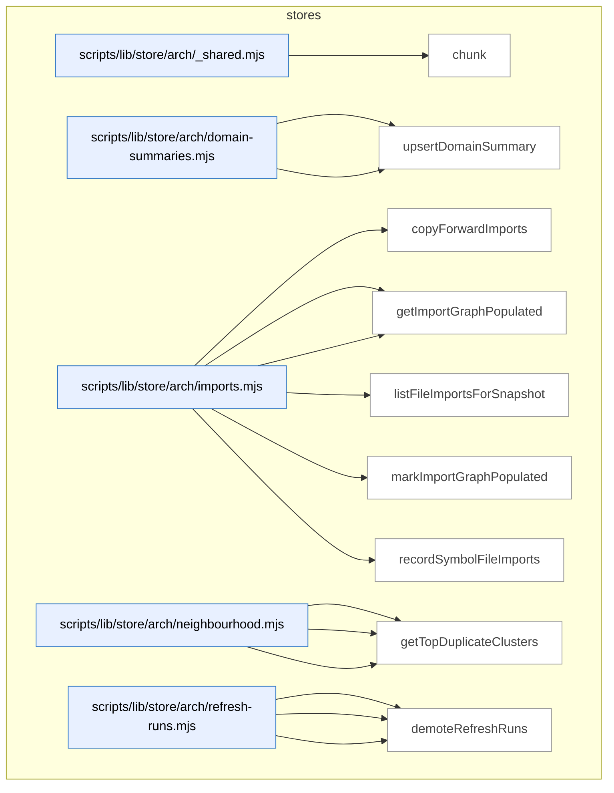

_Domain has 181 symbols (>50). Diagram shows top-15 by file order; see flat table below for the full list._

### Symbols in this domain

| Symbol | Kind | Path | Lines | Purpose | File imported by |
|---|---|---|---|---|---|
| [`chunk`](../scripts/lib/store/arch/_shared.mjs#L21) | function | `scripts/lib/store/arch/_shared.mjs` | 21-25 | Splits an array into chunks of size n, returning an array of subarrays. | `scripts/lib/store/arch/imports.mjs`, `scripts/lib/store/arch/symbols.mjs` |
| [`getDomainSummaries`](../scripts/lib/store/arch/domain-summaries.mjs#L32) | function | `scripts/lib/store/arch/domain-summaries.mjs` | 32-55 | Fetches domain summaries by repo ID from the cloud, returning a map of domain tags to summary objects. | `scripts/lib/store/arch-memory.mjs` |
| [`upsertDomainSummary`](../scripts/lib/store/arch/domain-summaries.mjs#L14) | function | `scripts/lib/store/arch/domain-summaries.mjs` | 14-30 | Upserts a domain summary record into the cloud database with symbol composition and generation metadata. | `scripts/lib/store/arch-memory.mjs` |
| [`copyForwardImports`](../scripts/lib/store/arch/imports.mjs#L39) | function | `scripts/lib/store/arch/imports.mjs` | 39-70 | Copies unmodified import edges from a prior refresh to a new one, skipping touched files. | `scripts/lib/store/arch-memory.mjs` |
| [`getImportersForFiles`](../scripts/lib/store/arch/imports.mjs#L123) | function | `scripts/lib/store/arch/imports.mjs` | 123-144 | Queries the cloud for all importers of given file paths in a refresh, returning a map of paths to importer lists. | `scripts/lib/store/arch-memory.mjs` |
| [`getImportGraphPopulated`](../scripts/lib/store/arch/imports.mjs#L105) | function | `scripts/lib/store/arch/imports.mjs` | 105-116 | Checks whether a refresh run's import graph has been populated, returning false on cloud disabled or error. | `scripts/lib/store/arch-memory.mjs` |
| [`listFileImportsForSnapshot`](../scripts/lib/store/arch/imports.mjs#L79) | function | `scripts/lib/store/arch/imports.mjs` | 79-94 | Retrieves all import edges for a given refresh ID, mapping importer and imported paths. | `scripts/lib/store/arch-memory.mjs` |
| [`markImportGraphPopulated`](../scripts/lib/store/arch/imports.mjs#L96) | function | `scripts/lib/store/arch/imports.mjs` | 96-103 | Marks a refresh run's import graph as populated in the cloud database. | `scripts/lib/store/arch-memory.mjs` |
| [`recordSymbolFileImports`](../scripts/lib/store/arch/imports.mjs#L17) | function | `scripts/lib/store/arch/imports.mjs` | 17-37 | Records symbol file import edges in batches, upserting to the cloud database with refresh context. | `scripts/lib/store/arch-memory.mjs` |
| [`callNeighbourhoodRpc`](../scripts/lib/store/arch/neighbourhood.mjs#L23) | function | `scripts/lib/store/arch/neighbourhood.mjs` | 23-35 | Calls the symbol_neighbourhood RPC to find contextually similar symbols, returning matches or empty list on cloud disabled. | `scripts/lib/store/arch-memory.mjs` |
| [`computeDriftScore`](../scripts/lib/store/arch/neighbourhood.mjs#L37) | function | `scripts/lib/store/arch/neighbourhood.mjs` | 37-46 | Calls the drift_score RPC to compute similarity drift between symbol names, returning score or null on error. | `scripts/lib/store/arch-memory.mjs` |
| [`getTopDuplicateClusters`](../scripts/lib/store/arch/neighbourhood.mjs#L48) | function | `scripts/lib/store/arch/neighbourhood.mjs` | 48-65 | Calls the top_duplicate_clusters RPC to fetch duplicate symbol clusters, returning formatted result objects. | `scripts/lib/store/arch-memory.mjs` |
| [`abortRefreshRun`](../scripts/lib/store/arch/refresh-runs.mjs#L63) | function | `scripts/lib/store/arch/refresh-runs.mjs` | 63-77 | Marks a refresh run as aborted with optional error reason and retention class. | `scripts/lib/store/arch-memory.mjs` |
| [`deleteRefreshRuns`](../scripts/lib/store/arch/refresh-runs.mjs#L204) | function | `scripts/lib/store/arch/refresh-runs.mjs` | 204-219 | Deletes a batch of refresh run records by their IDs from the database. | `scripts/lib/store/arch-memory.mjs` |
| [`demoteRefreshRuns`](../scripts/lib/store/arch/refresh-runs.mjs#L229) | function | `scripts/lib/store/arch/refresh-runs.mjs` | 229-244 | Updates a batch of refresh run records to change their retention class. | `scripts/lib/store/arch-memory.mjs` |
| [`findStaleRunningRefresh`](../scripts/lib/store/arch/refresh-runs.mjs#L140) | function | `scripts/lib/store/arch/refresh-runs.mjs` | 140-154 | Queries for the most recent running refresh for a repo, returning its ID and heartbeat metadata. | `scripts/lib/store/arch-memory.mjs` |
| [`getRefreshRun`](../scripts/lib/store/arch/refresh-runs.mjs#L111) | function | `scripts/lib/store/arch/refresh-runs.mjs` | 111-134 | Fetches a refresh run record with optional column selection, validating against an allowlist before querying. | `scripts/lib/store/arch-memory.mjs` |
| [`heartbeatRefreshRun`](../scripts/lib/store/arch/refresh-runs.mjs#L80) | function | `scripts/lib/store/arch/refresh-runs.mjs` | 80-82 | Updates a refresh run's heartbeat timestamp to current time. | `scripts/lib/store/arch-memory.mjs` |
| [`listPrunableRefreshRuns`](../scripts/lib/store/arch/refresh-runs.mjs#L177) | function | `scripts/lib/store/arch/refresh-runs.mjs` | 177-199 | Queries prunable refresh runs from the database filtered by status or retention class and older than a cutoff date. | `scripts/lib/store/arch-memory.mjs` |
| [`listRollbacksForRepo`](../scripts/lib/store/arch/refresh-runs.mjs#L254) | function | `scripts/lib/store/arch/refresh-runs.mjs` | 254-267 | Retrieves all rollback-class refresh runs for a repo ordered by completion time. | `scripts/lib/store/arch-memory.mjs` |
| [`openRefreshRun`](../scripts/lib/store/arch/refresh-runs.mjs#L28) | function | `scripts/lib/store/arch/refresh-runs.mjs` | 28-47 | Creates a new refresh run record with a random cancellation token, detecting and reporting in-flight conflicts. | `scripts/lib/store/arch-memory.mjs` |
| [`publishRefreshRun`](../scripts/lib/store/arch/refresh-runs.mjs#L54) | function | `scripts/lib/store/arch/refresh-runs.mjs` | 54-60 | Publishes a refresh run via RPC to finalize and index symbol changes with embedding model metadata. | `scripts/lib/store/arch-memory.mjs` |
| [`getActiveEmbeddingModel`](../scripts/lib/store/arch/snapshots.mjs#L69) | function | `scripts/lib/store/arch/snapshots.mjs` | 69-82 | Retrieves the current active embedding model and dimension for a repo. | `scripts/lib/store/arch-memory.mjs` |
| [`getActiveSnapshot`](../scripts/lib/store/arch/snapshots.mjs#L25) | function | `scripts/lib/store/arch/snapshots.mjs` | 25-51 | Fetches the active refresh snapshot metadata including embedding model and import graph status. | `scripts/lib/store/arch-memory.mjs` |
| [`setActiveEmbeddingModel`](../scripts/lib/store/arch/snapshots.mjs#L57) | function | `scripts/lib/store/arch/snapshots.mjs` | 57-67 | Sets the active embedding model and dimension for a repo. | `scripts/lib/store/arch-memory.mjs` |
| [`copyForwardUntouchedFiles`](../scripts/lib/store/arch/symbols.mjs#L233) | function | `scripts/lib/store/arch/symbols.mjs` | 233-292 | Copies untouched symbol index entries from a prior refresh to the current one, optionally retagging domains. | `scripts/lib/store/arch-memory.mjs` |
| [`listLayeringViolationsForSnapshot`](../scripts/lib/store/arch/symbols.mjs#L206) | function | `scripts/lib/store/arch/symbols.mjs` | 206-226 | Retrieves layering violation records for a refresh snapshot. | `scripts/lib/store/arch-memory.mjs` |
| [`listSymbolsForSnapshot`](../scripts/lib/store/arch/symbols.mjs#L154) | function | `scripts/lib/store/arch/symbols.mjs` | 154-204 | Fetches paginated symbol records for a snapshot with optional filtering by kind, domain tag, and file path prefix. | `scripts/lib/store/arch-memory.mjs` |
| [`recordLayeringViolations`](../scripts/lib/store/arch/symbols.mjs#L123) | function | `scripts/lib/store/arch/symbols.mjs` | 123-147 | Inserts or updates layering violation records from an analysis batch. | `scripts/lib/store/arch-memory.mjs` |
| [`recordSymbolDefinitions`](../scripts/lib/store/arch/symbols.mjs#L48) | function | `scripts/lib/store/arch/symbols.mjs` | 48-71 | Inserts or updates symbol definition records from a batch, returning a map of definition IDs. | `scripts/lib/store/arch-memory.mjs` |
| [`recordSymbolEmbedding`](../scripts/lib/store/arch/symbols.mjs#L101) | function | `scripts/lib/store/arch/symbols.mjs` | 101-121 | Inserts or updates a symbol embedding vector with pgvector type casting. | `scripts/lib/store/arch-memory.mjs` |
| [`recordSymbolIndex`](../scripts/lib/store/arch/symbols.mjs#L73) | function | `scripts/lib/store/arch/symbols.mjs` | 73-99 | Inserts or updates symbol index records (file locations and metadata) for a refresh snapshot. | `scripts/lib/store/arch-memory.mjs` |
| [`vectorLiteral`](../scripts/lib/store/arch/symbols.mjs#L28) | function | `scripts/lib/store/arch/symbols.mjs` | 28-42 | Formats a numeric vector array as a pgvector SQL literal with validation. | `scripts/lib/store/arch-memory.mjs` |
| [`getFalsePositivePatterns`](../scripts/lib/store/bandit-fp.mjs#L167) | function | `scripts/lib/store/bandit-fp.mjs` | 167-179 | Retrieves all auto-suppressed false positive patterns for a repository. | `scripts/learning-store.mjs`, `scripts/lib/dashboard/collect-telemetry.mjs` |
| [`getPassEffectiveness`](../scripts/lib/store/bandit-fp.mjs#L243) | function | `scripts/lib/store/bandit-fp.mjs` | 243-260 | Retrieves pass effectiveness statistics from audit runs. | `scripts/learning-store.mjs`, `scripts/lib/dashboard/collect-telemetry.mjs` |
| [`loadBanditArms`](../scripts/lib/store/bandit-fp.mjs#L56) | function | `scripts/lib/store/bandit-fp.mjs` | 56-79 | Loads all bandit arm states indexed by pass/variant/context keys. | `scripts/learning-store.mjs`, `scripts/lib/dashboard/collect-telemetry.mjs` |
| [`loadFalsePositivePatterns`](../scripts/lib/store/bandit-fp.mjs#L141) | function | `scripts/lib/store/bandit-fp.mjs` | 141-162 | Loads false positive patterns marked for auto-suppression for a repo and globally. | `scripts/learning-store.mjs`, `scripts/lib/dashboard/collect-telemetry.mjs` |
| [`syncBanditArms`](../scripts/lib/store/bandit-fp.mjs#L27) | function | `scripts/lib/store/bandit-fp.mjs` | 27-48 | Syncs bandit arm statistics to the database for multi-armed bandit learning. | `scripts/learning-store.mjs`, `scripts/lib/dashboard/collect-telemetry.mjs` |
| [`syncExperiments`](../scripts/lib/store/bandit-fp.mjs#L186) | function | `scripts/lib/store/bandit-fp.mjs` | 186-212 | Syncs experiment records including parent metrics and final results. | `scripts/learning-store.mjs`, `scripts/lib/dashboard/collect-telemetry.mjs` |
| [`syncFalsePositivePatterns`](../scripts/lib/store/bandit-fp.mjs#L113) | function | `scripts/lib/store/bandit-fp.mjs` | 113-134 | Syncs false positive pattern suppressions to the database. | `scripts/learning-store.mjs`, `scripts/lib/dashboard/collect-telemetry.mjs` |
| [`syncPromptRevision`](../scripts/lib/store/bandit-fp.mjs#L219) | function | `scripts/lib/store/bandit-fp.mjs` | 219-234 | Syncs a prompt revision with its text and SHA256 checksum. | `scripts/learning-store.mjs`, `scripts/lib/dashboard/collect-telemetry.mjs` |
| [`upsertPromptVariant`](../scripts/lib/store/bandit-fp.mjs#L86) | function | `scripts/lib/store/bandit-fp.mjs` | 86-102 | Inserts or updates a prompt variant with usage and effectiveness stats. | `scripts/learning-store.mjs`, `scripts/lib/dashboard/collect-telemetry.mjs` |
| [`appendDebtEventsCloud`](../scripts/lib/store/debt.mjs#L131) | function | `scripts/lib/store/debt.mjs` | 131-156 | Inserts debt lifecycle events (resolution, rationale) into the cloud database with deduplication on conflict. | `scripts/learning-store.mjs` |
| [`readDebtEntriesCloud`](../scripts/lib/store/debt.mjs#L67) | function | `scripts/lib/store/debt.mjs` | 67-105 | Reads debt entries from the cloud database and transforms rows back into the application domain model. | `scripts/learning-store.mjs` |
| [`readDebtEventsCloud`](../scripts/lib/store/debt.mjs#L163) | function | `scripts/lib/store/debt.mjs` | 163-184 | Reads debt lifecycle events from the cloud database ordered by timestamp. | `scripts/learning-store.mjs` |
| [`removeDebtEntryCloud`](../scripts/lib/store/debt.mjs#L111) | function | `scripts/lib/store/debt.mjs` | 111-120 | Deletes a specific debt entry by topic ID from the cloud database. | `scripts/learning-store.mjs` |
| [`upsertDebtEntries`](../scripts/lib/store/debt.mjs#L20) | function | `scripts/lib/store/debt.mjs` | 20-59 | Inserts or updates debt entries in the cloud database with full classification, deferral, and policy exception metadata. | `scripts/learning-store.mjs` |
| [`appendMitigationRef`](../scripts/lib/store/friction.mjs#L155) | function | `scripts/lib/store/friction.mjs` | 155-170 | Appends a mitigation reference to a friction memory row's jsonb array, idempotent via containment. | `scripts/learning-store.mjs`, `scripts/lib/friction/commands.mjs`, `scripts/memory-health.mjs` |
| [`buildFrictionUpsertPayload`](../scripts/lib/store/friction.mjs#L65) | function | `scripts/lib/store/friction.mjs` | 65-86 | Builds a Postgres row from friction data with secret redaction and sensitive-path filtering. | `scripts/learning-store.mjs`, `scripts/lib/friction/commands.mjs`, `scripts/memory-health.mjs` |
| [`getFrictionNeighbourhood`](../scripts/lib/store/friction.mjs#L179) | function | `scripts/lib/store/friction.mjs` | 179-184 | Queries Postgres RPC to find similar friction memories by semantic neighbourhood search. | `scripts/learning-store.mjs`, `scripts/lib/friction/commands.mjs`, `scripts/memory-health.mjs` |
| [`getFrictionRecurrence`](../scripts/lib/store/friction.mjs#L173) | function | `scripts/lib/store/friction.mjs` | 173-176 | Queries Postgres RPC to detect recurrence patterns across friction memories. | `scripts/learning-store.mjs`, `scripts/lib/friction/commands.mjs`, `scripts/memory-health.mjs` |
| [`listFrictionSourceHashes`](../scripts/lib/store/friction.mjs#L117) | function | `scripts/lib/store/friction.mjs` | 117-127 | Fetches the source-hash map for all active friction memories in a repo. | `scripts/learning-store.mjs`, `scripts/lib/friction/commands.mjs`, `scripts/memory-health.mjs` |
| [`reconcileTombstones`](../scripts/lib/store/friction.mjs#L136) | function | `scripts/lib/store/friction.mjs` | 136-152 | Tombstones (marks inactive) friction memory rows whose names weren't observed in a scan. | `scripts/learning-store.mjs`, `scripts/lib/friction/commands.mjs`, `scripts/memory-health.mjs` |
| [`redact`](../scripts/lib/store/friction.mjs#L46) | function | `scripts/lib/store/friction.mjs` | 46-46 | Redacts secret patterns from a string. | `scripts/learning-store.mjs`, `scripts/lib/friction/commands.mjs`, `scripts/memory-health.mjs` |
| [`redactArr`](../scripts/lib/store/friction.mjs#L47) | function | `scripts/lib/store/friction.mjs` | 47-47 | Maps `redact` over an array of strings. | `scripts/learning-store.mjs`, `scripts/lib/friction/commands.mjs`, `scripts/memory-health.mjs` |
| [`safeFiles`](../scripts/lib/store/friction.mjs#L49) | function | `scripts/lib/store/friction.mjs` | 49-49 | Filters out sensitive file paths from an array. | `scripts/learning-store.mjs`, `scripts/lib/friction/commands.mjs`, `scripts/memory-health.mjs` |
| [`upsertFrictionRow`](../scripts/lib/store/friction.mjs#L93) | function | `scripts/lib/store/friction.mjs` | 93-105 | Upserts a friction memory row to Postgres, raising on silent write failure (RLS or constraint). | `scripts/learning-store.mjs`, `scripts/lib/friction/commands.mjs`, `scripts/memory-health.mjs` |
| [`backfillLearningOutcome`](../scripts/lib/store/learning-decisions.mjs#L70) | function | `scripts/lib/store/learning-decisions.mjs` | 70-77 | Updates an existing learning decision's outcome and timestamp in the cloud database. | `scripts/learning-store.mjs`, `scripts/lib/dashboard/collect-telemetry.mjs` |
| [`callDeferFinding`](../scripts/lib/store/learning-decisions.mjs#L133) | function | `scripts/lib/store/learning-decisions.mjs` | 133-142 | Calls an RPC to defer a finding with dismissal reason, evidence, and cluster information. | `scripts/learning-store.mjs`, `scripts/lib/dashboard/collect-telemetry.mjs` |
| [`callMarkFindingNeedsTriage`](../scripts/lib/store/learning-decisions.mjs#L145) | function | `scripts/lib/store/learning-decisions.mjs` | 145-152 | Calls an RPC to mark a finding as reviewed with reason and evidence. | `scripts/learning-store.mjs`, `scripts/lib/dashboard/collect-telemetry.mjs` |
| [`getAuthorTierStats`](../scripts/lib/store/learning-decisions.mjs#L195) | function | `scripts/lib/store/learning-decisions.mjs` | 195-217 | Aggregates author-tier decision records by source, provider, model, and convergence status, or returns empty if cloud unavailable. | `scripts/learning-store.mjs`, `scripts/lib/dashboard/collect-telemetry.mjs` |
| [`insertFrictionNote`](../scripts/lib/store/learning-decisions.mjs#L264) | function | `scripts/lib/store/learning-decisions.mjs` | 264-282 | Inserts a friction log entry (note or warning) into the cloud database and returns the inserted record ID. | `scripts/learning-store.mjs`, `scripts/lib/dashboard/collect-telemetry.mjs` |
| [`insertLearningDecision`](../scripts/lib/store/learning-decisions.mjs#L43) | function | `scripts/lib/store/learning-decisions.mjs` | 43-62 | Inserts or ignores duplicate learning decision records into the cloud database with decision metadata and context. | `scripts/learning-store.mjs`, `scripts/lib/dashboard/collect-telemetry.mjs` |
| [`readDecisionsPaginated`](../scripts/lib/store/learning-decisions.mjs#L326) | function | `scripts/lib/store/learning-decisions.mjs` | 326-367 | Paginates through learning decision records from the cloud database, optionally filtered by type, time window, and repository. | `scripts/learning-store.mjs`, `scripts/lib/dashboard/collect-telemetry.mjs` |
| [`readNoBrainerRecommendations`](../scripts/lib/store/learning-decisions.mjs#L174) | function | `scripts/lib/store/learning-decisions.mjs` | 174-185 | Queries the cloud database for recent model classifications associated with a repository. | `scripts/learning-store.mjs`, `scripts/lib/dashboard/collect-telemetry.mjs` |
| [`readPendingTriageFindings`](../scripts/lib/store/learning-decisions.mjs#L161) | function | `scripts/lib/store/learning-decisions.mjs` | 161-172 | Queries the cloud database for recent prompt variants associated with a repository. | `scripts/learning-store.mjs`, `scripts/lib/dashboard/collect-telemetry.mjs` |
| [`readRecentFriction`](../scripts/lib/store/learning-decisions.mjs#L290) | function | `scripts/lib/store/learning-decisions.mjs` | 290-306 | Queries the cloud database for recent friction log entries (notes/warnings) for a repository within a time window. | `scripts/learning-store.mjs`, `scripts/lib/dashboard/collect-telemetry.mjs` |
| [`readStaleClusters`](../scripts/lib/store/learning-decisions.mjs#L219) | function | `scripts/lib/store/learning-decisions.mjs` | 219-233 | Queries the cloud database for open finding clusters that haven't been seen recently (older than specified days). | `scripts/learning-store.mjs`, `scripts/lib/dashboard/collect-telemetry.mjs` |
| [`readUnresolvedDecisions`](../scripts/lib/store/learning-decisions.mjs#L383) | function | `scripts/lib/store/learning-decisions.mjs` | 383-409 | Queries the cloud database for pending (unresolved) learning decisions matching specified types before a cutoff date. | `scripts/learning-store.mjs`, `scripts/lib/dashboard/collect-telemetry.mjs` |
| [`recordConvergenceState`](../scripts/lib/store/learning-decisions.mjs#L94) | function | `scripts/lib/store/learning-decisions.mjs` | 94-101 | Updates audit run state fields (sketch/final-review model) in the cloud database if they differ. | `scripts/learning-store.mjs`, `scripts/lib/dashboard/collect-telemetry.mjs` |
| [`recordDiffComplexity`](../scripts/lib/store/learning-decisions.mjs#L84) | function | `scripts/lib/store/learning-decisions.mjs` | 84-89 | Updates an audit run's diff complexity metric in the cloud database. | `scripts/learning-store.mjs`, `scripts/lib/dashboard/collect-telemetry.mjs` |
| [`recordFindingResolution`](../scripts/lib/store/learning-decisions.mjs#L115) | function | `scripts/lib/store/learning-decisions.mjs` | 115-124 | Updates audit finding resolution metadata (user action, dismiss reason, fix commit, review status) in the cloud database. | `scripts/learning-store.mjs`, `scripts/lib/dashboard/collect-telemetry.mjs` |
| [`refreshRecurringClusters`](../scripts/lib/store/learning-decisions.mjs#L244) | function | `scripts/lib/store/learning-decisions.mjs` | 244-253 | Calls a stored procedure to count unresolved findings for a repository. | `scripts/learning-store.mjs`, `scripts/lib/dashboard/collect-telemetry.mjs` |
| [`safeWrite`](../scripts/lib/store/learning-decisions.mjs#L24) | function | `scripts/lib/store/learning-decisions.mjs` | 24-31 | Wraps a database operation in try-catch and returns an ok/error result tuple. | `scripts/learning-store.mjs`, `scripts/lib/dashboard/collect-telemetry.mjs` |
| [`activeSpendSql`](../scripts/lib/store/model-ab.mjs#L164) | function | `scripts/lib/store/model-ab.mjs` | 164-169 | Generates SQL that sums active model-A/B spend within a TTL window based on reservation/reconciliation status. | `scripts/learning-store.mjs`, `scripts/lib/audit-shadow.mjs`, `scripts/lib/dashboard/collect-telemetry.mjs`, +1 more |
| [`applyModelAbAdjudication`](../scripts/lib/store/model-ab.mjs#L338) | function | `scripts/lib/store/model-ab.mjs` | 338-372 | Applies a user adjudication to a finding with atomic chain-resolution for duplicate-pointing actions. | `scripts/learning-store.mjs`, `scripts/lib/audit-shadow.mjs`, `scripts/lib/dashboard/collect-telemetry.mjs`, +1 more |
| [`cumulativeSpendEur`](../scripts/lib/store/model-ab.mjs#L271) | function | `scripts/lib/store/model-ab.mjs` | 271-281 | Queries total active model-A/B spend across all arms within the TTL window. | `scripts/learning-store.mjs`, `scripts/lib/audit-shadow.mjs`, `scripts/lib/dashboard/collect-telemetry.mjs`, +1 more |
| [`ensureArmSet`](../scripts/lib/store/model-ab.mjs#L126) | function | `scripts/lib/store/model-ab.mjs` | 126-150 | Upserts canonical audit arms with their stages and baseline flags to the database. | `scripts/learning-store.mjs`, `scripts/lib/audit-shadow.mjs`, `scripts/lib/dashboard/collect-telemetry.mjs`, +1 more |
| [`getAdjudicatorGroundTruth`](../scripts/lib/store/model-ab.mjs#L494) | function | `scripts/lib/store/model-ab.mjs` | 494-556 | Fetches ground-truth adjudicated findings for a repo with optional time-window and cursor-based pagination. | `scripts/learning-store.mjs`, `scripts/lib/audit-shadow.mjs`, `scripts/lib/dashboard/collect-telemetry.mjs`, +1 more |
| [`getModelAbAdjudicationQueue`](../scripts/lib/store/model-ab.mjs#L380) | function | `scripts/lib/store/model-ab.mjs` | 380-400 | Fetches unadjudicated findings across model-A/B stages in a blinded queue (no source model visible). | `scripts/learning-store.mjs`, `scripts/lib/audit-shadow.mjs`, `scripts/lib/dashboard/collect-telemetry.mjs`, +1 more |
| [`getModelAbArmCost`](../scripts/lib/store/model-ab.mjs#L439) | function | `scripts/lib/store/model-ab.mjs` | 439-450 | Retrieves per-arm cost ledger entries for model-A/B assignments. | `scripts/learning-store.mjs`, `scripts/lib/audit-shadow.mjs`, `scripts/lib/dashboard/collect-telemetry.mjs`, +1 more |
| [`getModelAbEffectiveness`](../scripts/lib/store/model-ab.mjs#L403) | function | `scripts/lib/store/model-ab.mjs` | 403-414 | Retrieves effectiveness metrics for model-A/B arms by stage and pass. | `scripts/learning-store.mjs`, `scripts/lib/audit-shadow.mjs`, `scripts/lib/dashboard/collect-telemetry.mjs`, +1 more |
| [`getModelAbFindingScores`](../scripts/lib/store/model-ab.mjs#L421) | function | `scripts/lib/store/model-ab.mjs` | 421-432 | Fetches per-finding severity and category scores for model-A/B effectiveness analysis. | `scripts/learning-store.mjs`, `scripts/lib/audit-shadow.mjs`, `scripts/lib/dashboard/collect-telemetry.mjs`, +1 more |
| [`modelAbSchemaReady`](../scripts/lib/store/model-ab.mjs#L103) | function | `scripts/lib/store/model-ab.mjs` | 103-110 | Verifies all required model-A/B schema tables and columns are present in the cloud database. | `scripts/learning-store.mjs`, `scripts/lib/audit-shadow.mjs`, `scripts/lib/dashboard/collect-telemetry.mjs`, +1 more |
| [`reconcileSpend`](../scripts/lib/store/model-ab.mjs#L218) | function | `scripts/lib/store/model-ab.mjs` | 218-231 | Marks a spend reservation as reconciled with either actual cost or an unmeterable flag. | `scripts/learning-store.mjs`, `scripts/lib/audit-shadow.mjs`, `scripts/lib/dashboard/collect-telemetry.mjs`, +1 more |
| [`releaseOrphanedReservations`](../scripts/lib/store/model-ab.mjs#L255) | function | `scripts/lib/store/model-ab.mjs` | 255-268 | Cleans up spend reservations older than their TTL without reconciliation. | `scripts/learning-store.mjs`, `scripts/lib/audit-shadow.mjs`, `scripts/lib/dashboard/collect-telemetry.mjs`, +1 more |
| [`releaseSpend`](../scripts/lib/store/model-ab.mjs#L241) | function | `scripts/lib/store/model-ab.mjs` | 241-252 | Cancels a spend reservation by releasing it with zero cost. | `scripts/learning-store.mjs`, `scripts/lib/audit-shadow.mjs`, `scripts/lib/dashboard/collect-telemetry.mjs`, +1 more |
| [`relOrColExists`](../scripts/lib/store/model-ab.mjs#L38) | function | `scripts/lib/store/model-ab.mjs` | 38-50 | Probes the database to check if a table or column exists, with error classification for definitiveness. | `scripts/learning-store.mjs`, `scripts/lib/audit-shadow.mjs`, `scripts/lib/dashboard/collect-telemetry.mjs`, +1 more |
| [`reserveSpend`](../scripts/lib/store/model-ab.mjs#L180) | function | `scripts/lib/store/model-ab.mjs` | 180-210 | Reserves budget for a model-A/B run by acquiring a lock and checking spend against the cap. | `scripts/learning-store.mjs`, `scripts/lib/audit-shadow.mjs`, `scripts/lib/dashboard/collect-telemetry.mjs`, +1 more |
| [`resolveCanonicalRoot`](../scripts/lib/store/model-ab.mjs#L294) | function | `scripts/lib/store/model-ab.mjs` | 294-306 | Follows a finding-equivalence chain to resolve a duplicate finding to its canonical root. | `scripts/learning-store.mjs`, `scripts/lib/audit-shadow.mjs`, `scripts/lib/dashboard/collect-telemetry.mjs`, +1 more |
| [`setFindingOutcome`](../scripts/lib/store/model-ab.mjs#L308) | function | `scripts/lib/store/model-ab.mjs` | 308-322 | Records an adjudication outcome (accepted/dismissed) for a finding, exposing row count to detect silent no-ops. | `scripts/learning-store.mjs`, `scripts/lib/audit-shadow.mjs`, `scripts/lib/dashboard/collect-telemetry.mjs`, +1 more |
| [`createEvalRun`](../scripts/lib/store/model-eval.mjs#L139) | function | `scripts/lib/store/model-eval.mjs` | 139-167 | Inserts a new eval run into the database and detects duplicate active runs. | `scripts/gemini-review.mjs`, `scripts/lib/model-eval/finalize-shadow-eval.mjs`, `scripts/model-eval-adjudicator.mjs`, +1 more |
| [`EvalRunAlreadyActiveError`](../scripts/lib/store/model-eval.mjs#L97) | class | `scripts/lib/store/model-eval.mjs` | 97-102 | Error thrown when an eval run already exists for a repo/role pair. | `scripts/gemini-review.mjs`, `scripts/lib/model-eval/finalize-shadow-eval.mjs`, `scripts/model-eval-adjudicator.mjs`, +1 more |
| [`getActiveEvalRunId`](../scripts/lib/store/model-eval.mjs#L262) | function | `scripts/lib/store/model-eval.mjs` | 262-270 | Retrieves the run ID and candidate reference of an active pending_shadow run. | `scripts/gemini-review.mjs`, `scripts/lib/model-eval/finalize-shadow-eval.mjs`, `scripts/model-eval-adjudicator.mjs`, +1 more |
| [`getEvalRuns`](../scripts/lib/store/model-eval.mjs#L233) | function | `scripts/lib/store/model-eval.mjs` | 233-249 | Fetches completed eval runs with optional role filtering and cursor-based pagination. | `scripts/gemini-review.mjs`, `scripts/lib/model-eval/finalize-shadow-eval.mjs`, `scripts/model-eval-adjudicator.mjs`, +1 more |
| [`isJsonbSafeValue`](../scripts/lib/store/model-eval.mjs#L76) | function | `scripts/lib/store/model-eval.mjs` | 76-84 | Recursively checks if a value is JSON-serializable without circular references, functions, or Symbols. | `scripts/gemini-review.mjs`, `scripts/lib/model-eval/finalize-shadow-eval.mjs`, `scripts/model-eval-adjudicator.mjs`, +1 more |
| [`jsonbSafeRecord`](../scripts/lib/store/model-eval.mjs#L86) | function | `scripts/lib/store/model-eval.mjs` | 86-91 | Creates a Zod schema for JSON-safe record objects. | `scripts/gemini-review.mjs`, `scripts/lib/model-eval/finalize-shadow-eval.mjs`, `scripts/model-eval-adjudicator.mjs`, +1 more |
| [`refineRolePendingShadow`](../scripts/lib/store/model-eval.mjs#L57) | function | `scripts/lib/store/model-eval.mjs` | 57-61 | Validates that `pending_shadow` status is restricted to adjudicator role. | `scripts/gemini-review.mjs`, `scripts/lib/model-eval/finalize-shadow-eval.mjs`, `scripts/model-eval-adjudicator.mjs`, +1 more |
| [`refineVerdictPair`](../scripts/lib/store/model-eval.mjs#L34) | function | `scripts/lib/store/model-eval.mjs` | 34-50 | Zod refinement enforcing verdict/nextAction pairing rules and consistency with completion status. | `scripts/gemini-review.mjs`, `scripts/lib/model-eval/finalize-shadow-eval.mjs`, `scripts/model-eval-adjudicator.mjs`, +1 more |
| [`updateEvalRunTerminal`](../scripts/lib/store/model-eval.mjs#L187) | function | `scripts/lib/store/model-eval.mjs` | 187-221 | Updates an eval run to terminal status with three-way disambiguation (not found vs status mismatch vs already finalized). | `scripts/gemini-review.mjs`, `scripts/lib/model-eval/finalize-shadow-eval.mjs`, `scripts/model-eval-adjudicator.mjs`, +1 more |
| [`listPersonaTestCandidates`](../scripts/lib/store/persona-test-candidates.mjs#L151) | function | `scripts/lib/store/persona-test-candidates.mjs` | 151-185 | Lists persona test candidates for a repo that are unpopposed and meet occurrence/severity thresholds. | `scripts/learning-store.mjs` |
| [`markPersonaTestCandidateProposed`](../scripts/lib/store/persona-test-candidates.mjs#L197) | function | `scripts/lib/store/persona-test-candidates.mjs` | 197-218 | Marks a persona test candidate as proposed to prevent re-suggestion. | `scripts/learning-store.mjs` |
| [`upsertPersonaTestCandidate`](../scripts/lib/store/persona-test-candidates.mjs#L48) | function | `scripts/lib/store/persona-test-candidates.mjs` | 48-136 | <no body> | `scripts/learning-store.mjs` |
| [`buildSanitizedClickPath`](../scripts/lib/store/persona.mjs#L134) | function | `scripts/lib/store/persona.mjs` | 134-157 | Parses and sanitizes a click path array, enforcing a cap and dropping invalid or sensitive steps. | `scripts/learning-store.mjs` |
| [`collapsePath`](../scripts/lib/store/persona.mjs#L81) | function | `scripts/lib/store/persona.mjs` | 81-85 | Collapses URL path segments, replacing secret-like or auth-protected segments with `:param`. | `scripts/learning-store.mjs` |
| [`getPersonaSessionsByRepo`](../scripts/lib/store/persona.mjs#L313) | function | `scripts/lib/store/persona.mjs` | 313-340 | Retrieves persona test sessions for a repo, optionally filtered to P0-only or with column selection. | `scripts/learning-store.mjs` |
| [`getPersonaSessionsByUrl`](../scripts/lib/store/persona.mjs#L419) | function | `scripts/lib/store/persona.mjs` | 419-437 | Retrieves persona test sessions by app URL from the cloud database. | `scripts/learning-store.mjs` |
| [`getReachabilityEvidence`](../scripts/lib/store/persona.mjs#L353) | function | `scripts/lib/store/persona.mjs` | 353-381 | Aggregates click paths across persona test sessions by persona, extracting unique reached URLs and click context. | `scripts/learning-store.mjs` |
| [`isPersonaCloudEnabled`](../scripts/lib/store/persona.mjs#L165) | function | `scripts/lib/store/persona.mjs` | 165-167 | Returns whether the persona store is cloud-enabled. | `scripts/learning-store.mjs` |
| [`listPersonasForApp`](../scripts/lib/store/persona.mjs#L174) | function | `scripts/lib/store/persona.mjs` | 174-185 | Retrieves all persona configurations registered for a specific app URL from the cloud database. | `scripts/learning-store.mjs` |
| [`looksSecret`](../scripts/lib/store/persona.mjs#L32) | function | `scripts/lib/store/persona.mjs` | 32-44 | Detects whether a string looks like a secret by checking for email, UUID, JWT, hex token, base64 token, or long digit patterns. | `scripts/learning-store.mjs` |
| [`recordPersonaSession`](../scripts/lib/store/persona.mjs#L230) | function | `scripts/lib/store/persona.mjs` | 230-306 | Inserts or updates a persona test session with findings, verdict, steps, and optional click path preservation. | `scripts/learning-store.mjs` |
| [`redactParams`](../scripts/lib/store/persona.mjs#L69) | function | `scripts/lib/store/persona.mjs` | 69-77 | Sanitizes URL query parameters by redacting suspicious values to `:param` placeholder. | `scripts/learning-store.mjs` |
| [`sanitizeStepUrl`](../scripts/lib/store/persona.mjs#L87) | function | `scripts/lib/store/persona.mjs` | 87-125 | Normalizes and redacts URLs from persona click paths, handling hash routes and redacting OAuth fragments. | `scripts/learning-store.mjs` |
| [`unnestReachabilityRows`](../scripts/lib/store/persona.mjs#L391) | function | `scripts/lib/store/persona.mjs` | 391-413 | Transforms row-level click path aggregates into a per-persona reachability report. | `scripts/learning-store.mjs` |
| [`upsertPersona`](../scripts/lib/store/persona.mjs#L194) | function | `scripts/lib/store/persona.mjs` | 194-222 | Inserts or updates a persona definition and returns its ID plus whether it was newly created. | `scripts/learning-store.mjs` |
| [`getUnlockedFixes`](../scripts/lib/store/plans-ship.mjs#L266) | function | `scripts/lib/store/plans-ship.mjs` | 266-280 | Retrieves recent HIGH fixes from audit that lack a /ux-lock regression spec. | `scripts/learning-store.mjs`, `scripts/lib/dashboard/collect-telemetry.mjs` |
| [`insertRunRowWithPolicyFallback`](../scripts/lib/store/plans-ship.mjs#L228) | function | `scripts/lib/store/plans-ship.mjs` | 228-239 | Inserts a record while gracefully handling missing selector-policy columns if not migrated yet. | `scripts/learning-store.mjs`, `scripts/lib/dashboard/collect-telemetry.mjs` |
| [`listConsistencyCandidates`](../scripts/lib/store/plans-ship.mjs#L142) | function | `scripts/lib/store/plans-ship.mjs` | 142-173 | Retrieves recent persona-consistency candidate specs, optionally filtered by timestamp. | `scripts/learning-store.mjs`, `scripts/lib/dashboard/collect-telemetry.mjs` |
| [`promoteRegressionSpec`](../scripts/lib/store/plans-ship.mjs#L180) | function | `scripts/lib/store/plans-ship.mjs` | 180-216 | Converts a consistency candidate spec into a locked spec with promotion metadata. | `scripts/learning-store.mjs`, `scripts/lib/dashboard/collect-telemetry.mjs` |
| [`readAuditEffectiveness`](../scripts/lib/store/plans-ship.mjs#L330) | function | `scripts/lib/store/plans-ship.mjs` | 330-338 | Retrieves precision and recall metrics for a repo's audit system. | `scripts/learning-store.mjs`, `scripts/lib/dashboard/collect-telemetry.mjs` |
| [`readCorrelationsForFinding`](../scripts/lib/store/plans-ship.mjs#L319) | function | `scripts/lib/store/plans-ship.mjs` | 319-327 | Retrieves all persona-test findings linked to a specific audit finding. | `scripts/learning-store.mjs`, `scripts/lib/dashboard/collect-telemetry.mjs` |
| [`readCorrelationsForRun`](../scripts/lib/store/plans-ship.mjs#L308) | function | `scripts/lib/store/plans-ship.mjs` | 308-316 | Retrieves all persona-audit correlations recorded during a specific audit run. | `scripts/learning-store.mjs`, `scripts/lib/dashboard/collect-telemetry.mjs` |
| [`readPersistentPlanFailures`](../scripts/lib/store/plans-ship.mjs#L422) | function | `scripts/lib/store/plans-ship.mjs` | 422-430 | Lists criteria that have failed across multiple consecutive verification runs. | `scripts/learning-store.mjs`, `scripts/lib/dashboard/collect-telemetry.mjs` |
| [`readPlanSatisfaction`](../scripts/lib/store/plans-ship.mjs#L411) | function | `scripts/lib/store/plans-ship.mjs` | 411-419 | Retrieves latest verification results and failure counts for a plan. | `scripts/learning-store.mjs`, `scripts/lib/dashboard/collect-telemetry.mjs` |
| [`readShipEvents`](../scripts/lib/store/plans-ship.mjs#L469) | function | `scripts/lib/store/plans-ship.mjs` | 469-487 | Retrieves aggregate outcome tallies and recent ship events for a repo. | `scripts/learning-store.mjs`, `scripts/lib/dashboard/collect-telemetry.mjs` |
| [`recordPersonaAuditCorrelation`](../scripts/lib/store/plans-ship.mjs#L288) | function | `scripts/lib/store/plans-ship.mjs` | 288-305 | Links a persona-test finding to an audit finding when describing the same issue. | `scripts/learning-store.mjs`, `scripts/lib/dashboard/collect-telemetry.mjs` |
| [`recordPlanVerificationItems`](../scripts/lib/store/plans-ship.mjs#L371) | function | `scripts/lib/store/plans-ship.mjs` | 371-408 | Batch-inserts individual criterion pass/fail results for a verification run. | `scripts/learning-store.mjs`, `scripts/lib/dashboard/collect-telemetry.mjs` |
| [`recordPlanVerificationRun`](../scripts/lib/store/plans-ship.mjs#L345) | function | `scripts/lib/store/plans-ship.mjs` | 345-368 | Logs /ux-lock verify results against a plan and returns the run ID. | `scripts/learning-store.mjs`, `scripts/lib/dashboard/collect-telemetry.mjs` |
| [`recordRegressionSpec`](../scripts/lib/store/plans-ship.mjs#L69) | function | `scripts/lib/store/plans-ship.mjs` | 69-137 | Stores a regression spec (locked or candidate) in the database, redacting sensitive data. | `scripts/learning-store.mjs`, `scripts/lib/dashboard/collect-telemetry.mjs` |
| [`recordRegressionSpecRun`](../scripts/lib/store/plans-ship.mjs#L242) | function | `scripts/lib/store/plans-ship.mjs` | 242-260 | Logs test execution results for a regression spec including pass/fail and selector-policy violations. | `scripts/learning-store.mjs`, `scripts/lib/dashboard/collect-telemetry.mjs` |
| [`recordShipEvent`](../scripts/lib/store/plans-ship.mjs#L437) | function | `scripts/lib/store/plans-ship.mjs` | 437-458 | Logs a /ship outcome (blocked/shipped/warned/overridden) with supporting metrics. | `scripts/learning-store.mjs`, `scripts/lib/dashboard/collect-telemetry.mjs` |
| [`updatePlanStatus`](../scripts/lib/store/plans-ship.mjs#L45) | function | `scripts/lib/store/plans-ship.mjs` | 45-55 | Updates a plan's status field and logs failures silently. | `scripts/learning-store.mjs`, `scripts/lib/dashboard/collect-telemetry.mjs` |
| [`upsertPlan`](../scripts/lib/store/plans-ship.mjs#L22) | function | `scripts/lib/store/plans-ship.mjs` | 22-42 | Inserts or updates a plan record and returns the ID, or null on failure. | `scripts/learning-store.mjs`, `scripts/lib/dashboard/collect-telemetry.mjs` |
| [`getPurposeHealth`](../scripts/lib/store/purpose-health.mjs#L25) | function | `scripts/lib/store/purpose-health.mjs` | 25-75 | <no body> | `scripts/lib/dashboard/collect-telemetry.mjs` |
| [`scalarOrNull`](../scripts/lib/store/purpose-health.mjs#L77) | function | `scripts/lib/store/purpose-health.mjs` | 77-85 | Executes a SQL scalar query and returns the count or null on error. | `scripts/lib/dashboard/collect-telemetry.mjs` |
| [`getRepoIdByName`](../scripts/lib/store/repo.mjs#L298) | function | `scripts/lib/store/repo.mjs` | 298-313 | Retrieves a repo's row ID by name, preferring the most recently created match. | `scripts/gemini-review.mjs`, `scripts/learning-store.mjs`, `scripts/lib/dashboard/collect-audit-run.mjs`, +23 more |
| [`getRepoIdByUuid`](../scripts/lib/store/repo.mjs#L214) | function | `scripts/lib/store/repo.mjs` | 214-243 | Looks up a repo's row ID by UUID with optional strict error re-throw for write callers. | `scripts/gemini-review.mjs`, `scripts/learning-store.mjs`, `scripts/lib/dashboard/collect-audit-run.mjs`, +23 more |
| [`initLearningStore`](../scripts/lib/store/repo.mjs#L41) | function | `scripts/lib/store/repo.mjs` | 41-67 | Initializes cloud store connectivity and probes Supabase availability, logging success or configuration guidance. | `scripts/gemini-review.mjs`, `scripts/learning-store.mjs`, `scripts/lib/dashboard/collect-audit-run.mjs`, +23 more |
| [`isCloudEnabled`](../scripts/lib/store/repo.mjs#L76) | function | `scripts/lib/store/repo.mjs` | 76-83 | Checks whether the cloud store is currently available and connected. | `scripts/gemini-review.mjs`, `scripts/learning-store.mjs`, `scripts/lib/dashboard/collect-audit-run.mjs`, +23 more |
| [`listRepoIds`](../scripts/lib/store/repo.mjs#L323) | function | `scripts/lib/store/repo.mjs` | 323-332 | Retrieves all repo IDs from the cloud database in order. | `scripts/gemini-review.mjs`, `scripts/learning-store.mjs`, `scripts/lib/dashboard/collect-audit-run.mjs`, +23 more |
| [`resolveRepoForStore`](../scripts/lib/store/repo.mjs#L142) | function | `scripts/lib/store/repo.mjs` | 142-203 | Resolves a repo to its canonical row ID using repo_uuid, upserting with profile metadata if needed. | `scripts/gemini-review.mjs`, `scripts/learning-store.mjs`, `scripts/lib/dashboard/collect-audit-run.mjs`, +23 more |
| [`upsertRepo`](../scripts/lib/store/repo.mjs#L108) | function | `scripts/lib/store/repo.mjs` | 108-116 | Delegates to resolveRepoForStore for canonical repo identity resolution (deprecated direct path). | `scripts/gemini-review.mjs`, `scripts/learning-store.mjs`, `scripts/lib/dashboard/collect-audit-run.mjs`, +23 more |
| [`upsertRepoByUuid`](../scripts/lib/store/repo.mjs#L253) | function | `scripts/lib/store/repo.mjs` | 253-285 | Ensures a repo row exists for a given UUID+name, handling race conditions on concurrent inserts. | `scripts/gemini-review.mjs`, `scripts/learning-store.mjs`, `scripts/lib/dashboard/collect-audit-run.mjs`, +23 more |
| [`_resetClassificationColumnCache`](../scripts/lib/store/runs-findings.mjs#L52) | function | `scripts/lib/store/runs-findings.mjs` | 52-54 | <no body> | `scripts/learning-store.mjs`, `scripts/lib/audit-shadow.mjs`, `scripts/lib/dashboard/collect-audit-run.mjs`, +1 more |
| [`_resetPassStatsRoundColumnCache`](../scripts/lib/store/runs-findings.mjs#L103) | function | `scripts/lib/store/runs-findings.mjs` | 103-105 | <no body> | `scripts/learning-store.mjs`, `scripts/lib/audit-shadow.mjs`, `scripts/lib/dashboard/collect-audit-run.mjs`, +1 more |
| [`adjudicateFinalReviewFinding`](../scripts/lib/store/runs-findings.mjs#L477) | function | `scripts/lib/store/runs-findings.mjs` | 477-498 | Sets user action (accepted/dismissed) on a shadow-only final-review finding. | `scripts/learning-store.mjs`, `scripts/lib/audit-shadow.mjs`, `scripts/lib/dashboard/collect-audit-run.mjs`, +1 more |
| [`auditRunExists`](../scripts/lib/store/runs-findings.mjs#L508) | function | `scripts/lib/store/runs-findings.mjs` | 508-516 | Checks if an audit run with a given ID exists in the database. | `scripts/learning-store.mjs`, `scripts/lib/audit-shadow.mjs`, `scripts/lib/dashboard/collect-audit-run.mjs`, +1 more |
| [`columnExists`](../scripts/lib/store/runs-findings.mjs#L816) | function | `scripts/lib/store/runs-findings.mjs` | 816-840 | Checks if a database column exists with caching, avoiding false negatives from transient errors. | `scripts/learning-store.mjs`, `scripts/lib/audit-shadow.mjs`, `scripts/lib/dashboard/collect-audit-run.mjs`, +1 more |
| [`detectClassificationColumns`](../scripts/lib/store/runs-findings.mjs#L81) | function | `scripts/lib/store/runs-findings.mjs` | 81-93 | Checks if classification columns exist in audit_findings with memoization. | `scripts/learning-store.mjs`, `scripts/lib/audit-shadow.mjs`, `scripts/lib/dashboard/collect-audit-run.mjs`, +1 more |
| [`detectPassStatsRoundColumn`](../scripts/lib/store/runs-findings.mjs#L107) | function | `scripts/lib/store/runs-findings.mjs` | 107-119 | Checks if the round column exists in audit_pass_stats with memoization. | `scripts/learning-store.mjs`, `scripts/lib/audit-shadow.mjs`, `scripts/lib/dashboard/collect-audit-run.mjs`, +1 more |
| [`getAuditRunConvergence`](../scripts/lib/store/runs-findings.mjs#L739) | function | `scripts/lib/store/runs-findings.mjs` | 739-756 | Fetches convergence metadata from an audit run (converged round, rigor-pressure round, total rounds). | `scripts/learning-store.mjs`, `scripts/lib/audit-shadow.mjs`, `scripts/lib/dashboard/collect-audit-run.mjs`, +1 more |
| [`getFinalReviewStats`](../scripts/lib/store/runs-findings.mjs#L566) | function | `scripts/lib/store/runs-findings.mjs` | 566-615 | Fetches aggregated final-review stats by model/bucket/severity and lists unadjudicated shadow-only findings. | `scripts/learning-store.mjs`, `scripts/lib/audit-shadow.mjs`, `scripts/lib/dashboard/collect-audit-run.mjs`, +1 more |
| [`getPassTimings`](../scripts/lib/store/runs-findings.mjs#L762) | function | `scripts/lib/store/runs-findings.mjs` | 762-790 | Aggregates average token counts and latency across all audit passes to profile performance. | `scripts/learning-store.mjs`, `scripts/lib/audit-shadow.mjs`, `scripts/lib/dashboard/collect-audit-run.mjs`, +1 more |
| [`getRecentFindingsByRepo`](../scripts/lib/store/runs-findings.mjs#L915) | function | `scripts/lib/store/runs-findings.mjs` | 915-952 | Retrieves recent audit findings for a repository filtered by severity level. | `scripts/learning-store.mjs`, `scripts/lib/audit-shadow.mjs`, `scripts/lib/dashboard/collect-audit-run.mjs`, +1 more |
| [`getRunFindingOutcomeCounts`](../scripts/lib/store/runs-findings.mjs#L718) | function | `scripts/lib/store/runs-findings.mjs` | 718-737 | Fetches summary counts (total/accepted/adjudicated) of findings for a run. | `scripts/learning-store.mjs`, `scripts/lib/audit-shadow.mjs`, `scripts/lib/dashboard/collect-audit-run.mjs`, +1 more |
| [`getRunFindings`](../scripts/lib/store/runs-findings.mjs#L861) | function | `scripts/lib/store/runs-findings.mjs` | 861-893 | Fetches audit findings for a run with adaptive column selection based on migration state. | `scripts/learning-store.mjs`, `scripts/lib/audit-shadow.mjs`, `scripts/lib/dashboard/collect-audit-run.mjs`, +1 more |
| [`getRunMeta`](../scripts/lib/store/runs-findings.mjs#L970) | function | `scripts/lib/store/runs-findings.mjs` | 970-996 | Fetches audit run metadata including verdict, rounds, and plan linkage. | `scripts/learning-store.mjs`, `scripts/lib/audit-shadow.mjs`, `scripts/lib/dashboard/collect-audit-run.mjs`, +1 more |
| [`isUndefinedColumnError`](../scripts/lib/store/runs-findings.mjs#L38) | function | `scripts/lib/store/runs-findings.mjs` | 38-46 | Checks if a database error is definitively a missing column/table (not a transient failure). | `scripts/learning-store.mjs`, `scripts/lib/audit-shadow.mjs`, `scripts/lib/dashboard/collect-audit-run.mjs`, +1 more |
| [`markRunFindingsNeedsTriage`](../scripts/lib/store/runs-findings.mjs#L529) | function | `scripts/lib/store/runs-findings.mjs` | 529-550 | Marks specific findings as needing triage, skipping already-adjudicated findings. | `scripts/learning-store.mjs`, `scripts/lib/audit-shadow.mjs`, `scripts/lib/dashboard/collect-audit-run.mjs`, +1 more |
| [`normaliseBucket`](../scripts/lib/store/runs-findings.mjs#L313) | function | `scripts/lib/store/runs-findings.mjs` | 313-318 | Validates and normalizes a bucket value (shadow-only/primary) or returns null if invalid. | `scripts/learning-store.mjs`, `scripts/lib/audit-shadow.mjs`, `scripts/lib/dashboard/collect-audit-run.mjs`, +1 more |
| [`probeColumn`](../scripts/lib/store/runs-findings.mjs#L66) | function | `scripts/lib/store/runs-findings.mjs` | 66-79 | Probes if a database column exists via SELECT LIMIT 0 with single retry for transient errors. | `scripts/learning-store.mjs`, `scripts/lib/audit-shadow.mjs`, `scripts/lib/dashboard/collect-audit-run.mjs`, +1 more |
| [`recordAdjudicationEvent`](../scripts/lib/store/runs-findings.mjs#L1055) | function | `scripts/lib/store/runs-findings.mjs` | 1055-1096 | Records an adjudication decision (outcome, remediation state) for a finding. | `scripts/learning-store.mjs`, `scripts/lib/audit-shadow.mjs`, `scripts/lib/dashboard/collect-audit-run.mjs`, +1 more |
| [`recordFinalReviewFindings`](../scripts/lib/store/runs-findings.mjs#L432) | function | `scripts/lib/store/runs-findings.mjs` | 432-462 | Atomically replaces final-review findings and updates run metadata with primary/shadow model attribution. | `scripts/learning-store.mjs`, `scripts/lib/audit-shadow.mjs`, `scripts/lib/dashboard/collect-audit-run.mjs`, +1 more |
| [`recordFindings`](../scripts/lib/store/runs-findings.mjs#L334) | function | `scripts/lib/store/runs-findings.mjs` | 334-406 | Inserts audit findings into the database with optional columns for classification, attribution, and model-A/B data. | `scripts/learning-store.mjs`, `scripts/lib/audit-shadow.mjs`, `scripts/lib/dashboard/collect-audit-run.mjs`, +1 more |
| [`recordPassStats`](../scripts/lib/store/runs-findings.mjs#L627) | function | `scripts/lib/store/runs-findings.mjs` | 627-661 | Inserts per-pass telemetry (tokens, latency, cost) with optional model-A/B columns for model-attribution. | `scripts/learning-store.mjs`, `scripts/lib/audit-shadow.mjs`, `scripts/lib/dashboard/collect-audit-run.mjs`, +1 more |
| [`recordRunComplete`](../scripts/lib/store/runs-findings.mjs#L200) | function | `scripts/lib/store/runs-findings.mjs` | 200-234 | Updates an audit run with final stats (counts, verdicts, cost, duration) after auditing completes. | `scripts/learning-store.mjs`, `scripts/lib/audit-shadow.mjs`, `scripts/lib/dashboard/collect-audit-run.mjs`, +1 more |
| [`recordRunStart`](../scripts/lib/store/runs-findings.mjs#L127) | function | `scripts/lib/store/runs-findings.mjs` | 127-194 | Inserts or reuses an audit_runs row for a new audit, verifying repo-scoped ownership when runId is provided. | `scripts/learning-store.mjs`, `scripts/lib/audit-shadow.mjs`, `scripts/lib/dashboard/collect-audit-run.mjs`, +1 more |
| [`recordSuppressionEvents`](../scripts/lib/store/runs-findings.mjs#L1003) | function | `scripts/lib/store/runs-findings.mjs` | 1003-1042 | Logs suppression/reopening events for findings during adjudication. | `scripts/learning-store.mjs`, `scripts/lib/audit-shadow.mjs`, `scripts/lib/dashboard/collect-audit-run.mjs`, +1 more |
| [`updatePassStatsPostDeliberation`](../scripts/lib/store/runs-findings.mjs#L667) | function | `scripts/lib/store/runs-findings.mjs` | 667-698 | Updates pass-stats with final adjudication counts (accepted/dismissed), scoped to the latest convergence round. | `scripts/learning-store.mjs`, `scripts/lib/audit-shadow.mjs`, `scripts/lib/dashboard/collect-audit-run.mjs`, +1 more |
| [`updateRunMeta`](../scripts/lib/store/runs-findings.mjs#L240) | function | `scripts/lib/store/runs-findings.mjs` | 240-305 | Partially updates audit_run metadata (verdicts, model attribution) with column-existence probing for optional fields. | `scripts/learning-store.mjs`, `scripts/lib/audit-shadow.mjs`, `scripts/lib/dashboard/collect-audit-run.mjs`, +1 more |
| [`callIncidentNeighbourhoodRpc`](../scripts/lib/store/security.mjs#L130) | function | `scripts/lib/store/security.mjs` | 130-152 | Queries nearby security incidents by path overlap and embedding similarity. | `scripts/learning-store.mjs`, `scripts/lib/dashboard/collect-telemetry.mjs` |
| [`chunk`](../scripts/lib/store/security.mjs#L20) | function | `scripts/lib/store/security.mjs` | 20-24 | Splits an array into fixed-size chunks. | `scripts/learning-store.mjs`, `scripts/lib/dashboard/collect-telemetry.mjs` |
| [`formatVectorOrNull`](../scripts/lib/store/security.mjs#L279) | function | `scripts/lib/store/security.mjs` | 279-285 | Formats an embedding array as a Postgres vector literal or returns null. | `scripts/learning-store.mjs`, `scripts/lib/dashboard/collect-telemetry.mjs` |
| [`getMaxIncidentRefreshAt`](../scripts/lib/store/security.mjs#L108) | function | `scripts/lib/store/security.mjs` | 108-123 | Gets the most recent update timestamp for a repo's security incidents. | `scripts/learning-store.mjs`, `scripts/lib/dashboard/collect-telemetry.mjs` |
| [`getSecurityEvents`](../scripts/lib/store/security.mjs#L198) | function | `scripts/lib/store/security.mjs` | 198-208 | Fetches recent security strategy audit events for a repo. | `scripts/learning-store.mjs`, `scripts/lib/dashboard/collect-telemetry.mjs` |
| [`getSecurityIncidentsByRepo`](../scripts/lib/store/security.mjs#L74) | function | `scripts/lib/store/security.mjs` | 74-83 | Retrieves security incident metadata (IDs, fingerprints, status) for a repo. | `scripts/learning-store.mjs`, `scripts/lib/dashboard/collect-telemetry.mjs` |
| [`getSecurityStats`](../scripts/lib/store/security.mjs#L221) | function | `scripts/lib/store/security.mjs` | 221-270 | Aggregates security incident counts by status, embedding coverage, and event type. | `scripts/learning-store.mjs`, `scripts/lib/dashboard/collect-telemetry.mjs` |
| [`markIncidentsHistorical`](../scripts/lib/store/security.mjs#L90) | function | `scripts/lib/store/security.mjs` | 90-100 | Marks security incidents as historical with a timestamp. | `scripts/learning-store.mjs`, `scripts/lib/dashboard/collect-telemetry.mjs` |
| [`recordSecurityEvents`](../scripts/lib/store/security.mjs#L169) | function | `scripts/lib/store/security.mjs` | 169-192 | Appends audit-trail events (inserted/updated/refused/redacted) for security incidents. | `scripts/learning-store.mjs`, `scripts/lib/dashboard/collect-telemetry.mjs` |
| [`recordSecurityIncidents`](../scripts/lib/store/security.mjs#L41) | function | `scripts/lib/store/security.mjs` | 41-68 | Batch upserts security incidents with embeddings and affected-path arrays. | `scripts/learning-store.mjs`, `scripts/lib/dashboard/collect-telemetry.mjs` |

---

## tech-debt

> Captures technical debt entries from a ledger file, validates them with configurable flags, and syncs the findings to cloud storage via a learning store.

```mermaid
flowchart TB
subgraph dom_tech_debt ["tech-debt"]
  file_scripts_debt_auto_capture_mjs["scripts/debt-auto-capture.mjs"]:::component
  sym_scripts_debt_auto_capture_mjs_buildEntri["buildEntries"]:::symbol
  file_scripts_debt_auto_capture_mjs --> sym_scripts_debt_auto_capture_mjs_buildEntri
  sym_scripts_debt_auto_capture_mjs_cloudSyncL["cloudSyncLabel"]:::symbol
  file_scripts_debt_auto_capture_mjs --> sym_scripts_debt_auto_capture_mjs_cloudSyncL
  sym_scripts_debt_auto_capture_mjs_ensureRati["ensureRationaleLength"]:::symbol
  file_scripts_debt_auto_capture_mjs --> sym_scripts_debt_auto_capture_mjs_ensureRati
  sym_scripts_debt_auto_capture_mjs_ledgerEntr["ledgerEntryToFinding"]:::symbol
  file_scripts_debt_auto_capture_mjs --> sym_scripts_debt_auto_capture_mjs_ledgerEntr
  sym_scripts_debt_auto_capture_mjs_main["main"]:::symbol
  file_scripts_debt_auto_capture_mjs --> sym_scripts_debt_auto_capture_mjs_main
  sym_scripts_debt_auto_capture_mjs_parseArgs["parseArgs"]:::symbol
  file_scripts_debt_auto_capture_mjs --> sym_scripts_debt_auto_capture_mjs_parseArgs
  sym_scripts_debt_auto_capture_mjs_printSumma["printSummary"]:::symbol
  file_scripts_debt_auto_capture_mjs --> sym_scripts_debt_auto_capture_mjs_printSumma
  sym_scripts_debt_auto_capture_mjs_syncToClou["syncToCloud"]:::symbol
  file_scripts_debt_auto_capture_mjs --> sym_scripts_debt_auto_capture_mjs_syncToClou
  sym_scripts_debt_auto_capture_mjs_usage["usage"]:::symbol
  file_scripts_debt_auto_capture_mjs --> sym_scripts_debt_auto_capture_mjs_usage
  sym_scripts_debt_auto_capture_mjs_validateRe["validateReasonFields"]:::symbol
  file_scripts_debt_auto_capture_mjs --> sym_scripts_debt_auto_capture_mjs_validateRe
  file_scripts_debt_backfill_mjs["scripts/debt-backfill.mjs"]:::component
  sym_scripts_debt_backfill_mjs_expandSources["expandSources"]:::symbol
  file_scripts_debt_backfill_mjs --> sym_scripts_debt_backfill_mjs_expandSources
  sym_scripts_debt_backfill_mjs_main["main"]:::symbol
  file_scripts_debt_backfill_mjs --> sym_scripts_debt_backfill_mjs_main
  sym_scripts_debt_backfill_mjs_parseArgs["parseArgs"]:::symbol
  file_scripts_debt_backfill_mjs --> sym_scripts_debt_backfill_mjs_parseArgs
  sym_scripts_debt_backfill_mjs_printUsage["printUsage"]:::symbol
  file_scripts_debt_backfill_mjs --> sym_scripts_debt_backfill_mjs_printUsage
  sym_scripts_debt_backfill_mjs_runPromote["runPromote"]:::symbol
  file_scripts_debt_backfill_mjs --> sym_scripts_debt_backfill_mjs_runPromote
end
classDef container fill:#f5f5f5,stroke:#333,stroke-width:2px,color:#000
classDef component fill:#e8f0ff,stroke:#3178c6,color:#000
classDef symbol fill:#fff,stroke:#999,color:#444
classDef dup fill:#ffe8d8,stroke:#c0392b,stroke-width:2px,color:#000
classDef violation fill:#ffd6d6,stroke:#c0392b,stroke-width:2px,color:#000
```

_Domain has 71 symbols (>50). Diagram shows top-15 by file order; see flat table below for the full list._

### Symbols in this domain

| Symbol | Kind | Path | Lines | Purpose | File imported by |
|---|---|---|---|---|---|
| [`buildEntries`](../scripts/debt-auto-capture.mjs#L161) | function | `scripts/debt-auto-capture.mjs` | 161-188 | Builds debt entries from deferred ledger items and tracks skipped entries. | _(internal)_ |
| [`cloudSyncLabel`](../scripts/debt-auto-capture.mjs#L214) | function | `scripts/debt-auto-capture.mjs` | 214-217 | Formats a cloud sync result as a human-readable label for summary output. | _(internal)_ |
| [`ensureRationaleLength`](../scripts/debt-auto-capture.mjs#L120) | function | `scripts/debt-auto-capture.mjs` | 120-128 | Pads or generates a default rationale string to meet minimum length requirements. | _(internal)_ |
| [`ledgerEntryToFinding`](../scripts/debt-auto-capture.mjs#L136) | function | `scripts/debt-auto-capture.mjs` | 136-155 | Transforms a ledger entry into a normalized finding object for debt capture. | _(internal)_ |
| [`main`](../scripts/debt-auto-capture.mjs#L248) | function | `scripts/debt-auto-capture.mjs` | 248-326 | Main entry point that reads a ledger, validates arguments, and captures deferred entries. | _(internal)_ |
| [`parseArgs`](../scripts/debt-auto-capture.mjs#L34) | function | `scripts/debt-auto-capture.mjs` | 34-64 | Parses command-line arguments for debt capture with validation flags. | _(internal)_ |
| [`printSummary`](../scripts/debt-auto-capture.mjs#L219) | function | `scripts/debt-auto-capture.mjs` | 219-244 | Prints a formatted summary of captured debt entries and cloud sync status. | _(internal)_ |
| [`syncToCloud`](../scripts/debt-auto-capture.mjs#L197) | function | `scripts/debt-auto-capture.mjs` | 197-210 | Attempts to sync captured debt entries to cloud storage via the learning store. | _(internal)_ |
| [`usage`](../scripts/debt-auto-capture.mjs#L66) | function | `scripts/debt-auto-capture.mjs` | 66-87 | Prints usage documentation for the debt auto-capture utility. | _(internal)_ |
| [`validateReasonFields`](../scripts/debt-auto-capture.mjs#L96) | function | `scripts/debt-auto-capture.mjs` | 96-111 | Validates that deferred reason flags have their required companion arguments. | _(internal)_ |
| [`expandSources`](../scripts/debt-backfill.mjs#L85) | function | `scripts/debt-backfill.mjs` | 85-107 | Expands glob patterns and file arguments into resolved file paths. | _(internal)_ |
| [`main`](../scripts/debt-backfill.mjs#L265) | function | `scripts/debt-backfill.mjs` | 265-279 | Routes to stage or promote mode based on CLI options. | _(internal)_ |
| [`parseArgs`](../scripts/debt-backfill.mjs#L41) | function | `scripts/debt-backfill.mjs` | 41-56 | Parses CLI arguments for the debt backfill script. | _(internal)_ |
| [`printUsage`](../scripts/debt-backfill.mjs#L58) | function | `scripts/debt-backfill.mjs` | 58-81 | Prints help text describing debt backfill usage and promotion workflow. | _(internal)_ |
| [`runPromote`](../scripts/debt-backfill.mjs#L160) | function | `scripts/debt-backfill.mjs` | 160-261 | <no body> | _(internal)_ |
| [`runStage`](../scripts/debt-backfill.mjs#L111) | function | `scripts/debt-backfill.mjs` | 111-156 | <no body> | _(internal)_ |
| [`loadBudgets`](../scripts/debt-budget-check.mjs#L66) | function | `scripts/debt-budget-check.mjs` | 66-83 | Loads budget limits from external file or ledger's budgets field. | _(internal)_ |
| [`main`](../scripts/debt-budget-check.mjs#L85) | function | `scripts/debt-budget-check.mjs` | 85-136 | <no body> | _(internal)_ |
| [`parseArgs`](../scripts/debt-budget-check.mjs#L33) | function | `scripts/debt-budget-check.mjs` | 33-45 | Parses CLI arguments for the debt budget check script. | _(internal)_ |
| [`printUsage`](../scripts/debt-budget-check.mjs#L47) | function | `scripts/debt-budget-check.mjs` | 47-64 | Prints help text describing budget check usage and configuration. | _(internal)_ |
| [`findTouchedDebt`](../scripts/debt-pr-comment.mjs#L105) | function | `scripts/debt-pr-comment.mjs` | 105-117 | Filters debt entries to those affecting files changed in the PR, using normalized path matching with substring fallback. | _(internal)_ |
| [`groupTouchedByFile`](../scripts/debt-pr-comment.mjs#L120) | function | `scripts/debt-pr-comment.mjs` | 120-128 | Groups touched debt entries by their primary affected file for organized rendering. | _(internal)_ |
| [`loadChangedFiles`](../scripts/debt-pr-comment.mjs#L222) | function | `scripts/debt-pr-comment.mjs` | 222-236 | Loads changed file paths from either a comma-separated string or a newline-delimited file. | _(internal)_ |
| [`main`](../scripts/debt-pr-comment.mjs#L240) | function | `scripts/debt-pr-comment.mjs` | 240-323 | Main entry point that orchestrates reading arguments, loading debt ledger, finding touched and recurring debt, applying thresholds, enriching with git history, and writing output. | _(internal)_ |
| [`parseArgs`](../scripts/debt-pr-comment.mjs#L53) | function | `scripts/debt-pr-comment.mjs` | 53-72 | Parses command-line arguments into a configuration object with flags for changed files, thresholds, output, and options. | _(internal)_ |
| [`printUsage`](../scripts/debt-pr-comment.mjs#L74) | function | `scripts/debt-pr-comment.mjs` | 74-95 | Prints usage documentation explaining the debt-pr-comment tool's purpose, required inputs, options, and exit codes. | _(internal)_ |
| [`renderEntryLine`](../scripts/debt-pr-comment.mjs#L132) | function | `scripts/debt-pr-comment.mjs` | 132-150 | Formats a single debt entry into a markdown line with severity badge, topic ID link, category, owner, occurrences, and deferral date. | _(internal)_ |
| [`renderPrComment`](../scripts/debt-pr-comment.mjs#L152) | function | `scripts/debt-pr-comment.mjs` | 152-218 | Generates a complete PR comment markdown with sections for touched debt and recurring debt, grouped by file and ranked by frequency. | _(internal)_ |
| [`main`](../scripts/debt-resolve.mjs#L73) | function | `scripts/debt-resolve.mjs` | 73-152 | Main entry point that resolves a debt entry, logs the event, and syncs to cloud. | _(internal)_ |
| [`parseArgs`](../scripts/debt-resolve.mjs#L34) | function | `scripts/debt-resolve.mjs` | 34-52 | Parses command-line arguments for debt resolution including topic ID and rationale. | _(internal)_ |
| [`printUsage`](../scripts/debt-resolve.mjs#L54) | function | `scripts/debt-resolve.mjs` | 54-71 | Prints usage documentation for the debt resolve utility. | _(internal)_ |
| [`main`](../scripts/debt-review.mjs#L332) | function | `scripts/debt-review.mjs` | 332-397 | Main entry point that loads the debt ledger, checks sensitivity constraints, selects clustering mode, and outputs the review report. | _(internal)_ |
| [`parseArgs`](../scripts/debt-review.mjs#L44) | function | `scripts/debt-review.mjs` | 44-60 | Parses command-line arguments into a configuration object with flags for clustering mode, sensitivity inclusion, and output options. | _(internal)_ |
| [`printUsage`](../scripts/debt-review.mjs#L62) | function | `scripts/debt-review.mjs` | 62-80 | Prints usage documentation explaining the debt-review tool's purpose, clustering modes, options, and exit codes. | _(internal)_ |
| [`renderMarkdown`](../scripts/debt-review.mjs#L84) | function | `scripts/debt-review.mjs` | 84-151 | Renders a markdown report of debt clustering results with budget violations, clusters, and ranked refactor candidates. | _(internal)_ |
| [`runLLMClustering`](../scripts/debt-review.mjs#L218) | function | `scripts/debt-review.mjs` | 218-284 | Sends debt entries to an LLM for intelligent clustering and refactor planning, filtering sensitive entries unless explicitly included. | _(internal)_ |
| [`runLocalClustering`](../scripts/debt-review.mjs#L155) | function | `scripts/debt-review.mjs` | 155-183 | Performs deterministic heuristic clustering of debt entries grouped by file/category and generates simple refactor candidates with effort estimates. | _(internal)_ |
| [`writeTopRefactorPlanDoc`](../scripts/debt-review.mjs#L288) | function | `scripts/debt-review.mjs` | 288-328 | Writes the top-ranked refactor plan as a markdown document with modules, effort, risks, and rollback strategy. | _(internal)_ |
| [`buildDebtEntry`](../scripts/lib/debt-capture.mjs#L84) | function | `scripts/lib/debt-capture.mjs` | 84-158 | <no body> | `scripts/debt-auto-capture.mjs`, `scripts/shared.mjs` |
| [`computeSensitivity`](../scripts/lib/debt-capture.mjs#L32) | function | `scripts/lib/debt-capture.mjs` | 32-54 | Scans finding fields for sensitive paths and secret patterns. | `scripts/debt-auto-capture.mjs`, `scripts/shared.mjs` |
| [`suggestDeferralCandidate`](../scripts/lib/debt-capture.mjs#L171) | function | `scripts/lib/debt-capture.mjs` | 171-183 | Determines if a finding is eligible for deferral based on scope and severity. | `scripts/debt-auto-capture.mjs`, `scripts/shared.mjs` |
| [`appendDebtEventsLocal`](../scripts/lib/debt-events.mjs#L34) | function | `scripts/lib/debt-events.mjs` | 34-56 | Appends validated debt events to a local JSONL log file atomically. | `scripts/debt-pr-comment.mjs`, `scripts/debt-resolve.mjs`, `scripts/debt-review.mjs`, +3 more |
| [`deriveMetricsFromEvents`](../scripts/lib/debt-events.mjs#L107) | function | `scripts/lib/debt-events.mjs` | 107-154 | Builds topic-level metrics from event stream including occurrence and escalation counts. | `scripts/debt-pr-comment.mjs`, `scripts/debt-resolve.mjs`, `scripts/debt-review.mjs`, +3 more |
| [`readDebtEventsLocal`](../scripts/lib/debt-events.mjs#L65) | function | `scripts/lib/debt-events.mjs` | 65-87 | Reads and parses debt events from a local JSONL log file. | `scripts/debt-pr-comment.mjs`, `scripts/debt-resolve.mjs`, `scripts/debt-review.mjs`, +3 more |
| [`buildCommitUrl`](../scripts/lib/debt-git-history.mjs#L142) | function | `scripts/lib/debt-git-history.mjs` | 142-144 | Constructs a GitHub commit URL from repo URL and SHA. | `scripts/debt-pr-comment.mjs`, `scripts/shared.mjs` |
| [`countCommitsTouchingTopic`](../scripts/lib/debt-git-history.mjs#L42) | function | `scripts/lib/debt-git-history.mjs` | 42-63 | Counts git commits touching a topic ID in the debt ledger via git log. | `scripts/debt-pr-comment.mjs`, `scripts/shared.mjs` |
| [`deriveOccurrencesFromGit`](../scripts/lib/debt-git-history.mjs#L154) | function | `scripts/lib/debt-git-history.mjs` | 154-161 | Maps debt entries to commit counts using git history. | `scripts/debt-pr-comment.mjs`, `scripts/shared.mjs` |
| [`detectGitHubRepoUrl`](../scripts/lib/debt-git-history.mjs#L119) | function | `scripts/lib/debt-git-history.mjs` | 119-134 | Extracts GitHub repository URL from git remote origin. | `scripts/debt-pr-comment.mjs`, `scripts/shared.mjs` |
| [`findFirstDeferCommit`](../scripts/lib/debt-git-history.mjs#L76) | function | `scripts/lib/debt-git-history.mjs` | 76-108 | Finds the first commit that added a topic ID to the ledger. | `scripts/debt-pr-comment.mjs`, `scripts/shared.mjs` |
| [`findDebtByAlias`](../scripts/lib/debt-ledger.mjs#L273) | function | `scripts/lib/debt-ledger.mjs` | 273-280 | Searches debt entries for a match by topic ID or content alias hash. | `scripts/audit-loop.mjs`, `scripts/debt-auto-capture.mjs`, `scripts/debt-backfill.mjs`, +6 more |
| [`mergeLedgers`](../scripts/lib/debt-ledger.mjs#L252) | function | `scripts/lib/debt-ledger.mjs` | 252-262 | Merges debt and session ledgers by topic ID, with session entries taking precedence on collision. | `scripts/audit-loop.mjs`, `scripts/debt-auto-capture.mjs`, `scripts/debt-backfill.mjs`, +6 more |
| [`readDebtLedger`](../scripts/lib/debt-ledger.mjs#L42) | function | `scripts/lib/debt-ledger.mjs` | 42-89 | Reads and hydrates debt ledger entries with event-derived metrics. | `scripts/audit-loop.mjs`, `scripts/debt-auto-capture.mjs`, `scripts/debt-backfill.mjs`, +6 more |
| [`removeDebtEntry`](../scripts/lib/debt-ledger.mjs#L207) | function | `scripts/lib/debt-ledger.mjs` | 207-236 | Acquires a file lock and removes a debt entry by topic ID from the ledger file. | `scripts/audit-loop.mjs`, `scripts/debt-auto-capture.mjs`, `scripts/debt-backfill.mjs`, +6 more |
| [`writeDebtEntries`](../scripts/lib/debt-ledger.mjs#L107) | function | `scripts/lib/debt-ledger.mjs` | 107-197 | Acquires a file lock, validates and merges debt entries into a JSON ledger, tracking insertions, updates, and rejections. | `scripts/audit-loop.mjs`, `scripts/debt-auto-capture.mjs`, `scripts/debt-backfill.mjs`, +6 more |
| [`appendEvents`](../scripts/lib/debt-memory.mjs#L116) | function | `scripts/lib/debt-memory.mjs` | 116-129 | Appends debt events to cloud and/or local storage based on the active event source and write permissions. | `scripts/debt-resolve.mjs`, `scripts/lib/audit/legacy-production-audit.mjs`, `scripts/openai-audit.mjs`, +1 more |
| [`loadDebtLedger`](../scripts/lib/debt-memory.mjs#L86) | function | `scripts/lib/debt-memory.mjs` | 86-103 | Loads debt ledger entries from cloud or local storage depending on the configured event source. | `scripts/debt-resolve.mjs`, `scripts/lib/audit/legacy-production-audit.mjs`, `scripts/openai-audit.mjs`, +1 more |
| [`persistDebtEntries`](../scripts/lib/debt-memory.mjs#L143) | function | `scripts/lib/debt-memory.mjs` | 143-157 | Persists debt entries to local JSON first, then mirrors to cloud if active, returning insertion/update counts. | `scripts/debt-resolve.mjs`, `scripts/lib/audit/legacy-production-audit.mjs`, `scripts/openai-audit.mjs`, +1 more |
| [`reconcileLocalToCloud`](../scripts/lib/debt-memory.mjs#L192) | function | `scripts/lib/debt-memory.mjs` | 192-229 | Reconciles unsynced local debt events to cloud by finding the last reconciliation marker, syncing new events, and recording reconciliation completion. | `scripts/debt-resolve.mjs`, `scripts/lib/audit/legacy-production-audit.mjs`, `scripts/openai-audit.mjs`, +1 more |
| [`removeDebt`](../scripts/lib/debt-memory.mjs#L162) | function | `scripts/lib/debt-memory.mjs` | 162-171 | Removes a debt entry from both local and cloud storage, returning success flags for each. | `scripts/debt-resolve.mjs`, `scripts/lib/audit/legacy-production-audit.mjs`, `scripts/openai-audit.mjs`, +1 more |
| [`selectEventSource`](../scripts/lib/debt-memory.mjs#L59) | function | `scripts/lib/debt-memory.mjs` | 59-73 | Determines the debt event source (cloud, local, or disabled) based on flags and repo credentials, logging the decision. | `scripts/debt-resolve.mjs`, `scripts/lib/audit/legacy-production-audit.mjs`, `scripts/openai-audit.mjs`, +1 more |
| [`buildLocalClusters`](../scripts/lib/debt-review-helpers.mjs#L164) | function | `scripts/lib/debt-review-helpers.mjs` | 164-204 | Builds file, principle, and recurrence-based clusters of debt entries for bulk refactoring. | `scripts/audit-loop.mjs`, `scripts/debt-budget-check.mjs`, `scripts/debt-pr-comment.mjs`, +2 more |
| [`computeLeverage`](../scripts/lib/debt-review-helpers.mjs#L45) | function | `scripts/lib/debt-review-helpers.mjs` | 45-57 | Computes a leverage score for a refactor based on effort estimate and cumulative debt impact weights. | `scripts/audit-loop.mjs`, `scripts/debt-budget-check.mjs`, `scripts/debt-pr-comment.mjs`, +2 more |
| [`countDebtByFile`](../scripts/lib/debt-review-helpers.mjs#L213) | function | `scripts/lib/debt-review-helpers.mjs` | 213-221 | Counts debt entries per file. | `scripts/audit-loop.mjs`, `scripts/debt-budget-check.mjs`, `scripts/debt-pr-comment.mjs`, +2 more |
| [`findBudgetViolations`](../scripts/lib/debt-review-helpers.mjs#L238) | function | `scripts/lib/debt-review-helpers.mjs` | 238-264 | Identifies files exceeding configured debt budget limits using glob pattern matching. | `scripts/audit-loop.mjs`, `scripts/debt-budget-check.mjs`, `scripts/debt-pr-comment.mjs`, +2 more |
| [`findRecurringEntries`](../scripts/lib/debt-review-helpers.mjs#L148) | function | `scripts/lib/debt-review-helpers.mjs` | 148-152 | Filters debt entries with occurrence count above a threshold and sorts by distinctRunCount. | `scripts/audit-loop.mjs`, `scripts/debt-budget-check.mjs`, `scripts/debt-pr-comment.mjs`, +2 more |
| [`findStaleEntries`](../scripts/lib/debt-review-helpers.mjs#L83) | function | `scripts/lib/debt-review-helpers.mjs` | 83-92 | Returns topic IDs of debt entries older than a specified TTL threshold. | `scripts/audit-loop.mjs`, `scripts/debt-budget-check.mjs`, `scripts/debt-pr-comment.mjs`, +2 more |
| [`getDefaultMatcher`](../scripts/lib/debt-review-helpers.mjs#L269) | function | `scripts/lib/debt-review-helpers.mjs` | 269-280 | Lazily initializes and returns a glob matcher (micromatch or fallback). | `scripts/audit-loop.mjs`, `scripts/debt-budget-check.mjs`, `scripts/debt-pr-comment.mjs`, +2 more |
| [`groupByFile`](../scripts/lib/debt-review-helpers.mjs#L116) | function | `scripts/lib/debt-review-helpers.mjs` | 116-124 | Groups debt entries by their first affected file. | `scripts/audit-loop.mjs`, `scripts/debt-budget-check.mjs`, `scripts/debt-pr-comment.mjs`, +2 more |
| [`groupByPrinciple`](../scripts/lib/debt-review-helpers.mjs#L131) | function | `scripts/lib/debt-review-helpers.mjs` | 131-139 | Groups debt entries by their first affected principle. | `scripts/audit-loop.mjs`, `scripts/debt-budget-check.mjs`, `scripts/debt-pr-comment.mjs`, +2 more |
| [`oldestEntryDays`](../scripts/lib/debt-review-helpers.mjs#L97) | function | `scripts/lib/debt-review-helpers.mjs` | 97-106 | Calculates the age in days of the oldest debt entry. | `scripts/audit-loop.mjs`, `scripts/debt-budget-check.mjs`, `scripts/debt-pr-comment.mjs`, +2 more |
| [`rankRefactorsByLeverage`](../scripts/lib/debt-review-helpers.mjs#L65) | function | `scripts/lib/debt-review-helpers.mjs` | 65-70 | Ranks refactors by their leverage score in descending order. | `scripts/audit-loop.mjs`, `scripts/debt-budget-check.mjs`, `scripts/debt-pr-comment.mjs`, +2 more |

---

## tests

> Node.js test runner (144 files) providing fixture builders and subprocess harnesses for validation. Covers two tiers: deterministic seams (schemas, sensitive-path egress, VCS error codes, sync relocation) and LLM boundaries (provider egress gates, ledger atomicity, model-resolve fallbacks).

```mermaid
flowchart TB
subgraph dom_tests ["tests"]
  file_tests_ai_context_management_test_mjs["tests/ai-context-management.test.mjs"]:::component
  sym_tests_ai_context_management_test_mjs_rea["readSkillContent"]:::symbol
  file_tests_ai_context_management_test_mjs --> sym_tests_ai_context_management_test_mjs_rea
  file_tests_anthropic_client_migration_test_mj["tests/anthropic-client-migration.test.mjs"]:::component
  sym_tests_anthropic_client_migration_test_mj["collectMjs"]:::symbol
  file_tests_anthropic_client_migration_test_mj --> sym_tests_anthropic_client_migration_test_mj
  file_tests_arch_intent_adapter_java_test_mjs["tests/arch-intent-adapter-java.test.mjs"]:::component
  sym_tests_arch_intent_adapter_java_test_mjs_["writeTree"]:::symbol
  file_tests_arch_intent_adapter_java_test_mjs --> sym_tests_arch_intent_adapter_java_test_mjs_
  file_tests_arch_intent_adapter_postgres_test_["tests/arch-intent-adapter-postgres.test.mjs"]:::component
  sym_tests_arch_intent_adapter_postgres_test_["parse"]:::symbol
  file_tests_arch_intent_adapter_postgres_test_ --> sym_tests_arch_intent_adapter_postgres_test_
  sym_tests_arch_intent_adapter_postgres_test_["writeTree"]:::symbol
  file_tests_arch_intent_adapter_postgres_test_ --> sym_tests_arch_intent_adapter_postgres_test_
  file_tests_arch_intent_adapter_python_test_mj["tests/arch-intent-adapter-python.test.mjs"]:::component
  sym_tests_arch_intent_adapter_python_test_mj["writeTree"]:::symbol
  file_tests_arch_intent_adapter_python_test_mj --> sym_tests_arch_intent_adapter_python_test_mj
  file_tests_arch_intent_doc_parser_test_mjs["tests/arch-intent-doc-parser.test.mjs"]:::component
  sym_tests_arch_intent_doc_parser_test_mjs_mk["mkDoc"]:::symbol
  file_tests_arch_intent_doc_parser_test_mjs --> sym_tests_arch_intent_doc_parser_test_mjs_mk
  file_tests_arch_intent_load_config_test_mjs["tests/arch-intent-load-config.test.mjs"]:::component
  sym_tests_arch_intent_load_config_test_mjs_m["mkRepo"]:::symbol
  file_tests_arch_intent_load_config_test_mjs --> sym_tests_arch_intent_load_config_test_mjs_m
  file_tests_arch_memory_followups_test_mjs["tests/arch-memory-followups.test.mjs"]:::component
  sym_tests_arch_memory_followups_test_mjs_mak["makePlanFixture"]:::symbol
  file_tests_arch_memory_followups_test_mjs --> sym_tests_arch_memory_followups_test_mjs_mak
  file_tests_audit_plan_rebuttal_split_smoke_te["tests/audit-plan-rebuttal-split-smoke.test.mjs"]:::component
  sym_tests_audit_plan_rebuttal_split_smoke_te["runCli"]:::symbol
  file_tests_audit_plan_rebuttal_split_smoke_te --> sym_tests_audit_plan_rebuttal_split_smoke_te
  file_tests_audit_scope_egress_test_mjs["tests/audit-scope-egress.test.mjs"]:::component
  sym_tests_audit_scope_egress_test_mjs_mkdtem["mkdtemp"]:::symbol
  file_tests_audit_scope_egress_test_mjs --> sym_tests_audit_scope_egress_test_mjs_mkdtem
  file_tests_brainstorm_arch_context_test_mjs["tests/brainstorm-arch-context.test.mjs"]:::component
  sym_tests_brainstorm_arch_context_test_mjs_m["minimalEnvelope"]:::symbol
  file_tests_brainstorm_arch_context_test_mjs --> sym_tests_brainstorm_arch_context_test_mjs_m
  sym_tests_brainstorm_arch_context_test_mjs_m["mkTmp"]:::symbol
  file_tests_brainstorm_arch_context_test_mjs --> sym_tests_brainstorm_arch_context_test_mjs_m
  file_tests_brainstorm_failure_matrix_test_mjs["tests/brainstorm-failure-matrix.test.mjs"]:::component
  sym_tests_brainstorm_failure_matrix_test_mjs["runHelper"]:::symbol
  file_tests_brainstorm_failure_matrix_test_mjs --> sym_tests_brainstorm_failure_matrix_test_mjs
  file_tests_brainstorm_insight_store_test_mjs["tests/brainstorm-insight-store.test.mjs"]:::component
  sym_tests_brainstorm_insight_store_test_mjs_["mkTmp"]:::symbol
  file_tests_brainstorm_insight_store_test_mjs --> sym_tests_brainstorm_insight_store_test_mjs_
end
classDef container fill:#f5f5f5,stroke:#333,stroke-width:2px,color:#000
classDef component fill:#e8f0ff,stroke:#3178c6,color:#000
classDef symbol fill:#fff,stroke:#999,color:#444
classDef dup fill:#ffe8d8,stroke:#c0392b,stroke-width:2px,color:#000
classDef violation fill:#ffd6d6,stroke:#c0392b,stroke-width:2px,color:#000
```

_Domain has 340 symbols (>50). Diagram shows top-15 by file order; see flat table below for the full list._

### Symbols in this domain

| Symbol | Kind | Path | Lines | Purpose | File imported by |
|---|---|---|---|---|---|
| [`readSkillContent`](../tests/ai-context-management.test.mjs#L26) | function | `tests/ai-context-management.test.mjs` | 26-28 | <no body> | _(internal)_ |
| [`collectMjs`](../tests/anthropic-client-migration.test.mjs#L29) | function | `tests/anthropic-client-migration.test.mjs` | 29-40 | Recursively collects all .mjs files from a directory tree into an array. | _(internal)_ |
| [`writeTree`](../tests/arch-intent-adapter-java.test.mjs#L22) | function | `tests/arch-intent-adapter-java.test.mjs` | 22-29 | Writes an object map of relative paths to file contents into a temporary directory. | _(internal)_ |
| [`parse`](../tests/arch-intent-adapter-postgres.test.mjs#L29) | function | `tests/arch-intent-adapter-postgres.test.mjs` | 29-31 | Parses a SQL file by first stripping comments and string literals, then parsing the sanitized result. | _(internal)_ |
| [`writeTree`](../tests/arch-intent-adapter-postgres.test.mjs#L19) | function | `tests/arch-intent-adapter-postgres.test.mjs` | 19-26 | Writes an object map of relative paths to file contents into a temporary directory. | _(internal)_ |
| [`writeTree`](../tests/arch-intent-adapter-python.test.mjs#L26) | function | `tests/arch-intent-adapter-python.test.mjs` | 26-33 | Writes an object map of relative paths to file contents into a temporary directory. | _(internal)_ |
| [`mkDoc`](../tests/arch-intent-doc-parser.test.mjs#L9) | function | `tests/arch-intent-doc-parser.test.mjs` | 9-14 | Creates a temporary directory and writes a markdown document into it, returning both paths. | _(internal)_ |
| [`mkRepo`](../tests/arch-intent-load-config.test.mjs#L10) | function | `tests/arch-intent-load-config.test.mjs` | 10-17 | Creates a temporary directory with `.audit-loop` subdirectory and optionally writes domain-map.json contents. | _(internal)_ |
| [`makePlanFixture`](../tests/arch-memory-followups.test.mjs#L49) | function | `tests/arch-memory-followups.test.mjs` | 49-51 | Generates test plan fixture with current date and draft status. | _(internal)_ |
| [`runCli`](../tests/audit-plan-rebuttal-split-smoke.test.mjs#L44) | function | `tests/audit-plan-rebuttal-split-smoke.test.mjs` | 44-56 | Spawns openai-audit.mjs subprocess with args and returns exit code and combined stdout/stderr. | _(internal)_ |
| [`mkdtemp`](../tests/audit-scope-egress.test.mjs#L36) | function | `tests/audit-scope-egress.test.mjs` | 36-38 | Creates a temporary directory with a prefixed name in the system temp location. | _(internal)_ |
| [`minimalEnvelope`](../tests/brainstorm-arch-context.test.mjs#L242) | function | `tests/brainstorm-arch-context.test.mjs` | 242-256 | Constructs a minimal audit envelope object with default telemetry fields. | _(internal)_ |
| [`mkTmp`](../tests/brainstorm-arch-context.test.mjs#L24) | function | `tests/brainstorm-arch-context.test.mjs` | 24-26 | Creates a temporary directory with a "brainstorm-arch-" prefix. | _(internal)_ |
| [`runHelper`](../tests/brainstorm-failure-matrix.test.mjs#L20) | function | `tests/brainstorm-failure-matrix.test.mjs` | 20-28 | Spawns the brainstorm helper process and returns its output. | _(internal)_ |
| [`mkTmp`](../tests/brainstorm-insight-store.test.mjs#L22) | function | `tests/brainstorm-insight-store.test.mjs` | 22-24 | Creates a temporary directory with a `brainstorm-insight-` prefix. | _(internal)_ |
| [`mkTmp`](../tests/brainstorm-resume-context.test.mjs#L13) | function | `tests/brainstorm-resume-context.test.mjs` | 13-15 | Creates and returns a temporary directory with a brainstorm-resume prefix. | _(internal)_ |
| [`helpText`](../tests/brainstorm-round-extensions.test.mjs#L34) | function | `tests/brainstorm-round-extensions.test.mjs` | 34-37 | Runs the helper with `--help` and returns stdout. | _(internal)_ |
| [`runHelper`](../tests/brainstorm-round.test.mjs#L17) | function | `tests/brainstorm-round.test.mjs` | 17-23 | Spawns a helper script with given arguments and stdin, returning execution result. | _(internal)_ |
| [`mkTmp`](../tests/brainstorm-session-store.test.mjs#L12) | function | `tests/brainstorm-session-store.test.mjs` | 12-14 | Creates and returns a temporary directory with a brainstorm-session prefix. | _(internal)_ |
| [`mkV2Envelope`](../tests/brainstorm-session-store.test.mjs#L16) | function | `tests/brainstorm-session-store.test.mjs` | 16-27 | Constructs a v2 schema envelope object with topic, providers, and architecture context metadata. | _(internal)_ |
| [`syntheticSurface`](../tests/build-surfaces-manifest.test.mjs#L59) | function | `tests/build-surfaces-manifest.test.mjs` | 59-73 | Creates a synthetic test surface with one engine field that mocks an API response with semantic enum values. | _(internal)_ |
| [`run`](../tests/cache-hitrate-check.test.mjs#L10) | function | `tests/cache-hitrate-check.test.mjs` | 10-10 | Returns a test result object pairing a hit rate with seed enablement status. | _(internal)_ |
| [`mkFinding`](../tests/candidate-envelope-provenance.test.mjs#L16) | function | `tests/candidate-envelope-provenance.test.mjs` | 16-25 | Factory creating a test finding with standard fields and overridable properties. | _(internal)_ |
| [`fx`](../tests/check-context-drift.test.mjs#L16) | function | `tests/check-context-drift.test.mjs` | 16-18 | Joins fixture directory name to base fixtures path. | _(internal)_ |
| [`runLint`](../tests/claudemd/integration.test.mjs#L10) | function | `tests/claudemd/integration.test.mjs` | 10-21 | Runs claudemd CLI linter and returns stdout, stderr, and exit code. | _(internal)_ |
| [`allIndicesCoveredOnce`](../tests/cluster-propose.test.mjs#L5) | function | `tests/cluster-propose.test.mjs` | 5-9 | Asserts every input row appears in exactly one cluster with no duplicates. | _(internal)_ |
| [`writeStub`](../tests/code-analysis.test.mjs#L336) | function | `tests/code-analysis.test.mjs` | 336-339 | Writes a file filled with repeated characters to reach target byte size. | _(internal)_ |
| [`mkdtemp`](../tests/config-shared-env.test.mjs#L21) | function | `tests/config-shared-env.test.mjs` | 21-23 | Creates a temporary directory for testing. | _(internal)_ |
| [`runChild`](../tests/config-shared-env.test.mjs#L29) | function | `tests/config-shared-env.test.mjs` | 29-45 | Spawns a child process with a sanitized environment to test config loading. | _(internal)_ |
| [`tmpFile`](../tests/cost-budget.test.mjs#L19) | function | `tests/cost-budget.test.mjs` | 19-21 | Creates and returns a path to a test-specific temporary file. | _(internal)_ |
| [`runCli`](../tests/cross-skill-persona.test.mjs#L8) | function | `tests/cross-skill-persona.test.mjs` | 8-35 | Spawns CLI subprocess with cloud disabled and clean environment for isolated testing. | _(internal)_ |
| [`runCrossSkill`](../tests/cross-skill-target-domains.test.mjs#L13) | function | `tests/cross-skill-target-domains.test.mjs` | 13-18 | Spawns a Node.js child process to run a cross-skill command with JSON-serialized arguments and returns the synchronized result. | _(internal)_ |
| [`auditRunData`](../tests/dashboard-audit-run.test.mjs#L388) | function | `tests/dashboard-audit-run.test.mjs` | 388-402 | Constructs audit run test data containing findings at different severity levels and passes. | _(internal)_ |
| [`domainFinding`](../tests/dashboard-audit-run.test.mjs#L27) | function | `tests/dashboard-audit-run.test.mjs` | 27-32 | Creates a test finding object with standard audit metadata and optional property overrides. | _(internal)_ |
| [`makeFakeClient`](../tests/dashboard-audit-run.test.mjs#L42) | function | `tests/dashboard-audit-run.test.mjs` | 42-68 | Builds a fake database client that tracks SQL calls and returns finding/metadata rows or throws column-not-found errors. | _(internal)_ |
| [`mkScriptsDir`](../tests/dashboard-cli.test.mjs#L35) | function | `tests/dashboard-cli.test.mjs` | 35-37 | Creates a scripts subdirectory in the given root path. | _(internal)_ |
| [`withTmp`](../tests/dashboard-cli.test.mjs#L19) | function | `tests/dashboard-cli.test.mjs` | 19-23 | Creates a temporary directory, executes a function with its path, and cleans up afterward. | _(internal)_ |
| [`writeCatalog`](../tests/dashboard-cli.test.mjs#L30) | function | `tests/dashboard-cli.test.mjs` | 30-33 | Writes a CLI catalog JSON file listing tool entries to a directory. | _(internal)_ |
| [`writePkg`](../tests/dashboard-cli.test.mjs#L25) | function | `tests/dashboard-cli.test.mjs` | 25-28 | Writes a package.json file to a directory with given npm scripts. | _(internal)_ |
| [`fixture`](../tests/dashboard-purpose-health.test.mjs#L18) | function | `tests/dashboard-purpose-health.test.mjs` | 18-29 | Returns a fixture object for dashboard purpose health tests. | _(internal)_ |
| [`fixtureRoot`](../tests/dashboard-purpose.test.mjs#L20) | function | `tests/dashboard-purpose.test.mjs` | 20-29 | Creates a temporary directory with a mock `.audit-loop` domain-map.json file for test fixtures. | _(internal)_ |
| [`renderFixture`](../tests/dashboard-purpose.test.mjs#L163) | function | `tests/dashboard-purpose.test.mjs` | 163-174 | Returns a hardcoded reference data object with HTML/quote-escaping test cases for dashboard rendering. | _(internal)_ |
| [`httpGet`](../tests/dashboard.test.mjs#L352) | function | `tests/dashboard.test.mjs` | 352-365 | Makes an HTTP GET request to a local server and returns the status, headers, and body. | _(internal)_ |
| [`refData`](../tests/dashboard.test.mjs#L26) | function | `tests/dashboard.test.mjs` | 26-58 | Returns a complete reference dataset fixture with skills, plans, architecture, flows, and CLI data for dashboard tests. | _(internal)_ |
| [`telData`](../tests/dashboard.test.mjs#L60) | function | `tests/dashboard.test.mjs` | 60-74 | Returns a telemetry dataset fixture with audit runs, requirements, and learning metrics for dashboard tests. | _(internal)_ |
| [`clearEnv`](../tests/db-alias.test.mjs#L8) | function | `tests/db-alias.test.mjs` | 8-8 | Deletes all database-related environment variables from process.env. | _(internal)_ |
| [`makeEntry`](../tests/debt-budget-check-cli.test.mjs#L17) | function | `tests/debt-budget-check-cli.test.mjs` | 17-28 | Creates a test ledger entry with debt fields and deferred reason. | _(internal)_ |
| [`runCli`](../tests/debt-budget-check-cli.test.mjs#L35) | function | `tests/debt-budget-check-cli.test.mjs` | 35-37 | Spawns debt budget CLI script with arguments. | _(internal)_ |
| [`seedLedger`](../tests/debt-budget-check-cli.test.mjs#L30) | function | `tests/debt-budget-check-cli.test.mjs` | 30-33 | Writes ledger JSON to disk with version and optional budgets. | _(internal)_ |
| [`git`](../tests/debt-git-history.test.mjs#L25) | function | `tests/debt-git-history.test.mjs` | 25-36 | Runs git command in temporary directory, optionally suppressing errors. | _(internal)_ |
| [`makeEntry`](../tests/debt-git-history.test.mjs#L43) | function | `tests/debt-git-history.test.mjs` | 43-54 | Creates a test debt ledger entry with deferred metadata. | _(internal)_ |
| [`writeLedger`](../tests/debt-git-history.test.mjs#L38) | function | `tests/debt-git-history.test.mjs` | 38-41 | Writes ledger JSON with entries to .audit/tech-debt.json. | _(internal)_ |
| [`makeEntry`](../tests/debt-ledger.test.mjs#L23) | function | `tests/debt-ledger.test.mjs` | 23-43 | Builds a complete test ledger entry with all required fields. | _(internal)_ |
| [`makeEntry`](../tests/debt-pr-comment-cli.test.mjs#L18) | function | `tests/debt-pr-comment-cli.test.mjs` | 18-29 | Creates a test debt ledger entry with specified topicId and severity, populated with default test values. | _(internal)_ |
| [`seedLedger`](../tests/debt-pr-comment-cli.test.mjs#L31) | function | `tests/debt-pr-comment-cli.test.mjs` | 31-33 | Writes a ledger object with a version and entries array to a JSON file. | _(internal)_ |
| [`makeEntry`](../tests/debt-pr-comment.test.mjs#L14) | function | `tests/debt-pr-comment.test.mjs` | 14-25 | Creates a simplified debt entry for PR comment display testing. | _(internal)_ |
| [`makeEntry`](../tests/debt-resolve-cli.test.mjs#L20) | function | `tests/debt-resolve-cli.test.mjs` | 20-29 | Creates a test debt ledger entry with fixed metadata and customizable topicId. | _(internal)_ |
| [`makeEntry`](../tests/debt-review-helpers.test.mjs#L24) | function | `tests/debt-review-helpers.test.mjs` | 24-36 | Creates a test debt review entry with optional field overrides. | _(internal)_ |
| [`debtEntry`](../tests/debt-suppression.test.mjs#L42) | function | `tests/debt-suppression.test.mjs` | 42-57 | Creates a debt-sourced ledger entry for suppression matching. | _(internal)_ |
| [`makeFinding`](../tests/debt-suppression.test.mjs#L12) | function | `tests/debt-suppression.test.mjs` | 12-23 | Creates a test finding object with metadata population. | _(internal)_ |
| [`sessionEntry`](../tests/debt-suppression.test.mjs#L25) | function | `tests/debt-suppression.test.mjs` | 25-40 | Creates a session-sourced ledger entry for debt suppression testing. | _(internal)_ |
| [`reSuppressAgainstDebt`](../tests/debt-transcript-suppression.test.mjs#L19) | function | `tests/debt-transcript-suppression.test.mjs` | 19-44 | Matches new findings against deferred debt using Jaccard similarity scoring. | _(internal)_ |
| [`commit`](../tests/diff-scope-resolver.test.mjs#L48) | function | `tests/diff-scope-resolver.test.mjs` | 48-52 | Stages all changes (including deletions and renames) and commits them with a message. | _(internal)_ |
| [`newRepo`](../tests/diff-scope-resolver.test.mjs#L35) | function | `tests/diff-scope-resolver.test.mjs` | 35-46 | Creates a temporary git repository, configures it with test user credentials, initializes a package.json, and commits it. | _(internal)_ |
| [`sh`](../tests/diff-scope-resolver.test.mjs#L24) | function | `tests/diff-scope-resolver.test.mjs` | 24-26 | Executes git commands in a repository by delegating to `git` with specified arguments and the target working directory. | _(internal)_ |
| [`writeFile`](../tests/diff-scope-resolver.test.mjs#L28) | function | `tests/diff-scope-resolver.test.mjs` | 28-32 | Writes file content to an absolute path, creating parent directories as needed. | _(internal)_ |
| [`mkFinding`](../tests/discovery-portfolio.test.mjs#L11) | function | `tests/discovery-portfolio.test.mjs` | 11-11 | Creates minimal test finding with id and MEDIUM severity. | _(internal)_ |
| [`mkTmp`](../tests/doc-sections.test.mjs#L13) | function | `tests/doc-sections.test.mjs` | 13-15 | Creates a temporary directory with a "doc-sec-" prefix. | _(internal)_ |
| [`rule`](../tests/efficacy-lints.test.mjs#L24) | function | `tests/efficacy-lints.test.mjs` | 24-24 | Extracts a rule's results by ID. | _(internal)_ |
| [`tmpRepo`](../tests/efficacy-lints.test.mjs#L15) | function | `tests/efficacy-lints.test.mjs` | 15-23 | Creates a temporary directory populated with test files from a key-value object. | _(internal)_ |
| [`fakeAzureClient`](../tests/embed-text.test.mjs#L15) | function | `tests/embed-text.test.mjs` | 15-23 | Returns a mock Azure embeddings client that asserts input is a non-empty string and returns a fixed vector. | _(internal)_ |
| [`fakeGeminiClient`](../tests/embed-text.test.mjs#L24) | function | `tests/embed-text.test.mjs` | 24-32 | Returns a mock Gemini embeddings client that asserts contents is a non-empty string and returns a fixed vector. | _(internal)_ |
| [`mkTmp`](../tests/explain-history.test.mjs#L24) | function | `tests/explain-history.test.mjs` | 24-26 | Creates a temporary directory with an `explain-history-` prefix. | _(internal)_ |
| [`makeDiffMap`](../tests/file-io.test.mjs#L16) | function | `tests/file-io.test.mjs` | 16-20 | Converts array of path-hunk entries into Map structure for diff representation. | _(internal)_ |
| [`mkEnvelope`](../tests/final-adjudication-egress.test.mjs#L53) | function | `tests/final-adjudication-egress.test.mjs` | 53-66 | Constructs candidate envelope with canonical finding and optional anchor/triggerAnchor fields. | _(internal)_ |
| [`neverCallExecFile`](../tests/final-adjudication-egress.test.mjs#L47) | function | `tests/final-adjudication-egress.test.mjs` | 47-51 | Throws error if invoked, preventing subprocess spawning for sensitive-evidence items. | _(internal)_ |
| [`captureExecFileDir`](../tests/final-adjudication-subprocess-adapter.test.mjs#L49) | function | `tests/final-adjudication-subprocess-adapter.test.mjs` | 49-54 | Wraps execFile to capture the directory of the script argument for verification. | _(internal)_ |
| [`mkEnvelope`](../tests/final-adjudication-subprocess-adapter.test.mjs#L75) | function | `tests/final-adjudication-subprocess-adapter.test.mjs` | 75-85 | Creates candidate envelope with file-anchored canonical finding. | _(internal)_ |
| [`noKeyEnv`](../tests/final-adjudication-subprocess-adapter.test.mjs#L59) | function | `tests/final-adjudication-subprocess-adapter.test.mjs` | 59-66 | Returns process.env clone with API keys and cloud configs disabled. | _(internal)_ |
| [`CLOCK`](../tests/final-adjudication.test.mjs#L11) | function | `tests/final-adjudication.test.mjs` | 11-11 | Returns fixed ISO timestamp string for deterministic test results. | _(internal)_ |
| [`mkEnvelope`](../tests/final-adjudication.test.mjs#L13) | function | `tests/final-adjudication.test.mjs` | 13-18 | Constructs minimal envelope with canonical finding and stage1 decision. | _(internal)_ |
| [`outcomesLines`](../tests/finalize-outcomes.test.mjs#L51) | function | `tests/finalize-outcomes.test.mjs` | 51-54 | Reads and splits the outcomes.jsonl file into individual JSON outcome records. | _(internal)_ |
| [`ruledPair`](../tests/finalize-outcomes.test.mjs#L39) | function | `tests/finalize-outcomes.test.mjs` | 39-49 | Creates a test fixture pairing a finding object with its adjudication ledger entry. | _(internal)_ |
| [`finding`](../tests/finding-verification.test.mjs#L16) | function | `tests/finding-verification.test.mjs` | 16-22 | Returns a finding object fixture with HIGH severity and mechanical classification. | _(internal)_ |
| [`orphanFinding`](../tests/findings-pipeline.test.mjs#L13) | function | `tests/findings-pipeline.test.mjs` | 13-25 | <no body> | _(internal)_ |
| [`GET`](../tests/fixtures/fit-check/nextjs-with-playwright/app/api/cellar/route.ts#L1) | function | `tests/fixtures/fit-check/nextjs-with-playwright/app/api/cellar/route.ts` | 1-3 | Returns a JSON response indicating cellar is organized. | _(internal)_ |
| [`Page`](../tests/fixtures/fit-check/nextjs-with-playwright/app/page.tsx#L1) | function | `tests/fixtures/fit-check/nextjs-with-playwright/app/page.tsx` | 1-3 | Returns JSX with a main element claiming cellar is organized. | _(internal)_ |
| [`App`](../tests/fixtures/fit-check/vite-react-no-playwright/src/App.tsx#L1) | function | `tests/fixtures/fit-check/vite-react-no-playwright/src/App.tsx` | 1-1 | Returns a div element with "Hello" text. | _(internal)_ |
| [`Widget`](../tests/fixtures/harness-plan/src/components/Widget.jsx#L7) | function | `tests/fixtures/harness-plan/src/components/Widget.jsx` | 7-9 | React component rendering comma-separated item names. | _(internal)_ |
| [`widgetTotal`](../tests/fixtures/harness-plan/src/service.mjs#L7) | function | `tests/fixtures/harness-plan/src/service.mjs` | 7-9 | Sums the price field across an item array. | _(internal)_ |
| [`_resetClassificationColumnCache`](../tests/fixtures/learning-store.legacy.mjs#L248) | function | `tests/fixtures/learning-store.legacy.mjs` | 248-248 | Resets the classification column cache to null. | _(internal)_ |
| [`_safeWriteCall`](../tests/fixtures/learning-store.legacy.mjs#L2575) | function | `tests/fixtures/learning-store.legacy.mjs` | 2575-2583 | Wraps async database calls to catch errors and return a standardized error response object. | _(internal)_ |
| [`abortRefreshRun`](../tests/fixtures/learning-store.legacy.mjs#L1857) | function | `tests/fixtures/learning-store.legacy.mjs` | 1857-1864 | Marks a refresh run as aborted with optional error reason and retention class. | _(internal)_ |
| [`appendDebtEventsCloud`](../tests/fixtures/learning-store.legacy.mjs#L526) | function | `tests/fixtures/learning-store.legacy.mjs` | 526-554 | Appends debt events with idempotent upsert on repo/topic/run/event. | _(internal)_ |
| [`backfillLearningOutcome`](../tests/fixtures/learning-store.legacy.mjs#L2621) | function | `tests/fixtures/learning-store.legacy.mjs` | 2621-2628 | Updates the outcome field on an existing learning decision by its key. | _(internal)_ |
| [`callDeferFinding`](../tests/fixtures/learning-store.legacy.mjs#L2682) | function | `tests/fixtures/learning-store.legacy.mjs` | 2682-2699 | Calls a deferred-finding RPC that dismisses a finding and records related evidence. | _(internal)_ |
| [`callIncidentNeighbourhoodRpc`](../tests/fixtures/learning-store.legacy.mjs#L2192) | function | `tests/fixtures/learning-store.legacy.mjs` | 2192-2219 | Calls the incident_neighbourhood RPC to find related incidents by embedding and path overlap, returning scored results. | _(internal)_ |
| [`callMarkFindingNeedsTriage`](../tests/fixtures/learning-store.legacy.mjs#L2702) | function | `tests/fixtures/learning-store.legacy.mjs` | 2702-2716 | Calls an RPC to mark a finding as needing manual triage with reason and evidence. | _(internal)_ |
| [`callNeighbourhoodRpc`](../tests/fixtures/learning-store.legacy.mjs#L2080) | function | `tests/fixtures/learning-store.legacy.mjs` | 2080-2096 | Calls the symbol_neighbourhood RPC to find semantically similar symbols by intent embedding. | _(internal)_ |
| [`chunk`](../tests/fixtures/learning-store.legacy.mjs#L1917) | function | `tests/fixtures/learning-store.legacy.mjs` | 1917-1921 | Splits an array into chunks of size n. | _(internal)_ |
| [`computeDriftScore`](../tests/fixtures/learning-store.legacy.mjs#L2102) | function | `tests/fixtures/learning-store.legacy.mjs` | 2102-2116 | Calls the drift_score RPC to compute code similarity drift metrics between refreshes. | _(internal)_ |
| [`copyForwardImports`](../tests/fixtures/learning-store.legacy.mjs#L2261) | function | `tests/fixtures/learning-store.legacy.mjs` | 2261-2294 | Copies forward import edges from a previous refresh that touch untouched files, with pagination and batching. | _(internal)_ |
| [`copyForwardUntouchedFiles`](../tests/fixtures/learning-store.legacy.mjs#L2519) | function | `tests/fixtures/learning-store.legacy.mjs` | 2519-2565 | Copies symbol index entries from a prior refresh to a new one, skipping touched files and optionally retagging domains. | _(internal)_ |
| [`detectClassificationColumns`](../tests/fixtures/learning-store.legacy.mjs#L229) | function | `tests/fixtures/learning-store.legacy.mjs` | 229-245 | Detects and caches whether classification columns exist in audit_findings table. | _(internal)_ |
| [`getActiveEmbeddingModel`](../tests/fixtures/learning-store.legacy.mjs#L2063) | function | `tests/fixtures/learning-store.legacy.mjs` | 2063-2072 | Retrieves the active embedding model and dimension configuration for a repo. | _(internal)_ |
| [`getActiveSnapshot`](../tests/fixtures/learning-store.legacy.mjs#L1881) | function | `tests/fixtures/learning-store.legacy.mjs` | 1881-1908 | Retrieves the active refresh snapshot metadata for a repo including embedding model and import-graph population flag. | _(internal)_ |
| [`getDomainSummaries`](../tests/fixtures/learning-store.legacy.mjs#L2402) | function | `tests/fixtures/learning-store.legacy.mjs` | 2402-2420 | Retrieves all domain summaries for a repository, mapping domain tags to their summary data. | _(internal)_ |
| [`getFalsePositivePatterns`](../tests/fixtures/learning-store.legacy.mjs#L886) | function | `tests/fixtures/learning-store.legacy.mjs` | 886-900 | Loads auto-suppress false positive patterns for a specific repo. | _(internal)_ |
| [`getImportersForFiles`](../tests/fixtures/learning-store.legacy.mjs#L2352) | function | `tests/fixtures/learning-store.legacy.mjs` | 2352-2370 | Returns a map of imported file paths to lists of importer file paths for a given refresh run. | _(internal)_ |
| [`getImportGraphPopulated`](../tests/fixtures/learning-store.legacy.mjs#L2323) | function | `tests/fixtures/learning-store.legacy.mjs` | 2323-2331 | Checks if a refresh run's import graph has been marked as populated. | _(internal)_ |
| [`getMaxIncidentRefreshAt`](../tests/fixtures/learning-store.legacy.mjs#L2178) | function | `tests/fixtures/learning-store.legacy.mjs` | 2178-2189 | Returns the most recent update timestamp of any security incident in a repo. | _(internal)_ |
| [`getMostRecentAuditRunIdForRepo`](../tests/fixtures/learning-store.legacy.mjs#L2812) | function | `tests/fixtures/learning-store.legacy.mjs` | 2812-2823 | Fetches the most recent audit run ID for a given repository. | _(internal)_ |
| [`getPassEffectiveness`](../tests/fixtures/learning-store.legacy.mjs#L856) | function | `tests/fixtures/learning-store.legacy.mjs` | 856-881 | Aggregates pass effectiveness metrics across all audit runs for a repo. | _(internal)_ |
| [`getPassTimings`](../tests/fixtures/learning-store.legacy.mjs#L337) | function | `tests/fixtures/learning-store.legacy.mjs` | 337-368 | Aggregates pass timing data from audit_pass_stats. | _(internal)_ |
| [`getPersonaSessionsByRepo`](../tests/fixtures/learning-store.legacy.mjs#L1667) | function | `tests/fixtures/learning-store.legacy.mjs` | 1667-1682 | Retrieves persona test sessions for a repo with optional filtering for P0-only results and customizable column selection. | _(internal)_ |
| [`getPersonaSessionsByUrl`](../tests/fixtures/learning-store.legacy.mjs#L1694) | function | `tests/fixtures/learning-store.legacy.mjs` | 1694-1711 | Retrieves persona test sessions for a specific URL with customizable column selection and ordering. | _(internal)_ |
| [`getPersonaSupabase`](../tests/fixtures/learning-store.legacy.mjs#L1452) | function | `tests/fixtures/learning-store.legacy.mjs` | 1452-1495 | Initializes and returns a Supabase client for persona cloud operations, falling back through service-role keys with RLS support. | _(internal)_ |
| [`getReadClient`](../tests/fixtures/learning-store.legacy.mjs#L1748) | function | `tests/fixtures/learning-store.legacy.mjs` | 1748-1748 | Returns the read-only Supabase client. | _(internal)_ |
| [`getRepoIdByName`](../tests/fixtures/learning-store.legacy.mjs#L2834) | function | `tests/fixtures/learning-store.legacy.mjs` | 2834-2846 | Looks up a repository ID by its name, preferring the most recently created. | _(internal)_ |
| [`getRepoIdByUuid`](../tests/fixtures/learning-store.legacy.mjs#L1757) | function | `tests/fixtures/learning-store.legacy.mjs` | 1757-1772 | Fetches repo metadata including ID, name, and active embedding model by UUID. | _(internal)_ |
| [`getSecurityIncidentsByRepo`](../tests/fixtures/learning-store.legacy.mjs#L2154) | function | `tests/fixtures/learning-store.legacy.mjs` | 2154-2162 | Fetches security incidents for a repo with key metadata for neighborhood queries. | _(internal)_ |
| [`getTopDuplicateClusters`](../tests/fixtures/learning-store.legacy.mjs#L2430) | function | `tests/fixtures/learning-store.legacy.mjs` | 2430-2450 | Fetches the top duplicate symbol clusters for a refresh, ranked by frequency. | _(internal)_ |
| [`getUnlockedFixes`](../tests/fixtures/learning-store.legacy.mjs#L1171) | function | `tests/fixtures/learning-store.legacy.mjs` | 1171-1183 | Retrieves a limited set of unlocked fixes from the database, optionally filtered by repo. | _(internal)_ |
| [`getWriteClient`](../tests/fixtures/learning-store.legacy.mjs#L1727) | function | `tests/fixtures/learning-store.legacy.mjs` | 1727-1745 | Lazily initializes and returns the write-capable Supabase client using service-role credentials. | _(internal)_ |
| [`heartbeatRefreshRun`](../tests/fixtures/learning-store.legacy.mjs#L1867) | function | `tests/fixtures/learning-store.legacy.mjs` | 1867-1872 | Updates the heartbeat timestamp of an active refresh run. | _(internal)_ |
| [`initLearningStore`](../tests/fixtures/learning-store.legacy.mjs#L42) | function | `tests/fixtures/learning-store.legacy.mjs` | 42-70 | Initializes Supabase client from environment variables, verifies connection, and caches result in _supabase. | _(internal)_ |
| [`insertFrictionNote`](../tests/fixtures/learning-store.legacy.mjs#L2765) | function | `tests/fixtures/learning-store.legacy.mjs` | 2765-2778 | Inserts a friction log entry (diagnostic note) tied to a repo and/or audit run. | _(internal)_ |
| [`insertLearningDecision`](../tests/fixtures/learning-store.legacy.mjs#L2593) | function | `tests/fixtures/learning-store.legacy.mjs` | 2593-2612 | Records a learning decision (context + choice) as an upsert, optionally tied to an audit run. | _(internal)_ |
| [`isCloudEnabled`](../tests/fixtures/learning-store.legacy.mjs#L73) | function | `tests/fixtures/learning-store.legacy.mjs` | 73-75 | Checks whether cloud storage is enabled via the _supabase client. | _(internal)_ |
| [`isPersonaCloudEnabled`](../tests/fixtures/learning-store.legacy.mjs#L1498) | function | `tests/fixtures/learning-store.legacy.mjs` | 1498-1501 | Returns a boolean indicating whether persona cloud is enabled based on client availability. | _(internal)_ |
| [`listConsistencyCandidates`](../tests/fixtures/learning-store.legacy.mjs#L1074) | function | `tests/fixtures/learning-store.legacy.mjs` | 1074-1095 | Fetches recent consistency-candidate regression specs for a repo, ordered by creation date with optional timestamp filtering. | _(internal)_ |
| [`listLayeringViolationsForSnapshot`](../tests/fixtures/learning-store.legacy.mjs#L2490) | function | `tests/fixtures/learning-store.legacy.mjs` | 2490-2505 | Retrieves architectural layering rule violations from a snapshot. | _(internal)_ |
| [`listPersonasForApp`](../tests/fixtures/learning-store.legacy.mjs#L1511) | function | `tests/fixtures/learning-store.legacy.mjs` | 1511-1525 | Fetches all personas registered for a specific application URL. | _(internal)_ |
| [`listSymbolsForSnapshot`](../tests/fixtures/learning-store.legacy.mjs#L2456) | function | `tests/fixtures/learning-store.legacy.mjs` | 2456-2488 | Lists symbols in a code snapshot with filtering by kind, domain tag, and file path prefix. | _(internal)_ |
| [`loadBanditArms`](../tests/fixtures/learning-store.legacy.mjs#L675) | function | `tests/fixtures/learning-store.legacy.mjs` | 675-703 | Loads all bandit arms from cloud, aggregating by pass/variant/bucket. | _(internal)_ |
| [`loadFalsePositivePatterns`](../tests/fixtures/learning-store.legacy.mjs#L829) | function | `tests/fixtures/learning-store.legacy.mjs` | 829-849 | Loads auto-suppression patterns for repo and global scope. | _(internal)_ |
| [`markImportGraphPopulated`](../tests/fixtures/learning-store.legacy.mjs#L2305) | function | `tests/fixtures/learning-store.legacy.mjs` | 2305-2313 | Marks a refresh run's import graph as fully populated. | _(internal)_ |
| [`markIncidentsHistorical`](../tests/fixtures/learning-store.legacy.mjs#L2165) | function | `tests/fixtures/learning-store.legacy.mjs` | 2165-2175 | Marks a batch of incidents as historical status for a repo. | _(internal)_ |
| [`openRefreshRun`](../tests/fixtures/learning-store.legacy.mjs#L1811) | function | `tests/fixtures/learning-store.legacy.mjs` | 1811-1834 | Opens a new refresh run with a cancellation token, enforcing single-flight constraint per repo. | _(internal)_ |
| [`promoteRegressionSpec`](../tests/fixtures/learning-store.legacy.mjs#L1108) | function | `tests/fixtures/learning-store.legacy.mjs` | 1108-1134 | Promotes a candidate regression spec to locked status by updating its source_kind and recording promotion metadata. | _(internal)_ |
| [`publishRefreshRun`](../tests/fixtures/learning-store.legacy.mjs#L1844) | function | `tests/fixtures/learning-store.legacy.mjs` | 1844-1854 | Publishes a completed refresh run via RPC, marking it as active and updating embedding model metadata. | _(internal)_ |
| [`readAuditEffectiveness`](../tests/fixtures/learning-store.legacy.mjs#L1264) | function | `tests/fixtures/learning-store.legacy.mjs` | 1264-1276 | Fetches audit effectiveness metrics for a repository. | _(internal)_ |
| [`readCorrelationsForFinding`](../tests/fixtures/learning-store.legacy.mjs#L1247) | function | `tests/fixtures/learning-store.legacy.mjs` | 1247-1258 | Retrieves all persona-audit correlations associated with a specific audit finding. | _(internal)_ |
| [`readCorrelationsForRun`](../tests/fixtures/learning-store.legacy.mjs#L1228) | function | `tests/fixtures/learning-store.legacy.mjs` | 1228-1239 | Retrieves all persona-audit correlations associated with a specific audit run. | _(internal)_ |
| [`readDebtEntriesCloud`](../tests/fixtures/learning-store.legacy.mjs#L460) | function | `tests/fixtures/learning-store.legacy.mjs` | 460-497 | Reads debt entries from cloud, mapping rows to domain objects. | _(internal)_ |
| [`readDebtEventsCloud`](../tests/fixtures/learning-store.legacy.mjs#L561) | function | `tests/fixtures/learning-store.legacy.mjs` | 561-582 | Reads debt events from cloud ordered by timestamp. | _(internal)_ |
| [`readNoBrainerRecommendations`](../tests/fixtures/learning-store.legacy.mjs#L2734) | function | `tests/fixtures/learning-store.legacy.mjs` | 2734-2742 | Retrieves no-brainer recommendations for a repository with a result limit. | _(internal)_ |
| [`readPendingTriageFindings`](../tests/fixtures/learning-store.legacy.mjs#L2724) | function | `tests/fixtures/learning-store.legacy.mjs` | 2724-2732 | Retrieves pending-triage findings for a repository with a result limit. | _(internal)_ |
| [`readPersistentPlanFailures`](../tests/fixtures/learning-store.legacy.mjs#L1387) | function | `tests/fixtures/learning-store.legacy.mjs` | 1387-1398 | Fetches persistent failure records for a plan across multiple verification runs. | _(internal)_ |
| [`readPlanSatisfaction`](../tests/fixtures/learning-store.legacy.mjs#L1369) | function | `tests/fixtures/learning-store.legacy.mjs` | 1369-1381 | Retrieves satisfaction metrics for a specific verification plan. | _(internal)_ |
| [`readRecentFriction`](../tests/fixtures/learning-store.legacy.mjs#L2789) | function | `tests/fixtures/learning-store.legacy.mjs` | 2789-2802 | Reads friction log entries for a repo within a time window, ordered by recency. | _(internal)_ |
| [`readStaleClusters`](../tests/fixtures/learning-store.legacy.mjs#L2744) | function | `tests/fixtures/learning-store.legacy.mjs` | 2744-2754 | Retrieves open recurring finding clusters older than a specified age threshold. | _(internal)_ |
| [`recordAdjudicationEvent`](../tests/fixtures/learning-store.legacy.mjs#L591) | function | `tests/fixtures/learning-store.legacy.mjs` | 591-640 | Records adjudication events for findings, ensuring idempotent updates via service-role client. | _(internal)_ |
| [`recordConvergenceState`](../tests/fixtures/learning-store.legacy.mjs#L2648) | function | `tests/fixtures/learning-store.legacy.mjs` | 2648-2657 | Updates convergence state fields (round converged, rigor pressure) on an audit run. | _(internal)_ |
| [`recordDiffComplexity`](../tests/fixtures/learning-store.legacy.mjs#L2635) | function | `tests/fixtures/learning-store.legacy.mjs` | 2635-2641 | Records the complexity metric of a code diff in an audit run record. | _(internal)_ |
| [`recordFindingResolution`](../tests/fixtures/learning-store.legacy.mjs#L2664) | function | `tests/fixtures/learning-store.legacy.mjs` | 2664-2675 | Updates a finding's resolution metadata (action, dismissal reason, fix commit, time-to-resolution). | _(internal)_ |
| [`recordFindings`](../tests/fixtures/learning-store.legacy.mjs#L253) | function | `tests/fixtures/learning-store.legacy.mjs` | 253-280 | Inserts findings records into audit_findings, optionally with classification data. | _(internal)_ |
| [`recordLayeringViolations`](../tests/fixtures/learning-store.legacy.mjs#L2023) | function | `tests/fixtures/learning-store.legacy.mjs` | 2023-2046 | Batch-upserts layering rule violations for a refresh run and returns total inserted count. | _(internal)_ |
| [`recordPassStats`](../tests/fixtures/learning-store.legacy.mjs#L285) | function | `tests/fixtures/learning-store.legacy.mjs` | 285-305 | Inserts pass statistics into audit_pass_stats. | _(internal)_ |
| [`recordPersonaAuditCorrelation`](../tests/fixtures/learning-store.legacy.mjs#L1202) | function | `tests/fixtures/learning-store.legacy.mjs` | 1202-1220 | Upserts a correlation record linking persona audit findings to security audit findings with match scoring. | _(internal)_ |
| [`recordPersonaSession`](../tests/fixtures/learning-store.legacy.mjs#L1588) | function | `tests/fixtures/learning-store.legacy.mjs` | 1588-1653 | Records or updates a persona test session with findings and severity counts, and updates parent persona's last-tested timestamp. | _(internal)_ |
| [`recordPlanVerificationItems`](../tests/fixtures/learning-store.legacy.mjs#L1343) | function | `tests/fixtures/learning-store.legacy.mjs` | 1343-1363 | Batch-inserts individual test items (criteria) from a plan verification run. | _(internal)_ |
| [`recordPlanVerificationRun`](../tests/fixtures/learning-store.legacy.mjs#L1299) | function | `tests/fixtures/learning-store.legacy.mjs` | 1299-1324 | Creates a new plan verification run record and returns its generated ID. | _(internal)_ |
| [`recordRegressionSpec`](../tests/fixtures/learning-store.legacy.mjs#L981) | function | `tests/fixtures/learning-store.legacy.mjs` | 981-1063 | Validates and upserts regression test specifications from consistency-mode analysis, applying redaction to sensitive JSONB fields before storage. | _(internal)_ |
| [`recordRegressionSpecRun`](../tests/fixtures/learning-store.legacy.mjs#L1148) | function | `tests/fixtures/learning-store.legacy.mjs` | 1148-1164 | Records execution results of a regression specification run including pass/fail status and performance metrics. | _(internal)_ |
| [`recordRunComplete`](../tests/fixtures/learning-store.legacy.mjs#L168) | function | `tests/fixtures/learning-store.legacy.mjs` | 168-196 | Updates an audit run with final statistics, token usage, and performance metrics. | _(internal)_ |
| [`recordRunStart`](../tests/fixtures/learning-store.legacy.mjs#L121) | function | `tests/fixtures/learning-store.legacy.mjs` | 121-148 | Creates an audit run record with initial stats and returns its ID. | _(internal)_ |
| [`recordSecurityIncidents`](../tests/fixtures/learning-store.legacy.mjs#L2124) | function | `tests/fixtures/learning-store.legacy.mjs` | 2124-2151 | Batch-upserts security incident records with embeddings and mitigation metadata. | _(internal)_ |
| [`recordShipEvent`](../tests/fixtures/learning-store.legacy.mjs#L1418) | function | `tests/fixtures/learning-store.legacy.mjs` | 1418-1441 | Records a ship-gate event with outcome, block reasons, and severity counts for a commit or deployment. | _(internal)_ |
| [`recordSuppressionEvents`](../tests/fixtures/learning-store.legacy.mjs#L373) | function | `tests/fixtures/learning-store.legacy.mjs` | 373-398 | Records suppression and reopening events into suppression_events table. | _(internal)_ |
| [`recordSymbolDefinitions`](../tests/fixtures/learning-store.legacy.mjs#L1953) | function | `tests/fixtures/learning-store.legacy.mjs` | 1953-1978 | Batch-upserts symbol definition records and returns a map of canonical paths to definition IDs. | _(internal)_ |
| [`recordSymbolEmbedding`](../tests/fixtures/learning-store.legacy.mjs#L2007) | function | `tests/fixtures/learning-store.legacy.mjs` | 2007-2021 | Upserts a symbol embedding vector for a definition with its model and dimension metadata. | _(internal)_ |
| [`recordSymbolFileImports`](../tests/fixtures/learning-store.legacy.mjs#L2230) | function | `tests/fixtures/learning-store.legacy.mjs` | 2230-2249 | Batch-upserts file-level import edges (importer→imported relationships) for a refresh run. | _(internal)_ |
| [`recordSymbolIndex`](../tests/fixtures/learning-store.legacy.mjs#L1980) | function | `tests/fixtures/learning-store.legacy.mjs` | 1980-2005 | Batch-upserts symbol index entries (file locations) for symbols in a refresh run and returns total inserted count. | _(internal)_ |
| [`removeDebtEntryCloud`](../tests/fixtures/learning-store.legacy.mjs#L503) | function | `tests/fixtures/learning-store.legacy.mjs` | 503-515 | Deletes a debt entry by repo and topic ID. | _(internal)_ |
| [`setActiveEmbeddingModel`](../tests/fixtures/learning-store.legacy.mjs#L2052) | function | `tests/fixtures/learning-store.legacy.mjs` | 2052-2060 | Sets the active embedding model and dimension for a repo. | _(internal)_ |
| [`syncBanditArms`](../tests/fixtures/learning-store.legacy.mjs#L648) | function | `tests/fixtures/learning-store.legacy.mjs` | 648-669 | Upserts bandit arm data for multi-armed bandit prompt optimization. | _(internal)_ |
| [`syncExperiments`](../tests/fixtures/learning-store.legacy.mjs#L767) | function | `tests/fixtures/learning-store.legacy.mjs` | 767-793 | Upserts prompt experiment metadata and results. | _(internal)_ |
| [`syncFalsePositivePatterns`](../tests/fixtures/learning-store.legacy.mjs#L736) | function | `tests/fixtures/learning-store.legacy.mjs` | 736-759 | Syncs false positive patterns to cloud with auto-suppression logic. | _(internal)_ |
| [`syncPromptRevision`](../tests/fixtures/learning-store.legacy.mjs#L803) | function | `tests/fixtures/learning-store.legacy.mjs` | 803-820 | Upserts prompt revision text with SHA256 checksum. | _(internal)_ |
| [`updatePassStatsPostDeliberation`](../tests/fixtures/learning-store.legacy.mjs#L314) | function | `tests/fixtures/learning-store.legacy.mjs` | 314-330 | Updates pass statistics across multiple passes after deliberation. | _(internal)_ |
| [`updatePlanStatus`](../tests/fixtures/learning-store.legacy.mjs#L955) | function | `tests/fixtures/learning-store.legacy.mjs` | 955-962 | Updates a plan's status and timestamp. | _(internal)_ |
| [`updateRunMeta`](../tests/fixtures/learning-store.legacy.mjs#L207) | function | `tests/fixtures/learning-store.legacy.mjs` | 207-221 | Updates specific run metadata fields via safe write call. | _(internal)_ |
| [`upsertDebtEntries`](../tests/fixtures/learning-store.legacy.mjs#L411) | function | `tests/fixtures/learning-store.legacy.mjs` | 411-452 | Upserts debt entries with classification, deferral, and approval metadata. | _(internal)_ |
| [`upsertDomainSummary`](../tests/fixtures/learning-store.legacy.mjs#L2377) | function | `tests/fixtures/learning-store.legacy.mjs` | 2377-2393 | Inserts or updates a domain summary record in the database with composition metadata and AI model info. | _(internal)_ |
| [`upsertPersona`](../tests/fixtures/learning-store.legacy.mjs#L1540) | function | `tests/fixtures/learning-store.legacy.mjs` | 1540-1575 | Upserts a persona record and returns its ID along with a flag indicating if it already existed. | _(internal)_ |
| [`upsertPlan`](../tests/fixtures/learning-store.legacy.mjs#L925) | function | `tests/fixtures/learning-store.legacy.mjs` | 925-950 | Upserts a plan record with metadata and returns its ID. | _(internal)_ |
| [`upsertPromptVariant`](../tests/fixtures/learning-store.legacy.mjs#L710) | function | `tests/fixtures/learning-store.legacy.mjs` | 710-727 | Upserts prompt variant stats including acceptance rate and findings frequency. | _(internal)_ |
| [`upsertRepo`](../tests/fixtures/learning-store.legacy.mjs#L84) | function | `tests/fixtures/learning-store.legacy.mjs` | 84-105 | Upserts a repository profile to the audit_repos table and returns its ID. | _(internal)_ |
| [`upsertRepoByUuid`](../tests/fixtures/learning-store.legacy.mjs#L1780) | function | `tests/fixtures/learning-store.legacy.mjs` | 1780-1802 | Upserts a repo record by UUID, creating it if absent and returning its ID. | _(internal)_ |
| [`withRetry`](../tests/fixtures/learning-store.legacy.mjs#L1934) | function | `tests/fixtures/learning-store.legacy.mjs` | 1934-1950 | Executes a function with exponential backoff retry on network errors, with detailed logging. | _(internal)_ |
| [`sampleRow`](../tests/friction-cli.test.mjs#L28) | function | `tests/friction-cli.test.mjs` | 28-33 | Returns a sample friction row with optional field overrides. | _(internal)_ |
| [`stubResolve`](../tests/gemini-review-shadow.test.mjs#L11) | function | `tests/gemini-review-shadow.test.mjs` | 11-14 | Test helper mapping model sentinels to concrete IDs. | _(internal)_ |
| [`makeRunCli`](../tests/helpers/run-cli.mjs#L19) | function | `tests/helpers/run-cli.mjs` | 19-24 | Spawns a Node CLI subprocess with optional arguments in the current directory. | _(internal)_ |
| [`runHook`](../tests/hook-arch-memory-check.test.mjs#L25) | function | `tests/hook-arch-memory-check.test.mjs` | 25-40 | Executes architecture memory check hook script and measures latency. | _(internal)_ |
| [`extractSnippet`](../tests/hook-snippet-behaviour.test.mjs#L35) | function | `tests/hook-snippet-behaviour.test.mjs` | 35-45 | Extracts a bash code snippet from a markdown file between code fence markers and a specific comment marker. | _(internal)_ |
| [`hasBash`](../tests/hook-snippet-behaviour.test.mjs#L47) | function | `tests/hook-snippet-behaviour.test.mjs` | 47-51 | Checks whether bash is available on the system PATH by running bash --version. | _(internal)_ |
| [`runSnippet`](../tests/hook-snippet-behaviour.test.mjs#L57) | function | `tests/hook-snippet-behaviour.test.mjs` | 57-92 | Executes a bash snippet in a temporary directory with mocked node shim and package.json, returning status and captured output. | _(internal)_ |
| [`makeRepoRootWithCachedEmbedding`](../tests/incident-neighbourhood.test.mjs#L49) | function | `tests/incident-neighbourhood.test.mjs` | 49-61 | Creates a temporary repo directory structure for testing cached embeddings. | _(internal)_ |
| [`mkAdapters`](../tests/incident-neighbourhood.test.mjs#L19) | function | `tests/incident-neighbourhood.test.mjs` | 19-38 | Builds a mock adapter object with incident neighbourhood RPC behaviour and call tracking. | _(internal)_ |
| [`journalPath`](../tests/install/lifecycle.test.mjs#L14) | function | `tests/install/lifecycle.test.mjs` | 14-14 | Returns path to install transaction journal file in temp directory. | _(internal)_ |
| [`sha12`](../tests/install/lifecycle.test.mjs#L13) | function | `tests/install/lifecycle.test.mjs` | 13-13 | Returns first 12 characters of SHA-256 hash of buffer. | _(internal)_ |
| [`collectMjs`](../tests/iscloudenabled-awaited.test.mjs#L24) | function | `tests/iscloudenabled-awaited.test.mjs` | 24-36 | Recursively collects all .mjs file paths from a directory, excluding node_modules. | _(internal)_ |
| [`mockRunConvergence`](../tests/learning-convergence-telemetry.test.mjs#L105) | function | `tests/learning-convergence-telemetry.test.mjs` | 105-107 | Returns an async function that resolves to a runRow object for testing convergence scenarios. | _(internal)_ |
| [`makeMockStore`](../tests/learning-decision-logger.test.mjs#L21) | function | `tests/learning-decision-logger.test.mjs` | 21-38 | Creates a mock cloud store object that tracks inserted/updated entries and simulates success or failure modes. | _(internal)_ |
| [`tmpOutbox`](../tests/learning-decision-logger.test.mjs#L40) | function | `tests/learning-decision-logger.test.mjs` | 40-42 | Creates and returns a temporary directory path for learning outbox storage. | _(internal)_ |
| [`withCounts`](../tests/learning-pass-selection.test.mjs#L9) | function | `tests/learning-pass-selection.test.mjs` | 9-9 | Returns an object with a method that asynchronously returns outcome counts. | _(internal)_ |
| [`fixtureStore`](../tests/learning-replay.test.mjs#L22) | function | `tests/learning-replay.test.mjs` | 22-28 | Returns a mock store object simulating cloud-enabled learning functionality. | _(internal)_ |
| [`assertFixtureMatchesLive`](../tests/learning-store-contract.test.mjs#L160) | function | `tests/learning-store-contract.test.mjs` | 160-176 | Placeholder assertion that compares a fixture function's input/output against live database behavior (unimplemented). | _(internal)_ |
| [`mkTmp`](../tests/memory-paths.test.mjs#L19) | function | `tests/memory-paths.test.mjs` | 19-21 | Creates a temporary directory for test files. | _(internal)_ |
| [`require_yaml`](../tests/memory-paths.test.mjs#L27) | function | `tests/memory-paths.test.mjs` | 27-43 | Converts a JavaScript object to YAML frontmatter syntax. | _(internal)_ |
| [`writeFm`](../tests/memory-paths.test.mjs#L22) | function | `tests/memory-paths.test.mjs` | 22-25 | Writes a markdown file with YAML frontmatter from a fixture object. | _(internal)_ |
| [`makeOutcome`](../tests/meta-assess.test.mjs#L12) | function | `tests/meta-assess.test.mjs` | 12-24 | Creates a mock assessment finding outcome with configurable overrides for test scenarios. | _(internal)_ |
| [`makeOutcomes`](../tests/meta-assess.test.mjs#L26) | function | `tests/meta-assess.test.mjs` | 26-32 | Generates an array of mock outcomes with sequentially adjusted timestamps and finding IDs. | _(internal)_ |
| [`ev`](../tests/nav-bootstrap-draft.test.mjs#L12) | function | `tests/nav-bootstrap-draft.test.mjs` | 12-14 | Creates an event object with a target and container candidates parsed from selector strings and sticky flags. | _(internal)_ |
| [`sel`](../tests/nav-capture-status.test.mjs#L8) | function | `tests/nav-capture-status.test.mjs` | 8-8 | Creates a navigation layer selector object pairing a CSS selector with a layer name. | _(internal)_ |
| [`edge`](../tests/nav-findings.test.mjs#L24) | function | `tests/nav-findings.test.mjs` | 24-26 | Creates a mock navigation edge with entry point, layer, affordance type, destination, and confidence. | _(internal)_ |
| [`model`](../tests/nav-findings.test.mjs#L21) | function | `tests/nav-findings.test.mjs` | 21-23 | Builds a navigation model graph from edge definitions, contract, sources, and destinations. | _(internal)_ |
| [`P`](../tests/nav-live-findings.test.mjs#L9) | function | `tests/nav-live-findings.test.mjs` | 9-9 | Creates a persona container object with layer, state, and role properties. | _(internal)_ |
| [`edge`](../tests/nav-model.test.mjs#L15) | function | `tests/nav-model.test.mjs` | 15-21 | Creates a mock navigation edge with entry point, layer, label, destination, confidence, and source location. | _(internal)_ |
| [`result`](../tests/nav-verify-store.test.mjs#L21) | function | `tests/nav-verify-store.test.mjs` | 21-29 | Creates a mock verification store result object with version, URL, contract digest, tool version, states, and live attribution data. | _(internal)_ |
| [`tempRoot`](../tests/neighbourhood-query.test.mjs#L9) | function | `tests/neighbourhood-query.test.mjs` | 9-12 | Creates and returns a temporary directory for test file operations. | _(internal)_ |
| [`makeFixtureRoot`](../tests/observed-deps.test.mjs#L241) | function | `tests/observed-deps.test.mjs` | 241-245 | Creates a temporary directory with a .audit-loop subdirectory for test fixtures. | _(internal)_ |
| [`writeDomainMap`](../tests/observed-deps.test.mjs#L247) | function | `tests/observed-deps.test.mjs` | 247-252 | Writes a domain map JSON file to the fixture root's .audit-loop directory. | _(internal)_ |
| [`writeObserved`](../tests/observed-deps.test.mjs#L254) | function | `tests/observed-deps.test.mjs` | 254-259 | Writes an observed dependencies JSON envelope to a file in the fixture root. | _(internal)_ |
| [`makeStubOk`](../tests/openai-wrapper-contract.test.mjs#L22) | function | `tests/openai-wrapper-contract.test.mjs` | 22-38 | Constructs a stubbed OpenAI client that returns a successful response with zero findings and mock usage metrics. | _(internal)_ |
| [`makeStubThrow`](../tests/openai-wrapper-contract.test.mjs#L40) | function | `tests/openai-wrapper-contract.test.mjs` | 40-42 | Constructs a stubbed OpenAI client that throws an error when `parse()` is called. | _(internal)_ |
| [`makeHead`](../tests/orphan-introduced.test.mjs#L37) | function | `tests/orphan-introduced.test.mjs` | 37-44 | Constructs a minimal head graph metadata object with sensible defaults and optional overrides. | _(internal)_ |
| [`makeScope`](../tests/orphan-introduced.test.mjs#L24) | function | `tests/orphan-introduced.test.mjs` | 24-35 | Constructs a minimal diff scope object with sensible defaults and optional overrides. | _(internal)_ |
| [`seed`](../tests/owner-resolver.test.mjs#L21) | function | `tests/owner-resolver.test.mjs` | 21-25 | Writes a CODEOWNERS file to a temporary directory structure for ownership resolution testing. | _(internal)_ |
| [`journalExists`](../tests/persona-consistency-promote.test.mjs#L69) | function | `tests/persona-consistency-promote.test.mjs` | 69-71 | Checks if a persona journal entry file exists for a given spec ID. | _(internal)_ |
| [`writeJournalEntry`](../tests/persona-consistency-promote.test.mjs#L63) | function | `tests/persona-consistency-promote.test.mjs` | 63-67 | Writes a persona journal entry JSON file to a test directory. | _(internal)_ |
| [`writeCanary`](../tests/persona-consistency-run-args.test.mjs#L71) | function | `tests/persona-consistency-run-args.test.mjs` | 71-77 | Writes a persona test canary JSON file to the canaries subdirectory. | _(internal)_ |
| [`writeManifest`](../tests/persona-consistency-run-args.test.mjs#L64) | function | `tests/persona-consistency-run-args.test.mjs` | 64-70 | Writes a persona test manifest (surfaces.json) to the fixture directory. | _(internal)_ |
| [`run`](../tests/persona-cross-skill.test.mjs#L31) | function | `tests/persona-cross-skill.test.mjs` | 31-52 | Runs Node CLI in subprocess with cloud disabled and clean environment to prevent test isolation issues. | _(internal)_ |
| [`c`](../tests/persona-test-canary.test.mjs#L268) | function | `tests/persona-test-canary.test.mjs` | 268-279 | Builds a test canary object with a value-mismatch severity P0 issue and optional overrides. | _(internal)_ |
| [`writeCanary`](../tests/persona-test-canary.test.mjs#L44) | function | `tests/persona-test-canary.test.mjs` | 44-50 | Writes a canary JSON payload to a file and returns its path. | _(internal)_ |
| [`run`](../tests/persona-test-candidates-cross-skill.test.mjs#L33) | function | `tests/persona-test-candidates-cross-skill.test.mjs` | 33-51 | Executes Node CLI subprocess with stripped cloud credentials and shared config disabled. | _(internal)_ |
| [`emptyWitness`](../tests/persona-test-consistency.test.mjs#L120) | function | `tests/persona-test-consistency.test.mjs` | 120-129 | Creates an empty witness (observation) object with claim lists and freshness metadata. | _(internal)_ |
| [`makeDomClaim`](../tests/persona-test-consistency.test.mjs#L95) | function | `tests/persona-test-consistency.test.mjs` | 95-106 | Builds a DOM claim object with surface/field/value and scope details. | _(internal)_ |
| [`makeManifest`](../tests/persona-test-consistency.test.mjs#L78) | function | `tests/persona-test-consistency.test.mjs` | 78-93 | Constructs a persona test manifest with a default status-chip surface and overridable properties. | _(internal)_ |
| [`makeNetClaim`](../tests/persona-test-consistency.test.mjs#L108) | function | `tests/persona-test-consistency.test.mjs` | 108-118 | Builds a network claim object with surface/field/value sourced from an API endpoint. | _(internal)_ |
| [`baseStep`](../tests/persona-test-ledger.test.mjs#L39) | function | `tests/persona-test-ledger.test.mjs` | 39-58 | Constructs a base test step with witness, contradictions, and freshness tracking. | _(internal)_ |
| [`readLedger`](../tests/persona-test-ledger.test.mjs#L35) | function | `tests/persona-test-ledger.test.mjs` | 35-37 | Parses and returns a JSON ledger file from disk. | _(internal)_ |
| [`renderSnapshot`](../tests/prompt-builder.snapshot.test.mjs#L43) | function | `tests/prompt-builder.snapshot.test.mjs` | 43-101 | Renders snapshot fixtures for R1 and R2 prompt variants, capturing system message and user message contents at each stage. | _(internal)_ |
| [`runHook`](../tests/quickfix-hook.test.mjs#L19) | function | `tests/quickfix-hook.test.mjs` | 19-27 | Spawns the quickfix hook with JSON input and returns stdout, stderr, and status. | _(internal)_ |
| [`fake`](../tests/recent-findings-by-repo.test.mjs#L10) | function | `tests/recent-findings-by-repo.test.mjs` | 10-20 | Returns a fake dependency object tracking calls to resolution and query functions. | _(internal)_ |
| [`gitAddAll`](../tests/refresh-cli-contract.test.mjs#L45) | function | `tests/refresh-cli-contract.test.mjs` | 45-47 | Stages all changes in a git repository using git add -A. | _(internal)_ |
| [`gitCommit`](../tests/refresh-cli-contract.test.mjs#L49) | function | `tests/refresh-cli-contract.test.mjs` | 49-51 | Creates a commit in a git repository with a given message. | _(internal)_ |
| [`gitInit`](../tests/refresh-cli-contract.test.mjs#L37) | function | `tests/refresh-cli-contract.test.mjs` | 37-43 | Initializes a git repository with user config and an empty initial commit. | _(internal)_ |
| [`headSha`](../tests/refresh-cli-contract.test.mjs#L53) | function | `tests/refresh-cli-contract.test.mjs` | 53-55 | Gets the HEAD commit SHA of a git repository via git rev-parse HEAD. | _(internal)_ |
| [`mkdtemp`](../tests/refresh-cli-contract.test.mjs#L33) | function | `tests/refresh-cli-contract.test.mjs` | 33-35 | Creates a temporary directory for test fixtures. | _(internal)_ |
| [`allSyncedScripts`](../tests/relocation-guard.test.mjs#L43) | function | `tests/relocation-guard.test.mjs` | 43-57 | Yields all synced scripts from consumer inventories that end in .mjs or .js. | _(internal)_ |
| [`scanFile`](../tests/relocation-guard.test.mjs#L29) | function | `tests/relocation-guard.test.mjs` | 29-38 | Scans a file for hardcoded parent path resolves and spawn/exec calls. | _(internal)_ |
| [`assertSelfcheckOk`](../tests/relocation-selfcheck-smoke.test.mjs#L57) | function | `tests/relocation-selfcheck-smoke.test.mjs` | 57-79 | Spawns a script with a self-check flag and verifies it exits 0, prints "OK", and does not leak credential paths. | _(internal)_ |
| [`hermeticEnv`](../tests/relocation-selfcheck-smoke.test.mjs#L38) | function | `tests/relocation-selfcheck-smoke.test.mjs` | 38-44 | Builds a hermetic environment object with essential system paths while preserving CI context. | _(internal)_ |
| [`mkTmp`](../tests/repo-context.test.mjs#L12) | function | `tests/repo-context.test.mjs` | 12-14 | Creates temporary directory in system temp location with repo-ctx prefix. | _(internal)_ |
| [`mkTmp`](../tests/repo-inventory.test.mjs#L12) | function | `tests/repo-inventory.test.mjs` | 12-14 | Creates a temporary directory with repo-inv prefix for testing. | _(internal)_ |
| [`write`](../tests/repo-stack.test.mjs#L16) | function | `tests/repo-stack.test.mjs` | 16-19 | Creates nested directories and writes a file at a relative path within a temp directory. | _(internal)_ |
| [`cand`](../tests/requirements-context.test.mjs#L14) | function | `tests/requirements-context.test.mjs` | 14-28 | Builds a requirement candidate object with assertion, kind, provenance, and confidence. | _(internal)_ |
| [`gap`](../tests/requirements-context.test.mjs#L29) | function | `tests/requirements-context.test.mjs` | 29-29 | Helper factory that returns a gap assessment object linking a requirement to a gap classification. | _(internal)_ |
| [`withLedger`](../tests/requirements-context.test.mjs#L32) | function | `tests/requirements-context.test.mjs` | 32-37 | Creates a temporary directory, reconciles candidates/gaps into a ledger, and returns the ledger's base directory. | _(internal)_ |
| [`raw`](../tests/requirements-extract.test.mjs#L13) | function | `tests/requirements-extract.test.mjs` | 13-19 | Constructs a raw requirement object with assertion, kind, and evidence placeholders. | _(internal)_ |
| [`cand`](../tests/requirements-ledger.test.mjs#L12) | function | `tests/requirements-ledger.test.mjs` | 12-19 | Builds a requirement candidate for testing the ledger reconciliation step. | _(internal)_ |
| [`gap`](../tests/requirements-ledger.test.mjs#L20) | function | `tests/requirements-ledger.test.mjs` | 20-20 | Helper factory returning a gap assessment with a given requirement ID and gap type. | _(internal)_ |
| [`cand`](../tests/requirements-render.test.mjs#L10) | function | `tests/requirements-render.test.mjs` | 10-17 | Builds a requirement candidate for testing requirement rendering. | _(internal)_ |
| [`gap`](../tests/requirements-render.test.mjs#L18) | function | `tests/requirements-render.test.mjs` | 18-18 | Helper factory that returns a gap assessment object with optional conflicts. | _(internal)_ |
| [`sampleLedger`](../tests/requirements-render.test.mjs#L21) | function | `tests/requirements-render.test.mjs` | 21-35 | Creates a sample ledger with three candidates and corresponding gap assessments for rendering tests. | _(internal)_ |
| [`mkStubClient`](../tests/run-final-review-harness.test.mjs#L36) | function | `tests/run-final-review-harness.test.mjs` | 36-48 | Creates mock Anthropic client returning canned JSON responses. | _(internal)_ |
| [`defaultResponses`](../tests/run-multi-pass-code-audit-harness.test.mjs#L136) | function | `tests/run-multi-pass-code-audit-harness.test.mjs` | 136-146 | Returns map of pass names to empty response structures, overridable per test. | _(internal)_ |
| [`makeStubClient`](../tests/run-multi-pass-code-audit-harness.test.mjs#L111) | function | `tests/run-multi-pass-code-audit-harness.test.mjs` | 111-134 | Creates mock OpenAI client dispatching to response handlers by schema name. | _(internal)_ |
| [`mkFinding`](../tests/run-multi-pass-code-audit-harness.test.mjs#L87) | function | `tests/run-multi-pass-code-audit-harness.test.mjs` | 87-95 | Factory creating test finding with configurable severity, category, and classification. | _(internal)_ |
| [`mkTmpFile`](../tests/run-multi-pass-code-audit-harness.test.mjs#L148) | function | `tests/run-multi-pass-code-audit-harness.test.mjs` | 148-153 | Creates temporary file with specified content and returns its path. | _(internal)_ |
| [`lastJsonLine`](../tests/run-unification.test.mjs#L113) | function | `tests/run-unification.test.mjs` | 113-119 | Parses the last valid JSON line from multi-line output, skipping non-JSON lines. | _(internal)_ |
| [`mkFinding`](../tests/run-unification.test.mjs#L34) | function | `tests/run-unification.test.mjs` | 34-45 | Creates a mock audit finding object with test overrides for testing. | _(internal)_ |
| [`runFinalize`](../tests/run-unification.test.mjs#L102) | function | `tests/run-unification.test.mjs` | 102-111 | Executes cross-skill.mjs finalize-outcomes as a child process and returns stdout and status. | _(internal)_ |
| [`mkdtemp`](../tests/sensitive-paths-canonical.test.mjs#L18) | function | `tests/sensitive-paths-canonical.test.mjs` | 18-20 | Creates a temporary directory for path canonicalization tests. | _(internal)_ |
| [`collectStream`](../tests/setup-postgres-check-drift.test.mjs#L57) | function | `tests/setup-postgres-check-drift.test.mjs` | 57-67 | Creates a Writable stream that buffers all chunks and exposes a .text() method to retrieve concatenated output. | _(internal)_ |
| [`mkdtemp`](../tests/setup-postgres-check-drift.test.mjs#L27) | function | `tests/setup-postgres-check-drift.test.mjs` | 27-29 | Creates a temporary directory with a test-specific prefix for test isolation. | _(internal)_ |
| [`sha256OfString`](../tests/setup-postgres-check-drift.test.mjs#L71) | function | `tests/setup-postgres-check-drift.test.mjs` | 71-74 | Computes SHA256 hash of a UTF-8 string. | _(internal)_ |
| [`spawnNode`](../tests/setup-postgres-check-drift.test.mjs#L446) | function | `tests/setup-postgres-check-drift.test.mjs` | 446-463 | Spawns setup-postgres.mjs in a child process with optional env var stripping (AUDIT_DB_URL, etc.) and returns status/output. | _(internal)_ |
| [`stubPool`](../tests/setup-postgres-check-drift.test.mjs#L43) | function | `tests/setup-postgres-check-drift.test.mjs` | 43-55 | Returns a mock Postgres pool that hardcodes responses for migration ledger existence and filename/hash queries. | _(internal)_ |
| [`writeMigrations`](../tests/setup-postgres-check-drift.test.mjs#L31) | function | `tests/setup-postgres-check-drift.test.mjs` | 31-35 | Writes migration files to a directory from a dictionary of filename→body pairs. | _(internal)_ |
| [`collectStream`](../tests/shared-cloud-config.test.mjs#L26) | function | `tests/shared-cloud-config.test.mjs` | 26-31 | Collects output from a writable stream into a string. | _(internal)_ |
| [`makeSourceRepo`](../tests/shared-cloud-config.test.mjs#L35) | function | `tests/shared-cloud-config.test.mjs` | 35-41 | Creates a temporary source repo directory with a scripts/sync-to-repos.mjs stub and optional .env file. | _(internal)_ |
| [`mkdtemp`](../tests/shared-cloud-config.test.mjs#L22) | function | `tests/shared-cloud-config.test.mjs` | 22-24 | Creates a temporary directory for shared cloud config tests. | _(internal)_ |
| [`freshTmp`](../tests/shared-env-loading.test.mjs#L44) | function | `tests/shared-env-loading.test.mjs` | 44-49 | Creates a fresh temporary directory with a unique process-based name and tracks it for cleanup. | _(internal)_ |
| [`hermeticEnv`](../tests/shared-env-loading.test.mjs#L61) | function | `tests/shared-env-loading.test.mjs` | 61-67 | Creates a hermetic environment by copying process.env, clearing DB variables, and setting home directory overrides. | _(internal)_ |
| [`resolveInChild`](../tests/shared-env-loading.test.mjs#L83) | function | `tests/shared-env-loading.test.mjs` | 83-92 | Resolves the database URL by spawning a child process in isolated home/cwd directories with optional shared config. | _(internal)_ |
| [`runChild`](../tests/shared-env-loading.test.mjs#L69) | function | `tests/shared-env-loading.test.mjs` | 69-76 | Spawns a child Node process with an inline script and returns parsed JSON from its stdout. | _(internal)_ |
| [`makeLedgerEntry`](../tests/shared.test.mjs#L200) | function | `tests/shared.test.mjs` | 200-219 | Factory function creating a test adjudication ledger entry with defaults. | _(internal)_ |
| [`write`](../tests/skill-packaging.test.mjs#L12) | function | `tests/skill-packaging.test.mjs` | 12-16 | Writes a file to a temporary directory with automatic parent directory creation. | _(internal)_ |
| [`skills`](../tests/skill-recommender.test.mjs#L12) | function | `tests/skill-recommender.test.mjs` | 12-12 | Extracts skill names from a recommendations array. | _(internal)_ |
| [`write`](../tests/skill-refs-parser.test.mjs#L14) | function | `tests/skill-refs-parser.test.mjs` | 14-18 | Writes a file to a temporary directory with automatic parent directory creation. | _(internal)_ |
| [`copyDir`](../tests/skills-fit-check.test.mjs#L326) | function | `tests/skills-fit-check.test.mjs` | 326-334 | Recursively copies a directory tree from source to destination. | _(internal)_ |
| [`verdictFor`](../tests/skills-fit-check.test.mjs#L24) | function | `tests/skills-fit-check.test.mjs` | 24-26 | Finds and returns the verdict object matching a given skill. | _(internal)_ |
| [`mkTmpRepo`](../tests/skills-help.test.mjs#L26) | function | `tests/skills-help.test.mjs` | 26-28 | Creates a temporary directory for skill tests with a `skills-help-` prefix. | _(internal)_ |
| [`writeSkill`](../tests/skills-help.test.mjs#L30) | function | `tests/skills-help.test.mjs` | 30-36 | Writes a SKILL.md file to a skills subdirectory and returns its path. | _(internal)_ |
| [`classifyForPrune`](../tests/snapshot-retention.test.mjs#L17) | function | `tests/snapshot-retention.test.mjs` | 17-25 | Classifies test snapshot runs by retention policy and age to determine whether to keep or prune them. | _(internal)_ |
| [`fileDiff`](../tests/solo-control-chunk-diff.test.mjs#L19) | function | `tests/solo-control-chunk-diff.test.mjs` | 19-26 | Generates unified diff format for a file with specified hunk lines. | _(internal)_ |
| [`mkEntry`](../tests/stage1-mechanical-ledger.test.mjs#L16) | function | `tests/stage1-mechanical-ledger.test.mjs` | 16-24 | Factory creating stage1-mechanical ledger entry with standard fields. | _(internal)_ |
| [`mkdtemp`](../tests/stage1-triage-dto.test.mjs#L29) | function | `tests/stage1-triage-dto.test.mjs` | 29-31 | Creates and returns path to a temporary directory. | _(internal)_ |
| [`CLOCK`](../tests/stage1-triage.test.mjs#L13) | function | `tests/stage1-triage.test.mjs` | 13-13 | Returns fixed ISO timestamp string for deterministic test results. | _(internal)_ |
| [`mkEnvelope`](../tests/stage1-triage.test.mjs#L23) | function | `tests/stage1-triage.test.mjs` | 23-25 | Constructs minimal envelope with canonical finding and empty stage decisions. | _(internal)_ |
| [`fakeFs`](../tests/stage1-triager-resolver.test.mjs#L17) | function | `tests/stage1-triager-resolver.test.mjs` | 17-19 | Test mock that returns a fake filesystem object with a configured content string. | _(internal)_ |
| [`throwingFs`](../tests/stage1-triager-resolver.test.mjs#L20) | function | `tests/stage1-triager-resolver.test.mjs` | 20-22 | Test mock that returns a fake filesystem object that throws a specified error on read. | _(internal)_ |
| [`tmpRoot`](../tests/store-friction.test.mjs#L65) | function | `tests/store-friction.test.mjs` | 65-65 | Creates a temporary directory root for friction tests. | _(internal)_ |
| [`mkScript`](../tests/subprocess.test.mjs#L22) | function | `tests/subprocess.test.mjs` | 22-26 | Creates a temporary .mjs file and returns its path. | _(internal)_ |
| [`computeImportGraphPopulated`](../tests/symbol-file-imports.test.mjs#L21) | function | `tests/symbol-file-imports.test.mjs` | 21-23 | Returns true if the import graph should be fully populated based on mode and prior state. | _(internal)_ |
| [`shouldCopyForward`](../tests/symbol-file-imports.test.mjs#L26) | function | `tests/symbol-file-imports.test.mjs` | 26-28 | Checks if a file should be copied forward by verifying it's not in the touched set. | _(internal)_ |
| [`mkdtemp`](../tests/sync-manifest-idempotency.test.mjs#L18) | function | `tests/sync-manifest-idempotency.test.mjs` | 18-20 | Creates a temporary directory with a predictable prefix for test isolation. | _(internal)_ |
| [`setupRepo`](../tests/sync-manifest-idempotency.test.mjs#L22) | function | `tests/sync-manifest-idempotency.test.mjs` | 22-28 | Sets up a minimal git repository with test fixture files for manifest synchronization testing. | _(internal)_ |
| [`setupRepo`](../tests/sync-shared-audit-refs.test.mjs#L11) | function | `tests/sync-shared-audit-refs.test.mjs` | 11-16 | Initializes a temporary repository structure with audit and skills directories for sync testing. | _(internal)_ |
| [`teardown`](../tests/sync-shared-audit-refs.test.mjs#L18) | function | `tests/sync-shared-audit-refs.test.mjs` | 18-21 | Deletes the temporary test repository and clears the reference variable. | _(internal)_ |
| [`collectStream`](../tests/sync-shared-env-trigger.test.mjs#L34) | function | `tests/sync-shared-env-trigger.test.mjs` | 34-39 | Creates a writable stream that collects chunks into a string for assertion in tests. | _(internal)_ |
| [`makeSourceRepo`](../tests/sync-shared-env-trigger.test.mjs#L41) | function | `tests/sync-shared-env-trigger.test.mjs` | 41-47 | Creates a temporary directory with optional `.env` file for testing source repository configuration. | _(internal)_ |
| [`mkdtemp`](../tests/sync-shared-env-trigger.test.mjs#L30) | function | `tests/sync-shared-env-trigger.test.mjs` | 30-32 | Creates a temporary directory with a predictable prefix for shared environment trigger tests. | _(internal)_ |
| [`git`](../tests/sync-untrack.test.mjs#L15) | function | `tests/sync-untrack.test.mjs` | 15-15 | Executes a git command in the test repo and returns its stdout. | _(internal)_ |
| [`isTracked`](../tests/sync-untrack.test.mjs#L16) | function | `tests/sync-untrack.test.mjs` | 16-18 | Checks whether a file path is tracked by git in the test repo. | _(internal)_ |
| [`write`](../tests/sync-untrack.test.mjs#L28) | function | `tests/sync-untrack.test.mjs` | 28-33 | Creates a file at a repo-relative path, making parent directories as needed. | _(internal)_ |
| [`baseContradiction`](../tests/ux-lock-candidate-spec.test.mjs#L33) | function | `tests/ux-lock-candidate-spec.test.mjs` | 33-44 | Test fixture returning a base contradiction object for testing spec generation. | _(internal)_ |
| [`baseJourney`](../tests/ux-lock-candidate-spec.test.mjs#L46) | function | `tests/ux-lock-candidate-spec.test.mjs` | 46-58 | Test fixture returning a base journey context with steps and routes for testing. | _(internal)_ |
| [`baseWitness`](../tests/ux-lock-candidate-spec.test.mjs#L17) | function | `tests/ux-lock-candidate-spec.test.mjs` | 17-31 | Test fixture returning a base DOM witness object with claims for testing. | _(internal)_ |
| [`createFakePage`](../tests/ux-lock-capture.test.mjs#L31) | function | `tests/ux-lock-capture.test.mjs` | 31-52 | Creates a fake browser page object that intercepts response events and evaluates scripts for testing. | _(internal)_ |
| [`fakeResponse`](../tests/ux-lock-capture.test.mjs#L54) | function | `tests/ux-lock-capture.test.mjs` | 54-69 | Returns a fake HTTP response object with URL, status, request method, and JSON body. | _(internal)_ |
| [`fakeSpawn`](../tests/ux-lock-run.test.mjs#L44) | function | `tests/ux-lock-run.test.mjs` | 44-51 | Creates a mock process spawn that writes a fake Playwright JSON report to disk. | _(internal)_ |
| [`lastJson`](../tests/ux-lock-run.test.mjs#L206) | function | `tests/ux-lock-run.test.mjs` | 206-212 | Parses and returns the last valid JSON object from multiline CLI output. | _(internal)_ |
| [`runCli`](../tests/ux-lock-run.test.mjs#L196) | function | `tests/ux-lock-run.test.mjs` | 196-205 | Executes the CLI as a child process and returns stdout and exit status (stderr ignored). | _(internal)_ |
| [`runCliFull`](../tests/ux-lock-run.test.mjs#L239) | function | `tests/ux-lock-run.test.mjs` | 239-248 | Executes the CLI as a child process and returns stdout, stderr, and exit status. | _(internal)_ |
| [`tmpSpec`](../tests/ux-lock-run.test.mjs#L250) | function | `tests/ux-lock-run.test.mjs` | 250-255 | Creates a temporary spec file in a temp directory and returns its path. | _(internal)_ |
| [`memFs`](../tests/ux-lock-selector-policy.test.mjs#L236) | function | `tests/ux-lock-selector-policy.test.mjs` | 236-249 | Creates an in-memory mock filesystem from a plain object for testing. | _(internal)_ |
| [`scan`](../tests/ux-lock-selector-policy.test.mjs#L23) | function | `tests/ux-lock-selector-policy.test.mjs` | 23-24 | Test helper calling scanSpecSource with default test-file configuration. | _(internal)_ |
| [`violationClasses`](../tests/ux-lock-selector-policy.test.mjs#L26) | function | `tests/ux-lock-selector-policy.test.mjs` | 26-26 | Test helper extracting just the class field from violation objects. | _(internal)_ |
| [`gitInit`](../tests/vcs.test.mjs#L33) | function | `tests/vcs.test.mjs` | 33-39 | Initializes a git repository with test user config and an empty commit for testing. | _(internal)_ |
| [`mkdtemp`](../tests/vcs.test.mjs#L29) | function | `tests/vcs.test.mjs` | 29-31 | Creates a temporary directory with a predictable prefix for version control system tests. | _(internal)_ |
| [`finding`](../tests/visual-changed-scope.test.mjs#L13) | function | `tests/visual-changed-scope.test.mjs` | 13-13 | Creates a test finding object with surface ID, property name, and token_violation class. | _(internal)_ |
| [`withServer`](../tests/visual-extract.test.mjs#L31) | function | `tests/visual-extract.test.mjs` | 31-36 | Starts a local HTTP server, runs a test function against it, then closes the server. | _(internal)_ |
| [`node`](../tests/visual-layout-physics.test.mjs#L9) | function | `tests/visual-layout-physics.test.mjs` | 9-9 | Creates a node object by merging base properties with display flag and custom overrides. | _(internal)_ |
| [`node`](../tests/visual-reconcile-tokens.test.mjs#L13) | function | `tests/visual-reconcile-tokens.test.mjs` | 13-13 | Creates a node object with surface ID, device, theme, and computed style overrides. | _(internal)_ |
| [`n`](../tests/visual-theme-parity.test.mjs#L10) | function | `tests/visual-theme-parity.test.mjs` | 10-10 | Creates a theme-parity node with surface, device, theme, and computed values. | _(internal)_ |

---

## ux-lock

> Generates Playwright e2e regression specs by rendering a complete test from a journey (user actions) and contradiction (UI bug), locking the specific DOM state to prevent regression.

```mermaid
flowchart TB
subgraph dom_ux_lock ["ux-lock"]
  file_scripts_lib_ux_lock_candidate_spec_mjs["scripts/lib/ux-lock/candidate-spec.mjs"]:::component
  sym_scripts_lib_ux_lock_candidate_spec_mjs_c["commentSafe"]:::symbol
  file_scripts_lib_ux_lock_candidate_spec_mjs --> sym_scripts_lib_ux_lock_candidate_spec_mjs_c
  sym_scripts_lib_ux_lock_candidate_spec_mjs_l["locatorCall"]:::symbol
  file_scripts_lib_ux_lock_candidate_spec_mjs --> sym_scripts_lib_ux_lock_candidate_spec_mjs_l
  sym_scripts_lib_ux_lock_candidate_spec_mjs_l["locatorIsStructural"]:::symbol
  file_scripts_lib_ux_lock_candidate_spec_mjs --> sym_scripts_lib_ux_lock_candidate_spec_mjs_l
  sym_scripts_lib_ux_lock_candidate_spec_mjs_r["renderAssertion"]:::symbol
  file_scripts_lib_ux_lock_candidate_spec_mjs --> sym_scripts_lib_ux_lock_candidate_spec_mjs_r
  sym_scripts_lib_ux_lock_candidate_spec_mjs_r["renderCandidateSpec"]:::symbol
  file_scripts_lib_ux_lock_candidate_spec_mjs --> sym_scripts_lib_ux_lock_candidate_spec_mjs_r
  sym_scripts_lib_ux_lock_candidate_spec_mjs_r["renderHeader"]:::symbol
  file_scripts_lib_ux_lock_candidate_spec_mjs --> sym_scripts_lib_ux_lock_candidate_spec_mjs_r
  sym_scripts_lib_ux_lock_candidate_spec_mjs_r["renderImports"]:::symbol
  file_scripts_lib_ux_lock_candidate_spec_mjs --> sym_scripts_lib_ux_lock_candidate_spec_mjs_r
  sym_scripts_lib_ux_lock_candidate_spec_mjs_r["renderRoutes"]:::symbol
  file_scripts_lib_ux_lock_candidate_spec_mjs --> sym_scripts_lib_ux_lock_candidate_spec_mjs_r
  sym_scripts_lib_ux_lock_candidate_spec_mjs_r["renderStepCalls"]:::symbol
  file_scripts_lib_ux_lock_candidate_spec_mjs --> sym_scripts_lib_ux_lock_candidate_spec_mjs_r
  sym_scripts_lib_ux_lock_candidate_spec_mjs_r["renderTest"]:::symbol
  file_scripts_lib_ux_lock_candidate_spec_mjs --> sym_scripts_lib_ux_lock_candidate_spec_mjs_r
  sym_scripts_lib_ux_lock_candidate_spec_mjs_r["renderWait"]:::symbol
  file_scripts_lib_ux_lock_candidate_spec_mjs --> sym_scripts_lib_ux_lock_candidate_spec_mjs_r
  sym_scripts_lib_ux_lock_candidate_spec_mjs_r["renderWaitExpression"]:::symbol
  file_scripts_lib_ux_lock_candidate_spec_mjs --> sym_scripts_lib_ux_lock_candidate_spec_mjs_r
  sym_scripts_lib_ux_lock_candidate_spec_mjs_s["slug"]:::symbol
  file_scripts_lib_ux_lock_candidate_spec_mjs --> sym_scripts_lib_ux_lock_candidate_spec_mjs_s
  sym_scripts_lib_ux_lock_candidate_spec_mjs_w["withMarker"]:::symbol
  file_scripts_lib_ux_lock_candidate_spec_mjs --> sym_scripts_lib_ux_lock_candidate_spec_mjs_w
  file_scripts_lib_ux_lock_capture_mjs["scripts/lib/ux-lock/capture.mjs"]:::component
  sym_scripts_lib_ux_lock_capture_mjs_attachNe["attachNetworkListener"]:::symbol
  file_scripts_lib_ux_lock_capture_mjs --> sym_scripts_lib_ux_lock_capture_mjs_attachNe
  sym_scripts_lib_ux_lock_capture_mjs_captureW["captureWitness"]:::symbol
  file_scripts_lib_ux_lock_capture_mjs --> sym_scripts_lib_ux_lock_capture_mjs_captureW
  sym_scripts_lib_ux_lock_capture_mjs_createNe["createNetworkGroundTruthStore"]:::symbol
  file_scripts_lib_ux_lock_capture_mjs --> sym_scripts_lib_ux_lock_capture_mjs_createNe
  sym_scripts_lib_ux_lock_capture_mjs_extractD["extractDomClaims"]:::symbol
  file_scripts_lib_ux_lock_capture_mjs --> sym_scripts_lib_ux_lock_capture_mjs_extractD
  sym_scripts_lib_ux_lock_capture_mjs_matchRes["matchResponseAgainstManifest"]:::symbol
  file_scripts_lib_ux_lock_capture_mjs --> sym_scripts_lib_ux_lock_capture_mjs_matchRes
  sym_scripts_lib_ux_lock_capture_mjs_regexMat["regexMatch"]:::symbol
  file_scripts_lib_ux_lock_capture_mjs --> sym_scripts_lib_ux_lock_capture_mjs_regexMat
  sym_scripts_lib_ux_lock_capture_mjs_resolveJ["resolveJsonPath"]:::symbol
  file_scripts_lib_ux_lock_capture_mjs --> sym_scripts_lib_ux_lock_capture_mjs_resolveJ
  sym_scripts_lib_ux_lock_capture_mjs_stabilis["stabiliseDom"]:::symbol
  file_scripts_lib_ux_lock_capture_mjs --> sym_scripts_lib_ux_lock_capture_mjs_stabilis
  sym_scripts_lib_ux_lock_capture_mjs_stripCol["stripCollectionPrefix"]:::symbol
  file_scripts_lib_ux_lock_capture_mjs --> sym_scripts_lib_ux_lock_capture_mjs_stripCol
  file_scripts_lib_ux_lock_selector_policy_mjs["scripts/lib/ux-lock/selector-policy.mjs"]:::component
  sym_scripts_lib_ux_lock_selector_policy_mjs_["classifyImport"]:::symbol
  file_scripts_lib_ux_lock_selector_policy_mjs --> sym_scripts_lib_ux_lock_selector_policy_mjs_
  sym_scripts_lib_ux_lock_selector_policy_mjs_["classifySelector"]:::symbol
  file_scripts_lib_ux_lock_selector_policy_mjs --> sym_scripts_lib_ux_lock_selector_policy_mjs_
  sym_scripts_lib_ux_lock_selector_policy_mjs_["contains"]:::symbol
  file_scripts_lib_ux_lock_selector_policy_mjs --> sym_scripts_lib_ux_lock_selector_policy_mjs_
  sym_scripts_lib_ux_lock_selector_policy_mjs_["maskJsoncComments"]:::symbol
  file_scripts_lib_ux_lock_selector_policy_mjs --> sym_scripts_lib_ux_lock_selector_policy_mjs_
  sym_scripts_lib_ux_lock_selector_policy_mjs_["maskSource"]:::symbol
  file_scripts_lib_ux_lock_selector_policy_mjs --> sym_scripts_lib_ux_lock_selector_policy_mjs_
  sym_scripts_lib_ux_lock_selector_policy_mjs_["norm"]:::symbol
  file_scripts_lib_ux_lock_selector_policy_mjs --> sym_scripts_lib_ux_lock_selector_policy_mjs_
  sym_scripts_lib_ux_lock_selector_policy_mjs_["normKey"]:::symbol
  file_scripts_lib_ux_lock_selector_policy_mjs --> sym_scripts_lib_ux_lock_selector_policy_mjs_
  sym_scripts_lib_ux_lock_selector_policy_mjs_["readAliasMapFromTsconfig"]:::symbol
  file_scripts_lib_ux_lock_selector_policy_mjs --> sym_scripts_lib_ux_lock_selector_policy_mjs_
  sym_scripts_lib_ux_lock_selector_policy_mjs_["readPlaywrightTestDirs"]:::symbol
  file_scripts_lib_ux_lock_selector_policy_mjs --> sym_scripts_lib_ux_lock_selector_policy_mjs_
  sym_scripts_lib_ux_lock_selector_policy_mjs_["resolveTestRoot"]:::symbol
  file_scripts_lib_ux_lock_selector_policy_mjs --> sym_scripts_lib_ux_lock_selector_policy_mjs_
  sym_scripts_lib_ux_lock_selector_policy_mjs_["scanSpecClosure"]:::symbol
  file_scripts_lib_ux_lock_selector_policy_mjs --> sym_scripts_lib_ux_lock_selector_policy_mjs_
  sym_scripts_lib_ux_lock_selector_policy_mjs_["scanSpecSource"]:::symbol
  file_scripts_lib_ux_lock_selector_policy_mjs --> sym_scripts_lib_ux_lock_selector_policy_mjs_
end
classDef container fill:#f5f5f5,stroke:#333,stroke-width:2px,color:#000
classDef component fill:#e8f0ff,stroke:#3178c6,color:#000
classDef symbol fill:#fff,stroke:#999,color:#444
classDef dup fill:#ffe8d8,stroke:#c0392b,stroke-width:2px,color:#000
classDef violation fill:#ffd6d6,stroke:#c0392b,stroke-width:2px,color:#000
```

### Symbols in this domain

| Symbol | Kind | Path | Lines | Purpose | File imported by |
|---|---|---|---|---|---|
| [`commentSafe`](../scripts/lib/ux-lock/candidate-spec.mjs#L49) | function | `scripts/lib/ux-lock/candidate-spec.mjs` | 49-51 | Sanitizes strings for use in code comments by removing newlines and Unicode line separators. | `scripts/persona-consistency-promote.mjs` |
| [`locatorCall`](../scripts/lib/ux-lock/candidate-spec.mjs#L425) | function | `scripts/lib/ux-lock/candidate-spec.mjs` | 425-443 | Converts a locator object into a Playwright locator method call string. | `scripts/persona-consistency-promote.mjs` |
| [`locatorIsStructural`](../scripts/lib/ux-lock/candidate-spec.mjs#L450) | function | `scripts/lib/ux-lock/candidate-spec.mjs` | 450-455 | Checks if a locator uses structural/non-semantic selectors (CSS or ID-based). | `scripts/persona-consistency-promote.mjs` |
| [`renderAssertion`](../scripts/lib/ux-lock/candidate-spec.mjs#L314) | function | `scripts/lib/ux-lock/candidate-spec.mjs` | 314-421 | Generates the final DOM assertion that locks the specific contradiction (value-mismatch, stale-projection, etc.). | `scripts/persona-consistency-promote.mjs` |
| [`renderCandidateSpec`](../scripts/lib/ux-lock/candidate-spec.mjs#L64) | function | `scripts/lib/ux-lock/candidate-spec.mjs` | 64-118 | Generates a complete Playwright regression spec from a contradiction, journey context, and auth configuration. | `scripts/persona-consistency-promote.mjs` |
| [`renderHeader`](../scripts/lib/ux-lock/candidate-spec.mjs#L122) | function | `scripts/lib/ux-lock/candidate-spec.mjs` | 122-132 | Generates the metadata header comment section for the Playwright spec file. | `scripts/persona-consistency-promote.mjs` |
| [`renderImports`](../scripts/lib/ux-lock/candidate-spec.mjs#L134) | function | `scripts/lib/ux-lock/candidate-spec.mjs` | 134-139 | Generates the Playwright import statements. | `scripts/persona-consistency-promote.mjs` |
| [`renderRoutes`](../scripts/lib/ux-lock/candidate-spec.mjs#L141) | function | `scripts/lib/ux-lock/candidate-spec.mjs` | 141-145 | Generates a ROUTES constant object from the journey's route map. | `scripts/persona-consistency-promote.mjs` |
| [`renderStepCalls`](../scripts/lib/ux-lock/candidate-spec.mjs#L188) | function | `scripts/lib/ux-lock/candidate-spec.mjs` | 188-278 | Renders Playwright code for each journey step (navigate, click, type, etc.) with validation. | `scripts/persona-consistency-promote.mjs` |
| [`renderTest`](../scripts/lib/ux-lock/candidate-spec.mjs#L147) | function | `scripts/lib/ux-lock/candidate-spec.mjs` | 147-186 | Generates the main test function body with auth setup, journey replay, and assertions. | `scripts/persona-consistency-promote.mjs` |
| [`renderWait`](../scripts/lib/ux-lock/candidate-spec.mjs#L294) | function | `scripts/lib/ux-lock/candidate-spec.mjs` | 294-312 | Renders Playwright wait commands for visibility, URL changes, network responses, or timeouts. | `scripts/persona-consistency-promote.mjs` |
| [`renderWaitExpression`](../scripts/lib/ux-lock/candidate-spec.mjs#L283) | function | `scripts/lib/ux-lock/candidate-spec.mjs` | 283-292 | Renders Playwright wait expressions for URL or network conditions. | `scripts/persona-consistency-promote.mjs` |
| [`slug`](../scripts/lib/ux-lock/candidate-spec.mjs#L466) | function | `scripts/lib/ux-lock/candidate-spec.mjs` | 466-468 | Converts a string to a lowercase kebab-case slug. | `scripts/persona-consistency-promote.mjs` |
| [`withMarker`](../scripts/lib/ux-lock/candidate-spec.mjs#L458) | function | `scripts/lib/ux-lock/candidate-spec.mjs` | 458-460 | Appends the structural selector marker comment to a line if the locator is structural. | `scripts/persona-consistency-promote.mjs` |
| [`attachNetworkListener`](../scripts/lib/ux-lock/capture.mjs#L263) | function | `scripts/lib/ux-lock/capture.mjs` | 263-284 | Attaches a Playwright response listener that extracts and stores matching network claims. | `scripts/persona-consistency-run.mjs` |
| [`captureWitness`](../scripts/lib/ux-lock/capture.mjs#L461) | function | `scripts/lib/ux-lock/capture.mjs` | 461-499 | Captures a witness snapshot by stabilizing DOM, extracting claims, and resolving network ground truth. | `scripts/persona-consistency-run.mjs` |
| [`createNetworkGroundTruthStore`](../scripts/lib/ux-lock/capture.mjs#L48) | function | `scripts/lib/ux-lock/capture.mjs` | 48-81 | Creates an LRU-bounded in-memory store for network response entries, tracking eviction. | `scripts/persona-consistency-run.mjs` |
| [`extractDomClaims`](../scripts/lib/ux-lock/capture.mjs#L354) | function | `scripts/lib/ux-lock/capture.mjs` | 354-439 | <no body> | `scripts/persona-consistency-run.mjs` |
| [`matchResponseAgainstManifest`](../scripts/lib/ux-lock/capture.mjs#L115) | function | `scripts/lib/ux-lock/capture.mjs` | 115-236 | <no body> | `scripts/persona-consistency-run.mjs` |
| [`regexMatch`](../scripts/lib/ux-lock/capture.mjs#L92) | function | `scripts/lib/ux-lock/capture.mjs` | 92-95 | Tests if a string matches a regex pattern, returning false on any error. | `scripts/persona-consistency-run.mjs` |
| [`resolveJsonPath`](../scripts/lib/ux-lock/capture.mjs#L97) | function | `scripts/lib/ux-lock/capture.mjs` | 97-105 | Traverses a dot-separated JSON path through an object, returning undefined if path breaks. | `scripts/persona-consistency-run.mjs` |
| [`stabiliseDom`](../scripts/lib/ux-lock/capture.mjs#L299) | function | `scripts/lib/ux-lock/capture.mjs` | 299-336 | Polls the DOM until element claim signatures stabilize or a timeout is reached. | `scripts/persona-consistency-run.mjs` |
| [`stripCollectionPrefix`](../scripts/lib/ux-lock/capture.mjs#L239) | function | `scripts/lib/ux-lock/capture.mjs` | 239-245 | Strips a collection prefix `<name>[].` from a field path string. | `scripts/persona-consistency-run.mjs` |
| [`classifyImport`](../scripts/lib/ux-lock/selector-policy.mjs#L354) | function | `scripts/lib/ux-lock/selector-policy.mjs` | 354-375 | Analyzes an import specifier to classify it as clean, closure-violation, or unresolved. | `scripts/lib/ux-lock/candidate-spec.mjs`, `scripts/ux-lock-run.mjs` |
| [`classifySelector`](../scripts/lib/ux-lock/selector-policy.mjs#L194) | function | `scripts/lib/ux-lock/selector-policy.mjs` | 194-240 | Classifies a CSS selector as semantic (aria-label, data-testid) or structural (tag/class/ID based). | `scripts/lib/ux-lock/candidate-spec.mjs`, `scripts/ux-lock-run.mjs` |
| [`contains`](../scripts/lib/ux-lock/selector-policy.mjs#L248) | function | `scripts/lib/ux-lock/selector-policy.mjs` | 248-252 | Checks whether one normalized path is contained within another (parent-child relationship). | `scripts/lib/ux-lock/candidate-spec.mjs`, `scripts/ux-lock-run.mjs` |
| [`maskJsoncComments`](../scripts/lib/ux-lock/selector-policy.mjs#L320) | function | `scripts/lib/ux-lock/selector-policy.mjs` | 320-331 | Removes single-line and block comments from JSONC while preserving string content. | `scripts/lib/ux-lock/candidate-spec.mjs`, `scripts/ux-lock-run.mjs` |
| [`maskSource`](../scripts/lib/ux-lock/selector-policy.mjs#L70) | function | `scripts/lib/ux-lock/selector-policy.mjs` | 70-185 | Masks JavaScript string literals, comments, and regex patterns to safely analyze selector and import patterns. | `scripts/lib/ux-lock/candidate-spec.mjs`, `scripts/ux-lock-run.mjs` |
| [`norm`](../scripts/lib/ux-lock/selector-policy.mjs#L244) | function | `scripts/lib/ux-lock/selector-policy.mjs` | 244-244 | Normalizes a file path to absolute form with forward slashes. | `scripts/lib/ux-lock/candidate-spec.mjs`, `scripts/ux-lock-run.mjs` |
| [`normKey`](../scripts/lib/ux-lock/selector-policy.mjs#L245) | function | `scripts/lib/ux-lock/selector-policy.mjs` | 245-245 | Normalizes paths with case-insensitive lowercasing on Windows, case-sensitive on Unix. | `scripts/lib/ux-lock/candidate-spec.mjs`, `scripts/ux-lock-run.mjs` |
| [`readAliasMapFromTsconfig`](../scripts/lib/ux-lock/selector-policy.mjs#L292) | function | `scripts/lib/ux-lock/selector-policy.mjs` | 292-317 | Extracts TypeScript/JavaScript path aliases from tsconfig.json to resolve import aliases. | `scripts/lib/ux-lock/candidate-spec.mjs`, `scripts/ux-lock-run.mjs` |
| [`readPlaywrightTestDirs`](../scripts/lib/ux-lock/selector-policy.mjs#L334) | function | `scripts/lib/ux-lock/selector-policy.mjs` | 334-346 | Extracts testDir configuration from playwright.config.* files. | `scripts/lib/ux-lock/candidate-spec.mjs`, `scripts/ux-lock-run.mjs` |
| [`resolveTestRoot`](../scripts/lib/ux-lock/selector-policy.mjs#L264) | function | `scripts/lib/ux-lock/selector-policy.mjs` | 264-285 | Finds the root test directory for a spec file by walking up or checking config hints. | `scripts/lib/ux-lock/candidate-spec.mjs`, `scripts/ux-lock-run.mjs` |
| [`scanSpecClosure`](../scripts/lib/ux-lock/selector-policy.mjs#L517) | function | `scripts/lib/ux-lock/selector-policy.mjs` | 517-552 | Recursively walks a spec's import closure, collecting files and selector violations. | `scripts/lib/ux-lock/candidate-spec.mjs`, `scripts/ux-lock-run.mjs` |
| [`scanSpecSource`](../scripts/lib/ux-lock/selector-policy.mjs#L392) | function | `scripts/lib/ux-lock/selector-policy.mjs` | 392-508 | Parses a Playwright spec to find and classify selectors, tracking violations and justifications. | `scripts/lib/ux-lock/candidate-spec.mjs`, `scripts/ux-lock-run.mjs` |

---

## visual-audit

> Verifies rendered paint properties (declared tokens, contrast ratios, theme parity, geometry, focus signifiers) against a contract file, using Playwright to drive the live browser and change-scope filtering to gate findings for CI relevance.

```mermaid
flowchart TB
subgraph dom_visual_audit ["visual-audit"]
  file_scripts_lib_visual_changed_scope_mjs["scripts/lib/visual/changed-scope.mjs"]:::component
  sym_scripts_lib_visual_changed_scope_mjs_fam["familyOfFinding"]:::symbol
  file_scripts_lib_visual_changed_scope_mjs --> sym_scripts_lib_visual_changed_scope_mjs_fam
  sym_scripts_lib_visual_changed_scope_mjs_glo["globMatch"]:::symbol
  file_scripts_lib_visual_changed_scope_mjs --> sym_scripts_lib_visual_changed_scope_mjs_glo
  sym_scripts_lib_visual_changed_scope_mjs_res["resolveChangedScope"]:::symbol
  file_scripts_lib_visual_changed_scope_mjs --> sym_scripts_lib_visual_changed_scope_mjs_res
  file_scripts_lib_visual_contract_mjs["scripts/lib/visual/contract.mjs"]:::component
  sym_scripts_lib_visual_contract_mjs_bootstra["bootstrapContract"]:::symbol
  file_scripts_lib_visual_contract_mjs --> sym_scripts_lib_visual_contract_mjs_bootstra
  sym_scripts_lib_visual_contract_mjs_contract["contractExists"]:::symbol
  file_scripts_lib_visual_contract_mjs --> sym_scripts_lib_visual_contract_mjs_contract
  sym_scripts_lib_visual_contract_mjs_readCont["readContract"]:::symbol
  file_scripts_lib_visual_contract_mjs --> sym_scripts_lib_visual_contract_mjs_readCont
  sym_scripts_lib_visual_contract_mjs_writeCon["writeContract"]:::symbol
  file_scripts_lib_visual_contract_mjs --> sym_scripts_lib_visual_contract_mjs_writeCon
  file_scripts_lib_visual_contrast_mjs["scripts/lib/visual/contrast.mjs"]:::component
  sym_scripts_lib_visual_contrast_mjs_clamp01["clamp01"]:::symbol
  file_scripts_lib_visual_contrast_mjs --> sym_scripts_lib_visual_contrast_mjs_clamp01
  sym_scripts_lib_visual_contrast_mjs_composit["composite"]:::symbol
  file_scripts_lib_visual_contrast_mjs --> sym_scripts_lib_visual_contrast_mjs_composit
  sym_scripts_lib_visual_contrast_mjs_contrast["contrastRatio"]:::symbol
  file_scripts_lib_visual_contrast_mjs --> sym_scripts_lib_visual_contrast_mjs_contrast
  sym_scripts_lib_visual_contrast_mjs_parseRgb["parseRgba"]:::symbol
  file_scripts_lib_visual_contrast_mjs --> sym_scripts_lib_visual_contrast_mjs_parseRgb
  sym_scripts_lib_visual_contrast_mjs_relative["relativeLuminance"]:::symbol
  file_scripts_lib_visual_contrast_mjs --> sym_scripts_lib_visual_contrast_mjs_relative
  sym_scripts_lib_visual_contrast_mjs_textCont["textContrast"]:::symbol
  file_scripts_lib_visual_contrast_mjs --> sym_scripts_lib_visual_contrast_mjs_textCont
  file_scripts_lib_visual_drift_mjs["scripts/lib/visual/drift.mjs"]:::component
  sym_scripts_lib_visual_drift_mjs_ageDivergen["ageDivergences"]:::symbol
  file_scripts_lib_visual_drift_mjs --> sym_scripts_lib_visual_drift_mjs_ageDivergen
  sym_scripts_lib_visual_drift_mjs_assessCaptu["assessCaptureIntegrity"]:::symbol
  file_scripts_lib_visual_drift_mjs --> sym_scripts_lib_visual_drift_mjs_assessCaptu
end
classDef container fill:#f5f5f5,stroke:#333,stroke-width:2px,color:#000
classDef component fill:#e8f0ff,stroke:#3178c6,color:#000
classDef symbol fill:#fff,stroke:#999,color:#444
classDef dup fill:#ffe8d8,stroke:#c0392b,stroke-width:2px,color:#000
classDef violation fill:#ffd6d6,stroke:#c0392b,stroke-width:2px,color:#000
```

_Domain has 85 symbols (>50). Diagram shows top-15 by file order; see flat table below for the full list._

### Symbols in this domain

| Symbol | Kind | Path | Lines | Purpose | File imported by |
|---|---|---|---|---|---|
| [`familyOfFinding`](../scripts/lib/visual/changed-scope.mjs#L22) | function | `scripts/lib/visual/changed-scope.mjs` | 22-34 | Filters visual findings to only those affected by changed files or contract edits. | `scripts/lib/visual/drift.mjs` |
| [`globMatch`](../scripts/lib/visual/changed-scope.mjs#L82) | function | `scripts/lib/visual/changed-scope.mjs` | 82-93 | Creates a unique key for a visual finding from its class, surface, node, and property. | `scripts/lib/visual/drift.mjs` |
| [`resolveChangedScope`](../scripts/lib/visual/changed-scope.mjs#L46) | function | `scripts/lib/visual/changed-scope.mjs` | 46-79 | Matches a file path against a glob pattern, supporting `*` (any char in dir) and `**` (any depth). | `scripts/lib/visual/drift.mjs` |
| [`bootstrapContract`](../scripts/lib/visual/contract.mjs#L72) | function | `scripts/lib/visual/contract.mjs` | 72-97 | Generates a boilerplate visual audit contract with placeholder surfaces, themes, and validation rules. | `scripts/lib/dashboard/collect-visual.mjs`, `scripts/visual-audit.mjs` |
| [`contractExists`](../scripts/lib/visual/contract.mjs#L61) | function | `scripts/lib/visual/contract.mjs` | 61-63 | Checks whether a contract file exists in the project root. | `scripts/lib/dashboard/collect-visual.mjs`, `scripts/visual-audit.mjs` |
| [`readContract`](../scripts/lib/visual/contract.mjs#L23) | function | `scripts/lib/visual/contract.mjs` | 23-54 | Reads and validates a visual audit contract from disk, checking schema and cross-field constraints. | `scripts/lib/dashboard/collect-visual.mjs`, `scripts/visual-audit.mjs` |
| [`writeContract`](../scripts/lib/visual/contract.mjs#L106) | function | `scripts/lib/visual/contract.mjs` | 106-118 | Validates and writes a visual audit contract to disk, refusing to overwrite existing files unless forced. | `scripts/lib/dashboard/collect-visual.mjs`, `scripts/visual-audit.mjs` |
| [`clamp01`](../scripts/lib/visual/contrast.mjs#L74) | function | `scripts/lib/visual/contrast.mjs` | 74-74 | Clamps a number to the [0, 1] range. | `scripts/lib/visual/effective-background.mjs`, `scripts/lib/visual/theme-parity.mjs` |
| [`composite`](../scripts/lib/visual/contrast.mjs#L28) | function | `scripts/lib/visual/contrast.mjs` | 28-35 | Composites a foreground color with transparency over a background color using alpha blending. | `scripts/lib/visual/effective-background.mjs`, `scripts/lib/visual/theme-parity.mjs` |
| [`contrastRatio`](../scripts/lib/visual/contrast.mjs#L52) | function | `scripts/lib/visual/contrast.mjs` | 52-57 | Computes WCAG contrast ratio between two colors, normalized to 2 decimal places. | `scripts/lib/visual/effective-background.mjs`, `scripts/lib/visual/theme-parity.mjs` |
| [`parseRgba`](../scripts/lib/visual/contrast.mjs#L14) | function | `scripts/lib/visual/contrast.mjs` | 14-20 | Parses a CSS rgb/rgba string into normalized {r, g, b, a} color components. | `scripts/lib/visual/effective-background.mjs`, `scripts/lib/visual/theme-parity.mjs` |
| [`relativeLuminance`](../scripts/lib/visual/contrast.mjs#L38) | function | `scripts/lib/visual/contrast.mjs` | 38-44 | Converts an sRGB color channel to linear light for luminance calculation per WCAG formula. | `scripts/lib/visual/effective-background.mjs`, `scripts/lib/visual/theme-parity.mjs` |
| [`textContrast`](../scripts/lib/visual/contrast.mjs#L66) | function | `scripts/lib/visual/contrast.mjs` | 66-72 | Calculates text contrast by compositing foreground over background and measuring their contrast ratio. | `scripts/lib/visual/effective-background.mjs`, `scripts/lib/visual/theme-parity.mjs` |
| [`ageDivergences`](../scripts/lib/visual/drift.mjs#L43) | function | `scripts/lib/visual/drift.mjs` | 43-51 | Calculates age in days for each finding from first-seen date to head commit date. | `scripts/visual-audit.mjs` |
| [`assessCaptureIntegrity`](../scripts/lib/visual/drift.mjs#L63) | function | `scripts/lib/visual/drift.mjs` | 63-74 | Computes surface verification integrity metrics (total, verified count, degraded status). | `scripts/visual-audit.mjs` |
| [`divergenceKey`](../scripts/lib/visual/drift.mjs#L12) | function | `scripts/lib/visual/drift.mjs` | 12-14 | Creates unique key from finding class, surface ID, node key, and property for divergence tracking. | `scripts/visual-audit.mjs` |
| [`firstSeenFromHistory`](../scripts/lib/visual/drift.mjs#L103) | function | `scripts/lib/visual/drift.mjs` | 103-113 | Builds lookup function mapping drift keys to their earliest recorded capture timestamps. | `scripts/visual-audit.mjs` |
| [`gateUnverifiedReason`](../scripts/lib/visual/drift.mjs#L89) | function | `scripts/lib/visual/drift.mjs` | 89-100 | Generates gate honesty diagnostic messages explaining why integrity checks cannot proceed. | `scripts/visual-audit.mjs` |
| [`partitionFindings`](../scripts/lib/visual/drift.mjs#L21) | function | `scripts/lib/visual/drift.mjs` | 21-25 | Partitions findings into gate-eligible and advisory groups. | `scripts/visual-audit.mjs` |
| [`scopeToChanged`](../scripts/lib/visual/drift.mjs#L33) | function | `scripts/lib/visual/drift.mjs` | 33-35 | Resolves changed file scope from gate-eligible findings for diff-based audits. | `scripts/visual-audit.mjs` |
| [`resolveEffectiveBackground`](../scripts/lib/visual/effective-background.mjs#L32) | function | `scripts/lib/visual/effective-background.mjs` | 32-52 | Resolves a node's effective background color by compositing all visible background layers in stack order. | `scripts/lib/visual/theme-parity.mjs` |
| [`explainFinding`](../scripts/lib/visual/explain.mjs#L24) | function | `scripts/lib/visual/explain.mjs` | 24-74 | <no body> | _(internal)_ |
| [`applyTheme`](../scripts/lib/visual/extract.mjs#L135) | function | `scripts/lib/visual/extract.mjs` | 135-165 | Applies a theme to a page via class, attribute, localStorage, or media-query mode, optionally waiting for a settle selector. | `scripts/visual-audit.mjs` |
| [`capturePseudoStates`](../scripts/lib/visual/extract.mjs#L315) | function | `scripts/lib/visual/extract.mjs` | 315-348 | Captures pseudo-state styles (hover, focus, focus-visible) for interactive/focusable nodes using CDP, up to a per-surface budget. | `scripts/visual-audit.mjs` |
| [`collectDeclarations`](../scripts/lib/visual/extract.mjs#L362) | function | `scripts/lib/visual/extract.mjs` | 362-376 | Collects matched CSS declarations for a DOM node via CDP, including specificity and source order metadata. | `scripts/visual-audit.mjs` |
| [`collectState`](../scripts/lib/visual/extract.mjs#L171) | function | `scripts/lib/visual/extract.mjs` | 171-312 | <no body> | `scripts/visual-audit.mjs` |
| [`readComputed`](../scripts/lib/visual/extract.mjs#L350) | function | `scripts/lib/visual/extract.mjs` | 350-359 | Reads computed style values for a specific node instance across a set of CSS properties. | `scripts/visual-audit.mjs` |
| [`resolveMatched`](../scripts/lib/visual/extract.mjs#L387) | function | `scripts/lib/visual/extract.mjs` | 387-395 | Resolves the matched CSS declaration provenance for color-related properties. | `scripts/visual-audit.mjs` |
| [`runExtract`](../scripts/lib/visual/extract.mjs#L60) | function | `scripts/lib/visual/extract.mjs` | 60-132 | <no body> | `scripts/visual-audit.mjs` |
| [`selectorSpecificity`](../scripts/lib/visual/extract.mjs#L379) | function | `scripts/lib/visual/extract.mjs` | 379-385 | Calculates CSS selector specificity as [id count, class count, type count] for matched selectors. | `scripts/visual-audit.mjs` |
| [`assembleLiveFindings`](../scripts/lib/visual/findings.mjs#L76) | function | `scripts/lib/visual/findings.mjs` | 76-127 | <no body> | `scripts/visual-audit.mjs` |
| [`finalizeFindings`](../scripts/lib/visual/findings.mjs#L41) | function | `scripts/lib/visual/findings.mjs` | 41-65 | Deduplicates and finalizes findings by adding severity, gate eligibility, and source attribution. | `scripts/visual-audit.mjs` |
| [`detectOverlaps`](../scripts/lib/visual/layout-physics.mjs#L64) | function | `scripts/lib/visual/layout-physics.mjs` | 64-134 | Detects overlapping nodes that are not intentional (different stacking layers, allowed overlaps, or ancestor relationships). | `scripts/lib/visual/findings.mjs` |
| [`mk`](../scripts/lib/visual/layout-physics.mjs#L140) | function | `scripts/lib/visual/layout-physics.mjs` | 140-152 | Constructs a finding object with class, surface ID, node key, device, theme, property, expected/actual values, and evidence path. | `scripts/lib/visual/findings.mjs` |
| [`rectsIntersect`](../scripts/lib/visual/layout-physics.mjs#L136) | function | `scripts/lib/visual/layout-physics.mjs` | 136-138 | Returns true if two axis-aligned rectangles intersect. | `scripts/lib/visual/findings.mjs` |
| [`runLayoutPhysics`](../scripts/lib/visual/layout-physics.mjs#L28) | function | `scripts/lib/visual/layout-physics.mjs` | 28-62 | Detects layout violations: viewport overflow, unhandled content clipping, and image aspect-ratio distortion. | `scripts/lib/visual/findings.mjs` |
| [`sameNode`](../scripts/lib/visual/node-key.mjs#L66) | function | `scripts/lib/visual/node-key.mjs` | 66-68 | Compares two nodes for identity by checking if their stable node keys match. | `scripts/lib/visual/extract.mjs` |
| [`seg`](../scripts/lib/visual/node-key.mjs#L70) | function | `scripts/lib/visual/node-key.mjs` | 70-75 | Formats a DOM segment (tag, role, nth-of-type) into a string representation like `div[button]:1`. | `scripts/lib/visual/extract.mjs` |
| [`stableNodeKey`](../scripts/lib/visual/node-key.mjs#L38) | function | `scripts/lib/visual/node-key.mjs` | 38-57 | Generates a stable identifier for a DOM node based on its data-visual-id, ancestor path, or tag/role signature, with depth limiting for path-based keys. | `scripts/lib/visual/extract.mjs` |
| [`cascadeCompare`](../scripts/lib/visual/provenance-resolver.mjs#L82) | function | `scripts/lib/visual/provenance-resolver.mjs` | 82-90 | Sorts CSS declarations by importance flag, layer order, specificity, and source order to determine cascade winner. | `scripts/lib/visual/extract.mjs`, `scripts/lib/visual/reconcile-tokens.mjs`, `scripts/lib/visual/theme-parity.mjs`, +1 more |
| [`compareSpecificity`](../scripts/lib/visual/provenance-resolver.mjs#L93) | function | `scripts/lib/visual/provenance-resolver.mjs` | 93-100 | Compares two CSS specificity tuples [ids, classes, elements] lexicographically in reverse order (higher wins). | `scripts/lib/visual/extract.mjs`, `scripts/lib/visual/reconcile-tokens.mjs`, `scripts/lib/visual/theme-parity.mjs`, +1 more |
| [`declarationUsesToken`](../scripts/lib/visual/provenance-resolver.mjs#L60) | function | `scripts/lib/visual/provenance-resolver.mjs` | 60-62 | <no body> | `scripts/lib/visual/extract.mjs`, `scripts/lib/visual/reconcile-tokens.mjs`, `scripts/lib/visual/theme-parity.mjs`, +1 more |
| [`expandFor`](../scripts/lib/visual/provenance-resolver.mjs#L65) | function | `scripts/lib/visual/provenance-resolver.mjs` | 65-79 | Expands CSS declarations to find all matching longhands for a given property, including shorthand expansions and special border cases. | `scripts/lib/visual/extract.mjs`, `scripts/lib/visual/reconcile-tokens.mjs`, `scripts/lib/visual/theme-parity.mjs`, +1 more |
| [`extractVar`](../scripts/lib/visual/provenance-resolver.mjs#L103) | function | `scripts/lib/visual/provenance-resolver.mjs` | 103-106 | Extracts a CSS custom property variable name (e.g., `--color-primary`) from a var() expression. | `scripts/lib/visual/extract.mjs`, `scripts/lib/visual/reconcile-tokens.mjs`, `scripts/lib/visual/theme-parity.mjs`, +1 more |
| [`resolveProvenance`](../scripts/lib/visual/provenance-resolver.mjs#L46) | function | `scripts/lib/visual/provenance-resolver.mjs` | 46-52 | Resolves CSS property declarations through cascade rules, returning the winning value, whether it uses a token variable, and the variable name. | `scripts/lib/visual/extract.mjs`, `scripts/lib/visual/reconcile-tokens.mjs`, `scripts/lib/visual/theme-parity.mjs`, +1 more |
| [`borderPainted`](../scripts/lib/visual/reconcile-tokens.mjs#L39) | function | `scripts/lib/visual/reconcile-tokens.mjs` | 39-43 | Checks whether a border on a given side is visually painted by testing style, width, and non-zero width. | `scripts/lib/visual/findings.mjs` |
| [`runReconcileTokens`](../scripts/lib/visual/reconcile-tokens.mjs#L52) | function | `scripts/lib/visual/reconcile-tokens.mjs` | 52-112 | <no body> | `scripts/lib/visual/findings.mjs` |
| [`buildJson`](../scripts/lib/visual/render.mjs#L71) | function | `scripts/lib/visual/render.mjs` | 71-83 | Builds a JSON object containing audit mode, URL, collected states, findings, diagnostics, scorecard, and gate blocker count. | `scripts/lib/dashboard/collect-visual.mjs`, `scripts/visual-audit.mjs` |
| [`buildScorecard`](../scripts/lib/visual/render.mjs#L86) | function | `scripts/lib/visual/render.mjs` | 86-98 | Creates a scorecard row per surface showing its ID, verification status, and gate-eligible violation count. | `scripts/lib/dashboard/collect-visual.mjs`, `scripts/visual-audit.mjs` |
| [`renderHuman`](../scripts/lib/visual/render.mjs#L24) | function | `scripts/lib/visual/render.mjs` | 24-68 | Renders audit findings as human-readable text, showing static/live mode, surface scorecard, and findings with severity markers and gate eligibility. | `scripts/lib/dashboard/collect-visual.mjs`, `scripts/visual-audit.mjs` |
| [`arrSort`](../scripts/lib/visual/schema.mjs#L289) | function | `scripts/lib/visual/schema.mjs` | 289-291 | Computes SHA256 hash of a string. | `scripts/lib/dashboard/collect-visual.mjs`, `scripts/lib/visual/changed-scope.mjs`, `scripts/lib/visual/contract.mjs`, +4 more |
| [`computeConfigDigest`](../scripts/lib/visual/schema.mjs#L285) | function | `scripts/lib/visual/schema.mjs` | 285-287 | Sorts an array of strings alphabetically or returns empty array if input is not an array. | `scripts/lib/dashboard/collect-visual.mjs`, `scripts/lib/visual/changed-scope.mjs`, `scripts/lib/visual/contract.mjs`, +4 more |
| [`computeContractDigest`](../scripts/lib/visual/schema.mjs#L246) | function | `scripts/lib/visual/schema.mjs` | 246-277 | Generates a stable hash of adapter version and contract digest for drift detection. | `scripts/lib/dashboard/collect-visual.mjs`, `scripts/lib/visual/changed-scope.mjs`, `scripts/lib/visual/contract.mjs`, +4 more |
| [`sha256`](../scripts/lib/visual/schema.mjs#L293) | function | `scripts/lib/visual/schema.mjs` | 293-295 | Parses an environment variable as a finite number, falling back to default on error. | `scripts/lib/dashboard/collect-visual.mjs`, `scripts/lib/visual/changed-scope.mjs`, `scripts/lib/visual/contract.mjs`, +4 more |
| [`hasDelta`](../scripts/lib/visual/signifiers.mjs#L71) | function | `scripts/lib/visual/signifiers.mjs` | 71-77 | Detects visible paint differences between two CSS states across a list of properties. | `scripts/lib/visual/findings.mjs` |
| [`hasVisibleFocusDelta`](../scripts/lib/visual/signifiers.mjs#L62) | function | `scripts/lib/visual/signifiers.mjs` | 62-69 | <no body> | `scripts/lib/visual/findings.mjs` |
| [`mk`](../scripts/lib/visual/signifiers.mjs#L90) | function | `scripts/lib/visual/signifiers.mjs` | 90-102 | Constructs a finding object with class, surface ID, node key, device, theme, property, expected/actual values, and evidence. | `scripts/lib/visual/findings.mjs` |
| [`norm`](../scripts/lib/visual/signifiers.mjs#L88) | function | `scripts/lib/visual/signifiers.mjs` | 88-88 | Normalizes a CSS value by trimming, lowercasing, and collapsing whitespace. | `scripts/lib/visual/findings.mjs` |
| [`runSignifiers`](../scripts/lib/visual/signifiers.mjs#L30) | function | `scripts/lib/visual/signifiers.mjs` | 30-59 | Audits interactive/focusable/disabled nodes for missing visual signifiers (focus rings, hover states, disabled appearance). | `scripts/lib/visual/findings.mjs` |
| [`signifiesDisabled`](../scripts/lib/visual/signifiers.mjs#L79) | function | `scripts/lib/visual/signifiers.mjs` | 79-86 | Checks if a node appears visually disabled via opacity, grayscale filter, or not-allowed cursor. | `scripts/lib/visual/findings.mjs` |
| [`collectVarNames`](../scripts/lib/visual/source-coherence.mjs#L52) | function | `scripts/lib/visual/source-coherence.mjs` | 52-59 | Collects all CSS custom property variable names (--*) defined in the token index. | `scripts/visual-audit.mjs` |
| [`runSourceCoherence`](../scripts/lib/visual/source-coherence.mjs#L23) | function | `scripts/lib/visual/source-coherence.mjs` | 23-50 | Audits token coherence by detecting declared but unreferenced variables and source references to undefined variables. | `scripts/visual-audit.mjs` |
| [`readBaseline`](../scripts/lib/visual/store.mjs#L119) | function | `scripts/lib/visual/store.mjs` | 119-127 | Reads the baseline file to return a set of previously accepted finding keys. | `scripts/lib/dashboard/collect-visual.mjs`, `scripts/visual-audit.mjs` |
| [`readDriftLedger`](../scripts/lib/visual/store.mjs#L97) | function | `scripts/lib/visual/store.mjs` | 97-102 | Reads the drift ledger to retrieve first-seen timestamps for active findings. | `scripts/lib/dashboard/collect-visual.mjs`, `scripts/visual-audit.mjs` |
| [`readObservedEnvelope`](../scripts/lib/visual/store.mjs#L30) | function | `scripts/lib/visual/store.mjs` | 30-42 | <no body> | `scripts/lib/dashboard/collect-visual.mjs`, `scripts/visual-audit.mjs` |
| [`readVerifyResult`](../scripts/lib/visual/store.mjs#L65) | function | `scripts/lib/visual/store.mjs` | 65-80 | Reads and validates a stored verify result file, checking schema compliance and digest staleness. | `scripts/lib/dashboard/collect-visual.mjs`, `scripts/visual-audit.mjs` |
| [`writeBaseline`](../scripts/lib/visual/store.mjs#L136) | function | `scripts/lib/visual/store.mjs` | 136-140 | Writes the baseline file with accepted finding keys, version, and generation timestamp. | `scripts/lib/dashboard/collect-visual.mjs`, `scripts/visual-audit.mjs` |
| [`writeDriftLedger`](../scripts/lib/visual/store.mjs#L104) | function | `scripts/lib/visual/store.mjs` | 104-109 | Writes the drift ledger mapping active finding keys to their first-seen date (or head commit date if new). | `scripts/lib/dashboard/collect-visual.mjs`, `scripts/visual-audit.mjs` |
| [`writeObservedEnvelope`](../scripts/lib/visual/store.mjs#L49) | function | `scripts/lib/visual/store.mjs` | 49-54 | <no body> | `scripts/lib/dashboard/collect-visual.mjs`, `scripts/visual-audit.mjs` |
| [`writeVerifyResult`](../scripts/lib/visual/store.mjs#L87) | function | `scripts/lib/visual/store.mjs` | 87-93 | Writes a verify result to disk after stamping it with current tool version and validating the schema. | `scripts/lib/dashboard/collect-visual.mjs`, `scripts/visual-audit.mjs` |
| [`borderPaintedTop`](../scripts/lib/visual/theme-parity.mjs#L109) | function | `scripts/lib/visual/theme-parity.mjs` | 109-113 | Checks whether the top border of an element is visually painted by testing style and width. | `scripts/lib/visual/findings.mjs`, `scripts/visual-audit.mjs` |
| [`expandGeometry`](../scripts/lib/visual/theme-parity.mjs#L116) | function | `scripts/lib/visual/theme-parity.mjs` | 116-125 | Expands shorthand geometry properties (padding, margin, grid-template) into their longhand components. | `scripts/lib/visual/findings.mjs`, `scripts/visual-audit.mjs` |
| [`indexByKey`](../scripts/lib/visual/theme-parity.mjs#L102) | function | `scripts/lib/visual/theme-parity.mjs` | 102-106 | Indexes nodes by their nodeKey into a Map for fast lookup. | `scripts/lib/visual/findings.mjs`, `scripts/visual-audit.mjs` |
| [`mk`](../scripts/lib/visual/theme-parity.mjs#L127) | function | `scripts/lib/visual/theme-parity.mjs` | 127-139 | Constructs a finding object with class, surface ID, node key, device, theme, property, expected/actual values, and evidence paths. | `scripts/lib/visual/findings.mjs`, `scripts/visual-audit.mjs` |
| [`runContrast`](../scripts/lib/visual/theme-parity.mjs#L83) | function | `scripts/lib/visual/theme-parity.mjs` | 83-100 | Audits text nodes for insufficient color contrast against their background stack, comparing against a configurable ratio threshold. | `scripts/lib/visual/findings.mjs`, `scripts/visual-audit.mjs` |
| [`runThemeParity`](../scripts/lib/visual/theme-parity.mjs#L30) | function | `scripts/lib/visual/theme-parity.mjs` | 30-76 | <no body> | `scripts/lib/visual/findings.mjs`, `scripts/visual-audit.mjs` |
| [`emit`](../scripts/visual-audit.mjs#L226) | function | `scripts/visual-audit.mjs` | 226-230 | Outputs audit results in the requested format (JSON output, JSON stdout, or human-readable stdout). | _(internal)_ |
| [`gitChangedFiles`](../scripts/visual-audit.mjs#L256) | function | `scripts/visual-audit.mjs` | 256-263 | Gets the set of files changed between the current branch and its merge base using git diff. | _(internal)_ |
| [`gitHeadDate`](../scripts/visual-audit.mjs#L268) | function | `scripts/visual-audit.mjs` | 268-270 | Gets the HEAD commit timestamp in ISO 8601 format via git show. | _(internal)_ |
| [`gitHeadSha`](../scripts/visual-audit.mjs#L265) | function | `scripts/visual-audit.mjs` | 265-267 | Gets the HEAD commit SHA via git rev-parse HEAD. | _(internal)_ |
| [`main`](../scripts/visual-audit.mjs#L35) | function | `scripts/visual-audit.mjs` | 35-188 | Orchestrates visual-audit: extracts allowed design tokens, runs static coherence checks, and optionally drives Playwright verification. | _(internal)_ |
| [`parseArgs`](../scripts/visual-audit.mjs#L192) | function | `scripts/visual-audit.mjs` | 192-213 | Parses CLI arguments for visual-audit (bootstrap, verify, scope, gate, devices, themes, etc.). | _(internal)_ |
| [`readUsageCorpus`](../scripts/visual-audit.mjs#L234) | function | `scripts/visual-audit.mjs` | 234-240 | Reads all token-source files declared in the contract to build a usage corpus. | _(internal)_ |
| [`resolveDevices`](../scripts/visual-audit.mjs#L215) | function | `scripts/visual-audit.mjs` | 215-224 | Converts device preset names to full device configuration objects with viewport and user-agent details. | _(internal)_ |
| [`tokenSourceFamiliesChanged`](../scripts/visual-audit.mjs#L242) | function | `scripts/visual-audit.mjs` | 242-252 | Identifies which design-token families changed based on the git diff of token-source files. | _(internal)_ |

---

## Layering violations

_No violations detected on this snapshot._

---

## How to regenerate

```bash
npm run arch:refresh   # update the index
npm run arch:render    # regenerate this file
```

## How to interpret

- Each domain has a Mermaid diagram (containers → components → symbols) and a flat table.
- **Duplication clusters** appear with `[DUP]` in the table and the `dup` class in Mermaid.
- Layering violations appear in the dedicated section above.
- Anchor links remain stable across regenerations as long as symbol names don't change.
- The "File imported by" column lists the top files that import the file each symbol lives in (alphabetical, top 3, suffix `, +N more` if more exist). All symbols in the same file share the same list — the data is **file-level, not per-symbol** (Plan v6 §2.6).

---

## Plan a change in this area

- **Quick**: `/plan <task description>` — auto-detects scope + consults this index for near-duplicates
- **Onboarding / refactor safety**: `/explain <file:line>` — shows domain + git history + principles
- **Drift triage**: `npm run arch:duplicates` — top cross-file duplicate clusters worth refactoring
- **Full cycle**: `/cycle <task>` — runs plan → audit-plan → impl gate → audit-code → ship end-to-end
