<!-- audit-loop:architectural-map -->
# Architecture Map — Lbstrydom/claude-engineering-skills

- Generated: 2026-07-19T09:24:04.233Z   commit: 807a407cea61   refresh_id: 268d839a-3d06-425b-b69c-5360b3e5dd90
- Drift score: 32 / threshold 20   status: `RED`
- Domains: 33   Symbols: 3324   Layering violations: 0

## Contents
- [arch-intent](#arch-intent) — 53 symbols
- [arch-memory](#arch-memory) — 90 symbols
- [arm-eval](#arm-eval) — 45 symbols
- [audit-orchestration](#audit-orchestration) — 286 symbols
- [brainstorm](#brainstorm) — 61 symbols
- [claude-hooks](#claude-hooks) — 9 symbols
- [claudemd-management](#claudemd-management) — 30 symbols
- [cross-skill-bridge](#cross-skill-bridge) — 82 symbols
- [dashboard](#dashboard) — 122 symbols
- [explain](#explain) — 10 symbols
- [findings](#findings) — 22 symbols
- [fit-check](#fit-check) — 14 symbols
- [friction](#friction) — 21 symbols
- [gate-honesty](#gate-honesty) — 14 symbols
- [install](#install) — 175 symbols
- [learning-store](#learning-store) — 89 symbols
- [memory-health](#memory-health) — 10 symbols
- [model-eval](#model-eval) — 66 symbols
- [nav-audit](#nav-audit) — 123 symbols
- [persona-test](#persona-test) — 87 symbols
- [plan](#plan) — 11 symbols
- [requirements](#requirements) — 22 symbols
- [root-scripts](#root-scripts) — 14 symbols
- [scripts](#scripts) — 327 symbols
- [security](#security) — 3 symbols
- [shared-lib](#shared-lib) — 613 symbols
- [ship](#ship) — 4 symbols
- [solo-control](#solo-control) — 24 symbols
- [stores](#stores) — 259 symbols
- [tech-debt](#tech-debt) — 72 symbols
- [tests](#tests) — 409 symbols
- [ux-lock](#ux-lock) — 35 symbols
- [visual-audit](#visual-audit) — 122 symbols

---

## arch-intent

> Maps source files to declared architectural domains and runs stack-specific analyzers to detect violations, unmapped files, and dead intent (declared-but-unused domains).

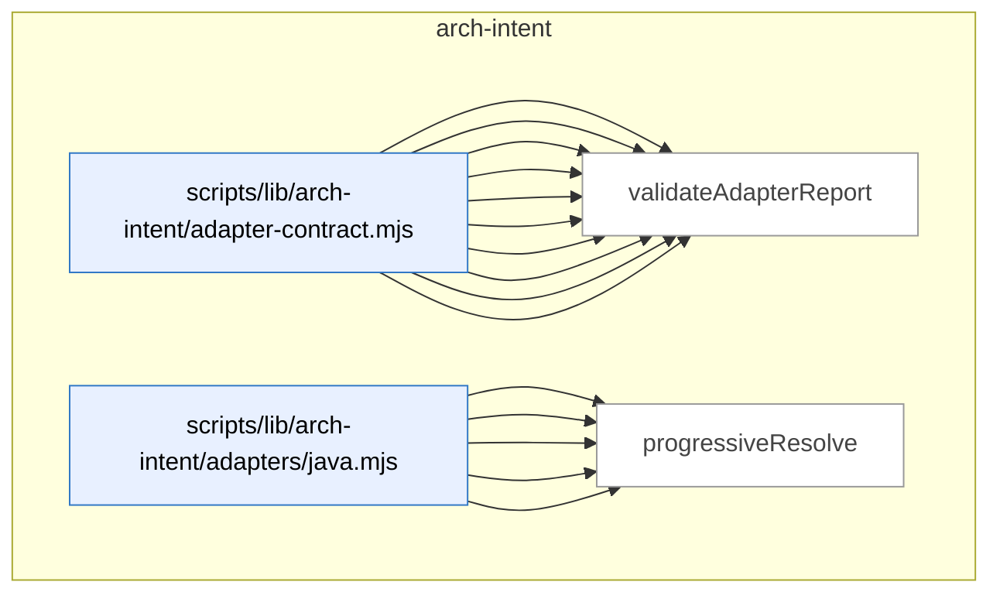

_Domain has 53 symbols (>50). Diagram shows top-15 by file order; see flat table below for the full list._

### Symbols in this domain

| Symbol | Kind | Path | Lines | Purpose | File imported by |
|---|---|---|---|---|---|
| [`computeDeadIntent`](../scripts/lib/arch-intent/adapter-contract.mjs#L191) | function | `scripts/lib/arch-intent/adapter-contract.mjs` | 191-199 | Finds declared domains that have no files mapped to them. | `scripts/arch-intent-bootstrap.mjs`, `scripts/lib/audit/legacy-production-audit.mjs`, `scripts/openai-audit.mjs`, +2 more |
| [`deriveArchState`](../scripts/lib/arch-intent/adapter-contract.mjs#L363) | function | `scripts/lib/arch-intent/adapter-contract.mjs` | 363-374 | Maps per-stack status counts to an overall state label. | `scripts/arch-intent-bootstrap.mjs`, `scripts/lib/audit/legacy-production-audit.mjs`, `scripts/openai-audit.mjs`, +2 more |
| [`fsWalkFallback`](../scripts/lib/arch-intent/adapter-contract.mjs#L68) | function | `scripts/lib/arch-intent/adapter-contract.mjs` | 68-88 | Recursively walks the directory tree to list all files when git is unavailable. | `scripts/arch-intent-bootstrap.mjs`, `scripts/lib/audit/legacy-production-audit.mjs`, `scripts/openai-audit.mjs`, +2 more |
| [`inventoryAllPaths`](../scripts/lib/arch-intent/adapter-contract.mjs#L169) | function | `scripts/lib/arch-intent/adapter-contract.mjs` | 169-176 | Maps every repository path to its assigned domain. | `scripts/arch-intent-bootstrap.mjs`, `scripts/lib/audit/legacy-production-audit.mjs`, `scripts/openai-audit.mjs`, +2 more |
| [`inventoryFiles`](../scripts/lib/arch-intent/adapter-contract.mjs#L133) | function | `scripts/lib/arch-intent/adapter-contract.mjs` | 133-151 | Scans source files and assigns each to a domain based on architectural rules. | `scripts/arch-intent-bootstrap.mjs`, `scripts/lib/audit/legacy-production-audit.mjs`, `scripts/openai-audit.mjs`, +2 more |
| [`isArchIntentReportClean`](../scripts/lib/arch-intent/adapter-contract.mjs#L349) | function | `scripts/lib/arch-intent/adapter-contract.mjs` | 349-354 | Checks whether an architectural report is clean with no violations or errors. | `scripts/arch-intent-bootstrap.mjs`, `scripts/lib/audit/legacy-production-audit.mjs`, `scripts/openai-audit.mjs`, +2 more |
| [`listRepoPaths`](../scripts/lib/arch-intent/adapter-contract.mjs#L103) | function | `scripts/lib/arch-intent/adapter-contract.mjs` | 103-118 | Returns all git-tracked and untracked (but not ignored) file paths in the repository. | `scripts/arch-intent-bootstrap.mjs`, `scripts/lib/audit/legacy-production-audit.mjs`, `scripts/openai-audit.mjs`, +2 more |
| [`loadAdapter`](../scripts/lib/arch-intent/adapter-contract.mjs#L214) | function | `scripts/lib/arch-intent/adapter-contract.mjs` | 214-232 | Dynamically loads an adapter module for a given stack kind. | `scripts/arch-intent-bootstrap.mjs`, `scripts/lib/audit/legacy-production-audit.mjs`, `scripts/openai-audit.mjs`, +2 more |
| [`runArchIntentAnalysis`](../scripts/lib/arch-intent/adapter-contract.mjs#L263) | function | `scripts/lib/arch-intent/adapter-contract.mjs` | 263-331 | Orchestrates multi-stack architectural analysis by running each adapter and merging results. | `scripts/arch-intent-bootstrap.mjs`, `scripts/lib/audit/legacy-production-audit.mjs`, `scripts/openai-audit.mjs`, +2 more |
| [`validateAdapterReport`](../scripts/lib/arch-intent/adapter-contract.mjs#L241) | function | `scripts/lib/arch-intent/adapter-contract.mjs` | 241-252 | Validates an adapter's report output against the schema. | `scripts/arch-intent-bootstrap.mjs`, `scripts/lib/audit/legacy-production-audit.mjs`, `scripts/openai-audit.mjs`, +2 more |
| [`analyseImports`](../scripts/lib/arch-intent/adapters/java.mjs#L325) | function | `scripts/lib/arch-intent/adapters/java.mjs` | 325-444 | Analyzes Java imports across all files and detects cross-domain violations. | `tests/arch-intent-adapter-java.test.mjs` |
| [`buildJavaResolutionIndex`](../scripts/lib/arch-intent/adapters/java.mjs#L176) | function | `scripts/lib/arch-intent/adapters/java.mjs` | 176-233 | Builds lookup tables for resolving Java class names to their files. | `tests/arch-intent-adapter-java.test.mjs` |
| [`extractImports`](../scripts/lib/arch-intent/adapters/java.mjs#L132) | function | `scripts/lib/arch-intent/adapters/java.mjs` | 132-164 | Parses all import statements from Java source, extracting FQN and modifiers. | `tests/arch-intent-adapter-java.test.mjs` |
| [`extractPackage`](../scripts/lib/arch-intent/adapters/java.mjs#L115) | function | `scripts/lib/arch-intent/adapters/java.mjs` | 115-118 | Extracts the package declaration from Java source code. | `tests/arch-intent-adapter-java.test.mjs` |
| [`progressiveResolve`](../scripts/lib/arch-intent/adapters/java.mjs#L246) | function | `scripts/lib/arch-intent/adapters/java.mjs` | 246-265 | Resolves a Java fully-qualified name by progressively removing rightmost segments. | `tests/arch-intent-adapter-java.test.mjs` |
| [`resolveJavaImport`](../scripts/lib/arch-intent/adapters/java.mjs#L275) | function | `scripts/lib/arch-intent/adapters/java.mjs` | 275-314 | Resolves a Java import statement to the target files it refers to. | `tests/arch-intent-adapter-java.test.mjs` |
| [`stripJavaCommentsAndLiterals`](../scripts/lib/arch-intent/adapters/java.mjs#L44) | function | `scripts/lib/arch-intent/adapters/java.mjs` | 44-106 | Removes Java comments and string literals while preserving line positions. | `tests/arch-intent-adapter-java.test.mjs` |
| [`analyseImports`](../scripts/lib/arch-intent/adapters/js-ts.mjs#L74) | function | `scripts/lib/arch-intent/adapters/js-ts.mjs` | 74-214 | Analyzes JavaScript/TypeScript imports and detects cross-domain violations. | _(internal)_ |
| [`classifyEdge`](../scripts/lib/arch-intent/adapters/js-ts.mjs#L33) | function | `scripts/lib/arch-intent/adapters/js-ts.mjs` | 33-49 | Classifies a module dependency as local-file, vendor, type-only, or unresolved. | _(internal)_ |
| [`normalisePath`](../scripts/lib/arch-intent/adapters/js-ts.mjs#L58) | function | `scripts/lib/arch-intent/adapters/js-ts.mjs` | 58-63 | Normalizes a file path to repo-relative with forward slashes. | _(internal)_ |
| [`analyseImports`](../scripts/lib/arch-intent/adapters/postgres.mjs#L605) | function | `scripts/lib/arch-intent/adapters/postgres.mjs` | 605-698 | Analyzes SQL files for object definitions and cross-references, building an edge graph and flagging violations. | `tests/arch-intent-adapter-postgres.test.mjs` |
| [`buildSqlCatalog`](../scripts/lib/arch-intent/adapters/postgres.mjs#L499) | function | `scripts/lib/arch-intent/adapters/postgres.mjs` | 499-560 | Builds an indexed catalog of SQL objects (relations, functions, types) keyed by kind, tracking redefinitions and epochs. | `tests/arch-intent-adapter-postgres.test.mjs` |
| [`classifyStatement`](../scripts/lib/arch-intent/adapters/postgres.mjs#L295) | function | `scripts/lib/arch-intent/adapters/postgres.mjs` | 295-427 | Parses a SQL statement to extract object definitions and cross-schema references. | `tests/arch-intent-adapter-postgres.test.mjs` |
| [`displayName`](../scripts/lib/arch-intent/adapters/postgres.mjs#L234) | function | `scripts/lib/arch-intent/adapters/postgres.mjs` | 234-236 | Reverses SQL identifier normalization for display. | `tests/arch-intent-adapter-postgres.test.mjs` |
| [`extractCallRefs`](../scripts/lib/arch-intent/adapters/postgres.mjs#L460) | function | `scripts/lib/arch-intent/adapters/postgres.mjs` | 460-471 | Extracts function call references from SQL code via regex, deduplicating by name. | `tests/arch-intent-adapter-postgres.test.mjs` |
| [`extractPolicyTableRefs`](../scripts/lib/arch-intent/adapters/postgres.mjs#L474) | function | `scripts/lib/arch-intent/adapters/postgres.mjs` | 474-483 | Extracts table/relation references from SQL expressions using FROM/JOIN clauses and qualified names. | `tests/arch-intent-adapter-postgres.test.mjs` |
| [`extractSelectRefs`](../scripts/lib/arch-intent/adapters/postgres.mjs#L440) | function | `scripts/lib/arch-intent/adapters/postgres.mjs` | 440-457 | Extracts table and view references from a SQL SELECT statement. | `tests/arch-intent-adapter-postgres.test.mjs` |
| [`naturalCompare`](../scripts/lib/arch-intent/adapters/postgres.mjs#L488) | function | `scripts/lib/arch-intent/adapters/postgres.mjs` | 488-490 | Performs locale-aware string comparison with numeric sort order. | `tests/arch-intent-adapter-postgres.test.mjs` |
| [`normName`](../scripts/lib/arch-intent/adapters/postgres.mjs#L197) | function | `scripts/lib/arch-intent/adapters/postgres.mjs` | 197-228 | Normalizes a SQL identifier (lowercasing, handling quoted names, dots). | `tests/arch-intent-adapter-postgres.test.mjs` |
| [`parseFile`](../scripts/lib/arch-intent/adapters/postgres.mjs#L262) | function | `scripts/lib/arch-intent/adapters/postgres.mjs` | 262-293 | Splits a SQL file into statements and classifies each one. | `tests/arch-intent-adapter-postgres.test.mjs` |
| [`recoverFunctionBody`](../scripts/lib/arch-intent/adapters/postgres.mjs#L430) | function | `scripts/lib/arch-intent/adapters/postgres.mjs` | 430-437 | Extracts the function body text from a SQL CREATE FUNCTION statement. | `tests/arch-intent-adapter-postgres.test.mjs` |
| [`resolveSqlRef`](../scripts/lib/arch-intent/adapters/postgres.mjs#L571) | function | `scripts/lib/arch-intent/adapters/postgres.mjs` | 571-594 | Resolves a SQL reference against a catalog to determine if it's local, built-in, or unresolved. | `tests/arch-intent-adapter-postgres.test.mjs` |
| [`splitTopLevel`](../scripts/lib/arch-intent/adapters/postgres.mjs#L239) | function | `scripts/lib/arch-intent/adapters/postgres.mjs` | 239-250 | Splits a string by a separator at parenthesis depth zero. | `tests/arch-intent-adapter-postgres.test.mjs` |
| [`stripSqlCommentsAndStrings`](../scripts/lib/arch-intent/adapters/postgres.mjs#L102) | function | `scripts/lib/arch-intent/adapters/postgres.mjs` | 102-187 | Removes SQL comments and string literals while preserving line structure. | `tests/arch-intent-adapter-postgres.test.mjs` |
| [`analyseImports`](../scripts/lib/arch-intent/adapters/python.mjs#L507) | function | `scripts/lib/arch-intent/adapters/python.mjs` | 507-586 | Analyzes Python imports across a codebase, classifying each as local, vendor, or unresolved. | `tests/arch-intent-adapter-python.test.mjs` |
| [`buildPythonModuleIndex`](../scripts/lib/arch-intent/adapters/python.mjs#L383) | function | `scripts/lib/arch-intent/adapters/python.mjs` | 383-426 | Maps Python dotted module names to source files by resolving file paths against discovered package roots. | `tests/arch-intent-adapter-python.test.mjs` |
| [`countUnbalanced`](../scripts/lib/arch-intent/adapters/python.mjs#L254) | function | `scripts/lib/arch-intent/adapters/python.mjs` | 254-261 | Counts net unclosed parentheses in text (positive = more opens; negative = more closes). | `tests/arch-intent-adapter-python.test.mjs` |
| [`discoverPythonRoots`](../scripts/lib/arch-intent/adapters/python.mjs#L287) | function | `scripts/lib/arch-intent/adapters/python.mjs` | 287-350 | Discovers Python package root directories via packaging metadata, src/ layout, and __init__.py walk. | `tests/arch-intent-adapter-python.test.mjs` |
| [`extractImports`](../scripts/lib/arch-intent/adapters/python.mjs#L196) | function | `scripts/lib/arch-intent/adapters/python.mjs` | 196-251 | Parses Python import and from-import statements, handling line continuations and parenthesized groups. | `tests/arch-intent-adapter-python.test.mjs` |
| [`extractPackageDirs`](../scripts/lib/arch-intent/adapters/python.mjs#L353) | function | `scripts/lib/arch-intent/adapters/python.mjs` | 353-364 | Extracts package-dir declarations from setup.cfg and pyproject.toml files. | `tests/arch-intent-adapter-python.test.mjs` |
| [`isPySource`](../scripts/lib/arch-intent/adapters/python.mjs#L366) | function | `scripts/lib/arch-intent/adapters/python.mjs` | 366-369 | Tests whether a file has a Python source extension (.py or .pyi). | `tests/arch-intent-adapter-python.test.mjs` |
| [`parseImportedNames`](../scripts/lib/arch-intent/adapters/python.mjs#L264) | function | `scripts/lib/arch-intent/adapters/python.mjs` | 264-271 | Parses comma-separated imported names from a Python clause, stripping aliases and filtering invalid identifiers. | `tests/arch-intent-adapter-python.test.mjs` |
| [`resolvePythonImport`](../scripts/lib/arch-intent/adapters/python.mjs#L439) | function | `scripts/lib/arch-intent/adapters/python.mjs` | 439-496 | Resolves a Python import (relative or absolute) to its target file via module-index lookup and submodule matching. | `tests/arch-intent-adapter-python.test.mjs` |
| [`stripPythonCommentsAndStrings`](../scripts/lib/arch-intent/adapters/python.mjs#L72) | function | `scripts/lib/arch-intent/adapters/python.mjs` | 72-178 | Removes Python comments and string literals (including f-strings and triple-quoted blocks) while preserving line structure. | `tests/arch-intent-adapter-python.test.mjs` |
| [`checkDepAllowed`](../scripts/lib/arch-intent/domain-resolver.mjs#L53) | function | `scripts/lib/arch-intent/domain-resolver.mjs` | 53-60 | Checks whether a dependency between two domains is permitted by the allowedDeps policy. | `scripts/arch-intent-bootstrap.mjs`, `scripts/lib/arch-intent/adapter-contract.mjs`, `scripts/lib/arch-intent/adapters/java.mjs`, +5 more |
| [`computeDeclaredDomains`](../scripts/lib/arch-intent/domain-resolver.mjs#L76) | function | `scripts/lib/arch-intent/domain-resolver.mjs` | 76-86 | Collects all domains mentioned in rules, allowedDeps, and descriptions. | `scripts/arch-intent-bootstrap.mjs`, `scripts/lib/arch-intent/adapter-contract.mjs`, `scripts/lib/arch-intent/adapters/java.mjs`, +5 more |
| [`resolveFileToDomain`](../scripts/lib/arch-intent/domain-resolver.mjs#L29) | function | `scripts/lib/arch-intent/domain-resolver.mjs` | 29-38 | Matches a file path against glob patterns to determine its assigned architectural domain. | `scripts/arch-intent-bootstrap.mjs`, `scripts/lib/arch-intent/adapter-contract.mjs`, `scripts/lib/arch-intent/adapters/java.mjs`, +5 more |
| [`ArchIntentAnalyzerError`](../scripts/lib/arch-intent/errors.mjs#L18) | class | `scripts/lib/arch-intent/errors.mjs` | 18-25 | Exception for analyzer failures, tracking error kind and causal chain. | `scripts/lib/arch-intent/adapter-contract.mjs`, `scripts/lib/arch-intent/load-config.mjs`, `scripts/lib/arch-intent/semantic-validator.mjs`, +3 more |
| [`ArchIntentConfigError`](../scripts/lib/arch-intent/errors.mjs#L9) | class | `scripts/lib/arch-intent/errors.mjs` | 9-16 | Exception for domain-map configuration errors, tracking file location and semantic-validation state. | `scripts/lib/arch-intent/adapter-contract.mjs`, `scripts/lib/arch-intent/load-config.mjs`, `scripts/lib/arch-intent/semantic-validator.mjs`, +3 more |
| [`parseIntentDoc`](../scripts/lib/arch-intent/intent-doc-parser.mjs#L27) | function | `scripts/lib/arch-intent/intent-doc-parser.mjs` | 27-78 | Extracts mermaid diagrams, version metadata, and section narratives from plan intent markdown. | `scripts/lib/audit/legacy-production-audit.mjs`, `scripts/openai-audit.mjs`, `tests/arch-intent-doc-parser.test.mjs` |
| [`loadArchIntentConfig`](../scripts/lib/arch-intent/load-config.mjs#L35) | function | `scripts/lib/arch-intent/load-config.mjs` | 35-69 | Loads and validates domain-map.json, enforcing schema and semantic rules. | `scripts/arch-intent-bootstrap.mjs`, `scripts/lib/audit/legacy-production-audit.mjs`, `scripts/openai-audit.mjs`, +1 more |
| [`rulesDeclaredDomains`](../scripts/lib/arch-intent/semantic-validator.mjs#L30) | function | `scripts/lib/arch-intent/semantic-validator.mjs` | 30-34 | Extracts domain names from parsed domain-map rules. | `scripts/lib/arch-intent/load-config.mjs` |
| [`validateDomainMapSemantics`](../scripts/lib/arch-intent/semantic-validator.mjs#L42) | function | `scripts/lib/arch-intent/semantic-validator.mjs` | 42-97 | Validates that domain-map allowedDeps and descriptions reference only declared domains, warning on shadowing. | `scripts/lib/arch-intent/load-config.mjs` |

---

## arch-memory

> Semantic-search index for finding similar code symbols via cached embeddings before writing new code; also enables incident-lookup by intent and target paths.

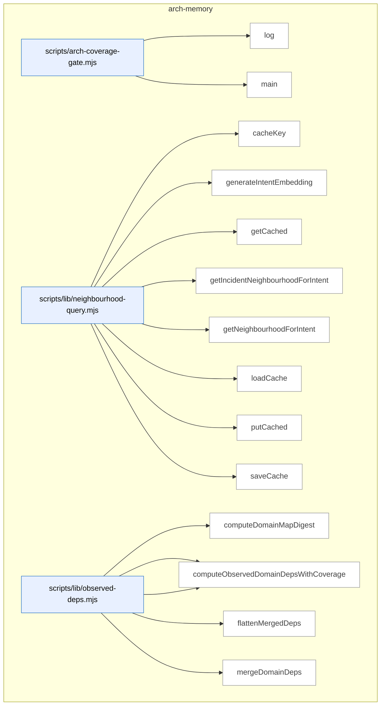

_Domain has 90 symbols (>50). Diagram shows top-15 by file order; see flat table below for the full list._

### Symbols in this domain

| Symbol | Kind | Path | Lines | Purpose | File imported by |
|---|---|---|---|---|---|
| [`log`](../scripts/arch-coverage-gate.mjs#L33) | function | `scripts/arch-coverage-gate.mjs` | 33-33 | Writes a message to stderr. | _(internal)_ |
| [`main`](../scripts/arch-coverage-gate.mjs#L35) | function | `scripts/arch-coverage-gate.mjs` | 35-119 | Validates architectural coverage configuration and enforces forward-compatibility gates. | _(internal)_ |
| [`cacheKey`](../scripts/lib/neighbourhood-query.mjs#L31) | function | `scripts/lib/neighbourhood-query.mjs` | 31-37 | Generates SHA256-derived cache key for (intent, embedding-model, dimension). | `scripts/cross-skill.mjs`, `scripts/lib/audit/duplication-detector.mjs`, `tests/incident-neighbourhood.test.mjs`, +1 more |
| [`generateIntentEmbedding`](../scripts/lib/neighbourhood-query.mjs#L83) | function | `scripts/lib/neighbourhood-query.mjs` | 83-132 | Embeds intent description in active vector space (Gemini or Azure) with consistency guards. | `scripts/cross-skill.mjs`, `scripts/lib/audit/duplication-detector.mjs`, `tests/incident-neighbourhood.test.mjs`, +1 more |
| [`getCached`](../scripts/lib/neighbourhood-query.mjs#L56) | function | `scripts/lib/neighbourhood-query.mjs` | 56-62 | Retrieves cached embedding if within TTL. | `scripts/cross-skill.mjs`, `scripts/lib/audit/duplication-detector.mjs`, `tests/incident-neighbourhood.test.mjs`, +1 more |
| [`getIncidentNeighbourhoodForIntent`](../scripts/lib/neighbourhood-query.mjs#L331) | function | `scripts/lib/neighbourhood-query.mjs` | 331-481 | Queries security-strategy incidents for K-nearest matches to target paths + intent. | `scripts/cross-skill.mjs`, `scripts/lib/audit/duplication-detector.mjs`, `tests/incident-neighbourhood.test.mjs`, +1 more |
| [`getNeighbourhoodForIntent`](../scripts/lib/neighbourhood-query.mjs#L145) | function | `scripts/lib/neighbourhood-query.mjs` | 145-303 | Queries architectural-memory index for K-nearest symbols matching an intent. | `scripts/cross-skill.mjs`, `scripts/lib/audit/duplication-detector.mjs`, `tests/incident-neighbourhood.test.mjs`, +1 more |
| [`loadCache`](../scripts/lib/neighbourhood-query.mjs#L39) | function | `scripts/lib/neighbourhood-query.mjs` | 39-47 | Loads architectural-memory embedding cache from disk (JSON). | `scripts/cross-skill.mjs`, `scripts/lib/audit/duplication-detector.mjs`, `tests/incident-neighbourhood.test.mjs`, +1 more |
| [`putCached`](../scripts/lib/neighbourhood-query.mjs#L64) | function | `scripts/lib/neighbourhood-query.mjs` | 64-68 | Stores embedding in cache with current timestamp. | `scripts/cross-skill.mjs`, `scripts/lib/audit/duplication-detector.mjs`, `tests/incident-neighbourhood.test.mjs`, +1 more |
| [`saveCache`](../scripts/lib/neighbourhood-query.mjs#L49) | function | `scripts/lib/neighbourhood-query.mjs` | 49-54 | Atomically writes embedding cache to disk with updated entries. | `scripts/cross-skill.mjs`, `scripts/lib/audit/duplication-detector.mjs`, `tests/incident-neighbourhood.test.mjs`, +1 more |
| [`computeDomainMapDigest`](../scripts/lib/observed-deps.mjs#L97) | function | `scripts/lib/observed-deps.mjs` | 97-104 | Hashes domain mapping rules for consistency verification | `scripts/arch-coverage-gate.mjs`, `scripts/lib/dashboard/collect-reference.mjs`, `scripts/symbol-index/render-mermaid.mjs`, +3 more |
| [`computeObservedDomainDeps`](../scripts/lib/observed-deps.mjs#L118) | function | `scripts/lib/observed-deps.mjs` | 118-120 | Extracts domain-to-domain dependencies from import edges | `scripts/arch-coverage-gate.mjs`, `scripts/lib/dashboard/collect-reference.mjs`, `scripts/symbol-index/render-mermaid.mjs`, +3 more |
| [`computeObservedDomainDepsWithCoverage`](../scripts/lib/observed-deps.mjs#L140) | function | `scripts/lib/observed-deps.mjs` | 140-187 | Computes domain dependencies with classification buckets (malformed, untagged, sameDomain, attributed) | `scripts/arch-coverage-gate.mjs`, `scripts/lib/dashboard/collect-reference.mjs`, `scripts/symbol-index/render-mermaid.mjs`, +3 more |
| [`flattenMergedDeps`](../scripts/lib/observed-deps.mjs#L250) | function | `scripts/lib/observed-deps.mjs` | 250-259 | Converts merged dependency structure to simple domain→[domain] map | `scripts/arch-coverage-gate.mjs`, `scripts/lib/dashboard/collect-reference.mjs`, `scripts/symbol-index/render-mermaid.mjs`, +3 more |
| [`mergeDomainDeps`](../scripts/lib/observed-deps.mjs#L207) | function | `scripts/lib/observed-deps.mjs` | 207-241 | Merges observed and manually-declared domain dependencies, tracking source of each edge | `scripts/arch-coverage-gate.mjs`, `scripts/lib/dashboard/collect-reference.mjs`, `scripts/symbol-index/render-mermaid.mjs`, +3 more |
| [`computeTargetDomains`](../scripts/lib/symbol-index/domain-tagger.mjs#L166) | function | `scripts/lib/symbol-index/domain-tagger.mjs` | 166-181 | Identifies which domains are affected by a set of target file paths. | `scripts/arch-coverage-gate.mjs`, `scripts/cross-skill.mjs`, `scripts/lib/audit/legacy-production-audit.mjs`, +8 more |
| [`globToRegexBody`](../scripts/lib/symbol-index/domain-tagger.mjs#L52) | function | `scripts/lib/symbol-index/domain-tagger.mjs` | 52-96 | Converts a glob pattern to a regex body string for efficient matching. | `scripts/arch-coverage-gate.mjs`, `scripts/cross-skill.mjs`, `scripts/lib/audit/legacy-production-audit.mjs`, +8 more |
| [`loadCoverageConfig`](../scripts/lib/symbol-index/domain-tagger.mjs#L216) | function | `scripts/lib/symbol-index/domain-tagger.mjs` | 216-227 | Reads coverage thresholds from domain-map.json with JSON validation. | `scripts/arch-coverage-gate.mjs`, `scripts/cross-skill.mjs`, `scripts/lib/audit/legacy-production-audit.mjs`, +8 more |
| [`loadDomainRules`](../scripts/lib/symbol-index/domain-tagger.mjs#L229) | function | `scripts/lib/symbol-index/domain-tagger.mjs` | 229-256 | Reads and validates domain tagging rules from domain-map.json. | `scripts/arch-coverage-gate.mjs`, `scripts/cross-skill.mjs`, `scripts/lib/audit/legacy-production-audit.mjs`, +8 more |
| [`makeFastTagger`](../scripts/lib/symbol-index/domain-tagger.mjs#L127) | function | `scripts/lib/symbol-index/domain-tagger.mjs` | 127-148 | Pre-compiles domain rules into regex matchers for efficient per-file tagging. | `scripts/arch-coverage-gate.mjs`, `scripts/cross-skill.mjs`, `scripts/lib/audit/legacy-production-audit.mjs`, +8 more |
| [`matchGlob`](../scripts/lib/symbol-index/domain-tagger.mjs#L39) | function | `scripts/lib/symbol-index/domain-tagger.mjs` | 39-50 | Tests if a file path matches a glob pattern using compiled regex. | `scripts/arch-coverage-gate.mjs`, `scripts/cross-skill.mjs`, `scripts/lib/audit/legacy-production-audit.mjs`, +8 more |
| [`tagDomain`](../scripts/lib/symbol-index/domain-tagger.mjs#L105) | function | `scripts/lib/symbol-index/domain-tagger.mjs` | 105-112 | Maps a file path to a domain name using configured tagging rules. | `scripts/arch-coverage-gate.mjs`, `scripts/cross-skill.mjs`, `scripts/lib/audit/legacy-production-audit.mjs`, +8 more |
| [`assertAttributionExhaustive`](../scripts/lib/symbol-index/graph-coverage.mjs#L247) | function | `scripts/lib/symbol-index/graph-coverage.mjs` | 247-251 | Verifies that attribution buckets account for all persisted edges. | `scripts/symbol-index/extract.mjs`, `scripts/symbol-index/refresh.mjs`, `scripts/symbol-index/render-mermaid.mjs`, +2 more |
| [`assertExtractionExhaustive`](../scripts/lib/symbol-index/graph-coverage.mjs#L230) | function | `scripts/lib/symbol-index/graph-coverage.mjs` | 230-238 | Verifies that extracted edge counts match the expected total from dep-cruiser. | `scripts/symbol-index/extract.mjs`, `scripts/symbol-index/refresh.mjs`, `scripts/symbol-index/render-mermaid.mjs`, +2 more |
| [`assessAttributionCoverage`](../scripts/lib/symbol-index/graph-coverage.mjs#L186) | function | `scripts/lib/symbol-index/graph-coverage.mjs` | 186-214 | Measures how many inter-domain edges were successfully attributed to domains. | `scripts/symbol-index/extract.mjs`, `scripts/symbol-index/refresh.mjs`, `scripts/symbol-index/render-mermaid.mjs`, +2 more |
| [`assessExtractionCoverage`](../scripts/lib/symbol-index/graph-coverage.mjs#L123) | function | `scripts/lib/symbol-index/graph-coverage.mjs` | 123-154 | Measures what fraction of eligible files were analyzed by dep-cruiser. | `scripts/symbol-index/extract.mjs`, `scripts/symbol-index/refresh.mjs`, `scripts/symbol-index/render-mermaid.mjs`, +2 more |
| [`clampCap`](../scripts/lib/symbol-index/graph-coverage.mjs#L168) | function | `scripts/lib/symbol-index/graph-coverage.mjs` | 168-171 | Constrains a sample cap to the range [0, 100]. | `scripts/symbol-index/extract.mjs`, `scripts/symbol-index/refresh.mjs`, `scripts/symbol-index/render-mermaid.mjs`, +2 more |
| [`eligibleFiles`](../scripts/lib/symbol-index/graph-coverage.mjs#L91) | function | `scripts/lib/symbol-index/graph-coverage.mjs` | 91-104 | Filters a file list to those inside the repo, cruisable, and not oversized. | `scripts/symbol-index/extract.mjs`, `scripts/symbol-index/refresh.mjs`, `scripts/symbol-index/render-mermaid.mjs`, +2 more |
| [`normalizeEdgeBuckets`](../scripts/lib/symbol-index/graph-coverage.mjs#L157) | function | `scripts/lib/symbol-index/graph-coverage.mjs` | 157-166 | Ensures edge count buckets are non-negative integers. | `scripts/symbol-index/extract.mjs`, `scripts/symbol-index/refresh.mjs`, `scripts/symbol-index/render-mermaid.mjs`, +2 more |
| [`normalizeRepoPath`](../scripts/lib/symbol-index/graph-coverage.mjs#L60) | function | `scripts/lib/symbol-index/graph-coverage.mjs` | 60-68 | Converts a path to normalized form relative to repo root, handling platform differences. | `scripts/symbol-index/extract.mjs`, `scripts/symbol-index/refresh.mjs`, `scripts/symbol-index/render-mermaid.mjs`, +2 more |
| [`coverageGateExitCode`](../scripts/lib/symbol-index/graph-verdict.mjs#L199) | function | `scripts/lib/symbol-index/graph-verdict.mjs` | 199-204 | Converts a coverage verdict to a process exit code for CI gates. | `scripts/arch-coverage-gate.mjs`, `scripts/lib/symbol-index/domain-tagger.mjs`, `scripts/symbol-index/extract.mjs`, +4 more |
| [`graphVerdict`](../scripts/lib/symbol-index/graph-verdict.mjs#L140) | function | `scripts/lib/symbol-index/graph-verdict.mjs` | 140-187 | Renders a coverage/extraction verdict (PASS, DEGRADED, UNKNOWN) based on measurements. | `scripts/arch-coverage-gate.mjs`, `scripts/lib/symbol-index/domain-tagger.mjs`, `scripts/symbol-index/extract.mjs`, +4 more |
| [`parseCoverageConfig`](../scripts/lib/symbol-index/graph-verdict.mjs#L69) | function | `scripts/lib/symbol-index/graph-verdict.mjs` | 69-124 | Parses and validates coverage configuration from domain-map.json with sane defaults. | `scripts/arch-coverage-gate.mjs`, `scripts/lib/symbol-index/domain-tagger.mjs`, `scripts/symbol-index/extract.mjs`, +4 more |
| [`findStalePragmas`](../scripts/lib/symbol-index/stale-pragma-sweep.mjs#L51) | function | `scripts/lib/symbol-index/stale-pragma-sweep.mjs` | 51-59 | Locates duplicate-justification pragmas that reference files no longer in the repo. | `scripts/symbol-index/drift.mjs`, `tests/drift-stale-pragma.test.mjs` |
| [`renderStalePragmaSection`](../scripts/lib/symbol-index/stale-pragma-sweep.mjs#L62) | function | `scripts/lib/symbol-index/stale-pragma-sweep.mjs` | 62-69 | Formats stale pragmas as a markdown table for audit reports. | `scripts/symbol-index/drift.mjs`, `tests/drift-stale-pragma.test.mjs` |
| [`isThinDelegate`](../scripts/lib/symbol-index/thin-delegate.mjs#L50) | function | `scripts/lib/symbol-index/thin-delegate.mjs` | 50-85 | Heuristically detects if a function body is a trivial delegation or passthrough. | `scripts/symbol-index/extract.mjs`, `tests/thin-delegate.test.mjs` |
| [`buildCruiseOpts`](../scripts/spikes/observed-graph-discovery-spike.mjs#L63) | function | `scripts/spikes/observed-graph-discovery-spike.mjs` | 63-70 | Constructs dependency-cruiser configuration with exclusion patterns and optional local rules file. | _(internal)_ |
| [`currentTargets`](../scripts/spikes/observed-graph-discovery-spike.mjs#L82) | function | `scripts/spikes/observed-graph-discovery-spike.mjs` | 82-87 | Returns source directories that exist in the repo, defaulting to repo root if none found. | _(internal)_ |
| [`edgeSet`](../scripts/spikes/observed-graph-discovery-spike.mjs#L90) | function | `scripts/spikes/observed-graph-discovery-spike.mjs` | 90-98 | Extracts all import edges from cruiser's module dependency results. | _(internal)_ |
| [`fmt`](../scripts/spikes/observed-graph-discovery-spike.mjs#L136) | function | `scripts/spikes/observed-graph-discovery-spike.mjs` | 136-138 | Formats a finite number to N decimal places, or returns 'n/a' for infinity/NaN. | _(internal)_ |
| [`main`](../scripts/spikes/observed-graph-discovery-spike.mjs#L140) | function | `scripts/spikes/observed-graph-discovery-spike.mjs` | 140-328 | Discovers the observed import graph via dependency-cruiser and compares it to symbol inventory. | _(internal)_ |
| [`timedCruise`](../scripts/spikes/observed-graph-discovery-spike.mjs#L100) | function | `scripts/spikes/observed-graph-discovery-spike.mjs` | 100-134 | Runs dependency-cruiser with elapsed-time and peak-memory sampling to assess overhead. | _(internal)_ |
| [`atomicWrite`](../scripts/symbol-index/drift.mjs#L44) | function | `scripts/symbol-index/drift.mjs` | 44-46 | Atomically writes file content using atomic-rename. | `tests/symbol-index-drift.test.mjs` |
| [`classify`](../scripts/symbol-index/drift.mjs#L48) | function | `scripts/symbol-index/drift.mjs` | 48-52 | Maps a drift score to a status label: GREEN (low), AMBER (medium), RED (high). | `tests/symbol-index-drift.test.mjs` |
| [`main`](../scripts/symbol-index/drift.mjs#L73) | function | `scripts/symbol-index/drift.mjs` | 73-184 | Computes and reports symbol architecture drift score from the snapshot store. | `tests/symbol-index-drift.test.mjs` |
| [`parseArgs`](../scripts/symbol-index/drift.mjs#L35) | function | `scripts/symbol-index/drift.mjs` | 35-42 | Parses command-line arguments for --out and --json flags. | `tests/symbol-index-drift.test.mjs` |
| [`renderMarkdownViaShared`](../scripts/symbol-index/drift.mjs#L58) | function | `scripts/symbol-index/drift.mjs` | 58-71 | Renders an architecture drift report as markdown for GitHub issues. | `tests/symbol-index-drift.test.mjs` |
| [`main`](../scripts/symbol-index/duplicates.mjs#L65) | function | `scripts/symbol-index/duplicates.mjs` | 65-101 | Fetches duplicate clusters from the store and displays or outputs as JSON. | _(internal)_ |
| [`parseArgs`](../scripts/symbol-index/duplicates.mjs#L31) | function | `scripts/symbol-index/duplicates.mjs` | 31-46 | Parses command-line arguments for --limit, --json, and --help flags. | _(internal)_ |
| [`renderText`](../scripts/symbol-index/duplicates.mjs#L48) | function | `scripts/symbol-index/duplicates.mjs` | 48-63 | Formats duplicate symbol clusters as human-readable text report. | _(internal)_ |
| [`embedBatch`](../scripts/symbol-index/embed.mjs#L26) | function | `scripts/symbol-index/embed.mjs` | 26-69 | Embeds a batch of text symbols using Azure or Gemini, with retry logic for rate limits. | _(internal)_ |
| [`logProgress`](../scripts/symbol-index/embed.mjs#L19) | function | `scripts/symbol-index/embed.mjs` | 19-19 | Writes a progress message to stderr with [embed] prefix. | _(internal)_ |
| [`main`](../scripts/symbol-index/embed.mjs#L71) | function | `scripts/symbol-index/embed.mjs` | 71-121 | Reads JSON-line symbol records from stdin, embeds non-redacted symbols, emits to stdout. | _(internal)_ |
| [`emitCoverage`](../scripts/symbol-index/extract.mjs#L454) | function | `scripts/symbol-index/extract.mjs` | 454-456 | Emits a coverage measurement record to output. | `scripts/spikes/observed-graph-discovery-spike.mjs`, `tests/import-edge-filter.test.mjs` |
| [`emitProgress`](../scripts/symbol-index/extract.mjs#L68) | function | `scripts/symbol-index/extract.mjs` | 68-70 | Writes a progress message to stderr with [extract] prefix. | `scripts/spikes/observed-graph-discovery-spike.mjs`, `tests/import-edge-filter.test.mjs` |
| [`enumerateFiles`](../scripts/symbol-index/extract.mjs#L523) | function | `scripts/symbol-index/extract.mjs` | 523-541 | Lists source files from a restricted set or by walking the repository tree. | `scripts/spikes/observed-graph-discovery-spike.mjs`, `tests/import-edge-filter.test.mjs` |
| [`extractGraphAndViolations`](../scripts/symbol-index/extract.mjs#L285) | function | `scripts/symbol-index/extract.mjs` | 285-442 | Runs dep-cruiser to analyze the module import graph and detect architectural violations. | `scripts/spikes/observed-graph-discovery-spike.mjs`, `tests/import-edge-filter.test.mjs` |
| [`extractSymbols`](../scripts/symbol-index/extract.mjs#L80) | function | `scripts/symbol-index/extract.mjs` | 80-263 | Extracts symbols from files while filtering sensitive paths and tracking extraction statistics. | `scripts/spikes/observed-graph-discovery-spike.mjs`, `tests/import-edge-filter.test.mjs` |
| [`isInternalEdge`](../scripts/symbol-index/extract.mjs#L470) | function | `scripts/symbol-index/extract.mjs` | 470-486 | Determines whether a dependency points to internal code rather than external packages. | `scripts/spikes/observed-graph-discovery-spike.mjs`, `tests/import-edge-filter.test.mjs` |
| [`main`](../scripts/symbol-index/extract.mjs#L543) | function | `scripts/symbol-index/extract.mjs` | 543-589 | Orchestrates symbol and dependency extraction, measures coverage, and outputs structured results. | `scripts/spikes/observed-graph-discovery-spike.mjs`, `tests/import-edge-filter.test.mjs` |
| [`parseArgs`](../scripts/symbol-index/extract.mjs#L46) | function | `scripts/symbol-index/extract.mjs` | 46-65 | Parses command-line arguments for root, files, mode, since-commit, and delegate-inclusion. | `scripts/spikes/observed-graph-discovery-spike.mjs`, `tests/import-edge-filter.test.mjs` |
| [`main`](../scripts/symbol-index/prune.mjs#L44) | function | `scripts/symbol-index/prune.mjs` | 44-94 | Prunes old refresh runs from cloud storage and demotes expired rollback records. | _(internal)_ |
| [`parseArgs`](../scripts/symbol-index/prune.mjs#L31) | function | `scripts/symbol-index/prune.mjs` | 31-37 | Parses command-line arguments for dry-run mode. | _(internal)_ |
| [`logErr`](../scripts/symbol-index/refresh.mjs#L107) | function | `scripts/symbol-index/refresh.mjs` | 107-107 | Writes error messages to stderr with a [refresh] prefix. | `tests/refresh-provenance-promotion.test.mjs` |
| [`logOk`](../scripts/symbol-index/refresh.mjs#L108) | function | `scripts/symbol-index/refresh.mjs` | 108-108 | Writes status messages to stderr with a [refresh] prefix. | `tests/refresh-provenance-promotion.test.mjs` |
| [`main`](../scripts/symbol-index/refresh.mjs#L145) | function | `scripts/symbol-index/refresh.mjs` | 145-644 | Orchestrates full symbol-index refresh including extraction, domain tagging, and cloud persistence. | `tests/refresh-provenance-promotion.test.mjs` |
| [`parseArgs`](../scripts/symbol-index/refresh.mjs#L95) | function | `scripts/symbol-index/refresh.mjs` | 95-105 | Parses command-line flags controlling refresh scope and behavior. | `tests/refresh-provenance-promotion.test.mjs` |
| [`provenanceRequiresFullReembed`](../scripts/symbol-index/refresh.mjs#L91) | function | `scripts/symbol-index/refresh.mjs` | 91-93 | Checks whether the embedding model changed since the prior refresh run. | `tests/refresh-provenance-promotion.test.mjs` |
| [`runWithHeartbeat`](../scripts/symbol-index/refresh.mjs#L136) | function | `scripts/symbol-index/refresh.mjs` | 136-143 | Executes an async function while periodically sending cloud heartbeats. | `tests/refresh-provenance-promotion.test.mjs` |
| [`sibling`](../scripts/symbol-index/refresh.mjs#L77) | function | `scripts/symbol-index/refresh.mjs` | 77-77 | Returns the filesystem path to a sibling file in the current module's directory. | `tests/refresh-provenance-promotion.test.mjs` |
| [`throwVcsError`](../scripts/symbol-index/refresh.mjs#L119) | function | `scripts/symbol-index/refresh.mjs` | 119-126 | Constructs and throws a structured VCS error with failure details. | `tests/refresh-provenance-promotion.test.mjs` |
| [`classify`](../scripts/symbol-index/render-mermaid.mjs#L63) | function | `scripts/symbol-index/render-mermaid.mjs` | 63-67 | Classifies a numeric score as GREEN, AMBER, or RED based on thresholds. | _(internal)_ |
| [`cleanupOrFail`](../scripts/symbol-index/render-mermaid.mjs#L128) | function | `scripts/symbol-index/render-mermaid.mjs` | 128-130 | Calls cleanup and exits with an error code if it fails. | _(internal)_ |
| [`cleanupStaleObservedDeps`](../scripts/symbol-index/render-mermaid.mjs#L75) | function | `scripts/symbol-index/render-mermaid.mjs` | 75-114 | Removes or neutralizes a stale observed-deps file to prevent false-positive verdicts. | _(internal)_ |
| [`commitSha`](../scripts/symbol-index/render-mermaid.mjs#L58) | function | `scripts/symbol-index/render-mermaid.mjs` | 58-61 | Retrieves the current git commit SHA truncated to 12 characters. | _(internal)_ |
| [`main`](../scripts/symbol-index/render-mermaid.mjs#L158) | function | `scripts/symbol-index/render-mermaid.mjs` | 158-394 | Generates the architecture map from a cloud snapshot or writes an explanatory abort stub. | _(internal)_ |
| [`parseArgs`](../scripts/symbol-index/render-mermaid.mjs#L50) | function | `scripts/symbol-index/render-mermaid.mjs` | 50-56 | Parses the output file path argument from command line. | _(internal)_ |
| [`writeAbortStub`](../scripts/symbol-index/render-mermaid.mjs#L139) | function | `scripts/symbol-index/render-mermaid.mjs` | 139-156 | Writes a markdown stub to the architecture map explaining why generation aborted. | _(internal)_ |
| [`cacheHit`](../scripts/symbol-index/summarise-domains.mjs#L59) | function | `scripts/symbol-index/summarise-domains.mjs` | 59-66 | Checks whether a cached domain summary can be reused based on composition and model. | `scripts/symbol-index/render-mermaid.mjs`, `tests/domain-summaries.test.mjs`, `tests/symbol-index.test.mjs` |
| [`callHaiku`](../scripts/symbol-index/summarise-domains.mjs#L68) | function | `scripts/symbol-index/summarise-domains.mjs` | 68-99 | Calls Claude Haiku (or Azure Sonnet) to generate a domain summary. | `scripts/symbol-index/render-mermaid.mjs`, `tests/domain-summaries.test.mjs`, `tests/symbol-index.test.mjs` |
| [`computeCompositionHash`](../scripts/symbol-index/summarise-domains.mjs#L46) | function | `scripts/symbol-index/summarise-domains.mjs` | 46-51 | Computes a hash of ordered symbol signatures to detect composition changes. | `scripts/symbol-index/render-mermaid.mjs`, `tests/domain-summaries.test.mjs`, `tests/symbol-index.test.mjs` |
| [`main`](../scripts/symbol-index/summarise-domains.mjs#L232) | function | `scripts/symbol-index/summarise-domains.mjs` | 232-264 | Fetches the active snapshot and outputs domain summaries as JSON. | `scripts/symbol-index/render-mermaid.mjs`, `tests/domain-summaries.test.mjs`, `tests/symbol-index.test.mjs` |
| [`PROMPT_TEMPLATE`](../scripts/symbol-index/summarise-domains.mjs#L39) | function | `scripts/symbol-index/summarise-domains.mjs` | 39-43 | Prompt template that formats domain and sample symbols for LLM summarization. | `scripts/symbol-index/render-mermaid.mjs`, `tests/domain-summaries.test.mjs`, `tests/symbol-index.test.mjs` |
| [`runWithConcurrency`](../scripts/symbol-index/summarise-domains.mjs#L219) | function | `scripts/symbol-index/summarise-domains.mjs` | 219-229 | Executes async tasks with bounded parallelism. | `scripts/symbol-index/render-mermaid.mjs`, `tests/domain-summaries.test.mjs`, `tests/symbol-index.test.mjs` |
| [`summariseDomains`](../scripts/symbol-index/summarise-domains.mjs#L113) | function | `scripts/symbol-index/summarise-domains.mjs` | 113-207 | Generates or retrieves cached summaries for all domains in the snapshot. | `scripts/symbol-index/render-mermaid.mjs`, `tests/domain-summaries.test.mjs`, `tests/symbol-index.test.mjs` |
| [`symbolCountDeltaOk`](../scripts/symbol-index/summarise-domains.mjs#L53) | function | `scripts/symbol-index/summarise-domains.mjs` | 53-57 | Validates that symbol count hasn't changed more than 20% from the prior refresh. | `scripts/symbol-index/render-mermaid.mjs`, `tests/domain-summaries.test.mjs`, `tests/symbol-index.test.mjs` |
| [`validateSummary`](../scripts/symbol-index/summarise-domains.mjs#L101) | function | `scripts/symbol-index/summarise-domains.mjs` | 101-107 | Validates that a generated summary is 20–400 characters and well-formed. | `scripts/symbol-index/render-mermaid.mjs`, `tests/domain-summaries.test.mjs`, `tests/symbol-index.test.mjs` |
| [`logProgress`](../scripts/symbol-index/summarise.mjs#L29) | function | `scripts/symbol-index/summarise.mjs` | 29-29 | Writes progress messages to stderr with a [summarise] prefix. | _(internal)_ |
| [`main`](../scripts/symbol-index/summarise.mjs#L76) | function | `scripts/symbol-index/summarise.mjs` | 76-119 | Reads symbols from stdin, batches them, summarizes via LLM, and emits results. | _(internal)_ |
| [`summariseBatch`](../scripts/symbol-index/summarise.mjs#L35) | function | `scripts/symbol-index/summarise.mjs` | 35-74 | Sends a batch of symbols to Claude for one-line purpose summaries. | _(internal)_ |

---

## arm-eval

> Blinded multi-arm experimentation suite that captures arm-eval sessions, judges variants against rubric dimensions, computes statistical consensus (means, rank correlation, self-consistency), and produces keep/switch/inconclusive verdicts.

```mermaid
flowchart TB
subgraph dom_arm_eval ["arm-eval"]
  file_scripts_lib_arm_eval_capture_trigger_mjs["scripts/lib/arm-eval/capture-trigger.mjs"]:::component
  sym_scripts_lib_arm_eval_capture_trigger_mjs["maybeFireArmEvalCaptureDetached"]:::symbol
  file_scripts_lib_arm_eval_capture_trigger_mjs --> sym_scripts_lib_arm_eval_capture_trigger_mjs
  file_scripts_lib_arm_eval_cross_checks_mjs["scripts/lib/arm-eval/cross-checks.mjs"]:::component
  sym_scripts_lib_arm_eval_cross_checks_mjs_en["envelope"]:::symbol
  file_scripts_lib_arm_eval_cross_checks_mjs --> sym_scripts_lib_arm_eval_cross_checks_mjs_en
  sym_scripts_lib_arm_eval_cross_checks_mjs_ru["runCrossChecks"]:::symbol
  file_scripts_lib_arm_eval_cross_checks_mjs --> sym_scripts_lib_arm_eval_cross_checks_mjs_ru
  file_scripts_lib_arm_eval_decision_mjs["scripts/lib/arm-eval/decision.mjs"]:::component
  sym_scripts_lib_arm_eval_decision_mjs_evalua["evaluateArmEval"]:::symbol
  file_scripts_lib_arm_eval_decision_mjs --> sym_scripts_lib_arm_eval_decision_mjs_evalua
  sym_scripts_lib_arm_eval_decision_mjs_kendal["kendallTau"]:::symbol
  file_scripts_lib_arm_eval_decision_mjs --> sym_scripts_lib_arm_eval_decision_mjs_kendal
  sym_scripts_lib_arm_eval_decision_mjs_mean["mean"]:::symbol
  file_scripts_lib_arm_eval_decision_mjs --> sym_scripts_lib_arm_eval_decision_mjs_mean
  sym_scripts_lib_arm_eval_decision_mjs_round4["round4"]:::symbol
  file_scripts_lib_arm_eval_decision_mjs --> sym_scripts_lib_arm_eval_decision_mjs_round4
  sym_scripts_lib_arm_eval_decision_mjs_sessio["sessionArmMeans"]:::symbol
  file_scripts_lib_arm_eval_decision_mjs --> sym_scripts_lib_arm_eval_decision_mjs_sessio
  sym_scripts_lib_arm_eval_decision_mjs_sessio["sessionSelfConsistency"]:::symbol
  file_scripts_lib_arm_eval_decision_mjs --> sym_scripts_lib_arm_eval_decision_mjs_sessio
  file_scripts_lib_arm_eval_experiments_mjs["scripts/lib/arm-eval/experiments.mjs"]:::component
  sym_scripts_lib_arm_eval_experiments_mjs_get["getExperiment"]:::symbol
  file_scripts_lib_arm_eval_experiments_mjs --> sym_scripts_lib_arm_eval_experiments_mjs_get
  sym_scripts_lib_arm_eval_experiments_mjs_isC["isClaudeFamily"]:::symbol
  file_scripts_lib_arm_eval_experiments_mjs --> sym_scripts_lib_arm_eval_experiments_mjs_isC
  sym_scripts_lib_arm_eval_experiments_mjs_rub["rubricFor"]:::symbol
  file_scripts_lib_arm_eval_experiments_mjs --> sym_scripts_lib_arm_eval_experiments_mjs_rub
  sym_scripts_lib_arm_eval_experiments_mjs_val["validateArm"]:::symbol
  file_scripts_lib_arm_eval_experiments_mjs --> sym_scripts_lib_arm_eval_experiments_mjs_val
  sym_scripts_lib_arm_eval_experiments_mjs_val["validateExperiment"]:::symbol
  file_scripts_lib_arm_eval_experiments_mjs --> sym_scripts_lib_arm_eval_experiments_mjs_val
  file_scripts_lib_arm_eval_export_mjs["scripts/lib/arm-eval/export.mjs"]:::component
  sym_scripts_lib_arm_eval_export_mjs_buildSes["buildSessionMarkdown"]:::symbol
  file_scripts_lib_arm_eval_export_mjs --> sym_scripts_lib_arm_eval_export_mjs_buildSes
  sym_scripts_lib_arm_eval_export_mjs_exportSe["exportSession"]:::symbol
  file_scripts_lib_arm_eval_export_mjs --> sym_scripts_lib_arm_eval_export_mjs_exportSe
  sym_scripts_lib_arm_eval_export_mjs_filename["filenameFor"]:::symbol
  file_scripts_lib_arm_eval_export_mjs --> sym_scripts_lib_arm_eval_export_mjs_filename
  sym_scripts_lib_arm_eval_export_mjs_redact["redact"]:::symbol
  file_scripts_lib_arm_eval_export_mjs --> sym_scripts_lib_arm_eval_export_mjs_redact
  file_scripts_lib_arm_eval_intent_context_mjs["scripts/lib/arm-eval/intent-context.mjs"]:::component
  sym_scripts_lib_arm_eval_intent_context_mjs_["buildIntentContext"]:::symbol
  file_scripts_lib_arm_eval_intent_context_mjs --> sym_scripts_lib_arm_eval_intent_context_mjs_
  sym_scripts_lib_arm_eval_intent_context_mjs_["cap"]:::symbol
  file_scripts_lib_arm_eval_intent_context_mjs --> sym_scripts_lib_arm_eval_intent_context_mjs_
  sym_scripts_lib_arm_eval_intent_context_mjs_["defaultDeps"]:::symbol
  file_scripts_lib_arm_eval_intent_context_mjs --> sym_scripts_lib_arm_eval_intent_context_mjs_
  sym_scripts_lib_arm_eval_intent_context_mjs_["tryRead"]:::symbol
  file_scripts_lib_arm_eval_intent_context_mjs --> sym_scripts_lib_arm_eval_intent_context_mjs_
  file_scripts_lib_arm_eval_judge_mjs["scripts/lib/arm-eval/judge.mjs"]:::component
  sym_scripts_lib_arm_eval_judge_mjs_buildJudg["buildJudgePrompt"]:::symbol
  file_scripts_lib_arm_eval_judge_mjs --> sym_scripts_lib_arm_eval_judge_mjs_buildJudg
  sym_scripts_lib_arm_eval_judge_mjs_callJudge["callJudgeDefault"]:::symbol
  file_scripts_lib_arm_eval_judge_mjs --> sym_scripts_lib_arm_eval_judge_mjs_callJudge
  sym_scripts_lib_arm_eval_judge_mjs_extractJs["extractJsonObject"]:::symbol
  file_scripts_lib_arm_eval_judge_mjs --> sym_scripts_lib_arm_eval_judge_mjs_extractJs
  sym_scripts_lib_arm_eval_judge_mjs_getShapeR["getShapeRedactor"]:::symbol
  file_scripts_lib_arm_eval_judge_mjs --> sym_scripts_lib_arm_eval_judge_mjs_getShapeR
  sym_scripts_lib_arm_eval_judge_mjs_judgePass["judgePassSchema"]:::symbol
  file_scripts_lib_arm_eval_judge_mjs --> sym_scripts_lib_arm_eval_judge_mjs_judgePass
  sym_scripts_lib_arm_eval_judge_mjs_judgeSess["judgeSession"]:::symbol
  file_scripts_lib_arm_eval_judge_mjs --> sym_scripts_lib_arm_eval_judge_mjs_judgeSess
  sym_scripts_lib_arm_eval_judge_mjs_scorableD["scorableDimensions"]:::symbol
  file_scripts_lib_arm_eval_judge_mjs --> sym_scripts_lib_arm_eval_judge_mjs_scorableD
  sym_scripts_lib_arm_eval_judge_mjs_seededShu["seededShuffle"]:::symbol
  file_scripts_lib_arm_eval_judge_mjs --> sym_scripts_lib_arm_eval_judge_mjs_seededShu
  file_scripts_lib_arm_eval_plan_seed_mjs["scripts/lib/arm-eval/plan-seed.mjs"]:::component
  sym_scripts_lib_arm_eval_plan_seed_mjs_build["buildPlanGenPrompt"]:::symbol
  file_scripts_lib_arm_eval_plan_seed_mjs --> sym_scripts_lib_arm_eval_plan_seed_mjs_build
  sym_scripts_lib_arm_eval_plan_seed_mjs_parse["parsePlanIntent"]:::symbol
  file_scripts_lib_arm_eval_plan_seed_mjs --> sym_scripts_lib_arm_eval_plan_seed_mjs_parse
  file_scripts_lib_arm_eval_producers__shared_m["scripts/lib/arm-eval/producers/_shared.mjs"]:::component
  sym_scripts_lib_arm_eval_producers__shared_m["hashText"]:::symbol
  file_scripts_lib_arm_eval_producers__shared_m --> sym_scripts_lib_arm_eval_producers__shared_m
  file_scripts_lib_arm_eval_producers_brainstor["scripts/lib/arm-eval/producers/brainstorm.mjs"]:::component
  sym_scripts_lib_arm_eval_producers_brainstor["callModelDefault"]:::symbol
  file_scripts_lib_arm_eval_producers_brainstor --> sym_scripts_lib_arm_eval_producers_brainstor
  sym_scripts_lib_arm_eval_producers_brainstor["produceBrainstorm"]:::symbol
  file_scripts_lib_arm_eval_producers_brainstor --> sym_scripts_lib_arm_eval_producers_brainstor
  file_scripts_lib_arm_eval_producers_model_cal["scripts/lib/arm-eval/producers/model-call.mjs"]:::component
  sym_scripts_lib_arm_eval_producers_model_cal["callModelFreeText"]:::symbol
  file_scripts_lib_arm_eval_producers_model_cal --> sym_scripts_lib_arm_eval_producers_model_cal
  sym_scripts_lib_arm_eval_producers_model_cal["providerFor"]:::symbol
  file_scripts_lib_arm_eval_producers_model_cal --> sym_scripts_lib_arm_eval_producers_model_cal
  file_scripts_lib_arm_eval_producers_plan_mjs["scripts/lib/arm-eval/producers/plan.mjs"]:::component
  sym_scripts_lib_arm_eval_producers_plan_mjs_["callModelDefault"]:::symbol
  file_scripts_lib_arm_eval_producers_plan_mjs --> sym_scripts_lib_arm_eval_producers_plan_mjs_
  sym_scripts_lib_arm_eval_producers_plan_mjs_["producePlan"]:::symbol
  file_scripts_lib_arm_eval_producers_plan_mjs --> sym_scripts_lib_arm_eval_producers_plan_mjs_
  file_scripts_lib_arm_eval_run_mjs["scripts/lib/arm-eval/run.mjs"]:::component
  sym_scripts_lib_arm_eval_run_mjs_defaultDeps["defaultDeps"]:::symbol
  file_scripts_lib_arm_eval_run_mjs --> sym_scripts_lib_arm_eval_run_mjs_defaultDeps
  sym_scripts_lib_arm_eval_run_mjs_hashTask["hashTask"]:::symbol
  file_scripts_lib_arm_eval_run_mjs --> sym_scripts_lib_arm_eval_run_mjs_hashTask
  sym_scripts_lib_arm_eval_run_mjs_runArmEvalS["runArmEvalSession"]:::symbol
  file_scripts_lib_arm_eval_run_mjs --> sym_scripts_lib_arm_eval_run_mjs_runArmEvalS
  file_scripts_lib_arm_eval_toggle_mjs["scripts/lib/arm-eval/toggle.mjs"]:::component
  sym_scripts_lib_arm_eval_toggle_mjs_readTogg["readToggle"]:::symbol
  file_scripts_lib_arm_eval_toggle_mjs --> sym_scripts_lib_arm_eval_toggle_mjs_readTogg
  sym_scripts_lib_arm_eval_toggle_mjs_resolveS["resolveShadowArmsWithToggle"]:::symbol
  file_scripts_lib_arm_eval_toggle_mjs --> sym_scripts_lib_arm_eval_toggle_mjs_resolveS
  sym_scripts_lib_arm_eval_toggle_mjs_writeTog["writeToggle"]:::symbol
  file_scripts_lib_arm_eval_toggle_mjs --> sym_scripts_lib_arm_eval_toggle_mjs_writeTog
end
classDef container fill:#f5f5f5,stroke:#333,stroke-width:2px,color:#000
classDef component fill:#e8f0ff,stroke:#3178c6,color:#000
classDef symbol fill:#fff,stroke:#999,color:#444
classDef dup fill:#ffe8d8,stroke:#c0392b,stroke-width:2px,color:#000
classDef violation fill:#ffd6d6,stroke:#c0392b,stroke-width:2px,color:#000
```

### Symbols in this domain

| Symbol | Kind | Path | Lines | Purpose | File imported by |
|---|---|---|---|---|---|
| [`maybeFireArmEvalCaptureDetached`](../scripts/lib/arm-eval/capture-trigger.mjs#L52) | function | `scripts/lib/arm-eval/capture-trigger.mjs` | 52-83 | Spawns a detached subprocess to capture arm-eval evidence if the experiment is enabled and on round 0. | `scripts/brainstorm-round.mjs`, `scripts/cross-skill.mjs`, `tests/arm-eval-capture-trigger.test.mjs` |
| [`envelope`](../scripts/lib/arm-eval/cross-checks.mjs#L22) | function | `scripts/lib/arm-eval/cross-checks.mjs` | 22-32 | Wraps a partial cross-check result into a complete envelope with standard status, score, and evidence fields. | `scripts/lib/arm-eval/run.mjs`, `tests/arm-eval-producers.test.mjs` |
| [`runCrossChecks`](../scripts/lib/arm-eval/cross-checks.mjs#L80) | function | `scripts/lib/arm-eval/cross-checks.mjs` | 80-93 | Runs multiple named cross-checks against a plan context, collecting results and catching errors per check. | `scripts/lib/arm-eval/run.mjs`, `tests/arm-eval-producers.test.mjs` |
| [`evaluateArmEval`](../scripts/lib/arm-eval/decision.mjs#L94) | function | `scripts/lib/arm-eval/decision.mjs` | 94-221 | Analyzes arm-eval sessions to compute per-arm rubric scores, rankings, cost metrics, and an overall verdict. | `scripts/cross-skill.mjs`, `tests/arm-eval-decision.test.mjs` |
| [`kendallTau`](../scripts/lib/arm-eval/decision.mjs#L68) | function | `scripts/lib/arm-eval/decision.mjs` | 68-82 | Computes Kendall's tau rank-correlation coefficient between two ranking lists. | `scripts/cross-skill.mjs`, `tests/arm-eval-decision.test.mjs` |
| [`mean`](../scripts/lib/arm-eval/decision.mjs#L33) | function | `scripts/lib/arm-eval/decision.mjs` | 33-33 | Computes the arithmetic mean of a numeric array. | `scripts/cross-skill.mjs`, `tests/arm-eval-decision.test.mjs` |
| [`round4`](../scripts/lib/arm-eval/decision.mjs#L34) | function | `scripts/lib/arm-eval/decision.mjs` | 34-34 | Rounds a number to 4 decimal places or returns it if non-finite. | `scripts/cross-skill.mjs`, `tests/arm-eval-decision.test.mjs` |
| [`sessionArmMeans`](../scripts/lib/arm-eval/decision.mjs#L38) | function | `scripts/lib/arm-eval/decision.mjs` | 38-50 | Computes per-arm mean scores across multiple passes within a judge session. | `scripts/cross-skill.mjs`, `tests/arm-eval-decision.test.mjs` |
| [`sessionSelfConsistency`](../scripts/lib/arm-eval/decision.mjs#L54) | function | `scripts/lib/arm-eval/decision.mjs` | 54-64 | Computes per-arm average deltas between two passes to measure within-session consistency. | `scripts/cross-skill.mjs`, `tests/arm-eval-decision.test.mjs` |
| [`getExperiment`](../scripts/lib/arm-eval/experiments.mjs#L186) | function | `scripts/lib/arm-eval/experiments.mjs` | 186-190 | Retrieves a canonical experiment definition by type, throwing if the type is unknown. | `scripts/cross-skill.mjs`, `scripts/lib/arm-eval/judge.mjs`, `scripts/lib/arm-eval/run.mjs`, +2 more |
| [`isClaudeFamily`](../scripts/lib/arm-eval/experiments.mjs#L107) | function | `scripts/lib/arm-eval/experiments.mjs` | 107-116 | Determines whether a model ID refers to a Claude-family model via resolved name or literal pattern matching. | `scripts/cross-skill.mjs`, `scripts/lib/arm-eval/judge.mjs`, `scripts/lib/arm-eval/run.mjs`, +2 more |
| [`rubricFor`](../scripts/lib/arm-eval/experiments.mjs#L66) | function | `scripts/lib/arm-eval/experiments.mjs` | 66-70 | Returns the combined rubric (core + experiment-specific extensions) for a given experiment type. | `scripts/cross-skill.mjs`, `scripts/lib/arm-eval/judge.mjs`, `scripts/lib/arm-eval/run.mjs`, +2 more |
| [`validateArm`](../scripts/lib/arm-eval/experiments.mjs#L122) | function | `scripts/lib/arm-eval/experiments.mjs` | 122-130 | Validates an arm schema, rejecting Claude-family models and returning the parsed arm on success. | `scripts/cross-skill.mjs`, `scripts/lib/arm-eval/judge.mjs`, `scripts/lib/arm-eval/run.mjs`, +2 more |
| [`validateExperiment`](../scripts/lib/arm-eval/experiments.mjs#L133) | function | `scripts/lib/arm-eval/experiments.mjs` | 133-141 | Validates an experiment schema, recursively checking each arm and returning the parsed experiment. | `scripts/cross-skill.mjs`, `scripts/lib/arm-eval/judge.mjs`, `scripts/lib/arm-eval/run.mjs`, +2 more |
| [`buildSessionMarkdown`](../scripts/lib/arm-eval/export.mjs#L47) | function | `scripts/lib/arm-eval/export.mjs` | 47-111 | Renders a session with outputs, judgments, and rankings to markdown format. | `scripts/cross-skill.mjs`, `scripts/lib/arm-eval/run.mjs`, `tests/arm-eval-export.test.mjs` |
| [`exportSession`](../scripts/lib/arm-eval/export.mjs#L118) | function | `scripts/lib/arm-eval/export.mjs` | 118-127 | Exports a session's markdown archive to disk with cloud-first fallback handling. | `scripts/cross-skill.mjs`, `scripts/lib/arm-eval/run.mjs`, `tests/arm-eval-export.test.mjs` |
| [`filenameFor`](../scripts/lib/arm-eval/export.mjs#L34) | function | `scripts/lib/arm-eval/export.mjs` | 34-39 | Generates a timestamped filename for session markdown archives. | `scripts/cross-skill.mjs`, `scripts/lib/arm-eval/run.mjs`, `tests/arm-eval-export.test.mjs` |
| [`redact`](../scripts/lib/arm-eval/export.mjs#L41) | function | `scripts/lib/arm-eval/export.mjs` | 41-41 | Applies shape-based redaction to remove secrets from text. | `scripts/cross-skill.mjs`, `scripts/lib/arm-eval/run.mjs`, `tests/arm-eval-export.test.mjs` |
| [`buildIntentContext`](../scripts/lib/arm-eval/intent-context.mjs#L52) | function | `scripts/lib/arm-eval/intent-context.mjs` | 52-113 | Assembles architecture map, domain rules, and intent context for an experiment. | `scripts/lib/arm-eval/run.mjs`, `tests/arm-eval-judge.test.mjs` |
| [`cap`](../scripts/lib/arm-eval/intent-context.mjs#L42) | function | `scripts/lib/arm-eval/intent-context.mjs` | 42-45 | Truncates text to max length and appends ellipsis notation. | `scripts/lib/arm-eval/run.mjs`, `tests/arm-eval-judge.test.mjs` |
| [`defaultDeps`](../scripts/lib/arm-eval/intent-context.mjs#L29) | function | `scripts/lib/arm-eval/intent-context.mjs` | 29-34 | Returns default file-system dependency injections (read, exists). | `scripts/lib/arm-eval/run.mjs`, `tests/arm-eval-judge.test.mjs` |
| [`tryRead`](../scripts/lib/arm-eval/intent-context.mjs#L37) | function | `scripts/lib/arm-eval/intent-context.mjs` | 37-39 | Safely reads a file path, returning null on any error. | `scripts/lib/arm-eval/run.mjs`, `tests/arm-eval-judge.test.mjs` |
| [`buildJudgePrompt`](../scripts/lib/arm-eval/judge.mjs#L64) | function | `scripts/lib/arm-eval/judge.mjs` | 64-79 | Constructs the prompt for Claude to blind-score anonymized outputs. | `scripts/lib/arm-eval/run.mjs`, `tests/arm-eval-judge.test.mjs` |
| [`callJudgeDefault`](../scripts/lib/arm-eval/judge.mjs#L171) | function | `scripts/lib/arm-eval/judge.mjs` | 171-210 | Calls Claude Opus to score blinded outputs with egress safety check before wire. | `scripts/lib/arm-eval/run.mjs`, `tests/arm-eval-judge.test.mjs` |
| [`extractJsonObject`](../scripts/lib/arm-eval/judge.mjs#L140) | function | `scripts/lib/arm-eval/judge.mjs` | 140-156 | Extracts the first complete JSON object from text using a bracket-depth parser. | `scripts/lib/arm-eval/run.mjs`, `tests/arm-eval-judge.test.mjs` |
| [`getShapeRedactor`](../scripts/lib/arm-eval/judge.mjs#L163) | function | `scripts/lib/arm-eval/judge.mjs` | 163-168 | Lazy-loads and caches the shape-based (not blanket) secret redactor. | `scripts/lib/arm-eval/run.mjs`, `tests/arm-eval-judge.test.mjs` |
| [`judgePassSchema`](../scripts/lib/arm-eval/judge.mjs#L45) | function | `scripts/lib/arm-eval/judge.mjs` | 45-57 | Generates a Zod schema for validating judge pass responses (labels + dimension scores). | `scripts/lib/arm-eval/run.mjs`, `tests/arm-eval-judge.test.mjs` |
| [`judgeSession`](../scripts/lib/arm-eval/judge.mjs#L96) | function | `scripts/lib/arm-eval/judge.mjs` | 96-134 | Runs a two-pass judgment session with a bounded corrective retry for schema failures. | `scripts/lib/arm-eval/run.mjs`, `tests/arm-eval-judge.test.mjs` |
| [`scorableDimensions`](../scripts/lib/arm-eval/judge.mjs#L35) | function | `scripts/lib/arm-eval/judge.mjs` | 35-39 | Filters rubric dimensions based on experiment type and whether intent is scorable. | `scripts/lib/arm-eval/run.mjs`, `tests/arm-eval-judge.test.mjs` |
| [`seededShuffle`](../scripts/lib/arm-eval/judge.mjs#L30) | function | `scripts/lib/arm-eval/judge.mjs` | 30-32 | Shuffles an array using a seeded PRNG for deterministic randomization. | `scripts/lib/arm-eval/run.mjs`, `tests/arm-eval-judge.test.mjs` |
| [`buildPlanGenPrompt`](../scripts/lib/arm-eval/plan-seed.mjs#L31) | function | `scripts/lib/arm-eval/plan-seed.mjs` | 31-37 | Assembles the prompt for a single-model plan generator from task + optional context. | `scripts/lib/arm-eval/producers/plan.mjs`, `scripts/lib/arm-eval/run.mjs`, `tests/arm-eval-producers.test.mjs` |
| [`parsePlanIntent`](../scripts/lib/arm-eval/plan-seed.mjs#L41) | function | `scripts/lib/arm-eval/plan-seed.mjs` | 41-61 | Parses target paths and acceptance criteria from plan markdown sections. | `scripts/lib/arm-eval/producers/plan.mjs`, `scripts/lib/arm-eval/run.mjs`, `tests/arm-eval-producers.test.mjs` |
| [`hashText`](../scripts/lib/arm-eval/producers/_shared.mjs#L12) | function | `scripts/lib/arm-eval/producers/_shared.mjs` | 12-14 | Computes a 16-character hex SHA256 hash of text. | `scripts/lib/arm-eval/producers/brainstorm.mjs`, `scripts/lib/arm-eval/producers/plan.mjs` |
| [`callModelDefault`](../scripts/lib/arm-eval/producers/brainstorm.mjs#L73) | function | `scripts/lib/arm-eval/producers/brainstorm.mjs` | 73-76 | Routes a free-text call to the default model caller (wrapper function). | `scripts/lib/arm-eval/run.mjs`, `tests/arm-eval-producers.test.mjs` |
| [`produceBrainstorm`](../scripts/lib/arm-eval/producers/brainstorm.mjs#L22) | function | `scripts/lib/arm-eval/producers/brainstorm.mjs` | 22-70 | Runs two LLMs in parallel to synthesize a brainstorm take with dual-leg validation. | `scripts/lib/arm-eval/run.mjs`, `tests/arm-eval-producers.test.mjs` |
| [`callModelFreeText`](../scripts/lib/arm-eval/producers/model-call.mjs#L21) | function | `scripts/lib/arm-eval/producers/model-call.mjs` | 21-45 | Routes free-text LLM calls across OpenRouter (OSS), Gemini, and OpenAI providers. | `scripts/lib/arm-eval/producers/brainstorm.mjs`, `scripts/lib/arm-eval/producers/plan.mjs`, `tests/arm-eval-producers.test.mjs` |
| [`providerFor`](../scripts/lib/arm-eval/producers/model-call.mjs#L14) | function | `scripts/lib/arm-eval/producers/model-call.mjs` | 14-18 | Maps a resolved model ID to its provider (OSS/Gemini/GPT) based on pattern. | `scripts/lib/arm-eval/producers/brainstorm.mjs`, `scripts/lib/arm-eval/producers/plan.mjs`, `tests/arm-eval-producers.test.mjs` |
| [`callModelDefault`](../scripts/lib/arm-eval/producers/plan.mjs#L62) | function | `scripts/lib/arm-eval/producers/plan.mjs` | 62-65 | Routes a free-text call to the default model caller (plan module version). | `scripts/lib/arm-eval/run.mjs`, `tests/arm-eval-producers.test.mjs` |
| [`producePlan`](../scripts/lib/arm-eval/producers/plan.mjs#L22) | function | `scripts/lib/arm-eval/producers/plan.mjs` | 22-59 | Generates a plan from a task with optional repo-intent context and conformance check. | `scripts/lib/arm-eval/run.mjs`, `tests/arm-eval-producers.test.mjs` |
| [`defaultDeps`](../scripts/lib/arm-eval/run.mjs#L27) | function | `scripts/lib/arm-eval/run.mjs` | 27-36 | Returns default dependency injections (producers, judge, store, cross-checks). | `scripts/cross-skill.mjs`, `tests/arm-eval-run.test.mjs` |
| [`hashTask`](../scripts/lib/arm-eval/run.mjs#L125) | function | `scripts/lib/arm-eval/run.mjs` | 125-131 | Computes a deterministic 8-char hex task ID using FNV-1a hash. | `scripts/cross-skill.mjs`, `tests/arm-eval-run.test.mjs` |
| [`runArmEvalSession`](../scripts/lib/arm-eval/run.mjs#L45) | function | `scripts/lib/arm-eval/run.mjs` | 45-122 | Orchestrates a full arm-eval session: produce outputs, judge, cross-check, persist. | `scripts/cross-skill.mjs`, `tests/arm-eval-run.test.mjs` |
| [`readToggle`](../scripts/lib/arm-eval/toggle.mjs#L37) | function | `scripts/lib/arm-eval/toggle.mjs` | 37-52 | Reads arm-eval enable/budget toggle from `.audit-loop/arm-eval-toggle.json`. | `scripts/cross-skill.mjs`, `scripts/lib/arm-eval/capture-trigger.mjs`, `scripts/lib/audit/legacy-production-audit.mjs`, +3 more |
| [`resolveShadowArmsWithToggle`](../scripts/lib/arm-eval/toggle.mjs#L85) | function | `scripts/lib/arm-eval/toggle.mjs` | 85-91 | Resolves shadow arms from env or falls back to toggle file state. | `scripts/cross-skill.mjs`, `scripts/lib/arm-eval/capture-trigger.mjs`, `scripts/lib/audit/legacy-production-audit.mjs`, +3 more |
| [`writeToggle`](../scripts/lib/arm-eval/toggle.mjs#L59) | function | `scripts/lib/arm-eval/toggle.mjs` | 59-69 | Persists arm-eval enable/budget state to `.audit-loop/arm-eval-toggle.json`. | `scripts/cross-skill.mjs`, `scripts/lib/arm-eval/capture-trigger.mjs`, `scripts/lib/audit/legacy-production-audit.mjs`, +3 more |

---

## audit-orchestration

> Chains the GPT code audit and Gemini final review steps in sequence, manages temporary audit-session state (timestamp IDs, working directories, preimage worktrees), and garbage-collects age-based stale cache.

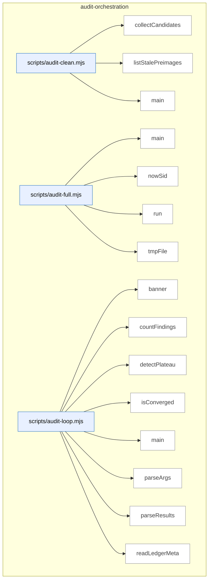

_Domain has 286 symbols (>50). Diagram shows top-15 by file order; see flat table below for the full list._

### Symbols in this domain

| Symbol | Kind | Path | Lines | Purpose | File imported by |
|---|---|---|---|---|---|
| [`collectCandidates`](../scripts/audit-clean.mjs#L162) | function | `scripts/audit-clean.mjs` | 162-199 | Recursively collects files matching a regex pattern older than a cutoff timestamp. | `tests/audit-clean-traversal.test.mjs` |
| [`listStalePreimages`](../scripts/audit-clean.mjs#L61) | function | `scripts/audit-clean.mjs` | 61-89 | Finds and lists orphaned preimage directories exceeding maximum age threshold. | `tests/audit-clean-traversal.test.mjs` |
| [`main`](../scripts/audit-clean.mjs#L201) | function | `scripts/audit-clean.mjs` | 201-244 | Cleans up stale audit cache and temporary files exceeding a specified age. | `tests/audit-clean-traversal.test.mjs` |
| [`main`](../scripts/audit-full.mjs#L44) | function | `scripts/audit-full.mjs` | 44-146 | Runs GPT code audit followed by mandatory Gemini final review in a fused pipeline. | _(internal)_ |
| [`nowSid`](../scripts/audit-full.mjs#L31) | function | `scripts/audit-full.mjs` | 31-33 | Generates a timestamped session ID with a given prefix. | _(internal)_ |
| [`run`](../scripts/audit-full.mjs#L39) | function | `scripts/audit-full.mjs` | 39-42 | Spawns a subprocess synchronously and returns exit code and signal. | _(internal)_ |
| [`tmpFile`](../scripts/audit-full.mjs#L35) | function | `scripts/audit-full.mjs` | 35-37 | Creates a temporary file path for a given filename. | _(internal)_ |
| [`banner`](../scripts/audit-loop.mjs#L27) | function | `scripts/audit-loop.mjs` | 27-30 | Prints a centered banner message. | _(internal)_ |
| [`countFindings`](../scripts/audit-loop.mjs#L71) | function | `scripts/audit-loop.mjs` | 71-78 | Counts findings by severity level from audit results. | _(internal)_ |
| [`detectPlateau`](../scripts/audit-loop.mjs#L93) | function | `scripts/audit-loop.mjs` | 93-109 | Detects if HIGH finding count has plateaued over consecutive rounds (≥30% decrease threshold). | _(internal)_ |
| [`isConverged`](../scripts/audit-loop.mjs#L80) | function | `scripts/audit-loop.mjs` | 80-84 | Checks if audit findings have converged to acceptable thresholds (no HIGH, ≤2 MEDIUM). | _(internal)_ |
| [`main`](../scripts/audit-loop.mjs#L169) | function | `scripts/audit-loop.mjs` | 169-541 | Orchestrates multi-round code audit with convergence detection, plateau analysis, and mandatory Gemini final review. | _(internal)_ |
| [`parseArgs`](../scripts/audit-loop.mjs#L129) | function | `scripts/audit-loop.mjs` | 129-165 | Parses command-line arguments into audit-loop configuration options. | _(internal)_ |
| [`parseResults`](../scripts/audit-loop.mjs#L62) | function | `scripts/audit-loop.mjs` | 62-69 | Parses a JSON results file or returns null if parsing fails. | _(internal)_ |
| [`readLedgerMeta`](../scripts/audit-loop.mjs#L119) | function | `scripts/audit-loop.mjs` | 119-127 | Reads metadata from an adjudication ledger JSON file. | _(internal)_ |
| [`run`](../scripts/audit-loop.mjs#L32) | function | `scripts/audit-loop.mjs` | 32-45 | Executes a command via execFileSync with timeout handling. | _(internal)_ |
| [`runAudit`](../scripts/audit-loop.mjs#L47) | function | `scripts/audit-loop.mjs` | 47-60 | Runs the OpenAI audit script and returns structured result with stdout/stderr/success status. | _(internal)_ |
| [`computeLocalMetrics`](../scripts/audit-metrics.mjs#L87) | function | `scripts/audit-metrics.mjs` | 87-103 | Computes audit metrics from local outcomes.jsonl file grouped by pass name. | `scripts/lib/dashboard/collect-telemetry.mjs` |
| [`displayMetrics`](../scripts/audit-metrics.mjs#L107) | function | `scripts/audit-metrics.mjs` | 107-176 | Formats and prints audit metrics to console with pass effectiveness breakdown. | `scripts/lib/dashboard/collect-telemetry.mjs` |
| [`fetchCloudMetrics`](../scripts/audit-metrics.mjs#L52) | function | `scripts/audit-metrics.mjs` | 52-80 | Fetches audit metrics from Postgres within a time window, with optional repo filtering. | `scripts/lib/dashboard/collect-telemetry.mjs` |
| [`main`](../scripts/audit-metrics.mjs#L180) | function | `scripts/audit-metrics.mjs` | 180-197 | Fetches cloud metrics with graceful local-only fallback and displays formatted results. | `scripts/lib/dashboard/collect-telemetry.mjs` |
| [`_collectMaxLengths`](../scripts/gemini-review.mjs#L188) | function | `scripts/gemini-review.mjs` | 188-206 | Builds a map of field paths to their maximum allowed string lengths from a Zod schema. | `tests/final-review-provider.test.mjs`, `tests/gemini-review-callreviewer.test.mjs`, `tests/gemini-review-egress.test.mjs`, +4 more |
| [`addSemanticIds`](../scripts/gemini-review.mjs#L1649) | function | `scripts/gemini-review.mjs` | 1649-1657 | Assigns semantic hash IDs, source markers, and display IDs to findings for deduplication and tracking. | `tests/final-review-provider.test.mjs`, `tests/gemini-review-callreviewer.test.mjs`, `tests/gemini-review-egress.test.mjs`, +4 more |
| [`applyDebtSuppression`](../scripts/gemini-review.mjs#L1582) | function | `scripts/gemini-review.mjs` | 1582-1617 | Filters out new findings that fuzzy-match pre-filtered debt topics from the audit transcript using Jaccard similarity (threshold 0.3). | `tests/final-review-provider.test.mjs`, `tests/gemini-review-callreviewer.test.mjs`, `tests/gemini-review-egress.test.mjs`, +4 more |
| [`applyProviderSetting`](../scripts/gemini-review.mjs#L1475) | function | `scripts/gemini-review.mjs` | 1475-1483 | Applies or updates the FINAL_REVIEW_PROVIDER setting in .env text via the shared env-setting writer. | `tests/final-review-provider.test.mjs`, `tests/gemini-review-callreviewer.test.mjs`, `tests/gemini-review-egress.test.mjs`, +4 more |
| [`applyScopeFilter`](../scripts/gemini-review.mjs#L1619) | function | `scripts/gemini-review.mjs` | 1619-1647 | Removes findings that cite files outside the scope of changed files based on the transcript's changed_files list. | `tests/final-review-provider.test.mjs`, `tests/gemini-review-callreviewer.test.mjs`, `tests/gemini-review-egress.test.mjs`, +4 more |
| [`armReviewWatchdog`](../scripts/gemini-review.mjs#L116) | function | `scripts/gemini-review.mjs` | 116-125 | Enforces a hard timeout on the final review, aborting if the deadline passes. | `tests/final-review-provider.test.mjs`, `tests/gemini-review-callreviewer.test.mjs`, `tests/gemini-review-egress.test.mjs`, +4 more |
| [`assertAzureClaudeReady`](../scripts/gemini-review.mjs#L1518) | function | `scripts/gemini-review.mjs` | 1518-1529 | Validates that required Azure Foundry environment variables (AI endpoint, Claude deployment) are set, failing if missing. | `tests/final-review-provider.test.mjs`, `tests/gemini-review-callreviewer.test.mjs`, `tests/gemini-review-egress.test.mjs`, +4 more |
| [`buildClient`](../scripts/gemini-review.mjs#L1531) | function | `scripts/gemini-review.mjs` | 1531-1535 | Constructs the appropriate LLM client instance (Gemini, Claude, or provider-agnostic) for a given provider name. | `tests/final-review-provider.test.mjs`, `tests/gemini-review-callreviewer.test.mjs`, `tests/gemini-review-egress.test.mjs`, +4 more |
| [`buildShadowClient`](../scripts/gemini-review.mjs#L1057) | function | `scripts/gemini-review.mjs` | 1057-1068 | Constructs the appropriate API client (Google GenAI, Anthropic, or OpenAI) for the shadow reviewer based on selected provider. | `tests/final-review-provider.test.mjs`, `tests/gemini-review-callreviewer.test.mjs`, `tests/gemini-review-egress.test.mjs`, +4 more |
| [`callReviewer`](../scripts/gemini-review.mjs#L542) | function | `scripts/gemini-review.mjs` | 542-614 | Calls the configured final-review LLM with timeout protection, signal handling, and result validation. | `tests/final-review-provider.test.mjs`, `tests/gemini-review-callreviewer.test.mjs`, `tests/gemini-review-egress.test.mjs`, +4 more |
| [`dedupByHash`](../scripts/gemini-review.mjs#L1160) | function | `scripts/gemini-review.mjs` | 1160-1168 | Removes duplicate findings by their semantic hash, preserving only the first occurrence of each unique finding. | `tests/final-review-provider.test.mjs`, `tests/gemini-review-callreviewer.test.mjs`, `tests/gemini-review-egress.test.mjs`, +4 more |
| [`diffFindingBuckets`](../scripts/gemini-review.mjs#L1175) | function | `scripts/gemini-review.mjs` | 1175-1191 | Categorizes primary and shadow review findings into "both", "primary-only", and "shadow-only" buckets for comparative analysis. | `tests/final-review-provider.test.mjs`, `tests/gemini-review-callreviewer.test.mjs`, `tests/gemini-review-egress.test.mjs`, +4 more |
| [`emitReviewOutput`](../scripts/gemini-review.mjs#L1659) | function | `scripts/gemini-review.mjs` | 1659-1674 | Outputs the final review result in JSON or markdown format to file or stdout based on command-line flags. | `tests/final-review-provider.test.mjs`, `tests/gemini-review-callreviewer.test.mjs`, `tests/gemini-review-egress.test.mjs`, +4 more |
| [`finishAndExit`](../scripts/gemini-review.mjs#L93) | function | `scripts/gemini-review.mjs` | 93-109 | Terminates the process after ensuring any buffered output is written, with a timeout guard against stuck pipes. | `tests/final-review-provider.test.mjs`, `tests/gemini-review-callreviewer.test.mjs`, `tests/gemini-review-egress.test.mjs`, +4 more |
| [`formatReviewResult`](../scripts/gemini-review.mjs#L926) | function | `scripts/gemini-review.mjs` | 926-988 | Formats a final review result object into a markdown-rendered string showing verdict, deliberation quality, architectural coherence, and findings. | `tests/final-review-provider.test.mjs`, `tests/gemini-review-callreviewer.test.mjs`, `tests/gemini-review-egress.test.mjs`, +4 more |
| [`getReviewPrompt`](../scripts/gemini-review.mjs#L400) | function | `scripts/gemini-review.mjs` | 400-403 | Retrieves the system prompt for Gemini final review, optionally overlaying a role-specific modifier. | `tests/final-review-provider.test.mjs`, `tests/gemini-review-callreviewer.test.mjs`, `tests/gemini-review-egress.test.mjs`, +4 more |
| [`isJsonTruncationError`](../scripts/gemini-review.mjs#L1537) | function | `scripts/gemini-review.mjs` | 1537-1541 | Detects JSON parsing or truncation errors in LLM responses to determine if a retry with conciseness hints is warranted. | `tests/final-review-provider.test.mjs`, `tests/gemini-review-callreviewer.test.mjs`, `tests/gemini-review-egress.test.mjs`, +4 more |
| [`main`](../scripts/gemini-review.mjs#L1801) | function | `scripts/gemini-review.mjs` | 1801-1877 | Entry point routing gemini-review CLI to ping/set-provider/review subcommands with full argument parsing and validation. | `tests/final-review-provider.test.mjs`, `tests/gemini-review-callreviewer.test.mjs`, `tests/gemini-review-egress.test.mjs`, +4 more |
| [`mapRouteToShadowProvider`](../scripts/gemini-review.mjs#L1099) | function | `scripts/gemini-review.mjs` | 1099-1103 | Maps a model-eval candidate route's transport mechanism to a canonical shadow provider name. | `tests/final-review-provider.test.mjs`, `tests/gemini-review-callreviewer.test.mjs`, `tests/gemini-review-egress.test.mjs`, +4 more |
| [`parseReviewArgs`](../scripts/gemini-review.mjs#L1368) | function | `scripts/gemini-review.mjs` | 1368-1387 | Parses command-line arguments for the review subcommand, extracting files, output options, and provider/mode/role overrides. | `tests/final-review-provider.test.mjs`, `tests/gemini-review-callreviewer.test.mjs`, `tests/gemini-review-egress.test.mjs`, +4 more |
| [`parseReviewJson`](../scripts/gemini-review.mjs#L428) | function | `scripts/gemini-review.mjs` | 428-443 | Extracts and parses JSON from Gemini output, tolerating multiple fence formats and incomplete wrapping. | `tests/final-review-provider.test.mjs`, `tests/gemini-review-callreviewer.test.mjs`, `tests/gemini-review-egress.test.mjs`, +4 more |
| [`recordGeminiOutcomes`](../scripts/gemini-review.mjs#L1721) | function | `scripts/gemini-review.mjs` | 1721-1743 | Aggregates and persists Gemini review outcomes (new findings, wrongly-dismissed, verdict) to learning and bandit reward stores. | `tests/final-review-provider.test.mjs`, `tests/gemini-review-callreviewer.test.mjs`, `tests/gemini-review-egress.test.mjs`, +4 more |
| [`recordNewFindings`](../scripts/gemini-review.mjs#L1676) | function | `scripts/gemini-review.mjs` | 1676-1695 | Records newly discovered findings to the local outcomes log and false-positive tracker for adaptive learning. | `tests/final-review-provider.test.mjs`, `tests/gemini-review-callreviewer.test.mjs`, `tests/gemini-review-egress.test.mjs`, +4 more |
| [`recordWronglyDismissed`](../scripts/gemini-review.mjs#L1697) | function | `scripts/gemini-review.mjs` | 1697-1719 | Records findings that Gemini determined were wrongly dismissed by prior auditor passes to the outcomes log. | `tests/final-review-provider.test.mjs`, `tests/gemini-review-callreviewer.test.mjs`, `tests/gemini-review-egress.test.mjs`, +4 more |
| [`refreshCatalogAndWarn`](../scripts/gemini-review.mjs#L1309) | function | `scripts/gemini-review.mjs` | 1309-1330 | Refreshes the model catalog and auto-upgrades Gemini/Claude reviewer IDs to latest versions if newer ones are available. | `tests/final-review-provider.test.mjs`, `tests/gemini-review-callreviewer.test.mjs`, `tests/gemini-review-egress.test.mjs`, +4 more |
| [`resolveCompatCreds`](../scripts/gemini-review.mjs#L750) | function | `scripts/gemini-review.mjs` | 750-752 | Returns the base URL, API key, and model for a generic OpenAI-compatible provider. | `tests/final-review-provider.test.mjs`, `tests/gemini-review-callreviewer.test.mjs`, `tests/gemini-review-egress.test.mjs`, +4 more |
| [`resolveModelEvalShadowOverride`](../scripts/gemini-review.mjs#L1105) | function | `scripts/gemini-review.mjs` | 1105-1134 | Resolves whether an active model-eval adjudicator run exists for this repo and returns its shadow provider/model override. | `tests/final-review-provider.test.mjs`, `tests/gemini-review-callreviewer.test.mjs`, `tests/gemini-review-egress.test.mjs`, +4 more |
| [`resolveOpenRouterCreds`](../scripts/gemini-review.mjs#L760) | function | `scripts/gemini-review.mjs` | 760-766 | Returns the base URL, API key, and model for OpenRouter, with fallbacks to audit-shadow config. | `tests/final-review-provider.test.mjs`, `tests/gemini-review-callreviewer.test.mjs`, `tests/gemini-review-egress.test.mjs`, +4 more |
| [`resolveProviderSetting`](../scripts/gemini-review.mjs#L1458) | function | `scripts/gemini-review.mjs` | 1458-1461 | Reads the FINAL_REVIEW_PROVIDER environment variable value or returns null if unset. | `tests/final-review-provider.test.mjs`, `tests/gemini-review-callreviewer.test.mjs`, `tests/gemini-review-egress.test.mjs`, +4 more |
| [`resolveShadow`](../scripts/gemini-review.mjs#L1021) | function | `scripts/gemini-review.mjs` | 1021-1047 | Resolves shadow reviewer configuration (provider, model, state) from environment and validates availability for A/B testing. | `tests/final-review-provider.test.mjs`, `tests/gemini-review-callreviewer.test.mjs`, `tests/gemini-review-egress.test.mjs`, +4 more |
| [`runAdjudicatorOnlyReview`](../scripts/gemini-review.mjs#L1573) | function | `scripts/gemini-review.mjs` | 1573-1580 | Runs a final review with adjudicator-only role constraints, temporarily appending adjudicator-specific instructions to the system prompt. | `tests/final-review-provider.test.mjs`, `tests/gemini-review-callreviewer.test.mjs`, `tests/gemini-review-egress.test.mjs`, +4 more |
| [`runFinalReview`](../scripts/gemini-review.mjs#L779) | function | `scripts/gemini-review.mjs` | 779-922 | Orchestrates the final review pipeline by gathering code context, reading transcript, applying debt suppression, and calling the selected LLM provider. | `tests/final-review-provider.test.mjs`, `tests/gemini-review-callreviewer.test.mjs`, `tests/gemini-review-egress.test.mjs`, +4 more |
| [`runFixtureReview`](../scripts/gemini-review.mjs#L1758) | function | `scripts/gemini-review.mjs` | 1758-1799 | Returns a deterministic canned final review result for testing, optionally simulating reversed verdicts or missed candidates. | `tests/final-review-provider.test.mjs`, `tests/gemini-review-callreviewer.test.mjs`, `tests/gemini-review-egress.test.mjs`, +4 more |
| [`runPing`](../scripts/gemini-review.mjs#L1361) | function | `scripts/gemini-review.mjs` | 1361-1366 | Runs connectivity tests for all available LLM APIs (Gemini and Claude) based on set environment keys. | `tests/final-review-provider.test.mjs`, `tests/gemini-review-callreviewer.test.mjs`, `tests/gemini-review-egress.test.mjs`, +4 more |
| [`runPingClaude`](../scripts/gemini-review.mjs#L1344) | function | `scripts/gemini-review.mjs` | 1344-1359 | Tests Claude Opus API connectivity through the Anthropic client with a minimal request and exits with status. | `tests/final-review-provider.test.mjs`, `tests/gemini-review-callreviewer.test.mjs`, `tests/gemini-review-egress.test.mjs`, +4 more |
| [`runPingGemini`](../scripts/gemini-review.mjs#L1332) | function | `scripts/gemini-review.mjs` | 1332-1342 | Tests Gemini API connectivity with a minimal request and exits with success or failure status. | `tests/final-review-provider.test.mjs`, `tests/gemini-review-callreviewer.test.mjs`, `tests/gemini-review-egress.test.mjs`, +4 more |
| [`runReviewWithRetry`](../scripts/gemini-review.mjs#L1543) | function | `scripts/gemini-review.mjs` | 1543-1560 | Executes final review with automatic retry on JSON truncation, re-attempting with conciseness instructions if output was cut short. | `tests/final-review-provider.test.mjs`, `tests/gemini-review-callreviewer.test.mjs`, `tests/gemini-review-egress.test.mjs`, +4 more |
| [`runSetProvider`](../scripts/gemini-review.mjs#L1490) | function | `scripts/gemini-review.mjs` | 1490-1512 | CLI command to set, clear, or list the FINAL_REVIEW_PROVIDER in .env, persisting the provider choice to disk. | `tests/final-review-provider.test.mjs`, `tests/gemini-review-callreviewer.test.mjs`, `tests/gemini-review-egress.test.mjs`, +4 more |
| [`runShadowAndPersist`](../scripts/gemini-review.mjs#L1214) | function | `scripts/gemini-review.mjs` | 1214-1303 | Orchestrates shadow review execution (when enabled), persists bucketed findings to the output, and records outcomes to cloud/local stores. | `tests/final-review-provider.test.mjs`, `tests/gemini-review-callreviewer.test.mjs`, `tests/gemini-review-egress.test.mjs`, +4 more |
| [`runShadowReview`](../scripts/gemini-review.mjs#L1141) | function | `scripts/gemini-review.mjs` | 1141-1151 | Runs a shadow final review through the specified provider and applies debt suppression and scope filtering to deduplicate findings. | `tests/final-review-provider.test.mjs`, `tests/gemini-review-callreviewer.test.mjs`, `tests/gemini-review-egress.test.mjs`, +4 more |
| [`selectProvider`](../scripts/gemini-review.mjs#L1409) | function | `scripts/gemini-review.mjs` | 1409-1455 | Selects the final review provider via explicit choice or auto-detection fallback chain (Gemini → Azure → public Opus). | `tests/final-review-provider.test.mjs`, `tests/gemini-review-callreviewer.test.mjs`, `tests/gemini-review-egress.test.mjs`, +4 more |
| [`shadowModelMatchesFamily`](../scripts/gemini-review.mjs#L1007) | function | `scripts/gemini-review.mjs` | 1007-1012 | Checks whether a model ID string belongs to a specific model family (gemini or claude-based). | `tests/final-review-provider.test.mjs`, `tests/gemini-review-callreviewer.test.mjs`, `tests/gemini-review-egress.test.mjs`, +4 more |
| [`shadowSkipBlock`](../scripts/gemini-review.mjs#L1194) | function | `scripts/gemini-review.mjs` | 1194-1199 | Creates a shadow reviewer skip-reason block explaining why shadow review was disabled (e.g., no API key, Azure active). | `tests/final-review-provider.test.mjs`, `tests/gemini-review-callreviewer.test.mjs`, `tests/gemini-review-egress.test.mjs`, +4 more |
| [`streamAnthropicMessage`](../scripts/gemini-review.mjs#L632) | function | `scripts/gemini-review.mjs` | 632-650 | Reads a streamed Anthropic message and returns the accumulated text and token usage. | `tests/final-review-provider.test.mjs`, `tests/gemini-review-callreviewer.test.mjs`, `tests/gemini-review-egress.test.mjs`, +4 more |
| [`truncateToSchema`](../scripts/gemini-review.mjs#L220) | function | `scripts/gemini-review.mjs` | 220-240 | Enforces maxLength constraints on all string fields in a review result, truncating overflows. | `tests/final-review-provider.test.mjs`, `tests/gemini-review-callreviewer.test.mjs`, `tests/gemini-review-egress.test.mjs`, +4 more |
| [`composeAdjacencyResult`](../scripts/lib/audit/adjacency-compose.mjs#L45) | function | `scripts/lib/audit/adjacency-compose.mjs` | 45-95 | Merges analysis candidates and bouncer judgments into adjacency findings. | `scripts/lib/audit/legacy-production-audit.mjs`, `tests/adjacency-compose.test.mjs`, `tests/audit-scope-egress.test.mjs` |
| [`deriveFindings`](../scripts/lib/audit/adjacency-compose.mjs#L102) | function | `scripts/lib/audit/adjacency-compose.mjs` | 102-126 | Derives audit findings from adjacency analysis (failures, mapped findings, incompleteness). | `scripts/lib/audit/legacy-production-audit.mjs`, `tests/adjacency-compose.test.mjs`, `tests/audit-scope-egress.test.mjs` |
| [`classifyStatementDependence`](../scripts/lib/audit/adjacency-detector.mjs#L265) | function | `scripts/lib/audit/adjacency-detector.mjs` | 265-352 | Classifies whether a statement depends on its condition (guard clause, reads condition name, or independent). | `scripts/lib/audit/legacy-production-audit.mjs`, `tests/adjacency-detector.test.mjs`, `tests/adjacency-state.test.mjs`, +1 more |
| [`collectReadBindings`](../scripts/lib/audit/adjacency-detector.mjs#L224) | function | `scripts/lib/audit/adjacency-detector.mjs` | 224-238 | Collects all identifiers referenced in a statement via binding lookups. | `scripts/lib/audit/legacy-production-audit.mjs`, `tests/adjacency-detector.test.mjs`, `tests/adjacency-state.test.mjs`, +1 more |
| [`defaultAdapters`](../scripts/lib/audit/adjacency-detector.mjs#L61) | function | `scripts/lib/audit/adjacency-detector.mjs` | 61-70 | Returns default dependency injections (git, file I/O, classification, egress scan). | `scripts/lib/audit/legacy-production-audit.mjs`, `tests/adjacency-detector.test.mjs`, `tests/adjacency-state.test.mjs`, +1 more |
| [`enumerateBlockStatements`](../scripts/lib/audit/adjacency-detector.mjs#L210) | function | `scripts/lib/audit/adjacency-detector.mjs` | 210-218 | Lists the statements in a conditional branch (block or unbraced single-statement). | `scripts/lib/audit/legacy-production-audit.mjs`, `tests/adjacency-detector.test.mjs`, `tests/adjacency-state.test.mjs`, +1 more |
| [`findEnclosingConditional`](../scripts/lib/audit/adjacency-detector.mjs#L151) | function | `scripts/lib/audit/adjacency-detector.mjs` | 151-202 | Finds the `if` statement containing a line, filtering out unbraced/else-if edge cases. | `scripts/lib/audit/legacy-production-audit.mjs`, `tests/adjacency-detector.test.mjs`, `tests/adjacency-state.test.mjs`, +1 more |
| [`incompleteness`](../scripts/lib/audit/adjacency-detector.mjs#L72) | function | `scripts/lib/audit/adjacency-detector.mjs` | 72-72 | Constructs an incompleteness record tuple (kind, scope, detail). | `scripts/lib/audit/legacy-production-audit.mjs`, `tests/adjacency-detector.test.mjs`, `tests/adjacency-state.test.mjs`, +1 more |
| [`log`](../scripts/lib/audit/adjacency-detector.mjs#L57) | function | `scripts/lib/audit/adjacency-detector.mjs` | 57-57 | Writes an adjacency progress log message to stderr. | `scripts/lib/audit/legacy-production-audit.mjs`, `tests/adjacency-detector.test.mjs`, `tests/adjacency-state.test.mjs`, +1 more |
| [`parseHunkTargets`](../scripts/lib/audit/adjacency-detector.mjs#L96) | function | `scripts/lib/audit/adjacency-detector.mjs` | 96-124 | Extracts changed-line anchor numbers from unified diff hunks. | `scripts/lib/audit/legacy-production-audit.mjs`, `tests/adjacency-detector.test.mjs`, `tests/adjacency-state.test.mjs`, +1 more |
| [`runAdjacencyAnalysis`](../scripts/lib/audit/adjacency-detector.mjs#L366) | function | `scripts/lib/audit/adjacency-detector.mjs` | 366-520 | Main orchestrator: runs diff bounds checks, parses hunks, enumerates containers, classifies statements. | `scripts/lib/audit/legacy-production-audit.mjs`, `tests/adjacency-detector.test.mjs`, `tests/adjacency-state.test.mjs`, +1 more |
| [`sliceLines`](../scripts/lib/audit/adjacency-detector.mjs#L523) | function | `scripts/lib/audit/adjacency-detector.mjs` | 523-529 | Extracts a range of lines from text with byte-limit truncation if needed. | `scripts/lib/audit/legacy-production-audit.mjs`, `tests/adjacency-detector.test.mjs`, `tests/adjacency-state.test.mjs`, +1 more |
| [`_resetAdjacencyIdCounter`](../scripts/lib/audit/adjacency-report.mjs#L25) | function | `scripts/lib/audit/adjacency-report.mjs` | 25-25 | <no body> | `scripts/lib/audit/adjacency-compose.mjs`, `scripts/lib/audit/legacy-production-audit.mjs`, `tests/adjacency-compose.test.mjs` |
| [`buildAdjacencyFailedFinding`](../scripts/lib/audit/adjacency-report.mjs#L219) | function | `scripts/lib/audit/adjacency-report.mjs` | 219-238 | Creates finding when adjacency detector threw an error. | `scripts/lib/audit/adjacency-compose.mjs`, `scripts/lib/audit/legacy-production-audit.mjs`, `tests/adjacency-compose.test.mjs` |
| [`buildAdjacencyFinding`](../scripts/lib/audit/adjacency-report.mjs#L162) | function | `scripts/lib/audit/adjacency-report.mjs` | 162-186 | Constructs a single trapped-statement audit finding. | `scripts/lib/audit/adjacency-compose.mjs`, `scripts/lib/audit/legacy-production-audit.mjs`, `tests/adjacency-compose.test.mjs` |
| [`buildAdjacencyIncompleteFinding`](../scripts/lib/audit/adjacency-report.mjs#L194) | function | `scripts/lib/audit/adjacency-report.mjs` | 194-214 | Creates finding for incomplete adjacency analysis coverage. | `scripts/lib/audit/adjacency-compose.mjs`, `scripts/lib/audit/legacy-production-audit.mjs`, `tests/adjacency-compose.test.mjs` |
| [`deriveFindingsFromAdjacencyReport`](../scripts/lib/audit/adjacency-report.mjs#L155) | function | `scripts/lib/audit/adjacency-report.mjs` | 155-160 | Derives findings from adjacency evidence that passed safety checks. | `scripts/lib/audit/adjacency-compose.mjs`, `scripts/lib/audit/legacy-production-audit.mjs`, `tests/adjacency-compose.test.mjs` |
| [`formatCandidatesForPrompt`](../scripts/lib/audit/adjacency-report.mjs#L37) | function | `scripts/lib/audit/adjacency-report.mjs` | 37-78 | Formats adjacency evidence into LLM-consumable prompt with token budgeting. | `scripts/lib/audit/adjacency-compose.mjs`, `scripts/lib/audit/legacy-production-audit.mjs`, `tests/adjacency-compose.test.mjs` |
| [`incompleteness`](../scripts/lib/audit/adjacency-report.mjs#L28) | function | `scripts/lib/audit/adjacency-report.mjs` | 28-28 | Factory for incompleteness records. | `scripts/lib/audit/adjacency-compose.mjs`, `scripts/lib/audit/legacy-production-audit.mjs`, `tests/adjacency-compose.test.mjs` |
| [`mapDecisionsToFindings`](../scripts/lib/audit/adjacency-report.mjs#L131) | function | `scripts/lib/audit/adjacency-report.mjs` | 131-151 | Maps LLM bouncer output decisions back to audit findings. | `scripts/lib/audit/adjacency-compose.mjs`, `scripts/lib/audit/legacy-production-audit.mjs`, `tests/adjacency-compose.test.mjs` |
| [`nextId`](../scripts/lib/audit/adjacency-report.mjs#L26) | function | `scripts/lib/audit/adjacency-report.mjs` | 26-26 | Generates sequential identifiers for adjacency candidates. | `scripts/lib/audit/adjacency-compose.mjs`, `scripts/lib/audit/legacy-production-audit.mjs`, `tests/adjacency-compose.test.mjs` |
| [`runAdjacencyBouncer`](../scripts/lib/audit/adjacency-report.mjs#L92) | function | `scripts/lib/audit/adjacency-report.mjs` | 92-118 | Calls LLM bouncer to classify trapped statements, returns decisions or error. | `scripts/lib/audit/adjacency-compose.mjs`, `scripts/lib/audit/legacy-production-audit.mjs`, `tests/adjacency-compose.test.mjs` |
| [`assertCleanIsEarned`](../scripts/lib/audit/adjacency-state.mjs#L158) | function | `scripts/lib/audit/adjacency-state.mjs` | 158-173 | Validates that "clean" state has real coverage, not just zero findings. | `scripts/lib/audit/adjacency-compose.mjs`, `scripts/lib/audit/adjacency-detector.mjs`, `scripts/lib/audit/adjacency-report.mjs`, +3 more |
| [`blocksConvergence`](../scripts/lib/audit/adjacency-state.mjs#L178) | function | `scripts/lib/audit/adjacency-state.mjs` | 178-182 | Checks whether adjacency findings should block audit convergence. | `scripts/lib/audit/adjacency-compose.mjs`, `scripts/lib/audit/adjacency-detector.mjs`, `scripts/lib/audit/adjacency-report.mjs`, +3 more |
| [`buildAdjacencyState`](../scripts/lib/audit/adjacency-state.mjs#L96) | function | `scripts/lib/audit/adjacency-state.mjs` | 96-147 | Determines overall adjacency analysis state (CLEAN/FINDINGS/CAPPED/etc). | `scripts/lib/audit/adjacency-compose.mjs`, `scripts/lib/audit/adjacency-detector.mjs`, `scripts/lib/audit/adjacency-report.mjs`, +3 more |
| [`createEnvelope`](../scripts/lib/audit/candidate-envelope.mjs#L49) | function | `scripts/lib/audit/candidate-envelope.mjs` | 49-84 | Wraps finding with evidence alternatives and stage decisions. | `scripts/lib/audit/evidence-triage.mjs`, `scripts/lib/audit/tiered-pipeline.mjs`, `tests/candidate-envelope-provenance.test.mjs`, +1 more |
| [`flattenEnvelopeToFinding`](../scripts/lib/audit/candidate-envelope.mjs#L234) | function | `scripts/lib/audit/candidate-envelope.mjs` | 234-254 | Unwraps envelope back to flat finding, moving alternatives into detail. | `scripts/lib/audit/evidence-triage.mjs`, `scripts/lib/audit/tiered-pipeline.mjs`, `tests/candidate-envelope-provenance.test.mjs`, +1 more |
| [`mergeIntoEnvelopes`](../scripts/lib/audit/candidate-envelope.mjs#L119) | function | `scripts/lib/audit/candidate-envelope.mjs` | 119-180 | Consolidates multiple findings with same fingerprint into single envelope. | `scripts/lib/audit/evidence-triage.mjs`, `scripts/lib/audit/tiered-pipeline.mjs`, `tests/candidate-envelope-provenance.test.mjs`, +1 more |
| [`promoteAlternative`](../scripts/lib/audit/candidate-envelope.mjs#L256) | function | `scripts/lib/audit/candidate-envelope.mjs` | 256-293 | Promotes alternative evidence to canonical after original fails verification. | `scripts/lib/audit/evidence-triage.mjs`, `scripts/lib/audit/tiered-pipeline.mjs`, `tests/candidate-envelope-provenance.test.mjs`, +1 more |
| [`severityRank`](../scripts/lib/audit/candidate-envelope.mjs#L91) | function | `scripts/lib/audit/candidate-envelope.mjs` | 91-93 | Maps severity string to numeric rank for comparison. | `scripts/lib/audit/evidence-triage.mjs`, `scripts/lib/audit/tiered-pipeline.mjs`, `tests/candidate-envelope-provenance.test.mjs`, +1 more |
| [`evaluateConvergence`](../scripts/lib/audit/convergence.mjs#L21) | function | `scripts/lib/audit/convergence.mjs` | 21-25 | Checks if HIGH/MEDIUM/quickFix counts meet convergence thresholds. | `scripts/lib/audit/legacy-production-audit.mjs` |
| [`computeCostReport`](../scripts/lib/audit/cost-budget.mjs#L58) | function | `scripts/lib/audit/cost-budget.mjs` | 58-88 | Computes per-finding cost and operator effort from events. | `scripts/lib/audit/tiered-pipeline.mjs`, `tests/cost-budget.test.mjs` |
| [`loadReviewEffortEvents`](../scripts/lib/audit/cost-budget.mjs#L136) | function | `scripts/lib/audit/cost-budget.mjs` | 136-144 | Reads and validates review effort events from JSONL. | `scripts/lib/audit/tiered-pipeline.mjs`, `tests/cost-budget.test.mjs` |
| [`loadUsageEvents`](../scripts/lib/audit/cost-budget.mjs#L118) | function | `scripts/lib/audit/cost-budget.mjs` | 118-133 | Reads and validates usage events from JSONL. | `scripts/lib/audit/tiered-pipeline.mjs`, `tests/cost-budget.test.mjs` |
| [`openReviewEffortStore`](../scripts/lib/audit/cost-budget.mjs#L96) | function | `scripts/lib/audit/cost-budget.mjs` | 96-98 | Opens append-only store for review effort events. | `scripts/lib/audit/tiered-pipeline.mjs`, `tests/cost-budget.test.mjs` |
| [`openUsageEventStore`](../scripts/lib/audit/cost-budget.mjs#L91) | function | `scripts/lib/audit/cost-budget.mjs` | 91-93 | Opens append-only store for usage events. | `scripts/lib/audit/tiered-pipeline.mjs`, `tests/cost-budget.test.mjs` |
| [`recordReviewEffort`](../scripts/lib/audit/cost-budget.mjs#L106) | function | `scripts/lib/audit/cost-budget.mjs` | 106-108 | Appends review effort event to store. | `scripts/lib/audit/tiered-pipeline.mjs`, `tests/cost-budget.test.mjs` |
| [`recordUsageEvent`](../scripts/lib/audit/cost-budget.mjs#L101) | function | `scripts/lib/audit/cost-budget.mjs` | 101-103 | Appends usage event to store. | `scripts/lib/audit/tiered-pipeline.mjs`, `tests/cost-budget.test.mjs` |
| [`classifyDeferralEvidence`](../scripts/lib/audit/deferral-classifier.mjs#L166) | function | `scripts/lib/audit/deferral-classifier.mjs` | 166-300 | Determines if finding should auto-defer based on SCM evidence. | `scripts/lib/audit/findings-pipeline.mjs`, `scripts/lib/audit/tiered-shadow-compare.mjs`, `tests/learning-deferral-classifier.test.mjs` |
| [`globMatch`](../scripts/lib/audit/deferral-classifier.mjs#L102) | function | `scripts/lib/audit/deferral-classifier.mjs` | 102-119 | Matches file paths against glob patterns. | `scripts/lib/audit/findings-pipeline.mjs`, `scripts/lib/audit/tiered-shadow-compare.mjs`, `tests/learning-deferral-classifier.test.mjs` |
| [`isFileInChangedScope`](../scripts/lib/audit/deferral-classifier.mjs#L326) | function | `scripts/lib/audit/deferral-classifier.mjs` | 326-330 | Checks whether file is in the --changed scope. | `scripts/lib/audit/findings-pipeline.mjs`, `scripts/lib/audit/tiered-shadow-compare.mjs`, `tests/learning-deferral-classifier.test.mjs` |
| [`parseAcceptV1Markers`](../scripts/lib/audit/deferral-classifier.mjs#L84) | function | `scripts/lib/audit/deferral-classifier.mjs` | 84-91 | Extracts accept-v1 plan markers for auto-deferral. | `scripts/lib/audit/findings-pipeline.mjs`, `scripts/lib/audit/tiered-shadow-compare.mjs`, `tests/learning-deferral-classifier.test.mjs` |
| [`buildDiffPathMap`](../scripts/lib/audit/diff-path-map.mjs#L98) | function | `scripts/lib/audit/diff-path-map.mjs` | 98-135 | Parses unified diff into structured map of changed files. | `scripts/lib/audit/tiered-pipeline.mjs`, `scripts/model-eval-discovery.mjs`, `tests/diff-path-map.test.mjs`, +1 more |
| [`hydrateAnchor`](../scripts/lib/audit/diff-path-map.mjs#L176) | function | `scripts/lib/audit/diff-path-map.mjs` | 176-211 | Validates and expands model anchor reference to full file paths. | `scripts/lib/audit/tiered-pipeline.mjs`, `scripts/model-eval-discovery.mjs`, `tests/diff-path-map.test.mjs`, +1 more |
| [`mintId`](../scripts/lib/audit/diff-path-map.mjs#L56) | function | `scripts/lib/audit/diff-path-map.mjs` | 56-56 | Generates padded file IDs from index. | `scripts/lib/audit/tiered-pipeline.mjs`, `scripts/model-eval-discovery.mjs`, `tests/diff-path-map.test.mjs`, +1 more |
| [`prepareCandidates`](../scripts/lib/audit/diff-path-map.mjs#L242) | function | `scripts/lib/audit/diff-path-map.mjs` | 242-272 | Converts raw model findings to validated candidates with hydrated anchors. | `scripts/lib/audit/tiered-pipeline.mjs`, `scripts/model-eval-discovery.mjs`, `tests/diff-path-map.test.mjs`, +1 more |
| [`renderDiffPathTable`](../scripts/lib/audit/diff-path-map.mjs#L143) | function | `scripts/lib/audit/diff-path-map.mjs` | 143-148 | Formats diff entries as TSV table. | `scripts/lib/audit/tiered-pipeline.mjs`, `scripts/model-eval-discovery.mjs`, `tests/diff-path-map.test.mjs`, +1 more |
| [`cleanupTempRoot`](../scripts/lib/audit/diff-scope-resolver.mjs#L255) | function | `scripts/lib/audit/diff-scope-resolver.mjs` | 255-265 | Removes git worktree or fallback deletes directory. | `scripts/audit-clean.mjs`, `scripts/lib/audit/legacy-production-audit.mjs`, `scripts/openai-audit.mjs`, +2 more |
| [`computeEntryPoints`](../scripts/lib/audit/diff-scope-resolver.mjs#L354) | function | `scripts/lib/audit/diff-scope-resolver.mjs` | 354-423 | Discovers entry-point source files from package.json and tsconfig. | `scripts/audit-clean.mjs`, `scripts/lib/audit/legacy-production-audit.mjs`, `scripts/openai-audit.mjs`, +2 more |
| [`cruiseTempRoot`](../scripts/lib/audit/diff-scope-resolver.mjs#L277) | function | `scripts/lib/audit/diff-scope-resolver.mjs` | 277-339 | Runs dependency-cruiser on preimage worktree to extract import graph. | `scripts/audit-clean.mjs`, `scripts/lib/audit/legacy-production-audit.mjs`, `scripts/openai-audit.mjs`, +2 more |
| [`gitBuf`](../scripts/lib/audit/diff-scope-resolver.mjs#L73) | function | `scripts/lib/audit/diff-scope-resolver.mjs` | 73-85 | Runs git command and returns stdout, logs failures to stderr. | `scripts/audit-clean.mjs`, `scripts/lib/audit/legacy-production-audit.mjs`, `scripts/openai-audit.mjs`, +2 more |
| [`materialisePreimages`](../scripts/lib/audit/diff-scope-resolver.mjs#L214) | function | `scripts/lib/audit/diff-scope-resolver.mjs` | 214-253 | Creates git worktree with pre-change file versions for import analysis. | `scripts/audit-clean.mjs`, `scripts/lib/audit/legacy-production-audit.mjs`, `scripts/openai-audit.mjs`, +2 more |
| [`parseLsTreeZ`](../scripts/lib/audit/diff-scope-resolver.mjs#L153) | function | `scripts/lib/audit/diff-scope-resolver.mjs` | 153-156 | Parses git ls-tree -z output into path set. | `scripts/audit-clean.mjs`, `scripts/lib/audit/legacy-production-audit.mjs`, `scripts/openai-audit.mjs`, +2 more |
| [`parseNameStatusZ`](../scripts/lib/audit/diff-scope-resolver.mjs#L100) | function | `scripts/lib/audit/diff-scope-resolver.mjs` | 100-145 | Parses git diff --name-status -z output into file change records. | `scripts/audit-clean.mjs`, `scripts/lib/audit/legacy-production-audit.mjs`, `scripts/openai-audit.mjs`, +2 more |
| [`resolveDiffScope`](../scripts/lib/audit/diff-scope-resolver.mjs#L440) | function | `scripts/lib/audit/diff-scope-resolver.mjs` | 440-541 | Computes full audit scope from refs/patch including pre-change imports. | `scripts/audit-clean.mjs`, `scripts/lib/audit/legacy-production-audit.mjs`, `scripts/openai-audit.mjs`, +2 more |
| [`stripLeadingDotSlash`](../scripts/lib/audit/diff-scope-resolver.mjs#L27) | function | `scripts/lib/audit/diff-scope-resolver.mjs` | 27-29 | Removes leading "./" from path strings. | `scripts/audit-clean.mjs`, `scripts/lib/audit/legacy-production-audit.mjs`, `scripts/openai-audit.mjs`, +2 more |
| [`sweepStaleOrphanPreimages`](../scripts/lib/audit/diff-scope-resolver.mjs#L188) | function | `scripts/lib/audit/diff-scope-resolver.mjs` | 188-212 | Cleans up stale git worktrees from failed preimage materializations. | `scripts/audit-clean.mjs`, `scripts/lib/audit/legacy-production-audit.mjs`, `scripts/openai-audit.mjs`, +2 more |
| [`walkEntryPointDir`](../scripts/lib/audit/diff-scope-resolver.mjs#L49) | function | `scripts/lib/audit/diff-scope-resolver.mjs` | 49-63 | Discovers source files in directory (non-recursive). | `scripts/audit-clean.mjs`, `scripts/lib/audit/legacy-production-audit.mjs`, `scripts/openai-audit.mjs`, +2 more |
| [`runDiscoveryPortfolio`](../scripts/lib/audit/discovery-portfolio.mjs#L121) | function | `scripts/lib/audit/discovery-portfolio.mjs` | 121-158 | Runs required+optional generators, aggregates findings, blocks on required failure. | `scripts/lib/audit/tiered-pipeline.mjs`, `tests/discovery-portfolio.test.mjs` |
| [`runOneGenerator`](../scripts/lib/audit/discovery-portfolio.mjs#L60) | function | `scripts/lib/audit/discovery-portfolio.mjs` | 60-101 | Executes single discovery generator and records timing/outcome/count. | `scripts/lib/audit/tiered-pipeline.mjs`, `tests/discovery-portfolio.test.mjs` |
| [`defaultAdapters`](../scripts/lib/audit/duplication-detector.mjs#L63) | function | `scripts/lib/audit/duplication-detector.mjs` | 63-95 | Provides default dependency-injected adapters for all external operations. | `scripts/lib/audit/legacy-production-audit.mjs`, `tests/duplication-detector.test.mjs`, `tests/duplication-egress.test.mjs` |
| [`extractViaSubprocess`](../scripts/lib/audit/duplication-detector.mjs#L103) | function | `scripts/lib/audit/duplication-detector.mjs` | 103-115 | Spawns symbol extraction subprocess on file list with manifest cleanup. | `scripts/lib/audit/legacy-production-audit.mjs`, `tests/duplication-detector.test.mjs`, `tests/duplication-egress.test.mjs` |
| [`findPragmaAbove`](../scripts/lib/audit/duplication-detector.mjs#L135) | function | `scripts/lib/audit/duplication-detector.mjs` | 135-143 | Searches up to 5 lines above a symbol declaration for a `@duplicate-justification` pragma comment. | `scripts/lib/audit/legacy-production-audit.mjs`, `tests/duplication-detector.test.mjs`, `tests/duplication-egress.test.mjs` |
| [`isEligibleChange`](../scripts/lib/audit/duplication-detector.mjs#L145) | function | `scripts/lib/audit/duplication-detector.mjs` | 145-150 | Determines whether a file diff entry is eligible for duplication scanning based on status and extension. | `scripts/lib/audit/legacy-production-audit.mjs`, `tests/duplication-detector.test.mjs`, `tests/duplication-egress.test.mjs` |
| [`log`](../scripts/lib/audit/duplication-detector.mjs#L60) | function | `scripts/lib/audit/duplication-detector.mjs` | 60-60 | Writes debug message to stderr with module prefix. | `scripts/lib/audit/legacy-production-audit.mjs`, `tests/duplication-detector.test.mjs`, `tests/duplication-egress.test.mjs` |
| [`runDuplicationAnalysis`](../scripts/lib/audit/duplication-detector.mjs#L160) | function | `scripts/lib/audit/duplication-detector.mjs` | 160-326 | Main duplication detector that compares new symbols against codebase embeddings to find near-duplicates. | `scripts/lib/audit/legacy-production-audit.mjs`, `tests/duplication-detector.test.mjs`, `tests/duplication-egress.test.mjs` |
| [`symKey`](../scripts/lib/audit/duplication-detector.mjs#L125) | function | `scripts/lib/audit/duplication-detector.mjs` | 125-127 | Generates a unique string key from file path, symbol name, and kind identifier. | `scripts/lib/audit/legacy-production-audit.mjs`, `tests/duplication-detector.test.mjs`, `tests/duplication-egress.test.mjs` |
| [`writeTempSource`](../scripts/lib/audit/duplication-detector.mjs#L118) | function | `scripts/lib/audit/duplication-detector.mjs` | 118-122 | Creates temporary directory structure and writes source code content to files for analysis. | `scripts/lib/audit/legacy-production-audit.mjs`, `tests/duplication-detector.test.mjs`, `tests/duplication-egress.test.mjs` |
| [`_resetDuplicationIdCounter`](../scripts/lib/audit/duplication-report.mjs#L47) | function | `scripts/lib/audit/duplication-report.mjs` | 47-47 | Resets the internal counter used for generating sequential duplication finding IDs. | `scripts/lib/audit/duplication-detector.mjs`, `scripts/lib/audit/legacy-production-audit.mjs`, `tests/duplication-bouncer-mapping.test.mjs`, +2 more |
| [`buildDetectorFailedFinding`](../scripts/lib/audit/duplication-report.mjs#L216) | function | `scripts/lib/audit/duplication-report.mjs` | 216-231 | Creates an error finding when the duplication detector fails internally during processing. | `scripts/lib/audit/duplication-detector.mjs`, `scripts/lib/audit/legacy-production-audit.mjs`, `tests/duplication-bouncer-mapping.test.mjs`, +2 more |
| [`buildDuplicationFinding`](../scripts/lib/audit/duplication-report.mjs#L193) | function | `scripts/lib/audit/duplication-report.mjs` | 193-213 | Constructs a complete duplication finding object with severity, risk assessment, and reuse recommendation. | `scripts/lib/audit/duplication-detector.mjs`, `scripts/lib/audit/legacy-production-audit.mjs`, `tests/duplication-bouncer-mapping.test.mjs`, +2 more |
| [`deriveFindingsFromDuplicationReport`](../scripts/lib/audit/duplication-report.mjs#L189) | function | `scripts/lib/audit/duplication-report.mjs` | 189-191 | Creates duplication findings directly from semantic candidates without LLM adjudication. | `scripts/lib/audit/duplication-detector.mjs`, `scripts/lib/audit/legacy-production-audit.mjs`, `tests/duplication-bouncer-mapping.test.mjs`, +2 more |
| [`finalizeDeterministicFindings`](../scripts/lib/audit/duplication-report.mjs#L234) | function | `scripts/lib/audit/duplication-report.mjs` | 234-256 | Converts deterministic duplication records (orphaned pragmas, stale suppressions) into audit findings. | `scripts/lib/audit/duplication-detector.mjs`, `scripts/lib/audit/legacy-production-audit.mjs`, `tests/duplication-bouncer-mapping.test.mjs`, +2 more |
| [`formatCandidatesForPrompt`](../scripts/lib/audit/duplication-report.mjs#L113) | function | `scripts/lib/audit/duplication-report.mjs` | 113-147 | Formats potential duplication candidates into readable markdown blocks for LLM review, filtering sensitive code. | `scripts/lib/audit/duplication-detector.mjs`, `scripts/lib/audit/legacy-production-audit.mjs`, `tests/duplication-bouncer-mapping.test.mjs`, +2 more |
| [`isDuplicationQueryExcluded`](../scripts/lib/audit/duplication-report.mjs#L36) | function | `scripts/lib/audit/duplication-report.mjs` | 36-38 | Checks if a file path matches exclusion patterns that should skip duplication analysis. | `scripts/lib/audit/duplication-detector.mjs`, `scripts/lib/audit/legacy-production-audit.mjs`, `tests/duplication-bouncer-mapping.test.mjs`, +2 more |
| [`isDuplicationReportClean`](../scripts/lib/audit/duplication-report.mjs#L41) | function | `scripts/lib/audit/duplication-report.mjs` | 41-43 | Returns true if a duplication report shows no issues or candidates. | `scripts/lib/audit/duplication-detector.mjs`, `scripts/lib/audit/legacy-production-audit.mjs`, `tests/duplication-bouncer-mapping.test.mjs`, +2 more |
| [`mapBouncerDecisionsToFindings`](../scripts/lib/audit/duplication-report.mjs#L166) | function | `scripts/lib/audit/duplication-report.mjs` | 166-186 | Converts LLM bouncer decisions about duplication candidates into structured finding objects. | `scripts/lib/audit/duplication-detector.mjs`, `scripts/lib/audit/legacy-production-audit.mjs`, `tests/duplication-bouncer-mapping.test.mjs`, +2 more |
| [`nextId`](../scripts/lib/audit/duplication-report.mjs#L48) | function | `scripts/lib/audit/duplication-report.mjs` | 48-48 | Generates the next sequential ID string for a duplication finding. | `scripts/lib/audit/duplication-detector.mjs`, `scripts/lib/audit/legacy-production-audit.mjs`, `tests/duplication-bouncer-mapping.test.mjs`, +2 more |
| [`readExcerpt`](../scripts/lib/audit/duplication-report.mjs#L75) | function | `scripts/lib/audit/duplication-report.mjs` | 75-93 | Reads and returns source code lines around a symbol with padding, redacting sensitive files. | `scripts/lib/audit/duplication-detector.mjs`, `scripts/lib/audit/legacy-production-audit.mjs`, `tests/duplication-bouncer-mapping.test.mjs`, +2 more |
| [`extractFileDiffSection`](../scripts/lib/audit/evidence-triage.mjs#L64) | function | `scripts/lib/audit/evidence-triage.mjs` | 64-74 | Locates and extracts the diff section for a specific file from unified diff text. | `scripts/lib/audit/adjacency-detector.mjs`, `scripts/lib/audit/diff-path-map.mjs`, `scripts/lib/audit/tiered-pipeline.mjs`, +1 more |
| [`findLineRangeInContent`](../scripts/lib/audit/evidence-triage.mjs#L228) | function | `scripts/lib/audit/evidence-triage.mjs` | 228-240 | Finds the line range containing a text quote within source file content. | `scripts/lib/audit/adjacency-detector.mjs`, `scripts/lib/audit/diff-path-map.mjs`, `scripts/lib/audit/tiered-pipeline.mjs`, +1 more |
| [`mapHeadLineToBase`](../scripts/lib/audit/evidence-triage.mjs#L261) | function | `scripts/lib/audit/evidence-triage.mjs` | 261-276 | Maps a line number from HEAD version to BASE version using hunk offsets. | `scripts/lib/audit/adjacency-detector.mjs`, `scripts/lib/audit/diff-path-map.mjs`, `scripts/lib/audit/tiered-pipeline.mjs`, +1 more |
| [`mapHeadRangeToBase`](../scripts/lib/audit/evidence-triage.mjs#L289) | function | `scripts/lib/audit/evidence-triage.mjs` | 289-296 | Converts a line-range from HEAD to BASE version, validating the range stays intact. | `scripts/lib/audit/adjacency-detector.mjs`, `scripts/lib/audit/diff-path-map.mjs`, `scripts/lib/audit/tiered-pipeline.mjs`, +1 more |
| [`parseAllDiffSections`](../scripts/lib/audit/evidence-triage.mjs#L113) | function | `scripts/lib/audit/evidence-triage.mjs` | 113-128 | Parses unified diff into file sections, classifying each as added/modified/deleted/renamed/copied. | `scripts/lib/audit/adjacency-detector.mjs`, `scripts/lib/audit/diff-path-map.mjs`, `scripts/lib/audit/tiered-pipeline.mjs`, +1 more |
| [`parseHunkHeader`](../scripts/lib/audit/evidence-triage.mjs#L139) | function | `scripts/lib/audit/evidence-triage.mjs` | 139-148 | Extracts line numbers and counts from a unified diff hunk header line. | `scripts/lib/audit/adjacency-detector.mjs`, `scripts/lib/audit/diff-path-map.mjs`, `scripts/lib/audit/tiered-pipeline.mjs`, +1 more |
| [`quoteAppearsOnSide`](../scripts/lib/audit/evidence-triage.mjs#L188) | function | `scripts/lib/audit/evidence-triage.mjs` | 188-211 | Checks whether a normalized text quote appears in the specified side (base or head) of a diff section. | `scripts/lib/audit/adjacency-detector.mjs`, `scripts/lib/audit/diff-path-map.mjs`, `scripts/lib/audit/tiered-pipeline.mjs`, +1 more |
| [`resolveAnchorLocation`](../scripts/lib/audit/evidence-triage.mjs#L340) | function | `scripts/lib/audit/evidence-triage.mjs` | 340-380 | Validates an evidence anchor claim against the diff, returning status (verified/fabricated/unverifiable). | `scripts/lib/audit/adjacency-detector.mjs`, `scripts/lib/audit/diff-path-map.mjs`, `scripts/lib/audit/tiered-pipeline.mjs`, +1 more |
| [`resolveScopeBucketForFinding`](../scripts/lib/audit/evidence-triage.mjs#L471) | function | `scripts/lib/audit/evidence-triage.mjs` | 471-481 | Selects the most restrictive scope bucket (diff/related/full) for a finding based on routing metadata. | `scripts/lib/audit/adjacency-detector.mjs`, `scripts/lib/audit/diff-path-map.mjs`, `scripts/lib/audit/tiered-pipeline.mjs`, +1 more |
| [`resolveWithFallback`](../scripts/lib/audit/evidence-triage.mjs#L504) | function | `scripts/lib/audit/evidence-triage.mjs` | 504-528 | Resolves a finding's evidence anchor, trying alternatives if the primary anchor fails to verify. | `scripts/lib/audit/adjacency-detector.mjs`, `scripts/lib/audit/diff-path-map.mjs`, `scripts/lib/audit/tiered-pipeline.mjs`, +1 more |
| [`runStage0EvidenceTriage`](../scripts/lib/audit/evidence-triage.mjs#L589) | function | `scripts/lib/audit/evidence-triage.mjs` | 589-705 | Validates all evidence anchors in findings and classifies them as verified, rejected, or malformed. | `scripts/lib/audit/adjacency-detector.mjs`, `scripts/lib/audit/diff-path-map.mjs`, `scripts/lib/audit/tiered-pipeline.mjs`, +1 more |
| [`splitIntoHunks`](../scripts/lib/audit/evidence-triage.mjs#L159) | function | `scripts/lib/audit/evidence-triage.mjs` | 159-173 | Splits a diff section into individual hunks with parsed metadata and line-by-line content. | `scripts/lib/audit/adjacency-detector.mjs`, `scripts/lib/audit/diff-path-map.mjs`, `scripts/lib/audit/tiered-pipeline.mjs`, +1 more |
| [`tagPreExisting`](../scripts/lib/audit/evidence-triage.mjs#L437) | function | `scripts/lib/audit/evidence-triage.mjs` | 437-443 | Tags a finding as pre-existing-and-independent if it predates the current commit and doesn't depend on changes. | `scripts/lib/audit/adjacency-detector.mjs`, `scripts/lib/audit/diff-path-map.mjs`, `scripts/lib/audit/tiered-pipeline.mjs`, +1 more |
| [`verifyAnchor`](../scripts/lib/audit/evidence-triage.mjs#L403) | function | `scripts/lib/audit/evidence-triage.mjs` | 403-414 | Quickly verifies whether an anchor's quote location exists in the diff without detailed status. | `scripts/lib/audit/adjacency-detector.mjs`, `scripts/lib/audit/diff-path-map.mjs`, `scripts/lib/audit/tiered-pipeline.mjs`, +1 more |
| [`anchorFileCandidates`](../scripts/lib/audit/final-adjudication.mjs#L330) | function | `scripts/lib/audit/final-adjudication.mjs` | 330-333 | Extracts file paths from an anchor's oldFile and newFile fields. | `scripts/lib/audit/legacy-production-audit.mjs`, `scripts/lib/audit/tiered-pipeline.mjs`, `tests/final-adjudication-egress.test.mjs`, +3 more |
| [`buildAlternativeEvidenceLines`](../scripts/lib/audit/final-adjudication.mjs#L375) | function | `scripts/lib/audit/final-adjudication.mjs` | 375-384 | Formats alternative evidence variants from a finding into readable lines for display. | `scripts/lib/audit/legacy-production-audit.mjs`, `scripts/lib/audit/tiered-pipeline.mjs`, `tests/final-adjudication-egress.test.mjs`, +3 more |
| [`buildFindingDetail`](../scripts/lib/audit/final-adjudication.mjs#L387) | function | `scripts/lib/audit/final-adjudication.mjs` | 387-391 | Combines canonical finding detail with alternative evidence lines into final output text. | `scripts/lib/audit/legacy-production-audit.mjs`, `scripts/lib/audit/tiered-pipeline.mjs`, `tests/final-adjudication-egress.test.mjs`, +3 more |
| [`createGeminiReviewSubprocessAdapters`](../scripts/lib/audit/final-adjudication.mjs#L495) | function | `scripts/lib/audit/final-adjudication.mjs` | 495-585 | Creates adapter functions that serialize findings and invoke Gemini via subprocess for adjudication. | `scripts/lib/audit/legacy-production-audit.mjs`, `scripts/lib/audit/tiered-pipeline.mjs`, `tests/final-adjudication-egress.test.mjs`, +3 more |
| [`defaultGeminiReviewScriptPath`](../scripts/lib/audit/final-adjudication.mjs#L64) | function | `scripts/lib/audit/final-adjudication.mjs` | 64-66 | Returns the file system path to the gemini-review subprocess entry point. | `scripts/lib/audit/legacy-production-audit.mjs`, `scripts/lib/audit/tiered-pipeline.mjs`, `tests/final-adjudication-egress.test.mjs`, +3 more |
| [`envelopeReferencedFiles`](../scripts/lib/audit/final-adjudication.mjs#L342) | function | `scripts/lib/audit/final-adjudication.mjs` | 342-345 | Collects all file paths referenced in a finding's main anchor and trigger anchor. | `scripts/lib/audit/legacy-production-audit.mjs`, `scripts/lib/audit/tiered-pipeline.mjs`, `tests/final-adjudication-egress.test.mjs`, +3 more |
| [`interpretVerdict`](../scripts/lib/audit/final-adjudication.mjs#L181) | function | `scripts/lib/audit/final-adjudication.mjs` | 181-210 | Interprets a Gemini review verdict into a structured outcome (confirmed/reversed/verified/dismissed). | `scripts/lib/audit/legacy-production-audit.mjs`, `scripts/lib/audit/tiered-pipeline.mjs`, `tests/final-adjudication-egress.test.mjs`, +3 more |
| [`invokeGeminiReviewSubprocess`](../scripts/lib/audit/final-adjudication.mjs#L422) | function | `scripts/lib/audit/final-adjudication.mjs` | 422-465 | Spawns a subprocess to invoke gemini-review.mjs and parses the structured result JSON. | `scripts/lib/audit/legacy-production-audit.mjs`, `scripts/lib/audit/tiered-pipeline.mjs`, `tests/final-adjudication-egress.test.mjs`, +3 more |
| [`isPathSensitive`](../scripts/lib/audit/final-adjudication.mjs#L354) | function | `scripts/lib/audit/final-adjudication.mjs` | 354-361 | Checks whether a file path is classified as sensitive (credentials, keys, .env files, etc.). | `scripts/lib/audit/legacy-production-audit.mjs`, `scripts/lib/audit/tiered-pipeline.mjs`, `tests/final-adjudication-egress.test.mjs`, +3 more |
| [`primaryFile`](../scripts/lib/audit/final-adjudication.mjs#L394) | function | `scripts/lib/audit/final-adjudication.mjs` | 394-399 | Extracts the most relevant single file path from a finding's various file references. | `scripts/lib/audit/legacy-production-audit.mjs`, `scripts/lib/audit/tiered-pipeline.mjs`, `tests/final-adjudication-egress.test.mjs`, +3 more |
| [`runFinalAdjudication`](../scripts/lib/audit/final-adjudication.mjs#L230) | function | `scripts/lib/audit/final-adjudication.mjs` | 230-321 | Submits findings to Gemini for final review and categorizes results into outcome buckets. | `scripts/lib/audit/legacy-production-audit.mjs`, `scripts/lib/audit/tiered-pipeline.mjs`, `tests/final-adjudication-egress.test.mjs`, +3 more |
| [`selectAdjudicationSample`](../scripts/lib/audit/final-adjudication.mjs#L84) | function | `scripts/lib/audit/final-adjudication.mjs` | 84-112 | Randomly selects a stratified sample of findings (mandatory + tail + clean regions) for Gemini review. | `scripts/lib/audit/legacy-production-audit.mjs`, `scripts/lib/audit/tiered-pipeline.mjs`, `tests/final-adjudication-egress.test.mjs`, +3 more |
| [`selectFinalAdjudicationWorkItems`](../scripts/lib/audit/final-adjudication.mjs#L151) | function | `scripts/lib/audit/final-adjudication.mjs` | 151-166 | Organizes findings into work queues (mandatory review, mechanical tail, clean region sampling) for adjudication. | `scripts/lib/audit/legacy-production-audit.mjs`, `scripts/lib/audit/tiered-pipeline.mjs`, `tests/final-adjudication-egress.test.mjs`, +3 more |
| [`classifyFinding`](../scripts/lib/audit/finding-verification.mjs#L70) | function | `scripts/lib/audit/finding-verification.mjs` | 70-73 | Determines if a finding makes an existence claim about code, files, or symbols. | `scripts/lib/audit/legacy-production-audit.mjs`, `scripts/openai-audit.mjs`, `tests/finding-verification.test.mjs` |
| [`extractCitedEntity`](../scripts/lib/audit/finding-verification.mjs#L103) | function | `scripts/lib/audit/finding-verification.mjs` | 103-122 | Extracts and parses the specific file, module, or symbol that a finding references. | `scripts/lib/audit/legacy-production-audit.mjs`, `scripts/openai-audit.mjs`, `tests/finding-verification.test.mjs` |
| [`mk`](../scripts/lib/audit/finding-verification.mjs#L124) | function | `scripts/lib/audit/finding-verification.mjs` | 124-132 | Creates a verification result object containing verdict, reason, entity, and severity information. | `scripts/lib/audit/legacy-production-audit.mjs`, `scripts/openai-audit.mjs`, `tests/finding-verification.test.mjs` |
| [`tokenKind`](../scripts/lib/audit/finding-verification.mjs#L84) | function | `scripts/lib/audit/finding-verification.mjs` | 84-90 | Categorizes a cited token as external (package), file (path), or symbol (identifier) based on syntax. | `scripts/lib/audit/legacy-production-audit.mjs`, `scripts/openai-audit.mjs`, `tests/finding-verification.test.mjs` |
| [`verifyExistenceFindings`](../scripts/lib/audit/finding-verification.mjs#L149) | function | `scripts/lib/audit/finding-verification.mjs` | 149-215 | Validates findings claiming code/files exist by checking against a repo file inventory. | `scripts/lib/audit/legacy-production-audit.mjs`, `scripts/openai-audit.mjs`, `tests/finding-verification.test.mjs` |
| [`applyAcceptV1Suppression`](../scripts/lib/audit/findings-pipeline.mjs#L191) | function | `scripts/lib/audit/findings-pipeline.mjs` | 191-214 | Suppresses orphan-introduced findings matching accept-v1 file-glob markers from the plan. | `scripts/lib/audit/legacy-production-audit.mjs`, `scripts/lib/audit/orphan-metrics.mjs`, `scripts/lib/audit/tiered-pipeline.mjs`, +2 more |
| [`applyLedgerSuppression`](../scripts/lib/audit/findings-pipeline.mjs#L74) | function | `scripts/lib/audit/findings-pipeline.mjs` | 74-103 | Filters out findings that were dismissed in prior audit rounds by matching their fingerprints to ledger entries. | `scripts/lib/audit/legacy-production-audit.mjs`, `scripts/lib/audit/orphan-metrics.mjs`, `scripts/lib/audit/tiered-pipeline.mjs`, +2 more |
| [`applyStage1MechanicalEarlyFilter`](../scripts/lib/audit/findings-pipeline.mjs#L128) | function | `scripts/lib/audit/findings-pipeline.mjs` | 128-177 | Drops stage-1-mechanical findings unless Gemini later regressed them. | `scripts/lib/audit/legacy-production-audit.mjs`, `scripts/lib/audit/orphan-metrics.mjs`, `scripts/lib/audit/tiered-pipeline.mjs`, +2 more |
| [`computeAuditVerdict`](../scripts/lib/audit/findings-pipeline.mjs#L261) | function | `scripts/lib/audit/findings-pipeline.mjs` | 261-270 | Maps finding counts (HIGH/MEDIUM) to verdict states (PASS/SIGNIFICANT_ISSUES/NEEDS_FIXES/INCOMPLETE). | `scripts/lib/audit/legacy-production-audit.mjs`, `scripts/lib/audit/orphan-metrics.mjs`, `scripts/lib/audit/tiered-pipeline.mjs`, +2 more |
| [`findingFingerprint`](../scripts/lib/audit/findings-pipeline.mjs#L34) | function | `scripts/lib/audit/findings-pipeline.mjs` | 34-59 | Generates a stable deterministic fingerprint hash for a finding to track it across audit rounds. | `scripts/lib/audit/legacy-production-audit.mjs`, `scripts/lib/audit/orphan-metrics.mjs`, `scripts/lib/audit/tiered-pipeline.mjs`, +2 more |
| [`processFindings`](../scripts/lib/audit/findings-pipeline.mjs#L272) | function | `scripts/lib/audit/findings-pipeline.mjs` | 272-298 | Normalizes findings through fingerprinting, ledger suppression, stage-1 filtering, and accept-v1 suppression in sequence. | `scripts/lib/audit/legacy-production-audit.mjs`, `scripts/lib/audit/orphan-metrics.mjs`, `scripts/lib/audit/tiered-pipeline.mjs`, +2 more |
| [`buildGateEvidence`](../scripts/lib/audit/gate-evidence.mjs#L51) | function | `scripts/lib/audit/gate-evidence.mjs` | 51-58 | Builds a gate-evidence payload with runId, sessionId, round, and timestamp for commitment verification. | `scripts/lib/audit/legacy-production-audit.mjs`, `tests/gate-evidence.test.mjs` |
| [`writeGateEvidence`](../scripts/lib/audit/gate-evidence.mjs#L78) | function | `scripts/lib/audit/gate-evidence.mjs` | 78-110 | Writes gate-evidence to disk, guarding against no-run-id, non-code mode, and write failures. | `scripts/lib/audit/legacy-production-audit.mjs`, `tests/gate-evidence.test.mjs` |
| [`globMatch`](../scripts/lib/audit/glob-match.mjs#L28) | function | `scripts/lib/audit/glob-match.mjs` | 28-38 | Tests whether a file path matches a glob pattern via regex transformation. | `scripts/lib/audit/findings-pipeline.mjs`, `scripts/lib/efficacy-lints.mjs` |
| [`escapeRegex`](../scripts/lib/audit/gpt-sentinel-trigger.mjs#L42) | function | `scripts/lib/audit/gpt-sentinel-trigger.mjs` | 42-44 | Escapes regex metacharacters in a string for literal matching. | `scripts/lib/audit/tiered-pipeline.mjs`, `tests/gpt-sentinel-trigger.test.mjs` |
| [`isExplorationSample`](../scripts/lib/audit/gpt-sentinel-trigger.mjs#L154) | function | `scripts/lib/audit/gpt-sentinel-trigger.mjs` | 154-160 | Draws a deterministic random sample to exploratively enable GPT firing via seeded RNG. | `scripts/lib/audit/tiered-pipeline.mjs`, `tests/gpt-sentinel-trigger.test.mjs` |
| [`keywordRegex`](../scripts/lib/audit/gpt-sentinel-trigger.mjs#L58) | function | `scripts/lib/audit/gpt-sentinel-trigger.mjs` | 58-66 | Caches and returns a case-insensitive regex for a keyword, supporting stem matching via `*` suffix. | `scripts/lib/audit/tiered-pipeline.mjs`, `tests/gpt-sentinel-trigger.test.mjs` |
| [`matchKeywordGroups`](../scripts/lib/audit/gpt-sentinel-trigger.mjs#L71) | function | `scripts/lib/audit/gpt-sentinel-trigger.mjs` | 71-78 | Identifies which keyword groups from KEYWORD_GROUPS match a given text. | `scripts/lib/audit/tiered-pipeline.mjs`, `tests/gpt-sentinel-trigger.test.mjs` |
| [`resolveGptTrigger`](../scripts/lib/audit/gpt-sentinel-trigger.mjs#L176) | function | `scripts/lib/audit/gpt-sentinel-trigger.mjs` | 176-191 | Combines deterministic, exploration, and bandit signals to decide if GPT audit should run. | `scripts/lib/audit/tiered-pipeline.mjs`, `tests/gpt-sentinel-trigger.test.mjs` |
| [`shouldFireSentinel`](../scripts/lib/audit/gpt-sentinel-trigger.mjs#L132) | function | `scripts/lib/audit/gpt-sentinel-trigger.mjs` | 132-138 | Uses bandit to probabilistically decide whether the GPT sentinel should fire. | `scripts/lib/audit/tiered-pipeline.mjs`, `tests/gpt-sentinel-trigger.test.mjs` |
| [`shouldTriggerGpt`](../scripts/lib/audit/gpt-sentinel-trigger.mjs#L104) | function | `scripts/lib/audit/gpt-sentinel-trigger.mjs` | 104-111 | Determines if GPT audit should fire based on diff size, keyword matches, and portfolio disagreement. | `scripts/lib/audit/tiered-pipeline.mjs`, `tests/gpt-sentinel-trigger.test.mjs` |
| [`buildAuditRunContext`](../scripts/lib/audit/legacy-production-audit.mjs#L3310) | function | `scripts/lib/audit/legacy-production-audit.mjs` | 3310-3429 | Constructs the normalized audit context from CLI args for orchestration. | `scripts/lib/audit/tiered-pipeline.mjs`, `scripts/openai-audit.mjs`, `tests/legacy-audit-smoke.test.mjs`, +3 more |
| [`cachePassResult`](../scripts/lib/audit/legacy-production-audit.mjs#L247) | function | `scripts/lib/audit/legacy-production-audit.mjs` | 247-258 | Atomically writes a single pass result to the cache directory. | `scripts/lib/audit/tiered-pipeline.mjs`, `scripts/openai-audit.mjs`, `tests/legacy-audit-smoke.test.mjs`, +3 more |
| [`cacheWaveResults`](../scripts/lib/audit/legacy-production-audit.mjs#L260) | function | `scripts/lib/audit/legacy-production-audit.mjs` | 260-265 | Caches multiple pass results to disk and logs the operation. | `scripts/lib/audit/tiered-pipeline.mjs`, `scripts/openai-audit.mjs`, `tests/legacy-audit-smoke.test.mjs`, +3 more |
| [`cleanupCache`](../scripts/lib/audit/legacy-production-audit.mjs#L267) | function | `scripts/lib/audit/legacy-production-audit.mjs` | 267-270 | Removes the temporary cache directory and its contents. | `scripts/lib/audit/tiered-pipeline.mjs`, `scripts/openai-audit.mjs`, `tests/legacy-audit-smoke.test.mjs`, +3 more |
| [`decideSeed`](../scripts/lib/audit/legacy-production-audit.mjs#L373) | function | `scripts/lib/audit/legacy-production-audit.mjs` | 373-421 | Determines which audit unit to use for cache-seeding and whether seeding is eligible. | `scripts/lib/audit/tiered-pipeline.mjs`, `scripts/openai-audit.mjs`, `tests/legacy-audit-smoke.test.mjs`, +3 more |
| [`deriveFindingsFromReport`](../scripts/lib/audit/legacy-production-audit.mjs#L1004) | function | `scripts/lib/audit/legacy-production-audit.mjs` | 1004-1074 | Converts architecture violations, unmapped files, and dead intent into standard findings. | `scripts/lib/audit/tiered-pipeline.mjs`, `scripts/openai-audit.mjs`, `tests/legacy-audit-smoke.test.mjs`, +3 more |
| [`formatViolationsForPrompt`](../scripts/lib/audit/legacy-production-audit.mjs#L936) | function | `scripts/lib/audit/legacy-production-audit.mjs` | 936-985 | Formats architecture violations and metadata into readable markdown for the LLM prompt. | `scripts/lib/audit/tiered-pipeline.mjs`, `scripts/openai-audit.mjs`, `tests/legacy-audit-smoke.test.mjs`, +3 more |
| [`initResultCache`](../scripts/lib/audit/legacy-production-audit.mjs#L237) | function | `scripts/lib/audit/legacy-production-audit.mjs` | 237-245 | Creates a temporary cache directory for audit pass results. | `scripts/lib/audit/tiered-pipeline.mjs`, `scripts/openai-audit.mjs`, `tests/legacy-audit-smoke.test.mjs`, +3 more |
| [`normalizeFindingsForOutput`](../scripts/lib/audit/legacy-production-audit.mjs#L274) | function | `scripts/lib/audit/legacy-production-audit.mjs` | 274-276 | Delegates finding normalization to _normalizeFindingsForOutput with a semantic ID. | `scripts/lib/audit/tiered-pipeline.mjs`, `scripts/openai-audit.mjs`, `tests/legacy-audit-smoke.test.mjs`, +3 more |
| [`orphanToStandardFinding`](../scripts/lib/audit/legacy-production-audit.mjs#L800) | function | `scripts/lib/audit/legacy-production-audit.mjs` | 800-822 | Converts an orphan-introduced finding to standard finding schema format. | `scripts/lib/audit/tiered-pipeline.mjs`, `scripts/openai-audit.mjs`, `tests/legacy-audit-smoke.test.mjs`, +3 more |
| [`runArchitecturePass`](../scripts/lib/audit/legacy-production-audit.mjs#L655) | function | `scripts/lib/audit/legacy-production-audit.mjs` | 655-790 | Runs architecture-violation audit by loading domain maps and checking cross-domain edges. | `scripts/lib/audit/tiered-pipeline.mjs`, `scripts/openai-audit.mjs`, `tests/legacy-audit-smoke.test.mjs`, +3 more |
| [`runLegacyProductionAudit`](../scripts/lib/audit/legacy-production-audit.mjs#L1104) | function | `scripts/lib/audit/legacy-production-audit.mjs` | 1104-3274 | Main orchestrator for the full multi-pass code audit (5 passes + waves + cloud recording). | `scripts/lib/audit/tiered-pipeline.mjs`, `scripts/openai-audit.mjs`, `tests/legacy-audit-smoke.test.mjs`, +3 more |
| [`runMapReducePass`](../scripts/lib/audit/legacy-production-audit.mjs#L455) | function | `scripts/lib/audit/legacy-production-audit.mjs` | 455-637 | Orchestrates map-reduce audit by splitting files into units, running in parallel with optional cache-seeding, and reducing. | `scripts/lib/audit/tiered-pipeline.mjs`, `scripts/openai-audit.mjs`, `tests/legacy-audit-smoke.test.mjs`, +3 more |
| [`runOneMapUnit`](../scripts/lib/audit/legacy-production-audit.mjs#L426) | function | `scripts/lib/audit/legacy-production-audit.mjs` | 426-453 | Executes a single map-reduce audit unit with concurrency slot management and GPT call. | `scripts/lib/audit/tiered-pipeline.mjs`, `scripts/openai-audit.mjs`, `tests/legacy-audit-smoke.test.mjs`, +3 more |
| [`runOrphanIntroducedPass`](../scripts/lib/audit/legacy-production-audit.mjs#L841) | function | `scripts/lib/audit/legacy-production-audit.mjs` | 841-929 | Detects newly-orphaned files in the diff by comparing HEAD graph against base graph. | `scripts/lib/audit/tiered-pipeline.mjs`, `scripts/openai-audit.mjs`, `tests/legacy-audit-smoke.test.mjs`, +3 more |
| [`shouldMapReduce`](../scripts/lib/audit/legacy-production-audit.mjs#L178) | function | `scripts/lib/audit/legacy-production-audit.mjs` | 178-182 | Checks if file count or token estimate exceeds thresholds for map-reduce audit strategy. | `scripts/lib/audit/tiered-pipeline.mjs`, `scripts/openai-audit.mjs`, `tests/legacy-audit-smoke.test.mjs`, +3 more |
| [`shouldMapReduceHighReasoning`](../scripts/lib/audit/legacy-production-audit.mjs#L189) | function | `scripts/lib/audit/legacy-production-audit.mjs` | 189-193 | Checks if file count or token estimate exceeds higher thresholds for map-reduce with high reasoning. | `scripts/lib/audit/tiered-pipeline.mjs`, `scripts/openai-audit.mjs`, `tests/legacy-audit-smoke.test.mjs`, +3 more |
| [`throwIfConfigError`](../scripts/lib/audit/legacy-production-audit.mjs#L356) | function | `scripts/lib/audit/legacy-production-audit.mjs` | 356-362 | Throws a config-category LlmError if found in a settled promise result. | `scripts/lib/audit/tiered-pipeline.mjs`, `scripts/openai-audit.mjs`, `tests/legacy-audit-smoke.test.mjs`, +3 more |
| [`validateLedgerForR2`](../scripts/lib/audit/legacy-production-audit.mjs#L296) | function | `scripts/lib/audit/legacy-production-audit.mjs` | 296-328 | Validates that a ledger file exists, parses, and contains valid entries for round 2+ audits. | `scripts/lib/audit/tiered-pipeline.mjs`, `scripts/openai-audit.mjs`, `tests/legacy-audit-smoke.test.mjs`, +3 more |
| [`_callGPTOnce`](../scripts/lib/audit/llm-helpers.mjs#L232) | function | `scripts/lib/audit/llm-helpers.mjs` | 232-338 | Makes a single GPT call with timeout, abort, and error handling, returning structured result. | `scripts/lib/audit/legacy-production-audit.mjs`, `scripts/lib/audit/tiered-pipeline.mjs`, `scripts/openai-audit.mjs` |
| [`buildCachePrompt`](../scripts/lib/audit/llm-helpers.mjs#L95) | function | `scripts/lib/audit/llm-helpers.mjs` | 95-112 | Constructs a cache-stable prompt by combining CLI history, ledger rulings, and audit pass context. | `scripts/lib/audit/legacy-production-audit.mjs`, `scripts/lib/audit/tiered-pipeline.mjs`, `scripts/openai-audit.mjs` |
| [`callGPT`](../scripts/lib/audit/llm-helpers.mjs#L344) | function | `scripts/lib/audit/llm-helpers.mjs` | 344-385 | Retries _callGPTOnce on retryable errors, accumulating usage and latency across attempts. | `scripts/lib/audit/legacy-production-audit.mjs`, `scripts/lib/audit/tiered-pipeline.mjs`, `scripts/openai-audit.mjs` |
| [`getPassPrompt`](../scripts/lib/audit/llm-helpers.mjs#L68) | function | `scripts/lib/audit/llm-helpers.mjs` | 68-72 | Retrieves the active or registered prompt for a given pass name. | `scripts/lib/audit/legacy-production-audit.mjs`, `scripts/lib/audit/tiered-pipeline.mjs`, `scripts/openai-audit.mjs` |
| [`normalisePromptInput`](../scripts/lib/audit/llm-helpers.mjs#L131) | function | `scripts/lib/audit/llm-helpers.mjs` | 131-162 | Validates and normalizes prompt input between structured and legacy modes, throwing on hybrid input. | `scripts/lib/audit/legacy-production-audit.mjs`, `scripts/lib/audit/tiered-pipeline.mjs`, `scripts/openai-audit.mjs` |
| [`parseStructured`](../scripts/lib/audit/llm-helpers.mjs#L182) | function | `scripts/lib/audit/llm-helpers.mjs` | 182-222 | Calls OpenAI's structured output API, falling back to chat-completions with Zod if responses API is unsupported. | `scripts/lib/audit/legacy-production-audit.mjs`, `scripts/lib/audit/tiered-pipeline.mjs`, `scripts/openai-audit.mjs` |
| [`safeCallGPT`](../scripts/lib/audit/llm-helpers.mjs#L396) | function | `scripts/lib/audit/llm-helpers.mjs` | 396-413 | Wraps callGPT with graceful degradation, returning empty result on non-config errors. | `scripts/lib/audit/legacy-production-audit.mjs`, `scripts/lib/audit/tiered-pipeline.mjs`, `scripts/openai-audit.mjs` |
| [`setModel`](../scripts/lib/audit/llm-helpers.mjs#L56) | function | `scripts/lib/audit/llm-helpers.mjs` | 56-58 | Stores the model ID for use in subsequent audit calls. | `scripts/lib/audit/legacy-production-audit.mjs`, `scripts/lib/audit/tiered-pipeline.mjs`, `scripts/openai-audit.mjs` |
| [`wireModel`](../scripts/lib/audit/llm-helpers.mjs#L167) | function | `scripts/lib/audit/llm-helpers.mjs` | 167-169 | Returns the appropriate model ID, either from Azure deployment or the global MODEL variable. | `scripts/lib/audit/legacy-production-audit.mjs`, `scripts/lib/audit/tiered-pipeline.mjs`, `scripts/openai-audit.mjs` |
| [`detectOrphansIntroduced`](../scripts/lib/audit/orphan-introduced.mjs#L42) | function | `scripts/lib/audit/orphan-introduced.mjs` | 42-167 | Analyzes a diff to find files newly removed from the call graph (orphaned). | `scripts/lib/audit/legacy-production-audit.mjs`, `scripts/openai-audit.mjs`, `tests/orphan-introduced.test.mjs` |
| [`isTestFile`](../scripts/lib/audit/orphan-introduced.mjs#L174) | function | `scripts/lib/audit/orphan-introduced.mjs` | 174-184 | Checks if a file path matches test-file patterns (prefixes, segments, suffixes). | `scripts/lib/audit/legacy-production-audit.mjs`, `scripts/openai-audit.mjs`, `tests/orphan-introduced.test.mjs` |
| [`appendOrphanMetric`](../scripts/lib/audit/orphan-metrics.mjs#L59) | function | `scripts/lib/audit/orphan-metrics.mjs` | 59-80 | Appends a single orphan metric record to the metrics file with file locking. | `scripts/lib/audit/legacy-production-audit.mjs`, `scripts/openai-audit.mjs` |
| [`emitOrphanRunMetrics`](../scripts/lib/audit/orphan-metrics.mjs#L102) | function | `scripts/lib/audit/orphan-metrics.mjs` | 102-169 | Writes run summary and per-finding metric records to the metrics file with locking. | `scripts/lib/audit/legacy-production-audit.mjs`, `scripts/openai-audit.mjs` |
| [`ensureMetricsFile`](../scripts/lib/audit/orphan-metrics.mjs#L33) | function | `scripts/lib/audit/orphan-metrics.mjs` | 33-49 | Creates the orphan metrics file atomically if it doesn't exist. | `scripts/lib/audit/legacy-production-audit.mjs`, `scripts/openai-audit.mjs` |
| [`completePlanAuditRun`](../scripts/lib/audit/plan-audit-cloud.mjs#L91) | function | `scripts/lib/audit/plan-audit-cloud.mjs` | 91-120 | Records findings and marks a plan audit run as complete in the cloud store. | `scripts/openai-audit.mjs`, `tests/plan-audit-cloud.test.mjs` |
| [`gitAnchor`](../scripts/lib/audit/plan-audit-cloud.mjs#L33) | function | `scripts/lib/audit/plan-audit-cloud.mjs` | 33-41 | Extracts the current commit SHA and branch name via git commands. | `scripts/openai-audit.mjs`, `tests/plan-audit-cloud.test.mjs` |
| [`registerPlanAuditRun`](../scripts/lib/audit/plan-audit-cloud.mjs#L52) | function | `scripts/lib/audit/plan-audit-cloud.mjs` | 52-79 | Registers a plan audit run in the cloud store and links it to a plan artifact. | `scripts/openai-audit.mjs`, `tests/plan-audit-cloud.test.mjs` |
| [`buildAuditPassPrompt`](../scripts/lib/audit/prompt-builder.mjs#L63) | function | `scripts/lib/audit/prompt-builder.mjs` | 63-108 | Constructs multi-message audit prompt with cacheable prefix and dynamic round-specific content split across three user messages. | `scripts/lib/audit/legacy-production-audit.mjs`, `scripts/lib/audit/llm-helpers.mjs`, `scripts/openai-audit.mjs`, +2 more |
| [`estimateStablePrefixTokens`](../scripts/lib/audit/prompt-builder.mjs#L167) | function | `scripts/lib/audit/prompt-builder.mjs` | 167-179 | Estimates tokens in the stable (cacheable) prefix, excluding code and round-specific content. | `scripts/lib/audit/legacy-production-audit.mjs`, `scripts/lib/audit/llm-helpers.mjs`, `scripts/openai-audit.mjs`, +2 more |
| [`estimateTokens`](../scripts/lib/audit/prompt-builder.mjs#L149) | function | `scripts/lib/audit/prompt-builder.mjs` | 149-152 | Estimates token count by dividing text length by 4. | `scripts/lib/audit/legacy-production-audit.mjs`, `scripts/lib/audit/llm-helpers.mjs`, `scripts/openai-audit.mjs`, +2 more |
| [`validateOpts`](../scripts/lib/audit/prompt-builder.mjs#L110) | function | `scripts/lib/audit/prompt-builder.mjs` | 110-132 | Validates that buildAuditPassPrompt's required and optional parameters are strings (or null). | `scripts/lib/audit/legacy-production-audit.mjs`, `scripts/lib/audit/llm-helpers.mjs`, `scripts/openai-audit.mjs`, +2 more |
| [`buildReviewEffortEvent`](../scripts/lib/audit/review-effort-event.mjs#L63) | function | `scripts/lib/audit/review-effort-event.mjs` | 63-74 | Parses and validates a raw object into a ReviewEffortEvent with timestamps and duration. | `scripts/lib/audit/cost-budget.mjs`, `tests/cost-budget.test.mjs` |
| [`buildStageOneTriageInput`](../scripts/lib/audit/stage1-triage.mjs#L236) | function | `scripts/lib/audit/stage1-triage.mjs` | 236-325 | Builds a Stage 1 triage input DTO from a finding, with file extraction and sensitive-data redaction. | `scripts/lib/audit/tiered-pipeline.mjs`, `tests/stage1-triage-dto.test.mjs`, `tests/stage1-triage.test.mjs` |
| [`classifyStage1Outcome`](../scripts/lib/audit/stage1-triage.mjs#L343) | function | `scripts/lib/audit/stage1-triage.mjs` | 343-356 | Classifies triager output into dismissed/escalated/confirmed outcomes based on disproof and severity. | `scripts/lib/audit/tiered-pipeline.mjs`, `tests/stage1-triage-dto.test.mjs`, `tests/stage1-triage.test.mjs` |
| [`isSensitiveViaSymlinkResolution`](../scripts/lib/audit/stage1-triage.mjs#L112) | function | `scripts/lib/audit/stage1-triage.mjs` | 112-137 | Detects whether a token resolves to a sensitive path after symlink canonicalization. | `scripts/lib/audit/tiered-pipeline.mjs`, `tests/stage1-triage-dto.test.mjs`, `tests/stage1-triage.test.mjs` |
| [`redactFreeText`](../scripts/lib/audit/stage1-triage.mjs#L164) | function | `scripts/lib/audit/stage1-triage.mjs` | 164-186 | Scans free text for sensitive file paths and secrets, replacing them with `[REDACTED]`. | `scripts/lib/audit/tiered-pipeline.mjs`, `tests/stage1-triage-dto.test.mjs`, `tests/stage1-triage.test.mjs` |
| [`resolveEvidenceAnchor`](../scripts/lib/audit/stage1-triage.mjs#L193) | function | `scripts/lib/audit/stage1-triage.mjs` | 193-197 | Extracts the appropriate anchor (primary or trigger) from a finding based on evidence status. | `scripts/lib/audit/tiered-pipeline.mjs`, `tests/stage1-triage-dto.test.mjs`, `tests/stage1-triage.test.mjs` |
| [`runStage1CheapTriage`](../scripts/lib/audit/stage1-triage.mjs#L451) | function | `scripts/lib/audit/stage1-triage.mjs` | 451-562 | Runs multiple findings through cheap triager, collecting survivors, dismissals, and escalations with budget tracking. | `scripts/lib/audit/tiered-pipeline.mjs`, `tests/stage1-triage-dto.test.mjs`, `tests/stage1-triage.test.mjs` |
| [`writeMechanicalDismissalToLedger`](../scripts/lib/audit/stage1-triage.mjs#L377) | function | `scripts/lib/audit/stage1-triage.mjs` | 377-400 | Writes a mechanically dismissed Stage 1 finding to the ledger file (optional, non-blocking). | `scripts/lib/audit/tiered-pipeline.mjs`, `tests/stage1-triage-dto.test.mjs`, `tests/stage1-triage.test.mjs` |
| [`loadValidationManifest`](../scripts/lib/audit/stage1-triager-resolver.mjs#L75) | function | `scripts/lib/audit/stage1-triager-resolver.mjs` | 75-93 | Loads and validates a JSON manifest file, returning errors if missing, malformed, or schema-invalid. | `scripts/lib/audit/tiered-pipeline.mjs`, `tests/stage1-triager-resolver.test.mjs` |
| [`resolveStage1TriagerModel`](../scripts/lib/audit/stage1-triager-resolver.mjs#L101) | function | `scripts/lib/audit/stage1-triager-resolver.mjs` | 101-113 | Resolves which Stage 1 triager model to use via operator override, manifest validation, or safe fallback. | `scripts/lib/audit/tiered-pipeline.mjs`, `tests/stage1-triager-resolver.test.mjs` |
| [`buildPreExistingDebtEntry`](../scripts/lib/audit/tiered-pipeline.mjs#L450) | function | `scripts/lib/audit/tiered-pipeline.mjs` | 450-471 | Constructs a debt ledger entry for a pre-existing finding, marking it out-of-scope. | `scripts/lib/audit/tiered-shadow-compare.mjs`, `scripts/openai-audit.mjs`, `scripts/verify-anchor-contract.mjs`, +3 more |
| [`buildStage0RelevanceContext`](../scripts/lib/audit/tiered-pipeline.mjs#L366) | function | `scripts/lib/audit/tiered-pipeline.mjs` | 366-404 | Caches file contents at HEAD and base revisions, plus importer impact data for candidates. | `scripts/lib/audit/tiered-shadow-compare.mjs`, `scripts/openai-audit.mjs`, `scripts/verify-anchor-contract.mjs`, +3 more |
| [`buildStage1TriagerPrompt`](../scripts/lib/audit/tiered-pipeline.mjs#L238) | function | `scripts/lib/audit/tiered-pipeline.mjs` | 238-249 | Builds a triager prompt with evidence block (commission/omission/missing), category, and dismissal constraints. | `scripts/lib/audit/tiered-shadow-compare.mjs`, `scripts/openai-audit.mjs`, `scripts/verify-anchor-contract.mjs`, +3 more |
| [`collectCandidateAnchorFiles`](../scripts/lib/audit/tiered-pipeline.mjs#L328) | function | `scripts/lib/audit/tiered-pipeline.mjs` | 328-344 | Collects file paths from all finding anchors (primary and trigger) across envelopes. | `scripts/lib/audit/tiered-shadow-compare.mjs`, `scripts/openai-audit.mjs`, `scripts/verify-anchor-contract.mjs`, +3 more |
| [`defaultTriagerCall`](../scripts/lib/audit/tiered-pipeline.mjs#L263) | function | `scripts/lib/audit/tiered-pipeline.mjs` | 263-276 | Calls GPT with structured schema for Stage 1 triage, returning parsed triager response. | `scripts/lib/audit/tiered-shadow-compare.mjs`, `scripts/openai-audit.mjs`, `scripts/verify-anchor-contract.mjs`, +3 more |
| [`extractCanonicalAnchorFile`](../scripts/lib/audit/tiered-pipeline.mjs#L435) | function | `scripts/lib/audit/tiered-pipeline.mjs` | 435-440 | Extracts file path from a finding's canonical anchor, falling back to trigger anchor. | `scripts/lib/audit/tiered-shadow-compare.mjs`, `scripts/openai-audit.mjs`, `scripts/verify-anchor-contract.mjs`, +3 more |
| [`failRequiredGenerator`](../scripts/lib/audit/tiered-pipeline.mjs#L547) | function | `scripts/lib/audit/tiered-pipeline.mjs` | 547-585 | Throws TieredUnavailableError in shadow mode or falls back to legacy in production when generator unavailable. | `scripts/lib/audit/tiered-shadow-compare.mjs`, `scripts/openai-audit.mjs`, `scripts/verify-anchor-contract.mjs`, +3 more |
| [`makeBlameAdapter`](../scripts/lib/audit/tiered-pipeline.mjs#L414) | function | `scripts/lib/audit/tiered-pipeline.mjs` | 414-424 | Returns a function that checks if evidence quote exists in base revision via git show. | `scripts/lib/audit/tiered-shadow-compare.mjs`, `scripts/openai-audit.mjs`, `scripts/verify-anchor-contract.mjs`, +3 more |
| [`makeHeadContentAdapter`](../scripts/lib/audit/tiered-pipeline.mjs#L406) | function | `scripts/lib/audit/tiered-pipeline.mjs` | 406-408 | Returns a function that looks up file content from the HEAD cache by path. | `scripts/lib/audit/tiered-shadow-compare.mjs`, `scripts/openai-audit.mjs`, `scripts/verify-anchor-contract.mjs`, +3 more |
| [`makeImpactAdapter`](../scripts/lib/audit/tiered-pipeline.mjs#L410) | function | `scripts/lib/audit/tiered-pipeline.mjs` | 410-412 | Returns a function that looks up importer/impact data from cache by path. | `scripts/lib/audit/tiered-shadow-compare.mjs`, `scripts/openai-audit.mjs`, `scripts/verify-anchor-contract.mjs`, +3 more |
| [`resolveEligibleDiffPathMap`](../scripts/lib/audit/tiered-pipeline.mjs#L202) | function | `scripts/lib/audit/tiered-pipeline.mjs` | 202-224 | Filters diff paths to exclude sensitive files, returning eligible entries and a log of skipped files. | `scripts/lib/audit/tiered-shadow-compare.mjs`, `scripts/openai-audit.mjs`, `scripts/verify-anchor-contract.mjs`, +3 more |
| [`routePreExistingIndependent`](../scripts/lib/audit/tiered-pipeline.mjs#L486) | function | `scripts/lib/audit/tiered-pipeline.mjs` | 486-530 | Routes pre-existing independent findings to debt ledger, returning eligible survivors and debt-routed files. | `scripts/lib/audit/tiered-shadow-compare.mjs`, `scripts/openai-audit.mjs`, `scripts/verify-anchor-contract.mjs`, +3 more |
| [`runTieredAuditPipeline`](../scripts/lib/audit/tiered-pipeline.mjs#L659) | function | `scripts/lib/audit/tiered-pipeline.mjs` | 659-1341 | Main entry point for tiered (Stage 0/1/2) audit pipeline: discovery, cheap triage, Gemini adjudication, and debt routing. | `scripts/lib/audit/tiered-shadow-compare.mjs`, `scripts/openai-audit.mjs`, `scripts/verify-anchor-contract.mjs`, +3 more |
| [`skippedNoGeneratorResult`](../scripts/lib/audit/tiered-pipeline.mjs#L610) | function | `scripts/lib/audit/tiered-pipeline.mjs` | 610-653 | Constructs an incomplete audit result when diff is empty/invalid, marking the run as not-run. | `scripts/lib/audit/tiered-shadow-compare.mjs`, `scripts/openai-audit.mjs`, `scripts/verify-anchor-contract.mjs`, +3 more |
| [`stripMaxLengthFor`](../scripts/lib/audit/tiered-pipeline.mjs#L176) | function | `scripts/lib/audit/tiered-pipeline.mjs` | 176-200 | Recursively removes maxLength constraints from a JSON schema for a specific named field. | `scripts/lib/audit/tiered-shadow-compare.mjs`, `scripts/openai-audit.mjs`, `scripts/verify-anchor-contract.mjs`, +3 more |
| [`TieredUnavailableError`](../scripts/lib/audit/tiered-pipeline.mjs#L99) | class | `scripts/lib/audit/tiered-pipeline.mjs` | 99-105 | Custom error class for signaling that a required tiered stage could not execute. | `scripts/lib/audit/tiered-shadow-compare.mjs`, `scripts/openai-audit.mjs`, `scripts/verify-anchor-contract.mjs`, +3 more |
| [`validatedTriagerCall`](../scripts/lib/audit/tiered-pipeline.mjs#L290) | function | `scripts/lib/audit/tiered-pipeline.mjs` | 290-318 | Calls a validated OSS provider (e.g., GLM) for Stage 1 triage with fallback error handling. | `scripts/lib/audit/tiered-shadow-compare.mjs`, `scripts/openai-audit.mjs`, `scripts/verify-anchor-contract.mjs`, +3 more |
| [`appendShadowLog`](../scripts/lib/audit/tiered-shadow-compare.mjs#L419) | function | `scripts/lib/audit/tiered-shadow-compare.mjs` | 419-426 | Appends a JSON record to the shadow observation log file (fallback on write failure). | `scripts/lib/dashboard/collect-telemetry.mjs`, `scripts/openai-audit.mjs`, `scripts/tiered-shadow-report.mjs`, +1 more |
| [`buildLegacyBuckets`](../scripts/lib/audit/tiered-shadow-compare.mjs#L484) | function | `scripts/lib/audit/tiered-shadow-compare.mjs` | 484-492 | Maps each legacy finding to a scope bucket (change_related or out-of-scope) based on changed files. | `scripts/lib/dashboard/collect-telemetry.mjs`, `scripts/openai-audit.mjs`, `scripts/tiered-shadow-report.mjs`, +1 more |
| [`buildShadowCtx`](../scripts/lib/audit/tiered-shadow-compare.mjs#L84) | function | `scripts/lib/audit/tiered-shadow-compare.mjs` | 84-145 | Creates a shadow context copy with writes disabled and no ledger or debt persistence. | `scripts/lib/dashboard/collect-telemetry.mjs`, `scripts/openai-audit.mjs`, `scripts/tiered-shadow-report.mjs`, +1 more |
| [`buildTieredBuckets`](../scripts/lib/audit/tiered-shadow-compare.mjs#L505) | function | `scripts/lib/audit/tiered-shadow-compare.mjs` | 505-511 | Maps each tiered finding to its declared scope bucket from the result. | `scripts/lib/dashboard/collect-telemetry.mjs`, `scripts/openai-audit.mjs`, `scripts/tiered-shadow-report.mjs`, +1 more |
| [`compareAuditRunResults`](../scripts/lib/audit/tiered-shadow-compare.mjs#L227) | function | `scripts/lib/audit/tiered-shadow-compare.mjs` | 227-351 | Compares legacy and tiered audit results, computing overlap, scope buckets, and per-finding verdicts. | `scripts/lib/dashboard/collect-telemetry.mjs`, `scripts/openai-audit.mjs`, `scripts/tiered-shadow-report.mjs`, +1 more |
| [`findingFile`](../scripts/lib/audit/tiered-shadow-compare.mjs#L173) | function | `scripts/lib/audit/tiered-shadow-compare.mjs` | 173-179 | Extracts primary file path from finding via _primaryFile, affectedFiles, or derived section. | `scripts/lib/dashboard/collect-telemetry.mjs`, `scripts/openai-audit.mjs`, `scripts/tiered-shadow-report.mjs`, +1 more |
| [`parseTotalSeconds`](../scripts/lib/audit/tiered-shadow-compare.mjs#L154) | function | `scripts/lib/audit/tiered-shadow-compare.mjs` | 154-162 | Parses a strict decimal seconds string (e.g., "1.5s") into a float, rejecting malformed input. | `scripts/lib/dashboard/collect-telemetry.mjs`, `scripts/openai-audit.mjs`, `scripts/tiered-shadow-report.mjs`, +1 more |
| [`recordObservation`](../scripts/lib/audit/tiered-shadow-compare.mjs#L522) | function | `scripts/lib/audit/tiered-shadow-compare.mjs` | 522-539 | Records shadow observation to local log and cloud DB (graceful no-op if cloud unavailable). | `scripts/lib/dashboard/collect-telemetry.mjs`, `scripts/openai-audit.mjs`, `scripts/tiered-shadow-report.mjs`, +1 more |
| [`runShadowTieredPipeline`](../scripts/lib/audit/tiered-shadow-compare.mjs#L378) | function | `scripts/lib/audit/tiered-shadow-compare.mjs` | 378-409 | Runs tiered pipeline with timeout guard, handling TieredUnavailableError vs other failures. | `scripts/lib/dashboard/collect-telemetry.mjs`, `scripts/openai-audit.mjs`, `scripts/tiered-shadow-report.mjs`, +1 more |
| [`runTieredShadowComparison`](../scripts/lib/audit/tiered-shadow-compare.mjs#L439) | function | `scripts/lib/audit/tiered-shadow-compare.mjs` | 439-465 | Orchestrates shadow comparison: runs tiered pipeline alongside legacy, records observation to log and DB. | `scripts/lib/dashboard/collect-telemetry.mjs`, `scripts/openai-audit.mjs`, `scripts/tiered-shadow-report.mjs`, +1 more |
| [`mean`](../scripts/lib/audit/tiered-shadow-summary.mjs#L43) | function | `scripts/lib/audit/tiered-shadow-summary.mjs` | 43-45 | Computes the arithmetic mean of a number array. | `scripts/lib/dashboard/collect-telemetry.mjs`, `scripts/tiered-shadow-report.mjs`, `tests/tiered-shadow-summary.test.mjs` |
| [`median`](../scripts/lib/audit/tiered-shadow-summary.mjs#L36) | function | `scripts/lib/audit/tiered-shadow-summary.mjs` | 36-41 | Computes the median of a number array. | `scripts/lib/dashboard/collect-telemetry.mjs`, `scripts/tiered-shadow-report.mjs`, `tests/tiered-shadow-summary.test.mjs` |
| [`normalizeDbRow`](../scripts/lib/audit/tiered-shadow-summary.mjs#L28) | function | `scripts/lib/audit/tiered-shadow-summary.mjs` | 28-34 | Converts a database row to a normalized shadow observation object. | `scripts/lib/dashboard/collect-telemetry.mjs`, `scripts/tiered-shadow-report.mjs`, `tests/tiered-shadow-summary.test.mjs` |
| [`readRecords`](../scripts/lib/audit/tiered-shadow-summary.mjs#L49) | function | `scripts/lib/audit/tiered-shadow-summary.mjs` | 49-55 | Reads and parses JSONL shadow log file, skipping malformed lines. | `scripts/lib/dashboard/collect-telemetry.mjs`, `scripts/tiered-shadow-report.mjs`, `tests/tiered-shadow-summary.test.mjs` |
| [`summarize`](../scripts/lib/audit/tiered-shadow-summary.mjs#L117) | function | `scripts/lib/audit/tiered-shadow-summary.mjs` | 117-255 | Analyzes shadow observations to compute window progress, pass rates, metrics, and findings deltas. | `scripts/lib/dashboard/collect-telemetry.mjs`, `scripts/tiered-shadow-report.mjs`, `tests/tiered-shadow-summary.test.mjs` |
| [`windowProgress`](../scripts/lib/audit/tiered-shadow-summary.mjs#L263) | function | `scripts/lib/audit/tiered-shadow-summary.mjs` | 263-270 | Returns window progress (met, withinWindow) based on compared-runs count vs min/max thresholds. | `scripts/lib/dashboard/collect-telemetry.mjs`, `scripts/tiered-shadow-report.mjs`, `tests/tiered-shadow-summary.test.mjs` |
| [`nowIso`](../scripts/lib/audit/time-utils.mjs#L22) | function | `scripts/lib/audit/time-utils.mjs` | 22-24 | Returns ISO timestamp using provided clock function or system time. | `scripts/lib/audit/evidence-triage.mjs`, `scripts/lib/audit/final-adjudication.mjs`, `scripts/lib/audit/stage1-triage.mjs` |
| [`buildUsageEvent`](../scripts/lib/audit/usage-event.mjs#L58) | function | `scripts/lib/audit/usage-event.mjs` | 58-94 | Parses raw usage data into validated UsageEvent with cost, tokens, and reliability classification. | `scripts/lib/audit/cost-budget.mjs`, `tests/cost-budget.test.mjs` |
| [`resolvePreviewGate`](../scripts/lib/cycle/topology.mjs#L30) | function | `scripts/lib/cycle/topology.mjs` | 30-49 | Maps preview gate config mode to action (halt/warn/none) with UX-gating message. | `scripts/cross-skill.mjs`, `scripts/lib/config.mjs`, `tests/cycle-topology.test.mjs` |
| [`applyExclusions`](../scripts/openai-audit.mjs#L169) | function | `scripts/openai-audit.mjs` | 169-178 | Filters files using micromatch against exclusion patterns and logs the count. | `scripts/lib/model-eval/arm-generation.mjs`, `tests/adjacency-pipeline.test.mjs`, `tests/diff-base-resolver.test.mjs`, +4 more |
| [`loadExcludePatterns`](../scripts/openai-audit.mjs#L150) | function | `scripts/openai-audit.mjs` | 150-161 | Loads file exclusion patterns from CLI args and `.auditignore` file, skipping comments. | `scripts/lib/model-eval/arm-generation.mjs`, `tests/adjacency-pipeline.test.mjs`, `tests/diff-base-resolver.test.mjs`, +4 more |
| [`main`](../scripts/openai-audit.mjs#L484) | function | `scripts/openai-audit.mjs` | 484-1151 | Entry point: refreshes model catalog, checks tool staleness, parses args, runs audit, outputs results. | `scripts/lib/model-eval/arm-generation.mjs`, `tests/adjacency-pipeline.test.mjs`, `tests/diff-base-resolver.test.mjs`, +4 more |
| [`printAuditResult`](../scripts/openai-audit.mjs#L344) | function | `scripts/openai-audit.mjs` | 344-399 | Outputs audit results (verdict, findings summary, timings) to file, JSON, or console. | `scripts/lib/model-eval/arm-generation.mjs`, `tests/adjacency-pipeline.test.mjs`, `tests/diff-base-resolver.test.mjs`, +4 more |
| [`printCostPreflight`](../scripts/openai-audit.mjs#L106) | function | `scripts/openai-audit.mjs` | 106-124 | Estimates and logs LLM audit cost pre-execution based on input tokens, model pricing, and reasoning effort. | `scripts/lib/model-eval/arm-generation.mjs`, `tests/adjacency-pipeline.test.mjs`, `tests/diff-base-resolver.test.mjs`, +4 more |
| [`resolveDiffBase`](../scripts/openai-audit.mjs#L477) | function | `scripts/openai-audit.mjs` | 477-480 | Determines the git base for diff (HEAD or HEAD~1 depending on working tree state). | `scripts/lib/model-eval/arm-generation.mjs`, `tests/adjacency-pipeline.test.mjs`, `tests/diff-base-resolver.test.mjs`, +4 more |
| [`runMultiPassCodeAudit`](../scripts/openai-audit.mjs#L429) | function | `scripts/openai-audit.mjs` | 429-456 | Orchestrates multi-pass code audit with optional tiered pipeline and shadow comparison. | `scripts/lib/model-eval/arm-generation.mjs`, `tests/adjacency-pipeline.test.mjs`, `tests/diff-base-resolver.test.mjs`, +4 more |

---

## brainstorm

> Orchestrates multi-provider LLM brainstorming sessions where models debate a topic over multiple rounds, then persists curated insights to a session ledger via a CLI interface supporting both brainstorm and save modes.


_Domain has 61 symbols (>50). Diagram shows top-15 by file order; see flat table below for the full list._

### Symbols in this domain

| Symbol | Kind | Path | Lines | Purpose | File imported by |
|---|---|---|---|---|---|
| [`ArgvError`](../scripts/brainstorm-round.mjs#L270) | class | `scripts/brainstorm-round.mjs` | 270-272 | Custom error type for argument parsing failures. | _(internal)_ |
| [`dispatchDebateCall`](../scripts/brainstorm-round.mjs#L653) | function | `scripts/brainstorm-round.mjs` | 653-681 | Invokes an LLM provider with debate prompts and returns structured results. | _(internal)_ |
| [`dispatchProvider`](../scripts/brainstorm-round.mjs#L683) | function | `scripts/brainstorm-round.mjs` | 683-732 | Calls an LLM provider (OpenAI or Gemini) with the composed topic. | _(internal)_ |
| [`generateSid`](../scripts/brainstorm-round.mjs#L615) | function | `scripts/brainstorm-round.mjs` | 615-618 | Generates a unique, sortable session ID from timestamp and random bytes. | _(internal)_ |
| [`main`](../scripts/brainstorm-round.mjs#L280) | function | `scripts/brainstorm-round.mjs` | 280-307 | Entry point: parses CLI, prunes old sessions, dispatches to save or brainstorm. | _(internal)_ |
| [`parseArgs`](../scripts/brainstorm-round.mjs#L91) | function | `scripts/brainstorm-round.mjs` | 91-104 | Routes the brainstorm CLI to save or brainstorm mode parser. | _(internal)_ |
| [`parseBrainstormArgs`](../scripts/brainstorm-round.mjs#L106) | function | `scripts/brainstorm-round.mjs` | 106-219 | Parses command-line arguments for brainstorm mode (topic, models, depth, context, output). | _(internal)_ |
| [`parseSaveArgs`](../scripts/brainstorm-round.mjs#L221) | function | `scripts/brainstorm-round.mjs` | 221-268 | Parses command-line arguments for save mode (session, round, insight, tags). | _(internal)_ |
| [`readStdin`](../scripts/brainstorm-round.mjs#L274) | function | `scripts/brainstorm-round.mjs` | 274-278 | Reads stdin into a UTF-8 string. | _(internal)_ |
| [`runBrainstormMode`](../scripts/brainstorm-round.mjs#L309) | function | `scripts/brainstorm-round.mjs` | 309-567 | Runs a brainstorm round: resolves models, assembles context, calls providers, persists results. | _(internal)_ |
| [`runDebateRound`](../scripts/brainstorm-round.mjs#L620) | function | `scripts/brainstorm-round.mjs` | 620-651 | Orchestrates a debate round where each provider responds to the other's output. | _(internal)_ |
| [`runSaveMode`](../scripts/brainstorm-round.mjs#L569) | function | `scripts/brainstorm-round.mjs` | 569-613 | Writes an insight from a brainstorm round to the session ledger. | _(internal)_ |
| [`loadArchSection`](../scripts/lib/brainstorm/arch-context.mjs#L84) | function | `scripts/lib/brainstorm/arch-context.mjs` | 84-86 | Loads the architecture section heading from a base directory path. | `scripts/brainstorm-round.mjs`, `scripts/lib/brainstorm/resume-context.mjs`, `tests/brainstorm-arch-context.test.mjs` |
| [`shouldAttachArch`](../scripts/lib/brainstorm/arch-context.mjs#L70) | function | `scripts/lib/brainstorm/arch-context.mjs` | 70-75 | Decides whether to attach architecture context based on explicit flag or topic intent match. | `scripts/brainstorm-round.mjs`, `scripts/lib/brainstorm/resume-context.mjs`, `tests/brainstorm-arch-context.test.mjs` |
| [`loadArtifacts`](../scripts/lib/brainstorm/artifact-context.mjs#L132) | function | `scripts/lib/brainstorm/artifact-context.mjs` | 132-162 | Loads artifacts, validates permissions, redacts secrets, assembles marked block. | `scripts/brainstorm-round.mjs`, `tests/brainstorm-artifact-context.test.mjs` |
| [`resolveArtifact`](../scripts/lib/brainstorm/artifact-context.mjs#L64) | function | `scripts/lib/brainstorm/artifact-context.mjs` | 64-116 | Reads a file, validates permissions, redacts secrets, truncates to token budget. | `scripts/brainstorm-round.mjs`, `tests/brainstorm-artifact-context.test.mjs` |
| [`buildDebatePrompt`](../scripts/lib/brainstorm/debate-prompt.mjs#L51) | function | `scripts/lib/brainstorm/debate-prompt.mjs` | 51-84 | Builds a debate prompt with system and user messages, validating required fields. | `scripts/brainstorm-round.mjs`, `tests/brainstorm-debate.test.mjs` |
| [`wrapUntrusted`](../scripts/lib/brainstorm/debate-prompt.mjs#L34) | function | `scripts/lib/brainstorm/debate-prompt.mjs` | 34-37 | Escapes triple-arrows and wraps text in untrusted markers for debate prompts. | `scripts/brainstorm-round.mjs`, `tests/brainstorm-debate.test.mjs` |
| [`autoPromoteDepth`](../scripts/lib/brainstorm/depth-config.mjs#L59) | function | `scripts/lib/brainstorm/depth-config.mjs` | 59-62 | Auto-suggests "deep" depth mode if topic matches an architecture-intent regex pattern. | `scripts/brainstorm-round.mjs`, `scripts/lib/brainstorm/arch-context.mjs`, `tests/brainstorm-depth.test.mjs`, +1 more |
| [`resolveDepth`](../scripts/lib/brainstorm/depth-config.mjs#L74) | function | `scripts/lib/brainstorm/depth-config.mjs` | 74-95 | Resolves depth/token budget/reasoning-effort from explicit input or auto-promoted topic intent. | `scripts/brainstorm-round.mjs`, `scripts/lib/brainstorm/arch-context.mjs`, `tests/brainstorm-depth.test.mjs`, +1 more |
| [`callGemini`](../scripts/lib/brainstorm/gemini-adapter.mjs#L16) | function | `scripts/lib/brainstorm/gemini-adapter.mjs` | 16-90 | Calls Gemini API with timeout, safety-filter detection, cost estimation, and error wrapping. | `scripts/brainstorm-round.mjs` |
| [`classifyError`](../scripts/lib/brainstorm/gemini-adapter.mjs#L92) | function | `scripts/lib/brainstorm/gemini-adapter.mjs` | 92-123 | Categorizes Gemini errors into timeout, HTTP, or malformed states. | `scripts/brainstorm-round.mjs` |
| [`client`](../scripts/lib/brainstorm/gemini-adapter.mjs#L6) | function | `scripts/lib/brainstorm/gemini-adapter.mjs` | 6-9 | Lazily initializes and returns the singleton Gemini API client. | `scripts/brainstorm-round.mjs` |
| [`isValidSid`](../scripts/lib/brainstorm/id-validator.mjs#L43) | function | `scripts/lib/brainstorm/id-validator.mjs` | 43-45 | Returns true if the string is a valid session ID (non-empty, pattern match). | `scripts/lib/brainstorm/insight-store.mjs`, `scripts/lib/brainstorm/session-store.mjs` |
| [`validateSid`](../scripts/lib/brainstorm/id-validator.mjs#L25) | function | `scripts/lib/brainstorm/id-validator.mjs` | 25-37 | Validates session ID is non-empty and matches the required pattern. | `scripts/lib/brainstorm/insight-store.mjs`, `scripts/lib/brainstorm/session-store.mjs` |
| [`buildInsightFile`](../scripts/lib/brainstorm/insight-store.mjs#L138) | function | `scripts/lib/brainstorm/insight-store.mjs` | 138-153 | Formats markdown with validated YAML frontmatter and body text. | `scripts/brainstorm-round.mjs`, `tests/brainstorm-insight-store.test.mjs` |
| [`findExistingSlugForTopic`](../scripts/lib/brainstorm/insight-store.mjs#L98) | function | `scripts/lib/brainstorm/insight-store.mjs` | 98-116 | Searches existing slug directories for one matching the given topic in frontmatter. | `scripts/brainstorm-round.mjs`, `tests/brainstorm-insight-store.test.mjs` |
| [`listAllInsights`](../scripts/lib/brainstorm/insight-store.mjs#L234) | function | `scripts/lib/brainstorm/insight-store.mjs` | 234-246 | Scans all insight directories and returns files sorted by modification time. | `scripts/brainstorm-round.mjs`, `tests/brainstorm-insight-store.test.mjs` |
| [`listInsightsByTopic`](../scripts/lib/brainstorm/insight-store.mjs#L216) | function | `scripts/lib/brainstorm/insight-store.mjs` | 216-225 | Returns all insights for a topic by looking up and reading its slug directory. | `scripts/brainstorm-round.mjs`, `tests/brainstorm-insight-store.test.mjs` |
| [`parseFrontmatter`](../scripts/lib/brainstorm/insight-store.mjs#L125) | function | `scripts/lib/brainstorm/insight-store.mjs` | 125-132 | Parses YAML frontmatter and body from markdown triple-dash delimiters. | `scripts/brainstorm-round.mjs`, `tests/brainstorm-insight-store.test.mjs` |
| [`readInsightsFromDirs`](../scripts/lib/brainstorm/insight-store.mjs#L248) | function | `scripts/lib/brainstorm/insight-store.mjs` | 248-278 | Reads markdown files from directories with per-entry error handling and logging. | `scripts/brainstorm-round.mjs`, `tests/brainstorm-insight-store.test.mjs` |
| [`resolveUniqueSlug`](../scripts/lib/brainstorm/insight-store.mjs#L74) | function | `scripts/lib/brainstorm/insight-store.mjs` | 74-85 | Allocates a unique slug by testing and incrementing if collisions exist. | `scripts/brainstorm-round.mjs`, `tests/brainstorm-insight-store.test.mjs` |
| [`rootDir`](../scripts/lib/brainstorm/insight-store.mjs#L34) | function | `scripts/lib/brainstorm/insight-store.mjs` | 34-36 | Returns the insights directory path, preferring override over default. | `scripts/brainstorm-round.mjs`, `tests/brainstorm-insight-store.test.mjs` |
| [`saveInsight`](../scripts/lib/brainstorm/insight-store.mjs#L162) | function | `scripts/lib/brainstorm/insight-store.mjs` | 162-205 | Persists an insight file with slug allocation, collision handling, and idempotency checking. | `scripts/brainstorm-round.mjs`, `tests/brainstorm-insight-store.test.mjs` |
| [`shortHash`](../scripts/lib/brainstorm/insight-store.mjs#L39) | function | `scripts/lib/brainstorm/insight-store.mjs` | 39-41 | Returns a 16-character SHA256 hash from concatenated string parts. | `scripts/brainstorm-round.mjs`, `tests/brainstorm-insight-store.test.mjs` |
| [`slugifyTopic`](../scripts/lib/brainstorm/insight-store.mjs#L57) | function | `scripts/lib/brainstorm/insight-store.mjs` | 57-63 | Converts topic to lowercase kebab-case slug, capped at MAX_SLUG_LEN characters. | `scripts/brainstorm-round.mjs`, `tests/brainstorm-insight-store.test.mjs` |
| [`tsStamp`](../scripts/lib/brainstorm/insight-store.mjs#L43) | function | `scripts/lib/brainstorm/insight-store.mjs` | 43-48 | Generates a UTC timestamp in YYYYMMDD-HHMMSS format. | `scripts/brainstorm-round.mjs`, `tests/brainstorm-insight-store.test.mjs` |
| [`callOpenAI`](../scripts/lib/brainstorm/openai-adapter.mjs#L40) | function | `scripts/lib/brainstorm/openai-adapter.mjs` | 40-127 | Calls GPT API with retry fallback for reasoning_effort rejection and cost estimation. | `scripts/brainstorm-round.mjs`, `scripts/lib/requirements/extract.mjs`, `scripts/lib/requirements/gap-challenge.mjs` |
| [`classifyError`](../scripts/lib/brainstorm/openai-adapter.mjs#L129) | function | `scripts/lib/brainstorm/openai-adapter.mjs` | 129-158 | Categorizes OpenAI errors into timeout, HTTP, or malformed states. | `scripts/brainstorm-round.mjs`, `scripts/lib/requirements/extract.mjs`, `scripts/lib/requirements/gap-challenge.mjs` |
| [`client`](../scripts/lib/brainstorm/openai-adapter.mjs#L12) | function | `scripts/lib/brainstorm/openai-adapter.mjs` | 12-15 | Lazily initializes and returns the singleton OpenAI API client. | `scripts/brainstorm-round.mjs`, `scripts/lib/requirements/extract.mjs`, `scripts/lib/requirements/gap-challenge.mjs` |
| [`wireModel`](../scripts/lib/brainstorm/openai-adapter.mjs#L20) | function | `scripts/lib/brainstorm/openai-adapter.mjs` | 20-22 | Returns Azure deployment name if active, else the model ID as-is. | `scripts/brainstorm-round.mjs`, `scripts/lib/requirements/extract.mjs`, `scripts/lib/requirements/gap-challenge.mjs` |
| [`loadPolicyPack`](../scripts/lib/brainstorm/policy-context.mjs#L79) | function | `scripts/lib/brainstorm/policy-context.mjs` | 79-147 | Assembles requirements and policy sections into a marked block respecting token budget. | `scripts/brainstorm-round.mjs` |
| [`estimateCostUsd`](../scripts/lib/brainstorm/pricing.mjs#L38) | function | `scripts/lib/brainstorm/pricing.mjs` | 38-41 | Calculates estimated API cost from token count and model pricing. | `scripts/brainstorm-round.mjs`, `scripts/lib/brainstorm/gemini-adapter.mjs`, `scripts/lib/brainstorm/openai-adapter.mjs`, +1 more |
| [`preflightEstimateUsd`](../scripts/lib/brainstorm/pricing.mjs#L47) | function | `scripts/lib/brainstorm/pricing.mjs` | 47-50 | Pre-estimates API cost from character count before making the call. | `scripts/brainstorm-round.mjs`, `scripts/lib/brainstorm/gemini-adapter.mjs`, `scripts/lib/brainstorm/openai-adapter.mjs`, +1 more |
| [`priceFor`](../scripts/lib/brainstorm/pricing.mjs#L24) | function | `scripts/lib/brainstorm/pricing.mjs` | 24-31 | Looks up pricing tier for a model ID, with prefix-matching fallback. | `scripts/brainstorm-round.mjs`, `scripts/lib/brainstorm/gemini-adapter.mjs`, `scripts/lib/brainstorm/openai-adapter.mjs`, +1 more |
| [`estimateTokens`](../scripts/lib/brainstorm/provider-limits.mjs#L20) | function | `scripts/lib/brainstorm/provider-limits.mjs` | 20-22 | Approximates token count by dividing character length by 4. | `scripts/lib/brainstorm/artifact-context.mjs`, `scripts/lib/brainstorm/policy-context.mjs`, `scripts/lib/brainstorm/resume-context.mjs`, +1 more |
| [`getCeilingTokens`](../scripts/lib/brainstorm/provider-limits.mjs#L72) | function | `scripts/lib/brainstorm/provider-limits.mjs` | 72-83 | Returns the maximum input-token ceiling for a provider/model pair. | `scripts/lib/brainstorm/artifact-context.mjs`, `scripts/lib/brainstorm/policy-context.mjs`, `scripts/lib/brainstorm/resume-context.mjs`, +1 more |
| [`smallestCeilingTokens`](../scripts/lib/brainstorm/provider-limits.mjs#L93) | function | `scripts/lib/brainstorm/provider-limits.mjs` | 93-105 | Finds the provider with the smallest token ceiling from a list. | `scripts/lib/brainstorm/artifact-context.mjs`, `scripts/lib/brainstorm/policy-context.mjs`, `scripts/lib/brainstorm/resume-context.mjs`, +1 more |
| [`assembleResumeContext`](../scripts/lib/brainstorm/resume-context.mjs#L75) | function | `scripts/lib/brainstorm/resume-context.mjs` | 75-248 | Assembles system prompt from architecture, contexts, and artifacts respecting token budgets. | `scripts/brainstorm-round.mjs`, `tests/brainstorm-arch-context.test.mjs`, `tests/brainstorm-resume-context.test.mjs` |
| [`buildArchBlock`](../scripts/lib/brainstorm/resume-context.mjs#L43) | function | `scripts/lib/brainstorm/resume-context.mjs` | 43-58 | Wraps architecture context in markers and truncates to a token budget. | `scripts/brainstorm-round.mjs`, `tests/brainstorm-arch-context.test.mjs`, `tests/brainstorm-resume-context.test.mjs` |
| [`appendQuarantine`](../scripts/lib/brainstorm/session-store.mjs#L229) | function | `scripts/lib/brainstorm/session-store.mjs` | 229-263 | Best-effort appends invalid session lines to quarantine file with size capping. | `scripts/brainstorm-round.mjs`, `scripts/lib/brainstorm/resume-context.mjs`, `tests/brainstorm-resume-context.test.mjs`, +1 more |
| [`appendSession`](../scripts/lib/brainstorm/session-store.mjs#L77) | function | `scripts/lib/brainstorm/session-store.mjs` | 77-114 | Appends a validated envelope to session JSONL file with auto-incremented round number. | `scripts/brainstorm-round.mjs`, `scripts/lib/brainstorm/resume-context.mjs`, `tests/brainstorm-resume-context.test.mjs`, +1 more |
| [`loadSession`](../scripts/lib/brainstorm/session-store.mjs#L150) | function | `scripts/lib/brainstorm/session-store.mjs` | 150-227 | Reads and validates all JSONL records from session file, quarantining invalid ones. | `scripts/brainstorm-round.mjs`, `scripts/lib/brainstorm/resume-context.mjs`, `tests/brainstorm-resume-context.test.mjs`, +1 more |
| [`lockPath`](../scripts/lib/brainstorm/session-store.mjs#L36) | function | `scripts/lib/brainstorm/session-store.mjs` | 36-38 | Returns the lock file path for a session ID. | `scripts/brainstorm-round.mjs`, `scripts/lib/brainstorm/resume-context.mjs`, `tests/brainstorm-resume-context.test.mjs`, +1 more |
| [`normalizeArchFields`](../scripts/lib/brainstorm/session-store.mjs#L141) | function | `scripts/lib/brainstorm/session-store.mjs` | 141-148 | Normalizes arch-related fields in an envelope to defaults if missing. | `scripts/brainstorm-round.mjs`, `scripts/lib/brainstorm/resume-context.mjs`, `tests/brainstorm-resume-context.test.mjs`, +1 more |
| [`pruneOldSessions`](../scripts/lib/brainstorm/session-store.mjs#L295) | function | `scripts/lib/brainstorm/session-store.mjs` | 295-337 | Deletes session files older than maxAgeDays, with sentinel-based rate limiting. | `scripts/brainstorm-round.mjs`, `scripts/lib/brainstorm/resume-context.mjs`, `tests/brainstorm-resume-context.test.mjs`, +1 more |
| [`quarantinePath`](../scripts/lib/brainstorm/session-store.mjs#L40) | function | `scripts/lib/brainstorm/session-store.mjs` | 40-42 | Returns the quarantine JSONL file path for a session ID. | `scripts/brainstorm-round.mjs`, `scripts/lib/brainstorm/resume-context.mjs`, `tests/brainstorm-resume-context.test.mjs`, +1 more |
| [`readLinesUnvalidated`](../scripts/lib/brainstorm/session-store.mjs#L53) | function | `scripts/lib/brainstorm/session-store.mjs` | 53-67 | Reads JSONL lines from session file, marking invalid entries and extracting round numbers. | `scripts/brainstorm-round.mjs`, `scripts/lib/brainstorm/resume-context.mjs`, `tests/brainstorm-resume-context.test.mjs`, +1 more |
| [`sessionDir`](../scripts/lib/brainstorm/session-store.mjs#L28) | function | `scripts/lib/brainstorm/session-store.mjs` | 28-30 | Returns the session storage directory path, preferring override over default. | `scripts/brainstorm-round.mjs`, `scripts/lib/brainstorm/resume-context.mjs`, `tests/brainstorm-resume-context.test.mjs`, +1 more |
| [`sessionPath`](../scripts/lib/brainstorm/session-store.mjs#L32) | function | `scripts/lib/brainstorm/session-store.mjs` | 32-34 | Returns the JSONL file path for a session ID. | `scripts/brainstorm-round.mjs`, `scripts/lib/brainstorm/resume-context.mjs`, `tests/brainstorm-resume-context.test.mjs`, +1 more |
| [`summariseRound`](../scripts/lib/brainstorm/session-store.mjs#L272) | function | `scripts/lib/brainstorm/session-store.mjs` | 272-280 | Returns a human-readable summary of a brainstorm round for logging. | `scripts/brainstorm-round.mjs`, `scripts/lib/brainstorm/resume-context.mjs`, `tests/brainstorm-resume-context.test.mjs`, +1 more |

---

## claude-hooks

> Detects mechanical coding shortcuts (empty catches, `@ts-ignore`, hardcoded localhost) via regex pattern matching, with line-level suppression comments and sensitive-path filtering to avoid false positives on credentials.

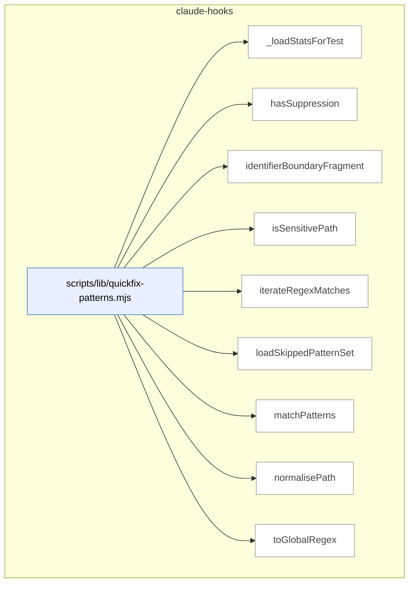

### Symbols in this domain

| Symbol | Kind | Path | Lines | Purpose | File imported by |
|---|---|---|---|---|---|
| [`_loadStatsForTest`](../scripts/lib/quickfix-patterns.mjs#L521) | function | `scripts/lib/quickfix-patterns.mjs` | 521-526 | Loads quickfix pattern statistics from cache for test fixtures. | `scripts/lib/audit/finding-verification.mjs`, `scripts/lib/repo-inventory.mjs`, `tests/learning-quickfix-hook.test.mjs`, +1 more |
| [`hasSuppression`](../scripts/lib/quickfix-patterns.mjs#L270) | function | `scripts/lib/quickfix-patterns.mjs` | 270-274 | Checks if a line contains a quickfix suppression marker for its file type. | `scripts/lib/audit/finding-verification.mjs`, `scripts/lib/repo-inventory.mjs`, `tests/learning-quickfix-hook.test.mjs`, +1 more |
| [`identifierBoundaryFragment`](../scripts/lib/quickfix-patterns.mjs#L52) | function | `scripts/lib/quickfix-patterns.mjs` | 52-56 | Generates a regex fragment matching identifiers at word boundaries or with underscores. | `scripts/lib/audit/finding-verification.mjs`, `scripts/lib/repo-inventory.mjs`, `tests/learning-quickfix-hook.test.mjs`, +1 more |
| [`isSensitivePath`](../scripts/lib/quickfix-patterns.mjs#L258) | function | `scripts/lib/quickfix-patterns.mjs` | 258-260 | Returns true if a path is classified as sensitive (credentials, secrets, etc.). | `scripts/lib/audit/finding-verification.mjs`, `scripts/lib/repo-inventory.mjs`, `tests/learning-quickfix-hook.test.mjs`, +1 more |
| [`iterateRegexMatches`](../scripts/lib/quickfix-patterns.mjs#L303) | function | `scripts/lib/quickfix-patterns.mjs` | 303-310 | Yields all regex matches from text, handling empty matches by advancing lastIndex. | `scripts/lib/audit/finding-verification.mjs`, `scripts/lib/repo-inventory.mjs`, `tests/learning-quickfix-hook.test.mjs`, +1 more |
| [`loadSkippedPatternSet`](../scripts/lib/quickfix-patterns.mjs#L492) | function | `scripts/lib/quickfix-patterns.mjs` | 492-514 | Loads low-acceptance quickfix patterns from cache to skip them in the current run. | `scripts/lib/audit/finding-verification.mjs`, `scripts/lib/repo-inventory.mjs`, `tests/learning-quickfix-hook.test.mjs`, +1 more |
| [`matchPatterns`](../scripts/lib/quickfix-patterns.mjs#L336) | function | `scripts/lib/quickfix-patterns.mjs` | 336-457 | Scans a diff for quickfix shortcut patterns, respecting suppression markers and skipping sensitive files. | `scripts/lib/audit/finding-verification.mjs`, `scripts/lib/repo-inventory.mjs`, `tests/learning-quickfix-hook.test.mjs`, +1 more |
| [`normalisePath`](../scripts/lib/quickfix-patterns.mjs#L245) | function | `scripts/lib/quickfix-patterns.mjs` | 245-247 | Normalizes a path string to canonical form. | `scripts/lib/audit/finding-verification.mjs`, `scripts/lib/repo-inventory.mjs`, `tests/learning-quickfix-hook.test.mjs`, +1 more |
| [`toGlobalRegex`](../scripts/lib/quickfix-patterns.mjs#L288) | function | `scripts/lib/quickfix-patterns.mjs` | 288-291 | Converts a regex to global form by ensuring the 'g' flag is set. | `scripts/lib/audit/finding-verification.mjs`, `scripts/lib/repo-inventory.mjs`, `tests/learning-quickfix-hook.test.mjs`, +1 more |

---

## claudemd-management

> Scans and maintains hygiene in instruction files (CLAUDE.md, AGENTS.md, SKILL.md): validates cross-file references, detects duplicate content via Jaccard similarity, and auto-fixes stale markdown links.

```mermaid
flowchart TB
subgraph dom_claudemd_management ["claudemd-management"]
  file_scripts_lib_claudemd_autofix_mjs["scripts/lib/claudemd/autofix.mjs"]:::component
  sym_scripts_lib_claudemd_autofix_mjs_applyFi["applyFixes"]:::symbol
  file_scripts_lib_claudemd_autofix_mjs --> sym_scripts_lib_claudemd_autofix_mjs_applyFi
  file_scripts_lib_claudemd_doc_similarity_mjs["scripts/lib/claudemd/doc-similarity.mjs"]:::component
  sym_scripts_lib_claudemd_doc_similarity_mjs_["extractParagraphs"]:::symbol
  file_scripts_lib_claudemd_doc_similarity_mjs --> sym_scripts_lib_claudemd_doc_similarity_mjs_
  sym_scripts_lib_claudemd_doc_similarity_mjs_["findSimilarParagraphs"]:::symbol
  file_scripts_lib_claudemd_doc_similarity_mjs --> sym_scripts_lib_claudemd_doc_similarity_mjs_
  sym_scripts_lib_claudemd_doc_similarity_mjs_["jaccardSimilarity"]:::symbol
  file_scripts_lib_claudemd_doc_similarity_mjs --> sym_scripts_lib_claudemd_doc_similarity_mjs_
  sym_scripts_lib_claudemd_doc_similarity_mjs_["normalizeMarkdown"]:::symbol
  file_scripts_lib_claudemd_doc_similarity_mjs --> sym_scripts_lib_claudemd_doc_similarity_mjs_
  sym_scripts_lib_claudemd_doc_similarity_mjs_["tokenize"]:::symbol
  file_scripts_lib_claudemd_doc_similarity_mjs --> sym_scripts_lib_claudemd_doc_similarity_mjs_
  file_scripts_lib_claudemd_file_scanner_mjs["scripts/lib/claudemd/file-scanner.mjs"]:::component
  sym_scripts_lib_claudemd_file_scanner_mjs_ma["matchPattern"]:::symbol
  file_scripts_lib_claudemd_file_scanner_mjs --> sym_scripts_lib_claudemd_file_scanner_mjs_ma
  sym_scripts_lib_claudemd_file_scanner_mjs_sc["scanInstructionFiles"]:::symbol
  file_scripts_lib_claudemd_file_scanner_mjs --> sym_scripts_lib_claudemd_file_scanner_mjs_sc
  sym_scripts_lib_claudemd_file_scanner_mjs_wa["walkDir"]:::symbol
  file_scripts_lib_claudemd_file_scanner_mjs --> sym_scripts_lib_claudemd_file_scanner_mjs_wa
  file_scripts_lib_claudemd_ref_checker_mjs["scripts/lib/claudemd/ref-checker.mjs"]:::component
  sym_scripts_lib_claudemd_ref_checker_mjs_bui["buildEnvVarIndex"]:::symbol
  file_scripts_lib_claudemd_ref_checker_mjs --> sym_scripts_lib_claudemd_ref_checker_mjs_bui
  sym_scripts_lib_claudemd_ref_checker_mjs_bui["buildFunctionIndex"]:::symbol
  file_scripts_lib_claudemd_ref_checker_mjs --> sym_scripts_lib_claudemd_ref_checker_mjs_bui
  sym_scripts_lib_claudemd_ref_checker_mjs_ext["extractEnvVarRefs"]:::symbol
  file_scripts_lib_claudemd_ref_checker_mjs --> sym_scripts_lib_claudemd_ref_checker_mjs_ext
  sym_scripts_lib_claudemd_ref_checker_mjs_ext["extractFileRefs"]:::symbol
  file_scripts_lib_claudemd_ref_checker_mjs --> sym_scripts_lib_claudemd_ref_checker_mjs_ext
  sym_scripts_lib_claudemd_ref_checker_mjs_ext["extractFunctionRefs"]:::symbol
  file_scripts_lib_claudemd_ref_checker_mjs --> sym_scripts_lib_claudemd_ref_checker_mjs_ext
  sym_scripts_lib_claudemd_ref_checker_mjs_res["resolveReferencedPath"]:::symbol
  file_scripts_lib_claudemd_ref_checker_mjs --> sym_scripts_lib_claudemd_ref_checker_mjs_res
  file_scripts_lib_claudemd_rules_mjs["scripts/lib/claudemd/rules.mjs"]:::component
  sym_scripts_lib_claudemd_rules_mjs_checkClau["checkClaudeAgentsSync"]:::symbol
  file_scripts_lib_claudemd_rules_mjs --> sym_scripts_lib_claudemd_rules_mjs_checkClau
  sym_scripts_lib_claudemd_rules_mjs_checkCros["checkCrossFileDuplication"]:::symbol
  file_scripts_lib_claudemd_rules_mjs --> sym_scripts_lib_claudemd_rules_mjs_checkCros
  sym_scripts_lib_claudemd_rules_mjs_checkDeep["checkDeepCodeDetail"]:::symbol
  file_scripts_lib_claudemd_rules_mjs --> sym_scripts_lib_claudemd_rules_mjs_checkDeep
  sym_scripts_lib_claudemd_rules_mjs_checkSize["checkSize"]:::symbol
  file_scripts_lib_claudemd_rules_mjs --> sym_scripts_lib_claudemd_rules_mjs_checkSize
  sym_scripts_lib_claudemd_rules_mjs_checkStal["checkStaleEnvVarRefs"]:::symbol
  file_scripts_lib_claudemd_rules_mjs --> sym_scripts_lib_claudemd_rules_mjs_checkStal
  sym_scripts_lib_claudemd_rules_mjs_checkStal["checkStaleFileRefs"]:::symbol
  file_scripts_lib_claudemd_rules_mjs --> sym_scripts_lib_claudemd_rules_mjs_checkStal
  sym_scripts_lib_claudemd_rules_mjs_checkStal["checkStaleFunctionRefs"]:::symbol
  file_scripts_lib_claudemd_rules_mjs --> sym_scripts_lib_claudemd_rules_mjs_checkStal
  sym_scripts_lib_claudemd_rules_mjs_extractHe["extractHeadings"]:::symbol
  file_scripts_lib_claudemd_rules_mjs --> sym_scripts_lib_claudemd_rules_mjs_extractHe
  sym_scripts_lib_claudemd_rules_mjs_runRules["runRules"]:::symbol
  file_scripts_lib_claudemd_rules_mjs --> sym_scripts_lib_claudemd_rules_mjs_runRules
  sym_scripts_lib_claudemd_rules_mjs_semanticI["semanticId"]:::symbol
  file_scripts_lib_claudemd_rules_mjs --> sym_scripts_lib_claudemd_rules_mjs_semanticI
  file_scripts_lib_claudemd_sarif_formatter_mjs["scripts/lib/claudemd/sarif-formatter.mjs"]:::component
  sym_scripts_lib_claudemd_sarif_formatter_mjs["buildRuleDescriptors"]:::symbol
  file_scripts_lib_claudemd_sarif_formatter_mjs --> sym_scripts_lib_claudemd_sarif_formatter_mjs
  sym_scripts_lib_claudemd_sarif_formatter_mjs["ruleDescription"]:::symbol
  file_scripts_lib_claudemd_sarif_formatter_mjs --> sym_scripts_lib_claudemd_sarif_formatter_mjs
  sym_scripts_lib_claudemd_sarif_formatter_mjs["sarifLevel"]:::symbol
  file_scripts_lib_claudemd_sarif_formatter_mjs --> sym_scripts_lib_claudemd_sarif_formatter_mjs
  sym_scripts_lib_claudemd_sarif_formatter_mjs["toSarif"]:::symbol
  file_scripts_lib_claudemd_sarif_formatter_mjs --> sym_scripts_lib_claudemd_sarif_formatter_mjs
  file_scripts_lib_claudemd_step65_hook_mjs["scripts/lib/claudemd/step65-hook.mjs"]:::component
  sym_scripts_lib_claudemd_step65_hook_mjs_run["runHygieneCheck"]:::symbol
  file_scripts_lib_claudemd_step65_hook_mjs --> sym_scripts_lib_claudemd_step65_hook_mjs_run
end
classDef container fill:#f5f5f5,stroke:#333,stroke-width:2px,color:#000
classDef component fill:#e8f0ff,stroke:#3178c6,color:#000
classDef symbol fill:#fff,stroke:#999,color:#444
classDef dup fill:#ffe8d8,stroke:#c0392b,stroke-width:2px,color:#000
classDef violation fill:#ffd6d6,stroke:#c0392b,stroke-width:2px,color:#000
```

### Symbols in this domain

| Symbol | Kind | Path | Lines | Purpose | File imported by |
|---|---|---|---|---|---|
| [`applyFixes`](../scripts/lib/claudemd/autofix.mjs#L17) | function | `scripts/lib/claudemd/autofix.mjs` | 17-74 | Removes stale markdown file references by splicing lines bottom-to-top. | `scripts/claudemd-lint.mjs`, `tests/claudemd/autofix.test.mjs` |
| [`extractParagraphs`](../scripts/lib/claudemd/doc-similarity.mjs#L68) | function | `scripts/lib/claudemd/doc-similarity.mjs` | 68-103 | Splits content into code-block-aware paragraphs with line numbers. | `scripts/lib/claudemd/rules.mjs`, `tests/claudemd/doc-similarity.test.mjs` |
| [`findSimilarParagraphs`](../scripts/lib/claudemd/doc-similarity.mjs#L114) | function | `scripts/lib/claudemd/doc-similarity.mjs` | 114-146 | Finds similar paragraph pairs between two documents using Jaccard similarity. | `scripts/lib/claudemd/rules.mjs`, `tests/claudemd/doc-similarity.test.mjs` |
| [`jaccardSimilarity`](../scripts/lib/claudemd/doc-similarity.mjs#L53) | function | `scripts/lib/claudemd/doc-similarity.mjs` | 53-61 | Computes Jaccard similarity (intersection/union ratio) for two token sets. | `scripts/lib/claudemd/rules.mjs`, `tests/claudemd/doc-similarity.test.mjs` |
| [`normalizeMarkdown`](../scripts/lib/claudemd/doc-similarity.mjs#L24) | function | `scripts/lib/claudemd/doc-similarity.mjs` | 24-34 | Strips markdown formatting (links, code, emphasis) for text comparison. | `scripts/lib/claudemd/rules.mjs`, `tests/claudemd/doc-similarity.test.mjs` |
| [`tokenize`](../scripts/lib/claudemd/doc-similarity.mjs#L41) | function | `scripts/lib/claudemd/doc-similarity.mjs` | 41-45 | Splits normalized markdown into lowercase words, filtering stopwords, returning as set. | `scripts/lib/claudemd/rules.mjs`, `tests/claudemd/doc-similarity.test.mjs` |
| [`matchPattern`](../scripts/lib/claudemd/file-scanner.mjs#L72) | function | `scripts/lib/claudemd/file-scanner.mjs` | 72-93 | Tests if a file path matches a glob pattern with `**/` and `*/` wildcards. | `scripts/check-context-drift.mjs`, `scripts/claudemd-lint.mjs`, `scripts/lib/claudemd/ref-checker.mjs`, +1 more |
| [`scanInstructionFiles`](../scripts/lib/claudemd/file-scanner.mjs#L102) | function | `scripts/lib/claudemd/file-scanner.mjs` | 102-133 | Scans a repo for all instruction files, reads them, and returns metadata. | `scripts/check-context-drift.mjs`, `scripts/claudemd-lint.mjs`, `scripts/lib/claudemd/ref-checker.mjs`, +1 more |
| [`walkDir`](../scripts/lib/claudemd/file-scanner.mjs#L30) | function | `scripts/lib/claudemd/file-scanner.mjs` | 30-68 | Recursively walks directories to find files matching named patterns (CLAUDE.md, AGENTS.md, SKILL.md). | `scripts/check-context-drift.mjs`, `scripts/claudemd-lint.mjs`, `scripts/lib/claudemd/ref-checker.mjs`, +1 more |
| [`buildEnvVarIndex`](../scripts/lib/claudemd/ref-checker.mjs#L194) | function | `scripts/lib/claudemd/ref-checker.mjs` | 194-235 | Collects all env vars from .env.example and source code process.env references. | `scripts/lib/claudemd/rules.mjs`, `tests/claudemd/ref-checker.test.mjs` |
| [`buildFunctionIndex`](../scripts/lib/claudemd/ref-checker.mjs#L91) | function | `scripts/lib/claudemd/ref-checker.mjs` | 91-124 | Walks the codebase and collects all exported function and class names. | `scripts/lib/claudemd/rules.mjs`, `tests/claudemd/ref-checker.test.mjs` |
| [`extractEnvVarRefs`](../scripts/lib/claudemd/ref-checker.mjs#L165) | function | `scripts/lib/claudemd/ref-checker.mjs` | 165-187 | Extracts ALL_CAPS_WITH_UNDERSCORES env var names from backtick references. | `scripts/lib/claudemd/rules.mjs`, `tests/claudemd/ref-checker.test.mjs` |
| [`extractFileRefs`](../scripts/lib/claudemd/ref-checker.mjs#L52) | function | `scripts/lib/claudemd/ref-checker.mjs` | 52-84 | Extracts markdown links and backtick file paths from content with line numbers. | `scripts/lib/claudemd/rules.mjs`, `tests/claudemd/ref-checker.test.mjs` |
| [`extractFunctionRefs`](../scripts/lib/claudemd/ref-checker.mjs#L132) | function | `scripts/lib/claudemd/ref-checker.mjs` | 132-158 | Extracts backtick-quoted function/class references from markdown. | `scripts/lib/claudemd/rules.mjs`, `tests/claudemd/ref-checker.test.mjs` |
| [`resolveReferencedPath`](../scripts/lib/claudemd/ref-checker.mjs#L25) | function | `scripts/lib/claudemd/ref-checker.mjs` | 25-44 | Resolves a reference path relative to a source file and checks if it exists. | `scripts/lib/claudemd/rules.mjs`, `tests/claudemd/ref-checker.test.mjs` |
| [`checkClaudeAgentsSync`](../scripts/lib/claudemd/rules.mjs#L234) | function | `scripts/lib/claudemd/rules.mjs` | 234-271 | Detects heading conflicts between CLAUDE.md and AGENTS.md files. | `scripts/claudemd-lint.mjs`, `tests/claudemd/rules.test.mjs` |
| [`checkCrossFileDuplication`](../scripts/lib/claudemd/rules.mjs#L203) | function | `scripts/lib/claudemd/rules.mjs` | 203-232 | Finds similar paragraphs across instruction files in the same directory tree. | `scripts/claudemd-lint.mjs`, `tests/claudemd/rules.test.mjs` |
| [`checkDeepCodeDetail`](../scripts/lib/claudemd/rules.mjs#L186) | function | `scripts/lib/claudemd/rules.mjs` | 186-201 | Warns when an instruction file has too many fenced code blocks. | `scripts/claudemd-lint.mjs`, `tests/claudemd/rules.test.mjs` |
| [`checkSize`](../scripts/lib/claudemd/rules.mjs#L108) | function | `scripts/lib/claudemd/rules.mjs` | 108-122 | Flags instruction files exceeding byte limits. | `scripts/claudemd-lint.mjs`, `tests/claudemd/rules.test.mjs` |
| [`checkStaleEnvVarRefs`](../scripts/lib/claudemd/rules.mjs#L168) | function | `scripts/lib/claudemd/rules.mjs` | 168-184 | Reports references to env vars not in .env.example or source code. | `scripts/claudemd-lint.mjs`, `tests/claudemd/rules.test.mjs` |
| [`checkStaleFileRefs`](../scripts/lib/claudemd/rules.mjs#L124) | function | `scripts/lib/claudemd/rules.mjs` | 124-142 | Detects broken file references in markdown links and backticks. | `scripts/claudemd-lint.mjs`, `tests/claudemd/rules.test.mjs` |
| [`checkStaleFunctionRefs`](../scripts/lib/claudemd/rules.mjs#L144) | function | `scripts/lib/claudemd/rules.mjs` | 144-166 | Reports references to functions/classes that don't exist in source. | `scripts/claudemd-lint.mjs`, `tests/claudemd/rules.test.mjs` |
| [`extractHeadings`](../scripts/lib/claudemd/rules.mjs#L278) | function | `scripts/lib/claudemd/rules.mjs` | 278-302 | Parses markdown headings and their content into a map. | `scripts/claudemd-lint.mjs`, `tests/claudemd/rules.test.mjs` |
| [`runRules`](../scripts/lib/claudemd/rules.mjs#L44) | function | `scripts/lib/claudemd/rules.mjs` | 44-106 | Runs all enabled hygiene checks (size, staleness, duplication, sync conflicts) on instruction files. | `scripts/claudemd-lint.mjs`, `tests/claudemd/rules.test.mjs` |
| [`semanticId`](../scripts/lib/claudemd/rules.mjs#L17) | function | `scripts/lib/claudemd/rules.mjs` | 17-22 | Generates a 16-character semantic hash fingerprint for a hygiene finding. | `scripts/claudemd-lint.mjs`, `tests/claudemd/rules.test.mjs` |
| [`buildRuleDescriptors`](../scripts/lib/claudemd/sarif-formatter.mjs#L49) | function | `scripts/lib/claudemd/sarif-formatter.mjs` | 49-62 | Generates SARIF rule metadata from unique finding rule IDs. | `scripts/check-context-drift.mjs`, `scripts/check-model-freshness.mjs`, `scripts/claudemd-lint.mjs` |
| [`ruleDescription`](../scripts/lib/claudemd/sarif-formatter.mjs#L64) | function | `scripts/lib/claudemd/sarif-formatter.mjs` | 64-77 | Returns human-readable descriptions for rule IDs. | `scripts/check-context-drift.mjs`, `scripts/check-model-freshness.mjs`, `scripts/claudemd-lint.mjs` |
| [`sarifLevel`](../scripts/lib/claudemd/sarif-formatter.mjs#L40) | function | `scripts/lib/claudemd/sarif-formatter.mjs` | 40-47 | Maps severity strings to SARIF level values. | `scripts/check-context-drift.mjs`, `scripts/check-model-freshness.mjs`, `scripts/claudemd-lint.mjs` |
| [`toSarif`](../scripts/lib/claudemd/sarif-formatter.mjs#L11) | function | `scripts/lib/claudemd/sarif-formatter.mjs` | 11-38 | Converts a hygiene report to SARIF 2.1.0 JSON format. | `scripts/check-context-drift.mjs`, `scripts/check-model-freshness.mjs`, `scripts/claudemd-lint.mjs` |
| [`runHygieneCheck`](../scripts/lib/claudemd/step65-hook.mjs#L16) | function | `scripts/lib/claudemd/step65-hook.mjs` | 16-65 | Runs claudemd-lint and parses its JSON output report. | _(internal)_ |

---

## cross-skill-bridge

> Parses CLI subcommands and payloads, dispatches to skill handlers, and persists cross-skill data (plans, findings, repo context) to the learning store.

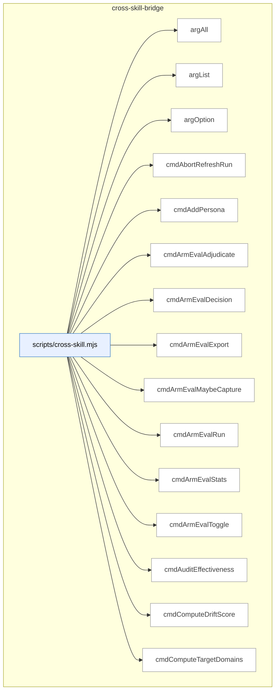

_Domain has 82 symbols (>50). Diagram shows top-15 by file order; see flat table below for the full list._

### Symbols in this domain

| Symbol | Kind | Path | Lines | Purpose | File imported by |
|---|---|---|---|---|---|
| [`argAll`](../scripts/cross-skill.mjs#L153) | function | `scripts/cross-skill.mjs` | 153-159 | Collects all occurrences of a named flag's values into an array. | _(internal)_ |
| [`argList`](../scripts/cross-skill.mjs#L147) | function | `scripts/cross-skill.mjs` | 147-150 | Splits comma-separated values of a named flag into an array, trimmed and filtered. | _(internal)_ |
| [`argOption`](../scripts/cross-skill.mjs#L140) | function | `scripts/cross-skill.mjs` | 140-144 | Returns the value of a named CLI flag (e.g., `--name value` returns value). | _(internal)_ |
| [`cmdAbortRefreshRun`](../scripts/cross-skill.mjs#L1867) | function | `scripts/cross-skill.mjs` | 1867-1877 | Cancels an in-progress refresh run. | _(internal)_ |
| [`cmdAddPersona`](../scripts/cross-skill.mjs#L1072) | function | `scripts/cross-skill.mjs` | 1072-1084 | Creates or updates a persona for an app. | _(internal)_ |
| [`cmdArmEvalAdjudicate`](../scripts/cross-skill.mjs#L810) | function | `scripts/cross-skill.mjs` | 810-834 | Records human ranking of blinded arm-eval outputs and exports the session. | _(internal)_ |
| [`cmdArmEvalDecision`](../scripts/cross-skill.mjs#L776) | function | `scripts/cross-skill.mjs` | 776-793 | Evaluates arm-eval sessions to decide which model baseline to keep. | _(internal)_ |
| [`cmdArmEvalExport`](../scripts/cross-skill.mjs#L842) | function | `scripts/cross-skill.mjs` | 842-860 | Exports arm-eval sessions to disk. | _(internal)_ |
| [`cmdArmEvalMaybeCapture`](../scripts/cross-skill.mjs#L901) | function | `scripts/cross-skill.mjs` | 901-917 | Conditionally captures an arm-eval session if toggle and budget allow. | _(internal)_ |
| [`cmdArmEvalRun`](../scripts/cross-skill.mjs#L754) | function | `scripts/cross-skill.mjs` | 754-773 | Runs an arm-eval experiment session with optional budget and configuration. | _(internal)_ |
| [`cmdArmEvalStats`](../scripts/cross-skill.mjs#L796) | function | `scripts/cross-skill.mjs` | 796-807 | Fetches the arm-eval leaderboard with optional filtering. | _(internal)_ |
| [`cmdArmEvalToggle`](../scripts/cross-skill.mjs#L868) | function | `scripts/cross-skill.mjs` | 868-893 | Enables/disables arm-eval capture with optional budget override. | _(internal)_ |
| [`cmdAuditEffectiveness`](../scripts/cross-skill.mjs#L584) | function | `scripts/cross-skill.mjs` | 584-591 | Queries precision/recall audit effectiveness stats for a repo. | _(internal)_ |
| [`cmdComputeDriftScore`](../scripts/cross-skill.mjs#L1971) | function | `scripts/cross-skill.mjs` | 1971-1982 | Computes architectural drift between refresh snapshots. | _(internal)_ |
| [`cmdComputeTargetDomains`](../scripts/cross-skill.mjs#L1711) | function | `scripts/cross-skill.mjs` | 1711-1723 | Tags target files against domain rules. | _(internal)_ |
| [`cmdDetectStack`](../scripts/cross-skill.mjs#L1546) | function | `scripts/cross-skill.mjs` | 1546-1563 | Detects repo tech stack and environment manager. | _(internal)_ |
| [`cmdFinalizeOutcomes`](../scripts/cross-skill.mjs#L972) | function | `scripts/cross-skill.mjs` | 972-1042 | Finalizes audit round outcomes and syncs to learning store. | _(internal)_ |
| [`cmdFinalReviewAdjudicate`](../scripts/cross-skill.mjs#L630) | function | `scripts/cross-skill.mjs` | 630-644 | Marks a shadow final-review finding as accepted or dismissed for A/B evaluation tracking. | _(internal)_ |
| [`cmdFinalReviewStats`](../scripts/cross-skill.mjs#L595) | function | `scripts/cross-skill.mjs` | 595-628 | Fetches final-review shadow findings and optionally renders them as a human-grade adjudication worksheet. | _(internal)_ |
| [`cmdFrictionLog`](../scripts/cross-skill.mjs#L2096) | function | `scripts/cross-skill.mjs` | 2096-2101 | Dispatcher for friction-log operations. | _(internal)_ |
| [`cmdGetActiveRefreshId`](../scripts/cross-skill.mjs#L1583) | function | `scripts/cross-skill.mjs` | 1583-1599 | Fetches active architectural-memory snapshot ID and embedding model. | _(internal)_ |
| [`cmdGetCallersForFile`](../scripts/cross-skill.mjs#L1725) | function | `scripts/cross-skill.mjs` | 1725-1788 | Queries the symbol-import graph for file callers. | _(internal)_ |
| [`cmdGetFrictionNeighbourhood`](../scripts/cross-skill.mjs#L1700) | function | `scripts/cross-skill.mjs` | 1700-1709 | Fetches friction entries similar to a prompt. | _(internal)_ |
| [`cmdGetIncidentNeighbourhood`](../scripts/cross-skill.mjs#L1601) | function | `scripts/cross-skill.mjs` | 1601-1642 | Retrieves similar security incidents from memory based on intent. | _(internal)_ |
| [`cmdGetNavFirstSeen`](../scripts/cross-skill.mjs#L536) | function | `scripts/cross-skill.mjs` | 536-551 | Looks up when nav-audit drift keys first appeared in history (14-day governance smell detection). | _(internal)_ |
| [`cmdGetNeighbourhood`](../scripts/cross-skill.mjs#L1790) | function | `scripts/cross-skill.mjs` | 1790-1833 | Retrieves architecturally similar symbols for reuse consultation. | _(internal)_ |
| [`cmdGetPersonaSessionsByRepo`](../scripts/cross-skill.mjs#L1325) | function | `scripts/cross-skill.mjs` | 1325-1353 | Retrieves persona sessions for a repo with optional filtering. | _(internal)_ |
| [`cmdGetPersonaSessionsByUrl`](../scripts/cross-skill.mjs#L1518) | function | `scripts/cross-skill.mjs` | 1518-1544 | Retrieves persona sessions for a given app URL. | _(internal)_ |
| [`cmdGetReachabilityEvidence`](../scripts/cross-skill.mjs#L1360) | function | `scripts/cross-skill.mjs` | 1360-1394 | Fetches persona click-path evidence for nav-audit seeding. | _(internal)_ |
| [`cmdGetRecentFindings`](../scripts/cross-skill.mjs#L1475) | function | `scripts/cross-skill.mjs` | 1475-1510 | Fetches recent audit findings for a repo with optional filtering. | _(internal)_ |
| [`cmdLearningBackfillOutcomes`](../scripts/cross-skill.mjs#L2080) | function | `scripts/cross-skill.mjs` | 2080-2090 | Backfills missing outcome labels and recalculates rewards. | _(internal)_ |
| [`cmdLearningQuickfixStats`](../scripts/cross-skill.mjs#L2123) | function | `scripts/cross-skill.mjs` | 2123-2149 | Reads or rebuilds quickfix pattern statistics from cache or cloud, emitting JSON summaries. | _(internal)_ |
| [`cmdLearningRecord`](../scripts/cross-skill.mjs#L1999) | function | `scripts/cross-skill.mjs` | 1999-2038 | Records a learning-system decision to Supabase. | _(internal)_ |
| [`cmdLearningReplay`](../scripts/cross-skill.mjs#L2108) | function | `scripts/cross-skill.mjs` | 2108-2116 | Runs the learning replay CLI from an imported module and propagates exit codes. | _(internal)_ |
| [`cmdLearningStats`](../scripts/cross-skill.mjs#L2045) | function | `scripts/cross-skill.mjs` | 2045-2056 | Fetches adaptive-learning statistics for a repo. | _(internal)_ |
| [`cmdLearningWeeklyReview`](../scripts/cross-skill.mjs#L2064) | function | `scripts/cross-skill.mjs` | 2064-2072 | Generates a weekly learning-system digest. | _(internal)_ |
| [`cmdListConsistencyCandidates`](../scripts/cross-skill.mjs#L343) | function | `scripts/cross-skill.mjs` | 343-356 | Queries consistency-mode regression candidates for a repo filtered by age and limit. | _(internal)_ |
| [`cmdListLayeringViolationsForSnapshot`](../scripts/cross-skill.mjs#L1958) | function | `scripts/cross-skill.mjs` | 1958-1969 | Enumerates all layering violations in a refresh snapshot. | _(internal)_ |
| [`cmdListPersonas`](../scripts/cross-skill.mjs#L1050) | function | `scripts/cross-skill.mjs` | 1050-1061 | Lists personas for a given app URL. | _(internal)_ |
| [`cmdListPersonaTestCandidates`](../scripts/cross-skill.mjs#L396) | function | `scripts/cross-skill.mjs` | 396-408 | Retrieves persona-test candidates for a repo filtered by age, occurrence threshold, and severity floor. | _(internal)_ |
| [`cmdListSymbolsForSnapshot`](../scripts/cross-skill.mjs#L1945) | function | `scripts/cross-skill.mjs` | 1945-1956 | Enumerates all symbols in a refresh snapshot. | _(internal)_ |
| [`cmdListUnlockedFixes`](../scripts/cross-skill.mjs#L576) | function | `scripts/cross-skill.mjs` | 576-582 | Retrieves recent HIGH fixes without a /ux-lock regression spec (unlock-fixes view). | _(internal)_ |
| [`cmdMarkPersonaTestCandidateProposed`](../scripts/cross-skill.mjs#L410) | function | `scripts/cross-skill.mjs` | 410-422 | Marks a persona-test candidate as having been proposed (status update for tracking). | _(internal)_ |
| [`cmdModelAbAdjudicate`](../scripts/cross-skill.mjs#L655) | function | `scripts/cross-skill.mjs` | 655-726 | Presents a blinded model-A/B/C adjudication queue as a worksheet (default) or JSON. | _(internal)_ |
| [`cmdModelAbDecision`](../scripts/cross-skill.mjs#L929) | function | `scripts/cross-skill.mjs` | 929-950 | Evaluates model-A/B/C findings to decide which model to keep. | _(internal)_ |
| [`cmdModelAbStats`](../scripts/cross-skill.mjs#L729) | function | `scripts/cross-skill.mjs` | 729-747 | Fetches model-A/B/C effectiveness metrics, frontier ranking, and budget status. | _(internal)_ |
| [`cmdOpenRefreshRun`](../scripts/cross-skill.mjs#L1835) | function | `scripts/cross-skill.mjs` | 1835-1853 | Opens a new architectural-memory refresh run and upserts repo. | _(internal)_ |
| [`cmdPersonaOutcomes`](../scripts/cross-skill.mjs#L1233) | function | `scripts/cross-skill.mjs` | 1233-1307 | Labels persona findings (fixed/dismissed/wont_fix/stale) with optional worksheet. | _(internal)_ |
| [`cmdPlanSatisfaction`](../scripts/cross-skill.mjs#L495) | function | `scripts/cross-skill.mjs` | 495-505 | Queries latest verify run results and chronic failure criteria (≥2 consecutive failures) for a plan. | _(internal)_ |
| [`cmdPreviewGate`](../scripts/cross-skill.mjs#L1449) | function | `scripts/cross-skill.mjs` | 1449-1457 | Resolves the preview gate verdict (OK/WARN/HALT). | _(internal)_ |
| [`cmdPromoteRegressionSpec`](../scripts/cross-skill.mjs#L358) | function | `scripts/cross-skill.mjs` | 358-371 | Marks a consistency candidate as promoted to a locked Playwright spec. | _(internal)_ |
| [`cmdPublishRefreshRun`](../scripts/cross-skill.mjs#L1855) | function | `scripts/cross-skill.mjs` | 1855-1865 | Marks a refresh run complete and publishes the snapshot. | _(internal)_ |
| [`cmdQuality`](../scripts/cross-skill.mjs#L1649) | function | `scripts/cross-skill.mjs` | 1649-1698 | Dispatcher for friction-gate commands (add/mirror/digest/link/session-review). | _(internal)_ |
| [`cmdRecommendSkills`](../scripts/cross-skill.mjs#L1404) | function | `scripts/cross-skill.mjs` | 1404-1442 | Recommends the next 1–2 UX/audit skills based on findings and deployment status. | _(internal)_ |
| [`cmdRecordCorrelation`](../scripts/cross-skill.mjs#L442) | function | `scripts/cross-skill.mjs` | 442-460 | Links a persona-test finding to an audit finding with match score and rationale for learning correlation. | _(internal)_ |
| [`cmdRecordLayeringViolations`](../scripts/cross-skill.mjs#L1919) | function | `scripts/cross-skill.mjs` | 1919-1931 | Writes architectural layering violations to the refresh run. | _(internal)_ |
| [`cmdRecordNavAuditRun`](../scripts/cross-skill.mjs#L509) | function | `scripts/cross-skill.mjs` | 509-534 | Logs a nav-audit execution with drift keys and optional finding counts; idempotent by (repoId, headSha, scope). | _(internal)_ |
| [`cmdRecordPersonaSession`](../scripts/cross-skill.mjs#L1118) | function | `scripts/cross-skill.mjs` | 1118-1144 | Records a persona test session and correlates P0/P1 findings with audit ground truth. | _(internal)_ |
| [`cmdRecordPlanVerifyItems`](../scripts/cross-skill.mjs#L484) | function | `scripts/cross-skill.mjs` | 484-493 | Stores per-criterion pass/fail results for a verify run with stable criterion hashes. | _(internal)_ |
| [`cmdRecordPlanVerifyRun`](../scripts/cross-skill.mjs#L462) | function | `scripts/cross-skill.mjs` | 462-482 | Records a /ux-lock verify invocation with criteria counts and pass/fail totals. | _(internal)_ |
| [`cmdRecordRegressionSpec`](../scripts/cross-skill.mjs#L273) | function | `scripts/cross-skill.mjs` | 273-341 | Registers a new regression spec (from ux-lock or persona-consistency); pre-redacts sensitive data before cloud write. | _(internal)_ |
| [`cmdRecordRegressionSpecRun`](../scripts/cross-skill.mjs#L424) | function | `scripts/cross-skill.mjs` | 424-440 | Logs a regression spec execution result (pass/fail, duration, captured regression). | _(internal)_ |
| [`cmdRecordShipEvent`](../scripts/cross-skill.mjs#L553) | function | `scripts/cross-skill.mjs` | 553-574 | Records a deployment outcome (shipped/blocked/warned/overridden) with context flags for ship-gate analysis. | _(internal)_ |
| [`cmdRecordSymbolDefinitions`](../scripts/cross-skill.mjs#L1879) | function | `scripts/cross-skill.mjs` | 1879-1889 | Writes symbol definitions to the refresh run. | _(internal)_ |
| [`cmdRecordSymbolEmbedding`](../scripts/cross-skill.mjs#L1905) | function | `scripts/cross-skill.mjs` | 1905-1917 | Persists an embedding vector for a symbol definition. | _(internal)_ |
| [`cmdRecordSymbolIndex`](../scripts/cross-skill.mjs#L1891) | function | `scripts/cross-skill.mjs` | 1891-1903 | Writes symbol-index rows (imports/dependencies) to the refresh run. | _(internal)_ |
| [`cmdResolveRepoIdentity`](../scripts/cross-skill.mjs#L1984) | function | `scripts/cross-skill.mjs` | 1984-1990 | Resolves and optionally persists the repo UUID identity. | _(internal)_ |
| [`cmdSetActiveEmbeddingModel`](../scripts/cross-skill.mjs#L1933) | function | `scripts/cross-skill.mjs` | 1933-1943 | Sets the embedding model/dimension for a repo. | _(internal)_ |
| [`cmdUpdatePlanStatus`](../scripts/cross-skill.mjs#L264) | function | `scripts/cross-skill.mjs` | 264-271 | Updates a plan's status field in the learning store. | _(internal)_ |
| [`cmdUpsertPersonaTestCandidate`](../scripts/cross-skill.mjs#L375) | function | `scripts/cross-skill.mjs` | 375-394 | Records/updates a persona-test finding occurrence with severity; tracks first/last seen timestamps. | _(internal)_ |
| [`cmdUpsertPlan`](../scripts/cross-skill.mjs#L234) | function | `scripts/cross-skill.mjs` | 234-262 | Creates/updates a plan record with path, skill, status, checksum; optionally triggers arm-eval capture for task-based learning. | _(internal)_ |
| [`cmdWhoami`](../scripts/cross-skill.mjs#L1565) | function | `scripts/cross-skill.mjs` | 1565-1579 | Reports current cloud connectivity, commit SHA, and branch. | _(internal)_ |
| [`currentBranch`](../scripts/cross-skill.mjs#L183) | function | `scripts/cross-skill.mjs` | 183-188 | Returns current branch name via `git rev-parse --abbrev-ref HEAD`. | _(internal)_ |
| [`currentCommitSha`](../scripts/cross-skill.mjs#L176) | function | `scripts/cross-skill.mjs` | 176-181 | Returns HEAD commit SHA via `git rev-parse HEAD`. | _(internal)_ |
| [`emitError`](../scripts/cross-skill.mjs#L169) | function | `scripts/cross-skill.mjs` | 169-172 | Outputs error JSON and exits with specified code. | _(internal)_ |
| [`gitChangedFiles`](../scripts/cross-skill.mjs#L1460) | function | `scripts/cross-skill.mjs` | 1460-1468 | Returns deduplicated list of git-changed and untracked files. | _(internal)_ |
| [`hasFlag`](../scripts/cross-skill.mjs#L162) | function | `scripts/cross-skill.mjs` | 162-162 | Tests whether a named flag is present in remaining arguments. | _(internal)_ |
| [`main`](../scripts/cross-skill.mjs#L2234) | function | `scripts/cross-skill.mjs` | 2234-2258 | Validates subcommands, routes to handlers, and captures exceptions with error reporting. | _(internal)_ |
| [`parsePayload`](../scripts/cross-skill.mjs#L123) | function | `scripts/cross-skill.mjs` | 123-138 | Extracts JSON payload from command args via --json, --stdin, or bare JSON string as final argument. | _(internal)_ |
| [`resolveRepoId`](../scripts/cross-skill.mjs#L208) | function | `scripts/cross-skill.mjs` | 208-230 | Determines repo ID from explicit payload.repoId, UUID lookup, or resolves from current repo; fails closed on transient errors. | _(internal)_ |
| [`resolveRepoIdentityQuiet`](../scripts/cross-skill.mjs#L920) | function | `scripts/cross-skill.mjs` | 920-926 | Resolves repo UUID from cwd, returning null on error. | _(internal)_ |
| [`runAutoCorrelate`](../scripts/cross-skill.mjs#L1156) | function | `scripts/cross-skill.mjs` | 1156-1224 | Matches P0/P1 persona findings against audit findings using fuzzy similarity. | _(internal)_ |

---

## dashboard

> Renders audit findings, telemetry statistics, and architecture reference data into browsable HTML dashboards via a CLI builder that validates data sources before rendering.

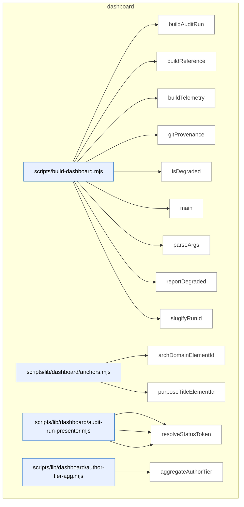

_Domain has 122 symbols (>50). Diagram shows top-15 by file order; see flat table below for the full list._

### Symbols in this domain

| Symbol | Kind | Path | Lines | Purpose | File imported by |
|---|---|---|---|---|---|
| [`buildAuditRun`](../scripts/build-dashboard.mjs#L157) | function | `scripts/build-dashboard.mjs` | 157-183 | Generates and persists an HTML page for a specific audit run, handling missing/invalid run pointers. | `tests/dashboard.test.mjs` |
| [`buildReference`](../scripts/build-dashboard.mjs#L131) | function | `scripts/build-dashboard.mjs` | 131-137 | Generates and persists the reference HTML dashboard page. | `tests/dashboard.test.mjs` |
| [`buildTelemetry`](../scripts/build-dashboard.mjs#L139) | function | `scripts/build-dashboard.mjs` | 139-145 | Generates and persists the telemetry HTML dashboard page. | `tests/dashboard.test.mjs` |
| [`gitProvenance`](../scripts/build-dashboard.mjs#L113) | function | `scripts/build-dashboard.mjs` | 113-123 | Captures the current git commit SHA and working-tree dirty state. | `tests/dashboard.test.mjs` |
| [`isDegraded`](../scripts/build-dashboard.mjs#L125) | function | `scripts/build-dashboard.mjs` | 125-129 | Checks whether any data source has an invalid or unexpected-error status. | `tests/dashboard.test.mjs` |
| [`main`](../scripts/build-dashboard.mjs#L198) | function | `scripts/build-dashboard.mjs` | 198-264 | Orchestrates dashboard builds for the requested subcommand, with optional side builds (reference triggers telemetry). | `tests/dashboard.test.mjs` |
| [`parseArgs`](../scripts/build-dashboard.mjs#L57) | function | `scripts/build-dashboard.mjs` | 57-97 | Parses CLI arguments for the dashboard builder (subcommand, port, run ID, help flag). | `tests/dashboard.test.mjs` |
| [`reportDegraded`](../scripts/build-dashboard.mjs#L185) | function | `scripts/build-dashboard.mjs` | 185-196 | Logs detailed warnings for any degraded data sources. | `tests/dashboard.test.mjs` |
| [`slugifyRunId`](../scripts/build-dashboard.mjs#L103) | function | `scripts/build-dashboard.mjs` | 103-110 | Converts a run ID into a safe, lowercased alphanumeric filename slug. | `tests/dashboard.test.mjs` |
| [`archDomainElementId`](../scripts/lib/dashboard/anchors.mjs#L15) | function | `scripts/lib/dashboard/anchors.mjs` | 15-17 | Generates consistent DOM anchor ID for architecture domain element. | `scripts/lib/dashboard/collect-purposes.mjs`, `scripts/lib/dashboard/sections/architecture.mjs`, `tests/dashboard-purpose.test.mjs` |
| [`purposeTitleElementId`](../scripts/lib/dashboard/anchors.mjs#L24) | function | `scripts/lib/dashboard/anchors.mjs` | 24-26 | Generates consistent DOM anchor ID for purpose title element. | `scripts/lib/dashboard/collect-purposes.mjs`, `scripts/lib/dashboard/sections/architecture.mjs`, `tests/dashboard-purpose.test.mjs` |
| [`presentFinding`](../scripts/lib/dashboard/audit-run-presenter.mjs#L59) | function | `scripts/lib/dashboard/audit-run-presenter.mjs` | 59-91 | Transforms raw finding object to dashboard-ready presentation with severity/pass/status labels. | `scripts/lib/dashboard/collect-audit-run.mjs`, `tests/dashboard-audit-run.test.mjs` |
| [`presentFindings`](../scripts/lib/dashboard/audit-run-presenter.mjs#L94) | function | `scripts/lib/dashboard/audit-run-presenter.mjs` | 94-96 | Maps array of findings through presentation transformer. | `scripts/lib/dashboard/collect-audit-run.mjs`, `tests/dashboard-audit-run.test.mjs` |
| [`resolveStatusToken`](../scripts/lib/dashboard/audit-run-presenter.mjs#L44) | function | `scripts/lib/dashboard/audit-run-presenter.mjs` | 44-50 | Maps finding remediation/adjudication state to canonical status token. | `scripts/lib/dashboard/collect-audit-run.mjs`, `tests/dashboard-audit-run.test.mjs` |
| [`aggregateAuthorTier`](../scripts/lib/dashboard/author-tier-agg.mjs#L28) | function | `scripts/lib/dashboard/author-tier-agg.mjs` | 28-89 | Groups author-tier observations by suggested tier, convergence rate, and provider model ladder. | `scripts/lib/dashboard/collect-telemetry.mjs`, `tests/dashboard-author-tier-agg.test.mjs` |
| [`isConverged`](../scripts/lib/dashboard/author-tier-agg.mjs#L16) | function | `scripts/lib/dashboard/author-tier-agg.mjs` | 16-18 | Tests if value represents boolean true (accepts true, 'true', 't'). | `scripts/lib/dashboard/collect-telemetry.mjs`, `tests/dashboard-author-tier-agg.test.mjs` |
| [`coerceMeta`](../scripts/lib/dashboard/collect-audit-run.mjs#L64) | function | `scripts/lib/dashboard/collect-audit-run.mjs` | 64-67 | Ensures metadata object has ISO-formatted createdAt timestamp. | `scripts/build-dashboard.mjs`, `tests/dashboard-audit-run.test.mjs` |
| [`coerceTs`](../scripts/lib/dashboard/collect-audit-run.mjs#L57) | function | `scripts/lib/dashboard/collect-audit-run.mjs` | 57-61 | Converts timestamp value to ISO string or null. | `scripts/build-dashboard.mjs`, `tests/dashboard-audit-run.test.mjs` |
| [`collectAuditRun`](../scripts/lib/dashboard/collect-audit-run.mjs#L89) | function | `scripts/lib/dashboard/collect-audit-run.mjs` | 89-160 | Fetches audit run metadata and findings from cloud store with state-machine validation and graceful degradation. | `scripts/build-dashboard.mjs`, `tests/dashboard-audit-run.test.mjs` |
| [`makeData`](../scripts/lib/dashboard/collect-audit-run.mjs#L69) | function | `scripts/lib/dashboard/collect-audit-run.mjs` | 69-81 | Constructs dashboard data envelope with kind, provenance, status, and audit-run payload. | `scripts/build-dashboard.mjs`, `tests/dashboard-audit-run.test.mjs` |
| [`resolveRunId`](../scripts/lib/dashboard/collect-audit-run.mjs#L35) | function | `scripts/lib/dashboard/collect-audit-run.mjs` | 35-55 | Resolves audit run ID from explicit parameter or .audit/last-audit-run.json pointer file. | `scripts/build-dashboard.mjs`, `tests/dashboard-audit-run.test.mjs` |
| [`auditCatalogCoverage`](../scripts/lib/dashboard/collect-cli.mjs#L130) | function | `scripts/lib/dashboard/collect-cli.mjs` | 130-144 | Identifies npm scripts missing from catalog and catalog entries orphaned in package.json. | `scripts/lib/dashboard/collect-reference.mjs`, `tests/dashboard-cli.test.mjs` |
| [`collectCli`](../scripts/lib/dashboard/collect-cli.mjs#L46) | function | `scripts/lib/dashboard/collect-cli.mjs` | 46-107 | Extracts npm scripts from package.json and optional .cli-catalog.json sidecar with metadata. | `scripts/lib/dashboard/collect-reference.mjs`, `tests/dashboard-cli.test.mjs` |
| [`groupByCategory`](../scripts/lib/dashboard/collect-cli.mjs#L114) | function | `scripts/lib/dashboard/collect-cli.mjs` | 114-121 | Groups CLI script entries by category classification. | `scripts/lib/dashboard/collect-reference.mjs`, `tests/dashboard-cli.test.mjs` |
| [`canonicalRepoId`](../scripts/lib/dashboard/collect-nav.mjs#L39) | function | `scripts/lib/dashboard/collect-nav.mjs` | 39-53 | Resolves repo UUID to dashboard repo ID via cloud identity lookup. | `scripts/lib/dashboard/collect-reference.mjs`, `tests/nav-dashboard.test.mjs`, `tests/nav-verify-store.test.mjs` |
| [`collectNav`](../scripts/lib/dashboard/collect-nav.mjs#L59) | function | `scripts/lib/dashboard/collect-nav.mjs` | 59-163 | Builds navigation audit scorecard from contract, observed envelope, and optional live verify results. | `scripts/lib/dashboard/collect-reference.mjs`, `tests/nav-dashboard.test.mjs`, `tests/nav-verify-store.test.mjs` |
| [`readEnvelope`](../scripts/lib/dashboard/collect-nav.mjs#L165) | function | `scripts/lib/dashboard/collect-nav.mjs` | 165-179 | Parses and validates observed navigation envelope from disk, rejects if config digest is stale. | `scripts/lib/dashboard/collect-reference.mjs`, `tests/nav-dashboard.test.mjs`, `tests/nav-verify-store.test.mjs` |
| [`wrap`](../scripts/lib/dashboard/collect-nav.mjs#L181) | function | `scripts/lib/dashboard/collect-nav.mjs` | 181-183 | Returns formatted navAudit object with scorecard, drift, status, and live findings. | `scripts/lib/dashboard/collect-reference.mjs`, `tests/nav-dashboard.test.mjs`, `tests/nav-verify-store.test.mjs` |
| [`collectPurposes`](../scripts/lib/dashboard/collect-purposes.mjs#L54) | function | `scripts/lib/dashboard/collect-purposes.mjs` | 54-243 | Builds purpose node tree from domain-map.json with domain/flow/requirement coverage analysis. | `scripts/lib/dashboard/collect-reference.mjs`, `tests/dashboard-purpose.test.mjs` |
| [`emptyResult`](../scripts/lib/dashboard/collect-purposes.mjs#L24) | function | `scripts/lib/dashboard/collect-purposes.mjs` | 24-41 | Returns empty purposes result structure with status, coverage, and hygiene fields for missing config. | `scripts/lib/dashboard/collect-reference.mjs`, `tests/dashboard-purpose.test.mjs` |
| [`collectArchitecture`](../scripts/lib/dashboard/collect-reference.mjs#L340) | function | `scripts/lib/dashboard/collect-reference.mjs` | 340-381 | Parses the Contents and per-domain sections from docs/architecture-map.md to extract domain names, symbols, and descriptions. | `scripts/build-dashboard.mjs`, `tests/arch-memory-followups.test.mjs`, `tests/dashboard.test.mjs`, +2 more |
| [`collectFlows`](../scripts/lib/dashboard/collect-reference.mjs#L394) | function | `scripts/lib/dashboard/collect-reference.mjs` | 394-421 | Reads flows.json and validates skill references against the loaded skill set. | `scripts/build-dashboard.mjs`, `tests/arch-memory-followups.test.mjs`, `tests/dashboard.test.mjs`, +2 more |
| [`collectReference`](../scripts/lib/dashboard/collect-reference.mjs#L428) | function | `scripts/lib/dashboard/collect-reference.mjs` | 428-553 | Aggregates architecture, flows, skills, plans, and requirements into a unified reference snapshot with per-section status. | `scripts/build-dashboard.mjs`, `tests/arch-memory-followups.test.mjs`, `tests/dashboard.test.mjs`, +2 more |
| [`discoverPlans`](../scripts/lib/dashboard/collect-reference.mjs#L68) | function | `scripts/lib/dashboard/collect-reference.mjs` | 68-174 | Scans docs/plans and docs/completed directories to extract plan metadata and status from markdown headers. | `scripts/build-dashboard.mjs`, `tests/arch-memory-followups.test.mjs`, `tests/dashboard.test.mjs`, +2 more |
| [`readDomainDeps`](../scripts/lib/dashboard/collect-reference.mjs#L273) | function | `scripts/lib/dashboard/collect-reference.mjs` | 273-299 | Merges observed and manual domain dependencies, flattens the result, and reports edge-source metadata and coverage status. | `scripts/build-dashboard.mjs`, `tests/arch-memory-followups.test.mjs`, `tests/dashboard.test.mjs`, +2 more |
| [`readManualAllowedDeps`](../scripts/lib/dashboard/collect-reference.mjs#L228) | function | `scripts/lib/dashboard/collect-reference.mjs` | 228-253 | Reads the manual allowedDeps object from domain-map.json, returning an empty object if absent or unparseable. | `scripts/build-dashboard.mjs`, `tests/arch-memory-followups.test.mjs`, `tests/dashboard.test.mjs`, +2 more |
| [`readObservedEnvelope`](../scripts/lib/dashboard/collect-reference.mjs#L185) | function | `scripts/lib/dashboard/collect-reference.mjs` | 185-214 | Reads and validates the observed dependencies JSON file, checking staleness against the current domain-map rules digest. | `scripts/build-dashboard.mjs`, `tests/arch-memory-followups.test.mjs`, `tests/dashboard.test.mjs`, +2 more |
| [`readRequirementsLedger`](../scripts/lib/dashboard/collect-reference.mjs#L311) | function | `scripts/lib/dashboard/collect-reference.mjs` | 311-329 | Reads the requirements ledger from .requirements/ledger.json and extracts the requirements array. | `scripts/build-dashboard.mjs`, `tests/arch-memory-followups.test.mjs`, `tests/dashboard.test.mjs`, +2 more |
| [`aggregatePasses`](../scripts/lib/dashboard/collect-telemetry.mjs#L48) | function | `scripts/lib/dashboard/collect-telemetry.mjs` | 48-60 | Groups pass statistics by name and sums findings raised, accepted, and dismissed. | `scripts/build-dashboard.mjs`, `tests/dashboard-purpose-health.test.mjs`, `tests/dashboard-security.test.mjs`, +1 more |
| [`attributeHighByFile`](../scripts/lib/dashboard/collect-telemetry.mjs#L609) | function | `scripts/lib/dashboard/collect-telemetry.mjs` | 609-626 | Tallies HIGH findings by purpose domain, filtering out sensitive files and unattributable entries. | `scripts/build-dashboard.mjs`, `tests/dashboard-purpose-health.test.mjs`, `tests/dashboard-security.test.mjs`, +1 more |
| [`canonicalRepoId`](../scripts/lib/dashboard/collect-telemetry.mjs#L227) | function | `scripts/lib/dashboard/collect-telemetry.mjs` | 227-230 | Resolves the canonical Supabase repo ID from the repo UUID. | `scripts/build-dashboard.mjs`, `tests/dashboard-purpose-health.test.mjs`, `tests/dashboard-security.test.mjs`, +1 more |
| [`classifyPurposeBadges`](../scripts/lib/dashboard/collect-telemetry.mjs#L633) | function | `scripts/lib/dashboard/collect-telemetry.mjs` | 633-662 | Assigns health status (ok/at-risk/na) and reason text to each purpose based on attributed findings or refused secrets. | `scripts/build-dashboard.mjs`, `tests/dashboard-purpose-health.test.mjs`, `tests/dashboard-security.test.mjs`, +1 more |
| [`collectAuditEffectiveness`](../scripts/lib/dashboard/collect-telemetry.mjs#L420) | function | `scripts/lib/dashboard/collect-telemetry.mjs` | 420-448 | Fetches confirmed hits, audit misses, false positives, and severity calibration from persona↔audit correlations. | `scripts/build-dashboard.mjs`, `tests/dashboard-purpose-health.test.mjs`, `tests/dashboard-security.test.mjs`, +1 more |
| [`collectAuditRuns`](../scripts/lib/dashboard/collect-telemetry.mjs#L71) | function | `scripts/lib/dashboard/collect-telemetry.mjs` | 71-110 | Collects audit run counts and pass aggregates from local and cloud sources, choosing scope based on repo-ID availability. | `scripts/build-dashboard.mjs`, `tests/dashboard-purpose-health.test.mjs`, `tests/dashboard-security.test.mjs`, +1 more |
| [`collectAuthorTier`](../scripts/lib/dashboard/collect-telemetry.mjs#L350) | function | `scripts/lib/dashboard/collect-telemetry.mjs` | 350-361 | Fetches author-tier observation statistics (suggested vs actual model tiers) for a repo from cloud. | `scripts/build-dashboard.mjs`, `tests/dashboard-purpose-health.test.mjs`, `tests/dashboard-security.test.mjs`, +1 more |
| [`collectLearning`](../scripts/lib/dashboard/collect-telemetry.mjs#L167) | function | `scripts/lib/dashboard/collect-telemetry.mjs` | 167-187 | Fetches learning telemetry (pending-triage, no-brainers, stale clusters) from cloud via repo UUID or name. | `scripts/build-dashboard.mjs`, `tests/dashboard-purpose-health.test.mjs`, `tests/dashboard-security.test.mjs`, +1 more |
| [`collectModelAb`](../scripts/lib/dashboard/collect-telemetry.mjs#L376) | function | `scripts/lib/dashboard/collect-telemetry.mjs` | 376-412 | Fetches model-A/B/C arm effectiveness, costs, and adjudication queue, then evaluates the decision. | `scripts/build-dashboard.mjs`, `tests/dashboard-purpose-health.test.mjs`, `tests/dashboard-security.test.mjs`, +1 more |
| [`collectPersonaTests`](../scripts/lib/dashboard/collect-telemetry.mjs#L286) | function | `scripts/lib/dashboard/collect-telemetry.mjs` | 286-337 | Fetches persona test sessions, trends, latest-per-persona runs, and audit↔persona correlation counts from cloud. | `scripts/build-dashboard.mjs`, `tests/dashboard-purpose-health.test.mjs`, `tests/dashboard-security.test.mjs`, +1 more |
| [`collectPromptVariants`](../scripts/lib/dashboard/collect-telemetry.mjs#L194) | function | `scripts/lib/dashboard/collect-telemetry.mjs` | 194-224 | Aggregates bandit arm performance data (pulls, posterior alpha/beta) sorted by activity. | `scripts/build-dashboard.mjs`, `tests/dashboard-purpose-health.test.mjs`, `tests/dashboard-security.test.mjs`, +1 more |
| [`collectPurposeHealth`](../scripts/lib/dashboard/collect-telemetry.mjs#L520) | function | `scripts/lib/dashboard/collect-telemetry.mjs` | 520-597 | Reads domain-purpose configuration, maps recent HIGH findings to purposes via file→domain attribution, and classifies badges. | `scripts/build-dashboard.mjs`, `tests/dashboard-purpose-health.test.mjs`, `tests/dashboard-security.test.mjs`, +1 more |
| [`collectRequirements`](../scripts/lib/dashboard/collect-telemetry.mjs#L113) | function | `scripts/lib/dashboard/collect-telemetry.mjs` | 113-154 | Reads the requirements ledger, slices to max display count, and reports presence/malformation status. | `scripts/build-dashboard.mjs`, `tests/dashboard-purpose-health.test.mjs`, `tests/dashboard-security.test.mjs`, +1 more |
| [`collectSecurity`](../scripts/lib/dashboard/collect-telemetry.mjs#L482) | function | `scripts/lib/dashboard/collect-telemetry.mjs` | 482-497 | Fetches security incident statistics from cloud using the canonical repo ID. | `scripts/build-dashboard.mjs`, `tests/dashboard-purpose-health.test.mjs`, `tests/dashboard-security.test.mjs`, +1 more |
| [`collectShipHealth`](../scripts/lib/dashboard/collect-telemetry.mjs#L233) | function | `scripts/lib/dashboard/collect-telemetry.mjs` | 233-258 | Fetches ship event outcomes and recent deployments from cloud for a repo. | `scripts/build-dashboard.mjs`, `tests/dashboard-purpose-health.test.mjs`, `tests/dashboard-security.test.mjs`, +1 more |
| [`collectTelemetry`](../scripts/lib/dashboard/collect-telemetry.mjs#L762) | function | `scripts/lib/dashboard/collect-telemetry.mjs` | 762-819 | Orchestrates parallel collection of all telemetry sections with unified status reporting and provenance tracking. | `scripts/build-dashboard.mjs`, `tests/dashboard-purpose-health.test.mjs`, `tests/dashboard-security.test.mjs`, +1 more |
| [`collectTieredShadow`](../scripts/lib/dashboard/collect-telemetry.mjs#L676) | function | `scripts/lib/dashboard/collect-telemetry.mjs` | 676-755 | Aggregates tiered-recall pipeline observations (cost/latency/overlap deltas, fallback reasons, run status) from cloud and local shadow log. | `scripts/build-dashboard.mjs`, `tests/dashboard-purpose-health.test.mjs`, `tests/dashboard-security.test.mjs`, +1 more |
| [`emptyAuthorTier`](../scripts/lib/dashboard/collect-telemetry.mjs#L340) | function | `scripts/lib/dashboard/collect-telemetry.mjs` | 340-342 | Returns an empty author-tier observation structure with zero assignments and no diversity signal. | `scripts/build-dashboard.mjs`, `tests/dashboard-purpose-health.test.mjs`, `tests/dashboard-security.test.mjs`, +1 more |
| [`emptyEffectiveness`](../scripts/lib/dashboard/collect-telemetry.mjs#L415) | function | `scripts/lib/dashboard/collect-telemetry.mjs` | 415-417 | Returns an empty audit-effectiveness structure with zero metrics and null precision/recall. | `scripts/build-dashboard.mjs`, `tests/dashboard-purpose-health.test.mjs`, `tests/dashboard-security.test.mjs`, +1 more |
| [`emptyModelAb`](../scripts/lib/dashboard/collect-telemetry.mjs#L364) | function | `scripts/lib/dashboard/collect-telemetry.mjs` | 364-366 | Returns an empty model-A/B/C shadow structure with off status and zero findings. | `scripts/build-dashboard.mjs`, `tests/dashboard-purpose-health.test.mjs`, `tests/dashboard-security.test.mjs`, +1 more |
| [`emptyPersonaTests`](../scripts/lib/dashboard/collect-telemetry.mjs#L263) | function | `scripts/lib/dashboard/collect-telemetry.mjs` | 263-265 | Returns an empty persona-test telemetry structure with zero trends and no correlations. | `scripts/build-dashboard.mjs`, `tests/dashboard-purpose-health.test.mjs`, `tests/dashboard-security.test.mjs`, +1 more |
| [`emptyPurposeHealth`](../scripts/lib/dashboard/collect-telemetry.mjs#L504) | function | `scripts/lib/dashboard/collect-telemetry.mjs` | 504-511 | Returns an empty purpose-health structure with zero findings and zero purpose badges. | `scripts/build-dashboard.mjs`, `tests/dashboard-purpose-health.test.mjs`, `tests/dashboard-security.test.mjs`, +1 more |
| [`emptySecurity`](../scripts/lib/dashboard/collect-telemetry.mjs#L451) | function | `scripts/lib/dashboard/collect-telemetry.mjs` | 451-456 | Returns an empty security-incident telemetry structure. | `scripts/build-dashboard.mjs`, `tests/dashboard-purpose-health.test.mjs`, `tests/dashboard-security.test.mjs`, +1 more |
| [`repoName`](../scripts/lib/dashboard/collect-telemetry.mjs#L157) | function | `scripts/lib/dashboard/collect-telemetry.mjs` | 157-164 | Returns the repo name from LEARNING_REPO_NAME env or package.json, falling back to null. | `scripts/build-dashboard.mjs`, `tests/dashboard-purpose-health.test.mjs`, `tests/dashboard-security.test.mjs`, +1 more |
| [`securityData`](../scripts/lib/dashboard/collect-telemetry.mjs#L459) | function | `scripts/lib/dashboard/collect-telemetry.mjs` | 459-475 | Transforms raw security stats (incidents, events) into a display-ready structure with ISO timestamps. | `scripts/build-dashboard.mjs`, `tests/dashboard-purpose-health.test.mjs`, `tests/dashboard-security.test.mjs`, +1 more |
| [`collectVisual`](../scripts/lib/dashboard/collect-visual.mjs#L19) | function | `scripts/lib/dashboard/collect-visual.mjs` | 19-49 | Reads visual-audit contract and verify results, building a scorecard with diagnostics and live status. | `scripts/lib/dashboard/collect-reference.mjs` |
| [`wrap`](../scripts/lib/dashboard/collect-visual.mjs#L51) | function | `scripts/lib/dashboard/collect-visual.mjs` | 51-53 | Wraps collected visual-audit data into the standard telemetry envelope. | `scripts/lib/dashboard/collect-reference.mjs` |
| [`buildUi`](../scripts/lib/dashboard/helpers.mjs#L106) | function | `scripts/lib/dashboard/helpers.mjs` | 106-117 | Constructs and freezes an object exporting all HTML building-block helpers. | `scripts/lib/dashboard/render.mjs`, `tests/dashboard-persona-tests-section.test.mjs`, `tests/dashboard-purpose-health.test.mjs`, +3 more |
| [`emptyPanel`](../scripts/lib/dashboard/helpers.mjs#L72) | function | `scripts/lib/dashboard/helpers.mjs` | 72-75 | Renders an HTML empty-state message panel with optional test ID attribute. | `scripts/lib/dashboard/render.mjs`, `tests/dashboard-persona-tests-section.test.mjs`, `tests/dashboard-purpose-health.test.mjs`, +3 more |
| [`escapeHtml`](../scripts/lib/dashboard/helpers.mjs#L22) | function | `scripts/lib/dashboard/helpers.mjs` | 22-29 | Escapes HTML special characters (&, <, >, ", ') to prevent injection. | `scripts/lib/dashboard/render.mjs`, `tests/dashboard-persona-tests-section.test.mjs`, `tests/dashboard-purpose-health.test.mjs`, +3 more |
| [`jsonScriptSafe`](../scripts/lib/dashboard/helpers.mjs#L43) | function | `scripts/lib/dashboard/helpers.mjs` | 43-50 | Escapes JSON special characters and Unicode line separators for safe embedding in HTML <script> tags. | `scripts/lib/dashboard/render.mjs`, `tests/dashboard-persona-tests-section.test.mjs`, `tests/dashboard-purpose-health.test.mjs`, +3 more |
| [`panel`](../scripts/lib/dashboard/helpers.mjs#L83) | function | `scripts/lib/dashboard/helpers.mjs` | 83-86 | Renders an HTML tab panel (role=tabpanel) that shows or hides based on selection state. | `scripts/lib/dashboard/render.mjs`, `tests/dashboard-persona-tests-section.test.mjs`, `tests/dashboard-purpose-health.test.mjs`, +3 more |
| [`splitUsage`](../scripts/lib/dashboard/helpers.mjs#L93) | function | `scripts/lib/dashboard/helpers.mjs` | 93-98 | Parses a command-usage line (e.g. "npm run foo — description") into separate command and description fields. | `scripts/lib/dashboard/render.mjs`, `tests/dashboard-persona-tests-section.test.mjs`, `tests/dashboard-purpose-health.test.mjs`, +3 more |
| [`statusDot`](../scripts/lib/dashboard/helpers.mjs#L57) | function | `scripts/lib/dashboard/helpers.mjs` | 57-61 | Renders a small colored status indicator (green/yellow/red) as an HTML span. | `scripts/lib/dashboard/render.mjs`, `tests/dashboard-persona-tests-section.test.mjs`, `tests/dashboard-purpose-health.test.mjs`, +3 more |
| [`tab`](../scripts/lib/dashboard/helpers.mjs#L77) | function | `scripts/lib/dashboard/helpers.mjs` | 77-81 | Renders an HTML tab button with ARIA attributes, selection state, and keyboard management. | `scripts/lib/dashboard/render.mjs`, `tests/dashboard-persona-tests-section.test.mjs`, `tests/dashboard-purpose-health.test.mjs`, +3 more |
| [`warningPanel`](../scripts/lib/dashboard/helpers.mjs#L64) | function | `scripts/lib/dashboard/helpers.mjs` | 64-69 | Renders an HTML warning/error panel displaying a failed source and its detail message. | `scripts/lib/dashboard/render.mjs`, `tests/dashboard-persona-tests-section.test.mjs`, `tests/dashboard-purpose-health.test.mjs`, +3 more |
| [`loadAssets`](../scripts/lib/dashboard/load-assets.mjs#L18) | function | `scripts/lib/dashboard/load-assets.mjs` | 18-29 | Reads bundled CSS and JS files from the dashboard asset directory, throwing on I/O failure. | `scripts/build-dashboard.mjs` |
| [`freshnessBanner`](../scripts/lib/dashboard/render.mjs#L141) | function | `scripts/lib/dashboard/render.mjs` | 141-153 | Renders an HTML freshness banner showing commit SHA, source hash, and dirtiness for reference or telemetry pages. | `scripts/build-dashboard.mjs`, `tests/dashboard-audit-run.test.mjs`, `tests/dashboard-cli.test.mjs`, +2 more |
| [`nav`](../scripts/lib/dashboard/render.mjs#L158) | function | `scripts/lib/dashboard/render.mjs` | 158-166 | Renders the dashboard navigation bar with Reference/Telemetry links and current-page indicators. | `scripts/build-dashboard.mjs`, `tests/dashboard-audit-run.test.mjs`, `tests/dashboard-cli.test.mjs`, +2 more |
| [`renderDocument`](../scripts/lib/dashboard/render.mjs#L178) | function | `scripts/lib/dashboard/render.mjs` | 178-271 | Orchestrates full dashboard HTML generation with tabbed sections, status banners, and grouped telemetry data. | `scripts/build-dashboard.mjs`, `tests/dashboard-audit-run.test.mjs`, `tests/dashboard-cli.test.mjs`, +2 more |
| [`validateDashboardData`](../scripts/lib/dashboard/schema.mjs#L538) | function | `scripts/lib/dashboard/schema.mjs` | 538-543 | Dispatches dashboard data through the appropriate Zod schema validator based on kind (reference/telemetry/audit-run). | `scripts/lib/dashboard/collect-purposes.mjs`, `scripts/lib/dashboard/collect-reference.mjs`, `scripts/lib/dashboard/collect-telemetry.mjs`, +2 more |
| [`archTiers`](../scripts/lib/dashboard/sections/architecture.mjs#L29) | function | `scripts/lib/dashboard/sections/architecture.mjs` | 29-46 | Assigns layering tier (leaf/intermediate/top-level) to each domain based on the internal dependency graph. | `scripts/lib/dashboard/render.mjs`, `tests/dashboard-purpose.test.mjs`, `tests/graph-coverage-lineage.test.mjs` |
| [`formatCoverageBanner`](../scripts/lib/dashboard/sections/architecture.mjs#L58) | function | `scripts/lib/dashboard/sections/architecture.mjs` | 58-89 | Renders an HTML status banner for the dependency-coverage verdict with extraction/attribution metrics and staleness markers. | `scripts/lib/dashboard/render.mjs`, `tests/dashboard-purpose.test.mjs`, `tests/graph-coverage-lineage.test.mjs` |
| [`formatDepsSourceLine`](../scripts/lib/dashboard/sections/architecture.mjs#L91) | function | `scripts/lib/dashboard/sections/architecture.mjs` | 91-115 | Formats a dependency edge count line with observed/manual/both breakdown and status indicators. | `scripts/lib/dashboard/render.mjs`, `tests/dashboard-purpose.test.mjs`, `tests/graph-coverage-lineage.test.mjs` |
| [`sectionArchitecture`](../scripts/lib/dashboard/sections/architecture.mjs#L117) | function | `scripts/lib/dashboard/sections/architecture.mjs` | 117-179 | Renders the architecture section showing domains organized in tiers with symbol counts and dependencies. | `scripts/lib/dashboard/render.mjs`, `tests/dashboard-purpose.test.mjs`, `tests/graph-coverage-lineage.test.mjs` |
| [`pct`](../scripts/lib/dashboard/sections/audit-effectiveness.mjs#L14) | function | `scripts/lib/dashboard/sections/audit-effectiveness.mjs` | 14-17 | Formats a percentage value or returns a muted dash if null. | `scripts/lib/dashboard/render.mjs` |
| [`sectionAuditEffectiveness`](../scripts/lib/dashboard/sections/audit-effectiveness.mjs#L19) | function | `scripts/lib/dashboard/sections/audit-effectiveness.mjs` | 19-39 | Renders audit effectiveness metrics including precision, recall, and correlation counts. | `scripts/lib/dashboard/render.mjs` |
| [`chip`](../scripts/lib/dashboard/sections/audit-run-detail.mjs#L34) | function | `scripts/lib/dashboard/sections/audit-run-detail.mjs` | 34-37 | Renders a filter button chip for grouping and filtering findings by category. | `scripts/lib/dashboard/render.mjs` |
| [`filterBar`](../scripts/lib/dashboard/sections/audit-run-detail.mjs#L39) | function | `scripts/lib/dashboard/sections/audit-run-detail.mjs` | 39-65 | Renders a filter bar with severity, pass, status chips and file search input. | `scripts/lib/dashboard/render.mjs` |
| [`findingRow`](../scripts/lib/dashboard/sections/audit-run-detail.mjs#L67) | function | `scripts/lib/dashboard/sections/audit-run-detail.mjs` | 67-89 | Renders a table row for a single audit finding with severity, pass, file, status, and detail. | `scripts/lib/dashboard/render.mjs` |
| [`findingsTable`](../scripts/lib/dashboard/sections/audit-run-detail.mjs#L91) | function | `scripts/lib/dashboard/sections/audit-run-detail.mjs` | 91-100 | Renders the full table of audit findings with headers and rows. | `scripts/lib/dashboard/render.mjs` |
| [`runHeader`](../scripts/lib/dashboard/sections/audit-run-detail.mjs#L20) | function | `scripts/lib/dashboard/sections/audit-run-detail.mjs` | 20-32 | Renders the audit run header with ID, mode, rounds, verdict, findings count, and commit SHA. | `scripts/lib/dashboard/render.mjs` |
| [`sectionAuditRunDetail`](../scripts/lib/dashboard/sections/audit-run-detail.mjs#L102) | function | `scripts/lib/dashboard/sections/audit-run-detail.mjs` | 102-143 | Renders the audit run detail section showing findings with filtering and error handling. | `scripts/lib/dashboard/render.mjs` |
| [`sectionAuditRuns`](../scripts/lib/dashboard/sections/audit-runs.mjs#L16) | function | `scripts/lib/dashboard/sections/audit-runs.mjs` | 16-53 | Renders summary of audit runs including pass statistics and local outcome data. | `scripts/lib/dashboard/render.mjs` |
| [`sectionAuthorTier`](../scripts/lib/dashboard/sections/author-tier.mjs#L14) | function | `scripts/lib/dashboard/sections/author-tier.mjs` | 14-63 | Renders author tier observation data including convergence and ladder statistics. | `scripts/lib/dashboard/render.mjs` |
| [`sectionCli`](../scripts/lib/dashboard/sections/cli.mjs#L38) | function | `scripts/lib/dashboard/sections/cli.mjs` | 38-97 | Renders CLI commands organized by category with search, descriptions, and related skills. | `scripts/lib/dashboard/render.mjs` |
| [`sectionFlows`](../scripts/lib/dashboard/sections/flows.mjs#L14) | function | `scripts/lib/dashboard/sections/flows.mjs` | 14-42 | Renders the skill-chain flow diagram showing nodes and transitions between steps. | `scripts/lib/dashboard/render.mjs` |
| [`sectionLearning`](../scripts/lib/dashboard/sections/learning.mjs#L14) | function | `scripts/lib/dashboard/sections/learning.mjs` | 14-34 | Renders learning telemetry including pending triage, no-brainers, and stale clusters. | `scripts/lib/dashboard/render.mjs` |
| [`sectionModelAb`](../scripts/lib/dashboard/sections/model-ab.mjs#L21) | function | `scripts/lib/dashboard/sections/model-ab.mjs` | 21-69 | Renders model A/B/C comparison data with arm statistics and budget tracking. | `scripts/lib/dashboard/render.mjs` |
| [`sectionNavAudit`](../scripts/lib/dashboard/sections/nav-audit.mjs#L17) | function | `scripts/lib/dashboard/sections/nav-audit.mjs` | 17-82 | Renders navigation audit scorecard and findings with live/static verification status. | `scripts/lib/dashboard/render.mjs` |
| [`daysAgo`](../scripts/lib/dashboard/sections/persona-tests.mjs#L15) | function | `scripts/lib/dashboard/sections/persona-tests.mjs` | 15-20 | Calculates days elapsed from an ISO date string to the current time. | `scripts/lib/dashboard/render.mjs`, `tests/dashboard-persona-tests-section.test.mjs` |
| [`sectionPersonaTests`](../scripts/lib/dashboard/sections/persona-tests.mjs#L26) | function | `scripts/lib/dashboard/sections/persona-tests.mjs` | 26-73 | Renders persona test results including latest sessions, trend data, and correlations. | `scripts/lib/dashboard/render.mjs`, `tests/dashboard-persona-tests-section.test.mjs` |
| [`escapeHtml`](../scripts/lib/dashboard/sections/plans.mjs#L40) | function | `scripts/lib/dashboard/sections/plans.mjs` | 40-47 | Escapes HTML special characters in a string for safe embedding in HTML. | `scripts/lib/dashboard/render.mjs`, `tests/dashboard-plans-render.test.mjs` |
| [`planList`](../scripts/lib/dashboard/sections/plans.mjs#L184) | function | `scripts/lib/dashboard/sections/plans.mjs` | 184-198 | Renders a collapsible list of plans with title, status, date, and body content. | `scripts/lib/dashboard/render.mjs`, `tests/dashboard-plans-render.test.mjs` |
| [`renderInline`](../scripts/lib/dashboard/sections/plans.mjs#L49) | function | `scripts/lib/dashboard/sections/plans.mjs` | 49-78 | Renders inline markdown (code, bold, italic, links) from plain text with XSS protection. | `scripts/lib/dashboard/render.mjs`, `tests/dashboard-plans-render.test.mjs` |
| [`renderMarkdown`](../scripts/lib/dashboard/sections/plans.mjs#L80) | function | `scripts/lib/dashboard/sections/plans.mjs` | 80-180 | Renders full markdown blocks including headings, fenced code, lists, and paragraphs. | `scripts/lib/dashboard/render.mjs`, `tests/dashboard-plans-render.test.mjs` |
| [`sectionPlans`](../scripts/lib/dashboard/sections/plans.mjs#L200) | function | `scripts/lib/dashboard/sections/plans.mjs` | 200-231 | Renders active and completed plans with Mermaid diagram support and lazy rendering. | `scripts/lib/dashboard/render.mjs`, `tests/dashboard-plans-render.test.mjs` |
| [`sectionPromptVariants`](../scripts/lib/dashboard/sections/prompt-variants.mjs#L14) | function | `scripts/lib/dashboard/sections/prompt-variants.mjs` | 14-41 | Renders bandit Thompson-sampling arms with posterior means and beta parameters. | `scripts/lib/dashboard/render.mjs` |
| [`sectionPurposeHealth`](../scripts/lib/dashboard/sections/purpose-health.mjs#L25) | function | `scripts/lib/dashboard/sections/purpose-health.mjs` | 25-67 | Renders purpose health scorecard with governance metrics and purpose badges. | `scripts/lib/dashboard/render.mjs`, `tests/dashboard-purpose-health.test.mjs` |
| [`renderChip`](../scripts/lib/dashboard/sections/purpose.mjs#L153) | function | `scripts/lib/dashboard/sections/purpose.mjs` | 153-162 | Renders a single domain chip with "also serves" badge and optional cross-tab link. | `scripts/lib/dashboard/render.mjs`, `tests/dashboard-purpose.test.mjs` |
| [`renderHygiene`](../scripts/lib/dashboard/sections/purpose.mjs#L164) | function | `scripts/lib/dashboard/sections/purpose.mjs` | 164-189 | Renders purpose hygiene issues (unmapped domains, missing entries, unattached invariants). | `scripts/lib/dashboard/render.mjs`, `tests/dashboard-purpose.test.mjs` |
| [`renderMatrix`](../scripts/lib/dashboard/sections/purpose.mjs#L88) | function | `scripts/lib/dashboard/sections/purpose.mjs` | 88-104 | Renders a purpose × domain matrix showing which domains deliver each purpose. | `scripts/lib/dashboard/render.mjs`, `tests/dashboard-purpose.test.mjs` |
| [`renderNode`](../scripts/lib/dashboard/sections/purpose.mjs#L106) | function | `scripts/lib/dashboard/sections/purpose.mjs` | 106-151 | Renders a purpose node with domain chips, requirement groups, and flow connections. | `scripts/lib/dashboard/render.mjs`, `tests/dashboard-purpose.test.mjs` |
| [`sectionPurpose`](../scripts/lib/dashboard/sections/purpose.mjs#L26) | function | `scripts/lib/dashboard/sections/purpose.mjs` | 26-80 | Renders purpose outcomes mapped to domains with invariants and hygiene warnings. | `scripts/lib/dashboard/render.mjs`, `tests/dashboard-purpose.test.mjs` |
| [`shortReqId`](../scripts/lib/dashboard/sections/purpose.mjs#L21) | function | `scripts/lib/dashboard/sections/purpose.mjs` | 21-24 | Extracts last 6 hex characters from a requirement ID for display as a short reference. | `scripts/lib/dashboard/render.mjs`, `tests/dashboard-purpose.test.mjs` |
| [`sectionRequirements`](../scripts/lib/dashboard/sections/requirements.mjs#L17) | function | `scripts/lib/dashboard/sections/requirements.mjs` | 17-47 | Renders requirement ledger grouped by kind with status and assertion statements. | `scripts/lib/dashboard/render.mjs` |
| [`sectionSecurity`](../scripts/lib/dashboard/sections/security.mjs#L26) | function | `scripts/lib/dashboard/sections/security.mjs` | 26-71 | Renders security incident telemetry including status breakdown, audit trail, and recent events. | `scripts/lib/dashboard/render.mjs`, `tests/dashboard-security.test.mjs` |
| [`sectionShipHealth`](../scripts/lib/dashboard/sections/ship-health.mjs#L12) | function | `scripts/lib/dashboard/sections/ship-health.mjs` | 12-37 | Renders ship outcomes distribution and recent ship events with commit SHAs and timestamps. | `scripts/lib/dashboard/render.mjs` |
| [`sectionSkills`](../scripts/lib/dashboard/sections/skills.mjs#L24) | function | `scripts/lib/dashboard/sections/skills.mjs` | 24-62 | Renders skill cards with triggers, usage examples, and searchable haystack for filtering. | `scripts/lib/dashboard/render.mjs` |
| [`sectionStartHere`](../scripts/lib/dashboard/sections/start-here.mjs#L13) | function | `scripts/lib/dashboard/sections/start-here.mjs` | 13-102 | Renders the main reference page with navigation links to other dashboard sections. | `scripts/lib/dashboard/render.mjs` |
| [`sectionTieredShadow`](../scripts/lib/dashboard/sections/tiered-shadow.mjs#L14) | function | `scripts/lib/dashboard/sections/tiered-shadow.mjs` | 14-113 | Renders tiered-recall shadow validation progress with window status and failure tracking. | `scripts/lib/dashboard/render.mjs` |
| [`sectionVisualAudit`](../scripts/lib/dashboard/sections/visual-audit.mjs#L15) | function | `scripts/lib/dashboard/sections/visual-audit.mjs` | 15-61 | Renders visual audit scorecard and paint findings with live/static verification status. | `scripts/lib/dashboard/render.mjs` |
| [`openBrowser`](../scripts/lib/dashboard/serve.mjs#L22) | function | `scripts/lib/dashboard/serve.mjs` | 22-34 | Opens a URL in the system's default browser (cross-platform via cmd/open/xdg-open). | `scripts/build-dashboard.mjs`, `tests/dashboard.test.mjs` |
| [`serve`](../scripts/lib/dashboard/serve.mjs#L44) | function | `scripts/lib/dashboard/serve.mjs` | 44-118 | HTTP request handler for serving static files from a dashboard directory with DNS-rebinding and path-containment defences. | `scripts/build-dashboard.mjs`, `tests/dashboard.test.mjs` |

---

## explain

> Searches for a topic across git history, architectural memory, plan documents, and brainstorm logs, then builds a chronological timeline showing when and where the topic was touched across the codebase's development history.

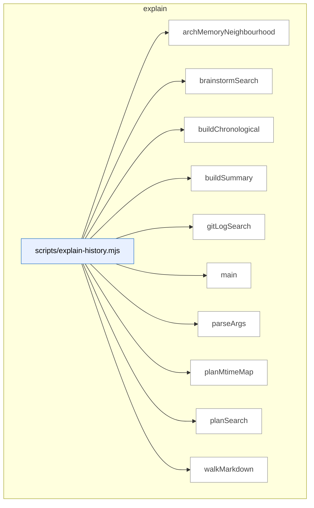

### Symbols in this domain

| Symbol | Kind | Path | Lines | Purpose | File imported by |
|---|---|---|---|---|---|
| [`archMemoryNeighbourhood`](../scripts/explain-history.mjs#L148) | function | `scripts/explain-history.mjs` | 148-184 | Fetches semantically-similar symbols from the architecture index using embedding-based search. | `tests/explain-history.test.mjs` |
| [`brainstormSearch`](../scripts/explain-history.mjs#L237) | function | `scripts/explain-history.mjs` | 237-282 | Finds brainstorm session entries whose topic or content mention a keyword. | `tests/explain-history.test.mjs` |
| [`buildChronological`](../scripts/explain-history.mjs#L290) | function | `scripts/explain-history.mjs` | 290-305 | Combines all search results into a single reverse-chronological timeline. | `tests/explain-history.test.mjs` |
| [`buildSummary`](../scripts/explain-history.mjs#L319) | function | `scripts/explain-history.mjs` | 319-326 | Generates a summary sentence of how many results were found across all sources. | `tests/explain-history.test.mjs` |
| [`gitLogSearch`](../scripts/explain-history.mjs#L89) | function | `scripts/explain-history.mjs` | 89-140 | Finds commits whose subject or content mentions a given topic, returning chronologically-ordered matches. | `tests/explain-history.test.mjs` |
| [`main`](../scripts/explain-history.mjs#L328) | function | `scripts/explain-history.mjs` | 328-385 | CLI entry point that cross-indexes a topic across all historical sources (git, architecture, plans, brainstorm). | `tests/explain-history.test.mjs` |
| [`parseArgs`](../scripts/explain-history.mjs#L51) | function | `scripts/explain-history.mjs` | 51-80 | Extracts command-line arguments for the explain-history tool. | `tests/explain-history.test.mjs` |
| [`planMtimeMap`](../scripts/explain-history.mjs#L307) | function | `scripts/explain-history.mjs` | 307-317 | Returns a dictionary of plan document paths to their modification dates. | `tests/explain-history.test.mjs` |
| [`planSearch`](../scripts/explain-history.mjs#L191) | function | `scripts/explain-history.mjs` | 191-218 | Scans all plan documents and returns lines that mention the given topic. | `tests/explain-history.test.mjs` |
| [`walkMarkdown`](../scripts/explain-history.mjs#L220) | function | `scripts/explain-history.mjs` | 220-228 | Returns a flat list of all Markdown files in a directory tree. | `tests/explain-history.test.mjs` |

---

## findings

> Persists audit-finding outcomes (fixed/dismissed/severity-adjusted) to JSONL with exponential effectiveness metrics for pass selection; formats findings for review and generates remediation tasks from accepted findings.

```mermaid
flowchart TB
subgraph dom_findings ["findings"]
  file_scripts_lib_findings_format_mjs["scripts/lib/findings-format.mjs"]:::component
  sym_scripts_lib_findings_format_mjs_formatFi["formatFindings"]:::symbol
  file_scripts_lib_findings_format_mjs --> sym_scripts_lib_findings_format_mjs_formatFi
  file_scripts_lib_findings_outcomes_mjs["scripts/lib/findings-outcomes.mjs"]:::component
  sym_scripts_lib_findings_outcomes_mjs_append["appendOutcome"]:::symbol
  file_scripts_lib_findings_outcomes_mjs --> sym_scripts_lib_findings_outcomes_mjs_append
  sym_scripts_lib_findings_outcomes_mjs_batchA["batchAppendOutcomes"]:::symbol
  file_scripts_lib_findings_outcomes_mjs --> sym_scripts_lib_findings_outcomes_mjs_batchA
  sym_scripts_lib_findings_outcomes_mjs_compac["compactOutcomes"]:::symbol
  file_scripts_lib_findings_outcomes_mjs --> sym_scripts_lib_findings_outcomes_mjs_compac
  sym_scripts_lib_findings_outcomes_mjs_comput["computePassEffectiveness"]:::symbol
  file_scripts_lib_findings_outcomes_mjs --> sym_scripts_lib_findings_outcomes_mjs_comput
  sym_scripts_lib_findings_outcomes_mjs_comput["computePassEWR"]:::symbol
  file_scripts_lib_findings_outcomes_mjs --> sym_scripts_lib_findings_outcomes_mjs_comput
  sym_scripts_lib_findings_outcomes_mjs_loadOu["loadOutcomes"]:::symbol
  file_scripts_lib_findings_outcomes_mjs --> sym_scripts_lib_findings_outcomes_mjs_loadOu
  sym_scripts_lib_findings_outcomes_mjs_setRep["setRepoProfileCache"]:::symbol
  file_scripts_lib_findings_outcomes_mjs --> sym_scripts_lib_findings_outcomes_mjs_setRep
  file_scripts_lib_findings_tasks_mjs["scripts/lib/findings-tasks.mjs"]:::component
  sym_scripts_lib_findings_tasks_mjs_createRem["createRemediationTask"]:::symbol
  file_scripts_lib_findings_tasks_mjs --> sym_scripts_lib_findings_tasks_mjs_createRem
  sym_scripts_lib_findings_tasks_mjs_getTaskSt["getTaskStore"]:::symbol
  file_scripts_lib_findings_tasks_mjs --> sym_scripts_lib_findings_tasks_mjs_getTaskSt
  sym_scripts_lib_findings_tasks_mjs_loadTasks["loadTasks"]:::symbol
  file_scripts_lib_findings_tasks_mjs --> sym_scripts_lib_findings_tasks_mjs_loadTasks
  sym_scripts_lib_findings_tasks_mjs_persistTa["persistTask"]:::symbol
  file_scripts_lib_findings_tasks_mjs --> sym_scripts_lib_findings_tasks_mjs_persistTa
  sym_scripts_lib_findings_tasks_mjs_trackEdit["trackEdit"]:::symbol
  file_scripts_lib_findings_tasks_mjs --> sym_scripts_lib_findings_tasks_mjs_trackEdit
  sym_scripts_lib_findings_tasks_mjs_updateTas["updateTask"]:::symbol
  file_scripts_lib_findings_tasks_mjs --> sym_scripts_lib_findings_tasks_mjs_updateTas
  sym_scripts_lib_findings_tasks_mjs_verifyTas["verifyTask"]:::symbol
  file_scripts_lib_findings_tasks_mjs --> sym_scripts_lib_findings_tasks_mjs_verifyTas
  file_scripts_lib_findings_tracker_mjs["scripts/lib/findings-tracker.mjs"]:::component
  sym_scripts_lib_findings_tracker_mjs_applyLa["applyLazyDecay"]:::symbol
  file_scripts_lib_findings_tracker_mjs --> sym_scripts_lib_findings_tracker_mjs_applyLa
  sym_scripts_lib_findings_tracker_mjs_buildPa["buildPatternKey"]:::symbol
  file_scripts_lib_findings_tracker_mjs --> sym_scripts_lib_findings_tracker_mjs_buildPa
  sym_scripts_lib_findings_tracker_mjs_effecti["effectiveSampleSize"]:::symbol
  file_scripts_lib_findings_tracker_mjs --> sym_scripts_lib_findings_tracker_mjs_effecti
  sym_scripts_lib_findings_tracker_mjs_extract["extractDimensions"]:::symbol
  file_scripts_lib_findings_tracker_mjs --> sym_scripts_lib_findings_tracker_mjs_extract
  sym_scripts_lib_findings_tracker_mjs_FalsePo["FalsePositiveTracker"]:::symbol
  file_scripts_lib_findings_tracker_mjs --> sym_scripts_lib_findings_tracker_mjs_FalsePo
  sym_scripts_lib_findings_tracker_mjs_recordW["recordWithDecay"]:::symbol
  file_scripts_lib_findings_tracker_mjs --> sym_scripts_lib_findings_tracker_mjs_recordW
  file_scripts_lib_findings_mjs["scripts/lib/findings.mjs"]:::component
  sym_scripts_lib_findings_mjs_semanticId["semanticId"]:::symbol
  file_scripts_lib_findings_mjs --> sym_scripts_lib_findings_mjs_semanticId
end
classDef container fill:#f5f5f5,stroke:#333,stroke-width:2px,color:#000
classDef component fill:#e8f0ff,stroke:#3178c6,color:#000
classDef symbol fill:#fff,stroke:#999,color:#444
classDef dup fill:#ffe8d8,stroke:#c0392b,stroke-width:2px,color:#000
classDef violation fill:#ffd6d6,stroke:#c0392b,stroke-width:2px,color:#000
```

### Symbols in this domain

| Symbol | Kind | Path | Lines | Purpose | File imported by |
|---|---|---|---|---|---|
| [`formatFindings`](../scripts/lib/findings-format.mjs#L12) | function | `scripts/lib/findings-format.mjs` | 12-33 | Formats security audit findings grouped by severity with categorized details and remediation guidance. | `scripts/lib/findings.mjs` |
| [`appendOutcome`](../scripts/lib/findings-outcomes.mjs#L38) | function | `scripts/lib/findings-outcomes.mjs` | 38-50 | Logs a single outcome record to the persistent JSONL outcomes file. | `scripts/audit-metrics.mjs`, `scripts/lib/findings.mjs`, `scripts/lib/outcome-sync.mjs` |
| [`batchAppendOutcomes`](../scripts/lib/findings-outcomes.mjs#L58) | function | `scripts/lib/findings-outcomes.mjs` | 58-75 | Atomically appends multiple outcome records to the log file after reading existing entries. | `scripts/audit-metrics.mjs`, `scripts/lib/findings.mjs`, `scripts/lib/outcome-sync.mjs` |
| [`compactOutcomes`](../scripts/lib/findings-outcomes.mjs#L100) | function | `scripts/lib/findings-outcomes.mjs` | 100-138 | Prunes stale outcomes by age and backfills missing timestamps, then rewrites the log. | `scripts/audit-metrics.mjs`, `scripts/lib/findings.mjs`, `scripts/lib/outcome-sync.mjs` |
| [`computePassEffectiveness`](../scripts/lib/findings-outcomes.mjs#L149) | function | `scripts/lib/findings-outcomes.mjs` | 149-187 | Calculates acceptance rate and effectiveness metrics for a pass using exponential decay weighting. | `scripts/audit-metrics.mjs`, `scripts/lib/findings.mjs`, `scripts/lib/outcome-sync.mjs` |
| [`computePassEWR`](../scripts/lib/findings-outcomes.mjs#L196) | function | `scripts/lib/findings-outcomes.mjs` | 196-216 | Computes the exponentially-weighted running average reward value for a pass's outcomes. | `scripts/audit-metrics.mjs`, `scripts/lib/findings.mjs`, `scripts/lib/outcome-sync.mjs` |
| [`loadOutcomes`](../scripts/lib/findings-outcomes.mjs#L82) | function | `scripts/lib/findings-outcomes.mjs` | 82-93 | Loads all outcomes from JSONL, backfilling missing timestamps with import timestamps. | `scripts/audit-metrics.mjs`, `scripts/lib/findings.mjs`, `scripts/lib/outcome-sync.mjs` |
| [`setRepoProfileCache`](../scripts/lib/findings-outcomes.mjs#L27) | function | `scripts/lib/findings-outcomes.mjs` | 27-29 | Caches the repository profile for associating outcomes with repo identity. | `scripts/audit-metrics.mjs`, `scripts/lib/findings.mjs`, `scripts/lib/outcome-sync.mjs` |
| [`createRemediationTask`](../scripts/lib/findings-tasks.mjs#L34) | function | `scripts/lib/findings-tasks.mjs` | 34-48 | Creates a new remediation task record linking a finding to its tracking history. | `scripts/lib/findings.mjs` |
| [`getTaskStore`](../scripts/lib/findings-tasks.mjs#L17) | function | `scripts/lib/findings-tasks.mjs` | 17-22 | Returns the singleton task store or creates one for persisting remediation records. | `scripts/lib/findings.mjs` |
| [`loadTasks`](../scripts/lib/findings-tasks.mjs#L75) | function | `scripts/lib/findings-tasks.mjs` | 75-81 | Loads all remediation tasks from the store, optionally filtering by run ID. | `scripts/lib/findings.mjs` |
| [`persistTask`](../scripts/lib/findings-tasks.mjs#L72) | function | `scripts/lib/findings-tasks.mjs` | 72-72 | Appends a task record to the persistent task store. | `scripts/lib/findings.mjs` |
| [`trackEdit`](../scripts/lib/findings-tasks.mjs#L53) | function | `scripts/lib/findings-tasks.mjs` | 53-57 | Records an edit to a task and transitions it to the fixed state. | `scripts/lib/findings.mjs` |
| [`updateTask`](../scripts/lib/findings-tasks.mjs#L84) | function | `scripts/lib/findings-tasks.mjs` | 84-87 | Writes an updated task back to the persistent store. | `scripts/lib/findings.mjs` |
| [`verifyTask`](../scripts/lib/findings-tasks.mjs#L62) | function | `scripts/lib/findings-tasks.mjs` | 62-67 | Marks a task as verified or regressed after testing and records the verifier. | `scripts/lib/findings.mjs` |
| [`applyLazyDecay`](../scripts/lib/findings-tracker.mjs#L29) | function | `scripts/lib/findings-tracker.mjs` | 29-54 | Applies exponential half-life decay to a false-positive pattern's historical counts. | `scripts/lib/findings.mjs`, `scripts/lib/suppression-policy.mjs`, `tests/legacy-audit-smoke.test.mjs`, +2 more |
| [`buildPatternKey`](../scripts/lib/findings-tracker.mjs#L103) | function | `scripts/lib/findings-tracker.mjs` | 103-105 | Builds a unique key from finding dimensions for grouping patterns. | `scripts/lib/findings.mjs`, `scripts/lib/suppression-policy.mjs`, `tests/legacy-audit-smoke.test.mjs`, +2 more |
| [`effectiveSampleSize`](../scripts/lib/findings-tracker.mjs#L59) | function | `scripts/lib/findings-tracker.mjs` | 59-61 | Returns the effective sample size of a pattern as the sum of its decayed counts. | `scripts/lib/findings.mjs`, `scripts/lib/suppression-policy.mjs`, `tests/legacy-audit-smoke.test.mjs`, +2 more |
| [`extractDimensions`](../scripts/lib/findings-tracker.mjs#L90) | function | `scripts/lib/findings-tracker.mjs` | 90-98 | Extracts categorical dimensions (category, severity, principle, repo, file type) from a finding. | `scripts/lib/findings.mjs`, `scripts/lib/suppression-policy.mjs`, `tests/legacy-audit-smoke.test.mjs`, +2 more |
| [`FalsePositiveTracker`](../scripts/lib/findings-tracker.mjs#L113) | class | `scripts/lib/findings-tracker.mjs` | 113-288 | Manages false-positive patterns with multi-scope tracking and exponential decay statistics. | `scripts/lib/findings.mjs`, `scripts/lib/suppression-policy.mjs`, `tests/legacy-audit-smoke.test.mjs`, +2 more |
| [`recordWithDecay`](../scripts/lib/findings-tracker.mjs#L67) | function | `scripts/lib/findings-tracker.mjs` | 67-83 | Records a new accepted/dismissed outcome on a pattern with exponential decay applied. | `scripts/lib/findings.mjs`, `scripts/lib/suppression-policy.mjs`, `tests/legacy-audit-smoke.test.mjs`, +2 more |
| [`semanticId`](../scripts/lib/findings.mjs#L27) | function | `scripts/lib/findings.mjs` | 27-40 | Generates an 8-character content hash for semantic deduplication of audit findings. | `scripts/cross-skill.mjs`, `scripts/evolve-prompts.mjs`, `scripts/gemini-review.mjs`, +18 more |

---

## fit-check

> Detects repository technology stacks, frameworks, test runners, and special tooling (Playwright, Supabase, etc.) by scanning package metadata, filesystem markers, and source annotations to support fit-assessment verdicts and tech-aware skill routing.

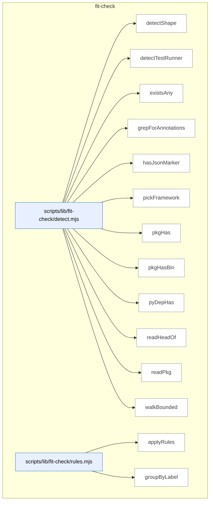

### Symbols in this domain

| Symbol | Kind | Path | Lines | Purpose | File imported by |
|---|---|---|---|---|---|
| [`detectShape`](../scripts/lib/fit-check/detect.mjs#L69) | function | `scripts/lib/fit-check/detect.mjs` | 69-122 | Detects repository tech stack, frameworks, capabilities, and feature markers. | `scripts/skills-fit-check.mjs`, `tests/skills-fit-check.test.mjs` |
| [`detectTestRunner`](../scripts/lib/fit-check/detect.mjs#L187) | function | `scripts/lib/fit-check/detect.mjs` | 187-199 | Detects the test runner configured in a JavaScript, TypeScript, or Python project. | `scripts/skills-fit-check.mjs`, `tests/skills-fit-check.test.mjs` |
| [`existsAny`](../scripts/lib/fit-check/detect.mjs#L126) | function | `scripts/lib/fit-check/detect.mjs` | 126-128 | Checks whether any files in a list exist in a directory. | `scripts/skills-fit-check.mjs`, `tests/skills-fit-check.test.mjs` |
| [`grepForAnnotations`](../scripts/lib/fit-check/detect.mjs#L208) | function | `scripts/lib/fit-check/detect.mjs` | 208-227 | Scans source files up to a limit for data-engine-claim HTML annotations. | `scripts/skills-fit-check.mjs`, `tests/skills-fit-check.test.mjs` |
| [`hasJsonMarker`](../scripts/lib/fit-check/detect.mjs#L150) | function | `scripts/lib/fit-check/detect.mjs` | 150-157 | Tests whether a JSON file at a path satisfies a given predicate function. | `scripts/skills-fit-check.mjs`, `tests/skills-fit-check.test.mjs` |
| [`pickFramework`](../scripts/lib/fit-check/detect.mjs#L180) | function | `scripts/lib/fit-check/detect.mjs` | 180-185 | Identifies the web/backend framework used by a repository using test rules. | `scripts/skills-fit-check.mjs`, `tests/skills-fit-check.test.mjs` |
| [`pkgHas`](../scripts/lib/fit-check/detect.mjs#L137) | function | `scripts/lib/fit-check/detect.mjs` | 137-142 | Checks if a named dependency appears in package.json dependencies. | `scripts/skills-fit-check.mjs`, `tests/skills-fit-check.test.mjs` |
| [`pkgHasBin`](../scripts/lib/fit-check/detect.mjs#L144) | function | `scripts/lib/fit-check/detect.mjs` | 144-148 | Checks whether package.json declares executable binaries. | `scripts/skills-fit-check.mjs`, `tests/skills-fit-check.test.mjs` |
| [`pyDepHas`](../scripts/lib/fit-check/detect.mjs#L159) | function | `scripts/lib/fit-check/detect.mjs` | 159-178 | Detects Python project dependencies by searching pyproject.toml, requirements.txt, and Pipfile. | `scripts/skills-fit-check.mjs`, `tests/skills-fit-check.test.mjs` |
| [`readHeadOf`](../scripts/lib/fit-check/detect.mjs#L256) | function | `scripts/lib/fit-check/detect.mjs` | 256-263 | Reads and returns the first N bytes of a file as UTF-8 string. | `scripts/skills-fit-check.mjs`, `tests/skills-fit-check.test.mjs` |
| [`readPkg`](../scripts/lib/fit-check/detect.mjs#L130) | function | `scripts/lib/fit-check/detect.mjs` | 130-135 | Reads and parses the package.json file from a directory path. | `scripts/skills-fit-check.mjs`, `tests/skills-fit-check.test.mjs` |
| [`walkBounded`](../scripts/lib/fit-check/detect.mjs#L233) | function | `scripts/lib/fit-check/detect.mjs` | 233-254 | Walks a directory tree yielding text source files up to a configurable limit. | `scripts/skills-fit-check.mjs`, `tests/skills-fit-check.test.mjs` |
| [`applyRules`](../scripts/lib/fit-check/rules.mjs#L201) | function | `scripts/lib/fit-check/rules.mjs` | 201-206 | Evaluates all skill-fit rules against a repository profile and returns verdicts. | `scripts/skills-fit-check.mjs`, `tests/skills-fit-check.test.mjs` |
| [`groupByLabel`](../scripts/lib/fit-check/rules.mjs#L212) | function | `scripts/lib/fit-check/rules.mjs` | 212-218 | Partitions skill verdicts into FITS, PARTIAL, and MISMATCH groups. | `scripts/skills-fit-check.mjs`, `tests/skills-fit-check.test.mjs` |

---

## friction

> Tracks friction memories—recurring pain points and pattern observations—via breadcrumb injection records with TTL-based persistence, cloud sanitization, and repo-scoped retrieval.

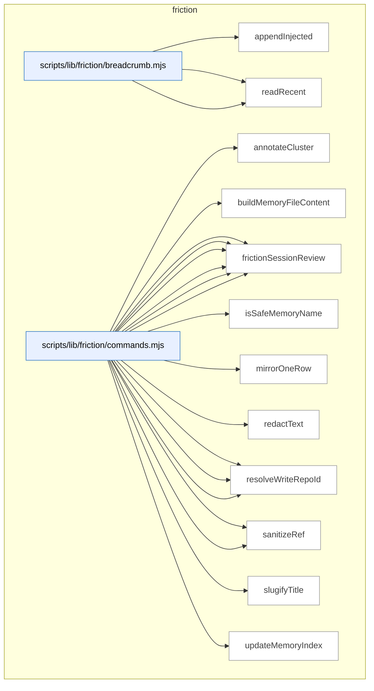

### Symbols in this domain

| Symbol | Kind | Path | Lines | Purpose | File imported by |
|---|---|---|---|---|---|
| [`appendInjected`](../scripts/lib/friction/breadcrumb.mjs#L62) | function | `scripts/lib/friction/breadcrumb.mjs` | 62-88 | Atomically appends a memory record to the breadcrumb log with automatic TTL-based pruning. | `scripts/lib/friction/commands.mjs`, `tests/store-friction.test.mjs` |
| [`readLines`](../scripts/lib/friction/breadcrumb.mjs#L36) | function | `scripts/lib/friction/breadcrumb.mjs` | 36-50 | Parses and validates JSON-line records from a breadcrumb file. | `scripts/lib/friction/commands.mjs`, `tests/store-friction.test.mjs` |
| [`readRecent`](../scripts/lib/friction/breadcrumb.mjs#L98) | function | `scripts/lib/friction/breadcrumb.mjs` | 98-111 | Loads recent breadcrumb records sorted by recency with deduplication by name. | `scripts/lib/friction/commands.mjs`, `tests/store-friction.test.mjs` |
| [`annotateCluster`](../scripts/lib/friction/commands.mjs#L397) | function | `scripts/lib/friction/commands.mjs` | 397-405 | Enriches a friction cluster with metadata: protected-tag flag, alarm threshold, and weighted rank. | `scripts/cross-skill.mjs`, `tests/friction-cli.test.mjs` |
| [`buildMemoryFileContent`](../scripts/lib/friction/commands.mjs#L211) | function | `scripts/lib/friction/commands.mjs` | 211-231 | Constructs the YAML frontmatter and markdown body for a friction memory file. | `scripts/cross-skill.mjs`, `tests/friction-cli.test.mjs` |
| [`frictionAdd`](../scripts/lib/friction/commands.mjs#L258) | function | `scripts/lib/friction/commands.mjs` | 258-311 | Creates a new friction memory entry with title, scope tags, cost, and optional body text. | `scripts/cross-skill.mjs`, `tests/friction-cli.test.mjs` |
| [`frictionDigest`](../scripts/lib/friction/commands.mjs#L374) | function | `scripts/lib/friction/commands.mjs` | 374-394 | Retrieves friction clusters from the cloud, ranks them by recurrence and cost weight, and annotates protected items. | `scripts/cross-skill.mjs`, `tests/friction-cli.test.mjs` |
| [`frictionLink`](../scripts/lib/friction/commands.mjs#L416) | function | `scripts/lib/friction/commands.mjs` | 416-466 | Links a friction memory to a commit, doc, test, or other reference type with secret redaction. | `scripts/cross-skill.mjs`, `tests/friction-cli.test.mjs` |
| [`frictionMirror`](../scripts/lib/friction/commands.mjs#L321) | function | `scripts/lib/friction/commands.mjs` | 321-365 | Synchronizes local friction memories to the cloud database, tracking hashes to detect changes. | `scripts/cross-skill.mjs`, `tests/friction-cli.test.mjs` |
| [`frictionNeighbourhood`](../scripts/lib/friction/commands.mjs#L513) | function | `scripts/lib/friction/commands.mjs` | 513-546 | Finds similar friction memories via word-similarity query and records the injection for future reference. | `scripts/cross-skill.mjs`, `tests/friction-cli.test.mjs` |
| [`frictionSessionReview`](../scripts/lib/friction/commands.mjs#L483) | function | `scripts/lib/friction/commands.mjs` | 483-502 | Lists recently injected friction notes from the local session, ready for user-initiated commit linking. | `scripts/cross-skill.mjs`, `tests/friction-cli.test.mjs` |
| [`isSafeMemoryName`](../scripts/lib/friction/commands.mjs#L167) | function | `scripts/lib/friction/commands.mjs` | 167-169 | Validates that a string is a safe memory file name. | `scripts/cross-skill.mjs`, `tests/friction-cli.test.mjs` |
| [`mirrorOneRow`](../scripts/lib/friction/commands.mjs#L196) | function | `scripts/lib/friction/commands.mjs` | 196-208 | Sanitizes and uploads a friction record to the cloud store, refusing high-confidence secrets. | `scripts/cross-skill.mjs`, `tests/friction-cli.test.mjs` |
| [`redactText`](../scripts/lib/friction/commands.mjs#L48) | function | `scripts/lib/friction/commands.mjs` | 48-48 | Redacts secret shapes from text before egress. | `scripts/cross-skill.mjs`, `tests/friction-cli.test.mjs` |
| [`resolveDeps`](../scripts/lib/friction/commands.mjs#L51) | function | `scripts/lib/friction/commands.mjs` | 51-69 | Returns the object of all injected friction service dependencies. | `scripts/cross-skill.mjs`, `tests/friction-cli.test.mjs` |
| [`resolveReadRepoId`](../scripts/lib/friction/commands.mjs#L189) | function | `scripts/lib/friction/commands.mjs` | 189-193 | Resolves a repository's row ID from its UUID for reading friction records. | `scripts/cross-skill.mjs`, `tests/friction-cli.test.mjs` |
| [`resolveWriteRepoId`](../scripts/lib/friction/commands.mjs#L183) | function | `scripts/lib/friction/commands.mjs` | 183-186 | Resolves the current repository's row ID for writing friction records. | `scripts/cross-skill.mjs`, `tests/friction-cli.test.mjs` |
| [`sanitizeFrictionQueryInput`](../scripts/lib/friction/commands.mjs#L102) | function | `scripts/lib/friction/commands.mjs` | 102-158 | Filters friction query input through an allowlist and redacts detected secrets. | `scripts/cross-skill.mjs`, `tests/friction-cli.test.mjs` |
| [`sanitizeRef`](../scripts/lib/friction/commands.mjs#L469) | function | `scripts/lib/friction/commands.mjs` | 469-472 | Redacts secrets from a reference string before persisting. | `scripts/cross-skill.mjs`, `tests/friction-cli.test.mjs` |
| [`slugifyTitle`](../scripts/lib/friction/commands.mjs#L172) | function | `scripts/lib/friction/commands.mjs` | 172-180 | Converts a title string into a friction memory slug. | `scripts/cross-skill.mjs`, `tests/friction-cli.test.mjs` |
| [`updateMemoryIndex`](../scripts/lib/friction/commands.mjs#L234) | function | `scripts/lib/friction/commands.mjs` | 234-246 | Adds a pointer to a memory file in MEMORY.md index if not already present. | `scripts/cross-skill.mjs`, `tests/friction-cli.test.mjs` |

---

## gate-honesty

> Validates gates (binary skill-level pass/fail assertions) by running oracle adapters that test their actual implementations against declared behavior in gate-contract.json files; reports divergences where the stated logic diverges from enforced code or test definitions.

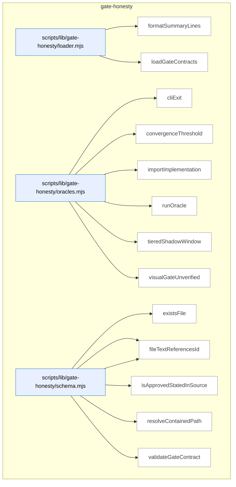

### Symbols in this domain

| Symbol | Kind | Path | Lines | Purpose | File imported by |
|---|---|---|---|---|---|
| [`formatSummaryLines`](../scripts/lib/gate-honesty/loader.mjs#L63) | function | `scripts/lib/gate-honesty/loader.mjs` | 63-86 | Formats gate-honesty check results into a summary report of executable, document-only, and uncontracted gates. | `scripts/check-gate-contracts.mjs`, `tests/gate-honesty.test.mjs` |
| [`loadGateContracts`](../scripts/lib/gate-honesty/loader.mjs#L25) | function | `scripts/lib/gate-honesty/loader.mjs` | 25-53 | Loads and validates gate-contract.json files from all skills, classifying them as contracted/uncontracted/divergent. | `scripts/check-gate-contracts.mjs`, `tests/gate-honesty.test.mjs` |
| [`cliExit`](../scripts/lib/gate-honesty/oracles.mjs#L147) | function | `scripts/lib/gate-honesty/oracles.mjs` | 147-167 | Spawns a CLI script in a temp fixture directory and validates exit code and stderr output. | `tests/gate-honesty.test.mjs` |
| [`convergenceThreshold`](../scripts/lib/gate-honesty/oracles.mjs#L28) | function | `scripts/lib/gate-honesty/oracles.mjs` | 28-56 | Validates that a convergence-threshold gate's code constants and evaluateConvergence function match their stated contract. | `tests/gate-honesty.test.mjs` |
| [`importImplementation`](../scripts/lib/gate-honesty/oracles.mjs#L22) | function | `scripts/lib/gate-honesty/oracles.mjs` | 22-25 | Dynamically imports a gate's implementation module from disk. | `tests/gate-honesty.test.mjs` |
| [`runOracle`](../scripts/lib/gate-honesty/oracles.mjs#L183) | function | `scripts/lib/gate-honesty/oracles.mjs` | 183-191 | Dispatches a gate to its oracle validator and returns pass/divergence result with explanation. | `tests/gate-honesty.test.mjs` |
| [`tieredShadowWindow`](../scripts/lib/gate-honesty/oracles.mjs#L59) | function | `scripts/lib/gate-honesty/oracles.mjs` | 59-97 | Validates tiered-audit shadow window logic: decision-grade row filter, comparedRuns count, and progress state. | `tests/gate-honesty.test.mjs` |
| [`visualGateUnverified`](../scripts/lib/gate-honesty/oracles.mjs#L100) | function | `scripts/lib/gate-honesty/oracles.mjs` | 100-127 | Tests the visual-audit gate's gateUnverifiedReason function against cases for correct degradation on missing/unverifiable state. | `tests/gate-honesty.test.mjs` |
| [`existsFile`](../scripts/lib/gate-honesty/schema.mjs#L186) | function | `scripts/lib/gate-honesty/schema.mjs` | 186-188 | <no body> | `scripts/lib/gate-honesty/loader.mjs`, `tests/gate-honesty.test.mjs` |
| [`fileTextContains`](../scripts/lib/gate-honesty/schema.mjs#L190) | function | `scripts/lib/gate-honesty/schema.mjs` | 190-192 | <no body> | `scripts/lib/gate-honesty/loader.mjs`, `tests/gate-honesty.test.mjs` |
| [`fileTextReferencesId`](../scripts/lib/gate-honesty/schema.mjs#L194) | function | `scripts/lib/gate-honesty/schema.mjs` | 194-196 | <no body> | `scripts/lib/gate-honesty/loader.mjs`, `tests/gate-honesty.test.mjs` |
| [`isApprovedStatedInSource`](../scripts/lib/gate-honesty/schema.mjs#L98) | function | `scripts/lib/gate-honesty/schema.mjs` | 98-101 | Checks if a gate's statedIn location is an approved source (SKILL.md or AGENTS.md). | `scripts/lib/gate-honesty/loader.mjs`, `tests/gate-honesty.test.mjs` |
| [`resolveContainedPath`](../scripts/lib/gate-honesty/schema.mjs#L111) | function | `scripts/lib/gate-honesty/schema.mjs` | 111-116 | Validates that a path is repo-contained and resolvable, catching symlink-escape and resolution errors. | `scripts/lib/gate-honesty/loader.mjs`, `tests/gate-honesty.test.mjs` |
| [`validateGateContract`](../scripts/lib/gate-honesty/schema.mjs#L129) | function | `scripts/lib/gate-honesty/schema.mjs` | 129-181 | Parses and validates a gate-contract.json against the schema, checking IDs, paths, and cross-references. | `scripts/lib/gate-honesty/loader.mjs`, `tests/gate-honesty.test.mjs` |

---

## install

> Generates versioned skill manifests with file checksums and bundle digests. Detects when synced consumer copies drift from upstream.

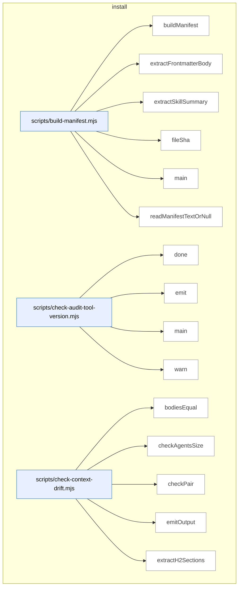

_Domain has 175 symbols (>50). Diagram shows top-15 by file order; see flat table below for the full list._

### Symbols in this domain

| Symbol | Kind | Path | Lines | Purpose | File imported by |
|---|---|---|---|---|---|
| [`buildManifest`](../scripts/build-manifest.mjs#L99) | function | `scripts/build-manifest.mjs` | 99-170 | Enumerates skill files, computes per-file hashes, extracts summaries, and derives a bundleVersion hash. | `tests/skills-artifact-freshness-wiring.test.mjs` |
| [`extractFrontmatterBody`](../scripts/build-manifest.mjs#L49) | function | `scripts/build-manifest.mjs` | 49-54 | Extracts the YAML frontmatter block (between triple-dash delimiters) from a markdown file. | `tests/skills-artifact-freshness-wiring.test.mjs` |
| [`extractSkillSummary`](../scripts/build-manifest.mjs#L64) | function | `scripts/build-manifest.mjs` | 64-94 | Extracts the skill description from frontmatter using either block-scalar or inline form. | `tests/skills-artifact-freshness-wiring.test.mjs` |
| [`fileSha`](../scripts/build-manifest.mjs#L40) | function | `scripts/build-manifest.mjs` | 40-43 | Computes a 12-character SHA256 hex hash of a file's raw bytes. | `tests/skills-artifact-freshness-wiring.test.mjs` |
| [`main`](../scripts/build-manifest.mjs#L172) | function | `scripts/build-manifest.mjs` | 172-223 | Builds or verifies the skills manifest by comparing computed vs. committed bundle versions. | `tests/skills-artifact-freshness-wiring.test.mjs` |
| [`readManifestTextOrNull`](../scripts/build-manifest.mjs#L235) | function | `scripts/build-manifest.mjs` | 235-240 | Reads the skills manifest file or returns null if missing or unreadable. | `tests/skills-artifact-freshness-wiring.test.mjs` |
| [`done`](../scripts/check-audit-tool-version.mjs#L49) | function | `scripts/check-audit-tool-version.mjs` | 49-51 | Sets the process exit code. | _(internal)_ |
| [`emit`](../scripts/check-audit-tool-version.mjs#L38) | function | `scripts/check-audit-tool-version.mjs` | 38-40 | Outputs a JSON object to stdout or suppresses output based on JSON_MODE flag. | _(internal)_ |
| [`main`](../scripts/check-audit-tool-version.mjs#L53) | function | `scripts/check-audit-tool-version.mjs` | 53-142 | Fetches the upstream audit-loop manifest, compares local version to upstream, and reports currency status. | _(internal)_ |
| [`warn`](../scripts/check-audit-tool-version.mjs#L42) | function | `scripts/check-audit-tool-version.mjs` | 42-44 | Writes a message to stderr unless QUIET or JSON_MODE is enabled. | _(internal)_ |
| [`bodiesEqual`](../scripts/check-context-drift.mjs#L182) | function | `scripts/check-context-drift.mjs` | 182-185 | Normalizes two line arrays by collapsing whitespace and filters empty lines, then compares for semantic equality. | `tests/ai-context-management.test.mjs`, `tests/check-context-drift.test.mjs` |
| [`checkAgentsSize`](../scripts/check-context-drift.mjs#L275) | function | `scripts/check-context-drift.mjs` | 275-288 | Flags AGENTS.md when line count exceeds the sprawl cap to enforce progressive-disclosure style. | `tests/ai-context-management.test.mjs`, `tests/check-context-drift.test.mjs` |
| [`checkPair`](../scripts/check-context-drift.mjs#L198) | function | `scripts/check-context-drift.mjs` | 198-263 | Audits CLAUDE.md against AGENTS.md: checks import presence, h2 allowlist membership, size cap, and body consistency. | `tests/ai-context-management.test.mjs`, `tests/check-context-drift.test.mjs` |
| [`emitOutput`](../scripts/check-context-drift.mjs#L392) | function | `scripts/check-context-drift.mjs` | 392-415 | Outputs findings in text, JSON, or SARIF format based on user choice. | `tests/ai-context-management.test.mjs`, `tests/check-context-drift.test.mjs` |
| [`extractH2Sections`](../scripts/check-context-drift.mjs#L155) | function | `scripts/check-context-drift.mjs` | 155-176 | Splits markdown content into level-2 sections by heading, respecting code-fence boundaries. | `tests/ai-context-management.test.mjs`, `tests/check-context-drift.test.mjs` |
| [`findPairs`](../scripts/check-context-drift.mjs#L300) | function | `scripts/check-context-drift.mjs` | 300-318 | Scans file list for AGENTS.md/CLAUDE.md pairs, grouping by directory. | `tests/ai-context-management.test.mjs`, `tests/check-context-drift.test.mjs` |
| [`hasAgentsImport`](../scripts/check-context-drift.mjs#L191) | function | `scripts/check-context-drift.mjs` | 191-194 | Checks if first 30 lines of content contain an `@./AGENTS.md` or `@AGENTS.md` import directive. | `tests/ai-context-management.test.mjs`, `tests/check-context-drift.test.mjs` |
| [`hashId`](../scripts/check-context-drift.mjs#L292) | function | `scripts/check-context-drift.mjs` | 292-294 | Generates a 16-character SHA256 hash from file path and semantic key for finding deduplication. | `tests/ai-context-management.test.mjs`, `tests/check-context-drift.test.mjs` |
| [`loadConfig`](../scripts/check-context-drift.mjs#L75) | function | `scripts/check-context-drift.mjs` | 75-108 | Loads `.claude-context-allowlist.json` config with defaults and Zod validation, gracefully degrading on errors. | `tests/ai-context-management.test.mjs`, `tests/check-context-drift.test.mjs` |
| [`main`](../scripts/check-context-drift.mjs#L417) | function | `scripts/check-context-drift.mjs` | 417-428 | Entry point that parses args, runs drift check, and exits with appropriate code. | `tests/ai-context-management.test.mjs`, `tests/check-context-drift.test.mjs` |
| [`makeFenceTracker`](../scripts/check-context-drift.mjs#L122) | function | `scripts/check-context-drift.mjs` | 122-146 | Returns a stateful fence-tracker function that detects code blocks (``` or ~~~) to skip markdown heading parsing inside them. | `tests/ai-context-management.test.mjs`, `tests/check-context-drift.test.mjs` |
| [`parseArgs`](../scripts/check-context-drift.mjs#L353) | function | `scripts/check-context-drift.mjs` | 353-368 | Parses CLI arguments for `--repo`, `--format`, `--strict`, and `--help` flags. | `tests/ai-context-management.test.mjs`, `tests/check-context-drift.test.mjs` |
| [`runDriftCheck`](../scripts/check-context-drift.mjs#L327) | function | `scripts/check-context-drift.mjs` | 327-349 | Main orchestrator that loads config, discovers files, pairs them, and runs all drift checks. | `tests/ai-context-management.test.mjs`, `tests/check-context-drift.test.mjs` |
| [`showHelp`](../scripts/check-context-drift.mjs#L370) | function | `scripts/check-context-drift.mjs` | 370-390 | Outputs usage documentation for check-context-drift command. | `tests/ai-context-management.test.mjs`, `tests/check-context-drift.test.mjs` |
| [`canResolve`](../scripts/check-deps.mjs#L52) | function | `scripts/check-deps.mjs` | 52-60 | Uses `require.resolve()` to test whether a package is installed and resolvable. | _(internal)_ |
| [`loadEnv`](../scripts/check-deps.mjs#L62) | function | `scripts/check-deps.mjs` | 62-77 | Parses .env file and populates `process.env` with keys that are not already set. | _(internal)_ |
| [`main`](../scripts/check-deps.mjs#L79) | function | `scripts/check-deps.mjs` | 79-173 | Entry point that checks required/optional packages and environment variables, outputs results. | _(internal)_ |
| [`main`](../scripts/check-docs-placement.mjs#L62) | function | `scripts/check-docs-placement.mjs` | 62-109 | Entry point that validates docs/ root contents against an allowlist of tracked files. | _(internal)_ |
| [`baselineKey`](../scripts/check-docs-refs.mjs#L224) | function | `scripts/check-docs-refs.mjs` | 224-224 | Generates a lookup key combining file path and target for baseline tracking. | `tests/check-docs-refs.test.mjs` |
| [`classifyRef`](../scripts/check-docs-refs.mjs#L177) | function | `scripts/check-docs-refs.mjs` | 177-194 | Categorizes a reference link (resolved, gone, placeholder, planned, or traversal) based on git index membership. | `tests/check-docs-refs.test.mjs` |
| [`extractRefs`](../scripts/check-docs-refs.mjs#L141) | function | `scripts/check-docs-refs.mjs` | 141-162 | Finds all markdown reference links (`[link](target.md)`) in text using regex with planned-marker detection. | `tests/check-docs-refs.test.mjs` |
| [`gitIndexFiles`](../scripts/check-docs-refs.mjs#L496) | function | `scripts/check-docs-refs.mjs` | 496-499 | Executes `git ls-files -z` to fetch all tracked files from the repository. | `tests/check-docs-refs.test.mjs` |
| [`isExcluded`](../scripts/check-docs-refs.mjs#L360) | function | `scripts/check-docs-refs.mjs` | 360-363 | Tests whether a file path matches any exclusion regex (node_modules, .git, etc.). | `tests/check-docs-refs.test.mjs` |
| [`lintFile`](../scripts/check-docs-refs.mjs#L371) | function | `scripts/check-docs-refs.mjs` | 371-385 | Extracts and classifies all reference links in a single file. | `tests/check-docs-refs.test.mjs` |
| [`main`](../scripts/check-docs-refs.mjs#L505) | function | `scripts/check-docs-refs.mjs` | 505-580 | Entry point that loads git index, runs the reference-link check, and outputs findings. | `tests/check-docs-refs.test.mjs` |
| [`runCheck`](../scripts/check-docs-refs.mjs#L396) | function | `scripts/check-docs-refs.mjs` | 396-493 | Main checker that scans file set, validates symlinks/containment, and classifies each reference link. | `tests/check-docs-refs.test.mjs` |
| [`scanPolicy`](../scripts/check-docs-refs.mjs#L258) | function | `scripts/check-docs-refs.mjs` | 258-267 | Determines whether a file should be scanned based on extension and basename (text/binary/unclassified). | `tests/check-docs-refs.test.mjs` |
| [`main`](../scripts/check-gate-contracts.mjs#L18) | function | `scripts/check-gate-contracts.mjs` | 18-41 | Entry point for gate-contract validator; loads contracts and reports divergences. | _(internal)_ |
| [`bucketKeyFor`](../scripts/check-model-freshness.mjs#L84) | function | `scripts/check-model-freshness.mjs` | 84-88 | Maps a parsed model identifier to its version-tier bucket key (e.g., 'frontier' or 'lite'). | `tests/check-model-freshness.test.mjs` |
| [`detectMissingFromStatic`](../scripts/check-model-freshness.mjs#L188) | function | `scripts/check-model-freshness.mjs` | 188-245 | Flags live provider models not represented in STATIC_POOL's per-tier coverage. | `tests/check-model-freshness.test.mjs` |
| [`detectPrematureRemap`](../scripts/check-model-freshness.mjs#L251) | function | `scripts/check-model-freshness.mjs` | 251-276 | Warns when a deprecated model ID is still being served by its provider. | `tests/check-model-freshness.test.mjs` |
| [`detectSentinelDrift`](../scripts/check-model-freshness.mjs#L109) | function | `scripts/check-model-freshness.mjs` | 109-169 | Detects divergences between static STATIC_POOL sentinels and live provider catalog picks. | `tests/check-model-freshness.test.mjs` |
| [`emitOutput`](../scripts/check-model-freshness.mjs#L378) | function | `scripts/check-model-freshness.mjs` | 378-408 | Outputs findings in text, JSON, or SARIF format with provider-check summary. | `tests/check-model-freshness.test.mjs` |
| [`hashId`](../scripts/check-model-freshness.mjs#L280) | function | `scripts/check-model-freshness.mjs` | 280-282 | Generates a 16-character SHA256 hash for finding deduplication. | `tests/check-model-freshness.test.mjs` |
| [`main`](../scripts/check-model-freshness.mjs#L410) | function | `scripts/check-model-freshness.mjs` | 410-421 | Entry point that runs freshness check and exits with appropriate code based on findings. | `tests/check-model-freshness.test.mjs` |
| [`parseArgs`](../scripts/check-model-freshness.mjs#L334) | function | `scripts/check-model-freshness.mjs` | 334-348 | Parses CLI arguments for `--format`, `--strict`, and `--help` flags. | `tests/check-model-freshness.test.mjs` |
| [`runFreshnessCheck`](../scripts/check-model-freshness.mjs#L293) | function | `scripts/check-model-freshness.mjs` | 293-330 | Main checker that fetches or uses provided live catalog and runs three drift-detection passes. | `tests/check-model-freshness.test.mjs` |
| [`showHelp`](../scripts/check-model-freshness.mjs#L350) | function | `scripts/check-model-freshness.mjs` | 350-376 | Outputs usage documentation for check-model-freshness command. | `tests/check-model-freshness.test.mjs` |
| [`isAuditSummary`](../scripts/check-plan-status.mjs#L28) | function | `scripts/check-plan-status.mjs` | 28-28 | Regex test for audit-summary filenames (exclude from status linting). | _(internal)_ |
| [`lintMode`](../scripts/check-plan-status.mjs#L38) | function | `scripts/check-plan-status.mjs` | 38-78 | Lints all plan files for conforming Status header lines; outputs JSON or human-readable report. | _(internal)_ |
| [`main`](../scripts/check-plan-status.mjs#L80) | function | `scripts/check-plan-status.mjs` | 80-89 | Entry point that routes to select or lint mode based on CLI arguments. | _(internal)_ |
| [`selectMode`](../scripts/check-plan-status.mjs#L30) | function | `scripts/check-plan-status.mjs` | 30-36 | Selects and outputs the path to an active plan file from the plans directory. | _(internal)_ |
| [`main`](../scripts/check-rls.mjs#L31) | function | `scripts/check-rls.mjs` | 31-145 | Main RLS checker; queries Postgres for row-level security policy coverage and grant permissions. | _(internal)_ |
| [`checkAuditApiKeys`](../scripts/check-setup.mjs#L159) | function | `scripts/check-setup.mjs` | 159-202 | Validates OpenAI and Azure API key configuration; warns on missing keys or half-configured profiles. | _(internal)_ |
| [`checkAuditLoop`](../scripts/check-setup.mjs#L267) | function | `scripts/check-setup.mjs` | 267-271 | Orchestrates API key and Supabase checks for the Audit-Loop section. | _(internal)_ |
| [`checkAuditSupabase`](../scripts/check-setup.mjs#L204) | function | `scripts/check-setup.mjs` | 204-265 | Validates AUDIT_DB_URL presence and checks for required audit-loop Postgres tables. | _(internal)_ |
| [`checkConsistencyMode`](../scripts/check-setup.mjs#L431) | function | `scripts/check-setup.mjs` | 431-477 | Validates consistency-mode deployment: surfaces.json manifest and canaries directory existence. | _(internal)_ |
| [`checkPersonaTest`](../scripts/check-setup.mjs#L275) | function | `scripts/check-setup.mjs` | 275-323 | Validates PERSONA_TEST_REPO_NAME and checks persona tables in shared AUDIT_DB_URL. | _(internal)_ |
| [`checkPlaywrightAvailable`](../scripts/check-setup.mjs#L411) | function | `scripts/check-setup.mjs` | 411-429 | Tests if Playwright module loads and Chromium binary is installed via `npx playwright --version`. | _(internal)_ |
| [`checkTables`](../scripts/check-setup.mjs#L70) | function | `scripts/check-setup.mjs` | 70-80 | Queries Postgres `information_schema` to check existence of specified tables. | _(internal)_ |
| [`injectResolvedDbEnv`](../scripts/check-setup.mjs#L500) | function | `scripts/check-setup.mjs` | 500-511 | Injects resolved AUDIT_DB_URL and SSL_MODE into process.env from cloud config. | _(internal)_ |
| [`loadEnv`](../scripts/check-setup.mjs#L47) | function | `scripts/check-setup.mjs` | 47-62 | Reads .env file and returns a key-value object. | _(internal)_ |
| [`main`](../scripts/check-setup.mjs#L513) | function | `scripts/check-setup.mjs` | 513-527 | Entry point: runs environment checks for audit-loop, persona-test, and consistency-mode; exits with failure code if problems found. | _(internal)_ |
| [`printJsonReport`](../scripts/check-setup.mjs#L386) | function | `scripts/check-setup.mjs` | 386-396 | Outputs setup check report as JSON to stdout. | _(internal)_ |
| [`printReport`](../scripts/check-setup.mjs#L354) | function | `scripts/check-setup.mjs` | 354-384 | Displays a formatted setup check report to console with sections, status icons, and optional fix commands. | _(internal)_ |
| [`Report`](../scripts/check-setup.mjs#L120) | class | `scripts/check-setup.mjs` | 120-155 | Accumulates setup check results organized into sections with pass/fail/warn/info status items. | _(internal)_ |
| [`statusIcon`](../scripts/check-setup.mjs#L330) | function | `scripts/check-setup.mjs` | 330-339 | Returns a colored terminal status string (PASS/FAIL/WARN/INFO/FIX) based on status enum. | _(internal)_ |
| [`verdictLine`](../scripts/check-setup.mjs#L341) | function | `scripts/check-setup.mjs` | 341-352 | Formats a setup verdict summary based on failure and warning counts with color codes. | _(internal)_ |
| [`listSkills`](../scripts/check-skill-refs.mjs#L30) | function | `scripts/check-skill-refs.mjs` | 30-36 | Lists all skill directories from the skills folder in sorted order. | _(internal)_ |
| [`main`](../scripts/check-skill-refs.mjs#L38) | function | `scripts/check-skill-refs.mjs` | 38-74 | CLI entry for linting skill reference documentation; reports missing summaries or digest mismatches. | _(internal)_ |
| [`main`](../scripts/check-skill-updates.mjs#L25) | function | `scripts/check-skill-updates.mjs` | 25-131 | Checks if installed skill files match their receipt via two surfaces (repo + global); reports drift or staleness. | _(internal)_ |
| [`parseArgs`](../scripts/check-skill-updates.mjs#L16) | function | `scripts/check-skill-updates.mjs` | 16-23 | Parses CLI flags --target, --json, and --no-cache into an options object. | _(internal)_ |
| [`checkSync`](../scripts/check-sync.mjs#L25) | function | `scripts/check-sync.mjs` | 25-153 | Verifies Postgres connection, confirms repo is registered, and checks that audit runs exist. | _(internal)_ |
| [`fail`](../scripts/check-sync.mjs#L20) | function | `scripts/check-sync.mjs` | 20-20 | Logs a [FAIL] status message for the current report section. | _(internal)_ |
| [`finish`](../scripts/check-sync.mjs#L155) | function | `scripts/check-sync.mjs` | 155-178 | Formats and outputs sync check report (terminal or JSON) with verdict and fix suggestions; exits with appropriate code. | _(internal)_ |
| [`info`](../scripts/check-sync.mjs#L21) | function | `scripts/check-sync.mjs` | 21-21 | Logs an [INFO] status message for the current report section. | _(internal)_ |
| [`log`](../scripts/check-sync.mjs#L17) | function | `scripts/check-sync.mjs` | 17-17 | Prints a message to stdout only when not in JSON_MODE. | _(internal)_ |
| [`pass`](../scripts/check-sync.mjs#L19) | function | `scripts/check-sync.mjs` | 19-19 | Logs a [PASS] status message for the current report section. | _(internal)_ |
| [`authoritativeScopesFor`](../scripts/install-skills.mjs#L365) | function | `scripts/install-skills.mjs` | 365-369 | Returns the set of installation surfaces (global or repo) required for a given mode. | `tests/install/receipt-scope-seam.test.mjs` |
| [`buildCopilotMergeWrite`](../scripts/install-skills.mjs#L287) | function | `scripts/install-skills.mjs` | 287-300 | Merges copilot-instructions.md blocks and computes merged SHA for cross-surface installation. | `tests/install/receipt-scope-seam.test.mjs` |
| [`buildSkillWrites`](../scripts/install-skills.mjs#L255) | function | `scripts/install-skills.mjs` | 255-285 | Constructs file writes for skill installation with SHA verification against manifest. | `tests/install/receipt-scope-seam.test.mjs` |
| [`checkConflicts`](../scripts/install-skills.mjs#L389) | function | `scripts/install-skills.mjs` | 389-401 | Detects file conflicts between new writes and prior installations; respects --force flag. | `tests/install/receipt-scope-seam.test.mjs` |
| [`computeDeletes`](../scripts/install-skills.mjs#L338) | function | `scripts/install-skills.mjs` | 338-358 | Determines which previously-installed files to delete based on scope and skill filters. | `tests/install/receipt-scope-seam.test.mjs` |
| [`expandSkillFiles`](../scripts/install-skills.mjs#L127) | function | `scripts/install-skills.mjs` | 127-133 | Returns skill file array from manifest with fallback to legacy SKILL.md entry. | `tests/install/receipt-scope-seam.test.mjs` |
| [`fileShaShort`](../scripts/install-skills.mjs#L135) | function | `scripts/install-skills.mjs` | 135-137 | Computes 12-character SHA256 hash of a buffer for file integrity tracking. | `tests/install/receipt-scope-seam.test.mjs` |
| [`loadManifest`](../scripts/install-skills.mjs#L97) | function | `scripts/install-skills.mjs` | 97-120 | Loads and validates the skills.manifest.json file, checking schema version compatibility and parsing JSON. | `tests/install/receipt-scope-seam.test.mjs` |
| [`main`](../scripts/install-skills.mjs#L427) | function | `scripts/install-skills.mjs` | 427-536 | Primary CLI orchestrator: parses args, loads manifest, builds writes, applies deletes, records receipt. | `tests/install/receipt-scope-seam.test.mjs` |
| [`maybeWarnGithubSkillsDeprecation`](../scripts/install-skills.mjs#L243) | function | `scripts/install-skills.mjs` | 243-253 | Warns about deprecated .github/skills/ directory; offers --keep-github-skills to suppress. | `tests/install/receipt-scope-seam.test.mjs` |
| [`parseArgs`](../scripts/install-skills.mjs#L57) | function | `scripts/install-skills.mjs` | 57-91 | Parses command-line arguments for the install-skills script, extracting flags for local/remote/surface/skills/target/dryRun options. | `tests/install/receipt-scope-seam.test.mjs` |
| [`printBanner`](../scripts/install-skills.mjs#L154) | function | `scripts/install-skills.mjs` | 154-162 | Prints colored banner with installation mode, surface, and target repo information. | `tests/install/receipt-scope-seam.test.mjs` |
| [`reconcileJournals`](../scripts/install-skills.mjs#L175) | function | `scripts/install-skills.mjs` | 175-210 | Recovers from crashed install transactions in repo and global journals; aborts if unrecoverable. | `tests/install/receipt-scope-seam.test.mjs` |
| [`reportDegradations`](../scripts/install-skills.mjs#L223) | function | `scripts/install-skills.mjs` | 223-241 | Logs filesystem durability warnings (fsync failures) with categorized severity. | `tests/install/receipt-scope-seam.test.mjs` |
| [`retainUnmanagedEntries`](../scripts/install-skills.mjs#L378) | function | `scripts/install-skills.mjs` | 378-387 | Filters previous receipt entries to retain only those outside the current install scope. | `tests/install/receipt-scope-seam.test.mjs` |
| [`validateTarget`](../scripts/install-skills.mjs#L141) | function | `scripts/install-skills.mjs` | 141-152 | Validates that target directory exists and contains .git or package.json; warns if neither. | `tests/install/receipt-scope-seam.test.mjs` |
| [`writeReceiptsByScope`](../scripts/install-skills.mjs#L403) | function | `scripts/install-skills.mjs` | 403-425 | Writes installation receipts for global and repo scopes when files changed or previously existed. | `tests/install/receipt-scope-seam.test.mjs` |
| [`computeFileSha`](../scripts/lib/install/conflict-detector.mjs#L13) | function | `scripts/lib/install/conflict-detector.mjs` | 13-20 | Computes a 12-character SHA256 hash of a file's contents for change detection. | `scripts/check-skill-updates.mjs`, `scripts/install-skills.mjs`, `tests/install/conflict-detector.test.mjs`, +1 more |
| [`detectConflicts`](../scripts/lib/install/conflict-detector.mjs#L30) | function | `scripts/lib/install/conflict-detector.mjs` | 30-78 | Compares planned file writes against current state and receipts to flag conflicts before writing. | `scripts/check-skill-updates.mjs`, `scripts/install-skills.mjs`, `tests/install/conflict-detector.test.mjs`, +1 more |
| [`detectDrift`](../scripts/lib/install/conflict-detector.mjs#L86) | function | `scripts/lib/install/conflict-detector.mjs` | 86-105 | Compares managed files in a receipt against their current SHA to detect operator edits or drift. | `scripts/check-skill-updates.mjs`, `scripts/install-skills.mjs`, `tests/install/conflict-detector.test.mjs`, +1 more |
| [`generateAllPromptFiles`](../scripts/lib/install/copilot-prompts.mjs#L214) | function | `scripts/lib/install/copilot-prompts.mjs` | 214-245 | Scans all skills and generates Copilot prompt files for each, warning if a skill is not in the registry. | `scripts/regenerate-skill-copies.mjs`, `tests/ai-context-management.test.mjs`, `tests/copilot-prompts.test.mjs` |
| [`generatePromptFile`](../scripts/lib/install/copilot-prompts.mjs#L165) | function | `scripts/lib/install/copilot-prompts.mjs` | 165-203 | Generates a Copilot-compatible prompt markdown file from a skill's metadata and CLI entry. | `scripts/regenerate-skill-copies.mjs`, `tests/ai-context-management.test.mjs`, `tests/copilot-prompts.test.mjs` |
| [`parseSkillFrontmatter`](../scripts/lib/install/copilot-prompts.mjs#L125) | function | `scripts/lib/install/copilot-prompts.mjs` | 125-154 | Extracts name and description from a SKILL.md file's YAML frontmatter block, handling both inline and block-scalar forms. | `scripts/regenerate-skill-copies.mjs`, `tests/ai-context-management.test.mjs`, `tests/copilot-prompts.test.mjs` |
| [`shaOfManagedBlock`](../scripts/lib/install/copilot-prompts.mjs#L255) | function | `scripts/lib/install/copilot-prompts.mjs` | 255-263 | Extracts and computes a 16-char SHA256 hash of the managed START/END marker block within a file. | `scripts/regenerate-skill-copies.mjs`, `tests/ai-context-management.test.mjs`, `tests/copilot-prompts.test.mjs` |
| [`yamlQuote`](../scripts/lib/install/copilot-prompts.mjs#L114) | function | `scripts/lib/install/copilot-prompts.mjs` | 114-116 | Escapes and double-quotes a string for safe YAML embedding. | `scripts/regenerate-skill-copies.mjs`, `tests/ai-context-management.test.mjs`, `tests/copilot-prompts.test.mjs` |
| [`ensureAuditDeps`](../scripts/lib/install/deps.mjs#L89) | function | `scripts/lib/install/deps.mjs` | 89-151 | Installs missing audit-loop dependencies via npm, with dry-run and timeout support. | `scripts/install-skills.mjs`, `scripts/sync-to-repos.mjs` |
| [`findMissingDeps`](../scripts/lib/install/deps.mjs#L58) | function | `scripts/lib/install/deps.mjs` | 58-70 | Checks which audit-loop npm dependencies are missing from node_modules. | `scripts/install-skills.mjs`, `scripts/sync-to-repos.mjs` |
| [`checkAuditGitignore`](../scripts/lib/install/gitignore.mjs#L233) | function | `scripts/lib/install/gitignore.mjs` | 233-257 | Verifies that all required audit-loop patterns are present in .gitignore. | `scripts/check-skill-updates.mjs`, `scripts/install-skills.mjs`, `tests/install-gitignore-coverage.test.mjs`, +1 more |
| [`ensureAuditGitignore`](../scripts/lib/install/gitignore.mjs#L180) | function | `scripts/lib/install/gitignore.mjs` | 180-224 | Adds missing audit-loop patterns to a repo's .gitignore file with a managed block header. | `scripts/check-skill-updates.mjs`, `scripts/install-skills.mjs`, `tests/install-gitignore-coverage.test.mjs`, +1 more |
| [`hasPattern`](../scripts/lib/install/gitignore.mjs#L157) | function | `scripts/lib/install/gitignore.mjs` | 157-166 | Checks if a gitignore file contains a specific pattern, preserving leading whitespace semantics. | `scripts/check-skill-updates.mjs`, `scripts/install-skills.mjs`, `tests/install-gitignore-coverage.test.mjs`, +1 more |
| [`requiredPatternsFor`](../scripts/lib/install/gitignore.mjs#L131) | function | `scripts/lib/install/gitignore.mjs` | 131-136 | Returns the gitignore patterns required for a repo type, accounting for source-repo vs consumer-repo differences. | `scripts/check-skill-updates.mjs`, `scripts/install-skills.mjs`, `tests/install-gitignore-coverage.test.mjs`, +1 more |
| [`extractBlock`](../scripts/lib/install/merge.mjs#L74) | function | `scripts/lib/install/merge.mjs` | 74-80 | Extracts the content between START and END markers from a file. | `scripts/install-skills.mjs`, `tests/install/merge.test.mjs` |
| [`mergeBlock`](../scripts/lib/install/merge.mjs#L46) | function | `scripts/lib/install/merge.mjs` | 46-65 | Replaces or appends a managed marker block within a file, preserving surrounding content. | `scripts/install-skills.mjs`, `tests/install/merge.test.mjs` |
| [`buildReceipt`](../scripts/lib/install/receipt.mjs#L45) | function | `scripts/lib/install/receipt.mjs` | 45-54 | Constructs an installation receipt object with version, timestamp, source, and managed-file list. | `scripts/check-skill-updates.mjs`, `scripts/install-skills.mjs`, `tests/install/receipt-scope-seam.test.mjs`, +1 more |
| [`readReceipt`](../scripts/lib/install/receipt.mjs#L13) | function | `scripts/lib/install/receipt.mjs` | 13-24 | Loads and validates the installation receipt JSON from disk. | `scripts/check-skill-updates.mjs`, `scripts/install-skills.mjs`, `tests/install/receipt-scope-seam.test.mjs`, +1 more |
| [`writeReceipt`](../scripts/lib/install/receipt.mjs#L31) | function | `scripts/lib/install/receipt.mjs` | 31-34 | Writes an installation receipt to disk atomically with validation. | `scripts/check-skill-updates.mjs`, `scripts/install-skills.mjs`, `tests/install/receipt-scope-seam.test.mjs`, +1 more |
| [`findRepoRoot`](../scripts/lib/install/surface-paths.mjs#L14) | function | `scripts/lib/install/surface-paths.mjs` | 14-37 | Locates the outermost .git directory or package.json above a starting path. | `scripts/check-skill-updates.mjs`, `scripts/install-skills.mjs`, `scripts/lib/install/transaction.mjs`, +4 more |
| [`globalJournalPath`](../scripts/lib/install/surface-paths.mjs#L72) | function | `scripts/lib/install/surface-paths.mjs` | 72-74 | Returns the path to the global install journal file. | `scripts/check-skill-updates.mjs`, `scripts/install-skills.mjs`, `scripts/lib/install/transaction.mjs`, +4 more |
| [`globalQuarantineDir`](../scripts/lib/install/surface-paths.mjs#L85) | function | `scripts/lib/install/surface-paths.mjs` | 85-87 | Returns the path to ~/.audit-loop-install-quarantine for conflicted installations. | `scripts/check-skill-updates.mjs`, `scripts/install-skills.mjs`, `scripts/lib/install/transaction.mjs`, +4 more |
| [`globalSurfaceRoot`](../scripts/lib/install/surface-paths.mjs#L51) | function | `scripts/lib/install/surface-paths.mjs` | 51-53 | Returns the path to ~/.claude/skills global skill surface. | `scripts/check-skill-updates.mjs`, `scripts/install-skills.mjs`, `scripts/lib/install/transaction.mjs`, +4 more |
| [`managedFileAbsPath`](../scripts/lib/install/surface-paths.mjs#L193) | function | `scripts/lib/install/surface-paths.mjs` | 193-195 | Resolves a managed file object to its absolute filesystem path. | `scripts/check-skill-updates.mjs`, `scripts/install-skills.mjs`, `scripts/lib/install/transaction.mjs`, +4 more |
| [`partitionManagedFilesByScope`](../scripts/lib/install/surface-paths.mjs#L204) | function | `scripts/lib/install/surface-paths.mjs` | 204-212 | Partitions managed files into separate global and repo-scoped arrays. | `scripts/check-skill-updates.mjs`, `scripts/install-skills.mjs`, `scripts/lib/install/transaction.mjs`, +4 more |
| [`receiptPath`](../scripts/lib/install/surface-paths.mjs#L169) | function | `scripts/lib/install/surface-paths.mjs` | 169-174 | Returns the filesystem path for the audit-loop install receipt (global or repo-scoped). | `scripts/check-skill-updates.mjs`, `scripts/install-skills.mjs`, `scripts/lib/install/transaction.mjs`, +4 more |
| [`repoQuarantineDir`](../scripts/lib/install/surface-paths.mjs#L95) | function | `scripts/lib/install/surface-paths.mjs` | 95-97 | Returns the path to the repo's .audit/quarantine directory for quarantined files. | `scripts/check-skill-updates.mjs`, `scripts/install-skills.mjs`, `scripts/lib/install/transaction.mjs`, +4 more |
| [`resolveSkillFiles`](../scripts/lib/install/surface-paths.mjs#L138) | function | `scripts/lib/install/surface-paths.mjs` | 138-153 | Expands skill files to all surface-specific install paths with scoping (global/repo). | `scripts/check-skill-updates.mjs`, `scripts/install-skills.mjs`, `scripts/lib/install/transaction.mjs`, +4 more |
| [`resolveSkillTargets`](../scripts/lib/install/surface-paths.mjs#L106) | function | `scripts/lib/install/surface-paths.mjs` | 106-125 | Expands a skill name to its target directories across Claude/Copilot/Agents surfaces. | `scripts/check-skill-updates.mjs`, `scripts/install-skills.mjs`, `scripts/lib/install/transaction.mjs`, +4 more |
| [`anchorFor`](../scripts/lib/install/transaction.mjs#L274) | function | `scripts/lib/install/transaction.mjs` | 274-282 | Returns journal and quarantine paths for a transaction (global or repo-scoped). | `scripts/install-skills.mjs`, `tests/install/global-journal-placement.test.mjs`, `tests/install/lifecycle.test.mjs`, +2 more |
| [`anchorForJournal`](../scripts/lib/install/transaction.mjs#L288) | function | `scripts/lib/install/transaction.mjs` | 288-292 | Determines transaction scope (global/repo) based on journal file location. | `scripts/install-skills.mjs`, `tests/install/global-journal-placement.test.mjs`, `tests/install/lifecycle.test.mjs`, +2 more |
| [`attemptDelete`](../scripts/lib/install/transaction.mjs#L526) | function | `scripts/lib/install/transaction.mjs` | 526-545 | Deletes a file with optional SHA-match check to prevent user-modified-file accidents. | `scripts/install-skills.mjs`, `tests/install/global-journal-placement.test.mjs`, `tests/install/lifecycle.test.mjs`, +2 more |
| [`cleanupJournal`](../scripts/lib/install/transaction.mjs#L742) | function | `scripts/lib/install/transaction.mjs` | 742-745 | Removes a completed transaction journal after recovery is done. | `scripts/install-skills.mjs`, `tests/install/global-journal-placement.test.mjs`, `tests/install/lifecycle.test.mjs`, +2 more |
| [`defaultJournalPath`](../scripts/lib/install/transaction.mjs#L880) | function | `scripts/lib/install/transaction.mjs` | 880-882 | Returns the default local install transaction journal path. | `scripts/install-skills.mjs`, `tests/install/global-journal-placement.test.mjs`, `tests/install/lifecycle.test.mjs`, +2 more |
| [`executeTransaction`](../scripts/lib/install/transaction.mjs#L558) | function | `scripts/lib/install/transaction.mjs` | 558-718 | Executes a multi-file atomic write/delete transaction with journaling, lock coordination, and crash recovery. | `scripts/install-skills.mjs`, `tests/install/global-journal-placement.test.mjs`, `tests/install/lifecycle.test.mjs`, +2 more |
| [`findUnresolvedQuarantine`](../scripts/lib/install/transaction.mjs#L449) | function | `scripts/lib/install/transaction.mjs` | 449-457 | Locates an unresolved quarantine journal file in a target directory by name prefix. | `scripts/install-skills.mjs`, `tests/install/global-journal-placement.test.mjs`, `tests/install/lifecycle.test.mjs`, +2 more |
| [`fsyncDir`](../scripts/lib/install/transaction.mjs#L162) | function | `scripts/lib/install/transaction.mjs` | 162-179 | Syncs a directory to disk for durability (Windows no-op); closes FD afterward. | `scripts/install-skills.mjs`, `tests/install/global-journal-placement.test.mjs`, `tests/install/lifecycle.test.mjs`, +2 more |
| [`fsyncFile`](../scripts/lib/install/transaction.mjs#L123) | function | `scripts/lib/install/transaction.mjs` | 123-134 | Durably syncs a file descriptor to disk with optional critical error handling. | `scripts/install-skills.mjs`, `tests/install/global-journal-placement.test.mjs`, `tests/install/lifecycle.test.mjs`, +2 more |
| [`globalSurfaceLockPath`](../scripts/lib/install/transaction.mjs#L398) | function | `scripts/lib/install/transaction.mjs` | 398-400 | Returns the path to the global install lock file. | `scripts/install-skills.mjs`, `tests/install/global-journal-placement.test.mjs`, `tests/install/lifecycle.test.mjs`, +2 more |
| [`isWithinAllowedRoots`](../scripts/lib/install/transaction.mjs#L202) | function | `scripts/lib/install/transaction.mjs` | 202-228 | Verifies a target path stays within allowed root directories after symlink resolution. | `scripts/install-skills.mjs`, `tests/install/global-journal-placement.test.mjs`, `tests/install/lifecycle.test.mjs`, +2 more |
| [`journalBody`](../scripts/lib/install/transaction.mjs#L505) | function | `scripts/lib/install/transaction.mjs` | 505-517 | Builds the initial journal body recording transaction stage, operations, and origin. | `scripts/install-skills.mjs`, `tests/install/global-journal-placement.test.mjs`, `tests/install/lifecycle.test.mjs`, +2 more |
| [`quarantineJournal`](../scripts/lib/install/transaction.mjs#L414) | function | `scripts/lib/install/transaction.mjs` | 414-434 | Moves an invalid journal to a timestamped quarantine directory with metadata. | `scripts/install-skills.mjs`, `tests/install/global-journal-placement.test.mjs`, `tests/install/lifecycle.test.mjs`, +2 more |
| [`recoverFromJournal`](../scripts/lib/install/transaction.mjs#L759) | function | `scripts/lib/install/transaction.mjs` | 759-878 | Restores a crashed transaction by re-applying or rolling back staged operations from its journal. | `scripts/install-skills.mjs`, `tests/install/global-journal-placement.test.mjs`, `tests/install/lifecycle.test.mjs`, +2 more |
| [`rollbackPartialTransaction`](../scripts/lib/install/transaction.mjs#L720) | function | `scripts/lib/install/transaction.mjs` | 720-740 | Rolls back partially-completed renames by restoring snapshots and removing temp files. | `scripts/install-skills.mjs`, `tests/install/global-journal-placement.test.mjs`, `tests/install/lifecycle.test.mjs`, +2 more |
| [`sameRoot`](../scripts/lib/install/transaction.mjs#L299) | function | `scripts/lib/install/transaction.mjs` | 299-306 | Compares two paths for equality after canonicalization and symlink resolution. | `scripts/install-skills.mjs`, `tests/install/global-journal-placement.test.mjs`, `tests/install/lifecycle.test.mjs`, +2 more |
| [`shaShort`](../scripts/lib/install/transaction.mjs#L105) | function | `scripts/lib/install/transaction.mjs` | 105-107 | Computes a 12-character SHA256 digest of a buffer for integrity verification. | `scripts/install-skills.mjs`, `tests/install/global-journal-placement.test.mjs`, `tests/install/lifecycle.test.mjs`, +2 more |
| [`tmpSuffix`](../scripts/lib/install/transaction.mjs#L100) | function | `scripts/lib/install/transaction.mjs` | 100-103 | Generates a unique temporary file suffix combining PID, timestamp, and random hex. | `scripts/install-skills.mjs`, `tests/install/global-journal-placement.test.mjs`, `tests/install/lifecycle.test.mjs`, +2 more |
| [`touchesGlobalSurface`](../scripts/lib/install/transaction.mjs#L255) | function | `scripts/lib/install/transaction.mjs` | 255-258 | Detects whether a transaction touches the global shared ~/.claude/skills surface. | `scripts/install-skills.mjs`, `tests/install/global-journal-placement.test.mjs`, `tests/install/lifecycle.test.mjs`, +2 more |
| [`validateJournal`](../scripts/lib/install/transaction.mjs#L357) | function | `scripts/lib/install/transaction.mjs` | 357-384 | Validates a parsed journal against schema and structural invariants (tmpPath format, containment). | `scripts/install-skills.mjs`, `tests/install/global-journal-placement.test.mjs`, `tests/install/lifecycle.test.mjs`, +2 more |
| [`writeJournal`](../scripts/lib/install/transaction.mjs#L467) | function | `scripts/lib/install/transaction.mjs` | 467-503 | Atomically writes a transaction journal with temp-file-rename and fsync durability. | `scripts/install-skills.mjs`, `tests/install/global-journal-placement.test.mjs`, `tests/install/lifecycle.test.mjs`, +2 more |
| [`computeVerdict`](../scripts/regenerate-skill-copies.mjs#L196) | function | `scripts/regenerate-skill-copies.mjs` | 196-200 | Determines sync status verdict based on write/delete counts and violations. | _(internal)_ |
| [`copyFileIfChanged`](../scripts/regenerate-skill-copies.mjs#L76) | function | `scripts/regenerate-skill-copies.mjs` | 76-88 | Copies a file to destination only if the content differs, tracking changes. | _(internal)_ |
| [`emitVerdict`](../scripts/regenerate-skill-copies.mjs#L202) | function | `scripts/regenerate-skill-copies.mjs` | 202-214 | Prints sync statistics and verdict, exiting with appropriate code. | _(internal)_ |
| [`loadSkillsOrDie`](../scripts/regenerate-skill-copies.mjs#L63) | function | `scripts/regenerate-skill-copies.mjs` | 63-74 | Lists skill names from the source directory or exits with error. | _(internal)_ |
| [`main`](../scripts/regenerate-skill-copies.mjs#L216) | function | `scripts/regenerate-skill-copies.mjs` | 216-244 | Syncs skills to multiple destinations and Copilot prompts, pruning orphans and stale files. | _(internal)_ |
| [`pruneFilesNotInSource`](../scripts/regenerate-skill-copies.mjs#L90) | function | `scripts/regenerate-skill-copies.mjs` | 90-105 | Removes files from destination directory that don't exist in the source set. | _(internal)_ |
| [`pruneOrphanSkillDirs`](../scripts/regenerate-skill-copies.mjs#L130) | function | `scripts/regenerate-skill-copies.mjs` | 130-146 | Removes skill directories from destinations that no longer exist in the source set. | _(internal)_ |
| [`pruneStalePrompts`](../scripts/regenerate-skill-copies.mjs#L168) | function | `scripts/regenerate-skill-copies.mjs` | 168-186 | Removes stale, managed prompt files from the output directory that are no longer generated. | _(internal)_ |
| [`syncCopilotPrompts`](../scripts/regenerate-skill-copies.mjs#L188) | function | `scripts/regenerate-skill-copies.mjs` | 188-194 | Generates and syncs all prompt files to the GitHub prompts directory. | _(internal)_ |
| [`syncSkillToDests`](../scripts/regenerate-skill-copies.mjs#L107) | function | `scripts/regenerate-skill-copies.mjs` | 107-128 | Syncs all files from a skill's source directory to multiple destination roots, pruning stale files. | _(internal)_ |
| [`warnGithubSkillsDeprecation`](../scripts/regenerate-skill-copies.mjs#L51) | function | `scripts/regenerate-skill-copies.mjs` | 51-61 | Warns that .github/skills/ is deprecated and recommends using --keep-github-skills if preservation is needed. | _(internal)_ |
| [`writePromptFiles`](../scripts/regenerate-skill-copies.mjs#L148) | function | `scripts/regenerate-skill-copies.mjs` | 148-166 | Writes generated prompt files to disk, tracking writes and unchanged files. | _(internal)_ |
| [`confirm`](../scripts/setup-permissions.mjs#L119) | function | `scripts/setup-permissions.mjs` | 119-128 | Prompts the user for yes/no confirmation via readline, defaulting to yes when AUTO_YES is set. | _(internal)_ |
| [`main`](../scripts/setup-permissions.mjs#L183) | function | `scripts/setup-permissions.mjs` | 183-280 | Sets up Claude Code permission rules at the project and user levels to minimize approval prompts. | _(internal)_ |
| [`mergeRules`](../scripts/setup-permissions.mjs#L134) | function | `scripts/setup-permissions.mjs` | 134-179 | Merges permission rules into Claude settings, deduplicating and removing rules covered by wildcards. | _(internal)_ |
| [`readJson`](../scripts/setup-permissions.mjs#L106) | function | `scripts/setup-permissions.mjs` | 106-112 | Safely reads and parses a JSON file, returning null if the file doesn't exist or is malformed. | _(internal)_ |
| [`writeJson`](../scripts/setup-permissions.mjs#L114) | function | `scripts/setup-permissions.mjs` | 114-117 | Writes JSON data to a file with 2-space indentation and a trailing newline. | _(internal)_ |
| [`buildCopilotPromptFiles`](../scripts/sync-to-repos.mjs#L517) | function | `scripts/sync-to-repos.mjs` | 517-525 | Gathers GitHub Copilot prompt markdown files for syncing. | `tests/sync-shared-env-trigger.test.mjs` |
| [`buildFileUniverse`](../scripts/sync-to-repos.mjs#L415) | function | `scripts/sync-to-repos.mjs` | 415-432 | Recursively lists all source files in scripts and .claude directories. | `tests/sync-shared-env-trigger.test.mjs` |
| [`buildSkillFiles`](../scripts/sync-to-repos.mjs#L478) | function | `scripts/sync-to-repos.mjs` | 478-490 | Enumerates all skill files to be synced to .claude/skills. | `tests/sync-shared-env-trigger.test.mjs` |
| [`bundleForRepo`](../scripts/sync-to-repos.mjs#L547) | function | `scripts/sync-to-repos.mjs` | 547-554 | Assembles all file lists required for a consumer repository sync. | `tests/sync-shared-env-trigger.test.mjs` |
| [`deepMerge`](../scripts/sync-to-repos.mjs#L594) | function | `scripts/sync-to-repos.mjs` | 594-605 | Recursively merges a source object into a target object. | `tests/sync-shared-env-trigger.test.mjs` |
| [`main`](../scripts/sync-to-repos.mjs#L609) | function | `scripts/sync-to-repos.mjs` | 609-1164 | Coordinates syncing audit-loop source files to consumer repos with status reporting and optional dry-run mode. | `tests/sync-shared-env-trigger.test.mjs` |
| [`maybePromptSharedCloudUpdate`](../scripts/sync-to-repos.mjs#L1166) | function | `scripts/sync-to-repos.mjs` | 1166-1197 | Checks shared cloud config and prompts operator to update if needed during sync flow. | `tests/sync-shared-env-trigger.test.mjs` |
| [`readSource`](../scripts/sync-to-repos.mjs#L435) | function | `scripts/sync-to-repos.mjs` | 435-438 | Reads a file from SOURCE_ROOT with silent failure (returns null on error). | `tests/sync-shared-env-trigger.test.mjs` |
| [`realMissingDeps`](../scripts/sync-to-repos.mjs#L462) | function | `scripts/sync-to-repos.mjs` | 462-467 | Filters unresolved imports to identify genuine missing relative dependencies. | `tests/sync-shared-env-trigger.test.mjs` |
| [`resolveBundle`](../scripts/sync-to-repos.mjs#L447) | function | `scripts/sync-to-repos.mjs` | 447-452 | Computes the module import closure starting from designated entry points. | `tests/sync-shared-env-trigger.test.mjs` |
| [`sha256`](../scripts/sync-to-repos.mjs#L563) | function | `scripts/sync-to-repos.mjs` | 563-570 | Computes the SHA256 hash of a file's contents. | `tests/sync-shared-env-trigger.test.mjs` |
| [`syncMigrations`](../scripts/sync-to-repos.mjs#L315) | function | `scripts/sync-to-repos.mjs` | 315-325 | Collects the database migration files for syncing. | `tests/sync-shared-env-trigger.test.mjs` |
| [`unifiedDiff`](../scripts/sync-to-repos.mjs#L572) | function | `scripts/sync-to-repos.mjs` | 572-585 | Generates a unified diff between two files using git diff. | `tests/sync-shared-env-trigger.test.mjs` |

---

## learning-store

> Adaptive prompt-variant selection via Thompson Sampling bandits, bucketed by repo context size and language; computes rewards from adjudication outcomes (severity-weighted by persona), samples learned posteriors to guide next-round prompt choices.

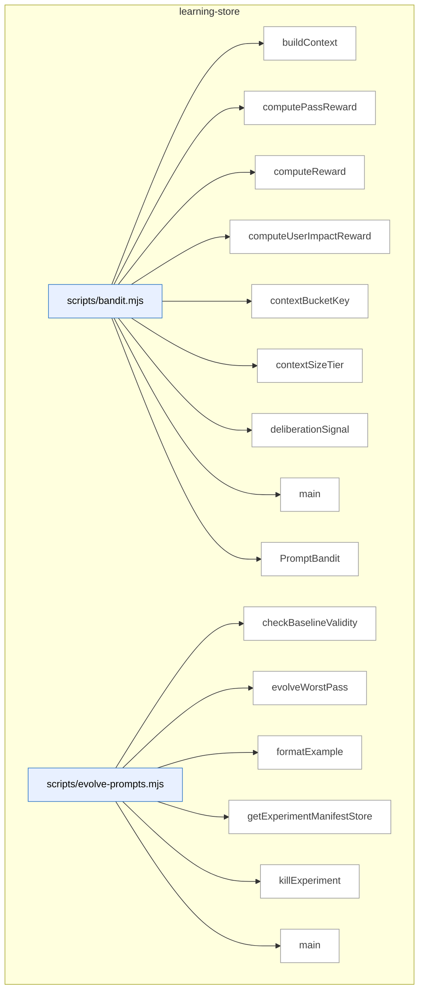

_Domain has 89 symbols (>50). Diagram shows top-15 by file order; see flat table below for the full list._

### Symbols in this domain

| Symbol | Kind | Path | Lines | Purpose | File imported by |
|---|---|---|---|---|---|
| [`buildContext`](../scripts/bandit.mjs#L29) | function | `scripts/bandit.mjs` | 29-35 | Builds context metadata from repo profile (size tier and dominant language). | `scripts/evolve-prompts.mjs`, `scripts/gemini-review.mjs`, `scripts/lib/audit/legacy-production-audit.mjs`, +7 more |
| [`computePassReward`](../scripts/bandit.mjs#L442) | function | `scripts/bandit.mjs` | 442-448 | Averages per-finding rewards to compute pass-level bandit reward signal. | `scripts/evolve-prompts.mjs`, `scripts/gemini-review.mjs`, `scripts/lib/audit/legacy-production-audit.mjs`, +7 more |
| [`computeReward`](../scripts/bandit.mjs#L342) | function | `scripts/bandit.mjs` | 342-380 | Calculates bandit arm reward from adjudication outcome, substantive signal, deliberation quality, and user impact. | `scripts/evolve-prompts.mjs`, `scripts/gemini-review.mjs`, `scripts/lib/audit/legacy-production-audit.mjs`, +7 more |
| [`computeUserImpactReward`](../scripts/bandit.mjs#L391) | function | `scripts/bandit.mjs` | 391-411 | Scores user-impact signal from persona test correlation type and severity. | `scripts/evolve-prompts.mjs`, `scripts/gemini-review.mjs`, `scripts/lib/audit/legacy-production-audit.mjs`, +7 more |
| [`contextBucketKey`](../scripts/bandit.mjs#L44) | function | `scripts/bandit.mjs` | 44-46 | Creates a cache key from context size tier and language for bandit state lookup. | `scripts/evolve-prompts.mjs`, `scripts/gemini-review.mjs`, `scripts/lib/audit/legacy-production-audit.mjs`, +7 more |
| [`contextSizeTier`](../scripts/bandit.mjs#L37) | function | `scripts/bandit.mjs` | 37-42 | Classifies repo character count into size tier buckets for bandit context bucketing. | `scripts/evolve-prompts.mjs`, `scripts/gemini-review.mjs`, `scripts/lib/audit/legacy-production-audit.mjs`, +7 more |
| [`deliberationSignal`](../scripts/bandit.mjs#L418) | function | `scripts/bandit.mjs` | 418-435 | Quantifies deliberation quality from Claude-vs-GPT ruling dynamics and rationale depth. | `scripts/evolve-prompts.mjs`, `scripts/gemini-review.mjs`, `scripts/lib/audit/legacy-production-audit.mjs`, +7 more |
| [`main`](../scripts/bandit.mjs#L452) | function | `scripts/bandit.mjs` | 452-486 | CLI for Thompson-sampling bandit operations (register prompt arms, display per-arm statistics). | `scripts/evolve-prompts.mjs`, `scripts/gemini-review.mjs`, `scripts/lib/audit/legacy-production-audit.mjs`, +7 more |
| [`PromptBandit`](../scripts/bandit.mjs#L50) | class | `scripts/bandit.mjs` | 50-325 | Thompson-sampling bandit for adaptive prompt variant selection with Beta posteriors and context-aware bucketing. | `scripts/evolve-prompts.mjs`, `scripts/gemini-review.mjs`, `scripts/lib/audit/legacy-production-audit.mjs`, +7 more |
| [`checkBaselineValidity`](../scripts/evolve-prompts.mjs#L341) | function | `scripts/evolve-prompts.mjs` | 341-349 | Verifies that an experiment's baseline revision is still current, marking it stale if the default has changed. | `tests/evolve.test.mjs` |
| [`evolveWorstPass`](../scripts/evolve-prompts.mjs#L93) | function | `scripts/evolve-prompts.mjs` | 93-235 | Selects the weakest audit pass and creates prompt-evolution candidates to raise its effectiveness. | `tests/evolve.test.mjs` |
| [`formatExample`](../scripts/evolve-prompts.mjs#L337) | function | `scripts/evolve-prompts.mjs` | 337-339 | Renders a single audit outcome as a formatted example string for prompt evolution display. | `tests/evolve.test.mjs` |
| [`getExperimentManifestStore`](../scripts/evolve-prompts.mjs#L65) | function | `scripts/evolve-prompts.mjs` | 65-67 | Returns a mutex-protected file store for persisting experiment metadata. | `tests/evolve.test.mjs` |
| [`killExperiment`](../scripts/evolve-prompts.mjs#L307) | function | `scripts/evolve-prompts.mjs` | 307-318 | Terminates a prompt experiment and removes it from active testing. | `tests/evolve.test.mjs` |
| [`main`](../scripts/evolve-prompts.mjs#L374) | function | `scripts/evolve-prompts.mjs` | 374-469 | Entry point dispatching prompt-evolution operations (evolve, review, promote, kill, show stats). | `tests/evolve.test.mjs` |
| [`promoteExperiment`](../scripts/evolve-prompts.mjs#L290) | function | `scripts/evolve-prompts.mjs` | 290-302 | Promotes a successful prompt experiment to production and records the transition. | `tests/evolve.test.mjs` |
| [`reconcileOrphanedExperiments`](../scripts/evolve-prompts.mjs#L354) | function | `scripts/evolve-prompts.mjs` | 354-370 | Detects and removes incomplete experiment metadata from the manifest directory. | `tests/evolve.test.mjs` |
| [`reviewExperiments`](../scripts/evolve-prompts.mjs#L240) | function | `scripts/evolve-prompts.mjs` | 240-285 | Evaluates active prompt experiments to identify which have converged and are ready for promotion. | `tests/evolve.test.mjs` |
| [`showStats`](../scripts/evolve-prompts.mjs#L323) | function | `scripts/evolve-prompts.mjs` | 323-333 | Collects and displays effectiveness metrics for all audit passes and experiments. | `tests/evolve.test.mjs` |
| [`buildAuthorTierObservation`](../scripts/lib/learning/author-tier-observation.mjs#L188) | function | `scripts/lib/learning/author-tier-observation.mjs` | 188-232 | Constructs a learning decision record for author-tier observation with context and choice. | `scripts/lib/audit/legacy-production-audit.mjs`, `scripts/openai-audit.mjs`, `tests/model-tier-observation.test.mjs` |
| [`deriveSignals`](../scripts/lib/learning/author-tier-observation.mjs#L93) | function | `scripts/lib/learning/author-tier-observation.mjs` | 93-121 | Extracts audit signals (file count, domains, security touch, mechanical-only flag) from change metadata. | `scripts/lib/audit/legacy-production-audit.mjs`, `scripts/openai-audit.mjs`, `tests/model-tier-observation.test.mjs` |
| [`diffBucket`](../scripts/lib/learning/author-tier-observation.mjs#L68) | function | `scripts/lib/learning/author-tier-observation.mjs` | 68-71 | Classifies a diff line count into size buckets (S/M/L/XL) for telemetry. | `scripts/lib/audit/legacy-production-audit.mjs`, `scripts/openai-audit.mjs`, `tests/model-tier-observation.test.mjs` |
| [`normalizeTierHint`](../scripts/lib/learning/author-tier-observation.mjs#L141) | function | `scripts/lib/learning/author-tier-observation.mjs` | 141-145 | Converts an author-tier hint (logical tier or model ID) to canonical form. | `scripts/lib/audit/legacy-production-audit.mjs`, `scripts/openai-audit.mjs`, `tests/model-tier-observation.test.mjs` |
| [`suggestTier`](../scripts/lib/learning/author-tier-observation.mjs#L128) | function | `scripts/lib/learning/author-tier-observation.mjs` | 128-133 | Recommends an author model tier (economy/standard/frontier) based on change complexity signals. | `scripts/lib/audit/legacy-production-audit.mjs`, `scripts/openai-audit.mjs`, `tests/model-tier-observation.test.mjs` |
| [`betaPosterior`](../scripts/lib/learning/beta-posterior.mjs#L38) | function | `scripts/lib/learning/beta-posterior.mjs` | 38-61 | Computes Beta posterior parameters and 95% confidence interval from Bernoulli observations. | `scripts/lib/learning/quickfix-stats.mjs`, `tests/learning-beta-posterior.test.mjs` |
| [`sampleGamma`](../scripts/lib/learning/beta-posterior.mjs#L136) | function | `scripts/lib/learning/beta-posterior.mjs` | 136-159 | Samples from a Gamma distribution using Marsaglia & Tsang's algorithm. | `scripts/lib/learning/quickfix-stats.mjs`, `tests/learning-beta-posterior.test.mjs` |
| [`standardNormal`](../scripts/lib/learning/beta-posterior.mjs#L162) | function | `scripts/lib/learning/beta-posterior.mjs` | 162-168 | Generates a standard normal sample via Box-Muller transform. | `scripts/lib/learning/quickfix-stats.mjs`, `tests/learning-beta-posterior.test.mjs` |
| [`thompsonSample`](../scripts/lib/learning/beta-posterior.mjs#L74) | function | `scripts/lib/learning/beta-posterior.mjs` | 74-94 | Draws a sample from a Beta posterior distribution for Thompson sampling arm selection. | `scripts/lib/learning/quickfix-stats.mjs`, `tests/learning-beta-posterior.test.mjs` |
| [`updatePosterior`](../scripts/lib/learning/beta-posterior.mjs#L108) | function | `scripts/lib/learning/beta-posterior.mjs` | 108-127 | Updates a Beta posterior with a new Bernoulli observation (0 or 1). | `scripts/lib/learning/quickfix-stats.mjs`, `tests/learning-beta-posterior.test.mjs` |
| [`hasEnoughSamples`](../scripts/lib/learning/cold-start.mjs#L17) | function | `scripts/lib/learning/cold-start.mjs` | 17-21 | Checks if total observations meet or exceed a minimum threshold for cold-start gate. | `tests/learning-cold-start.test.mjs` |
| [`withFallback`](../scripts/lib/learning/cold-start.mjs#L36) | function | `scripts/lib/learning/cold-start.mjs` | 36-40 | Conditionally calls a predictor or fallback function based on sample-size sufficiency. | `tests/learning-cold-start.test.mjs` |
| [`_canonicalise`](../scripts/lib/learning/decision-logger.mjs#L183) | function | `scripts/lib/learning/decision-logger.mjs` | 183-190 | Recursively sorts object keys for deterministic serialization. | `scripts/lib/audit/legacy-production-audit.mjs`, `scripts/lib/neighbourhood-query.mjs`, `scripts/openai-audit.mjs`, +3 more |
| [`_getStateForTest`](../scripts/lib/learning/decision-logger.mjs#L532) | function | `scripts/lib/learning/decision-logger.mjs` | 532-539 | Returns current queue sizes and dropped counts for test inspection. | `scripts/lib/audit/legacy-production-audit.mjs`, `scripts/lib/neighbourhood-query.mjs`, `scripts/openai-audit.mjs`, +3 more |
| [`_isKeyInt`](../scripts/lib/learning/decision-logger.mjs#L51) | function | `scripts/lib/learning/decision-logger.mjs` | 51-51 | Checks if value is a safe, non-negative integer (safe for counter/sequence). | `scripts/lib/audit/legacy-production-audit.mjs`, `scripts/lib/neighbourhood-query.mjs`, `scripts/openai-audit.mjs`, +3 more |
| [`_isNonEmptyString`](../scripts/lib/learning/decision-logger.mjs#L50) | function | `scripts/lib/learning/decision-logger.mjs` | 50-50 | Checks if value is a non-empty, colon-free string (safe for key components). | `scripts/lib/audit/legacy-production-audit.mjs`, `scripts/lib/neighbourhood-query.mjs`, `scripts/openai-audit.mjs`, +3 more |
| [`_resetForTest`](../scripts/lib/learning/decision-logger.mjs#L521) | function | `scripts/lib/learning/decision-logger.mjs` | 521-527 | Clears all module state for test isolation. | `scripts/lib/audit/legacy-production-audit.mjs`, `scripts/lib/neighbourhood-query.mjs`, `scripts/openai-audit.mjs`, +3 more |
| [`backfillOutcome`](../scripts/lib/learning/decision-logger.mjs#L263) | function | `scripts/lib/learning/decision-logger.mjs` | 263-295 | Backfills outcome on an existing decision or enqueues an outcome-only update. | `scripts/lib/audit/legacy-production-audit.mjs`, `scripts/lib/neighbourhood-query.mjs`, `scripts/openai-audit.mjs`, +3 more |
| [`buildDecisionKey`](../scripts/lib/learning/decision-logger.mjs#L156) | function | `scripts/lib/learning/decision-logger.mjs` | 156-171 | Constructs a unique decision key from audit run or external ID plus decision type. | `scripts/lib/audit/legacy-production-audit.mjs`, `scripts/lib/neighbourhood-query.mjs`, `scripts/openai-audit.mjs`, +3 more |
| [`bumpDropped`](../scripts/lib/learning/decision-logger.mjs#L90) | function | `scripts/lib/learning/decision-logger.mjs` | 90-92 | Increments the dropped-entry count for a decision type. | `scripts/lib/audit/legacy-production-audit.mjs`, `scripts/lib/neighbourhood-query.mjs`, `scripts/openai-audit.mjs`, +3 more |
| [`canonicaliseContext`](../scripts/lib/learning/decision-logger.mjs#L192) | function | `scripts/lib/learning/decision-logger.mjs` | 192-194 | Canonicalizes context object and returns its JSON string. | `scripts/lib/audit/legacy-production-audit.mjs`, `scripts/lib/neighbourhood-query.mjs`, `scripts/openai-audit.mjs`, +3 more |
| [`contextHash`](../scripts/lib/learning/decision-logger.mjs#L196) | function | `scripts/lib/learning/decision-logger.mjs` | 196-198 | Computes SHA256 hash of canonicalized context. | `scripts/lib/audit/legacy-production-audit.mjs`, `scripts/lib/neighbourhood-query.mjs`, `scripts/openai-audit.mjs`, +3 more |
| [`DecisionLoggerError`](../scripts/lib/learning/decision-logger.mjs#L109) | class | `scripts/lib/learning/decision-logger.mjs` | 109-111 | Custom error class for decision logger failures with error code. | `scripts/lib/audit/legacy-production-audit.mjs`, `scripts/lib/neighbourhood-query.mjs`, `scripts/openai-audit.mjs`, +3 more |
| [`drain`](../scripts/lib/learning/decision-logger.mjs#L482) | function | `scripts/lib/learning/decision-logger.mjs` | 482-492 | Flushes queue and reconciles outbox, deduplicates inflight state. | `scripts/lib/audit/legacy-production-audit.mjs`, `scripts/lib/neighbourhood-query.mjs`, `scripts/openai-audit.mjs`, +3 more |
| [`flush`](../scripts/lib/learning/decision-logger.mjs#L308) | function | `scripts/lib/learning/decision-logger.mjs` | 308-377 | Drains queued entries to cloud or outbox, returns flush summary with retry tracking. | `scripts/lib/audit/legacy-production-audit.mjs`, `scripts/lib/neighbourhood-query.mjs`, `scripts/openai-audit.mjs`, +3 more |
| [`getQueue`](../scripts/lib/learning/decision-logger.mjs#L84) | function | `scripts/lib/learning/decision-logger.mjs` | 84-88 | Retrieves or lazily creates a queue for a specific decision type. | `scripts/lib/audit/legacy-production-audit.mjs`, `scripts/lib/neighbourhood-query.mjs`, `scripts/openai-audit.mjs`, +3 more |
| [`installLifecycleHooks`](../scripts/lib/learning/decision-logger.mjs#L494) | function | `scripts/lib/learning/decision-logger.mjs` | 494-516 | Registers beforeExit and SIGINT handlers for graceful queue drain. | `scripts/lib/audit/legacy-production-audit.mjs`, `scripts/lib/neighbourhood-query.mjs`, `scripts/openai-audit.mjs`, +3 more |
| [`isCiEnv`](../scripts/lib/learning/decision-logger.mjs#L59) | function | `scripts/lib/learning/decision-logger.mjs` | 59-61 | Detects if running in a CI environment via environment variables. | `scripts/lib/audit/legacy-production-audit.mjs`, `scripts/lib/neighbourhood-query.mjs`, `scripts/openai-audit.mjs`, +3 more |
| [`reconcileOutbox`](../scripts/lib/learning/decision-logger.mjs#L388) | function | `scripts/lib/learning/decision-logger.mjs` | 388-413 | Processes outbox files to cloud store with error recovery. | `scripts/lib/audit/legacy-production-audit.mjs`, `scripts/lib/neighbourhood-query.mjs`, `scripts/openai-audit.mjs`, +3 more |
| [`recordDecision`](../scripts/lib/learning/decision-logger.mjs#L218) | function | `scripts/lib/learning/decision-logger.mjs` | 218-252 | Enqueues a learning decision with per-type queue-overflow protection. | `scripts/lib/audit/legacy-production-audit.mjs`, `scripts/lib/neighbourhood-query.mjs`, `scripts/openai-audit.mjs`, +3 more |
| [`resolveQueueCap`](../scripts/lib/learning/decision-logger.mjs#L27) | function | `scripts/lib/learning/decision-logger.mjs` | 27-38 | Parses the LEARNING_QUEUE_CAP_PER_TYPE env var, falling back to default on invalid input. | `scripts/lib/audit/legacy-production-audit.mjs`, `scripts/lib/neighbourhood-query.mjs`, `scripts/openai-audit.mjs`, +3 more |
| [`retryWithBackoff`](../scripts/lib/learning/decision-logger.mjs#L435) | function | `scripts/lib/learning/decision-logger.mjs` | 435-452 | Retries async function with exponential backoff (3 attempts in CI, one-shot locally). | `scripts/lib/audit/legacy-production-audit.mjs`, `scripts/lib/neighbourhood-query.mjs`, `scripts/openai-audit.mjs`, +3 more |
| [`throttledWarn`](../scripts/lib/learning/decision-logger.mjs#L94) | function | `scripts/lib/learning/decision-logger.mjs` | 94-101 | Logs warnings with millisecond-level throttling to avoid spam. | `scripts/lib/audit/legacy-production-audit.mjs`, `scripts/lib/neighbourhood-query.mjs`, `scripts/openai-audit.mjs`, +3 more |
| [`tryWrite`](../scripts/lib/learning/decision-logger.mjs#L417) | function | `scripts/lib/learning/decision-logger.mjs` | 417-433 | Attempts to persist a decision entry via cloud store or outcome-update callback. | `scripts/lib/audit/legacy-production-audit.mjs`, `scripts/lib/neighbourhood-query.mjs`, `scripts/openai-audit.mjs`, +3 more |
| [`validateInput`](../scripts/lib/learning/decision-logger.mjs#L113) | function | `scripts/lib/learning/decision-logger.mjs` | 113-148 | Validates decision logger input: type, context, choice, and audit/external ID binding. | `scripts/lib/audit/legacy-production-audit.mjs`, `scripts/lib/neighbourhood-query.mjs`, `scripts/openai-audit.mjs`, +3 more |
| [`writeOutbox`](../scripts/lib/learning/decision-logger.mjs#L454) | function | `scripts/lib/learning/decision-logger.mjs` | 454-465 | Writes entry to local outbox directory with hash-based filename. | `scripts/lib/audit/legacy-production-audit.mjs`, `scripts/lib/neighbourhood-query.mjs`, `scripts/openai-audit.mjs`, +3 more |
| [`aggregateDecisions`](../scripts/lib/learning/quickfix-stats.mjs#L199) | function | `scripts/lib/learning/quickfix-stats.mjs` | 199-224 | Aggregates decisions into per-pattern acceptance rates and Beta confidence intervals. | `scripts/cross-skill.mjs`, `scripts/learning/backfill-outcomes.mjs`, `tests/learning-quickfix-stats.test.mjs` |
| [`cliMain`](../scripts/lib/learning/quickfix-stats.mjs#L277) | function | `scripts/lib/learning/quickfix-stats.mjs` | 277-330 | CLI handler for stats display, cloud rebuild, bootstrap rebuild, and cache reset. | `scripts/cross-skill.mjs`, `scripts/learning/backfill-outcomes.mjs`, `tests/learning-quickfix-stats.test.mjs` |
| [`computeWatermark`](../scripts/lib/learning/quickfix-stats.mjs#L226) | function | `scripts/lib/learning/quickfix-stats.mjs` | 226-233 | Tracks latest outcome timestamp and total row count for cache versioning. | `scripts/cross-skill.mjs`, `scripts/learning/backfill-outcomes.mjs`, `tests/learning-quickfix-stats.test.mjs` |
| [`loadStats`](../scripts/lib/learning/quickfix-stats.mjs#L54) | function | `scripts/lib/learning/quickfix-stats.mjs` | 54-64 | Reads cached quickfix pattern statistics from disk or returns empty. | `scripts/cross-skill.mjs`, `scripts/learning/backfill-outcomes.mjs`, `tests/learning-quickfix-stats.test.mjs` |
| [`readQuickfixDecisions`](../scripts/lib/learning/quickfix-stats.mjs#L240) | function | `scripts/lib/learning/quickfix-stats.mjs` | 240-258 | Queries cloud store for quickfix pattern decision history with pagination. | `scripts/cross-skill.mjs`, `scripts/learning/backfill-outcomes.mjs`, `tests/learning-quickfix-stats.test.mjs` |
| [`rebuildFromBootstrap`](../scripts/lib/learning/quickfix-stats.mjs#L139) | function | `scripts/lib/learning/quickfix-stats.mjs` | 139-183 | Extracts pattern statistics from local JSONL bootstrap file with neutral outcomes. | `scripts/cross-skill.mjs`, `scripts/learning/backfill-outcomes.mjs`, `tests/learning-quickfix-stats.test.mjs` |
| [`rebuildFromCloud`](../scripts/lib/learning/quickfix-stats.mjs#L97) | function | `scripts/lib/learning/quickfix-stats.mjs` | 97-122 | Fetches decisions from cloud store and aggregates pattern statistics. | `scripts/cross-skill.mjs`, `scripts/learning/backfill-outcomes.mjs`, `tests/learning-quickfix-stats.test.mjs` |
| [`shouldSkipPattern`](../scripts/lib/learning/quickfix-stats.mjs#L77) | function | `scripts/lib/learning/quickfix-stats.mjs` | 77-83 | Determines if pattern acceptance rate is low enough to skip emitting. | `scripts/cross-skill.mjs`, `scripts/learning/backfill-outcomes.mjs`, `tests/learning-quickfix-stats.test.mjs` |
| [`writeAtomic`](../scripts/lib/learning/quickfix-stats.mjs#L264) | function | `scripts/lib/learning/quickfix-stats.mjs` | 264-266 | Atomically writes cache file to disk. | `scripts/cross-skill.mjs`, `scripts/learning/backfill-outcomes.mjs`, `tests/learning-quickfix-stats.test.mjs` |
| [`archMemoryBandReward`](../scripts/lib/learning/replay.mjs#L292) | function | `scripts/lib/learning/replay.mjs` | 292-301 | Scores architectural memory band recommendations: reuse/extend accuracy vs wrong fork. | `scripts/learning/replay.mjs`, `tests/learning-replay.test.mjs` |
| [`convergencePredictReward`](../scripts/lib/learning/replay.mjs#L269) | function | `scripts/lib/learning/replay.mjs` | 269-284 | Scores convergence predictions: correct/wrong stop, correct/wasted continue. | `scripts/learning/replay.mjs`, `tests/learning-replay.test.mjs` |
| [`distSummary`](../scripts/lib/learning/replay.mjs#L154) | function | `scripts/lib/learning/replay.mjs` | 154-163 | Computes mean, median, and 90th percentile for a reward distribution. | `scripts/learning/replay.mjs`, `tests/learning-replay.test.mjs` |
| [`emptyDist`](../scripts/lib/learning/replay.mjs#L165) | function | `scripts/lib/learning/replay.mjs` | 165-165 | Returns zero-initialized distribution summary. | `scripts/learning/replay.mjs`, `tests/learning-replay.test.mjs` |
| [`historicalBaseline`](../scripts/lib/learning/replay.mjs#L228) | function | `scripts/lib/learning/replay.mjs` | 228-228 | Returns the choice made in a prior decision (historical baseline policy). | `scripts/learning/replay.mjs`, `tests/learning-replay.test.mjs` |
| [`neutralBaseline`](../scripts/lib/learning/replay.mjs#L231) | function | `scripts/lib/learning/replay.mjs` | 231-231 | Returns a neutral choice placeholder (baseline policy). | `scripts/learning/replay.mjs`, `tests/learning-replay.test.mjs` |
| [`passSelectionReward`](../scripts/lib/learning/replay.mjs#L250) | function | `scripts/lib/learning/replay.mjs` | 250-261 | Scores pass selection by value-per-cost ratio plus persona hit and false-positive penalty. | `scripts/learning/replay.mjs`, `tests/learning-replay.test.mjs` |
| [`percentile`](../scripts/lib/learning/replay.mjs#L167) | function | `scripts/lib/learning/replay.mjs` | 167-176 | Calculates linear-interpolated percentile from sorted array. | `scripts/learning/replay.mjs`, `tests/learning-replay.test.mjs` |
| [`readDecisionsForType`](../scripts/lib/learning/replay.mjs#L193) | function | `scripts/lib/learning/replay.mjs` | 193-220 | Queries learning store for decisions by type, time window, and optional repo scope. | `scripts/learning/replay.mjs`, `tests/learning-replay.test.mjs` |
| [`replay`](../scripts/lib/learning/replay.mjs#L62) | function | `scripts/lib/learning/replay.mjs` | 62-121 | Replays historical decisions through candidate and baseline policies, compares rewards. | `scripts/learning/replay.mjs`, `tests/learning-replay.test.mjs` |
| [`safeReward`](../scripts/lib/learning/replay.mjs#L139) | function | `scripts/lib/learning/replay.mjs` | 139-145 | Computes reward with try-catch, returns 0 on error or non-finite result. | `scripts/learning/replay.mjs`, `tests/learning-replay.test.mjs` |
| [`validateInput`](../scripts/lib/learning/replay.mjs#L125) | function | `scripts/lib/learning/replay.mjs` | 125-135 | Validates replay inputs are functions and non-empty strings. | `scripts/learning/replay.mjs`, `tests/learning-replay.test.mjs` |
| [`getLearningStats`](../scripts/lib/learning/stats.mjs#L33) | function | `scripts/lib/learning/stats.mjs` | 33-68 | Retrieves pending triage, noBrainer, and stale cluster counts for a repo. | `scripts/cross-skill.mjs`, `scripts/lib/dashboard/collect-telemetry.mjs` |
| [`computeAssessmentMetrics`](../scripts/meta-assess.mjs#L48) | function | `scripts/meta-assess.mjs` | 48-150 | Analyzes audit outcomes over a window to compute FP rate, signal quality, severity calibration, and convergence trends. | `scripts/audit-loop.mjs`, `tests/meta-assess.test.mjs` |
| [`emptyMetrics`](../scripts/meta-assess.mjs#L152) | function | `scripts/meta-assess.mjs` | 152-162 | Returns an empty metrics object structure for when there are no outcomes to assess. | `scripts/audit-loop.mjs`, `tests/meta-assess.test.mjs` |
| [`formatAssessmentReport`](../scripts/meta-assess.mjs#L353) | function | `scripts/meta-assess.mjs` | 353-398 | Converts an LLM assessment result into a markdown report with metrics table, health summary, diagnosis, and recommendations. | `scripts/audit-loop.mjs`, `tests/meta-assess.test.mjs` |
| [`main`](../scripts/meta-assess.mjs#L402) | function | `scripts/meta-assess.mjs` | 402-475 | Orchestrates audit-loop meta-assessment: loads outcomes, computes deterministic metrics, optionally runs LLM analysis, and outputs report. | `scripts/audit-loop.mjs`, `tests/meta-assess.test.mjs` |
| [`markAssessmentComplete`](../scripts/meta-assess.mjs#L190) | function | `scripts/meta-assess.mjs` | 190-198 | Updates the state file to record that an assessment just completed. | `scripts/audit-loop.mjs`, `tests/meta-assess.test.mjs` |
| [`runLLMAssessment`](../scripts/meta-assess.mjs#L249) | function | `scripts/meta-assess.mjs` | 249-326 | Sends metrics, outcome samples, and FP patterns to Gemini or GPT to generate diagnostic insights and recommendations. | `scripts/audit-loop.mjs`, `tests/meta-assess.test.mjs` |
| [`sampleOutcomes`](../scripts/meta-assess.mjs#L202) | function | `scripts/meta-assess.mjs` | 202-214 | Extracts recent dismissed and accepted outcomes, truncating fields for compact display. | `scripts/audit-loop.mjs`, `tests/meta-assess.test.mjs` |
| [`shouldRunAssessment`](../scripts/meta-assess.mjs#L174) | function | `scripts/meta-assess.mjs` | 174-184 | Checks if enough audit runs have passed since the last assessment to warrant a new one. | `scripts/audit-loop.mjs`, `tests/meta-assess.test.mjs` |
| [`storeAssessment`](../scripts/meta-assess.mjs#L337) | function | `scripts/meta-assess.mjs` | 337-344 | Appends an assessment result to a JSONL log file. | `scripts/audit-loop.mjs`, `tests/meta-assess.test.mjs` |
| [`analyzePass`](../scripts/refine-prompts.mjs#L40) | function | `scripts/refine-prompts.mjs` | 40-70 | Loads audit findings for a pass, computes acceptance rate and dismissal breakdown by category. | _(internal)_ |
| [`main`](../scripts/refine-prompts.mjs#L193) | function | `scripts/refine-prompts.mjs` | 193-233 | CLI dispatcher: analyzes audit pass effectiveness, shows per-pass statistics, or generates refinement suggestions. | _(internal)_ |
| [`suggestRefinements`](../scripts/refine-prompts.mjs#L76) | function | `scripts/refine-prompts.mjs` | 76-191 | Analyzes dismissed findings and uses an LLM to suggest prompt refinements based on failure patterns. | _(internal)_ |

---

## memory-health

> Monitors the audit-findings store via three signal-decay metrics (fuzzy re-raise rate, cluster density, recurrence) to detect when pgvector + community clustering would recover signal lost to dedup collisions.

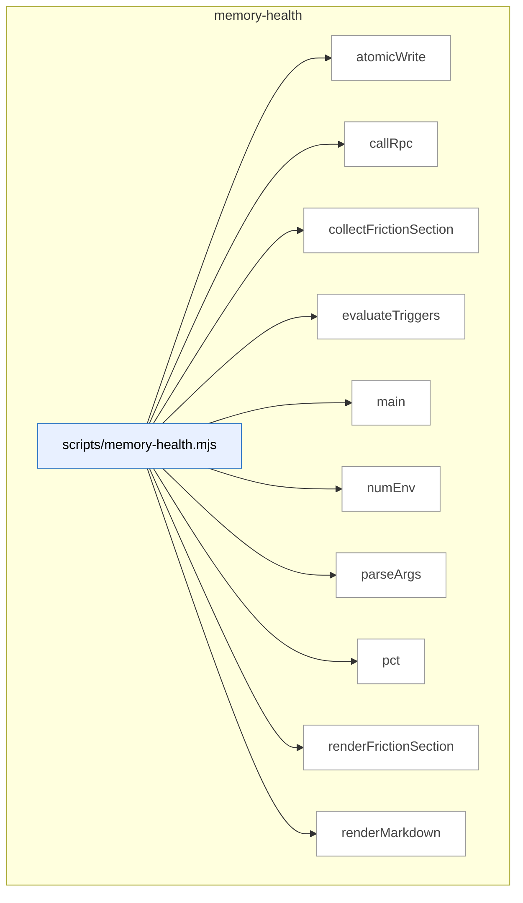

### Symbols in this domain

| Symbol | Kind | Path | Lines | Purpose | File imported by |
|---|---|---|---|---|---|
| [`atomicWrite`](../scripts/memory-health.mjs#L292) | function | `scripts/memory-health.mjs` | 292-294 | Writes content to a file atomically via temp-and-rename for crash-safety. | `tests/memory-health.test.mjs` |
| [`callRpc`](../scripts/memory-health.mjs#L71) | function | `scripts/memory-health.mjs` | 71-82 | Invokes the `memory_health_metrics` Postgres RPC to fetch memory-health signal data from the audit store. | `tests/memory-health.test.mjs` |
| [`collectFrictionSection`](../scripts/memory-health.mjs#L94) | function | `scripts/memory-health.mjs` | 94-124 | Fetches and evaluates recurring friction clusters from the store, determining hard-fail conditions for protected scopes. | `tests/memory-health.test.mjs` |
| [`evaluateTriggers`](../scripts/memory-health.mjs#L170) | function | `scripts/memory-health.mjs` | 170-205 | Compares audit-loop metrics against thresholds to evaluate whether memory-health triggers fired. | `tests/memory-health.test.mjs` |
| [`main`](../scripts/memory-health.mjs#L296) | function | `scripts/memory-health.mjs` | 296-336 | Orchestrates memory-health reporting: fetches cloud metrics, evaluates triggers, outputs markdown/JSON, and sets exit code. | `tests/memory-health.test.mjs` |
| [`numEnv`](../scripts/memory-health.mjs#L31) | function | `scripts/memory-health.mjs` | 31-40 | Reads and validates an env var as a finite number, using a fallback if invalid or absent. | `tests/memory-health.test.mjs` |
| [`parseArgs`](../scripts/memory-health.mjs#L51) | function | `scripts/memory-health.mjs` | 51-69 | Parses command-line arguments for the memory-health script, supporting `--out`, `--json`, and `--help`. | `tests/memory-health.test.mjs` |
| [`pct`](../scripts/memory-health.mjs#L207) | function | `scripts/memory-health.mjs` | 207-209 | Formats a decimal number as a percentage string with one decimal place. | `tests/memory-health.test.mjs` |
| [`renderFrictionSection`](../scripts/memory-health.mjs#L126) | function | `scripts/memory-health.mjs` | 126-168 | Formats friction recurrence data into a markdown table with rank, cost, age, and protective-scope warnings. | `tests/memory-health.test.mjs` |
| [`renderMarkdown`](../scripts/memory-health.mjs#L211) | function | `scripts/memory-health.mjs` | 211-290 | Generates a complete markdown memory-health report with metrics, trigger evaluation, and friction data. | `tests/memory-health.test.mjs` |

---

## model-eval

> A/B testing framework for code-audit LLM models: generates findings via multiple "arms," blinds them to hide the source model, and applies a judge to compare quality.

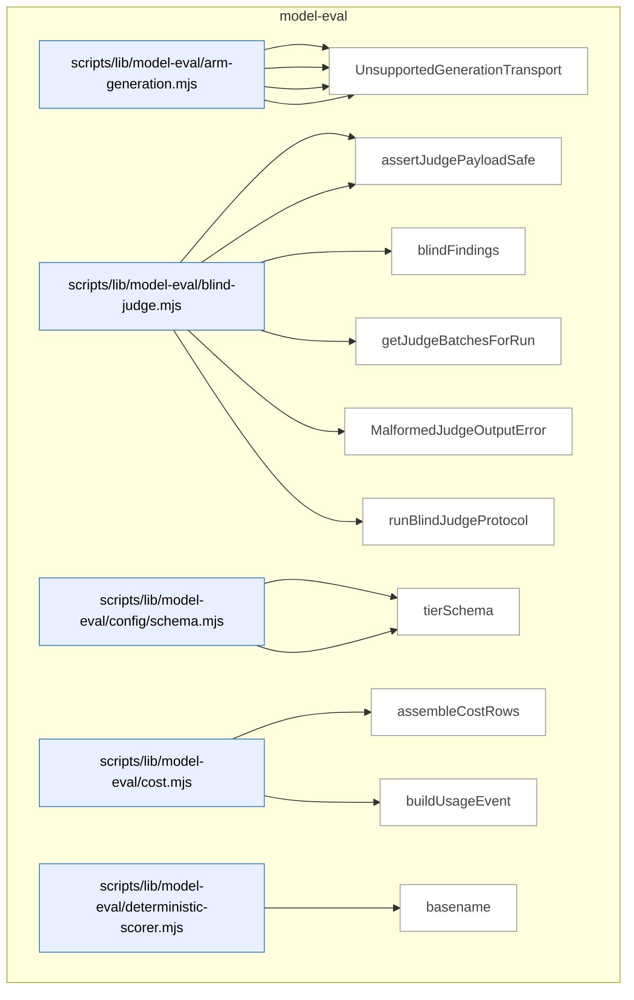

_Domain has 66 symbols (>50). Diagram shows top-15 by file order; see flat table below for the full list._

### Symbols in this domain

| Symbol | Kind | Path | Lines | Purpose | File imported by |
|---|---|---|---|---|---|
| [`buildGenericPlanContent`](../scripts/lib/model-eval/arm-generation.mjs#L65) | function | `scripts/lib/model-eval/arm-generation.mjs` | 65-68 | Builds a prompt instruction string combining generic plan instructions and a list of changed files. | `scripts/model-eval-auditor.mjs`, `tests/arm-generation.test.mjs` |
| [`resolveGenerationClient`](../scripts/lib/model-eval/arm-generation.mjs#L90) | function | `scripts/lib/model-eval/arm-generation.mjs` | 90-109 | Resolves an OpenAI client and model ID from a generation route's transport and deployment metadata. | `scripts/model-eval-auditor.mjs`, `tests/arm-generation.test.mjs` |
| [`runAuditGenerationArm`](../scripts/lib/model-eval/arm-generation.mjs#L118) | function | `scripts/lib/model-eval/arm-generation.mjs` | 118-251 | Runs a 5-pass code audit on a diff via a specified route, with egress-safety gating before diff submission. | `scripts/model-eval-auditor.mjs`, `tests/arm-generation.test.mjs` |
| [`UnsupportedGenerationTransport`](../scripts/lib/model-eval/arm-generation.mjs#L29) | class | `scripts/lib/model-eval/arm-generation.mjs` | 29-35 | Error class for unsupported audit-generation transports (only OpenAI-compatible routes allowed). | `scripts/model-eval-auditor.mjs`, `tests/arm-generation.test.mjs` |
| [`appendJudgeBatch`](../scripts/lib/model-eval/blind-judge.mjs#L150) | function | `scripts/lib/model-eval/blind-judge.mjs` | 150-173 | Inserts a judge grading batch into the database, deduplicating via unique index on concurrent writes. | `scripts/model-eval-auditor.mjs`, `tests/blind-judge-fork-parity.test.mjs` |
| [`assertJudgePayloadSafe`](../scripts/lib/model-eval/blind-judge.mjs#L126) | function | `scripts/lib/model-eval/blind-judge.mjs` | 126-132 | Validates that a judge prompt contains no sensitive paths or egress violations. | `scripts/model-eval-auditor.mjs`, `tests/blind-judge-fork-parity.test.mjs` |
| [`blindFindings`](../scripts/lib/model-eval/blind-judge.mjs#L102) | function | `scripts/lib/model-eval/blind-judge.mjs` | 102-122 | Shuffles findings and assigns blind IDs, returning a shuffle-proof mapping from blind ID to source and bucket. | `scripts/model-eval-auditor.mjs`, `tests/blind-judge-fork-parity.test.mjs` |
| [`getJudgeBatchesForRun`](../scripts/lib/model-eval/blind-judge.mjs#L183) | function | `scripts/lib/model-eval/blind-judge.mjs` | 183-190 | Fetches all judge batches recorded for a given model-eval run. | `scripts/model-eval-auditor.mjs`, `tests/blind-judge-fork-parity.test.mjs` |
| [`MalformedJudgeOutputError`](../scripts/lib/model-eval/blind-judge.mjs#L40) | class | `scripts/lib/model-eval/blind-judge.mjs` | 40-42 | Error class for judge protocol output that cannot be parsed or is structurally malformed. | `scripts/model-eval-auditor.mjs`, `tests/blind-judge-fork-parity.test.mjs` |
| [`runBlindJudgeProtocol`](../scripts/lib/model-eval/blind-judge.mjs#L202) | function | `scripts/lib/model-eval/blind-judge.mjs` | 202-278 | Executes a blinded judge protocol comparing candidate and baseline findings against known defects. | `scripts/model-eval-auditor.mjs`, `tests/blind-judge-fork-parity.test.mjs` |
| [`parseThresholdConfig`](../scripts/lib/model-eval/config/schema.mjs#L109) | function | `scripts/lib/model-eval/config/schema.mjs` | 109-113 | Parses and validates threshold configuration, returning structured config or detailed validation errors. | `scripts/model-eval-adjudicator.mjs`, `scripts/model-eval-auditor.mjs`, `tests/model-eval-core.test.mjs` |
| [`tierSchema`](../scripts/lib/model-eval/config/schema.mjs#L54) | function | `scripts/lib/model-eval/config/schema.mjs` | 54-84 | Defines Zod schema for tier configuration, validating sample-size minimums and threshold-floor requirements. | `scripts/model-eval-adjudicator.mjs`, `scripts/model-eval-auditor.mjs`, `tests/model-eval-core.test.mjs` |
| [`assembleCostRows`](../scripts/lib/model-eval/cost.mjs#L168) | function | `scripts/lib/model-eval/cost.mjs` | 168-214 | Aggregates usage events into cost rows by (run, role, arm, candidate), with phase breakdowns and cost status. | `scripts/lib/model-eval/arm-generation.mjs`, `scripts/model-eval-auditor.mjs`, `tests/model-eval-core.test.mjs` |
| [`buildUsageEvent`](../scripts/lib/model-eval/cost.mjs#L109) | function | `scripts/lib/model-eval/cost.mjs` | 109-158 | Constructs a cost/usage event from provider metrics and pricing model, computing USD cost from token counts. | `scripts/lib/model-eval/arm-generation.mjs`, `scripts/model-eval-auditor.mjs`, `tests/model-eval-core.test.mjs` |
| [`basename`](../scripts/lib/model-eval/deterministic-scorer.mjs#L84) | function | `scripts/lib/model-eval/deterministic-scorer.mjs` | 84-86 | Extracts the filename (rightmost path component) from a file path. | `scripts/lib/model-eval/finalize-shadow-eval.mjs`, `scripts/model-eval-adjudicator.mjs`, `scripts/model-eval-auditor.mjs`, +1 more |
| [`matchScore`](../scripts/lib/model-eval/deterministic-scorer.mjs#L103) | function | `scripts/lib/model-eval/deterministic-scorer.mjs` | 103-132 | Scores how well a candidate finding matches an expected defect (exact or fuzzy match with bounds checking). | `scripts/lib/model-eval/finalize-shadow-eval.mjs`, `scripts/model-eval-adjudicator.mjs`, `scripts/model-eval-auditor.mjs`, +1 more |
| [`normalize`](../scripts/lib/model-eval/deterministic-scorer.mjs#L80) | function | `scripts/lib/model-eval/deterministic-scorer.mjs` | 80-82 | Lowercases and normalizes whitespace in a string for comparison. | `scripts/lib/model-eval/finalize-shadow-eval.mjs`, `scripts/model-eval-adjudicator.mjs`, `scripts/model-eval-auditor.mjs`, +1 more |
| [`scoreBinaryClassification`](../scripts/lib/model-eval/deterministic-scorer.mjs#L23) | function | `scripts/lib/model-eval/deterministic-scorer.mjs` | 23-58 | Computes precision, recall, and F1 score from predicted vs ground-truth binary labels with validation. | `scripts/lib/model-eval/finalize-shadow-eval.mjs`, `scripts/model-eval-adjudicator.mjs`, `scripts/model-eval-auditor.mjs`, +1 more |
| [`scoreDefectLocalization`](../scripts/lib/model-eval/deterministic-scorer.mjs#L145) | function | `scripts/lib/model-eval/deterministic-scorer.mjs` | 145-227 | Compares extracted findings against known-defect rubrics, computing match accuracy and localization metrics. | `scripts/lib/model-eval/finalize-shadow-eval.mjs`, `scripts/model-eval-adjudicator.mjs`, `scripts/model-eval-auditor.mjs`, +1 more |
| [`EgressGateError`](../scripts/lib/model-eval/egress-path-scan.mjs#L22) | class | `scripts/lib/model-eval/egress-path-scan.mjs` | 22-24 | Error class for egress/security policy violations. | `scripts/lib/model-eval/arm-generation.mjs`, `scripts/lib/model-eval/blind-judge.mjs`, `scripts/lib/model-eval/known-defect-corpus.mjs`, +6 more |
| [`findSensitivePathMentions`](../scripts/lib/model-eval/egress-path-scan.mjs#L108) | function | `scripts/lib/model-eval/egress-path-scan.mjs` | 108-113 | Tokenizes text and returns tokens matching sensitive path patterns. | `scripts/lib/model-eval/arm-generation.mjs`, `scripts/lib/model-eval/blind-judge.mjs`, `scripts/lib/model-eval/known-defect-corpus.mjs`, +6 more |
| [`looksLikeRealPath`](../scripts/lib/model-eval/egress-path-scan.mjs#L52) | function | `scripts/lib/model-eval/egress-path-scan.mjs` | 52-60 | Heuristically detects if a token resembles a file path (contains slashes, dots, `id_rsa`, file extensions, etc.). | `scripts/lib/model-eval/arm-generation.mjs`, `scripts/lib/model-eval/blind-judge.mjs`, `scripts/lib/model-eval/known-defect-corpus.mjs`, +6 more |
| [`appendModelEvalShadowObservation`](../scripts/lib/model-eval/finalize-shadow-eval.mjs#L61) | function | `scripts/lib/model-eval/finalize-shadow-eval.mjs` | 61-71 | Writes a shadow evaluation observation to the database with idempotency keying. | `scripts/gemini-review.mjs`, `scripts/model-eval-adjudicator.mjs`, `tests/finalize-shadow-eval.test.mjs` |
| [`finalizeShadowEval`](../scripts/lib/model-eval/finalize-shadow-eval.mjs#L206) | function | `scripts/lib/model-eval/finalize-shadow-eval.mjs` | 206-249 | Computes final shadow-eval metrics when sufficient terminal observations are collected; returns verdict. | `scripts/gemini-review.mjs`, `scripts/model-eval-adjudicator.mjs`, `tests/finalize-shadow-eval.test.mjs` |
| [`getShadowObservationsForEvalRun`](../scripts/lib/model-eval/finalize-shadow-eval.mjs#L79) | function | `scripts/lib/model-eval/finalize-shadow-eval.mjs` | 79-90 | Retrieves all shadow observations for a given model-eval run, ordered by creation. | `scripts/gemini-review.mjs`, `scripts/model-eval-adjudicator.mjs`, `tests/finalize-shadow-eval.test.mjs` |
| [`getTerminalShadowObservations`](../scripts/lib/model-eval/finalize-shadow-eval.mjs#L108) | function | `scripts/lib/model-eval/finalize-shadow-eval.mjs` | 108-133 | Filters shadow observations to those whose findings all carry terminal user-action labels (fixed/dismissed/etc.). | `scripts/gemini-review.mjs`, `scripts/model-eval-adjudicator.mjs`, `tests/finalize-shadow-eval.test.mjs` |
| [`ShadowObservationRepoMismatchError`](../scripts/lib/model-eval/finalize-shadow-eval.mjs#L46) | class | `scripts/lib/model-eval/finalize-shadow-eval.mjs` | 46-51 | Error class for shadow observations that don't belong to a specified repository. | `scripts/gemini-review.mjs`, `scripts/model-eval-adjudicator.mjs`, `tests/finalize-shadow-eval.test.mjs` |
| [`toBinaryRows`](../scripts/lib/model-eval/finalize-shadow-eval.mjs#L167) | function | `scripts/lib/model-eval/finalize-shadow-eval.mjs` | 167-183 | Converts terminal shadow observations into binary prediction arrays (candidate, baseline, ground truth). | `scripts/gemini-review.mjs`, `scripts/model-eval-adjudicator.mjs`, `tests/finalize-shadow-eval.test.mjs` |
| [`toMetrics`](../scripts/lib/model-eval/finalize-shadow-eval.mjs#L185) | function | `scripts/lib/model-eval/finalize-shadow-eval.mjs` | 185-187 | Extracts recall, false-positive rate, and F1 score from a binary classification result. | `scripts/gemini-review.mjs`, `scripts/model-eval-adjudicator.mjs`, `tests/finalize-shadow-eval.test.mjs` |
| [`CorpusCaseUnavailable`](../scripts/lib/model-eval/known-defect-corpus.mjs#L35) | class | `scripts/lib/model-eval/known-defect-corpus.mjs` | 35-42 | Custom error for when a test case cannot be loaded, with a classified failure reason. | `scripts/model-eval-auditor.mjs`, `tests/known-defect-corpus.test.mjs` |
| [`git`](../scripts/lib/model-eval/known-defect-corpus.mjs#L58) | function | `scripts/lib/model-eval/known-defect-corpus.mjs` | 58-63 | Executes a git command in a repository root with proper paging and environment setup. | `scripts/model-eval-auditor.mjs`, `tests/known-defect-corpus.test.mjs` |
| [`loadCorpusCase`](../scripts/lib/model-eval/known-defect-corpus.mjs#L112) | function | `scripts/lib/model-eval/known-defect-corpus.mjs` | 112-211 | Loads a test case by validating the commit, extracting its diff, and checking size constraints. | `scripts/model-eval-auditor.mjs`, `tests/known-defect-corpus.test.mjs` |
| [`resolveRepoRoot`](../scripts/lib/model-eval/known-defect-corpus.mjs#L89) | function | `scripts/lib/model-eval/known-defect-corpus.mjs` | 89-95 | Searches candidate paths for a directory basename matching a target repo name. | `scripts/model-eval-auditor.mjs`, `tests/known-defect-corpus.test.mjs` |
| [`tryGit`](../scripts/lib/model-eval/known-defect-corpus.mjs#L72) | function | `scripts/lib/model-eval/known-defect-corpus.mjs` | 72-75 | Wraps a git command call in try-catch and returns a structured {ok, output\|error} result. | `scripts/model-eval-auditor.mjs`, `tests/known-defect-corpus.test.mjs` |
| [`invokeNativeAnthropic`](../scripts/lib/model-eval/provider-adapter.mjs#L128) | function | `scripts/lib/model-eval/provider-adapter.mjs` | 128-156 | Invokes Claude with JSON-schema structured output via the native Anthropic API. | `scripts/lib/model-eval/blind-judge.mjs`, `scripts/lib/model-eval/structured-extractor.mjs` |
| [`invokeNativeGemini`](../scripts/lib/model-eval/provider-adapter.mjs#L158) | function | `scripts/lib/model-eval/provider-adapter.mjs` | 158-200 | Invokes Gemini with JSON-schema structured output via the native Google SDK. | `scripts/lib/model-eval/blind-judge.mjs`, `scripts/lib/model-eval/structured-extractor.mjs` |
| [`invokeOpenAICompatible`](../scripts/lib/model-eval/provider-adapter.mjs#L83) | function | `scripts/lib/model-eval/provider-adapter.mjs` | 83-126 | Invokes OpenAI-compatible providers (public/Azure/OSS) with Zod-schema structured output. | `scripts/lib/model-eval/blind-judge.mjs`, `scripts/lib/model-eval/structured-extractor.mjs` |
| [`invokeStructured`](../scripts/lib/model-eval/provider-adapter.mjs#L46) | function | `scripts/lib/model-eval/provider-adapter.mjs` | 46-81 | Calls LLM providers with structured output, applying egress safety gates before transmission. | `scripts/lib/model-eval/blind-judge.mjs`, `scripts/lib/model-eval/structured-extractor.mjs` |
| [`MalformedProviderOutputError`](../scripts/lib/model-eval/provider-adapter.mjs#L31) | class | `scripts/lib/model-eval/provider-adapter.mjs` | 31-33 | Custom error for unparseable structured JSON responses from LLM providers. | `scripts/lib/model-eval/blind-judge.mjs`, `scripts/lib/model-eval/structured-extractor.mjs` |
| [`resolveOssClientConfig`](../scripts/lib/model-eval/provider-adapter.mjs#L210) | function | `scripts/lib/model-eval/provider-adapter.mjs` | 210-216 | Extracts and validates OpenRouter configuration from environment variables. | `scripts/lib/model-eval/blind-judge.mjs`, `scripts/lib/model-eval/structured-extractor.mjs` |
| [`assertAzureTransportSupported`](../scripts/lib/model-eval/route-catalog.mjs#L271) | function | `scripts/lib/model-eval/route-catalog.mjs` | 271-275 | Rejects unsupported provider-transport pairs (specifically Azure + Gemini). | `scripts/gemini-review.mjs`, `scripts/lib/model-eval/blind-judge.mjs`, `scripts/lib/model-eval/finalize-shadow-eval.mjs`, +3 more |
| [`azureTransportProvider`](../scripts/lib/model-eval/route-catalog.mjs#L279) | function | `scripts/lib/model-eval/route-catalog.mjs` | 279-287 | Looks up the transport mechanism for an Azure route by inspecting its model lineage family. | `scripts/gemini-review.mjs`, `scripts/lib/model-eval/blind-judge.mjs`, `scripts/lib/model-eval/finalize-shadow-eval.mjs`, +3 more |
| [`buildComparisonEvidenceFromRoutes`](../scripts/lib/model-eval/route-catalog.mjs#L357) | function | `scripts/lib/model-eval/route-catalog.mjs` | 357-366 | Packages candidate/baseline/judge routes with their computed tier and independence checks. | `scripts/gemini-review.mjs`, `scripts/lib/model-eval/blind-judge.mjs`, `scripts/lib/model-eval/finalize-shadow-eval.mjs`, +3 more |
| [`lineageForProvider`](../scripts/lib/model-eval/route-catalog.mjs#L112) | function | `scripts/lib/model-eval/route-catalog.mjs` | 112-114 | Formats a lineage identifier by combining provider name with optional tier/variant/role. | `scripts/gemini-review.mjs`, `scripts/lib/model-eval/blind-judge.mjs`, `scripts/lib/model-eval/finalize-shadow-eval.mjs`, +3 more |
| [`loadAzureRoutes`](../scripts/lib/model-eval/route-catalog.mjs#L79) | function | `scripts/lib/model-eval/route-catalog.mjs` | 79-99 | Loads and validates Azure deployment route definitions from a JSON config file. | `scripts/gemini-review.mjs`, `scripts/lib/model-eval/blind-judge.mjs`, `scripts/lib/model-eval/finalize-shadow-eval.mjs`, +3 more |
| [`resolveCandidateRoute`](../scripts/lib/model-eval/route-catalog.mjs#L125) | function | `scripts/lib/model-eval/route-catalog.mjs` | 125-257 | Parses and resolves a model candidate specification to a concrete provider route with lineage. | `scripts/gemini-review.mjs`, `scripts/lib/model-eval/blind-judge.mjs`, `scripts/lib/model-eval/finalize-shadow-eval.mjs`, +3 more |
| [`resolveEvaluationTier`](../scripts/lib/model-eval/route-catalog.mjs#L305) | function | `scripts/lib/model-eval/route-catalog.mjs` | 305-333 | Computes the evaluation tier (A/B/C) for a model-comparison test based on route independence and knowledge status. | `scripts/gemini-review.mjs`, `scripts/lib/model-eval/blind-judge.mjs`, `scripts/lib/model-eval/finalize-shadow-eval.mjs`, +3 more |
| [`RouteResolutionError`](../scripts/lib/model-eval/route-catalog.mjs#L70) | class | `scripts/lib/model-eval/route-catalog.mjs` | 70-76 | Custom error for route resolution failures, tracking whether preflight validation failed. | `scripts/gemini-review.mjs`, `scripts/lib/model-eval/blind-judge.mjs`, `scripts/lib/model-eval/finalize-shadow-eval.mjs`, +3 more |
| [`toRouteEvidence`](../scripts/lib/model-eval/route-catalog.mjs#L338) | function | `scripts/lib/model-eval/route-catalog.mjs` | 338-343 | Extracts route metadata (tier, status, independence eligibility, trust source) for downstream evidence tracking. | `scripts/gemini-review.mjs`, `scripts/lib/model-eval/blind-judge.mjs`, `scripts/lib/model-eval/finalize-shadow-eval.mjs`, +3 more |
| [`transportForProvider`](../scripts/lib/model-eval/route-catalog.mjs#L103) | function | `scripts/lib/model-eval/route-catalog.mjs` | 103-108 | Maps a provider name to its transport backend (openai-compatible, native-anthropic, or native-gemini). | `scripts/gemini-review.mjs`, `scripts/lib/model-eval/blind-judge.mjs`, `scripts/lib/model-eval/finalize-shadow-eval.mjs`, +3 more |
| [`buildAdjudicatorPrompt`](../scripts/lib/model-eval/structured-extractor.mjs#L215) | function | `scripts/lib/model-eval/structured-extractor.mjs` | 215-220 | Constructs system + user messages for a finding-adjudication LLM task. | `scripts/model-eval-adjudicator.mjs`, `scripts/model-eval-auditor.mjs`, `tests/model-eval-core.test.mjs` |
| [`buildAuditorPrompt`](../scripts/lib/model-eval/structured-extractor.mjs#L208) | function | `scripts/lib/model-eval/structured-extractor.mjs` | 208-213 | Constructs system + user messages for a code-auditing LLM task. | `scripts/model-eval-adjudicator.mjs`, `scripts/model-eval-auditor.mjs`, `tests/model-eval-core.test.mjs` |
| [`extractDiffHeaderPaths`](../scripts/lib/model-eval/structured-extractor.mjs#L124) | function | `scripts/lib/model-eval/structured-extractor.mjs` | 124-146 | Parses git diff headers to extract source and destination file paths, handling quotes and a/b prefixes. | `scripts/model-eval-adjudicator.mjs`, `scripts/model-eval-auditor.mjs`, `tests/model-eval-core.test.mjs` |
| [`ExtractionInvocationError`](../scripts/lib/model-eval/structured-extractor.mjs#L42) | class | `scripts/lib/model-eval/structured-extractor.mjs` | 42-50 | Custom error for LLM invocation failures, tracking HTTP status, error code, and retryability. | `scripts/model-eval-adjudicator.mjs`, `scripts/model-eval-auditor.mjs`, `tests/model-eval-core.test.mjs` |
| [`extractStructured`](../scripts/lib/model-eval/structured-extractor.mjs#L236) | function | `scripts/lib/model-eval/structured-extractor.mjs` | 236-295 | Orchestrates validated LLM output extraction with egress checks, role validation, and error handling. | `scripts/model-eval-adjudicator.mjs`, `scripts/model-eval-auditor.mjs`, `tests/model-eval-core.test.mjs` |
| [`InvalidEvaluationInputError`](../scripts/lib/model-eval/structured-extractor.mjs#L33) | class | `scripts/lib/model-eval/structured-extractor.mjs` | 33-35 | Custom error for malformed inputs to the evaluation extraction pipeline. | `scripts/model-eval-adjudicator.mjs`, `scripts/model-eval-auditor.mjs`, `tests/model-eval-core.test.mjs` |
| [`isRetryableMalformedOutput`](../scripts/lib/model-eval/structured-extractor.mjs#L56) | function | `scripts/lib/model-eval/structured-extractor.mjs` | 56-58 | Checks if a JSON/Zod parse error is transient and warrants a retry. | `scripts/model-eval-adjudicator.mjs`, `scripts/model-eval-auditor.mjs`, `tests/model-eval-core.test.mjs` |
| [`nonBlankString`](../scripts/lib/model-eval/structured-extractor.mjs#L66) | function | `scripts/lib/model-eval/structured-extractor.mjs` | 66-69 | Zod schema builder requiring a non-empty trimmed string with optional maximum length. | `scripts/model-eval-adjudicator.mjs`, `scripts/model-eval-auditor.mjs`, `tests/model-eval-core.test.mjs` |
| [`prepareModelEvalPayloadForEgress`](../scripts/lib/model-eval/structured-extractor.mjs#L154) | function | `scripts/lib/model-eval/structured-extractor.mjs` | 154-206 | Validates and redacts audit evidence before LLM submission, blocking sensitive file paths and content. | `scripts/model-eval-adjudicator.mjs`, `scripts/model-eval-auditor.mjs`, `tests/model-eval-core.test.mjs` |
| [`unquoteDiffPath`](../scripts/lib/model-eval/structured-extractor.mjs#L112) | function | `scripts/lib/model-eval/structured-extractor.mjs` | 112-118 | Strips git's C-style quoting (backslash escapes and surrounding quotes) from diff file paths. | `scripts/model-eval-adjudicator.mjs`, `scripts/model-eval-auditor.mjs`, `tests/model-eval-core.test.mjs` |
| [`allRoutesIndependentlyTrusted`](../scripts/lib/model-eval/verdict.mjs#L360) | function | `scripts/lib/model-eval/verdict.mjs` | 360-363 | Checks if all routes in a comparison have independently-verified lineage (not operator-attested). | `scripts/lib/model-eval/finalize-shadow-eval.mjs`, `scripts/lib/store/model-eval.mjs`, `scripts/model-eval-adjudicator.mjs`, +2 more |
| [`computeRawVerdict`](../scripts/lib/model-eval/verdict.mjs#L278) | function | `scripts/lib/model-eval/verdict.mjs` | 278-352 | Applies floor-based decision logic to determine if a candidate model meets performance thresholds. | `scripts/lib/model-eval/finalize-shadow-eval.mjs`, `scripts/lib/store/model-eval.mjs`, `scripts/model-eval-adjudicator.mjs`, +2 more |
| [`computeVerdict`](../scripts/lib/model-eval/verdict.mjs#L365) | function | `scripts/lib/model-eval/verdict.mjs` | 365-404 | Computes final promotion verdict (switch/keep/inconclusive/manual-review) and next action, enforcing structural invariants. | `scripts/lib/model-eval/finalize-shadow-eval.mjs`, `scripts/lib/store/model-eval.mjs`, `scripts/model-eval-adjudicator.mjs`, +2 more |
| [`findTableRow`](../scripts/lib/model-eval/verdict.mjs#L244) | function | `scripts/lib/model-eval/verdict.mjs` | 244-247 | Looks up a decision-table row matching mode, tier, and optionally role. | `scripts/lib/model-eval/finalize-shadow-eval.mjs`, `scripts/lib/store/model-eval.mjs`, `scripts/model-eval-adjudicator.mjs`, +2 more |
| [`ratioWithinBound`](../scripts/lib/model-eval/verdict.mjs#L270) | function | `scripts/lib/model-eval/verdict.mjs` | 270-276 | Checks whether a candidate/baseline metric ratio is within a threshold, handling zero-baseline edge cases. | `scripts/lib/model-eval/finalize-shadow-eval.mjs`, `scripts/lib/store/model-eval.mjs`, `scripts/model-eval-adjudicator.mjs`, +2 more |
| [`requiredMetric`](../scripts/lib/model-eval/verdict.mjs#L252) | function | `scripts/lib/model-eval/verdict.mjs` | 252-258 | Retrieves a metric from an object, throwing if missing or non-finite. | `scripts/lib/model-eval/finalize-shadow-eval.mjs`, `scripts/lib/store/model-eval.mjs`, `scripts/model-eval-adjudicator.mjs`, +2 more |

---

## nav-audit

> The `nav-audit` domain detects framework routing configurations (Next.js, React Router) and extracts normalized route destinations through adapter-based file analysis and AST traversal.

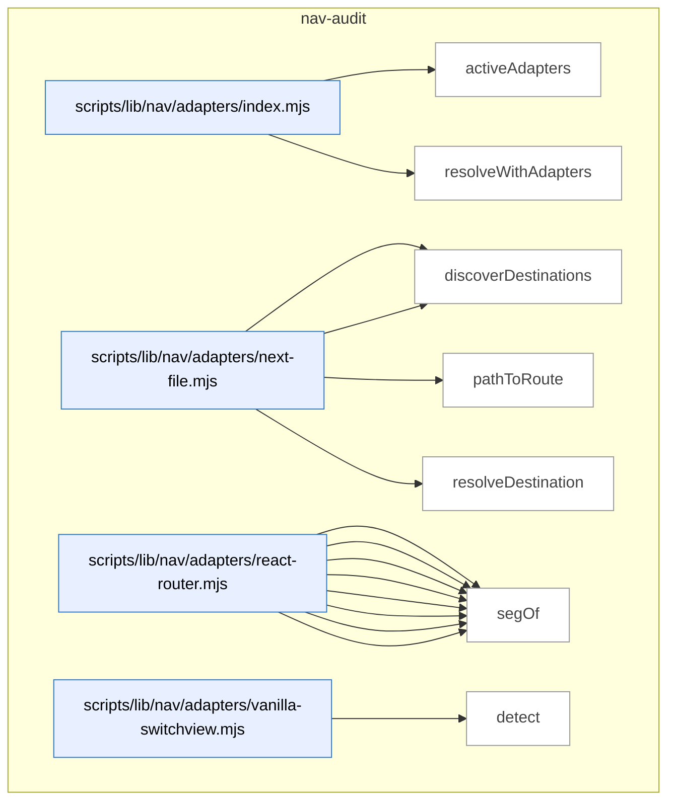

_Domain has 123 symbols (>50). Diagram shows top-15 by file order; see flat table below for the full list._

### Symbols in this domain

| Symbol | Kind | Path | Lines | Purpose | File imported by |
|---|---|---|---|---|---|
| [`activeAdapters`](../scripts/lib/nav/adapters/index.mjs#L20) | function | `scripts/lib/nav/adapters/index.mjs` | 20-24 | Filters the registered navigation adapters to those that detect the framework in the given repo and sources. | `scripts/lib/nav/extract.mjs`, `tests/nav-extract.test.mjs` |
| [`resolveWithAdapters`](../scripts/lib/nav/adapters/index.mjs#L37) | function | `scripts/lib/nav/adapters/index.mjs` | 37-45 | Attempts to resolve a raw destination string via each adapter's framework-specific logic, returning the first hit. | `scripts/lib/nav/extract.mjs`, `tests/nav-extract.test.mjs` |
| [`detect`](../scripts/lib/nav/adapters/next-file.mjs#L13) | function | `scripts/lib/nav/adapters/next-file.mjs` | 13-15 | Detects Next.js by looking for `app/*/page.*` or `pages/*.*` file patterns in the source list. | `scripts/lib/nav/adapters/index.mjs` |
| [`discoverDestinations`](../scripts/lib/nav/adapters/next-file.mjs#L17) | function | `scripts/lib/nav/adapters/next-file.mjs` | 17-27 | Extracts Next.js route destinations from detected `page.*` files via app/pages router path-to-route conversion. | `scripts/lib/nav/adapters/index.mjs` |
| [`pathToRoute`](../scripts/lib/nav/adapters/next-file.mjs#L37) | function | `scripts/lib/nav/adapters/next-file.mjs` | 37-53 | Converts a Next.js file path to a route string, handling both app and pages routers and filtering API/special routes. | `scripts/lib/nav/adapters/index.mjs` |
| [`resolveDestination`](../scripts/lib/nav/adapters/next-file.mjs#L55) | function | `scripts/lib/nav/adapters/next-file.mjs` | 55-61 | Parses a string literal or raw value as a Next.js destination path, validating it starts with `/`. | `scripts/lib/nav/adapters/index.mjs` |
| [`collectJsxRoutes`](../scripts/lib/nav/adapters/react-router.mjs#L42) | function | `scripts/lib/nav/adapters/react-router.mjs` | 42-64 | Recursively walks JSX AST to collect React Router `<Route>` paths, handling layout routes and nested children. | `scripts/lib/nav/adapters/index.mjs` |
| [`collectObjectRoute`](../scripts/lib/nav/adapters/react-router.mjs#L67) | function | `scripts/lib/nav/adapters/react-router.mjs` | 67-89 | Extracts route objects from a route config (createBrowserRouter pattern), composing parent-child paths and collecting destinations. | `scripts/lib/nav/adapters/index.mjs` |
| [`dedupe`](../scripts/lib/nav/adapters/react-router.mjs#L106) | function | `scripts/lib/nav/adapters/react-router.mjs` | 106-116 | Removes duplicate destinations from an array using destination ID + source location as the dedup key. | `scripts/lib/nav/adapters/index.mjs` |
| [`detect`](../scripts/lib/nav/adapters/react-router.mjs#L17) | function | `scripts/lib/nav/adapters/react-router.mjs` | 17-19 | Detects React Router by searching for react-router imports or `<Route` JSX tags in source files. | `scripts/lib/nav/adapters/index.mjs` |
| [`discoverDestinations`](../scripts/lib/nav/adapters/react-router.mjs#L21) | function | `scripts/lib/nav/adapters/react-router.mjs` | 21-39 | Extracts React Router destinations from JSX Route elements and route-object arrays in the parsed AST. | `scripts/lib/nav/adapters/index.mjs` |
| [`joinRoutePath`](../scripts/lib/nav/adapters/react-router.mjs#L99) | function | `scripts/lib/nav/adapters/react-router.mjs` | 99-104 | Concatenates a parent route path with a child segment, handling absolute children and trailing-slash normalization. | `scripts/lib/nav/adapters/index.mjs` |
| [`resolveDestination`](../scripts/lib/nav/adapters/react-router.mjs#L118) | function | `scripts/lib/nav/adapters/react-router.mjs` | 118-124 | Parses a raw destination string, validating and normalizing it to a route path. | `scripts/lib/nav/adapters/index.mjs` |
| [`segOf`](../scripts/lib/nav/adapters/react-router.mjs#L91) | function | `scripts/lib/nav/adapters/react-router.mjs` | 91-96 | Extracts the path segment from a target classification (literal string or template), returning null for unclassified/dynamic targets. | `scripts/lib/nav/adapters/index.mjs` |
| [`detect`](../scripts/lib/nav/adapters/vanilla-switchview.mjs#L15) | function | `scripts/lib/nav/adapters/vanilla-switchview.mjs` | 15-18 | Detects a vanilla view-switching pattern by searching for `switchView()` or `setView()` function calls. | `scripts/lib/nav/adapters/index.mjs` |
| [`discoverDestinations`](../scripts/lib/nav/adapters/vanilla-switchview.mjs#L20) | function | `scripts/lib/nav/adapters/vanilla-switchview.mjs` | 20-37 | Extracts destinations from a VIEWS object map found in AST, collecting string-literal view URLs. | `scripts/lib/nav/adapters/index.mjs` |
| [`resolveDestination`](../scripts/lib/nav/adapters/vanilla-switchview.mjs#L48) | function | `scripts/lib/nav/adapters/vanilla-switchview.mjs` | 48-63 | Resolves a raw view reference (VIEWS.key, string literal, or slug) to a normalized destination path. | `scripts/lib/nav/adapters/index.mjs` |
| [`viewsObjectOf`](../scripts/lib/nav/adapters/vanilla-switchview.mjs#L39) | function | `scripts/lib/nav/adapters/vanilla-switchview.mjs` | 39-44 | Locates a VIEWS/viewRegistry object definition in AST, unwrapping function calls like `Object.freeze({...})`. | `scripts/lib/nav/adapters/index.mjs` |
| [`appRootForPath`](../scripts/lib/nav/approot.mjs#L16) | function | `scripts/lib/nav/approot.mjs` | 16-27 | Finds the best-matching app root directory for a source file path, preferring the longest matching prefix. | `scripts/lib/nav/extract.mjs` |
| [`enclosingSymbol`](../scripts/lib/nav/ast-lite.mjs#L22) | function | `scripts/lib/nav/ast-lite.mjs` | 22-29 | Finds the symbol whose declaration precedes a given character index in source code. | `scripts/lib/nav/contract.mjs`, `scripts/lib/nav/model.mjs` |
| [`indexSymbols`](../scripts/lib/nav/ast-lite.mjs#L12) | function | `scripts/lib/nav/ast-lite.mjs` | 12-18 | Uses regex to find all top-level symbol declarations (functions, classes, vars) in source code with their character positions. | `scripts/lib/nav/contract.mjs`, `scripts/lib/nav/model.mjs` |
| [`lineOf`](../scripts/lib/nav/ast-lite.mjs#L32) | function | `scripts/lib/nav/ast-lite.mjs` | 32-36 | Counts newlines up to a given character index to compute the 1-based line number. | `scripts/lib/nav/contract.mjs`, `scripts/lib/nav/model.mjs` |
| [`calleeName`](../scripts/lib/nav/ast.mjs#L91) | function | `scripts/lib/nav/ast.mjs` | 91-99 | Extracts the function or method name from a call expression. | `scripts/lib/nav/adapters/react-router.mjs`, `scripts/lib/nav/adapters/vanilla-switchview.mjs`, `scripts/lib/nav/extract.mjs`, +1 more |
| [`classifyTarget`](../scripts/lib/nav/ast.mjs#L41) | function | `scripts/lib/nav/ast.mjs` | 41-58 | Extracts and categorizes the target value from AST nodes (JSX attributes, literals, members, templates). | `scripts/lib/nav/adapters/react-router.mjs`, `scripts/lib/nav/adapters/vanilla-switchview.mjs`, `scripts/lib/nav/extract.mjs`, +1 more |
| [`jsxAttr`](../scripts/lib/nav/ast.mjs#L72) | function | `scripts/lib/nav/ast.mjs` | 72-80 | Retrieves a JSX attribute value by name(s) from an element's opening tag. | `scripts/lib/nav/adapters/react-router.mjs`, `scripts/lib/nav/adapters/vanilla-switchview.mjs`, `scripts/lib/nav/extract.mjs`, +1 more |
| [`jsxLabel`](../scripts/lib/nav/ast.mjs#L61) | function | `scripts/lib/nav/ast.mjs` | 61-69 | Extracts text content from JSX element children to use as a label. | `scripts/lib/nav/adapters/react-router.mjs`, `scripts/lib/nav/adapters/vanilla-switchview.mjs`, `scripts/lib/nav/extract.mjs`, +1 more |
| [`jsxTagName`](../scripts/lib/nav/ast.mjs#L83) | function | `scripts/lib/nav/ast.mjs` | 83-88 | Gets the tag name from a JSX element's opening tag. | `scripts/lib/nav/adapters/react-router.mjs`, `scripts/lib/nav/adapters/vanilla-switchview.mjs`, `scripts/lib/nav/extract.mjs`, +1 more |
| [`unwrapObjectExpression`](../scripts/lib/nav/ast.mjs#L23) | function | `scripts/lib/nav/ast.mjs` | 23-32 | Extracts an ObjectExpression node from an AST node, unwrapping function calls and type casts. | `scripts/lib/nav/adapters/react-router.mjs`, `scripts/lib/nav/adapters/vanilla-switchview.mjs`, `scripts/lib/nav/extract.mjs`, +1 more |
| [`buildDraftCaptureWarning`](../scripts/lib/nav/bootstrap-draft.mjs#L31) | function | `scripts/lib/nav/bootstrap-draft.mjs` | 31-43 | Generates warning messages for nav drafting issues like empty containers or missing authentication. | `scripts/nav-audit.mjs`, `tests/nav-bootstrap-draft.test.mjs`, `tests/persona-clickpath.test.mjs` |
| [`byProminence`](../scripts/lib/nav/bootstrap-draft.mjs#L47) | function | `scripts/lib/nav/bootstrap-draft.mjs` | 47-49 | Comparator function to sort nav containers by sticky status, target count, and order. | `scripts/nav-audit.mjs`, `tests/nav-bootstrap-draft.test.mjs`, `tests/persona-clickpath.test.mjs` |
| [`dedupe`](../scripts/lib/nav/bootstrap-draft.mjs#L130) | function | `scripts/lib/nav/bootstrap-draft.mjs` | 130-130 | Removes duplicate elements from an array using a Set. | `scripts/nav-audit.mjs`, `tests/nav-bootstrap-draft.test.mjs`, `tests/persona-clickpath.test.mjs` |
| [`draftContractFromLive`](../scripts/lib/nav/bootstrap-draft.mjs#L61) | function | `scripts/lib/nav/bootstrap-draft.mjs` | 61-128 | Infers nav layer structure and container selectors from live navigation evidence. | `scripts/nav-audit.mjs`, `tests/nav-bootstrap-draft.test.mjs`, `tests/persona-clickpath.test.mjs` |
| [`bootstrapContract`](../scripts/lib/nav/contract.mjs#L205) | function | `scripts/lib/nav/contract.mjs` | 205-231 | Generates an initial nav contract structure from persona intents and optional draft layers. | `scripts/lib/dashboard/collect-nav.mjs`, `scripts/lib/nav/findings.mjs`, `scripts/nav-audit.mjs`, +3 more |
| [`coerce`](../scripts/lib/nav/contract.mjs#L175) | function | `scripts/lib/nav/contract.mjs` | 175-186 | Converts raw string values to their declared types (bool, list, or string). | `scripts/lib/dashboard/collect-nav.mjs`, `scripts/lib/nav/findings.mjs`, `scripts/nav-audit.mjs`, +3 more |
| [`contractExists`](../scripts/lib/nav/contract.mjs#L201) | function | `scripts/lib/nav/contract.mjs` | 201-203 | Checks if a nav-contract.json file exists in the given directory. | `scripts/lib/dashboard/collect-nav.mjs`, `scripts/lib/nav/findings.mjs`, `scripts/nav-audit.mjs`, +3 more |
| [`isUtilityRoute`](../scripts/lib/nav/contract.mjs#L102) | function | `scripts/lib/nav/contract.mjs` | 102-105 | Checks if a destination ID matches a utility route pattern (404, login, etc.). | `scripts/lib/dashboard/collect-nav.mjs`, `scripts/lib/nav/findings.mjs`, `scripts/nav-audit.mjs`, +3 more |
| [`parseDocblockTokens`](../scripts/lib/nav/contract.mjs#L161) | function | `scripts/lib/nav/contract.mjs` | 161-173 | Parses space-separated key=value tokens from a docblock comment. | `scripts/lib/dashboard/collect-nav.mjs`, `scripts/lib/nav/findings.mjs`, `scripts/nav-audit.mjs`, +3 more |
| [`parseNavMeta`](../scripts/lib/nav/contract.mjs#L119) | function | `scripts/lib/nav/contract.mjs` | 119-140 | Extracts nav metadata claims from source code via export declarations and @nav docblocks. | `scripts/lib/dashboard/collect-nav.mjs`, `scripts/lib/nav/findings.mjs`, `scripts/nav-audit.mjs`, +3 more |
| [`parseObjectBody`](../scripts/lib/nav/contract.mjs#L145) | function | `scripts/lib/nav/contract.mjs` | 145-158 | Parses key:value pairs from a JavaScript object literal string. | `scripts/lib/dashboard/collect-nav.mjs`, `scripts/lib/nav/findings.mjs`, `scripts/nav-audit.mjs`, +3 more |
| [`readContract`](../scripts/lib/nav/contract.mjs#L59) | function | `scripts/lib/nav/contract.mjs` | 59-95 | Reads and validates the nav contract JSON file, checking schema and intent layer references. | `scripts/lib/dashboard/collect-nav.mjs`, `scripts/lib/nav/findings.mjs`, `scripts/nav-audit.mjs`, +3 more |
| [`writeContract`](../scripts/lib/nav/contract.mjs#L239) | function | `scripts/lib/nav/contract.mjs` | 239-247 | Writes a validated nav contract object to JSON file. | `scripts/lib/dashboard/collect-nav.mjs`, `scripts/lib/nav/findings.mjs`, `scripts/nav-audit.mjs`, +3 more |
| [`ageDivergences`](../scripts/lib/nav/drift.mjs#L60) | function | `scripts/lib/nav/drift.mjs` | 60-68 | Adds age-in-days metadata to findings based on when they were first observed. | `scripts/cross-skill.mjs`, `scripts/lib/dashboard/collect-nav.mjs`, `scripts/nav-audit.mjs`, +1 more |
| [`divergenceKey`](../scripts/lib/nav/drift.mjs#L18) | function | `scripts/lib/nav/drift.mjs` | 18-20 | Creates a unique identifier for a nav finding (class:destination). | `scripts/cross-skill.mjs`, `scripts/lib/dashboard/collect-nav.mjs`, `scripts/nav-audit.mjs`, +1 more |
| [`firstSeenFromHistory`](../scripts/lib/nav/drift.mjs#L89) | function | `scripts/lib/nav/drift.mjs` | 89-101 | Builds a lookup function for first-seen dates from historical nav audit runs. | `scripts/cross-skill.mjs`, `scripts/lib/dashboard/collect-nav.mjs`, `scripts/nav-audit.mjs`, +1 more |
| [`partitionFindings`](../scripts/lib/nav/drift.mjs#L27) | function | `scripts/lib/nav/drift.mjs` | 27-31 | Splits nav findings into gate-eligible and advisory categories. | `scripts/cross-skill.mjs`, `scripts/lib/dashboard/collect-nav.mjs`, `scripts/nav-audit.mjs`, +1 more |
| [`readDriftLedger`](../scripts/lib/nav/drift.mjs#L71) | function | `scripts/lib/nav/drift.mjs` | 71-77 | Reads the drift-ledger JSON tracking when nav findings first appeared. | `scripts/cross-skill.mjs`, `scripts/lib/dashboard/collect-nav.mjs`, `scripts/nav-audit.mjs`, +1 more |
| [`scopeToChanged`](../scripts/lib/nav/drift.mjs#L41) | function | `scripts/lib/nav/drift.mjs` | 41-50 | Filters gate-eligible findings to only those affected by changed files or contract edits. | `scripts/cross-skill.mjs`, `scripts/lib/dashboard/collect-nav.mjs`, `scripts/nav-audit.mjs`, +1 more |
| [`writeDriftLedger`](../scripts/lib/nav/drift.mjs#L81) | function | `scripts/lib/nav/drift.mjs` | 81-86 | Persists drift-ledger with first-seen timestamps for active nav findings. | `scripts/cross-skill.mjs`, `scripts/lib/dashboard/collect-nav.mjs`, `scripts/nav-audit.mjs`, +1 more |
| [`assembleEnvelope`](../scripts/lib/nav/envelope.mjs#L87) | function | `scripts/lib/nav/envelope.mjs` | 87-98 | Constructs the nav observed envelope structure with metadata, edges, and destinations. | `scripts/nav-audit.mjs`, `tests/nav-contract.test.mjs`, `tests/nav-dashboard.test.mjs`, +1 more |
| [`readObservedEnvelope`](../scripts/lib/nav/envelope.mjs#L29) | function | `scripts/lib/nav/envelope.mjs` | 29-55 | Reads and validates the observed nav envelope, checking schema and config digest freshness. | `scripts/nav-audit.mjs`, `tests/nav-contract.test.mjs`, `tests/nav-dashboard.test.mjs`, +1 more |
| [`writeObservedEnvelope`](../scripts/lib/nav/envelope.mjs#L66) | function | `scripts/lib/nav/envelope.mjs` | 66-74 | Writes a validated nav observed envelope to JSON file. | `scripts/nav-audit.mjs`, `tests/nav-contract.test.mjs`, `tests/nav-dashboard.test.mjs`, +1 more |
| [`affordancesOf`](../scripts/lib/nav/extract.mjs#L150) | function | `scripts/lib/nav/extract.mjs` | 150-162 | Identifies navigation affordances (clickable elements) within an AST node. | `scripts/nav-audit.mjs`, `tests/nav-extract.test.mjs` |
| [`basename`](../scripts/lib/nav/extract.mjs#L314) | function | `scripts/lib/nav/extract.mjs` | 314-316 | Extracts filename without extension from a file path. | `scripts/nav-audit.mjs`, `tests/nav-extract.test.mjs` |
| [`buildViewsMap`](../scripts/lib/nav/extract.mjs#L284) | function | `scripts/lib/nav/extract.mjs` | 284-299 | Extracts view-registry mappings from source code into a key-to-destination map. | `scripts/nav-audit.mjs`, `tests/nav-extract.test.mjs` |
| [`callAffordance`](../scripts/lib/nav/extract.mjs#L179) | function | `scripts/lib/nav/extract.mjs` | 179-192 | Extracts navigate-call and modal-trigger affordances from function calls. | `scripts/nav-audit.mjs`, `tests/nav-extract.test.mjs` |
| [`embeddedAffordances`](../scripts/lib/nav/extract.mjs#L202) | function | `scripts/lib/nav/extract.mjs` | 202-226 | Finds navigation references embedded in string and template literals via regex patterns. | `scripts/nav-audit.mjs`, `tests/nav-extract.test.mjs` |
| [`extractEdges`](../scripts/lib/nav/extract.mjs#L86) | function | `scripts/lib/nav/extract.mjs` | 86-144 | Extracts navigation edges (links, nav calls, modals) from parsed source files. | `scripts/nav-audit.mjs`, `tests/nav-extract.test.mjs` |
| [`findDomAnchor`](../scripts/lib/nav/extract.mjs#L231) | function | `scripts/lib/nav/extract.mjs` | 231-241 | Infers a DOM selector for a navigation affordance based on preceding id or class attributes. | `scripts/nav-audit.mjs`, `tests/nav-extract.test.mjs` |
| [`globToRe`](../scripts/lib/nav/extract.mjs#L71) | function | `scripts/lib/nav/extract.mjs` | 71-76 | Converts glob patterns to regular expressions for file matching. | `scripts/nav-audit.mjs`, `tests/nav-extract.test.mjs` |
| [`isSkippable`](../scripts/lib/nav/extract.mjs#L253) | function | `scripts/lib/nav/extract.mjs` | 253-257 | Checks if a navigation target should be ignored (external links, empty values). | `scripts/nav-audit.mjs`, `tests/nav-extract.test.mjs` |
| [`jsxAffordance`](../scripts/lib/nav/extract.mjs#L164) | function | `scripts/lib/nav/extract.mjs` | 164-177 | Extracts link and redirect affordances from JSX elements (a, Link, Navigate tags). | `scripts/nav-audit.mjs`, `tests/nav-extract.test.mjs` |
| [`readSources`](../scripts/lib/nav/extract.mjs#L50) | function | `scripts/lib/nav/extract.mjs` | 50-68 | Reads JS/TS source files, filtering by exclusions and sensitive-path classification. | `scripts/nav-audit.mjs`, `tests/nav-extract.test.mjs` |
| [`resolveTarget`](../scripts/lib/nav/extract.mjs#L260) | function | `scripts/lib/nav/extract.mjs` | 260-280 | Converts a classified target (literal, member, or template) to destination ID(s) with confidence. | `scripts/nav-audit.mjs`, `tests/nav-extract.test.mjs` |
| [`templateText`](../scripts/lib/nav/extract.mjs#L244) | function | `scripts/lib/nav/extract.mjs` | 244-251 | Reconstructs template literal text by joining quasis with expression placeholders. | `scripts/nav-audit.mjs`, `tests/nav-extract.test.mjs` |
| [`viewsObjectOf`](../scripts/lib/nav/extract.mjs#L303) | function | `scripts/lib/nav/extract.mjs` | 303-312 | Finds VIEWS or viewRegistry object declaration in an AST node. | `scripts/nav-audit.mjs`, `tests/nav-extract.test.mjs` |
| [`competingModelsFindings`](../scripts/lib/nav/findings.mjs#L294) | function | `scripts/lib/nav/findings.mjs` | 294-307 | Detects when two prominent nav layers organize destinations disjointly. | `scripts/lib/dashboard/collect-nav.mjs`, `scripts/nav-audit.mjs`, `tests/nav-findings.test.mjs`, +2 more |
| [`confidenceOf`](../scripts/lib/nav/findings.mjs#L257) | function | `scripts/lib/nav/findings.mjs` | 257-262 | Determines worst-case confidence level for a destination across its edges. | `scripts/lib/dashboard/collect-nav.mjs`, `scripts/nav-audit.mjs`, `tests/nav-findings.test.mjs`, +2 more |
| [`declaredIntents`](../scripts/lib/nav/findings.mjs#L248) | function | `scripts/lib/nav/findings.mjs` | 248-251 | Extracts all persona navigation intents from the contract. | `scripts/lib/dashboard/collect-nav.mjs`, `scripts/nav-audit.mjs`, `tests/nav-findings.test.mjs`, +2 more |
| [`isHighFrequencyIntent`](../scripts/lib/nav/findings.mjs#L253) | function | `scripts/lib/nav/findings.mjs` | 253-255 | Checks if a destination is marked as high-frequency in the contract. | `scripts/lib/dashboard/collect-nav.mjs`, `scripts/nav-audit.mjs`, `tests/nav-findings.test.mjs`, +2 more |
| [`layerDestinationSets`](../scripts/lib/nav/findings.mjs#L264) | function | `scripts/lib/nav/findings.mjs` | 264-271 | Groups destinations by their containing nav layer. | `scripts/lib/dashboard/collect-nav.mjs`, `scripts/nav-audit.mjs`, `tests/nav-findings.test.mjs`, +2 more |
| [`liveLayerSets`](../scripts/lib/nav/findings.mjs#L332) | function | `scripts/lib/nav/findings.mjs` | 332-353 | Groups live nav evidence by layer and destination, tracking container anchors. | `scripts/lib/dashboard/collect-nav.mjs`, `scripts/nav-audit.mjs`, `tests/nav-findings.test.mjs`, +2 more |
| [`mk`](../scripts/lib/nav/findings.mjs#L244) | function | `scripts/lib/nav/findings.mjs` | 244-246 | Factory function to create a nav finding object with class, severity, destination, evidence. | `scripts/lib/dashboard/collect-nav.mjs`, `scripts/nav-audit.mjs`, `tests/nav-findings.test.mjs`, +2 more |
| [`personaScorecard`](../scripts/lib/nav/findings.mjs#L207) | function | `scripts/lib/nav/findings.mjs` | 207-242 | Generates per-persona reachability scorecard for declared nav intents against observed edges. | `scripts/lib/dashboard/collect-nav.mjs`, `scripts/nav-audit.mjs`, `tests/nav-findings.test.mjs`, +2 more |
| [`redundancyFindings`](../scripts/lib/nav/findings.mjs#L278) | function | `scripts/lib/nav/findings.mjs` | 278-292 | Detects destinations reachable from multiple prominent anchors as redundancy findings. | `scripts/lib/dashboard/collect-nav.mjs`, `scripts/nav-audit.mjs`, `tests/nav-findings.test.mjs`, +2 more |
| [`runLiveTaxonomy`](../scripts/lib/nav/findings.mjs#L363) | function | `scripts/lib/nav/findings.mjs` | 363-390 | Runs four nav-audit finding classes on live DOM data, suppressing unverifiable layers. | `scripts/lib/dashboard/collect-nav.mjs`, `scripts/nav-audit.mjs`, `tests/nav-findings.test.mjs`, +2 more |
| [`runTaxonomy`](../scripts/lib/nav/findings.mjs#L26) | function | `scripts/lib/nav/findings.mjs` | 26-195 | Classifies nav findings into 10 categories (redundancy, coverage-gap, orphan, etc.) based on model analysis. | `scripts/lib/dashboard/collect-nav.mjs`, `scripts/nav-audit.mjs`, `tests/nav-findings.test.mjs`, +2 more |
| [`sequencingFindings`](../scripts/lib/nav/findings.mjs#L309) | function | `scripts/lib/nav/findings.mjs` | 309-323 | Flags high-frequency destinations reachable only through low-prominence UI. | `scripts/lib/dashboard/collect-nav.mjs`, `scripts/nav-audit.mjs`, `tests/nav-findings.test.mjs`, +2 more |
| [`attributeLive`](../scripts/lib/nav/live-attribution.mjs#L57) | function | `scripts/lib/nav/live-attribution.mjs` | 57-73 | Transforms flat live nav evidence into per-destination placement, layer, and state summaries. | `scripts/lib/nav/findings.mjs`, `scripts/lib/nav/verify.mjs`, `tests/nav-capture-status.test.mjs`, +1 more |
| [`computeCaptureStatus`](../scripts/lib/nav/live-attribution.mjs#L86) | function | `scripts/lib/nav/live-attribution.mjs` | 86-113 | Classifies declared nav-layer selectors as captured, empty, hidden, or absent. | `scripts/lib/nav/findings.mjs`, `scripts/lib/nav/verify.mjs`, `tests/nav-capture-status.test.mjs`, +1 more |
| [`layerRank`](../scripts/lib/nav/live-attribution.mjs#L21) | function | `scripts/lib/nav/live-attribution.mjs` | 21-28 | Returns precedence index for nav layers from declared order or alphabetically. | `scripts/lib/nav/findings.mjs`, `scripts/lib/nav/verify.mjs`, `tests/nav-capture-status.test.mjs`, +1 more |
| [`mergeScorecard`](../scripts/lib/nav/live-attribution.mjs#L124) | function | `scripts/lib/nav/live-attribution.mjs` | 124-174 | Merges live DOM attribution into static scorecard rows with capture-honesty gates. | `scripts/lib/nav/findings.mjs`, `scripts/lib/nav/verify.mjs`, `tests/nav-capture-status.test.mjs`, +1 more |
| [`resolveContainer`](../scripts/lib/nav/live-attribution.mjs#L37) | function | `scripts/lib/nav/live-attribution.mjs` | 37-49 | Selects the shallowest, highest-precedence DOM container from matches. | `scripts/lib/nav/findings.mjs`, `scripts/lib/nav/verify.mjs`, `tests/nav-capture-status.test.mjs`, +1 more |
| [`buildModel`](../scripts/lib/nav/model.mjs#L27) | function | `scripts/lib/nav/model.mjs` | 27-76 | Constructs static nav model (destinations, edges, anchors, layers) from source code. | `scripts/lib/dashboard/collect-nav.mjs`, `scripts/nav-audit.mjs`, `tests/nav-findings.test.mjs`, +1 more |
| [`buildReverseContainment`](../scripts/lib/nav/model.mjs#L80) | function | `scripts/lib/nav/model.mjs` | 80-95 | Builds component-containment index from AST and JSX render analysis. | `scripts/lib/dashboard/collect-nav.mjs`, `scripts/nav-audit.mjs`, `tests/nav-findings.test.mjs`, +1 more |
| [`declaredAncestors`](../scripts/lib/nav/model.mjs#L99) | function | `scripts/lib/nav/model.mjs` | 99-125 | Breadth-first searches for declared nav anchors up the component tree. | `scripts/lib/dashboard/collect-nav.mjs`, `scripts/nav-audit.mjs`, `tests/nav-findings.test.mjs`, +1 more |
| [`dedupe`](../scripts/lib/nav/normalize.mjs#L90) | function | `scripts/lib/nav/normalize.mjs` | 90-92 | Deduplicates array elements via Set conversion. | `scripts/lib/nav/adapters/next-file.mjs`, `scripts/lib/nav/adapters/react-router.mjs`, `scripts/lib/nav/adapters/vanilla-switchview.mjs`, +4 more |
| [`namespaceId`](../scripts/lib/nav/normalize.mjs#L101) | function | `scripts/lib/nav/normalize.mjs` | 101-103 | Prepends app root prefix to destination ID if provided. | `scripts/lib/nav/adapters/next-file.mjs`, `scripts/lib/nav/adapters/react-router.mjs`, `scripts/lib/nav/adapters/vanilla-switchview.mjs`, +4 more |
| [`normalizeDestination`](../scripts/lib/nav/normalize.mjs#L27) | function | `scripts/lib/nav/normalize.mjs` | 27-88 | Parses route strings into destination IDs with confidence (paths, queries, slugs, dynamic). | `scripts/lib/nav/adapters/next-file.mjs`, `scripts/lib/nav/adapters/react-router.mjs`, `scripts/lib/nav/adapters/vanilla-switchview.mjs`, +4 more |
| [`mapPersonasToIntents`](../scripts/lib/nav/persona-seed.mjs#L28) | function | `scripts/lib/nav/persona-seed.mjs` | 28-47 | Converts persona test-evidence URLs into declared persona intents. | `scripts/nav-audit.mjs`, `tests/persona-clickpath.test.mjs` |
| [`slugifyDestination`](../scripts/lib/nav/persona-seed.mjs#L14) | function | `scripts/lib/nav/persona-seed.mjs` | 14-16 | Converts destination into kebab-case persona-intent slug. | `scripts/nav-audit.mjs`, `tests/persona-clickpath.test.mjs` |
| [`esc`](../scripts/lib/nav/render.mjs#L119) | function | `scripts/lib/nav/render.mjs` | 119-121 | Escapes quotes and newlines for safe Mermaid label text. | `scripts/nav-audit.mjs` |
| [`renderFindings`](../scripts/lib/nav/render.mjs#L49) | function | `scripts/lib/nav/render.mjs` | 49-60 | Formats nav-audit findings as severity-sorted markdown list. | `scripts/nav-audit.mjs` |
| [`renderLiveFindings`](../scripts/lib/nav/render.mjs#L67) | function | `scripts/lib/nav/render.mjs` | 67-77 | Formats live-DOM findings as severity-sorted markdown list. | `scripts/nav-audit.mjs` |
| [`renderMermaid`](../scripts/lib/nav/render.mjs#L92) | function | `scripts/lib/nav/render.mjs` | 92-117 | Renders top destinations grouped by layer as Mermaid graph with in-degree highlighting. | `scripts/nav-audit.mjs` |
| [`renderScorecard`](../scripts/lib/nav/render.mjs#L13) | function | `scripts/lib/nav/render.mjs` | 13-46 | Formats reachability scorecard as markdown (per-persona status: pass/misplaced/missing/unverified). | `scripts/nav-audit.mjs` |
| [`renderTable`](../scripts/lib/nav/render.mjs#L80) | function | `scripts/lib/nav/render.mjs` | 80-87 | Renders nav destinations as markdown table (in-degree, affordances, anchors, layers). | `scripts/nav-audit.mjs` |
| [`safeId`](../scripts/lib/nav/render.mjs#L122) | function | `scripts/lib/nav/render.mjs` | 122-124 | Converts string to Mermaid-safe identifier (alphanumeric + underscore). | `scripts/nav-audit.mjs` |
| [`computeConfigDigest`](../scripts/lib/nav/schema.mjs#L208) | function | `scripts/lib/nav/schema.mjs` | 208-210 | Computes SHA256 of adapter version + contract digest for freshness. | `scripts/lib/dashboard/collect-nav.mjs`, `scripts/lib/nav/contract.mjs`, `scripts/lib/nav/drift.mjs`, +9 more |
| [`computeContractDigest`](../scripts/lib/nav/schema.mjs#L170) | function | `scripts/lib/nav/schema.mjs` | 170-198 | Computes SHA256 digest of canonical nav-contract (roots, exclusions, layers, personas). | `scripts/lib/dashboard/collect-nav.mjs`, `scripts/lib/nav/contract.mjs`, `scripts/lib/nav/drift.mjs`, +9 more |
| [`sha256`](../scripts/lib/nav/schema.mjs#L221) | function | `scripts/lib/nav/schema.mjs` | 221-223 | Computes SHA256 hash of a string as hexadecimal. | `scripts/lib/dashboard/collect-nav.mjs`, `scripts/lib/nav/contract.mjs`, `scripts/lib/nav/drift.mjs`, +9 more |
| [`sortRecordOfArrays`](../scripts/lib/nav/schema.mjs#L212) | function | `scripts/lib/nav/schema.mjs` | 212-219 | Normalizes record of arrays to sorted keys and sorted array values. | `scripts/lib/dashboard/collect-nav.mjs`, `scripts/lib/nav/contract.mjs`, `scripts/lib/nav/drift.mjs`, +9 more |
| [`readVerifyResult`](../scripts/lib/nav/verify-store.mjs#L40) | function | `scripts/lib/nav/verify-store.mjs` | 40-58 | Loads and validates nav-verify-result, checking contract and tool-version staleness. | `scripts/lib/dashboard/collect-nav.mjs`, `scripts/nav-audit.mjs`, `tests/nav-dashboard.test.mjs`, +1 more |
| [`writeVerifyResult`](../scripts/lib/nav/verify-store.mjs#L23) | function | `scripts/lib/nav/verify-store.mjs` | 23-31 | Validates and atomically writes nav-verify-result to disk. | `scripts/lib/dashboard/collect-nav.mjs`, `scripts/nav-audit.mjs`, `tests/nav-dashboard.test.mjs`, +1 more |
| [`collectLiveNav`](../scripts/lib/nav/verify.mjs#L328) | function | `scripts/lib/nav/verify.mjs` | 328-415 | In-page evaluation collecting clickable elements and nav-ish containers with targets. | `scripts/lib/nav/persona-seed.mjs`, `scripts/nav-audit.mjs`, `tests/nav-live-activation.test.mjs`, +3 more |
| [`detectNavShells`](../scripts/lib/nav/verify.mjs#L434) | function | `scripts/lib/nav/verify.mjs` | 434-457 | Identifies visible nav-ish elements with no candidate children (empty shells). | `scripts/lib/nav/persona-seed.mjs`, `scripts/nav-audit.mjs`, `tests/nav-live-activation.test.mjs`, +3 more |
| [`discoverExpandTriggers`](../scripts/lib/nav/verify.mjs#L459) | function | `scripts/lib/nav/verify.mjs` | 459-519 | Detects hamburger/collapse triggers that control nav elements via aria-controls or ancestry. | `scripts/lib/nav/persona-seed.mjs`, `scripts/nav-audit.mjs`, `tests/nav-live-activation.test.mjs`, +3 more |
| [`extractTarget`](../scripts/lib/nav/verify.mjs#L539) | function | `scripts/lib/nav/verify.mjs` | 539-557 | Extracts destination from href or data-attributes with priority ordering. | `scripts/lib/nav/persona-seed.mjs`, `scripts/nav-audit.mjs`, `tests/nav-live-activation.test.mjs`, +3 more |
| [`normalizeLiveTarget`](../scripts/lib/nav/verify.mjs#L29) | function | `scripts/lib/nav/verify.mjs` | 29-63 | Parses live DOM href/data-attribute into canonical destination (path, slug, or null). | `scripts/lib/nav/persona-seed.mjs`, `scripts/nav-audit.mjs`, `tests/nav-live-activation.test.mjs`, +3 more |
| [`reconcile`](../scripts/lib/nav/verify.mjs#L71) | function | `scripts/lib/nav/verify.mjs` | 71-87 | Reconciles static declared destinations against live-collected targets. | `scripts/lib/nav/persona-seed.mjs`, `scripts/nav-audit.mjs`, `tests/nav-live-activation.test.mjs`, +3 more |
| [`runVerify`](../scripts/lib/nav/verify.mjs#L119) | function | `scripts/lib/nav/verify.mjs` | 119-318 | Launches browser and captures live nav across breakpoints, reconciling evidence against contract. | `scripts/lib/nav/persona-seed.mjs`, `scripts/nav-audit.mjs`, `tests/nav-live-activation.test.mjs`, +3 more |
| [`selectorLayers`](../scripts/lib/nav/verify.mjs#L90) | function | `scripts/lib/nav/verify.mjs` | 90-96 | Extracts (selector, layer) pairs from nav-contract. | `scripts/lib/nav/persona-seed.mjs`, `scripts/nav-audit.mjs`, `tests/nav-live-activation.test.mjs`, +3 more |
| [`usableHref`](../scripts/lib/nav/verify.mjs#L527) | function | `scripts/lib/nav/verify.mjs` | 527-532 | Returns true if href is a valid nav target (excludes javascript:/mailto:/tel:/anchors). | `scripts/lib/nav/persona-seed.mjs`, `scripts/nav-audit.mjs`, `tests/nav-live-activation.test.mjs`, +3 more |
| [`collectRouteMeta`](../scripts/nav-audit.mjs#L266) | function | `scripts/nav-audit.mjs` | 266-283 | Binds @nav docblock metadata claims to their discovered route destinations. | _(internal)_ |
| [`countBySeverity`](../scripts/nav-audit.mjs#L306) | function | `scripts/nav-audit.mjs` | 306-310 | Tallies findings by severity level (P0/P1/P2/P3). | _(internal)_ |
| [`gitChangedFiles`](../scripts/nav-audit.mjs#L317) | function | `scripts/nav-audit.mjs` | 317-327 | Returns files modified since merge-base with origin/HEAD (or HEAD if no upstream). | _(internal)_ |
| [`gitHeadDate`](../scripts/nav-audit.mjs#L332) | function | `scripts/nav-audit.mjs` | 332-334 | Gets current HEAD commit ISO timestamp via git show. | _(internal)_ |
| [`gitHeadSha`](../scripts/nav-audit.mjs#L329) | function | `scripts/nav-audit.mjs` | 329-331 | Gets current HEAD commit SHA via git rev-parse. | _(internal)_ |
| [`gitIsDirty`](../scripts/nav-audit.mjs#L336) | function | `scripts/nav-audit.mjs` | 336-339 | Tests for uncommitted/untracked changes in working tree. | _(internal)_ |
| [`listSourceFiles`](../scripts/nav-audit.mjs#L312) | function | `scripts/nav-audit.mjs` | 312-315 | Returns list of JavaScript/TypeScript source files tracked in git. | _(internal)_ |
| [`main`](../scripts/nav-audit.mjs#L31) | function | `scripts/nav-audit.mjs` | 31-264 | Extracts navigation graph from source files, audits against contract; supports bootstrap/verify modes with scope/format options. | _(internal)_ |
| [`parseArgs`](../scripts/nav-audit.mjs#L285) | function | `scripts/nav-audit.mjs` | 285-304 | Parses nav-audit CLI flags: scope/format/gate/bootstrap/verify/root/breakpoints/storage-state/from-url/force/no-activate. | _(internal)_ |
| [`recordNavAuditRunTelemetry`](../scripts/nav-audit.mjs#L351) | function | `scripts/nav-audit.mjs` | 351-361 | Sends nav-audit run statistics (SHA, scope, findings, tool version) to cross-skill store via subprocess. | _(internal)_ |
| [`seedPersonaIntents`](../scripts/nav-audit.mjs#L372) | function | `scripts/nav-audit.mjs` | 372-385 | Fetches persona reachability evidence from store and maps personas to navigation intents for bootstrap seeding. | _(internal)_ |

---

## persona-test

> **Persona-test consistency mode** detects UI/state contradictions in deployed apps by diffing DOM-rendered values against engine-claim contracts declared in canary journeys and surface manifests, with type coercion and severity clamping to validate cross-step coherence.

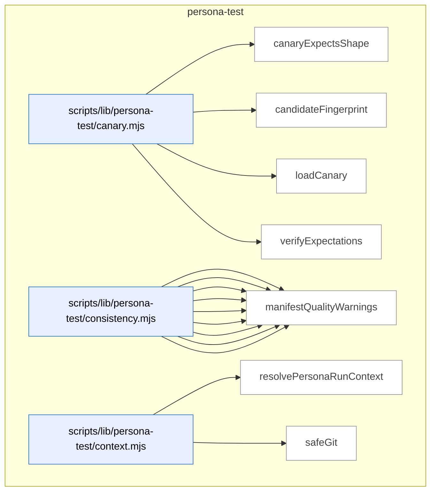

_Domain has 87 symbols (>50). Diagram shows top-15 by file order; see flat table below for the full list._

### Symbols in this domain

| Symbol | Kind | Path | Lines | Purpose | File imported by |
|---|---|---|---|---|---|
| [`canaryExpectsShape`](../scripts/lib/persona-test/canary.mjs#L289) | function | `scripts/lib/persona-test/canary.mjs` | 289-301 | Checks if a contradiction's shape (surface/field/kind) matches a canary's suppression list for backwards-compatible filtering. | `scripts/persona-consistency-run.mjs`, `tests/persona-test-canary.test.mjs` |
| [`candidateFingerprint`](../scripts/lib/persona-test/canary.mjs#L318) | function | `scripts/lib/persona-test/canary.mjs` | 318-337 | Generates stable SHA256 fingerprint for a contradiction keyed on semantic identity (surface/field/scope/key/kind), not DOM selector. | `scripts/persona-consistency-run.mjs`, `tests/persona-test-canary.test.mjs` |
| [`loadCanary`](../scripts/lib/persona-test/canary.mjs#L38) | function | `scripts/lib/persona-test/canary.mjs` | 38-141 | Loads persona test canary JSON file with path validation to prevent directory traversal | `scripts/persona-consistency-run.mjs`, `tests/persona-test-canary.test.mjs` |
| [`verifyExpectations`](../scripts/lib/persona-test/canary.mjs#L193) | function | `scripts/lib/persona-test/canary.mjs` | 193-268 | Validates consistency-mode self-test expectations against observed state contradictions with min/max severity gates. | `scripts/persona-consistency-run.mjs`, `tests/persona-test-canary.test.mjs` |
| [`appliesToCurrent`](../scripts/lib/persona-test/consistency.mjs#L488) | function | `scripts/lib/persona-test/consistency.mjs` | 488-506 | Tests whether a surface's applicability constraints (route/step/state) match the current context. | `scripts/persona-consistency-run.mjs`, `tests/persona-test-consistency.test.mjs` |
| [`clampToFloor`](../scripts/lib/persona-test/consistency.mjs#L118) | function | `scripts/lib/persona-test/consistency.mjs` | 118-122 | Raises severity to minimum floor level if proposed severity is numerically lower (higher rank). | `scripts/persona-consistency-run.mjs`, `tests/persona-test-consistency.test.mjs` |
| [`coerceDomKey`](../scripts/lib/persona-test/consistency.mjs#L91) | function | `scripts/lib/persona-test/consistency.mjs` | 91-113 | Coerces DOM key strings to inferred types (string/number/boolean) for engine-claim matching with validation. | `scripts/persona-consistency-run.mjs`, `tests/persona-test-consistency.test.mjs` |
| [`coerceDomValue`](../scripts/lib/persona-test/consistency.mjs#L38) | function | `scripts/lib/persona-test/consistency.mjs` | 38-80 | Converts DOM string values to typed targets (boolean/integer/enum/id/prose) with strict round-trip validation. | `scripts/persona-consistency-run.mjs`, `tests/persona-test-consistency.test.mjs` |
| [`deepEqual`](../scripts/lib/persona-test/consistency.mjs#L508) | function | `scripts/lib/persona-test/consistency.mjs` | 508-522 | Recursive deep equality check for arbitrary objects and arrays with type-safe comparison. | `scripts/persona-consistency-run.mjs`, `tests/persona-test-consistency.test.mjs` |
| [`diffClaims`](../scripts/lib/persona-test/consistency.mjs#L139) | function | `scripts/lib/persona-test/consistency.mjs` | 139-406 | Core diff engine comparing DOM witness claims against manifest engine expectations, emitting contradictions with kind classification. | `scripts/persona-consistency-run.mjs`, `tests/persona-test-consistency.test.mjs` |
| [`locatorToString`](../scripts/lib/persona-test/consistency.mjs#L454) | function | `scripts/lib/persona-test/consistency.mjs` | 454-464 | Converts a locator object (role/label/testid/id/css) to human-readable string representation. | `scripts/persona-consistency-run.mjs`, `tests/persona-test-consistency.test.mjs` |
| [`make`](../scripts/lib/persona-test/consistency.mjs#L437) | function | `scripts/lib/persona-test/consistency.mjs` | 437-452 | Factory for contradiction objects with all required fields and null-safe defaults. | `scripts/persona-consistency-run.mjs`, `tests/persona-test-consistency.test.mjs` |
| [`manifestQualityWarnings`](../scripts/lib/persona-test/consistency.mjs#L420) | function | `scripts/lib/persona-test/consistency.mjs` | 420-433 | Scans manifest surfaces for stability issues like CSS selectors that should use semantic locators instead. | `scripts/persona-consistency-run.mjs`, `tests/persona-test-consistency.test.mjs` |
| [`resolvePersonaRunContext`](../scripts/lib/persona-test/context.mjs#L28) | function | `scripts/lib/persona-test/context.mjs` | 28-65 | Assembles and validates persona-consistency run metadata (repo/journey/commit/branch) with schema enforcement. | _(internal)_ |
| [`safeGit`](../scripts/lib/persona-test/context.mjs#L67) | function | `scripts/lib/persona-test/context.mjs` | 67-74 | Safely executes git commands, returning trimmed output or null on failure without throwing. | _(internal)_ |
| [`normaliseForReplay`](../scripts/lib/persona-test/ledger.mjs#L156) | function | `scripts/lib/persona-test/ledger.mjs` | 156-196 | Strips timestamps and sorts claims deterministically so replayed sessions produce byte-identical output. | `scripts/persona-consistency-run.mjs`, `tests/persona-test-ledger.test.mjs` |
| [`openLedger`](../scripts/lib/persona-test/ledger.mjs#L56) | function | `scripts/lib/persona-test/ledger.mjs` | 56-139 | Initializes and returns a session ledger object with atomic write and append/record methods. | `scripts/persona-consistency-run.mjs`, `tests/persona-test-ledger.test.mjs` |
| [`persist`](../scripts/lib/persona-test/ledger.mjs#L141) | function | `scripts/lib/persona-test/ledger.mjs` | 141-143 | Atomically writes ledger state to JSON file via temp-rename for crash safety. | `scripts/persona-consistency-run.mjs`, `tests/persona-test-ledger.test.mjs` |
| [`s`](../scripts/lib/persona-test/ledger.mjs#L200) | function | `scripts/lib/persona-test/ledger.mjs` | 200-200 | Null-safe string coercion helper (returns empty string for null/undefined). | `scripts/persona-consistency-run.mjs`, `tests/persona-test-ledger.test.mjs` |
| [`stableCompareContradiction`](../scripts/lib/persona-test/ledger.mjs#L224) | function | `scripts/lib/persona-test/ledger.mjs` | 224-232 | Stable sort comparator for contradictions by (kind, surfaceId, engineField, scope, key) for deterministic ordering. | `scripts/persona-consistency-run.mjs`, `tests/persona-test-ledger.test.mjs` |
| [`stableCompareDom`](../scripts/lib/persona-test/ledger.mjs#L202) | function | `scripts/lib/persona-test/ledger.mjs` | 202-209 | Stable sort comparator for DOM claims by (surfaceId, engineField, scope, key) for deterministic ordering. | `scripts/persona-consistency-run.mjs`, `tests/persona-test-ledger.test.mjs` |
| [`stableCompareFreshness`](../scripts/lib/persona-test/ledger.mjs#L233) | function | `scripts/lib/persona-test/ledger.mjs` | 233-238 | Stable sort comparator for freshness records by (surfaceId, engineField) for deterministic ordering. | `scripts/persona-consistency-run.mjs`, `tests/persona-test-ledger.test.mjs` |
| [`stableCompareNetwork`](../scripts/lib/persona-test/ledger.mjs#L210) | function | `scripts/lib/persona-test/ledger.mjs` | 210-217 | Stable sort comparator for network claims by (surfaceId, engineField, scope, key) for deterministic ordering. | `scripts/persona-consistency-run.mjs`, `tests/persona-test-ledger.test.mjs` |
| [`stableCompareUndeclared`](../scripts/lib/persona-test/ledger.mjs#L218) | function | `scripts/lib/persona-test/ledger.mjs` | 218-223 | Stable sort comparator for undeclared claims by (engineField, selector) for deterministic ordering. | `scripts/persona-consistency-run.mjs`, `tests/persona-test-ledger.test.mjs` |
| [`stableCompareWarning`](../scripts/lib/persona-test/ledger.mjs#L239) | function | `scripts/lib/persona-test/ledger.mjs` | 239-244 | Stable sort comparator for warnings by (kind, surfaceId) for deterministic ordering. | `scripts/persona-consistency-run.mjs`, `tests/persona-test-ledger.test.mjs` |
| [`resolveManifest`](../scripts/lib/persona-test/manifest-resolver.mjs#L50) | function | `scripts/lib/persona-test/manifest-resolver.mjs` | 50-126 | Resolves consistency-mode manifest file by trying resolver functions in order, with symlink escape and bounds checking. | `scripts/persona-consistency-run.mjs`, `tests/persona-test-manifest-resolver.test.mjs` |
| [`assertEgressApproved`](../scripts/lib/persona-test/semantic-compare.mjs#L39) | function | `scripts/lib/persona-test/semantic-compare.mjs` | 39-53 | Validates that semantic-compare model is from approved provider (Claude or Gemini only), rejecting others. | `tests/persona-test-semantic-compare.test.mjs` |
| [`compare`](../scripts/lib/persona-test/semantic-compare.mjs#L83) | function | `scripts/lib/persona-test/semantic-compare.mjs` | 83-204 | Calls LLM to semantically compare two prose values (DOM-rendered vs engine-source) with caching and redaction. | `tests/persona-test-semantic-compare.test.mjs` |
| [`createInMemoryCache`](../scripts/lib/persona-test/semantic-compare.mjs#L248) | function | `scripts/lib/persona-test/semantic-compare.mjs` | 248-255 | Creates a simple Map-backed in-memory cache with get/set/size methods. | `tests/persona-test-semantic-compare.test.mjs` |
| [`makeCacheKey`](../scripts/lib/persona-test/semantic-compare.mjs#L219) | function | `scripts/lib/persona-test/semantic-compare.mjs` | 219-227 | Generates SHA256 cache key from two prose inputs and model ID for deterministic caching. | `tests/persona-test-semantic-compare.test.mjs` |
| [`renderUserPrompt`](../scripts/lib/persona-test/semantic-compare.mjs#L206) | function | `scripts/lib/persona-test/semantic-compare.mjs` | 206-217 | Formats user-facing prompt for semantic prose comparison task with truncation note. | `tests/persona-test-semantic-compare.test.mjs` |
| [`safeCacheGet`](../scripts/lib/persona-test/semantic-compare.mjs#L229) | function | `scripts/lib/persona-test/semantic-compare.mjs` | 229-238 | Safely retrieves and validates cached verdict from cache, returning null on parse failure. | `tests/persona-test-semantic-compare.test.mjs` |
| [`safeCacheSet`](../scripts/lib/persona-test/semantic-compare.mjs#L239) | function | `scripts/lib/persona-test/semantic-compare.mjs` | 239-241 | Safely writes verdict to cache, silently ignoring cache failures (non-fatal). | `tests/persona-test-semantic-compare.test.mjs` |
| [`auditFilePathTokens`](../scripts/lib/persona/audit-correlator.mjs#L136) | function | `scripts/lib/persona/audit-correlator.mjs` | 136-138 | Extracts tokens from audit finding primary file path | `scripts/cross-skill.mjs`, `scripts/lib/store/persona-outcomes.mjs`, `tests/persona-audit-correlator.test.mjs` |
| [`auditKeywordTokens`](../scripts/lib/persona/audit-correlator.mjs#L140) | function | `scripts/lib/persona/audit-correlator.mjs` | 140-142 | Extracts tokens from audit finding detail snapshot and category | `scripts/cross-skill.mjs`, `scripts/lib/store/persona-outcomes.mjs`, `tests/persona-audit-correlator.test.mjs` |
| [`buildStepUrlLookup`](../scripts/lib/persona/audit-correlator.mjs#L236) | function | `scripts/lib/persona/audit-correlator.mjs` | 236-245 | Creates map from step numbers to sanitized URLs from persona session click path | `scripts/cross-skill.mjs`, `scripts/lib/store/persona-outcomes.mjs`, `tests/persona-audit-correlator.test.mjs` |
| [`decideCorrelations`](../scripts/lib/persona/audit-correlator.mjs#L264) | function | `scripts/lib/persona/audit-correlator.mjs` | 264-324 | Matches persona P0/P1 findings to audit findings and emits correlation records for storage | `scripts/cross-skill.mjs`, `scripts/lib/store/persona-outcomes.mjs`, `tests/persona-audit-correlator.test.mjs` |
| [`isMalformedFinding`](../scripts/lib/persona/audit-correlator.mjs#L83) | function | `scripts/lib/persona/audit-correlator.mjs` | 83-86 | Checks if persona finding lacks required element or observed fields | `scripts/cross-skill.mjs`, `scripts/lib/store/persona-outcomes.mjs`, `tests/persona-audit-correlator.test.mjs` |
| [`isNewerOrHigherSeverity`](../scripts/lib/persona/audit-correlator.mjs#L218) | function | `scripts/lib/persona/audit-correlator.mjs` | 218-223 | Compares findings by creation time, then by severity rank | `scripts/cross-skill.mjs`, `scripts/lib/store/persona-outcomes.mjs`, `tests/persona-audit-correlator.test.mjs` |
| [`isP0OrP1`](../scripts/lib/persona/audit-correlator.mjs#L70) | function | `scripts/lib/persona/audit-correlator.mjs` | 70-72 | Tests whether finding severity is P0 or P1 | `scripts/cross-skill.mjs`, `scripts/lib/store/persona-outcomes.mjs`, `tests/persona-audit-correlator.test.mjs` |
| [`isSeverityUnderstated`](../scripts/lib/persona/audit-correlator.mjs#L226) | function | `scripts/lib/persona/audit-correlator.mjs` | 226-228 | Detects when persona P0 finding maps to lower audit severity (LOW/MEDIUM) | `scripts/cross-skill.mjs`, `scripts/lib/store/persona-outcomes.mjs`, `tests/persona-audit-correlator.test.mjs` |
| [`matchFinding`](../scripts/lib/persona/audit-correlator.mjs#L183) | function | `scripts/lib/persona/audit-correlator.mjs` | 183-212 | Finds best audit finding for a persona finding using exact or fuzzy token matching | `scripts/cross-skill.mjs`, `scripts/lib/store/persona-outcomes.mjs`, `tests/persona-audit-correlator.test.mjs` |
| [`overlapCoefficient`](../scripts/lib/persona/audit-correlator.mjs#L112) | function | `scripts/lib/persona/audit-correlator.mjs` | 112-119 | Computes Jaccard-like overlap coefficient between two token sets | `scripts/cross-skill.mjs`, `scripts/lib/store/persona-outcomes.mjs`, `tests/persona-audit-correlator.test.mjs` |
| [`personaFilePathTokens`](../scripts/lib/persona/audit-correlator.mjs#L126) | function | `scripts/lib/persona/audit-correlator.mjs` | 126-129 | Extracts tokens from persona finding element and step URL | `scripts/cross-skill.mjs`, `scripts/lib/store/persona-outcomes.mjs`, `tests/persona-audit-correlator.test.mjs` |
| [`personaFindingHash`](../scripts/lib/persona/audit-correlator.mjs#L62) | function | `scripts/lib/persona/audit-correlator.mjs` | 62-67 | Creates semantic hash of persona finding for session-level deduplication | `scripts/cross-skill.mjs`, `scripts/lib/store/persona-outcomes.mjs`, `tests/persona-audit-correlator.test.mjs` |
| [`personaKeywordTokens`](../scripts/lib/persona/audit-correlator.mjs#L131) | function | `scripts/lib/persona/audit-correlator.mjs` | 131-133 | Extracts tokens from persona finding observed issue description | `scripts/cross-skill.mjs`, `scripts/lib/store/persona-outcomes.mjs`, `tests/persona-audit-correlator.test.mjs` |
| [`pickBest`](../scripts/lib/persona/audit-correlator.mjs#L214) | function | `scripts/lib/persona/audit-correlator.mjs` | 214-216 | Selects newest or highest-severity finding from a list | `scripts/cross-skill.mjs`, `scripts/lib/store/persona-outcomes.mjs`, `tests/persona-audit-correlator.test.mjs` |
| [`scoreMatch`](../scripts/lib/persona/audit-correlator.mjs#L153) | function | `scripts/lib/persona/audit-correlator.mjs` | 153-163 | Scores match between persona and audit finding using file path and keyword overlap | `scripts/cross-skill.mjs`, `scripts/lib/store/persona-outcomes.mjs`, `tests/persona-audit-correlator.test.mjs` |
| [`tokenize`](../scripts/lib/persona/audit-correlator.mjs#L94) | function | `scripts/lib/persona/audit-correlator.mjs` | 94-101 | Splits text into lowercased alphabetic token set of minimum length | `scripts/cross-skill.mjs`, `scripts/lib/store/persona-outcomes.mjs`, `tests/persona-audit-correlator.test.mjs` |
| [`callCrossSkill`](../scripts/persona-consistency-promote.mjs#L71) | function | `scripts/persona-consistency-promote.mjs` | 71-96 | Spawns cross-skill CLI command, parses JSON response, and distinguishes error types. | `tests/persona-consistency-promote.test.mjs` |
| [`defaultPrompt`](../scripts/persona-consistency-promote.mjs#L563) | function | `scripts/persona-consistency-promote.mjs` | 563-568 | Prompts user for input via readline and returns the answer. | `tests/persona-consistency-promote.test.mjs` |
| [`listConsistencyCandidatesViaCli`](../scripts/persona-consistency-promote.mjs#L98) | function | `scripts/persona-consistency-promote.mjs` | 98-107 | Retrieves pending consistency-mode candidates from database via cross-skill CLI. | `tests/persona-consistency-promote.test.mjs` |
| [`parseArgs`](../scripts/persona-consistency-promote.mjs#L142) | function | `scripts/persona-consistency-promote.mjs` | 142-159 | Parses command-line flags (--auto, --since, --repo-root, --out, --help) for promotion script. | `tests/persona-consistency-promote.test.mjs` |
| [`promoteCandidates`](../scripts/persona-consistency-promote.mjs#L195) | function | `scripts/persona-consistency-promote.mjs` | 195-276 | Main batch-promotion logic: reconciles journals, lists candidates, prompts for approval, promotes each. | `tests/persona-consistency-promote.test.mjs` |
| [`promoteOne`](../scripts/persona-consistency-promote.mjs#L282) | function | `scripts/persona-consistency-promote.mjs` | 282-423 | Promotes one consistency candidate: validates witness/contradiction schemas, renders spec, writes to disk and DB. | `tests/persona-consistency-promote.test.mjs` |
| [`promoteRegressionSpecViaCli`](../scripts/persona-consistency-promote.mjs#L109) | function | `scripts/persona-consistency-promote.mjs` | 109-115 | Promotes a single consistency candidate to a locked regression spec via cross-skill CLI. | `tests/persona-consistency-promote.test.mjs` |
| [`readLocalRepoUuid`](../scripts/persona-consistency-promote.mjs#L570) | function | `scripts/persona-consistency-promote.mjs` | 570-576 | Reads repo UUID from `.audit-loop/repo-identity.json` if it exists. | `tests/persona-consistency-promote.test.mjs` |
| [`reconcilePromotionJournal`](../scripts/persona-consistency-promote.mjs#L429) | function | `scripts/persona-consistency-promote.mjs` | 429-546 | Reconciles incomplete promotion journals from crashed runs, distinguishing DB-committed vs pending states. | `tests/persona-consistency-promote.test.mjs` |
| [`recordShipEventViaCli`](../scripts/persona-consistency-promote.mjs#L117) | function | `scripts/persona-consistency-promote.mjs` | 117-124 | Records a ship event (outcome, decision, metadata) to database via cross-skill CLI. | `tests/persona-consistency-promote.test.mjs` |
| [`removeJournal`](../scripts/persona-consistency-promote.mjs#L558) | function | `scripts/persona-consistency-promote.mjs` | 558-561 | Deletes a promotion journal entry file with retry fallback. | `tests/persona-consistency-promote.test.mjs` |
| [`safeGitBranch`](../scripts/persona-consistency-promote.mjs#L592) | function | `scripts/persona-consistency-promote.mjs` | 592-598 | Runs `git rev-parse --abbrev-ref HEAD` and returns the branch name or null. | `tests/persona-consistency-promote.test.mjs` |
| [`safeGitEmail`](../scripts/persona-consistency-promote.mjs#L578) | function | `scripts/persona-consistency-promote.mjs` | 578-584 | Runs `git config user.email` and returns the configured email or null. | `tests/persona-consistency-promote.test.mjs` |
| [`safeGitSha`](../scripts/persona-consistency-promote.mjs#L585) | function | `scripts/persona-consistency-promote.mjs` | 585-591 | Runs `git rev-parse HEAD` and returns the commit SHA or null. | `tests/persona-consistency-promote.test.mjs` |
| [`usage`](../scripts/persona-consistency-promote.mjs#L161) | function | `scripts/persona-consistency-promote.mjs` | 161-174 | Returns formatted help text for the consistency-candidate promotion command. | `tests/persona-consistency-promote.test.mjs` |
| [`writeJournal`](../scripts/persona-consistency-promote.mjs#L552) | function | `scripts/persona-consistency-promote.mjs` | 552-556 | Atomically writes a promotion journal entry (tracking candidate fingerprint and promotion state). | `tests/persona-consistency-promote.test.mjs` |
| [`applyWait`](../scripts/persona-consistency-run.mjs#L702) | function | `scripts/persona-consistency-run.mjs` | 702-715 | Applies a wait condition to the page (visible, hidden, URL pattern, network response, or timeout). | `tests/persona-consistency-run-args.test.mjs` |
| [`awaitManifestNetworkSources`](../scripts/persona-consistency-run.mjs#L534) | function | `scripts/persona-consistency-run.mjs` | 534-607 | Awaits network sources declared in the manifest before capturing DOM, respecting per-source and CLI timeout overrides. | `tests/persona-consistency-run-args.test.mjs` |
| [`candidateDescription`](../scripts/persona-consistency-run.mjs#L766) | function | `scripts/persona-consistency-run.mjs` | 766-768 | Returns a human-readable description of a contradiction (kind, surface, field, severity). | `tests/persona-consistency-run-args.test.mjs` |
| [`candidateWorthy`](../scripts/persona-consistency-run.mjs#L759) | function | `scripts/persona-consistency-run.mjs` | 759-764 | Determines if a contradiction is worthy of promotion based on surface ID, severity, and canary expectations. | `tests/persona-consistency-run-args.test.mjs` |
| [`cssEscape`](../scripts/persona-consistency-run.mjs#L698) | function | `scripts/persona-consistency-run.mjs` | 698-700 | Escapes special characters in a string for use in CSS selectors. | `tests/persona-consistency-run-args.test.mjs` |
| [`describeAction`](../scripts/persona-consistency-run.mjs#L717) | function | `scripts/persona-consistency-run.mjs` | 717-726 | Converts a journey step into human-readable text (e.g., "click role=button[name=\"Save\"]"). | `tests/persona-consistency-run-args.test.mjs` |
| [`detectUnannotatedSurfaces`](../scripts/persona-consistency-run.mjs#L629) | function | `scripts/persona-consistency-run.mjs` | 629-667 | Detects surfaces in live DOM that match the manifest but lack required data-engine-claim annotations. | `tests/persona-consistency-run-args.test.mjs` |
| [`emptyWitness`](../scripts/persona-consistency-run.mjs#L791) | function | `scripts/persona-consistency-run.mjs` | 791-800 | Creates an empty witness structure for a given journey step index. | `tests/persona-consistency-run-args.test.mjs` |
| [`executeStep`](../scripts/persona-consistency-run.mjs#L465) | function | `scripts/persona-consistency-run.mjs` | 465-504 | Executes a single journey step (navigate, click, fill, wait, evaluate) and returns resolved target/status. | `tests/persona-consistency-run-args.test.mjs` |
| [`joinUrl`](../scripts/persona-consistency-run.mjs#L802) | function | `scripts/persona-consistency-run.mjs` | 802-808 | Joins a base URL with a path suffix, handling trailing slashes and absolute URLs. | `tests/persona-consistency-run-args.test.mjs` |
| [`locatorOf`](../scripts/persona-consistency-run.mjs#L681) | function | `scripts/persona-consistency-run.mjs` | 681-692 | Converts a locator descriptor object to a Playwright locator (getByRole, getByLabel, getByTestId, etc.). | `tests/persona-consistency-run-args.test.mjs` |
| [`locatorString`](../scripts/persona-consistency-run.mjs#L728) | function | `scripts/persona-consistency-run.mjs` | 728-738 | Converts a locator object to a compact string representation (similar to locatorToStringLite). | `tests/persona-consistency-run-args.test.mjs` |
| [`locatorToStringLite`](../scripts/persona-consistency-run.mjs#L669) | function | `scripts/persona-consistency-run.mjs` | 669-679 | Converts a locator descriptor object to a compact string (e.g., "role=button[name=\"Save\"]"). | `tests/persona-consistency-run-args.test.mjs` |
| [`newAuthedContext`](../scripts/persona-consistency-run.mjs#L742) | function | `scripts/persona-consistency-run.mjs` | 742-755 | Creates a Playwright browser context with authentication (storage state, bearer token, or none). | `tests/persona-consistency-run-args.test.mjs` |
| [`parseArgs`](../scripts/persona-consistency-run.mjs#L56) | function | `scripts/persona-consistency-run.mjs` | 56-77 | Parses command-line flags (--canary, --url, --out, --await-ms) for consistency runner. | `tests/persona-consistency-run-args.test.mjs` |
| [`readLocalRepoUuid`](../scripts/persona-consistency-run.mjs#L827) | function | `scripts/persona-consistency-run.mjs` | 827-836 | Reads repo UUID from `.audit-loop/repo-identity.json` if it exists (duplicate of #19). | `tests/persona-consistency-run-args.test.mjs` |
| [`runConsistency`](../scripts/persona-consistency-run.mjs#L117) | function | `scripts/persona-consistency-run.mjs` | 117-458 | Main deterministic runner: opens ledger, probes Playwright, loads manifest and canary, drives journey, captures witness. | `tests/persona-consistency-run-args.test.mjs` |
| [`safeBrowserClose`](../scripts/persona-consistency-run.mjs#L823) | function | `scripts/persona-consistency-run.mjs` | 823-825 | Safely closes a Playwright browser instance, swallowing any errors. | `tests/persona-consistency-run-args.test.mjs` |
| [`safeCurrentRoute`](../scripts/persona-consistency-run.mjs#L810) | function | `scripts/persona-consistency-run.mjs` | 810-812 | Safely extracts the current route pathname from page.url(), returning null on error. | `tests/persona-consistency-run-args.test.mjs` |
| [`safeGitSha`](../scripts/persona-consistency-run.mjs#L814) | function | `scripts/persona-consistency-run.mjs` | 814-821 | Runs `git rev-parse HEAD` and returns the commit SHA or null (duplicate of #21). | `tests/persona-consistency-run-args.test.mjs` |
| [`shrinkWitness`](../scripts/persona-consistency-run.mjs#L773) | function | `scripts/persona-consistency-run.mjs` | 773-787 | Filters a witness record to only DOM and network claims matching a specific contradiction. | `tests/persona-consistency-run-args.test.mjs` |
| [`usage`](../scripts/persona-consistency-run.mjs#L79) | function | `scripts/persona-consistency-run.mjs` | 79-96 | Returns formatted help text for the consistency-mode runner command. | `tests/persona-consistency-run-args.test.mjs` |

---

## plan

> Extracts acceptance criteria and metadata from plan markdown; fuzzy-matches plan file references to the actual repo via path/keyword scanning; tracks dismissed findings to flag recurrent false positives.

```mermaid
flowchart TB
subgraph dom_plan ["plan"]
  file_scripts_lib_plan_criteria_parser_mjs["scripts/lib/plan-criteria-parser.mjs"]:::component
  sym_scripts_lib_plan_criteria_parser_mjs_cri["criterionHash"]:::symbol
  file_scripts_lib_plan_criteria_parser_mjs --> sym_scripts_lib_plan_criteria_parser_mjs_cri
  sym_scripts_lib_plan_criteria_parser_mjs_loc["locateAcceptanceSection"]:::symbol
  file_scripts_lib_plan_criteria_parser_mjs --> sym_scripts_lib_plan_criteria_parser_mjs_loc
  sym_scripts_lib_plan_criteria_parser_mjs_par["parseAcceptanceCriteria"]:::symbol
  file_scripts_lib_plan_criteria_parser_mjs --> sym_scripts_lib_plan_criteria_parser_mjs_par
  sym_scripts_lib_plan_criteria_parser_mjs_sum["summariseCriteria"]:::symbol
  file_scripts_lib_plan_criteria_parser_mjs --> sym_scripts_lib_plan_criteria_parser_mjs_sum
  file_scripts_lib_plan_fp_tracker_mjs["scripts/lib/plan-fp-tracker.mjs"]:::component
  sym_scripts_lib_plan_fp_tracker_mjs_PlanFpTr["PlanFpTracker"]:::symbol
  file_scripts_lib_plan_fp_tracker_mjs --> sym_scripts_lib_plan_fp_tracker_mjs_PlanFpTr
  file_scripts_lib_plan_paths_mjs["scripts/lib/plan-paths.mjs"]:::component
  sym_scripts_lib_plan_paths_mjs__extractPlanK["_extractPlanKeywords"]:::symbol
  file_scripts_lib_plan_paths_mjs --> sym_scripts_lib_plan_paths_mjs__extractPlanK
  sym_scripts_lib_plan_paths_mjs__scanRepoFile["_scanRepoFiles"]:::symbol
  file_scripts_lib_plan_paths_mjs --> sym_scripts_lib_plan_paths_mjs__scanRepoFile
  sym_scripts_lib_plan_paths_mjs_extractPlanPa["extractPlanPaths"]:::symbol
  file_scripts_lib_plan_paths_mjs --> sym_scripts_lib_plan_paths_mjs_extractPlanPa
  file_scripts_lib_plan_status_mjs["scripts/lib/plan-status.mjs"]:::component
  sym_scripts_lib_plan_status_mjs_isSelectable["isSelectableName"]:::symbol
  file_scripts_lib_plan_status_mjs --> sym_scripts_lib_plan_status_mjs_isSelectable
  sym_scripts_lib_plan_status_mjs_parsePlanSta["parsePlanStatus"]:::symbol
  file_scripts_lib_plan_status_mjs --> sym_scripts_lib_plan_status_mjs_parsePlanSta
  sym_scripts_lib_plan_status_mjs_selectAuditP["selectAuditPlan"]:::symbol
  file_scripts_lib_plan_status_mjs --> sym_scripts_lib_plan_status_mjs_selectAuditP
end
classDef container fill:#f5f5f5,stroke:#333,stroke-width:2px,color:#000
classDef component fill:#e8f0ff,stroke:#3178c6,color:#000
classDef symbol fill:#fff,stroke:#999,color:#444
classDef dup fill:#ffe8d8,stroke:#c0392b,stroke-width:2px,color:#000
classDef violation fill:#ffd6d6,stroke:#c0392b,stroke-width:2px,color:#000
```

### Symbols in this domain

| Symbol | Kind | Path | Lines | Purpose | File imported by |
|---|---|---|---|---|---|
| [`criterionHash`](../scripts/lib/plan-criteria-parser.mjs#L45) | function | `scripts/lib/plan-criteria-parser.mjs` | 45-48 | Generates stable 16-char SHA256 hash for acceptance criterion keyed on (severity, category, description). | `scripts/ux-lock-run.mjs`, `tests/plan-criteria-parser.test.mjs` |
| [`locateAcceptanceSection`](../scripts/lib/plan-criteria-parser.mjs#L56) | function | `scripts/lib/plan-criteria-parser.mjs` | 56-77 | Finds the "Acceptance Criteria" level-2/3/4 heading and returns line range until next same-or-higher heading. | `scripts/ux-lock-run.mjs`, `tests/plan-criteria-parser.test.mjs` |
| [`parseAcceptanceCriteria`](../scripts/lib/plan-criteria-parser.mjs#L96) | function | `scripts/lib/plan-criteria-parser.mjs` | 96-152 | Extracts P0-P3 acceptance criteria from markdown with setup/assertion nesting and severity/category validation. | `scripts/ux-lock-run.mjs`, `tests/plan-criteria-parser.test.mjs` |
| [`summariseCriteria`](../scripts/lib/plan-criteria-parser.mjs#L158) | function | `scripts/lib/plan-criteria-parser.mjs` | 158-166 | Counts criteria by severity and category to produce summary breakdown. | `scripts/ux-lock-run.mjs`, `tests/plan-criteria-parser.test.mjs` |
| [`PlanFpTracker`](../scripts/lib/plan-fp-tracker.mjs#L26) | class | `scripts/lib/plan-fp-tracker.mjs` | 26-140 | Tracks plan findings as false positives with EMA decay scoring and consecutive-dismissal counter. | `scripts/lib/audit/legacy-production-audit.mjs`, `scripts/openai-audit.mjs`, `scripts/write-plan-outcomes.mjs`, +1 more |
| [`_extractPlanKeywords`](../scripts/lib/plan-paths.mjs#L112) | function | `scripts/lib/plan-paths.mjs` | 112-154 | Extracts searchable keywords from plan (PascalCase terms, backtick identifiers, headings) minus noise words. | `scripts/lib/file-io.mjs`, `scripts/lib/requirements/context.mjs`, `tests/arm-generation.test.mjs`, +1 more |
| [`_scanRepoFiles`](../scripts/lib/plan-paths.mjs#L156) | function | `scripts/lib/plan-paths.mjs` | 156-182 | Walks repo recursively to build index of source files, skipping vendor dirs and sensitive paths. | `scripts/lib/file-io.mjs`, `scripts/lib/requirements/context.mjs`, `tests/arm-generation.test.mjs`, +1 more |
| [`extractPlanPaths`](../scripts/lib/plan-paths.mjs#L32) | function | `scripts/lib/plan-paths.mjs` | 32-108 | Extracts file paths and identifiers from plan markdown using regex and repo-file scanning, with audit-infra filter. | `scripts/lib/file-io.mjs`, `scripts/lib/requirements/context.mjs`, `tests/arm-generation.test.mjs`, +1 more |
| [`isSelectableName`](../scripts/lib/plan-status.mjs#L104) | function | `scripts/lib/plan-status.mjs` | 104-106 | Predicate: true if filename is .md and not an audit-summary variant. | `scripts/check-plan-status.mjs`, `scripts/generate-plans-index.mjs`, `scripts/lib/dashboard/collect-reference.mjs`, +1 more |
| [`parsePlanStatus`](../scripts/lib/plan-status.mjs#L53) | function | `scripts/lib/plan-status.mjs` | 53-101 | Extracts and validates plan Status metadata from header block, detecting duplicates and normalizing value. | `scripts/check-plan-status.mjs`, `scripts/generate-plans-index.mjs`, `scripts/lib/dashboard/collect-reference.mjs`, +1 more |
| [`selectAuditPlan`](../scripts/lib/plan-status.mjs#L120) | function | `scripts/lib/plan-status.mjs` | 120-147 | Finds newest active plan in docs/plans by mtime, warning if multiple active plans exist. | `scripts/check-plan-status.mjs`, `scripts/generate-plans-index.mjs`, `scripts/lib/dashboard/collect-reference.mjs`, +1 more |

---

## requirements

> Extracts de-facto behavioral and safety requirements from source code via LLM, deduplicates candidates into a committed ledger, and feeds them to the audit pipeline to verify consistency against code changes.

```mermaid
flowchart TB
subgraph dom_requirements ["requirements"]
  file_scripts_lib_requirements_context_mjs["scripts/lib/requirements/context.mjs"]:::component
  sym_scripts_lib_requirements_context_mjs_cha["changedSince"]:::symbol
  file_scripts_lib_requirements_context_mjs --> sym_scripts_lib_requirements_context_mjs_cha
  sym_scripts_lib_requirements_context_mjs_get["getPlanRequirementsRubric"]:::symbol
  file_scripts_lib_requirements_context_mjs --> sym_scripts_lib_requirements_context_mjs_get
  sym_scripts_lib_requirements_context_mjs_get["getRequirementsContext"]:::symbol
  file_scripts_lib_requirements_context_mjs --> sym_scripts_lib_requirements_context_mjs_get
  sym_scripts_lib_requirements_context_mjs_glo["globMatch"]:::symbol
  file_scripts_lib_requirements_context_mjs --> sym_scripts_lib_requirements_context_mjs_glo
  file_scripts_lib_requirements_extract_mjs["scripts/lib/requirements/extract.mjs"]:::component
  sym_scripts_lib_requirements_extract_mjs_ass["assignId"]:::symbol
  file_scripts_lib_requirements_extract_mjs --> sym_scripts_lib_requirements_extract_mjs_ass
  sym_scripts_lib_requirements_extract_mjs_bat["batchFiles"]:::symbol
  file_scripts_lib_requirements_extract_mjs --> sym_scripts_lib_requirements_extract_mjs_bat
  sym_scripts_lib_requirements_extract_mjs_ext["extractOneRun"]:::symbol
  file_scripts_lib_requirements_extract_mjs --> sym_scripts_lib_requirements_extract_mjs_ext
  sym_scripts_lib_requirements_extract_mjs_ext["extractRequirements"]:::symbol
  file_scripts_lib_requirements_extract_mjs --> sym_scripts_lib_requirements_extract_mjs_ext
  sym_scripts_lib_requirements_extract_mjs_mer["mergeRequirements"]:::symbol
  file_scripts_lib_requirements_extract_mjs --> sym_scripts_lib_requirements_extract_mjs_mer
  sym_scripts_lib_requirements_extract_mjs_nor["normalizeAssertion"]:::symbol
  file_scripts_lib_requirements_extract_mjs --> sym_scripts_lib_requirements_extract_mjs_nor
  file_scripts_lib_requirements_gap_challenge_m["scripts/lib/requirements/gap-challenge.mjs"]:::component
  sym_scripts_lib_requirements_gap_challenge_m["classifyGaps"]:::symbol
  file_scripts_lib_requirements_gap_challenge_m --> sym_scripts_lib_requirements_gap_challenge_m
  file_scripts_lib_requirements_ledger_mjs["scripts/lib/requirements/ledger.mjs"]:::component
  sym_scripts_lib_requirements_ledger_mjs_deri["deriveIndex"]:::symbol
  file_scripts_lib_requirements_ledger_mjs --> sym_scripts_lib_requirements_ledger_mjs_deri
  sym_scripts_lib_requirements_ledger_mjs_load["loadLedger"]:::symbol
  file_scripts_lib_requirements_ledger_mjs --> sym_scripts_lib_requirements_ledger_mjs_load
  sym_scripts_lib_requirements_ledger_mjs_norm["norm"]:::symbol
  file_scripts_lib_requirements_ledger_mjs --> sym_scripts_lib_requirements_ledger_mjs_norm
  sym_scripts_lib_requirements_ledger_mjs_reco["reconcile"]:::symbol
  file_scripts_lib_requirements_ledger_mjs --> sym_scripts_lib_requirements_ledger_mjs_reco
  sym_scripts_lib_requirements_ledger_mjs_stat["statusFor"]:::symbol
  file_scripts_lib_requirements_ledger_mjs --> sym_scripts_lib_requirements_ledger_mjs_stat
  sym_scripts_lib_requirements_ledger_mjs_writ["writeLedger"]:::symbol
  file_scripts_lib_requirements_ledger_mjs --> sym_scripts_lib_requirements_ledger_mjs_writ
  file_scripts_lib_requirements_llm_json_mjs["scripts/lib/requirements/llm-json.mjs"]:::component
  sym_scripts_lib_requirements_llm_json_mjs_pa["parseLlmJson"]:::symbol
  file_scripts_lib_requirements_llm_json_mjs --> sym_scripts_lib_requirements_llm_json_mjs_pa
  file_scripts_lib_requirements_render_mjs["scripts/lib/requirements/render.mjs"]:::component
  sym_scripts_lib_requirements_render_mjs_cell["cell"]:::symbol
  file_scripts_lib_requirements_render_mjs --> sym_scripts_lib_requirements_render_mjs_cell
  sym_scripts_lib_requirements_render_mjs_prov["provFiles"]:::symbol
  file_scripts_lib_requirements_render_mjs --> sym_scripts_lib_requirements_render_mjs_prov
  sym_scripts_lib_requirements_render_mjs_rend["renderRequirementsMap"]:::symbol
  file_scripts_lib_requirements_render_mjs --> sym_scripts_lib_requirements_render_mjs_rend
  file_scripts_lib_requirements_schema_mjs["scripts/lib/requirements/schema.mjs"]:::component
  sym_scripts_lib_requirements_schema_mjs_uniq["uniqueIds"]:::symbol
  file_scripts_lib_requirements_schema_mjs --> sym_scripts_lib_requirements_schema_mjs_uniq
end
classDef container fill:#f5f5f5,stroke:#333,stroke-width:2px,color:#000
classDef component fill:#e8f0ff,stroke:#3178c6,color:#000
classDef symbol fill:#fff,stroke:#999,color:#444
classDef dup fill:#ffe8d8,stroke:#c0392b,stroke-width:2px,color:#000
classDef violation fill:#ffd6d6,stroke:#c0392b,stroke-width:2px,color:#000
```

### Symbols in this domain

| Symbol | Kind | Path | Lines | Purpose | File imported by |
|---|---|---|---|---|---|
| [`changedSince`](../scripts/lib/requirements/context.mjs#L36) | function | `scripts/lib/requirements/context.mjs` | 36-45 | Returns the set of files changed since a git commit SHA. | `scripts/lib/audit/legacy-production-audit.mjs`, `scripts/lib/brainstorm/policy-context.mjs`, `scripts/openai-audit.mjs`, +1 more |
| [`getPlanRequirementsRubric`](../scripts/lib/requirements/context.mjs#L173) | function | `scripts/lib/requirements/context.mjs` | 173-177 | Extracts plan paths and formats their requirements as audit context. | `scripts/lib/audit/legacy-production-audit.mjs`, `scripts/lib/brainstorm/policy-context.mjs`, `scripts/openai-audit.mjs`, +1 more |
| [`getRequirementsContext`](../scripts/lib/requirements/context.mjs#L61) | function | `scripts/lib/requirements/context.mjs` | 61-141 | Loads in-scope requirements from the ledger and formats them as audit context. | `scripts/lib/audit/legacy-production-audit.mjs`, `scripts/lib/brainstorm/policy-context.mjs`, `scripts/openai-audit.mjs`, +1 more |
| [`globMatch`](../scripts/lib/requirements/context.mjs#L26) | function | `scripts/lib/requirements/context.mjs` | 26-33 | Tests whether a file path matches a glob pattern with * and ** support. | `scripts/lib/audit/legacy-production-audit.mjs`, `scripts/lib/brainstorm/policy-context.mjs`, `scripts/openai-audit.mjs`, +1 more |
| [`assignId`](../scripts/lib/requirements/extract.mjs#L59) | function | `scripts/lib/requirements/extract.mjs` | 59-65 | Generates a deterministic SHA8-based ID for a requirement. | `scripts/requirements.mjs`, `tests/requirements-extract.test.mjs` |
| [`batchFiles`](../scripts/lib/requirements/extract.mjs#L113) | function | `scripts/lib/requirements/extract.mjs` | 113-125 | Groups file bodies into token-budget-bounded batches for LLM processing. | `scripts/requirements.mjs`, `tests/requirements-extract.test.mjs` |
| [`extractOneRun`](../scripts/lib/requirements/extract.mjs#L134) | function | `scripts/lib/requirements/extract.mjs` | 134-186 | Runs LLM extraction on batched source files to discover raw requirement candidates. | `scripts/requirements.mjs`, `tests/requirements-extract.test.mjs` |
| [`extractRequirements`](../scripts/lib/requirements/extract.mjs#L198) | function | `scripts/lib/requirements/extract.mjs` | 198-281 | Main extraction orchestrator with sensitive-path egress guards and symlink validation. | `scripts/requirements.mjs`, `tests/requirements-extract.test.mjs` |
| [`mergeRequirements`](../scripts/lib/requirements/extract.mjs#L77) | function | `scripts/lib/requirements/extract.mjs` | 77-110 | Clusters similar requirement candidates across multiple extraction runs and merges them. | `scripts/requirements.mjs`, `tests/requirements-extract.test.mjs` |
| [`normalizeAssertion`](../scripts/lib/requirements/extract.mjs#L54) | function | `scripts/lib/requirements/extract.mjs` | 54-56 | Normalizes a requirement assertion string for consistent comparison. | `scripts/requirements.mjs`, `tests/requirements-extract.test.mjs` |
| [`classifyGaps`](../scripts/lib/requirements/gap-challenge.mjs#L45) | function | `scripts/lib/requirements/gap-challenge.mjs` | 45-115 | Advisory LLM pass that assesses whether extracted requirements have gaps or conflicts. | `scripts/requirements.mjs` |
| [`deriveIndex`](../scripts/lib/requirements/ledger.mjs#L54) | function | `scripts/lib/requirements/ledger.mjs` | 54-58 | Derives a lightweight lookup index from ledger requirements. | `scripts/lib/requirements/context.mjs`, `scripts/requirements.mjs`, `tests/requirements-context.test.mjs`, +2 more |
| [`loadLedger`](../scripts/lib/requirements/ledger.mjs#L25) | function | `scripts/lib/requirements/ledger.mjs` | 25-37 | Loads and validates the requirements ledger JSON from disk. | `scripts/lib/requirements/context.mjs`, `scripts/requirements.mjs`, `tests/requirements-context.test.mjs`, +2 more |
| [`norm`](../scripts/lib/requirements/ledger.mjs#L22) | function | `scripts/lib/requirements/ledger.mjs` | 22-22 | Normalizes a string for comparison (lowercase, whitespace, trailing punctuation). | `scripts/lib/requirements/context.mjs`, `scripts/requirements.mjs`, `tests/requirements-context.test.mjs`, +2 more |
| [`reconcile`](../scripts/lib/requirements/ledger.mjs#L83) | function | `scripts/lib/requirements/ledger.mjs` | 83-176 | Merges new candidate requirements with prior ledger entries via ID matching and aliasing. | `scripts/lib/requirements/context.mjs`, `scripts/requirements.mjs`, `tests/requirements-context.test.mjs`, +2 more |
| [`statusFor`](../scripts/lib/requirements/ledger.mjs#L60) | function | `scripts/lib/requirements/ledger.mjs` | 60-68 | Determines the status (active/needs-review/inferred-only) of a requirement given overrides and assessments. | `scripts/lib/requirements/context.mjs`, `scripts/requirements.mjs`, `tests/requirements-context.test.mjs`, +2 more |
| [`writeLedger`](../scripts/lib/requirements/ledger.mjs#L40) | function | `scripts/lib/requirements/ledger.mjs` | 40-51 | Validates and atomically writes the requirements ledger to disk. | `scripts/lib/requirements/context.mjs`, `scripts/requirements.mjs`, `tests/requirements-context.test.mjs`, +2 more |
| [`parseLlmJson`](../scripts/lib/requirements/llm-json.mjs#L25) | function | `scripts/lib/requirements/llm-json.mjs` | 25-29 | Extracts and parses JSON from fenced code blocks or raw text. | `scripts/lib/requirements/extract.mjs`, `scripts/lib/requirements/gap-challenge.mjs`, `tests/requirements-llm-json.test.mjs` |
| [`cell`](../scripts/lib/requirements/render.mjs#L22) | function | `scripts/lib/requirements/render.mjs` | 22-22 | Escapes a string for markdown table cell output. | `scripts/requirements.mjs`, `tests/requirements-render.test.mjs` |
| [`provFiles`](../scripts/lib/requirements/render.mjs#L25) | function | `scripts/lib/requirements/render.mjs` | 25-25 | Extracts unique provenance file paths from a requirement. | `scripts/requirements.mjs`, `tests/requirements-render.test.mjs` |
| [`renderRequirementsMap`](../scripts/lib/requirements/render.mjs#L34) | function | `scripts/lib/requirements/render.mjs` | 34-121 | Generates a markdown map of all requirements grouped by status and kind. | `scripts/requirements.mjs`, `tests/requirements-render.test.mjs` |
| [`uniqueIds`](../scripts/lib/requirements/schema.mjs#L110) | function | `scripts/lib/requirements/schema.mjs` | 110-110 | Validates that an array has unique values for a given key function. | `scripts/lib/requirements/extract.mjs`, `scripts/lib/requirements/gap-challenge.mjs`, `scripts/lib/requirements/ledger.mjs`, +3 more |

---

## root-scripts

> The `root-scripts` domain provides CLI utilities for initial project setup, including prerequisite validation, interactive prompts for API keys and database configuration, and helper functions for colored terminal output (success, warning, failure messages).

```mermaid
flowchart TB
subgraph dom_root_scripts ["root-scripts"]
  file_install_mjs["install.mjs"]:::component
  sym_install_mjs_ask["ask"]:::symbol
  file_install_mjs --> sym_install_mjs_ask
  sym_install_mjs_main["main"]:::symbol
  file_install_mjs --> sym_install_mjs_main
  file_setup_mjs["setup.mjs"]:::component
  sym_setup_mjs_ask["ask"]:::symbol
  file_setup_mjs --> sym_setup_mjs_ask
  sym_setup_mjs_checkPrereqs["checkPrereqs"]:::symbol
  file_setup_mjs --> sym_setup_mjs_checkPrereqs
  sym_setup_mjs_fail["fail"]:::symbol
  file_setup_mjs --> sym_setup_mjs_fail
  sym_setup_mjs_installDeps["installDeps"]:::symbol
  file_setup_mjs --> sym_setup_mjs_installDeps
  sym_setup_mjs_installGitHook["installGitHook"]:::symbol
  file_setup_mjs --> sym_setup_mjs_installGitHook
  sym_setup_mjs_installSkills["installSkills"]:::symbol
  file_setup_mjs --> sym_setup_mjs_installSkills
  sym_setup_mjs_main["main"]:::symbol
  file_setup_mjs --> sym_setup_mjs_main
  sym_setup_mjs_ok["ok"]:::symbol
  file_setup_mjs --> sym_setup_mjs_ok
  sym_setup_mjs_setupApiKeys["setupApiKeys"]:::symbol
  file_setup_mjs --> sym_setup_mjs_setupApiKeys
  sym_setup_mjs_setupDatabase["setupDatabase"]:::symbol
  file_setup_mjs --> sym_setup_mjs_setupDatabase
  sym_setup_mjs_setupMaintenance["setupMaintenance"]:::symbol
  file_setup_mjs --> sym_setup_mjs_setupMaintenance
  sym_setup_mjs_warn["warn"]:::symbol
  file_setup_mjs --> sym_setup_mjs_warn
end
classDef container fill:#f5f5f5,stroke:#333,stroke-width:2px,color:#000
classDef component fill:#e8f0ff,stroke:#3178c6,color:#000
classDef symbol fill:#fff,stroke:#999,color:#444
classDef dup fill:#ffe8d8,stroke:#c0392b,stroke-width:2px,color:#000
classDef violation fill:#ffd6d6,stroke:#c0392b,stroke-width:2px,color:#000
```

### Symbols in this domain

| Symbol | Kind | Path | Lines | Purpose | File imported by |
|---|---|---|---|---|---|
| [`ask`](../install.mjs#L18) | function | `install.mjs` | 18-18 | Promise-wrapped readline question helper for interactive prompts. | _(internal)_ |
| [`main`](../install.mjs#L37) | function | `install.mjs` | 37-238 | Orchestrates installation by cloning the repo, copying scripts, and setting up configuration files. | _(internal)_ |
| [`ask`](../setup.mjs#L26) | function | `setup.mjs` | 26-26 | Creates a readline promise-based user input prompt. | _(internal)_ |
| [`checkPrereqs`](../setup.mjs#L35) | function | `setup.mjs` | 35-44 | Validates Node.js version (v18+) and npm availability as setup prerequisites. | _(internal)_ |
| [`fail`](../setup.mjs#L31) | function | `setup.mjs` | 31-31 | Logs an error message with a red X prefix and color formatting. | _(internal)_ |
| [`installDeps`](../setup.mjs#L183) | function | `setup.mjs` | 183-190 | Runs npm install to fetch project dependencies with a 120-second timeout. | _(internal)_ |
| [`installGitHook`](../setup.mjs#L194) | function | `setup.mjs` | 194-222 | Creates or updates a .git/hooks/post-merge hook to auto-sync skills after git pull. | _(internal)_ |
| [`installSkills`](../setup.mjs#L165) | function | `setup.mjs` | 165-179 | Builds and installs skill manifests to the global ~/.claude/skills/ directory. | _(internal)_ |
| [`main`](../setup.mjs#L226) | function | `setup.mjs` | 226-291 | Orchestrates a 7-step interactive setup flow (prereqs, keys, DB, maintenance, deps, skills, hook). | _(internal)_ |
| [`ok`](../setup.mjs#L29) | function | `setup.mjs` | 29-29 | Prints green checkmark with message to stdout. | _(internal)_ |
| [`setupApiKeys`](../setup.mjs#L55) | function | `setup.mjs` | 55-82 | Prompts user for required/optional API keys and saves them to .env. | _(internal)_ |
| [`setupDatabase`](../setup.mjs#L91) | function | `setup.mjs` | 91-127 | Presents database options (local vs. cloud) and guides the user through selection. | _(internal)_ |
| [`setupMaintenance`](../setup.mjs#L136) | function | `setup.mjs` | 136-161 | Offers to enable optional weekly maintenance checks via environment variable. | _(internal)_ |
| [`warn`](../setup.mjs#L30) | function | `setup.mjs` | 30-30 | Prints yellow warning triangle with message to stdout. | _(internal)_ |

---

## scripts

> CLI orchestration of design planning, 5-pass code audit, 4-lens UX testing, and deployment shipping; integrates architecture indexing and cloud-based learning store.

```mermaid
flowchart TB
subgraph dom_scripts ["scripts"]
  file_scripts_anthropic_ping_mjs["scripts/anthropic-ping.mjs"]:::component
  sym_scripts_anthropic_ping_mjs_main["main"]:::symbol
  file_scripts_anthropic_ping_mjs --> sym_scripts_anthropic_ping_mjs_main
  file_scripts_arch_intent_bootstrap_mjs["scripts/arch-intent-bootstrap.mjs"]:::component
  sym_scripts_arch_intent_bootstrap_mjs_copyTe["copyTemplate"]:::symbol
  file_scripts_arch_intent_bootstrap_mjs --> sym_scripts_arch_intent_bootstrap_mjs_copyTe
  sym_scripts_arch_intent_bootstrap_mjs_genera["generateBaseline"]:::symbol
  file_scripts_arch_intent_bootstrap_mjs --> sym_scripts_arch_intent_bootstrap_mjs_genera
  sym_scripts_arch_intent_bootstrap_mjs_log["log"]:::symbol
  file_scripts_arch_intent_bootstrap_mjs --> sym_scripts_arch_intent_bootstrap_mjs_log
  sym_scripts_arch_intent_bootstrap_mjs_main["main"]:::symbol
  file_scripts_arch_intent_bootstrap_mjs --> sym_scripts_arch_intent_bootstrap_mjs_main
  file_scripts_azure_doctor_mjs["scripts/azure-doctor.mjs"]:::component
  sym_scripts_azure_doctor_mjs_main["main"]:::symbol
  file_scripts_azure_doctor_mjs --> sym_scripts_azure_doctor_mjs_main
  sym_scripts_azure_doctor_mjs_parseArgs["parseArgs"]:::symbol
  file_scripts_azure_doctor_mjs --> sym_scripts_azure_doctor_mjs_parseArgs
  sym_scripts_azure_doctor_mjs_renderProbeTabl["renderProbeTable"]:::symbol
  file_scripts_azure_doctor_mjs --> sym_scripts_azure_doctor_mjs_renderProbeTabl
  sym_scripts_azure_doctor_mjs_reportExitCode["reportExitCode"]:::symbol
  file_scripts_azure_doctor_mjs --> sym_scripts_azure_doctor_mjs_reportExitCode
  sym_scripts_azure_doctor_mjs_resolveEnvPath["resolveEnvPath"]:::symbol
  file_scripts_azure_doctor_mjs --> sym_scripts_azure_doctor_mjs_resolveEnvPath
  sym_scripts_azure_doctor_mjs_runAzureDoctor["runAzureDoctor"]:::symbol
  file_scripts_azure_doctor_mjs --> sym_scripts_azure_doctor_mjs_runAzureDoctor
  file_scripts_azure_limits_mjs["scripts/azure-limits.mjs"]:::component
  sym_scripts_azure_limits_mjs_main["main"]:::symbol
  file_scripts_azure_limits_mjs --> sym_scripts_azure_limits_mjs_main
  sym_scripts_azure_limits_mjs_printRow["printRow"]:::symbol
  file_scripts_azure_limits_mjs --> sym_scripts_azure_limits_mjs_printRow
  sym_scripts_azure_limits_mjs_probeClaude["probeClaude"]:::symbol
  file_scripts_azure_limits_mjs --> sym_scripts_azure_limits_mjs_probeClaude
  sym_scripts_azure_limits_mjs_probeOpenAI["probeOpenAI"]:::symbol
  file_scripts_azure_limits_mjs --> sym_scripts_azure_limits_mjs_probeOpenAI
end
classDef container fill:#f5f5f5,stroke:#333,stroke-width:2px,color:#000
classDef component fill:#e8f0ff,stroke:#3178c6,color:#000
classDef symbol fill:#fff,stroke:#999,color:#444
classDef dup fill:#ffe8d8,stroke:#c0392b,stroke-width:2px,color:#000
classDef violation fill:#ffd6d6,stroke:#c0392b,stroke-width:2px,color:#000
```

_Domain has 327 symbols (>50). Diagram shows top-15 by file order; see flat table below for the full list._

### Symbols in this domain

| Symbol | Kind | Path | Lines | Purpose | File imported by |
|---|---|---|---|---|---|
| [`main`](../scripts/anthropic-ping.mjs#L24) | function | `scripts/anthropic-ping.mjs` | 24-59 | Tests Claude API connectivity by sending and verifying a ping message. | _(internal)_ |
| [`copyTemplate`](../scripts/arch-intent-bootstrap.mjs#L39) | function | `scripts/arch-intent-bootstrap.mjs` | 39-52 | Copies an architecture intent template file if not already present. | _(internal)_ |
| [`generateBaseline`](../scripts/arch-intent-bootstrap.mjs#L54) | function | `scripts/arch-intent-bootstrap.mjs` | 54-113 | Generates baseline allowed dependencies from the current import graph. | _(internal)_ |
| [`log`](../scripts/arch-intent-bootstrap.mjs#L37) | function | `scripts/arch-intent-bootstrap.mjs` | 37-37 | Writes a timestamped message to stdout. | _(internal)_ |
| [`main`](../scripts/arch-intent-bootstrap.mjs#L115) | function | `scripts/arch-intent-bootstrap.mjs` | 115-130 | Bootstraps architectural intent configuration with optional baseline generation from imports. | _(internal)_ |
| [`main`](../scripts/azure-doctor.mjs#L237) | function | `scripts/azure-doctor.mjs` | 237-286 | Diagnoses and optionally fixes Azure OpenAI/Foundry Claude deployment configuration. | `tests/azure-doctor.test.mjs` |
| [`parseArgs`](../scripts/azure-doctor.mjs#L196) | function | `scripts/azure-doctor.mjs` | 196-206 | Parses command-line arguments for azure-doctor (fix, json, candidates, env-file flags). | `tests/azure-doctor.test.mjs` |
| [`renderProbeTable`](../scripts/azure-doctor.mjs#L55) | function | `scripts/azure-doctor.mjs` | 55-62 | Renders Azure deployment probe results as formatted verification status rows. | `tests/azure-doctor.test.mjs` |
| [`reportExitCode`](../scripts/azure-doctor.mjs#L65) | function | `scripts/azure-doctor.mjs` | 65-69 | Maps Azure doctor probe status to appropriate exit code. | `tests/azure-doctor.test.mjs` |
| [`resolveEnvPath`](../scripts/azure-doctor.mjs#L215) | function | `scripts/azure-doctor.mjs` | 215-235 | Resolves and validates env file path is contained within repo boundaries. | `tests/azure-doctor.test.mjs` |
| [`runAzureDoctor`](../scripts/azure-doctor.mjs#L91) | function | `scripts/azure-doctor.mjs` | 91-194 | Probes and verifies Azure embedding deployment configuration, optionally prompting to persist the selection. | `tests/azure-doctor.test.mjs` |
| [`main`](../scripts/azure-limits.mjs#L73) | function | `scripts/azure-limits.mjs` | 73-100 | Displays current rate-limit usage and quotas across Azure deployments (GPT, embeddings, Claude). | _(internal)_ |
| [`printRow`](../scripts/azure-limits.mjs#L36) | function | `scripts/azure-limits.mjs` | 36-45 | Prints a formatted rate-limit row showing tokens/requests per minute and remaining quota. | _(internal)_ |
| [`probeClaude`](../scripts/azure-limits.mjs#L59) | function | `scripts/azure-limits.mjs` | 59-71 | Probes Azure Foundry Claude deployment for rate-limit headers via messages API. | _(internal)_ |
| [`probeOpenAI`](../scripts/azure-limits.mjs#L47) | function | `scripts/azure-limits.mjs` | 47-57 | Probes Azure OpenAI deployment for rate-limit headers via embeddings or completions API. | _(internal)_ |
| [`rowsFrom`](../scripts/azure-limits.mjs#L22) | function | `scripts/azure-limits.mjs` | 22-34 | Extracts rate-limit metadata from Azure API response headers. | _(internal)_ |
| [`buildSurfacesManifest`](../scripts/build-surfaces-manifest.mjs#L322) | function | `scripts/build-surfaces-manifest.mjs` | 322-343 | Finds, loads, merges fragments, and validates the resulting manifest against schema. | `tests/build-surfaces-manifest.test.mjs` |
| [`canonicalLocator`](../scripts/build-surfaces-manifest.mjs#L144) | function | `scripts/build-surfaces-manifest.mjs` | 144-151 | Converts a surface locator object (id/css/role/text) into a canonical string form. | `tests/build-surfaces-manifest.test.mjs` |
| [`findFragments`](../scripts/build-surfaces-manifest.mjs#L109) | function | `scripts/build-surfaces-manifest.mjs` | 109-134 | Recursively finds all `.fragment.json` files in a directory tree with stable platform-independent sorting. | `tests/build-surfaces-manifest.test.mjs` |
| [`loadFragment`](../scripts/build-surfaces-manifest.mjs#L160) | function | `scripts/build-surfaces-manifest.mjs` | 160-180 | Parses a JSON fragment file containing surfaces and collections, validating that it's not empty. | `tests/build-surfaces-manifest.test.mjs` |
| [`main`](../scripts/build-surfaces-manifest.mjs#L346) | function | `scripts/build-surfaces-manifest.mjs` | 346-393 | Builds or verifies the surfaces manifest from fragments, optionally with verbose output. | `tests/build-surfaces-manifest.test.mjs` |
| [`mergeFragments`](../scripts/build-surfaces-manifest.mjs#L191) | function | `scripts/build-surfaces-manifest.mjs` | 191-293 | Merges multiple fragments into a single manifest, detecting duplicate surface/collection IDs and field claims. | `tests/build-surfaces-manifest.test.mjs` |
| [`renderManifest`](../scripts/build-surfaces-manifest.mjs#L303) | function | `scripts/build-surfaces-manifest.mjs` | 303-305 | Serializes a manifest object to indented JSON. | `tests/build-surfaces-manifest.test.mjs` |
| [`analyse`](../scripts/cache-hitrate-check.mjs#L175) | function | `scripts/cache-hitrate-check.mjs` | 175-210 | Loads cache metrics from Supabase or local source and analyzes whether `AUDIT_CACHE_SEED` should flip. | `tests/cache-hitrate-check.test.mjs` |
| [`loadFromLocal`](../scripts/cache-hitrate-check.mjs#L112) | function | `scripts/cache-hitrate-check.mjs` | 112-131 | Loads cache metrics from a local `.audit/cache-metrics.jsonl` file, filtering for R2+ runs. | `tests/cache-hitrate-check.test.mjs` |
| [`loadFromSupabase`](../scripts/cache-hitrate-check.mjs#L83) | function | `scripts/cache-hitrate-check.mjs` | 83-110 | Queries Postgres (M4 pg seam) for cache hit-rate metrics from R2+ audit runs since a cutoff date. | `tests/cache-hitrate-check.test.mjs` |
| [`median`](../scripts/cache-hitrate-check.mjs#L74) | function | `scripts/cache-hitrate-check.mjs` | 74-81 | Computes the median value of a numeric array. | `tests/cache-hitrate-check.test.mjs` |
| [`renderHuman`](../scripts/cache-hitrate-check.mjs#L212) | function | `scripts/cache-hitrate-check.mjs` | 212-238 | Formats the cache hit-rate analysis into a human-readable table and recommendation text. | `tests/cache-hitrate-check.test.mjs` |
| [`segmentAndDecide`](../scripts/cache-hitrate-check.mjs#L142) | function | `scripts/cache-hitrate-check.mjs` | 142-173 | Segments runs by seed state and determines whether the seed default should be flipped based on thresholds. | `tests/cache-hitrate-check.test.mjs` |
| [`argOption`](../scripts/cheap-triager-validate.mjs#L58) | function | `scripts/cheap-triager-validate.mjs` | 58-61 | Extracts a command-line flag's value from argv or returns a default. | _(internal)_ |
| [`buildGlmAdapter`](../scripts/cheap-triager-validate.mjs#L87) | function | `scripts/cheap-triager-validate.mjs` | 87-108 | Creates an async function that triages findings using GLM (via OpenRouter) with structured output. | _(internal)_ |
| [`cmdManifest`](../scripts/cheap-triager-validate.mjs#L241) | function | `scripts/cheap-triager-validate.mjs` | 241-296 | Processes human grades from a worksheet and computes per-stratum precision/recall metrics. | _(internal)_ |
| [`cmdWorksheet`](../scripts/cheap-triager-validate.mjs#L112) | function | `scripts/cheap-triager-validate.mjs` | 112-202 | Generates a worksheet by running GLM triage on findings and comparing against human consensus grades. | _(internal)_ |
| [`parseGradesCsv`](../scripts/cheap-triager-validate.mjs#L212) | function | `scripts/cheap-triager-validate.mjs` | 212-239 | Parses a CSV file of human false-dismissal grades with optional rationale reasons. | _(internal)_ |
| [`rowPrompt`](../scripts/cheap-triager-validate.mjs#L78) | function | `scripts/cheap-triager-validate.mjs` | 78-85 | Formats an audit finding row into a text prompt for triage classification. | _(internal)_ |
| [`loadConfig`](../scripts/claudemd-lint.mjs#L48) | function | `scripts/claudemd-lint.mjs` | 48-66 | Reads .claudemd-lint.json config file or returns empty defaults if file is missing or invalid. | _(internal)_ |
| [`main`](../scripts/claudemd-lint.mjs#L68) | function | `scripts/claudemd-lint.mjs` | 68-172 | Lints CLAUDE.md/AGENTS.md instruction files against configurable rules; outputs findings in terminal or SARIF format. | _(internal)_ |
| [`parseArgs`](../scripts/claudemd-lint.mjs#L26) | function | `scripts/claudemd-lint.mjs` | 26-46 | Parses CLI flags --format, --out, --config, --fix, and --yes into an options object. | _(internal)_ |
| [`buildDsn`](../scripts/db-test-container.mjs#L77) | function | `scripts/db-test-container.mjs` | 77-79 | [SECRET_REDACTED] | `tests/db-test-container.integration.test.mjs`, `tests/db-test-container.test.mjs` |
| [`buildStepEnv`](../scripts/db-test-container.mjs#L96) | function | `scripts/db-test-container.mjs` | 96-106 | Constructs environment variables for test container steps, routing between test and audit database URLs. | `tests/db-test-container.integration.test.mjs`, `tests/db-test-container.test.mjs` |
| [`classifyRunFailure`](../scripts/db-test-container.mjs#L148) | function | `scripts/db-test-container.mjs` | 148-160 | Categorizes docker run failures by analyzing stderr to identify port conflicts or networking issues. | `tests/db-test-container.integration.test.mjs`, `tests/db-test-container.test.mjs` |
| [`createLifecycle`](../scripts/db-test-container.mjs#L243) | function | `scripts/db-test-container.mjs` | 243-465 | Factory creating an object to manage database container startup, teardown, signal handling, and step execution. | `tests/db-test-container.integration.test.mjs`, `tests/db-test-container.test.mjs` |
| [`defaultWaitForReady`](../scripts/db-test-container.mjs#L217) | function | `scripts/db-test-container.mjs` | 217-236 | Polls a postgres connection until ready or timeout expires. | `tests/db-test-container.integration.test.mjs`, `tests/db-test-container.test.mjs` |
| [`main`](../scripts/db-test-container.mjs#L469) | function | `scripts/db-test-container.mjs` | 469-495 | Entry point parsing arguments, installing signal handlers, and orchestrating container lifecycle. | `tests/db-test-container.integration.test.mjs`, `tests/db-test-container.test.mjs` |
| [`parseArgs`](../scripts/db-test-container.mjs#L112) | function | `scripts/db-test-container.mjs` | 112-137 | Parses command-line arguments for port, mode, and flags with numeric and enum validation. | `tests/db-test-container.integration.test.mjs`, `tests/db-test-container.test.mjs` |
| [`realExec`](../scripts/db-test-container.mjs#L173) | function | `scripts/db-test-container.mjs` | 173-203 | Spawns a subprocess with optional timeout, capturing or inheriting stdio. | `tests/db-test-container.integration.test.mjs`, `tests/db-test-container.test.mjs` |
| [`sleep`](../scripts/db-test-container.mjs#L205) | function | `scripts/db-test-container.mjs` | 205-207 | Promise-based sleep utility. | `tests/db-test-container.integration.test.mjs`, `tests/db-test-container.test.mjs` |
| [`argOption`](../scripts/defect-harvest.mjs#L27) | function | `scripts/defect-harvest.mjs` | 27-30 | Retrieves a named command-line option's value or returns a default. | `tests/defect-harvest.test.mjs` |
| [`blameIntroducers`](../scripts/defect-harvest.mjs#L68) | function | `scripts/defect-harvest.mjs` | 68-84 | Returns the set of commit SHAs that introduced the lines changed in a given commit. | `tests/defect-harvest.test.mjs` |
| [`changedFiles`](../scripts/defect-harvest.mjs#L52) | function | `scripts/defect-harvest.mjs` | 52-64 | Lists files modified in a commit, filtering out binaries and sensitive paths. | `tests/defect-harvest.test.mjs` |
| [`filesFor`](../scripts/defect-harvest.mjs#L93) | function | `scripts/defect-harvest.mjs` | 93-93 | Returns filenames changed in a commit, or an empty list if the extraction fails. | `tests/defect-harvest.test.mjs` |
| [`firstFunctionOriginHint`](../scripts/defect-harvest.mjs#L97) | function | `scripts/defect-harvest.mjs` | 97-108 | Attempts to find the SHA of the commit that first introduced the code lines now being fixed. | `tests/defect-harvest.test.mjs` |
| [`harvestCandidates`](../scripts/defect-harvest.mjs#L118) | function | `scripts/defect-harvest.mjs` | 118-179 | Extracts candidate bug-fix pairs from commit history using heuristics (reverts, Fixes references, fix keywords). | `tests/defect-harvest.test.mjs` |
| [`hasFlag`](../scripts/defect-harvest.mjs#L31) | function | `scripts/defect-harvest.mjs` | 31-31 | Tests whether a command-line flag is present. | `tests/defect-harvest.test.mjs` |
| [`log`](../scripts/defect-harvest.mjs#L26) | function | `scripts/defect-harvest.mjs` | 26-26 | Writes a message to stderr with a newline. | `tests/defect-harvest.test.mjs` |
| [`main`](../scripts/defect-harvest.mjs#L181) | function | `scripts/defect-harvest.mjs` | 181-219 | CLI entry point that searches repos for bug fixes and outputs candidates to a JSON file. | `tests/defect-harvest.test.mjs` |
| [`makeGit`](../scripts/defect-harvest.mjs#L44) | function | `scripts/defect-harvest.mjs` | 44-48 | Returns a function that executes git commands in a given repo directory. | `tests/defect-harvest.test.mjs` |
| [`severityHint`](../scripts/defect-harvest.mjs#L87) | function | `scripts/defect-harvest.mjs` | 87-91 | Assigns a severity level (HIGH/MEDIUM/LOW) to a commit based on keywords in its message. | `tests/defect-harvest.test.mjs` |
| [`main`](../scripts/efficacy-lints-check.mjs#L17) | function | `scripts/efficacy-lints-check.mjs` | 17-37 | Executes efficacy lints on a repo and optionally gates the build based on findings. | _(internal)_ |
| [`appendLocalFallback`](../scripts/friction-log.mjs#L88) | function | `scripts/friction-log.mjs` | 88-94 | Writes a friction note to a local fallback file if cloud upload is unavailable. | `scripts/cross-skill.mjs`, `tests/friction-log.test.mjs` |
| [`defaultExecGit`](../scripts/friction-log.mjs#L75) | function | `scripts/friction-log.mjs` | 75-84 | Runs a git command and returns its output, returning null on failure. | `scripts/cross-skill.mjs`, `tests/friction-log.test.mjs` |
| [`detectRepoName`](../scripts/friction-log.mjs#L61) | function | `scripts/friction-log.mjs` | 61-73 | Determines the repository name from the --repo flag, git origin, or working directory name. | `scripts/cross-skill.mjs`, `tests/friction-log.test.mjs` |
| [`helpText`](../scripts/friction-log.mjs#L164) | function | `scripts/friction-log.mjs` | 164-174 | Displays usage examples and documentation for the audit:wtf friction-logging command. | `scripts/cross-skill.mjs`, `tests/friction-log.test.mjs` |
| [`main`](../scripts/friction-log.mjs#L185) | function | `scripts/friction-log.mjs` | 185-207 | CLI dispatcher that captures friction notes and logs them to cloud or local storage. | `scripts/cross-skill.mjs`, `tests/friction-log.test.mjs` |
| [`parseArgs`](../scripts/friction-log.mjs#L31) | function | `scripts/friction-log.mjs` | 31-44 | Parses command-line arguments for the friction-log tool. | `scripts/cross-skill.mjs`, `tests/friction-log.test.mjs` |
| [`runFrictionLog`](../scripts/friction-log.mjs#L98) | function | `scripts/friction-log.mjs` | 98-162 | Processes a friction-log entry by storing it in the cloud or a local fallback file. | `scripts/cross-skill.mjs`, `tests/friction-log.test.mjs` |
| [`validateArgs`](../scripts/friction-log.mjs#L46) | function | `scripts/friction-log.mjs` | 46-53 | Validates that required fields are present and severity is recognized. | `scripts/cross-skill.mjs`, `tests/friction-log.test.mjs` |
| [`collectPlans`](../scripts/generate-plans-index.mjs#L96) | function | `scripts/generate-plans-index.mjs` | 96-128 | Reads all plan documents and classifies them into buckets (active, terminal, audit-summary, malformed) by parsing their Status line. | _(internal)_ |
| [`extractStatusDetail`](../scripts/generate-plans-index.mjs#L60) | function | `scripts/generate-plans-index.mjs` | 60-69 | Extracts the detail text following the Status token in a plan's header section, truncating to ~110 characters. | _(internal)_ |
| [`extractTitle`](../scripts/generate-plans-index.mjs#L49) | function | `scripts/generate-plans-index.mjs` | 49-53 | Extracts the H1 title from a plan document, falling back to the filename if no title heading is found. | _(internal)_ |
| [`isAuditSummary`](../scripts/generate-plans-index.mjs#L46) | function | `scripts/generate-plans-index.mjs` | 46-46 | Tests whether a filename matches the audit-summary pattern (e.g., `…-audit-summary.md` or `…-audit-summary-suffix.md`). | _(internal)_ |
| [`main`](../scripts/generate-plans-index.mjs#L212) | function | `scripts/generate-plans-index.mjs` | 212-235 | CLI entry point: collects and renders the plans index to docs/plans/README.md or validates freshness with --check flag. | _(internal)_ |
| [`renderIndex`](../scripts/generate-plans-index.mjs#L140) | function | `scripts/generate-plans-index.mjs` | 140-210 | Generates the complete markdown index document organizing plans by status bucket with explanatory headers and counts. | _(internal)_ |
| [`table`](../scripts/generate-plans-index.mjs#L130) | function | `scripts/generate-plans-index.mjs` | 130-138 | Formats a list of plan rows as a markdown table with title, status, and notes columns. | _(internal)_ |
| [`trackedPlanNames`](../scripts/generate-plans-index.mjs#L82) | function | `scripts/generate-plans-index.mjs` | 82-93 | Returns a sorted list of plan filenames currently tracked by git in docs/plans/. | _(internal)_ |
| [`git`](../scripts/install-git-hooks.mjs#L42) | function | `scripts/install-git-hooks.mjs` | 42-44 | Executes a git command and returns trimmed stdout. | _(internal)_ |
| [`main`](../scripts/install-git-hooks.mjs#L46) | function | `scripts/install-git-hooks.mjs` | 46-70 | CLI entry point: configures git's core.hooksPath to point to the .git-hooks directory if not already configured. | _(internal)_ |
| [`installInRepo`](../scripts/install-prepush-hook.mjs#L185) | function | `scripts/install-prepush-hook.mjs` | 185-235 | Installs, updates, or uninstalls a managed pre-push hook in a single repository, supporting uninstall and dry-run modes. | `tests/prepush-hook-selection.test.mjs` |
| [`isManagedHook`](../scripts/install-prepush-hook.mjs#L48) | function | `scripts/install-prepush-hook.mjs` | 48-52 | Checks whether a pre-push hook file was created or managed by this installer using marker comments. | `tests/prepush-hook-selection.test.mjs` |
| [`main`](../scripts/install-prepush-hook.mjs#L239) | function | `scripts/install-prepush-hook.mjs` | 239-263 | CLI entry point: resolves target repos and installs/updates pre-push hooks in each, outputting results in human or JSON format. | `tests/prepush-hook-selection.test.mjs` |
| [`computeArchMemoryBandOutcome`](../scripts/learning/backfill-outcomes.mjs#L559) | function | `scripts/learning/backfill-outcomes.mjs` | 559-610 | Determines if arch-memory band recommendation was acted on by checking git commits within 30 minutes. | `scripts/cross-skill.mjs`, `tests/learning-arch-memory-telemetry.test.mjs`, `tests/learning-backfill-outcomes.test.mjs`, +2 more |
| [`computeConvergencePredictOutcome`](../scripts/learning/backfill-outcomes.mjs#L634) | function | `scripts/learning/backfill-outcomes.mjs` | 634-678 | Assesses if convergence/rigor-pressure prediction was correct given final run state and stop-at-round. | `scripts/cross-skill.mjs`, `tests/learning-arch-memory-telemetry.test.mjs`, `tests/learning-backfill-outcomes.test.mjs`, +2 more |
| [`computeFileFingerprint`](../scripts/learning/backfill-outcomes.mjs#L452) | function | `scripts/learning/backfill-outcomes.mjs` | 452-464 | Computes SHA256 of first 256 bytes for file rotation detection; returns null on read error. | `scripts/cross-skill.mjs`, `tests/learning-arch-memory-telemetry.test.mjs`, `tests/learning-backfill-outcomes.test.mjs`, +2 more |
| [`computeOutcomeFromFileState`](../scripts/learning/backfill-outcomes.mjs#L744) | function | `scripts/learning/backfill-outcomes.mjs` | 744-802 | Verifies quickfix via file-content substring match; returns fixed/deleted/modified/uncertain verdict. | `scripts/cross-skill.mjs`, `tests/learning-arch-memory-telemetry.test.mjs`, `tests/learning-backfill-outcomes.test.mjs`, +2 more |
| [`computePassSelectionOutcome`](../scripts/learning/backfill-outcomes.mjs#L699) | function | `scripts/learning/backfill-outcomes.mjs` | 699-725 | Evaluates pass-selection strategy by ratio of accepted-or-fixed to total findings. | `scripts/cross-skill.mjs`, `tests/learning-arch-memory-telemetry.test.mjs`, `tests/learning-backfill-outcomes.test.mjs`, +2 more |
| [`defaultExecGit`](../scripts/learning/backfill-outcomes.mjs#L612) | function | `scripts/learning/backfill-outcomes.mjs` | 612-619 | Executes a git command with 5-second timeout and returns stdout. | `scripts/cross-skill.mjs`, `tests/learning-arch-memory-telemetry.test.mjs`, `tests/learning-backfill-outcomes.test.mjs`, +2 more |
| [`drainFrictionFallback`](../scripts/learning/backfill-outcomes.mjs#L340) | function | `scripts/learning/backfill-outcomes.mjs` | 340-402 | Flushes local friction notes to cloud and retains failed inserts for retry on next drain. | `scripts/cross-skill.mjs`, `tests/learning-arch-memory-telemetry.test.mjs`, `tests/learning-backfill-outcomes.test.mjs`, +2 more |
| [`drainJsonlToCloud`](../scripts/learning/backfill-outcomes.mjs#L189) | function | `scripts/learning/backfill-outcomes.mjs` | 189-329 | Streams new lines from hits JSONL to Supabase with cursor-based resumption and rotation detection. | `scripts/cross-skill.mjs`, `tests/learning-arch-memory-telemetry.test.mjs`, `tests/learning-backfill-outcomes.test.mjs`, +2 more |
| [`readDrainCursor`](../scripts/learning/backfill-outcomes.mjs#L417) | function | `scripts/learning/backfill-outcomes.mjs` | 417-438 | Reads the drain progress marker (offset, fingerprint, timestamp) from disk; returns safe defaults if missing. | `scripts/cross-skill.mjs`, `tests/learning-arch-memory-telemetry.test.mjs`, `tests/learning-backfill-outcomes.test.mjs`, +2 more |
| [`resolveUnresolvedOutcomes`](../scripts/learning/backfill-outcomes.mjs#L468) | function | `scripts/learning/backfill-outcomes.mjs` | 468-533 | Routes pending decisions through type-specific outcome detectors and updates their resolution status. | `scripts/cross-skill.mjs`, `tests/learning-arch-memory-telemetry.test.mjs`, `tests/learning-backfill-outcomes.test.mjs`, +2 more |
| [`runBackfill`](../scripts/learning/backfill-outcomes.mjs#L64) | function | `scripts/learning/backfill-outcomes.mjs` | 64-173 | Drains local learning data to cloud, resolves pending decisions, optionally rebuilds statistics. | `scripts/cross-skill.mjs`, `tests/learning-arch-memory-telemetry.test.mjs`, `tests/learning-backfill-outcomes.test.mjs`, +2 more |
| [`writeDrainCursor`](../scripts/learning/backfill-outcomes.mjs#L440) | function | `scripts/learning/backfill-outcomes.mjs` | 440-445 | Persists drain cursor (offset, fingerprint, timestamp) to disk as JSON. | `scripts/cross-skill.mjs`, `tests/learning-arch-memory-telemetry.test.mjs`, `tests/learning-backfill-outcomes.test.mjs`, +2 more |
| [`fmtNum`](../scripts/learning/replay.mjs#L92) | function | `scripts/learning/replay.mjs` | 92-95 | Formats a number for display with ≥1 as two decimals, <1 as four decimals. | `scripts/cross-skill.mjs`, `tests/learning-replay.test.mjs` |
| [`loadPolicy`](../scripts/learning/replay.mjs#L99) | function | `scripts/learning/replay.mjs` | 99-109 | Dynamically imports a decision policy function from module path; validates function export. | `scripts/cross-skill.mjs`, `tests/learning-replay.test.mjs` |
| [`parseDuration`](../scripts/learning/replay.mjs#L54) | function | `scripts/learning/replay.mjs` | 54-63 | Converts duration strings (30d, 2h, 500ms) to milliseconds; returns fallback if unparseable. | `scripts/cross-skill.mjs`, `tests/learning-replay.test.mjs` |
| [`renderMarkdownReport`](../scripts/learning/replay.mjs#L67) | function | `scripts/learning/replay.mjs` | 67-90 | Formats reward distribution (mean/p50/p90) and delta statistics as markdown table. | `scripts/cross-skill.mjs`, `tests/learning-replay.test.mjs` |
| [`runReplayCli`](../scripts/learning/replay.mjs#L120) | function | `scripts/learning/replay.mjs` | 120-170 | CLI entry point for replaying a decision policy against historical learning data with metrics. | `scripts/cross-skill.mjs`, `tests/learning-replay.test.mjs` |
| [`applyTotalCap`](../scripts/learning/weekly-review.mjs#L135) | function | `scripts/learning/weekly-review.mjs` | 135-155 | Distributes global cap across four sections, prioritizing friction when friction items exist. | `scripts/cross-skill.mjs`, `tests/learning-weekly-review.test.mjs` |
| [`buildFrictionSection`](../scripts/learning/weekly-review.mjs#L116) | function | `scripts/learning/weekly-review.mjs` | 116-126 | Sorts friction notes by severity rank (blocker→annoyance→note); returns cap-limited slice. | `scripts/cross-skill.mjs`, `tests/learning-weekly-review.test.mjs` |
| [`buildNoBrainerSection`](../scripts/learning/weekly-review.mjs#L95) | function | `scripts/learning/weekly-review.mjs` | 95-103 | Sorts recurring findings by occurrence count; returns cap-limited slice with overflow. | `scripts/cross-skill.mjs`, `tests/learning-weekly-review.test.mjs` |
| [`buildStaleSection`](../scripts/learning/weekly-review.mjs#L105) | function | `scripts/learning/weekly-review.mjs` | 105-110 | Sorts deferred findings by staleness (oldest first); returns cap-limited slice. | `scripts/cross-skill.mjs`, `tests/learning-weekly-review.test.mjs` |
| [`buildTriageSection`](../scripts/learning/weekly-review.mjs#L84) | function | `scripts/learning/weekly-review.mjs` | 84-93 | Sorts findings by severity then date; returns cap-limited slice with overflow count. | `scripts/cross-skill.mjs`, `tests/learning-weekly-review.test.mjs` |
| [`fmtPath`](../scripts/learning/weekly-review.mjs#L165) | function | `scripts/learning/weekly-review.mjs` | 165-168 | Escapes backticks in file paths for backtick-delimited markdown code spans. | `scripts/cross-skill.mjs`, `tests/learning-weekly-review.test.mjs` |
| [`fmtTitle`](../scripts/learning/weekly-review.mjs#L159) | function | `scripts/learning/weekly-review.mjs` | 159-163 | Truncates and markdown-escapes finding title to 120 characters. | `scripts/cross-skill.mjs`, `tests/learning-weekly-review.test.mjs` |
| [`humanizeAgo`](../scripts/learning/weekly-review.mjs#L174) | function | `scripts/learning/weekly-review.mjs` | 174-186 | Converts ISO timestamp to relative time string (just now, 5m ago, 2d ago, etc.). | `scripts/cross-skill.mjs`, `tests/learning-weekly-review.test.mjs` |
| [`mdEscape`](../scripts/learning/weekly-review.mjs#L69) | function | `scripts/learning/weekly-review.mjs` | 69-80 | Escapes markdown and HTML special characters in strings. | `scripts/cross-skill.mjs`, `tests/learning-weekly-review.test.mjs` |
| [`postOrUpdateStickyIssue`](../scripts/learning/weekly-review.mjs#L282) | function | `scripts/learning/weekly-review.mjs` | 282-340 | Posts or updates a sticky GitHub issue with learning review findings; reopens if closed. | `scripts/cross-skill.mjs`, `tests/learning-weekly-review.test.mjs` |
| [`renderMarkdown`](../scripts/learning/weekly-review.mjs#L188) | function | `scripts/learning/weekly-review.mjs` | 188-278 | Generates markdown body for weekly learning review with friction/triage/noBrainer/stale sections. | `scripts/cross-skill.mjs`, `tests/learning-weekly-review.test.mjs` |
| [`runWeeklyReview`](../scripts/learning/weekly-review.mjs#L351) | function | `scripts/learning/weekly-review.mjs` | 351-415 | Orchestrates weekly review: queries findings by repo, builds sections, renders markdown, posts issue. | `scripts/cross-skill.mjs`, `tests/learning-weekly-review.test.mjs` |
| [`severityRank`](../scripts/learning/weekly-review.mjs#L52) | function | `scripts/learning/weekly-review.mjs` | 52-60 | Maps finding severity to sort priority (HIGH=0, MEDIUM=1, LOW=2, unknown=-1). | `scripts/cross-skill.mjs`, `tests/learning-weekly-review.test.mjs` |
| [`argOption`](../scripts/ledger-decompose.mjs#L35) | function | `scripts/ledger-decompose.mjs` | 35-38 | Extracts a command-line argument value or returns default. | `tests/ledger-decompose.test.mjs` |
| [`decompose`](../scripts/ledger-decompose.mjs#L54) | function | `scripts/ledger-decompose.mjs` | 54-106 | Queries accepted audit findings, aggregates by round/stage/severity, computes gate margin. | `tests/ledger-decompose.test.mjs` |
| [`hasFlag`](../scripts/ledger-decompose.mjs#L39) | function | `scripts/ledger-decompose.mjs` | 39-39 | Checks if a flag exists in process.argv. | `tests/ledger-decompose.test.mjs` |
| [`log`](../scripts/ledger-decompose.mjs#L34) | function | `scripts/ledger-decompose.mjs` | 34-34 | Writes a message to stderr. | `tests/ledger-decompose.test.mjs` |
| [`main`](../scripts/ledger-decompose.mjs#L147) | function | `scripts/ledger-decompose.mjs` | 147-192 | Entry point that analyzes audit findings by stage and outputs statistics or error codes. | `tests/ledger-decompose.test.mjs` |
| [`renderMarkdown`](../scripts/ledger-decompose.mjs#L109) | function | `scripts/ledger-decompose.mjs` | 109-145 | Formats ledger decomposition as markdown with round/stage acceptance breakdowns and P1→P3 gate metric. | `tests/ledger-decompose.test.mjs` |
| [`roundBucket`](../scripts/ledger-decompose.mjs#L44) | function | `scripts/ledger-decompose.mjs` | 44-44 | Buckets an audit round number into categories '1', '2+', or 'unknown' for grouping. | `tests/ledger-decompose.test.mjs` |
| [`sevWeight`](../scripts/ledger-decompose.mjs#L32) | function | `scripts/ledger-decompose.mjs` | 32-32 | Converts a severity level to a numeric weight for calculating weighted statistics. | `tests/ledger-decompose.test.mjs` |
| [`extractMermaidBlocks`](../scripts/lint-plan-mermaid.mjs#L41) | function | `scripts/lint-plan-mermaid.mjs` | 41-63 | Extracts all mermaid code blocks from markdown, returning each with its line number and body. | `tests/lint-plan-mermaid.test.mjs` |
| [`lintFile`](../scripts/lint-plan-mermaid.mjs#L219) | function | `scripts/lint-plan-mermaid.mjs` | 219-247 | Lints a markdown file for Mermaid diagram errors, running structural and label-quoting rules, outputting JSON or human format. | `tests/lint-plan-mermaid.test.mjs` |
| [`main`](../scripts/lint-plan-mermaid.mjs#L264) | function | `scripts/lint-plan-mermaid.mjs` | 264-319 | Orchestrates Mermaid linting for plan files, scanning targets or defaults, and reporting errors/warnings in JSON or human-readable output. | `tests/lint-plan-mermaid.test.mjs` |
| [`parseGraphBlock`](../scripts/lint-plan-mermaid.mjs#L77) | function | `scripts/lint-plan-mermaid.mjs` | 77-129 | Parses a mermaid graph/flowchart block into nodes, subgraphs, and edges for structural validation. | `tests/lint-plan-mermaid.test.mjs` |
| [`ruleSubgraphAsEdgeEndpoint`](../scripts/lint-plan-mermaid.mjs#L137) | function | `scripts/lint-plan-mermaid.mjs` | 137-154 | Detects and reports errors when subgraph IDs appear as edge endpoints, which Mermaid syntax disallows. | `tests/lint-plan-mermaid.test.mjs` |
| [`ruleUnquotedSpecialCharsInLabel`](../scripts/lint-plan-mermaid.mjs#L172) | function | `scripts/lint-plan-mermaid.mjs` | 172-215 | Flags node labels containing special characters (like `<br/>` or em-dashes) that lack quotes and may not parse in all Mermaid versions. | `tests/lint-plan-mermaid.test.mjs` |
| [`walkMd`](../scripts/lint-plan-mermaid.mjs#L251) | function | `scripts/lint-plan-mermaid.mjs` | 251-260 | Recursively finds all `.md` files in a directory tree. | `tests/lint-plan-mermaid.test.mjs` |
| [`hasNewlyEligibleCheck`](../scripts/maintenance-checks.mjs#L245) | function | `scripts/maintenance-checks.mjs` | 245-249 | Returns true if any previously-skipped check now has all its required env vars satisfied. | `tests/maintenance-checks.test.mjs` |
| [`isOverdue`](../scripts/maintenance-checks.mjs#L224) | function | `scripts/maintenance-checks.mjs` | 224-229 | Returns true if the last maintenance-check run is older than the specified interval in days. | `tests/maintenance-checks.test.mjs` |
| [`loadHeartbeat`](../scripts/maintenance-checks.mjs#L203) | function | `scripts/maintenance-checks.mjs` | 203-214 | Loads and validates the heartbeat JSON file tracking the last maintenance-check run. | `tests/maintenance-checks.test.mjs` |
| [`main`](../scripts/maintenance-checks.mjs#L285) | function | `scripts/maintenance-checks.mjs` | 285-323 | Orchestrates maintenance checks: status reporting, opportunistic background execution, and JSON/human output. | `tests/maintenance-checks.test.mjs` |
| [`missingEnv`](../scripts/maintenance-checks.mjs#L144) | function | `scripts/maintenance-checks.mjs` | 144-146 | Filters an array of env var names to return only those not set in the environment. | `tests/maintenance-checks.test.mjs` |
| [`positiveIntEnv`](../scripts/maintenance-checks.mjs#L151) | function | `scripts/maintenance-checks.mjs` | 151-160 | Reads and validates an env var as a positive integer, using a fallback if invalid or absent. | `tests/maintenance-checks.test.mjs` |
| [`printHuman`](../scripts/maintenance-checks.mjs#L273) | function | `scripts/maintenance-checks.mjs` | 273-283 | Prints maintenance-check results to stdout in human-readable form with status icons and output excerpts. | `tests/maintenance-checks.test.mjs` |
| [`runCheck`](../scripts/maintenance-checks.mjs#L169) | function | `scripts/maintenance-checks.mjs` | 169-201 | Executes a maintenance check by spawning its script steps and collecting exit codes and output. | `tests/maintenance-checks.test.mjs` |
| [`runExclusive`](../scripts/maintenance-checks.mjs#L264) | function | `scripts/maintenance-checks.mjs` | 264-271 | Executes a function within a file lock with zero timeout (fails immediately if already locked). | `tests/maintenance-checks.test.mjs` |
| [`writeHeartbeat`](../scripts/maintenance-checks.mjs#L216) | function | `scripts/maintenance-checks.mjs` | 216-222 | Writes a heartbeat JSON file with timestamp, mode, and check results for the next scheduled run. | `tests/maintenance-checks.test.mjs` |
| [`run`](../scripts/migrate-v3-run-metadata.mjs#L66) | function | `scripts/migrate-v3-run-metadata.mjs` | 66-84 | Connects to database and executes migration statements sequentially, reporting success count and exit status. | _(internal)_ |
| [`assertSourceIsPersonaTest`](../scripts/migrations/2026-05-20-persona-test-to-audit-loop.mjs#L58) | function | `scripts/migrations/2026-05-20-persona-test-to-audit-loop.mjs` | 58-65 | Validates source URL contains the Persona Test project identifier. | _(internal)_ |
| [`assertTargetIsAuditLoop`](../scripts/migrations/2026-05-20-persona-test-to-audit-loop.mjs#L66) | function | `scripts/migrations/2026-05-20-persona-test-to-audit-loop.mjs` | 66-73 | Validates target URL contains the Audit-loop project identifier. | _(internal)_ |
| [`bindValue`](../scripts/migrations/2026-05-20-persona-test-to-audit-loop.mjs#L122) | function | `scripts/migrations/2026-05-20-persona-test-to-audit-loop.mjs` | 122-128 | Converts JavaScript values to SQL-safe formats, JSON-stringifying jsonb/json types. | _(internal)_ |
| [`bulkInsert`](../scripts/migrations/2026-05-20-persona-test-to-audit-loop.mjs#L139) | function | `scripts/migrations/2026-05-20-persona-test-to-audit-loop.mjs` | 139-159 | Batch-inserts rows into table with deduplication via ON CONFLICT DO NOTHING. | _(internal)_ |
| [`filterColumns`](../scripts/migrations/2026-05-20-persona-test-to-audit-loop.mjs#L102) | function | `scripts/migrations/2026-05-20-persona-test-to-audit-loop.mjs` | 102-110 | Filters source rows to include only columns present in target, mapping data types. | _(internal)_ |
| [`getTargetColumns`](../scripts/migrations/2026-05-20-persona-test-to-audit-loop.mjs#L87) | function | `scripts/migrations/2026-05-20-persona-test-to-audit-loop.mjs` | 87-100 | Retrieves column names and data types from target table schema. | _(internal)_ |
| [`main`](../scripts/migrations/2026-05-20-persona-test-to-audit-loop.mjs#L163) | function | `scripts/migrations/2026-05-20-persona-test-to-audit-loop.mjs` | 163-222 | Orchestrates migration from Persona Test database to Audit-loop database with column filtering and conflict handling. | _(internal)_ |
| [`parseArgs`](../scripts/migrations/2026-05-20-persona-test-to-audit-loop.mjs#L34) | function | `scripts/migrations/2026-05-20-persona-test-to-audit-loop.mjs` | 34-54 | Parses CLI arguments for source/target database URLs and optional dry-run flag. | _(internal)_ |
| [`quoteIdent`](../scripts/migrations/2026-05-20-persona-test-to-audit-loop.mjs#L132) | function | `scripts/migrations/2026-05-20-persona-test-to-audit-loop.mjs` | 132-137 | Escapes and quotes SQL identifiers to prevent injection. | _(internal)_ |
| [`readSource`](../scripts/migrations/2026-05-20-persona-test-to-audit-loop.mjs#L77) | function | `scripts/migrations/2026-05-20-persona-test-to-audit-loop.mjs` | 77-85 | Queries personas and persona_test_sessions tables from source database. | _(internal)_ |
| [`argOption`](../scripts/model-eval-adjudicator.mjs#L59) | function | `scripts/model-eval-adjudicator.mjs` | 59-62 | Retrieves command-line argument value or default fallback. | _(internal)_ |
| [`main`](../scripts/model-eval-adjudicator.mjs#L87) | function | `scripts/model-eval-adjudicator.mjs` | 87-216 | Runs adjudicator model evaluation; orchestrates tier-specific logic, verdict computation, and result output. | _(internal)_ |
| [`parseJsonArg`](../scripts/model-eval-adjudicator.mjs#L64) | function | `scripts/model-eval-adjudicator.mjs` | 64-67 | Parses JSON string argument; throws RunPreflightError on parse failure. | _(internal)_ |
| [`RunPreflightError`](../scripts/model-eval-adjudicator.mjs#L55) | class | `scripts/model-eval-adjudicator.mjs` | 55-57 | Custom Error subclass for CLI validation failures with a reason field. | _(internal)_ |
| [`scoreAgainstGroundTruth`](../scripts/model-eval-adjudicator.mjs#L75) | function | `scripts/model-eval-adjudicator.mjs` | 75-85 | Generates adjudicator predictions, scores against ground-truth labels, returns recall/false-positive-rate/F1. | _(internal)_ |
| [`toRawContext`](../scripts/model-eval-adjudicator.mjs#L70) | function | `scripts/model-eval-adjudicator.mjs` | 70-73 | Converts finding row to text description and severity for evaluation. | _(internal)_ |
| [`argOption`](../scripts/model-eval-auditor.mjs#L103) | function | `scripts/model-eval-auditor.mjs` | 103-106 | Retrieves command-line argument value or default fallback. | `tests/model-eval-auditor-cli.test.mjs` |
| [`hasFlag`](../scripts/model-eval-auditor.mjs#L107) | function | `scripts/model-eval-auditor.mjs` | 107-107 | Tests presence of a flag name in arguments. | `tests/model-eval-auditor-cli.test.mjs` |
| [`main`](../scripts/model-eval-auditor.mjs#L281) | function | `scripts/model-eval-auditor.mjs` | 281-397 | CLI entry point for auditor model evaluation; handles argument parsing, tier routing, model resolution, result serialization. | `tests/model-eval-auditor-cli.test.mjs` |
| [`parseJsonArg`](../scripts/model-eval-auditor.mjs#L109) | function | `scripts/model-eval-auditor.mjs` | 109-112 | Parses JSON string argument; throws RunPreflightError on parse failure. | `tests/model-eval-auditor-cli.test.mjs` |
| [`RunPreflightError`](../scripts/model-eval-auditor.mjs#L49) | class | `scripts/model-eval-auditor.mjs` | 49-51 | Custom Error subclass for CLI validation failures with a reason field. | `tests/model-eval-auditor-cli.test.mjs` |
| [`runPromotionTier`](../scripts/model-eval-auditor.mjs#L151) | function | `scripts/model-eval-auditor.mjs` | 151-277 | Runs promotion-tier A/B comparison: generates findings for candidate and baseline arms, blind-judges results, returns metrics and verdict. | `tests/model-eval-auditor-cli.test.mjs` |
| [`runScreenTier`](../scripts/model-eval-auditor.mjs#L134) | function | `scripts/model-eval-auditor.mjs` | 134-147 | Evaluates candidate model using oracle-extracted defects, computes verdict and metrics. | `tests/model-eval-auditor-cli.test.mjs` |
| [`scoreArmTierC`](../scripts/model-eval-auditor.mjs#L118) | function | `scripts/model-eval-auditor.mjs` | 118-130 | Extracts defect locations from audit diffs, scores localization accuracy against ground truth. | `tests/model-eval-auditor-cli.test.mjs` |
| [`seedFromString`](../scripts/model-eval-auditor.mjs#L60) | function | `scripts/model-eval-auditor.mjs` | 60-62 | Generates deterministic 32-bit seed from string SHA-256 hash. | `tests/model-eval-auditor-cli.test.mjs` |
| [`stratifiedSelectKDs`](../scripts/model-eval-auditor.mjs#L72) | function | `scripts/model-eval-auditor.mjs` | 72-99 | Deterministically selects N defects stratified by severity using seeded shuffling. | `tests/model-eval-auditor-cli.test.mjs` |
| [`buildPayload`](../scripts/model-eval-discovery.mjs#L120) | function | `scripts/model-eval-discovery.mjs` | 120-174 | Constructs payload from git-discovered code, redacted plan, and diff metadata for model discovery evaluation. | _(internal)_ |
| [`classifyOutcome`](../scripts/model-eval-discovery.mjs#L176) | function | `scripts/model-eval-discovery.mjs` | 176-183 | Categorizes model run outcome into ok/stall/nonconformant/provider_error/other based on error text and status. | _(internal)_ |
| [`flag`](../scripts/model-eval-discovery.mjs#L64) | function | `scripts/model-eval-discovery.mjs` | 64-67 | Shorthand helper that retrieves command-line flag value from argv. | _(internal)_ |
| [`main`](../scripts/model-eval-discovery.mjs#L211) | function | `scripts/model-eval-discovery.mjs` | 211-300 | Runs parallel model arm evaluations via OpenRouter; spawns workers, collects metrics, generates summary report. | _(internal)_ |
| [`pct`](../scripts/model-eval-discovery.mjs#L96) | function | `scripts/model-eval-discovery.mjs` | 96-96 | Formats a percentage from two numbers (numerator, denominator). | _(internal)_ |
| [`quantile`](../scripts/model-eval-discovery.mjs#L97) | function | `scripts/model-eval-discovery.mjs` | 97-97 | Computes quantile from a pre-sorted array by index calculation. | _(internal)_ |
| [`resolveArmModels`](../scripts/model-eval-discovery.mjs#L99) | function | `scripts/model-eval-discovery.mjs` | 99-115 | Resolves pattern-based model references to concrete IDs by querying provider's model list. | _(internal)_ |
| [`summarizeArm`](../scripts/model-eval-discovery.mjs#L185) | function | `scripts/model-eval-discovery.mjs` | 185-208 | Aggregates arm records into availability/latency/cost statistics with preparedReady/preparedMalformed counts. | _(internal)_ |
| [`computeDriftFindings`](../scripts/on-conflict-lint.mjs#L46) | function | `scripts/on-conflict-lint.mjs` | 46-62 | Filters findings to only those touching scripts/lib/store changes, handling untracked files. | _(internal)_ |
| [`main`](../scripts/on-conflict-lint.mjs#L64) | function | `scripts/on-conflict-lint.mjs` | 64-116 | Lints store schema for conflicts; gates on drift changes or outputs all findings in JSON/human format. | _(internal)_ |
| [`resolveDefaultBase`](../scripts/on-conflict-lint.mjs#L33) | function | `scripts/on-conflict-lint.mjs` | 33-44 | Determines git base for conflict-lint: upstream tracking branch, or HEAD (dirty) or HEAD~1 (clean) as fallback. | _(internal)_ |
| [`checkReadiness`](../scripts/phase7-check.mjs#L13) | function | `scripts/phase7-check.mjs` | 13-63 | Checks Phase 7 readiness by counting audit runs from outcomes and comparing against threshold. | _(internal)_ |
| [`main`](../scripts/phase7-check.mjs#L65) | function | `scripts/phase7-check.mjs` | 65-68 | Entry point that asserts repo root and runs readiness check. | _(internal)_ |
| [`formatHumanReport`](../scripts/postgres-parity/check-non-core-references.mjs#L190) | function | `scripts/postgres-parity/check-non-core-references.mjs` | 190-214 | Formats findings into a human-readable report with allowlist instructions and remediation guidance. | `tests/postgres-parity-non-core-lint.test.mjs` |
| [`main`](../scripts/postgres-parity/check-non-core-references.mjs#L218) | function | `scripts/postgres-parity/check-non-core-references.mjs` | 218-245 | Entry point: reads migrations, scans for findings, outputs results in JSON or human format. | `tests/postgres-parity-non-core-lint.test.mjs` |
| [`pathToFileUrl`](../scripts/postgres-parity/check-non-core-references.mjs#L249) | function | `scripts/postgres-parity/check-non-core-references.mjs` | 249-249 | Converts a file path to a file:// URL with forward slashes. | `tests/postgres-parity-non-core-lint.test.mjs` |
| [`readMigrations`](../scripts/postgres-parity/check-non-core-references.mjs#L84) | function | `scripts/postgres-parity/check-non-core-references.mjs` | 84-93 | Reads and sorts all SQL migration files from the migrations directory. | `tests/postgres-parity-non-core-lint.test.mjs` |
| [`scanForFindings`](../scripts/postgres-parity/check-non-core-references.mjs#L95) | function | `scripts/postgres-parity/check-non-core-references.mjs` | 95-186 | Scans migrations for disallowed auth references, roles, extensions, and public qualifications. | `tests/postgres-parity-non-core-lint.test.mjs` |
| [`main`](../scripts/postgres-parity/generate-expected-schema.mjs#L183) | function | `scripts/postgres-parity/generate-expected-schema.mjs` | 183-222 | Queries a Postgres database for schema tables, constraints, and indexes, then writes the result to JSON. | _(internal)_ |
| [`argValue`](../scripts/reconcile-repo-identity.mjs#L354) | function | `scripts/reconcile-repo-identity.mjs` | 354-357 | Retrieves the value of a named command-line flag from argv. | `tests/reconcile-repo-identity.test.mjs` |
| [`buildProposals`](../scripts/reconcile-repo-identity.mjs#L77) | function | `scripts/reconcile-repo-identity.mjs` | 77-105 | Groups canonical repositories by base name and links legacy repos to canonical ones, identifying ambiguous matches. | `tests/reconcile-repo-identity.test.mjs` |
| [`discoverRepoScopedUniqueKeys`](../scripts/reconcile-repo-identity.mjs#L319) | function | `scripts/reconcile-repo-identity.mjs` | 319-342 | Queries Postgres to find unique key constraints that include repo_id for specified tables. | `tests/reconcile-repo-identity.test.mjs` |
| [`main`](../scripts/reconcile-repo-identity.mjs#L107) | function | `scripts/reconcile-repo-identity.mjs` | 107-313 | Loads canonical and legacy repos from database, builds proposals for identity reconciliation, and optionally applies remapping to all dependent tables. | `tests/reconcile-repo-identity.test.mjs` |
| [`pgTextArray`](../scripts/reconcile-repo-identity.mjs#L345) | function | `scripts/reconcile-repo-identity.mjs` | 345-352 | Normalizes Postgres array_agg output (either JS array or brace-delimited string) to a consistent string array. | `tests/reconcile-repo-identity.test.mjs` |
| [`repoBaseName`](../scripts/reconcile-repo-identity.mjs#L60) | function | `scripts/reconcile-repo-identity.mjs` | 60-63 | Extracts the last path segment from a slash-separated name string. | `tests/reconcile-repo-identity.test.mjs` |
| [`cmdExtract`](../scripts/requirements.mjs#L57) | function | `scripts/requirements.mjs` | 57-99 | Extracts behavioral requirements from specified files by calling an LLM multiple times and merging results. | _(internal)_ |
| [`cmdIndex`](../scripts/requirements.mjs#L158) | function | `scripts/requirements.mjs` | 158-166 | Loads the requirements ledger and outputs an indexed list of active requirements. | _(internal)_ |
| [`cmdReconcile`](../scripts/requirements.mjs#L101) | function | `scripts/requirements.mjs` | 101-156 | Merges extracted requirements candidates with user overrides into a single ledger, guarding against corrupt input. | _(internal)_ |
| [`cmdRender`](../scripts/requirements.mjs#L169) | function | `scripts/requirements.mjs` | 169-179 | Renders the requirements ledger as a Markdown document and writes it to disk. | _(internal)_ |
| [`flag`](../scripts/requirements.mjs#L52) | function | `scripts/requirements.mjs` | 52-55 | Extracts and returns a command-line flag's value from argv by name. | _(internal)_ |
| [`gitSha`](../scripts/requirements.mjs#L44) | function | `scripts/requirements.mjs` | 44-50 | Returns the current Git commit SHA or null if git is unavailable. | _(internal)_ |
| [`main`](../scripts/requirements.mjs#L181) | function | `scripts/requirements.mjs` | 181-198 | CLI dispatcher for requirements management: extract, reconcile, index, or render. | _(internal)_ |
| [`main`](../scripts/run-tests.mjs#L87) | function | `scripts/run-tests.mjs` | 87-96 | Runs Node's built-in test runner with routing environment scrubbed. | `tests/test-env-hermeticity.test.mjs` |
| [`scrubRoutingEnv`](../scripts/run-tests.mjs#L78) | function | `scripts/run-tests.mjs` | 78-82 | Creates a copy of process.env with routing-related variables removed. | `tests/test-env-hermeticity.test.mjs` |
| [`classifyMitigation`](../scripts/security-memory/incident-status.mjs#L33) | function | `scripts/security-memory/incident-status.mjs` | 33-57 | Classifies whether a security mitigation is passing, failing, or requires manual verification. | `scripts/security-memory/refresh-incidents.mjs`, `tests/incident-status.test.mjs` |
| [`runSemgrepIfNeeded`](../scripts/security-memory/incident-status.mjs#L71) | function | `scripts/security-memory/incident-status.mjs` | 71-150 | Runs semgrep against a rule if present, caching results by rule content hash to avoid redundant runs. | `scripts/security-memory/refresh-incidents.mjs`, `tests/incident-status.test.mjs` |
| [`sha256`](../scripts/security-memory/incident-status.mjs#L152) | function | `scripts/security-memory/incident-status.mjs` | 152-154 | Computes a 16-character hex hash of input text using SHA-256. | `scripts/security-memory/refresh-incidents.mjs`, `tests/incident-status.test.mjs` |
| [`computeFingerprint`](../scripts/security-memory/parse-strategy.mjs#L191) | function | `scripts/security-memory/parse-strategy.mjs` | 191-199 | Computes a 16-character hex fingerprint of an incident by hashing normalized description, paths, and mitigation. | `scripts/security-memory/refresh-incidents.mjs`, `tests/parse-strategy.test.mjs` |
| [`deriveMitigationKind`](../scripts/security-memory/parse-strategy.mjs#L184) | function | `scripts/security-memory/parse-strategy.mjs` | 184-189 | Determines mitigation type: manual, semgrep registry/file, or file reference. | `scripts/security-memory/refresh-incidents.mjs`, `tests/parse-strategy.test.mjs` |
| [`extractFields`](../scripts/security-memory/parse-strategy.mjs#L116) | function | `scripts/security-memory/parse-strategy.mjs` | 116-161 | Extracts structured fields (description, affected paths, mitigation, lessons learned) from incident body text. | `scripts/security-memory/refresh-incidents.mjs`, `tests/parse-strategy.test.mjs` |
| [`lineOfOffset`](../scripts/security-memory/parse-strategy.mjs#L201) | function | `scripts/security-memory/parse-strategy.mjs` | 201-207 | Returns the line number corresponding to a character offset in text. | `scripts/security-memory/refresh-incidents.mjs`, `tests/parse-strategy.test.mjs` |
| [`parsePathList`](../scripts/security-memory/parse-strategy.mjs#L169) | function | `scripts/security-memory/parse-strategy.mjs` | 169-182 | Parses a path list from bulleted, comma-separated, or newline-separated text formats. | `scripts/security-memory/refresh-incidents.mjs`, `tests/parse-strategy.test.mjs` |
| [`parseSecurityStrategy`](../scripts/security-memory/parse-strategy.mjs#L35) | function | `scripts/security-memory/parse-strategy.mjs` | 35-109 | Parses security incidents from HTML comments in a Markdown file, extracting ID, fields, and threat model. | `scripts/security-memory/refresh-incidents.mjs`, `tests/parse-strategy.test.mjs` |
| [`currentBranchName`](../scripts/security-memory/refresh-incidents.mjs#L65) | function | `scripts/security-memory/refresh-incidents.mjs` | 65-70 | Returns the current Git branch name or 'unknown' if detached or on failure. | _(internal)_ |
| [`generateEmbedding`](../scripts/security-memory/refresh-incidents.mjs#L128) | function | `scripts/security-memory/refresh-incidents.mjs` | 128-134 | Generates a vector embedding for text using the configured provider (Azure or Gemini). | _(internal)_ |
| [`gitArgs`](../scripts/security-memory/refresh-incidents.mjs#L54) | function | `scripts/security-memory/refresh-incidents.mjs` | 54-56 | Executes a git command and returns trimmed stdout. | _(internal)_ |
| [`gitHeadSha`](../scripts/security-memory/refresh-incidents.mjs#L58) | function | `scripts/security-memory/refresh-incidents.mjs` | 58-61 | Returns the current Git HEAD commit SHA or 'unknown' on failure. | _(internal)_ |
| [`gitWho`](../scripts/security-memory/refresh-incidents.mjs#L73) | function | `scripts/security-memory/refresh-incidents.mjs` | 73-79 | Returns the Git user name from config or falls back to USER/USERNAME environment variable. | _(internal)_ |
| [`isOnDefaultBranch`](../scripts/security-memory/refresh-incidents.mjs#L81) | function | `scripts/security-memory/refresh-incidents.mjs` | 81-122 | Determines if HEAD is on the default branch by checking branch name or, if detached, comparing commit SHAs. | _(internal)_ |
| [`logInfo`](../scripts/security-memory/refresh-incidents.mjs#L48) | function | `scripts/security-memory/refresh-incidents.mjs` | 48-48 | Writes an informational message to stderr with a tag prefix. | _(internal)_ |
| [`logWarn`](../scripts/security-memory/refresh-incidents.mjs#L49) | function | `scripts/security-memory/refresh-incidents.mjs` | 49-49 | Writes a warning message to stderr with a tag prefix. | _(internal)_ |
| [`main`](../scripts/security-memory/refresh-incidents.mjs#L136) | function | `scripts/security-memory/refresh-incidents.mjs` | 136-400 | Loads security strategy from file, upserts repo identity to database, and processes incidents for cloud storage. | _(internal)_ |
| [`defaultPrompt`](../scripts/setup-cloud.mjs#L37) | function | `scripts/setup-cloud.mjs` | 37-46 | Prompts the user with a question and returns a boolean (yes if empty, 'y', or 'yes'). | _(internal)_ |
| [`main`](../scripts/setup-cloud.mjs#L48) | function | `scripts/setup-cloud.mjs` | 48-99 | Parses setup flags, validates required env vars, and walks the user through cloud DSN/auth configuration. | _(internal)_ |
| [`applyBootstrap`](../scripts/setup-postgres.mjs#L272) | function | `scripts/setup-postgres.mjs` | 272-279 | Runs the compatibility bootstrap SQL for non-Supabase Postgres installations. | `scripts/db-test-container.mjs`, `tests/db-setup.test.mjs`, `tests/setup-postgres-check-drift.test.mjs` |
| [`applyMigration`](../scripts/setup-postgres.mjs#L260) | function | `scripts/setup-postgres.mjs` | 260-270 | Applies a single SQL migration to the database; returns its SHA256 for ledger recording. | `scripts/db-test-container.mjs`, `tests/db-setup.test.mjs`, `tests/setup-postgres-check-drift.test.mjs` |
| [`canonicalise`](../scripts/setup-postgres.mjs#L331) | function | `scripts/setup-postgres.mjs` | 331-342 | Recursively sorts objects and arrays for deterministic comparison; normalizes null/undefined. | `scripts/db-test-container.mjs`, `tests/db-setup.test.mjs`, `tests/setup-postgres-check-drift.test.mjs` |
| [`captureLiveSchema`](../scripts/setup-postgres.mjs#L291) | function | `scripts/setup-postgres.mjs` | 291-303 | Queries the live database schema using canonical catalog queries (tables, views, indexes, constraints, roles). | `scripts/db-test-container.mjs`, `tests/db-setup.test.mjs`, `tests/setup-postgres-check-drift.test.mjs` |
| [`diffSchemas`](../scripts/setup-postgres.mjs#L305) | function | `scripts/setup-postgres.mjs` | 305-328 | Compares expected and live schemas, returning categorized differences with up-to-5-item samples per category. | `scripts/db-test-container.mjs`, `tests/db-setup.test.mjs`, `tests/setup-postgres-check-drift.test.mjs` |
| [`ensureLedger`](../scripts/setup-postgres.mjs#L229) | function | `scripts/setup-postgres.mjs` | 229-232 | Creates the audit_loop_migrations ledger table if it doesn't exist. | `scripts/db-test-container.mjs`, `tests/db-setup.test.mjs`, `tests/setup-postgres-check-drift.test.mjs` |
| [`isSupabaseManaged`](../scripts/setup-postgres.mjs#L197) | function | `scripts/setup-postgres.mjs` | 197-209 | Detects whether the Postgres database is Supabase-managed by checking the owner of the auth schema. | `scripts/db-test-container.mjs`, `tests/db-setup.test.mjs`, `tests/setup-postgres-check-drift.test.mjs` |
| [`listMigrations`](../scripts/setup-postgres.mjs#L249) | function | `scripts/setup-postgres.mjs` | 249-252 | Lists all .sql migration files from the migrations directory in sorted order. | `scripts/db-test-container.mjs`, `tests/db-setup.test.mjs`, `tests/setup-postgres-check-drift.test.mjs` |
| [`main`](../scripts/setup-postgres.mjs#L712) | function | `scripts/setup-postgres.mjs` | 712-788 | Routes Postgres setup through one of four modes (migrate/adopt/ensure-local/check-drift), handling connection and error cases. | `scripts/db-test-container.mjs`, `tests/db-setup.test.mjs`, `tests/setup-postgres-check-drift.test.mjs` |
| [`parseArgs`](../scripts/setup-postgres.mjs#L68) | function | `scripts/setup-postgres.mjs` | 68-109 | Parses CLI flags for database operations (--migrate, --adopt, --check-drift, --format, etc.). | `scripts/db-test-container.mjs`, `tests/db-setup.test.mjs`, `tests/setup-postgres-check-drift.test.mjs` |
| [`preflight`](../scripts/setup-postgres.mjs#L124) | function | `scripts/setup-postgres.mjs` | 124-147 | Checks Postgres prerequisites: CREATEROLE privilege on the current user and required extensions (pgcrypto, pg_trgm, vector). | `scripts/db-test-container.mjs`, `tests/db-setup.test.mjs`, `tests/setup-postgres-check-drift.test.mjs` |
| [`readLedger`](../scripts/setup-postgres.mjs#L234) | function | `scripts/setup-postgres.mjs` | 234-237 | Reads the set of applied migrations from the audit_loop_migrations table. | `scripts/db-test-container.mjs`, `tests/db-setup.test.mjs`, `tests/setup-postgres-check-drift.test.mjs` |
| [`recordApplied`](../scripts/setup-postgres.mjs#L239) | function | `scripts/setup-postgres.mjs` | 239-245 | Records a migration file as applied in the ledger with its SHA256 hash. | `scripts/db-test-container.mjs`, `tests/db-setup.test.mjs`, `tests/setup-postgres-check-drift.test.mjs` |
| [`renderHumanDriftReport`](../scripts/setup-postgres.mjs#L632) | function | `scripts/setup-postgres.mjs` | 632-653 | Formats migration drift report for human display with color-coded sections for unapplied, sha-mismatch, and orphan entries. | `scripts/db-test-container.mjs`, `tests/db-setup.test.mjs`, `tests/setup-postgres-check-drift.test.mjs` |
| [`reportPreflight`](../scripts/setup-postgres.mjs#L149) | function | `scripts/setup-postgres.mjs` | 149-183 | Reports preflight check results with color-coded output; in strict mode, fails if CREATEROLE is missing or extensions are unavailable. | `scripts/db-test-container.mjs`, `tests/db-setup.test.mjs`, `tests/setup-postgres-check-drift.test.mjs` |
| [`runAdopt`](../scripts/setup-postgres.mjs#L509) | function | `scripts/setup-postgres.mjs` | 509-558 | Seals a pre-migrated database by checking live schema against the manifest, then seeding the ledger without replaying DDL. | `scripts/db-test-container.mjs`, `tests/db-setup.test.mjs`, `tests/setup-postgres-check-drift.test.mjs` |
| [`runCheckDrift`](../scripts/setup-postgres.mjs#L579) | function | `scripts/setup-postgres.mjs` | 579-630 | Detects unapplied, modified (SHA256 mismatch), or orphaned (ledger but no source) migrations. | `scripts/db-test-container.mjs`, `tests/db-setup.test.mjs`, `tests/setup-postgres-check-drift.test.mjs` |
| [`runEnsureLocal`](../scripts/setup-postgres.mjs#L663) | function | `scripts/setup-postgres.mjs` | 663-710 | [SECRET_REDACTED] | `scripts/db-test-container.mjs`, `tests/db-setup.test.mjs`, `tests/setup-postgres-check-drift.test.mjs` |
| [`runMigrate`](../scripts/setup-postgres.mjs#L468) | function | `scripts/setup-postgres.mjs` | 468-507 | Applies pending migrations from disk to the database, skipping already-applied ones and refusing edited migrations. | `scripts/db-test-container.mjs`, `tests/db-setup.test.mjs`, `tests/setup-postgres-check-drift.test.mjs` |
| [`sha256`](../scripts/setup-postgres.mjs#L254) | function | `scripts/setup-postgres.mjs` | 254-258 | Computes the SHA256 hash of a file. | `scripts/db-test-container.mjs`, `tests/db-setup.test.mjs`, `tests/setup-postgres-check-drift.test.mjs` |
| [`main`](../scripts/skills-fit-check.mjs#L136) | function | `scripts/skills-fit-check.mjs` | 136-153 | Detects repository shape and lists applicable skills, optionally writing a report file. | `tests/skills-fit-check.test.mjs` |
| [`parseArgs`](../scripts/skills-fit-check.mjs#L26) | function | `scripts/skills-fit-check.mjs` | 26-36 | Parses CLI arguments for repo profile analysis (--repo-root, --json, --quiet, --help). | `tests/skills-fit-check.test.mjs` |
| [`renderCard`](../scripts/skills-fit-check.mjs#L85) | function | `scripts/skills-fit-check.mjs` | 85-131 | Renders skills fit-check results as a human-readable card with "fits", "partial", and "mismatch" sections. | `tests/skills-fit-check.test.mjs` |
| [`runFitCheck`](../scripts/skills-fit-check.mjs#L53) | function | `scripts/skills-fit-check.mjs` | 53-83 | Analyzes repository structure to determine which skills apply, generating a fit-check report. | `tests/skills-fit-check.test.mjs` |
| [`yn`](../scripts/skills-fit-check.mjs#L133) | function | `scripts/skills-fit-check.mjs` | 133-133 | Converts a boolean to "yes" or "no". | `tests/skills-fit-check.test.mjs` |
| [`escapePipe`](../scripts/skills-help.mjs#L259) | function | `scripts/skills-help.mjs` | 259-261 | Escapes pipe characters in markdown table cells and collapses newlines to spaces. | `scripts/lib/dashboard/collect-reference.mjs`, `tests/skills-help.test.mjs` |
| [`filterBySearch`](../scripts/skills-help.mjs#L194) | function | `scripts/skills-help.mjs` | 194-204 | Filters skills by name, description, trigger keywords, or usage text. | `scripts/lib/dashboard/collect-reference.mjs`, `tests/skills-help.test.mjs` |
| [`loadAllSkills`](../scripts/skills-help.mjs#L175) | function | `scripts/skills-help.mjs` | 175-188 | Discovers and parses all skills from the skills directory, returning them sorted by name. | `scripts/lib/dashboard/collect-reference.mjs`, `tests/skills-help.test.mjs` |
| [`main`](../scripts/skills-help.mjs#L270) | function | `scripts/skills-help.mjs` | 270-313 | Lists, searches, or details skills; outputs markdown or JSON based on flags. | `scripts/lib/dashboard/collect-reference.mjs`, `tests/skills-help.test.mjs` |
| [`parseArgs`](../scripts/skills-help.mjs#L49) | function | `scripts/skills-help.mjs` | 49-72 | Parses CLI flags for skill help queries (--search, --json, --md, --out, --help). | `scripts/lib/dashboard/collect-reference.mjs`, `tests/skills-help.test.mjs` |
| [`parseSkill`](../scripts/skills-help.mjs#L79) | function | `scripts/skills-help.mjs` | 79-169 | Extracts frontmatter metadata and structured content (one-liner, triggers, usage) from a SKILL.md file. | `scripts/lib/dashboard/collect-reference.mjs`, `tests/skills-help.test.mjs` |
| [`renderCompactMd`](../scripts/skills-help.mjs#L208) | function | `scripts/skills-help.mjs` | 208-229 | Formats multiple skills as a compact markdown table with one-liners and metadata. | `scripts/lib/dashboard/collect-reference.mjs`, `tests/skills-help.test.mjs` |
| [`renderDetailMd`](../scripts/skills-help.mjs#L231) | function | `scripts/skills-help.mjs` | 231-257 | Formats a single skill with full details (one-liner, triggers, usage examples, metadata path) as markdown. | `scripts/lib/dashboard/collect-reference.mjs`, `tests/skills-help.test.mjs` |
| [`renderJson`](../scripts/skills-help.mjs#L263) | function | `scripts/skills-help.mjs` | 263-266 | Serializes skill(s) to pretty-printed JSON. | `scripts/lib/dashboard/collect-reference.mjs`, `tests/skills-help.test.mjs` |
| [`argOption`](../scripts/solo-control-audit.mjs#L132) | function | `scripts/solo-control-audit.mjs` | 132-135 | Extracts a flag's value from process.argv (returns default if flag not found or missing value). | `tests/solo-control-chunk-diff.test.mjs` |
| [`armLabelFor`](../scripts/solo-control-audit.mjs#L119) | function | `scripts/solo-control-audit.mjs` | 119-126 | Maps a model name to a short arm label (S-fable/S-sonnet/S-opus/S-haiku) for experiment tracking. | `tests/solo-control-chunk-diff.test.mjs` |
| [`chunkDiff`](../scripts/solo-control-audit.mjs#L223) | function | `scripts/solo-control-audit.mjs` | 223-244 | Splits a large diff into API-size chunks, preserving file boundaries and adding continuation markers. | `tests/solo-control-chunk-diff.test.mjs` |
| [`clampField`](../scripts/solo-control-audit.mjs#L289) | function | `scripts/solo-control-audit.mjs` | 289-294 | Truncates a string to a max length, breaking at word boundaries to avoid mid-word cuts. | `tests/solo-control-chunk-diff.test.mjs` |
| [`clampToSchema`](../scripts/solo-control-audit.mjs#L295) | function | `scripts/solo-control-audit.mjs` | 295-306 | Applies field-length caps to a findings object, shortening summary and finding detail fields. | `tests/solo-control-chunk-diff.test.mjs` |
| [`cmdApparatus`](../scripts/solo-control-audit.mjs#L620) | function | `scripts/solo-control-audit.mjs` | 620-697 | Audits known-defect commits using GPT + Gemini review, storing results as the "A" arm baseline. | `tests/solo-control-chunk-diff.test.mjs` |
| [`cmdApparatusBC`](../scripts/solo-control-audit.mjs#L742) | function | `scripts/solo-control-audit.mjs` | 742-856 | Audits known-defect commits using OSS + GPT/Gemini, storing results as arms B and C. | `tests/solo-control-chunk-diff.test.mjs` |
| [`cmdJudgeGpt`](../scripts/solo-control-audit.mjs#L1125) | function | `scripts/solo-control-audit.mjs` | 1125-1228 | Orchestrates grading all findings in a blind CSV sheet using GPT in batches. | `tests/solo-control-chunk-diff.test.mjs` |
| [`cmdMerge`](../scripts/solo-control-audit.mjs#L1256) | function | `scripts/solo-control-audit.mjs` | 1256-1477 | Merges solo audit runs into a single blind CSV with randomized IDs and cluster grouping. | `tests/solo-control-chunk-diff.test.mjs` |
| [`cmdRun`](../scripts/solo-control-audit.mjs#L363) | function | `scripts/solo-control-audit.mjs` | 363-534 | Main orchestration: discovers commits, extracts diffs in chunks, runs parallel audits across Claude/GPT/Gemini. | `tests/solo-control-chunk-diff.test.mjs` |
| [`cmdScore`](../scripts/solo-control-audit.mjs#L1479) | function | `scripts/solo-control-audit.mjs` | 1479-1568 | Scores labeled findings to compute precision, recall, and F-score per arm. | `tests/solo-control-chunk-diff.test.mjs` |
| [`cmdSoloPassRetro`](../scripts/solo-control-audit.mjs#L940) | function | `scripts/solo-control-audit.mjs` | 940-1023 | Audits commits using a single audit engine (GPT-only or Gemini-only) for comparison. | `tests/solo-control-chunk-diff.test.mjs` |
| [`cmdSonnetGeminiRetro`](../scripts/solo-control-audit.mjs#L870) | function | `scripts/solo-control-audit.mjs` | 870-927 | Runs Gemini-only review over commits already audited by Sonnet to find net-new issues. | `tests/solo-control-chunk-diff.test.mjs` |
| [`continuationMarker`](../scripts/solo-control-audit.mjs#L247) | function | `scripts/solo-control-audit.mjs` | 247-250 | Inserts a header comment indicating a diff chunk is part of a larger file split across chunks. | `tests/solo-control-chunk-diff.test.mjs` |
| [`csvField`](../scripts/solo-control-audit.mjs#L153) | function | `scripts/solo-control-audit.mjs` | 153-156 | Escapes a value for CSV format, quoting and doubling quotes as needed. | `tests/solo-control-chunk-diff.test.mjs` |
| [`dedupeFindings`](../scripts/solo-control-audit.mjs#L713) | function | `scripts/solo-control-audit.mjs` | 713-723 | Removes duplicate findings by computing a content hash and keeping only first occurrence. | `tests/solo-control-chunk-diff.test.mjs` |
| [`discoverCommits`](../scripts/solo-control-audit.mjs#L162) | function | `scripts/solo-control-audit.mjs` | 162-172 | Queries the database for distinct commit SHAs that have audit findings in arms B or C. | `tests/solo-control-chunk-diff.test.mjs` |
| [`dupHash`](../scripts/solo-control-audit.mjs#L149) | function | `scripts/solo-control-audit.mjs` | 149-152 | Computes a 10-character SHA256 hash from category, file, and detail to deduplicate findings. | `tests/solo-control-chunk-diff.test.mjs` |
| [`extractDiff`](../scripts/solo-control-audit.mjs#L192) | function | `scripts/solo-control-audit.mjs` | 192-209 | Fetches a git diff for a commit, filters out sensitive files, redacts secrets, and splits by file. | `tests/solo-control-chunk-diff.test.mjs` |
| [`fetchExternalFindings`](../scripts/solo-control-audit.mjs#L1240) | function | `scripts/solo-control-audit.mjs` | 1240-1254 | Queries the database for external findings across model arms A/B/C and audit_findings table. | `tests/solo-control-chunk-diff.test.mjs` |
| [`git`](../scripts/solo-control-audit.mjs#L137) | function | `scripts/solo-control-audit.mjs` | 137-141 | Executes a git command with large output buffer, returning captured stdout. | `tests/solo-control-chunk-diff.test.mjs` |
| [`hasFlag`](../scripts/solo-control-audit.mjs#L136) | function | `scripts/solo-control-audit.mjs` | 136-136 | Checks if a CLI flag is present in process.argv. | `tests/solo-control-chunk-diff.test.mjs` |
| [`listSFindings`](../scripts/solo-control-audit.mjs#L115) | function | `scripts/solo-control-audit.mjs` | 115-115 | Lists all S-findings-*.json files in the output directory. | `tests/solo-control-chunk-diff.test.mjs` |
| [`locateCommit`](../scripts/solo-control-audit.mjs#L175) | function | `scripts/solo-control-audit.mjs` | 175-181 | Searches repo roots to locate which one contains a given git commit SHA. | `tests/solo-control-chunk-diff.test.mjs` |
| [`log`](../scripts/solo-control-audit.mjs#L131) | function | `scripts/solo-control-audit.mjs` | 131-131 | Writes a message to stderr. | `tests/solo-control-chunk-diff.test.mjs` |
| [`main`](../scripts/solo-control-audit.mjs#L1572) | function | `scripts/solo-control-audit.mjs` | 1572-1590 | Entry point dispatcher that routes command-line arguments to the appropriate subcommand. | `tests/solo-control-chunk-diff.test.mjs` |
| [`parseCsvLine`](../scripts/solo-control-audit.mjs#L1085) | function | `scripts/solo-control-audit.mjs` | 1085-1089 | Parses a CSV line respecting quoted fields that may contain commas. | `tests/solo-control-chunk-diff.test.mjs` |
| [`parseJsonLoose`](../scripts/solo-control-audit.mjs#L308) | function | `scripts/solo-control-audit.mjs` | 308-317 | Extracts JSON from markdown code fences or raw text, tolerantly parsing incomplete JSON. | `tests/solo-control-chunk-diff.test.mjs` |
| [`readBlindSheet`](../scripts/solo-control-audit.mjs#L1091) | function | `scripts/solo-control-audit.mjs` | 1091-1101 | Reads a CSV file and returns column headers and parsed row objects. | `tests/solo-control-chunk-diff.test.mjs` |
| [`runGeminiPass`](../scripts/solo-control-audit.mjs#L599) | function | `scripts/solo-control-audit.mjs` | 599-617 | Calls Gemini to audit a code diff for a specific concern with JSON schema output. | `tests/solo-control-chunk-diff.test.mjs` |
| [`runGeminiReview`](../scripts/solo-control-audit.mjs#L571) | function | `scripts/solo-control-audit.mjs` | 571-590 | Calls Gemini to identify net-new findings not already raised by a prior audit pass. | `tests/solo-control-chunk-diff.test.mjs` |
| [`runGptJudgeBatch`](../scripts/solo-control-audit.mjs#L1104) | function | `scripts/solo-control-audit.mjs` | 1104-1123 | Grades a batch of blind findings using GPT against a commit diff and known-defect rubric. | `tests/solo-control-chunk-diff.test.mjs` |
| [`runGptPass`](../scripts/solo-control-audit.mjs#L552) | function | `scripts/solo-control-audit.mjs` | 552-568 | Calls OpenAI GPT with structured JSON output to audit a code diff for a specific concern. | `tests/solo-control-chunk-diff.test.mjs` |
| [`runOssPass`](../scripts/solo-control-audit.mjs#L727) | function | `scripts/solo-control-audit.mjs` | 727-740 | Calls an open-source LLM via OpenRouter to audit a code diff with structured output. | `tests/solo-control-chunk-diff.test.mjs` |
| [`runPass`](../scripts/solo-control-audit.mjs#L323) | function | `scripts/solo-control-audit.mjs` | 323-359 | Calls Claude API to audit a code diff for a specific concern, retrying on JSON validation failure. | `tests/solo-control-chunk-diff.test.mjs` |
| [`sFindingsPath`](../scripts/solo-control-audit.mjs#L114) | function | `scripts/solo-control-audit.mjs` | 114-114 | Returns the file path for a findings JSON file labeled by arm or model name. | `tests/solo-control-chunk-diff.test.mjs` |
| [`tryGit`](../scripts/solo-control-audit.mjs#L142) | function | `scripts/solo-control-audit.mjs` | 142-144 | Attempts a git command, returning null if it fails. | `tests/solo-control-chunk-diff.test.mjs` |
| [`capture`](../scripts/sync-refresh.mjs#L29) | function | `scripts/sync-refresh.mjs` | 29-32 | Spawns a subprocess and captures its stdout as a trimmed string. | _(internal)_ |
| [`main`](../scripts/sync-refresh.mjs#L34) | function | `scripts/sync-refresh.mjs` | 34-79 | Pulls the canonical repo and syncs tooling to consumer repositories. | _(internal)_ |
| [`run`](../scripts/sync-refresh.mjs#L26) | function | `scripts/sync-refresh.mjs` | 26-28 | Spawns a subprocess with output streams inherited from the parent process. | _(internal)_ |
| [`findSyncTargets`](../scripts/sync-shared-audit-refs.mjs#L68) | function | `scripts/sync-shared-audit-refs.mjs` | 68-112 | Maps canonical shared-reference files to their skill-directory destinations. | `tests/sync-shared-audit-refs.test.mjs` |
| [`main`](../scripts/sync-shared-audit-refs.mjs#L114) | function | `scripts/sync-shared-audit-refs.mjs` | 114-163 | Syncs shared audit reference documents from canonical to skill directories. | `tests/sync-shared-audit-refs.test.mjs` |
| [`loginAsTestUser`](../scripts/templates/e2e-helpers/auth.js#L16) | function | `scripts/templates/e2e-helpers/auth.js` | 16-28 | Injects access token and cellar ID into browser localStorage for e2e test authentication. | _(internal)_ |
| [`expectNoA11yViolations`](../scripts/templates/e2e-helpers/axe.js#L18) | function | `scripts/templates/e2e-helpers/axe.js` | 18-40 | Runs axe-core accessibility audit and throws if WCAG violations are found. | _(internal)_ |
| [`argOption`](../scripts/tiered-shadow-report.mjs#L43) | function | `scripts/tiered-shadow-report.mjs` | 43-47 | Extracts a named CLI option value and returns default if not provided. | `tests/tiered-shadow-report.test.mjs` |
| [`main`](../scripts/tiered-shadow-report.mjs#L49) | function | `scripts/tiered-shadow-report.mjs` | 49-93 | Reports tiered-pipeline shadow validation observations from cloud store or local log file. | `tests/tiered-shadow-report.test.mjs` |
| [`reportLocal`](../scripts/tiered-shadow-report.mjs#L95) | function | `scripts/tiered-shadow-report.mjs` | 95-98 | Reads and formats tiered-shadow observation records from a local gitignored log file. | `tests/tiered-shadow-report.test.mjs` |
| [`reportRows`](../scripts/tiered-shadow-report.mjs#L100) | function | `scripts/tiered-shadow-report.mjs` | 100-203 | Formats and outputs tiered-pipeline shadow statistics as JSON or human-readable text. | `tests/tiered-shadow-report.test.mjs` |
| [`buildAliasMap`](../scripts/ux-lock-run.mjs#L150) | function | `scripts/ux-lock-run.mjs` | 150-158 | Builds TypeScript path-alias map from tsconfig.json and CLI --alias arguments. | _(internal)_ |
| [`cmdSpec`](../scripts/ux-lock-run.mjs#L162) | function | `scripts/ux-lock-run.mjs` | 162-307 | Records a Playwright regression spec with metadata (commit, URL, run context). | _(internal)_ |
| [`cmdVerify`](../scripts/ux-lock-run.mjs#L311) | function | `scripts/ux-lock-run.mjs` | 311-391 | Grades a plan's acceptance criteria against live Playwright spec execution results. | _(internal)_ |
| [`fail`](../scripts/ux-lock-run.mjs#L58) | function | `scripts/ux-lock-run.mjs` | 58-61 | Emits error JSON result and exits with specified code. | _(internal)_ |
| [`flag`](../scripts/ux-lock-run.mjs#L54) | function | `scripts/ux-lock-run.mjs` | 54-56 | Checks if a named CLI flag is present in process.argv. | _(internal)_ |
| [`main`](../scripts/ux-lock-run.mjs#L395) | function | `scripts/ux-lock-run.mjs` | 395-406 | Routes CLI invocation to spec or verify subcommands or displays usage. | _(internal)_ |
| [`opt`](../scripts/ux-lock-run.mjs#L45) | function | `scripts/ux-lock-run.mjs` | 45-48 | Extracts a named CLI option value from process.argv. | _(internal)_ |
| [`optAll`](../scripts/ux-lock-run.mjs#L49) | function | `scripts/ux-lock-run.mjs` | 49-53 | Collects all values for a repeated CLI option into an array. | _(internal)_ |
| [`resolveRepoId`](../scripts/ux-lock-run.mjs#L64) | function | `scripts/ux-lock-run.mjs` | 64-67 | Resolves the current repo's Supabase row ID from the audit store. | _(internal)_ |
| [`scanSelectorPolicy`](../scripts/ux-lock-run.mjs#L80) | function | `scripts/ux-lock-run.mjs` | 80-148 | Lints Playwright specs and their import closure for unjustified structural selectors and app imports. | _(internal)_ |
| [`argOption`](../scripts/verify-anchor-contract.mjs#L147) | function | `scripts/verify-anchor-contract.mjs` | 147-151 | Extracts a named CLI argument value and returns default if absent. | `tests/verify-anchor-contract.test.mjs` |
| [`buildProbeProviders`](../scripts/verify-anchor-contract.mjs#L493) | function | `scripts/verify-anchor-contract.mjs` | 493-526 | Constructs LLM provider clients (Anthropic, OpenAI OSS, Gemini) for anchor-contract probe. | `tests/verify-anchor-contract.test.mjs` |
| [`evaluateAcceptance`](../scripts/verify-anchor-contract.mjs#L298) | function | `scripts/verify-anchor-contract.mjs` | 298-311 | Rolls up per-generator acceptance verdicts into final overall decision with exit code. | `tests/verify-anchor-contract.test.mjs` |
| [`gradeGeneratorRuns`](../scripts/verify-anchor-contract.mjs#L215) | function | `scripts/verify-anchor-contract.mjs` | 215-280 | Aggregates multiple generator runs into per-generator verdict (accepted/failed/could_not_run). | `tests/verify-anchor-contract.test.mjs` |
| [`loadCommittedFixture`](../scripts/verify-anchor-contract.mjs#L402) | function | `scripts/verify-anchor-contract.mjs` | 402-454 | Loads a committed git revision's unified diff and changed-file metadata for probing. | `tests/verify-anchor-contract.test.mjs` |
| [`main`](../scripts/verify-anchor-contract.mjs#L636) | function | `scripts/verify-anchor-contract.mjs` | 636-746 | CLI entry point: probes tiered-discovery anchor contract against fixtures and reports acceptance verdict. | `tests/verify-anchor-contract.test.mjs` |
| [`parseGeneratorArg`](../scripts/verify-anchor-contract.mjs#L318) | function | `scripts/verify-anchor-contract.mjs` | 318-323 | Parses --generator CLI flag and resolves to generator list (sonnet/glm/all). | `tests/verify-anchor-contract.test.mjs` |
| [`parseRunsArg`](../scripts/verify-anchor-contract.mjs#L335) | function | `scripts/verify-anchor-contract.mjs` | 335-341 | Parses --runs CLI flag as positive integer with validation. | `tests/verify-anchor-contract.test.mjs` |
| [`probeGenerator`](../scripts/verify-anchor-contract.mjs#L535) | function | `scripts/verify-anchor-contract.mjs` | 535-604 | Runs one discovery generator (Sonnet or GLM) against anchor-contract fixture and returns counters. | `tests/verify-anchor-contract.test.mjs` |
| [`renderHuman`](../scripts/verify-anchor-contract.mjs#L608) | function | `scripts/verify-anchor-contract.mjs` | 608-634 | Formats anchor-contract acceptance probe results as human-readable report. | `tests/verify-anchor-contract.test.mjs` |
| [`runGit`](../scripts/verify-anchor-contract.mjs#L361) | function | `scripts/verify-anchor-contract.mjs` | 361-386 | Executes git command and classifies exit errors (missing binary, not a repo, bad revision, etc.). | `tests/verify-anchor-contract.test.mjs` |
| [`silencedGlmDiscovery`](../scripts/verify-anchor-contract.mjs#L483) | function | `scripts/verify-anchor-contract.mjs` | 483-483 | <no body> | `tests/verify-anchor-contract.test.mjs` |
| [`stage1NoOp`](../scripts/verify-anchor-contract.mjs#L480) | function | `scripts/verify-anchor-contract.mjs` | 480-480 | <no body> | `tests/verify-anchor-contract.test.mjs` |
| [`summariseRun`](../scripts/verify-anchor-contract.mjs#L169) | function | `scripts/verify-anchor-contract.mjs` | 169-201 | Grades one tiered-discovery run against required counter thresholds and returns usability verdict. | `tests/verify-anchor-contract.test.mjs` |
| [`main`](../scripts/write-code-outcomes.mjs#L63) | function | `scripts/write-code-outcomes.mjs` | 63-138 | Persists code-audit outcomes (findings with actions) to Supabase learning store. | _(internal)_ |
| [`parseArgs`](../scripts/write-code-outcomes.mjs#L41) | function | `scripts/write-code-outcomes.mjs` | 41-61 | Parses result path, ledger path, and optional round number from CLI arguments. | _(internal)_ |
| [`addEntry`](../scripts/write-ledger-r1.mjs#L6) | function | `scripts/write-ledger-r1.mjs` | 6-25 | Writes one adjudication decision (outcome, severity, ruling, remediation state) to audit ledger. | _(internal)_ |
| [`main`](../scripts/write-plan-outcomes.mjs#L28) | function | `scripts/write-plan-outcomes.mjs` | 28-78 | Records plan-audit outcomes (dismiss/fix/defer actions) to false-positive tracker for learning. | _(internal)_ |
| [`parseArgs`](../scripts/write-plan-outcomes.mjs#L19) | function | `scripts/write-plan-outcomes.mjs` | 19-26 | Parses result file path and outcomes JSON array from CLI arguments. | _(internal)_ |

---

## security

> Detects and classifies secrets in incident findings: high-confidence secrets are blocked entirely, low-confidence PII auto-redacted before indexing to the security memory.

```mermaid
flowchart TB
subgraph dom_security ["security"]
  file_scripts_lib_security_secret_classifier_m["scripts/lib/security/secret-classifier.mjs"]:::component
  sym_scripts_lib_security_secret_classifier_m["classifySecrets"]:::symbol
  file_scripts_lib_security_secret_classifier_m --> sym_scripts_lib_security_secret_classifier_m
  sym_scripts_lib_security_secret_classifier_m["maskSample"]:::symbol
  file_scripts_lib_security_secret_classifier_m --> sym_scripts_lib_security_secret_classifier_m
  sym_scripts_lib_security_secret_classifier_m["preWriteSecretGate"]:::symbol
  file_scripts_lib_security_secret_classifier_m --> sym_scripts_lib_security_secret_classifier_m
end
classDef container fill:#f5f5f5,stroke:#333,stroke-width:2px,color:#000
classDef component fill:#e8f0ff,stroke:#3178c6,color:#000
classDef symbol fill:#fff,stroke:#999,color:#444
classDef dup fill:#ffe8d8,stroke:#c0392b,stroke-width:2px,color:#000
classDef violation fill:#ffd6d6,stroke:#c0392b,stroke-width:2px,color:#000
```

### Symbols in this domain

| Symbol | Kind | Path | Lines | Purpose | File imported by |
|---|---|---|---|---|---|
| [`classifySecrets`](../scripts/lib/security/secret-classifier.mjs#L61) | function | `scripts/lib/security/secret-classifier.mjs` | 61-76 | Classifies detected secret patterns as high-confidence (refused) or low-confidence (redactable or warned) | `scripts/lib/friction/commands.mjs`, `scripts/security-memory/refresh-incidents.mjs`, `tests/secret-classifier.test.mjs` |
| [`maskSample`](../scripts/lib/security/secret-classifier.mjs#L139) | function | `scripts/lib/security/secret-classifier.mjs` | 139-141 | Returns first 6 characters of a string followed by ellipsis | `scripts/lib/friction/commands.mjs`, `scripts/security-memory/refresh-incidents.mjs`, `tests/secret-classifier.test.mjs` |
| [`preWriteSecretGate`](../scripts/lib/security/secret-classifier.mjs#L89) | function | `scripts/lib/security/secret-classifier.mjs` | 89-136 | Refuses high-confidence secrets pre-write, auto-redacts low-confidence PII, returns structured outcome | `scripts/lib/friction/commands.mjs`, `scripts/security-memory/refresh-incidents.mjs`, `tests/secret-classifier.test.mjs` |

---

## shared-lib

> **Centralizes Anthropic client creation across backends (sdk/cli/Azure) with connection caching, plus reusable CLI utilities (secret redaction, text normalization, adjudication worksheets).**

```mermaid
flowchart TB
subgraph dom_shared_lib ["shared-lib"]
  file_scripts_lib_adjudication_worksheet_mjs["scripts/lib/adjudication-worksheet.mjs"]:::component
  sym_scripts_lib_adjudication_worksheet_mjs_l["line"]:::symbol
  file_scripts_lib_adjudication_worksheet_mjs --> sym_scripts_lib_adjudication_worksheet_mjs_l
  sym_scripts_lib_adjudication_worksheet_mjs_r["renderAdjudicationWorksheet"]:::symbol
  file_scripts_lib_adjudication_worksheet_mjs --> sym_scripts_lib_adjudication_worksheet_mjs_r
  file_scripts_lib_anthropic_client_mjs["scripts/lib/anthropic-client.mjs"]:::component
  sym_scripts_lib_anthropic_client_mjs__resetC["_resetClientCache"]:::symbol
  file_scripts_lib_anthropic_client_mjs --> sym_scripts_lib_anthropic_client_mjs__resetC
  sym_scripts_lib_anthropic_client_mjs_applyRe["applyRedactor"]:::symbol
  file_scripts_lib_anthropic_client_mjs --> sym_scripts_lib_anthropic_client_mjs_applyRe
  sym_scripts_lib_anthropic_client_mjs_assertO["assertOneShotTextMessages"]:::symbol
  file_scripts_lib_anthropic_client_mjs --> sym_scripts_lib_anthropic_client_mjs_assertO
  sym_scripts_lib_anthropic_client_mjs_buildPr["buildPromptFromMessages"]:::symbol
  file_scripts_lib_anthropic_client_mjs --> sym_scripts_lib_anthropic_client_mjs_buildPr
  sym_scripts_lib_anthropic_client_mjs_createA["createAnthropicClient"]:::symbol
  file_scripts_lib_anthropic_client_mjs --> sym_scripts_lib_anthropic_client_mjs_createA
  sym_scripts_lib_anthropic_client_mjs_createC["createCliAdapter"]:::symbol
  file_scripts_lib_anthropic_client_mjs --> sym_scripts_lib_anthropic_client_mjs_createC
  sym_scripts_lib_anthropic_client_mjs_getDefa["getDefaultRedactor"]:::symbol
  file_scripts_lib_anthropic_client_mjs --> sym_scripts_lib_anthropic_client_mjs_getDefa
  sym_scripts_lib_anthropic_client_mjs_isClaud["isClaudeAvailable"]:::symbol
  file_scripts_lib_anthropic_client_mjs --> sym_scripts_lib_anthropic_client_mjs_isClaud
  sym_scripts_lib_anthropic_client_mjs_keyDige["keyDigest"]:::symbol
  file_scripts_lib_anthropic_client_mjs --> sym_scripts_lib_anthropic_client_mjs_keyDige
  sym_scripts_lib_anthropic_client_mjs_normali["normaliseCliOutput"]:::symbol
  file_scripts_lib_anthropic_client_mjs --> sym_scripts_lib_anthropic_client_mjs_normali
  sym_scripts_lib_anthropic_client_mjs_normali["normalizeBaseUrl"]:::symbol
  file_scripts_lib_anthropic_client_mjs --> sym_scripts_lib_anthropic_client_mjs_normali
  sym_scripts_lib_anthropic_client_mjs_quoteWi["quoteWinArg"]:::symbol
  file_scripts_lib_anthropic_client_mjs --> sym_scripts_lib_anthropic_client_mjs_quoteWi
  sym_scripts_lib_anthropic_client_mjs_reconci["reconcileBackendWithBaseUrl"]:::symbol
  file_scripts_lib_anthropic_client_mjs --> sym_scripts_lib_anthropic_client_mjs_reconci
end
classDef container fill:#f5f5f5,stroke:#333,stroke-width:2px,color:#000
classDef component fill:#e8f0ff,stroke:#3178c6,color:#000
classDef symbol fill:#fff,stroke:#999,color:#444
classDef dup fill:#ffe8d8,stroke:#c0392b,stroke-width:2px,color:#000
classDef violation fill:#ffd6d6,stroke:#c0392b,stroke-width:2px,color:#000
```

_Domain has 613 symbols (>50). Diagram shows top-15 by file order; see flat table below for the full list._

### Symbols in this domain

| Symbol | Kind | Path | Lines | Purpose | File imported by |
|---|---|---|---|---|---|
| [`line`](../scripts/lib/adjudication-worksheet.mjs#L42) | function | `scripts/lib/adjudication-worksheet.mjs` | 42-44 | Trims whitespace and truncates a string to a maximum length. | `scripts/cross-skill.mjs`, `tests/adjudication-worksheet.test.mjs` |
| [`renderAdjudicationWorksheet`](../scripts/lib/adjudication-worksheet.mjs#L65) | function | `scripts/lib/adjudication-worksheet.mjs` | 65-120 | Generates a markdown worksheet with paste-ready CLI commands for reviewing pending adjudication decisions. | `scripts/cross-skill.mjs`, `tests/adjudication-worksheet.test.mjs` |
| [`_resetClientCache`](../scripts/lib/anthropic-client.mjs#L449) | function | `scripts/lib/anthropic-client.mjs` | 449-452 | Clears internal client cache and warning state for testing. | `scripts/anthropic-ping.mjs`, `scripts/azure-limits.mjs`, `scripts/evolve-prompts.mjs`, +15 more |
| [`applyRedactor`](../scripts/lib/anthropic-client.mjs#L414) | function | `scripts/lib/anthropic-client.mjs` | 414-443 | Deep-walks a message object and redacts all text content to hide secrets. | `scripts/anthropic-ping.mjs`, `scripts/azure-limits.mjs`, `scripts/evolve-prompts.mjs`, +15 more |
| [`assertOneShotTextMessages`](../scripts/lib/anthropic-client.mjs#L543) | function | `scripts/lib/anthropic-client.mjs` | 543-572 | Validates that messages are user-role text-only suitable for the CLI backend. | `scripts/anthropic-ping.mjs`, `scripts/azure-limits.mjs`, `scripts/evolve-prompts.mjs`, +15 more |
| [`buildPromptFromMessages`](../scripts/lib/anthropic-client.mjs#L580) | function | `scripts/lib/anthropic-client.mjs` | 580-597 | Extracts and joins all text content from a messages array into a single prompt. | `scripts/anthropic-ping.mjs`, `scripts/azure-limits.mjs`, `scripts/evolve-prompts.mjs`, +15 more |
| [`createAnthropicClient`](../scripts/lib/anthropic-client.mjs#L262) | function | `scripts/lib/anthropic-client.mjs` | 262-340 | Creates or retrieves a cached Claude API client configured for SDK or CLI mode. | `scripts/anthropic-ping.mjs`, `scripts/azure-limits.mjs`, `scripts/evolve-prompts.mjs`, +15 more |
| [`createCliAdapter`](../scripts/lib/anthropic-client.mjs#L464) | function | `scripts/lib/anthropic-client.mjs` | 464-534 | Creates an adapter that spawns `claude -p` CLI with timeout and abort signal support. | `scripts/anthropic-ping.mjs`, `scripts/azure-limits.mjs`, `scripts/evolve-prompts.mjs`, +15 more |
| [`getDefaultRedactor`](../scripts/lib/anthropic-client.mjs#L344) | function | `scripts/lib/anthropic-client.mjs` | 344-362 | Returns a function that masks sensitive patterns in text to prevent leaking secrets to external APIs. | `scripts/anthropic-ping.mjs`, `scripts/azure-limits.mjs`, `scripts/evolve-prompts.mjs`, +15 more |
| [`isClaudeAvailable`](../scripts/lib/anthropic-client.mjs#L150) | function | `scripts/lib/anthropic-client.mjs` | 150-152 | Checks whether Claude is available via the CLI or SDK backend. | `scripts/anthropic-ping.mjs`, `scripts/azure-limits.mjs`, `scripts/evolve-prompts.mjs`, +15 more |
| [`keyDigest`](../scripts/lib/anthropic-client.mjs#L50) | function | `scripts/lib/anthropic-client.mjs` | 50-52 | Creates a truncated SHA256 hash of a string for use as a cache key. | `scripts/anthropic-ping.mjs`, `scripts/azure-limits.mjs`, `scripts/evolve-prompts.mjs`, +15 more |
| [`normaliseCliOutput`](../scripts/lib/anthropic-client.mjs#L772) | function | `scripts/lib/anthropic-client.mjs` | 772-820 | Parses and validates JSON from `claude -p`, extracting usage and cost data. | `scripts/anthropic-ping.mjs`, `scripts/azure-limits.mjs`, `scripts/evolve-prompts.mjs`, +15 more |
| [`normalizeBaseUrl`](../scripts/lib/anthropic-client.mjs#L183) | function | `scripts/lib/anthropic-client.mjs` | 183-187 | Normalizes a base URL by stripping trailing slashes and detecting the canonical Anthropic endpoint. | `scripts/anthropic-ping.mjs`, `scripts/azure-limits.mjs`, `scripts/evolve-prompts.mjs`, +15 more |
| [`quoteWinArg`](../scripts/lib/anthropic-client.mjs#L846) | function | `scripts/lib/anthropic-client.mjs` | 846-851 | Escapes a string for Windows command-line quoting. | `scripts/anthropic-ping.mjs`, `scripts/azure-limits.mjs`, `scripts/evolve-prompts.mjs`, +15 more |
| [`reconcileBackendWithBaseUrl`](../scripts/lib/anthropic-client.mjs#L213) | function | `scripts/lib/anthropic-client.mjs` | 213-231 | Ensures backend and base URL compatibility, coercing CLI to SDK when necessary. | `scripts/anthropic-ping.mjs`, `scripts/azure-limits.mjs`, `scripts/evolve-prompts.mjs`, +15 more |
| [`resolveBackend`](../scripts/lib/anthropic-client.mjs#L120) | function | `scripts/lib/anthropic-client.mjs` | 120-133 | Reads and validates the CLAUDE_BACKEND env var, throwing an error on invalid values. | `scripts/anthropic-ping.mjs`, `scripts/azure-limits.mjs`, `scripts/evolve-prompts.mjs`, +15 more |
| [`resolveTimeoutMs`](../scripts/lib/anthropic-client.mjs#L93) | function | `scripts/lib/anthropic-client.mjs` | 93-104 | Validates and returns a timeout value in milliseconds from options or environment variables. | `scripts/anthropic-ping.mjs`, `scripts/azure-limits.mjs`, `scripts/evolve-prompts.mjs`, +15 more |
| [`runClaudeCli`](../scripts/lib/anthropic-client.mjs#L618) | function | `scripts/lib/anthropic-client.mjs` | 618-732 | Spawns the `claude -p` subprocess with timeout/abort support and returns parsed JSON output. | `scripts/anthropic-ping.mjs`, `scripts/azure-limits.mjs`, `scripts/evolve-prompts.mjs`, +15 more |
| [`wrapSdkClient`](../scripts/lib/anthropic-client.mjs#L378) | function | `scripts/lib/anthropic-client.mjs` | 378-404 | Wraps an Anthropic SDK client with redaction, diagnostics, and timeout handling. | `scripts/anthropic-ping.mjs`, `scripts/azure-limits.mjs`, `scripts/evolve-prompts.mjs`, +15 more |
| [`escapeMarkdown`](../scripts/lib/arch-render.mjs#L22) | function | `scripts/lib/arch-render.mjs` | 22-28 | Escapes markdown special characters and normalizes whitespace in text. | `scripts/symbol-index/drift.mjs`, `scripts/symbol-index/render-mermaid.mjs`, `tests/arch-render-anchor.test.mjs`, +2 more |
| [`escapeMermaidLabel`](../scripts/lib/arch-render.mjs#L31) | function | `scripts/lib/arch-render.mjs` | 31-37 | Escapes special characters and truncates text for safe Mermaid diagram labels. | `scripts/symbol-index/drift.mjs`, `scripts/symbol-index/render-mermaid.mjs`, `tests/arch-render-anchor.test.mjs`, +2 more |
| [`groupByDomain`](../scripts/lib/arch-render.mjs#L45) | function | `scripts/lib/arch-render.mjs` | 45-63 | Organizes symbols into a sorted map by domain, with symbols sorted by file and name within each domain. | `scripts/symbol-index/drift.mjs`, `scripts/symbol-index/render-mermaid.mjs`, `tests/arch-render-anchor.test.mjs`, +2 more |
| [`mermaidId`](../scripts/lib/arch-render.mjs#L40) | function | `scripts/lib/arch-render.mjs` | 40-42 | Generates a valid Mermaid node ID by sanitizing a prefix and key. | `scripts/symbol-index/drift.mjs`, `scripts/symbol-index/render-mermaid.mjs`, `tests/arch-render-anchor.test.mjs`, +2 more |
| [`renderArchitectureMap`](../scripts/lib/arch-render.mjs#L171) | function | `scripts/lib/arch-render.mjs` | 171-286 | Generates a complete markdown architecture map document with TOC, per-domain sections, diagrams, and violations. | `scripts/symbol-index/drift.mjs`, `scripts/symbol-index/render-mermaid.mjs`, `tests/arch-render-anchor.test.mjs`, +2 more |
| [`renderDriftIssue`](../scripts/lib/arch-render.mjs#L360) | function | `scripts/lib/arch-render.mjs` | 360-422 | Generates a markdown report of duplication clusters and layering violations with per-cluster symbol breakdowns. | `scripts/symbol-index/drift.mjs`, `scripts/symbol-index/render-mermaid.mjs`, `tests/arch-render-anchor.test.mjs`, +2 more |
| [`renderHeader`](../scripts/lib/arch-render.mjs#L157) | function | `scripts/lib/arch-render.mjs` | 157-168 | Generates the header block of an architecture map with metadata (date, commit, drift, symbol counts). | `scripts/symbol-index/drift.mjs`, `scripts/symbol-index/render-mermaid.mjs`, `tests/arch-render-anchor.test.mjs`, +2 more |
| [`renderMermaidContainer`](../scripts/lib/arch-render.mjs#L69) | function | `scripts/lib/arch-render.mjs` | 69-103 | Renders a Mermaid flowchart subgraph showing symbols grouped by file within a domain. | `scripts/symbol-index/drift.mjs`, `scripts/symbol-index/render-mermaid.mjs`, `tests/arch-render-anchor.test.mjs`, +2 more |
| [`renderNeighbourhoodCallout`](../scripts/lib/arch-render.mjs#L289) | function | `scripts/lib/arch-render.mjs` | 289-357 | Generates a markdown callout showing architectural-memory consultation results or offline/error status. | `scripts/symbol-index/drift.mjs`, `scripts/symbol-index/render-mermaid.mjs`, `tests/arch-render-anchor.test.mjs`, +2 more |
| [`renderSymbolTable`](../scripts/lib/arch-render.mjs#L114) | function | `scripts/lib/arch-render.mjs` | 114-138 | Generates a markdown table of symbols with kind, path, line ranges, purpose, and optional import-source column. | `scripts/symbol-index/drift.mjs`, `scripts/symbol-index/render-mermaid.mjs`, `tests/arch-render-anchor.test.mjs`, +2 more |
| [`renderWhereUsed`](../scripts/lib/arch-render.mjs#L140) | function | `scripts/lib/arch-render.mjs` | 140-154 | Renders a list of files importing a given file, truncated to top-3 with a "more" count. | `scripts/symbol-index/drift.mjs`, `scripts/symbol-index/render-mermaid.mjs`, `tests/arch-render-anchor.test.mjs`, +2 more |
| [`assertRepoRoot`](../scripts/lib/assert-repo-root.mjs#L54) | function | `scripts/lib/assert-repo-root.mjs` | 54-85 | Validates that the current working directory matches the script's repo root. | `scripts/bandit.mjs`, `scripts/build-dashboard.mjs`, `scripts/cache-hitrate-check.mjs`, +24 more |
| [`findExpectedRoot`](../scripts/lib/assert-repo-root.mjs#L30) | function | `scripts/lib/assert-repo-root.mjs` | 30-38 | Searches upward from a script path to locate the repo root (scripts/ directory). | `scripts/bandit.mjs`, `scripts/build-dashboard.mjs`, `scripts/cache-hitrate-check.mjs`, +24 more |
| [`findRepoRootFromScript`](../scripts/lib/assert-repo-root.mjs#L99) | function | `scripts/lib/assert-repo-root.mjs` | 99-102 | Finds repo root by resolving the calling script's location. | `scripts/bandit.mjs`, `scripts/build-dashboard.mjs`, `scripts/cache-hitrate-check.mjs`, +24 more |
| [`componentNameOf`](../scripts/lib/ast.mjs#L120) | function | `scripts/lib/ast.mjs` | 120-127 | Extracts the declared name from a function/class/arrow/variable-declared component. | `scripts/lib/audit/adjacency-detector.mjs`, `scripts/lib/efficacy-lints.mjs`, `scripts/lib/lint/on-conflict.mjs`, +3 more |
| [`parseSource`](../scripts/lib/ast.mjs#L68) | function | `scripts/lib/ast.mjs` | 68-85 | Parses JavaScript source with Babel, capturing parse errors and recovery diagnostics. | `scripts/lib/audit/adjacency-detector.mjs`, `scripts/lib/efficacy-lints.mjs`, `scripts/lib/lint/on-conflict.mjs`, +3 more |
| [`walk`](../scripts/lib/ast.mjs#L95) | function | `scripts/lib/ast.mjs` | 95-114 | Traverses an AST and invokes a visitor for each named node. | `scripts/lib/audit/adjacency-detector.mjs`, `scripts/lib/efficacy-lints.mjs`, `scripts/lib/lint/on-conflict.mjs`, +3 more |
| [`attributeStageToArms`](../scripts/lib/audit-arms.mjs#L283) | function | `scripts/lib/audit-arms.mjs` | 283-312 | Validates and returns which audit arm(s) own a given pipeline stage. | `scripts/lib/arm-eval/toggle.mjs`, `scripts/lib/audit-shadow.mjs`, `scripts/lib/model-ab-decision.mjs`, +6 more |
| [`buildCandidateArm`](../scripts/lib/audit-arms.mjs#L245) | function | `scripts/lib/audit-arms.mjs` | 245-259 | Constructs an audit arm with a resolved-route model deployment. | `scripts/lib/arm-eval/toggle.mjs`, `scripts/lib/audit-shadow.mjs`, `scripts/lib/model-ab-decision.mjs`, +6 more |
| [`executionPlan`](../scripts/lib/audit-arms.mjs#L321) | function | `scripts/lib/audit-arms.mjs` | 321-327 | Returns which pipeline components (oss-gen, gpt, gemini) are needed for the requested arms. | `scripts/lib/arm-eval/toggle.mjs`, `scripts/lib/audit-shadow.mjs`, `scripts/lib/model-ab-decision.mjs`, +6 more |
| [`parseArm`](../scripts/lib/audit-arms.mjs#L205) | function | `scripts/lib/audit-arms.mjs` | 205-209 | Safely parses a raw value as an Arm schema, returning success with parsed data or error details. | `scripts/lib/arm-eval/toggle.mjs`, `scripts/lib/audit-shadow.mjs`, `scripts/lib/model-ab-decision.mjs`, +6 more |
| [`resolveArms`](../scripts/lib/audit-arms.mjs#L342) | function | `scripts/lib/audit-arms.mjs` | 342-370 | Parses AUDIT_MODEL_SHADOW env var into validated audit arms, rejecting baseline. | `scripts/lib/arm-eval/toggle.mjs`, `scripts/lib/audit-shadow.mjs`, `scripts/lib/model-ab-decision.mjs`, +6 more |
| [`stagesForArm`](../scripts/lib/audit-arms.mjs#L223) | function | `scripts/lib/audit-arms.mjs` | 223-228 | Returns the pipeline stages an audit arm will execute. | `scripts/lib/arm-eval/toggle.mjs`, `scripts/lib/audit-shadow.mjs`, `scripts/lib/model-ab-decision.mjs`, +6 more |
| [`dispatch`](../scripts/lib/audit-dispatch.mjs#L26) | function | `scripts/lib/audit-dispatch.mjs` | 26-48 | Routes a text input to the right audit skill (plan/code/full) and extracts parameters. | _(internal)_ |
| [`auditSubjectFileGuard`](../scripts/lib/audit-scope.mjs#L231) | function | `scripts/lib/audit-scope.mjs` | 231-237 | Returns error message if zero implementation files reached the audit scope. | `scripts/lib/audit/legacy-production-audit.mjs`, `scripts/lib/diff-annotation.mjs`, `scripts/lib/file-io.mjs`, +4 more |
| [`buildRedactedAuditContext`](../scripts/lib/audit-scope.mjs#L180) | function | `scripts/lib/audit-scope.mjs` | 180-184 | Reads files as context with secrets redacted and egress-safety scanning. | `scripts/lib/audit/legacy-production-audit.mjs`, `scripts/lib/diff-annotation.mjs`, `scripts/lib/file-io.mjs`, +4 more |
| [`classifyFiles`](../scripts/lib/audit-scope.mjs#L193) | function | `scripts/lib/audit-scope.mjs` | 193-212 | Categorizes file paths into backend/frontend/shared by pattern matching. | `scripts/lib/audit/legacy-production-audit.mjs`, `scripts/lib/diff-annotation.mjs`, `scripts/lib/file-io.mjs`, +4 more |
| [`isAuditInfraFile`](../scripts/lib/audit-scope.mjs#L61) | function | `scripts/lib/audit-scope.mjs` | 61-68 | Checks if a file is part of audit infrastructure (scripts/audit-*.mjs). | `scripts/lib/audit/legacy-production-audit.mjs`, `scripts/lib/diff-annotation.mjs`, `scripts/lib/file-io.mjs`, +4 more |
| [`isSensitiveFile`](../scripts/lib/audit-scope.mjs#L22) | function | `scripts/lib/audit-scope.mjs` | 22-24 | Checks if a file path is sensitive (secrets, credentials, keys). | `scripts/lib/audit/legacy-production-audit.mjs`, `scripts/lib/diff-annotation.mjs`, `scripts/lib/file-io.mjs`, +4 more |
| [`readFilesAsContext`](../scripts/lib/audit-scope.mjs#L121) | function | `scripts/lib/audit-scope.mjs` | 121-152 | Assembles multiple files into markdown context with truncation and filtering. | `scripts/lib/audit/legacy-production-audit.mjs`, `scripts/lib/diff-annotation.mjs`, `scripts/lib/file-io.mjs`, +4 more |
| [`safeReadFile`](../scripts/lib/audit-scope.mjs#L83) | function | `scripts/lib/audit-scope.mjs` | 83-97 | Reads a file with bounds and symlink checks, returning null for sensitive/oversized files. | `scripts/lib/audit/legacy-production-audit.mjs`, `scripts/lib/diff-annotation.mjs`, `scripts/lib/file-io.mjs`, +4 more |
| [`bucketAgainstBaseline`](../scripts/lib/audit-shadow.mjs#L294) | function | `scripts/lib/audit-shadow.mjs` | 294-302 | Classifies shadow findings as 'both' or 'shadow-only' by comparing hashes to baseline. | `scripts/lib/audit/legacy-production-audit.mjs`, `scripts/openai-audit.mjs`, `scripts/solo-control-audit.mjs`, +1 more |
| [`buildPassUserPrompt`](../scripts/lib/audit-shadow.mjs#L125) | function | `scripts/lib/audit-shadow.mjs` | 125-131 | Builds the user message for a code audit pass with plan and redacted code. | `scripts/lib/audit/legacy-production-audit.mjs`, `scripts/openai-audit.mjs`, `scripts/solo-control-audit.mjs`, +1 more |
| [`buildPlanAuditUserPrompt`](../scripts/lib/audit-shadow.mjs#L140) | function | `scripts/lib/audit-shadow.mjs` | 140-142 | Builds the user message for auditing a plan before implementation. | `scripts/lib/audit/legacy-production-audit.mjs`, `scripts/openai-audit.mjs`, `scripts/solo-control-audit.mjs`, +1 more |
| [`callGeminiDefault`](../scripts/lib/audit-shadow.mjs#L630) | function | `scripts/lib/audit-shadow.mjs` | 630-668 | Calls Gemini as final gate reviewer over prior findings, skipping if no API key. | `scripts/lib/audit/legacy-production-audit.mjs`, `scripts/openai-audit.mjs`, `scripts/solo-control-audit.mjs`, +1 more |
| [`callModelDefault`](../scripts/lib/audit-shadow.mjs#L575) | function | `scripts/lib/audit-shadow.mjs` | 575-625 | Calls OSS (OpenRouter) or GPT provider with structured output and timeout bounds. | `scripts/lib/audit/legacy-production-audit.mjs`, `scripts/openai-audit.mjs`, `scripts/solo-control-audit.mjs`, +1 more |
| [`classifyShadowFailure`](../scripts/lib/audit-shadow.mjs#L546) | function | `scripts/lib/audit-shadow.mjs` | 546-553 | Categorizes shadow execution failures as egress-gate refusals or generic unverified errors. | `scripts/lib/audit/legacy-production-audit.mjs`, `scripts/openai-audit.mjs`, `scripts/solo-control-audit.mjs`, +1 more |
| [`dedupByHash`](../scripts/lib/audit-shadow.mjs#L69) | function | `scripts/lib/audit-shadow.mjs` | 69-79 | Deduplicates findings by semantic hash. | `scripts/lib/audit/legacy-production-audit.mjs`, `scripts/openai-audit.mjs`, `scripts/solo-control-audit.mjs`, +1 more |
| [`defaultDeps`](../scripts/lib/audit-shadow.mjs#L557) | function | `scripts/lib/audit-shadow.mjs` | 557-571 | Returns default dependency implementations for shadow audit (DB, model calls, spend). | `scripts/lib/audit/legacy-production-audit.mjs`, `scripts/openai-audit.mjs`, `scripts/solo-control-audit.mjs`, +1 more |
| [`persist`](../scripts/lib/audit-shadow.mjs#L305) | function | `scripts/lib/audit-shadow.mjs` | 305-348 | Persists audit findings and pass stats to the database grouped by stage. | `scripts/lib/audit/legacy-production-audit.mjs`, `scripts/openai-audit.mjs`, `scripts/solo-control-audit.mjs`, +1 more |
| [`runGenerationShadow`](../scripts/lib/audit-shadow.mjs#L379) | function | `scripts/lib/audit-shadow.mjs` | 379-530 | Runs model-A/B shadow audit across arms with budget enforcement and deterministic arm ordering. | `scripts/lib/audit/legacy-production-audit.mjs`, `scripts/openai-audit.mjs`, `scripts/solo-control-audit.mjs`, +1 more |
| [`runStage`](../scripts/lib/audit-shadow.mjs#L195) | function | `scripts/lib/audit-shadow.mjs` | 195-291 | Orchestrates a full audit stage across passes with spend reservation and tracking. | `scripts/lib/audit/legacy-production-audit.mjs`, `scripts/openai-audit.mjs`, `scripts/solo-control-audit.mjs`, +1 more |
| [`seededShuffle`](../scripts/lib/audit-shadow.mjs#L57) | function | `scripts/lib/audit-shadow.mjs` | 57-64 | Fisher-Yates shuffle using a seeded PRNG for deterministic randomization. | `scripts/lib/audit/legacy-production-audit.mjs`, `scripts/openai-audit.mjs`, `scripts/solo-control-audit.mjs`, +1 more |
| [`stageConfigFor`](../scripts/lib/audit-shadow.mjs#L153) | function | `scripts/lib/audit-shadow.mjs` | 153-170 | Returns stage-specific config (passes, prompts, reasoning tier). | `scripts/lib/audit/legacy-production-audit.mjs`, `scripts/openai-audit.mjs`, `scripts/solo-control-audit.mjs`, +1 more |
| [`withTimeout`](../scripts/lib/audit-shadow.mjs#L181) | function | `scripts/lib/audit-shadow.mjs` | 181-188 | Wraps a promise with a timeout that rejects after N milliseconds. | `scripts/lib/audit/legacy-production-audit.mjs`, `scripts/openai-audit.mjs`, `scripts/solo-control-audit.mjs`, +1 more |
| [`_throttleState`](../scripts/lib/azure-throttle.mjs#L79) | function | `scripts/lib/azure-throttle.mjs` | 79-81 | Returns current throttle state (active slots, queue length, max capacity). | `scripts/azure-doctor.mjs`, `scripts/azure-limits.mjs`, `scripts/gemini-review.mjs`, +6 more |
| [`acquire`](../scripts/lib/azure-throttle.mjs#L38) | function | `scripts/lib/azure-throttle.mjs` | 38-44 | Waits for a semaphore slot to become available in Azure concurrency throttling. | `scripts/azure-doctor.mjs`, `scripts/azure-limits.mjs`, `scripts/gemini-review.mjs`, +6 more |
| [`azureMaxRetries`](../scripts/lib/azure-throttle.mjs#L73) | function | `scripts/lib/azure-throttle.mjs` | 73-76 | Returns max retry count for Azure calls from AZURE_MAX_RETRIES env or default 6. | `scripts/azure-doctor.mjs`, `scripts/azure-limits.mjs`, `scripts/gemini-review.mjs`, +6 more |
| [`azureThrottle`](../scripts/lib/azure-throttle.mjs#L62) | function | `scripts/lib/azure-throttle.mjs` | 62-70 | Wraps a function with Azure concurrency throttling when active. | `scripts/azure-doctor.mjs`, `scripts/azure-limits.mjs`, `scripts/gemini-review.mjs`, +6 more |
| [`maxConcurrency`](../scripts/lib/azure-throttle.mjs#L29) | function | `scripts/lib/azure-throttle.mjs` | 29-32 | Returns max concurrent Azure requests from AZURE_MAX_CONCURRENCY env or default 4. | `scripts/azure-doctor.mjs`, `scripts/azure-limits.mjs`, `scripts/gemini-review.mjs`, +6 more |
| [`release`](../scripts/lib/azure-throttle.mjs#L46) | function | `scripts/lib/azure-throttle.mjs` | 46-53 | Decrements active slots and wakes the next queued throttled caller. | `scripts/azure-doctor.mjs`, `scripts/azure-limits.mjs`, `scripts/gemini-review.mjs`, +6 more |
| [`classifyProbeError`](../scripts/lib/azure/embed-discovery.mjs#L59) | function | `scripts/lib/azure/embed-discovery.mjs` | 59-78 | Categorizes Azure API probe errors as deployment-not-found, unsupported, or unverified. | `scripts/azure-doctor.mjs`, `tests/azure-embed-discovery.test.mjs` |
| [`dedupeOrdered`](../scripts/lib/azure/embed-discovery.mjs#L42) | function | `scripts/lib/azure/embed-discovery.mjs` | 42-52 | Removes duplicate strings while preserving first-seen order. | `scripts/azure-doctor.mjs`, `tests/azure-embed-discovery.test.mjs` |
| [`listEmbeddingCandidates`](../scripts/lib/azure/embed-discovery.mjs#L104) | function | `scripts/lib/azure/embed-discovery.mjs` | 104-126 | Lists available embedding models from Azure catalog or returns static fallback. | `scripts/azure-doctor.mjs`, `tests/azure-embed-discovery.test.mjs` |
| [`probeDeployment`](../scripts/lib/azure/embed-discovery.mjs#L87) | function | `scripts/lib/azure/embed-discovery.mjs` | 87-95 | Tests if an Azure embedding model deployment exists via a ping request. | `scripts/azure-doctor.mjs`, `tests/azure-embed-discovery.test.mjs` |
| [`selectEmbedDeployment`](../scripts/lib/azure/embed-discovery.mjs#L155) | function | `scripts/lib/azure/embed-discovery.mjs` | 155-184 | Probes deployment candidates and returns the first verified embedding model. | `scripts/azure-doctor.mjs`, `tests/azure-embed-discovery.test.mjs` |
| [`sortCatalog`](../scripts/lib/azure/embed-discovery.mjs#L129) | function | `scripts/lib/azure/embed-discovery.mjs` | 129-138 | Sorts model names by preference (configured first, preference index, then lexical). | `scripts/azure-doctor.mjs`, `tests/azure-embed-discovery.test.mjs` |
| [`buildRecord`](../scripts/lib/backfill-parser.mjs#L178) | function | `scripts/lib/backfill-parser.mjs` | 178-204 | Constructs a backfilled finding record with inferred files and parse confidence scores. | `scripts/debt-backfill.mjs`, `tests/backfill-parser.test.mjs` |
| [`extractFilesFromText`](../scripts/lib/backfill-parser.mjs#L65) | function | `scripts/lib/backfill-parser.mjs` | 65-78 | Extracts file paths from backtick-quoted identifiers in text. | `scripts/debt-backfill.mjs`, `tests/backfill-parser.test.mjs` |
| [`extractPhaseTag`](../scripts/lib/backfill-parser.mjs#L86) | function | `scripts/lib/backfill-parser.mjs` | 86-92 | Extracts phase label (phase-a, phase-b) from audit-summary filename. | `scripts/debt-backfill.mjs`, `tests/backfill-parser.test.mjs` |
| [`parseSummaryContent`](../scripts/lib/backfill-parser.mjs#L120) | function | `scripts/lib/backfill-parser.mjs` | 120-176 | Parses audit-summary markdown bullets/tables from deferred sections into records. | `scripts/debt-backfill.mjs`, `tests/backfill-parser.test.mjs` |
| [`parseSummaryFile`](../scripts/lib/backfill-parser.mjs#L105) | function | `scripts/lib/backfill-parser.mjs` | 105-111 | Reads and parses an audit-summary markdown file into structured records. | `scripts/debt-backfill.mjs`, `tests/backfill-parser.test.mjs` |
| [`parseSummaryFiles`](../scripts/lib/backfill-parser.mjs#L211) | function | `scripts/lib/backfill-parser.mjs` | 211-220 | Batch-processes multiple summary files into one flattened record list with diagnostics. | `scripts/debt-backfill.mjs`, `tests/backfill-parser.test.mjs` |
| [`severityFromPrefix`](../scripts/lib/backfill-parser.mjs#L49) | function | `scripts/lib/backfill-parser.mjs` | 49-57 | Maps finding ID prefix (H/M/L/T) to severity level (HIGH/MEDIUM/LOW). | `scripts/debt-backfill.mjs`, `tests/backfill-parser.test.mjs` |
| [`fetch`](../scripts/lib/bootstrap-template.mjs#L28) | function | `scripts/lib/bootstrap-template.mjs` | 28-41 | HTTP GET with redirect-following and error handling for remote template fetching. | _(internal)_ |
| [`fetchAndCache`](../scripts/lib/bootstrap-template.mjs#L51) | function | `scripts/lib/bootstrap-template.mjs` | 51-58 | Downloads a template from GitHub raw content and caches it locally. | _(internal)_ |
| [`getCached`](../scripts/lib/bootstrap-template.mjs#L43) | function | `scripts/lib/bootstrap-template.mjs` | 43-49 | Returns cached template file if it exists and is within the TTL. | _(internal)_ |
| [`main`](../scripts/lib/bootstrap-template.mjs#L60) | function | `scripts/lib/bootstrap-template.mjs` | 60-110 | Bootstrap CLI managing install/check/version commands for skill deployment. | _(internal)_ |
| [`ArgvError`](../scripts/lib/cli-io.mjs#L52) | class | `scripts/lib/cli-io.mjs` | 52-58 | Custom error class for command-line argument validation failures. | `scripts/build-dashboard.mjs`, `scripts/cross-skill.mjs`, `scripts/explain-history.mjs`, +11 more |
| [`emit`](../scripts/lib/cli-io.mjs#L20) | function | `scripts/lib/cli-io.mjs` | 20-22 | Outputs a JSON object to stdout with a newline. | `scripts/build-dashboard.mjs`, `scripts/cross-skill.mjs`, `scripts/explain-history.mjs`, +11 more |
| [`ensureDir`](../scripts/lib/cli-io.mjs#L28) | function | `scripts/lib/cli-io.mjs` | 28-34 | Creates a directory with parents, idempotent if it exists. | `scripts/build-dashboard.mjs`, `scripts/cross-skill.mjs`, `scripts/explain-history.mjs`, +11 more |
| [`sha`](../scripts/lib/cli-io.mjs#L44) | function | `scripts/lib/cli-io.mjs` | 44-46 | Returns first N characters of SHA256 hash of a buffer. | `scripts/build-dashboard.mjs`, `scripts/cross-skill.mjs`, `scripts/explain-history.mjs`, +11 more |
| [`buildAuditUnits`](../scripts/lib/code-analysis.mjs#L201) | function | `scripts/lib/code-analysis.mjs` | 201-239 | Groups files into balanced audit units respecting token and file count limits. | `scripts/lib/audit/legacy-production-audit.mjs`, `scripts/openai-audit.mjs`, `scripts/shared.mjs`, +2 more |
| [`buildDependencyGraph`](../scripts/lib/code-analysis.mjs#L161) | function | `scripts/lib/code-analysis.mjs` | 161-188 | Maps file paths to their import dependencies by parsing import statements. | `scripts/lib/audit/legacy-production-audit.mjs`, `scripts/openai-audit.mjs`, `scripts/shared.mjs`, +2 more |
| [`chunkLargeFile`](../scripts/lib/code-analysis.mjs#L98) | function | `scripts/lib/code-analysis.mjs` | 98-132 | Breaks large files into token-bounded chunks while preserving import headers. | `scripts/lib/audit/legacy-production-audit.mjs`, `scripts/openai-audit.mjs`, `scripts/shared.mjs`, +2 more |
| [`estimateTokens`](../scripts/lib/code-analysis.mjs#L32) | function | `scripts/lib/code-analysis.mjs` | 32-34 | Estimates token count by dividing text length by 4. | `scripts/lib/audit/legacy-production-audit.mjs`, `scripts/openai-audit.mjs`, `scripts/shared.mjs`, +2 more |
| [`extractExportsOnly`](../scripts/lib/code-analysis.mjs#L142) | function | `scripts/lib/code-analysis.mjs` | 142-151 | Extracts only export declarations from a source file. | `scripts/lib/audit/legacy-production-audit.mjs`, `scripts/openai-audit.mjs`, `scripts/shared.mjs`, +2 more |
| [`extractImportBlock`](../scripts/lib/code-analysis.mjs#L46) | function | `scripts/lib/code-analysis.mjs` | 46-57 | Extracts the import/require statements section from source code. | `scripts/lib/audit/legacy-production-audit.mjs`, `scripts/openai-audit.mjs`, `scripts/shared.mjs`, +2 more |
| [`measureContextChars`](../scripts/lib/code-analysis.mjs#L272) | function | `scripts/lib/code-analysis.mjs` | 272-282 | Sums file sizes with per-file caps for context measurement. | `scripts/lib/audit/legacy-production-audit.mjs`, `scripts/openai-audit.mjs`, `scripts/shared.mjs`, +2 more |
| [`splitAtFunctionBoundaries`](../scripts/lib/code-analysis.mjs#L66) | function | `scripts/lib/code-analysis.mjs` | 66-84 | Splits source code into chunks at function/class definition boundaries. | `scripts/lib/audit/legacy-production-audit.mjs`, `scripts/openai-audit.mjs`, `scripts/shared.mjs`, +2 more |
| [`canonicaliseModels`](../scripts/lib/commit-trailers.mjs#L32) | function | `scripts/lib/commit-trailers.mjs` | 32-39 | Normalizes comma-separated model tokens to sorted lowercase array. | `scripts/ship-commit.mjs`, `tests/commit-trailers.test.mjs`, `tests/gate-evidence.test.mjs` |
| [`checkMessageFileSafety`](../scripts/lib/commit-trailers.mjs#L133) | function | `scripts/lib/commit-trailers.mjs` | 133-144 | Validates that a message-file path is inside the repo and not sensitive. | `scripts/ship-commit.mjs`, `tests/commit-trailers.test.mjs`, `tests/gate-evidence.test.mjs` |
| [`composeFinalMessage`](../scripts/lib/commit-trailers.mjs#L326) | function | `scripts/lib/commit-trailers.mjs` | 326-333 | Combines commit body and trailer block with proper spacing. | `scripts/ship-commit.mjs`, `tests/commit-trailers.test.mjs`, `tests/gate-evidence.test.mjs` |
| [`evaluateGateVerification`](../scripts/lib/commit-trailers.mjs#L241) | function | `scripts/lib/commit-trailers.mjs` | 241-263 | Verifies that a "passed" gate verdict can be checked in the cloud store. | `scripts/ship-commit.mjs`, `tests/commit-trailers.test.mjs`, `tests/gate-evidence.test.mjs` |
| [`findReservedTrailers`](../scripts/lib/commit-trailers.mjs#L80) | function | `scripts/lib/commit-trailers.mjs` | 80-84 | Filters trailers to only AI-* reserved ones (AI-Skill, AI-Models, AI-Gate). | `scripts/ship-commit.mjs`, `tests/commit-trailers.test.mjs`, `tests/gate-evidence.test.mjs` |
| [`formatTrailerBlock`](../scripts/lib/commit-trailers.mjs#L305) | function | `scripts/lib/commit-trailers.mjs` | 305-313 | Joins validated skill/models/gate/runId into git trailer lines. | `scripts/ship-commit.mjs`, `tests/commit-trailers.test.mjs`, `tests/gate-evidence.test.mjs` |
| [`messageFileError`](../scripts/lib/commit-trailers.mjs#L281) | function | `scripts/lib/commit-trailers.mjs` | 281-298 | Produces an AGENT FIX line for message-file-related errors. | `scripts/ship-commit.mjs`, `tests/commit-trailers.test.mjs`, `tests/gate-evidence.test.mjs` |
| [`parseMessageTrailers`](../scripts/lib/commit-trailers.mjs#L49) | function | `scripts/lib/commit-trailers.mjs` | 49-73 | Extracts git-style trailer key:value pairs from commit message footers. | `scripts/ship-commit.mjs`, `tests/commit-trailers.test.mjs`, `tests/gate-evidence.test.mjs` |
| [`renderAgentFixLines`](../scripts/lib/commit-trailers.mjs#L270) | function | `scripts/lib/commit-trailers.mjs` | 270-273 | Formats validation errors as human-readable AGENT FIX suggestions. | `scripts/ship-commit.mjs`, `tests/commit-trailers.test.mjs`, `tests/gate-evidence.test.mjs` |
| [`resolveEvidence`](../scripts/lib/commit-trailers.mjs#L96) | function | `scripts/lib/commit-trailers.mjs` | 96-123 | Checks if audit run evidence exists, is readable, and contains fresh valid data. | `scripts/ship-commit.mjs`, `tests/commit-trailers.test.mjs`, `tests/gate-evidence.test.mjs` |
| [`validateTrailerInput`](../scripts/lib/commit-trailers.mjs#L153) | function | `scripts/lib/commit-trailers.mjs` | 153-225 | Validates --skill/--models/--gate arguments and detects input conflicts. | `scripts/ship-commit.mjs`, `tests/commit-trailers.test.mjs`, `tests/gate-evidence.test.mjs` |
| [`buildAzureConfig`](../scripts/lib/config.mjs#L644) | function | `scripts/lib/config.mjs` | 644-719 | Constructs Azure AI Foundry config from env vars or returns inert defaults when not active. | `scripts/anthropic-ping.mjs`, `scripts/azure-doctor.mjs`, `scripts/azure-limits.mjs`, +60 more |
| [`clampAdjacencyBound`](../scripts/lib/config.mjs#L462) | function | `scripts/lib/config.mjs` | 462-468 | Clamps adjacency configuration value within specified min/max range with warning. | `scripts/anthropic-ping.mjs`, `scripts/azure-doctor.mjs`, `scripts/azure-limits.mjs`, +60 more |
| [`clampConfigNumber`](../scripts/lib/config.mjs#L76) | function | `scripts/lib/config.mjs` | 76-96 | Parses and validates numeric env vars, clamping out-of-range values with warnings. | `scripts/anthropic-ping.mjs`, `scripts/azure-doctor.mjs`, `scripts/azure-limits.mjs`, +60 more |
| [`clampFpReadLimit`](../scripts/lib/config.mjs#L389) | function | `scripts/lib/config.mjs` | 389-401 | Clamps false-positive read limit within configured min/max bounds, warning if adjusted. | `scripts/anthropic-ping.mjs`, `scripts/azure-doctor.mjs`, `scripts/azure-limits.mjs`, +60 more |
| [`computeFinalReviewHardDeadline`](../scripts/lib/config.mjs#L155) | function | `scripts/lib/config.mjs` | 155-169 | Calculates hard deadline for final review with a safety floor based on per-attempt timeouts. | `scripts/anthropic-ping.mjs`, `scripts/azure-doctor.mjs`, `scripts/azure-limits.mjs`, +60 more |
| [`normalizeLanguage`](../scripts/lib/config.mjs#L290) | function | `scripts/lib/config.mjs` | 290-303 | Normalizes programming language names to canonical short codes (js, ts, py, etc.). | `scripts/anthropic-ping.mjs`, `scripts/azure-doctor.mjs`, `scripts/azure-limits.mjs`, +60 more |
| [`validatedEnum`](../scripts/lib/config.mjs#L28) | function | `scripts/lib/config.mjs` | 28-35 | Reads an env var, warns if outside allowed set, returns value or fallback. | `scripts/anthropic-ping.mjs`, `scripts/azure-doctor.mjs`, `scripts/azure-limits.mjs`, +60 more |
| [`consumerAliases`](../scripts/lib/consumer-repos.mjs#L66) | function | `scripts/lib/consumer-repos.mjs` | 66-68 | Returns aliases of all configured consumer repositories. | `scripts/install-prepush-hook.mjs`, `scripts/lib/sync-inventory.mjs`, `scripts/sync-refresh.mjs`, +1 more |
| [`loadLocalRepos`](../scripts/lib/consumer-repos.mjs#L37) | function | `scripts/lib/consumer-repos.mjs` | 37-54 | Loads locally-configured consumer repository metadata from JSON file with validation. | `scripts/install-prepush-hook.mjs`, `scripts/lib/sync-inventory.mjs`, `scripts/sync-refresh.mjs`, +1 more |
| [`resolveTargets`](../scripts/lib/consumer-repos.mjs#L77) | function | `scripts/lib/consumer-repos.mjs` | 77-80 | Filters consumer repos by name/alias match or returns full list if no target given. | `scripts/install-prepush-hook.mjs`, `scripts/lib/sync-inventory.mjs`, `scripts/sync-refresh.mjs`, +1 more |
| [`_extractRegexFacts`](../scripts/lib/context.mjs#L89) | function | `scripts/lib/context.mjs` | 89-136 | Extracts stack, dependency versions, and config facts from instruction file via regex patterns. | `scripts/check-sync.mjs`, `scripts/debt-auto-capture.mjs`, `scripts/debt-backfill.mjs`, +6 more |
| [`_getClaudeMd`](../scripts/lib/context.mjs#L58) | function | `scripts/lib/context.mjs` | 58-69 | Reads and caches CLAUDE.md or related instruction files, returning empty string if absent. | `scripts/check-sync.mjs`, `scripts/debt-auto-capture.mjs`, `scripts/debt-backfill.mjs`, +6 more |
| [`_getClaudeMdPath`](../scripts/lib/context.mjs#L75) | function | `scripts/lib/context.mjs` | 75-81 | Locates CLAUDE.md or related instruction file on disk, returning path or null. | `scripts/check-sync.mjs`, `scripts/debt-auto-capture.mjs`, `scripts/debt-backfill.mjs`, +6 more |
| [`_getPassAddendum`](../scripts/lib/context.mjs#L249) | function | `scripts/lib/context.mjs` | 249-263 | Extracts pass-specific instruction sections (structure/wiring/backend/etc.) for targeted prompts. | `scripts/check-sync.mjs`, `scripts/debt-auto-capture.mjs`, `scripts/debt-backfill.mjs`, +6 more |
| [`_llmCondense`](../scripts/lib/context.mjs#L175) | function | `scripts/lib/context.mjs` | 175-228 | Uses Claude Haiku or Gemini Flash to condense developer guidelines into audit context brief. | `scripts/check-sync.mjs`, `scripts/debt-auto-capture.mjs`, `scripts/debt-backfill.mjs`, +6 more |
| [`_quickFingerprint`](../scripts/lib/context.mjs#L332) | function | `scripts/lib/context.mjs` | 332-342 | Computes SHA256 digest of package.json and CLAUDE.md to detect repo changes between sessions. | `scripts/check-sync.mjs`, `scripts/debt-auto-capture.mjs`, `scripts/debt-backfill.mjs`, +6 more |
| [`buildHistoryContext`](../scripts/lib/context.mjs#L639) | function | `scripts/lib/context.mjs` | 639-685 | Constructs formatted prior-round history with findings, fixes, dismissals, and resolutions. | `scripts/check-sync.mjs`, `scripts/debt-auto-capture.mjs`, `scripts/debt-backfill.mjs`, +6 more |
| [`extractPlanForPass`](../scripts/lib/context.mjs#L608) | function | `scripts/lib/context.mjs` | 608-632 | Extracts plan sections matching pass name (structure/wiring/backend/frontend/sustainability). | `scripts/check-sync.mjs`, `scripts/debt-auto-capture.mjs`, `scripts/debt-backfill.mjs`, +6 more |
| [`generateRepoProfile`](../scripts/lib/context.mjs#L352) | function | `scripts/lib/context.mjs` | 352-471 | Scans codebase to classify files and detect stack composition (backend/frontend/testing). | `scripts/check-sync.mjs`, `scripts/debt-auto-capture.mjs`, `scripts/debt-backfill.mjs`, +6 more |
| [`getAuditBriefCache`](../scripts/lib/context.mjs#L27) | function | `scripts/lib/context.mjs` | 27-29 | Returns cached audit brief text. | `scripts/check-sync.mjs`, `scripts/debt-auto-capture.mjs`, `scripts/debt-backfill.mjs`, +6 more |
| [`getClaudeMdCache`](../scripts/lib/context.mjs#L32) | function | `scripts/lib/context.mjs` | 32-34 | Returns cached CLAUDE.md instruction file content. | `scripts/check-sync.mjs`, `scripts/debt-auto-capture.mjs`, `scripts/debt-backfill.mjs`, +6 more |
| [`getRepoProfileCache`](../scripts/lib/context.mjs#L22) | function | `scripts/lib/context.mjs` | 22-24 | Returns cached repository profile data. | `scripts/check-sync.mjs`, `scripts/debt-auto-capture.mjs`, `scripts/debt-backfill.mjs`, +6 more |
| [`initAuditBrief`](../scripts/lib/context.mjs#L481) | function | `scripts/lib/context.mjs` | 481-511 | Generates audit brief combining verified regex facts with LLM condensation and fallbacks. | `scripts/check-sync.mjs`, `scripts/debt-auto-capture.mjs`, `scripts/debt-backfill.mjs`, +6 more |
| [`loadKnownFpContext`](../scripts/lib/context.mjs#L560) | function | `scripts/lib/context.mjs` | 560-593 | Loads and formats verified false-positive patterns to prevent re-raising in a pass. | `scripts/check-sync.mjs`, `scripts/debt-auto-capture.mjs`, `scripts/debt-backfill.mjs`, +6 more |
| [`loadSessionCache`](../scripts/lib/context.mjs#L277) | function | `scripts/lib/context.mjs` | 277-303 | Loads cached brief and repo profile from disk, validating freshness via SHA256 fingerprint. | `scripts/check-sync.mjs`, `scripts/debt-auto-capture.mjs`, `scripts/debt-backfill.mjs`, +6 more |
| [`readProjectContext`](../scripts/lib/context.mjs#L596) | function | `scripts/lib/context.mjs` | 596-600 | Returns cached audit brief or raw CLAUDE.md as fallback project context. | `scripts/check-sync.mjs`, `scripts/debt-auto-capture.mjs`, `scripts/debt-backfill.mjs`, +6 more |
| [`readProjectContextForPass`](../scripts/lib/context.mjs#L520) | function | `scripts/lib/context.mjs` | 520-538 | Returns project brief plus pass-specific addendum and known false-positive allowlist. | `scripts/check-sync.mjs`, `scripts/debt-auto-capture.mjs`, `scripts/debt-backfill.mjs`, +6 more |
| [`saveSessionCache`](../scripts/lib/context.mjs#L311) | function | `scripts/lib/context.mjs` | 311-326 | Persists brief and repo profile to disk with freshness fingerprint for cache validation. | `scripts/check-sync.mjs`, `scripts/debt-auto-capture.mjs`, `scripts/debt-backfill.mjs`, +6 more |
| [`buildResizeCall`](../scripts/lib/device-presets.mjs#L158) | function | `scripts/lib/device-presets.mjs` | 158-163 | Creates a browser resize MCP tool call for a device viewport. | `scripts/lib/nav/verify.mjs`, `scripts/visual-audit.mjs`, `tests/device-presets.test.mjs` |
| [`formatLogLine`](../scripts/lib/device-presets.mjs#L152) | function | `scripts/lib/device-presets.mjs` | 152-156 | Formats a device profile into a human-readable log line. | `scripts/lib/nav/verify.mjs`, `scripts/visual-audit.mjs`, `tests/device-presets.test.mjs` |
| [`getPreset`](../scripts/lib/device-presets.mjs#L94) | function | `scripts/lib/device-presets.mjs` | 94-100 | Retrieves a named device preset by name or throws if unknown. | `scripts/lib/nav/verify.mjs`, `scripts/visual-audit.mjs`, `tests/device-presets.test.mjs` |
| [`parseCliFlag`](../scripts/lib/device-presets.mjs#L211) | function | `scripts/lib/device-presets.mjs` | 211-215 | Extracts a CLI flag value by name from argv. | `scripts/lib/nav/verify.mjs`, `scripts/visual-audit.mjs`, `tests/device-presets.test.mjs` |
| [`parseDevicesFlag`](../scripts/lib/device-presets.mjs#L125) | function | `scripts/lib/device-presets.mjs` | 125-141 | Parses comma-separated device preset names into an array of presets. | `scripts/lib/nav/verify.mjs`, `scripts/visual-audit.mjs`, `tests/device-presets.test.mjs` |
| [`parseViewportFlag`](../scripts/lib/device-presets.mjs#L106) | function | `scripts/lib/device-presets.mjs` | 106-123 | Parses and validates a WxH viewport string into a device spec. | `scripts/lib/nav/verify.mjs`, `scripts/visual-audit.mjs`, `tests/device-presets.test.mjs` |
| [`prepClickTest`](../scripts/lib/device-presets.mjs#L181) | function | `scripts/lib/device-presets.mjs` | 181-209 | Prepares click-test device matrix from CLI flags (single or multi-pass). | `scripts/lib/nav/verify.mjs`, `scripts/visual-audit.mjs`, `tests/device-presets.test.mjs` |
| [`prepPersonaTest`](../scripts/lib/device-presets.mjs#L165) | function | `scripts/lib/device-presets.mjs` | 165-179 | Prepares persona-test device config with mental-model tags for mobile/desktop. | `scripts/lib/nav/verify.mjs`, `scripts/visual-audit.mjs`, `tests/device-presets.test.mjs` |
| [`resolveDevicePreset`](../scripts/lib/device-presets.mjs#L81) | function | `scripts/lib/device-presets.mjs` | 81-92 | Resolves a device preset from a description string using pattern matching. | `scripts/lib/nav/verify.mjs`, `scripts/visual-audit.mjs`, `tests/device-presets.test.mjs` |
| [`_annotateBlockStyle`](../scripts/lib/diff-annotation.mjs#L90) | function | `scripts/lib/diff-annotation.mjs` | 90-124 | Wraps changed hunks with block comments marking modified vs unchanged context. | `scripts/lib/file-io.mjs`, `scripts/lib/model-eval/known-defect-corpus.mjs`, `scripts/on-conflict-lint.mjs`, +1 more |
| [`_annotateHeaderOnlyStyle`](../scripts/lib/diff-annotation.mjs#L126) | function | `scripts/lib/diff-annotation.mjs` | 126-136 | Adds numbered lines and header annotation listing which lines changed. | `scripts/lib/file-io.mjs`, `scripts/lib/model-eval/known-defect-corpus.mjs`, `scripts/on-conflict-lint.mjs`, +1 more |
| [`_buildFileBlock`](../scripts/lib/diff-annotation.mjs#L174) | function | `scripts/lib/diff-annotation.mjs` | 174-204 | Reads, redacts, and annotates a single file block with hunk markers. | `scripts/lib/file-io.mjs`, `scripts/lib/model-eval/known-defect-corpus.mjs`, `scripts/on-conflict-lint.mjs`, +1 more |
| [`getCommentStyle`](../scripts/lib/diff-annotation.mjs#L83) | function | `scripts/lib/diff-annotation.mjs` | 83-88 | Determines comment style (block or header-only) based on file extension. | `scripts/lib/file-io.mjs`, `scripts/lib/model-eval/known-defect-corpus.mjs`, `scripts/on-conflict-lint.mjs`, +1 more |
| [`parseDiffFile`](../scripts/lib/diff-annotation.mjs#L24) | function | `scripts/lib/diff-annotation.mjs` | 24-42 | Reads and parses a unified diff file into a map of files and hunks. | `scripts/lib/file-io.mjs`, `scripts/lib/model-eval/known-defect-corpus.mjs`, `scripts/on-conflict-lint.mjs`, +1 more |
| [`parseDiffText`](../scripts/lib/diff-annotation.mjs#L52) | function | `scripts/lib/diff-annotation.mjs` | 52-71 | Parses unified diff text into a map of files with line-number hunks. | `scripts/lib/file-io.mjs`, `scripts/lib/model-eval/known-defect-corpus.mjs`, `scripts/on-conflict-lint.mjs`, +1 more |
| [`readFilesAsAnnotatedContext`](../scripts/lib/diff-annotation.mjs#L158) | function | `scripts/lib/diff-annotation.mjs` | 158-172 | Builds annotated file context for changed files up to a token budget. | `scripts/lib/file-io.mjs`, `scripts/lib/model-eval/known-defect-corpus.mjs`, `scripts/on-conflict-lint.mjs`, +1 more |
| [`extractSection`](../scripts/lib/doc-sections.mjs#L35) | function | `scripts/lib/doc-sections.mjs` | 35-71 | Extracts a markdown section by heading, respecting code fences. | `scripts/lib/brainstorm/arch-context.mjs`, `scripts/lib/brainstorm/policy-context.mjs`, `scripts/lib/repo-context.mjs`, +1 more |
| [`loadSection`](../scripts/lib/doc-sections.mjs#L90) | function | `scripts/lib/doc-sections.mjs` | 90-122 | Loads a named section from candidate files in a directory. | `scripts/lib/brainstorm/arch-context.mjs`, `scripts/lib/brainstorm/policy-context.mjs`, `scripts/lib/repo-context.mjs`, +1 more |
| [`findRepoPragmas`](../scripts/lib/duplicate-justification-pragma.mjs#L57) | function | `scripts/lib/duplicate-justification-pragma.mjs` | 57-97 | Finds all @duplicate-justification pragmas in tracked/untracked files via git grep. | `scripts/lib/audit/duplication-detector.mjs`, `scripts/lib/symbol-index/stale-pragma-sweep.mjs`, `scripts/symbol-index/drift.mjs`, +2 more |
| [`resolvePragmasToDefinitions`](../scripts/lib/duplicate-justification-pragma.mjs#L142) | function | `scripts/lib/duplicate-justification-pragma.mjs` | 142-187 | Matches pragmas to target definitions and validates/flags conflicts and ambiguities. | `scripts/lib/audit/duplication-detector.mjs`, `scripts/lib/symbol-index/stale-pragma-sweep.mjs`, `scripts/symbol-index/drift.mjs`, +2 more |
| [`astExtract`](../scripts/lib/efficacy-lints.mjs#L215) | function | `scripts/lib/efficacy-lints.mjs` | 215-242 | Walks an AST to find cache_control and canary-gate markers with line numbers. | `scripts/efficacy-lints-check.mjs`, `tests/efficacy-lints.test.mjs` |
| [`calleeName`](../scripts/lib/efficacy-lints.mjs#L197) | function | `scripts/lib/efficacy-lints.mjs` | 197-202 | Extracts the function name from an AST CallExpression's callee. | `scripts/efficacy-lints-check.mjs`, `tests/efficacy-lints.test.mjs` |
| [`escapeRe`](../scripts/lib/efficacy-lints.mjs#L273) | function | `scripts/lib/efficacy-lints.mjs` | 273-273 | Escapes regex special characters in a string for safe literal matching. | `scripts/efficacy-lints-check.mjs`, `tests/efficacy-lints.test.mjs` |
| [`estimateTokens`](../scripts/lib/efficacy-lints.mjs#L114) | function | `scripts/lib/efficacy-lints.mjs` | 114-116 | Estimates token count as text.length / 4. | `scripts/efficacy-lints-check.mjs`, `tests/efficacy-lints.test.mjs` |
| [`extractMarkers`](../scripts/lib/efficacy-lints.mjs#L207) | function | `scripts/lib/efficacy-lints.mjs` | 207-213 | Extracts cache_control and canary-gate markers from source via AST or regex. | `scripts/efficacy-lints-check.mjs`, `tests/efficacy-lints.test.mjs` |
| [`isBlanked`](../scripts/lib/efficacy-lints.mjs#L291) | function | `scripts/lib/efficacy-lints.mjs` | 291-293 | Checks whether a position in stripped source is whitespace (in comment/string). | `scripts/efficacy-lints-check.mjs`, `tests/efficacy-lints.test.mjs` |
| [`isJsLike`](../scripts/lib/efficacy-lints.mjs#L48) | function | `scripts/lib/efficacy-lints.mjs` | 48-48 | Returns true if file extension indicates JavaScript-like language (js, ts, jsx, mjs, cjs). | `scripts/efficacy-lints-check.mjs`, `tests/efficacy-lints.test.mjs` |
| [`isKeyNamed`](../scripts/lib/efficacy-lints.mjs#L183) | function | `scripts/lib/efficacy-lints.mjs` | 183-185 | Checks if an AST ObjectProperty key matches a given name (string or identifier). | `scripts/efficacy-lints-check.mjs`, `tests/efficacy-lints.test.mjs` |
| [`lineOf`](../scripts/lib/efficacy-lints.mjs#L179) | function | `scripts/lib/efficacy-lints.mjs` | 179-179 | Calculates the line number at which a character index occurs in source text. | `scripts/efficacy-lints-check.mjs`, `tests/efficacy-lints.test.mjs` |
| [`lintCacheInertness`](../scripts/lib/efficacy-lints.mjs#L297) | function | `scripts/lib/efficacy-lints.mjs` | 297-321 | Flags cache_control markers that don't meet model-family minimum token threshold. | `scripts/efficacy-lints-check.mjs`, `tests/efficacy-lints.test.mjs` |
| [`lintCacheInstability`](../scripts/lib/efficacy-lints.mjs#L323) | function | `scripts/lib/efficacy-lints.mjs` | 323-338 | Flags cache_control markers where the cached prefix contains per-request-varying values. | `scripts/efficacy-lints-check.mjs`, `tests/efficacy-lints.test.mjs` |
| [`lintCanaryCoverage`](../scripts/lib/efficacy-lints.mjs#L340) | function | `scripts/lib/efficacy-lints.mjs` | 340-355 | Verifies each canary-gated branch has a test forcing it true to prove coverage. | `scripts/efficacy-lints-check.mjs`, `tests/efficacy-lints.test.mjs` |
| [`listFiles`](../scripts/lib/efficacy-lints.mjs#L373) | function | `scripts/lib/efficacy-lints.mjs` | 373-394 | Recursively walks directories matching globs, skipping node_modules/.git/symlinks and sensitive paths. | `scripts/efficacy-lints-check.mjs`, `tests/efficacy-lints.test.mjs` |
| [`loadEfficacyConfig`](../scripts/lib/efficacy-lints.mjs#L78) | function | `scripts/lib/efficacy-lints.mjs` | 78-98 | Loads efficacy-lints config from JSON with validation and defaults. | `scripts/efficacy-lints-check.mjs`, `tests/efficacy-lints.test.mjs` |
| [`markersFor`](../scripts/lib/efficacy-lints.mjs#L397) | function | `scripts/lib/efficacy-lints.mjs` | 397-404 | Reads source files and extracts canary/test markers for linting rules. | `scripts/efficacy-lints-check.mjs`, `tests/efficacy-lints.test.mjs` |
| [`measureCachedBlock`](../scripts/lib/efficacy-lints.mjs#L277) | function | `scripts/lib/efficacy-lints.mjs` | 277-288 | Finds and measures the cached text block preceding a cache_control marker. | `scripts/efficacy-lints-check.mjs`, `tests/efficacy-lints.test.mjs` |
| [`mk`](../scripts/lib/efficacy-lints.mjs#L357) | function | `scripts/lib/efficacy-lints.mjs` | 357-361 | Creates an EfficacyFinding record with semantic ID derived from category, location, and message. | `scripts/efficacy-lints-check.mjs`, `tests/efficacy-lints.test.mjs` |
| [`modelFamily`](../scripts/lib/efficacy-lints.mjs#L120) | function | `scripts/lib/efficacy-lints.mjs` | 120-124 | Extracts the pricing-key family (e.g., 'gpt-5') from a model ID. | `scripts/efficacy-lints-check.mjs`, `tests/efficacy-lints.test.mjs` |
| [`regexExtract`](../scripts/lib/efficacy-lints.mjs#L244) | function | `scripts/lib/efficacy-lints.mjs` | 244-271 | Uses regex patterns to find cache_control and canary-gate markers in source. | `scripts/efficacy-lints-check.mjs`, `tests/efficacy-lints.test.mjs` |
| [`ruleStatus`](../scripts/lib/efficacy-lints.mjs#L365) | function | `scripts/lib/efficacy-lints.mjs` | 365-371 | Determines audit status (skipped/unverified/findings/clean) based on enabled state, scanned files, and findings. | `scripts/efficacy-lints-check.mjs`, `tests/efficacy-lints.test.mjs` |
| [`runEfficacyLints`](../scripts/lib/efficacy-lints.mjs#L414) | function | `scripts/lib/efficacy-lints.mjs` | 414-459 | Runs cache-inertness, cache-instability, and canary-coverage lints against specified source/test globs. | `scripts/efficacy-lints-check.mjs`, `tests/efficacy-lints.test.mjs` |
| [`staticStringOf`](../scripts/lib/efficacy-lints.mjs#L189) | function | `scripts/lib/efficacy-lints.mjs` | 189-195 | Extracts a static string value from an AST property (literal or template). | `scripts/efficacy-lints-check.mjs`, `tests/efficacy-lints.test.mjs` |
| [`stripForDetection`](../scripts/lib/efficacy-lints.mjs#L145) | function | `scripts/lib/efficacy-lints.mjs` | 145-177 | Removes comments and strings from source code for pattern detection. | `scripts/efficacy-lints-check.mjs`, `tests/efficacy-lints.test.mjs` |
| [`stylesFor`](../scripts/lib/efficacy-lints.mjs#L134) | function | `scripts/lib/efficacy-lints.mjs` | 134-140 | Returns comment-style markers based on file extension. | `scripts/efficacy-lints-check.mjs`, `tests/efficacy-lints.test.mjs` |
| [`azureProvenanceId`](../scripts/lib/embed-text.mjs#L70) | function | `scripts/lib/embed-text.mjs` | 70-72 | Generates provenance ID from Azure OpenAI endpoint origin and embedding deployment name. | `scripts/cross-skill.mjs`, `scripts/lib/neighbourhood-query.mjs`, `scripts/security-memory/refresh-incidents.mjs`, +4 more |
| [`embedText`](../scripts/lib/embed-text.mjs#L135) | function | `scripts/lib/embed-text.mjs` | 135-209 | Calls Azure or Gemini API to embed text, with dimension validation, secret redaction, and error handling. | `scripts/cross-skill.mjs`, `scripts/lib/neighbourhood-query.mjs`, `scripts/security-memory/refresh-incidents.mjs`, +4 more |
| [`isEmbedProviderAvailable`](../scripts/lib/embed-text.mjs#L119) | function | `scripts/lib/embed-text.mjs` | 119-122 | Checks whether an embedding provider is available (Azure active or Gemini API key present). | `scripts/cross-skill.mjs`, `scripts/lib/neighbourhood-query.mjs`, `scripts/security-memory/refresh-incidents.mjs`, +4 more |
| [`providerTag`](../scripts/lib/embed-text.mjs#L50) | function | `scripts/lib/embed-text.mjs` | 50-54 | Returns provider tag identifying active embedding provider (Azure or Gemini with model/deployment). | `scripts/cross-skill.mjs`, `scripts/lib/neighbourhood-query.mjs`, `scripts/security-memory/refresh-incidents.mjs`, +4 more |
| [`resolveEmbedProfile`](../scripts/lib/embed-text.mjs#L93) | function | `scripts/lib/embed-text.mjs` | 93-108 | Returns embedding profile with request model and provenance ID for Azure or Gemini provider. | `scripts/cross-skill.mjs`, `scripts/lib/neighbourhood-query.mjs`, `scripts/security-memory/refresh-incidents.mjs`, +4 more |
| [`validateVector`](../scripts/lib/embed-text.mjs#L212) | function | `scripts/lib/embed-text.mjs` | 212-232 | Validates embedding vector has correct length and all elements are finite numbers. | `scripts/cross-skill.mjs`, `scripts/lib/neighbourhood-query.mjs`, `scripts/security-memory/refresh-incidents.mjs`, +4 more |
| [`applyEnvSetting`](../scripts/lib/env-setting.mjs#L45) | function | `scripts/lib/env-setting.mjs` | 45-90 | Updates or inserts environment variable in .env file text, handling duplicates by editing the last occurrence. | `scripts/azure-doctor.mjs`, `scripts/gemini-review.mjs`, `tests/env-setting.test.mjs` |
| [`detectEol`](../scripts/lib/env-setting.mjs#L28) | function | `scripts/lib/env-setting.mjs` | 28-30 | Detects whether text uses Windows (CRLF) or Unix (LF) line endings. | `scripts/azure-doctor.mjs`, `scripts/gemini-review.mjs`, `tests/env-setting.test.mjs` |
| [`escapeRegExp`](../scripts/lib/env-setting.mjs#L23) | function | `scripts/lib/env-setting.mjs` | 23-25 | Escapes regex special characters in a string. | `scripts/azure-doctor.mjs`, `scripts/gemini-review.mjs`, `tests/env-setting.test.mjs` |
| [`resolveEnvValue`](../scripts/lib/env-setting.mjs#L109) | function | `scripts/lib/env-setting.mjs` | 109-119 | Resolves environment variable value from .env file and process.env, preferring file value. | `scripts/azure-doctor.mjs`, `scripts/gemini-review.mjs`, `tests/env-setting.test.mjs` |
| [`atomicWriteFileSync`](../scripts/lib/file-io.mjs#L59) | function | `scripts/lib/file-io.mjs` | 59-61 | Wrapper for atomic file write with optional file mode parameter. | `scripts/arch-intent-bootstrap.mjs`, `scripts/azure-doctor.mjs`, `scripts/brainstorm-round.mjs`, +73 more |
| [`atomicWriteFileSyncImpl`](../scripts/lib/file-io.mjs#L23) | function | `scripts/lib/file-io.mjs` | 23-57 | Atomically writes file via temp write and rename, following symlinks for dotfile managers to preserve symlink structure. | `scripts/arch-intent-bootstrap.mjs`, `scripts/azure-doctor.mjs`, `scripts/brainstorm-round.mjs`, +73 more |
| [`normalizePath`](../scripts/lib/file-io.mjs#L72) | function | `scripts/lib/file-io.mjs` | 72-76 | Normalizes path to lowercase relative form for case-insensitive comparison. | `scripts/arch-intent-bootstrap.mjs`, `scripts/azure-doctor.mjs`, `scripts/brainstorm-round.mjs`, +73 more |
| [`readFileOrDie`](../scripts/lib/file-io.mjs#L88) | function | `scripts/lib/file-io.mjs` | 88-95 | Reads file synchronously, exiting process if file not found. | `scripts/arch-intent-bootstrap.mjs`, `scripts/azure-doctor.mjs`, `scripts/brainstorm-round.mjs`, +73 more |
| [`safeInt`](../scripts/lib/file-io.mjs#L81) | function | `scripts/lib/file-io.mjs` | 81-84 | Parses string to integer with fallback value on parse failure. | `scripts/arch-intent-bootstrap.mjs`, `scripts/azure-doctor.mjs`, `scripts/brainstorm-round.mjs`, +73 more |
| [`writeOutput`](../scripts/lib/file-io.mjs#L105) | function | `scripts/lib/file-io.mjs` | 105-116 | Writes JSON output to file or stdout with optional summary line to stderr. | `scripts/arch-intent-bootstrap.mjs`, `scripts/azure-doctor.mjs`, `scripts/brainstorm-round.mjs`, +73 more |
| [`forceRelease`](../scripts/lib/file-lock.mjs#L123) | function | `scripts/lib/file-lock.mjs` | 123-191 | Force-releases stale lock file when owning PID is dead or file is corrupted/too old, verifying full ownership tuple. | `scripts/lib/brainstorm/insight-store.mjs`, `scripts/lib/brainstorm/session-store.mjs`, `scripts/lib/friction/breadcrumb.mjs`, +4 more |
| [`inspectLock`](../scripts/lib/file-lock.mjs#L91) | function | `scripts/lib/file-lock.mjs` | 91-107 | Reads lock file and classifies state (owned with owner details, corrupted, or unreadable). | `scripts/lib/brainstorm/insight-store.mjs`, `scripts/lib/brainstorm/session-store.mjs`, `scripts/lib/friction/breadcrumb.mjs`, +4 more |
| [`isPidAlive`](../scripts/lib/file-lock.mjs#L52) | function | `scripts/lib/file-lock.mjs` | 52-59 | Returns true if process with given PID is still running. | `scripts/lib/brainstorm/insight-store.mjs`, `scripts/lib/brainstorm/session-store.mjs`, `scripts/lib/friction/breadcrumb.mjs`, +4 more |
| [`LockTimeoutError`](../scripts/lib/file-lock.mjs#L34) | class | `scripts/lib/file-lock.mjs` | 34-41 | Error class thrown on file lock acquisition timeout, recording lock path and holder PID. | `scripts/lib/brainstorm/insight-store.mjs`, `scripts/lib/brainstorm/session-store.mjs`, `scripts/lib/friction/breadcrumb.mjs`, +4 more |
| [`readLockOwnerRaw`](../scripts/lib/file-lock.mjs#L194) | function | `scripts/lib/file-lock.mjs` | 194-200 | Reads lock file JSON and returns owner object (pid, token) if valid, else null. | `scripts/lib/brainstorm/insight-store.mjs`, `scripts/lib/brainstorm/session-store.mjs`, `scripts/lib/friction/breadcrumb.mjs`, +4 more |
| [`safeRelease`](../scripts/lib/file-lock.mjs#L208) | function | `scripts/lib/file-lock.mjs` | 208-225 | Releases lock file if token matches our ownership, warns if ownership was lost. | `scripts/lib/brainstorm/insight-store.mjs`, `scripts/lib/brainstorm/session-store.mjs`, `scripts/lib/friction/breadcrumb.mjs`, +4 more |
| [`sleep`](../scripts/lib/file-lock.mjs#L43) | function | `scripts/lib/file-lock.mjs` | 43-43 | Returns promise that resolves after specified milliseconds. | `scripts/lib/brainstorm/insight-store.mjs`, `scripts/lib/brainstorm/session-store.mjs`, `scripts/lib/friction/breadcrumb.mjs`, +4 more |
| [`tryAcquireLock`](../scripts/lib/file-lock.mjs#L69) | function | `scripts/lib/file-lock.mjs` | 69-79 | Attempts exclusive file lock creation, returning token on success or null if file exists. | `scripts/lib/brainstorm/insight-store.mjs`, `scripts/lib/brainstorm/session-store.mjs`, `scripts/lib/friction/breadcrumb.mjs`, +4 more |
| [`withFileLock`](../scripts/lib/file-lock.mjs#L238) | function | `scripts/lib/file-lock.mjs` | 238-310 | Acquires file mutex with exponential backoff, stale-lock recovery, and timeout, executing callback atomically. | `scripts/lib/brainstorm/insight-store.mjs`, `scripts/lib/brainstorm/session-store.mjs`, `scripts/lib/friction/breadcrumb.mjs`, +4 more |
| [`_acquireLockSync`](../scripts/lib/file-store.mjs#L38) | function | `scripts/lib/file-store.mjs` | 38-70 | Spins acquiring exclusive write lock with stale-age checking (default 60s) and recovery. | `scripts/bandit.mjs`, `scripts/evolve-prompts.mjs`, `scripts/lib/audit/cost-budget.mjs`, +8 more |
| [`_quarantineRecord`](../scripts/lib/file-store.mjs#L18) | function | `scripts/lib/file-store.mjs` | 18-34 | Moves corrupted JSON data to timestamped quarantine file with error message. | `scripts/bandit.mjs`, `scripts/evolve-prompts.mjs`, `scripts/lib/audit/cost-budget.mjs`, +8 more |
| [`_releaseLock`](../scripts/lib/file-store.mjs#L72) | function | `scripts/lib/file-store.mjs` | 72-74 | Deletes lock file (idempotent, no-op if already gone). | `scripts/bandit.mjs`, `scripts/evolve-prompts.mjs`, `scripts/lib/audit/cost-budget.mjs`, +8 more |
| [`acquireLock`](../scripts/lib/file-store.mjs#L80) | function | `scripts/lib/file-store.mjs` | 80-82 | Acquires file-based mutex synchronously. | `scripts/bandit.mjs`, `scripts/evolve-prompts.mjs`, `scripts/lib/audit/cost-budget.mjs`, +8 more |
| [`AppendOnlyStore`](../scripts/lib/file-store.mjs#L208) | class | `scripts/lib/file-store.mjs` | 208-243 | Provides append-only JSONL file operations with schema validation and quarantine for invalid records. | `scripts/bandit.mjs`, `scripts/evolve-prompts.mjs`, `scripts/lib/audit/cost-budget.mjs`, +8 more |
| [`MutexFileStore`](../scripts/lib/file-store.mjs#L117) | class | `scripts/lib/file-store.mjs` | 117-200 | Provides atomic read-modify-write to JSON file via file locking and optional Zod schema validation. | `scripts/bandit.mjs`, `scripts/evolve-prompts.mjs`, `scripts/lib/audit/cost-budget.mjs`, +8 more |
| [`readJsonlFile`](../scripts/lib/file-store.mjs#L94) | function | `scripts/lib/file-store.mjs` | 94-109 | Reads JSONL file line-by-line, parsing each JSON line and silently skipping invalid lines. | `scripts/bandit.mjs`, `scripts/evolve-prompts.mjs`, `scripts/lib/audit/cost-budget.mjs`, +8 more |
| [`releaseLock`](../scripts/lib/file-store.mjs#L84) | function | `scripts/lib/file-store.mjs` | 84-86 | Releases file-based mutex synchronously. | `scripts/bandit.mjs`, `scripts/evolve-prompts.mjs`, `scripts/lib/audit/cost-budget.mjs`, +8 more |
| [`finalizePriorRoundOutcomes`](../scripts/lib/finalize-outcomes.mjs#L156) | function | `scripts/lib/finalize-outcomes.mjs` | 156-194 | Captures prior-round finalization outcomes by loading result/ledger files and recording to cloud. | `scripts/cross-skill.mjs`, `scripts/lib/audit/legacy-production-audit.mjs`, `scripts/openai-audit.mjs`, +2 more |
| [`finalizeRoundOutcomes`](../scripts/lib/finalize-outcomes.mjs#L101) | function | `scripts/lib/finalize-outcomes.mjs` | 101-139 | Records audit findings triage outcomes to cloud store and marks unruled findings for manual triage. | `scripts/cross-skill.mjs`, `scripts/lib/audit/legacy-production-audit.mjs`, `scripts/openai-audit.mjs`, +2 more |
| [`loadAuditInputs`](../scripts/lib/finalize-outcomes.mjs#L86) | function | `scripts/lib/finalize-outcomes.mjs` | 86-91 | Loads and validates result.json and ledger.json files against Zod schemas. | `scripts/cross-skill.mjs`, `scripts/lib/audit/legacy-production-audit.mjs`, `scripts/openai-audit.mjs`, +2 more |
| [`parseResultPath`](../scripts/lib/finalize-outcomes.mjs#L49) | function | `scripts/lib/finalize-outcomes.mjs` | 49-54 | Extracts session ID and round number from result filename via regex. | `scripts/cross-skill.mjs`, `scripts/lib/audit/legacy-production-audit.mjs`, `scripts/openai-audit.mjs`, +2 more |
| [`resolveAuditArtifacts`](../scripts/lib/finalize-outcomes.mjs#L66) | function | `scripts/lib/finalize-outcomes.mjs` | 66-77 | Resolves prior-round result file path and metadata from current round's output file and round number. | `scripts/cross-skill.mjs`, `scripts/lib/audit/legacy-production-audit.mjs`, `scripts/openai-audit.mjs`, +2 more |
| [`collectFsImportBindings`](../scripts/lib/find-rmsync-sites.mjs#L30) | function | `scripts/lib/find-rmsync-sites.mjs` | 30-53 | Extracts fs module import bindings (rmSync calls and fs.rmSync member access) from AST. | `tests/rmsync-retry-guard.test.mjs` |
| [`extractOptionsInfo`](../scripts/lib/find-rmsync-sites.mjs#L60) | function | `scripts/lib/find-rmsync-sites.mjs` | 60-79 | Parses rmSync call's options argument to extract boolean/numeric property values from AST. | `tests/rmsync-retry-guard.test.mjs` |
| [`findEnclosingCall`](../scripts/lib/find-rmsync-sites.mjs#L90) | function | `scripts/lib/find-rmsync-sites.mjs` | 90-126 | Locates the outermost function call that directly invokes an fs.rmSync() call within an arrow function body. | `tests/rmsync-retry-guard.test.mjs` |
| [`findRmSyncCallSites`](../scripts/lib/find-rmsync-sites.mjs#L162) | function | `scripts/lib/find-rmsync-sites.mjs` | 162-203 | Finds all fs.rmSync() call sites in parsed source code and extracts their argument options. | `tests/rmsync-retry-guard.test.mjs` |
| [`walkAst`](../scripts/lib/find-rmsync-sites.mjs#L128) | function | `scripts/lib/find-rmsync-sites.mjs` | 128-144 | Recursively traverses an AST node tree, visiting each node and descending into all child properties. | `tests/rmsync-retry-guard.test.mjs` |
| [`buildFileReferenceRegex`](../scripts/lib/language-profiles.mjs#L302) | function | `scripts/lib/language-profiles.mjs` | 302-308 | Creates a regex matching relative or absolute file paths with known source-file extensions. | `scripts/lib/audit/legacy-production-audit.mjs`, `scripts/lib/code-analysis.mjs`, `scripts/lib/ledger.mjs`, +7 more |
| [`buildLanguageContext`](../scripts/lib/language-profiles.mjs#L317) | function | `scripts/lib/language-profiles.mjs` | 317-322 | Assembles context for import resolution (repo file set, Python package roots). | `scripts/lib/audit/legacy-production-audit.mjs`, `scripts/lib/code-analysis.mjs`, `scripts/lib/ledger.mjs`, +7 more |
| [`countFilesByLanguage`](../scripts/lib/language-profiles.mjs#L247) | function | `scripts/lib/language-profiles.mjs` | 247-254 | Counts files grouped by their language profile. | `scripts/lib/audit/legacy-production-audit.mjs`, `scripts/lib/code-analysis.mjs`, `scripts/lib/ledger.mjs`, +7 more |
| [`detectDominantLanguage`](../scripts/lib/language-profiles.mjs#L260) | function | `scripts/lib/language-profiles.mjs` | 260-265 | Identifies the most common programming language across a file set. | `scripts/lib/audit/legacy-production-audit.mjs`, `scripts/lib/code-analysis.mjs`, `scripts/lib/ledger.mjs`, +7 more |
| [`detectPythonPackageRoots`](../scripts/lib/language-profiles.mjs#L333) | function | `scripts/lib/language-profiles.mjs` | 333-356 | Detects Python package root directories by finding the topmost `__init__.py`-containing ancestors. | `scripts/lib/audit/legacy-production-audit.mjs`, `scripts/lib/code-analysis.mjs`, `scripts/lib/ledger.mjs`, +7 more |
| [`freezeProfile`](../scripts/lib/language-profiles.mjs#L80) | function | `scripts/lib/language-profiles.mjs` | 80-89 | Deep-freezes a language profile and all nested structures for immutability. | `scripts/lib/audit/legacy-production-audit.mjs`, `scripts/lib/code-analysis.mjs`, `scripts/lib/ledger.mjs`, +7 more |
| [`getAllProfiles`](../scripts/lib/language-profiles.mjs#L228) | function | `scripts/lib/language-profiles.mjs` | 228-230 | Exports all language profile objects. | `scripts/lib/audit/legacy-production-audit.mjs`, `scripts/lib/code-analysis.mjs`, `scripts/lib/ledger.mjs`, +7 more |
| [`getProfile`](../scripts/lib/language-profiles.mjs#L232) | function | `scripts/lib/language-profiles.mjs` | 232-234 | Retrieves a language profile by language ID. | `scripts/lib/audit/legacy-production-audit.mjs`, `scripts/lib/code-analysis.mjs`, `scripts/lib/ledger.mjs`, +7 more |
| [`getProfileForFile`](../scripts/lib/language-profiles.mjs#L236) | function | `scripts/lib/language-profiles.mjs` | 236-242 | Looks up language profile by file extension. | `scripts/lib/audit/legacy-production-audit.mjs`, `scripts/lib/code-analysis.mjs`, `scripts/lib/ledger.mjs`, +7 more |
| [`jsResolveImport`](../scripts/lib/language-profiles.mjs#L367) | function | `scripts/lib/language-profiles.mjs` | 367-389 | Resolves JavaScript relative imports to repo files with language-aware extension fallback. | `scripts/lib/audit/legacy-production-audit.mjs`, `scripts/lib/code-analysis.mjs`, `scripts/lib/ledger.mjs`, +7 more |
| [`makeRegexBoundaries`](../scripts/lib/language-profiles.mjs#L40) | function | `scripts/lib/language-profiles.mjs` | 40-48 | Creates a boundary scanner function that identifies lines matching a given regex pattern. | `scripts/lib/audit/legacy-production-audit.mjs`, `scripts/lib/code-analysis.mjs`, `scripts/lib/ledger.mjs`, +7 more |
| [`pyResolveImport`](../scripts/lib/language-profiles.mjs#L402) | function | `scripts/lib/language-profiles.mjs` | 402-457 | Resolves Python imports (relative and absolute) to matching module files or packages. | `scripts/lib/audit/legacy-production-audit.mjs`, `scripts/lib/code-analysis.mjs`, `scripts/lib/ledger.mjs`, +7 more |
| [`pythonBoundaryScanner`](../scripts/lib/language-profiles.mjs#L56) | function | `scripts/lib/language-profiles.mjs` | 56-76 | Identifies Python function/class definition boundaries, correctly grouping leading decorators. | `scripts/lib/audit/legacy-production-audit.mjs`, `scripts/lib/code-analysis.mjs`, `scripts/lib/ledger.mjs`, +7 more |
| [`batchWriteLedger`](../scripts/lib/ledger.mjs#L226) | function | `scripts/lib/ledger.mjs` | 226-250 | Batch-validates and upserts multiple ledger entries, writing the updated ledger and returning summary counts. | `scripts/gemini-review.mjs`, `scripts/lib/audit/legacy-production-audit.mjs`, `scripts/lib/audit/llm-helpers.mjs`, +18 more |
| [`buildR2SystemPrompt`](../scripts/lib/ledger.mjs#L648) | function | `scripts/lib/ledger.mjs` | 648-650 | Combines R2 round modifier, rulings block, and pass rubric into a system prompt for second-round audits. | `scripts/gemini-review.mjs`, `scripts/lib/audit/legacy-production-audit.mjs`, `scripts/lib/audit/llm-helpers.mjs`, +18 more |
| [`buildRulingsBlock`](../scripts/lib/ledger.mjs#L499) | function | `scripts/lib/ledger.mjs` | 499-618 | Constructs a system-prompt section from ledger rulings grouped by dismissal/adjustment/fixed status. | `scripts/gemini-review.mjs`, `scripts/lib/audit/legacy-production-audit.mjs`, `scripts/lib/audit/llm-helpers.mjs`, +18 more |
| [`byDismissalPriority`](../scripts/lib/ledger.mjs#L473) | function | `scripts/lib/ledger.mjs` | 473-476 | Comparator sorting ledger entries by resolution round descending, then topic ID alphabetically. | `scripts/gemini-review.mjs`, `scripts/lib/audit/legacy-production-audit.mjs`, `scripts/lib/audit/llm-helpers.mjs`, +18 more |
| [`computeImpactSet`](../scripts/lib/ledger.mjs#L660) | function | `scripts/lib/ledger.mjs` | 660-682 | Computes the transitive closure of affected files from direct changes plus imports from changed files. | `scripts/gemini-review.mjs`, `scripts/lib/audit/legacy-production-audit.mjs`, `scripts/lib/audit/llm-helpers.mjs`, +18 more |
| [`finalizeLedgerOutcomes`](../scripts/lib/ledger.mjs#L710) | function | `scripts/lib/ledger.mjs` | 710-724 | Converts adjudication outcomes into ledger update actions for regressions and dismissal confirmations. | `scripts/gemini-review.mjs`, `scripts/lib/audit/legacy-production-audit.mjs`, `scripts/lib/audit/llm-helpers.mjs`, +18 more |
| [`generateTopicId`](../scripts/lib/ledger.mjs#L43) | function | `scripts/lib/ledger.mjs` | 43-53 | Creates deterministic 12-character hash ID from file, principle, category, pass, and content. | `scripts/gemini-review.mjs`, `scripts/lib/audit/legacy-production-audit.mjs`, `scripts/lib/audit/llm-helpers.mjs`, +18 more |
| [`getFileRegex`](../scripts/lib/ledger.mjs#L34) | function | `scripts/lib/ledger.mjs` | 34-34 | Builds regex pattern for file reference matching in ledger. | `scripts/gemini-review.mjs`, `scripts/lib/audit/legacy-production-audit.mjs`, `scripts/lib/audit/llm-helpers.mjs`, +18 more |
| [`mergeMetaLocked`](../scripts/lib/ledger.mjs#L205) | function | `scripts/lib/ledger.mjs` | 205-224 | Atomically merges metadata into a locked ledger file, creating it if absent. | `scripts/gemini-review.mjs`, `scripts/lib/audit/legacy-production-audit.mjs`, `scripts/lib/audit/llm-helpers.mjs`, +18 more |
| [`omissionMarkerMaxLen`](../scripts/lib/ledger.mjs#L465) | function | `scripts/lib/ledger.mjs` | 465-468 | Calculates the maximum character length of an omission marker for a given count. | `scripts/gemini-review.mjs`, `scripts/lib/audit/legacy-production-audit.mjs`, `scripts/lib/audit/llm-helpers.mjs`, +18 more |
| [`populateFindingMetadata`](../scripts/lib/ledger.mjs#L260) | function | `scripts/lib/ledger.mjs` | 260-278 | Extracts file paths from a finding's section text and populates primaryFile and affectedFiles arrays. | `scripts/gemini-review.mjs`, `scripts/lib/audit/legacy-production-audit.mjs`, `scripts/lib/audit/llm-helpers.mjs`, +18 more |
| [`readLedgerJson`](../scripts/lib/ledger.mjs#L163) | function | `scripts/lib/ledger.mjs` | 163-175 | Reads and parses a JSON ledger file with graceful fallback to empty ledger if missing. | `scripts/gemini-review.mjs`, `scripts/lib/audit/legacy-production-audit.mjs`, `scripts/lib/audit/llm-helpers.mjs`, +18 more |
| [`renderOmissionMarker`](../scripts/lib/ledger.mjs#L452) | function | `scripts/lib/ledger.mjs` | 452-456 | Formats a text string listing N omitted dismissed items with first IDs and remainder count. | `scripts/gemini-review.mjs`, `scripts/lib/audit/legacy-production-audit.mjs`, `scripts/lib/audit/llm-helpers.mjs`, +18 more |
| [`shortTopicId`](../scripts/lib/ledger.mjs#L437) | function | `scripts/lib/ledger.mjs` | 437-437 | Returns the first N characters of a topic ID for display. | `scripts/gemini-review.mjs`, `scripts/lib/audit/legacy-production-audit.mjs`, `scripts/lib/audit/llm-helpers.mjs`, +18 more |
| [`suppressReRaises`](../scripts/lib/ledger.mjs#L292) | function | `scripts/lib/ledger.mjs` | 292-423 | Filters ledger entries to suppress dismissed/fixed findings while re-opening them on changed files or fuzzy-match collision. | `scripts/gemini-review.mjs`, `scripts/lib/audit/legacy-production-audit.mjs`, `scripts/lib/audit/llm-helpers.mjs`, +18 more |
| [`truncateAtWord`](../scripts/lib/ledger.mjs#L444) | function | `scripts/lib/ledger.mjs` | 444-450 | Truncates text to max length at a word boundary, appending ellipsis. | `scripts/gemini-review.mjs`, `scripts/lib/audit/legacy-production-audit.mjs`, `scripts/lib/audit/llm-helpers.mjs`, +18 more |
| [`upsertEntry`](../scripts/lib/ledger.mjs#L178) | function | `scripts/lib/ledger.mjs` | 178-202 | Validates and upserts an audit finding entry into a topic-keyed ledger map, returning insert/update status. | `scripts/gemini-review.mjs`, `scripts/lib/audit/legacy-production-audit.mjs`, `scripts/lib/audit/llm-helpers.mjs`, +18 more |
| [`writeLedgerEntry`](../scripts/lib/ledger.mjs#L122) | function | `scripts/lib/ledger.mjs` | 122-124 | Writes entry using standard LedgerEntrySchema validation. | `scripts/gemini-review.mjs`, `scripts/lib/audit/legacy-production-audit.mjs`, `scripts/lib/audit/llm-helpers.mjs`, +18 more |
| [`writeSingleLedgerEntry`](../scripts/lib/ledger.mjs#L66) | function | `scripts/lib/ledger.mjs` | 66-115 | Reads, validates, upserts, and atomically persists a ledger entry with backup on corruption. | `scripts/gemini-review.mjs`, `scripts/lib/audit/legacy-production-audit.mjs`, `scripts/lib/audit/llm-helpers.mjs`, +18 more |
| [`writeStage1MechanicalLedgerEntry`](../scripts/lib/ledger.mjs#L136) | function | `scripts/lib/ledger.mjs` | 136-138 | Writes entry using Stage1Mechanical schema validation. | `scripts/gemini-review.mjs`, `scripts/lib/audit/legacy-production-audit.mjs`, `scripts/lib/audit/llm-helpers.mjs`, +18 more |
| [`analyzeUpsert`](../scripts/lib/lint/on-conflict.mjs#L79) | function | `scripts/lib/lint/on-conflict.mjs` | 79-120 | Analyzes an upsert site for nullable conflict-key and omitted scope-identity violations. | `scripts/on-conflict-lint.mjs`, `tests/on-conflict-lint.test.mjs` |
| [`collectFrame`](../scripts/lib/lint/on-conflict.mjs#L300) | function | `scripts/lib/lint/on-conflict.mjs` | 300-321 | Collects all function and variable declarations from an AST subtree into a frame, optionally crossing functions. | `scripts/on-conflict-lint.mjs`, `tests/on-conflict-lint.test.mjs` |
| [`extractUpsertSites`](../scripts/lib/lint/on-conflict.mjs#L360) | function | `scripts/lib/lint/on-conflict.mjs` | 360-398 | Parses source to find all upsert() calls, extracting row shapes, conflict targets, and analyzing them. | `scripts/on-conflict-lint.mjs`, `tests/on-conflict-lint.test.mjs` |
| [`filterFindingsToDiff`](../scripts/lib/lint/on-conflict.mjs#L535) | function | `scripts/lib/lint/on-conflict.mjs` | 535-544 | Filters findings to only those overlapping with git diff hunks. | `scripts/on-conflict-lint.mjs`, `tests/on-conflict-lint.test.mjs` |
| [`findSuppression`](../scripts/lib/lint/on-conflict.mjs#L346) | function | `scripts/lib/lint/on-conflict.mjs` | 346-352 | Searches 2 lines before a call site for an @on-conflict-ok suppression pragma. | `scripts/on-conflict-lint.mjs`, `tests/on-conflict-lint.test.mjs` |
| [`isNullableExpr`](../scripts/lib/lint/on-conflict.mjs#L130) | function | `scripts/lib/lint/on-conflict.mjs` | 130-151 | Recursively checks if an AST expression can evaluate to null. | `scripts/on-conflict-lint.mjs`, `tests/on-conflict-lint.test.mjs` |
| [`lintSource`](../scripts/lib/lint/on-conflict.mjs#L446) | function | `scripts/lib/lint/on-conflict.mjs` | 446-476 | Lints a source file for upsert conflicts, returning findings, suppressions, and diagnostics. | `scripts/on-conflict-lint.mjs`, `tests/on-conflict-lint.test.mjs` |
| [`lintStoreTree`](../scripts/lib/lint/on-conflict.mjs#L498) | function | `scripts/lib/lint/on-conflict.mjs` | 498-514 | Scans all .mjs files in the store directory for upsert conflicts, aggregating results. | `scripts/on-conflict-lint.mjs`, `tests/on-conflict-lint.test.mjs` |
| [`listMjs`](../scripts/lib/lint/on-conflict.mjs#L479) | function | `scripts/lib/lint/on-conflict.mjs` | 479-489 | Recursively lists all .mjs files in a directory tree. | `scripts/on-conflict-lint.mjs`, `tests/on-conflict-lint.test.mjs` |
| [`makeResolver`](../scripts/lib/lint/on-conflict.mjs#L324) | function | `scripts/lib/lint/on-conflict.mjs` | 324-335 | Creates a scope resolver that looks up functions and bindings in a scope chain. | `scripts/on-conflict-lint.mjs`, `tests/on-conflict-lint.test.mjs` |
| [`processUpsertCall`](../scripts/lib/lint/on-conflict.mjs#L401) | function | `scripts/lib/lint/on-conflict.mjs` | 401-437 | Analyzes a single upsert() call, checking pragmas and extracting row/conflict metadata. | `scripts/on-conflict-lint.mjs`, `tests/on-conflict-lint.test.mjs` |
| [`readConflictTarget`](../scripts/lib/lint/on-conflict.mjs#L155) | function | `scripts/lib/lint/on-conflict.mjs` | 155-167 | Parses a static onConflict target from an AST node into column name array. | `scripts/on-conflict-lint.mjs`, `tests/on-conflict-lint.test.mjs` |
| [`readRowObject`](../scripts/lib/lint/on-conflict.mjs#L170) | function | `scripts/lib/lint/on-conflict.mjs` | 170-185 | Extracts column names and nullability info from an object expression, tracking spreads. | `scripts/on-conflict-lint.mjs`, `tests/on-conflict-lint.test.mjs` |
| [`recordDeclaration`](../scripts/lib/lint/on-conflict.mjs#L277) | function | `scripts/lib/lint/on-conflict.mjs` | 277-295 | Records function and variable declarations from an AST node into a scope frame. | `scripts/on-conflict-lint.mjs`, `tests/on-conflict-lint.test.mjs` |
| [`resolveRowObject`](../scripts/lib/lint/on-conflict.mjs#L213) | function | `scripts/lib/lint/on-conflict.mjs` | 213-249 | Recursively resolves an AST node to its row object, handling arrays, calls, identifiers, and functions. | `scripts/on-conflict-lint.mjs`, `tests/on-conflict-lint.test.mjs` |
| [`rowObjectFromCallback`](../scripts/lib/lint/on-conflict.mjs#L189) | function | `scripts/lib/lint/on-conflict.mjs` | 189-203 | Extracts a row object definition from an arrow or block-statement callback. | `scripts/on-conflict-lint.mjs`, `tests/on-conflict-lint.test.mjs` |
| [`rowObjectFromFunction`](../scripts/lib/lint/on-conflict.mjs#L252) | function | `scripts/lib/lint/on-conflict.mjs` | 252-264 | Extracts a row object from a function by resolving its return or expression body. | `scripts/on-conflict-lint.mjs`, `tests/on-conflict-lint.test.mjs` |
| [`computeMaxBuffer`](../scripts/lib/linter.mjs#L56) | function | `scripts/lib/linter.mjs` | 56-58 | Calculates maximum stdout buffer size based on file count for external tools. | `scripts/lib/audit/legacy-production-audit.mjs`, `scripts/openai-audit.mjs`, `scripts/shared.mjs`, +1 more |
| [`executeTools`](../scripts/lib/linter.mjs#L156) | function | `scripts/lib/linter.mjs` | 156-174 | Runs all configured linters/type-checkers for files, aggregating results. | `scripts/lib/audit/legacy-production-audit.mjs`, `scripts/openai-audit.mjs`, `scripts/shared.mjs`, +1 more |
| [`formatLintSummary`](../scripts/lib/linter.mjs#L324) | function | `scripts/lib/linter.mjs` | 324-358 | Formats static analysis findings as markdown prompt section, summarizing by rule if large. | `scripts/lib/audit/legacy-production-audit.mjs`, `scripts/openai-audit.mjs`, `scripts/shared.mjs`, +1 more |
| [`isToolAvailable`](../scripts/lib/linter.mjs#L77) | function | `scripts/lib/linter.mjs` | 77-84 | Checks if an external linter/type-checker tool is available on PATH. | `scripts/lib/audit/legacy-production-audit.mjs`, `scripts/openai-audit.mjs`, `scripts/shared.mjs`, +1 more |
| [`normalizeExternalFinding`](../scripts/lib/linter.mjs#L272) | function | `scripts/lib/linter.mjs` | 272-294 | Converts a tool-reported finding into standardized audit finding with severity and metadata. | `scripts/lib/audit/legacy-production-audit.mjs`, `scripts/openai-audit.mjs`, `scripts/shared.mjs`, +1 more |
| [`normalizeToolResults`](../scripts/lib/linter.mjs#L301) | function | `scripts/lib/linter.mjs` | 301-311 | Converts successful tool results into normalized audit findings. | `scripts/lib/audit/legacy-production-audit.mjs`, `scripts/openai-audit.mjs`, `scripts/shared.mjs`, +1 more |
| [`parseEslintOutput`](../scripts/lib/linter.mjs#L178) | function | `scripts/lib/linter.mjs` | 178-205 | Parses ESLint JSON output into normalized findings, treating fatal errors as a distinct rule. | `scripts/lib/audit/legacy-production-audit.mjs`, `scripts/openai-audit.mjs`, `scripts/shared.mjs`, +1 more |
| [`parseFlake8PylintOutput`](../scripts/lib/linter.mjs#L239) | function | `scripts/lib/linter.mjs` | 239-254 | Parses Flake8/Pylint output via regex into normalized findings. | `scripts/lib/audit/legacy-production-audit.mjs`, `scripts/openai-audit.mjs`, `scripts/shared.mjs`, +1 more |
| [`parseRuffOutput`](../scripts/lib/linter.mjs#L207) | function | `scripts/lib/linter.mjs` | 207-219 | Parses Ruff Python linter JSON output into normalized findings. | `scripts/lib/audit/legacy-production-audit.mjs`, `scripts/openai-audit.mjs`, `scripts/shared.mjs`, +1 more |
| [`parseTscOutput`](../scripts/lib/linter.mjs#L221) | function | `scripts/lib/linter.mjs` | 221-237 | Parses TypeScript compiler output via regex into normalized findings. | `scripts/lib/audit/legacy-production-audit.mjs`, `scripts/openai-audit.mjs`, `scripts/shared.mjs`, +1 more |
| [`resetExecFileSync`](../scripts/lib/linter.mjs#L67) | function | `scripts/lib/linter.mjs` | 67-67 | Resets execFileSync to its original Node.js implementation. | `scripts/lib/audit/legacy-production-audit.mjs`, `scripts/openai-audit.mjs`, `scripts/shared.mjs`, +1 more |
| [`runTool`](../scripts/lib/linter.mjs#L96) | function | `scripts/lib/linter.mjs` | 96-146 | Executes an external linting tool, parses output, and filters findings to audited files. | `scripts/lib/audit/legacy-production-audit.mjs`, `scripts/openai-audit.mjs`, `scripts/shared.mjs`, +1 more |
| [`setExecFileSync`](../scripts/lib/linter.mjs#L65) | function | `scripts/lib/linter.mjs` | 65-65 | Sets a custom execFileSync implementation for testing. | `scripts/lib/audit/legacy-production-audit.mjs`, `scripts/openai-audit.mjs`, `scripts/shared.mjs`, +1 more |
| [`incrementRunCounter`](../scripts/lib/llm-auditor.mjs#L19) | function | `scripts/lib/llm-auditor.mjs` | 19-29 | Increments and persists a local run counter with timestamp. | `scripts/lib/audit/legacy-production-audit.mjs`, `scripts/openai-audit.mjs` |
| [`callClaude`](../scripts/lib/llm-wrappers.mjs#L117) | function | `scripts/lib/llm-wrappers.mjs` | 117-146 | Calls Claude, extracts JSON from response, validates optional schema, returns parsed result with usage. | `scripts/evolve-prompts.mjs`, `scripts/lib/embed-text.mjs` |
| [`callGemini`](../scripts/lib/llm-wrappers.mjs#L68) | function | `scripts/lib/llm-wrappers.mjs` | 68-100 | Calls Gemini with JSON schema, validates optional Zod schema, returns parsed result with usage. | `scripts/evolve-prompts.mjs`, `scripts/lib/embed-text.mjs` |
| [`createLearningAdapter`](../scripts/lib/llm-wrappers.mjs#L154) | function | `scripts/lib/llm-wrappers.mjs` | 154-184 | Routes structured-output generation through available LLMs in cascade order (Gemini Flash → Claude → GPT). | `scripts/evolve-prompts.mjs`, `scripts/lib/embed-text.mjs` |
| [`getGeminiClient`](../scripts/lib/llm-wrappers.mjs#L19) | function | `scripts/lib/llm-wrappers.mjs` | 19-25 | Lazily initializes and caches a Gemini client, returning null if API key absent. | `scripts/evolve-prompts.mjs`, `scripts/lib/embed-text.mjs` |
| [`safeCallGPT`](../scripts/lib/llm-wrappers.mjs#L37) | function | `scripts/lib/llm-wrappers.mjs` | 37-57 | Calls GPT with structured output parsing, returning result or null on failure. | `scripts/evolve-prompts.mjs`, `scripts/lib/embed-text.mjs` |
| [`_resetSharedEnvForTest`](../scripts/lib/load-shared-env.mjs#L149) | function | `scripts/lib/load-shared-env.mjs` | 149-154 | Resets internal state flags for the shared env loader (testing only). | `scripts/lib/config.mjs`, `scripts/lib/db/client.mjs` |
| [`loadCwdLayer`](../scripts/lib/load-shared-env.mjs#L43) | function | `scripts/lib/load-shared-env.mjs` | 43-53 | Loads environment variables from the current directory's .env file if not already loaded. | `scripts/lib/config.mjs`, `scripts/lib/db/client.mjs` |
| [`loadSharedEnv`](../scripts/lib/load-shared-env.mjs#L107) | function | `scripts/lib/load-shared-env.mjs` | 107-146 | Merges shared cloud-config environment variables into process.env, respecting DB-group precedence rules. | `scripts/lib/config.mjs`, `scripts/lib/db/client.mjs` |
| [`readSharedFile`](../scripts/lib/load-shared-env.mjs#L64) | function | `scripts/lib/load-shared-env.mjs` | 64-88 | Reads and parses a shared cloud config file, returning status and key-value pairs or empty on read/parse failure. | `scripts/lib/config.mjs`, `scripts/lib/db/client.mjs` |
| [`buildRow`](../scripts/lib/memory-paths.mjs#L69) | function | `scripts/lib/memory-paths.mjs` | 69-91 | Builds a database row for a friction memory file, extracting metadata, body excerpts, and full-text search indexes. | `scripts/lib/friction/commands.mjs`, `tests/memory-paths.test.mjs` |
| [`dirExists`](../scripts/lib/memory-paths.mjs#L49) | function | `scripts/lib/memory-paths.mjs` | 49-49 | Tests whether a path exists and is a directory. | `scripts/lib/friction/commands.mjs`, `tests/memory-paths.test.mjs` |
| [`harnessProjectSlug`](../scripts/lib/memory-paths.mjs#L43) | function | `scripts/lib/memory-paths.mjs` | 43-47 | Converts a repository root path into a slugified identifier for memory directory derivation. | `scripts/lib/friction/commands.mjs`, `tests/memory-paths.test.mjs` |
| [`lower`](../scripts/lib/memory-paths.mjs#L64) | function | `scripts/lib/memory-paths.mjs` | 64-64 | Converts a value to a lowercase string. | `scripts/lib/friction/commands.mjs`, `tests/memory-paths.test.mjs` |
| [`parseFrictionMemories`](../scripts/lib/memory-paths.mjs#L100) | function | `scripts/lib/memory-paths.mjs` | 100-134 | Scans a directory for .md friction-memory files, validates their YAML, and returns structured rows. | `scripts/lib/friction/commands.mjs`, `tests/memory-paths.test.mjs` |
| [`resolveHarnessMemoryDir`](../scripts/lib/memory-paths.mjs#L53) | function | `scripts/lib/memory-paths.mjs` | 53-61 | Resolves the harness memory directory path, deriving it from repo root if not overridden by env. | `scripts/lib/friction/commands.mjs`, `tests/memory-paths.test.mjs` |
| [`aggregateCost`](../scripts/lib/model-ab-decision.mjs#L203) | function | `scripts/lib/model-ab-decision.mjs` | 203-225 | Aggregates cost data by arm, summing USD and tracking pass-conformance rates per phase. | `scripts/cross-skill.mjs`, `scripts/lib/audit/cost-budget.mjs`, `scripts/lib/dashboard/collect-telemetry.mjs`, +3 more |
| [`buildClusters`](../scripts/lib/model-ab-decision.mjs#L100) | function | `scripts/lib/model-ab-decision.mjs` | 100-167 | Partitions findings into clusters by assignment and canonical ID, computing per-cluster aggregate scores and outcomes. | `scripts/cross-skill.mjs`, `scripts/lib/audit/cost-budget.mjs`, `scripts/lib/dashboard/collect-telemetry.mjs`, +3 more |
| [`distinctCodeUnits`](../scripts/lib/model-ab-decision.mjs#L176) | function | `scripts/lib/model-ab-decision.mjs` | 176-193 | Counts distinct (commit_sha × stage_type) code units across findings and cost rows. | `scripts/cross-skill.mjs`, `scripts/lib/audit/cost-budget.mjs`, `scripts/lib/dashboard/collect-telemetry.mjs`, +3 more |
| [`evaluateDecision`](../scripts/lib/model-ab-decision.mjs#L237) | function | `scripts/lib/model-ab-decision.mjs` | 237-356 | Ranks arms (A/B/C) by quality, cost, and acceptance metrics; returns decidability status or comparative verdict. | `scripts/cross-skill.mjs`, `scripts/lib/audit/cost-budget.mjs`, `scripts/lib/dashboard/collect-telemetry.mjs`, +3 more |
| [`normalizeSeverity`](../scripts/lib/model-ab-decision.mjs#L65) | function | `scripts/lib/model-ab-decision.mjs` | 65-71 | Normalizes a severity string to uppercase enum form (HIGH/MEDIUM/LOW/CRITICAL) with default fallback. | `scripts/cross-skill.mjs`, `scripts/lib/audit/cost-budget.mjs`, `scripts/lib/dashboard/collect-telemetry.mjs`, +3 more |
| [`normalizeSeverityBucketIsHigh`](../scripts/lib/model-ab-decision.mjs#L360) | function | `scripts/lib/model-ab-decision.mjs` | 360-362 | Returns true if a cluster's maximum severity weight meets or exceeds HIGH threshold. | `scripts/cross-skill.mjs`, `scripts/lib/audit/cost-budget.mjs`, `scripts/lib/dashboard/collect-telemetry.mjs`, +3 more |
| [`qualMult`](../scripts/lib/model-ab-decision.mjs#L83) | function | `scripts/lib/model-ab-decision.mjs` | 83-86 | Computes a quality multiplier based on remediation state and quick-fix status. | `scripts/cross-skill.mjs`, `scripts/lib/audit/cost-budget.mjs`, `scripts/lib/dashboard/collect-telemetry.mjs`, +3 more |
| [`round4`](../scripts/lib/model-ab-decision.mjs#L365) | function | `scripts/lib/model-ab-decision.mjs` | 365-367 | Rounds a number to 4 decimal places. | `scripts/cross-skill.mjs`, `scripts/lib/audit/cost-budget.mjs`, `scripts/lib/dashboard/collect-telemetry.mjs`, +3 more |
| [`sevW`](../scripts/lib/model-ab-decision.mjs#L74) | function | `scripts/lib/model-ab-decision.mjs` | 74-76 | Returns the numeric weight assigned to a severity level. | `scripts/cross-skill.mjs`, `scripts/lib/audit/cost-budget.mjs`, `scripts/lib/dashboard/collect-telemetry.mjs`, +3 more |
| [`costForBudget`](../scripts/lib/model-pricing.mjs#L163) | function | `scripts/lib/model-pricing.mjs` | 163-184 | Estimates USD cost for budget tracking, flagging when actual metering is unavailable for reserve-then-reconcile ledgers. | `scripts/lib/audit-shadow.mjs`, `scripts/lib/audit/usage-event.mjs`, `scripts/lib/model-ab-decision.mjs`, +5 more |
| [`costFromUsage`](../scripts/lib/model-pricing.mjs#L128) | function | `scripts/lib/model-pricing.mjs` | 128-149 | Calculates USD cost from token usage and pricing, classifying whether the cost is authoritative. | `scripts/lib/audit-shadow.mjs`, `scripts/lib/audit/usage-event.mjs`, `scripts/lib/model-ab-decision.mjs`, +5 more |
| [`isPriced`](../scripts/lib/model-pricing.mjs#L113) | function | `scripts/lib/model-pricing.mjs` | 113-115 | Returns true if a model has known pricing information. | `scripts/lib/audit-shadow.mjs`, `scripts/lib/audit/usage-event.mjs`, `scripts/lib/model-ab-decision.mjs`, +5 more |
| [`isValidCount`](../scripts/lib/model-pricing.mjs#L83) | function | `scripts/lib/model-pricing.mjs` | 83-85 | Checks if a value is a finite non-negative number suitable for token counts. | `scripts/lib/audit-shadow.mjs`, `scripts/lib/audit/usage-event.mjs`, `scripts/lib/model-ab-decision.mjs`, +5 more |
| [`priceFor`](../scripts/lib/model-pricing.mjs#L105) | function | `scripts/lib/model-pricing.mjs` | 105-110 | Looks up per-token pricing rates for a model from OSS or family-based tables. | `scripts/lib/audit-shadow.mjs`, `scripts/lib/audit/usage-event.mjs`, `scripts/lib/model-ab-decision.mjs`, +5 more |
| [`sanitizeTokens`](../scripts/lib/model-pricing.mjs#L92) | function | `scripts/lib/model-pricing.mjs` | 92-96 | Converts a value to a non-negative integer token count, returning 0 for invalid input. | `scripts/lib/audit-shadow.mjs`, `scripts/lib/audit/usage-event.mjs`, `scripts/lib/model-ab-decision.mjs`, +5 more |
| [`toEur`](../scripts/lib/model-pricing.mjs#L187) | function | `scripts/lib/model-pricing.mjs` | 187-189 | Converts USD cost to EUR using a fixed exchange rate, returning null for invalid input. | `scripts/lib/audit-shadow.mjs`, `scripts/lib/audit/usage-event.mjs`, `scripts/lib/model-ab-decision.mjs`, +5 more |
| [`_cli`](../scripts/lib/model-resolver.mjs#L730) | function | `scripts/lib/model-resolver.mjs` | 730-784 | Command-line interface for model-resolver: "resolve" prints sentinel→concrete mappings, "catalog" shows live vs static pool contents. | `scripts/brainstorm-round.mjs`, `scripts/cheap-triager-validate.mjs`, `scripts/check-model-freshness.mjs`, +35 more |
| [`_resetCatalogCache`](../scripts/lib/model-resolver.mjs#L536) | function | `scripts/lib/model-resolver.mjs` | 536-541 | Clears all cached model catalogs and remapping warnings for testing/refresh. | `scripts/brainstorm-round.mjs`, `scripts/cheap-triager-validate.mjs`, `scripts/check-model-freshness.mjs`, +35 more |
| [`compareVersions`](../scripts/lib/model-resolver.mjs#L408) | function | `scripts/lib/model-resolver.mjs` | 408-422 | Compares two parsed model versions by major/minor, SKU type, preview status, and datedness to determine sort order. | `scripts/brainstorm-round.mjs`, `scripts/cheap-triager-validate.mjs`, `scripts/check-model-freshness.mjs`, +35 more |
| [`deprecatedRemap`](../scripts/lib/model-resolver.mjs#L491) | function | `scripts/lib/model-resolver.mjs` | 491-506 | Remaps stale model IDs to their current equivalents, emitting a one-time warning unless silenced. | `scripts/brainstorm-round.mjs`, `scripts/cheap-triager-validate.mjs`, `scripts/check-model-freshness.mjs`, +35 more |
| [`describeModel`](../scripts/lib/model-resolver.mjs#L381) | function | `scripts/lib/model-resolver.mjs` | 381-399 | Returns a normalized model description (provider, family, tier, concrete ID) or null if unparseable, with fallback for unrecognized OpenAI variants. | `scripts/brainstorm-round.mjs`, `scripts/cheap-triager-validate.mjs`, `scripts/check-model-freshness.mjs`, +35 more |
| [`fetchAnthropicModels`](../scripts/lib/model-resolver.mjs#L595) | function | `scripts/lib/model-resolver.mjs` | 595-602 | Queries Anthropic's `/v1/models` API and returns available model IDs. | `scripts/brainstorm-round.mjs`, `scripts/cheap-triager-validate.mjs`, `scripts/check-model-freshness.mjs`, +35 more |
| [`fetchGoogleModels`](../scripts/lib/model-resolver.mjs#L583) | function | `scripts/lib/model-resolver.mjs` | 583-593 | Queries Google's Generative AI `/v1beta/models` endpoint and returns model IDs with the `models/` prefix stripped. | `scripts/brainstorm-round.mjs`, `scripts/cheap-triager-validate.mjs`, `scripts/check-model-freshness.mjs`, +35 more |
| [`fetchOpenAIModels`](../scripts/lib/model-resolver.mjs#L574) | function | `scripts/lib/model-resolver.mjs` | 574-581 | Queries OpenAI's `/v1/models` API and returns a list of available model IDs. | `scripts/brainstorm-round.mjs`, `scripts/cheap-triager-validate.mjs`, `scripts/check-model-freshness.mjs`, +35 more |
| [`fetchWithTimeout`](../scripts/lib/model-resolver.mjs#L561) | function | `scripts/lib/model-resolver.mjs` | 561-572 | Fetches a URL with an abort-on-timeout contract, clearing the timeout regardless of success or failure. | `scripts/brainstorm-round.mjs`, `scripts/cheap-triager-validate.mjs`, `scripts/check-model-freshness.mjs`, +35 more |
| [`getLiveCatalog`](../scripts/lib/model-resolver.mjs#L550) | function | `scripts/lib/model-resolver.mjs` | 550-555 | Returns the cached model ID list for a provider if fresh (within TTL), else empty. | `scripts/brainstorm-round.mjs`, `scripts/cheap-triager-validate.mjs`, `scripts/check-model-freshness.mjs`, +35 more |
| [`isSentinel`](../scripts/lib/model-resolver.mjs#L185) | function | `scripts/lib/model-resolver.mjs` | 185-187 | Checks if a model ID is a registered sentinel name like latest-gpt. | `scripts/brainstorm-round.mjs`, `scripts/cheap-triager-validate.mjs`, `scripts/check-model-freshness.mjs`, +35 more |
| [`logicalFromParsed`](../scripts/lib/model-resolver.mjs#L323) | function | `scripts/lib/model-resolver.mjs` | 323-329 | Maps parsed model structure to a logical tier classification (economy/standard/frontier/unknown). | `scripts/brainstorm-round.mjs`, `scripts/cheap-triager-validate.mjs`, `scripts/check-model-freshness.mjs`, +35 more |
| [`mergedPool`](../scripts/lib/model-resolver.mjs#L514) | function | `scripts/lib/model-resolver.mjs` | 514-520 | Combines the live cached model pool for a provider with the static fallback pool, deduped. | `scripts/brainstorm-round.mjs`, `scripts/cheap-triager-validate.mjs`, `scripts/check-model-freshness.mjs`, +35 more |
| [`parseAnyModel`](../scripts/lib/model-resolver.mjs#L319) | function | `scripts/lib/model-resolver.mjs` | 319-321 | Attempts to parse a model ID as Claude, Gemini, or OpenAI, returning null if none match. | `scripts/brainstorm-round.mjs`, `scripts/cheap-triager-validate.mjs`, `scripts/check-model-freshness.mjs`, +35 more |
| [`parseClaudeModel`](../scripts/lib/model-resolver.mjs#L192) | function | `scripts/lib/model-resolver.mjs` | 192-205 | Parses Claude model IDs (claude-{tier}-{major}-{minor}-{date}) into structured components. | `scripts/brainstorm-round.mjs`, `scripts/cheap-triager-validate.mjs`, `scripts/check-model-freshness.mjs`, +35 more |
| [`parseGeminiModel`](../scripts/lib/model-resolver.mjs#L208) | function | `scripts/lib/model-resolver.mjs` | 208-252 | Parses Gemini model IDs including aliases and version numbers with flexible multi-segment suffix handling. | `scripts/brainstorm-round.mjs`, `scripts/cheap-triager-validate.mjs`, `scripts/check-model-freshness.mjs`, +35 more |
| [`parseOpenAIModel`](../scripts/lib/model-resolver.mjs#L255) | function | `scripts/lib/model-resolver.mjs` | 255-296 | Parses GPT model IDs including new tier names and variants, with lenient fallback for multi-segment legacy suffixes. | `scripts/brainstorm-round.mjs`, `scripts/cheap-triager-validate.mjs`, `scripts/check-model-freshness.mjs`, +35 more |
| [`pickNewestClaude`](../scripts/lib/model-resolver.mjs#L453) | function | `scripts/lib/model-resolver.mjs` | 453-459 | Selects the newest Claude model of a given tier from a pool. | `scripts/brainstorm-round.mjs`, `scripts/cheap-triager-validate.mjs`, `scripts/check-model-freshness.mjs`, +35 more |
| [`pickNewestGemini`](../scripts/lib/model-resolver.mjs#L424) | function | `scripts/lib/model-resolver.mjs` | 424-433 | Selects the newest Gemini model of a given tier from a pool, preferring Google's rolling alias when available. | `scripts/brainstorm-round.mjs`, `scripts/cheap-triager-validate.mjs`, `scripts/check-model-freshness.mjs`, +35 more |
| [`pickNewestOpenAI`](../scripts/lib/model-resolver.mjs#L470) | function | `scripts/lib/model-resolver.mjs` | 470-481 | Selects the newest OpenAI GPT model from a pool, filtered by variant (full/mini/none). | `scripts/brainstorm-round.mjs`, `scripts/cheap-triager-validate.mjs`, `scripts/check-model-freshness.mjs`, +35 more |
| [`pickOssModel`](../scripts/lib/model-resolver.mjs#L443) | function | `scripts/lib/model-resolver.mjs` | 443-451 | Returns the first available open-source model for a given role, checking an env override before falling back to a static pool. | `scripts/brainstorm-round.mjs`, `scripts/cheap-triager-validate.mjs`, `scripts/check-model-freshness.mjs`, +35 more |
| [`pricingKey`](../scripts/lib/model-resolver.mjs#L715) | function | `scripts/lib/model-resolver.mjs` | 715-723 | Normalizes a model ID into a pricing-tier key for cost lookups (e.g., "claude-opus", "gpt-5"). | `scripts/brainstorm-round.mjs`, `scripts/cheap-triager-validate.mjs`, `scripts/check-model-freshness.mjs`, +35 more |
| [`refreshModelCatalog`](../scripts/lib/model-resolver.mjs#L612) | function | `scripts/lib/model-resolver.mjs` | 612-638 | Fetches live model catalogs from OpenAI, Google, and Anthropic in parallel, caching results and gracefully falling back on failure. | `scripts/brainstorm-round.mjs`, `scripts/cheap-triager-validate.mjs`, `scripts/check-model-freshness.mjs`, +35 more |
| [`resolveModel`](../scripts/lib/model-resolver.mjs#L652) | function | `scripts/lib/model-resolver.mjs` | 652-694 | Resolves a sentinel (like "latest-gpt") or concrete model ID to an actual model string, with fallback to static pool on partial outages. | `scripts/brainstorm-round.mjs`, `scripts/cheap-triager-validate.mjs`, `scripts/check-model-freshness.mjs`, +35 more |
| [`sentinelForTier`](../scripts/lib/model-resolver.mjs#L364) | function | `scripts/lib/model-resolver.mjs` | 364-372 | Maps a logical tier name (like "latest-gpt") to a concrete model ID for a specific provider, returning null if unsupported. | `scripts/brainstorm-round.mjs`, `scripts/cheap-triager-validate.mjs`, `scripts/check-model-freshness.mjs`, +35 more |
| [`setCatalog`](../scripts/lib/model-resolver.mjs#L528) | function | `scripts/lib/model-resolver.mjs` | 528-533 | Caches a fresh model ID list for a provider with a fetch timestamp, returning whether the set succeeded. | `scripts/brainstorm-round.mjs`, `scripts/cheap-triager-validate.mjs`, `scripts/check-model-freshness.mjs`, +35 more |
| [`supportsReasoningEffort`](../scripts/lib/model-resolver.mjs#L702) | function | `scripts/lib/model-resolver.mjs` | 702-709 | Returns whether a model ID supports OpenAI's "reasoning effort" parameter (o1/o3 or gpt-5+). | `scripts/brainstorm-round.mjs`, `scripts/cheap-triager-validate.mjs`, `scripts/check-model-freshness.mjs`, +35 more |
| [`tierForModel`](../scripts/lib/model-resolver.mjs#L336) | function | `scripts/lib/model-resolver.mjs` | 336-357 | Classifies a model ID into a logical tier, resolving sentinels, deprecated IDs, and coarse fallbacks. | `scripts/brainstorm-round.mjs`, `scripts/cheap-triager-validate.mjs`, `scripts/check-model-freshness.mjs`, +35 more |
| [`collectImportClosure`](../scripts/lib/module-graph.mjs#L166) | function | `scripts/lib/module-graph.mjs` | 166-192 | Recursively walks entry-point files and collects their transitive import closure, reporting unresolved edges. | `scripts/lib/audit/finding-verification.mjs`, `scripts/lib/repo-context.mjs`, `scripts/lib/requirements/context.mjs`, +4 more |
| [`isBareSpecifier`](../scripts/lib/module-graph.mjs#L29) | function | `scripts/lib/module-graph.mjs` | 29-31 | Returns true if an import specifier is bare (npm package, scoped, or builtin), not a relative/absolute file path. | `scripts/lib/audit/finding-verification.mjs`, `scripts/lib/repo-context.mjs`, `scripts/lib/requirements/context.mjs`, +4 more |
| [`parseImports`](../scripts/lib/module-graph.mjs#L126) | function | `scripts/lib/module-graph.mjs` | 126-139 | Extracts all `import`/`export` specifiers from source code, with optional support for dynamic `import('...')` strings. | `scripts/lib/audit/finding-verification.mjs`, `scripts/lib/repo-context.mjs`, `scripts/lib/requirements/context.mjs`, +4 more |
| [`publicExports`](../scripts/lib/module-graph.mjs#L205) | function | `scripts/lib/module-graph.mjs` | 205-223 | Extracts all named/default/wildcard exports from a module via regex (no AST parsing). | `scripts/lib/audit/finding-verification.mjs`, `scripts/lib/repo-context.mjs`, `scripts/lib/requirements/context.mjs`, +4 more |
| [`resolveSpecifier`](../scripts/lib/module-graph.mjs#L48) | function | `scripts/lib/module-graph.mjs` | 48-92 | Resolves an import specifier to a repo file path, external dep, or unresolvable, with ESM-accurate extension handling. | `scripts/lib/audit/finding-verification.mjs`, `scripts/lib/repo-context.mjs`, `scripts/lib/requirements/context.mjs`, +4 more |
| [`stripComments`](../scripts/lib/module-graph.mjs#L100) | function | `scripts/lib/module-graph.mjs` | 100-104 | Removes JavaScript block and line comments from source code via regex (not AST-based). | `scripts/lib/audit/finding-verification.mjs`, `scripts/lib/repo-context.mjs`, `scripts/lib/requirements/context.mjs`, +4 more |
| [`enumerateNpmRunRefs`](../scripts/lib/npm-script-enumerator.mjs#L33) | function | `scripts/lib/npm-script-enumerator.mjs` | 33-41 | Extracts all `npm run <script>` command names from text via regex. | `scripts/lib/sync-isolation-verify.mjs`, `tests/npm-script-enumerator.test.mjs` |
| [`findSyncedMarkdownFiles`](../scripts/lib/npm-script-enumerator.mjs#L43) | function | `scripts/lib/npm-script-enumerator.mjs` | 43-58 | Parses consumer sync-manifest and validates all declared markdown files exist. | `scripts/lib/sync-isolation-verify.mjs`, `tests/npm-script-enumerator.test.mjs` |
| [`main`](../scripts/lib/npm-script-enumerator.mjs#L60) | function | `scripts/lib/npm-script-enumerator.mjs` | 60-97 | CLI: enumerates npm script references across synced consumer markdown files. | `scripts/lib/sync-isolation-verify.mjs`, `tests/npm-script-enumerator.test.mjs` |
| [`azureBaseUrl`](../scripts/lib/openai-client.mjs#L69) | function | `scripts/lib/openai-client.mjs` | 69-79 | Constructs Azure endpoint URL based on purpose (Foundry Claude or standard OpenAI) | `scripts/azure-doctor.mjs`, `scripts/azure-limits.mjs`, `scripts/cheap-triager-validate.mjs`, +14 more |
| [`createOpenAIClient`](../scripts/lib/openai-client.mjs#L91) | function | `scripts/lib/openai-client.mjs` | 91-160 | Factory that creates OpenAI clients supporting public, Azure, or OSS provider routes | `scripts/azure-doctor.mjs`, `scripts/azure-limits.mjs`, `scripts/cheap-triager-validate.mjs`, +14 more |
| [`keyDigest`](../scripts/lib/openai-client.mjs#L60) | function | `scripts/lib/openai-client.mjs` | 60-62 | Creates 16-char SHA256 hex digest of a key for client caching | `scripts/azure-doctor.mjs`, `scripts/azure-limits.mjs`, `scripts/cheap-triager-validate.mjs`, +14 more |
| [`normalizeApiPath`](../scripts/lib/openai-client.mjs#L53) | function | `scripts/lib/openai-client.mjs` | 53-57 | Normalizes API path to start with `/`, defaulting to `/openai/v1` | `scripts/azure-doctor.mjs`, `scripts/azure-limits.mjs`, `scripts/cheap-triager-validate.mjs`, +14 more |
| [`trimTrailingSlash`](../scripts/lib/openai-client.mjs#L48) | function | `scripts/lib/openai-client.mjs` | 48-50 | Removes trailing slashes from a string | `scripts/azure-doctor.mjs`, `scripts/azure-limits.mjs`, `scripts/cheap-triager-validate.mjs`, +14 more |
| [`classifyResponsesSupport`](../scripts/lib/openai-responses-capability.mjs#L34) | function | `scripts/lib/openai-responses-capability.mjs` | 34-64 | Classifies error as unsupported responses format or fatal configuration error | `scripts/lib/audit/llm-helpers.mjs`, `tests/openai-responses-capability.test.mjs` |
| [`calculateWorstCaseAttemptDuration`](../scripts/lib/oss-call-policy.mjs#L76) | function | `scripts/lib/oss-call-policy.mjs` | 76-81 | Estimates maximum duration for an OSS call including all retries and backoff | `scripts/lib/audit/tiered-pipeline.mjs`, `scripts/lib/oss-structured-output.mjs`, `tests/oss-call-policy.test.mjs` |
| [`createOssCallPolicyResolver`](../scripts/lib/oss-call-policy.mjs#L87) | function | `scripts/lib/oss-call-policy.mjs` | 87-137 | Loads and validates timeout/retry policies from a JSON manifest file | `scripts/lib/audit/tiered-pipeline.mjs`, `scripts/lib/oss-structured-output.mjs`, `tests/oss-call-policy.test.mjs` |
| [`describeProviderError`](../scripts/lib/oss-structured-output.mjs#L129) | function | `scripts/lib/oss-structured-output.mjs` | 129-133 | Formats provider error into readable message with HTTP status code | `scripts/cheap-triager-validate.mjs`, `scripts/lib/audit-shadow.mjs`, `scripts/lib/audit/legacy-production-audit.mjs`, +5 more |
| [`extractRawJson`](../scripts/lib/oss-structured-output.mjs#L96) | function | `scripts/lib/oss-structured-output.mjs` | 96-105 | Retrieves raw JSON from LLM completion, handling both text and tool-call response modes | `scripts/cheap-triager-validate.mjs`, `scripts/lib/audit-shadow.mjs`, `scripts/lib/audit/legacy-production-audit.mjs`, +5 more |
| [`isResponseFormatUnsupported`](../scripts/lib/oss-structured-output.mjs#L119) | function | `scripts/lib/oss-structured-output.mjs` | 119-126 | Detects error signals indicating structured output (responses format) is unsupported | `scripts/cheap-triager-validate.mjs`, `scripts/lib/audit-shadow.mjs`, `scripts/lib/audit/legacy-production-audit.mjs`, +5 more |
| [`normaliseUsage`](../scripts/lib/oss-structured-output.mjs#L57) | function | `scripts/lib/oss-structured-output.mjs` | 57-78 | Extracts token usage from provider response, validating fields and handling missing data | `scripts/cheap-triager-validate.mjs`, `scripts/lib/audit-shadow.mjs`, `scripts/lib/audit/legacy-production-audit.mjs`, +5 more |
| [`ossStructuredCall`](../scripts/lib/oss-structured-output.mjs#L179) | function | `scripts/lib/oss-structured-output.mjs` | 179-343 | Makes structured JSON call to OSS-compatible LLM with retry logic and error handling | `scripts/cheap-triager-validate.mjs`, `scripts/lib/audit-shadow.mjs`, `scripts/lib/audit/legacy-production-audit.mjs`, +5 more |
| [`sanitizeSchemaName`](../scripts/lib/oss-structured-output.mjs#L108) | function | `scripts/lib/oss-structured-output.mjs` | 108-111 | Sanitizes schema name by removing special characters and truncating to 64 chars | `scripts/cheap-triager-validate.mjs`, `scripts/lib/audit-shadow.mjs`, `scripts/lib/audit/legacy-production-audit.mjs`, +5 more |
| [`stripJsonMarkdownFence`](../scripts/lib/oss-structured-output.mjs#L90) | function | `scripts/lib/oss-structured-output.mjs` | 90-93 | Removes markdown triple-backtick fence wrapping from JSON text | `scripts/cheap-triager-validate.mjs`, `scripts/lib/audit-shadow.mjs`, `scripts/lib/audit/legacy-production-audit.mjs`, +5 more |
| [`computeOutcomeReward`](../scripts/lib/outcome-sync.mjs#L238) | function | `scripts/lib/outcome-sync.mjs` | 238-244 | Calculates reward weight based on finding severity and adjudication outcome | `scripts/lib/finalize-outcomes.mjs`, `tests/run-unification.test.mjs` |
| [`computePassCounts`](../scripts/lib/outcome-sync.mjs#L114) | function | `scripts/lib/outcome-sync.mjs` | 114-126 | Tallies accepted/dismissed/compromised findings by audit pass name | `scripts/lib/finalize-outcomes.mjs`, `tests/run-unification.test.mjs` |
| [`dbRuling`](../scripts/lib/outcome-sync.mjs#L139) | function | `scripts/lib/outcome-sync.mjs` | 139-144 | Maps finding adjudication outcome to database ruling (sustain/compromise/overrule) | `scripts/lib/finalize-outcomes.mjs`, `tests/run-unification.test.mjs` |
| [`enrichFindings`](../scripts/lib/outcome-sync.mjs#L92) | function | `scripts/lib/outcome-sync.mjs` | 92-107 | Augments findings with adjudication state and remediation state from ledger | `scripts/lib/finalize-outcomes.mjs`, `tests/run-unification.test.mjs` |
| [`readFinalizedKeys`](../scripts/lib/outcome-sync.mjs#L30) | function | `scripts/lib/outcome-sync.mjs` | 30-35 | Loads set of previously-finalized outcome keys to prevent duplicate database writes | `scripts/lib/finalize-outcomes.mjs`, `tests/run-unification.test.mjs` |
| [`recordTriageOutcomes`](../scripts/lib/outcome-sync.mjs#L202) | function | `scripts/lib/outcome-sync.mjs` | 202-229 | Orchestrates both cloud and local outcome persistence with graceful degradation | `scripts/lib/finalize-outcomes.mjs`, `tests/run-unification.test.mjs` |
| [`writeCloudOutcomes`](../scripts/lib/outcome-sync.mjs#L155) | function | `scripts/lib/outcome-sync.mjs` | 155-188 | Records adjudication events and pass statistics to cloud Supabase store | `scripts/lib/finalize-outcomes.mjs`, `tests/run-unification.test.mjs` |
| [`writeLocalOutcomesOnce`](../scripts/lib/outcome-sync.mjs#L48) | function | `scripts/lib/outcome-sync.mjs` | 48-84 | Appends adjudication outcomes to local file with idempotency protection via marker | `scripts/lib/finalize-outcomes.mjs`, `tests/run-unification.test.mjs` |
| [`_resetCache`](../scripts/lib/owner-resolver.mjs#L75) | function | `scripts/lib/owner-resolver.mjs` | 75-78 | Clears cached CODEOWNERS data for testing or repository switches | `scripts/lib/debt-capture.mjs`, `scripts/shared.mjs`, `tests/owner-resolver.test.mjs` |
| [`findCodeownersFile`](../scripts/lib/owner-resolver.mjs#L38) | function | `scripts/lib/owner-resolver.mjs` | 38-44 | Locates CODEOWNERS file in repository by checking standard candidate paths | `scripts/lib/debt-capture.mjs`, `scripts/shared.mjs`, `tests/owner-resolver.test.mjs` |
| [`loadCodeownersEntries`](../scripts/lib/owner-resolver.mjs#L51) | function | `scripts/lib/owner-resolver.mjs` | 51-69 | Loads and caches parsed CODEOWNERS entries for file ownership pattern matching | `scripts/lib/debt-capture.mjs`, `scripts/shared.mjs`, `tests/owner-resolver.test.mjs` |
| [`resolveOwner`](../scripts/lib/owner-resolver.mjs#L90) | function | `scripts/lib/owner-resolver.mjs` | 90-106 | Determines file owner by matching against CODEOWNERS patterns | `scripts/lib/debt-capture.mjs`, `scripts/shared.mjs`, `tests/owner-resolver.test.mjs` |
| [`resolveOwners`](../scripts/lib/owner-resolver.mjs#L114) | function | `scripts/lib/owner-resolver.mjs` | 114-120 | Maps multiple files to their respective owners via CODEOWNERS | `scripts/lib/debt-capture.mjs`, `scripts/shared.mjs`, `tests/owner-resolver.test.mjs` |
| [`exitCodeForStatus`](../scripts/lib/playwright-runner.mjs#L55) | function | `scripts/lib/playwright-runner.mjs` | 55-63 | Maps Playwright run status to process exit code (0 for pass, 1 for fail, 5 for missing, 3 for error). | `scripts/ux-lock-run.mjs`, `tests/ux-lock-run.test.mjs` |
| [`flattenReport`](../scripts/lib/playwright-runner.mjs#L192) | function | `scripts/lib/playwright-runner.mjs` | 192-216 | Recursively walks Playwright JSON report tree to flatten test results with criterion hashes and error messages. | `scripts/ux-lock-run.mjs`, `tests/ux-lock-run.test.mjs` |
| [`looksLikePlaywrightMissing`](../scripts/lib/playwright-runner.mjs#L66) | function | `scripts/lib/playwright-runner.mjs` | 66-70 | Heuristic check for Playwright installation missing via ENOENT or stderr pattern match. | `scripts/ux-lock-run.mjs`, `tests/ux-lock-run.test.mjs` |
| [`mapCriteriaToItems`](../scripts/lib/playwright-runner.mjs#L236) | function | `scripts/lib/playwright-runner.mjs` | 236-280 | Matches Playwright test results to plan criteria by hash, detecting coverage gaps and orphan tests. | `scripts/ux-lock-run.mjs`, `tests/ux-lock-run.test.mjs` |
| [`normalizeSpecPath`](../scripts/lib/playwright-runner.mjs#L97) | function | `scripts/lib/playwright-runner.mjs` | 97-101 | Converts spec path to normalized repo-relative forward-slash form. | `scripts/ux-lock-run.mjs`, `tests/ux-lock-run.test.mjs` |
| [`resolveRepoRoot`](../scripts/lib/playwright-runner.mjs#L79) | function | `scripts/lib/playwright-runner.mjs` | 79-87 | Walks up directory tree to find .git, returning repo root or fallback to start dir. | `scripts/ux-lock-run.mjs`, `tests/ux-lock-run.test.mjs` |
| [`runPlaywrightJson`](../scripts/lib/playwright-runner.mjs#L115) | function | `scripts/lib/playwright-runner.mjs` | 115-182 | Spawns Playwright test runner with JSON reporter, resolving CLI from repo node_modules or npx fallback. | `scripts/ux-lock-run.mjs`, `tests/ux-lock-run.test.mjs` |
| [`statusToPassed`](../scripts/lib/playwright-runner.mjs#L290) | function | `scripts/lib/playwright-runner.mjs` | 290-307 | Converts Playwright test status codes to pass/fail with optional failure notes. | `scripts/ux-lock-run.mjs`, `tests/ux-lock-run.test.mjs` |
| [`PredictiveStrategy`](../scripts/lib/predictive-strategy.mjs#L18) | class | `scripts/lib/predictive-strategy.mjs` | 18-200 | Caches historical audit pass statistics, file risk scores, and timing data with 5-second load timeout. | _(internal)_ |
| [`_transitionState`](../scripts/lib/prompt-registry.mjs#L140) | function | `scripts/lib/prompt-registry.mjs` | 140-151 | Updates a revision's lifecycle state (draft/promoted/retired/abandoned) with timestamps. | `scripts/evolve-prompts.mjs`, `scripts/gemini-review.mjs`, `scripts/lib/audit/legacy-production-audit.mjs`, +3 more |
| [`abandonRevision`](../scripts/lib/prompt-registry.mjs#L161) | function | `scripts/lib/prompt-registry.mjs` | 161-176 | Marks a revision abandoned if no active bandit arms reference it. | `scripts/evolve-prompts.mjs`, `scripts/gemini-review.mjs`, `scripts/lib/audit/legacy-production-audit.mjs`, +3 more |
| [`bootstrapFromConstants`](../scripts/lib/prompt-registry.mjs#L207) | function | `scripts/lib/prompt-registry.mjs` | 207-227 | Seeds the prompt registry with built-in constants on first run, auto-promoting if no active version exists. | `scripts/evolve-prompts.mjs`, `scripts/gemini-review.mjs`, `scripts/lib/audit/legacy-production-audit.mjs`, +3 more |
| [`getActivePrompt`](../scripts/lib/prompt-registry.mjs#L104) | function | `scripts/lib/prompt-registry.mjs` | 104-109 | Returns the prompt text of the currently-active revision for a pass. | `scripts/evolve-prompts.mjs`, `scripts/gemini-review.mjs`, `scripts/lib/audit/legacy-production-audit.mjs`, +3 more |
| [`getActiveRevisionId`](../scripts/lib/prompt-registry.mjs#L88) | function | `scripts/lib/prompt-registry.mjs` | 88-97 | Retrieves the currently-promoted revision ID for a pass via default.json alias. | `scripts/evolve-prompts.mjs`, `scripts/gemini-review.mjs`, `scripts/lib/audit/legacy-production-audit.mjs`, +3 more |
| [`listRevisions`](../scripts/lib/prompt-registry.mjs#L71) | function | `scripts/lib/prompt-registry.mjs` | 71-79 | Lists all saved revision IDs for a given pass name. | `scripts/evolve-prompts.mjs`, `scripts/gemini-review.mjs`, `scripts/lib/audit/legacy-production-audit.mjs`, +3 more |
| [`loadRevision`](../scripts/lib/prompt-registry.mjs#L58) | function | `scripts/lib/prompt-registry.mjs` | 58-64 | Reads a saved prompt revision from disk by pass name and revision ID. | `scripts/evolve-prompts.mjs`, `scripts/gemini-review.mjs`, `scripts/lib/audit/legacy-production-audit.mjs`, +3 more |
| [`promoteRevision`](../scripts/lib/prompt-registry.mjs#L117) | function | `scripts/lib/prompt-registry.mjs` | 117-136 | Atomically switches active revision for a pass, retiring the old one and promoting the new. | `scripts/evolve-prompts.mjs`, `scripts/gemini-review.mjs`, `scripts/lib/audit/legacy-production-audit.mjs`, +3 more |
| [`revisionId`](../scripts/lib/prompt-registry.mjs#L24) | function | `scripts/lib/prompt-registry.mjs` | 24-27 | Generates a deterministic revision ID by SHA256-hashing prompt text. | `scripts/evolve-prompts.mjs`, `scripts/gemini-review.mjs`, `scripts/lib/audit/legacy-production-audit.mjs`, +3 more |
| [`saveRevision`](../scripts/lib/prompt-registry.mjs#L38) | function | `scripts/lib/prompt-registry.mjs` | 38-50 | Writes a prompt revision to disk with metadata, using content-addressable storage. | `scripts/evolve-prompts.mjs`, `scripts/gemini-review.mjs`, `scripts/lib/audit/legacy-production-audit.mjs`, +3 more |
| [`buildClassificationRubric`](../scripts/lib/prompt-seeds.mjs#L175) | function | `scripts/lib/prompt-seeds.mjs` | 175-195 | Generates a prompt block defining finding classification fields (sonarType, effort, sourceKind, sourceName). | `scripts/gemini-review.mjs`, `scripts/lib/audit-shadow.mjs`, `scripts/lib/audit/legacy-production-audit.mjs`, +7 more |
| [`buildV2PassPrompt`](../scripts/lib/prompt-seeds.mjs#L297) | function | `scripts/lib/prompt-seeds.mjs` | 297-303 | Constructs a pass-specific audit prompt by combining base text with evidence contract and optional obligations. | `scripts/gemini-review.mjs`, `scripts/lib/audit-shadow.mjs`, `scripts/lib/audit/legacy-production-audit.mjs`, +7 more |
| [`redact`](../scripts/lib/redact.mjs#L28) | function | `scripts/lib/redact.mjs` | 28-38 | Masks secrets in a string and returns redacted text with pattern counts. | `scripts/cross-skill.mjs`, `scripts/lib/audit/stage1-triage.mjs`, `scripts/lib/model-eval/structured-extractor.mjs`, +4 more |
| [`redactObject`](../scripts/lib/redact.mjs#L56) | function | `scripts/lib/redact.mjs` | 56-147 | Recursively redacts secrets in arbitrary objects with fail-closed cycle and depth/node caps. | `scripts/cross-skill.mjs`, `scripts/lib/audit/stage1-triage.mjs`, `scripts/lib/model-eval/structured-extractor.mjs`, +4 more |
| [`fsUnlink`](../scripts/lib/remove-legacy-synced.mjs#L132) | function | `scripts/lib/remove-legacy-synced.mjs` | 132-141 | Deletes a file from the filesystem, handling ENOENT gracefully. | _(internal)_ |
| [`gitRm`](../scripts/lib/remove-legacy-synced.mjs#L119) | function | `scripts/lib/remove-legacy-synced.mjs` | 119-130 | Removes a file from git's index, optionally as dry-run. | _(internal)_ |
| [`isModified`](../scripts/lib/remove-legacy-synced.mjs#L102) | function | `scripts/lib/remove-legacy-synced.mjs` | 102-117 | Checks if a file has uncommitted changes via git status porcelain format. | _(internal)_ |
| [`isTracked`](../scripts/lib/remove-legacy-synced.mjs#L81) | function | `scripts/lib/remove-legacy-synced.mjs` | 81-100 | Checks if a file is tracked by git, distinguishing "not tracked" from git command errors. | _(internal)_ |
| [`main`](../scripts/lib/remove-legacy-synced.mjs#L143) | function | `scripts/lib/remove-legacy-synced.mjs` | 143-317 | Orchestrates legacy synced-file cleanup by validating manifest, checking state, and removing stale files. | _(internal)_ |
| [`parseArgs`](../scripts/lib/remove-legacy-synced.mjs#L47) | function | `scripts/lib/remove-legacy-synced.mjs` | 47-63 | Parses CLI arguments for the legacy-synced removal script. | _(internal)_ |
| [`validateRelPath`](../scripts/lib/remove-legacy-synced.mjs#L65) | function | `scripts/lib/remove-legacy-synced.mjs` | 65-79 | Validates a relative path for safety (no traversal, no escape, no special chars). | _(internal)_ |
| [`buildT0`](../scripts/lib/repo-context.mjs#L61) | function | `scripts/lib/repo-context.mjs` | 61-65 | Formats the repo inventory as the base context block listing all tracked files. | `scripts/gemini-review.mjs`, `scripts/lib/audit/legacy-production-audit.mjs`, `scripts/lib/requirements/context.mjs`, +3 more |
| [`buildT1`](../scripts/lib/repo-context.mjs#L67) | function | `scripts/lib/repo-context.mjs` | 67-104 | Extends T0 with adjacency context (public exports of modules imported by changed files). | `scripts/gemini-review.mjs`, `scripts/lib/audit/legacy-production-audit.mjs`, `scripts/lib/requirements/context.mjs`, +3 more |
| [`buildT2`](../scripts/lib/repo-context.mjs#L106) | function | `scripts/lib/repo-context.mjs` | 106-118 | Extracts and returns a documentation section referenced by intent (architecture, planning, etc.). | `scripts/gemini-review.mjs`, `scripts/lib/audit/legacy-production-audit.mjs`, `scripts/lib/requirements/context.mjs`, +3 more |
| [`buildT3`](../scripts/lib/repo-context.mjs#L120) | function | `scripts/lib/repo-context.mjs` | 120-136 | Loads and returns the symbol architecture map from the checked-in docs. | `scripts/gemini-review.mjs`, `scripts/lib/audit/legacy-production-audit.mjs`, `scripts/lib/requirements/context.mjs`, +3 more |
| [`commitSha`](../scripts/lib/repo-context.mjs#L45) | function | `scripts/lib/repo-context.mjs` | 45-53 | Retrieves the current HEAD commit SHA. | `scripts/gemini-review.mjs`, `scripts/lib/audit/legacy-production-audit.mjs`, `scripts/lib/requirements/context.mjs`, +3 more |
| [`estimateTokens`](../scripts/lib/repo-context.mjs#L43) | function | `scripts/lib/repo-context.mjs` | 43-43 | Estimates token count as character length divided by 4. | `scripts/gemini-review.mjs`, `scripts/lib/audit/legacy-production-audit.mjs`, `scripts/lib/requirements/context.mjs`, +3 more |
| [`getRepoContext`](../scripts/lib/repo-context.mjs#L166) | function | `scripts/lib/repo-context.mjs` | 166-214 | Assembles repo context blocks following a degradation tier chain, truncating to token budget. | `scripts/gemini-review.mjs`, `scripts/lib/audit/legacy-production-audit.mjs`, `scripts/lib/requirements/context.mjs`, +3 more |
| [`stamp`](../scripts/lib/repo-context.mjs#L55) | function | `scripts/lib/repo-context.mjs` | 55-57 | Returns a generation stamp suffix with the short commit SHA. | `scripts/gemini-review.mjs`, `scripts/lib/audit/legacy-production-audit.mjs`, `scripts/lib/requirements/context.mjs`, +3 more |
| [`canonicaliseRemoteUrl`](../scripts/lib/repo-identity.mjs#L61) | function | `scripts/lib/repo-identity.mjs` | 61-78 | Normalizes git remote URLs (SSH or HTTPS) to canonical lowercase form. | `scripts/azure-doctor.mjs`, `scripts/cross-skill.mjs`, `scripts/gemini-review.mjs`, +17 more |
| [`deriveName`](../scripts/lib/repo-identity.mjs#L108) | function | `scripts/lib/repo-identity.mjs` | 108-116 | Extracts a human-readable repo name from canonical remote URL or filesystem path. | `scripts/azure-doctor.mjs`, `scripts/cross-skill.mjs`, `scripts/gemini-review.mjs`, +17 more |
| [`gitOriginUrl`](../scripts/lib/repo-identity.mjs#L80) | function | `scripts/lib/repo-identity.mjs` | 80-89 | Retrieves the remote.origin.url from git config. | `scripts/azure-doctor.mjs`, `scripts/cross-skill.mjs`, `scripts/gemini-review.mjs`, +17 more |
| [`gitTopLevel`](../scripts/lib/repo-identity.mjs#L91) | function | `scripts/lib/repo-identity.mjs` | 91-100 | Returns the git repository root directory. | `scripts/azure-doctor.mjs`, `scripts/cross-skill.mjs`, `scripts/gemini-review.mjs`, +17 more |
| [`persistRepoIdentity`](../scripts/lib/repo-identity.mjs#L171) | function | `scripts/lib/repo-identity.mjs` | 171-179 | Writes a repo UUID to the committed .repo-id file on first setup. | `scripts/azure-doctor.mjs`, `scripts/cross-skill.mjs`, `scripts/gemini-review.mjs`, +17 more |
| [`resolveRepoIdentity`](../scripts/lib/repo-identity.mjs#L122) | function | `scripts/lib/repo-identity.mjs` | 122-162 | Computes or retrieves a stable repo identity (UUID + name) from committed file, origin URL, or path fallback. | `scripts/azure-doctor.mjs`, `scripts/cross-skill.mjs`, `scripts/gemini-review.mjs`, +17 more |
| [`uuidv5`](../scripts/lib/repo-identity.mjs#L37) | function | `scripts/lib/repo-identity.mjs` | 37-48 | Generates a deterministic UUID v5 from a namespace and name via SHA1 hashing. | `scripts/azure-doctor.mjs`, `scripts/cross-skill.mjs`, `scripts/gemini-review.mjs`, +17 more |
| [`fsWalkInventory`](../scripts/lib/repo-inventory.mjs#L77) | function | `scripts/lib/repo-inventory.mjs` | 77-100 | Recursively walks a directory tree and returns a list of non-sensitive files. | `scripts/lib/audit/legacy-production-audit.mjs`, `scripts/lib/repo-context.mjs`, `scripts/lib/requirements/context.mjs`, +2 more |
| [`gitInventory`](../scripts/lib/repo-inventory.mjs#L62) | function | `scripts/lib/repo-inventory.mjs` | 62-67 | Returns all tracked and untracked files, excluding deleted ones. | `scripts/lib/audit/legacy-production-audit.mjs`, `scripts/lib/repo-context.mjs`, `scripts/lib/requirements/context.mjs`, +2 more |
| [`gitRoot`](../scripts/lib/repo-inventory.mjs#L43) | function | `scripts/lib/repo-inventory.mjs` | 43-51 | Returns the git repository root directory. | `scripts/lib/audit/legacy-production-audit.mjs`, `scripts/lib/repo-context.mjs`, `scripts/lib/requirements/context.mjs`, +2 more |
| [`listRepoFiles`](../scripts/lib/repo-inventory.mjs#L114) | function | `scripts/lib/repo-inventory.mjs` | 114-152 | Returns a file inventory for a repo using git or filesystem fallback, filtered for sensitive paths. | `scripts/lib/audit/legacy-production-audit.mjs`, `scripts/lib/repo-context.mjs`, `scripts/lib/requirements/context.mjs`, +2 more |
| [`runGit`](../scripts/lib/repo-inventory.mjs#L33) | function | `scripts/lib/repo-inventory.mjs` | 33-40 | Executes a git command and returns non-empty output lines. | `scripts/lib/audit/legacy-production-audit.mjs`, `scripts/lib/repo-context.mjs`, `scripts/lib/requirements/context.mjs`, +2 more |
| [`detectPythonEnvironmentManager`](../scripts/lib/repo-stack.mjs#L205) | function | `scripts/lib/repo-stack.mjs` | 205-211 | Identifies the Python environment or package manager in use (poetry, uv, pipenv, venv). | `scripts/arch-intent-bootstrap.mjs`, `scripts/cross-skill.mjs`, `scripts/lib/audit/legacy-production-audit.mjs`, +4 more |
| [`detectPythonFramework`](../scripts/lib/repo-stack.mjs#L182) | function | `scripts/lib/repo-stack.mjs` | 182-197 | Identifies which Python framework (Django, FastAPI, Flask) is used in a repository. | `scripts/arch-intent-bootstrap.mjs`, `scripts/cross-skill.mjs`, `scripts/lib/audit/legacy-production-audit.mjs`, +4 more |
| [`detectRepoStack`](../scripts/lib/repo-stack.mjs#L41) | function | `scripts/lib/repo-stack.mjs` | 41-86 | Identifies the tech stack of a repository (JavaScript, Python, Java, PostgreSQL). | `scripts/arch-intent-bootstrap.mjs`, `scripts/cross-skill.mjs`, `scripts/lib/audit/legacy-production-audit.mjs`, +4 more |
| [`hasJavaSources`](../scripts/lib/repo-stack.mjs#L156) | function | `scripts/lib/repo-stack.mjs` | 156-172 | Checks if a repository contains Java source files by looking for markers or scanning for .java files. | `scripts/arch-intent-bootstrap.mjs`, `scripts/cross-skill.mjs`, `scripts/lib/audit/legacy-production-audit.mjs`, +4 more |
| [`hasPostgresSources`](../scripts/lib/repo-stack.mjs#L110) | function | `scripts/lib/repo-stack.mjs` | 110-140 | Checks if a repository contains PostgreSQL code by scanning for strong directories or SQL content markers. | `scripts/arch-intent-bootstrap.mjs`, `scripts/cross-skill.mjs`, `scripts/lib/audit/legacy-production-audit.mjs`, +4 more |
| [`blockingSleep`](../scripts/lib/retry-transient-fs.mjs#L14) | function | `scripts/lib/retry-transient-fs.mjs` | 14-18 | Blocks the current thread for a specified duration using SharedArrayBuffer atomics. | `scripts/audit-clean.mjs`, `scripts/learning/backfill-outcomes.mjs`, `scripts/lib/file-io.mjs`, +5 more |
| [`isFiniteNonNegative`](../scripts/lib/retry-transient-fs.mjs#L32) | function | `scripts/lib/retry-transient-fs.mjs` | 32-34 | Type guard for finite non-negative numbers. | `scripts/audit-clean.mjs`, `scripts/learning/backfill-outcomes.mjs`, `scripts/lib/file-io.mjs`, +5 more |
| [`isNonNegativeInteger`](../scripts/lib/retry-transient-fs.mjs#L36) | function | `scripts/lib/retry-transient-fs.mjs` | 36-38 | Type guard for non-negative integers. | `scripts/audit-clean.mjs`, `scripts/learning/backfill-outcomes.mjs`, `scripts/lib/file-io.mjs`, +5 more |
| [`isStringArray`](../scripts/lib/retry-transient-fs.mjs#L40) | function | `scripts/lib/retry-transient-fs.mjs` | 40-42 | Type guard for arrays of strings. | `scripts/audit-clean.mjs`, `scripts/learning/backfill-outcomes.mjs`, `scripts/lib/file-io.mjs`, +5 more |
| [`retrySync`](../scripts/lib/retry-transient-fs.mjs#L44) | function | `scripts/lib/retry-transient-fs.mjs` | 44-86 | Retries a synchronous function based on error codes and maximum attempts. | `scripts/audit-clean.mjs`, `scripts/learning/backfill-outcomes.mjs`, `scripts/lib/file-io.mjs`, +5 more |
| [`createRNG`](../scripts/lib/rng.mjs#L43) | function | `scripts/lib/rng.mjs` | 43-66 | Creates an RNG object with optional deterministic seeding for reproducible tests. | `scripts/bandit.mjs`, `scripts/evolve-prompts.mjs`, `scripts/lib/arm-eval/judge.mjs`, +12 more |
| [`mulberry32`](../scripts/lib/rng.mjs#L98) | function | `scripts/lib/rng.mjs` | 98-106 | Generates a fast 32-bit seeded pseudorandom number generator. | `scripts/bandit.mjs`, `scripts/evolve-prompts.mjs`, `scripts/lib/arm-eval/judge.mjs`, +12 more |
| [`randnWith`](../scripts/lib/rng.mjs#L10) | function | `scripts/lib/rng.mjs` | 10-15 | Generates a standard normal random variate using the Box-Muller transform. | `scripts/bandit.mjs`, `scripts/evolve-prompts.mjs`, `scripts/lib/arm-eval/judge.mjs`, +12 more |
| [`randomBetaWith`](../scripts/lib/rng.mjs#L32) | function | `scripts/lib/rng.mjs` | 32-36 | Generates a random variate from a beta distribution. | `scripts/bandit.mjs`, `scripts/evolve-prompts.mjs`, `scripts/lib/arm-eval/judge.mjs`, +12 more |
| [`randomGammaWith`](../scripts/lib/rng.mjs#L18) | function | `scripts/lib/rng.mjs` | 18-29 | Generates a random variate from a gamma distribution. | `scripts/bandit.mjs`, `scripts/evolve-prompts.mjs`, `scripts/lib/arm-eval/judge.mjs`, +12 more |
| [`reservoirSample`](../scripts/lib/rng.mjs#L75) | function | `scripts/lib/rng.mjs` | 75-86 | Selects k random items from an array using the reservoir sampling algorithm. | `scripts/bandit.mjs`, `scripts/evolve-prompts.mjs`, `scripts/lib/arm-eval/judge.mjs`, +12 more |
| [`seededDraw`](../scripts/lib/rng.mjs#L122) | function | `scripts/lib/rng.mjs` | 122-124 | Draws a single seeded random number between 0 and 1. | `scripts/bandit.mjs`, `scripts/evolve-prompts.mjs`, `scripts/lib/arm-eval/judge.mjs`, +12 more |
| [`seededShuffleCopy`](../scripts/lib/rng.mjs#L110) | function | `scripts/lib/rng.mjs` | 110-117 | Returns a randomly shuffled copy of an array using a seeded RNG. | `scripts/bandit.mjs`, `scripts/evolve-prompts.mjs`, `scripts/lib/arm-eval/judge.mjs`, +12 more |
| [`buildReducePayload`](../scripts/lib/robustness.mjs#L64) | function | `scripts/lib/robustness.mjs` | 64-100 | Truncates a findings array to fit within a token budget while preserving highest-severity items. | `scripts/lib/audit/legacy-production-audit.mjs`, `scripts/lib/audit/llm-helpers.mjs`, `scripts/lib/model-eval/blind-judge.mjs`, +7 more |
| [`classifyLlmError`](../scripts/lib/robustness.mjs#L46) | function | `scripts/lib/robustness.mjs` | 46-55 | Categorizes LLM and API errors as retryable or permanent. | `scripts/lib/audit/legacy-production-audit.mjs`, `scripts/lib/audit/llm-helpers.mjs`, `scripts/lib/model-eval/blind-judge.mjs`, +7 more |
| [`computePassLimits`](../scripts/lib/robustness.mjs#L237) | function | `scripts/lib/robustness.mjs` | 237-265 | Calculates LLM token limits and timeouts based on context size and reasoning effort. | `scripts/lib/audit/legacy-production-audit.mjs`, `scripts/lib/audit/llm-helpers.mjs`, `scripts/lib/model-eval/blind-judge.mjs`, +7 more |
| [`LlmError`](../scripts/lib/robustness.mjs#L32) | class | `scripts/lib/robustness.mjs` | 32-40 | Custom error class for LLM API failures with retry and category metadata. | `scripts/lib/audit/legacy-production-audit.mjs`, `scripts/lib/audit/llm-helpers.mjs`, `scripts/lib/model-eval/blind-judge.mjs`, +7 more |
| [`normalizeFindingsForOutput`](../scripts/lib/robustness.mjs#L108) | function | `scripts/lib/robustness.mjs` | 108-122 | Deduplicates and sorts findings by severity for consistent output. | `scripts/lib/audit/legacy-production-audit.mjs`, `scripts/lib/audit/llm-helpers.mjs`, `scripts/lib/model-eval/blind-judge.mjs`, +7 more |
| [`resolveLedgerPath`](../scripts/lib/robustness.mjs#L182) | function | `scripts/lib/robustness.mjs` | 182-212 | Resolves the audit ledger file path based on round number, session ID, and output options. | `scripts/lib/audit/legacy-production-audit.mjs`, `scripts/lib/audit/llm-helpers.mjs`, `scripts/lib/model-eval/blind-judge.mjs`, +7 more |
| [`tryRepairJson`](../scripts/lib/robustness.mjs#L134) | function | `scripts/lib/robustness.mjs` | 134-171 | Attempts to repair malformed JSON by balancing braces and closing incomplete strings. | `scripts/lib/audit/legacy-production-audit.mjs`, `scripts/lib/audit/llm-helpers.mjs`, `scripts/lib/model-eval/blind-judge.mjs`, +7 more |
| [`getRuleMetadata`](../scripts/lib/rule-metadata.mjs#L82) | function | `scripts/lib/rule-metadata.mjs` | 82-86 | Looks up rule metadata by tool ID and rule ID with fallback defaults. | `scripts/lib/linter.mjs`, `scripts/shared.mjs`, `tests/rule-metadata.test.mjs` |
| [`backfillPrimaryFile`](../scripts/lib/sanitizer.mjs#L75) | function | `scripts/lib/sanitizer.mjs` | 75-85 | Finds and assigns the source file for audit outcomes using linked evaluation records | `scripts/evolve-prompts.mjs`, `scripts/lib/dashboard/collect-audit-run.mjs`, `scripts/lib/dashboard/collect-telemetry.mjs`, +4 more |
| [`recencyBucket`](../scripts/lib/sanitizer.mjs#L31) | function | `scripts/lib/sanitizer.mjs` | 31-37 | Categorizes a timestamp into 'recent' (< 7 days), 'mid' (< 30 days), or 'old' | `scripts/evolve-prompts.mjs`, `scripts/lib/dashboard/collect-audit-run.mjs`, `scripts/lib/dashboard/collect-telemetry.mjs`, +4 more |
| [`redactSecrets`](../scripts/lib/sanitizer.mjs#L58) | function | `scripts/lib/sanitizer.mjs` | 58-67 | Redacts API keys, tokens, passwords, and unrecognized long tokens from text | `scripts/evolve-prompts.mjs`, `scripts/lib/dashboard/collect-audit-run.mjs`, `scripts/lib/dashboard/collect-telemetry.mjs`, +4 more |
| [`sanitizeOutcomes`](../scripts/lib/sanitizer.mjs#L95) | function | `scripts/lib/sanitizer.mjs` | 95-134 | Filters outcomes by sensitive files, redacts secrets in detail fields, validates against schema | `scripts/evolve-prompts.mjs`, `scripts/lib/dashboard/collect-audit-run.mjs`, `scripts/lib/dashboard/collect-telemetry.mjs`, +4 more |
| [`sanitizePath`](../scripts/lib/sanitizer.mjs#L42) | function | `scripts/lib/sanitizer.mjs` | 42-46 | Extracts the last two path segments (or last one if shorter) after normalizing slashes | `scripts/evolve-prompts.mjs`, `scripts/lib/dashboard/collect-audit-run.mjs`, `scripts/lib/dashboard/collect-telemetry.mjs`, +4 more |
| [`clampToJsonSchemaLimits`](../scripts/lib/schemas.mjs#L537) | function | `scripts/lib/schemas.mjs` | 537-581 | Recursively enforces JSON schema limits (maxLength, etc.) on values, handling anyOf/oneOf branches | `scripts/cross-skill.mjs`, `scripts/debt-review.mjs`, `scripts/evolve-prompts.mjs`, +37 more |
| [`enforceDeferredReasonRequiredFields`](../scripts/lib/schemas.mjs#L903) | function | `scripts/lib/schemas.mjs` | 903-919 | Validates that deferred-reason decisions include required supplementary fields per reason type | `scripts/cross-skill.mjs`, `scripts/debt-review.mjs`, `scripts/evolve-prompts.mjs`, +37 more |
| [`makeProducerFindingV3Schema`](../scripts/lib/schemas.mjs#L285) | function | `scripts/lib/schemas.mjs` | 285-307 | Creates a Zod schema for audit findings with discriminated union for commission vs omission evidence | `scripts/cross-skill.mjs`, `scripts/debt-review.mjs`, `scripts/evolve-prompts.mjs`, +37 more |
| [`normalizeFindingEvidence`](../scripts/lib/schemas.mjs#L373) | function | `scripts/lib/schemas.mjs` | 373-383 | Normalizes finding evidence to standard format with status, anchor, trigger anchor, and causal chain | `scripts/cross-skill.mjs`, `scripts/debt-review.mjs`, `scripts/evolve-prompts.mjs`, +37 more |
| [`stripJsonSchemaExtras`](../scripts/lib/schemas.mjs#L478) | function | `scripts/lib/schemas.mjs` | 478-495 | Removes Gemini-unsupported JSON schema keys and normalizes nested nameMap structures | `scripts/cross-skill.mjs`, `scripts/debt-review.mjs`, `scripts/evolve-prompts.mjs`, +37 more |
| [`zodToGeminiSchema`](../scripts/lib/schemas.mjs#L504) | function | `scripts/lib/schemas.mjs` | 504-507 | Converts a Zod schema to JSON schema and strips Gemini-incompatible properties | `scripts/cross-skill.mjs`, `scripts/debt-review.mjs`, `scripts/evolve-prompts.mjs`, +37 more |
| [`redactFields`](../scripts/lib/secret-patterns.mjs#L218) | function | `scripts/lib/secret-patterns.mjs` | 218-231 | Redacts specific object fields if they contain secret patterns | `scripts/brainstorm-round.mjs`, `scripts/learning/backfill-outcomes.mjs`, `scripts/lib/anthropic-client.mjs`, +24 more |
| [`redactSecrets`](../scripts/lib/secret-patterns.mjs#L208) | function | `scripts/lib/secret-patterns.mjs` | 208-210 | Redacts secrets from text using the shared SECRET_PATTERNS catalog | `scripts/brainstorm-round.mjs`, `scripts/learning/backfill-outcomes.mjs`, `scripts/lib/anthropic-client.mjs`, +24 more |
| [`redactWithPatterns`](../scripts/lib/secret-patterns.mjs#L147) | function | `scripts/lib/secret-patterns.mjs` | 147-179 | Redacts text using multiple patterns while preserving original newline count | `scripts/brainstorm-round.mjs`, `scripts/learning/backfill-outcomes.mjs`, `scripts/lib/anthropic-client.mjs`, +24 more |
| [`resolveRedactionSpan`](../scripts/lib/secret-patterns.mjs#L112) | function | `scripts/lib/secret-patterns.mjs` | 112-115 | Extracts character span indices from a regex match object, using capture group if available | `scripts/brainstorm-round.mjs`, `scripts/learning/backfill-outcomes.mjs`, `scripts/lib/anthropic-client.mjs`, +24 more |
| [`scanForSecrets`](../scripts/lib/secret-patterns.mjs#L73) | function | `scripts/lib/secret-patterns.mjs` | 73-87 | Scans text for secret patterns and returns matched pattern category names | `scripts/brainstorm-round.mjs`, `scripts/learning/backfill-outcomes.mjs`, `scripts/lib/anthropic-client.mjs`, +24 more |
| [`assertEgressSafe`](../scripts/lib/sensitive-egress-gate.mjs#L151) | function | `scripts/lib/sensitive-egress-gate.mjs` | 151-161 | Throws an error if a payload contains secret patterns, blocking unsafe egress | `scripts/lib/arm-eval/judge.mjs`, `scripts/lib/arm-eval/producers/brainstorm.mjs`, `scripts/lib/arm-eval/producers/plan.mjs`, +24 more |
| [`containsSecrets`](../scripts/lib/sensitive-egress-gate.mjs#L58) | function | `scripts/lib/sensitive-egress-gate.mjs` | 58-68 | Checks if text contains any detected secret patterns | `scripts/lib/arm-eval/judge.mjs`, `scripts/lib/arm-eval/producers/brainstorm.mjs`, `scripts/lib/arm-eval/producers/plan.mjs`, +24 more |
| [`gateSymbolForEgress`](../scripts/lib/sensitive-egress-gate.mjs#L190) | function | `scripts/lib/sensitive-egress-gate.mjs` | 190-241 | Classifies a file path for egress as send/skip-path/skip-symlink-escape/skip-extension with reason | `scripts/lib/arm-eval/judge.mjs`, `scripts/lib/arm-eval/producers/brainstorm.mjs`, `scripts/lib/arm-eval/producers/plan.mjs`, +24 more |
| [`isExtensionAllowlisted`](../scripts/lib/sensitive-egress-gate.mjs#L47) | function | `scripts/lib/sensitive-egress-gate.mjs` | 47-51 | Checks if a file extension is in the egress allowlist | `scripts/lib/arm-eval/judge.mjs`, `scripts/lib/arm-eval/producers/brainstorm.mjs`, `scripts/lib/arm-eval/producers/plan.mjs`, +24 more |
| [`isPathSensitive`](../scripts/lib/sensitive-egress-gate.mjs#L38) | function | `scripts/lib/sensitive-egress-gate.mjs` | 38-40 | Checks if a path matches sensitive file patterns | `scripts/lib/arm-eval/judge.mjs`, `scripts/lib/arm-eval/producers/brainstorm.mjs`, `scripts/lib/arm-eval/producers/plan.mjs`, +24 more |
| [`redactSecrets`](../scripts/lib/sensitive-egress-gate.mjs#L88) | function | `scripts/lib/sensitive-egress-gate.mjs` | 88-113 | Recursively redacts secrets from payloads (strings and objects) with fail-closed defaults | `scripts/lib/arm-eval/judge.mjs`, `scripts/lib/arm-eval/producers/brainstorm.mjs`, `scripts/lib/arm-eval/producers/plan.mjs`, +24 more |
| [`scanEgressPayload`](../scripts/lib/sensitive-egress-gate.mjs#L127) | function | `scripts/lib/sensitive-egress-gate.mjs` | 127-138 | Scans a payload for secret patterns and returns safety verdict with matched pattern names | `scripts/lib/arm-eval/judge.mjs`, `scripts/lib/arm-eval/producers/brainstorm.mjs`, `scripts/lib/arm-eval/producers/plan.mjs`, +24 more |
| [`_resetDebugBanner`](../scripts/lib/sensitive-paths.mjs#L472) | function | `scripts/lib/sensitive-paths.mjs` | 472-474 | Resets the debug banner flag to allow re-printing the debug warning | `scripts/defect-harvest.mjs`, `scripts/lib/audit-scope.mjs`, `scripts/lib/audit/adjacency-detector.mjs`, +27 more |
| [`classifyPath`](../scripts/lib/sensitive-paths.mjs#L160) | function | `scripts/lib/sensitive-paths.mjs` | 160-166 | Classifies a normalized path as 'sensitive', 'generatedNoise', or null | `scripts/defect-harvest.mjs`, `scripts/lib/audit-scope.mjs`, `scripts/lib/audit/adjacency-detector.mjs`, +27 more |
| [`defaultHash`](../scripts/lib/sensitive-paths.mjs#L404) | function | `scripts/lib/sensitive-paths.mjs` | 404-406 | Returns the first 8 characters of a SHA-256 hash of the input | `scripts/defect-harvest.mjs`, `scripts/lib/audit-scope.mjs`, `scripts/lib/audit/adjacency-detector.mjs`, +27 more |
| [`emptyDiff`](../scripts/lib/sensitive-paths.mjs#L314) | function | `scripts/lib/sensitive-paths.mjs` | 314-316 | Returns an empty diff structure with all file lists zeroed | `scripts/defect-harvest.mjs`, `scripts/lib/audit-scope.mjs`, `scripts/lib/audit/adjacency-detector.mjs`, +27 more |
| [`filterDiffFiles`](../scripts/lib/sensitive-paths.mjs#L330) | function | `scripts/lib/sensitive-paths.mjs` | 330-395 | Filters diff files by sensitivity, skipping sensitive paths and rewriting modified-to-sensitive as tombstones | `scripts/defect-harvest.mjs`, `scripts/lib/audit-scope.mjs`, `scripts/lib/audit/adjacency-detector.mjs`, +27 more |
| [`formatSkipLog`](../scripts/lib/sensitive-paths.mjs#L426) | function | `scripts/lib/sensitive-paths.mjs` | 426-469 | Formats skipped files for logging, aggregating by category or showing hashes in debug mode | `scripts/defect-harvest.mjs`, `scripts/lib/audit-scope.mjs`, `scripts/lib/audit/adjacency-detector.mjs`, +27 more |
| [`matchingPattern`](../scripts/lib/sensitive-paths.mjs#L172) | function | `scripts/lib/sensitive-paths.mjs` | 172-175 | Finds the first regex pattern that matches a normalized path | `scripts/defect-harvest.mjs`, `scripts/lib/audit-scope.mjs`, `scripts/lib/audit/adjacency-detector.mjs`, +27 more |
| [`normalisePath`](../scripts/lib/sensitive-paths.mjs#L145) | function | `scripts/lib/sensitive-paths.mjs` | 145-151 | Normalizes a path by converting backslashes, removing drive letters, lowercasing, and stripping ./ | `scripts/defect-harvest.mjs`, `scripts/lib/audit-scope.mjs`, `scripts/lib/audit/adjacency-detector.mjs`, +27 more |
| [`resolveAndClassify`](../scripts/lib/sensitive-paths.mjs#L214) | function | `scripts/lib/sensitive-paths.mjs` | 214-280 | Resolves symlinks to canonical paths, detecting escapes from repoRoot and resolution failures | `scripts/defect-harvest.mjs`, `scripts/lib/audit-scope.mjs`, `scripts/lib/audit/adjacency-detector.mjs`, +27 more |
| [`shouldSkipForIndexing`](../scripts/lib/sensitive-paths.mjs#L294) | function | `scripts/lib/sensitive-paths.mjs` | 294-311 | Checks if a path should be skipped for indexing based on configured category patterns | `scripts/defect-harvest.mjs`, `scripts/lib/audit-scope.mjs`, `scripts/lib/audit/adjacency-detector.mjs`, +27 more |
| [`assessSharedCloudConfig`](../scripts/lib/shared-cloud-config.mjs#L348) | function | `scripts/lib/shared-cloud-config.mjs` | 348-436 | Assesses shared cloud config status and returns outcome (misconfigured/current/created/outdated) with deltas | `scripts/check-setup.mjs`, `scripts/lib/load-shared-env.mjs`, `scripts/setup-cloud.mjs`, +3 more |
| [`diffSharedEnv`](../scripts/lib/shared-cloud-config.mjs#L226) | function | `scripts/lib/shared-cloud-config.mjs` | 226-239 | Compares shared and source env values, returning additions, changes, removals, and unchanged | `scripts/check-setup.mjs`, `scripts/lib/load-shared-env.mjs`, `scripts/setup-cloud.mjs`, +3 more |
| [`discoverLocalEnvPath`](../scripts/lib/shared-cloud-config.mjs#L77) | function | `scripts/lib/shared-cloud-config.mjs` | 77-100 | Searches up directory tree and git root for .env file, returning first found or null | `scripts/check-setup.mjs`, `scripts/lib/load-shared-env.mjs`, `scripts/setup-cloud.mjs`, +3 more |
| [`emitResult`](../scripts/lib/shared-cloud-config.mjs#L530) | function | `scripts/lib/shared-cloud-config.mjs` | 530-543 | Outputs the assessment result as JSON (with masked secrets) or human-readable text based on format. | `scripts/check-setup.mjs`, `scripts/lib/load-shared-env.mjs`, `scripts/setup-cloud.mjs`, +3 more |
| [`formatDeltaPreview`](../scripts/lib/shared-cloud-config.mjs#L444) | function | `scripts/lib/shared-cloud-config.mjs` | 444-458 | Formats env delta adds/changes/removals for user preview, masking secrets | `scripts/check-setup.mjs`, `scripts/lib/load-shared-env.mjs`, `scripts/setup-cloud.mjs`, +3 more |
| [`isSourceRepo`](../scripts/lib/shared-cloud-config.mjs#L170) | function | `scripts/lib/shared-cloud-config.mjs` | 170-172 | Checks if a directory is a source repo by looking for scripts/sync-to-repos.mjs sentinel | `scripts/check-setup.mjs`, `scripts/lib/load-shared-env.mjs`, `scripts/setup-cloud.mjs`, +3 more |
| [`maskDeltasForOutput`](../scripts/lib/shared-cloud-config.mjs#L509) | function | `scripts/lib/shared-cloud-config.mjs` | 509-528 | Masks sensitive values in env deltas (DSN passwords and other secrets) for safe output | `scripts/check-setup.mjs`, `scripts/lib/load-shared-env.mjs`, `scripts/setup-cloud.mjs`, +3 more |
| [`maskDsn`](../scripts/lib/shared-cloud-config.mjs#L440) | function | `scripts/lib/shared-cloud-config.mjs` | 440-442 | Masks the password portion of a database DSN for safe display | `scripts/check-setup.mjs`, `scripts/lib/load-shared-env.mjs`, `scripts/setup-cloud.mjs`, +3 more |
| [`parseEnvFile`](../scripts/lib/shared-cloud-config.mjs#L109) | function | `scripts/lib/shared-cloud-config.mjs` | 109-112 | Parses a .env file and returns a key-value object | `scripts/check-setup.mjs`, `scripts/lib/load-shared-env.mjs`, `scripts/setup-cloud.mjs`, +3 more |
| [`renderHumanResult`](../scripts/lib/shared-cloud-config.mjs#L545) | function | `scripts/lib/shared-cloud-config.mjs` | 545-571 | Renders assessment outcome as human-readable text, handling different result types and file paths. | `scripts/check-setup.mjs`, `scripts/lib/load-shared-env.mjs`, `scripts/setup-cloud.mjs`, +3 more |
| [`resolveCloudConfig`](../scripts/lib/shared-cloud-config.mjs#L308) | function | `scripts/lib/shared-cloud-config.mjs` | 308-342 | Resolves cloud config values from process.env, local .env, or shared .env with priority ordering | `scripts/check-setup.mjs`, `scripts/lib/load-shared-env.mjs`, `scripts/setup-cloud.mjs`, +3 more |
| [`resolveSourceRepo`](../scripts/lib/shared-cloud-config.mjs#L187) | function | `scripts/lib/shared-cloud-config.mjs` | 187-220 | Resolves source repo path via flag, env var, cwd, or sibling scan with conflict detection | `scripts/check-setup.mjs`, `scripts/lib/load-shared-env.mjs`, `scripts/setup-cloud.mjs`, +3 more |
| [`runSetupCloud`](../scripts/lib/shared-cloud-config.mjs#L462) | function | `scripts/lib/shared-cloud-config.mjs` | 462-502 | Orchestrates shared cloud config setup with user prompts, validation, and atomic writes | `scripts/check-setup.mjs`, `scripts/lib/load-shared-env.mjs`, `scripts/setup-cloud.mjs`, +3 more |
| [`serializeEnvValue`](../scripts/lib/shared-cloud-config.mjs#L136) | function | `scripts/lib/shared-cloud-config.mjs` | 136-163 | Serializes a value for dotenv, quoting if necessary and escaping newlines and backslashes | `scripts/check-setup.mjs`, `scripts/lib/load-shared-env.mjs`, `scripts/setup-cloud.mjs`, +3 more |
| [`sharedEnvPath`](../scripts/lib/shared-cloud-config.mjs#L71) | function | `scripts/lib/shared-cloud-config.mjs` | 71-73 | Returns the path to the shared ~/.audit-loop.env file | `scripts/check-setup.mjs`, `scripts/lib/load-shared-env.mjs`, `scripts/setup-cloud.mjs`, +3 more |
| [`writeSharedEnv`](../scripts/lib/shared-cloud-config.mjs#L265) | function | `scripts/lib/shared-cloud-config.mjs` | 265-297 | Writes managed env variables to ~/.audit-loop.env while preserving unmanaged key-value pairs | `scripts/check-setup.mjs`, `scripts/lib/load-shared-env.mjs`, `scripts/setup-cloud.mjs`, +3 more |
| [`collectDirectoryMd`](../scripts/lib/skill-packaging.mjs#L97) | function | `scripts/lib/skill-packaging.mjs` | 97-128 | Recursively collects markdown files from skill subdirectories (references/ or examples/) up to one level deep. | `scripts/build-manifest.mjs`, `scripts/lib/gate-honesty/loader.mjs`, `scripts/lib/sync-inventory.mjs`, +4 more |
| [`enumerateSkillFiles`](../scripts/lib/skill-packaging.mjs#L47) | function | `scripts/lib/skill-packaging.mjs` | 47-91 | Collects all permitted files from a skill directory (SKILL.md, references/**, examples/**), rejecting unexpected entries. | `scripts/build-manifest.mjs`, `scripts/lib/gate-honesty/loader.mjs`, `scripts/lib/sync-inventory.mjs`, +4 more |
| [`isExcludedBasename`](../scripts/lib/skill-packaging.mjs#L130) | function | `scripts/lib/skill-packaging.mjs` | 130-132 | Tests whether a filename matches the exclusion patterns (dotfiles, temp files, etc). | `scripts/build-manifest.mjs`, `scripts/lib/gate-honesty/loader.mjs`, `scripts/lib/sync-inventory.mjs`, +4 more |
| [`listSkillNames`](../scripts/lib/skill-packaging.mjs#L139) | function | `scripts/lib/skill-packaging.mjs` | 139-146 | Returns a sorted list of skill directory names that each contain SKILL.md. | `scripts/build-manifest.mjs`, `scripts/lib/gate-honesty/loader.mjs`, `scripts/lib/sync-inventory.mjs`, +4 more |
| [`collectLensEvidence`](../scripts/lib/skill-recommender.mjs#L49) | function | `scripts/lib/skill-recommender.mjs` | 49-94 | Scans audit findings and plan lenses to determine which UX-test lenses (nav, visual, click, persona) fit this change. | `scripts/cross-skill.mjs`, `tests/skill-recommender.test.mjs` |
| [`recommendSkills`](../scripts/lib/skill-recommender.mjs#L110) | function | `scripts/lib/skill-recommender.mjs` | 110-131 | Returns up to N skill recommendations ranked by leverage, filtering by already-run/already-covered/browser-availability constraints. | `scripts/cross-skill.mjs`, `tests/skill-recommender.test.mjs` |
| [`renderRecommendationCard`](../scripts/lib/skill-recommender.mjs#L139) | function | `scripts/lib/skill-recommender.mjs` | 139-150 | Formats skill recommendations as a boxed ASCII card with slash commands and reasons. | `scripts/cross-skill.mjs`, `tests/skill-recommender.test.mjs` |
| [`shortFinding`](../scripts/lib/skill-recommender.mjs#L39) | function | `scripts/lib/skill-recommender.mjs` | 39-42 | Truncates a finding title to 60 chars max, appending ellipsis if longer. | `scripts/cross-skill.mjs`, `tests/skill-recommender.test.mjs` |
| [`lintSkill`](../scripts/lib/skill-refs-parser.mjs#L142) | function | `scripts/lib/skill-refs-parser.mjs` | 142-215 | Audits a skill directory for consistency: SKILL.md exists, referenced files exist, frontmatter summaries match table. | `scripts/check-skill-refs.mjs`, `tests/skill-refs-parser.test.mjs` |
| [`locateReferenceSection`](../scripts/lib/skill-refs-parser.mjs#L31) | function | `scripts/lib/skill-refs-parser.mjs` | 31-44 | Locates the "## Reference files" section in SKILL.md and returns its lines. | `scripts/check-skill-refs.mjs`, `tests/skill-refs-parser.test.mjs` |
| [`parseReferenceFrontmatter`](../scripts/lib/skill-refs-parser.mjs#L112) | function | `scripts/lib/skill-refs-parser.mjs` | 112-130 | Extracts and validates the summary: field from a reference file's YAML frontmatter. | `scripts/check-skill-refs.mjs`, `tests/skill-refs-parser.test.mjs` |
| [`parseReferenceTable`](../scripts/lib/skill-refs-parser.mjs#L56) | function | `scripts/lib/skill-refs-parser.mjs` | 56-105 | Parses the markdown table of reference files from SKILL.md, validating row structure and path prefixes. | `scripts/check-skill-refs.mjs`, `tests/skill-refs-parser.test.mjs` |
| [`runJsonLinesAsync`](../scripts/lib/subprocess.mjs#L76) | function | `scripts/lib/subprocess.mjs` | 76-174 | Spawns a subprocess that outputs JSON lines, collects records, and handles timeouts/parse errors gracefully. | `scripts/lib/audit/duplication-detector.mjs`, `scripts/symbol-index/refresh.mjs`, `tests/subprocess-timeout.test.mjs`, +1 more |
| [`runJsonLinesAsyncStrict`](../scripts/lib/subprocess.mjs#L195) | function | `scripts/lib/subprocess.mjs` | 195-276 | Wraps runJsonLinesAsync with strict error handling that throws on spawn failures, timeouts, or excessive parse errors. | `scripts/lib/audit/duplication-detector.mjs`, `scripts/symbol-index/refresh.mjs`, `tests/subprocess-timeout.test.mjs`, +1 more |
| [`applyCloudFpSuppression`](../scripts/lib/suppression-policy.mjs#L305) | function | `scripts/lib/suppression-policy.mjs` | 305-307 | Partitions findings into kept and suppressed based on cloud FP policy. | `scripts/lib/audit/legacy-production-audit.mjs`, `scripts/shared.mjs`, `tests/suppression-policy.test.mjs` |
| [`applyLocalFpSuppression`](../scripts/lib/suppression-policy.mjs#L364) | function | `scripts/lib/suppression-policy.mjs` | 364-382 | Partitions findings using local FP tracker patterns with full provenance tracking. | `scripts/lib/audit/legacy-production-audit.mjs`, `scripts/shared.mjs`, `tests/suppression-policy.test.mjs` |
| [`buildCloudFpPolicy`](../scripts/lib/suppression-policy.mjs#L255) | function | `scripts/lib/suppression-policy.mjs` | 255-286 | Constructs a cloud FP suppression policy from an envelope, degrading gracefully if global patterns unavailable. | `scripts/lib/audit/legacy-production-audit.mjs`, `scripts/shared.mjs`, `tests/suppression-policy.test.mjs` |
| [`buildLedgerExclusions`](../scripts/lib/suppression-policy.mjs#L24) | function | `scripts/lib/suppression-policy.mjs` | 24-36 | Extracts dismissed findings from an adjudication ledger to create suppression exclusion rules. | `scripts/lib/audit/legacy-production-audit.mjs`, `scripts/shared.mjs`, `tests/suppression-policy.test.mjs` |
| [`matchesFinding`](../scripts/lib/suppression-policy.mjs#L135) | function | `scripts/lib/suppression-policy.mjs` | 135-142 | Checks if a finding matches a suppression pattern based on category, severity, and principle. | `scripts/lib/audit/legacy-production-audit.mjs`, `scripts/shared.mjs`, `tests/suppression-policy.test.mjs` |
| [`partitionByVerdict`](../scripts/lib/suppression-policy.mjs#L340) | function | `scripts/lib/suppression-policy.mjs` | 340-362 | Splits findings into kept and suppressed lists based on a verdict function. | `scripts/lib/audit/legacy-production-audit.mjs`, `scripts/shared.mjs`, `tests/suppression-policy.test.mjs` |
| [`resolveFpPatterns`](../scripts/lib/suppression-policy.mjs#L49) | function | `scripts/lib/suppression-policy.mjs` | 49-130 | Merges local false-positive patterns with cloud patterns into a unified collection, avoiding duplicates. | `scripts/lib/audit/legacy-production-audit.mjs`, `scripts/shared.mjs`, `tests/suppression-policy.test.mjs` |
| [`resolveSuppressionPolicy`](../scripts/lib/suppression-policy.mjs#L167) | function | `scripts/lib/suppression-policy.mjs` | 167-171 | Builds a complete suppression policy from ledger exclusions and FP patterns. | `scripts/lib/audit/legacy-production-audit.mjs`, `scripts/shared.mjs`, `tests/suppression-policy.test.mjs` |
| [`runCloudFpPass`](../scripts/lib/suppression-policy.mjs#L446) | function | `scripts/lib/suppression-policy.mjs` | 446-454 | Runs the cloud FP policy suppression pass with formatted logging. | `scripts/lib/audit/legacy-production-audit.mjs`, `scripts/shared.mjs`, `tests/suppression-policy.test.mjs` |
| [`runFpPass`](../scripts/lib/suppression-policy.mjs#L408) | function | `scripts/lib/suppression-policy.mjs` | 408-414 | Executes a single suppression pass (local or cloud) and logs the results. | `scripts/lib/audit/legacy-production-audit.mjs`, `scripts/shared.mjs`, `tests/suppression-policy.test.mjs` |
| [`runLocalFpPass`](../scripts/lib/suppression-policy.mjs#L416) | function | `scripts/lib/suppression-policy.mjs` | 416-424 | Runs the local FP tracker suppression pass with formatted logging. | `scripts/lib/audit/legacy-production-audit.mjs`, `scripts/shared.mjs`, `tests/suppression-policy.test.mjs` |
| [`runSuppressionPasses`](../scripts/lib/suppression-policy.mjs#L495) | function | `scripts/lib/suppression-policy.mjs` | 495-536 | Executes both local and cloud FP suppression passes in sequence, updating suppression data. | `scripts/lib/audit/legacy-production-audit.mjs`, `scripts/shared.mjs`, `tests/suppression-policy.test.mjs` |
| [`scopeCompleteness`](../scripts/lib/suppression-policy.mjs#L219) | function | `scripts/lib/suppression-policy.mjs` | 219-226 | Assesses whether a scope (repo/global) has complete, failed, skipped, or truncated coverage data. | `scripts/lib/audit/legacy-production-audit.mjs`, `scripts/shared.mjs`, `tests/suppression-policy.test.mjs` |
| [`shouldSuppressFinding`](../scripts/lib/suppression-policy.mjs#L180) | function | `scripts/lib/suppression-policy.mjs` | 180-214 | Determines if a finding should be suppressed using hierarchical scope resolution or ledger exclusions. | `scripts/lib/audit/legacy-production-audit.mjs`, `scripts/shared.mjs`, `tests/suppression-policy.test.mjs` |
| [`chunkBatches`](../scripts/lib/symbol-index.mjs#L88) | function | `scripts/lib/symbol-index.mjs` | 88-95 | Splits an array into fixed-size chunks. | `scripts/lib/audit/duplication-detector.mjs`, `scripts/lib/neighbourhood-query.mjs`, `scripts/symbol-index/embed.mjs`, +4 more |
| [`compose`](../scripts/lib/symbol-index.mjs#L74) | function | `scripts/lib/symbol-index.mjs` | 74-79 | Formats a symbol's metadata (kind, name, file, summary, signature) into readable string. | `scripts/lib/audit/duplication-detector.mjs`, `scripts/lib/neighbourhood-query.mjs`, `scripts/symbol-index/embed.mjs`, +4 more |
| [`cosineSimilarity`](../scripts/lib/symbol-index.mjs#L105) | function | `scripts/lib/symbol-index.mjs` | 105-116 | Computes the cosine similarity between two embedding vectors. | `scripts/lib/audit/duplication-detector.mjs`, `scripts/lib/neighbourhood-query.mjs`, `scripts/symbol-index/embed.mjs`, +4 more |
| [`normaliseBody`](../scripts/lib/symbol-index.mjs#L33) | function | `scripts/lib/symbol-index.mjs` | 33-43 | Strips comments and collapses whitespace in a function body for hashing. | `scripts/lib/audit/duplication-detector.mjs`, `scripts/lib/neighbourhood-query.mjs`, `scripts/symbol-index/embed.mjs`, +4 more |
| [`normaliseSignature`](../scripts/lib/symbol-index.mjs#L18) | function | `scripts/lib/symbol-index.mjs` | 18-24 | Strips whitespace from a function signature for hash-stable comparison. | `scripts/lib/audit/duplication-detector.mjs`, `scripts/lib/neighbourhood-query.mjs`, `scripts/symbol-index/embed.mjs`, +4 more |
| [`rankNeighbourhood`](../scripts/lib/symbol-index.mjs#L129) | function | `scripts/lib/symbol-index.mjs` | 129-144 | Scores and ranks symbols by target-file proximity and semantic similarity to an intent. | `scripts/lib/audit/duplication-detector.mjs`, `scripts/lib/neighbourhood-query.mjs`, `scripts/symbol-index/embed.mjs`, +4 more |
| [`recommendationFromSimilarity`](../scripts/lib/symbol-index.mjs#L151) | function | `scripts/lib/symbol-index.mjs` | 151-156 | Maps a similarity score to an action recommendation (reuse/extend/justify-divergence/review). | `scripts/lib/audit/duplication-detector.mjs`, `scripts/lib/neighbourhood-query.mjs`, `scripts/symbol-index/embed.mjs`, +4 more |
| [`signatureHash`](../scripts/lib/symbol-index.mjs#L52) | function | `scripts/lib/symbol-index.mjs` | 52-60 | Computes a stable SHA-256 hash of a symbol's name, signature, and body. | `scripts/lib/audit/duplication-detector.mjs`, `scripts/lib/neighbourhood-query.mjs`, `scripts/symbol-index/embed.mjs`, +4 more |
| [`bannerTokenFor`](../scripts/lib/sync-banner.mjs#L42) | function | `scripts/lib/sync-banner.mjs` | 42-47 | Returns the comment-token for a file extension to inject upstream-ownership banner comments. | `scripts/sync-to-repos.mjs`, `tests/sync-banner.test.mjs` |
| [`firstContentLine`](../scripts/lib/sync-banner.mjs#L50) | function | `scripts/lib/sync-banner.mjs` | 50-62 | Extracts the first content line (after any shebang), normalizing CRLF line endings. | `scripts/sync-to-repos.mjs`, `tests/sync-banner.test.mjs` |
| [`injectUpstreamBanner`](../scripts/lib/sync-banner.mjs#L72) | function | `scripts/lib/sync-banner.mjs` | 72-94 | Injects an upstream-owned-code banner comment at the top of synced files, preserving shebangs. | `scripts/sync-to-repos.mjs`, `tests/sync-banner.test.mjs` |
| [`parseGitignoreState`](../scripts/lib/sync-gitignore.mjs#L33) | function | `scripts/lib/sync-gitignore.mjs` | 33-55 | Parses .gitignore to locate and validate the managed-block markers and their nesting order. | `scripts/lib/sync-isolation-verify.mjs`, `scripts/sync-to-repos.mjs`, `tests/sync-gitattributes.test.mjs`, +1 more |
| [`updateManagedBlock`](../scripts/lib/sync-gitignore.mjs#L65) | function | `scripts/lib/sync-gitignore.mjs` | 65-128 | Updates or creates the managed .gitignore block, detecting duplicate/orphan markers and returning structured errors. | `scripts/lib/sync-isolation-verify.mjs`, `scripts/sync-to-repos.mjs`, `tests/sync-gitattributes.test.mjs`, +1 more |
| [`buildCopilotPromptFiles`](../scripts/lib/sync-inventory.mjs#L165) | function | `scripts/lib/sync-inventory.mjs` | 165-173 | Lists all Copilot prompt .md files from .github/prompts/. | `scripts/check-isolation-inventory.mjs`, `tests/relocation-guard.test.mjs` |
| [`buildFileUniverse`](../scripts/lib/sync-inventory.mjs#L190) | function | `scripts/lib/sync-inventory.mjs` | 190-207 | Recursively walks scripts/ and .claude/ to build a Set of all tracked source-side file paths. | `scripts/check-isolation-inventory.mjs`, `tests/relocation-guard.test.mjs` |
| [`buildSkillFiles`](../scripts/lib/sync-inventory.mjs#L151) | function | `scripts/lib/sync-inventory.mjs` | 151-163 | Maps every source-skill file to a consumer-repo destination path under .claude/skills/ (and optionally .github/skills/). | `scripts/check-isolation-inventory.mjs`, `tests/relocation-guard.test.mjs` |
| [`bundleForRepo`](../scripts/lib/sync-inventory.mjs#L229) | function | `scripts/lib/sync-inventory.mjs` | 229-241 | Builds the complete sync bundle for a consumer repo (code, migrations, skills, prompts, editor config). | `scripts/check-isolation-inventory.mjs`, `tests/relocation-guard.test.mjs` |
| [`getAllConsumerInventories`](../scripts/lib/sync-inventory.mjs#L263) | function | `scripts/lib/sync-inventory.mjs` | 263-270 | Generates sync inventories for all known consumer repos. | `scripts/check-isolation-inventory.mjs`, `tests/relocation-guard.test.mjs` |
| [`getFileUniverse`](../scripts/lib/sync-inventory.mjs#L210) | function | `scripts/lib/sync-inventory.mjs` | 210-213 | Returns the cached file-universe Set, building it on first call. | `scripts/check-isolation-inventory.mjs`, `tests/relocation-guard.test.mjs` |
| [`getSyncInventoryForRepo`](../scripts/lib/sync-inventory.mjs#L250) | function | `scripts/lib/sync-inventory.mjs` | 250-255 | Looks up a consumer repo by alias or name and returns its synced inventory. | `scripts/check-isolation-inventory.mjs`, `tests/relocation-guard.test.mjs` |
| [`readSource`](../scripts/lib/sync-inventory.mjs#L215) | function | `scripts/lib/sync-inventory.mjs` | 215-218 | Reads a source file by relative path, returning null if missing or unreadable. | `scripts/check-isolation-inventory.mjs`, `tests/relocation-guard.test.mjs` |
| [`resolveBundle`](../scripts/lib/sync-inventory.mjs#L220) | function | `scripts/lib/sync-inventory.mjs` | 220-227 | Resolves the transitive import closure for entry points using the file-universe. | `scripts/check-isolation-inventory.mjs`, `tests/relocation-guard.test.mjs` |
| [`syncMigrations`](../scripts/lib/sync-inventory.mjs#L139) | function | `scripts/lib/sync-inventory.mjs` | 139-149 | Lists all SQL migration files from supabase/migrations in sorted order. | `scripts/check-isolation-inventory.mjs`, `tests/relocation-guard.test.mjs` |
| [`formatText`](../scripts/lib/sync-isolation-verify.mjs#L498) | function | `scripts/lib/sync-isolation-verify.mjs` | 498-511 | Formats gate results as human-readable text with per-gate pass/fail status and error details. | `tests/cli-smoke-set-sync-parity.test.mjs`, `tests/relocation-guard.test.mjs`, `tests/relocation-selfcheck-smoke.test.mjs` |
| [`gate1`](../scripts/lib/sync-isolation-verify.mjs#L442) | function | `scripts/lib/sync-isolation-verify.mjs` | 442-457 | Reports uncommitted git state for operator awareness (read-only gate). | `tests/cli-smoke-set-sync-parity.test.mjs`, `tests/relocation-guard.test.mjs`, `tests/relocation-selfcheck-smoke.test.mjs` |
| [`gate2A`](../scripts/lib/sync-isolation-verify.mjs#L173) | function | `scripts/lib/sync-isolation-verify.mjs` | 173-234 | Verifies synced tooling is neither staged/uncommitted nor clean-tracked in git. | `tests/cli-smoke-set-sync-parity.test.mjs`, `tests/relocation-guard.test.mjs`, `tests/relocation-selfcheck-smoke.test.mjs` |
| [`gate2B`](../scripts/lib/sync-isolation-verify.mjs#L236) | function | `scripts/lib/sync-isolation-verify.mjs` | 236-268 | Checks all manifest entries exist on disk with matching SHA256 hashes. | `tests/cli-smoke-set-sync-parity.test.mjs`, `tests/relocation-guard.test.mjs`, `tests/relocation-selfcheck-smoke.test.mjs` |
| [`gate3`](../scripts/lib/sync-isolation-verify.mjs#L270) | function | `scripts/lib/sync-isolation-verify.mjs` | 270-299 | Scans command-bearing files for stale invocations of source-owned paths. | `tests/cli-smoke-set-sync-parity.test.mjs`, `tests/relocation-guard.test.mjs`, `tests/relocation-selfcheck-smoke.test.mjs` |
| [`gate4`](../scripts/lib/sync-isolation-verify.mjs#L301) | function | `scripts/lib/sync-isolation-verify.mjs` | 301-365 | Smoke-tests CLI relocation handlers and library module imports in the consumer tooling. | `tests/cli-smoke-set-sync-parity.test.mjs`, `tests/relocation-guard.test.mjs`, `tests/relocation-selfcheck-smoke.test.mjs` |
| [`gate5`](../scripts/lib/sync-isolation-verify.mjs#L367) | function | `scripts/lib/sync-isolation-verify.mjs` | 367-414 | Reconciles npm run references found in markdown against package.json, flagging stale invocations. | `tests/cli-smoke-set-sync-parity.test.mjs`, `tests/relocation-guard.test.mjs`, `tests/relocation-selfcheck-smoke.test.mjs` |
| [`gate6`](../scripts/lib/sync-isolation-verify.mjs#L416) | function | `scripts/lib/sync-isolation-verify.mjs` | 416-423 | Verifies the manifest layout value is exactly "isolated". | `tests/cli-smoke-set-sync-parity.test.mjs`, `tests/relocation-guard.test.mjs`, `tests/relocation-selfcheck-smoke.test.mjs` |
| [`gate7`](../scripts/lib/sync-isolation-verify.mjs#L425) | function | `scripts/lib/sync-isolation-verify.mjs` | 425-440 | Checks that .gitignore has a valid, well-ordered managed-block pair. | `tests/cli-smoke-set-sync-parity.test.mjs`, `tests/relocation-guard.test.mjs`, `tests/relocation-selfcheck-smoke.test.mjs` |
| [`listCommandBearingFiles`](../scripts/lib/sync-isolation-verify.mjs#L155) | function | `scripts/lib/sync-isolation-verify.mjs` | 155-165 | Collects all files in designated command-scanning paths (package.json, .md files, etc.). | `tests/cli-smoke-set-sync-parity.test.mjs`, `tests/relocation-guard.test.mjs`, `tests/relocation-selfcheck-smoke.test.mjs` |
| [`loadConsumerManifest`](../scripts/lib/sync-isolation-verify.mjs#L112) | function | `scripts/lib/sync-isolation-verify.mjs` | 112-131 | Loads and Zod-validates the consumer-side sync manifest, failing on missing/malformed JSON. | `tests/cli-smoke-set-sync-parity.test.mjs`, `tests/relocation-guard.test.mjs`, `tests/relocation-selfcheck-smoke.test.mjs` |
| [`main`](../scripts/lib/sync-isolation-verify.mjs#L513) | function | `scripts/lib/sync-isolation-verify.mjs` | 513-539 | Entry point for the sync-isolation-verify CLI, dispatching gates and formatting output. | `tests/cli-smoke-set-sync-parity.test.mjs`, `tests/relocation-guard.test.mjs`, `tests/relocation-selfcheck-smoke.test.mjs` |
| [`parseArgs`](../scripts/lib/sync-isolation-verify.mjs#L92) | function | `scripts/lib/sync-isolation-verify.mjs` | 92-110 | Parses command-line flags into an options object for the isolation-verify tool. | `tests/cli-smoke-set-sync-parity.test.mjs`, `tests/relocation-guard.test.mjs`, `tests/relocation-selfcheck-smoke.test.mjs` |
| [`relativize`](../scripts/lib/sync-isolation-verify.mjs#L167) | function | `scripts/lib/sync-isolation-verify.mjs` | 167-169 | Converts an absolute path to relative, normalizing backslashes to forward slashes. | `tests/cli-smoke-set-sync-parity.test.mjs`, `tests/relocation-guard.test.mjs`, `tests/relocation-selfcheck-smoke.test.mjs` |
| [`runGates`](../scripts/lib/sync-isolation-verify.mjs#L461) | function | `scripts/lib/sync-isolation-verify.mjs` | 461-488 | Runs a sequence of isolation gates and returns structured pass/fail results. | `tests/cli-smoke-set-sync-parity.test.mjs`, `tests/relocation-guard.test.mjs`, `tests/relocation-selfcheck-smoke.test.mjs` |
| [`selfcheckInventoryNotAvailable`](../scripts/lib/sync-isolation-verify.mjs#L490) | function | `scripts/lib/sync-isolation-verify.mjs` | 490-496 | Prints error message that --selfcheck-inventory is source-side only. | `tests/cli-smoke-set-sync-parity.test.mjs`, `tests/relocation-guard.test.mjs`, `tests/relocation-selfcheck-smoke.test.mjs` |
| [`walkDir`](../scripts/lib/sync-isolation-verify.mjs#L133) | function | `scripts/lib/sync-isolation-verify.mjs` | 133-153 | Recursively walks a directory, yielding file paths, with fail-closed guards against unreadable directories. | `tests/cli-smoke-set-sync-parity.test.mjs`, `tests/relocation-guard.test.mjs`, `tests/relocation-selfcheck-smoke.test.mjs` |
| [`compareToUpstream`](../scripts/lib/sync-manifest.mjs#L237) | function | `scripts/lib/sync-manifest.mjs` | 237-280 | Compares local files against an upstream manifest, reporting stale/missing/rejected entries. | `scripts/check-audit-tool-version.mjs`, `scripts/lib/install/gitignore.mjs`, `scripts/lib/remove-legacy-synced.mjs`, +4 more |
| [`computeFileHashes`](../scripts/lib/sync-manifest.mjs#L101) | function | `scripts/lib/sync-manifest.mjs` | 101-125 | Batch-computes SHA256 hashes for multiple files, collecting errors (missing/not-a-file/invalid-path). | `scripts/check-audit-tool-version.mjs`, `scripts/lib/install/gitignore.mjs`, `scripts/lib/remove-legacy-synced.mjs`, +4 more |
| [`fetchUpstreamManifest`](../scripts/lib/sync-manifest.mjs#L292) | function | `scripts/lib/sync-manifest.mjs` | 292-356 | Fetches the upstream manifest via HTTPS with timeout enforcement and payload-size limits. | `scripts/check-audit-tool-version.mjs`, `scripts/lib/install/gitignore.mjs`, `scripts/lib/remove-legacy-synced.mjs`, +4 more |
| [`findRepoRoot`](../scripts/lib/sync-manifest.mjs#L147) | function | `scripts/lib/sync-manifest.mjs` | 147-157 | Finds the git repository root directory via `git rev-parse --show-toplevel`. | `scripts/check-audit-tool-version.mjs`, `scripts/lib/install/gitignore.mjs`, `scripts/lib/remove-legacy-synced.mjs`, +4 more |
| [`generateManifest`](../scripts/lib/sync-manifest.mjs#L166) | function | `scripts/lib/sync-manifest.mjs` | 166-185 | Creates a manifest object with file hashes, git metadata, and layout designation. | `scripts/check-audit-tool-version.mjs`, `scripts/lib/install/gitignore.mjs`, `scripts/lib/remove-legacy-synced.mjs`, +4 more |
| [`getGitMeta`](../scripts/lib/sync-manifest.mjs#L127) | function | `scripts/lib/sync-manifest.mjs` | 127-139 | Extracts commit SHA and branch name from the git repository. | `scripts/check-audit-tool-version.mjs`, `scripts/lib/install/gitignore.mjs`, `scripts/lib/remove-legacy-synced.mjs`, +4 more |
| [`hashesEqual`](../scripts/lib/sync-manifest.mjs#L219) | function | `scripts/lib/sync-manifest.mjs` | 219-228 | Compares two file-hash maps for equality (key and hash matching). | `scripts/check-audit-tool-version.mjs`, `scripts/lib/install/gitignore.mjs`, `scripts/lib/remove-legacy-synced.mjs`, +4 more |
| [`hashFile`](../scripts/lib/sync-manifest.mjs#L76) | function | `scripts/lib/sync-manifest.mjs` | 76-79 | Computes SHA256 hash of a file with "sha256:" prefix. | `scripts/check-audit-tool-version.mjs`, `scripts/lib/install/gitignore.mjs`, `scripts/lib/remove-legacy-synced.mjs`, +4 more |
| [`isSourceRepo`](../scripts/lib/sync-manifest.mjs#L358) | function | `scripts/lib/sync-manifest.mjs` | 358-365 | Checks whether the current directory is the claude-engineering-skills source repository. | `scripts/check-audit-tool-version.mjs`, `scripts/lib/install/gitignore.mjs`, `scripts/lib/remove-legacy-synced.mjs`, +4 more |
| [`writeManifest`](../scripts/lib/sync-manifest.mjs#L187) | function | `scripts/lib/sync-manifest.mjs` | 187-217 | Writes the manifest to disk atomically, skipping writes when file hashes are unchanged (idempotency). | `scripts/check-audit-tool-version.mjs`, `scripts/lib/install/gitignore.mjs`, `scripts/lib/remove-legacy-synced.mjs`, +4 more |
| [`destRelToSourceRel`](../scripts/lib/sync-path-map.mjs#L113) | function | `scripts/lib/sync-path-map.mjs` | 113-129 | Reverse-maps consumer-repo paths back to source-repo paths. | `scripts/check-isolation-inventory.mjs`, `scripts/lib/npm-script-enumerator.mjs`, `scripts/lib/remove-legacy-synced.mjs`, +6 more |
| [`isExplicitException`](../scripts/lib/sync-path-map.mjs#L55) | function | `scripts/lib/sync-path-map.mjs` | 55-62 | Checks if a path is exempt from isolated-tree relocation (exact match or prefix list). | `scripts/check-isolation-inventory.mjs`, `scripts/lib/npm-script-enumerator.mjs`, `scripts/lib/remove-legacy-synced.mjs`, +6 more |
| [`normalise`](../scripts/lib/sync-path-map.mjs#L44) | function | `scripts/lib/sync-path-map.mjs` | 44-46 | Normalizes path separators to forward slashes. | `scripts/check-isolation-inventory.mjs`, `scripts/lib/npm-script-enumerator.mjs`, `scripts/lib/remove-legacy-synced.mjs`, +6 more |
| [`sourceRelToDestRel`](../scripts/lib/sync-path-map.mjs#L85) | function | `scripts/lib/sync-path-map.mjs` | 85-103 | Maps source-repo paths to consumer-repo paths, applying isolation relocation rules. | `scripts/check-isolation-inventory.mjs`, `scripts/lib/npm-script-enumerator.mjs`, `scripts/lib/remove-legacy-synced.mjs`, +6 more |
| [`buildOwnedSourceTails`](../scripts/lib/sync-rewriter.mjs#L180) | function | `scripts/lib/sync-rewriter.mjs` | 180-189 | Extracts source file names from scripts/ directory, excluding consumer tooling subdirectory. | `scripts/lib/sync-isolation-verify.mjs`, `scripts/sync-to-repos.mjs`, `tests/sync-rewriter.test.mjs` |
| [`buildOwnedSourceTailsFromConsumerManifest`](../scripts/lib/sync-rewriter.mjs#L198) | function | `scripts/lib/sync-rewriter.mjs` | 198-214 | Parses a sync manifest to extract owned source tails, handling both legacy and isolated layout modes. | `scripts/lib/sync-isolation-verify.mjs`, `scripts/sync-to-repos.mjs`, `tests/sync-rewriter.test.mjs` |
| [`extOf`](../scripts/lib/sync-rewriter.mjs#L109) | function | `scripts/lib/sync-rewriter.mjs` | 109-113 | Extracts file extension (lowercase) from a file path. | `scripts/lib/sync-isolation-verify.mjs`, `scripts/sync-to-repos.mjs`, `tests/sync-rewriter.test.mjs` |
| [`rewriteCommandSurface`](../scripts/lib/sync-rewriter.mjs#L121) | function | `scripts/lib/sync-rewriter.mjs` | 121-171 | Detects command invocations in a file (text or JSON), rewrites them by relocation rules, and reports hit count and change status. | `scripts/lib/sync-isolation-verify.mjs`, `scripts/sync-to-repos.mjs`, `tests/sync-rewriter.test.mjs` |
| [`rewriteJsonCommandInvocations`](../scripts/lib/sync-rewriter.mjs#L80) | function | `scripts/lib/sync-rewriter.mjs` | 80-104 | Recursively rewrites command invocations in parsed JSON structures, protecting against prototype pollution. | `scripts/lib/sync-isolation-verify.mjs`, `scripts/sync-to-repos.mjs`, `tests/sync-rewriter.test.mjs` |
| [`rewriteTextCommandInvocations`](../scripts/lib/sync-rewriter.mjs#L53) | function | `scripts/lib/sync-rewriter.mjs` | 53-69 | Rewrites command invocations in plain text by relocation rules, skipping already-relocated paths. | `scripts/lib/sync-isolation-verify.mjs`, `scripts/sync-to-repos.mjs`, `tests/sync-rewriter.test.mjs` |
| [`gitignoreToRegExp`](../scripts/lib/sync-untrack.mjs#L38) | function | `scripts/lib/sync-untrack.mjs` | 38-43 | Converts a gitignore pattern string to a regex that matches file paths. | `scripts/sync-to-repos.mjs`, `tests/sync-ignore-vs-untrack.test.mjs`, `tests/sync-untrack.test.mjs` |
| [`untrackNewlyIgnored`](../scripts/lib/sync-untrack.mjs#L54) | function | `scripts/lib/sync-untrack.mjs` | 54-78 | Removes files from git's index that are newly matched by gitignore patterns. | `scripts/sync-to-repos.mjs`, `tests/sync-ignore-vs-untrack.test.mjs`, `tests/sync-untrack.test.mjs` |
| [`normalizeWhitespace`](../scripts/lib/text-normalize.mjs#L21) | function | `scripts/lib/text-normalize.mjs` | 21-23 | Collapses runs of whitespace to single spaces and trims the string. | `scripts/lib/audit/evidence-triage.mjs`, `tests/text-normalize.test.mjs` |
| [`jaccardSimilarity`](../scripts/lib/text-similarity.mjs#L17) | function | `scripts/lib/text-similarity.mjs` | 17-25 | Computes Jaccard similarity (token intersection / union) between two strings. | `scripts/lib/ledger.mjs`, `scripts/lib/model-eval/deterministic-scorer.mjs` |
| [`canonicalizeForOccurrenceMatch`](../scripts/lib/vcs.mjs#L436) | function | `scripts/lib/vcs.mjs` | 436-442 | Normalizes a string by collapsing newlines and trimming whitespace for exact text matching. | `scripts/lib/audit/adjacency-detector.mjs`, `scripts/lib/audit/duplication-detector.mjs`, `scripts/lib/audit/legacy-production-audit.mjs`, +6 more |
| [`classifyChildError`](../scripts/lib/vcs.mjs#L101) | function | `scripts/lib/vcs.mjs` | 101-124 | Parses subprocess/exec errors into a classified VCS error object with code and message. | `scripts/lib/audit/adjacency-detector.mjs`, `scripts/lib/audit/duplication-detector.mjs`, `scripts/lib/audit/legacy-production-audit.mjs`, +6 more |
| [`contentExistsAtMappedRange`](../scripts/lib/vcs.mjs#L401) | function | `scripts/lib/vcs.mjs` | 401-418 | Checks if a quoted text snippet exists within a specific line range of a git-versioned file. | `scripts/lib/audit/adjacency-detector.mjs`, `scripts/lib/audit/duplication-detector.mjs`, `scripts/lib/audit/legacy-production-audit.mjs`, +6 more |
| [`exitCodeFor`](../scripts/lib/vcs.mjs#L68) | function | `scripts/lib/vcs.mjs` | 68-77 | Maps a VCS error code to its corresponding process exit code. | `scripts/lib/audit/adjacency-detector.mjs`, `scripts/lib/audit/duplication-detector.mjs`, `scripts/lib/audit/legacy-production-audit.mjs`, +6 more |
| [`gitCommitSha`](../scripts/lib/vcs.mjs#L134) | function | `scripts/lib/vcs.mjs` | 134-147 | Retrieves the current HEAD commit SHA via `git rev-parse HEAD`. | `scripts/lib/audit/adjacency-detector.mjs`, `scripts/lib/audit/duplication-detector.mjs`, `scripts/lib/audit/legacy-production-audit.mjs`, +6 more |
| [`gitDiffWithWorkingTree`](../scripts/lib/vcs.mjs#L160) | function | `scripts/lib/vcs.mjs` | 160-217 | Lists files added, modified, deleted, renamed, or untracked relative to a commit. | `scripts/lib/audit/adjacency-detector.mjs`, `scripts/lib/audit/duplication-detector.mjs`, `scripts/lib/audit/legacy-production-audit.mjs`, +6 more |
| [`gitNumstatWithWorkingTree`](../scripts/lib/vcs.mjs#L256) | function | `scripts/lib/vcs.mjs` | 256-289 | Gets per-file line addition/deletion counts relative to a commit. | `scripts/lib/audit/adjacency-detector.mjs`, `scripts/lib/audit/duplication-detector.mjs`, `scripts/lib/audit/legacy-production-audit.mjs`, +6 more |
| [`gitShowFileAtRevision`](../scripts/lib/vcs.mjs#L334) | function | `scripts/lib/vcs.mjs` | 334-364 | Retrieves the content of a file at a specific git revision via `git show`. | `scripts/lib/audit/adjacency-detector.mjs`, `scripts/lib/audit/duplication-detector.mjs`, `scripts/lib/audit/legacy-production-audit.mjs`, +6 more |
| [`gitUnifiedDiffWithWorkingTree`](../scripts/lib/vcs.mjs#L308) | function | `scripts/lib/vcs.mjs` | 308-332 | Retrieves unified diff output (unified=0) between a commit and working tree. | `scripts/lib/audit/adjacency-detector.mjs`, `scripts/lib/audit/duplication-detector.mjs`, `scripts/lib/audit/legacy-production-audit.mjs`, +6 more |
| [`isRetryableVcsError`](../scripts/lib/vcs.mjs#L57) | function | `scripts/lib/vcs.mjs` | 57-59 | Returns true only for the retryable VCS error class (subprocess transient failures). | `scripts/lib/audit/adjacency-detector.mjs`, `scripts/lib/audit/duplication-detector.mjs`, `scripts/lib/audit/legacy-production-audit.mjs`, +6 more |
| [`isSafeGitRevision`](../scripts/lib/vcs.mjs#L88) | function | `scripts/lib/vcs.mjs` | 88-91 | Validates a git revision string against alphanumeric/punctuation allowlist for safety. | `scripts/lib/audit/adjacency-detector.mjs`, `scripts/lib/audit/duplication-detector.mjs`, `scripts/lib/audit/legacy-production-audit.mjs`, +6 more |

---

## ship

> Constructs and commits git changes with AI provenance trailers (AI-Skill, AI-Models, AI-Gate), verifying the audit gate verdict before shipping.

```mermaid
flowchart TB
subgraph dom_ship ["ship"]
  file_scripts_ship_commit_mjs["scripts/ship-commit.mjs"]:::component
  sym_scripts_ship_commit_mjs_err["err"]:::symbol
  file_scripts_ship_commit_mjs --> sym_scripts_ship_commit_mjs_err
  sym_scripts_ship_commit_mjs_git["git"]:::symbol
  file_scripts_ship_commit_mjs --> sym_scripts_ship_commit_mjs_git
  sym_scripts_ship_commit_mjs_main["main"]:::symbol
  file_scripts_ship_commit_mjs --> sym_scripts_ship_commit_mjs_main
  sym_scripts_ship_commit_mjs_resolveSkillName["resolveSkillNames"]:::symbol
  file_scripts_ship_commit_mjs --> sym_scripts_ship_commit_mjs_resolveSkillName
end
classDef container fill:#f5f5f5,stroke:#333,stroke-width:2px,color:#000
classDef component fill:#e8f0ff,stroke:#3178c6,color:#000
classDef symbol fill:#fff,stroke:#999,color:#444
classDef dup fill:#ffe8d8,stroke:#c0392b,stroke-width:2px,color:#000
classDef violation fill:#ffd6d6,stroke:#c0392b,stroke-width:2px,color:#000
```

### Symbols in this domain

| Symbol | Kind | Path | Lines | Purpose | File imported by |
|---|---|---|---|---|---|
| [`err`](../scripts/ship-commit.mjs#L41) | function | `scripts/ship-commit.mjs` | 41-41 | Writes a message to stderr. | _(internal)_ |
| [`git`](../scripts/ship-commit.mjs#L43) | function | `scripts/ship-commit.mjs` | 43-45 | Spawns a git command with specified args in a given cwd, returning result synchronously. | _(internal)_ |
| [`main`](../scripts/ship-commit.mjs#L78) | function | `scripts/ship-commit.mjs` | 78-281 | Parses audit metadata (message, skill, models, gate), creates a commit with AI provenance trailers, and optionally pushes. | _(internal)_ |
| [`resolveSkillNames`](../scripts/ship-commit.mjs#L51) | function | `scripts/ship-commit.mjs` | 51-76 | Enumerates skill directory names from both the source `skills/` and generated `.claude/skills/` layouts. | _(internal)_ |

---

## solo-control

> Validates audit findings via dual-judge blind grading: merges independent judge verdicts from CSV files, computes statistical confidence intervals on false-dismissal rates, and stratifies findings into contrarian/known-defect/high-dismissal buckets for manual review.

```mermaid
flowchart TB
subgraph dom_solo_control ["solo-control"]
  file_scripts_lib_solo_control_cheap_triager_v["scripts/lib/solo-control/cheap-triager-validate.mjs"]:::component
  sym_scripts_lib_solo_control_cheap_triager_v["buildContrarianStratifiedWorksheet"]:::symbol
  file_scripts_lib_solo_control_cheap_triager_v --> sym_scripts_lib_solo_control_cheap_triager_v
  sym_scripts_lib_solo_control_cheap_triager_v["computeDatasetHash"]:::symbol
  file_scripts_lib_solo_control_cheap_triager_v --> sym_scripts_lib_solo_control_cheap_triager_v
  sym_scripts_lib_solo_control_cheap_triager_v["computeTwoJudgeConsensus"]:::symbol
  file_scripts_lib_solo_control_cheap_triager_v --> sym_scripts_lib_solo_control_cheap_triager_v
  sym_scripts_lib_solo_control_cheap_triager_v["computeValidationManifest"]:::symbol
  file_scripts_lib_solo_control_cheap_triager_v --> sym_scripts_lib_solo_control_cheap_triager_v
  sym_scripts_lib_solo_control_cheap_triager_v["labelTier"]:::symbol
  file_scripts_lib_solo_control_cheap_triager_v --> sym_scripts_lib_solo_control_cheap_triager_v
  sym_scripts_lib_solo_control_cheap_triager_v["parseBlindCsv"]:::symbol
  file_scripts_lib_solo_control_cheap_triager_v --> sym_scripts_lib_solo_control_cheap_triager_v
  sym_scripts_lib_solo_control_cheap_triager_v["parseCsvRecord"]:::symbol
  file_scripts_lib_solo_control_cheap_triager_v --> sym_scripts_lib_solo_control_cheap_triager_v
  sym_scripts_lib_solo_control_cheap_triager_v["renderValidationMarkdown"]:::symbol
  file_scripts_lib_solo_control_cheap_triager_v --> sym_scripts_lib_solo_control_cheap_triager_v
  sym_scripts_lib_solo_control_cheap_triager_v["retrofitEvidenceType"]:::symbol
  file_scripts_lib_solo_control_cheap_triager_v --> sym_scripts_lib_solo_control_cheap_triager_v
  sym_scripts_lib_solo_control_cheap_triager_v["runCandidateTriage"]:::symbol
  file_scripts_lib_solo_control_cheap_triager_v --> sym_scripts_lib_solo_control_cheap_triager_v
  sym_scripts_lib_solo_control_cheap_triager_v["wilsonScoreInterval"]:::symbol
  file_scripts_lib_solo_control_cheap_triager_v --> sym_scripts_lib_solo_control_cheap_triager_v
  file_scripts_lib_solo_control_cluster_propose["scripts/lib/solo-control/cluster-propose.mjs"]:::component
  sym_scripts_lib_solo_control_cluster_propose["dupHash"]:::symbol
  file_scripts_lib_solo_control_cluster_propose --> sym_scripts_lib_solo_control_cluster_propose
  sym_scripts_lib_solo_control_cluster_propose["dupHashClusters"]:::symbol
  file_scripts_lib_solo_control_cluster_propose --> sym_scripts_lib_solo_control_cluster_propose
  sym_scripts_lib_solo_control_cluster_propose["proposeChunk"]:::symbol
  file_scripts_lib_solo_control_cluster_propose --> sym_scripts_lib_solo_control_cluster_propose
  sym_scripts_lib_solo_control_cluster_propose["proposeClusters"]:::symbol
  file_scripts_lib_solo_control_cluster_propose --> sym_scripts_lib_solo_control_cluster_propose
  file_scripts_lib_solo_control_scoring_mjs["scripts/lib/solo-control/scoring.mjs"]:::component
  sym_scripts_lib_solo_control_scoring_mjs_bes["bestLabel"]:::symbol
  file_scripts_lib_solo_control_scoring_mjs --> sym_scripts_lib_solo_control_scoring_mjs_bes
  sym_scripts_lib_solo_control_scoring_mjs_boo["bootstrapCI"]:::symbol
  file_scripts_lib_solo_control_scoring_mjs --> sym_scripts_lib_solo_control_scoring_mjs_boo
  sym_scripts_lib_solo_control_scoring_mjs_cos["costPerKnownDefect"]:::symbol
  file_scripts_lib_solo_control_scoring_mjs --> sym_scripts_lib_solo_control_scoring_mjs_cos
  sym_scripts_lib_solo_control_scoring_mjs_htA["htAcceptedRate"]:::symbol
  file_scripts_lib_solo_control_scoring_mjs --> sym_scripts_lib_solo_control_scoring_mjs_htA
  sym_scripts_lib_solo_control_scoring_mjs_sco["scoreArms"]:::symbol
  file_scripts_lib_solo_control_scoring_mjs --> sym_scripts_lib_solo_control_scoring_mjs_sco
  sym_scripts_lib_solo_control_scoring_mjs_sco["scoreMediumSampleWeighted"]:::symbol
  file_scripts_lib_solo_control_scoring_mjs --> sym_scripts_lib_solo_control_scoring_mjs_sco
  sym_scripts_lib_solo_control_scoring_mjs_sev["sevWeight"]:::symbol
  file_scripts_lib_solo_control_scoring_mjs --> sym_scripts_lib_solo_control_scoring_mjs_sev
  file_scripts_lib_solo_control_stratified_samp["scripts/lib/solo-control/stratified-sample.mjs"]:::component
  sym_scripts_lib_solo_control_stratified_samp["matchesKnownDefect"]:::symbol
  file_scripts_lib_solo_control_stratified_samp --> sym_scripts_lib_solo_control_stratified_samp
  sym_scripts_lib_solo_control_stratified_samp["stratifiedMediumSample"]:::symbol
  file_scripts_lib_solo_control_stratified_samp --> sym_scripts_lib_solo_control_stratified_samp
end
classDef container fill:#f5f5f5,stroke:#333,stroke-width:2px,color:#000
classDef component fill:#e8f0ff,stroke:#3178c6,color:#000
classDef symbol fill:#fff,stroke:#999,color:#444
classDef dup fill:#ffe8d8,stroke:#c0392b,stroke-width:2px,color:#000
classDef violation fill:#ffd6d6,stroke:#c0392b,stroke-width:2px,color:#000
```

### Symbols in this domain

| Symbol | Kind | Path | Lines | Purpose | File imported by |
|---|---|---|---|---|---|
| [`buildContrarianStratifiedWorksheet`](../scripts/lib/solo-control/cheap-triager-validate.mjs#L263) | function | `scripts/lib/solo-control/cheap-triager-validate.mjs` | 263-312 | Stratifies findings into contrarian/known-defect/high-dismissal/omission-dismissal buckets and shuffles remainder for review. | `scripts/cheap-triager-validate.mjs`, `tests/cheap-triager-validate.test.mjs` |
| [`computeDatasetHash`](../scripts/lib/solo-control/cheap-triager-validate.mjs#L396) | function | `scripts/lib/solo-control/cheap-triager-validate.mjs` | 396-398 | Computes SHA256 hash of Claude CSV + blind map for dataset integrity checking. | `scripts/cheap-triager-validate.mjs`, `tests/cheap-triager-validate.test.mjs` |
| [`computeTwoJudgeConsensus`](../scripts/lib/solo-control/cheap-triager-validate.mjs#L178) | function | `scripts/lib/solo-control/cheap-triager-validate.mjs` | 178-208 | Merges Claude and GPT gradings by blind_id, computing consensus tier (valid/dismissed/no-consensus) per item. | `scripts/cheap-triager-validate.mjs`, `tests/cheap-triager-validate.test.mjs` |
| [`computeValidationManifest`](../scripts/lib/solo-control/cheap-triager-validate.mjs#L341) | function | `scripts/lib/solo-control/cheap-triager-validate.mjs` | 341-367 | Aggregates graded strata, calculates false-dismissal rates, compares to thresholds, returns pass/fail verdict. | `scripts/cheap-triager-validate.mjs`, `tests/cheap-triager-validate.test.mjs` |
| [`labelTier`](../scripts/lib/solo-control/cheap-triager-validate.mjs#L152) | function | `scripts/lib/solo-control/cheap-triager-validate.mjs` | 152-155 | Maps a human-grading label to a tier (valid/dismissed) using a factor lookup table. | `scripts/cheap-triager-validate.mjs`, `tests/cheap-triager-validate.test.mjs` |
| [`parseBlindCsv`](../scripts/lib/solo-control/cheap-triager-validate.mjs#L109) | function | `scripts/lib/solo-control/cheap-triager-validate.mjs` | 109-142 | Parses full CSV text into rows with header validation and per-row field-count checks. | `scripts/cheap-triager-validate.mjs`, `tests/cheap-triager-validate.test.mjs` |
| [`parseCsvRecord`](../scripts/lib/solo-control/cheap-triager-validate.mjs#L57) | function | `scripts/lib/solo-control/cheap-triager-validate.mjs` | 57-85 | Parses a single CSV row from an offset, handling quoted fields and escapes, returning fields and next position. | `scripts/cheap-triager-validate.mjs`, `tests/cheap-triager-validate.test.mjs` |
| [`renderValidationMarkdown`](../scripts/lib/solo-control/cheap-triager-validate.mjs#L371) | function | `scripts/lib/solo-control/cheap-triager-validate.mjs` | 371-390 | Formats a validation manifest as markdown table with strata, false-dismissal rates, and 95% CIs. | `scripts/cheap-triager-validate.mjs`, `tests/cheap-triager-validate.test.mjs` |
| [`retrofitEvidenceType`](../scripts/lib/solo-control/cheap-triager-validate.mjs#L232) | function | `scripts/lib/solo-control/cheap-triager-validate.mjs` | 232-235 | Classifies a finding as omission or commission based on text patterns in category/detail. | `scripts/cheap-triager-validate.mjs`, `tests/cheap-triager-validate.test.mjs` |
| [`runCandidateTriage`](../scripts/lib/solo-control/cheap-triager-validate.mjs#L415) | function | `scripts/lib/solo-control/cheap-triager-validate.mjs` | 415-427 | Runs a candidate model/adapter on each row and collects verdicts (valid/dismissed) by blind_id. | `scripts/cheap-triager-validate.mjs`, `tests/cheap-triager-validate.test.mjs` |
| [`wilsonScoreInterval`](../scripts/lib/solo-control/cheap-triager-validate.mjs#L322) | function | `scripts/lib/solo-control/cheap-triager-validate.mjs` | 322-329 | Computes a 95% Wilson score confidence interval for a binomial proportion. | `scripts/cheap-triager-validate.mjs`, `tests/cheap-triager-validate.test.mjs` |
| [`dupHash`](../scripts/lib/solo-control/cluster-propose.mjs#L46) | function | `scripts/lib/solo-control/cluster-propose.mjs` | 46-49 | Computes a 10-char SHA256 hash of category\|file\|detail for deduplication. | `scripts/solo-control-audit.mjs`, `tests/cluster-propose.test.mjs` |
| [`dupHashClusters`](../scripts/lib/solo-control/cluster-propose.mjs#L53) | function | `scripts/lib/solo-control/cluster-propose.mjs` | 53-60 | Groups findings by dupHash, returning a map of hash → row indices. | `scripts/solo-control-audit.mjs`, `tests/cluster-propose.test.mjs` |
| [`proposeChunk`](../scripts/lib/solo-control/cluster-propose.mjs#L87) | function | `scripts/lib/solo-control/cluster-propose.mjs` | 87-138 | Uses an LLM or dupHash fallback to cluster a batch of findings, with egress checks and JSON-parse retries. | `scripts/solo-control-audit.mjs`, `tests/cluster-propose.test.mjs` |
| [`proposeClusters`](../scripts/lib/solo-control/cluster-propose.mjs#L150) | function | `scripts/lib/solo-control/cluster-propose.mjs` | 150-182 | Partitions rows into sendable/sensitive, clusters sendable via LLM in chunks, dupHash-clusters sensitive rows, returns merged clusters. | `scripts/solo-control-audit.mjs`, `tests/cluster-propose.test.mjs` |
| [`bestLabel`](../scripts/lib/solo-control/scoring.mjs#L28) | function | `scripts/lib/solo-control/scoring.mjs` | 28-28 | Returns the higher-ranked label between two according to a priority table. | `scripts/lib/solo-control/cheap-triager-validate.mjs`, `scripts/solo-control-audit.mjs`, `tests/solo-control-scoring.test.mjs` |
| [`bootstrapCI`](../scripts/lib/solo-control/scoring.mjs#L137) | function | `scripts/lib/solo-control/scoring.mjs` | 137-150 | Resamples rows with seeded RNG and computes 2.5%-97.5% bootstrap confidence interval for acceptance rate. | `scripts/lib/solo-control/cheap-triager-validate.mjs`, `scripts/solo-control-audit.mjs`, `tests/solo-control-scoring.test.mjs` |
| [`costPerKnownDefect`](../scripts/lib/solo-control/scoring.mjs#L196) | function | `scripts/lib/solo-control/scoring.mjs` | 196-204 | Calculates USD cost per known-defect match, returning null if zero matches or cost unavailable. | `scripts/lib/solo-control/cheap-triager-validate.mjs`, `scripts/solo-control-audit.mjs`, `tests/solo-control-scoring.test.mjs` |
| [`htAcceptedRate`](../scripts/lib/solo-control/scoring.mjs#L127) | function | `scripts/lib/solo-control/scoring.mjs` | 127-135 | Computes Horvitz-Thompson weighted acceptance rate for rows with inclusion probabilities. | `scripts/lib/solo-control/cheap-triager-validate.mjs`, `scripts/solo-control-audit.mjs`, `tests/solo-control-scoring.test.mjs` |
| [`scoreArms`](../scripts/lib/solo-control/scoring.mjs#L39) | function | `scripts/lib/solo-control/scoring.mjs` | 39-112 | Computes per-arm (model) scores: accepted items, weighted value, label distribution, known-defect matches. | `scripts/lib/solo-control/cheap-triager-validate.mjs`, `scripts/solo-control-audit.mjs`, `tests/solo-control-scoring.test.mjs` |
| [`scoreMediumSampleWeighted`](../scripts/lib/solo-control/scoring.mjs#L162) | function | `scripts/lib/solo-control/scoring.mjs` | 162-175 | Stratifies sampled rows by arm and computes per-arm HT-weighted acceptance rates with bootstrap 95% CIs. | `scripts/lib/solo-control/cheap-triager-validate.mjs`, `scripts/solo-control-audit.mjs`, `tests/solo-control-scoring.test.mjs` |
| [`sevWeight`](../scripts/lib/solo-control/scoring.mjs#L22) | function | `scripts/lib/solo-control/scoring.mjs` | 22-22 | Maps a severity string (HIGH/MEDIUM/LOW) to a numeric weight. | `scripts/lib/solo-control/cheap-triager-validate.mjs`, `scripts/solo-control-audit.mjs`, `tests/solo-control-scoring.test.mjs` |
| [`matchesKnownDefect`](../scripts/lib/solo-control/stratified-sample.mjs#L34) | function | `scripts/lib/solo-control/stratified-sample.mjs` | 34-44 | Returns the known-defect ID if a finding matches by commit and file path. | `scripts/solo-control-audit.mjs`, `tests/stratified-sample.test.mjs` |
| [`stratifiedMediumSample`](../scripts/lib/solo-control/stratified-sample.mjs#L61) | function | `scripts/lib/solo-control/stratified-sample.mjs` | 61-134 | Allocates a stratified sample across commits with per-commit caps and two-pass rounding to hit target size exactly. | `scripts/solo-control-audit.mjs`, `tests/stratified-sample.test.mjs` |

---

## stores

> Manages Postgres connection pooling via a singleton pg.Pool, validates DSN formats and test-database URLs to prevent accidental destruction, and provides transactional client access with crash-safe lifecycle.

```mermaid
flowchart TB
subgraph dom_stores ["stores"]
  file_scripts_lib_db_client_mjs["scripts/lib/db/client.mjs"]:::component
  sym_scripts_lib_db_client_mjs__resetForTest["_resetForTest"]:::symbol
  file_scripts_lib_db_client_mjs --> sym_scripts_lib_db_client_mjs__resetForTest
  sym_scripts_lib_db_client_mjs_assertDisposab["assertDisposableDbUrl"]:::symbol
  file_scripts_lib_db_client_mjs --> sym_scripts_lib_db_client_mjs_assertDisposab
  sym_scripts_lib_db_client_mjs_assertPublicSc["assertPublicSchema"]:::symbol
  file_scripts_lib_db_client_mjs --> sym_scripts_lib_db_client_mjs_assertPublicSc
  sym_scripts_lib_db_client_mjs_assertSafeDsn["assertSafeDsn"]:::symbol
  file_scripts_lib_db_client_mjs --> sym_scripts_lib_db_client_mjs_assertSafeDsn
  sym_scripts_lib_db_client_mjs_buildPoolConfi["buildPoolConfig"]:::symbol
  file_scripts_lib_db_client_mjs --> sym_scripts_lib_db_client_mjs_buildPoolConfi
  sym_scripts_lib_db_client_mjs_closePool["closePool"]:::symbol
  file_scripts_lib_db_client_mjs --> sym_scripts_lib_db_client_mjs_closePool
  sym_scripts_lib_db_client_mjs_getActiveTxCli["getActiveTxClient"]:::symbol
  file_scripts_lib_db_client_mjs --> sym_scripts_lib_db_client_mjs_getActiveTxCli
  sym_scripts_lib_db_client_mjs_getPool["getPool"]:::symbol
  file_scripts_lib_db_client_mjs --> sym_scripts_lib_db_client_mjs_getPool
  sym_scripts_lib_db_client_mjs_resolveDbUrl["resolveDbUrl"]:::symbol
  file_scripts_lib_db_client_mjs --> sym_scripts_lib_db_client_mjs_resolveDbUrl
  sym_scripts_lib_db_client_mjs_warnAliasOnce["warnAliasOnce"]:::symbol
  file_scripts_lib_db_client_mjs --> sym_scripts_lib_db_client_mjs_warnAliasOnce
  file_scripts_lib_db_errors_mjs["scripts/lib/db/errors.mjs"]:::component
  sym_scripts_lib_db_errors_mjs_isConnectionEx["isConnectionExceptionSqlstate"]:::symbol
  file_scripts_lib_db_errors_mjs --> sym_scripts_lib_db_errors_mjs_isConnectionEx
  sym_scripts_lib_db_errors_mjs_normalizePostg["normalizePostgresError"]:::symbol
  file_scripts_lib_db_errors_mjs --> sym_scripts_lib_db_errors_mjs_normalizePostg
  file_scripts_lib_db_query_mjs["scripts/lib/db/query.mjs"]:::component
  sym_scripts_lib_db_query_mjs__exec["_exec"]:::symbol
  file_scripts_lib_db_query_mjs --> sym_scripts_lib_db_query_mjs__exec
  sym_scripts_lib_db_query_mjs_buildDelete["buildDelete"]:::symbol
  file_scripts_lib_db_query_mjs --> sym_scripts_lib_db_query_mjs_buildDelete
  sym_scripts_lib_db_query_mjs_buildInsert["buildInsert"]:::symbol
  file_scripts_lib_db_query_mjs --> sym_scripts_lib_db_query_mjs_buildInsert
end
classDef container fill:#f5f5f5,stroke:#333,stroke-width:2px,color:#000
classDef component fill:#e8f0ff,stroke:#3178c6,color:#000
classDef symbol fill:#fff,stroke:#999,color:#444
classDef dup fill:#ffe8d8,stroke:#c0392b,stroke-width:2px,color:#000
classDef violation fill:#ffd6d6,stroke:#c0392b,stroke-width:2px,color:#000
```

_Domain has 259 symbols (>50). Diagram shows top-15 by file order; see flat table below for the full list._

### Symbols in this domain

| Symbol | Kind | Path | Lines | Purpose | File imported by |
|---|---|---|---|---|---|
| [`_resetForTest`](../scripts/lib/db/client.mjs#L421) | function | `scripts/lib/db/client.mjs` | 421-423 | Closes the database connection pool for testing. | `scripts/audit-metrics.mjs`, `scripts/check-rls.mjs`, `scripts/lib/db/query.mjs`, +19 more |
| [`assertDisposableDbUrl`](../scripts/lib/db/client.mjs#L108) | function | `scripts/lib/db/client.mjs` | 108-129 | Validates test DSN is a local/container instance, not a hosted production database (incident guard). | `scripts/audit-metrics.mjs`, `scripts/check-rls.mjs`, `scripts/lib/db/query.mjs`, +19 more |
| [`assertPublicSchema`](../scripts/lib/db/client.mjs#L230) | function | `scripts/lib/db/client.mjs` | 230-239 | Validates that the Postgres schema is "public", rejecting any other schema name. | `scripts/audit-metrics.mjs`, `scripts/check-rls.mjs`, `scripts/lib/db/query.mjs`, +19 more |
| [`assertSafeDsn`](../scripts/lib/db/client.mjs#L60) | function | `scripts/lib/db/client.mjs` | 60-80 | Validates Postgres connection string, rejecting Transaction pooler and non-postgres protocols. | `scripts/audit-metrics.mjs`, `scripts/check-rls.mjs`, `scripts/lib/db/query.mjs`, +19 more |
| [`buildPoolConfig`](../scripts/lib/db/client.mjs#L257) | function | `scripts/lib/db/client.mjs` | 257-319 | Builds Postgres connection pool config including SSL mode, pool size, type parsers, and startup options. | `scripts/audit-metrics.mjs`, `scripts/check-rls.mjs`, `scripts/lib/db/query.mjs`, +19 more |
| [`closePool`](../scripts/lib/db/client.mjs#L399) | function | `scripts/lib/db/client.mjs` | 399-412 | Gracefully closes the active Postgres connection pool and resets its reference. | `scripts/audit-metrics.mjs`, `scripts/check-rls.mjs`, `scripts/lib/db/query.mjs`, +19 more |
| [`getActiveTxClient`](../scripts/lib/db/client.mjs#L148) | function | `scripts/lib/db/client.mjs` | 148-151 | Returns the active Postgres client from the transaction context store or null. | `scripts/audit-metrics.mjs`, `scripts/check-rls.mjs`, `scripts/lib/db/query.mjs`, +19 more |
| [`getPool`](../scripts/lib/db/client.mjs#L335) | function | `scripts/lib/db/client.mjs` | 335-387 | Lazily initializes and returns a Postgres connection pool, handling validation, imports, and error handling. | `scripts/audit-metrics.mjs`, `scripts/check-rls.mjs`, `scripts/lib/db/query.mjs`, +19 more |
| [`resolveDbUrl`](../scripts/lib/db/client.mjs#L182) | function | `scripts/lib/db/client.mjs` | 182-222 | Resolves the Postgres DSN from env vars, legacy aliases, and shared config with validation and error handling. | `scripts/audit-metrics.mjs`, `scripts/check-rls.mjs`, `scripts/lib/db/query.mjs`, +19 more |
| [`warnAliasOnce`](../scripts/lib/db/client.mjs#L168) | function | `scripts/lib/db/client.mjs` | 168-175 | Logs a deprecation warning for legacy environment variable aliases once per process. | `scripts/audit-metrics.mjs`, `scripts/check-rls.mjs`, `scripts/lib/db/query.mjs`, +19 more |
| [`isConnectionExceptionSqlstate`](../scripts/lib/db/errors.mjs#L31) | function | `scripts/lib/db/errors.mjs` | 31-33 | Checks if an error code is a Postgres connection-exception SQLSTATE (class 08). | `scripts/lib/db/query.mjs`, `tests/db-query.test.mjs` |
| [`normalizePostgresError`](../scripts/lib/db/errors.mjs#L82) | function | `scripts/lib/db/errors.mjs` | 82-194 | Classifies Postgres errors as transient/retryable/misconfigured with operator hints. | `scripts/lib/db/query.mjs`, `tests/db-query.test.mjs` |
| [`_exec`](../scripts/lib/db/query.mjs#L420) | function | `scripts/lib/db/query.mjs` | 420-440 | Executes SQL against the connection pool or active transaction, normalizing errors. | `scripts/audit-metrics.mjs`, `scripts/cache-hitrate-check.mjs`, `scripts/check-setup.mjs`, +39 more |
| [`buildDelete`](../scripts/lib/db/query.mjs#L400) | function | `scripts/lib/db/query.mjs` | 400-405 | Builds a SQL DELETE statement with WHERE clause. | `scripts/audit-metrics.mjs`, `scripts/cache-hitrate-check.mjs`, `scripts/check-setup.mjs`, +39 more |
| [`buildInsert`](../scripts/lib/db/query.mjs#L193) | function | `scripts/lib/db/query.mjs` | 193-207 | Builds a SQL INSERT statement with parameter placeholders and optional RETURNING. | `scripts/audit-metrics.mjs`, `scripts/cache-hitrate-check.mjs`, `scripts/check-setup.mjs`, +39 more |
| [`buildUpdate`](../scripts/lib/db/query.mjs#L374) | function | `scripts/lib/db/query.mjs` | 374-394 | Builds a SQL UPDATE statement with SET columns and WHERE clause. | `scripts/audit-metrics.mjs`, `scripts/cache-hitrate-check.mjs`, `scripts/check-setup.mjs`, +39 more |
| [`buildUpsert`](../scripts/lib/db/query.mjs#L236) | function | `scripts/lib/db/query.mjs` | 236-324 | Builds a SQL INSERT...ON CONFLICT...UPDATE statement with batch validation. | `scripts/audit-metrics.mjs`, `scripts/cache-hitrate-check.mjs`, `scripts/check-setup.mjs`, +39 more |
| [`deleteWhere`](../scripts/lib/db/query.mjs#L543) | function | `scripts/lib/db/query.mjs` | 543-548 | Deletes rows matching a WHERE clause, returning row count or rows. | `scripts/audit-metrics.mjs`, `scripts/cache-hitrate-check.mjs`, `scripts/check-setup.mjs`, +39 more |
| [`flattenWhere`](../scripts/lib/db/query.mjs#L341) | function | `scripts/lib/db/query.mjs` | 341-365 | Converts a WHERE object into SQL AND-clauses and parameters, rejecting undefined predicates. | `scripts/audit-metrics.mjs`, `scripts/cache-hitrate-check.mjs`, `scripts/check-setup.mjs`, +39 more |
| [`insertReturning`](../scripts/lib/db/query.mjs#L492) | function | `scripts/lib/db/query.mjs` | 492-500 | Inserts a row and returns the inserted row (or null if RETURNING not requested). | `scripts/audit-metrics.mjs`, `scripts/cache-hitrate-check.mjs`, `scripts/check-setup.mjs`, +39 more |
| [`many`](../scripts/lib/db/query.mjs#L479) | function | `scripts/lib/db/query.mjs` | 479-482 | Executes SQL and returns all result rows. | `scripts/audit-metrics.mjs`, `scripts/cache-hitrate-check.mjs`, `scripts/check-setup.mjs`, +39 more |
| [`normalizeConflictTarget`](../scripts/lib/db/query.mjs#L130) | function | `scripts/lib/db/query.mjs` | 130-157 | Normalizes ON CONFLICT target to SQL fragment (constraint or column list). | `scripts/audit-metrics.mjs`, `scripts/cache-hitrate-check.mjs`, `scripts/check-setup.mjs`, +39 more |
| [`normalizeReturning`](../scripts/lib/db/query.mjs#L107) | function | `scripts/lib/db/query.mjs` | 107-116 | Normalizes RETURNING clause to SQL fragment (true/'*'/column list). | `scripts/audit-metrics.mjs`, `scripts/cache-hitrate-check.mjs`, `scripts/check-setup.mjs`, +39 more |
| [`one`](../scripts/lib/db/query.mjs#L462) | function | `scripts/lib/db/query.mjs` | 462-469 | Executes SQL and returns exactly one row or null, throwing on multiple rows. | `scripts/audit-metrics.mjs`, `scripts/cache-hitrate-check.mjs`, `scripts/check-setup.mjs`, +39 more |
| [`pgArray`](../scripts/lib/db/query.mjs#L55) | function | `scripts/lib/db/query.mjs` | 55-58 | Marks a value to be treated as a Postgres array literal instead of JSON. | `scripts/audit-metrics.mjs`, `scripts/cache-hitrate-check.mjs`, `scripts/check-setup.mjs`, +39 more |
| [`query`](../scripts/lib/db/query.mjs#L449) | function | `scripts/lib/db/query.mjs` | 449-451 | Executes raw SQL and returns the result rows. | `scripts/audit-metrics.mjs`, `scripts/cache-hitrate-check.mjs`, `scripts/check-setup.mjs`, +39 more |
| [`quoteIdent`](../scripts/lib/db/query.mjs#L78) | function | `scripts/lib/db/query.mjs` | 78-86 | Quotes a SQL identifier with double quotes, rejecting embedded quotes. | `scripts/audit-metrics.mjs`, `scripts/cache-hitrate-check.mjs`, `scripts/check-setup.mjs`, +39 more |
| [`serializeWriteParam`](../scripts/lib/db/query.mjs#L62) | function | `scripts/lib/db/query.mjs` | 62-66 | Serializes a value for database writes (arrays→JSON, PG_ARRAY→literal). | `scripts/audit-metrics.mjs`, `scripts/cache-hitrate-check.mjs`, `scripts/check-setup.mjs`, +39 more |
| [`updateWhere`](../scripts/lib/db/query.mjs#L529) | function | `scripts/lib/db/query.mjs` | 529-534 | Updates rows matching a WHERE clause, returning row count or rows. | `scripts/audit-metrics.mjs`, `scripts/cache-hitrate-check.mjs`, `scripts/check-setup.mjs`, +39 more |
| [`upsert`](../scripts/lib/db/query.mjs#L514) | function | `scripts/lib/db/query.mjs` | 514-519 | Bulk inserts or updates rows on conflict, returning row count or rows. | `scripts/audit-metrics.mjs`, `scripts/cache-hitrate-check.mjs`, `scripts/check-setup.mjs`, +39 more |
| [`withTx`](../scripts/lib/db/query.mjs#L566) | function | `scripts/lib/db/query.mjs` | 566-614 | Runs a function inside a database transaction with nested savepoint support. | `scripts/audit-metrics.mjs`, `scripts/cache-hitrate-check.mjs`, `scripts/check-setup.mjs`, +39 more |
| [`deferFinding`](../scripts/lib/db/rpc.mjs#L96) | function | `scripts/lib/db/rpc.mjs` | 96-104 | Defers an audit finding via stored procedure with reason and evidence. | `scripts/lib/store/arch/neighbourhood.mjs`, `scripts/lib/store/arch/refresh-runs.mjs`, `scripts/lib/store/friction.mjs`, +4 more |
| [`driftScore`](../scripts/lib/db/rpc.mjs#L140) | function | `scripts/lib/db/rpc.mjs` | 140-146 | Computes architectural drift score for a symbol based on similarity thresholds. | `scripts/lib/store/arch/neighbourhood.mjs`, `scripts/lib/store/arch/refresh-runs.mjs`, `scripts/lib/store/friction.mjs`, +4 more |
| [`frictionNeighbourhood`](../scripts/lib/db/rpc.mjs#L320) | function | `scripts/lib/db/rpc.mjs` | 320-330 | Finds similar prompts for friction injection (word-similarity search). | `scripts/lib/store/arch/neighbourhood.mjs`, `scripts/lib/store/arch/refresh-runs.mjs`, `scripts/lib/store/friction.mjs`, +4 more |
| [`frictionRecurrence`](../scripts/lib/db/rpc.mjs#L307) | function | `scripts/lib/db/rpc.mjs` | 307-313 | Calculates recurrence friction metrics for a repo window. | `scripts/lib/store/arch/neighbourhood.mjs`, `scripts/lib/store/arch/refresh-runs.mjs`, `scripts/lib/store/friction.mjs`, +4 more |
| [`incidentNeighbourhood`](../scripts/lib/db/rpc.mjs#L254) | function | `scripts/lib/db/rpc.mjs` | 254-267 | Finds similar security incidents by embedding and target paths. | `scripts/lib/store/arch/neighbourhood.mjs`, `scripts/lib/store/arch/refresh-runs.mjs`, `scripts/lib/store/friction.mjs`, +4 more |
| [`markFindingNeedsTriage`](../scripts/lib/db/rpc.mjs#L122) | function | `scripts/lib/db/rpc.mjs` | 122-129 | Marks an audit finding as needing manual triage with reason. | `scripts/lib/store/arch/neighbourhood.mjs`, `scripts/lib/store/arch/refresh-runs.mjs`, `scripts/lib/store/friction.mjs`, +4 more |
| [`memoryHealthMetrics`](../scripts/lib/db/rpc.mjs#L172) | function | `scripts/lib/db/rpc.mjs` | 172-185 | Calculates memory store health metrics (re-raise rate, cluster density, recurrence). | `scripts/lib/store/arch/neighbourhood.mjs`, `scripts/lib/store/arch/refresh-runs.mjs`, `scripts/lib/store/friction.mjs`, +4 more |
| [`publishRefreshRun`](../scripts/lib/db/rpc.mjs#L283) | function | `scripts/lib/db/rpc.mjs` | 283-298 | Publishes a completed symbol-index refresh run to mark it ready for consumption. | `scripts/lib/store/arch/neighbourhood.mjs`, `scripts/lib/store/arch/refresh-runs.mjs`, `scripts/lib/store/friction.mjs`, +4 more |
| [`symbolNeighbourhood`](../scripts/lib/db/rpc.mjs#L225) | function | `scripts/lib/db/rpc.mjs` | 225-239 | Finds similar symbols by embedding and target path list. | `scripts/lib/store/arch/neighbourhood.mjs`, `scripts/lib/store/arch/refresh-runs.mjs`, `scripts/lib/store/friction.mjs`, +4 more |
| [`topDuplicateClusters`](../scripts/lib/db/rpc.mjs#L202) | function | `scripts/lib/db/rpc.mjs` | 202-207 | Returns the top duplicate symbol clusters by similarity. | `scripts/lib/store/arch/neighbourhood.mjs`, `scripts/lib/store/arch/refresh-runs.mjs`, `scripts/lib/store/friction.mjs`, +4 more |
| [`vectorLiteral`](../scripts/lib/db/rpc.mjs#L59) | function | `scripts/lib/db/rpc.mjs` | 59-76 | Converts an embedding vector to Postgres literal format with dimension validation. | `scripts/lib/store/arch/neighbourhood.mjs`, `scripts/lib/store/arch/refresh-runs.mjs`, `scripts/lib/store/friction.mjs`, +4 more |
| [`chunk`](../scripts/lib/store/arch/_shared.mjs#L21) | function | `scripts/lib/store/arch/_shared.mjs` | 21-25 | Splits an array into fixed-size chunks. | `scripts/lib/store/arch/imports.mjs`, `scripts/lib/store/arch/symbols.mjs`, `scripts/lib/store/security.mjs` |
| [`copyForwardCoverage`](../scripts/lib/store/arch/coverage.mjs#L119) | function | `scripts/lib/store/arch/coverage.mjs` | 119-133 | Copies a prior refresh's coverage to a new refresh, marking it stale while preserving original measurement metadata. | `scripts/lib/store/arch-memory.mjs` |
| [`getGraphCoverage`](../scripts/lib/store/arch/coverage.mjs#L89) | function | `scripts/lib/store/arch/coverage.mjs` | 89-101 | Retrieves a recorded coverage payload by refresh_id, returning null on cloud-disabled or error. | `scripts/lib/store/arch-memory.mjs` |
| [`recordGraphCoverage`](../scripts/lib/store/arch/coverage.mjs#L37) | function | `scripts/lib/store/arch/coverage.mjs` | 37-76 | Upsets a symbol-refresh coverage verdict (status/reason/staleness) to the DB, verifying rows were actually persisted. | `scripts/lib/store/arch-memory.mjs` |
| [`getDomainSummaries`](../scripts/lib/store/arch/domain-summaries.mjs#L32) | function | `scripts/lib/store/arch/domain-summaries.mjs` | 32-55 | Fetches all domain summaries for a repo, returning a map of domain_tag → summary metadata. | `scripts/lib/store/arch-memory.mjs` |
| [`upsertDomainSummary`](../scripts/lib/store/arch/domain-summaries.mjs#L14) | function | `scripts/lib/store/arch/domain-summaries.mjs` | 14-30 | Inserts or updates a domain summary (text, hash, symbol count, model, timestamp) in the DB. | `scripts/lib/store/arch-memory.mjs` |
| [`copyForwardImports`](../scripts/lib/store/arch/imports.mjs#L40) | function | `scripts/lib/store/arch/imports.mjs` | 40-71 | Copies import edges from one refresh to another, excluding edges from touched files, paginating for large graphs. | `scripts/lib/audit/tiered-pipeline.mjs`, `scripts/lib/store/arch-memory.mjs` |
| [`getFreshImportersOrNull`](../scripts/lib/store/arch/imports.mjs#L187) | function | `scripts/lib/store/arch/imports.mjs` | 187-257 | Determines if the import graph is fresh (commit and population check) and returns false if a file is directly changed, null if stale or unavailable. | `scripts/lib/audit/tiered-pipeline.mjs`, `scripts/lib/store/arch-memory.mjs` |
| [`getImportersForFiles`](../scripts/lib/store/arch/imports.mjs#L124) | function | `scripts/lib/store/arch/imports.mjs` | 124-145 | For a list of file paths, returns a map of each path → [list of importer file paths]. | `scripts/lib/audit/tiered-pipeline.mjs`, `scripts/lib/store/arch-memory.mjs` |
| [`getImportGraphPopulated`](../scripts/lib/store/arch/imports.mjs#L106) | function | `scripts/lib/store/arch/imports.mjs` | 106-117 | Checks whether a refresh's import graph has been fully populated, returning false on cloud-disabled or error. | `scripts/lib/audit/tiered-pipeline.mjs`, `scripts/lib/store/arch-memory.mjs` |
| [`listFileImportsForSnapshot`](../scripts/lib/store/arch/imports.mjs#L80) | function | `scripts/lib/store/arch/imports.mjs` | 80-95 | Queries all import edges for a refresh, returning them as {importer, imported} pairs. | `scripts/lib/audit/tiered-pipeline.mjs`, `scripts/lib/store/arch-memory.mjs` |
| [`markImportGraphPopulated`](../scripts/lib/store/arch/imports.mjs#L97) | function | `scripts/lib/store/arch/imports.mjs` | 97-104 | Sets the import_graph_populated flag to true for a refresh_run in the DB. | `scripts/lib/audit/tiered-pipeline.mjs`, `scripts/lib/store/arch-memory.mjs` |
| [`recordSymbolFileImports`](../scripts/lib/store/arch/imports.mjs#L18) | function | `scripts/lib/store/arch/imports.mjs` | 18-38 | Upsets import edges (importer→imported file paths) in batches to the DB. | `scripts/lib/audit/tiered-pipeline.mjs`, `scripts/lib/store/arch-memory.mjs` |
| [`callNeighbourhoodRpc`](../scripts/lib/store/arch/neighbourhood.mjs#L23) | function | `scripts/lib/store/arch/neighbourhood.mjs` | 23-35 | Fetches symbol neighbourhood data from cloud RPC with cloud-disabled fallback. | `scripts/lib/store/arch-memory.mjs`, `tests/symbol-index-drift-justification.test.mjs` |
| [`computeDriftScore`](../scripts/lib/store/arch/neighbourhood.mjs#L37) | function | `scripts/lib/store/arch/neighbourhood.mjs` | 37-46 | Computes a drift score metric via cloud RPC. | `scripts/lib/store/arch-memory.mjs`, `tests/symbol-index-drift-justification.test.mjs` |
| [`getTopDuplicateClusters`](../scripts/lib/store/arch/neighbourhood.mjs#L48) | function | `scripts/lib/store/arch/neighbourhood.mjs` | 48-65 | Queries top duplicate symbol clusters and maps results to camelCase. | `scripts/lib/store/arch-memory.mjs`, `tests/symbol-index-drift-justification.test.mjs` |
| [`abortRefreshRun`](../scripts/lib/store/arch/refresh-runs.mjs#L63) | function | `scripts/lib/store/arch/refresh-runs.mjs` | 63-77 | Aborts a refresh run with optional error reason. | `scripts/lib/store/arch-memory.mjs` |
| [`deleteRefreshRuns`](../scripts/lib/store/arch/refresh-runs.mjs#L204) | function | `scripts/lib/store/arch/refresh-runs.mjs` | 204-219 | Deletes multiple refresh run records. | `scripts/lib/store/arch-memory.mjs` |
| [`demoteRefreshRuns`](../scripts/lib/store/arch/refresh-runs.mjs#L229) | function | `scripts/lib/store/arch/refresh-runs.mjs` | 229-244 | Updates retention class of multiple refresh runs. | `scripts/lib/store/arch-memory.mjs` |
| [`findStaleRunningRefresh`](../scripts/lib/store/arch/refresh-runs.mjs#L140) | function | `scripts/lib/store/arch/refresh-runs.mjs` | 140-154 | Finds the most recent in-progress refresh run for a repo. | `scripts/lib/store/arch-memory.mjs` |
| [`getRefreshRun`](../scripts/lib/store/arch/refresh-runs.mjs#L111) | function | `scripts/lib/store/arch/refresh-runs.mjs` | 111-134 | Fetches a refresh run with configurable column selection and validation. | `scripts/lib/store/arch-memory.mjs` |
| [`heartbeatRefreshRun`](../scripts/lib/store/arch/refresh-runs.mjs#L80) | function | `scripts/lib/store/arch/refresh-runs.mjs` | 80-82 | Updates the heartbeat timestamp of a running refresh. | `scripts/lib/store/arch-memory.mjs` |
| [`listPrunableRefreshRuns`](../scripts/lib/store/arch/refresh-runs.mjs#L177) | function | `scripts/lib/store/arch/refresh-runs.mjs` | 177-199 | Returns IDs of old refresh runs eligible for pruning by age and status. | `scripts/lib/store/arch-memory.mjs` |
| [`listRollbacksForRepo`](../scripts/lib/store/arch/refresh-runs.mjs#L254) | function | `scripts/lib/store/arch/refresh-runs.mjs` | 254-267 | Fetches rollback-class refresh runs for a repo. | `scripts/lib/store/arch-memory.mjs` |
| [`openRefreshRun`](../scripts/lib/store/arch/refresh-runs.mjs#L28) | function | `scripts/lib/store/arch/refresh-runs.mjs` | 28-47 | Opens a new refresh run with uniqueness enforcement, returning ID and cancellation token. | `scripts/lib/store/arch-memory.mjs` |
| [`publishRefreshRun`](../scripts/lib/store/arch/refresh-runs.mjs#L54) | function | `scripts/lib/store/arch/refresh-runs.mjs` | 54-60 | Publishes a refresh run as active via cloud RPC. | `scripts/lib/store/arch-memory.mjs` |
| [`getActiveEmbeddingModel`](../scripts/lib/store/arch/snapshots.mjs#L69) | function | `scripts/lib/store/arch/snapshots.mjs` | 69-82 | Fetches the currently configured embedding model and dimension. | `scripts/azure-doctor.mjs`, `scripts/lib/store/arch-memory.mjs` |
| [`getActiveSnapshot`](../scripts/lib/store/arch/snapshots.mjs#L25) | function | `scripts/lib/store/arch/snapshots.mjs` | 25-51 | Retrieves the active refresh snapshot with embedding model metadata. | `scripts/azure-doctor.mjs`, `scripts/lib/store/arch-memory.mjs` |
| [`setActiveEmbeddingModel`](../scripts/lib/store/arch/snapshots.mjs#L57) | function | `scripts/lib/store/arch/snapshots.mjs` | 57-67 | Updates the active embedding model and dimension for a repo. | `scripts/azure-doctor.mjs`, `scripts/lib/store/arch-memory.mjs` |
| [`copyForwardUntouchedFiles`](../scripts/lib/store/arch/symbols.mjs#L311) | function | `scripts/lib/store/arch/symbols.mjs` | 311-370 | Copies unchanged symbol index entries from prior refresh with optional domain retagging. | `scripts/lib/store/arch-memory.mjs`, `tests/symbol-index-drift-justification.test.mjs` |
| [`listLayeringViolationsForSnapshot`](../scripts/lib/store/arch/symbols.mjs#L284) | function | `scripts/lib/store/arch/symbols.mjs` | 284-304 | Retrieves architecture layering violations for a refresh run. | `scripts/lib/store/arch-memory.mjs`, `tests/symbol-index-drift-justification.test.mjs` |
| [`listSymbolsForSnapshot`](../scripts/lib/store/arch/symbols.mjs#L232) | function | `scripts/lib/store/arch/symbols.mjs` | 232-282 | Queries symbols from a refresh snapshot with filtering by kind, domain, and path. | `scripts/lib/store/arch-memory.mjs`, `tests/symbol-index-drift-justification.test.mjs` |
| [`recordDuplicateJustifications`](../scripts/lib/store/arch/symbols.mjs#L175) | function | `scripts/lib/store/arch/symbols.mjs` | 175-225 | Updates symbol index rows with duplicate justifications, clearing prior ones. | `scripts/lib/store/arch-memory.mjs`, `tests/symbol-index-drift-justification.test.mjs` |
| [`recordLayeringViolations`](../scripts/lib/store/arch/symbols.mjs#L126) | function | `scripts/lib/store/arch/symbols.mjs` | 126-150 | Bulk upserts architecture layering violations. | `scripts/lib/store/arch-memory.mjs`, `tests/symbol-index-drift-justification.test.mjs` |
| [`recordSymbolDefinitions`](../scripts/lib/store/arch/symbols.mjs#L51) | function | `scripts/lib/store/arch/symbols.mjs` | 51-74 | Bulk upserts symbol definitions, returning ID map by (path, name, kind). | `scripts/lib/store/arch-memory.mjs`, `tests/symbol-index-drift-justification.test.mjs` |
| [`recordSymbolEmbedding`](../scripts/lib/store/arch/symbols.mjs#L104) | function | `scripts/lib/store/arch/symbols.mjs` | 104-124 | Inserts a symbol embedding vector with pgvector format validation. | `scripts/lib/store/arch-memory.mjs`, `tests/symbol-index-drift-justification.test.mjs` |
| [`recordSymbolIndex`](../scripts/lib/store/arch/symbols.mjs#L76) | function | `scripts/lib/store/arch/symbols.mjs` | 76-102 | Bulk upserts symbol index entries with locations and metadata. | `scripts/lib/store/arch-memory.mjs`, `tests/symbol-index-drift-justification.test.mjs` |
| [`vectorLiteral`](../scripts/lib/store/arch/symbols.mjs#L31) | function | `scripts/lib/store/arch/symbols.mjs` | 31-45 | Validates and formats a numeric vector as a pgvector literal string. | `scripts/lib/store/arch-memory.mjs`, `tests/symbol-index-drift-justification.test.mjs` |
| [`armEvalSchemaReady`](../scripts/lib/store/arm-eval.mjs#L43) | function | `scripts/lib/store/arm-eval.mjs` | 43-48 | Verifies all required arm-eval schema tables exist. | `scripts/cross-skill.mjs`, `scripts/lib/arm-eval/export.mjs`, `scripts/lib/arm-eval/run.mjs`, +1 more |
| [`getArmEvalLeaderboard`](../scripts/lib/store/arm-eval.mjs#L175) | function | `scripts/lib/store/arm-eval.mjs` | 175-189 | Queries the arm-eval leaderboard by repo and experiment. | `scripts/cross-skill.mjs`, `scripts/lib/arm-eval/export.mjs`, `scripts/lib/arm-eval/run.mjs`, +1 more |
| [`getBlindedSessionOutputs`](../scripts/lib/store/arm-eval.mjs#L242) | function | `scripts/lib/store/arm-eval.mjs` | 242-260 | Retrieves presentation-ordered outputs without revealing their source arms. | `scripts/cross-skill.mjs`, `scripts/lib/arm-eval/export.mjs`, `scripts/lib/arm-eval/run.mjs`, +1 more |
| [`getSessionExportData`](../scripts/lib/store/arm-eval.mjs#L70) | function | `scripts/lib/store/arm-eval.mjs` | 70-96 | Retrieves all session data (runs, judgments, rankings) for export. | `scripts/cross-skill.mjs`, `scripts/lib/arm-eval/export.mjs`, `scripts/lib/arm-eval/run.mjs`, +1 more |
| [`getSessionsForDecision`](../scripts/lib/store/arm-eval.mjs#L199) | function | `scripts/lib/store/arm-eval.mjs` | 199-234 | Fetches sessions with runs, judgments, and arm-to-output mappings for decision analysis. | `scripts/cross-skill.mjs`, `scripts/lib/arm-eval/export.mjs`, `scripts/lib/arm-eval/run.mjs`, +1 more |
| [`listSessionIds`](../scripts/lib/store/arm-eval.mjs#L99) | function | `scripts/lib/store/arm-eval.mjs` | 99-108 | Queries session IDs by repo and experiment type. | `scripts/cross-skill.mjs`, `scripts/lib/arm-eval/export.mjs`, `scripts/lib/arm-eval/run.mjs`, +1 more |
| [`recordCrossCheck`](../scripts/lib/store/arm-eval.mjs#L146) | function | `scripts/lib/store/arm-eval.mjs` | 146-156 | Inserts a cross-check result with status and evidence. | `scripts/cross-skill.mjs`, `scripts/lib/arm-eval/export.mjs`, `scripts/lib/arm-eval/run.mjs`, +1 more |
| [`recordHumanRanking`](../scripts/lib/store/arm-eval.mjs#L158) | function | `scripts/lib/store/arm-eval.mjs` | 158-167 | Inserts a human ranking for session outputs. | `scripts/cross-skill.mjs`, `scripts/lib/arm-eval/export.mjs`, `scripts/lib/arm-eval/run.mjs`, +1 more |
| [`recordJudgment`](../scripts/lib/store/arm-eval.mjs#L134) | function | `scripts/lib/store/arm-eval.mjs` | 134-144 | Inserts a judgment record with scores from a judge pass. | `scripts/cross-skill.mjs`, `scripts/lib/arm-eval/export.mjs`, `scripts/lib/arm-eval/run.mjs`, +1 more |
| [`recordOutput`](../scripts/lib/store/arm-eval.mjs#L122) | function | `scripts/lib/store/arm-eval.mjs` | 122-132 | Inserts an arm-eval output with hash, reference, and conformance. | `scripts/cross-skill.mjs`, `scripts/lib/arm-eval/export.mjs`, `scripts/lib/arm-eval/run.mjs`, +1 more |
| [`recordRun`](../scripts/lib/store/arm-eval.mjs#L110) | function | `scripts/lib/store/arm-eval.mjs` | 110-120 | Inserts an arm-eval run linking session, model, and context. | `scripts/cross-skill.mjs`, `scripts/lib/arm-eval/export.mjs`, `scripts/lib/arm-eval/run.mjs`, +1 more |
| [`recordSession`](../scripts/lib/store/arm-eval.mjs#L52) | function | `scripts/lib/store/arm-eval.mjs` | 52-62 | Inserts a new arm-eval session with experiment metadata. | `scripts/cross-skill.mjs`, `scripts/lib/arm-eval/export.mjs`, `scripts/lib/arm-eval/run.mjs`, +1 more |
| [`relExists`](../scripts/lib/store/arm-eval.mjs#L23) | function | `scripts/lib/store/arm-eval.mjs` | 23-29 | Checks if a table or column exists in the database. | `scripts/cross-skill.mjs`, `scripts/lib/arm-eval/export.mjs`, `scripts/lib/arm-eval/run.mjs`, +1 more |
| [`buildBanditArmRows`](../scripts/lib/store/bandit-fp.mjs#L44) | function | `scripts/lib/store/bandit-fp.mjs` | 44-56 | Converts bandit arm objects to database rows with timestamps. | `scripts/learning-store.mjs`, `scripts/lib/dashboard/collect-telemetry.mjs`, `tests/store-bandit-fp.test.mjs`, +1 more |
| [`buildFpPatternRows`](../scripts/lib/store/bandit-fp.mjs#L219) | function | `scripts/lib/store/bandit-fp.mjs` | 219-255 | Converts false-positive patterns to database rows with decay and auto-suppress. | `scripts/learning-store.mjs`, `scripts/lib/dashboard/collect-telemetry.mjs`, `tests/store-bandit-fp.test.mjs`, +1 more |
| [`buildFpReadQuery`](../scripts/lib/store/bandit-fp.mjs#L192) | function | `scripts/lib/store/bandit-fp.mjs` | 192-204 | Builds a parameterized SQL query for false-positive pattern reads. | `scripts/learning-store.mjs`, `scripts/lib/dashboard/collect-telemetry.mjs`, `tests/store-bandit-fp.test.mjs`, +1 more |
| [`fpPatternReadColumns`](../scripts/lib/store/bandit-fp.mjs#L160) | function | `scripts/lib/store/bandit-fp.mjs` | 160-162 | Returns columns to select when reading false-positive patterns. | `scripts/learning-store.mjs`, `scripts/lib/dashboard/collect-telemetry.mjs`, `tests/store-bandit-fp.test.mjs`, +1 more |
| [`getFalsePositivePatterns`](../scripts/lib/store/bandit-fp.mjs#L395) | function | `scripts/lib/store/bandit-fp.mjs` | 395-407 | Queries auto-suppressible false-positive patterns for a repo. | `scripts/learning-store.mjs`, `scripts/lib/dashboard/collect-telemetry.mjs`, `tests/store-bandit-fp.test.mjs`, +1 more |
| [`getPassEffectiveness`](../scripts/lib/store/bandit-fp.mjs#L471) | function | `scripts/lib/store/bandit-fp.mjs` | 471-488 | Queries audit pass statistics (findings raised/accepted/dismissed) for a repo. | `scripts/learning-store.mjs`, `scripts/lib/dashboard/collect-telemetry.mjs`, `tests/store-bandit-fp.test.mjs`, +1 more |
| [`isSyncableRepoId`](../scripts/lib/store/bandit-fp.mjs#L274) | function | `scripts/lib/store/bandit-fp.mjs` | 274-276 | Tests whether a repo ID is a valid UUID for cloud sync. | `scripts/learning-store.mjs`, `scripts/lib/dashboard/collect-telemetry.mjs`, `tests/store-bandit-fp.test.mjs`, +1 more |
| [`loadBanditArms`](../scripts/lib/store/bandit-fp.mjs#L86) | function | `scripts/lib/store/bandit-fp.mjs` | 86-111 | Loads bandit arms from cloud into in-memory dictionary. | `scripts/learning-store.mjs`, `scripts/lib/dashboard/collect-telemetry.mjs`, `tests/store-bandit-fp.test.mjs`, +1 more |
| [`loadFalsePositivePatterns`](../scripts/lib/store/bandit-fp.mjs#L363) | function | `scripts/lib/store/bandit-fp.mjs` | 363-390 | Loads both repo-scoped and global false-positive patterns from cloud. | `scripts/learning-store.mjs`, `scripts/lib/dashboard/collect-telemetry.mjs`, `tests/store-bandit-fp.test.mjs`, +1 more |
| [`readFpScope`](../scripts/lib/store/bandit-fp.mjs#L326) | function | `scripts/lib/store/bandit-fp.mjs` | 326-340 | Executes a false-positive pattern query with limit tracking. | `scripts/learning-store.mjs`, `scripts/lib/dashboard/collect-telemetry.mjs`, `tests/store-bandit-fp.test.mjs`, +1 more |
| [`syncBanditArms`](../scripts/lib/store/bandit-fp.mjs#L65) | function | `scripts/lib/store/bandit-fp.mjs` | 65-78 | Upserts bandit arm statistics to cloud. | `scripts/learning-store.mjs`, `scripts/lib/dashboard/collect-telemetry.mjs`, `tests/store-bandit-fp.test.mjs`, +1 more |
| [`syncExperiments`](../scripts/lib/store/bandit-fp.mjs#L414) | function | `scripts/lib/store/bandit-fp.mjs` | 414-440 | Upsets experiment metadata to the cloud `prompt_experiments` table for learning telemetry. | `scripts/learning-store.mjs`, `scripts/lib/dashboard/collect-telemetry.mjs`, `tests/store-bandit-fp.test.mjs`, +1 more |
| [`syncFalsePositivePatterns`](../scripts/lib/store/bandit-fp.mjs#L288) | function | `scripts/lib/store/bandit-fp.mjs` | 288-320 | Upserts false-positive patterns to cloud after identity validation. | `scripts/learning-store.mjs`, `scripts/lib/dashboard/collect-telemetry.mjs`, `tests/store-bandit-fp.test.mjs`, +1 more |
| [`syncPromptRevision`](../scripts/lib/store/bandit-fp.mjs#L447) | function | `scripts/lib/store/bandit-fp.mjs` | 447-462 | Persists a prompt revision with SHA256 checksum, idempotent on (pass_name, revision_id). | `scripts/learning-store.mjs`, `scripts/lib/dashboard/collect-telemetry.mjs`, `tests/store-bandit-fp.test.mjs`, +1 more |
| [`appendDebtEventsCloud`](../scripts/lib/store/debt.mjs#L131) | function | `scripts/lib/store/debt.mjs` | 131-180 | Appends debt events to cloud with guard rejecting batches containing null topic_ids (idempotency key defense). | `scripts/learning-store.mjs`, `tests/debt-events.test.mjs` |
| [`readDebtEntriesCloud`](../scripts/lib/store/debt.mjs#L67) | function | `scripts/lib/store/debt.mjs` | 67-105 | Fetches and reshapes all debt entries from the cloud for a repo. | `scripts/learning-store.mjs`, `tests/debt-events.test.mjs` |
| [`readDebtEventsCloud`](../scripts/lib/store/debt.mjs#L187) | function | `scripts/lib/store/debt.mjs` | 187-208 | Retrieves debt events for a repo in chronological order from cloud. | `scripts/learning-store.mjs`, `tests/debt-events.test.mjs` |
| [`removeDebtEntryCloud`](../scripts/lib/store/debt.mjs#L111) | function | `scripts/lib/store/debt.mjs` | 111-120 | Deletes a debt entry by (repo_id, topic_id) from the cloud. | `scripts/learning-store.mjs`, `tests/debt-events.test.mjs` |
| [`upsertDebtEntries`](../scripts/lib/store/debt.mjs#L20) | function | `scripts/lib/store/debt.mjs` | 20-59 | Transforms debt objects to database rows with secret redaction and jsonb serialization, then upsets to cloud. | `scripts/learning-store.mjs`, `tests/debt-events.test.mjs` |
| [`appendMitigationRef`](../scripts/lib/store/friction.mjs#L155) | function | `scripts/lib/store/friction.mjs` | 155-170 | Appends a mitigation reference to a friction entry's jsonb array, idempotent via containment check. | `scripts/learning-store.mjs`, `scripts/lib/friction/commands.mjs`, `scripts/memory-health.mjs`, +1 more |
| [`buildFrictionUpsertPayload`](../scripts/lib/store/friction.mjs#L65) | function | `scripts/lib/store/friction.mjs` | 65-86 | Builds a validated database upsert payload from a friction memory object with secret redaction. | `scripts/learning-store.mjs`, `scripts/lib/friction/commands.mjs`, `scripts/memory-health.mjs`, +1 more |
| [`getFrictionNeighbourhood`](../scripts/lib/store/friction.mjs#L179) | function | `scripts/lib/store/friction.mjs` | 179-184 | Finds similar friction entries using RPC semantic search on a natural-language prompt. | `scripts/learning-store.mjs`, `scripts/lib/friction/commands.mjs`, `scripts/memory-health.mjs`, +1 more |
| [`getFrictionRecurrence`](../scripts/lib/store/friction.mjs#L173) | function | `scripts/lib/store/friction.mjs` | 173-176 | Queries cloud RPC to compute how frequently friction patterns recur within a window. | `scripts/learning-store.mjs`, `scripts/lib/friction/commands.mjs`, `scripts/memory-health.mjs`, +1 more |
| [`listFrictionSourceHashes`](../scripts/lib/store/friction.mjs#L117) | function | `scripts/lib/store/friction.mjs` | 117-127 | Returns a map of active friction memory names to their source hashes for dedup detection. | `scripts/learning-store.mjs`, `scripts/lib/friction/commands.mjs`, `scripts/memory-health.mjs`, +1 more |
| [`reconcileTombstones`](../scripts/lib/store/friction.mjs#L136) | function | `scripts/lib/store/friction.mjs` | 136-152 | Marks friction entries as inactive if not in a provided name set (cleanup after scan completion). | `scripts/learning-store.mjs`, `scripts/lib/friction/commands.mjs`, `scripts/memory-health.mjs`, +1 more |
| [`redact`](../scripts/lib/store/friction.mjs#L46) | function | `scripts/lib/store/friction.mjs` | 46-46 | Redacts secret shapes from a string, returning the original value if not a string. | `scripts/learning-store.mjs`, `scripts/lib/friction/commands.mjs`, `scripts/memory-health.mjs`, +1 more |
| [`redactArr`](../scripts/lib/store/friction.mjs#L47) | function | `scripts/lib/store/friction.mjs` | 47-47 | Maps redaction over an array, returning empty array if input is not an array. | `scripts/learning-store.mjs`, `scripts/lib/friction/commands.mjs`, `scripts/memory-health.mjs`, +1 more |
| [`safeFiles`](../scripts/lib/store/friction.mjs#L49) | function | `scripts/lib/store/friction.mjs` | 49-49 | Filters out sensitive file paths from an array, returning empty array if input is not an array. | `scripts/learning-store.mjs`, `scripts/lib/friction/commands.mjs`, `scripts/memory-health.mjs`, +1 more |
| [`upsertFrictionRow`](../scripts/lib/store/friction.mjs#L93) | function | `scripts/lib/store/friction.mjs` | 93-105 | Upsets a friction row to cloud, throwing if write produces zero rows (RLS/constraint guard). | `scripts/learning-store.mjs`, `scripts/lib/friction/commands.mjs`, `scripts/memory-health.mjs`, +1 more |
| [`backfillLearningOutcome`](../scripts/lib/store/learning-decisions.mjs#L70) | function | `scripts/lib/store/learning-decisions.mjs` | 70-77 | Updates the outcome and timestamp for an existing learning decision. | `scripts/learning-store.mjs`, `scripts/lib/audit/legacy-production-audit.mjs`, `scripts/lib/dashboard/collect-telemetry.mjs` |
| [`callDeferFinding`](../scripts/lib/store/learning-decisions.mjs#L133) | function | `scripts/lib/store/learning-decisions.mjs` | 133-142 | Calls RPC to defer a finding with reason, evidence, and cluster hash. | `scripts/learning-store.mjs`, `scripts/lib/audit/legacy-production-audit.mjs`, `scripts/lib/dashboard/collect-telemetry.mjs` |
| [`callMarkFindingNeedsTriage`](../scripts/lib/store/learning-decisions.mjs#L145) | function | `scripts/lib/store/learning-decisions.mjs` | 145-152 | Calls RPC to mark a finding as needing triage with reason and evidence. | `scripts/learning-store.mjs`, `scripts/lib/audit/legacy-production-audit.mjs`, `scripts/lib/dashboard/collect-telemetry.mjs` |
| [`getAuthorTierStats`](../scripts/lib/store/learning-decisions.mjs#L195) | function | `scripts/lib/store/learning-decisions.mjs` | 195-217 | Aggregates learning decisions by author tier, provider, family, model, and convergence status. | `scripts/learning-store.mjs`, `scripts/lib/audit/legacy-production-audit.mjs`, `scripts/lib/dashboard/collect-telemetry.mjs` |
| [`insertFrictionNote`](../scripts/lib/store/learning-decisions.mjs#L264) | function | `scripts/lib/store/learning-decisions.mjs` | 264-282 | Inserts a friction log entry (message, severity, cwd, run_id) and returns its generated id. | `scripts/learning-store.mjs`, `scripts/lib/audit/legacy-production-audit.mjs`, `scripts/lib/dashboard/collect-telemetry.mjs` |
| [`insertLearningDecision`](../scripts/lib/store/learning-decisions.mjs#L43) | function | `scripts/lib/store/learning-decisions.mjs` | 43-62 | Upsets a learning decision row to cloud with ignore-duplicates conflict resolution. | `scripts/learning-store.mjs`, `scripts/lib/audit/legacy-production-audit.mjs`, `scripts/lib/dashboard/collect-telemetry.mjs` |
| [`readDecisionsPaginated`](../scripts/lib/store/learning-decisions.mjs#L326) | function | `scripts/lib/store/learning-decisions.mjs` | 326-367 | Paginates through learning_decisions with type/repo/time filters and a hard row cap. | `scripts/learning-store.mjs`, `scripts/lib/audit/legacy-production-audit.mjs`, `scripts/lib/dashboard/collect-telemetry.mjs` |
| [`readNoBrainerRecommendations`](../scripts/lib/store/learning-decisions.mjs#L174) | function | `scripts/lib/store/learning-decisions.mjs` | 174-185 | Fetches no-brainer recommendations for a repo up to a limit. | `scripts/learning-store.mjs`, `scripts/lib/audit/legacy-production-audit.mjs`, `scripts/lib/dashboard/collect-telemetry.mjs` |
| [`readPendingTriageFindings`](../scripts/lib/store/learning-decisions.mjs#L161) | function | `scripts/lib/store/learning-decisions.mjs` | 161-172 | Fetches pending triage findings for a repo up to a limit. | `scripts/learning-store.mjs`, `scripts/lib/audit/legacy-production-audit.mjs`, `scripts/lib/dashboard/collect-telemetry.mjs` |
| [`readRecentFriction`](../scripts/lib/store/learning-decisions.mjs#L290) | function | `scripts/lib/store/learning-decisions.mjs` | 290-306 | Retrieves friction_log entries for a repo within a time window, ordered by recency. | `scripts/learning-store.mjs`, `scripts/lib/audit/legacy-production-audit.mjs`, `scripts/lib/dashboard/collect-telemetry.mjs` |
| [`readStaleClusters`](../scripts/lib/store/learning-decisions.mjs#L219) | function | `scripts/lib/store/learning-decisions.mjs` | 219-233 | Fetches recurring finding clusters older than an age threshold that are still open. | `scripts/learning-store.mjs`, `scripts/lib/audit/legacy-production-audit.mjs`, `scripts/lib/dashboard/collect-telemetry.mjs` |
| [`readUnresolvedDecisions`](../scripts/lib/store/learning-decisions.mjs#L383) | function | `scripts/lib/store/learning-decisions.mjs` | 383-409 | Fetches unresolved learning_decisions (null outcome) older than a cutoff, optionally filtered by repo and types. | `scripts/learning-store.mjs`, `scripts/lib/audit/legacy-production-audit.mjs`, `scripts/lib/dashboard/collect-telemetry.mjs` |
| [`recordConvergenceState`](../scripts/lib/store/learning-decisions.mjs#L94) | function | `scripts/lib/store/learning-decisions.mjs` | 94-101 | Updates convergence metadata (converged_after, rigor_pressure_round) in an audit run. | `scripts/learning-store.mjs`, `scripts/lib/audit/legacy-production-audit.mjs`, `scripts/lib/dashboard/collect-telemetry.mjs` |
| [`recordDiffComplexity`](../scripts/lib/store/learning-decisions.mjs#L84) | function | `scripts/lib/store/learning-decisions.mjs` | 84-89 | Records a diff complexity score in an audit run. | `scripts/learning-store.mjs`, `scripts/lib/audit/legacy-production-audit.mjs`, `scripts/lib/dashboard/collect-telemetry.mjs` |
| [`recordFindingResolution`](../scripts/lib/store/learning-decisions.mjs#L115) | function | `scripts/lib/store/learning-decisions.mjs` | 115-124 | Updates a finding's user action, dismiss reason, fix commit SHA, and resolution time. | `scripts/learning-store.mjs`, `scripts/lib/audit/legacy-production-audit.mjs`, `scripts/lib/dashboard/collect-telemetry.mjs` |
| [`refreshRecurringClusters`](../scripts/lib/store/learning-decisions.mjs#L244) | function | `scripts/lib/store/learning-decisions.mjs` | 244-253 | Calls Postgres RPC to refresh the recurring_finding_clusters materialized view for a repo. | `scripts/learning-store.mjs`, `scripts/lib/audit/legacy-production-audit.mjs`, `scripts/lib/dashboard/collect-telemetry.mjs` |
| [`safeWrite`](../scripts/lib/store/learning-decisions.mjs#L24) | function | `scripts/lib/store/learning-decisions.mjs` | 24-31 | Wraps a function in try-catch, returning {ok: boolean, error?: string}. | `scripts/learning-store.mjs`, `scripts/lib/audit/legacy-production-audit.mjs`, `scripts/lib/dashboard/collect-telemetry.mjs` |
| [`activeSpendSql`](../scripts/lib/store/model-ab.mjs#L164) | function | `scripts/lib/store/model-ab.mjs` | 164-169 | SQL fragment computing reconciled actual spend plus reserved spend within a TTL window. | `scripts/learning-store.mjs`, `scripts/lib/audit-shadow.mjs`, `scripts/lib/dashboard/collect-telemetry.mjs`, +3 more |
| [`applyModelAbAdjudication`](../scripts/lib/store/model-ab.mjs#L338) | function | `scripts/lib/store/model-ab.mjs` | 338-372 | Atomically applies an adjudication action (accepted/dismissed/duplicate) to finding(s) with canonical resolution. | `scripts/learning-store.mjs`, `scripts/lib/audit-shadow.mjs`, `scripts/lib/dashboard/collect-telemetry.mjs`, +3 more |
| [`cumulativeSpendEur`](../scripts/lib/store/model-ab.mjs#L271) | function | `scripts/lib/store/model-ab.mjs` | 271-281 | Queries total active spend (reconciled + reserved within TTL) across all ledger entries. | `scripts/learning-store.mjs`, `scripts/lib/audit-shadow.mjs`, `scripts/lib/dashboard/collect-telemetry.mjs`, +3 more |
| [`ensureArmSet`](../scripts/lib/store/model-ab.mjs#L126) | function | `scripts/lib/store/model-ab.mjs` | 126-150 | Upsets a canonical set of audit arms (baseline + variants) for a version to the cloud. | `scripts/learning-store.mjs`, `scripts/lib/audit-shadow.mjs`, `scripts/lib/dashboard/collect-telemetry.mjs`, +3 more |
| [`getAdjudicatorGroundTruth`](../scripts/lib/store/model-ab.mjs#L494) | function | `scripts/lib/store/model-ab.mjs` | 494-556 | Fetches distinct adjudicated findings (accepted/dismissed) from a repo with optional time window and cursor pagination. | `scripts/learning-store.mjs`, `scripts/lib/audit-shadow.mjs`, `scripts/lib/dashboard/collect-telemetry.mjs`, +3 more |
| [`getModelAbAdjudicationQueue`](../scripts/lib/store/model-ab.mjs#L380) | function | `scripts/lib/store/model-ab.mjs` | 380-400 | Fetches findings awaiting adjudication (null outcome, assigned stage) as a blinded queue. | `scripts/learning-store.mjs`, `scripts/lib/audit-shadow.mjs`, `scripts/lib/dashboard/collect-telemetry.mjs`, +3 more |
| [`getModelAbArmCost`](../scripts/lib/store/model-ab.mjs#L439) | function | `scripts/lib/store/model-ab.mjs` | 439-450 | Retrieves model A/B arm cost records from the cloud store or empty fallback. | `scripts/learning-store.mjs`, `scripts/lib/audit-shadow.mjs`, `scripts/lib/dashboard/collect-telemetry.mjs`, +3 more |
| [`getModelAbEffectiveness`](../scripts/lib/store/model-ab.mjs#L403) | function | `scripts/lib/store/model-ab.mjs` | 403-414 | Retrieves model_ab_effectiveness view, optionally filtered by run_id. | `scripts/learning-store.mjs`, `scripts/lib/audit-shadow.mjs`, `scripts/lib/dashboard/collect-telemetry.mjs`, +3 more |
| [`getModelAbFindingScores`](../scripts/lib/store/model-ab.mjs#L421) | function | `scripts/lib/store/model-ab.mjs` | 421-432 | Retrieves model_ab_finding_scores, optionally filtered by run_id. | `scripts/learning-store.mjs`, `scripts/lib/audit-shadow.mjs`, `scripts/lib/dashboard/collect-telemetry.mjs`, +3 more |
| [`modelAbSchemaReady`](../scripts/lib/store/model-ab.mjs#L103) | function | `scripts/lib/store/model-ab.mjs` | 103-110 | Checks if all required model-A/B audit tables and columns exist in the schema. | `scripts/learning-store.mjs`, `scripts/lib/audit-shadow.mjs`, `scripts/lib/dashboard/collect-telemetry.mjs`, +3 more |
| [`reconcileSpend`](../scripts/lib/store/model-ab.mjs#L218) | function | `scripts/lib/store/model-ab.mjs` | 218-231 | Marks a reserved spend ledger entry as reconciled with actual EUR or flagged unmeterable. | `scripts/learning-store.mjs`, `scripts/lib/audit-shadow.mjs`, `scripts/lib/dashboard/collect-telemetry.mjs`, +3 more |
| [`releaseOrphanedReservations`](../scripts/lib/store/model-ab.mjs#L255) | function | `scripts/lib/store/model-ab.mjs` | 255-268 | Marks reserved entries older than a TTL window as released (garbage collection). | `scripts/learning-store.mjs`, `scripts/lib/audit-shadow.mjs`, `scripts/lib/dashboard/collect-telemetry.mjs`, +3 more |
| [`releaseSpend`](../scripts/lib/store/model-ab.mjs#L241) | function | `scripts/lib/store/model-ab.mjs` | 241-252 | Marks a reserved ledger entry as released with zero actual spend. | `scripts/learning-store.mjs`, `scripts/lib/audit-shadow.mjs`, `scripts/lib/dashboard/collect-telemetry.mjs`, +3 more |
| [`relOrColExists`](../scripts/lib/store/model-ab.mjs#L38) | function | `scripts/lib/store/model-ab.mjs` | 38-50 | Probes whether a table or column exists in the database via a safe no-op query. | `scripts/learning-store.mjs`, `scripts/lib/audit-shadow.mjs`, `scripts/lib/dashboard/collect-telemetry.mjs`, +3 more |
| [`reserveSpend`](../scripts/lib/store/model-ab.mjs#L180) | function | `scripts/lib/store/model-ab.mjs` | 180-210 | Atomically reserves budget for a model-A/B experiment, checking capacity against a hard cap. | `scripts/learning-store.mjs`, `scripts/lib/audit-shadow.mjs`, `scripts/lib/dashboard/collect-telemetry.mjs`, +3 more |
| [`resolveCanonicalRoot`](../scripts/lib/store/model-ab.mjs#L294) | function | `scripts/lib/store/model-ab.mjs` | 294-306 | Follows finding_equivalence rows to resolve a duplicate finding to its canonical root. | `scripts/learning-store.mjs`, `scripts/lib/audit-shadow.mjs`, `scripts/lib/dashboard/collect-telemetry.mjs`, +3 more |
| [`setFindingOutcome`](../scripts/lib/store/model-ab.mjs#L308) | function | `scripts/lib/store/model-ab.mjs` | 308-322 | Updates audit_findings with adjudication outcome and user action, returning affected row count. | `scripts/learning-store.mjs`, `scripts/lib/audit-shadow.mjs`, `scripts/lib/dashboard/collect-telemetry.mjs`, +3 more |
| [`createEvalRun`](../scripts/lib/store/model-eval.mjs#L139) | function | `scripts/lib/store/model-eval.mjs` | 139-167 | Creates a new model eval run in the database, throwing if one is already active for the repo/role pair. | `scripts/gemini-review.mjs`, `scripts/lib/model-eval/finalize-shadow-eval.mjs`, `scripts/model-eval-adjudicator.mjs`, +2 more |
| [`EvalRunAlreadyActiveError`](../scripts/lib/store/model-eval.mjs#L97) | class | `scripts/lib/store/model-eval.mjs` | 97-102 | Error class thrown when attempting to create a second active eval run in the same repo/role. | `scripts/gemini-review.mjs`, `scripts/lib/model-eval/finalize-shadow-eval.mjs`, `scripts/model-eval-adjudicator.mjs`, +2 more |
| [`getActiveEvalRunId`](../scripts/lib/store/model-eval.mjs#L262) | function | `scripts/lib/store/model-eval.mjs` | 262-270 | Returns the pending_shadow eval run ID and candidate ref for a repo/role pair, or null if none exists. | `scripts/gemini-review.mjs`, `scripts/lib/model-eval/finalize-shadow-eval.mjs`, `scripts/model-eval-adjudicator.mjs`, +2 more |
| [`getEvalRuns`](../scripts/lib/store/model-eval.mjs#L233) | function | `scripts/lib/store/model-eval.mjs` | 233-249 | Fetches completed/failed eval runs for a repo, optionally filtered by role and paginated by creation date. | `scripts/gemini-review.mjs`, `scripts/lib/model-eval/finalize-shadow-eval.mjs`, `scripts/model-eval-adjudicator.mjs`, +2 more |
| [`isJsonbSafeValue`](../scripts/lib/store/model-eval.mjs#L76) | function | `scripts/lib/store/model-eval.mjs` | 76-84 | Checks if a value is JSON-serializable without functions, symbols, undefined, or circular references. | `scripts/gemini-review.mjs`, `scripts/lib/model-eval/finalize-shadow-eval.mjs`, `scripts/model-eval-adjudicator.mjs`, +2 more |
| [`jsonbSafeRecord`](../scripts/lib/store/model-eval.mjs#L86) | function | `scripts/lib/store/model-eval.mjs` | 86-91 | Returns a Zod schema validating an object is JSON-serializable. | `scripts/gemini-review.mjs`, `scripts/lib/model-eval/finalize-shadow-eval.mjs`, `scripts/model-eval-adjudicator.mjs`, +2 more |
| [`refineRolePendingShadow`](../scripts/lib/store/model-eval.mjs#L57) | function | `scripts/lib/store/model-eval.mjs` | 57-61 | Enforces that pending_shadow status is only allowed for adjudicator role. | `scripts/gemini-review.mjs`, `scripts/lib/model-eval/finalize-shadow-eval.mjs`, `scripts/model-eval-adjudicator.mjs`, +2 more |
| [`refineVerdictPair`](../scripts/lib/store/model-eval.mjs#L34) | function | `scripts/lib/store/model-eval.mjs` | 34-50 | Validates that verdict and nextAction are either both null or both non-null, and checks status/verdict consistency. | `scripts/gemini-review.mjs`, `scripts/lib/model-eval/finalize-shadow-eval.mjs`, `scripts/model-eval-adjudicator.mjs`, +2 more |
| [`updateEvalRunTerminal`](../scripts/lib/store/model-eval.mjs#L187) | function | `scripts/lib/store/model-eval.mjs` | 187-221 | Updates an eval run to terminal status, distinguishing run-not-found, status-mismatch, and idempotent finalization cases. | `scripts/gemini-review.mjs`, `scripts/lib/model-eval/finalize-shadow-eval.mjs`, `scripts/model-eval-adjudicator.mjs`, +2 more |
| [`driftKeysContentHash`](../scripts/lib/store/nav-audit.mjs#L27) | function | `scripts/lib/store/nav-audit.mjs` | 27-30 | Computes a 16-character hex hash of sorted drift keys for deduplication. | `scripts/cross-skill.mjs`, `scripts/lib/dashboard/collect-nav.mjs`, `tests/store-nav-audit.test.mjs` |
| [`listNavAuditRunHistory`](../scripts/lib/store/nav-audit.mjs#L126) | function | `scripts/lib/store/nav-audit.mjs` | 126-158 | Fetches nav audit run history ordered by date with truncation detection via extra-row fetch. | `scripts/cross-skill.mjs`, `scripts/lib/dashboard/collect-nav.mjs`, `tests/store-nav-audit.test.mjs` |
| [`recordNavAuditRun`](../scripts/lib/store/nav-audit.mjs#L61) | function | `scripts/lib/store/nav-audit.mjs` | 61-95 | Upserts a nav audit run record with deduplication by repo/sha/scope/content_hash. | `scripts/cross-skill.mjs`, `scripts/lib/dashboard/collect-nav.mjs`, `tests/store-nav-audit.test.mjs` |
| [`getActionablePersonaOutcomeItems`](../scripts/lib/store/persona-outcomes.mjs#L248) | function | `scripts/lib/store/persona-outcomes.mjs` | 248-316 | Dedupes persona findings across recent sessions and returns actionable items with outcome labels. | `scripts/cross-skill.mjs`, `tests/persona-outcomes.test.mjs` |
| [`getPersonaOutcomesSummary`](../scripts/lib/store/persona-outcomes.mjs#L160) | function | `scripts/lib/store/persona-outcomes.mjs` | 160-218 | Computes an outcome summary for the latest persona session (closed/open/relabeled counts). | `scripts/cross-skill.mjs`, `tests/persona-outcomes.test.mjs` |
| [`resolveLabelTarget`](../scripts/lib/store/persona-outcomes.mjs#L40) | function | `scripts/lib/store/persona-outcomes.mjs` | 40-57 | Validates a persona finding hash matches a P0/P1 finding in a session and returns the repo_id. | `scripts/cross-skill.mjs`, `tests/persona-outcomes.test.mjs` |
| [`upsertPersonaFindingOutcome`](../scripts/lib/store/persona-outcomes.mjs#L98) | function | `scripts/lib/store/persona-outcomes.mjs` | 98-134 | Upserts a persona finding outcome label and retires missed correlations if marked dismissive. | `scripts/cross-skill.mjs`, `tests/persona-outcomes.test.mjs` |
| [`listPersonaTestCandidates`](../scripts/lib/store/persona-test-candidates.mjs#L151) | function | `scripts/lib/store/persona-test-candidates.mjs` | 151-185 | Lists unlocked persona test candidates by repo, filtered by age, occurrence count, and severity threshold. | `scripts/learning-store.mjs` |
| [`markPersonaTestCandidateProposed`](../scripts/lib/store/persona-test-candidates.mjs#L197) | function | `scripts/lib/store/persona-test-candidates.mjs` | 197-218 | Marks a persona test candidate as proposed by setting proposed_at timestamp. | `scripts/learning-store.mjs` |
| [`upsertPersonaTestCandidate`](../scripts/lib/store/persona-test-candidates.mjs#L48) | function | `scripts/lib/store/persona-test-candidates.mjs` | 48-136 | Increments occurrence count for a persona test candidate, freezing first_seen and severity. | `scripts/learning-store.mjs` |
| [`buildSanitizedClickPath`](../scripts/lib/store/persona.mjs#L134) | function | `scripts/lib/store/persona.mjs` | 134-157 | Converts raw click-path entries to sanitized steps, dropping invalid/injected entries and truncating at cap. | `scripts/learning-store.mjs`, `scripts/lib/dashboard/collect-telemetry.mjs`, `scripts/lib/persona/audit-correlator.mjs`, +1 more |
| [`collapsePath`](../scripts/lib/store/persona.mjs#L81) | function | `scripts/lib/store/persona.mjs` | 81-85 | Collapses URL path segments, redacting secrets and auth-keyword-following values. | `scripts/learning-store.mjs`, `scripts/lib/dashboard/collect-telemetry.mjs`, `scripts/lib/persona/audit-correlator.mjs`, +1 more |
| [`getPersonaSessionsByRepo`](../scripts/lib/store/persona.mjs#L313) | function | `scripts/lib/store/persona.mjs` | 313-340 | Fetches recent persona sessions for a repo, optionally filtered to P0-only findings. | `scripts/learning-store.mjs`, `scripts/lib/dashboard/collect-telemetry.mjs`, `scripts/lib/persona/audit-correlator.mjs`, +1 more |
| [`getPersonaSessionsByUrl`](../scripts/lib/store/persona.mjs#L419) | function | `scripts/lib/store/persona.mjs` | 419-437 | Fetches persona sessions that visited a specific URL. | `scripts/learning-store.mjs`, `scripts/lib/dashboard/collect-telemetry.mjs`, `scripts/lib/persona/audit-correlator.mjs`, +1 more |
| [`getReachabilityEvidence`](../scripts/lib/store/persona.mjs#L353) | function | `scripts/lib/store/persona.mjs` | 353-381 | Extracts unique URLs and click context from persona sessions, deduped and grouped by persona. | `scripts/learning-store.mjs`, `scripts/lib/dashboard/collect-telemetry.mjs`, `scripts/lib/persona/audit-correlator.mjs`, +1 more |
| [`isPersonaCloudEnabled`](../scripts/lib/store/persona.mjs#L165) | function | `scripts/lib/store/persona.mjs` | 165-167 | Delegates to isCloudEnabled to check database availability. | `scripts/learning-store.mjs`, `scripts/lib/dashboard/collect-telemetry.mjs`, `scripts/lib/persona/audit-correlator.mjs`, +1 more |
| [`listPersonasForApp`](../scripts/lib/store/persona.mjs#L174) | function | `scripts/lib/store/persona.mjs` | 174-185 | Lists all personas registered for a given app URL. | `scripts/learning-store.mjs`, `scripts/lib/dashboard/collect-telemetry.mjs`, `scripts/lib/persona/audit-correlator.mjs`, +1 more |
| [`looksSecret`](../scripts/lib/store/persona.mjs#L32) | function | `scripts/lib/store/persona.mjs` | 32-44 | Detects if a string looks like a secret (email, UUID, JWT, hex token, base64, long digits). | `scripts/learning-store.mjs`, `scripts/lib/dashboard/collect-telemetry.mjs`, `scripts/lib/persona/audit-correlator.mjs`, +1 more |
| [`recordPersonaSession`](../scripts/lib/store/persona.mjs#L230) | function | `scripts/lib/store/persona.mjs` | 230-306 | Upserts a persona test session with findings, verdict, and optional click-path evidence. | `scripts/learning-store.mjs`, `scripts/lib/dashboard/collect-telemetry.mjs`, `scripts/lib/persona/audit-correlator.mjs`, +1 more |
| [`redactParams`](../scripts/lib/store/persona.mjs#L69) | function | `scripts/lib/store/persona.mjs` | 69-77 | Redacts URL query parameters that look secret or aren't in the safe routing-key allowlist. | `scripts/learning-store.mjs`, `scripts/lib/dashboard/collect-telemetry.mjs`, `scripts/lib/persona/audit-correlator.mjs`, +1 more |
| [`sanitizeStepUrl`](../scripts/lib/store/persona.mjs#L87) | function | `scripts/lib/store/persona.mjs` | 87-125 | Sanitizes a URL for storage by redacting secrets and validating the scheme and fragment. | `scripts/learning-store.mjs`, `scripts/lib/dashboard/collect-telemetry.mjs`, `scripts/lib/persona/audit-correlator.mjs`, +1 more |
| [`unnestReachabilityRows`](../scripts/lib/store/persona.mjs#L391) | function | `scripts/lib/store/persona.mjs` | 391-413 | Denormalizes persona session rows into per-persona maps of reached URLs with session counts. | `scripts/learning-store.mjs`, `scripts/lib/dashboard/collect-telemetry.mjs`, `scripts/lib/persona/audit-correlator.mjs`, +1 more |
| [`upsertPersona`](../scripts/lib/store/persona.mjs#L194) | function | `scripts/lib/store/persona.mjs` | 194-222 | Creates or updates a persona record and returns whether it already existed. | `scripts/learning-store.mjs`, `scripts/lib/dashboard/collect-telemetry.mjs`, `scripts/lib/persona/audit-correlator.mjs`, +1 more |
| [`getCandidateAuditFindings`](../scripts/lib/store/plans-ship.mjs#L445) | function | `scripts/lib/store/plans-ship.mjs` | 445-472 | Fetches recent audit findings for persona-audit correlation matching, optionally scoped to a commit. | `scripts/learning-store.mjs`, `scripts/lib/dashboard/collect-telemetry.mjs`, `scripts/lib/store/persona-outcomes.mjs`, +1 more |
| [`getExistingCorrelationHashesForSession`](../scripts/lib/store/plans-ship.mjs#L484) | function | `scripts/lib/store/plans-ship.mjs` | 484-496 | Returns the set of persona-finding-hashes already correlated to a session. | `scripts/learning-store.mjs`, `scripts/lib/dashboard/collect-telemetry.mjs`, `scripts/lib/store/persona-outcomes.mjs`, +1 more |
| [`getUnlockedFixes`](../scripts/lib/store/plans-ship.mjs#L301) | function | `scripts/lib/store/plans-ship.mjs` | 301-315 | Fetches HIGH-severity audit findings without associated Playwright specs for prioritization. | `scripts/learning-store.mjs`, `scripts/lib/dashboard/collect-telemetry.mjs`, `scripts/lib/store/persona-outcomes.mjs`, +1 more |
| [`insertRunRowWithPolicyFallback`](../scripts/lib/store/plans-ship.mjs#L263) | function | `scripts/lib/store/plans-ship.mjs` | 263-274 | Wraps an insert function to gracefully handle missing selector_policy_violations column on older schemas. | `scripts/learning-store.mjs`, `scripts/lib/dashboard/collect-telemetry.mjs`, `scripts/lib/store/persona-outcomes.mjs`, +1 more |
| [`listConsistencyCandidates`](../scripts/lib/store/plans-ship.mjs#L177) | function | `scripts/lib/store/plans-ship.mjs` | 177-208 | Lists persona-consistency-candidate specs ready for promotion, optionally filtered by timestamp. | `scripts/learning-store.mjs`, `scripts/lib/dashboard/collect-telemetry.mjs`, `scripts/lib/store/persona-outcomes.mjs`, +1 more |
| [`promoteRegressionSpec`](../scripts/lib/store/plans-ship.mjs#L215) | function | `scripts/lib/store/plans-ship.mjs` | 215-251 | Promotes a candidate spec to locked, atomically updating source_kind/spec_path/promoted_at. | `scripts/learning-store.mjs`, `scripts/lib/dashboard/collect-telemetry.mjs`, `scripts/lib/store/persona-outcomes.mjs`, +1 more |
| [`readAuditEffectiveness`](../scripts/lib/store/plans-ship.mjs#L521) | function | `scripts/lib/store/plans-ship.mjs` | 521-529 | Fetches the audit_effectiveness view row for a repo (precision and recall metrics). | `scripts/learning-store.mjs`, `scripts/lib/dashboard/collect-telemetry.mjs`, `scripts/lib/store/persona-outcomes.mjs`, +1 more |
| [`readCorrelationCountsByType`](../scripts/lib/store/plans-ship.mjs#L540) | function | `scripts/lib/store/plans-ship.mjs` | 540-559 | Groups persona-audit correlations by type and returns counts per type. | `scripts/learning-store.mjs`, `scripts/lib/dashboard/collect-telemetry.mjs`, `scripts/lib/store/persona-outcomes.mjs`, +1 more |
| [`readCorrelationsForFinding`](../scripts/lib/store/plans-ship.mjs#L510) | function | `scripts/lib/store/plans-ship.mjs` | 510-518 | Fetches all persona-audit correlations for an audit finding. | `scripts/learning-store.mjs`, `scripts/lib/dashboard/collect-telemetry.mjs`, `scripts/lib/store/persona-outcomes.mjs`, +1 more |
| [`readCorrelationsForRun`](../scripts/lib/store/plans-ship.mjs#L499) | function | `scripts/lib/store/plans-ship.mjs` | 499-507 | Fetches all persona-audit correlations for an audit run. | `scripts/learning-store.mjs`, `scripts/lib/dashboard/collect-telemetry.mjs`, `scripts/lib/store/persona-outcomes.mjs`, +1 more |
| [`readPersistentPlanFailures`](../scripts/lib/store/plans-ship.mjs#L654) | function | `scripts/lib/store/plans-ship.mjs` | 654-662 | Returns criteria that failed in consecutive verification runs for a plan. | `scripts/learning-store.mjs`, `scripts/lib/dashboard/collect-telemetry.mjs`, `scripts/lib/store/persona-outcomes.mjs`, +1 more |
| [`readPlanSatisfaction`](../scripts/lib/store/plans-ship.mjs#L643) | function | `scripts/lib/store/plans-ship.mjs` | 643-651 | Fetches the latest satisfaction metrics (pass/fail summary) for a plan. | `scripts/learning-store.mjs`, `scripts/lib/dashboard/collect-telemetry.mjs`, `scripts/lib/store/persona-outcomes.mjs`, +1 more |
| [`readShipEvents`](../scripts/lib/store/plans-ship.mjs#L701) | function | `scripts/lib/store/plans-ship.mjs` | 701-719 | Retrieves ship events grouped by outcome and a limited recent history per repo. | `scripts/learning-store.mjs`, `scripts/lib/dashboard/collect-telemetry.mjs`, `scripts/lib/store/persona-outcomes.mjs`, +1 more |
| [`recordPersonaAuditCorrelation`](../scripts/lib/store/plans-ship.mjs#L328) | function | `scripts/lib/store/plans-ship.mjs` | 328-385 | Links a persona finding to an audit finding, atomically retiring stale missed-correlation rows. | `scripts/learning-store.mjs`, `scripts/lib/dashboard/collect-telemetry.mjs`, `scripts/lib/store/persona-outcomes.mjs`, +1 more |
| [`recordPlanVerificationItems`](../scripts/lib/store/plans-ship.mjs#L592) | function | `scripts/lib/store/plans-ship.mjs` | 592-640 | Batch-inserts individual criterion results for a verification run, with fallback for older schema versions. | `scripts/learning-store.mjs`, `scripts/lib/dashboard/collect-telemetry.mjs`, `scripts/lib/store/persona-outcomes.mjs`, +1 more |
| [`recordPlanVerificationRun`](../scripts/lib/store/plans-ship.mjs#L566) | function | `scripts/lib/store/plans-ship.mjs` | 566-589 | Inserts a plan verification run record with pass/fail counts, returning its ID. | `scripts/learning-store.mjs`, `scripts/lib/dashboard/collect-telemetry.mjs`, `scripts/lib/store/persona-outcomes.mjs`, +1 more |
| [`recordRegressionSpec`](../scripts/lib/store/plans-ship.mjs#L85) | function | `scripts/lib/store/plans-ship.mjs` | 85-172 | Records a Playwright spec (candidate or locked) with optional witness snapshot, redacting PII. | `scripts/learning-store.mjs`, `scripts/lib/dashboard/collect-telemetry.mjs`, `scripts/lib/store/persona-outcomes.mjs`, +1 more |
| [`recordRegressionSpecRun`](../scripts/lib/store/plans-ship.mjs#L277) | function | `scripts/lib/store/plans-ship.mjs` | 277-295 | Logs a Playwright spec run outcome (pass/fail/captured_regression) with optional selector-policy violation count. | `scripts/learning-store.mjs`, `scripts/lib/dashboard/collect-telemetry.mjs`, `scripts/lib/store/persona-outcomes.mjs`, +1 more |
| [`recordShipEvent`](../scripts/lib/store/plans-ship.mjs#L669) | function | `scripts/lib/store/plans-ship.mjs` | 669-690 | Logs a deployment event (shipped/blocked/warned) with outcome and metadata. | `scripts/learning-store.mjs`, `scripts/lib/dashboard/collect-telemetry.mjs`, `scripts/lib/store/persona-outcomes.mjs`, +1 more |
| [`retireMissedCorrelationsForHash`](../scripts/lib/store/plans-ship.mjs#L408) | function | `scripts/lib/store/plans-ship.mjs` | 408-426 | Deletes auto-emitted missed correlations when a real persona-audit match is found. | `scripts/learning-store.mjs`, `scripts/lib/dashboard/collect-telemetry.mjs`, `scripts/lib/store/persona-outcomes.mjs`, +1 more |
| [`updatePlanStatus`](../scripts/lib/store/plans-ship.mjs#L53) | function | `scripts/lib/store/plans-ship.mjs` | 53-71 | Updates a plan's status and touched_at, surfacing zero-row updates as errors. | `scripts/learning-store.mjs`, `scripts/lib/dashboard/collect-telemetry.mjs`, `scripts/lib/store/persona-outcomes.mjs`, +1 more |
| [`upsertPlan`](../scripts/lib/store/plans-ship.mjs#L22) | function | `scripts/lib/store/plans-ship.mjs` | 22-50 | Upserts a plan record, refusing null repoId to prevent duplicates on the unique constraint. | `scripts/learning-store.mjs`, `scripts/lib/dashboard/collect-telemetry.mjs`, `scripts/lib/store/persona-outcomes.mjs`, +1 more |
| [`getPurposeHealth`](../scripts/lib/store/purpose-health.mjs#L25) | function | `scripts/lib/store/purpose-health.mjs` | 25-75 | Calculates repo health metrics over a time window (high findings, failing P0/P1 criteria, refused secrets). | `scripts/lib/dashboard/collect-telemetry.mjs` |
| [`scalarOrNull`](../scripts/lib/store/purpose-health.mjs#L77) | function | `scripts/lib/store/purpose-health.mjs` | 77-85 | Executes a SQL scalar query safely and returns the result or null, logging errors. | `scripts/lib/dashboard/collect-telemetry.mjs` |
| [`getRepoIdByName`](../scripts/lib/store/repo.mjs#L298) | function | `scripts/lib/store/repo.mjs` | 298-313 | Looks up repo ID by name (returns most recent if duplicates exist). | `scripts/gemini-review.mjs`, `scripts/learning-store.mjs`, `scripts/lib/dashboard/collect-audit-run.mjs`, +33 more |
| [`getRepoIdByUuid`](../scripts/lib/store/repo.mjs#L214) | function | `scripts/lib/store/repo.mjs` | 214-243 | Fetches repo ID, name, and embedding metadata for a given UUID. | `scripts/gemini-review.mjs`, `scripts/learning-store.mjs`, `scripts/lib/dashboard/collect-audit-run.mjs`, +33 more |
| [`initLearningStore`](../scripts/lib/store/repo.mjs#L41) | function | `scripts/lib/store/repo.mjs` | 41-67 | Establishes cloud database connection and validates it with a connectivity test. | `scripts/gemini-review.mjs`, `scripts/learning-store.mjs`, `scripts/lib/dashboard/collect-audit-run.mjs`, +33 more |
| [`isCloudEnabled`](../scripts/lib/store/repo.mjs#L76) | function | `scripts/lib/store/repo.mjs` | 76-83 | Returns whether cloud database connectivity is currently available. | `scripts/gemini-review.mjs`, `scripts/learning-store.mjs`, `scripts/lib/dashboard/collect-audit-run.mjs`, +33 more |
| [`listRepoIds`](../scripts/lib/store/repo.mjs#L323) | function | `scripts/lib/store/repo.mjs` | 323-332 | Returns all repo IDs in the database. | `scripts/gemini-review.mjs`, `scripts/learning-store.mjs`, `scripts/lib/dashboard/collect-audit-run.mjs`, +33 more |
| [`resolveRepoForStore`](../scripts/lib/store/repo.mjs#L142) | function | `scripts/lib/store/repo.mjs` | 142-203 | Looks up or creates a repo row by UUID with optional profile metadata updates. | `scripts/gemini-review.mjs`, `scripts/learning-store.mjs`, `scripts/lib/dashboard/collect-audit-run.mjs`, +33 more |
| [`upsertRepo`](../scripts/lib/store/repo.mjs#L108) | function | `scripts/lib/store/repo.mjs` | 108-116 | Deprecated wrapper; delegates to UUID-based repo resolution. | `scripts/gemini-review.mjs`, `scripts/learning-store.mjs`, `scripts/lib/dashboard/collect-audit-run.mjs`, +33 more |
| [`upsertRepoByUuid`](../scripts/lib/store/repo.mjs#L253) | function | `scripts/lib/store/repo.mjs` | 253-285 | Inserts a new repo or returns existing one by UUID, with race-condition handling. | `scripts/gemini-review.mjs`, `scripts/learning-store.mjs`, `scripts/lib/dashboard/collect-audit-run.mjs`, +33 more |
| [`_resetClassificationColumnCache`](../scripts/lib/store/runs-findings.mjs#L52) | function | `scripts/lib/store/runs-findings.mjs` | 52-54 | Clears the cached state of whether classification columns exist. | `scripts/learning-store.mjs`, `scripts/lib/audit-shadow.mjs`, `scripts/lib/dashboard/collect-audit-run.mjs`, +5 more |
| [`_resetPassStatsRoundColumnCache`](../scripts/lib/store/runs-findings.mjs#L103) | function | `scripts/lib/store/runs-findings.mjs` | 103-105 | Clears the cached state of whether the `round` column exists in pass_stats. | `scripts/learning-store.mjs`, `scripts/lib/audit-shadow.mjs`, `scripts/lib/dashboard/collect-audit-run.mjs`, +5 more |
| [`adjudicateFinalReviewFinding`](../scripts/lib/store/runs-findings.mjs#L490) | function | `scripts/lib/store/runs-findings.mjs` | 490-511 | Marks a shadow-only finding as accepted or dismissed by the user. | `scripts/learning-store.mjs`, `scripts/lib/audit-shadow.mjs`, `scripts/lib/dashboard/collect-audit-run.mjs`, +5 more |
| [`auditRunExists`](../scripts/lib/store/runs-findings.mjs#L521) | function | `scripts/lib/store/runs-findings.mjs` | 521-529 | Checks if an audit run exists by ID. | `scripts/learning-store.mjs`, `scripts/lib/audit-shadow.mjs`, `scripts/lib/dashboard/collect-audit-run.mjs`, +5 more |
| [`columnExists`](../scripts/lib/store/runs-findings.mjs#L829) | function | `scripts/lib/store/runs-findings.mjs` | 829-853 | Tests if a column exists (cached stable-false only on definitive 42703/42P01 errors). | `scripts/learning-store.mjs`, `scripts/lib/audit-shadow.mjs`, `scripts/lib/dashboard/collect-audit-run.mjs`, +5 more |
| [`detectClassificationColumns`](../scripts/lib/store/runs-findings.mjs#L81) | function | `scripts/lib/store/runs-findings.mjs` | 81-93 | Checks if the `sonar_type` column exists (with caching). | `scripts/learning-store.mjs`, `scripts/lib/audit-shadow.mjs`, `scripts/lib/dashboard/collect-audit-run.mjs`, +5 more |
| [`detectPassStatsRoundColumn`](../scripts/lib/store/runs-findings.mjs#L107) | function | `scripts/lib/store/runs-findings.mjs` | 107-119 | Checks if the `round` column exists in audit_pass_stats (with caching). | `scripts/learning-store.mjs`, `scripts/lib/audit-shadow.mjs`, `scripts/lib/dashboard/collect-audit-run.mjs`, +5 more |
| [`getAuditRunConvergence`](../scripts/lib/store/runs-findings.mjs#L752) | function | `scripts/lib/store/runs-findings.mjs` | 752-769 | Retrieves convergence state (when and if the run converged, rigor pressure round). | `scripts/learning-store.mjs`, `scripts/lib/audit-shadow.mjs`, `scripts/lib/dashboard/collect-audit-run.mjs`, +5 more |
| [`getFinalReviewStats`](../scripts/lib/store/runs-findings.mjs#L579) | function | `scripts/lib/store/runs-findings.mjs` | 579-628 | Retrieves final-review finding counts by model/bucket/severity and the pending adjudication queue. | `scripts/learning-store.mjs`, `scripts/lib/audit-shadow.mjs`, `scripts/lib/dashboard/collect-audit-run.mjs`, +5 more |
| [`getPassTimings`](../scripts/lib/store/runs-findings.mjs#L775) | function | `scripts/lib/store/runs-findings.mjs` | 775-803 | Aggregates average tokens and latency per pass across all runs. | `scripts/learning-store.mjs`, `scripts/lib/audit-shadow.mjs`, `scripts/lib/dashboard/collect-audit-run.mjs`, +5 more |
| [`getRecentFindingsByRepo`](../scripts/lib/store/runs-findings.mjs#L928) | function | `scripts/lib/store/runs-findings.mjs` | 928-965 | Retrieves recent high/medium findings for a repo, newest first. | `scripts/learning-store.mjs`, `scripts/lib/audit-shadow.mjs`, `scripts/lib/dashboard/collect-audit-run.mjs`, +5 more |
| [`getRunFindingOutcomeCounts`](../scripts/lib/store/runs-findings.mjs#L731) | function | `scripts/lib/store/runs-findings.mjs` | 731-750 | Fetches total findings and counts of accepted/any-adjudicated findings for a run. | `scripts/learning-store.mjs`, `scripts/lib/audit-shadow.mjs`, `scripts/lib/dashboard/collect-audit-run.mjs`, +5 more |
| [`getRunFindings`](../scripts/lib/store/runs-findings.mjs#L874) | function | `scripts/lib/store/runs-findings.mjs` | 874-906 | Fetches findings for a run with adjudication and remediation state if available. | `scripts/learning-store.mjs`, `scripts/lib/audit-shadow.mjs`, `scripts/lib/dashboard/collect-audit-run.mjs`, +5 more |
| [`getRunMeta`](../scripts/lib/store/runs-findings.mjs#L983) | function | `scripts/lib/store/runs-findings.mjs` | 983-1009 | Fetches run metadata (plan file, mode, verdict, convergence) with optional newer columns. | `scripts/learning-store.mjs`, `scripts/lib/audit-shadow.mjs`, `scripts/lib/dashboard/collect-audit-run.mjs`, +5 more |
| [`isUndefinedColumnError`](../scripts/lib/store/runs-findings.mjs#L38) | function | `scripts/lib/store/runs-findings.mjs` | 38-46 | Tests if an error indicates a missing column (Postgres code 42703 or 42P01). | `scripts/learning-store.mjs`, `scripts/lib/audit-shadow.mjs`, `scripts/lib/dashboard/collect-audit-run.mjs`, +5 more |
| [`markRunFindingsNeedsTriage`](../scripts/lib/store/runs-findings.mjs#L542) | function | `scripts/lib/store/runs-findings.mjs` | 542-563 | Marks specific unadjudicated findings as needing user triage. | `scripts/learning-store.mjs`, `scripts/lib/audit-shadow.mjs`, `scripts/lib/dashboard/collect-audit-run.mjs`, +5 more |
| [`normaliseBucket`](../scripts/lib/store/runs-findings.mjs#L313) | function | `scripts/lib/store/runs-findings.mjs` | 313-318 | Validates and returns a bucket value, coercing invalid values to null. | `scripts/learning-store.mjs`, `scripts/lib/audit-shadow.mjs`, `scripts/lib/dashboard/collect-audit-run.mjs`, +5 more |
| [`probeColumn`](../scripts/lib/store/runs-findings.mjs#L66) | function | `scripts/lib/store/runs-findings.mjs` | 66-79 | Tests if a column exists with one retry on transient errors. | `scripts/learning-store.mjs`, `scripts/lib/audit-shadow.mjs`, `scripts/lib/dashboard/collect-audit-run.mjs`, +5 more |
| [`recordAdjudicationEvent`](../scripts/lib/store/runs-findings.mjs#L1068) | function | `scripts/lib/store/runs-findings.mjs` | 1068-1109 | Records a ruling on a finding (accepted/dismissed) with rationale and remediation state. | `scripts/learning-store.mjs`, `scripts/lib/audit-shadow.mjs`, `scripts/lib/dashboard/collect-audit-run.mjs`, +5 more |
| [`recordFinalReviewFindings`](../scripts/lib/store/runs-findings.mjs#L437) | function | `scripts/lib/store/runs-findings.mjs` | 437-475 | Replaces final-review findings atomically and records the reviewer's verdict. | `scripts/learning-store.mjs`, `scripts/lib/audit-shadow.mjs`, `scripts/lib/dashboard/collect-audit-run.mjs`, +5 more |
| [`recordFindings`](../scripts/lib/store/runs-findings.mjs#L334) | function | `scripts/lib/store/runs-findings.mjs` | 334-406 | Batch-inserts audit findings with optional model attribution and quality flags. | `scripts/learning-store.mjs`, `scripts/lib/audit-shadow.mjs`, `scripts/lib/dashboard/collect-audit-run.mjs`, +5 more |
| [`recordPassStats`](../scripts/lib/store/runs-findings.mjs#L640) | function | `scripts/lib/store/runs-findings.mjs` | 640-674 | Logs per-pass telemetry (tokens, latency, cost, structured output status, arm tags). | `scripts/learning-store.mjs`, `scripts/lib/audit-shadow.mjs`, `scripts/lib/dashboard/collect-audit-run.mjs`, +5 more |
| [`recordRunComplete`](../scripts/lib/store/runs-findings.mjs#L200) | function | `scripts/lib/store/runs-findings.mjs` | 200-234 | Updates run completion metadata (rounds, findings, cost, Gemini verdict, cache telemetry). | `scripts/learning-store.mjs`, `scripts/lib/audit-shadow.mjs`, `scripts/lib/dashboard/collect-audit-run.mjs`, +5 more |
| [`recordRunStart`](../scripts/lib/store/runs-findings.mjs#L127) | function | `scripts/lib/store/runs-findings.mjs` | 127-194 | Creates or reuses an audit run row, validating repo identity to prevent cross-repo data corruption. | `scripts/learning-store.mjs`, `scripts/lib/audit-shadow.mjs`, `scripts/lib/dashboard/collect-audit-run.mjs`, +5 more |
| [`recordSuppressionEvents`](../scripts/lib/store/runs-findings.mjs#L1016) | function | `scripts/lib/store/runs-findings.mjs` | 1016-1055 | Logs which findings were suppressed/reopened and why during audit. | `scripts/learning-store.mjs`, `scripts/lib/audit-shadow.mjs`, `scripts/lib/dashboard/collect-audit-run.mjs`, +5 more |
| [`updatePassStatsPostDeliberation`](../scripts/lib/store/runs-findings.mjs#L680) | function | `scripts/lib/store/runs-findings.mjs` | 680-711 | Updates pass-level adjudication counts after deliberation, scoped to the latest round. | `scripts/learning-store.mjs`, `scripts/lib/audit-shadow.mjs`, `scripts/lib/dashboard/collect-audit-run.mjs`, +5 more |
| [`updateRunMeta`](../scripts/lib/store/runs-findings.mjs#L240) | function | `scripts/lib/store/runs-findings.mjs` | 240-305 | Partially updates run metadata (verdict, model names, shadow costs) with schema version guards. | `scripts/learning-store.mjs`, `scripts/lib/audit-shadow.mjs`, `scripts/lib/dashboard/collect-audit-run.mjs`, +5 more |
| [`callIncidentNeighbourhoodRpc`](../scripts/lib/store/security.mjs#L145) | function | `scripts/lib/store/security.mjs` | 145-167 | Calls an RPC to find nearby security incidents by semantic similarity and affected-path overlap. | `scripts/learning-store.mjs`, `scripts/lib/dashboard/collect-telemetry.mjs`, `tests/store-security.test.mjs` |
| [`formatVectorOrNull`](../scripts/lib/store/security.mjs#L294) | function | `scripts/lib/store/security.mjs` | 294-300 | Converts a numeric embedding array to a Postgres array literal string, or returns null. | `scripts/learning-store.mjs`, `scripts/lib/dashboard/collect-telemetry.mjs`, `tests/store-security.test.mjs` |
| [`getMaxIncidentRefreshAt`](../scripts/lib/store/security.mjs#L123) | function | `scripts/lib/store/security.mjs` | 123-138 | Fetches the most recent update timestamp for any incident in a repo. | `scripts/learning-store.mjs`, `scripts/lib/dashboard/collect-telemetry.mjs`, `tests/store-security.test.mjs` |
| [`getSecurityEvents`](../scripts/lib/store/security.mjs#L213) | function | `scripts/lib/store/security.mjs` | 213-223 | Retrieves security incident events from the cloud database for a given repo, ordered by creation time. | `scripts/learning-store.mjs`, `scripts/lib/dashboard/collect-telemetry.mjs`, `tests/store-security.test.mjs` |
| [`getSecurityIncidentsByRepo`](../scripts/lib/store/security.mjs#L88) | function | `scripts/lib/store/security.mjs` | 88-98 | Retrieves security incidents for a repo with parsed embeddings. | `scripts/learning-store.mjs`, `scripts/lib/dashboard/collect-telemetry.mjs`, `tests/store-security.test.mjs` |
| [`getSecurityStats`](../scripts/lib/store/security.mjs#L236) | function | `scripts/lib/store/security.mjs` | 236-285 | Fetches aggregate statistics about security incidents in a repo (counts by status, event kinds, embedding coverage, last refresh time). | `scripts/learning-store.mjs`, `scripts/lib/dashboard/collect-telemetry.mjs`, `tests/store-security.test.mjs` |
| [`markIncidentsHistorical`](../scripts/lib/store/security.mjs#L105) | function | `scripts/lib/store/security.mjs` | 105-115 | Marks a list of incidents as historical (archived) with timestamp. | `scripts/learning-store.mjs`, `scripts/lib/dashboard/collect-telemetry.mjs`, `tests/store-security.test.mjs` |
| [`parseVectorLiteral`](../scripts/lib/store/security.mjs#L76) | function | `scripts/lib/store/security.mjs` | 76-82 | Converts a Postgres vector literal string or array to a numeric array. | `scripts/learning-store.mjs`, `scripts/lib/dashboard/collect-telemetry.mjs`, `tests/store-security.test.mjs` |
| [`recordSecurityEvents`](../scripts/lib/store/security.mjs#L184) | function | `scripts/lib/store/security.mjs` | 184-207 | Appends security audit trail events (redactions, refreshes, etc.) as append-only records. | `scripts/learning-store.mjs`, `scripts/lib/dashboard/collect-telemetry.mjs`, `tests/store-security.test.mjs` |
| [`recordSecurityIncidents`](../scripts/lib/store/security.mjs#L35) | function | `scripts/lib/store/security.mjs` | 35-62 | Batch-upserts security incidents with embeddings for a repo. | `scripts/learning-store.mjs`, `scripts/lib/dashboard/collect-telemetry.mjs`, `tests/store-security.test.mjs` |
| [`appendTieredShadowObservation`](../scripts/lib/store/tiered-shadow.mjs#L44) | function | `scripts/lib/store/tiered-shadow.mjs` | 44-66 | Inserts a tiered shadow audit observation into the cloud database with validation. | `scripts/lib/audit/tiered-shadow-compare.mjs`, `scripts/lib/dashboard/collect-telemetry.mjs`, `scripts/tiered-shadow-report.mjs`, +1 more |
| [`getTieredShadowObservations`](../scripts/lib/store/tiered-shadow.mjs#L94) | function | `scripts/lib/store/tiered-shadow.mjs` | 94-110 | Queries tiered shadow audit observations across multiple repos within a time window. | `scripts/lib/audit/tiered-shadow-compare.mjs`, `scripts/lib/dashboard/collect-telemetry.mjs`, `scripts/tiered-shadow-report.mjs`, +1 more |

---

## tech-debt

> Transforms audit findings into persistent tech-debt entries with validated metadata (reason, approver, policy-ref, rationale), redacts sensitive data, and syncs to Supabase for cross-repo trend tracking.

```mermaid
flowchart TB
subgraph dom_tech_debt ["tech-debt"]
  file_scripts_debt_auto_capture_mjs["scripts/debt-auto-capture.mjs"]:::component
  sym_scripts_debt_auto_capture_mjs_buildEntri["buildEntries"]:::symbol
  file_scripts_debt_auto_capture_mjs --> sym_scripts_debt_auto_capture_mjs_buildEntri
  sym_scripts_debt_auto_capture_mjs_cloudSyncL["cloudSyncLabel"]:::symbol
  file_scripts_debt_auto_capture_mjs --> sym_scripts_debt_auto_capture_mjs_cloudSyncL
  sym_scripts_debt_auto_capture_mjs_ensureRati["ensureRationaleLength"]:::symbol
  file_scripts_debt_auto_capture_mjs --> sym_scripts_debt_auto_capture_mjs_ensureRati
  sym_scripts_debt_auto_capture_mjs_ledgerEntr["ledgerEntryToFinding"]:::symbol
  file_scripts_debt_auto_capture_mjs --> sym_scripts_debt_auto_capture_mjs_ledgerEntr
  sym_scripts_debt_auto_capture_mjs_main["main"]:::symbol
  file_scripts_debt_auto_capture_mjs --> sym_scripts_debt_auto_capture_mjs_main
  sym_scripts_debt_auto_capture_mjs_parseArgs["parseArgs"]:::symbol
  file_scripts_debt_auto_capture_mjs --> sym_scripts_debt_auto_capture_mjs_parseArgs
  sym_scripts_debt_auto_capture_mjs_printSumma["printSummary"]:::symbol
  file_scripts_debt_auto_capture_mjs --> sym_scripts_debt_auto_capture_mjs_printSumma
  sym_scripts_debt_auto_capture_mjs_syncToClou["syncToCloud"]:::symbol
  file_scripts_debt_auto_capture_mjs --> sym_scripts_debt_auto_capture_mjs_syncToClou
  sym_scripts_debt_auto_capture_mjs_usage["usage"]:::symbol
  file_scripts_debt_auto_capture_mjs --> sym_scripts_debt_auto_capture_mjs_usage
  sym_scripts_debt_auto_capture_mjs_validateRe["validateReasonFields"]:::symbol
  file_scripts_debt_auto_capture_mjs --> sym_scripts_debt_auto_capture_mjs_validateRe
  file_scripts_debt_backfill_mjs["scripts/debt-backfill.mjs"]:::component
  sym_scripts_debt_backfill_mjs_expandSources["expandSources"]:::symbol
  file_scripts_debt_backfill_mjs --> sym_scripts_debt_backfill_mjs_expandSources
  sym_scripts_debt_backfill_mjs_main["main"]:::symbol
  file_scripts_debt_backfill_mjs --> sym_scripts_debt_backfill_mjs_main
  sym_scripts_debt_backfill_mjs_parseArgs["parseArgs"]:::symbol
  file_scripts_debt_backfill_mjs --> sym_scripts_debt_backfill_mjs_parseArgs
  sym_scripts_debt_backfill_mjs_printUsage["printUsage"]:::symbol
  file_scripts_debt_backfill_mjs --> sym_scripts_debt_backfill_mjs_printUsage
  sym_scripts_debt_backfill_mjs_resolveDebtCon["resolveDebtContext"]:::symbol
  file_scripts_debt_backfill_mjs --> sym_scripts_debt_backfill_mjs_resolveDebtCon
end
classDef container fill:#f5f5f5,stroke:#333,stroke-width:2px,color:#000
classDef component fill:#e8f0ff,stroke:#3178c6,color:#000
classDef symbol fill:#fff,stroke:#999,color:#444
classDef dup fill:#ffe8d8,stroke:#c0392b,stroke-width:2px,color:#000
classDef violation fill:#ffd6d6,stroke:#c0392b,stroke-width:2px,color:#000
```

_Domain has 72 symbols (>50). Diagram shows top-15 by file order; see flat table below for the full list._

### Symbols in this domain

| Symbol | Kind | Path | Lines | Purpose | File imported by |
|---|---|---|---|---|---|
| [`buildEntries`](../scripts/debt-auto-capture.mjs#L161) | function | `scripts/debt-auto-capture.mjs` | 161-188 | Converts deferred ledger entries to debt findings with metadata, handling parse errors per entry. | _(internal)_ |
| [`cloudSyncLabel`](../scripts/debt-auto-capture.mjs#L214) | function | `scripts/debt-auto-capture.mjs` | 214-217 | Formats a human-readable label for cloud sync outcome. | _(internal)_ |
| [`ensureRationaleLength`](../scripts/debt-auto-capture.mjs#L120) | function | `scripts/debt-auto-capture.mjs` | 120-128 | Pads a rationale string to minimum length with filler or returns as-is if sufficient. | _(internal)_ |
| [`ledgerEntryToFinding`](../scripts/debt-auto-capture.mjs#L136) | function | `scripts/debt-auto-capture.mjs` | 136-155 | Transforms a ledger entry into a finding object with normalized fields. | _(internal)_ |
| [`main`](../scripts/debt-auto-capture.mjs#L248) | function | `scripts/debt-auto-capture.mjs` | 248-326 | Entry point that reads a ledger, extracts deferred entries, transforms and captures them as debt, then syncs to cloud. | _(internal)_ |
| [`parseArgs`](../scripts/debt-auto-capture.mjs#L34) | function | `scripts/debt-auto-capture.mjs` | 34-64 | Parses CLI flags for ledger path, deferral reason, approver identity, and PR/issue references. | _(internal)_ |
| [`printSummary`](../scripts/debt-auto-capture.mjs#L219) | function | `scripts/debt-auto-capture.mjs` | 219-244 | Outputs a formatted summary of captured, inserted, updated, and rejected debt entries. | _(internal)_ |
| [`syncToCloud`](../scripts/debt-auto-capture.mjs#L197) | function | `scripts/debt-auto-capture.mjs` | 197-210 | Attempts to sync debt entries to Supabase, returning success/failure or null if offline. | _(internal)_ |
| [`usage`](../scripts/debt-auto-capture.mjs#L66) | function | `scripts/debt-auto-capture.mjs` | 66-87 | Prints command usage text for debt auto-capture modes and required fields. | _(internal)_ |
| [`validateReasonFields`](../scripts/debt-auto-capture.mjs#L96) | function | `scripts/debt-auto-capture.mjs` | 96-111 | Validates that companion flags are present for each deferral reason type. | _(internal)_ |
| [`expandSources`](../scripts/debt-backfill.mjs#L112) | function | `scripts/debt-backfill.mjs` | 112-134 | Expands glob patterns and file paths into a deduplicated list of source files. | _(internal)_ |
| [`main`](../scripts/debt-backfill.mjs#L303) | function | `scripts/debt-backfill.mjs` | 303-317 | Entry point that routes to stage or promote mode based on CLI arguments. | _(internal)_ |
| [`parseArgs`](../scripts/debt-backfill.mjs#L68) | function | `scripts/debt-backfill.mjs` | 68-83 | Parses CLI flags for source globs, staging path, promote mode, and operator-supplied metadata. | _(internal)_ |
| [`printUsage`](../scripts/debt-backfill.mjs#L85) | function | `scripts/debt-backfill.mjs` | 85-108 | Prints usage help for the stage and promote operational modes. | _(internal)_ |
| [`resolveDebtContext`](../scripts/debt-backfill.mjs#L53) | function | `scripts/debt-backfill.mjs` | 53-64 | Determines whether cloud is enabled and resolves the repo ID for event sourcing. | _(internal)_ |
| [`runPromote`](../scripts/debt-backfill.mjs#L187) | function | `scripts/debt-backfill.mjs` | 187-299 | Transforms approved staging records into persisted debt entries and writes to the live ledger. | _(internal)_ |
| [`runStage`](../scripts/debt-backfill.mjs#L138) | function | `scripts/debt-backfill.mjs` | 138-183 | Parses audit summary markdown files into staging JSON with operator-fillable fields for approval. | _(internal)_ |
| [`loadBudgets`](../scripts/debt-budget-check.mjs#L66) | function | `scripts/debt-budget-check.mjs` | 66-83 | Loads per-path budget limits from an external JSON file or the ledger's top-level `budgets` field. | _(internal)_ |
| [`main`](../scripts/debt-budget-check.mjs#L85) | function | `scripts/debt-budget-check.mjs` | 85-136 | Entry point that loads ledger and budgets, finds violations, and reports them with an appropriate exit code. | _(internal)_ |
| [`parseArgs`](../scripts/debt-budget-check.mjs#L33) | function | `scripts/debt-budget-check.mjs` | 33-45 | Parses CLI flags for ledger path, budgets file, and JSON output mode. | _(internal)_ |
| [`printUsage`](../scripts/debt-budget-check.mjs#L47) | function | `scripts/debt-budget-check.mjs` | 47-64 | Prints usage help for the budget-check command. | _(internal)_ |
| [`findTouchedDebt`](../scripts/debt-pr-comment.mjs#L105) | function | `scripts/debt-pr-comment.mjs` | 105-117 | Filters ledger entries to those affecting changed files using substring and exact-match logic. | `tests/debt-pr-comment.test.mjs` |
| [`groupTouchedByFile`](../scripts/debt-pr-comment.mjs#L120) | function | `scripts/debt-pr-comment.mjs` | 120-128 | Groups debt entries by their primary affected file for markdown rendering. | `tests/debt-pr-comment.test.mjs` |
| [`loadChangedFiles`](../scripts/debt-pr-comment.mjs#L222) | function | `scripts/debt-pr-comment.mjs` | 222-236 | Reads changed files from CLI argument or a newline-delimited file. | `tests/debt-pr-comment.test.mjs` |
| [`main`](../scripts/debt-pr-comment.mjs#L240) | function | `scripts/debt-pr-comment.mjs` | 240-323 | Entry point that loads ledger and changed files, filters for touched and recurring debt, and renders a PR comment. | `tests/debt-pr-comment.test.mjs` |
| [`parseArgs`](../scripts/debt-pr-comment.mjs#L53) | function | `scripts/debt-pr-comment.mjs` | 53-72 | Parses CLI flags for changed files, ledger paths, thresholds, and output options. | `tests/debt-pr-comment.test.mjs` |
| [`printUsage`](../scripts/debt-pr-comment.mjs#L74) | function | `scripts/debt-pr-comment.mjs` | 74-95 | Prints usage help for the PR comment generator. | `tests/debt-pr-comment.test.mjs` |
| [`renderEntryLine`](../scripts/debt-pr-comment.mjs#L132) | function | `scripts/debt-pr-comment.mjs` | 132-150 | Formats a single debt entry as a markdown list item with severity badge, occurrences, and git commit links. | `tests/debt-pr-comment.test.mjs` |
| [`renderPrComment`](../scripts/debt-pr-comment.mjs#L152) | function | `scripts/debt-pr-comment.mjs` | 152-218 | Generates a complete sticky PR comment markdown with touched-debt and recurring-debt sections. | `tests/debt-pr-comment.test.mjs` |
| [`main`](../scripts/debt-resolve.mjs#L73) | function | `scripts/debt-resolve.mjs` | 73-152 | Entry point that removes a debt entry, emits a resolved event, and syncs deletion to cloud. | _(internal)_ |
| [`parseArgs`](../scripts/debt-resolve.mjs#L34) | function | `scripts/debt-resolve.mjs` | 34-52 | Parses CLI flags for topicId (positional), rationale text, run ID, and cloud sync mode. | _(internal)_ |
| [`printUsage`](../scripts/debt-resolve.mjs#L54) | function | `scripts/debt-resolve.mjs` | 54-71 | Prints usage help for the debt-resolve command. | _(internal)_ |
| [`main`](../scripts/debt-review.mjs#L332) | function | `scripts/debt-review.mjs` | 332-397 | Entry point that loads the debt ledger, routes to LLM or local clustering, and renders review output. | _(internal)_ |
| [`parseArgs`](../scripts/debt-review.mjs#L44) | function | `scripts/debt-review.mjs` | 44-60 | Parses CLI flags for clustering mode, sensitivity filtering, TTL, and output file. | _(internal)_ |
| [`printUsage`](../scripts/debt-review.mjs#L62) | function | `scripts/debt-review.mjs` | 62-80 | Prints usage help for the debt review command. | _(internal)_ |
| [`renderMarkdown`](../scripts/debt-review.mjs#L84) | function | `scripts/debt-review.mjs` | 84-151 | Formats a debt review analysis (clusters, refactors, stale entries, budgets) as markdown. | _(internal)_ |
| [`runLLMClustering`](../scripts/debt-review.mjs#L218) | function | `scripts/debt-review.mjs` | 218-284 | Sends debt entries to GPT for intelligent clustering and refactor planning with sensitivity gating. | _(internal)_ |
| [`runLocalClustering`](../scripts/debt-review.mjs#L155) | function | `scripts/debt-review.mjs` | 155-183 | Performs deterministic heuristic clustering of debt entries without external LLM analysis. | _(internal)_ |
| [`writeTopRefactorPlanDoc`](../scripts/debt-review.mjs#L288) | function | `scripts/debt-review.mjs` | 288-328 | Generates a markdown refactor plan file for the top-ranked leverage cluster with targets and effort estimates. | _(internal)_ |
| [`buildDebtEntry`](../scripts/lib/debt-capture.mjs#L84) | function | `scripts/lib/debt-capture.mjs` | 84-158 | Constructs a debt ledger entry from a finding with redaction and metadata. | `scripts/debt-auto-capture.mjs`, `scripts/lib/audit/tiered-pipeline.mjs`, `scripts/shared.mjs`, +1 more |
| [`computeSensitivity`](../scripts/lib/debt-capture.mjs#L32) | function | `scripts/lib/debt-capture.mjs` | 32-54 | Scans a finding for sensitive paths and secret patterns. | `scripts/debt-auto-capture.mjs`, `scripts/lib/audit/tiered-pipeline.mjs`, `scripts/shared.mjs`, +1 more |
| [`suggestDeferralCandidate`](../scripts/lib/debt-capture.mjs#L171) | function | `scripts/lib/debt-capture.mjs` | 171-183 | Determines whether a finding is eligible for deferral (in-scope vs out-of-scope). | `scripts/debt-auto-capture.mjs`, `scripts/lib/audit/tiered-pipeline.mjs`, `scripts/shared.mjs`, +1 more |
| [`appendDebtEventsLocal`](../scripts/lib/debt-events.mjs#L34) | function | `scripts/lib/debt-events.mjs` | 34-56 | Appends debt events to local JSONL log with validation. | `scripts/debt-pr-comment.mjs`, `scripts/debt-resolve.mjs`, `scripts/debt-review.mjs`, +4 more |
| [`deriveMetricsFromEvents`](../scripts/lib/debt-events.mjs#L107) | function | `scripts/lib/debt-events.mjs` | 107-154 | Computes occurrence/escalation metrics from debt event stream. | `scripts/debt-pr-comment.mjs`, `scripts/debt-resolve.mjs`, `scripts/debt-review.mjs`, +4 more |
| [`readDebtEventsLocal`](../scripts/lib/debt-events.mjs#L65) | function | `scripts/lib/debt-events.mjs` | 65-87 | Reads debt events from local JSONL log, skipping malformed lines. | `scripts/debt-pr-comment.mjs`, `scripts/debt-resolve.mjs`, `scripts/debt-review.mjs`, +4 more |
| [`buildCommitUrl`](../scripts/lib/debt-git-history.mjs#L142) | function | `scripts/lib/debt-git-history.mjs` | 142-144 | Constructs a GitHub commit URL from repo URL and SHA. | `scripts/debt-pr-comment.mjs`, `scripts/shared.mjs`, `tests/debt-git-history.test.mjs` |
| [`countCommitsTouchingTopic`](../scripts/lib/debt-git-history.mjs#L42) | function | `scripts/lib/debt-git-history.mjs` | 42-63 | Counts git commits that mention a topic ID using git log -S. | `scripts/debt-pr-comment.mjs`, `scripts/shared.mjs`, `tests/debt-git-history.test.mjs` |
| [`deriveOccurrencesFromGit`](../scripts/lib/debt-git-history.mjs#L154) | function | `scripts/lib/debt-git-history.mjs` | 154-161 | Maps topic IDs to commit-count occurrences via git history. | `scripts/debt-pr-comment.mjs`, `scripts/shared.mjs`, `tests/debt-git-history.test.mjs` |
| [`detectGitHubRepoUrl`](../scripts/lib/debt-git-history.mjs#L119) | function | `scripts/lib/debt-git-history.mjs` | 119-134 | Extracts GitHub repo URL from git remote origin. | `scripts/debt-pr-comment.mjs`, `scripts/shared.mjs`, `tests/debt-git-history.test.mjs` |
| [`findFirstDeferCommit`](../scripts/lib/debt-git-history.mjs#L76) | function | `scripts/lib/debt-git-history.mjs` | 76-108 | Finds the earliest commit that first deferred a topic ID. | `scripts/debt-pr-comment.mjs`, `scripts/shared.mjs`, `tests/debt-git-history.test.mjs` |
| [`findDebtByAlias`](../scripts/lib/debt-ledger.mjs#L273) | function | `scripts/lib/debt-ledger.mjs` | 273-280 | Finds a debt entry by topic ID or content alias. | `scripts/audit-loop.mjs`, `scripts/debt-auto-capture.mjs`, `scripts/debt-backfill.mjs`, +9 more |
| [`mergeLedgers`](../scripts/lib/debt-ledger.mjs#L252) | function | `scripts/lib/debt-ledger.mjs` | 252-262 | Merges debt and session ledgers, with session entries winning collisions. | `scripts/audit-loop.mjs`, `scripts/debt-auto-capture.mjs`, `scripts/debt-backfill.mjs`, +9 more |
| [`readDebtLedger`](../scripts/lib/debt-ledger.mjs#L42) | function | `scripts/lib/debt-ledger.mjs` | 42-89 | Reads debt ledger JSON and hydrates entries with event-derived metrics. | `scripts/audit-loop.mjs`, `scripts/debt-auto-capture.mjs`, `scripts/debt-backfill.mjs`, +9 more |
| [`removeDebtEntry`](../scripts/lib/debt-ledger.mjs#L207) | function | `scripts/lib/debt-ledger.mjs` | 207-236 | Removes a debt entry by topic ID with file locking. | `scripts/audit-loop.mjs`, `scripts/debt-auto-capture.mjs`, `scripts/debt-backfill.mjs`, +9 more |
| [`writeDebtEntries`](../scripts/lib/debt-ledger.mjs#L107) | function | `scripts/lib/debt-ledger.mjs` | 107-197 | Writes or updates debt ledger entries atomically with file locking and validation. | `scripts/audit-loop.mjs`, `scripts/debt-auto-capture.mjs`, `scripts/debt-backfill.mjs`, +9 more |
| [`appendEvents`](../scripts/lib/debt-memory.mjs#L116) | function | `scripts/lib/debt-memory.mjs` | 116-129 | Appends debt events to storage (cloud or local) if conditions permit. | `scripts/debt-backfill.mjs`, `scripts/debt-resolve.mjs`, `scripts/lib/audit/legacy-production-audit.mjs`, +3 more |
| [`loadDebtLedger`](../scripts/lib/debt-memory.mjs#L86) | function | `scripts/lib/debt-memory.mjs` | 86-103 | Loads debt entries from cloud or local storage based on configured source. | `scripts/debt-backfill.mjs`, `scripts/debt-resolve.mjs`, `scripts/lib/audit/legacy-production-audit.mjs`, +3 more |
| [`persistDebtEntries`](../scripts/lib/debt-memory.mjs#L143) | function | `scripts/lib/debt-memory.mjs` | 143-157 | Writes debt entries to local JSON, then mirrors to cloud if active. | `scripts/debt-backfill.mjs`, `scripts/debt-resolve.mjs`, `scripts/lib/audit/legacy-production-audit.mjs`, +3 more |
| [`reconcileLocalToCloud`](../scripts/lib/debt-memory.mjs#L192) | function | `scripts/lib/debt-memory.mjs` | 192-229 | Syncs unreconciled local debt events to cloud and marks them reconciled. | `scripts/debt-backfill.mjs`, `scripts/debt-resolve.mjs`, `scripts/lib/audit/legacy-production-audit.mjs`, +3 more |
| [`removeDebt`](../scripts/lib/debt-memory.mjs#L162) | function | `scripts/lib/debt-memory.mjs` | 162-171 | Removes a debt entry from local and cloud storage. | `scripts/debt-backfill.mjs`, `scripts/debt-resolve.mjs`, `scripts/lib/audit/legacy-production-audit.mjs`, +3 more |
| [`selectEventSource`](../scripts/lib/debt-memory.mjs#L59) | function | `scripts/lib/debt-memory.mjs` | 59-73 | Decides whether to use cloud or local event storage based on config. | `scripts/debt-backfill.mjs`, `scripts/debt-resolve.mjs`, `scripts/lib/audit/legacy-production-audit.mjs`, +3 more |
| [`buildLocalClusters`](../scripts/lib/debt-review-helpers.mjs#L164) | function | `scripts/lib/debt-review-helpers.mjs` | 164-204 | Builds file/principle/recurrence debt clusters for analysis and remediation. | `scripts/audit-loop.mjs`, `scripts/debt-budget-check.mjs`, `scripts/debt-pr-comment.mjs`, +3 more |
| [`computeLeverage`](../scripts/lib/debt-review-helpers.mjs#L45) | function | `scripts/lib/debt-review-helpers.mjs` | 45-57 | Calculates impact-to-effort leverage score for a refactor candidate. | `scripts/audit-loop.mjs`, `scripts/debt-budget-check.mjs`, `scripts/debt-pr-comment.mjs`, +3 more |
| [`countDebtByFile`](../scripts/lib/debt-review-helpers.mjs#L213) | function | `scripts/lib/debt-review-helpers.mjs` | 213-221 | Counts debt entries per primary affected file. | `scripts/audit-loop.mjs`, `scripts/debt-budget-check.mjs`, `scripts/debt-pr-comment.mjs`, +3 more |
| [`findBudgetViolations`](../scripts/lib/debt-review-helpers.mjs#L238) | function | `scripts/lib/debt-review-helpers.mjs` | 238-264 | Identifies files/globs exceeding their debt entry budget limits. | `scripts/audit-loop.mjs`, `scripts/debt-budget-check.mjs`, `scripts/debt-pr-comment.mjs`, +3 more |
| [`findRecurringEntries`](../scripts/lib/debt-review-helpers.mjs#L148) | function | `scripts/lib/debt-review-helpers.mjs` | 148-152 | Filters debt entries occurring in ≥minOccurrences runs, sorted by frequency. | `scripts/audit-loop.mjs`, `scripts/debt-budget-check.mjs`, `scripts/debt-pr-comment.mjs`, +3 more |
| [`findStaleEntries`](../scripts/lib/debt-review-helpers.mjs#L83) | function | `scripts/lib/debt-review-helpers.mjs` | 83-92 | Returns topic IDs of debt entries older than a specified TTL. | `scripts/audit-loop.mjs`, `scripts/debt-budget-check.mjs`, `scripts/debt-pr-comment.mjs`, +3 more |
| [`getDefaultMatcher`](../scripts/lib/debt-review-helpers.mjs#L269) | function | `scripts/lib/debt-review-helpers.mjs` | 269-280 | Returns a micromatch-based glob matcher or falls back to exact-match. | `scripts/audit-loop.mjs`, `scripts/debt-budget-check.mjs`, `scripts/debt-pr-comment.mjs`, +3 more |
| [`groupByFile`](../scripts/lib/debt-review-helpers.mjs#L116) | function | `scripts/lib/debt-review-helpers.mjs` | 116-124 | Groups debt entries by primary affected file. | `scripts/audit-loop.mjs`, `scripts/debt-budget-check.mjs`, `scripts/debt-pr-comment.mjs`, +3 more |
| [`groupByPrinciple`](../scripts/lib/debt-review-helpers.mjs#L131) | function | `scripts/lib/debt-review-helpers.mjs` | 131-139 | Groups debt entries by primary affected principle. | `scripts/audit-loop.mjs`, `scripts/debt-budget-check.mjs`, `scripts/debt-pr-comment.mjs`, +3 more |
| [`oldestEntryDays`](../scripts/lib/debt-review-helpers.mjs#L97) | function | `scripts/lib/debt-review-helpers.mjs` | 97-106 | Computes age in days of the oldest debt entry in a list. | `scripts/audit-loop.mjs`, `scripts/debt-budget-check.mjs`, `scripts/debt-pr-comment.mjs`, +3 more |
| [`rankRefactorsByLeverage`](../scripts/lib/debt-review-helpers.mjs#L65) | function | `scripts/lib/debt-review-helpers.mjs` | 65-70 | Ranks refactors by computed leverage score descending. | `scripts/audit-loop.mjs`, `scripts/debt-budget-check.mjs`, `scripts/debt-pr-comment.mjs`, +3 more |

---

## tests

> Node.js test suite (tiered by coverage criticality) for the audit pipeline, LLM clients, schema validation, and persistence—test-first on deterministic seams, fixture-based on orchestration boundaries, and mandatory on the two silent-regression-prone seams: sensitive-path egress and consumer sync/relocation.

```mermaid
flowchart TB
subgraph dom_tests ["tests"]
  file_tests_adjacency_compose_test_mjs["tests/adjacency-compose.test.mjs"]:::component
  sym_tests_adjacency_compose_test_mjs_ev["ev"]:::symbol
  file_tests_adjacency_compose_test_mjs --> sym_tests_adjacency_compose_test_mjs_ev
  sym_tests_adjacency_compose_test_mjs_facts["facts"]:::symbol
  file_tests_adjacency_compose_test_mjs --> sym_tests_adjacency_compose_test_mjs_facts
  file_tests_adjacency_detector_test_mjs["tests/adjacency-detector.test.mjs"]:::component
  sym_tests_adjacency_detector_test_mjs_classi["classifyContainerAt"]:::symbol
  file_tests_adjacency_detector_test_mjs --> sym_tests_adjacency_detector_test_mjs_classi
  file_tests_adjacency_pipeline_test_mjs["tests/adjacency-pipeline.test.mjs"]:::component
  sym_tests_adjacency_pipeline_test_mjs_makeSt["makeStubClient"]:::symbol
  file_tests_adjacency_pipeline_test_mjs --> sym_tests_adjacency_pipeline_test_mjs_makeSt
  sym_tests_adjacency_pipeline_test_mjs_synthe["syntheticFacts"]:::symbol
  file_tests_adjacency_pipeline_test_mjs --> sym_tests_adjacency_pipeline_test_mjs_synthe
  file_tests_adjacency_state_test_mjs["tests/adjacency-state.test.mjs"]:::component
  sym_tests_adjacency_state_test_mjs_candidate["candidate"]:::symbol
  file_tests_adjacency_state_test_mjs --> sym_tests_adjacency_state_test_mjs_candidate
  sym_tests_adjacency_state_test_mjs_incomplet["incomplete"]:::symbol
  file_tests_adjacency_state_test_mjs --> sym_tests_adjacency_state_test_mjs_incomplet
  file_tests_adjudication_worksheet_test_mjs["tests/adjudication-worksheet.test.mjs"]:::component
  sym_tests_adjudication_worksheet_test_mjs_it["item"]:::symbol
  file_tests_adjudication_worksheet_test_mjs --> sym_tests_adjudication_worksheet_test_mjs_it
  file_tests_ai_context_management_test_mjs["tests/ai-context-management.test.mjs"]:::component
  sym_tests_ai_context_management_test_mjs_rea["readSkillContent"]:::symbol
  file_tests_ai_context_management_test_mjs --> sym_tests_ai_context_management_test_mjs_rea
  file_tests_anthropic_client_migration_test_mj["tests/anthropic-client-migration.test.mjs"]:::component
  sym_tests_anthropic_client_migration_test_mj["collectMjs"]:::symbol
  file_tests_anthropic_client_migration_test_mj --> sym_tests_anthropic_client_migration_test_mj
  file_tests_arch_intent_adapter_java_test_mjs["tests/arch-intent-adapter-java.test.mjs"]:::component
  sym_tests_arch_intent_adapter_java_test_mjs_["writeTree"]:::symbol
  file_tests_arch_intent_adapter_java_test_mjs --> sym_tests_arch_intent_adapter_java_test_mjs_
  file_tests_arch_intent_adapter_postgres_test_["tests/arch-intent-adapter-postgres.test.mjs"]:::component
  sym_tests_arch_intent_adapter_postgres_test_["parse"]:::symbol
  file_tests_arch_intent_adapter_postgres_test_ --> sym_tests_arch_intent_adapter_postgres_test_
  sym_tests_arch_intent_adapter_postgres_test_["writeTree"]:::symbol
  file_tests_arch_intent_adapter_postgres_test_ --> sym_tests_arch_intent_adapter_postgres_test_
  file_tests_arch_intent_adapter_python_test_mj["tests/arch-intent-adapter-python.test.mjs"]:::component
  sym_tests_arch_intent_adapter_python_test_mj["writeTree"]:::symbol
  file_tests_arch_intent_adapter_python_test_mj --> sym_tests_arch_intent_adapter_python_test_mj
  file_tests_arch_intent_doc_parser_test_mjs["tests/arch-intent-doc-parser.test.mjs"]:::component
  sym_tests_arch_intent_doc_parser_test_mjs_mk["mkDoc"]:::symbol
  file_tests_arch_intent_doc_parser_test_mjs --> sym_tests_arch_intent_doc_parser_test_mjs_mk
end
classDef container fill:#f5f5f5,stroke:#333,stroke-width:2px,color:#000
classDef component fill:#e8f0ff,stroke:#3178c6,color:#000
classDef symbol fill:#fff,stroke:#999,color:#444
classDef dup fill:#ffe8d8,stroke:#c0392b,stroke-width:2px,color:#000
classDef violation fill:#ffd6d6,stroke:#c0392b,stroke-width:2px,color:#000
```

_Domain has 409 symbols (>50). Diagram shows top-15 by file order; see flat table below for the full list._

### Symbols in this domain

| Symbol | Kind | Path | Lines | Purpose | File imported by |
|---|---|---|---|---|---|
| [`ev`](../tests/adjacency-compose.test.mjs#L32) | function | `tests/adjacency-compose.test.mjs` | 32-42 | Creates a test fixture for an adjacency-detection evidence object with metadata. | _(internal)_ |
| [`facts`](../tests/adjacency-compose.test.mjs#L44) | function | `tests/adjacency-compose.test.mjs` | 44-50 | Creates a test fixture for adjacency coverage facts (enumeration count, candidates, etc.). | _(internal)_ |
| [`classifyContainerAt`](../tests/adjacency-detector.test.mjs#L39) | function | `tests/adjacency-detector.test.mjs` | 39-51 | Finds the enclosing conditional at a given line and classifies nested statements as dependent or independent. | _(internal)_ |
| [`makeStubClient`](../tests/adjacency-pipeline.test.mjs#L48) | function | `tests/adjacency-pipeline.test.mjs` | 48-65 | Creates a mock LLM client that returns stubbed schema-matched responses for testing. | _(internal)_ |
| [`syntheticFacts`](../tests/adjacency-pipeline.test.mjs#L73) | function | `tests/adjacency-pipeline.test.mjs` | 73-91 | Creates a synthetic adjacency pipeline test fixture with coverage and candidate data. | _(internal)_ |
| [`candidate`](../tests/adjacency-state.test.mjs#L24) | function | `tests/adjacency-state.test.mjs` | 24-24 | Creates a minimal test candidate object with id and dependence classification. | _(internal)_ |
| [`incomplete`](../tests/adjacency-state.test.mjs#L25) | function | `tests/adjacency-state.test.mjs` | 25-26 | Creates an incompleteness marker object indicating a detection bound or scope limit. | _(internal)_ |
| [`item`](../tests/adjudication-worksheet.test.mjs#L16) | function | `tests/adjudication-worksheet.test.mjs` | 16-27 | Creates a test fixture for an adjudication worksheet item (audit finding with severity/category). | _(internal)_ |
| [`readSkillContent`](../tests/ai-context-management.test.mjs#L26) | function | `tests/ai-context-management.test.mjs` | 26-28 | Reads and returns the SKILL.md file content as a string. | _(internal)_ |
| [`collectMjs`](../tests/anthropic-client-migration.test.mjs#L29) | function | `tests/anthropic-client-migration.test.mjs` | 29-40 | Recursively walks a directory tree and collects all .mjs file paths. | _(internal)_ |
| [`writeTree`](../tests/arch-intent-adapter-java.test.mjs#L22) | function | `tests/arch-intent-adapter-java.test.mjs` | 22-29 | Writes a key-value file tree structure to a temporary directory. | _(internal)_ |
| [`parse`](../tests/arch-intent-adapter-postgres.test.mjs#L29) | function | `tests/arch-intent-adapter-postgres.test.mjs` | 29-31 | Parses a SQL file after removing comments and string literals. | _(internal)_ |
| [`writeTree`](../tests/arch-intent-adapter-postgres.test.mjs#L19) | function | `tests/arch-intent-adapter-postgres.test.mjs` | 19-26 | Writes a key-value file tree structure to a temporary directory. | _(internal)_ |
| [`writeTree`](../tests/arch-intent-adapter-python.test.mjs#L26) | function | `tests/arch-intent-adapter-python.test.mjs` | 26-33 | Writes a key-value file tree structure to a temporary directory. | _(internal)_ |
| [`mkDoc`](../tests/arch-intent-doc-parser.test.mjs#L9) | function | `tests/arch-intent-doc-parser.test.mjs` | 9-14 | Creates a temporary directory with a markdown document for doc-parser testing. | _(internal)_ |
| [`mkRepo`](../tests/arch-intent-load-config.test.mjs#L10) | function | `tests/arch-intent-load-config.test.mjs` | 10-17 | Creates a temporary audit-loop repo structure with optional domain-map.json config. | _(internal)_ |
| [`makePlanFixture`](../tests/arch-memory-followups.test.mjs#L49) | function | `tests/arch-memory-followups.test.mjs` | 49-51 | Creates a plan markdown fixture with a date header and minimal body. | _(internal)_ |
| [`makeSpawn`](../tests/arm-eval-capture-trigger.test.mjs#L11) | function | `tests/arm-eval-capture-trigger.test.mjs` | 11-18 | Creates a mock spawn function that records invocations for testing. | _(internal)_ |
| [`toggleOff`](../tests/arm-eval-capture-trigger.test.mjs#L20) | function | `tests/arm-eval-capture-trigger.test.mjs` | 20-20 | Returns an arm-eval toggle configuration with evaluation disabled. | _(internal)_ |
| [`toggleOn`](../tests/arm-eval-capture-trigger.test.mjs#L19) | function | `tests/arm-eval-capture-trigger.test.mjs` | 19-19 | Returns an arm-eval toggle configuration with 300 EUR budget enabled. | _(internal)_ |
| [`judge`](../tests/arm-eval-decision.test.mjs#L15) | function | `tests/arm-eval-decision.test.mjs` | 15-25 | Creates a test judge result mapping output labels to arms and correctness scores. | _(internal)_ |
| [`sess`](../tests/arm-eval-decision.test.mjs#L26) | function | `tests/arm-eval-decision.test.mjs` | 26-34 | Creates an arm-eval session fixture with judge result and optional metadata. | _(internal)_ |
| [`fakeFs`](../tests/arm-eval-judge.test.mjs#L16) | function | `tests/arm-eval-judge.test.mjs` | 16-18 | Creates a mock filesystem object with exists/readFile methods for testing. | _(internal)_ |
| [`fakeJudge`](../tests/arm-eval-judge.test.mjs#L58) | function | `tests/arm-eval-judge.test.mjs` | 58-65 | Creates a mock judge that records calls and returns schema-validated dimension scores. | _(internal)_ |
| [`harness`](../tests/arm-eval-run.test.mjs#L10) | function | `tests/arm-eval-run.test.mjs` | 10-36 | Creates a full test harness with mocked store and dependencies for arm-eval workflow. | _(internal)_ |
| [`assertAllSitesRetrySyncWrapped`](../tests/atomic-write-adoption-guard.test.mjs#L200) | function | `tests/atomic-write-adoption-guard.test.mjs` | 200-222 | Asserts that all fs.renameSync/unlinkSync calls are wrapped in retrySync throughout a function. | _(internal)_ |
| [`collectFsMethodBindings`](../tests/atomic-write-adoption-guard.test.mjs#L47) | function | `tests/atomic-write-adoption-guard.test.mjs` | 47-62 | Collects fs method bindings (both member-access and direct imports) from an AST. | _(internal)_ |
| [`collectNamedImportBindings`](../tests/atomic-write-adoption-guard.test.mjs#L30) | function | `tests/atomic-write-adoption-guard.test.mjs` | 30-44 | Finds all local binding names for a specific named import in an AST. | _(internal)_ |
| [`findEnclosingCall`](../tests/atomic-write-adoption-guard.test.mjs#L81) | function | `tests/atomic-write-adoption-guard.test.mjs` | 81-103 | Finds the outer function call that wraps a given AST node (arrow function as argument). | _(internal)_ |
| [`findFsMethodSites`](../tests/atomic-write-adoption-guard.test.mjs#L106) | function | `tests/atomic-write-adoption-guard.test.mjs` | 106-126 | Locates all fs.renameSync/unlinkSync call sites in an AST and their enclosing calls. | _(internal)_ |
| [`findNamedFunctionRange`](../tests/atomic-write-adoption-guard.test.mjs#L129) | function | `tests/atomic-write-adoption-guard.test.mjs` | 129-147 | Finds the start/end line positions of a named function or arrow-function-const in an AST. | _(internal)_ |
| [`functionCallsAtomicWriteFileSync`](../tests/atomic-write-adoption-guard.test.mjs#L150) | function | `tests/atomic-write-adoption-guard.test.mjs` | 150-160 | Checks whether a named function contains a call to atomicWriteFileSync. | _(internal)_ |
| [`parseFile`](../tests/atomic-write-adoption-guard.test.mjs#L23) | function | `tests/atomic-write-adoption-guard.test.mjs` | 23-27 | Parses a JavaScript file with Babel parser and returns the source and AST. | _(internal)_ |
| [`walkAst`](../tests/atomic-write-adoption-guard.test.mjs#L64) | function | `tests/atomic-write-adoption-guard.test.mjs` | 64-78 | Recursively walks an AST tree with ancestor tracking and executes a visitor callback. | _(internal)_ |
| [`agedFile`](../tests/audit-clean-traversal.test.mjs#L50) | function | `tests/audit-clean-traversal.test.mjs` | 50-55 | Writes a file and sets its modification time to 14 days ago. | _(internal)_ |
| [`CUTOFF`](../tests/audit-clean-traversal.test.mjs#L82) | function | `tests/audit-clean-traversal.test.mjs` | 82-82 | Returns a timestamp representing 14 days ago from now. | _(internal)_ |
| [`mkTmp`](../tests/audit-clean-traversal.test.mjs#L31) | function | `tests/audit-clean-traversal.test.mjs` | 31-35 | Creates a labeled temporary directory and registers it for cleanup. | _(internal)_ |
| [`spy`](../tests/audit-clean-traversal.test.mjs#L44) | function | `tests/audit-clean-traversal.test.mjs` | 44-47 | Creates a spy object that records warn() calls into a messages array. | _(internal)_ |
| [`trySymlink`](../tests/audit-clean-traversal.test.mjs#L70) | function | `tests/audit-clean-traversal.test.mjs` | 70-76 | Attempts to create a symlink and returns false if the OS doesn't support it. | _(internal)_ |
| [`runCli`](../tests/audit-plan-rebuttal-split-smoke.test.mjs#L44) | function | `tests/audit-plan-rebuttal-split-smoke.test.mjs` | 44-56 | Executes an audit CLI script and returns its exit code and captured output. | _(internal)_ |
| [`mkdtemp`](../tests/audit-scope-egress.test.mjs#L38) | function | `tests/audit-scope-egress.test.mjs` | 38-40 | Creates a temporary directory with a prefixed name. | _(internal)_ |
| [`genStats`](../tests/audit-shadow.test.mjs#L50) | function | `tests/audit-shadow.test.mjs` | 50-50 | Filters pass statistics, excluding gemini-stage entries. | _(internal)_ |
| [`harness`](../tests/audit-shadow.test.mjs#L20) | function | `tests/audit-shadow.test.mjs` | 20-47 | Builds a mock dependency object tracking model calls, Gemini reviews, spend reservations, and findings. | _(internal)_ |
| [`harness`](../tests/azure-doctor.test.mjs#L15) | function | `tests/azure-doctor.test.mjs` | 15-32 | Sets up a test harness with mocked Azure client, env file I/O, and output tracking. | _(internal)_ |
| [`verified`](../tests/azure-doctor.test.mjs#L34) | function | `tests/azure-doctor.test.mjs` | 34-34 | Creates a verified deployment status fixture for a named model. | _(internal)_ |
| [`err`](../tests/azure-embed-discovery.test.mjs#L32) | function | `tests/azure-embed-discovery.test.mjs` | 32-32 | Creates an HTTP error object with status and code properties. | _(internal)_ |
| [`fakeClient`](../tests/azure-embed-discovery.test.mjs#L14) | function | `tests/azure-embed-discovery.test.mjs` | 14-30 | Mocks an Azure OpenAI embeddings client that tracks API calls and errors. | _(internal)_ |
| [`minimalEnvelope`](../tests/brainstorm-arch-context.test.mjs#L242) | function | `tests/brainstorm-arch-context.test.mjs` | 242-256 | Builds a minimal brainstorm session envelope with required schema fields. | _(internal)_ |
| [`mkTmp`](../tests/brainstorm-arch-context.test.mjs#L24) | function | `tests/brainstorm-arch-context.test.mjs` | 24-26 | Creates a temporary directory for brainstorm architecture testing. | _(internal)_ |
| [`makeRepo`](../tests/brainstorm-artifact-context.test.mjs#L23) | function | `tests/brainstorm-artifact-context.test.mjs` | 23-29 | Test fixture creating temporary directory with sample docs and .env. | _(internal)_ |
| [`runHelper`](../tests/brainstorm-failure-matrix.test.mjs#L20) | function | `tests/brainstorm-failure-matrix.test.mjs` | 20-28 | Spawns a subprocess to run a brainstorm helper script with arguments and environment. | _(internal)_ |
| [`mkTmp`](../tests/brainstorm-insight-store.test.mjs#L22) | function | `tests/brainstorm-insight-store.test.mjs` | 22-24 | Creates a temporary directory for brainstorm insight store testing. | _(internal)_ |
| [`mkTmp`](../tests/brainstorm-resume-context.test.mjs#L13) | function | `tests/brainstorm-resume-context.test.mjs` | 13-15 | Creates a temporary directory for brainstorm resume context testing. | _(internal)_ |
| [`helpText`](../tests/brainstorm-round-extensions.test.mjs#L34) | function | `tests/brainstorm-round-extensions.test.mjs` | 34-37 | Captures help text output from a brainstorm helper script. | _(internal)_ |
| [`runHelper`](../tests/brainstorm-round.test.mjs#L17) | function | `tests/brainstorm-round.test.mjs` | 17-23 | Spawns a subprocess to run a brainstorm round helper with custom environment variables. | _(internal)_ |
| [`mkTmp`](../tests/brainstorm-session-store.test.mjs#L12) | function | `tests/brainstorm-session-store.test.mjs` | 12-14 | Creates a temporary directory for brainstorm session store testing. | _(internal)_ |
| [`mkV2Envelope`](../tests/brainstorm-session-store.test.mjs#L16) | function | `tests/brainstorm-session-store.test.mjs` | 16-27 | Builds a brainstorm session envelope with v2 schema and architecture context fields. | _(internal)_ |
| [`syntheticSurface`](../tests/build-surfaces-manifest.test.mjs#L59) | function | `tests/build-surfaces-manifest.test.mjs` | 59-73 | Creates a synthetic surface descriptor with engine fields and network sources for testing. | _(internal)_ |
| [`run`](../tests/cache-hitrate-check.test.mjs#L10) | function | `tests/cache-hitrate-check.test.mjs` | 10-10 | Creates a cache hitrate check result object. | _(internal)_ |
| [`mkFinding`](../tests/candidate-envelope-provenance.test.mjs#L16) | function | `tests/candidate-envelope-provenance.test.mjs` | 16-25 | Factory for creating audit findings with metadata, classification, and hash fields. | _(internal)_ |
| [`validFinding`](../tests/clamp-json-schema-limits.test.mjs#L20) | function | `tests/clamp-json-schema-limits.test.mjs` | 20-40 | Creates a valid audit finding with all required properties for schema testing. | _(internal)_ |
| [`mkTmpRepo`](../tests/claudemd/autofix.test.mjs#L9) | function | `tests/claudemd/autofix.test.mjs` | 9-13 | Creates a temporary directory for autofix testing and tracks it for cleanup. | _(internal)_ |
| [`runLint`](../tests/claudemd/integration.test.mjs#L10) | function | `tests/claudemd/integration.test.mjs` | 10-21 | Executes a linting CLI and captures exit code, stdout, and stderr. | _(internal)_ |
| [`allIndicesCoveredOnce`](../tests/cluster-propose.test.mjs#L5) | function | `tests/cluster-propose.test.mjs` | 5-9 | Asserts that cluster indices cover all input rows exactly once without duplication. | _(internal)_ |
| [`writeStub`](../tests/code-analysis.test.mjs#L336) | function | `tests/code-analysis.test.mjs` | 336-339 | Creates a file filled with repeated characters to a specified byte size. | _(internal)_ |
| [`EV_PATH`](../tests/commit-trailers.test.mjs#L136) | function | `tests/commit-trailers.test.mjs` | 136-139 | Creates a temporary directory and evidence file path for trailer testing. | _(internal)_ |
| [`validInput`](../tests/commit-trailers.test.mjs#L28) | function | `tests/commit-trailers.test.mjs` | 28-37 | Creates a valid commit trailer input fixture with skill, models, and evidence fields. | _(internal)_ |
| [`mkdtemp`](../tests/config-shared-env.test.mjs#L21) | function | `tests/config-shared-env.test.mjs` | 21-23 | Creates a temporary directory for shared environment config testing. | _(internal)_ |
| [`runChild`](../tests/config-shared-env.test.mjs#L29) | function | `tests/config-shared-env.test.mjs` | 29-45 | Spawns a subprocess with isolated environment, stripping cloud and API key variables. | _(internal)_ |
| [`tmpFile`](../tests/cost-budget.test.mjs#L19) | function | `tests/cost-budget.test.mjs` | 19-21 | Creates a path to a temporary file in a new temporary directory. | _(internal)_ |
| [`runCli`](../tests/cross-skill-persona.test.mjs#L8) | function | `tests/cross-skill-persona.test.mjs` | 8-35 | Runs a CLI command in isolated environment, stripping all cloud credentials for safe testing. | _(internal)_ |
| [`runCrossSkill`](../tests/cross-skill-target-domains.test.mjs#L13) | function | `tests/cross-skill-target-domains.test.mjs` | 13-18 | Spawns a subprocess to run a cross-skill command with JSON payload. | _(internal)_ |
| [`auditRunData`](../tests/dashboard-audit-run.test.mjs#L388) | function | `tests/dashboard-audit-run.test.mjs` | 388-402 | Constructs a complete audit run data structure with findings for dashboard testing. | _(internal)_ |
| [`domainFinding`](../tests/dashboard-audit-run.test.mjs#L27) | function | `tests/dashboard-audit-run.test.mjs` | 27-32 | Creates a domain-tagged audit finding fixture with file, severity, and pass details. | _(internal)_ |
| [`makeFakeClient`](../tests/dashboard-audit-run.test.mjs#L42) | function | `tests/dashboard-audit-run.test.mjs` | 42-68 | Builds a mock database client that tracks queries and simulates column existence checks. | _(internal)_ |
| [`mkScriptsDir`](../tests/dashboard-cli.test.mjs#L35) | function | `tests/dashboard-cli.test.mjs` | 35-37 | Creates a scripts subdirectory structure. | _(internal)_ |
| [`withTmp`](../tests/dashboard-cli.test.mjs#L19) | function | `tests/dashboard-cli.test.mjs` | 19-23 | Creates a temporary directory, executes a callback, and cleans up the directory. | _(internal)_ |
| [`writeCatalog`](../tests/dashboard-cli.test.mjs#L30) | function | `tests/dashboard-cli.test.mjs` | 30-33 | Writes a CLI catalog JSON file to a scripts directory. | _(internal)_ |
| [`writePkg`](../tests/dashboard-cli.test.mjs#L25) | function | `tests/dashboard-cli.test.mjs` | 25-28 | Writes a package.json file to a directory. | _(internal)_ |
| [`fixture`](../tests/dashboard-purpose-health.test.mjs#L18) | function | `tests/dashboard-purpose-health.test.mjs` | 18-29 | Creates a dashboard purpose health check fixture with badges and statistics. | _(internal)_ |
| [`fixtureRoot`](../tests/dashboard-purpose.test.mjs#L20) | function | `tests/dashboard-purpose.test.mjs` | 20-29 | Creates a temporary repo root with audit loop domain map configuration for testing. | _(internal)_ |
| [`renderFixture`](../tests/dashboard-purpose.test.mjs#L163) | function | `tests/dashboard-purpose.test.mjs` | 163-174 | Creates a dashboard purpose render fixture with XSS-escaped content and domain nodes. | _(internal)_ |
| [`httpGet`](../tests/dashboard.test.mjs#L363) | function | `tests/dashboard.test.mjs` | 363-376 | Makes an HTTP GET request and returns status code, headers, and response body. | _(internal)_ |
| [`refData`](../tests/dashboard.test.mjs#L26) | function | `tests/dashboard.test.mjs` | 26-58 | Constructs a reference data structure containing skills, plans, architecture, flows, and CLI entries. | _(internal)_ |
| [`telData`](../tests/dashboard.test.mjs#L60) | function | `tests/dashboard.test.mjs` | 60-74 | Builds a telemetry data structure with audit run stats, requirements, and learning metrics. | _(internal)_ |
| [`clearEnv`](../tests/db-alias.test.mjs#L8) | function | `tests/db-alias.test.mjs` | 8-8 | Deletes all database-related environment variables. | _(internal)_ |
| [`listVolumeNames`](../tests/db-test-container.integration.test.mjs#L31) | function | `tests/db-test-container.integration.test.mjs` | 31-34 | Lists Docker volume names as a Set. | _(internal)_ |
| [`createFakeExec`](../tests/db-test-container.test.mjs#L259) | function | `tests/db-test-container.test.mjs` | 259-270 | Creates a mock exec function that logs calls and routes to test handlers. | _(internal)_ |
| [`extractJobBlock`](../tests/db-test-container.test.mjs#L147) | function | `tests/db-test-container.test.mjs` | 147-155 | Extracts a YAML job block from a workflow file by job name and boundary markers. | _(internal)_ |
| [`fail`](../tests/db-test-container.test.mjs#L273) | function | `tests/db-test-container.test.mjs` | 273-273 | Returns an async handler that yields a failed command execution result. | _(internal)_ |
| [`ok`](../tests/db-test-container.test.mjs#L272) | function | `tests/db-test-container.test.mjs` | 272-272 | Returns an async handler that yields a successful command execution result. | _(internal)_ |
| [`makeEntry`](../tests/debt-budget-check-cli.test.mjs#L17) | function | `tests/debt-budget-check-cli.test.mjs` | 17-28 | Creates a test debt entry with default values for ledger seeding. | _(internal)_ |
| [`runCli`](../tests/debt-budget-check-cli.test.mjs#L35) | function | `tests/debt-budget-check-cli.test.mjs` | 35-37 | Spawns the debt-budget-check CLI script in a subprocess. | _(internal)_ |
| [`seedLedger`](../tests/debt-budget-check-cli.test.mjs#L30) | function | `tests/debt-budget-check-cli.test.mjs` | 30-33 | Writes a JSON ledger file containing version and debt entries. | _(internal)_ |
| [`git`](../tests/debt-git-history.test.mjs#L25) | function | `tests/debt-git-history.test.mjs` | 25-36 | Executes git commands in a temporary directory, optionally suppressing errors. | _(internal)_ |
| [`makeEntry`](../tests/debt-git-history.test.mjs#L43) | function | `tests/debt-git-history.test.mjs` | 43-54 | Creates a test debt entry with preset category and hashing values. | _(internal)_ |
| [`writeLedger`](../tests/debt-git-history.test.mjs#L38) | function | `tests/debt-git-history.test.mjs` | 38-41 | Writes a tech-debt ledger JSON file to a temporary directory. | _(internal)_ |
| [`makeEntry`](../tests/debt-ledger.test.mjs#L23) | function | `tests/debt-ledger.test.mjs` | 23-43 | Creates a customizable test debt entry with optional field overrides. | _(internal)_ |
| [`makeEntry`](../tests/debt-pr-comment-cli.test.mjs#L18) | function | `tests/debt-pr-comment-cli.test.mjs` | 18-29 | Creates a test debt entry with topic-derived category name. | _(internal)_ |
| [`seedLedger`](../tests/debt-pr-comment-cli.test.mjs#L31) | function | `tests/debt-pr-comment-cli.test.mjs` | 31-33 | Writes a test ledger file to disk with version and entries. | _(internal)_ |
| [`makeEntry`](../tests/debt-pr-comment.test.mjs#L14) | function | `tests/debt-pr-comment.test.mjs` | 14-25 | Creates a simplified debt entry fixture for PR comment testing. | _(internal)_ |
| [`makeEntry`](../tests/debt-resolve-cli.test.mjs#L20) | function | `tests/debt-resolve-cli.test.mjs` | 20-29 | Creates a test debt entry for resolve CLI testing. | _(internal)_ |
| [`makeEntry`](../tests/debt-review-helpers.test.mjs#L24) | function | `tests/debt-review-helpers.test.mjs` | 24-36 | Creates a test debt entry with optional Sonar classification metadata. | _(internal)_ |
| [`debtEntry`](../tests/debt-suppression.test.mjs#L42) | function | `tests/debt-suppression.test.mjs` | 42-57 | Creates a debt-sourced entry with deferral and escalation flags. | _(internal)_ |
| [`makeFinding`](../tests/debt-suppression.test.mjs#L12) | function | `tests/debt-suppression.test.mjs` | 12-23 | Creates a test audit finding and populates its metadata. | _(internal)_ |
| [`sessionEntry`](../tests/debt-suppression.test.mjs#L25) | function | `tests/debt-suppression.test.mjs` | 25-40 | Creates a session-sourced debt entry with dismissal state. | _(internal)_ |
| [`reSuppressAgainstDebt`](../tests/debt-transcript-suppression.test.mjs#L19) | function | `tests/debt-transcript-suppression.test.mjs` | 19-44 | Filters findings against prior debt using Jaccard similarity, partitioning into suppressed and kept. | _(internal)_ |
| [`fakeGit`](../tests/defect-harvest.test.mjs#L8) | function | `tests/defect-harvest.test.mjs` | 8-26 | Returns a mock git command handler simulating log, show, and blame output. | _(internal)_ |
| [`mkdtemp`](../tests/diff-annotation-egress.test.mjs#L23) | function | `tests/diff-annotation-egress.test.mjs` | 23-25 | Creates a temporary directory with a standardized prefix. | _(internal)_ |
| [`section`](../tests/diff-path-map.test.mjs#L16) | function | `tests/diff-path-map.test.mjs` | 16-17 | Formats a git diff section with header and index/body content. | _(internal)_ |
| [`commit`](../tests/diff-scope-resolver.test.mjs#L48) | function | `tests/diff-scope-resolver.test.mjs` | 48-52 | Stages all changes and creates a git commit in a repository. | _(internal)_ |
| [`newRepo`](../tests/diff-scope-resolver.test.mjs#L35) | function | `tests/diff-scope-resolver.test.mjs` | 35-46 | Initializes a temporary git repository with a minimal package.json. | _(internal)_ |
| [`sh`](../tests/diff-scope-resolver.test.mjs#L24) | function | `tests/diff-scope-resolver.test.mjs` | 24-26 | Executes git commands in a repository directory. | _(internal)_ |
| [`writeFile`](../tests/diff-scope-resolver.test.mjs#L28) | function | `tests/diff-scope-resolver.test.mjs` | 28-32 | Writes content to a file path, creating parent directories as needed. | _(internal)_ |
| [`mkFinding`](../tests/discovery-portfolio.test.mjs#L11) | function | `tests/discovery-portfolio.test.mjs` | 11-11 | Creates a test finding object with ID and MEDIUM severity. | _(internal)_ |
| [`mkTmp`](../tests/doc-sections.test.mjs#L13) | function | `tests/doc-sections.test.mjs` | 13-15 | Creates a temporary directory with a prefix. | _(internal)_ |
| [`commitAll`](../tests/drift-stale-pragma.test.mjs#L27) | function | `tests/drift-stale-pragma.test.mjs` | 27-30 | Stages all changes and commits them to git. | _(internal)_ |
| [`mkGitRepo`](../tests/drift-stale-pragma.test.mjs#L19) | function | `tests/drift-stale-pragma.test.mjs` | 19-25 | Initializes a temporary git repository with user config. | _(internal)_ |
| [`candidates`](../tests/duplication-bouncer-mapping.test.mjs#L16) | function | `tests/duplication-bouncer-mapping.test.mjs` | 16-21 | Returns a list of test duplication candidates with matches. | _(internal)_ |
| [`baseAdapters`](../tests/duplication-detector.test.mjs#L13) | function | `tests/duplication-detector.test.mjs` | 13-25 | Creates a stub adapter with all detection methods for testing. | _(internal)_ |
| [`sym`](../tests/duplication-detector.test.mjs#L27) | function | `tests/duplication-detector.test.mjs` | 27-34 | Creates a test symbol object with file location and metadata. | _(internal)_ |
| [`baseAdapters`](../tests/duplication-egress.test.mjs#L35) | function | `tests/duplication-egress.test.mjs` | 35-47 | Creates a stub adapter with real filesystem access methods. | _(internal)_ |
| [`mkRepo`](../tests/duplication-egress.test.mjs#L30) | function | `tests/duplication-egress.test.mjs` | 30-32 | Creates an empty temporary directory. | _(internal)_ |
| [`makeStubClient`](../tests/duplication-pipeline.test.mjs#L51) | function | `tests/duplication-pipeline.test.mjs` | 51-68 | Creates a mock Gemini client that routes schema-named calls to stubbed handlers. | _(internal)_ |
| [`syntheticFindingsReport`](../tests/duplication-pipeline.test.mjs#L108) | function | `tests/duplication-pipeline.test.mjs` | 108-124 | Creates a test findings report with a self-referential duplication candidate. | _(internal)_ |
| [`candidate`](../tests/duplication-report.test.mjs#L23) | function | `tests/duplication-report.test.mjs` | 23-31 | Creates a test duplication candidate with match and similarity data. | _(internal)_ |
| [`rule`](../tests/efficacy-lints.test.mjs#L24) | function | `tests/efficacy-lints.test.mjs` | 24-24 | Extracts a specific rule result from a linting output object. | _(internal)_ |
| [`tmpRepo`](../tests/efficacy-lints.test.mjs#L15) | function | `tests/efficacy-lints.test.mjs` | 15-23 | Creates a temporary directory populated with specified files. | _(internal)_ |
| [`src`](../tests/embed-provenance.test.mjs#L16) | function | `tests/embed-provenance.test.mjs` | 16-16 | Reads a source file relative to the repository root. | _(internal)_ |
| [`fakeAzureClient`](../tests/embed-text.test.mjs#L15) | function | `tests/embed-text.test.mjs` | 15-23 | Creates a mock Azure embedding client that validates string inputs. | _(internal)_ |
| [`fakeGeminiClient`](../tests/embed-text.test.mjs#L24) | function | `tests/embed-text.test.mjs` | 24-32 | Creates a mock Gemini embedding client that validates string inputs. | _(internal)_ |
| [`mkTmp`](../tests/explain-history.test.mjs#L24) | function | `tests/explain-history.test.mjs` | 24-26 | Creates a temporary directory with a prefix. | _(internal)_ |
| [`makeDiffMap`](../tests/file-io.test.mjs#L16) | function | `tests/file-io.test.mjs` | 16-20 | Creates a Map of file paths to their diff hunk objects. | _(internal)_ |
| [`mkEnvelope`](../tests/final-adjudication-egress.test.mjs#L53) | function | `tests/final-adjudication-egress.test.mjs` | 53-66 | Creates a test adjudication envelope with optional anchor file fields. | _(internal)_ |
| [`neverCallExecFile`](../tests/final-adjudication-egress.test.mjs#L47) | function | `tests/final-adjudication-egress.test.mjs` | 47-51 | Throws an error to ensure no subprocess is spawned during testing. | _(internal)_ |
| [`captureExecFileDir`](../tests/final-adjudication-subprocess-adapter.test.mjs#L49) | function | `tests/final-adjudication-subprocess-adapter.test.mjs` | 49-54 | Wraps execFile to capture the working directory used in subprocess calls. | _(internal)_ |
| [`mkEnvelope`](../tests/final-adjudication-subprocess-adapter.test.mjs#L75) | function | `tests/final-adjudication-subprocess-adapter.test.mjs` | 75-85 | Creates a test adjudication envelope with finding and anchor metadata. | _(internal)_ |
| [`noKeyEnv`](../tests/final-adjudication-subprocess-adapter.test.mjs#L59) | function | `tests/final-adjudication-subprocess-adapter.test.mjs` | 59-66 | Creates an environment object with cleared API keys and disabled telemetry. | _(internal)_ |
| [`CLOCK`](../tests/final-adjudication.test.mjs#L11) | function | `tests/final-adjudication.test.mjs` | 11-11 | Returns a fixed ISO timestamp for deterministic test timing. | _(internal)_ |
| [`mkEnvelope`](../tests/final-adjudication.test.mjs#L13) | function | `tests/final-adjudication.test.mjs` | 13-18 | Creates a test adjudication envelope with stage decisions and evidence type. | _(internal)_ |
| [`outcomesLines`](../tests/finalize-outcomes.test.mjs#L51) | function | `tests/finalize-outcomes.test.mjs` | 51-54 | Reads `.audit/outcomes.jsonl` split into lines, returns empty array on error. | _(internal)_ |
| [`ruledPair`](../tests/finalize-outcomes.test.mjs#L39) | function | `tests/finalize-outcomes.test.mjs` | 39-49 | Creates a finding-entry pair with adjudication ruling for outcome testing. | _(internal)_ |
| [`finding`](../tests/finding-verification.test.mjs#L16) | function | `tests/finding-verification.test.mjs` | 16-22 | Creates a test fixture HIGH-severity finding about a missing module. | _(internal)_ |
| [`orphanFinding`](../tests/findings-pipeline.test.mjs#L13) | function | `tests/findings-pipeline.test.mjs` | 13-25 | Creates a test fixture for a medium-severity orphan (unused function) finding. | _(internal)_ |
| [`GET`](../tests/fixtures/fit-check/nextjs-with-playwright/app/api/cellar/route.ts#L1) | function | `tests/fixtures/fit-check/nextjs-with-playwright/app/api/cellar/route.ts` | 1-3 | Returns a JSON API response indicating cellar is organized. | _(internal)_ |
| [`Page`](../tests/fixtures/fit-check/nextjs-with-playwright/app/page.tsx#L1) | function | `tests/fixtures/fit-check/nextjs-with-playwright/app/page.tsx` | 1-3 | Renders a React page with an engine-claim data attribute. | _(internal)_ |
| [`App`](../tests/fixtures/fit-check/vite-react-no-playwright/src/App.tsx#L1) | function | `tests/fixtures/fit-check/vite-react-no-playwright/src/App.tsx` | 1-1 | Renders a simple hello-world div. | _(internal)_ |
| [`evaluateConvergence`](../tests/fixtures/gate-honesty/lying-skill/fake-convergence.mjs#L5) | function | `tests/fixtures/gate-honesty/lying-skill/fake-convergence.mjs` | 5-7 | Checks audit convergence (HIGH=0, MEDIUM≤3, quickFix=0); contains a noted bug. | _(internal)_ |
| [`summarize`](../tests/fixtures/gate-honesty/lying-skill/fake-tiered-shadow.mjs#L4) | function | `tests/fixtures/gate-honesty/lying-skill/fake-tiered-shadow.mjs` | 4-6 | Counts compared runs without excluding fallback_legacy entries (broken). | _(internal)_ |
| [`windowProgress`](../tests/fixtures/gate-honesty/lying-skill/fake-tiered-shadow.mjs#L7) | function | `tests/fixtures/gate-honesty/lying-skill/fake-tiered-shadow.mjs` | 7-9 | Returns shadow-validation window progress (met when compared runs ≥ 1). | _(internal)_ |
| [`evaluateConvergence`](../tests/fixtures/gate-honesty/negative/stated-absent/real-impl.mjs#L4) | function | `tests/fixtures/gate-honesty/negative/stated-absent/real-impl.mjs` | 4-6 | Checks convergence criteria (HIGH=0, MEDIUM≤2, quickFix=0) for a stated-absent gate. | _(internal)_ |
| [`Widget`](../tests/fixtures/harness-plan/src/components/Widget.jsx#L7) | function | `tests/fixtures/harness-plan/src/components/Widget.jsx` | 7-9 | Renders item names joined by commas. | _(internal)_ |
| [`widgetTotal`](../tests/fixtures/harness-plan/src/service.mjs#L7) | function | `tests/fixtures/harness-plan/src/service.mjs` | 7-9 | Calculates the sum of item prices via reduce. | _(internal)_ |
| [`sampleRow`](../tests/friction-cli.test.mjs#L28) | function | `tests/friction-cli.test.mjs` | 28-33 | Creates a test fixture for a learning-store friction/memory row. | _(internal)_ |
| [`fsStub`](../tests/gate-evidence.test.mjs#L31) | function | `tests/gate-evidence.test.mjs` | 31-40 | Mocks a file system with configurable file contents or error throws. | _(internal)_ |
| [`divergenceLine`](../tests/gate-honesty.test.mjs#L44) | function | `tests/gate-honesty.test.mjs` | 44-46 | Formats a single gate divergence (stated vs. found verdict) as a readable line. | _(internal)_ |
| [`runAllOracles`](../tests/gate-honesty.test.mjs#L32) | function | `tests/gate-honesty.test.mjs` | 32-42 | Runs all executable gate oracles across contracted skills and collects results. | _(internal)_ |
| [`stubResolve`](../tests/gemini-review-shadow.test.mjs#L11) | function | `tests/gemini-review-shadow.test.mjs` | 11-14 | Maps model sentinels (e.g., `latest-opus`) to concrete model IDs for testing. | _(internal)_ |
| [`runCli`](../tests/gemini-review-termination.test.mjs#L43) | function | `tests/gemini-review-termination.test.mjs` | 43-61 | Spawns a CLI script subprocess and returns exit code plus timeout status. | _(internal)_ |
| [`startServer`](../tests/gemini-review-termination.test.mjs#L64) | function | `tests/gemini-review-termination.test.mjs` | 64-79 | Creates a test HTTP server responding with a Gemini review or hanging indefinitely. | _(internal)_ |
| [`git`](../tests/git-hooks-wiring.test.mjs#L27) | function | `tests/git-hooks-wiring.test.mjs` | 27-27 | Runs a git command and returns trimmed output. | _(internal)_ |
| [`coverageBlock`](../tests/graph-coverage-lineage.test.mjs#L60) | function | `tests/graph-coverage-lineage.test.mjs` | 60-77 | Creates a test fixture for a coverage verification block with extraction and attribution metrics. | _(internal)_ |
| [`fixtureRepo`](../tests/graph-coverage-lineage.test.mjs#L39) | function | `tests/graph-coverage-lineage.test.mjs` | 39-58 | Creates a temporary repo with domain-map and dependency envelope for coverage testing. | _(internal)_ |
| [`runGate`](../tests/graph-coverage-lineage.test.mjs#L79) | function | `tests/graph-coverage-lineage.test.mjs` | 79-82 | Spawns the coverage-gate script and captures exit code and combined output. | _(internal)_ |
| [`okExtraction`](../tests/graph-coverage.test.mjs#L29) | function | `tests/graph-coverage.test.mjs` | 29-33 | Creates a test fixture for successful coverage extraction (all files cruised). | _(internal)_ |
| [`rel`](../tests/graph-coverage.test.mjs#L26) | function | `tests/graph-coverage.test.mjs` | 26-26 | Lowercases a path on Windows for case-insensitive comparison. | _(internal)_ |
| [`makeRunCli`](../tests/helpers/run-cli.mjs#L19) | function | `tests/helpers/run-cli.mjs` | 19-24 | Returns a function that spawns a Node script with arguments. | `tests/debt-pr-comment-cli.test.mjs`, `tests/debt-resolve-cli.test.mjs` |
| [`runHook`](../tests/hook-arch-memory-check.test.mjs#L25) | function | `tests/hook-arch-memory-check.test.mjs` | 25-40 | Executes a bash hook and returns output, exit code, and latency. | _(internal)_ |
| [`extractSnippet`](../tests/hook-snippet-behaviour.test.mjs#L36) | function | `tests/hook-snippet-behaviour.test.mjs` | 36-46 | Extracts a bash code snippet from markdown between fence markers. | _(internal)_ |
| [`runSnippet`](../tests/hook-snippet-behaviour.test.mjs#L52) | function | `tests/hook-snippet-behaviour.test.mjs` | 52-87 | Executes a bash snippet in a temp directory with mocked tools; returns status/output. | _(internal)_ |
| [`makeRepoRootWithCachedEmbedding`](../tests/incident-neighbourhood.test.mjs#L49) | function | `tests/incident-neighbourhood.test.mjs` | 49-61 | Creates a temporary repo directory with cache structure (no actual embedding cached). | _(internal)_ |
| [`mkAdapters`](../tests/incident-neighbourhood.test.mjs#L19) | function | `tests/incident-neighbourhood.test.mjs` | 19-38 | Creates mock adapters for incident-neighborhood RPC queries with call counting. | _(internal)_ |
| [`mkRepo`](../tests/install/gitignore.test.mjs#L34) | function | `tests/install/gitignore.test.mjs` | 34-40 | Creates a temporary repository with optional package.json. | _(internal)_ |
| [`backdateLock`](../tests/install/global-journal-placement.test.mjs#L121) | function | `tests/install/global-journal-placement.test.mjs` | 121-126 | Modifies a lock file's timestamp to simulate an aged/stale lock. | _(internal)_ |
| [`crashMidGlobalRename`](../tests/install/global-journal-placement.test.mjs#L66) | function | `tests/install/global-journal-placement.test.mjs` | 66-92 | Tests crash recovery by forcing exit during global skill file rename. | _(internal)_ |
| [`globalTarget`](../tests/install/global-journal-placement.test.mjs#L53) | function | `tests/install/global-journal-placement.test.mjs` | 53-53 | Returns the path to a skill file in the global skills directory. | _(internal)_ |
| [`homeEnv`](../tests/install/global-journal-placement.test.mjs#L50) | function | `tests/install/global-journal-placement.test.mjs` | 50-50 | Returns environment variables redirecting HOME to a custom directory. | _(internal)_ |
| [`mkTmp`](../tests/install/global-journal-placement.test.mjs#L35) | function | `tests/install/global-journal-placement.test.mjs` | 35-41 | Creates a temporary directory with symlink resolution for cross-platform temp handling. | _(internal)_ |
| [`reconcileThenInstall`](../tests/install/global-journal-placement.test.mjs#L95) | function | `tests/install/global-journal-placement.test.mjs` | 95-113 | Tests journal reconciliation followed by skill installation via transaction. | _(internal)_ |
| [`recoverFromJournalIn`](../tests/install/global-journal-placement.test.mjs#L116) | function | `tests/install/global-journal-placement.test.mjs` | 116-118 | Recovers transaction state from a journal file in the repo. | _(internal)_ |
| [`runNode`](../tests/install/global-journal-placement.test.mjs#L55) | function | `tests/install/global-journal-placement.test.mjs` | 55-59 | Spawns Node with ESM code via stdin and captures output/exit code. | _(internal)_ |
| [`skillsRoot`](../tests/install/global-journal-placement.test.mjs#L52) | function | `tests/install/global-journal-placement.test.mjs` | 52-52 | Returns the path to the global .claude/skills directory. | _(internal)_ |
| [`journalPath`](../tests/install/lifecycle.test.mjs#L14) | function | `tests/install/lifecycle.test.mjs` | 14-14 | Returns the path to the install transaction journal. | _(internal)_ |
| [`sha12`](../tests/install/lifecycle.test.mjs#L13) | function | `tests/install/lifecycle.test.mjs` | 13-13 | Computes the first 12 hex characters of a SHA256 hash. | _(internal)_ |
| [`mkTmp`](../tests/install/receipt-scope-seam.test.mjs#L33) | function | `tests/install/receipt-scope-seam.test.mjs` | 33-37 | Creates a temporary directory with real-path resolution and cleanup tracking. | _(internal)_ |
| [`receiptOf`](../tests/install/receipt-scope-seam.test.mjs#L45) | function | `tests/install/receipt-scope-seam.test.mjs` | 45-47 | Creates a receipt object from a list of managed files. | _(internal)_ |
| [`mkRepo`](../tests/install/reconcile-journals.test.mjs#L25) | function | `tests/install/reconcile-journals.test.mjs` | 25-29 | Creates a temporary repository directory and registers it for cleanup. | _(internal)_ |
| [`runReconcile`](../tests/install/reconcile-journals.test.mjs#L47) | function | `tests/install/reconcile-journals.test.mjs` | 47-63 | Spawns Node to run the journal reconciliation function via ESM import. | _(internal)_ |
| [`journalIn`](../tests/install/transaction-hardening.test.mjs#L39) | function | `tests/install/transaction-hardening.test.mjs` | 39-39 | Returns the path to the install transaction journal in a repository. | _(internal)_ |
| [`mkTmp`](../tests/install/transaction-hardening.test.mjs#L27) | function | `tests/install/transaction-hardening.test.mjs` | 27-31 | Creates a temporary directory for transaction-hardening tests. | _(internal)_ |
| [`writeRawJournal`](../tests/install/transaction-hardening.test.mjs#L41) | function | `tests/install/transaction-hardening.test.mjs` | 41-45 | Writes a journal object to disk as JSON. | _(internal)_ |
| [`collectMjs`](../tests/iscloudenabled-awaited.test.mjs#L24) | function | `tests/iscloudenabled-awaited.test.mjs` | 24-36 | Recursively collects all .mjs files from a directory tree. | _(internal)_ |
| [`mockRunConvergence`](../tests/learning-convergence-telemetry.test.mjs#L105) | function | `tests/learning-convergence-telemetry.test.mjs` | 105-107 | Returns an async function that yields a run row for convergence testing. | _(internal)_ |
| [`makeMockStore`](../tests/learning-decision-logger.test.mjs#L21) | function | `tests/learning-decision-logger.test.mjs` | 21-38 | Creates a mock learning store with insert and backfill methods that can fail on demand. | _(internal)_ |
| [`tmpOutbox`](../tests/learning-decision-logger.test.mjs#L40) | function | `tests/learning-decision-logger.test.mjs` | 40-42 | Creates a temporary directory for learning outbox testing. | _(internal)_ |
| [`withCounts`](../tests/learning-pass-selection.test.mjs#L9) | function | `tests/learning-pass-selection.test.mjs` | 9-9 | Wraps outcome counts in a store-like object. | _(internal)_ |
| [`fixtureStore`](../tests/learning-replay.test.mjs#L22) | function | `tests/learning-replay.test.mjs` | 22-28 | Creates a minimal fixture store with cloud enabled and a rows array. | _(internal)_ |
| [`fakeQuery`](../tests/ledger-decompose.test.mjs#L6) | function | `tests/ledger-decompose.test.mjs` | 6-8 | Returns an async function that resolves to rows for query testing. | _(internal)_ |
| [`assertResultContract`](../tests/legacy-audit-smoke.test.mjs#L164) | function | `tests/legacy-audit-smoke.test.mjs` | 164-170 | Validates that an audit result has findings array and optional suppression block. | _(internal)_ |
| [`cleanup`](../tests/legacy-audit-smoke.test.mjs#L160) | function | `tests/legacy-audit-smoke.test.mjs` | 160-162 | Recursively removes a temporary directory. | _(internal)_ |
| [`makeSmokeInput`](../tests/legacy-audit-smoke.test.mjs#L74) | function | `tests/legacy-audit-smoke.test.mjs` | 74-158 | Creates a temporary directory with a diff patch and optional ledger entry for smoke testing. | _(internal)_ |
| [`poisonedHandle`](../tests/legacy-audit-smoke.test.mjs#L54) | function | `tests/legacy-audit-smoke.test.mjs` | 54-65 | Creates a proxy that throws on real property access but allows introspection by the runtime. | _(internal)_ |
| [`hasBash`](../tests/lib/hook-test-helpers.mjs#L8) | function | `tests/lib/hook-test-helpers.mjs` | 8-12 | Checks if bash is available on the current system. | `tests/hook-snippet-behaviour.test.mjs`, `tests/maintenance-hook-snippet.test.mjs` |
| [`blockingSleep`](../tests/maintenance-hook-snippet.test.mjs#L153) | function | `tests/maintenance-hook-snippet.test.mjs` | 153-155 | Blocks the current thread for milliseconds using Atomics.wait. | _(internal)_ |
| [`extractFullHookBody`](../tests/maintenance-hook-snippet.test.mjs#L58) | function | `tests/maintenance-hook-snippet.test.mjs` | 58-69 | Extracts the shell script body from a JavaScript template string with escaped backticks. | _(internal)_ |
| [`extractSnippet`](../tests/maintenance-hook-snippet.test.mjs#L71) | function | `tests/maintenance-hook-snippet.test.mjs` | 71-84 | Extracts a maintenance hook snippet from source code between markers. | _(internal)_ |
| [`readLog`](../tests/maintenance-hook-snippet.test.mjs#L158) | function | `tests/maintenance-hook-snippet.test.mjs` | 158-163 | Reads maintenance log from temporary directory, returning content if mock output exists. | _(internal)_ |
| [`runSnippet`](../tests/maintenance-hook-snippet.test.mjs#L95) | function | `tests/maintenance-hook-snippet.test.mjs` | 95-147 | Runs a shell snippet in a temporary directory with optional blocking gate and mock node shim. | _(internal)_ |
| [`waitForLog`](../tests/maintenance-hook-snippet.test.mjs#L173) | function | `tests/maintenance-hook-snippet.test.mjs` | 173-181 | Polls for a maintenance log file to appear within a timeout. | _(internal)_ |
| [`mkTmp`](../tests/memory-health.test.mjs#L9) | function | `tests/memory-health.test.mjs` | 9-13 | Creates and tracks a temporary directory for tests. | _(internal)_ |
| [`mkTmp`](../tests/memory-paths.test.mjs#L19) | function | `tests/memory-paths.test.mjs` | 19-21 | Creates a temporary directory for friction/memory-paths testing. | _(internal)_ |
| [`require_yaml`](../tests/memory-paths.test.mjs#L27) | function | `tests/memory-paths.test.mjs` | 27-43 | Converts a frontmatter object to YAML string format. | _(internal)_ |
| [`writeFm`](../tests/memory-paths.test.mjs#L22) | function | `tests/memory-paths.test.mjs` | 22-25 | Writes a markdown file with YAML frontmatter to a directory. | _(internal)_ |
| [`makeOutcome`](../tests/meta-assess.test.mjs#L12) | function | `tests/meta-assess.test.mjs` | 12-24 | Creates a test outcome object with defaults and optional overrides. | _(internal)_ |
| [`makeOutcomes`](../tests/meta-assess.test.mjs#L26) | function | `tests/meta-assess.test.mjs` | 26-32 | Creates an array of test outcomes with staggered timestamps. | _(internal)_ |
| [`crow`](../tests/model-ab-decision.test.mjs#L27) | function | `tests/model-ab-decision.test.mjs` | 27-34 | Creates a fixture comparison row with defaults and optional overrides. | _(internal)_ |
| [`frow`](../tests/model-ab-decision.test.mjs#L17) | function | `tests/model-ab-decision.test.mjs` | 17-26 | Creates a fixture finding/outcome row with defaults and optional overrides. | _(internal)_ |
| [`round4`](../tests/model-ab-decision.test.mjs#L271) | function | `tests/model-ab-decision.test.mjs` | 271-271 | Rounds a number to 4 decimal places. | _(internal)_ |
| [`fakeClient`](../tests/model-ab-egress.test.mjs#L33) | function | `tests/model-ab-egress.test.mjs` | 33-47 | Creates a mock OpenAI-like client that records calls and returns configurable responses. | _(internal)_ |
| [`ev`](../tests/nav-bootstrap-draft.test.mjs#L12) | function | `tests/nav-bootstrap-draft.test.mjs` | 12-14 | Creates an event object with target and container candidates for nav testing. | _(internal)_ |
| [`sel`](../tests/nav-capture-status.test.mjs#L8) | function | `tests/nav-capture-status.test.mjs` | 8-8 | Creates a selector object bound to a navigation layer. | _(internal)_ |
| [`edge`](../tests/nav-findings.test.mjs#L24) | function | `tests/nav-findings.test.mjs` | 24-26 | Creates a navigation edge object with default link affordance properties. | _(internal)_ |
| [`model`](../tests/nav-findings.test.mjs#L21) | function | `tests/nav-findings.test.mjs` | 21-23 | Builds a navigation model from edges and contract configuration. | _(internal)_ |
| [`P`](../tests/nav-live-findings.test.mjs#L9) | function | `tests/nav-live-findings.test.mjs` | 9-9 | Creates a persona state object with container, layer, and state. | _(internal)_ |
| [`edge`](../tests/nav-model.test.mjs#L15) | function | `tests/nav-model.test.mjs` | 15-21 | Creates a nav model edge with defaults for link testing. | _(internal)_ |
| [`result`](../tests/nav-verify-store.test.mjs#L21) | function | `tests/nav-verify-store.test.mjs` | 21-29 | Creates a nav verify result object with contract digest and live attribution. | _(internal)_ |
| [`tempRoot`](../tests/neighbourhood-query.test.mjs#L9) | function | `tests/neighbourhood-query.test.mjs` | 9-12 | Creates a temporary directory for neighbourhood query tests. | _(internal)_ |
| [`makeFixtureRoot`](../tests/observed-deps.test.mjs#L241) | function | `tests/observed-deps.test.mjs` | 241-245 | Creates a temporary directory with .audit-loop subdirectory for observed dependencies tests. | _(internal)_ |
| [`writeDomainMap`](../tests/observed-deps.test.mjs#L247) | function | `tests/observed-deps.test.mjs` | 247-252 | Writes the domain map JSON file to the test fixture root. | _(internal)_ |
| [`writeObserved`](../tests/observed-deps.test.mjs#L254) | function | `tests/observed-deps.test.mjs` | 254-259 | Writes the observed dependencies JSON file to the test fixture root. | _(internal)_ |
| [`makeStubOk`](../tests/openai-wrapper-contract.test.mjs#L22) | function | `tests/openai-wrapper-contract.test.mjs` | 22-38 | Creates a mock OpenAI responses.parse() stub that returns a successful completion with usage. | _(internal)_ |
| [`makeStubThrow`](../tests/openai-wrapper-contract.test.mjs#L40) | function | `tests/openai-wrapper-contract.test.mjs` | 40-42 | Creates a mock OpenAI responses.parse() stub that throws an error. | _(internal)_ |
| [`makeHead`](../tests/orphan-introduced.test.mjs#L37) | function | `tests/orphan-introduced.test.mjs` | 37-44 | Creates a test head analysis object with empty collections for orphan detection. | _(internal)_ |
| [`makeScope`](../tests/orphan-introduced.test.mjs#L24) | function | `tests/orphan-introduced.test.mjs` | 24-35 | Creates a test scope object with defaults for orphan detection. | _(internal)_ |
| [`backdate`](../tests/orphan-preimage-sweep.test.mjs#L26) | function | `tests/orphan-preimage-sweep.test.mjs` | 26-29 | Sets a file's modification time to N hours in the past. | _(internal)_ |
| [`git`](../tests/orphan-preimage-sweep.test.mjs#L21) | function | `tests/orphan-preimage-sweep.test.mjs` | 21-21 | Runs a git command synchronously in a directory. | _(internal)_ |
| [`alwaysFailClient`](../tests/oss-structured-output.test.mjs#L44) | function | `tests/oss-structured-output.test.mjs` | 44-46 | Creates a mock OpenAI client that always throws an error. | _(internal)_ |
| [`fakeScheduler`](../tests/oss-structured-output.test.mjs#L27) | function | `tests/oss-structured-output.test.mjs` | 27-38 | Creates a mock scheduler that records setTimeout/setInterval calls without executing them. | _(internal)_ |
| [`fencedClient`](../tests/oss-structured-output.test.mjs#L281) | function | `tests/oss-structured-output.test.mjs` | 281-286 | Creates a mock OpenAI client that returns JSON wrapped in code fence blocks. | _(internal)_ |
| [`successClient`](../tests/oss-structured-output.test.mjs#L40) | function | `tests/oss-structured-output.test.mjs` | 40-42 | Creates a mock OpenAI client that returns JSON payload in a completion. | _(internal)_ |
| [`seed`](../tests/owner-resolver.test.mjs#L21) | function | `tests/owner-resolver.test.mjs` | 21-25 | Writes a CODEOWNERS file to a temporary directory for owner resolution testing. | _(internal)_ |
| [`auditFinding`](../tests/persona-audit-correlator.test.mjs#L17) | function | `tests/persona-audit-correlator.test.mjs` | 17-23 | Factory function creating a test fixture for an audit finding with customizable defaults. | _(internal)_ |
| [`p0`](../tests/persona-audit-correlator.test.mjs#L15) | function | `tests/persona-audit-correlator.test.mjs` | 15-15 | Factory function creating a test fixture for a P0 persona finding with customizable defaults. | _(internal)_ |
| [`p1`](../tests/persona-audit-correlator.test.mjs#L16) | function | `tests/persona-audit-correlator.test.mjs` | 16-16 | Factory function creating a test fixture for a P1 persona finding with customizable defaults. | _(internal)_ |
| [`journalExists`](../tests/persona-consistency-promote.test.mjs#L69) | function | `tests/persona-consistency-promote.test.mjs` | 69-71 | Checks whether a journal entry file exists in the test directory. | _(internal)_ |
| [`writeJournalEntry`](../tests/persona-consistency-promote.test.mjs#L63) | function | `tests/persona-consistency-promote.test.mjs` | 63-67 | Writes a JSON-serialized journal entry to a test directory's journal subdirectory. | _(internal)_ |
| [`writeCanary`](../tests/persona-consistency-run-args.test.mjs#L71) | function | `tests/persona-consistency-run-args.test.mjs` | 71-77 | Writes a canary journey JSON file to `.persona-test/canaries/`. | _(internal)_ |
| [`writeManifest`](../tests/persona-consistency-run-args.test.mjs#L64) | function | `tests/persona-consistency-run-args.test.mjs` | 64-70 | Writes a persona-test manifest JSON file to a `.persona-test/` directory. | _(internal)_ |
| [`run`](../tests/persona-cross-skill.test.mjs#L31) | function | `tests/persona-cross-skill.test.mjs` | 31-52 | Spawns a Node subprocess with isolated, scrubbed environment variables for cross-skill CLI testing. | _(internal)_ |
| [`c`](../tests/persona-test-canary.test.mjs#L268) | function | `tests/persona-test-canary.test.mjs` | 268-279 | Factory function creating a test fixture for a consistency contradiction (value-mismatch) object with defaults. | _(internal)_ |
| [`writeCanary`](../tests/persona-test-canary.test.mjs#L44) | function | `tests/persona-test-canary.test.mjs` | 44-50 | Writes a canary test payload JSON file to a temporary canary directory. | _(internal)_ |
| [`run`](../tests/persona-test-candidates-cross-skill.test.mjs#L33) | function | `tests/persona-test-candidates-cross-skill.test.mjs` | 33-51 | Spawns a Node subprocess with isolated environment for persona-test candidates CLI testing. | _(internal)_ |
| [`emptyWitness`](../tests/persona-test-consistency.test.mjs#L120) | function | `tests/persona-test-consistency.test.mjs` | 120-129 | Factory function creating a test fixture for an empty witness object with no claims or contradictions. | _(internal)_ |
| [`makeDomClaim`](../tests/persona-test-consistency.test.mjs#L95) | function | `tests/persona-test-consistency.test.mjs` | 95-106 | Factory function creating a test fixture for a DOM claim object with defaults. | _(internal)_ |
| [`makeManifest`](../tests/persona-test-consistency.test.mjs#L78) | function | `tests/persona-test-consistency.test.mjs` | 78-93 | Factory function creating a test fixture for a persona-test manifest with surfaces and engine fields. | _(internal)_ |
| [`makeNetClaim`](../tests/persona-test-consistency.test.mjs#L108) | function | `tests/persona-test-consistency.test.mjs` | 108-118 | Factory function creating a test fixture for a network claim object with defaults. | _(internal)_ |
| [`baseStep`](../tests/persona-test-ledger.test.mjs#L39) | function | `tests/persona-test-ledger.test.mjs` | 39-58 | Factory function creating a test fixture for a persona-test step with default values and witness. | _(internal)_ |
| [`readLedger`](../tests/persona-test-ledger.test.mjs#L35) | function | `tests/persona-test-ledger.test.mjs` | 35-37 | Reads and parses a JSON ledger file from disk. | _(internal)_ |
| [`countAll`](../tests/postgres-parity-non-core-lint.test.mjs#L25) | function | `tests/postgres-parity-non-core-lint.test.mjs` | 25-27 | Counts total findings across multiple categories, optionally filtering out newPublicQualification. | _(internal)_ |
| [`mig`](../tests/postgres-parity-non-core-lint.test.mjs#L23) | function | `tests/postgres-parity-non-core-lint.test.mjs` | 23-23 | Creates a migration object tuple (name, virtual path, content) for non-core lint testing. | _(internal)_ |
| [`renderSnapshot`](../tests/prompt-builder.snapshot.test.mjs#L43) | function | `tests/prompt-builder.snapshot.test.mjs` | 43-101 | Generates audit pass prompt snapshots for R1, R2, and R2-with-unitLabel variants. | _(internal)_ |
| [`freshRegistry`](../tests/prompt-registry-bootstrap.test.mjs#L36) | function | `tests/prompt-registry-bootstrap.test.mjs` | 36-39 | Dynamically imports the prompt registry module with cache-busting query string. | _(internal)_ |
| [`mkCwd`](../tests/prompt-registry-bootstrap.test.mjs#L30) | function | `tests/prompt-registry-bootstrap.test.mjs` | 30-35 | Creates a temporary directory and changes the current working directory to it for testing. | _(internal)_ |
| [`findRefinements`](../tests/provider-contract-enforceable.test.mjs#L118) | function | `tests/provider-contract-enforceable.test.mjs` | 118-139 | Recursively scans a Zod schema tree to find all dropped custom refinements by path. | _(internal)_ |
| [`isDroppedRefinement`](../tests/provider-contract-enforceable.test.mjs#L95) | function | `tests/provider-contract-enforceable.test.mjs` | 95-97 | Checks whether a Zod schema definition contains a dropped custom refinement. | _(internal)_ |
| [`runHook`](../tests/quickfix-hook.test.mjs#L19) | function | `tests/quickfix-hook.test.mjs` | 19-27 | Spawns the quickfix hook script with stdin JSON input and captures stdout/stderr. | _(internal)_ |
| [`fake`](../tests/recent-findings-by-repo.test.mjs#L10) | function | `tests/recent-findings-by-repo.test.mjs` | 10-20 | Creates a mock dependency object for testing recent-findings-by-repo cloud queries. | _(internal)_ |
| [`gitAddAll`](../tests/refresh-cli-contract.test.mjs#L45) | function | `tests/refresh-cli-contract.test.mjs` | 45-47 | Stages all changes in a test git repository. | _(internal)_ |
| [`gitCommit`](../tests/refresh-cli-contract.test.mjs#L49) | function | `tests/refresh-cli-contract.test.mjs` | 49-51 | Commits staged changes in a test git repository with a message. | _(internal)_ |
| [`gitInit`](../tests/refresh-cli-contract.test.mjs#L37) | function | `tests/refresh-cli-contract.test.mjs` | 37-43 | Initializes a test git repository with user config and an empty initial commit. | _(internal)_ |
| [`headSha`](../tests/refresh-cli-contract.test.mjs#L53) | function | `tests/refresh-cli-contract.test.mjs` | 53-55 | Retrieves the current HEAD commit SHA from a test git repository. | _(internal)_ |
| [`mkdtemp`](../tests/refresh-cli-contract.test.mjs#L33) | function | `tests/refresh-cli-contract.test.mjs` | 33-35 | Creates a temporary directory with refresh-cli prefix. | _(internal)_ |
| [`allSyncedScripts`](../tests/relocation-guard.test.mjs#L43) | function | `tests/relocation-guard.test.mjs` | 43-57 | Iterates over all .mjs/.js scripts synced to consumer repos under `scripts/.claude-skills/`. | _(internal)_ |
| [`scanFile`](../tests/relocation-guard.test.mjs#L29) | function | `tests/relocation-guard.test.mjs` | 29-38 | Reads a file and regex-checks for hardcoded parent-resolve and spawn/exec patterns. | _(internal)_ |
| [`assertSelfcheckOk`](../tests/relocation-selfcheck-smoke.test.mjs#L57) | function | `tests/relocation-selfcheck-smoke.test.mjs` | 57-79 | Validates that a script's --selfcheck-relocation handler exits cleanly (status 0, stdout "OK") without credential leaks. | _(internal)_ |
| [`hermeticEnv`](../tests/relocation-selfcheck-smoke.test.mjs#L38) | function | `tests/relocation-selfcheck-smoke.test.mjs` | 38-44 | Creates a minimal isolated environment for selfcheck testing with only essential system PATH variables. | _(internal)_ |
| [`mkTmp`](../tests/repo-context.test.mjs#L12) | function | `tests/repo-context.test.mjs` | 12-14 | Creates a temporary directory with repo-ctx prefix. | _(internal)_ |
| [`mkTmp`](../tests/repo-inventory.test.mjs#L12) | function | `tests/repo-inventory.test.mjs` | 12-14 | Creates a temporary directory with repo-inv prefix. | _(internal)_ |
| [`write`](../tests/repo-stack.test.mjs#L16) | function | `tests/repo-stack.test.mjs` | 16-19 | Writes a file to a test directory structure, creating parent directories as needed. | _(internal)_ |
| [`cand`](../tests/requirements-context.test.mjs#L14) | function | `tests/requirements-context.test.mjs` | 14-28 | Factory function creating a test fixture for a requirement candidate object with defaults. | _(internal)_ |
| [`gap`](../tests/requirements-context.test.mjs#L29) | function | `tests/requirements-context.test.mjs` | 29-29 | Factory function creating a test fixture for a requirement gap assessment object. | _(internal)_ |
| [`withLedger`](../tests/requirements-context.test.mjs#L32) | function | `tests/requirements-context.test.mjs` | 32-37 | Creates a temporary directory containing a reconciled requirements ledger for testing. | _(internal)_ |
| [`raw`](../tests/requirements-extract.test.mjs#L13) | function | `tests/requirements-extract.test.mjs` | 13-19 | Factory function creating a test fixture for a raw requirement extraction result with defaults. | _(internal)_ |
| [`cand`](../tests/requirements-ledger.test.mjs#L12) | function | `tests/requirements-ledger.test.mjs` | 12-19 | Factory function creating a test fixture for a requirement candidate with defaults in ledger tests. | _(internal)_ |
| [`gap`](../tests/requirements-ledger.test.mjs#L20) | function | `tests/requirements-ledger.test.mjs` | 20-20 | Factory function creating a test fixture for a requirement gap assessment object. | _(internal)_ |
| [`cand`](../tests/requirements-render.test.mjs#L10) | function | `tests/requirements-render.test.mjs` | 10-17 | Factory function creating a test fixture for a requirement candidate object with defaults in render tests. | _(internal)_ |
| [`gap`](../tests/requirements-render.test.mjs#L18) | function | `tests/requirements-render.test.mjs` | 18-18 | Factory function creating a test fixture for a gap assessment with optional conflicting requirement IDs. | _(internal)_ |
| [`sampleLedger`](../tests/requirements-render.test.mjs#L21) | function | `tests/requirements-render.test.mjs` | 21-35 | Creates a reconciled requirements ledger fixture with sample candidates, gaps, and conflicts for testing. | _(internal)_ |
| [`collectRetrySyncBindings`](../tests/rmsync-retry-guard.test.mjs#L42) | function | `tests/rmsync-retry-guard.test.mjs` | 42-58 | Parses a module's imports and extracts all `retrySync` binding names imported from retry-transient-fs.mjs. | _(internal)_ |
| [`discoverTargetFiles`](../tests/rmsync-retry-guard.test.mjs#L29) | function | `tests/rmsync-retry-guard.test.mjs` | 29-34 | Discovers all .mjs files in the tests/ and scripts/ directories. | _(internal)_ |
| [`isCompliantInline`](../tests/rmsync-retry-guard.test.mjs#L60) | function | `tests/rmsync-retry-guard.test.mjs` | 60-65 | Validates that an inline property configuration has the expected retry settings (recursive, maxRetries, retryDelay). | _(internal)_ |
| [`isCompliantWrapped`](../tests/rmsync-retry-guard.test.mjs#L67) | function | `tests/rmsync-retry-guard.test.mjs` | 67-71 | Checks if a call site's enclosing function uses a recognized retry-sync binding. | _(internal)_ |
| [`walkMjsFiles`](../tests/rmsync-retry-guard.test.mjs#L17) | function | `tests/rmsync-retry-guard.test.mjs` | 17-27 | Recursively walks a directory tree and collects all .mjs file paths into an array. | _(internal)_ |
| [`section`](../tests/rulings-block-guard.test.mjs#L114) | function | `tests/rulings-block-guard.test.mjs` | 114-120 | Extracts a markdown section content by heading name from a text block. | _(internal)_ |
| [`wellFormed`](../tests/rulings-block-guard.test.mjs#L24) | function | `tests/rulings-block-guard.test.mjs` | 24-36 | Constructs a well-formed ruling ledger entry with sensible test defaults. | _(internal)_ |
| [`writeLedger`](../tests/rulings-block-guard.test.mjs#L20) | function | `tests/rulings-block-guard.test.mjs` | 20-22 | Serializes a ledger object with entries to a JSON file. | _(internal)_ |
| [`mkStubClient`](../tests/run-final-review-harness.test.mjs#L36) | function | `tests/run-final-review-harness.test.mjs` | 36-48 | Creates a mock Anthropic client stub that returns canned response messages. | _(internal)_ |
| [`defaultResponses`](../tests/run-multi-pass-code-audit-harness.test.mjs#L136) | function | `tests/run-multi-pass-code-audit-harness.test.mjs` | 136-146 | Returns empty response objects for all five audit passes (structure, wiring, backend, frontend, sustainability). | _(internal)_ |
| [`makeStubClient`](../tests/run-multi-pass-code-audit-harness.test.mjs#L111) | function | `tests/run-multi-pass-code-audit-harness.test.mjs` | 111-134 | Constructs a mock OpenAI client that dispatches parsed responses by schema name. | _(internal)_ |
| [`mkFinding`](../tests/run-multi-pass-code-audit-harness.test.mjs#L87) | function | `tests/run-multi-pass-code-audit-harness.test.mjs` | 87-95 | Fabricates a mock audit finding with severity, category, and test metadata. | _(internal)_ |
| [`mkTmpFile`](../tests/run-multi-pass-code-audit-harness.test.mjs#L148) | function | `tests/run-multi-pass-code-audit-harness.test.mjs` | 148-153 | Creates a temporary file in a new temp directory with specified content. | _(internal)_ |
| [`lastJsonLine`](../tests/run-unification.test.mjs#L113) | function | `tests/run-unification.test.mjs` | 113-119 | Parses and returns the last valid JSON line from multi-line stdout output. | _(internal)_ |
| [`mkFinding`](../tests/run-unification.test.mjs#L34) | function | `tests/run-unification.test.mjs` | 34-45 | Fabricates a mock finding for unification tests with pass and hash annotations. | _(internal)_ |
| [`runFinalize`](../tests/run-unification.test.mjs#L102) | function | `tests/run-unification.test.mjs` | 102-111 | Spawns a subprocess to run cross-skill finalize-outcomes and captures output. | _(internal)_ |
| [`mkdtemp`](../tests/sensitive-paths-canonical.test.mjs#L18) | function | `tests/sensitive-paths-canonical.test.mjs` | 18-20 | Creates a temporary directory for sensitive-paths testing. | _(internal)_ |
| [`collectStream`](../tests/setup-postgres-check-drift.test.mjs#L57) | function | `tests/setup-postgres-check-drift.test.mjs` | 57-67 | Constructs a writable stream that collects output chunks into a string accessor. | _(internal)_ |
| [`mkdtemp`](../tests/setup-postgres-check-drift.test.mjs#L27) | function | `tests/setup-postgres-check-drift.test.mjs` | 27-29 | Creates a temporary directory for postgres drift-check testing. | _(internal)_ |
| [`sha256OfString`](../tests/setup-postgres-check-drift.test.mjs#L71) | function | `tests/setup-postgres-check-drift.test.mjs` | 71-74 | Computes the SHA256 hash digest of a UTF-8 string. | _(internal)_ |
| [`spawnNode`](../tests/setup-postgres-check-drift.test.mjs#L446) | function | `tests/setup-postgres-check-drift.test.mjs` | 446-463 | Spawns a Node process running setup-postgres.mjs with optional DB env-var cleanup. | _(internal)_ |
| [`stubPool`](../tests/setup-postgres-check-drift.test.mjs#L43) | function | `tests/setup-postgres-check-drift.test.mjs` | 43-55 | Stubs a Postgres connection pool that responds to audit_loop_migrations queries. | _(internal)_ |
| [`writeMigrations`](../tests/setup-postgres-check-drift.test.mjs#L31) | function | `tests/setup-postgres-check-drift.test.mjs` | 31-35 | Writes a batch of migration files from key-value pairs to a directory. | _(internal)_ |
| [`collectStream`](../tests/shared-cloud-config.test.mjs#L26) | function | `tests/shared-cloud-config.test.mjs` | 26-31 | Constructs a writable stream collecting output chunks into a queryable string. | _(internal)_ |
| [`makeSourceRepo`](../tests/shared-cloud-config.test.mjs#L35) | function | `tests/shared-cloud-config.test.mjs` | 35-41 | Fabricates a source repository directory with optional .env configuration. | _(internal)_ |
| [`mkdtemp`](../tests/shared-cloud-config.test.mjs#L22) | function | `tests/shared-cloud-config.test.mjs` | 22-24 | Creates a temporary directory for shared-cloud-config testing. | _(internal)_ |
| [`freshTmp`](../tests/shared-env-loading.test.mjs#L44) | function | `tests/shared-env-loading.test.mjs` | 44-49 | Creates a labeled, tracked temporary directory with automatic cleanup on exit. | _(internal)_ |
| [`hermeticEnv`](../tests/shared-env-loading.test.mjs#L61) | function | `tests/shared-env-loading.test.mjs` | 61-67 | Constructs a hermetic child-process environment without DB variables. | _(internal)_ |
| [`resolveInChild`](../tests/shared-env-loading.test.mjs#L83) | function | `tests/shared-env-loading.test.mjs` | 83-92 | Tests AUDIT_DB_URL resolution in an isolated child process with optional shared config. | _(internal)_ |
| [`runChild`](../tests/shared-env-loading.test.mjs#L69) | function | `tests/shared-env-loading.test.mjs` | 69-76 | Spawns a child Node script with hermetized environment and parses JSON output. | _(internal)_ |
| [`makeLedgerEntry`](../tests/shared.test.mjs#L299) | function | `tests/shared.test.mjs` | 299-318 | Constructs a complete test ledger entry with finding metadata and adjudication state. | _(internal)_ |
| [`arrange`](../tests/ship-commit-cli.test.mjs#L41) | function | `tests/ship-commit-cli.test.mjs` | 41-50 | Arranges a test repository state with a message file and optional file staging. | _(internal)_ |
| [`BASE_ARGS`](../tests/ship-commit-cli.test.mjs#L52) | function | `tests/ship-commit-cli.test.mjs` | 52-52 | Returns base CLI arguments for ship-commit tests (message-file, skill, models, gate). | _(internal)_ |
| [`commitCount`](../tests/ship-commit-cli.test.mjs#L35) | function | `tests/ship-commit-cli.test.mjs` | 35-38 | Counts commits in a repository's HEAD using git rev-list. | _(internal)_ |
| [`git`](../tests/ship-commit-cli.test.mjs#L20) | function | `tests/ship-commit-cli.test.mjs` | 20-24 | Executes a git command in a repository and asserts success. | _(internal)_ |
| [`runCli`](../tests/ship-commit-cli.test.mjs#L26) | function | `tests/ship-commit-cli.test.mjs` | 26-33 | Invokes the ship-commit CLI with hermetic environment (no real Supabase access). | _(internal)_ |
| [`write`](../tests/skill-packaging.test.mjs#L12) | function | `tests/skill-packaging.test.mjs` | 12-16 | Writes a file to a test directory, creating parent directories as needed. | _(internal)_ |
| [`skills`](../tests/skill-recommender.test.mjs#L12) | function | `tests/skill-recommender.test.mjs` | 12-12 | Extracts skill names from recommendation objects. | _(internal)_ |
| [`write`](../tests/skill-refs-parser.test.mjs#L14) | function | `tests/skill-refs-parser.test.mjs` | 14-18 | Writes a file to a test directory with automatic parent-directory creation. | _(internal)_ |
| [`scriptsIn`](../tests/skills-artifact-freshness-wiring.test.mjs#L36) | function | `tests/skills-artifact-freshness-wiring.test.mjs` | 36-38 | Extracts script file paths from command strings using regex capture. | _(internal)_ |
| [`copyDir`](../tests/skills-fit-check.test.mjs#L326) | function | `tests/skills-fit-check.test.mjs` | 326-334 | Recursively copies a directory tree. | _(internal)_ |
| [`verdictFor`](../tests/skills-fit-check.test.mjs#L24) | function | `tests/skills-fit-check.test.mjs` | 24-26 | Finds a verdict object matching a given skill name from a verdicts list. | _(internal)_ |
| [`mkTmpRepo`](../tests/skills-help.test.mjs#L26) | function | `tests/skills-help.test.mjs` | 26-28 | Creates a temporary directory for skills-help tests. | _(internal)_ |
| [`writeSkill`](../tests/skills-help.test.mjs#L30) | function | `tests/skills-help.test.mjs` | 30-36 | Writes a SKILL.md file to a skills subdirectory. | _(internal)_ |
| [`classifyForPrune`](../tests/snapshot-retention.test.mjs#L17) | function | `tests/snapshot-retention.test.mjs` | 17-25 | Classifies an audit run by retention policy (keep active/rollback, prune aborted/transient/checkpoint). | _(internal)_ |
| [`fileDiff`](../tests/solo-control-chunk-diff.test.mjs#L19) | function | `tests/solo-control-chunk-diff.test.mjs` | 19-26 | Generates a unified diff format string for a file with specified hunk lines. | _(internal)_ |
| [`mkEntry`](../tests/stage1-mechanical-ledger.test.mjs#L16) | function | `tests/stage1-mechanical-ledger.test.mjs` | 16-24 | Creates a stage1-mechanical ledger entry with defaults for testing. | _(internal)_ |
| [`mkdtemp`](../tests/stage1-triage-dto.test.mjs#L29) | function | `tests/stage1-triage-dto.test.mjs` | 29-31 | Creates a temporary directory for stage1-triage-dto testing. | _(internal)_ |
| [`CLOCK`](../tests/stage1-triage.test.mjs#L16) | function | `tests/stage1-triage.test.mjs` | 16-16 | Returns a fixed ISO 8601 timestamp for deterministic test output. | _(internal)_ |
| [`mkEnvelope`](../tests/stage1-triage.test.mjs#L26) | function | `tests/stage1-triage.test.mjs` | 26-28 | Constructs a stage1 decision envelope with a canonical finding and empty decisions. | _(internal)_ |
| [`fakeFs`](../tests/stage1-triager-resolver.test.mjs#L17) | function | `tests/stage1-triager-resolver.test.mjs` | 17-19 | Stubs a filesystem that returns preset file contents on read. | _(internal)_ |
| [`throwingFs`](../tests/stage1-triager-resolver.test.mjs#L20) | function | `tests/stage1-triager-resolver.test.mjs` | 20-22 | Stubs a filesystem that throws a specified error on read attempts. | _(internal)_ |
| [`declaredFpPatternColumns`](../tests/store-bandit-fp.test.mjs#L217) | function | `tests/store-bandit-fp.test.mjs` | 217-247 | Scans migration SQL files to extract declared column names from the false_positive_patterns table. | _(internal)_ |
| [`makeTracker`](../tests/store-bandit-fp.test.mjs#L500) | function | `tests/store-bandit-fp.test.mjs` | 500-504 | Creates a FalsePositiveTracker instance with a mock in-memory store for testing. | _(internal)_ |
| [`migrationsText`](../tests/store-bandit-fp.test.mjs#L272) | function | `tests/store-bandit-fp.test.mjs` | 272-277 | Reads and concatenates all SQL migration files from a directory into a single string. | _(internal)_ |
| [`tmpRoot`](../tests/store-friction.test.mjs#L65) | function | `tests/store-friction.test.mjs` | 65-65 | Creates a temporary directory with a friction-test prefix and registers it for cleanup. | _(internal)_ |
| [`mkScript`](../tests/subprocess.test.mjs#L22) | function | `tests/subprocess.test.mjs` | 22-26 | Creates a temporary .mjs file with given body content and returns its path. | _(internal)_ |
| [`ledgerBranchRange`](../tests/suppression-call-site.test.mjs#L47) | function | `tests/suppression-call-site.test.mjs` | 47-69 | Locates the start and end indices of the ledger-merge branch in source code via brace counting. | _(internal)_ |
| [`cloudRow`](../tests/suppression-policy.test.mjs#L42) | function | `tests/suppression-policy.test.mjs` | 42-62 | Constructs a mock cloud suppression-policy row with pattern value and dismissal/acceptance counts. | _(internal)_ |
| [`envelope`](../tests/suppression-policy.test.mjs#L68) | function | `tests/suppression-policy.test.mjs` | 68-71 | Wraps repo and global suppression-pattern collections into an envelope response object. | _(internal)_ |
| [`finding`](../tests/suppression-policy.test.mjs#L64) | function | `tests/suppression-policy.test.mjs` | 64-66 | Constructs a simple finding object with category, severity, and principle fields. | _(internal)_ |
| [`iso`](../tests/suppression-policy.test.mjs#L37) | function | `tests/suppression-policy.test.mjs` | 37-37 | Converts a Unix timestamp in milliseconds to an ISO 8601 string. | _(internal)_ |
| [`localFinding`](../tests/suppression-policy.test.mjs#L333) | function | `tests/suppression-policy.test.mjs` | 333-333 | Constructs a test finding with noisy category and correctness principle. | _(internal)_ |
| [`suppressingPolicy`](../tests/suppression-policy.test.mjs#L170) | function | `tests/suppression-policy.test.mjs` | 170-172 | Creates a suppression policy resolver that applies a single cloud-based pattern rule. | _(internal)_ |
| [`trackerFor`](../tests/suppression-policy.test.mjs#L318) | function | `tests/suppression-policy.test.mjs` | 318-332 | Creates a FalsePositiveTracker with a pre-seeded HIGH correctness pattern in its store. | _(internal)_ |
| [`computeImportGraphPopulated`](../tests/symbol-file-imports.test.mjs#L21) | function | `tests/symbol-file-imports.test.mjs` | 21-23 | Determines whether the import graph is populated based on mode (full vs incremental). | _(internal)_ |
| [`shouldCopyForward`](../tests/symbol-file-imports.test.mjs#L26) | function | `tests/symbol-file-imports.test.mjs` | 26-28 | Checks whether a symbol-file-import row should copy forward (not in the touched-files set). | _(internal)_ |
| [`insertRefreshRun`](../tests/symbol-index-drift-justification.test.mjs#L31) | function | `tests/symbol-index-drift-justification.test.mjs` | 31-37 | Inserts a published refresh run into the database and returns its ID. | _(internal)_ |
| [`makeSymbol`](../tests/symbol-index-drift-justification.test.mjs#L39) | function | `tests/symbol-index-drift-justification.test.mjs` | 39-46 | Records a symbol definition and an index entry for it in the database. | _(internal)_ |
| [`mkTmp`](../tests/symbol-index-drift.test.mjs#L13) | function | `tests/symbol-index-drift.test.mjs` | 13-17 | Creates a temporary directory with drift-test prefix and registers it for cleanup. | _(internal)_ |
| [`collectMjs`](../tests/sync-fs-read-assets.test.mjs#L44) | function | `tests/sync-fs-read-assets.test.mjs` | 44-55 | Recursively collects all .mjs file paths from a directory tree, skipping node_modules. | _(internal)_ |
| [`arrayLiterals`](../tests/sync-ignore-vs-untrack.test.mjs#L37) | function | `tests/sync-ignore-vs-untrack.test.mjs` | 37-41 | Extracts string literals from a top-level array constant via regex pattern matching. | _(internal)_ |
| [`mkdtemp`](../tests/sync-manifest-idempotency.test.mjs#L18) | function | `tests/sync-manifest-idempotency.test.mjs` | 18-20 | Creates a temporary directory with sync-manifest prefix. | _(internal)_ |
| [`setupRepo`](../tests/sync-manifest-idempotency.test.mjs#L22) | function | `tests/sync-manifest-idempotency.test.mjs` | 22-28 | Sets up a test repository with scripts subdirectory and two text files. | _(internal)_ |
| [`setupRepo`](../tests/sync-shared-audit-refs.test.mjs#L11) | function | `tests/sync-shared-audit-refs.test.mjs` | 11-16 | Creates a temporary directory with docs/audit/shared-references and skills subdirectories. | _(internal)_ |
| [`teardown`](../tests/sync-shared-audit-refs.test.mjs#L18) | function | `tests/sync-shared-audit-refs.test.mjs` | 18-21 | Removes the temporary test repository directory with retry logic. | _(internal)_ |
| [`collectStream`](../tests/sync-shared-env-trigger.test.mjs#L34) | function | `tests/sync-shared-env-trigger.test.mjs` | 34-39 | Creates a writable stream that collects all chunks into an accessible string. | _(internal)_ |
| [`makeSourceRepo`](../tests/sync-shared-env-trigger.test.mjs#L41) | function | `tests/sync-shared-env-trigger.test.mjs` | 41-47 | Creates a temporary source repo with optional .env file and sync-to-repos.mjs fixture. | _(internal)_ |
| [`mkdtemp`](../tests/sync-shared-env-trigger.test.mjs#L30) | function | `tests/sync-shared-env-trigger.test.mjs` | 30-32 | Creates a temporary directory with sst prefix. | _(internal)_ |
| [`git`](../tests/sync-untrack.test.mjs#L15) | function | `tests/sync-untrack.test.mjs` | 15-15 | Executes a git command in the repo and returns its output. | _(internal)_ |
| [`isTracked`](../tests/sync-untrack.test.mjs#L16) | function | `tests/sync-untrack.test.mjs` | 16-18 | Checks whether a file is tracked by git using ls-files. | _(internal)_ |
| [`write`](../tests/sync-untrack.test.mjs#L28) | function | `tests/sync-untrack.test.mjs` | 28-33 | Writes a file to a relative path in the repo, creating parent directories as needed. | _(internal)_ |
| [`probeAzureActive`](../tests/test-env-hermeticity.test.mjs#L35) | function | `tests/test-env-hermeticity.test.mjs` | 35-45 | Probes whether Azure AI Foundry configuration is active by running a Node child process. | _(internal)_ |
| [`commit`](../tests/tiered-pipeline-stage0-wiring.test.mjs#L139) | function | `tests/tiered-pipeline-stage0-wiring.test.mjs` | 139-144 | Writes a file, adds it to git, commits it, and returns the commit SHA. | _(internal)_ |
| [`gitInit`](../tests/tiered-pipeline-stage0-wiring.test.mjs#L131) | function | `tests/tiered-pipeline-stage0-wiring.test.mjs` | 131-136 | Initializes a git repository and configures user email, name, and gpg-sign settings. | _(internal)_ |
| [`HEAD_ANCHOR`](../tests/tiered-pipeline-stage0-wiring.test.mjs#L156) | function | `tests/tiered-pipeline-stage0-wiring.test.mjs` | 156-160 | Creates a default HEAD-side diff anchor with file path, line range, and quote fields. | _(internal)_ |
| [`mkdtemp`](../tests/tiered-pipeline-stage0-wiring.test.mjs#L126) | function | `tests/tiered-pipeline-stage0-wiring.test.mjs` | 126-128 | Creates a temporary directory with tiered-stage0-wiring prefix. | _(internal)_ |
| [`mkEnvelope`](../tests/tiered-pipeline-stage0-wiring.test.mjs#L162) | function | `tests/tiered-pipeline-stage0-wiring.test.mjs` | 162-171 | Creates a finding envelope with fingerprint and canonical HEAD-side evidence anchor. | _(internal)_ |
| [`withCwd`](../tests/tiered-pipeline-stage0-wiring.test.mjs#L146) | function | `tests/tiered-pipeline-stage0-wiring.test.mjs` | 146-154 | Temporarily changes the working directory for a function and restores it afterward. | _(internal)_ |
| [`mkFinding`](../tests/tiered-shadow-compare.test.mjs#L34) | function | `tests/tiered-shadow-compare.test.mjs` | 34-40 | Creates a test finding object with severity, category, section, and optional overrides. | _(internal)_ |
| [`baseContradiction`](../tests/ux-lock-candidate-spec.test.mjs#L33) | function | `tests/ux-lock-candidate-spec.test.mjs` | 33-44 | Creates a base DOM-vs-engine value-mismatch contradiction object. | _(internal)_ |
| [`baseJourney`](../tests/ux-lock-candidate-spec.test.mjs#L46) | function | `tests/ux-lock-candidate-spec.test.mjs` | 46-58 | Creates a base consistency-test journey with cellar navigation and reorganise button action. | _(internal)_ |
| [`baseWitness`](../tests/ux-lock-candidate-spec.test.mjs#L17) | function | `tests/ux-lock-candidate-spec.test.mjs` | 17-31 | Creates a base DOM consistency witness with a status-chip role claim. | _(internal)_ |
| [`createFakePage`](../tests/ux-lock-capture.test.mjs#L31) | function | `tests/ux-lock-capture.test.mjs` | 31-52 | Creates a mock Playwright page object with response capture and evaluate capabilities. | _(internal)_ |
| [`fakeResponse`](../tests/ux-lock-capture.test.mjs#L54) | function | `tests/ux-lock-capture.test.mjs` | 54-69 | Creates a mock Playwright response object with URL, status, method, and JSON body. | _(internal)_ |
| [`fakeSpawn`](../tests/ux-lock-run.test.mjs#L44) | function | `tests/ux-lock-run.test.mjs` | 44-51 | Creates a mock spawnSync function that optionally writes Playwright JSON report output. | _(internal)_ |
| [`lastJson`](../tests/ux-lock-run.test.mjs#L206) | function | `tests/ux-lock-run.test.mjs` | 206-212 | Parses and returns the last valid JSON line from a multi-line stdout string. | _(internal)_ |
| [`runCli`](../tests/ux-lock-run.test.mjs#L196) | function | `tests/ux-lock-run.test.mjs` | 196-205 | Executes ux-lock-run.mjs as a subprocess and returns stdout and exit status. | _(internal)_ |
| [`runCliFull`](../tests/ux-lock-run.test.mjs#L239) | function | `tests/ux-lock-run.test.mjs` | 239-248 | Executes ux-lock-run.mjs as a subprocess and returns stdout, stderr, and exit status. | _(internal)_ |
| [`tmpSpec`](../tests/ux-lock-run.test.mjs#L250) | function | `tests/ux-lock-run.test.mjs` | 250-255 | Writes a spec file to a temporary directory and returns its path. | _(internal)_ |
| [`memFs`](../tests/ux-lock-selector-policy.test.mjs#L236) | function | `tests/ux-lock-selector-policy.test.mjs` | 236-249 | Creates an in-memory mock filesystem backed by a Map of file-path-to-content entries. | _(internal)_ |
| [`scan`](../tests/ux-lock-selector-policy.test.mjs#L23) | function | `tests/ux-lock-selector-policy.test.mjs` | 23-24 | Scans a spec source string for selector-policy violations using test defaults. | _(internal)_ |
| [`violationClasses`](../tests/ux-lock-selector-policy.test.mjs#L26) | function | `tests/ux-lock-selector-policy.test.mjs` | 26-26 | Extracts violation class names from a scan result's violations array. | _(internal)_ |
| [`commit`](../tests/vcs-blame.test.mjs#L32) | function | `tests/vcs-blame.test.mjs` | 32-37 | Creates a git commit with file content and returns its SHA. | _(internal)_ |
| [`gitInit`](../tests/vcs-blame.test.mjs#L25) | function | `tests/vcs-blame.test.mjs` | 25-30 | Initializes a git repository with test configuration. | _(internal)_ |
| [`mkdtemp`](../tests/vcs-blame.test.mjs#L20) | function | `tests/vcs-blame.test.mjs` | 20-22 | Creates a temporary directory for test isolation. | _(internal)_ |
| [`gitInit`](../tests/vcs.test.mjs#L33) | function | `tests/vcs.test.mjs` | 33-39 | Initializes a git repository with test config and empty commit. | _(internal)_ |
| [`mkdtemp`](../tests/vcs.test.mjs#L29) | function | `tests/vcs.test.mjs` | 29-31 | Creates a temporary directory for test isolation. | _(internal)_ |
| [`group`](../tests/verify-anchor-contract.test.mjs#L50) | function | `tests/verify-anchor-contract.test.mjs` | 50-50 | Pairs a code generator with mock audit runs. | _(internal)_ |
| [`okRuns`](../tests/verify-anchor-contract.test.mjs#L48) | function | `tests/verify-anchor-contract.test.mjs` | 48-48 | Generates multiple passing mock audit runs. | _(internal)_ |
| [`run`](../tests/verify-anchor-contract.test.mjs#L46) | function | `tests/verify-anchor-contract.test.mjs` | 46-46 | Builds a mock audit run with configurable pass counters. | _(internal)_ |
| [`finding`](../tests/visual-changed-scope.test.mjs#L13) | function | `tests/visual-changed-scope.test.mjs` | 13-13 | Constructs a mock visual audit finding for a surface property. | _(internal)_ |
| [`withServer`](../tests/visual-extract.test.mjs#L31) | function | `tests/visual-extract.test.mjs` | 31-36 | Creates a temporary HTTP server and runs a function against it. | _(internal)_ |
| [`src`](../tests/visual-interactive-color-lint.test.mjs#L9) | function | `tests/visual-interactive-color-lint.test.mjs` | 9-9 | Creates a mock CSS source file object. | _(internal)_ |
| [`node`](../tests/visual-layout-physics.test.mjs#L9) | function | `tests/visual-layout-physics.test.mjs` | 9-9 | Builds a displayed DOM node fixture. | _(internal)_ |
| [`fdNode`](../tests/visual-parity-delta.test.mjs#L29) | function | `tests/visual-parity-delta.test.mjs` | 29-43 | Builds a full-DOM node with computed styles and theme data. | _(internal)_ |
| [`unadaptedPair`](../tests/visual-parity-delta.test.mjs#L47) | function | `tests/visual-parity-delta.test.mjs` | 47-51 | Creates a light/dark node pair with low contrast for theme mismatch testing. | _(internal)_ |
| [`node`](../tests/visual-reconcile-tokens.test.mjs#L13) | function | `tests/visual-reconcile-tokens.test.mjs` | 13-13 | Builds a DOM node fixture for token-reconciliation testing. | _(internal)_ |
| [`n`](../tests/visual-theme-parity.test.mjs#L10) | function | `tests/visual-theme-parity.test.mjs` | 10-10 | Creates a themed DOM node fixture. | _(internal)_ |
| [`run`](../tests/visual-theme-safety-cli.test.mjs#L25) | function | `tests/visual-theme-safety-cli.test.mjs` | 25-27 | Executes the visual-theme-safety CLI and returns output. | _(internal)_ |
| [`control`](../tests/visual-unadapted-color.test.mjs#L13) | function | `tests/visual-unadapted-color.test.mjs` | 13-21 | Builds a button fixture with unadapted computed styles for contrast testing. | _(internal)_ |

---

## ux-lock

> Transforms UX contradictions into lockable Playwright regression specs by rendering complete test code: journey replay, pre-arming waits, and contradiction-specific assertions (value-mismatch, stale-projection, etc.).

```mermaid
flowchart TB
subgraph dom_ux_lock ["ux-lock"]
  file_scripts_lib_ux_lock_candidate_spec_mjs["scripts/lib/ux-lock/candidate-spec.mjs"]:::component
  sym_scripts_lib_ux_lock_candidate_spec_mjs_c["commentSafe"]:::symbol
  file_scripts_lib_ux_lock_candidate_spec_mjs --> sym_scripts_lib_ux_lock_candidate_spec_mjs_c
  sym_scripts_lib_ux_lock_candidate_spec_mjs_l["locatorCall"]:::symbol
  file_scripts_lib_ux_lock_candidate_spec_mjs --> sym_scripts_lib_ux_lock_candidate_spec_mjs_l
  sym_scripts_lib_ux_lock_candidate_spec_mjs_l["locatorIsStructural"]:::symbol
  file_scripts_lib_ux_lock_candidate_spec_mjs --> sym_scripts_lib_ux_lock_candidate_spec_mjs_l
  sym_scripts_lib_ux_lock_candidate_spec_mjs_r["renderAssertion"]:::symbol
  file_scripts_lib_ux_lock_candidate_spec_mjs --> sym_scripts_lib_ux_lock_candidate_spec_mjs_r
  sym_scripts_lib_ux_lock_candidate_spec_mjs_r["renderCandidateSpec"]:::symbol
  file_scripts_lib_ux_lock_candidate_spec_mjs --> sym_scripts_lib_ux_lock_candidate_spec_mjs_r
  sym_scripts_lib_ux_lock_candidate_spec_mjs_r["renderHeader"]:::symbol
  file_scripts_lib_ux_lock_candidate_spec_mjs --> sym_scripts_lib_ux_lock_candidate_spec_mjs_r
  sym_scripts_lib_ux_lock_candidate_spec_mjs_r["renderImports"]:::symbol
  file_scripts_lib_ux_lock_candidate_spec_mjs --> sym_scripts_lib_ux_lock_candidate_spec_mjs_r
  sym_scripts_lib_ux_lock_candidate_spec_mjs_r["renderRoutes"]:::symbol
  file_scripts_lib_ux_lock_candidate_spec_mjs --> sym_scripts_lib_ux_lock_candidate_spec_mjs_r
  sym_scripts_lib_ux_lock_candidate_spec_mjs_r["renderStepCalls"]:::symbol
  file_scripts_lib_ux_lock_candidate_spec_mjs --> sym_scripts_lib_ux_lock_candidate_spec_mjs_r
  sym_scripts_lib_ux_lock_candidate_spec_mjs_r["renderTest"]:::symbol
  file_scripts_lib_ux_lock_candidate_spec_mjs --> sym_scripts_lib_ux_lock_candidate_spec_mjs_r
  sym_scripts_lib_ux_lock_candidate_spec_mjs_r["renderWait"]:::symbol
  file_scripts_lib_ux_lock_candidate_spec_mjs --> sym_scripts_lib_ux_lock_candidate_spec_mjs_r
  sym_scripts_lib_ux_lock_candidate_spec_mjs_r["renderWaitExpression"]:::symbol
  file_scripts_lib_ux_lock_candidate_spec_mjs --> sym_scripts_lib_ux_lock_candidate_spec_mjs_r
  sym_scripts_lib_ux_lock_candidate_spec_mjs_s["slug"]:::symbol
  file_scripts_lib_ux_lock_candidate_spec_mjs --> sym_scripts_lib_ux_lock_candidate_spec_mjs_s
  sym_scripts_lib_ux_lock_candidate_spec_mjs_w["withMarker"]:::symbol
  file_scripts_lib_ux_lock_candidate_spec_mjs --> sym_scripts_lib_ux_lock_candidate_spec_mjs_w
  file_scripts_lib_ux_lock_capture_mjs["scripts/lib/ux-lock/capture.mjs"]:::component
  sym_scripts_lib_ux_lock_capture_mjs_attachNe["attachNetworkListener"]:::symbol
  file_scripts_lib_ux_lock_capture_mjs --> sym_scripts_lib_ux_lock_capture_mjs_attachNe
  sym_scripts_lib_ux_lock_capture_mjs_captureW["captureWitness"]:::symbol
  file_scripts_lib_ux_lock_capture_mjs --> sym_scripts_lib_ux_lock_capture_mjs_captureW
  sym_scripts_lib_ux_lock_capture_mjs_createNe["createNetworkGroundTruthStore"]:::symbol
  file_scripts_lib_ux_lock_capture_mjs --> sym_scripts_lib_ux_lock_capture_mjs_createNe
  sym_scripts_lib_ux_lock_capture_mjs_extractD["extractDomClaims"]:::symbol
  file_scripts_lib_ux_lock_capture_mjs --> sym_scripts_lib_ux_lock_capture_mjs_extractD
  sym_scripts_lib_ux_lock_capture_mjs_matchRes["matchResponseAgainstManifest"]:::symbol
  file_scripts_lib_ux_lock_capture_mjs --> sym_scripts_lib_ux_lock_capture_mjs_matchRes
  sym_scripts_lib_ux_lock_capture_mjs_regexMat["regexMatch"]:::symbol
  file_scripts_lib_ux_lock_capture_mjs --> sym_scripts_lib_ux_lock_capture_mjs_regexMat
  sym_scripts_lib_ux_lock_capture_mjs_resolveJ["resolveJsonPath"]:::symbol
  file_scripts_lib_ux_lock_capture_mjs --> sym_scripts_lib_ux_lock_capture_mjs_resolveJ
  sym_scripts_lib_ux_lock_capture_mjs_stabilis["stabiliseDom"]:::symbol
  file_scripts_lib_ux_lock_capture_mjs --> sym_scripts_lib_ux_lock_capture_mjs_stabilis
  sym_scripts_lib_ux_lock_capture_mjs_stripCol["stripCollectionPrefix"]:::symbol
  file_scripts_lib_ux_lock_capture_mjs --> sym_scripts_lib_ux_lock_capture_mjs_stripCol
  file_scripts_lib_ux_lock_selector_policy_mjs["scripts/lib/ux-lock/selector-policy.mjs"]:::component
  sym_scripts_lib_ux_lock_selector_policy_mjs_["classifyImport"]:::symbol
  file_scripts_lib_ux_lock_selector_policy_mjs --> sym_scripts_lib_ux_lock_selector_policy_mjs_
  sym_scripts_lib_ux_lock_selector_policy_mjs_["classifySelector"]:::symbol
  file_scripts_lib_ux_lock_selector_policy_mjs --> sym_scripts_lib_ux_lock_selector_policy_mjs_
  sym_scripts_lib_ux_lock_selector_policy_mjs_["contains"]:::symbol
  file_scripts_lib_ux_lock_selector_policy_mjs --> sym_scripts_lib_ux_lock_selector_policy_mjs_
  sym_scripts_lib_ux_lock_selector_policy_mjs_["maskJsoncComments"]:::symbol
  file_scripts_lib_ux_lock_selector_policy_mjs --> sym_scripts_lib_ux_lock_selector_policy_mjs_
  sym_scripts_lib_ux_lock_selector_policy_mjs_["maskSource"]:::symbol
  file_scripts_lib_ux_lock_selector_policy_mjs --> sym_scripts_lib_ux_lock_selector_policy_mjs_
  sym_scripts_lib_ux_lock_selector_policy_mjs_["norm"]:::symbol
  file_scripts_lib_ux_lock_selector_policy_mjs --> sym_scripts_lib_ux_lock_selector_policy_mjs_
  sym_scripts_lib_ux_lock_selector_policy_mjs_["normKey"]:::symbol
  file_scripts_lib_ux_lock_selector_policy_mjs --> sym_scripts_lib_ux_lock_selector_policy_mjs_
  sym_scripts_lib_ux_lock_selector_policy_mjs_["readAliasMapFromTsconfig"]:::symbol
  file_scripts_lib_ux_lock_selector_policy_mjs --> sym_scripts_lib_ux_lock_selector_policy_mjs_
  sym_scripts_lib_ux_lock_selector_policy_mjs_["readPlaywrightTestDirs"]:::symbol
  file_scripts_lib_ux_lock_selector_policy_mjs --> sym_scripts_lib_ux_lock_selector_policy_mjs_
  sym_scripts_lib_ux_lock_selector_policy_mjs_["resolveTestRoot"]:::symbol
  file_scripts_lib_ux_lock_selector_policy_mjs --> sym_scripts_lib_ux_lock_selector_policy_mjs_
  sym_scripts_lib_ux_lock_selector_policy_mjs_["scanSpecClosure"]:::symbol
  file_scripts_lib_ux_lock_selector_policy_mjs --> sym_scripts_lib_ux_lock_selector_policy_mjs_
  sym_scripts_lib_ux_lock_selector_policy_mjs_["scanSpecSource"]:::symbol
  file_scripts_lib_ux_lock_selector_policy_mjs --> sym_scripts_lib_ux_lock_selector_policy_mjs_
end
classDef container fill:#f5f5f5,stroke:#333,stroke-width:2px,color:#000
classDef component fill:#e8f0ff,stroke:#3178c6,color:#000
classDef symbol fill:#fff,stroke:#999,color:#444
classDef dup fill:#ffe8d8,stroke:#c0392b,stroke-width:2px,color:#000
classDef violation fill:#ffd6d6,stroke:#c0392b,stroke-width:2px,color:#000
```

### Symbols in this domain

| Symbol | Kind | Path | Lines | Purpose | File imported by |
|---|---|---|---|---|---|
| [`commentSafe`](../scripts/lib/ux-lock/candidate-spec.mjs#L49) | function | `scripts/lib/ux-lock/candidate-spec.mjs` | 49-51 | Escapes newlines and special Unicode in a string for safe use in comments. | `scripts/persona-consistency-promote.mjs`, `tests/ux-lock-candidate-spec.test.mjs` |
| [`locatorCall`](../scripts/lib/ux-lock/candidate-spec.mjs#L425) | function | `scripts/lib/ux-lock/candidate-spec.mjs` | 425-443 | Converts a locator object (role, label, testid, id, css) into a Playwright locator call. | `scripts/persona-consistency-promote.mjs`, `tests/ux-lock-candidate-spec.test.mjs` |
| [`locatorIsStructural`](../scripts/lib/ux-lock/candidate-spec.mjs#L450) | function | `scripts/lib/ux-lock/candidate-spec.mjs` | 450-455 | Checks if a locator uses structural (positional) selectors vs semantic attributes. | `scripts/persona-consistency-promote.mjs`, `tests/ux-lock-candidate-spec.test.mjs` |
| [`renderAssertion`](../scripts/lib/ux-lock/candidate-spec.mjs#L314) | function | `scripts/lib/ux-lock/candidate-spec.mjs` | 314-421 | Generates the final assertion that verifies the contradiction is detected, dispatched by bug class. | `scripts/persona-consistency-promote.mjs`, `tests/ux-lock-candidate-spec.test.mjs` |
| [`renderCandidateSpec`](../scripts/lib/ux-lock/candidate-spec.mjs#L64) | function | `scripts/lib/ux-lock/candidate-spec.mjs` | 64-118 | Generates a complete Playwright test spec from a contradiction witness and journey context. | `scripts/persona-consistency-promote.mjs`, `tests/ux-lock-candidate-spec.test.mjs` |
| [`renderHeader`](../scripts/lib/ux-lock/candidate-spec.mjs#L122) | function | `scripts/lib/ux-lock/candidate-spec.mjs` | 122-132 | Creates the header comment block for a generated regression-lock test. | `scripts/persona-consistency-promote.mjs`, `tests/ux-lock-candidate-spec.test.mjs` |
| [`renderImports`](../scripts/lib/ux-lock/candidate-spec.mjs#L134) | function | `scripts/lib/ux-lock/candidate-spec.mjs` | 134-139 | Generates the import statements for a Playwright test spec. | `scripts/persona-consistency-promote.mjs`, `tests/ux-lock-candidate-spec.test.mjs` |
| [`renderRoutes`](../scripts/lib/ux-lock/candidate-spec.mjs#L141) | function | `scripts/lib/ux-lock/candidate-spec.mjs` | 141-145 | Builds a ROUTES constant if route mappings are provided in the journey context. | `scripts/persona-consistency-promote.mjs`, `tests/ux-lock-candidate-spec.test.mjs` |
| [`renderStepCalls`](../scripts/lib/ux-lock/candidate-spec.mjs#L188) | function | `scripts/lib/ux-lock/candidate-spec.mjs` | 188-278 | Translates journey steps (navigate, click, fill) into Playwright API calls. | `scripts/persona-consistency-promote.mjs`, `tests/ux-lock-candidate-spec.test.mjs` |
| [`renderTest`](../scripts/lib/ux-lock/candidate-spec.mjs#L147) | function | `scripts/lib/ux-lock/candidate-spec.mjs` | 147-186 | Generates the main test function body including auth setup and journey replay. | `scripts/persona-consistency-promote.mjs`, `tests/ux-lock-candidate-spec.test.mjs` |
| [`renderWait`](../scripts/lib/ux-lock/candidate-spec.mjs#L294) | function | `scripts/lib/ux-lock/candidate-spec.mjs` | 294-312 | Generates Playwright wait statements (visible, hidden, url, network, timeout) keyed by condition kind. | `scripts/persona-consistency-promote.mjs`, `tests/ux-lock-candidate-spec.test.mjs` |
| [`renderWaitExpression`](../scripts/lib/ux-lock/candidate-spec.mjs#L283) | function | `scripts/lib/ux-lock/candidate-spec.mjs` | 283-292 | Constructs a Playwright wait expression for network or URL-based conditions. | `scripts/persona-consistency-promote.mjs`, `tests/ux-lock-candidate-spec.test.mjs` |
| [`slug`](../scripts/lib/ux-lock/candidate-spec.mjs#L466) | function | `scripts/lib/ux-lock/candidate-spec.mjs` | 466-468 | Converts a string to a URL-safe slug (lowercase, alphanumeric-dash only, max 40 chars). | `scripts/persona-consistency-promote.mjs`, `tests/ux-lock-candidate-spec.test.mjs` |
| [`withMarker`](../scripts/lib/ux-lock/candidate-spec.mjs#L458) | function | `scripts/lib/ux-lock/candidate-spec.mjs` | 458-460 | Appends a structural-selector comment marker to a line if its locator is structural. | `scripts/persona-consistency-promote.mjs`, `tests/ux-lock-candidate-spec.test.mjs` |
| [`attachNetworkListener`](../scripts/lib/ux-lock/capture.mjs#L263) | function | `scripts/lib/ux-lock/capture.mjs` | 263-284 | Attaches a Playwright page listener to capture network responses matching manifest criteria. | `scripts/persona-consistency-run.mjs`, `tests/ux-lock-capture.test.mjs` |
| [`captureWitness`](../scripts/lib/ux-lock/capture.mjs#L461) | function | `scripts/lib/ux-lock/capture.mjs` | 461-499 | Orchestrates DOM stabilization, claim extraction, and network ground-truth matching to produce a witness snapshot. | `scripts/persona-consistency-run.mjs`, `tests/ux-lock-capture.test.mjs` |
| [`createNetworkGroundTruthStore`](../scripts/lib/ux-lock/capture.mjs#L48) | function | `scripts/lib/ux-lock/capture.mjs` | 48-81 | Creates an LRU-bounded in-memory cache for network responses matching manifest criteria. | `scripts/persona-consistency-run.mjs`, `tests/ux-lock-capture.test.mjs` |
| [`extractDomClaims`](../scripts/lib/ux-lock/capture.mjs#L354) | function | `scripts/lib/ux-lock/capture.mjs` | 354-439 | Extracts visible DOM elements bearing `data-engine-claim` attributes and their values from the browser. | `scripts/persona-consistency-run.mjs`, `tests/ux-lock-capture.test.mjs` |
| [`matchResponseAgainstManifest`](../scripts/lib/ux-lock/capture.mjs#L115) | function | `scripts/lib/ux-lock/capture.mjs` | 115-236 | Matches a network response against manifest rules to extract matching surfaces and field claims. | `scripts/persona-consistency-run.mjs`, `tests/ux-lock-capture.test.mjs` |
| [`regexMatch`](../scripts/lib/ux-lock/capture.mjs#L92) | function | `scripts/lib/ux-lock/capture.mjs` | 92-95 | Safely tests if a regex pattern matches a subject string, returning false on parse failure. | `scripts/persona-consistency-run.mjs`, `tests/ux-lock-capture.test.mjs` |
| [`resolveJsonPath`](../scripts/lib/ux-lock/capture.mjs#L97) | function | `scripts/lib/ux-lock/capture.mjs` | 97-105 | Resolves a dot-notation JSON path (e.g. "foo.bar.baz") into a nested object value. | `scripts/persona-consistency-run.mjs`, `tests/ux-lock-capture.test.mjs` |
| [`stabiliseDom`](../scripts/lib/ux-lock/capture.mjs#L299) | function | `scripts/lib/ux-lock/capture.mjs` | 299-336 | Polls the DOM until `data-engine-claim` attributes stabilize or a timeout is reached. | `scripts/persona-consistency-run.mjs`, `tests/ux-lock-capture.test.mjs` |
| [`stripCollectionPrefix`](../scripts/lib/ux-lock/capture.mjs#L239) | function | `scripts/lib/ux-lock/capture.mjs` | 239-245 | Strips a collection-array prefix (`<collection>[].`) from a field path. | `scripts/persona-consistency-run.mjs`, `tests/ux-lock-capture.test.mjs` |
| [`classifyImport`](../scripts/lib/ux-lock/selector-policy.mjs#L354) | function | `scripts/lib/ux-lock/selector-policy.mjs` | 354-375 | Categorizes an import specifier as clean (safe), violation (app source), or closure (relative in test tree). | `scripts/lib/ux-lock/candidate-spec.mjs`, `scripts/ux-lock-run.mjs`, `tests/ux-lock-selector-policy.test.mjs` |
| [`classifySelector`](../scripts/lib/ux-lock/selector-policy.mjs#L194) | function | `scripts/lib/ux-lock/selector-policy.mjs` | 194-240 | Classifies a CSS selector as semantic (attribute-based) or structural (tag/class/id/pseudo-based). | `scripts/lib/ux-lock/candidate-spec.mjs`, `scripts/ux-lock-run.mjs`, `tests/ux-lock-selector-policy.test.mjs` |
| [`contains`](../scripts/lib/ux-lock/selector-policy.mjs#L248) | function | `scripts/lib/ux-lock/selector-policy.mjs` | 248-252 | Checks if a child path is contained within or equal to a parent path. | `scripts/lib/ux-lock/candidate-spec.mjs`, `scripts/ux-lock-run.mjs`, `tests/ux-lock-selector-policy.test.mjs` |
| [`maskJsoncComments`](../scripts/lib/ux-lock/selector-policy.mjs#L320) | function | `scripts/lib/ux-lock/selector-policy.mjs` | 320-331 | Removes JSONC comments from a string while respecting quoted values. | `scripts/lib/ux-lock/candidate-spec.mjs`, `scripts/ux-lock-run.mjs`, `tests/ux-lock-selector-policy.test.mjs` |
| [`maskSource`](../scripts/lib/ux-lock/selector-policy.mjs#L70) | function | `scripts/lib/ux-lock/selector-policy.mjs` | 70-185 | Blanks comments and string contents in JavaScript source code while preserving syntax structure. | `scripts/lib/ux-lock/candidate-spec.mjs`, `scripts/ux-lock-run.mjs`, `tests/ux-lock-selector-policy.test.mjs` |
| [`norm`](../scripts/lib/ux-lock/selector-policy.mjs#L244) | function | `scripts/lib/ux-lock/selector-policy.mjs` | 244-244 | Normalizes a file path to forward slashes and resolves `.` and `..`. | `scripts/lib/ux-lock/candidate-spec.mjs`, `scripts/ux-lock-run.mjs`, `tests/ux-lock-selector-policy.test.mjs` |
| [`normKey`](../scripts/lib/ux-lock/selector-policy.mjs#L245) | function | `scripts/lib/ux-lock/selector-policy.mjs` | 245-245 | Normalizes a path and lowercases it on Windows for case-insensitive comparison. | `scripts/lib/ux-lock/candidate-spec.mjs`, `scripts/ux-lock-run.mjs`, `tests/ux-lock-selector-policy.test.mjs` |
| [`readAliasMapFromTsconfig`](../scripts/lib/ux-lock/selector-policy.mjs#L292) | function | `scripts/lib/ux-lock/selector-policy.mjs` | 292-317 | Parses tsconfig/jsconfig to extract TypeScript path aliases (e.g. `@app/*`). | `scripts/lib/ux-lock/candidate-spec.mjs`, `scripts/ux-lock-run.mjs`, `tests/ux-lock-selector-policy.test.mjs` |
| [`readPlaywrightTestDirs`](../scripts/lib/ux-lock/selector-policy.mjs#L334) | function | `scripts/lib/ux-lock/selector-policy.mjs` | 334-346 | Extracts `testDir` paths from playwright.config files. | `scripts/lib/ux-lock/candidate-spec.mjs`, `scripts/ux-lock-run.mjs`, `tests/ux-lock-selector-policy.test.mjs` |
| [`resolveTestRoot`](../scripts/lib/ux-lock/selector-policy.mjs#L264) | function | `scripts/lib/ux-lock/selector-policy.mjs` | 264-285 | Locates the test root directory for a spec file by searching parent directories or config. | `scripts/lib/ux-lock/candidate-spec.mjs`, `scripts/ux-lock-run.mjs`, `tests/ux-lock-selector-policy.test.mjs` |
| [`scanSpecClosure`](../scripts/lib/ux-lock/selector-policy.mjs#L517) | function | `scripts/lib/ux-lock/selector-policy.mjs` | 517-552 | Recursively scans a spec file and its import closure for policy violations. | `scripts/lib/ux-lock/candidate-spec.mjs`, `scripts/ux-lock-run.mjs`, `tests/ux-lock-selector-policy.test.mjs` |
| [`scanSpecSource`](../scripts/lib/ux-lock/selector-policy.mjs#L392) | function | `scripts/lib/ux-lock/selector-policy.mjs` | 392-508 | Scans a test spec source for selector-policy violations and import issues. | `scripts/lib/ux-lock/candidate-spec.mjs`, `scripts/ux-lock-run.mjs`, `tests/ux-lock-selector-policy.test.mjs` |

---

## visual-audit

> Deterministic visual-contract auditor that reconciles rendered CSS values against declared design tokens, verifies theme parity in geometry and contrast ratios, detects layout physics violations (overflow/clipping/overlap), and validates visual signifiers (focus/state/disabled states).

```mermaid
flowchart TB
subgraph dom_visual_audit ["visual-audit"]
  file_scripts_lib_visual_changed_scope_mjs["scripts/lib/visual/changed-scope.mjs"]:::component
  sym_scripts_lib_visual_changed_scope_mjs_fam["familyOfFinding"]:::symbol
  file_scripts_lib_visual_changed_scope_mjs --> sym_scripts_lib_visual_changed_scope_mjs_fam
  sym_scripts_lib_visual_changed_scope_mjs_glo["globMatch"]:::symbol
  file_scripts_lib_visual_changed_scope_mjs --> sym_scripts_lib_visual_changed_scope_mjs_glo
  sym_scripts_lib_visual_changed_scope_mjs_res["resolveChangedScope"]:::symbol
  file_scripts_lib_visual_changed_scope_mjs --> sym_scripts_lib_visual_changed_scope_mjs_res
  file_scripts_lib_visual_contract_mjs["scripts/lib/visual/contract.mjs"]:::component
  sym_scripts_lib_visual_contract_mjs_bootstra["bootstrapContract"]:::symbol
  file_scripts_lib_visual_contract_mjs --> sym_scripts_lib_visual_contract_mjs_bootstra
  sym_scripts_lib_visual_contract_mjs_contract["contractExists"]:::symbol
  file_scripts_lib_visual_contract_mjs --> sym_scripts_lib_visual_contract_mjs_contract
  sym_scripts_lib_visual_contract_mjs_readCont["readContract"]:::symbol
  file_scripts_lib_visual_contract_mjs --> sym_scripts_lib_visual_contract_mjs_readCont
  sym_scripts_lib_visual_contract_mjs_writeCon["writeContract"]:::symbol
  file_scripts_lib_visual_contract_mjs --> sym_scripts_lib_visual_contract_mjs_writeCon
  file_scripts_lib_visual_contrast_mjs["scripts/lib/visual/contrast.mjs"]:::component
  sym_scripts_lib_visual_contrast_mjs_clamp01["clamp01"]:::symbol
  file_scripts_lib_visual_contrast_mjs --> sym_scripts_lib_visual_contrast_mjs_clamp01
  sym_scripts_lib_visual_contrast_mjs_composit["composite"]:::symbol
  file_scripts_lib_visual_contrast_mjs --> sym_scripts_lib_visual_contrast_mjs_composit
  sym_scripts_lib_visual_contrast_mjs_contrast["contrastRatio"]:::symbol
  file_scripts_lib_visual_contrast_mjs --> sym_scripts_lib_visual_contrast_mjs_contrast
  sym_scripts_lib_visual_contrast_mjs_parseRgb["parseRgba"]:::symbol
  file_scripts_lib_visual_contrast_mjs --> sym_scripts_lib_visual_contrast_mjs_parseRgb
  sym_scripts_lib_visual_contrast_mjs_relative["relativeLuminance"]:::symbol
  file_scripts_lib_visual_contrast_mjs --> sym_scripts_lib_visual_contrast_mjs_relative
  sym_scripts_lib_visual_contrast_mjs_textCont["textContrast"]:::symbol
  file_scripts_lib_visual_contrast_mjs --> sym_scripts_lib_visual_contrast_mjs_textCont
  file_scripts_lib_visual_drift_mjs["scripts/lib/visual/drift.mjs"]:::component
  sym_scripts_lib_visual_drift_mjs_ageDivergen["ageDivergences"]:::symbol
  file_scripts_lib_visual_drift_mjs --> sym_scripts_lib_visual_drift_mjs_ageDivergen
  sym_scripts_lib_visual_drift_mjs_assessCaptu["assessCaptureIntegrity"]:::symbol
  file_scripts_lib_visual_drift_mjs --> sym_scripts_lib_visual_drift_mjs_assessCaptu
end
classDef container fill:#f5f5f5,stroke:#333,stroke-width:2px,color:#000
classDef component fill:#e8f0ff,stroke:#3178c6,color:#000
classDef symbol fill:#fff,stroke:#999,color:#444
classDef dup fill:#ffe8d8,stroke:#c0392b,stroke-width:2px,color:#000
classDef violation fill:#ffd6d6,stroke:#c0392b,stroke-width:2px,color:#000
```

_Domain has 122 symbols (>50). Diagram shows top-15 by file order; see flat table below for the full list._

### Symbols in this domain

| Symbol | Kind | Path | Lines | Purpose | File imported by |
|---|---|---|---|---|---|
| [`familyOfFinding`](../scripts/lib/visual/changed-scope.mjs#L22) | function | `scripts/lib/visual/changed-scope.mjs` | 22-34 | Maps a CSS property name to its design-token family (colors, spacing, radius, fontSize, etc.). | `scripts/lib/visual/drift.mjs`, `tests/visual-changed-scope.test.mjs` |
| [`globMatch`](../scripts/lib/visual/changed-scope.mjs#L82) | function | `scripts/lib/visual/changed-scope.mjs` | 82-93 | Converts a glob pattern to a regex and tests whether a file path matches it. | `scripts/lib/visual/drift.mjs`, `tests/visual-changed-scope.test.mjs` |
| [`resolveChangedScope`](../scripts/lib/visual/changed-scope.mjs#L46) | function | `scripts/lib/visual/changed-scope.mjs` | 46-79 | Filters visual findings to only those affected by changed source paths, token families, contracts, or global styles. | `scripts/lib/visual/drift.mjs`, `tests/visual-changed-scope.test.mjs` |
| [`bootstrapContract`](../scripts/lib/visual/contract.mjs#L73) | function | `scripts/lib/visual/contract.mjs` | 73-98 | Generates a template `visual-contract.json` with placeholder surfaces, token sources, and themes. | `scripts/lib/dashboard/collect-visual.mjs`, `scripts/visual-audit.mjs` |
| [`contractExists`](../scripts/lib/visual/contract.mjs#L62) | function | `scripts/lib/visual/contract.mjs` | 62-64 | Returns true if `visual-contract.json` exists in the repo root. | `scripts/lib/dashboard/collect-visual.mjs`, `scripts/visual-audit.mjs` |
| [`readContract`](../scripts/lib/visual/contract.mjs#L23) | function | `scripts/lib/visual/contract.mjs` | 23-54 | Loads and validates `visual-contract.json`, returning the parsed contract or a diagnostic error. | `scripts/lib/dashboard/collect-visual.mjs`, `scripts/visual-audit.mjs` |
| [`writeContract`](../scripts/lib/visual/contract.mjs#L107) | function | `scripts/lib/visual/contract.mjs` | 107-119 | Writes a visual contract to disk with validation, using atomic file operations. | `scripts/lib/dashboard/collect-visual.mjs`, `scripts/visual-audit.mjs` |
| [`clamp01`](../scripts/lib/visual/contrast.mjs#L74) | function | `scripts/lib/visual/contrast.mjs` | 74-74 | Clamps a number between 0 and 1 inclusive. | `scripts/lib/visual/effective-background.mjs`, `scripts/lib/visual/theme-parity.mjs`, `tests/visual-contrast.test.mjs` |
| [`composite`](../scripts/lib/visual/contrast.mjs#L28) | function | `scripts/lib/visual/contrast.mjs` | 28-35 | Alpha-composites a foreground color over a background, returning the blended opaque result. | `scripts/lib/visual/effective-background.mjs`, `scripts/lib/visual/theme-parity.mjs`, `tests/visual-contrast.test.mjs` |
| [`contrastRatio`](../scripts/lib/visual/contrast.mjs#L52) | function | `scripts/lib/visual/contrast.mjs` | 52-57 | Computes the WCAG contrast ratio between two RGB colors on a 1–21 scale. | `scripts/lib/visual/effective-background.mjs`, `scripts/lib/visual/theme-parity.mjs`, `tests/visual-contrast.test.mjs` |
| [`parseRgba`](../scripts/lib/visual/contrast.mjs#L14) | function | `scripts/lib/visual/contrast.mjs` | 14-20 | Parses a comma-separated RGBA string into `{r, g, b, a}` with normalized channel values. | `scripts/lib/visual/effective-background.mjs`, `scripts/lib/visual/theme-parity.mjs`, `tests/visual-contrast.test.mjs` |
| [`relativeLuminance`](../scripts/lib/visual/contrast.mjs#L38) | function | `scripts/lib/visual/contrast.mjs` | 38-44 | Calculates the WCAG relative luminance of an RGB color for contrast calculations. | `scripts/lib/visual/effective-background.mjs`, `scripts/lib/visual/theme-parity.mjs`, `tests/visual-contrast.test.mjs` |
| [`textContrast`](../scripts/lib/visual/contrast.mjs#L66) | function | `scripts/lib/visual/contrast.mjs` | 66-72 | Determines text-to-background contrast ratio, compositing translucent foreground over the backdrop. | `scripts/lib/visual/effective-background.mjs`, `scripts/lib/visual/theme-parity.mjs`, `tests/visual-contrast.test.mjs` |
| [`ageDivergences`](../scripts/lib/visual/drift.mjs#L43) | function | `scripts/lib/visual/drift.mjs` | 43-51 | Enriches findings with their first-observed date and age in days for drift analysis. | `scripts/visual-audit.mjs`, `tests/visual-drift.test.mjs` |
| [`assessCaptureIntegrity`](../scripts/lib/visual/drift.mjs#L63) | function | `scripts/lib/visual/drift.mjs` | 63-74 | Evaluates capture-state integrity (complete, partial, or all surfaces stalled). | `scripts/visual-audit.mjs`, `tests/visual-drift.test.mjs` |
| [`divergenceKey`](../scripts/lib/visual/drift.mjs#L12) | function | `scripts/lib/visual/drift.mjs` | 12-14 | Generates a unique key for a visual finding (class + surface + node + property). | `scripts/visual-audit.mjs`, `tests/visual-drift.test.mjs` |
| [`firstSeenFromHistory`](../scripts/lib/visual/drift.mjs#L104) | function | `scripts/lib/visual/drift.mjs` | 104-114 | Builds a lookup function mapping finding keys to their first-observed dates from history. | `scripts/visual-audit.mjs`, `tests/visual-drift.test.mjs` |
| [`gateUnverifiedReason`](../scripts/lib/visual/drift.mjs#L89) | function | `scripts/lib/visual/drift.mjs` | 89-100 | Generates a human-readable message explaining why the visual-audit gate cannot run. | `scripts/visual-audit.mjs`, `tests/visual-drift.test.mjs` |
| [`partitionFindings`](../scripts/lib/visual/drift.mjs#L21) | function | `scripts/lib/visual/drift.mjs` | 21-25 | Partitions findings into gate-eligible and advisory subsets. | `scripts/visual-audit.mjs`, `tests/visual-drift.test.mjs` |
| [`scopeToChanged`](../scripts/lib/visual/drift.mjs#L33) | function | `scripts/lib/visual/drift.mjs` | 33-35 | Filters gate-eligible findings to only those affected by code/token/contract changes. | `scripts/visual-audit.mjs`, `tests/visual-drift.test.mjs` |
| [`resolveEffectiveBackground`](../scripts/lib/visual/effective-background.mjs#L32) | function | `scripts/lib/visual/effective-background.mjs` | 32-52 | Computes the final opaque background color by compositing all translucent DOM stack layers. | `scripts/lib/visual/theme-parity.mjs`, `tests/visual-effective-background.test.mjs` |
| [`explainFinding`](../scripts/lib/visual/explain.mjs#L24) | function | `scripts/lib/visual/explain.mjs` | 24-74 | Generates a natural-language explanation for a visual finding via Claude with secret redaction. | _(internal)_ |
| [`applyTheme`](../scripts/lib/visual/extract.mjs#L169) | function | `scripts/lib/visual/extract.mjs` | 169-211 | Applies a theme to a page (class, attribute, media query, or localStorage) and waits for settlement. | `scripts/visual-audit.mjs`, `tests/visual-extract.test.mjs` |
| [`capturePseudoStates`](../scripts/lib/visual/extract.mjs#L442) | function | `scripts/lib/visual/extract.mjs` | 442-475 | Uses Chrome DevTools Protocol to force and capture hover/focus/focus-visible pseudo-states. | `scripts/visual-audit.mjs`, `tests/visual-extract.test.mjs` |
| [`collectDeclarations`](../scripts/lib/visual/extract.mjs#L489) | function | `scripts/lib/visual/extract.mjs` | 489-510 | Fetches matched CSS declarations for a node via CDP, including specificity, source order, and inline styles. | `scripts/visual-audit.mjs`, `tests/visual-extract.test.mjs` |
| [`collectState`](../scripts/lib/visual/extract.mjs#L217) | function | `scripts/lib/visual/extract.mjs` | 217-439 | Walks contracted DOM nodes and extracts computed styles, pseudo-states, backgrounds, and matched declarations. | `scripts/visual-audit.mjs`, `tests/visual-extract.test.mjs` |
| [`normalizeCdpOrigin`](../scripts/lib/visual/extract.mjs#L514) | function | `scripts/lib/visual/extract.mjs` | 514-518 | Maps CDP CSS rule origins to an auditable category (user-agent, author, etc.). | `scripts/visual-audit.mjs`, `tests/visual-extract.test.mjs` |
| [`readComputed`](../scripts/lib/visual/extract.mjs#L477) | function | `scripts/lib/visual/extract.mjs` | 477-486 | Reads computed style properties from a marked browser element into a property→value map. | `scripts/visual-audit.mjs`, `tests/visual-extract.test.mjs` |
| [`resolveMatched`](../scripts/lib/visual/extract.mjs#L529) | function | `scripts/lib/visual/extract.mjs` | 529-537 | Extracts winning declarations for color properties from a cascade-sorted list. | `scripts/visual-audit.mjs`, `tests/visual-extract.test.mjs` |
| [`runExtract`](../scripts/lib/visual/extract.mjs#L65) | function | `scripts/lib/visual/extract.mjs` | 65-159 | Launches a Playwright browser and captures visual state across devices/themes (colors, layout, signifiers). | `scripts/visual-audit.mjs`, `tests/visual-extract.test.mjs` |
| [`selectorSpecificity`](../scripts/lib/visual/extract.mjs#L521) | function | `scripts/lib/visual/extract.mjs` | 521-527 | Calculates CSS specificity [IDs, classes, types] for a selector string. | `scripts/visual-audit.mjs`, `tests/visual-extract.test.mjs` |
| [`assembleLiveFindings`](../scripts/lib/visual/findings.mjs#L80) | function | `scripts/lib/visual/findings.mjs` | 80-156 | Combines findings from token, contrast, layout, and signifier checks across device×theme states. | `scripts/visual-audit.mjs`, `tests/visual-parity-delta.test.mjs` |
| [`finalizeFindings`](../scripts/lib/visual/findings.mjs#L45) | function | `scripts/lib/visual/findings.mjs` | 45-69 | Deduplicates and normalizes partial findings into final findings with severity and gate eligibility. | `scripts/visual-audit.mjs`, `tests/visual-parity-delta.test.mjs` |
| [`blockSets`](../scripts/lib/visual/interactive-color-lint.mjs#L57) | function | `scripts/lib/visual/interactive-color-lint.mjs` | 57-67 | Parses a CSS block and identifies whether it sets color or box properties. | `scripts/visual-audit.mjs`, `tests/visual-interactive-color-lint.test.mjs` |
| [`classifyDecl`](../scripts/lib/visual/interactive-color-lint.mjs#L47) | function | `scripts/lib/visual/interactive-color-lint.mjs` | 47-54 | Categorizes a CSS declaration as affecting text color, box appearance, or neither. | `scripts/visual-audit.mjs`, `tests/visual-interactive-color-lint.test.mjs` |
| [`isInvisibleBoxValue`](../scripts/lib/visual/interactive-color-lint.mjs#L24) | function | `scripts/lib/visual/interactive-color-lint.mjs` | 24-44 | Determines whether a CSS property value (background, border, color) is functionally invisible. | `scripts/visual-audit.mjs`, `tests/visual-interactive-color-lint.test.mjs` |
| [`lintInteractiveColor`](../scripts/lib/visual/interactive-color-lint.mjs#L79) | function | `scripts/lib/visual/interactive-color-lint.mjs` | 79-126 | Scans style sources for form controls that set box properties without setting explicit text color. | `scripts/visual-audit.mjs`, `tests/visual-interactive-color-lint.test.mjs` |
| [`subSelectors`](../scripts/lib/visual/interactive-color-lint.mjs#L70) | function | `scripts/lib/visual/interactive-color-lint.mjs` | 70-72 | Splits a comma-separated CSS selector string into individual sub-selectors. | `scripts/visual-audit.mjs`, `tests/visual-interactive-color-lint.test.mjs` |
| [`detectOverlaps`](../scripts/lib/visual/layout-physics.mjs#L64) | function | `scripts/lib/visual/layout-physics.mjs` | 64-134 | Finds overlapping rendered rectangles at the same stacking layer (ancestor-descendant containment excluded). | `scripts/lib/visual/findings.mjs`, `tests/visual-layout-physics.test.mjs` |
| [`mk`](../scripts/lib/visual/layout-physics.mjs#L140) | function | `scripts/lib/visual/layout-physics.mjs` | 140-152 | Creates a partial visual finding with class, surface, node, device, theme, and evidence. | `scripts/lib/visual/findings.mjs`, `tests/visual-layout-physics.test.mjs` |
| [`rectsIntersect`](../scripts/lib/visual/layout-physics.mjs#L136) | function | `scripts/lib/visual/layout-physics.mjs` | 136-138 | Tests whether two bounding rectangles intersect. | `scripts/lib/visual/findings.mjs`, `tests/visual-layout-physics.test.mjs` |
| [`runLayoutPhysics`](../scripts/lib/visual/layout-physics.mjs#L28) | function | `scripts/lib/visual/layout-physics.mjs` | 28-62 | Checks for overflow, clipping, and image distortion issues in rendered layouts. | `scripts/lib/visual/findings.mjs`, `tests/visual-layout-physics.test.mjs` |
| [`sameNode`](../scripts/lib/visual/node-key.mjs#L66) | function | `scripts/lib/visual/node-key.mjs` | 66-68 | Compares two node descriptors for identity by their stable keys. | `scripts/lib/visual/extract.mjs`, `tests/visual-node-key.test.mjs` |
| [`seg`](../scripts/lib/visual/node-key.mjs#L70) | function | `scripts/lib/visual/node-key.mjs` | 70-75 | Formats a single node path segment (tag, nth-of-type, role) as a string. | `scripts/lib/visual/extract.mjs`, `tests/visual-node-key.test.mjs` |
| [`stableNodeKey`](../scripts/lib/visual/node-key.mjs#L38) | function | `scripts/lib/visual/node-key.mjs` | 38-57 | Generates a stable identifier for a DOM node (preferring data-visual-id, then path, then tag/role). | `scripts/lib/visual/extract.mjs`, `tests/visual-node-key.test.mjs` |
| [`cascadeCompare`](../scripts/lib/visual/provenance-resolver.mjs#L99) | function | `scripts/lib/visual/provenance-resolver.mjs` | 99-107 | Compares CSS declarations by cascade priority (importance, layer, specificity, source order). | `scripts/lib/visual/extract.mjs`, `scripts/lib/visual/reconcile-tokens.mjs`, `scripts/lib/visual/theme-parity.mjs`, +3 more |
| [`compareSpecificity`](../scripts/lib/visual/provenance-resolver.mjs#L110) | function | `scripts/lib/visual/provenance-resolver.mjs` | 110-117 | Compares CSS specificity tuples, returning the higher precedence. | `scripts/lib/visual/extract.mjs`, `scripts/lib/visual/reconcile-tokens.mjs`, `scripts/lib/visual/theme-parity.mjs`, +3 more |
| [`declarationUsesToken`](../scripts/lib/visual/provenance-resolver.mjs#L63) | function | `scripts/lib/visual/provenance-resolver.mjs` | 63-65 | Checks whether a property's winning declaration references a token variable. | `scripts/lib/visual/extract.mjs`, `scripts/lib/visual/reconcile-tokens.mjs`, `scripts/lib/visual/theme-parity.mjs`, +3 more |
| [`expandFor`](../scripts/lib/visual/provenance-resolver.mjs#L82) | function | `scripts/lib/visual/provenance-resolver.mjs` | 82-96 | Finds CSS declarations matching a property including shorthand expansions. | `scripts/lib/visual/extract.mjs`, `scripts/lib/visual/reconcile-tokens.mjs`, `scripts/lib/visual/theme-parity.mjs`, +3 more |
| [`extractVar`](../scripts/lib/visual/provenance-resolver.mjs#L120) | function | `scripts/lib/visual/provenance-resolver.mjs` | 120-123 | Extracts a CSS custom property variable name from a value string. | `scripts/lib/visual/extract.mjs`, `scripts/lib/visual/reconcile-tokens.mjs`, `scripts/lib/visual/theme-parity.mjs`, +3 more |
| [`resolveProvenance`](../scripts/lib/visual/provenance-resolver.mjs#L49) | function | `scripts/lib/visual/provenance-resolver.mjs` | 49-55 | Resolves which CSS declaration wins for a property via cascade, extracting value, token usage, and origin. | `scripts/lib/visual/extract.mjs`, `scripts/lib/visual/reconcile-tokens.mjs`, `scripts/lib/visual/theme-parity.mjs`, +3 more |
| [`resolveWinningOrigin`](../scripts/lib/visual/provenance-resolver.mjs#L77) | function | `scripts/lib/visual/provenance-resolver.mjs` | 77-79 | Returns the cascade origin (user-agent, author, etc.) of the winning declaration for a property. | `scripts/lib/visual/extract.mjs`, `scripts/lib/visual/reconcile-tokens.mjs`, `scripts/lib/visual/theme-parity.mjs`, +3 more |
| [`borderPainted`](../scripts/lib/visual/reconcile-tokens.mjs#L39) | function | `scripts/lib/visual/reconcile-tokens.mjs` | 39-43 | Tests if a border side is painted (non-none style and positive width). | `scripts/lib/visual/findings.mjs`, `tests/visual-reconcile-tokens.test.mjs` |
| [`runReconcileTokens`](../scripts/lib/visual/reconcile-tokens.mjs#L52) | function | `scripts/lib/visual/reconcile-tokens.mjs` | 52-112 | Validates design tokens against computed CSS properties on DOM nodes. | `scripts/lib/visual/findings.mjs`, `tests/visual-reconcile-tokens.test.mjs` |
| [`buildJson`](../scripts/lib/visual/render.mjs#L77) | function | `scripts/lib/visual/render.mjs` | 77-89 | Constructs a JSON envelope from visual-audit results. | `scripts/lib/dashboard/collect-visual.mjs`, `scripts/visual-audit.mjs` |
| [`buildScorecard`](../scripts/lib/visual/render.mjs#L92) | function | `scripts/lib/visual/render.mjs` | 92-104 | Creates per-surface scorecard summarizing verification status and violation counts. | `scripts/lib/dashboard/collect-visual.mjs`, `scripts/visual-audit.mjs` |
| [`renderHuman`](../scripts/lib/visual/render.mjs#L24) | function | `scripts/lib/visual/render.mjs` | 24-74 | Formats visual-audit results into human-readable text with scorecard and findings. | `scripts/lib/dashboard/collect-visual.mjs`, `scripts/visual-audit.mjs` |
| [`arrSort`](../scripts/lib/visual/schema.mjs#L303) | function | `scripts/lib/visual/schema.mjs` | 303-305 | Converts array to sorted strings or returns empty array for non-arrays. | `scripts/lib/dashboard/collect-visual.mjs`, `scripts/lib/visual/changed-scope.mjs`, `scripts/lib/visual/contract.mjs`, +6 more |
| [`computeConfigDigest`](../scripts/lib/visual/schema.mjs#L299) | function | `scripts/lib/visual/schema.mjs` | 299-301 | Generates SHA256 digest combining adapter version and contract digest. | `scripts/lib/dashboard/collect-visual.mjs`, `scripts/lib/visual/changed-scope.mjs`, `scripts/lib/visual/contract.mjs`, +6 more |
| [`computeContractDigest`](../scripts/lib/visual/schema.mjs#L260) | function | `scripts/lib/visual/schema.mjs` | 260-291 | Generates SHA256 digest of visual contract for staleness detection. | `scripts/lib/dashboard/collect-visual.mjs`, `scripts/lib/visual/changed-scope.mjs`, `scripts/lib/visual/contract.mjs`, +6 more |
| [`sha256`](../scripts/lib/visual/schema.mjs#L308) | function | `scripts/lib/visual/schema.mjs` | 308-310 | Computes SHA256 hash of a string. | `scripts/lib/dashboard/collect-visual.mjs`, `scripts/lib/visual/changed-scope.mjs`, `scripts/lib/visual/contract.mjs`, +6 more |
| [`hasDelta`](../scripts/lib/visual/signifiers.mjs#L71) | function | `scripts/lib/visual/signifiers.mjs` | 71-77 | Tests if any property value changed between two computed styles. | `scripts/lib/visual/findings.mjs`, `tests/visual-signifiers.test.mjs` |
| [`hasVisibleFocusDelta`](../scripts/lib/visual/signifiers.mjs#L62) | function | `scripts/lib/visual/signifiers.mjs` | 62-69 | Tests if element has visible focus indicator via outline or property delta. | `scripts/lib/visual/findings.mjs`, `tests/visual-signifiers.test.mjs` |
| [`mk`](../scripts/lib/visual/signifiers.mjs#L90) | function | `scripts/lib/visual/signifiers.mjs` | 90-102 | Creates visual signifier finding object with location and property details. | `scripts/lib/visual/findings.mjs`, `tests/visual-signifiers.test.mjs` |
| [`norm`](../scripts/lib/visual/signifiers.mjs#L88) | function | `scripts/lib/visual/signifiers.mjs` | 88-88 | Normalizes value to lowercase trimmed string with collapsed whitespace. | `scripts/lib/visual/findings.mjs`, `tests/visual-signifiers.test.mjs` |
| [`runSignifiers`](../scripts/lib/visual/signifiers.mjs#L30) | function | `scripts/lib/visual/signifiers.mjs` | 30-59 | Detects missing or incorrect visual signifiers for focus, hover, and disabled states. | `scripts/lib/visual/findings.mjs`, `tests/visual-signifiers.test.mjs` |
| [`signifiesDisabled`](../scripts/lib/visual/signifiers.mjs#L79) | function | `scripts/lib/visual/signifiers.mjs` | 79-86 | Tests if element visually signals disabled state via opacity, grayscale, or cursor. | `scripts/lib/visual/findings.mjs`, `tests/visual-signifiers.test.mjs` |
| [`collectVarNames`](../scripts/lib/visual/source-coherence.mjs#L52) | function | `scripts/lib/visual/source-coherence.mjs` | 52-59 | Extracts all CSS custom property variable names from token index. | `scripts/visual-audit.mjs`, `tests/visual-source-coherence.test.mjs` |
| [`runSourceCoherence`](../scripts/lib/visual/source-coherence.mjs#L23) | function | `scripts/lib/visual/source-coherence.mjs` | 23-50 | Detects unreferenced declared tokens and undefined variable references in CSS. | `scripts/visual-audit.mjs`, `tests/visual-source-coherence.test.mjs` |
| [`readBaseline`](../scripts/lib/visual/store.mjs#L119) | function | `scripts/lib/visual/store.mjs` | 119-127 | Reads set of accepted/baselined visual findings. | `scripts/lib/dashboard/collect-visual.mjs`, `scripts/visual-audit.mjs`, `tests/visual-drift.test.mjs` |
| [`readDriftLedger`](../scripts/lib/visual/store.mjs#L97) | function | `scripts/lib/visual/store.mjs` | 97-102 | Reads first-seen timestamps of detected visual findings. | `scripts/lib/dashboard/collect-visual.mjs`, `scripts/visual-audit.mjs`, `tests/visual-drift.test.mjs` |
| [`readObservedEnvelope`](../scripts/lib/visual/store.mjs#L30) | function | `scripts/lib/visual/store.mjs` | 30-42 | Reads and validates static visual-audit envelope from disk. | `scripts/lib/dashboard/collect-visual.mjs`, `scripts/visual-audit.mjs`, `tests/visual-drift.test.mjs` |
| [`readVerifyResult`](../scripts/lib/visual/store.mjs#L65) | function | `scripts/lib/visual/store.mjs` | 65-80 | Reads and validates live verify-mode result from disk. | `scripts/lib/dashboard/collect-visual.mjs`, `scripts/visual-audit.mjs`, `tests/visual-drift.test.mjs` |
| [`writeBaseline`](../scripts/lib/visual/store.mjs#L136) | function | `scripts/lib/visual/store.mjs` | 136-140 | Writes accepted/baselined visual findings with generation timestamp. | `scripts/lib/dashboard/collect-visual.mjs`, `scripts/visual-audit.mjs`, `tests/visual-drift.test.mjs` |
| [`writeDriftLedger`](../scripts/lib/visual/store.mjs#L104) | function | `scripts/lib/visual/store.mjs` | 104-109 | Records first-seen timestamps for active visual findings. | `scripts/lib/dashboard/collect-visual.mjs`, `scripts/visual-audit.mjs`, `tests/visual-drift.test.mjs` |
| [`writeObservedEnvelope`](../scripts/lib/visual/store.mjs#L49) | function | `scripts/lib/visual/store.mjs` | 49-54 | Writes and validates static visual-audit envelope to disk. | `scripts/lib/dashboard/collect-visual.mjs`, `scripts/visual-audit.mjs`, `tests/visual-drift.test.mjs` |
| [`writeVerifyResult`](../scripts/lib/visual/store.mjs#L87) | function | `scripts/lib/visual/store.mjs` | 87-93 | Writes and validates live verify-mode result to disk with tool version. | `scripts/lib/dashboard/collect-visual.mjs`, `scripts/visual-audit.mjs`, `tests/visual-drift.test.mjs` |
| [`assessParityCoverage`](../scripts/lib/visual/theme-parity.mjs#L274) | function | `scripts/lib/visual/theme-parity.mjs` | 274-326 | Analyzes coverage and capture quality of theme parity verification. | `scripts/lib/visual/findings.mjs`, `scripts/visual-audit.mjs`, `tests/visual-parity-delta.test.mjs`, +1 more |
| [`assessParityKeyAmbiguity`](../scripts/lib/visual/theme-parity.mjs#L135) | function | `scripts/lib/visual/theme-parity.mjs` | 135-149 | Counts nodeKey collisions within each theme. | `scripts/lib/visual/findings.mjs`, `scripts/visual-audit.mjs`, `tests/visual-parity-delta.test.mjs`, +1 more |
| [`assessThemePairResolution`](../scripts/lib/visual/theme-parity.mjs#L339) | function | `scripts/lib/visual/theme-parity.mjs` | 339-351 | Determines which two themes can be compared based on contract and captured data. | `scripts/lib/visual/findings.mjs`, `scripts/visual-audit.mjs`, `tests/visual-parity-delta.test.mjs`, +1 more |
| [`borderPaintedTop`](../scripts/lib/visual/theme-parity.mjs#L354) | function | `scripts/lib/visual/theme-parity.mjs` | 354-358 | Tests if top border is painted (non-none style and positive width). | `scripts/lib/visual/findings.mjs`, `scripts/visual-audit.mjs`, `tests/visual-parity-delta.test.mjs`, +1 more |
| [`contractThemePair`](../scripts/lib/visual/theme-parity.mjs#L186) | function | `scripts/lib/visual/theme-parity.mjs` | 186-191 | Extracts first two distinct theme names from contract or null if unavailable. | `scripts/lib/visual/findings.mjs`, `scripts/visual-audit.mjs`, `tests/visual-parity-delta.test.mjs`, +1 more |
| [`expandGeometry`](../scripts/lib/visual/theme-parity.mjs#L361) | function | `scripts/lib/visual/theme-parity.mjs` | 361-370 | Expands shorthand properties (padding, margin, grid) to longhand components. | `scripts/lib/visual/findings.mjs`, `scripts/visual-audit.mjs`, `tests/visual-parity-delta.test.mjs`, +1 more |
| [`indexByKey`](../scripts/lib/visual/theme-parity.mjs#L108) | function | `scripts/lib/visual/theme-parity.mjs` | 108-123 | Creates deduplicated node map by nodeKey, dropping ambiguous duplicates. | `scripts/lib/visual/findings.mjs`, `scripts/visual-audit.mjs`, `tests/visual-parity-delta.test.mjs`, +1 more |
| [`indexByLivePath`](../scripts/lib/visual/theme-parity.mjs#L167) | function | `scripts/lib/visual/theme-parity.mjs` | 167-180 | Creates deduplicated node map by livePath, tracking dropped duplicates. | `scripts/lib/visual/findings.mjs`, `scripts/visual-audit.mjs`, `tests/visual-parity-delta.test.mjs`, +1 more |
| [`mk`](../scripts/lib/visual/theme-parity.mjs#L372) | function | `scripts/lib/visual/theme-parity.mjs` | 372-384 | Creates theme-parity finding object with evidence and location. | `scripts/lib/visual/findings.mjs`, `scripts/visual-audit.mjs`, `tests/visual-parity-delta.test.mjs`, +1 more |
| [`onlyFullDom`](../scripts/lib/visual/theme-parity.mjs#L209) | function | `scripts/lib/visual/theme-parity.mjs` | 209-211 | Filters nodes to full-DOM scope only. | `scripts/lib/visual/findings.mjs`, `scripts/visual-audit.mjs`, `tests/visual-parity-delta.test.mjs`, +1 more |
| [`pairEligible`](../scripts/lib/visual/theme-parity.mjs#L197) | function | `scripts/lib/visual/theme-parity.mjs` | 197-203 | Tests if two nodes are comparable for parity (both displayed, text-bearing, non-decorative). | `scripts/lib/visual/findings.mjs`, `scripts/visual-audit.mjs`, `tests/visual-parity-delta.test.mjs`, +1 more |
| [`runContrast`](../scripts/lib/visual/theme-parity.mjs#L89) | function | `scripts/lib/visual/theme-parity.mjs` | 89-106 | Checks text contrast ratios against minimum accessibility threshold. | `scripts/lib/visual/findings.mjs`, `scripts/visual-audit.mjs`, `tests/visual-parity-delta.test.mjs`, +1 more |
| [`runContrastParityDelta`](../scripts/lib/visual/theme-parity.mjs#L221) | function | `scripts/lib/visual/theme-parity.mjs` | 221-262 | Detects contrast ratio failures that differ between themes. | `scripts/lib/visual/findings.mjs`, `scripts/visual-audit.mjs`, `tests/visual-parity-delta.test.mjs`, +1 more |
| [`runThemeParity`](../scripts/lib/visual/theme-parity.mjs#L30) | function | `scripts/lib/visual/theme-parity.mjs` | 30-82 | Detects geometry mismatches between two themes by nodeKey matching. | `scripts/lib/visual/findings.mjs`, `scripts/visual-audit.mjs`, `tests/visual-parity-delta.test.mjs`, +1 more |
| [`isTextBearingFormControl`](../scripts/lib/visual/theme-safety-scope.mjs#L23) | function | `scripts/lib/visual/theme-safety-scope.mjs` | 23-31 | Tests if form control element can display text (input, textarea, select). | `scripts/lib/visual/interactive-color-lint.mjs`, `scripts/lib/visual/unadapted-color.mjs` |
| [`buildTokenIndex`](../scripts/lib/visual/tokens.mjs#L250) | function | `scripts/lib/visual/tokens.mjs` | 250-274 | Indexes token families and values by key for fast lookup, tracking which themes each token appears in. | `scripts/lib/visual/findings.mjs`, `scripts/lib/visual/reconcile-tokens.mjs`, `scripts/lib/visual/theme-parity.mjs`, +4 more |
| [`extractAllowedSet`](../scripts/lib/visual/tokens.mjs#L210) | function | `scripts/lib/visual/tokens.mjs` | 210-243 | Loads and normalizes design tokens from contract sources into family-indexed map. | `scripts/lib/visual/findings.mjs`, `scripts/lib/visual/reconcile-tokens.mjs`, `scripts/lib/visual/theme-parity.mjs`, +4 more |
| [`familyForKey`](../scripts/lib/visual/tokens.mjs#L354) | function | `scripts/lib/visual/tokens.mjs` | 354-358 | Normalizes and matches a string key against known token family names, returning the family if found. | `scripts/lib/visual/findings.mjs`, `scripts/lib/visual/reconcile-tokens.mjs`, `scripts/lib/visual/theme-parity.mjs`, +4 more |
| [`familyForVar`](../scripts/lib/visual/tokens.mjs#L115) | function | `scripts/lib/visual/tokens.mjs` | 115-133 | Infers CSS token family from variable name and value. | `scripts/lib/visual/findings.mjs`, `scripts/lib/visual/reconcile-tokens.mjs`, `scripts/lib/visual/theme-parity.mjs`, +4 more |
| [`flattenTwGroup`](../scripts/lib/visual/tokens.mjs#L360) | function | `scripts/lib/visual/tokens.mjs` | 360-372 | Flattens Tailwind-style token groups into individual values, handling tuples and nested objects. | `scripts/lib/visual/findings.mjs`, `scripts/lib/visual/reconcile-tokens.mjs`, `scripts/lib/visual/theme-parity.mjs`, +4 more |
| [`inferClusters`](../scripts/lib/visual/tokens.mjs#L284) | function | `scripts/lib/visual/tokens.mjs` | 284-305 | Identifies infrequently-used values within token families that may signal design-system inconsistencies. | `scripts/lib/visual/findings.mjs`, `scripts/lib/visual/reconcile-tokens.mjs`, `scripts/lib/visual/theme-parity.mjs`, +4 more |
| [`normalizeByFamily`](../scripts/lib/visual/tokens.mjs#L94) | function | `scripts/lib/visual/tokens.mjs` | 94-106 | Normalizes token values by CSS family (colors, spacing, radius, fontWeight, etc.). | `scripts/lib/visual/findings.mjs`, `scripts/lib/visual/reconcile-tokens.mjs`, `scripts/lib/visual/theme-parity.mjs`, +4 more |
| [`normalizeColor`](../scripts/lib/visual/tokens.mjs#L36) | function | `scripts/lib/visual/tokens.mjs` | 36-71 | Parses and normalizes color values to r,g,b[,a] string format. | `scripts/lib/visual/findings.mjs`, `scripts/lib/visual/reconcile-tokens.mjs`, `scripts/lib/visual/theme-parity.mjs`, +4 more |
| [`normalizeLength`](../scripts/lib/visual/tokens.mjs#L79) | function | `scripts/lib/visual/tokens.mjs` | 79-90 | Parses and normalizes length values to pixel units. | `scripts/lib/visual/findings.mjs`, `scripts/lib/visual/reconcile-tokens.mjs`, `scripts/lib/visual/theme-parity.mjs`, +4 more |
| [`pushToken`](../scripts/lib/visual/tokens.mjs#L309) | function | `scripts/lib/visual/tokens.mjs` | 309-311 | Appends a token object to a family's array in the values map. | `scripts/lib/visual/findings.mjs`, `scripts/lib/visual/reconcile-tokens.mjs`, `scripts/lib/visual/theme-parity.mjs`, +4 more |
| [`round1`](../scripts/lib/visual/tokens.mjs#L108) | function | `scripts/lib/visual/tokens.mjs` | 108-108 | Rounds a number to one decimal place. | `scripts/lib/visual/findings.mjs`, `scripts/lib/visual/reconcile-tokens.mjs`, `scripts/lib/visual/theme-parity.mjs`, +4 more |
| [`walkJson`](../scripts/lib/visual/tokens.mjs#L313) | function | `scripts/lib/visual/tokens.mjs` | 313-341 | Recursively walks JSON to extract design tokens by family, handling Style-Dictionary leaf format and nested objects. | `scripts/lib/visual/findings.mjs`, `scripts/lib/visual/reconcile-tokens.mjs`, `scripts/lib/visual/theme-parity.mjs`, +4 more |
| [`assessColorCoverage`](../scripts/lib/visual/unadapted-color.mjs#L122) | function | `scripts/lib/visual/unadapted-color.mjs` | 122-131 | Counts eligible form controls and how many have provenance evidence to assess audit coverage. | `scripts/lib/visual/findings.mjs`, `scripts/visual-audit.mjs`, `tests/visual-unadapted-color.test.mjs` |
| [`hasAuthorBox`](../scripts/lib/visual/unadapted-color.mjs#L66) | function | `scripts/lib/visual/unadapted-color.mjs` | 66-78 | Returns true if a node has author-authored background or border styling. | `scripts/lib/visual/findings.mjs`, `scripts/visual-audit.mjs`, `tests/visual-unadapted-color.test.mjs` |
| [`hasProvenanceEvidence`](../scripts/lib/visual/unadapted-color.mjs#L39) | function | `scripts/lib/visual/unadapted-color.mjs` | 39-42 | Returns true if a node has declarations with audited CSS properties that include origin information. | `scripts/lib/visual/findings.mjs`, `scripts/visual-audit.mjs`, `tests/visual-unadapted-color.test.mjs` |
| [`inScope`](../scripts/lib/visual/unadapted-color.mjs#L26) | function | `scripts/lib/visual/unadapted-color.mjs` | 26-28 | Returns true if a node is a form control that's visible and eligible for color audit. | `scripts/lib/visual/findings.mjs`, `scripts/visual-audit.mjs`, `tests/visual-unadapted-color.test.mjs` |
| [`isTransparent`](../scripts/lib/visual/unadapted-color.mjs#L45) | function | `scripts/lib/visual/unadapted-color.mjs` | 45-54 | Returns true if a color value is transparent (including rgba with alpha=0). | `scripts/lib/visual/findings.mjs`, `scripts/visual-audit.mjs`, `tests/visual-unadapted-color.test.mjs` |
| [`isVisible`](../scripts/lib/visual/unadapted-color.mjs#L21) | function | `scripts/lib/visual/unadapted-color.mjs` | 21-23 | Returns true if a node is displayed and not an image. | `scripts/lib/visual/findings.mjs`, `scripts/visual-audit.mjs`, `tests/visual-unadapted-color.test.mjs` |
| [`pxOf`](../scripts/lib/visual/unadapted-color.mjs#L56) | function | `scripts/lib/visual/unadapted-color.mjs` | 56-59 | Extracts and returns the pixel value from a string like "10px"; returns 0 if no match. | `scripts/lib/visual/findings.mjs`, `scripts/visual-audit.mjs`, `tests/visual-unadapted-color.test.mjs` |
| [`runUnadaptedColor`](../scripts/lib/visual/unadapted-color.mjs#L86) | function | `scripts/lib/visual/unadapted-color.mjs` | 86-112 | Audits form controls for unadapted text color (using UA default instead of author-set color) when paired with author-styled boxes. | `scripts/lib/visual/findings.mjs`, `scripts/visual-audit.mjs`, `tests/visual-unadapted-color.test.mjs` |
| [`emit`](../scripts/visual-audit.mjs#L334) | function | `scripts/visual-audit.mjs` | 334-338 | Outputs visual-audit results in JSON or human-readable format to file or stdout. | _(internal)_ |
| [`gitChangedFiles`](../scripts/visual-audit.mjs#L381) | function | `scripts/visual-audit.mjs` | 381-388 | Queries git for files changed since merge-base with origin/HEAD. | _(internal)_ |
| [`gitHeadDate`](../scripts/visual-audit.mjs#L393) | function | `scripts/visual-audit.mjs` | 393-395 | Returns current HEAD commit ISO date via git show. | _(internal)_ |
| [`gitHeadSha`](../scripts/visual-audit.mjs#L390) | function | `scripts/visual-audit.mjs` | 390-392 | Returns current HEAD commit SHA via git rev-parse. | _(internal)_ |
| [`main`](../scripts/visual-audit.mjs#L38) | function | `scripts/visual-audit.mjs` | 38-294 | CLI entry point: audits visual design tokens, contracts, and live rendering against declared visual rules. | _(internal)_ |
| [`parseArgs`](../scripts/visual-audit.mjs#L298) | function | `scripts/visual-audit.mjs` | 298-321 | Parses visual-audit CLI flags (bootstrap, verify, scope, themes, devices, etc.). | _(internal)_ |
| [`readStyleSources`](../scripts/visual-audit.mjs#L352) | function | `scripts/visual-audit.mjs` | 352-365 | Loads CSS and token-source files referenced in visual contract (literal paths only). | _(internal)_ |
| [`readUsageCorpus`](../scripts/visual-audit.mjs#L342) | function | `scripts/visual-audit.mjs` | 342-348 | Reads design-token declarations from corpus files listed in token sources. | _(internal)_ |
| [`resolveDevices`](../scripts/visual-audit.mjs#L323) | function | `scripts/visual-audit.mjs` | 323-332 | Converts device preset names to Playwright device objects with viewport and user-agent properties. | _(internal)_ |
| [`tokenSourceFamiliesChanged`](../scripts/visual-audit.mjs#L367) | function | `scripts/visual-audit.mjs` | 367-377 | Identifies which token families were modified in git diff by checking changed source paths. | _(internal)_ |

---

## Layering violations

_No violations detected on this snapshot._

---

## How to regenerate

```bash
npm run arch:refresh   # update the index
npm run arch:render    # regenerate this file
```

## How to interpret

- Each domain has a Mermaid diagram (containers → components → symbols) and a flat table.
- **Duplication clusters** appear with `[DUP]` in the table and the `dup` class in Mermaid.
- Layering violations appear in the dedicated section above.
- Anchor links remain stable across regenerations as long as symbol names don't change.
- The "File imported by" column lists the top files that import the file each symbol lives in (alphabetical, top 3, suffix `, +N more` if more exist). All symbols in the same file share the same list — the data is **file-level, not per-symbol** (Plan v6 §2.6).

---

## Plan a change in this area

- **Quick**: `/plan <task description>` — auto-detects scope + consults this index for near-duplicates
- **Onboarding / refactor safety**: `/explain <file:line>` — shows domain + git history + principles
- **Drift triage**: `npm run arch:duplicates` — top cross-file duplicate clusters worth refactoring
- **Full cycle**: `/cycle <task>` — runs plan → audit-plan → impl gate → audit-code → ship end-to-end
