<!-- audit-loop:architectural-map -->
# Architecture Map — Lbstrydom/claude-engineering-skills

- Generated: 2026-05-22T11:11:15.766Z   commit: 3970c7b47d18   refresh_id: 8649580b-6955-468a-9963-5e908572e189
- Drift score: 11 / threshold 20   status: `AMBER`
- Domains: 18   Symbols: 1708   Layering violations: 0

## Contents
- [arch-memory](#arch-memory) — 54 symbols
- [audit-orchestration](#audit-orchestration) — 104 symbols
- [brainstorm](#brainstorm) — 66 symbols
- [claude-hooks](#claude-hooks) — 11 symbols
- [claudemd-management](#claudemd-management) — 30 symbols
- [cross-skill-bridge](#cross-skill-bridge) — 54 symbols
- [dashboard](#dashboard) — 49 symbols
- [findings](#findings) — 22 symbols
- [install](#install) — 133 symbols
- [learning-store](#learning-store) — 31 symbols
- [memory-health](#memory-health) — 7 symbols
- [plan](#plan) — 8 symbols
- [root-scripts](#root-scripts) — 13 symbols
- [scripts](#scripts) — 197 symbols
- [shared-lib](#shared-lib) — 521 symbols
- [stores](#stores) — 112 symbols
- [tech-debt](#tech-debt) — 71 symbols
- [tests](#tests) — 225 symbols

---

## arch-memory

> The `arch-memory` domain manages glob pattern matching for file path categorization, domain rule loading and validation, and drift detection/classification for tracking architectural symbol organization across the codebase.

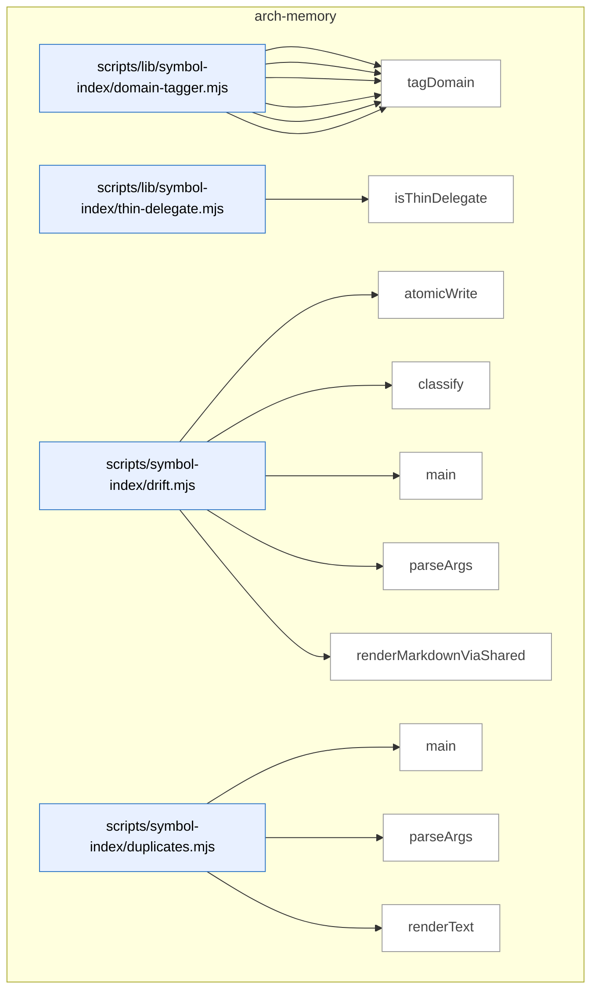

_Domain has 54 symbols (>50). Diagram shows top-15 by file order; see flat table below for the full list._

### Symbols in this domain

| Symbol | Kind | Path | Lines | Purpose | File imported by |
|---|---|---|---|---|---|
| [`computeTargetDomains`](../scripts/lib/symbol-index/domain-tagger.mjs#L150) | function | `scripts/lib/symbol-index/domain-tagger.mjs` | 150-165 | Categorizes target paths into tagged domains and untagged paths, reporting whether symbols span multiple domains. | `scripts/cross-skill.mjs`, `scripts/lib/dashboard/collect-reference.mjs`, `scripts/lib/observed-deps.mjs`, +2 more |
| [`globToRegexBody`](../scripts/lib/symbol-index/domain-tagger.mjs#L51) | function | `scripts/lib/symbol-index/domain-tagger.mjs` | 51-80 | Converts a glob pattern string to an anchored regex body, handling `**` (match any), `*` (match non-slash), and escaping literal characters. | `scripts/cross-skill.mjs`, `scripts/lib/dashboard/collect-reference.mjs`, `scripts/lib/observed-deps.mjs`, +2 more |
| [`loadDomainRules`](../scripts/lib/symbol-index/domain-tagger.mjs#L181) | function | `scripts/lib/symbol-index/domain-tagger.mjs` | 181-208 | Loads and validates domain-to-rule mappings from a JSON file, warning on malformed entries. | `scripts/cross-skill.mjs`, `scripts/lib/dashboard/collect-reference.mjs`, `scripts/lib/observed-deps.mjs`, +2 more |
| [`makeFastTagger`](../scripts/lib/symbol-index/domain-tagger.mjs#L111) | function | `scripts/lib/symbol-index/domain-tagger.mjs` | 111-132 | Returns a compiled fast-path tagger function that maps file paths to domains without re-parsing patterns. | `scripts/cross-skill.mjs`, `scripts/lib/dashboard/collect-reference.mjs`, `scripts/lib/observed-deps.mjs`, +2 more |
| [`matchGlob`](../scripts/lib/symbol-index/domain-tagger.mjs#L38) | function | `scripts/lib/symbol-index/domain-tagger.mjs` | 38-49 | Tests a file path against a glob pattern by normalizing both and applying regex with `**` and `*` wildcard semantics. | `scripts/cross-skill.mjs`, `scripts/lib/dashboard/collect-reference.mjs`, `scripts/lib/observed-deps.mjs`, +2 more |
| [`tagDomain`](../scripts/lib/symbol-index/domain-tagger.mjs#L89) | function | `scripts/lib/symbol-index/domain-tagger.mjs` | 89-96 | Returns the domain assigned to a file by finding the first matching rule pattern in order. | `scripts/cross-skill.mjs`, `scripts/lib/dashboard/collect-reference.mjs`, `scripts/lib/observed-deps.mjs`, +2 more |
| [`isThinDelegate`](../scripts/lib/symbol-index/thin-delegate.mjs#L50) | function | `scripts/lib/symbol-index/thin-delegate.mjs` | 50-85 | Determines if a function body is a "thin delegate" by stripping comments, removing variable prefixes and function keywords, and checking if the remaining code is a simple pass-through expression. | `scripts/symbol-index/extract.mjs` |
| [`atomicWrite`](../scripts/symbol-index/drift.mjs#L42) | function | `scripts/symbol-index/drift.mjs` | 42-48 | Atomically writes content to a file by creating a temporary file and renaming it to prevent corruption. | _(internal)_ |
| [`classify`](../scripts/symbol-index/drift.mjs#L50) | function | `scripts/symbol-index/drift.mjs` | 50-54 | Classifies a drift score as GREEN, AMBER, or RED based on threshold comparison. | _(internal)_ |
| [`main`](../scripts/symbol-index/drift.mjs#L75) | function | `scripts/symbol-index/drift.mjs` | 75-144 | Main entry point that computes architectural drift score, fetches duplicate clusters, and generates a formatted issue report. | _(internal)_ |
| [`parseArgs`](../scripts/symbol-index/drift.mjs#L33) | function | `scripts/symbol-index/drift.mjs` | 33-40 | Parses command-line arguments for output file path and JSON flag. | _(internal)_ |
| [`renderMarkdownViaShared`](../scripts/symbol-index/drift.mjs#L60) | function | `scripts/symbol-index/drift.mjs` | 60-73 | Renders drift issue metadata via a shared formatting function and returns the markdown output. | _(internal)_ |
| [`main`](../scripts/symbol-index/duplicates.mjs#L65) | function | `scripts/symbol-index/duplicates.mjs` | 65-101 | Main entry point that fetches top duplicate clusters from the active snapshot and outputs them as text or JSON. | _(internal)_ |
| [`parseArgs`](../scripts/symbol-index/duplicates.mjs#L31) | function | `scripts/symbol-index/duplicates.mjs` | 31-46 | Parses command-line arguments for result limit and JSON output flag with validation. | _(internal)_ |
| [`renderText`](../scripts/symbol-index/duplicates.mjs#L48) | function | `scripts/symbol-index/duplicates.mjs` | 48-63 | Formats duplicate clusters as readable text with cluster names, file counts, and file paths. | _(internal)_ |
| [`compose`](../scripts/symbol-index/embed.mjs#L73) | function | `scripts/symbol-index/embed.mjs` | 73-79 | Composes a stable text representation of a symbol for embedding from its metadata and signature. | _(internal)_ |
| [`embedBatch`](../scripts/symbol-index/embed.mjs#L26) | function | `scripts/symbol-index/embed.mjs` | 26-71 | Embeds a batch of text strings using the Gemini API with retry logic and rate-limit handling. | _(internal)_ |
| [`logProgress`](../scripts/symbol-index/embed.mjs#L19) | function | `scripts/symbol-index/embed.mjs` | 19-19 | Writes a progress message to stderr with a standardized prefix. | _(internal)_ |
| [`main`](../scripts/symbol-index/embed.mjs#L81) | function | `scripts/symbol-index/embed.mjs` | 81-123 | Main entry point that reads symbols from stdin, embeds them in batches via Gemini, and outputs annotated records with embedding vectors. | _(internal)_ |
| [`emitProgress`](../scripts/symbol-index/extract.mjs#L51) | function | `scripts/symbol-index/extract.mjs` | 51-53 | Writes an extraction progress message to stderr with a standardized prefix. | _(internal)_ |
| [`enumerateFiles`](../scripts/symbol-index/extract.mjs#L341) | function | `scripts/symbol-index/extract.mjs` | 341-359 | Enumerates all source files in the repository, optionally restricting to a specific file list. | _(internal)_ |
| [`extractGraphAndViolations`](../scripts/symbol-index/extract.mjs#L216) | function | `scripts/symbol-index/extract.mjs` | 216-282 | Analyzes dependency graph using dep-cruiser and emits violations for circular dependencies and rule breaks. | _(internal)_ |
| [`extractSymbols`](../scripts/symbol-index/extract.mjs#L63) | function | `scripts/symbol-index/extract.mjs` | 63-209 | Extracts function, class, interface, and type symbols from source files using ts-morph with size and path filtering. | _(internal)_ |
| [`isInternalEdge`](../scripts/symbol-index/extract.mjs#L296) | function | `scripts/symbol-index/extract.mjs` | 296-312 | Determines whether a dependency is internal (local source) by checking dependency metadata and path patterns. | _(internal)_ |
| [`main`](../scripts/symbol-index/extract.mjs#L361) | function | `scripts/symbol-index/extract.mjs` | 361-373 | Main entry point that extracts symbols and dependency violations from source files and outputs summary statistics. | _(internal)_ |
| [`parseArgs`](../scripts/symbol-index/extract.mjs#L37) | function | `scripts/symbol-index/extract.mjs` | 37-48 | Parses command-line arguments for repository root, file list, extraction mode, since-commit filter, and delegates flag. | _(internal)_ |
| [`main`](../scripts/symbol-index/prune.mjs#L44) | function | `scripts/symbol-index/prune.mjs` | 44-94 | Main entry point that prunes old refresh runs by retention class (aborted, transient, checkpoints) and demotes old rollbacks. | _(internal)_ |
| [`parseArgs`](../scripts/symbol-index/prune.mjs#L31) | function | `scripts/symbol-index/prune.mjs` | 31-37 | Parses command-line arguments for dry-run flag. | _(internal)_ |
| [`gitCommitSha`](../scripts/symbol-index/refresh.mjs#L75) | function | `scripts/symbol-index/refresh.mjs` | 75-78 | Returns the current git HEAD commit SHA or null if git fails. | _(internal)_ |
| [`gitDiffWithWorkingTree`](../scripts/symbol-index/refresh.mjs#L103) | function | `scripts/symbol-index/refresh.mjs` | 103-136 | Compares a git revision against the working tree using git diff and ls-files to enumerate added, modified, deleted, renamed, and untracked files. | _(internal)_ |
| [`isSafeGitRevision`](../scripts/symbol-index/refresh.mjs#L86) | function | `scripts/symbol-index/refresh.mjs` | 86-94 | Validates a git revision string against a strict allowlist to prevent injection attacks. | _(internal)_ |
| [`logErr`](../scripts/symbol-index/refresh.mjs#L72) | function | `scripts/symbol-index/refresh.mjs` | 72-72 | Writes an error message to stderr with a standardized prefix. | _(internal)_ |
| [`logOk`](../scripts/symbol-index/refresh.mjs#L73) | function | `scripts/symbol-index/refresh.mjs` | 73-73 | Writes a success message to stderr with a standardized prefix. | _(internal)_ |
| [`main`](../scripts/symbol-index/refresh.mjs#L168) | function | `scripts/symbol-index/refresh.mjs` | 168-458 | Main entry point that orchestrates symbol extraction, embedding, summarization, and persistence to the cloud database. | _(internal)_ |
| [`parseArgs`](../scripts/symbol-index/refresh.mjs#L60) | function | `scripts/symbol-index/refresh.mjs` | 60-70 | Parses command-line arguments for full refresh, since-commit, force, and include-delegates flags. | _(internal)_ |
| [`runJsonLines`](../scripts/symbol-index/refresh.mjs#L142) | function | `scripts/symbol-index/refresh.mjs` | 142-157 | Runs a command synchronously, parses JSON-line output, and throws if the command fails. | _(internal)_ |
| [`runWithHeartbeat`](../scripts/symbol-index/refresh.mjs#L159) | function | `scripts/symbol-index/refresh.mjs` | 159-166 | Runs an async function while periodically sending heartbeat updates and clears the interval upon completion. | _(internal)_ |
| [`classify`](../scripts/symbol-index/render-mermaid.mjs#L58) | function | `scripts/symbol-index/render-mermaid.mjs` | 58-62 | Classifies an architectural score as GREEN, AMBER, or RED based on threshold comparison. | _(internal)_ |
| [`cleanupStaleObservedDeps`](../scripts/symbol-index/render-mermaid.mjs#L70) | function | `scripts/symbol-index/render-mermaid.mjs` | 70-80 | Deletes stale observed dependency file from a previous aborted render attempt. | _(internal)_ |
| [`commitSha`](../scripts/symbol-index/render-mermaid.mjs#L53) | function | `scripts/symbol-index/render-mermaid.mjs` | 53-56 | Returns the first 12 characters of the current git HEAD commit SHA or null if git fails. | _(internal)_ |
| [`main`](../scripts/symbol-index/render-mermaid.mjs#L108) | function | `scripts/symbol-index/render-mermaid.mjs` | 108-291 | Main entry point that checks cloud connectivity and repo registration, then renders the architecture map markdown document with domain summaries and dependency violations. | _(internal)_ |
| [`parseArgs`](../scripts/symbol-index/render-mermaid.mjs#L45) | function | `scripts/symbol-index/render-mermaid.mjs` | 45-51 | Parses command-line arguments for output file path. | _(internal)_ |
| [`writeAbortStub`](../scripts/symbol-index/render-mermaid.mjs#L89) | function | `scripts/symbol-index/render-mermaid.mjs` | 89-106 | Writes an abort stub to the output file with status reason and optional hint text via atomic write. | _(internal)_ |
| [`cacheHit`](../scripts/symbol-index/summarise-domains.mjs#L56) | function | `scripts/symbol-index/summarise-domains.mjs` | 56-63 | Determines if cached domain summary is valid by comparing composition, template version, model, and symbol count delta. | `scripts/symbol-index/render-mermaid.mjs` |
| [`callHaiku`](../scripts/symbol-index/summarise-domains.mjs#L65) | function | `scripts/symbol-index/summarise-domains.mjs` | 65-93 | Calls the Claude Haiku API with a prompt, enforces timeout, and returns the response text plus token/latency metrics. | `scripts/symbol-index/render-mermaid.mjs` |
| [`computeCompositionHash`](../scripts/symbol-index/summarise-domains.mjs#L43) | function | `scripts/symbol-index/summarise-domains.mjs` | 43-48 | Computes a stable 16-character hash of symbol composition based on definition IDs and signature hashes. | `scripts/symbol-index/render-mermaid.mjs` |
| [`main`](../scripts/symbol-index/summarise-domains.mjs#L177) | function | `scripts/symbol-index/summarise-domains.mjs` | 177-209 | Main entry point that loads domain summaries for the active snapshot and outputs aggregate statistics and per-domain results. | `scripts/symbol-index/render-mermaid.mjs` |
| [`PROMPT_TEMPLATE`](../scripts/symbol-index/summarise-domains.mjs#L36) | function | `scripts/symbol-index/summarise-domains.mjs` | 36-40 | Generates a prompt asking Claude to describe a domain's purpose based on sample symbols and file distribution. | `scripts/symbol-index/render-mermaid.mjs` |
| [`summariseDomains`](../scripts/symbol-index/summarise-domains.mjs#L107) | function | `scripts/symbol-index/summarise-domains.mjs` | 107-174 | Main entry point that summarizes domain purposes by calling Claude Haiku on grouped symbols with caching and per-domain error resilience. | `scripts/symbol-index/render-mermaid.mjs` |
| [`symbolCountDeltaOk`](../scripts/symbol-index/summarise-domains.mjs#L50) | function | `scripts/symbol-index/summarise-domains.mjs` | 50-54 | Checks if symbol count change is within 20% tolerance compared to prior baseline. | `scripts/symbol-index/render-mermaid.mjs` |
| [`validateSummary`](../scripts/symbol-index/summarise-domains.mjs#L95) | function | `scripts/symbol-index/summarise-domains.mjs` | 95-101 | Validates a summary string for minimum length (20 chars), maximum length (400 chars), and non-empty content. | `scripts/symbol-index/render-mermaid.mjs` |
| [`logProgress`](../scripts/symbol-index/summarise.mjs#L27) | function | `scripts/symbol-index/summarise.mjs` | 27-27 | Writes a summarization progress message to stderr with a standardized prefix. | _(internal)_ |
| [`main`](../scripts/symbol-index/summarise.mjs#L70) | function | `scripts/symbol-index/summarise.mjs` | 70-113 | Main entry point that reads symbols from stdin, summarizes them in bounded concurrent batches, and outputs annotated records. | _(internal)_ |
| [`summariseBatch`](../scripts/symbol-index/summarise.mjs#L33) | function | `scripts/symbol-index/summarise.mjs` | 33-68 | Calls Claude Haiku to generate one-line purpose summaries for a batch of symbols with error handling. | _(internal)_ |

---

## audit-orchestration

> The `audit-orchestration` domain orchestrates sequential AI-powered code audits (OpenAI then Gemini) and loops them until convergence criteria are met (zero HIGH, ≤2 MEDIUM findings), with utilities for session management, process spawning, result parsing, and progress reporting.

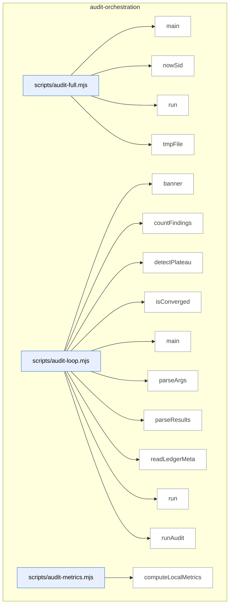

_Domain has 104 symbols (>50). Diagram shows top-15 by file order; see flat table below for the full list._

### Symbols in this domain

| Symbol | Kind | Path | Lines | Purpose | File imported by |
|---|---|---|---|---|---|
| [`main`](../scripts/audit-full.mjs#L44) | function | `scripts/audit-full.mjs` | 44-127 | Runs OpenAI audit followed by Gemini review in sequence, with optional final review skip. | _(internal)_ |
| [`nowSid`](../scripts/audit-full.mjs#L31) | function | `scripts/audit-full.mjs` | 31-33 | Generates a timestamped session ID with a given prefix. | _(internal)_ |
| [`run`](../scripts/audit-full.mjs#L39) | function | `scripts/audit-full.mjs` | 39-42 | Spawns a child process synchronously and returns its exit code and signal. | _(internal)_ |
| [`tmpFile`](../scripts/audit-full.mjs#L35) | function | `scripts/audit-full.mjs` | 35-37 | Returns the path to a temporary file in the system temp directory. | _(internal)_ |
| [`banner`](../scripts/audit-loop.mjs#L26) | function | `scripts/audit-loop.mjs` | 26-29 | Prints a centered banner with decorative lines around the given text. | _(internal)_ |
| [`countFindings`](../scripts/audit-loop.mjs#L70) | function | `scripts/audit-loop.mjs` | 70-77 | Counts findings by severity level and returns aggregate statistics with failure flag. | _(internal)_ |
| [`detectPlateau`](../scripts/audit-loop.mjs#L92) | function | `scripts/audit-loop.mjs` | 92-108 | Detects performance plateau when HIGH finding reduction drops below 30% for two consecutive rounds. | _(internal)_ |
| [`isConverged`](../scripts/audit-loop.mjs#L79) | function | `scripts/audit-loop.mjs` | 79-83 | Determines if audit results meet convergence criteria (zero HIGH and ≤2 MEDIUM findings). | _(internal)_ |
| [`main`](../scripts/audit-loop.mjs#L168) | function | `scripts/audit-loop.mjs` | 168-525 | Main audit loop orchestrator that repeatedly runs audits, checks convergence, detects plateaus, and optionally invokes Gemini review. | _(internal)_ |
| [`parseArgs`](../scripts/audit-loop.mjs#L128) | function | `scripts/audit-loop.mjs` | 128-164 | Parses command-line arguments into an audit configuration object with defaults. | _(internal)_ |
| [`parseResults`](../scripts/audit-loop.mjs#L61) | function | `scripts/audit-loop.mjs` | 61-68 | Parses and returns JSON from an audit results file, or null if parsing fails. | _(internal)_ |
| [`readLedgerMeta`](../scripts/audit-loop.mjs#L118) | function | `scripts/audit-loop.mjs` | 118-126 | Reads and returns metadata from an audit ledger file. | _(internal)_ |
| [`run`](../scripts/audit-loop.mjs#L31) | function | `scripts/audit-loop.mjs` | 31-44 | Executes a shell command with a timeout and returns stdout, optionally ignoring errors. | _(internal)_ |
| [`runAudit`](../scripts/audit-loop.mjs#L46) | function | `scripts/audit-loop.mjs` | 46-59 | Runs the OpenAI audit script with a 10-minute timeout and captures success/failure. | _(internal)_ |
| [`computeLocalMetrics`](../scripts/audit-metrics.mjs#L73) | function | `scripts/audit-metrics.mjs` | 73-89 | Loads local audit outcomes from disk, filters by recency, and groups pass acceptance/dismissal counts. | `scripts/lib/dashboard/collect-telemetry.mjs` |
| [`displayMetrics`](../scripts/audit-metrics.mjs#L93) | function | `scripts/audit-metrics.mjs` | 93-162 | <no body> | `scripts/lib/dashboard/collect-telemetry.mjs` |
| [`fetchCloudMetrics`](../scripts/audit-metrics.mjs#L47) | function | `scripts/audit-metrics.mjs` | 47-66 | Fetches audit runs, pass stats, and findings from the database for the last N days. | `scripts/lib/dashboard/collect-telemetry.mjs` |
| [`main`](../scripts/audit-metrics.mjs#L166) | function | `scripts/audit-metrics.mjs` | 166-183 | Attempts to fetch cloud metrics gracefully, falls back to local-only output on error, and displays results. | `scripts/lib/dashboard/collect-telemetry.mjs` |
| [`_collectMaxLengths`](../scripts/gemini-review.mjs#L102) | function | `scripts/gemini-review.mjs` | 102-120 | Recursively collects maxLength constraints from a JSON schema into a path-keyed map. | _(internal)_ |
| [`addSemanticIds`](../scripts/gemini-review.mjs#L889) | function | `scripts/gemini-review.mjs` | 889-897 | Assigns unique semantic IDs and hashes to each finding based on provider and position. | _(internal)_ |
| [`applyDebtSuppression`](../scripts/gemini-review.mjs#L822) | function | `scripts/gemini-review.mjs` | 822-857 | Filters new findings by matching them against pre-suppressed debt topics using Jaccard similarity with a 0.3 threshold. | _(internal)_ |
| [`applyScopeFilter`](../scripts/gemini-review.mjs#L859) | function | `scripts/gemini-review.mjs` | 859-887 | Removes findings that cite files outside the changed files list, preserving file-agnostic (deliberation-level) findings. | _(internal)_ |
| [`buildClient`](../scripts/gemini-review.mjs#L788) | function | `scripts/gemini-review.mjs` | 788-795 | Instantiates either a Google Generative AI or Anthropic SDK client based on the selected provider. | _(internal)_ |
| [`callClaudeOpus`](../scripts/gemini-review.mjs#L402) | function | `scripts/gemini-review.mjs` | 402-465 | Calls the Claude Opus API with JSON schema validation, timeout, and usage tracking. | _(internal)_ |
| [`callGemini`](../scripts/gemini-review.mjs#L294) | function | `scripts/gemini-review.mjs` | 294-388 | Calls the Gemini API with streaming, schema validation, thinking budget, auto-truncation, and timeout handling. | _(internal)_ |
| [`emitReviewOutput`](../scripts/gemini-review.mjs#L899) | function | `scripts/gemini-review.mjs` | 899-914 | Outputs the review result as formatted text or JSON with metadata, saving to file if requested. | _(internal)_ |
| [`formatReviewResult`](../scripts/gemini-review.mjs#L628) | function | `scripts/gemini-review.mjs` | 628-691 | Formats a final review result into markdown with verdict, deliberation quality, coherence score, and findings. | _(internal)_ |
| [`getReviewPrompt`](../scripts/gemini-review.mjs#L275) | function | `scripts/gemini-review.mjs` | 275-277 | Returns the active custom gemini-review prompt or a built-in system prompt. | _(internal)_ |
| [`isJsonTruncationError`](../scripts/gemini-review.mjs#L797) | function | `scripts/gemini-review.mjs` | 797-801 | Detects if an error message indicates JSON parsing failure due to truncation or malformed structure. | _(internal)_ |
| [`main`](../scripts/gemini-review.mjs#L985) | function | `scripts/gemini-review.mjs` | 985-1023 | Parses arguments, loads plan and transcript files, runs the review pipeline, and outputs results. | _(internal)_ |
| [`parseReviewArgs`](../scripts/gemini-review.mjs#L747) | function | `scripts/gemini-review.mjs` | 747-758 | Parses command-line arguments for plan file, transcript file, JSON mode, output file, and provider override. | _(internal)_ |
| [`recordGeminiOutcomes`](../scripts/gemini-review.mjs#L961) | function | `scripts/gemini-review.mjs` | 961-983 | Updates a prompt bandit with verdict rewards, flushes learning state, and logs outcome counts. | _(internal)_ |
| [`recordNewFindings`](../scripts/gemini-review.mjs#L916) | function | `scripts/gemini-review.mjs` | 916-935 | Records new findings to the audit outcomes log and tracks false positives per repo. | _(internal)_ |
| [`recordWronglyDismissed`](../scripts/gemini-review.mjs#L937) | function | `scripts/gemini-review.mjs` | 937-959 | Records wrongly dismissed findings to the outcomes log as re-raised issues for learning. | _(internal)_ |
| [`refreshCatalogAndWarn`](../scripts/gemini-review.mjs#L697) | function | `scripts/gemini-review.mjs` | 697-708 | Refreshes the model catalog and warns if a newer model version is available than the current session. | _(internal)_ |
| [`runFinalReview`](../scripts/gemini-review.mjs#L478) | function | `scripts/gemini-review.mjs` | 478-624 | Extracts code files from the transcript and plan, reads them as context, and assembles debt-suppression metadata. | _(internal)_ |
| [`runPing`](../scripts/gemini-review.mjs#L740) | function | `scripts/gemini-review.mjs` | 740-745 | Attempts to ping either Gemini or Claude depending on which API key is set. | _(internal)_ |
| [`runPingClaude`](../scripts/gemini-review.mjs#L722) | function | `scripts/gemini-review.mjs` | 722-738 | Pings the Claude Opus API to verify connectivity and readiness. | _(internal)_ |
| [`runPingGemini`](../scripts/gemini-review.mjs#L710) | function | `scripts/gemini-review.mjs` | 710-720 | Pings the Gemini API to verify connectivity and readiness. | _(internal)_ |
| [`runReviewWithRetry`](../scripts/gemini-review.mjs#L803) | function | `scripts/gemini-review.mjs` | 803-820 | Retries a final review pass up to 2 attempts, reducing transcript verbosity on JSON truncation errors. | _(internal)_ |
| [`selectProvider`](../scripts/gemini-review.mjs#L760) | function | `scripts/gemini-review.mjs` | 760-786 | Selects the AI provider (Gemini or Claude) based on environment variables and command-line override. | _(internal)_ |
| [`truncateToSchema`](../scripts/gemini-review.mjs#L134) | function | `scripts/gemini-review.mjs` | 134-154 | Truncates nested object and array fields to respect schema maxLength limits, logging truncations. | _(internal)_ |
| [`classifyDeferralEvidence`](../scripts/lib/audit/deferral-classifier.mjs#L155) | function | `scripts/lib/audit/deferral-classifier.mjs` | 155-273 | Classifies a finding's deferral evidence by checking plan markers, SCM scope, commit history, and other deterministic signals. | `scripts/lib/audit/findings-pipeline.mjs` |
| [`globMatch`](../scripts/lib/audit/deferral-classifier.mjs#L98) | function | `scripts/lib/audit/deferral-classifier.mjs` | 98-115 | Translates a glob pattern to regex and tests if a file path matches (handles **, /, and * correctly). | `scripts/lib/audit/findings-pipeline.mjs` |
| [`isAutoDeferrableClass`](../scripts/lib/audit/deferral-classifier.mjs#L277) | function | `scripts/lib/audit/deferral-classifier.mjs` | 277-279 | Returns whether a category is in the auto-deferrable classes list. | `scripts/lib/audit/findings-pipeline.mjs` |
| [`isForbiddenClass`](../scripts/lib/audit/deferral-classifier.mjs#L281) | function | `scripts/lib/audit/deferral-classifier.mjs` | 281-283 | Returns whether a category is in the forbidden (non-deferrable) classes list. | `scripts/lib/audit/findings-pipeline.mjs` |
| [`parseAcceptV1Markers`](../scripts/lib/audit/deferral-classifier.mjs#L77) | function | `scripts/lib/audit/deferral-classifier.mjs` | 77-87 | Parses plan-content for <!-- ACCEPT: glob reason --> markers and returns file-glob / reason pairs. | `scripts/lib/audit/findings-pipeline.mjs` |
| [`cleanupTempRoot`](../scripts/lib/audit/diff-scope-resolver.mjs#L209) | function | `scripts/lib/audit/diff-scope-resolver.mjs` | 209-219 | Forcefully removes a temporary git worktree and falls back to recursive filesystem deletion if the worktree was never registered. | `scripts/openai-audit.mjs` |
| [`computeEntryPoints`](../scripts/lib/audit/diff-scope-resolver.mjs#L308) | function | `scripts/lib/audit/diff-scope-resolver.mjs` | 308-377 | Extracts entry points from package.json and tsconfig.json, adding TypeScript source equivalents when compiled output paths are found. | `scripts/openai-audit.mjs` |
| [`cruiseTempRoot`](../scripts/lib/audit/diff-scope-resolver.mjs#L231) | function | `scripts/lib/audit/diff-scope-resolver.mjs` | 231-293 | Runs dep-cruiser on materialized source files in a temporary directory, translates relative paths back to the temp root, and returns a map of callers to their dependencies. | `scripts/openai-audit.mjs` |
| [`gitBuf`](../scripts/lib/audit/diff-scope-resolver.mjs#L73) | function | `scripts/lib/audit/diff-scope-resolver.mjs` | 73-85 | Executes a git command and returns the buffer output, or null on failure with stderr logging. | `scripts/openai-audit.mjs` |
| [`materialisePreimages`](../scripts/lib/audit/diff-scope-resolver.mjs#L172) | function | `scripts/lib/audit/diff-scope-resolver.mjs` | 172-207 | Creates a temporary git worktree at baseRef, materialises eligible preimage files, and returns the temp root path. | `scripts/openai-audit.mjs` |
| [`parseLsTreeZ`](../scripts/lib/audit/diff-scope-resolver.mjs#L153) | function | `scripts/lib/audit/diff-scope-resolver.mjs` | 153-156 | Parses `git ls-tree -z` output into a set of file paths. | `scripts/openai-audit.mjs` |
| [`parseNameStatusZ`](../scripts/lib/audit/diff-scope-resolver.mjs#L100) | function | `scripts/lib/audit/diff-scope-resolver.mjs` | 100-145 | Parses `git diff --name-status -z` output into records with variable-width token handling for renames/copies. | `scripts/openai-audit.mjs` |
| [`resolveDiffScope`](../scripts/lib/audit/diff-scope-resolver.mjs#L394) | function | `scripts/lib/audit/diff-scope-resolver.mjs` | 394-495 | Resolves git refs to commit SHAs, builds a list of changed files via git diff, extracts pre-edge information from the base commit, and returns the diff scope with optional partial-parse tracking. | `scripts/openai-audit.mjs` |
| [`stripLeadingDotSlash`](../scripts/lib/audit/diff-scope-resolver.mjs#L27) | function | `scripts/lib/audit/diff-scope-resolver.mjs` | 27-29 | Removes a leading `./` prefix from a string if present. | `scripts/openai-audit.mjs` |
| [`walkEntryPointDir`](../scripts/lib/audit/diff-scope-resolver.mjs#L49) | function | `scripts/lib/audit/diff-scope-resolver.mjs` | 49-63 | Walks a directory to discover source files matching specified extensions (non-recursive). | `scripts/openai-audit.mjs` |
| [`classifyFinding`](../scripts/lib/audit/finding-verification.mjs#L70) | function | `scripts/lib/audit/finding-verification.mjs` | 70-73 | Detects whether a finding claims the existence of something (code, file, or symbol). | `scripts/openai-audit.mjs` |
| [`extractCitedEntity`](../scripts/lib/audit/finding-verification.mjs#L103) | function | `scripts/lib/audit/finding-verification.mjs` | 103-122 | Extracts a cited entity (name, kind, optional file path) from a finding's detail and section. | `scripts/openai-audit.mjs` |
| [`mk`](../scripts/lib/audit/finding-verification.mjs#L124) | function | `scripts/lib/audit/finding-verification.mjs` | 124-132 | Wraps a verification result with metadata about severity and verdict contribution. | `scripts/openai-audit.mjs` |
| [`tokenKind`](../scripts/lib/audit/finding-verification.mjs#L84) | function | `scripts/lib/audit/finding-verification.mjs` | 84-90 | Classifies a token as external, file, or symbol based on syntax and context. | `scripts/openai-audit.mjs` |
| [`verifyExistenceFindings`](../scripts/lib/audit/finding-verification.mjs#L149) | function | `scripts/lib/audit/finding-verification.mjs` | 149-215 | Verifies existence claims in audit findings against the repo inventory, marking external and symbol claims as requiring manual review. | `scripts/openai-audit.mjs` |
| [`applyAcceptV1Suppression`](../scripts/lib/audit/findings-pipeline.mjs#L103) | function | `scripts/lib/audit/findings-pipeline.mjs` | 103-126 | Filters findings against accept-v1 plan markers, suppressing orphan-introduced findings whose file paths match the marked globs. | `scripts/lib/audit/orphan-metrics.mjs`, `scripts/openai-audit.mjs` |
| [`applyLedgerSuppression`](../scripts/lib/audit/findings-pipeline.mjs#L66) | function | `scripts/lib/audit/findings-pipeline.mjs` | 66-89 | Filters findings against a ledger of dismissed entries, removing those matching any fingerprint or topicId marked as dismissed or severity-adjusted-to-zero. | `scripts/lib/audit/orphan-metrics.mjs`, `scripts/openai-audit.mjs` |
| [`findingFingerprint`](../scripts/lib/audit/findings-pipeline.mjs#L34) | function | `scripts/lib/audit/findings-pipeline.mjs` | 34-51 | Generates a deterministic 8-character SHA256 hash fingerprint for a finding, handling orphan-introduced findings specially by including caller information. | `scripts/lib/audit/orphan-metrics.mjs`, `scripts/openai-audit.mjs` |
| [`processFindings`](../scripts/lib/audit/findings-pipeline.mjs#L143) | function | `scripts/lib/audit/findings-pipeline.mjs` | 143-166 | Normalizes and fingerprints findings, then applies ledger and accept-v1 suppression in sequence, returning survivors and suppressed lists. | `scripts/lib/audit/orphan-metrics.mjs`, `scripts/openai-audit.mjs` |
| [`globMatch`](../scripts/lib/audit/glob-match.mjs#L28) | function | `scripts/lib/audit/glob-match.mjs` | 28-38 | Tests whether a file path matches a glob pattern by escaping special regex characters and converting `*` and `**` wildcards to appropriate regex quantifiers. | `scripts/lib/audit/findings-pipeline.mjs` |
| [`detectOrphansIntroduced`](../scripts/lib/audit/orphan-introduced.mjs#L42) | function | `scripts/lib/audit/orphan-introduced.mjs` | 42-167 | Analyzes a diff scope and head graph to detect orphaned targets (modules that lost all their callers), recording exact attribution of removed edges and classifying findings by removal type. | `scripts/openai-audit.mjs` |
| [`isTestFile`](../scripts/lib/audit/orphan-introduced.mjs#L174) | function | `scripts/lib/audit/orphan-introduced.mjs` | 174-184 | Determines if a file path is a test file by checking against known test directory prefixes, segment patterns, and file suffix rules. | `scripts/openai-audit.mjs` |
| [`appendOrphanMetric`](../scripts/lib/audit/orphan-metrics.mjs#L59) | function | `scripts/lib/audit/orphan-metrics.mjs` | 59-80 | Appends an orphan metric record to the metrics file with file-level locking, gracefully degrading on permission or filesystem errors. | `scripts/openai-audit.mjs` |
| [`emitOrphanRunMetrics`](../scripts/lib/audit/orphan-metrics.mjs#L102) | function | `scripts/lib/audit/orphan-metrics.mjs` | 102-169 | Emits a summary record and per-finding records to the metrics file, tracking suppression status and pass state for all findings. | `scripts/openai-audit.mjs` |
| [`ensureMetricsFile`](../scripts/lib/audit/orphan-metrics.mjs#L33) | function | `scripts/lib/audit/orphan-metrics.mjs` | 33-49 | Ensures a metrics file exists at `.audit/metrics.jsonl` by creating the directory and atomically initializing the file if it doesn't already exist. | `scripts/openai-audit.mjs` |
| [`buildAuditPassPrompt`](../scripts/lib/audit/prompt-builder.mjs#L63) | function | `scripts/lib/audit/prompt-builder.mjs` | 63-108 | Builds a three-message audit prompt with stable prefix, dynamic round content, and code, supporting caching. | `scripts/openai-audit.mjs` |
| [`estimateStablePrefixTokens`](../scripts/lib/audit/prompt-builder.mjs#L167) | function | `scripts/lib/audit/prompt-builder.mjs` | 167-179 | Estimates stable prefix tokens by building a prompt with empty code and no round/history context. | `scripts/openai-audit.mjs` |
| [`estimateTokens`](../scripts/lib/audit/prompt-builder.mjs#L149) | function | `scripts/lib/audit/prompt-builder.mjs` | 149-152 | Estimates tokens from text length using a 4-character-per-token approximation. | `scripts/openai-audit.mjs` |
| [`validateOpts`](../scripts/lib/audit/prompt-builder.mjs#L110) | function | `scripts/lib/audit/prompt-builder.mjs` | 110-132 | Validates that prompt builder options contain required string fields and optional fields of correct types. | `scripts/openai-audit.mjs` |
| [`_callGPTOnce`](../scripts/openai-audit.mjs#L500) | function | `scripts/openai-audit.mjs` | 500-602 | <no body> | _(internal)_ |
| [`applyExclusions`](../scripts/openai-audit.mjs#L155) | function | `scripts/openai-audit.mjs` | 155-164 | Filters files using micromatch, removing those matching exclude patterns and logging the count. | _(internal)_ |
| [`buildCachePrompt`](../scripts/openai-audit.mjs#L431) | function | `scripts/openai-audit.mjs` | 431-448 | Builds a structured audit prompt combining system rubric, project context, plan slice, code, and ledger rulings (R2+). | _(internal)_ |
| [`cachePassResult`](../scripts/openai-audit.mjs#L699) | function | `scripts/openai-audit.mjs` | 699-707 | Persists a pass result to the cache directory as a JSON file. | _(internal)_ |
| [`cacheWaveResults`](../scripts/openai-audit.mjs#L709) | function | `scripts/openai-audit.mjs` | 709-714 | Caches all wave results to disk and logs the cache location. | _(internal)_ |
| [`callGPT`](../scripts/openai-audit.mjs#L608) | function | `scripts/openai-audit.mjs` | 608-649 | Calls GPT with automatic retry logic, accumulating token usage across attempts and detecting retryable errors. | _(internal)_ |
| [`cleanupCache`](../scripts/openai-audit.mjs#L716) | function | `scripts/openai-audit.mjs` | 716-719 | Deletes the temporary pass-result cache directory. | _(internal)_ |
| [`decideSeed`](../scripts/openai-audit.mjs#L793) | function | `scripts/openai-audit.mjs` | 793-838 | <no body> | _(internal)_ |
| [`deriveFindingsFromReport`](../scripts/openai-audit.mjs#L1365) | function | `scripts/openai-audit.mjs` | 1365-1425 | Converts audit report violations into standardized finding objects with severity, category, and remediation guidance. | _(internal)_ |
| [`formatViolationsForPrompt`](../scripts/openai-audit.mjs#L1309) | function | `scripts/openai-audit.mjs` | 1309-1358 | <no body> | _(internal)_ |
| [`getPassPrompt`](../scripts/openai-audit.mjs#L360) | function | `scripts/openai-audit.mjs` | 360-364 | Returns an active registered prompt for a pass name, falling back to built-in PASS_PROMPTS. | _(internal)_ |
| [`initResultCache`](../scripts/openai-audit.mjs#L689) | function | `scripts/openai-audit.mjs` | 689-697 | Initializes a process-local cache directory for storing pass results during audit execution. | _(internal)_ |
| [`loadExcludePatterns`](../scripts/openai-audit.mjs#L136) | function | `scripts/openai-audit.mjs` | 136-147 | Loads exclude patterns from CLI arguments and `.auditignore` file (one pattern per line, `#` comments ignored). | _(internal)_ |
| [`main`](../scripts/openai-audit.mjs#L2962) | function | `scripts/openai-audit.mjs` | 2962-3452 | Initializes the audit tool by refreshing the model catalog, checking version staleness, and delegating to the main audit pipeline. | _(internal)_ |
| [`normalisePromptInput`](../scripts/openai-audit.mjs#L467) | function | `scripts/openai-audit.mjs` | 467-498 | Normalizes prompt input to a consistent message array, accepting either legacy (systemPrompt/userPrompt) or structured (system/messages) modes. | _(internal)_ |
| [`normalizeFindingsForOutput`](../scripts/openai-audit.mjs#L723) | function | `scripts/openai-audit.mjs` | 723-725 | Normalizes findings array using a semantic ID function for deduplication. | _(internal)_ |
| [`orphanToStandardFinding`](../scripts/openai-audit.mjs#L1182) | function | `scripts/openai-audit.mjs` | 1182-1204 | Converts an orphan-introduced finding (linter output) to standard audit finding format with id, severity, recommendation, and classification. | _(internal)_ |
| [`printCostPreflight`](../scripts/openai-audit.mjs#L92) | function | `scripts/openai-audit.mjs` | 92-110 | Estimates and logs the projected cost of an audit stage based on token counts and model pricing. | _(internal)_ |
| [`runArchitecturePass`](../scripts/openai-audit.mjs#L1047) | function | `scripts/openai-audit.mjs` | 1047-1172 | <no body> | _(internal)_ |
| [`runMapReducePass`](../scripts/openai-audit.mjs#L872) | function | `scripts/openai-audit.mjs` | 872-1029 | <no body> | _(internal)_ |
| [`runMultiPassCodeAudit`](../scripts/openai-audit.mjs#L1427) | function | `scripts/openai-audit.mjs` | 1427-2956 | Executes a multi-pass code audit loop, orchestrating file analysis, structural checks, wiring validation, and sustainability scans with caching and diff metadata. | _(internal)_ |
| [`runOneMapUnit`](../scripts/openai-audit.mjs#L843) | function | `scripts/openai-audit.mjs` | 843-870 | Executes a single map-unit audit by reading context, building a prompt, and calling GPT with high reasoning and slot-based concurrency control. | _(internal)_ |
| [`runOrphanIntroducedPass`](../scripts/openai-audit.mjs#L1223) | function | `scripts/openai-audit.mjs` | 1223-1302 | <no body> | _(internal)_ |
| [`safeCallGPT`](../scripts/openai-audit.mjs#L660) | function | `scripts/openai-audit.mjs` | 660-677 | Safely wraps callGPT to catch config errors (fail-fast) and other errors (graceful degradation with empty result). | _(internal)_ |
| [`shouldMapReduce`](../scripts/openai-audit.mjs#L181) | function | `scripts/openai-audit.mjs` | 181-185 | Returns true if file count exceeds threshold or estimated total character/token context is large. | _(internal)_ |
| [`shouldMapReduceHighReasoning`](../scripts/openai-audit.mjs#L192) | function | `scripts/openai-audit.mjs` | 192-196 | Returns true if file count exceeds high-reasoning threshold or context size justifies map-reduce with reasoning. | _(internal)_ |
| [`throwIfConfigError`](../scripts/openai-audit.mjs#L782) | function | `scripts/openai-audit.mjs` | 782-788 | Re-throws configuration errors from a settled Promise to prevent swallowing programmer bugs. | _(internal)_ |
| [`validateLedgerForR2`](../scripts/openai-audit.mjs#L735) | function | `scripts/openai-audit.mjs` | 735-754 | Validates ledger existence and format for R2+, returning status and entry count or warning flags. | _(internal)_ |

---

## brainstorm

> The `brainstorm` domain runs an interactive CLI tool for multi-round brainstorming and debate sessions, allowing users to generate ideas with AI providers, save insights with tags, and manage session persistence.

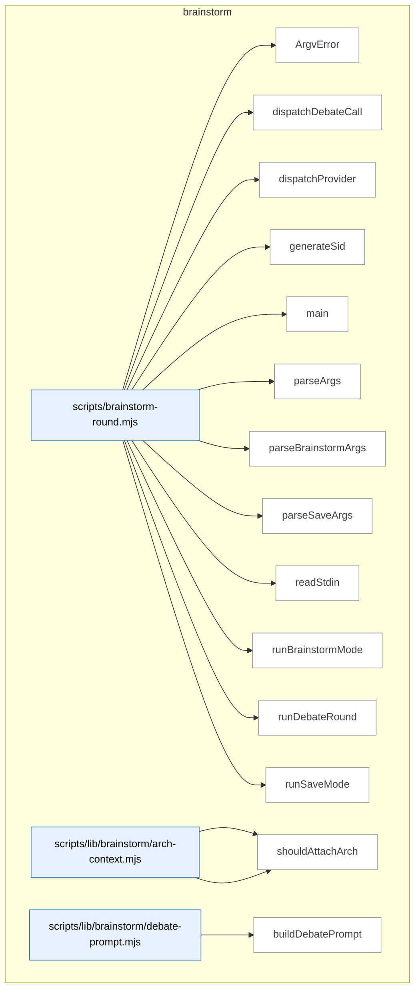

_Domain has 66 symbols (>50). Diagram shows top-15 by file order; see flat table below for the full list._

### Symbols in this domain

| Symbol | Kind | Path | Lines | Purpose | File imported by |
|---|---|---|---|---|---|
| [`ArgvError`](../scripts/brainstorm-round.mjs#L249) | class | `scripts/brainstorm-round.mjs` | 249-251 | Custom error class for argument parsing failures. | _(internal)_ |
| [`dispatchDebateCall`](../scripts/brainstorm-round.mjs#L576) | function | `scripts/brainstorm-round.mjs` | 576-604 | Dispatches a debate call to a provider, reusing round-1 adapters with concatenated debate prompts. | _(internal)_ |
| [`dispatchProvider`](../scripts/brainstorm-round.mjs#L606) | function | `scripts/brainstorm-round.mjs` | 606-653 | <no body> | _(internal)_ |
| [`generateSid`](../scripts/brainstorm-round.mjs#L538) | function | `scripts/brainstorm-round.mjs` | 538-541 | Generates a short, sortable, unique session ID using timestamp base-36 and random hex suffix. | _(internal)_ |
| [`main`](../scripts/brainstorm-round.mjs#L259) | function | `scripts/brainstorm-round.mjs` | 259-286 | Parses CLI arguments, prunes old sessions, and dispatches to brainstorm or save mode. | _(internal)_ |
| [`parseArgs`](../scripts/brainstorm-round.mjs#L84) | function | `scripts/brainstorm-round.mjs` | 84-97 | Detects save mode from argv and delegates to the appropriate parser. | _(internal)_ |
| [`parseBrainstormArgs`](../scripts/brainstorm-round.mjs#L99) | function | `scripts/brainstorm-round.mjs` | 99-198 | <no body> | _(internal)_ |
| [`parseSaveArgs`](../scripts/brainstorm-round.mjs#L200) | function | `scripts/brainstorm-round.mjs` | 200-247 | <no body> | _(internal)_ |
| [`readStdin`](../scripts/brainstorm-round.mjs#L253) | function | `scripts/brainstorm-round.mjs` | 253-257 | Reads all chunks from stdin and returns decoded UTF-8 text. | _(internal)_ |
| [`runBrainstormMode`](../scripts/brainstorm-round.mjs#L288) | function | `scripts/brainstorm-round.mjs` | 288-490 | <no body> | _(internal)_ |
| [`runDebateRound`](../scripts/brainstorm-round.mjs#L543) | function | `scripts/brainstorm-round.mjs` | 543-574 | Runs a debate round where both providers respond to each other's round-1 output. | _(internal)_ |
| [`runSaveMode`](../scripts/brainstorm-round.mjs#L492) | function | `scripts/brainstorm-round.mjs` | 492-536 | Loads topic and insight (supporting stdin variants), validates session/round exist, and saves the insight with tags. | _(internal)_ |
| [`loadArchSection`](../scripts/lib/brainstorm/arch-context.mjs#L84) | function | `scripts/lib/brainstorm/arch-context.mjs` | 84-86 | Loads the architecture section from brainstorm documentation. | `scripts/brainstorm-round.mjs`, `scripts/lib/brainstorm/resume-context.mjs` |
| [`shouldAttachArch`](../scripts/lib/brainstorm/arch-context.mjs#L70) | function | `scripts/lib/brainstorm/arch-context.mjs` | 70-75 | Decides whether to attach architecture context based on explicit flags or intent keywords. | `scripts/brainstorm-round.mjs`, `scripts/lib/brainstorm/resume-context.mjs` |
| [`buildDebatePrompt`](../scripts/lib/brainstorm/debate-prompt.mjs#L51) | function | `scripts/lib/brainstorm/debate-prompt.mjs` | 51-84 | Builds a system and user message for a debate prompt, wrapping untrusted content and assembling segments with validation. | `scripts/brainstorm-round.mjs` |
| [`wrapUntrusted`](../scripts/lib/brainstorm/debate-prompt.mjs#L34) | function | `scripts/lib/brainstorm/debate-prompt.mjs` | 34-37 | Escapes > characters and wraps text in a <<<UNTRUSTED:label>>> container. | `scripts/brainstorm-round.mjs` |
| [`autoPromoteDepth`](../scripts/lib/brainstorm/depth-config.mjs#L44) | function | `scripts/lib/brainstorm/depth-config.mjs` | 44-47 | Auto-promotes depth to 'deep' if the topic matches an architecture intent regex. | `scripts/brainstorm-round.mjs`, `scripts/lib/brainstorm/arch-context.mjs` |
| [`resolveDepth`](../scripts/lib/brainstorm/depth-config.mjs#L59) | function | `scripts/lib/brainstorm/depth-config.mjs` | 59-80 | Resolves depth configuration by checking explicit overrides, auto-promotion, or defaulting to 'standard'. | `scripts/brainstorm-round.mjs`, `scripts/lib/brainstorm/arch-context.mjs` |
| [`forceRelease`](../scripts/lib/brainstorm/file-lock.mjs#L112) | function | `scripts/lib/brainstorm/file-lock.mjs` | 112-180 | Forces deletion of a stale lock file after verifying it's genuinely orphaned and hasn't been updated recently. | `scripts/lib/brainstorm/insight-store.mjs`, `scripts/lib/brainstorm/session-store.mjs`, `scripts/requirements.mjs` |
| [`inspectLock`](../scripts/lib/brainstorm/file-lock.mjs#L80) | function | `scripts/lib/brainstorm/file-lock.mjs` | 80-96 | Reads and parses a lock file, returning its state (unreadable, corrupted, or owned with details). | `scripts/lib/brainstorm/insight-store.mjs`, `scripts/lib/brainstorm/session-store.mjs`, `scripts/requirements.mjs` |
| [`isPidAlive`](../scripts/lib/brainstorm/file-lock.mjs#L41) | function | `scripts/lib/brainstorm/file-lock.mjs` | 41-48 | Checks whether a process ID is currently alive by attempting to signal it. | `scripts/lib/brainstorm/insight-store.mjs`, `scripts/lib/brainstorm/session-store.mjs`, `scripts/requirements.mjs` |
| [`LockTimeoutError`](../scripts/lib/brainstorm/file-lock.mjs#L23) | class | `scripts/lib/brainstorm/file-lock.mjs` | 23-30 | Error class thrown when a file lock cannot be acquired within the timeout period. | `scripts/lib/brainstorm/insight-store.mjs`, `scripts/lib/brainstorm/session-store.mjs`, `scripts/requirements.mjs` |
| [`readLockOwnerRaw`](../scripts/lib/brainstorm/file-lock.mjs#L183) | function | `scripts/lib/brainstorm/file-lock.mjs` | 183-189 | Safely reads the owner information from a lock file, returning null if parsing fails. | `scripts/lib/brainstorm/insight-store.mjs`, `scripts/lib/brainstorm/session-store.mjs`, `scripts/requirements.mjs` |
| [`safeRelease`](../scripts/lib/brainstorm/file-lock.mjs#L197) | function | `scripts/lib/brainstorm/file-lock.mjs` | 197-214 | Releases a lock file only if the stored token matches the one we hold. | `scripts/lib/brainstorm/insight-store.mjs`, `scripts/lib/brainstorm/session-store.mjs`, `scripts/requirements.mjs` |
| [`sleep`](../scripts/lib/brainstorm/file-lock.mjs#L32) | function | `scripts/lib/brainstorm/file-lock.mjs` | 32-32 | <no body> | `scripts/lib/brainstorm/insight-store.mjs`, `scripts/lib/brainstorm/session-store.mjs`, `scripts/requirements.mjs` |
| [`tryAcquireLock`](../scripts/lib/brainstorm/file-lock.mjs#L58) | function | `scripts/lib/brainstorm/file-lock.mjs` | 58-68 | Atomically creates a lock file with a random token, returning the token on success or null if the file already exists. | `scripts/lib/brainstorm/insight-store.mjs`, `scripts/lib/brainstorm/session-store.mjs`, `scripts/requirements.mjs` |
| [`withFileLock`](../scripts/lib/brainstorm/file-lock.mjs#L227) | function | `scripts/lib/brainstorm/file-lock.mjs` | 227-299 | Acquires an exclusive file lock with retry logic, stale-lock recovery, and timeout handling. | `scripts/lib/brainstorm/insight-store.mjs`, `scripts/lib/brainstorm/session-store.mjs`, `scripts/requirements.mjs` |
| [`callGemini`](../scripts/lib/brainstorm/gemini-adapter.mjs#L16) | function | `scripts/lib/brainstorm/gemini-adapter.mjs` | 16-90 | Calls Gemini API with timeout, abort control, and structured response—detects safety blocks, empty responses, and errors. | `scripts/brainstorm-round.mjs` |
| [`classifyError`](../scripts/lib/brainstorm/gemini-adapter.mjs#L92) | function | `scripts/lib/brainstorm/gemini-adapter.mjs` | 92-123 | Classifies Gemini adapter errors into timeout, HTTP error, or malformed categories with appropriate messages. | `scripts/brainstorm-round.mjs` |
| [`client`](../scripts/lib/brainstorm/gemini-adapter.mjs#L6) | function | `scripts/lib/brainstorm/gemini-adapter.mjs` | 6-9 | Lazily initializes and returns a Google Generative AI client singleton. | `scripts/brainstorm-round.mjs` |
| [`isValidSid`](../scripts/lib/brainstorm/id-validator.mjs#L43) | function | `scripts/lib/brainstorm/id-validator.mjs` | 43-45 | Returns whether a given value is a valid session ID without throwing. | `scripts/lib/brainstorm/insight-store.mjs`, `scripts/lib/brainstorm/session-store.mjs` |
| [`validateSid`](../scripts/lib/brainstorm/id-validator.mjs#L25) | function | `scripts/lib/brainstorm/id-validator.mjs` | 25-37 | Validates that a session ID is a non-empty string matching the required format, throwing an error if invalid. | `scripts/lib/brainstorm/insight-store.mjs`, `scripts/lib/brainstorm/session-store.mjs` |
| [`buildInsightFile`](../scripts/lib/brainstorm/insight-store.mjs#L138) | function | `scripts/lib/brainstorm/insight-store.mjs` | 138-153 | Builds a markdown file with YAML frontmatter (validated against schema) and insight text body. | `scripts/brainstorm-round.mjs` |
| [`findExistingSlugForTopic`](../scripts/lib/brainstorm/insight-store.mjs#L98) | function | `scripts/lib/brainstorm/insight-store.mjs` | 98-116 | Finds an existing insights directory slug for a given topic by checking frontmatter topic field. | `scripts/brainstorm-round.mjs` |
| [`listAllInsights`](../scripts/lib/brainstorm/insight-store.mjs#L234) | function | `scripts/lib/brainstorm/insight-store.mjs` | 234-246 | Lists all insights by iterating over non-dotfile directories in the insights root. | `scripts/brainstorm-round.mjs` |
| [`listInsightsByTopic`](../scripts/lib/brainstorm/insight-store.mjs#L216) | function | `scripts/lib/brainstorm/insight-store.mjs` | 216-225 | Lists insights matching a specific topic by finding its slug and reading from that directory. | `scripts/brainstorm-round.mjs` |
| [`parseFrontmatter`](../scripts/lib/brainstorm/insight-store.mjs#L125) | function | `scripts/lib/brainstorm/insight-store.mjs` | 125-132 | Parses YAML frontmatter and body from markdown delimited by `---` markers. | `scripts/brainstorm-round.mjs` |
| [`readInsightsFromDirs`](../scripts/lib/brainstorm/insight-store.mjs#L248) | function | `scripts/lib/brainstorm/insight-store.mjs` | 248-278 | Reads markdown files from insight directories, parses frontmatter, and returns sorted by modification time. | `scripts/brainstorm-round.mjs` |
| [`resolveUniqueSlug`](../scripts/lib/brainstorm/insight-store.mjs#L74) | function | `scripts/lib/brainstorm/insight-store.mjs` | 74-85 | Allocates a unique slug by appending numeric suffixes until no directory exists. | `scripts/brainstorm-round.mjs` |
| [`rootDir`](../scripts/lib/brainstorm/insight-store.mjs#L34) | function | `scripts/lib/brainstorm/insight-store.mjs` | 34-36 | Returns the insights directory path, using an override or falling back to the default. | `scripts/brainstorm-round.mjs` |
| [`saveInsight`](../scripts/lib/brainstorm/insight-store.mjs#L162) | function | `scripts/lib/brainstorm/insight-store.mjs` | 162-205 | Saves an insight file under a topic slug with idempotency checks and concurrent slug allocation safety. | `scripts/brainstorm-round.mjs` |
| [`shortHash`](../scripts/lib/brainstorm/insight-store.mjs#L39) | function | `scripts/lib/brainstorm/insight-store.mjs` | 39-41 | Computes a 16-character SHA256 hash of pipe-separated parts. | `scripts/brainstorm-round.mjs` |
| [`slugifyTopic`](../scripts/lib/brainstorm/insight-store.mjs#L57) | function | `scripts/lib/brainstorm/insight-store.mjs` | 57-63 | Converts a topic to a lowercase slug by removing non-alphanumeric characters and truncating. | `scripts/brainstorm-round.mjs` |
| [`tsStamp`](../scripts/lib/brainstorm/insight-store.mjs#L43) | function | `scripts/lib/brainstorm/insight-store.mjs` | 43-48 | Generates a UTC timestamp string in YYYYMMDD-HHMMSS format. | `scripts/brainstorm-round.mjs` |
| [`callOpenAI`](../scripts/lib/brainstorm/openai-adapter.mjs#L23) | function | `scripts/lib/brainstorm/openai-adapter.mjs` | 23-96 | Calls OpenAI chat API with timeout, abort control, and structured response—detects content filters, empty responses, and errors. | `scripts/brainstorm-round.mjs`, `scripts/lib/requirements/extract.mjs`, `scripts/lib/requirements/gap-challenge.mjs` |
| [`classifyError`](../scripts/lib/brainstorm/openai-adapter.mjs#L98) | function | `scripts/lib/brainstorm/openai-adapter.mjs` | 98-127 | Classifies OpenAI adapter errors into timeout, HTTP error, or malformed categories with appropriate messages. | `scripts/brainstorm-round.mjs`, `scripts/lib/requirements/extract.mjs`, `scripts/lib/requirements/gap-challenge.mjs` |
| [`client`](../scripts/lib/brainstorm/openai-adapter.mjs#L6) | function | `scripts/lib/brainstorm/openai-adapter.mjs` | 6-9 | Lazily initializes and returns an OpenAI client singleton. | `scripts/brainstorm-round.mjs`, `scripts/lib/requirements/extract.mjs`, `scripts/lib/requirements/gap-challenge.mjs` |
| [`estimateCostUsd`](../scripts/lib/brainstorm/pricing.mjs#L38) | function | `scripts/lib/brainstorm/pricing.mjs` | 38-41 | Estimates USD cost for a generation based on input/output token counts and looked-up model pricing. | `scripts/brainstorm-round.mjs`, `scripts/lib/brainstorm/gemini-adapter.mjs`, `scripts/lib/brainstorm/openai-adapter.mjs` |
| [`preflightEstimateUsd`](../scripts/lib/brainstorm/pricing.mjs#L47) | function | `scripts/lib/brainstorm/pricing.mjs` | 47-50 | Pre-estimates USD cost for a hypothetical generation from input character count and maximum output tokens. | `scripts/brainstorm-round.mjs`, `scripts/lib/brainstorm/gemini-adapter.mjs`, `scripts/lib/brainstorm/openai-adapter.mjs` |
| [`priceFor`](../scripts/lib/brainstorm/pricing.mjs#L24) | function | `scripts/lib/brainstorm/pricing.mjs` | 24-31 | Looks up price rates for a model ID, with prefix fallback to FALLBACK rate if exact match not found. | `scripts/brainstorm-round.mjs`, `scripts/lib/brainstorm/gemini-adapter.mjs`, `scripts/lib/brainstorm/openai-adapter.mjs` |
| [`estimateTokens`](../scripts/lib/brainstorm/provider-limits.mjs#L20) | function | `scripts/lib/brainstorm/provider-limits.mjs` | 20-22 | Estimates tokens from text length using a 4-character-per-token approximation. | `scripts/lib/brainstorm/resume-context.mjs` |
| [`getCeilingTokens`](../scripts/lib/brainstorm/provider-limits.mjs#L72) | function | `scripts/lib/brainstorm/provider-limits.mjs` | 72-83 | Returns the input ceiling token count for a provider and optional model sentinel. | `scripts/lib/brainstorm/resume-context.mjs` |
| [`smallestCeilingTokens`](../scripts/lib/brainstorm/provider-limits.mjs#L93) | function | `scripts/lib/brainstorm/provider-limits.mjs` | 93-105 | Finds the smallest input ceiling across multiple provider–model pairs. | `scripts/lib/brainstorm/resume-context.mjs` |
| [`assembleResumeContext`](../scripts/lib/brainstorm/resume-context.mjs#L75) | function | `scripts/lib/brainstorm/resume-context.mjs` | 75-233 | Assembles resume context by allocating and truncating three independent budgets (arch, with-context, resume). | `scripts/brainstorm-round.mjs` |
| [`buildArchBlock`](../scripts/lib/brainstorm/resume-context.mjs#L43) | function | `scripts/lib/brainstorm/resume-context.mjs` | 43-58 | Wraps architecture context text with markers and truncates to fit a token budget. | `scripts/brainstorm-round.mjs` |
| [`appendQuarantine`](../scripts/lib/brainstorm/session-store.mjs#L228) | function | `scripts/lib/brainstorm/session-store.mjs` | 228-255 | Appends invalid lines to a quarantine file with best-effort atomic writes and size trimming. | `scripts/brainstorm-round.mjs`, `scripts/lib/brainstorm/resume-context.mjs` |
| [`appendSession`](../scripts/lib/brainstorm/session-store.mjs#L76) | function | `scripts/lib/brainstorm/session-store.mjs` | 76-113 | Appends a validated brainstorm envelope to a session file with automatic round numbering, filtering corrupted entries. | `scripts/brainstorm-round.mjs`, `scripts/lib/brainstorm/resume-context.mjs` |
| [`loadSession`](../scripts/lib/brainstorm/session-store.mjs#L149) | function | `scripts/lib/brainstorm/session-store.mjs` | 149-226 | Loads and validates all rounds from a session file, quarantining invalid JSON and schema violations. | `scripts/brainstorm-round.mjs`, `scripts/lib/brainstorm/resume-context.mjs` |
| [`lockPath`](../scripts/lib/brainstorm/session-store.mjs#L35) | function | `scripts/lib/brainstorm/session-store.mjs` | 35-37 | Returns the lock file path for a given session ID. | `scripts/brainstorm-round.mjs`, `scripts/lib/brainstorm/resume-context.mjs` |
| [`normalizeArchFields`](../scripts/lib/brainstorm/session-store.mjs#L140) | function | `scripts/lib/brainstorm/session-store.mjs` | 140-147 | Sets default values for architecture context fields in an envelope. | `scripts/brainstorm-round.mjs`, `scripts/lib/brainstorm/resume-context.mjs` |
| [`pruneOldSessions`](../scripts/lib/brainstorm/session-store.mjs#L287) | function | `scripts/lib/brainstorm/session-store.mjs` | 287-329 | Deletes session files older than a specified age, using a sentinel to throttle pruning runs. | `scripts/brainstorm-round.mjs`, `scripts/lib/brainstorm/resume-context.mjs` |
| [`quarantinePath`](../scripts/lib/brainstorm/session-store.mjs#L39) | function | `scripts/lib/brainstorm/session-store.mjs` | 39-41 | Returns the quarantine file path for a given session ID. | `scripts/brainstorm-round.mjs`, `scripts/lib/brainstorm/resume-context.mjs` |
| [`readLinesUnvalidated`](../scripts/lib/brainstorm/session-store.mjs#L52) | function | `scripts/lib/brainstorm/session-store.mjs` | 52-66 | Reads JSON lines from a session file, parsing each line and assigning round numbers, quarantining parse errors. | `scripts/brainstorm-round.mjs`, `scripts/lib/brainstorm/resume-context.mjs` |
| [`sessionDir`](../scripts/lib/brainstorm/session-store.mjs#L27) | function | `scripts/lib/brainstorm/session-store.mjs` | 27-29 | Returns the session directory path, using an override or falling back to the default. | `scripts/brainstorm-round.mjs`, `scripts/lib/brainstorm/resume-context.mjs` |
| [`sessionPath`](../scripts/lib/brainstorm/session-store.mjs#L31) | function | `scripts/lib/brainstorm/session-store.mjs` | 31-33 | Returns the JSONL session file path for a given session ID. | `scripts/brainstorm-round.mjs`, `scripts/lib/brainstorm/resume-context.mjs` |
| [`summariseRound`](../scripts/lib/brainstorm/session-store.mjs#L264) | function | `scripts/lib/brainstorm/session-store.mjs` | 264-272 | Formats a brainstorm round as a human-readable summary with topic and provider outputs. | `scripts/brainstorm-round.mjs`, `scripts/lib/brainstorm/resume-context.mjs` |

---

## claude-hooks

> The `claude-hooks` domain intercepts file edits from Claude via stdin, scans diffs for security-sensitive patterns (grep commands, file paths), and enforces exclusions for sensitive files and suppressed warnings.

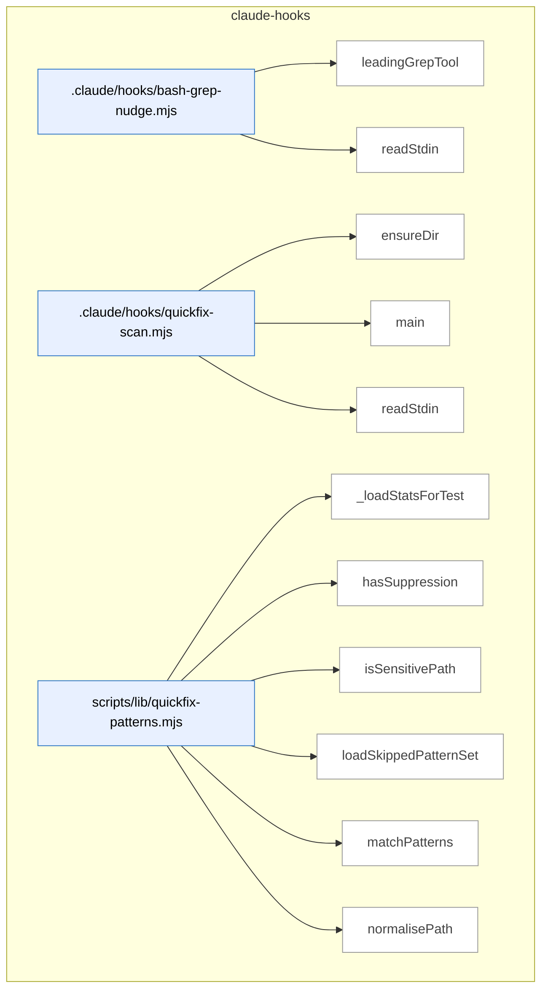

### Symbols in this domain

| Symbol | Kind | Path | Lines | Purpose | File imported by |
|---|---|---|---|---|---|
| [`leadingGrepTool`](../.claude/hooks/bash-grep-nudge.mjs#L24) | function | `.claude/hooks/bash-grep-nudge.mjs` | 24-28 | Extracts the leading grep-like command name (grep, rg, egrep, fgrep) from a shell command string. | _(internal)_ |
| [`readStdin`](../.claude/hooks/bash-grep-nudge.mjs#L18) | function | `.claude/hooks/bash-grep-nudge.mjs` | 18-22 | Reads all stdin data into a buffer and returns it as a UTF-8 string. | _(internal)_ |
| [`ensureDir`](../.claude/hooks/quickfix-scan.mjs#L38) | function | `.claude/hooks/quickfix-scan.mjs` | 38-41 | Creates a directory recursively, ignoring errors if it already exists. | _(internal)_ |
| [`main`](../.claude/hooks/quickfix-scan.mjs#L43) | function | `.claude/hooks/quickfix-scan.mjs` | 43-158 | Main hook entry point that reads stdin JSON payload, extracts file edits/writes, validates paths, and initiates security scanning. | _(internal)_ |
| [`readStdin`](../.claude/hooks/quickfix-scan.mjs#L32) | function | `.claude/hooks/quickfix-scan.mjs` | 32-36 | Reads all stdin chunks and concatenates them into a UTF-8 string. | _(internal)_ |
| [`_loadStatsForTest`](../scripts/lib/quickfix-patterns.mjs#L352) | function | `scripts/lib/quickfix-patterns.mjs` | 352-357 | Loads cached stats JSON for test introspection without production side effects. | `scripts/lib/audit/finding-verification.mjs`, `scripts/lib/repo-inventory.mjs` |
| [`hasSuppression`](../scripts/lib/quickfix-patterns.mjs#L189) | function | `scripts/lib/quickfix-patterns.mjs` | 189-193 | Checks if a source line matches suppression syntax for the file type. | `scripts/lib/audit/finding-verification.mjs`, `scripts/lib/repo-inventory.mjs` |
| [`isSensitivePath`](../scripts/lib/quickfix-patterns.mjs#L176) | function | `scripts/lib/quickfix-patterns.mjs` | 176-179 | Tests a file path against patterns for sensitive files that should not be scanned. | `scripts/lib/audit/finding-verification.mjs`, `scripts/lib/repo-inventory.mjs` |
| [`loadSkippedPatternSet`](../scripts/lib/quickfix-patterns.mjs#L323) | function | `scripts/lib/quickfix-patterns.mjs` | 323-345 | Loads pattern names with low acceptance rates from stats cache for skipping during pattern matching. | `scripts/lib/audit/finding-verification.mjs`, `scripts/lib/repo-inventory.mjs` |
| [`matchPatterns`](../scripts/lib/quickfix-patterns.mjs#L207) | function | `scripts/lib/quickfix-patterns.mjs` | 207-288 | Scans diff text for pattern matches, enforcing sensitive-path exclusion and applying learned skip rules. | `scripts/lib/audit/finding-verification.mjs`, `scripts/lib/repo-inventory.mjs` |
| [`normalisePath`](../scripts/lib/quickfix-patterns.mjs#L161) | function | `scripts/lib/quickfix-patterns.mjs` | 161-167 | Normalises file paths to lowercase forward slashes without drive letters or relative prefixes. | `scripts/lib/audit/finding-verification.mjs`, `scripts/lib/repo-inventory.mjs` |

---

## claudemd-management

> The `claudemd-management` domain scans repositories for instruction files (CLAUDE.md, SKILL.md, etc.), detects duplicate content across documents using token-based similarity analysis, and automatically removes stale markdown links while preserving embedded references.

```mermaid
flowchart TB
subgraph dom_claudemd_management ["claudemd-management"]
  file_scripts_lib_claudemd_autofix_mjs["scripts/lib/claudemd/autofix.mjs"]:::component
  sym_scripts_lib_claudemd_autofix_mjs_applyFi["applyFixes"]:::symbol
  file_scripts_lib_claudemd_autofix_mjs --> sym_scripts_lib_claudemd_autofix_mjs_applyFi
  file_scripts_lib_claudemd_doc_similarity_mjs["scripts/lib/claudemd/doc-similarity.mjs"]:::component
  sym_scripts_lib_claudemd_doc_similarity_mjs_["extractParagraphs"]:::symbol
  file_scripts_lib_claudemd_doc_similarity_mjs --> sym_scripts_lib_claudemd_doc_similarity_mjs_
  sym_scripts_lib_claudemd_doc_similarity_mjs_["findSimilarParagraphs"]:::symbol
  file_scripts_lib_claudemd_doc_similarity_mjs --> sym_scripts_lib_claudemd_doc_similarity_mjs_
  sym_scripts_lib_claudemd_doc_similarity_mjs_["jaccardSimilarity"]:::symbol
  file_scripts_lib_claudemd_doc_similarity_mjs --> sym_scripts_lib_claudemd_doc_similarity_mjs_
  sym_scripts_lib_claudemd_doc_similarity_mjs_["normalizeMarkdown"]:::symbol
  file_scripts_lib_claudemd_doc_similarity_mjs --> sym_scripts_lib_claudemd_doc_similarity_mjs_
  sym_scripts_lib_claudemd_doc_similarity_mjs_["tokenize"]:::symbol
  file_scripts_lib_claudemd_doc_similarity_mjs --> sym_scripts_lib_claudemd_doc_similarity_mjs_
  file_scripts_lib_claudemd_file_scanner_mjs["scripts/lib/claudemd/file-scanner.mjs"]:::component
  sym_scripts_lib_claudemd_file_scanner_mjs_ma["matchPattern"]:::symbol
  file_scripts_lib_claudemd_file_scanner_mjs --> sym_scripts_lib_claudemd_file_scanner_mjs_ma
  sym_scripts_lib_claudemd_file_scanner_mjs_sc["scanInstructionFiles"]:::symbol
  file_scripts_lib_claudemd_file_scanner_mjs --> sym_scripts_lib_claudemd_file_scanner_mjs_sc
  sym_scripts_lib_claudemd_file_scanner_mjs_wa["walkDir"]:::symbol
  file_scripts_lib_claudemd_file_scanner_mjs --> sym_scripts_lib_claudemd_file_scanner_mjs_wa
  file_scripts_lib_claudemd_ref_checker_mjs["scripts/lib/claudemd/ref-checker.mjs"]:::component
  sym_scripts_lib_claudemd_ref_checker_mjs_bui["buildEnvVarIndex"]:::symbol
  file_scripts_lib_claudemd_ref_checker_mjs --> sym_scripts_lib_claudemd_ref_checker_mjs_bui
  sym_scripts_lib_claudemd_ref_checker_mjs_bui["buildFunctionIndex"]:::symbol
  file_scripts_lib_claudemd_ref_checker_mjs --> sym_scripts_lib_claudemd_ref_checker_mjs_bui
  sym_scripts_lib_claudemd_ref_checker_mjs_ext["extractEnvVarRefs"]:::symbol
  file_scripts_lib_claudemd_ref_checker_mjs --> sym_scripts_lib_claudemd_ref_checker_mjs_ext
  sym_scripts_lib_claudemd_ref_checker_mjs_ext["extractFileRefs"]:::symbol
  file_scripts_lib_claudemd_ref_checker_mjs --> sym_scripts_lib_claudemd_ref_checker_mjs_ext
  sym_scripts_lib_claudemd_ref_checker_mjs_ext["extractFunctionRefs"]:::symbol
  file_scripts_lib_claudemd_ref_checker_mjs --> sym_scripts_lib_claudemd_ref_checker_mjs_ext
  sym_scripts_lib_claudemd_ref_checker_mjs_res["resolveReferencedPath"]:::symbol
  file_scripts_lib_claudemd_ref_checker_mjs --> sym_scripts_lib_claudemd_ref_checker_mjs_res
  file_scripts_lib_claudemd_rules_mjs["scripts/lib/claudemd/rules.mjs"]:::component
  sym_scripts_lib_claudemd_rules_mjs_checkClau["checkClaudeAgentsSync"]:::symbol
  file_scripts_lib_claudemd_rules_mjs --> sym_scripts_lib_claudemd_rules_mjs_checkClau
  sym_scripts_lib_claudemd_rules_mjs_checkCros["checkCrossFileDuplication"]:::symbol
  file_scripts_lib_claudemd_rules_mjs --> sym_scripts_lib_claudemd_rules_mjs_checkCros
  sym_scripts_lib_claudemd_rules_mjs_checkDeep["checkDeepCodeDetail"]:::symbol
  file_scripts_lib_claudemd_rules_mjs --> sym_scripts_lib_claudemd_rules_mjs_checkDeep
  sym_scripts_lib_claudemd_rules_mjs_checkSize["checkSize"]:::symbol
  file_scripts_lib_claudemd_rules_mjs --> sym_scripts_lib_claudemd_rules_mjs_checkSize
  sym_scripts_lib_claudemd_rules_mjs_checkStal["checkStaleEnvVarRefs"]:::symbol
  file_scripts_lib_claudemd_rules_mjs --> sym_scripts_lib_claudemd_rules_mjs_checkStal
  sym_scripts_lib_claudemd_rules_mjs_checkStal["checkStaleFileRefs"]:::symbol
  file_scripts_lib_claudemd_rules_mjs --> sym_scripts_lib_claudemd_rules_mjs_checkStal
  sym_scripts_lib_claudemd_rules_mjs_checkStal["checkStaleFunctionRefs"]:::symbol
  file_scripts_lib_claudemd_rules_mjs --> sym_scripts_lib_claudemd_rules_mjs_checkStal
  sym_scripts_lib_claudemd_rules_mjs_extractHe["extractHeadings"]:::symbol
  file_scripts_lib_claudemd_rules_mjs --> sym_scripts_lib_claudemd_rules_mjs_extractHe
  sym_scripts_lib_claudemd_rules_mjs_runRules["runRules"]:::symbol
  file_scripts_lib_claudemd_rules_mjs --> sym_scripts_lib_claudemd_rules_mjs_runRules
  sym_scripts_lib_claudemd_rules_mjs_semanticI["semanticId"]:::symbol
  file_scripts_lib_claudemd_rules_mjs --> sym_scripts_lib_claudemd_rules_mjs_semanticI
  file_scripts_lib_claudemd_sarif_formatter_mjs["scripts/lib/claudemd/sarif-formatter.mjs"]:::component
  sym_scripts_lib_claudemd_sarif_formatter_mjs["buildRuleDescriptors"]:::symbol
  file_scripts_lib_claudemd_sarif_formatter_mjs --> sym_scripts_lib_claudemd_sarif_formatter_mjs
  sym_scripts_lib_claudemd_sarif_formatter_mjs["ruleDescription"]:::symbol
  file_scripts_lib_claudemd_sarif_formatter_mjs --> sym_scripts_lib_claudemd_sarif_formatter_mjs
  sym_scripts_lib_claudemd_sarif_formatter_mjs["sarifLevel"]:::symbol
  file_scripts_lib_claudemd_sarif_formatter_mjs --> sym_scripts_lib_claudemd_sarif_formatter_mjs
  sym_scripts_lib_claudemd_sarif_formatter_mjs["toSarif"]:::symbol
  file_scripts_lib_claudemd_sarif_formatter_mjs --> sym_scripts_lib_claudemd_sarif_formatter_mjs
  file_scripts_lib_claudemd_step65_hook_mjs["scripts/lib/claudemd/step65-hook.mjs"]:::component
  sym_scripts_lib_claudemd_step65_hook_mjs_run["runHygieneCheck"]:::symbol
  file_scripts_lib_claudemd_step65_hook_mjs --> sym_scripts_lib_claudemd_step65_hook_mjs_run
end
classDef container fill:#f5f5f5,stroke:#333,stroke-width:2px,color:#000
classDef component fill:#e8f0ff,stroke:#3178c6,color:#000
classDef symbol fill:#fff,stroke:#999,color:#444
classDef dup fill:#ffe8d8,stroke:#c0392b,stroke-width:2px,color:#000
classDef violation fill:#ffd6d6,stroke:#c0392b,stroke-width:2px,color:#000
```

### Symbols in this domain

| Symbol | Kind | Path | Lines | Purpose | File imported by |
|---|---|---|---|---|---|
| [`applyFixes`](../scripts/lib/claudemd/autofix.mjs#L16) | function | `scripts/lib/claudemd/autofix.mjs` | 16-76 | Applies automatic fixes to audit findings—removes stale standalone markdown links from files in place or as dry-run, skipping embedded references. | `scripts/claudemd-lint.mjs` |
| [`extractParagraphs`](../scripts/lib/claudemd/doc-similarity.mjs#L68) | function | `scripts/lib/claudemd/doc-similarity.mjs` | 68-103 | Extracts paragraphs from markdown content, skipping code blocks and preserving line numbers for each paragraph. | `scripts/lib/claudemd/rules.mjs` |
| [`findSimilarParagraphs`](../scripts/lib/claudemd/doc-similarity.mjs#L114) | function | `scripts/lib/claudemd/doc-similarity.mjs` | 114-146 | Finds similar paragraph pairs across two documents using Jaccard token similarity above a threshold. | `scripts/lib/claudemd/rules.mjs` |
| [`jaccardSimilarity`](../scripts/lib/claudemd/doc-similarity.mjs#L53) | function | `scripts/lib/claudemd/doc-similarity.mjs` | 53-61 | Computes Jaccard similarity between two token sets (intersection over union). | `scripts/lib/claudemd/rules.mjs` |
| [`normalizeMarkdown`](../scripts/lib/claudemd/doc-similarity.mjs#L24) | function | `scripts/lib/claudemd/doc-similarity.mjs` | 24-34 | Normalizes markdown by stripping links, code, formatting markers, and headings, then lowercasing for similarity comparison. | `scripts/lib/claudemd/rules.mjs` |
| [`tokenize`](../scripts/lib/claudemd/doc-similarity.mjs#L41) | function | `scripts/lib/claudemd/doc-similarity.mjs` | 41-45 | Tokenizes normalized text into a set of words (2+ chars, excluding stopwords) for document similarity analysis. | `scripts/lib/claudemd/rules.mjs` |
| [`matchPattern`](../scripts/lib/claudemd/file-scanner.mjs#L72) | function | `scripts/lib/claudemd/file-scanner.mjs` | 72-93 | Matches a file path against a glob-style pattern supporting `**/` anywhere matching and `*` single-segment wildcards. | `scripts/check-context-drift.mjs`, `scripts/claudemd-lint.mjs`, `scripts/lib/claudemd/ref-checker.mjs` |
| [`scanInstructionFiles`](../scripts/lib/claudemd/file-scanner.mjs#L102) | function | `scripts/lib/claudemd/file-scanner.mjs` | 102-133 | Scans a repo for instruction files (CLAUDE.md, AGENTS.md, SKILL.md) with customizable exclusions, returning file content and metadata. | `scripts/check-context-drift.mjs`, `scripts/claudemd-lint.mjs`, `scripts/lib/claudemd/ref-checker.mjs` |
| [`walkDir`](../scripts/lib/claudemd/file-scanner.mjs#L30) | function | `scripts/lib/claudemd/file-scanner.mjs` | 30-68 | Recursively walks a directory to find files matching instruction file patterns (e.g., CLAUDE.md, SKILL.md), excluding specified directories. | `scripts/check-context-drift.mjs`, `scripts/claudemd-lint.mjs`, `scripts/lib/claudemd/ref-checker.mjs` |
| [`buildEnvVarIndex`](../scripts/lib/claudemd/ref-checker.mjs#L194) | function | `scripts/lib/claudemd/ref-checker.mjs` | 194-235 | Builds an index of environment variables from .env.example and process.env/os.environ references in source code. | `scripts/lib/claudemd/rules.mjs` |
| [`buildFunctionIndex`](../scripts/lib/claudemd/ref-checker.mjs#L91) | function | `scripts/lib/claudemd/ref-checker.mjs` | 91-124 | Indexes exported functions and classes from all source code files (JS/TS/Python) across the repo. | `scripts/lib/claudemd/rules.mjs` |
| [`extractEnvVarRefs`](../scripts/lib/claudemd/ref-checker.mjs#L165) | function | `scripts/lib/claudemd/ref-checker.mjs` | 165-187 | Extracts environment variable references (ALL_CAPS_WITH_UNDERSCORES pattern) from backtick-quoted text in markdown. | `scripts/lib/claudemd/rules.mjs` |
| [`extractFileRefs`](../scripts/lib/claudemd/ref-checker.mjs#L52) | function | `scripts/lib/claudemd/ref-checker.mjs` | 52-84 | Extracts file references from markdown (link hrefs and backtick paths) while skipping code blocks. | `scripts/lib/claudemd/rules.mjs` |
| [`extractFunctionRefs`](../scripts/lib/claudemd/ref-checker.mjs#L132) | function | `scripts/lib/claudemd/ref-checker.mjs` | 132-158 | Extracts function and class name references from backtick-quoted identifiers in markdown while skipping code blocks. | `scripts/lib/claudemd/rules.mjs` |
| [`resolveReferencedPath`](../scripts/lib/claudemd/ref-checker.mjs#L25) | function | `scripts/lib/claudemd/ref-checker.mjs` | 25-44 | Resolves a markdown link target to an absolute repo path, skipping external URLs and rejecting paths escaping the repo root. | `scripts/lib/claudemd/rules.mjs` |
| [`checkClaudeAgentsSync`](../scripts/lib/claudemd/rules.mjs#L234) | function | `scripts/lib/claudemd/rules.mjs` | 234-271 | Finds conflicting headings between CLAUDE.md and AGENTS.md files. | `scripts/claudemd-lint.mjs` |
| [`checkCrossFileDuplication`](../scripts/lib/claudemd/rules.mjs#L203) | function | `scripts/lib/claudemd/rules.mjs` | 203-232 | Detects duplicate paragraphs across files in the same directory tree. | `scripts/claudemd-lint.mjs` |
| [`checkDeepCodeDetail`](../scripts/lib/claudemd/rules.mjs#L186) | function | `scripts/lib/claudemd/rules.mjs` | 186-201 | Flags files with too many fenced code blocks in instruction documents. | `scripts/claudemd-lint.mjs` |
| [`checkSize`](../scripts/lib/claudemd/rules.mjs#L108) | function | `scripts/lib/claudemd/rules.mjs` | 108-122 | Checks if a documentation file exceeds a configured byte limit and reports a non-fixable finding if so. | `scripts/claudemd-lint.mjs` |
| [`checkStaleEnvVarRefs`](../scripts/lib/claudemd/rules.mjs#L168) | function | `scripts/lib/claudemd/rules.mjs` | 168-184 | Checks markdown environment variable references against an index and reports undefined variables. | `scripts/claudemd-lint.mjs` |
| [`checkStaleFileRefs`](../scripts/lib/claudemd/rules.mjs#L124) | function | `scripts/lib/claudemd/rules.mjs` | 124-142 | Checks markdown file references for existence and reports stale/missing file findings with fixable flag. | `scripts/claudemd-lint.mjs` |
| [`checkStaleFunctionRefs`](../scripts/lib/claudemd/rules.mjs#L144) | function | `scripts/lib/claudemd/rules.mjs` | 144-166 | Checks markdown function/class name references against an index and reports undefined references. | `scripts/claudemd-lint.mjs` |
| [`extractHeadings`](../scripts/lib/claudemd/rules.mjs#L278) | function | `scripts/lib/claudemd/rules.mjs` | 278-302 | Extracts markdown headings and their content into a Map. | `scripts/claudemd-lint.mjs` |
| [`runRules`](../scripts/lib/claudemd/rules.mjs#L44) | function | `scripts/lib/claudemd/rules.mjs` | 44-106 | Runs a suite of claudemd hygiene rules against documentation files, building indexes once and checking size, stale refs, and deep code detail. | `scripts/claudemd-lint.mjs` |
| [`semanticId`](../scripts/lib/claudemd/rules.mjs#L17) | function | `scripts/lib/claudemd/rules.mjs` | 17-22 | Generates a deterministic semantic ID for a finding by hashing rule, file path, and normalized content. | `scripts/claudemd-lint.mjs` |
| [`buildRuleDescriptors`](../scripts/lib/claudemd/sarif-formatter.mjs#L49) | function | `scripts/lib/claudemd/sarif-formatter.mjs` | 49-62 | Deduplicates and formats rule descriptors for SARIF output. | `scripts/check-context-drift.mjs`, `scripts/check-model-freshness.mjs`, `scripts/claudemd-lint.mjs` |
| [`ruleDescription`](../scripts/lib/claudemd/sarif-formatter.mjs#L64) | function | `scripts/lib/claudemd/sarif-formatter.mjs` | 64-77 | Returns human-readable descriptions for each linting rule ID. | `scripts/check-context-drift.mjs`, `scripts/check-model-freshness.mjs`, `scripts/claudemd-lint.mjs` |
| [`sarifLevel`](../scripts/lib/claudemd/sarif-formatter.mjs#L40) | function | `scripts/lib/claudemd/sarif-formatter.mjs` | 40-47 | Maps severity levels to SARIF-compatible level strings. | `scripts/check-context-drift.mjs`, `scripts/check-model-freshness.mjs`, `scripts/claudemd-lint.mjs` |
| [`toSarif`](../scripts/lib/claudemd/sarif-formatter.mjs#L11) | function | `scripts/lib/claudemd/sarif-formatter.mjs` | 11-38 | Converts linting findings into SARIF format for tool integration. | `scripts/check-context-drift.mjs`, `scripts/check-model-freshness.mjs`, `scripts/claudemd-lint.mjs` |
| [`runHygieneCheck`](../scripts/lib/claudemd/step65-hook.mjs#L16) | function | `scripts/lib/claudemd/step65-hook.mjs` | 16-65 | Executes the linter subprocess and parses results into a summary report. | _(internal)_ |

---

## cross-skill-bridge

> The `cross-skill-bridge` domain provides CLI tooling to manage learning plans and regression specs, extracting payloads from arguments, querying Git metadata, and persisting skill-development records with persona-consistency tracking and data redaction.

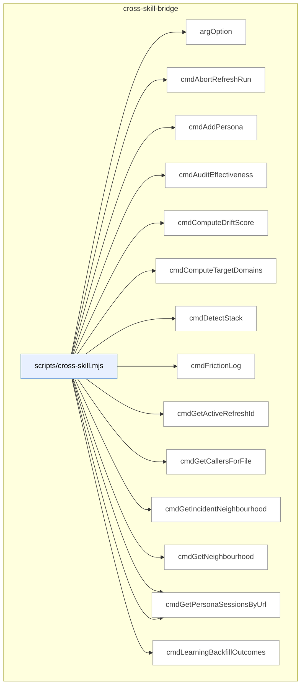

_Domain has 54 symbols (>50). Diagram shows top-15 by file order; see flat table below for the full list._

### Symbols in this domain

| Symbol | Kind | Path | Lines | Purpose | File imported by |
|---|---|---|---|---|---|
| [`argOption`](../scripts/cross-skill.mjs#L109) | function | `scripts/cross-skill.mjs` | 109-113 | Retrieves a named CLI flag's value from the arguments list. | _(internal)_ |
| [`cmdAbortRefreshRun`](../scripts/cross-skill.mjs#L842) | function | `scripts/cross-skill.mjs` | 842-852 | Aborts an in-progress refresh run with optional cancellation reason. | _(internal)_ |
| [`cmdAddPersona`](../scripts/cross-skill.mjs#L487) | function | `scripts/cross-skill.mjs` | 487-499 | Creates or updates a persona record with name, description, and app URL. | _(internal)_ |
| [`cmdAuditEffectiveness`](../scripts/cross-skill.mjs#L450) | function | `scripts/cross-skill.mjs` | 450-457 | Reads audit effectiveness metrics for a specific repository. | _(internal)_ |
| [`cmdComputeDriftScore`](../scripts/cross-skill.mjs#L946) | function | `scripts/cross-skill.mjs` | 946-957 | Computes a drift score comparing current and previous symbol states for a repository. | _(internal)_ |
| [`cmdComputeTargetDomains`](../scripts/cross-skill.mjs#L701) | function | `scripts/cross-skill.mjs` | 701-713 | Computes which code domains are targeted by a set of file paths using domain tagging rules. | _(internal)_ |
| [`cmdDetectStack`](../scripts/cross-skill.mjs#L618) | function | `scripts/cross-skill.mjs` | 618-635 | Detects the tech stack and Python framework in a repository directory. | _(internal)_ |
| [`cmdFrictionLog`](../scripts/cross-skill.mjs#L1071) | function | `scripts/cross-skill.mjs` | 1071-1076 | Invokes the friction logging system to capture real-time user frustration. | _(internal)_ |
| [`cmdGetActiveRefreshId`](../scripts/cross-skill.mjs#L651) | function | `scripts/cross-skill.mjs` | 651-667 | Retrieves the active refresh ID and embedding model metadata for a repository UUID. | _(internal)_ |
| [`cmdGetCallersForFile`](../scripts/cross-skill.mjs#L715) | function | `scripts/cross-skill.mjs` | 715-778 | Retrieves callers of a file from the symbol index snapshot with domain tagging. | _(internal)_ |
| [`cmdGetIncidentNeighbourhood`](../scripts/cross-skill.mjs#L669) | function | `scripts/cross-skill.mjs` | 669-699 | Queries a security incident neighbourhood using semantic embeddings and RPC calls. | _(internal)_ |
| [`cmdGetNeighbourhood`](../scripts/cross-skill.mjs#L780) | function | `scripts/cross-skill.mjs` | 780-808 | Queries an architectural neighbourhood around intent targets using semantic embeddings. | _(internal)_ |
| [`cmdGetPersonaSessionsByRepo`](../scripts/cross-skill.mjs#L554) | function | `scripts/cross-skill.mjs` | 554-582 | Retrieves persona sessions for a repository with optional filtering by limit, P0-only, and column selection. | _(internal)_ |
| [`cmdGetPersonaSessionsByUrl`](../scripts/cross-skill.mjs#L590) | function | `scripts/cross-skill.mjs` | 590-616 | Retrieves persona sessions for an app URL with optional filtering by limit and column selection. | _(internal)_ |
| [`cmdLearningBackfillOutcomes`](../scripts/cross-skill.mjs#L1055) | function | `scripts/cross-skill.mjs` | 1055-1065 | Runs a backfill process to resolve missing outcomes for past decisions. | _(internal)_ |
| [`cmdLearningQuickfixStats`](../scripts/cross-skill.mjs#L1098) | function | `scripts/cross-skill.mjs` | 1098-1124 | Reads or rebuilds the quickfix pattern cache with statistics and skip suggestions. | _(internal)_ |
| [`cmdLearningRecord`](../scripts/cross-skill.mjs#L974) | function | `scripts/cross-skill.mjs` | 974-1013 | Records a learning decision with context, choice, outcome, and optional audit binding to the learning store. | _(internal)_ |
| [`cmdLearningReplay`](../scripts/cross-skill.mjs#L1083) | function | `scripts/cross-skill.mjs` | 1083-1091 | Runs a replay workflow to re-execute historical learning decisions. | _(internal)_ |
| [`cmdLearningStats`](../scripts/cross-skill.mjs#L1020) | function | `scripts/cross-skill.mjs` | 1020-1031 | Fetches aggregated statistics about recorded learning decisions for a repository. | _(internal)_ |
| [`cmdLearningWeeklyReview`](../scripts/cross-skill.mjs#L1039) | function | `scripts/cross-skill.mjs` | 1039-1047 | Executes a weekly review workflow over recorded learning decisions. | _(internal)_ |
| [`cmdListConsistencyCandidates`](../scripts/cross-skill.mjs#L256) | function | `scripts/cross-skill.mjs` | 256-269 | Lists consistency-mode regression spec candidates for a repository since a timestamp. | _(internal)_ |
| [`cmdListLayeringViolationsForSnapshot`](../scripts/cross-skill.mjs#L933) | function | `scripts/cross-skill.mjs` | 933-944 | Retrieves all layering violations recorded for a specific refresh ID. | _(internal)_ |
| [`cmdListPersonas`](../scripts/cross-skill.mjs#L465) | function | `scripts/cross-skill.mjs` | 465-476 | Lists all personas configured for a given app URL. | _(internal)_ |
| [`cmdListPersonaTestCandidates`](../scripts/cross-skill.mjs#L309) | function | `scripts/cross-skill.mjs` | 309-321 | Lists persona-test candidates for a repo filtered by age, occurrence floor, and severity. | _(internal)_ |
| [`cmdListSymbolsForSnapshot`](../scripts/cross-skill.mjs#L920) | function | `scripts/cross-skill.mjs` | 920-931 | Retrieves all symbols recorded for a specific snapshot refresh. | _(internal)_ |
| [`cmdListUnlockedFixes`](../scripts/cross-skill.mjs#L442) | function | `scripts/cross-skill.mjs` | 442-448 | Lists unlocked fixes available for a repository. | _(internal)_ |
| [`cmdMarkPersonaTestCandidateProposed`](../scripts/cross-skill.mjs#L323) | function | `scripts/cross-skill.mjs` | 323-335 | Marks a persona-test candidate as proposed, updating its status. | _(internal)_ |
| [`cmdOpenRefreshRun`](../scripts/cross-skill.mjs#L810) | function | `scripts/cross-skill.mjs` | 810-828 | Opens a new refresh run for repository indexing in a specified mode. | _(internal)_ |
| [`cmdPlanSatisfaction`](../scripts/cross-skill.mjs#L407) | function | `scripts/cross-skill.mjs` | 407-417 | Retrieves satisfaction metrics and persistent failures for a plan. | _(internal)_ |
| [`cmdPromoteRegressionSpec`](../scripts/cross-skill.mjs#L271) | function | `scripts/cross-skill.mjs` | 271-284 | Promotes a regression spec candidate to locked status in a specified file path. | _(internal)_ |
| [`cmdPublishRefreshRun`](../scripts/cross-skill.mjs#L830) | function | `scripts/cross-skill.mjs` | 830-840 | Publishes a completed refresh run to make it the active snapshot. | _(internal)_ |
| [`cmdRecordCorrelation`](../scripts/cross-skill.mjs#L355) | function | `scripts/cross-skill.mjs` | 355-372 | Records a correlation between a persona finding and an audit finding for cross-system matching. | _(internal)_ |
| [`cmdRecordLayeringViolations`](../scripts/cross-skill.mjs#L894) | function | `scripts/cross-skill.mjs` | 894-906 | Accepts layering violations, stores them with a refresh ID, and returns the count of inserted rows. | _(internal)_ |
| [`cmdRecordPersonaSession`](../scripts/cross-skill.mjs#L523) | function | `scripts/cross-skill.mjs` | 523-536 | Records a persona audit session with findings, severity, and metadata. | _(internal)_ |
| [`cmdRecordPlanVerifyItems`](../scripts/cross-skill.mjs#L396) | function | `scripts/cross-skill.mjs` | 396-405 | Inserts individual verification items (criteria results) for a completed plan verification run. | _(internal)_ |
| [`cmdRecordPlanVerifyRun`](../scripts/cross-skill.mjs#L374) | function | `scripts/cross-skill.mjs` | 374-394 | Records a plan verification run with criteria counts and duration, returning the run ID. | _(internal)_ |
| [`cmdRecordRegressionSpec`](../scripts/cross-skill.mjs#L186) | function | `scripts/cross-skill.mjs` | 186-254 | Records a regression spec with pre-egress redaction of sensitive data for persona-consistency sources. | _(internal)_ |
| [`cmdRecordRegressionSpecRun`](../scripts/cross-skill.mjs#L337) | function | `scripts/cross-skill.mjs` | 337-353 | Records a regression spec test run with pass/fail outcome and optional error details. | _(internal)_ |
| [`cmdRecordShipEvent`](../scripts/cross-skill.mjs#L419) | function | `scripts/cross-skill.mjs` | 419-440 | Records a ship event with outcome, block reasons, and quality metrics. | _(internal)_ |
| [`cmdRecordSymbolDefinitions`](../scripts/cross-skill.mjs#L854) | function | `scripts/cross-skill.mjs` | 854-864 | Accepts symbol definitions, stores them in the learning database, and returns a definition map. | _(internal)_ |
| [`cmdRecordSymbolEmbedding`](../scripts/cross-skill.mjs#L880) | function | `scripts/cross-skill.mjs` | 880-892 | Accepts a symbol embedding vector, stores it linked to a definition with model metadata. | _(internal)_ |
| [`cmdRecordSymbolIndex`](../scripts/cross-skill.mjs#L866) | function | `scripts/cross-skill.mjs` | 866-878 | Accepts symbol index rows, stores them with a refresh ID, and returns the count of inserted rows. | _(internal)_ |
| [`cmdResolveRepoIdentity`](../scripts/cross-skill.mjs#L959) | function | `scripts/cross-skill.mjs` | 959-965 | Generates or loads a repository UUID, optionally persisting it to disk. | _(internal)_ |
| [`cmdSetActiveEmbeddingModel`](../scripts/cross-skill.mjs#L908) | function | `scripts/cross-skill.mjs` | 908-918 | Stores the active embedding model configuration for a repository. | _(internal)_ |
| [`cmdUpdatePlanStatus`](../scripts/cross-skill.mjs#L177) | function | `scripts/cross-skill.mjs` | 177-184 | Updates the status of an existing learning plan. | _(internal)_ |
| [`cmdUpsertPersonaTestCandidate`](../scripts/cross-skill.mjs#L288) | function | `scripts/cross-skill.mjs` | 288-307 | Inserts or updates a persona-test candidate record with severity level and occurrence tracking. | _(internal)_ |
| [`cmdUpsertPlan`](../scripts/cross-skill.mjs#L159) | function | `scripts/cross-skill.mjs` | 159-175 | Creates or updates a learning plan record with skill, path, and metadata, returning the plan ID. | _(internal)_ |
| [`cmdWhoami`](../scripts/cross-skill.mjs#L637) | function | `scripts/cross-skill.mjs` | 637-647 | Emits system identity information including current commit, branch, and cloud configuration status. | _(internal)_ |
| [`currentBranch`](../scripts/cross-skill.mjs#L134) | function | `scripts/cross-skill.mjs` | 134-139 | Returns the current Git branch name. | _(internal)_ |
| [`currentCommitSha`](../scripts/cross-skill.mjs#L127) | function | `scripts/cross-skill.mjs` | 127-132 | Returns the current Git commit SHA. | _(internal)_ |
| [`emitError`](../scripts/cross-skill.mjs#L120) | function | `scripts/cross-skill.mjs` | 120-123 | Emits an error response and exits the process with a specified code. | _(internal)_ |
| [`main`](../scripts/cross-skill.mjs#L1184) | function | `scripts/cross-skill.mjs` | 1184-1207 | Routes subcommands to handlers and manages top-level error handling and help text. | _(internal)_ |
| [`parsePayload`](../scripts/cross-skill.mjs#L92) | function | `scripts/cross-skill.mjs` | 92-107 | Extracts a JSON payload from CLI arguments via --json flag, --stdin, or bare JSON suffix. | _(internal)_ |
| [`resolveRepoId`](../scripts/cross-skill.mjs#L149) | function | `scripts/cross-skill.mjs` | 149-155 | Returns an explicit repoId from payload or null if not provided. | _(internal)_ |

---

## dashboard

> The `dashboard` domain builds static HTML documentation pages (reference and telemetry) from CLI metadata and Git provenance, with validation of data source health and support for both development serving and production builds.

```mermaid
flowchart TB
subgraph dom_dashboard ["dashboard"]
  file_scripts_build_dashboard_mjs["scripts/build-dashboard.mjs"]:::component
  sym_scripts_build_dashboard_mjs_buildReferen["buildReference"]:::symbol
  file_scripts_build_dashboard_mjs --> sym_scripts_build_dashboard_mjs_buildReferen
  sym_scripts_build_dashboard_mjs_buildTelemet["buildTelemetry"]:::symbol
  file_scripts_build_dashboard_mjs --> sym_scripts_build_dashboard_mjs_buildTelemet
  sym_scripts_build_dashboard_mjs_gitProvenanc["gitProvenance"]:::symbol
  file_scripts_build_dashboard_mjs --> sym_scripts_build_dashboard_mjs_gitProvenanc
  sym_scripts_build_dashboard_mjs_isDegraded["isDegraded"]:::symbol
  file_scripts_build_dashboard_mjs --> sym_scripts_build_dashboard_mjs_isDegraded
  sym_scripts_build_dashboard_mjs_main["main"]:::symbol
  file_scripts_build_dashboard_mjs --> sym_scripts_build_dashboard_mjs_main
  sym_scripts_build_dashboard_mjs_parseArgs["parseArgs"]:::symbol
  file_scripts_build_dashboard_mjs --> sym_scripts_build_dashboard_mjs_parseArgs
  sym_scripts_build_dashboard_mjs_reportDegrad["reportDegraded"]:::symbol
  file_scripts_build_dashboard_mjs --> sym_scripts_build_dashboard_mjs_reportDegrad
  file_scripts_lib_dashboard_collect_cli_mjs["scripts/lib/dashboard/collect-cli.mjs"]:::component
  sym_scripts_lib_dashboard_collect_cli_mjs_au["auditCatalogCoverage"]:::symbol
  file_scripts_lib_dashboard_collect_cli_mjs --> sym_scripts_lib_dashboard_collect_cli_mjs_au
  sym_scripts_lib_dashboard_collect_cli_mjs_co["collectCli"]:::symbol
  file_scripts_lib_dashboard_collect_cli_mjs --> sym_scripts_lib_dashboard_collect_cli_mjs_co
  sym_scripts_lib_dashboard_collect_cli_mjs_gr["groupByCategory"]:::symbol
  file_scripts_lib_dashboard_collect_cli_mjs --> sym_scripts_lib_dashboard_collect_cli_mjs_gr
  file_scripts_lib_dashboard_collect_reference_["scripts/lib/dashboard/collect-reference.mjs"]:::component
  sym_scripts_lib_dashboard_collect_reference_["collectArchitecture"]:::symbol
  file_scripts_lib_dashboard_collect_reference_ --> sym_scripts_lib_dashboard_collect_reference_
  sym_scripts_lib_dashboard_collect_reference_["collectFlows"]:::symbol
  file_scripts_lib_dashboard_collect_reference_ --> sym_scripts_lib_dashboard_collect_reference_
  sym_scripts_lib_dashboard_collect_reference_["collectReference"]:::symbol
  file_scripts_lib_dashboard_collect_reference_ --> sym_scripts_lib_dashboard_collect_reference_
  sym_scripts_lib_dashboard_collect_reference_["discoverPlans"]:::symbol
  file_scripts_lib_dashboard_collect_reference_ --> sym_scripts_lib_dashboard_collect_reference_
  sym_scripts_lib_dashboard_collect_reference_["readDomainDeps"]:::symbol
  file_scripts_lib_dashboard_collect_reference_ --> sym_scripts_lib_dashboard_collect_reference_
  sym_scripts_lib_dashboard_collect_reference_["readManualAllowedDeps"]:::symbol
  file_scripts_lib_dashboard_collect_reference_ --> sym_scripts_lib_dashboard_collect_reference_
  sym_scripts_lib_dashboard_collect_reference_["readObservedEnvelope"]:::symbol
  file_scripts_lib_dashboard_collect_reference_ --> sym_scripts_lib_dashboard_collect_reference_
  file_scripts_lib_dashboard_collect_telemetry_["scripts/lib/dashboard/collect-telemetry.mjs"]:::component
  sym_scripts_lib_dashboard_collect_telemetry_["aggregatePasses"]:::symbol
  file_scripts_lib_dashboard_collect_telemetry_ --> sym_scripts_lib_dashboard_collect_telemetry_
  sym_scripts_lib_dashboard_collect_telemetry_["collectAuditRuns"]:::symbol
  file_scripts_lib_dashboard_collect_telemetry_ --> sym_scripts_lib_dashboard_collect_telemetry_
  sym_scripts_lib_dashboard_collect_telemetry_["collectLearning"]:::symbol
  file_scripts_lib_dashboard_collect_telemetry_ --> sym_scripts_lib_dashboard_collect_telemetry_
  sym_scripts_lib_dashboard_collect_telemetry_["collectRequirements"]:::symbol
  file_scripts_lib_dashboard_collect_telemetry_ --> sym_scripts_lib_dashboard_collect_telemetry_
  sym_scripts_lib_dashboard_collect_telemetry_["collectTelemetry"]:::symbol
  file_scripts_lib_dashboard_collect_telemetry_ --> sym_scripts_lib_dashboard_collect_telemetry_
  sym_scripts_lib_dashboard_collect_telemetry_["repoName"]:::symbol
  file_scripts_lib_dashboard_collect_telemetry_ --> sym_scripts_lib_dashboard_collect_telemetry_
  file_scripts_lib_dashboard_load_assets_mjs["scripts/lib/dashboard/load-assets.mjs"]:::component
  sym_scripts_lib_dashboard_load_assets_mjs_lo["loadAssets"]:::symbol
  file_scripts_lib_dashboard_load_assets_mjs --> sym_scripts_lib_dashboard_load_assets_mjs_lo
  file_scripts_lib_dashboard_render_mjs["scripts/lib/dashboard/render.mjs"]:::component
  sym_scripts_lib_dashboard_render_mjs_archTie["archTiers"]:::symbol
  file_scripts_lib_dashboard_render_mjs --> sym_scripts_lib_dashboard_render_mjs_archTie
  sym_scripts_lib_dashboard_render_mjs_emptyPa["emptyPanel"]:::symbol
  file_scripts_lib_dashboard_render_mjs --> sym_scripts_lib_dashboard_render_mjs_emptyPa
  sym_scripts_lib_dashboard_render_mjs_escapeH["escapeHtml"]:::symbol
  file_scripts_lib_dashboard_render_mjs --> sym_scripts_lib_dashboard_render_mjs_escapeH
  sym_scripts_lib_dashboard_render_mjs_formatD["formatDepsSourceLine"]:::symbol
  file_scripts_lib_dashboard_render_mjs --> sym_scripts_lib_dashboard_render_mjs_formatD
  sym_scripts_lib_dashboard_render_mjs_freshne["freshnessBanner"]:::symbol
  file_scripts_lib_dashboard_render_mjs --> sym_scripts_lib_dashboard_render_mjs_freshne
  sym_scripts_lib_dashboard_render_mjs_jsonScr["jsonScriptSafe"]:::symbol
  file_scripts_lib_dashboard_render_mjs --> sym_scripts_lib_dashboard_render_mjs_jsonScr
  sym_scripts_lib_dashboard_render_mjs_nav["nav"]:::symbol
  file_scripts_lib_dashboard_render_mjs --> sym_scripts_lib_dashboard_render_mjs_nav
  sym_scripts_lib_dashboard_render_mjs_panel["panel"]:::symbol
  file_scripts_lib_dashboard_render_mjs --> sym_scripts_lib_dashboard_render_mjs_panel
  sym_scripts_lib_dashboard_render_mjs_planLis["planList"]:::symbol
  file_scripts_lib_dashboard_render_mjs --> sym_scripts_lib_dashboard_render_mjs_planLis
  sym_scripts_lib_dashboard_render_mjs_renderD["renderDocument"]:::symbol
  file_scripts_lib_dashboard_render_mjs --> sym_scripts_lib_dashboard_render_mjs_renderD
  sym_scripts_lib_dashboard_render_mjs_section["sectionArchitecture"]:::symbol
  file_scripts_lib_dashboard_render_mjs --> sym_scripts_lib_dashboard_render_mjs_section
  sym_scripts_lib_dashboard_render_mjs_section["sectionAuditRuns"]:::symbol
  file_scripts_lib_dashboard_render_mjs --> sym_scripts_lib_dashboard_render_mjs_section
  sym_scripts_lib_dashboard_render_mjs_section["sectionCli"]:::symbol
  file_scripts_lib_dashboard_render_mjs --> sym_scripts_lib_dashboard_render_mjs_section
  sym_scripts_lib_dashboard_render_mjs_section["sectionFlows"]:::symbol
  file_scripts_lib_dashboard_render_mjs --> sym_scripts_lib_dashboard_render_mjs_section
  sym_scripts_lib_dashboard_render_mjs_section["sectionLearning"]:::symbol
  file_scripts_lib_dashboard_render_mjs --> sym_scripts_lib_dashboard_render_mjs_section
  sym_scripts_lib_dashboard_render_mjs_section["sectionPlans"]:::symbol
  file_scripts_lib_dashboard_render_mjs --> sym_scripts_lib_dashboard_render_mjs_section
  sym_scripts_lib_dashboard_render_mjs_section["sectionRequirements"]:::symbol
  file_scripts_lib_dashboard_render_mjs --> sym_scripts_lib_dashboard_render_mjs_section
  sym_scripts_lib_dashboard_render_mjs_section["sectionSkills"]:::symbol
  file_scripts_lib_dashboard_render_mjs --> sym_scripts_lib_dashboard_render_mjs_section
  sym_scripts_lib_dashboard_render_mjs_splitUs["splitUsage"]:::symbol
  file_scripts_lib_dashboard_render_mjs --> sym_scripts_lib_dashboard_render_mjs_splitUs
  sym_scripts_lib_dashboard_render_mjs_statusD["statusDot"]:::symbol
  file_scripts_lib_dashboard_render_mjs --> sym_scripts_lib_dashboard_render_mjs_statusD
  sym_scripts_lib_dashboard_render_mjs_tab["tab"]:::symbol
  file_scripts_lib_dashboard_render_mjs --> sym_scripts_lib_dashboard_render_mjs_tab
  sym_scripts_lib_dashboard_render_mjs_warning["warningPanel"]:::symbol
  file_scripts_lib_dashboard_render_mjs --> sym_scripts_lib_dashboard_render_mjs_warning
  file_scripts_lib_dashboard_schema_mjs["scripts/lib/dashboard/schema.mjs"]:::component
  sym_scripts_lib_dashboard_schema_mjs_validat["validateDashboardData"]:::symbol
  file_scripts_lib_dashboard_schema_mjs --> sym_scripts_lib_dashboard_schema_mjs_validat
  file_scripts_lib_dashboard_serve_mjs["scripts/lib/dashboard/serve.mjs"]:::component
  sym_scripts_lib_dashboard_serve_mjs_openBrow["openBrowser"]:::symbol
  file_scripts_lib_dashboard_serve_mjs --> sym_scripts_lib_dashboard_serve_mjs_openBrow
  sym_scripts_lib_dashboard_serve_mjs_serve["serve"]:::symbol
  file_scripts_lib_dashboard_serve_mjs --> sym_scripts_lib_dashboard_serve_mjs_serve
end
classDef container fill:#f5f5f5,stroke:#333,stroke-width:2px,color:#000
classDef component fill:#e8f0ff,stroke:#3178c6,color:#000
classDef symbol fill:#fff,stroke:#999,color:#444
classDef dup fill:#ffe8d8,stroke:#c0392b,stroke-width:2px,color:#000
classDef violation fill:#ffd6d6,stroke:#c0392b,stroke-width:2px,color:#000
```

### Symbols in this domain

| Symbol | Kind | Path | Lines | Purpose | File imported by |
|---|---|---|---|---|---|
| [`buildReference`](../scripts/build-dashboard.mjs#L102) | function | `scripts/build-dashboard.mjs` | 102-108 | Builds the reference documentation page and returns build metadata. | _(internal)_ |
| [`buildTelemetry`](../scripts/build-dashboard.mjs#L110) | function | `scripts/build-dashboard.mjs` | 110-116 | Builds the telemetry dashboard page and returns build metadata. | _(internal)_ |
| [`gitProvenance`](../scripts/build-dashboard.mjs#L84) | function | `scripts/build-dashboard.mjs` | 84-94 | Retrieves the current Git commit SHA and whether the working directory has uncommitted changes. | _(internal)_ |
| [`isDegraded`](../scripts/build-dashboard.mjs#L96) | function | `scripts/build-dashboard.mjs` | 96-100 | Checks if any data source has an invalid or error status. | _(internal)_ |
| [`main`](../scripts/build-dashboard.mjs#L131) | function | `scripts/build-dashboard.mjs` | 131-188 | Orchestrates the entire build pipeline, handling subcommands (reference, telemetry, all, serve) and managing side builds. | _(internal)_ |
| [`parseArgs`](../scripts/build-dashboard.mjs#L50) | function | `scripts/build-dashboard.mjs` | 50-81 | Parses command-line arguments for build mode, optional port, and help flag with validation. | _(internal)_ |
| [`reportDegraded`](../scripts/build-dashboard.mjs#L118) | function | `scripts/build-dashboard.mjs` | 118-129 | Writes degradation warnings to stderr for sources with invalid or error states. | _(internal)_ |
| [`auditCatalogCoverage`](../scripts/lib/dashboard/collect-cli.mjs#L130) | function | `scripts/lib/dashboard/collect-cli.mjs` | 130-144 | Audits CLI catalog coverage by comparing package.json scripts against catalog entries. | `scripts/lib/dashboard/collect-reference.mjs` |
| [`collectCli`](../scripts/lib/dashboard/collect-cli.mjs#L46) | function | `scripts/lib/dashboard/collect-cli.mjs` | 46-107 | Collects npm scripts from package.json and optional CLI catalog metadata. | `scripts/lib/dashboard/collect-reference.mjs` |
| [`groupByCategory`](../scripts/lib/dashboard/collect-cli.mjs#L114) | function | `scripts/lib/dashboard/collect-cli.mjs` | 114-121 | Groups CLI entries by category. | `scripts/lib/dashboard/collect-reference.mjs` |
| [`collectArchitecture`](../scripts/lib/dashboard/collect-reference.mjs#L249) | function | `scripts/lib/dashboard/collect-reference.mjs` | 249-290 | Extracts domain definitions and summary descriptions from the architecture-map.md file. | `scripts/build-dashboard.mjs` |
| [`collectFlows`](../scripts/lib/dashboard/collect-reference.mjs#L303) | function | `scripts/lib/dashboard/collect-reference.mjs` | 303-330 | Loads flow manifest from flows.json with skill cross-validation. | `scripts/build-dashboard.mjs` |
| [`collectReference`](../scripts/lib/dashboard/collect-reference.mjs#L337) | function | `scripts/lib/dashboard/collect-reference.mjs` | 337-417 | Collects all reference data (skills, plans, dependencies, architecture, flows) and reports source health. | `scripts/build-dashboard.mjs` |
| [`discoverPlans`](../scripts/lib/dashboard/collect-reference.mjs#L44) | function | `scripts/lib/dashboard/collect-reference.mjs` | 44-119 | Discovers plan documents from active and completed directories, parsing metadata headers. | `scripts/build-dashboard.mjs` |
| [`readDomainDeps`](../scripts/lib/dashboard/collect-reference.mjs#L218) | function | `scripts/lib/dashboard/collect-reference.mjs` | 218-238 | Merges observed and manual domain dependencies, flattening them into a single dependency graph. | `scripts/build-dashboard.mjs` |
| [`readManualAllowedDeps`](../scripts/lib/dashboard/collect-reference.mjs#L173) | function | `scripts/lib/dashboard/collect-reference.mjs` | 173-198 | Reads manual allowed dependencies from the domain-map.json sidecar file. | `scripts/build-dashboard.mjs` |
| [`readObservedEnvelope`](../scripts/lib/dashboard/collect-reference.mjs#L130) | function | `scripts/lib/dashboard/collect-reference.mjs` | 130-159 | Reads and validates the observed dependencies envelope, checking rule digest staleness. | `scripts/build-dashboard.mjs` |
| [`aggregatePasses`](../scripts/lib/dashboard/collect-telemetry.mjs#L25) | function | `scripts/lib/dashboard/collect-telemetry.mjs` | 25-37 | Aggregates audit pass statistics by pass name, summing runs and finding counts. | `scripts/build-dashboard.mjs` |
| [`collectAuditRuns`](../scripts/lib/dashboard/collect-telemetry.mjs#L40) | function | `scripts/lib/dashboard/collect-telemetry.mjs` | 40-71 | Collects audit run telemetry from cloud or local sources. | `scripts/build-dashboard.mjs` |
| [`collectLearning`](../scripts/lib/dashboard/collect-telemetry.mjs#L128) | function | `scripts/lib/dashboard/collect-telemetry.mjs` | 128-145 | Fetches learning stats (triage, noBrainers, staleClusters) from the learning cloud service. | `scripts/build-dashboard.mjs` |
| [`collectRequirements`](../scripts/lib/dashboard/collect-telemetry.mjs#L74) | function | `scripts/lib/dashboard/collect-telemetry.mjs` | 74-115 | Reads and validates the requirements ledger, returning truncated requirement items. | `scripts/build-dashboard.mjs` |
| [`collectTelemetry`](../scripts/lib/dashboard/collect-telemetry.mjs#L152) | function | `scripts/lib/dashboard/collect-telemetry.mjs` | 152-177 | Orchestrates collection of all telemetry data (audit runs, requirements, learning). | `scripts/build-dashboard.mjs` |
| [`repoName`](../scripts/lib/dashboard/collect-telemetry.mjs#L118) | function | `scripts/lib/dashboard/collect-telemetry.mjs` | 118-125 | Determines the repository name from environment or package.json for learning stats lookup. | `scripts/build-dashboard.mjs` |
| [`loadAssets`](../scripts/lib/dashboard/load-assets.mjs#L18) | function | `scripts/lib/dashboard/load-assets.mjs` | 18-29 | Loads bundled CSS and JavaScript assets for the dashboard. | `scripts/build-dashboard.mjs` |
| [`archTiers`](../scripts/lib/dashboard/render.mjs#L263) | function | `scripts/lib/dashboard/render.mjs` | 263-280 | Computes architectural tier (0=foundation, 1=depended-on, 2=consumer) for each domain. | `scripts/build-dashboard.mjs` |
| [`emptyPanel`](../scripts/lib/dashboard/render.mjs#L65) | function | `scripts/lib/dashboard/render.mjs` | 65-68 | Renders an empty state panel with optional test ID. | `scripts/build-dashboard.mjs` |
| [`escapeHtml`](../scripts/lib/dashboard/render.mjs#L20) | function | `scripts/lib/dashboard/render.mjs` | 20-27 | Escapes HTML special characters in a string. | `scripts/build-dashboard.mjs` |
| [`formatDepsSourceLine`](../scripts/lib/dashboard/render.mjs#L337) | function | `scripts/lib/dashboard/render.mjs` | 337-361 | Formats a dependency source line with edge counts and observed/manual/confirmed status. | `scripts/build-dashboard.mjs` |
| [`freshnessBanner`](../scripts/lib/dashboard/render.mjs#L511) | function | `scripts/lib/dashboard/render.mjs` | 511-523 | Generates a freshness banner showing build provenance and source hash. | `scripts/build-dashboard.mjs` |
| [`jsonScriptSafe`](../scripts/lib/dashboard/render.mjs#L37) | function | `scripts/lib/dashboard/render.mjs` | 37-44 | Converts a JSON object to a string safe for use in HTML script tags. | `scripts/build-dashboard.mjs` |
| [`nav`](../scripts/lib/dashboard/render.mjs#L525) | function | `scripts/lib/dashboard/render.mjs` | 525-533 | Renders the dashboard navigation between reference and telemetry pages. | `scripts/build-dashboard.mjs` |
| [`panel`](../scripts/lib/dashboard/render.mjs#L76) | function | `scripts/lib/dashboard/render.mjs` | 76-79 | Renders a tab panel container with conditional hidden attribute. | `scripts/build-dashboard.mjs` |
| [`planList`](../scripts/lib/dashboard/render.mjs#L363) | function | `scripts/lib/dashboard/render.mjs` | 363-376 | Renders a list of plans as expandable detail elements with titles, dates, and metadata. | `scripts/build-dashboard.mjs` |
| [`renderDocument`](../scripts/lib/dashboard/render.mjs#L545) | function | `scripts/lib/dashboard/render.mjs` | 545-605 | Renders a complete HTML dashboard document with tabs and panels for all sections. | `scripts/build-dashboard.mjs` |
| [`sectionArchitecture`](../scripts/lib/dashboard/render.mjs#L282) | function | `scripts/lib/dashboard/render.mjs` | 282-335 | Renders the architecture section as stacked domain boxes with dependency relationships and symbol counts. | `scripts/build-dashboard.mjs` |
| [`sectionAuditRuns`](../scripts/lib/dashboard/render.mjs#L394) | function | `scripts/lib/dashboard/render.mjs` | 394-431 | Builds the audit runs section with pass statistics and local outcome summaries. | `scripts/build-dashboard.mjs` |
| [`sectionCli`](../scripts/lib/dashboard/render.mjs#L159) | function | `scripts/lib/dashboard/render.mjs` | 159-219 | Renders the CLI section with npm scripts organized by category and linked to skills. | `scripts/build-dashboard.mjs` |
| [`sectionFlows`](../scripts/lib/dashboard/render.mjs#L221) | function | `scripts/lib/dashboard/render.mjs` | 221-250 | Renders the flows section as a connected skill-chain process diagram. | `scripts/build-dashboard.mjs` |
| [`sectionLearning`](../scripts/lib/dashboard/render.mjs#L469) | function | `scripts/lib/dashboard/render.mjs` | 469-490 | Builds the learning section with pending triage, no-brainer, and stale cluster metrics. | `scripts/build-dashboard.mjs` |
| [`sectionPlans`](../scripts/lib/dashboard/render.mjs#L378) | function | `scripts/lib/dashboard/render.mjs` | 378-390 | Builds the plans section with active and completed plan counts and lists. | `scripts/build-dashboard.mjs` |
| [`sectionRequirements`](../scripts/lib/dashboard/render.mjs#L436) | function | `scripts/lib/dashboard/render.mjs` | 436-467 | Builds the requirements section grouped by kind with active/total counts and status tables. | `scripts/build-dashboard.mjs` |
| [`sectionSkills`](../scripts/lib/dashboard/render.mjs#L95) | function | `scripts/lib/dashboard/render.mjs` | 95-134 | Renders the skills section with searchable skill cards, triggers, and usage examples. | `scripts/build-dashboard.mjs` |
| [`splitUsage`](../scripts/lib/dashboard/render.mjs#L88) | function | `scripts/lib/dashboard/render.mjs` | 88-93 | Parses a usage line into command and description parts. | `scripts/build-dashboard.mjs` |
| [`statusDot`](../scripts/lib/dashboard/render.mjs#L50) | function | `scripts/lib/dashboard/render.mjs` | 50-54 | Returns an HTML status indicator dot based on source status. | `scripts/build-dashboard.mjs` |
| [`tab`](../scripts/lib/dashboard/render.mjs#L70) | function | `scripts/lib/dashboard/render.mjs` | 70-74 | Renders a tab button with ARIA attributes. | `scripts/build-dashboard.mjs` |
| [`warningPanel`](../scripts/lib/dashboard/render.mjs#L57) | function | `scripts/lib/dashboard/render.mjs` | 57-62 | Renders a warning panel for degraded data sources. | `scripts/build-dashboard.mjs` |
| [`validateDashboardData`](../scripts/lib/dashboard/schema.mjs#L177) | function | `scripts/lib/dashboard/schema.mjs` | 177-181 | Validates dashboard data against reference or telemetry schema. | `scripts/lib/dashboard/collect-reference.mjs`, `scripts/lib/dashboard/render.mjs` |
| [`openBrowser`](../scripts/lib/dashboard/serve.mjs#L22) | function | `scripts/lib/dashboard/serve.mjs` | 22-34 | Opens a browser to a URL using platform-appropriate system commands. | `scripts/build-dashboard.mjs` |
| [`serve`](../scripts/lib/dashboard/serve.mjs#L44) | function | `scripts/lib/dashboard/serve.mjs` | 44-118 | HTTP server handler that serves files from a dashboard directory with security checks. | `scripts/build-dashboard.mjs` |

---

## findings

> The `findings` domain formats security findings by severity and logs their outcomes over time, computing acceptance rates and effectiveness metrics while tracking associated remediation tasks.

```mermaid
flowchart TB
subgraph dom_findings ["findings"]
  file_scripts_lib_findings_format_mjs["scripts/lib/findings-format.mjs"]:::component
  sym_scripts_lib_findings_format_mjs_formatFi["formatFindings"]:::symbol
  file_scripts_lib_findings_format_mjs --> sym_scripts_lib_findings_format_mjs_formatFi
  file_scripts_lib_findings_outcomes_mjs["scripts/lib/findings-outcomes.mjs"]:::component
  sym_scripts_lib_findings_outcomes_mjs_append["appendOutcome"]:::symbol
  file_scripts_lib_findings_outcomes_mjs --> sym_scripts_lib_findings_outcomes_mjs_append
  sym_scripts_lib_findings_outcomes_mjs_batchA["batchAppendOutcomes"]:::symbol
  file_scripts_lib_findings_outcomes_mjs --> sym_scripts_lib_findings_outcomes_mjs_batchA
  sym_scripts_lib_findings_outcomes_mjs_compac["compactOutcomes"]:::symbol
  file_scripts_lib_findings_outcomes_mjs --> sym_scripts_lib_findings_outcomes_mjs_compac
  sym_scripts_lib_findings_outcomes_mjs_comput["computePassEffectiveness"]:::symbol
  file_scripts_lib_findings_outcomes_mjs --> sym_scripts_lib_findings_outcomes_mjs_comput
  sym_scripts_lib_findings_outcomes_mjs_comput["computePassEWR"]:::symbol
  file_scripts_lib_findings_outcomes_mjs --> sym_scripts_lib_findings_outcomes_mjs_comput
  sym_scripts_lib_findings_outcomes_mjs_loadOu["loadOutcomes"]:::symbol
  file_scripts_lib_findings_outcomes_mjs --> sym_scripts_lib_findings_outcomes_mjs_loadOu
  sym_scripts_lib_findings_outcomes_mjs_setRep["setRepoProfileCache"]:::symbol
  file_scripts_lib_findings_outcomes_mjs --> sym_scripts_lib_findings_outcomes_mjs_setRep
  file_scripts_lib_findings_tasks_mjs["scripts/lib/findings-tasks.mjs"]:::component
  sym_scripts_lib_findings_tasks_mjs_createRem["createRemediationTask"]:::symbol
  file_scripts_lib_findings_tasks_mjs --> sym_scripts_lib_findings_tasks_mjs_createRem
  sym_scripts_lib_findings_tasks_mjs_getTaskSt["getTaskStore"]:::symbol
  file_scripts_lib_findings_tasks_mjs --> sym_scripts_lib_findings_tasks_mjs_getTaskSt
  sym_scripts_lib_findings_tasks_mjs_loadTasks["loadTasks"]:::symbol
  file_scripts_lib_findings_tasks_mjs --> sym_scripts_lib_findings_tasks_mjs_loadTasks
  sym_scripts_lib_findings_tasks_mjs_persistTa["persistTask"]:::symbol
  file_scripts_lib_findings_tasks_mjs --> sym_scripts_lib_findings_tasks_mjs_persistTa
  sym_scripts_lib_findings_tasks_mjs_trackEdit["trackEdit"]:::symbol
  file_scripts_lib_findings_tasks_mjs --> sym_scripts_lib_findings_tasks_mjs_trackEdit
  sym_scripts_lib_findings_tasks_mjs_updateTas["updateTask"]:::symbol
  file_scripts_lib_findings_tasks_mjs --> sym_scripts_lib_findings_tasks_mjs_updateTas
  sym_scripts_lib_findings_tasks_mjs_verifyTas["verifyTask"]:::symbol
  file_scripts_lib_findings_tasks_mjs --> sym_scripts_lib_findings_tasks_mjs_verifyTas
  file_scripts_lib_findings_tracker_mjs["scripts/lib/findings-tracker.mjs"]:::component
  sym_scripts_lib_findings_tracker_mjs_applyLa["applyLazyDecay"]:::symbol
  file_scripts_lib_findings_tracker_mjs --> sym_scripts_lib_findings_tracker_mjs_applyLa
  sym_scripts_lib_findings_tracker_mjs_buildPa["buildPatternKey"]:::symbol
  file_scripts_lib_findings_tracker_mjs --> sym_scripts_lib_findings_tracker_mjs_buildPa
  sym_scripts_lib_findings_tracker_mjs_effecti["effectiveSampleSize"]:::symbol
  file_scripts_lib_findings_tracker_mjs --> sym_scripts_lib_findings_tracker_mjs_effecti
  sym_scripts_lib_findings_tracker_mjs_extract["extractDimensions"]:::symbol
  file_scripts_lib_findings_tracker_mjs --> sym_scripts_lib_findings_tracker_mjs_extract
  sym_scripts_lib_findings_tracker_mjs_FalsePo["FalsePositiveTracker"]:::symbol
  file_scripts_lib_findings_tracker_mjs --> sym_scripts_lib_findings_tracker_mjs_FalsePo
  sym_scripts_lib_findings_tracker_mjs_recordW["recordWithDecay"]:::symbol
  file_scripts_lib_findings_tracker_mjs --> sym_scripts_lib_findings_tracker_mjs_recordW
  file_scripts_lib_findings_mjs["scripts/lib/findings.mjs"]:::component
  sym_scripts_lib_findings_mjs_semanticId["semanticId"]:::symbol
  file_scripts_lib_findings_mjs --> sym_scripts_lib_findings_mjs_semanticId
end
classDef container fill:#f5f5f5,stroke:#333,stroke-width:2px,color:#000
classDef component fill:#e8f0ff,stroke:#3178c6,color:#000
classDef symbol fill:#fff,stroke:#999,color:#444
classDef dup fill:#ffe8d8,stroke:#c0392b,stroke-width:2px,color:#000
classDef violation fill:#ffd6d6,stroke:#c0392b,stroke-width:2px,color:#000
```

### Symbols in this domain

| Symbol | Kind | Path | Lines | Purpose | File imported by |
|---|---|---|---|---|---|
| [`formatFindings`](../scripts/lib/findings-format.mjs#L12) | function | `scripts/lib/findings-format.mjs` | 12-33 | Formats findings into markdown grouped by severity with risk, principles, and recommendations. | `scripts/lib/findings.mjs` |
| [`appendOutcome`](../scripts/lib/findings-outcomes.mjs#L38) | function | `scripts/lib/findings-outcomes.mjs` | 38-50 | Appends a single outcome record with timestamp and repo fingerprint to a JSONL log. | `scripts/audit-metrics.mjs`, `scripts/lib/findings.mjs`, `scripts/lib/outcome-sync.mjs` |
| [`batchAppendOutcomes`](../scripts/lib/findings-outcomes.mjs#L58) | function | `scripts/lib/findings-outcomes.mjs` | 58-75 | Atomically appends multiple outcome records to a JSONL log with timestamps. | `scripts/audit-metrics.mjs`, `scripts/lib/findings.mjs`, `scripts/lib/outcome-sync.mjs` |
| [`compactOutcomes`](../scripts/lib/findings-outcomes.mjs#L100) | function | `scripts/lib/findings-outcomes.mjs` | 100-138 | Backfills legacy outcomes with timestamps and prunes stale entries based on age. | `scripts/audit-metrics.mjs`, `scripts/lib/findings.mjs`, `scripts/lib/outcome-sync.mjs` |
| [`computePassEffectiveness`](../scripts/lib/findings-outcomes.mjs#L149) | function | `scripts/lib/findings-outcomes.mjs` | 149-187 | Computes weighted acceptance rate and signal score for a pass using exponential decay. | `scripts/audit-metrics.mjs`, `scripts/lib/findings.mjs`, `scripts/lib/outcome-sync.mjs` |
| [`computePassEWR`](../scripts/lib/findings-outcomes.mjs#L196) | function | `scripts/lib/findings-outcomes.mjs` | 196-216 | Computes effective weighted reward (EWR) for a pass with confidence based on recency weighting. | `scripts/audit-metrics.mjs`, `scripts/lib/findings.mjs`, `scripts/lib/outcome-sync.mjs` |
| [`loadOutcomes`](../scripts/lib/findings-outcomes.mjs#L82) | function | `scripts/lib/findings-outcomes.mjs` | 82-93 | Loads all outcome records from the log file and backfills missing timestamps. | `scripts/audit-metrics.mjs`, `scripts/lib/findings.mjs`, `scripts/lib/outcome-sync.mjs` |
| [`setRepoProfileCache`](../scripts/lib/findings-outcomes.mjs#L27) | function | `scripts/lib/findings-outcomes.mjs` | 27-29 | Caches a repository profile for use in outcome logging. | `scripts/audit-metrics.mjs`, `scripts/lib/findings.mjs`, `scripts/lib/outcome-sync.mjs` |
| [`createRemediationTask`](../scripts/lib/findings-tasks.mjs#L34) | function | `scripts/lib/findings-tasks.mjs` | 34-48 | Creates a remediation task record from a finding with a semantic hash and initial state. | `scripts/lib/findings.mjs` |
| [`getTaskStore`](../scripts/lib/findings-tasks.mjs#L17) | function | `scripts/lib/findings-tasks.mjs` | 17-22 | Lazily initializes and returns an append-only store for remediation tasks. | `scripts/lib/findings.mjs` |
| [`loadTasks`](../scripts/lib/findings-tasks.mjs#L75) | function | `scripts/lib/findings-tasks.mjs` | 75-81 | Loads all tasks from store, deduplicates by taskId, and optionally filters by runId. | `scripts/lib/findings.mjs` |
| [`persistTask`](../scripts/lib/findings-tasks.mjs#L72) | function | `scripts/lib/findings-tasks.mjs` | 72-72 | Persists a task object to the task store. | `scripts/lib/findings.mjs` |
| [`trackEdit`](../scripts/lib/findings-tasks.mjs#L53) | function | `scripts/lib/findings-tasks.mjs` | 53-57 | Records an edit to a task with timestamp and marks remediation as fixed. | `scripts/lib/findings.mjs` |
| [`updateTask`](../scripts/lib/findings-tasks.mjs#L84) | function | `scripts/lib/findings-tasks.mjs` | 84-87 | Updates task timestamp and appends it to the store. | `scripts/lib/findings.mjs` |
| [`verifyTask`](../scripts/lib/findings-tasks.mjs#L62) | function | `scripts/lib/findings-tasks.mjs` | 62-67 | Updates task verification status, verifier info, and timestamps based on pass/fail result. | `scripts/lib/findings.mjs` |
| [`applyLazyDecay`](../scripts/lib/findings-tracker.mjs#L21) | function | `scripts/lib/findings-tracker.mjs` | 21-46 | Applies exponential decay to acceptance/dismissal counts based on elapsed time and half-life. | `scripts/lib/findings.mjs`, `scripts/lib/suppression-policy.mjs` |
| [`buildPatternKey`](../scripts/lib/findings-tracker.mjs#L95) | function | `scripts/lib/findings-tracker.mjs` | 95-97 | Constructs a colon-delimited pattern key from dimension values including scope. | `scripts/lib/findings.mjs`, `scripts/lib/suppression-policy.mjs` |
| [`effectiveSampleSize`](../scripts/lib/findings-tracker.mjs#L51) | function | `scripts/lib/findings-tracker.mjs` | 51-53 | Returns the sum of decayed accepted and dismissed counts. | `scripts/lib/findings.mjs`, `scripts/lib/suppression-policy.mjs` |
| [`extractDimensions`](../scripts/lib/findings-tracker.mjs#L82) | function | `scripts/lib/findings-tracker.mjs` | 82-90 | Extracts and normalizes category, principle, severity, repo, and file extension dimensions from a finding. | `scripts/lib/findings.mjs`, `scripts/lib/suppression-policy.mjs` |
| [`FalsePositiveTracker`](../scripts/lib/findings-tracker.mjs#L105) | class | `scripts/lib/findings-tracker.mjs` | 105-226 | <no body> | `scripts/lib/findings.mjs`, `scripts/lib/suppression-policy.mjs` |
| [`recordWithDecay`](../scripts/lib/findings-tracker.mjs#L59) | function | `scripts/lib/findings-tracker.mjs` | 59-75 | Records a new outcome (accepted/dismissed) and updates exponential moving average with decay applied. | `scripts/lib/findings.mjs`, `scripts/lib/suppression-policy.mjs` |
| [`semanticId`](../scripts/lib/findings.mjs#L27) | function | `scripts/lib/findings.mjs` | 27-40 | Generates a short semantic hash of a finding based on linter rule/file or generic content. | `scripts/evolve-prompts.mjs`, `scripts/gemini-review.mjs`, `scripts/lib/audit/findings-pipeline.mjs`, +8 more |

---

## install

> The `install` domain generates and validates a skills manifest (SHA hashes, summaries, version metadata) and verifies tool dependencies like audit tool versions and configuration drift.

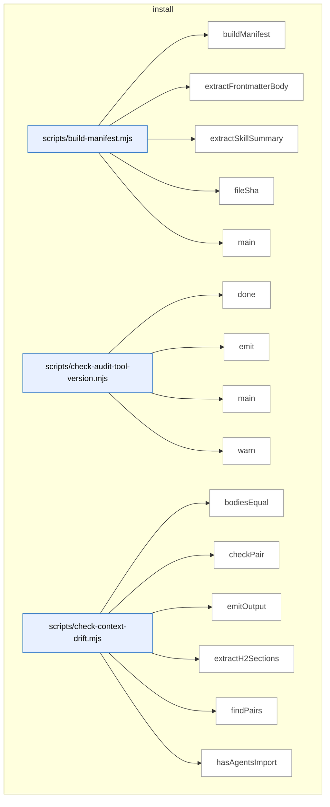

_Domain has 133 symbols (>50). Diagram shows top-15 by file order; see flat table below for the full list._

### Symbols in this domain

| Symbol | Kind | Path | Lines | Purpose | File imported by |
|---|---|---|---|---|---|
| [`buildManifest`](../scripts/build-manifest.mjs#L99) | function | `scripts/build-manifest.mjs` | 99-163 | Builds a manifest of all skills with file lists, SHAs, summaries, and a bundleVersion hash. | _(internal)_ |
| [`extractFrontmatterBody`](../scripts/build-manifest.mjs#L49) | function | `scripts/build-manifest.mjs` | 49-54 | Extracts YAML frontmatter body between triple-dashes from markdown content. | _(internal)_ |
| [`extractSkillSummary`](../scripts/build-manifest.mjs#L64) | function | `scripts/build-manifest.mjs` | 64-94 | Parses frontmatter to extract the skill description field (block or inline form), truncating to 100 characters. | _(internal)_ |
| [`fileSha`](../scripts/build-manifest.mjs#L40) | function | `scripts/build-manifest.mjs` | 40-43 | Computes a 12-character SHA256 hash of a file's content. | _(internal)_ |
| [`main`](../scripts/build-manifest.mjs#L165) | function | `scripts/build-manifest.mjs` | 165-190 | Validates or regenerates skills.manifest.json, checking bundle freshness and reporting schema version. | _(internal)_ |
| [`done`](../scripts/check-audit-tool-version.mjs#L49) | function | `scripts/check-audit-tool-version.mjs` | 49-51 | Sets the process exit code. | _(internal)_ |
| [`emit`](../scripts/check-audit-tool-version.mjs#L38) | function | `scripts/check-audit-tool-version.mjs` | 38-40 | Writes a JSON object to stdout in JSON mode. | _(internal)_ |
| [`main`](../scripts/check-audit-tool-version.mjs#L53) | function | `scripts/check-audit-tool-version.mjs` | 53-142 | Checks if the audit tool version matches upstream, handling network errors and version mismatches gracefully. | _(internal)_ |
| [`warn`](../scripts/check-audit-tool-version.mjs#L42) | function | `scripts/check-audit-tool-version.mjs` | 42-44 | Writes a message to stderr if not in quiet or JSON mode. | _(internal)_ |
| [`bodiesEqual`](../scripts/check-context-drift.mjs#L168) | function | `scripts/check-context-drift.mjs` | 168-171 | Compares two text bodies after normalizing whitespace for semantic equality. | _(internal)_ |
| [`checkPair`](../scripts/check-context-drift.mjs#L184) | function | `scripts/check-context-drift.mjs` | 184-249 | Validates CLAUDE.md against drift rules: import presence, allowlist compliance, size cap, and section body matching. | _(internal)_ |
| [`emitOutput`](../scripts/check-context-drift.mjs#L346) | function | `scripts/check-context-drift.mjs` | 346-369 | Outputs findings in text, JSON, or SARIF format with severity-based aggregation. | _(internal)_ |
| [`extractH2Sections`](../scripts/check-context-drift.mjs#L141) | function | `scripts/check-context-drift.mjs` | 141-162 | Extracts H2 sections from markdown content, respecting code fence boundaries. | _(internal)_ |
| [`findPairs`](../scripts/check-context-drift.mjs#L261) | function | `scripts/check-context-drift.mjs` | 261-279 | Builds pairs of AGENTS.md and CLAUDE.md files from a flat file list grouped by directory. | _(internal)_ |
| [`hasAgentsImport`](../scripts/check-context-drift.mjs#L177) | function | `scripts/check-context-drift.mjs` | 177-180 | Checks if content imports AGENTS.md via @import directive in the first 30 lines. | _(internal)_ |
| [`hashId`](../scripts/check-context-drift.mjs#L253) | function | `scripts/check-context-drift.mjs` | 253-255 | Creates a deterministic 16-character semantic hash from a file path and rule key. | _(internal)_ |
| [`loadConfig`](../scripts/check-context-drift.mjs#L63) | function | `scripts/check-context-drift.mjs` | 63-94 | Loads and validates configuration from .claude-context-allowlist.json, returning defaults on parse failure. | _(internal)_ |
| [`main`](../scripts/check-context-drift.mjs#L371) | function | `scripts/check-context-drift.mjs` | 371-382 | Parses CLI arguments and runs a context-drift check, then exits with appropriate codes based on error/warning severity. | _(internal)_ |
| [`makeFenceTracker`](../scripts/check-context-drift.mjs#L108) | function | `scripts/check-context-drift.mjs` | 108-132 | Tracks entry/exit from code fences (``` or ~~~) to ignore headings inside code blocks. | _(internal)_ |
| [`parseArgs`](../scripts/check-context-drift.mjs#L309) | function | `scripts/check-context-drift.mjs` | 309-324 | Parses command-line arguments for repo path, output format, and strictness flag. | _(internal)_ |
| [`runDriftCheck`](../scripts/check-context-drift.mjs#L288) | function | `scripts/check-context-drift.mjs` | 288-305 | Runs drift checks on all AGENTS/CLAUDE pairs and aggregates findings. | _(internal)_ |
| [`showHelp`](../scripts/check-context-drift.mjs#L326) | function | `scripts/check-context-drift.mjs` | 326-344 | Prints usage help and configuration guide for the drift check tool. | _(internal)_ |
| [`canResolve`](../scripts/check-deps.mjs#L52) | function | `scripts/check-deps.mjs` | 52-60 | Tests whether a package can be resolved using require.resolve. | _(internal)_ |
| [`loadEnv`](../scripts/check-deps.mjs#L62) | function | `scripts/check-deps.mjs` | 62-77 | Parses a .env file into process.env, skipping comments and handling quotes. | _(internal)_ |
| [`main`](../scripts/check-deps.mjs#L79) | function | `scripts/check-deps.mjs` | 79-173 | <no body> | _(internal)_ |
| [`detectMissingFromStatic`](../scripts/check-model-freshness.mjs#L149) | function | `scripts/check-model-freshness.mjs` | 149-177 | Identifies models in live provider catalogs that match tier patterns but are missing from STATIC_POOL, reporting them as potential offline-resolution gaps. | _(internal)_ |
| [`detectPrematureRemap`](../scripts/check-model-freshness.mjs#L183) | function | `scripts/check-model-freshness.mjs` | 183-208 | Flags deprecated model remappings that are still actively served by providers, suggesting they may be premature or undocumented. | _(internal)_ |
| [`detectSentinelDrift`](../scripts/check-model-freshness.mjs#L83) | function | `scripts/check-model-freshness.mjs` | 83-143 | Detects drift between static model pool and live provider catalogs by resolving sentinels with both caches, identifying stale or missing models. | _(internal)_ |
| [`emitOutput`](../scripts/check-model-freshness.mjs#L310) | function | `scripts/check-model-freshness.mjs` | 310-340 | Outputs model freshness findings in JSON, SARIF, or human-readable format, displaying provider coverage and severity summaries. | _(internal)_ |
| [`hashId`](../scripts/check-model-freshness.mjs#L212) | function | `scripts/check-model-freshness.mjs` | 212-214 | Hashes a rule identifier and key into a 16-character SHA256 digest for deduplicating semantic findings. | _(internal)_ |
| [`main`](../scripts/check-model-freshness.mjs#L342) | function | `scripts/check-model-freshness.mjs` | 342-353 | Parses CLI args, runs freshness check, emits output, and exits with code 3 for no providers, 1 for errors, 2 for warnings, or 0 for success. | _(internal)_ |
| [`parseArgs`](../scripts/check-model-freshness.mjs#L266) | function | `scripts/check-model-freshness.mjs` | 266-280 | Parses command-line arguments for format, strict mode, and help, validating that format is one of text/json/sarif. | _(internal)_ |
| [`runFreshnessCheck`](../scripts/check-model-freshness.mjs#L225) | function | `scripts/check-model-freshness.mjs` | 225-262 | Fetches live model catalogs from providers (or uses cached/empty if refresh disabled), validates schema, and runs drift detection rules. | _(internal)_ |
| [`showHelp`](../scripts/check-model-freshness.mjs#L282) | function | `scripts/check-model-freshness.mjs` | 282-308 | Displays usage information, exit codes, environment variables, and instructions for model freshness checking. | _(internal)_ |
| [`checkAuditApiKeys`](../scripts/check-setup.mjs#L154) | function | `scripts/check-setup.mjs` | 154-171 | Checks for required audit API keys (OpenAI, Gemini/Anthropic) and reports their status. | _(internal)_ |
| [`checkAuditLoop`](../scripts/check-setup.mjs#L220) | function | `scripts/check-setup.mjs` | 220-224 | Runs audit-loop configuration checks (API keys, database tables, Supabase connection). | _(internal)_ |
| [`checkAuditSupabase`](../scripts/check-setup.mjs#L177) | function | `scripts/check-setup.mjs` | 177-218 | <no body> | _(internal)_ |
| [`checkConsistencyMode`](../scripts/check-setup.mjs#L392) | function | `scripts/check-setup.mjs` | 392-438 | Validates consistency-mode adoption by checking for surfaces.json, canaries directory, and Playwright availability. | _(internal)_ |
| [`checkPersonaTest`](../scripts/check-setup.mjs#L228) | function | `scripts/check-setup.mjs` | 228-284 | <no body> | _(internal)_ |
| [`checkPlaywrightAvailable`](../scripts/check-setup.mjs#L372) | function | `scripts/check-setup.mjs` | 372-390 | Checks if Playwright is installed and available, returning version info and browser binary status. | _(internal)_ |
| [`checkTables`](../scripts/check-setup.mjs#L65) | function | `scripts/check-setup.mjs` | 65-75 | Queries the database for the existence of given table names. | _(internal)_ |
| [`loadEnv`](../scripts/check-setup.mjs#L42) | function | `scripts/check-setup.mjs` | 42-57 | Parses a .env file from the repo root into a key-value object. | _(internal)_ |
| [`main`](../scripts/check-setup.mjs#L442) | function | `scripts/check-setup.mjs` | 442-454 | Orchestrates the full setup check by running audit-loop, persona-test, and consistency-mode checks, then printing results. | _(internal)_ |
| [`printJsonReport`](../scripts/check-setup.mjs#L347) | function | `scripts/check-setup.mjs` | 347-357 | Outputs the setup check report as JSON to stdout. | _(internal)_ |
| [`printReport`](../scripts/check-setup.mjs#L315) | function | `scripts/check-setup.mjs` | 315-345 | Prints a formatted setup check report with sections, status icons, and optional fix commands to console. | _(internal)_ |
| [`Report`](../scripts/check-setup.mjs#L115) | class | `scripts/check-setup.mjs` | 115-150 | Accumulates test check results organized by sections with status tracking for passes, failures, warnings, and info items. | _(internal)_ |
| [`shortUrl`](../scripts/check-setup.mjs#L173) | function | `scripts/check-setup.mjs` | 173-175 | Truncates a URL by removing the protocol and limiting to 30 characters. | _(internal)_ |
| [`statusIcon`](../scripts/check-setup.mjs#L291) | function | `scripts/check-setup.mjs` | 291-300 | Maps a status string (PASS/FAIL/WARN/INFO/FIX) to a colored console output. | _(internal)_ |
| [`verdictLine`](../scripts/check-setup.mjs#L302) | function | `scripts/check-setup.mjs` | 302-313 | Formats a summary line showing test failures, warnings, or success status with color codes. | _(internal)_ |
| [`listSkills`](../scripts/check-skill-refs.mjs#L30) | function | `scripts/check-skill-refs.mjs` | 30-36 | Lists all skill directories in SKILLS_DIR by reading filesystem and filtering for directories, sorted alphabetically. | _(internal)_ |
| [`main`](../scripts/check-skill-refs.mjs#L38) | function | `scripts/check-skill-refs.mjs` | 38-74 | Lints one or more skills by directory, reporting pass/fail with entry counts and aggregating results with colored output. | _(internal)_ |
| [`main`](../scripts/check-skill-updates.mjs#L25) | function | `scripts/check-skill-updates.mjs` | 25-118 | <no body> | _(internal)_ |
| [`parseArgs`](../scripts/check-skill-updates.mjs#L16) | function | `scripts/check-skill-updates.mjs` | 16-23 | Parses command-line arguments for JSON output, no-cache flag, and optional target directory path. | _(internal)_ |
| [`checkSync`](../scripts/check-sync.mjs#L25) | function | `scripts/check-sync.mjs` | 25-153 | Validates Supabase/Postgres connection and sync status, checking environment variables, database connectivity, repo registration, and audit run history. | _(internal)_ |
| [`fail`](../scripts/check-sync.mjs#L20) | function | `scripts/check-sync.mjs` | 20-20 | Logs a failing check result. | _(internal)_ |
| [`finish`](../scripts/check-sync.mjs#L155) | function | `scripts/check-sync.mjs` | 155-178 | Prints a formatted sync status verdict or JSON output, then exits with appropriate code. | _(internal)_ |
| [`info`](../scripts/check-sync.mjs#L21) | function | `scripts/check-sync.mjs` | 21-21 | Logs an informational check result. | _(internal)_ |
| [`log`](../scripts/check-sync.mjs#L17) | function | `scripts/check-sync.mjs` | 17-17 | Writes a message to stdout unless JSON mode is enabled. | _(internal)_ |
| [`pass`](../scripts/check-sync.mjs#L19) | function | `scripts/check-sync.mjs` | 19-19 | Logs a passing check result. | _(internal)_ |
| [`buildCopilotMergeWrite`](../scripts/install-skills.mjs#L205) | function | `scripts/install-skills.mjs` | 205-218 | Merges skill instructions into the copilot-instructions.md file and records the merged result with SHA tracking. | _(internal)_ |
| [`buildSkillWrites`](../scripts/install-skills.mjs#L173) | function | `scripts/install-skills.mjs` | 173-203 | Builds write operations for skill files by resolving paths, validating SHA integrity, and recording managed file metadata. | _(internal)_ |
| [`checkConflicts`](../scripts/install-skills.mjs#L233) | function | `scripts/install-skills.mjs` | 233-245 | Detects conflicts between incoming writes and previous receipts, separating repo-scoped and global-scoped conflicts. | _(internal)_ |
| [`computeDeletes`](../scripts/install-skills.mjs#L220) | function | `scripts/install-skills.mjs` | 220-231 | Identifies files from previous receipts that are no longer in the new write list, collecting them for deletion. | _(internal)_ |
| [`expandSkillFiles`](../scripts/install-skills.mjs#L114) | function | `scripts/install-skills.mjs` | 114-120 | Expands a skill's file list from manifest metadata, falling back to a legacy single-file format if needed. | _(internal)_ |
| [`fileShaShort`](../scripts/install-skills.mjs#L122) | function | `scripts/install-skills.mjs` | 122-124 | Computes a 12-character SHA256 hash of a buffer for file integrity verification. | _(internal)_ |
| [`loadManifest`](../scripts/install-skills.mjs#L84) | function | `scripts/install-skills.mjs` | 84-107 | Loads and validates the skills manifest JSON file, checking schema version compatibility and exiting on parse errors. | _(internal)_ |
| [`main`](../scripts/install-skills.mjs#L259) | function | `scripts/install-skills.mjs` | 259-346 | <no body> | _(internal)_ |
| [`maybeWarnGithubSkillsDeprecation`](../scripts/install-skills.mjs#L161) | function | `scripts/install-skills.mjs` | 161-171 | Warns about deprecated .github/skills/ directory and suggests passing --keep-github-skills to preserve it. | _(internal)_ |
| [`parseArgs`](../scripts/install-skills.mjs#L56) | function | `scripts/install-skills.mjs` | 56-78 | Parses command-line arguments into an options object with defaults for local/remote mode, surface targets, skills filter, and installation flags. | _(internal)_ |
| [`printBanner`](../scripts/install-skills.mjs#L141) | function | `scripts/install-skills.mjs` | 141-149 | Prints installation banner showing mode, surface, target repo, and any dry-run or cross-repo notices. | _(internal)_ |
| [`reconcileJournals`](../scripts/install-skills.mjs#L151) | function | `scripts/install-skills.mjs` | 151-159 | Recovers from journal files tracking previous installation transactions, reporting rolled-forward or rolled-back changes. | _(internal)_ |
| [`validateTarget`](../scripts/install-skills.mjs#L128) | function | `scripts/install-skills.mjs` | 128-139 | Validates that the target directory exists and contains git or package.json markers, warning if neither is found. | _(internal)_ |
| [`writeReceiptsByScope`](../scripts/install-skills.mjs#L247) | function | `scripts/install-skills.mjs` | 247-257 | Writes installation receipts to disk partitioned by scope, recording manifest version and managed files. | _(internal)_ |
| [`computeFileSha`](../scripts/lib/install/conflict-detector.mjs#L13) | function | `scripts/lib/install/conflict-detector.mjs` | 13-20 | Computes a 12-character SHA256 hash of a file's content, returning null on read error. | `scripts/check-skill-updates.mjs`, `scripts/install-skills.mjs` |
| [`detectConflicts`](../scripts/lib/install/conflict-detector.mjs#L30) | function | `scripts/lib/install/conflict-detector.mjs` | 30-78 | Partitions planned file writes into safe and conflicted based on receipt history and SHA comparison. | `scripts/check-skill-updates.mjs`, `scripts/install-skills.mjs` |
| [`detectDrift`](../scripts/lib/install/conflict-detector.mjs#L86) | function | `scripts/lib/install/conflict-detector.mjs` | 86-105 | Detects drift in managed files by comparing expected vs actual SHA hashes. | `scripts/check-skill-updates.mjs`, `scripts/install-skills.mjs` |
| [`generateAllPromptFiles`](../scripts/lib/install/copilot-prompts.mjs#L208) | function | `scripts/lib/install/copilot-prompts.mjs` | 208-239 | Scans skills directory and generates prompt files for all registered skills. | `scripts/regenerate-skill-copies.mjs` |
| [`generatePromptFile`](../scripts/lib/install/copilot-prompts.mjs#L159) | function | `scripts/lib/install/copilot-prompts.mjs` | 159-197 | Generates a Copilot prompt file wrapping a skill entry with CLI instructions and notes. | `scripts/regenerate-skill-copies.mjs` |
| [`parseSkillFrontmatter`](../scripts/lib/install/copilot-prompts.mjs#L125) | function | `scripts/lib/install/copilot-prompts.mjs` | 125-148 | Parses YAML frontmatter from skill markdown to extract name and description fields. | `scripts/regenerate-skill-copies.mjs` |
| [`shaOfManagedBlock`](../scripts/lib/install/copilot-prompts.mjs#L249) | function | `scripts/lib/install/copilot-prompts.mjs` | 249-257 | Computes a 16-char SHA256 hash of a managed prompt file block for change detection. | `scripts/regenerate-skill-copies.mjs` |
| [`yamlQuote`](../scripts/lib/install/copilot-prompts.mjs#L114) | function | `scripts/lib/install/copilot-prompts.mjs` | 114-116 | Escapes a string for YAML double-quoted values. | `scripts/regenerate-skill-copies.mjs` |
| [`ensureAuditDeps`](../scripts/lib/install/deps.mjs#L89) | function | `scripts/lib/install/deps.mjs` | 89-151 | Installs missing audit-loop dependencies via npm with dry-run support and formatted output. | `scripts/install-skills.mjs`, `scripts/sync-to-repos.mjs` |
| [`findMissingDeps`](../scripts/lib/install/deps.mjs#L58) | function | `scripts/lib/install/deps.mjs` | 58-70 | Checks which required and optional npm dependencies are missing from node_modules. | `scripts/install-skills.mjs`, `scripts/sync-to-repos.mjs` |
| [`checkAuditGitignore`](../scripts/lib/install/gitignore.mjs#L152) | function | `scripts/lib/install/gitignore.mjs` | 152-171 | Checks .gitignore for presence of required patterns and returns missing/present lists. | `scripts/check-skill-updates.mjs`, `scripts/install-skills.mjs` |
| [`ensureAuditGitignore`](../scripts/lib/install/gitignore.mjs#L106) | function | `scripts/lib/install/gitignore.mjs` | 106-143 | Adds or creates .gitignore with required audit-loop patterns. | `scripts/check-skill-updates.mjs`, `scripts/install-skills.mjs` |
| [`extractBlock`](../scripts/lib/install/merge.mjs#L64) | function | `scripts/lib/install/merge.mjs` | 64-70 | Extracts the content between start and end markers from a file. | `scripts/install-skills.mjs` |
| [`mergeBlock`](../scripts/lib/install/merge.mjs#L36) | function | `scripts/lib/install/merge.mjs` | 36-55 | Merges a managed block into a file, replacing existing markers or appending if none exist. | `scripts/install-skills.mjs` |
| [`buildReceipt`](../scripts/lib/install/receipt.mjs#L48) | function | `scripts/lib/install/receipt.mjs` | 48-57 | Constructs an install receipt object with version, bundle info, and managed files list. | `scripts/check-skill-updates.mjs`, `scripts/install-skills.mjs` |
| [`readReceipt`](../scripts/lib/install/receipt.mjs#L13) | function | `scripts/lib/install/receipt.mjs` | 13-24 | Reads and validates an install receipt from JSON file. | `scripts/check-skill-updates.mjs`, `scripts/install-skills.mjs` |
| [`writeReceipt`](../scripts/lib/install/receipt.mjs#L31) | function | `scripts/lib/install/receipt.mjs` | 31-37 | Validates and atomically writes an install receipt with temp-rename pattern. | `scripts/check-skill-updates.mjs`, `scripts/install-skills.mjs` |
| [`findRepoRoot`](../scripts/lib/install/surface-paths.mjs#L14) | function | `scripts/lib/install/surface-paths.mjs` | 14-37 | Finds the outermost .git directory or package.json as repo root, walking up from a start directory. | `scripts/check-skill-updates.mjs`, `scripts/install-skills.mjs` |
| [`partitionManagedFilesByScope`](../scripts/lib/install/surface-paths.mjs#L124) | function | `scripts/lib/install/surface-paths.mjs` | 124-132 | Partitions managed files into global and repo-scoped lists. | `scripts/check-skill-updates.mjs`, `scripts/install-skills.mjs` |
| [`receiptPath`](../scripts/lib/install/surface-paths.mjs#L110) | function | `scripts/lib/install/surface-paths.mjs` | 110-115 | Returns the path to the install receipt, global or repo-scoped based on scope parameter. | `scripts/check-skill-updates.mjs`, `scripts/install-skills.mjs` |
| [`resolveSkillFiles`](../scripts/lib/install/surface-paths.mjs#L79) | function | `scripts/lib/install/surface-paths.mjs` | 79-94 | Expands skill files across multiple surfaces and scopes with full file paths. | `scripts/check-skill-updates.mjs`, `scripts/install-skills.mjs` |
| [`resolveSkillTargets`](../scripts/lib/install/surface-paths.mjs#L46) | function | `scripts/lib/install/surface-paths.mjs` | 46-66 | Resolves target installation directories for a skill across specified surfaces (claude/copilot/agents). | `scripts/check-skill-updates.mjs`, `scripts/install-skills.mjs` |
| [`cleanupJournal`](../scripts/lib/install/transaction.mjs#L200) | function | `scripts/lib/install/transaction.mjs` | 200-203 | Removes the transaction journal file on best-effort basis. | `scripts/install-skills.mjs` |
| [`defaultJournalPath`](../scripts/lib/install/transaction.mjs#L245) | function | `scripts/lib/install/transaction.mjs` | 245-247 | Returns the default transaction journal path in the current directory. | `scripts/install-skills.mjs` |
| [`executeTransaction`](../scripts/lib/install/transaction.mjs#L81) | function | `scripts/lib/install/transaction.mjs` | 81-176 | <no body> | `scripts/install-skills.mjs` |
| [`fsyncFile`](../scripts/lib/install/transaction.mjs#L49) | function | `scripts/lib/install/transaction.mjs` | 49-51 | Calls fsync on a file descriptor with best-effort error suppression. | `scripts/install-skills.mjs` |
| [`recoverFromJournal`](../scripts/lib/install/transaction.mjs#L211) | function | `scripts/lib/install/transaction.mjs` | 211-243 | Recovers from a partial transaction journal by rolling forward renames or rolling back staged files. | `scripts/install-skills.mjs` |
| [`rollbackPartialTransaction`](../scripts/lib/install/transaction.mjs#L178) | function | `scripts/lib/install/transaction.mjs` | 178-198 | Reverts completed file renames to their original snapshots on transaction failure. | `scripts/install-skills.mjs` |
| [`shaShort`](../scripts/lib/install/transaction.mjs#L45) | function | `scripts/lib/install/transaction.mjs` | 45-47 | Computes a 12-character SHA256 hash of a buffer. | `scripts/install-skills.mjs` |
| [`tmpSuffix`](../scripts/lib/install/transaction.mjs#L40) | function | `scripts/lib/install/transaction.mjs` | 40-43 | Generates a unique temporary file suffix using PID, millisecond timestamp, and random hex. | `scripts/install-skills.mjs` |
| [`writeJournal`](../scripts/lib/install/transaction.mjs#L58) | function | `scripts/lib/install/transaction.mjs` | 58-70 | Atomically writes a JSON journal entry to disk with fsync and temp-rename. | `scripts/install-skills.mjs` |
| [`computeVerdict`](../scripts/regenerate-skill-copies.mjs#L196) | function | `scripts/regenerate-skill-copies.mjs` | 196-200 | Determines the overall verdict (violations, changes, or in-sync) based on sync statistics and violation count. | _(internal)_ |
| [`copyFileIfChanged`](../scripts/regenerate-skill-copies.mjs#L76) | function | `scripts/regenerate-skill-copies.mjs` | 76-88 | Copies a file if its content differs from the destination, creating parent directories and reporting the operation. | _(internal)_ |
| [`emitVerdict`](../scripts/regenerate-skill-copies.mjs#L202) | function | `scripts/regenerate-skill-copies.mjs` | 202-214 | Outputs a summary of sync operations and exits with appropriate status if violations or unsynced changes exist. | _(internal)_ |
| [`loadSkillsOrDie`](../scripts/regenerate-skill-copies.mjs#L63) | function | `scripts/regenerate-skill-copies.mjs` | 63-74 | Loads the skill definitions from disk and exits if the skills directory is missing or empty. | _(internal)_ |
| [`main`](../scripts/regenerate-skill-copies.mjs#L216) | function | `scripts/regenerate-skill-copies.mjs` | 216-244 | Main entry point that orchestrates skill synchronization across all destinations and handles dry-run or check modes. | _(internal)_ |
| [`pruneFilesNotInSource`](../scripts/regenerate-skill-copies.mjs#L90) | function | `scripts/regenerate-skill-copies.mjs` | 90-105 | Removes destination files that no longer exist in the source skill directory. | _(internal)_ |
| [`pruneOrphanSkillDirs`](../scripts/regenerate-skill-copies.mjs#L130) | function | `scripts/regenerate-skill-copies.mjs` | 130-146 | Removes skill directories from destination roots that have no corresponding source skill. | _(internal)_ |
| [`pruneStalePrompts`](../scripts/regenerate-skill-copies.mjs#L168) | function | `scripts/regenerate-skill-copies.mjs` | 168-186 | Deletes stale managed prompts from the prompt directory that are not in the current expected set. | _(internal)_ |
| [`syncCopilotPrompts`](../scripts/regenerate-skill-copies.mjs#L188) | function | `scripts/regenerate-skill-copies.mjs` | 188-194 | Regenerates Copilot-compatible prompt files from skill sources, coordinating writes and pruning. | _(internal)_ |
| [`syncSkillToDests`](../scripts/regenerate-skill-copies.mjs#L107) | function | `scripts/regenerate-skill-copies.mjs` | 107-128 | Synchronizes a single skill from source to all configured destination roots, handling file copies and orphan cleanup. | _(internal)_ |
| [`warnGithubSkillsDeprecation`](../scripts/regenerate-skill-copies.mjs#L51) | function | `scripts/regenerate-skill-copies.mjs` | 51-61 | Warns that .github/skills/ is deprecated and no longer auto-regenerated unless explicitly preserved via flag. | _(internal)_ |
| [`writePromptFiles`](../scripts/regenerate-skill-copies.mjs#L148) | function | `scripts/regenerate-skill-copies.mjs` | 148-166 | Writes generated prompt files to disk, tracking which files were created or updated versus left unchanged. | _(internal)_ |
| [`confirm`](../scripts/setup-permissions.mjs#L119) | function | `scripts/setup-permissions.mjs` | 119-128 | Prompts user for Y/n confirmation via stdin, returning true if yes or skipped (unless AUTO_YES), or bypassing if auto-yes mode. | _(internal)_ |
| [`main`](../scripts/setup-permissions.mjs#L183) | function | `scripts/setup-permissions.mjs` | 183-280 | Reads project and user-level Claude settings, merges audit-loop permission rules, displays added/removed changes, and writes if confirmed. | _(internal)_ |
| [`mergeRules`](../scripts/setup-permissions.mjs#L134) | function | `scripts/setup-permissions.mjs` | 134-179 | Merges new permission rules into Claude Code settings, deduplicates, cleans up rules covered by wildcards, and merges deny rules. | _(internal)_ |
| [`readJson`](../scripts/setup-permissions.mjs#L106) | function | `scripts/setup-permissions.mjs` | 106-112 | Reads and parses a JSON file, returning null if file doesn't exist or JSON is invalid. | _(internal)_ |
| [`writeJson`](../scripts/setup-permissions.mjs#L114) | function | `scripts/setup-permissions.mjs` | 114-117 | Writes a JSON object to a file with pretty-printing and 2-space indentation, creating parent directories as needed. | _(internal)_ |
| [`buildCopilotPromptFiles`](../scripts/sync-to-repos.mjs#L319) | function | `scripts/sync-to-repos.mjs` | 319-327 | Returns a list of .prompt.md files found in the .github/prompts directory. | _(internal)_ |
| [`buildFileUniverse`](../scripts/sync-to-repos.mjs#L217) | function | `scripts/sync-to-repos.mjs` | 217-234 | Recursively walks script and .claude directories to build a set of all trackable files, excluding node_modules and .git. | _(internal)_ |
| [`buildSkillFiles`](../scripts/sync-to-repos.mjs#L280) | function | `scripts/sync-to-repos.mjs` | 280-292 | Builds a list of skill file paths for all skills, optionally mirroring to both .claude and .github surfaces. | _(internal)_ |
| [`bundleForRepo`](../scripts/sync-to-repos.mjs#L349) | function | `scripts/sync-to-repos.mjs` | 349-356 | Assembles a complete file bundle for a target repo by resolving core/learning/arch entries plus optional debt entries. | _(internal)_ |
| [`deepMerge`](../scripts/sync-to-repos.mjs#L396) | function | `scripts/sync-to-repos.mjs` | 396-407 | Recursively merges a source object into a target object, combining nested objects while overwriting other values. | _(internal)_ |
| [`main`](../scripts/sync-to-repos.mjs#L411) | function | `scripts/sync-to-repos.mjs` | 411-616 | <no body> | _(internal)_ |
| [`readSource`](../scripts/sync-to-repos.mjs#L237) | function | `scripts/sync-to-repos.mjs` | 237-240 | Reads a source file from the SOURCE_ROOT directory, returning null if the file doesn't exist. | _(internal)_ |
| [`realMissingDeps`](../scripts/sync-to-repos.mjs#L264) | function | `scripts/sync-to-repos.mjs` | 264-269 | Filters unresolved imports to return only relative path imports that are genuinely missing local dependencies. | _(internal)_ |
| [`resolveBundle`](../scripts/sync-to-repos.mjs#L249) | function | `scripts/sync-to-repos.mjs` | 249-254 | Resolves a bundle of entry points by collecting their import closure and combining with static assets. | _(internal)_ |
| [`sha256`](../scripts/sync-to-repos.mjs#L365) | function | `scripts/sync-to-repos.mjs` | 365-372 | Computes the SHA-256 hash of a file's contents, returning null on read error. | _(internal)_ |
| [`syncMigrations`](../scripts/sync-to-repos.mjs#L139) | function | `scripts/sync-to-repos.mjs` | 139-149 | Returns a sorted list of SQL migration files from the supabase/migrations directory. | _(internal)_ |
| [`unifiedDiff`](../scripts/sync-to-repos.mjs#L374) | function | `scripts/sync-to-repos.mjs` | 374-387 | Generates a unified diff between two files using git diff, handling both successful diffs and errors gracefully. | _(internal)_ |

---

## learning-store

> The `learning-store` domain implements a multi-armed bandit system that evaluates and rewards prompt engineering strategies based on code review quality signals—procedural correctness, substantive improvements, deliberation depth, and user impact—while managing experiment configurations and arm statistics.

```mermaid
flowchart TB
subgraph dom_learning_store ["learning-store"]
  file_scripts_bandit_mjs["scripts/bandit.mjs"]:::component
  sym_scripts_bandit_mjs_buildContext["buildContext"]:::symbol
  file_scripts_bandit_mjs --> sym_scripts_bandit_mjs_buildContext
  sym_scripts_bandit_mjs_computePassReward["computePassReward"]:::symbol
  file_scripts_bandit_mjs --> sym_scripts_bandit_mjs_computePassReward
  sym_scripts_bandit_mjs_computeReward["computeReward"]:::symbol
  file_scripts_bandit_mjs --> sym_scripts_bandit_mjs_computeReward
  sym_scripts_bandit_mjs_computeUserImpactRewa["computeUserImpactReward"]:::symbol
  file_scripts_bandit_mjs --> sym_scripts_bandit_mjs_computeUserImpactRewa
  sym_scripts_bandit_mjs_contextBucketKey["contextBucketKey"]:::symbol
  file_scripts_bandit_mjs --> sym_scripts_bandit_mjs_contextBucketKey
  sym_scripts_bandit_mjs_contextSizeTier["contextSizeTier"]:::symbol
  file_scripts_bandit_mjs --> sym_scripts_bandit_mjs_contextSizeTier
  sym_scripts_bandit_mjs_deliberationSignal["deliberationSignal"]:::symbol
  file_scripts_bandit_mjs --> sym_scripts_bandit_mjs_deliberationSignal
  sym_scripts_bandit_mjs_main["main"]:::symbol
  file_scripts_bandit_mjs --> sym_scripts_bandit_mjs_main
  sym_scripts_bandit_mjs_PromptBandit["PromptBandit"]:::symbol
  file_scripts_bandit_mjs --> sym_scripts_bandit_mjs_PromptBandit
  file_scripts_evolve_prompts_mjs["scripts/evolve-prompts.mjs"]:::component
  sym_scripts_evolve_prompts_mjs_checkBaseline["checkBaselineValidity"]:::symbol
  file_scripts_evolve_prompts_mjs --> sym_scripts_evolve_prompts_mjs_checkBaseline
  sym_scripts_evolve_prompts_mjs_evolveWorstPa["evolveWorstPass"]:::symbol
  file_scripts_evolve_prompts_mjs --> sym_scripts_evolve_prompts_mjs_evolveWorstPa
  sym_scripts_evolve_prompts_mjs_formatExample["formatExample"]:::symbol
  file_scripts_evolve_prompts_mjs --> sym_scripts_evolve_prompts_mjs_formatExample
  sym_scripts_evolve_prompts_mjs_getExperiment["getExperimentManifestStore"]:::symbol
  file_scripts_evolve_prompts_mjs --> sym_scripts_evolve_prompts_mjs_getExperiment
  sym_scripts_evolve_prompts_mjs_killExperimen["killExperiment"]:::symbol
  file_scripts_evolve_prompts_mjs --> sym_scripts_evolve_prompts_mjs_killExperimen
  sym_scripts_evolve_prompts_mjs_main["main"]:::symbol
  file_scripts_evolve_prompts_mjs --> sym_scripts_evolve_prompts_mjs_main
  sym_scripts_evolve_prompts_mjs_promoteExperi["promoteExperiment"]:::symbol
  file_scripts_evolve_prompts_mjs --> sym_scripts_evolve_prompts_mjs_promoteExperi
  sym_scripts_evolve_prompts_mjs_reconcileOrph["reconcileOrphanedExperiments"]:::symbol
  file_scripts_evolve_prompts_mjs --> sym_scripts_evolve_prompts_mjs_reconcileOrph
  sym_scripts_evolve_prompts_mjs_reviewExperim["reviewExperiments"]:::symbol
  file_scripts_evolve_prompts_mjs --> sym_scripts_evolve_prompts_mjs_reviewExperim
  sym_scripts_evolve_prompts_mjs_showStats["showStats"]:::symbol
  file_scripts_evolve_prompts_mjs --> sym_scripts_evolve_prompts_mjs_showStats
  file_scripts_meta_assess_mjs["scripts/meta-assess.mjs"]:::component
  sym_scripts_meta_assess_mjs_computeAssessmen["computeAssessmentMetrics"]:::symbol
  file_scripts_meta_assess_mjs --> sym_scripts_meta_assess_mjs_computeAssessmen
  sym_scripts_meta_assess_mjs_emptyMetrics["emptyMetrics"]:::symbol
  file_scripts_meta_assess_mjs --> sym_scripts_meta_assess_mjs_emptyMetrics
  sym_scripts_meta_assess_mjs_formatAssessment["formatAssessmentReport"]:::symbol
  file_scripts_meta_assess_mjs --> sym_scripts_meta_assess_mjs_formatAssessment
  sym_scripts_meta_assess_mjs_main["main"]:::symbol
  file_scripts_meta_assess_mjs --> sym_scripts_meta_assess_mjs_main
  sym_scripts_meta_assess_mjs_markAssessmentCo["markAssessmentComplete"]:::symbol
  file_scripts_meta_assess_mjs --> sym_scripts_meta_assess_mjs_markAssessmentCo
  sym_scripts_meta_assess_mjs_runLLMAssessment["runLLMAssessment"]:::symbol
  file_scripts_meta_assess_mjs --> sym_scripts_meta_assess_mjs_runLLMAssessment
  sym_scripts_meta_assess_mjs_sampleOutcomes["sampleOutcomes"]:::symbol
  file_scripts_meta_assess_mjs --> sym_scripts_meta_assess_mjs_sampleOutcomes
  sym_scripts_meta_assess_mjs_shouldRunAssessm["shouldRunAssessment"]:::symbol
  file_scripts_meta_assess_mjs --> sym_scripts_meta_assess_mjs_shouldRunAssessm
  sym_scripts_meta_assess_mjs_storeAssessment["storeAssessment"]:::symbol
  file_scripts_meta_assess_mjs --> sym_scripts_meta_assess_mjs_storeAssessment
  file_scripts_refine_prompts_mjs["scripts/refine-prompts.mjs"]:::component
  sym_scripts_refine_prompts_mjs_analyzePass["analyzePass"]:::symbol
  file_scripts_refine_prompts_mjs --> sym_scripts_refine_prompts_mjs_analyzePass
  sym_scripts_refine_prompts_mjs_main["main"]:::symbol
  file_scripts_refine_prompts_mjs --> sym_scripts_refine_prompts_mjs_main
  sym_scripts_refine_prompts_mjs_suggestRefine["suggestRefinements"]:::symbol
  file_scripts_refine_prompts_mjs --> sym_scripts_refine_prompts_mjs_suggestRefine
end
classDef container fill:#f5f5f5,stroke:#333,stroke-width:2px,color:#000
classDef component fill:#e8f0ff,stroke:#3178c6,color:#000
classDef symbol fill:#fff,stroke:#999,color:#444
classDef dup fill:#ffe8d8,stroke:#c0392b,stroke-width:2px,color:#000
classDef violation fill:#ffd6d6,stroke:#c0392b,stroke-width:2px,color:#000
```

### Symbols in this domain

| Symbol | Kind | Path | Lines | Purpose | File imported by |
|---|---|---|---|---|---|
| [`buildContext`](../scripts/bandit.mjs#L29) | function | `scripts/bandit.mjs` | 29-35 | Builds a context object with size tier and dominant language from repository profile. | `scripts/evolve-prompts.mjs`, `scripts/gemini-review.mjs`, `scripts/meta-assess.mjs`, +1 more |
| [`computePassReward`](../scripts/bandit.mjs#L410) | function | `scripts/bandit.mjs` | 410-416 | Averages the per-finding rewards from an evaluation record's finding-edit-links. | `scripts/evolve-prompts.mjs`, `scripts/gemini-review.mjs`, `scripts/meta-assess.mjs`, +1 more |
| [`computeReward`](../scripts/bandit.mjs#L310) | function | `scripts/bandit.mjs` | 310-348 | Computes a multi-signal reward score combining procedural ruling, substantive remediation, deliberation quality, and optional user-impact correlation. | `scripts/evolve-prompts.mjs`, `scripts/gemini-review.mjs`, `scripts/meta-assess.mjs`, +1 more |
| [`computeUserImpactReward`](../scripts/bandit.mjs#L359) | function | `scripts/bandit.mjs` | 359-379 | Converts a user-impact correlation type and persona severity into a 0–1 reward value. | `scripts/evolve-prompts.mjs`, `scripts/gemini-review.mjs`, `scripts/meta-assess.mjs`, +1 more |
| [`contextBucketKey`](../scripts/bandit.mjs#L44) | function | `scripts/bandit.mjs` | 44-46 | Returns a bucket key combining size tier and language for bandit arm grouping. | `scripts/evolve-prompts.mjs`, `scripts/gemini-review.mjs`, `scripts/meta-assess.mjs`, +1 more |
| [`contextSizeTier`](../scripts/bandit.mjs#L37) | function | `scripts/bandit.mjs` | 37-42 | Classifies character count into a size tier: small, medium, large, or xlarge. | `scripts/evolve-prompts.mjs`, `scripts/gemini-review.mjs`, `scripts/meta-assess.mjs`, +1 more |
| [`deliberationSignal`](../scripts/bandit.mjs#L386) | function | `scripts/bandit.mjs` | 386-403 | Scores deliberation quality based on challenge stance, compromise ruling, detailed rationale, and acceptance patterns. | `scripts/evolve-prompts.mjs`, `scripts/gemini-review.mjs`, `scripts/meta-assess.mjs`, +1 more |
| [`main`](../scripts/bandit.mjs#L420) | function | `scripts/bandit.mjs` | 420-454 | CLI entry point for the bandit multi-armed bandit algorithm; supports adding arms and displaying statistics. | `scripts/evolve-prompts.mjs`, `scripts/gemini-review.mjs`, `scripts/meta-assess.mjs`, +1 more |
| [`PromptBandit`](../scripts/bandit.mjs#L50) | class | `scripts/bandit.mjs` | 50-293 | <no body> | `scripts/evolve-prompts.mjs`, `scripts/gemini-review.mjs`, `scripts/meta-assess.mjs`, +1 more |
| [`checkBaselineValidity`](../scripts/evolve-prompts.mjs#L340) | function | `scripts/evolve-prompts.mjs` | 340-348 | Checks if an experiment's parent revision is still the current default; marks it stale if not. | _(internal)_ |
| [`evolveWorstPass`](../scripts/evolve-prompts.mjs#L92) | function | `scripts/evolve-prompts.mjs` | 92-234 | Analyzes pass performance using the EWR metric, identifies the worst-performing pass, and initiates prompt evolution if needed. | _(internal)_ |
| [`formatExample`](../scripts/evolve-prompts.mjs#L336) | function | `scripts/evolve-prompts.mjs` | 336-338 | Formats a single outcome example as a human-readable one-liner with severity, category, file, and detail preview. | _(internal)_ |
| [`getExperimentManifestStore`](../scripts/evolve-prompts.mjs#L64) | function | `scripts/evolve-prompts.mjs` | 64-66 | Returns a file-backed mutex store for managing experiment manifests by experiment ID. | _(internal)_ |
| [`killExperiment`](../scripts/evolve-prompts.mjs#L306) | function | `scripts/evolve-prompts.mjs` | 306-317 | Abandons an experiment and marks it as killed in the experiment store. | _(internal)_ |
| [`main`](../scripts/evolve-prompts.mjs#L373) | function | `scripts/evolve-prompts.mjs` | 373-469 | Main entry point that dispatches to evolve, review-experiments, promote, kill, or stats subcommands with appropriate setup. | _(internal)_ |
| [`promoteExperiment`](../scripts/evolve-prompts.mjs#L289) | function | `scripts/evolve-prompts.mjs` | 289-301 | Promotes a successful experiment's revision to become the active default prompt for a pass. | _(internal)_ |
| [`reconcileOrphanedExperiments`](../scripts/evolve-prompts.mjs#L353) | function | `scripts/evolve-prompts.mjs` | 353-369 | Scans for orphaned experiment manifests that failed to complete and logs cleanup opportunities. | _(internal)_ |
| [`reviewExperiments`](../scripts/evolve-prompts.mjs#L239) | function | `scripts/evolve-prompts.mjs` | 239-284 | Reviews active experiments for convergence and collects statistics on pass performance and bandit arm status. | _(internal)_ |
| [`showStats`](../scripts/evolve-prompts.mjs#L322) | function | `scripts/evolve-prompts.mjs` | 322-332 | Aggregates pass statistics, active experiments, and bandit arm statistics for display. | _(internal)_ |
| [`computeAssessmentMetrics`](../scripts/meta-assess.mjs#L48) | function | `scripts/meta-assess.mjs` | 48-150 | Computes assessment metrics including FP rates by pass, signal quality, severity calibration, and convergence speed over a window. | `scripts/audit-loop.mjs` |
| [`emptyMetrics`](../scripts/meta-assess.mjs#L152) | function | `scripts/meta-assess.mjs` | 152-162 | Returns a zero-valued metrics object when there are no outcomes to assess. | `scripts/audit-loop.mjs` |
| [`formatAssessmentReport`](../scripts/meta-assess.mjs#L353) | function | `scripts/meta-assess.mjs` | 353-398 | Formats audit-loop meta-assessment metrics and diagnostic findings into a markdown report with tables, FP rates by pass, and actionable recommendations. | `scripts/audit-loop.mjs` |
| [`main`](../scripts/meta-assess.mjs#L402) | function | `scripts/meta-assess.mjs` | 402-475 | Parses CLI arguments and loads outcome data to compute and output assessment metrics, optionally skipping if not due based on run interval. | `scripts/audit-loop.mjs` |
| [`markAssessmentComplete`](../scripts/meta-assess.mjs#L190) | function | `scripts/meta-assess.mjs` | 190-198 | Updates the assessment state file to record when the last assessment completed. | `scripts/audit-loop.mjs` |
| [`runLLMAssessment`](../scripts/meta-assess.mjs#L249) | function | `scripts/meta-assess.mjs` | 249-326 | Calls an LLM (Gemini or GPT) with metrics and samples to generate a narrative assessment report. | `scripts/audit-loop.mjs` |
| [`sampleOutcomes`](../scripts/meta-assess.mjs#L202) | function | `scripts/meta-assess.mjs` | 202-214 | Extracts recent dismissed and accepted outcomes by category, limiting and truncating for LLM analysis. | `scripts/audit-loop.mjs` |
| [`shouldRunAssessment`](../scripts/meta-assess.mjs#L174) | function | `scripts/meta-assess.mjs` | 174-184 | Checks whether enough runs have elapsed since the last assessment to trigger a new one. | `scripts/audit-loop.mjs` |
| [`storeAssessment`](../scripts/meta-assess.mjs#L337) | function | `scripts/meta-assess.mjs` | 337-344 | Appends an assessment result record to a jsonl log file for historical tracking. | `scripts/audit-loop.mjs` |
| [`analyzePass`](../scripts/refine-prompts.mjs#L39) | function | `scripts/refine-prompts.mjs` | 39-69 | Analyzes a single audit pass's effectiveness by computing acceptance rate, effectiveness metrics, and categorizing dismissed findings. | _(internal)_ |
| [`main`](../scripts/refine-prompts.mjs#L193) | function | `scripts/refine-prompts.mjs` | 193-233 | Parses CLI arguments, dispatches to either pass analysis or stats aggregation, and refreshes the model catalog. | _(internal)_ |
| [`suggestRefinements`](../scripts/refine-prompts.mjs#L75) | function | `scripts/refine-prompts.mjs` | 75-191 | Generates LLM-based prompt refinement suggestions for a pass by analyzing dismissed findings and computing statistical insights. | _(internal)_ |

---

## memory-health

> The `memory-health` domain monitors blockchain node memory usage by fetching RPC metrics, evaluating them against configurable thresholds, and reporting results as markdown or JSON with exit codes reflecting health status (GREEN/AMBER/RED).

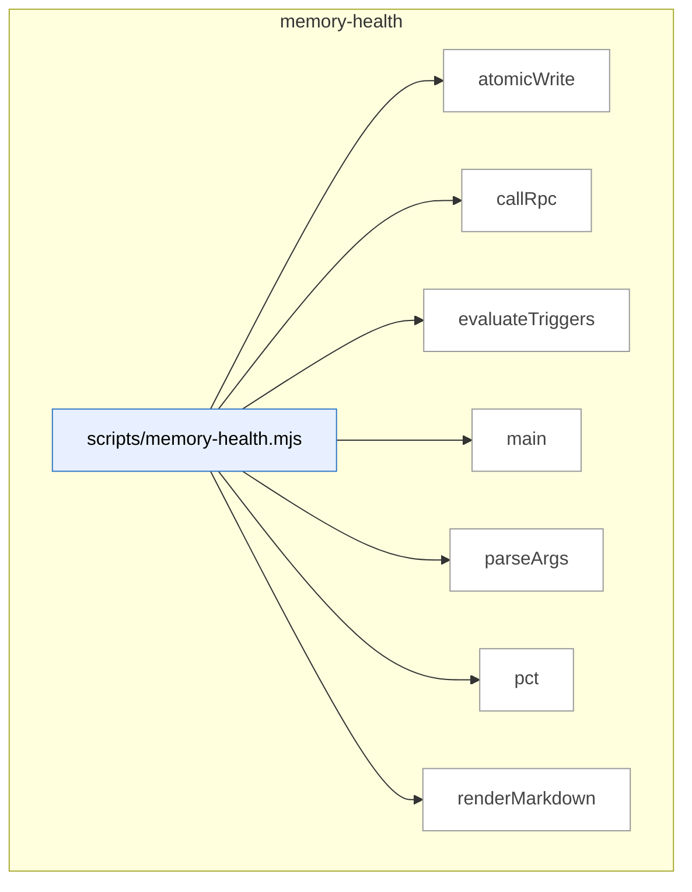

### Symbols in this domain

| Symbol | Kind | Path | Lines | Purpose | File imported by |
|---|---|---|---|---|---|
| [`atomicWrite`](../scripts/memory-health.mjs#L190) | function | `scripts/memory-health.mjs` | 190-196 | Atomically writes content to a file via temp-file-then-rename pattern to prevent corruption. | _(internal)_ |
| [`callRpc`](../scripts/memory-health.mjs#L57) | function | `scripts/memory-health.mjs` | 57-68 | Calls the RPC endpoint for memory health metrics, requiring AUDIT_DB_URL environment variable. | _(internal)_ |
| [`evaluateTriggers`](../scripts/memory-health.mjs#L70) | function | `scripts/memory-health.mjs` | 70-105 | Evaluates three memory-health triggers against thresholds and returns a status (GREEN/AMBER/RED) with fired count. | _(internal)_ |
| [`main`](../scripts/memory-health.mjs#L198) | function | `scripts/memory-health.mjs` | 198-232 | Orchestrates memory-health check workflow: fetch metrics, evaluate triggers, render output (markdown or JSON), and exit with code reflecting trigger status. | _(internal)_ |
| [`parseArgs`](../scripts/memory-health.mjs#L37) | function | `scripts/memory-health.mjs` | 37-55 | Parses command-line arguments for output path, JSON mode, and help flag with usage documentation. | _(internal)_ |
| [`pct`](../scripts/memory-health.mjs#L107) | function | `scripts/memory-health.mjs` | 107-109 | Formats a number as a percentage string to one decimal place. | _(internal)_ |
| [`renderMarkdown`](../scripts/memory-health.mjs#L111) | function | `scripts/memory-health.mjs` | 111-188 | <no body> | _(internal)_ |

---

## plan

> The `plan` domain parses markdown acceptance criteria sections from planning documents, generates content hashes for tracking changes, and scans repository files to extract plan-related keywords and paths for project management workflows.

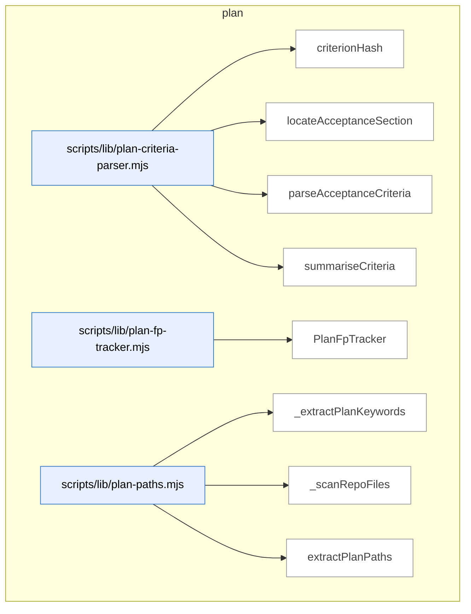

### Symbols in this domain

| Symbol | Kind | Path | Lines | Purpose | File imported by |
|---|---|---|---|---|---|
| [`criterionHash`](../scripts/lib/plan-criteria-parser.mjs#L45) | function | `scripts/lib/plan-criteria-parser.mjs` | 45-48 | Generates a 16-character SHA256-based hash from a criterion's severity, category, and description. | _(internal)_ |
| [`locateAcceptanceSection`](../scripts/lib/plan-criteria-parser.mjs#L56) | function | `scripts/lib/plan-criteria-parser.mjs` | 56-77 | Locates the "Acceptance Criteria" markdown section by heading level, returning start index and content lines. | _(internal)_ |
| [`parseAcceptanceCriteria`](../scripts/lib/plan-criteria-parser.mjs#L96) | function | `scripts/lib/plan-criteria-parser.mjs` | 96-152 | <no body> | _(internal)_ |
| [`summariseCriteria`](../scripts/lib/plan-criteria-parser.mjs#L158) | function | `scripts/lib/plan-criteria-parser.mjs` | 158-166 | Summarizes parsed criteria by counting total, severity distribution, and category distribution. | _(internal)_ |
| [`PlanFpTracker`](../scripts/lib/plan-fp-tracker.mjs#L26) | class | `scripts/lib/plan-fp-tracker.mjs` | 26-140 | <no body> | `scripts/openai-audit.mjs`, `scripts/write-plan-outcomes.mjs` |
| [`_extractPlanKeywords`](../scripts/lib/plan-paths.mjs#L101) | function | `scripts/lib/plan-paths.mjs` | 101-143 | <no body> | `scripts/lib/file-io.mjs` |
| [`_scanRepoFiles`](../scripts/lib/plan-paths.mjs#L145) | function | `scripts/lib/plan-paths.mjs` | 145-171 | Recursively walks the repository directory tree, collecting code files while skipping common build and dependency directories. | `scripts/lib/file-io.mjs` |
| [`extractPlanPaths`](../scripts/lib/plan-paths.mjs#L22) | function | `scripts/lib/plan-paths.mjs` | 22-97 | <no body> | `scripts/lib/file-io.mjs` |

---

## root-scripts

> The `root-scripts` domain handles interactive setup and installation workflows, providing CLI utilities for prerequisite validation, API key configuration, database selection, and skill installation during project initialization.

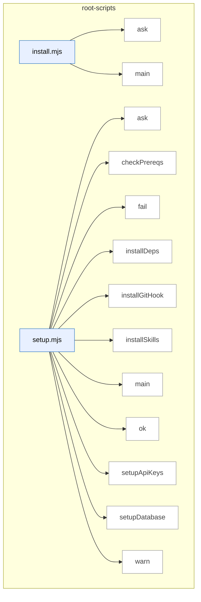

### Symbols in this domain

| Symbol | Kind | Path | Lines | Purpose | File imported by |
|---|---|---|---|---|---|
| [`ask`](../install.mjs#L18) | function | `install.mjs` | 18-18 | Prompts the user with a question and returns a promise that resolves to their input. | _(internal)_ |
| [`main`](../install.mjs#L37) | function | `install.mjs` | 37-238 | <no body> | _(internal)_ |
| [`ask`](../setup.mjs#L25) | function | `setup.mjs` | 25-25 | Returns a promise that prompts the user for input via readline and resolves with their answer. | _(internal)_ |
| [`checkPrereqs`](../setup.mjs#L34) | function | `setup.mjs` | 34-43 | Checks that Node.js version is 18+ and npm is installed, reporting results. | _(internal)_ |
| [`fail`](../setup.mjs#L30) | function | `setup.mjs` | 30-30 | Logs a failure message with a red X symbol prefix. | _(internal)_ |
| [`installDeps`](../setup.mjs#L147) | function | `setup.mjs` | 147-154 | Installs npm dependencies with a timeout, warning if the install fails. | _(internal)_ |
| [`installGitHook`](../setup.mjs#L158) | function | `setup.mjs` | 158-186 | Creates or updates a git post-merge hook to auto-install skills after pulls, handling both new and existing hooks. | _(internal)_ |
| [`installSkills`](../setup.mjs#L129) | function | `setup.mjs` | 129-143 | Builds the skill manifest and installs skills to ~/.claude/skills globally, warning on failure. | _(internal)_ |
| [`main`](../setup.mjs#L190) | function | `setup.mjs` | 190-253 | <no body> | _(internal)_ |
| [`ok`](../setup.mjs#L28) | function | `setup.mjs` | 28-28 | Logs a success message with a green checkmark prefix. | _(internal)_ |
| [`setupApiKeys`](../setup.mjs#L53) | function | `setup.mjs` | 53-80 | Interactively prompts for and saves API keys to .env, skipping required keys in headless mode with a warning. | _(internal)_ |
| [`setupDatabase`](../setup.mjs#L89) | function | `setup.mjs` | 89-125 | Guides the user to select and configure a learning database option, saving relevant environment variables. | _(internal)_ |
| [`warn`](../setup.mjs#L29) | function | `setup.mjs` | 29-29 | Logs a warning message with a yellow warning symbol prefix. | _(internal)_ |

---

## scripts

> The `scripts` domain provides utility and automation scripts for development operations, including API connectivity testing, architecture intent bootstrapping with dependency analysis, and plan file archival with status tracking.

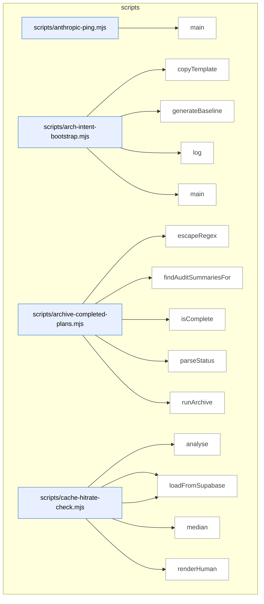

_Domain has 197 symbols (>50). Diagram shows top-15 by file order; see flat table below for the full list._

### Symbols in this domain

| Symbol | Kind | Path | Lines | Purpose | File imported by |
|---|---|---|---|---|---|
| [`main`](../scripts/anthropic-ping.mjs#L24) | function | `scripts/anthropic-ping.mjs` | 24-59 | Tests Claude API connectivity by sending a ping request and reporting latency, usage, and cost. | _(internal)_ |
| [`copyTemplate`](../scripts/arch-intent-bootstrap.mjs#L39) | function | `scripts/arch-intent-bootstrap.mjs` | 39-52 | Copies an architecture-intent template file if it doesn't already exist. | _(internal)_ |
| [`generateBaseline`](../scripts/arch-intent-bootstrap.mjs#L54) | function | `scripts/arch-intent-bootstrap.mjs` | 54-113 | Generates a baseline allowed-dependencies map by analyzing the current import graph across all detected language stacks. | _(internal)_ |
| [`log`](../scripts/arch-intent-bootstrap.mjs#L37) | function | `scripts/arch-intent-bootstrap.mjs` | 37-37 | Writes a prefixed log message to stdout. | _(internal)_ |
| [`main`](../scripts/arch-intent-bootstrap.mjs#L115) | function | `scripts/arch-intent-bootstrap.mjs` | 115-130 | Orchestrates bootstrap setup by copying templates and optionally generating a baseline dependency allowlist. | _(internal)_ |
| [`escapeRegex`](../scripts/archive-completed-plans.mjs#L72) | function | `scripts/archive-completed-plans.mjs` | 72-74 | Escapes special regex characters in a string. | _(internal)_ |
| [`findAuditSummariesFor`](../scripts/archive-completed-plans.mjs#L64) | function | `scripts/archive-completed-plans.mjs` | 64-70 | Finds audit-summary files associated with a given plan file by name pattern. | _(internal)_ |
| [`isComplete`](../scripts/archive-completed-plans.mjs#L54) | function | `scripts/archive-completed-plans.mjs` | 54-57 | Tests whether a status string matches the completion pattern. | _(internal)_ |
| [`parseStatus`](../scripts/archive-completed-plans.mjs#L42) | function | `scripts/archive-completed-plans.mjs` | 42-46 | Extracts the Status line value from plan file content using a regex. | _(internal)_ |
| [`runArchive`](../scripts/archive-completed-plans.mjs#L86) | function | `scripts/archive-completed-plans.mjs` | 86-145 | Moves completed plan files and their audit summaries to an archive directory with duplicate handling. | _(internal)_ |
| [`analyse`](../scripts/cache-hitrate-check.mjs#L108) | function | `scripts/cache-hitrate-check.mjs` | 108-142 | <no body> | _(internal)_ |
| [`loadFromLocal`](../scripts/cache-hitrate-check.mjs#L89) | function | `scripts/cache-hitrate-check.mjs` | 89-106 | Loads cache metrics from a local JSONL log file, filtering for round 2+ and recent entries. | _(internal)_ |
| [`loadFromSupabase`](../scripts/cache-hitrate-check.mjs#L62) | function | `scripts/cache-hitrate-check.mjs` | 62-87 | Queries Supabase audit_runs table for cache metrics since a cutoff date. | _(internal)_ |
| [`median`](../scripts/cache-hitrate-check.mjs#L53) | function | `scripts/cache-hitrate-check.mjs` | 53-60 | Returns the median of a numeric array. | _(internal)_ |
| [`renderHuman`](../scripts/cache-hitrate-check.mjs#L144) | function | `scripts/cache-hitrate-check.mjs` | 144-169 | Displays human-readable recommendation and per-run cache hit-rate analysis. | _(internal)_ |
| [`loadConfig`](../scripts/claudemd-lint.mjs#L48) | function | `scripts/claudemd-lint.mjs` | 48-66 | Loads linting configuration from specified path or default .claudemd-lint.json, returning empty object if neither exists or on parse error. | _(internal)_ |
| [`main`](../scripts/claudemd-lint.mjs#L68) | function | `scripts/claudemd-lint.mjs` | 68-172 | <no body> | _(internal)_ |
| [`parseArgs`](../scripts/claudemd-lint.mjs#L26) | function | `scripts/claudemd-lint.mjs` | 26-46 | Parses command-line arguments for format, output file, config path, fix mode, and yes-to-all flag. | _(internal)_ |
| [`archMemoryNeighbourhood`](../scripts/explain-history.mjs#L148) | function | `scripts/explain-history.mjs` | 148-179 | Queries the architecture memory system for code neighbourhood recommendations filtered by intent. | _(internal)_ |
| [`brainstormSearch`](../scripts/explain-history.mjs#L232) | function | `scripts/explain-history.mjs` | 232-277 | Searches brainstorm session JSONL files for topic and provider-response matches. | _(internal)_ |
| [`buildChronological`](../scripts/explain-history.mjs#L285) | function | `scripts/explain-history.mjs` | 285-300 | Merges git, brainstorm, plan, and arch-memory results into a chronologically sorted timeline. | _(internal)_ |
| [`buildSummary`](../scripts/explain-history.mjs#L314) | function | `scripts/explain-history.mjs` | 314-321 | Generates a human-readable summary of how many touches a topic has across all sources. | _(internal)_ |
| [`gitLogSearch`](../scripts/explain-history.mjs#L89) | function | `scripts/explain-history.mjs` | 89-140 | Searches git commit history and content for a topic using grep and -S, deduplicating results. | _(internal)_ |
| [`main`](../scripts/explain-history.mjs#L323) | function | `scripts/explain-history.mjs` | 323-380 | Parses arguments, searches multiple sources, builds a timeline, and outputs structured results to stdout. | _(internal)_ |
| [`parseArgs`](../scripts/explain-history.mjs#L51) | function | `scripts/explain-history.mjs` | 51-80 | Parses command-line flags for history explanation including topic, date range, path filters, and output options. | _(internal)_ |
| [`planMtimeMap`](../scripts/explain-history.mjs#L302) | function | `scripts/explain-history.mjs` | 302-312 | Collects file modification times for plan matches to aid chronological ordering. | _(internal)_ |
| [`planSearch`](../scripts/explain-history.mjs#L186) | function | `scripts/explain-history.mjs` | 186-213 | Walks plan documents and returns line-level matches with headings and excerpts. | _(internal)_ |
| [`walkMarkdown`](../scripts/explain-history.mjs#L215) | function | `scripts/explain-history.mjs` | 215-223 | Recursively collects all markdown files in a directory tree. | _(internal)_ |
| [`appendLocalFallback`](../scripts/friction-log.mjs#L88) | function | `scripts/friction-log.mjs` | 88-94 | Appends a JSON record to a local fallback file, creating parent directories if needed. | `scripts/cross-skill.mjs` |
| [`defaultExecGit`](../scripts/friction-log.mjs#L75) | function | `scripts/friction-log.mjs` | 75-84 | Executes a git command with timeout and stderr suppression, returning stdout or null on failure. | `scripts/cross-skill.mjs` |
| [`detectRepoName`](../scripts/friction-log.mjs#L61) | function | `scripts/friction-log.mjs` | 61-73 | Detects repository name from git remote URL or falls back to directory basename. | `scripts/cross-skill.mjs` |
| [`helpText`](../scripts/friction-log.mjs#L164) | function | `scripts/friction-log.mjs` | 164-174 | Returns formatted help text for the friction-log CLI. | `scripts/cross-skill.mjs` |
| [`main`](../scripts/friction-log.mjs#L185) | function | `scripts/friction-log.mjs` | 185-207 | Parses arguments, runs friction logging, outputs JSON, handles errors, and exits with appropriate codes. | `scripts/cross-skill.mjs` |
| [`parseArgs`](../scripts/friction-log.mjs#L31) | function | `scripts/friction-log.mjs` | 31-44 | Parses friction-log CLI flags including severity, repo, message, and help options. | `scripts/cross-skill.mjs` |
| [`runFrictionLog`](../scripts/friction-log.mjs#L98) | function | `scripts/friction-log.mjs` | 98-162 | Logs friction to the cloud learning store or falls back to a local file when cloud is unavailable. | `scripts/cross-skill.mjs` |
| [`validateArgs`](../scripts/friction-log.mjs#L46) | function | `scripts/friction-log.mjs` | 46-53 | Validates that a message exists and severity is in the allowed set. | `scripts/cross-skill.mjs` |
| [`installInRepo`](../scripts/install-prepush-hook.mjs#L113) | function | `scripts/install-prepush-hook.mjs` | 113-163 | Installs, updates, or uninstalls a pre-push hook in target repos, handling dry-run and existing hook detection. | _(internal)_ |
| [`isManagedHook`](../scripts/install-prepush-hook.mjs#L41) | function | `scripts/install-prepush-hook.mjs` | 41-45 | Checks if a hook file contains the managed hook marker or legacy markers. | _(internal)_ |
| [`main`](../scripts/install-prepush-hook.mjs#L167) | function | `scripts/install-prepush-hook.mjs` | 167-191 | Resolves target repos, applies the hook installation action, and outputs results in human or JSON format. | _(internal)_ |
| [`computeArchMemoryBandOutcome`](../scripts/learning/backfill-outcomes.mjs#L500) | function | `scripts/learning/backfill-outcomes.mjs` | 500-551 | Detects arch memory band outcomes by checking for commits in the file directory within 30 minutes after the decision. | `scripts/cross-skill.mjs` |
| [`computeConvergencePredictOutcome`](../scripts/learning/backfill-outcomes.mjs#L575) | function | `scripts/learning/backfill-outcomes.mjs` | 575-619 | Determines convergence predict outcomes by querying the run's convergence round and comparing against the decision round. | `scripts/cross-skill.mjs` |
| [`computeFileFingerprint`](../scripts/learning/backfill-outcomes.mjs#L396) | function | `scripts/learning/backfill-outcomes.mjs` | 396-408 | Computes a SHA256 hash of the first 256 bytes of a file for rotation detection. | `scripts/cross-skill.mjs` |
| [`computeOutcomeFromFileState`](../scripts/learning/backfill-outcomes.mjs#L638) | function | `scripts/learning/backfill-outcomes.mjs` | 638-696 | Resolves file paths safely and checks if a code snippet exists in the file, returning accept/reject/uncertain outcomes. | `scripts/cross-skill.mjs` |
| [`defaultExecGit`](../scripts/learning/backfill-outcomes.mjs#L553) | function | `scripts/learning/backfill-outcomes.mjs` | 553-560 | Runs a git log command with specified args and options, returning command output as a string. | `scripts/cross-skill.mjs` |
| [`drainFrictionFallback`](../scripts/learning/backfill-outcomes.mjs#L282) | function | `scripts/learning/backfill-outcomes.mjs` | 282-346 | Drains friction notes from a local JSONL fallback file, resolves repo names, and uploads to cloud. | `scripts/cross-skill.mjs` |
| [`drainJsonlToCloud`](../scripts/learning/backfill-outcomes.mjs#L141) | function | `scripts/learning/backfill-outcomes.mjs` | 141-271 | Reads appended lines from a JSONL file using a cursor, detects file rotation via fingerprint, and batches inserts to cloud. | `scripts/cross-skill.mjs` |
| [`readDrainCursor`](../scripts/learning/backfill-outcomes.mjs#L361) | function | `scripts/learning/backfill-outcomes.mjs` | 361-382 | Loads the drain cursor from disk, parsing JSON or legacy int format, with fallback to offset 0. | `scripts/cross-skill.mjs` |
| [`resolveUnresolvedOutcomes`](../scripts/learning/backfill-outcomes.mjs#L412) | function | `scripts/learning/backfill-outcomes.mjs` | 412-474 | Examines unresolved decisions by type, invoking the appropriate outcome detector (quickfix, arch memory, convergence). | `scripts/cross-skill.mjs` |
| [`runBackfill`](../scripts/learning/backfill-outcomes.mjs#L59) | function | `scripts/learning/backfill-outcomes.mjs` | 59-125 | Orchestrates backfilling by draining outcomes to cloud, resolving pending decisions, and optionally rebuilding stats. | `scripts/cross-skill.mjs` |
| [`writeDrainCursor`](../scripts/learning/backfill-outcomes.mjs#L384) | function | `scripts/learning/backfill-outcomes.mjs` | 384-389 | Writes the drain cursor (offset, fingerprint, timestamp) as JSON to disk. | `scripts/cross-skill.mjs` |
| [`fmtNum`](../scripts/learning/replay.mjs#L92) | function | `scripts/learning/replay.mjs` | 92-95 | Formats a number to 2 decimals if ≥1, otherwise 4 decimals. | `scripts/cross-skill.mjs` |
| [`loadPolicy`](../scripts/learning/replay.mjs#L99) | function | `scripts/learning/replay.mjs` | 99-109 | Dynamically imports a policy function from a file path (absolute or relative), validating it exports default or named 'policy'. | `scripts/cross-skill.mjs` |
| [`parseDuration`](../scripts/learning/replay.mjs#L54) | function | `scripts/learning/replay.mjs` | 54-63 | Parses duration strings like "30d", "5h", "1000ms" into milliseconds using regex and multiplier table. | `scripts/cross-skill.mjs` |
| [`renderMarkdownReport`](../scripts/learning/replay.mjs#L67) | function | `scripts/learning/replay.mjs` | 67-90 | Renders a markdown report table showing baseline vs. candidate policy reward distributions, delta, and promotion gates. | `scripts/cross-skill.mjs` |
| [`runReplayCli`](../scripts/learning/replay.mjs#L120) | function | `scripts/learning/replay.mjs` | 120-170 | CLI entry point for replay: parses decision_type and option flags, loads policies, and runs replay simulation with optional JSON/markdown output. | `scripts/cross-skill.mjs` |
| [`applyTotalCap`](../scripts/learning/weekly-review.mjs#L135) | function | `scripts/learning/weekly-review.mjs` | 135-155 | Applies a total item cap across four digest sections, allocating remaining slots after friction takes priority if present. | `scripts/cross-skill.mjs` |
| [`buildFrictionSection`](../scripts/learning/weekly-review.mjs#L116) | function | `scripts/learning/weekly-review.mjs` | 116-126 | Sorts friction notes by severity rank then recency, caps to a limit, and returns items with overflow count and total count. | `scripts/cross-skill.mjs` |
| [`buildNoBrainerSection`](../scripts/learning/weekly-review.mjs#L95) | function | `scripts/learning/weekly-review.mjs` | 95-103 | Sorts recommendations by occurrence count descending then last-seen recency, caps to a limit, and returns items with overflow count. | `scripts/cross-skill.mjs` |
| [`buildStaleSection`](../scripts/learning/weekly-review.mjs#L105) | function | `scripts/learning/weekly-review.mjs` | 105-110 | Sorts stale clusters by last-seen time ascending (oldest first), caps to a limit, and returns items with overflow count. | `scripts/cross-skill.mjs` |
| [`buildTriageSection`](../scripts/learning/weekly-review.mjs#L84) | function | `scripts/learning/weekly-review.mjs` | 84-93 | Sorts findings by severity then recency, caps to a limit, and returns items with overflow count and total count. | `scripts/cross-skill.mjs` |
| [`fmtPath`](../scripts/learning/weekly-review.mjs#L165) | function | `scripts/learning/weekly-review.mjs` | 165-168 | Escapes backticks in file paths for safe inclusion inside markdown code spans. | `scripts/cross-skill.mjs` |
| [`fmtTitle`](../scripts/learning/weekly-review.mjs#L159) | function | `scripts/learning/weekly-review.mjs` | 159-163 | Truncates a title to 120 characters, normalizes whitespace, and escapes markdown. | `scripts/cross-skill.mjs` |
| [`humanizeAgo`](../scripts/learning/weekly-review.mjs#L174) | function | `scripts/learning/weekly-review.mjs` | 174-186 | Converts an ISO timestamp to a human-readable relative time string (e.g., "3h ago"). | `scripts/cross-skill.mjs` |
| [`mdEscape`](../scripts/learning/weekly-review.mjs#L69) | function | `scripts/learning/weekly-review.mjs` | 69-80 | Escapes markdown special characters (backslash, backtick, asterisk, underscore, brackets, angle brackets) for safe rendering. | `scripts/cross-skill.mjs` |
| [`postOrUpdateStickyIssue`](../scripts/learning/weekly-review.mjs#L282) | function | `scripts/learning/weekly-review.mjs` | 282-340 | Posts or updates a GitHub issue with sticky findings, re-opening closed issues if new findings persist. | `scripts/cross-skill.mjs` |
| [`renderMarkdown`](../scripts/learning/weekly-review.mjs#L188) | function | `scripts/learning/weekly-review.mjs` | 188-278 | Renders a complete markdown digest of friction notes, triage findings, no-brainer recommendations, and stale deferrals with sections, counts, and overflows. | `scripts/cross-skill.mjs` |
| [`runWeeklyReview`](../scripts/learning/weekly-review.mjs#L351) | function | `scripts/learning/weekly-review.mjs` | 351-415 | Orchestrates weekly review by querying learning store for triage/friction/stale findings and rendering markdown report. | `scripts/cross-skill.mjs` |
| [`severityRank`](../scripts/learning/weekly-review.mjs#L52) | function | `scripts/learning/weekly-review.mjs` | 52-60 | Returns a numeric sort rank for finding severity levels, with unknown severities ranked highest for attention. | `scripts/cross-skill.mjs` |
| [`run`](../scripts/migrate-v3-run-metadata.mjs#L66) | function | `scripts/migrate-v3-run-metadata.mjs` | 66-84 | Connects to PostgreSQL and applies database schema migrations, exiting with error code if any fail. | _(internal)_ |
| [`assertSourceIsPersonaTest`](../scripts/migrations/2026-05-20-persona-test-to-audit-loop.mjs#L58) | function | `scripts/migrations/2026-05-20-persona-test-to-audit-loop.mjs` | 58-65 | Validates that the source URL contains the Persona Test project reference. | _(internal)_ |
| [`assertTargetIsAuditLoop`](../scripts/migrations/2026-05-20-persona-test-to-audit-loop.mjs#L66) | function | `scripts/migrations/2026-05-20-persona-test-to-audit-loop.mjs` | 66-73 | Validates that the target URL contains the Audit-loop project reference. | _(internal)_ |
| [`bindValue`](../scripts/migrations/2026-05-20-persona-test-to-audit-loop.mjs#L122) | function | `scripts/migrations/2026-05-20-persona-test-to-audit-loop.mjs` | 122-128 | Serializes JSON/JSONB values and returns other values unchanged for SQL binding. | _(internal)_ |
| [`bulkInsert`](../scripts/migrations/2026-05-20-persona-test-to-audit-loop.mjs#L139) | function | `scripts/migrations/2026-05-20-persona-test-to-audit-loop.mjs` | 139-159 | Bulk-inserts rows into a table with ON CONFLICT DO NOTHING, returning inserted/skipped counts. | _(internal)_ |
| [`filterColumns`](../scripts/migrations/2026-05-20-persona-test-to-audit-loop.mjs#L102) | function | `scripts/migrations/2026-05-20-persona-test-to-audit-loop.mjs` | 102-110 | Filters source rows to include only columns that exist in the target, tracking dropped columns. | _(internal)_ |
| [`getTargetColumns`](../scripts/migrations/2026-05-20-persona-test-to-audit-loop.mjs#L87) | function | `scripts/migrations/2026-05-20-persona-test-to-audit-loop.mjs` | 87-100 | Fetches target table column names and data types to filter compatible columns. | _(internal)_ |
| [`main`](../scripts/migrations/2026-05-20-persona-test-to-audit-loop.mjs#L163) | function | `scripts/migrations/2026-05-20-persona-test-to-audit-loop.mjs` | 163-222 | <no body> | _(internal)_ |
| [`parseArgs`](../scripts/migrations/2026-05-20-persona-test-to-audit-loop.mjs#L34) | function | `scripts/migrations/2026-05-20-persona-test-to-audit-loop.mjs` | 34-54 | Parses CLI arguments for source/target URLs and dry-run flag, exiting on missing required args. | _(internal)_ |
| [`quoteIdent`](../scripts/migrations/2026-05-20-persona-test-to-audit-loop.mjs#L132) | function | `scripts/migrations/2026-05-20-persona-test-to-audit-loop.mjs` | 132-137 | Quotes a PostgreSQL identifier, throwing if it contains invalid characters. | _(internal)_ |
| [`readSource`](../scripts/migrations/2026-05-20-persona-test-to-audit-loop.mjs#L77) | function | `scripts/migrations/2026-05-20-persona-test-to-audit-loop.mjs` | 77-85 | Queries both personas and persona_test_sessions tables from the source database. | _(internal)_ |
| [`callCrossSkill`](../scripts/persona-consistency-promote.mjs#L64) | function | `scripts/persona-consistency-promote.mjs` | 64-89 | Executes a cross-skill CLI command and parses its JSON response, with detailed error handling. | _(internal)_ |
| [`defaultPrompt`](../scripts/persona-consistency-promote.mjs#L556) | function | `scripts/persona-consistency-promote.mjs` | 556-561 | Creates an interactive readline prompt that returns a promise resolving to the user's input. | _(internal)_ |
| [`listConsistencyCandidatesViaCli`](../scripts/persona-consistency-promote.mjs#L91) | function | `scripts/persona-consistency-promote.mjs` | 91-100 | Lists pending consistency candidates via CLI, logging errors and returning empty array on failure. | _(internal)_ |
| [`parseArgs`](../scripts/persona-consistency-promote.mjs#L135) | function | `scripts/persona-consistency-promote.mjs` | 135-152 | Parses command-line arguments for promotion flags (auto, since, repo-root, out, help). | _(internal)_ |
| [`promoteCandidates`](../scripts/persona-consistency-promote.mjs#L188) | function | `scripts/persona-consistency-promote.mjs` | 188-269 | <no body> | _(internal)_ |
| [`promoteOne`](../scripts/persona-consistency-promote.mjs#L275) | function | `scripts/persona-consistency-promote.mjs` | 275-416 | <no body> | _(internal)_ |
| [`promoteRegressionSpecViaCli`](../scripts/persona-consistency-promote.mjs#L102) | function | `scripts/persona-consistency-promote.mjs` | 102-108 | Calls the CLI to promote a regression spec, returning success status and affected row count. | _(internal)_ |
| [`readLocalRepoUuid`](../scripts/persona-consistency-promote.mjs#L563) | function | `scripts/persona-consistency-promote.mjs` | 563-569 | Reads the repo UUID from a local `.audit-loop/repo-identity.json` file, returning null if missing. | _(internal)_ |
| [`reconcilePromotionJournal`](../scripts/persona-consistency-promote.mjs#L422) | function | `scripts/persona-consistency-promote.mjs` | 422-539 | <no body> | _(internal)_ |
| [`recordShipEventViaCli`](../scripts/persona-consistency-promote.mjs#L110) | function | `scripts/persona-consistency-promote.mjs` | 110-117 | Records a ship event via CLI, treating cloud-off as success. | _(internal)_ |
| [`removeJournal`](../scripts/persona-consistency-promote.mjs#L551) | function | `scripts/persona-consistency-promote.mjs` | 551-554 | Deletes a promotion journal entry file by spec ID. | _(internal)_ |
| [`safeGitBranch`](../scripts/persona-consistency-promote.mjs#L585) | function | `scripts/persona-consistency-promote.mjs` | 585-591 | Retrieves the current git branch name, returning null if unavailable. | _(internal)_ |
| [`safeGitEmail`](../scripts/persona-consistency-promote.mjs#L571) | function | `scripts/persona-consistency-promote.mjs` | 571-577 | Retrieves the git user email from the repo config, returning null if unavailable. | _(internal)_ |
| [`safeGitSha`](../scripts/persona-consistency-promote.mjs#L578) | function | `scripts/persona-consistency-promote.mjs` | 578-584 | Retrieves the current git commit SHA, returning null if unavailable. | _(internal)_ |
| [`usage`](../scripts/persona-consistency-promote.mjs#L154) | function | `scripts/persona-consistency-promote.mjs` | 154-167 | Returns usage text for the consistency promotion script. | _(internal)_ |
| [`writeJournal`](../scripts/persona-consistency-promote.mjs#L545) | function | `scripts/persona-consistency-promote.mjs` | 545-549 | Writes a promotion journal entry to a timestamped JSON file in the journal directory. | _(internal)_ |
| [`applyWait`](../scripts/persona-consistency-run.mjs#L702) | function | `scripts/persona-consistency-run.mjs` | 702-715 | Applies a wait condition (visible/hidden/url/network/timeout) on the page and resolves when satisfied. | _(internal)_ |
| [`awaitManifestNetworkSources`](../scripts/persona-consistency-run.mjs#L534) | function | `scripts/persona-consistency-run.mjs` | 534-607 | Waits for network sources declared in the manifest to fire, respecting CLI overrides and per-source timeout configurations. | _(internal)_ |
| [`candidateDescription`](../scripts/persona-consistency-run.mjs#L766) | function | `scripts/persona-consistency-run.mjs` | 766-768 | Generates a one-line description of a candidate finding including kind, surface, field, and severity. | _(internal)_ |
| [`candidateWorthy`](../scripts/persona-consistency-run.mjs#L759) | function | `scripts/persona-consistency-run.mjs` | 759-764 | Filters candidates to only report high-severity (P0/P1) non-canary-expected findings with a surfaceId. | _(internal)_ |
| [`cssEscape`](../scripts/persona-consistency-run.mjs#L698) | function | `scripts/persona-consistency-run.mjs` | 698-700 | Escapes special characters in a CSS selector to make it safe for use in locator queries. | _(internal)_ |
| [`describeAction`](../scripts/persona-consistency-run.mjs#L717) | function | `scripts/persona-consistency-run.mjs` | 717-726 | Generates a human-readable description of a test step action for logging output. | _(internal)_ |
| [`detectUnannotatedSurfaces`](../scripts/persona-consistency-run.mjs#L629) | function | `scripts/persona-consistency-run.mjs` | 629-667 | Detects surfaces in the DOM that were not annotated with engine claims during the test execution. | _(internal)_ |
| [`emptyWitness`](../scripts/persona-consistency-run.mjs#L791) | function | `scripts/persona-consistency-run.mjs` | 791-800 | Returns an empty witness object for a given step index with no claims. | _(internal)_ |
| [`executeStep`](../scripts/persona-consistency-run.mjs#L465) | function | `scripts/persona-consistency-run.mjs` | 465-504 | Executes a single step (navigate/click/fill/wait/evaluate) from a test journey and returns the resolved outcome. | _(internal)_ |
| [`joinUrl`](../scripts/persona-consistency-run.mjs#L802) | function | `scripts/persona-consistency-run.mjs` | 802-808 | Joins a base URL with a path suffix, handling trailing slashes and absolute URLs correctly. | _(internal)_ |
| [`locatorOf`](../scripts/persona-consistency-run.mjs#L681) | function | `scripts/persona-consistency-run.mjs` | 681-692 | Converts a locator object to a Playwright page locator for querying the live DOM. | _(internal)_ |
| [`locatorString`](../scripts/persona-consistency-run.mjs#L728) | function | `scripts/persona-consistency-run.mjs` | 728-738 | Converts a locator object to a human-readable string representation for error messages. | _(internal)_ |
| [`locatorToStringLite`](../scripts/persona-consistency-run.mjs#L669) | function | `scripts/persona-consistency-run.mjs` | 669-679 | Converts a locator object to a human-readable selector string for logging. | _(internal)_ |
| [`newAuthedContext`](../scripts/persona-consistency-run.mjs#L742) | function | `scripts/persona-consistency-run.mjs` | 742-755 | Creates a new browser context with authentication applied (storageState, Bearer token, or none). | _(internal)_ |
| [`parseArgs`](../scripts/persona-consistency-run.mjs#L56) | function | `scripts/persona-consistency-run.mjs` | 56-77 | Parses command-line arguments for canary name, URL, output path, repo root, and await timeout in milliseconds. | _(internal)_ |
| [`readLocalRepoUuid`](../scripts/persona-consistency-run.mjs#L827) | function | `scripts/persona-consistency-run.mjs` | 827-836 | Reads the repo UUID from .audit-loop/repo-identity.json for candidate emission control, returning null if absent. | _(internal)_ |
| [`runConsistency`](../scripts/persona-consistency-run.mjs#L117) | function | `scripts/persona-consistency-run.mjs` | 117-458 | Main runner that orchestrates a consistency test: validates args, opens ledger, launches browser, executes canary steps, captures witness data, and reports findings. | _(internal)_ |
| [`safeBrowserClose`](../scripts/persona-consistency-run.mjs#L823) | function | `scripts/persona-consistency-run.mjs` | 823-825 | Closes the browser safely, swallowing any exceptions. | _(internal)_ |
| [`safeCurrentRoute`](../scripts/persona-consistency-run.mjs#L810) | function | `scripts/persona-consistency-run.mjs` | 810-812 | Extracts the current page pathname as a route, returning null if the URL is unparseable. | _(internal)_ |
| [`safeGitSha`](../scripts/persona-consistency-run.mjs#L814) | function | `scripts/persona-consistency-run.mjs` | 814-821 | Retrieves the current git commit SHA from the repo, returning null if unavailable. | _(internal)_ |
| [`shrinkWitness`](../scripts/persona-consistency-run.mjs#L773) | function | `scripts/persona-consistency-run.mjs` | 773-787 | Creates a shrunken witness containing only claims matching the given candidate's scope. | _(internal)_ |
| [`usage`](../scripts/persona-consistency-run.mjs#L79) | function | `scripts/persona-consistency-run.mjs` | 79-96 | Outputs usage help text for the persona-consistency-run script with all supported flags and examples. | _(internal)_ |
| [`checkReadiness`](../scripts/phase7-check.mjs#L13) | function | `scripts/phase7-check.mjs` | 13-63 | Measures progress toward Phase 7 readiness by counting unique audit runs from the outcomes log and comparing against a threshold. | _(internal)_ |
| [`main`](../scripts/phase7-check.mjs#L65) | function | `scripts/phase7-check.mjs` | 65-68 | Checks if the current session has enough audit data to enable Phase 7 ML-based pass selection. | _(internal)_ |
| [`formatHumanReport`](../scripts/postgres-parity/check-non-core-references.mjs#L166) | function | `scripts/postgres-parity/check-non-core-references.mjs` | 166-186 | Formats findings into a human-readable report with remediation guidance or an OK message. | _(internal)_ |
| [`main`](../scripts/postgres-parity/check-non-core-references.mjs#L190) | function | `scripts/postgres-parity/check-non-core-references.mjs` | 190-217 | Main entry point that reads migrations, scans for findings, outputs JSON or human report, and exits with code 1 if strict mode and violations found. | _(internal)_ |
| [`pathToFileUrl`](../scripts/postgres-parity/check-non-core-references.mjs#L221) | function | `scripts/postgres-parity/check-non-core-references.mjs` | 221-221 | Converts a file path to a file:// URL with proper escaping and normalization. | _(internal)_ |
| [`readMigrations`](../scripts/postgres-parity/check-non-core-references.mjs#L60) | function | `scripts/postgres-parity/check-non-core-references.mjs` | 60-69 | Reads and parses all .sql migration files from the migrations directory in sorted order. | _(internal)_ |
| [`scanForFindings`](../scripts/postgres-parity/check-non-core-references.mjs#L71) | function | `scripts/postgres-parity/check-non-core-references.mjs` | 71-162 | Scans migrations for disallowed references (auth functions, roles, extensions, public qualifications) and collects findings. | _(internal)_ |
| [`main`](../scripts/postgres-parity/generate-expected-schema.mjs#L183) | function | `scripts/postgres-parity/generate-expected-schema.mjs` | 183-217 | Main entry point that queries a migrated Postgres database and writes the current schema state to a JSON file. | _(internal)_ |
| [`assertLocalOnly`](../scripts/postgres-parity/record-golden-fixtures.mjs#L92) | function | `scripts/postgres-parity/record-golden-fixtures.mjs` | 92-135 | Validates that fixture recording runs only against local or explicitly-allowed remote Supabase projects, blocking production. | _(internal)_ |
| [`captureTableSnapshot`](../scripts/postgres-parity/record-golden-fixtures.mjs#L194) | function | `scripts/postgres-parity/record-golden-fixtures.mjs` | 194-198 | Placeholder function that returns an empty snapshot to surface TODO implementation. | _(internal)_ |
| [`diffSnapshots`](../scripts/postgres-parity/record-golden-fixtures.mjs#L200) | function | `scripts/postgres-parity/record-golden-fixtures.mjs` | 200-202 | Placeholder function that returns an empty diff since snapshot capture is not yet implemented. | _(internal)_ |
| [`main`](../scripts/postgres-parity/record-golden-fixtures.mjs#L232) | function | `scripts/postgres-parity/record-golden-fixtures.mjs` | 232-281 | Main entry point that records golden fixtures: sets up environment, loads legacy module, runs matrix of functions, writes JSON fixtures with frozen SHAs. | _(internal)_ |
| [`normaliseMutation`](../scripts/postgres-parity/record-golden-fixtures.mjs#L228) | function | `scripts/postgres-parity/record-golden-fixtures.mjs` | 228-228 | Normalizes a mutation object using the generic normalizeValues function. | _(internal)_ |
| [`normaliseValues`](../scripts/postgres-parity/record-golden-fixtures.mjs#L209) | function | `scripts/postgres-parity/record-golden-fixtures.mjs` | 209-226 | Normalizes function return values by replacing UUIDs and timestamps with placeholders and recursing through nested structures. | _(internal)_ |
| [`parseArgs`](../scripts/postgres-parity/record-golden-fixtures.mjs#L47) | function | `scripts/postgres-parity/record-golden-fixtures.mjs` | 47-79 | Parses CLI arguments for fixture recording (legacy path, Supabase credentials, output dir, remote allowlist). | _(internal)_ |
| [`runOne`](../scripts/postgres-parity/record-golden-fixtures.mjs#L158) | function | `scripts/postgres-parity/record-golden-fixtures.mjs` | 158-186 | Records golden fixtures by invoking a legacy function with input, capturing mutations, normalizing values/UUIDs/timestamps. | _(internal)_ |
| [`sourceSha`](../scripts/postgres-parity/record-golden-fixtures.mjs#L283) | function | `scripts/postgres-parity/record-golden-fixtures.mjs` | 283-292 | Gets the git commit SHA for a source file, falling back to a content hash if uncommitted. | _(internal)_ |
| [`cmdExtract`](../scripts/requirements.mjs#L57) | function | `scripts/requirements.mjs` | 57-99 | Extracts requirements from source files with configurable run count, validates input, and writes candidates and gaps JSON files under lock. | _(internal)_ |
| [`cmdIndex`](../scripts/requirements.mjs#L158) | function | `scripts/requirements.mjs` | 158-166 | Loads the requirements ledger and outputs an index of all requirements with kind/status filters. | _(internal)_ |
| [`cmdReconcile`](../scripts/requirements.mjs#L101) | function | `scripts/requirements.mjs` | 101-156 | Reconciles extracted requirements with gap assessments and overrides, validates schemas, and produces a final ledger JSON under lock. | _(internal)_ |
| [`cmdRender`](../scripts/requirements.mjs#L169) | function | `scripts/requirements.mjs` | 169-179 | Renders the requirements ledger as a Markdown map and writes it to the output file. | _(internal)_ |
| [`flag`](../scripts/requirements.mjs#L52) | function | `scripts/requirements.mjs` | 52-55 | Extracts a flag value from argv by finding the flag name and returning the next argument. | _(internal)_ |
| [`gitSha`](../scripts/requirements.mjs#L44) | function | `scripts/requirements.mjs` | 44-50 | Gets the current git commit SHA, returning null if unavailable. | _(internal)_ |
| [`main`](../scripts/requirements.mjs#L181) | function | `scripts/requirements.mjs` | 181-198 | Main entry point that dispatches to extract/reconcile/index/render subcommands based on argv[0]. | _(internal)_ |
| [`classifyMitigation`](../scripts/security-memory/incident-status.mjs#L33) | function | `scripts/security-memory/incident-status.mjs` | 33-57 | Classifies mitigation status by checking semgrep rule existence, execution success, and test pass/fail. | `scripts/security-memory/refresh-incidents.mjs` |
| [`runSemgrepIfNeeded`](../scripts/security-memory/incident-status.mjs#L71) | function | `scripts/security-memory/incident-status.mjs` | 71-150 | Runs semgrep rule if not cached, verifying rule file path safety and handling registry-vs-local rules. | `scripts/security-memory/refresh-incidents.mjs` |
| [`sha256`](../scripts/security-memory/incident-status.mjs#L152) | function | `scripts/security-memory/incident-status.mjs` | 152-154 | Returns the first 16 hex characters of a SHA256 hash of input text. | `scripts/security-memory/refresh-incidents.mjs` |
| [`computeFingerprint`](../scripts/security-memory/parse-strategy.mjs#L191) | function | `scripts/security-memory/parse-strategy.mjs` | 191-199 | Generates a 16-character SHA-256 hash of normalized incident metadata for deduplication. | `scripts/security-memory/refresh-incidents.mjs` |
| [`deriveMitigationKind`](../scripts/security-memory/parse-strategy.mjs#L184) | function | `scripts/security-memory/parse-strategy.mjs` | 184-189 | Determines mitigation kind (manual/semgrep/file-ref) from mitigation reference string format. | `scripts/security-memory/refresh-incidents.mjs` |
| [`extractFields`](../scripts/security-memory/parse-strategy.mjs#L116) | function | `scripts/security-memory/parse-strategy.mjs` | 116-161 | Extracts typed fields (description, affected paths, mitigation, lessons) from an incident block. | `scripts/security-memory/refresh-incidents.mjs` |
| [`lineOfOffset`](../scripts/security-memory/parse-strategy.mjs#L201) | function | `scripts/security-memory/parse-strategy.mjs` | 201-207 | Counts newlines in text up to a given offset to determine the line number. | `scripts/security-memory/refresh-incidents.mjs` |
| [`parsePathList`](../scripts/security-memory/parse-strategy.mjs#L169) | function | `scripts/security-memory/parse-strategy.mjs` | 169-182 | Parses a comma- or newline-delimited list of paths, supporting bulleted format. | `scripts/security-memory/refresh-incidents.mjs` |
| [`parseSecurityStrategy`](../scripts/security-memory/parse-strategy.mjs#L35) | function | `scripts/security-memory/parse-strategy.mjs` | 35-109 | Parses markdown security strategy document, extracting threat model and incident blocks with validation. | `scripts/security-memory/refresh-incidents.mjs` |
| [`generateEmbedding`](../scripts/security-memory/refresh-incidents.mjs#L107) | function | `scripts/security-memory/refresh-incidents.mjs` | 107-124 | Calls the embedding API to convert text into a vector, validating that the result is a non-empty array of the expected dimensionality. | _(internal)_ |
| [`gitArgs`](../scripts/security-memory/refresh-incidents.mjs#L51) | function | `scripts/security-memory/refresh-incidents.mjs` | 51-53 | Executes a git command in a specified directory and returns trimmed stdout. | _(internal)_ |
| [`gitHeadSha`](../scripts/security-memory/refresh-incidents.mjs#L55) | function | `scripts/security-memory/refresh-incidents.mjs` | 55-58 | Retrieves the current HEAD commit SHA, returning 'unknown' if git fails. | _(internal)_ |
| [`isOnDefaultBranch`](../scripts/security-memory/refresh-incidents.mjs#L60) | function | `scripts/security-memory/refresh-incidents.mjs` | 60-101 | Determines whether the working directory is on the default branch by checking branch name first, then SHA equality as a fallback for detached HEAD. | _(internal)_ |
| [`logInfo`](../scripts/security-memory/refresh-incidents.mjs#L45) | function | `scripts/security-memory/refresh-incidents.mjs` | 45-45 | Writes an info message to stderr prefixed with a security-refresh tag. | _(internal)_ |
| [`logWarn`](../scripts/security-memory/refresh-incidents.mjs#L46) | function | `scripts/security-memory/refresh-incidents.mjs` | 46-46 | Writes a warning message to stderr prefixed with a security-refresh tag. | _(internal)_ |
| [`main`](../scripts/security-memory/refresh-incidents.mjs#L126) | function | `scripts/security-memory/refresh-incidents.mjs` | 126-304 | Refreshes the security incident memory by upserting repo metadata, selecting the active embedding model, and preparing for symbol indexing. | _(internal)_ |
| [`applyBootstrap`](../scripts/setup-postgres.mjs#L233) | function | `scripts/setup-postgres.mjs` | 233-240 | Applies the compat-bootstrap.sql file to initialize authentication schema, optionally dry-running. | _(internal)_ |
| [`applyMigration`](../scripts/setup-postgres.mjs#L221) | function | `scripts/setup-postgres.mjs` | 221-231 | Applies a single migration by reading its SQL and executing it, optionally dry-running. | _(internal)_ |
| [`canonicalise`](../scripts/setup-postgres.mjs#L293) | function | `scripts/setup-postgres.mjs` | 293-304 | Recursively canonicalizes values for comparison by sorting arrays and object keys to ensure consistent JSON representation. | _(internal)_ |
| [`captureLiveSchema`](../scripts/setup-postgres.mjs#L252) | function | `scripts/setup-postgres.mjs` | 252-264 | Captures the live database schema by executing shared catalog queries and returning the results. | _(internal)_ |
| [`diffSchemas`](../scripts/setup-postgres.mjs#L266) | function | `scripts/setup-postgres.mjs` | 266-290 | Compares expected and live schema catalogs, computing item-level diffs for objects that differ. | _(internal)_ |
| [`isSupabaseManaged`](../scripts/setup-postgres.mjs#L164) | function | `scripts/setup-postgres.mjs` | 164-176 | Checks if the `auth` schema is Supabase-managed by examining its owner in pg_namespace. | _(internal)_ |
| [`listMigrations`](../scripts/setup-postgres.mjs#L210) | function | `scripts/setup-postgres.mjs` | 210-213 | Lists all SQL migration files from the migrations directory in sorted order. | _(internal)_ |
| [`main`](../scripts/setup-postgres.mjs#L524) | function | `scripts/setup-postgres.mjs` | 524-566 | Main entry point that parses arguments, connects to Postgres, runs preflight checks, and dispatches to migrate or adopt mode. | _(internal)_ |
| [`parseArgs`](../scripts/setup-postgres.mjs#L48) | function | `scripts/setup-postgres.mjs` | 48-76 | Parses command-line flags to determine the setup mode (migrate or adopt), preflight-only, bootstrap-only, or dry-run settings. | _(internal)_ |
| [`preflight`](../scripts/setup-postgres.mjs#L91) | function | `scripts/setup-postgres.mjs` | 91-114 | Queries Postgres for CREATEROLE privilege and checks which required extensions are present, available, or missing. | _(internal)_ |
| [`readLedger`](../scripts/setup-postgres.mjs#L195) | function | `scripts/setup-postgres.mjs` | 195-198 | Reads the migration ledger from the audit_loop_migrations table, returning a map of filename to SHA256. | _(internal)_ |
| [`recordApplied`](../scripts/setup-postgres.mjs#L200) | function | `scripts/setup-postgres.mjs` | 200-206 | Records or updates a migration entry in the audit_loop_migrations table with its SHA256 hash. | _(internal)_ |
| [`reportPreflight`](../scripts/setup-postgres.mjs#L116) | function | `scripts/setup-postgres.mjs` | 116-150 | Reports preflight status to stderr and enforces strict requirements (CREATEROLE and extensions) when running in migrate mode. | _(internal)_ |
| [`runAdopt`](../scripts/setup-postgres.mjs#L471) | function | `scripts/setup-postgres.mjs` | 471-520 | Validates live schema against an expected manifest and either seeds the migration ledger or reports drift. | _(internal)_ |
| [`runMigrate`](../scripts/setup-postgres.mjs#L430) | function | `scripts/setup-postgres.mjs` | 430-469 | Applies pending migrations in sequence, skipping those already applied with matching SHA256, and records each completion. | _(internal)_ |
| [`sha256`](../scripts/setup-postgres.mjs#L215) | function | `scripts/setup-postgres.mjs` | 215-219 | Computes the SHA256 hash of a file. | _(internal)_ |
| [`main`](../scripts/skills-fit-check.mjs#L136) | function | `scripts/skills-fit-check.mjs` | 136-153 | Parses CLI arguments, runs a fit check, and outputs results as JSON or formatted card, exiting with appropriate code. | _(internal)_ |
| [`parseArgs`](../scripts/skills-fit-check.mjs#L26) | function | `scripts/skills-fit-check.mjs` | 26-36 | Parses CLI arguments for repo root, JSON output, quiet mode, and help flag. | _(internal)_ |
| [`renderCard`](../scripts/skills-fit-check.mjs#L85) | function | `scripts/skills-fit-check.mjs` | 85-131 | Renders a formatted ASCII card displaying repo profile, fit verdicts grouped by status (fits/partial/mismatch), and setup guidance. | _(internal)_ |
| [`runFitCheck`](../scripts/skills-fit-check.mjs#L53) | function | `scripts/skills-fit-check.mjs` | 53-83 | Runs the skills fit-check: detects repo shape, applies rules, groups verdicts, persists report, and returns exit code with report. | _(internal)_ |
| [`yn`](../scripts/skills-fit-check.mjs#L133) | function | `scripts/skills-fit-check.mjs` | 133-133 | Returns "yes" or "no" string based on boolean input. | _(internal)_ |
| [`escapePipe`](../scripts/skills-help.mjs#L259) | function | `scripts/skills-help.mjs` | 259-261 | Escapes pipe characters and newlines in a string for safe inclusion in Markdown table cells. | `scripts/lib/dashboard/collect-reference.mjs` |
| [`filterBySearch`](../scripts/skills-help.mjs#L194) | function | `scripts/skills-help.mjs` | 194-204 | Filters skills by matching name, description, triggers, or usage against a search term. | `scripts/lib/dashboard/collect-reference.mjs` |
| [`loadAllSkills`](../scripts/skills-help.mjs#L175) | function | `scripts/skills-help.mjs` | 175-188 | Loads and sorts all skills from the skills directory by parsing their SKILL.md files. | `scripts/lib/dashboard/collect-reference.mjs` |
| [`main`](../scripts/skills-help.mjs#L270) | function | `scripts/skills-help.mjs` | 270-313 | Main entry point that loads skills, handles command-line arguments, and outputs help text, detailed skill info, search results, or all skills in requested format. | `scripts/lib/dashboard/collect-reference.mjs` |
| [`parseArgs`](../scripts/skills-help.mjs#L49) | function | `scripts/skills-help.mjs` | 49-72 | Parses CLI arguments for skill name, search term, output format, and destination file. | `scripts/lib/dashboard/collect-reference.mjs` |
| [`parseSkill`](../scripts/skills-help.mjs#L79) | function | `scripts/skills-help.mjs` | 79-169 | Extracts structured metadata from a SKILL.md file including name, one-liner description, triggers, and usage examples. | `scripts/lib/dashboard/collect-reference.mjs` |
| [`renderCompactMd`](../scripts/skills-help.mjs#L208) | function | `scripts/skills-help.mjs` | 208-229 | Renders a compact Markdown table listing all skills with their one-liners and manual-invocation flags. | `scripts/lib/dashboard/collect-reference.mjs` |
| [`renderDetailMd`](../scripts/skills-help.mjs#L231) | function | `scripts/skills-help.mjs` | 231-257 | Renders full Markdown documentation for a single skill including triggers, usage examples, and invocation mode. | `scripts/lib/dashboard/collect-reference.mjs` |
| [`renderJson`](../scripts/skills-help.mjs#L263) | function | `scripts/skills-help.mjs` | 263-266 | Converts a skill or array of skills to pretty-printed JSON format. | `scripts/lib/dashboard/collect-reference.mjs` |
| [`findSyncTargets`](../scripts/sync-shared-audit-refs.mjs#L68) | function | `scripts/sync-shared-audit-refs.mjs` | 68-112 | Discovers canonical shared reference documents and pairs them with expected and auto-discovered skill consumer locations. | _(internal)_ |
| [`main`](../scripts/sync-shared-audit-refs.mjs#L114) | function | `scripts/sync-shared-audit-refs.mjs` | 114-163 | Synchronizes canonical audit reference files to skill directories, tracking sync status and reporting drift or changes. | _(internal)_ |
| [`loginAsTestUser`](../scripts/templates/e2e-helpers/auth.js#L16) | function | `scripts/templates/e2e-helpers/auth.js` | 16-28 | Injects authentication token and cellar ID into browser localStorage for test login. | _(internal)_ |
| [`expectNoA11yViolations`](../scripts/templates/e2e-helpers/axe.js#L18) | function | `scripts/templates/e2e-helpers/axe.js` | 18-40 | Runs axe-core accessibility audit and throws if WCAG violations are found. | _(internal)_ |
| [`main`](../scripts/write-code-outcomes.mjs#L61) | function | `scripts/write-code-outcomes.mjs` | 61-108 | Orchestrates the full outcome recording workflow: validates inputs, records triage results to cloud or local storage, and reports labeling progress. | _(internal)_ |
| [`parseArgs`](../scripts/write-code-outcomes.mjs#L42) | function | `scripts/write-code-outcomes.mjs` | 42-50 | Extracts command-line flags (--result, --ledger, --round) into an args object. | _(internal)_ |
| [`readJsonOrDie`](../scripts/write-code-outcomes.mjs#L52) | function | `scripts/write-code-outcomes.mjs` | 52-59 | Reads and parses a JSON file, terminating process on failure. | _(internal)_ |
| [`addEntry`](../scripts/write-ledger-r1.mjs#L6) | function | `scripts/write-ledger-r1.mjs` | 6-25 | Records a security finding in the audit ledger with outcome and remediation metadata. | _(internal)_ |
| [`main`](../scripts/write-plan-outcomes.mjs#L28) | function | `scripts/write-plan-outcomes.mjs` | 28-78 | Reads result JSON, applies outcome actions (dismiss/fix/defer/rebut) to findings, and records them in tracker. | _(internal)_ |
| [`parseArgs`](../scripts/write-plan-outcomes.mjs#L19) | function | `scripts/write-plan-outcomes.mjs` | 19-26 | Parses command-line arguments for `--result` and `--outcomes` file paths. | _(internal)_ |

---

## shared-lib

> The `shared-lib` domain abstracts Anthropic client initialization and message handling, providing a unified interface over SDK and CLI backends with features like timeout validation, secret redaction, and message format conversion.

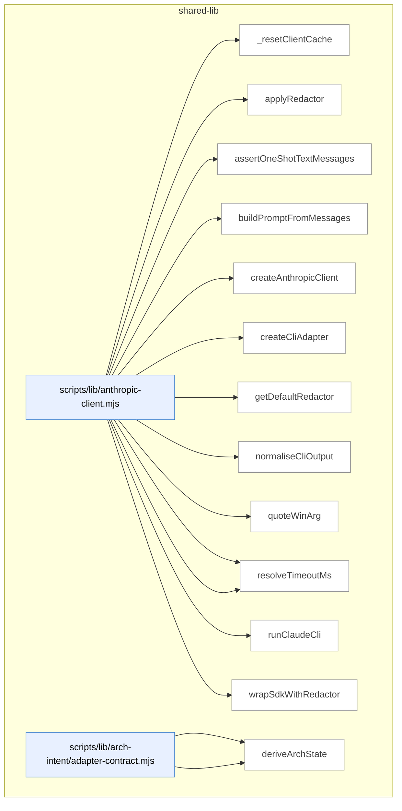

_Domain has 521 symbols (>50). Diagram shows top-15 by file order; see flat table below for the full list._

### Symbols in this domain

| Symbol | Kind | Path | Lines | Purpose | File imported by |
|---|---|---|---|---|---|
| [`_resetClientCache`](../scripts/lib/anthropic-client.mjs#L271) | function | `scripts/lib/anthropic-client.mjs` | 271-274 | Clears the client cache and resets warning flags for testing. | `scripts/anthropic-ping.mjs`, `scripts/lib/context.mjs`, `scripts/lib/neighbourhood-query.mjs` |
| [`applyRedactor`](../scripts/lib/anthropic-client.mjs#L236) | function | `scripts/lib/anthropic-client.mjs` | 236-265 | Recursively applies a redactor function to system prompts and message content. | `scripts/anthropic-ping.mjs`, `scripts/lib/context.mjs`, `scripts/lib/neighbourhood-query.mjs` |
| [`assertOneShotTextMessages`](../scripts/lib/anthropic-client.mjs#L349) | function | `scripts/lib/anthropic-client.mjs` | 349-378 | Validates that messages are user-role text-only for CLI backend compatibility. | `scripts/anthropic-ping.mjs`, `scripts/lib/context.mjs`, `scripts/lib/neighbourhood-query.mjs` |
| [`buildPromptFromMessages`](../scripts/lib/anthropic-client.mjs#L386) | function | `scripts/lib/anthropic-client.mjs` | 386-403 | Concatenates message content blocks into a single prompt string. | `scripts/anthropic-ping.mjs`, `scripts/lib/context.mjs`, `scripts/lib/neighbourhood-query.mjs` |
| [`createAnthropicClient`](../scripts/lib/anthropic-client.mjs#L155) | function | `scripts/lib/anthropic-client.mjs` | 155-200 | Creates a cached Anthropic client with optional redaction, supporting both SDK and CLI backends. | `scripts/anthropic-ping.mjs`, `scripts/lib/context.mjs`, `scripts/lib/neighbourhood-query.mjs` |
| [`createCliAdapter`](../scripts/lib/anthropic-client.mjs#L286) | function | `scripts/lib/anthropic-client.mjs` | 286-340 | Creates a CLI adapter that executes the `claude` binary with system prompt and messages. | `scripts/anthropic-ping.mjs`, `scripts/lib/context.mjs`, `scripts/lib/neighbourhood-query.mjs` |
| [`getDefaultRedactor`](../scripts/lib/anthropic-client.mjs#L204) | function | `scripts/lib/anthropic-client.mjs` | 204-210 | Lazily loads and caches the default secret-redaction function. | `scripts/anthropic-ping.mjs`, `scripts/lib/context.mjs`, `scripts/lib/neighbourhood-query.mjs` |
| [`normaliseCliOutput`](../scripts/lib/anthropic-client.mjs#L578) | function | `scripts/lib/anthropic-client.mjs` | 578-626 | Parses and validates claude CLI JSON output, extracting content, usage, and metadata. | `scripts/anthropic-ping.mjs`, `scripts/lib/context.mjs`, `scripts/lib/neighbourhood-query.mjs` |
| [`quoteWinArg`](../scripts/lib/anthropic-client.mjs#L652) | function | `scripts/lib/anthropic-client.mjs` | 652-657 | Quotes a Windows command-line argument, escaping special characters and embedded quotes. | `scripts/anthropic-ping.mjs`, `scripts/lib/context.mjs`, `scripts/lib/neighbourhood-query.mjs` |
| [`resolveBackend`](../scripts/lib/anthropic-client.mjs#L114) | function | `scripts/lib/anthropic-client.mjs` | 114-127 | Resolves and validates the backend choice (sdk or cli) from environment, rejecting invalid values. | `scripts/anthropic-ping.mjs`, `scripts/lib/context.mjs`, `scripts/lib/neighbourhood-query.mjs` |
| [`resolveTimeoutMs`](../scripts/lib/anthropic-client.mjs#L87) | function | `scripts/lib/anthropic-client.mjs` | 87-98 | Validates and constrains CLI timeout to a safe range using environment or option values. | `scripts/anthropic-ping.mjs`, `scripts/lib/context.mjs`, `scripts/lib/neighbourhood-query.mjs` |
| [`runClaudeCli`](../scripts/lib/anthropic-client.mjs#L424) | function | `scripts/lib/anthropic-client.mjs` | 424-538 | Spawns the claude CLI binary with stdin/stdout piping and timeout/signal handling. | `scripts/anthropic-ping.mjs`, `scripts/lib/context.mjs`, `scripts/lib/neighbourhood-query.mjs` |
| [`wrapSdkWithRedactor`](../scripts/lib/anthropic-client.mjs#L217) | function | `scripts/lib/anthropic-client.mjs` | 217-226 | Wraps an SDK client to apply redaction to message parameters before sending. | `scripts/anthropic-ping.mjs`, `scripts/lib/context.mjs`, `scripts/lib/neighbourhood-query.mjs` |
| [`computeDeadIntent`](../scripts/lib/arch-intent/adapter-contract.mjs#L151) | function | `scripts/lib/arch-intent/adapter-contract.mjs` | 151-159 | Computes which declared domains have no live files and returns them sorted. | `scripts/arch-intent-bootstrap.mjs`, `scripts/openai-audit.mjs` |
| [`deriveArchState`](../scripts/lib/arch-intent/adapter-contract.mjs#L321) | function | `scripts/lib/arch-intent/adapter-contract.mjs` | 321-332 | Determines the overall analysis state of an architecture report based on stack results (ok/error/unsupported/clean). | `scripts/arch-intent-bootstrap.mjs`, `scripts/openai-audit.mjs` |
| [`fsWalkFallback`](../scripts/lib/arch-intent/adapter-contract.mjs#L68) | function | `scripts/lib/arch-intent/adapter-contract.mjs` | 68-88 | Recursively walks a directory tree excluding common non-source directories, returning relative file paths. | `scripts/arch-intent-bootstrap.mjs`, `scripts/openai-audit.mjs` |
| [`inventoryFiles`](../scripts/lib/arch-intent/adapter-contract.mjs#L104) | function | `scripts/lib/arch-intent/adapter-contract.mjs` | 104-140 | Inventories repository source files using git ls-files or fallback fs-walk, then maps each to its domain. | `scripts/arch-intent-bootstrap.mjs`, `scripts/openai-audit.mjs` |
| [`isArchIntentReportClean`](../scripts/lib/arch-intent/adapter-contract.mjs#L307) | function | `scripts/lib/arch-intent/adapter-contract.mjs` | 307-312 | Checks whether an arch-intent report is clean (no violations, unmapped files, dead intent, or errors). | `scripts/arch-intent-bootstrap.mjs`, `scripts/openai-audit.mjs` |
| [`loadAdapter`](../scripts/lib/arch-intent/adapter-contract.mjs#L174) | function | `scripts/lib/arch-intent/adapter-contract.mjs` | 174-192 | Dynamically imports an adapter module for a given stack kind, checking existence before loading. | `scripts/arch-intent-bootstrap.mjs`, `scripts/openai-audit.mjs` |
| [`runArchIntentAnalysis`](../scripts/lib/arch-intent/adapter-contract.mjs#L223) | function | `scripts/lib/arch-intent/adapter-contract.mjs` | 223-289 | Orchestrates multi-stack import analysis by inventorying files, loading adapters, analyzing violations, and merging results. | `scripts/arch-intent-bootstrap.mjs`, `scripts/openai-audit.mjs` |
| [`validateAdapterReport`](../scripts/lib/arch-intent/adapter-contract.mjs#L201) | function | `scripts/lib/arch-intent/adapter-contract.mjs` | 201-212 | Validates an adapter's return value against the report schema, throwing on mismatch. | `scripts/arch-intent-bootstrap.mjs`, `scripts/openai-audit.mjs` |
| [`analyseImports`](../scripts/lib/arch-intent/adapters/java.mjs#L325) | function | `scripts/lib/arch-intent/adapters/java.mjs` | 325-444 | Analyzes all Java imports in mapped files and emits violations for cross-domain dependencies. | _(internal)_ |
| [`buildJavaResolutionIndex`](../scripts/lib/arch-intent/adapters/java.mjs#L176) | function | `scripts/lib/arch-intent/adapters/java.mjs` | 176-233 | Builds indices mapping fully-qualified names and packages to Java files, with source root resolution. | _(internal)_ |
| [`extractImports`](../scripts/lib/arch-intent/adapters/java.mjs#L132) | function | `scripts/lib/arch-intent/adapters/java.mjs` | 132-164 | Parses all import statements from Java source, capturing FQN, static/wildcard flags, and line numbers. | _(internal)_ |
| [`extractPackage`](../scripts/lib/arch-intent/adapters/java.mjs#L115) | function | `scripts/lib/arch-intent/adapters/java.mjs` | 115-118 | Extracts the package declaration from stripped Java source code. | _(internal)_ |
| [`progressiveResolve`](../scripts/lib/arch-intent/adapters/java.mjs#L246) | function | `scripts/lib/arch-intent/adapters/java.mjs` | 246-265 | Resolves a Java class reference by progressively matching qualified name segments against the FQN index. | _(internal)_ |
| [`resolveJavaImport`](../scripts/lib/arch-intent/adapters/java.mjs#L275) | function | `scripts/lib/arch-intent/adapters/java.mjs` | 275-314 | Resolves Java import statements (static, wildcard, regular) to local or external targets using the resolution index. | _(internal)_ |
| [`stripJavaCommentsAndLiterals`](../scripts/lib/arch-intent/adapters/java.mjs#L44) | function | `scripts/lib/arch-intent/adapters/java.mjs` | 44-106 | Strips Java comments (line/block) and string/char literals from source while preserving line structure. | _(internal)_ |
| [`analyseImports`](../scripts/lib/arch-intent/adapters/js-ts.mjs#L74) | function | `scripts/lib/arch-intent/adapters/js-ts.mjs` | 74-214 | Runs dependency-cruiser against mapped JS/TS files and produces a normalised edge graph with metadata. | _(internal)_ |
| [`classifyEdge`](../scripts/lib/arch-intent/adapters/js-ts.mjs#L33) | function | `scripts/lib/arch-intent/adapters/js-ts.mjs` | 33-49 | Classifies a dependency edge as type-only, dynamic, unresolved, vendor, or local-file based on dependency-cruiser metadata. | _(internal)_ |
| [`normalisePath`](../scripts/lib/arch-intent/adapters/js-ts.mjs#L58) | function | `scripts/lib/arch-intent/adapters/js-ts.mjs` | 58-63 | Normalises a file path to be relative to the repository root with forward slashes. | _(internal)_ |
| [`analyseImports`](../scripts/lib/arch-intent/adapters/postgres.mjs#L605) | function | `scripts/lib/arch-intent/adapters/postgres.mjs` | 605-698 | Analyzes all SQL files in mapped files and emits violations for cross-domain object references. | _(internal)_ |
| [`buildSqlCatalog`](../scripts/lib/arch-intent/adapters/postgres.mjs#L499) | function | `scripts/lib/arch-intent/adapters/postgres.mjs` | 499-560 | Builds a catalogue mapping SQL object names to their definitions and tracking redefinitions and epochs. | _(internal)_ |
| [`classifyStatement`](../scripts/lib/arch-intent/adapters/postgres.mjs#L295) | function | `scripts/lib/arch-intent/adapters/postgres.mjs` | 295-427 | Classifies individual SQL statements (CREATE TABLE/VIEW/FUNCTION/etc) and extracts object references. | _(internal)_ |
| [`displayName`](../scripts/lib/arch-intent/adapters/postgres.mjs#L234) | function | `scripts/lib/arch-intent/adapters/postgres.mjs` | 234-236 | Reverses the dot-escaping applied by `normName` for human-readable display. | _(internal)_ |
| [`extractCallRefs`](../scripts/lib/arch-intent/adapters/postgres.mjs#L460) | function | `scripts/lib/arch-intent/adapters/postgres.mjs` | 460-471 | Extracts function call references from a SQL expression body via regex pattern matching. | _(internal)_ |
| [`extractPolicyTableRefs`](../scripts/lib/arch-intent/adapters/postgres.mjs#L474) | function | `scripts/lib/arch-intent/adapters/postgres.mjs` | 474-483 | Extracts table references from a SQL policy expression via FROM/JOIN clauses and qualified names. | _(internal)_ |
| [`extractSelectRefs`](../scripts/lib/arch-intent/adapters/postgres.mjs#L440) | function | `scripts/lib/arch-intent/adapters/postgres.mjs` | 440-457 | Extracts table/view references from a SQL SELECT statement, excluding CTEs and function calls. | _(internal)_ |
| [`naturalCompare`](../scripts/lib/arch-intent/adapters/postgres.mjs#L488) | function | `scripts/lib/arch-intent/adapters/postgres.mjs` | 488-490 | Performs natural (numeric-aware) string comparison for sorting. | _(internal)_ |
| [`normName`](../scripts/lib/arch-intent/adapters/postgres.mjs#L197) | function | `scripts/lib/arch-intent/adapters/postgres.mjs` | 197-228 | Normalises a SQL identifier by splitting on unquoted dots, preserving case in quoted segments, and escaping literal dots. | _(internal)_ |
| [`parseFile`](../scripts/lib/arch-intent/adapters/postgres.mjs#L262) | function | `scripts/lib/arch-intent/adapters/postgres.mjs` | 262-293 | Parses a SQL file into statement boundaries, tracking quoted identifiers to avoid false statement splits. | _(internal)_ |
| [`recoverFunctionBody`](../scripts/lib/arch-intent/adapters/postgres.mjs#L430) | function | `scripts/lib/arch-intent/adapters/postgres.mjs` | 430-437 | Extracts the body text of a SQL function from dollar-quoted or string-literal syntax. | _(internal)_ |
| [`resolveSqlRef`](../scripts/lib/arch-intent/adapters/postgres.mjs#L571) | function | `scripts/lib/arch-intent/adapters/postgres.mjs` | 571-594 | Resolves a SQL reference name to a local definition or proven-external (builtin/pg_catalog) state. | _(internal)_ |
| [`splitTopLevel`](../scripts/lib/arch-intent/adapters/postgres.mjs#L239) | function | `scripts/lib/arch-intent/adapters/postgres.mjs` | 239-250 | Splits a string on a separator character only at depth-0 parentheses (respecting nesting). | _(internal)_ |
| [`stripSqlCommentsAndStrings`](../scripts/lib/arch-intent/adapters/postgres.mjs#L102) | function | `scripts/lib/arch-intent/adapters/postgres.mjs` | 102-187 | Strips PostgreSQL comments (line/block/nested) and string literals (single-quoted, dollar-quoted) from source. | _(internal)_ |
| [`analyseImports`](../scripts/lib/arch-intent/adapters/python.mjs#L507) | function | `scripts/lib/arch-intent/adapters/python.mjs` | 507-586 | Analyzes all Python imports in mapped files and emits violations for cross-domain module references. | _(internal)_ |
| [`buildPythonModuleIndex`](../scripts/lib/arch-intent/adapters/python.mjs#L383) | function | `scripts/lib/arch-intent/adapters/python.mjs` | 383-426 | Builds an index mapping dotted module names to their defining files, tracking collisions. | _(internal)_ |
| [`countUnbalanced`](../scripts/lib/arch-intent/adapters/python.mjs#L254) | function | `scripts/lib/arch-intent/adapters/python.mjs` | 254-261 | Counts unbalanced opening/closing parentheses in a string for continuation detection. | _(internal)_ |
| [`discoverPythonRoots`](../scripts/lib/arch-intent/adapters/python.mjs#L287) | function | `scripts/lib/arch-intent/adapters/python.mjs` | 287-350 | Discovers Python package roots by inspecting metadata files, src/ directories, and __init__.py locations. | _(internal)_ |
| [`extractImports`](../scripts/lib/arch-intent/adapters/python.mjs#L196) | function | `scripts/lib/arch-intent/adapters/python.mjs` | 196-251 | Extracts import statements from Python source (both `import` and `from...import` forms), handling continuations. | _(internal)_ |
| [`extractPackageDirs`](../scripts/lib/arch-intent/adapters/python.mjs#L353) | function | `scripts/lib/arch-intent/adapters/python.mjs` | 353-364 | Extracts package directory declarations from setup.cfg/pyproject.toml configuration files. | _(internal)_ |
| [`isPySource`](../scripts/lib/arch-intent/adapters/python.mjs#L366) | function | `scripts/lib/arch-intent/adapters/python.mjs` | 366-369 | Checks if a file path is a Python source file (.py or .pyi extension). | _(internal)_ |
| [`parseImportedNames`](../scripts/lib/arch-intent/adapters/python.mjs#L264) | function | `scripts/lib/arch-intent/adapters/python.mjs` | 264-271 | Parses the imported names from a Python import clause, handling aliases and wildcards. | _(internal)_ |
| [`resolvePythonImport`](../scripts/lib/arch-intent/adapters/python.mjs#L439) | function | `scripts/lib/arch-intent/adapters/python.mjs` | 439-496 | Resolves a Python import reference (absolute or relative) to local files or proven-external state. | _(internal)_ |
| [`stripPythonCommentsAndStrings`](../scripts/lib/arch-intent/adapters/python.mjs#L72) | function | `scripts/lib/arch-intent/adapters/python.mjs` | 72-178 | Strips Python comments and string literals (raw/f-string/triple-quoted) from source while preserving structure. | _(internal)_ |
| [`checkDepAllowed`](../scripts/lib/arch-intent/domain-resolver.mjs#L53) | function | `scripts/lib/arch-intent/domain-resolver.mjs` | 53-60 | Checks whether a dependency from one domain to another is allowed by the domain map configuration. | `scripts/arch-intent-bootstrap.mjs`, `scripts/lib/arch-intent/adapter-contract.mjs`, `scripts/lib/arch-intent/adapters/java.mjs`, +4 more |
| [`computeDeclaredDomains`](../scripts/lib/arch-intent/domain-resolver.mjs#L76) | function | `scripts/lib/arch-intent/domain-resolver.mjs` | 76-86 | Collects all declared domains from rules, allowedDeps keys/values, and description keys. | `scripts/arch-intent-bootstrap.mjs`, `scripts/lib/arch-intent/adapter-contract.mjs`, `scripts/lib/arch-intent/adapters/java.mjs`, +4 more |
| [`resolveFileToDomain`](../scripts/lib/arch-intent/domain-resolver.mjs#L29) | function | `scripts/lib/arch-intent/domain-resolver.mjs` | 29-38 | Maps a file path to its domain using glob pattern matching against domain-map rules. | `scripts/arch-intent-bootstrap.mjs`, `scripts/lib/arch-intent/adapter-contract.mjs`, `scripts/lib/arch-intent/adapters/java.mjs`, +4 more |
| [`ArchIntentAnalyzerError`](../scripts/lib/arch-intent/errors.mjs#L18) | class | `scripts/lib/arch-intent/errors.mjs` | 18-25 | Custom error class for architecture intent analyzer failures with stack kind and cause tracking. | `scripts/lib/arch-intent/adapter-contract.mjs`, `scripts/lib/arch-intent/load-config.mjs`, `scripts/lib/arch-intent/semantic-validator.mjs`, +1 more |
| [`ArchIntentConfigError`](../scripts/lib/arch-intent/errors.mjs#L9) | class | `scripts/lib/arch-intent/errors.mjs` | 9-16 | Custom error class for architecture intent configuration issues with semantic validation flag. | `scripts/lib/arch-intent/adapter-contract.mjs`, `scripts/lib/arch-intent/load-config.mjs`, `scripts/lib/arch-intent/semantic-validator.mjs`, +1 more |
| [`parseIntentDoc`](../scripts/lib/arch-intent/intent-doc-parser.mjs#L27) | function | `scripts/lib/arch-intent/intent-doc-parser.mjs` | 27-78 | Parses an intent document (markdown) to extract mermaid diagram, version, and section narratives. | `scripts/openai-audit.mjs` |
| [`loadArchIntentConfig`](../scripts/lib/arch-intent/load-config.mjs#L35) | function | `scripts/lib/arch-intent/load-config.mjs` | 35-69 | Loads and validates the domain-map.json configuration file with schema and semantic checks. | `scripts/arch-intent-bootstrap.mjs`, `scripts/openai-audit.mjs` |
| [`rulesDeclaredDomains`](../scripts/lib/arch-intent/semantic-validator.mjs#L30) | function | `scripts/lib/arch-intent/semantic-validator.mjs` | 30-34 | Extracts the set of domains declared in the rules array. | `scripts/lib/arch-intent/load-config.mjs` |
| [`validateDomainMapSemantics`](../scripts/lib/arch-intent/semantic-validator.mjs#L42) | function | `scripts/lib/arch-intent/semantic-validator.mjs` | 42-97 | Validates domain-map semantics: checks allowedDeps references, description keys, and rule shadowing. | `scripts/lib/arch-intent/load-config.mjs` |
| [`escapeMarkdown`](../scripts/lib/arch-render.mjs#L22) | function | `scripts/lib/arch-render.mjs` | 22-28 | Escapes pipe characters, newlines, and carriage returns for Markdown. | `scripts/symbol-index/drift.mjs`, `scripts/symbol-index/render-mermaid.mjs` |
| [`escapeMermaidLabel`](../scripts/lib/arch-render.mjs#L31) | function | `scripts/lib/arch-render.mjs` | 31-37 | Escapes quotes and special characters, truncates to 60 chars for Mermaid labels. | `scripts/symbol-index/drift.mjs`, `scripts/symbol-index/render-mermaid.mjs` |
| [`groupByDomain`](../scripts/lib/arch-render.mjs#L45) | function | `scripts/lib/arch-render.mjs` | 45-63 | Groups symbols by domain tag and sorts alphabetically by domain, then by file and name within each. | `scripts/symbol-index/drift.mjs`, `scripts/symbol-index/render-mermaid.mjs` |
| [`mermaidId`](../scripts/lib/arch-render.mjs#L40) | function | `scripts/lib/arch-render.mjs` | 40-42 | Sanitizes a key into a valid Mermaid identifier with prefix and character limits. | `scripts/symbol-index/drift.mjs`, `scripts/symbol-index/render-mermaid.mjs` |
| [`renderArchitectureMap`](../scripts/lib/arch-render.mjs#L171) | function | `scripts/lib/arch-render.mjs` | 171-286 | Generates a complete architecture map document with TOC, per-domain sections, diagrams, tables, and violations. | `scripts/symbol-index/drift.mjs`, `scripts/symbol-index/render-mermaid.mjs` |
| [`renderDriftIssue`](../scripts/lib/arch-render.mjs#L360) | function | `scripts/lib/arch-render.mjs` | 360-422 | Renders a drift report with top duplication clusters and their members. | `scripts/symbol-index/drift.mjs`, `scripts/symbol-index/render-mermaid.mjs` |
| [`renderHeader`](../scripts/lib/arch-render.mjs#L157) | function | `scripts/lib/arch-render.mjs` | 157-168 | Renders the header metadata block with repo name, generation info, and drift metrics. | `scripts/symbol-index/drift.mjs`, `scripts/symbol-index/render-mermaid.mjs` |
| [`renderMermaidContainer`](../scripts/lib/arch-render.mjs#L69) | function | `scripts/lib/arch-render.mjs` | 69-103 | Renders a Mermaid flowchart showing domain structure with file-to-symbol hierarchy, truncating if >50 symbols. | `scripts/symbol-index/drift.mjs`, `scripts/symbol-index/render-mermaid.mjs` |
| [`renderNeighbourhoodCallout`](../scripts/lib/arch-render.mjs#L289) | function | `scripts/lib/arch-render.mjs` | 289-357 | Renders a callout block showing neighbourhood symbol-index consultation results or error status. | `scripts/symbol-index/drift.mjs`, `scripts/symbol-index/render-mermaid.mjs` |
| [`renderSymbolTable`](../scripts/lib/arch-render.mjs#L114) | function | `scripts/lib/arch-render.mjs` | 114-138 | Renders symbols as a Markdown table with optional "where used" column showing importing files. | `scripts/symbol-index/drift.mjs`, `scripts/symbol-index/render-mermaid.mjs` |
| [`renderWhereUsed`](../scripts/lib/arch-render.mjs#L140) | function | `scripts/lib/arch-render.mjs` | 140-154 | Formats a list of file importers for display, showing top 3 with count of remaining. | `scripts/symbol-index/drift.mjs`, `scripts/symbol-index/render-mermaid.mjs` |
| [`assertRepoRoot`](../scripts/lib/assert-repo-root.mjs#L54) | function | `scripts/lib/assert-repo-root.mjs` | 54-74 | Verifies the script is run from the repository root directory and exits with an error if not. | `scripts/bandit.mjs`, `scripts/build-dashboard.mjs`, `scripts/friction-log.mjs`, +15 more |
| [`findExpectedRoot`](../scripts/lib/assert-repo-root.mjs#L30) | function | `scripts/lib/assert-repo-root.mjs` | 30-38 | Walks up the directory tree from a script path to find the repo root by locating the `scripts` directory. | `scripts/bandit.mjs`, `scripts/build-dashboard.mjs`, `scripts/friction-log.mjs`, +15 more |
| [`dispatch`](../scripts/lib/audit-dispatch.mjs#L26) | function | `scripts/lib/audit-dispatch.mjs` | 26-48 | Parses user input to dispatch audit tasks—recognizes mode keywords (plan/code/full), file paths to existing .md files, or free-form task descriptions. | _(internal)_ |
| [`classifyFiles`](../scripts/lib/audit-scope.mjs#L149) | function | `scripts/lib/audit-scope.mjs` | 149-168 | Classifies file paths into backend, frontend, or shared categories using pattern matching against common directory structures. | `scripts/lib/diff-annotation.mjs`, `scripts/lib/file-io.mjs`, `scripts/lib/plan-paths.mjs` |
| [`isAuditInfraFile`](../scripts/lib/audit-scope.mjs#L62) | function | `scripts/lib/audit-scope.mjs` | 62-69 | Identifies audit infrastructure files by checking if a path is directly under scripts/ or scripts/lib/ and has a whitelisted basename. | `scripts/lib/diff-annotation.mjs`, `scripts/lib/file-io.mjs`, `scripts/lib/plan-paths.mjs` |
| [`isSensitiveFile`](../scripts/lib/audit-scope.mjs#L22) | function | `scripts/lib/audit-scope.mjs` | 22-25 | Checks if a relative file path matches sensitive file patterns (env files, secrets, keys). | `scripts/lib/diff-annotation.mjs`, `scripts/lib/file-io.mjs`, `scripts/lib/plan-paths.mjs` |
| [`readFilesAsContext`](../scripts/lib/audit-scope.mjs#L112) | function | `scripts/lib/audit-scope.mjs` | 112-140 | Batches multiple file reads into a single markdown context block, respecting per-file and total size budgets, and tracking omitted and sensitive files. | `scripts/lib/diff-annotation.mjs`, `scripts/lib/file-io.mjs`, `scripts/lib/plan-paths.mjs` |
| [`safeReadFile`](../scripts/lib/audit-scope.mjs#L84) | function | `scripts/lib/audit-scope.mjs` | 84-98 | Safely reads a file while enforcing repo boundaries, size limits, and filtering sensitive files, returning content or null on failure. | `scripts/lib/diff-annotation.mjs`, `scripts/lib/file-io.mjs`, `scripts/lib/plan-paths.mjs` |
| [`buildRecord`](../scripts/lib/backfill-parser.mjs#L178) | function | `scripts/lib/backfill-parser.mjs` | 178-204 | Builds a structured audit finding record with inferred file paths, suggested topic ID hash, and confidence scores for each parsed field. | `scripts/debt-backfill.mjs` |
| [`extractFilesFromText`](../scripts/lib/backfill-parser.mjs#L65) | function | `scripts/lib/backfill-parser.mjs` | 65-78 | Extracts file paths from backtick-quoted text, filtering out bare identifiers to reduce noise. | `scripts/debt-backfill.mjs` |
| [`extractPhaseTag`](../scripts/lib/backfill-parser.mjs#L86) | function | `scripts/lib/backfill-parser.mjs` | 86-92 | Extracts a phase tag from audit summary filenames (e.g., "phase-a" or falls back to stem before "-audit-summary"). | `scripts/debt-backfill.mjs` |
| [`parseSummaryContent`](../scripts/lib/backfill-parser.mjs#L120) | function | `scripts/lib/backfill-parser.mjs` | 120-176 | Parses audit summary markdown content to extract deferred-section findings in bullet or table format, yielding records with finding IDs and severity. | `scripts/debt-backfill.mjs` |
| [`parseSummaryFile`](../scripts/lib/backfill-parser.mjs#L105) | function | `scripts/lib/backfill-parser.mjs` | 105-111 | Reads and parses a single audit summary file, delegating content parsing to a shared handler. | `scripts/debt-backfill.mjs` |
| [`parseSummaryFiles`](../scripts/lib/backfill-parser.mjs#L211) | function | `scripts/lib/backfill-parser.mjs` | 211-220 | Batch-parses multiple audit summary files and aggregates their findings into a single record list with per-file diagnostics. | `scripts/debt-backfill.mjs` |
| [`severityFromPrefix`](../scripts/lib/backfill-parser.mjs#L49) | function | `scripts/lib/backfill-parser.mjs` | 49-57 | Maps single-letter severity prefixes (H/M/L/T) to standardized severity levels for audit findings. | `scripts/debt-backfill.mjs` |
| [`fetch`](../scripts/lib/bootstrap-template.mjs#L28) | function | `scripts/lib/bootstrap-template.mjs` | 28-41 | Fetches content from an HTTPS URL with redirect support and error handling. | _(internal)_ |
| [`fetchAndCache`](../scripts/lib/bootstrap-template.mjs#L51) | function | `scripts/lib/bootstrap-template.mjs` | 51-58 | Fetches a script from a remote URL and caches it locally under a sanitized filename. | _(internal)_ |
| [`getCached`](../scripts/lib/bootstrap-template.mjs#L43) | function | `scripts/lib/bootstrap-template.mjs` | 43-49 | Checks if a cached script exists and is fresh (within TTL), returning the path or null. | _(internal)_ |
| [`main`](../scripts/lib/bootstrap-template.mjs#L60) | function | `scripts/lib/bootstrap-template.mjs` | 60-110 | CLI entry point for bootstrap tool—handles install/check/version/help commands, using cache when available and spawning remote scripts with pass-through arguments. | _(internal)_ |
| [`ArgvError`](../scripts/lib/cli-io.mjs#L52) | class | `scripts/lib/cli-io.mjs` | 52-58 | Custom error class for command-line argument parsing failures. | `scripts/build-dashboard.mjs`, `scripts/cross-skill.mjs`, `scripts/explain-history.mjs`, +10 more |
| [`emit`](../scripts/lib/cli-io.mjs#L20) | function | `scripts/lib/cli-io.mjs` | 20-22 | Outputs a JSON object to stdout with a newline. | `scripts/build-dashboard.mjs`, `scripts/cross-skill.mjs`, `scripts/explain-history.mjs`, +10 more |
| [`ensureDir`](../scripts/lib/cli-io.mjs#L28) | function | `scripts/lib/cli-io.mjs` | 28-34 | Creates a directory recursively if it doesn't exist. | `scripts/build-dashboard.mjs`, `scripts/cross-skill.mjs`, `scripts/explain-history.mjs`, +10 more |
| [`sha`](../scripts/lib/cli-io.mjs#L44) | function | `scripts/lib/cli-io.mjs` | 44-46 | Computes a truncated SHA-256 hash of a buffer. | `scripts/build-dashboard.mjs`, `scripts/cross-skill.mjs`, `scripts/explain-history.mjs`, +10 more |
| [`buildAuditUnits`](../scripts/lib/code-analysis.mjs#L201) | function | `scripts/lib/code-analysis.mjs` | 201-239 | Packs files into audit units respecting token and file count limits. | `scripts/openai-audit.mjs`, `scripts/shared.mjs` |
| [`buildDependencyGraph`](../scripts/lib/code-analysis.mjs#L161) | function | `scripts/lib/code-analysis.mjs` | 161-188 | Maps file dependencies by parsing imports and resolving paths. | `scripts/openai-audit.mjs`, `scripts/shared.mjs` |
| [`chunkLargeFile`](../scripts/lib/code-analysis.mjs#L98) | function | `scripts/lib/code-analysis.mjs` | 98-132 | Divides large files into token-bounded chunks with imports preserved. | `scripts/openai-audit.mjs`, `scripts/shared.mjs` |
| [`estimateTokens`](../scripts/lib/code-analysis.mjs#L32) | function | `scripts/lib/code-analysis.mjs` | 32-34 | Estimates token count from text length using a 4-character-per-token ratio. | `scripts/openai-audit.mjs`, `scripts/shared.mjs` |
| [`extractExportsOnly`](../scripts/lib/code-analysis.mjs#L142) | function | `scripts/lib/code-analysis.mjs` | 142-151 | Extracts only export declarations from a file in a language-specific manner. | `scripts/openai-audit.mjs`, `scripts/shared.mjs` |
| [`extractImportBlock`](../scripts/lib/code-analysis.mjs#L46) | function | `scripts/lib/code-analysis.mjs` | 46-57 | Extracts imports from source code up to the first function boundary. | `scripts/openai-audit.mjs`, `scripts/shared.mjs` |
| [`measureContextChars`](../scripts/lib/code-analysis.mjs#L272) | function | `scripts/lib/code-analysis.mjs` | 272-282 | Sums up character counts across files capped by a per-file maximum. | `scripts/openai-audit.mjs`, `scripts/shared.mjs` |
| [`splitAtFunctionBoundaries`](../scripts/lib/code-analysis.mjs#L66) | function | `scripts/lib/code-analysis.mjs` | 66-84 | Splits source code into chunks at function boundaries with line numbers. | `scripts/openai-audit.mjs`, `scripts/shared.mjs` |
| [`discoverDotenv`](../scripts/lib/config.mjs#L21) | function | `scripts/lib/config.mjs` | 21-55 | Walks up the directory tree and git roots to locate a .env file for configuration. | `scripts/anthropic-ping.mjs`, `scripts/bandit.mjs`, `scripts/debt-review.mjs`, +21 more |
| [`normalizeLanguage`](../scripts/lib/config.mjs#L148) | function | `scripts/lib/config.mjs` | 148-161 | Normalizes programming language names to a canonical set using aliases. | `scripts/anthropic-ping.mjs`, `scripts/bandit.mjs`, `scripts/debt-review.mjs`, +21 more |
| [`validatedEnum`](../scripts/lib/config.mjs#L66) | function | `scripts/lib/config.mjs` | 66-73 | Returns an environment variable value if it matches a valid set, otherwise returns a fallback. | `scripts/anthropic-ping.mjs`, `scripts/bandit.mjs`, `scripts/debt-review.mjs`, +21 more |
| [`consumerAliases`](../scripts/lib/consumer-repos.mjs#L36) | function | `scripts/lib/consumer-repos.mjs` | 36-38 | Returns the list of consumer repo aliases from the hardcoded registry. | `scripts/install-prepush-hook.mjs`, `scripts/sync-to-repos.mjs` |
| [`resolveTargets`](../scripts/lib/consumer-repos.mjs#L47) | function | `scripts/lib/consumer-repos.mjs` | 47-50 | Filters consumer repos by alias or name, returning all repos if no target is specified. | `scripts/install-prepush-hook.mjs`, `scripts/sync-to-repos.mjs` |
| [`_extractRegexFacts`](../scripts/lib/context.mjs#L89) | function | `scripts/lib/context.mjs` | 89-136 | <no body> | `scripts/check-sync.mjs`, `scripts/debt-auto-capture.mjs`, `scripts/debt-resolve.mjs`, +3 more |
| [`_getClaudeMd`](../scripts/lib/context.mjs#L58) | function | `scripts/lib/context.mjs` | 58-69 | Reads Claude instruction file from disk using multiple candidate names, caching result on first load. | `scripts/check-sync.mjs`, `scripts/debt-auto-capture.mjs`, `scripts/debt-resolve.mjs`, +3 more |
| [`_getClaudeMdPath`](../scripts/lib/context.mjs#L75) | function | `scripts/lib/context.mjs` | 75-81 | Finds the first existing Claude instruction file by checking candidate names in order. | `scripts/check-sync.mjs`, `scripts/debt-auto-capture.mjs`, `scripts/debt-resolve.mjs`, +3 more |
| [`_getPassAddendum`](../scripts/lib/context.mjs#L249) | function | `scripts/lib/context.mjs` | 249-263 | Extracts and returns a pass-specific section from the Claude instruction file. | `scripts/check-sync.mjs`, `scripts/debt-auto-capture.mjs`, `scripts/debt-resolve.mjs`, +3 more |
| [`_llmCondense`](../scripts/lib/context.mjs#L175) | function | `scripts/lib/context.mjs` | 175-228 | Truncates and sends project guidelines to Claude Haiku (or Gemini Flash fallback) to generate a condensed audit brief. | `scripts/check-sync.mjs`, `scripts/debt-auto-capture.mjs`, `scripts/debt-resolve.mjs`, +3 more |
| [`_quickFingerprint`](../scripts/lib/context.mjs#L332) | function | `scripts/lib/context.mjs` | 332-342 | Computes a 16-character SHA256 hash of package.json and Claude instruction files for detecting repo changes. | `scripts/check-sync.mjs`, `scripts/debt-auto-capture.mjs`, `scripts/debt-resolve.mjs`, +3 more |
| [`buildHistoryContext`](../scripts/lib/context.mjs#L639) | function | `scripts/lib/context.mjs` | 639-685 | <no body> | `scripts/check-sync.mjs`, `scripts/debt-auto-capture.mjs`, `scripts/debt-resolve.mjs`, +3 more |
| [`extractPlanForPass`](../scripts/lib/context.mjs#L608) | function | `scripts/lib/context.mjs` | 608-632 | Extracts pass-relevant sections from plan content using pattern matching and returns truncated result. | `scripts/check-sync.mjs`, `scripts/debt-auto-capture.mjs`, `scripts/debt-resolve.mjs`, +3 more |
| [`generateRepoProfile`](../scripts/lib/context.mjs#L352) | function | `scripts/lib/context.mjs` | 352-471 | <no body> | `scripts/check-sync.mjs`, `scripts/debt-auto-capture.mjs`, `scripts/debt-resolve.mjs`, +3 more |
| [`getAuditBriefCache`](../scripts/lib/context.mjs#L27) | function | `scripts/lib/context.mjs` | 27-29 | Returns the cached audit brief or null if not yet loaded. | `scripts/check-sync.mjs`, `scripts/debt-auto-capture.mjs`, `scripts/debt-resolve.mjs`, +3 more |
| [`getClaudeMdCache`](../scripts/lib/context.mjs#L32) | function | `scripts/lib/context.mjs` | 32-34 | Returns the cached Claude instruction markdown or null if not yet loaded. | `scripts/check-sync.mjs`, `scripts/debt-auto-capture.mjs`, `scripts/debt-resolve.mjs`, +3 more |
| [`getRepoProfileCache`](../scripts/lib/context.mjs#L22) | function | `scripts/lib/context.mjs` | 22-24 | Returns the cached repository profile or null if not yet loaded. | `scripts/check-sync.mjs`, `scripts/debt-auto-capture.mjs`, `scripts/debt-resolve.mjs`, +3 more |
| [`initAuditBrief`](../scripts/lib/context.mjs#L481) | function | `scripts/lib/context.mjs` | 481-511 | Generates an audit brief by extracting regex-verified facts and optionally condensing guidelines via LLM. | `scripts/check-sync.mjs`, `scripts/debt-auto-capture.mjs`, `scripts/debt-resolve.mjs`, +3 more |
| [`loadKnownFpContext`](../scripts/lib/context.mjs#L560) | function | `scripts/lib/context.mjs` | 560-593 | Loads and formats known false-positive patterns from disk, filtering by pass name. | `scripts/check-sync.mjs`, `scripts/debt-auto-capture.mjs`, `scripts/debt-resolve.mjs`, +3 more |
| [`loadSessionCache`](../scripts/lib/context.mjs#L277) | function | `scripts/lib/context.mjs` | 277-303 | Loads cached audit brief and repo profile from disk, checking fingerprint for staleness. | `scripts/check-sync.mjs`, `scripts/debt-auto-capture.mjs`, `scripts/debt-resolve.mjs`, +3 more |
| [`readProjectContext`](../scripts/lib/context.mjs#L596) | function | `scripts/lib/context.mjs` | 596-600 | Returns the cached audit brief or raw instruction file content for general use. | `scripts/check-sync.mjs`, `scripts/debt-auto-capture.mjs`, `scripts/debt-resolve.mjs`, +3 more |
| [`readProjectContextForPass`](../scripts/lib/context.mjs#L520) | function | `scripts/lib/context.mjs` | 520-538 | Returns project context for a pass, merging brief, pass-specific addendum, and known false-positive allowlist. | `scripts/check-sync.mjs`, `scripts/debt-auto-capture.mjs`, `scripts/debt-resolve.mjs`, +3 more |
| [`saveSessionCache`](../scripts/lib/context.mjs#L311) | function | `scripts/lib/context.mjs` | 311-326 | Saves audit brief and repo profile to disk with fingerprint for cache validation. | `scripts/check-sync.mjs`, `scripts/debt-auto-capture.mjs`, `scripts/debt-resolve.mjs`, +3 more |
| [`_resetForTest`](../scripts/lib/db/client.mjs#L257) | function | `scripts/lib/db/client.mjs` | 257-259 | <no body> | `scripts/audit-metrics.mjs`, `scripts/lib/db/query.mjs`, `scripts/lib/store/arch-memory.mjs`, +5 more |
| [`assertPublicSchema`](../scripts/lib/db/client.mjs#L102) | function | `scripts/lib/db/client.mjs` | 102-111 | Validates that Postgres schema is public or unset. | `scripts/audit-metrics.mjs`, `scripts/lib/db/query.mjs`, `scripts/lib/store/arch-memory.mjs`, +5 more |
| [`buildPoolConfig`](../scripts/lib/db/client.mjs#L129) | function | `scripts/lib/db/client.mjs` | 129-161 | Builds pg pool configuration with SSL, timeout, connection limits, and custom type parsing. | `scripts/audit-metrics.mjs`, `scripts/lib/db/query.mjs`, `scripts/lib/store/arch-memory.mjs`, +5 more |
| [`closePool`](../scripts/lib/db/client.mjs#L235) | function | `scripts/lib/db/client.mjs` | 235-248 | Closes the pg pool and clears the cached reference. | `scripts/audit-metrics.mjs`, `scripts/lib/db/query.mjs`, `scripts/lib/store/arch-memory.mjs`, +5 more |
| [`getActiveTxClient`](../scripts/lib/db/client.mjs#L57) | function | `scripts/lib/db/client.mjs` | 57-60 | Retrieves the active transaction client from async-local storage. | `scripts/audit-metrics.mjs`, `scripts/lib/db/query.mjs`, `scripts/lib/store/arch-memory.mjs`, +5 more |
| [`getPool`](../scripts/lib/db/client.mjs#L177) | function | `scripts/lib/db/client.mjs` | 177-223 | Initializes or returns the pg connection pool with lazy loading and error handling. | `scripts/audit-metrics.mjs`, `scripts/lib/db/query.mjs`, `scripts/lib/store/arch-memory.mjs`, +5 more |
| [`resolveDbUrl`](../scripts/lib/db/client.mjs#L75) | function | `scripts/lib/db/client.mjs` | 75-94 | Resolves the Postgres connection URL from environment variables with legacy fallback detection. | `scripts/audit-metrics.mjs`, `scripts/lib/db/query.mjs`, `scripts/lib/store/arch-memory.mjs`, +5 more |
| [`isConnectionExceptionSqlstate`](../scripts/lib/db/errors.mjs#L31) | function | `scripts/lib/db/errors.mjs` | 31-33 | Checks if an error code is a Postgres connection exception (SQLSTATE class 08). | `scripts/lib/db/query.mjs` |
| [`normalizePostgresError`](../scripts/lib/db/errors.mjs#L82) | function | `scripts/lib/db/errors.mjs` | 82-194 | Normalizes Postgres errors into structured tuples with retry hints and operator guidance. | `scripts/lib/db/query.mjs` |
| [`_exec`](../scripts/lib/db/query.mjs#L351) | function | `scripts/lib/db/query.mjs` | 351-371 | Executes a parameterized SQL query via transaction client or pool with error normalization. | `scripts/audit-metrics.mjs`, `scripts/cache-hitrate-check.mjs`, `scripts/check-setup.mjs`, +13 more |
| [`buildDelete`](../scripts/lib/db/query.mjs#L331) | function | `scripts/lib/db/query.mjs` | 331-336 | Builds a SQL DELETE statement from WHERE conditions. | `scripts/audit-metrics.mjs`, `scripts/cache-hitrate-check.mjs`, `scripts/check-setup.mjs`, +13 more |
| [`buildInsert`](../scripts/lib/db/query.mjs#L151) | function | `scripts/lib/db/query.mjs` | 151-165 | Builds a SQL INSERT statement with column names, placeholders, and optional RETURNING. | `scripts/audit-metrics.mjs`, `scripts/cache-hitrate-check.mjs`, `scripts/check-setup.mjs`, +13 more |
| [`buildUpdate`](../scripts/lib/db/query.mjs#L305) | function | `scripts/lib/db/query.mjs` | 305-325 | Builds a SQL UPDATE statement from a patch object and WHERE conditions. | `scripts/audit-metrics.mjs`, `scripts/cache-hitrate-check.mjs`, `scripts/check-setup.mjs`, +13 more |
| [`buildUpsert`](../scripts/lib/db/query.mjs#L184) | function | `scripts/lib/db/query.mjs` | 184-255 | Builds a SQL UPSERT statement with row validation and ON CONFLICT update logic. | `scripts/audit-metrics.mjs`, `scripts/cache-hitrate-check.mjs`, `scripts/check-setup.mjs`, +13 more |
| [`deleteWhere`](../scripts/lib/db/query.mjs#L474) | function | `scripts/lib/db/query.mjs` | 474-479 | Deletes rows matching a WHERE clause and optionally returns results. | `scripts/audit-metrics.mjs`, `scripts/cache-hitrate-check.mjs`, `scripts/check-setup.mjs`, +13 more |
| [`flattenWhere`](../scripts/lib/db/query.mjs#L272) | function | `scripts/lib/db/query.mjs` | 272-296 | Flattens a WHERE object into SQL clauses and parameters with null/undefined validation. | `scripts/audit-metrics.mjs`, `scripts/cache-hitrate-check.mjs`, `scripts/check-setup.mjs`, +13 more |
| [`insertReturning`](../scripts/lib/db/query.mjs#L423) | function | `scripts/lib/db/query.mjs` | 423-431 | Inserts a row and optionally returns specified columns. | `scripts/audit-metrics.mjs`, `scripts/cache-hitrate-check.mjs`, `scripts/check-setup.mjs`, +13 more |
| [`many`](../scripts/lib/db/query.mjs#L410) | function | `scripts/lib/db/query.mjs` | 410-413 | Executes a query and returns all rows. | `scripts/audit-metrics.mjs`, `scripts/cache-hitrate-check.mjs`, `scripts/check-setup.mjs`, +13 more |
| [`normalizeConflictTarget`](../scripts/lib/db/query.mjs#L88) | function | `scripts/lib/db/query.mjs` | 88-115 | Normalizes an ON CONFLICT target to column list or ON CONSTRAINT syntax. | `scripts/audit-metrics.mjs`, `scripts/cache-hitrate-check.mjs`, `scripts/check-setup.mjs`, +13 more |
| [`normalizeReturning`](../scripts/lib/db/query.mjs#L65) | function | `scripts/lib/db/query.mjs` | 65-74 | Normalizes the RETURNING clause to a list of quoted columns or wildcard. | `scripts/audit-metrics.mjs`, `scripts/cache-hitrate-check.mjs`, `scripts/check-setup.mjs`, +13 more |
| [`one`](../scripts/lib/db/query.mjs#L393) | function | `scripts/lib/db/query.mjs` | 393-400 | Executes a query expecting exactly zero or one row. | `scripts/audit-metrics.mjs`, `scripts/cache-hitrate-check.mjs`, `scripts/check-setup.mjs`, +13 more |
| [`query`](../scripts/lib/db/query.mjs#L380) | function | `scripts/lib/db/query.mjs` | 380-382 | Executes a parameterized SQL query and returns the result object. | `scripts/audit-metrics.mjs`, `scripts/cache-hitrate-check.mjs`, `scripts/check-setup.mjs`, +13 more |
| [`quoteIdent`](../scripts/lib/db/query.mjs#L36) | function | `scripts/lib/db/query.mjs` | 36-44 | Quotes a SQL identifier to safely embed column/table names. | `scripts/audit-metrics.mjs`, `scripts/cache-hitrate-check.mjs`, `scripts/check-setup.mjs`, +13 more |
| [`updateWhere`](../scripts/lib/db/query.mjs#L460) | function | `scripts/lib/db/query.mjs` | 460-465 | Updates rows matching a WHERE clause and optionally returns results. | `scripts/audit-metrics.mjs`, `scripts/cache-hitrate-check.mjs`, `scripts/check-setup.mjs`, +13 more |
| [`upsert`](../scripts/lib/db/query.mjs#L445) | function | `scripts/lib/db/query.mjs` | 445-450 | Performs upsert (insert or update on conflict) on multiple rows. | `scripts/audit-metrics.mjs`, `scripts/cache-hitrate-check.mjs`, `scripts/check-setup.mjs`, +13 more |
| [`withTx`](../scripts/lib/db/query.mjs#L497) | function | `scripts/lib/db/query.mjs` | 497-545 | Executes a function within a database transaction with savepoint nesting. | `scripts/audit-metrics.mjs`, `scripts/cache-hitrate-check.mjs`, `scripts/check-setup.mjs`, +13 more |
| [`deferFinding`](../scripts/lib/db/rpc.mjs#L96) | function | `scripts/lib/db/rpc.mjs` | 96-104 | Calls the defer_finding stored procedure to dismiss a finding with evidence. | `scripts/lib/store/arch-memory.mjs`, `scripts/lib/store/learning-decisions.mjs`, `scripts/lib/store/security.mjs`, +1 more |
| [`driftScore`](../scripts/lib/db/rpc.mjs#L140) | function | `scripts/lib/db/rpc.mjs` | 140-146 | Calls the drift_score stored procedure to compute symbol drift metrics. | `scripts/lib/store/arch-memory.mjs`, `scripts/lib/store/learning-decisions.mjs`, `scripts/lib/store/security.mjs`, +1 more |
| [`incidentNeighbourhood`](../scripts/lib/db/rpc.mjs#L254) | function | `scripts/lib/db/rpc.mjs` | 254-267 | Queries incidents neighboring target paths by intent embedding. | `scripts/lib/store/arch-memory.mjs`, `scripts/lib/store/learning-decisions.mjs`, `scripts/lib/store/security.mjs`, +1 more |
| [`markFindingNeedsTriage`](../scripts/lib/db/rpc.mjs#L122) | function | `scripts/lib/db/rpc.mjs` | 122-129 | Calls the mark_finding_needs_triage stored procedure to flag a finding for review. | `scripts/lib/store/arch-memory.mjs`, `scripts/lib/store/learning-decisions.mjs`, `scripts/lib/store/security.mjs`, +1 more |
| [`memoryHealthMetrics`](../scripts/lib/db/rpc.mjs#L172) | function | `scripts/lib/db/rpc.mjs` | 172-185 | Calls the memory_health_metrics stored procedure for cluster health analysis. | `scripts/lib/store/arch-memory.mjs`, `scripts/lib/store/learning-decisions.mjs`, `scripts/lib/store/security.mjs`, +1 more |
| [`publishRefreshRun`](../scripts/lib/db/rpc.mjs#L283) | function | `scripts/lib/db/rpc.mjs` | 283-298 | Publishes a refresh run and returns its result. | `scripts/lib/store/arch-memory.mjs`, `scripts/lib/store/learning-decisions.mjs`, `scripts/lib/store/security.mjs`, +1 more |
| [`symbolNeighbourhood`](../scripts/lib/db/rpc.mjs#L225) | function | `scripts/lib/db/rpc.mjs` | 225-239 | Queries symbols neighboring target paths by vector similarity. | `scripts/lib/store/arch-memory.mjs`, `scripts/lib/store/learning-decisions.mjs`, `scripts/lib/store/security.mjs`, +1 more |
| [`topDuplicateClusters`](../scripts/lib/db/rpc.mjs#L202) | function | `scripts/lib/db/rpc.mjs` | 202-207 | Queries top duplicate clusters for a repo refresh. | `scripts/lib/store/arch-memory.mjs`, `scripts/lib/store/learning-decisions.mjs`, `scripts/lib/store/security.mjs`, +1 more |
| [`vectorLiteral`](../scripts/lib/db/rpc.mjs#L59) | function | `scripts/lib/db/rpc.mjs` | 59-76 | Converts a number array to a pgvector literal with dimension validation. | `scripts/lib/store/arch-memory.mjs`, `scripts/lib/store/learning-decisions.mjs`, `scripts/lib/store/security.mjs`, +1 more |
| [`_annotateBlockStyle`](../scripts/lib/diff-annotation.mjs#L79) | function | `scripts/lib/diff-annotation.mjs` | 79-113 | Annotates source code with markers for changed and unchanged sections using block-style comments. | `scripts/lib/file-io.mjs` |
| [`_annotateHeaderOnlyStyle`](../scripts/lib/diff-annotation.mjs#L115) | function | `scripts/lib/diff-annotation.mjs` | 115-125 | Annotates source code with line numbers and changed line ranges in a header comment. | `scripts/lib/file-io.mjs` |
| [`_buildFileBlock`](../scripts/lib/diff-annotation.mjs#L154) | function | `scripts/lib/diff-annotation.mjs` | 154-178 | Constructs a markdown code block for a single file with optional diff annotations. | `scripts/lib/file-io.mjs` |
| [`getCommentStyle`](../scripts/lib/diff-annotation.mjs#L72) | function | `scripts/lib/diff-annotation.mjs` | 72-77 | Determines comment style (block or header-only) based on file extension. | `scripts/lib/file-io.mjs` |
| [`parseDiffFile`](../scripts/lib/diff-annotation.mjs#L23) | function | `scripts/lib/diff-annotation.mjs` | 23-60 | Parses a unified diff file into a map of file paths with changed line ranges. | `scripts/lib/file-io.mjs` |
| [`readFilesAsAnnotatedContext`](../scripts/lib/diff-annotation.mjs#L138) | function | `scripts/lib/diff-annotation.mjs` | 138-152 | Builds and returns a concatenated context string of annotated file blocks up to size limits. | `scripts/lib/file-io.mjs` |
| [`extractSection`](../scripts/lib/doc-sections.mjs#L35) | function | `scripts/lib/doc-sections.mjs` | 35-71 | Extracts a Markdown section by heading, respecting code fences and section hierarchy. | `scripts/lib/brainstorm/arch-context.mjs`, `scripts/lib/repo-context.mjs` |
| [`loadSection`](../scripts/lib/doc-sections.mjs#L90) | function | `scripts/lib/doc-sections.mjs` | 90-122 | Loads a Markdown section from candidate files with state tracking and error handling. | `scripts/lib/brainstorm/arch-context.mjs`, `scripts/lib/repo-context.mjs` |
| [`atomicWriteFileSync`](../scripts/lib/file-io.mjs#L16) | function | `scripts/lib/file-io.mjs` | 16-30 | Atomically writes data to a file using a temporary file and rename to prevent corruption. | `scripts/arch-intent-bootstrap.mjs`, `scripts/brainstorm-round.mjs`, `scripts/build-dashboard.mjs`, +29 more |
| [`normalizePath`](../scripts/lib/file-io.mjs#L39) | function | `scripts/lib/file-io.mjs` | 39-43 | Normalizes a file path to lowercase forward-slash format relative to current working directory. | `scripts/arch-intent-bootstrap.mjs`, `scripts/brainstorm-round.mjs`, `scripts/build-dashboard.mjs`, +29 more |
| [`readFileOrDie`](../scripts/lib/file-io.mjs#L55) | function | `scripts/lib/file-io.mjs` | 55-62 | Reads a file or terminates the process if the file does not exist. | `scripts/arch-intent-bootstrap.mjs`, `scripts/brainstorm-round.mjs`, `scripts/build-dashboard.mjs`, +29 more |
| [`safeInt`](../scripts/lib/file-io.mjs#L48) | function | `scripts/lib/file-io.mjs` | 48-51 | Safely parses an integer from a value with a fallback default. | `scripts/arch-intent-bootstrap.mjs`, `scripts/brainstorm-round.mjs`, `scripts/build-dashboard.mjs`, +29 more |
| [`writeOutput`](../scripts/lib/file-io.mjs#L72) | function | `scripts/lib/file-io.mjs` | 72-83 | Writes JSON output to a file or stdout with an optional summary message. | `scripts/arch-intent-bootstrap.mjs`, `scripts/brainstorm-round.mjs`, `scripts/build-dashboard.mjs`, +29 more |
| [`_acquireLockSync`](../scripts/lib/file-store.mjs#L38) | function | `scripts/lib/file-store.mjs` | 38-70 | Acquires an exclusive lock via filesystem with stale lock detection and retry logic. | `scripts/bandit.mjs`, `scripts/evolve-prompts.mjs`, `scripts/lib/findings-outcomes.mjs`, +4 more |
| [`_quarantineRecord`](../scripts/lib/file-store.mjs#L18) | function | `scripts/lib/file-store.mjs` | 18-34 | Quarantines corrupted data to a timestamped JSON file for inspection. | `scripts/bandit.mjs`, `scripts/evolve-prompts.mjs`, `scripts/lib/findings-outcomes.mjs`, +4 more |
| [`_releaseLock`](../scripts/lib/file-store.mjs#L72) | function | `scripts/lib/file-store.mjs` | 72-74 | Releases a file lock by deleting the lock file. | `scripts/bandit.mjs`, `scripts/evolve-prompts.mjs`, `scripts/lib/findings-outcomes.mjs`, +4 more |
| [`acquireLock`](../scripts/lib/file-store.mjs#L80) | function | `scripts/lib/file-store.mjs` | 80-82 | Public wrapper that acquires a synchronous lock. | `scripts/bandit.mjs`, `scripts/evolve-prompts.mjs`, `scripts/lib/findings-outcomes.mjs`, +4 more |
| [`AppendOnlyStore`](../scripts/lib/file-store.mjs#L208) | class | `scripts/lib/file-store.mjs` | 208-243 | <no body> | `scripts/bandit.mjs`, `scripts/evolve-prompts.mjs`, `scripts/lib/findings-outcomes.mjs`, +4 more |
| [`MutexFileStore`](../scripts/lib/file-store.mjs#L117) | class | `scripts/lib/file-store.mjs` | 117-200 | <no body> | `scripts/bandit.mjs`, `scripts/evolve-prompts.mjs`, `scripts/lib/findings-outcomes.mjs`, +4 more |
| [`readJsonlFile`](../scripts/lib/file-store.mjs#L94) | function | `scripts/lib/file-store.mjs` | 94-109 | Reads a JSONL file into an array of parsed objects, skipping invalid lines. | `scripts/bandit.mjs`, `scripts/evolve-prompts.mjs`, `scripts/lib/findings-outcomes.mjs`, +4 more |
| [`releaseLock`](../scripts/lib/file-store.mjs#L84) | function | `scripts/lib/file-store.mjs` | 84-86 | Public wrapper that releases a lock. | `scripts/bandit.mjs`, `scripts/evolve-prompts.mjs`, `scripts/lib/findings-outcomes.mjs`, +4 more |
| [`detectShape`](../scripts/lib/fit-check/detect.mjs#L69) | function | `scripts/lib/fit-check/detect.mjs` | 69-122 | Detects project shape (stack, framework, features) by scanning files and package.json. | `scripts/skills-fit-check.mjs` |
| [`detectTestRunner`](../scripts/lib/fit-check/detect.mjs#L187) | function | `scripts/lib/fit-check/detect.mjs` | 187-199 | Detects which test runner (pytest, vitest, jest, mocha, node-test) is configured based on stack type. | `scripts/skills-fit-check.mjs` |
| [`existsAny`](../scripts/lib/fit-check/detect.mjs#L126) | function | `scripts/lib/fit-check/detect.mjs` | 126-128 | Checks if any file from a list exists in the given directory. | `scripts/skills-fit-check.mjs` |
| [`grepForAnnotations`](../scripts/lib/fit-check/detect.mjs#L208) | function | `scripts/lib/fit-check/detect.mjs` | 208-227 | Scans common source directories for files containing the data-engine-claim annotation. | `scripts/skills-fit-check.mjs` |
| [`hasJsonMarker`](../scripts/lib/fit-check/detect.mjs#L150) | function | `scripts/lib/fit-check/detect.mjs` | 150-157 | Reads a JSON file and tests it against a predicate function, returning false on parse errors. | `scripts/skills-fit-check.mjs` |
| [`pickFramework`](../scripts/lib/fit-check/detect.mjs#L180) | function | `scripts/lib/fit-check/detect.mjs` | 180-185 | Tests framework detection rules in order and returns the first matching framework label. | `scripts/skills-fit-check.mjs` |
| [`pkgHas`](../scripts/lib/fit-check/detect.mjs#L137) | function | `scripts/lib/fit-check/detect.mjs` | 137-142 | Checks if a dependency name exists in package.json dependencies or devDependencies. | `scripts/skills-fit-check.mjs` |
| [`pkgHasBin`](../scripts/lib/fit-check/detect.mjs#L144) | function | `scripts/lib/fit-check/detect.mjs` | 144-148 | Checks if package.json declares a bin field with executable entries. | `scripts/skills-fit-check.mjs` |
| [`pyDepHas`](../scripts/lib/fit-check/detect.mjs#L159) | function | `scripts/lib/fit-check/detect.mjs` | 159-178 | Searches Python dependency files (pyproject.toml, requirements.txt, Pipfile) for a dependency name using regex matching. | `scripts/skills-fit-check.mjs` |
| [`readHeadOf`](../scripts/lib/fit-check/detect.mjs#L256) | function | `scripts/lib/fit-check/detect.mjs` | 256-263 | Reads the first N bytes of a file and returns them as a UTF-8 string. | `scripts/skills-fit-check.mjs` |
| [`readPkg`](../scripts/lib/fit-check/detect.mjs#L130) | function | `scripts/lib/fit-check/detect.mjs` | 130-135 | Reads and parses package.json, returning null if missing or invalid. | `scripts/skills-fit-check.mjs` |
| [`walkBounded`](../scripts/lib/fit-check/detect.mjs#L233) | function | `scripts/lib/fit-check/detect.mjs` | 233-254 | Generator that yields text file paths from a directory tree up to a maximum count, skipping build/cache folders. | `scripts/skills-fit-check.mjs` |
| [`applyRules`](../scripts/lib/fit-check/rules.mjs#L201) | function | `scripts/lib/fit-check/rules.mjs` | 201-206 | Maps skill rules through evaluation and returns results keyed by skill name. | `scripts/skills-fit-check.mjs` |
| [`groupByLabel`](../scripts/lib/fit-check/rules.mjs#L212) | function | `scripts/lib/fit-check/rules.mjs` | 212-218 | Groups verdict results into FITS, PARTIAL, and MISMATCH categories. | `scripts/skills-fit-check.mjs` |
| [`buildFileReferenceRegex`](../scripts/lib/language-profiles.mjs#L302) | function | `scripts/lib/language-profiles.mjs` | 302-308 | Creates a regex pattern that matches file paths in various formats (relative, absolute, with extensions) for extraction from text. | `scripts/lib/code-analysis.mjs`, `scripts/lib/ledger.mjs`, `scripts/lib/linter.mjs`, +3 more |
| [`buildLanguageContext`](../scripts/lib/language-profiles.mjs#L317) | function | `scripts/lib/language-profiles.mjs` | 317-322 | Assembles a context object containing the repository's file set and detected Python package root directories. | `scripts/lib/code-analysis.mjs`, `scripts/lib/ledger.mjs`, `scripts/lib/linter.mjs`, +3 more |
| [`countFilesByLanguage`](../scripts/lib/language-profiles.mjs#L247) | function | `scripts/lib/language-profiles.mjs` | 247-254 | Counts files by language ID based on profile lookup. | `scripts/lib/code-analysis.mjs`, `scripts/lib/ledger.mjs`, `scripts/lib/linter.mjs`, +3 more |
| [`detectDominantLanguage`](../scripts/lib/language-profiles.mjs#L260) | function | `scripts/lib/language-profiles.mjs` | 260-265 | Finds the most common language ID in a file list, excluding unknown. | `scripts/lib/code-analysis.mjs`, `scripts/lib/ledger.mjs`, `scripts/lib/linter.mjs`, +3 more |
| [`detectPythonPackageRoots`](../scripts/lib/language-profiles.mjs#L333) | function | `scripts/lib/language-profiles.mjs` | 333-356 | Identifies Python package root directories by finding parent directories of `__init__.py`/`__init__.pyi` files that are not themselves packages. | `scripts/lib/code-analysis.mjs`, `scripts/lib/ledger.mjs`, `scripts/lib/linter.mjs`, +3 more |
| [`freezeProfile`](../scripts/lib/language-profiles.mjs#L80) | function | `scripts/lib/language-profiles.mjs` | 80-89 | Deep-freezes a language profile object and all its nested structures to prevent accidental mutations. | `scripts/lib/code-analysis.mjs`, `scripts/lib/ledger.mjs`, `scripts/lib/linter.mjs`, +3 more |
| [`getAllProfiles`](../scripts/lib/language-profiles.mjs#L228) | function | `scripts/lib/language-profiles.mjs` | 228-230 | Returns all language profile definitions. | `scripts/lib/code-analysis.mjs`, `scripts/lib/ledger.mjs`, `scripts/lib/linter.mjs`, +3 more |
| [`getProfile`](../scripts/lib/language-profiles.mjs#L232) | function | `scripts/lib/language-profiles.mjs` | 232-234 | Returns the language profile for a given language ID or unknown profile. | `scripts/lib/code-analysis.mjs`, `scripts/lib/ledger.mjs`, `scripts/lib/linter.mjs`, +3 more |
| [`getProfileForFile`](../scripts/lib/language-profiles.mjs#L236) | function | `scripts/lib/language-profiles.mjs` | 236-242 | Looks up language profile by file extension. | `scripts/lib/code-analysis.mjs`, `scripts/lib/ledger.mjs`, `scripts/lib/linter.mjs`, +3 more |
| [`jsResolveImport`](../scripts/lib/language-profiles.mjs#L367) | function | `scripts/lib/language-profiles.mjs` | 367-389 | Resolves relative JavaScript imports by trying candidate paths with language-aware extension ordering (TypeScript-first or JavaScript-first). | `scripts/lib/code-analysis.mjs`, `scripts/lib/ledger.mjs`, `scripts/lib/linter.mjs`, +3 more |
| [`makeRegexBoundaries`](../scripts/lib/language-profiles.mjs#L40) | function | `scripts/lib/language-profiles.mjs` | 40-48 | Creates a boundary detector that finds line indices matching a regex pattern. | `scripts/lib/code-analysis.mjs`, `scripts/lib/ledger.mjs`, `scripts/lib/linter.mjs`, +3 more |
| [`pyResolveImport`](../scripts/lib/language-profiles.mjs#L402) | function | `scripts/lib/language-profiles.mjs` | 402-457 | <no body> | `scripts/lib/code-analysis.mjs`, `scripts/lib/ledger.mjs`, `scripts/lib/linter.mjs`, +3 more |
| [`pythonBoundaryScanner`](../scripts/lib/language-profiles.mjs#L56) | function | `scripts/lib/language-profiles.mjs` | 56-76 | Scans Python code to identify function/class boundaries, grouping decorators with their definitions. | `scripts/lib/code-analysis.mjs`, `scripts/lib/ledger.mjs`, `scripts/lib/linter.mjs`, +3 more |
| [`betaPosterior`](../scripts/lib/learning/beta-posterior.mjs#L38) | function | `scripts/lib/learning/beta-posterior.mjs` | 38-61 | Computes posterior distribution statistics (mean, variance, confidence interval) using a Beta-Bernoulli model with a Bayesian prior. | `scripts/lib/learning/quickfix-stats.mjs` |
| [`sampleGamma`](../scripts/lib/learning/beta-posterior.mjs#L136) | function | `scripts/lib/learning/beta-posterior.mjs` | 136-159 | Samples from a Gamma distribution using the Marsaglia & Tsang algorithm, with recursion for shape < 1. | `scripts/lib/learning/quickfix-stats.mjs` |
| [`standardNormal`](../scripts/lib/learning/beta-posterior.mjs#L162) | function | `scripts/lib/learning/beta-posterior.mjs` | 162-168 | Generates a standard normal random variable using the Box-Muller transform. | `scripts/lib/learning/quickfix-stats.mjs` |
| [`thompsonSample`](../scripts/lib/learning/beta-posterior.mjs#L74) | function | `scripts/lib/learning/beta-posterior.mjs` | 74-94 | Samples from a Beta distribution using Gamma sampling, with strict validation of arm parameters. | `scripts/lib/learning/quickfix-stats.mjs` |
| [`updatePosterior`](../scripts/lib/learning/beta-posterior.mjs#L108) | function | `scripts/lib/learning/beta-posterior.mjs` | 108-127 | Updates a Beta posterior with a new observation (0 or 1), validating inputs and clamping the observation to [0, 1]. | `scripts/lib/learning/quickfix-stats.mjs` |
| [`hasEnoughSamples`](../scripts/lib/learning/cold-start.mjs#L17) | function | `scripts/lib/learning/cold-start.mjs` | 17-21 | Checks whether a sample count meets or exceeds a threshold, with finite-number validation. | _(internal)_ |
| [`withFallback`](../scripts/lib/learning/cold-start.mjs#L36) | function | `scripts/lib/learning/cold-start.mjs` | 36-40 | Calls the prediction function if enough samples exist, otherwise falls back to a default function. | _(internal)_ |
| [`_canonicalise`](../scripts/lib/learning/decision-logger.mjs#L142) | function | `scripts/lib/learning/decision-logger.mjs` | 142-149 | Recursively sorts object keys and canonicalises nested structures for consistent hashing. | `scripts/lib/neighbourhood-query.mjs`, `scripts/openai-audit.mjs` |
| [`_getStateForTest`](../scripts/lib/learning/decision-logger.mjs#L491) | function | `scripts/lib/learning/decision-logger.mjs` | 491-498 | Returns current queue sizes and dropped-count statistics for testing. | `scripts/lib/neighbourhood-query.mjs`, `scripts/openai-audit.mjs` |
| [`_resetForTest`](../scripts/lib/learning/decision-logger.mjs#L483) | function | `scripts/lib/learning/decision-logger.mjs` | 483-489 | Clears all internal state for test isolation. | `scripts/lib/neighbourhood-query.mjs`, `scripts/openai-audit.mjs` |
| [`backfillOutcome`](../scripts/lib/learning/decision-logger.mjs#L222) | function | `scripts/lib/learning/decision-logger.mjs` | 222-254 | Updates or creates an outcome record for a previously logged decision, handling both queued and flushed entries. | `scripts/lib/neighbourhood-query.mjs`, `scripts/openai-audit.mjs` |
| [`buildDecisionKey`](../scripts/lib/learning/decision-logger.mjs#L122) | function | `scripts/lib/learning/decision-logger.mjs` | 122-130 | Constructs a unique decision identifier from audit run, round, sequence, or external ID. | `scripts/lib/neighbourhood-query.mjs`, `scripts/openai-audit.mjs` |
| [`bumpDropped`](../scripts/lib/learning/decision-logger.mjs#L60) | function | `scripts/lib/learning/decision-logger.mjs` | 60-62 | Increments the dropped-event counter for a decision type. | `scripts/lib/neighbourhood-query.mjs`, `scripts/openai-audit.mjs` |
| [`canonicaliseContext`](../scripts/lib/learning/decision-logger.mjs#L151) | function | `scripts/lib/learning/decision-logger.mjs` | 151-153 | Converts a context object to a canonical JSON string for reproducible comparison. | `scripts/lib/neighbourhood-query.mjs`, `scripts/openai-audit.mjs` |
| [`contextHash`](../scripts/lib/learning/decision-logger.mjs#L155) | function | `scripts/lib/learning/decision-logger.mjs` | 155-157 | Computes a SHA256 hash of the canonical context representation. | `scripts/lib/neighbourhood-query.mjs`, `scripts/openai-audit.mjs` |
| [`DecisionLoggerError`](../scripts/lib/learning/decision-logger.mjs#L79) | class | `scripts/lib/learning/decision-logger.mjs` | 79-81 | Custom error class for decision logger exceptions with a code field. | `scripts/lib/neighbourhood-query.mjs`, `scripts/openai-audit.mjs` |
| [`drain`](../scripts/lib/learning/decision-logger.mjs#L444) | function | `scripts/lib/learning/decision-logger.mjs` | 444-454 | Initiates an async flush operation, preventing concurrent flushes via a flag. | `scripts/lib/neighbourhood-query.mjs`, `scripts/openai-audit.mjs` |
| [`flush`](../scripts/lib/learning/decision-logger.mjs#L267) | function | `scripts/lib/learning/decision-logger.mjs` | 267-336 | Drains queued decisions to cloud storage or local outbox, tracking flushed/dropped/lost counts using two-phase writes. | `scripts/lib/neighbourhood-query.mjs`, `scripts/openai-audit.mjs` |
| [`getQueue`](../scripts/lib/learning/decision-logger.mjs#L54) | function | `scripts/lib/learning/decision-logger.mjs` | 54-58 | Retrieves or creates a queue for a given decision type. | `scripts/lib/neighbourhood-query.mjs`, `scripts/openai-audit.mjs` |
| [`installLifecycleHooks`](../scripts/lib/learning/decision-logger.mjs#L456) | function | `scripts/lib/learning/decision-logger.mjs` | 456-478 | Installs process lifecycle hooks to flush queued decisions on beforeExit and SIGINT signals. | `scripts/lib/neighbourhood-query.mjs`, `scripts/openai-audit.mjs` |
| [`isCiEnv`](../scripts/lib/learning/decision-logger.mjs#L30) | function | `scripts/lib/learning/decision-logger.mjs` | 30-32 | Detects whether the code is running in a CI environment by checking standard environment variables. | `scripts/lib/neighbourhood-query.mjs`, `scripts/openai-audit.mjs` |
| [`reconcileOutbox`](../scripts/lib/learning/decision-logger.mjs#L347) | function | `scripts/lib/learning/decision-logger.mjs` | 347-372 | Processes outbox files and retries uploading them to cloud storage when connectivity is restored. | `scripts/lib/neighbourhood-query.mjs`, `scripts/openai-audit.mjs` |
| [`recordDecision`](../scripts/lib/learning/decision-logger.mjs#L177) | function | `scripts/lib/learning/decision-logger.mjs` | 177-211 | Records a quickfix or audit decision to an in-memory queue with metadata, enforcing per-type queue capacity. | `scripts/lib/neighbourhood-query.mjs`, `scripts/openai-audit.mjs` |
| [`retryWithBackoff`](../scripts/lib/learning/decision-logger.mjs#L394) | function | `scripts/lib/learning/decision-logger.mjs` | 394-411 | Retries a store operation with exponential backoff in CI environments and single attempt locally. | `scripts/lib/neighbourhood-query.mjs`, `scripts/openai-audit.mjs` |
| [`throttledWarn`](../scripts/lib/learning/decision-logger.mjs#L64) | function | `scripts/lib/learning/decision-logger.mjs` | 64-71 | Writes a warning to stderr, throttled by key to avoid spam. | `scripts/lib/neighbourhood-query.mjs`, `scripts/openai-audit.mjs` |
| [`tryWrite`](../scripts/lib/learning/decision-logger.mjs#L376) | function | `scripts/lib/learning/decision-logger.mjs` | 376-392 | Attempts to write a decision or outcome-only update to cloud via store methods with retry logic. | `scripts/lib/neighbourhood-query.mjs`, `scripts/openai-audit.mjs` |
| [`validateInput`](../scripts/lib/learning/decision-logger.mjs#L83) | function | `scripts/lib/learning/decision-logger.mjs` | 83-114 | Validates decision logger input, ensuring required fields are present and correctly typed, with audit-binding or external-ID constraints. | `scripts/lib/neighbourhood-query.mjs`, `scripts/openai-audit.mjs` |
| [`writeOutbox`](../scripts/lib/learning/decision-logger.mjs#L413) | function | `scripts/lib/learning/decision-logger.mjs` | 413-427 | Writes a decision entry to a timestamped JSON file in an outbox directory with atomic rename. | `scripts/lib/neighbourhood-query.mjs`, `scripts/openai-audit.mjs` |
| [`aggregateDecisions`](../scripts/lib/learning/quickfix-stats.mjs#L200) | function | `scripts/lib/learning/quickfix-stats.mjs` | 200-225 | Aggregates decision outcomes (accept/suppress/ignore) into per-pattern acceptance rates using beta posteriors. | `scripts/cross-skill.mjs`, `scripts/learning/backfill-outcomes.mjs` |
| [`cliMain`](../scripts/lib/learning/quickfix-stats.mjs#L282) | function | `scripts/lib/learning/quickfix-stats.mjs` | 282-335 | CLI command handler for viewing, rebuilding, and resetting quickfix statistics with markdown output. | `scripts/cross-skill.mjs`, `scripts/learning/backfill-outcomes.mjs` |
| [`computeWatermark`](../scripts/lib/learning/quickfix-stats.mjs#L227) | function | `scripts/lib/learning/quickfix-stats.mjs` | 227-234 | Extracts the maximum outcome timestamp and total decision count for cache watermarking. | `scripts/cross-skill.mjs`, `scripts/learning/backfill-outcomes.mjs` |
| [`loadStats`](../scripts/lib/learning/quickfix-stats.mjs#L55) | function | `scripts/lib/learning/quickfix-stats.mjs` | 55-65 | Loads aggregated quickfix decision statistics from a cache file. | `scripts/cross-skill.mjs`, `scripts/learning/backfill-outcomes.mjs` |
| [`readQuickfixDecisions`](../scripts/lib/learning/quickfix-stats.mjs#L241) | function | `scripts/lib/learning/quickfix-stats.mjs` | 241-259 | Reads quickfix decisions from cloud storage with pagination and fallback to empty results. | `scripts/cross-skill.mjs`, `scripts/learning/backfill-outcomes.mjs` |
| [`rebuildFromBootstrap`](../scripts/lib/learning/quickfix-stats.mjs#L140) | function | `scripts/lib/learning/quickfix-stats.mjs` | 140-184 | Rebuilds quickfix statistics from a bootstrap JSONL file of pattern matches. | `scripts/cross-skill.mjs`, `scripts/learning/backfill-outcomes.mjs` |
| [`rebuildFromCloud`](../scripts/lib/learning/quickfix-stats.mjs#L98) | function | `scripts/lib/learning/quickfix-stats.mjs` | 98-123 | Rebuilds quickfix pattern statistics from cloud decisions and writes an atomic cache. | `scripts/cross-skill.mjs`, `scripts/learning/backfill-outcomes.mjs` |
| [`shouldSkipPattern`](../scripts/lib/learning/quickfix-stats.mjs#L78) | function | `scripts/lib/learning/quickfix-stats.mjs` | 78-84 | Returns true if a pattern's acceptance rate is below a skip threshold with minimum hit count. | `scripts/cross-skill.mjs`, `scripts/learning/backfill-outcomes.mjs` |
| [`writeAtomic`](../scripts/lib/learning/quickfix-stats.mjs#L265) | function | `scripts/lib/learning/quickfix-stats.mjs` | 265-271 | Atomically writes content to a file using temporary rename to prevent torn writes. | `scripts/cross-skill.mjs`, `scripts/learning/backfill-outcomes.mjs` |
| [`archMemoryBandReward`](../scripts/lib/learning/replay.mjs#L292) | function | `scripts/lib/learning/replay.mjs` | 292-301 | Reward function for architecture memory band selection scoring correct reuse/extend/wrong-fork actions. | `scripts/learning/replay.mjs` |
| [`convergencePredictReward`](../scripts/lib/learning/replay.mjs#L269) | function | `scripts/lib/learning/replay.mjs` | 269-284 | Reward function for convergence prediction scoring correct continue/stop decisions based on actual convergence round. | `scripts/learning/replay.mjs` |
| [`distSummary`](../scripts/lib/learning/replay.mjs#L154) | function | `scripts/lib/learning/replay.mjs` | 154-163 | Computes mean, median, and 90th percentile of a numeric distribution. | `scripts/learning/replay.mjs` |
| [`emptyDist`](../scripts/lib/learning/replay.mjs#L165) | function | `scripts/lib/learning/replay.mjs` | 165-165 | Returns an empty distribution object with all metrics zero. | `scripts/learning/replay.mjs` |
| [`historicalBaseline`](../scripts/lib/learning/replay.mjs#L228) | function | `scripts/lib/learning/replay.mjs` | 228-228 | Baseline policy returning the choice recorded in the historical decision row. | `scripts/learning/replay.mjs` |
| [`neutralBaseline`](../scripts/lib/learning/replay.mjs#L231) | function | `scripts/lib/learning/replay.mjs` | 231-231 | Baseline policy returning a neutral choice marker. | `scripts/learning/replay.mjs` |
| [`passSelectionReward`](../scripts/lib/learning/replay.mjs#L250) | function | `scripts/lib/learning/replay.mjs` | 250-261 | Reward function for pass selection scoring high-severity passes and penalizing false positives. | `scripts/learning/replay.mjs` |
| [`percentile`](../scripts/lib/learning/replay.mjs#L167) | function | `scripts/lib/learning/replay.mjs` | 167-176 | Calculates percentile values using linear interpolation between sorted positions. | `scripts/learning/replay.mjs` |
| [`readDecisionsForType`](../scripts/lib/learning/replay.mjs#L193) | function | `scripts/lib/learning/replay.mjs` | 193-220 | Reads paginated decision rows from cloud storage or fallback fixture, capped at 5000 rows. | `scripts/learning/replay.mjs` |
| [`replay`](../scripts/lib/learning/replay.mjs#L62) | function | `scripts/lib/learning/replay.mjs` | 62-121 | Replays recorded decisions against a candidate policy, computing reward distributions and comparison metrics. | `scripts/learning/replay.mjs` |
| [`safeReward`](../scripts/lib/learning/replay.mjs#L139) | function | `scripts/lib/learning/replay.mjs` | 139-145 | Executes a reward function safely, returning zero for failures or non-finite results. | `scripts/learning/replay.mjs` |
| [`validateInput`](../scripts/lib/learning/replay.mjs#L125) | function | `scripts/lib/learning/replay.mjs` | 125-135 | Validates that required replay inputs are functions and strings, throwing type errors. | `scripts/learning/replay.mjs` |
| [`getLearningStats`](../scripts/lib/learning/stats.mjs#L33) | function | `scripts/lib/learning/stats.mjs` | 33-68 | Fetches learning statistics (pending triage, no-brainer recommendations, stale clusters) from cloud store for a repo. | `scripts/cross-skill.mjs`, `scripts/lib/dashboard/collect-telemetry.mjs` |
| [`batchWriteLedger`](../scripts/lib/ledger.mjs#L181) | function | `scripts/lib/ledger.mjs` | 181-205 | Batch-writes multiple entries to a ledger file, tracking insertion/update counts and rejections. | `scripts/gemini-review.mjs`, `scripts/lib/outcome-sync.mjs`, `scripts/lib/plan-fp-tracker.mjs`, +4 more |
| [`buildR2SystemPrompt`](../scripts/lib/ledger.mjs#L486) | function | `scripts/lib/ledger.mjs` | 486-488 | Combines round modifier, prior rulings, and pass rubric into a unified system prompt for R2 deliberation. | `scripts/gemini-review.mjs`, `scripts/lib/outcome-sync.mjs`, `scripts/lib/plan-fp-tracker.mjs`, +4 more |
| [`buildRulingsBlock`](../scripts/lib/ledger.mjs#L391) | function | `scripts/lib/ledger.mjs` | 391-456 | Builds a formatted markdown block summarizing prior rulings (dismissed, adjusted, fixed findings) from the ledger scoped to the current pass. | `scripts/gemini-review.mjs`, `scripts/lib/outcome-sync.mjs`, `scripts/lib/plan-fp-tracker.mjs`, +4 more |
| [`computeImpactSet`](../scripts/lib/ledger.mjs#L498) | function | `scripts/lib/ledger.mjs` | 498-520 | Computes the set of files transitively affected by changes by detecting import relationships. | `scripts/gemini-review.mjs`, `scripts/lib/outcome-sync.mjs`, `scripts/lib/plan-fp-tracker.mjs`, +4 more |
| [`generateTopicId`](../scripts/lib/ledger.mjs#L30) | function | `scripts/lib/ledger.mjs` | 30-40 | Generates a deterministic 12-character hex ID for a finding based on its file, principle, category, pass, and semantic hash. | `scripts/gemini-review.mjs`, `scripts/lib/outcome-sync.mjs`, `scripts/lib/plan-fp-tracker.mjs`, +4 more |
| [`getFileRegex`](../scripts/lib/ledger.mjs#L21) | function | `scripts/lib/ledger.mjs` | 21-21 | Returns the file reference regex for extracting file paths from finding descriptions. | `scripts/gemini-review.mjs`, `scripts/lib/outcome-sync.mjs`, `scripts/lib/plan-fp-tracker.mjs`, +4 more |
| [`jaccardSimilarity`](../scripts/lib/ledger.mjs#L243) | function | `scripts/lib/ledger.mjs` | 243-251 | Computes Jaccard similarity between two strings by tokenizing and comparing intersection over union. | `scripts/gemini-review.mjs`, `scripts/lib/outcome-sync.mjs`, `scripts/lib/plan-fp-tracker.mjs`, +4 more |
| [`mergeMetaLocked`](../scripts/lib/ledger.mjs#L160) | function | `scripts/lib/ledger.mjs` | 160-179 | Acquires a file lock, merges metadata into a ledger file, and releases the lock. | `scripts/gemini-review.mjs`, `scripts/lib/outcome-sync.mjs`, `scripts/lib/plan-fp-tracker.mjs`, +4 more |
| [`populateFindingMetadata`](../scripts/lib/ledger.mjs#L215) | function | `scripts/lib/ledger.mjs` | 215-233 | Extracts file paths from a finding's section using regex and populates derived metadata fields. | `scripts/gemini-review.mjs`, `scripts/lib/outcome-sync.mjs`, `scripts/lib/plan-fp-tracker.mjs`, +4 more |
| [`readLedgerJson`](../scripts/lib/ledger.mjs#L118) | function | `scripts/lib/ledger.mjs` | 118-130 | Reads and parses a ledger JSON file, returning an empty ledger if the file doesn't exist. | `scripts/gemini-review.mjs`, `scripts/lib/outcome-sync.mjs`, `scripts/lib/plan-fp-tracker.mjs`, +4 more |
| [`suppressReRaises`](../scripts/lib/ledger.mjs#L262) | function | `scripts/lib/ledger.mjs` | 262-380 | <no body> | `scripts/gemini-review.mjs`, `scripts/lib/outcome-sync.mjs`, `scripts/lib/plan-fp-tracker.mjs`, +4 more |
| [`upsertEntry`](../scripts/lib/ledger.mjs#L133) | function | `scripts/lib/ledger.mjs` | 133-157 | Validates and upserts a batch entry into an in-memory ledger map, tracking first/last seen rounds. | `scripts/gemini-review.mjs`, `scripts/lib/outcome-sync.mjs`, `scripts/lib/plan-fp-tracker.mjs`, +4 more |
| [`writeLedgerEntry`](../scripts/lib/ledger.mjs#L47) | function | `scripts/lib/ledger.mjs` | 47-93 | Validates and upserts a ledger entry into persistent storage, backing up the file if corrupted. | `scripts/gemini-review.mjs`, `scripts/lib/outcome-sync.mjs`, `scripts/lib/plan-fp-tracker.mjs`, +4 more |
| [`computeMaxBuffer`](../scripts/lib/linter.mjs#L56) | function | `scripts/lib/linter.mjs` | 56-58 | Scales tool output buffer size based on number of audited files. | `scripts/openai-audit.mjs`, `scripts/shared.mjs` |
| [`executeTools`](../scripts/lib/linter.mjs#L156) | function | `scripts/lib/linter.mjs` | 156-174 | Groups tools by ID across all files and executes each tool once on its associated file set. | `scripts/openai-audit.mjs`, `scripts/shared.mjs` |
| [`formatLintSummary`](../scripts/lib/linter.mjs#L324) | function | `scripts/lib/linter.mjs` | 324-358 | Formats linter findings into a concise markdown block, either listing all findings or summarizing by rule count. | `scripts/openai-audit.mjs`, `scripts/shared.mjs` |
| [`isToolAvailable`](../scripts/lib/linter.mjs#L77) | function | `scripts/lib/linter.mjs` | 77-84 | Tests if a tool is available by attempting to run its availability probe command. | `scripts/openai-audit.mjs`, `scripts/shared.mjs` |
| [`normalizeExternalFinding`](../scripts/lib/linter.mjs#L272) | function | `scripts/lib/linter.mjs` | 272-294 | Converts a raw tool finding into a normalized finding object with severity, category, risk, and metadata. | `scripts/openai-audit.mjs`, `scripts/shared.mjs` |
| [`normalizeToolResults`](../scripts/lib/linter.mjs#L301) | function | `scripts/lib/linter.mjs` | 301-311 | Filters tool results by status and flattens raw findings into normalized findings with auto-indexing. | `scripts/openai-audit.mjs`, `scripts/shared.mjs` |
| [`parseEslintOutput`](../scripts/lib/linter.mjs#L178) | function | `scripts/lib/linter.mjs` | 178-205 | Parses ESLint JSON output into normalized findings, treating fatal parse errors as a distinct rule. | `scripts/openai-audit.mjs`, `scripts/shared.mjs` |
| [`parseFlake8PylintOutput`](../scripts/lib/linter.mjs#L239) | function | `scripts/lib/linter.mjs` | 239-254 | Parses Pylint/Flake8 output using regex to extract file, line, rule code, and message. | `scripts/openai-audit.mjs`, `scripts/shared.mjs` |
| [`parseRuffOutput`](../scripts/lib/linter.mjs#L207) | function | `scripts/lib/linter.mjs` | 207-219 | Parses Ruff JSON output into normalized findings with file paths and error codes. | `scripts/openai-audit.mjs`, `scripts/shared.mjs` |
| [`parseTscOutput`](../scripts/lib/linter.mjs#L221) | function | `scripts/lib/linter.mjs` | 221-237 | Parses TypeScript compiler output (non-pretty format) using regex to extract file, line, column, and error codes. | `scripts/openai-audit.mjs`, `scripts/shared.mjs` |
| [`resetExecFileSync`](../scripts/lib/linter.mjs#L67) | function | `scripts/lib/linter.mjs` | 67-67 | Restores the global exec function to its original implementation. | `scripts/openai-audit.mjs`, `scripts/shared.mjs` |
| [`runTool`](../scripts/lib/linter.mjs#L96) | function | `scripts/lib/linter.mjs` | 96-146 | <no body> | `scripts/openai-audit.mjs`, `scripts/shared.mjs` |
| [`setExecFileSync`](../scripts/lib/linter.mjs#L65) | function | `scripts/lib/linter.mjs` | 65-65 | Replaces the global exec function with a test mock. | `scripts/openai-audit.mjs`, `scripts/shared.mjs` |
| [`incrementRunCounter`](../scripts/lib/llm-auditor.mjs#L19) | function | `scripts/lib/llm-auditor.mjs` | 19-29 | Increments a persistent run counter and records the last execution timestamp in a state file. | `scripts/openai-audit.mjs` |
| [`callClaude`](../scripts/lib/llm-wrappers.mjs#L117) | function | `scripts/lib/llm-wrappers.mjs` | 117-146 | Calls Anthropic Claude model with JSON extraction, validating against schema. | `scripts/evolve-prompts.mjs`, `scripts/lib/neighbourhood-query.mjs`, `scripts/symbol-index/embed.mjs` |
| [`callGemini`](../scripts/lib/llm-wrappers.mjs#L68) | function | `scripts/lib/llm-wrappers.mjs` | 68-100 | Calls Google Gemini model with JSON response schema, validating against Zod schema if provided. | `scripts/evolve-prompts.mjs`, `scripts/lib/neighbourhood-query.mjs`, `scripts/symbol-index/embed.mjs` |
| [`createLearningAdapter`](../scripts/lib/llm-wrappers.mjs#L154) | function | `scripts/lib/llm-wrappers.mjs` | 154-184 | Creates an adapter that generates structured output via the best available LLM with fallback ordering. | `scripts/evolve-prompts.mjs`, `scripts/lib/neighbourhood-query.mjs`, `scripts/symbol-index/embed.mjs` |
| [`getGeminiClient`](../scripts/lib/llm-wrappers.mjs#L19) | function | `scripts/lib/llm-wrappers.mjs` | 19-25 | Returns a cached Google Generative AI client, initializing if needed and API key is set. | `scripts/evolve-prompts.mjs`, `scripts/lib/neighbourhood-query.mjs`, `scripts/symbol-index/embed.mjs` |
| [`safeCallGPT`](../scripts/lib/llm-wrappers.mjs#L37) | function | `scripts/lib/llm-wrappers.mjs` | 37-57 | Calls OpenAI's GPT model with structured schema parsing, returning parsed result and usage metrics. | `scripts/evolve-prompts.mjs`, `scripts/lib/neighbourhood-query.mjs`, `scripts/symbol-index/embed.mjs` |
| [`_cli`](../scripts/lib/model-resolver.mjs#L450) | function | `scripts/lib/model-resolver.mjs` | 450-498 | CLI entry point supporting `resolve` (show sentinel mappings) and `catalog` (show live vs static pools). | `scripts/brainstorm-round.mjs`, `scripts/check-model-freshness.mjs`, `scripts/gemini-review.mjs`, +9 more |
| [`_resetCatalogCache`](../scripts/lib/model-resolver.mjs#L266) | function | `scripts/lib/model-resolver.mjs` | 266-271 | Clears all cached model catalogs and remap warnings. | `scripts/brainstorm-round.mjs`, `scripts/check-model-freshness.mjs`, `scripts/gemini-review.mjs`, +9 more |
| [`compareVersions`](../scripts/lib/model-resolver.mjs#L166) | function | `scripts/lib/model-resolver.mjs` | 166-176 | Compares two parsed model versions, preferring newer major/minor and GA over preview. | `scripts/brainstorm-round.mjs`, `scripts/check-model-freshness.mjs`, `scripts/gemini-review.mjs`, +9 more |
| [`deprecatedRemap`](../scripts/lib/model-resolver.mjs#L221) | function | `scripts/lib/model-resolver.mjs` | 221-236 | Remaps deprecated model IDs to current equivalents, with optional warning on first use. | `scripts/brainstorm-round.mjs`, `scripts/check-model-freshness.mjs`, `scripts/gemini-review.mjs`, +9 more |
| [`fetchAnthropicModels`](../scripts/lib/model-resolver.mjs#L325) | function | `scripts/lib/model-resolver.mjs` | 325-332 | Fetches available model IDs from Anthropic API. | `scripts/brainstorm-round.mjs`, `scripts/check-model-freshness.mjs`, `scripts/gemini-review.mjs`, +9 more |
| [`fetchGoogleModels`](../scripts/lib/model-resolver.mjs#L313) | function | `scripts/lib/model-resolver.mjs` | 313-323 | Fetches available model IDs from Google Generative Language API. | `scripts/brainstorm-round.mjs`, `scripts/check-model-freshness.mjs`, `scripts/gemini-review.mjs`, +9 more |
| [`fetchOpenAIModels`](../scripts/lib/model-resolver.mjs#L304) | function | `scripts/lib/model-resolver.mjs` | 304-311 | Fetches available model IDs from OpenAI API. | `scripts/brainstorm-round.mjs`, `scripts/check-model-freshness.mjs`, `scripts/gemini-review.mjs`, +9 more |
| [`fetchWithTimeout`](../scripts/lib/model-resolver.mjs#L291) | function | `scripts/lib/model-resolver.mjs` | 291-302 | Executes a fetch with configurable timeout and proper cleanup. | `scripts/brainstorm-round.mjs`, `scripts/check-model-freshness.mjs`, `scripts/gemini-review.mjs`, +9 more |
| [`getLiveCatalog`](../scripts/lib/model-resolver.mjs#L280) | function | `scripts/lib/model-resolver.mjs` | 280-285 | Returns cached model IDs for a provider if still within TTL. | `scripts/brainstorm-round.mjs`, `scripts/check-model-freshness.mjs`, `scripts/gemini-review.mjs`, +9 more |
| [`isSentinel`](../scripts/lib/model-resolver.mjs#L93) | function | `scripts/lib/model-resolver.mjs` | 93-95 | Checks if a model ID is a known sentinel value. | `scripts/brainstorm-round.mjs`, `scripts/check-model-freshness.mjs`, `scripts/gemini-review.mjs`, +9 more |
| [`mergedPool`](../scripts/lib/model-resolver.mjs#L244) | function | `scripts/lib/model-resolver.mjs` | 244-250 | Returns a merged pool of live cached models and static fallback models for a provider. | `scripts/brainstorm-round.mjs`, `scripts/check-model-freshness.mjs`, `scripts/gemini-review.mjs`, +9 more |
| [`parseClaudeModel`](../scripts/lib/model-resolver.mjs#L100) | function | `scripts/lib/model-resolver.mjs` | 100-113 | Parses claude-opus/sonnet/haiku version strings into structured model metadata. | `scripts/brainstorm-round.mjs`, `scripts/check-model-freshness.mjs`, `scripts/gemini-review.mjs`, +9 more |
| [`parseGeminiModel`](../scripts/lib/model-resolver.mjs#L116) | function | `scripts/lib/model-resolver.mjs` | 116-145 | Parses gemini model IDs and aliases into structured metadata with version and tier info. | `scripts/brainstorm-round.mjs`, `scripts/check-model-freshness.mjs`, `scripts/gemini-review.mjs`, +9 more |
| [`parseOpenAIModel`](../scripts/lib/model-resolver.mjs#L148) | function | `scripts/lib/model-resolver.mjs` | 148-162 | Parses OpenAI gpt/o model IDs into structured metadata with variant information. | `scripts/brainstorm-round.mjs`, `scripts/check-model-freshness.mjs`, `scripts/gemini-review.mjs`, +9 more |
| [`pickNewestClaude`](../scripts/lib/model-resolver.mjs#L189) | function | `scripts/lib/model-resolver.mjs` | 189-195 | Selects the newest Claude model of a given tier from a pool. | `scripts/brainstorm-round.mjs`, `scripts/check-model-freshness.mjs`, `scripts/gemini-review.mjs`, +9 more |
| [`pickNewestGemini`](../scripts/lib/model-resolver.mjs#L178) | function | `scripts/lib/model-resolver.mjs` | 178-187 | Selects the newest Gemini model of a given tier from a pool, preferring the official alias. | `scripts/brainstorm-round.mjs`, `scripts/check-model-freshness.mjs`, `scripts/gemini-review.mjs`, +9 more |
| [`pickNewestOpenAI`](../scripts/lib/model-resolver.mjs#L201) | function | `scripts/lib/model-resolver.mjs` | 201-211 | Selects the newest OpenAI model matching a tier and optional variant from a pool. | `scripts/brainstorm-round.mjs`, `scripts/check-model-freshness.mjs`, `scripts/gemini-review.mjs`, +9 more |
| [`pricingKey`](../scripts/lib/model-resolver.mjs#L435) | function | `scripts/lib/model-resolver.mjs` | 435-443 | Returns a normalized pricing key for a model ID. | `scripts/brainstorm-round.mjs`, `scripts/check-model-freshness.mjs`, `scripts/gemini-review.mjs`, +9 more |
| [`refreshModelCatalog`](../scripts/lib/model-resolver.mjs#L342) | function | `scripts/lib/model-resolver.mjs` | 342-368 | Refreshes live model catalogs from all three providers in parallel, falling back to static pool on failure. | `scripts/brainstorm-round.mjs`, `scripts/check-model-freshness.mjs`, `scripts/gemini-review.mjs`, +9 more |
| [`resolveModel`](../scripts/lib/model-resolver.mjs#L382) | function | `scripts/lib/model-resolver.mjs` | 382-414 | Resolves a sentinel value or model ID to the best available matching model, with fallback to static pool. | `scripts/brainstorm-round.mjs`, `scripts/check-model-freshness.mjs`, `scripts/gemini-review.mjs`, +9 more |
| [`setCatalog`](../scripts/lib/model-resolver.mjs#L258) | function | `scripts/lib/model-resolver.mjs` | 258-263 | Updates the catalog cache with fresh model IDs for a provider. | `scripts/brainstorm-round.mjs`, `scripts/check-model-freshness.mjs`, `scripts/gemini-review.mjs`, +9 more |
| [`supportsReasoningEffort`](../scripts/lib/model-resolver.mjs#L422) | function | `scripts/lib/model-resolver.mjs` | 422-429 | Checks if a model supports OpenAI's reasoning effort parameter. | `scripts/brainstorm-round.mjs`, `scripts/check-model-freshness.mjs`, `scripts/gemini-review.mjs`, +9 more |
| [`collectImportClosure`](../scripts/lib/module-graph.mjs#L166) | function | `scripts/lib/module-graph.mjs` | 166-192 | Walks an import graph starting from entry points and collects all transitively imported files. | `scripts/lib/audit/finding-verification.mjs`, `scripts/lib/repo-context.mjs`, `scripts/lib/requirements/context.mjs`, +1 more |
| [`isBareSpecifier`](../scripts/lib/module-graph.mjs#L29) | function | `scripts/lib/module-graph.mjs` | 29-31 | Checks if a module specifier is bare (not relative or absolute path). | `scripts/lib/audit/finding-verification.mjs`, `scripts/lib/repo-context.mjs`, `scripts/lib/requirements/context.mjs`, +1 more |
| [`parseImports`](../scripts/lib/module-graph.mjs#L126) | function | `scripts/lib/module-graph.mjs` | 126-139 | Extracts import specifiers from source code using regex, optionally including dynamic imports. | `scripts/lib/audit/finding-verification.mjs`, `scripts/lib/repo-context.mjs`, `scripts/lib/requirements/context.mjs`, +1 more |
| [`publicExports`](../scripts/lib/module-graph.mjs#L205) | function | `scripts/lib/module-graph.mjs` | 205-223 | Extracts all public export names from source code (named exports, export lists, default, and re-exports). | `scripts/lib/audit/finding-verification.mjs`, `scripts/lib/repo-context.mjs`, `scripts/lib/requirements/context.mjs`, +1 more |
| [`resolveSpecifier`](../scripts/lib/module-graph.mjs#L48) | function | `scripts/lib/module-graph.mjs` | 48-92 | Resolves a module specifier to a repo file or external dependency, handling relative paths and extensions. | `scripts/lib/audit/finding-verification.mjs`, `scripts/lib/repo-context.mjs`, `scripts/lib/requirements/context.mjs`, +1 more |
| [`stripComments`](../scripts/lib/module-graph.mjs#L100) | function | `scripts/lib/module-graph.mjs` | 100-104 | Removes /* */ block comments and // line comments from source code. | `scripts/lib/audit/finding-verification.mjs`, `scripts/lib/repo-context.mjs`, `scripts/lib/requirements/context.mjs`, +1 more |
| [`cacheKey`](../scripts/lib/neighbourhood-query.mjs#L31) | function | `scripts/lib/neighbourhood-query.mjs` | 31-37 | Generates a SHA256-based cache key from intent description, model, and embedding dimension. | `scripts/cross-skill.mjs` |
| [`generateIntentEmbedding`](../scripts/lib/neighbourhood-query.mjs#L83) | function | `scripts/lib/neighbourhood-query.mjs` | 83-125 | Generates a Gemini embedding for an intent description with secret redaction and dimension validation. | `scripts/cross-skill.mjs` |
| [`getCached`](../scripts/lib/neighbourhood-query.mjs#L56) | function | `scripts/lib/neighbourhood-query.mjs` | 56-62 | Retrieves a cached embedding if present and not expired by TTL. | `scripts/cross-skill.mjs` |
| [`getIncidentNeighbourhoodForIntent`](../scripts/lib/neighbourhood-query.mjs#L304) | function | `scripts/lib/neighbourhood-query.mjs` | 304-454 | Finds security-relevant code neighbours for incident response using embedding and Haiku classification. | `scripts/cross-skill.mjs` |
| [`getNeighbourhoodForIntent`](../scripts/lib/neighbourhood-query.mjs#L138) | function | `scripts/lib/neighbourhood-query.mjs` | 138-276 | Queries neighbourhood files by intent embedding, validating inputs and repo status, returning nearby records. | `scripts/cross-skill.mjs` |
| [`loadCache`](../scripts/lib/neighbourhood-query.mjs#L39) | function | `scripts/lib/neighbourhood-query.mjs` | 39-47 | Loads embedding cache from disk, returning empty structure if file missing or unparseable. | `scripts/cross-skill.mjs` |
| [`putCached`](../scripts/lib/neighbourhood-query.mjs#L64) | function | `scripts/lib/neighbourhood-query.mjs` | 64-68 | Stores an embedding in the cache with current timestamp and saves to disk. | `scripts/cross-skill.mjs` |
| [`saveCache`](../scripts/lib/neighbourhood-query.mjs#L49) | function | `scripts/lib/neighbourhood-query.mjs` | 49-54 | Persists embedding cache to disk using atomic write with mkdirSync. | `scripts/cross-skill.mjs` |
| [`computeDomainMapDigest`](../scripts/lib/observed-deps.mjs#L43) | function | `scripts/lib/observed-deps.mjs` | 43-50 | Computes a SHA-256 hash of domain mapping rules for change detection. | `scripts/lib/dashboard/collect-reference.mjs`, `scripts/symbol-index/render-mermaid.mjs` |
| [`computeObservedDomainDeps`](../scripts/lib/observed-deps.mjs#L64) | function | `scripts/lib/observed-deps.mjs` | 64-90 | Analyzes import edges to find cross-domain dependencies, applying regex-optimized pattern matching. | `scripts/lib/dashboard/collect-reference.mjs`, `scripts/symbol-index/render-mermaid.mjs` |
| [`flattenMergedDeps`](../scripts/lib/observed-deps.mjs#L153) | function | `scripts/lib/observed-deps.mjs` | 153-162 | Flattens merged domain dependencies to simple string arrays of target domains. | `scripts/lib/dashboard/collect-reference.mjs`, `scripts/symbol-index/render-mermaid.mjs` |
| [`mergeDomainDeps`](../scripts/lib/observed-deps.mjs#L110) | function | `scripts/lib/observed-deps.mjs` | 110-144 | Merges observed and manually-defined domain dependencies, tracking whether each edge was observed, manual, or both. | `scripts/lib/dashboard/collect-reference.mjs`, `scripts/symbol-index/render-mermaid.mjs` |
| [`computeOutcomeReward`](../scripts/lib/outcome-sync.mjs#L186) | function | `scripts/lib/outcome-sync.mjs` | 186-192 | Calculates reward multiplier for a finding based on its adjudication outcome and severity-indexed weight table. | `scripts/write-code-outcomes.mjs` |
| [`computePassCounts`](../scripts/lib/outcome-sync.mjs#L50) | function | `scripts/lib/outcome-sync.mjs` | 50-62 | Counts accepted/dismissed/compromised findings per pass name for statistics reporting. | `scripts/write-code-outcomes.mjs` |
| [`dbRuling`](../scripts/lib/outcome-sync.mjs#L75) | function | `scripts/lib/outcome-sync.mjs` | 75-80 | Maps a finding's adjudication outcome to a database ruling value (sustain/compromise/overrule). | `scripts/write-code-outcomes.mjs` |
| [`enrichFindings`](../scripts/lib/outcome-sync.mjs#L28) | function | `scripts/lib/outcome-sync.mjs` | 28-43 | Enriches findings with topic IDs and adjudication/remediation state from a ledger lookup. | `scripts/write-code-outcomes.mjs` |
| [`recordTriageOutcomes`](../scripts/lib/outcome-sync.mjs#L138) | function | `scripts/lib/outcome-sync.mjs` | 138-177 | Persists audit findings to cloud storage and local JSONL ledger after enrichment, with graceful fallback if cloud write fails. | `scripts/write-code-outcomes.mjs` |
| [`writeCloudOutcomes`](../scripts/lib/outcome-sync.mjs#L91) | function | `scripts/lib/outcome-sync.mjs` | 91-124 | Writes adjudication outcomes and pass statistics to cloud storage and stamps run as labeled. | `scripts/write-code-outcomes.mjs` |
| [`_resetCache`](../scripts/lib/owner-resolver.mjs#L75) | function | `scripts/lib/owner-resolver.mjs` | 75-78 | Clears the cached CODEOWNERS data. | `scripts/lib/debt-capture.mjs`, `scripts/shared.mjs` |
| [`findCodeownersFile`](../scripts/lib/owner-resolver.mjs#L38) | function | `scripts/lib/owner-resolver.mjs` | 38-44 | Searches for a CODEOWNERS file in standard locations (.github/CODEOWNERS, CODEOWNERS, docs/CODEOWNERS). | `scripts/lib/debt-capture.mjs`, `scripts/shared.mjs` |
| [`loadCodeownersEntries`](../scripts/lib/owner-resolver.mjs#L51) | function | `scripts/lib/owner-resolver.mjs` | 51-69 | Loads and caches CODEOWNERS entries from disk, returning null on file not found or parse errors. | `scripts/lib/debt-capture.mjs`, `scripts/shared.mjs` |
| [`resolveOwner`](../scripts/lib/owner-resolver.mjs#L90) | function | `scripts/lib/owner-resolver.mjs` | 90-106 | Matches a file path against CODEOWNERS entries to resolve its owner, using an explicit override if provided. | `scripts/lib/debt-capture.mjs`, `scripts/shared.mjs` |
| [`resolveOwners`](../scripts/lib/owner-resolver.mjs#L114) | function | `scripts/lib/owner-resolver.mjs` | 114-120 | Resolves owners for multiple file paths by calling `resolveOwner` for each and returning a Map. | `scripts/lib/debt-capture.mjs`, `scripts/shared.mjs` |
| [`canaryExpectsShape`](../scripts/lib/persona-test/canary.mjs#L289) | function | `scripts/lib/persona-test/canary.mjs` | 289-301 | Checks if a contradiction matches an expected shape spec by surface, field, and optional kind. | `scripts/persona-consistency-run.mjs` |
| [`candidateFingerprint`](../scripts/lib/persona-test/canary.mjs#L318) | function | `scripts/lib/persona-test/canary.mjs` | 318-337 | Generates a stable SHA-256 fingerprint for a contradiction candidate using semantic identifiers. | `scripts/persona-consistency-run.mjs` |
| [`loadCanary`](../scripts/lib/persona-test/canary.mjs#L38) | function | `scripts/lib/persona-test/canary.mjs` | 38-141 | <no body> | `scripts/persona-consistency-run.mjs` |
| [`verifyExpectations`](../scripts/lib/persona-test/canary.mjs#L193) | function | `scripts/lib/persona-test/canary.mjs` | 193-268 | <no body> | `scripts/persona-consistency-run.mjs` |
| [`appliesToCurrent`](../scripts/lib/persona-test/consistency.mjs#L488) | function | `scripts/lib/persona-test/consistency.mjs` | 488-506 | Checks if a surface's appliesTo restrictions match the current route, step label, and active state tags. | `scripts/persona-consistency-run.mjs` |
| [`clampToFloor`](../scripts/lib/persona-test/consistency.mjs#L118) | function | `scripts/lib/persona-test/consistency.mjs` | 118-122 | Clamps a severity level to a minimum floor if the proposed level is below it numerically. | `scripts/persona-consistency-run.mjs` |
| [`coerceDomKey`](../scripts/lib/persona-test/consistency.mjs#L91) | function | `scripts/lib/persona-test/consistency.mjs` | 91-113 | Coerces a DOM key string to a number, string, or boolean based on inferred type. | `scripts/persona-consistency-run.mjs` |
| [`coerceDomValue`](../scripts/lib/persona-test/consistency.mjs#L38) | function | `scripts/lib/persona-test/consistency.mjs` | 38-80 | Coerces a DOM string value to its declared type (boolean, integer, enum, id, prose, freshness). | `scripts/persona-consistency-run.mjs` |
| [`deepEqual`](../scripts/lib/persona-test/consistency.mjs#L508) | function | `scripts/lib/persona-test/consistency.mjs` | 508-522 | Recursively compares two values for deep equality, handling objects and arrays. | `scripts/persona-consistency-run.mjs` |
| [`diffClaims`](../scripts/lib/persona-test/consistency.mjs#L139) | function | `scripts/lib/persona-test/consistency.mjs` | 139-406 | <no body> | `scripts/persona-consistency-run.mjs` |
| [`locatorToString`](../scripts/lib/persona-test/consistency.mjs#L454) | function | `scripts/lib/persona-test/consistency.mjs` | 454-464 | Converts a locator object to a human-readable string representation based on its kind. | `scripts/persona-consistency-run.mjs` |
| [`make`](../scripts/lib/persona-test/consistency.mjs#L437) | function | `scripts/lib/persona-test/consistency.mjs` | 437-452 | Constructs a finding object describing a consistency contradiction with severity and details. | `scripts/persona-consistency-run.mjs` |
| [`manifestQualityWarnings`](../scripts/lib/persona-test/consistency.mjs#L420) | function | `scripts/lib/persona-test/consistency.mjs` | 420-433 | Inspects manifest surfaces and warns about CSS locators that should use semantic accessibility attributes instead. | `scripts/persona-consistency-run.mjs` |
| [`resolvePersonaRunContext`](../scripts/lib/persona-test/context.mjs#L28) | function | `scripts/lib/persona-test/context.mjs` | 28-65 | Validates and assembles a persona run context with repo ID, journey key, commit SHA, and branch. | _(internal)_ |
| [`safeGit`](../scripts/lib/persona-test/context.mjs#L67) | function | `scripts/lib/persona-test/context.mjs` | 67-74 | Safely executes a git command and returns trimmed stdout, or null on failure. | _(internal)_ |
| [`normaliseForReplay`](../scripts/lib/persona-test/ledger.mjs#L156) | function | `scripts/lib/persona-test/ledger.mjs` | 156-196 | Normalizes a ledger for replay by zeroing timestamps and sorting claims/contradictions deterministically. | `scripts/persona-consistency-run.mjs` |
| [`openLedger`](../scripts/lib/persona-test/ledger.mjs#L56) | function | `scripts/lib/persona-test/ledger.mjs` | 56-139 | <no body> | `scripts/persona-consistency-run.mjs` |
| [`persist`](../scripts/lib/persona-test/ledger.mjs#L141) | function | `scripts/lib/persona-test/ledger.mjs` | 141-143 | Atomically writes a ledger state object to disk as JSON. | `scripts/persona-consistency-run.mjs` |
| [`s`](../scripts/lib/persona-test/ledger.mjs#L200) | function | `scripts/lib/persona-test/ledger.mjs` | 200-200 | Converts a value to a string, using empty string for null/undefined. | `scripts/persona-consistency-run.mjs` |
| [`stableCompareContradiction`](../scripts/lib/persona-test/ledger.mjs#L224) | function | `scripts/lib/persona-test/ledger.mjs` | 224-232 | Comparator that sorts contradictions by kind, surfaceId, engineField, scope, then key. | `scripts/persona-consistency-run.mjs` |
| [`stableCompareDom`](../scripts/lib/persona-test/ledger.mjs#L202) | function | `scripts/lib/persona-test/ledger.mjs` | 202-209 | Comparator that sorts DOM claims by surfaceId, engineField, scope, then key. | `scripts/persona-consistency-run.mjs` |
| [`stableCompareFreshness`](../scripts/lib/persona-test/ledger.mjs#L233) | function | `scripts/lib/persona-test/ledger.mjs` | 233-238 | Comparator that sorts freshness records by surfaceId then engineField. | `scripts/persona-consistency-run.mjs` |
| [`stableCompareNetwork`](../scripts/lib/persona-test/ledger.mjs#L210) | function | `scripts/lib/persona-test/ledger.mjs` | 210-217 | Comparator that sorts network claims by surfaceId, engineField, scope, then key. | `scripts/persona-consistency-run.mjs` |
| [`stableCompareUndeclared`](../scripts/lib/persona-test/ledger.mjs#L218) | function | `scripts/lib/persona-test/ledger.mjs` | 218-223 | Comparator that sorts undeclared claims by engineField then selector. | `scripts/persona-consistency-run.mjs` |
| [`stableCompareWarning`](../scripts/lib/persona-test/ledger.mjs#L239) | function | `scripts/lib/persona-test/ledger.mjs` | 239-244 | Comparator that sorts warnings by kind then surfaceId. | `scripts/persona-consistency-run.mjs` |
| [`resolveManifest`](../scripts/lib/persona-test/manifest-resolver.mjs#L50) | function | `scripts/lib/persona-test/manifest-resolver.mjs` | 50-126 | <no body> | `scripts/persona-consistency-run.mjs` |
| [`assertEgressApproved`](../scripts/lib/persona-test/semantic-compare.mjs#L39) | function | `scripts/lib/persona-test/semantic-compare.mjs` | 39-53 | Validates that a model ID belongs to approved providers (Claude or Gemini only) for semantic comparison tasks. | _(internal)_ |
| [`compare`](../scripts/lib/persona-test/semantic-compare.mjs#L83) | function | `scripts/lib/persona-test/semantic-compare.mjs` | 83-204 | Compares two prose text values semantically by redacting secrets, truncating safely, and preparing inputs for LLM comparison. | _(internal)_ |
| [`createInMemoryCache`](../scripts/lib/persona-test/semantic-compare.mjs#L248) | function | `scripts/lib/persona-test/semantic-compare.mjs` | 248-255 | Creates an in-memory Map-backed cache with get/set/size operations. | _(internal)_ |
| [`makeCacheKey`](../scripts/lib/persona-test/semantic-compare.mjs#L219) | function | `scripts/lib/persona-test/semantic-compare.mjs` | 219-227 | Generates a SHA256 hash cache key from two texts and a model identifier. | _(internal)_ |
| [`renderUserPrompt`](../scripts/lib/persona-test/semantic-compare.mjs#L206) | function | `scripts/lib/persona-test/semantic-compare.mjs` | 206-217 | Formats prose comparison inputs into a human-readable prompt for the LLM verdict. | _(internal)_ |
| [`safeCacheGet`](../scripts/lib/persona-test/semantic-compare.mjs#L229) | function | `scripts/lib/persona-test/semantic-compare.mjs` | 229-238 | Retrieves and validates a cached semantic comparison verdict from storage. | _(internal)_ |
| [`safeCacheSet`](../scripts/lib/persona-test/semantic-compare.mjs#L239) | function | `scripts/lib/persona-test/semantic-compare.mjs` | 239-241 | Stores a semantic comparison verdict in the cache, silently ignoring any cache failures. | _(internal)_ |
| [`PredictiveStrategy`](../scripts/lib/predictive-strategy.mjs#L18) | class | `scripts/lib/predictive-strategy.mjs` | 18-200 | <no body> | _(internal)_ |
| [`_transitionState`](../scripts/lib/prompt-registry.mjs#L140) | function | `scripts/lib/prompt-registry.mjs` | 140-151 | Updates a revision's lifecycle state (promoted, retired, abandoned) and sets corresponding timestamps. | `scripts/evolve-prompts.mjs`, `scripts/gemini-review.mjs`, `scripts/openai-audit.mjs`, +1 more |
| [`abandonRevision`](../scripts/lib/prompt-registry.mjs#L161) | function | `scripts/lib/prompt-registry.mjs` | 161-176 | Abandons a revision if it's not referenced by active bandit arms, returning a status object. | `scripts/evolve-prompts.mjs`, `scripts/gemini-review.mjs`, `scripts/openai-audit.mjs`, +1 more |
| [`bootstrapFromConstants`](../scripts/lib/prompt-registry.mjs#L185) | function | `scripts/lib/prompt-registry.mjs` | 185-198 | Bootstraps the prompt registry from hardcoded pass prompts, creating revisions and promoting them if no default exists. | `scripts/evolve-prompts.mjs`, `scripts/gemini-review.mjs`, `scripts/openai-audit.mjs`, +1 more |
| [`getActivePrompt`](../scripts/lib/prompt-registry.mjs#L104) | function | `scripts/lib/prompt-registry.mjs` | 104-109 | Gets the active prompt text by loading the revision pointed to by the default alias. | `scripts/evolve-prompts.mjs`, `scripts/gemini-review.mjs`, `scripts/openai-audit.mjs`, +1 more |
| [`getActiveRevisionId`](../scripts/lib/prompt-registry.mjs#L88) | function | `scripts/lib/prompt-registry.mjs` | 88-97 | Retrieves the active revision ID by reading a `default.json` alias file for the pass. | `scripts/evolve-prompts.mjs`, `scripts/gemini-review.mjs`, `scripts/openai-audit.mjs`, +1 more |
| [`listRevisions`](../scripts/lib/prompt-registry.mjs#L71) | function | `scripts/lib/prompt-registry.mjs` | 71-79 | Lists all revision IDs (files starting with "rev-") in a pass's revision directory. | `scripts/evolve-prompts.mjs`, `scripts/gemini-review.mjs`, `scripts/openai-audit.mjs`, +1 more |
| [`loadRevision`](../scripts/lib/prompt-registry.mjs#L58) | function | `scripts/lib/prompt-registry.mjs` | 58-64 | Loads a prompt revision JSON file from disk, returning null if not found or corrupted. | `scripts/evolve-prompts.mjs`, `scripts/gemini-review.mjs`, `scripts/openai-audit.mjs`, +1 more |
| [`promoteRevision`](../scripts/lib/prompt-registry.mjs#L117) | function | `scripts/lib/prompt-registry.mjs` | 117-136 | Promotes a revision to active (via the default alias), retiring the old active revision if different. | `scripts/evolve-prompts.mjs`, `scripts/gemini-review.mjs`, `scripts/openai-audit.mjs`, +1 more |
| [`revisionId`](../scripts/lib/prompt-registry.mjs#L24) | function | `scripts/lib/prompt-registry.mjs` | 24-27 | Generates a short content-addressed revision ID using the first 12 characters of a SHA256 hash of the prompt text. | `scripts/evolve-prompts.mjs`, `scripts/gemini-review.mjs`, `scripts/openai-audit.mjs`, +1 more |
| [`saveRevision`](../scripts/lib/prompt-registry.mjs#L38) | function | `scripts/lib/prompt-registry.mjs` | 38-50 | Saves a prompt revision to disk as JSON in a pass-specific directory, skipping if the ID already exists. | `scripts/evolve-prompts.mjs`, `scripts/gemini-review.mjs`, `scripts/openai-audit.mjs`, +1 more |
| [`buildClassificationRubric`](../scripts/lib/prompt-seeds.mjs#L103) | function | `scripts/lib/prompt-seeds.mjs` | 103-123 | Formats a prompt section instructing the LLM to classify findings by type, effort, source kind, and name. | `scripts/gemini-review.mjs`, `scripts/openai-audit.mjs` |
| [`redact`](../scripts/lib/redact.mjs#L28) | function | `scripts/lib/redact.mjs` | 28-38 | Redacts secrets from a string using pattern matching and returns redaction count and patterns hit. | `scripts/cross-skill.mjs`, `scripts/lib/persona-test/semantic-compare.mjs`, `scripts/lib/store/plans-ship.mjs` |
| [`redactObject`](../scripts/lib/redact.mjs#L56) | function | `scripts/lib/redact.mjs` | 56-124 | Recursively redacts secrets from nested objects while tracking depth, node count, and cycle references. | `scripts/cross-skill.mjs`, `scripts/lib/persona-test/semantic-compare.mjs`, `scripts/lib/store/plans-ship.mjs` |
| [`getVerifiableArtifacts`](../scripts/lib/release-artifacts.mjs#L43) | function | `scripts/lib/release-artifacts.mjs` | 43-45 | Returns the full list of verifiable release artifacts (skills, scripts, and metadata files). | _(internal)_ |
| [`buildT0`](../scripts/lib/repo-context.mjs#L61) | function | `scripts/lib/repo-context.mjs` | 61-65 | Builds a basic repo inventory block listing tracked files with an optional commit stamp. | `scripts/gemini-review.mjs`, `scripts/openai-audit.mjs` |
| [`buildT1`](../scripts/lib/repo-context.mjs#L67) | function | `scripts/lib/repo-context.mjs` | 67-104 | Extends the basic inventory with public exports from modules imported by changed files. | `scripts/gemini-review.mjs`, `scripts/openai-audit.mjs` |
| [`buildT2`](../scripts/lib/repo-context.mjs#L106) | function | `scripts/lib/repo-context.mjs` | 106-118 | Loads and formats a documentation section by intent (architecture, security, etc.) as reference context. | `scripts/gemini-review.mjs`, `scripts/openai-audit.mjs` |
| [`buildT3`](../scripts/lib/repo-context.mjs#L120) | function | `scripts/lib/repo-context.mjs` | 120-136 | Loads a checked-in architecture symbol map as context, labeled with its generation timestamp. | `scripts/gemini-review.mjs`, `scripts/openai-audit.mjs` |
| [`commitSha`](../scripts/lib/repo-context.mjs#L45) | function | `scripts/lib/repo-context.mjs` | 45-53 | Runs `git rev-parse HEAD` to retrieve the current commit SHA, returning null on failure. | `scripts/gemini-review.mjs`, `scripts/openai-audit.mjs` |
| [`estimateTokens`](../scripts/lib/repo-context.mjs#L43) | function | `scripts/lib/repo-context.mjs` | 43-43 | Estimates token count by dividing character length by four. | `scripts/gemini-review.mjs`, `scripts/openai-audit.mjs` |
| [`getRepoContext`](../scripts/lib/repo-context.mjs#L166) | function | `scripts/lib/repo-context.mjs` | 166-214 | Retrieves tiered repo context (inventory, imports, docs, symbol map) degrading gracefully and respecting token budgets. | `scripts/gemini-review.mjs`, `scripts/openai-audit.mjs` |
| [`stamp`](../scripts/lib/repo-context.mjs#L55) | function | `scripts/lib/repo-context.mjs` | 55-57 | Appends a short commit SHA stamp to text if available. | `scripts/gemini-review.mjs`, `scripts/openai-audit.mjs` |
| [`canonicaliseRemoteUrl`](../scripts/lib/repo-identity.mjs#L61) | function | `scripts/lib/repo-identity.mjs` | 61-78 | Normalizes a Git remote URL (SSH or HTTPS) to a lowercase "host/path" canonical form. | `scripts/cross-skill.mjs`, `scripts/security-memory/refresh-incidents.mjs`, `scripts/symbol-index/drift.mjs`, +4 more |
| [`deriveName`](../scripts/lib/repo-identity.mjs#L108) | function | `scripts/lib/repo-identity.mjs` | 108-116 | Extracts a repository name from its canonical remote URL or falls back to directory basename. | `scripts/cross-skill.mjs`, `scripts/security-memory/refresh-incidents.mjs`, `scripts/symbol-index/drift.mjs`, +4 more |
| [`gitOriginUrl`](../scripts/lib/repo-identity.mjs#L80) | function | `scripts/lib/repo-identity.mjs` | 80-89 | Retrieves the git remote origin URL for a repository directory. | `scripts/cross-skill.mjs`, `scripts/security-memory/refresh-incidents.mjs`, `scripts/symbol-index/drift.mjs`, +4 more |
| [`gitTopLevel`](../scripts/lib/repo-identity.mjs#L91) | function | `scripts/lib/repo-identity.mjs` | 91-100 | Retrieves the top-level directory path of a git repository. | `scripts/cross-skill.mjs`, `scripts/security-memory/refresh-incidents.mjs`, `scripts/symbol-index/drift.mjs`, +4 more |
| [`persistRepoIdentity`](../scripts/lib/repo-identity.mjs#L171) | function | `scripts/lib/repo-identity.mjs` | 171-179 | Persists a repository UUID to a committed file in the git repository. | `scripts/cross-skill.mjs`, `scripts/security-memory/refresh-incidents.mjs`, `scripts/symbol-index/drift.mjs`, +4 more |
| [`resolveRepoIdentity`](../scripts/lib/repo-identity.mjs#L122) | function | `scripts/lib/repo-identity.mjs` | 122-162 | Resolves a repository's unique identity from git origin, committed file, or path fallback. | `scripts/cross-skill.mjs`, `scripts/security-memory/refresh-incidents.mjs`, `scripts/symbol-index/drift.mjs`, +4 more |
| [`uuidv5`](../scripts/lib/repo-identity.mjs#L37) | function | `scripts/lib/repo-identity.mjs` | 37-48 | Generates a UUID v5 from a namespace UUID and name using SHA1 hashing per RFC 4122. | `scripts/cross-skill.mjs`, `scripts/security-memory/refresh-incidents.mjs`, `scripts/symbol-index/drift.mjs`, +4 more |
| [`fsWalkInventory`](../scripts/lib/repo-inventory.mjs#L77) | function | `scripts/lib/repo-inventory.mjs` | 77-100 | Recursively walks the filesystem to list files, skipping sensitive directories. | `scripts/lib/repo-context.mjs`, `scripts/lib/requirements/context.mjs`, `scripts/openai-audit.mjs` |
| [`gitInventory`](../scripts/lib/repo-inventory.mjs#L62) | function | `scripts/lib/repo-inventory.mjs` | 62-67 | Combines git-tracked and untracked files, excluding deleted ones. | `scripts/lib/repo-context.mjs`, `scripts/lib/requirements/context.mjs`, `scripts/openai-audit.mjs` |
| [`gitRoot`](../scripts/lib/repo-inventory.mjs#L43) | function | `scripts/lib/repo-inventory.mjs` | 43-51 | Runs `git rev-parse --show-toplevel` to find the repository root. | `scripts/lib/repo-context.mjs`, `scripts/lib/requirements/context.mjs`, `scripts/openai-audit.mjs` |
| [`listRepoFiles`](../scripts/lib/repo-inventory.mjs#L114) | function | `scripts/lib/repo-inventory.mjs` | 114-152 | Lists repository files using git when available, falling back to filesystem walk with warnings. | `scripts/lib/repo-context.mjs`, `scripts/lib/requirements/context.mjs`, `scripts/openai-audit.mjs` |
| [`runGit`](../scripts/lib/repo-inventory.mjs#L33) | function | `scripts/lib/repo-inventory.mjs` | 33-40 | Executes a git command in a given directory and returns trimmed, non-empty output lines. | `scripts/lib/repo-context.mjs`, `scripts/lib/requirements/context.mjs`, `scripts/openai-audit.mjs` |
| [`detectPythonEnvironmentManager`](../scripts/lib/repo-stack.mjs#L205) | function | `scripts/lib/repo-stack.mjs` | 205-211 | Determines which Python environment manager (poetry, uv, pipenv, venv) is in use by checking lockfiles. | `scripts/arch-intent-bootstrap.mjs`, `scripts/cross-skill.mjs`, `scripts/lib/fit-check/detect.mjs`, +2 more |
| [`detectPythonFramework`](../scripts/lib/repo-stack.mjs#L182) | function | `scripts/lib/repo-stack.mjs` | 182-197 | Identifies the Python framework (Django, FastAPI, Flask) by scanning dependency files and checking for manage.py. | `scripts/arch-intent-bootstrap.mjs`, `scripts/cross-skill.mjs`, `scripts/lib/fit-check/detect.mjs`, +2 more |
| [`detectRepoStack`](../scripts/lib/repo-stack.mjs#L41) | function | `scripts/lib/repo-stack.mjs` | 41-86 | Detects the technology stack (JavaScript, Python, Java, PostgreSQL) by scanning marker files and source file counts. | `scripts/arch-intent-bootstrap.mjs`, `scripts/cross-skill.mjs`, `scripts/lib/fit-check/detect.mjs`, +2 more |
| [`hasJavaSources`](../scripts/lib/repo-stack.mjs#L156) | function | `scripts/lib/repo-stack.mjs` | 156-172 | Detects Java source files by looking for root markers and searching git-tracked .java files with a 64 MiB buffer limit. | `scripts/arch-intent-bootstrap.mjs`, `scripts/cross-skill.mjs`, `scripts/lib/fit-check/detect.mjs`, +2 more |
| [`hasPostgresSources`](../scripts/lib/repo-stack.mjs#L110) | function | `scripts/lib/repo-stack.mjs` | 110-140 | Identifies PostgreSQL repositories by checking for strong directories and sampling SQL files for dialect-specific keywords. | `scripts/arch-intent-bootstrap.mjs`, `scripts/cross-skill.mjs`, `scripts/lib/fit-check/detect.mjs`, +2 more |
| [`changedSince`](../scripts/lib/requirements/context.mjs#L33) | function | `scripts/lib/requirements/context.mjs` | 33-42 | Returns the set of files changed since a given commit SHA. | `scripts/openai-audit.mjs` |
| [`estimateTokens`](../scripts/lib/requirements/context.mjs#L20) | function | `scripts/lib/requirements/context.mjs` | 20-20 | Estimates token count by dividing string length by four. | `scripts/openai-audit.mjs` |
| [`getRequirementsContext`](../scripts/lib/requirements/context.mjs#L54) | function | `scripts/lib/requirements/context.mjs` | 54-134 | Builds a requirements context block indicating in-scope requirements by coverage and transitive imports. | `scripts/openai-audit.mjs` |
| [`globMatch`](../scripts/lib/requirements/context.mjs#L23) | function | `scripts/lib/requirements/context.mjs` | 23-30 | Tests if a file path matches a glob pattern with `*` and `**` wildcard support. | `scripts/openai-audit.mjs` |
| [`assignId`](../scripts/lib/requirements/extract.mjs#L59) | function | `scripts/lib/requirements/extract.mjs` | 59-65 | Generates a unique 8-character hex ID for a requirement based on its kind, assertion, and provenance files. | `scripts/requirements.mjs` |
| [`batchFiles`](../scripts/lib/requirements/extract.mjs#L113) | function | `scripts/lib/requirements/extract.mjs` | 113-125 | Batches files into chunks respecting a token budget limit. | `scripts/requirements.mjs` |
| [`estimateTokens`](../scripts/lib/requirements/extract.mjs#L29) | function | `scripts/lib/requirements/extract.mjs` | 29-29 | <no body> | `scripts/requirements.mjs` |
| [`extractOneRun`](../scripts/lib/requirements/extract.mjs#L134) | function | `scripts/lib/requirements/extract.mjs` | 134-186 | Extracts requirement candidates from one batch of code files via an LLM call, validating and filtering malformed items. | `scripts/requirements.mjs` |
| [`extractRequirements`](../scripts/lib/requirements/extract.mjs#L198) | function | `scripts/lib/requirements/extract.mjs` | 198-281 | Extracts requirements from user-specified files with security guards against path traversal and sensitive paths. | `scripts/requirements.mjs` |
| [`mergeRequirements`](../scripts/lib/requirements/extract.mjs#L77) | function | `scripts/lib/requirements/extract.mjs` | 77-110 | Merges requirement candidates across multiple runs using Jaccard similarity, deduplicating and aggregating evidence. | `scripts/requirements.mjs` |
| [`normalizeAssertion`](../scripts/lib/requirements/extract.mjs#L54) | function | `scripts/lib/requirements/extract.mjs` | 54-56 | Normalizes an assertion string by lowercasing, collapsing whitespace, and trimming punctuation. | `scripts/requirements.mjs` |
| [`classifyGaps`](../scripts/lib/requirements/gap-challenge.mjs#L45) | function | `scripts/lib/requirements/gap-challenge.mjs` | 45-115 | Assesses requirement gaps (coverage, contradictions) via an LLM call, degrading gracefully with advisory warnings on failure. | `scripts/requirements.mjs` |
| [`deriveIndex`](../scripts/lib/requirements/ledger.mjs#L54) | function | `scripts/lib/requirements/ledger.mjs` | 54-58 | Extracts a lightweight index of requirement IDs, assertions, kinds, and statuses. | `scripts/lib/requirements/context.mjs`, `scripts/requirements.mjs` |
| [`loadLedger`](../scripts/lib/requirements/ledger.mjs#L25) | function | `scripts/lib/requirements/ledger.mjs` | 25-37 | Loads the requirements ledger JSON file with schema validation, returning empty defaults on error. | `scripts/lib/requirements/context.mjs`, `scripts/requirements.mjs` |
| [`norm`](../scripts/lib/requirements/ledger.mjs#L22) | function | `scripts/lib/requirements/ledger.mjs` | 22-22 | <no body> | `scripts/lib/requirements/context.mjs`, `scripts/requirements.mjs` |
| [`reconcile`](../scripts/lib/requirements/ledger.mjs#L83) | function | `scripts/lib/requirements/ledger.mjs` | 83-176 | Reconciles new requirement candidates with prior ledger entries using identity matching, aliasing, and gap-driven review tagging. | `scripts/lib/requirements/context.mjs`, `scripts/requirements.mjs` |
| [`statusFor`](../scripts/lib/requirements/ledger.mjs#L60) | function | `scripts/lib/requirements/ledger.mjs` | 60-68 | Determines a requirement's status (active, needs-review, inferred-only) based on gap assessments and extraction confidence. | `scripts/lib/requirements/context.mjs`, `scripts/requirements.mjs` |
| [`writeLedger`](../scripts/lib/requirements/ledger.mjs#L40) | function | `scripts/lib/requirements/ledger.mjs` | 40-51 | Validates and writes the requirements ledger to disk atomically. | `scripts/lib/requirements/context.mjs`, `scripts/requirements.mjs` |
| [`parseLlmJson`](../scripts/lib/requirements/llm-json.mjs#L25) | function | `scripts/lib/requirements/llm-json.mjs` | 25-29 | Parses JSON from LLM text, supporting markdown code fences with optional language specifier. | `scripts/lib/requirements/extract.mjs`, `scripts/lib/requirements/gap-challenge.mjs` |
| [`cell`](../scripts/lib/requirements/render.mjs#L22) | function | `scripts/lib/requirements/render.mjs` | 22-22 | <no body> | `scripts/requirements.mjs` |
| [`provFiles`](../scripts/lib/requirements/render.mjs#L25) | function | `scripts/lib/requirements/render.mjs` | 25-25 | <no body> | `scripts/requirements.mjs` |
| [`renderRequirementsMap`](../scripts/lib/requirements/render.mjs#L34) | function | `scripts/lib/requirements/render.mjs` | 34-121 | Renders a markdown requirements map with pie charts, status tables, and detailed requirement listings grouped by status. | `scripts/requirements.mjs` |
| [`uniqueIds`](../scripts/lib/requirements/schema.mjs#L110) | function | `scripts/lib/requirements/schema.mjs` | 110-110 | <no body> | `scripts/lib/requirements/extract.mjs`, `scripts/lib/requirements/gap-challenge.mjs`, `scripts/lib/requirements/ledger.mjs`, +2 more |
| [`createRNG`](../scripts/lib/rng.mjs#L43) | function | `scripts/lib/rng.mjs` | 43-66 | Creates a seedable or unseeded RNG with random and beta distribution methods. | `scripts/bandit.mjs`, `scripts/evolve-prompts.mjs`, `scripts/refine-prompts.mjs`, +1 more |
| [`randnWith`](../scripts/lib/rng.mjs#L10) | function | `scripts/lib/rng.mjs` | 10-15 | Generates a normally-distributed random number using Box-Muller transform. | `scripts/bandit.mjs`, `scripts/evolve-prompts.mjs`, `scripts/refine-prompts.mjs`, +1 more |
| [`randomBetaWith`](../scripts/lib/rng.mjs#L32) | function | `scripts/lib/rng.mjs` | 32-36 | Generates a beta-distributed random number from two gamma-distributed samples. | `scripts/bandit.mjs`, `scripts/evolve-prompts.mjs`, `scripts/refine-prompts.mjs`, +1 more |
| [`randomGammaWith`](../scripts/lib/rng.mjs#L18) | function | `scripts/lib/rng.mjs` | 18-29 | Generates a gamma-distributed random number using Marsaglia and Tsang's method. | `scripts/bandit.mjs`, `scripts/evolve-prompts.mjs`, `scripts/refine-prompts.mjs`, +1 more |
| [`reservoirSample`](../scripts/lib/rng.mjs#L75) | function | `scripts/lib/rng.mjs` | 75-86 | Selects a random sample of k items from a list using the reservoir sampling algorithm. | `scripts/bandit.mjs`, `scripts/evolve-prompts.mjs`, `scripts/refine-prompts.mjs`, +1 more |
| [`buildReducePayload`](../scripts/lib/robustness.mjs#L64) | function | `scripts/lib/robustness.mjs` | 64-100 | Builds a compact JSON payload of findings within a token budget by truncating and deduplicating. | `scripts/lib/plan-fp-tracker.mjs`, `scripts/openai-audit.mjs` |
| [`classifyLlmError`](../scripts/lib/robustness.mjs#L46) | function | `scripts/lib/robustness.mjs` | 46-55 | Classifies an LLM error as retryable or permanent with category and HTTP status mapping. | `scripts/lib/plan-fp-tracker.mjs`, `scripts/openai-audit.mjs` |
| [`computePassLimits`](../scripts/lib/robustness.mjs#L237) | function | `scripts/lib/robustness.mjs` | 237-265 | Computes token limits and timeout milliseconds for LLM calls based on reasoning level and input size. | `scripts/lib/plan-fp-tracker.mjs`, `scripts/openai-audit.mjs` |
| [`LlmError`](../scripts/lib/robustness.mjs#L32) | class | `scripts/lib/robustness.mjs` | 32-40 | Custom error class for LLM-specific failures with category, usage, and retryability metadata. | `scripts/lib/plan-fp-tracker.mjs`, `scripts/openai-audit.mjs` |
| [`normalizeFindingsForOutput`](../scripts/lib/robustness.mjs#L108) | function | `scripts/lib/robustness.mjs` | 108-122 | Deduplicates findings by semantic hash and sorts by severity and ID. | `scripts/lib/plan-fp-tracker.mjs`, `scripts/openai-audit.mjs` |
| [`resolveLedgerPath`](../scripts/lib/robustness.mjs#L182) | function | `scripts/lib/robustness.mjs` | 182-212 | Resolves the ledger file path based on session ID, explicit config, or round number. | `scripts/lib/plan-fp-tracker.mjs`, `scripts/openai-audit.mjs` |
| [`tryRepairJson`](../scripts/lib/robustness.mjs#L134) | function | `scripts/lib/robustness.mjs` | 134-171 | Attempts to repair malformed JSON by closing unclosed brackets, strings, and handling edge cases. | `scripts/lib/plan-fp-tracker.mjs`, `scripts/openai-audit.mjs` |
| [`getRuleMetadata`](../scripts/lib/rule-metadata.mjs#L82) | function | `scripts/lib/rule-metadata.mjs` | 82-86 | Retrieves metadata for a linting rule from a registry, falling back to defaults. | `scripts/lib/linter.mjs`, `scripts/shared.mjs` |
| [`backfillPrimaryFile`](../scripts/lib/sanitizer.mjs#L75) | function | `scripts/lib/sanitizer.mjs` | 75-85 | Backfills the primaryFile field in outcomes using evaluation records with matching semantic hashes. | `scripts/evolve-prompts.mjs`, `scripts/lib/anthropic-client.mjs`, `scripts/lib/dashboard/collect-telemetry.mjs`, +2 more |
| [`recencyBucket`](../scripts/lib/sanitizer.mjs#L31) | function | `scripts/lib/sanitizer.mjs` | 31-37 | Categorizes a timestamp as "recent" (< 7 days), "mid" (< 30 days), or "old". | `scripts/evolve-prompts.mjs`, `scripts/lib/anthropic-client.mjs`, `scripts/lib/dashboard/collect-telemetry.mjs`, +2 more |
| [`redactSecrets`](../scripts/lib/sanitizer.mjs#L58) | function | `scripts/lib/sanitizer.mjs` | 58-67 | Redacts API keys, tokens, secrets, passwords, and private key blocks from text. | `scripts/evolve-prompts.mjs`, `scripts/lib/anthropic-client.mjs`, `scripts/lib/dashboard/collect-telemetry.mjs`, +2 more |
| [`sanitizeOutcomes`](../scripts/lib/sanitizer.mjs#L95) | function | `scripts/lib/sanitizer.mjs` | 95-134 | Filters and sanitizes outcomes by removing sensitive files, redacting secrets, and validating against schema. | `scripts/evolve-prompts.mjs`, `scripts/lib/anthropic-client.mjs`, `scripts/lib/dashboard/collect-telemetry.mjs`, +2 more |
| [`sanitizePath`](../scripts/lib/sanitizer.mjs#L42) | function | `scripts/lib/sanitizer.mjs` | 42-46 | Extracts the last two path segments (or one if shorter) from a file path for display. | `scripts/evolve-prompts.mjs`, `scripts/lib/anthropic-client.mjs`, `scripts/lib/dashboard/collect-telemetry.mjs`, +2 more |
| [`enforceDeferredReasonRequiredFields`](../scripts/lib/schemas.mjs#L263) | function | `scripts/lib/schemas.mjs` | 263-279 | Enforces that deferred findings provide required fields matching their deferral reason (e.g., approver for policy-exception). | `scripts/cross-skill.mjs`, `scripts/debt-review.mjs`, `scripts/evolve-prompts.mjs`, +10 more |
| [`stripJsonSchemaExtras`](../scripts/lib/schemas.mjs#L123) | function | `scripts/lib/schemas.mjs` | 123-132 | Recursively removes Gemini-unsupported JSON Schema keywords from a schema object tree. | `scripts/cross-skill.mjs`, `scripts/debt-review.mjs`, `scripts/evolve-prompts.mjs`, +10 more |
| [`zodToGeminiSchema`](../scripts/lib/schemas.mjs#L141) | function | `scripts/lib/schemas.mjs` | 141-144 | Converts a Zod schema to a Gemini-compatible JSON Schema by converting to standard format and stripping unsupported keys. | `scripts/cross-skill.mjs`, `scripts/debt-review.mjs`, `scripts/evolve-prompts.mjs`, +10 more |
| [`redactFields`](../scripts/lib/secret-patterns.mjs#L111) | function | `scripts/lib/secret-patterns.mjs` | 111-124 | Redacts specified object fields containing secrets and returns the modified object and matches. | `scripts/brainstorm-round.mjs`, `scripts/lib/brainstorm/resume-context.mjs`, `scripts/lib/debt-capture.mjs`, +7 more |
| [`redactSecrets`](../scripts/lib/secret-patterns.mjs#L80) | function | `scripts/lib/secret-patterns.mjs` | 80-103 | Redacts secret patterns in text with placeholder labels, preserving context or capturing groups. | `scripts/brainstorm-round.mjs`, `scripts/lib/brainstorm/resume-context.mjs`, `scripts/lib/debt-capture.mjs`, +7 more |
| [`scanForSecrets`](../scripts/lib/secret-patterns.mjs#L54) | function | `scripts/lib/secret-patterns.mjs` | 54-67 | Scans text for secret patterns and returns matched pattern names without modifying the text. | `scripts/brainstorm-round.mjs`, `scripts/lib/brainstorm/resume-context.mjs`, `scripts/lib/debt-capture.mjs`, +7 more |
| [`containsSecrets`](../scripts/lib/sensitive-egress-gate.mjs#L79) | function | `scripts/lib/sensitive-egress-gate.mjs` | 79-89 | Checks if text content matches known secret patterns using pattern scanning. | `scripts/lib/requirements/extract.mjs`, `scripts/symbol-index/extract.mjs`, `scripts/symbol-index/summarise.mjs` |
| [`gateSymbolForEgress`](../scripts/lib/sensitive-egress-gate.mjs#L117) | function | `scripts/lib/sensitive-egress-gate.mjs` | 117-128 | Determines whether to skip, redact, or send a file for egress based on path, extension, and content. | `scripts/lib/requirements/extract.mjs`, `scripts/symbol-index/extract.mjs`, `scripts/symbol-index/summarise.mjs` |
| [`isExtensionAllowlisted`](../scripts/lib/sensitive-egress-gate.mjs#L68) | function | `scripts/lib/sensitive-egress-gate.mjs` | 68-72 | Checks if a file extension is in the allowlist for summarization. | `scripts/lib/requirements/extract.mjs`, `scripts/symbol-index/extract.mjs`, `scripts/symbol-index/summarise.mjs` |
| [`isPathSensitive`](../scripts/lib/sensitive-egress-gate.mjs#L56) | function | `scripts/lib/sensitive-egress-gate.mjs` | 56-61 | Checks if a file path matches the sensitive egress denylist using glob patterns. | `scripts/lib/requirements/extract.mjs`, `scripts/symbol-index/extract.mjs`, `scripts/symbol-index/summarise.mjs` |
| [`redactSecrets`](../scripts/lib/sensitive-egress-gate.mjs#L98) | function | `scripts/lib/sensitive-egress-gate.mjs` | 98-108 | Redacts secrets from a string or JSON payload and returns the sanitized text. | `scripts/lib/requirements/extract.mjs`, `scripts/symbol-index/extract.mjs`, `scripts/symbol-index/summarise.mjs` |
| [`collectDirectoryMd`](../scripts/lib/skill-packaging.mjs#L83) | function | `scripts/lib/skill-packaging.mjs` | 83-114 | Recursively collects markdown files from allowed subdirectories (up to one nesting level). | `scripts/build-manifest.mjs`, `scripts/regenerate-skill-copies.mjs`, `scripts/sync-to-repos.mjs` |
| [`enumerateSkillFiles`](../scripts/lib/skill-packaging.mjs#L35) | function | `scripts/lib/skill-packaging.mjs` | 35-77 | Enumerates all allowed files and markdown files in a skill directory, reporting violations if strict mode is enabled. | `scripts/build-manifest.mjs`, `scripts/regenerate-skill-copies.mjs`, `scripts/sync-to-repos.mjs` |
| [`isExcludedBasename`](../scripts/lib/skill-packaging.mjs#L116) | function | `scripts/lib/skill-packaging.mjs` | 116-118 | Checks if a filename matches the excluded basename patterns for skills. | `scripts/build-manifest.mjs`, `scripts/regenerate-skill-copies.mjs`, `scripts/sync-to-repos.mjs` |
| [`listSkillNames`](../scripts/lib/skill-packaging.mjs#L125) | function | `scripts/lib/skill-packaging.mjs` | 125-132 | Lists all skill directories that contain a SKILL.md file. | `scripts/build-manifest.mjs`, `scripts/regenerate-skill-copies.mjs`, `scripts/sync-to-repos.mjs` |
| [`lintSkill`](../scripts/lib/skill-refs-parser.mjs#L142) | function | `scripts/lib/skill-refs-parser.mjs` | 142-215 | Validates a skill directory's structure, reference file entries, and frontmatter consistency. | `scripts/check-skill-refs.mjs` |
| [`locateReferenceSection`](../scripts/lib/skill-refs-parser.mjs#L31) | function | `scripts/lib/skill-refs-parser.mjs` | 31-44 | Locates and extracts lines from the "## Reference files" section in a markdown document. | `scripts/check-skill-refs.mjs` |
| [`parseReferenceFrontmatter`](../scripts/lib/skill-refs-parser.mjs#L112) | function | `scripts/lib/skill-refs-parser.mjs` | 112-130 | Extracts and validates the "summary:" key from YAML frontmatter at the top of a markdown file. | `scripts/check-skill-refs.mjs` |
| [`parseReferenceTable`](../scripts/lib/skill-refs-parser.mjs#L56) | function | `scripts/lib/skill-refs-parser.mjs` | 56-105 | Parses a markdown reference table and validates file paths, summaries, and "read when" columns. | `scripts/check-skill-refs.mjs` |
| [`buildLedgerExclusions`](../scripts/lib/suppression-policy.mjs#L22) | function | `scripts/lib/suppression-policy.mjs` | 22-34 | Extracts dismissed ledger entries as exclusion records preserving category, severity, principle, and section metadata. | `scripts/shared.mjs` |
| [`deduplicateExclusions`](../scripts/lib/suppression-policy.mjs#L81) | function | `scripts/lib/suppression-policy.mjs` | 81-111 | Deduplicates exclusions by (category, severity, principle) and promotes false-positive patterns with sufficient sample size and low error rate. | `scripts/shared.mjs` |
| [`formatPolicyForPrompt`](../scripts/lib/suppression-policy.mjs#L159) | function | `scripts/lib/suppression-policy.mjs` | 159-165 | Formats deduplicated system exclusions as a Markdown block listing dismissed categories to prevent re-raising known false positives. | `scripts/shared.mjs` |
| [`matchesFinding`](../scripts/lib/suppression-policy.mjs#L116) | function | `scripts/lib/suppression-policy.mjs` | 116-123 | Checks if a pattern matches a finding by comparing normalized category, severity, and principle fields. | `scripts/shared.mjs` |
| [`resolveFpPatterns`](../scripts/lib/suppression-policy.mjs#L40) | function | `scripts/lib/suppression-policy.mjs` | 40-76 | Merges local false-positive patterns with cloud patterns while avoiding duplicates and normalizing structural differences. | `scripts/shared.mjs` |
| [`resolveSuppressionPolicy`](../scripts/lib/suppression-policy.mjs#L134) | function | `scripts/lib/suppression-policy.mjs` | 134-152 | Builds a complete suppression policy from ledger dismissals and false-positive patterns, returning organized exclusion and topic sets. | `scripts/shared.mjs` |
| [`shouldSuppressFinding`](../scripts/lib/suppression-policy.mjs#L174) | function | `scripts/lib/suppression-policy.mjs` | 174-205 | Determines whether to suppress a finding by checking false-positive patterns hierarchically (repo+fileType → repo → global) then ledger exclusions. | `scripts/shared.mjs` |
| [`chunkBatches`](../scripts/lib/symbol-index.mjs#L69) | function | `scripts/lib/symbol-index.mjs` | 69-76 | Splits an array into chunks of size n, returning an array of sub-arrays. | `scripts/lib/neighbourhood-query.mjs`, `scripts/symbol-index/embed.mjs`, `scripts/symbol-index/extract.mjs`, +1 more |
| [`cosineSimilarity`](../scripts/lib/symbol-index.mjs#L86) | function | `scripts/lib/symbol-index.mjs` | 86-97 | Computes cosine similarity between two numeric vectors. | `scripts/lib/neighbourhood-query.mjs`, `scripts/symbol-index/embed.mjs`, `scripts/symbol-index/extract.mjs`, +1 more |
| [`normaliseBody`](../scripts/lib/symbol-index.mjs#L33) | function | `scripts/lib/symbol-index.mjs` | 33-43 | Normalizes function body text by removing comments and collapsing whitespace for consistent hashing. | `scripts/lib/neighbourhood-query.mjs`, `scripts/symbol-index/embed.mjs`, `scripts/symbol-index/extract.mjs`, +1 more |
| [`normaliseSignature`](../scripts/lib/symbol-index.mjs#L18) | function | `scripts/lib/symbol-index.mjs` | 18-24 | Normalizes a function signature by collapsing whitespace and removing spaces around punctuation. | `scripts/lib/neighbourhood-query.mjs`, `scripts/symbol-index/embed.mjs`, `scripts/symbol-index/extract.mjs`, +1 more |
| [`rankNeighbourhood`](../scripts/lib/symbol-index.mjs#L110) | function | `scripts/lib/symbol-index.mjs` | 110-125 | Ranks symbol records by hop distance and embedding similarity, returning the top k candidates. | `scripts/lib/neighbourhood-query.mjs`, `scripts/symbol-index/embed.mjs`, `scripts/symbol-index/extract.mjs`, +1 more |
| [`recommendationFromSimilarity`](../scripts/lib/symbol-index.mjs#L132) | function | `scripts/lib/symbol-index.mjs` | 132-137 | Maps embedding similarity scores to a recommendation level: reuse, extend, justify-divergence, or review. | `scripts/lib/neighbourhood-query.mjs`, `scripts/symbol-index/embed.mjs`, `scripts/symbol-index/extract.mjs`, +1 more |
| [`signatureHash`](../scripts/lib/symbol-index.mjs#L52) | function | `scripts/lib/symbol-index.mjs` | 52-60 | Computes a SHA256 hash of a symbol by hashing the normalized signature and body together. | `scripts/lib/neighbourhood-query.mjs`, `scripts/symbol-index/embed.mjs`, `scripts/symbol-index/extract.mjs`, +1 more |
| [`compareToUpstream`](../scripts/lib/sync-manifest.mjs#L194) | function | `scripts/lib/sync-manifest.mjs` | 194-237 | Compares local files against an upstream manifest, returning counts of stale, missing, and rejected entries plus a current status flag. | `scripts/check-audit-tool-version.mjs`, `scripts/openai-audit.mjs`, `scripts/sync-to-repos.mjs` |
| [`computeFileHashes`](../scripts/lib/sync-manifest.mjs#L95) | function | `scripts/lib/sync-manifest.mjs` | 95-119 | Hashes each file in a list, excluding the manifest itself, and returns both successful hashes and a list of errors encountered. | `scripts/check-audit-tool-version.mjs`, `scripts/openai-audit.mjs`, `scripts/sync-to-repos.mjs` |
| [`fetchUpstreamManifest`](../scripts/lib/sync-manifest.mjs#L249) | function | `scripts/lib/sync-manifest.mjs` | 249-313 | Fetches an upstream manifest over HTTPS with a timeout deadline, limiting payload size and destroying sockets to avoid hanging the process. | `scripts/check-audit-tool-version.mjs`, `scripts/openai-audit.mjs`, `scripts/sync-to-repos.mjs` |
| [`findRepoRoot`](../scripts/lib/sync-manifest.mjs#L141) | function | `scripts/lib/sync-manifest.mjs` | 141-151 | Finds the repository root via `git rev-parse --show-toplevel`, falling back to the start directory if git fails. | `scripts/check-audit-tool-version.mjs`, `scripts/openai-audit.mjs`, `scripts/sync-to-repos.mjs` |
| [`generateManifest`](../scripts/lib/sync-manifest.mjs#L160) | function | `scripts/lib/sync-manifest.mjs` | 160-178 | Generates a manifest object with repository metadata, file hashes, and optional configuration overrides, optionally failing strictly on validation errors. | `scripts/check-audit-tool-version.mjs`, `scripts/openai-audit.mjs`, `scripts/sync-to-repos.mjs` |
| [`getGitMeta`](../scripts/lib/sync-manifest.mjs#L121) | function | `scripts/lib/sync-manifest.mjs` | 121-133 | Executes git commands to extract the current commit SHA and branch name, returning null on any failure. | `scripts/check-audit-tool-version.mjs`, `scripts/openai-audit.mjs`, `scripts/sync-to-repos.mjs` |
| [`hashFile`](../scripts/lib/sync-manifest.mjs#L70) | function | `scripts/lib/sync-manifest.mjs` | 70-73 | Computes the SHA256 hash of a file and returns it prefixed with 'sha256:'. | `scripts/check-audit-tool-version.mjs`, `scripts/openai-audit.mjs`, `scripts/sync-to-repos.mjs` |
| [`isSourceRepo`](../scripts/lib/sync-manifest.mjs#L315) | function | `scripts/lib/sync-manifest.mjs` | 315-322 | Checks if the local repository is the source repo by verifying package.json contains the expected package name. | `scripts/check-audit-tool-version.mjs`, `scripts/openai-audit.mjs`, `scripts/sync-to-repos.mjs` |
| [`writeManifest`](../scripts/lib/sync-manifest.mjs#L180) | function | `scripts/lib/sync-manifest.mjs` | 180-185 | Generates a manifest and writes it atomically to `.audit-loop/sync-manifest.json`. | `scripts/check-audit-tool-version.mjs`, `scripts/openai-audit.mjs`, `scripts/sync-to-repos.mjs` |
| [`locatorCall`](../scripts/lib/ux-lock/candidate-spec.mjs#L391) | function | `scripts/lib/ux-lock/candidate-spec.mjs` | 391-409 | Generates a Playwright locator expression based on locator kind (role/label/testid/id/css). | `scripts/persona-consistency-promote.mjs` |
| [`renderAssertion`](../scripts/lib/ux-lock/candidate-spec.mjs#L287) | function | `scripts/lib/ux-lock/candidate-spec.mjs` | 287-387 | <no body> | `scripts/persona-consistency-promote.mjs` |
| [`renderCandidateSpec`](../scripts/lib/ux-lock/candidate-spec.mjs#L37) | function | `scripts/lib/ux-lock/candidate-spec.mjs` | 37-91 | <no body> | `scripts/persona-consistency-promote.mjs` |
| [`renderHeader`](../scripts/lib/ux-lock/candidate-spec.mjs#L95) | function | `scripts/lib/ux-lock/candidate-spec.mjs` | 95-105 | Generates a comment header describing the regression lock's surface and fingerprint. | `scripts/persona-consistency-promote.mjs` |
| [`renderImports`](../scripts/lib/ux-lock/candidate-spec.mjs#L107) | function | `scripts/lib/ux-lock/candidate-spec.mjs` | 107-112 | Returns import statements for Playwright test framework. | `scripts/persona-consistency-promote.mjs` |
| [`renderRoutes`](../scripts/lib/ux-lock/candidate-spec.mjs#L114) | function | `scripts/lib/ux-lock/candidate-spec.mjs` | 114-118 | Renders a TypeScript constant object mapping route names to URLs if routes exist. | `scripts/persona-consistency-promote.mjs` |
| [`renderStepCalls`](../scripts/lib/ux-lock/candidate-spec.mjs#L161) | function | `scripts/lib/ux-lock/candidate-spec.mjs` | 161-251 | <no body> | `scripts/persona-consistency-promote.mjs` |
| [`renderTest`](../scripts/lib/ux-lock/candidate-spec.mjs#L120) | function | `scripts/lib/ux-lock/candidate-spec.mjs` | 120-159 | Renders the main test function body including auth setup, journey replay, and assertions. | `scripts/persona-consistency-promote.mjs` |
| [`renderWait`](../scripts/lib/ux-lock/candidate-spec.mjs#L267) | function | `scripts/lib/ux-lock/candidate-spec.mjs` | 267-285 | Generates Playwright wait statements based on condition kind (visible/hidden/url/network/timeout). | `scripts/persona-consistency-promote.mjs` |
| [`renderWaitExpression`](../scripts/lib/ux-lock/candidate-spec.mjs#L256) | function | `scripts/lib/ux-lock/candidate-spec.mjs` | 256-265 | Generates a Playwright wait expression (URL/network/etc.) for a given condition kind. | `scripts/persona-consistency-promote.mjs` |
| [`slug`](../scripts/lib/ux-lock/candidate-spec.mjs#L415) | function | `scripts/lib/ux-lock/candidate-spec.mjs` | 415-417 | Converts a string to a lowercase slug with hyphens, truncated to 40 characters. | `scripts/persona-consistency-promote.mjs` |
| [`attachNetworkListener`](../scripts/lib/ux-lock/capture.mjs#L263) | function | `scripts/lib/ux-lock/capture.mjs` | 263-284 | Attaches a Playwright response listener that extracts and stores matching network claims. | `scripts/persona-consistency-run.mjs` |
| [`captureWitness`](../scripts/lib/ux-lock/capture.mjs#L461) | function | `scripts/lib/ux-lock/capture.mjs` | 461-499 | Captures a witness snapshot by stabilizing DOM, extracting claims, and resolving network ground truth. | `scripts/persona-consistency-run.mjs` |
| [`createNetworkGroundTruthStore`](../scripts/lib/ux-lock/capture.mjs#L48) | function | `scripts/lib/ux-lock/capture.mjs` | 48-81 | Creates an LRU-bounded in-memory store for network response entries, tracking eviction. | `scripts/persona-consistency-run.mjs` |
| [`extractDomClaims`](../scripts/lib/ux-lock/capture.mjs#L354) | function | `scripts/lib/ux-lock/capture.mjs` | 354-439 | <no body> | `scripts/persona-consistency-run.mjs` |
| [`matchResponseAgainstManifest`](../scripts/lib/ux-lock/capture.mjs#L115) | function | `scripts/lib/ux-lock/capture.mjs` | 115-236 | <no body> | `scripts/persona-consistency-run.mjs` |
| [`regexMatch`](../scripts/lib/ux-lock/capture.mjs#L92) | function | `scripts/lib/ux-lock/capture.mjs` | 92-95 | Tests if a string matches a regex pattern, returning false on any error. | `scripts/persona-consistency-run.mjs` |
| [`resolveJsonPath`](../scripts/lib/ux-lock/capture.mjs#L97) | function | `scripts/lib/ux-lock/capture.mjs` | 97-105 | Traverses a dot-separated JSON path through an object, returning undefined if path breaks. | `scripts/persona-consistency-run.mjs` |
| [`stabiliseDom`](../scripts/lib/ux-lock/capture.mjs#L299) | function | `scripts/lib/ux-lock/capture.mjs` | 299-336 | Polls the DOM until element claim signatures stabilize or a timeout is reached. | `scripts/persona-consistency-run.mjs` |
| [`stripCollectionPrefix`](../scripts/lib/ux-lock/capture.mjs#L239) | function | `scripts/lib/ux-lock/capture.mjs` | 239-245 | Strips a collection prefix `<name>[].` from a field path string. | `scripts/persona-consistency-run.mjs` |

---

## stores

> The `stores` domain manages the lifecycle of repository refresh runs, including creation, state tracking (heartbeats), completion, cancellation, and retention-based pruning of refresh operation records.

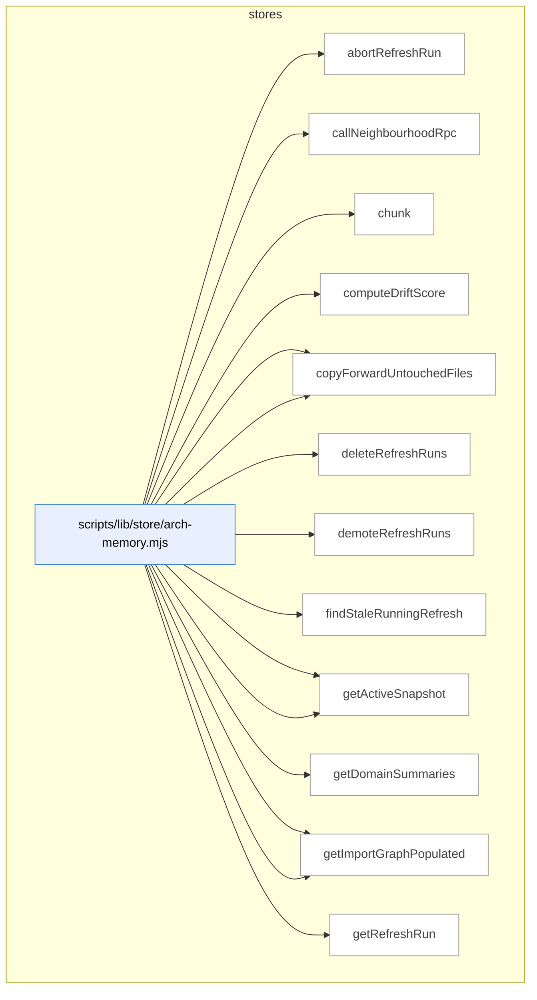

_Domain has 112 symbols (>50). Diagram shows top-15 by file order; see flat table below for the full list._

### Symbols in this domain

| Symbol | Kind | Path | Lines | Purpose | File imported by |
|---|---|---|---|---|---|
| [`abortRefreshRun`](../scripts/lib/store/arch-memory.mjs#L83) | function | `scripts/lib/store/arch-memory.mjs` | 83-97 | Marks a refresh run as aborted with an optional error reason and sets retention class. | `scripts/learning-store.mjs` |
| [`callNeighbourhoodRpc`](../scripts/lib/store/arch-memory.mjs#L497) | function | `scripts/lib/store/arch-memory.mjs` | 497-509 | Calls an RPC to find similar symbols based on embedding neighborhood. | `scripts/learning-store.mjs` |
| [`chunk`](../scripts/lib/store/arch-memory.mjs#L34) | function | `scripts/lib/store/arch-memory.mjs` | 34-38 | Splits an array into chunks of size n. | `scripts/learning-store.mjs` |
| [`computeDriftScore`](../scripts/lib/store/arch-memory.mjs#L511) | function | `scripts/lib/store/arch-memory.mjs` | 511-520 | Calls an RPC to compute a drift score between symbol sets. | `scripts/learning-store.mjs` |
| [`copyForwardImports`](../scripts/lib/store/arch-memory.mjs#L565) | function | `scripts/lib/store/arch-memory.mjs` | 565-596 | Copies import edges from one refresh to another, filtering by touched files. | `scripts/learning-store.mjs` |
| [`copyForwardUntouchedFiles`](../scripts/lib/store/arch-memory.mjs#L803) | function | `scripts/lib/store/arch-memory.mjs` | 803-862 | <no body> | `scripts/learning-store.mjs` |
| [`deleteRefreshRuns`](../scripts/lib/store/arch-memory.mjs#L237) | function | `scripts/lib/store/arch-memory.mjs` | 237-252 | Deletes refresh run records by ID. | `scripts/learning-store.mjs` |
| [`demoteRefreshRuns`](../scripts/lib/store/arch-memory.mjs#L264) | function | `scripts/lib/store/arch-memory.mjs` | 264-279 | Updates refresh runs to a lower retention class. | `scripts/learning-store.mjs` |
| [`findStaleRunningRefresh`](../scripts/lib/store/arch-memory.mjs#L169) | function | `scripts/lib/store/arch-memory.mjs` | 169-183 | Retrieves the most recent running refresh for a repository. | `scripts/learning-store.mjs` |
| [`getActiveEmbeddingModel`](../scripts/lib/store/arch-memory.mjs#L480) | function | `scripts/lib/store/arch-memory.mjs` | 480-493 | Retrieves the active embedding model configuration for a repository. | `scripts/learning-store.mjs` |
| [`getActiveSnapshot`](../scripts/lib/store/arch-memory.mjs#L310) | function | `scripts/lib/store/arch-memory.mjs` | 310-336 | Gets the active snapshot metadata including embedding model and import graph status. | `scripts/learning-store.mjs` |
| [`getDomainSummaries`](../scripts/lib/store/arch-memory.mjs#L692) | function | `scripts/lib/store/arch-memory.mjs` | 692-715 | Retrieves all domain summaries for a repository as a map. | `scripts/learning-store.mjs` |
| [`getImportersForFiles`](../scripts/lib/store/arch-memory.mjs#L649) | function | `scripts/lib/store/arch-memory.mjs` | 649-670 | Retrieves all files that import a given set of target files. | `scripts/learning-store.mjs` |
| [`getImportGraphPopulated`](../scripts/lib/store/arch-memory.mjs#L631) | function | `scripts/lib/store/arch-memory.mjs` | 631-642 | Checks whether a refresh run has its import graph populated. | `scripts/learning-store.mjs` |
| [`getRefreshRun`](../scripts/lib/store/arch-memory.mjs#L136) | function | `scripts/lib/store/arch-memory.mjs` | 136-159 | Fetches a refresh run record with optional column selection and validation. | `scripts/learning-store.mjs` |
| [`getTopDuplicateClusters`](../scripts/lib/store/arch-memory.mjs#L522) | function | `scripts/lib/store/arch-memory.mjs` | 522-539 | Calls an RPC to get the top duplicate symbol clusters. | `scripts/learning-store.mjs` |
| [`heartbeatRefreshRun`](../scripts/lib/store/arch-memory.mjs#L100) | function | `scripts/lib/store/arch-memory.mjs` | 100-102 | Updates a refresh run's heartbeat timestamp to indicate ongoing activity. | `scripts/learning-store.mjs` |
| [`listFileImportsForSnapshot`](../scripts/lib/store/arch-memory.mjs#L605) | function | `scripts/lib/store/arch-memory.mjs` | 605-620 | Lists all file imports for a snapshot as importer-imported pairs. | `scripts/learning-store.mjs` |
| [`listLayeringViolationsForSnapshot`](../scripts/lib/store/arch-memory.mjs#L776) | function | `scripts/lib/store/arch-memory.mjs` | 776-796 | Lists layering violations for a refresh ordered by rule name. | `scripts/learning-store.mjs` |
| [`listPrunableRefreshRuns`](../scripts/lib/store/arch-memory.mjs#L208) | function | `scripts/lib/store/arch-memory.mjs` | 208-230 | Lists refresh run IDs that are eligible for deletion based on age and retention policy. | `scripts/learning-store.mjs` |
| [`listRollbacksForRepo`](../scripts/lib/store/arch-memory.mjs#L289) | function | `scripts/lib/store/arch-memory.mjs` | 289-302 | Lists rollback-class refresh runs for a repository ordered by completion date. | `scripts/learning-store.mjs` |
| [`listSymbolsForSnapshot`](../scripts/lib/store/arch-memory.mjs#L724) | function | `scripts/lib/store/arch-memory.mjs` | 724-774 | Lists symbols matching optional filters for kind, domain, and file path prefix. | `scripts/learning-store.mjs` |
| [`markImportGraphPopulated`](../scripts/lib/store/arch-memory.mjs#L622) | function | `scripts/lib/store/arch-memory.mjs` | 622-629 | Marks a refresh run's import graph as fully populated. | `scripts/learning-store.mjs` |
| [`openRefreshRun`](../scripts/lib/store/arch-memory.mjs#L48) | function | `scripts/lib/store/arch-memory.mjs` | 48-67 | Creates a new refresh run record with a cancellation token, preventing concurrent refreshes for the same repo. | `scripts/learning-store.mjs` |
| [`publishRefreshRun`](../scripts/lib/store/arch-memory.mjs#L74) | function | `scripts/lib/store/arch-memory.mjs` | 74-80 | Publishes a completed refresh run to trigger embedding and vectorization. | `scripts/learning-store.mjs` |
| [`recordLayeringViolations`](../scripts/lib/store/arch-memory.mjs#L438) | function | `scripts/lib/store/arch-memory.mjs` | 438-462 | Inserts or updates symbol layering violation records. | `scripts/learning-store.mjs` |
| [`recordSymbolDefinitions`](../scripts/lib/store/arch-memory.mjs#L344) | function | `scripts/lib/store/arch-memory.mjs` | 344-367 | Inserts or updates symbol definitions and returns a mapping of keys to database IDs. | `scripts/learning-store.mjs` |
| [`recordSymbolEmbedding`](../scripts/lib/store/arch-memory.mjs#L397) | function | `scripts/lib/store/arch-memory.mjs` | 397-436 | <no body> | `scripts/learning-store.mjs` |
| [`recordSymbolFileImports`](../scripts/lib/store/arch-memory.mjs#L543) | function | `scripts/lib/store/arch-memory.mjs` | 543-563 | Records file import edges between source files. | `scripts/learning-store.mjs` |
| [`recordSymbolIndex`](../scripts/lib/store/arch-memory.mjs#L369) | function | `scripts/lib/store/arch-memory.mjs` | 369-395 | Inserts or updates symbol index entries linking definitions to file locations. | `scripts/learning-store.mjs` |
| [`setActiveEmbeddingModel`](../scripts/lib/store/arch-memory.mjs#L468) | function | `scripts/lib/store/arch-memory.mjs` | 468-478 | Sets the active embedding model and dimension for a repository. | `scripts/learning-store.mjs` |
| [`upsertDomainSummary`](../scripts/lib/store/arch-memory.mjs#L674) | function | `scripts/lib/store/arch-memory.mjs` | 674-690 | Inserts or updates a domain summary with composition metadata. | `scripts/learning-store.mjs` |
| [`getFalsePositivePatterns`](../scripts/lib/store/bandit-fp.mjs#L167) | function | `scripts/lib/store/bandit-fp.mjs` | 167-179 | Retrieves all auto-suppressed false positive patterns for a repository. | `scripts/learning-store.mjs` |
| [`getPassEffectiveness`](../scripts/lib/store/bandit-fp.mjs#L243) | function | `scripts/lib/store/bandit-fp.mjs` | 243-260 | Retrieves pass effectiveness statistics from audit runs. | `scripts/learning-store.mjs` |
| [`loadBanditArms`](../scripts/lib/store/bandit-fp.mjs#L56) | function | `scripts/lib/store/bandit-fp.mjs` | 56-79 | Loads all bandit arm states indexed by pass/variant/context keys. | `scripts/learning-store.mjs` |
| [`loadFalsePositivePatterns`](../scripts/lib/store/bandit-fp.mjs#L141) | function | `scripts/lib/store/bandit-fp.mjs` | 141-162 | Loads false positive patterns marked for auto-suppression for a repo and globally. | `scripts/learning-store.mjs` |
| [`syncBanditArms`](../scripts/lib/store/bandit-fp.mjs#L27) | function | `scripts/lib/store/bandit-fp.mjs` | 27-48 | Syncs bandit arm statistics to the database for multi-armed bandit learning. | `scripts/learning-store.mjs` |
| [`syncExperiments`](../scripts/lib/store/bandit-fp.mjs#L186) | function | `scripts/lib/store/bandit-fp.mjs` | 186-212 | Syncs experiment records including parent metrics and final results. | `scripts/learning-store.mjs` |
| [`syncFalsePositivePatterns`](../scripts/lib/store/bandit-fp.mjs#L113) | function | `scripts/lib/store/bandit-fp.mjs` | 113-134 | Syncs false positive pattern suppressions to the database. | `scripts/learning-store.mjs` |
| [`syncPromptRevision`](../scripts/lib/store/bandit-fp.mjs#L219) | function | `scripts/lib/store/bandit-fp.mjs` | 219-234 | Syncs a prompt revision with its text and SHA256 checksum. | `scripts/learning-store.mjs` |
| [`upsertPromptVariant`](../scripts/lib/store/bandit-fp.mjs#L86) | function | `scripts/lib/store/bandit-fp.mjs` | 86-102 | Inserts or updates a prompt variant with usage and effectiveness stats. | `scripts/learning-store.mjs` |
| [`appendDebtEventsCloud`](../scripts/lib/store/debt.mjs#L131) | function | `scripts/lib/store/debt.mjs` | 131-156 | Appends debt event records with upsert-ignore semantics. | `scripts/learning-store.mjs` |
| [`readDebtEntriesCloud`](../scripts/lib/store/debt.mjs#L67) | function | `scripts/lib/store/debt.mjs` | 67-105 | Loads all debt entries for a repository from the cloud. | `scripts/learning-store.mjs` |
| [`readDebtEventsCloud`](../scripts/lib/store/debt.mjs#L163) | function | `scripts/lib/store/debt.mjs` | 163-184 | Loads all debt events for a repository ordered chronologically. | `scripts/learning-store.mjs` |
| [`removeDebtEntryCloud`](../scripts/lib/store/debt.mjs#L111) | function | `scripts/lib/store/debt.mjs` | 111-120 | Deletes a debt entry from the cloud. | `scripts/learning-store.mjs` |
| [`upsertDebtEntries`](../scripts/lib/store/debt.mjs#L20) | function | `scripts/lib/store/debt.mjs` | 20-59 | Inserts or updates technical debt entries with full metadata. | `scripts/learning-store.mjs` |
| [`backfillLearningOutcome`](../scripts/lib/store/learning-decisions.mjs#L70) | function | `scripts/lib/store/learning-decisions.mjs` | 70-77 | Updates a decision record with its outcome after the fact. | `scripts/learning-store.mjs` |
| [`callDeferFinding`](../scripts/lib/store/learning-decisions.mjs#L126) | function | `scripts/lib/store/learning-decisions.mjs` | 126-135 | Calls an RPC to defer a finding with dismissal reason and evidence. | `scripts/learning-store.mjs` |
| [`callMarkFindingNeedsTriage`](../scripts/lib/store/learning-decisions.mjs#L138) | function | `scripts/lib/store/learning-decisions.mjs` | 138-145 | Calls an RPC to mark a finding as requiring triage. | `scripts/learning-store.mjs` |
| [`insertFrictionNote`](../scripts/lib/store/learning-decisions.mjs#L205) | function | `scripts/lib/store/learning-decisions.mjs` | 205-223 | Logs a friction note (issue/error message) to the friction log table. | `scripts/learning-store.mjs` |
| [`insertLearningDecision`](../scripts/lib/store/learning-decisions.mjs#L43) | function | `scripts/lib/store/learning-decisions.mjs` | 43-62 | Inserts a learning decision record with context hash and choice/outcome. | `scripts/learning-store.mjs` |
| [`readDecisionsPaginated`](../scripts/lib/store/learning-decisions.mjs#L267) | function | `scripts/lib/store/learning-decisions.mjs` | 267-308 | Paginates through learning decisions of a specified type with optional filtering. | `scripts/learning-store.mjs` |
| [`readNoBrainerRecommendations`](../scripts/lib/store/learning-decisions.mjs#L167) | function | `scripts/lib/store/learning-decisions.mjs` | 167-178 | Fetches no-brainer recommendations for a repo from the cloud database. | `scripts/learning-store.mjs` |
| [`readPendingTriageFindings`](../scripts/lib/store/learning-decisions.mjs#L154) | function | `scripts/lib/store/learning-decisions.mjs` | 154-165 | Retrieves pending triage findings for a repository with a limit. | `scripts/learning-store.mjs` |
| [`readRecentFriction`](../scripts/lib/store/learning-decisions.mjs#L231) | function | `scripts/lib/store/learning-decisions.mjs` | 231-247 | Fetches recent friction log entries for a repo within a time window. | `scripts/learning-store.mjs` |
| [`readStaleClusters`](../scripts/lib/store/learning-decisions.mjs#L180) | function | `scripts/lib/store/learning-decisions.mjs` | 180-194 | Fetches open recurring finding clusters older than a specified age threshold. | `scripts/learning-store.mjs` |
| [`readUnresolvedDecisions`](../scripts/lib/store/learning-decisions.mjs#L324) | function | `scripts/lib/store/learning-decisions.mjs` | 324-350 | Fetches unresolved learning decisions by type that were created before a cutoff date. | `scripts/learning-store.mjs` |
| [`recordConvergenceState`](../scripts/lib/store/learning-decisions.mjs#L94) | function | `scripts/lib/store/learning-decisions.mjs` | 94-101 | Records convergence state transitions for a run. | `scripts/learning-store.mjs` |
| [`recordDiffComplexity`](../scripts/lib/store/learning-decisions.mjs#L84) | function | `scripts/lib/store/learning-decisions.mjs` | 84-89 | Records the diff complexity metric for an audit run. | `scripts/learning-store.mjs` |
| [`recordFindingResolution`](../scripts/lib/store/learning-decisions.mjs#L108) | function | `scripts/lib/store/learning-decisions.mjs` | 108-117 | Records user resolution metadata for a finding. | `scripts/learning-store.mjs` |
| [`safeWrite`](../scripts/lib/store/learning-decisions.mjs#L24) | function | `scripts/lib/store/learning-decisions.mjs` | 24-31 | Wraps a database operation to return success/error status. | `scripts/learning-store.mjs` |
| [`listPersonaTestCandidates`](../scripts/lib/store/persona-test-candidates.mjs#L151) | function | `scripts/lib/store/persona-test-candidates.mjs` | 151-185 | Lists persona test candidates for a repo that are unpopposed and meet occurrence/severity thresholds. | `scripts/learning-store.mjs` |
| [`markPersonaTestCandidateProposed`](../scripts/lib/store/persona-test-candidates.mjs#L197) | function | `scripts/lib/store/persona-test-candidates.mjs` | 197-218 | Marks a persona test candidate as proposed to prevent re-suggestion. | `scripts/learning-store.mjs` |
| [`upsertPersonaTestCandidate`](../scripts/lib/store/persona-test-candidates.mjs#L48) | function | `scripts/lib/store/persona-test-candidates.mjs` | 48-136 | <no body> | `scripts/learning-store.mjs` |
| [`getPersonaSessionsByRepo`](../scripts/lib/store/persona.mjs#L152) | function | `scripts/lib/store/persona.mjs` | 152-179 | Fetches persona test sessions for a repo, optionally filtered to only P0 findings. | `scripts/learning-store.mjs` |
| [`getPersonaSessionsByUrl`](../scripts/lib/store/persona.mjs#L185) | function | `scripts/lib/store/persona.mjs` | 185-203 | Fetches persona test sessions for a specific URL in descending creation order. | `scripts/learning-store.mjs` |
| [`isPersonaCloudEnabled`](../scripts/lib/store/persona.mjs#L26) | function | `scripts/lib/store/persona.mjs` | 26-28 | Checks if persona cloud storage is enabled. | `scripts/learning-store.mjs` |
| [`listPersonasForApp`](../scripts/lib/store/persona.mjs#L35) | function | `scripts/lib/store/persona.mjs` | 35-46 | Fetches all personas associated with an app URL. | `scripts/learning-store.mjs` |
| [`recordPersonaSession`](../scripts/lib/store/persona.mjs#L91) | function | `scripts/lib/store/persona.mjs` | 91-145 | <no body> | `scripts/learning-store.mjs` |
| [`upsertPersona`](../scripts/lib/store/persona.mjs#L55) | function | `scripts/lib/store/persona.mjs` | 55-83 | Inserts or updates a persona record and returns its ID and whether it existed. | `scripts/learning-store.mjs` |
| [`getUnlockedFixes`](../scripts/lib/store/plans-ship.mjs#L240) | function | `scripts/lib/store/plans-ship.mjs` | 240-254 | Fetches unlocked fixes, optionally filtered by repo ID. | `scripts/learning-store.mjs` |
| [`listConsistencyCandidates`](../scripts/lib/store/plans-ship.mjs#L142) | function | `scripts/lib/store/plans-ship.mjs` | 142-173 | Lists persona consistency candidate regression specs for a repo with optional time filtering. | `scripts/learning-store.mjs` |
| [`promoteRegressionSpec`](../scripts/lib/store/plans-ship.mjs#L180) | function | `scripts/lib/store/plans-ship.mjs` | 180-216 | Promotes a persona consistency candidate regression spec to locked status. | `scripts/learning-store.mjs` |
| [`readAuditEffectiveness`](../scripts/lib/store/plans-ship.mjs#L304) | function | `scripts/lib/store/plans-ship.mjs` | 304-312 | Fetches audit effectiveness metrics for a repo. | `scripts/learning-store.mjs` |
| [`readCorrelationsForFinding`](../scripts/lib/store/plans-ship.mjs#L293) | function | `scripts/lib/store/plans-ship.mjs` | 293-301 | Fetches all persona-audit correlations for a specific audit finding. | `scripts/learning-store.mjs` |
| [`readCorrelationsForRun`](../scripts/lib/store/plans-ship.mjs#L282) | function | `scripts/lib/store/plans-ship.mjs` | 282-290 | Fetches all persona-audit correlations for a given audit run. | `scripts/learning-store.mjs` |
| [`readPersistentPlanFailures`](../scripts/lib/store/plans-ship.mjs#L393) | function | `scripts/lib/store/plans-ship.mjs` | 393-401 | Fetches persistent failure records associated with a plan. | `scripts/learning-store.mjs` |
| [`readPlanSatisfaction`](../scripts/lib/store/plans-ship.mjs#L382) | function | `scripts/lib/store/plans-ship.mjs` | 382-390 | Fetches plan satisfaction metrics for a plan. | `scripts/learning-store.mjs` |
| [`recordPersonaAuditCorrelation`](../scripts/lib/store/plans-ship.mjs#L262) | function | `scripts/lib/store/plans-ship.mjs` | 262-279 | Records a correlation between a persona finding and an audit finding. | `scripts/learning-store.mjs` |
| [`recordPlanVerificationItems`](../scripts/lib/store/plans-ship.mjs#L342) | function | `scripts/lib/store/plans-ship.mjs` | 342-379 | Bulk-inserts individual plan verification criteria results. | `scripts/learning-store.mjs` |
| [`recordPlanVerificationRun`](../scripts/lib/store/plans-ship.mjs#L319) | function | `scripts/lib/store/plans-ship.mjs` | 319-339 | Records a plan verification run with pass/fail counts and metadata. | `scripts/learning-store.mjs` |
| [`recordRegressionSpec`](../scripts/lib/store/plans-ship.mjs#L69) | function | `scripts/lib/store/plans-ship.mjs` | 69-137 | <no body> | `scripts/learning-store.mjs` |
| [`recordRegressionSpecRun`](../scripts/lib/store/plans-ship.mjs#L219) | function | `scripts/lib/store/plans-ship.mjs` | 219-234 | Records a single regression spec test run with results. | `scripts/learning-store.mjs` |
| [`recordShipEvent`](../scripts/lib/store/plans-ship.mjs#L408) | function | `scripts/lib/store/plans-ship.mjs` | 408-429 | Records a ship event outcome with block reasons and finding counts. | `scripts/learning-store.mjs` |
| [`updatePlanStatus`](../scripts/lib/store/plans-ship.mjs#L45) | function | `scripts/lib/store/plans-ship.mjs` | 45-55 | Updates the status of a plan. | `scripts/learning-store.mjs` |
| [`upsertPlan`](../scripts/lib/store/plans-ship.mjs#L22) | function | `scripts/lib/store/plans-ship.mjs` | 22-42 | Inserts or updates a plan record and returns its ID. | `scripts/learning-store.mjs` |
| [`getRepoIdByName`](../scripts/lib/store/repo.mjs#L201) | function | `scripts/lib/store/repo.mjs` | 201-216 | Fetches the repo ID for a given repo name (most recent by creation). | `scripts/learning-store.mjs`, `scripts/lib/store/arch-memory.mjs`, `scripts/lib/store/bandit-fp.mjs`, +7 more |
| [`getRepoIdByUuid`](../scripts/lib/store/repo.mjs#L126) | function | `scripts/lib/store/repo.mjs` | 126-148 | Fetches repo metadata by UUID including ID and embedding configuration. | `scripts/learning-store.mjs`, `scripts/lib/store/arch-memory.mjs`, `scripts/lib/store/bandit-fp.mjs`, +7 more |
| [`initLearningStore`](../scripts/lib/store/repo.mjs#L40) | function | `scripts/lib/store/repo.mjs` | 40-62 | Initializes the learning cloud store by testing connectivity and table access. | `scripts/learning-store.mjs`, `scripts/lib/store/arch-memory.mjs`, `scripts/lib/store/bandit-fp.mjs`, +7 more |
| [`isCloudEnabled`](../scripts/lib/store/repo.mjs#L71) | function | `scripts/lib/store/repo.mjs` | 71-78 | Checks if cloud database connectivity is available. | `scripts/learning-store.mjs`, `scripts/lib/store/arch-memory.mjs`, `scripts/lib/store/bandit-fp.mjs`, +7 more |
| [`listRepoIds`](../scripts/lib/store/repo.mjs#L226) | function | `scripts/lib/store/repo.mjs` | 226-235 | Lists all repo IDs from the database in ascending order. | `scripts/learning-store.mjs`, `scripts/lib/store/arch-memory.mjs`, `scripts/lib/store/bandit-fp.mjs`, +7 more |
| [`upsertRepo`](../scripts/lib/store/repo.mjs#L95) | function | `scripts/lib/store/repo.mjs` | 95-115 | Inserts or updates a repo record with profile data. | `scripts/learning-store.mjs`, `scripts/lib/store/arch-memory.mjs`, `scripts/lib/store/bandit-fp.mjs`, +7 more |
| [`upsertRepoByUuid`](../scripts/lib/store/repo.mjs#L161) | function | `scripts/lib/store/repo.mjs` | 161-188 | Inserts or updates a repo by UUID, upserting on fingerprint as fallback. | `scripts/learning-store.mjs`, `scripts/lib/store/arch-memory.mjs`, `scripts/lib/store/bandit-fp.mjs`, +7 more |
| [`_resetClassificationColumnCache`](../scripts/lib/store/runs-findings.mjs#L27) | function | `scripts/lib/store/runs-findings.mjs` | 27-29 | Clears the cached state of classification column detection. | `scripts/learning-store.mjs` |
| [`detectClassificationColumns`](../scripts/lib/store/runs-findings.mjs#L31) | function | `scripts/lib/store/runs-findings.mjs` | 31-46 | Detects whether classification columns exist in the audit_findings table, caching the result. | `scripts/learning-store.mjs` |
| [`getAuditRunConvergence`](../scripts/lib/store/runs-findings.mjs#L241) | function | `scripts/lib/store/runs-findings.mjs` | 241-258 | Fetches convergence and rigor metrics for an audit run. | `scripts/learning-store.mjs` |
| [`getPassTimings`](../scripts/lib/store/runs-findings.mjs#L264) | function | `scripts/lib/store/runs-findings.mjs` | 264-292 | Calculates and returns average token usage and latency per pass across all runs. | `scripts/learning-store.mjs` |
| [`recordAdjudicationEvent`](../scripts/lib/store/runs-findings.mjs#L351) | function | `scripts/lib/store/runs-findings.mjs` | 351-389 | Records an adjudication event for a finding with outcome and remediation state. | `scripts/learning-store.mjs` |
| [`recordFindings`](../scripts/lib/store/runs-findings.mjs#L138) | function | `scripts/lib/store/runs-findings.mjs` | 138-182 | Bulk-inserts finding records with optional classification data. | `scripts/learning-store.mjs` |
| [`recordPassStats`](../scripts/lib/store/runs-findings.mjs#L189) | function | `scripts/lib/store/runs-findings.mjs` | 189-208 | Records per-pass token usage and latency statistics for an audit run. | `scripts/learning-store.mjs` |
| [`recordRunComplete`](../scripts/lib/store/runs-findings.mjs#L83) | function | `scripts/lib/store/runs-findings.mjs` | 83-109 | Updates an audit run with final statistics and metadata. | `scripts/learning-store.mjs` |
| [`recordRunStart`](../scripts/lib/store/runs-findings.mjs#L54) | function | `scripts/lib/store/runs-findings.mjs` | 54-77 | Creates an audit run record and returns its ID. | `scripts/learning-store.mjs` |
| [`recordSuppressionEvents`](../scripts/lib/store/runs-findings.mjs#L299) | function | `scripts/lib/store/runs-findings.mjs` | 299-338 | Bulk-inserts suppression and reopening events from a suppression result. | `scripts/learning-store.mjs` |
| [`updatePassStatsPostDeliberation`](../scripts/lib/store/runs-findings.mjs#L214) | function | `scripts/lib/store/runs-findings.mjs` | 214-230 | Updates pass statistics after deliberation with acceptance/dismissal counts. | `scripts/learning-store.mjs` |
| [`updateRunMeta`](../scripts/lib/store/runs-findings.mjs#L115) | function | `scripts/lib/store/runs-findings.mjs` | 115-130 | Updates specific audit run metadata fields conditionally. | `scripts/learning-store.mjs` |
| [`callIncidentNeighbourhoodRpc`](../scripts/lib/store/security.mjs#L130) | function | `scripts/lib/store/security.mjs` | 130-152 | Calls an RPC endpoint to find related security incidents, transforming the response with scoring fields. | `scripts/learning-store.mjs` |
| [`chunk`](../scripts/lib/store/security.mjs#L20) | function | `scripts/lib/store/security.mjs` | 20-24 | Splits an array into fixed-size chunks. | `scripts/learning-store.mjs` |
| [`formatVectorOrNull`](../scripts/lib/store/security.mjs#L161) | function | `scripts/lib/store/security.mjs` | 161-167 | Converts a numeric embedding array to a PostgreSQL vector string format, or returns null. | `scripts/learning-store.mjs` |
| [`getMaxIncidentRefreshAt`](../scripts/lib/store/security.mjs#L108) | function | `scripts/lib/store/security.mjs` | 108-123 | Fetches the most recent update timestamp for incidents in a repository. | `scripts/learning-store.mjs` |
| [`getSecurityIncidentsByRepo`](../scripts/lib/store/security.mjs#L74) | function | `scripts/lib/store/security.mjs` | 74-83 | Retrieves security incidents for a specific repository, returning their IDs and metadata. | `scripts/learning-store.mjs` |
| [`markIncidentsHistorical`](../scripts/lib/store/security.mjs#L90) | function | `scripts/lib/store/security.mjs` | 90-100 | Marks a list of incident IDs as historical with a timestamp. | `scripts/learning-store.mjs` |
| [`recordSecurityIncidents`](../scripts/lib/store/security.mjs#L41) | function | `scripts/lib/store/security.mjs` | 41-68 | Upserts security incident records into the database in batches, returning the count inserted. | `scripts/learning-store.mjs` |

---

## tech-debt

> The `tech-debt` domain captures and syncs technical debt entries from code review findings into a cloud-based learning store, with CLI tooling to validate, transform, and report on debt data during the capture process.

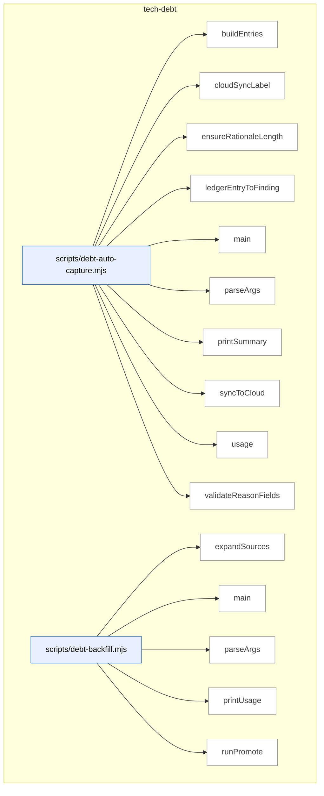

_Domain has 71 symbols (>50). Diagram shows top-15 by file order; see flat table below for the full list._

### Symbols in this domain

| Symbol | Kind | Path | Lines | Purpose | File imported by |
|---|---|---|---|---|---|
| [`buildEntries`](../scripts/debt-auto-capture.mjs#L161) | function | `scripts/debt-auto-capture.mjs` | 161-188 | Builds debt entries from deferred ledger entries with capture arguments. | _(internal)_ |
| [`cloudSyncLabel`](../scripts/debt-auto-capture.mjs#L213) | function | `scripts/debt-auto-capture.mjs` | 213-216 | Returns a label string describing cloud sync status. | _(internal)_ |
| [`ensureRationaleLength`](../scripts/debt-auto-capture.mjs#L120) | function | `scripts/debt-auto-capture.mjs` | 120-128 | Ensures deferred rationale meets minimum length with padding. | _(internal)_ |
| [`ledgerEntryToFinding`](../scripts/debt-auto-capture.mjs#L136) | function | `scripts/debt-auto-capture.mjs` | 136-155 | Transforms an adjudication ledger entry into a finding object. | _(internal)_ |
| [`main`](../scripts/debt-auto-capture.mjs#L247) | function | `scripts/debt-auto-capture.mjs` | 247-325 | <no body> | _(internal)_ |
| [`parseArgs`](../scripts/debt-auto-capture.mjs#L34) | function | `scripts/debt-auto-capture.mjs` | 34-64 | Parses CLI arguments for the debt auto-capture script. | _(internal)_ |
| [`printSummary`](../scripts/debt-auto-capture.mjs#L218) | function | `scripts/debt-auto-capture.mjs` | 218-243 | Prints summary statistics of captured, inserted, and rejected debt entries. | _(internal)_ |
| [`syncToCloud`](../scripts/debt-auto-capture.mjs#L197) | function | `scripts/debt-auto-capture.mjs` | 197-209 | Syncs captured debt entries to cloud via learning store. | _(internal)_ |
| [`usage`](../scripts/debt-auto-capture.mjs#L66) | function | `scripts/debt-auto-capture.mjs` | 66-87 | Prints help text describing debt auto-capture usage and options. | _(internal)_ |
| [`validateReasonFields`](../scripts/debt-auto-capture.mjs#L96) | function | `scripts/debt-auto-capture.mjs` | 96-111 | Validates that required fields match the chosen deferred reason. | _(internal)_ |
| [`expandSources`](../scripts/debt-backfill.mjs#L85) | function | `scripts/debt-backfill.mjs` | 85-107 | Expands glob patterns and file arguments into resolved file paths. | _(internal)_ |
| [`main`](../scripts/debt-backfill.mjs#L265) | function | `scripts/debt-backfill.mjs` | 265-279 | Routes to stage or promote mode based on CLI options. | _(internal)_ |
| [`parseArgs`](../scripts/debt-backfill.mjs#L41) | function | `scripts/debt-backfill.mjs` | 41-56 | Parses CLI arguments for the debt backfill script. | _(internal)_ |
| [`printUsage`](../scripts/debt-backfill.mjs#L58) | function | `scripts/debt-backfill.mjs` | 58-81 | Prints help text describing debt backfill usage and promotion workflow. | _(internal)_ |
| [`runPromote`](../scripts/debt-backfill.mjs#L160) | function | `scripts/debt-backfill.mjs` | 160-261 | <no body> | _(internal)_ |
| [`runStage`](../scripts/debt-backfill.mjs#L111) | function | `scripts/debt-backfill.mjs` | 111-156 | <no body> | _(internal)_ |
| [`loadBudgets`](../scripts/debt-budget-check.mjs#L66) | function | `scripts/debt-budget-check.mjs` | 66-83 | Loads budget limits from external file or ledger's budgets field. | _(internal)_ |
| [`main`](../scripts/debt-budget-check.mjs#L85) | function | `scripts/debt-budget-check.mjs` | 85-136 | <no body> | _(internal)_ |
| [`parseArgs`](../scripts/debt-budget-check.mjs#L33) | function | `scripts/debt-budget-check.mjs` | 33-45 | Parses CLI arguments for the debt budget check script. | _(internal)_ |
| [`printUsage`](../scripts/debt-budget-check.mjs#L47) | function | `scripts/debt-budget-check.mjs` | 47-64 | Prints help text describing budget check usage and configuration. | _(internal)_ |
| [`findTouchedDebt`](../scripts/debt-pr-comment.mjs#L105) | function | `scripts/debt-pr-comment.mjs` | 105-117 | Filters debt entries to those affecting files changed in the PR, using normalized path matching with substring fallback. | _(internal)_ |
| [`groupTouchedByFile`](../scripts/debt-pr-comment.mjs#L120) | function | `scripts/debt-pr-comment.mjs` | 120-128 | Groups touched debt entries by their primary affected file for organized rendering. | _(internal)_ |
| [`loadChangedFiles`](../scripts/debt-pr-comment.mjs#L222) | function | `scripts/debt-pr-comment.mjs` | 222-236 | Loads changed file paths from either a comma-separated string or a newline-delimited file. | _(internal)_ |
| [`main`](../scripts/debt-pr-comment.mjs#L240) | function | `scripts/debt-pr-comment.mjs` | 240-323 | Main entry point that orchestrates reading arguments, loading debt ledger, finding touched and recurring debt, applying thresholds, enriching with git history, and writing output. | _(internal)_ |
| [`parseArgs`](../scripts/debt-pr-comment.mjs#L53) | function | `scripts/debt-pr-comment.mjs` | 53-72 | Parses command-line arguments into a configuration object with flags for changed files, thresholds, output, and options. | _(internal)_ |
| [`printUsage`](../scripts/debt-pr-comment.mjs#L74) | function | `scripts/debt-pr-comment.mjs` | 74-95 | Prints usage documentation explaining the debt-pr-comment tool's purpose, required inputs, options, and exit codes. | _(internal)_ |
| [`renderEntryLine`](../scripts/debt-pr-comment.mjs#L132) | function | `scripts/debt-pr-comment.mjs` | 132-150 | Formats a single debt entry into a markdown line with severity badge, topic ID link, category, owner, occurrences, and deferral date. | _(internal)_ |
| [`renderPrComment`](../scripts/debt-pr-comment.mjs#L152) | function | `scripts/debt-pr-comment.mjs` | 152-218 | Generates a complete PR comment markdown with sections for touched debt and recurring debt, grouped by file and ranked by frequency. | _(internal)_ |
| [`main`](../scripts/debt-resolve.mjs#L73) | function | `scripts/debt-resolve.mjs` | 73-148 | Main entry point that validates arguments, initializes cloud storage, resolves a debt entry by emitting an event and removing it from the ledger. | _(internal)_ |
| [`parseArgs`](../scripts/debt-resolve.mjs#L34) | function | `scripts/debt-resolve.mjs` | 34-52 | Parses command-line arguments into a configuration object with positional topicId and flags for resolution metadata. | _(internal)_ |
| [`printUsage`](../scripts/debt-resolve.mjs#L54) | function | `scripts/debt-resolve.mjs` | 54-71 | Prints usage documentation explaining the debt-resolve tool's purpose, required inputs, options, and exit codes. | _(internal)_ |
| [`main`](../scripts/debt-review.mjs#L332) | function | `scripts/debt-review.mjs` | 332-397 | Main entry point that loads the debt ledger, checks sensitivity constraints, selects clustering mode, and outputs the review report. | _(internal)_ |
| [`parseArgs`](../scripts/debt-review.mjs#L44) | function | `scripts/debt-review.mjs` | 44-60 | Parses command-line arguments into a configuration object with flags for clustering mode, sensitivity inclusion, and output options. | _(internal)_ |
| [`printUsage`](../scripts/debt-review.mjs#L62) | function | `scripts/debt-review.mjs` | 62-80 | Prints usage documentation explaining the debt-review tool's purpose, clustering modes, options, and exit codes. | _(internal)_ |
| [`renderMarkdown`](../scripts/debt-review.mjs#L84) | function | `scripts/debt-review.mjs` | 84-151 | Renders a markdown report of debt clustering results with budget violations, clusters, and ranked refactor candidates. | _(internal)_ |
| [`runLLMClustering`](../scripts/debt-review.mjs#L218) | function | `scripts/debt-review.mjs` | 218-284 | Sends debt entries to an LLM for intelligent clustering and refactor planning, filtering sensitive entries unless explicitly included. | _(internal)_ |
| [`runLocalClustering`](../scripts/debt-review.mjs#L155) | function | `scripts/debt-review.mjs` | 155-183 | Performs deterministic heuristic clustering of debt entries grouped by file/category and generates simple refactor candidates with effort estimates. | _(internal)_ |
| [`writeTopRefactorPlanDoc`](../scripts/debt-review.mjs#L288) | function | `scripts/debt-review.mjs` | 288-328 | Writes the top-ranked refactor plan as a markdown document with modules, effort, risks, and rollback strategy. | _(internal)_ |
| [`buildDebtEntry`](../scripts/lib/debt-capture.mjs#L84) | function | `scripts/lib/debt-capture.mjs` | 84-158 | <no body> | `scripts/debt-auto-capture.mjs`, `scripts/shared.mjs` |
| [`computeSensitivity`](../scripts/lib/debt-capture.mjs#L32) | function | `scripts/lib/debt-capture.mjs` | 32-54 | Scans finding fields for sensitive paths and secret patterns. | `scripts/debt-auto-capture.mjs`, `scripts/shared.mjs` |
| [`suggestDeferralCandidate`](../scripts/lib/debt-capture.mjs#L171) | function | `scripts/lib/debt-capture.mjs` | 171-183 | Determines if a finding is eligible for deferral based on scope and severity. | `scripts/debt-auto-capture.mjs`, `scripts/shared.mjs` |
| [`appendDebtEventsLocal`](../scripts/lib/debt-events.mjs#L34) | function | `scripts/lib/debt-events.mjs` | 34-56 | Appends validated debt events to a local JSONL log file atomically. | `scripts/debt-pr-comment.mjs`, `scripts/debt-resolve.mjs`, `scripts/debt-review.mjs`, +3 more |
| [`deriveMetricsFromEvents`](../scripts/lib/debt-events.mjs#L107) | function | `scripts/lib/debt-events.mjs` | 107-154 | Builds topic-level metrics from event stream including occurrence and escalation counts. | `scripts/debt-pr-comment.mjs`, `scripts/debt-resolve.mjs`, `scripts/debt-review.mjs`, +3 more |
| [`readDebtEventsLocal`](../scripts/lib/debt-events.mjs#L65) | function | `scripts/lib/debt-events.mjs` | 65-87 | Reads and parses debt events from a local JSONL log file. | `scripts/debt-pr-comment.mjs`, `scripts/debt-resolve.mjs`, `scripts/debt-review.mjs`, +3 more |
| [`buildCommitUrl`](../scripts/lib/debt-git-history.mjs#L142) | function | `scripts/lib/debt-git-history.mjs` | 142-144 | Constructs a GitHub commit URL from repo URL and SHA. | `scripts/debt-pr-comment.mjs`, `scripts/shared.mjs` |
| [`countCommitsTouchingTopic`](../scripts/lib/debt-git-history.mjs#L42) | function | `scripts/lib/debt-git-history.mjs` | 42-63 | Counts git commits touching a topic ID in the debt ledger via git log. | `scripts/debt-pr-comment.mjs`, `scripts/shared.mjs` |
| [`deriveOccurrencesFromGit`](../scripts/lib/debt-git-history.mjs#L154) | function | `scripts/lib/debt-git-history.mjs` | 154-161 | Maps debt entries to commit counts using git history. | `scripts/debt-pr-comment.mjs`, `scripts/shared.mjs` |
| [`detectGitHubRepoUrl`](../scripts/lib/debt-git-history.mjs#L119) | function | `scripts/lib/debt-git-history.mjs` | 119-134 | Extracts GitHub repository URL from git remote origin. | `scripts/debt-pr-comment.mjs`, `scripts/shared.mjs` |
| [`findFirstDeferCommit`](../scripts/lib/debt-git-history.mjs#L76) | function | `scripts/lib/debt-git-history.mjs` | 76-108 | Finds the first commit that added a topic ID to the ledger. | `scripts/debt-pr-comment.mjs`, `scripts/shared.mjs` |
| [`findDebtByAlias`](../scripts/lib/debt-ledger.mjs#L273) | function | `scripts/lib/debt-ledger.mjs` | 273-280 | Searches debt entries for a match by topic ID or content alias hash. | `scripts/audit-loop.mjs`, `scripts/debt-auto-capture.mjs`, `scripts/debt-backfill.mjs`, +6 more |
| [`mergeLedgers`](../scripts/lib/debt-ledger.mjs#L252) | function | `scripts/lib/debt-ledger.mjs` | 252-262 | Merges debt and session ledgers by topic ID, with session entries taking precedence on collision. | `scripts/audit-loop.mjs`, `scripts/debt-auto-capture.mjs`, `scripts/debt-backfill.mjs`, +6 more |
| [`readDebtLedger`](../scripts/lib/debt-ledger.mjs#L42) | function | `scripts/lib/debt-ledger.mjs` | 42-89 | Reads and hydrates debt ledger entries with event-derived metrics. | `scripts/audit-loop.mjs`, `scripts/debt-auto-capture.mjs`, `scripts/debt-backfill.mjs`, +6 more |
| [`removeDebtEntry`](../scripts/lib/debt-ledger.mjs#L207) | function | `scripts/lib/debt-ledger.mjs` | 207-236 | Acquires a file lock and removes a debt entry by topic ID from the ledger file. | `scripts/audit-loop.mjs`, `scripts/debt-auto-capture.mjs`, `scripts/debt-backfill.mjs`, +6 more |
| [`writeDebtEntries`](../scripts/lib/debt-ledger.mjs#L107) | function | `scripts/lib/debt-ledger.mjs` | 107-197 | Acquires a file lock, validates and merges debt entries into a JSON ledger, tracking insertions, updates, and rejections. | `scripts/audit-loop.mjs`, `scripts/debt-auto-capture.mjs`, `scripts/debt-backfill.mjs`, +6 more |
| [`appendEvents`](../scripts/lib/debt-memory.mjs#L113) | function | `scripts/lib/debt-memory.mjs` | 113-126 | Appends debt events to cloud or local storage if write permission is enabled. | `scripts/debt-resolve.mjs`, `scripts/openai-audit.mjs`, `scripts/shared.mjs` |
| [`loadDebtLedger`](../scripts/lib/debt-memory.mjs#L83) | function | `scripts/lib/debt-memory.mjs` | 83-100 | Loads debt ledger entries from cloud or local event log depending on the active event source. | `scripts/debt-resolve.mjs`, `scripts/openai-audit.mjs`, `scripts/shared.mjs` |
| [`persistDebtEntries`](../scripts/lib/debt-memory.mjs#L140) | function | `scripts/lib/debt-memory.mjs` | 140-154 | Persists debt entries to local ledger and optionally mirrors them to cloud storage. | `scripts/debt-resolve.mjs`, `scripts/openai-audit.mjs`, `scripts/shared.mjs` |
| [`reconcileLocalToCloud`](../scripts/lib/debt-memory.mjs#L189) | function | `scripts/lib/debt-memory.mjs` | 189-226 | Syncs unreconciled local debt events to cloud, marking them reconciled to avoid duplication. | `scripts/debt-resolve.mjs`, `scripts/openai-audit.mjs`, `scripts/shared.mjs` |
| [`removeDebt`](../scripts/lib/debt-memory.mjs#L159) | function | `scripts/lib/debt-memory.mjs` | 159-168 | Removes a debt entry from both local and cloud storage (if applicable). | `scripts/debt-resolve.mjs`, `scripts/openai-audit.mjs`, `scripts/shared.mjs` |
| [`selectEventSource`](../scripts/lib/debt-memory.mjs#L59) | function | `scripts/lib/debt-memory.mjs` | 59-70 | Selects the event source (disabled, cloud, or local file) based on configuration and write permissions. | `scripts/debt-resolve.mjs`, `scripts/openai-audit.mjs`, `scripts/shared.mjs` |
| [`buildLocalClusters`](../scripts/lib/debt-review-helpers.mjs#L164) | function | `scripts/lib/debt-review-helpers.mjs` | 164-204 | Builds file, principle, and recurrence-based clusters of debt entries for bulk refactoring. | `scripts/audit-loop.mjs`, `scripts/debt-budget-check.mjs`, `scripts/debt-pr-comment.mjs`, +2 more |
| [`computeLeverage`](../scripts/lib/debt-review-helpers.mjs#L45) | function | `scripts/lib/debt-review-helpers.mjs` | 45-57 | Computes a leverage score for a refactor based on effort estimate and cumulative debt impact weights. | `scripts/audit-loop.mjs`, `scripts/debt-budget-check.mjs`, `scripts/debt-pr-comment.mjs`, +2 more |
| [`countDebtByFile`](../scripts/lib/debt-review-helpers.mjs#L213) | function | `scripts/lib/debt-review-helpers.mjs` | 213-221 | Counts debt entries per file. | `scripts/audit-loop.mjs`, `scripts/debt-budget-check.mjs`, `scripts/debt-pr-comment.mjs`, +2 more |
| [`findBudgetViolations`](../scripts/lib/debt-review-helpers.mjs#L238) | function | `scripts/lib/debt-review-helpers.mjs` | 238-264 | Identifies files exceeding configured debt budget limits using glob pattern matching. | `scripts/audit-loop.mjs`, `scripts/debt-budget-check.mjs`, `scripts/debt-pr-comment.mjs`, +2 more |
| [`findRecurringEntries`](../scripts/lib/debt-review-helpers.mjs#L148) | function | `scripts/lib/debt-review-helpers.mjs` | 148-152 | Filters debt entries with occurrence count above a threshold and sorts by distinctRunCount. | `scripts/audit-loop.mjs`, `scripts/debt-budget-check.mjs`, `scripts/debt-pr-comment.mjs`, +2 more |
| [`findStaleEntries`](../scripts/lib/debt-review-helpers.mjs#L83) | function | `scripts/lib/debt-review-helpers.mjs` | 83-92 | Returns topic IDs of debt entries older than a specified TTL threshold. | `scripts/audit-loop.mjs`, `scripts/debt-budget-check.mjs`, `scripts/debt-pr-comment.mjs`, +2 more |
| [`getDefaultMatcher`](../scripts/lib/debt-review-helpers.mjs#L269) | function | `scripts/lib/debt-review-helpers.mjs` | 269-280 | Lazily initializes and returns a glob matcher (micromatch or fallback). | `scripts/audit-loop.mjs`, `scripts/debt-budget-check.mjs`, `scripts/debt-pr-comment.mjs`, +2 more |
| [`groupByFile`](../scripts/lib/debt-review-helpers.mjs#L116) | function | `scripts/lib/debt-review-helpers.mjs` | 116-124 | Groups debt entries by their first affected file. | `scripts/audit-loop.mjs`, `scripts/debt-budget-check.mjs`, `scripts/debt-pr-comment.mjs`, +2 more |
| [`groupByPrinciple`](../scripts/lib/debt-review-helpers.mjs#L131) | function | `scripts/lib/debt-review-helpers.mjs` | 131-139 | Groups debt entries by their first affected principle. | `scripts/audit-loop.mjs`, `scripts/debt-budget-check.mjs`, `scripts/debt-pr-comment.mjs`, +2 more |
| [`oldestEntryDays`](../scripts/lib/debt-review-helpers.mjs#L97) | function | `scripts/lib/debt-review-helpers.mjs` | 97-106 | Calculates the age in days of the oldest debt entry. | `scripts/audit-loop.mjs`, `scripts/debt-budget-check.mjs`, `scripts/debt-pr-comment.mjs`, +2 more |
| [`rankRefactorsByLeverage`](../scripts/lib/debt-review-helpers.mjs#L65) | function | `scripts/lib/debt-review-helpers.mjs` | 65-70 | Ranks refactors by their leverage score in descending order. | `scripts/audit-loop.mjs`, `scripts/debt-budget-check.mjs`, `scripts/debt-pr-comment.mjs`, +2 more |

---

## tests

> The `tests` domain provides test utilities and fixtures for verifying core functionality across architecture analysis, AI context management, and document parsing—including helpers for creating temporary directories, writing test file structures, parsing SQL/code files, and constructing mock data objects.

```mermaid
flowchart TB
subgraph dom_tests ["tests"]
  file_tests_ai_context_management_test_mjs["tests/ai-context-management.test.mjs"]:::component
  sym_tests_ai_context_management_test_mjs_rea["readSkillContent"]:::symbol
  file_tests_ai_context_management_test_mjs --> sym_tests_ai_context_management_test_mjs_rea
  file_tests_arch_intent_adapter_java_test_mjs["tests/arch-intent-adapter-java.test.mjs"]:::component
  sym_tests_arch_intent_adapter_java_test_mjs_["writeTree"]:::symbol
  file_tests_arch_intent_adapter_java_test_mjs --> sym_tests_arch_intent_adapter_java_test_mjs_
  file_tests_arch_intent_adapter_postgres_test_["tests/arch-intent-adapter-postgres.test.mjs"]:::component
  sym_tests_arch_intent_adapter_postgres_test_["parse"]:::symbol
  file_tests_arch_intent_adapter_postgres_test_ --> sym_tests_arch_intent_adapter_postgres_test_
  sym_tests_arch_intent_adapter_postgres_test_["writeTree"]:::symbol
  file_tests_arch_intent_adapter_postgres_test_ --> sym_tests_arch_intent_adapter_postgres_test_
  file_tests_arch_intent_adapter_python_test_mj["tests/arch-intent-adapter-python.test.mjs"]:::component
  sym_tests_arch_intent_adapter_python_test_mj["writeTree"]:::symbol
  file_tests_arch_intent_adapter_python_test_mj --> sym_tests_arch_intent_adapter_python_test_mj
  file_tests_arch_intent_doc_parser_test_mjs["tests/arch-intent-doc-parser.test.mjs"]:::component
  sym_tests_arch_intent_doc_parser_test_mjs_mk["mkDoc"]:::symbol
  file_tests_arch_intent_doc_parser_test_mjs --> sym_tests_arch_intent_doc_parser_test_mjs_mk
  file_tests_arch_intent_load_config_test_mjs["tests/arch-intent-load-config.test.mjs"]:::component
  sym_tests_arch_intent_load_config_test_mjs_m["mkRepo"]:::symbol
  file_tests_arch_intent_load_config_test_mjs --> sym_tests_arch_intent_load_config_test_mjs_m
  file_tests_arch_memory_followups_test_mjs["tests/arch-memory-followups.test.mjs"]:::component
  sym_tests_arch_memory_followups_test_mjs_mak["makePlanFixture"]:::symbol
  file_tests_arch_memory_followups_test_mjs --> sym_tests_arch_memory_followups_test_mjs_mak
  file_tests_brainstorm_arch_context_test_mjs["tests/brainstorm-arch-context.test.mjs"]:::component
  sym_tests_brainstorm_arch_context_test_mjs_m["minimalEnvelope"]:::symbol
  file_tests_brainstorm_arch_context_test_mjs --> sym_tests_brainstorm_arch_context_test_mjs_m
  sym_tests_brainstorm_arch_context_test_mjs_m["mkTmp"]:::symbol
  file_tests_brainstorm_arch_context_test_mjs --> sym_tests_brainstorm_arch_context_test_mjs_m
  file_tests_brainstorm_failure_matrix_test_mjs["tests/brainstorm-failure-matrix.test.mjs"]:::component
  sym_tests_brainstorm_failure_matrix_test_mjs["runHelper"]:::symbol
  file_tests_brainstorm_failure_matrix_test_mjs --> sym_tests_brainstorm_failure_matrix_test_mjs
  file_tests_brainstorm_insight_store_test_mjs["tests/brainstorm-insight-store.test.mjs"]:::component
  sym_tests_brainstorm_insight_store_test_mjs_["mkTmp"]:::symbol
  file_tests_brainstorm_insight_store_test_mjs --> sym_tests_brainstorm_insight_store_test_mjs_
  file_tests_brainstorm_resume_context_test_mjs["tests/brainstorm-resume-context.test.mjs"]:::component
  sym_tests_brainstorm_resume_context_test_mjs["mkTmp"]:::symbol
  file_tests_brainstorm_resume_context_test_mjs --> sym_tests_brainstorm_resume_context_test_mjs
  file_tests_brainstorm_round_extensions_test_m["tests/brainstorm-round-extensions.test.mjs"]:::component
  sym_tests_brainstorm_round_extensions_test_m["helpText"]:::symbol
  file_tests_brainstorm_round_extensions_test_m --> sym_tests_brainstorm_round_extensions_test_m
  file_tests_brainstorm_round_test_mjs["tests/brainstorm-round.test.mjs"]:::component
  sym_tests_brainstorm_round_test_mjs_runHelpe["runHelper"]:::symbol
  file_tests_brainstorm_round_test_mjs --> sym_tests_brainstorm_round_test_mjs_runHelpe
end
classDef container fill:#f5f5f5,stroke:#333,stroke-width:2px,color:#000
classDef component fill:#e8f0ff,stroke:#3178c6,color:#000
classDef symbol fill:#fff,stroke:#999,color:#444
classDef dup fill:#ffe8d8,stroke:#c0392b,stroke-width:2px,color:#000
classDef violation fill:#ffd6d6,stroke:#c0392b,stroke-width:2px,color:#000
```

_Domain has 225 symbols (>50). Diagram shows top-15 by file order; see flat table below for the full list._

### Symbols in this domain

| Symbol | Kind | Path | Lines | Purpose | File imported by |
|---|---|---|---|---|---|
| [`readSkillContent`](../tests/ai-context-management.test.mjs#L26) | function | `tests/ai-context-management.test.mjs` | 26-28 | <no body> | _(internal)_ |
| [`writeTree`](../tests/arch-intent-adapter-java.test.mjs#L22) | function | `tests/arch-intent-adapter-java.test.mjs` | 22-29 | Writes an object map of relative paths to file contents into a temporary directory. | _(internal)_ |
| [`parse`](../tests/arch-intent-adapter-postgres.test.mjs#L29) | function | `tests/arch-intent-adapter-postgres.test.mjs` | 29-31 | Parses a SQL file by first stripping comments and string literals, then parsing the sanitized result. | _(internal)_ |
| [`writeTree`](../tests/arch-intent-adapter-postgres.test.mjs#L19) | function | `tests/arch-intent-adapter-postgres.test.mjs` | 19-26 | Writes an object map of relative paths to file contents into a temporary directory. | _(internal)_ |
| [`writeTree`](../tests/arch-intent-adapter-python.test.mjs#L26) | function | `tests/arch-intent-adapter-python.test.mjs` | 26-33 | Writes an object map of relative paths to file contents into a temporary directory. | _(internal)_ |
| [`mkDoc`](../tests/arch-intent-doc-parser.test.mjs#L9) | function | `tests/arch-intent-doc-parser.test.mjs` | 9-14 | Creates a temporary directory and writes a markdown document into it, returning both paths. | _(internal)_ |
| [`mkRepo`](../tests/arch-intent-load-config.test.mjs#L10) | function | `tests/arch-intent-load-config.test.mjs` | 10-17 | Creates a temporary directory with `.audit-loop` subdirectory and optionally writes domain-map.json contents. | _(internal)_ |
| [`makePlanFixture`](../tests/arch-memory-followups.test.mjs#L49) | function | `tests/arch-memory-followups.test.mjs` | 49-51 | Returns a markdown-formatted plan fixture with date and draft status. | _(internal)_ |
| [`minimalEnvelope`](../tests/brainstorm-arch-context.test.mjs#L242) | function | `tests/brainstorm-arch-context.test.mjs` | 242-256 | Constructs a minimal audit envelope object with default telemetry fields. | _(internal)_ |
| [`mkTmp`](../tests/brainstorm-arch-context.test.mjs#L24) | function | `tests/brainstorm-arch-context.test.mjs` | 24-26 | Creates a temporary directory with a "brainstorm-arch-" prefix. | _(internal)_ |
| [`runHelper`](../tests/brainstorm-failure-matrix.test.mjs#L20) | function | `tests/brainstorm-failure-matrix.test.mjs` | 20-28 | Spawns the brainstorm helper process and returns its output. | _(internal)_ |
| [`mkTmp`](../tests/brainstorm-insight-store.test.mjs#L22) | function | `tests/brainstorm-insight-store.test.mjs` | 22-24 | Creates a temporary directory with a `brainstorm-insight-` prefix. | _(internal)_ |
| [`mkTmp`](../tests/brainstorm-resume-context.test.mjs#L13) | function | `tests/brainstorm-resume-context.test.mjs` | 13-15 | Creates and returns a temporary directory with a brainstorm-resume prefix. | _(internal)_ |
| [`helpText`](../tests/brainstorm-round-extensions.test.mjs#L34) | function | `tests/brainstorm-round-extensions.test.mjs` | 34-37 | Runs the helper with `--help` and returns stdout. | _(internal)_ |
| [`runHelper`](../tests/brainstorm-round.test.mjs#L17) | function | `tests/brainstorm-round.test.mjs` | 17-23 | Spawns a helper script with given arguments and stdin, returning execution result. | _(internal)_ |
| [`mkTmp`](../tests/brainstorm-session-store.test.mjs#L12) | function | `tests/brainstorm-session-store.test.mjs` | 12-14 | Creates and returns a temporary directory with a brainstorm-session prefix. | _(internal)_ |
| [`mkV2Envelope`](../tests/brainstorm-session-store.test.mjs#L16) | function | `tests/brainstorm-session-store.test.mjs` | 16-27 | Constructs a v2 schema envelope object with topic, providers, and architecture context metadata. | _(internal)_ |
| [`fx`](../tests/check-context-drift.test.mjs#L16) | function | `tests/check-context-drift.test.mjs` | 16-18 | Joins fixture directory name to base fixtures path. | _(internal)_ |
| [`runLint`](../tests/claudemd/integration.test.mjs#L10) | function | `tests/claudemd/integration.test.mjs` | 10-21 | Runs claudemd CLI linter and returns stdout, stderr, and exit code. | _(internal)_ |
| [`writeStub`](../tests/code-analysis.test.mjs#L336) | function | `tests/code-analysis.test.mjs` | 336-339 | Writes a file filled with repeated characters to reach target byte size. | _(internal)_ |
| [`runCli`](../tests/cross-skill-persona.test.mjs#L8) | function | `tests/cross-skill-persona.test.mjs` | 8-27 | Spawns CLI with isolated environment (no Supabase vars) to test offline mode. | _(internal)_ |
| [`runCrossSkill`](../tests/cross-skill-target-domains.test.mjs#L13) | function | `tests/cross-skill-target-domains.test.mjs` | 13-18 | Spawns the cross-skill process with a subcommand and JSON payload, returning output. | _(internal)_ |
| [`mkScriptsDir`](../tests/dashboard-cli.test.mjs#L35) | function | `tests/dashboard-cli.test.mjs` | 35-37 | Creates the scripts directory with recursive flag. | _(internal)_ |
| [`withTmp`](../tests/dashboard-cli.test.mjs#L19) | function | `tests/dashboard-cli.test.mjs` | 19-23 | Creates a temporary directory, executes a function with its path, then cleans it up. | _(internal)_ |
| [`writeCatalog`](../tests/dashboard-cli.test.mjs#L30) | function | `tests/dashboard-cli.test.mjs` | 30-33 | Writes a .cli-catalog.json file to the scripts directory with catalog entries. | _(internal)_ |
| [`writePkg`](../tests/dashboard-cli.test.mjs#L25) | function | `tests/dashboard-cli.test.mjs` | 25-28 | Writes a package.json file to the root with name, version, and provided scripts. | _(internal)_ |
| [`httpGet`](../tests/dashboard.test.mjs#L310) | function | `tests/dashboard.test.mjs` | 310-323 | Makes an HTTP GET request and returns status, headers, and body. | _(internal)_ |
| [`refData`](../tests/dashboard.test.mjs#L26) | function | `tests/dashboard.test.mjs` | 26-47 | Returns a reference data fixture containing skills, plans, architecture, flows, and CLI info with ok status. | _(internal)_ |
| [`telData`](../tests/dashboard.test.mjs#L49) | function | `tests/dashboard.test.mjs` | 49-63 | Returns a telemetry data fixture with cloud disabled and optional source statuses. | _(internal)_ |
| [`makeEntry`](../tests/debt-budget-check-cli.test.mjs#L17) | function | `tests/debt-budget-check-cli.test.mjs` | 17-28 | Creates a test ledger entry with debt fields and deferred reason. | _(internal)_ |
| [`runCli`](../tests/debt-budget-check-cli.test.mjs#L35) | function | `tests/debt-budget-check-cli.test.mjs` | 35-37 | Spawns debt budget CLI script with arguments. | _(internal)_ |
| [`seedLedger`](../tests/debt-budget-check-cli.test.mjs#L30) | function | `tests/debt-budget-check-cli.test.mjs` | 30-33 | Writes ledger JSON to disk with version and optional budgets. | _(internal)_ |
| [`git`](../tests/debt-git-history.test.mjs#L25) | function | `tests/debt-git-history.test.mjs` | 25-36 | Runs git command in temporary directory, optionally suppressing errors. | _(internal)_ |
| [`makeEntry`](../tests/debt-git-history.test.mjs#L43) | function | `tests/debt-git-history.test.mjs` | 43-54 | Creates a test debt ledger entry with deferred metadata. | _(internal)_ |
| [`writeLedger`](../tests/debt-git-history.test.mjs#L38) | function | `tests/debt-git-history.test.mjs` | 38-41 | Writes ledger JSON with entries to .audit/tech-debt.json. | _(internal)_ |
| [`makeEntry`](../tests/debt-ledger.test.mjs#L23) | function | `tests/debt-ledger.test.mjs` | 23-43 | Builds a complete test ledger entry with all required fields. | _(internal)_ |
| [`makeEntry`](../tests/debt-pr-comment-cli.test.mjs#L18) | function | `tests/debt-pr-comment-cli.test.mjs` | 18-29 | Creates a test debt ledger entry with specified topicId and severity, populated with default test values. | _(internal)_ |
| [`seedLedger`](../tests/debt-pr-comment-cli.test.mjs#L31) | function | `tests/debt-pr-comment-cli.test.mjs` | 31-33 | Writes a ledger object with a version and entries array to a JSON file. | _(internal)_ |
| [`makeEntry`](../tests/debt-pr-comment.test.mjs#L14) | function | `tests/debt-pr-comment.test.mjs` | 14-25 | Creates a simplified debt entry for PR comment display testing. | _(internal)_ |
| [`makeEntry`](../tests/debt-resolve-cli.test.mjs#L20) | function | `tests/debt-resolve-cli.test.mjs` | 20-29 | Creates a test debt ledger entry with fixed metadata and customizable topicId. | _(internal)_ |
| [`makeEntry`](../tests/debt-review-helpers.test.mjs#L24) | function | `tests/debt-review-helpers.test.mjs` | 24-36 | Creates a test debt review entry with optional field overrides. | _(internal)_ |
| [`debtEntry`](../tests/debt-suppression.test.mjs#L42) | function | `tests/debt-suppression.test.mjs` | 42-57 | Creates a debt-sourced ledger entry for suppression matching. | _(internal)_ |
| [`makeFinding`](../tests/debt-suppression.test.mjs#L12) | function | `tests/debt-suppression.test.mjs` | 12-23 | Creates a test finding object with metadata population. | _(internal)_ |
| [`sessionEntry`](../tests/debt-suppression.test.mjs#L25) | function | `tests/debt-suppression.test.mjs` | 25-40 | Creates a session-sourced ledger entry for debt suppression testing. | _(internal)_ |
| [`reSuppressAgainstDebt`](../tests/debt-transcript-suppression.test.mjs#L19) | function | `tests/debt-transcript-suppression.test.mjs` | 19-44 | Matches new findings against deferred debt using Jaccard similarity scoring. | _(internal)_ |
| [`commit`](../tests/diff-scope-resolver.test.mjs#L48) | function | `tests/diff-scope-resolver.test.mjs` | 48-52 | Stages all changes (including deletions and renames) and commits them with a message. | _(internal)_ |
| [`newRepo`](../tests/diff-scope-resolver.test.mjs#L35) | function | `tests/diff-scope-resolver.test.mjs` | 35-46 | Creates a temporary git repository, configures it with test user credentials, initializes a package.json, and commits it. | _(internal)_ |
| [`sh`](../tests/diff-scope-resolver.test.mjs#L24) | function | `tests/diff-scope-resolver.test.mjs` | 24-26 | Executes git commands in a repository by delegating to `git` with specified arguments and the target working directory. | _(internal)_ |
| [`writeFile`](../tests/diff-scope-resolver.test.mjs#L28) | function | `tests/diff-scope-resolver.test.mjs` | 28-32 | Writes file content to an absolute path, creating parent directories as needed. | _(internal)_ |
| [`mkTmp`](../tests/doc-sections.test.mjs#L13) | function | `tests/doc-sections.test.mjs` | 13-15 | Creates a temporary directory with a "doc-sec-" prefix. | _(internal)_ |
| [`mkTmp`](../tests/explain-history.test.mjs#L24) | function | `tests/explain-history.test.mjs` | 24-26 | Creates a temporary directory with an `explain-history-` prefix. | _(internal)_ |
| [`makeDiffMap`](../tests/file-io.test.mjs#L16) | function | `tests/file-io.test.mjs` | 16-20 | Converts array of [path, hunks] pairs into a Map keyed by file path. | _(internal)_ |
| [`finding`](../tests/finding-verification.test.mjs#L16) | function | `tests/finding-verification.test.mjs` | 16-22 | Returns a finding object fixture with HIGH severity and mechanical classification. | _(internal)_ |
| [`orphanFinding`](../tests/findings-pipeline.test.mjs#L13) | function | `tests/findings-pipeline.test.mjs` | 13-25 | Constructs a minimal orphan-introduced finding object with sensible defaults and optional overrides. | _(internal)_ |
| [`GET`](../tests/fixtures/fit-check/nextjs-with-playwright/app/api/cellar/route.ts#L1) | function | `tests/fixtures/fit-check/nextjs-with-playwright/app/api/cellar/route.ts` | 1-3 | Returns a JSON response indicating cellar is organized. | _(internal)_ |
| [`Page`](../tests/fixtures/fit-check/nextjs-with-playwright/app/page.tsx#L1) | function | `tests/fixtures/fit-check/nextjs-with-playwright/app/page.tsx` | 1-3 | Returns JSX with a main element claiming cellar is organized. | _(internal)_ |
| [`App`](../tests/fixtures/fit-check/vite-react-no-playwright/src/App.tsx#L1) | function | `tests/fixtures/fit-check/vite-react-no-playwright/src/App.tsx` | 1-1 | Returns a div element with "Hello" text. | _(internal)_ |
| [`_resetClassificationColumnCache`](../tests/fixtures/learning-store.legacy.mjs#L248) | function | `tests/fixtures/learning-store.legacy.mjs` | 248-248 | Resets the classification column cache to null. | _(internal)_ |
| [`_safeWriteCall`](../tests/fixtures/learning-store.legacy.mjs#L2575) | function | `tests/fixtures/learning-store.legacy.mjs` | 2575-2583 | Wraps async database calls to catch errors and return a standardized error response object. | _(internal)_ |
| [`abortRefreshRun`](../tests/fixtures/learning-store.legacy.mjs#L1857) | function | `tests/fixtures/learning-store.legacy.mjs` | 1857-1864 | Marks a refresh run as aborted with optional error reason and retention class. | _(internal)_ |
| [`appendDebtEventsCloud`](../tests/fixtures/learning-store.legacy.mjs#L526) | function | `tests/fixtures/learning-store.legacy.mjs` | 526-554 | Appends debt events with idempotent upsert on repo/topic/run/event. | _(internal)_ |
| [`backfillLearningOutcome`](../tests/fixtures/learning-store.legacy.mjs#L2621) | function | `tests/fixtures/learning-store.legacy.mjs` | 2621-2628 | Updates the outcome field on an existing learning decision by its key. | _(internal)_ |
| [`callDeferFinding`](../tests/fixtures/learning-store.legacy.mjs#L2682) | function | `tests/fixtures/learning-store.legacy.mjs` | 2682-2699 | Calls a deferred-finding RPC that dismisses a finding and records related evidence. | _(internal)_ |
| [`callIncidentNeighbourhoodRpc`](../tests/fixtures/learning-store.legacy.mjs#L2192) | function | `tests/fixtures/learning-store.legacy.mjs` | 2192-2219 | Calls the incident_neighbourhood RPC to find related incidents by embedding and path overlap, returning scored results. | _(internal)_ |
| [`callMarkFindingNeedsTriage`](../tests/fixtures/learning-store.legacy.mjs#L2702) | function | `tests/fixtures/learning-store.legacy.mjs` | 2702-2716 | Calls an RPC to mark a finding as needing manual triage with reason and evidence. | _(internal)_ |
| [`callNeighbourhoodRpc`](../tests/fixtures/learning-store.legacy.mjs#L2080) | function | `tests/fixtures/learning-store.legacy.mjs` | 2080-2096 | Calls the symbol_neighbourhood RPC to find semantically similar symbols by intent embedding. | _(internal)_ |
| [`chunk`](../tests/fixtures/learning-store.legacy.mjs#L1917) | function | `tests/fixtures/learning-store.legacy.mjs` | 1917-1921 | Splits an array into chunks of size n. | _(internal)_ |
| [`computeDriftScore`](../tests/fixtures/learning-store.legacy.mjs#L2102) | function | `tests/fixtures/learning-store.legacy.mjs` | 2102-2116 | Calls the drift_score RPC to compute code similarity drift metrics between refreshes. | _(internal)_ |
| [`copyForwardImports`](../tests/fixtures/learning-store.legacy.mjs#L2261) | function | `tests/fixtures/learning-store.legacy.mjs` | 2261-2294 | Copies forward import edges from a previous refresh that touch untouched files, with pagination and batching. | _(internal)_ |
| [`copyForwardUntouchedFiles`](../tests/fixtures/learning-store.legacy.mjs#L2519) | function | `tests/fixtures/learning-store.legacy.mjs` | 2519-2565 | Copies symbol index entries from a prior refresh to a new one, skipping touched files and optionally retagging domains. | _(internal)_ |
| [`detectClassificationColumns`](../tests/fixtures/learning-store.legacy.mjs#L229) | function | `tests/fixtures/learning-store.legacy.mjs` | 229-245 | Detects and caches whether classification columns exist in audit_findings table. | _(internal)_ |
| [`getActiveEmbeddingModel`](../tests/fixtures/learning-store.legacy.mjs#L2063) | function | `tests/fixtures/learning-store.legacy.mjs` | 2063-2072 | Retrieves the active embedding model and dimension configuration for a repo. | _(internal)_ |
| [`getActiveSnapshot`](../tests/fixtures/learning-store.legacy.mjs#L1881) | function | `tests/fixtures/learning-store.legacy.mjs` | 1881-1908 | Retrieves the active refresh snapshot metadata for a repo including embedding model and import-graph population flag. | _(internal)_ |
| [`getDomainSummaries`](../tests/fixtures/learning-store.legacy.mjs#L2402) | function | `tests/fixtures/learning-store.legacy.mjs` | 2402-2420 | Retrieves all domain summaries for a repository, mapping domain tags to their summary data. | _(internal)_ |
| [`getFalsePositivePatterns`](../tests/fixtures/learning-store.legacy.mjs#L886) | function | `tests/fixtures/learning-store.legacy.mjs` | 886-900 | Loads auto-suppress false positive patterns for a specific repo. | _(internal)_ |
| [`getImportersForFiles`](../tests/fixtures/learning-store.legacy.mjs#L2352) | function | `tests/fixtures/learning-store.legacy.mjs` | 2352-2370 | Returns a map of imported file paths to lists of importer file paths for a given refresh run. | _(internal)_ |
| [`getImportGraphPopulated`](../tests/fixtures/learning-store.legacy.mjs#L2323) | function | `tests/fixtures/learning-store.legacy.mjs` | 2323-2331 | Checks if a refresh run's import graph has been marked as populated. | _(internal)_ |
| [`getMaxIncidentRefreshAt`](../tests/fixtures/learning-store.legacy.mjs#L2178) | function | `tests/fixtures/learning-store.legacy.mjs` | 2178-2189 | Returns the most recent update timestamp of any security incident in a repo. | _(internal)_ |
| [`getMostRecentAuditRunIdForRepo`](../tests/fixtures/learning-store.legacy.mjs#L2812) | function | `tests/fixtures/learning-store.legacy.mjs` | 2812-2823 | Fetches the most recent audit run ID for a given repository. | _(internal)_ |
| [`getPassEffectiveness`](../tests/fixtures/learning-store.legacy.mjs#L856) | function | `tests/fixtures/learning-store.legacy.mjs` | 856-881 | Aggregates pass effectiveness metrics across all audit runs for a repo. | _(internal)_ |
| [`getPassTimings`](../tests/fixtures/learning-store.legacy.mjs#L337) | function | `tests/fixtures/learning-store.legacy.mjs` | 337-368 | Aggregates pass timing data from audit_pass_stats. | _(internal)_ |
| [`getPersonaSessionsByRepo`](../tests/fixtures/learning-store.legacy.mjs#L1667) | function | `tests/fixtures/learning-store.legacy.mjs` | 1667-1682 | Retrieves persona test sessions for a repo with optional filtering for P0-only results and customizable column selection. | _(internal)_ |
| [`getPersonaSessionsByUrl`](../tests/fixtures/learning-store.legacy.mjs#L1694) | function | `tests/fixtures/learning-store.legacy.mjs` | 1694-1711 | Retrieves persona test sessions for a specific URL with customizable column selection and ordering. | _(internal)_ |
| [`getPersonaSupabase`](../tests/fixtures/learning-store.legacy.mjs#L1452) | function | `tests/fixtures/learning-store.legacy.mjs` | 1452-1495 | Initializes and returns a Supabase client for persona cloud operations, falling back through service-role keys with RLS support. | _(internal)_ |
| [`getReadClient`](../tests/fixtures/learning-store.legacy.mjs#L1748) | function | `tests/fixtures/learning-store.legacy.mjs` | 1748-1748 | Returns the read-only Supabase client. | _(internal)_ |
| [`getRepoIdByName`](../tests/fixtures/learning-store.legacy.mjs#L2834) | function | `tests/fixtures/learning-store.legacy.mjs` | 2834-2846 | Looks up a repository ID by its name, preferring the most recently created. | _(internal)_ |
| [`getRepoIdByUuid`](../tests/fixtures/learning-store.legacy.mjs#L1757) | function | `tests/fixtures/learning-store.legacy.mjs` | 1757-1772 | Fetches repo metadata including ID, name, and active embedding model by UUID. | _(internal)_ |
| [`getSecurityIncidentsByRepo`](../tests/fixtures/learning-store.legacy.mjs#L2154) | function | `tests/fixtures/learning-store.legacy.mjs` | 2154-2162 | Fetches security incidents for a repo with key metadata for neighborhood queries. | _(internal)_ |
| [`getTopDuplicateClusters`](../tests/fixtures/learning-store.legacy.mjs#L2430) | function | `tests/fixtures/learning-store.legacy.mjs` | 2430-2450 | Fetches the top duplicate symbol clusters for a refresh, ranked by frequency. | _(internal)_ |
| [`getUnlockedFixes`](../tests/fixtures/learning-store.legacy.mjs#L1171) | function | `tests/fixtures/learning-store.legacy.mjs` | 1171-1183 | Retrieves a limited set of unlocked fixes from the database, optionally filtered by repo. | _(internal)_ |
| [`getWriteClient`](../tests/fixtures/learning-store.legacy.mjs#L1727) | function | `tests/fixtures/learning-store.legacy.mjs` | 1727-1745 | Lazily initializes and returns the write-capable Supabase client using service-role credentials. | _(internal)_ |
| [`heartbeatRefreshRun`](../tests/fixtures/learning-store.legacy.mjs#L1867) | function | `tests/fixtures/learning-store.legacy.mjs` | 1867-1872 | Updates the heartbeat timestamp of an active refresh run. | _(internal)_ |
| [`initLearningStore`](../tests/fixtures/learning-store.legacy.mjs#L42) | function | `tests/fixtures/learning-store.legacy.mjs` | 42-70 | Initializes Supabase client from environment variables, verifies connection, and caches result in _supabase. | _(internal)_ |
| [`insertFrictionNote`](../tests/fixtures/learning-store.legacy.mjs#L2765) | function | `tests/fixtures/learning-store.legacy.mjs` | 2765-2778 | Inserts a friction log entry (diagnostic note) tied to a repo and/or audit run. | _(internal)_ |
| [`insertLearningDecision`](../tests/fixtures/learning-store.legacy.mjs#L2593) | function | `tests/fixtures/learning-store.legacy.mjs` | 2593-2612 | Records a learning decision (context + choice) as an upsert, optionally tied to an audit run. | _(internal)_ |
| [`isCloudEnabled`](../tests/fixtures/learning-store.legacy.mjs#L73) | function | `tests/fixtures/learning-store.legacy.mjs` | 73-75 | Checks whether cloud storage is enabled via the _supabase client. | _(internal)_ |
| [`isPersonaCloudEnabled`](../tests/fixtures/learning-store.legacy.mjs#L1498) | function | `tests/fixtures/learning-store.legacy.mjs` | 1498-1501 | Returns a boolean indicating whether persona cloud is enabled based on client availability. | _(internal)_ |
| [`listConsistencyCandidates`](../tests/fixtures/learning-store.legacy.mjs#L1074) | function | `tests/fixtures/learning-store.legacy.mjs` | 1074-1095 | Fetches recent consistency-candidate regression specs for a repo, ordered by creation date with optional timestamp filtering. | _(internal)_ |
| [`listLayeringViolationsForSnapshot`](../tests/fixtures/learning-store.legacy.mjs#L2490) | function | `tests/fixtures/learning-store.legacy.mjs` | 2490-2505 | Retrieves architectural layering rule violations from a snapshot. | _(internal)_ |
| [`listPersonasForApp`](../tests/fixtures/learning-store.legacy.mjs#L1511) | function | `tests/fixtures/learning-store.legacy.mjs` | 1511-1525 | Fetches all personas registered for a specific application URL. | _(internal)_ |
| [`listSymbolsForSnapshot`](../tests/fixtures/learning-store.legacy.mjs#L2456) | function | `tests/fixtures/learning-store.legacy.mjs` | 2456-2488 | Lists symbols in a code snapshot with filtering by kind, domain tag, and file path prefix. | _(internal)_ |
| [`loadBanditArms`](../tests/fixtures/learning-store.legacy.mjs#L675) | function | `tests/fixtures/learning-store.legacy.mjs` | 675-703 | Loads all bandit arms from cloud, aggregating by pass/variant/bucket. | _(internal)_ |
| [`loadFalsePositivePatterns`](../tests/fixtures/learning-store.legacy.mjs#L829) | function | `tests/fixtures/learning-store.legacy.mjs` | 829-849 | Loads auto-suppression patterns for repo and global scope. | _(internal)_ |
| [`markImportGraphPopulated`](../tests/fixtures/learning-store.legacy.mjs#L2305) | function | `tests/fixtures/learning-store.legacy.mjs` | 2305-2313 | Marks a refresh run's import graph as fully populated. | _(internal)_ |
| [`markIncidentsHistorical`](../tests/fixtures/learning-store.legacy.mjs#L2165) | function | `tests/fixtures/learning-store.legacy.mjs` | 2165-2175 | Marks a batch of incidents as historical status for a repo. | _(internal)_ |
| [`openRefreshRun`](../tests/fixtures/learning-store.legacy.mjs#L1811) | function | `tests/fixtures/learning-store.legacy.mjs` | 1811-1834 | Opens a new refresh run with a cancellation token, enforcing single-flight constraint per repo. | _(internal)_ |
| [`promoteRegressionSpec`](../tests/fixtures/learning-store.legacy.mjs#L1108) | function | `tests/fixtures/learning-store.legacy.mjs` | 1108-1134 | Promotes a candidate regression spec to locked status by updating its source_kind and recording promotion metadata. | _(internal)_ |
| [`publishRefreshRun`](../tests/fixtures/learning-store.legacy.mjs#L1844) | function | `tests/fixtures/learning-store.legacy.mjs` | 1844-1854 | Publishes a completed refresh run via RPC, marking it as active and updating embedding model metadata. | _(internal)_ |
| [`readAuditEffectiveness`](../tests/fixtures/learning-store.legacy.mjs#L1264) | function | `tests/fixtures/learning-store.legacy.mjs` | 1264-1276 | Fetches audit effectiveness metrics for a repository. | _(internal)_ |
| [`readCorrelationsForFinding`](../tests/fixtures/learning-store.legacy.mjs#L1247) | function | `tests/fixtures/learning-store.legacy.mjs` | 1247-1258 | Retrieves all persona-audit correlations associated with a specific audit finding. | _(internal)_ |
| [`readCorrelationsForRun`](../tests/fixtures/learning-store.legacy.mjs#L1228) | function | `tests/fixtures/learning-store.legacy.mjs` | 1228-1239 | Retrieves all persona-audit correlations associated with a specific audit run. | _(internal)_ |
| [`readDebtEntriesCloud`](../tests/fixtures/learning-store.legacy.mjs#L460) | function | `tests/fixtures/learning-store.legacy.mjs` | 460-497 | Reads debt entries from cloud, mapping rows to domain objects. | _(internal)_ |
| [`readDebtEventsCloud`](../tests/fixtures/learning-store.legacy.mjs#L561) | function | `tests/fixtures/learning-store.legacy.mjs` | 561-582 | Reads debt events from cloud ordered by timestamp. | _(internal)_ |
| [`readNoBrainerRecommendations`](../tests/fixtures/learning-store.legacy.mjs#L2734) | function | `tests/fixtures/learning-store.legacy.mjs` | 2734-2742 | Retrieves no-brainer recommendations for a repository with a result limit. | _(internal)_ |
| [`readPendingTriageFindings`](../tests/fixtures/learning-store.legacy.mjs#L2724) | function | `tests/fixtures/learning-store.legacy.mjs` | 2724-2732 | Retrieves pending-triage findings for a repository with a result limit. | _(internal)_ |
| [`readPersistentPlanFailures`](../tests/fixtures/learning-store.legacy.mjs#L1387) | function | `tests/fixtures/learning-store.legacy.mjs` | 1387-1398 | Fetches persistent failure records for a plan across multiple verification runs. | _(internal)_ |
| [`readPlanSatisfaction`](../tests/fixtures/learning-store.legacy.mjs#L1369) | function | `tests/fixtures/learning-store.legacy.mjs` | 1369-1381 | Retrieves satisfaction metrics for a specific verification plan. | _(internal)_ |
| [`readRecentFriction`](../tests/fixtures/learning-store.legacy.mjs#L2789) | function | `tests/fixtures/learning-store.legacy.mjs` | 2789-2802 | Reads friction log entries for a repo within a time window, ordered by recency. | _(internal)_ |
| [`readStaleClusters`](../tests/fixtures/learning-store.legacy.mjs#L2744) | function | `tests/fixtures/learning-store.legacy.mjs` | 2744-2754 | Retrieves open recurring finding clusters older than a specified age threshold. | _(internal)_ |
| [`recordAdjudicationEvent`](../tests/fixtures/learning-store.legacy.mjs#L591) | function | `tests/fixtures/learning-store.legacy.mjs` | 591-640 | Records adjudication events for findings, ensuring idempotent updates via service-role client. | _(internal)_ |
| [`recordConvergenceState`](../tests/fixtures/learning-store.legacy.mjs#L2648) | function | `tests/fixtures/learning-store.legacy.mjs` | 2648-2657 | Updates convergence state fields (round converged, rigor pressure) on an audit run. | _(internal)_ |
| [`recordDiffComplexity`](../tests/fixtures/learning-store.legacy.mjs#L2635) | function | `tests/fixtures/learning-store.legacy.mjs` | 2635-2641 | Records the complexity metric of a code diff in an audit run record. | _(internal)_ |
| [`recordFindingResolution`](../tests/fixtures/learning-store.legacy.mjs#L2664) | function | `tests/fixtures/learning-store.legacy.mjs` | 2664-2675 | Updates a finding's resolution metadata (action, dismissal reason, fix commit, time-to-resolution). | _(internal)_ |
| [`recordFindings`](../tests/fixtures/learning-store.legacy.mjs#L253) | function | `tests/fixtures/learning-store.legacy.mjs` | 253-280 | Inserts findings records into audit_findings, optionally with classification data. | _(internal)_ |
| [`recordLayeringViolations`](../tests/fixtures/learning-store.legacy.mjs#L2023) | function | `tests/fixtures/learning-store.legacy.mjs` | 2023-2046 | Batch-upserts layering rule violations for a refresh run and returns total inserted count. | _(internal)_ |
| [`recordPassStats`](../tests/fixtures/learning-store.legacy.mjs#L285) | function | `tests/fixtures/learning-store.legacy.mjs` | 285-305 | Inserts pass statistics into audit_pass_stats. | _(internal)_ |
| [`recordPersonaAuditCorrelation`](../tests/fixtures/learning-store.legacy.mjs#L1202) | function | `tests/fixtures/learning-store.legacy.mjs` | 1202-1220 | Upserts a correlation record linking persona audit findings to security audit findings with match scoring. | _(internal)_ |
| [`recordPersonaSession`](../tests/fixtures/learning-store.legacy.mjs#L1588) | function | `tests/fixtures/learning-store.legacy.mjs` | 1588-1653 | Records or updates a persona test session with findings and severity counts, and updates parent persona's last-tested timestamp. | _(internal)_ |
| [`recordPlanVerificationItems`](../tests/fixtures/learning-store.legacy.mjs#L1343) | function | `tests/fixtures/learning-store.legacy.mjs` | 1343-1363 | Batch-inserts individual test items (criteria) from a plan verification run. | _(internal)_ |
| [`recordPlanVerificationRun`](../tests/fixtures/learning-store.legacy.mjs#L1299) | function | `tests/fixtures/learning-store.legacy.mjs` | 1299-1324 | Creates a new plan verification run record and returns its generated ID. | _(internal)_ |
| [`recordRegressionSpec`](../tests/fixtures/learning-store.legacy.mjs#L981) | function | `tests/fixtures/learning-store.legacy.mjs` | 981-1063 | Validates and upserts regression test specifications from consistency-mode analysis, applying redaction to sensitive JSONB fields before storage. | _(internal)_ |
| [`recordRegressionSpecRun`](../tests/fixtures/learning-store.legacy.mjs#L1148) | function | `tests/fixtures/learning-store.legacy.mjs` | 1148-1164 | Records execution results of a regression specification run including pass/fail status and performance metrics. | _(internal)_ |
| [`recordRunComplete`](../tests/fixtures/learning-store.legacy.mjs#L168) | function | `tests/fixtures/learning-store.legacy.mjs` | 168-196 | Updates an audit run with final statistics, token usage, and performance metrics. | _(internal)_ |
| [`recordRunStart`](../tests/fixtures/learning-store.legacy.mjs#L121) | function | `tests/fixtures/learning-store.legacy.mjs` | 121-148 | Creates an audit run record with initial stats and returns its ID. | _(internal)_ |
| [`recordSecurityIncidents`](../tests/fixtures/learning-store.legacy.mjs#L2124) | function | `tests/fixtures/learning-store.legacy.mjs` | 2124-2151 | Batch-upserts security incident records with embeddings and mitigation metadata. | _(internal)_ |
| [`recordShipEvent`](../tests/fixtures/learning-store.legacy.mjs#L1418) | function | `tests/fixtures/learning-store.legacy.mjs` | 1418-1441 | Records a ship-gate event with outcome, block reasons, and severity counts for a commit or deployment. | _(internal)_ |
| [`recordSuppressionEvents`](../tests/fixtures/learning-store.legacy.mjs#L373) | function | `tests/fixtures/learning-store.legacy.mjs` | 373-398 | Records suppression and reopening events into suppression_events table. | _(internal)_ |
| [`recordSymbolDefinitions`](../tests/fixtures/learning-store.legacy.mjs#L1953) | function | `tests/fixtures/learning-store.legacy.mjs` | 1953-1978 | Batch-upserts symbol definition records and returns a map of canonical paths to definition IDs. | _(internal)_ |
| [`recordSymbolEmbedding`](../tests/fixtures/learning-store.legacy.mjs#L2007) | function | `tests/fixtures/learning-store.legacy.mjs` | 2007-2021 | Upserts a symbol embedding vector for a definition with its model and dimension metadata. | _(internal)_ |
| [`recordSymbolFileImports`](../tests/fixtures/learning-store.legacy.mjs#L2230) | function | `tests/fixtures/learning-store.legacy.mjs` | 2230-2249 | Batch-upserts file-level import edges (importer→imported relationships) for a refresh run. | _(internal)_ |
| [`recordSymbolIndex`](../tests/fixtures/learning-store.legacy.mjs#L1980) | function | `tests/fixtures/learning-store.legacy.mjs` | 1980-2005 | Batch-upserts symbol index entries (file locations) for symbols in a refresh run and returns total inserted count. | _(internal)_ |
| [`removeDebtEntryCloud`](../tests/fixtures/learning-store.legacy.mjs#L503) | function | `tests/fixtures/learning-store.legacy.mjs` | 503-515 | Deletes a debt entry by repo and topic ID. | _(internal)_ |
| [`setActiveEmbeddingModel`](../tests/fixtures/learning-store.legacy.mjs#L2052) | function | `tests/fixtures/learning-store.legacy.mjs` | 2052-2060 | Sets the active embedding model and dimension for a repo. | _(internal)_ |
| [`syncBanditArms`](../tests/fixtures/learning-store.legacy.mjs#L648) | function | `tests/fixtures/learning-store.legacy.mjs` | 648-669 | Upserts bandit arm data for multi-armed bandit prompt optimization. | _(internal)_ |
| [`syncExperiments`](../tests/fixtures/learning-store.legacy.mjs#L767) | function | `tests/fixtures/learning-store.legacy.mjs` | 767-793 | Upserts prompt experiment metadata and results. | _(internal)_ |
| [`syncFalsePositivePatterns`](../tests/fixtures/learning-store.legacy.mjs#L736) | function | `tests/fixtures/learning-store.legacy.mjs` | 736-759 | Syncs false positive patterns to cloud with auto-suppression logic. | _(internal)_ |
| [`syncPromptRevision`](../tests/fixtures/learning-store.legacy.mjs#L803) | function | `tests/fixtures/learning-store.legacy.mjs` | 803-820 | Upserts prompt revision text with SHA256 checksum. | _(internal)_ |
| [`updatePassStatsPostDeliberation`](../tests/fixtures/learning-store.legacy.mjs#L314) | function | `tests/fixtures/learning-store.legacy.mjs` | 314-330 | Updates pass statistics across multiple passes after deliberation. | _(internal)_ |
| [`updatePlanStatus`](../tests/fixtures/learning-store.legacy.mjs#L955) | function | `tests/fixtures/learning-store.legacy.mjs` | 955-962 | Updates a plan's status and timestamp. | _(internal)_ |
| [`updateRunMeta`](../tests/fixtures/learning-store.legacy.mjs#L207) | function | `tests/fixtures/learning-store.legacy.mjs` | 207-221 | Updates specific run metadata fields via safe write call. | _(internal)_ |
| [`upsertDebtEntries`](../tests/fixtures/learning-store.legacy.mjs#L411) | function | `tests/fixtures/learning-store.legacy.mjs` | 411-452 | Upserts debt entries with classification, deferral, and approval metadata. | _(internal)_ |
| [`upsertDomainSummary`](../tests/fixtures/learning-store.legacy.mjs#L2377) | function | `tests/fixtures/learning-store.legacy.mjs` | 2377-2393 | Inserts or updates a domain summary record in the database with composition metadata and AI model info. | _(internal)_ |
| [`upsertPersona`](../tests/fixtures/learning-store.legacy.mjs#L1540) | function | `tests/fixtures/learning-store.legacy.mjs` | 1540-1575 | Upserts a persona record and returns its ID along with a flag indicating if it already existed. | _(internal)_ |
| [`upsertPlan`](../tests/fixtures/learning-store.legacy.mjs#L925) | function | `tests/fixtures/learning-store.legacy.mjs` | 925-950 | Upserts a plan record with metadata and returns its ID. | _(internal)_ |
| [`upsertPromptVariant`](../tests/fixtures/learning-store.legacy.mjs#L710) | function | `tests/fixtures/learning-store.legacy.mjs` | 710-727 | Upserts prompt variant stats including acceptance rate and findings frequency. | _(internal)_ |
| [`upsertRepo`](../tests/fixtures/learning-store.legacy.mjs#L84) | function | `tests/fixtures/learning-store.legacy.mjs` | 84-105 | Upserts a repository profile to the audit_repos table and returns its ID. | _(internal)_ |
| [`upsertRepoByUuid`](../tests/fixtures/learning-store.legacy.mjs#L1780) | function | `tests/fixtures/learning-store.legacy.mjs` | 1780-1802 | Upserts a repo record by UUID, creating it if absent and returning its ID. | _(internal)_ |
| [`withRetry`](../tests/fixtures/learning-store.legacy.mjs#L1934) | function | `tests/fixtures/learning-store.legacy.mjs` | 1934-1950 | Executes a function with exponential backoff retry on network errors, with detailed logging. | _(internal)_ |
| [`makeRunCli`](../tests/helpers/run-cli.mjs#L19) | function | `tests/helpers/run-cli.mjs` | 19-24 | Spawns a Node CLI subprocess with optional arguments in the current directory. | _(internal)_ |
| [`runHook`](../tests/hook-arch-memory-check.test.mjs#L25) | function | `tests/hook-arch-memory-check.test.mjs` | 25-40 | Executes architecture memory check hook script and measures latency. | _(internal)_ |
| [`makeRepoRootWithCachedEmbedding`](../tests/incident-neighbourhood.test.mjs#L49) | function | `tests/incident-neighbourhood.test.mjs` | 49-61 | Creates a temporary repo directory structure for testing cached embeddings. | _(internal)_ |
| [`mkAdapters`](../tests/incident-neighbourhood.test.mjs#L19) | function | `tests/incident-neighbourhood.test.mjs` | 19-38 | Builds a mock adapter object with incident neighbourhood RPC behaviour and call tracking. | _(internal)_ |
| [`journalPath`](../tests/install/lifecycle.test.mjs#L14) | function | `tests/install/lifecycle.test.mjs` | 14-14 | Returns path to install transaction journal file in temp directory. | _(internal)_ |
| [`sha12`](../tests/install/lifecycle.test.mjs#L13) | function | `tests/install/lifecycle.test.mjs` | 13-13 | Returns first 12 characters of SHA-256 hash of buffer. | _(internal)_ |
| [`mockRunConvergence`](../tests/learning-convergence-telemetry.test.mjs#L105) | function | `tests/learning-convergence-telemetry.test.mjs` | 105-107 | Returns an async function that resolves to a runRow object for testing convergence scenarios. | _(internal)_ |
| [`makeMockStore`](../tests/learning-decision-logger.test.mjs#L20) | function | `tests/learning-decision-logger.test.mjs` | 20-37 | Returns a mock store for learning decision logging with inserted/updated tracking and optional failure injection. | _(internal)_ |
| [`tmpOutbox`](../tests/learning-decision-logger.test.mjs#L39) | function | `tests/learning-decision-logger.test.mjs` | 39-41 | Creates a temporary directory for an outbox with a `learning-outbox-` prefix. | _(internal)_ |
| [`fixtureStore`](../tests/learning-replay.test.mjs#L22) | function | `tests/learning-replay.test.mjs` | 22-28 | Returns a mock store object simulating cloud-enabled learning functionality. | _(internal)_ |
| [`assertFixtureMatchesLive`](../tests/learning-store-contract.test.mjs#L160) | function | `tests/learning-store-contract.test.mjs` | 160-176 | Placeholder assertion that compares a fixture function's input/output against live database behavior (unimplemented). | _(internal)_ |
| [`makeOutcome`](../tests/meta-assess.test.mjs#L12) | function | `tests/meta-assess.test.mjs` | 12-24 | Creates a mock assessment finding outcome with configurable overrides for test scenarios. | _(internal)_ |
| [`makeOutcomes`](../tests/meta-assess.test.mjs#L26) | function | `tests/meta-assess.test.mjs` | 26-32 | Generates an array of mock outcomes with sequentially adjusted timestamps and finding IDs. | _(internal)_ |
| [`tempRoot`](../tests/neighbourhood-query.test.mjs#L9) | function | `tests/neighbourhood-query.test.mjs` | 9-12 | Creates and returns a temporary directory for test file operations. | _(internal)_ |
| [`makeFixtureRoot`](../tests/observed-deps.test.mjs#L241) | function | `tests/observed-deps.test.mjs` | 241-245 | Creates a temporary directory with a .audit-loop subdirectory for test fixtures. | _(internal)_ |
| [`writeDomainMap`](../tests/observed-deps.test.mjs#L247) | function | `tests/observed-deps.test.mjs` | 247-252 | Writes a domain map JSON file to the fixture root's .audit-loop directory. | _(internal)_ |
| [`writeObserved`](../tests/observed-deps.test.mjs#L254) | function | `tests/observed-deps.test.mjs` | 254-259 | Writes an observed dependencies JSON envelope to a file in the fixture root. | _(internal)_ |
| [`makeStubOk`](../tests/openai-wrapper-contract.test.mjs#L22) | function | `tests/openai-wrapper-contract.test.mjs` | 22-38 | Constructs a stubbed OpenAI client that returns a successful response with zero findings and mock usage metrics. | _(internal)_ |
| [`makeStubThrow`](../tests/openai-wrapper-contract.test.mjs#L40) | function | `tests/openai-wrapper-contract.test.mjs` | 40-42 | Constructs a stubbed OpenAI client that throws an error when `parse()` is called. | _(internal)_ |
| [`makeHead`](../tests/orphan-introduced.test.mjs#L37) | function | `tests/orphan-introduced.test.mjs` | 37-44 | Constructs a minimal head graph metadata object with sensible defaults and optional overrides. | _(internal)_ |
| [`makeScope`](../tests/orphan-introduced.test.mjs#L24) | function | `tests/orphan-introduced.test.mjs` | 24-35 | Constructs a minimal diff scope object with sensible defaults and optional overrides. | _(internal)_ |
| [`seed`](../tests/owner-resolver.test.mjs#L21) | function | `tests/owner-resolver.test.mjs` | 21-25 | Writes a CODEOWNERS file to a temporary directory structure for ownership resolution testing. | _(internal)_ |
| [`journalExists`](../tests/persona-consistency-promote.test.mjs#L69) | function | `tests/persona-consistency-promote.test.mjs` | 69-71 | Checks if a persona journal entry file exists for a given spec ID. | _(internal)_ |
| [`writeJournalEntry`](../tests/persona-consistency-promote.test.mjs#L63) | function | `tests/persona-consistency-promote.test.mjs` | 63-67 | Writes a persona journal entry JSON file to a test directory. | _(internal)_ |
| [`writeCanary`](../tests/persona-consistency-run-args.test.mjs#L71) | function | `tests/persona-consistency-run-args.test.mjs` | 71-77 | Writes a persona test canary JSON file to the canaries subdirectory. | _(internal)_ |
| [`writeManifest`](../tests/persona-consistency-run-args.test.mjs#L64) | function | `tests/persona-consistency-run-args.test.mjs` | 64-70 | Writes a persona test manifest (surfaces.json) to the fixture directory. | _(internal)_ |
| [`run`](../tests/persona-cross-skill.test.mjs#L31) | function | `tests/persona-cross-skill.test.mjs` | 31-47 | Spawns the persona CLI with cleaned environment variables and returns output. | _(internal)_ |
| [`c`](../tests/persona-test-canary.test.mjs#L268) | function | `tests/persona-test-canary.test.mjs` | 268-279 | Builds a test canary object with a value-mismatch severity P0 issue and optional overrides. | _(internal)_ |
| [`writeCanary`](../tests/persona-test-canary.test.mjs#L44) | function | `tests/persona-test-canary.test.mjs` | 44-50 | Writes a canary JSON payload to a file and returns its path. | _(internal)_ |
| [`run`](../tests/persona-test-candidates-cross-skill.test.mjs#L33) | function | `tests/persona-test-candidates-cross-skill.test.mjs` | 33-48 | Spawns the persona CLI with cleaned environment variables (no Supabase keys). | _(internal)_ |
| [`emptyWitness`](../tests/persona-test-consistency.test.mjs#L120) | function | `tests/persona-test-consistency.test.mjs` | 120-129 | Creates an empty witness (observation) object with claim lists and freshness metadata. | _(internal)_ |
| [`makeDomClaim`](../tests/persona-test-consistency.test.mjs#L95) | function | `tests/persona-test-consistency.test.mjs` | 95-106 | Builds a DOM claim object with surface/field/value and scope details. | _(internal)_ |
| [`makeManifest`](../tests/persona-test-consistency.test.mjs#L78) | function | `tests/persona-test-consistency.test.mjs` | 78-93 | Constructs a persona test manifest with a default status-chip surface and overridable properties. | _(internal)_ |
| [`makeNetClaim`](../tests/persona-test-consistency.test.mjs#L108) | function | `tests/persona-test-consistency.test.mjs` | 108-118 | Builds a network claim object with surface/field/value sourced from an API endpoint. | _(internal)_ |
| [`baseStep`](../tests/persona-test-ledger.test.mjs#L39) | function | `tests/persona-test-ledger.test.mjs` | 39-58 | Constructs a base test step with witness, contradictions, and freshness tracking. | _(internal)_ |
| [`readLedger`](../tests/persona-test-ledger.test.mjs#L35) | function | `tests/persona-test-ledger.test.mjs` | 35-37 | Parses and returns a JSON ledger file from disk. | _(internal)_ |
| [`renderSnapshot`](../tests/prompt-builder.snapshot.test.mjs#L43) | function | `tests/prompt-builder.snapshot.test.mjs` | 43-101 | Renders snapshot fixtures for R1 and R2 prompt variants, capturing system message and user message contents at each stage. | _(internal)_ |
| [`runHook`](../tests/quickfix-hook.test.mjs#L19) | function | `tests/quickfix-hook.test.mjs` | 19-27 | Spawns the quickfix hook with JSON input and returns stdout, stderr, and status. | _(internal)_ |
| [`mkTmp`](../tests/repo-context.test.mjs#L12) | function | `tests/repo-context.test.mjs` | 12-14 | Creates a temporary directory with repo-ctx prefix for testing. | _(internal)_ |
| [`mkTmp`](../tests/repo-inventory.test.mjs#L12) | function | `tests/repo-inventory.test.mjs` | 12-14 | Creates a temporary directory with repo-inv prefix for testing. | _(internal)_ |
| [`write`](../tests/repo-stack.test.mjs#L16) | function | `tests/repo-stack.test.mjs` | 16-19 | Creates nested directories and writes a file at a relative path within a temp directory. | _(internal)_ |
| [`cand`](../tests/requirements-context.test.mjs#L14) | function | `tests/requirements-context.test.mjs` | 14-28 | Builds a requirement candidate object with assertion, kind, provenance, and confidence. | _(internal)_ |
| [`gap`](../tests/requirements-context.test.mjs#L29) | function | `tests/requirements-context.test.mjs` | 29-29 | Helper factory that returns a gap assessment object linking a requirement to a gap classification. | _(internal)_ |
| [`withLedger`](../tests/requirements-context.test.mjs#L32) | function | `tests/requirements-context.test.mjs` | 32-37 | Creates a temporary directory, reconciles candidates/gaps into a ledger, and returns the ledger's base directory. | _(internal)_ |
| [`raw`](../tests/requirements-extract.test.mjs#L13) | function | `tests/requirements-extract.test.mjs` | 13-19 | Constructs a raw requirement object with assertion, kind, and evidence placeholders. | _(internal)_ |
| [`cand`](../tests/requirements-ledger.test.mjs#L12) | function | `tests/requirements-ledger.test.mjs` | 12-19 | Builds a requirement candidate for testing the ledger reconciliation step. | _(internal)_ |
| [`gap`](../tests/requirements-ledger.test.mjs#L20) | function | `tests/requirements-ledger.test.mjs` | 20-20 | Helper factory returning a gap assessment with a given requirement ID and gap type. | _(internal)_ |
| [`cand`](../tests/requirements-render.test.mjs#L10) | function | `tests/requirements-render.test.mjs` | 10-17 | Builds a requirement candidate for testing requirement rendering. | _(internal)_ |
| [`gap`](../tests/requirements-render.test.mjs#L18) | function | `tests/requirements-render.test.mjs` | 18-18 | Helper factory that returns a gap assessment object with optional conflicts. | _(internal)_ |
| [`sampleLedger`](../tests/requirements-render.test.mjs#L21) | function | `tests/requirements-render.test.mjs` | 21-35 | Creates a sample ledger with three candidates and corresponding gap assessments for rendering tests. | _(internal)_ |
| [`makeLedgerEntry`](../tests/shared.test.mjs#L152) | function | `tests/shared.test.mjs` | 152-171 | Constructs a complete ledger entry object with audit findings, resolution state, and metadata, allowing overrides. | _(internal)_ |
| [`write`](../tests/skill-packaging.test.mjs#L12) | function | `tests/skill-packaging.test.mjs` | 12-16 | Writes a file to a temporary directory with automatic parent directory creation. | _(internal)_ |
| [`write`](../tests/skill-refs-parser.test.mjs#L14) | function | `tests/skill-refs-parser.test.mjs` | 14-18 | Writes a file to a temporary directory with automatic parent directory creation. | _(internal)_ |
| [`copyDir`](../tests/skills-fit-check.test.mjs#L326) | function | `tests/skills-fit-check.test.mjs` | 326-334 | Recursively copies a directory tree from source to destination. | _(internal)_ |
| [`verdictFor`](../tests/skills-fit-check.test.mjs#L24) | function | `tests/skills-fit-check.test.mjs` | 24-26 | Finds and returns the verdict object matching a given skill. | _(internal)_ |
| [`mkTmpRepo`](../tests/skills-help.test.mjs#L26) | function | `tests/skills-help.test.mjs` | 26-28 | Creates a temporary directory for skill tests with a `skills-help-` prefix. | _(internal)_ |
| [`writeSkill`](../tests/skills-help.test.mjs#L30) | function | `tests/skills-help.test.mjs` | 30-36 | Writes a SKILL.md file to a skills subdirectory and returns its path. | _(internal)_ |
| [`classifyForPrune`](../tests/snapshot-retention.test.mjs#L17) | function | `tests/snapshot-retention.test.mjs` | 17-25 | Classifies test snapshot runs by retention policy and age to determine whether to keep or prune them. | _(internal)_ |
| [`computeImportGraphPopulated`](../tests/symbol-file-imports.test.mjs#L21) | function | `tests/symbol-file-imports.test.mjs` | 21-23 | Returns true if the import graph should be fully populated based on mode and prior state. | _(internal)_ |
| [`shouldCopyForward`](../tests/symbol-file-imports.test.mjs#L26) | function | `tests/symbol-file-imports.test.mjs` | 26-28 | Checks if a file should be copied forward by verifying it's not in the touched set. | _(internal)_ |
| [`setupRepo`](../tests/sync-shared-audit-refs.test.mjs#L11) | function | `tests/sync-shared-audit-refs.test.mjs` | 11-16 | Initializes a temporary repository structure with audit and skills directories for sync testing. | _(internal)_ |
| [`teardown`](../tests/sync-shared-audit-refs.test.mjs#L18) | function | `tests/sync-shared-audit-refs.test.mjs` | 18-21 | Deletes the temporary test repository and clears the reference variable. | _(internal)_ |
| [`baseContradiction`](../tests/ux-lock-candidate-spec.test.mjs#L33) | function | `tests/ux-lock-candidate-spec.test.mjs` | 33-44 | Returns a baseline contradiction object representing a value mismatch between DOM and engine. | _(internal)_ |
| [`baseJourney`](../tests/ux-lock-candidate-spec.test.mjs#L46) | function | `tests/ux-lock-candidate-spec.test.mjs` | 46-58 | Returns a baseline journey object with navigation and click actions for cellar reorganisation. | _(internal)_ |
| [`baseWitness`](../tests/ux-lock-candidate-spec.test.mjs#L17) | function | `tests/ux-lock-candidate-spec.test.mjs` | 17-31 | Returns a baseline DOM witness object with a status-chip element claim for testing. | _(internal)_ |
| [`createFakePage`](../tests/ux-lock-capture.test.mjs#L31) | function | `tests/ux-lock-capture.test.mjs` | 31-52 | Creates a fake browser page object that intercepts response events and evaluates scripts for testing. | _(internal)_ |
| [`fakeResponse`](../tests/ux-lock-capture.test.mjs#L54) | function | `tests/ux-lock-capture.test.mjs` | 54-69 | Returns a fake HTTP response object with URL, status, request method, and JSON body. | _(internal)_ |

---

## Layering violations

_No violations detected on this snapshot._

---

## How to regenerate

```bash
npm run arch:refresh   # update the index
npm run arch:render    # regenerate this file
```

## How to interpret

- Each domain has a Mermaid diagram (containers → components → symbols) and a flat table.
- **Duplication clusters** appear with `[DUP]` in the table and the `dup` class in Mermaid.
- Layering violations appear in the dedicated section above.
- Anchor links remain stable across regenerations as long as symbol names don't change.
- The "File imported by" column lists the top files that import the file each symbol lives in (alphabetical, top 3, suffix `, +N more` if more exist). All symbols in the same file share the same list — the data is **file-level, not per-symbol** (Plan v6 §2.6).

---

## Plan a change in this area

- **Quick**: `/plan <task description>` — auto-detects scope + consults this index for near-duplicates
- **Onboarding / refactor safety**: `/explain <file:line>` — shows domain + git history + principles
- **Drift triage**: `npm run arch:duplicates` — top cross-file duplicate clusters worth refactoring
- **Full cycle**: `/cycle <task>` — runs plan → audit-plan → impl gate → audit-code → ship end-to-end
