<!-- audit-loop:architectural-map -->
# Architecture Map — Lbstrydom/claude-engineering-skills

- Generated: 2026-07-20T08:13:18.445Z   commit: 71a4adaade0c   refresh_id: 68f8af66-bccd-483e-81f0-32f7187a752d
- Drift score: 35 / threshold 20   status: `RED`
- Domains: 33   Symbols: 3480   Layering violations: 0

## Contents
- [arch-intent](#arch-intent) — 53 symbols
- [arch-memory](#arch-memory) — 90 symbols
- [arm-eval](#arm-eval) — 45 symbols
- [audit-orchestration](#audit-orchestration) — 291 symbols
- [brainstorm](#brainstorm) — 66 symbols
- [claude-hooks](#claude-hooks) — 9 symbols
- [claudemd-management](#claudemd-management) — 30 symbols
- [cross-skill-bridge](#cross-skill-bridge) — 82 symbols
- [dashboard](#dashboard) — 122 symbols
- [explain](#explain) — 10 symbols
- [findings](#findings) — 22 symbols
- [fit-check](#fit-check) — 14 symbols
- [friction](#friction) — 21 symbols
- [gate-honesty](#gate-honesty) — 14 symbols
- [install](#install) — 180 symbols
- [learning-store](#learning-store) — 89 symbols
- [memory-health](#memory-health) — 10 symbols
- [model-eval](#model-eval) — 66 symbols
- [nav-audit](#nav-audit) — 123 symbols
- [persona-test](#persona-test) — 89 symbols
- [plan](#plan) — 17 symbols
- [requirements](#requirements) — 22 symbols
- [root-scripts](#root-scripts) — 14 symbols
- [scripts](#scripts) — 351 symbols
- [security](#security) — 40 symbols
- [shared-lib](#shared-lib) — 636 symbols
- [ship](#ship) — 4 symbols
- [solo-control](#solo-control) — 24 symbols
- [stores](#stores) — 257 symbols
- [tech-debt](#tech-debt) — 72 symbols
- [tests](#tests) — 461 symbols
- [ux-lock](#ux-lock) — 35 symbols
- [visual-audit](#visual-audit) — 121 symbols

---

## arch-intent

> Maps repository files to architectural domains per declared rules, validates adherence via stack-specific adapters, and identifies unmapped files and dead-intent domains.

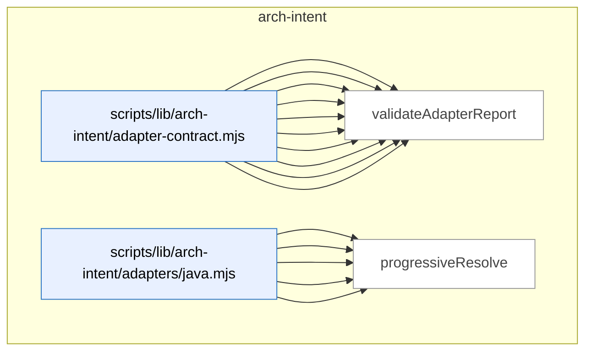

_Domain has 53 symbols (>50). Diagram shows top-15 by file order; see flat table below for the full list._

### Symbols in this domain

| Symbol | Kind | Path | Lines | Purpose | File imported by |
|---|---|---|---|---|---|
| [`computeDeadIntent`](../scripts/lib/arch-intent/adapter-contract.mjs#L191) | function | `scripts/lib/arch-intent/adapter-contract.mjs` | 191-199 | Identifies declared domains that have no files in the live repository. | `scripts/arch-intent-bootstrap.mjs`, `scripts/lib/audit/legacy-production-audit.mjs`, `scripts/openai-audit.mjs`, +2 more |
| [`deriveArchState`](../scripts/lib/arch-intent/adapter-contract.mjs#L363) | function | `scripts/lib/arch-intent/adapter-contract.mjs` | 363-374 | Maps a report's adapter results to a final state verdict (CLEAN, WITH_FINDINGS, ERROR_ALL_STACKS_FAILED, etc.). | `scripts/arch-intent-bootstrap.mjs`, `scripts/lib/audit/legacy-production-audit.mjs`, `scripts/openai-audit.mjs`, +2 more |
| [`fsWalkFallback`](../scripts/lib/arch-intent/adapter-contract.mjs#L68) | function | `scripts/lib/arch-intent/adapter-contract.mjs` | 68-88 | Recursively walks the filesystem to list source files, excluding node_modules and other common build directories. | `scripts/arch-intent-bootstrap.mjs`, `scripts/lib/audit/legacy-production-audit.mjs`, `scripts/openai-audit.mjs`, +2 more |
| [`inventoryAllPaths`](../scripts/lib/arch-intent/adapter-contract.mjs#L169) | function | `scripts/lib/arch-intent/adapter-contract.mjs` | 169-176 | Maps all repository paths (including non-source files) to their declared domains. | `scripts/arch-intent-bootstrap.mjs`, `scripts/lib/audit/legacy-production-audit.mjs`, `scripts/openai-audit.mjs`, +2 more |
| [`inventoryFiles`](../scripts/lib/arch-intent/adapter-contract.mjs#L133) | function | `scripts/lib/arch-intent/adapter-contract.mjs` | 133-151 | Filters source files by extension, assigns each to a domain per domain-map rules, and returns mapped and unmapped file lists. | `scripts/arch-intent-bootstrap.mjs`, `scripts/lib/audit/legacy-production-audit.mjs`, `scripts/openai-audit.mjs`, +2 more |
| [`isArchIntentReportClean`](../scripts/lib/arch-intent/adapter-contract.mjs#L349) | function | `scripts/lib/arch-intent/adapter-contract.mjs` | 349-354 | Checks if an analysis report is clean (no violations, unmapped files, dead intent, or adapter errors). | `scripts/arch-intent-bootstrap.mjs`, `scripts/lib/audit/legacy-production-audit.mjs`, `scripts/openai-audit.mjs`, +2 more |
| [`listRepoPaths`](../scripts/lib/arch-intent/adapter-contract.mjs#L103) | function | `scripts/lib/arch-intent/adapter-contract.mjs` | 103-118 | Returns all tracked and untracked-but-not-ignored paths in a git repository, falling back to filesystem walk if git fails. | `scripts/arch-intent-bootstrap.mjs`, `scripts/lib/audit/legacy-production-audit.mjs`, `scripts/openai-audit.mjs`, +2 more |
| [`loadAdapter`](../scripts/lib/arch-intent/adapter-contract.mjs#L214) | function | `scripts/lib/arch-intent/adapter-contract.mjs` | 214-232 | Dynamically imports a stack-specific adapter module or returns a "missing" marker if the file doesn't exist. | `scripts/arch-intent-bootstrap.mjs`, `scripts/lib/audit/legacy-production-audit.mjs`, `scripts/openai-audit.mjs`, +2 more |
| [`runArchIntentAnalysis`](../scripts/lib/arch-intent/adapter-contract.mjs#L263) | function | `scripts/lib/arch-intent/adapter-contract.mjs` | 263-331 | Orchestrates architectural-intent analysis across multiple stack adapters, inventories files by domain, and aggregates violations. | `scripts/arch-intent-bootstrap.mjs`, `scripts/lib/audit/legacy-production-audit.mjs`, `scripts/openai-audit.mjs`, +2 more |
| [`validateAdapterReport`](../scripts/lib/arch-intent/adapter-contract.mjs#L241) | function | `scripts/lib/arch-intent/adapter-contract.mjs` | 241-252 | Validates an adapter's return value against the ArchIntentReportSchema, throwing on malformed output. | `scripts/arch-intent-bootstrap.mjs`, `scripts/lib/audit/legacy-production-audit.mjs`, `scripts/openai-audit.mjs`, +2 more |
| [`analyseImports`](../scripts/lib/arch-intent/adapters/java.mjs#L325) | function | `scripts/lib/arch-intent/adapters/java.mjs` | 325-444 | Walks Java source files, resolves all imports, detects cross-domain violations, and aggregates violations and metadata. | `tests/arch-intent-adapter-java.test.mjs` |
| [`buildJavaResolutionIndex`](../scripts/lib/arch-intent/adapters/java.mjs#L176) | function | `scripts/lib/arch-intent/adapters/java.mjs` | 176-233 | Indexes Java classes by FQN and package, mapping them to files and source roots for import resolution. | `tests/arch-intent-adapter-java.test.mjs` |
| [`extractImports`](../scripts/lib/arch-intent/adapters/java.mjs#L132) | function | `scripts/lib/arch-intent/adapters/java.mjs` | 132-164 | Parses Java import statements, capturing FQN, wildcard/static flags, and line numbers. | `tests/arch-intent-adapter-java.test.mjs` |
| [`extractPackage`](../scripts/lib/arch-intent/adapters/java.mjs#L115) | function | `scripts/lib/arch-intent/adapters/java.mjs` | 115-118 | Extracts the package declaration from a Java source file. | `tests/arch-intent-adapter-java.test.mjs` |
| [`progressiveResolve`](../scripts/lib/arch-intent/adapters/java.mjs#L246) | function | `scripts/lib/arch-intent/adapters/java.mjs` | 246-265 | Resolves a Java FQN by progressively narrowing the package path until a match is found or proven external. | `tests/arch-intent-adapter-java.test.mjs` |
| [`resolveJavaImport`](../scripts/lib/arch-intent/adapters/java.mjs#L275) | function | `scripts/lib/arch-intent/adapters/java.mjs` | 275-314 | Resolves a single import statement, handling wildcards, static imports, and ambiguous matches. | `tests/arch-intent-adapter-java.test.mjs` |
| [`stripJavaCommentsAndLiterals`](../scripts/lib/arch-intent/adapters/java.mjs#L44) | function | `scripts/lib/arch-intent/adapters/java.mjs` | 44-106 | Removes Java comments and string/char literals from source while preserving line structure for error reporting. | `tests/arch-intent-adapter-java.test.mjs` |
| [`analyseImports`](../scripts/lib/arch-intent/adapters/js-ts.mjs#L74) | function | `scripts/lib/arch-intent/adapters/js-ts.mjs` | 74-214 | Runs dependency-cruiser on TypeScript/JavaScript files to detect cross-domain import violations and build a file dependency graph. | _(internal)_ |
| [`classifyEdge`](../scripts/lib/arch-intent/adapters/js-ts.mjs#L33) | function | `scripts/lib/arch-intent/adapters/js-ts.mjs` | 33-49 | Classifies a dependency-cruiser edge as local, type-only, dynamic, unresolved, or vendor (npm/node/alias). | _(internal)_ |
| [`normalisePath`](../scripts/lib/arch-intent/adapters/js-ts.mjs#L58) | function | `scripts/lib/arch-intent/adapters/js-ts.mjs` | 58-63 | Converts a file path to a normalized repo-relative path with forward slashes. | _(internal)_ |
| [`analyseImports`](../scripts/lib/arch-intent/adapters/postgres.mjs#L605) | function | `scripts/lib/arch-intent/adapters/postgres.mjs` | 605-698 | Analyzes SQL files to extract object definitions, dependencies, and violations against an architectural domain model. | `tests/arch-intent-adapter-postgres.test.mjs` |
| [`buildSqlCatalog`](../scripts/lib/arch-intent/adapters/postgres.mjs#L499) | function | `scripts/lib/arch-intent/adapters/postgres.mjs` | 499-560 | Builds an index of SQL objects (relations, functions, types) and their cross-references, tracking redefinitions and epochs. | `tests/arch-intent-adapter-postgres.test.mjs` |
| [`classifyStatement`](../scripts/lib/arch-intent/adapters/postgres.mjs#L295) | function | `scripts/lib/arch-intent/adapters/postgres.mjs` | 295-427 | Classifies a SQL statement and extracts references between database objects (tables, functions, types). | `tests/arch-intent-adapter-postgres.test.mjs` |
| [`displayName`](../scripts/lib/arch-intent/adapters/postgres.mjs#L234) | function | `scripts/lib/arch-intent/adapters/postgres.mjs` | 234-236 | Reverses the dot-escaping in normalized SQL identifiers for human-facing display. | `tests/arch-intent-adapter-postgres.test.mjs` |
| [`extractCallRefs`](../scripts/lib/arch-intent/adapters/postgres.mjs#L460) | function | `scripts/lib/arch-intent/adapters/postgres.mjs` | 460-471 | Extracts function call references from SQL code by matching function-name patterns. | `tests/arch-intent-adapter-postgres.test.mjs` |
| [`extractPolicyTableRefs`](../scripts/lib/arch-intent/adapters/postgres.mjs#L474) | function | `scripts/lib/arch-intent/adapters/postgres.mjs` | 474-483 | Extracts table references from row-level security policy expressions via FROM/JOIN and qualified-name patterns. | `tests/arch-intent-adapter-postgres.test.mjs` |
| [`extractSelectRefs`](../scripts/lib/arch-intent/adapters/postgres.mjs#L440) | function | `scripts/lib/arch-intent/adapters/postgres.mjs` | 440-457 | Extracts table and view references from a SQL SELECT statement, excluding CTEs and function calls. | `tests/arch-intent-adapter-postgres.test.mjs` |
| [`naturalCompare`](../scripts/lib/arch-intent/adapters/postgres.mjs#L488) | function | `scripts/lib/arch-intent/adapters/postgres.mjs` | 488-490 | Compares strings using natural sort order with numeric-aware collation. | `tests/arch-intent-adapter-postgres.test.mjs` |
| [`normName`](../scripts/lib/arch-intent/adapters/postgres.mjs#L197) | function | `scripts/lib/arch-intent/adapters/postgres.mjs` | 197-228 | Normalizes SQL identifiers by handling quoted names, case-folding, and escaping internal dots to prevent collisions. | `tests/arch-intent-adapter-postgres.test.mjs` |
| [`parseFile`](../scripts/lib/arch-intent/adapters/postgres.mjs#L262) | function | `scripts/lib/arch-intent/adapters/postgres.mjs` | 262-293 | Parses SQL file into statements and classifies them to extract object definitions, ALTER references, and DROP statements. | `tests/arch-intent-adapter-postgres.test.mjs` |
| [`recoverFunctionBody`](../scripts/lib/arch-intent/adapters/postgres.mjs#L430) | function | `scripts/lib/arch-intent/adapters/postgres.mjs` | 430-437 | Extracts the body text of a SQL function from its dollar-quoted or string-literal definition. | `tests/arch-intent-adapter-postgres.test.mjs` |
| [`resolveSqlRef`](../scripts/lib/arch-intent/adapters/postgres.mjs#L571) | function | `scripts/lib/arch-intent/adapters/postgres.mjs` | 571-594 | Resolves a SQL object reference to its defining file, proves it external (pg_catalog/builtin), or marks it unresolved. | `tests/arch-intent-adapter-postgres.test.mjs` |
| [`splitTopLevel`](../scripts/lib/arch-intent/adapters/postgres.mjs#L239) | function | `scripts/lib/arch-intent/adapters/postgres.mjs` | 239-250 | Splits a string by separator while respecting parenthesis nesting depth. | `tests/arch-intent-adapter-postgres.test.mjs` |
| [`stripSqlCommentsAndStrings`](../scripts/lib/arch-intent/adapters/postgres.mjs#L102) | function | `scripts/lib/arch-intent/adapters/postgres.mjs` | 102-187 | Removes SQL comments and string literals while preserving line structure for accurate offset tracking. | `tests/arch-intent-adapter-postgres.test.mjs` |
| [`analyseImports`](../scripts/lib/arch-intent/adapters/python.mjs#L507) | function | `scripts/lib/arch-intent/adapters/python.mjs` | 507-586 | Analyzes Python files to extract imports, resolve them to target files, and flag violations against domain rules. | `tests/arch-intent-adapter-python.test.mjs` |
| [`buildPythonModuleIndex`](../scripts/lib/arch-intent/adapters/python.mjs#L383) | function | `scripts/lib/arch-intent/adapters/python.mjs` | 383-426 | Builds an index mapping dotted module names to their source files, detecting collisions. | `tests/arch-intent-adapter-python.test.mjs` |
| [`countUnbalanced`](../scripts/lib/arch-intent/adapters/python.mjs#L254) | function | `scripts/lib/arch-intent/adapters/python.mjs` | 254-261 | Counts unmatched opening and closing parentheses in a string. | `tests/arch-intent-adapter-python.test.mjs` |
| [`discoverPythonRoots`](../scripts/lib/arch-intent/adapters/python.mjs#L287) | function | `scripts/lib/arch-intent/adapters/python.mjs` | 287-350 | Discovers package root directories in a Python project via metadata files, src/ patterns, and __init__.py walks. | `tests/arch-intent-adapter-python.test.mjs` |
| [`extractImports`](../scripts/lib/arch-intent/adapters/python.mjs#L196) | function | `scripts/lib/arch-intent/adapters/python.mjs` | 196-251 | Extracts import statements from Python source code, handling relative imports, continuation lines, and parenthesized groups. | `tests/arch-intent-adapter-python.test.mjs` |
| [`extractPackageDirs`](../scripts/lib/arch-intent/adapters/python.mjs#L353) | function | `scripts/lib/arch-intent/adapters/python.mjs` | 353-364 | Extracts package directories from pyproject.toml and setup.cfg metadata files. | `tests/arch-intent-adapter-python.test.mjs` |
| [`isPySource`](../scripts/lib/arch-intent/adapters/python.mjs#L366) | function | `scripts/lib/arch-intent/adapters/python.mjs` | 366-369 | Checks if a file path is a Python source file (.py or .pyi). | `tests/arch-intent-adapter-python.test.mjs` |
| [`parseImportedNames`](../scripts/lib/arch-intent/adapters/python.mjs#L264) | function | `scripts/lib/arch-intent/adapters/python.mjs` | 264-271 | Parses the comma-separated imported names from a Python import clause, handling aliases. | `tests/arch-intent-adapter-python.test.mjs` |
| [`resolvePythonImport`](../scripts/lib/arch-intent/adapters/python.mjs#L439) | function | `scripts/lib/arch-intent/adapters/python.mjs` | 439-496 | Resolves a Python import statement to its target file, handling relative imports and submodule lookups. | `tests/arch-intent-adapter-python.test.mjs` |
| [`stripPythonCommentsAndStrings`](../scripts/lib/arch-intent/adapters/python.mjs#L72) | function | `scripts/lib/arch-intent/adapters/python.mjs` | 72-178 | Removes Python comments and string literals (including f-strings and triple-quoted) while preserving line structure. | `tests/arch-intent-adapter-python.test.mjs` |
| [`checkDepAllowed`](../scripts/lib/arch-intent/domain-resolver.mjs#L53) | function | `scripts/lib/arch-intent/domain-resolver.mjs` | 53-60 | Checks if a dependency between two domains is allowed by the configured architecture rules. | `scripts/arch-intent-bootstrap.mjs`, `scripts/lib/arch-intent/adapter-contract.mjs`, `scripts/lib/arch-intent/adapters/java.mjs`, +5 more |
| [`computeDeclaredDomains`](../scripts/lib/arch-intent/domain-resolver.mjs#L76) | function | `scripts/lib/arch-intent/domain-resolver.mjs` | 76-86 | Computes the set of all declared domains in the domain-map configuration (rules, allowedDeps, descriptions). | `scripts/arch-intent-bootstrap.mjs`, `scripts/lib/arch-intent/adapter-contract.mjs`, `scripts/lib/arch-intent/adapters/java.mjs`, +5 more |
| [`resolveFileToDomain`](../scripts/lib/arch-intent/domain-resolver.mjs#L29) | function | `scripts/lib/arch-intent/domain-resolver.mjs` | 29-38 | Maps a file path to its architectural domain using glob-pattern rules. | `scripts/arch-intent-bootstrap.mjs`, `scripts/lib/arch-intent/adapter-contract.mjs`, `scripts/lib/arch-intent/adapters/java.mjs`, +5 more |
| [`ArchIntentAnalyzerError`](../scripts/lib/arch-intent/errors.mjs#L18) | class | `scripts/lib/arch-intent/errors.mjs` | 18-25 | Custom error class for analyzer failures with optional stack kind and cause chain. | `scripts/lib/arch-intent/adapter-contract.mjs`, `scripts/lib/arch-intent/load-config.mjs`, `scripts/lib/arch-intent/semantic-validator.mjs`, +3 more |
| [`ArchIntentConfigError`](../scripts/lib/arch-intent/errors.mjs#L9) | class | `scripts/lib/arch-intent/errors.mjs` | 9-16 | Custom error class for configuration validation failures with optional file and semantic-flag context. | `scripts/lib/arch-intent/adapter-contract.mjs`, `scripts/lib/arch-intent/load-config.mjs`, `scripts/lib/arch-intent/semantic-validator.mjs`, +3 more |
| [`parseIntentDoc`](../scripts/lib/arch-intent/intent-doc-parser.mjs#L27) | function | `scripts/lib/arch-intent/intent-doc-parser.mjs` | 27-78 | Parses an intent document (markdown) to extract mermaid diagrams, narratives by section header, and version. | `scripts/lib/audit/legacy-production-audit.mjs`, `scripts/openai-audit.mjs`, `tests/arch-intent-doc-parser.test.mjs` |
| [`loadArchIntentConfig`](../scripts/lib/arch-intent/load-config.mjs#L35) | function | `scripts/lib/arch-intent/load-config.mjs` | 35-69 | Loads and validates the domain-map.json configuration file, applying Zod schema and semantic checks. | `scripts/arch-intent-bootstrap.mjs`, `scripts/lib/audit/legacy-production-audit.mjs`, `scripts/openai-audit.mjs`, +1 more |
| [`rulesDeclaredDomains`](../scripts/lib/arch-intent/semantic-validator.mjs#L30) | function | `scripts/lib/arch-intent/semantic-validator.mjs` | 30-34 | Extracts the set of domains declared in architecture rules plus the pseudo-vendor domain. | `scripts/lib/arch-intent/load-config.mjs` |
| [`validateDomainMapSemantics`](../scripts/lib/arch-intent/semantic-validator.mjs#L42) | function | `scripts/lib/arch-intent/semantic-validator.mjs` | 42-97 | Validates semantic consistency of the domain map: allowedDeps keys/values reference declared domains, and detects rule shadowing. | `scripts/lib/arch-intent/load-config.mjs` |

---

## arch-memory

> Maintains an embedding index of code symbols with disk caching; queries it to find similar existing code before writing new functions, and cross-references security incidents for code-change contexts.

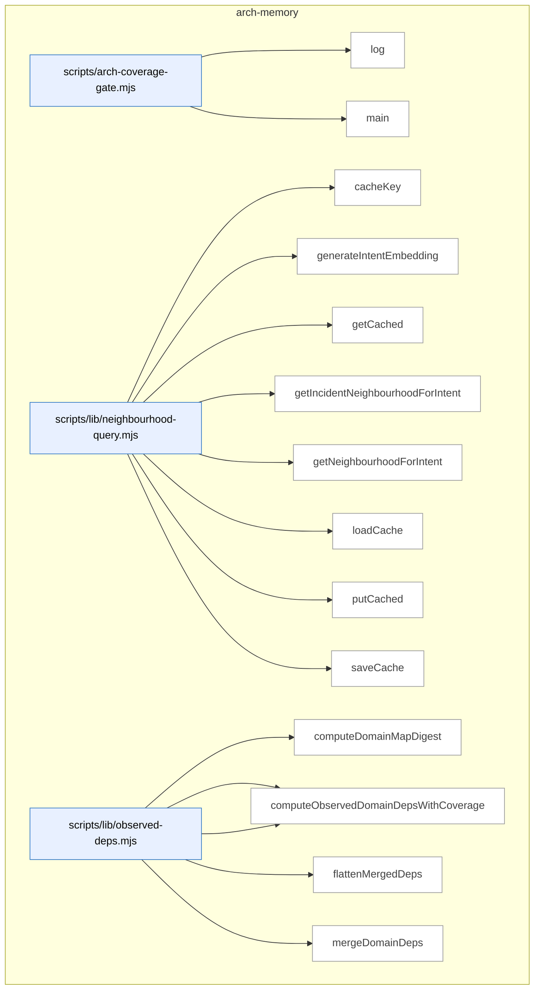

_Domain has 90 symbols (>50). Diagram shows top-15 by file order; see flat table below for the full list._

### Symbols in this domain

| Symbol | Kind | Path | Lines | Purpose | File imported by |
|---|---|---|---|---|---|
| [`log`](../scripts/arch-coverage-gate.mjs#L33) | function | `scripts/arch-coverage-gate.mjs` | 33-33 | Logs a message to stderr with a newline. | _(internal)_ |
| [`main`](../scripts/arch-coverage-gate.mjs#L35) | function | `scripts/arch-coverage-gate.mjs` | 35-132 | Gates the build on architecture dependency coverage by validating the observed import graph against domain rules. | _(internal)_ |
| [`cacheKey`](../scripts/lib/neighbourhood-query.mjs#L47) | function | `scripts/lib/neighbourhood-query.mjs` | 47-53 | Generates a 24-char cache key from intent, model, dimensions, and embedding provider for consistent cache lookup. | `scripts/cross-skill.mjs`, `scripts/lib/audit/duplication-detector.mjs`, `tests/incident-neighbourhood.test.mjs`, +1 more |
| [`generateIntentEmbedding`](../scripts/lib/neighbourhood-query.mjs#L99) | function | `scripts/lib/neighbourhood-query.mjs` | 99-148 | Generates an embedding for an intent with provider-mismatch detection to ensure query space matches index space. | `scripts/cross-skill.mjs`, `scripts/lib/audit/duplication-detector.mjs`, `tests/incident-neighbourhood.test.mjs`, +1 more |
| [`getCached`](../scripts/lib/neighbourhood-query.mjs#L72) | function | `scripts/lib/neighbourhood-query.mjs` | 72-78 | Retrieves a cached embedding by key if it exists and hasn't exceeded TTL. | `scripts/cross-skill.mjs`, `scripts/lib/audit/duplication-detector.mjs`, `tests/incident-neighbourhood.test.mjs`, +1 more |
| [`getIncidentNeighbourhoodForIntent`](../scripts/lib/neighbourhood-query.mjs#L381) | function | `scripts/lib/neighbourhood-query.mjs` | 381-531 | Queries the security-incident memory for incidents related to a code-change intent. | `scripts/cross-skill.mjs`, `scripts/lib/audit/duplication-detector.mjs`, `tests/incident-neighbourhood.test.mjs`, +1 more |
| [`getNeighbourhoodForIntent`](../scripts/lib/neighbourhood-query.mjs#L161) | function | `scripts/lib/neighbourhood-query.mjs` | 161-353 | Queries the architectural-memory index for symbols similar to an intent, returning ranked candidates with confidence and recommendation. | `scripts/cross-skill.mjs`, `scripts/lib/audit/duplication-detector.mjs`, `tests/incident-neighbourhood.test.mjs`, +1 more |
| [`loadCache`](../scripts/lib/neighbourhood-query.mjs#L55) | function | `scripts/lib/neighbourhood-query.mjs` | 55-63 | Loads the neighbourhood embedding cache from disk or returns empty cache if missing. | `scripts/cross-skill.mjs`, `scripts/lib/audit/duplication-detector.mjs`, `tests/incident-neighbourhood.test.mjs`, +1 more |
| [`putCached`](../scripts/lib/neighbourhood-query.mjs#L80) | function | `scripts/lib/neighbourhood-query.mjs` | 80-84 | Stores an embedding in the cache with timestamp for TTL tracking. | `scripts/cross-skill.mjs`, `scripts/lib/audit/duplication-detector.mjs`, `tests/incident-neighbourhood.test.mjs`, +1 more |
| [`saveCache`](../scripts/lib/neighbourhood-query.mjs#L65) | function | `scripts/lib/neighbourhood-query.mjs` | 65-70 | Atomically writes the neighbourhood embedding cache to disk. | `scripts/cross-skill.mjs`, `scripts/lib/audit/duplication-detector.mjs`, `tests/incident-neighbourhood.test.mjs`, +1 more |
| [`computeDomainMapDigest`](../scripts/lib/observed-deps.mjs#L97) | function | `scripts/lib/observed-deps.mjs` | 97-104 | Computes a SHA256 digest of domain-mapping rules for freshness detection. | `scripts/arch-coverage-gate.mjs`, `scripts/lib/dashboard/collect-reference.mjs`, `scripts/symbol-index/render-mermaid.mjs`, +3 more |
| [`computeObservedDomainDeps`](../scripts/lib/observed-deps.mjs#L118) | function | `scripts/lib/observed-deps.mjs` | 118-120 | Extracts domain-to-domain dependencies from a symbol import graph based on domain-mapping rules. | `scripts/arch-coverage-gate.mjs`, `scripts/lib/dashboard/collect-reference.mjs`, `scripts/symbol-index/render-mermaid.mjs`, +3 more |
| [`computeObservedDomainDepsWithCoverage`](../scripts/lib/observed-deps.mjs#L140) | function | `scripts/lib/observed-deps.mjs` | 140-187 | Computes observed domain dependencies and tracks coverage statistics (untagged, malformed, same-domain edges). | `scripts/arch-coverage-gate.mjs`, `scripts/lib/dashboard/collect-reference.mjs`, `scripts/symbol-index/render-mermaid.mjs`, +3 more |
| [`flattenMergedDeps`](../scripts/lib/observed-deps.mjs#L250) | function | `scripts/lib/observed-deps.mjs` | 250-259 | Flattens merged dependencies into a map of domain → sorted target domains. | `scripts/arch-coverage-gate.mjs`, `scripts/lib/dashboard/collect-reference.mjs`, `scripts/symbol-index/render-mermaid.mjs`, +3 more |
| [`mergeDomainDeps`](../scripts/lib/observed-deps.mjs#L207) | function | `scripts/lib/observed-deps.mjs` | 207-241 | Merges observed and manually-declared domain dependencies, tracking source (observed/manual/both) and filtering dangerous keys. | `scripts/arch-coverage-gate.mjs`, `scripts/lib/dashboard/collect-reference.mjs`, `scripts/symbol-index/render-mermaid.mjs`, +3 more |
| [`computeTargetDomains`](../scripts/lib/symbol-index/domain-tagger.mjs#L166) | function | `scripts/lib/symbol-index/domain-tagger.mjs` | 166-181 | Identifies which domains are covered by a list of target file paths. | `scripts/arch-coverage-gate.mjs`, `scripts/cross-skill.mjs`, `scripts/lib/audit/legacy-production-audit.mjs`, +8 more |
| [`globToRegexBody`](../scripts/lib/symbol-index/domain-tagger.mjs#L52) | function | `scripts/lib/symbol-index/domain-tagger.mjs` | 52-96 | Converts a glob pattern into a regex body, handling `**` (any path), `*` (any filename), and literals correctly. | `scripts/arch-coverage-gate.mjs`, `scripts/cross-skill.mjs`, `scripts/lib/audit/legacy-production-audit.mjs`, +8 more |
| [`loadCoverageConfig`](../scripts/lib/symbol-index/domain-tagger.mjs#L216) | function | `scripts/lib/symbol-index/domain-tagger.mjs` | 216-227 | Loads and parses the coverage configuration from domain-map.json with validation and defaults. | `scripts/arch-coverage-gate.mjs`, `scripts/cross-skill.mjs`, `scripts/lib/audit/legacy-production-audit.mjs`, +8 more |
| [`loadDomainRules`](../scripts/lib/symbol-index/domain-tagger.mjs#L229) | function | `scripts/lib/symbol-index/domain-tagger.mjs` | 229-256 | Loads and validates domain-tagging rules from domain-map.json, skipping malformed entries. | `scripts/arch-coverage-gate.mjs`, `scripts/cross-skill.mjs`, `scripts/lib/audit/legacy-production-audit.mjs`, +8 more |
| [`makeFastTagger`](../scripts/lib/symbol-index/domain-tagger.mjs#L127) | function | `scripts/lib/symbol-index/domain-tagger.mjs` | 127-148 | Creates a cached tagger function that matches file paths to domains using pre-compiled regexes. | `scripts/arch-coverage-gate.mjs`, `scripts/cross-skill.mjs`, `scripts/lib/audit/legacy-production-audit.mjs`, +8 more |
| [`matchGlob`](../scripts/lib/symbol-index/domain-tagger.mjs#L39) | function | `scripts/lib/symbol-index/domain-tagger.mjs` | 39-50 | Tests if a file path matches a glob pattern with `**` and `*` wildcards. | `scripts/arch-coverage-gate.mjs`, `scripts/cross-skill.mjs`, `scripts/lib/audit/legacy-production-audit.mjs`, +8 more |
| [`tagDomain`](../scripts/lib/symbol-index/domain-tagger.mjs#L105) | function | `scripts/lib/symbol-index/domain-tagger.mjs` | 105-112 | Returns the domain for a file path by checking against domain-tagging rules. | `scripts/arch-coverage-gate.mjs`, `scripts/cross-skill.mjs`, `scripts/lib/audit/legacy-production-audit.mjs`, +8 more |
| [`assertAttributionExhaustive`](../scripts/lib/symbol-index/graph-coverage.mjs#L247) | function | `scripts/lib/symbol-index/graph-coverage.mjs` | 247-251 | Verifies that the attribution's candidate count matches the persisted edge count. | `scripts/symbol-index/extract.mjs`, `scripts/symbol-index/refresh.mjs`, `scripts/symbol-index/render-mermaid.mjs`, +2 more |
| [`assertExtractionExhaustive`](../scripts/lib/symbol-index/graph-coverage.mjs#L230) | function | `scripts/lib/symbol-index/graph-coverage.mjs` | 230-238 | Verifies that the extraction's reported edge count matches the cruiser's actual total. | `scripts/symbol-index/extract.mjs`, `scripts/symbol-index/refresh.mjs`, `scripts/symbol-index/render-mermaid.mjs`, +2 more |
| [`assessAttributionCoverage`](../scripts/lib/symbol-index/graph-coverage.mjs#L186) | function | `scripts/lib/symbol-index/graph-coverage.mjs` | 186-214 | Evaluates how many dependency edges were successfully attributed to domain pairs. | `scripts/symbol-index/extract.mjs`, `scripts/symbol-index/refresh.mjs`, `scripts/symbol-index/render-mermaid.mjs`, +2 more |
| [`assessExtractionCoverage`](../scripts/lib/symbol-index/graph-coverage.mjs#L123) | function | `scripts/lib/symbol-index/graph-coverage.mjs` | 123-154 | Evaluates how many eligible source files were analyzed by the dependency cruiser. | `scripts/symbol-index/extract.mjs`, `scripts/symbol-index/refresh.mjs`, `scripts/symbol-index/render-mermaid.mjs`, +2 more |
| [`clampCap`](../scripts/lib/symbol-index/graph-coverage.mjs#L168) | function | `scripts/lib/symbol-index/graph-coverage.mjs` | 168-171 | Clamps a sample cap value to the range [0, 100]. | `scripts/symbol-index/extract.mjs`, `scripts/symbol-index/refresh.mjs`, `scripts/symbol-index/render-mermaid.mjs`, +2 more |
| [`eligibleFiles`](../scripts/lib/symbol-index/graph-coverage.mjs#L91) | function | `scripts/lib/symbol-index/graph-coverage.mjs` | 91-104 | Filters a list of files to only cruisable source files within the repo bounds. | `scripts/symbol-index/extract.mjs`, `scripts/symbol-index/refresh.mjs`, `scripts/symbol-index/render-mermaid.mjs`, +2 more |
| [`normalizeEdgeBuckets`](../scripts/lib/symbol-index/graph-coverage.mjs#L157) | function | `scripts/lib/symbol-index/graph-coverage.mjs` | 157-166 | Normalizes edge bucket counts, replacing non-finite or negative values with zero. | `scripts/symbol-index/extract.mjs`, `scripts/symbol-index/refresh.mjs`, `scripts/symbol-index/render-mermaid.mjs`, +2 more |
| [`normalizeRepoPath`](../scripts/lib/symbol-index/graph-coverage.mjs#L60) | function | `scripts/lib/symbol-index/graph-coverage.mjs` | 60-68 | Converts an absolute or relative path to a normalized repo-relative path (lowercased on Windows). | `scripts/symbol-index/extract.mjs`, `scripts/symbol-index/refresh.mjs`, `scripts/symbol-index/render-mermaid.mjs`, +2 more |
| [`coverageGateExitCode`](../scripts/lib/symbol-index/graph-verdict.mjs#L199) | function | `scripts/lib/symbol-index/graph-verdict.mjs` | 199-204 | Returns exit code 2 if coverage is degraded/unverified and enforcement is enabled, else 0. | `scripts/arch-coverage-gate.mjs`, `scripts/lib/symbol-index/domain-tagger.mjs`, `scripts/symbol-index/extract.mjs`, +4 more |
| [`graphVerdict`](../scripts/lib/symbol-index/graph-verdict.mjs#L140) | function | `scripts/lib/symbol-index/graph-verdict.mjs` | 140-187 | Determines the overall verdict (clean, degraded, unverified) for a coverage run based on extraction and attribution. | `scripts/arch-coverage-gate.mjs`, `scripts/lib/symbol-index/domain-tagger.mjs`, `scripts/symbol-index/extract.mjs`, +4 more |
| [`parseCoverageConfig`](../scripts/lib/symbol-index/graph-verdict.mjs#L69) | function | `scripts/lib/symbol-index/graph-verdict.mjs` | 69-124 | Parses and validates coverage configuration fields (floor, ratios, timeouts) with fallback defaults. | `scripts/arch-coverage-gate.mjs`, `scripts/lib/symbol-index/domain-tagger.mjs`, `scripts/symbol-index/extract.mjs`, +4 more |
| [`findStalePragmas`](../scripts/lib/symbol-index/stale-pragma-sweep.mjs#L51) | function | `scripts/lib/symbol-index/stale-pragma-sweep.mjs` | 51-59 | Finds duplicate-justification pragmas whose target files no longer exist. | `scripts/symbol-index/drift.mjs`, `tests/drift-stale-pragma.test.mjs` |
| [`renderStalePragmaSection`](../scripts/lib/symbol-index/stale-pragma-sweep.mjs#L62) | function | `scripts/lib/symbol-index/stale-pragma-sweep.mjs` | 62-69 | Formats stale pragmas into a markdown section for audit reports. | `scripts/symbol-index/drift.mjs`, `tests/drift-stale-pragma.test.mjs` |
| [`isThinDelegate`](../scripts/lib/symbol-index/thin-delegate.mjs#L50) | function | `scripts/lib/symbol-index/thin-delegate.mjs` | 50-85 | Detects whether a function body is a thin wrapper that merely delegates to a call or member access. | `scripts/symbol-index/extract.mjs`, `tests/thin-delegate.test.mjs` |
| [`buildCruiseOpts`](../scripts/spikes/observed-graph-discovery-spike.mjs#L63) | function | `scripts/spikes/observed-graph-discovery-spike.mjs` | 63-70 | Constructs dependency-cruiser configuration, loading local .dependency-cruiser.cjs if present. | _(internal)_ |
| [`currentTargets`](../scripts/spikes/observed-graph-discovery-spike.mjs#L82) | function | `scripts/spikes/observed-graph-discovery-spike.mjs` | 82-87 | Returns the list of source directories to analyze, defaulting to repo root if none exist. | _(internal)_ |
| [`edgeSet`](../scripts/spikes/observed-graph-discovery-spike.mjs#L90) | function | `scripts/spikes/observed-graph-discovery-spike.mjs` | 90-98 | Extracts all dependency edges from a cruise result into a set. | _(internal)_ |
| [`fmt`](../scripts/spikes/observed-graph-discovery-spike.mjs#L136) | function | `scripts/spikes/observed-graph-discovery-spike.mjs` | 136-138 | Formats a number to N decimal places, returning 'n/a' for non-finite values. | _(internal)_ |
| [`main`](../scripts/spikes/observed-graph-discovery-spike.mjs#L140) | function | `scripts/spikes/observed-graph-discovery-spike.mjs` | 140-328 | Compares symbol-layer file inventory with dependency-cruiser's import graph on a repo. | _(internal)_ |
| [`timedCruise`](../scripts/spikes/observed-graph-discovery-spike.mjs#L100) | function | `scripts/spikes/observed-graph-discovery-spike.mjs` | 100-134 | Runs dependency-cruiser on targets with runtime, memory peak, and edge-count metrics. | _(internal)_ |
| [`atomicWrite`](../scripts/symbol-index/drift.mjs#L44) | function | `scripts/symbol-index/drift.mjs` | 44-46 | Writes content to a file with atomic rename safety. | `tests/symbol-index-drift.test.mjs` |
| [`classify`](../scripts/symbol-index/drift.mjs#L48) | function | `scripts/symbol-index/drift.mjs` | 48-52 | Classifies a drift score into GREEN, AMBER, or RED severity levels. | `tests/symbol-index-drift.test.mjs` |
| [`main`](../scripts/symbol-index/drift.mjs#L73) | function | `scripts/symbol-index/drift.mjs` | 73-184 | Checks symbol-index drift against active snapshot and reports status. | `tests/symbol-index-drift.test.mjs` |
| [`parseArgs`](../scripts/symbol-index/drift.mjs#L35) | function | `scripts/symbol-index/drift.mjs` | 35-42 | Parses CLI arguments for --out and --json flags. | `tests/symbol-index-drift.test.mjs` |
| [`renderMarkdownViaShared`](../scripts/symbol-index/drift.mjs#L58) | function | `scripts/symbol-index/drift.mjs` | 58-71 | Renders a drift issue into markdown format via shared rendering utility. | `tests/symbol-index-drift.test.mjs` |
| [`main`](../scripts/symbol-index/duplicates.mjs#L65) | function | `scripts/symbol-index/duplicates.mjs` | 65-101 | CLI entry point that fetches and displays duplicate symbol clusters from the cloud store. | _(internal)_ |
| [`parseArgs`](../scripts/symbol-index/duplicates.mjs#L31) | function | `scripts/symbol-index/duplicates.mjs` | 31-46 | Parses CLI arguments for --limit and --json flags with validation. | _(internal)_ |
| [`renderText`](../scripts/symbol-index/duplicates.mjs#L48) | function | `scripts/symbol-index/duplicates.mjs` | 48-63 | Formats duplicate symbol clusters into a human-readable text report. | _(internal)_ |
| [`embedBatch`](../scripts/symbol-index/embed.mjs#L26) | function | `scripts/symbol-index/embed.mjs` | 26-69 | Embeds a batch of text strings into vectors using a provider (Gemini or Azure). | _(internal)_ |
| [`logProgress`](../scripts/symbol-index/embed.mjs#L19) | function | `scripts/symbol-index/embed.mjs` | 19-19 | Writes progress messages to stderr during embedding. | _(internal)_ |
| [`main`](../scripts/symbol-index/embed.mjs#L71) | function | `scripts/symbol-index/embed.mjs` | 71-121 | CLI entry point that reads symbols from stdin, batches them, embeds them, and outputs results. | _(internal)_ |
| [`emitCoverage`](../scripts/symbol-index/extract.mjs#L454) | function | `scripts/symbol-index/extract.mjs` | 454-456 | Emits a coverage report showing what fraction of the repo's source was indexed. | `scripts/spikes/observed-graph-discovery-spike.mjs`, `tests/import-edge-filter.test.mjs` |
| [`emitProgress`](../scripts/symbol-index/extract.mjs#L68) | function | `scripts/symbol-index/extract.mjs` | 68-70 | Writes progress messages to stderr during extraction. | `scripts/spikes/observed-graph-discovery-spike.mjs`, `tests/import-edge-filter.test.mjs` |
| [`enumerateFiles`](../scripts/symbol-index/extract.mjs#L523) | function | `scripts/symbol-index/extract.mjs` | 523-541 | Walks the repo directory tree to find all source files (or uses a restricted list if provided). | `scripts/spikes/observed-graph-discovery-spike.mjs`, `tests/import-edge-filter.test.mjs` |
| [`extractGraphAndViolations`](../scripts/symbol-index/extract.mjs#L285) | function | `scripts/symbol-index/extract.mjs` | 285-442 | Uses dependency-cruiser to analyze import graphs and extract internal vs external dependencies. | `scripts/spikes/observed-graph-discovery-spike.mjs`, `tests/import-edge-filter.test.mjs` |
| [`extractSymbols`](../scripts/symbol-index/extract.mjs#L80) | function | `scripts/symbol-index/extract.mjs` | 80-263 | Uses ts-morph to parse source files and extract function/class/constant symbols with their metadata. | `scripts/spikes/observed-graph-discovery-spike.mjs`, `tests/import-edge-filter.test.mjs` |
| [`isInternalEdge`](../scripts/symbol-index/extract.mjs#L470) | function | `scripts/symbol-index/extract.mjs` | 470-486 | Determines whether a dependency is an internal repo import (not from npm/node). | `scripts/spikes/observed-graph-discovery-spike.mjs`, `tests/import-edge-filter.test.mjs` |
| [`main`](../scripts/symbol-index/extract.mjs#L543) | function | `scripts/symbol-index/extract.mjs` | 543-589 | CLI entry point that orchestrates symbol extraction and graph analysis. | `scripts/spikes/observed-graph-discovery-spike.mjs`, `tests/import-edge-filter.test.mjs` |
| [`parseArgs`](../scripts/symbol-index/extract.mjs#L46) | function | `scripts/symbol-index/extract.mjs` | 46-65 | Parses command-line arguments for the extract script. | `scripts/spikes/observed-graph-discovery-spike.mjs`, `tests/import-edge-filter.test.mjs` |
| [`main`](../scripts/symbol-index/prune.mjs#L44) | function | `scripts/symbol-index/prune.mjs` | 44-94 | CLI entry point that removes stale refresh runs from the cloud store based on retention policies. | _(internal)_ |
| [`parseArgs`](../scripts/symbol-index/prune.mjs#L31) | function | `scripts/symbol-index/prune.mjs` | 31-37 | Parses command-line arguments for the prune script. | _(internal)_ |
| [`logErr`](../scripts/symbol-index/refresh.mjs#L107) | function | `scripts/symbol-index/refresh.mjs` | 107-107 | Writes error/progress messages to stderr during refresh. | `tests/refresh-provenance-promotion.test.mjs` |
| [`logOk`](../scripts/symbol-index/refresh.mjs#L108) | function | `scripts/symbol-index/refresh.mjs` | 108-108 | Writes success/progress messages to stderr during refresh. | `tests/refresh-provenance-promotion.test.mjs` |
| [`main`](../scripts/symbol-index/refresh.mjs#L145) | function | `scripts/symbol-index/refresh.mjs` | 145-644 | CLI entry point that refreshes the architectural memory by extracting symbols, embedding them, and syncing to cloud. | `tests/refresh-provenance-promotion.test.mjs` |
| [`parseArgs`](../scripts/symbol-index/refresh.mjs#L95) | function | `scripts/symbol-index/refresh.mjs` | 95-105 | Parses command-line arguments for the refresh script. | `tests/refresh-provenance-promotion.test.mjs` |
| [`provenanceRequiresFullReembed`](../scripts/symbol-index/refresh.mjs#L91) | function | `scripts/symbol-index/refresh.mjs` | 91-93 | Checks whether a change in embedding model requires re-embedding all symbols. | `tests/refresh-provenance-promotion.test.mjs` |
| [`runWithHeartbeat`](../scripts/symbol-index/refresh.mjs#L136) | function | `scripts/symbol-index/refresh.mjs` | 136-143 | Executes an async function while periodically updating the refresh run's status in the cloud. | `tests/refresh-provenance-promotion.test.mjs` |
| [`sibling`](../scripts/symbol-index/refresh.mjs#L77) | function | `scripts/symbol-index/refresh.mjs` | 77-77 | Resolves a sibling path relative to the current module's directory. | `tests/refresh-provenance-promotion.test.mjs` |
| [`throwVcsError`](../scripts/symbol-index/refresh.mjs#L119) | function | `scripts/symbol-index/refresh.mjs` | 119-126 | Constructs and throws a structured error from a VCS failure. | `tests/refresh-provenance-promotion.test.mjs` |
| [`classify`](../scripts/symbol-index/render-mermaid.mjs#L63) | function | `scripts/symbol-index/render-mermaid.mjs` | 63-67 | Classifies a numeric score into color categories (GREEN/AMBER/RED) based on thresholds. | _(internal)_ |
| [`cleanupOrFail`](../scripts/symbol-index/render-mermaid.mjs#L128) | function | `scripts/symbol-index/render-mermaid.mjs` | 128-130 | Calls cleanup and exits if it fails. | _(internal)_ |
| [`cleanupStaleObservedDeps`](../scripts/symbol-index/render-mermaid.mjs#L75) | function | `scripts/symbol-index/render-mermaid.mjs` | 75-114 | Removes or neutralizes a stale observed-dependencies file from a previous aborted render. | _(internal)_ |
| [`commitSha`](../scripts/symbol-index/render-mermaid.mjs#L58) | function | `scripts/symbol-index/render-mermaid.mjs` | 58-61 | Gets the current git commit SHA (first 12 characters). | _(internal)_ |
| [`main`](../scripts/symbol-index/render-mermaid.mjs#L158) | function | `scripts/symbol-index/render-mermaid.mjs` | 158-394 | CLI entry point that generates a Mermaid diagram of the repo's architecture and imports. | _(internal)_ |
| [`parseArgs`](../scripts/symbol-index/render-mermaid.mjs#L50) | function | `scripts/symbol-index/render-mermaid.mjs` | 50-56 | Parses command-line arguments for the render script. | _(internal)_ |
| [`writeAbortStub`](../scripts/symbol-index/render-mermaid.mjs#L139) | function | `scripts/symbol-index/render-mermaid.mjs` | 139-156 | Writes a stub markdown file explaining why the architecture map render was aborted. | _(internal)_ |
| [`cacheHit`](../scripts/symbol-index/summarise-domains.mjs#L59) | function | `scripts/symbol-index/summarise-domains.mjs` | 59-66 | Checks whether a cached domain summary is still valid given current symbols and settings. | `scripts/symbol-index/render-mermaid.mjs`, `tests/domain-summaries.test.mjs`, `tests/symbol-index.test.mjs` |
| [`callHaiku`](../scripts/symbol-index/summarise-domains.mjs#L68) | function | `scripts/symbol-index/summarise-domains.mjs` | 68-99 | Calls Claude Haiku (or Sonnet on Azure) to summarize a domain's purpose. | `scripts/symbol-index/render-mermaid.mjs`, `tests/domain-summaries.test.mjs`, `tests/symbol-index.test.mjs` |
| [`computeCompositionHash`](../scripts/symbol-index/summarise-domains.mjs#L46) | function | `scripts/symbol-index/summarise-domains.mjs` | 46-51 | Computes a SHA256 hash of symbol definitions to detect when domain composition changes. | `scripts/symbol-index/render-mermaid.mjs`, `tests/domain-summaries.test.mjs`, `tests/symbol-index.test.mjs` |
| [`main`](../scripts/symbol-index/summarise-domains.mjs#L232) | function | `scripts/symbol-index/summarise-domains.mjs` | 232-264 | CLI entry point that generates and caches domain summaries for the architecture map. | `scripts/symbol-index/render-mermaid.mjs`, `tests/domain-summaries.test.mjs`, `tests/symbol-index.test.mjs` |
| [`PROMPT_TEMPLATE`](../scripts/symbol-index/summarise-domains.mjs#L39) | function | `scripts/symbol-index/summarise-domains.mjs` | 39-43 | Constructs the LLM prompt for summarizing a domain's purpose. | `scripts/symbol-index/render-mermaid.mjs`, `tests/domain-summaries.test.mjs`, `tests/symbol-index.test.mjs` |
| [`runWithConcurrency`](../scripts/symbol-index/summarise-domains.mjs#L219) | function | `scripts/symbol-index/summarise-domains.mjs` | 219-229 | Executes an async function over an array with bounded concurrency. | `scripts/symbol-index/render-mermaid.mjs`, `tests/domain-summaries.test.mjs`, `tests/symbol-index.test.mjs` |
| [`summariseDomains`](../scripts/symbol-index/summarise-domains.mjs#L113) | function | `scripts/symbol-index/summarise-domains.mjs` | 113-207 | Generates one-sentence summaries for all domains in a snapshot, using cache where valid. | `scripts/symbol-index/render-mermaid.mjs`, `tests/domain-summaries.test.mjs`, `tests/symbol-index.test.mjs` |
| [`symbolCountDeltaOk`](../scripts/symbol-index/summarise-domains.mjs#L53) | function | `scripts/symbol-index/summarise-domains.mjs` | 53-57 | Checks whether symbol count changed by more than 20% (cache-miss threshold). | `scripts/symbol-index/render-mermaid.mjs`, `tests/domain-summaries.test.mjs`, `tests/symbol-index.test.mjs` |
| [`validateSummary`](../scripts/symbol-index/summarise-domains.mjs#L101) | function | `scripts/symbol-index/summarise-domains.mjs` | 101-107 | Validates that a domain summary is between 20 and 400 characters. | `scripts/symbol-index/render-mermaid.mjs`, `tests/domain-summaries.test.mjs`, `tests/symbol-index.test.mjs` |
| [`logProgress`](../scripts/symbol-index/summarise.mjs#L29) | function | `scripts/symbol-index/summarise.mjs` | 29-29 | Writes progress messages to stderr during symbol summarization. | _(internal)_ |
| [`main`](../scripts/symbol-index/summarise.mjs#L76) | function | `scripts/symbol-index/summarise.mjs` | 76-119 | CLI entry point that reads symbols from stdin, batches them, generates summaries, and outputs results. | _(internal)_ |
| [`summariseBatch`](../scripts/symbol-index/summarise.mjs#L35) | function | `scripts/symbol-index/summarise.mjs` | 35-74 | Calls Claude to generate one-line purpose summaries for a batch of symbols. | _(internal)_ |

---

## arm-eval

> Blinded multi-arm experimentation suite that captures arm-eval sessions, judges variants against rubric dimensions, computes statistical consensus (means, rank correlation, self-consistency), and produces keep/switch/inconclusive verdicts.

```mermaid
flowchart TB
subgraph dom_arm_eval ["arm-eval"]
  file_scripts_lib_arm_eval_capture_trigger_mjs["scripts/lib/arm-eval/capture-trigger.mjs"]:::component
  sym_scripts_lib_arm_eval_capture_trigger_mjs["maybeFireArmEvalCaptureDetached"]:::symbol
  file_scripts_lib_arm_eval_capture_trigger_mjs --> sym_scripts_lib_arm_eval_capture_trigger_mjs
  file_scripts_lib_arm_eval_cross_checks_mjs["scripts/lib/arm-eval/cross-checks.mjs"]:::component
  sym_scripts_lib_arm_eval_cross_checks_mjs_en["envelope"]:::symbol
  file_scripts_lib_arm_eval_cross_checks_mjs --> sym_scripts_lib_arm_eval_cross_checks_mjs_en
  sym_scripts_lib_arm_eval_cross_checks_mjs_ru["runCrossChecks"]:::symbol
  file_scripts_lib_arm_eval_cross_checks_mjs --> sym_scripts_lib_arm_eval_cross_checks_mjs_ru
  file_scripts_lib_arm_eval_decision_mjs["scripts/lib/arm-eval/decision.mjs"]:::component
  sym_scripts_lib_arm_eval_decision_mjs_evalua["evaluateArmEval"]:::symbol
  file_scripts_lib_arm_eval_decision_mjs --> sym_scripts_lib_arm_eval_decision_mjs_evalua
  sym_scripts_lib_arm_eval_decision_mjs_kendal["kendallTau"]:::symbol
  file_scripts_lib_arm_eval_decision_mjs --> sym_scripts_lib_arm_eval_decision_mjs_kendal
  sym_scripts_lib_arm_eval_decision_mjs_mean["mean"]:::symbol
  file_scripts_lib_arm_eval_decision_mjs --> sym_scripts_lib_arm_eval_decision_mjs_mean
  sym_scripts_lib_arm_eval_decision_mjs_round4["round4"]:::symbol
  file_scripts_lib_arm_eval_decision_mjs --> sym_scripts_lib_arm_eval_decision_mjs_round4
  sym_scripts_lib_arm_eval_decision_mjs_sessio["sessionArmMeans"]:::symbol
  file_scripts_lib_arm_eval_decision_mjs --> sym_scripts_lib_arm_eval_decision_mjs_sessio
  sym_scripts_lib_arm_eval_decision_mjs_sessio["sessionSelfConsistency"]:::symbol
  file_scripts_lib_arm_eval_decision_mjs --> sym_scripts_lib_arm_eval_decision_mjs_sessio
  file_scripts_lib_arm_eval_experiments_mjs["scripts/lib/arm-eval/experiments.mjs"]:::component
  sym_scripts_lib_arm_eval_experiments_mjs_get["getExperiment"]:::symbol
  file_scripts_lib_arm_eval_experiments_mjs --> sym_scripts_lib_arm_eval_experiments_mjs_get
  sym_scripts_lib_arm_eval_experiments_mjs_isC["isClaudeFamily"]:::symbol
  file_scripts_lib_arm_eval_experiments_mjs --> sym_scripts_lib_arm_eval_experiments_mjs_isC
  sym_scripts_lib_arm_eval_experiments_mjs_rub["rubricFor"]:::symbol
  file_scripts_lib_arm_eval_experiments_mjs --> sym_scripts_lib_arm_eval_experiments_mjs_rub
  sym_scripts_lib_arm_eval_experiments_mjs_val["validateArm"]:::symbol
  file_scripts_lib_arm_eval_experiments_mjs --> sym_scripts_lib_arm_eval_experiments_mjs_val
  sym_scripts_lib_arm_eval_experiments_mjs_val["validateExperiment"]:::symbol
  file_scripts_lib_arm_eval_experiments_mjs --> sym_scripts_lib_arm_eval_experiments_mjs_val
  file_scripts_lib_arm_eval_export_mjs["scripts/lib/arm-eval/export.mjs"]:::component
  sym_scripts_lib_arm_eval_export_mjs_buildSes["buildSessionMarkdown"]:::symbol
  file_scripts_lib_arm_eval_export_mjs --> sym_scripts_lib_arm_eval_export_mjs_buildSes
  sym_scripts_lib_arm_eval_export_mjs_exportSe["exportSession"]:::symbol
  file_scripts_lib_arm_eval_export_mjs --> sym_scripts_lib_arm_eval_export_mjs_exportSe
  sym_scripts_lib_arm_eval_export_mjs_filename["filenameFor"]:::symbol
  file_scripts_lib_arm_eval_export_mjs --> sym_scripts_lib_arm_eval_export_mjs_filename
  sym_scripts_lib_arm_eval_export_mjs_redact["redact"]:::symbol
  file_scripts_lib_arm_eval_export_mjs --> sym_scripts_lib_arm_eval_export_mjs_redact
  file_scripts_lib_arm_eval_intent_context_mjs["scripts/lib/arm-eval/intent-context.mjs"]:::component
  sym_scripts_lib_arm_eval_intent_context_mjs_["buildIntentContext"]:::symbol
  file_scripts_lib_arm_eval_intent_context_mjs --> sym_scripts_lib_arm_eval_intent_context_mjs_
  sym_scripts_lib_arm_eval_intent_context_mjs_["cap"]:::symbol
  file_scripts_lib_arm_eval_intent_context_mjs --> sym_scripts_lib_arm_eval_intent_context_mjs_
  sym_scripts_lib_arm_eval_intent_context_mjs_["defaultDeps"]:::symbol
  file_scripts_lib_arm_eval_intent_context_mjs --> sym_scripts_lib_arm_eval_intent_context_mjs_
  sym_scripts_lib_arm_eval_intent_context_mjs_["tryRead"]:::symbol
  file_scripts_lib_arm_eval_intent_context_mjs --> sym_scripts_lib_arm_eval_intent_context_mjs_
  file_scripts_lib_arm_eval_judge_mjs["scripts/lib/arm-eval/judge.mjs"]:::component
  sym_scripts_lib_arm_eval_judge_mjs_buildJudg["buildJudgePrompt"]:::symbol
  file_scripts_lib_arm_eval_judge_mjs --> sym_scripts_lib_arm_eval_judge_mjs_buildJudg
  sym_scripts_lib_arm_eval_judge_mjs_callJudge["callJudgeDefault"]:::symbol
  file_scripts_lib_arm_eval_judge_mjs --> sym_scripts_lib_arm_eval_judge_mjs_callJudge
  sym_scripts_lib_arm_eval_judge_mjs_extractJs["extractJsonObject"]:::symbol
  file_scripts_lib_arm_eval_judge_mjs --> sym_scripts_lib_arm_eval_judge_mjs_extractJs
  sym_scripts_lib_arm_eval_judge_mjs_getShapeR["getShapeRedactor"]:::symbol
  file_scripts_lib_arm_eval_judge_mjs --> sym_scripts_lib_arm_eval_judge_mjs_getShapeR
  sym_scripts_lib_arm_eval_judge_mjs_judgePass["judgePassSchema"]:::symbol
  file_scripts_lib_arm_eval_judge_mjs --> sym_scripts_lib_arm_eval_judge_mjs_judgePass
  sym_scripts_lib_arm_eval_judge_mjs_judgeSess["judgeSession"]:::symbol
  file_scripts_lib_arm_eval_judge_mjs --> sym_scripts_lib_arm_eval_judge_mjs_judgeSess
  sym_scripts_lib_arm_eval_judge_mjs_scorableD["scorableDimensions"]:::symbol
  file_scripts_lib_arm_eval_judge_mjs --> sym_scripts_lib_arm_eval_judge_mjs_scorableD
  sym_scripts_lib_arm_eval_judge_mjs_seededShu["seededShuffle"]:::symbol
  file_scripts_lib_arm_eval_judge_mjs --> sym_scripts_lib_arm_eval_judge_mjs_seededShu
  file_scripts_lib_arm_eval_plan_seed_mjs["scripts/lib/arm-eval/plan-seed.mjs"]:::component
  sym_scripts_lib_arm_eval_plan_seed_mjs_build["buildPlanGenPrompt"]:::symbol
  file_scripts_lib_arm_eval_plan_seed_mjs --> sym_scripts_lib_arm_eval_plan_seed_mjs_build
  sym_scripts_lib_arm_eval_plan_seed_mjs_parse["parsePlanIntent"]:::symbol
  file_scripts_lib_arm_eval_plan_seed_mjs --> sym_scripts_lib_arm_eval_plan_seed_mjs_parse
  file_scripts_lib_arm_eval_producers__shared_m["scripts/lib/arm-eval/producers/_shared.mjs"]:::component
  sym_scripts_lib_arm_eval_producers__shared_m["hashText"]:::symbol
  file_scripts_lib_arm_eval_producers__shared_m --> sym_scripts_lib_arm_eval_producers__shared_m
  file_scripts_lib_arm_eval_producers_brainstor["scripts/lib/arm-eval/producers/brainstorm.mjs"]:::component
  sym_scripts_lib_arm_eval_producers_brainstor["callModelDefault"]:::symbol
  file_scripts_lib_arm_eval_producers_brainstor --> sym_scripts_lib_arm_eval_producers_brainstor
  sym_scripts_lib_arm_eval_producers_brainstor["produceBrainstorm"]:::symbol
  file_scripts_lib_arm_eval_producers_brainstor --> sym_scripts_lib_arm_eval_producers_brainstor
  file_scripts_lib_arm_eval_producers_model_cal["scripts/lib/arm-eval/producers/model-call.mjs"]:::component
  sym_scripts_lib_arm_eval_producers_model_cal["callModelFreeText"]:::symbol
  file_scripts_lib_arm_eval_producers_model_cal --> sym_scripts_lib_arm_eval_producers_model_cal
  sym_scripts_lib_arm_eval_producers_model_cal["providerFor"]:::symbol
  file_scripts_lib_arm_eval_producers_model_cal --> sym_scripts_lib_arm_eval_producers_model_cal
  file_scripts_lib_arm_eval_producers_plan_mjs["scripts/lib/arm-eval/producers/plan.mjs"]:::component
  sym_scripts_lib_arm_eval_producers_plan_mjs_["callModelDefault"]:::symbol
  file_scripts_lib_arm_eval_producers_plan_mjs --> sym_scripts_lib_arm_eval_producers_plan_mjs_
  sym_scripts_lib_arm_eval_producers_plan_mjs_["producePlan"]:::symbol
  file_scripts_lib_arm_eval_producers_plan_mjs --> sym_scripts_lib_arm_eval_producers_plan_mjs_
  file_scripts_lib_arm_eval_run_mjs["scripts/lib/arm-eval/run.mjs"]:::component
  sym_scripts_lib_arm_eval_run_mjs_defaultDeps["defaultDeps"]:::symbol
  file_scripts_lib_arm_eval_run_mjs --> sym_scripts_lib_arm_eval_run_mjs_defaultDeps
  sym_scripts_lib_arm_eval_run_mjs_hashTask["hashTask"]:::symbol
  file_scripts_lib_arm_eval_run_mjs --> sym_scripts_lib_arm_eval_run_mjs_hashTask
  sym_scripts_lib_arm_eval_run_mjs_runArmEvalS["runArmEvalSession"]:::symbol
  file_scripts_lib_arm_eval_run_mjs --> sym_scripts_lib_arm_eval_run_mjs_runArmEvalS
  file_scripts_lib_arm_eval_toggle_mjs["scripts/lib/arm-eval/toggle.mjs"]:::component
  sym_scripts_lib_arm_eval_toggle_mjs_readTogg["readToggle"]:::symbol
  file_scripts_lib_arm_eval_toggle_mjs --> sym_scripts_lib_arm_eval_toggle_mjs_readTogg
  sym_scripts_lib_arm_eval_toggle_mjs_resolveS["resolveShadowArmsWithToggle"]:::symbol
  file_scripts_lib_arm_eval_toggle_mjs --> sym_scripts_lib_arm_eval_toggle_mjs_resolveS
  sym_scripts_lib_arm_eval_toggle_mjs_writeTog["writeToggle"]:::symbol
  file_scripts_lib_arm_eval_toggle_mjs --> sym_scripts_lib_arm_eval_toggle_mjs_writeTog
end
classDef container fill:#f5f5f5,stroke:#333,stroke-width:2px,color:#000
classDef component fill:#e8f0ff,stroke:#3178c6,color:#000
classDef symbol fill:#fff,stroke:#999,color:#444
classDef dup fill:#ffe8d8,stroke:#c0392b,stroke-width:2px,color:#000
classDef violation fill:#ffd6d6,stroke:#c0392b,stroke-width:2px,color:#000
```

### Symbols in this domain

| Symbol | Kind | Path | Lines | Purpose | File imported by |
|---|---|---|---|---|---|
| [`maybeFireArmEvalCaptureDetached`](../scripts/lib/arm-eval/capture-trigger.mjs#L52) | function | `scripts/lib/arm-eval/capture-trigger.mjs` | 52-83 | Spawns a detached background process to capture arm-eval experiment data if the feature toggle is enabled | `scripts/brainstorm-round.mjs`, `scripts/cross-skill.mjs`, `tests/arm-eval-capture-trigger.test.mjs` |
| [`envelope`](../scripts/lib/arm-eval/cross-checks.mjs#L22) | function | `scripts/lib/arm-eval/cross-checks.mjs` | 22-32 | Wraps a cross-check result in a standard envelope containing status, score, findings, and optional failure reason | `scripts/lib/arm-eval/run.mjs`, `tests/arm-eval-producers.test.mjs` |
| [`runCrossChecks`](../scripts/lib/arm-eval/cross-checks.mjs#L80) | function | `scripts/lib/arm-eval/cross-checks.mjs` | 80-93 | Iterates over enabled cross-checks, invokes each runner, and returns an array of enveloped results | `scripts/lib/arm-eval/run.mjs`, `tests/arm-eval-producers.test.mjs` |
| [`evaluateArmEval`](../scripts/lib/arm-eval/decision.mjs#L94) | function | `scripts/lib/arm-eval/decision.mjs` | 94-221 | Analyzes multiple arm-eval sessions to determine experiment verdict (collecting/inconclusive/manual_review/switch/keep) | `scripts/cross-skill.mjs`, `tests/arm-eval-decision.test.mjs` |
| [`kendallTau`](../scripts/lib/arm-eval/decision.mjs#L68) | function | `scripts/lib/arm-eval/decision.mjs` | 68-82 | Computes Kendall's tau rank correlation between two orderings using concordant/discordant pair counts | `scripts/cross-skill.mjs`, `tests/arm-eval-decision.test.mjs` |
| [`mean`](../scripts/lib/arm-eval/decision.mjs#L33) | function | `scripts/lib/arm-eval/decision.mjs` | 33-33 | Computes the arithmetic mean of an array of numbers | `scripts/cross-skill.mjs`, `tests/arm-eval-decision.test.mjs` |
| [`round4`](../scripts/lib/arm-eval/decision.mjs#L34) | function | `scripts/lib/arm-eval/decision.mjs` | 34-34 | Rounds a number to 4 decimal places while preserving non-finite values | `scripts/cross-skill.mjs`, `tests/arm-eval-decision.test.mjs` |
| [`sessionArmMeans`](../scripts/lib/arm-eval/decision.mjs#L38) | function | `scripts/lib/arm-eval/decision.mjs` | 38-50 | Extracts per-arm mean scores by averaging rubric dimensions across a judge's multiple passes | `scripts/cross-skill.mjs`, `tests/arm-eval-decision.test.mjs` |
| [`sessionSelfConsistency`](../scripts/lib/arm-eval/decision.mjs#L54) | function | `scripts/lib/arm-eval/decision.mjs` | 54-64 | Measures per-arm consistency by computing mean absolute delta between two judge scoring passes | `scripts/cross-skill.mjs`, `tests/arm-eval-decision.test.mjs` |
| [`getExperiment`](../scripts/lib/arm-eval/experiments.mjs#L186) | function | `scripts/lib/arm-eval/experiments.mjs` | 186-190 | Retrieves a canonical experiment definition by type name | `scripts/cross-skill.mjs`, `scripts/lib/arm-eval/judge.mjs`, `scripts/lib/arm-eval/run.mjs`, +2 more |
| [`isClaudeFamily`](../scripts/lib/arm-eval/experiments.mjs#L107) | function | `scripts/lib/arm-eval/experiments.mjs` | 107-116 | Checks if a model ID is a Claude/Anthropic-family model via pattern matching and description lookup | `scripts/cross-skill.mjs`, `scripts/lib/arm-eval/judge.mjs`, `scripts/lib/arm-eval/run.mjs`, +2 more |
| [`rubricFor`](../scripts/lib/arm-eval/experiments.mjs#L66) | function | `scripts/lib/arm-eval/experiments.mjs` | 66-70 | Returns the complete rubric dimension list for an experiment type | `scripts/cross-skill.mjs`, `scripts/lib/arm-eval/judge.mjs`, `scripts/lib/arm-eval/run.mjs`, +2 more |
| [`validateArm`](../scripts/lib/arm-eval/experiments.mjs#L122) | function | `scripts/lib/arm-eval/experiments.mjs` | 122-130 | Validates an arm definition and rejects any containing Claude models (guards against self-preference bias) | `scripts/cross-skill.mjs`, `scripts/lib/arm-eval/judge.mjs`, `scripts/lib/arm-eval/run.mjs`, +2 more |
| [`validateExperiment`](../scripts/lib/arm-eval/experiments.mjs#L133) | function | `scripts/lib/arm-eval/experiments.mjs` | 133-141 | Validates an experiment definition schema and recursively validates all contained arms | `scripts/cross-skill.mjs`, `scripts/lib/arm-eval/judge.mjs`, `scripts/lib/arm-eval/run.mjs`, +2 more |
| [`buildSessionMarkdown`](../scripts/lib/arm-eval/export.mjs#L47) | function | `scripts/lib/arm-eval/export.mjs` | 47-111 | Converts an arm-eval session to markdown with task, blinded/unblinded outputs, scores, and rankings | `scripts/cross-skill.mjs`, `scripts/lib/arm-eval/run.mjs`, `tests/arm-eval-export.test.mjs` |
| [`exportSession`](../scripts/lib/arm-eval/export.mjs#L118) | function | `scripts/lib/arm-eval/export.mjs` | 118-127 | Writes an arm-eval session to a markdown file in the sessions archive directory with atomic write | `scripts/cross-skill.mjs`, `scripts/lib/arm-eval/run.mjs`, `tests/arm-eval-export.test.mjs` |
| [`filenameFor`](../scripts/lib/arm-eval/export.mjs#L34) | function | `scripts/lib/arm-eval/export.mjs` | 34-39 | Generates a sortable timestamp-prefixed filename for exporting an arm-eval session | `scripts/cross-skill.mjs`, `scripts/lib/arm-eval/run.mjs`, `tests/arm-eval-export.test.mjs` |
| [`redact`](../scripts/lib/arm-eval/export.mjs#L41) | function | `scripts/lib/arm-eval/export.mjs` | 41-41 | Redacts secrets from a string using shape-based pattern matching (not blanket token redaction) | `scripts/cross-skill.mjs`, `scripts/lib/arm-eval/run.mjs`, `tests/arm-eval-export.test.mjs` |
| [`buildIntentContext`](../scripts/lib/arm-eval/intent-context.mjs#L52) | function | `scripts/lib/arm-eval/intent-context.mjs` | 52-113 | Assembles architecture map, domain map allowedDeps/rules, and optional intent pack for LLM consumption | `scripts/lib/arm-eval/run.mjs`, `tests/arm-eval-judge.test.mjs` |
| [`cap`](../scripts/lib/arm-eval/intent-context.mjs#L42) | function | `scripts/lib/arm-eval/intent-context.mjs` | 42-45 | Truncates text to a max length with an ellipsis marker and byte offset note | `scripts/lib/arm-eval/run.mjs`, `tests/arm-eval-judge.test.mjs` |
| [`defaultDeps`](../scripts/lib/arm-eval/intent-context.mjs#L29) | function | `scripts/lib/arm-eval/intent-context.mjs` | 29-34 | Returns default file-system reader dependencies (readFile, exists) for intent context | `scripts/lib/arm-eval/run.mjs`, `tests/arm-eval-judge.test.mjs` |
| [`tryRead`](../scripts/lib/arm-eval/intent-context.mjs#L37) | function | `scripts/lib/arm-eval/intent-context.mjs` | 37-39 | Safely reads a file and returns null on any error without throwing | `scripts/lib/arm-eval/run.mjs`, `tests/arm-eval-judge.test.mjs` |
| [`buildJudgePrompt`](../scripts/lib/arm-eval/judge.mjs#L64) | function | `scripts/lib/arm-eval/judge.mjs` | 64-79 | Constructs system + user prompt for the expert judge to score blinded arm outputs on rubric dimensions | `scripts/lib/arm-eval/run.mjs`, `tests/arm-eval-judge.test.mjs` |
| [`callJudgeDefault`](../scripts/lib/arm-eval/judge.mjs#L171) | function | `scripts/lib/arm-eval/judge.mjs` | 171-210 | Calls Claude Opus as the judge via the Anthropic SDK with egress safety check before wire call | `scripts/lib/arm-eval/run.mjs`, `tests/arm-eval-judge.test.mjs` |
| [`extractJsonObject`](../scripts/lib/arm-eval/judge.mjs#L140) | function | `scripts/lib/arm-eval/judge.mjs` | 140-156 | Extracts the first valid JSON object from a string by tracking brace depth and quote state | `scripts/lib/arm-eval/run.mjs`, `tests/arm-eval-judge.test.mjs` |
| [`getShapeRedactor`](../scripts/lib/arm-eval/judge.mjs#L163) | function | `scripts/lib/arm-eval/judge.mjs` | 163-168 | Lazily loads and caches the shape-based secret redactor function for judge prompt sanitization | `scripts/lib/arm-eval/run.mjs`, `tests/arm-eval-judge.test.mjs` |
| [`judgePassSchema`](../scripts/lib/arm-eval/judge.mjs#L45) | function | `scripts/lib/arm-eval/judge.mjs` | 45-57 | Creates a Zod schema validating a judge's two-pass scoring (all labels present, all dimensions per label) | `scripts/lib/arm-eval/run.mjs`, `tests/arm-eval-judge.test.mjs` |
| [`judgeSession`](../scripts/lib/arm-eval/judge.mjs#L96) | function | `scripts/lib/arm-eval/judge.mjs` | 96-134 | Runs the expert judge twice on blinded arm outputs, validates schema conformance, applies bounded corrective retry | `scripts/lib/arm-eval/run.mjs`, `tests/arm-eval-judge.test.mjs` |
| [`scorableDimensions`](../scripts/lib/arm-eval/judge.mjs#L35) | function | `scripts/lib/arm-eval/judge.mjs` | 35-39 | Returns rubric dimensions, optionally excluding intent-specific dimensions | `scripts/lib/arm-eval/run.mjs`, `tests/arm-eval-judge.test.mjs` |
| [`seededShuffle`](../scripts/lib/arm-eval/judge.mjs#L30) | function | `scripts/lib/arm-eval/judge.mjs` | 30-32 | Shuffles an array using a seeded Mulberry32 PRNG for deterministic randomization | `scripts/lib/arm-eval/run.mjs`, `tests/arm-eval-judge.test.mjs` |
| [`buildPlanGenPrompt`](../scripts/lib/arm-eval/plan-seed.mjs#L31) | function | `scripts/lib/arm-eval/plan-seed.mjs` | 31-37 | Constructs system + user prompt for plan generation from task and optional architecture context | `scripts/lib/arm-eval/producers/plan.mjs`, `scripts/lib/arm-eval/run.mjs`, `tests/arm-eval-producers.test.mjs` |
| [`parsePlanIntent`](../scripts/lib/arm-eval/plan-seed.mjs#L41) | function | `scripts/lib/arm-eval/plan-seed.mjs` | 41-61 | Parses a plan to extract target paths and acceptance criteria from section headers via regex and bullet extraction | `scripts/lib/arm-eval/producers/plan.mjs`, `scripts/lib/arm-eval/run.mjs`, `tests/arm-eval-producers.test.mjs` |
| [`hashText`](../scripts/lib/arm-eval/producers/_shared.mjs#L12) | function | `scripts/lib/arm-eval/producers/_shared.mjs` | 12-14 | Computes a 16-character SHA256 hex digest of text for output hashing and deduplication | `scripts/lib/arm-eval/producers/brainstorm.mjs`, `scripts/lib/arm-eval/producers/plan.mjs` |
| [`callModelDefault`](../scripts/lib/arm-eval/producers/brainstorm.mjs#L73) | function | `scripts/lib/arm-eval/producers/brainstorm.mjs` | 73-76 | Routes plan generation call to the appropriate provider via free-text interface | `scripts/lib/arm-eval/run.mjs`, `tests/arm-eval-producers.test.mjs` |
| [`produceBrainstorm`](../scripts/lib/arm-eval/producers/brainstorm.mjs#L22) | function | `scripts/lib/arm-eval/producers/brainstorm.mjs` | 22-70 | Calls two models and synthesizes brainstorm outputs; fails if either leg is empty (validates combination arm value) | `scripts/lib/arm-eval/run.mjs`, `tests/arm-eval-producers.test.mjs` |
| [`callModelFreeText`](../scripts/lib/arm-eval/producers/model-call.mjs#L21) | function | `scripts/lib/arm-eval/producers/model-call.mjs` | 21-45 | Calls a model with system + user prompt across all providers (OSS/Gemini/GPT), returns text + token usage | `scripts/lib/arm-eval/producers/brainstorm.mjs`, `scripts/lib/arm-eval/producers/plan.mjs`, `tests/arm-eval-producers.test.mjs` |
| [`providerFor`](../scripts/lib/arm-eval/producers/model-call.mjs#L14) | function | `scripts/lib/arm-eval/producers/model-call.mjs` | 14-18 | Determines the provider (OpenRouter/Gemini/GPT) for a resolved model ID via slash-prefix and regex tests | `scripts/lib/arm-eval/producers/brainstorm.mjs`, `scripts/lib/arm-eval/producers/plan.mjs`, `tests/arm-eval-producers.test.mjs` |
| [`callModelDefault`](../scripts/lib/arm-eval/producers/plan.mjs#L62) | function | `scripts/lib/arm-eval/producers/plan.mjs` | 62-65 | Routes plan generation call to the appropriate provider via free-text interface | `scripts/lib/arm-eval/run.mjs`, `tests/arm-eval-producers.test.mjs` |
| [`producePlan`](../scripts/lib/arm-eval/producers/plan.mjs#L22) | function | `scripts/lib/arm-eval/producers/plan.mjs` | 22-59 | Generates a plan from a task using a single model; parses intent; validates conformance (length + parseable structure) | `scripts/lib/arm-eval/run.mjs`, `tests/arm-eval-producers.test.mjs` |
| [`defaultDeps`](../scripts/lib/arm-eval/run.mjs#L27) | function | `scripts/lib/arm-eval/run.mjs` | 27-36 | Provides default dependencies (producers, judge, cross-checks, store) for arm-eval session runs | `scripts/cross-skill.mjs`, `tests/arm-eval-run.test.mjs` |
| [`hashTask`](../scripts/lib/arm-eval/run.mjs#L125) | function | `scripts/lib/arm-eval/run.mjs` | 125-131 | Hashes a task string using FNV-1a for deterministic experiment session IDs. | `scripts/cross-skill.mjs`, `tests/arm-eval-run.test.mjs` |
| [`runArmEvalSession`](../scripts/lib/arm-eval/run.mjs#L45) | function | `scripts/lib/arm-eval/run.mjs` | 45-122 | Runs an arm-eval experiment with budget validation, state recording, and multi-arm output orchestration. | `scripts/cross-skill.mjs`, `tests/arm-eval-run.test.mjs` |
| [`readToggle`](../scripts/lib/arm-eval/toggle.mjs#L37) | function | `scripts/lib/arm-eval/toggle.mjs` | 37-52 | Reads the arm-eval toggle state (enabled, budget, timestamp) from `.audit-loop/.arm-eval-toggle.json`. | `scripts/cross-skill.mjs`, `scripts/lib/arm-eval/capture-trigger.mjs`, `scripts/lib/audit/legacy-production-audit.mjs`, +3 more |
| [`resolveShadowArmsWithToggle`](../scripts/lib/arm-eval/toggle.mjs#L85) | function | `scripts/lib/arm-eval/toggle.mjs` | 85-91 | Resolves shadow arms from env variable or toggle file, indicating the configuration source. | `scripts/cross-skill.mjs`, `scripts/lib/arm-eval/capture-trigger.mjs`, `scripts/lib/audit/legacy-production-audit.mjs`, +3 more |
| [`writeToggle`](../scripts/lib/arm-eval/toggle.mjs#L59) | function | `scripts/lib/arm-eval/toggle.mjs` | 59-69 | Atomically writes the arm-eval toggle state to disk with current timestamp if enabled. | `scripts/cross-skill.mjs`, `scripts/lib/arm-eval/capture-trigger.mjs`, `scripts/lib/audit/legacy-production-audit.mjs`, +3 more |

---

## audit-orchestration

> Orchestrates end-to-end audit pipeline execution: sequences OpenAI discovery and Gemini final-review passes, spawns and manages audit subprocesses with timeout/error handling, and cleans up stale transient artifacts (cache, preimages).

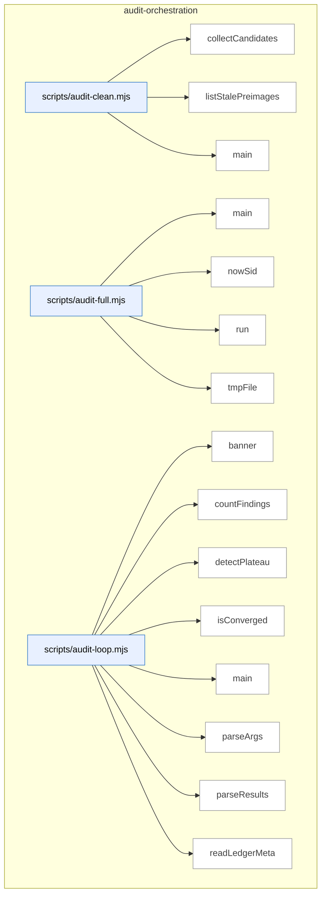

_Domain has 291 symbols (>50). Diagram shows top-15 by file order; see flat table below for the full list._

### Symbols in this domain

| Symbol | Kind | Path | Lines | Purpose | File imported by |
|---|---|---|---|---|---|
| [`collectCandidates`](../scripts/audit-clean.mjs#L162) | function | `scripts/audit-clean.mjs` | 162-199 | Recursively collects stale files matching a pattern with benign error handling for unreadable paths. | `tests/audit-clean-traversal.test.mjs` |
| [`listStalePreimages`](../scripts/audit-clean.mjs#L61) | function | `scripts/audit-clean.mjs` | 61-89 | Finds abandoned preimage worktrees in the temp directory that exceed the age threshold. | `tests/audit-clean-traversal.test.mjs` |
| [`main`](../scripts/audit-clean.mjs#L201) | function | `scripts/audit-clean.mjs` | 201-244 | Collects and optionally deletes transient audit artifacts (cache, preimages) older than a threshold. | `tests/audit-clean-traversal.test.mjs` |
| [`main`](../scripts/audit-full.mjs#L44) | function | `scripts/audit-full.mjs` | 44-146 | Runs openai-audit followed by gemini-review, ensuring Gemini final review always executes. | _(internal)_ |
| [`nowSid`](../scripts/audit-full.mjs#L31) | function | `scripts/audit-full.mjs` | 31-33 | Generates a session ID with a prefix and current timestamp. | _(internal)_ |
| [`run`](../scripts/audit-full.mjs#L39) | function | `scripts/audit-full.mjs` | 39-42 | Spawns a command and returns the exit code and signal. | _(internal)_ |
| [`tmpFile`](../scripts/audit-full.mjs#L35) | function | `scripts/audit-full.mjs` | 35-37 | Returns a temporary file path in the OS temp directory. | _(internal)_ |
| [`banner`](../scripts/audit-loop.mjs#L27) | function | `scripts/audit-loop.mjs` | 27-30 | Prints a banner with colored borders and centered text. | _(internal)_ |
| [`countFindings`](../scripts/audit-loop.mjs#L71) | function | `scripts/audit-loop.mjs` | 71-78 | Tallies findings from results by severity level (HIGH/MEDIUM/LOW). | _(internal)_ |
| [`detectPlateau`](../scripts/audit-loop.mjs#L93) | function | `scripts/audit-loop.mjs` | 93-109 | Detects audit plateau by measuring consecutive rounds with <30% HIGH-finding decrease. | _(internal)_ |
| [`isConverged`](../scripts/audit-loop.mjs#L80) | function | `scripts/audit-loop.mjs` | 80-84 | Determines if audit loop has converged (zero HIGH, ≤2 MEDIUM findings). | _(internal)_ |
| [`main`](../scripts/audit-loop.mjs#L169) | function | `scripts/audit-loop.mjs` | 169-541 | Orchestrates multi-round code audits with convergence detection, ledger persistence, and Gemini final review. | _(internal)_ |
| [`parseArgs`](../scripts/audit-loop.mjs#L129) | function | `scripts/audit-loop.mjs` | 129-165 | Parses command-line arguments into an options object with defaults. | _(internal)_ |
| [`parseResults`](../scripts/audit-loop.mjs#L62) | function | `scripts/audit-loop.mjs` | 62-69 | Safely reads and parses a JSON results file, returning null on error. | _(internal)_ |
| [`readLedgerMeta`](../scripts/audit-loop.mjs#L119) | function | `scripts/audit-loop.mjs` | 119-127 | Safely reads metadata from the audit ledger JSON, returning empty object on error. | _(internal)_ |
| [`run`](../scripts/audit-loop.mjs#L32) | function | `scripts/audit-loop.mjs` | 32-45 | Executes a command synchronously with configurable timeout and error handling. | _(internal)_ |
| [`runAudit`](../scripts/audit-loop.mjs#L47) | function | `scripts/audit-loop.mjs` | 47-60 | Spawns the openai-audit script and captures its stdout/stderr regardless of exit code. | _(internal)_ |
| [`computeLocalMetrics`](../scripts/audit-metrics.mjs#L87) | function | `scripts/audit-metrics.mjs` | 87-103 | Extracts local adjudication outcomes and computes per-pass acceptance/dismissal rates. | `scripts/lib/dashboard/collect-telemetry.mjs` |
| [`displayMetrics`](../scripts/audit-metrics.mjs#L107) | function | `scripts/audit-metrics.mjs` | 107-176 | Renders formatted metrics summary including run counts, pass effectiveness, and finding severity distribution. | `scripts/lib/dashboard/collect-telemetry.mjs` |
| [`fetchCloudMetrics`](../scripts/audit-metrics.mjs#L52) | function | `scripts/audit-metrics.mjs` | 52-80 | Fetches audit run stats, pass effectiveness, and finding severity breakdowns from Postgres over a time window. | `scripts/lib/dashboard/collect-telemetry.mjs` |
| [`main`](../scripts/audit-metrics.mjs#L180) | function | `scripts/audit-metrics.mjs` | 180-197 | Fetches cloud metrics with graceful fallback to local-only when database is unavailable. | `scripts/lib/dashboard/collect-telemetry.mjs` |
| [`_collectMaxLengths`](../scripts/gemini-review.mjs#L188) | function | `scripts/gemini-review.mjs` | 188-206 | Recursively extracts string maxLength constraints from a JSON schema, storing path → limit mappings. | `tests/final-review-provider.test.mjs`, `tests/gemini-review-callreviewer.test.mjs`, `tests/gemini-review-egress.test.mjs`, +4 more |
| [`addSemanticIds`](../scripts/gemini-review.mjs#L1649) | function | `scripts/gemini-review.mjs` | 1649-1657 | Assigns sequential IDs and semantic hashes to each finding. | `tests/final-review-provider.test.mjs`, `tests/gemini-review-callreviewer.test.mjs`, `tests/gemini-review-egress.test.mjs`, +4 more |
| [`applyDebtSuppression`](../scripts/gemini-review.mjs#L1582) | function | `scripts/gemini-review.mjs` | 1582-1617 | Filters out findings matching pre-filtered debt patterns using Jaccard similarity > 0.3. | `tests/final-review-provider.test.mjs`, `tests/gemini-review-callreviewer.test.mjs`, `tests/gemini-review-egress.test.mjs`, +4 more |
| [`applyProviderSetting`](../scripts/gemini-review.mjs#L1475) | function | `scripts/gemini-review.mjs` | 1475-1483 | Writes/updates FINAL_REVIEW_PROVIDER in .env file. | `tests/final-review-provider.test.mjs`, `tests/gemini-review-callreviewer.test.mjs`, `tests/gemini-review-egress.test.mjs`, +4 more |
| [`applyScopeFilter`](../scripts/gemini-review.mjs#L1619) | function | `scripts/gemini-review.mjs` | 1619-1647 | Removes findings that cite files outside the changed-files scope. | `tests/final-review-provider.test.mjs`, `tests/gemini-review-callreviewer.test.mjs`, `tests/gemini-review-egress.test.mjs`, +4 more |
| [`armReviewWatchdog`](../scripts/gemini-review.mjs#L116) | function | `scripts/gemini-review.mjs` | 116-125 | Sets a hard deadline timer that aborts the final review and exits on timeout. | `tests/final-review-provider.test.mjs`, `tests/gemini-review-callreviewer.test.mjs`, `tests/gemini-review-egress.test.mjs`, +4 more |
| [`assertAzureClaudeReady`](../scripts/gemini-review.mjs#L1518) | function | `scripts/gemini-review.mjs` | 1518-1529 | Validates required Azure Foundry environment variables are set. | `tests/final-review-provider.test.mjs`, `tests/gemini-review-callreviewer.test.mjs`, `tests/gemini-review-egress.test.mjs`, +4 more |
| [`buildClient`](../scripts/gemini-review.mjs#L1531) | function | `scripts/gemini-review.mjs` | 1531-1535 | Instantiates client for the selected provider. | `tests/final-review-provider.test.mjs`, `tests/gemini-review-callreviewer.test.mjs`, `tests/gemini-review-egress.test.mjs`, +4 more |
| [`buildShadowClient`](../scripts/gemini-review.mjs#L1057) | function | `scripts/gemini-review.mjs` | 1057-1068 | Instantiates the correct client (Gemini, Azure Claude, or public Claude) for shadow review. | `tests/final-review-provider.test.mjs`, `tests/gemini-review-callreviewer.test.mjs`, `tests/gemini-review-egress.test.mjs`, +4 more |
| [`callReviewer`](../scripts/gemini-review.mjs#L542) | function | `scripts/gemini-review.mjs` | 542-614 | Invokes a review provider (Gemini/Claude/compatible) with timeout enforcement and abort signal. | `tests/final-review-provider.test.mjs`, `tests/gemini-review-callreviewer.test.mjs`, `tests/gemini-review-egress.test.mjs`, +4 more |
| [`dedupByHash`](../scripts/gemini-review.mjs#L1160) | function | `scripts/gemini-review.mjs` | 1160-1168 | Deduplicates findings by semantic hash, keeping first occurrence. | `tests/final-review-provider.test.mjs`, `tests/gemini-review-callreviewer.test.mjs`, `tests/gemini-review-egress.test.mjs`, +4 more |
| [`diffFindingBuckets`](../scripts/gemini-review.mjs#L1175) | function | `scripts/gemini-review.mjs` | 1175-1191 | Compares primary and shadow findings, bucketing each as both/primary-only/shadow-only. | `tests/final-review-provider.test.mjs`, `tests/gemini-review-callreviewer.test.mjs`, `tests/gemini-review-egress.test.mjs`, +4 more |
| [`emitReviewOutput`](../scripts/gemini-review.mjs#L1659) | function | `scripts/gemini-review.mjs` | 1659-1674 | Outputs review results as JSON or formatted markdown. | `tests/final-review-provider.test.mjs`, `tests/gemini-review-callreviewer.test.mjs`, `tests/gemini-review-egress.test.mjs`, +4 more |
| [`finishAndExit`](../scripts/gemini-review.mjs#L93) | function | `scripts/gemini-review.mjs` | 93-109 | Gracefully flushes stdout and exits with hard-timeout protection against hung pipes. | `tests/final-review-provider.test.mjs`, `tests/gemini-review-callreviewer.test.mjs`, `tests/gemini-review-egress.test.mjs`, +4 more |
| [`formatReviewResult`](../scripts/gemini-review.mjs#L926) | function | `scripts/gemini-review.mjs` | 926-988 | Formats review result into markdown output with verdict, deliberation quality, findings, and recommendations. | `tests/final-review-provider.test.mjs`, `tests/gemini-review-callreviewer.test.mjs`, `tests/gemini-review-egress.test.mjs`, +4 more |
| [`getReviewPrompt`](../scripts/gemini-review.mjs#L400) | function | `scripts/gemini-review.mjs` | 400-403 | Returns the active Gemini review system prompt with optional role-specific addendum. | `tests/final-review-provider.test.mjs`, `tests/gemini-review-callreviewer.test.mjs`, `tests/gemini-review-egress.test.mjs`, +4 more |
| [`isJsonTruncationError`](../scripts/gemini-review.mjs#L1537) | function | `scripts/gemini-review.mjs` | 1537-1541 | Detects if an error is a JSON parse truncation (Unterminated string, etc.). | `tests/final-review-provider.test.mjs`, `tests/gemini-review-callreviewer.test.mjs`, `tests/gemini-review-egress.test.mjs`, +4 more |
| [`main`](../scripts/gemini-review.mjs#L1801) | function | `scripts/gemini-review.mjs` | 1801-1877 | Entry point: routes to ping/set-provider/review, validates args, runs review or fixture. | `tests/final-review-provider.test.mjs`, `tests/gemini-review-callreviewer.test.mjs`, `tests/gemini-review-egress.test.mjs`, +4 more |
| [`mapRouteToShadowProvider`](../scripts/gemini-review.mjs#L1099) | function | `scripts/gemini-review.mjs` | 1099-1103 | Maps a model-eval route's transport to a canonical shadow provider name. | `tests/final-review-provider.test.mjs`, `tests/gemini-review-callreviewer.test.mjs`, `tests/gemini-review-egress.test.mjs`, +4 more |
| [`parseReviewArgs`](../scripts/gemini-review.mjs#L1368) | function | `scripts/gemini-review.mjs` | 1368-1387 | Parses CLI arguments: plan file, transcript, flags, provider, mode, run ID, role. | `tests/final-review-provider.test.mjs`, `tests/gemini-review-callreviewer.test.mjs`, `tests/gemini-review-egress.test.mjs`, +4 more |
| [`parseReviewJson`](../scripts/gemini-review.mjs#L428) | function | `scripts/gemini-review.mjs` | 428-443 | Extracts JSON from model output, trying raw parse → code fence → braces-span strategies. | `tests/final-review-provider.test.mjs`, `tests/gemini-review-callreviewer.test.mjs`, `tests/gemini-review-egress.test.mjs`, +4 more |
| [`recordGeminiOutcomes`](../scripts/gemini-review.mjs#L1721) | function | `scripts/gemini-review.mjs` | 1721-1743 | Orchestrates outcome recording (new + wrongly-dismissed) and bandit reward update. | `tests/final-review-provider.test.mjs`, `tests/gemini-review-callreviewer.test.mjs`, `tests/gemini-review-egress.test.mjs`, +4 more |
| [`recordNewFindings`](../scripts/gemini-review.mjs#L1676) | function | `scripts/gemini-review.mjs` | 1676-1695 | Records new Gemini findings to outcomes ledger and FP tracker. | `tests/final-review-provider.test.mjs`, `tests/gemini-review-callreviewer.test.mjs`, `tests/gemini-review-egress.test.mjs`, +4 more |
| [`recordWronglyDismissed`](../scripts/gemini-review.mjs#L1697) | function | `scripts/gemini-review.mjs` | 1697-1719 | Records Gemini's wrongly-dismissed findings to outcomes ledger. | `tests/final-review-provider.test.mjs`, `tests/gemini-review-callreviewer.test.mjs`, `tests/gemini-review-egress.test.mjs`, +4 more |
| [`refreshCatalogAndWarn`](../scripts/gemini-review.mjs#L1309) | function | `scripts/gemini-review.mjs` | 1309-1330 | Refreshes model catalog and upgrades model IDs if newer versions are available. | `tests/final-review-provider.test.mjs`, `tests/gemini-review-callreviewer.test.mjs`, `tests/gemini-review-egress.test.mjs`, +4 more |
| [`resolveCompatCreds`](../scripts/gemini-review.mjs#L750) | function | `scripts/gemini-review.mjs` | 750-752 | Returns OpenAI-compatible provider credentials (endpoint, key, model). | `tests/final-review-provider.test.mjs`, `tests/gemini-review-callreviewer.test.mjs`, `tests/gemini-review-egress.test.mjs`, +4 more |
| [`resolveModelEvalShadowOverride`](../scripts/gemini-review.mjs#L1105) | function | `scripts/gemini-review.mjs` | 1105-1134 | Checks if an active model-eval run should override the configured shadow reviewer. | `tests/final-review-provider.test.mjs`, `tests/gemini-review-callreviewer.test.mjs`, `tests/gemini-review-egress.test.mjs`, +4 more |
| [`resolveOpenRouterCreds`](../scripts/gemini-review.mjs#L760) | function | `scripts/gemini-review.mjs` | 760-766 | Returns OpenRouter endpoint and API key from config or fallback defaults. | `tests/final-review-provider.test.mjs`, `tests/gemini-review-callreviewer.test.mjs`, `tests/gemini-review-egress.test.mjs`, +4 more |
| [`resolveProviderSetting`](../scripts/gemini-review.mjs#L1458) | function | `scripts/gemini-review.mjs` | 1458-1461 | Reads FINAL_REVIEW_PROVIDER env var if set. | `tests/final-review-provider.test.mjs`, `tests/gemini-review-callreviewer.test.mjs`, `tests/gemini-review-egress.test.mjs`, +4 more |
| [`resolveShadow`](../scripts/gemini-review.mjs#L1021) | function | `scripts/gemini-review.mjs` | 1021-1047 | Determines whether to run a shadow reviewer and which provider/model to use. | `tests/final-review-provider.test.mjs`, `tests/gemini-review-callreviewer.test.mjs`, `tests/gemini-review-egress.test.mjs`, +4 more |
| [`runAdjudicatorOnlyReview`](../scripts/gemini-review.mjs#L1573) | function | `scripts/gemini-review.mjs` | 1573-1580 | Runs review with adjudicator-only role system prompt. | `tests/final-review-provider.test.mjs`, `tests/gemini-review-callreviewer.test.mjs`, `tests/gemini-review-egress.test.mjs`, +4 more |
| [`runFinalReview`](../scripts/gemini-review.mjs#L779) | function | `scripts/gemini-review.mjs` | 779-922 | Orchestrates final review: reads plan + transcript, extracts code context, filters by debt suppression and scope. | `tests/final-review-provider.test.mjs`, `tests/gemini-review-callreviewer.test.mjs`, `tests/gemini-review-egress.test.mjs`, +4 more |
| [`runFixtureReview`](../scripts/gemini-review.mjs#L1758) | function | `scripts/gemini-review.mjs` | 1758-1799 | Returns canned review result for testing (NODE_ENV=test only). | `tests/final-review-provider.test.mjs`, `tests/gemini-review-callreviewer.test.mjs`, `tests/gemini-review-egress.test.mjs`, +4 more |
| [`runPing`](../scripts/gemini-review.mjs#L1361) | function | `scripts/gemini-review.mjs` | 1361-1366 | Routes to Gemini or Claude ping based on available API keys. | `tests/final-review-provider.test.mjs`, `tests/gemini-review-callreviewer.test.mjs`, `tests/gemini-review-egress.test.mjs`, +4 more |
| [`runPingClaude`](../scripts/gemini-review.mjs#L1344) | function | `scripts/gemini-review.mjs` | 1344-1359 | Tests Claude API connectivity with a ping request. | `tests/final-review-provider.test.mjs`, `tests/gemini-review-callreviewer.test.mjs`, `tests/gemini-review-egress.test.mjs`, +4 more |
| [`runPingGemini`](../scripts/gemini-review.mjs#L1332) | function | `scripts/gemini-review.mjs` | 1332-1342 | Tests Gemini API connectivity with a ping request. | `tests/final-review-provider.test.mjs`, `tests/gemini-review-callreviewer.test.mjs`, `tests/gemini-review-egress.test.mjs`, +4 more |
| [`runReviewWithRetry`](../scripts/gemini-review.mjs#L1543) | function | `scripts/gemini-review.mjs` | 1543-1560 | Runs review up to 2 attempts, retrying with conciseness hint on JSON truncation. | `tests/final-review-provider.test.mjs`, `tests/gemini-review-callreviewer.test.mjs`, `tests/gemini-review-egress.test.mjs`, +4 more |
| [`runSetProvider`](../scripts/gemini-review.mjs#L1490) | function | `scripts/gemini-review.mjs` | 1490-1512 | CLI handler to persist provider choice to .env. | `tests/final-review-provider.test.mjs`, `tests/gemini-review-callreviewer.test.mjs`, `tests/gemini-review-egress.test.mjs`, +4 more |
| [`runShadowAndPersist`](../scripts/gemini-review.mjs#L1214) | function | `scripts/gemini-review.mjs` | 1214-1303 | Orchestrates shadow review run, diffs results, and persists to audit_runs table. | `tests/final-review-provider.test.mjs`, `tests/gemini-review-callreviewer.test.mjs`, `tests/gemini-review-egress.test.mjs`, +4 more |
| [`runShadowReview`](../scripts/gemini-review.mjs#L1141) | function | `scripts/gemini-review.mjs` | 1141-1151 | Runs shadow review in parallel with primary and returns diffed finding buckets. | `tests/final-review-provider.test.mjs`, `tests/gemini-review-callreviewer.test.mjs`, `tests/gemini-review-egress.test.mjs`, +4 more |
| [`selectProvider`](../scripts/gemini-review.mjs#L1409) | function | `scripts/gemini-review.mjs` | 1409-1455 | Chooses final reviewer provider: explicit flag > auto-detect (Gemini → Azure → Opus). | `tests/final-review-provider.test.mjs`, `tests/gemini-review-callreviewer.test.mjs`, `tests/gemini-review-egress.test.mjs`, +4 more |
| [`shadowModelMatchesFamily`](../scripts/gemini-review.mjs#L1007) | function | `scripts/gemini-review.mjs` | 1007-1012 | Checks if a model ID belongs to Gemini or Claude family. | `tests/final-review-provider.test.mjs`, `tests/gemini-review-callreviewer.test.mjs`, `tests/gemini-review-egress.test.mjs`, +4 more |
| [`shadowSkipBlock`](../scripts/gemini-review.mjs#L1194) | function | `scripts/gemini-review.mjs` | 1194-1199 | Returns a skip record when shadow reviewer does not run. | `tests/final-review-provider.test.mjs`, `tests/gemini-review-callreviewer.test.mjs`, `tests/gemini-review-egress.test.mjs`, +4 more |
| [`streamAnthropicMessage`](../scripts/gemini-review.mjs#L632) | function | `scripts/gemini-review.mjs` | 632-650 | Consumes Anthropic streaming response and reassembles it into a final message with usage stats. | `tests/final-review-provider.test.mjs`, `tests/gemini-review-callreviewer.test.mjs`, `tests/gemini-review-egress.test.mjs`, +4 more |
| [`truncateToSchema`](../scripts/gemini-review.mjs#L220) | function | `scripts/gemini-review.mjs` | 220-240 | Recursively truncates object strings to their schema-defined maxLength limits. | `tests/final-review-provider.test.mjs`, `tests/gemini-review-callreviewer.test.mjs`, `tests/gemini-review-egress.test.mjs`, +4 more |
| [`composeAdjacencyResult`](../scripts/lib/audit/adjacency-compose.mjs#L45) | function | `scripts/lib/audit/adjacency-compose.mjs` | 45-95 | Merges adjacency detector results and LLM bouncer judgements into a final state with incompleteness tracking. | `scripts/lib/audit/legacy-production-audit.mjs`, `tests/adjacency-compose.test.mjs`, `tests/audit-scope-egress.test.mjs` |
| [`deriveFindings`](../scripts/lib/audit/adjacency-compose.mjs#L102) | function | `scripts/lib/audit/adjacency-compose.mjs` | 102-126 | Converts adjacency analysis candidates and incompleteness records into structured audit findings. | `scripts/lib/audit/legacy-production-audit.mjs`, `tests/adjacency-compose.test.mjs`, `tests/audit-scope-egress.test.mjs` |
| [`classifyStatementDependence`](../scripts/lib/audit/adjacency-detector.mjs#L265) | function | `scripts/lib/audit/adjacency-detector.mjs` | 265-352 | Classifies whether a statement depends on branch-condition variables or only on condition-local bindings. | `scripts/lib/audit/legacy-production-audit.mjs`, `tests/adjacency-detector.test.mjs`, `tests/adjacency-state.test.mjs`, +1 more |
| [`collectReadBindings`](../scripts/lib/audit/adjacency-detector.mjs#L224) | function | `scripts/lib/audit/adjacency-detector.mjs` | 224-238 | Collects all variable references encountered by traversing a statement's AST. | `scripts/lib/audit/legacy-production-audit.mjs`, `tests/adjacency-detector.test.mjs`, `tests/adjacency-state.test.mjs`, +1 more |
| [`defaultAdapters`](../scripts/lib/audit/adjacency-detector.mjs#L61) | function | `scripts/lib/audit/adjacency-detector.mjs` | 61-70 | Returns default VCS and filesystem adapter implementations for adjacency analysis. | `scripts/lib/audit/legacy-production-audit.mjs`, `tests/adjacency-detector.test.mjs`, `tests/adjacency-state.test.mjs`, +1 more |
| [`enumerateBlockStatements`](../scripts/lib/audit/adjacency-detector.mjs#L210) | function | `scripts/lib/audit/adjacency-detector.mjs` | 210-218 | Returns the statements within an if/else branch (a block or single unbraced statement). | `scripts/lib/audit/legacy-production-audit.mjs`, `tests/adjacency-detector.test.mjs`, `tests/adjacency-state.test.mjs`, +1 more |
| [`findEnclosingConditional`](../scripts/lib/audit/adjacency-detector.mjs#L151) | function | `scripts/lib/audit/adjacency-detector.mjs` | 151-202 | Finds the if/else branch AST node that encloses a given line in a parsed function body. | `scripts/lib/audit/legacy-production-audit.mjs`, `tests/adjacency-detector.test.mjs`, `tests/adjacency-state.test.mjs`, +1 more |
| [`incompleteness`](../scripts/lib/audit/adjacency-detector.mjs#L72) | function | `scripts/lib/audit/adjacency-detector.mjs` | 72-72 | Creates a record documenting a gap in adjacency analysis coverage (kind, scope, detail). | `scripts/lib/audit/legacy-production-audit.mjs`, `tests/adjacency-detector.test.mjs`, `tests/adjacency-state.test.mjs`, +1 more |
| [`log`](../scripts/lib/audit/adjacency-detector.mjs#L57) | function | `scripts/lib/audit/adjacency-detector.mjs` | 57-57 | Writes a prefixed log message to stderr. | `scripts/lib/audit/legacy-production-audit.mjs`, `tests/adjacency-detector.test.mjs`, `tests/adjacency-state.test.mjs`, +1 more |
| [`parseHunkTargets`](../scripts/lib/audit/adjacency-detector.mjs#L96) | function | `scripts/lib/audit/adjacency-detector.mjs` | 96-124 | Extracts line-number anchors of added/deleted code from unified diff hunks. | `scripts/lib/audit/legacy-production-audit.mjs`, `tests/adjacency-detector.test.mjs`, `tests/adjacency-state.test.mjs`, +1 more |
| [`runAdjacencyAnalysis`](../scripts/lib/audit/adjacency-detector.mjs#L366) | function | `scripts/lib/audit/adjacency-detector.mjs` | 366-520 | Runs the complete adjacency detector on a diff, parsing hunks and analyzing conditional containment. | `scripts/lib/audit/legacy-production-audit.mjs`, `tests/adjacency-detector.test.mjs`, `tests/adjacency-state.test.mjs`, +1 more |
| [`sliceLines`](../scripts/lib/audit/adjacency-detector.mjs#L523) | function | `scripts/lib/audit/adjacency-detector.mjs` | 523-529 | Extracts a line range from text and truncates it if it exceeds a character budget. | `scripts/lib/audit/legacy-production-audit.mjs`, `tests/adjacency-detector.test.mjs`, `tests/adjacency-state.test.mjs`, +1 more |
| [`_resetAdjacencyIdCounter`](../scripts/lib/audit/adjacency-report.mjs#L25) | function | `scripts/lib/audit/adjacency-report.mjs` | 25-25 | Resets the internal ID counter (test fixture). | `scripts/lib/audit/adjacency-compose.mjs`, `scripts/lib/audit/legacy-production-audit.mjs`, `tests/adjacency-compose.test.mjs` |
| [`buildAdjacencyFailedFinding`](../scripts/lib/audit/adjacency-report.mjs#L219) | function | `scripts/lib/audit/adjacency-report.mjs` | 219-238 | Creates a finding documenting that the adjacency detector threw an internal error. | `scripts/lib/audit/adjacency-compose.mjs`, `scripts/lib/audit/legacy-production-audit.mjs`, `tests/adjacency-compose.test.mjs` |
| [`buildAdjacencyFinding`](../scripts/lib/audit/adjacency-report.mjs#L162) | function | `scripts/lib/audit/adjacency-report.mjs` | 162-186 | Constructs a single audit finding describing a trapped statement in an if branch. | `scripts/lib/audit/adjacency-compose.mjs`, `scripts/lib/audit/legacy-production-audit.mjs`, `tests/adjacency-compose.test.mjs` |
| [`buildAdjacencyIncompleteFinding`](../scripts/lib/audit/adjacency-report.mjs#L194) | function | `scripts/lib/audit/adjacency-report.mjs` | 194-214 | Creates a finding documenting that adjacency analysis coverage was incomplete. | `scripts/lib/audit/adjacency-compose.mjs`, `scripts/lib/audit/legacy-production-audit.mjs`, `tests/adjacency-compose.test.mjs` |
| [`deriveFindingsFromAdjacencyReport`](../scripts/lib/audit/adjacency-report.mjs#L155) | function | `scripts/lib/audit/adjacency-report.mjs` | 155-160 | Converts safe adjacency candidates into findings when the LLM bouncer is unavailable. | `scripts/lib/audit/adjacency-compose.mjs`, `scripts/lib/audit/legacy-production-audit.mjs`, `tests/adjacency-compose.test.mjs` |
| [`formatCandidatesForPrompt`](../scripts/lib/audit/adjacency-report.mjs#L37) | function | `scripts/lib/audit/adjacency-report.mjs` | 37-78 | Formats adjacency candidates into a prompt for the LLM bouncer, enforcing prompt budget. | `scripts/lib/audit/adjacency-compose.mjs`, `scripts/lib/audit/legacy-production-audit.mjs`, `tests/adjacency-compose.test.mjs` |
| [`incompleteness`](../scripts/lib/audit/adjacency-report.mjs#L28) | function | `scripts/lib/audit/adjacency-report.mjs` | 28-28 | Creates a record documenting a gap in adjacency analysis coverage (kind, scope, detail). | `scripts/lib/audit/adjacency-compose.mjs`, `scripts/lib/audit/legacy-production-audit.mjs`, `tests/adjacency-compose.test.mjs` |
| [`mapDecisionsToFindings`](../scripts/lib/audit/adjacency-report.mjs#L131) | function | `scripts/lib/audit/adjacency-report.mjs` | 131-151 | Validates LLM bouncer decisions, checks completeness, and converts them to findings. | `scripts/lib/audit/adjacency-compose.mjs`, `scripts/lib/audit/legacy-production-audit.mjs`, `tests/adjacency-compose.test.mjs` |
| [`nextId`](../scripts/lib/audit/adjacency-report.mjs#L26) | function | `scripts/lib/audit/adjacency-report.mjs` | 26-26 | Returns the next sequential adjacency candidate ID (A1, A2, ...). | `scripts/lib/audit/adjacency-compose.mjs`, `scripts/lib/audit/legacy-production-audit.mjs`, `tests/adjacency-compose.test.mjs` |
| [`runAdjacencyBouncer`](../scripts/lib/audit/adjacency-report.mjs#L92) | function | `scripts/lib/audit/adjacency-report.mjs` | 92-118 | Invokes the LLM to judge which trapped statements represent actual issues, with error handling. | `scripts/lib/audit/adjacency-compose.mjs`, `scripts/lib/audit/legacy-production-audit.mjs`, `tests/adjacency-compose.test.mjs` |
| [`assertCleanIsEarned`](../scripts/lib/audit/adjacency-state.mjs#L158) | function | `scripts/lib/audit/adjacency-state.mjs` | 158-173 | Asserts that a "clean" adjacency state actually enumerated containers and statements. | `scripts/lib/audit/adjacency-compose.mjs`, `scripts/lib/audit/adjacency-detector.mjs`, `scripts/lib/audit/adjacency-report.mjs`, +3 more |
| [`blocksConvergence`](../scripts/lib/audit/adjacency-state.mjs#L178) | function | `scripts/lib/audit/adjacency-state.mjs` | 178-182 | Checks whether adjacency analysis produced issues that block audit convergence. | `scripts/lib/audit/adjacency-compose.mjs`, `scripts/lib/audit/adjacency-detector.mjs`, `scripts/lib/audit/adjacency-report.mjs`, +3 more |
| [`buildAdjacencyState`](../scripts/lib/audit/adjacency-state.mjs#L96) | function | `scripts/lib/audit/adjacency-state.mjs` | 96-147 | Determines the final state (clean/findings/capped/failed/not-applicable/unavailable) of adjacency analysis. | `scripts/lib/audit/adjacency-compose.mjs`, `scripts/lib/audit/adjacency-detector.mjs`, `scripts/lib/audit/adjacency-report.mjs`, +3 more |
| [`createEnvelope`](../scripts/lib/audit/candidate-envelope.mjs#L49) | function | `scripts/lib/audit/candidate-envelope.mjs` | 49-84 | Wraps a single finding in a multi-evidence envelope with source tracking and full-claim snapshot. | `scripts/lib/audit/evidence-triage.mjs`, `scripts/lib/audit/tiered-pipeline.mjs`, `tests/candidate-envelope-provenance.test.mjs`, +1 more |
| [`flattenEnvelopeToFinding`](../scripts/lib/audit/candidate-envelope.mjs#L234) | function | `scripts/lib/audit/candidate-envelope.mjs` | 234-254 | Flattens an envelope back into a finding, appending alternative evidence to the detail field. | `scripts/lib/audit/evidence-triage.mjs`, `scripts/lib/audit/tiered-pipeline.mjs`, `tests/candidate-envelope-provenance.test.mjs`, +1 more |
| [`mergeIntoEnvelopes`](../scripts/lib/audit/candidate-envelope.mjs#L119) | function | `scripts/lib/audit/candidate-envelope.mjs` | 119-180 | Batches multiple findings by fingerprint into envelopes, merging alternative evidence per candidate. | `scripts/lib/audit/evidence-triage.mjs`, `scripts/lib/audit/tiered-pipeline.mjs`, `tests/candidate-envelope-provenance.test.mjs`, +1 more |
| [`promoteAlternative`](../scripts/lib/audit/candidate-envelope.mjs#L256) | function | `scripts/lib/audit/candidate-envelope.mjs` | 256-293 | Demotes the canonical finding evidence to alternatives and promotes a different piece of evidence. | `scripts/lib/audit/evidence-triage.mjs`, `scripts/lib/audit/tiered-pipeline.mjs`, `tests/candidate-envelope-provenance.test.mjs`, +1 more |
| [`severityRank`](../scripts/lib/audit/candidate-envelope.mjs#L91) | function | `scripts/lib/audit/candidate-envelope.mjs` | 91-93 | Returns the numeric rank of a severity level for comparison. | `scripts/lib/audit/evidence-triage.mjs`, `scripts/lib/audit/tiered-pipeline.mjs`, `tests/candidate-envelope-provenance.test.mjs`, +1 more |
| [`evaluateConvergence`](../scripts/lib/audit/convergence.mjs#L21) | function | `scripts/lib/audit/convergence.mjs` | 21-25 | Checks if high/medium/quick-fix counts meet the audit's convergence thresholds. | `scripts/lib/audit/legacy-production-audit.mjs` |
| [`computeCostReport`](../scripts/lib/audit/cost-budget.mjs#L58) | function | `scripts/lib/audit/cost-budget.mjs` | 58-88 | Aggregates usage and review-effort events into per-HIGH cost metrics and operator-hour ratios. | `scripts/lib/audit/tiered-pipeline.mjs`, `tests/cost-budget.test.mjs` |
| [`loadReviewEffortEvents`](../scripts/lib/audit/cost-budget.mjs#L136) | function | `scripts/lib/audit/cost-budget.mjs` | 136-144 | Reads and validates review-effort events from a JSONL file, skipping invalid rows with warnings. | `scripts/lib/audit/tiered-pipeline.mjs`, `tests/cost-budget.test.mjs` |
| [`loadUsageEvents`](../scripts/lib/audit/cost-budget.mjs#L118) | function | `scripts/lib/audit/cost-budget.mjs` | 118-133 | Reads and validates usage events from a JSONL file, skipping invalid rows with warnings. | `scripts/lib/audit/tiered-pipeline.mjs`, `tests/cost-budget.test.mjs` |
| [`openReviewEffortStore`](../scripts/lib/audit/cost-budget.mjs#L96) | function | `scripts/lib/audit/cost-budget.mjs` | 96-98 | Opens an append-only JSON Lines store for recording reviewer time-effort events. | `scripts/lib/audit/tiered-pipeline.mjs`, `tests/cost-budget.test.mjs` |
| [`openUsageEventStore`](../scripts/lib/audit/cost-budget.mjs#L91) | function | `scripts/lib/audit/cost-budget.mjs` | 91-93 | Opens an append-only JSON Lines store for recording audit cost and usage events. | `scripts/lib/audit/tiered-pipeline.mjs`, `tests/cost-budget.test.mjs` |
| [`recordReviewEffort`](../scripts/lib/audit/cost-budget.mjs#L106) | function | `scripts/lib/audit/cost-budget.mjs` | 106-108 | Appends a review-effort time event to the local audit store. | `scripts/lib/audit/tiered-pipeline.mjs`, `tests/cost-budget.test.mjs` |
| [`recordUsageEvent`](../scripts/lib/audit/cost-budget.mjs#L101) | function | `scripts/lib/audit/cost-budget.mjs` | 101-103 | Appends a cost/usage event to the local audit store. | `scripts/lib/audit/tiered-pipeline.mjs`, `tests/cost-budget.test.mjs` |
| [`classifyDeferralEvidence`](../scripts/lib/audit/deferral-classifier.mjs#L166) | function | `scripts/lib/audit/deferral-classifier.mjs` | 166-300 | Classifies findings as deferred/accepted/out-of-scope based on plan markers, changed files, and prior recurring status. | `scripts/lib/audit/findings-pipeline.mjs`, `scripts/lib/audit/tiered-shadow-compare.mjs`, `tests/learning-deferral-classifier.test.mjs` |
| [`globMatch`](../scripts/lib/audit/deferral-classifier.mjs#L102) | function | `scripts/lib/audit/deferral-classifier.mjs` | 102-119 | Translates glob patterns (`src/**/*.js`) to regex and tests file paths against them. | `scripts/lib/audit/findings-pipeline.mjs`, `scripts/lib/audit/tiered-shadow-compare.mjs`, `tests/learning-deferral-classifier.test.mjs` |
| [`isFileInChangedScope`](../scripts/lib/audit/deferral-classifier.mjs#L326) | function | `scripts/lib/audit/deferral-classifier.mjs` | 326-330 | Checks if a file path is in the audit's changed-files list (tri-state: true/false/null). | `scripts/lib/audit/findings-pipeline.mjs`, `scripts/lib/audit/tiered-shadow-compare.mjs`, `tests/learning-deferral-classifier.test.mjs` |
| [`parseAcceptV1Markers`](../scripts/lib/audit/deferral-classifier.mjs#L84) | function | `scripts/lib/audit/deferral-classifier.mjs` | 84-91 | Extracts file-glob and reason pairs from HTML comments marking accepted findings in a plan. | `scripts/lib/audit/findings-pipeline.mjs`, `scripts/lib/audit/tiered-shadow-compare.mjs`, `tests/learning-deferral-classifier.test.mjs` |
| [`buildDiffPathMap`](../scripts/lib/audit/diff-path-map.mjs#L98) | function | `scripts/lib/audit/diff-path-map.mjs` | 98-135 | Parses unified diff into structured file entries with IDs, old/new paths, and status (added/modified/deleted). | `scripts/lib/audit/tiered-pipeline.mjs`, `scripts/model-eval-discovery.mjs`, `tests/diff-path-map.test.mjs`, +1 more |
| [`hydrateAnchor`](../scripts/lib/audit/diff-path-map.mjs#L176) | function | `scripts/lib/audit/diff-path-map.mjs` | 176-211 | Validates a model-supplied evidence anchor against the diff map and reconstructs it with canonicalized file paths. | `scripts/lib/audit/tiered-pipeline.mjs`, `scripts/model-eval-discovery.mjs`, `tests/diff-path-map.test.mjs`, +1 more |
| [`mintId`](../scripts/lib/audit/diff-path-map.mjs#L56) | function | `scripts/lib/audit/diff-path-map.mjs` | 56-56 | Generates zero-padded ID strings (f0001, f0002, ...) for diff path entries. | `scripts/lib/audit/tiered-pipeline.mjs`, `scripts/model-eval-discovery.mjs`, `tests/diff-path-map.test.mjs`, +1 more |
| [`prepareCandidates`](../scripts/lib/audit/diff-path-map.mjs#L242) | function | `scripts/lib/audit/diff-path-map.mjs` | 242-272 | Validates raw model findings against a producer schema and hydrates their anchors to diff file entries. | `scripts/lib/audit/tiered-pipeline.mjs`, `scripts/model-eval-discovery.mjs`, `tests/diff-path-map.test.mjs`, +1 more |
| [`renderDiffPathTable`](../scripts/lib/audit/diff-path-map.mjs#L143) | function | `scripts/lib/audit/diff-path-map.mjs` | 143-148 | Formats diff path entries as a TSV table with ID, status, and path columns. | `scripts/lib/audit/tiered-pipeline.mjs`, `scripts/model-eval-discovery.mjs`, `tests/diff-path-map.test.mjs`, +1 more |
| [`cleanupTempRoot`](../scripts/lib/audit/diff-scope-resolver.mjs#L255) | function | `scripts/lib/audit/diff-scope-resolver.mjs` | 255-265 | Removes a temporary worktree directory via git or filesystem fallback. | `scripts/audit-clean.mjs`, `scripts/lib/audit/legacy-production-audit.mjs`, `scripts/openai-audit.mjs`, +2 more |
| [`computeEntryPoints`](../scripts/lib/audit/diff-scope-resolver.mjs#L354) | function | `scripts/lib/audit/diff-scope-resolver.mjs` | 354-423 | Discovers entry point files from package.json and entry-point directory walks, with tsconfig reverse-resolution fallback. | `scripts/audit-clean.mjs`, `scripts/lib/audit/legacy-production-audit.mjs`, `scripts/openai-audit.mjs`, +2 more |
| [`cruiseTempRoot`](../scripts/lib/audit/diff-scope-resolver.mjs#L277) | function | `scripts/lib/audit/diff-scope-resolver.mjs` | 277-339 | Runs dependency-cruiser on preimage files to extract inter-file import edges at base commit. | `scripts/audit-clean.mjs`, `scripts/lib/audit/legacy-production-audit.mjs`, `scripts/openai-audit.mjs`, +2 more |
| [`gitBuf`](../scripts/lib/audit/diff-scope-resolver.mjs#L73) | function | `scripts/lib/audit/diff-scope-resolver.mjs` | 73-85 | Runs a git command and returns stdout, logging errors to stderr without throwing. | `scripts/audit-clean.mjs`, `scripts/lib/audit/legacy-production-audit.mjs`, `scripts/openai-audit.mjs`, +2 more |
| [`materialisePreimages`](../scripts/lib/audit/diff-scope-resolver.mjs#L214) | function | `scripts/lib/audit/diff-scope-resolver.mjs` | 214-253 | Creates a temporary git worktree at a base commit to access preimage versions of changed files. | `scripts/audit-clean.mjs`, `scripts/lib/audit/legacy-production-audit.mjs`, `scripts/openai-audit.mjs`, +2 more |
| [`parseLsTreeZ`](../scripts/lib/audit/diff-scope-resolver.mjs#L153) | function | `scripts/lib/audit/diff-scope-resolver.mjs` | 153-156 | Parses NUL-separated git ls-tree output into a set of file paths. | `scripts/audit-clean.mjs`, `scripts/lib/audit/legacy-production-audit.mjs`, `scripts/openai-audit.mjs`, +2 more |
| [`parseNameStatusZ`](../scripts/lib/audit/diff-scope-resolver.mjs#L100) | function | `scripts/lib/audit/diff-scope-resolver.mjs` | 100-145 | Parses NUL-separated git diff output into records, handling variable-width entries (A/M/D vs R/C with scores). | `scripts/audit-clean.mjs`, `scripts/lib/audit/legacy-production-audit.mjs`, `scripts/openai-audit.mjs`, +2 more |
| [`resolveDiffScope`](../scripts/lib/audit/diff-scope-resolver.mjs#L440) | function | `scripts/lib/audit/diff-scope-resolver.mjs` | 440-541 | Orchestrates diff parsing, changed-file collection, preimage extraction, and dependency analysis to build complete audit scope. | `scripts/audit-clean.mjs`, `scripts/lib/audit/legacy-production-audit.mjs`, `scripts/openai-audit.mjs`, +2 more |
| [`stripLeadingDotSlash`](../scripts/lib/audit/diff-scope-resolver.mjs#L27) | function | `scripts/lib/audit/diff-scope-resolver.mjs` | 27-29 | Strips `./` prefix from file paths if present. | `scripts/audit-clean.mjs`, `scripts/lib/audit/legacy-production-audit.mjs`, `scripts/openai-audit.mjs`, +2 more |
| [`sweepStaleOrphanPreimages`](../scripts/lib/audit/diff-scope-resolver.mjs#L188) | function | `scripts/lib/audit/diff-scope-resolver.mjs` | 188-212 | Removes git worktrees older than a threshold, cleaning up from previously killed runs. | `scripts/audit-clean.mjs`, `scripts/lib/audit/legacy-production-audit.mjs`, `scripts/openai-audit.mjs`, +2 more |
| [`walkEntryPointDir`](../scripts/lib/audit/diff-scope-resolver.mjs#L49) | function | `scripts/lib/audit/diff-scope-resolver.mjs` | 49-63 | Discovers source files in a directory (one-level non-recursive walk matching `SOURCE_EXTENSIONS`). | `scripts/audit-clean.mjs`, `scripts/lib/audit/legacy-production-audit.mjs`, `scripts/openai-audit.mjs`, +2 more |
| [`runDiscoveryPortfolio`](../scripts/lib/audit/discovery-portfolio.mjs#L121) | function | `scripts/lib/audit/discovery-portfolio.mjs` | 121-158 | Orchestrates required (GLM, Sonnet) and optional (GPT) discovery generators, aggregating their findings. | `scripts/lib/audit/tiered-pipeline.mjs`, `tests/discovery-portfolio.test.mjs` |
| [`runOneGenerator`](../scripts/lib/audit/discovery-portfolio.mjs#L60) | function | `scripts/lib/audit/discovery-portfolio.mjs` | 60-101 | Executes a single discovery generator and records outcome (status, finding count, wall-clock duration). | `scripts/lib/audit/tiered-pipeline.mjs`, `tests/discovery-portfolio.test.mjs` |
| [`defaultAdapters`](../scripts/lib/audit/duplication-detector.mjs#L63) | function | `scripts/lib/audit/duplication-detector.mjs` | 63-95 | Returns a suite of filesystem/git/embedding/RPC adapters for the duplication detector. | `scripts/lib/audit/legacy-production-audit.mjs`, `tests/duplication-detector.test.mjs`, `tests/duplication-egress.test.mjs` |
| [`extractViaSubprocess`](../scripts/lib/audit/duplication-detector.mjs#L103) | function | `scripts/lib/audit/duplication-detector.mjs` | 103-115 | Spawns symbol-extraction subprocess via manifest file and filters results to symbol records only. | `scripts/lib/audit/legacy-production-audit.mjs`, `tests/duplication-detector.test.mjs`, `tests/duplication-egress.test.mjs` |
| [`findPragmaAbove`](../scripts/lib/audit/duplication-detector.mjs#L135) | function | `scripts/lib/audit/duplication-detector.mjs` | 135-143 | Searches 2–5 lines above a declaration for a `@duplicate-justification` pragma. | `scripts/lib/audit/legacy-production-audit.mjs`, `tests/duplication-detector.test.mjs`, `tests/duplication-egress.test.mjs` |
| [`isEligibleChange`](../scripts/lib/audit/duplication-detector.mjs#L145) | function | `scripts/lib/audit/duplication-detector.mjs` | 145-150 | Checks if a diff entry is a source file and not deleted or excluded from duplication queries. | `scripts/lib/audit/legacy-production-audit.mjs`, `tests/duplication-detector.test.mjs`, `tests/duplication-egress.test.mjs` |
| [`log`](../scripts/lib/audit/duplication-detector.mjs#L60) | function | `scripts/lib/audit/duplication-detector.mjs` | 60-60 | Writes a prefixed message to stderr for duplication-detector diagnostics. | `scripts/lib/audit/legacy-production-audit.mjs`, `tests/duplication-detector.test.mjs`, `tests/duplication-egress.test.mjs` |
| [`runDuplicationAnalysis`](../scripts/lib/audit/duplication-detector.mjs#L160) | function | `scripts/lib/audit/duplication-detector.mjs` | 160-326 | Main duplication detection: extracts symbols, queries embeddings for near-duplicates, optionally sends candidates to bouncer for severity decision. | `scripts/lib/audit/legacy-production-audit.mjs`, `tests/duplication-detector.test.mjs`, `tests/duplication-egress.test.mjs` |
| [`symKey`](../scripts/lib/audit/duplication-detector.mjs#L125) | function | `scripts/lib/audit/duplication-detector.mjs` | 125-127 | Creates a unique key for a symbol using filePath, symbolName, and kind with NUL separators. | `scripts/lib/audit/legacy-production-audit.mjs`, `tests/duplication-detector.test.mjs`, `tests/duplication-egress.test.mjs` |
| [`writeTempSource`](../scripts/lib/audit/duplication-detector.mjs#L118) | function | `scripts/lib/audit/duplication-detector.mjs` | 118-122 | Writes a string to a file in a temporary directory, creating parent directories as needed. | `scripts/lib/audit/legacy-production-audit.mjs`, `tests/duplication-detector.test.mjs`, `tests/duplication-egress.test.mjs` |
| [`_resetDuplicationIdCounter`](../scripts/lib/audit/duplication-report.mjs#L47) | function | `scripts/lib/audit/duplication-report.mjs` | 47-47 | Resets the global duplication finding ID counter (for tests). | `scripts/lib/audit/duplication-detector.mjs`, `scripts/lib/audit/legacy-production-audit.mjs`, `tests/duplication-bouncer-mapping.test.mjs`, +2 more |
| [`buildDetectorFailedFinding`](../scripts/lib/audit/duplication-report.mjs#L216) | function | `scripts/lib/audit/duplication-report.mjs` | 216-231 | Creates a high-level finding indicating the duplication detector itself failed (incomplete audit). | `scripts/lib/audit/duplication-detector.mjs`, `scripts/lib/audit/legacy-production-audit.mjs`, `tests/duplication-bouncer-mapping.test.mjs`, +2 more |
| [`buildDuplicationFinding`](../scripts/lib/audit/duplication-report.mjs#L193) | function | `scripts/lib/audit/duplication-report.mjs` | 193-213 | Constructs a duplication finding object with severity, risk statement, reuse recommendation, and affected principles. | `scripts/lib/audit/duplication-detector.mjs`, `scripts/lib/audit/legacy-production-audit.mjs`, `tests/duplication-bouncer-mapping.test.mjs`, +2 more |
| [`deriveFindingsFromDuplicationReport`](../scripts/lib/audit/duplication-report.mjs#L189) | function | `scripts/lib/audit/duplication-report.mjs` | 189-191 | Converts semantic duplication candidates directly into findings (when bouncer is bypassed). | `scripts/lib/audit/duplication-detector.mjs`, `scripts/lib/audit/legacy-production-audit.mjs`, `tests/duplication-bouncer-mapping.test.mjs`, +2 more |
| [`finalizeDeterministicFindings`](../scripts/lib/audit/duplication-report.mjs#L234) | function | `scripts/lib/audit/duplication-report.mjs` | 234-256 | Converts orphaned-pragma records into findings flagging stale or mistargeted suppression pragmas. | `scripts/lib/audit/duplication-detector.mjs`, `scripts/lib/audit/legacy-production-audit.mjs`, `tests/duplication-bouncer-mapping.test.mjs`, +2 more |
| [`formatCandidatesForPrompt`](../scripts/lib/audit/duplication-report.mjs#L113) | function | `scripts/lib/audit/duplication-report.mjs` | 113-147 | Formats duplication candidates into markdown prompt blocks with source excerpts, filtering for egress safety. | `scripts/lib/audit/duplication-detector.mjs`, `scripts/lib/audit/legacy-production-audit.mjs`, `tests/duplication-bouncer-mapping.test.mjs`, +2 more |
| [`isDuplicationQueryExcluded`](../scripts/lib/audit/duplication-report.mjs#L36) | function | `scripts/lib/audit/duplication-report.mjs` | 36-38 | Tests if a file path matches any duplication-query exclude glob patterns. | `scripts/lib/audit/duplication-detector.mjs`, `scripts/lib/audit/legacy-production-audit.mjs`, `tests/duplication-bouncer-mapping.test.mjs`, +2 more |
| [`isDuplicationReportClean`](../scripts/lib/audit/duplication-report.mjs#L41) | function | `scripts/lib/audit/duplication-report.mjs` | 41-43 | Returns true if a duplication report indicates no issues (state==='clean'). | `scripts/lib/audit/duplication-detector.mjs`, `scripts/lib/audit/legacy-production-audit.mjs`, `tests/duplication-bouncer-mapping.test.mjs`, +2 more |
| [`mapBouncerDecisionsToFindings`](../scripts/lib/audit/duplication-report.mjs#L166) | function | `scripts/lib/audit/duplication-report.mjs` | 166-186 | Converts bouncer verdicts (keep/flag) into duplication findings, validating response completeness. | `scripts/lib/audit/duplication-detector.mjs`, `scripts/lib/audit/legacy-production-audit.mjs`, `tests/duplication-bouncer-mapping.test.mjs`, +2 more |
| [`nextId`](../scripts/lib/audit/duplication-report.mjs#L48) | function | `scripts/lib/audit/duplication-report.mjs` | 48-48 | Returns the next incrementing duplication finding ID (D1, D2, ...). | `scripts/lib/audit/duplication-detector.mjs`, `scripts/lib/audit/legacy-production-audit.mjs`, `tests/duplication-bouncer-mapping.test.mjs`, +2 more |
| [`readExcerpt`](../scripts/lib/audit/duplication-report.mjs#L75) | function | `scripts/lib/audit/duplication-report.mjs` | 75-93 | Reads a source excerpt from a file with padding lines, checking for sensitive paths first. | `scripts/lib/audit/duplication-detector.mjs`, `scripts/lib/audit/legacy-production-audit.mjs`, `tests/duplication-bouncer-mapping.test.mjs`, +2 more |
| [`extractFileDiffSection`](../scripts/lib/audit/evidence-triage.mjs#L64) | function | `scripts/lib/audit/evidence-triage.mjs` | 64-74 | Locates the diff section for a specific file path, extracting its status and old/new paths. | `scripts/lib/audit/adjacency-detector.mjs`, `scripts/lib/audit/diff-path-map.mjs`, `scripts/lib/audit/tiered-pipeline.mjs`, +1 more |
| [`findLineRangeInContent`](../scripts/lib/audit/evidence-triage.mjs#L228) | function | `scripts/lib/audit/evidence-triage.mjs` | 228-240 | Locates a line range in source content that matches a normalized quote (for anchor verification). | `scripts/lib/audit/adjacency-detector.mjs`, `scripts/lib/audit/diff-path-map.mjs`, `scripts/lib/audit/tiered-pipeline.mjs`, +1 more |
| [`mapHeadLineToBase`](../scripts/lib/audit/evidence-triage.mjs#L261) | function | `scripts/lib/audit/evidence-triage.mjs` | 261-276 | Converts a HEAD-side line number to base-side using cumulative hunk deltas. | `scripts/lib/audit/adjacency-detector.mjs`, `scripts/lib/audit/diff-path-map.mjs`, `scripts/lib/audit/tiered-pipeline.mjs`, +1 more |
| [`mapHeadRangeToBase`](../scripts/lib/audit/evidence-triage.mjs#L289) | function | `scripts/lib/audit/evidence-triage.mjs` | 289-296 | Converts a HEAD-side line range to base-side, validating that range length is preserved. | `scripts/lib/audit/adjacency-detector.mjs`, `scripts/lib/audit/diff-path-map.mjs`, `scripts/lib/audit/tiered-pipeline.mjs`, +1 more |
| [`parseAllDiffSections`](../scripts/lib/audit/evidence-triage.mjs#L113) | function | `scripts/lib/audit/evidence-triage.mjs` | 113-128 | Splits a unified diff into individual file sections with parsed metadata (old/new path, status). | `scripts/lib/audit/adjacency-detector.mjs`, `scripts/lib/audit/diff-path-map.mjs`, `scripts/lib/audit/tiered-pipeline.mjs`, +1 more |
| [`parseHunkHeader`](../scripts/lib/audit/evidence-triage.mjs#L139) | function | `scripts/lib/audit/evidence-triage.mjs` | 139-148 | Parses a `@@` hunk header to extract base/head line numbers and line counts. | `scripts/lib/audit/adjacency-detector.mjs`, `scripts/lib/audit/diff-path-map.mjs`, `scripts/lib/audit/tiered-pipeline.mjs`, +1 more |
| [`quoteAppearsOnSide`](../scripts/lib/audit/evidence-triage.mjs#L188) | function | `scripts/lib/audit/evidence-triage.mjs` | 188-211 | Checks if a normalized quote string appears in context lines of a diff side (base or head), handling blank lines. | `scripts/lib/audit/adjacency-detector.mjs`, `scripts/lib/audit/diff-path-map.mjs`, `scripts/lib/audit/tiered-pipeline.mjs`, +1 more |
| [`resolveAnchorLocation`](../scripts/lib/audit/evidence-triage.mjs#L340) | function | `scripts/lib/audit/evidence-triage.mjs` | 340-380 | Validates an evidence anchor against the diff: checks metadata, quote presence, and falls back to file content. | `scripts/lib/audit/adjacency-detector.mjs`, `scripts/lib/audit/diff-path-map.mjs`, `scripts/lib/audit/tiered-pipeline.mjs`, +1 more |
| [`resolveScopeBucketForFinding`](../scripts/lib/audit/evidence-triage.mjs#L471) | function | `scripts/lib/audit/evidence-triage.mjs` | 471-481 | Selects the most restrictive scope bucket for a finding from its origin candidate IDs. | `scripts/lib/audit/adjacency-detector.mjs`, `scripts/lib/audit/diff-path-map.mjs`, `scripts/lib/audit/tiered-pipeline.mjs`, +1 more |
| [`resolveWithFallback`](../scripts/lib/audit/evidence-triage.mjs#L504) | function | `scripts/lib/audit/evidence-triage.mjs` | 504-528 | Resolves an evidence anchor location with fallback to alternative evidence sources. | `scripts/lib/audit/adjacency-detector.mjs`, `scripts/lib/audit/diff-path-map.mjs`, `scripts/lib/audit/tiered-pipeline.mjs`, +1 more |
| [`runStage0EvidenceTriage`](../scripts/lib/audit/evidence-triage.mjs#L589) | function | `scripts/lib/audit/evidence-triage.mjs` | 589-705 | Verifies evidence anchors for findings, classifying results as verified, rejected, malformed, or pre-existing. | `scripts/lib/audit/adjacency-detector.mjs`, `scripts/lib/audit/diff-path-map.mjs`, `scripts/lib/audit/tiered-pipeline.mjs`, +1 more |
| [`splitIntoHunks`](../scripts/lib/audit/evidence-triage.mjs#L159) | function | `scripts/lib/audit/evidence-triage.mjs` | 159-173 | Splits a diff section into individual hunks with parsed headers and line contents. | `scripts/lib/audit/adjacency-detector.mjs`, `scripts/lib/audit/diff-path-map.mjs`, `scripts/lib/audit/tiered-pipeline.mjs`, +1 more |
| [`tagPreExisting`](../scripts/lib/audit/evidence-triage.mjs#L437) | function | `scripts/lib/audit/evidence-triage.mjs` | 437-443 | Classifies a finding as pre-existing and independent by consulting blame and impact adapters. | `scripts/lib/audit/adjacency-detector.mjs`, `scripts/lib/audit/diff-path-map.mjs`, `scripts/lib/audit/tiered-pipeline.mjs`, +1 more |
| [`verifyAnchor`](../scripts/lib/audit/evidence-triage.mjs#L403) | function | `scripts/lib/audit/evidence-triage.mjs` | 403-414 | Returns a status (verified/fabricated/unverifiable) for an evidence anchor by checking diff sections. | `scripts/lib/audit/adjacency-detector.mjs`, `scripts/lib/audit/diff-path-map.mjs`, `scripts/lib/audit/tiered-pipeline.mjs`, +1 more |
| [`anchorFileCandidates`](../scripts/lib/audit/final-adjudication.mjs#L330) | function | `scripts/lib/audit/final-adjudication.mjs` | 330-333 | Extracts both old and new file paths from an evidence anchor. | `scripts/lib/audit/legacy-production-audit.mjs`, `scripts/lib/audit/tiered-pipeline.mjs`, `tests/final-adjudication-egress.test.mjs`, +3 more |
| [`buildAlternativeEvidenceLines`](../scripts/lib/audit/final-adjudication.mjs#L375) | function | `scripts/lib/audit/final-adjudication.mjs` | 375-384 | Formats alternative evidence sources as markdown lines, filtering out sensitive paths. | `scripts/lib/audit/legacy-production-audit.mjs`, `scripts/lib/audit/tiered-pipeline.mjs`, `tests/final-adjudication-egress.test.mjs`, +3 more |
| [`buildFindingDetail`](../scripts/lib/audit/final-adjudication.mjs#L387) | function | `scripts/lib/audit/final-adjudication.mjs` | 387-391 | Combines canonical finding detail with alternative evidence alternatives. | `scripts/lib/audit/legacy-production-audit.mjs`, `scripts/lib/audit/tiered-pipeline.mjs`, `tests/final-adjudication-egress.test.mjs`, +3 more |
| [`createGeminiReviewSubprocessAdapters`](../scripts/lib/audit/final-adjudication.mjs#L495) | function | `scripts/lib/audit/final-adjudication.mjs` | 495-585 | Creates adapter functions for invoking Gemini subprocess review with security/evidence filtering. | `scripts/lib/audit/legacy-production-audit.mjs`, `scripts/lib/audit/tiered-pipeline.mjs`, `tests/final-adjudication-egress.test.mjs`, +3 more |
| [`defaultGeminiReviewScriptPath`](../scripts/lib/audit/final-adjudication.mjs#L64) | function | `scripts/lib/audit/final-adjudication.mjs` | 64-66 | Returns the file path to the gemini-review subprocess script. | `scripts/lib/audit/legacy-production-audit.mjs`, `scripts/lib/audit/tiered-pipeline.mjs`, `tests/final-adjudication-egress.test.mjs`, +3 more |
| [`envelopeReferencedFiles`](../scripts/lib/audit/final-adjudication.mjs#L342) | function | `scripts/lib/audit/final-adjudication.mjs` | 342-345 | Collects all files referenced by an evidence envelope's anchors and trigger anchors. | `scripts/lib/audit/legacy-production-audit.mjs`, `scripts/lib/audit/tiered-pipeline.mjs`, `tests/final-adjudication-egress.test.mjs`, +3 more |
| [`interpretVerdict`](../scripts/lib/audit/final-adjudication.mjs#L181) | function | `scripts/lib/audit/final-adjudication.mjs` | 181-210 | Maps Gemini verdict to an adjudication outcome (reversed, confirmed, verified, etc.). | `scripts/lib/audit/legacy-production-audit.mjs`, `scripts/lib/audit/tiered-pipeline.mjs`, `tests/final-adjudication-egress.test.mjs`, +3 more |
| [`invokeGeminiReviewSubprocess`](../scripts/lib/audit/final-adjudication.mjs#L422) | function | `scripts/lib/audit/final-adjudication.mjs` | 422-465 | Spawns the gemini-review subprocess and parses its JSON result. | `scripts/lib/audit/legacy-production-audit.mjs`, `scripts/lib/audit/tiered-pipeline.mjs`, `tests/final-adjudication-egress.test.mjs`, +3 more |
| [`isPathSensitive`](../scripts/lib/audit/final-adjudication.mjs#L354) | function | `scripts/lib/audit/final-adjudication.mjs` | 354-361 | Tests whether a file path resolves to a sensitive classification. | `scripts/lib/audit/legacy-production-audit.mjs`, `scripts/lib/audit/tiered-pipeline.mjs`, `tests/final-adjudication-egress.test.mjs`, +3 more |
| [`primaryFile`](../scripts/lib/audit/final-adjudication.mjs#L394) | function | `scripts/lib/audit/final-adjudication.mjs` | 394-399 | Extracts the primary/most relevant file path from a finding envelope. | `scripts/lib/audit/legacy-production-audit.mjs`, `scripts/lib/audit/tiered-pipeline.mjs`, `tests/final-adjudication-egress.test.mjs`, +3 more |
| [`runFinalAdjudication`](../scripts/lib/audit/final-adjudication.mjs#L230) | function | `scripts/lib/audit/final-adjudication.mjs` | 230-321 | Runs Gemini final review on sampled findings and routes results to outcome buckets. | `scripts/lib/audit/legacy-production-audit.mjs`, `scripts/lib/audit/tiered-pipeline.mjs`, `tests/final-adjudication-egress.test.mjs`, +3 more |
| [`selectAdjudicationSample`](../scripts/lib/audit/final-adjudication.mjs#L84) | function | `scripts/lib/audit/final-adjudication.mjs` | 84-112 | Selects mandatory, tail-sample, and clean-region findings for Gemini adjudication. | `scripts/lib/audit/legacy-production-audit.mjs`, `scripts/lib/audit/tiered-pipeline.mjs`, `tests/final-adjudication-egress.test.mjs`, +3 more |
| [`selectFinalAdjudicationWorkItems`](../scripts/lib/audit/final-adjudication.mjs#L151) | function | `scripts/lib/audit/final-adjudication.mjs` | 151-166 | Applies budget limits to adjudication work items. | `scripts/lib/audit/legacy-production-audit.mjs`, `scripts/lib/audit/tiered-pipeline.mjs`, `tests/final-adjudication-egress.test.mjs`, +3 more |
| [`classifyFinding`](../scripts/lib/audit/finding-verification.mjs#L70) | function | `scripts/lib/audit/finding-verification.mjs` | 70-73 | Detects whether a finding asserts existence of a file, symbol, or dependency. | `scripts/lib/audit/legacy-production-audit.mjs`, `scripts/openai-audit.mjs`, `tests/finding-verification.test.mjs` |
| [`extractCitedEntity`](../scripts/lib/audit/finding-verification.mjs#L103) | function | `scripts/lib/audit/finding-verification.mjs` | 103-122 | Extracts the cited entity (file/symbol/module) from a finding's assertion prose. | `scripts/lib/audit/legacy-production-audit.mjs`, `scripts/openai-audit.mjs`, `tests/finding-verification.test.mjs` |
| [`mk`](../scripts/lib/audit/finding-verification.mjs#L124) | function | `scripts/lib/audit/finding-verification.mjs` | 124-132 | <no body> | `scripts/lib/audit/legacy-production-audit.mjs`, `scripts/openai-audit.mjs`, `tests/finding-verification.test.mjs` |
| [`tokenKind`](../scripts/lib/audit/finding-verification.mjs#L84) | function | `scripts/lib/audit/finding-verification.mjs` | 84-90 | Classifies a token as external module, file, or symbol based on format and context. | `scripts/lib/audit/legacy-production-audit.mjs`, `scripts/openai-audit.mjs`, `tests/finding-verification.test.mjs` |
| [`verifyExistenceFindings`](../scripts/lib/audit/finding-verification.mjs#L149) | function | `scripts/lib/audit/finding-verification.mjs` | 149-215 | Adjudicates existence claims in findings against a repo file/symbol inventory. | `scripts/lib/audit/legacy-production-audit.mjs`, `scripts/openai-audit.mjs`, `tests/finding-verification.test.mjs` |
| [`applyAcceptV1Suppression`](../scripts/lib/audit/findings-pipeline.mjs#L191) | function | `scripts/lib/audit/findings-pipeline.mjs` | 191-214 | Suppresses orphan findings matching accept-v1 plan markers. | `scripts/lib/audit/legacy-production-audit.mjs`, `scripts/lib/audit/orphan-metrics.mjs`, `scripts/lib/audit/tiered-pipeline.mjs`, +2 more |
| [`applyLedgerSuppression`](../scripts/lib/audit/findings-pipeline.mjs#L74) | function | `scripts/lib/audit/findings-pipeline.mjs` | 74-103 | Filters findings that were permanently dismissed via ledger entries. | `scripts/lib/audit/legacy-production-audit.mjs`, `scripts/lib/audit/orphan-metrics.mjs`, `scripts/lib/audit/tiered-pipeline.mjs`, +2 more |
| [`applyStage1MechanicalEarlyFilter`](../scripts/lib/audit/findings-pipeline.mjs#L128) | function | `scripts/lib/audit/findings-pipeline.mjs` | 128-177 | Fast-path suppression of stage1-mechanical dismissals (excluding regressed ones). | `scripts/lib/audit/legacy-production-audit.mjs`, `scripts/lib/audit/orphan-metrics.mjs`, `scripts/lib/audit/tiered-pipeline.mjs`, +2 more |
| [`computeAuditVerdict`](../scripts/lib/audit/findings-pipeline.mjs#L261) | function | `scripts/lib/audit/findings-pipeline.mjs` | 261-270 | Determines overall audit verdict (PASS/NEEDS_FIXES/SIGNIFICANT_ISSUES/INCOMPLETE) from findings. | `scripts/lib/audit/legacy-production-audit.mjs`, `scripts/lib/audit/orphan-metrics.mjs`, `scripts/lib/audit/tiered-pipeline.mjs`, +2 more |
| [`findingFingerprint`](../scripts/lib/audit/findings-pipeline.mjs#L34) | function | `scripts/lib/audit/findings-pipeline.mjs` | 34-59 | Generates a stable content hash for finding deduplication and ledger matching. | `scripts/lib/audit/legacy-production-audit.mjs`, `scripts/lib/audit/orphan-metrics.mjs`, `scripts/lib/audit/tiered-pipeline.mjs`, +2 more |
| [`processFindings`](../scripts/lib/audit/findings-pipeline.mjs#L272) | function | `scripts/lib/audit/findings-pipeline.mjs` | 272-298 | Normalizes, fingerprints, and applies all suppression filters to raw findings. | `scripts/lib/audit/legacy-production-audit.mjs`, `scripts/lib/audit/orphan-metrics.mjs`, `scripts/lib/audit/tiered-pipeline.mjs`, +2 more |
| [`buildGateEvidence`](../scripts/lib/audit/gate-evidence.mjs#L58) | function | `scripts/lib/audit/gate-evidence.mjs` | 58-67 | Constructs a gate-evidence marker with audit run identity and content hash. | `scripts/lib/audit/legacy-production-audit.mjs`, `tests/gate-evidence-tree-identity.test.mjs`, `tests/gate-evidence.test.mjs` |
| [`writeGateEvidence`](../scripts/lib/audit/gate-evidence.mjs#L89) | function | `scripts/lib/audit/gate-evidence.mjs` | 89-136 | Persists audit gate evidence to file with content-hash verification. | `scripts/lib/audit/legacy-production-audit.mjs`, `tests/gate-evidence-tree-identity.test.mjs`, `tests/gate-evidence.test.mjs` |
| [`globMatch`](../scripts/lib/audit/glob-match.mjs#L28) | function | `scripts/lib/audit/glob-match.mjs` | 28-38 | Tests whether a file path matches a glob pattern with ** and * support. | `scripts/lib/audit/findings-pipeline.mjs`, `scripts/lib/efficacy-lints.mjs` |
| [`escapeRegex`](../scripts/lib/audit/gpt-sentinel-trigger.mjs#L42) | function | `scripts/lib/audit/gpt-sentinel-trigger.mjs` | 42-44 | Escapes regex metacharacters in a string. | `scripts/lib/audit/tiered-pipeline.mjs`, `tests/gpt-sentinel-trigger.test.mjs` |
| [`isExplorationSample`](../scripts/lib/audit/gpt-sentinel-trigger.mjs#L154) | function | `scripts/lib/audit/gpt-sentinel-trigger.mjs` | 154-160 | Tests if a commit is in the exploration sample for GPT triggering. | `scripts/lib/audit/tiered-pipeline.mjs`, `tests/gpt-sentinel-trigger.test.mjs` |
| [`keywordRegex`](../scripts/lib/audit/gpt-sentinel-trigger.mjs#L58) | function | `scripts/lib/audit/gpt-sentinel-trigger.mjs` | 58-66 | Builds a cached regex for keyword matching with optional stem-suffix support. | `scripts/lib/audit/tiered-pipeline.mjs`, `tests/gpt-sentinel-trigger.test.mjs` |
| [`matchKeywordGroups`](../scripts/lib/audit/gpt-sentinel-trigger.mjs#L71) | function | `scripts/lib/audit/gpt-sentinel-trigger.mjs` | 71-78 | Finds which keyword groups match a text string. | `scripts/lib/audit/tiered-pipeline.mjs`, `tests/gpt-sentinel-trigger.test.mjs` |
| [`resolveGptTrigger`](../scripts/lib/audit/gpt-sentinel-trigger.mjs#L176) | function | `scripts/lib/audit/gpt-sentinel-trigger.mjs` | 176-191 | Combines deterministic, exploration, and bandit signals to decide GPT trigger. | `scripts/lib/audit/tiered-pipeline.mjs`, `tests/gpt-sentinel-trigger.test.mjs` |
| [`shouldFireSentinel`](../scripts/lib/audit/gpt-sentinel-trigger.mjs#L132) | function | `scripts/lib/audit/gpt-sentinel-trigger.mjs` | 132-138 | Uses Thompson-Sampling bandit to stochastically decide if GPT should fire. | `scripts/lib/audit/tiered-pipeline.mjs`, `tests/gpt-sentinel-trigger.test.mjs` |
| [`shouldTriggerGpt`](../scripts/lib/audit/gpt-sentinel-trigger.mjs#L104) | function | `scripts/lib/audit/gpt-sentinel-trigger.mjs` | 104-111 | Determines if GPT audit should fire based on diff size, keywords, or model disagreement. | `scripts/lib/audit/tiered-pipeline.mjs`, `tests/gpt-sentinel-trigger.test.mjs` |
| [`buildAuditRunContext`](../scripts/lib/audit/legacy-production-audit.mjs#L3323) | function | `scripts/lib/audit/legacy-production-audit.mjs` | 3323-3463 | Constructs and validates the context object for running the code audit. | `scripts/lib/audit/tiered-pipeline.mjs`, `scripts/openai-audit.mjs`, `tests/legacy-audit-smoke.test.mjs`, +3 more |
| [`cachePassResult`](../scripts/lib/audit/legacy-production-audit.mjs#L248) | function | `scripts/lib/audit/legacy-production-audit.mjs` | 248-259 | Atomically writes a pass result to the cache directory. | `scripts/lib/audit/tiered-pipeline.mjs`, `scripts/openai-audit.mjs`, `tests/legacy-audit-smoke.test.mjs`, +3 more |
| [`cacheWaveResults`](../scripts/lib/audit/legacy-production-audit.mjs#L261) | function | `scripts/lib/audit/legacy-production-audit.mjs` | 261-266 | Caches multiple pass results and logs a summary. | `scripts/lib/audit/tiered-pipeline.mjs`, `scripts/openai-audit.mjs`, `tests/legacy-audit-smoke.test.mjs`, +3 more |
| [`cleanupCache`](../scripts/lib/audit/legacy-production-audit.mjs#L268) | function | `scripts/lib/audit/legacy-production-audit.mjs` | 268-271 | Removes the temporary cache directory. | `scripts/lib/audit/tiered-pipeline.mjs`, `scripts/openai-audit.mjs`, `tests/legacy-audit-smoke.test.mjs`, +3 more |
| [`decideSeed`](../scripts/lib/audit/legacy-production-audit.mjs#L374) | function | `scripts/lib/audit/legacy-production-audit.mjs` | 374-422 | Determines if/how to use OpenAI prefix cache seeding and selects the seed unit. | `scripts/lib/audit/tiered-pipeline.mjs`, `scripts/openai-audit.mjs`, `tests/legacy-audit-smoke.test.mjs`, +3 more |
| [`deriveFindingsFromReport`](../scripts/lib/audit/legacy-production-audit.mjs#L1005) | function | `scripts/lib/audit/legacy-production-audit.mjs` | 1005-1075 | Converts architecture report violations into standardized Finding objects with IDs. | `scripts/lib/audit/tiered-pipeline.mjs`, `scripts/openai-audit.mjs`, `tests/legacy-audit-smoke.test.mjs`, +3 more |
| [`formatViolationsForPrompt`](../scripts/lib/audit/legacy-production-audit.mjs#L937) | function | `scripts/lib/audit/legacy-production-audit.mjs` | 937-986 | Formats architectural violations and metadata into text for the audit prompt. | `scripts/lib/audit/tiered-pipeline.mjs`, `scripts/openai-audit.mjs`, `tests/legacy-audit-smoke.test.mjs`, +3 more |
| [`initResultCache`](../scripts/lib/audit/legacy-production-audit.mjs#L238) | function | `scripts/lib/audit/legacy-production-audit.mjs` | 238-246 | Initializes a temporary directory for caching pass results. | `scripts/lib/audit/tiered-pipeline.mjs`, `scripts/openai-audit.mjs`, `tests/legacy-audit-smoke.test.mjs`, +3 more |
| [`normalizeFindingsForOutput`](../scripts/lib/audit/legacy-production-audit.mjs#L275) | function | `scripts/lib/audit/legacy-production-audit.mjs` | 275-277 | Normalizes findings for output formatting. | `scripts/lib/audit/tiered-pipeline.mjs`, `scripts/openai-audit.mjs`, `tests/legacy-audit-smoke.test.mjs`, +3 more |
| [`orphanToStandardFinding`](../scripts/lib/audit/legacy-production-audit.mjs#L801) | function | `scripts/lib/audit/legacy-production-audit.mjs` | 801-823 | Converts an orphan code finding into a standardized audit Finding object. | `scripts/lib/audit/tiered-pipeline.mjs`, `scripts/openai-audit.mjs`, `tests/legacy-audit-smoke.test.mjs`, +3 more |
| [`runArchitecturePass`](../scripts/lib/audit/legacy-production-audit.mjs#L656) | function | `scripts/lib/audit/legacy-production-audit.mjs` | 656-791 | Runs architecture boundary validation pass, detecting domain violations and dead intent. | `scripts/lib/audit/tiered-pipeline.mjs`, `scripts/openai-audit.mjs`, `tests/legacy-audit-smoke.test.mjs`, +3 more |
| [`runLegacyProductionAudit`](../scripts/lib/audit/legacy-production-audit.mjs#L1105) | function | `scripts/lib/audit/legacy-production-audit.mjs` | 1105-3287 | Main multi-pass code audit orchestrator handling structure, wiring, backend, frontend passes with ledger and cloud sync. | `scripts/lib/audit/tiered-pipeline.mjs`, `scripts/openai-audit.mjs`, `tests/legacy-audit-smoke.test.mjs`, +3 more |
| [`runMapReducePass`](../scripts/lib/audit/legacy-production-audit.mjs#L456) | function | `scripts/lib/audit/legacy-production-audit.mjs` | 456-638 | Orchestrates the entire map-reduce audit pass with parallel execution and optional seed warming. | `scripts/lib/audit/tiered-pipeline.mjs`, `scripts/openai-audit.mjs`, `tests/legacy-audit-smoke.test.mjs`, +3 more |
| [`runOneMapUnit`](../scripts/lib/audit/legacy-production-audit.mjs#L427) | function | `scripts/lib/audit/legacy-production-audit.mjs` | 427-454 | Executes a single audit unit in parallel with concurrency control. | `scripts/lib/audit/tiered-pipeline.mjs`, `scripts/openai-audit.mjs`, `tests/legacy-audit-smoke.test.mjs`, +3 more |
| [`runOrphanIntroducedPass`](../scripts/lib/audit/legacy-production-audit.mjs#L842) | function | `scripts/lib/audit/legacy-production-audit.mjs` | 842-930 | Detects code files that became unreachable due to removed import edges in the diff. | `scripts/lib/audit/tiered-pipeline.mjs`, `scripts/openai-audit.mjs`, `tests/legacy-audit-smoke.test.mjs`, +3 more |
| [`shouldMapReduce`](../scripts/lib/audit/legacy-production-audit.mjs#L179) | function | `scripts/lib/audit/legacy-production-audit.mjs` | 179-183 | Checks if audit scale requires map-reduce parallelization based on file/char count. | `scripts/lib/audit/tiered-pipeline.mjs`, `scripts/openai-audit.mjs`, `tests/legacy-audit-smoke.test.mjs`, +3 more |
| [`shouldMapReduceHighReasoning`](../scripts/lib/audit/legacy-production-audit.mjs#L190) | function | `scripts/lib/audit/legacy-production-audit.mjs` | 190-194 | Checks if high-reasoning audit scale requires map-reduce parallelization. | `scripts/lib/audit/tiered-pipeline.mjs`, `scripts/openai-audit.mjs`, `tests/legacy-audit-smoke.test.mjs`, +3 more |
| [`throwIfConfigError`](../scripts/lib/audit/legacy-production-audit.mjs#L357) | function | `scripts/lib/audit/legacy-production-audit.mjs` | 357-363 | Throws if a settled promise rejection is a config-category error. | `scripts/lib/audit/tiered-pipeline.mjs`, `scripts/openai-audit.mjs`, `tests/legacy-audit-smoke.test.mjs`, +3 more |
| [`validateLedgerForR2`](../scripts/lib/audit/legacy-production-audit.mjs#L297) | function | `scripts/lib/audit/legacy-production-audit.mjs` | 297-329 | Validates ledger format, entries, and schemas for round-2+ audits. | `scripts/lib/audit/tiered-pipeline.mjs`, `scripts/openai-audit.mjs`, `tests/legacy-audit-smoke.test.mjs`, +3 more |
| [`_callGPTOnce`](../scripts/lib/audit/llm-helpers.mjs#L232) | function | `scripts/lib/audit/llm-helpers.mjs` | 232-338 | Makes a single GPT API call with timeout, reasoning effort, and structured parsing. | `scripts/lib/audit/legacy-production-audit.mjs`, `scripts/lib/audit/tiered-pipeline.mjs`, `scripts/openai-audit.mjs` |
| [`buildCachePrompt`](../scripts/lib/audit/llm-helpers.mjs#L95) | function | `scripts/lib/audit/llm-helpers.mjs` | 95-112 | Builds a prompt with stable cacheable messages and dynamic round-specific rulings/history. | `scripts/lib/audit/legacy-production-audit.mjs`, `scripts/lib/audit/tiered-pipeline.mjs`, `scripts/openai-audit.mjs` |
| [`callGPT`](../scripts/lib/audit/llm-helpers.mjs#L344) | function | `scripts/lib/audit/llm-helpers.mjs` | 344-385 | Wraps GPT calls with retry logic, accumulating usage across attempts. | `scripts/lib/audit/legacy-production-audit.mjs`, `scripts/lib/audit/tiered-pipeline.mjs`, `scripts/openai-audit.mjs` |
| [`getPassPrompt`](../scripts/lib/audit/llm-helpers.mjs#L68) | function | `scripts/lib/audit/llm-helpers.mjs` | 68-72 | Returns the active or registered prompt for a given pass name. | `scripts/lib/audit/legacy-production-audit.mjs`, `scripts/lib/audit/tiered-pipeline.mjs`, `scripts/openai-audit.mjs` |
| [`normalisePromptInput`](../scripts/lib/audit/llm-helpers.mjs#L131) | function | `scripts/lib/audit/llm-helpers.mjs` | 131-162 | Normalizes prompt input from legacy or structured format into a consistent chat messages array. | `scripts/lib/audit/legacy-production-audit.mjs`, `scripts/lib/audit/tiered-pipeline.mjs`, `scripts/openai-audit.mjs` |
| [`parseStructured`](../scripts/lib/audit/llm-helpers.mjs#L182) | function | `scripts/lib/audit/llm-helpers.mjs` | 182-222 | Calls OpenAI Responses API (or fallback) for structured output, handling unsupported deployments. | `scripts/lib/audit/legacy-production-audit.mjs`, `scripts/lib/audit/tiered-pipeline.mjs`, `scripts/openai-audit.mjs` |
| [`safeCallGPT`](../scripts/lib/audit/llm-helpers.mjs#L396) | function | `scripts/lib/audit/llm-helpers.mjs` | 396-413 | Calls GPT with graceful degradation, returning empty result on failure except config errors. | `scripts/lib/audit/legacy-production-audit.mjs`, `scripts/lib/audit/tiered-pipeline.mjs`, `scripts/openai-audit.mjs` |
| [`setModel`](../scripts/lib/audit/llm-helpers.mjs#L56) | function | `scripts/lib/audit/llm-helpers.mjs` | 56-58 | Sets the current LLM model ID. | `scripts/lib/audit/legacy-production-audit.mjs`, `scripts/lib/audit/tiered-pipeline.mjs`, `scripts/openai-audit.mjs` |
| [`wireModel`](../scripts/lib/audit/llm-helpers.mjs#L167) | function | `scripts/lib/audit/llm-helpers.mjs` | 167-169 | Returns the Azure GPT deployment or global model depending on Azure activation. | `scripts/lib/audit/legacy-production-audit.mjs`, `scripts/lib/audit/tiered-pipeline.mjs`, `scripts/openai-audit.mjs` |
| [`boundMalformedDetails`](../scripts/lib/audit/malformed-details.mjs#L88) | function | `scripts/lib/audit/malformed-details.mjs` | 88-134 | Aggregates malformed LLM response details by reason code, keeping top buckets with exemplars. | `scripts/lib/audit/tiered-pipeline.mjs`, `scripts/model-eval-discovery.mjs`, `tests/malformed-reasons-producer.test.mjs` |
| [`clip`](../scripts/lib/audit/malformed-details.mjs#L51) | function | `scripts/lib/audit/malformed-details.mjs` | 51-74 | Truncates a value to max length while redacting secrets and respecting UTF-16 code point boundaries. | `scripts/lib/audit/tiered-pipeline.mjs`, `scripts/model-eval-discovery.mjs`, `tests/malformed-reasons-producer.test.mjs` |
| [`detectOrphansIntroduced`](../scripts/lib/audit/orphan-introduced.mjs#L42) | function | `scripts/lib/audit/orphan-introduced.mjs` | 42-167 | Analyzes diff and import graph to find files that became unreachable. | `scripts/lib/audit/legacy-production-audit.mjs`, `scripts/openai-audit.mjs`, `tests/orphan-introduced.test.mjs` |
| [`isTestFile`](../scripts/lib/audit/orphan-introduced.mjs#L174) | function | `scripts/lib/audit/orphan-introduced.mjs` | 174-184 | Checks if a file path matches test file naming patterns. | `scripts/lib/audit/legacy-production-audit.mjs`, `scripts/openai-audit.mjs`, `tests/orphan-introduced.test.mjs` |
| [`appendOrphanMetric`](../scripts/lib/audit/orphan-metrics.mjs#L59) | function | `scripts/lib/audit/orphan-metrics.mjs` | 59-80 | Appends a metric record to orphan-metrics with file locking for concurrency. | `scripts/lib/audit/legacy-production-audit.mjs`, `scripts/openai-audit.mjs` |
| [`emitOrphanRunMetrics`](../scripts/lib/audit/orphan-metrics.mjs#L102) | function | `scripts/lib/audit/orphan-metrics.mjs` | 102-169 | Writes run summary and per-finding metrics to orphan-metrics with suppression tracking. | `scripts/lib/audit/legacy-production-audit.mjs`, `scripts/openai-audit.mjs` |
| [`ensureMetricsFile`](../scripts/lib/audit/orphan-metrics.mjs#L33) | function | `scripts/lib/audit/orphan-metrics.mjs` | 33-49 | Creates the orphan-metrics file atomically if it doesn't exist. | `scripts/lib/audit/legacy-production-audit.mjs`, `scripts/openai-audit.mjs` |
| [`completePlanAuditRun`](../scripts/lib/audit/plan-audit-cloud.mjs#L91) | function | `scripts/lib/audit/plan-audit-cloud.mjs` | 91-120 | Finalizes a plan audit run by recording findings and completion stats. | `scripts/openai-audit.mjs`, `tests/plan-audit-cloud.test.mjs` |
| [`gitAnchor`](../scripts/lib/audit/plan-audit-cloud.mjs#L33) | function | `scripts/lib/audit/plan-audit-cloud.mjs` | 33-41 | Retrieves current git commit SHA and branch name. | `scripts/openai-audit.mjs`, `tests/plan-audit-cloud.test.mjs` |
| [`registerPlanAuditRun`](../scripts/lib/audit/plan-audit-cloud.mjs#L52) | function | `scripts/lib/audit/plan-audit-cloud.mjs` | 52-79 | Registers a plan audit run in the cloud learning store. | `scripts/openai-audit.mjs`, `tests/plan-audit-cloud.test.mjs` |
| [`buildAuditPassPrompt`](../scripts/lib/audit/prompt-builder.mjs#L63) | function | `scripts/lib/audit/prompt-builder.mjs` | 63-108 | Constructs the final audit pass prompt with context, plan, and code plus round-specific content. | `scripts/lib/audit/legacy-production-audit.mjs`, `scripts/lib/audit/llm-helpers.mjs`, `scripts/openai-audit.mjs`, +2 more |
| [`estimateStablePrefixTokens`](../scripts/lib/audit/prompt-builder.mjs#L167) | function | `scripts/lib/audit/prompt-builder.mjs` | 167-179 | Estimates tokens for the stable cacheable prefix of an audit prompt. | `scripts/lib/audit/legacy-production-audit.mjs`, `scripts/lib/audit/llm-helpers.mjs`, `scripts/openai-audit.mjs`, +2 more |
| [`estimateTokens`](../scripts/lib/audit/prompt-builder.mjs#L149) | function | `scripts/lib/audit/prompt-builder.mjs` | 149-152 | Estimates token count for text using a 4:1 character ratio. | `scripts/lib/audit/legacy-production-audit.mjs`, `scripts/lib/audit/llm-helpers.mjs`, `scripts/openai-audit.mjs`, +2 more |
| [`validateOpts`](../scripts/lib/audit/prompt-builder.mjs#L110) | function | `scripts/lib/audit/prompt-builder.mjs` | 110-132 | Validates buildAuditPassPrompt options for required and optional string fields. | `scripts/lib/audit/legacy-production-audit.mjs`, `scripts/lib/audit/llm-helpers.mjs`, `scripts/openai-audit.mjs`, +2 more |
| [`classifyProviderReadiness`](../scripts/lib/audit/provider-readiness.mjs#L52) | function | `scripts/lib/audit/provider-readiness.mjs` | 52-81 | Classifies provider errors into categorical states with redaction. | `scripts/lib/audit/legacy-production-audit.mjs`, `tests/provider-readiness.test.mjs` |
| [`isBenignUnavailability`](../scripts/lib/audit/provider-readiness.mjs#L36) | function | `scripts/lib/audit/provider-readiness.mjs` | 36-38 | Checks if a provider readiness state is benign (skip-safe). | `scripts/lib/audit/legacy-production-audit.mjs`, `tests/provider-readiness.test.mjs` |
| [`safeRedact`](../scripts/lib/audit/provider-readiness.mjs#L88) | function | `scripts/lib/audit/provider-readiness.mjs` | 88-100 | Applies redaction to text, failing closed on errors and never exposing raw content. | `scripts/lib/audit/legacy-production-audit.mjs`, `tests/provider-readiness.test.mjs` |
| [`buildReviewEffortEvent`](../scripts/lib/audit/review-effort-event.mjs#L63) | function | `scripts/lib/audit/review-effort-event.mjs` | 63-74 | Constructs a validated ReviewEffortEvent from raw input. | `scripts/lib/audit/cost-budget.mjs`, `tests/cost-budget.test.mjs` |
| [`buildStageOneTriageInput`](../scripts/lib/audit/stage1-triage.mjs#L236) | function | `scripts/lib/audit/stage1-triage.mjs` | 236-325 | Constructs a Stage 1 triage input from a finding with redaction and path classification. | `scripts/lib/audit/tiered-pipeline.mjs`, `tests/stage1-triage-dto.test.mjs`, `tests/stage1-triage.test.mjs` |
| [`classifyStage1Outcome`](../scripts/lib/audit/stage1-triage.mjs#L343) | function | `scripts/lib/audit/stage1-triage.mjs` | 343-356 | Classifies Stage 1 triager response into dismissed/escalated/survivor outcomes. | `scripts/lib/audit/tiered-pipeline.mjs`, `tests/stage1-triage-dto.test.mjs`, `tests/stage1-triage.test.mjs` |
| [`isSensitiveViaSymlinkResolution`](../scripts/lib/audit/stage1-triage.mjs#L112) | function | `scripts/lib/audit/stage1-triage.mjs` | 112-137 | Checks if a token path resolves to a sensitive file through symlinks, failing closed. | `scripts/lib/audit/tiered-pipeline.mjs`, `tests/stage1-triage-dto.test.mjs`, `tests/stage1-triage.test.mjs` |
| [`redactFreeText`](../scripts/lib/audit/stage1-triage.mjs#L164) | function | `scripts/lib/audit/stage1-triage.mjs` | 164-186 | Redacts sensitive paths and secrets from free-form text. | `scripts/lib/audit/tiered-pipeline.mjs`, `tests/stage1-triage-dto.test.mjs`, `tests/stage1-triage.test.mjs` |
| [`resolveEvidenceAnchor`](../scripts/lib/audit/stage1-triage.mjs#L193) | function | `scripts/lib/audit/stage1-triage.mjs` | 193-197 | Extracts the relevant anchor and quote from an evidence object. | `scripts/lib/audit/tiered-pipeline.mjs`, `tests/stage1-triage-dto.test.mjs`, `tests/stage1-triage.test.mjs` |
| [`runStage1CheapTriage`](../scripts/lib/audit/stage1-triage.mjs#L451) | function | `scripts/lib/audit/stage1-triage.mjs` | 451-562 | Runs budget-constrained Stage 1 triage on findings, filtering into dismissal/escalation/survivor buckets. | `scripts/lib/audit/tiered-pipeline.mjs`, `tests/stage1-triage-dto.test.mjs`, `tests/stage1-triage.test.mjs` |
| [`writeMechanicalDismissalToLedger`](../scripts/lib/audit/stage1-triage.mjs#L377) | function | `scripts/lib/audit/stage1-triage.mjs` | 377-400 | Writes a Stage 1 mechanical dismissal decision to the ledger. | `scripts/lib/audit/tiered-pipeline.mjs`, `tests/stage1-triage-dto.test.mjs`, `tests/stage1-triage.test.mjs` |
| [`loadValidationManifest`](../scripts/lib/audit/stage1-triager-resolver.mjs#L75) | function | `scripts/lib/audit/stage1-triager-resolver.mjs` | 75-93 | Loads and validates a JSON manifest file with schema checking. | `scripts/lib/audit/tiered-pipeline.mjs`, `tests/stage1-triager-resolver.test.mjs` |
| [`resolveStage1TriagerModel`](../scripts/lib/audit/stage1-triager-resolver.mjs#L101) | function | `scripts/lib/audit/stage1-triager-resolver.mjs` | 101-113 | Resolves the Stage 1 triager model from operator override or validated manifest. | `scripts/lib/audit/tiered-pipeline.mjs`, `tests/stage1-triager-resolver.test.mjs` |
| [`buildPreExistingDebtEntry`](../scripts/lib/audit/tiered-pipeline.mjs#L451) | function | `scripts/lib/audit/tiered-pipeline.mjs` | 451-472 | Converts a pre-existing independent finding into a debt ledger entry marked as deferred out-of-scope. | `scripts/lib/audit/tiered-shadow-compare.mjs`, `scripts/openai-audit.mjs`, `scripts/verify-anchor-contract.mjs`, +3 more |
| [`buildStage0RelevanceContext`](../scripts/lib/audit/tiered-pipeline.mjs#L367) | function | `scripts/lib/audit/tiered-pipeline.mjs` | 367-405 | Builds caches of file content and impact data for Stage 0 evidence triage. | `scripts/lib/audit/tiered-shadow-compare.mjs`, `scripts/openai-audit.mjs`, `scripts/verify-anchor-contract.mjs`, +3 more |
| [`buildStage1TriagerPrompt`](../scripts/lib/audit/tiered-pipeline.mjs#L239) | function | `scripts/lib/audit/tiered-pipeline.mjs` | 239-250 | Constructs system and user prompts for the Stage 1 triager to evaluate dismissals against evidence. | `scripts/lib/audit/tiered-shadow-compare.mjs`, `scripts/openai-audit.mjs`, `scripts/verify-anchor-contract.mjs`, +3 more |
| [`collectCandidateAnchorFiles`](../scripts/lib/audit/tiered-pipeline.mjs#L329) | function | `scripts/lib/audit/tiered-pipeline.mjs` | 329-345 | Collects all file paths referenced by finding anchors and evidence alternatives. | `scripts/lib/audit/tiered-shadow-compare.mjs`, `scripts/openai-audit.mjs`, `scripts/verify-anchor-contract.mjs`, +3 more |
| [`defaultTriagerCall`](../scripts/lib/audit/tiered-pipeline.mjs#L264) | function | `scripts/lib/audit/tiered-pipeline.mjs` | 264-277 | Makes a Stage 1 triage call using the default GPT provider. | `scripts/lib/audit/tiered-shadow-compare.mjs`, `scripts/openai-audit.mjs`, `scripts/verify-anchor-contract.mjs`, +3 more |
| [`extractCanonicalAnchorFile`](../scripts/lib/audit/tiered-pipeline.mjs#L436) | function | `scripts/lib/audit/tiered-pipeline.mjs` | 436-441 | Extracts the file path from a canonical finding's evidence anchor, resolving old/new side correctly for omission findings. | `scripts/lib/audit/tiered-shadow-compare.mjs`, `scripts/openai-audit.mjs`, `scripts/verify-anchor-contract.mjs`, +3 more |
| [`failRequiredGenerator`](../scripts/lib/audit/tiered-pipeline.mjs#L548) | function | `scripts/lib/audit/tiered-pipeline.mjs` | 548-586 | Throws in shadow mode or falls back to legacy audit when a required discovery generator is unavailable. | `scripts/lib/audit/tiered-shadow-compare.mjs`, `scripts/openai-audit.mjs`, `scripts/verify-anchor-contract.mjs`, +3 more |
| [`makeBlameAdapter`](../scripts/lib/audit/tiered-pipeline.mjs#L415) | function | `scripts/lib/audit/tiered-pipeline.mjs` | 415-425 | Returns a function that maps quoted code ranges to their existence in the base revision via content reconciliation. | `scripts/lib/audit/tiered-shadow-compare.mjs`, `scripts/openai-audit.mjs`, `scripts/verify-anchor-contract.mjs`, +3 more |
| [`makeHeadContentAdapter`](../scripts/lib/audit/tiered-pipeline.mjs#L407) | function | `scripts/lib/audit/tiered-pipeline.mjs` | 407-409 | Returns a function that retrieves cached head content for a file path from the stage-0 context. | `scripts/lib/audit/tiered-shadow-compare.mjs`, `scripts/openai-audit.mjs`, `scripts/verify-anchor-contract.mjs`, +3 more |
| [`makeImpactAdapter`](../scripts/lib/audit/tiered-pipeline.mjs#L411) | function | `scripts/lib/audit/tiered-pipeline.mjs` | 411-413 | Returns a function that retrieves cached impact annotations for a file path from the stage-0 context. | `scripts/lib/audit/tiered-shadow-compare.mjs`, `scripts/openai-audit.mjs`, `scripts/verify-anchor-contract.mjs`, +3 more |
| [`resolveEligibleDiffPathMap`](../scripts/lib/audit/tiered-pipeline.mjs#L203) | function | `scripts/lib/audit/tiered-pipeline.mjs` | 203-225 | Builds a diff map and filters out sensitive paths, returning eligible entries. | `scripts/lib/audit/tiered-shadow-compare.mjs`, `scripts/openai-audit.mjs`, `scripts/verify-anchor-contract.mjs`, +3 more |
| [`routePreExistingIndependent`](../scripts/lib/audit/tiered-pipeline.mjs#L487) | function | `scripts/lib/audit/tiered-pipeline.mjs` | 487-531 | Routes pre-existing independent findings to the debt ledger and reports routing failures or write errors. | `scripts/lib/audit/tiered-shadow-compare.mjs`, `scripts/openai-audit.mjs`, `scripts/verify-anchor-contract.mjs`, +3 more |
| [`runTieredAuditPipeline`](../scripts/lib/audit/tiered-pipeline.mjs#L660) | function | `scripts/lib/audit/tiered-pipeline.mjs` | 660-1369 | Orchestrates the full tiered audit pipeline from discovery through stage-0 triage to stage-2 adjudication and debt routing. | `scripts/lib/audit/tiered-shadow-compare.mjs`, `scripts/openai-audit.mjs`, `scripts/verify-anchor-contract.mjs`, +3 more |
| [`skippedNoGeneratorResult`](../scripts/lib/audit/tiered-pipeline.mjs#L611) | function | `scripts/lib/audit/tiered-pipeline.mjs` | 611-654 | Returns an incomplete audit result when discovery generators are skipped due to empty or malformed diff input. | `scripts/lib/audit/tiered-shadow-compare.mjs`, `scripts/openai-audit.mjs`, `scripts/verify-anchor-contract.mjs`, +3 more |
| [`stripMaxLengthFor`](../scripts/lib/audit/tiered-pipeline.mjs#L177) | function | `scripts/lib/audit/tiered-pipeline.mjs` | 177-201 | Recursively removes maxLength constraints from a JSON schema for a specific field. | `scripts/lib/audit/tiered-shadow-compare.mjs`, `scripts/openai-audit.mjs`, `scripts/verify-anchor-contract.mjs`, +3 more |
| [`TieredUnavailableError`](../scripts/lib/audit/tiered-pipeline.mjs#L100) | class | `scripts/lib/audit/tiered-pipeline.mjs` | 100-106 | Custom error class for signaling mandatory tiered pipeline component unavailability. | `scripts/lib/audit/tiered-shadow-compare.mjs`, `scripts/openai-audit.mjs`, `scripts/verify-anchor-contract.mjs`, +3 more |
| [`validatedTriagerCall`](../scripts/lib/audit/tiered-pipeline.mjs#L291) | function | `scripts/lib/audit/tiered-pipeline.mjs` | 291-319 | Makes a Stage 1 triage call using a validated OSS provider with stall protection. | `scripts/lib/audit/tiered-shadow-compare.mjs`, `scripts/openai-audit.mjs`, `scripts/verify-anchor-contract.mjs`, +3 more |
| [`appendShadowLog`](../scripts/lib/audit/tiered-shadow-compare.mjs#L425) | function | `scripts/lib/audit/tiered-shadow-compare.mjs` | 425-432 | Appends a shadow observation record to a JSON-lines log file with graceful error handling. | `scripts/lib/dashboard/collect-telemetry.mjs`, `scripts/openai-audit.mjs`, `scripts/tiered-shadow-report.mjs`, +1 more |
| [`buildLegacyBuckets`](../scripts/lib/audit/tiered-shadow-compare.mjs#L490) | function | `scripts/lib/audit/tiered-shadow-compare.mjs` | 490-498 | Categorizes legacy findings as in-scope or out-of-scope relative to the changed file list. | `scripts/lib/dashboard/collect-telemetry.mjs`, `scripts/openai-audit.mjs`, `scripts/tiered-shadow-report.mjs`, +1 more |
| [`buildShadowCtx`](../scripts/lib/audit/tiered-shadow-compare.mjs#L84) | function | `scripts/lib/audit/tiered-shadow-compare.mjs` | 84-145 | Creates a read-only shadow audit context that blocks state mutations (ledger writes, learning events) from affecting the real audit. | `scripts/lib/dashboard/collect-telemetry.mjs`, `scripts/openai-audit.mjs`, `scripts/tiered-shadow-report.mjs`, +1 more |
| [`buildTieredBuckets`](../scripts/lib/audit/tiered-shadow-compare.mjs#L511) | function | `scripts/lib/audit/tiered-shadow-compare.mjs` | 511-517 | Extracts pre-computed scope buckets from tiered findings already calculated by the pipeline. | `scripts/lib/dashboard/collect-telemetry.mjs`, `scripts/openai-audit.mjs`, `scripts/tiered-shadow-report.mjs`, +1 more |
| [`compareAuditRunResults`](../scripts/lib/audit/tiered-shadow-compare.mjs#L227) | function | `scripts/lib/audit/tiered-shadow-compare.mjs` | 227-357 | Compares legacy and tiered findings by semantic ID, computing overlap and categorizing by file scope bucket. | `scripts/lib/dashboard/collect-telemetry.mjs`, `scripts/openai-audit.mjs`, `scripts/tiered-shadow-report.mjs`, +1 more |
| [`findingFile`](../scripts/lib/audit/tiered-shadow-compare.mjs#L173) | function | `scripts/lib/audit/tiered-shadow-compare.mjs` | 173-179 | Extracts the primary file path from a finding using `_primaryFile`, `affectedFiles`, or derived section parsing. | `scripts/lib/dashboard/collect-telemetry.mjs`, `scripts/openai-audit.mjs`, `scripts/tiered-shadow-report.mjs`, +1 more |
| [`parseTotalSeconds`](../scripts/lib/audit/tiered-shadow-compare.mjs#L154) | function | `scripts/lib/audit/tiered-shadow-compare.mjs` | 154-162 | Parses and validates a timing string like "1.5s" into a numeric seconds value. | `scripts/lib/dashboard/collect-telemetry.mjs`, `scripts/openai-audit.mjs`, `scripts/tiered-shadow-report.mjs`, +1 more |
| [`recordObservation`](../scripts/lib/audit/tiered-shadow-compare.mjs#L528) | function | `scripts/lib/audit/tiered-shadow-compare.mjs` | 528-545 | Persists a shadow observation to local log and cloud store, silently degrading if cloud persistence fails. | `scripts/lib/dashboard/collect-telemetry.mjs`, `scripts/openai-audit.mjs`, `scripts/tiered-shadow-report.mjs`, +1 more |
| [`runShadowTieredPipeline`](../scripts/lib/audit/tiered-shadow-compare.mjs#L384) | function | `scripts/lib/audit/tiered-shadow-compare.mjs` | 384-415 | Runs the tiered pipeline as an observation-only shadow with timeout protection and error recovery. | `scripts/lib/dashboard/collect-telemetry.mjs`, `scripts/openai-audit.mjs`, `scripts/tiered-shadow-report.mjs`, +1 more |
| [`runTieredShadowComparison`](../scripts/lib/audit/tiered-shadow-compare.mjs#L445) | function | `scripts/lib/audit/tiered-shadow-compare.mjs` | 445-471 | Orchestrates parallel legacy and tiered audit runs, comparing results and persisting observations. | `scripts/lib/dashboard/collect-telemetry.mjs`, `scripts/openai-audit.mjs`, `scripts/tiered-shadow-report.mjs`, +1 more |
| [`mean`](../scripts/lib/audit/tiered-shadow-summary.mjs#L43) | function | `scripts/lib/audit/tiered-shadow-summary.mjs` | 43-45 | Computes the mean (average) of a numeric array. | `scripts/lib/dashboard/collect-telemetry.mjs`, `scripts/tiered-shadow-report.mjs`, `tests/provider-readiness.test.mjs`, +1 more |
| [`median`](../scripts/lib/audit/tiered-shadow-summary.mjs#L36) | function | `scripts/lib/audit/tiered-shadow-summary.mjs` | 36-41 | Computes the median of a numeric array. | `scripts/lib/dashboard/collect-telemetry.mjs`, `scripts/tiered-shadow-report.mjs`, `tests/provider-readiness.test.mjs`, +1 more |
| [`normalizeDbRow`](../scripts/lib/audit/tiered-shadow-summary.mjs#L28) | function | `scripts/lib/audit/tiered-shadow-summary.mjs` | 28-34 | Converts a database row to a normalized shadow observation with renamed fields. | `scripts/lib/dashboard/collect-telemetry.mjs`, `scripts/tiered-shadow-report.mjs`, `tests/provider-readiness.test.mjs`, +1 more |
| [`readRecords`](../scripts/lib/audit/tiered-shadow-summary.mjs#L49) | function | `scripts/lib/audit/tiered-shadow-summary.mjs` | 49-55 | Reads and parses JSON-lines records from a shadow log file, skipping malformed lines. | `scripts/lib/dashboard/collect-telemetry.mjs`, `scripts/tiered-shadow-report.mjs`, `tests/provider-readiness.test.mjs`, +1 more |
| [`summarize`](../scripts/lib/audit/tiered-shadow-summary.mjs#L117) | function | `scripts/lib/audit/tiered-shadow-summary.mjs` | 117-275 | Aggregates shadow observations into window-progress metrics and decision-grade statistics for Phase-14 verdict. | `scripts/lib/dashboard/collect-telemetry.mjs`, `scripts/tiered-shadow-report.mjs`, `tests/provider-readiness.test.mjs`, +1 more |
| [`windowProgress`](../scripts/lib/audit/tiered-shadow-summary.mjs#L283) | function | `scripts/lib/audit/tiered-shadow-summary.mjs` | 283-290 | Reports whether the shadow observation window has reached or is within the target sample size. | `scripts/lib/dashboard/collect-telemetry.mjs`, `scripts/tiered-shadow-report.mjs`, `tests/provider-readiness.test.mjs`, +1 more |
| [`nowIso`](../scripts/lib/audit/time-utils.mjs#L22) | function | `scripts/lib/audit/time-utils.mjs` | 22-24 | Returns the current time as an ISO 8601 string, optionally using a provided clock function for testing. | `scripts/lib/audit/evidence-triage.mjs`, `scripts/lib/audit/final-adjudication.mjs`, `scripts/lib/audit/stage1-triage.mjs` |
| [`buildUsageEvent`](../scripts/lib/audit/usage-event.mjs#L58) | function | `scripts/lib/audit/usage-event.mjs` | 58-94 | Constructs a validated usage-tracking event from raw provider response data, deriving costs if self-reported data is absent. | `scripts/lib/audit/cost-budget.mjs`, `tests/cost-budget.test.mjs` |
| [`resolvePreviewGate`](../scripts/lib/cycle/topology.mjs#L30) | function | `scripts/lib/cycle/topology.mjs` | 30-49 | Determines whether a preview environment gate should halt or warn based on config. | `scripts/cross-skill.mjs`, `scripts/lib/config.mjs`, `tests/cycle-topology.test.mjs` |
| [`applyExclusions`](../scripts/openai-audit.mjs#L169) | function | `scripts/openai-audit.mjs` | 169-178 | Filters files using glob patterns via micromatch, reporting excluded file count. | `scripts/lib/model-eval/arm-generation.mjs`, `tests/adjacency-pipeline.test.mjs`, `tests/diff-base-resolver.test.mjs`, +4 more |
| [`loadExcludePatterns`](../scripts/openai-audit.mjs#L150) | function | `scripts/openai-audit.mjs` | 150-161 | Reads exclusion patterns from .auditignore file and CLI arguments. | `scripts/lib/model-eval/arm-generation.mjs`, `tests/adjacency-pipeline.test.mjs`, `tests/diff-base-resolver.test.mjs`, +4 more |
| [`main`](../scripts/openai-audit.mjs#L505) | function | `scripts/openai-audit.mjs` | 505-1172 | CLI entry point for multi-pass code audit: refreshes model catalog, checks tool staleness, runs audit, outputs results. | `scripts/lib/model-eval/arm-generation.mjs`, `tests/adjacency-pipeline.test.mjs`, `tests/diff-base-resolver.test.mjs`, +4 more |
| [`printAuditResult`](../scripts/openai-audit.mjs#L344) | function | `scripts/openai-audit.mjs` | 344-399 | Formats and prints the audit result as markdown, JSON, or writes to file with verdict and findings. | `scripts/lib/model-eval/arm-generation.mjs`, `tests/adjacency-pipeline.test.mjs`, `tests/diff-base-resolver.test.mjs`, +4 more |
| [`printCostPreflight`](../scripts/openai-audit.mjs#L106) | function | `scripts/openai-audit.mjs` | 106-124 | Prints an estimated cost breakdown for the audit based on token count and model pricing. | `scripts/lib/model-eval/arm-generation.mjs`, `tests/adjacency-pipeline.test.mjs`, `tests/diff-base-resolver.test.mjs`, +4 more |
| [`resolveDiffBase`](../scripts/openai-audit.mjs#L498) | function | `scripts/openai-audit.mjs` | 498-501 | Determines the git base for diff-scoped audits: HEAD if working tree is dirty, otherwise HEAD~1. | `scripts/lib/model-eval/arm-generation.mjs`, `tests/adjacency-pipeline.test.mjs`, `tests/diff-base-resolver.test.mjs`, +4 more |
| [`runMultiPassCodeAudit`](../scripts/openai-audit.mjs#L429) | function | `scripts/openai-audit.mjs` | 429-477 | Orchestrates the 5-pass code audit: builds context, captures audit identity, runs the tiered/legacy pipeline, writes gate evidence. | `scripts/lib/model-eval/arm-generation.mjs`, `tests/adjacency-pipeline.test.mjs`, `tests/diff-base-resolver.test.mjs`, +4 more |

---

## brainstorm

> Runs brainstorm sessions where multiple LLM providers generate insights on topics across rounds (with optional debate mode), and persists selected insights to session-scoped ledgers via a two-mode CLI (brainstorm-generate vs. save-to-ledger).


_Domain has 66 symbols (>50). Diagram shows top-15 by file order; see flat table below for the full list._

### Symbols in this domain

| Symbol | Kind | Path | Lines | Purpose | File imported by |
|---|---|---|---|---|---|
| [`ArgvError`](../scripts/brainstorm-round.mjs#L274) | class | `scripts/brainstorm-round.mjs` | 274-276 | Custom error class for command-line argument parsing failures. | _(internal)_ |
| [`dispatchDebateCall`](../scripts/brainstorm-round.mjs#L677) | function | `scripts/brainstorm-round.mjs` | 677-705 | Calls a single provider to respond to a peer's answer in a debate round. | _(internal)_ |
| [`dispatchProvider`](../scripts/brainstorm-round.mjs#L707) | function | `scripts/brainstorm-round.mjs` | 707-760 | Calls a provider (OpenAI or Gemini) with topic, depth hints, system prompt, and assembled context. | _(internal)_ |
| [`generateSid`](../scripts/brainstorm-round.mjs#L639) | function | `scripts/brainstorm-round.mjs` | 639-642 | Generates a short, sortable session ID from current timestamp and random bytes. | _(internal)_ |
| [`main`](../scripts/brainstorm-round.mjs#L284) | function | `scripts/brainstorm-round.mjs` | 284-311 | Entry point that parses arguments, prunes old sessions, and runs save or brainstorm mode. | _(internal)_ |
| [`parseArgs`](../scripts/brainstorm-round.mjs#L95) | function | `scripts/brainstorm-round.mjs` | 95-108 | Detects save vs brainstorm mode and routes to the appropriate argument parser. | _(internal)_ |
| [`parseBrainstormArgs`](../scripts/brainstorm-round.mjs#L110) | function | `scripts/brainstorm-round.mjs` | 110-223 | Parses brainstorm-mode CLI arguments collecting provider, topic, depth, and output settings. | _(internal)_ |
| [`parseSaveArgs`](../scripts/brainstorm-round.mjs#L225) | function | `scripts/brainstorm-round.mjs` | 225-272 | Parses save-mode CLI arguments extracting session ID, round, topic, insight, and optional tags. | _(internal)_ |
| [`readStdin`](../scripts/brainstorm-round.mjs#L278) | function | `scripts/brainstorm-round.mjs` | 278-282 | Reads all data from stdin and returns it as a UTF-8 string. | _(internal)_ |
| [`runBrainstormMode`](../scripts/brainstorm-round.mjs#L313) | function | `scripts/brainstorm-round.mjs` | 313-591 | Executes a brainstorm round: redacts secrets, resolves models, assembles context, calls providers, optionally runs debate. | _(internal)_ |
| [`runDebateRound`](../scripts/brainstorm-round.mjs#L644) | function | `scripts/brainstorm-round.mjs` | 644-675 | Orchestrates a second round where two providers respond to each other's first-round outputs. | _(internal)_ |
| [`runSaveMode`](../scripts/brainstorm-round.mjs#L593) | function | `scripts/brainstorm-round.mjs` | 593-637 | Saves an insight to a brainstorm session's round ledger with topic validation and tags. | _(internal)_ |
| [`loadArchSection`](../scripts/lib/brainstorm/arch-context.mjs#L84) | function | `scripts/lib/brainstorm/arch-context.mjs` | 84-86 | Loads the architecture section from project context markdown. | `scripts/brainstorm-round.mjs`, `scripts/lib/brainstorm/resume-context.mjs`, `tests/brainstorm-arch-context.test.mjs` |
| [`shouldAttachArch`](../scripts/lib/brainstorm/arch-context.mjs#L70) | function | `scripts/lib/brainstorm/arch-context.mjs` | 70-75 | Determines whether architectural context should be included based on explicit flags or topic intent. | `scripts/brainstorm-round.mjs`, `scripts/lib/brainstorm/resume-context.mjs`, `tests/brainstorm-arch-context.test.mjs` |
| [`loadArtifacts`](../scripts/lib/brainstorm/artifact-context.mjs#L132) | function | `scripts/lib/brainstorm/artifact-context.mjs` | 132-162 | Loads and validates multiple file artifacts for inclusion in brainstorm context. | `scripts/brainstorm-round.mjs`, `tests/brainstorm-artifact-context.test.mjs` |
| [`resolveArtifact`](../scripts/lib/brainstorm/artifact-context.mjs#L64) | function | `scripts/lib/brainstorm/artifact-context.mjs` | 64-116 | Resolves a file path reference, validates it against sensitive-path rules, reads and redacts secrets. | `scripts/brainstorm-round.mjs`, `tests/brainstorm-artifact-context.test.mjs` |
| [`buildDebatePrompt`](../scripts/lib/brainstorm/debate-prompt.mjs#L51) | function | `scripts/lib/brainstorm/debate-prompt.mjs` | 51-84 | Constructs a debate-round prompt pitting two LLM providers against each other. | `scripts/brainstorm-round.mjs`, `tests/brainstorm-debate.test.mjs` |
| [`wrapUntrusted`](../scripts/lib/brainstorm/debate-prompt.mjs#L34) | function | `scripts/lib/brainstorm/debate-prompt.mjs` | 34-37 | Wraps untrusted text blocks with markers to denote their provenance in debate prompts. | `scripts/brainstorm-round.mjs`, `tests/brainstorm-debate.test.mjs` |
| [`autoPromoteDepth`](../scripts/lib/brainstorm/depth-config.mjs#L105) | function | `scripts/lib/brainstorm/depth-config.mjs` | 105-108 | Auto-upgrades brainstorm depth to "deep" if the topic indicates architectural scope. | `scripts/brainstorm-round.mjs`, `scripts/lib/brainstorm/arch-context.mjs`, `tests/brainstorm-depth-budget.test.mjs`, +3 more |
| [`resolveDepth`](../scripts/lib/brainstorm/depth-config.mjs#L135) | function | `scripts/lib/brainstorm/depth-config.mjs` | 135-156 | Determines brainstorm depth from explicit override or auto-promotion with validation. | `scripts/brainstorm-round.mjs`, `scripts/lib/brainstorm/arch-context.mjs`, `tests/brainstorm-depth-budget.test.mjs`, +3 more |
| [`resolveOutputBudget`](../scripts/lib/brainstorm/depth-config.mjs#L178) | function | `scripts/lib/brainstorm/depth-config.mjs` | 178-196 | Merges depth-tier token budgets with optional explicit ceiling overrides. | `scripts/brainstorm-round.mjs`, `scripts/lib/brainstorm/arch-context.mjs`, `tests/brainstorm-depth-budget.test.mjs`, +3 more |
| [`tierResult`](../scripts/lib/brainstorm/depth-config.mjs#L112) | function | `scripts/lib/brainstorm/depth-config.mjs` | 112-121 | Packages depth configuration parameters into a result object. | `scripts/brainstorm-round.mjs`, `scripts/lib/brainstorm/arch-context.mjs`, `tests/brainstorm-depth-budget.test.mjs`, +3 more |
| [`_classifyCompletion`](../scripts/lib/brainstorm/gemini-adapter.mjs#L83) | function | `scripts/lib/brainstorm/gemini-adapter.mjs` | 83-98 | Categorizes Gemini responses as success, blocked, empty, or truncated based on finish reason. | `scripts/brainstorm-round.mjs`, `tests/brainstorm-truncation-honesty.test.mjs` |
| [`callGemini`](../scripts/lib/brainstorm/gemini-adapter.mjs#L16) | function | `scripts/lib/brainstorm/gemini-adapter.mjs` | 16-61 | Calls Gemini with timeout protection, parses response, and classifies completion state. | `scripts/brainstorm-round.mjs`, `tests/brainstorm-truncation-honesty.test.mjs` |
| [`classifyError`](../scripts/lib/brainstorm/gemini-adapter.mjs#L100) | function | `scripts/lib/brainstorm/gemini-adapter.mjs` | 100-131 | Maps Gemini API errors to a normalized error classification with HTTP status codes. | `scripts/brainstorm-round.mjs`, `tests/brainstorm-truncation-honesty.test.mjs` |
| [`client`](../scripts/lib/brainstorm/gemini-adapter.mjs#L6) | function | `scripts/lib/brainstorm/gemini-adapter.mjs` | 6-9 | Returns a cached Gemini API client instance. | `scripts/brainstorm-round.mjs`, `tests/brainstorm-truncation-honesty.test.mjs` |
| [`isValidSid`](../scripts/lib/brainstorm/id-validator.mjs#L43) | function | `scripts/lib/brainstorm/id-validator.mjs` | 43-45 | Returns whether a value is a valid session ID. | `scripts/lib/brainstorm/insight-store.mjs`, `scripts/lib/brainstorm/session-store.mjs` |
| [`validateSid`](../scripts/lib/brainstorm/id-validator.mjs#L25) | function | `scripts/lib/brainstorm/id-validator.mjs` | 25-37 | Validates that a session ID is a non-empty string matching the SID pattern, throwing on failure. | `scripts/lib/brainstorm/insight-store.mjs`, `scripts/lib/brainstorm/session-store.mjs` |
| [`buildInsightFile`](../scripts/lib/brainstorm/insight-store.mjs#L138) | function | `scripts/lib/brainstorm/insight-store.mjs` | 138-153 | Builds a markdown file with validated YAML frontmatter header and insight text. | `scripts/brainstorm-round.mjs`, `tests/brainstorm-insight-store.test.mjs` |
| [`findExistingSlugForTopic`](../scripts/lib/brainstorm/insight-store.mjs#L98) | function | `scripts/lib/brainstorm/insight-store.mjs` | 98-116 | Searches for an existing slug directory matching a topic by checking filename frontmatter. | `scripts/brainstorm-round.mjs`, `tests/brainstorm-insight-store.test.mjs` |
| [`listAllInsights`](../scripts/lib/brainstorm/insight-store.mjs#L234) | function | `scripts/lib/brainstorm/insight-store.mjs` | 234-246 | Returns all insights across all topic directories, sorted by modification time. | `scripts/brainstorm-round.mjs`, `tests/brainstorm-insight-store.test.mjs` |
| [`listInsightsByTopic`](../scripts/lib/brainstorm/insight-store.mjs#L216) | function | `scripts/lib/brainstorm/insight-store.mjs` | 216-225 | Returns all insights for a specific topic by looking up its slug directory. | `scripts/brainstorm-round.mjs`, `tests/brainstorm-insight-store.test.mjs` |
| [`parseFrontmatter`](../scripts/lib/brainstorm/insight-store.mjs#L125) | function | `scripts/lib/brainstorm/insight-store.mjs` | 125-132 | Parses YAML frontmatter and body from markdown content using regex. | `scripts/brainstorm-round.mjs`, `tests/brainstorm-insight-store.test.mjs` |
| [`readInsightsFromDirs`](../scripts/lib/brainstorm/insight-store.mjs#L248) | function | `scripts/lib/brainstorm/insight-store.mjs` | 248-278 | Reads markdown files from specified directories, parses frontmatter, and handles I/O errors gracefully. | `scripts/brainstorm-round.mjs`, `tests/brainstorm-insight-store.test.mjs` |
| [`resolveUniqueSlug`](../scripts/lib/brainstorm/insight-store.mjs#L74) | function | `scripts/lib/brainstorm/insight-store.mjs` | 74-85 | Generates a unique slug by appending numeric suffixes if the base slug already exists on disk. | `scripts/brainstorm-round.mjs`, `tests/brainstorm-insight-store.test.mjs` |
| [`rootDir`](../scripts/lib/brainstorm/insight-store.mjs#L34) | function | `scripts/lib/brainstorm/insight-store.mjs` | 34-36 | Returns the insights root directory path with override support. | `scripts/brainstorm-round.mjs`, `tests/brainstorm-insight-store.test.mjs` |
| [`saveInsight`](../scripts/lib/brainstorm/insight-store.mjs#L162) | function | `scripts/lib/brainstorm/insight-store.mjs` | 162-205 | Persists an insight to disk under a slug directory with collision handling and idempotency. | `scripts/brainstorm-round.mjs`, `tests/brainstorm-insight-store.test.mjs` |
| [`shortHash`](../scripts/lib/brainstorm/insight-store.mjs#L39) | function | `scripts/lib/brainstorm/insight-store.mjs` | 39-41 | Generates a 16-character SHA-256 hash from pipe-separated input parts. | `scripts/brainstorm-round.mjs`, `tests/brainstorm-insight-store.test.mjs` |
| [`slugifyTopic`](../scripts/lib/brainstorm/insight-store.mjs#L57) | function | `scripts/lib/brainstorm/insight-store.mjs` | 57-63 | Converts a topic string to a URL-safe slug with lowercase and dash normalization. | `scripts/brainstorm-round.mjs`, `tests/brainstorm-insight-store.test.mjs` |
| [`tsStamp`](../scripts/lib/brainstorm/insight-store.mjs#L43) | function | `scripts/lib/brainstorm/insight-store.mjs` | 43-48 | Returns the current UTC timestamp in YYYYMMDD-HHMMSS format. | `scripts/brainstorm-round.mjs`, `tests/brainstorm-insight-store.test.mjs` |
| [`_classifyCompletion`](../scripts/lib/brainstorm/openai-adapter.mjs#L112) | function | `scripts/lib/brainstorm/openai-adapter.mjs` | 112-127 | Classifies an OpenAI completion response as success, empty, truncated, or content-filtered. | `scripts/brainstorm-round.mjs`, `scripts/lib/requirements/extract.mjs`, `scripts/lib/requirements/gap-challenge.mjs`, +1 more |
| [`callOpenAI`](../scripts/lib/brainstorm/openai-adapter.mjs#L40) | function | `scripts/lib/brainstorm/openai-adapter.mjs` | 40-99 | Calls OpenAI's API with timeout control, reasoning-effort support, and detailed response parsing. | `scripts/brainstorm-round.mjs`, `scripts/lib/requirements/extract.mjs`, `scripts/lib/requirements/gap-challenge.mjs`, +1 more |
| [`classifyError`](../scripts/lib/brainstorm/openai-adapter.mjs#L129) | function | `scripts/lib/brainstorm/openai-adapter.mjs` | 129-158 | Converts API errors into a standardized envelope with state, message, and HTTP status code. | `scripts/brainstorm-round.mjs`, `scripts/lib/requirements/extract.mjs`, `scripts/lib/requirements/gap-challenge.mjs`, +1 more |
| [`client`](../scripts/lib/brainstorm/openai-adapter.mjs#L12) | function | `scripts/lib/brainstorm/openai-adapter.mjs` | 12-15 | Lazily initializes and caches an OpenAI client for GPT calls. | `scripts/brainstorm-round.mjs`, `scripts/lib/requirements/extract.mjs`, `scripts/lib/requirements/gap-challenge.mjs`, +1 more |
| [`wireModel`](../scripts/lib/brainstorm/openai-adapter.mjs#L20) | function | `scripts/lib/brainstorm/openai-adapter.mjs` | 20-22 | Returns the model ID, applying Azure deployment name override if the Azure profile is active. | `scripts/brainstorm-round.mjs`, `scripts/lib/requirements/extract.mjs`, `scripts/lib/requirements/gap-challenge.mjs`, +1 more |
| [`loadPolicyPack`](../scripts/lib/brainstorm/policy-context.mjs#L79) | function | `scripts/lib/brainstorm/policy-context.mjs` | 79-147 | Assembles context from requirements, AGENTS.md sections, and policy documents within token budgets. | `scripts/brainstorm-round.mjs` |
| [`estimateCostUsd`](../scripts/lib/brainstorm/pricing.mjs#L38) | function | `scripts/lib/brainstorm/pricing.mjs` | 38-41 | Calculates API cost in USD given model ID and token counts. | `scripts/brainstorm-round.mjs`, `scripts/lib/brainstorm/gemini-adapter.mjs`, `scripts/lib/brainstorm/openai-adapter.mjs`, +1 more |
| [`preflightEstimateUsd`](../scripts/lib/brainstorm/pricing.mjs#L47) | function | `scripts/lib/brainstorm/pricing.mjs` | 47-50 | Estimates API cost for a hypothetical call based on character count and max output tokens. | `scripts/brainstorm-round.mjs`, `scripts/lib/brainstorm/gemini-adapter.mjs`, `scripts/lib/brainstorm/openai-adapter.mjs`, +1 more |
| [`priceFor`](../scripts/lib/brainstorm/pricing.mjs#L24) | function | `scripts/lib/brainstorm/pricing.mjs` | 24-31 | Looks up pricing rates for a model ID with suffix-matching fallback. | `scripts/brainstorm-round.mjs`, `scripts/lib/brainstorm/gemini-adapter.mjs`, `scripts/lib/brainstorm/openai-adapter.mjs`, +1 more |
| [`buildBrainstormSystemPrompt`](../scripts/lib/brainstorm/prompt.mjs#L25) | function | `scripts/lib/brainstorm/prompt.mjs` | 25-32 | Constructs a system prompt that encourages independent, opinionated brainstorming responses. | `scripts/brainstorm-round.mjs`, `scripts/lib/brainstorm/gemini-adapter.mjs`, `scripts/lib/brainstorm/openai-adapter.mjs`, +2 more |
| [`estimateTokens`](../scripts/lib/brainstorm/provider-limits.mjs#L20) | function | `scripts/lib/brainstorm/provider-limits.mjs` | 20-22 | Estimates token count by dividing character length by 4. | `scripts/lib/brainstorm/artifact-context.mjs`, `scripts/lib/brainstorm/policy-context.mjs`, `scripts/lib/brainstorm/resume-context.mjs`, +1 more |
| [`getCeilingTokens`](../scripts/lib/brainstorm/provider-limits.mjs#L72) | function | `scripts/lib/brainstorm/provider-limits.mjs` | 72-83 | Returns the maximum input-token limit for a provider and model combination. | `scripts/lib/brainstorm/artifact-context.mjs`, `scripts/lib/brainstorm/policy-context.mjs`, `scripts/lib/brainstorm/resume-context.mjs`, +1 more |
| [`smallestCeilingTokens`](../scripts/lib/brainstorm/provider-limits.mjs#L93) | function | `scripts/lib/brainstorm/provider-limits.mjs` | 93-105 | Finds the most restrictive token ceiling among multiple provider/model pairs. | `scripts/lib/brainstorm/artifact-context.mjs`, `scripts/lib/brainstorm/policy-context.mjs`, `scripts/lib/brainstorm/resume-context.mjs`, +1 more |
| [`assembleResumeContext`](../scripts/lib/brainstorm/resume-context.mjs#L75) | function | `scripts/lib/brainstorm/resume-context.mjs` | 75-248 | Combines prefaced blocks, requirements, policy, and architecture context into a system-prompt layer respecting multiple independent budgets. | `scripts/brainstorm-round.mjs`, `tests/brainstorm-arch-context.test.mjs`, `tests/brainstorm-resume-context.test.mjs` |
| [`buildArchBlock`](../scripts/lib/brainstorm/resume-context.mjs#L43) | function | `scripts/lib/brainstorm/resume-context.mjs` | 43-58 | Wraps architecture context in markdown headers and optionally truncates to fit a token budget. | `scripts/brainstorm-round.mjs`, `tests/brainstorm-arch-context.test.mjs`, `tests/brainstorm-resume-context.test.mjs` |
| [`appendQuarantine`](../scripts/lib/brainstorm/session-store.mjs#L229) | function | `scripts/lib/brainstorm/session-store.mjs` | 229-263 | Best-effort appends invalid session records to a quarantine file for forensic inspection. | `scripts/brainstorm-round.mjs`, `scripts/lib/brainstorm/resume-context.mjs`, `tests/brainstorm-resume-context.test.mjs`, +1 more |
| [`appendSession`](../scripts/lib/brainstorm/session-store.mjs#L77) | function | `scripts/lib/brainstorm/session-store.mjs` | 77-114 | Atomically appends a validated brainstorm envelope to a session's JSONL file under lock. | `scripts/brainstorm-round.mjs`, `scripts/lib/brainstorm/resume-context.mjs`, `tests/brainstorm-resume-context.test.mjs`, +1 more |
| [`loadSession`](../scripts/lib/brainstorm/session-store.mjs#L150) | function | `scripts/lib/brainstorm/session-store.mjs` | 150-227 | Reads and validates a complete session file, quarantining malformed records and returning normalized rounds. | `scripts/brainstorm-round.mjs`, `scripts/lib/brainstorm/resume-context.mjs`, `tests/brainstorm-resume-context.test.mjs`, +1 more |
| [`lockPath`](../scripts/lib/brainstorm/session-store.mjs#L36) | function | `scripts/lib/brainstorm/session-store.mjs` | 36-38 | Returns the file path for a session's file-locking sentinel. | `scripts/brainstorm-round.mjs`, `scripts/lib/brainstorm/resume-context.mjs`, `tests/brainstorm-resume-context.test.mjs`, +1 more |
| [`normalizeArchFields`](../scripts/lib/brainstorm/session-store.mjs#L141) | function | `scripts/lib/brainstorm/session-store.mjs` | 141-148 | Ensures architectural context metadata fields have sensible defaults in a brainstorm envelope. | `scripts/brainstorm-round.mjs`, `scripts/lib/brainstorm/resume-context.mjs`, `tests/brainstorm-resume-context.test.mjs`, +1 more |
| [`pruneOldSessions`](../scripts/lib/brainstorm/session-store.mjs#L295) | function | `scripts/lib/brainstorm/session-store.mjs` | 295-337 | Deletes session files older than a threshold, rate-limited by a sentinel file. | `scripts/brainstorm-round.mjs`, `scripts/lib/brainstorm/resume-context.mjs`, `tests/brainstorm-resume-context.test.mjs`, +1 more |
| [`quarantinePath`](../scripts/lib/brainstorm/session-store.mjs#L40) | function | `scripts/lib/brainstorm/session-store.mjs` | 40-42 | Returns the file path for a session's quarantine (invalid-record) append file. | `scripts/brainstorm-round.mjs`, `scripts/lib/brainstorm/resume-context.mjs`, `tests/brainstorm-resume-context.test.mjs`, +1 more |
| [`readLinesUnvalidated`](../scripts/lib/brainstorm/session-store.mjs#L53) | function | `scripts/lib/brainstorm/session-store.mjs` | 53-67 | Reads and loosely parses JSONL lines from a session file without validating schema. | `scripts/brainstorm-round.mjs`, `scripts/lib/brainstorm/resume-context.mjs`, `tests/brainstorm-resume-context.test.mjs`, +1 more |
| [`sessionDir`](../scripts/lib/brainstorm/session-store.mjs#L28) | function | `scripts/lib/brainstorm/session-store.mjs` | 28-30 | Returns the directory path where brainstorm session files are stored. | `scripts/brainstorm-round.mjs`, `scripts/lib/brainstorm/resume-context.mjs`, `tests/brainstorm-resume-context.test.mjs`, +1 more |
| [`sessionPath`](../scripts/lib/brainstorm/session-store.mjs#L32) | function | `scripts/lib/brainstorm/session-store.mjs` | 32-34 | Returns the full file path for a session's JSONL record file. | `scripts/brainstorm-round.mjs`, `scripts/lib/brainstorm/resume-context.mjs`, `tests/brainstorm-resume-context.test.mjs`, +1 more |
| [`summariseRound`](../scripts/lib/brainstorm/session-store.mjs#L272) | function | `scripts/lib/brainstorm/session-store.mjs` | 272-280 | Produces a one-line human-readable summary of a brainstorm round's results. | `scripts/brainstorm-round.mjs`, `scripts/lib/brainstorm/resume-context.mjs`, `tests/brainstorm-resume-context.test.mjs`, +1 more |

---

## claude-hooks

> Detects mechanical coding shortcuts (empty catches, `@ts-ignore`, hardcoded localhost) via regex pattern matching, with line-level suppression comments and sensitive-path filtering to avoid false positives on credentials.

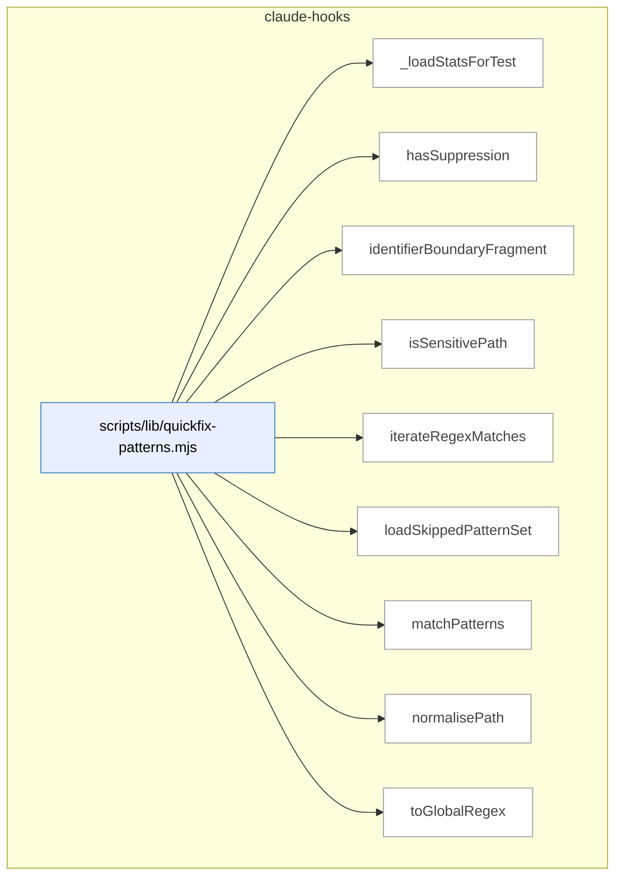

### Symbols in this domain

| Symbol | Kind | Path | Lines | Purpose | File imported by |
|---|---|---|---|---|---|
| [`_loadStatsForTest`](../scripts/lib/quickfix-patterns.mjs#L521) | function | `scripts/lib/quickfix-patterns.mjs` | 521-526 | Loads cached pattern acceptance statistics for test verification | `scripts/lib/audit/finding-verification.mjs`, `scripts/lib/repo-inventory.mjs`, `tests/learning-quickfix-hook.test.mjs`, +1 more |
| [`hasSuppression`](../scripts/lib/quickfix-patterns.mjs#L270) | function | `scripts/lib/quickfix-patterns.mjs` | 270-274 | Tests whether a source line contains a quickfix-pattern suppression comment | `scripts/lib/audit/finding-verification.mjs`, `scripts/lib/repo-inventory.mjs`, `tests/learning-quickfix-hook.test.mjs`, +1 more |
| [`identifierBoundaryFragment`](../scripts/lib/quickfix-patterns.mjs#L52) | function | `scripts/lib/quickfix-patterns.mjs` | 52-56 | Builds a regex fragment matching word-boundary variations (prefix/suffix/standalone) of search terms | `scripts/lib/audit/finding-verification.mjs`, `scripts/lib/repo-inventory.mjs`, `tests/learning-quickfix-hook.test.mjs`, +1 more |
| [`isSensitivePath`](../scripts/lib/quickfix-patterns.mjs#L258) | function | `scripts/lib/quickfix-patterns.mjs` | 258-260 | Classifies a path as containing sensitive data (credentials, secrets, keys, etc.) | `scripts/lib/audit/finding-verification.mjs`, `scripts/lib/repo-inventory.mjs`, `tests/learning-quickfix-hook.test.mjs`, +1 more |
| [`iterateRegexMatches`](../scripts/lib/quickfix-patterns.mjs#L303) | function | `scripts/lib/quickfix-patterns.mjs` | 303-310 | Generator yielding all match objects from a regex applied to text, with zero-width match guard | `scripts/lib/audit/finding-verification.mjs`, `scripts/lib/repo-inventory.mjs`, `tests/learning-quickfix-hook.test.mjs`, +1 more |
| [`loadSkippedPatternSet`](../scripts/lib/quickfix-patterns.mjs#L492) | function | `scripts/lib/quickfix-patterns.mjs` | 492-514 | Loads previously-learned low-acceptance quickfix patterns from cache to skip them | `scripts/lib/audit/finding-verification.mjs`, `scripts/lib/repo-inventory.mjs`, `tests/learning-quickfix-hook.test.mjs`, +1 more |
| [`matchPatterns`](../scripts/lib/quickfix-patterns.mjs#L336) | function | `scripts/lib/quickfix-patterns.mjs` | 336-457 | Scans diff text for quickfix anti-pattern signatures with sensitive-path exclusion and multi-line candidate support | `scripts/lib/audit/finding-verification.mjs`, `scripts/lib/repo-inventory.mjs`, `tests/learning-quickfix-hook.test.mjs`, +1 more |
| [`normalisePath`](../scripts/lib/quickfix-patterns.mjs#L245) | function | `scripts/lib/quickfix-patterns.mjs` | 245-247 | Canonicalizes a file path to platform-independent forward-slash form via a canonical function | `scripts/lib/audit/finding-verification.mjs`, `scripts/lib/repo-inventory.mjs`, `tests/learning-quickfix-hook.test.mjs`, +1 more |
| [`toGlobalRegex`](../scripts/lib/quickfix-patterns.mjs#L288) | function | `scripts/lib/quickfix-patterns.mjs` | 288-291 | Ensures a regex has the global flag set for multi-match iteration | `scripts/lib/audit/finding-verification.mjs`, `scripts/lib/repo-inventory.mjs`, `tests/learning-quickfix-hook.test.mjs`, +1 more |

---

## claudemd-management

> Scans and maintains hygiene in instruction files (CLAUDE.md, AGENTS.md, SKILL.md): validates cross-file references, detects duplicate content via Jaccard similarity, and auto-fixes stale markdown links.

```mermaid
flowchart TB
subgraph dom_claudemd_management ["claudemd-management"]
  file_scripts_lib_claudemd_autofix_mjs["scripts/lib/claudemd/autofix.mjs"]:::component
  sym_scripts_lib_claudemd_autofix_mjs_applyFi["applyFixes"]:::symbol
  file_scripts_lib_claudemd_autofix_mjs --> sym_scripts_lib_claudemd_autofix_mjs_applyFi
  file_scripts_lib_claudemd_doc_similarity_mjs["scripts/lib/claudemd/doc-similarity.mjs"]:::component
  sym_scripts_lib_claudemd_doc_similarity_mjs_["extractParagraphs"]:::symbol
  file_scripts_lib_claudemd_doc_similarity_mjs --> sym_scripts_lib_claudemd_doc_similarity_mjs_
  sym_scripts_lib_claudemd_doc_similarity_mjs_["findSimilarParagraphs"]:::symbol
  file_scripts_lib_claudemd_doc_similarity_mjs --> sym_scripts_lib_claudemd_doc_similarity_mjs_
  sym_scripts_lib_claudemd_doc_similarity_mjs_["jaccardSimilarity"]:::symbol
  file_scripts_lib_claudemd_doc_similarity_mjs --> sym_scripts_lib_claudemd_doc_similarity_mjs_
  sym_scripts_lib_claudemd_doc_similarity_mjs_["normalizeMarkdown"]:::symbol
  file_scripts_lib_claudemd_doc_similarity_mjs --> sym_scripts_lib_claudemd_doc_similarity_mjs_
  sym_scripts_lib_claudemd_doc_similarity_mjs_["tokenize"]:::symbol
  file_scripts_lib_claudemd_doc_similarity_mjs --> sym_scripts_lib_claudemd_doc_similarity_mjs_
  file_scripts_lib_claudemd_file_scanner_mjs["scripts/lib/claudemd/file-scanner.mjs"]:::component
  sym_scripts_lib_claudemd_file_scanner_mjs_ma["matchPattern"]:::symbol
  file_scripts_lib_claudemd_file_scanner_mjs --> sym_scripts_lib_claudemd_file_scanner_mjs_ma
  sym_scripts_lib_claudemd_file_scanner_mjs_sc["scanInstructionFiles"]:::symbol
  file_scripts_lib_claudemd_file_scanner_mjs --> sym_scripts_lib_claudemd_file_scanner_mjs_sc
  sym_scripts_lib_claudemd_file_scanner_mjs_wa["walkDir"]:::symbol
  file_scripts_lib_claudemd_file_scanner_mjs --> sym_scripts_lib_claudemd_file_scanner_mjs_wa
  file_scripts_lib_claudemd_ref_checker_mjs["scripts/lib/claudemd/ref-checker.mjs"]:::component
  sym_scripts_lib_claudemd_ref_checker_mjs_bui["buildEnvVarIndex"]:::symbol
  file_scripts_lib_claudemd_ref_checker_mjs --> sym_scripts_lib_claudemd_ref_checker_mjs_bui
  sym_scripts_lib_claudemd_ref_checker_mjs_bui["buildFunctionIndex"]:::symbol
  file_scripts_lib_claudemd_ref_checker_mjs --> sym_scripts_lib_claudemd_ref_checker_mjs_bui
  sym_scripts_lib_claudemd_ref_checker_mjs_ext["extractEnvVarRefs"]:::symbol
  file_scripts_lib_claudemd_ref_checker_mjs --> sym_scripts_lib_claudemd_ref_checker_mjs_ext
  sym_scripts_lib_claudemd_ref_checker_mjs_ext["extractFileRefs"]:::symbol
  file_scripts_lib_claudemd_ref_checker_mjs --> sym_scripts_lib_claudemd_ref_checker_mjs_ext
  sym_scripts_lib_claudemd_ref_checker_mjs_ext["extractFunctionRefs"]:::symbol
  file_scripts_lib_claudemd_ref_checker_mjs --> sym_scripts_lib_claudemd_ref_checker_mjs_ext
  sym_scripts_lib_claudemd_ref_checker_mjs_res["resolveReferencedPath"]:::symbol
  file_scripts_lib_claudemd_ref_checker_mjs --> sym_scripts_lib_claudemd_ref_checker_mjs_res
  file_scripts_lib_claudemd_rules_mjs["scripts/lib/claudemd/rules.mjs"]:::component
  sym_scripts_lib_claudemd_rules_mjs_checkClau["checkClaudeAgentsSync"]:::symbol
  file_scripts_lib_claudemd_rules_mjs --> sym_scripts_lib_claudemd_rules_mjs_checkClau
  sym_scripts_lib_claudemd_rules_mjs_checkCros["checkCrossFileDuplication"]:::symbol
  file_scripts_lib_claudemd_rules_mjs --> sym_scripts_lib_claudemd_rules_mjs_checkCros
  sym_scripts_lib_claudemd_rules_mjs_checkDeep["checkDeepCodeDetail"]:::symbol
  file_scripts_lib_claudemd_rules_mjs --> sym_scripts_lib_claudemd_rules_mjs_checkDeep
  sym_scripts_lib_claudemd_rules_mjs_checkSize["checkSize"]:::symbol
  file_scripts_lib_claudemd_rules_mjs --> sym_scripts_lib_claudemd_rules_mjs_checkSize
  sym_scripts_lib_claudemd_rules_mjs_checkStal["checkStaleEnvVarRefs"]:::symbol
  file_scripts_lib_claudemd_rules_mjs --> sym_scripts_lib_claudemd_rules_mjs_checkStal
  sym_scripts_lib_claudemd_rules_mjs_checkStal["checkStaleFileRefs"]:::symbol
  file_scripts_lib_claudemd_rules_mjs --> sym_scripts_lib_claudemd_rules_mjs_checkStal
  sym_scripts_lib_claudemd_rules_mjs_checkStal["checkStaleFunctionRefs"]:::symbol
  file_scripts_lib_claudemd_rules_mjs --> sym_scripts_lib_claudemd_rules_mjs_checkStal
  sym_scripts_lib_claudemd_rules_mjs_extractHe["extractHeadings"]:::symbol
  file_scripts_lib_claudemd_rules_mjs --> sym_scripts_lib_claudemd_rules_mjs_extractHe
  sym_scripts_lib_claudemd_rules_mjs_runRules["runRules"]:::symbol
  file_scripts_lib_claudemd_rules_mjs --> sym_scripts_lib_claudemd_rules_mjs_runRules
  sym_scripts_lib_claudemd_rules_mjs_semanticI["semanticId"]:::symbol
  file_scripts_lib_claudemd_rules_mjs --> sym_scripts_lib_claudemd_rules_mjs_semanticI
  file_scripts_lib_claudemd_sarif_formatter_mjs["scripts/lib/claudemd/sarif-formatter.mjs"]:::component
  sym_scripts_lib_claudemd_sarif_formatter_mjs["buildRuleDescriptors"]:::symbol
  file_scripts_lib_claudemd_sarif_formatter_mjs --> sym_scripts_lib_claudemd_sarif_formatter_mjs
  sym_scripts_lib_claudemd_sarif_formatter_mjs["ruleDescription"]:::symbol
  file_scripts_lib_claudemd_sarif_formatter_mjs --> sym_scripts_lib_claudemd_sarif_formatter_mjs
  sym_scripts_lib_claudemd_sarif_formatter_mjs["sarifLevel"]:::symbol
  file_scripts_lib_claudemd_sarif_formatter_mjs --> sym_scripts_lib_claudemd_sarif_formatter_mjs
  sym_scripts_lib_claudemd_sarif_formatter_mjs["toSarif"]:::symbol
  file_scripts_lib_claudemd_sarif_formatter_mjs --> sym_scripts_lib_claudemd_sarif_formatter_mjs
  file_scripts_lib_claudemd_step65_hook_mjs["scripts/lib/claudemd/step65-hook.mjs"]:::component
  sym_scripts_lib_claudemd_step65_hook_mjs_run["runHygieneCheck"]:::symbol
  file_scripts_lib_claudemd_step65_hook_mjs --> sym_scripts_lib_claudemd_step65_hook_mjs_run
end
classDef container fill:#f5f5f5,stroke:#333,stroke-width:2px,color:#000
classDef component fill:#e8f0ff,stroke:#3178c6,color:#000
classDef symbol fill:#fff,stroke:#999,color:#444
classDef dup fill:#ffe8d8,stroke:#c0392b,stroke-width:2px,color:#000
classDef violation fill:#ffd6d6,stroke:#c0392b,stroke-width:2px,color:#000
```

### Symbols in this domain

| Symbol | Kind | Path | Lines | Purpose | File imported by |
|---|---|---|---|---|---|
| [`applyFixes`](../scripts/lib/claudemd/autofix.mjs#L17) | function | `scripts/lib/claudemd/autofix.mjs` | 17-74 | Removes stale standalone markdown link lines from files, optionally in dry-run mode. | `scripts/claudemd-lint.mjs`, `tests/claudemd/autofix.test.mjs` |
| [`extractParagraphs`](../scripts/lib/claudemd/doc-similarity.mjs#L68) | function | `scripts/lib/claudemd/doc-similarity.mjs` | 68-103 | Splits markdown content into paragraphs, skipping code blocks and tracking line numbers. | `scripts/lib/claudemd/rules.mjs`, `tests/claudemd/doc-similarity.test.mjs` |
| [`findSimilarParagraphs`](../scripts/lib/claudemd/doc-similarity.mjs#L114) | function | `scripts/lib/claudemd/doc-similarity.mjs` | 114-146 | Finds paragraph pairs between two documents that exceed a Jaccard similarity threshold. | `scripts/lib/claudemd/rules.mjs`, `tests/claudemd/doc-similarity.test.mjs` |
| [`jaccardSimilarity`](../scripts/lib/claudemd/doc-similarity.mjs#L53) | function | `scripts/lib/claudemd/doc-similarity.mjs` | 53-61 | Calculates the Jaccard similarity index between two token sets. | `scripts/lib/claudemd/rules.mjs`, `tests/claudemd/doc-similarity.test.mjs` |
| [`normalizeMarkdown`](../scripts/lib/claudemd/doc-similarity.mjs#L24) | function | `scripts/lib/claudemd/doc-similarity.mjs` | 24-34 | Strips markdown formatting and lowercases text for content-based comparison. | `scripts/lib/claudemd/rules.mjs`, `tests/claudemd/doc-similarity.test.mjs` |
| [`tokenize`](../scripts/lib/claudemd/doc-similarity.mjs#L41) | function | `scripts/lib/claudemd/doc-similarity.mjs` | 41-45 | Splits normalized text into a set of 2+-character words, excluding common stopwords. | `scripts/lib/claudemd/rules.mjs`, `tests/claudemd/doc-similarity.test.mjs` |
| [`matchPattern`](../scripts/lib/claudemd/file-scanner.mjs#L72) | function | `scripts/lib/claudemd/file-scanner.mjs` | 72-93 | Checks whether a file path matches a glob-like pattern with `/` and `*` wildcards. | `scripts/check-context-drift.mjs`, `scripts/claudemd-lint.mjs`, `scripts/lib/claudemd/ref-checker.mjs`, +1 more |
| [`scanInstructionFiles`](../scripts/lib/claudemd/file-scanner.mjs#L102) | function | `scripts/lib/claudemd/file-scanner.mjs` | 102-133 | Finds and reads all CLAUDE.md, AGENTS.md, SKILL.md, and reference files across the repo. | `scripts/check-context-drift.mjs`, `scripts/claudemd-lint.mjs`, `scripts/lib/claudemd/ref-checker.mjs`, +1 more |
| [`walkDir`](../scripts/lib/claudemd/file-scanner.mjs#L30) | function | `scripts/lib/claudemd/file-scanner.mjs` | 30-68 | Recursively walks directories matching specified instruction-file patterns while respecting exclusions. | `scripts/check-context-drift.mjs`, `scripts/claudemd-lint.mjs`, `scripts/lib/claudemd/ref-checker.mjs`, +1 more |
| [`buildEnvVarIndex`](../scripts/lib/claudemd/ref-checker.mjs#L194) | function | `scripts/lib/claudemd/ref-checker.mjs` | 194-235 | Scans .env.example and source code to build an index of known environment variables. | `scripts/lib/claudemd/rules.mjs`, `tests/claudemd/ref-checker.test.mjs` |
| [`buildFunctionIndex`](../scripts/lib/claudemd/ref-checker.mjs#L91) | function | `scripts/lib/claudemd/ref-checker.mjs` | 91-124 | Scans source code to build an index of all exported functions and classes. | `scripts/lib/claudemd/rules.mjs`, `tests/claudemd/ref-checker.test.mjs` |
| [`extractEnvVarRefs`](../scripts/lib/claudemd/ref-checker.mjs#L165) | function | `scripts/lib/claudemd/ref-checker.mjs` | 165-187 | Finds backtick-quoted all-caps environment variable references in content. | `scripts/lib/claudemd/rules.mjs`, `tests/claudemd/ref-checker.test.mjs` |
| [`extractFileRefs`](../scripts/lib/claudemd/ref-checker.mjs#L52) | function | `scripts/lib/claudemd/ref-checker.mjs` | 52-84 | Extracts file references from markdown links and backtick-quoted paths in content. | `scripts/lib/claudemd/rules.mjs`, `tests/claudemd/ref-checker.test.mjs` |
| [`extractFunctionRefs`](../scripts/lib/claudemd/ref-checker.mjs#L132) | function | `scripts/lib/claudemd/ref-checker.mjs` | 132-158 | Finds backtick-quoted function and class name references in content. | `scripts/lib/claudemd/rules.mjs`, `tests/claudemd/ref-checker.test.mjs` |
| [`resolveReferencedPath`](../scripts/lib/claudemd/ref-checker.mjs#L25) | function | `scripts/lib/claudemd/ref-checker.mjs` | 25-44 | Normalizes and validates a file reference relative to a source file's directory. | `scripts/lib/claudemd/rules.mjs`, `tests/claudemd/ref-checker.test.mjs` |
| [`checkClaudeAgentsSync`](../scripts/lib/claudemd/rules.mjs#L234) | function | `scripts/lib/claudemd/rules.mjs` | 234-271 | Detects conflicting headings between CLAUDE.md and AGENTS.md files in the same directory. | `scripts/claudemd-lint.mjs`, `tests/claudemd/rules.test.mjs` |
| [`checkCrossFileDuplication`](../scripts/lib/claudemd/rules.mjs#L203) | function | `scripts/lib/claudemd/rules.mjs` | 203-232 | Finds similar paragraphs across files in the same directory tree and suggests factoring them out. | `scripts/claudemd-lint.mjs`, `tests/claudemd/rules.test.mjs` |
| [`checkDeepCodeDetail`](../scripts/lib/claudemd/rules.mjs#L186) | function | `scripts/lib/claudemd/rules.mjs` | 186-201 | Warns when a doc file contains too many fenced code blocks and suggests moving examples elsewhere. | `scripts/claudemd-lint.mjs`, `tests/claudemd/rules.test.mjs` |
| [`checkSize`](../scripts/lib/claudemd/rules.mjs#L108) | function | `scripts/lib/claudemd/rules.mjs` | 108-122 | Validates that a file doesn't exceed a configured byte size limit. | `scripts/claudemd-lint.mjs`, `tests/claudemd/rules.test.mjs` |
| [`checkStaleEnvVarRefs`](../scripts/lib/claudemd/rules.mjs#L168) | function | `scripts/lib/claudemd/rules.mjs` | 168-184 | Identifies environment variable references in docs that aren't found in any source definition. | `scripts/claudemd-lint.mjs`, `tests/claudemd/rules.test.mjs` |
| [`checkStaleFileRefs`](../scripts/lib/claudemd/rules.mjs#L124) | function | `scripts/lib/claudemd/rules.mjs` | 124-142 | Finds file path references in documentation that point to non-existent paths. | `scripts/claudemd-lint.mjs`, `tests/claudemd/rules.test.mjs` |
| [`checkStaleFunctionRefs`](../scripts/lib/claudemd/rules.mjs#L144) | function | `scripts/lib/claudemd/rules.mjs` | 144-166 | Detects references to functions or classes in docs that aren't defined in the codebase. | `scripts/claudemd-lint.mjs`, `tests/claudemd/rules.test.mjs` |
| [`extractHeadings`](../scripts/lib/claudemd/rules.mjs#L278) | function | `scripts/lib/claudemd/rules.mjs` | 278-302 | Parses markdown headings and their content sections into a Map for comparison. | `scripts/claudemd-lint.mjs`, `tests/claudemd/rules.test.mjs` |
| [`runRules`](../scripts/lib/claudemd/rules.mjs#L44) | function | `scripts/lib/claudemd/rules.mjs` | 44-106 | Executes all enabled CLAUDE.md hygiene rules, returning findings with metadata and fixability info. | `scripts/claudemd-lint.mjs`, `tests/claudemd/rules.test.mjs` |
| [`semanticId`](../scripts/lib/claudemd/rules.mjs#L17) | function | `scripts/lib/claudemd/rules.mjs` | 17-22 | Generates a deterministic 16-character hex hash identifying a finding by rule, path, and content. | `scripts/claudemd-lint.mjs`, `tests/claudemd/rules.test.mjs` |
| [`buildRuleDescriptors`](../scripts/lib/claudemd/sarif-formatter.mjs#L49) | function | `scripts/lib/claudemd/sarif-formatter.mjs` | 49-62 | Creates SARIF rule descriptors from findings, deduplicating by ruleId. | `scripts/check-context-drift.mjs`, `scripts/check-model-freshness.mjs`, `scripts/claudemd-lint.mjs` |
| [`ruleDescription`](../scripts/lib/claudemd/sarif-formatter.mjs#L64) | function | `scripts/lib/claudemd/sarif-formatter.mjs` | 64-77 | Returns human-readable descriptions for claudemd rule identifiers. | `scripts/check-context-drift.mjs`, `scripts/check-model-freshness.mjs`, `scripts/claudemd-lint.mjs` |
| [`sarifLevel`](../scripts/lib/claudemd/sarif-formatter.mjs#L40) | function | `scripts/lib/claudemd/sarif-formatter.mjs` | 40-47 | Maps severity levels (error/warn/info) to SARIF-compliant level strings. | `scripts/check-context-drift.mjs`, `scripts/check-model-freshness.mjs`, `scripts/claudemd-lint.mjs` |
| [`toSarif`](../scripts/lib/claudemd/sarif-formatter.mjs#L11) | function | `scripts/lib/claudemd/sarif-formatter.mjs` | 11-38 | Converts a linter report into SARIF (Static Analysis Results Interchange Format) JSON output. | `scripts/check-context-drift.mjs`, `scripts/check-model-freshness.mjs`, `scripts/claudemd-lint.mjs` |
| [`runHygieneCheck`](../scripts/lib/claudemd/step65-hook.mjs#L16) | function | `scripts/lib/claudemd/step65-hook.mjs` | 16-65 | Spawns the claudemd linter subprocess and parses its JSON report for integration into a hook. | _(internal)_ |

---

## cross-skill-bridge

> Parses and executes cross-skill CLI commands that write plans, findings, and outcomes to the shared cloud audit store, enabling inter-skill data coordination and learning while degrading gracefully when the store is offline.

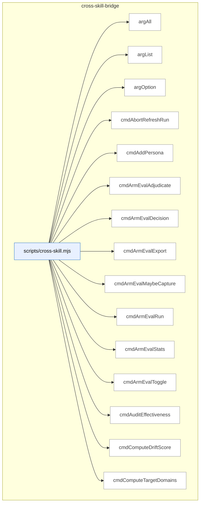

_Domain has 82 symbols (>50). Diagram shows top-15 by file order; see flat table below for the full list._

### Symbols in this domain

| Symbol | Kind | Path | Lines | Purpose | File imported by |
|---|---|---|---|---|---|
| [`argAll`](../scripts/cross-skill.mjs#L154) | function | `scripts/cross-skill.mjs` | 154-160 | Collects all values for a multiply-specified CLI argument. | _(internal)_ |
| [`argList`](../scripts/cross-skill.mjs#L148) | function | `scripts/cross-skill.mjs` | 148-151 | Returns a comma-separated list from a named argument split and trimmed. | _(internal)_ |
| [`argOption`](../scripts/cross-skill.mjs#L141) | function | `scripts/cross-skill.mjs` | 141-145 | Returns the value of a named CLI argument. | _(internal)_ |
| [`cmdAbortRefreshRun`](../scripts/cross-skill.mjs#L1903) | function | `scripts/cross-skill.mjs` | 1903-1913 | Abandons an in-flight refresh run with optional reason. | _(internal)_ |
| [`cmdAddPersona`](../scripts/cross-skill.mjs#L1096) | function | `scripts/cross-skill.mjs` | 1096-1108 | Registers a new or updates an existing persona for an app. | _(internal)_ |
| [`cmdArmEvalAdjudicate`](../scripts/cross-skill.mjs#L834) | function | `scripts/cross-skill.mjs` | 834-858 | Collects human ranking of arm-eval outputs or displays blinded candidates for scoring. | _(internal)_ |
| [`cmdArmEvalDecision`](../scripts/cross-skill.mjs#L800) | function | `scripts/cross-skill.mjs` | 800-817 | Evaluates arm-eval results to decide if baseline model should be kept or switched. | _(internal)_ |
| [`cmdArmEvalExport`](../scripts/cross-skill.mjs#L866) | function | `scripts/cross-skill.mjs` | 866-884 | Archives arm-eval session(s) to committed .mjs files with full provenance attribution. | _(internal)_ |
| [`cmdArmEvalMaybeCapture`](../scripts/cross-skill.mjs#L925) | function | `scripts/cross-skill.mjs` | 925-941 | Conditionally captures a plan/brainstorm task as an arm-eval experiment if enabled. | _(internal)_ |
| [`cmdArmEvalRun`](../scripts/cross-skill.mjs#L778) | function | `scripts/cross-skill.mjs` | 778-797 | Launches an arm-eval experiment session with budget cap and task description. | _(internal)_ |
| [`cmdArmEvalStats`](../scripts/cross-skill.mjs#L820) | function | `scripts/cross-skill.mjs` | 820-831 | Lists arm-eval session leaderboard filtered by experiment type and repo. | _(internal)_ |
| [`cmdArmEvalToggle`](../scripts/cross-skill.mjs#L892) | function | `scripts/cross-skill.mjs` | 892-917 | Toggles shadow-arm capture on/off and sets budget allocation for this repo. | _(internal)_ |
| [`cmdAuditEffectiveness`](../scripts/cross-skill.mjs#L585) | function | `scripts/cross-skill.mjs` | 585-592 | Fetches audit precision/recall effectiveness metrics for a repo. | _(internal)_ |
| [`cmdComputeDriftScore`](../scripts/cross-skill.mjs#L2007) | function | `scripts/cross-skill.mjs` | 2007-2018 | Computes and emits an architectural drift score for a repo/refresh pair from the cloud store. | _(internal)_ |
| [`cmdComputeTargetDomains`](../scripts/cross-skill.mjs#L1747) | function | `scripts/cross-skill.mjs` | 1747-1759 | Determines domain tags for file paths using committed architectural rules. | _(internal)_ |
| [`cmdDetectStack`](../scripts/cross-skill.mjs#L1582) | function | `scripts/cross-skill.mjs` | 1582-1599 | Detects project tech stack (Node, Python, framework, env manager) from cwd. | _(internal)_ |
| [`cmdFinalizeOutcomes`](../scripts/cross-skill.mjs#L996) | function | `scripts/cross-skill.mjs` | 996-1066 | Reconciles audit findings with adjudication ledger and writes final outcomes to store. | _(internal)_ |
| [`cmdFinalReviewAdjudicate`](../scripts/cross-skill.mjs#L635) | function | `scripts/cross-skill.mjs` | 635-668 | Accepts or dismisses a final-review finding with optional bucket disambiguation. | _(internal)_ |
| [`cmdFinalReviewStats`](../scripts/cross-skill.mjs#L596) | function | `scripts/cross-skill.mjs` | 596-633 | Lists shadow final-reviewer findings for spot-check adjudication with optional markdown worksheet. | _(internal)_ |
| [`cmdFrictionLog`](../scripts/cross-skill.mjs#L2132) | function | `scripts/cross-skill.mjs` | 2132-2137 | Executes the friction logging workflow and emits the result. | _(internal)_ |
| [`cmdGetActiveRefreshId`](../scripts/cross-skill.mjs#L1619) | function | `scripts/cross-skill.mjs` | 1619-1635 | Returns active symbol-index snapshot ID and embedding model for a repo. | _(internal)_ |
| [`cmdGetCallersForFile`](../scripts/cross-skill.mjs#L1761) | function | `scripts/cross-skill.mjs` | 1761-1824 | Returns cross-domain callers of a symbol from the active snapshot. | _(internal)_ |
| [`cmdGetFrictionNeighbourhood`](../scripts/cross-skill.mjs#L1736) | function | `scripts/cross-skill.mjs` | 1736-1745 | Finds friction entries similar to a user intent. | _(internal)_ |
| [`cmdGetIncidentNeighbourhood`](../scripts/cross-skill.mjs#L1637) | function | `scripts/cross-skill.mjs` | 1637-1678 | Finds similar past security incidents matching the current code change intent. | _(internal)_ |
| [`cmdGetNavFirstSeen`](../scripts/cross-skill.mjs#L537) | function | `scripts/cross-skill.mjs` | 537-552 | Looks up first-seen timestamp for nav drift keys from historical audit runs. | _(internal)_ |
| [`cmdGetNeighbourhood`](../scripts/cross-skill.mjs#L1826) | function | `scripts/cross-skill.mjs` | 1826-1869 | Finds similar existing symbols in the codebase for reuse/extension consultation. | _(internal)_ |
| [`cmdGetPersonaSessionsByRepo`](../scripts/cross-skill.mjs#L1361) | function | `scripts/cross-skill.mjs` | 1361-1389 | Lists persona test sessions for a repo with optional P0-only and field filtering. | _(internal)_ |
| [`cmdGetPersonaSessionsByUrl`](../scripts/cross-skill.mjs#L1554) | function | `scripts/cross-skill.mjs` | 1554-1580 | Lists persona sessions for a given app URL with optional limit and field selection. | _(internal)_ |
| [`cmdGetReachabilityEvidence`](../scripts/cross-skill.mjs#L1396) | function | `scripts/cross-skill.mjs` | 1396-1430 | Extracts per-persona click-path evidence from sessions for nav-audit bootstrap. | _(internal)_ |
| [`cmdGetRecentFindings`](../scripts/cross-skill.mjs#L1511) | function | `scripts/cross-skill.mjs` | 1511-1546 | Lists recent audit findings for a repo filtered by severity with identity-first resolution. | _(internal)_ |
| [`cmdLearningBackfillOutcomes`](../scripts/cross-skill.mjs#L2116) | function | `scripts/cross-skill.mjs` | 2116-2126 | Runs the backfill process to populate missing audit outcomes in the learning store. | _(internal)_ |
| [`cmdLearningQuickfixStats`](../scripts/cross-skill.mjs#L2159) | function | `scripts/cross-skill.mjs` | 2159-2185 | Retrieves or rebuilds quickfix pattern statistics and emits either cached stats or a rebuild result. | _(internal)_ |
| [`cmdLearningRecord`](../scripts/cross-skill.mjs#L2035) | function | `scripts/cross-skill.mjs` | 2035-2074 | Records a learning decision (with context, choice, outcome) to either cloud or local storage. | _(internal)_ |
| [`cmdLearningReplay`](../scripts/cross-skill.mjs#L2144) | function | `scripts/cross-skill.mjs` | 2144-2152 | Runs the learning decision replay workflow and propagates its exit code. | _(internal)_ |
| [`cmdLearningStats`](../scripts/cross-skill.mjs#L2081) | function | `scripts/cross-skill.mjs` | 2081-2092 | Retrieves and emits aggregate learning statistics for a repository. | _(internal)_ |
| [`cmdLearningWeeklyReview`](../scripts/cross-skill.mjs#L2100) | function | `scripts/cross-skill.mjs` | 2100-2108 | Runs the weekly learning review workflow and emits the result. | _(internal)_ |
| [`cmdListConsistencyCandidates`](../scripts/cross-skill.mjs#L344) | function | `scripts/cross-skill.mjs` | 344-357 | Retrieves consistency-mode regression-spec candidates from the cloud store. | _(internal)_ |
| [`cmdListLayeringViolationsForSnapshot`](../scripts/cross-skill.mjs#L1994) | function | `scripts/cross-skill.mjs` | 1994-2005 | Fetches and emits architectural layering violations for a given snapshot refresh ID from the cloud store. | _(internal)_ |
| [`cmdListPersonas`](../scripts/cross-skill.mjs#L1074) | function | `scripts/cross-skill.mjs` | 1074-1085 | Lists all personas registered for a given app URL. | _(internal)_ |
| [`cmdListPersonaTestCandidates`](../scripts/cross-skill.mjs#L397) | function | `scripts/cross-skill.mjs` | 397-409 | Retrieves persona-test issue candidates with age and severity filtering. | _(internal)_ |
| [`cmdListSymbolsForSnapshot`](../scripts/cross-skill.mjs#L1981) | function | `scripts/cross-skill.mjs` | 1981-1992 | Lists all symbols from a refresh snapshot with counts. | _(internal)_ |
| [`cmdListUnlockedFixes`](../scripts/cross-skill.mjs#L577) | function | `scripts/cross-skill.mjs` | 577-583 | Lists recent high/medium fixes missing a corresponding /ux-lock regression spec. | _(internal)_ |
| [`cmdMarkPersonaTestCandidateProposed`](../scripts/cross-skill.mjs#L411) | function | `scripts/cross-skill.mjs` | 411-423 | Updates a persona-test candidate status to proposed. | _(internal)_ |
| [`cmdModelAbAdjudicate`](../scripts/cross-skill.mjs#L679) | function | `scripts/cross-skill.mjs` | 679-750 | Shows blinded model-A/B finding queue for human adjudication or records human rankings. | _(internal)_ |
| [`cmdModelAbDecision`](../scripts/cross-skill.mjs#L953) | function | `scripts/cross-skill.mjs` | 953-974 | Evaluates model-A/B cost/effectiveness to decide if baseline should be kept. | _(internal)_ |
| [`cmdModelAbStats`](../scripts/cross-skill.mjs#L753) | function | `scripts/cross-skill.mjs` | 753-771 | Computes model-A/B/C per-arm effectiveness, recall, and cost-frontier metrics. | _(internal)_ |
| [`cmdOpenRefreshRun`](../scripts/cross-skill.mjs#L1871) | function | `scripts/cross-skill.mjs` | 1871-1889 | Opens a new symbol-index refresh run and upserts the repo if needed. | _(internal)_ |
| [`cmdPersonaOutcomes`](../scripts/cross-skill.mjs#L1269) | function | `scripts/cross-skill.mjs` | 1269-1343 | Labels persona findings as fixed/dismissed/wont_fix/stale with optional markdown worksheet. | _(internal)_ |
| [`cmdPlanSatisfaction`](../scripts/cross-skill.mjs#L496) | function | `scripts/cross-skill.mjs` | 496-506 | Reads plan satisfaction metrics and persistent failing criteria from cloud. | _(internal)_ |
| [`cmdPreviewGate`](../scripts/cross-skill.mjs#L1485) | function | `scripts/cross-skill.mjs` | 1485-1493 | Returns the `/ship` preview gate verdict (halt/warn/ok) and reasoning. | _(internal)_ |
| [`cmdPromoteRegressionSpec`](../scripts/cross-skill.mjs#L359) | function | `scripts/cross-skill.mjs` | 359-372 | Marks a regression-spec candidate as promoted to locked status. | _(internal)_ |
| [`cmdPublishRefreshRun`](../scripts/cross-skill.mjs#L1891) | function | `scripts/cross-skill.mjs` | 1891-1901 | Finalizes and publishes a refresh run's symbol index to live. | _(internal)_ |
| [`cmdQuality`](../scripts/cross-skill.mjs#L1685) | function | `scripts/cross-skill.mjs` | 1685-1734 | Manages friction/quality signals: add, mirror, digest, or link memories. | _(internal)_ |
| [`cmdRecommendSkills`](../scripts/cross-skill.mjs#L1440) | function | `scripts/cross-skill.mjs` | 1440-1478 | Suggests the next 1-2 skill lenses to run based on audit findings and changed files. | _(internal)_ |
| [`cmdRecordCorrelation`](../scripts/cross-skill.mjs#L443) | function | `scripts/cross-skill.mjs` | 443-461 | Links a persona-test finding to an audit finding with correlation score and rationale. | _(internal)_ |
| [`cmdRecordLayeringViolations`](../scripts/cross-skill.mjs#L1955) | function | `scripts/cross-skill.mjs` | 1955-1967 | Records architecture layering violations found during a refresh. | _(internal)_ |
| [`cmdRecordNavAuditRun`](../scripts/cross-skill.mjs#L510) | function | `scripts/cross-skill.mjs` | 510-535 | Records nav-audit run telemetry with idempotent (repoId, headSha, scope) dedup. | _(internal)_ |
| [`cmdRecordPersonaSession`](../scripts/cross-skill.mjs#L1146) | function | `scripts/cross-skill.mjs` | 1146-1180 | Records a persona test session run with P0/P1 findings and auto-correlates to audit runs. | _(internal)_ |
| [`cmdRecordPlanVerifyItems`](../scripts/cross-skill.mjs#L485) | function | `scripts/cross-skill.mjs` | 485-494 | Stores pass/fail results for each acceptance-criterion item in a plan-verification run. | _(internal)_ |
| [`cmdRecordPlanVerifyRun`](../scripts/cross-skill.mjs#L463) | function | `scripts/cross-skill.mjs` | 463-483 | Logs a plan-verification run with pass/fail/skip counts for acceptance criteria. | _(internal)_ |
| [`cmdRecordRegressionSpec`](../scripts/cross-skill.mjs#L274) | function | `scripts/cross-skill.mjs` | 274-342 | Records a Playwright regression spec with pre-egress redaction of sensitive data. | _(internal)_ |
| [`cmdRecordRegressionSpecRun`](../scripts/cross-skill.mjs#L425) | function | `scripts/cross-skill.mjs` | 425-441 | Logs pass/fail and metadata for a regression-spec test execution. | _(internal)_ |
| [`cmdRecordShipEvent`](../scripts/cross-skill.mjs#L554) | function | `scripts/cross-skill.mjs` | 554-575 | Records ship outcome event (blocked/shipped/warned) with context to the store. | _(internal)_ |
| [`cmdRecordSymbolDefinitions`](../scripts/cross-skill.mjs#L1915) | function | `scripts/cross-skill.mjs` | 1915-1925 | Ingests symbol definitions into the cloud store for a refresh. | _(internal)_ |
| [`cmdRecordSymbolEmbedding`](../scripts/cross-skill.mjs#L1941) | function | `scripts/cross-skill.mjs` | 1941-1953 | Records an embedding vector for a symbol definition. | _(internal)_ |
| [`cmdRecordSymbolIndex`](../scripts/cross-skill.mjs#L1927) | function | `scripts/cross-skill.mjs` | 1927-1939 | Stores symbol import-graph rows for a refresh run. | _(internal)_ |
| [`cmdResolveRepoIdentity`](../scripts/cross-skill.mjs#L2020) | function | `scripts/cross-skill.mjs` | 2020-2026 | Resolves and optionally persists a repository's unique identity UUID. | _(internal)_ |
| [`cmdSetActiveEmbeddingModel`](../scripts/cross-skill.mjs#L1969) | function | `scripts/cross-skill.mjs` | 1969-1979 | Marks a specific embedding model/dimension as active for a repo. | _(internal)_ |
| [`cmdUpdatePlanStatus`](../scripts/cross-skill.mjs#L265) | function | `scripts/cross-skill.mjs` | 265-272 | Updates the status field of a plan record in the cloud store. | _(internal)_ |
| [`cmdUpsertPersonaTestCandidate`](../scripts/cross-skill.mjs#L376) | function | `scripts/cross-skill.mjs` | 376-395 | Creates or updates a persona-test issue candidate with severity tracking. | _(internal)_ |
| [`cmdUpsertPlan`](../scripts/cross-skill.mjs#L235) | function | `scripts/cross-skill.mjs` | 235-263 | Creates or updates a plan record in the cloud store and triggers arm-eval if task text is present. | _(internal)_ |
| [`cmdWhoami`](../scripts/cross-skill.mjs#L1601) | function | `scripts/cross-skill.mjs` | 1601-1615 | Prints current commit, branch, and cloud connectivity status. | _(internal)_ |
| [`currentBranch`](../scripts/cross-skill.mjs#L184) | function | `scripts/cross-skill.mjs` | 184-189 | Returns the current Git branch name via git rev-parse. | _(internal)_ |
| [`currentCommitSha`](../scripts/cross-skill.mjs#L177) | function | `scripts/cross-skill.mjs` | 177-182 | Returns the current Git HEAD commit SHA via git rev-parse. | _(internal)_ |
| [`emitError`](../scripts/cross-skill.mjs#L170) | function | `scripts/cross-skill.mjs` | 170-173 | Outputs an error JSON response and exits with a specified code. | _(internal)_ |
| [`gitChangedFiles`](../scripts/cross-skill.mjs#L1496) | function | `scripts/cross-skill.mjs` | 1496-1504 | Returns union of staged, unstaged, and untracked git-changed files. | _(internal)_ |
| [`hasFlag`](../scripts/cross-skill.mjs#L163) | function | `scripts/cross-skill.mjs` | 163-163 | Checks whether a named CLI flag is present. | _(internal)_ |
| [`main`](../scripts/cross-skill.mjs#L2270) | function | `scripts/cross-skill.mjs` | 2270-2294 | Routes subcommands to their handlers after validating the CLI input. | _(internal)_ |
| [`parsePayload`](../scripts/cross-skill.mjs#L124) | function | `scripts/cross-skill.mjs` | 124-139 | Extracts JSON payload from --json, --stdin, or trailing JSON argument. | _(internal)_ |
| [`resolveRepoId`](../scripts/cross-skill.mjs#L209) | function | `scripts/cross-skill.mjs` | 209-231 | Resolves a repository ID from explicit payload fields or the current repo. | _(internal)_ |
| [`resolveRepoIdentityQuiet`](../scripts/cross-skill.mjs#L944) | function | `scripts/cross-skill.mjs` | 944-950 | Safely resolves the current repo's canonical UUID or null on error. | _(internal)_ |
| [`runAutoCorrelate`](../scripts/cross-skill.mjs#L1192) | function | `scripts/cross-skill.mjs` | 1192-1260 | Attempts to match persona P0/P1 findings to candidate audit runs for ground-truth labels. | _(internal)_ |

---

## dashboard

> Generates static HTML dashboard pages from audit findings and learning analytics — routes through subcommands (reference/telemetry/audit-run/serve) and builds rendered pages with git provenance, checking for data degradation.

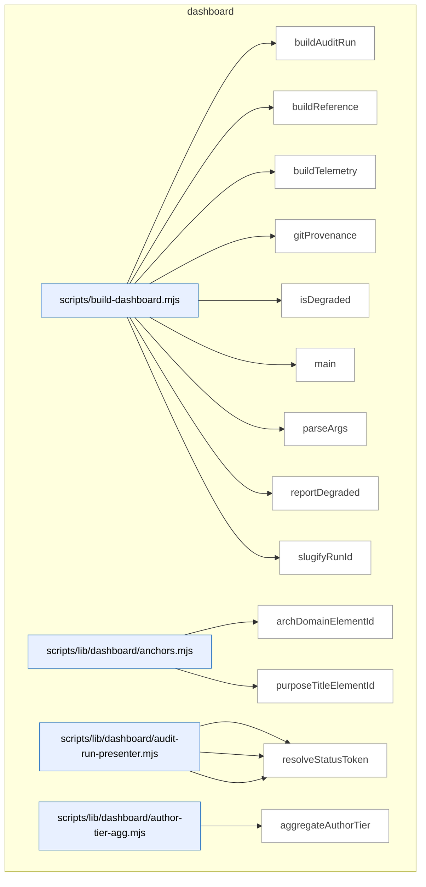

_Domain has 122 symbols (>50). Diagram shows top-15 by file order; see flat table below for the full list._

### Symbols in this domain

| Symbol | Kind | Path | Lines | Purpose | File imported by |
|---|---|---|---|---|---|
| [`buildAuditRun`](../scripts/build-dashboard.mjs#L157) | function | `scripts/build-dashboard.mjs` | 157-183 | Builds an audit run detail page, resolving run ID from pointer file or CLI argument. | `tests/dashboard.test.mjs` |
| [`buildReference`](../scripts/build-dashboard.mjs#L131) | function | `scripts/build-dashboard.mjs` | 131-137 | Builds the reference/architecture dashboard page and writes it to disk. | `tests/dashboard.test.mjs` |
| [`buildTelemetry`](../scripts/build-dashboard.mjs#L139) | function | `scripts/build-dashboard.mjs` | 139-145 | Builds the telemetry/learning analytics dashboard page and writes it to disk. | `tests/dashboard.test.mjs` |
| [`gitProvenance`](../scripts/build-dashboard.mjs#L113) | function | `scripts/build-dashboard.mjs` | 113-123 | Retrieves current git commit SHA and working-tree dirtiness for build provenance. | `tests/dashboard.test.mjs` |
| [`isDegraded`](../scripts/build-dashboard.mjs#L125) | function | `scripts/build-dashboard.mjs` | 125-129 | Checks whether any data source has an error or invalid status. | `tests/dashboard.test.mjs` |
| [`main`](../scripts/build-dashboard.mjs#L198) | function | `scripts/build-dashboard.mjs` | 198-264 | Entry point for dashboard generation; routes to subcommands and manages side builds. | `tests/dashboard.test.mjs` |
| [`parseArgs`](../scripts/build-dashboard.mjs#L57) | function | `scripts/build-dashboard.mjs` | 57-97 | Parses dashboard build subcommands (reference/telemetry/audit-run/serve) with optional flags. | `tests/dashboard.test.mjs` |
| [`reportDegraded`](../scripts/build-dashboard.mjs#L185) | function | `scripts/build-dashboard.mjs` | 185-196 | Prints warnings about data sources with invalid, unexpected-error, or missing-optional status. | `tests/dashboard.test.mjs` |
| [`slugifyRunId`](../scripts/build-dashboard.mjs#L103) | function | `scripts/build-dashboard.mjs` | 103-110 | Converts a run ID to a safe filename by lowercasing and normalizing special characters. | `tests/dashboard.test.mjs` |
| [`archDomainElementId`](../scripts/lib/dashboard/anchors.mjs#L15) | function | `scripts/lib/dashboard/anchors.mjs` | 15-17 | Generates a CSS element ID for an architecture domain reference. | `scripts/lib/dashboard/collect-purposes.mjs`, `scripts/lib/dashboard/sections/architecture.mjs`, `tests/dashboard-purpose.test.mjs` |
| [`purposeTitleElementId`](../scripts/lib/dashboard/anchors.mjs#L24) | function | `scripts/lib/dashboard/anchors.mjs` | 24-26 | Generates a CSS element ID for a purpose title reference. | `scripts/lib/dashboard/collect-purposes.mjs`, `scripts/lib/dashboard/sections/architecture.mjs`, `tests/dashboard-purpose.test.mjs` |
| [`presentFinding`](../scripts/lib/dashboard/audit-run-presenter.mjs#L59) | function | `scripts/lib/dashboard/audit-run-presenter.mjs` | 59-91 | Transforms a database finding into a presentable object with formatted labels and tokens. | `scripts/lib/dashboard/collect-audit-run.mjs`, `tests/dashboard-audit-run.test.mjs` |
| [`presentFindings`](../scripts/lib/dashboard/audit-run-presenter.mjs#L94) | function | `scripts/lib/dashboard/audit-run-presenter.mjs` | 94-96 | Maps an array of findings through the presentFinding formatter. | `scripts/lib/dashboard/collect-audit-run.mjs`, `tests/dashboard-audit-run.test.mjs` |
| [`resolveStatusToken`](../scripts/lib/dashboard/audit-run-presenter.mjs#L44) | function | `scripts/lib/dashboard/audit-run-presenter.mjs` | 44-50 | Maps a finding's remediation/adjudication state to a normalized status token. | `scripts/lib/dashboard/collect-audit-run.mjs`, `tests/dashboard-audit-run.test.mjs` |
| [`aggregateAuthorTier`](../scripts/lib/dashboard/author-tier-agg.mjs#L28) | function | `scripts/lib/dashboard/author-tier-agg.mjs` | 28-89 | Aggregates author-model tier statistics with convergence rates and partition keys. | `scripts/lib/dashboard/collect-telemetry.mjs`, `tests/dashboard-author-tier-agg.test.mjs` |
| [`isConverged`](../scripts/lib/dashboard/author-tier-agg.mjs#L16) | function | `scripts/lib/dashboard/author-tier-agg.mjs` | 16-18 | Checks if a value coerces to boolean true. | `scripts/lib/dashboard/collect-telemetry.mjs`, `tests/dashboard-author-tier-agg.test.mjs` |
| [`coerceMeta`](../scripts/lib/dashboard/collect-audit-run.mjs#L64) | function | `scripts/lib/dashboard/collect-audit-run.mjs` | 64-67 | Copies metadata and coerces its createdAt field to timestamp. | `scripts/build-dashboard.mjs`, `tests/dashboard-audit-run.test.mjs` |
| [`coerceTs`](../scripts/lib/dashboard/collect-audit-run.mjs#L57) | function | `scripts/lib/dashboard/collect-audit-run.mjs` | 57-61 | Converts a value to ISO timestamp string or null. | `scripts/build-dashboard.mjs`, `tests/dashboard-audit-run.test.mjs` |
| [`collectAuditRun`](../scripts/lib/dashboard/collect-audit-run.mjs#L89) | function | `scripts/lib/dashboard/collect-audit-run.mjs` | 89-160 | Fetches audit run metadata and findings from cloud store with multi-state error handling. | `scripts/build-dashboard.mjs`, `tests/dashboard-audit-run.test.mjs` |
| [`makeData`](../scripts/lib/dashboard/collect-audit-run.mjs#L69) | function | `scripts/lib/dashboard/collect-audit-run.mjs` | 69-81 | Constructs the dashboard payload object for an audit run collection. | `scripts/build-dashboard.mjs`, `tests/dashboard-audit-run.test.mjs` |
| [`resolveRunId`](../scripts/lib/dashboard/collect-audit-run.mjs#L35) | function | `scripts/lib/dashboard/collect-audit-run.mjs` | 35-55 | Resolves an audit run ID from an explicit parameter or local pointer JSON file. | `scripts/build-dashboard.mjs`, `tests/dashboard-audit-run.test.mjs` |
| [`auditCatalogCoverage`](../scripts/lib/dashboard/collect-cli.mjs#L130) | function | `scripts/lib/dashboard/collect-cli.mjs` | 130-144 | Compares npm scripts against CLI catalog to find missing or orphaned definitions. | `scripts/lib/dashboard/collect-reference.mjs`, `tests/dashboard-cli.test.mjs` |
| [`collectCli`](../scripts/lib/dashboard/collect-cli.mjs#L46) | function | `scripts/lib/dashboard/collect-cli.mjs` | 46-107 | Parses package.json scripts and CLI catalog sidecar to build command list. | `scripts/lib/dashboard/collect-reference.mjs`, `tests/dashboard-cli.test.mjs` |
| [`groupByCategory`](../scripts/lib/dashboard/collect-cli.mjs#L114) | function | `scripts/lib/dashboard/collect-cli.mjs` | 114-121 | Groups CLI command entries by category into a map. | `scripts/lib/dashboard/collect-reference.mjs`, `tests/dashboard-cli.test.mjs` |
| [`canonicalRepoId`](../scripts/lib/dashboard/collect-nav.mjs#L39) | function | `scripts/lib/dashboard/collect-nav.mjs` | 39-53 | Resolves a repo's UUID to its database ID via learning store query. | `scripts/lib/dashboard/collect-reference.mjs`, `tests/nav-dashboard.test.mjs`, `tests/nav-verify-store.test.mjs` |
| [`collectNav`](../scripts/lib/dashboard/collect-nav.mjs#L59) | function | `scripts/lib/dashboard/collect-nav.mjs` | 59-163 | Reads nav-contract JSON and merges static observed graph with live verify results. | `scripts/lib/dashboard/collect-reference.mjs`, `tests/nav-dashboard.test.mjs`, `tests/nav-verify-store.test.mjs` |
| [`readEnvelope`](../scripts/lib/dashboard/collect-nav.mjs#L165) | function | `scripts/lib/dashboard/collect-nav.mjs` | 165-179 | Reads and validates the observed nav dependencies envelope with staleness detection. | `scripts/lib/dashboard/collect-reference.mjs`, `tests/nav-dashboard.test.mjs`, `tests/nav-verify-store.test.mjs` |
| [`wrap`](../scripts/lib/dashboard/collect-nav.mjs#L181) | function | `scripts/lib/dashboard/collect-nav.mjs` | 181-183 | Wraps navAudit components into a structured result envelope. | `scripts/lib/dashboard/collect-reference.mjs`, `tests/nav-dashboard.test.mjs`, `tests/nav-verify-store.test.mjs` |
| [`collectPurposes`](../scripts/lib/dashboard/collect-purposes.mjs#L54) | function | `scripts/lib/dashboard/collect-purposes.mjs` | 54-243 | Maps domain architectures to purpose statements and validates domain-purpose config. | `scripts/lib/dashboard/collect-reference.mjs`, `tests/dashboard-purpose.test.mjs` |
| [`emptyResult`](../scripts/lib/dashboard/collect-purposes.mjs#L24) | function | `scripts/lib/dashboard/collect-purposes.mjs` | 24-41 | Returns a fully-zeroed nav-audit collection result with empty nodes and coverage. | `scripts/lib/dashboard/collect-reference.mjs`, `tests/dashboard-purpose.test.mjs` |
| [`collectArchitecture`](../scripts/lib/dashboard/collect-reference.mjs#L345) | function | `scripts/lib/dashboard/collect-reference.mjs` | 345-386 | Parses architecture-map.md to extract domain names, summaries, and symbol counts. | `scripts/build-dashboard.mjs`, `tests/arch-memory-followups.test.mjs`, `tests/collector-parser-authority.test.mjs`, +3 more |
| [`collectFlows`](../scripts/lib/dashboard/collect-reference.mjs#L399) | function | `scripts/lib/dashboard/collect-reference.mjs` | 399-426 | Reads and validates flows.json against known skills with error classification. | `scripts/build-dashboard.mjs`, `tests/arch-memory-followups.test.mjs`, `tests/collector-parser-authority.test.mjs`, +3 more |
| [`collectReference`](../scripts/lib/dashboard/collect-reference.mjs#L433) | function | `scripts/lib/dashboard/collect-reference.mjs` | 433-558 | Aggregates skills, plans, architecture, flows, requirements, dependencies into reference bundle. | `scripts/build-dashboard.mjs`, `tests/arch-memory-followups.test.mjs`, `tests/collector-parser-authority.test.mjs`, +3 more |
| [`discoverPlans`](../scripts/lib/dashboard/collect-reference.mjs#L68) | function | `scripts/lib/dashboard/collect-reference.mjs` | 68-179 | Recursively discovers and parses Markdown plan files from docs/plans and docs/completed. | `scripts/build-dashboard.mjs`, `tests/arch-memory-followups.test.mjs`, `tests/collector-parser-authority.test.mjs`, +3 more |
| [`readDomainDeps`](../scripts/lib/dashboard/collect-reference.mjs#L278) | function | `scripts/lib/dashboard/collect-reference.mjs` | 278-304 | Merges observed and manual allowed dependency edges with coverage verdict metadata. | `scripts/build-dashboard.mjs`, `tests/arch-memory-followups.test.mjs`, `tests/collector-parser-authority.test.mjs`, +3 more |
| [`readManualAllowedDeps`](../scripts/lib/dashboard/collect-reference.mjs#L233) | function | `scripts/lib/dashboard/collect-reference.mjs` | 233-258 | Reads the allowedDeps object from domain-map.json for manual allowed dependencies. | `scripts/build-dashboard.mjs`, `tests/arch-memory-followups.test.mjs`, `tests/collector-parser-authority.test.mjs`, +3 more |
| [`readObservedEnvelope`](../scripts/lib/dashboard/collect-reference.mjs#L190) | function | `scripts/lib/dashboard/collect-reference.mjs` | 190-219 | Reads and schema-validates observed dependency graph with digest staleness check. | `scripts/build-dashboard.mjs`, `tests/arch-memory-followups.test.mjs`, `tests/collector-parser-authority.test.mjs`, +3 more |
| [`readRequirementsLedger`](../scripts/lib/dashboard/collect-reference.mjs#L316) | function | `scripts/lib/dashboard/collect-reference.mjs` | 316-334 | Reads requirements ledger JSON and extracts requirements array with error handling. | `scripts/build-dashboard.mjs`, `tests/arch-memory-followups.test.mjs`, `tests/collector-parser-authority.test.mjs`, +3 more |
| [`aggregatePasses`](../scripts/lib/dashboard/collect-telemetry.mjs#L48) | function | `scripts/lib/dashboard/collect-telemetry.mjs` | 48-60 | Groups audit pass statistics by name and computes totals for raised, accepted, dismissed findings. | `scripts/build-dashboard.mjs`, `tests/dashboard-purpose-health.test.mjs`, `tests/dashboard-security.test.mjs`, +1 more |
| [`attributeHighByFile`](../scripts/lib/dashboard/collect-telemetry.mjs#L609) | function | `scripts/lib/dashboard/collect-telemetry.mjs` | 609-626 | Maps HIGH findings to purpose domains by file classification and domain-to-purpose mapping rules. | `scripts/build-dashboard.mjs`, `tests/dashboard-purpose-health.test.mjs`, `tests/dashboard-security.test.mjs`, +1 more |
| [`canonicalRepoId`](../scripts/lib/dashboard/collect-telemetry.mjs#L227) | function | `scripts/lib/dashboard/collect-telemetry.mjs` | 227-230 | Resolves the canonical repo ID from the repo identity, falling back to null on errors. | `scripts/build-dashboard.mjs`, `tests/dashboard-purpose-health.test.mjs`, `tests/dashboard-security.test.mjs`, +1 more |
| [`classifyPurposeBadges`](../scripts/lib/dashboard/collect-telemetry.mjs#L633) | function | `scripts/lib/dashboard/collect-telemetry.mjs` | 633-662 | Rates each purpose as ok/at-risk/not-applicable based on HIGH findings and secret-refusal signals. | `scripts/build-dashboard.mjs`, `tests/dashboard-purpose-health.test.mjs`, `tests/dashboard-security.test.mjs`, +1 more |
| [`collectAuditEffectiveness`](../scripts/lib/dashboard/collect-telemetry.mjs#L420) | function | `scripts/lib/dashboard/collect-telemetry.mjs` | 420-448 | Fetches audit precision/recall and persona-audit correlation metrics, marking signal-less state as awaiting data. | `scripts/build-dashboard.mjs`, `tests/dashboard-purpose-health.test.mjs`, `tests/dashboard-security.test.mjs`, +1 more |
| [`collectAuditRuns`](../scripts/lib/dashboard/collect-telemetry.mjs#L71) | function | `scripts/lib/dashboard/collect-telemetry.mjs` | 71-110 | Fetches local and cloud audit metrics and aggregates pass statistics by name. | `scripts/build-dashboard.mjs`, `tests/dashboard-purpose-health.test.mjs`, `tests/dashboard-security.test.mjs`, +1 more |
| [`collectAuthorTier`](../scripts/lib/dashboard/collect-telemetry.mjs#L350) | function | `scripts/lib/dashboard/collect-telemetry.mjs` | 350-361 | Aggregates author tier statistics and model ladder diversity metrics from cloud observations. | `scripts/build-dashboard.mjs`, `tests/dashboard-purpose-health.test.mjs`, `tests/dashboard-security.test.mjs`, +1 more |
| [`collectLearning`](../scripts/lib/dashboard/collect-telemetry.mjs#L167) | function | `scripts/lib/dashboard/collect-telemetry.mjs` | 167-187 | Fetches learning store statistics grouped by canonical repo UUID-derived ID or repo name. | `scripts/build-dashboard.mjs`, `tests/dashboard-purpose-health.test.mjs`, `tests/dashboard-security.test.mjs`, +1 more |
| [`collectModelAb`](../scripts/lib/dashboard/collect-telemetry.mjs#L376) | function | `scripts/lib/dashboard/collect-telemetry.mjs` | 376-412 | Collects model A/B effectiveness, costs, and adjudication queue with per-arm acceptance/rejection tallies. | `scripts/build-dashboard.mjs`, `tests/dashboard-purpose-health.test.mjs`, `tests/dashboard-security.test.mjs`, +1 more |
| [`collectPersonaTests`](../scripts/lib/dashboard/collect-telemetry.mjs#L286) | function | `scripts/lib/dashboard/collect-telemetry.mjs` | 286-337 | Fetches persona test sessions and audit correlations grouped by persona with trend history. | `scripts/build-dashboard.mjs`, `tests/dashboard-purpose-health.test.mjs`, `tests/dashboard-security.test.mjs`, +1 more |
| [`collectPromptVariants`](../scripts/lib/dashboard/collect-telemetry.mjs#L194) | function | `scripts/lib/dashboard/collect-telemetry.mjs` | 194-224 | Loads bandit arms Thompson-sampling posterior state and formats with pull counts and posterior means. | `scripts/build-dashboard.mjs`, `tests/dashboard-purpose-health.test.mjs`, `tests/dashboard-security.test.mjs`, +1 more |
| [`collectPurposeHealth`](../scripts/lib/dashboard/collect-telemetry.mjs#L520) | function | `scripts/lib/dashboard/collect-telemetry.mjs` | 520-597 | Evaluates each domain purpose's health by aggregating HIGH findings per domain and refused secrets. | `scripts/build-dashboard.mjs`, `tests/dashboard-purpose-health.test.mjs`, `tests/dashboard-security.test.mjs`, +1 more |
| [`collectRequirements`](../scripts/lib/dashboard/collect-telemetry.mjs#L113) | function | `scripts/lib/dashboard/collect-telemetry.mjs` | 113-154 | Reads requirements ledger and formats a sample of requirements with metadata. | `scripts/build-dashboard.mjs`, `tests/dashboard-purpose-health.test.mjs`, `tests/dashboard-security.test.mjs`, +1 more |
| [`collectSecurity`](../scripts/lib/dashboard/collect-telemetry.mjs#L482) | function | `scripts/lib/dashboard/collect-telemetry.mjs` | 482-497 | Retrieves security incidents and events from the cloud, gracefully degrading if unavailable. | `scripts/build-dashboard.mjs`, `tests/dashboard-purpose-health.test.mjs`, `tests/dashboard-security.test.mjs`, +1 more |
| [`collectShipHealth`](../scripts/lib/dashboard/collect-telemetry.mjs#L233) | function | `scripts/lib/dashboard/collect-telemetry.mjs` | 233-258 | Collects ship event outcomes and recent deployments from the cloud store with graceful fallback. | `scripts/build-dashboard.mjs`, `tests/dashboard-purpose-health.test.mjs`, `tests/dashboard-security.test.mjs`, +1 more |
| [`collectTelemetry`](../scripts/lib/dashboard/collect-telemetry.mjs#L762) | function | `scripts/lib/dashboard/collect-telemetry.mjs` | 762-819 | Orchestrates parallel collection of all telemetry sections (audit, learning, security, etc.). | `scripts/build-dashboard.mjs`, `tests/dashboard-purpose-health.test.mjs`, `tests/dashboard-security.test.mjs`, +1 more |
| [`collectTieredShadow`](../scripts/lib/dashboard/collect-telemetry.mjs#L676) | function | `scripts/lib/dashboard/collect-telemetry.mjs` | 676-755 | Collects tiered audit pipeline metrics, shadow run comparisons, and per-consumer-repo statistics. | `scripts/build-dashboard.mjs`, `tests/dashboard-purpose-health.test.mjs`, `tests/dashboard-security.test.mjs`, +1 more |
| [`emptyAuthorTier`](../scripts/lib/dashboard/collect-telemetry.mjs#L340) | function | `scripts/lib/dashboard/collect-telemetry.mjs` | 340-342 | Returns an empty author tier observation data object placeholder. | `scripts/build-dashboard.mjs`, `tests/dashboard-purpose-health.test.mjs`, `tests/dashboard-security.test.mjs`, +1 more |
| [`emptyEffectiveness`](../scripts/lib/dashboard/collect-telemetry.mjs#L415) | function | `scripts/lib/dashboard/collect-telemetry.mjs` | 415-417 | Returns an empty audit effectiveness metrics object placeholder. | `scripts/build-dashboard.mjs`, `tests/dashboard-purpose-health.test.mjs`, `tests/dashboard-security.test.mjs`, +1 more |
| [`emptyModelAb`](../scripts/lib/dashboard/collect-telemetry.mjs#L364) | function | `scripts/lib/dashboard/collect-telemetry.mjs` | 364-366 | Returns an empty model A/B testing state object placeholder. | `scripts/build-dashboard.mjs`, `tests/dashboard-purpose-health.test.mjs`, `tests/dashboard-security.test.mjs`, +1 more |
| [`emptyPersonaTests`](../scripts/lib/dashboard/collect-telemetry.mjs#L263) | function | `scripts/lib/dashboard/collect-telemetry.mjs` | 263-265 | Returns an empty persona test data object placeholder. | `scripts/build-dashboard.mjs`, `tests/dashboard-purpose-health.test.mjs`, `tests/dashboard-security.test.mjs`, +1 more |
| [`emptyPurposeHealth`](../scripts/lib/dashboard/collect-telemetry.mjs#L504) | function | `scripts/lib/dashboard/collect-telemetry.mjs` | 504-511 | Returns an empty purpose health assessment object placeholder. | `scripts/build-dashboard.mjs`, `tests/dashboard-purpose-health.test.mjs`, `tests/dashboard-security.test.mjs`, +1 more |
| [`emptySecurity`](../scripts/lib/dashboard/collect-telemetry.mjs#L451) | function | `scripts/lib/dashboard/collect-telemetry.mjs` | 451-456 | Returns an empty security incident data object placeholder. | `scripts/build-dashboard.mjs`, `tests/dashboard-purpose-health.test.mjs`, `tests/dashboard-security.test.mjs`, +1 more |
| [`repoName`](../scripts/lib/dashboard/collect-telemetry.mjs#L157) | function | `scripts/lib/dashboard/collect-telemetry.mjs` | 157-164 | Resolves repo name from LEARNING_REPO_NAME env or package.json name field. | `scripts/build-dashboard.mjs`, `tests/dashboard-purpose-health.test.mjs`, `tests/dashboard-security.test.mjs`, +1 more |
| [`securityData`](../scripts/lib/dashboard/collect-telemetry.mjs#L459) | function | `scripts/lib/dashboard/collect-telemetry.mjs` | 459-475 | Transforms security stats into a serializable format with incident counts and recent events. | `scripts/build-dashboard.mjs`, `tests/dashboard-purpose-health.test.mjs`, `tests/dashboard-security.test.mjs`, +1 more |
| [`collectVisual`](../scripts/lib/dashboard/collect-visual.mjs#L19) | function | `scripts/lib/dashboard/collect-visual.mjs` | 19-49 | Loads visual audit contract and verify results, returning scorecard and live findings if available. | `scripts/lib/dashboard/collect-reference.mjs` |
| [`wrap`](../scripts/lib/dashboard/collect-visual.mjs#L51) | function | `scripts/lib/dashboard/collect-visual.mjs` | 51-53 | Wraps visual audit data into the dashboard structure with scorecard and metadata. | `scripts/lib/dashboard/collect-reference.mjs` |
| [`buildUi`](../scripts/lib/dashboard/helpers.mjs#L106) | function | `scripts/lib/dashboard/helpers.mjs` | 106-117 | Exports UI helper functions as a frozen object for consistency. | `scripts/lib/dashboard/render.mjs`, `tests/dashboard-persona-tests-section.test.mjs`, `tests/dashboard-purpose-health.test.mjs`, +3 more |
| [`emptyPanel`](../scripts/lib/dashboard/helpers.mjs#L72) | function | `scripts/lib/dashboard/helpers.mjs` | 72-75 | Renders an empty state panel with optional test ID and message text. | `scripts/lib/dashboard/render.mjs`, `tests/dashboard-persona-tests-section.test.mjs`, `tests/dashboard-purpose-health.test.mjs`, +3 more |
| [`escapeHtml`](../scripts/lib/dashboard/helpers.mjs#L22) | function | `scripts/lib/dashboard/helpers.mjs` | 22-29 | Escapes HTML special characters to prevent XSS in string output. | `scripts/lib/dashboard/render.mjs`, `tests/dashboard-persona-tests-section.test.mjs`, `tests/dashboard-purpose-health.test.mjs`, +3 more |
| [`jsonScriptSafe`](../scripts/lib/dashboard/helpers.mjs#L43) | function | `scripts/lib/dashboard/helpers.mjs` | 43-50 | Escapes JSON string sequences and line separators for safe embedding in script tags. | `scripts/lib/dashboard/render.mjs`, `tests/dashboard-persona-tests-section.test.mjs`, `tests/dashboard-purpose-health.test.mjs`, +3 more |
| [`panel`](../scripts/lib/dashboard/helpers.mjs#L83) | function | `scripts/lib/dashboard/helpers.mjs` | 83-86 | Renders a tabpanel div with conditional hidden attribute and aria-labelledby link. | `scripts/lib/dashboard/render.mjs`, `tests/dashboard-persona-tests-section.test.mjs`, `tests/dashboard-purpose-health.test.mjs`, +3 more |
| [`splitUsage`](../scripts/lib/dashboard/helpers.mjs#L93) | function | `scripts/lib/dashboard/helpers.mjs` | 93-98 | Parses a usage-string line into command and description components. | `scripts/lib/dashboard/render.mjs`, `tests/dashboard-persona-tests-section.test.mjs`, `tests/dashboard-purpose-health.test.mjs`, +3 more |
| [`statusDot`](../scripts/lib/dashboard/helpers.mjs#L57) | function | `scripts/lib/dashboard/helpers.mjs` | 57-61 | Renders a colored status indicator dot (green/yellow/red) matching the status level. | `scripts/lib/dashboard/render.mjs`, `tests/dashboard-persona-tests-section.test.mjs`, `tests/dashboard-purpose-health.test.mjs`, +3 more |
| [`tab`](../scripts/lib/dashboard/helpers.mjs#L77) | function | `scripts/lib/dashboard/helpers.mjs` | 77-81 | Renders a tab button with accessible attributes for tabstrip navigation. | `scripts/lib/dashboard/render.mjs`, `tests/dashboard-persona-tests-section.test.mjs`, `tests/dashboard-purpose-health.test.mjs`, +3 more |
| [`warningPanel`](../scripts/lib/dashboard/helpers.mjs#L64) | function | `scripts/lib/dashboard/helpers.mjs` | 64-69 | Renders a warning panel with status indicator and detail message for non-ok sources. | `scripts/lib/dashboard/render.mjs`, `tests/dashboard-persona-tests-section.test.mjs`, `tests/dashboard-purpose-health.test.mjs`, +3 more |
| [`loadAssets`](../scripts/lib/dashboard/load-assets.mjs#L18) | function | `scripts/lib/dashboard/load-assets.mjs` | 18-29 | Reads dashboard CSS and JavaScript assets from the bundled asset directory. | `scripts/build-dashboard.mjs` |
| [`freshnessBanner`](../scripts/lib/dashboard/render.mjs#L141) | function | `scripts/lib/dashboard/render.mjs` | 141-153 | Renders data-freshness metadata line with generated timestamp, base SHA, and collection mode. | `scripts/build-dashboard.mjs`, `tests/dashboard-audit-run.test.mjs`, `tests/dashboard-cli.test.mjs`, +2 more |
| [`nav`](../scripts/lib/dashboard/render.mjs#L158) | function | `scripts/lib/dashboard/render.mjs` | 158-166 | Renders navigation links between dashboard pages with current-page indicator. | `scripts/build-dashboard.mjs`, `tests/dashboard-audit-run.test.mjs`, `tests/dashboard-cli.test.mjs`, +2 more |
| [`renderDocument`](../scripts/lib/dashboard/render.mjs#L178) | function | `scripts/lib/dashboard/render.mjs` | 178-271 | Renders a complete HTML dashboard document with tabbed sections, grouped by purpose. | `scripts/build-dashboard.mjs`, `tests/dashboard-audit-run.test.mjs`, `tests/dashboard-cli.test.mjs`, +2 more |
| [`validateDashboardData`](../scripts/lib/dashboard/schema.mjs#L538) | function | `scripts/lib/dashboard/schema.mjs` | 538-543 | Validates dashboard data against the appropriate schema (reference/telemetry/audit-run). | `scripts/lib/dashboard/collect-purposes.mjs`, `scripts/lib/dashboard/collect-reference.mjs`, `scripts/lib/dashboard/collect-telemetry.mjs`, +2 more |
| [`archTiers`](../scripts/lib/dashboard/sections/architecture.mjs#L29) | function | `scripts/lib/dashboard/sections/architecture.mjs` | 29-46 | Computes architectural tier (foundation/mid-layer/consumer) for each domain based on dependency graph. | `scripts/lib/dashboard/render.mjs`, `tests/dashboard-purpose.test.mjs`, `tests/graph-coverage-lineage.test.mjs` |
| [`formatCoverageBanner`](../scripts/lib/dashboard/sections/architecture.mjs#L58) | function | `scripts/lib/dashboard/sections/architecture.mjs` | 58-89 | Renders coverage status banner (verified/degraded/unverified) with extraction and attribution metrics. | `scripts/lib/dashboard/render.mjs`, `tests/dashboard-purpose.test.mjs`, `tests/graph-coverage-lineage.test.mjs` |
| [`formatDepsSourceLine`](../scripts/lib/dashboard/sections/architecture.mjs#L91) | function | `scripts/lib/dashboard/sections/architecture.mjs` | 91-115 | Renders dependency source summary (observed vs manual edge counts and refresh status). | `scripts/lib/dashboard/render.mjs`, `tests/dashboard-purpose.test.mjs`, `tests/graph-coverage-lineage.test.mjs` |
| [`sectionArchitecture`](../scripts/lib/dashboard/sections/architecture.mjs#L117) | function | `scripts/lib/dashboard/sections/architecture.mjs` | 117-179 | Renders architecture map with domains, tiers, symbol counts, and purpose-to-domain linkage. | `scripts/lib/dashboard/render.mjs`, `tests/dashboard-purpose.test.mjs`, `tests/graph-coverage-lineage.test.mjs` |
| [`pct`](../scripts/lib/dashboard/sections/audit-effectiveness.mjs#L14) | function | `scripts/lib/dashboard/sections/audit-effectiveness.mjs` | 14-17 | Formats a percentage value with null-coalesce and percent-sign, or muted dash if unavailable. | `scripts/lib/dashboard/render.mjs` |
| [`sectionAuditEffectiveness`](../scripts/lib/dashboard/sections/audit-effectiveness.mjs#L19) | function | `scripts/lib/dashboard/sections/audit-effectiveness.mjs` | 19-39 | Renders audit precision/recall metrics from persona-audit correlations with detailed breakdown. | `scripts/lib/dashboard/render.mjs` |
| [`chip`](../scripts/lib/dashboard/sections/audit-run-detail.mjs#L34) | function | `scripts/lib/dashboard/sections/audit-run-detail.mjs` | 34-37 | Renders a filterable button chip for audit findings with group and value attributes. | `scripts/lib/dashboard/render.mjs` |
| [`filterBar`](../scripts/lib/dashboard/sections/audit-run-detail.mjs#L39) | function | `scripts/lib/dashboard/sections/audit-run-detail.mjs` | 39-65 | Renders filter controls for severity, pass, status, and file with reset button. | `scripts/lib/dashboard/render.mjs` |
| [`findingRow`](../scripts/lib/dashboard/sections/audit-run-detail.mjs#L67) | function | `scripts/lib/dashboard/sections/audit-run-detail.mjs` | 67-89 | Renders a table row for a single audit finding with severity badge, pass, file, status, and collapsible detail. | `scripts/lib/dashboard/render.mjs` |
| [`findingsTable`](../scripts/lib/dashboard/sections/audit-run-detail.mjs#L91) | function | `scripts/lib/dashboard/sections/audit-run-detail.mjs` | 91-100 | Renders a table of audit findings with header row and body rows. | `scripts/lib/dashboard/render.mjs` |
| [`runHeader`](../scripts/lib/dashboard/sections/audit-run-detail.mjs#L20) | function | `scripts/lib/dashboard/sections/audit-run-detail.mjs` | 20-32 | Renders audit run ID and metadata heading (mode, rounds, Gemini verdict, commit, plan file). | `scripts/lib/dashboard/render.mjs` |
| [`sectionAuditRunDetail`](../scripts/lib/dashboard/sections/audit-run-detail.mjs#L102) | function | `scripts/lib/dashboard/sections/audit-run-detail.mjs` | 102-143 | Renders audit run findings table with filter bar, or appropriate empty/error state for cloud/data issues. | `scripts/lib/dashboard/render.mjs` |
| [`sectionAuditRuns`](../scripts/lib/dashboard/sections/audit-runs.mjs#L16) | function | `scripts/lib/dashboard/sections/audit-runs.mjs` | 16-53 | Renders audit run statistics and per-pass tallies (raised/accepted/dismissed counts). | `scripts/lib/dashboard/render.mjs` |
| [`sectionAuthorTier`](../scripts/lib/dashboard/sections/author-tier.mjs#L14) | function | `scripts/lib/dashboard/sections/author-tier.mjs` | 14-63 | Renders author tier observations with ladder diversity gate, provider breakdown, and agreement counters. | `scripts/lib/dashboard/render.mjs` |
| [`sectionCli`](../scripts/lib/dashboard/sections/cli.mjs#L38) | function | `scripts/lib/dashboard/sections/cli.mjs` | 38-97 | Renders categorized npm scripts with search, descriptions, related skill links, and metadata badges. | `scripts/lib/dashboard/render.mjs` |
| [`sectionFlows`](../scripts/lib/dashboard/sections/flows.mjs#L14) | function | `scripts/lib/dashboard/sections/flows.mjs` | 14-42 | Renders skill-chain process flow as connected boxes with labeled transitions between steps. | `scripts/lib/dashboard/render.mjs` |
| [`sectionLearning`](../scripts/lib/dashboard/sections/learning.mjs#L14) | function | `scripts/lib/dashboard/sections/learning.mjs` | 14-34 | Shows learning system telemetry: pending-triage counts, no-brainer recommendations, and stale clusters. | `scripts/lib/dashboard/render.mjs` |
| [`sectionModelAb`](../scripts/lib/dashboard/sections/model-ab.mjs#L21) | function | `scripts/lib/dashboard/sections/model-ab.mjs` | 21-69 | Renders model-A/B/C arms table with acceptance rates, costs, and pass conformance percentages. | `scripts/lib/dashboard/render.mjs` |
| [`sectionNavAudit`](../scripts/lib/dashboard/sections/nav-audit.mjs#L17) | function | `scripts/lib/dashboard/sections/nav-audit.mjs` | 17-82 | Shows navigation audit scorecard and findings with static observed vs. live-verified status. | `scripts/lib/dashboard/render.mjs` |
| [`daysAgo`](../scripts/lib/dashboard/sections/persona-tests.mjs#L15) | function | `scripts/lib/dashboard/sections/persona-tests.mjs` | 15-20 | Calculates elapsed days from an ISO timestamp, returning 0 if invalid. | `scripts/lib/dashboard/render.mjs`, `tests/dashboard-persona-tests-section.test.mjs` |
| [`sectionPersonaTests`](../scripts/lib/dashboard/sections/persona-tests.mjs#L26) | function | `scripts/lib/dashboard/sections/persona-tests.mjs` | 26-73 | Renders persona-test latest-session cards and trend history with verdicts and P0/P1 counts. | `scripts/lib/dashboard/render.mjs`, `tests/dashboard-persona-tests-section.test.mjs` |
| [`escapeHtml`](../scripts/lib/dashboard/sections/plans.mjs#L40) | function | `scripts/lib/dashboard/sections/plans.mjs` | 40-47 | HTML-escapes ampersands, angle brackets, quotes, and apostrophes. | `scripts/lib/dashboard/render.mjs`, `tests/dashboard-plans-render.test.mjs` |
| [`planList`](../scripts/lib/dashboard/sections/plans.mjs#L184) | function | `scripts/lib/dashboard/sections/plans.mjs` | 184-198 | Renders array of plans as collapsible details elements with metadata and rendered body. | `scripts/lib/dashboard/render.mjs`, `tests/dashboard-plans-render.test.mjs` |
| [`renderInline`](../scripts/lib/dashboard/sections/plans.mjs#L49) | function | `scripts/lib/dashboard/sections/plans.mjs` | 49-78 | Converts Markdown inline syntax (bold, italic, code, links) to HTML, blocking dangerous schemes. | `scripts/lib/dashboard/render.mjs`, `tests/dashboard-plans-render.test.mjs` |
| [`renderMarkdown`](../scripts/lib/dashboard/sections/plans.mjs#L80) | function | `scripts/lib/dashboard/sections/plans.mjs` | 80-180 | Parses Markdown source into HTML blocks (headings, code fences, lists, rules) with Mermaid support. | `scripts/lib/dashboard/render.mjs`, `tests/dashboard-plans-render.test.mjs` |
| [`sectionPlans`](../scripts/lib/dashboard/sections/plans.mjs#L200) | function | `scripts/lib/dashboard/sections/plans.mjs` | 200-231 | Wraps active and completed plan lists in an HTML section with Mermaid CDN bootstrap. | `scripts/lib/dashboard/render.mjs`, `tests/dashboard-plans-render.test.mjs` |
| [`sectionPromptVariants`](../scripts/lib/dashboard/sections/prompt-variants.mjs#L14) | function | `scripts/lib/dashboard/sections/prompt-variants.mjs` | 14-41 | Shows Thompson-sampling bandit arms table with pulls, posterior-mean reward, and Beta posteriors. | `scripts/lib/dashboard/render.mjs` |
| [`sectionPurposeHealth`](../scripts/lib/dashboard/sections/purpose-health.mjs#L25) | function | `scripts/lib/dashboard/sections/purpose-health.mjs` | 25-67 | Renders governance health: recent HIGH findings, failing plan criteria, and refused secrets. | `scripts/lib/dashboard/render.mjs`, `tests/dashboard-purpose-health.test.mjs` |
| [`renderChip`](../scripts/lib/dashboard/sections/purpose.mjs#L153) | function | `scripts/lib/dashboard/sections/purpose.mjs` | 153-162 | Renders a single domain chip as a linked or unlinked badge. | `scripts/lib/dashboard/render.mjs`, `tests/dashboard-purpose.test.mjs` |
| [`renderHygiene`](../scripts/lib/dashboard/sections/purpose.mjs#L164) | function | `scripts/lib/dashboard/sections/purpose.mjs` | 164-189 | Lists hygiene warnings: unmapped domains, missing architecture links, unattached invariants. | `scripts/lib/dashboard/render.mjs`, `tests/dashboard-purpose.test.mjs` |
| [`renderMatrix`](../scripts/lib/dashboard/sections/purpose.mjs#L88) | function | `scripts/lib/dashboard/sections/purpose.mjs` | 88-104 | Renders an outcome×domain checklist matrix in HTML. | `scripts/lib/dashboard/render.mjs`, `tests/dashboard-purpose.test.mjs` |
| [`renderNode`](../scripts/lib/dashboard/sections/purpose.mjs#L106) | function | `scripts/lib/dashboard/sections/purpose.mjs` | 106-151 | Renders a single purpose node with domains, flows, and grouped invariants. | `scripts/lib/dashboard/render.mjs`, `tests/dashboard-purpose.test.mjs` |
| [`sectionPurpose`](../scripts/lib/dashboard/sections/purpose.mjs#L26) | function | `scripts/lib/dashboard/sections/purpose.mjs` | 26-80 | Shows purpose-node mapping to domains with outcome-domain coverage matrix and invariants. | `scripts/lib/dashboard/render.mjs`, `tests/dashboard-purpose.test.mjs` |
| [`shortReqId`](../scripts/lib/dashboard/sections/purpose.mjs#L21) | function | `scripts/lib/dashboard/sections/purpose.mjs` | 21-24 | Extracts final 6 hex characters from a requirement ID. | `scripts/lib/dashboard/render.mjs`, `tests/dashboard-purpose.test.mjs` |
| [`sectionRequirements`](../scripts/lib/dashboard/sections/requirements.mjs#L17) | function | `scripts/lib/dashboard/sections/requirements.mjs` | 17-47 | Shows invariants table grouped by kind with status and assertion text. | `scripts/lib/dashboard/render.mjs` |
| [`sectionSecurity`](../scripts/lib/dashboard/sections/security.mjs#L26) | function | `scripts/lib/dashboard/sections/security.mjs` | 26-71 | Displays security incidents by status and event types in audit-trail table. | `scripts/lib/dashboard/render.mjs`, `tests/dashboard-security.test.mjs` |
| [`sectionShipHealth`](../scripts/lib/dashboard/sections/ship-health.mjs#L12) | function | `scripts/lib/dashboard/sections/ship-health.mjs` | 12-37 | Shows ship outcomes distribution and recent deployment events with commit shas. | `scripts/lib/dashboard/render.mjs` |
| [`sectionSkills`](../scripts/lib/dashboard/sections/skills.mjs#L24) | function | `scripts/lib/dashboard/sections/skills.mjs` | 24-62 | Renders skill cards with one-liner, usage flags, and trigger tags. | `scripts/lib/dashboard/render.mjs` |
| [`sectionStartHere`](../scripts/lib/dashboard/sections/start-here.mjs#L13) | function | `scripts/lib/dashboard/sections/start-here.mjs` | 13-102 | Displays reference guide explaining toolkit structure and navigation categories. | `scripts/lib/dashboard/render.mjs` |
| [`sectionTieredShadow`](../scripts/lib/dashboard/sections/tiered-shadow.mjs#L14) | function | `scripts/lib/dashboard/sections/tiered-shadow.mjs` | 14-113 | Shows tiered-audit shadow validation progress against pre-registered window thresholds. | `scripts/lib/dashboard/render.mjs` |
| [`sectionVisualAudit`](../scripts/lib/dashboard/sections/visual-audit.mjs#L15) | function | `scripts/lib/dashboard/sections/visual-audit.mjs` | 15-61 | Shows visual-audit scorecard and paint findings with static vs. live-verified status. | `scripts/lib/dashboard/render.mjs` |
| [`openBrowser`](../scripts/lib/dashboard/serve.mjs#L22) | function | `scripts/lib/dashboard/serve.mjs` | 22-34 | Spawns a detached browser process with OS-appropriate command. | `scripts/build-dashboard.mjs`, `tests/dashboard.test.mjs` |
| [`serve`](../scripts/lib/dashboard/serve.mjs#L44) | function | `scripts/lib/dashboard/serve.mjs` | 44-118 | Serves static files over HTTP with DNS-rebinding defense and symlink path containment. | `scripts/build-dashboard.mjs`, `tests/dashboard.test.mjs` |

---

## explain

> Searches for a topic across git history, architectural memory, plan documents, and brainstorm logs, then builds a chronological timeline showing when and where the topic was touched across the codebase's development history.

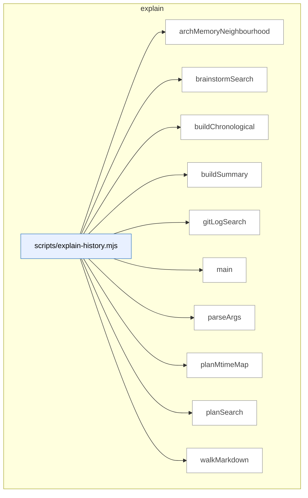

### Symbols in this domain

| Symbol | Kind | Path | Lines | Purpose | File imported by |
|---|---|---|---|---|---|
| [`archMemoryNeighbourhood`](../scripts/explain-history.mjs#L148) | function | `scripts/explain-history.mjs` | 148-184 | Queries arch-memory API for symbols similar to a given intent. | `tests/explain-history.test.mjs` |
| [`brainstormSearch`](../scripts/explain-history.mjs#L237) | function | `scripts/explain-history.mjs` | 237-282 | Searches brainstorm session files for matches in topic or provider responses. | `tests/explain-history.test.mjs` |
| [`buildChronological`](../scripts/explain-history.mjs#L290) | function | `scripts/explain-history.mjs` | 290-305 | Merges git, brainstorm, and plan matches into a reverse-chronological timeline. | `tests/explain-history.test.mjs` |
| [`buildSummary`](../scripts/explain-history.mjs#L319) | function | `scripts/explain-history.mjs` | 319-326 | Constructs a human-readable summary of all search hits across sources. | `tests/explain-history.test.mjs` |
| [`gitLogSearch`](../scripts/explain-history.mjs#L89) | function | `scripts/explain-history.mjs` | 89-140 | Searches git history for commits matching a topic keyword. | `tests/explain-history.test.mjs` |
| [`main`](../scripts/explain-history.mjs#L328) | function | `scripts/explain-history.mjs` | 328-385 | Orchestrates history search across git, arch-memory, plans, and brainstorm. | `tests/explain-history.test.mjs` |
| [`parseArgs`](../scripts/explain-history.mjs#L51) | function | `scripts/explain-history.mjs` | 51-80 | Parses and validates CLI arguments for the explain-history tool. | `tests/explain-history.test.mjs` |
| [`planMtimeMap`](../scripts/explain-history.mjs#L307) | function | `scripts/explain-history.mjs` | 307-317 | Returns a map of plan file modification times. | `tests/explain-history.test.mjs` |
| [`planSearch`](../scripts/explain-history.mjs#L191) | function | `scripts/explain-history.mjs` | 191-218 | Searches plan documents for matching text and returns file location/context. | `tests/explain-history.test.mjs` |
| [`walkMarkdown`](../scripts/explain-history.mjs#L220) | function | `scripts/explain-history.mjs` | 220-228 | Recursively lists all markdown files in a directory. | `tests/explain-history.test.mjs` |

---

## findings

> Persists audit-finding outcomes (fixed/dismissed/severity-adjusted) to JSONL with exponential effectiveness metrics for pass selection; formats findings for review and generates remediation tasks from accepted findings.

```mermaid
flowchart TB
subgraph dom_findings ["findings"]
  file_scripts_lib_findings_format_mjs["scripts/lib/findings-format.mjs"]:::component
  sym_scripts_lib_findings_format_mjs_formatFi["formatFindings"]:::symbol
  file_scripts_lib_findings_format_mjs --> sym_scripts_lib_findings_format_mjs_formatFi
  file_scripts_lib_findings_outcomes_mjs["scripts/lib/findings-outcomes.mjs"]:::component
  sym_scripts_lib_findings_outcomes_mjs_append["appendOutcome"]:::symbol
  file_scripts_lib_findings_outcomes_mjs --> sym_scripts_lib_findings_outcomes_mjs_append
  sym_scripts_lib_findings_outcomes_mjs_batchA["batchAppendOutcomes"]:::symbol
  file_scripts_lib_findings_outcomes_mjs --> sym_scripts_lib_findings_outcomes_mjs_batchA
  sym_scripts_lib_findings_outcomes_mjs_compac["compactOutcomes"]:::symbol
  file_scripts_lib_findings_outcomes_mjs --> sym_scripts_lib_findings_outcomes_mjs_compac
  sym_scripts_lib_findings_outcomes_mjs_comput["computePassEffectiveness"]:::symbol
  file_scripts_lib_findings_outcomes_mjs --> sym_scripts_lib_findings_outcomes_mjs_comput
  sym_scripts_lib_findings_outcomes_mjs_comput["computePassEWR"]:::symbol
  file_scripts_lib_findings_outcomes_mjs --> sym_scripts_lib_findings_outcomes_mjs_comput
  sym_scripts_lib_findings_outcomes_mjs_loadOu["loadOutcomes"]:::symbol
  file_scripts_lib_findings_outcomes_mjs --> sym_scripts_lib_findings_outcomes_mjs_loadOu
  sym_scripts_lib_findings_outcomes_mjs_setRep["setRepoProfileCache"]:::symbol
  file_scripts_lib_findings_outcomes_mjs --> sym_scripts_lib_findings_outcomes_mjs_setRep
  file_scripts_lib_findings_tasks_mjs["scripts/lib/findings-tasks.mjs"]:::component
  sym_scripts_lib_findings_tasks_mjs_createRem["createRemediationTask"]:::symbol
  file_scripts_lib_findings_tasks_mjs --> sym_scripts_lib_findings_tasks_mjs_createRem
  sym_scripts_lib_findings_tasks_mjs_getTaskSt["getTaskStore"]:::symbol
  file_scripts_lib_findings_tasks_mjs --> sym_scripts_lib_findings_tasks_mjs_getTaskSt
  sym_scripts_lib_findings_tasks_mjs_loadTasks["loadTasks"]:::symbol
  file_scripts_lib_findings_tasks_mjs --> sym_scripts_lib_findings_tasks_mjs_loadTasks
  sym_scripts_lib_findings_tasks_mjs_persistTa["persistTask"]:::symbol
  file_scripts_lib_findings_tasks_mjs --> sym_scripts_lib_findings_tasks_mjs_persistTa
  sym_scripts_lib_findings_tasks_mjs_trackEdit["trackEdit"]:::symbol
  file_scripts_lib_findings_tasks_mjs --> sym_scripts_lib_findings_tasks_mjs_trackEdit
  sym_scripts_lib_findings_tasks_mjs_updateTas["updateTask"]:::symbol
  file_scripts_lib_findings_tasks_mjs --> sym_scripts_lib_findings_tasks_mjs_updateTas
  sym_scripts_lib_findings_tasks_mjs_verifyTas["verifyTask"]:::symbol
  file_scripts_lib_findings_tasks_mjs --> sym_scripts_lib_findings_tasks_mjs_verifyTas
  file_scripts_lib_findings_tracker_mjs["scripts/lib/findings-tracker.mjs"]:::component
  sym_scripts_lib_findings_tracker_mjs_applyLa["applyLazyDecay"]:::symbol
  file_scripts_lib_findings_tracker_mjs --> sym_scripts_lib_findings_tracker_mjs_applyLa
  sym_scripts_lib_findings_tracker_mjs_buildPa["buildPatternKey"]:::symbol
  file_scripts_lib_findings_tracker_mjs --> sym_scripts_lib_findings_tracker_mjs_buildPa
  sym_scripts_lib_findings_tracker_mjs_effecti["effectiveSampleSize"]:::symbol
  file_scripts_lib_findings_tracker_mjs --> sym_scripts_lib_findings_tracker_mjs_effecti
  sym_scripts_lib_findings_tracker_mjs_extract["extractDimensions"]:::symbol
  file_scripts_lib_findings_tracker_mjs --> sym_scripts_lib_findings_tracker_mjs_extract
  sym_scripts_lib_findings_tracker_mjs_FalsePo["FalsePositiveTracker"]:::symbol
  file_scripts_lib_findings_tracker_mjs --> sym_scripts_lib_findings_tracker_mjs_FalsePo
  sym_scripts_lib_findings_tracker_mjs_recordW["recordWithDecay"]:::symbol
  file_scripts_lib_findings_tracker_mjs --> sym_scripts_lib_findings_tracker_mjs_recordW
  file_scripts_lib_findings_mjs["scripts/lib/findings.mjs"]:::component
  sym_scripts_lib_findings_mjs_semanticId["semanticId"]:::symbol
  file_scripts_lib_findings_mjs --> sym_scripts_lib_findings_mjs_semanticId
end
classDef container fill:#f5f5f5,stroke:#333,stroke-width:2px,color:#000
classDef component fill:#e8f0ff,stroke:#3178c6,color:#000
classDef symbol fill:#fff,stroke:#999,color:#444
classDef dup fill:#ffe8d8,stroke:#c0392b,stroke-width:2px,color:#000
classDef violation fill:#ffd6d6,stroke:#c0392b,stroke-width:2px,color:#000
```

### Symbols in this domain

| Symbol | Kind | Path | Lines | Purpose | File imported by |
|---|---|---|---|---|---|
| [`formatFindings`](../scripts/lib/findings-format.mjs#L12) | function | `scripts/lib/findings-format.mjs` | 12-33 | Formats audit findings as markdown grouped by severity level. | `scripts/lib/findings.mjs` |
| [`appendOutcome`](../scripts/lib/findings-outcomes.mjs#L38) | function | `scripts/lib/findings-outcomes.mjs` | 38-50 | Appends an outcome record to the audit outcomes log. | `scripts/audit-metrics.mjs`, `scripts/lib/findings.mjs`, `scripts/lib/outcome-sync.mjs` |
| [`batchAppendOutcomes`](../scripts/lib/findings-outcomes.mjs#L58) | function | `scripts/lib/findings-outcomes.mjs` | 58-75 | Atomically batch-appends multiple outcome records to the outcomes log. | `scripts/audit-metrics.mjs`, `scripts/lib/findings.mjs`, `scripts/lib/outcome-sync.mjs` |
| [`compactOutcomes`](../scripts/lib/findings-outcomes.mjs#L100) | function | `scripts/lib/findings-outcomes.mjs` | 100-138 | Prunes stale outcomes from the log and backfills missing timestamps. | `scripts/audit-metrics.mjs`, `scripts/lib/findings.mjs`, `scripts/lib/outcome-sync.mjs` |
| [`computePassEffectiveness`](../scripts/lib/findings-outcomes.mjs#L149) | function | `scripts/lib/findings-outcomes.mjs` | 149-187 | Computes weighted acceptance rate for a pass using exponential time decay. | `scripts/audit-metrics.mjs`, `scripts/lib/findings.mjs`, `scripts/lib/outcome-sync.mjs` |
| [`computePassEWR`](../scripts/lib/findings-outcomes.mjs#L196) | function | `scripts/lib/findings-outcomes.mjs` | 196-216 | Computes exponentially-weighted reward average for a pass. | `scripts/audit-metrics.mjs`, `scripts/lib/findings.mjs`, `scripts/lib/outcome-sync.mjs` |
| [`loadOutcomes`](../scripts/lib/findings-outcomes.mjs#L82) | function | `scripts/lib/findings-outcomes.mjs` | 82-93 | Loads audit outcomes from the log file with timestamp backfill. | `scripts/audit-metrics.mjs`, `scripts/lib/findings.mjs`, `scripts/lib/outcome-sync.mjs` |
| [`setRepoProfileCache`](../scripts/lib/findings-outcomes.mjs#L27) | function | `scripts/lib/findings-outcomes.mjs` | 27-29 | Caches repository profile information for outcome logging. | `scripts/audit-metrics.mjs`, `scripts/lib/findings.mjs`, `scripts/lib/outcome-sync.mjs` |
| [`createRemediationTask`](../scripts/lib/findings-tasks.mjs#L34) | function | `scripts/lib/findings-tasks.mjs` | 34-48 | Creates a remediation task record for an audit finding. | `scripts/lib/findings.mjs` |
| [`getTaskStore`](../scripts/lib/findings-tasks.mjs#L17) | function | `scripts/lib/findings-tasks.mjs` | 17-22 | Returns a singleton append-only store for remediation tasks. | `scripts/lib/findings.mjs` |
| [`loadTasks`](../scripts/lib/findings-tasks.mjs#L75) | function | `scripts/lib/findings-tasks.mjs` | 75-81 | Loads all tasks from storage, optionally filtered by run ID. | `scripts/lib/findings.mjs` |
| [`persistTask`](../scripts/lib/findings-tasks.mjs#L72) | function | `scripts/lib/findings-tasks.mjs` | 72-72 | Persists a task to the task store. | `scripts/lib/findings.mjs` |
| [`trackEdit`](../scripts/lib/findings-tasks.mjs#L53) | function | `scripts/lib/findings-tasks.mjs` | 53-57 | Records an edit to a task and marks it as fixed. | `scripts/lib/findings.mjs` |
| [`updateTask`](../scripts/lib/findings-tasks.mjs#L84) | function | `scripts/lib/findings-tasks.mjs` | 84-87 | Timestamps and persists a task update. | `scripts/lib/findings.mjs` |
| [`verifyTask`](../scripts/lib/findings-tasks.mjs#L62) | function | `scripts/lib/findings-tasks.mjs` | 62-67 | Updates a task's remediation state (verified or regressed) based on test result. | `scripts/lib/findings.mjs` |
| [`applyLazyDecay`](../scripts/lib/findings-tracker.mjs#L29) | function | `scripts/lib/findings-tracker.mjs` | 29-54 | Applies exponential decay to false-positive pattern counts based on elapsed time. | `scripts/lib/findings.mjs`, `scripts/lib/suppression-policy.mjs`, `tests/legacy-audit-smoke.test.mjs`, +2 more |
| [`buildPatternKey`](../scripts/lib/findings-tracker.mjs#L103) | function | `scripts/lib/findings-tracker.mjs` | 103-105 | Builds a composite cache key from finding dimensions. | `scripts/lib/findings.mjs`, `scripts/lib/suppression-policy.mjs`, `tests/legacy-audit-smoke.test.mjs`, +2 more |
| [`effectiveSampleSize`](../scripts/lib/findings-tracker.mjs#L59) | function | `scripts/lib/findings-tracker.mjs` | 59-61 | Returns the sum of decayed accepted and dismissed counts for a pattern. | `scripts/lib/findings.mjs`, `scripts/lib/suppression-policy.mjs`, `tests/legacy-audit-smoke.test.mjs`, +2 more |
| [`extractDimensions`](../scripts/lib/findings-tracker.mjs#L90) | function | `scripts/lib/findings-tracker.mjs` | 90-98 | Extracts normalized dimensions (category, severity, principle, repo, file type) from a finding. | `scripts/lib/findings.mjs`, `scripts/lib/suppression-policy.mjs`, `tests/legacy-audit-smoke.test.mjs`, +2 more |
| [`FalsePositiveTracker`](../scripts/lib/findings-tracker.mjs#L113) | class | `scripts/lib/findings-tracker.mjs` | 113-288 | Tracks false-positive patterns with exponential decay across repo/file scopes. | `scripts/lib/findings.mjs`, `scripts/lib/suppression-policy.mjs`, `tests/legacy-audit-smoke.test.mjs`, +2 more |
| [`recordWithDecay`](../scripts/lib/findings-tracker.mjs#L67) | function | `scripts/lib/findings-tracker.mjs` | 67-83 | Records an outcome (accepted/dismissed) and updates pattern decay. | `scripts/lib/findings.mjs`, `scripts/lib/suppression-policy.mjs`, `tests/legacy-audit-smoke.test.mjs`, +2 more |
| [`semanticId`](../scripts/lib/findings.mjs#L27) | function | `scripts/lib/findings.mjs` | 27-40 | Generates a short content-hash ID for a finding (linter-aware). | `scripts/cross-skill.mjs`, `scripts/evolve-prompts.mjs`, `scripts/gemini-review.mjs`, +18 more |

---

## fit-check

> Detects repository technology stacks, frameworks, test runners, and special tooling (Playwright, Supabase, etc.) by scanning package metadata, filesystem markers, and source annotations to support fit-assessment verdicts and tech-aware skill routing.

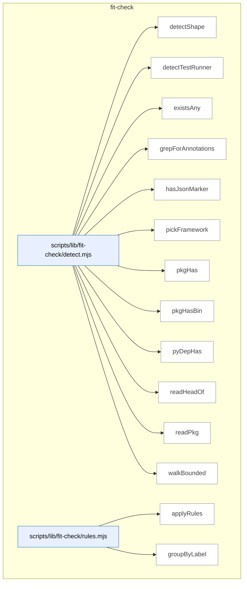

### Symbols in this domain

| Symbol | Kind | Path | Lines | Purpose | File imported by |
|---|---|---|---|---|---|
| [`detectShape`](../scripts/lib/fit-check/detect.mjs#L69) | function | `scripts/lib/fit-check/detect.mjs` | 69-122 | Inspects a repo's stack, framework, and capabilities (UI routes, CLI bins, test runner, Playwright, etc.). | `scripts/skills-fit-check.mjs`, `tests/skills-fit-check.test.mjs` |
| [`detectTestRunner`](../scripts/lib/fit-check/detect.mjs#L187) | function | `scripts/lib/fit-check/detect.mjs` | 187-199 | Identifies the test runner (pytest, vitest, jest, mocha, or node --test). | `scripts/skills-fit-check.mjs`, `tests/skills-fit-check.test.mjs` |
| [`existsAny`](../scripts/lib/fit-check/detect.mjs#L126) | function | `scripts/lib/fit-check/detect.mjs` | 126-128 | Checks if any files from a list exist in a directory. | `scripts/skills-fit-check.mjs`, `tests/skills-fit-check.test.mjs` |
| [`grepForAnnotations`](../scripts/lib/fit-check/detect.mjs#L208) | function | `scripts/lib/fit-check/detect.mjs` | 208-227 | Scans source files for data-engine-claim annotations. | `scripts/skills-fit-check.mjs`, `tests/skills-fit-check.test.mjs` |
| [`hasJsonMarker`](../scripts/lib/fit-check/detect.mjs#L150) | function | `scripts/lib/fit-check/detect.mjs` | 150-157 | Checks if a JSON file contains a value matching a predicate. | `scripts/skills-fit-check.mjs`, `tests/skills-fit-check.test.mjs` |
| [`pickFramework`](../scripts/lib/fit-check/detect.mjs#L180) | function | `scripts/lib/fit-check/detect.mjs` | 180-185 | Determines the web/app framework by running detection rules. | `scripts/skills-fit-check.mjs`, `tests/skills-fit-check.test.mjs` |
| [`pkgHas`](../scripts/lib/fit-check/detect.mjs#L137) | function | `scripts/lib/fit-check/detect.mjs` | 137-142 | Checks if a dependency exists in a project's dependencies. | `scripts/skills-fit-check.mjs`, `tests/skills-fit-check.test.mjs` |
| [`pkgHasBin`](../scripts/lib/fit-check/detect.mjs#L144) | function | `scripts/lib/fit-check/detect.mjs` | 144-148 | Checks if a package.json declares executable binaries. | `scripts/skills-fit-check.mjs`, `tests/skills-fit-check.test.mjs` |
| [`pyDepHas`](../scripts/lib/fit-check/detect.mjs#L159) | function | `scripts/lib/fit-check/detect.mjs` | 159-178 | Checks if a Python dependency appears in pyproject.toml, requirements.txt, or Pipfile. | `scripts/skills-fit-check.mjs`, `tests/skills-fit-check.test.mjs` |
| [`readHeadOf`](../scripts/lib/fit-check/detect.mjs#L256) | function | `scripts/lib/fit-check/detect.mjs` | 256-263 | Reads the first N bytes of a file. | `scripts/skills-fit-check.mjs`, `tests/skills-fit-check.test.mjs` |
| [`readPkg`](../scripts/lib/fit-check/detect.mjs#L130) | function | `scripts/lib/fit-check/detect.mjs` | 130-135 | Reads and parses package.json from a directory. | `scripts/skills-fit-check.mjs`, `tests/skills-fit-check.test.mjs` |
| [`walkBounded`](../scripts/lib/fit-check/detect.mjs#L233) | function | `scripts/lib/fit-check/detect.mjs` | 233-254 | Depth-first traversal of a directory, yielding text files up to a limit. | `scripts/skills-fit-check.mjs`, `tests/skills-fit-check.test.mjs` |
| [`applyRules`](../scripts/lib/fit-check/rules.mjs#L201) | function | `scripts/lib/fit-check/rules.mjs` | 201-206 | Evaluates all skill-fit rules against a repo profile. | `scripts/skills-fit-check.mjs`, `tests/skills-fit-check.test.mjs` |
| [`groupByLabel`](../scripts/lib/fit-check/rules.mjs#L212) | function | `scripts/lib/fit-check/rules.mjs` | 212-218 | Groups skill verdicts by fit label (FITS, PARTIAL, MISMATCH). | `scripts/skills-fit-check.mjs`, `tests/skills-fit-check.test.mjs` |

---

## friction

> Tracks friction memories—recurring pain points and pattern observations—via breadcrumb injection records with TTL-based persistence, cloud sanitization, and repo-scoped retrieval.

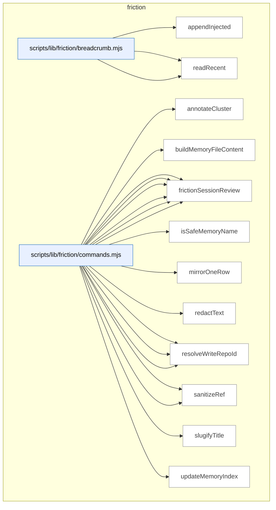

### Symbols in this domain

| Symbol | Kind | Path | Lines | Purpose | File imported by |
|---|---|---|---|---|---|
| [`appendInjected`](../scripts/lib/friction/breadcrumb.mjs#L62) | function | `scripts/lib/friction/breadcrumb.mjs` | 62-88 | Atomically appends a friction memory record to the breadcrumb with TTL pruning. | `scripts/lib/friction/commands.mjs`, `tests/store-friction.test.mjs` |
| [`readLines`](../scripts/lib/friction/breadcrumb.mjs#L36) | function | `scripts/lib/friction/breadcrumb.mjs` | 36-50 | Reads friction memory breadcrumb records from a JSON-lines file. | `scripts/lib/friction/commands.mjs`, `tests/store-friction.test.mjs` |
| [`readRecent`](../scripts/lib/friction/breadcrumb.mjs#L98) | function | `scripts/lib/friction/breadcrumb.mjs` | 98-111 | Retrieves recent friction breadcrumb entries, deduped by memory name. | `scripts/lib/friction/commands.mjs`, `tests/store-friction.test.mjs` |
| [`annotateCluster`](../scripts/lib/friction/commands.mjs#L397) | function | `scripts/lib/friction/commands.mjs` | 397-405 | Enriches a friction cluster with protection status, alarm flag, and rank. | `scripts/cross-skill.mjs`, `tests/friction-cli.test.mjs` |
| [`buildMemoryFileContent`](../scripts/lib/friction/commands.mjs#L211) | function | `scripts/lib/friction/commands.mjs` | 211-231 | Constructs YAML frontmatter and prose for a friction memory file. | `scripts/cross-skill.mjs`, `tests/friction-cli.test.mjs` |
| [`frictionAdd`](../scripts/lib/friction/commands.mjs#L258) | function | `scripts/lib/friction/commands.mjs` | 258-311 | Creates a local friction memory file and optionally mirrors it to cloud. | `scripts/cross-skill.mjs`, `tests/friction-cli.test.mjs` |
| [`frictionDigest`](../scripts/lib/friction/commands.mjs#L374) | function | `scripts/lib/friction/commands.mjs` | 374-394 | Queries cloud friction clusters by recurrence rank and cost weight. | `scripts/cross-skill.mjs`, `tests/friction-cli.test.mjs` |
| [`frictionLink`](../scripts/lib/friction/commands.mjs#L416) | function | `scripts/lib/friction/commands.mjs` | 416-466 | Appends a mitigation reference (commit/doc/test/etc.) to a friction memory. | `scripts/cross-skill.mjs`, `tests/friction-cli.test.mjs` |
| [`frictionMirror`](../scripts/lib/friction/commands.mjs#L321) | function | `scripts/lib/friction/commands.mjs` | 321-365 | Scans local friction memories and upserts changed rows to cloud. | `scripts/cross-skill.mjs`, `tests/friction-cli.test.mjs` |
| [`frictionNeighbourhood`](../scripts/lib/friction/commands.mjs#L513) | function | `scripts/lib/friction/commands.mjs` | 513-546 | Queries similar friction memories by word similarity and injects breadcrumb records. | `scripts/cross-skill.mjs`, `tests/friction-cli.test.mjs` |
| [`frictionSessionReview`](../scripts/lib/friction/commands.mjs#L483) | function | `scripts/lib/friction/commands.mjs` | 483-502 | Lists recently injected friction notes from breadcrumb within a time window. | `scripts/cross-skill.mjs`, `tests/friction-cli.test.mjs` |
| [`isSafeMemoryName`](../scripts/lib/friction/commands.mjs#L167) | function | `scripts/lib/friction/commands.mjs` | 167-169 | Checks if a memory name is a safe single-segment slug. | `scripts/cross-skill.mjs`, `tests/friction-cli.test.mjs` |
| [`mirrorOneRow`](../scripts/lib/friction/commands.mjs#L196) | function | `scripts/lib/friction/commands.mjs` | 196-208 | Sanitizes and upserts a friction memory row to cloud storage. | `scripts/cross-skill.mjs`, `tests/friction-cli.test.mjs` |
| [`redactText`](../scripts/lib/friction/commands.mjs#L48) | function | `scripts/lib/friction/commands.mjs` | 48-48 | Redacts secrets from text. | `scripts/cross-skill.mjs`, `tests/friction-cli.test.mjs` |
| [`resolveDeps`](../scripts/lib/friction/commands.mjs#L51) | function | `scripts/lib/friction/commands.mjs` | 51-69 | Returns a dependency object with all friction command helpers. | `scripts/cross-skill.mjs`, `tests/friction-cli.test.mjs` |
| [`resolveReadRepoId`](../scripts/lib/friction/commands.mjs#L189) | function | `scripts/lib/friction/commands.mjs` | 189-193 | Resolves the repo's database ID for cloud reads. | `scripts/cross-skill.mjs`, `tests/friction-cli.test.mjs` |
| [`resolveWriteRepoId`](../scripts/lib/friction/commands.mjs#L183) | function | `scripts/lib/friction/commands.mjs` | 183-186 | Resolves the repo's database ID for cloud writes. | `scripts/cross-skill.mjs`, `tests/friction-cli.test.mjs` |
| [`sanitizeFrictionQueryInput`](../scripts/lib/friction/commands.mjs#L102) | function | `scripts/lib/friction/commands.mjs` | 102-158 | Validates and redacts friction memory inputs before database write. | `scripts/cross-skill.mjs`, `tests/friction-cli.test.mjs` |
| [`sanitizeRef`](../scripts/lib/friction/commands.mjs#L469) | function | `scripts/lib/friction/commands.mjs` | 469-472 | Redacts secrets from a mitigation reference. | `scripts/cross-skill.mjs`, `tests/friction-cli.test.mjs` |
| [`slugifyTitle`](../scripts/lib/friction/commands.mjs#L172) | function | `scripts/lib/friction/commands.mjs` | 172-180 | Converts a title to a filesystem-safe slug. | `scripts/cross-skill.mjs`, `tests/friction-cli.test.mjs` |
| [`updateMemoryIndex`](../scripts/lib/friction/commands.mjs#L234) | function | `scripts/lib/friction/commands.mjs` | 234-246 | Appends a friction memory pointer to the local MEMORY.md index. | `scripts/cross-skill.mjs`, `tests/friction-cli.test.mjs` |

---

## gate-honesty

> Validates gates (binary skill-level pass/fail assertions) by running oracle adapters that test their actual implementations against declared behavior in gate-contract.json files; reports divergences where the stated logic diverges from enforced code or test definitions.

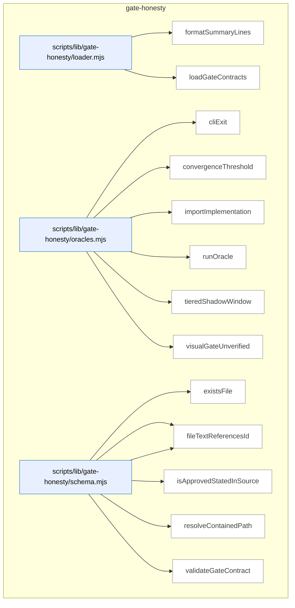

### Symbols in this domain

| Symbol | Kind | Path | Lines | Purpose | File imported by |
|---|---|---|---|---|---|
| [`formatSummaryLines`](../scripts/lib/gate-honesty/loader.mjs#L63) | function | `scripts/lib/gate-honesty/loader.mjs` | 63-86 | Formats gate-honesty check results into human-readable summary lines. | `scripts/check-gate-contracts.mjs`, `tests/gate-honesty.test.mjs` |
| [`loadGateContracts`](../scripts/lib/gate-honesty/loader.mjs#L25) | function | `scripts/lib/gate-honesty/loader.mjs` | 25-53 | Loads and validates gate contracts from all skills. | `scripts/check-gate-contracts.mjs`, `tests/gate-honesty.test.mjs` |
| [`cliExit`](../scripts/lib/gate-honesty/oracles.mjs#L147) | function | `scripts/lib/gate-honesty/oracles.mjs` | 147-167 | Spawns a CLI script in a temporary fixture and asserts expected exit code and stderr output. | `tests/gate-honesty.test.mjs` |
| [`convergenceThreshold`](../scripts/lib/gate-honesty/oracles.mjs#L28) | function | `scripts/lib/gate-honesty/oracles.mjs` | 28-56 | Tests that convergence-threshold constants and evaluation match declared parameters through assertion cases. | `tests/gate-honesty.test.mjs` |
| [`importImplementation`](../scripts/lib/gate-honesty/oracles.mjs#L22) | function | `scripts/lib/gate-honesty/oracles.mjs` | 22-25 | Dynamically imports a gate's implementation module by file path. | `tests/gate-honesty.test.mjs` |
| [`runOracle`](../scripts/lib/gate-honesty/oracles.mjs#L183) | function | `scripts/lib/gate-honesty/oracles.mjs` | 183-191 | Dispatches to a registered oracle adapter and reports exceptions as divergence. | `tests/gate-honesty.test.mjs` |
| [`tieredShadowWindow`](../scripts/lib/gate-honesty/oracles.mjs#L59) | function | `scripts/lib/gate-honesty/oracles.mjs` | 59-97 | Verifies tiered-recall shadow window comparison count filters for complete runs with non-empty eligible populations. | `tests/gate-honesty.test.mjs` |
| [`visualGateUnverified`](../scripts/lib/gate-honesty/oracles.mjs#L100) | function | `scripts/lib/gate-honesty/oracles.mjs` | 100-127 | Tests conditions under which visual audit gates are unverifiable (missing surfaces, degraded integrity, unresolved paths). | `tests/gate-honesty.test.mjs` |
| [`existsFile`](../scripts/lib/gate-honesty/schema.mjs#L186) | function | `scripts/lib/gate-honesty/schema.mjs` | 186-188 | Returns true if the given path exists and is a regular file. | `scripts/lib/gate-honesty/loader.mjs`, `tests/gate-honesty.test.mjs` |
| [`fileTextContains`](../scripts/lib/gate-honesty/schema.mjs#L190) | function | `scripts/lib/gate-honesty/schema.mjs` | 190-192 | Returns true if a file contains a specified substring. | `scripts/lib/gate-honesty/loader.mjs`, `tests/gate-honesty.test.mjs` |
| [`fileTextReferencesId`](../scripts/lib/gate-honesty/schema.mjs#L194) | function | `scripts/lib/gate-honesty/schema.mjs` | 194-196 | Returns true if a file contains a specified ID string. | `scripts/lib/gate-honesty/loader.mjs`, `tests/gate-honesty.test.mjs` |
| [`isApprovedStatedInSource`](../scripts/lib/gate-honesty/schema.mjs#L98) | function | `scripts/lib/gate-honesty/schema.mjs` | 98-101 | Checks whether a stated-in path is `skills/{skill}/SKILL.md` or `AGENTS.md`. | `scripts/lib/gate-honesty/loader.mjs`, `tests/gate-honesty.test.mjs` |
| [`resolveContainedPath`](../scripts/lib/gate-honesty/schema.mjs#L111) | function | `scripts/lib/gate-honesty/schema.mjs` | 111-116 | Resolves a relative path and rejects it if it escapes the repo or fails to resolve. | `scripts/lib/gate-honesty/loader.mjs`, `tests/gate-honesty.test.mjs` |
| [`validateGateContract`](../scripts/lib/gate-honesty/schema.mjs#L129) | function | `scripts/lib/gate-honesty/schema.mjs` | 129-181 | Validates gate-contract JSON schema, duplicate IDs, source locations, and that implementation/test files exist and reference their gate IDs. | `scripts/lib/gate-honesty/loader.mjs`, `tests/gate-honesty.test.mjs` |

---

## install

> Builds skills.manifest.json with per-file content hashes and metadata, verifies freshness against actual skill files, and coordinates manifest-driven syncing to consumer repositories.

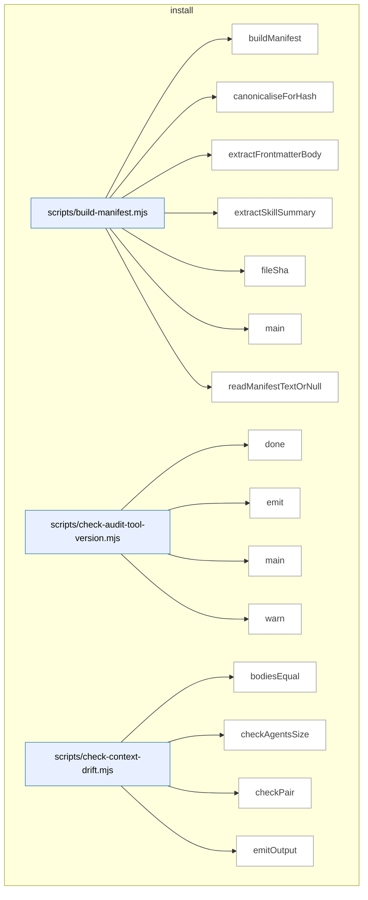

_Domain has 180 symbols (>50). Diagram shows top-15 by file order; see flat table below for the full list._

### Symbols in this domain

| Symbol | Kind | Path | Lines | Purpose | File imported by |
|---|---|---|---|---|---|
| [`buildManifest`](../scripts/build-manifest.mjs#L125) | function | `scripts/build-manifest.mjs` | 125-198 | Generates a skills manifest JSON with per-file hashes, summaries, and an overall bundleVersion. | `tests/skills-artifact-freshness-wiring.test.mjs` |
| [`canonicaliseForHash`](../scripts/build-manifest.mjs#L59) | function | `scripts/build-manifest.mjs` | 59-61 | Normalizes line endings (CRLF→LF) for content before hashing to ensure canonical hashes. | `tests/skills-artifact-freshness-wiring.test.mjs` |
| [`extractFrontmatterBody`](../scripts/build-manifest.mjs#L75) | function | `scripts/build-manifest.mjs` | 75-80 | Extracts YAML frontmatter text from markdown between --- delimiters. | `tests/skills-artifact-freshness-wiring.test.mjs` |
| [`extractSkillSummary`](../scripts/build-manifest.mjs#L90) | function | `scripts/build-manifest.mjs` | 90-120 | Parses the description field from skill SKILL.md frontmatter into a one-line summary. | `tests/skills-artifact-freshness-wiring.test.mjs` |
| [`fileSha`](../scripts/build-manifest.mjs#L66) | function | `scripts/build-manifest.mjs` | 66-69 | Computes a 12-character SHA256 hash of a file's canonicalized content. | `tests/skills-artifact-freshness-wiring.test.mjs` |
| [`main`](../scripts/build-manifest.mjs#L200) | function | `scripts/build-manifest.mjs` | 200-251 | Entry point that builds or verifies the freshness of the committed skills.manifest.json. | `tests/skills-artifact-freshness-wiring.test.mjs` |
| [`readManifestTextOrNull`](../scripts/build-manifest.mjs#L263) | function | `scripts/build-manifest.mjs` | 263-268 | Safely reads the manifest file, returning null if it doesn't exist. | `tests/skills-artifact-freshness-wiring.test.mjs` |
| [`done`](../scripts/check-audit-tool-version.mjs#L49) | function | `scripts/check-audit-tool-version.mjs` | 49-51 | Sets the process exit code. | _(internal)_ |
| [`emit`](../scripts/check-audit-tool-version.mjs#L38) | function | `scripts/check-audit-tool-version.mjs` | 38-40 | Conditionally writes a JSON object to stdout in JSON mode. | _(internal)_ |
| [`main`](../scripts/check-audit-tool-version.mjs#L53) | function | `scripts/check-audit-tool-version.mjs` | 53-142 | Verifies audit-tool version currency by fetching upstream manifest and comparing against local deployment. | _(internal)_ |
| [`warn`](../scripts/check-audit-tool-version.mjs#L42) | function | `scripts/check-audit-tool-version.mjs` | 42-44 | Conditionally writes a message to stderr when not in quiet or JSON mode. | _(internal)_ |
| [`bodiesEqual`](../scripts/check-context-drift.mjs#L182) | function | `scripts/check-context-drift.mjs` | 182-185 | Compares two text-line arrays semantically (ignoring whitespace variations). | `tests/ai-context-management.test.mjs`, `tests/check-context-drift.test.mjs` |
| [`checkAgentsSize`](../scripts/check-context-drift.mjs#L275) | function | `scripts/check-context-drift.mjs` | 275-288 | Flags AGENTS.md if it exceeds the sprawl cap, recommending the progressive-disclosure pattern. | `tests/ai-context-management.test.mjs`, `tests/check-context-drift.test.mjs` |
| [`checkPair`](../scripts/check-context-drift.mjs#L198) | function | `scripts/check-context-drift.mjs` | 198-263 | Audits CLAUDE.md for import presence, allowlist-only h2 headings, and size cap compliance. | `tests/ai-context-management.test.mjs`, `tests/check-context-drift.test.mjs` |
| [`emitOutput`](../scripts/check-context-drift.mjs#L392) | function | `scripts/check-context-drift.mjs` | 392-415 | Formats and emits findings to stdout in text, JSON, or SARIF format. | `tests/ai-context-management.test.mjs`, `tests/check-context-drift.test.mjs` |
| [`extractH2Sections`](../scripts/check-context-drift.mjs#L155) | function | `scripts/check-context-drift.mjs` | 155-176 | Extracts level-2 headings and their body text from markdown content, respecting code fences. | `tests/ai-context-management.test.mjs`, `tests/check-context-drift.test.mjs` |
| [`findPairs`](../scripts/check-context-drift.mjs#L300) | function | `scripts/check-context-drift.mjs` | 300-318 | Groups AGENTS.md and CLAUDE.md files by directory to identify co-located pairs. | `tests/ai-context-management.test.mjs`, `tests/check-context-drift.test.mjs` |
| [`hasAgentsImport`](../scripts/check-context-drift.mjs#L191) | function | `scripts/check-context-drift.mjs` | 191-194 | Checks if content has an @./AGENTS.md or @AGENTS.md import in the first 30 lines. | `tests/ai-context-management.test.mjs`, `tests/check-context-drift.test.mjs` |
| [`hashId`](../scripts/check-context-drift.mjs#L292) | function | `scripts/check-context-drift.mjs` | 292-294 | Generates a 16-char SHA256-based semantic ID from file and key for finding deduplication. | `tests/ai-context-management.test.mjs`, `tests/check-context-drift.test.mjs` |
| [`loadConfig`](../scripts/check-context-drift.mjs#L75) | function | `scripts/check-context-drift.mjs` | 75-108 | Loads Claude-only allowlist config from .claude-context-allowlist.json with sensible defaults. | `tests/ai-context-management.test.mjs`, `tests/check-context-drift.test.mjs` |
| [`main`](../scripts/check-context-drift.mjs#L417) | function | `scripts/check-context-drift.mjs` | 417-428 | Entry point: runs drift check and exits with code reflecting severity (high/medium/none). | `tests/ai-context-management.test.mjs`, `tests/check-context-drift.test.mjs` |
| [`makeFenceTracker`](../scripts/check-context-drift.mjs#L122) | function | `scripts/check-context-drift.mjs` | 122-146 | Returns a closure that tracks whether code lines are inside markdown fences (``` or ~~~). | `tests/ai-context-management.test.mjs`, `tests/check-context-drift.test.mjs` |
| [`parseArgs`](../scripts/check-context-drift.mjs#L353) | function | `scripts/check-context-drift.mjs` | 353-368 | Parses CLI arguments for format (text\|json\|sarif), strict mode, and repo root override. | `tests/ai-context-management.test.mjs`, `tests/check-context-drift.test.mjs` |
| [`runDriftCheck`](../scripts/check-context-drift.mjs#L327) | function | `scripts/check-context-drift.mjs` | 327-349 | Orchestrates the drift-check pipeline: loads config, scans files, checks all pairs, gathers findings. | `tests/ai-context-management.test.mjs`, `tests/check-context-drift.test.mjs` |
| [`showHelp`](../scripts/check-context-drift.mjs#L370) | function | `scripts/check-context-drift.mjs` | 370-390 | Prints help text explaining drift checks, configuration, and command-line options. | `tests/ai-context-management.test.mjs`, `tests/check-context-drift.test.mjs` |
| [`canResolve`](../scripts/check-deps.mjs#L52) | function | `scripts/check-deps.mjs` | 52-60 | Tests whether an npm package can be resolved via require.resolve. | _(internal)_ |
| [`loadEnv`](../scripts/check-deps.mjs#L62) | function | `scripts/check-deps.mjs` | 62-77 | Parses .env file into process.env, skipping comments and lines already in env. | _(internal)_ |
| [`main`](../scripts/check-deps.mjs#L79) | function | `scripts/check-deps.mjs` | 79-173 | Checks required/optional npm packages and environment variables, reports findings. | _(internal)_ |
| [`main`](../scripts/check-docs-placement.mjs#L62) | function | `scripts/check-docs-placement.mjs` | 62-109 | Validates docs/ root contains only allowlisted files (no stray hand-written docs at root). | _(internal)_ |
| [`baselineKey`](../scripts/check-docs-refs.mjs#L234) | function | `scripts/check-docs-refs.mjs` | 234-234 | Creates a unique key from file and target URL for deduplicating baseline findings. | `tests/check-docs-refs.test.mjs` |
| [`classifyRef`](../scripts/check-docs-refs.mjs#L177) | function | `scripts/check-docs-refs.mjs` | 177-194 | Determines whether a doc reference resolves in git index, is planned, broken, or uses path traversal. | `tests/check-docs-refs.test.mjs` |
| [`extractRefs`](../scripts/check-docs-refs.mjs#L141) | function | `scripts/check-docs-refs.mjs` | 141-162 | Scans text for markdown link references, classifies each as placeholder, concrete, or traversal. | `tests/check-docs-refs.test.mjs` |
| [`gitIndexFiles`](../scripts/check-docs-refs.mjs#L511) | function | `scripts/check-docs-refs.mjs` | 511-514 | Returns list of all tracked files in git via git ls-files -z. | `tests/check-docs-refs.test.mjs` |
| [`isExcluded`](../scripts/check-docs-refs.mjs#L375) | function | `scripts/check-docs-refs.mjs` | 375-378 | Tests whether a file path matches any exclusion pattern regex. | `tests/check-docs-refs.test.mjs` |
| [`lintFile`](../scripts/check-docs-refs.mjs#L386) | function | `scripts/check-docs-refs.mjs` | 386-400 | Scans a single file for broken doc references, returns findings with line numbers. | `tests/check-docs-refs.test.mjs` |
| [`main`](../scripts/check-docs-refs.mjs#L520) | function | `scripts/check-docs-refs.mjs` | 520-595 | Entry point for doc-reference validation, outputs summary and findings in text\|json\|sarif format. | `tests/check-docs-refs.test.mjs` |
| [`runCheck`](../scripts/check-docs-refs.mjs#L411) | function | `scripts/check-docs-refs.mjs` | 411-508 | Orchestrates doc-refs validation: discovers files, lints each, gates on symlinks and escapes, gathers findings. | `tests/check-docs-refs.test.mjs` |
| [`scanPolicy`](../scripts/check-docs-refs.mjs#L273) | function | `scripts/check-docs-refs.mjs` | 273-282 | Classifies a file path as text, binary, or unclassified based on extension and basename. | `tests/check-docs-refs.test.mjs` |
| [`main`](../scripts/check-gate-contracts.mjs#L18) | function | `scripts/check-gate-contracts.mjs` | 18-41 | Validates that skills declare gate contracts or are marked uncontracted, rejects divergences. | _(internal)_ |
| [`bucketKeyFor`](../scripts/check-model-freshness.mjs#L84) | function | `scripts/check-model-freshness.mjs` | 84-88 | Extracts tier or model-class bucket (lite/nonlite) from a provider's parsed model ID. | `tests/check-model-freshness.test.mjs` |
| [`detectMissingFromStatic`](../scripts/check-model-freshness.mjs#L188) | function | `scripts/check-model-freshness.mjs` | 188-245 | Identifies live models in provider catalogs that are missing from STATIC_POOL. | `tests/check-model-freshness.test.mjs` |
| [`detectPrematureRemap`](../scripts/check-model-freshness.mjs#L251) | function | `scripts/check-model-freshness.mjs` | 251-276 | Flags DEPRECATED_REMAP entries for models that providers still actively serve (premature retirement). | `tests/check-model-freshness.test.mjs` |
| [`detectSentinelDrift`](../scripts/check-model-freshness.mjs#L109) | function | `scripts/check-model-freshness.mjs` | 109-169 | Finds model sentinels (latest-gpt, latest-pro) where static pool differs from live provider catalog. | `tests/check-model-freshness.test.mjs` |
| [`emitOutput`](../scripts/check-model-freshness.mjs#L378) | function | `scripts/check-model-freshness.mjs` | 378-408 | Formats and emits freshness findings to stdout in text, JSON, or SARIF format. | `tests/check-model-freshness.test.mjs` |
| [`hashId`](../scripts/check-model-freshness.mjs#L280) | function | `scripts/check-model-freshness.mjs` | 280-282 | Generates a 16-char SHA256-based semantic ID for a model freshness finding. | `tests/check-model-freshness.test.mjs` |
| [`main`](../scripts/check-model-freshness.mjs#L410) | function | `scripts/check-model-freshness.mjs` | 410-421 | Entry point for model freshness check, exits with code reflecting provider availability and findings. | `tests/check-model-freshness.test.mjs` |
| [`parseArgs`](../scripts/check-model-freshness.mjs#L334) | function | `scripts/check-model-freshness.mjs` | 334-348 | Parses CLI arguments for format (text\|json\|sarif) and strict mode. | `tests/check-model-freshness.test.mjs` |
| [`runFreshnessCheck`](../scripts/check-model-freshness.mjs#L293) | function | `scripts/check-model-freshness.mjs` | 293-330 | Orchestrates freshness check: fetches live catalogs, compares to static pool, detects drift classes. | `tests/check-model-freshness.test.mjs` |
| [`showHelp`](../scripts/check-model-freshness.mjs#L350) | function | `scripts/check-model-freshness.mjs` | 350-376 | Prints help text for model freshness checker, env requirements, and exit codes. | `tests/check-model-freshness.test.mjs` |
| [`decideRlsExit`](../scripts/check-rls.mjs#L56) | function | `scripts/check-rls.mjs` | 56-59 | Determines exit code based on RLS gate mode (exposed-grants vs no-RLS) and table counts. | `tests/check-rls-gate.test.mjs` |
| [`main`](../scripts/check-rls.mjs#L66) | function | `scripts/check-rls.mjs` | 66-196 | Queries database for RLS-enabled tables, exposed grants to public/authenticated, reports findings. | `tests/check-rls-gate.test.mjs` |
| [`checkAuditApiKeys`](../scripts/check-setup.mjs#L159) | function | `scripts/check-setup.mjs` | 159-202 | Validates that either public profile (OPENAI_API_KEY) or Azure profile (AZURE_OPENAI_API_KEY) is configured. | _(internal)_ |
| [`checkAuditLoop`](../scripts/check-setup.mjs#L267) | function | `scripts/check-setup.mjs` | 267-271 | Verifies Audit-Loop environment variables and database configuration. | _(internal)_ |
| [`checkAuditSupabase`](../scripts/check-setup.mjs#L204) | function | `scripts/check-setup.mjs` | 204-265 | Validates AUDIT_DB_URL reachability and presence of required audit_loop database tables. | _(internal)_ |
| [`checkConsistencyMode`](../scripts/check-setup.mjs#L431) | function | `scripts/check-setup.mjs` | 431-477 | Verifies consistency-mode adoption with manifest file and canary definitions. | _(internal)_ |
| [`checkPersonaTest`](../scripts/check-setup.mjs#L275) | function | `scripts/check-setup.mjs` | 275-323 | Validates Persona-Test setup including repo name and shared Postgres database tables. | _(internal)_ |
| [`checkPlaywrightAvailable`](../scripts/check-setup.mjs#L411) | function | `scripts/check-setup.mjs` | 411-429 | Probes for Playwright installation and Chromium browser binary availability. | _(internal)_ |
| [`checkTables`](../scripts/check-setup.mjs#L70) | function | `scripts/check-setup.mjs` | 70-80 | Queries database to check existence of required audit_loop tables. | _(internal)_ |
| [`injectResolvedDbEnv`](../scripts/check-setup.mjs#L500) | function | `scripts/check-setup.mjs` | 500-511 | Resolves and injects resolved database connection environment variables. | _(internal)_ |
| [`loadEnv`](../scripts/check-setup.mjs#L47) | function | `scripts/check-setup.mjs` | 47-62 | Parses .env file into a local map (not global process.env). | _(internal)_ |
| [`main`](../scripts/check-setup.mjs#L513) | function | `scripts/check-setup.mjs` | 513-527 | CLI entry point that orchestrates all setup checks and outputs a report. | _(internal)_ |
| [`printJsonReport`](../scripts/check-setup.mjs#L386) | function | `scripts/check-setup.mjs` | 386-396 | Serializes the report to JSON and writes it to stdout. | _(internal)_ |
| [`printReport`](../scripts/check-setup.mjs#L354) | function | `scripts/check-setup.mjs` | 354-384 | Outputs a formatted text report of all check sections with colored status icons. | _(internal)_ |
| [`Report`](../scripts/check-setup.mjs#L120) | class | `scripts/check-setup.mjs` | 120-155 | Data structure that accumulates report sections and items with pass/fail/warn/info/fix statuses. | _(internal)_ |
| [`statusIcon`](../scripts/check-setup.mjs#L330) | function | `scripts/check-setup.mjs` | 330-339 | Returns a colored terminal icon for a status string (PASS/FAIL/WARN/INFO/FIX). | _(internal)_ |
| [`verdictLine`](../scripts/check-setup.mjs#L341) | function | `scripts/check-setup.mjs` | 341-352 | Formats a colored verdict line summarizing the count of failures and warnings. | _(internal)_ |
| [`listSkills`](../scripts/check-skill-refs.mjs#L30) | function | `scripts/check-skill-refs.mjs` | 30-36 | Lists all skill directory names sorted. | _(internal)_ |
| [`main`](../scripts/check-skill-refs.mjs#L38) | function | `scripts/check-skill-refs.mjs` | 38-74 | Runs linting on one or all skills and reports pass/fail results. | _(internal)_ |
| [`main`](../scripts/check-skill-updates.mjs#L25) | function | `scripts/check-skill-updates.mjs` | 25-131 | Detects drift in synced skill files by comparing manifests and local copies. | _(internal)_ |
| [`parseArgs`](../scripts/check-skill-updates.mjs#L16) | function | `scripts/check-skill-updates.mjs` | 16-23 | Parses --json, --no-cache, and --target CLI arguments. | _(internal)_ |
| [`compareSkillSurfaces`](../scripts/check-stale-skill-surface.mjs#L72) | function | `scripts/check-stale-skill-surface.mjs` | 72-91 | Detects shadowed (duplicate) and orphaned skills when comparing stale vs live surfaces. | `tests/stale-skill-surface.test.mjs` |
| [`decideStaleSurfaceExit`](../scripts/check-stale-skill-surface.mjs#L101) | function | `scripts/check-stale-skill-surface.mjs` | 101-104 | Returns exit code based on whether shadowed skills were detected. | `tests/stale-skill-surface.test.mjs` |
| [`listSkillDirs`](../scripts/check-stale-skill-surface.mjs#L45) | function | `scripts/check-stale-skill-surface.mjs` | 45-52 | Lists skill directory names in a specified surface (repo or global). | `tests/stale-skill-surface.test.mjs` |
| [`main`](../scripts/check-stale-skill-surface.mjs#L106) | function | `scripts/check-stale-skill-surface.mjs` | 106-170 | Detects and reports stale skill-surface files that shadow the live version. | `tests/stale-skill-surface.test.mjs` |
| [`readSkillMd`](../scripts/check-stale-skill-surface.mjs#L54) | function | `scripts/check-stale-skill-surface.mjs` | 54-57 | Reads a skill's SKILL.md file from a given surface. | `tests/stale-skill-surface.test.mjs` |
| [`checkSync`](../scripts/check-sync.mjs#L25) | function | `scripts/check-sync.mjs` | 25-153 | Validates Postgres connection, repo registration, and audit-run history for cloud sync readiness. | _(internal)_ |
| [`fail`](../scripts/check-sync.mjs#L20) | function | `scripts/check-sync.mjs` | 20-20 | Logs a failed check. | _(internal)_ |
| [`finish`](../scripts/check-sync.mjs#L155) | function | `scripts/check-sync.mjs` | 155-178 | Outputs the final sync check report in terminal or JSON format based on mode. | _(internal)_ |
| [`info`](../scripts/check-sync.mjs#L21) | function | `scripts/check-sync.mjs` | 21-21 | Logs an informational message. | _(internal)_ |
| [`log`](../scripts/check-sync.mjs#L17) | function | `scripts/check-sync.mjs` | 17-17 | Logs a message only when not in JSON output mode. | _(internal)_ |
| [`pass`](../scripts/check-sync.mjs#L19) | function | `scripts/check-sync.mjs` | 19-19 | Logs a passed check. | _(internal)_ |
| [`authoritativeScopesFor`](../scripts/install-skills.mjs#L369) | function | `scripts/install-skills.mjs` | 369-373 | Returns the set of storage scopes (global, repo) affected by a given surface type. | `tests/install/receipt-scope-seam.test.mjs` |
| [`buildCopilotMergeWrite`](../scripts/install-skills.mjs#L291) | function | `scripts/install-skills.mjs` | 291-304 | Builds the merged copilot-instructions.md write operation combining SKILL.md blocks. | `tests/install/receipt-scope-seam.test.mjs` |
| [`buildSkillWrites`](../scripts/install-skills.mjs#L259) | function | `scripts/install-skills.mjs` | 259-289 | Builds the file writes and managed-file records for one skill across all target surfaces. | `tests/install/receipt-scope-seam.test.mjs` |
| [`checkConflicts`](../scripts/install-skills.mjs#L393) | function | `scripts/install-skills.mjs` | 393-405 | Detects conflicting file writes between repo and global scopes, applying force override. | `tests/install/receipt-scope-seam.test.mjs` |
| [`computeDeletes`](../scripts/install-skills.mjs#L342) | function | `scripts/install-skills.mjs` | 342-362 | Computes which previously-installed files should be deleted based on current scope and filters. | `tests/install/receipt-scope-seam.test.mjs` |
| [`expandSkillFiles`](../scripts/install-skills.mjs#L127) | function | `scripts/install-skills.mjs` | 127-133 | Expands a skill's metadata entry into a list of file entries with optional back-compat fallback. | `tests/install/receipt-scope-seam.test.mjs` |
| [`fileShaShort`](../scripts/install-skills.mjs#L135) | function | `scripts/install-skills.mjs` | 135-137 | Computes a 12-character SHA256 hash of a buffer for integrity checking. | `tests/install/receipt-scope-seam.test.mjs` |
| [`loadManifest`](../scripts/install-skills.mjs#L97) | function | `scripts/install-skills.mjs` | 97-120 | Reads and validates the skills manifest JSON, checking schema version compatibility. | `tests/install/receipt-scope-seam.test.mjs` |
| [`main`](../scripts/install-skills.mjs#L431) | function | `scripts/install-skills.mjs` | 431-565 | Main orchestrator; loads manifest, builds writes, reconciles journals, checks conflicts, writes receipts. | `tests/install/receipt-scope-seam.test.mjs` |
| [`maybeWarnGithubSkillsDeprecation`](../scripts/install-skills.mjs#L243) | function | `scripts/install-skills.mjs` | 243-257 | Warns if stale .github/skills/ files exist and would shadow the fresh .claude/skills/ install. | `tests/install/receipt-scope-seam.test.mjs` |
| [`parseArgs`](../scripts/install-skills.mjs#L57) | function | `scripts/install-skills.mjs` | 57-91 | Parses command-line flags (--local, --remote, --skills, --force, --dry-run, --target, etc.). | `tests/install/receipt-scope-seam.test.mjs` |
| [`printBanner`](../scripts/install-skills.mjs#L154) | function | `scripts/install-skills.mjs` | 154-162 | Prints the installer banner with mode, surface, target repo, and flags. | `tests/install/receipt-scope-seam.test.mjs` |
| [`reconcileJournals`](../scripts/install-skills.mjs#L175) | function | `scripts/install-skills.mjs` | 175-210 | Scans journal files to recover from incomplete installations, aborting if recovery fails. | `tests/install/receipt-scope-seam.test.mjs` |
| [`reportDegradations`](../scripts/install-skills.mjs#L223) | function | `scripts/install-skills.mjs` | 223-241 | Logs degradation warnings for fsync failures and unsupported filesystem operations. | `tests/install/receipt-scope-seam.test.mjs` |
| [`retainUnmanagedEntries`](../scripts/install-skills.mjs#L382) | function | `scripts/install-skills.mjs` | 382-391 | Filters managed files to retain only those outside the current install scope. | `tests/install/receipt-scope-seam.test.mjs` |
| [`validateTarget`](../scripts/install-skills.mjs#L141) | function | `scripts/install-skills.mjs` | 141-152 | Validates the target directory is a git repo or Node.js project. | `tests/install/receipt-scope-seam.test.mjs` |
| [`writeReceiptsByScope`](../scripts/install-skills.mjs#L407) | function | `scripts/install-skills.mjs` | 407-429 | Writes separate installation receipts for repo and global scopes when they have changes or history. | `tests/install/receipt-scope-seam.test.mjs` |
| [`computeFileSha`](../scripts/lib/install/conflict-detector.mjs#L13) | function | `scripts/lib/install/conflict-detector.mjs` | 13-20 | Returns the first 12 hex characters of a file's SHA256 hash, or null if unreadable. | `scripts/check-skill-updates.mjs`, `scripts/install-skills.mjs`, `tests/install/conflict-detector.test.mjs`, +1 more |
| [`detectConflicts`](../scripts/lib/install/conflict-detector.mjs#L30) | function | `scripts/lib/install/conflict-detector.mjs` | 30-78 | Identifies planned file writes that would conflict with existing files, checking a receipt for local modifications. | `scripts/check-skill-updates.mjs`, `scripts/install-skills.mjs`, `tests/install/conflict-detector.test.mjs`, +1 more |
| [`detectDrift`](../scripts/lib/install/conflict-detector.mjs#L86) | function | `scripts/lib/install/conflict-detector.mjs` | 86-105 | Compares managed files' SHA hashes against their current disk state and reports missing/matched/drifted status. | `scripts/check-skill-updates.mjs`, `scripts/install-skills.mjs`, `tests/install/conflict-detector.test.mjs`, +1 more |
| [`generateAllPromptFiles`](../scripts/lib/install/copilot-prompts.mjs#L214) | function | `scripts/lib/install/copilot-prompts.mjs` | 214-245 | Generates Copilot prompt files for all registered skills in the skills directory. | `scripts/regenerate-skill-copies.mjs`, `tests/ai-context-management.test.mjs`, `tests/copilot-prompts.test.mjs` |
| [`generatePromptFile`](../scripts/lib/install/copilot-prompts.mjs#L165) | function | `scripts/lib/install/copilot-prompts.mjs` | 165-203 | Creates a Copilot prompt file for a skill from its description and CLI invocation instructions. | `scripts/regenerate-skill-copies.mjs`, `tests/ai-context-management.test.mjs`, `tests/copilot-prompts.test.mjs` |
| [`parseSkillFrontmatter`](../scripts/lib/install/copilot-prompts.mjs#L125) | function | `scripts/lib/install/copilot-prompts.mjs` | 125-154 | Extracts name and description from YAML frontmatter in SKILL.md, supporting inline and block-scalar description forms. | `scripts/regenerate-skill-copies.mjs`, `tests/ai-context-management.test.mjs`, `tests/copilot-prompts.test.mjs` |
| [`shaOfManagedBlock`](../scripts/lib/install/copilot-prompts.mjs#L255) | function | `scripts/lib/install/copilot-prompts.mjs` | 255-263 | Extracts text between START_MARKER and END_MARKER and returns its first-16-chars SHA256 hash, or null if markers absent. | `scripts/regenerate-skill-copies.mjs`, `tests/ai-context-management.test.mjs`, `tests/copilot-prompts.test.mjs` |
| [`yamlQuote`](../scripts/lib/install/copilot-prompts.mjs#L114) | function | `scripts/lib/install/copilot-prompts.mjs` | 114-116 | Escapes a string for YAML double-quoted values by escaping backslashes and quotes. | `scripts/regenerate-skill-copies.mjs`, `tests/ai-context-management.test.mjs`, `tests/copilot-prompts.test.mjs` |
| [`ensureAuditDeps`](../scripts/lib/install/deps.mjs#L89) | function | `scripts/lib/install/deps.mjs` | 89-151 | Installs missing audit-loop dependencies via npm with dry-run and quiet options. | `scripts/install-skills.mjs`, `scripts/sync-to-repos.mjs` |
| [`findMissingDeps`](../scripts/lib/install/deps.mjs#L58) | function | `scripts/lib/install/deps.mjs` | 58-70 | Checks which required and optional audit-loop dependencies are missing from node_modules. | `scripts/install-skills.mjs`, `scripts/sync-to-repos.mjs` |
| [`checkAuditGitignore`](../scripts/lib/install/gitignore.mjs#L292) | function | `scripts/lib/install/gitignore.mjs` | 292-316 | Reads .gitignore and reports which required audit-loop patterns are present or missing. | `scripts/check-skill-updates.mjs`, `scripts/install-skills.mjs`, `tests/install-gitignore-coverage.test.mjs`, +1 more |
| [`ensureAuditGitignore`](../scripts/lib/install/gitignore.mjs#L237) | function | `scripts/lib/install/gitignore.mjs` | 237-283 | Adds missing audit-loop patterns to .gitignore, creating the file if necessary. | `scripts/check-skill-updates.mjs`, `scripts/install-skills.mjs`, `tests/install-gitignore-coverage.test.mjs`, +1 more |
| [`hasPattern`](../scripts/lib/install/gitignore.mjs#L157) | function | `scripts/lib/install/gitignore.mjs` | 157-166 | Checks whether a .gitignore contains a specific pattern, preserving leading space significance. | `scripts/check-skill-updates.mjs`, `scripts/install-skills.mjs`, `tests/install-gitignore-coverage.test.mjs`, +1 more |
| [`isCoveredByIgnoredDirectory`](../scripts/lib/install/gitignore.mjs#L198) | function | `scripts/lib/install/gitignore.mjs` | 198-210 | Returns true if a pattern is already covered by a directory-level ignore rule. | `scripts/check-skill-updates.mjs`, `scripts/install-skills.mjs`, `tests/install-gitignore-coverage.test.mjs`, +1 more |
| [`isPatternSatisfied`](../scripts/lib/install/gitignore.mjs#L221) | function | `scripts/lib/install/gitignore.mjs` | 221-223 | Returns true if a pattern is present in .gitignore or covered by an ignored directory. | `scripts/check-skill-updates.mjs`, `scripts/install-skills.mjs`, `tests/install-gitignore-coverage.test.mjs`, +1 more |
| [`requiredPatternsFor`](../scripts/lib/install/gitignore.mjs#L131) | function | `scripts/lib/install/gitignore.mjs` | 131-136 | Returns .gitignore patterns required for a repo (source vs consumer repos differ). | `scripts/check-skill-updates.mjs`, `scripts/install-skills.mjs`, `tests/install-gitignore-coverage.test.mjs`, +1 more |
| [`extractBlock`](../scripts/lib/install/merge.mjs#L74) | function | `scripts/lib/install/merge.mjs` | 74-80 | Extracts and returns text between START_MARKER and END_MARKER, or null if not found. | `scripts/install-skills.mjs`, `tests/install/merge.test.mjs` |
| [`mergeBlock`](../scripts/lib/install/merge.mjs#L46) | function | `scripts/lib/install/merge.mjs` | 46-65 | Replaces content between markers in a file, or appends the block if markers absent. | `scripts/install-skills.mjs`, `tests/install/merge.test.mjs` |
| [`buildReceipt`](../scripts/lib/install/receipt.mjs#L45) | function | `scripts/lib/install/receipt.mjs` | 45-54 | Creates an install receipt object with bundle version, timestamp, source URL, and managed files. | `scripts/check-skill-updates.mjs`, `scripts/install-skills.mjs`, `tests/install/receipt-scope-seam.test.mjs`, +1 more |
| [`readReceipt`](../scripts/lib/install/receipt.mjs#L13) | function | `scripts/lib/install/receipt.mjs` | 13-24 | Reads and parses an install receipt JSON file, returning parsed result or error message. | `scripts/check-skill-updates.mjs`, `scripts/install-skills.mjs`, `tests/install/receipt-scope-seam.test.mjs`, +1 more |
| [`writeReceipt`](../scripts/lib/install/receipt.mjs#L31) | function | `scripts/lib/install/receipt.mjs` | 31-34 | Validates and atomically writes an install receipt JSON file. | `scripts/check-skill-updates.mjs`, `scripts/install-skills.mjs`, `tests/install/receipt-scope-seam.test.mjs`, +1 more |
| [`findRepoRoot`](../scripts/lib/install/surface-paths.mjs#L14) | function | `scripts/lib/install/surface-paths.mjs` | 14-37 | Walks up the directory tree to find the outermost .git, falling back to the first package.json. | `scripts/check-skill-updates.mjs`, `scripts/install-skills.mjs`, `scripts/lib/install/transaction.mjs`, +4 more |
| [`globalJournalPath`](../scripts/lib/install/surface-paths.mjs#L72) | function | `scripts/lib/install/surface-paths.mjs` | 72-74 | Returns the path to the global install journal file in the home directory. | `scripts/check-skill-updates.mjs`, `scripts/install-skills.mjs`, `scripts/lib/install/transaction.mjs`, +4 more |
| [`globalQuarantineDir`](../scripts/lib/install/surface-paths.mjs#L85) | function | `scripts/lib/install/surface-paths.mjs` | 85-87 | Returns the path to the global quarantine directory for install recovery. | `scripts/check-skill-updates.mjs`, `scripts/install-skills.mjs`, `scripts/lib/install/transaction.mjs`, +4 more |
| [`globalSurfaceRoot`](../scripts/lib/install/surface-paths.mjs#L51) | function | `scripts/lib/install/surface-paths.mjs` | 51-53 | Returns the path to the global skills directory (~/.claude/skills). | `scripts/check-skill-updates.mjs`, `scripts/install-skills.mjs`, `scripts/lib/install/transaction.mjs`, +4 more |
| [`managedFileAbsPath`](../scripts/lib/install/surface-paths.mjs#L193) | function | `scripts/lib/install/surface-paths.mjs` | 193-195 | Converts a managed file entry to its absolute filesystem path based on scope. | `scripts/check-skill-updates.mjs`, `scripts/install-skills.mjs`, `scripts/lib/install/transaction.mjs`, +4 more |
| [`partitionManagedFilesByScope`](../scripts/lib/install/surface-paths.mjs#L204) | function | `scripts/lib/install/surface-paths.mjs` | 204-212 | Splits a managed-files array into separate global and repo-scoped lists. | `scripts/check-skill-updates.mjs`, `scripts/install-skills.mjs`, `scripts/lib/install/transaction.mjs`, +4 more |
| [`receiptPath`](../scripts/lib/install/surface-paths.mjs#L169) | function | `scripts/lib/install/surface-paths.mjs` | 169-174 | Returns the install receipt file path for a given scope (global or repo). | `scripts/check-skill-updates.mjs`, `scripts/install-skills.mjs`, `scripts/lib/install/transaction.mjs`, +4 more |
| [`repoQuarantineDir`](../scripts/lib/install/surface-paths.mjs#L95) | function | `scripts/lib/install/surface-paths.mjs` | 95-97 | Returns the path to the repo-level quarantine directory for install recovery. | `scripts/check-skill-updates.mjs`, `scripts/install-skills.mjs`, `scripts/lib/install/transaction.mjs`, +4 more |
| [`resolveSkillFiles`](../scripts/lib/install/surface-paths.mjs#L138) | function | `scripts/lib/install/surface-paths.mjs` | 138-153 | Expands skill files across multiple target surfaces and directories. | `scripts/check-skill-updates.mjs`, `scripts/install-skills.mjs`, `scripts/lib/install/transaction.mjs`, +4 more |
| [`resolveSkillTargets`](../scripts/lib/install/surface-paths.mjs#L106) | function | `scripts/lib/install/surface-paths.mjs` | 106-125 | Maps a skill name and surface type to install target directories (claude global, copilot repo, agents repo). | `scripts/check-skill-updates.mjs`, `scripts/install-skills.mjs`, `scripts/lib/install/transaction.mjs`, +4 more |
| [`anchorFor`](../scripts/lib/install/transaction.mjs#L274) | function | `scripts/lib/install/transaction.mjs` | 274-282 | Returns metadata (scope, journal path, quarantine directory) for install transactions based on scope. | `scripts/install-skills.mjs`, `tests/install/global-journal-placement.test.mjs`, `tests/install/lifecycle.test.mjs`, +2 more |
| [`anchorForJournal`](../scripts/lib/install/transaction.mjs#L288) | function | `scripts/lib/install/transaction.mjs` | 288-292 | Returns scope (global/repo) and quarantine directory based on journal location. | `scripts/install-skills.mjs`, `tests/install/global-journal-placement.test.mjs`, `tests/install/lifecycle.test.mjs`, +2 more |
| [`attemptDelete`](../scripts/lib/install/transaction.mjs#L526) | function | `scripts/lib/install/transaction.mjs` | 526-545 | Attempts to delete a file from disk, optionally verifying its SHA hasn't changed since last install. | `scripts/install-skills.mjs`, `tests/install/global-journal-placement.test.mjs`, `tests/install/lifecycle.test.mjs`, +2 more |
| [`cleanupJournal`](../scripts/lib/install/transaction.mjs#L742) | function | `scripts/lib/install/transaction.mjs` | 742-745 | Deletes the journal file after a transaction completes successfully. | `scripts/install-skills.mjs`, `tests/install/global-journal-placement.test.mjs`, `tests/install/lifecycle.test.mjs`, +2 more |
| [`defaultJournalPath`](../scripts/lib/install/transaction.mjs#L880) | function | `scripts/lib/install/transaction.mjs` | 880-882 | Returns the default journal file path (`.audit-loop-install-txn.json` in cwd). | `scripts/install-skills.mjs`, `tests/install/global-journal-placement.test.mjs`, `tests/install/lifecycle.test.mjs`, +2 more |
| [`executeTransaction`](../scripts/lib/install/transaction.mjs#L558) | function | `scripts/lib/install/transaction.mjs` | 558-718 | Orchestrates the full transaction: locks, stages writes, applies renames, executes deletes, journals, rolls back on failure. | `scripts/install-skills.mjs`, `tests/install/global-journal-placement.test.mjs`, `tests/install/lifecycle.test.mjs`, +2 more |
| [`findUnresolvedQuarantine`](../scripts/lib/install/transaction.mjs#L449) | function | `scripts/lib/install/transaction.mjs` | 449-457 | Scans directory/directories for leftover quarantined journal files matching a basename pattern. | `scripts/install-skills.mjs`, `tests/install/global-journal-placement.test.mjs`, `tests/install/lifecycle.test.mjs`, +2 more |
| [`fsyncDir`](../scripts/lib/install/transaction.mjs#L162) | function | `scripts/lib/install/transaction.mjs` | 162-179 | Opens a directory and fsyncs it (Unix only), returning ok or degraded status. | `scripts/install-skills.mjs`, `tests/install/global-journal-placement.test.mjs`, `tests/install/lifecycle.test.mjs`, +2 more |
| [`fsyncFile`](../scripts/lib/install/transaction.mjs#L123) | function | `scripts/lib/install/transaction.mjs` | 123-134 | Calls fsync on a file descriptor, handling errors gracefully or throwing if critical. | `scripts/install-skills.mjs`, `tests/install/global-journal-placement.test.mjs`, `tests/install/lifecycle.test.mjs`, +2 more |
| [`globalSurfaceLockPath`](../scripts/lib/install/transaction.mjs#L398) | function | `scripts/lib/install/transaction.mjs` | 398-400 | Returns the filesystem path to the global surface install lock file. | `scripts/install-skills.mjs`, `tests/install/global-journal-placement.test.mjs`, `tests/install/lifecycle.test.mjs`, +2 more |
| [`isWithinAllowedRoots`](../scripts/lib/install/transaction.mjs#L202) | function | `scripts/lib/install/transaction.mjs` | 202-228 | Checks whether a target path (resolving symlinks and missing components) lies within allowed root directories. | `scripts/install-skills.mjs`, `tests/install/global-journal-placement.test.mjs`, `tests/install/lifecycle.test.mjs`, +2 more |
| [`journalBody`](../scripts/lib/install/transaction.mjs#L505) | function | `scripts/lib/install/transaction.mjs` | 505-517 | Constructs the core transaction journal payload (origin, timestamps, staged/delete entries). | `scripts/install-skills.mjs`, `tests/install/global-journal-placement.test.mjs`, `tests/install/lifecycle.test.mjs`, +2 more |
| [`quarantineJournal`](../scripts/lib/install/transaction.mjs#L414) | function | `scripts/lib/install/transaction.mjs` | 414-434 | Backs up an invalid journal to a timestamped quarantine location and deletes the original. | `scripts/install-skills.mjs`, `tests/install/global-journal-placement.test.mjs`, `tests/install/lifecycle.test.mjs`, +2 more |
| [`recoverFromJournal`](../scripts/lib/install/transaction.mjs#L759) | function | `scripts/lib/install/transaction.mjs` | 759-878 | Reads a persisted journal and either rolls forward incomplete writes or rolls back staged changes. | `scripts/install-skills.mjs`, `tests/install/global-journal-placement.test.mjs`, `tests/install/lifecycle.test.mjs`, +2 more |
| [`rollbackPartialTransaction`](../scripts/lib/install/transaction.mjs#L720) | function | `scripts/lib/install/transaction.mjs` | 720-740 | Reverts a partially-completed transaction by restoring snapshots and cleaning up temp files. | `scripts/install-skills.mjs`, `tests/install/global-journal-placement.test.mjs`, `tests/install/lifecycle.test.mjs`, +2 more |
| [`sameRoot`](../scripts/lib/install/transaction.mjs#L299) | function | `scripts/lib/install/transaction.mjs` | 299-306 | Normalizes and compares two filesystem paths for equality, accounting for symlinks and case sensitivity. | `scripts/install-skills.mjs`, `tests/install/global-journal-placement.test.mjs`, `tests/install/lifecycle.test.mjs`, +2 more |
| [`shaShort`](../scripts/lib/install/transaction.mjs#L105) | function | `scripts/lib/install/transaction.mjs` | 105-107 | Returns the first 12 hex characters of a buffer's SHA256 hash. | `scripts/install-skills.mjs`, `tests/install/global-journal-placement.test.mjs`, `tests/install/lifecycle.test.mjs`, +2 more |
| [`tmpSuffix`](../scripts/lib/install/transaction.mjs#L100) | function | `scripts/lib/install/transaction.mjs` | 100-103 | Generates a unique temporary-file suffix using process ID, timestamp, and random hex. | `scripts/install-skills.mjs`, `tests/install/global-journal-placement.test.mjs`, `tests/install/lifecycle.test.mjs`, +2 more |
| [`touchesGlobalSurface`](../scripts/lib/install/transaction.mjs#L255) | function | `scripts/lib/install/transaction.mjs` | 255-258 | Returns true if any write or delete operation targets the global skills surface directory. | `scripts/install-skills.mjs`, `tests/install/global-journal-placement.test.mjs`, `tests/install/lifecycle.test.mjs`, +2 more |
| [`validateJournal`](../scripts/lib/install/transaction.mjs#L357) | function | `scripts/lib/install/transaction.mjs` | 357-384 | Validates a journal JSON against schema and structural invariants (tmpPath format, escape checks). | `scripts/install-skills.mjs`, `tests/install/global-journal-placement.test.mjs`, `tests/install/lifecycle.test.mjs`, +2 more |
| [`writeJournal`](../scripts/lib/install/transaction.mjs#L467) | function | `scripts/lib/install/transaction.mjs` | 467-503 | Atomically writes a journal object to disk with fsync durability and returns degradation warnings. | `scripts/install-skills.mjs`, `tests/install/global-journal-placement.test.mjs`, `tests/install/lifecycle.test.mjs`, +2 more |
| [`computeVerdict`](../scripts/regenerate-skill-copies.mjs#L196) | function | `scripts/regenerate-skill-copies.mjs` | 196-200 | Determines verdict (VIOLATIONS, CHANGES, or IN SYNC) based on sync statistics. | _(internal)_ |
| [`copyFileIfChanged`](../scripts/regenerate-skill-copies.mjs#L76) | function | `scripts/regenerate-skill-copies.mjs` | 76-88 | Copies a file only if its content differs from the destination. | _(internal)_ |
| [`emitVerdict`](../scripts/regenerate-skill-copies.mjs#L202) | function | `scripts/regenerate-skill-copies.mjs` | 202-214 | Prints the final verdict summary and exits with appropriate code. | _(internal)_ |
| [`loadSkillsOrDie`](../scripts/regenerate-skill-copies.mjs#L63) | function | `scripts/regenerate-skill-copies.mjs` | 63-74 | Loads skill directory names from source, exiting if none found. | _(internal)_ |
| [`main`](../scripts/regenerate-skill-copies.mjs#L216) | function | `scripts/regenerate-skill-copies.mjs` | 216-244 | Orchestrates skill and prompt file synchronization across source and destination directories. | _(internal)_ |
| [`pruneFilesNotInSource`](../scripts/regenerate-skill-copies.mjs#L90) | function | `scripts/regenerate-skill-copies.mjs` | 90-105 | Deletes files in a destination directory that don't exist in the source set. | _(internal)_ |
| [`pruneOrphanSkillDirs`](../scripts/regenerate-skill-copies.mjs#L130) | function | `scripts/regenerate-skill-copies.mjs` | 130-146 | Removes skill directories from destinations that no longer exist in source. | _(internal)_ |
| [`pruneStalePrompts`](../scripts/regenerate-skill-copies.mjs#L168) | function | `scripts/regenerate-skill-copies.mjs` | 168-186 | Deletes managed prompt files that are not in the expected set. | _(internal)_ |
| [`syncCopilotPrompts`](../scripts/regenerate-skill-copies.mjs#L188) | function | `scripts/regenerate-skill-copies.mjs` | 188-194 | Generates and syncs all Copilot prompt files to `.github/prompts/`, pruning stale ones. | _(internal)_ |
| [`syncSkillToDests`](../scripts/regenerate-skill-copies.mjs#L107) | function | `scripts/regenerate-skill-copies.mjs` | 107-128 | Syncs a skill from source to multiple destinations, copying changed files and pruning orphans. | _(internal)_ |
| [`warnGithubSkillsDeprecation`](../scripts/regenerate-skill-copies.mjs#L51) | function | `scripts/regenerate-skill-copies.mjs` | 51-61 | Warns that `.github/skills/` is deprecated and no longer regenerated by this script. | _(internal)_ |
| [`writePromptFiles`](../scripts/regenerate-skill-copies.mjs#L148) | function | `scripts/regenerate-skill-copies.mjs` | 148-166 | Writes prompt files to disk, tracking which were written or unchanged. | _(internal)_ |
| [`confirm`](../scripts/setup-permissions.mjs#L119) | function | `scripts/setup-permissions.mjs` | 119-128 | Interactively prompts the user for yes/no confirmation via readline, respecting an AUTO_YES flag. | _(internal)_ |
| [`main`](../scripts/setup-permissions.mjs#L183) | function | `scripts/setup-permissions.mjs` | 183-280 | Orchestrates permission setup by merging rules into both project and user Claude settings files. | _(internal)_ |
| [`mergeRules`](../scripts/setup-permissions.mjs#L134) | function | `scripts/setup-permissions.mjs` | 134-179 | Merges new permission rules into Claude settings, deduplicates them, and removes rules subsumed by wildcards. | _(internal)_ |
| [`readJson`](../scripts/setup-permissions.mjs#L106) | function | `scripts/setup-permissions.mjs` | 106-112 | Safely reads and parses a JSON file, returning null on any error. | _(internal)_ |
| [`writeJson`](../scripts/setup-permissions.mjs#L114) | function | `scripts/setup-permissions.mjs` | 114-117 | Writes JSON data to a file with pretty-printing, creating parent directories if needed. | _(internal)_ |
| [`buildCopilotPromptFiles`](../scripts/sync-to-repos.mjs#L539) | function | `scripts/sync-to-repos.mjs` | 539-547 | Collects all .prompt.md files from GitHub prompts directory for syncing. | `tests/sync-shared-env-trigger.test.mjs` |
| [`buildFileUniverse`](../scripts/sync-to-repos.mjs#L437) | function | `scripts/sync-to-repos.mjs` | 437-454 | Walks the repo to build a set of all source files (scripts/ and .claude/) for import-graph analysis. | `tests/sync-shared-env-trigger.test.mjs` |
| [`buildSkillFiles`](../scripts/sync-to-repos.mjs#L500) | function | `scripts/sync-to-repos.mjs` | 500-512 | Enumerates skill files from the source directory and formats them for sync destinations. | `tests/sync-shared-env-trigger.test.mjs` |
| [`bundleForRepo`](../scripts/sync-to-repos.mjs#L569) | function | `scripts/sync-to-repos.mjs` | 569-576 | Resolves a bundle of files for syncing to a specific consumer repository. | `tests/sync-shared-env-trigger.test.mjs` |
| [`deepMerge`](../scripts/sync-to-repos.mjs#L616) | function | `scripts/sync-to-repos.mjs` | 616-627 | Recursively merges source object into target, preserving nested structures. | `tests/sync-shared-env-trigger.test.mjs` |
| [`main`](../scripts/sync-to-repos.mjs#L631) | function | `scripts/sync-to-repos.mjs` | 631-1256 | Syncs audit-loop tooling from source to consumer repositories with diff and status reporting. | `tests/sync-shared-env-trigger.test.mjs` |
| [`maybePromptSharedCloudUpdate`](../scripts/sync-to-repos.mjs#L1258) | function | `scripts/sync-to-repos.mjs` | 1258-1289 | Prompts and updates shared cloud configuration for the source repository if needed. | `tests/sync-shared-env-trigger.test.mjs` |
| [`readSource`](../scripts/sync-to-repos.mjs#L457) | function | `scripts/sync-to-repos.mjs` | 457-460 | Reads a file from SOURCE_ROOT with fallback to null on error. | `tests/sync-shared-env-trigger.test.mjs` |
| [`realMissingDeps`](../scripts/sync-to-repos.mjs#L484) | function | `scripts/sync-to-repos.mjs` | 484-489 | Filters unresolved imports to only local relative paths without special characters. | `tests/sync-shared-env-trigger.test.mjs` |
| [`resolveBundle`](../scripts/sync-to-repos.mjs#L469) | function | `scripts/sync-to-repos.mjs` | 469-474 | Computes the full transitive import closure of entry points to determine what files to sync. | `tests/sync-shared-env-trigger.test.mjs` |
| [`sha256`](../scripts/sync-to-repos.mjs#L585) | function | `scripts/sync-to-repos.mjs` | 585-592 | Computes SHA256 hash of a file, returning null on read failure. | `tests/sync-shared-env-trigger.test.mjs` |
| [`syncMigrations`](../scripts/sync-to-repos.mjs#L337) | function | `scripts/sync-to-repos.mjs` | 337-347 | Lists all Supabase migration SQL files for syncing to consumer repos. | `tests/sync-shared-env-trigger.test.mjs` |
| [`unifiedDiff`](../scripts/sync-to-repos.mjs#L594) | function | `scripts/sync-to-repos.mjs` | 594-607 | Generates a unified diff between two files using git diff --no-index. | `tests/sync-shared-env-trigger.test.mjs` |

---

## learning-store

> Adaptive prompt-variant selection via Thompson Sampling bandits, bucketed by repo context size and language; computes rewards from adjudication outcomes (severity-weighted by persona), samples learned posteriors to guide next-round prompt choices.

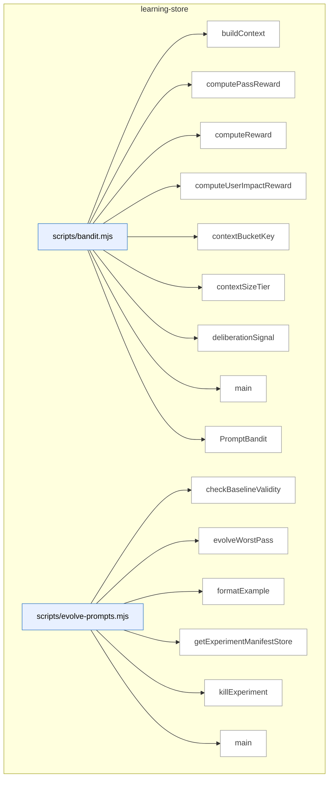

_Domain has 89 symbols (>50). Diagram shows top-15 by file order; see flat table below for the full list._

### Symbols in this domain

| Symbol | Kind | Path | Lines | Purpose | File imported by |
|---|---|---|---|---|---|
| [`buildContext`](../scripts/bandit.mjs#L29) | function | `scripts/bandit.mjs` | 29-35 | Constructs a Thompson-sampling context object (size tier, language) from repository profile. | `scripts/evolve-prompts.mjs`, `scripts/gemini-review.mjs`, `scripts/lib/audit/legacy-production-audit.mjs`, +7 more |
| [`computePassReward`](../scripts/bandit.mjs#L442) | function | `scripts/bandit.mjs` | 442-448 | Computes pass-level reward as the average of linked finding rewards. | `scripts/evolve-prompts.mjs`, `scripts/gemini-review.mjs`, `scripts/lib/audit/legacy-production-audit.mjs`, +7 more |
| [`computeReward`](../scripts/bandit.mjs#L342) | function | `scripts/bandit.mjs` | 342-380 | Calculates bandit reward signal from adjudication rulings and user-impact correlation with optional persona weighting. | `scripts/evolve-prompts.mjs`, `scripts/gemini-review.mjs`, `scripts/lib/audit/legacy-production-audit.mjs`, +7 more |
| [`computeUserImpactReward`](../scripts/bandit.mjs#L391) | function | `scripts/bandit.mjs` | 391-411 | Scores user-impact correlation (confirmed hit, severity accuracy, FP) weighted by persona severity. | `scripts/evolve-prompts.mjs`, `scripts/gemini-review.mjs`, `scripts/lib/audit/legacy-production-audit.mjs`, +7 more |
| [`contextBucketKey`](../scripts/bandit.mjs#L44) | function | `scripts/bandit.mjs` | 44-46 | Generates a context bucket key combining size tier and dominant language. | `scripts/evolve-prompts.mjs`, `scripts/gemini-review.mjs`, `scripts/lib/audit/legacy-production-audit.mjs`, +7 more |
| [`contextSizeTier`](../scripts/bandit.mjs#L37) | function | `scripts/bandit.mjs` | 37-42 | Classifies repository size into small/medium/large/xlarge tiers by character count. | `scripts/evolve-prompts.mjs`, `scripts/gemini-review.mjs`, `scripts/lib/audit/legacy-production-audit.mjs`, +7 more |
| [`deliberationSignal`](../scripts/bandit.mjs#L418) | function | `scripts/bandit.mjs` | 418-435 | Assigns deliberation-quality signal based on challenge-sustain patterns and ruling rationale depth. | `scripts/evolve-prompts.mjs`, `scripts/gemini-review.mjs`, `scripts/lib/audit/legacy-production-audit.mjs`, +7 more |
| [`main`](../scripts/bandit.mjs#L452) | function | `scripts/bandit.mjs` | 452-486 | CLI entry point to register prompt variant arms or display Thompson-sampling statistics. | `scripts/evolve-prompts.mjs`, `scripts/gemini-review.mjs`, `scripts/lib/audit/legacy-production-audit.mjs`, +7 more |
| [`PromptBandit`](../scripts/bandit.mjs#L50) | class | `scripts/bandit.mjs` | 50-325 | Thompson-sampling bandit that learns which prompt variants perform best per context bucket and selects arms probabilistically. | `scripts/evolve-prompts.mjs`, `scripts/gemini-review.mjs`, `scripts/lib/audit/legacy-production-audit.mjs`, +7 more |
| [`checkBaselineValidity`](../scripts/evolve-prompts.mjs#L341) | function | `scripts/evolve-prompts.mjs` | 341-349 | Marks an experiment as stale if its parent baseline is no longer active. | `tests/evolve.test.mjs` |
| [`evolveWorstPass`](../scripts/evolve-prompts.mjs#L93) | function | `scripts/evolve-prompts.mjs` | 93-235 | Finds the worst-performing pass and creates a variant experiment to evolve its prompt. | `tests/evolve.test.mjs` |
| [`formatExample`](../scripts/evolve-prompts.mjs#L337) | function | `scripts/evolve-prompts.mjs` | 337-339 | Formats an outcome record as a compact text summary line. | `tests/evolve.test.mjs` |
| [`getExperimentManifestStore`](../scripts/evolve-prompts.mjs#L65) | function | `scripts/evolve-prompts.mjs` | 65-67 | Creates a file-based store for experiment manifests keyed by ID. | `tests/evolve.test.mjs` |
| [`killExperiment`](../scripts/evolve-prompts.mjs#L307) | function | `scripts/evolve-prompts.mjs` | 307-318 | Abandons a variant revision and marks the experiment as killed. | `tests/evolve.test.mjs` |
| [`main`](../scripts/evolve-prompts.mjs#L374) | function | `scripts/evolve-prompts.mjs` | 374-469 | Routes commands (evolve/review/kill/show-stats) to manage prompt experiments. | `tests/evolve.test.mjs` |
| [`promoteExperiment`](../scripts/evolve-prompts.mjs#L290) | function | `scripts/evolve-prompts.mjs` | 290-302 | Promotes a variant revision as the active prompt and records the promotion. | `tests/evolve.test.mjs` |
| [`reconcileOrphanedExperiments`](../scripts/evolve-prompts.mjs#L354) | function | `scripts/evolve-prompts.mjs` | 354-370 | Scans for incomplete experiment manifests and performs cleanup. | `tests/evolve.test.mjs` |
| [`reviewExperiments`](../scripts/evolve-prompts.mjs#L240) | function | `scripts/evolve-prompts.mjs` | 240-285 | Reviews active experiments and recommends promotions or kills for converged ones. | `tests/evolve.test.mjs` |
| [`showStats`](../scripts/evolve-prompts.mjs#L323) | function | `scripts/evolve-prompts.mjs` | 323-333 | Returns pass performance stats, active experiments, and bandit arm statistics. | `tests/evolve.test.mjs` |
| [`buildAuthorTierObservation`](../scripts/lib/learning/author-tier-observation.mjs#L188) | function | `scripts/lib/learning/author-tier-observation.mjs` | 188-232 | Constructs a learning decision record for author-tier observation with signals and choice. | `scripts/lib/audit/legacy-production-audit.mjs`, `scripts/openai-audit.mjs`, `tests/model-tier-observation.test.mjs` |
| [`deriveSignals`](../scripts/lib/learning/author-tier-observation.mjs#L93) | function | `scripts/lib/learning/author-tier-observation.mjs` | 93-121 | Extracts decision signals from changed files, domains, and diff size (floorTouch, mechanicalOnly, etc.). | `scripts/lib/audit/legacy-production-audit.mjs`, `scripts/openai-audit.mjs`, `tests/model-tier-observation.test.mjs` |
| [`diffBucket`](../scripts/lib/learning/author-tier-observation.mjs#L68) | function | `scripts/lib/learning/author-tier-observation.mjs` | 68-71 | Categorizes a diff line count into a size bucket (s, m, l, xl). | `scripts/lib/audit/legacy-production-audit.mjs`, `scripts/openai-audit.mjs`, `tests/model-tier-observation.test.mjs` |
| [`normalizeTierHint`](../scripts/lib/learning/author-tier-observation.mjs#L141) | function | `scripts/lib/learning/author-tier-observation.mjs` | 141-145 | Converts an author-tier hint (logical name or model ID) to a canonical tier name. | `scripts/lib/audit/legacy-production-audit.mjs`, `scripts/openai-audit.mjs`, `tests/model-tier-observation.test.mjs` |
| [`suggestTier`](../scripts/lib/learning/author-tier-observation.mjs#L128) | function | `scripts/lib/learning/author-tier-observation.mjs` | 128-133 | Recommends an author model tier (economy/standard/frontier) based on observed signals. | `scripts/lib/audit/legacy-production-audit.mjs`, `scripts/openai-audit.mjs`, `tests/model-tier-observation.test.mjs` |
| [`betaPosterior`](../scripts/lib/learning/beta-posterior.mjs#L38) | function | `scripts/lib/learning/beta-posterior.mjs` | 38-61 | Computes Beta distribution posterior statistics (mean, variance, confidence interval) from observations. | `scripts/lib/learning/quickfix-stats.mjs`, `tests/learning-beta-posterior.test.mjs` |
| [`sampleGamma`](../scripts/lib/learning/beta-posterior.mjs#L136) | function | `scripts/lib/learning/beta-posterior.mjs` | 136-159 | Samples from a Gamma distribution using the Marsaglia & Tsang algorithm with shape boost for shape < 1. | `scripts/lib/learning/quickfix-stats.mjs`, `tests/learning-beta-posterior.test.mjs` |
| [`standardNormal`](../scripts/lib/learning/beta-posterior.mjs#L162) | function | `scripts/lib/learning/beta-posterior.mjs` | 162-168 | Generates a standard normal random variate using the Box-Muller transform. | `scripts/lib/learning/quickfix-stats.mjs`, `tests/learning-beta-posterior.test.mjs` |
| [`thompsonSample`](../scripts/lib/learning/beta-posterior.mjs#L74) | function | `scripts/lib/learning/beta-posterior.mjs` | 74-94 | Draws a random sample from a Beta posterior using the Marsaglia & Tsang gamma sampler. | `scripts/lib/learning/quickfix-stats.mjs`, `tests/learning-beta-posterior.test.mjs` |
| [`updatePosterior`](../scripts/lib/learning/beta-posterior.mjs#L108) | function | `scripts/lib/learning/beta-posterior.mjs` | 108-127 | Updates a Beta posterior with a new binary observation (success=1 or failure=0). | `scripts/lib/learning/quickfix-stats.mjs`, `tests/learning-beta-posterior.test.mjs` |
| [`hasEnoughSamples`](../scripts/lib/learning/cold-start.mjs#L17) | function | `scripts/lib/learning/cold-start.mjs` | 17-21 | Boolean check whether total observations meet or exceed a threshold. | `tests/learning-cold-start.test.mjs` |
| [`withFallback`](../scripts/lib/learning/cold-start.mjs#L36) | function | `scripts/lib/learning/cold-start.mjs` | 36-40 | Calls a predict function if samples suffice; otherwise calls a fallback function. | `tests/learning-cold-start.test.mjs` |
| [`_canonicalise`](../scripts/lib/learning/decision-logger.mjs#L183) | function | `scripts/lib/learning/decision-logger.mjs` | 183-190 | Recursively deep-copies and sorts object keys for deterministic stringification. | `scripts/lib/audit/legacy-production-audit.mjs`, `scripts/lib/neighbourhood-query.mjs`, `scripts/openai-audit.mjs`, +4 more |
| [`_getStateForTest`](../scripts/lib/learning/decision-logger.mjs#L532) | function | `scripts/lib/learning/decision-logger.mjs` | 532-539 | <no body> | `scripts/lib/audit/legacy-production-audit.mjs`, `scripts/lib/neighbourhood-query.mjs`, `scripts/openai-audit.mjs`, +4 more |
| [`_isKeyInt`](../scripts/lib/learning/decision-logger.mjs#L51) | function | `scripts/lib/learning/decision-logger.mjs` | 51-51 | Validates a value is a non-negative safe integer. | `scripts/lib/audit/legacy-production-audit.mjs`, `scripts/lib/neighbourhood-query.mjs`, `scripts/openai-audit.mjs`, +4 more |
| [`_isNonEmptyString`](../scripts/lib/learning/decision-logger.mjs#L50) | function | `scripts/lib/learning/decision-logger.mjs` | 50-50 | Validates a value is a non-empty string without colons. | `scripts/lib/audit/legacy-production-audit.mjs`, `scripts/lib/neighbourhood-query.mjs`, `scripts/openai-audit.mjs`, +4 more |
| [`_resetForTest`](../scripts/lib/learning/decision-logger.mjs#L521) | function | `scripts/lib/learning/decision-logger.mjs` | 521-527 | <no body> | `scripts/lib/audit/legacy-production-audit.mjs`, `scripts/lib/neighbourhood-query.mjs`, `scripts/openai-audit.mjs`, +4 more |
| [`backfillOutcome`](../scripts/lib/learning/decision-logger.mjs#L263) | function | `scripts/lib/learning/decision-logger.mjs` | 263-295 | Updates a decision's outcome in the queue, or enqueues an outcome-only update if not already queued. | `scripts/lib/audit/legacy-production-audit.mjs`, `scripts/lib/neighbourhood-query.mjs`, `scripts/openai-audit.mjs`, +4 more |
| [`buildDecisionKey`](../scripts/lib/learning/decision-logger.mjs#L156) | function | `scripts/lib/learning/decision-logger.mjs` | 156-171 | Constructs a deterministic key from audit-run or external ID plus decision type and sequence. | `scripts/lib/audit/legacy-production-audit.mjs`, `scripts/lib/neighbourhood-query.mjs`, `scripts/openai-audit.mjs`, +4 more |
| [`bumpDropped`](../scripts/lib/learning/decision-logger.mjs#L90) | function | `scripts/lib/learning/decision-logger.mjs` | 90-92 | Increments the dropped-count counter for a decision type. | `scripts/lib/audit/legacy-production-audit.mjs`, `scripts/lib/neighbourhood-query.mjs`, `scripts/openai-audit.mjs`, +4 more |
| [`canonicaliseContext`](../scripts/lib/learning/decision-logger.mjs#L192) | function | `scripts/lib/learning/decision-logger.mjs` | 192-194 | Produces a JSON string of a context object with canonicalized key order. | `scripts/lib/audit/legacy-production-audit.mjs`, `scripts/lib/neighbourhood-query.mjs`, `scripts/openai-audit.mjs`, +4 more |
| [`contextHash`](../scripts/lib/learning/decision-logger.mjs#L196) | function | `scripts/lib/learning/decision-logger.mjs` | 196-198 | Computes the SHA256 hash of a canonicalized context string. | `scripts/lib/audit/legacy-production-audit.mjs`, `scripts/lib/neighbourhood-query.mjs`, `scripts/openai-audit.mjs`, +4 more |
| [`DecisionLoggerError`](../scripts/lib/learning/decision-logger.mjs#L109) | class | `scripts/lib/learning/decision-logger.mjs` | 109-111 | Custom error class for decision logger exceptions with a code field. | `scripts/lib/audit/legacy-production-audit.mjs`, `scripts/lib/neighbourhood-query.mjs`, `scripts/openai-audit.mjs`, +4 more |
| [`drain`](../scripts/lib/learning/decision-logger.mjs#L482) | function | `scripts/lib/learning/decision-logger.mjs` | 482-492 | Initiates a single async flush of all decision queues, preventing concurrent concurrent drains. | `scripts/lib/audit/legacy-production-audit.mjs`, `scripts/lib/neighbourhood-query.mjs`, `scripts/openai-audit.mjs`, +4 more |
| [`flush`](../scripts/lib/learning/decision-logger.mjs#L308) | function | `scripts/lib/learning/decision-logger.mjs` | 308-377 | Drains queued decisions to cloud or local outbox with two-phase write tracking and per-entry persistence state. | `scripts/lib/audit/legacy-production-audit.mjs`, `scripts/lib/neighbourhood-query.mjs`, `scripts/openai-audit.mjs`, +4 more |
| [`getQueue`](../scripts/lib/learning/decision-logger.mjs#L84) | function | `scripts/lib/learning/decision-logger.mjs` | 84-88 | Retrieves or lazily creates a decision queue for a given decision type. | `scripts/lib/audit/legacy-production-audit.mjs`, `scripts/lib/neighbourhood-query.mjs`, `scripts/openai-audit.mjs`, +4 more |
| [`installLifecycleHooks`](../scripts/lib/learning/decision-logger.mjs#L494) | function | `scripts/lib/learning/decision-logger.mjs` | 494-516 | Registers beforeExit and SIGINT handlers to flush decision queues before process termination. | `scripts/lib/audit/legacy-production-audit.mjs`, `scripts/lib/neighbourhood-query.mjs`, `scripts/openai-audit.mjs`, +4 more |
| [`isCiEnv`](../scripts/lib/learning/decision-logger.mjs#L59) | function | `scripts/lib/learning/decision-logger.mjs` | 59-61 | Detects if running in a CI environment (GitHub Actions or generic CI). | `scripts/lib/audit/legacy-production-audit.mjs`, `scripts/lib/neighbourhood-query.mjs`, `scripts/openai-audit.mjs`, +4 more |
| [`reconcileOutbox`](../scripts/lib/learning/decision-logger.mjs#L388) | function | `scripts/lib/learning/decision-logger.mjs` | 388-413 | Reconciles pending decision files from outbox directory by retrying cloud writes and removing successful entries. | `scripts/lib/audit/legacy-production-audit.mjs`, `scripts/lib/neighbourhood-query.mjs`, `scripts/openai-audit.mjs`, +4 more |
| [`recordDecision`](../scripts/lib/learning/decision-logger.mjs#L218) | function | `scripts/lib/learning/decision-logger.mjs` | 218-252 | Queues a learning decision entry, enforcing per-type queue caps and returning the decision key. | `scripts/lib/audit/legacy-production-audit.mjs`, `scripts/lib/neighbourhood-query.mjs`, `scripts/openai-audit.mjs`, +4 more |
| [`resolveQueueCap`](../scripts/lib/learning/decision-logger.mjs#L27) | function | `scripts/lib/learning/decision-logger.mjs` | 27-38 | Parses LEARNING_QUEUE_CAP_PER_TYPE env var with validation and fallback to default. | `scripts/lib/audit/legacy-production-audit.mjs`, `scripts/lib/neighbourhood-query.mjs`, `scripts/openai-audit.mjs`, +4 more |
| [`retryWithBackoff`](../scripts/lib/learning/decision-logger.mjs#L435) | function | `scripts/lib/learning/decision-logger.mjs` | 435-452 | Executes a function with exponential backoff retry (3 attempts in CI, 1 attempt locally). | `scripts/lib/audit/legacy-production-audit.mjs`, `scripts/lib/neighbourhood-query.mjs`, `scripts/openai-audit.mjs`, +4 more |
| [`throttledWarn`](../scripts/lib/learning/decision-logger.mjs#L94) | function | `scripts/lib/learning/decision-logger.mjs` | 94-101 | Emits a stderr warning at most once per throttle interval per key. | `scripts/lib/audit/legacy-production-audit.mjs`, `scripts/lib/neighbourhood-query.mjs`, `scripts/openai-audit.mjs`, +4 more |
| [`tryWrite`](../scripts/lib/learning/decision-logger.mjs#L417) | function | `scripts/lib/learning/decision-logger.mjs` | 417-433 | Attempts to write a decision entry to cloud storage or enqueues to outbox on failure, with CI sync-retry logic. | `scripts/lib/audit/legacy-production-audit.mjs`, `scripts/lib/neighbourhood-query.mjs`, `scripts/openai-audit.mjs`, +4 more |
| [`validateInput`](../scripts/lib/learning/decision-logger.mjs#L113) | function | `scripts/lib/learning/decision-logger.mjs` | 113-148 | Validates a decision-logger input object against required fields and schema constraints. | `scripts/lib/audit/legacy-production-audit.mjs`, `scripts/lib/neighbourhood-query.mjs`, `scripts/openai-audit.mjs`, +4 more |
| [`writeOutbox`](../scripts/lib/learning/decision-logger.mjs#L454) | function | `scripts/lib/learning/decision-logger.mjs` | 454-465 | Atomically writes a decision entry to the outbox directory using a hash-prefixed filename. | `scripts/lib/audit/legacy-production-audit.mjs`, `scripts/lib/neighbourhood-query.mjs`, `scripts/openai-audit.mjs`, +4 more |
| [`aggregateDecisions`](../scripts/lib/learning/quickfix-stats.mjs#L199) | function | `scripts/lib/learning/quickfix-stats.mjs` | 199-224 | Aggregates decision outcomes into Beta posterior acceptance rates per quickfix pattern. | `scripts/cross-skill.mjs`, `scripts/learning/backfill-outcomes.mjs`, `tests/learning-quickfix-stats.test.mjs` |
| [`cliMain`](../scripts/lib/learning/quickfix-stats.mjs#L277) | function | `scripts/lib/learning/quickfix-stats.mjs` | 277-330 | Parses CLI arguments and executes quickfix stats operations (rebuild, stats, reset, report formatting). | `scripts/cross-skill.mjs`, `scripts/learning/backfill-outcomes.mjs`, `tests/learning-quickfix-stats.test.mjs` |
| [`computeWatermark`](../scripts/lib/learning/quickfix-stats.mjs#L226) | function | `scripts/lib/learning/quickfix-stats.mjs` | 226-233 | Extracts maximum outcome timestamp and total row count from decisions for cache watermark. | `scripts/cross-skill.mjs`, `scripts/learning/backfill-outcomes.mjs`, `tests/learning-quickfix-stats.test.mjs` |
| [`loadStats`](../scripts/lib/learning/quickfix-stats.mjs#L54) | function | `scripts/lib/learning/quickfix-stats.mjs` | 54-64 | Loads cached quickfix pattern statistics from disk, returning empty stats on missing or corrupt cache. | `scripts/cross-skill.mjs`, `scripts/learning/backfill-outcomes.mjs`, `tests/learning-quickfix-stats.test.mjs` |
| [`readQuickfixDecisions`](../scripts/lib/learning/quickfix-stats.mjs#L240) | function | `scripts/lib/learning/quickfix-stats.mjs` | 240-258 | Fetches quickfix decision records from learning store with pagination support and fallback. | `scripts/cross-skill.mjs`, `scripts/learning/backfill-outcomes.mjs`, `tests/learning-quickfix-stats.test.mjs` |
| [`rebuildFromBootstrap`](../scripts/lib/learning/quickfix-stats.mjs#L139) | function | `scripts/lib/learning/quickfix-stats.mjs` | 139-183 | Rebuilds quickfix statistics from bootstrap JSONL file when cloud is unavailable, synthesizing neutral outcomes. | `scripts/cross-skill.mjs`, `scripts/learning/backfill-outcomes.mjs`, `tests/learning-quickfix-stats.test.mjs` |
| [`rebuildFromCloud`](../scripts/lib/learning/quickfix-stats.mjs#L97) | function | `scripts/lib/learning/quickfix-stats.mjs` | 97-122 | Rebuilds quickfix pattern statistics from cloud learning store and writes cached result. | `scripts/cross-skill.mjs`, `scripts/learning/backfill-outcomes.mjs`, `tests/learning-quickfix-stats.test.mjs` |
| [`shouldSkipPattern`](../scripts/lib/learning/quickfix-stats.mjs#L77) | function | `scripts/lib/learning/quickfix-stats.mjs` | 77-83 | Determines if a quickfix pattern should be skipped based on acceptance rate and minimum hit count. | `scripts/cross-skill.mjs`, `scripts/learning/backfill-outcomes.mjs`, `tests/learning-quickfix-stats.test.mjs` |
| [`writeAtomic`](../scripts/lib/learning/quickfix-stats.mjs#L264) | function | `scripts/lib/learning/quickfix-stats.mjs` | 264-266 | Wrapper delegating to atomic file write for cache persistence. | `scripts/cross-skill.mjs`, `scripts/learning/backfill-outcomes.mjs`, `tests/learning-quickfix-stats.test.mjs` |
| [`archMemoryBandReward`](../scripts/lib/learning/replay.mjs#L292) | function | `scripts/lib/learning/replay.mjs` | 292-301 | Scores architectural-memory band recommendations (reuse/extend) against actual correction outcomes. | `scripts/learning/replay.mjs`, `tests/learning-replay.test.mjs` |
| [`convergencePredictReward`](../scripts/lib/learning/replay.mjs#L269) | function | `scripts/lib/learning/replay.mjs` | 269-284 | Scores whether to continue or stop auditing based on actual convergence round vs chosen round. | `scripts/learning/replay.mjs`, `tests/learning-replay.test.mjs` |
| [`distSummary`](../scripts/lib/learning/replay.mjs#L154) | function | `scripts/lib/learning/replay.mjs` | 154-163 | Computes mean, median, 90th percentile, and sum statistics from a reward value array. | `scripts/learning/replay.mjs`, `tests/learning-replay.test.mjs` |
| [`emptyDist`](../scripts/lib/learning/replay.mjs#L165) | function | `scripts/lib/learning/replay.mjs` | 165-165 | Returns a zero-initialized reward distribution summary object. | `scripts/learning/replay.mjs`, `tests/learning-replay.test.mjs` |
| [`historicalBaseline`](../scripts/lib/learning/replay.mjs#L228) | function | `scripts/lib/learning/replay.mjs` | 228-228 | Returns the previously-chosen decision from a replay row as baseline comparison. | `scripts/learning/replay.mjs`, `tests/learning-replay.test.mjs` |
| [`neutralBaseline`](../scripts/lib/learning/replay.mjs#L231) | function | `scripts/lib/learning/replay.mjs` | 231-231 | Returns a neutral baseline choice for policy comparison. | `scripts/learning/replay.mjs`, `tests/learning-replay.test.mjs` |
| [`passSelectionReward`](../scripts/lib/learning/replay.mjs#L250) | function | `scripts/lib/learning/replay.mjs` | 250-261 | Scores pass-selection decisions based on findings kept, execution cost, and persona correlation strength. | `scripts/learning/replay.mjs`, `tests/learning-replay.test.mjs` |
| [`percentile`](../scripts/lib/learning/replay.mjs#L167) | function | `scripts/lib/learning/replay.mjs` | 167-176 | Calculates percentile from a sorted array using linear interpolation between bracketed values. | `scripts/learning/replay.mjs`, `tests/learning-replay.test.mjs` |
| [`readDecisionsForType`](../scripts/lib/learning/replay.mjs#L193) | function | `scripts/lib/learning/replay.mjs` | 193-220 | Fetches decision records by type from cloud store with pagination, gracefully degrading to empty on error. | `scripts/learning/replay.mjs`, `tests/learning-replay.test.mjs` |
| [`replay`](../scripts/lib/learning/replay.mjs#L62) | function | `scripts/lib/learning/replay.mjs` | 62-121 | Simulates a candidate policy against historical decisions and compares reward distributions to baseline. | `scripts/learning/replay.mjs`, `tests/learning-replay.test.mjs` |
| [`safeReward`](../scripts/lib/learning/replay.mjs#L139) | function | `scripts/lib/learning/replay.mjs` | 139-145 | Computes reward for a decision choice, returning 0 on exception or non-finite values. | `scripts/learning/replay.mjs`, `tests/learning-replay.test.mjs` |
| [`validateInput`](../scripts/lib/learning/replay.mjs#L125) | function | `scripts/lib/learning/replay.mjs` | 125-135 | Validates replay input requires non-empty decision type, function policies, and reward function. | `scripts/learning/replay.mjs`, `tests/learning-replay.test.mjs` |
| [`getLearningStats`](../scripts/lib/learning/stats.mjs#L33) | function | `scripts/lib/learning/stats.mjs` | 33-68 | Retrieves pending triage, no-brainer, and stale cluster counts for a repo from cloud learning store. | `scripts/cross-skill.mjs`, `scripts/lib/dashboard/collect-telemetry.mjs` |
| [`computeAssessmentMetrics`](../scripts/meta-assess.mjs#L48) | function | `scripts/meta-assess.mjs` | 48-150 | Calculates FP rate, signal quality, severity calibration from audit outcomes over a sliding window. | `scripts/audit-loop.mjs`, `tests/meta-assess.test.mjs` |
| [`emptyMetrics`](../scripts/meta-assess.mjs#L152) | function | `scripts/meta-assess.mjs` | 152-162 | Returns a zero-filled assessment metrics object. | `scripts/audit-loop.mjs`, `tests/meta-assess.test.mjs` |
| [`formatAssessmentReport`](../scripts/meta-assess.mjs#L353) | function | `scripts/meta-assess.mjs` | 353-398 | Converts assessment result to a markdown report with metrics, diagnosis, and recommendations. | `scripts/audit-loop.mjs`, `tests/meta-assess.test.mjs` |
| [`main`](../scripts/meta-assess.mjs#L402) | function | `scripts/meta-assess.mjs` | 402-475 | Entry point for audit-loop meta-assessment, computes metrics and calls LLM for diagnosis. | `scripts/audit-loop.mjs`, `tests/meta-assess.test.mjs` |
| [`markAssessmentComplete`](../scripts/meta-assess.mjs#L190) | function | `scripts/meta-assess.mjs` | 190-198 | Records the assessment completion timestamp in the state file. | `scripts/audit-loop.mjs`, `tests/meta-assess.test.mjs` |
| [`runLLMAssessment`](../scripts/meta-assess.mjs#L249) | function | `scripts/meta-assess.mjs` | 249-326 | Calls Gemini or GPT to generate health assessment of the audit loop from metrics and samples. | `scripts/audit-loop.mjs`, `tests/meta-assess.test.mjs` |
| [`sampleOutcomes`](../scripts/meta-assess.mjs#L202) | function | `scripts/meta-assess.mjs` | 202-214 | Extracts dismissed and accepted findings samples for LLM diagnostic assessment. | `scripts/audit-loop.mjs`, `tests/meta-assess.test.mjs` |
| [`shouldRunAssessment`](../scripts/meta-assess.mjs#L174) | function | `scripts/meta-assess.mjs` | 174-184 | Checks if enough audit runs have passed since the last assessment to warrant re-running. | `scripts/audit-loop.mjs`, `tests/meta-assess.test.mjs` |
| [`storeAssessment`](../scripts/meta-assess.mjs#L337) | function | `scripts/meta-assess.mjs` | 337-344 | Appends assessment result as a JSON line to the outcomes log. | `scripts/audit-loop.mjs`, `tests/meta-assess.test.mjs` |
| [`analyzePass`](../scripts/refine-prompts.mjs#L40) | function | `scripts/refine-prompts.mjs` | 40-70 | Loads outcomes for a pass, computes effectiveness stats (acceptance rate, EWR, top dismissed categories) and displays them. | _(internal)_ |
| [`main`](../scripts/refine-prompts.mjs#L193) | function | `scripts/refine-prompts.mjs` | 193-233 | Computes pass effectiveness from audit outcomes and optionally suggests prompt refinements for a given pass. | _(internal)_ |
| [`suggestRefinements`](../scripts/refine-prompts.mjs#L76) | function | `scripts/refine-prompts.mjs` | 76-191 | Analyzes dismissed outcomes for a pass, sanitizes them, and prepares data for LLM-driven prompt refinement suggestions. | _(internal)_ |

---

## memory-health

> Monitors the audit-findings store via three signal-decay metrics (fuzzy re-raise rate, cluster density, recurrence) to detect when pgvector + community clustering would recover signal lost to dedup collisions.

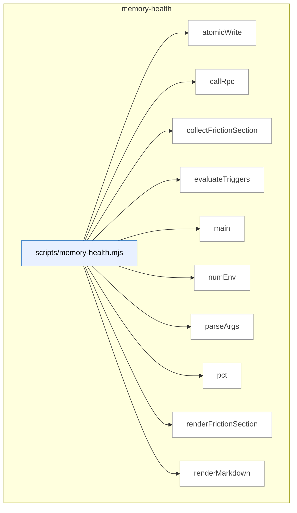

### Symbols in this domain

| Symbol | Kind | Path | Lines | Purpose | File imported by |
|---|---|---|---|---|---|
| [`atomicWrite`](../scripts/memory-health.mjs#L292) | function | `scripts/memory-health.mjs` | 292-294 | Writes contents to a file atomically via temp+rename. | `tests/memory-health.test.mjs` |
| [`callRpc`](../scripts/memory-health.mjs#L71) | function | `scripts/memory-health.mjs` | 71-82 | Calls the Postgres RPC to fetch memory health metrics (fuzzy re-raise, cluster density, recurrence). | `tests/memory-health.test.mjs` |
| [`collectFrictionSection`](../scripts/memory-health.mjs#L94) | function | `scripts/memory-health.mjs` | 94-124 | Fetches recurring friction clusters and determines whether any protected cluster triggers a hard-fail. | `tests/memory-health.test.mjs` |
| [`evaluateTriggers`](../scripts/memory-health.mjs#L170) | function | `scripts/memory-health.mjs` | 170-205 | Checks memory health metrics against fuzzy re-raise, cluster density, and recurrence rate thresholds. | `tests/memory-health.test.mjs` |
| [`main`](../scripts/memory-health.mjs#L296) | function | `scripts/memory-health.mjs` | 296-336 | Runs memory health checks and outputs status, JSON, and/or markdown report. | `tests/memory-health.test.mjs` |
| [`numEnv`](../scripts/memory-health.mjs#L31) | function | `scripts/memory-health.mjs` | 31-40 | Reads an env var as a finite number, returns fallback if missing or invalid. | `tests/memory-health.test.mjs` |
| [`parseArgs`](../scripts/memory-health.mjs#L51) | function | `scripts/memory-health.mjs` | 51-69 | Parses CLI args for the `--out` path and `--json` flag. | `tests/memory-health.test.mjs` |
| [`pct`](../scripts/memory-health.mjs#L207) | function | `scripts/memory-health.mjs` | 207-209 | Formats a decimal as a percentage string. | `tests/memory-health.test.mjs` |
| [`renderFrictionSection`](../scripts/memory-health.mjs#L126) | function | `scripts/memory-health.mjs` | 126-168 | Formats friction-recurrence findings into markdown with ranking and alarm status. | `tests/memory-health.test.mjs` |
| [`renderMarkdown`](../scripts/memory-health.mjs#L211) | function | `scripts/memory-health.mjs` | 211-290 | Generates the full memory-health markdown report with status, metrics, and friction section. | `tests/memory-health.test.mjs` |

---

## model-eval

> A/B testing framework for code-audit LLM models: generates findings via multiple "arms," blinds them to hide the source model, and applies a judge to compare quality.

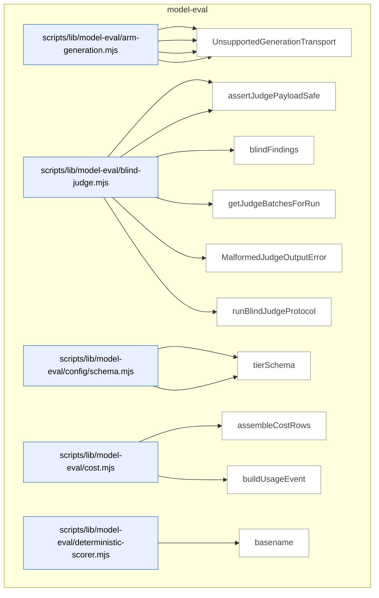

_Domain has 66 symbols (>50). Diagram shows top-15 by file order; see flat table below for the full list._

### Symbols in this domain

| Symbol | Kind | Path | Lines | Purpose | File imported by |
|---|---|---|---|---|---|
| [`buildGenericPlanContent`](../scripts/lib/model-eval/arm-generation.mjs#L65) | function | `scripts/lib/model-eval/arm-generation.mjs` | 65-68 | Formats a generic plan prompt with a list of changed files. | `scripts/model-eval-auditor.mjs`, `tests/arm-generation.test.mjs` |
| [`resolveGenerationClient`](../scripts/lib/model-eval/arm-generation.mjs#L90) | function | `scripts/lib/model-eval/arm-generation.mjs` | 90-109 | Selects the appropriate LLM client (OpenAI, OSS, or Azure) for code generation. | `scripts/model-eval-auditor.mjs`, `tests/arm-generation.test.mjs` |
| [`runAuditGenerationArm`](../scripts/lib/model-eval/arm-generation.mjs#L118) | function | `scripts/lib/model-eval/arm-generation.mjs` | 118-251 | Runs the 5-pass code audit pipeline via a routed LLM client with egress validation. | `scripts/model-eval-auditor.mjs`, `tests/arm-generation.test.mjs` |
| [`UnsupportedGenerationTransport`](../scripts/lib/model-eval/arm-generation.mjs#L29) | class | `scripts/lib/model-eval/arm-generation.mjs` | 29-35 | Error class for unsupported LLM transport types. | `scripts/model-eval-auditor.mjs`, `tests/arm-generation.test.mjs` |
| [`appendJudgeBatch`](../scripts/lib/model-eval/blind-judge.mjs#L150) | function | `scripts/lib/model-eval/blind-judge.mjs` | 150-173 | Stores judge grading results with idempotent upsert on concurrent writes. | `scripts/model-eval-auditor.mjs`, `tests/blind-judge-fork-parity.test.mjs` |
| [`assertJudgePayloadSafe`](../scripts/lib/model-eval/blind-judge.mjs#L126) | function | `scripts/lib/model-eval/blind-judge.mjs` | 126-132 | Validates judge prompt for egress violations (credentials and sensitive paths). | `scripts/model-eval-auditor.mjs`, `tests/blind-judge-fork-parity.test.mjs` |
| [`blindFindings`](../scripts/lib/model-eval/blind-judge.mjs#L102) | function | `scripts/lib/model-eval/blind-judge.mjs` | 102-122 | Deterministically shuffles findings and assigns anonymous IDs for blinded judging. | `scripts/model-eval-auditor.mjs`, `tests/blind-judge-fork-parity.test.mjs` |
| [`getJudgeBatchesForRun`](../scripts/lib/model-eval/blind-judge.mjs#L183) | function | `scripts/lib/model-eval/blind-judge.mjs` | 183-190 | Retrieves stored judge batches for a specific evaluation run. | `scripts/model-eval-auditor.mjs`, `tests/blind-judge-fork-parity.test.mjs` |
| [`MalformedJudgeOutputError`](../scripts/lib/model-eval/blind-judge.mjs#L40) | class | `scripts/lib/model-eval/blind-judge.mjs` | 40-42 | Error class for unparseable judge LLM output. | `scripts/model-eval-auditor.mjs`, `tests/blind-judge-fork-parity.test.mjs` |
| [`runBlindJudgeProtocol`](../scripts/lib/model-eval/blind-judge.mjs#L202) | function | `scripts/lib/model-eval/blind-judge.mjs` | 202-278 | Executes blinded comparative judgment of candidate vs baseline findings. | `scripts/model-eval-auditor.mjs`, `tests/blind-judge-fork-parity.test.mjs` |
| [`parseThresholdConfig`](../scripts/lib/model-eval/config/schema.mjs#L109) | function | `scripts/lib/model-eval/config/schema.mjs` | 109-113 | Safely parses threshold configuration and reports validation errors. | `scripts/model-eval-adjudicator.mjs`, `scripts/model-eval-auditor.mjs`, `tests/model-eval-core.test.mjs` |
| [`tierSchema`](../scripts/lib/model-eval/config/schema.mjs#L54) | function | `scripts/lib/model-eval/config/schema.mjs` | 54-84 | Zod schema for evaluation tier configuration with strict field validation. | `scripts/model-eval-adjudicator.mjs`, `scripts/model-eval-auditor.mjs`, `tests/model-eval-core.test.mjs` |
| [`assembleCostRows`](../scripts/lib/model-eval/cost.mjs#L168) | function | `scripts/lib/model-eval/cost.mjs` | 168-214 | Aggregates usage events into cost rows grouped by arm/role/phase. | `scripts/lib/model-eval/arm-generation.mjs`, `scripts/model-eval-auditor.mjs`, `tests/model-eval-core.test.mjs` |
| [`buildUsageEvent`](../scripts/lib/model-eval/cost.mjs#L109) | function | `scripts/lib/model-eval/cost.mjs` | 109-158 | Constructs a cost tracking event from token usage and model pricing. | `scripts/lib/model-eval/arm-generation.mjs`, `scripts/model-eval-auditor.mjs`, `tests/model-eval-core.test.mjs` |
| [`basename`](../scripts/lib/model-eval/deterministic-scorer.mjs#L84) | function | `scripts/lib/model-eval/deterministic-scorer.mjs` | 84-86 | Extracts the final path component from a file path string. | `scripts/lib/model-eval/finalize-shadow-eval.mjs`, `scripts/model-eval-adjudicator.mjs`, `scripts/model-eval-auditor.mjs`, +1 more |
| [`matchScore`](../scripts/lib/model-eval/deterministic-scorer.mjs#L103) | function | `scripts/lib/model-eval/deterministic-scorer.mjs` | 103-132 | Scores whether a candidate finding matches an expected defect (exact or fuzzy). | `scripts/lib/model-eval/finalize-shadow-eval.mjs`, `scripts/model-eval-adjudicator.mjs`, `scripts/model-eval-auditor.mjs`, +1 more |
| [`normalize`](../scripts/lib/model-eval/deterministic-scorer.mjs#L80) | function | `scripts/lib/model-eval/deterministic-scorer.mjs` | 80-82 | Lowercases and normalizes whitespace in strings. | `scripts/lib/model-eval/finalize-shadow-eval.mjs`, `scripts/model-eval-adjudicator.mjs`, `scripts/model-eval-auditor.mjs`, +1 more |
| [`scoreBinaryClassification`](../scripts/lib/model-eval/deterministic-scorer.mjs#L23) | function | `scripts/lib/model-eval/deterministic-scorer.mjs` | 23-58 | Computes precision, recall, and F1 score from predicted vs ground-truth labels. | `scripts/lib/model-eval/finalize-shadow-eval.mjs`, `scripts/model-eval-adjudicator.mjs`, `scripts/model-eval-auditor.mjs`, +1 more |
| [`scoreDefectLocalization`](../scripts/lib/model-eval/deterministic-scorer.mjs#L145) | function | `scripts/lib/model-eval/deterministic-scorer.mjs` | 145-227 | Scores all candidate-vs-expected defect pairs with configurable match modes. | `scripts/lib/model-eval/finalize-shadow-eval.mjs`, `scripts/model-eval-adjudicator.mjs`, `scripts/model-eval-auditor.mjs`, +1 more |
| [`EgressGateError`](../scripts/lib/model-eval/egress-path-scan.mjs#L22) | class | `scripts/lib/model-eval/egress-path-scan.mjs` | 22-24 | Error class for blocked sensitive-data egress. | `scripts/lib/model-eval/arm-generation.mjs`, `scripts/lib/model-eval/blind-judge.mjs`, `scripts/lib/model-eval/known-defect-corpus.mjs`, +6 more |
| [`findSensitivePathMentions`](../scripts/lib/model-eval/egress-path-scan.mjs#L108) | function | `scripts/lib/model-eval/egress-path-scan.mjs` | 108-113 | Tokenizes text and identifies mentions of sensitive file paths. | `scripts/lib/model-eval/arm-generation.mjs`, `scripts/lib/model-eval/blind-judge.mjs`, `scripts/lib/model-eval/known-defect-corpus.mjs`, +6 more |
| [`looksLikeRealPath`](../scripts/lib/model-eval/egress-path-scan.mjs#L52) | function | `scripts/lib/model-eval/egress-path-scan.mjs` | 52-60 | Heuristic detector for path-like token patterns in text. | `scripts/lib/model-eval/arm-generation.mjs`, `scripts/lib/model-eval/blind-judge.mjs`, `scripts/lib/model-eval/known-defect-corpus.mjs`, +6 more |
| [`appendModelEvalShadowObservation`](../scripts/lib/model-eval/finalize-shadow-eval.mjs#L61) | function | `scripts/lib/model-eval/finalize-shadow-eval.mjs` | 61-71 | Stores shadow reviewer observation with idempotent upsert on conflict. | `scripts/gemini-review.mjs`, `scripts/model-eval-adjudicator.mjs`, `tests/finalize-shadow-eval.test.mjs` |
| [`finalizeShadowEval`](../scripts/lib/model-eval/finalize-shadow-eval.mjs#L206) | function | `scripts/lib/model-eval/finalize-shadow-eval.mjs` | 206-249 | Computes final shadow-eval metrics and verdict once minimum terminal runs threshold is met. | `scripts/gemini-review.mjs`, `scripts/model-eval-adjudicator.mjs`, `tests/finalize-shadow-eval.test.mjs` |
| [`getShadowObservationsForEvalRun`](../scripts/lib/model-eval/finalize-shadow-eval.mjs#L79) | function | `scripts/lib/model-eval/finalize-shadow-eval.mjs` | 79-90 | Retrieves all shadow observations for an evaluation run. | `scripts/gemini-review.mjs`, `scripts/model-eval-adjudicator.mjs`, `tests/finalize-shadow-eval.test.mjs` |
| [`getTerminalShadowObservations`](../scripts/lib/model-eval/finalize-shadow-eval.mjs#L108) | function | `scripts/lib/model-eval/finalize-shadow-eval.mjs` | 108-133 | Filters shadow observations to only those with all findings in terminal state. | `scripts/gemini-review.mjs`, `scripts/model-eval-adjudicator.mjs`, `tests/finalize-shadow-eval.test.mjs` |
| [`ShadowObservationRepoMismatchError`](../scripts/lib/model-eval/finalize-shadow-eval.mjs#L46) | class | `scripts/lib/model-eval/finalize-shadow-eval.mjs` | 46-51 | Error when a shadow observation doesn't belong to the specified repository. | `scripts/gemini-review.mjs`, `scripts/model-eval-adjudicator.mjs`, `tests/finalize-shadow-eval.test.mjs` |
| [`toBinaryRows`](../scripts/lib/model-eval/finalize-shadow-eval.mjs#L167) | function | `scripts/lib/model-eval/finalize-shadow-eval.mjs` | 167-183 | Converts shadow observations into binary prediction and label arrays for scoring. | `scripts/gemini-review.mjs`, `scripts/model-eval-adjudicator.mjs`, `tests/finalize-shadow-eval.test.mjs` |
| [`toMetrics`](../scripts/lib/model-eval/finalize-shadow-eval.mjs#L185) | function | `scripts/lib/model-eval/finalize-shadow-eval.mjs` | 185-187 | Extracts recall, false-positive rate, and F1 from binary classification scores. | `scripts/gemini-review.mjs`, `scripts/model-eval-adjudicator.mjs`, `tests/finalize-shadow-eval.test.mjs` |
| [`CorpusCaseUnavailable`](../scripts/lib/model-eval/known-defect-corpus.mjs#L35) | class | `scripts/lib/model-eval/known-defect-corpus.mjs` | 35-42 | Error class when corpus case data is unavailable or unloadable. | `scripts/model-eval-auditor.mjs`, `tests/known-defect-corpus.test.mjs` |
| [`git`](../scripts/lib/model-eval/known-defect-corpus.mjs#L58) | function | `scripts/lib/model-eval/known-defect-corpus.mjs` | 58-63 | Runs git commands with disabled paging and large buffer. | `scripts/model-eval-auditor.mjs`, `tests/known-defect-corpus.test.mjs` |
| [`loadCorpusCase`](../scripts/lib/model-eval/known-defect-corpus.mjs#L112) | function | `scripts/lib/model-eval/known-defect-corpus.mjs` | 112-211 | Extracts diff and metadata for a known-defect corpus entry via git history. | `scripts/model-eval-auditor.mjs`, `tests/known-defect-corpus.test.mjs` |
| [`resolveRepoRoot`](../scripts/lib/model-eval/known-defect-corpus.mjs#L89) | function | `scripts/lib/model-eval/known-defect-corpus.mjs` | 89-95 | Finds a repository directory by name from a list of roots. | `scripts/model-eval-auditor.mjs`, `tests/known-defect-corpus.test.mjs` |
| [`tryGit`](../scripts/lib/model-eval/known-defect-corpus.mjs#L72) | function | `scripts/lib/model-eval/known-defect-corpus.mjs` | 72-75 | Attempts git command execution and returns success/error result. | `scripts/model-eval-auditor.mjs`, `tests/known-defect-corpus.test.mjs` |
| [`invokeNativeAnthropic`](../scripts/lib/model-eval/provider-adapter.mjs#L128) | function | `scripts/lib/model-eval/provider-adapter.mjs` | 128-156 | Calls Claude via native SDK with JSON schema response format. | `scripts/lib/model-eval/blind-judge.mjs`, `scripts/lib/model-eval/structured-extractor.mjs` |
| [`invokeNativeGemini`](../scripts/lib/model-eval/provider-adapter.mjs#L158) | function | `scripts/lib/model-eval/provider-adapter.mjs` | 158-200 | Calls Gemini via native SDK with JSON schema response format. | `scripts/lib/model-eval/blind-judge.mjs`, `scripts/lib/model-eval/structured-extractor.mjs` |
| [`invokeOpenAICompatible`](../scripts/lib/model-eval/provider-adapter.mjs#L83) | function | `scripts/lib/model-eval/provider-adapter.mjs` | 83-126 | Routes structured LLM call through OpenAI-compatible endpoint (public, OSS, or Azure). | `scripts/lib/model-eval/blind-judge.mjs`, `scripts/lib/model-eval/structured-extractor.mjs` |
| [`invokeStructured`](../scripts/lib/model-eval/provider-adapter.mjs#L46) | function | `scripts/lib/model-eval/provider-adapter.mjs` | 46-81 | Calls LLM with structured output schema, applying egress validation. | `scripts/lib/model-eval/blind-judge.mjs`, `scripts/lib/model-eval/structured-extractor.mjs` |
| [`MalformedProviderOutputError`](../scripts/lib/model-eval/provider-adapter.mjs#L31) | class | `scripts/lib/model-eval/provider-adapter.mjs` | 31-33 | Error class for unparseable LLM provider output. | `scripts/lib/model-eval/blind-judge.mjs`, `scripts/lib/model-eval/structured-extractor.mjs` |
| [`resolveOssClientConfig`](../scripts/lib/model-eval/provider-adapter.mjs#L210) | function | `scripts/lib/model-eval/provider-adapter.mjs` | 210-216 | Retrieves OpenRouter configuration from environment variables. | `scripts/lib/model-eval/blind-judge.mjs`, `scripts/lib/model-eval/structured-extractor.mjs` |
| [`assertAzureTransportSupported`](../scripts/lib/model-eval/route-catalog.mjs#L271) | function | `scripts/lib/model-eval/route-catalog.mjs` | 271-275 | Validates that an Azure provider paired with a transport type is a valid combination. | `scripts/gemini-review.mjs`, `scripts/lib/model-eval/blind-judge.mjs`, `scripts/lib/model-eval/finalize-shadow-eval.mjs`, +3 more |
| [`azureTransportProvider`](../scripts/lib/model-eval/route-catalog.mjs#L279) | function | `scripts/lib/model-eval/route-catalog.mjs` | 279-287 | Determines the transport provider for an Azure model based on its lineage family. | `scripts/gemini-review.mjs`, `scripts/lib/model-eval/blind-judge.mjs`, `scripts/lib/model-eval/finalize-shadow-eval.mjs`, +3 more |
| [`buildComparisonEvidenceFromRoutes`](../scripts/lib/model-eval/route-catalog.mjs#L357) | function | `scripts/lib/model-eval/route-catalog.mjs` | 357-366 | Packages candidate/baseline/judge routes with computed tier and independence checks. | `scripts/gemini-review.mjs`, `scripts/lib/model-eval/blind-judge.mjs`, `scripts/lib/model-eval/finalize-shadow-eval.mjs`, +3 more |
| [`lineageForProvider`](../scripts/lib/model-eval/route-catalog.mjs#L112) | function | `scripts/lib/model-eval/route-catalog.mjs` | 112-114 | Builds a lineage string combining provider and optional tier/variant/role. | `scripts/gemini-review.mjs`, `scripts/lib/model-eval/blind-judge.mjs`, `scripts/lib/model-eval/finalize-shadow-eval.mjs`, +3 more |
| [`loadAzureRoutes`](../scripts/lib/model-eval/route-catalog.mjs#L79) | function | `scripts/lib/model-eval/route-catalog.mjs` | 79-99 | Loads and caches Azure routes configuration from a JSON file with validation. | `scripts/gemini-review.mjs`, `scripts/lib/model-eval/blind-judge.mjs`, `scripts/lib/model-eval/finalize-shadow-eval.mjs`, +3 more |
| [`resolveCandidateRoute`](../scripts/lib/model-eval/route-catalog.mjs#L125) | function | `scripts/lib/model-eval/route-catalog.mjs` | 125-257 | Resolves a candidate model specification into a complete route with lineage, deployment, and pricing details. | `scripts/gemini-review.mjs`, `scripts/lib/model-eval/blind-judge.mjs`, `scripts/lib/model-eval/finalize-shadow-eval.mjs`, +3 more |
| [`resolveEvaluationTier`](../scripts/lib/model-eval/route-catalog.mjs#L305) | function | `scripts/lib/model-eval/route-catalog.mjs` | 305-333 | Computes the evaluation tier (A/B/C) based on model independence and route knowledge. | `scripts/gemini-review.mjs`, `scripts/lib/model-eval/blind-judge.mjs`, `scripts/lib/model-eval/finalize-shadow-eval.mjs`, +3 more |
| [`RouteResolutionError`](../scripts/lib/model-eval/route-catalog.mjs#L70) | class | `scripts/lib/model-eval/route-catalog.mjs` | 70-76 | Custom error class for route resolution failures with a preflight flag. | `scripts/gemini-review.mjs`, `scripts/lib/model-eval/blind-judge.mjs`, `scripts/lib/model-eval/finalize-shadow-eval.mjs`, +3 more |
| [`toRouteEvidence`](../scripts/lib/model-eval/route-catalog.mjs#L338) | function | `scripts/lib/model-eval/route-catalog.mjs` | 338-343 | Extracts trust-related evidence fields from a route for downstream use. | `scripts/gemini-review.mjs`, `scripts/lib/model-eval/blind-judge.mjs`, `scripts/lib/model-eval/finalize-shadow-eval.mjs`, +3 more |
| [`transportForProvider`](../scripts/lib/model-eval/route-catalog.mjs#L103) | function | `scripts/lib/model-eval/route-catalog.mjs` | 103-108 | Maps a provider name to its transport protocol type. | `scripts/gemini-review.mjs`, `scripts/lib/model-eval/blind-judge.mjs`, `scripts/lib/model-eval/finalize-shadow-eval.mjs`, +3 more |
| [`buildAdjudicatorPrompt`](../scripts/lib/model-eval/structured-extractor.mjs#L215) | function | `scripts/lib/model-eval/structured-extractor.mjs` | 215-220 | Constructs a system/user message pair for the adjudicator role. | `scripts/model-eval-adjudicator.mjs`, `scripts/model-eval-auditor.mjs`, `tests/model-eval-core.test.mjs` |
| [`buildAuditorPrompt`](../scripts/lib/model-eval/structured-extractor.mjs#L208) | function | `scripts/lib/model-eval/structured-extractor.mjs` | 208-213 | Constructs a system/user message pair for the auditor role. | `scripts/model-eval-adjudicator.mjs`, `scripts/model-eval-auditor.mjs`, `tests/model-eval-core.test.mjs` |
| [`extractDiffHeaderPaths`](../scripts/lib/model-eval/structured-extractor.mjs#L124) | function | `scripts/lib/model-eval/structured-extractor.mjs` | 124-146 | Parses file paths from git diff headers using multiple regex patterns. | `scripts/model-eval-adjudicator.mjs`, `scripts/model-eval-auditor.mjs`, `tests/model-eval-core.test.mjs` |
| [`ExtractionInvocationError`](../scripts/lib/model-eval/structured-extractor.mjs#L42) | class | `scripts/lib/model-eval/structured-extractor.mjs` | 42-50 | Custom error class for extraction failures with retry metadata. | `scripts/model-eval-adjudicator.mjs`, `scripts/model-eval-auditor.mjs`, `tests/model-eval-core.test.mjs` |
| [`extractStructured`](../scripts/lib/model-eval/structured-extractor.mjs#L236) | function | `scripts/lib/model-eval/structured-extractor.mjs` | 236-295 | Validates inputs and orchestrates structured extraction for auditor or adjudicator roles with sensitive-path blocking. | `scripts/model-eval-adjudicator.mjs`, `scripts/model-eval-auditor.mjs`, `tests/model-eval-core.test.mjs` |
| [`InvalidEvaluationInputError`](../scripts/lib/model-eval/structured-extractor.mjs#L33) | class | `scripts/lib/model-eval/structured-extractor.mjs` | 33-35 | Custom error class for invalid evaluation input. | `scripts/model-eval-adjudicator.mjs`, `scripts/model-eval-auditor.mjs`, `tests/model-eval-core.test.mjs` |
| [`isRetryableMalformedOutput`](../scripts/lib/model-eval/structured-extractor.mjs#L56) | function | `scripts/lib/model-eval/structured-extractor.mjs` | 56-58 | Checks if an error represents a retryable malformed output condition. | `scripts/model-eval-adjudicator.mjs`, `scripts/model-eval-auditor.mjs`, `tests/model-eval-core.test.mjs` |
| [`nonBlankString`](../scripts/lib/model-eval/structured-extractor.mjs#L66) | function | `scripts/lib/model-eval/structured-extractor.mjs` | 66-69 | Creates a Zod schema for a trimmed non-empty string with optional max length. | `scripts/model-eval-adjudicator.mjs`, `scripts/model-eval-auditor.mjs`, `tests/model-eval-core.test.mjs` |
| [`prepareModelEvalPayloadForEgress`](../scripts/lib/model-eval/structured-extractor.mjs#L154) | function | `scripts/lib/model-eval/structured-extractor.mjs` | 154-206 | Validates and sanitizes model evaluation input before egress, blocking sensitive paths. | `scripts/model-eval-adjudicator.mjs`, `scripts/model-eval-auditor.mjs`, `tests/model-eval-core.test.mjs` |
| [`unquoteDiffPath`](../scripts/lib/model-eval/structured-extractor.mjs#L112) | function | `scripts/lib/model-eval/structured-extractor.mjs` | 112-118 | Removes C-style quotes and escapes from a git diff path string. | `scripts/model-eval-adjudicator.mjs`, `scripts/model-eval-auditor.mjs`, `tests/model-eval-core.test.mjs` |
| [`allRoutesIndependentlyTrusted`](../scripts/lib/model-eval/verdict.mjs#L360) | function | `scripts/lib/model-eval/verdict.mjs` | 360-363 | Verifies that all routes have trusted lineage sources (catalog-verified or reviewed-pool). | `scripts/lib/model-eval/finalize-shadow-eval.mjs`, `scripts/lib/store/model-eval.mjs`, `scripts/model-eval-adjudicator.mjs`, +2 more |
| [`computeRawVerdict`](../scripts/lib/model-eval/verdict.mjs#L278) | function | `scripts/lib/model-eval/verdict.mjs` | 278-352 | Computes a raw verdict (keep/switch/inconclusive) against floor thresholds with validation. | `scripts/lib/model-eval/finalize-shadow-eval.mjs`, `scripts/lib/store/model-eval.mjs`, `scripts/model-eval-adjudicator.mjs`, +2 more |
| [`computeVerdict`](../scripts/lib/model-eval/verdict.mjs#L365) | function | `scripts/lib/model-eval/verdict.mjs` | 365-404 | Orchestrates verdict computation with structural invariants, judgment-tier logic, and next-action determination. | `scripts/lib/model-eval/finalize-shadow-eval.mjs`, `scripts/lib/store/model-eval.mjs`, `scripts/model-eval-adjudicator.mjs`, +2 more |
| [`findTableRow`](../scripts/lib/model-eval/verdict.mjs#L244) | function | `scripts/lib/model-eval/verdict.mjs` | 244-247 | Looks up a decision table row by mode, tier, and optional role. | `scripts/lib/model-eval/finalize-shadow-eval.mjs`, `scripts/lib/store/model-eval.mjs`, `scripts/model-eval-adjudicator.mjs`, +2 more |
| [`ratioWithinBound`](../scripts/lib/model-eval/verdict.mjs#L270) | function | `scripts/lib/model-eval/verdict.mjs` | 270-276 | Checks if a candidate-to-baseline ratio satisfies a threshold, accounting for zero baselines. | `scripts/lib/model-eval/finalize-shadow-eval.mjs`, `scripts/lib/store/model-eval.mjs`, `scripts/model-eval-adjudicator.mjs`, +2 more |
| [`requiredMetric`](../scripts/lib/model-eval/verdict.mjs#L252) | function | `scripts/lib/model-eval/verdict.mjs` | 252-258 | Retrieves and validates a numeric metric from a metrics object. | `scripts/lib/model-eval/finalize-shadow-eval.mjs`, `scripts/lib/store/model-eval.mjs`, `scripts/model-eval-adjudicator.mjs`, +2 more |

---

## nav-audit

> Detects framework-specific routing (Next.js, React Router, etc.) via AST analysis, extracts all route destinations, and audits the navigation graph against a declared contract to identify orphaned, missing, or competing routes.

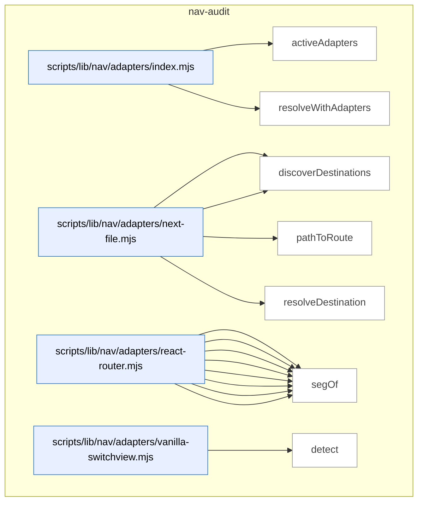

_Domain has 123 symbols (>50). Diagram shows top-15 by file order; see flat table below for the full list._

### Symbols in this domain

| Symbol | Kind | Path | Lines | Purpose | File imported by |
|---|---|---|---|---|---|
| [`activeAdapters`](../scripts/lib/nav/adapters/index.mjs#L20) | function | `scripts/lib/nav/adapters/index.mjs` | 20-24 | Returns the subset of navigation adapters that detect the current framework/app type. | `scripts/lib/nav/extract.mjs`, `tests/nav-extract.test.mjs` |
| [`resolveWithAdapters`](../scripts/lib/nav/adapters/index.mjs#L37) | function | `scripts/lib/nav/adapters/index.mjs` | 37-45 | Attempts to resolve a navigation destination by trying each active adapter in sequence. | `scripts/lib/nav/extract.mjs`, `tests/nav-extract.test.mjs` |
| [`detect`](../scripts/lib/nav/adapters/next-file.mjs#L13) | function | `scripts/lib/nav/adapters/next-file.mjs` | 13-15 | Detects if Next.js file-based routing is present via app/ or pages/ directory patterns. | `scripts/lib/nav/adapters/index.mjs` |
| [`discoverDestinations`](../scripts/lib/nav/adapters/next-file.mjs#L17) | function | `scripts/lib/nav/adapters/next-file.mjs` | 17-27 | Extracts all route destinations from Next.js app/ and pages/ file path structures. | `scripts/lib/nav/adapters/index.mjs` |
| [`pathToRoute`](../scripts/lib/nav/adapters/next-file.mjs#L37) | function | `scripts/lib/nav/adapters/next-file.mjs` | 37-53 | Converts a Next.js file path to its corresponding route (e.g., app/foo/bar/page.tsx → /foo/bar). | `scripts/lib/nav/adapters/index.mjs` |
| [`resolveDestination`](../scripts/lib/nav/adapters/next-file.mjs#L55) | function | `scripts/lib/nav/adapters/next-file.mjs` | 55-61 | Extracts a string literal route from a Next.js element attribute value. | `scripts/lib/nav/adapters/index.mjs` |
| [`collectJsxRoutes`](../scripts/lib/nav/adapters/react-router.mjs#L42) | function | `scripts/lib/nav/adapters/react-router.mjs` | 42-64 | Recursively collects route destinations from nested <Route> JSX elements in a component tree. | `scripts/lib/nav/adapters/index.mjs` |
| [`collectObjectRoute`](../scripts/lib/nav/adapters/react-router.mjs#L67) | function | `scripts/lib/nav/adapters/react-router.mjs` | 67-89 | Extracts route destinations from a React Router route configuration object with children support. | `scripts/lib/nav/adapters/index.mjs` |
| [`dedupe`](../scripts/lib/nav/adapters/react-router.mjs#L106) | function | `scripts/lib/nav/adapters/react-router.mjs` | 106-116 | Removes duplicate route entries by comparing both destination ID and source file location. | `scripts/lib/nav/adapters/index.mjs` |
| [`detect`](../scripts/lib/nav/adapters/react-router.mjs#L17) | function | `scripts/lib/nav/adapters/react-router.mjs` | 17-19 | Detects if React Router is used by checking for imports and <Route> JSX elements. | `scripts/lib/nav/adapters/index.mjs` |
| [`discoverDestinations`](../scripts/lib/nav/adapters/react-router.mjs#L21) | function | `scripts/lib/nav/adapters/react-router.mjs` | 21-39 | Extracts all route destinations from React Router JSX elements and route configuration objects. | `scripts/lib/nav/adapters/index.mjs` |
| [`joinRoutePath`](../scripts/lib/nav/adapters/react-router.mjs#L99) | function | `scripts/lib/nav/adapters/react-router.mjs` | 99-104 | Joins a parent route path with a child segment, handling absolute, relative, and root cases. | `scripts/lib/nav/adapters/index.mjs` |
| [`resolveDestination`](../scripts/lib/nav/adapters/react-router.mjs#L118) | function | `scripts/lib/nav/adapters/react-router.mjs` | 118-124 | Extracts a route destination from raw source code (string literal, variable reference, or computed path). | `scripts/lib/nav/adapters/index.mjs` |
| [`segOf`](../scripts/lib/nav/adapters/react-router.mjs#L91) | function | `scripts/lib/nav/adapters/react-router.mjs` | 91-96 | Extracts the literal string value from a classified routing target (literal, template, or member). | `scripts/lib/nav/adapters/index.mjs` |
| [`detect`](../scripts/lib/nav/adapters/vanilla-switchview.mjs#L15) | function | `scripts/lib/nav/adapters/vanilla-switchview.mjs` | 15-18 | Detects vanilla switchView pattern by finding switchView() or setView() function calls. | `scripts/lib/nav/adapters/index.mjs` |
| [`discoverDestinations`](../scripts/lib/nav/adapters/vanilla-switchview.mjs#L20) | function | `scripts/lib/nav/adapters/vanilla-switchview.mjs` | 20-37 | Extracts all view/destination strings from VIEWS object properties in source code. | `scripts/lib/nav/adapters/index.mjs` |
| [`resolveDestination`](../scripts/lib/nav/adapters/vanilla-switchview.mjs#L48) | function | `scripts/lib/nav/adapters/vanilla-switchview.mjs` | 48-63 | Resolves a view reference (VIEWS.X, string literal, or slug) to a normalized destination ID. | `scripts/lib/nav/adapters/index.mjs` |
| [`viewsObjectOf`](../scripts/lib/nav/adapters/vanilla-switchview.mjs#L39) | function | `scripts/lib/nav/adapters/vanilla-switchview.mjs` | 39-44 | Finds and unwraps a VIEWS/viewRegistry object declaration or assignment from AST nodes. | `scripts/lib/nav/adapters/index.mjs` |
| [`appRootForPath`](../scripts/lib/nav/approot.mjs#L16) | function | `scripts/lib/nav/approot.mjs` | 16-27 | Finds the best-matching app root directory for a given source file path. | `scripts/lib/nav/extract.mjs` |
| [`enclosingSymbol`](../scripts/lib/nav/ast-lite.mjs#L22) | function | `scripts/lib/nav/ast-lite.mjs` | 22-29 | Finds the outermost function or class that contains a given character index in source. | `scripts/lib/nav/contract.mjs`, `scripts/lib/nav/model.mjs` |
| [`indexSymbols`](../scripts/lib/nav/ast-lite.mjs#L12) | function | `scripts/lib/nav/ast-lite.mjs` | 12-18 | Indexes the positions of all top-level function and class symbol definitions in source code. | `scripts/lib/nav/contract.mjs`, `scripts/lib/nav/model.mjs` |
| [`lineOf`](../scripts/lib/nav/ast-lite.mjs#L32) | function | `scripts/lib/nav/ast-lite.mjs` | 32-36 | Calculates the 1-based line number for a given character index by counting newlines. | `scripts/lib/nav/contract.mjs`, `scripts/lib/nav/model.mjs` |
| [`calleeName`](../scripts/lib/nav/ast.mjs#L91) | function | `scripts/lib/nav/ast.mjs` | 91-99 | Extracts the function name being called from a CallExpression AST node. | `scripts/lib/nav/adapters/react-router.mjs`, `scripts/lib/nav/adapters/vanilla-switchview.mjs`, `scripts/lib/nav/extract.mjs`, +1 more |
| [`classifyTarget`](../scripts/lib/nav/ast.mjs#L41) | function | `scripts/lib/nav/ast.mjs` | 41-58 | Classifies and extracts the value from a JSX attribute/expression (literal, member, template). | `scripts/lib/nav/adapters/react-router.mjs`, `scripts/lib/nav/adapters/vanilla-switchview.mjs`, `scripts/lib/nav/extract.mjs`, +1 more |
| [`jsxAttr`](../scripts/lib/nav/ast.mjs#L72) | function | `scripts/lib/nav/ast.mjs` | 72-80 | Retrieves a JSX element's attribute value by name from its opening tag. | `scripts/lib/nav/adapters/react-router.mjs`, `scripts/lib/nav/adapters/vanilla-switchview.mjs`, `scripts/lib/nav/extract.mjs`, +1 more |
| [`jsxLabel`](../scripts/lib/nav/ast.mjs#L61) | function | `scripts/lib/nav/ast.mjs` | 61-69 | Extracts visible text content from JSX element children for use as a navigation label. | `scripts/lib/nav/adapters/react-router.mjs`, `scripts/lib/nav/adapters/vanilla-switchview.mjs`, `scripts/lib/nav/extract.mjs`, +1 more |
| [`jsxTagName`](../scripts/lib/nav/ast.mjs#L83) | function | `scripts/lib/nav/ast.mjs` | 83-88 | Extracts the tag name from a JSX opening element (handles identifiers and member expressions). | `scripts/lib/nav/adapters/react-router.mjs`, `scripts/lib/nav/adapters/vanilla-switchview.mjs`, `scripts/lib/nav/extract.mjs`, +1 more |
| [`unwrapObjectExpression`](../scripts/lib/nav/ast.mjs#L23) | function | `scripts/lib/nav/ast.mjs` | 23-32 | Extracts an ObjectExpression from various wrapper patterns (calls, type assertions, JSX). | `scripts/lib/nav/adapters/react-router.mjs`, `scripts/lib/nav/adapters/vanilla-switchview.mjs`, `scripts/lib/nav/extract.mjs`, +1 more |
| [`buildDraftCaptureWarning`](../scripts/lib/nav/bootstrap-draft.mjs#L31) | function | `scripts/lib/nav/bootstrap-draft.mjs` | 31-43 | Generates a warning message if nav-audit draft capture is incomplete or unauthenticated. | `scripts/nav-audit.mjs`, `tests/nav-bootstrap-draft.test.mjs`, `tests/persona-clickpath.test.mjs` |
| [`byProminence`](../scripts/lib/nav/bootstrap-draft.mjs#L47) | function | `scripts/lib/nav/bootstrap-draft.mjs` | 47-49 | Comparator function for sorting nav containers by stickiness, target count, and insertion order. | `scripts/nav-audit.mjs`, `tests/nav-bootstrap-draft.test.mjs`, `tests/persona-clickpath.test.mjs` |
| [`dedupe`](../scripts/lib/nav/bootstrap-draft.mjs#L130) | function | `scripts/lib/nav/bootstrap-draft.mjs` | 130-130 | Removes duplicate strings from an array using Set deduplication. | `scripts/nav-audit.mjs`, `tests/nav-bootstrap-draft.test.mjs`, `tests/persona-clickpath.test.mjs` |
| [`draftContractFromLive`](../scripts/lib/nav/bootstrap-draft.mjs#L61) | function | `scripts/lib/nav/bootstrap-draft.mjs` | 61-128 | Builds a draft nav-audit contract from live browser evidence (containers, targets, stickiness). | `scripts/nav-audit.mjs`, `tests/nav-bootstrap-draft.test.mjs`, `tests/persona-clickpath.test.mjs` |
| [`bootstrapContract`](../scripts/lib/nav/contract.mjs#L205) | function | `scripts/lib/nav/contract.mjs` | 205-231 | Creates an initial nav contract from persona intents and observed targets for human review. | `scripts/lib/dashboard/collect-nav.mjs`, `scripts/lib/nav/findings.mjs`, `scripts/nav-audit.mjs`, +3 more |
| [`coerce`](../scripts/lib/nav/contract.mjs#L175) | function | `scripts/lib/nav/contract.mjs` | 175-186 | Coerces raw string values to their declared type (bool, list, or string). | `scripts/lib/dashboard/collect-nav.mjs`, `scripts/lib/nav/findings.mjs`, `scripts/nav-audit.mjs`, +3 more |
| [`contractExists`](../scripts/lib/nav/contract.mjs#L201) | function | `scripts/lib/nav/contract.mjs` | 201-203 | Checks whether a `nav-contract.json` file exists in the repo root. | `scripts/lib/dashboard/collect-nav.mjs`, `scripts/lib/nav/findings.mjs`, `scripts/nav-audit.mjs`, +3 more |
| [`isUtilityRoute`](../scripts/lib/nav/contract.mjs#L102) | function | `scripts/lib/nav/contract.mjs` | 102-105 | Checks if a destination ID matches utility-route patterns. | `scripts/lib/dashboard/collect-nav.mjs`, `scripts/lib/nav/findings.mjs`, `scripts/nav-audit.mjs`, +3 more |
| [`parseDocblockTokens`](../scripts/lib/nav/contract.mjs#L161) | function | `scripts/lib/nav/contract.mjs` | 161-173 | Parses `key=value` tokens from a docblock attribute string. | `scripts/lib/dashboard/collect-nav.mjs`, `scripts/lib/nav/findings.mjs`, `scripts/nav-audit.mjs`, +3 more |
| [`parseNavMeta`](../scripts/lib/nav/contract.mjs#L119) | function | `scripts/lib/nav/contract.mjs` | 119-140 | Extracts nav metadata declarations from source code (both `export const navMeta` and `@nav` docblock forms). | `scripts/lib/dashboard/collect-nav.mjs`, `scripts/lib/nav/findings.mjs`, `scripts/nav-audit.mjs`, +3 more |
| [`parseObjectBody`](../scripts/lib/nav/contract.mjs#L145) | function | `scripts/lib/nav/contract.mjs` | 145-158 | Parses key-value pairs from an object literal body string. | `scripts/lib/dashboard/collect-nav.mjs`, `scripts/lib/nav/findings.mjs`, `scripts/nav-audit.mjs`, +3 more |
| [`readContract`](../scripts/lib/nav/contract.mjs#L59) | function | `scripts/lib/nav/contract.mjs` | 59-95 | Reads and parses the nav-audit contract file with schema validation and intent layer verification. | `scripts/lib/dashboard/collect-nav.mjs`, `scripts/lib/nav/findings.mjs`, `scripts/nav-audit.mjs`, +3 more |
| [`writeContract`](../scripts/lib/nav/contract.mjs#L239) | function | `scripts/lib/nav/contract.mjs` | 239-247 | Writes a validated nav contract to disk with atomic safety. | `scripts/lib/dashboard/collect-nav.mjs`, `scripts/lib/nav/findings.mjs`, `scripts/nav-audit.mjs`, +3 more |
| [`ageDivergences`](../scripts/lib/nav/drift.mjs#L60) | function | `scripts/lib/nav/drift.mjs` | 60-68 | Calculates the age in days of each divergence based on first-sighting and HEAD commit date. | `scripts/cross-skill.mjs`, `scripts/lib/dashboard/collect-nav.mjs`, `scripts/nav-audit.mjs`, +1 more |
| [`divergenceKey`](../scripts/lib/nav/drift.mjs#L18) | function | `scripts/lib/nav/drift.mjs` | 18-20 | Creates a lookup key from a finding's class and destination. | `scripts/cross-skill.mjs`, `scripts/lib/dashboard/collect-nav.mjs`, `scripts/nav-audit.mjs`, +1 more |
| [`firstSeenFromHistory`](../scripts/lib/nav/drift.mjs#L89) | function | `scripts/lib/nav/drift.mjs` | 89-101 | Builds a lookup function for divergence first-sighting dates from database history rows. | `scripts/cross-skill.mjs`, `scripts/lib/dashboard/collect-nav.mjs`, `scripts/nav-audit.mjs`, +1 more |
| [`partitionFindings`](../scripts/lib/nav/drift.mjs#L27) | function | `scripts/lib/nav/drift.mjs` | 27-31 | Splits findings into gate-eligible and advisory-only categories. | `scripts/cross-skill.mjs`, `scripts/lib/dashboard/collect-nav.mjs`, `scripts/nav-audit.mjs`, +1 more |
| [`readDriftLedger`](../scripts/lib/nav/drift.mjs#L71) | function | `scripts/lib/nav/drift.mjs` | 71-77 | Reads the persistent drift ledger recording when each divergence was first seen. | `scripts/cross-skill.mjs`, `scripts/lib/dashboard/collect-nav.mjs`, `scripts/nav-audit.mjs`, +1 more |
| [`scopeToChanged`](../scripts/lib/nav/drift.mjs#L41) | function | `scripts/lib/nav/drift.mjs` | 41-50 | Filters gate-eligible findings to only those whose evidence touches changed files. | `scripts/cross-skill.mjs`, `scripts/lib/dashboard/collect-nav.mjs`, `scripts/nav-audit.mjs`, +1 more |
| [`writeDriftLedger`](../scripts/lib/nav/drift.mjs#L81) | function | `scripts/lib/nav/drift.mjs` | 81-86 | Updates the persistent drift ledger with the set of currently-active divergences. | `scripts/cross-skill.mjs`, `scripts/lib/dashboard/collect-nav.mjs`, `scripts/nav-audit.mjs`, +1 more |
| [`assembleEnvelope`](../scripts/lib/nav/envelope.mjs#L87) | function | `scripts/lib/nav/envelope.mjs` | 87-98 | Constructs an observed envelope object with version, digest, edges, and destination metadata. | `scripts/nav-audit.mjs`, `tests/nav-contract.test.mjs`, `tests/nav-dashboard.test.mjs`, +1 more |
| [`readObservedEnvelope`](../scripts/lib/nav/envelope.mjs#L29) | function | `scripts/lib/nav/envelope.mjs` | 29-55 | Loads and validates the observed nav graph, rejecting it if the config digest changed without regeneration. | `scripts/nav-audit.mjs`, `tests/nav-contract.test.mjs`, `tests/nav-dashboard.test.mjs`, +1 more |
| [`writeObservedEnvelope`](../scripts/lib/nav/envelope.mjs#L66) | function | `scripts/lib/nav/envelope.mjs` | 66-74 | Writes a validated observed nav graph to disk with atomic safety. | `scripts/nav-audit.mjs`, `tests/nav-contract.test.mjs`, `tests/nav-dashboard.test.mjs`, +1 more |
| [`affordancesOf`](../scripts/lib/nav/extract.mjs#L150) | function | `scripts/lib/nav/extract.mjs` | 150-162 | Extracts navigation affordances (links, redirects, modals) from an AST node. | `scripts/nav-audit.mjs`, `tests/nav-extract.test.mjs` |
| [`basename`](../scripts/lib/nav/extract.mjs#L314) | function | `scripts/lib/nav/extract.mjs` | 314-316 | Extracts the filename without extension from a path. | `scripts/nav-audit.mjs`, `tests/nav-extract.test.mjs` |
| [`buildViewsMap`](../scripts/lib/nav/extract.mjs#L284) | function | `scripts/lib/nav/extract.mjs` | 284-299 | Extracts a mapping of view registry keys to route paths from the source AST. | `scripts/nav-audit.mjs`, `tests/nav-extract.test.mjs` |
| [`callAffordance`](../scripts/lib/nav/extract.mjs#L179) | function | `scripts/lib/nav/extract.mjs` | 179-192 | Identifies nav targets from function calls (navigate(), showModal()). | `scripts/nav-audit.mjs`, `tests/nav-extract.test.mjs` |
| [`embeddedAffordances`](../scripts/lib/nav/extract.mjs#L202) | function | `scripts/lib/nav/extract.mjs` | 202-226 | Extracts nav targets from string/template literals in HTML attributes and data-* fields. | `scripts/nav-audit.mjs`, `tests/nav-extract.test.mjs` |
| [`extractEdges`](../scripts/lib/nav/extract.mjs#L86) | function | `scripts/lib/nav/extract.mjs` | 86-144 | Discovers all navigation edges by parsing source files with multiple adapters and walking the AST. | `scripts/nav-audit.mjs`, `tests/nav-extract.test.mjs` |
| [`findDomAnchor`](../scripts/lib/nav/extract.mjs#L231) | function | `scripts/lib/nav/extract.mjs` | 231-241 | Locates the nearest DOM container (by ID or nav-class) preceding a link's position in source. | `scripts/nav-audit.mjs`, `tests/nav-extract.test.mjs` |
| [`globToRe`](../scripts/lib/nav/extract.mjs#L71) | function | `scripts/lib/nav/extract.mjs` | 71-76 | Converts a glob pattern to a RegExp for file matching. | `scripts/nav-audit.mjs`, `tests/nav-extract.test.mjs` |
| [`isSkippable`](../scripts/lib/nav/extract.mjs#L253) | function | `scripts/lib/nav/extract.mjs` | 253-257 | Determines if a link target should be ignored (empty, external, or missing). | `scripts/nav-audit.mjs`, `tests/nav-extract.test.mjs` |
| [`jsxAffordance`](../scripts/lib/nav/extract.mjs#L164) | function | `scripts/lib/nav/extract.mjs` | 164-177 | Identifies nav targets and labels from JSX elements (Link, Navigate tags). | `scripts/nav-audit.mjs`, `tests/nav-extract.test.mjs` |
| [`readSources`](../scripts/lib/nav/extract.mjs#L50) | function | `scripts/lib/nav/extract.mjs` | 50-68 | Filters source files (skipping excluded and sensitive paths) and reads their content. | `scripts/nav-audit.mjs`, `tests/nav-extract.test.mjs` |
| [`resolveTarget`](../scripts/lib/nav/extract.mjs#L260) | function | `scripts/lib/nav/extract.mjs` | 260-280 | Resolves an affordance target to one or more destination IDs with a confidence level. | `scripts/nav-audit.mjs`, `tests/nav-extract.test.mjs` |
| [`templateText`](../scripts/lib/nav/extract.mjs#L244) | function | `scripts/lib/nav/extract.mjs` | 244-251 | Converts a template literal AST node to a string with `${x}` placeholders. | `scripts/nav-audit.mjs`, `tests/nav-extract.test.mjs` |
| [`viewsObjectOf`](../scripts/lib/nav/extract.mjs#L303) | function | `scripts/lib/nav/extract.mjs` | 303-312 | Finds the `VIEWS` or `viewRegistry` object declaration in an AST node. | `scripts/nav-audit.mjs`, `tests/nav-extract.test.mjs` |
| [`competingModelsFindings`](../scripts/lib/nav/findings.mjs#L294) | function | `scripts/lib/nav/findings.mjs` | 294-307 | Detects when two prominent layers organize destinations disjointly (competing mental models). | `scripts/lib/dashboard/collect-nav.mjs`, `scripts/nav-audit.mjs`, `tests/nav-findings.test.mjs`, +2 more |
| [`confidenceOf`](../scripts/lib/nav/findings.mjs#L257) | function | `scripts/lib/nav/findings.mjs` | 257-262 | Determines overall confidence for a destination as the worst case across its edges. | `scripts/lib/dashboard/collect-nav.mjs`, `scripts/nav-audit.mjs`, `tests/nav-findings.test.mjs`, +2 more |
| [`declaredIntents`](../scripts/lib/nav/findings.mjs#L248) | function | `scripts/lib/nav/findings.mjs` | 248-251 | Extracts all declared persona intents from the contract. | `scripts/lib/dashboard/collect-nav.mjs`, `scripts/nav-audit.mjs`, `tests/nav-findings.test.mjs`, +2 more |
| [`isHighFrequencyIntent`](../scripts/lib/nav/findings.mjs#L253) | function | `scripts/lib/nav/findings.mjs` | 253-255 | Checks if a destination is marked as high-frequency by any persona in the contract. | `scripts/lib/dashboard/collect-nav.mjs`, `scripts/nav-audit.mjs`, `tests/nav-findings.test.mjs`, +2 more |
| [`layerDestinationSets`](../scripts/lib/nav/findings.mjs#L264) | function | `scripts/lib/nav/findings.mjs` | 264-271 | Groups destinations by the layers they appear in. | `scripts/lib/dashboard/collect-nav.mjs`, `scripts/nav-audit.mjs`, `tests/nav-findings.test.mjs`, +2 more |
| [`liveLayerSets`](../scripts/lib/nav/findings.mjs#L332) | function | `scripts/lib/nav/findings.mjs` | 332-353 | Builds layer, anchor, and destination data from live DOM evidence, grouped by app state. | `scripts/lib/dashboard/collect-nav.mjs`, `scripts/nav-audit.mjs`, `tests/nav-findings.test.mjs`, +2 more |
| [`mk`](../scripts/lib/nav/findings.mjs#L244) | function | `scripts/lib/nav/findings.mjs` | 244-246 | Constructs a finding object with class, severity, destination, evidence, confidence, and verdict. | `scripts/lib/dashboard/collect-nav.mjs`, `scripts/nav-audit.mjs`, `tests/nav-findings.test.mjs`, +2 more |
| [`personaScorecard`](../scripts/lib/nav/findings.mjs#L207) | function | `scripts/lib/nav/findings.mjs` | 207-242 | Builds a per-persona reachability scorecard showing intent status and observed anchor placement. | `scripts/lib/dashboard/collect-nav.mjs`, `scripts/nav-audit.mjs`, `tests/nav-findings.test.mjs`, +2 more |
| [`redundancyFindings`](../scripts/lib/nav/findings.mjs#L278) | function | `scripts/lib/nav/findings.mjs` | 278-292 | Identifies destinations reachable from multiple prominent anchors (redundancy or justified by frequency). | `scripts/lib/dashboard/collect-nav.mjs`, `scripts/nav-audit.mjs`, `tests/nav-findings.test.mjs`, +2 more |
| [`runLiveTaxonomy`](../scripts/lib/nav/findings.mjs#L363) | function | `scripts/lib/nav/findings.mjs` | 363-390 | Applies the taxonomy rules (redundancy, competing-models, sequencing) to live-captured DOM attribution. | `scripts/lib/dashboard/collect-nav.mjs`, `scripts/nav-audit.mjs`, `tests/nav-findings.test.mjs`, +2 more |
| [`runTaxonomy`](../scripts/lib/nav/findings.mjs#L26) | function | `scripts/lib/nav/findings.mjs` | 26-195 | Classifies navigation findings (redundancy, coverage gaps, competing models, sequencing, etc.). | `scripts/lib/dashboard/collect-nav.mjs`, `scripts/nav-audit.mjs`, `tests/nav-findings.test.mjs`, +2 more |
| [`sequencingFindings`](../scripts/lib/nav/findings.mjs#L309) | function | `scripts/lib/nav/findings.mjs` | 309-323 | Flags high-frequency intents that are only reachable from low-prominence anchors (Hick's law violation). | `scripts/lib/dashboard/collect-nav.mjs`, `scripts/nav-audit.mjs`, `tests/nav-findings.test.mjs`, +2 more |
| [`attributeLive`](../scripts/lib/nav/live-attribution.mjs#L57) | function | `scripts/lib/nav/live-attribution.mjs` | 57-73 | Transforms raw live evidence into a structured attribution map keyed by destination ID. | `scripts/lib/nav/findings.mjs`, `scripts/lib/nav/verify.mjs`, `tests/nav-capture-status.test.mjs`, +1 more |
| [`computeCaptureStatus`](../scripts/lib/nav/live-attribution.mjs#L86) | function | `scripts/lib/nav/live-attribution.mjs` | 86-113 | Determines capture status (captured/empty/hidden/absent) for each declared DOM container. | `scripts/lib/nav/findings.mjs`, `scripts/lib/nav/verify.mjs`, `tests/nav-capture-status.test.mjs`, +1 more |
| [`layerRank`](../scripts/lib/nav/live-attribution.mjs#L21) | function | `scripts/lib/nav/live-attribution.mjs` | 21-28 | Assigns a precedence ranking to a nav layer (known layers first, then alphabetical). | `scripts/lib/nav/findings.mjs`, `scripts/lib/nav/verify.mjs`, `tests/nav-capture-status.test.mjs`, +1 more |
| [`mergeScorecard`](../scripts/lib/nav/live-attribution.mjs#L124) | function | `scripts/lib/nav/live-attribution.mjs` | 124-174 | Merges static intent scorecard with live DOM evidence to produce final per-intent verdict. | `scripts/lib/nav/findings.mjs`, `scripts/lib/nav/verify.mjs`, `tests/nav-capture-status.test.mjs`, +1 more |
| [`resolveContainer`](../scripts/lib/nav/live-attribution.mjs#L37) | function | `scripts/lib/nav/live-attribution.mjs` | 37-49 | Selects the best matching DOM container from candidates by depth and layer rank. | `scripts/lib/nav/findings.mjs`, `scripts/lib/nav/verify.mjs`, `tests/nav-capture-status.test.mjs`, +1 more |
| [`buildModel`](../scripts/lib/nav/model.mjs#L27) | function | `scripts/lib/nav/model.mjs` | 27-76 | Constructs a graph model of the nav system by attributing edges to anchors and grouping into destinations. | `scripts/lib/dashboard/collect-nav.mjs`, `scripts/nav-audit.mjs`, `tests/nav-findings.test.mjs`, +1 more |
| [`buildReverseContainment`](../scripts/lib/nav/model.mjs#L80) | function | `scripts/lib/nav/model.mjs` | 80-95 | Builds a reverse map of component containment by scanning JSX usage tags to track which parents enclose which child components. | `scripts/lib/dashboard/collect-nav.mjs`, `scripts/nav-audit.mjs`, `tests/nav-findings.test.mjs`, +1 more |
| [`declaredAncestors`](../scripts/lib/nav/model.mjs#L99) | function | `scripts/lib/nav/model.mjs` | 99-125 | Traverses the reverse containment graph up to 12 levels to find declared anchor ancestors for a destination, returning the nearest one. | `scripts/lib/dashboard/collect-nav.mjs`, `scripts/nav-audit.mjs`, `tests/nav-findings.test.mjs`, +1 more |
| [`dedupe`](../scripts/lib/nav/normalize.mjs#L90) | function | `scripts/lib/nav/normalize.mjs` | 90-92 | Returns an array with duplicate values removed via Set. | `scripts/lib/nav/adapters/next-file.mjs`, `scripts/lib/nav/adapters/react-router.mjs`, `scripts/lib/nav/adapters/vanilla-switchview.mjs`, +4 more |
| [`namespaceId`](../scripts/lib/nav/normalize.mjs#L101) | function | `scripts/lib/nav/normalize.mjs` | 101-103 | Prefixes an ID with an app-root namespace using '#' separator. | `scripts/lib/nav/adapters/next-file.mjs`, `scripts/lib/nav/adapters/react-router.mjs`, `scripts/lib/nav/adapters/vanilla-switchview.mjs`, +4 more |
| [`normalizeDestination`](../scripts/lib/nav/normalize.mjs#L27) | function | `scripts/lib/nav/normalize.mjs` | 27-88 | Converts raw destination strings (URLs, view slugs, dynamic routes) into canonical form with confidence levels, handling query params and hash routes. | `scripts/lib/nav/adapters/next-file.mjs`, `scripts/lib/nav/adapters/react-router.mjs`, `scripts/lib/nav/adapters/vanilla-switchview.mjs`, +4 more |
| [`mapPersonasToIntents`](../scripts/lib/nav/persona-seed.mjs#L28) | function | `scripts/lib/nav/persona-seed.mjs` | 28-47 | Transforms persona test reachability data into navigation intent seeds, deduplicating and normalizing targets per persona. | `scripts/nav-audit.mjs`, `tests/persona-clickpath.test.mjs` |
| [`slugifyDestination`](../scripts/lib/nav/persona-seed.mjs#L14) | function | `scripts/lib/nav/persona-seed.mjs` | 14-16 | Converts a destination to a URL-safe slug (lowercase, dashes, trimmed). | `scripts/nav-audit.mjs`, `tests/persona-clickpath.test.mjs` |
| [`esc`](../scripts/lib/nav/render.mjs#L119) | function | `scripts/lib/nav/render.mjs` | 119-121 | Escapes quotes and newlines for safe Mermaid output. | `scripts/nav-audit.mjs` |
| [`renderFindings`](../scripts/lib/nav/render.mjs#L49) | function | `scripts/lib/nav/render.mjs` | 49-60 | Formats navigation audit findings (orphan destinations, coverage gaps) sorted by severity. | `scripts/nav-audit.mjs` |
| [`renderLiveFindings`](../scripts/lib/nav/render.mjs#L67) | function | `scripts/lib/nav/render.mjs` | 67-77 | Formats live-discovered navigation findings from headless browser traversal. | `scripts/nav-audit.mjs` |
| [`renderMermaid`](../scripts/lib/nav/render.mjs#L92) | function | `scripts/lib/nav/render.mjs` | 92-117 | Generates a Mermaid graph diagram of navigation destinations grouped by layer, capped at maxNodes. | `scripts/nav-audit.mjs` |
| [`renderScorecard`](../scripts/lib/nav/render.mjs#L13) | function | `scripts/lib/nav/render.mjs` | 13-46 | Renders a per-persona navigation reachability scorecard showing pass/fail/misplaced status for each declared destination. | `scripts/nav-audit.mjs` |
| [`renderTable`](../scripts/lib/nav/render.mjs#L80) | function | `scripts/lib/nav/render.mjs` | 80-87 | Renders a markdown table of navigation destinations with in-degree, affordance types, anchors, and containing layers. | `scripts/nav-audit.mjs` |
| [`safeId`](../scripts/lib/nav/render.mjs#L122) | function | `scripts/lib/nav/render.mjs` | 122-124 | Converts a string to a Mermaid-safe identifier by replacing non-alphanumeric characters with underscores. | `scripts/nav-audit.mjs` |
| [`computeConfigDigest`](../scripts/lib/nav/schema.mjs#L208) | function | `scripts/lib/nav/schema.mjs` | 208-210 | Computes a SHA256 hash of adapter version and contract digest to detect configuration changes. | `scripts/lib/dashboard/collect-nav.mjs`, `scripts/lib/nav/contract.mjs`, `scripts/lib/nav/drift.mjs`, +9 more |
| [`computeContractDigest`](../scripts/lib/nav/schema.mjs#L170) | function | `scripts/lib/nav/schema.mjs` | 170-198 | Computes a SHA256 hash of the canonicalized nav contract (appRoots, exclude, navLayers, personas) for freshness detection. | `scripts/lib/dashboard/collect-nav.mjs`, `scripts/lib/nav/contract.mjs`, `scripts/lib/nav/drift.mjs`, +9 more |
| [`sha256`](../scripts/lib/nav/schema.mjs#L221) | function | `scripts/lib/nav/schema.mjs` | 221-223 | Creates a SHA256 hash of an input string. | `scripts/lib/dashboard/collect-nav.mjs`, `scripts/lib/nav/contract.mjs`, `scripts/lib/nav/drift.mjs`, +9 more |
| [`sortRecordOfArrays`](../scripts/lib/nav/schema.mjs#L212) | function | `scripts/lib/nav/schema.mjs` | 212-219 | Sorts record keys and array values canonically for deterministic serialization. | `scripts/lib/dashboard/collect-nav.mjs`, `scripts/lib/nav/contract.mjs`, `scripts/lib/nav/drift.mjs`, +9 more |
| [`readVerifyResult`](../scripts/lib/nav/verify-store.mjs#L40) | function | `scripts/lib/nav/verify-store.mjs` | 40-58 | Reads and validates a stored nav verification result, checking staleness against contract and tool versions. | `scripts/lib/dashboard/collect-nav.mjs`, `scripts/nav-audit.mjs`, `tests/nav-dashboard.test.mjs`, +1 more |
| [`writeVerifyResult`](../scripts/lib/nav/verify-store.mjs#L23) | function | `scripts/lib/nav/verify-store.mjs` | 23-31 | Validates and atomically writes a nav verification result to disk. | `scripts/lib/dashboard/collect-nav.mjs`, `scripts/nav-audit.mjs`, `tests/nav-dashboard.test.mjs`, +1 more |
| [`collectLiveNav`](../scripts/lib/nav/verify.mjs#L328) | function | `scripts/lib/nav/verify.mjs` | 328-415 | In-browser evaluation that extracts clickable elements, their targets, and container hierarchy to determine which layer each target appears in. | `scripts/lib/nav/persona-seed.mjs`, `scripts/nav-audit.mjs`, `tests/nav-live-activation.test.mjs`, +3 more |
| [`detectNavShells`](../scripts/lib/nav/verify.mjs#L434) | function | `scripts/lib/nav/verify.mjs` | 434-457 | In-browser detection of nav-ish container elements and whether they contain any clickable children (identifies empty-shell nav). | `scripts/lib/nav/persona-seed.mjs`, `scripts/nav-audit.mjs`, `tests/nav-live-activation.test.mjs`, +3 more |
| [`discoverExpandTriggers`](../scripts/lib/nav/verify.mjs#L459) | function | `scripts/lib/nav/verify.mjs` | 459-519 | In-browser discovery of elements that trigger expansion/opening of collapsed nav containers (hamburger buttons, tab controls). | `scripts/lib/nav/persona-seed.mjs`, `scripts/nav-audit.mjs`, `tests/nav-live-activation.test.mjs`, +3 more |
| [`extractTarget`](../scripts/lib/nav/verify.mjs#L539) | function | `scripts/lib/nav/verify.mjs` | 539-557 | Extracts the navigation target from a DOM element, prioritizing href then data-* attributes in declaration order. | `scripts/lib/nav/persona-seed.mjs`, `scripts/nav-audit.mjs`, `tests/nav-live-activation.test.mjs`, +3 more |
| [`normalizeLiveTarget`](../scripts/lib/nav/verify.mjs#L29) | function | `scripts/lib/nav/verify.mjs` | 29-63 | Normalizes a live DOM href/target into a canonical destination, handling hash routes, view slugs, and collapsing dynamic IDs. | `scripts/lib/nav/persona-seed.mjs`, `scripts/nav-audit.mjs`, `tests/nav-live-activation.test.mjs`, +3 more |
| [`reconcile`](../scripts/lib/nav/verify.mjs#L71) | function | `scripts/lib/nav/verify.mjs` | 71-87 | Reconciles static declared destinations with live browser-observed targets, categorizing as confirmed/staticOnly/runtimeOnly. | `scripts/lib/nav/persona-seed.mjs`, `scripts/nav-audit.mjs`, `tests/nav-live-activation.test.mjs`, +3 more |
| [`runVerify`](../scripts/lib/nav/verify.mjs#L119) | function | `scripts/lib/nav/verify.mjs` | 119-318 | Launches Chromium, navigates across viewport/state breakpoints, collects live nav evidence, and attributes each target to its containing layer. | `scripts/lib/nav/persona-seed.mjs`, `scripts/nav-audit.mjs`, `tests/nav-live-activation.test.mjs`, +3 more |
| [`selectorLayers`](../scripts/lib/nav/verify.mjs#L90) | function | `scripts/lib/nav/verify.mjs` | 90-96 | Extracts layer selector definitions from the nav contract into {selector, layer} tuples. | `scripts/lib/nav/persona-seed.mjs`, `scripts/nav-audit.mjs`, `tests/nav-live-activation.test.mjs`, +3 more |
| [`usableHref`](../scripts/lib/nav/verify.mjs#L527) | function | `scripts/lib/nav/verify.mjs` | 527-532 | Predicate checking if an href/target is a valid navigation destination (excludes javascript:, mailto:, tel:, bare anchors). | `scripts/lib/nav/persona-seed.mjs`, `scripts/nav-audit.mjs`, `tests/nav-live-activation.test.mjs`, +3 more |
| [`collectRouteMeta`](../scripts/nav-audit.mjs#L266) | function | `scripts/nav-audit.mjs` | 266-283 | Binds navigation metadata claims to their matching route destinations by file containment. | _(internal)_ |
| [`countBySeverity`](../scripts/nav-audit.mjs#L306) | function | `scripts/nav-audit.mjs` | 306-310 | Counts findings grouped by severity level (P0/P1/P2/P3). | _(internal)_ |
| [`gitChangedFiles`](../scripts/nav-audit.mjs#L317) | function | `scripts/nav-audit.mjs` | 317-327 | Computes changed files relative to the merge base or HEAD via `git diff`. | _(internal)_ |
| [`gitHeadDate`](../scripts/nav-audit.mjs#L332) | function | `scripts/nav-audit.mjs` | 332-334 | Retrieves the current HEAD commit date in ISO format via `git show`. | _(internal)_ |
| [`gitHeadSha`](../scripts/nav-audit.mjs#L329) | function | `scripts/nav-audit.mjs` | 329-331 | Retrieves the current HEAD commit SHA via `git rev-parse HEAD`. | _(internal)_ |
| [`gitIsDirty`](../scripts/nav-audit.mjs#L336) | function | `scripts/nav-audit.mjs` | 336-339 | Checks whether the working tree has uncommitted changes via `git status --porcelain`. | _(internal)_ |
| [`listSourceFiles`](../scripts/nav-audit.mjs#L312) | function | `scripts/nav-audit.mjs` | 312-315 | Retrieves source file paths from git index via `git ls-files`. | _(internal)_ |
| [`main`](../scripts/nav-audit.mjs#L31) | function | `scripts/nav-audit.mjs` | 31-264 | CLI entry point for navigation audit supporting static extraction, bootstrap, verify, and gate modes. | _(internal)_ |
| [`parseArgs`](../scripts/nav-audit.mjs#L285) | function | `scripts/nav-audit.mjs` | 285-304 | Parses CLI arguments into a config object with defaults for scope, format, bootstrap, verify, etc. | _(internal)_ |
| [`recordNavAuditRunTelemetry`](../scripts/nav-audit.mjs#L351) | function | `scripts/nav-audit.mjs` | 351-361 | Records nav audit run metrics (scope, findings, version) to the learning store via cross-skill. | _(internal)_ |
| [`seedPersonaIntents`](../scripts/nav-audit.mjs#L372) | function | `scripts/nav-audit.mjs` | 372-385 | Fetches persona reachability evidence from the learning store and maps it to navigation intents. | _(internal)_ |

---

## persona-test

> Detects UI/state contradictions in deployed apps by comparing declared surface claims (via `data-engine-claim` HTML attributes) against actual DOM rendering across multi-step user journeys, validated against canary specs that define expected inconsistencies and severity suppressions.

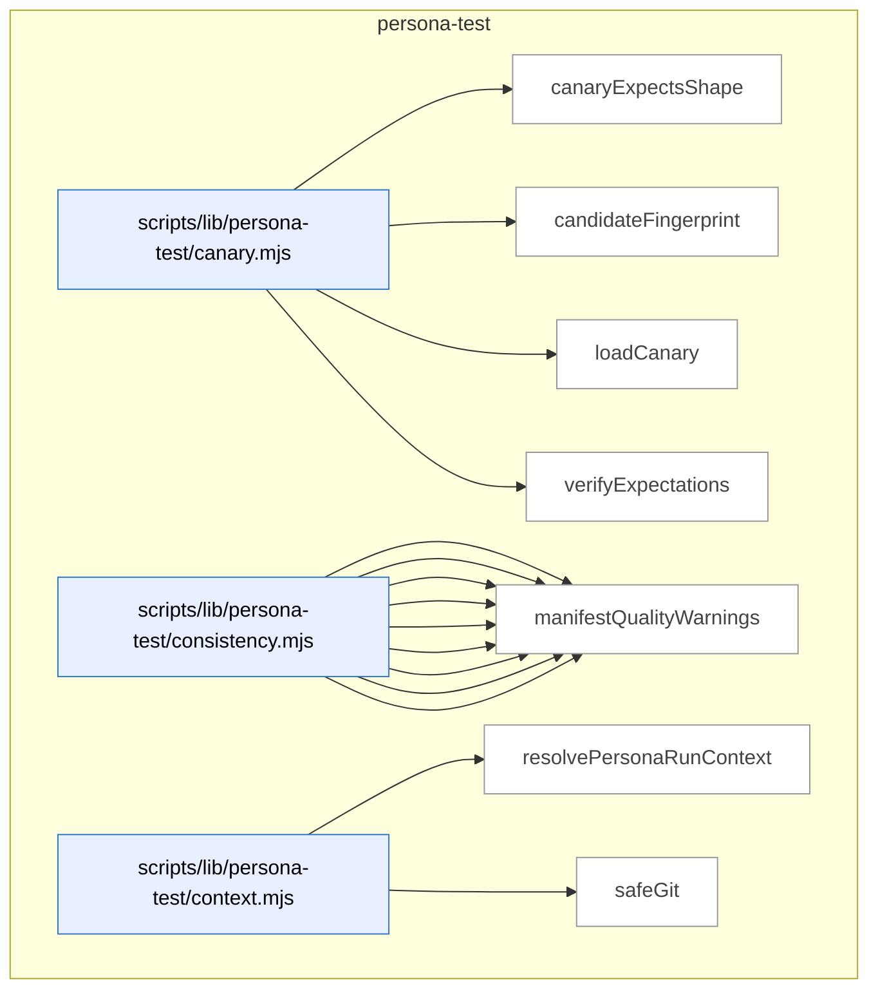

_Domain has 89 symbols (>50). Diagram shows top-15 by file order; see flat table below for the full list._

### Symbols in this domain

| Symbol | Kind | Path | Lines | Purpose | File imported by |
|---|---|---|---|---|---|
| [`canaryExpectsShape`](../scripts/lib/persona-test/canary.mjs#L289) | function | `scripts/lib/persona-test/canary.mjs` | 289-301 | Checks if a contradiction matches any suppressed shape in the canary's expected contradictions. | `scripts/persona-consistency-run.mjs`, `tests/persona-test-canary.test.mjs` |
| [`candidateFingerprint`](../scripts/lib/persona-test/canary.mjs#L318) | function | `scripts/lib/persona-test/canary.mjs` | 318-337 | Hashes a contradiction's semantic identity (surface, field, scope, key, kind) to create a stable fingerprint. | `scripts/persona-consistency-run.mjs`, `tests/persona-test-canary.test.mjs` |
| [`loadCanary`](../scripts/lib/persona-test/canary.mjs#L38) | function | `scripts/lib/persona-test/canary.mjs` | 38-141 | Loads a JSON canary file from the canaries/ directory with path validation to prevent symlink escapes. | `scripts/persona-consistency-run.mjs`, `tests/persona-test-canary.test.mjs` |
| [`verifyExpectations`](../scripts/lib/persona-test/canary.mjs#L193) | function | `scripts/lib/persona-test/canary.mjs` | 193-268 | Checks if contradictions found in a persona-consistency test meet the canary's min/max expectations. | `scripts/persona-consistency-run.mjs`, `tests/persona-test-canary.test.mjs` |
| [`appliesToCurrent`](../scripts/lib/persona-test/consistency.mjs#L488) | function | `scripts/lib/persona-test/consistency.mjs` | 488-506 | Checks if a surface criterion applies to the current route/journey-step/state-tag context. | `scripts/persona-consistency-run.mjs`, `tests/persona-test-consistency.test.mjs` |
| [`clampToFloor`](../scripts/lib/persona-test/consistency.mjs#L118) | function | `scripts/lib/persona-test/consistency.mjs` | 118-122 | Lowers a severity rating to a minimum floor if it exceeds the threshold. | `scripts/persona-consistency-run.mjs`, `tests/persona-test-consistency.test.mjs` |
| [`coerceDomKey`](../scripts/lib/persona-test/consistency.mjs#L91) | function | `scripts/lib/persona-test/consistency.mjs` | 91-113 | Coerces a DOM attribute key to the inferred type (string, number, or boolean). | `scripts/persona-consistency-run.mjs`, `tests/persona-test-consistency.test.mjs` |
| [`coerceDomValue`](../scripts/lib/persona-test/consistency.mjs#L38) | function | `scripts/lib/persona-test/consistency.mjs` | 38-80 | Parses a DOM attribute string into its declared type (boolean, integer, enum, id, prose, freshness). | `scripts/persona-consistency-run.mjs`, `tests/persona-test-consistency.test.mjs` |
| [`deepEqual`](../scripts/lib/persona-test/consistency.mjs#L508) | function | `scripts/lib/persona-test/consistency.mjs` | 508-522 | Performs recursive deep equality comparison of two values including objects and arrays. | `scripts/persona-consistency-run.mjs`, `tests/persona-test-consistency.test.mjs` |
| [`diffClaims`](../scripts/lib/persona-test/consistency.mjs#L139) | function | `scripts/lib/persona-test/consistency.mjs` | 139-406 | Compares declared surfaces and engine fields from a manifest against what the DOM actually rendered and claimed, emitting contradictions. | `scripts/persona-consistency-run.mjs`, `tests/persona-test-consistency.test.mjs` |
| [`locatorToString`](../scripts/lib/persona-test/consistency.mjs#L454) | function | `scripts/lib/persona-test/consistency.mjs` | 454-464 | Formats a DOM locator object (role, label, testid, id, css) into a human-readable string. | `scripts/persona-consistency-run.mjs`, `tests/persona-test-consistency.test.mjs` |
| [`make`](../scripts/lib/persona-test/consistency.mjs#L437) | function | `scripts/lib/persona-test/consistency.mjs` | 437-452 | Constructs a consistency contradiction object with all relevant fields (kind, severity, surface, values, etc.). | `scripts/persona-consistency-run.mjs`, `tests/persona-test-consistency.test.mjs` |
| [`manifestQualityWarnings`](../scripts/lib/persona-test/consistency.mjs#L420) | function | `scripts/lib/persona-test/consistency.mjs` | 420-433 | Emits warnings when a consistency-test manifest uses CSS selectors instead of semantic locators (role, label, testid, id). | `scripts/persona-consistency-run.mjs`, `tests/persona-test-consistency.test.mjs` |
| [`resolvePersonaRunContext`](../scripts/lib/persona-test/context.mjs#L28) | function | `scripts/lib/persona-test/context.mjs` | 28-65 | Validates and constructs a persona test run context from repo identity, journey key, and git metadata. | _(internal)_ |
| [`safeGit`](../scripts/lib/persona-test/context.mjs#L67) | function | `scripts/lib/persona-test/context.mjs` | 67-74 | Safely executes git commands and returns trimmed output or null on failure. | _(internal)_ |
| [`normaliseForReplay`](../scripts/lib/persona-test/ledger.mjs#L156) | function | `scripts/lib/persona-test/ledger.mjs` | 156-196 | Strips timestamps and sorts witness claims to make ledgers deterministic for replay validation. | `scripts/persona-consistency-run.mjs`, `tests/persona-test-ledger.test.mjs` |
| [`openLedger`](../scripts/lib/persona-test/ledger.mjs#L56) | function | `scripts/lib/persona-test/ledger.mjs` | 56-139 | Creates and persists a persona-test session ledger with initial state and append/record methods. | `scripts/persona-consistency-run.mjs`, `tests/persona-test-ledger.test.mjs` |
| [`persist`](../scripts/lib/persona-test/ledger.mjs#L141) | function | `scripts/lib/persona-test/ledger.mjs` | 141-143 | Writes a ledger object to disk as JSON using atomic write. | `scripts/persona-consistency-run.mjs`, `tests/persona-test-ledger.test.mjs` |
| [`s`](../scripts/lib/persona-test/ledger.mjs#L200) | function | `scripts/lib/persona-test/ledger.mjs` | 200-200 | Converts a value to string, returning empty string for null/undefined. | `scripts/persona-consistency-run.mjs`, `tests/persona-test-ledger.test.mjs` |
| [`stableCompareContradiction`](../scripts/lib/persona-test/ledger.mjs#L224) | function | `scripts/lib/persona-test/ledger.mjs` | 224-232 | Comparison function that sorts contradictions by kind, surfaceId, engineField, scope, and key. | `scripts/persona-consistency-run.mjs`, `tests/persona-test-ledger.test.mjs` |
| [`stableCompareDom`](../scripts/lib/persona-test/ledger.mjs#L202) | function | `scripts/lib/persona-test/ledger.mjs` | 202-209 | Comparison function that sorts DOM claims by surfaceId, engineField, scope, and key. | `scripts/persona-consistency-run.mjs`, `tests/persona-test-ledger.test.mjs` |
| [`stableCompareFreshness`](../scripts/lib/persona-test/ledger.mjs#L233) | function | `scripts/lib/persona-test/ledger.mjs` | 233-238 | Comparison function that sorts freshness findings by surfaceId and engineField. | `scripts/persona-consistency-run.mjs`, `tests/persona-test-ledger.test.mjs` |
| [`stableCompareNetwork`](../scripts/lib/persona-test/ledger.mjs#L210) | function | `scripts/lib/persona-test/ledger.mjs` | 210-217 | Comparison function that sorts network claims by surfaceId, engineField, scope, and key. | `scripts/persona-consistency-run.mjs`, `tests/persona-test-ledger.test.mjs` |
| [`stableCompareUndeclared`](../scripts/lib/persona-test/ledger.mjs#L218) | function | `scripts/lib/persona-test/ledger.mjs` | 218-223 | Comparison function that sorts undeclared DOM claims by engineField and selector. | `scripts/persona-consistency-run.mjs`, `tests/persona-test-ledger.test.mjs` |
| [`stableCompareWarning`](../scripts/lib/persona-test/ledger.mjs#L239) | function | `scripts/lib/persona-test/ledger.mjs` | 239-244 | Comparison function that sorts warnings by kind and surfaceId. | `scripts/persona-consistency-run.mjs`, `tests/persona-test-ledger.test.mjs` |
| [`resolveManifest`](../scripts/lib/persona-test/manifest-resolver.mjs#L50) | function | `scripts/lib/persona-test/manifest-resolver.mjs` | 50-126 | Locates the consistency manifest file by trying resolver functions until one returns a valid readable path. | `scripts/persona-consistency-run.mjs`, `tests/persona-test-manifest-resolver.test.mjs` |
| [`assertEgressApproved`](../scripts/lib/persona-test/semantic-compare.mjs#L39) | function | `scripts/lib/persona-test/semantic-compare.mjs` | 39-53 | Validates that a model ID belongs to an approved provider (Claude or Gemini only). | `tests/persona-test-semantic-compare.test.mjs` |
| [`compare`](../scripts/lib/persona-test/semantic-compare.mjs#L83) | function | `scripts/lib/persona-test/semantic-compare.mjs` | 83-204 | Performs semantic LLM-based comparison of two prose strings after redaction and truncation. | `tests/persona-test-semantic-compare.test.mjs` |
| [`createInMemoryCache`](../scripts/lib/persona-test/semantic-compare.mjs#L248) | function | `scripts/lib/persona-test/semantic-compare.mjs` | 248-255 | Returns a simple Map-backed cache object with get/set/size methods. | `tests/persona-test-semantic-compare.test.mjs` |
| [`makeCacheKey`](../scripts/lib/persona-test/semantic-compare.mjs#L219) | function | `scripts/lib/persona-test/semantic-compare.mjs` | 219-227 | Generates a SHA256 hash key from two prose values and a model ID for caching verdicts. | `tests/persona-test-semantic-compare.test.mjs` |
| [`renderUserPrompt`](../scripts/lib/persona-test/semantic-compare.mjs#L206) | function | `scripts/lib/persona-test/semantic-compare.mjs` | 206-217 | Formats the LLM user prompt for semantic prose comparison with truncation disclaimer. | `tests/persona-test-semantic-compare.test.mjs` |
| [`safeCacheGet`](../scripts/lib/persona-test/semantic-compare.mjs#L229) | function | `scripts/lib/persona-test/semantic-compare.mjs` | 229-238 | Safely retrieves and validates a cached verdict without throwing on parse errors. | `tests/persona-test-semantic-compare.test.mjs` |
| [`safeCacheSet`](../scripts/lib/persona-test/semantic-compare.mjs#L239) | function | `scripts/lib/persona-test/semantic-compare.mjs` | 239-241 | Safely stores a verdict in cache, silently ignoring cache failures. | `tests/persona-test-semantic-compare.test.mjs` |
| [`buildPersonaSessionId`](../scripts/lib/persona-test/session-id.mjs#L55) | function | `scripts/lib/persona-test/session-id.mjs` | 55-59 | Generates a unique session ID using current timestamp and UUID. | `scripts/cross-skill.mjs`, `tests/on-conflict-scope-identity.test.mjs` |
| [`isCollisionResistantSessionId`](../scripts/lib/persona-test/session-id.mjs#L72) | function | `scripts/lib/persona-test/session-id.mjs` | 72-74 | Tests if a string matches the persona session ID format pattern. | `scripts/cross-skill.mjs`, `tests/on-conflict-scope-identity.test.mjs` |
| [`auditFilePathTokens`](../scripts/lib/persona/audit-correlator.mjs#L136) | function | `scripts/lib/persona/audit-correlator.mjs` | 136-138 | Extracts tokens from an audit finding's primary file path. | `scripts/cross-skill.mjs`, `scripts/lib/store/persona-outcomes.mjs`, `tests/persona-audit-correlator.test.mjs` |
| [`auditKeywordTokens`](../scripts/lib/persona/audit-correlator.mjs#L140) | function | `scripts/lib/persona/audit-correlator.mjs` | 140-142 | Extracts tokens from an audit finding's detail snapshot and category. | `scripts/cross-skill.mjs`, `scripts/lib/store/persona-outcomes.mjs`, `tests/persona-audit-correlator.test.mjs` |
| [`buildStepUrlLookup`](../scripts/lib/persona/audit-correlator.mjs#L236) | function | `scripts/lib/persona/audit-correlator.mjs` | 236-245 | Creates a map from journey step numbers to sanitized URLs. | `scripts/cross-skill.mjs`, `scripts/lib/store/persona-outcomes.mjs`, `tests/persona-audit-correlator.test.mjs` |
| [`decideCorrelations`](../scripts/lib/persona/audit-correlator.mjs#L264) | function | `scripts/lib/persona/audit-correlator.mjs` | 264-324 | Correlates persona P0/P1 findings to audit findings, marking them as confirmed hits or severity understatements. | `scripts/cross-skill.mjs`, `scripts/lib/store/persona-outcomes.mjs`, `tests/persona-audit-correlator.test.mjs` |
| [`isMalformedFinding`](../scripts/lib/persona/audit-correlator.mjs#L83) | function | `scripts/lib/persona/audit-correlator.mjs` | 83-86 | Checks if a persona finding is missing required element or observed text fields. | `scripts/cross-skill.mjs`, `scripts/lib/store/persona-outcomes.mjs`, `tests/persona-audit-correlator.test.mjs` |
| [`isNewerOrHigherSeverity`](../scripts/lib/persona/audit-correlator.mjs#L218) | function | `scripts/lib/persona/audit-correlator.mjs` | 218-223 | Compares two findings by creation time, breaking ties by severity rank. | `scripts/cross-skill.mjs`, `scripts/lib/store/persona-outcomes.mjs`, `tests/persona-audit-correlator.test.mjs` |
| [`isP0OrP1`](../scripts/lib/persona/audit-correlator.mjs#L70) | function | `scripts/lib/persona/audit-correlator.mjs` | 70-72 | Returns true if a persona finding is marked as P0 or P1 severity. | `scripts/cross-skill.mjs`, `scripts/lib/store/persona-outcomes.mjs`, `tests/persona-audit-correlator.test.mjs` |
| [`isSeverityUnderstated`](../scripts/lib/persona/audit-correlator.mjs#L226) | function | `scripts/lib/persona/audit-correlator.mjs` | 226-228 | Checks if a P0 persona finding matched an audit finding with lower (LOW/MEDIUM) severity. | `scripts/cross-skill.mjs`, `scripts/lib/store/persona-outcomes.mjs`, `tests/persona-audit-correlator.test.mjs` |
| [`matchFinding`](../scripts/lib/persona/audit-correlator.mjs#L183) | function | `scripts/lib/persona/audit-correlator.mjs` | 183-212 | Finds the best-matching audit finding for a persona finding via exact fingerprint lookup or fuzzy token scoring. | `scripts/cross-skill.mjs`, `scripts/lib/store/persona-outcomes.mjs`, `tests/persona-audit-correlator.test.mjs` |
| [`overlapCoefficient`](../scripts/lib/persona/audit-correlator.mjs#L112) | function | `scripts/lib/persona/audit-correlator.mjs` | 112-119 | Measures token overlap between two sets as the ratio of shared tokens to the smaller set size. | `scripts/cross-skill.mjs`, `scripts/lib/store/persona-outcomes.mjs`, `tests/persona-audit-correlator.test.mjs` |
| [`personaFilePathTokens`](../scripts/lib/persona/audit-correlator.mjs#L126) | function | `scripts/lib/persona/audit-correlator.mjs` | 126-129 | Extracts tokens from a persona finding's element and associated step URL. | `scripts/cross-skill.mjs`, `scripts/lib/store/persona-outcomes.mjs`, `tests/persona-audit-correlator.test.mjs` |
| [`personaFindingHash`](../scripts/lib/persona/audit-correlator.mjs#L62) | function | `scripts/lib/persona/audit-correlator.mjs` | 62-67 | Computes a semantic ID for a persona test finding based on its element, severity code, and observed text. | `scripts/cross-skill.mjs`, `scripts/lib/store/persona-outcomes.mjs`, `tests/persona-audit-correlator.test.mjs` |
| [`personaKeywordTokens`](../scripts/lib/persona/audit-correlator.mjs#L131) | function | `scripts/lib/persona/audit-correlator.mjs` | 131-133 | Extracts tokens from a persona finding's observed text. | `scripts/cross-skill.mjs`, `scripts/lib/store/persona-outcomes.mjs`, `tests/persona-audit-correlator.test.mjs` |
| [`pickBest`](../scripts/lib/persona/audit-correlator.mjs#L214) | function | `scripts/lib/persona/audit-correlator.mjs` | 214-216 | Selects the most recent or highest-severity finding from a list of candidates. | `scripts/cross-skill.mjs`, `scripts/lib/store/persona-outcomes.mjs`, `tests/persona-audit-correlator.test.mjs` |
| [`scoreMatch`](../scripts/lib/persona/audit-correlator.mjs#L153) | function | `scripts/lib/persona/audit-correlator.mjs` | 153-163 | Computes a combined match score between a persona finding and audit finding using file-path and keyword overlap. | `scripts/cross-skill.mjs`, `scripts/lib/store/persona-outcomes.mjs`, `tests/persona-audit-correlator.test.mjs` |
| [`tokenize`](../scripts/lib/persona/audit-correlator.mjs#L94) | function | `scripts/lib/persona/audit-correlator.mjs` | 94-101 | Splits text into lowercased word tokens, filtering out tokens shorter than 3 characters. | `scripts/cross-skill.mjs`, `scripts/lib/store/persona-outcomes.mjs`, `tests/persona-audit-correlator.test.mjs` |
| [`callCrossSkill`](../scripts/persona-consistency-promote.mjs#L71) | function | `scripts/persona-consistency-promote.mjs` | 71-96 | Invokes cross-skill CLI commands with JSON payloads and parses responses, disambiguating errors. | `tests/persona-consistency-promote.test.mjs` |
| [`defaultPrompt`](../scripts/persona-consistency-promote.mjs#L563) | function | `scripts/persona-consistency-promote.mjs` | 563-568 | Prompts the user for input via stdin and resolves with their answer as a promise. | `tests/persona-consistency-promote.test.mjs` |
| [`listConsistencyCandidatesViaCli`](../scripts/persona-consistency-promote.mjs#L98) | function | `scripts/persona-consistency-promote.mjs` | 98-107 | Lists pending consistency-promotion candidates from the learning store via cross-skill. | `tests/persona-consistency-promote.test.mjs` |
| [`parseArgs`](../scripts/persona-consistency-promote.mjs#L142) | function | `scripts/persona-consistency-promote.mjs` | 142-159 | Parses CLI arguments for consistency promotion into a config object (auto, since, repo-root, out). | `tests/persona-consistency-promote.test.mjs` |
| [`promoteCandidates`](../scripts/persona-consistency-promote.mjs#L195) | function | `scripts/persona-consistency-promote.mjs` | 195-276 | Main orchestrator: lists pending candidates, prompts for approval, promotes each and records outcomes. | `tests/persona-consistency-promote.test.mjs` |
| [`promoteOne`](../scripts/persona-consistency-promote.mjs#L282) | function | `scripts/persona-consistency-promote.mjs` | 282-423 | Promotes a single consistency candidate: validates schemas, renders Playwright spec, upserts and journals. | `tests/persona-consistency-promote.test.mjs` |
| [`promoteRegressionSpecViaCli`](../scripts/persona-consistency-promote.mjs#L109) | function | `scripts/persona-consistency-promote.mjs` | 109-115 | Promotes a consistency candidate to a locked regression spec via cross-skill. | `tests/persona-consistency-promote.test.mjs` |
| [`readLocalRepoUuid`](../scripts/persona-consistency-promote.mjs#L570) | function | `scripts/persona-consistency-promote.mjs` | 570-576 | Reads the repo UUID from `.audit-loop/repo-identity.json`, returning null if absent or on error. | `tests/persona-consistency-promote.test.mjs` |
| [`reconcilePromotionJournal`](../scripts/persona-consistency-promote.mjs#L429) | function | `scripts/persona-consistency-promote.mjs` | 429-546 | Reconciles incomplete promotion journals from crashed runs: distinguishes pending (DB query needed) from finalized states. | `tests/persona-consistency-promote.test.mjs` |
| [`recordShipEventViaCli`](../scripts/persona-consistency-promote.mjs#L117) | function | `scripts/persona-consistency-promote.mjs` | 117-124 | Records a ship event (promotion outcome) to the learning store, silently succeeding if cloud is off. | `tests/persona-consistency-promote.test.mjs` |
| [`removeJournal`](../scripts/persona-consistency-promote.mjs#L558) | function | `scripts/persona-consistency-promote.mjs` | 558-561 | Removes a promotion journal entry file via retry-safe unlink. | `tests/persona-consistency-promote.test.mjs` |
| [`safeGitBranch`](../scripts/persona-consistency-promote.mjs#L592) | function | `scripts/persona-consistency-promote.mjs` | 592-598 | Runs `git rev-parse --abbrev-ref HEAD` safely to get the current branch name or null on failure. | `tests/persona-consistency-promote.test.mjs` |
| [`safeGitEmail`](../scripts/persona-consistency-promote.mjs#L578) | function | `scripts/persona-consistency-promote.mjs` | 578-584 | Runs `git config user.email` safely to retrieve the git email or null on failure. | `tests/persona-consistency-promote.test.mjs` |
| [`safeGitSha`](../scripts/persona-consistency-promote.mjs#L585) | function | `scripts/persona-consistency-promote.mjs` | 585-591 | Runs `git rev-parse HEAD` safely to get the current commit SHA or null on failure. | `tests/persona-consistency-promote.test.mjs` |
| [`usage`](../scripts/persona-consistency-promote.mjs#L161) | function | `scripts/persona-consistency-promote.mjs` | 161-174 | Returns the usage/help documentation string for persona-consistency-promote. | `tests/persona-consistency-promote.test.mjs` |
| [`writeJournal`](../scripts/persona-consistency-promote.mjs#L552) | function | `scripts/persona-consistency-promote.mjs` | 552-556 | Atomically writes a promotion journal entry to disk via atomic-write. | `tests/persona-consistency-promote.test.mjs` |
| [`applyWait`](../scripts/persona-consistency-run.mjs#L702) | function | `scripts/persona-consistency-run.mjs` | 702-715 | Applies a wait condition (visible/hidden/URL/network pattern/timeout) to a Playwright page. | `tests/persona-consistency-run-args.test.mjs` |
| [`awaitManifestNetworkSources`](../scripts/persona-consistency-run.mjs#L534) | function | `scripts/persona-consistency-run.mjs` | 534-607 | Waits for manifest-declared network requests matching stored patterns, respecting per-source or CLI-overridden timeouts. | `tests/persona-consistency-run-args.test.mjs` |
| [`candidateDescription`](../scripts/persona-consistency-run.mjs#L766) | function | `scripts/persona-consistency-run.mjs` | 766-768 | Returns a concise description of a consistency finding combining its kind, surface, field, and severity. | `tests/persona-consistency-run-args.test.mjs` |
| [`candidateWorthy`](../scripts/persona-consistency-run.mjs#L759) | function | `scripts/persona-consistency-run.mjs` | 759-764 | Filters consistency findings to only P0/P1 surface-scoped items that aren't expected by the canary spec. | `tests/persona-consistency-run-args.test.mjs` |
| [`cssEscape`](../scripts/persona-consistency-run.mjs#L698) | function | `scripts/persona-consistency-run.mjs` | 698-700 | Escapes special characters in a string for use in CSS selectors via regex replacement. | `tests/persona-consistency-run-args.test.mjs` |
| [`describeAction`](../scripts/persona-consistency-run.mjs#L717) | function | `scripts/persona-consistency-run.mjs` | 717-726 | Returns a human-readable description of a journey step's action (navigate, click, fill, wait, evaluate). | `tests/persona-consistency-run-args.test.mjs` |
| [`detectUnannotatedSurfaces`](../scripts/persona-consistency-run.mjs#L629) | function | `scripts/persona-consistency-run.mjs` | 629-667 | Finds surfaces in the live DOM that match the manifest but lack data-engine-claim annotations and emits them as P2 findings. | `tests/persona-consistency-run-args.test.mjs` |
| [`emptyWitness`](../scripts/persona-consistency-run.mjs#L791) | function | `scripts/persona-consistency-run.mjs` | 791-800 | Returns an empty witness object for a given step index with null/empty placeholders. | `tests/persona-consistency-run-args.test.mjs` |
| [`executeStep`](../scripts/persona-consistency-run.mjs#L465) | function | `scripts/persona-consistency-run.mjs` | 465-504 | Executes a single journey step (navigate/click/fill/wait/evaluate) and returns the resolved target URL and response status. | `tests/persona-consistency-run-args.test.mjs` |
| [`joinUrl`](../scripts/persona-consistency-run.mjs#L802) | function | `scripts/persona-consistency-run.mjs` | 802-808 | Joins a base URL with a relative or absolute suffix, normalizing trailing slashes and handling protocols. | `tests/persona-consistency-run-args.test.mjs` |
| [`locatorOf`](../scripts/persona-consistency-run.mjs#L681) | function | `scripts/persona-consistency-run.mjs` | 681-692 | Converts a locator object to a Playwright page locator using the appropriate selector strategy (role, label, testid, CSS, etc.). | `tests/persona-consistency-run-args.test.mjs` |
| [`locatorString`](../scripts/persona-consistency-run.mjs#L728) | function | `scripts/persona-consistency-run.mjs` | 728-738 | Converts a locator object to a compact string representation for logging and display. | `tests/persona-consistency-run-args.test.mjs` |
| [`locatorToStringLite`](../scripts/persona-consistency-run.mjs#L669) | function | `scripts/persona-consistency-run.mjs` | 669-679 | Converts a locator object to a compact human-readable string representation (e.g., "role=button[name=\"Save\"]"). | `tests/persona-consistency-run-args.test.mjs` |
| [`newAuthedContext`](../scripts/persona-consistency-run.mjs#L742) | function | `scripts/persona-consistency-run.mjs` | 742-755 | Creates a new Playwright browser context with optional authentication (storageState or Bearer token). | `tests/persona-consistency-run-args.test.mjs` |
| [`parseArgs`](../scripts/persona-consistency-run.mjs#L56) | function | `scripts/persona-consistency-run.mjs` | 56-77 | Parses CLI flags (--canary, --url, --out, --repo-root, --await-ms) into an object with defaults. | `tests/persona-consistency-run-args.test.mjs` |
| [`readLocalRepoUuid`](../scripts/persona-consistency-run.mjs#L827) | function | `scripts/persona-consistency-run.mjs` | 827-836 | Reads the repo UUID from `.audit-loop/repo-identity.json`, returning null if absent or on error. | `tests/persona-consistency-run-args.test.mjs` |
| [`runConsistency`](../scripts/persona-consistency-run.mjs#L117) | function | `scripts/persona-consistency-run.mjs` | 117-458 | Main orchestration: opens a ledger, probes Playwright, loads the manifest, runs consistency checks, and closes the browser. | `tests/persona-consistency-run-args.test.mjs` |
| [`safeBrowserClose`](../scripts/persona-consistency-run.mjs#L823) | function | `scripts/persona-consistency-run.mjs` | 823-825 | Safely closes a Playwright browser, silently catching any errors. | `tests/persona-consistency-run-args.test.mjs` |
| [`safeCurrentRoute`](../scripts/persona-consistency-run.mjs#L810) | function | `scripts/persona-consistency-run.mjs` | 810-812 | Extracts the current page pathname from its URL, returning null on error. | `tests/persona-consistency-run-args.test.mjs` |
| [`safeGitSha`](../scripts/persona-consistency-run.mjs#L814) | function | `scripts/persona-consistency-run.mjs` | 814-821 | Runs `git rev-parse HEAD` safely to get the current commit SHA or null on failure. | `tests/persona-consistency-run-args.test.mjs` |
| [`shrinkWitness`](../scripts/persona-consistency-run.mjs#L773) | function | `scripts/persona-consistency-run.mjs` | 773-787 | Filters a witness object to keep only DOM/network claims matching a specific consistency finding's criteria. | `tests/persona-consistency-run-args.test.mjs` |
| [`usage`](../scripts/persona-consistency-run.mjs#L79) | function | `scripts/persona-consistency-run.mjs` | 79-96 | Returns formatted help text describing CLI usage for the persona-consistency-run command. | `tests/persona-consistency-run-args.test.mjs` |

---

## plan

> Parses and validates plan documents (extracting and hashing acceptance criteria, checking status headers), selects audit targets by changed files, and tracks dismissal-likelihood patterns via false-positive EMA scoring.

```mermaid
flowchart TB
subgraph dom_plan ["plan"]
  file_scripts_check_plan_status_mjs["scripts/check-plan-status.mjs"]:::component
  sym_scripts_check_plan_status_mjs_changedFil["changedFilesForPush"]:::symbol
  file_scripts_check_plan_status_mjs --> sym_scripts_check_plan_status_mjs_changedFil
  sym_scripts_check_plan_status_mjs_isAuditSum["isAuditSummary"]:::symbol
  file_scripts_check_plan_status_mjs --> sym_scripts_check_plan_status_mjs_isAuditSum
  sym_scripts_check_plan_status_mjs_lintMode["lintMode"]:::symbol
  file_scripts_check_plan_status_mjs --> sym_scripts_check_plan_status_mjs_lintMode
  sym_scripts_check_plan_status_mjs_main["main"]:::symbol
  file_scripts_check_plan_status_mjs --> sym_scripts_check_plan_status_mjs_main
  sym_scripts_check_plan_status_mjs_selectMode["selectMode"]:::symbol
  file_scripts_check_plan_status_mjs --> sym_scripts_check_plan_status_mjs_selectMode
  file_scripts_lib_plan_criteria_parser_mjs["scripts/lib/plan-criteria-parser.mjs"]:::component
  sym_scripts_lib_plan_criteria_parser_mjs_cri["criterionHash"]:::symbol
  file_scripts_lib_plan_criteria_parser_mjs --> sym_scripts_lib_plan_criteria_parser_mjs_cri
  sym_scripts_lib_plan_criteria_parser_mjs_loc["locateAcceptanceSection"]:::symbol
  file_scripts_lib_plan_criteria_parser_mjs --> sym_scripts_lib_plan_criteria_parser_mjs_loc
  sym_scripts_lib_plan_criteria_parser_mjs_par["parseAcceptanceCriteria"]:::symbol
  file_scripts_lib_plan_criteria_parser_mjs --> sym_scripts_lib_plan_criteria_parser_mjs_par
  sym_scripts_lib_plan_criteria_parser_mjs_sum["summariseCriteria"]:::symbol
  file_scripts_lib_plan_criteria_parser_mjs --> sym_scripts_lib_plan_criteria_parser_mjs_sum
  file_scripts_lib_plan_fp_tracker_mjs["scripts/lib/plan-fp-tracker.mjs"]:::component
  sym_scripts_lib_plan_fp_tracker_mjs_PlanFpTr["PlanFpTracker"]:::symbol
  file_scripts_lib_plan_fp_tracker_mjs --> sym_scripts_lib_plan_fp_tracker_mjs_PlanFpTr
  file_scripts_lib_plan_paths_mjs["scripts/lib/plan-paths.mjs"]:::component
  sym_scripts_lib_plan_paths_mjs__extractPlanK["_extractPlanKeywords"]:::symbol
  file_scripts_lib_plan_paths_mjs --> sym_scripts_lib_plan_paths_mjs__extractPlanK
  sym_scripts_lib_plan_paths_mjs__scanRepoFile["_scanRepoFiles"]:::symbol
  file_scripts_lib_plan_paths_mjs --> sym_scripts_lib_plan_paths_mjs__scanRepoFile
  sym_scripts_lib_plan_paths_mjs_extractPlanPa["extractPlanPaths"]:::symbol
  file_scripts_lib_plan_paths_mjs --> sym_scripts_lib_plan_paths_mjs_extractPlanPa
  file_scripts_lib_plan_status_mjs["scripts/lib/plan-status.mjs"]:::component
  sym_scripts_lib_plan_status_mjs_isSelectable["isSelectableName"]:::symbol
  file_scripts_lib_plan_status_mjs --> sym_scripts_lib_plan_status_mjs_isSelectable
  sym_scripts_lib_plan_status_mjs_normalizeCha["normalizeChangedPlanNames"]:::symbol
  file_scripts_lib_plan_status_mjs --> sym_scripts_lib_plan_status_mjs_normalizeCha
  sym_scripts_lib_plan_status_mjs_parsePlanSta["parsePlanStatus"]:::symbol
  file_scripts_lib_plan_status_mjs --> sym_scripts_lib_plan_status_mjs_parsePlanSta
  sym_scripts_lib_plan_status_mjs_selectAuditP["selectAuditPlan"]:::symbol
  file_scripts_lib_plan_status_mjs --> sym_scripts_lib_plan_status_mjs_selectAuditP
end
classDef container fill:#f5f5f5,stroke:#333,stroke-width:2px,color:#000
classDef component fill:#e8f0ff,stroke:#3178c6,color:#000
classDef symbol fill:#fff,stroke:#999,color:#444
classDef dup fill:#ffe8d8,stroke:#c0392b,stroke-width:2px,color:#000
classDef violation fill:#ffd6d6,stroke:#c0392b,stroke-width:2px,color:#000
```

### Symbols in this domain

| Symbol | Kind | Path | Lines | Purpose | File imported by |
|---|---|---|---|---|---|
| [`changedFilesForPush`](../scripts/check-plan-status.mjs#L48) | function | `scripts/check-plan-status.mjs` | 48-62 | Returns list of files changed in the current git push range (base..head). | _(internal)_ |
| [`isAuditSummary`](../scripts/check-plan-status.mjs#L35) | function | `scripts/check-plan-status.mjs` | 35-35 | Tests whether a filename is an audit-summary plan (exempt from status header requirements). | _(internal)_ |
| [`lintMode`](../scripts/check-plan-status.mjs#L111) | function | `scripts/check-plan-status.mjs` | 111-184 | Scans all plans for missing/malformed status headers, gates on changed files when drift mode active. | _(internal)_ |
| [`main`](../scripts/check-plan-status.mjs#L186) | function | `scripts/check-plan-status.mjs` | 186-198 | Entry point dispatching to plan selection or linting mode based on CLI args. | _(internal)_ |
| [`selectMode`](../scripts/check-plan-status.mjs#L64) | function | `scripts/check-plan-status.mjs` | 64-91 | Selects which plan to audit based on changed files or AUDIT_PREPUSH_PLAN env override. | _(internal)_ |
| [`criterionHash`](../scripts/lib/plan-criteria-parser.mjs#L45) | function | `scripts/lib/plan-criteria-parser.mjs` | 45-48 | Creates a stable SHA256-based 16-char hash from normalized criterion severity/category/description. | `scripts/ux-lock-run.mjs`, `tests/plan-criteria-parser.test.mjs` |
| [`locateAcceptanceSection`](../scripts/lib/plan-criteria-parser.mjs#L56) | function | `scripts/lib/plan-criteria-parser.mjs` | 56-77 | Finds the Acceptance Criteria markdown section between specified heading levels. | `scripts/ux-lock-run.mjs`, `tests/plan-criteria-parser.test.mjs` |
| [`parseAcceptanceCriteria`](../scripts/lib/plan-criteria-parser.mjs#L96) | function | `scripts/lib/plan-criteria-parser.mjs` | 96-152 | Extracts criterion list from Acceptance Criteria section with severity, category, description, setup, and assertion. | `scripts/ux-lock-run.mjs`, `tests/plan-criteria-parser.test.mjs` |
| [`summariseCriteria`](../scripts/lib/plan-criteria-parser.mjs#L158) | function | `scripts/lib/plan-criteria-parser.mjs` | 158-166 | Counts criteria by severity and category to produce summary statistics. | `scripts/ux-lock-run.mjs`, `tests/plan-criteria-parser.test.mjs` |
| [`PlanFpTracker`](../scripts/lib/plan-fp-tracker.mjs#L26) | class | `scripts/lib/plan-fp-tracker.mjs` | 26-140 | Class that tracks false positive patterns with EMA scoring for dismissal-likelihood prediction. | `scripts/lib/audit/legacy-production-audit.mjs`, `scripts/openai-audit.mjs`, `scripts/write-plan-outcomes.mjs`, +1 more |
| [`_extractPlanKeywords`](../scripts/lib/plan-paths.mjs#L112) | function | `scripts/lib/plan-paths.mjs` | 112-154 | Extracts PascalCase identifiers, backtick-quoted names, and heading words from plan text while filtering noise. | `scripts/lib/file-io.mjs`, `scripts/lib/requirements/context.mjs`, `tests/arm-generation.test.mjs`, +1 more |
| [`_scanRepoFiles`](../scripts/lib/plan-paths.mjs#L156) | function | `scripts/lib/plan-paths.mjs` | 156-182 | Recursively walks repo to find source code files matching supported extensions, skipping node_modules and build dirs. | `scripts/lib/file-io.mjs`, `scripts/lib/requirements/context.mjs`, `tests/arm-generation.test.mjs`, +1 more |
| [`extractPlanPaths`](../scripts/lib/plan-paths.mjs#L32) | function | `scripts/lib/plan-paths.mjs` | 32-108 | Extracts file paths referenced in plan markdown via regex patterns and identifier matching. | `scripts/lib/file-io.mjs`, `scripts/lib/requirements/context.mjs`, `tests/arm-generation.test.mjs`, +1 more |
| [`isSelectableName`](../scripts/lib/plan-status.mjs#L123) | function | `scripts/lib/plan-status.mjs` | 123-125 | Tests if a filename is a selectable .md plan file (excludes audit summaries). | `scripts/check-plan-status.mjs`, `scripts/generate-plans-index.mjs`, `scripts/lib/dashboard/collect-reference.mjs`, +2 more |
| [`normalizeChangedPlanNames`](../scripts/lib/plan-status.mjs#L224) | function | `scripts/lib/plan-status.mjs` | 224-233 | Extracts plan filenames from changed file paths for filtered plan selection. | `scripts/check-plan-status.mjs`, `scripts/generate-plans-index.mjs`, `scripts/lib/dashboard/collect-reference.mjs`, +2 more |
| [`parsePlanStatus`](../scripts/lib/plan-status.mjs#L56) | function | `scripts/lib/plan-status.mjs` | 56-120 | Extracts and validates the Status field from plan YAML metadata, detecting duplicates and invalid values. | `scripts/check-plan-status.mjs`, `scripts/generate-plans-index.mjs`, `scripts/lib/dashboard/collect-reference.mjs`, +2 more |
| [`selectAuditPlan`](../scripts/lib/plan-status.mjs#L139) | function | `scripts/lib/plan-status.mjs` | 139-209 | Finds the most recently modified active plan from docs/plans/ directory, reporting unreadable candidates. | `scripts/check-plan-status.mjs`, `scripts/generate-plans-index.mjs`, `scripts/lib/dashboard/collect-reference.mjs`, +2 more |

---

## requirements

> Extracts and indexes implicit security, correctness, and persistence invariants from source code via LLM analysis, deduplicates them through similarity clustering, and maintains a ledger consumed by audits and plans.

```mermaid
flowchart TB
subgraph dom_requirements ["requirements"]
  file_scripts_lib_requirements_context_mjs["scripts/lib/requirements/context.mjs"]:::component
  sym_scripts_lib_requirements_context_mjs_cha["changedSince"]:::symbol
  file_scripts_lib_requirements_context_mjs --> sym_scripts_lib_requirements_context_mjs_cha
  sym_scripts_lib_requirements_context_mjs_get["getPlanRequirementsRubric"]:::symbol
  file_scripts_lib_requirements_context_mjs --> sym_scripts_lib_requirements_context_mjs_get
  sym_scripts_lib_requirements_context_mjs_get["getRequirementsContext"]:::symbol
  file_scripts_lib_requirements_context_mjs --> sym_scripts_lib_requirements_context_mjs_get
  sym_scripts_lib_requirements_context_mjs_glo["globMatch"]:::symbol
  file_scripts_lib_requirements_context_mjs --> sym_scripts_lib_requirements_context_mjs_glo
  file_scripts_lib_requirements_extract_mjs["scripts/lib/requirements/extract.mjs"]:::component
  sym_scripts_lib_requirements_extract_mjs_ass["assignId"]:::symbol
  file_scripts_lib_requirements_extract_mjs --> sym_scripts_lib_requirements_extract_mjs_ass
  sym_scripts_lib_requirements_extract_mjs_bat["batchFiles"]:::symbol
  file_scripts_lib_requirements_extract_mjs --> sym_scripts_lib_requirements_extract_mjs_bat
  sym_scripts_lib_requirements_extract_mjs_ext["extractOneRun"]:::symbol
  file_scripts_lib_requirements_extract_mjs --> sym_scripts_lib_requirements_extract_mjs_ext
  sym_scripts_lib_requirements_extract_mjs_ext["extractRequirements"]:::symbol
  file_scripts_lib_requirements_extract_mjs --> sym_scripts_lib_requirements_extract_mjs_ext
  sym_scripts_lib_requirements_extract_mjs_mer["mergeRequirements"]:::symbol
  file_scripts_lib_requirements_extract_mjs --> sym_scripts_lib_requirements_extract_mjs_mer
  sym_scripts_lib_requirements_extract_mjs_nor["normalizeAssertion"]:::symbol
  file_scripts_lib_requirements_extract_mjs --> sym_scripts_lib_requirements_extract_mjs_nor
  file_scripts_lib_requirements_gap_challenge_m["scripts/lib/requirements/gap-challenge.mjs"]:::component
  sym_scripts_lib_requirements_gap_challenge_m["classifyGaps"]:::symbol
  file_scripts_lib_requirements_gap_challenge_m --> sym_scripts_lib_requirements_gap_challenge_m
  file_scripts_lib_requirements_ledger_mjs["scripts/lib/requirements/ledger.mjs"]:::component
  sym_scripts_lib_requirements_ledger_mjs_deri["deriveIndex"]:::symbol
  file_scripts_lib_requirements_ledger_mjs --> sym_scripts_lib_requirements_ledger_mjs_deri
  sym_scripts_lib_requirements_ledger_mjs_load["loadLedger"]:::symbol
  file_scripts_lib_requirements_ledger_mjs --> sym_scripts_lib_requirements_ledger_mjs_load
  sym_scripts_lib_requirements_ledger_mjs_norm["norm"]:::symbol
  file_scripts_lib_requirements_ledger_mjs --> sym_scripts_lib_requirements_ledger_mjs_norm
  sym_scripts_lib_requirements_ledger_mjs_reco["reconcile"]:::symbol
  file_scripts_lib_requirements_ledger_mjs --> sym_scripts_lib_requirements_ledger_mjs_reco
  sym_scripts_lib_requirements_ledger_mjs_stat["statusFor"]:::symbol
  file_scripts_lib_requirements_ledger_mjs --> sym_scripts_lib_requirements_ledger_mjs_stat
  sym_scripts_lib_requirements_ledger_mjs_writ["writeLedger"]:::symbol
  file_scripts_lib_requirements_ledger_mjs --> sym_scripts_lib_requirements_ledger_mjs_writ
  file_scripts_lib_requirements_llm_json_mjs["scripts/lib/requirements/llm-json.mjs"]:::component
  sym_scripts_lib_requirements_llm_json_mjs_pa["parseLlmJson"]:::symbol
  file_scripts_lib_requirements_llm_json_mjs --> sym_scripts_lib_requirements_llm_json_mjs_pa
  file_scripts_lib_requirements_render_mjs["scripts/lib/requirements/render.mjs"]:::component
  sym_scripts_lib_requirements_render_mjs_cell["cell"]:::symbol
  file_scripts_lib_requirements_render_mjs --> sym_scripts_lib_requirements_render_mjs_cell
  sym_scripts_lib_requirements_render_mjs_prov["provFiles"]:::symbol
  file_scripts_lib_requirements_render_mjs --> sym_scripts_lib_requirements_render_mjs_prov
  sym_scripts_lib_requirements_render_mjs_rend["renderRequirementsMap"]:::symbol
  file_scripts_lib_requirements_render_mjs --> sym_scripts_lib_requirements_render_mjs_rend
  file_scripts_lib_requirements_schema_mjs["scripts/lib/requirements/schema.mjs"]:::component
  sym_scripts_lib_requirements_schema_mjs_uniq["uniqueIds"]:::symbol
  file_scripts_lib_requirements_schema_mjs --> sym_scripts_lib_requirements_schema_mjs_uniq
end
classDef container fill:#f5f5f5,stroke:#333,stroke-width:2px,color:#000
classDef component fill:#e8f0ff,stroke:#3178c6,color:#000
classDef symbol fill:#fff,stroke:#999,color:#444
classDef dup fill:#ffe8d8,stroke:#c0392b,stroke-width:2px,color:#000
classDef violation fill:#ffd6d6,stroke:#c0392b,stroke-width:2px,color:#000
```

### Symbols in this domain

| Symbol | Kind | Path | Lines | Purpose | File imported by |
|---|---|---|---|---|---|
| [`changedSince`](../scripts/lib/requirements/context.mjs#L36) | function | `scripts/lib/requirements/context.mjs` | 36-45 | Returns the set of files changed since a specific git commit SHA. | `scripts/lib/audit/legacy-production-audit.mjs`, `scripts/lib/brainstorm/policy-context.mjs`, `scripts/openai-audit.mjs`, +1 more |
| [`getPlanRequirementsRubric`](../scripts/lib/requirements/context.mjs#L173) | function | `scripts/lib/requirements/context.mjs` | 173-177 | Gets requirements context for files referenced in a plan document. | `scripts/lib/audit/legacy-production-audit.mjs`, `scripts/lib/brainstorm/policy-context.mjs`, `scripts/openai-audit.mjs`, +1 more |
| [`getRequirementsContext`](../scripts/lib/requirements/context.mjs#L61) | function | `scripts/lib/requirements/context.mjs` | 61-141 | Extracts in-scope requirements and coverage context for an audit, handling forward-transitive dependencies. | `scripts/lib/audit/legacy-production-audit.mjs`, `scripts/lib/brainstorm/policy-context.mjs`, `scripts/openai-audit.mjs`, +1 more |
| [`globMatch`](../scripts/lib/requirements/context.mjs#L26) | function | `scripts/lib/requirements/context.mjs` | 26-33 | Matches a file path against a glob pattern with `*` and `**` wildcard support. | `scripts/lib/audit/legacy-production-audit.mjs`, `scripts/lib/brainstorm/policy-context.mjs`, `scripts/openai-audit.mjs`, +1 more |
| [`assignId`](../scripts/lib/requirements/extract.mjs#L59) | function | `scripts/lib/requirements/extract.mjs` | 59-65 | Generates a unique ID for a requirement based on kind, assertion text, and source files. | `scripts/requirements.mjs`, `tests/requirements-extract.test.mjs` |
| [`batchFiles`](../scripts/lib/requirements/extract.mjs#L113) | function | `scripts/lib/requirements/extract.mjs` | 113-125 | Groups files into batches that respect a total token budget for LLM processing. | `scripts/requirements.mjs`, `tests/requirements-extract.test.mjs` |
| [`extractOneRun`](../scripts/lib/requirements/extract.mjs#L134) | function | `scripts/lib/requirements/extract.mjs` | 134-186 | Runs one LLM extraction pass over file batches to extract requirements with error recovery. | `scripts/requirements.mjs`, `tests/requirements-extract.test.mjs` |
| [`extractRequirements`](../scripts/lib/requirements/extract.mjs#L198) | function | `scripts/lib/requirements/extract.mjs` | 198-281 | Extracts requirements from user-specified files with lexical and symlink containment checks. | `scripts/requirements.mjs`, `tests/requirements-extract.test.mjs` |
| [`mergeRequirements`](../scripts/lib/requirements/extract.mjs#L77) | function | `scripts/lib/requirements/extract.mjs` | 77-110 | Merges similar requirements across multiple extraction runs using Jaccard similarity clustering. | `scripts/requirements.mjs`, `tests/requirements-extract.test.mjs` |
| [`normalizeAssertion`](../scripts/lib/requirements/extract.mjs#L54) | function | `scripts/lib/requirements/extract.mjs` | 54-56 | Normalizes a requirement assertion by lowercasing, trimming whitespace, and removing punctuation. | `scripts/requirements.mjs`, `tests/requirements-extract.test.mjs` |
| [`classifyGaps`](../scripts/lib/requirements/gap-challenge.mjs#L45) | function | `scripts/lib/requirements/gap-challenge.mjs` | 45-115 | Uses LLM to assess gaps between extracted requirements and actual code implementation. | `scripts/requirements.mjs` |
| [`deriveIndex`](../scripts/lib/requirements/ledger.mjs#L54) | function | `scripts/lib/requirements/ledger.mjs` | 54-58 | Derives a lightweight index of ledger requirements for quick lookups. | `scripts/lib/requirements/context.mjs`, `scripts/requirements.mjs`, `tests/requirements-context.test.mjs`, +2 more |
| [`loadLedger`](../scripts/lib/requirements/ledger.mjs#L25) | function | `scripts/lib/requirements/ledger.mjs` | 25-37 | Loads the requirements ledger from `.requirements/ledger.json`, returning empty structure if missing. | `scripts/lib/requirements/context.mjs`, `scripts/requirements.mjs`, `tests/requirements-context.test.mjs`, +2 more |
| [`norm`](../scripts/lib/requirements/ledger.mjs#L22) | function | `scripts/lib/requirements/ledger.mjs` | 22-22 | Normalizes text by lowercasing, collapsing whitespace, and stripping trailing punctuation. | `scripts/lib/requirements/context.mjs`, `scripts/requirements.mjs`, `tests/requirements-context.test.mjs`, +2 more |
| [`reconcile`](../scripts/lib/requirements/ledger.mjs#L83) | function | `scripts/lib/requirements/ledger.mjs` | 83-176 | Reconciles newly extracted requirements with prior ledger, handling renames via ambiguity detection. | `scripts/lib/requirements/context.mjs`, `scripts/requirements.mjs`, `tests/requirements-context.test.mjs`, +2 more |
| [`statusFor`](../scripts/lib/requirements/ledger.mjs#L60) | function | `scripts/lib/requirements/ledger.mjs` | 60-68 | Determines a requirement's status (active/needs-review/inferred-only/superseded) based on evidence and gaps. | `scripts/lib/requirements/context.mjs`, `scripts/requirements.mjs`, `tests/requirements-context.test.mjs`, +2 more |
| [`writeLedger`](../scripts/lib/requirements/ledger.mjs#L40) | function | `scripts/lib/requirements/ledger.mjs` | 40-51 | Writes a schema-validated requirements ledger atomically to `.requirements/ledger.json`. | `scripts/lib/requirements/context.mjs`, `scripts/requirements.mjs`, `tests/requirements-context.test.mjs`, +2 more |
| [`parseLlmJson`](../scripts/lib/requirements/llm-json.mjs#L25) | function | `scripts/lib/requirements/llm-json.mjs` | 25-29 | Parses JSON from LLM output, handling markdown code fence wrappers. | `scripts/lib/requirements/extract.mjs`, `scripts/lib/requirements/gap-challenge.mjs`, `tests/requirements-llm-json.test.mjs` |
| [`cell`](../scripts/lib/requirements/render.mjs#L22) | function | `scripts/lib/requirements/render.mjs` | 22-22 | Escapes a string for markdown table cells by removing newlines and escaping pipes. | `scripts/requirements.mjs`, `tests/requirements-render.test.mjs` |
| [`provFiles`](../scripts/lib/requirements/render.mjs#L25) | function | `scripts/lib/requirements/render.mjs` | 25-25 | Extracts unique file paths from a requirement's provenance array. | `scripts/requirements.mjs`, `tests/requirements-render.test.mjs` |
| [`renderRequirementsMap`](../scripts/lib/requirements/render.mjs#L34) | function | `scripts/lib/requirements/render.mjs` | 34-121 | Generates a markdown summary document of the requirements ledger with status breakdown. | `scripts/requirements.mjs`, `tests/requirements-render.test.mjs` |
| [`uniqueIds`](../scripts/lib/requirements/schema.mjs#L110) | function | `scripts/lib/requirements/schema.mjs` | 110-110 | Returns a validation function that checks if array elements have distinct IDs. | `scripts/lib/requirements/extract.mjs`, `scripts/lib/requirements/gap-challenge.mjs`, `scripts/lib/requirements/ledger.mjs`, +3 more |

---

## root-scripts

> The `root-scripts` domain provides CLI utilities for initial project setup, including prerequisite validation, interactive prompts for API keys and database configuration, and helper functions for colored terminal output (success, warning, failure messages).

```mermaid
flowchart TB
subgraph dom_root_scripts ["root-scripts"]
  file_install_mjs["install.mjs"]:::component
  sym_install_mjs_ask["ask"]:::symbol
  file_install_mjs --> sym_install_mjs_ask
  sym_install_mjs_main["main"]:::symbol
  file_install_mjs --> sym_install_mjs_main
  file_setup_mjs["setup.mjs"]:::component
  sym_setup_mjs_ask["ask"]:::symbol
  file_setup_mjs --> sym_setup_mjs_ask
  sym_setup_mjs_checkPrereqs["checkPrereqs"]:::symbol
  file_setup_mjs --> sym_setup_mjs_checkPrereqs
  sym_setup_mjs_fail["fail"]:::symbol
  file_setup_mjs --> sym_setup_mjs_fail
  sym_setup_mjs_installDeps["installDeps"]:::symbol
  file_setup_mjs --> sym_setup_mjs_installDeps
  sym_setup_mjs_installGitHook["installGitHook"]:::symbol
  file_setup_mjs --> sym_setup_mjs_installGitHook
  sym_setup_mjs_installSkills["installSkills"]:::symbol
  file_setup_mjs --> sym_setup_mjs_installSkills
  sym_setup_mjs_main["main"]:::symbol
  file_setup_mjs --> sym_setup_mjs_main
  sym_setup_mjs_ok["ok"]:::symbol
  file_setup_mjs --> sym_setup_mjs_ok
  sym_setup_mjs_setupApiKeys["setupApiKeys"]:::symbol
  file_setup_mjs --> sym_setup_mjs_setupApiKeys
  sym_setup_mjs_setupDatabase["setupDatabase"]:::symbol
  file_setup_mjs --> sym_setup_mjs_setupDatabase
  sym_setup_mjs_setupMaintenance["setupMaintenance"]:::symbol
  file_setup_mjs --> sym_setup_mjs_setupMaintenance
  sym_setup_mjs_warn["warn"]:::symbol
  file_setup_mjs --> sym_setup_mjs_warn
end
classDef container fill:#f5f5f5,stroke:#333,stroke-width:2px,color:#000
classDef component fill:#e8f0ff,stroke:#3178c6,color:#000
classDef symbol fill:#fff,stroke:#999,color:#444
classDef dup fill:#ffe8d8,stroke:#c0392b,stroke-width:2px,color:#000
classDef violation fill:#ffd6d6,stroke:#c0392b,stroke-width:2px,color:#000
```

### Symbols in this domain

| Symbol | Kind | Path | Lines | Purpose | File imported by |
|---|---|---|---|---|---|
| [`ask`](../install.mjs#L18) | function | `install.mjs` | 18-18 | Prompts the user for input and returns a promise resolving to their answer. | _(internal)_ |
| [`main`](../install.mjs#L37) | function | `install.mjs` | 37-238 | Interactive installer that clones the claude-engineering-skills repo to a target directory and sets up scripts. | _(internal)_ |
| [`ask`](../setup.mjs#L26) | function | `setup.mjs` | 26-26 | A readline-based promise wrapper for prompting the user interactively. | _(internal)_ |
| [`checkPrereqs`](../setup.mjs#L35) | function | `setup.mjs` | 35-44 | Verifies that Node.js 18+ and npm are installed and working. | _(internal)_ |
| [`fail`](../setup.mjs#L31) | function | `setup.mjs` | 31-31 | Prints a failure message with a red X symbol prefix. | _(internal)_ |
| [`installDeps`](../setup.mjs#L183) | function | `setup.mjs` | 183-190 | Runs npm install to fetch project dependencies. | _(internal)_ |
| [`installGitHook`](../setup.mjs#L194) | function | `setup.mjs` | 194-222 | Creates or updates a .git/hooks/post-merge hook to auto-update skills after git pull. | _(internal)_ |
| [`installSkills`](../setup.mjs#L165) | function | `setup.mjs` | 165-179 | Builds the skills manifest and installs skill files to ~/.claude/skills/ (global, available in every repo). | _(internal)_ |
| [`main`](../setup.mjs#L226) | function | `setup.mjs` | 226-291 | Orchestrates the complete first-time setup: prerequisites, API keys, database, maintenance, dependencies, skills, and hooks. | _(internal)_ |
| [`ok`](../setup.mjs#L29) | function | `setup.mjs` | 29-29 | Prints a success message with a green checkmark prefix. | _(internal)_ |
| [`setupApiKeys`](../setup.mjs#L55) | function | `setup.mjs` | 55-82 | Interactively prompts for and persists API keys (OpenAI, Gemini, Anthropic) to .env, skipping already-configured keys. | _(internal)_ |
| [`setupDatabase`](../setup.mjs#L91) | function | `setup.mjs` | 91-127 | Guides the user through selecting a database option (local-only or Supabase cloud) and configures related env vars. | _(internal)_ |
| [`setupMaintenance`](../setup.mjs#L136) | function | `setup.mjs` | 136-161 | Optionally enables weekly maintenance checks by setting AUDIT_LOOP_WEEKLY_MAINTENANCE=1. | _(internal)_ |
| [`warn`](../setup.mjs#L30) | function | `setup.mjs` | 30-30 | Prints a warning message with a yellow warning symbol prefix. | _(internal)_ |

---

## scripts

> CLI entry points for the 15 skill commands (/plan, /audit-code, /ux-lock, /persona-test, /ship, etc.) and library modules providing LLM interaction, VCS/git operations, Postgres database access, file I/O, model resolution, and infrastructure setup.

```mermaid
flowchart TB
subgraph dom_scripts ["scripts"]
  file_scripts_anthropic_ping_mjs["scripts/anthropic-ping.mjs"]:::component
  sym_scripts_anthropic_ping_mjs_main["main"]:::symbol
  file_scripts_anthropic_ping_mjs --> sym_scripts_anthropic_ping_mjs_main
  file_scripts_arch_intent_bootstrap_mjs["scripts/arch-intent-bootstrap.mjs"]:::component
  sym_scripts_arch_intent_bootstrap_mjs_copyTe["copyTemplate"]:::symbol
  file_scripts_arch_intent_bootstrap_mjs --> sym_scripts_arch_intent_bootstrap_mjs_copyTe
  sym_scripts_arch_intent_bootstrap_mjs_genera["generateBaseline"]:::symbol
  file_scripts_arch_intent_bootstrap_mjs --> sym_scripts_arch_intent_bootstrap_mjs_genera
  sym_scripts_arch_intent_bootstrap_mjs_log["log"]:::symbol
  file_scripts_arch_intent_bootstrap_mjs --> sym_scripts_arch_intent_bootstrap_mjs_log
  sym_scripts_arch_intent_bootstrap_mjs_main["main"]:::symbol
  file_scripts_arch_intent_bootstrap_mjs --> sym_scripts_arch_intent_bootstrap_mjs_main
  file_scripts_azure_doctor_mjs["scripts/azure-doctor.mjs"]:::component
  sym_scripts_azure_doctor_mjs_main["main"]:::symbol
  file_scripts_azure_doctor_mjs --> sym_scripts_azure_doctor_mjs_main
  sym_scripts_azure_doctor_mjs_parseArgs["parseArgs"]:::symbol
  file_scripts_azure_doctor_mjs --> sym_scripts_azure_doctor_mjs_parseArgs
  sym_scripts_azure_doctor_mjs_renderProbeTabl["renderProbeTable"]:::symbol
  file_scripts_azure_doctor_mjs --> sym_scripts_azure_doctor_mjs_renderProbeTabl
  sym_scripts_azure_doctor_mjs_reportExitCode["reportExitCode"]:::symbol
  file_scripts_azure_doctor_mjs --> sym_scripts_azure_doctor_mjs_reportExitCode
  sym_scripts_azure_doctor_mjs_resolveEnvPath["resolveEnvPath"]:::symbol
  file_scripts_azure_doctor_mjs --> sym_scripts_azure_doctor_mjs_resolveEnvPath
  sym_scripts_azure_doctor_mjs_runAzureDoctor["runAzureDoctor"]:::symbol
  file_scripts_azure_doctor_mjs --> sym_scripts_azure_doctor_mjs_runAzureDoctor
  file_scripts_azure_limits_mjs["scripts/azure-limits.mjs"]:::component
  sym_scripts_azure_limits_mjs_main["main"]:::symbol
  file_scripts_azure_limits_mjs --> sym_scripts_azure_limits_mjs_main
  sym_scripts_azure_limits_mjs_printRow["printRow"]:::symbol
  file_scripts_azure_limits_mjs --> sym_scripts_azure_limits_mjs_printRow
  sym_scripts_azure_limits_mjs_probeClaude["probeClaude"]:::symbol
  file_scripts_azure_limits_mjs --> sym_scripts_azure_limits_mjs_probeClaude
  sym_scripts_azure_limits_mjs_probeOpenAI["probeOpenAI"]:::symbol
  file_scripts_azure_limits_mjs --> sym_scripts_azure_limits_mjs_probeOpenAI
end
classDef container fill:#f5f5f5,stroke:#333,stroke-width:2px,color:#000
classDef component fill:#e8f0ff,stroke:#3178c6,color:#000
classDef symbol fill:#fff,stroke:#999,color:#444
classDef dup fill:#ffe8d8,stroke:#c0392b,stroke-width:2px,color:#000
classDef violation fill:#ffd6d6,stroke:#c0392b,stroke-width:2px,color:#000
```

_Domain has 351 symbols (>50). Diagram shows top-15 by file order; see flat table below for the full list._

### Symbols in this domain

| Symbol | Kind | Path | Lines | Purpose | File imported by |
|---|---|---|---|---|---|
| [`main`](../scripts/anthropic-ping.mjs#L24) | function | `scripts/anthropic-ping.mjs` | 24-59 | Tests Anthropic API connectivity and returns response latency, model, and parsed output. | _(internal)_ |
| [`copyTemplate`](../scripts/arch-intent-bootstrap.mjs#L39) | function | `scripts/arch-intent-bootstrap.mjs` | 39-52 | Copies the architecture-intent template document if not already present. | _(internal)_ |
| [`generateBaseline`](../scripts/arch-intent-bootstrap.mjs#L54) | function | `scripts/arch-intent-bootstrap.mjs` | 54-113 | Extracts the current import graph across detected language stacks to seed allowedDeps as a frozen baseline. | _(internal)_ |
| [`log`](../scripts/arch-intent-bootstrap.mjs#L37) | function | `scripts/arch-intent-bootstrap.mjs` | 37-37 | Logs a prefixed message to stdout. | _(internal)_ |
| [`main`](../scripts/arch-intent-bootstrap.mjs#L115) | function | `scripts/arch-intent-bootstrap.mjs` | 115-130 | Bootstraps architecture-intent setup by copying the template and optionally seeding allowedDeps from the import graph. | _(internal)_ |
| [`main`](../scripts/azure-doctor.mjs#L237) | function | `scripts/azure-doctor.mjs` | 237-286 | Runs Azure doctor with client setup, optional env-file writing, and repo-identity snapshot tracking. | `tests/azure-doctor.test.mjs` |
| [`parseArgs`](../scripts/azure-doctor.mjs#L196) | function | `scripts/azure-doctor.mjs` | 196-206 | Parses command-line arguments into an options object (--fix, --json, --candidate, --env-file). | `tests/azure-doctor.test.mjs` |
| [`renderProbeTable`](../scripts/azure-doctor.mjs#L55) | function | `scripts/azure-doctor.mjs` | 55-62 | Formats Azure deployment verification results as human-readable table rows. | `tests/azure-doctor.test.mjs` |
| [`reportExitCode`](../scripts/azure-doctor.mjs#L65) | function | `scripts/azure-doctor.mjs` | 65-69 | Returns appropriate exit code based on Azure embedding deployment verification status. | `tests/azure-doctor.test.mjs` |
| [`resolveEnvPath`](../scripts/azure-doctor.mjs#L215) | function | `scripts/azure-doctor.mjs` | 215-235 | Resolves a .env file path with symlink and containment checks to prevent writes outside the repo. | `tests/azure-doctor.test.mjs` |
| [`runAzureDoctor`](../scripts/azure-doctor.mjs#L91) | function | `scripts/azure-doctor.mjs` | 91-194 | Probes Azure deployments, validates candidates, and optionally writes the selected deployment to .env. | `tests/azure-doctor.test.mjs` |
| [`main`](../scripts/azure-limits.mjs#L73) | function | `scripts/azure-limits.mjs` | 73-100 | Probes all configured Azure deployments (GPT, embeddings, Opus, Sonnet) and displays their rate-limit status. | _(internal)_ |
| [`printRow`](../scripts/azure-limits.mjs#L36) | function | `scripts/azure-limits.mjs` | 36-45 | Displays a single deployment's rate-limit status (TPM, RPM, window) with success/error formatting. | _(internal)_ |
| [`probeClaude`](../scripts/azure-limits.mjs#L59) | function | `scripts/azure-limits.mjs` | 59-71 | Probes Azure Anthropic Claude deployment with explicit SDK backend to read rate-limit headers. | _(internal)_ |
| [`probeOpenAI`](../scripts/azure-limits.mjs#L47) | function | `scripts/azure-limits.mjs` | 47-57 | Probes Azure OpenAI deployment by making a minimal embedding or completion request to read rate-limit headers. | _(internal)_ |
| [`rowsFrom`](../scripts/azure-limits.mjs#L22) | function | `scripts/azure-limits.mjs` | 22-34 | Extracts Azure/Anthropic rate-limit header values (tokens, requests, windows) from response headers. | _(internal)_ |
| [`buildSurfacesManifest`](../scripts/build-surfaces-manifest.mjs#L322) | function | `scripts/build-surfaces-manifest.mjs` | 322-343 | Discovers, loads, and merges surface fragments into a validated manifest with error collection. | `tests/build-surfaces-manifest.test.mjs` |
| [`canonicalLocator`](../scripts/build-surfaces-manifest.mjs#L144) | function | `scripts/build-surfaces-manifest.mjs` | 144-151 | Converts a locator object (id/css/role/text) to its canonical string form. | `tests/build-surfaces-manifest.test.mjs` |
| [`findFragments`](../scripts/build-surfaces-manifest.mjs#L109) | function | `scripts/build-surfaces-manifest.mjs` | 109-134 | Recursively discovers surface annotation fragment files (*.surface.json). | `tests/build-surfaces-manifest.test.mjs` |
| [`loadFragment`](../scripts/build-surfaces-manifest.mjs#L160) | function | `scripts/build-surfaces-manifest.mjs` | 160-180 | Loads and validates a surface annotation JSON fragment, ensuring it contains surfaces or collections. | `tests/build-surfaces-manifest.test.mjs` |
| [`main`](../scripts/build-surfaces-manifest.mjs#L346) | function | `scripts/build-surfaces-manifest.mjs` | 346-393 | Entry point that builds or verifies surfaces.json against fragments with optional verbosity. | `tests/build-surfaces-manifest.test.mjs` |
| [`mergeFragments`](../scripts/build-surfaces-manifest.mjs#L191) | function | `scripts/build-surfaces-manifest.mjs` | 191-293 | Merges multiple fragments into a deduplicated surfaces manifest, detecting duplicate IDs. | `tests/build-surfaces-manifest.test.mjs` |
| [`renderManifest`](../scripts/build-surfaces-manifest.mjs#L303) | function | `scripts/build-surfaces-manifest.mjs` | 303-305 | Serializes a surfaces manifest to pretty-printed JSON with trailing newline. | `tests/build-surfaces-manifest.test.mjs` |
| [`analyse`](../scripts/cache-hitrate-check.mjs#L175) | function | `scripts/cache-hitrate-check.mjs` | 175-210 | Main analysis logic that loads runs (cloud or local), segments by seed state, and recommends action. | `tests/cache-hitrate-check.test.mjs` |
| [`loadFromLocal`](../scripts/cache-hitrate-check.mjs#L112) | function | `scripts/cache-hitrate-check.mjs` | 112-131 | Reads cached audit metrics from local .audit/cache-metrics.jsonl, filtering by date and round. | `tests/cache-hitrate-check.test.mjs` |
| [`loadFromSupabase`](../scripts/cache-hitrate-check.mjs#L83) | function | `scripts/cache-hitrate-check.mjs` | 83-110 | Queries the cloud audit_runs table for R2+ runs with cache hit-rate data since a cutoff. | `tests/cache-hitrate-check.test.mjs` |
| [`median`](../scripts/cache-hitrate-check.mjs#L74) | function | `scripts/cache-hitrate-check.mjs` | 74-81 | Computes the median value of a numeric array. | `tests/cache-hitrate-check.test.mjs` |
| [`renderHuman`](../scripts/cache-hitrate-check.mjs#L212) | function | `scripts/cache-hitrate-check.mjs` | 212-238 | Formats analysis results for human-readable console output with per-run breakdown. | `tests/cache-hitrate-check.test.mjs` |
| [`segmentAndDecide`](../scripts/cache-hitrate-check.mjs#L142) | function | `scripts/cache-hitrate-check.mjs` | 142-173 | Segments runs by seed state and decides whether to flip the default cache seed via thresholds. | `tests/cache-hitrate-check.test.mjs` |
| [`argOption`](../scripts/cheap-triager-validate.mjs#L58) | function | `scripts/cheap-triager-validate.mjs` | 58-61 | Extracts a command-line flag value, returning a default if the flag is absent. | _(internal)_ |
| [`buildGlmAdapter`](../scripts/cheap-triager-validate.mjs#L87) | function | `scripts/cheap-triager-validate.mjs` | 87-108 | Creates an async function that sends audit findings to a GLM model for triaging. | _(internal)_ |
| [`cmdManifest`](../scripts/cheap-triager-validate.mjs#L241) | function | `scripts/cheap-triager-validate.mjs` | 241-296 | Builds a manifest of triaged worksheet results, validating dataset freshness and computing accuracy. | _(internal)_ |
| [`cmdWorksheet`](../scripts/cheap-triager-validate.mjs#L112) | function | `scripts/cheap-triager-validate.mjs` | 112-202 | Main worksheet command that triages a candidate model against consensus with chunked concurrency. | _(internal)_ |
| [`parseGradesCsv`](../scripts/cheap-triager-validate.mjs#L212) | function | `scripts/cheap-triager-validate.mjs` | 212-239 | Parses a CSV of blind IDs to human false-dismissal labels with optional reasons. | _(internal)_ |
| [`rowPrompt`](../scripts/cheap-triager-validate.mjs#L78) | function | `scripts/cheap-triager-validate.mjs` | 78-85 | Formats an audit finding row into a text prompt with severity, category, file, and detail. | _(internal)_ |
| [`loadConfig`](../scripts/claudemd-lint.mjs#L48) | function | `scripts/claudemd-lint.mjs` | 48-66 | Loads a .claudemd-lint.json configuration file with defaults fallback. | _(internal)_ |
| [`main`](../scripts/claudemd-lint.mjs#L68) | function | `scripts/claudemd-lint.mjs` | 68-172 | Scans instruction files, runs configured linting rules, and outputs findings in terminal or SARIF format. | _(internal)_ |
| [`parseArgs`](../scripts/claudemd-lint.mjs#L26) | function | `scripts/claudemd-lint.mjs` | 26-46 | Parses --format, --out, --config, --fix, and --yes CLI arguments. | _(internal)_ |
| [`buildDsn`](../scripts/db-test-container.mjs#L77) | function | `scripts/db-test-container.mjs` | 77-79 | [SECRET_REDACTED] | `tests/db-test-container.integration.test.mjs`, `tests/db-test-container.test.mjs` |
| [`buildStepEnv`](../scripts/db-test-container.mjs#L96) | function | `scripts/db-test-container.mjs` | 96-106 | Constructs environment variables for a test step, routing the database DSN based on whether the step is destructive. | `tests/db-test-container.integration.test.mjs`, `tests/db-test-container.test.mjs` |
| [`classifyRunFailure`](../scripts/db-test-container.mjs#L148) | function | `scripts/db-test-container.mjs` | 148-160 | Classifies Docker run failures by error text and returns an exit code and user-facing message. | `tests/db-test-container.integration.test.mjs`, `tests/db-test-container.test.mjs` |
| [`createLifecycle`](../scripts/db-test-container.mjs#L243) | function | `scripts/db-test-container.mjs` | 243-465 | Creates a stateful container lifecycle manager that handles setup, teardown, and signal handling for test containers. | `tests/db-test-container.integration.test.mjs`, `tests/db-test-container.test.mjs` |
| [`defaultWaitForReady`](../scripts/db-test-container.mjs#L217) | function | `scripts/db-test-container.mjs` | 217-236 | Polls a Postgres connection until it succeeds or times out. | `tests/db-test-container.integration.test.mjs`, `tests/db-test-container.test.mjs` |
| [`main`](../scripts/db-test-container.mjs#L469) | function | `scripts/db-test-container.mjs` | 469-495 | Parses CLI args, creates a container lifecycle, and runs the selected test mode with signal handlers. | `tests/db-test-container.integration.test.mjs`, `tests/db-test-container.test.mjs` |
| [`parseArgs`](../scripts/db-test-container.mjs#L112) | function | `scripts/db-test-container.mjs` | 112-137 | Parses command-line arguments into a structured options object with mode, port, and keep flags. | `tests/db-test-container.integration.test.mjs`, `tests/db-test-container.test.mjs` |
| [`realExec`](../scripts/db-test-container.mjs#L173) | function | `scripts/db-test-container.mjs` | 173-203 | Spawns a subprocess with optional timeout, captures output, and resolves with exit code and signal. | `tests/db-test-container.integration.test.mjs`, `tests/db-test-container.test.mjs` |
| [`sleep`](../scripts/db-test-container.mjs#L205) | function | `scripts/db-test-container.mjs` | 205-207 | Returns a promise that resolves after a specified number of milliseconds. | `tests/db-test-container.integration.test.mjs`, `tests/db-test-container.test.mjs` |
| [`argOption`](../scripts/defect-harvest.mjs#L27) | function | `scripts/defect-harvest.mjs` | 27-30 | Extracts a command-line flag's value or returns a default. | `tests/defect-harvest.test.mjs` |
| [`blameIntroducers`](../scripts/defect-harvest.mjs#L68) | function | `scripts/defect-harvest.mjs` | 68-84 | Finds git commit SHAs that introduced the pre-image lines modified by a given commit. | `tests/defect-harvest.test.mjs` |
| [`changedFiles`](../scripts/defect-harvest.mjs#L52) | function | `scripts/defect-harvest.mjs` | 52-64 | Returns the list of non-binary, non-sensitive files changed in a commit. | `tests/defect-harvest.test.mjs` |
| [`filesFor`](../scripts/defect-harvest.mjs#L93) | function | `scripts/defect-harvest.mjs` | 93-93 | Returns changed files for a commit, with graceful empty-list fallback on error. | `tests/defect-harvest.test.mjs` |
| [`firstFunctionOriginHint`](../scripts/defect-harvest.mjs#L97) | function | `scripts/defect-harvest.mjs` | 97-108 | Finds the original commit that defined a function modified by a given commit. | `tests/defect-harvest.test.mjs` |
| [`harvestCandidates`](../scripts/defect-harvest.mjs#L118) | function | `scripts/defect-harvest.mjs` | 118-179 | Mines git history for defect candidates (reverts, fixes, blame-based). | `tests/defect-harvest.test.mjs` |
| [`hasFlag`](../scripts/defect-harvest.mjs#L31) | function | `scripts/defect-harvest.mjs` | 31-31 | Checks if a command-line flag is present. | `tests/defect-harvest.test.mjs` |
| [`log`](../scripts/defect-harvest.mjs#L26) | function | `scripts/defect-harvest.mjs` | 26-26 | Writes a message to stderr. | `tests/defect-harvest.test.mjs` |
| [`main`](../scripts/defect-harvest.mjs#L181) | function | `scripts/defect-harvest.mjs` | 181-219 | Harvests defect candidates from repositories and optionally writes a JSON file. | `tests/defect-harvest.test.mjs` |
| [`makeGit`](../scripts/defect-harvest.mjs#L44) | function | `scripts/defect-harvest.mjs` | 44-48 | Creates a git subprocess wrapper for executing commands in a specified directory. | `tests/defect-harvest.test.mjs` |
| [`severityHint`](../scripts/defect-harvest.mjs#L87) | function | `scripts/defect-harvest.mjs` | 87-91 | Guesses defect severity (HIGH/MEDIUM/LOW) from commit subject keywords. | `tests/defect-harvest.test.mjs` |
| [`main`](../scripts/efficacy-lints-check.mjs#L17) | function | `scripts/efficacy-lints-check.mjs` | 17-37 | Runs efficacy lints and optionally blocks build based on rule violations. | _(internal)_ |
| [`appendLocalFallback`](../scripts/friction-log.mjs#L88) | function | `scripts/friction-log.mjs` | 88-94 | Appends a friction-log record to a local JSONL file as cloud fallback. | `scripts/cross-skill.mjs`, `tests/friction-log.test.mjs` |
| [`defaultExecGit`](../scripts/friction-log.mjs#L75) | function | `scripts/friction-log.mjs` | 75-84 | Executes a git command with timeout, returning output or null on failure. | `scripts/cross-skill.mjs`, `tests/friction-log.test.mjs` |
| [`detectRepoName`](../scripts/friction-log.mjs#L61) | function | `scripts/friction-log.mjs` | 61-73 | Determines repository name from CLI flag, git remote, or directory basename. | `scripts/cross-skill.mjs`, `tests/friction-log.test.mjs` |
| [`helpText`](../scripts/friction-log.mjs#L164) | function | `scripts/friction-log.mjs` | 164-174 | Returns help text for the friction-log tool. | `scripts/cross-skill.mjs`, `tests/friction-log.test.mjs` |
| [`main`](../scripts/friction-log.mjs#L185) | function | `scripts/friction-log.mjs` | 185-207 | CLI entry point that parses args, logs friction note, and exits with status. | `scripts/cross-skill.mjs`, `tests/friction-log.test.mjs` |
| [`parseArgs`](../scripts/friction-log.mjs#L31) | function | `scripts/friction-log.mjs` | 31-44 | Parses CLI arguments for the friction-log tool (severity, repo, message). | `scripts/cross-skill.mjs`, `tests/friction-log.test.mjs` |
| [`runFrictionLog`](../scripts/friction-log.mjs#L98) | function | `scripts/friction-log.mjs` | 98-162 | Logs a friction note to cloud store with local fallback, returning status. | `scripts/cross-skill.mjs`, `tests/friction-log.test.mjs` |
| [`validateArgs`](../scripts/friction-log.mjs#L46) | function | `scripts/friction-log.mjs` | 46-53 | Validates friction-log arguments, checking message and severity constraints. | `scripts/cross-skill.mjs`, `tests/friction-log.test.mjs` |
| [`collectPlans`](../scripts/generate-plans-index.mjs#L96) | function | `scripts/generate-plans-index.mjs` | 96-128 | Reads all plan files and collects metadata (status, title, bucket). | _(internal)_ |
| [`extractStatusDetail`](../scripts/generate-plans-index.mjs#L60) | function | `scripts/generate-plans-index.mjs` | 60-69 | Extracts and truncates the Status line detail from plan markdown header. | _(internal)_ |
| [`extractTitle`](../scripts/generate-plans-index.mjs#L49) | function | `scripts/generate-plans-index.mjs` | 49-53 | Extracts H1 title from markdown or derives from filename. | _(internal)_ |
| [`isAuditSummary`](../scripts/generate-plans-index.mjs#L46) | function | `scripts/generate-plans-index.mjs` | 46-46 | Tests if a filename matches the audit-summary pattern. | _(internal)_ |
| [`main`](../scripts/generate-plans-index.mjs#L212) | function | `scripts/generate-plans-index.mjs` | 212-235 | CLI entry: regenerates plans index or checks freshness against tracked files. | _(internal)_ |
| [`renderIndex`](../scripts/generate-plans-index.mjs#L140) | function | `scripts/generate-plans-index.mjs` | 140-210 | Generates full plans index markdown with sections bucketed by status. | _(internal)_ |
| [`table`](../scripts/generate-plans-index.mjs#L130) | function | `scripts/generate-plans-index.mjs` | 130-138 | Renders plan rows as markdown table with status and notes columns. | _(internal)_ |
| [`trackedPlanNames`](../scripts/generate-plans-index.mjs#L82) | function | `scripts/generate-plans-index.mjs` | 82-93 | Gets list of plan .md files tracked by git in docs/plans/. | _(internal)_ |
| [`git`](../scripts/install-git-hooks.mjs#L42) | function | `scripts/install-git-hooks.mjs` | 42-44 | Executes a git command and returns trimmed stdout. | _(internal)_ |
| [`main`](../scripts/install-git-hooks.mjs#L46) | function | `scripts/install-git-hooks.mjs` | 46-70 | Wires the git hooks directory into the local repo's core.hooksPath config. | _(internal)_ |
| [`installInRepo`](../scripts/install-prepush-hook.mjs#L217) | function | `scripts/install-prepush-hook.mjs` | 217-267 | Installs, updates, or uninstalls the managed pre-push hook in a single repository. | `tests/prepush-hook-selection.test.mjs` |
| [`isManagedHook`](../scripts/install-prepush-hook.mjs#L48) | function | `scripts/install-prepush-hook.mjs` | 48-52 | Checks if a pre-push hook file was created by this installer (has marker or legacy signature). | `tests/prepush-hook-selection.test.mjs` |
| [`main`](../scripts/install-prepush-hook.mjs#L271) | function | `scripts/install-prepush-hook.mjs` | 271-295 | CLI entry point; orchestrates hook installation/uninstallation across target repos. | `tests/prepush-hook-selection.test.mjs` |
| [`computeArchMemoryBandOutcome`](../scripts/learning/backfill-outcomes.mjs#L559) | function | `scripts/learning/backfill-outcomes.mjs` | 559-628 | Evaluates whether the user acted on an arch-memory recommendation by checking git commits post-decision. | `scripts/cross-skill.mjs`, `tests/learning-arch-memory-telemetry.test.mjs`, `tests/learning-backfill-outcomes.test.mjs`, +2 more |
| [`computeConvergencePredictOutcome`](../scripts/learning/backfill-outcomes.mjs#L652) | function | `scripts/learning/backfill-outcomes.mjs` | 652-696 | Determines if a convergence-prediction decision was correct by comparing predicted vs actual stop round. | `scripts/cross-skill.mjs`, `tests/learning-arch-memory-telemetry.test.mjs`, `tests/learning-backfill-outcomes.test.mjs`, +2 more |
| [`computeFileFingerprint`](../scripts/learning/backfill-outcomes.mjs#L452) | function | `scripts/learning/backfill-outcomes.mjs` | 452-464 | Computes SHA256 hash of file head to detect log rotation (size shrinkage or fingerprint change). | `scripts/cross-skill.mjs`, `tests/learning-arch-memory-telemetry.test.mjs`, `tests/learning-backfill-outcomes.test.mjs`, +2 more |
| [`computeOutcomeFromFileState`](../scripts/learning/backfill-outcomes.mjs#L762) | function | `scripts/learning/backfill-outcomes.mjs` | 762-820 | Resolves a quickfix-hit decision by checking file existence, deletion, or snippet match. | `scripts/cross-skill.mjs`, `tests/learning-arch-memory-telemetry.test.mjs`, `tests/learning-backfill-outcomes.test.mjs`, +2 more |
| [`computePassSelectionOutcome`](../scripts/learning/backfill-outcomes.mjs#L717) | function | `scripts/learning/backfill-outcomes.mjs` | 717-743 | Grades a pass-selection decision by the acceptance or fix rate of findings it raised. | `scripts/cross-skill.mjs`, `tests/learning-arch-memory-telemetry.test.mjs`, `tests/learning-backfill-outcomes.test.mjs`, +2 more |
| [`defaultExecGit`](../scripts/learning/backfill-outcomes.mjs#L630) | function | `scripts/learning/backfill-outcomes.mjs` | 630-637 | Executes git commands with standard timeout and UTF-8 encoding. | `scripts/cross-skill.mjs`, `tests/learning-arch-memory-telemetry.test.mjs`, `tests/learning-backfill-outcomes.test.mjs`, +2 more |
| [`drainFrictionFallback`](../scripts/learning/backfill-outcomes.mjs#L340) | function | `scripts/learning/backfill-outcomes.mjs` | 340-402 | Uploads friction notes from local fallback storage to the cloud, retaining failed lines for retry. | `scripts/cross-skill.mjs`, `tests/learning-arch-memory-telemetry.test.mjs`, `tests/learning-backfill-outcomes.test.mjs`, +2 more |
| [`drainJsonlToCloud`](../scripts/learning/backfill-outcomes.mjs#L189) | function | `scripts/learning/backfill-outcomes.mjs` | 189-329 | Uploads new lines from the HITS JSONL file to the cloud, tracking offset and fingerprint for resumption. | `scripts/cross-skill.mjs`, `tests/learning-arch-memory-telemetry.test.mjs`, `tests/learning-backfill-outcomes.test.mjs`, +2 more |
| [`readDrainCursor`](../scripts/learning/backfill-outcomes.mjs#L417) | function | `scripts/learning/backfill-outcomes.mjs` | 417-438 | Reads the drain cursor (offset, fingerprint, timestamp) for resuming JSONL uploads. | `scripts/cross-skill.mjs`, `tests/learning-arch-memory-telemetry.test.mjs`, `tests/learning-backfill-outcomes.test.mjs`, +2 more |
| [`resolveUnresolvedOutcomes`](../scripts/learning/backfill-outcomes.mjs#L468) | function | `scripts/learning/backfill-outcomes.mjs` | 468-533 | Processes pending learning decisions, routes each to type-specific outcome detectors, updates the store. | `scripts/cross-skill.mjs`, `tests/learning-arch-memory-telemetry.test.mjs`, `tests/learning-backfill-outcomes.test.mjs`, +2 more |
| [`runBackfill`](../scripts/learning/backfill-outcomes.mjs#L64) | function | `scripts/learning/backfill-outcomes.mjs` | 64-173 | Drains local learning-decision JSONLs and friction notes to cloud, resolves pending decisions, optionally rebuilds stats. | `scripts/cross-skill.mjs`, `tests/learning-arch-memory-telemetry.test.mjs`, `tests/learning-backfill-outcomes.test.mjs`, +2 more |
| [`writeDrainCursor`](../scripts/learning/backfill-outcomes.mjs#L440) | function | `scripts/learning/backfill-outcomes.mjs` | 440-445 | Writes the drain cursor to mark progress in JSONL file scanning. | `scripts/cross-skill.mjs`, `tests/learning-arch-memory-telemetry.test.mjs`, `tests/learning-backfill-outcomes.test.mjs`, +2 more |
| [`fmtNum`](../scripts/learning/replay.mjs#L92) | function | `scripts/learning/replay.mjs` | 92-95 | Formats a number with 2–4 decimal places depending on magnitude. | `scripts/cross-skill.mjs`, `tests/learning-replay.test.mjs` |
| [`loadPolicy`](../scripts/learning/replay.mjs#L99) | function | `scripts/learning/replay.mjs` | 99-109 | Dynamically imports a policy function from a module path or returns a fallback. | `scripts/cross-skill.mjs`, `tests/learning-replay.test.mjs` |
| [`parseDuration`](../scripts/learning/replay.mjs#L54) | function | `scripts/learning/replay.mjs` | 54-63 | Parses human-readable durations (e.g., "30d", "2h") into milliseconds. | `scripts/cross-skill.mjs`, `tests/learning-replay.test.mjs` |
| [`renderMarkdownReport`](../scripts/learning/replay.mjs#L67) | function | `scripts/learning/replay.mjs` | 67-90 | Renders a policy-replay result as a markdown table with distributions and delta summary. | `scripts/cross-skill.mjs`, `tests/learning-replay.test.mjs` |
| [`runReplayCli`](../scripts/learning/replay.mjs#L120) | function | `scripts/learning/replay.mjs` | 120-170 | CLI entry point; replays decisions under a candidate policy vs baseline, outputs JSON or markdown. | `scripts/cross-skill.mjs`, `tests/learning-replay.test.mjs` |
| [`applyTotalCap`](../scripts/learning/weekly-review.mjs#L135) | function | `scripts/learning/weekly-review.mjs` | 135-155 | Distributes a fixed line budget across digest sections (friction, triage, no-brainer, stale) based on caps. | `scripts/cross-skill.mjs`, `tests/learning-weekly-review.test.mjs` |
| [`buildFrictionSection`](../scripts/learning/weekly-review.mjs#L116) | function | `scripts/learning/weekly-review.mjs` | 116-126 | Sorts friction notes by severity rank (blocker, annoyance, note) then date, caps to a limit. | `scripts/cross-skill.mjs`, `tests/learning-weekly-review.test.mjs` |
| [`buildNoBrainerSection`](../scripts/learning/weekly-review.mjs#L95) | function | `scripts/learning/weekly-review.mjs` | 95-103 | Sorts no-brainer findings by occurrence count descending then date, caps to a limit. | `scripts/cross-skill.mjs`, `tests/learning-weekly-review.test.mjs` |
| [`buildStaleSection`](../scripts/learning/weekly-review.mjs#L105) | function | `scripts/learning/weekly-review.mjs` | 105-110 | Sorts stale findings by last-seen date ascending, caps to a limit. | `scripts/cross-skill.mjs`, `tests/learning-weekly-review.test.mjs` |
| [`buildTriageSection`](../scripts/learning/weekly-review.mjs#L84) | function | `scripts/learning/weekly-review.mjs` | 84-93 | Sorts triage items by severity rank then date, caps to a limit, returns items + overflow count. | `scripts/cross-skill.mjs`, `tests/learning-weekly-review.test.mjs` |
| [`fmtPath`](../scripts/learning/weekly-review.mjs#L165) | function | `scripts/learning/weekly-review.mjs` | 165-168 | Escapes backticks in file paths for safe inline code spans. | `scripts/cross-skill.mjs`, `tests/learning-weekly-review.test.mjs` |
| [`fmtTitle`](../scripts/learning/weekly-review.mjs#L159) | function | `scripts/learning/weekly-review.mjs` | 159-163 | Truncates to 120 chars, normalizes whitespace, and markdown-escapes a finding title. | `scripts/cross-skill.mjs`, `tests/learning-weekly-review.test.mjs` |
| [`humanizeAgo`](../scripts/learning/weekly-review.mjs#L174) | function | `scripts/learning/weekly-review.mjs` | 174-186 | Formats a timestamp as human-readable relative time (e.g., "5m ago", "2d ago"). | `scripts/cross-skill.mjs`, `tests/learning-weekly-review.test.mjs` |
| [`mdEscape`](../scripts/learning/weekly-review.mjs#L69) | function | `scripts/learning/weekly-review.mjs` | 69-80 | Escapes markdown special characters (backslash, backtick, asterisk, underscore, brackets, angle brackets). | `scripts/cross-skill.mjs`, `tests/learning-weekly-review.test.mjs` |
| [`postOrUpdateStickyIssue`](../scripts/learning/weekly-review.mjs#L282) | function | `scripts/learning/weekly-review.mjs` | 282-340 | Posts or updates a GitHub issue with the weekly learning review, re-opening closed issues if findings persist. | `scripts/cross-skill.mjs`, `tests/learning-weekly-review.test.mjs` |
| [`renderMarkdown`](../scripts/learning/weekly-review.mjs#L188) | function | `scripts/learning/weekly-review.mjs` | 188-278 | Formats audit findings into a markdown report with sections for friction notes, triage items, no-brainer recommendations, and stale deferrals. | `scripts/cross-skill.mjs`, `tests/learning-weekly-review.test.mjs` |
| [`runWeeklyReview`](../scripts/learning/weekly-review.mjs#L351) | function | `scripts/learning/weekly-review.mjs` | 351-415 | Orchestrates the weekly learning review by fetching triage/no-brainer/stale findings from the database and rendering them as markdown for posting. | `scripts/cross-skill.mjs`, `tests/learning-weekly-review.test.mjs` |
| [`severityRank`](../scripts/learning/weekly-review.mjs#L52) | function | `scripts/learning/weekly-review.mjs` | 52-60 | Returns a numeric rank for severity levels (HIGH=0, MEDIUM=1, LOW=2, unknown=-1). | `scripts/cross-skill.mjs`, `tests/learning-weekly-review.test.mjs` |
| [`argOption`](../scripts/ledger-decompose.mjs#L35) | function | `scripts/ledger-decompose.mjs` | 35-38 | Retrieves a command-line argument value by name, returning a default if not found. | `tests/ledger-decompose.test.mjs` |
| [`decompose`](../scripts/ledger-decompose.mjs#L54) | function | `scripts/ledger-decompose.mjs` | 54-106 | Analyzes audit findings from the database, decomposing them by round, stage, and severity to measure value delivered at each audit round. | `tests/ledger-decompose.test.mjs` |
| [`hasFlag`](../scripts/ledger-decompose.mjs#L39) | function | `scripts/ledger-decompose.mjs` | 39-39 | Checks if a command-line flag is present. | `tests/ledger-decompose.test.mjs` |
| [`log`](../scripts/ledger-decompose.mjs#L34) | function | `scripts/ledger-decompose.mjs` | 34-34 | Writes a message to stderr with a newline. | `tests/ledger-decompose.test.mjs` |
| [`main`](../scripts/ledger-decompose.mjs#L147) | function | `scripts/ledger-decompose.mjs` | 147-192 | Entry point that loads the database layer, decomposes the ledger, and outputs results as markdown or JSON. | `tests/ledger-decompose.test.mjs` |
| [`renderMarkdown`](../scripts/ledger-decompose.mjs#L109) | function | `scripts/ledger-decompose.mjs` | 109-145 | Formats ledger decomposition results into a markdown report showing accepted value distribution by round and stage. | `tests/ledger-decompose.test.mjs` |
| [`roundBucket`](../scripts/ledger-decompose.mjs#L44) | function | `scripts/ledger-decompose.mjs` | 44-44 | Buckets audit rounds into categories: "1" for round 1, "2+" for rounds 2 and beyond, or "unknown". | `tests/ledger-decompose.test.mjs` |
| [`sevWeight`](../scripts/ledger-decompose.mjs#L32) | function | `scripts/ledger-decompose.mjs` | 32-32 | Maps severity levels to numeric weights for computing accepted-finding value totals. | `tests/ledger-decompose.test.mjs` |
| [`extractMermaidBlocks`](../scripts/lint-plan-mermaid.mjs#L41) | function | `scripts/lint-plan-mermaid.mjs` | 41-63 | Extracts code fences containing Mermaid diagrams from Markdown with line numbers. | `tests/lint-plan-mermaid.test.mjs` |
| [`lintFile`](../scripts/lint-plan-mermaid.mjs#L219) | function | `scripts/lint-plan-mermaid.mjs` | 219-247 | Runs two Mermaid lint rules (subgraph-as-edge, unquoted-special-chars) on a single file's diagram blocks. | `tests/lint-plan-mermaid.test.mjs` |
| [`main`](../scripts/lint-plan-mermaid.mjs#L264) | function | `scripts/lint-plan-mermaid.mjs` | 264-319 | Entry point that scans plan markdown for Mermaid syntax errors and outputs human or JSON format. | `tests/lint-plan-mermaid.test.mjs` |
| [`parseGraphBlock`](../scripts/lint-plan-mermaid.mjs#L77) | function | `scripts/lint-plan-mermaid.mjs` | 77-129 | Parses a Mermaid flowchart/graph block into nodes, subgraphs, and edges with line locations. | `tests/lint-plan-mermaid.test.mjs` |
| [`ruleSubgraphAsEdgeEndpoint`](../scripts/lint-plan-mermaid.mjs#L137) | function | `scripts/lint-plan-mermaid.mjs` | 137-154 | Detects and flags Mermaid edges whose endpoints are subgraph IDs (invalid syntax). | `tests/lint-plan-mermaid.test.mjs` |
| [`ruleUnquotedSpecialCharsInLabel`](../scripts/lint-plan-mermaid.mjs#L172) | function | `scripts/lint-plan-mermaid.mjs` | 172-215 | Scans Mermaid diagram labels for risky unquoted special characters like em-dashes and non-ASCII. | `tests/lint-plan-mermaid.test.mjs` |
| [`walkMd`](../scripts/lint-plan-mermaid.mjs#L251) | function | `scripts/lint-plan-mermaid.mjs` | 251-260 | Recursively finds all `.md` files in a directory tree. | `tests/lint-plan-mermaid.test.mjs` |
| [`hasNewlyEligibleCheck`](../scripts/maintenance-checks.mjs#L272) | function | `scripts/maintenance-checks.mjs` | 272-276 | Detects when a previously-skipped check became runnable due to newly-set env vars. | `tests/maintenance-checks.test.mjs` |
| [`isOverdue`](../scripts/maintenance-checks.mjs#L251) | function | `scripts/maintenance-checks.mjs` | 251-256 | Checks if the last maintenance run is older than the specified interval. | `tests/maintenance-checks.test.mjs` |
| [`loadHeartbeat`](../scripts/maintenance-checks.mjs#L230) | function | `scripts/maintenance-checks.mjs` | 230-241 | Parses the heartbeat file to retrieve the last maintenance run timestamp and results. | `tests/maintenance-checks.test.mjs` |
| [`main`](../scripts/maintenance-checks.mjs#L312) | function | `scripts/maintenance-checks.mjs` | 312-350 | Orchestrates local weekly maintenance checks with opportunistic scheduling from the pre-push hook. | `tests/maintenance-checks.test.mjs` |
| [`missingEnv`](../scripts/maintenance-checks.mjs#L171) | function | `scripts/maintenance-checks.mjs` | 171-173 | Filters an array of env var names to those not currently set. | `tests/maintenance-checks.test.mjs` |
| [`positiveIntEnv`](../scripts/maintenance-checks.mjs#L178) | function | `scripts/maintenance-checks.mjs` | 178-187 | Reads an env var as a positive integer, returns fallback if missing or invalid. | `tests/maintenance-checks.test.mjs` |
| [`printHuman`](../scripts/maintenance-checks.mjs#L300) | function | `scripts/maintenance-checks.mjs` | 300-310 | Formats maintenance check results as human-readable text with status icons. | `tests/maintenance-checks.test.mjs` |
| [`runCheck`](../scripts/maintenance-checks.mjs#L196) | function | `scripts/maintenance-checks.mjs` | 196-228 | Executes a maintenance check's steps, captures stdout/stderr and exit code. | `tests/maintenance-checks.test.mjs` |
| [`runExclusive`](../scripts/maintenance-checks.mjs#L291) | function | `scripts/maintenance-checks.mjs` | 291-298 | Runs a function under a file lock, returning null if the lock acquisition times out. | `tests/maintenance-checks.test.mjs` |
| [`writeHeartbeat`](../scripts/maintenance-checks.mjs#L243) | function | `scripts/maintenance-checks.mjs` | 243-249 | Records check results and timestamp to the heartbeat file. | `tests/maintenance-checks.test.mjs` |
| [`run`](../scripts/migrate-v3-run-metadata.mjs#L66) | function | `scripts/migrate-v3-run-metadata.mjs` | 66-84 | Connects to DB and applies v3 schema migrations. | _(internal)_ |
| [`assertSourceIsPersonaTest`](../scripts/migrations/2026-05-20-persona-test-to-audit-loop.mjs#L58) | function | `scripts/migrations/2026-05-20-persona-test-to-audit-loop.mjs` | 58-65 | Validates that source database URL belongs to the Persona Test project. | _(internal)_ |
| [`assertTargetIsAuditLoop`](../scripts/migrations/2026-05-20-persona-test-to-audit-loop.mjs#L66) | function | `scripts/migrations/2026-05-20-persona-test-to-audit-loop.mjs` | 66-73 | Validates that target database URL belongs to the Audit-loop project. | _(internal)_ |
| [`bindValue`](../scripts/migrations/2026-05-20-persona-test-to-audit-loop.mjs#L122) | function | `scripts/migrations/2026-05-20-persona-test-to-audit-loop.mjs` | 122-128 | Converts a value for SQL binding, JSON-stringifying jsonb columns. | _(internal)_ |
| [`bulkInsert`](../scripts/migrations/2026-05-20-persona-test-to-audit-loop.mjs#L139) | function | `scripts/migrations/2026-05-20-persona-test-to-audit-loop.mjs` | 139-159 | Inserts rows into a table using parameterized queries with upsert conflict handling. | _(internal)_ |
| [`filterColumns`](../scripts/migrations/2026-05-20-persona-test-to-audit-loop.mjs#L102) | function | `scripts/migrations/2026-05-20-persona-test-to-audit-loop.mjs` | 102-110 | Selects only columns that exist in both source and target, marking dropped columns. | _(internal)_ |
| [`getTargetColumns`](../scripts/migrations/2026-05-20-persona-test-to-audit-loop.mjs#L87) | function | `scripts/migrations/2026-05-20-persona-test-to-audit-loop.mjs` | 87-100 | Queries target table schema and builds a column-name-to-datatype map. | _(internal)_ |
| [`main`](../scripts/migrations/2026-05-20-persona-test-to-audit-loop.mjs#L163) | function | `scripts/migrations/2026-05-20-persona-test-to-audit-loop.mjs` | 163-222 | Migrates personas and sessions from Persona Test to Audit-loop database. | _(internal)_ |
| [`parseArgs`](../scripts/migrations/2026-05-20-persona-test-to-audit-loop.mjs#L34) | function | `scripts/migrations/2026-05-20-persona-test-to-audit-loop.mjs` | 34-54 | Parses CLI args for source/target database URLs and dry-run flag. | _(internal)_ |
| [`quoteIdent`](../scripts/migrations/2026-05-20-persona-test-to-audit-loop.mjs#L132) | function | `scripts/migrations/2026-05-20-persona-test-to-audit-loop.mjs` | 132-137 | Quotes a SQL identifier name safely for use in dynamic queries. | _(internal)_ |
| [`readSource`](../scripts/migrations/2026-05-20-persona-test-to-audit-loop.mjs#L77) | function | `scripts/migrations/2026-05-20-persona-test-to-audit-loop.mjs` | 77-85 | Reads personas and persona_test_sessions from source database. | _(internal)_ |
| [`argOption`](../scripts/model-eval-adjudicator.mjs#L59) | function | `scripts/model-eval-adjudicator.mjs` | 59-62 | Extracts a CLI flag value from argv array. | _(internal)_ |
| [`main`](../scripts/model-eval-adjudicator.mjs#L87) | function | `scripts/model-eval-adjudicator.mjs` | 87-216 | Entry point for adjudicator-role model evaluation, measures binary classification performance against thresholds. | _(internal)_ |
| [`parseJsonArg`](../scripts/model-eval-adjudicator.mjs#L64) | function | `scripts/model-eval-adjudicator.mjs` | 64-67 | Parses a CLI argument as JSON, throws RunPreflightError if syntax is invalid. | _(internal)_ |
| [`RunPreflightError`](../scripts/model-eval-adjudicator.mjs#L55) | class | `scripts/model-eval-adjudicator.mjs` | 55-57 | Custom error class for model-eval validation failures, carries a reason code. | _(internal)_ |
| [`scoreAgainstGroundTruth`](../scripts/model-eval-adjudicator.mjs#L75) | function | `scripts/model-eval-adjudicator.mjs` | 75-85 | Extracts verdict predictions from LLM and computes recall, false-positive rate, and F1 against labels. | _(internal)_ |
| [`toRawContext`](../scripts/model-eval-adjudicator.mjs#L70) | function | `scripts/model-eval-adjudicator.mjs` | 70-73 | Converts a ground-truth row into finding text and severity for LLM scoring. | _(internal)_ |
| [`argOption`](../scripts/model-eval-auditor.mjs#L103) | function | `scripts/model-eval-auditor.mjs` | 103-106 | Retrieves a command-line argument value by name, returning a default if absent. | `tests/model-eval-auditor-cli.test.mjs` |
| [`hasFlag`](../scripts/model-eval-auditor.mjs#L107) | function | `scripts/model-eval-auditor.mjs` | 107-107 | Checks whether a command-line flag is present in the arguments list. | `tests/model-eval-auditor-cli.test.mjs` |
| [`main`](../scripts/model-eval-auditor.mjs#L281) | function | `scripts/model-eval-auditor.mjs` | 281-397 | CLI entry point for model evaluation, resolves candidate/tier/judge specs and outputs results. | `tests/model-eval-auditor-cli.test.mjs` |
| [`parseJsonArg`](../scripts/model-eval-auditor.mjs#L109) | function | `scripts/model-eval-auditor.mjs` | 109-112 | Parses a JSON string argument, throwing RunPreflightError on parse failure. | `tests/model-eval-auditor-cli.test.mjs` |
| [`RunPreflightError`](../scripts/model-eval-auditor.mjs#L49) | class | `scripts/model-eval-auditor.mjs` | 49-51 | Custom error class for preflight validation failures in model evaluation. | `tests/model-eval-auditor-cli.test.mjs` |
| [`runPromotionTier`](../scripts/model-eval-auditor.mjs#L151) | function | `scripts/model-eval-auditor.mjs` | 151-277 | Orchestrates promotion-tier evaluation: generates findings for candidate and baseline, then blind-judges each. | `tests/model-eval-auditor-cli.test.mjs` |
| [`runScreenTier`](../scripts/model-eval-auditor.mjs#L134) | function | `scripts/model-eval-auditor.mjs` | 134-147 | Runs the screen-tier model evaluation in oracle mode, returning verdict and metrics. | `tests/model-eval-auditor-cli.test.mjs` |
| [`scoreArmTierC`](../scripts/model-eval-auditor.mjs#L118) | function | `scripts/model-eval-auditor.mjs` | 118-130 | Scores a candidate model's defect-detection performance via extraction and localization recall/F1. | `tests/model-eval-auditor-cli.test.mjs` |
| [`seedFromString`](../scripts/model-eval-auditor.mjs#L60) | function | `scripts/model-eval-auditor.mjs` | 60-62 | Converts a string to a deterministic 32-bit seed via SHA-256 hash. | `tests/model-eval-auditor-cli.test.mjs` |
| [`stratifiedSelectKDs`](../scripts/model-eval-auditor.mjs#L72) | function | `scripts/model-eval-auditor.mjs` | 72-99 | Selects K defects deterministically using stratified sampling by severity, shuffled per group. | `tests/model-eval-auditor-cli.test.mjs` |
| [`buildPayload`](../scripts/model-eval-discovery.mjs#L121) | function | `scripts/model-eval-discovery.mjs` | 121-187 | Builds an evaluation payload from code diff, source files, and a redacted discovery plan. | `tests/malformed-diagnostics-bounded.test.mjs` |
| [`classifyOutcome`](../scripts/model-eval-discovery.mjs#L189) | function | `scripts/model-eval-discovery.mjs` | 189-196 | Classifies a model call outcome as ok, stall, nonconformant, provider_error, or other_error. | `tests/malformed-diagnostics-bounded.test.mjs` |
| [`flag`](../scripts/model-eval-discovery.mjs#L65) | function | `scripts/model-eval-discovery.mjs` | 65-68 | Helper to parse a command-line flag with optional fallback value. | `tests/malformed-diagnostics-bounded.test.mjs` |
| [`main`](../scripts/model-eval-discovery.mjs#L232) | function | `scripts/model-eval-discovery.mjs` | 232-332 | CLI entry point for discovery-phase model evaluation, spawning multiple arms and aggregating results. | `tests/malformed-diagnostics-bounded.test.mjs` |
| [`pct`](../scripts/model-eval-discovery.mjs#L97) | function | `scripts/model-eval-discovery.mjs` | 97-97 | Formats a fraction as a percentage string. | `tests/malformed-diagnostics-bounded.test.mjs` |
| [`quantile`](../scripts/model-eval-discovery.mjs#L98) | function | `scripts/model-eval-discovery.mjs` | 98-98 | Computes a quantile (e.g., P50, P95) from a sorted numeric array. | `tests/malformed-diagnostics-bounded.test.mjs` |
| [`resolveArmModels`](../scripts/model-eval-discovery.mjs#L100) | function | `scripts/model-eval-discovery.mjs` | 100-116 | Resolves model pattern expressions (regex) to concrete model IDs by querying OpenRouter's model list. | `tests/malformed-diagnostics-bounded.test.mjs` |
| [`summarizeArm`](../scripts/model-eval-discovery.mjs#L198) | function | `scripts/model-eval-discovery.mjs` | 198-221 | Aggregates per-arm performance statistics: availability, latency, cost, prepared-anchor health, and error types. | `tests/malformed-diagnostics-bounded.test.mjs` |
| [`computeDriftFindings`](../scripts/on-conflict-lint.mjs#L54) | function | `scripts/on-conflict-lint.mjs` | 54-77 | Filters audit findings to only those touching files in scripts/lib/store (via git diff). | _(internal)_ |
| [`main`](../scripts/on-conflict-lint.mjs#L79) | function | `scripts/on-conflict-lint.mjs` | 79-139 | CLI entry point for linting store schema conflicts, supporting all or drift-only scope modes. | _(internal)_ |
| [`resolveDefaultBase`](../scripts/on-conflict-lint.mjs#L48) | function | `scripts/on-conflict-lint.mjs` | 48-52 | Resolves the drift base for on-conflict-lint using push-range resolution. | _(internal)_ |
| [`checkReadiness`](../scripts/phase7-check.mjs#L13) | function | `scripts/phase7-check.mjs` | 13-63 | Checks whether Phase 7 (ML-based pass selection) has collected enough audit runs and displays progress. | _(internal)_ |
| [`main`](../scripts/phase7-check.mjs#L65) | function | `scripts/phase7-check.mjs` | 65-68 | Entry point that asserts repo root and invokes readiness checking. | _(internal)_ |
| [`formatHumanReport`](../scripts/postgres-parity/check-non-core-references.mjs#L190) | function | `scripts/postgres-parity/check-non-core-references.mjs` | 190-214 | Formats scanning findings into a human-readable report with remediation guidance. | `tests/postgres-parity-non-core-lint.test.mjs` |
| [`main`](../scripts/postgres-parity/check-non-core-references.mjs#L218) | function | `scripts/postgres-parity/check-non-core-references.mjs` | 218-245 | CLI entry point: reads migrations, scans findings, outputs JSON or human report, exits with error if strict mode finds issues. | `tests/postgres-parity-non-core-lint.test.mjs` |
| [`pathToFileUrl`](../scripts/postgres-parity/check-non-core-references.mjs#L249) | function | `scripts/postgres-parity/check-non-core-references.mjs` | 249-249 | Converts a file path to a file:// URL using the URL API. | `tests/postgres-parity-non-core-lint.test.mjs` |
| [`readMigrations`](../scripts/postgres-parity/check-non-core-references.mjs#L84) | function | `scripts/postgres-parity/check-non-core-references.mjs` | 84-93 | Reads all SQL migration files from the migrations directory and returns them sorted by name with parsed content. | `tests/postgres-parity-non-core-lint.test.mjs` |
| [`scanForFindings`](../scripts/postgres-parity/check-non-core-references.mjs#L95) | function | `scripts/postgres-parity/check-non-core-references.mjs` | 95-186 | Scans SQL migrations for un-allowlisted non-core references (auth functions, roles, extensions, public table qualification). | `tests/postgres-parity-non-core-lint.test.mjs` |
| [`main`](../scripts/postgres-parity/generate-expected-schema.mjs#L183) | function | `scripts/postgres-parity/generate-expected-schema.mjs` | 183-222 | Queries a fully-migrated Postgres database and writes the expected schema structure to a JSON file. | _(internal)_ |
| [`argValue`](../scripts/prepush-check.mjs#L69) | function | `scripts/prepush-check.mjs` | 69-72 | Extracts the value of a CLI flag from process.argv or returns undefined. | _(internal)_ |
| [`git`](../scripts/prepush-check.mjs#L65) | function | `scripts/prepush-check.mjs` | 65-67 | Runs a git command with the specified arguments and returns trimmed stdout. | _(internal)_ |
| [`log`](../scripts/prepush-check.mjs#L63) | function | `scripts/prepush-check.mjs` | 63-63 | Writes a message to stderr. | _(internal)_ |
| [`main`](../scripts/prepush-check.mjs#L142) | function | `scripts/prepush-check.mjs` | 142-216 | Main entry point: creates a clean sandbox worktree at HEAD, provisions modules/artifacts, and runs pre-push checks. | _(internal)_ |
| [`provisionArtifacts`](../scripts/prepush-check.mjs#L116) | function | `scripts/prepush-check.mjs` | 116-126 | Copies required artifact files (skill definitions, config) from the main repo to the sandbox worktree. | _(internal)_ |
| [`provisionNodeModules`](../scripts/prepush-check.mjs#L82) | function | `scripts/prepush-check.mjs` | 82-114 | Links or installs node_modules in a sandbox worktree, preferring symlink if package-lock hasn't changed. | _(internal)_ |
| [`removeWorktree`](../scripts/prepush-check.mjs#L128) | function | `scripts/prepush-check.mjs` | 128-140 | Removes a git worktree and its directory, handling Windows file-locking with retries and fallback deletion. | _(internal)_ |
| [`argValue`](../scripts/reconcile-repo-identity.mjs#L354) | function | `scripts/reconcile-repo-identity.mjs` | 354-357 | Extracts the value of a CLI flag from process.argv or returns null. | `tests/reconcile-repo-identity.test.mjs` |
| [`buildProposals`](../scripts/reconcile-repo-identity.mjs#L77) | function | `scripts/reconcile-repo-identity.mjs` | 77-105 | Matches legacy repo_id rows to canonical repo_uuid rows by basename and returns proposals plus ambiguous entries. | `tests/reconcile-repo-identity.test.mjs` |
| [`discoverRepoScopedUniqueKeys`](../scripts/reconcile-repo-identity.mjs#L319) | function | `scripts/reconcile-repo-identity.mjs` | 319-342 | Queries Postgres for unique constraints on specified tables that include a repo_id column. | `tests/reconcile-repo-identity.test.mjs` |
| [`main`](../scripts/reconcile-repo-identity.mjs#L107) | function | `scripts/reconcile-repo-identity.mjs` | 107-313 | Main entry point: inventories repos, matches legacy to canonical IDs, previews FK updates, and optionally applies the migration. | `tests/reconcile-repo-identity.test.mjs` |
| [`pgTextArray`](../scripts/reconcile-repo-identity.mjs#L345) | function | `scripts/reconcile-repo-identity.mjs` | 345-352 | Normalizes a Postgres array value (JS array or {a,b} string literal) to a string array. | `tests/reconcile-repo-identity.test.mjs` |
| [`repoBaseName`](../scripts/reconcile-repo-identity.mjs#L60) | function | `scripts/reconcile-repo-identity.mjs` | 60-63 | Extracts the final path component from a repo name or URL (e.g., "ai-organiser" from "github.com/…/ai-organiser"). | `tests/reconcile-repo-identity.test.mjs` |
| [`cmdExtract`](../scripts/requirements.mjs#L57) | function | `scripts/requirements.mjs` | 57-99 | Extracts requirements from specified files, runs gap classification, writes candidates and assessments. | _(internal)_ |
| [`cmdIndex`](../scripts/requirements.mjs#L158) | function | `scripts/requirements.mjs` | 158-166 | Derives and prints an index of requirements from the ledger. | _(internal)_ |
| [`cmdReconcile`](../scripts/requirements.mjs#L101) | function | `scripts/requirements.mjs` | 101-156 | Merges extracted requirement candidates with gap assessments and user overrides into a committed ledger. | _(internal)_ |
| [`cmdRender`](../scripts/requirements.mjs#L169) | function | `scripts/requirements.mjs` | 169-179 | Renders the requirements ledger as a markdown map and writes it to disk. | _(internal)_ |
| [`flag`](../scripts/requirements.mjs#L52) | function | `scripts/requirements.mjs` | 52-55 | Extracts a command-line flag's value from argv by name. | _(internal)_ |
| [`gitSha`](../scripts/requirements.mjs#L44) | function | `scripts/requirements.mjs` | 44-50 | Returns the current HEAD commit SHA or null if not in a git repository. | _(internal)_ |
| [`main`](../scripts/requirements.mjs#L181) | function | `scripts/requirements.mjs` | 181-198 | Routes command-line arguments to extract, reconcile, index, or render subcommands. | _(internal)_ |
| [`main`](../scripts/run-tests.mjs#L87) | function | `scripts/run-tests.mjs` | 87-96 | Spawns the Node.js test runner with configured arguments and propagates exit codes. | `tests/provider-env-helper.test.mjs`, `tests/test-env-hermeticity.test.mjs` |
| [`scrubRoutingEnv`](../scripts/run-tests.mjs#L78) | function | `scripts/run-tests.mjs` | 78-82 | Removes routing-related environment variables before test runner execution. | `tests/provider-env-helper.test.mjs`, `tests/test-env-hermeticity.test.mjs` |
| [`classifyMitigation`](../scripts/security-memory/incident-status.mjs#L33) | function | `scripts/security-memory/incident-status.mjs` | 33-57 | Determines a security incident mitigation's current status (passing, failing, or manual verification required). | `scripts/security-memory/refresh-incidents.mjs`, `tests/incident-status.test.mjs` |
| [`runSemgrepIfNeeded`](../scripts/security-memory/incident-status.mjs#L71) | function | `scripts/security-memory/incident-status.mjs` | 71-150 | Runs semgrep on a mitigation rule if needed, with caching, path-traversal guards, and tool-error distinction. | `scripts/security-memory/refresh-incidents.mjs`, `tests/incident-status.test.mjs` |
| [`sha256`](../scripts/security-memory/incident-status.mjs#L152) | function | `scripts/security-memory/incident-status.mjs` | 152-154 | Computes a truncated SHA256 hash of text. | `scripts/security-memory/refresh-incidents.mjs`, `tests/incident-status.test.mjs` |
| [`computeFingerprint`](../scripts/security-memory/parse-strategy.mjs#L191) | function | `scripts/security-memory/parse-strategy.mjs` | 191-199 | Computes a truncated SHA256 hash of normalized incident fields for deduplication. | `scripts/security-memory/refresh-incidents.mjs`, `tests/parse-strategy.test.mjs` |
| [`deriveMitigationKind`](../scripts/security-memory/parse-strategy.mjs#L184) | function | `scripts/security-memory/parse-strategy.mjs` | 184-189 | Classifies a mitigation reference as manual, semgrep rule, or file reference. | `scripts/security-memory/refresh-incidents.mjs`, `tests/parse-strategy.test.mjs` |
| [`extractFields`](../scripts/security-memory/parse-strategy.mjs#L116) | function | `scripts/security-memory/parse-strategy.mjs` | 116-161 | Extracts labeled fields (description, paths, mitigation, lessons) from an incident HTML block. | `scripts/security-memory/refresh-incidents.mjs`, `tests/parse-strategy.test.mjs` |
| [`lineOfOffset`](../scripts/security-memory/parse-strategy.mjs#L201) | function | `scripts/security-memory/parse-strategy.mjs` | 201-207 | Returns the 1-indexed line number at a given text offset. | `scripts/security-memory/refresh-incidents.mjs`, `tests/parse-strategy.test.mjs` |
| [`parsePathList`](../scripts/security-memory/parse-strategy.mjs#L169) | function | `scripts/security-memory/parse-strategy.mjs` | 169-182 | Parses a list of file paths from bulleted, comma-separated, or newline-delimited formats. | `scripts/security-memory/refresh-incidents.mjs`, `tests/parse-strategy.test.mjs` |
| [`parseSecurityStrategy`](../scripts/security-memory/parse-strategy.mjs#L35) | function | `scripts/security-memory/parse-strategy.mjs` | 35-109 | Parses a markdown security strategy document to extract incidents and threat model. | `scripts/security-memory/refresh-incidents.mjs`, `tests/parse-strategy.test.mjs` |
| [`currentBranchName`](../scripts/security-memory/refresh-incidents.mjs#L65) | function | `scripts/security-memory/refresh-incidents.mjs` | 65-70 | Returns the current git branch name or 'unknown' if detached. | _(internal)_ |
| [`generateEmbedding`](../scripts/security-memory/refresh-incidents.mjs#L128) | function | `scripts/security-memory/refresh-incidents.mjs` | 128-134 | Generates a vector embedding for text using the configured model and dimension. | _(internal)_ |
| [`gitArgs`](../scripts/security-memory/refresh-incidents.mjs#L54) | function | `scripts/security-memory/refresh-incidents.mjs` | 54-56 | Runs a git command in a directory and returns trimmed stdout. | _(internal)_ |
| [`gitHeadSha`](../scripts/security-memory/refresh-incidents.mjs#L58) | function | `scripts/security-memory/refresh-incidents.mjs` | 58-61 | Returns the current HEAD commit SHA or 'unknown'. | _(internal)_ |
| [`gitWho`](../scripts/security-memory/refresh-incidents.mjs#L73) | function | `scripts/security-memory/refresh-incidents.mjs` | 73-79 | Returns the git user name or OS user name. | _(internal)_ |
| [`isOnDefaultBranch`](../scripts/security-memory/refresh-incidents.mjs#L81) | function | `scripts/security-memory/refresh-incidents.mjs` | 81-122 | Checks if the current commit is on the default branch, handling detached HEAD via branch name or SHA comparison. | _(internal)_ |
| [`logInfo`](../scripts/security-memory/refresh-incidents.mjs#L48) | function | `scripts/security-memory/refresh-incidents.mjs` | 48-48 | Writes an info-level log message to stderr. | _(internal)_ |
| [`logWarn`](../scripts/security-memory/refresh-incidents.mjs#L49) | function | `scripts/security-memory/refresh-incidents.mjs` | 49-49 | Writes a warning-level log message to stderr. | _(internal)_ |
| [`main`](../scripts/security-memory/refresh-incidents.mjs#L136) | function | `scripts/security-memory/refresh-incidents.mjs` | 136-400 | Parses security incidents from markdown, generates embeddings, and syncs them to the cloud learning store. | _(internal)_ |
| [`argValue`](../scripts/security-triage.mjs#L473) | function | `scripts/security-triage.mjs` | 473-476 | Extracts a command-line flag's value from argv by name. | `tests/security-triage-cli.test.mjs`, `tests/security-triage-gate-honesty.test.mjs` |
| [`classifyLocationPath`](../scripts/security-triage.mjs#L83) | function | `scripts/security-triage.mjs` | 83-127 | Classifies a file path for security (ok, sensitive, unresolved, escaped) and verifies identity via dev+ino. | `tests/security-triage-cli.test.mjs`, `tests/security-triage-gate-honesty.test.mjs` |
| [`enrichFindings`](../scripts/security-triage.mjs#L282) | function | `scripts/security-triage.mjs` | 282-359 | Classifies finding locations, groups by sink file, reads bounded regions, and enriches with path metadata. | `tests/security-triage-cli.test.mjs`, `tests/security-triage-gate-honesty.test.mjs` |
| [`loadConfig`](../scripts/security-triage.mjs#L372) | function | `scripts/security-triage.mjs` | 372-391 | Loads and validates the SAST triage configuration from JSON. | `tests/security-triage-cli.test.mjs`, `tests/security-triage-gate-honesty.test.mjs` |
| [`main`](../scripts/security-triage.mjs#L580) | function | `scripts/security-triage.mjs` | 580-604 | Runs SAST triage on a SARIF file and outputs the report as JSON, markdown, or to a file. | `tests/security-triage-cli.test.mjs`, `tests/security-triage-gate-honesty.test.mjs` |
| [`readBoundedLines`](../scripts/security-triage.mjs#L140) | function | `scripts/security-triage.mjs` | 140-273 | Reads bounded lines from a file with security checks (symlink resistance, file-type verification, size limits). | `tests/security-triage-cli.test.mjs`, `tests/security-triage-gate-honesty.test.mjs` |
| [`renderReport`](../scripts/security-triage.mjs#L426) | function | `scripts/security-triage.mjs` | 426-467 | Formats a triage report as human-readable text with bucket summaries and unused-predicate warnings. | `tests/security-triage-cli.test.mjs`, `tests/security-triage-gate-honesty.test.mjs` |
| [`resolveRepoRoot`](../scripts/security-triage.mjs#L393) | function | `scripts/security-triage.mjs` | 393-420 | Resolves the git repository root, canonicalizing symlinks to avoid path-escape misclassification. | `tests/security-triage-cli.test.mjs`, `tests/security-triage-gate-honesty.test.mjs` |
| [`resolveRunStatus`](../scripts/security-triage.mjs#L62) | function | `scripts/security-triage.mjs` | 62-70 | Maps triage classification flags to a run status and exit code. | `tests/security-triage-cli.test.mjs`, `tests/security-triage-gate-honesty.test.mjs` |
| [`runTriage`](../scripts/security-triage.mjs#L478) | function | `scripts/security-triage.mjs` | 478-578 | Loads SARIF findings, classifies them into buckets (A/C/D) based on security predicates, and returns a triage report. | `tests/security-triage-cli.test.mjs`, `tests/security-triage-gate-honesty.test.mjs` |
| [`defaultPrompt`](../scripts/setup-cloud.mjs#L37) | function | `scripts/setup-cloud.mjs` | 37-46 | Prompts the user for a yes/no answer via readline and returns the parsed boolean result. | _(internal)_ |
| [`main`](../scripts/setup-cloud.mjs#L48) | function | `scripts/setup-cloud.mjs` | 48-99 | Parses and validates CLI arguments (source-repo, format), dispatching cloud setup with early repo-root assertion. | _(internal)_ |
| [`applyBootstrap`](../scripts/setup-postgres.mjs#L400) | function | `scripts/setup-postgres.mjs` | 400-407 | Applies the compat-bootstrap.sql file to set up auth schema roles (or reports in dry-run). | `scripts/db-test-container.mjs`, `tests/db-setup.test.mjs`, `tests/repair-eol.integration.test.mjs`, +2 more |
| [`applyMigration`](../scripts/setup-postgres.mjs#L388) | function | `scripts/setup-postgres.mjs` | 388-398 | Executes a SQL migration file and returns its hash (or reports the would-be action in dry-run mode). | `scripts/db-test-container.mjs`, `tests/db-setup.test.mjs`, `tests/repair-eol.integration.test.mjs`, +2 more |
| [`canonicalise`](../scripts/setup-postgres.mjs#L459) | function | `scripts/setup-postgres.mjs` | 459-470 | Recursively normalizes objects and arrays for deterministic JSON comparison. | `scripts/db-test-container.mjs`, `tests/db-setup.test.mjs`, `tests/repair-eol.integration.test.mjs`, +2 more |
| [`canonicalizeMigrationBytes`](../scripts/setup-postgres.mjs#L311) | function | `scripts/setup-postgres.mjs` | 311-320 | Normalizes Windows CRLF line endings to Unix LF in a byte buffer for consistent hashing. | `scripts/db-test-container.mjs`, `tests/db-setup.test.mjs`, `tests/repair-eol.integration.test.mjs`, +2 more |
| [`captureLiveSchema`](../scripts/setup-postgres.mjs#L419) | function | `scripts/setup-postgres.mjs` | 419-431 | Queries the live database and extracts table, column, constraint, and other schema definitions. | `scripts/db-test-container.mjs`, `tests/db-setup.test.mjs`, `tests/repair-eol.integration.test.mjs`, +2 more |
| [`diffSchemas`](../scripts/setup-postgres.mjs#L433) | function | `scripts/setup-postgres.mjs` | 433-456 | Compares expected vs. live schema and emits a detailed diff by category (missing, extra, unchanged). | `scripts/db-test-container.mjs`, `tests/db-setup.test.mjs`, `tests/repair-eol.integration.test.mjs`, +2 more |
| [`ensureLedger`](../scripts/setup-postgres.mjs#L258) | function | `scripts/setup-postgres.mjs` | 258-261 | Creates the migration ledger table and applies its row-level security policy. | `scripts/db-test-container.mjs`, `tests/db-setup.test.mjs`, `tests/repair-eol.integration.test.mjs`, +2 more |
| [`hashCanonicalMigrationBytes`](../scripts/setup-postgres.mjs#L354) | function | `scripts/setup-postgres.mjs` | 354-356 | Computes a SHA256 hash of migration bytes after normalizing CRLF to LF. | `scripts/db-test-container.mjs`, `tests/db-setup.test.mjs`, `tests/repair-eol.integration.test.mjs`, +2 more |
| [`hashRawBytes`](../scripts/setup-postgres.mjs#L370) | function | `scripts/setup-postgres.mjs` | 370-372 | Hashes raw bytes without any line-ending normalization. | `scripts/db-test-container.mjs`, `tests/db-setup.test.mjs`, `tests/repair-eol.integration.test.mjs`, +2 more |
| [`isSupabaseManaged`](../scripts/setup-postgres.mjs#L226) | function | `scripts/setup-postgres.mjs` | 226-238 | Detects whether a database is Supabase-hosted by querying the auth schema owner. | `scripts/db-test-container.mjs`, `tests/db-setup.test.mjs`, `tests/repair-eol.integration.test.mjs`, +2 more |
| [`legacyCrlfBytes`](../scripts/setup-postgres.mjs#L336) | function | `scripts/setup-postgres.mjs` | 336-347 | Reconstructs the legacy all-CRLF byte representation of a migration file. | `scripts/db-test-container.mjs`, `tests/db-setup.test.mjs`, `tests/repair-eol.integration.test.mjs`, +2 more |
| [`listMigrations`](../scripts/setup-postgres.mjs#L278) | function | `scripts/setup-postgres.mjs` | 278-281 | Lists all .sql files in a migrations directory in sorted order. | `scripts/db-test-container.mjs`, `tests/db-setup.test.mjs`, `tests/repair-eol.integration.test.mjs`, +2 more |
| [`main`](../scripts/setup-postgres.mjs#L1021) | function | `scripts/setup-postgres.mjs` | 1021-1105 | Orchestrates database setup: preflight checks, mode dispatch, error handling, and graceful fallback to local-only. | `scripts/db-test-container.mjs`, `tests/db-setup.test.mjs`, `tests/repair-eol.integration.test.mjs`, +2 more |
| [`parseArgs`](../scripts/setup-postgres.mjs#L80) | function | `scripts/setup-postgres.mjs` | 80-138 | Parses CLI flags into a mode (migrate/adopt/check-drift/repair-eol) and options, validating flag-with-value syntax. | `scripts/db-test-container.mjs`, `tests/db-setup.test.mjs`, `tests/repair-eol.integration.test.mjs`, +2 more |
| [`preflight`](../scripts/setup-postgres.mjs#L153) | function | `scripts/setup-postgres.mjs` | 153-176 | Checks database prerequisites: CREATEROLE privilege and availability of pgcrypto, pg_trgm, vector extensions. | `scripts/db-test-container.mjs`, `tests/db-setup.test.mjs`, `tests/repair-eol.integration.test.mjs`, +2 more |
| [`readLedger`](../scripts/setup-postgres.mjs#L263) | function | `scripts/setup-postgres.mjs` | 263-266 | Reads all applied migrations from the ledger table as a Map of filename to SHA256 hash. | `scripts/db-test-container.mjs`, `tests/db-setup.test.mjs`, `tests/repair-eol.integration.test.mjs`, +2 more |
| [`recordApplied`](../scripts/setup-postgres.mjs#L268) | function | `scripts/setup-postgres.mjs` | 268-274 | Inserts or updates a migration entry in the ledger, handling upsert semantics. | `scripts/db-test-container.mjs`, `tests/db-setup.test.mjs`, `tests/repair-eol.integration.test.mjs`, +2 more |
| [`renderHumanDriftReport`](../scripts/setup-postgres.mjs#L935) | function | `scripts/setup-postgres.mjs` | 935-962 | Formats migration drift results as human-readable stderr output with remediation commands. | `scripts/db-test-container.mjs`, `tests/db-setup.test.mjs`, `tests/repair-eol.integration.test.mjs`, +2 more |
| [`reportPreflight`](../scripts/setup-postgres.mjs#L178) | function | `scripts/setup-postgres.mjs` | 178-212 | Prints preflight results and hard-fails in strict mode if CREATEROLE is missing or required extensions are unavailable. | `scripts/db-test-container.mjs`, `tests/db-setup.test.mjs`, `tests/repair-eol.integration.test.mjs`, +2 more |
| [`runAdopt`](../scripts/setup-postgres.mjs#L783) | function | `scripts/setup-postgres.mjs` | 783-846 | Seeds the migration ledger from a pre-existing database by diffing against an expected-schema manifest. | `scripts/db-test-container.mjs`, `tests/db-setup.test.mjs`, `tests/repair-eol.integration.test.mjs`, +2 more |
| [`runCheckDrift`](../scripts/setup-postgres.mjs#L867) | function | `scripts/setup-postgres.mjs` | 867-933 | Scans for migration drift: unapplied files, sha-mismatches, eol-legacy rows, and orphaned ledger entries. | `scripts/db-test-container.mjs`, `tests/db-setup.test.mjs`, `tests/repair-eol.integration.test.mjs`, +2 more |
| [`runEnsureLocal`](../scripts/setup-postgres.mjs#L972) | function | `scripts/setup-postgres.mjs` | 972-1019 | [SECRET_REDACTED] | `scripts/db-test-container.mjs`, `tests/db-setup.test.mjs`, `tests/repair-eol.integration.test.mjs`, +2 more |
| [`runMigrate`](../scripts/setup-postgres.mjs#L596) | function | `scripts/setup-postgres.mjs` | 596-647 | Orchestrates the migrate mode: bootstrap (unless Supabase-managed), apply pending migrations, record in ledger. | `scripts/db-test-container.mjs`, `tests/db-setup.test.mjs`, `tests/repair-eol.integration.test.mjs`, +2 more |
| [`runRepairEol`](../scripts/setup-postgres.mjs#L685) | function | `scripts/setup-postgres.mjs` | 685-759 | Repairs migration ledger entries with legacy CRLF hashes by updating them to canonical hashes. | `scripts/db-test-container.mjs`, `tests/db-setup.test.mjs`, `tests/repair-eol.integration.test.mjs`, +2 more |
| [`seedUnledgeredMigrations`](../scripts/setup-postgres.mjs#L775) | function | `scripts/setup-postgres.mjs` | 775-781 | Records newly-discovered but unledgered migration files as already-applied in the ledger. | `scripts/db-test-container.mjs`, `tests/db-setup.test.mjs`, `tests/repair-eol.integration.test.mjs`, +2 more |
| [`sha256`](../scripts/setup-postgres.mjs#L384) | function | `scripts/setup-postgres.mjs` | 384-386 | Reads a migration file and returns its canonical SHA256 hash. | `scripts/db-test-container.mjs`, `tests/db-setup.test.mjs`, `tests/repair-eol.integration.test.mjs`, +2 more |
| [`withMigrationLock`](../scripts/setup-postgres.mjs#L673) | function | `scripts/setup-postgres.mjs` | 673-683 | Acquires a Postgres advisory lock, executes a callback, then releases the lock. | `scripts/db-test-container.mjs`, `tests/db-setup.test.mjs`, `tests/repair-eol.integration.test.mjs`, +2 more |
| [`main`](../scripts/skills-fit-check.mjs#L136) | function | `scripts/skills-fit-check.mjs` | 136-153 | Parses arguments, runs the fit check, and outputs the report in human, JSON, or quiet mode. | `tests/skills-fit-check.test.mjs` |
| [`parseArgs`](../scripts/skills-fit-check.mjs#L26) | function | `scripts/skills-fit-check.mjs` | 26-36 | Parses CLI flags for repo-root, json/md output, quiet mode, and help. | `tests/skills-fit-check.test.mjs` |
| [`renderCard`](../scripts/skills-fit-check.mjs#L85) | function | `scripts/skills-fit-check.mjs` | 85-131 | Formats a skill-fit report as a human-readable card showing profile, stack, and fit categories. | `tests/skills-fit-check.test.mjs` |
| [`runFitCheck`](../scripts/skills-fit-check.mjs#L53) | function | `scripts/skills-fit-check.mjs` | 53-83 | Analyzes a repo's stack and framework to generate a skill-fit report (fits/partial/mismatch verdicts). | `tests/skills-fit-check.test.mjs` |
| [`yn`](../scripts/skills-fit-check.mjs#L133) | function | `scripts/skills-fit-check.mjs` | 133-133 | Converts a boolean to the string "yes" or "no". | `tests/skills-fit-check.test.mjs` |
| [`escapePipe`](../scripts/skills-help.mjs#L259) | function | `scripts/skills-help.mjs` | 259-261 | Escapes pipe characters and newlines in a string for safe Markdown table cell rendering. | `scripts/lib/dashboard/collect-reference.mjs`, `tests/skills-help.test.mjs` |
| [`filterBySearch`](../scripts/skills-help.mjs#L194) | function | `scripts/skills-help.mjs` | 194-204 | Filters a skill list by a search term matching name, one-liner, triggers, or usage text. | `scripts/lib/dashboard/collect-reference.mjs`, `tests/skills-help.test.mjs` |
| [`loadAllSkills`](../scripts/skills-help.mjs#L175) | function | `scripts/skills-help.mjs` | 175-188 | Loads and parses all SKILL.md files from a skills directory, returning sorted results. | `scripts/lib/dashboard/collect-reference.mjs`, `tests/skills-help.test.mjs` |
| [`main`](../scripts/skills-help.mjs#L270) | function | `scripts/skills-help.mjs` | 270-313 | Parses CLI args to list, search, or detail all skills with markdown/JSON output options. | `scripts/lib/dashboard/collect-reference.mjs`, `tests/skills-help.test.mjs` |
| [`parseArgs`](../scripts/skills-help.mjs#L49) | function | `scripts/skills-help.mjs` | 49-72 | Parses CLI arguments for skill name, search term, output format (md/json), file path, and help flag. | `scripts/lib/dashboard/collect-reference.mjs`, `tests/skills-help.test.mjs` |
| [`parseSkill`](../scripts/skills-help.mjs#L79) | function | `scripts/skills-help.mjs` | 79-169 | Parses a SKILL.md file's YAML frontmatter and body to extract skill metadata (name, triggers, usage). | `scripts/lib/dashboard/collect-reference.mjs`, `tests/skills-help.test.mjs` |
| [`renderCompactMd`](../scripts/skills-help.mjs#L208) | function | `scripts/skills-help.mjs` | 208-229 | Formats a list of skills as a Markdown table with names and one-line descriptions. | `scripts/lib/dashboard/collect-reference.mjs`, `tests/skills-help.test.mjs` |
| [`renderDetailMd`](../scripts/skills-help.mjs#L231) | function | `scripts/skills-help.mjs` | 231-257 | Formats a single skill's full details as Markdown including name, description, triggers, and usage. | `scripts/lib/dashboard/collect-reference.mjs`, `tests/skills-help.test.mjs` |
| [`renderJson`](../scripts/skills-help.mjs#L263) | function | `scripts/skills-help.mjs` | 263-266 | Serializes a skill or list of skills to JSON. | `scripts/lib/dashboard/collect-reference.mjs`, `tests/skills-help.test.mjs` |
| [`argOption`](../scripts/solo-control-audit.mjs#L132) | function | `scripts/solo-control-audit.mjs` | 132-135 | Extracts the value of a named command-line flag, returning a default if absent. | `tests/solo-control-chunk-diff.test.mjs` |
| [`armLabelFor`](../scripts/solo-control-audit.mjs#L119) | function | `scripts/solo-control-audit.mjs` | 119-126 | Maps a model name to a label prefix (S-fable, S-sonnet, etc.) with fallback to 'S'. | `tests/solo-control-chunk-diff.test.mjs` |
| [`chunkDiff`](../scripts/solo-control-audit.mjs#L223) | function | `scripts/solo-control-audit.mjs` | 223-244 | Splits a large diff into smaller chunks by character limit, preserving file boundaries. | `tests/solo-control-chunk-diff.test.mjs` |
| [`clampField`](../scripts/solo-control-audit.mjs#L289) | function | `scripts/solo-control-audit.mjs` | 289-294 | Truncates a string to a maximum length at word boundaries, adding ellipsis. | `tests/solo-control-chunk-diff.test.mjs` |
| [`clampToSchema`](../scripts/solo-control-audit.mjs#L295) | function | `scripts/solo-control-audit.mjs` | 295-306 | Truncates all string fields in a parsed JSON object to schema-defined character limits. | `tests/solo-control-chunk-diff.test.mjs` |
| [`cmdApparatus`](../scripts/solo-control-audit.mjs#L620) | function | `scripts/solo-control-audit.mjs` | 620-697 | Runs arm-A audit on known-defect commits using GPT passes plus Gemini final review. | `tests/solo-control-chunk-diff.test.mjs` |
| [`cmdApparatusBC`](../scripts/solo-control-audit.mjs#L742) | function | `scripts/solo-control-audit.mjs` | 742-856 | Runs arm-B and arm-C audits on known-defect commits using OSS and GPT models. | `tests/solo-control-chunk-diff.test.mjs` |
| [`cmdJudgeGpt`](../scripts/solo-control-audit.mjs#L1125) | function | `scripts/solo-control-audit.mjs` | 1125-1228 | Reads a blind CSV, grades findings in batches via GPT, checkpoints to avoid data loss. | `tests/solo-control-chunk-diff.test.mjs` |
| [`cmdMerge`](../scripts/solo-control-audit.mjs#L1256) | function | `scripts/solo-control-audit.mjs` | 1256-1477 | Merges solo-run findings into a shuffled, blind CSV for independent grading. | `tests/solo-control-chunk-diff.test.mjs` |
| [`cmdRun`](../scripts/solo-control-audit.mjs#L363) | function | `scripts/solo-control-audit.mjs` | 363-534 | Main orchestrator that discovers commits, extracts diffs, runs audit passes, and exports findings. | `tests/solo-control-chunk-diff.test.mjs` |
| [`cmdScore`](../scripts/solo-control-audit.mjs#L1479) | function | `scripts/solo-control-audit.mjs` | 1479-1568 | Scores all arms' findings against human-labeled CSV using exhaustive and sampled rows. | `tests/solo-control-chunk-diff.test.mjs` |
| [`cmdSoloPassRetro`](../scripts/solo-control-audit.mjs#L940) | function | `scripts/solo-control-audit.mjs` | 940-1023 | Reruns a single audit engine (GPT or Gemini) on prior commits for comparison. | `tests/solo-control-chunk-diff.test.mjs` |
| [`cmdSonnetGeminiRetro`](../scripts/solo-control-audit.mjs#L870) | function | `scripts/solo-control-audit.mjs` | 870-927 | Extracts net-new findings from Gemini that were missed by Sonnet baseline. | `tests/solo-control-chunk-diff.test.mjs` |
| [`continuationMarker`](../scripts/solo-control-audit.mjs#L247) | function | `scripts/solo-control-audit.mjs` | 247-250 | Generates a comment marker for split diffs to indicate file continuation across chunks. | `tests/solo-control-chunk-diff.test.mjs` |
| [`csvField`](../scripts/solo-control-audit.mjs#L153) | function | `scripts/solo-control-audit.mjs` | 153-156 | Escapes and quotes a value for safe CSV output. | `tests/solo-control-chunk-diff.test.mjs` |
| [`dedupeFindings`](../scripts/solo-control-audit.mjs#L713) | function | `scripts/solo-control-audit.mjs` | 713-723 | Deduplicates findings using a hash of category, section, and detail. | `tests/solo-control-chunk-diff.test.mjs` |
| [`discoverCommits`](../scripts/solo-control-audit.mjs#L162) | function | `scripts/solo-control-audit.mjs` | 162-172 | Queries the database for commit SHAs that have audit findings in arms B or C. | `tests/solo-control-chunk-diff.test.mjs` |
| [`dupHash`](../scripts/solo-control-audit.mjs#L149) | function | `scripts/solo-control-audit.mjs` | 149-152 | Generates a short SHA-256 hash from category, file, and detail fields for deduplication. | `tests/solo-control-chunk-diff.test.mjs` |
| [`extractDiff`](../scripts/solo-control-audit.mjs#L192) | function | `scripts/solo-control-audit.mjs` | 192-209 | Extracts a git diff for a commit, removing sensitive files and redacting secrets. | `tests/solo-control-chunk-diff.test.mjs` |
| [`fetchExternalFindings`](../scripts/solo-control-audit.mjs#L1240) | function | `scripts/solo-control-audit.mjs` | 1240-1254 | Queries the database for findings from external model audits on specified commits. | `tests/solo-control-chunk-diff.test.mjs` |
| [`git`](../scripts/solo-control-audit.mjs#L137) | function | `scripts/solo-control-audit.mjs` | 137-141 | Executes a git command in a specified repo directory and returns captured output. | `tests/solo-control-chunk-diff.test.mjs` |
| [`hasFlag`](../scripts/solo-control-audit.mjs#L136) | function | `scripts/solo-control-audit.mjs` | 136-136 | Checks whether a named command-line flag is present. | `tests/solo-control-chunk-diff.test.mjs` |
| [`listSFindings`](../scripts/solo-control-audit.mjs#L115) | function | `scripts/solo-control-audit.mjs` | 115-115 | Lists all S-findings JSON files present in the output directory. | `tests/solo-control-chunk-diff.test.mjs` |
| [`locateCommit`](../scripts/solo-control-audit.mjs#L175) | function | `scripts/solo-control-audit.mjs` | 175-181 | Finds which repo directory contains a given commit SHA. | `tests/solo-control-chunk-diff.test.mjs` |
| [`log`](../scripts/solo-control-audit.mjs#L131) | function | `scripts/solo-control-audit.mjs` | 131-131 | Writes a message to standard error output. | `tests/solo-control-chunk-diff.test.mjs` |
| [`main`](../scripts/solo-control-audit.mjs#L1572) | function | `scripts/solo-control-audit.mjs` | 1572-1590 | Entry point that routes CLI commands (run, apparatus, merge, score, etc.) to their handlers. | `tests/solo-control-chunk-diff.test.mjs` |
| [`parseCsvLine`](../scripts/solo-control-audit.mjs#L1085) | function | `scripts/solo-control-audit.mjs` | 1085-1089 | Parses a CSV line into fields, respecting quoted values. | `tests/solo-control-chunk-diff.test.mjs` |
| [`parseJsonLoose`](../scripts/solo-control-audit.mjs#L308) | function | `scripts/solo-control-audit.mjs` | 308-317 | Extracts JSON object from text by finding braces or markdown code fence, returns parsed object or null. | `tests/solo-control-chunk-diff.test.mjs` |
| [`readBlindSheet`](../scripts/solo-control-audit.mjs#L1091) | function | `scripts/solo-control-audit.mjs` | 1091-1101 | Reads a blind-labeled CSV of findings with headers and returns structured rows. | `tests/solo-control-chunk-diff.test.mjs` |
| [`runGeminiPass`](../scripts/solo-control-audit.mjs#L599) | function | `scripts/solo-control-audit.mjs` | 599-617 | Executes a single audit pass via Gemini with structured JSON response parsing. | `tests/solo-control-chunk-diff.test.mjs` |
| [`runGeminiReview`](../scripts/solo-control-audit.mjs#L571) | function | `scripts/solo-control-audit.mjs` | 571-590 | Sends prior findings and diff to Gemini to surface only net-new findings missed by prior audit. | `tests/solo-control-chunk-diff.test.mjs` |
| [`runGptJudgeBatch`](../scripts/solo-control-audit.mjs#L1104) | function | `scripts/solo-control-audit.mjs` | 1104-1123 | Sends a batch of blind findings with diff and known-defect rubric to GPT for grading. | `tests/solo-control-chunk-diff.test.mjs` |
| [`runGptPass`](../scripts/solo-control-audit.mjs#L552) | function | `scripts/solo-control-audit.mjs` | 552-568 | Executes a single audit pass via GPT with structured JSON response parsing. | `tests/solo-control-chunk-diff.test.mjs` |
| [`runOssPass`](../scripts/solo-control-audit.mjs#L727) | function | `scripts/solo-control-audit.mjs` | 727-740 | Executes a single audit pass via an open-source model with structured output. | `tests/solo-control-chunk-diff.test.mjs` |
| [`runPass`](../scripts/solo-control-audit.mjs#L323) | function | `scripts/solo-control-audit.mjs` | 323-359 | Sends a diff to Claude for a single audit pass, with retry on JSON parse failure. | `tests/solo-control-chunk-diff.test.mjs` |
| [`sFindingsPath`](../scripts/solo-control-audit.mjs#L114) | function | `scripts/solo-control-audit.mjs` | 114-114 | Constructs the output path for solo-findings JSON by label. | `tests/solo-control-chunk-diff.test.mjs` |
| [`tryGit`](../scripts/solo-control-audit.mjs#L142) | function | `scripts/solo-control-audit.mjs` | 142-144 | Executes a git command, returning null if it fails. | `tests/solo-control-chunk-diff.test.mjs` |
| [`capture`](../scripts/sync-refresh.mjs#L29) | function | `scripts/sync-refresh.mjs` | 29-32 | Spawns a subprocess and returns its stdout as a trimmed string. | _(internal)_ |
| [`main`](../scripts/sync-refresh.mjs#L34) | function | `scripts/sync-refresh.mjs` | 34-79 | CLI entry point that pulls the canonical repo and syncs tooling to consumer repos. | _(internal)_ |
| [`run`](../scripts/sync-refresh.mjs#L26) | function | `scripts/sync-refresh.mjs` | 26-28 | Spawns a subprocess with stdio inherited (for visible output). | _(internal)_ |
| [`findSyncTargets`](../scripts/sync-shared-audit-refs.mjs#L68) | function | `scripts/sync-shared-audit-refs.mjs` | 68-112 | Discovers which canonical shared reference files need to sync to which skills. | `tests/sync-shared-audit-refs.test.mjs` |
| [`main`](../scripts/sync-shared-audit-refs.mjs#L114) | function | `scripts/sync-shared-audit-refs.mjs` | 114-163 | CLI entry point that syncs canonical shared reference files to all skill directories. | `tests/sync-shared-audit-refs.test.mjs` |
| [`loginAsTestUser`](../scripts/templates/e2e-helpers/auth.js#L16) | function | `scripts/templates/e2e-helpers/auth.js` | 16-28 | Sets localStorage access token and cellar ID for e2e test authentication. | _(internal)_ |
| [`expectNoA11yViolations`](../scripts/templates/e2e-helpers/axe.js#L18) | function | `scripts/templates/e2e-helpers/axe.js` | 18-40 | Runs axe-core accessibility audit and throws error on WCAG2A/2AA violations. | _(internal)_ |
| [`argOption`](../scripts/tiered-shadow-report.mjs#L43) | function | `scripts/tiered-shadow-report.mjs` | 43-47 | Extracts a named command-line option value or returns default. | `tests/tiered-shadow-report.test.mjs` |
| [`main`](../scripts/tiered-shadow-report.mjs#L49) | function | `scripts/tiered-shadow-report.mjs` | 49-93 | Reports tiered-audit pipeline shadow validation runs from cloud or local store. | `tests/tiered-shadow-report.test.mjs` |
| [`reportLocal`](../scripts/tiered-shadow-report.mjs#L95) | function | `scripts/tiered-shadow-report.mjs` | 95-98 | Formats shadow run records from a local log file into a report. | `tests/tiered-shadow-report.test.mjs` |
| [`reportRows`](../scripts/tiered-shadow-report.mjs#L100) | function | `scripts/tiered-shadow-report.mjs` | 100-220 | Outputs tiered-shadow observations as human or JSON text with per-repo counts. | `tests/tiered-shadow-report.test.mjs` |
| [`buildAliasMap`](../scripts/ux-lock-run.mjs#L150) | function | `scripts/ux-lock-run.mjs` | 150-158 | Builds a TypeScript path-alias map from tsconfig and CLI arguments. | _(internal)_ |
| [`cmdSpec`](../scripts/ux-lock-run.mjs#L162) | function | `scripts/ux-lock-run.mjs` | 162-307 | Handles ux-lock spec recording with optional Playwright execution and registration. | _(internal)_ |
| [`cmdVerify`](../scripts/ux-lock-run.mjs#L311) | function | `scripts/ux-lock-run.mjs` | 311-391 | Handles ux-lock verify subcommand to grade live app against acceptance criteria. | _(internal)_ |
| [`fail`](../scripts/ux-lock-run.mjs#L58) | function | `scripts/ux-lock-run.mjs` | 58-61 | Outputs error JSON and exits with specified code. | _(internal)_ |
| [`flag`](../scripts/ux-lock-run.mjs#L54) | function | `scripts/ux-lock-run.mjs` | 54-56 | Tests whether a boolean command-line flag is present. | _(internal)_ |
| [`main`](../scripts/ux-lock-run.mjs#L395) | function | `scripts/ux-lock-run.mjs` | 395-406 | Dispatches ux-lock commands (spec recording or live verification). | _(internal)_ |
| [`opt`](../scripts/ux-lock-run.mjs#L45) | function | `scripts/ux-lock-run.mjs` | 45-48 | Retrieves a single command-line option's value or null. | _(internal)_ |
| [`optAll`](../scripts/ux-lock-run.mjs#L49) | function | `scripts/ux-lock-run.mjs` | 49-53 | Collects all values for a repeated command-line option. | _(internal)_ |
| [`resolveRepoId`](../scripts/ux-lock-run.mjs#L64) | function | `scripts/ux-lock-run.mjs` | 64-67 | Resolves current repository's ID from the cloud store. | _(internal)_ |
| [`scanSelectorPolicy`](../scripts/ux-lock-run.mjs#L80) | function | `scripts/ux-lock-run.mjs` | 80-148 | Lints Playwright spec files for unjustified structural selectors in test closure. | _(internal)_ |
| [`argOption`](../scripts/verify-anchor-contract.mjs#L147) | function | `scripts/verify-anchor-contract.mjs` | 147-151 | Parses --generator CLI option into list of generator names or all. | `tests/verify-anchor-contract.test.mjs` |
| [`buildProbeProviders`](../scripts/verify-anchor-contract.mjs#L493) | function | `scripts/verify-anchor-contract.mjs` | 493-526 | Constructs mock providers for anchor-contract probe execution. | `tests/verify-anchor-contract.test.mjs` |
| [`evaluateAcceptance`](../scripts/verify-anchor-contract.mjs#L298) | function | `scripts/verify-anchor-contract.mjs` | 298-311 | Aggregates per-generator grades into accept/fail/inconclusive verdict. | `tests/verify-anchor-contract.test.mjs` |
| [`gradeGeneratorRuns`](../scripts/verify-anchor-contract.mjs#L215) | function | `scripts/verify-anchor-contract.mjs` | 215-280 | Grades whether a generator's runs satisfy anchor-contract acceptance criteria. | `tests/verify-anchor-contract.test.mjs` |
| [`loadCommittedFixture`](../scripts/verify-anchor-contract.mjs#L402) | function | `scripts/verify-anchor-contract.mjs` | 402-454 | Loads a committed revision's diff, file changes, and plan content for probing. | `tests/verify-anchor-contract.test.mjs` |
| [`main`](../scripts/verify-anchor-contract.mjs#L636) | function | `scripts/verify-anchor-contract.mjs` | 636-746 | Orchestrates anchor-contract probe execution with fixture loading and reporting. | `tests/verify-anchor-contract.test.mjs` |
| [`parseGeneratorArg`](../scripts/verify-anchor-contract.mjs#L318) | function | `scripts/verify-anchor-contract.mjs` | 318-323 | Extracts a named CLI option value or returns default. | `tests/verify-anchor-contract.test.mjs` |
| [`parseRunsArg`](../scripts/verify-anchor-contract.mjs#L335) | function | `scripts/verify-anchor-contract.mjs` | 335-341 | Parses --runs CLI flag into positive integer count. | `tests/verify-anchor-contract.test.mjs` |
| [`probeGenerator`](../scripts/verify-anchor-contract.mjs#L535) | function | `scripts/verify-anchor-contract.mjs` | 535-604 | Runs tiered-audit pipeline with specific generator model against fixture. | `tests/verify-anchor-contract.test.mjs` |
| [`renderHuman`](../scripts/verify-anchor-contract.mjs#L608) | function | `scripts/verify-anchor-contract.mjs` | 608-634 | Formats evaluation results as human-readable text with per-generator details. | `tests/verify-anchor-contract.test.mjs` |
| [`runGit`](../scripts/verify-anchor-contract.mjs#L361) | function | `scripts/verify-anchor-contract.mjs` | 361-386 | Executes git command and returns structured ok/error result with exit-code mapping. | `tests/verify-anchor-contract.test.mjs` |
| [`silencedGlmDiscovery`](../scripts/verify-anchor-contract.mjs#L483) | function | `scripts/verify-anchor-contract.mjs` | 483-483 | Returns empty discovery findings for probe's silenced GLM generator. | `tests/verify-anchor-contract.test.mjs` |
| [`stage1NoOp`](../scripts/verify-anchor-contract.mjs#L480) | function | `scripts/verify-anchor-contract.mjs` | 480-480 | Returns no-op Stage 1 triager result for probe mode. | `tests/verify-anchor-contract.test.mjs` |
| [`summariseRun`](../scripts/verify-anchor-contract.mjs#L169) | function | `scripts/verify-anchor-contract.mjs` | 169-201 | Validates a tiered-audit run's counters and returns usability assessment. | `tests/verify-anchor-contract.test.mjs` |
| [`main`](../scripts/write-code-outcomes.mjs#L63) | function | `scripts/write-code-outcomes.mjs` | 63-138 | Loads audit results and ledger, reconciles round sources from CLI/payload/filename, then persists code audit outcomes. | _(internal)_ |
| [`parseArgs`](../scripts/write-code-outcomes.mjs#L41) | function | `scripts/write-code-outcomes.mjs` | 41-61 | Parses command-line arguments (--result, --ledger, --round) with strict validation for round as a positive integer. | _(internal)_ |
| [`addEntry`](../scripts/write-ledger-r1.mjs#L6) | function | `scripts/write-ledger-r1.mjs` | 6-25 | Records a single adjudication entry to the ledger with finding metadata, outcome, remediation state, and ruling details. | _(internal)_ |
| [`main`](../scripts/write-plan-outcomes.mjs#L28) | function | `scripts/write-plan-outcomes.mjs` | 28-78 | Loads plan audit results and outcomes JSON, then records each finding's triage action (dismiss/fix/defer) to the false-positive tracker. | _(internal)_ |
| [`parseArgs`](../scripts/write-plan-outcomes.mjs#L19) | function | `scripts/write-plan-outcomes.mjs` | 19-26 | Parses command-line arguments for plan outcome recording (--result and --outcomes). | _(internal)_ |

---

## security

> Processes SARIF static-analysis findings by masking sensitive source regions (strings, comments, regex), extracting context windows, and filtering findings via scoping rules (test code, false positives).

```mermaid
flowchart TB
subgraph dom_security ["security"]
  file_scripts_lib_security_predicates_mjs["scripts/lib/security/predicates.mjs"]:::component
  sym_scripts_lib_security_predicates_mjs_clos["closesAtEnd"]:::symbol
  file_scripts_lib_security_predicates_mjs --> sym_scripts_lib_security_predicates_mjs_clos
  sym_scripts_lib_security_predicates_mjs_extr["extractInterpolations"]:::symbol
  file_scripts_lib_security_predicates_mjs --> sym_scripts_lib_security_predicates_mjs_extr
  sym_scripts_lib_security_predicates_mjs_extr["extractRegionText"]:::symbol
  file_scripts_lib_security_predicates_mjs --> sym_scripts_lib_security_predicates_mjs_extr
  sym_scripts_lib_security_predicates_mjs_find["findTemplateLiterals"]:::symbol
  file_scripts_lib_security_predicates_mjs --> sym_scripts_lib_security_predicates_mjs_find
  sym_scripts_lib_security_predicates_mjs_isRe["isRegexStart"]:::symbol
  file_scripts_lib_security_predicates_mjs --> sym_scripts_lib_security_predicates_mjs_isRe
  sym_scripts_lib_security_predicates_mjs_isSa["isSafeBranch"]:::symbol
  file_scripts_lib_security_predicates_mjs --> sym_scripts_lib_security_predicates_mjs_isSa
  sym_scripts_lib_security_predicates_mjs_isSa["isSanitizerCall"]:::symbol
  file_scripts_lib_security_predicates_mjs --> sym_scripts_lib_security_predicates_mjs_isSa
  sym_scripts_lib_security_predicates_mjs_isSt["isStringLiteral"]:::symbol
  file_scripts_lib_security_predicates_mjs --> sym_scripts_lib_security_predicates_mjs_isSt
  sym_scripts_lib_security_predicates_mjs_mask["maskCommentsAndStrings"]:::symbol
  file_scripts_lib_security_predicates_mjs --> sym_scripts_lib_security_predicates_mjs_mask
  sym_scripts_lib_security_predicates_mjs_mask["maskedWindow"]:::symbol
  file_scripts_lib_security_predicates_mjs --> sym_scripts_lib_security_predicates_mjs_mask
  sym_scripts_lib_security_predicates_mjs_oute["outermostCallIsSanitizer"]:::symbol
  file_scripts_lib_security_predicates_mjs --> sym_scripts_lib_security_predicates_mjs_oute
  sym_scripts_lib_security_predicates_mjs_path["pathScope"]:::symbol
  file_scripts_lib_security_predicates_mjs --> sym_scripts_lib_security_predicates_mjs_path
  sym_scripts_lib_security_predicates_mjs_pred["predicateProducerTestSignal"]:::symbol
  file_scripts_lib_security_predicates_mjs --> sym_scripts_lib_security_predicates_mjs_pred
  sym_scripts_lib_security_predicates_mjs_rang["rangeOffsets"]:::symbol
  file_scripts_lib_security_predicates_mjs --> sym_scripts_lib_security_predicates_mjs_rang
  sym_scripts_lib_security_predicates_mjs_reso["resolveSinkFunction"]:::symbol
  file_scripts_lib_security_predicates_mjs --> sym_scripts_lib_security_predicates_mjs_reso
  sym_scripts_lib_security_predicates_mjs_sani["sanitizerWrapped"]:::symbol
  file_scripts_lib_security_predicates_mjs --> sym_scripts_lib_security_predicates_mjs_sani
  sym_scripts_lib_security_predicates_mjs_sink["sinkMismatch"]:::symbol
  file_scripts_lib_security_predicates_mjs --> sym_scripts_lib_security_predicates_mjs_sink
  sym_scripts_lib_security_predicates_mjs_sink["sinkWindow"]:::symbol
  file_scripts_lib_security_predicates_mjs --> sym_scripts_lib_security_predicates_mjs_sink
  sym_scripts_lib_security_predicates_mjs_skip["skipRegex"]:::symbol
  file_scripts_lib_security_predicates_mjs --> sym_scripts_lib_security_predicates_mjs_skip
  sym_scripts_lib_security_predicates_mjs_sour["sourceForSink"]:::symbol
  file_scripts_lib_security_predicates_mjs --> sym_scripts_lib_security_predicates_mjs_sour
  sym_scripts_lib_security_predicates_mjs_spli["splitCallee"]:::symbol
  file_scripts_lib_security_predicates_mjs --> sym_scripts_lib_security_predicates_mjs_spli
  sym_scripts_lib_security_predicates_mjs_spli["splitTopLevel"]:::symbol
  file_scripts_lib_security_predicates_mjs --> sym_scripts_lib_security_predicates_mjs_spli
  sym_scripts_lib_security_predicates_mjs_stac["stackTopIsInterp"]:::symbol
  file_scripts_lib_security_predicates_mjs --> sym_scripts_lib_security_predicates_mjs_stac
  file_scripts_lib_security_sarif_mjs["scripts/lib/security/sarif.mjs"]:::component
  sym_scripts_lib_security_sarif_mjs_assertSin["assertSinkConsistency"]:::symbol
  file_scripts_lib_security_sarif_mjs --> sym_scripts_lib_security_sarif_mjs_assertSin
  sym_scripts_lib_security_sarif_mjs_boundFiel["boundField"]:::symbol
  file_scripts_lib_security_sarif_mjs --> sym_scripts_lib_security_sarif_mjs_boundFiel
  sym_scripts_lib_security_sarif_mjs_contentHa["contentHash"]:::symbol
  file_scripts_lib_security_sarif_mjs --> sym_scripts_lib_security_sarif_mjs_contentHa
  sym_scripts_lib_security_sarif_mjs_ingestSar["ingestSarif"]:::symbol
  file_scripts_lib_security_sarif_mjs --> sym_scripts_lib_security_sarif_mjs_ingestSar
  sym_scripts_lib_security_sarif_mjs_normalise["normaliseSlashes"]:::symbol
  file_scripts_lib_security_sarif_mjs --> sym_scripts_lib_security_sarif_mjs_normalise
  sym_scripts_lib_security_sarif_mjs_regionOf["regionOf"]:::symbol
  file_scripts_lib_security_sarif_mjs --> sym_scripts_lib_security_sarif_mjs_regionOf
  sym_scripts_lib_security_sarif_mjs_resolveAr["resolveArtifactUri"]:::symbol
  file_scripts_lib_security_sarif_mjs --> sym_scripts_lib_security_sarif_mjs_resolveAr
  sym_scripts_lib_security_sarif_mjs_resolveBo["resolveBounds"]:::symbol
  file_scripts_lib_security_sarif_mjs --> sym_scripts_lib_security_sarif_mjs_resolveBo
  sym_scripts_lib_security_sarif_mjs_resolveSi["resolveSinkPhysicalLocation"]:::symbol
  file_scripts_lib_security_sarif_mjs --> sym_scripts_lib_security_sarif_mjs_resolveSi
  sym_scripts_lib_security_sarif_mjs_SarifInge["SarifIngestError"]:::symbol
  file_scripts_lib_security_sarif_mjs --> sym_scripts_lib_security_sarif_mjs_SarifInge
  file_scripts_lib_security_secret_classifier_m["scripts/lib/security/secret-classifier.mjs"]:::component
  sym_scripts_lib_security_secret_classifier_m["classifySecrets"]:::symbol
  file_scripts_lib_security_secret_classifier_m --> sym_scripts_lib_security_secret_classifier_m
  sym_scripts_lib_security_secret_classifier_m["maskSample"]:::symbol
  file_scripts_lib_security_secret_classifier_m --> sym_scripts_lib_security_secret_classifier_m
  sym_scripts_lib_security_secret_classifier_m["preWriteSecretGate"]:::symbol
  file_scripts_lib_security_secret_classifier_m --> sym_scripts_lib_security_secret_classifier_m
  file_scripts_lib_security_triage_router_mjs["scripts/lib/security/triage-router.mjs"]:::component
  sym_scripts_lib_security_triage_router_mjs_e["emit"]:::symbol
  file_scripts_lib_security_triage_router_mjs --> sym_scripts_lib_security_triage_router_mjs_e
  sym_scripts_lib_security_triage_router_mjs_r["routeFindings"]:::symbol
  file_scripts_lib_security_triage_router_mjs --> sym_scripts_lib_security_triage_router_mjs_r
  sym_scripts_lib_security_triage_router_mjs_s["selectBucket"]:::symbol
  file_scripts_lib_security_triage_router_mjs --> sym_scripts_lib_security_triage_router_mjs_s
  sym_scripts_lib_security_triage_router_mjs_s["sensitivityBlock"]:::symbol
  file_scripts_lib_security_triage_router_mjs --> sym_scripts_lib_security_triage_router_mjs_s
end
classDef container fill:#f5f5f5,stroke:#333,stroke-width:2px,color:#000
classDef component fill:#e8f0ff,stroke:#3178c6,color:#000
classDef symbol fill:#fff,stroke:#999,color:#444
classDef dup fill:#ffe8d8,stroke:#c0392b,stroke-width:2px,color:#000
classDef violation fill:#ffd6d6,stroke:#c0392b,stroke-width:2px,color:#000
```

### Symbols in this domain

| Symbol | Kind | Path | Lines | Purpose | File imported by |
|---|---|---|---|---|---|
| [`closesAtEnd`](../scripts/lib/security/predicates.mjs#L613) | function | `scripts/lib/security/predicates.mjs` | 613-623 | Verifies that an opening paren at given index closes exactly at the text end. | `scripts/lib/security/triage-router.mjs`, `tests/security-triage-router.test.mjs` |
| [`extractInterpolations`](../scripts/lib/security/predicates.mjs#L500) | function | `scripts/lib/security/predicates.mjs` | 500-523 | Pulls expressions from within `${}` tokens in a template literal. | `scripts/lib/security/triage-router.mjs`, `tests/security-triage-router.test.mjs` |
| [`extractRegionText`](../scripts/lib/security/predicates.mjs#L418) | function | `scripts/lib/security/predicates.mjs` | 418-432 | Extracts exact text span from source lines matching a SARIF region. | `scripts/lib/security/triage-router.mjs`, `tests/security-triage-router.test.mjs` |
| [`findTemplateLiterals`](../scripts/lib/security/predicates.mjs#L478) | function | `scripts/lib/security/predicates.mjs` | 478-497 | Locates all backtick-delimited template literals in masked source, tracking nesting depth. | `scripts/lib/security/triage-router.mjs`, `tests/security-triage-router.test.mjs` |
| [`isRegexStart`](../scripts/lib/security/predicates.mjs#L168) | function | `scripts/lib/security/predicates.mjs` | 168-172 | Determines if a `/` token is a regex-literal start or division operator based on preceding syntax. | `scripts/lib/security/triage-router.mjs`, `tests/security-triage-router.test.mjs` |
| [`isSafeBranch`](../scripts/lib/security/predicates.mjs#L552) | function | `scripts/lib/security/predicates.mjs` | 552-554 | Determines if a branch of an `\|\|`/`??` chain is safe (string literal or sanitizer call). | `scripts/lib/security/triage-router.mjs`, `tests/security-triage-router.test.mjs` |
| [`isSanitizerCall`](../scripts/lib/security/predicates.mjs#L571) | function | `scripts/lib/security/predicates.mjs` | 571-579 | Determines if text is a call to a function in the declared sanitizer list. | `scripts/lib/security/triage-router.mjs`, `tests/security-triage-router.test.mjs` |
| [`isStringLiteral`](../scripts/lib/security/predicates.mjs#L561) | function | `scripts/lib/security/predicates.mjs` | 561-569 | Checks if text is a properly-quoted string literal without unescaped embedded quotes. | `scripts/lib/security/triage-router.mjs`, `tests/security-triage-router.test.mjs` |
| [`maskCommentsAndStrings`](../scripts/lib/security/predicates.mjs#L45) | function | `scripts/lib/security/predicates.mjs` | 45-130 | Blanks out comments, string literals, and regex patterns in source code while preserving line structure. | `scripts/lib/security/triage-router.mjs`, `tests/security-triage-router.test.mjs` |
| [`maskedWindow`](../scripts/lib/security/predicates.mjs#L242) | function | `scripts/lib/security/predicates.mjs` | 242-248 | Returns masked (string/comment-blanked) text of a sink window with offset tracking. | `scripts/lib/security/triage-router.mjs`, `tests/security-triage-router.test.mjs` |
| [`outermostCallIsSanitizer`](../scripts/lib/security/predicates.mjs#L531) | function | `scripts/lib/security/predicates.mjs` | 531-550 | Checks if a template expression is a sanitizer call, supporting `\|\|`/`??` branches with per-branch validation. | `scripts/lib/security/triage-router.mjs`, `tests/security-triage-router.test.mjs` |
| [`pathScope`](../scripts/lib/security/predicates.mjs#L299) | function | `scripts/lib/security/predicates.mjs` | 299-321 | Demotes a finding to bucket D if both producer and glob patterns agree it's unreachable test code. | `scripts/lib/security/triage-router.mjs`, `tests/security-triage-router.test.mjs` |
| [`predicateProducerTestSignal`](../scripts/lib/security/predicates.mjs#L291) | function | `scripts/lib/security/predicates.mjs` | 291-297 | Checks if a SARIF producer rule ID indicates test code. | `scripts/lib/security/triage-router.mjs`, `tests/security-triage-router.test.mjs` |
| [`rangeOffsets`](../scripts/lib/security/predicates.mjs#L218) | function | `scripts/lib/security/predicates.mjs` | 218-224 | Converts SARIF line-number range to absolute character offsets within joined text. | `scripts/lib/security/triage-router.mjs`, `tests/security-triage-router.test.mjs` |
| [`resolveSinkFunction`](../scripts/lib/security/predicates.mjs#L340) | function | `scripts/lib/security/predicates.mjs` | 340-377 | Parses the calling function chain from a SARIF sink region via three fallback extraction forms. | `scripts/lib/security/triage-router.mjs`, `tests/security-triage-router.test.mjs` |
| [`sanitizerWrapped`](../scripts/lib/security/predicates.mjs#L448) | function | `scripts/lib/security/predicates.mjs` | 448-475 | Demotes a finding to bucket C if all template interpolations in the sink are wrapped by declared sanitizers. | `scripts/lib/security/triage-router.mjs`, `tests/security-triage-router.test.mjs` |
| [`sinkMismatch`](../scripts/lib/security/predicates.mjs#L384) | function | `scripts/lib/security/predicates.mjs` | 384-416 | Demotes a finding to bucket D if rule ID and sink function don't match configured pairs. | `scripts/lib/security/triage-router.mjs`, `tests/security-triage-router.test.mjs` |
| [`sinkWindow`](../scripts/lib/security/predicates.mjs#L207) | function | `scripts/lib/security/predicates.mjs` | 207-215 | Extracts the line range of a SARIF sink location, bounded by max-window size. | `scripts/lib/security/triage-router.mjs`, `tests/security-triage-router.test.mjs` |
| [`skipRegex`](../scripts/lib/security/predicates.mjs#L175) | function | `scripts/lib/security/predicates.mjs` | 175-192 | Scans forward from `/` to find regex-literal boundary, handling escapes and character classes. | `scripts/lib/security/triage-router.mjs`, `tests/security-triage-router.test.mjs` |
| [`sourceForSink`](../scripts/lib/security/predicates.mjs#L264) | function | `scripts/lib/security/predicates.mjs` | 264-269 | Retrieves source-code lines for a finding's artifact path from context. | `scripts/lib/security/triage-router.mjs`, `tests/security-triage-router.test.mjs` |
| [`splitCallee`](../scripts/lib/security/predicates.mjs#L379) | function | `scripts/lib/security/predicates.mjs` | 379-382 | Splits a dot-separated function chain into full chain and final-name parts. | `scripts/lib/security/triage-router.mjs`, `tests/security-triage-router.test.mjs` |
| [`splitTopLevel`](../scripts/lib/security/predicates.mjs#L586) | function | `scripts/lib/security/predicates.mjs` | 586-611 | Splits text on specified operators at depth 0 (outside parens/brackets/braces). | `scripts/lib/security/triage-router.mjs`, `tests/security-triage-router.test.mjs` |
| [`stackTopIsInterp`](../scripts/lib/security/predicates.mjs#L132) | function | `scripts/lib/security/predicates.mjs` | 132-135 | Checks if the top of the parsing stack represents a template interpolation. | `scripts/lib/security/triage-router.mjs`, `tests/security-triage-router.test.mjs` |
| [`assertSinkConsistency`](../scripts/lib/security/sarif.mjs#L126) | function | `scripts/lib/security/sarif.mjs` | 126-138 | Zod validator ensuring SARIF `sinkResolution` and `sinkLocation` agree on resolution state. | `scripts/lib/security/triage-router.mjs`, `scripts/security-triage.mjs`, `tests/security-triage-cli.test.mjs`, +3 more |
| [`boundField`](../scripts/lib/security/sarif.mjs#L45) | function | `scripts/lib/security/sarif.mjs` | 45-46 | Zod schema fragment for optional positive integers bounded by per-field ceilings. | `scripts/lib/security/triage-router.mjs`, `scripts/security-triage.mjs`, `tests/security-triage-cli.test.mjs`, +3 more |
| [`contentHash`](../scripts/lib/security/sarif.mjs#L407) | function | `scripts/lib/security/sarif.mjs` | 407-413 | Generates a 16-char SHA256 hash of `ruleId::location::message` for finding deduplication. | `scripts/lib/security/triage-router.mjs`, `scripts/security-triage.mjs`, `tests/security-triage-cli.test.mjs`, +3 more |
| [`ingestSarif`](../scripts/lib/security/sarif.mjs#L443) | function | `scripts/lib/security/sarif.mjs` | 443-560 | Parses a SARIF 2.1.0 document into findings array with triage, source resolution, and bounds enforcement. | `scripts/lib/security/triage-router.mjs`, `scripts/security-triage.mjs`, `tests/security-triage-cli.test.mjs`, +3 more |
| [`normaliseSlashes`](../scripts/lib/security/sarif.mjs#L252) | function | `scripts/lib/security/sarif.mjs` | 252-254 | Converts backslashes to forward slashes for cross-platform path consistency. | `scripts/lib/security/triage-router.mjs`, `scripts/security-triage.mjs`, `tests/security-triage-cli.test.mjs`, +3 more |
| [`regionOf`](../scripts/lib/security/sarif.mjs#L352) | function | `scripts/lib/security/sarif.mjs` | 352-361 | Extracts line/column region from a SARIF physicalLocation. | `scripts/lib/security/triage-router.mjs`, `scripts/security-triage.mjs`, `tests/security-triage-cli.test.mjs`, +3 more |
| [`resolveArtifactUri`](../scripts/lib/security/sarif.mjs#L257) | function | `scripts/lib/security/sarif.mjs` | 257-346 | Parses SARIF artifact URIs to repo-relative paths, validating scheme, authority, and encoding. | `scripts/lib/security/triage-router.mjs`, `scripts/security-triage.mjs`, `tests/security-triage-cli.test.mjs`, +3 more |
| [`resolveBounds`](../scripts/lib/security/sarif.mjs#L82) | function | `scripts/lib/security/sarif.mjs` | 82-84 | Merges user-supplied bounds with schema defaults. | `scripts/lib/security/triage-router.mjs`, `scripts/security-triage.mjs`, `tests/security-triage-cli.test.mjs`, +3 more |
| [`resolveSinkPhysicalLocation`](../scripts/lib/security/sarif.mjs#L375) | function | `scripts/lib/security/sarif.mjs` | 375-401 | Finds the terminal sink in a SARIF code flow, falling back to single location if unresolved. | `scripts/lib/security/triage-router.mjs`, `scripts/security-triage.mjs`, `tests/security-triage-cli.test.mjs`, +3 more |
| [`SarifIngestError`](../scripts/lib/security/sarif.mjs#L425) | class | `scripts/lib/security/sarif.mjs` | 425-431 | Custom error class for SARIF parsing failures carrying a triage status. | `scripts/lib/security/triage-router.mjs`, `scripts/security-triage.mjs`, `tests/security-triage-cli.test.mjs`, +3 more |
| [`classifySecrets`](../scripts/lib/security/secret-classifier.mjs#L61) | function | `scripts/lib/security/secret-classifier.mjs` | 61-76 | Scans text against high/low confidence secret patterns, categorizing matches by confidence level. | `scripts/lib/friction/commands.mjs`, `scripts/security-memory/refresh-incidents.mjs`, `tests/secret-classifier.test.mjs` |
| [`maskSample`](../scripts/lib/security/secret-classifier.mjs#L139) | function | `scripts/lib/security/secret-classifier.mjs` | 139-141 | Abbreviates a matched secret to first 6 chars plus ellipsis for logging. | `scripts/lib/friction/commands.mjs`, `scripts/security-memory/refresh-incidents.mjs`, `tests/secret-classifier.test.mjs` |
| [`preWriteSecretGate`](../scripts/lib/security/secret-classifier.mjs#L89) | function | `scripts/lib/security/secret-classifier.mjs` | 89-136 | Validates and redacts security findings before storage, refusing high-confidence secrets and auto-redacting low-confidence PII. | `scripts/lib/friction/commands.mjs`, `scripts/security-memory/refresh-incidents.mjs`, `tests/secret-classifier.test.mjs` |
| [`emit`](../scripts/lib/security/triage-router.mjs#L196) | function | `scripts/lib/security/triage-router.mjs` | 196-203 | Validates and attaches the routing bucket to a finding. | `scripts/security-triage.mjs`, `tests/security-triage-gate-honesty.test.mjs`, `tests/security-triage-router.test.mjs` |
| [`routeFindings`](../scripts/lib/security/triage-router.mjs#L65) | function | `scripts/lib/security/triage-router.mjs` | 65-151 | Classifies security findings into buckets A/C/D based on predicates, bounds, and file sensitivity. | `scripts/security-triage.mjs`, `tests/security-triage-gate-honesty.test.mjs`, `tests/security-triage-router.test.mjs` |
| [`selectBucket`](../scripts/lib/security/triage-router.mjs#L158) | function | `scripts/lib/security/triage-router.mjs` | 158-171 | Chooses the most restrictive bucket among matched predicates, defaulting to A if none match. | `scripts/security-triage.mjs`, `tests/security-triage-gate-honesty.test.mjs`, `tests/security-triage-router.test.mjs` |
| [`sensitivityBlock`](../scripts/lib/security/triage-router.mjs#L179) | function | `scripts/lib/security/triage-router.mjs` | 179-194 | Detects blocking conditions in a finding (null location, sensitive paths, unresolved sink) to route it conservatively. | `scripts/security-triage.mjs`, `tests/security-triage-gate-honesty.test.mjs`, `tests/security-triage-router.test.mjs` |

---

## shared-lib

> Shared library layer providing LLM client factories with backend routing (Claude/OpenAI/Gemini), cloud-store persistence, audit finding management with deduplication, secrets redaction, VCS integration, and file I/O utilities for all skill CLI entry points.

```mermaid
flowchart TB
subgraph dom_shared_lib ["shared-lib"]
  file_scripts_lib_adjudication_worksheet_mjs["scripts/lib/adjudication-worksheet.mjs"]:::component
  sym_scripts_lib_adjudication_worksheet_mjs_l["line"]:::symbol
  file_scripts_lib_adjudication_worksheet_mjs --> sym_scripts_lib_adjudication_worksheet_mjs_l
  sym_scripts_lib_adjudication_worksheet_mjs_r["renderAdjudicationWorksheet"]:::symbol
  file_scripts_lib_adjudication_worksheet_mjs --> sym_scripts_lib_adjudication_worksheet_mjs_r
  file_scripts_lib_anthropic_client_mjs["scripts/lib/anthropic-client.mjs"]:::component
  sym_scripts_lib_anthropic_client_mjs__resetC["_resetClientCache"]:::symbol
  file_scripts_lib_anthropic_client_mjs --> sym_scripts_lib_anthropic_client_mjs__resetC
  sym_scripts_lib_anthropic_client_mjs_applyRe["applyRedactor"]:::symbol
  file_scripts_lib_anthropic_client_mjs --> sym_scripts_lib_anthropic_client_mjs_applyRe
  sym_scripts_lib_anthropic_client_mjs_assertO["assertOneShotTextMessages"]:::symbol
  file_scripts_lib_anthropic_client_mjs --> sym_scripts_lib_anthropic_client_mjs_assertO
  sym_scripts_lib_anthropic_client_mjs_buildPr["buildPromptFromMessages"]:::symbol
  file_scripts_lib_anthropic_client_mjs --> sym_scripts_lib_anthropic_client_mjs_buildPr
  sym_scripts_lib_anthropic_client_mjs_createA["createAnthropicClient"]:::symbol
  file_scripts_lib_anthropic_client_mjs --> sym_scripts_lib_anthropic_client_mjs_createA
  sym_scripts_lib_anthropic_client_mjs_createC["createCliAdapter"]:::symbol
  file_scripts_lib_anthropic_client_mjs --> sym_scripts_lib_anthropic_client_mjs_createC
  sym_scripts_lib_anthropic_client_mjs_getDefa["getDefaultRedactor"]:::symbol
  file_scripts_lib_anthropic_client_mjs --> sym_scripts_lib_anthropic_client_mjs_getDefa
  sym_scripts_lib_anthropic_client_mjs_isClaud["isClaudeAvailable"]:::symbol
  file_scripts_lib_anthropic_client_mjs --> sym_scripts_lib_anthropic_client_mjs_isClaud
  sym_scripts_lib_anthropic_client_mjs_keyDige["keyDigest"]:::symbol
  file_scripts_lib_anthropic_client_mjs --> sym_scripts_lib_anthropic_client_mjs_keyDige
  sym_scripts_lib_anthropic_client_mjs_normali["normaliseCliOutput"]:::symbol
  file_scripts_lib_anthropic_client_mjs --> sym_scripts_lib_anthropic_client_mjs_normali
  sym_scripts_lib_anthropic_client_mjs_normali["normalizeBaseUrl"]:::symbol
  file_scripts_lib_anthropic_client_mjs --> sym_scripts_lib_anthropic_client_mjs_normali
  sym_scripts_lib_anthropic_client_mjs_quoteWi["quoteWinArg"]:::symbol
  file_scripts_lib_anthropic_client_mjs --> sym_scripts_lib_anthropic_client_mjs_quoteWi
  sym_scripts_lib_anthropic_client_mjs_reconci["reconcileBackendWithBaseUrl"]:::symbol
  file_scripts_lib_anthropic_client_mjs --> sym_scripts_lib_anthropic_client_mjs_reconci
end
classDef container fill:#f5f5f5,stroke:#333,stroke-width:2px,color:#000
classDef component fill:#e8f0ff,stroke:#3178c6,color:#000
classDef symbol fill:#fff,stroke:#999,color:#444
classDef dup fill:#ffe8d8,stroke:#c0392b,stroke-width:2px,color:#000
classDef violation fill:#ffd6d6,stroke:#c0392b,stroke-width:2px,color:#000
```

_Domain has 636 symbols (>50). Diagram shows top-15 by file order; see flat table below for the full list._

### Symbols in this domain

| Symbol | Kind | Path | Lines | Purpose | File imported by |
|---|---|---|---|---|---|
| [`line`](../scripts/lib/adjudication-worksheet.mjs#L42) | function | `scripts/lib/adjudication-worksheet.mjs` | 42-44 | Normalizes whitespace in a string and trims it to a maximum length. | `scripts/cross-skill.mjs`, `tests/adjudication-worksheet.test.mjs` |
| [`renderAdjudicationWorksheet`](../scripts/lib/adjudication-worksheet.mjs#L65) | function | `scripts/lib/adjudication-worksheet.mjs` | 65-120 | Formats audit findings into a PowerShell-safe markdown worksheet for manual adjudication with instructions and command templates. | `scripts/cross-skill.mjs`, `tests/adjudication-worksheet.test.mjs` |
| [`_resetClientCache`](../scripts/lib/anthropic-client.mjs#L449) | function | `scripts/lib/anthropic-client.mjs` | 449-452 | Clears the global client cache and warning flags for test isolation. | `scripts/anthropic-ping.mjs`, `scripts/azure-limits.mjs`, `scripts/evolve-prompts.mjs`, +16 more |
| [`applyRedactor`](../scripts/lib/anthropic-client.mjs#L414) | function | `scripts/lib/anthropic-client.mjs` | 414-443 | Recursively redacts sensitive text from message parameters, targeting system prompts and message content. | `scripts/anthropic-ping.mjs`, `scripts/azure-limits.mjs`, `scripts/evolve-prompts.mjs`, +16 more |
| [`assertOneShotTextMessages`](../scripts/lib/anthropic-client.mjs#L543) | function | `scripts/lib/anthropic-client.mjs` | 543-572 | Validates that messages are compatible with the CLI backend (user-only, text-only, no tool calls). | `scripts/anthropic-ping.mjs`, `scripts/azure-limits.mjs`, `scripts/evolve-prompts.mjs`, +16 more |
| [`buildPromptFromMessages`](../scripts/lib/anthropic-client.mjs#L580) | function | `scripts/lib/anthropic-client.mjs` | 580-597 | Concatenates text from an array of messages into a single prompt string for CLI input. | `scripts/anthropic-ping.mjs`, `scripts/azure-limits.mjs`, `scripts/evolve-prompts.mjs`, +16 more |
| [`createAnthropicClient`](../scripts/lib/anthropic-client.mjs#L262) | function | `scripts/lib/anthropic-client.mjs` | 262-340 | Factory that creates a cached Anthropic client with the specified backend, API key, and optional redaction function. | `scripts/anthropic-ping.mjs`, `scripts/azure-limits.mjs`, `scripts/evolve-prompts.mjs`, +16 more |
| [`createCliAdapter`](../scripts/lib/anthropic-client.mjs#L464) | function | `scripts/lib/anthropic-client.mjs` | 464-534 | Creates an adapter that routes Claude calls through the `claude` CLI subprocess, bypassing the SDK. | `scripts/anthropic-ping.mjs`, `scripts/azure-limits.mjs`, `scripts/evolve-prompts.mjs`, +16 more |
| [`getDefaultRedactor`](../scripts/lib/anthropic-client.mjs#L344) | function | `scripts/lib/anthropic-client.mjs` | 344-362 | Returns a lazily-initialized redaction function that strips secrets from outbound payloads based on shape patterns. | `scripts/anthropic-ping.mjs`, `scripts/azure-limits.mjs`, `scripts/evolve-prompts.mjs`, +16 more |
| [`isClaudeAvailable`](../scripts/lib/anthropic-client.mjs#L150) | function | `scripts/lib/anthropic-client.mjs` | 150-152 | Checks whether Claude is available via either the CLI backend or a valid API key. | `scripts/anthropic-ping.mjs`, `scripts/azure-limits.mjs`, `scripts/evolve-prompts.mjs`, +16 more |
| [`keyDigest`](../scripts/lib/anthropic-client.mjs#L50) | function | `scripts/lib/anthropic-client.mjs` | 50-52 | Generates a 16-character SHA256 hash of a string for cache key identification. | `scripts/anthropic-ping.mjs`, `scripts/azure-limits.mjs`, `scripts/evolve-prompts.mjs`, +16 more |
| [`normaliseCliOutput`](../scripts/lib/anthropic-client.mjs#L772) | function | `scripts/lib/anthropic-client.mjs` | 772-820 | Parses and validates the JSON envelope returned by `claude -p`, extracting tokens, cost, and model information. | `scripts/anthropic-ping.mjs`, `scripts/azure-limits.mjs`, `scripts/evolve-prompts.mjs`, +16 more |
| [`normalizeBaseUrl`](../scripts/lib/anthropic-client.mjs#L183) | function | `scripts/lib/anthropic-client.mjs` | 183-187 | Normalizes a base URL by trimming slashes and comparing against the canonical Anthropic URL. | `scripts/anthropic-ping.mjs`, `scripts/azure-limits.mjs`, `scripts/evolve-prompts.mjs`, +16 more |
| [`quoteWinArg`](../scripts/lib/anthropic-client.mjs#L846) | function | `scripts/lib/anthropic-client.mjs` | 846-851 | Quotes a Windows command-line argument to escape special characters when shell:true is enabled. | `scripts/anthropic-ping.mjs`, `scripts/azure-limits.mjs`, `scripts/evolve-prompts.mjs`, +16 more |
| [`reconcileBackendWithBaseUrl`](../scripts/lib/anthropic-client.mjs#L213) | function | `scripts/lib/anthropic-client.mjs` | 213-231 | Ensures backend and baseURL are compatible, coercing the CLI backend to SDK if a custom endpoint is specified. | `scripts/anthropic-ping.mjs`, `scripts/azure-limits.mjs`, `scripts/evolve-prompts.mjs`, +16 more |
| [`resolveBackend`](../scripts/lib/anthropic-client.mjs#L120) | function | `scripts/lib/anthropic-client.mjs` | 120-133 | Resolves the Claude backend type from environment variables, rejecting invalid values with a hard error. | `scripts/anthropic-ping.mjs`, `scripts/azure-limits.mjs`, `scripts/evolve-prompts.mjs`, +16 more |
| [`resolveTimeoutMs`](../scripts/lib/anthropic-client.mjs#L93) | function | `scripts/lib/anthropic-client.mjs` | 93-104 | Validates and returns a timeout value in milliseconds, enforcing bounds from environment or options. | `scripts/anthropic-ping.mjs`, `scripts/azure-limits.mjs`, `scripts/evolve-prompts.mjs`, +16 more |
| [`runClaudeCli`](../scripts/lib/anthropic-client.mjs#L618) | function | `scripts/lib/anthropic-client.mjs` | 618-732 | Spawns the `claude` CLI as a subprocess, manages input/output/timeouts, handles Windows shell quoting, and parses the JSON response. | `scripts/anthropic-ping.mjs`, `scripts/azure-limits.mjs`, `scripts/evolve-prompts.mjs`, +16 more |
| [`wrapSdkClient`](../scripts/lib/anthropic-client.mjs#L378) | function | `scripts/lib/anthropic-client.mjs` | 378-404 | Wraps the Anthropic SDK client to expose baseURL/authToken diagnostics and apply optional redaction to message bodies. | `scripts/anthropic-ping.mjs`, `scripts/azure-limits.mjs`, `scripts/evolve-prompts.mjs`, +16 more |
| [`buildProvenance`](../scripts/lib/arch-memory/calibrate.mjs#L238) | function | `scripts/lib/arch-memory/calibrate.mjs` | 238-259 | Builds provenance metadata (embed model, compose version, normalizer ID, probe hash) for a calibration run. | `tests/arch-memory-calibrate.test.mjs` |
| [`computeMetrics`](../scripts/lib/arch-memory/calibrate.mjs#L127) | function | `scripts/lib/arch-memory/calibrate.mjs` | 127-182 | Computes precision, recall, separation, and gate-pass verdicts from calibration probe results. | `tests/arch-memory-calibrate.test.mjs` |
| [`deriveThresholds`](../scripts/lib/arch-memory/calibrate.mjs#L189) | function | `scripts/lib/arch-memory/calibrate.mjs` | 189-233 | Derives similarity thresholds (T_reuse, T_extend, T_jd) from calibration probe results that satisfy precision targets. | `tests/arch-memory-calibrate.test.mjs` |
| [`loadProbes`](../scripts/lib/arch-memory/calibrate.mjs#L261) | function | `scripts/lib/arch-memory/calibrate.mjs` | 261-265 | Loads a probe set from a JSON file. | `tests/arch-memory-calibrate.test.mjs` |
| [`main`](../scripts/lib/arch-memory/calibrate.mjs#L268) | function | `scripts/lib/arch-memory/calibrate.mjs` | 268-409 | Orchestrates architectural memory calibration by running production get-neighbourhood queries against a probe set. | `tests/arch-memory-calibrate.test.mjs` |
| [`matchesExpected`](../scripts/lib/arch-memory/calibrate.mjs#L108) | function | `scripts/lib/arch-memory/calibrate.mjs` | 108-115 | Checks if a retrieved symbol record matches an expected probe result by file path and symbol name. | `tests/arch-memory-calibrate.test.mjs` |
| [`median`](../scripts/lib/arch-memory/calibrate.mjs#L49) | function | `scripts/lib/arch-memory/calibrate.mjs` | 49-54 | Computes the median value of a numeric array after sorting. | `tests/arch-memory-calibrate.test.mjs` |
| [`percentile`](../scripts/lib/arch-memory/calibrate.mjs#L57) | function | `scripts/lib/arch-memory/calibrate.mjs` | 57-62 | Computes the percentile value of a numeric array at a given percentile (0–1). | `tests/arch-memory-calibrate.test.mjs` |
| [`probeSetHash`](../scripts/lib/arch-memory/calibrate.mjs#L65) | function | `scripts/lib/arch-memory/calibrate.mjs` | 65-71 | Computes a deterministic 16-character hex hash of a probe set for change detection. | `tests/arch-memory-calibrate.test.mjs` |
| [`validateProbeSet`](../scripts/lib/arch-memory/calibrate.mjs#L78) | function | `scripts/lib/arch-memory/calibrate.mjs` | 78-105 | Validates a probe set against minimum thresholds for count, hard negatives, strata, and schema compliance. | `tests/arch-memory-calibrate.test.mjs` |
| [`deterministicNormalize`](../scripts/lib/arch-memory/normalize-intent.mjs#L92) | function | `scripts/lib/arch-memory/normalize-intent.mjs` | 92-109 | Normalizes an intent string to a canonical purpose form by removing framing and standardizing verbs. | `scripts/lib/arch-memory/calibrate.mjs`, `scripts/lib/neighbourhood-query.mjs`, `tests/arch-memory-egress-wiring.test.mjs`, +3 more |
| [`getCached`](../scripts/lib/arch-memory/normalize-intent.mjs#L139) | function | `scripts/lib/arch-memory/normalize-intent.mjs` | 139-144 | Retrieves a cached normalized intent if it exists and is fresher than the TTL. | `scripts/lib/arch-memory/calibrate.mjs`, `scripts/lib/neighbourhood-query.mjs`, `tests/arch-memory-egress-wiring.test.mjs`, +3 more |
| [`loadCache`](../scripts/lib/arch-memory/normalize-intent.mjs#L115) | function | `scripts/lib/arch-memory/normalize-intent.mjs` | 115-124 | Loads the intent normalization cache from disk, with graceful fallback to empty cache. | `scripts/lib/arch-memory/calibrate.mjs`, `scripts/lib/neighbourhood-query.mjs`, `tests/arch-memory-egress-wiring.test.mjs`, +3 more |
| [`normalizationCacheKey`](../scripts/lib/arch-memory/normalize-intent.mjs#L131) | function | `scripts/lib/arch-memory/normalize-intent.mjs` | 131-137 | Generates a deterministic cache key from an intent, normalizer ID, and version hash. | `scripts/lib/arch-memory/calibrate.mjs`, `scripts/lib/neighbourhood-query.mjs`, `tests/arch-memory-egress-wiring.test.mjs`, +3 more |
| [`normalizeIntentToPurpose`](../scripts/lib/arch-memory/normalize-intent.mjs#L169) | function | `scripts/lib/arch-memory/normalize-intent.mjs` | 169-271 | Normalizes a user intent to a purpose statement via Claude API with fallback to deterministic normalization. | `scripts/lib/arch-memory/calibrate.mjs`, `scripts/lib/neighbourhood-query.mjs`, `tests/arch-memory-egress-wiring.test.mjs`, +3 more |
| [`putCached`](../scripts/lib/arch-memory/normalize-intent.mjs#L146) | function | `scripts/lib/arch-memory/normalize-intent.mjs` | 146-152 | Stores a normalized intent in the cache with a timestamp. | `scripts/lib/arch-memory/calibrate.mjs`, `scripts/lib/neighbourhood-query.mjs`, `tests/arch-memory-egress-wiring.test.mjs`, +3 more |
| [`escapeMarkdown`](../scripts/lib/arch-render.mjs#L22) | function | `scripts/lib/arch-render.mjs` | 22-28 | Escapes pipe characters, newlines, and carriage returns for markdown table rendering. | `scripts/symbol-index/drift.mjs`, `scripts/symbol-index/render-mermaid.mjs`, `tests/arch-render-anchor.test.mjs`, +2 more |
| [`escapeMermaidLabel`](../scripts/lib/arch-render.mjs#L31) | function | `scripts/lib/arch-render.mjs` | 31-37 | Escapes special characters in Mermaid diagram labels and truncates to 60 chars | `scripts/symbol-index/drift.mjs`, `scripts/symbol-index/render-mermaid.mjs`, `tests/arch-render-anchor.test.mjs`, +2 more |
| [`groupByDomain`](../scripts/lib/arch-render.mjs#L45) | function | `scripts/lib/arch-render.mjs` | 45-63 | Groups symbols by domain tag, sorts domains alphabetically, then sorts symbols within each by file and name | `scripts/symbol-index/drift.mjs`, `scripts/symbol-index/render-mermaid.mjs`, `tests/arch-render-anchor.test.mjs`, +2 more |
| [`mermaidId`](../scripts/lib/arch-render.mjs#L40) | function | `scripts/lib/arch-render.mjs` | 40-42 | Generates a Mermaid-safe identifier from a prefix and key by sanitizing non-alphanumeric characters | `scripts/symbol-index/drift.mjs`, `scripts/symbol-index/render-mermaid.mjs`, `tests/arch-render-anchor.test.mjs`, +2 more |
| [`renderArchitectureMap`](../scripts/lib/arch-render.mjs#L171) | function | `scripts/lib/arch-render.mjs` | 171-286 | Generates the complete architecture map document with TOC, per-domain Mermaid diagrams, symbol tables, and layering violations | `scripts/symbol-index/drift.mjs`, `scripts/symbol-index/render-mermaid.mjs`, `tests/arch-render-anchor.test.mjs`, +2 more |
| [`renderDriftIssue`](../scripts/lib/arch-render.mjs#L360) | function | `scripts/lib/arch-render.mjs` | 360-422 | Renders a drift report listing duplication clusters ranked by cosine similarity with member symbols and first-seen dates | `scripts/symbol-index/drift.mjs`, `scripts/symbol-index/render-mermaid.mjs`, `tests/arch-render-anchor.test.mjs`, +2 more |
| [`renderHeader`](../scripts/lib/arch-render.mjs#L157) | function | `scripts/lib/arch-render.mjs` | 157-168 | Renders the header of the architecture map with metadata (timestamp, commit, drift score, symbol/violation counts) | `scripts/symbol-index/drift.mjs`, `scripts/symbol-index/render-mermaid.mjs`, `tests/arch-render-anchor.test.mjs`, +2 more |
| [`renderMermaidContainer`](../scripts/lib/arch-render.mjs#L69) | function | `scripts/lib/arch-render.mjs` | 69-103 | Renders a Mermaid flowchart showing symbols grouped by file within a domain, with truncation warning if >50 symbols | `scripts/symbol-index/drift.mjs`, `scripts/symbol-index/render-mermaid.mjs`, `tests/arch-render-anchor.test.mjs`, +2 more |
| [`renderNeighbourhoodCallout`](../scripts/lib/arch-render.mjs#L289) | function | `scripts/lib/arch-render.mjs` | 289-357 | Renders an architectural-memory consultation result as a markdown callout showing similar symbols and reuse/extend/review recommendations | `scripts/symbol-index/drift.mjs`, `scripts/symbol-index/render-mermaid.mjs`, `tests/arch-render-anchor.test.mjs`, +2 more |
| [`renderSymbolTable`](../scripts/lib/arch-render.mjs#L114) | function | `scripts/lib/arch-render.mjs` | 114-138 | Renders a markdown table of symbols showing kind, path, line numbers, purpose, and optional "imported by" column | `scripts/symbol-index/drift.mjs`, `scripts/symbol-index/render-mermaid.mjs`, `tests/arch-render-anchor.test.mjs`, +2 more |
| [`renderWhereUsed`](../scripts/lib/arch-render.mjs#L140) | function | `scripts/lib/arch-render.mjs` | 140-154 | Shows which files import a given file, displaying top-3 importers and a "+N more" count | `scripts/symbol-index/drift.mjs`, `scripts/symbol-index/render-mermaid.mjs`, `tests/arch-render-anchor.test.mjs`, +2 more |
| [`assertRepoRoot`](../scripts/lib/assert-repo-root.mjs#L54) | function | `scripts/lib/assert-repo-root.mjs` | 54-85 | Validates the current working directory matches the expected repo root, or exits with an error message. | `scripts/bandit.mjs`, `scripts/build-dashboard.mjs`, `scripts/cache-hitrate-check.mjs`, +24 more |
| [`findExpectedRoot`](../scripts/lib/assert-repo-root.mjs#L30) | function | `scripts/lib/assert-repo-root.mjs` | 30-38 | Walks up the directory tree from a script location to find the repo root at the `scripts/` directory level. | `scripts/bandit.mjs`, `scripts/build-dashboard.mjs`, `scripts/cache-hitrate-check.mjs`, +24 more |
| [`findRepoRootFromScript`](../scripts/lib/assert-repo-root.mjs#L99) | function | `scripts/lib/assert-repo-root.mjs` | 99-102 | Finds the repo root given a script's `import.meta.url`. | `scripts/bandit.mjs`, `scripts/build-dashboard.mjs`, `scripts/cache-hitrate-check.mjs`, +24 more |
| [`componentNameOf`](../scripts/lib/ast.mjs#L120) | function | `scripts/lib/ast.mjs` | 120-127 | Extracts a declared name from a function, class, or arrow-function variable declarator node. | `scripts/lib/audit/adjacency-detector.mjs`, `scripts/lib/efficacy-lints.mjs`, `scripts/lib/lint/on-conflict.mjs`, +3 more |
| [`parseSource`](../scripts/lib/ast.mjs#L68) | function | `scripts/lib/ast.mjs` | 68-85 | Parses JavaScript/TypeScript source into a Babel AST, capturing parse-recovery diagnostics. | `scripts/lib/audit/adjacency-detector.mjs`, `scripts/lib/efficacy-lints.mjs`, `scripts/lib/lint/on-conflict.mjs`, +3 more |
| [`walk`](../scripts/lib/ast.mjs#L95) | function | `scripts/lib/ast.mjs` | 95-114 | Traverses an AST tree, invoking a visit callback for each node and named component container. | `scripts/lib/audit/adjacency-detector.mjs`, `scripts/lib/efficacy-lints.mjs`, `scripts/lib/lint/on-conflict.mjs`, +3 more |
| [`attributeStageToArms`](../scripts/lib/audit-arms.mjs#L283) | function | `scripts/lib/audit-arms.mjs` | 283-312 | Maps a pipeline stage to its owning arm(s), enforcing contracts for arm-specific vs shared stages. | `scripts/lib/arm-eval/toggle.mjs`, `scripts/lib/audit-shadow.mjs`, `scripts/lib/model-ab-decision.mjs`, +6 more |
| [`buildCandidateArm`](../scripts/lib/audit-arms.mjs#L245) | function | `scripts/lib/audit-arms.mjs` | 245-259 | Creates a resolved-route audit arm from a candidate route specification. | `scripts/lib/arm-eval/toggle.mjs`, `scripts/lib/audit-shadow.mjs`, `scripts/lib/model-ab-decision.mjs`, +6 more |
| [`executionPlan`](../scripts/lib/audit-arms.mjs#L321) | function | `scripts/lib/audit-arms.mjs` | 321-327 | Determines which pipeline components (OSS gen, GPT gen, GPT round, Gemini) are needed for the selected arms. | `scripts/lib/arm-eval/toggle.mjs`, `scripts/lib/audit-shadow.mjs`, `scripts/lib/model-ab-decision.mjs`, +6 more |
| [`parseArm`](../scripts/lib/audit-arms.mjs#L205) | function | `scripts/lib/audit-arms.mjs` | 205-209 | Parses and validates a raw audit-arm configuration object. | `scripts/lib/arm-eval/toggle.mjs`, `scripts/lib/audit-shadow.mjs`, `scripts/lib/model-ab-decision.mjs`, +6 more |
| [`resolveArms`](../scripts/lib/audit-arms.mjs#L342) | function | `scripts/lib/audit-arms.mjs` | 342-370 | Parses and validates the AUDIT_MODEL_SHADOW environment variable to determine active shadowed arms. | `scripts/lib/arm-eval/toggle.mjs`, `scripts/lib/audit-shadow.mjs`, `scripts/lib/model-ab-decision.mjs`, +6 more |
| [`stagesForArm`](../scripts/lib/audit-arms.mjs#L223) | function | `scripts/lib/audit-arms.mjs` | 223-228 | Returns the execution stages declared by an audit arm. | `scripts/lib/arm-eval/toggle.mjs`, `scripts/lib/audit-shadow.mjs`, `scripts/lib/model-ab-decision.mjs`, +6 more |
| [`dispatch`](../scripts/lib/audit-dispatch.mjs#L26) | function | `scripts/lib/audit-dispatch.mjs` | 26-48 | Routes a user input string to the appropriate skill and execution mode (plan audit, code audit, or full cycle). | _(internal)_ |
| [`auditSubjectFileGuard`](../scripts/lib/audit-scope.mjs#L274) | function | `scripts/lib/audit-scope.mjs` | 274-280 | Validates that the audit scope includes at least some implementation files; returns null if valid or an error message. | `scripts/lib/audit/legacy-production-audit.mjs`, `scripts/lib/diff-annotation.mjs`, `scripts/lib/file-io.mjs`, +6 more |
| [`buildRedactedAuditContext`](../scripts/lib/audit-scope.mjs#L223) | function | `scripts/lib/audit-scope.mjs` | 223-227 | Builds an audit context by reading files with egress-safety scanning but no redaction applied. | `scripts/lib/audit/legacy-production-audit.mjs`, `scripts/lib/diff-annotation.mjs`, `scripts/lib/file-io.mjs`, +6 more |
| [`classifyFiles`](../scripts/lib/audit-scope.mjs#L236) | function | `scripts/lib/audit-scope.mjs` | 236-255 | Categorizes file paths into backend, frontend, or shared buckets using path pattern matching. | `scripts/lib/audit/legacy-production-audit.mjs`, `scripts/lib/diff-annotation.mjs`, `scripts/lib/file-io.mjs`, +6 more |
| [`isAuditInfraFile`](../scripts/lib/audit-scope.mjs#L61) | function | `scripts/lib/audit-scope.mjs` | 61-68 | Checks whether a file is part of the audit-loop infrastructure under scripts/ or scripts/lib/. | `scripts/lib/audit/legacy-production-audit.mjs`, `scripts/lib/diff-annotation.mjs`, `scripts/lib/file-io.mjs`, +6 more |
| [`isSensitiveFile`](../scripts/lib/audit-scope.mjs#L22) | function | `scripts/lib/audit-scope.mjs` | 22-24 | Checks whether a file path is classified as sensitive (credentials, secrets, env files). | `scripts/lib/audit/legacy-production-audit.mjs`, `scripts/lib/diff-annotation.mjs`, `scripts/lib/file-io.mjs`, +6 more |
| [`readFilesAsContext`](../scripts/lib/audit-scope.mjs#L129) | function | `scripts/lib/audit-scope.mjs` | 129-195 | Reads multiple files into a single context string for audit, applying optional redaction and tracking omissions. | `scripts/lib/audit/legacy-production-audit.mjs`, `scripts/lib/diff-annotation.mjs`, `scripts/lib/file-io.mjs`, +6 more |
| [`safeReadFile`](../scripts/lib/audit-scope.mjs#L83) | function | `scripts/lib/audit-scope.mjs` | 83-97 | Reads a file safely with boundary checks, returning null if sensitive, too large, or symlink-escaped. | `scripts/lib/audit/legacy-production-audit.mjs`, `scripts/lib/diff-annotation.mjs`, `scripts/lib/file-io.mjs`, +6 more |
| [`bucketAgainstBaseline`](../scripts/lib/audit-shadow.mjs#L294) | function | `scripts/lib/audit-shadow.mjs` | 294-302 | Marks shadow findings as "both" or "shadow-only" by comparing their semantic hashes against baseline findings. | `scripts/lib/audit/legacy-production-audit.mjs`, `scripts/openai-audit.mjs`, `scripts/solo-control-audit.mjs`, +1 more |
| [`buildPassUserPrompt`](../scripts/lib/audit-shadow.mjs#L125) | function | `scripts/lib/audit-shadow.mjs` | 125-131 | Constructs the user prompt for a code-audit pass, including plan context and redacted code. | `scripts/lib/audit/legacy-production-audit.mjs`, `scripts/openai-audit.mjs`, `scripts/solo-control-audit.mjs`, +1 more |
| [`buildPlanAuditUserPrompt`](../scripts/lib/audit-shadow.mjs#L140) | function | `scripts/lib/audit-shadow.mjs` | 140-142 | Constructs the user prompt for a plan-audit pass. | `scripts/lib/audit/legacy-production-audit.mjs`, `scripts/openai-audit.mjs`, `scripts/solo-control-audit.mjs`, +1 more |
| [`callGeminiDefault`](../scripts/lib/audit-shadow.mjs#L630) | function | `scripts/lib/audit-shadow.mjs` | 630-668 | Invokes Gemini as a final-gate reviewer to identify findings missed by prior audit rounds. | `scripts/lib/audit/legacy-production-audit.mjs`, `scripts/openai-audit.mjs`, `scripts/solo-control-audit.mjs`, +1 more |
| [`callModelDefault`](../scripts/lib/audit-shadow.mjs#L575) | function | `scripts/lib/audit-shadow.mjs` | 575-625 | Calls LLM providers (OSS or GPT) with structured output and timeout protection. | `scripts/lib/audit/legacy-production-audit.mjs`, `scripts/openai-audit.mjs`, `scripts/solo-control-audit.mjs`, +1 more |
| [`classifyShadowFailure`](../scripts/lib/audit-shadow.mjs#L546) | function | `scripts/lib/audit-shadow.mjs` | 546-553 | Classifies shadow audit failures as either egress-gate refusals or generic errors. | `scripts/lib/audit/legacy-production-audit.mjs`, `scripts/openai-audit.mjs`, `scripts/solo-control-audit.mjs`, +1 more |
| [`dedupByHash`](../scripts/lib/audit-shadow.mjs#L69) | function | `scripts/lib/audit-shadow.mjs` | 69-79 | Removes duplicate findings by semantic hash, preserving first-seen order. | `scripts/lib/audit/legacy-production-audit.mjs`, `scripts/openai-audit.mjs`, `scripts/solo-control-audit.mjs`, +1 more |
| [`defaultDeps`](../scripts/lib/audit-shadow.mjs#L557) | function | `scripts/lib/audit-shadow.mjs` | 557-571 | Returns the default dependency implementations for the shadow audit system. | `scripts/lib/audit/legacy-production-audit.mjs`, `scripts/openai-audit.mjs`, `scripts/solo-control-audit.mjs`, +1 more |
| [`persist`](../scripts/lib/audit-shadow.mjs#L305) | function | `scripts/lib/audit-shadow.mjs` | 305-348 | Persists audit findings and pass statistics to a database, organized by stage. | `scripts/lib/audit/legacy-production-audit.mjs`, `scripts/openai-audit.mjs`, `scripts/solo-control-audit.mjs`, +1 more |
| [`runGenerationShadow`](../scripts/lib/audit-shadow.mjs#L379) | function | `scripts/lib/audit-shadow.mjs` | 379-530 | Runs a parallel model A/B shadow audit against multiple LLM arms with budget and schema validation. | `scripts/lib/audit/legacy-production-audit.mjs`, `scripts/openai-audit.mjs`, `scripts/solo-control-audit.mjs`, +1 more |
| [`runStage`](../scripts/lib/audit-shadow.mjs#L195) | function | `scripts/lib/audit-shadow.mjs` | 195-291 | Executes all passes of an audit stage with spend reservation, egress scanning, and baseline deduplication. | `scripts/lib/audit/legacy-production-audit.mjs`, `scripts/openai-audit.mjs`, `scripts/solo-control-audit.mjs`, +1 more |
| [`seededShuffle`](../scripts/lib/audit-shadow.mjs#L57) | function | `scripts/lib/audit-shadow.mjs` | 57-64 | Fisher-Yates shuffle of an array using a seeded PRNG for deterministic randomization. | `scripts/lib/audit/legacy-production-audit.mjs`, `scripts/openai-audit.mjs`, `scripts/solo-control-audit.mjs`, +1 more |
| [`stageConfigFor`](../scripts/lib/audit-shadow.mjs#L153) | function | `scripts/lib/audit-shadow.mjs` | 153-170 | Returns execution configuration (pass names, system prompt builder, user prompt builder, reasoning effort) for a stage type. | `scripts/lib/audit/legacy-production-audit.mjs`, `scripts/openai-audit.mjs`, `scripts/solo-control-audit.mjs`, +1 more |
| [`withTimeout`](../scripts/lib/audit-shadow.mjs#L181) | function | `scripts/lib/audit-shadow.mjs` | 181-188 | Wraps a promise with a timeout, rejecting and clearing the timer if the timeout fires. | `scripts/lib/audit/legacy-production-audit.mjs`, `scripts/openai-audit.mjs`, `scripts/solo-control-audit.mjs`, +1 more |
| [`_throttleState`](../scripts/lib/azure-throttle.mjs#L79) | function | `scripts/lib/azure-throttle.mjs` | 79-81 | Returns the current throttle queue state (active, queued, max). | `scripts/azure-doctor.mjs`, `scripts/azure-limits.mjs`, `scripts/gemini-review.mjs`, +6 more |
| [`acquire`](../scripts/lib/azure-throttle.mjs#L38) | function | `scripts/lib/azure-throttle.mjs` | 38-44 | Acquires a concurrency slot or queues if at capacity. | `scripts/azure-doctor.mjs`, `scripts/azure-limits.mjs`, `scripts/gemini-review.mjs`, +6 more |
| [`azureMaxRetries`](../scripts/lib/azure-throttle.mjs#L73) | function | `scripts/lib/azure-throttle.mjs` | 73-76 | Reads the maximum Azure retry count from environment with default fallback. | `scripts/azure-doctor.mjs`, `scripts/azure-limits.mjs`, `scripts/gemini-review.mjs`, +6 more |
| [`azureThrottle`](../scripts/lib/azure-throttle.mjs#L62) | function | `scripts/lib/azure-throttle.mjs` | 62-70 | Wraps a function call with Azure rate-limiting to respect concurrency constraints. | `scripts/azure-doctor.mjs`, `scripts/azure-limits.mjs`, `scripts/gemini-review.mjs`, +6 more |
| [`maxConcurrency`](../scripts/lib/azure-throttle.mjs#L29) | function | `scripts/lib/azure-throttle.mjs` | 29-32 | Reads the Azure concurrency limit from environment with default fallback. | `scripts/azure-doctor.mjs`, `scripts/azure-limits.mjs`, `scripts/gemini-review.mjs`, +6 more |
| [`release`](../scripts/lib/azure-throttle.mjs#L46) | function | `scripts/lib/azure-throttle.mjs` | 46-53 | Releases a concurrency slot and dequeues the next waiting caller. | `scripts/azure-doctor.mjs`, `scripts/azure-limits.mjs`, `scripts/gemini-review.mjs`, +6 more |
| [`classifyProbeError`](../scripts/lib/azure/embed-discovery.mjs#L59) | function | `scripts/lib/azure/embed-discovery.mjs` | 59-78 | Determines whether an embedding deployment probe error indicates unsupported or unverifiable status. | `scripts/azure-doctor.mjs`, `tests/azure-embed-discovery.test.mjs` |
| [`dedupeOrdered`](../scripts/lib/azure/embed-discovery.mjs#L42) | function | `scripts/lib/azure/embed-discovery.mjs` | 42-52 | Removes duplicate strings from an array while preserving insertion order. | `scripts/azure-doctor.mjs`, `tests/azure-embed-discovery.test.mjs` |
| [`listEmbeddingCandidates`](../scripts/lib/azure/embed-discovery.mjs#L104) | function | `scripts/lib/azure/embed-discovery.mjs` | 104-126 | Retrieves available embedding deployment candidates from Azure's catalog with static fallback. | `scripts/azure-doctor.mjs`, `tests/azure-embed-discovery.test.mjs` |
| [`probeDeployment`](../scripts/lib/azure/embed-discovery.mjs#L87) | function | `scripts/lib/azure/embed-discovery.mjs` | 87-95 | Tests whether an Azure embedding deployment is reachable and functional. | `scripts/azure-doctor.mjs`, `tests/azure-embed-discovery.test.mjs` |
| [`selectEmbedDeployment`](../scripts/lib/azure/embed-discovery.mjs#L155) | function | `scripts/lib/azure/embed-discovery.mjs` | 155-184 | Probes deployments in priority order and returns the first verified one or diagnostic failure info. | `scripts/azure-doctor.mjs`, `tests/azure-embed-discovery.test.mjs` |
| [`sortCatalog`](../scripts/lib/azure/embed-discovery.mjs#L129) | function | `scripts/lib/azure/embed-discovery.mjs` | 129-138 | Sorts embedding deployment candidates by configured preference and hardcoded ranking. | `scripts/azure-doctor.mjs`, `tests/azure-embed-discovery.test.mjs` |
| [`buildRecord`](../scripts/lib/backfill-parser.mjs#L178) | function | `scripts/lib/backfill-parser.mjs` | 178-204 | Constructs a structured backfill record from parsed summary components with inferred files. | `scripts/debt-backfill.mjs`, `tests/backfill-parser.test.mjs` |
| [`extractFilesFromText`](../scripts/lib/backfill-parser.mjs#L65) | function | `scripts/lib/backfill-parser.mjs` | 65-78 | Extracts file paths mentioned in backticks from text, filtering out single-name identifiers. | `scripts/debt-backfill.mjs`, `tests/backfill-parser.test.mjs` |
| [`extractPhaseTag`](../scripts/lib/backfill-parser.mjs#L86) | function | `scripts/lib/backfill-parser.mjs` | 86-92 | Extracts the phase tag (e.g., "phase-a") from an audit-summary filename. | `scripts/debt-backfill.mjs`, `tests/backfill-parser.test.mjs` |
| [`parseSummaryContent`](../scripts/lib/backfill-parser.mjs#L120) | function | `scripts/lib/backfill-parser.mjs` | 120-176 | Extracts deferred findings from markdown audit-summary content using bullet and table formats. | `scripts/debt-backfill.mjs`, `tests/backfill-parser.test.mjs` |
| [`parseSummaryFile`](../scripts/lib/backfill-parser.mjs#L105) | function | `scripts/lib/backfill-parser.mjs` | 105-111 | Reads and parses an audit-summary file from disk. | `scripts/debt-backfill.mjs`, `tests/backfill-parser.test.mjs` |
| [`parseSummaryFiles`](../scripts/lib/backfill-parser.mjs#L211) | function | `scripts/lib/backfill-parser.mjs` | 211-220 | Batch-parses multiple audit-summary files and aggregates extracted records. | `scripts/debt-backfill.mjs`, `tests/backfill-parser.test.mjs` |
| [`severityFromPrefix`](../scripts/lib/backfill-parser.mjs#L49) | function | `scripts/lib/backfill-parser.mjs` | 49-57 | Maps finding ID prefixes (H/M/L/T) to severity levels for backfilled records. | `scripts/debt-backfill.mjs`, `tests/backfill-parser.test.mjs` |
| [`fetch`](../scripts/lib/bootstrap-template.mjs#L28) | function | `scripts/lib/bootstrap-template.mjs` | 28-41 | Fetches content from an HTTPS URL with automatic redirect following. | _(internal)_ |
| [`fetchAndCache`](../scripts/lib/bootstrap-template.mjs#L51) | function | `scripts/lib/bootstrap-template.mjs` | 51-58 | Fetches a script from the remote repository and caches it locally. | _(internal)_ |
| [`getCached`](../scripts/lib/bootstrap-template.mjs#L43) | function | `scripts/lib/bootstrap-template.mjs` | 43-49 | Retrieves a cached bootstrap script if it exists within the TTL window. | _(internal)_ |
| [`main`](../scripts/lib/bootstrap-template.mjs#L60) | function | `scripts/lib/bootstrap-template.mjs` | 60-110 | Implements the bootstrap CLI for installing, checking, and versioning skills. | _(internal)_ |
| [`ArgvError`](../scripts/lib/cli-io.mjs#L52) | class | `scripts/lib/cli-io.mjs` | 52-58 | Custom error class for command-line argument parsing and validation failures. | `scripts/build-dashboard.mjs`, `scripts/cross-skill.mjs`, `scripts/explain-history.mjs`, +11 more |
| [`emit`](../scripts/lib/cli-io.mjs#L20) | function | `scripts/lib/cli-io.mjs` | 20-22 | Writes a JSON object to stdout with a newline terminator. | `scripts/build-dashboard.mjs`, `scripts/cross-skill.mjs`, `scripts/explain-history.mjs`, +11 more |
| [`ensureDir`](../scripts/lib/cli-io.mjs#L28) | function | `scripts/lib/cli-io.mjs` | 28-34 | Creates a directory recursively, silently ignoring EEXIST errors. | `scripts/build-dashboard.mjs`, `scripts/cross-skill.mjs`, `scripts/explain-history.mjs`, +11 more |
| [`sha`](../scripts/lib/cli-io.mjs#L44) | function | `scripts/lib/cli-io.mjs` | 44-46 | Computes a hex-encoded SHA256 hash of a buffer, truncated to a specified length. | `scripts/build-dashboard.mjs`, `scripts/cross-skill.mjs`, `scripts/explain-history.mjs`, +11 more |
| [`buildAuditUnits`](../scripts/lib/code-analysis.mjs#L201) | function | `scripts/lib/code-analysis.mjs` | 201-239 | Partitions files into audit units via greedy bin-packing, chunking oversized files that exceed budget. | `scripts/lib/audit/legacy-production-audit.mjs`, `scripts/openai-audit.mjs`, `scripts/shared.mjs`, +2 more |
| [`buildDependencyGraph`](../scripts/lib/code-analysis.mjs#L161) | function | `scripts/lib/code-analysis.mjs` | 161-188 | Constructs a directed graph of import dependencies between source files. | `scripts/lib/audit/legacy-production-audit.mjs`, `scripts/openai-audit.mjs`, `scripts/shared.mjs`, +2 more |
| [`chunkLargeFile`](../scripts/lib/code-analysis.mjs#L98) | function | `scripts/lib/code-analysis.mjs` | 98-132 | Partitions a large source file into audit units with import blocks, respecting token budgets and file limits. | `scripts/lib/audit/legacy-production-audit.mjs`, `scripts/openai-audit.mjs`, `scripts/shared.mjs`, +2 more |
| [`estimateTokens`](../scripts/lib/code-analysis.mjs#L32) | function | `scripts/lib/code-analysis.mjs` | 32-34 | Approximates token count by dividing text length by 4. | `scripts/lib/audit/legacy-production-audit.mjs`, `scripts/openai-audit.mjs`, `scripts/shared.mjs`, +2 more |
| [`extractExportsOnly`](../scripts/lib/code-analysis.mjs#L142) | function | `scripts/lib/code-analysis.mjs` | 142-151 | Returns a comment-wrapped list of export statements from a file based on language syntax. | `scripts/lib/audit/legacy-production-audit.mjs`, `scripts/openai-audit.mjs`, `scripts/shared.mjs`, +2 more |
| [`extractImportBlock`](../scripts/lib/code-analysis.mjs#L46) | function | `scripts/lib/code-analysis.mjs` | 46-57 | Extracts the import and header section of a source file using language-specific boundary detection. | `scripts/lib/audit/legacy-production-audit.mjs`, `scripts/openai-audit.mjs`, `scripts/shared.mjs`, +2 more |
| [`measureContextChars`](../scripts/lib/code-analysis.mjs#L272) | function | `scripts/lib/code-analysis.mjs` | 272-282 | Sums file sizes, capping each at a maximum to estimate total context character count. | `scripts/lib/audit/legacy-production-audit.mjs`, `scripts/openai-audit.mjs`, `scripts/shared.mjs`, +2 more |
| [`splitAtFunctionBoundaries`](../scripts/lib/code-analysis.mjs#L66) | function | `scripts/lib/code-analysis.mjs` | 66-84 | Splits source code into chunks at function or class boundaries using a language profile. | `scripts/lib/audit/legacy-production-audit.mjs`, `scripts/openai-audit.mjs`, `scripts/shared.mjs`, +2 more |
| [`canonicaliseModels`](../scripts/lib/commit-trailers.mjs#L39) | function | `scripts/lib/commit-trailers.mjs` | 39-46 | Normalizes and validates a comma-separated list of model tokens. | `scripts/ship-commit.mjs`, `tests/commit-trailers.test.mjs`, `tests/gate-evidence-tree-identity.test.mjs`, +1 more |
| [`checkMessageFileSafety`](../scripts/lib/commit-trailers.mjs#L147) | function | `scripts/lib/commit-trailers.mjs` | 147-158 | Ensures a message file path is inside the repo and not in a sensitive directory. | `scripts/ship-commit.mjs`, `tests/commit-trailers.test.mjs`, `tests/gate-evidence-tree-identity.test.mjs`, +1 more |
| [`composeFinalMessage`](../scripts/lib/commit-trailers.mjs#L369) | function | `scripts/lib/commit-trailers.mjs` | 369-376 | Concatenates commit body and trailer block, normalizing line endings and spacing. | `scripts/ship-commit.mjs`, `tests/commit-trailers.test.mjs`, `tests/gate-evidence-tree-identity.test.mjs`, +1 more |
| [`evaluateGateVerification`](../scripts/lib/commit-trailers.mjs#L255) | function | `scripts/lib/commit-trailers.mjs` | 255-306 | Checks whether a "passed" gate verdict is backed by valid audit evidence and matching content tree identity. | `scripts/ship-commit.mjs`, `tests/commit-trailers.test.mjs`, `tests/gate-evidence-tree-identity.test.mjs`, +1 more |
| [`findReservedTrailers`](../scripts/lib/commit-trailers.mjs#L87) | function | `scripts/lib/commit-trailers.mjs` | 87-91 | Filters trailers to return only those matching reserved patterns (e.g., AI-* prefixes). | `scripts/ship-commit.mjs`, `tests/commit-trailers.test.mjs`, `tests/gate-evidence-tree-identity.test.mjs`, +1 more |
| [`formatTrailerBlock`](../scripts/lib/commit-trailers.mjs#L348) | function | `scripts/lib/commit-trailers.mjs` | 348-356 | Converts trailer values into git trailer lines (AI-Skill, AI-Models, AI-Gate, AI-Run-ID). | `scripts/ship-commit.mjs`, `tests/commit-trailers.test.mjs`, `tests/gate-evidence-tree-identity.test.mjs`, +1 more |
| [`messageFileError`](../scripts/lib/commit-trailers.mjs#L324) | function | `scripts/lib/commit-trailers.mjs` | 324-341 | Builds a formatted error message explaining why a message file is missing, empty, or unsafe. | `scripts/ship-commit.mjs`, `tests/commit-trailers.test.mjs`, `tests/gate-evidence-tree-identity.test.mjs`, +1 more |
| [`parseMessageTrailers`](../scripts/lib/commit-trailers.mjs#L56) | function | `scripts/lib/commit-trailers.mjs` | 56-80 | Extracts git commit message trailers (key: value pairs at the end of the message). | `scripts/ship-commit.mjs`, `tests/commit-trailers.test.mjs`, `tests/gate-evidence-tree-identity.test.mjs`, +1 more |
| [`renderAgentFixLines`](../scripts/lib/commit-trailers.mjs#L313) | function | `scripts/lib/commit-trailers.mjs` | 313-316 | Formats validation errors into instructional "AGENT FIX" messages for the user. | `scripts/ship-commit.mjs`, `tests/commit-trailers.test.mjs`, `tests/gate-evidence-tree-identity.test.mjs`, +1 more |
| [`resolveEvidence`](../scripts/lib/commit-trailers.mjs#L103) | function | `scripts/lib/commit-trailers.mjs` | 103-137 | Reads and validates a git audit-run marker file, returning state and metadata about the audit evidence. | `scripts/ship-commit.mjs`, `tests/commit-trailers.test.mjs`, `tests/gate-evidence-tree-identity.test.mjs`, +1 more |
| [`validateTrailerInput`](../scripts/lib/commit-trailers.mjs#L167) | function | `scripts/lib/commit-trailers.mjs` | 167-239 | Validates all input fields (skill, models, gate, message text) for trailer composition. | `scripts/ship-commit.mjs`, `tests/commit-trailers.test.mjs`, `tests/gate-evidence-tree-identity.test.mjs`, +1 more |
| [`buildAzureConfig`](../scripts/lib/config.mjs#L644) | function | `scripts/lib/config.mjs` | 644-719 | Builds the Azure AI Foundry configuration from env vars with fallback deployment resolution. | `scripts/anthropic-ping.mjs`, `scripts/azure-doctor.mjs`, `scripts/azure-limits.mjs`, +62 more |
| [`clampAdjacencyBound`](../scripts/lib/config.mjs#L462) | function | `scripts/lib/config.mjs` | 462-468 | Clamps an adjacency configuration value to a specified min/max range. | `scripts/anthropic-ping.mjs`, `scripts/azure-doctor.mjs`, `scripts/azure-limits.mjs`, +62 more |
| [`clampConfigNumber`](../scripts/lib/config.mjs#L76) | function | `scripts/lib/config.mjs` | 76-96 | Parses and bounds a numeric config value, validating format and clamping to a range. | `scripts/anthropic-ping.mjs`, `scripts/azure-doctor.mjs`, `scripts/azure-limits.mjs`, +62 more |
| [`clampFpReadLimit`](../scripts/lib/config.mjs#L389) | function | `scripts/lib/config.mjs` | 389-401 | Constrains a false-positive cloud-read limit between minimum and maximum bounds. | `scripts/anthropic-ping.mjs`, `scripts/azure-doctor.mjs`, `scripts/azure-limits.mjs`, +62 more |
| [`computeFinalReviewHardDeadline`](../scripts/lib/config.mjs#L155) | function | `scripts/lib/config.mjs` | 155-169 | Calculates a safe process timeout by enforcing a minimum floor relative to provider timeouts. | `scripts/anthropic-ping.mjs`, `scripts/azure-doctor.mjs`, `scripts/azure-limits.mjs`, +62 more |
| [`normalizeLanguage`](../scripts/lib/config.mjs#L290) | function | `scripts/lib/config.mjs` | 290-303 | Maps language aliases to canonical short forms (js, ts, py, go, other). | `scripts/anthropic-ping.mjs`, `scripts/azure-doctor.mjs`, `scripts/azure-limits.mjs`, +62 more |
| [`validatedEnum`](../scripts/lib/config.mjs#L28) | function | `scripts/lib/config.mjs` | 28-35 | Reads an env var and falls back to a default if the value isn't in an allowed set. | `scripts/anthropic-ping.mjs`, `scripts/azure-doctor.mjs`, `scripts/azure-limits.mjs`, +62 more |
| [`consumerAliases`](../scripts/lib/consumer-repos.mjs#L66) | function | `scripts/lib/consumer-repos.mjs` | 66-68 | Returns the list of aliases for all registered consumer repositories. | `scripts/install-prepush-hook.mjs`, `scripts/lib/sync-inventory.mjs`, `scripts/sync-refresh.mjs`, +1 more |
| [`loadLocalRepos`](../scripts/lib/consumer-repos.mjs#L37) | function | `scripts/lib/consumer-repos.mjs` | 37-54 | Reads and validates consumer repository metadata from a local JSON file. | `scripts/install-prepush-hook.mjs`, `scripts/lib/sync-inventory.mjs`, `scripts/sync-refresh.mjs`, +1 more |
| [`resolveTargets`](../scripts/lib/consumer-repos.mjs#L77) | function | `scripts/lib/consumer-repos.mjs` | 77-80 | Filters consumer repos by name or alias, or returns all if no target is specified. | `scripts/install-prepush-hook.mjs`, `scripts/lib/sync-inventory.mjs`, `scripts/sync-refresh.mjs`, +1 more |
| [`_extractRegexFacts`](../scripts/lib/context.mjs#L89) | function | `scripts/lib/context.mjs` | 89-136 | Extracts stack/runtime and dependency versions from Markdown content via regex pattern matching. | `scripts/check-sync.mjs`, `scripts/debt-auto-capture.mjs`, `scripts/debt-backfill.mjs`, +6 more |
| [`_getClaudeMd`](../scripts/lib/context.mjs#L58) | function | `scripts/lib/context.mjs` | 58-69 | Lazily loads and caches CLAUDE.md from one of several candidate file paths. | `scripts/check-sync.mjs`, `scripts/debt-auto-capture.mjs`, `scripts/debt-backfill.mjs`, +6 more |
| [`_getClaudeMdPath`](../scripts/lib/context.mjs#L75) | function | `scripts/lib/context.mjs` | 75-81 | Searches for and returns the first existing CLAUDE.md or instruction file path from a candidate list. | `scripts/check-sync.mjs`, `scripts/debt-auto-capture.mjs`, `scripts/debt-backfill.mjs`, +6 more |
| [`_getPassAddendum`](../scripts/lib/context.mjs#L333) | function | `scripts/lib/context.mjs` | 333-347 | Extracts pass-specific context sections from CLAUDE.md by regex pattern matching. | `scripts/check-sync.mjs`, `scripts/debt-auto-capture.mjs`, `scripts/debt-backfill.mjs`, +6 more |
| [`_llmCondense`](../scripts/lib/context.mjs#L206) | function | `scripts/lib/context.mjs` | 206-312 | Calls Claude Haiku or Gemini Flash with budgeted timeouts to condense developer guidelines into a brief. | `scripts/check-sync.mjs`, `scripts/debt-auto-capture.mjs`, `scripts/debt-backfill.mjs`, +6 more |
| [`_quickFingerprint`](../scripts/lib/context.mjs#L416) | function | `scripts/lib/context.mjs` | 416-426 | Computes a SHA256 hash of package.json and CLAUDE.md to detect repository changes. | `scripts/check-sync.mjs`, `scripts/debt-auto-capture.mjs`, `scripts/debt-backfill.mjs`, +6 more |
| [`buildHistoryContext`](../scripts/lib/context.mjs#L723) | function | `scripts/lib/context.mjs` | 723-769 | Formats prior audit rounds as a context block listing findings, fixes, and dismissals. | `scripts/check-sync.mjs`, `scripts/debt-auto-capture.mjs`, `scripts/debt-backfill.mjs`, +6 more |
| [`extractPlanForPass`](../scripts/lib/context.mjs#L692) | function | `scripts/lib/context.mjs` | 692-716 | Extracts and concatenates relevant plan sections matching the audit pass name. | `scripts/check-sync.mjs`, `scripts/debt-auto-capture.mjs`, `scripts/debt-backfill.mjs`, +6 more |
| [`generateRepoProfile`](../scripts/lib/context.mjs#L436) | function | `scripts/lib/context.mjs` | 436-555 | Scans the directory tree to count and classify code files by type and infers the tech stack. | `scripts/check-sync.mjs`, `scripts/debt-auto-capture.mjs`, `scripts/debt-backfill.mjs`, +6 more |
| [`getAuditBriefCache`](../scripts/lib/context.mjs#L27) | function | `scripts/lib/context.mjs` | 27-29 | Returns the cached audit brief text. | `scripts/check-sync.mjs`, `scripts/debt-auto-capture.mjs`, `scripts/debt-backfill.mjs`, +6 more |
| [`getClaudeMdCache`](../scripts/lib/context.mjs#L32) | function | `scripts/lib/context.mjs` | 32-34 | Returns the cached CLAUDE.md file content. | `scripts/check-sync.mjs`, `scripts/debt-auto-capture.mjs`, `scripts/debt-backfill.mjs`, +6 more |
| [`getRepoProfileCache`](../scripts/lib/context.mjs#L22) | function | `scripts/lib/context.mjs` | 22-24 | Returns the cached repository profile object. | `scripts/check-sync.mjs`, `scripts/debt-auto-capture.mjs`, `scripts/debt-backfill.mjs`, +6 more |
| [`initAuditBrief`](../scripts/lib/context.mjs#L565) | function | `scripts/lib/context.mjs` | 565-595 | Combines regex-extracted facts and LLM-condensed guidelines into an audit brief with fallback logic. | `scripts/check-sync.mjs`, `scripts/debt-auto-capture.mjs`, `scripts/debt-backfill.mjs`, +6 more |
| [`loadKnownFpContext`](../scripts/lib/context.mjs#L644) | function | `scripts/lib/context.mjs` | 644-677 | Loads and filters known false-positive patterns from JSON by audit pass name. | `scripts/check-sync.mjs`, `scripts/debt-auto-capture.mjs`, `scripts/debt-backfill.mjs`, +6 more |
| [`loadSessionCache`](../scripts/lib/context.mjs#L361) | function | `scripts/lib/context.mjs` | 361-387 | Loads cached audit brief and repo profile if the repository fingerprint hasn't changed. | `scripts/check-sync.mjs`, `scripts/debt-auto-capture.mjs`, `scripts/debt-backfill.mjs`, +6 more |
| [`readProjectContext`](../scripts/lib/context.mjs#L680) | function | `scripts/lib/context.mjs` | 680-684 | Returns cached audit brief or truncated raw CLAUDE.md content. | `scripts/check-sync.mjs`, `scripts/debt-auto-capture.mjs`, `scripts/debt-backfill.mjs`, +6 more |
| [`readProjectContextForPass`](../scripts/lib/context.mjs#L604) | function | `scripts/lib/context.mjs` | 604-622 | Returns audit brief with pass-specific context and known false-positive patterns. | `scripts/check-sync.mjs`, `scripts/debt-auto-capture.mjs`, `scripts/debt-backfill.mjs`, +6 more |
| [`saveSessionCache`](../scripts/lib/context.mjs#L395) | function | `scripts/lib/context.mjs` | 395-410 | Writes audit brief and repo profile to a cache file with a SHA256 fingerprint. | `scripts/check-sync.mjs`, `scripts/debt-auto-capture.mjs`, `scripts/debt-backfill.mjs`, +6 more |
| [`buildResizeCall`](../scripts/lib/device-presets.mjs#L158) | function | `scripts/lib/device-presets.mjs` | 158-163 | Creates a browser_resize MCP call for a device's viewport. | `scripts/lib/nav/verify.mjs`, `scripts/visual-audit.mjs`, `tests/device-presets.test.mjs` |
| [`formatLogLine`](../scripts/lib/device-presets.mjs#L152) | function | `scripts/lib/device-presets.mjs` | 152-156 | Formats a device profile as a log line showing resolution, touch support, and pass count. | `scripts/lib/nav/verify.mjs`, `scripts/visual-audit.mjs`, `tests/device-presets.test.mjs` |
| [`getPreset`](../scripts/lib/device-presets.mjs#L94) | function | `scripts/lib/device-presets.mjs` | 94-100 | Retrieves a named device preset, raising if unknown. | `scripts/lib/nav/verify.mjs`, `scripts/visual-audit.mjs`, `tests/device-presets.test.mjs` |
| [`parseCliFlag`](../scripts/lib/device-presets.mjs#L211) | function | `scripts/lib/device-presets.mjs` | 211-215 | Extracts a flag's value from argv (the argument following --flagname). | `scripts/lib/nav/verify.mjs`, `scripts/visual-audit.mjs`, `tests/device-presets.test.mjs` |
| [`parseDevicesFlag`](../scripts/lib/device-presets.mjs#L125) | function | `scripts/lib/device-presets.mjs` | 125-141 | Splits comma-separated preset names into device configurations, deduplicating. | `scripts/lib/nav/verify.mjs`, `scripts/visual-audit.mjs`, `tests/device-presets.test.mjs` |
| [`parseViewportFlag`](../scripts/lib/device-presets.mjs#L106) | function | `scripts/lib/device-presets.mjs` | 106-123 | Parses "WxH" viewport strings into custom device presets. | `scripts/lib/nav/verify.mjs`, `scripts/visual-audit.mjs`, `tests/device-presets.test.mjs` |
| [`prepClickTest`](../scripts/lib/device-presets.mjs#L181) | function | `scripts/lib/device-presets.mjs` | 181-209 | Prepares click-test config for one or more devices in matrix mode if multiple. | `scripts/lib/nav/verify.mjs`, `scripts/visual-audit.mjs`, `tests/device-presets.test.mjs` |
| [`prepPersonaTest`](../scripts/lib/device-presets.mjs#L165) | function | `scripts/lib/device-presets.mjs` | 165-179 | Prepares persona-test config with device profile, expected first MCP call, and mobile-specific mental-model tags. | `scripts/lib/nav/verify.mjs`, `scripts/visual-audit.mjs`, `tests/device-presets.test.mjs` |
| [`resolveDevicePreset`](../scripts/lib/device-presets.mjs#L81) | function | `scripts/lib/device-presets.mjs` | 81-92 | Maps a device description string to a preset via pattern matching. | `scripts/lib/nav/verify.mjs`, `scripts/visual-audit.mjs`, `tests/device-presets.test.mjs` |
| [`_annotateBlockStyle`](../scripts/lib/diff-annotation.mjs#L90) | function | `scripts/lib/diff-annotation.mjs` | 90-124 | Wraps changed hunks in block comments and unchanged sections in fenced comments. | `scripts/lib/file-io.mjs`, `scripts/lib/model-eval/known-defect-corpus.mjs`, `scripts/on-conflict-lint.mjs`, +1 more |
| [`_annotateHeaderOnlyStyle`](../scripts/lib/diff-annotation.mjs#L126) | function | `scripts/lib/diff-annotation.mjs` | 126-136 | Numbers all lines and annotates the header with the ranges of changed lines. | `scripts/lib/file-io.mjs`, `scripts/lib/model-eval/known-defect-corpus.mjs`, `scripts/on-conflict-lint.mjs`, +1 more |
| [`_buildFileBlock`](../scripts/lib/diff-annotation.mjs#L174) | function | `scripts/lib/diff-annotation.mjs` | 174-204 | Builds a single annotated code block for one file, redacting secrets and marking changed lines. | `scripts/lib/file-io.mjs`, `scripts/lib/model-eval/known-defect-corpus.mjs`, `scripts/on-conflict-lint.mjs`, +1 more |
| [`getCommentStyle`](../scripts/lib/diff-annotation.mjs#L83) | function | `scripts/lib/diff-annotation.mjs` | 83-88 | Determines whether a file should use block-comment or header-only annotation based on extension. | `scripts/lib/file-io.mjs`, `scripts/lib/model-eval/known-defect-corpus.mjs`, `scripts/on-conflict-lint.mjs`, +1 more |
| [`parseDiffFile`](../scripts/lib/diff-annotation.mjs#L24) | function | `scripts/lib/diff-annotation.mjs` | 24-42 | Reads a unified diff file and extracts changed files with line-range hunks. | `scripts/lib/file-io.mjs`, `scripts/lib/model-eval/known-defect-corpus.mjs`, `scripts/on-conflict-lint.mjs`, +1 more |
| [`parseDiffText`](../scripts/lib/diff-annotation.mjs#L52) | function | `scripts/lib/diff-annotation.mjs` | 52-71 | Parses unified diff text into a map of file paths and their changed line ranges. | `scripts/lib/file-io.mjs`, `scripts/lib/model-eval/known-defect-corpus.mjs`, `scripts/on-conflict-lint.mjs`, +1 more |
| [`readFilesAsAnnotatedContext`](../scripts/lib/diff-annotation.mjs#L158) | function | `scripts/lib/diff-annotation.mjs` | 158-172 | Reads multiple files as annotated Markdown blocks with diff hunks marked, respecting token limits. | `scripts/lib/file-io.mjs`, `scripts/lib/model-eval/known-defect-corpus.mjs`, `scripts/on-conflict-lint.mjs`, +1 more |
| [`extractSection`](../scripts/lib/doc-sections.mjs#L35) | function | `scripts/lib/doc-sections.mjs` | 35-71 | Extracts a named Markdown heading's content, respecting code fences and subsection boundaries. | `scripts/lib/brainstorm/arch-context.mjs`, `scripts/lib/brainstorm/policy-context.mjs`, `scripts/lib/repo-context.mjs`, +1 more |
| [`loadSection`](../scripts/lib/doc-sections.mjs#L90) | function | `scripts/lib/doc-sections.mjs` | 90-122 | Searches candidate files for a named section, returning content with source provenance. | `scripts/lib/brainstorm/arch-context.mjs`, `scripts/lib/brainstorm/policy-context.mjs`, `scripts/lib/repo-context.mjs`, +1 more |
| [`findRepoPragmas`](../scripts/lib/duplicate-justification-pragma.mjs#L57) | function | `scripts/lib/duplicate-justification-pragma.mjs` | 57-97 | Scans the repo for @duplicate-justification pragmas using git grep. | `scripts/lib/audit/duplication-detector.mjs`, `scripts/lib/symbol-index/stale-pragma-sweep.mjs`, `scripts/symbol-index/drift.mjs`, +2 more |
| [`resolvePragmasToDefinitions`](../scripts/lib/duplicate-justification-pragma.mjs#L142) | function | `scripts/lib/duplicate-justification-pragma.mjs` | 142-187 | Links pragmas to symbol definitions by file and line proximity. | `scripts/lib/audit/duplication-detector.mjs`, `scripts/lib/symbol-index/stale-pragma-sweep.mjs`, `scripts/symbol-index/drift.mjs`, +2 more |
| [`astExtract`](../scripts/lib/efficacy-lints.mjs#L215) | function | `scripts/lib/efficacy-lints.mjs` | 215-242 | Walks the AST to find cache_control object properties and canary gate function calls. | `scripts/efficacy-lints-check.mjs`, `tests/efficacy-lints.test.mjs` |
| [`calleeName`](../scripts/lib/efficacy-lints.mjs#L197) | function | `scripts/lib/efficacy-lints.mjs` | 197-202 | Extracts the function name from a CallExpression (handles Identifier and MemberExpression). | `scripts/efficacy-lints-check.mjs`, `tests/efficacy-lints.test.mjs` |
| [`escapeRe`](../scripts/lib/efficacy-lints.mjs#L273) | function | `scripts/lib/efficacy-lints.mjs` | 273-273 | Escapes special regex characters in a string. | `scripts/efficacy-lints-check.mjs`, `tests/efficacy-lints.test.mjs` |
| [`estimateTokens`](../scripts/lib/efficacy-lints.mjs#L114) | function | `scripts/lib/efficacy-lints.mjs` | 114-116 | Estimates token count by dividing character length by 4. | `scripts/efficacy-lints-check.mjs`, `tests/efficacy-lints.test.mjs` |
| [`extractMarkers`](../scripts/lib/efficacy-lints.mjs#L207) | function | `scripts/lib/efficacy-lints.mjs` | 207-213 | Extracts cache_control blocks and canary gate calls from source via AST or regex. | `scripts/efficacy-lints-check.mjs`, `tests/efficacy-lints.test.mjs` |
| [`isBlanked`](../scripts/lib/efficacy-lints.mjs#L291) | function | `scripts/lib/efficacy-lints.mjs` | 291-293 | Checks whether a source position is blanked (was inside a comment or string). | `scripts/efficacy-lints-check.mjs`, `tests/efficacy-lints.test.mjs` |
| [`isJsLike`](../scripts/lib/efficacy-lints.mjs#L48) | function | `scripts/lib/efficacy-lints.mjs` | 48-48 | Checks if a file extension is JavaScript-like. | `scripts/efficacy-lints-check.mjs`, `tests/efficacy-lints.test.mjs` |
| [`isKeyNamed`](../scripts/lib/efficacy-lints.mjs#L183) | function | `scripts/lib/efficacy-lints.mjs` | 183-185 | Checks if an object property has a specific key name (Identifier or StringLiteral). | `scripts/efficacy-lints-check.mjs`, `tests/efficacy-lints.test.mjs` |
| [`lineOf`](../scripts/lib/efficacy-lints.mjs#L179) | function | `scripts/lib/efficacy-lints.mjs` | 179-179 | Counts the line number at a character position in source code. | `scripts/efficacy-lints-check.mjs`, `tests/efficacy-lints.test.mjs` |
| [`lintCacheInertness`](../scripts/lib/efficacy-lints.mjs#L297) | function | `scripts/lib/efficacy-lints.mjs` | 297-321 | Detects cache_control blocks with prefixes smaller than the model's minimum cacheable length. | `scripts/efficacy-lints-check.mjs`, `tests/efficacy-lints.test.mjs` |
| [`lintCacheInstability`](../scripts/lib/efficacy-lints.mjs#L323) | function | `scripts/lib/efficacy-lints.mjs` | 323-338 | Detects cache_control blocks near dynamic per-request values that would invalidate the cache. | `scripts/efficacy-lints-check.mjs`, `tests/efficacy-lints.test.mjs` |
| [`lintCanaryCoverage`](../scripts/lib/efficacy-lints.mjs#L340) | function | `scripts/lib/efficacy-lints.mjs` | 340-355 | Detects canary gates with no test forcing them true, meaning the gated branch is uncovered. | `scripts/efficacy-lints-check.mjs`, `tests/efficacy-lints.test.mjs` |
| [`listFiles`](../scripts/lib/efficacy-lints.mjs#L373) | function | `scripts/lib/efficacy-lints.mjs` | 373-394 | Recursively finds files matching globs, excluding standard noise dirs and sensitive paths. | `scripts/efficacy-lints-check.mjs`, `tests/efficacy-lints.test.mjs` |
| [`loadEfficacyConfig`](../scripts/lib/efficacy-lints.mjs#L78) | function | `scripts/lib/efficacy-lints.mjs` | 78-98 | Loads and validates efficacy-lints.config.json, merging with defaults and filtering comment keys. | `scripts/efficacy-lints-check.mjs`, `tests/efficacy-lints.test.mjs` |
| [`markersFor`](../scripts/lib/efficacy-lints.mjs#L397) | function | `scripts/lib/efficacy-lints.mjs` | 397-404 | Extracts cache_control and canary markers from a list of files. | `scripts/efficacy-lints-check.mjs`, `tests/efficacy-lints.test.mjs` |
| [`measureCachedBlock`](../scripts/lib/efficacy-lints.mjs#L277) | function | `scripts/lib/efficacy-lints.mjs` | 277-288 | Extracts the text content from a cache_control object by searching backwards from the marker. | `scripts/efficacy-lints-check.mjs`, `tests/efficacy-lints.test.mjs` |
| [`mk`](../scripts/lib/efficacy-lints.mjs#L357) | function | `scripts/lib/efficacy-lints.mjs` | 357-361 | Constructs an efficacy finding with semantic ID and Zod validation. | `scripts/efficacy-lints-check.mjs`, `tests/efficacy-lints.test.mjs` |
| [`modelFamily`](../scripts/lib/efficacy-lints.mjs#L120) | function | `scripts/lib/efficacy-lints.mjs` | 120-124 | Extracts the pricing-key family from a model ID (returns null if not parseable). | `scripts/efficacy-lints-check.mjs`, `tests/efficacy-lints.test.mjs` |
| [`regexExtract`](../scripts/lib/efficacy-lints.mjs#L244) | function | `scripts/lib/efficacy-lints.mjs` | 244-271 | Uses regex to find cache_control and canary patterns when AST parsing isn't suitable. | `scripts/efficacy-lints-check.mjs`, `tests/efficacy-lints.test.mjs` |
| [`ruleStatus`](../scripts/lib/efficacy-lints.mjs#L365) | function | `scripts/lib/efficacy-lints.mjs` | 365-371 | Determines a lint rule's status (skipped/unverified/findings/clean) based on enabled flag and results. | `scripts/efficacy-lints-check.mjs`, `tests/efficacy-lints.test.mjs` |
| [`runEfficacyLints`](../scripts/lib/efficacy-lints.mjs#L414) | function | `scripts/lib/efficacy-lints.mjs` | 414-459 | Runs all enabled efficacy lints (cache-inertness, cache-instability, canary-coverage) and aggregates findings. | `scripts/efficacy-lints-check.mjs`, `tests/efficacy-lints.test.mjs` |
| [`staticStringOf`](../scripts/lib/efficacy-lints.mjs#L189) | function | `scripts/lib/efficacy-lints.mjs` | 189-195 | Extracts a static string value from a StringLiteral or TemplateLiteral property. | `scripts/efficacy-lints-check.mjs`, `tests/efficacy-lints.test.mjs` |
| [`stripForDetection`](../scripts/lib/efficacy-lints.mjs#L145) | function | `scripts/lib/efficacy-lints.mjs` | 145-177 | Removes comments and string literals from source to expose bare statement structure. | `scripts/efficacy-lints-check.mjs`, `tests/efficacy-lints.test.mjs` |
| [`stylesFor`](../scripts/lib/efficacy-lints.mjs#L134) | function | `scripts/lib/efficacy-lints.mjs` | 134-140 | Returns the comment-style object for a file based on its extension. | `scripts/efficacy-lints-check.mjs`, `tests/efficacy-lints.test.mjs` |
| [`azureProvenanceId`](../scripts/lib/embed-text.mjs#L70) | function | `scripts/lib/embed-text.mjs` | 70-72 | Constructs a unique ID from the Azure OpenAI endpoint and embedding deployment. | `scripts/cross-skill.mjs`, `scripts/lib/neighbourhood-query.mjs`, `scripts/security-memory/refresh-incidents.mjs`, +4 more |
| [`embedText`](../scripts/lib/embed-text.mjs#L135) | function | `scripts/lib/embed-text.mjs` | 135-209 | Generates a text embedding using either Azure OpenAI or Gemini with dimension validation. | `scripts/cross-skill.mjs`, `scripts/lib/neighbourhood-query.mjs`, `scripts/security-memory/refresh-incidents.mjs`, +4 more |
| [`isEmbedProviderAvailable`](../scripts/lib/embed-text.mjs#L119) | function | `scripts/lib/embed-text.mjs` | 119-122 | Checks whether an embedding provider (Azure or Gemini) is available. | `scripts/cross-skill.mjs`, `scripts/lib/neighbourhood-query.mjs`, `scripts/security-memory/refresh-incidents.mjs`, +4 more |
| [`providerTag`](../scripts/lib/embed-text.mjs#L50) | function | `scripts/lib/embed-text.mjs` | 50-54 | Returns a string tag identifying the embedding provider (Azure OpenAI deployment or Gemini model). | `scripts/cross-skill.mjs`, `scripts/lib/neighbourhood-query.mjs`, `scripts/security-memory/refresh-incidents.mjs`, +4 more |
| [`resolveEmbedProfile`](../scripts/lib/embed-text.mjs#L93) | function | `scripts/lib/embed-text.mjs` | 93-108 | Selects the embedding provider (Azure OpenAI or Gemini) and returns its configuration. | `scripts/cross-skill.mjs`, `scripts/lib/neighbourhood-query.mjs`, `scripts/security-memory/refresh-incidents.mjs`, +4 more |
| [`validateVector`](../scripts/lib/embed-text.mjs#L212) | function | `scripts/lib/embed-text.mjs` | 212-232 | Validates that an embedding vector has correct dimensions and finite numeric values. | `scripts/cross-skill.mjs`, `scripts/lib/neighbourhood-query.mjs`, `scripts/security-memory/refresh-incidents.mjs`, +4 more |
| [`applyEnvSetting`](../scripts/lib/env-setting.mjs#L45) | function | `scripts/lib/env-setting.mjs` | 45-90 | Modifies environment variable settings in `.env` file text, handling duplicates and formatting. | `scripts/azure-doctor.mjs`, `scripts/gemini-review.mjs`, `tests/env-setting.test.mjs` |
| [`detectEol`](../scripts/lib/env-setting.mjs#L28) | function | `scripts/lib/env-setting.mjs` | 28-30 | Detects whether text uses CRLF or LF line endings. | `scripts/azure-doctor.mjs`, `scripts/gemini-review.mjs`, `tests/env-setting.test.mjs` |
| [`escapeRegExp`](../scripts/lib/env-setting.mjs#L23) | function | `scripts/lib/env-setting.mjs` | 23-25 | Escapes special regex metacharacters in a string. | `scripts/azure-doctor.mjs`, `scripts/gemini-review.mjs`, `tests/env-setting.test.mjs` |
| [`resolveEnvValue`](../scripts/lib/env-setting.mjs#L109) | function | `scripts/lib/env-setting.mjs` | 109-119 | Resolves an environment variable value from `.env` file and live process environment. | `scripts/azure-doctor.mjs`, `scripts/gemini-review.mjs`, `tests/env-setting.test.mjs` |
| [`atomicWriteFileSync`](../scripts/lib/file-io.mjs#L59) | function | `scripts/lib/file-io.mjs` | 59-61 | Atomically writes data to a file with optional permission mode. | `scripts/arch-intent-bootstrap.mjs`, `scripts/azure-doctor.mjs`, `scripts/brainstorm-round.mjs`, +74 more |
| [`atomicWriteFileSyncImpl`](../scripts/lib/file-io.mjs#L23) | function | `scripts/lib/file-io.mjs` | 23-57 | Atomically writes data to a file via temp + rename, with symlink preservation and optional mode. | `scripts/arch-intent-bootstrap.mjs`, `scripts/azure-doctor.mjs`, `scripts/brainstorm-round.mjs`, +74 more |
| [`normalizePath`](../scripts/lib/file-io.mjs#L72) | function | `scripts/lib/file-io.mjs` | 72-76 | Normalizes a path to lowercase forward-slash form relative to current directory. | `scripts/arch-intent-bootstrap.mjs`, `scripts/azure-doctor.mjs`, `scripts/brainstorm-round.mjs`, +74 more |
| [`readFileOrDie`](../scripts/lib/file-io.mjs#L88) | function | `scripts/lib/file-io.mjs` | 88-95 | Reads a file or exits the process if it doesn't exist. | `scripts/arch-intent-bootstrap.mjs`, `scripts/azure-doctor.mjs`, `scripts/brainstorm-round.mjs`, +74 more |
| [`safeInt`](../scripts/lib/file-io.mjs#L81) | function | `scripts/lib/file-io.mjs` | 81-84 | Safely parses a string as an integer with fallback value. | `scripts/arch-intent-bootstrap.mjs`, `scripts/azure-doctor.mjs`, `scripts/brainstorm-round.mjs`, +74 more |
| [`writeOutput`](../scripts/lib/file-io.mjs#L105) | function | `scripts/lib/file-io.mjs` | 105-116 | Writes JSON output to file or stdout with summary logging. | `scripts/arch-intent-bootstrap.mjs`, `scripts/azure-doctor.mjs`, `scripts/brainstorm-round.mjs`, +74 more |
| [`forceRelease`](../scripts/lib/file-lock.mjs#L123) | function | `scripts/lib/file-lock.mjs` | 123-191 | Force-releases a stale lock file if ownership remains unchanged and staleness criteria met. | `scripts/lib/brainstorm/insight-store.mjs`, `scripts/lib/brainstorm/session-store.mjs`, `scripts/lib/friction/breadcrumb.mjs`, +4 more |
| [`inspectLock`](../scripts/lib/file-lock.mjs#L91) | function | `scripts/lib/file-lock.mjs` | 91-107 | Inspects a lock file and returns its state and owner information. | `scripts/lib/brainstorm/insight-store.mjs`, `scripts/lib/brainstorm/session-store.mjs`, `scripts/lib/friction/breadcrumb.mjs`, +4 more |
| [`isPidAlive`](../scripts/lib/file-lock.mjs#L52) | function | `scripts/lib/file-lock.mjs` | 52-59 | Checks whether a process ID is currently running. | `scripts/lib/brainstorm/insight-store.mjs`, `scripts/lib/brainstorm/session-store.mjs`, `scripts/lib/friction/breadcrumb.mjs`, +4 more |
| [`LockTimeoutError`](../scripts/lib/file-lock.mjs#L34) | class | `scripts/lib/file-lock.mjs` | 34-41 | Exception thrown when file lock acquisition exceeds timeout. | `scripts/lib/brainstorm/insight-store.mjs`, `scripts/lib/brainstorm/session-store.mjs`, `scripts/lib/friction/breadcrumb.mjs`, +4 more |
| [`readLockOwnerRaw`](../scripts/lib/file-lock.mjs#L194) | function | `scripts/lib/file-lock.mjs` | 194-200 | Reads the owner (PID and token) from a lock file. | `scripts/lib/brainstorm/insight-store.mjs`, `scripts/lib/brainstorm/session-store.mjs`, `scripts/lib/friction/breadcrumb.mjs`, +4 more |
| [`safeRelease`](../scripts/lib/file-lock.mjs#L208) | function | `scripts/lib/file-lock.mjs` | 208-225 | Safely releases a lock file only if ownership token matches. | `scripts/lib/brainstorm/insight-store.mjs`, `scripts/lib/brainstorm/session-store.mjs`, `scripts/lib/friction/breadcrumb.mjs`, +4 more |
| [`sleep`](../scripts/lib/file-lock.mjs#L43) | function | `scripts/lib/file-lock.mjs` | 43-43 | Delays execution for a specified number of milliseconds. | `scripts/lib/brainstorm/insight-store.mjs`, `scripts/lib/brainstorm/session-store.mjs`, `scripts/lib/friction/breadcrumb.mjs`, +4 more |
| [`tryAcquireLock`](../scripts/lib/file-lock.mjs#L69) | function | `scripts/lib/file-lock.mjs` | 69-79 | Attempts to acquire an exclusive lock file, returning a token on success. | `scripts/lib/brainstorm/insight-store.mjs`, `scripts/lib/brainstorm/session-store.mjs`, `scripts/lib/friction/breadcrumb.mjs`, +4 more |
| [`withFileLock`](../scripts/lib/file-lock.mjs#L238) | function | `scripts/lib/file-lock.mjs` | 238-310 | Acquires an exclusive file lock with retry/backoff and stale-lock recovery, executing a callback. | `scripts/lib/brainstorm/insight-store.mjs`, `scripts/lib/brainstorm/session-store.mjs`, `scripts/lib/friction/breadcrumb.mjs`, +4 more |
| [`_acquireLockSync`](../scripts/lib/file-store.mjs#L38) | function | `scripts/lib/file-store.mjs` | 38-70 | Synchronously acquires an exclusive lock with stale-lock detection and breaking. | `scripts/bandit.mjs`, `scripts/evolve-prompts.mjs`, `scripts/lib/audit/cost-budget.mjs`, +8 more |
| [`_quarantineRecord`](../scripts/lib/file-store.mjs#L18) | function | `scripts/lib/file-store.mjs` | 18-34 | Quarantines invalid records to timestamped files for inspection. | `scripts/bandit.mjs`, `scripts/evolve-prompts.mjs`, `scripts/lib/audit/cost-budget.mjs`, +8 more |
| [`_releaseLock`](../scripts/lib/file-store.mjs#L72) | function | `scripts/lib/file-store.mjs` | 72-74 | Releases a lock by deleting the lock file. | `scripts/bandit.mjs`, `scripts/evolve-prompts.mjs`, `scripts/lib/audit/cost-budget.mjs`, +8 more |
| [`acquireLock`](../scripts/lib/file-store.mjs#L80) | function | `scripts/lib/file-store.mjs` | 80-82 | Acquires an exclusive file lock. | `scripts/bandit.mjs`, `scripts/evolve-prompts.mjs`, `scripts/lib/audit/cost-budget.mjs`, +8 more |
| [`AppendOnlyStore`](../scripts/lib/file-store.mjs#L208) | class | `scripts/lib/file-store.mjs` | 208-243 | Provides append-only JSONL storage with Zod validation and quarantine. | `scripts/bandit.mjs`, `scripts/evolve-prompts.mjs`, `scripts/lib/audit/cost-budget.mjs`, +8 more |
| [`MutexFileStore`](../scripts/lib/file-store.mjs#L117) | class | `scripts/lib/file-store.mjs` | 117-200 | Provides atomic mutex-locked read-modify-write of JSON state on disk. | `scripts/bandit.mjs`, `scripts/evolve-prompts.mjs`, `scripts/lib/audit/cost-budget.mjs`, +8 more |
| [`readJsonlFile`](../scripts/lib/file-store.mjs#L94) | function | `scripts/lib/file-store.mjs` | 94-109 | Reads and parses a JSONL file, skipping invalid lines. | `scripts/bandit.mjs`, `scripts/evolve-prompts.mjs`, `scripts/lib/audit/cost-budget.mjs`, +8 more |
| [`releaseLock`](../scripts/lib/file-store.mjs#L84) | function | `scripts/lib/file-store.mjs` | 84-86 | Releases an exclusive file lock. | `scripts/bandit.mjs`, `scripts/evolve-prompts.mjs`, `scripts/lib/audit/cost-budget.mjs`, +8 more |
| [`finalizePriorRoundOutcomes`](../scripts/lib/finalize-outcomes.mjs#L156) | function | `scripts/lib/finalize-outcomes.mjs` | 156-194 | Finalizes prior audit round outcomes and captures status summary. | `scripts/cross-skill.mjs`, `scripts/lib/audit/legacy-production-audit.mjs`, `scripts/openai-audit.mjs`, +2 more |
| [`finalizeRoundOutcomes`](../scripts/lib/finalize-outcomes.mjs#L101) | function | `scripts/lib/finalize-outcomes.mjs` | 101-139 | Records audit finding outcomes, reconciles the ledger, and returns summary statistics. | `scripts/cross-skill.mjs`, `scripts/lib/audit/legacy-production-audit.mjs`, `scripts/openai-audit.mjs`, +2 more |
| [`loadAuditInputs`](../scripts/lib/finalize-outcomes.mjs#L86) | function | `scripts/lib/finalize-outcomes.mjs` | 86-91 | Loads and validates audit result and ledger JSON files. | `scripts/cross-skill.mjs`, `scripts/lib/audit/legacy-production-audit.mjs`, `scripts/openai-audit.mjs`, +2 more |
| [`parseResultPath`](../scripts/lib/finalize-outcomes.mjs#L49) | function | `scripts/lib/finalize-outcomes.mjs` | 49-54 | Extracts session ID and round number from an audit result file path. | `scripts/cross-skill.mjs`, `scripts/lib/audit/legacy-production-audit.mjs`, `scripts/openai-audit.mjs`, +2 more |
| [`resolveAuditArtifacts`](../scripts/lib/finalize-outcomes.mjs#L66) | function | `scripts/lib/finalize-outcomes.mjs` | 66-77 | Resolves the prior audit round's result file path. | `scripts/cross-skill.mjs`, `scripts/lib/audit/legacy-production-audit.mjs`, `scripts/openai-audit.mjs`, +2 more |
| [`collectFsImportBindings`](../scripts/lib/find-rmsync-sites.mjs#L30) | function | `scripts/lib/find-rmsync-sites.mjs` | 30-53 | Extracts identifiers bound to `fs` module imports from AST. | `tests/rmsync-retry-guard.test.mjs` |
| [`extractOptionsInfo`](../scripts/lib/find-rmsync-sites.mjs#L60) | function | `scripts/lib/find-rmsync-sites.mjs` | 60-79 | Extracts option properties and values from a call's options object. | `tests/rmsync-retry-guard.test.mjs` |
| [`findEnclosingCall`](../scripts/lib/find-rmsync-sites.mjs#L90) | function | `scripts/lib/find-rmsync-sites.mjs` | 90-126 | Finds a surrounding call that wraps an `rmSync` call in an arrow function. | `tests/rmsync-retry-guard.test.mjs` |
| [`findRmSyncCallSites`](../scripts/lib/find-rmsync-sites.mjs#L162) | function | `scripts/lib/find-rmsync-sites.mjs` | 162-203 | Finds all `fs.rmSync` call sites in source code with their options. | `tests/rmsync-retry-guard.test.mjs` |
| [`walkAst`](../scripts/lib/find-rmsync-sites.mjs#L128) | function | `scripts/lib/find-rmsync-sites.mjs` | 128-144 | Recursively traverses an AST, calling a visitor for each node. | `tests/rmsync-retry-guard.test.mjs` |
| [`globMatch`](../scripts/lib/glob-match.mjs#L26) | function | `scripts/lib/glob-match.mjs` | 26-37 | Matches a file path against a glob pattern via regex conversion of `*`, `**`, `?` wildcards. | `scripts/lib/security/predicates.mjs`, `scripts/lib/visual/changed-scope.mjs` |
| [`buildFileReferenceRegex`](../scripts/lib/language-profiles.mjs#L302) | function | `scripts/lib/language-profiles.mjs` | 302-308 | Constructs a regex that matches file paths in code comments and strings. | `scripts/lib/audit/legacy-production-audit.mjs`, `scripts/lib/code-analysis.mjs`, `scripts/lib/ledger.mjs`, +7 more |
| [`buildLanguageContext`](../scripts/lib/language-profiles.mjs#L317) | function | `scripts/lib/language-profiles.mjs` | 317-322 | Assembles context (repo file set, Python package roots) for import resolution. | `scripts/lib/audit/legacy-production-audit.mjs`, `scripts/lib/code-analysis.mjs`, `scripts/lib/ledger.mjs`, +7 more |
| [`countFilesByLanguage`](../scripts/lib/language-profiles.mjs#L247) | function | `scripts/lib/language-profiles.mjs` | 247-254 | Tallies the number of files per language ID. | `scripts/lib/audit/legacy-production-audit.mjs`, `scripts/lib/code-analysis.mjs`, `scripts/lib/ledger.mjs`, +7 more |
| [`detectDominantLanguage`](../scripts/lib/language-profiles.mjs#L260) | function | `scripts/lib/language-profiles.mjs` | 260-265 | Identifies the most frequent language across a file list. | `scripts/lib/audit/legacy-production-audit.mjs`, `scripts/lib/code-analysis.mjs`, `scripts/lib/ledger.mjs`, +7 more |
| [`detectPythonPackageRoots`](../scripts/lib/language-profiles.mjs#L333) | function | `scripts/lib/language-profiles.mjs` | 333-356 | Finds root directories of Python packages where `__init__.py` stops. | `scripts/lib/audit/legacy-production-audit.mjs`, `scripts/lib/code-analysis.mjs`, `scripts/lib/ledger.mjs`, +7 more |
| [`freezeProfile`](../scripts/lib/language-profiles.mjs#L80) | function | `scripts/lib/language-profiles.mjs` | 80-89 | Deep-freezes a language profile object and all nested properties for immutability. | `scripts/lib/audit/legacy-production-audit.mjs`, `scripts/lib/code-analysis.mjs`, `scripts/lib/ledger.mjs`, +7 more |
| [`getAllProfiles`](../scripts/lib/language-profiles.mjs#L228) | function | `scripts/lib/language-profiles.mjs` | 228-230 | Returns the full PROFILES object containing all language profiles. | `scripts/lib/audit/legacy-production-audit.mjs`, `scripts/lib/code-analysis.mjs`, `scripts/lib/ledger.mjs`, +7 more |
| [`getProfile`](../scripts/lib/language-profiles.mjs#L232) | function | `scripts/lib/language-profiles.mjs` | 232-234 | Looks up a language profile by language ID, defaulting to UNKNOWN_PROFILE. | `scripts/lib/audit/legacy-production-audit.mjs`, `scripts/lib/code-analysis.mjs`, `scripts/lib/ledger.mjs`, +7 more |
| [`getProfileForFile`](../scripts/lib/language-profiles.mjs#L236) | function | `scripts/lib/language-profiles.mjs` | 236-242 | Determines the language profile for a file based on its extension. | `scripts/lib/audit/legacy-production-audit.mjs`, `scripts/lib/code-analysis.mjs`, `scripts/lib/ledger.mjs`, +7 more |
| [`jsResolveImport`](../scripts/lib/language-profiles.mjs#L367) | function | `scripts/lib/language-profiles.mjs` | 367-389 | Resolves a JS/TS relative import specifier to file paths, preferring extensions based on importer language. | `scripts/lib/audit/legacy-production-audit.mjs`, `scripts/lib/code-analysis.mjs`, `scripts/lib/ledger.mjs`, +7 more |
| [`makeRegexBoundaries`](../scripts/lib/language-profiles.mjs#L40) | function | `scripts/lib/language-profiles.mjs` | 40-48 | Returns a function that finds line numbers matching a regex pattern in an array of lines. | `scripts/lib/audit/legacy-production-audit.mjs`, `scripts/lib/code-analysis.mjs`, `scripts/lib/ledger.mjs`, +7 more |
| [`pyResolveImport`](../scripts/lib/language-profiles.mjs#L402) | function | `scripts/lib/language-profiles.mjs` | 402-457 | Resolves a Python import (absolute/relative) to module file paths, searching package roots and `.py`/`.pyi` variants. | `scripts/lib/audit/legacy-production-audit.mjs`, `scripts/lib/code-analysis.mjs`, `scripts/lib/ledger.mjs`, +7 more |
| [`pythonBoundaryScanner`](../scripts/lib/language-profiles.mjs#L56) | function | `scripts/lib/language-profiles.mjs` | 56-76 | Identifies Python function/class definition boundaries, accounting for decorators preceding them. | `scripts/lib/audit/legacy-production-audit.mjs`, `scripts/lib/code-analysis.mjs`, `scripts/lib/ledger.mjs`, +7 more |
| [`batchWriteLedger`](../scripts/lib/ledger.mjs#L226) | function | `scripts/lib/ledger.mjs` | 226-250 | Writes multiple ledger entries at once, tracking successes, rejections, and metadata updates. | `scripts/gemini-review.mjs`, `scripts/lib/audit/legacy-production-audit.mjs`, `scripts/lib/audit/llm-helpers.mjs`, +18 more |
| [`buildR2SystemPrompt`](../scripts/lib/ledger.mjs#L648) | function | `scripts/lib/ledger.mjs` | 648-650 | Constructs the R2+ system prompt by combining the round modifier, rulings block, and pass rubric. | `scripts/gemini-review.mjs`, `scripts/lib/audit/legacy-production-audit.mjs`, `scripts/lib/audit/llm-helpers.mjs`, +18 more |
| [`buildRulingsBlock`](../scripts/lib/ledger.mjs#L499) | function | `scripts/lib/ledger.mjs` | 499-618 | Reads a ledger file and builds a system-prompt block of prior audit rulings grouped by outcome (dismissed/adjusted/fixed) to inject into R2+ audit rounds. | `scripts/gemini-review.mjs`, `scripts/lib/audit/legacy-production-audit.mjs`, `scripts/lib/audit/llm-helpers.mjs`, +18 more |
| [`byDismissalPriority`](../scripts/lib/ledger.mjs#L473) | function | `scripts/lib/ledger.mjs` | 473-476 | Sorts ledger entries by resolution round (descending) then topic ID (ascending) for deterministic order. | `scripts/gemini-review.mjs`, `scripts/lib/audit/legacy-production-audit.mjs`, `scripts/lib/audit/llm-helpers.mjs`, +18 more |
| [`computeImpactSet`](../scripts/lib/ledger.mjs#L660) | function | `scripts/lib/ledger.mjs` | 660-682 | Computes the set of files impacted by changes (direct + transitive via imports). | `scripts/gemini-review.mjs`, `scripts/lib/audit/legacy-production-audit.mjs`, `scripts/lib/audit/llm-helpers.mjs`, +18 more |
| [`finalizeLedgerOutcomes`](../scripts/lib/ledger.mjs#L710) | function | `scripts/lib/ledger.mjs` | 710-724 | Converts adjudication results into ledger update actions (mark-regressed, confirm-dismissal) and new candidates. | `scripts/gemini-review.mjs`, `scripts/lib/audit/legacy-production-audit.mjs`, `scripts/lib/audit/llm-helpers.mjs`, +18 more |
| [`generateTopicId`](../scripts/lib/ledger.mjs#L43) | function | `scripts/lib/ledger.mjs` | 43-53 | Creates a stable 12-character topic ID from finding file, principle, category, pass, and semantic hash. | `scripts/gemini-review.mjs`, `scripts/lib/audit/legacy-production-audit.mjs`, `scripts/lib/audit/llm-helpers.mjs`, +18 more |
| [`getFileRegex`](../scripts/lib/ledger.mjs#L34) | function | `scripts/lib/ledger.mjs` | 34-34 | Returns a compiled regex for extracting file paths from audit finding text sections. | `scripts/gemini-review.mjs`, `scripts/lib/audit/legacy-production-audit.mjs`, `scripts/lib/audit/llm-helpers.mjs`, +18 more |
| [`mergeMetaLocked`](../scripts/lib/ledger.mjs#L205) | function | `scripts/lib/ledger.mjs` | 205-224 | Atomically merges metadata into a ledger file using file locking to prevent concurrent writes. | `scripts/gemini-review.mjs`, `scripts/lib/audit/legacy-production-audit.mjs`, `scripts/lib/audit/llm-helpers.mjs`, +18 more |
| [`omissionMarkerMaxLen`](../scripts/lib/ledger.mjs#L465) | function | `scripts/lib/ledger.mjs` | 465-468 | Calculates the maximum possible length of an omission marker for layout planning. | `scripts/gemini-review.mjs`, `scripts/lib/audit/legacy-production-audit.mjs`, `scripts/lib/audit/llm-helpers.mjs`, +18 more |
| [`populateFindingMetadata`](../scripts/lib/ledger.mjs#L260) | function | `scripts/lib/ledger.mjs` | 260-278 | Extracts file paths from finding section text and infers primary file using shared registry regex. | `scripts/gemini-review.mjs`, `scripts/lib/audit/legacy-production-audit.mjs`, `scripts/lib/audit/llm-helpers.mjs`, +18 more |
| [`readLedgerJson`](../scripts/lib/ledger.mjs#L163) | function | `scripts/lib/ledger.mjs` | 163-175 | Loads a ledger file from disk, returning empty ledger structure on missing or corrupt file. | `scripts/gemini-review.mjs`, `scripts/lib/audit/legacy-production-audit.mjs`, `scripts/lib/audit/llm-helpers.mjs`, +18 more |
| [`renderOmissionMarker`](../scripts/lib/ledger.mjs#L452) | function | `scripts/lib/ledger.mjs` | 452-456 | Formats a message listing a subset of omitted dismissed finding IDs with a count suffix. | `scripts/gemini-review.mjs`, `scripts/lib/audit/legacy-production-audit.mjs`, `scripts/lib/audit/llm-helpers.mjs`, +18 more |
| [`shortTopicId`](../scripts/lib/ledger.mjs#L437) | function | `scripts/lib/ledger.mjs` | 437-437 | Truncates a topic ID to its first N characters for display purposes. | `scripts/gemini-review.mjs`, `scripts/lib/audit/legacy-production-audit.mjs`, `scripts/lib/audit/llm-helpers.mjs`, +18 more |
| [`suppressReRaises`](../scripts/lib/ledger.mjs#L292) | function | `scripts/lib/ledger.mjs` | 292-423 | Filters findings against ledger to suppress dismissed/fixed findings, reopening if file changed and reopen-on-touch enabled. | `scripts/gemini-review.mjs`, `scripts/lib/audit/legacy-production-audit.mjs`, `scripts/lib/audit/llm-helpers.mjs`, +18 more |
| [`truncateAtWord`](../scripts/lib/ledger.mjs#L444) | function | `scripts/lib/ledger.mjs` | 444-450 | Truncates text to maximum length at a word boundary, appending ellipsis if truncated. | `scripts/gemini-review.mjs`, `scripts/lib/audit/legacy-production-audit.mjs`, `scripts/lib/audit/llm-helpers.mjs`, +18 more |
| [`upsertEntry`](../scripts/lib/ledger.mjs#L178) | function | `scripts/lib/ledger.mjs` | 178-202 | Inserts or updates an entry in in-memory ledger map, validating schema and tracking insertion vs update. | `scripts/gemini-review.mjs`, `scripts/lib/audit/legacy-production-audit.mjs`, `scripts/lib/audit/llm-helpers.mjs`, +18 more |
| [`writeLedgerEntry`](../scripts/lib/ledger.mjs#L122) | function | `scripts/lib/ledger.mjs` | 122-124 | Writes an adjudication ledger entry using standard LedgerEntrySchema validation. | `scripts/gemini-review.mjs`, `scripts/lib/audit/legacy-production-audit.mjs`, `scripts/lib/audit/llm-helpers.mjs`, +18 more |
| [`writeSingleLedgerEntry`](../scripts/lib/ledger.mjs#L66) | function | `scripts/lib/ledger.mjs` | 66-115 | Atomically writes or updates a single adjudication entry in ledger JSON with corruption backup. | `scripts/gemini-review.mjs`, `scripts/lib/audit/legacy-production-audit.mjs`, `scripts/lib/audit/llm-helpers.mjs`, +18 more |
| [`writeStage1MechanicalLedgerEntry`](../scripts/lib/ledger.mjs#L136) | function | `scripts/lib/ledger.mjs` | 136-138 | Writes a stage-1-mechanical ledger entry using Stage1MechanicalLedgerEntrySchema validation. | `scripts/gemini-review.mjs`, `scripts/lib/audit/legacy-production-audit.mjs`, `scripts/lib/audit/llm-helpers.mjs`, +18 more |
| [`analyzeUpsert`](../scripts/lib/lint/on-conflict.mjs#L79) | function | `scripts/lib/lint/on-conflict.mjs` | 79-120 | Analyzes upsert calls to detect nullable conflict-target columns (degenerate insert) and omitted scope columns from the conflict target. | `scripts/on-conflict-lint.mjs`, `tests/on-conflict-lint.test.mjs` |
| [`collectFrame`](../scripts/lib/lint/on-conflict.mjs#L300) | function | `scripts/lib/lint/on-conflict.mjs` | 300-321 | Builds a scope frame by walking an AST and recording all top-level declarations (functions and variables). | `scripts/on-conflict-lint.mjs`, `tests/on-conflict-lint.test.mjs` |
| [`extractUpsertSites`](../scripts/lib/lint/on-conflict.mjs#L360) | function | `scripts/lib/lint/on-conflict.mjs` | 360-404 | Parses source code to find all upsert() calls, extract their arguments, and locate suppression pragmas. | `scripts/on-conflict-lint.mjs`, `tests/on-conflict-lint.test.mjs` |
| [`filterFindingsToDiff`](../scripts/lib/lint/on-conflict.mjs#L541) | function | `scripts/lib/lint/on-conflict.mjs` | 541-550 | Filters linting findings to only those overlapping with modified hunks in a git diff. | `scripts/on-conflict-lint.mjs`, `tests/on-conflict-lint.test.mjs` |
| [`findSuppression`](../scripts/lib/lint/on-conflict.mjs#L346) | function | `scripts/lib/lint/on-conflict.mjs` | 346-352 | Scans lines above a upsert call for an `@on-conflict-ok` suppression pragma and extracts its reason. | `scripts/on-conflict-lint.mjs`, `tests/on-conflict-lint.test.mjs` |
| [`isNullableExpr`](../scripts/lib/lint/on-conflict.mjs#L130) | function | `scripts/lib/lint/on-conflict.mjs` | 130-151 | Recursively determines whether an AST expression node can evaluate to null (null literal, undefined, logical operators, conditionals). | `scripts/on-conflict-lint.mjs`, `tests/on-conflict-lint.test.mjs` |
| [`lintSource`](../scripts/lib/lint/on-conflict.mjs#L452) | function | `scripts/lib/lint/on-conflict.mjs` | 452-482 | Lints a single source file for upsert on-conflict violations, orphaned suppressions, and unresolved row shapes. | `scripts/on-conflict-lint.mjs`, `tests/on-conflict-lint.test.mjs` |
| [`lintStoreTree`](../scripts/lib/lint/on-conflict.mjs#L504) | function | `scripts/lib/lint/on-conflict.mjs` | 504-520 | Lints all .mjs files in the store directory tree for upsert on-conflict violations. | `scripts/on-conflict-lint.mjs`, `tests/on-conflict-lint.test.mjs` |
| [`listMjs`](../scripts/lib/lint/on-conflict.mjs#L485) | function | `scripts/lib/lint/on-conflict.mjs` | 485-495 | Recursively lists all .mjs files in a directory tree. | `scripts/on-conflict-lint.mjs`, `tests/on-conflict-lint.test.mjs` |
| [`makeResolver`](../scripts/lib/lint/on-conflict.mjs#L324) | function | `scripts/lib/lint/on-conflict.mjs` | 324-335 | Creates a scope resolver that chains multiple frames and enables lexical lookup of functions/variables. | `scripts/on-conflict-lint.mjs`, `tests/on-conflict-lint.test.mjs` |
| [`processUpsertCall`](../scripts/lib/lint/on-conflict.mjs#L407) | function | `scripts/lib/lint/on-conflict.mjs` | 407-443 | Processes a single upsert() call node to extract table, rows, conflict-target, and analyze it for on-conflict issues. | `scripts/on-conflict-lint.mjs`, `tests/on-conflict-lint.test.mjs` |
| [`readConflictTarget`](../scripts/lib/lint/on-conflict.mjs#L155) | function | `scripts/lib/lint/on-conflict.mjs` | 155-167 | Extracts column names from a static upsert onConflict target (string or array literal). | `scripts/on-conflict-lint.mjs`, `tests/on-conflict-lint.test.mjs` |
| [`readRowObject`](../scripts/lib/lint/on-conflict.mjs#L170) | function | `scripts/lib/lint/on-conflict.mjs` | 170-185 | Parses an object expression to extract column names and track nullable values or spreads. | `scripts/on-conflict-lint.mjs`, `tests/on-conflict-lint.test.mjs` |
| [`recordDeclaration`](../scripts/lib/lint/on-conflict.mjs#L277) | function | `scripts/lib/lint/on-conflict.mjs` | 277-295 | Registers function and variable declarations into a scope frame, including for-of loop bindings. | `scripts/on-conflict-lint.mjs`, `tests/on-conflict-lint.test.mjs` |
| [`resolveRowObject`](../scripts/lib/lint/on-conflict.mjs#L213) | function | `scripts/lib/lint/on-conflict.mjs` | 213-249 | Recursively traces an AST expression to resolve the actual row object (arrays, function calls, identifiers, conditionals). | `scripts/on-conflict-lint.mjs`, `tests/on-conflict-lint.test.mjs` |
| [`rowObjectFromCallback`](../scripts/lib/lint/on-conflict.mjs#L189) | function | `scripts/lib/lint/on-conflict.mjs` | 189-203 | Extracts the row object shape from a callback function's body (arrow-function implicit return or explicit return statement). | `scripts/on-conflict-lint.mjs`, `tests/on-conflict-lint.test.mjs` |
| [`rowObjectFromFunction`](../scripts/lib/lint/on-conflict.mjs#L252) | function | `scripts/lib/lint/on-conflict.mjs` | 252-264 | Finds the row object returned from a function by inspecting return statements or expression body. | `scripts/on-conflict-lint.mjs`, `tests/on-conflict-lint.test.mjs` |
| [`computeMaxBuffer`](../scripts/lib/linter.mjs#L56) | function | `scripts/lib/linter.mjs` | 56-58 | Calculates the maximum stdio buffer size for tool execution based on file count. | `scripts/lib/audit/legacy-production-audit.mjs`, `scripts/openai-audit.mjs`, `scripts/shared.mjs`, +1 more |
| [`executeTools`](../scripts/lib/linter.mjs#L156) | function | `scripts/lib/linter.mjs` | 156-174 | Orchestrates execution of all applicable linting tools for a set of files based on their file-type profiles. | `scripts/lib/audit/legacy-production-audit.mjs`, `scripts/openai-audit.mjs`, `scripts/shared.mjs`, +1 more |
| [`formatLintSummary`](../scripts/lib/linter.mjs#L324) | function | `scripts/lib/linter.mjs` | 324-358 | Formats pre-detected linting findings as a system-prompt block to prevent the LLM from re-raising them. | `scripts/lib/audit/legacy-production-audit.mjs`, `scripts/openai-audit.mjs`, `scripts/shared.mjs`, +1 more |
| [`isToolAvailable`](../scripts/lib/linter.mjs#L77) | function | `scripts/lib/linter.mjs` | 77-84 | Checks whether a linter/type-checker tool is installed and available on PATH. | `scripts/lib/audit/legacy-production-audit.mjs`, `scripts/openai-audit.mjs`, `scripts/shared.mjs`, +1 more |
| [`normalizeExternalFinding`](../scripts/lib/linter.mjs#L272) | function | `scripts/lib/linter.mjs` | 272-294 | Converts a raw tool finding into the audit system's finding format with severity, category, and metadata. | `scripts/lib/audit/legacy-production-audit.mjs`, `scripts/openai-audit.mjs`, `scripts/shared.mjs`, +1 more |
| [`normalizeToolResults`](../scripts/lib/linter.mjs#L301) | function | `scripts/lib/linter.mjs` | 301-311 | Flattens and normalizes all tool results by converting each finding to the audit format. | `scripts/lib/audit/legacy-production-audit.mjs`, `scripts/openai-audit.mjs`, `scripts/shared.mjs`, +1 more |
| [`parseEslintOutput`](../scripts/lib/linter.mjs#L178) | function | `scripts/lib/linter.mjs` | 178-205 | Parses ESLint JSON output into normalized findings, treating fatal parse errors as a distinct rule type. | `scripts/lib/audit/legacy-production-audit.mjs`, `scripts/openai-audit.mjs`, `scripts/shared.mjs`, +1 more |
| [`parseFlake8PylintOutput`](../scripts/lib/linter.mjs#L239) | function | `scripts/lib/linter.mjs` | 239-254 | Parses Pylint/Flake8 text output into normalized findings. | `scripts/lib/audit/legacy-production-audit.mjs`, `scripts/openai-audit.mjs`, `scripts/shared.mjs`, +1 more |
| [`parseRuffOutput`](../scripts/lib/linter.mjs#L207) | function | `scripts/lib/linter.mjs` | 207-219 | Parses Ruff (Python linter) JSON output into normalized findings. | `scripts/lib/audit/legacy-production-audit.mjs`, `scripts/openai-audit.mjs`, `scripts/shared.mjs`, +1 more |
| [`parseTscOutput`](../scripts/lib/linter.mjs#L221) | function | `scripts/lib/linter.mjs` | 221-237 | Parses TypeScript compiler text output (with --pretty false) into normalized findings. | `scripts/lib/audit/legacy-production-audit.mjs`, `scripts/openai-audit.mjs`, `scripts/shared.mjs`, +1 more |
| [`resetExecFileSync`](../scripts/lib/linter.mjs#L67) | function | `scripts/lib/linter.mjs` | 67-67 | Resets execFileSync back to the Node default (for test cleanup). | `scripts/lib/audit/legacy-production-audit.mjs`, `scripts/openai-audit.mjs`, `scripts/shared.mjs`, +1 more |
| [`runTool`](../scripts/lib/linter.mjs#L96) | function | `scripts/lib/linter.mjs` | 96-146 | Executes a single linter/type-checker tool, parses its output, and returns normalized findings. | `scripts/lib/audit/legacy-production-audit.mjs`, `scripts/openai-audit.mjs`, `scripts/shared.mjs`, +1 more |
| [`setExecFileSync`](../scripts/lib/linter.mjs#L65) | function | `scripts/lib/linter.mjs` | 65-65 | Sets a replacement execFileSync function for testing or mocking. | `scripts/lib/audit/legacy-production-audit.mjs`, `scripts/openai-audit.mjs`, `scripts/shared.mjs`, +1 more |
| [`incrementRunCounter`](../scripts/lib/llm-auditor.mjs#L19) | function | `scripts/lib/llm-auditor.mjs` | 19-29 | Increments and persists a process-level audit run counter for telemetry tracking. | `scripts/lib/audit/legacy-production-audit.mjs`, `scripts/openai-audit.mjs` |
| [`callClaude`](../scripts/lib/llm-wrappers.mjs#L117) | function | `scripts/lib/llm-wrappers.mjs` | 117-146 | Calls Claude API via Anthropic SDK/CLI with JSON extraction and schema validation. | `scripts/evolve-prompts.mjs`, `scripts/lib/embed-text.mjs` |
| [`callGemini`](../scripts/lib/llm-wrappers.mjs#L68) | function | `scripts/lib/llm-wrappers.mjs` | 68-100 | Calls the Gemini API for structured JSON output with optional Zod validation. | `scripts/evolve-prompts.mjs`, `scripts/lib/embed-text.mjs` |
| [`createLearningAdapter`](../scripts/lib/llm-wrappers.mjs#L154) | function | `scripts/lib/llm-wrappers.mjs` | 154-184 | Creates an adapter that dispatches structured-output generation to Gemini/Claude/GPT in fallback order. | `scripts/evolve-prompts.mjs`, `scripts/lib/embed-text.mjs` |
| [`getGeminiClient`](../scripts/lib/llm-wrappers.mjs#L19) | function | `scripts/lib/llm-wrappers.mjs` | 19-25 | Lazily initializes and returns a Gemini API client singleton. | `scripts/evolve-prompts.mjs`, `scripts/lib/embed-text.mjs` |
| [`safeCallGPT`](../scripts/lib/llm-wrappers.mjs#L37) | function | `scripts/lib/llm-wrappers.mjs` | 37-57 | Safely calls OpenAI's structured output API with Zod schema parsing and error handling. | `scripts/evolve-prompts.mjs`, `scripts/lib/embed-text.mjs` |
| [`_resetSharedEnvForTest`](../scripts/lib/load-shared-env.mjs#L149) | function | `scripts/lib/load-shared-env.mjs` | 149-154 | Resets shared environment loading state for test isolation. | `scripts/lib/config.mjs`, `scripts/lib/db/client.mjs` |
| [`loadCwdLayer`](../scripts/lib/load-shared-env.mjs#L43) | function | `scripts/lib/load-shared-env.mjs` | 43-53 | Loads the .env file from the current working directory via dotenv. | `scripts/lib/config.mjs`, `scripts/lib/db/client.mjs` |
| [`loadSharedEnv`](../scripts/lib/load-shared-env.mjs#L107) | function | `scripts/lib/load-shared-env.mjs` | 107-146 | Loads environment variables from a shared cloud config file, respecting DB-key precedence from higher layers. | `scripts/lib/config.mjs`, `scripts/lib/db/client.mjs` |
| [`readSharedFile`](../scripts/lib/load-shared-env.mjs#L64) | function | `scripts/lib/load-shared-env.mjs` | 64-88 | Reads and parses a shared cloud config file with graceful error handling and retry suppression. | `scripts/lib/config.mjs`, `scripts/lib/db/client.mjs` |
| [`buildRow`](../scripts/lib/memory-paths.mjs#L69) | function | `scripts/lib/memory-paths.mjs` | 69-91 | Constructs a database row from parsed friction memory frontmatter and content (fingerprint, tags, excerpts). | `scripts/lib/friction/commands.mjs`, `tests/memory-paths.test.mjs` |
| [`dirExists`](../scripts/lib/memory-paths.mjs#L49) | function | `scripts/lib/memory-paths.mjs` | 49-49 | Checks whether a directory exists without throwing exceptions. | `scripts/lib/friction/commands.mjs`, `tests/memory-paths.test.mjs` |
| [`harnessProjectSlug`](../scripts/lib/memory-paths.mjs#L43) | function | `scripts/lib/memory-paths.mjs` | 43-47 | Generates a filesystem-safe slug from a project root path for memory directory naming. | `scripts/lib/friction/commands.mjs`, `tests/memory-paths.test.mjs` |
| [`lower`](../scripts/lib/memory-paths.mjs#L64) | function | `scripts/lib/memory-paths.mjs` | 64-64 | Converts a string to lowercase. | `scripts/lib/friction/commands.mjs`, `tests/memory-paths.test.mjs` |
| [`parseFrictionMemories`](../scripts/lib/memory-paths.mjs#L100) | function | `scripts/lib/memory-paths.mjs` | 100-134 | Scans a directory for friction memory markdown files and parses them into validated database rows. | `scripts/lib/friction/commands.mjs`, `tests/memory-paths.test.mjs` |
| [`resolveHarnessMemoryDir`](../scripts/lib/memory-paths.mjs#L53) | function | `scripts/lib/memory-paths.mjs` | 53-61 | Resolves the path to the harness memory directory (from env override or derived project slug). | `scripts/lib/friction/commands.mjs`, `tests/memory-paths.test.mjs` |
| [`aggregateCost`](../scripts/lib/model-ab-decision.mjs#L203) | function | `scripts/lib/model-ab-decision.mjs` | 203-225 | Aggregates costs by arm with tracking of unknown/unpriced entries. | `scripts/cross-skill.mjs`, `scripts/lib/audit/cost-budget.mjs`, `scripts/lib/dashboard/collect-telemetry.mjs`, +3 more |
| [`buildClusters`](../scripts/lib/model-ab-decision.mjs#L100) | function | `scripts/lib/model-ab-decision.mjs` | 100-167 | Groups findings by assignment and canonical ID into clusters for comparison. | `scripts/cross-skill.mjs`, `scripts/lib/audit/cost-budget.mjs`, `scripts/lib/dashboard/collect-telemetry.mjs`, +3 more |
| [`distinctCodeUnits`](../scripts/lib/model-ab-decision.mjs#L176) | function | `scripts/lib/model-ab-decision.mjs` | 176-193 | Counts distinct commit/stage combinations across finding and cost rows. | `scripts/cross-skill.mjs`, `scripts/lib/audit/cost-budget.mjs`, `scripts/lib/dashboard/collect-telemetry.mjs`, +3 more |
| [`evaluateDecision`](../scripts/lib/model-ab-decision.mjs#L237) | function | `scripts/lib/model-ab-decision.mjs` | 237-356 | Determines model comparison verdict based on cluster acceptance and cost data. | `scripts/cross-skill.mjs`, `scripts/lib/audit/cost-budget.mjs`, `scripts/lib/dashboard/collect-telemetry.mjs`, +3 more |
| [`normalizeSeverity`](../scripts/lib/model-ab-decision.mjs#L65) | function | `scripts/lib/model-ab-decision.mjs` | 65-71 | Normalizes severity levels to standard uppercase values with MEDIUM fallback. | `scripts/cross-skill.mjs`, `scripts/lib/audit/cost-budget.mjs`, `scripts/lib/dashboard/collect-telemetry.mjs`, +3 more |
| [`normalizeSeverityBucketIsHigh`](../scripts/lib/model-ab-decision.mjs#L360) | function | `scripts/lib/model-ab-decision.mjs` | 360-362 | Checks whether a cluster's maximum severity weight meets HIGH threshold. | `scripts/cross-skill.mjs`, `scripts/lib/audit/cost-budget.mjs`, `scripts/lib/dashboard/collect-telemetry.mjs`, +3 more |
| [`qualMult`](../scripts/lib/model-ab-decision.mjs#L83) | function | `scripts/lib/model-ab-decision.mjs` | 83-86 | Computes quality multiplier based on remediation state and quick-fix flag. | `scripts/cross-skill.mjs`, `scripts/lib/audit/cost-budget.mjs`, `scripts/lib/dashboard/collect-telemetry.mjs`, +3 more |
| [`round4`](../scripts/lib/model-ab-decision.mjs#L365) | function | `scripts/lib/model-ab-decision.mjs` | 365-367 | Rounds a number to 4 decimal places. | `scripts/cross-skill.mjs`, `scripts/lib/audit/cost-budget.mjs`, `scripts/lib/dashboard/collect-telemetry.mjs`, +3 more |
| [`sevW`](../scripts/lib/model-ab-decision.mjs#L74) | function | `scripts/lib/model-ab-decision.mjs` | 74-76 | Returns the numeric weight corresponding to a severity level. | `scripts/cross-skill.mjs`, `scripts/lib/audit/cost-budget.mjs`, `scripts/lib/dashboard/collect-telemetry.mjs`, +3 more |
| [`costForBudget`](../scripts/lib/model-pricing.mjs#L163) | function | `scripts/lib/model-pricing.mjs` | 163-184 | Calculates cost for budget tracking with handling for unmetered/missing usage. | `scripts/lib/audit-shadow.mjs`, `scripts/lib/audit/usage-event.mjs`, `scripts/lib/model-ab-decision.mjs`, +5 more |
| [`costFromUsage`](../scripts/lib/model-pricing.mjs#L128) | function | `scripts/lib/model-pricing.mjs` | 128-149 | Computes input/output costs in USD from token usage and model pricing. | `scripts/lib/audit-shadow.mjs`, `scripts/lib/audit/usage-event.mjs`, `scripts/lib/model-ab-decision.mjs`, +5 more |
| [`isPriced`](../scripts/lib/model-pricing.mjs#L113) | function | `scripts/lib/model-pricing.mjs` | 113-115 | Returns true if a model has known pricing. | `scripts/lib/audit-shadow.mjs`, `scripts/lib/audit/usage-event.mjs`, `scripts/lib/model-ab-decision.mjs`, +5 more |
| [`isValidCount`](../scripts/lib/model-pricing.mjs#L83) | function | `scripts/lib/model-pricing.mjs` | 83-85 | Checks if a value is a non-negative finite number. | `scripts/lib/audit-shadow.mjs`, `scripts/lib/audit/usage-event.mjs`, `scripts/lib/model-ab-decision.mjs`, +5 more |
| [`priceFor`](../scripts/lib/model-pricing.mjs#L105) | function | `scripts/lib/model-pricing.mjs` | 105-110 | Looks up pricing data for a model ID from OSS pricing or family-keyed pricing tables. | `scripts/lib/audit-shadow.mjs`, `scripts/lib/audit/usage-event.mjs`, `scripts/lib/model-ab-decision.mjs`, +5 more |
| [`sanitizeTokens`](../scripts/lib/model-pricing.mjs#L92) | function | `scripts/lib/model-pricing.mjs` | 92-96 | Converts a token count to a non-negative integer, defaulting 0 for invalid input. | `scripts/lib/audit-shadow.mjs`, `scripts/lib/audit/usage-event.mjs`, `scripts/lib/model-ab-decision.mjs`, +5 more |
| [`toEur`](../scripts/lib/model-pricing.mjs#L187) | function | `scripts/lib/model-pricing.mjs` | 187-189 | Converts a USD cost to EUR using a fixed exchange rate. | `scripts/lib/audit-shadow.mjs`, `scripts/lib/audit/usage-event.mjs`, `scripts/lib/model-ab-decision.mjs`, +5 more |
| [`_cli`](../scripts/lib/model-resolver.mjs#L730) | function | `scripts/lib/model-resolver.mjs` | 730-784 | CLI entry point providing 'resolve' and 'catalog' subcommands for debugging model availability. | `scripts/brainstorm-round.mjs`, `scripts/cheap-triager-validate.mjs`, `scripts/check-model-freshness.mjs`, +35 more |
| [`_resetCatalogCache`](../scripts/lib/model-resolver.mjs#L536) | function | `scripts/lib/model-resolver.mjs` | 536-541 | Clears the cached model catalogs for all three providers (OpenAI, Anthropic, Google). | `scripts/brainstorm-round.mjs`, `scripts/cheap-triager-validate.mjs`, `scripts/check-model-freshness.mjs`, +35 more |
| [`compareVersions`](../scripts/lib/model-resolver.mjs#L408) | function | `scripts/lib/model-resolver.mjs` | 408-422 | Sorts parsed models by version (major/minor), premium status, preview status, and dated status. | `scripts/brainstorm-round.mjs`, `scripts/cheap-triager-validate.mjs`, `scripts/check-model-freshness.mjs`, +35 more |
| [`deprecatedRemap`](../scripts/lib/model-resolver.mjs#L491) | function | `scripts/lib/model-resolver.mjs` | 491-506 | Remaps deprecated model IDs to their live equivalents with optional warning. | `scripts/brainstorm-round.mjs`, `scripts/cheap-triager-validate.mjs`, `scripts/check-model-freshness.mjs`, +35 more |
| [`describeModel`](../scripts/lib/model-resolver.mjs#L381) | function | `scripts/lib/model-resolver.mjs` | 381-399 | Extracts provider/family/tier/concreteModel description from any model ID with fallback parsing. | `scripts/brainstorm-round.mjs`, `scripts/cheap-triager-validate.mjs`, `scripts/check-model-freshness.mjs`, +35 more |
| [`fetchAnthropicModels`](../scripts/lib/model-resolver.mjs#L595) | function | `scripts/lib/model-resolver.mjs` | 595-602 | Fetches the list of available model IDs from Anthropic's v1/models API endpoint. | `scripts/brainstorm-round.mjs`, `scripts/cheap-triager-validate.mjs`, `scripts/check-model-freshness.mjs`, +35 more |
| [`fetchGoogleModels`](../scripts/lib/model-resolver.mjs#L583) | function | `scripts/lib/model-resolver.mjs` | 583-593 | Fetches the list of available model IDs from Google's Generative Language API. | `scripts/brainstorm-round.mjs`, `scripts/cheap-triager-validate.mjs`, `scripts/check-model-freshness.mjs`, +35 more |
| [`fetchOpenAIModels`](../scripts/lib/model-resolver.mjs#L574) | function | `scripts/lib/model-resolver.mjs` | 574-581 | Fetches the list of available model IDs from OpenAI's v1/models API endpoint. | `scripts/brainstorm-round.mjs`, `scripts/cheap-triager-validate.mjs`, `scripts/check-model-freshness.mjs`, +35 more |
| [`fetchWithTimeout`](../scripts/lib/model-resolver.mjs#L561) | function | `scripts/lib/model-resolver.mjs` | 561-572 | Wraps a fetch call with timeout using AbortController to enforce a deadline. | `scripts/brainstorm-round.mjs`, `scripts/cheap-triager-validate.mjs`, `scripts/check-model-freshness.mjs`, +35 more |
| [`getLiveCatalog`](../scripts/lib/model-resolver.mjs#L550) | function | `scripts/lib/model-resolver.mjs` | 550-555 | Returns cached model IDs for a provider if the cache is still fresh, else empty array. | `scripts/brainstorm-round.mjs`, `scripts/cheap-triager-validate.mjs`, `scripts/check-model-freshness.mjs`, +35 more |
| [`isSentinel`](../scripts/lib/model-resolver.mjs#L185) | function | `scripts/lib/model-resolver.mjs` | 185-187 | Checks if a model ID is a recognized sentinel (e.g., latest-gpt). | `scripts/brainstorm-round.mjs`, `scripts/cheap-triager-validate.mjs`, `scripts/check-model-freshness.mjs`, +35 more |
| [`logicalFromParsed`](../scripts/lib/model-resolver.mjs#L323) | function | `scripts/lib/model-resolver.mjs` | 323-329 | Maps a parsed model's tier to a logical tier (economy/standard/frontier). | `scripts/brainstorm-round.mjs`, `scripts/cheap-triager-validate.mjs`, `scripts/check-model-freshness.mjs`, +35 more |
| [`mergedPool`](../scripts/lib/model-resolver.mjs#L514) | function | `scripts/lib/model-resolver.mjs` | 514-520 | Combines fresh live models from catalog cache with static pool entries. | `scripts/brainstorm-round.mjs`, `scripts/cheap-triager-validate.mjs`, `scripts/check-model-freshness.mjs`, +35 more |
| [`parseAnyModel`](../scripts/lib/model-resolver.mjs#L319) | function | `scripts/lib/model-resolver.mjs` | 319-321 | Attempts to parse a model ID as Claude, Gemini, or OpenAI. | `scripts/brainstorm-round.mjs`, `scripts/cheap-triager-validate.mjs`, `scripts/check-model-freshness.mjs`, +35 more |
| [`parseClaudeModel`](../scripts/lib/model-resolver.mjs#L192) | function | `scripts/lib/model-resolver.mjs` | 192-205 | Parses a Claude model ID into family/tier/version components. | `scripts/brainstorm-round.mjs`, `scripts/cheap-triager-validate.mjs`, `scripts/check-model-freshness.mjs`, +35 more |
| [`parseGeminiModel`](../scripts/lib/model-resolver.mjs#L208) | function | `scripts/lib/model-resolver.mjs` | 208-252 | Parses a Gemini model ID or alias into family/tier/version components with suffix handling. | `scripts/brainstorm-round.mjs`, `scripts/cheap-triager-validate.mjs`, `scripts/check-model-freshness.mjs`, +35 more |
| [`parseOpenAIModel`](../scripts/lib/model-resolver.mjs#L255) | function | `scripts/lib/model-resolver.mjs` | 255-296 | Parses a GPT model ID into family/tier/variant/version with legacy suffix support. | `scripts/brainstorm-round.mjs`, `scripts/cheap-triager-validate.mjs`, `scripts/check-model-freshness.mjs`, +35 more |
| [`pickNewestClaude`](../scripts/lib/model-resolver.mjs#L453) | function | `scripts/lib/model-resolver.mjs` | 453-459 | Selects the newest Claude model of a given tier from a pool. | `scripts/brainstorm-round.mjs`, `scripts/cheap-triager-validate.mjs`, `scripts/check-model-freshness.mjs`, +35 more |
| [`pickNewestGemini`](../scripts/lib/model-resolver.mjs#L424) | function | `scripts/lib/model-resolver.mjs` | 424-433 | Selects the newest Gemini model of a given tier from a pool. | `scripts/brainstorm-round.mjs`, `scripts/cheap-triager-validate.mjs`, `scripts/check-model-freshness.mjs`, +35 more |
| [`pickNewestOpenAI`](../scripts/lib/model-resolver.mjs#L470) | function | `scripts/lib/model-resolver.mjs` | 470-481 | Selects the newest OpenAI model matching tier and variant from a pool. | `scripts/brainstorm-round.mjs`, `scripts/cheap-triager-validate.mjs`, `scripts/check-model-freshness.mjs`, +35 more |
| [`pickOssModel`](../scripts/lib/model-resolver.mjs#L443) | function | `scripts/lib/model-resolver.mjs` | 443-451 | Returns the first OSS model for a role from env var override or built-in pool. | `scripts/brainstorm-round.mjs`, `scripts/cheap-triager-validate.mjs`, `scripts/check-model-freshness.mjs`, +35 more |
| [`pricingKey`](../scripts/lib/model-resolver.mjs#L715) | function | `scripts/lib/model-resolver.mjs` | 715-723 | Maps a model ID to its pricing tier key for cost tracking (e.g., claude-opus, gpt-5). | `scripts/brainstorm-round.mjs`, `scripts/cheap-triager-validate.mjs`, `scripts/check-model-freshness.mjs`, +35 more |
| [`refreshModelCatalog`](../scripts/lib/model-resolver.mjs#L612) | function | `scripts/lib/model-resolver.mjs` | 612-638 | Fetches fresh model catalogs from all three providers in parallel and caches them. | `scripts/brainstorm-round.mjs`, `scripts/cheap-triager-validate.mjs`, `scripts/check-model-freshness.mjs`, +35 more |
| [`resolveModel`](../scripts/lib/model-resolver.mjs#L652) | function | `scripts/lib/model-resolver.mjs` | 652-694 | Resolves a model sentinel or concrete ID to an actual model ID, with fallback to static pool. | `scripts/brainstorm-round.mjs`, `scripts/cheap-triager-validate.mjs`, `scripts/check-model-freshness.mjs`, +35 more |
| [`sentinelForTier`](../scripts/lib/model-resolver.mjs#L364) | function | `scripts/lib/model-resolver.mjs` | 364-372 | Returns a sentinel model ID matching a logical tier and optional provider. | `scripts/brainstorm-round.mjs`, `scripts/cheap-triager-validate.mjs`, `scripts/check-model-freshness.mjs`, +35 more |
| [`setCatalog`](../scripts/lib/model-resolver.mjs#L528) | function | `scripts/lib/model-resolver.mjs` | 528-533 | Updates the catalog cache for a provider with new model IDs and timestamp. | `scripts/brainstorm-round.mjs`, `scripts/cheap-triager-validate.mjs`, `scripts/check-model-freshness.mjs`, +35 more |
| [`supportsReasoningEffort`](../scripts/lib/model-resolver.mjs#L702) | function | `scripts/lib/model-resolver.mjs` | 702-709 | Checks if a model supports the reasoning_effort parameter (o-family or GPT-5+). | `scripts/brainstorm-round.mjs`, `scripts/cheap-triager-validate.mjs`, `scripts/check-model-freshness.mjs`, +35 more |
| [`tierForModel`](../scripts/lib/model-resolver.mjs#L336) | function | `scripts/lib/model-resolver.mjs` | 336-357 | Determines the logical tier (economy/standard/frontier/unknown) for any model ID. | `scripts/brainstorm-round.mjs`, `scripts/cheap-triager-validate.mjs`, `scripts/check-model-freshness.mjs`, +35 more |
| [`collectImportClosure`](../scripts/lib/module-graph.mjs#L166) | function | `scripts/lib/module-graph.mjs` | 166-192 | Recursively collects all imported files starting from entry points and tracks unresolved imports. | `scripts/lib/audit/finding-verification.mjs`, `scripts/lib/repo-context.mjs`, `scripts/lib/requirements/context.mjs`, +4 more |
| [`isBareSpecifier`](../scripts/lib/module-graph.mjs#L29) | function | `scripts/lib/module-graph.mjs` | 29-31 | Checks if an import specifier is bare (package name) rather than a relative/absolute path. | `scripts/lib/audit/finding-verification.mjs`, `scripts/lib/repo-context.mjs`, `scripts/lib/requirements/context.mjs`, +4 more |
| [`parseImports`](../scripts/lib/module-graph.mjs#L126) | function | `scripts/lib/module-graph.mjs` | 126-139 | Extracts import specifiers from JavaScript source (static and optional dynamic imports). | `scripts/lib/audit/finding-verification.mjs`, `scripts/lib/repo-context.mjs`, `scripts/lib/requirements/context.mjs`, +4 more |
| [`publicExports`](../scripts/lib/module-graph.mjs#L205) | function | `scripts/lib/module-graph.mjs` | 205-223 | Extracts the names of all exported symbols (functions, classes, default, re-exports) from a module. | `scripts/lib/audit/finding-verification.mjs`, `scripts/lib/repo-context.mjs`, `scripts/lib/requirements/context.mjs`, +4 more |
| [`resolveSpecifier`](../scripts/lib/module-graph.mjs#L48) | function | `scripts/lib/module-graph.mjs` | 48-92 | Resolves an ESM import specifier to a repo file path or classifies it as external/unresolvable. | `scripts/lib/audit/finding-verification.mjs`, `scripts/lib/repo-context.mjs`, `scripts/lib/requirements/context.mjs`, +4 more |
| [`stripComments`](../scripts/lib/module-graph.mjs#L100) | function | `scripts/lib/module-graph.mjs` | 100-104 | Removes JavaScript block and line comments from source code using regex. | `scripts/lib/audit/finding-verification.mjs`, `scripts/lib/repo-context.mjs`, `scripts/lib/requirements/context.mjs`, +4 more |
| [`enumerateNpmRunRefs`](../scripts/lib/npm-script-enumerator.mjs#L33) | function | `scripts/lib/npm-script-enumerator.mjs` | 33-41 | Extracts all `npm run <script>` references from text using regex. | `scripts/lib/sync-isolation-verify.mjs`, `tests/npm-script-enumerator.test.mjs` |
| [`findSyncedMarkdownFiles`](../scripts/lib/npm-script-enumerator.mjs#L43) | function | `scripts/lib/npm-script-enumerator.mjs` | 43-58 | Reads the sync manifest and returns markdown file paths from the consumer repo's synced copy. | `scripts/lib/sync-isolation-verify.mjs`, `tests/npm-script-enumerator.test.mjs` |
| [`main`](../scripts/lib/npm-script-enumerator.mjs#L60) | function | `scripts/lib/npm-script-enumerator.mjs` | 60-97 | CLI entry point that scans synced markdown files for npm run references, aggregating and reporting missing/unreadable files. | `scripts/lib/sync-isolation-verify.mjs`, `tests/npm-script-enumerator.test.mjs` |
| [`azureBaseUrl`](../scripts/lib/openai-client.mjs#L69) | function | `scripts/lib/openai-client.mjs` | 69-79 | Constructs the Azure API base URL based on purpose (foundry-claude vs standard GPT). | `scripts/azure-doctor.mjs`, `scripts/azure-limits.mjs`, `scripts/cheap-triager-validate.mjs`, +14 more |
| [`createOpenAIClient`](../scripts/lib/openai-client.mjs#L91) | function | `scripts/lib/openai-client.mjs` | 91-160 | Factory that creates an OpenAI client for public, Azure, or OSS-router backends based on configuration options. | `scripts/azure-doctor.mjs`, `scripts/azure-limits.mjs`, `scripts/cheap-triager-validate.mjs`, +14 more |
| [`keyDigest`](../scripts/lib/openai-client.mjs#L60) | function | `scripts/lib/openai-client.mjs` | 60-62 | Creates a 16-char SHA256 digest of an API key for cache/logging. | `scripts/azure-doctor.mjs`, `scripts/azure-limits.mjs`, `scripts/cheap-triager-validate.mjs`, +14 more |
| [`normalizeApiPath`](../scripts/lib/openai-client.mjs#L53) | function | `scripts/lib/openai-client.mjs` | 53-57 | Normalizes an API path to start with '/' and remove trailing slashes, defaulting to '/openai/v1'. | `scripts/azure-doctor.mjs`, `scripts/azure-limits.mjs`, `scripts/cheap-triager-validate.mjs`, +14 more |
| [`trimTrailingSlash`](../scripts/lib/openai-client.mjs#L48) | function | `scripts/lib/openai-client.mjs` | 48-50 | Removes trailing slashes from a string. | `scripts/azure-doctor.mjs`, `scripts/azure-limits.mjs`, `scripts/cheap-triager-validate.mjs`, +14 more |
| [`classifyResponsesSupport`](../scripts/lib/openai-responses-capability.mjs#L34) | function | `scripts/lib/openai-responses-capability.mjs` | 34-64 | Examines an error to classify whether it indicates the Responses API is unsupported or a fatal configuration error (e.g., missing deployment). | `scripts/lib/audit/llm-helpers.mjs`, `tests/openai-responses-capability.test.mjs` |
| [`calculateWorstCaseAttemptDuration`](../scripts/lib/oss-call-policy.mjs#L76) | function | `scripts/lib/oss-call-policy.mjs` | 76-81 | Calculates the maximum duration for an OSS call including all retry attempts and exponential backoff. | `scripts/lib/audit/tiered-pipeline.mjs`, `scripts/lib/oss-structured-output.mjs`, `tests/oss-call-policy.test.mjs` |
| [`createOssCallPolicyResolver`](../scripts/lib/oss-call-policy.mjs#L87) | function | `scripts/lib/oss-call-policy.mjs` | 87-137 | Creates a function that loads, validates, and resolves operation-specific OSS timeout and retry policies from a JSON file. | `scripts/lib/audit/tiered-pipeline.mjs`, `scripts/lib/oss-structured-output.mjs`, `tests/oss-call-policy.test.mjs` |
| [`describeProviderError`](../scripts/lib/oss-structured-output.mjs#L129) | function | `scripts/lib/oss-structured-output.mjs` | 129-133 | Formats an API error into a human-readable string with HTTP status and message. | `scripts/cheap-triager-validate.mjs`, `scripts/lib/audit-shadow.mjs`, `scripts/lib/audit/legacy-production-audit.mjs`, +5 more |
| [`extractRawJson`](../scripts/lib/oss-structured-output.mjs#L96) | function | `scripts/lib/oss-structured-output.mjs` | 96-105 | Extracts raw JSON text from an OpenAI API response, detecting whether the response was truncated. | `scripts/cheap-triager-validate.mjs`, `scripts/lib/audit-shadow.mjs`, `scripts/lib/audit/legacy-production-audit.mjs`, +5 more |
| [`isResponseFormatUnsupported`](../scripts/lib/oss-structured-output.mjs#L119) | function | `scripts/lib/oss-structured-output.mjs` | 119-126 | Checks if an HTTP error indicates that structured output (response_format) is not supported by the provider. | `scripts/cheap-triager-validate.mjs`, `scripts/lib/audit-shadow.mjs`, `scripts/lib/audit/legacy-production-audit.mjs`, +5 more |
| [`normaliseUsage`](../scripts/lib/oss-structured-output.mjs#L57) | function | `scripts/lib/oss-structured-output.mjs` | 57-78 | Extracts and validates token usage (prompt, output, reasoning, cached) and cost from an API response, flagging if any values are missing or invalid. | `scripts/cheap-triager-validate.mjs`, `scripts/lib/audit-shadow.mjs`, `scripts/lib/audit/legacy-production-audit.mjs`, +5 more |
| [`ossStructuredCall`](../scripts/lib/oss-structured-output.mjs#L179) | function | `scripts/lib/oss-structured-output.mjs` | 179-343 | Makes a structured JSON output LLM call with retry logic, egress filtering, schema validation, and cost tracking. | `scripts/cheap-triager-validate.mjs`, `scripts/lib/audit-shadow.mjs`, `scripts/lib/audit/legacy-production-audit.mjs`, +5 more |
| [`sanitizeSchemaName`](../scripts/lib/oss-structured-output.mjs#L108) | function | `scripts/lib/oss-structured-output.mjs` | 108-111 | Sanitizes a schema name by removing non-alphanumeric characters and capping length at 64 characters. | `scripts/cheap-triager-validate.mjs`, `scripts/lib/audit-shadow.mjs`, `scripts/lib/audit/legacy-production-audit.mjs`, +5 more |
| [`stripJsonMarkdownFence`](../scripts/lib/oss-structured-output.mjs#L90) | function | `scripts/lib/oss-structured-output.mjs` | 90-93 | Removes markdown code-fence backticks from around a JSON string. | `scripts/cheap-triager-validate.mjs`, `scripts/lib/audit-shadow.mjs`, `scripts/lib/audit/legacy-production-audit.mjs`, +5 more |
| [`computeOutcomeReward`](../scripts/lib/outcome-sync.mjs#L238) | function | `scripts/lib/outcome-sync.mjs` | 238-244 | Calculates a reward score for a finding based on severity and adjudication outcome (accepted, adjusted, or dismissed). | `scripts/lib/finalize-outcomes.mjs`, `tests/run-unification.test.mjs` |
| [`computePassCounts`](../scripts/lib/outcome-sync.mjs#L114) | function | `scripts/lib/outcome-sync.mjs` | 114-126 | Tallies how many findings per audit pass were accepted, dismissed, or severity-adjusted. | `scripts/lib/finalize-outcomes.mjs`, `tests/run-unification.test.mjs` |
| [`dbRuling`](../scripts/lib/outcome-sync.mjs#L139) | function | `scripts/lib/outcome-sync.mjs` | 139-144 | Maps a finding's adjudication outcome to a database ruling keyword (sustain, compromise, or overrule). | `scripts/lib/finalize-outcomes.mjs`, `tests/run-unification.test.mjs` |
| [`enrichFindings`](../scripts/lib/outcome-sync.mjs#L92) | function | `scripts/lib/outcome-sync.mjs` | 92-107 | Adds adjudication outcome and remediation state from a ledger to each audit finding. | `scripts/lib/finalize-outcomes.mjs`, `tests/run-unification.test.mjs` |
| [`readFinalizedKeys`](../scripts/lib/outcome-sync.mjs#L30) | function | `scripts/lib/outcome-sync.mjs` | 30-35 | Reads a JSON file containing a set of idempotency keys to track which outcomes have already been persisted. | `scripts/lib/finalize-outcomes.mjs`, `tests/run-unification.test.mjs` |
| [`recordTriageOutcomes`](../scripts/lib/outcome-sync.mjs#L202) | function | `scripts/lib/outcome-sync.mjs` | 202-229 | Records audit findings' triage outcomes to both cloud and local storage with graceful degradation if cloud is unavailable. | `scripts/lib/finalize-outcomes.mjs`, `tests/run-unification.test.mjs` |
| [`writeCloudOutcomes`](../scripts/lib/outcome-sync.mjs#L155) | function | `scripts/lib/outcome-sync.mjs` | 155-188 | Persists adjudication outcomes to Supabase, updating pass statistics and run metadata. | `scripts/lib/finalize-outcomes.mjs`, `tests/run-unification.test.mjs` |
| [`writeLocalOutcomesOnce`](../scripts/lib/outcome-sync.mjs#L48) | function | `scripts/lib/outcome-sync.mjs` | 48-84 | Appends audit outcome records to a local file, optionally guarded by an idempotency key to prevent duplicate writes. | `scripts/lib/finalize-outcomes.mjs`, `tests/run-unification.test.mjs` |
| [`_resetCache`](../scripts/lib/owner-resolver.mjs#L75) | function | `scripts/lib/owner-resolver.mjs` | 75-78 | <no body> | `scripts/lib/debt-capture.mjs`, `scripts/shared.mjs`, `tests/owner-resolver.test.mjs` |
| [`findCodeownersFile`](../scripts/lib/owner-resolver.mjs#L38) | function | `scripts/lib/owner-resolver.mjs` | 38-44 | Searches for a CODEOWNERS file in standard GitHub locations. | `scripts/lib/debt-capture.mjs`, `scripts/shared.mjs`, `tests/owner-resolver.test.mjs` |
| [`loadCodeownersEntries`](../scripts/lib/owner-resolver.mjs#L51) | function | `scripts/lib/owner-resolver.mjs` | 51-69 | Reads and parses a CODEOWNERS file, caching the result by file path. | `scripts/lib/debt-capture.mjs`, `scripts/shared.mjs`, `tests/owner-resolver.test.mjs` |
| [`resolveOwner`](../scripts/lib/owner-resolver.mjs#L90) | function | `scripts/lib/owner-resolver.mjs` | 90-106 | Looks up the code owner for a file path using a parsed CODEOWNERS file, with explicit-owner override. | `scripts/lib/debt-capture.mjs`, `scripts/shared.mjs`, `tests/owner-resolver.test.mjs` |
| [`resolveOwners`](../scripts/lib/owner-resolver.mjs#L114) | function | `scripts/lib/owner-resolver.mjs` | 114-120 | Batch-resolves owners for multiple file paths. | `scripts/lib/debt-capture.mjs`, `scripts/shared.mjs`, `tests/owner-resolver.test.mjs` |
| [`exitCodeForStatus`](../scripts/lib/playwright-runner.mjs#L55) | function | `scripts/lib/playwright-runner.mjs` | 55-63 | Maps Playwright runner status to process exit codes (0=pass, 1=fail, 5=playwright-missing, 3=spawn-error). | `scripts/ux-lock-run.mjs`, `tests/ux-lock-run.test.mjs` |
| [`flattenReport`](../scripts/lib/playwright-runner.mjs#L192) | function | `scripts/lib/playwright-runner.mjs` | 192-216 | Walks JSON report tree to extract flat list of test results with file, title, status, duration, and criterion hash. | `scripts/ux-lock-run.mjs`, `tests/ux-lock-run.test.mjs` |
| [`looksLikePlaywrightMissing`](../scripts/lib/playwright-runner.mjs#L66) | function | `scripts/lib/playwright-runner.mjs` | 66-70 | Detects ENOENT or Playwright module/executable-not-found errors in stderr. | `scripts/ux-lock-run.mjs`, `tests/ux-lock-run.test.mjs` |
| [`mapCriteriaToItems`](../scripts/lib/playwright-runner.mjs#L236) | function | `scripts/lib/playwright-runner.mjs` | 236-280 | Matches Playwright test results to acceptance criteria by hash, reporting coverage gaps and orphan tests. | `scripts/ux-lock-run.mjs`, `tests/ux-lock-run.test.mjs` |
| [`normalizeSpecPath`](../scripts/lib/playwright-runner.mjs#L97) | function | `scripts/lib/playwright-runner.mjs` | 97-101 | Converts spec path to forward-slash-normalized path relative to repo root. | `scripts/ux-lock-run.mjs`, `tests/ux-lock-run.test.mjs` |
| [`resolveRepoRoot`](../scripts/lib/playwright-runner.mjs#L79) | function | `scripts/lib/playwright-runner.mjs` | 79-87 | Walks up directory tree to find .git folder and return repo root. | `scripts/ux-lock-run.mjs`, `tests/ux-lock-run.test.mjs` |
| [`runPlaywrightJson`](../scripts/lib/playwright-runner.mjs#L115) | function | `scripts/lib/playwright-runner.mjs` | 115-182 | Spawns Playwright test runner with JSON reporter, captures results, and returns status with report. | `scripts/ux-lock-run.mjs`, `tests/ux-lock-run.test.mjs` |
| [`statusToPassed`](../scripts/lib/playwright-runner.mjs#L290) | function | `scripts/lib/playwright-runner.mjs` | 290-307 | Maps Playwright test status strings to passed/failed boolean with skip/timeout/interrupted notes. | `scripts/ux-lock-run.mjs`, `tests/ux-lock-run.test.mjs` |
| [`PredictiveStrategy`](../scripts/lib/predictive-strategy.mjs#L18) | class | `scripts/lib/predictive-strategy.mjs` | 18-200 | Class that loads historical pass statistics, file risk scores, and token timings for audit-pass prediction. | _(internal)_ |
| [`_transitionState`](../scripts/lib/prompt-registry.mjs#L140) | function | `scripts/lib/prompt-registry.mjs` | 140-151 | Updates a revision's lifecycle state (promoted/retired/abandoned) with associated timestamp | `scripts/evolve-prompts.mjs`, `scripts/gemini-review.mjs`, `scripts/lib/audit/legacy-production-audit.mjs`, +3 more |
| [`abandonRevision`](../scripts/lib/prompt-registry.mjs#L161) | function | `scripts/lib/prompt-registry.mjs` | 161-176 | Marks a revision as abandoned if no active bandit arms reference it | `scripts/evolve-prompts.mjs`, `scripts/gemini-review.mjs`, `scripts/lib/audit/legacy-production-audit.mjs`, +3 more |
| [`bootstrapFromConstants`](../scripts/lib/prompt-registry.mjs#L207) | function | `scripts/lib/prompt-registry.mjs` | 207-227 | Initializes prompts from hardcoded seed constants, promoting new versions automatically | `scripts/evolve-prompts.mjs`, `scripts/gemini-review.mjs`, `scripts/lib/audit/legacy-production-audit.mjs`, +3 more |
| [`getActivePrompt`](../scripts/lib/prompt-registry.mjs#L104) | function | `scripts/lib/prompt-registry.mjs` | 104-109 | Retrieves the currently active prompt text for a given pass name | `scripts/evolve-prompts.mjs`, `scripts/gemini-review.mjs`, `scripts/lib/audit/legacy-production-audit.mjs`, +3 more |
| [`getActiveRevisionId`](../scripts/lib/prompt-registry.mjs#L88) | function | `scripts/lib/prompt-registry.mjs` | 88-97 | Reads the currently active revision ID alias from the default.json symlink file. | `scripts/evolve-prompts.mjs`, `scripts/gemini-review.mjs`, `scripts/lib/audit/legacy-production-audit.mjs`, +3 more |
| [`listRevisions`](../scripts/lib/prompt-registry.mjs#L71) | function | `scripts/lib/prompt-registry.mjs` | 71-79 | Lists all stored revision IDs for a given pass name by scanning the revisions directory. | `scripts/evolve-prompts.mjs`, `scripts/gemini-review.mjs`, `scripts/lib/audit/legacy-production-audit.mjs`, +3 more |
| [`loadRevision`](../scripts/lib/prompt-registry.mjs#L58) | function | `scripts/lib/prompt-registry.mjs` | 58-64 | Reads a prompt revision JSON from disk by pass name and revision ID. | `scripts/evolve-prompts.mjs`, `scripts/gemini-review.mjs`, `scripts/lib/audit/legacy-production-audit.mjs`, +3 more |
| [`promoteRevision`](../scripts/lib/prompt-registry.mjs#L117) | function | `scripts/lib/prompt-registry.mjs` | 117-136 | Promotes a revision to active status and transitions prior active revision to retired | `scripts/evolve-prompts.mjs`, `scripts/gemini-review.mjs`, `scripts/lib/audit/legacy-production-audit.mjs`, +3 more |
| [`revisionId`](../scripts/lib/prompt-registry.mjs#L24) | function | `scripts/lib/prompt-registry.mjs` | 24-27 | Generates a content-addressed revision ID from first 12 characters of SHA256 prompt hash. | `scripts/evolve-prompts.mjs`, `scripts/gemini-review.mjs`, `scripts/lib/audit/legacy-production-audit.mjs`, +3 more |
| [`saveRevision`](../scripts/lib/prompt-registry.mjs#L38) | function | `scripts/lib/prompt-registry.mjs` | 38-50 | Persists a prompt revision JSON with metadata to content-addressed file path (idempotent). | `scripts/evolve-prompts.mjs`, `scripts/gemini-review.mjs`, `scripts/lib/audit/legacy-production-audit.mjs`, +3 more |
| [`buildClassificationRubric`](../scripts/lib/prompt-seeds.mjs#L176) | function | `scripts/lib/prompt-seeds.mjs` | 176-196 | Generates the YAML classification rubric block for sonarType/effort/sourceKind/sourceName fields | `scripts/gemini-review.mjs`, `scripts/lib/audit-shadow.mjs`, `scripts/lib/audit/legacy-production-audit.mjs`, +7 more |
| [`buildV2PassPrompt`](../scripts/lib/prompt-seeds.mjs#L298) | function | `scripts/lib/prompt-seeds.mjs` | 298-304 | Combines base pass prompt with evidence contract and optional positive-obligations block | `scripts/gemini-review.mjs`, `scripts/lib/audit-shadow.mjs`, `scripts/lib/audit/legacy-production-audit.mjs`, +7 more |
| [`defaultRun`](../scripts/lib/push-range.mjs#L51) | function | `scripts/lib/push-range.mjs` | 51-60 | Executes a git command with shell escaping and returns trimmed output or null | `scripts/check-plan-status.mjs`, `scripts/on-conflict-lint.mjs`, `tests/push-range.test.mjs` |
| [`describePushRange`](../scripts/lib/push-range.mjs#L153) | function | `scripts/lib/push-range.mjs` | 153-156 | Formats a push-range result into a human-readable string with source/trusted metadata | `scripts/check-plan-status.mjs`, `scripts/on-conflict-lint.mjs`, `tests/push-range.test.mjs` |
| [`resolvePushRange`](../scripts/lib/push-range.mjs#L85) | function | `scripts/lib/push-range.mjs` | 85-144 | Resolves the git commit range for a push from explicit env vars or inference, with validation | `scripts/check-plan-status.mjs`, `scripts/on-conflict-lint.mjs`, `tests/push-range.test.mjs` |
| [`redact`](../scripts/lib/redact.mjs#L28) | function | `scripts/lib/redact.mjs` | 28-38 | Redacts secrets from a string and returns redacted text with pattern count and names | `scripts/cross-skill.mjs`, `scripts/lib/audit/stage1-triage.mjs`, `scripts/lib/model-eval/structured-extractor.mjs`, +4 more |
| [`redactObject`](../scripts/lib/redact.mjs#L56) | function | `scripts/lib/redact.mjs` | 56-147 | Recursively walks an object redacting secrets, with cycle detection via ancestor stack and depth/node caps | `scripts/cross-skill.mjs`, `scripts/lib/audit/stage1-triage.mjs`, `scripts/lib/model-eval/structured-extractor.mjs`, +4 more |
| [`fsUnlink`](../scripts/lib/remove-legacy-synced.mjs#L132) | function | `scripts/lib/remove-legacy-synced.mjs` | 132-141 | Deletes a file from the filesystem, silently succeeding if already absent | _(internal)_ |
| [`gitRm`](../scripts/lib/remove-legacy-synced.mjs#L119) | function | `scripts/lib/remove-legacy-synced.mjs` | 119-130 | Removes a file from git's index with `git rm --cached` (optionally dry-run) | _(internal)_ |
| [`isModified`](../scripts/lib/remove-legacy-synced.mjs#L102) | function | `scripts/lib/remove-legacy-synced.mjs` | 102-117 | Determines if a tracked file has staged or unstaged modifications via `git status --porcelain` | _(internal)_ |
| [`isTracked`](../scripts/lib/remove-legacy-synced.mjs#L81) | function | `scripts/lib/remove-legacy-synced.mjs` | 81-100 | Determines if a file is tracked by git via `git ls-files --error-unmatch` | _(internal)_ |
| [`main`](../scripts/lib/remove-legacy-synced.mjs#L143) | function | `scripts/lib/remove-legacy-synced.mjs` | 143-317 | Entry point that garbage-collects legacy synced files from a consumer repo's manifest | _(internal)_ |
| [`parseArgs`](../scripts/lib/remove-legacy-synced.mjs#L47) | function | `scripts/lib/remove-legacy-synced.mjs` | 47-63 | Parses command-line flags into an options object with consumer-root, legacy-manifest, dry-run, and relocation-check | _(internal)_ |
| [`validateRelPath`](../scripts/lib/remove-legacy-synced.mjs#L65) | function | `scripts/lib/remove-legacy-synced.mjs` | 65-79 | Validates and normalizes a relative path for containment within a root, rejecting traversal and unsafe characters | _(internal)_ |
| [`buildT0`](../scripts/lib/repo-context.mjs#L61) | function | `scripts/lib/repo-context.mjs` | 61-65 | Builds a basic repo inventory context block with file count and sensitive-path count | `scripts/gemini-review.mjs`, `scripts/lib/audit/legacy-production-audit.mjs`, `scripts/lib/requirements/context.mjs`, +3 more |
| [`buildT1`](../scripts/lib/repo-context.mjs#L67) | function | `scripts/lib/repo-context.mjs` | 67-104 | Builds adjacency context showing public exports of modules changed files import but didn't change | `scripts/gemini-review.mjs`, `scripts/lib/audit/legacy-production-audit.mjs`, `scripts/lib/requirements/context.mjs`, +3 more |
| [`buildT2`](../scripts/lib/repo-context.mjs#L106) | function | `scripts/lib/repo-context.mjs` | 106-118 | Loads a named documentation section from the repo as factual reference context | `scripts/gemini-review.mjs`, `scripts/lib/audit/legacy-production-audit.mjs`, `scripts/lib/requirements/context.mjs`, +3 more |
| [`buildT3`](../scripts/lib/repo-context.mjs#L120) | function | `scripts/lib/repo-context.mjs` | 120-136 | Loads the committed architecture-map symbol index as context (marked as pre-HEAD freshness) | `scripts/gemini-review.mjs`, `scripts/lib/audit/legacy-production-audit.mjs`, `scripts/lib/requirements/context.mjs`, +3 more |
| [`commitSha`](../scripts/lib/repo-context.mjs#L45) | function | `scripts/lib/repo-context.mjs` | 45-53 | Retrieves the current HEAD commit SHA via `git rev-parse HEAD` | `scripts/gemini-review.mjs`, `scripts/lib/audit/legacy-production-audit.mjs`, `scripts/lib/requirements/context.mjs`, +3 more |
| [`estimateTokens`](../scripts/lib/repo-context.mjs#L43) | function | `scripts/lib/repo-context.mjs` | 43-43 | Estimates token count as string length divided by 4 | `scripts/gemini-review.mjs`, `scripts/lib/audit/legacy-production-audit.mjs`, `scripts/lib/requirements/context.mjs`, +3 more |
| [`getRepoContext`](../scripts/lib/repo-context.mjs#L166) | function | `scripts/lib/repo-context.mjs` | 166-214 | Selects and builds an appropriate context tier (T0-T3) with token budgeting and graceful degradation | `scripts/gemini-review.mjs`, `scripts/lib/audit/legacy-production-audit.mjs`, `scripts/lib/requirements/context.mjs`, +3 more |
| [`stamp`](../scripts/lib/repo-context.mjs#L55) | function | `scripts/lib/repo-context.mjs` | 55-57 | Formats a commit SHA into a generated-at attribution suffix | `scripts/gemini-review.mjs`, `scripts/lib/audit/legacy-production-audit.mjs`, `scripts/lib/requirements/context.mjs`, +3 more |
| [`canonicaliseRemoteUrl`](../scripts/lib/repo-identity.mjs#L61) | function | `scripts/lib/repo-identity.mjs` | 61-78 | Normalizes a git remote URL to canonical lowercase host/path form (handles SSH and HTTPS) | `scripts/azure-doctor.mjs`, `scripts/cross-skill.mjs`, `scripts/gemini-review.mjs`, +17 more |
| [`deriveName`](../scripts/lib/repo-identity.mjs#L108) | function | `scripts/lib/repo-identity.mjs` | 108-116 | Extracts a repo name from canonical remote URL (last 1-2 path segments) or directory basename | `scripts/azure-doctor.mjs`, `scripts/cross-skill.mjs`, `scripts/gemini-review.mjs`, +17 more |
| [`gitOriginUrl`](../scripts/lib/repo-identity.mjs#L80) | function | `scripts/lib/repo-identity.mjs` | 80-89 | Retrieves the origin remote URL from git config | `scripts/azure-doctor.mjs`, `scripts/cross-skill.mjs`, `scripts/gemini-review.mjs`, +17 more |
| [`gitTopLevel`](../scripts/lib/repo-identity.mjs#L91) | function | `scripts/lib/repo-identity.mjs` | 91-100 | Gets the root directory of the git repository | `scripts/azure-doctor.mjs`, `scripts/cross-skill.mjs`, `scripts/gemini-review.mjs`, +17 more |
| [`persistRepoIdentity`](../scripts/lib/repo-identity.mjs#L171) | function | `scripts/lib/repo-identity.mjs` | 171-179 | Persists a repo identity UUID to a committed marker file (idempotent) | `scripts/azure-doctor.mjs`, `scripts/cross-skill.mjs`, `scripts/gemini-review.mjs`, +17 more |
| [`resolveRepoIdentity`](../scripts/lib/repo-identity.mjs#L122) | function | `scripts/lib/repo-identity.mjs` | 122-162 | Resolves a stable repo identity (UUID + name) from committed marker file, git origin URL, or path fallback | `scripts/azure-doctor.mjs`, `scripts/cross-skill.mjs`, `scripts/gemini-review.mjs`, +17 more |
| [`uuidv5`](../scripts/lib/repo-identity.mjs#L37) | function | `scripts/lib/repo-identity.mjs` | 37-48 | Generates a deterministic UUID v5 from a namespace and name string via SHA-1 hash | `scripts/azure-doctor.mjs`, `scripts/cross-skill.mjs`, `scripts/gemini-review.mjs`, +17 more |
| [`fsWalkInventory`](../scripts/lib/repo-inventory.mjs#L77) | function | `scripts/lib/repo-inventory.mjs` | 77-100 | Recursively walks the filesystem to list files, skipping sensitive directories and patterns | `scripts/lib/audit/legacy-production-audit.mjs`, `scripts/lib/repo-context.mjs`, `scripts/lib/requirements/context.mjs`, +2 more |
| [`gitInventory`](../scripts/lib/repo-inventory.mjs#L62) | function | `scripts/lib/repo-inventory.mjs` | 62-67 | Lists all tracked and untracked files managed by git, excluding deleted files | `scripts/lib/audit/legacy-production-audit.mjs`, `scripts/lib/repo-context.mjs`, `scripts/lib/requirements/context.mjs`, +2 more |
| [`gitRoot`](../scripts/lib/repo-inventory.mjs#L43) | function | `scripts/lib/repo-inventory.mjs` | 43-51 | Gets the root directory of the git repository | `scripts/lib/audit/legacy-production-audit.mjs`, `scripts/lib/repo-context.mjs`, `scripts/lib/requirements/context.mjs`, +2 more |
| [`listRepoFiles`](../scripts/lib/repo-inventory.mjs#L114) | function | `scripts/lib/repo-inventory.mjs` | 114-152 | Returns a normalized sorted file list with metadata (source, completeness, warnings) | `scripts/lib/audit/legacy-production-audit.mjs`, `scripts/lib/repo-context.mjs`, `scripts/lib/requirements/context.mjs`, +2 more |
| [`runGit`](../scripts/lib/repo-inventory.mjs#L33) | function | `scripts/lib/repo-inventory.mjs` | 33-40 | Executes a git command and returns results as sorted trimmed non-empty lines | `scripts/lib/audit/legacy-production-audit.mjs`, `scripts/lib/repo-context.mjs`, `scripts/lib/requirements/context.mjs`, +2 more |
| [`detectPythonEnvironmentManager`](../scripts/lib/repo-stack.mjs#L205) | function | `scripts/lib/repo-stack.mjs` | 205-211 | Detects the Python package manager (poetry, uv, pipenv, venv) from lock files. | `scripts/arch-intent-bootstrap.mjs`, `scripts/cross-skill.mjs`, `scripts/lib/audit/legacy-production-audit.mjs`, +4 more |
| [`detectPythonFramework`](../scripts/lib/repo-stack.mjs#L182) | function | `scripts/lib/repo-stack.mjs` | 182-197 | Identifies the Python framework (Django, FastAPI, Flask) based on dependency files and markers. | `scripts/arch-intent-bootstrap.mjs`, `scripts/cross-skill.mjs`, `scripts/lib/audit/legacy-production-audit.mjs`, +4 more |
| [`detectRepoStack`](../scripts/lib/repo-stack.mjs#L41) | function | `scripts/lib/repo-stack.mjs` | 41-86 | Detects the tech stack (js-ts, python, java, postgres) present in a repo via marker files and content sampling | `scripts/arch-intent-bootstrap.mjs`, `scripts/cross-skill.mjs`, `scripts/lib/audit/legacy-production-audit.mjs`, +4 more |
| [`hasJavaSources`](../scripts/lib/repo-stack.mjs#L156) | function | `scripts/lib/repo-stack.mjs` | 156-172 | Detects Java source files in a repo by checking marker files or searching git-tracked files. | `scripts/arch-intent-bootstrap.mjs`, `scripts/cross-skill.mjs`, `scripts/lib/audit/legacy-production-audit.mjs`, +4 more |
| [`hasPostgresSources`](../scripts/lib/repo-stack.mjs#L110) | function | `scripts/lib/repo-stack.mjs` | 110-140 | Detects PostgreSQL presence by checking for schema directories or SQL files containing postgres-specific syntax | `scripts/arch-intent-bootstrap.mjs`, `scripts/cross-skill.mjs`, `scripts/lib/audit/legacy-production-audit.mjs`, +4 more |
| [`blockingSleep`](../scripts/lib/retry-transient-fs.mjs#L14) | function | `scripts/lib/retry-transient-fs.mjs` | 14-18 | Blocks execution for a specified duration using SharedArrayBuffer atomics on a dedicated buffer. | `scripts/audit-clean.mjs`, `scripts/learning/backfill-outcomes.mjs`, `scripts/lib/file-io.mjs`, +5 more |
| [`isFiniteNonNegative`](../scripts/lib/retry-transient-fs.mjs#L32) | function | `scripts/lib/retry-transient-fs.mjs` | 32-34 | Checks if a value is a finite, non-negative number. | `scripts/audit-clean.mjs`, `scripts/learning/backfill-outcomes.mjs`, `scripts/lib/file-io.mjs`, +5 more |
| [`isNonNegativeInteger`](../scripts/lib/retry-transient-fs.mjs#L36) | function | `scripts/lib/retry-transient-fs.mjs` | 36-38 | Checks if a value is a non-negative integer. | `scripts/audit-clean.mjs`, `scripts/learning/backfill-outcomes.mjs`, `scripts/lib/file-io.mjs`, +5 more |
| [`isStringArray`](../scripts/lib/retry-transient-fs.mjs#L40) | function | `scripts/lib/retry-transient-fs.mjs` | 40-42 | Checks if a value is an array of strings. | `scripts/audit-clean.mjs`, `scripts/learning/backfill-outcomes.mjs`, `scripts/lib/file-io.mjs`, +5 more |
| [`retrySync`](../scripts/lib/retry-transient-fs.mjs#L44) | function | `scripts/lib/retry-transient-fs.mjs` | 44-86 | Retries a synchronous function with exponential backoff and configurable retryable error codes. | `scripts/audit-clean.mjs`, `scripts/learning/backfill-outcomes.mjs`, `scripts/lib/file-io.mjs`, +5 more |
| [`createRNG`](../scripts/lib/rng.mjs#L43) | function | `scripts/lib/rng.mjs` | 43-66 | Creates a seedable (deterministic) or unseeded random number generator with beta-distribution support. | `scripts/bandit.mjs`, `scripts/evolve-prompts.mjs`, `scripts/lib/arm-eval/judge.mjs`, +12 more |
| [`mulberry32`](../scripts/lib/rng.mjs#L98) | function | `scripts/lib/rng.mjs` | 98-106 | Implements the mulberry32 seeded pseudorandom number generator. | `scripts/bandit.mjs`, `scripts/evolve-prompts.mjs`, `scripts/lib/arm-eval/judge.mjs`, +12 more |
| [`randnWith`](../scripts/lib/rng.mjs#L10) | function | `scripts/lib/rng.mjs` | 10-15 | Generates a random number from a standard normal distribution using Box-Muller transform. | `scripts/bandit.mjs`, `scripts/evolve-prompts.mjs`, `scripts/lib/arm-eval/judge.mjs`, +12 more |
| [`randomBetaWith`](../scripts/lib/rng.mjs#L32) | function | `scripts/lib/rng.mjs` | 32-36 | Generates a beta-distributed random number by normalizing two gamma variates. | `scripts/bandit.mjs`, `scripts/evolve-prompts.mjs`, `scripts/lib/arm-eval/judge.mjs`, +12 more |
| [`randomGammaWith`](../scripts/lib/rng.mjs#L18) | function | `scripts/lib/rng.mjs` | 18-29 | Generates a gamma-distributed random number using the ratio-of-uniforms method. | `scripts/bandit.mjs`, `scripts/evolve-prompts.mjs`, `scripts/lib/arm-eval/judge.mjs`, +12 more |
| [`reservoirSample`](../scripts/lib/rng.mjs#L75) | function | `scripts/lib/rng.mjs` | 75-86 | Performs reservoir sampling to select k uniformly random items from an array in one pass. | `scripts/bandit.mjs`, `scripts/evolve-prompts.mjs`, `scripts/lib/arm-eval/judge.mjs`, +12 more |
| [`seededDraw`](../scripts/lib/rng.mjs#L122) | function | `scripts/lib/rng.mjs` | 122-124 | Draws a single random number from a mulberry32 generator seeded with a given value. | `scripts/bandit.mjs`, `scripts/evolve-prompts.mjs`, `scripts/lib/arm-eval/judge.mjs`, +12 more |
| [`seededShuffleCopy`](../scripts/lib/rng.mjs#L110) | function | `scripts/lib/rng.mjs` | 110-117 | Shuffles a shallow copy of an array using a seeded RNG (Fisher-Yates). | `scripts/bandit.mjs`, `scripts/evolve-prompts.mjs`, `scripts/lib/arm-eval/judge.mjs`, +12 more |
| [`buildReducePayload`](../scripts/lib/robustness.mjs#L64) | function | `scripts/lib/robustness.mjs` | 64-100 | Reduces a findings list to fit within a token budget, prioritizing by severity. | `scripts/lib/audit/legacy-production-audit.mjs`, `scripts/lib/audit/llm-helpers.mjs`, `scripts/lib/model-eval/blind-judge.mjs`, +7 more |
| [`classifyLlmError`](../scripts/lib/robustness.mjs#L46) | function | `scripts/lib/robustness.mjs` | 46-55 | Classifies an LLM error as retryable or permanent and assigns an error category. | `scripts/lib/audit/legacy-production-audit.mjs`, `scripts/lib/audit/llm-helpers.mjs`, `scripts/lib/model-eval/blind-judge.mjs`, +7 more |
| [`computePassLimits`](../scripts/lib/robustness.mjs#L237) | function | `scripts/lib/robustness.mjs` | 237-265 | Calculates LLM token limits and timeouts scaled by reasoning level and input context size. | `scripts/lib/audit/legacy-production-audit.mjs`, `scripts/lib/audit/llm-helpers.mjs`, `scripts/lib/model-eval/blind-judge.mjs`, +7 more |
| [`LlmError`](../scripts/lib/robustness.mjs#L32) | class | `scripts/lib/robustness.mjs` | 32-40 | Custom error class for LLM failures carrying category, usage, and retry metadata. | `scripts/lib/audit/legacy-production-audit.mjs`, `scripts/lib/audit/llm-helpers.mjs`, `scripts/lib/model-eval/blind-judge.mjs`, +7 more |
| [`normalizeFindingsForOutput`](../scripts/lib/robustness.mjs#L108) | function | `scripts/lib/robustness.mjs` | 108-122 | Deduplicates findings by semantic hash and sorts them by severity. | `scripts/lib/audit/legacy-production-audit.mjs`, `scripts/lib/audit/llm-helpers.mjs`, `scripts/lib/model-eval/blind-judge.mjs`, +7 more |
| [`resolveLedgerPath`](../scripts/lib/robustness.mjs#L182) | function | `scripts/lib/robustness.mjs` | 182-212 | Resolves the audit ledger file path based on session ID, round number, and output file location. | `scripts/lib/audit/legacy-production-audit.mjs`, `scripts/lib/audit/llm-helpers.mjs`, `scripts/lib/model-eval/blind-judge.mjs`, +7 more |
| [`tryRepairJson`](../scripts/lib/robustness.mjs#L134) | function | `scripts/lib/robustness.mjs` | 134-171 | Attempts to repair malformed JSON by fixing trailing commas and balancing open structures. | `scripts/lib/audit/legacy-production-audit.mjs`, `scripts/lib/audit/llm-helpers.mjs`, `scripts/lib/model-eval/blind-judge.mjs`, +7 more |
| [`getRuleMetadata`](../scripts/lib/rule-metadata.mjs#L82) | function | `scripts/lib/rule-metadata.mjs` | 82-86 | Retrieves linting/audit rule metadata by tool and rule ID with cascading defaults. | `scripts/lib/linter.mjs`, `scripts/shared.mjs`, `tests/rule-metadata.test.mjs` |
| [`backfillPrimaryFile`](../scripts/lib/sanitizer.mjs#L75) | function | `scripts/lib/sanitizer.mjs` | 75-85 | Associates findings with their primary source file by matching against evaluation records. | `scripts/evolve-prompts.mjs`, `scripts/lib/dashboard/collect-audit-run.mjs`, `scripts/lib/dashboard/collect-telemetry.mjs`, +4 more |
| [`recencyBucket`](../scripts/lib/sanitizer.mjs#L31) | function | `scripts/lib/sanitizer.mjs` | 31-37 | Classifies a timestamp as 'recent' (< 7 days), 'mid' (< 30 days), or 'old'. | `scripts/evolve-prompts.mjs`, `scripts/lib/dashboard/collect-audit-run.mjs`, `scripts/lib/dashboard/collect-telemetry.mjs`, +4 more |
| [`redactSecrets`](../scripts/lib/sanitizer.mjs#L58) | function | `scripts/lib/sanitizer.mjs` | 58-67 | Redacts likely secrets, API keys, and tokens from text while preserving known safe identifiers. | `scripts/evolve-prompts.mjs`, `scripts/lib/dashboard/collect-audit-run.mjs`, `scripts/lib/dashboard/collect-telemetry.mjs`, +4 more |
| [`sanitizeOutcomes`](../scripts/lib/sanitizer.mjs#L95) | function | `scripts/lib/sanitizer.mjs` | 95-134 | Filters audit outcomes by file sensitivity and metadata; redacts secrets and validates against schema. | `scripts/evolve-prompts.mjs`, `scripts/lib/dashboard/collect-audit-run.mjs`, `scripts/lib/dashboard/collect-telemetry.mjs`, +4 more |
| [`sanitizePath`](../scripts/lib/sanitizer.mjs#L42) | function | `scripts/lib/sanitizer.mjs` | 42-46 | Extracts the last two path components for safe display, or the filename if nested less deeply. | `scripts/evolve-prompts.mjs`, `scripts/lib/dashboard/collect-audit-run.mjs`, `scripts/lib/dashboard/collect-telemetry.mjs`, +4 more |
| [`clampToJsonSchemaLimits`](../scripts/lib/schemas.mjs#L537) | function | `scripts/lib/schemas.mjs` | 537-581 | Truncates strings/arrays to schema-defined max bounds, traversing anyOf/oneOf branches to find the matching constraint. | `scripts/cross-skill.mjs`, `scripts/debt-review.mjs`, `scripts/evolve-prompts.mjs`, +37 more |
| [`enforceDeferredReasonRequiredFields`](../scripts/lib/schemas.mjs#L903) | function | `scripts/lib/schemas.mjs` | 903-919 | Validates that deferred findings include required metadata fields based on their deferral reason. | `scripts/cross-skill.mjs`, `scripts/debt-review.mjs`, `scripts/evolve-prompts.mjs`, +37 more |
| [`makeProducerFindingV3Schema`](../scripts/lib/schemas.mjs#L285) | function | `scripts/lib/schemas.mjs` | 285-307 | Creates a Zod schema for code findings with discriminated commission/omission evidence types. | `scripts/cross-skill.mjs`, `scripts/debt-review.mjs`, `scripts/evolve-prompts.mjs`, +37 more |
| [`normalizeFindingEvidence`](../scripts/lib/schemas.mjs#L373) | function | `scripts/lib/schemas.mjs` | 373-383 | Normalizes finding evidence to a standard shape with anchor location and causal-chain fields. | `scripts/cross-skill.mjs`, `scripts/debt-review.mjs`, `scripts/evolve-prompts.mjs`, +37 more |
| [`stripJsonSchemaExtras`](../scripts/lib/schemas.mjs#L478) | function | `scripts/lib/schemas.mjs` | 478-495 | Removes Gemini-unsupported JSON Schema keywords while preserving structure. | `scripts/cross-skill.mjs`, `scripts/debt-review.mjs`, `scripts/evolve-prompts.mjs`, +37 more |
| [`zodToGeminiSchema`](../scripts/lib/schemas.mjs#L504) | function | `scripts/lib/schemas.mjs` | 504-507 | Converts a Zod schema to JSON Schema format and strips Gemini-incompatible extensions. | `scripts/cross-skill.mjs`, `scripts/debt-review.mjs`, `scripts/evolve-prompts.mjs`, +37 more |
| [`redactFields`](../scripts/lib/secret-patterns.mjs#L238) | function | `scripts/lib/secret-patterns.mjs` | 238-251 | Redacts specified object fields for secrets and returns both sanitized object and redaction record. | `scripts/brainstorm-round.mjs`, `scripts/learning/backfill-outcomes.mjs`, `scripts/lib/anthropic-client.mjs`, +30 more |
| [`redactSecrets`](../scripts/lib/secret-patterns.mjs#L228) | function | `scripts/lib/secret-patterns.mjs` | 228-230 | Redacts credentials from text using global secret patterns. | `scripts/brainstorm-round.mjs`, `scripts/learning/backfill-outcomes.mjs`, `scripts/lib/anthropic-client.mjs`, +30 more |
| [`redactWithPatterns`](../scripts/lib/secret-patterns.mjs#L167) | function | `scripts/lib/secret-patterns.mjs` | 167-199 | Replaces all pattern matches with `[REDACTED:pattern-name]` tokens, preserving newline structure. | `scripts/brainstorm-round.mjs`, `scripts/learning/backfill-outcomes.mjs`, `scripts/lib/anthropic-client.mjs`, +30 more |
| [`resolveRedactionSpan`](../scripts/lib/secret-patterns.mjs#L132) | function | `scripts/lib/secret-patterns.mjs` | 132-135 | Returns the character span to redact for a matched secret, preferring a capture group if supplied. | `scripts/brainstorm-round.mjs`, `scripts/learning/backfill-outcomes.mjs`, `scripts/lib/anthropic-client.mjs`, +30 more |
| [`scanForSecrets`](../scripts/lib/secret-patterns.mjs#L93) | function | `scripts/lib/secret-patterns.mjs` | 93-107 | Scans text against regex patterns to detect secret shapes. | `scripts/brainstorm-round.mjs`, `scripts/learning/backfill-outcomes.mjs`, `scripts/lib/anthropic-client.mjs`, +30 more |
| [`assertEgressSafe`](../scripts/lib/sensitive-egress-gate.mjs#L230) | function | `scripts/lib/sensitive-egress-gate.mjs` | 230-240 | Blocks payload transmission if secret patterns are detected. | `scripts/lib/arm-eval/judge.mjs`, `scripts/lib/arm-eval/producers/brainstorm.mjs`, `scripts/lib/arm-eval/producers/plan.mjs`, +28 more |
| [`containsSecrets`](../scripts/lib/sensitive-egress-gate.mjs#L58) | function | `scripts/lib/sensitive-egress-gate.mjs` | 58-68 | Detects whether text contains secret patterns. | `scripts/lib/arm-eval/judge.mjs`, `scripts/lib/arm-eval/producers/brainstorm.mjs`, `scripts/lib/arm-eval/producers/plan.mjs`, +28 more |
| [`gateSymbolForEgress`](../scripts/lib/sensitive-egress-gate.mjs#L269) | function | `scripts/lib/sensitive-egress-gate.mjs` | 269-320 | Routes a file path to send, skip, or reject action based on sensitivity and symlink resolution. | `scripts/lib/arm-eval/judge.mjs`, `scripts/lib/arm-eval/producers/brainstorm.mjs`, `scripts/lib/arm-eval/producers/plan.mjs`, +28 more |
| [`isExtensionAllowlisted`](../scripts/lib/sensitive-egress-gate.mjs#L47) | function | `scripts/lib/sensitive-egress-gate.mjs` | 47-51 | Verifies a file extension is on the safe-to-send allowlist. | `scripts/lib/arm-eval/judge.mjs`, `scripts/lib/arm-eval/producers/brainstorm.mjs`, `scripts/lib/arm-eval/producers/plan.mjs`, +28 more |
| [`isPathSensitive`](../scripts/lib/sensitive-egress-gate.mjs#L38) | function | `scripts/lib/sensitive-egress-gate.mjs` | 38-40 | Checks whether a file path matches sensitive-path patterns. | `scripts/lib/arm-eval/judge.mjs`, `scripts/lib/arm-eval/producers/brainstorm.mjs`, `scripts/lib/arm-eval/producers/plan.mjs`, +28 more |
| [`redactSecrets`](../scripts/lib/sensitive-egress-gate.mjs#L88) | function | `scripts/lib/sensitive-egress-gate.mjs` | 88-113 | Strips secret patterns from payloads or returns a failure placeholder. | `scripts/lib/arm-eval/judge.mjs`, `scripts/lib/arm-eval/producers/brainstorm.mjs`, `scripts/lib/arm-eval/producers/plan.mjs`, +28 more |
| [`scanEgressPayload`](../scripts/lib/sensitive-egress-gate.mjs#L202) | function | `scripts/lib/sensitive-egress-gate.mjs` | 202-217 | Scans a payload for both standard and gate-specific secret patterns, returning safety verdict and matched patterns. | `scripts/lib/arm-eval/judge.mjs`, `scripts/lib/arm-eval/producers/brainstorm.mjs`, `scripts/lib/arm-eval/producers/plan.mjs`, +28 more |
| [`scanGateOnly`](../scripts/lib/sensitive-egress-gate.mjs#L194) | function | `scripts/lib/sensitive-egress-gate.mjs` | 194-200 | Finds which gate-specific secret patterns match in text. | `scripts/lib/arm-eval/judge.mjs`, `scripts/lib/arm-eval/producers/brainstorm.mjs`, `scripts/lib/arm-eval/producers/plan.mjs`, +28 more |
| [`_resetDebugBanner`](../scripts/lib/sensitive-paths.mjs#L472) | function | `scripts/lib/sensitive-paths.mjs` | 472-474 | Clears the one-time debug warning banner state. | `scripts/defect-harvest.mjs`, `scripts/lib/audit-scope.mjs`, `scripts/lib/audit/adjacency-detector.mjs`, +28 more |
| [`classifyPath`](../scripts/lib/sensitive-paths.mjs#L160) | function | `scripts/lib/sensitive-paths.mjs` | 160-166 | Categorizes a path as sensitive, generated noise, or safe based on pattern matching. | `scripts/defect-harvest.mjs`, `scripts/lib/audit-scope.mjs`, `scripts/lib/audit/adjacency-detector.mjs`, +28 more |
| [`defaultHash`](../scripts/lib/sensitive-paths.mjs#L404) | function | `scripts/lib/sensitive-paths.mjs` | 404-406 | Generates a truncated SHA256 hash for anonymizing sensitive paths in logs. | `scripts/defect-harvest.mjs`, `scripts/lib/audit-scope.mjs`, `scripts/lib/audit/adjacency-detector.mjs`, +28 more |
| [`emptyDiff`](../scripts/lib/sensitive-paths.mjs#L314) | function | `scripts/lib/sensitive-paths.mjs` | 314-316 | Creates an empty diff structure with all change categories initialized. | `scripts/defect-harvest.mjs`, `scripts/lib/audit-scope.mjs`, `scripts/lib/audit/adjacency-detector.mjs`, +28 more |
| [`filterDiffFiles`](../scripts/lib/sensitive-paths.mjs#L330) | function | `scripts/lib/sensitive-paths.mjs` | 330-395 | Removes sensitive files from a diff while preserving deletions as tombstones for indexing cleanup. | `scripts/defect-harvest.mjs`, `scripts/lib/audit-scope.mjs`, `scripts/lib/audit/adjacency-detector.mjs`, +28 more |
| [`formatSkipLog`](../scripts/lib/sensitive-paths.mjs#L426) | function | `scripts/lib/sensitive-paths.mjs` | 426-469 | Formats skip records into human-readable log lines with hashed anonymization for sensitive paths. | `scripts/defect-harvest.mjs`, `scripts/lib/audit-scope.mjs`, `scripts/lib/audit/adjacency-detector.mjs`, +28 more |
| [`matchingPattern`](../scripts/lib/sensitive-paths.mjs#L172) | function | `scripts/lib/sensitive-paths.mjs` | 172-175 | Finds which pattern matched a path, if any. | `scripts/defect-harvest.mjs`, `scripts/lib/audit-scope.mjs`, `scripts/lib/audit/adjacency-detector.mjs`, +28 more |
| [`normalisePath`](../scripts/lib/sensitive-paths.mjs#L145) | function | `scripts/lib/sensitive-paths.mjs` | 145-151 | Converts paths to a canonical forward-slash, case-insensitive, drive-less form for comparison. | `scripts/defect-harvest.mjs`, `scripts/lib/audit-scope.mjs`, `scripts/lib/audit/adjacency-detector.mjs`, +28 more |
| [`resolveAndClassify`](../scripts/lib/sensitive-paths.mjs#L214) | function | `scripts/lib/sensitive-paths.mjs` | 214-280 | Classifies a path considering both lexical rules and resolved symlink targets, blocking escapes outside the repo. | `scripts/defect-harvest.mjs`, `scripts/lib/audit-scope.mjs`, `scripts/lib/audit/adjacency-detector.mjs`, +28 more |
| [`shouldSkipForIndexing`](../scripts/lib/sensitive-paths.mjs#L294) | function | `scripts/lib/sensitive-paths.mjs` | 294-311 | Determines whether a path should be excluded from indexing due to sensitivity or noise classification. | `scripts/defect-harvest.mjs`, `scripts/lib/audit-scope.mjs`, `scripts/lib/audit/adjacency-detector.mjs`, +28 more |
| [`assessSharedCloudConfig`](../scripts/lib/shared-cloud-config.mjs#L348) | function | `scripts/lib/shared-cloud-config.mjs` | 348-436 | Assesses cloud config state and reports what needs to be created, updated, or is already current. | `scripts/check-setup.mjs`, `scripts/lib/load-shared-env.mjs`, `scripts/setup-cloud.mjs`, +3 more |
| [`diffSharedEnv`](../scripts/lib/shared-cloud-config.mjs#L226) | function | `scripts/lib/shared-cloud-config.mjs` | 226-239 | Compares two .env files and categorizes differences by change type. | `scripts/check-setup.mjs`, `scripts/lib/load-shared-env.mjs`, `scripts/setup-cloud.mjs`, +3 more |
| [`discoverLocalEnvPath`](../scripts/lib/shared-cloud-config.mjs#L77) | function | `scripts/lib/shared-cloud-config.mjs` | 77-100 | Locates a .env file by walking up directories or consulting git root. | `scripts/check-setup.mjs`, `scripts/lib/load-shared-env.mjs`, `scripts/setup-cloud.mjs`, +3 more |
| [`emitResult`](../scripts/lib/shared-cloud-config.mjs#L530) | function | `scripts/lib/shared-cloud-config.mjs` | 530-543 | Emits cloud config assessment in requested format with secrets masked. | `scripts/check-setup.mjs`, `scripts/lib/load-shared-env.mjs`, `scripts/setup-cloud.mjs`, +3 more |
| [`formatDeltaPreview`](../scripts/lib/shared-cloud-config.mjs#L444) | function | `scripts/lib/shared-cloud-config.mjs` | 444-458 | Renders config deltas as human-readable add/change/remove lines with secrets masked. | `scripts/check-setup.mjs`, `scripts/lib/load-shared-env.mjs`, `scripts/setup-cloud.mjs`, +3 more |
| [`isSourceRepo`](../scripts/lib/shared-cloud-config.mjs#L170) | function | `scripts/lib/shared-cloud-config.mjs` | 170-172 | Identifies whether a directory is the source (upstream) audit-loop repository. | `scripts/check-setup.mjs`, `scripts/lib/load-shared-env.mjs`, `scripts/setup-cloud.mjs`, +3 more |
| [`maskDeltasForOutput`](../scripts/lib/shared-cloud-config.mjs#L509) | function | `scripts/lib/shared-cloud-config.mjs` | 509-528 | Redacts secret values in config deltas for safe JSON output. | `scripts/check-setup.mjs`, `scripts/lib/load-shared-env.mjs`, `scripts/setup-cloud.mjs`, +3 more |
| [`maskDsn`](../scripts/lib/shared-cloud-config.mjs#L440) | function | `scripts/lib/shared-cloud-config.mjs` | 440-442 | Masks the password portion of a database connection string. | `scripts/check-setup.mjs`, `scripts/lib/load-shared-env.mjs`, `scripts/setup-cloud.mjs`, +3 more |
| [`parseEnvFile`](../scripts/lib/shared-cloud-config.mjs#L109) | function | `scripts/lib/shared-cloud-config.mjs` | 109-112 | Reads a .env file and parses it into an object. | `scripts/check-setup.mjs`, `scripts/lib/load-shared-env.mjs`, `scripts/setup-cloud.mjs`, +3 more |
| [`renderHumanResult`](../scripts/lib/shared-cloud-config.mjs#L545) | function | `scripts/lib/shared-cloud-config.mjs` | 545-571 | Formats cloud config assessment as human-readable text with platform-specific guidance. | `scripts/check-setup.mjs`, `scripts/lib/load-shared-env.mjs`, `scripts/setup-cloud.mjs`, +3 more |
| [`resolveCloudConfig`](../scripts/lib/shared-cloud-config.mjs#L308) | function | `scripts/lib/shared-cloud-config.mjs` | 308-342 | Reconciles cloud configuration from process env, local .env, and shared ~/.audit-loop.env with source tracking. | `scripts/check-setup.mjs`, `scripts/lib/load-shared-env.mjs`, `scripts/setup-cloud.mjs`, +3 more |
| [`resolveSourceRepo`](../scripts/lib/shared-cloud-config.mjs#L187) | function | `scripts/lib/shared-cloud-config.mjs` | 187-220 | Locates the source repository via multiple resolution strategies (flag, env, cwd, siblings). | `scripts/check-setup.mjs`, `scripts/lib/load-shared-env.mjs`, `scripts/setup-cloud.mjs`, +3 more |
| [`runSetupCloud`](../scripts/lib/shared-cloud-config.mjs#L462) | function | `scripts/lib/shared-cloud-config.mjs` | 462-502 | Orchestrates cloud config assessment, user confirmation, and atomic write. | `scripts/check-setup.mjs`, `scripts/lib/load-shared-env.mjs`, `scripts/setup-cloud.mjs`, +3 more |
| [`serializeEnvValue`](../scripts/lib/shared-cloud-config.mjs#L136) | function | `scripts/lib/shared-cloud-config.mjs` | 136-163 | Encodes a value for safe .env file serialization, selecting appropriate quoting. | `scripts/check-setup.mjs`, `scripts/lib/load-shared-env.mjs`, `scripts/setup-cloud.mjs`, +3 more |
| [`sharedEnvPath`](../scripts/lib/shared-cloud-config.mjs#L71) | function | `scripts/lib/shared-cloud-config.mjs` | 71-73 | Computes the home-directory path for shared cloud configuration. | `scripts/check-setup.mjs`, `scripts/lib/load-shared-env.mjs`, `scripts/setup-cloud.mjs`, +3 more |
| [`writeSharedEnv`](../scripts/lib/shared-cloud-config.mjs#L265) | function | `scripts/lib/shared-cloud-config.mjs` | 265-297 | Atomically writes shared cloud config with managed variables and preserved unmanaged keys. | `scripts/check-setup.mjs`, `scripts/lib/load-shared-env.mjs`, `scripts/setup-cloud.mjs`, +3 more |
| [`collectDirectoryMd`](../scripts/lib/skill-packaging.mjs#L97) | function | `scripts/lib/skill-packaging.mjs` | 97-128 | Recursively collects markdown files from skill references/ or examples/ directories. | `scripts/build-manifest.mjs`, `scripts/lib/gate-honesty/loader.mjs`, `scripts/lib/sync-inventory.mjs`, +4 more |
| [`enumerateSkillFiles`](../scripts/lib/skill-packaging.mjs#L47) | function | `scripts/lib/skill-packaging.mjs` | 47-91 | Enumerates allowed files in a skill directory (SKILL.md, references, examples) and flags unexpected content. | `scripts/build-manifest.mjs`, `scripts/lib/gate-honesty/loader.mjs`, `scripts/lib/sync-inventory.mjs`, +4 more |
| [`isExcludedBasename`](../scripts/lib/skill-packaging.mjs#L130) | function | `scripts/lib/skill-packaging.mjs` | 130-132 | Tests whether a filename should be excluded from skill packaging. | `scripts/build-manifest.mjs`, `scripts/lib/gate-honesty/loader.mjs`, `scripts/lib/sync-inventory.mjs`, +4 more |
| [`listSkillNames`](../scripts/lib/skill-packaging.mjs#L139) | function | `scripts/lib/skill-packaging.mjs` | 139-146 | Enumerates skill names by finding directories with SKILL.md. | `scripts/build-manifest.mjs`, `scripts/lib/gate-honesty/loader.mjs`, `scripts/lib/sync-inventory.mjs`, +4 more |
| [`collectLensEvidence`](../scripts/lib/skill-recommender.mjs#L49) | function | `scripts/lib/skill-recommender.mjs` | 49-94 | Extracts evidence from findings and plans indicating which UX testing lenses would be valuable. | `scripts/cross-skill.mjs`, `tests/skill-recommender.test.mjs` |
| [`recommendSkills`](../scripts/lib/skill-recommender.mjs#L110) | function | `scripts/lib/skill-recommender.mjs` | 110-131 | Suggests additional skills (nav-audit, visual-audit, click-test, persona-test) based on change context. | `scripts/cross-skill.mjs`, `tests/skill-recommender.test.mjs` |
| [`renderRecommendationCard`](../scripts/lib/skill-recommender.mjs#L139) | function | `scripts/lib/skill-recommender.mjs` | 139-150 | Renders skill recommendations as a formatted display card. | `scripts/cross-skill.mjs`, `tests/skill-recommender.test.mjs` |
| [`shortFinding`](../scripts/lib/skill-recommender.mjs#L39) | function | `scripts/lib/skill-recommender.mjs` | 39-42 | Shortens a finding summary to 60 characters for display. | `scripts/cross-skill.mjs`, `tests/skill-recommender.test.mjs` |
| [`lintSkill`](../scripts/lib/skill-refs-parser.mjs#L142) | function | `scripts/lib/skill-refs-parser.mjs` | 142-215 | Audits a skill directory for missing/mismatched SKILL.md, reference files, and frontmatter. | `scripts/check-skill-refs.mjs`, `tests/skill-refs-parser.test.mjs` |
| [`locateReferenceSection`](../scripts/lib/skill-refs-parser.mjs#L31) | function | `scripts/lib/skill-refs-parser.mjs` | 31-44 | Locates the Reference files section in a skill markdown file. | `scripts/check-skill-refs.mjs`, `tests/skill-refs-parser.test.mjs` |
| [`parseReferenceFrontmatter`](../scripts/lib/skill-refs-parser.mjs#L112) | function | `scripts/lib/skill-refs-parser.mjs` | 112-130 | Retrieves the summary field from a markdown file's YAML frontmatter. | `scripts/check-skill-refs.mjs`, `tests/skill-refs-parser.test.mjs` |
| [`parseReferenceTable`](../scripts/lib/skill-refs-parser.mjs#L56) | function | `scripts/lib/skill-refs-parser.mjs` | 56-105 | Extracts and validates the reference-file table from a skill's markdown. | `scripts/check-skill-refs.mjs`, `tests/skill-refs-parser.test.mjs` |
| [`runJsonLinesAsync`](../scripts/lib/subprocess.mjs#L76) | function | `scripts/lib/subprocess.mjs` | 76-174 | Spawns a subprocess, collects JSON-lines output with timeout/kill-grace escalation and heartbeat. | `scripts/lib/audit/duplication-detector.mjs`, `scripts/symbol-index/refresh.mjs`, `tests/subprocess-timeout.test.mjs`, +1 more |
| [`runJsonLinesAsyncStrict`](../scripts/lib/subprocess.mjs#L195) | function | `scripts/lib/subprocess.mjs` | 195-276 | Wraps runJsonLinesAsync with strict error classification (spawn fail, timeout, signal, parse). | `scripts/lib/audit/duplication-detector.mjs`, `scripts/symbol-index/refresh.mjs`, `tests/subprocess-timeout.test.mjs`, +1 more |
| [`applyCloudFpSuppression`](../scripts/lib/suppression-policy.mjs#L305) | function | `scripts/lib/suppression-policy.mjs` | 305-307 | Partitions findings using cloud FP policy, returning kept and suppressed with confidence. | `scripts/lib/audit/legacy-production-audit.mjs`, `scripts/shared.mjs`, `tests/suppression-policy.test.mjs` |
| [`applyLocalFpSuppression`](../scripts/lib/suppression-policy.mjs#L364) | function | `scripts/lib/suppression-policy.mjs` | 364-382 | Partitions findings using local FP tracker, preserving matched-key provenance and EMA confidence. | `scripts/lib/audit/legacy-production-audit.mjs`, `scripts/shared.mjs`, `tests/suppression-policy.test.mjs` |
| [`buildCloudFpPolicy`](../scripts/lib/suppression-policy.mjs#L255) | function | `scripts/lib/suppression-policy.mjs` | 255-286 | Builds an FP suppression policy from cloud envelope with scope availability and completion assessment. | `scripts/lib/audit/legacy-production-audit.mjs`, `scripts/shared.mjs`, `tests/suppression-policy.test.mjs` |
| [`buildLedgerExclusions`](../scripts/lib/suppression-policy.mjs#L24) | function | `scripts/lib/suppression-policy.mjs` | 24-36 | Extracts dismissed findings from audit ledger as suppression exclusions. | `scripts/lib/audit/legacy-production-audit.mjs`, `scripts/shared.mjs`, `tests/suppression-policy.test.mjs` |
| [`matchesFinding`](../scripts/lib/suppression-policy.mjs#L135) | function | `scripts/lib/suppression-policy.mjs` | 135-142 | Tests if a finding matches a suppression pattern by category, severity, and principle. | `scripts/lib/audit/legacy-production-audit.mjs`, `scripts/shared.mjs`, `tests/suppression-policy.test.mjs` |
| [`partitionByVerdict`](../scripts/lib/suppression-policy.mjs#L340) | function | `scripts/lib/suppression-policy.mjs` | 340-362 | Partitions findings using a verdict function, mapping to kept/suppressed with topic attribution. | `scripts/lib/audit/legacy-production-audit.mjs`, `scripts/shared.mjs`, `tests/suppression-policy.test.mjs` |
| [`resolveFpPatterns`](../scripts/lib/suppression-policy.mjs#L49) | function | `scripts/lib/suppression-policy.mjs` | 49-130 | Merges local and cloud FP patterns into hierarchical scope-aware structure (repo+fileType, repo, global). | `scripts/lib/audit/legacy-production-audit.mjs`, `scripts/shared.mjs`, `tests/suppression-policy.test.mjs` |
| [`resolveSuppressionPolicy`](../scripts/lib/suppression-policy.mjs#L167) | function | `scripts/lib/suppression-policy.mjs` | 167-171 | Combines ledger exclusions and FP patterns into a unified suppression policy object. | `scripts/lib/audit/legacy-production-audit.mjs`, `scripts/shared.mjs`, `tests/suppression-policy.test.mjs` |
| [`runCloudFpPass`](../scripts/lib/suppression-policy.mjs#L446) | function | `scripts/lib/suppression-policy.mjs` | 446-454 | Runs false-positive suppression using a cloud-hosted policy to filter findings. | `scripts/lib/audit/legacy-production-audit.mjs`, `scripts/shared.mjs`, `tests/suppression-policy.test.mjs` |
| [`runFpPass`](../scripts/lib/suppression-policy.mjs#L408) | function | `scripts/lib/suppression-policy.mjs` | 408-414 | Applies FP suppression pass (local or cloud), logging results and returning kept findings with counts. | `scripts/lib/audit/legacy-production-audit.mjs`, `scripts/shared.mjs`, `tests/suppression-policy.test.mjs` |
| [`runLocalFpPass`](../scripts/lib/suppression-policy.mjs#L416) | function | `scripts/lib/suppression-policy.mjs` | 416-424 | Runs false-positive suppression using a local FP tracker to filter findings. | `scripts/lib/audit/legacy-production-audit.mjs`, `scripts/shared.mjs`, `tests/suppression-policy.test.mjs` |
| [`runSuppressionPasses`](../scripts/lib/suppression-policy.mjs#L495) | function | `scripts/lib/suppression-policy.mjs` | 495-536 | Orchestrates local and cloud FP suppression passes, synthesizing results when ledger is unavailable. | `scripts/lib/audit/legacy-production-audit.mjs`, `scripts/shared.mjs`, `tests/suppression-policy.test.mjs` |
| [`scopeCompleteness`](../scripts/lib/suppression-policy.mjs#L219) | function | `scripts/lib/suppression-policy.mjs` | 219-226 | Assesses whether a scope (repo or global) is complete, failed, or degraded, surfacing the reason. | `scripts/lib/audit/legacy-production-audit.mjs`, `scripts/shared.mjs`, `tests/suppression-policy.test.mjs` |
| [`shouldSuppressFinding`](../scripts/lib/suppression-policy.mjs#L180) | function | `scripts/lib/suppression-policy.mjs` | 180-214 | Determines if a finding should be suppressed by checking FP patterns (hierarchical scope) then ledger. | `scripts/lib/audit/legacy-production-audit.mjs`, `scripts/shared.mjs`, `tests/suppression-policy.test.mjs` |
| [`chunkBatches`](../scripts/lib/symbol-index.mjs#L133) | function | `scripts/lib/symbol-index.mjs` | 133-140 | Splits an array into fixed-size chunks for batch processing. | `scripts/lib/arch-memory/calibrate.mjs`, `scripts/lib/audit/duplication-detector.mjs`, `scripts/lib/neighbourhood-query.mjs`, +6 more |
| [`compose`](../scripts/lib/symbol-index.mjs#L100) | function | `scripts/lib/symbol-index.mjs` | 100-103 | Combines a symbol's kind and name with its purpose summary into display text. | `scripts/lib/arch-memory/calibrate.mjs`, `scripts/lib/audit/duplication-detector.mjs`, `scripts/lib/neighbourhood-query.mjs`, +6 more |
| [`cosineSimilarity`](../scripts/lib/symbol-index.mjs#L150) | function | `scripts/lib/symbol-index.mjs` | 150-161 | Computes the cosine similarity between two embedding vectors. | `scripts/lib/arch-memory/calibrate.mjs`, `scripts/lib/audit/duplication-detector.mjs`, `scripts/lib/neighbourhood-query.mjs`, +6 more |
| [`normaliseBody`](../scripts/lib/symbol-index.mjs#L33) | function | `scripts/lib/symbol-index.mjs` | 33-43 | Normalizes function body text by stripping comments and collapsing whitespace. | `scripts/lib/arch-memory/calibrate.mjs`, `scripts/lib/audit/duplication-detector.mjs`, `scripts/lib/neighbourhood-query.mjs`, +6 more |
| [`normaliseSignature`](../scripts/lib/symbol-index.mjs#L18) | function | `scripts/lib/symbol-index.mjs` | 18-24 | Normalizes a function signature by collapsing whitespace and removing spaces around punctuation. | `scripts/lib/arch-memory/calibrate.mjs`, `scripts/lib/audit/duplication-detector.mjs`, `scripts/lib/neighbourhood-query.mjs`, +6 more |
| [`rankNeighbourhood`](../scripts/lib/symbol-index.mjs#L174) | function | `scripts/lib/symbol-index.mjs` | 174-189 | Ranks similar symbols by combining file-hop and embedding-similarity scores. | `scripts/lib/arch-memory/calibrate.mjs`, `scripts/lib/audit/duplication-detector.mjs`, `scripts/lib/neighbourhood-query.mjs`, +6 more |
| [`recommendationFromSimilarity`](../scripts/lib/symbol-index.mjs#L196) | function | `scripts/lib/symbol-index.mjs` | 196-201 | Maps a similarity score to an action recommendation (reuse / extend / justify-divergence / review). | `scripts/lib/arch-memory/calibrate.mjs`, `scripts/lib/audit/duplication-detector.mjs`, `scripts/lib/neighbourhood-query.mjs`, +6 more |
| [`signatureHash`](../scripts/lib/symbol-index.mjs#L52) | function | `scripts/lib/symbol-index.mjs` | 52-60 | Computes a stable SHA256 hash of a symbol's name, signature, and body for change detection. | `scripts/lib/arch-memory/calibrate.mjs`, `scripts/lib/audit/duplication-detector.mjs`, `scripts/lib/neighbourhood-query.mjs`, +6 more |
| [`bannerTokenFor`](../scripts/lib/sync-banner.mjs#L42) | function | `scripts/lib/sync-banner.mjs` | 42-47 | Extracts the appropriate comment token for a file type (for banner injection). | `scripts/sync-to-repos.mjs`, `tests/sync-banner.test.mjs`, `tests/sync-ownership-recording.test.mjs` |
| [`firstContentLine`](../scripts/lib/sync-banner.mjs#L50) | function | `scripts/lib/sync-banner.mjs` | 50-62 | Extracts the first non-shebang line of file content. | `scripts/sync-to-repos.mjs`, `tests/sync-banner.test.mjs`, `tests/sync-ownership-recording.test.mjs` |
| [`injectUpstreamBanner`](../scripts/lib/sync-banner.mjs#L72) | function | `scripts/lib/sync-banner.mjs` | 72-94 | Prepends an upstream-governance banner to relocated tooling files if not already present. | `scripts/sync-to-repos.mjs`, `tests/sync-banner.test.mjs`, `tests/sync-ownership-recording.test.mjs` |
| [`parseGitignoreState`](../scripts/lib/sync-gitignore.mjs#L33) | function | `scripts/lib/sync-gitignore.mjs` | 33-55 | Parses a .gitignore file to find managed block markers and validate their order. | `scripts/lib/sync-isolation-verify.mjs`, `scripts/sync-to-repos.mjs`, `tests/sync-gitattributes.test.mjs`, +1 more |
| [`updateManagedBlock`](../scripts/lib/sync-gitignore.mjs#L65) | function | `scripts/lib/sync-gitignore.mjs` | 65-128 | Replaces the managed .gitignore block with new patterns, or creates/aborts based on validity. | `scripts/lib/sync-isolation-verify.mjs`, `scripts/sync-to-repos.mjs`, `tests/sync-gitattributes.test.mjs`, +1 more |
| [`buildCopilotPromptFiles`](../scripts/lib/sync-inventory.mjs#L165) | function | `scripts/lib/sync-inventory.mjs` | 165-173 | Enumerates all Copilot prompt markdown files to be synced. | `scripts/check-isolation-inventory.mjs`, `tests/relocation-guard.test.mjs` |
| [`buildFileUniverse`](../scripts/lib/sync-inventory.mjs#L190) | function | `scripts/lib/sync-inventory.mjs` | 190-207 | Recursively walks scripts/ and .claude/ directories to build a set of eligible source files. | `scripts/check-isolation-inventory.mjs`, `tests/relocation-guard.test.mjs` |
| [`buildSkillFiles`](../scripts/lib/sync-inventory.mjs#L151) | function | `scripts/lib/sync-inventory.mjs` | 151-163 | Enumerates all skill files to be synced (.claude/skills and optionally .github/skills). | `scripts/check-isolation-inventory.mjs`, `tests/relocation-guard.test.mjs` |
| [`bundleForRepo`](../scripts/lib/sync-inventory.mjs#L229) | function | `scripts/lib/sync-inventory.mjs` | 229-241 | Constructs the complete file bundle for a consumer repo including core, learning, arch, and repo-specific modules. | `scripts/check-isolation-inventory.mjs`, `tests/relocation-guard.test.mjs` |
| [`getAllConsumerInventories`](../scripts/lib/sync-inventory.mjs#L263) | function | `scripts/lib/sync-inventory.mjs` | 263-270 | Returns sync inventories for all known consumer repos. | `scripts/check-isolation-inventory.mjs`, `tests/relocation-guard.test.mjs` |
| [`getFileUniverse`](../scripts/lib/sync-inventory.mjs#L210) | function | `scripts/lib/sync-inventory.mjs` | 210-213 | Returns the cached file universe, building it on first call. | `scripts/check-isolation-inventory.mjs`, `tests/relocation-guard.test.mjs` |
| [`getSyncInventoryForRepo`](../scripts/lib/sync-inventory.mjs#L250) | function | `scripts/lib/sync-inventory.mjs` | 250-255 | Resolves a consumer repo by alias or name and returns its sync inventory. | `scripts/check-isolation-inventory.mjs`, `tests/relocation-guard.test.mjs` |
| [`readSource`](../scripts/lib/sync-inventory.mjs#L215) | function | `scripts/lib/sync-inventory.mjs` | 215-218 | Reads a file from the repo, returning null on read errors. | `scripts/check-isolation-inventory.mjs`, `tests/relocation-guard.test.mjs` |
| [`resolveBundle`](../scripts/lib/sync-inventory.mjs#L220) | function | `scripts/lib/sync-inventory.mjs` | 220-227 | Collects the import closure for entry points plus additional assets. | `scripts/check-isolation-inventory.mjs`, `tests/relocation-guard.test.mjs` |
| [`syncMigrations`](../scripts/lib/sync-inventory.mjs#L139) | function | `scripts/lib/sync-inventory.mjs` | 139-149 | Lists all SQL migration files to be synced from the source repo. | `scripts/check-isolation-inventory.mjs`, `tests/relocation-guard.test.mjs` |
| [`formatText`](../scripts/lib/sync-isolation-verify.mjs#L511) | function | `scripts/lib/sync-isolation-verify.mjs` | 511-524 | Formats gate results as human-readable pass/fail text with optional detail snippets. | `tests/cli-smoke-set-sync-parity.test.mjs`, `tests/relocation-guard.test.mjs`, `tests/relocation-selfcheck-smoke.test.mjs` |
| [`gate1`](../scripts/lib/sync-isolation-verify.mjs#L455) | function | `scripts/lib/sync-isolation-verify.mjs` | 455-470 | Reports uncommitted git status entries as read-only informational output. | `tests/cli-smoke-set-sync-parity.test.mjs`, `tests/relocation-guard.test.mjs`, `tests/relocation-selfcheck-smoke.test.mjs` |
| [`gate2A`](../scripts/lib/sync-isolation-verify.mjs#L186) | function | `scripts/lib/sync-isolation-verify.mjs` | 186-247 | Checks that `scripts/.claude-skills/**` entries don't appear in git status or committed files. | `tests/cli-smoke-set-sync-parity.test.mjs`, `tests/relocation-guard.test.mjs`, `tests/relocation-selfcheck-smoke.test.mjs` |
| [`gate2B`](../scripts/lib/sync-isolation-verify.mjs#L249) | function | `scripts/lib/sync-isolation-verify.mjs` | 249-281 | Verifies manifest file hashes match on-disk files for all synced assets. | `tests/cli-smoke-set-sync-parity.test.mjs`, `tests/relocation-guard.test.mjs`, `tests/relocation-selfcheck-smoke.test.mjs` |
| [`gate3`](../scripts/lib/sync-isolation-verify.mjs#L283) | function | `scripts/lib/sync-isolation-verify.mjs` | 283-312 | Scans command-bearing files for stale references to upstream-owned source paths. | `tests/cli-smoke-set-sync-parity.test.mjs`, `tests/relocation-guard.test.mjs`, `tests/relocation-selfcheck-smoke.test.mjs` |
| [`gate4`](../scripts/lib/sync-isolation-verify.mjs#L314) | function | `scripts/lib/sync-isolation-verify.mjs` | 314-378 | Tests that isolated tooling CLIs report relocation readiness and library imports succeed. | `tests/cli-smoke-set-sync-parity.test.mjs`, `tests/relocation-guard.test.mjs`, `tests/relocation-selfcheck-smoke.test.mjs` |
| [`gate5`](../scripts/lib/sync-isolation-verify.mjs#L380) | function | `scripts/lib/sync-isolation-verify.mjs` | 380-427 | Reconciles npm-script references in markdown files against package.json to detect stale invocations. | `tests/cli-smoke-set-sync-parity.test.mjs`, `tests/relocation-guard.test.mjs`, `tests/relocation-selfcheck-smoke.test.mjs` |
| [`gate6`](../scripts/lib/sync-isolation-verify.mjs#L429) | function | `scripts/lib/sync-isolation-verify.mjs` | 429-436 | Validates that the sync manifest declares layout as "isolated". | `tests/cli-smoke-set-sync-parity.test.mjs`, `tests/relocation-guard.test.mjs`, `tests/relocation-selfcheck-smoke.test.mjs` |
| [`gate7`](../scripts/lib/sync-isolation-verify.mjs#L438) | function | `scripts/lib/sync-isolation-verify.mjs` | 438-453 | Verifies `.gitignore` contains exactly one valid managed sync block. | `tests/cli-smoke-set-sync-parity.test.mjs`, `tests/relocation-guard.test.mjs`, `tests/relocation-selfcheck-smoke.test.mjs` |
| [`listCommandBearingFiles`](../scripts/lib/sync-isolation-verify.mjs#L168) | function | `scripts/lib/sync-isolation-verify.mjs` | 168-178 | Recursively lists all files under specified command-bearing paths in a consumer repo. | `tests/cli-smoke-set-sync-parity.test.mjs`, `tests/relocation-guard.test.mjs`, `tests/relocation-selfcheck-smoke.test.mjs` |
| [`loadConsumerManifest`](../scripts/lib/sync-isolation-verify.mjs#L125) | function | `scripts/lib/sync-isolation-verify.mjs` | 125-144 | Loads and validates the sync manifest JSON from a consumer repo. | `tests/cli-smoke-set-sync-parity.test.mjs`, `tests/relocation-guard.test.mjs`, `tests/relocation-selfcheck-smoke.test.mjs` |
| [`main`](../scripts/lib/sync-isolation-verify.mjs#L526) | function | `scripts/lib/sync-isolation-verify.mjs` | 526-552 | CLI entry point for sync isolation verification: parses args, runs gates, outputs JSON or text. | `tests/cli-smoke-set-sync-parity.test.mjs`, `tests/relocation-guard.test.mjs`, `tests/relocation-selfcheck-smoke.test.mjs` |
| [`parseArgs`](../scripts/lib/sync-isolation-verify.mjs#L105) | function | `scripts/lib/sync-isolation-verify.mjs` | 105-123 | Parses command-line arguments for the sync isolation verifier. | `tests/cli-smoke-set-sync-parity.test.mjs`, `tests/relocation-guard.test.mjs`, `tests/relocation-selfcheck-smoke.test.mjs` |
| [`relativize`](../scripts/lib/sync-isolation-verify.mjs#L180) | function | `scripts/lib/sync-isolation-verify.mjs` | 180-182 | Converts an absolute file path to a relative path string using forward slashes. | `tests/cli-smoke-set-sync-parity.test.mjs`, `tests/relocation-guard.test.mjs`, `tests/relocation-selfcheck-smoke.test.mjs` |
| [`runGates`](../scripts/lib/sync-isolation-verify.mjs#L474) | function | `scripts/lib/sync-isolation-verify.mjs` | 474-501 | Orchestrates gate execution against a consumer repo's sync integrity. | `tests/cli-smoke-set-sync-parity.test.mjs`, `tests/relocation-guard.test.mjs`, `tests/relocation-selfcheck-smoke.test.mjs` |
| [`selfcheckInventoryNotAvailable`](../scripts/lib/sync-isolation-verify.mjs#L503) | function | `scripts/lib/sync-isolation-verify.mjs` | 503-509 | Emits error message that `--selfcheck-inventory` only runs in the source repo. | `tests/cli-smoke-set-sync-parity.test.mjs`, `tests/relocation-guard.test.mjs`, `tests/relocation-selfcheck-smoke.test.mjs` |
| [`walkDir`](../scripts/lib/sync-isolation-verify.mjs#L146) | function | `scripts/lib/sync-isolation-verify.mjs` | 146-166 | Recursively yields all files in a directory tree, aborting on read errors. | `tests/cli-smoke-set-sync-parity.test.mjs`, `tests/relocation-guard.test.mjs`, `tests/relocation-selfcheck-smoke.test.mjs` |
| [`compareToUpstream`](../scripts/lib/sync-manifest.mjs#L237) | function | `scripts/lib/sync-manifest.mjs` | 237-280 | Diffs local files against upstream manifest entries, categorizing them as stale/missing/rejected. | `scripts/check-audit-tool-version.mjs`, `scripts/lib/install/gitignore.mjs`, `scripts/lib/remove-legacy-synced.mjs`, +4 more |
| [`computeFileHashes`](../scripts/lib/sync-manifest.mjs#L101) | function | `scripts/lib/sync-manifest.mjs` | 101-125 | Hashes multiple files and returns a map, tracking missing/invalid entries separately. | `scripts/check-audit-tool-version.mjs`, `scripts/lib/install/gitignore.mjs`, `scripts/lib/remove-legacy-synced.mjs`, +4 more |
| [`fetchUpstreamManifest`](../scripts/lib/sync-manifest.mjs#L292) | function | `scripts/lib/sync-manifest.mjs` | 292-356 | Fetches upstream sync manifest via HTTPS with configurable deadline and max payload. | `scripts/check-audit-tool-version.mjs`, `scripts/lib/install/gitignore.mjs`, `scripts/lib/remove-legacy-synced.mjs`, +4 more |
| [`findRepoRoot`](../scripts/lib/sync-manifest.mjs#L147) | function | `scripts/lib/sync-manifest.mjs` | 147-157 | Locates the root of a git repository. | `scripts/check-audit-tool-version.mjs`, `scripts/lib/install/gitignore.mjs`, `scripts/lib/remove-legacy-synced.mjs`, +4 more |
| [`generateManifest`](../scripts/lib/sync-manifest.mjs#L166) | function | `scripts/lib/sync-manifest.mjs` | 166-185 | Constructs a manifest object with file hashes, metadata, and sync layout. | `scripts/check-audit-tool-version.mjs`, `scripts/lib/install/gitignore.mjs`, `scripts/lib/remove-legacy-synced.mjs`, +4 more |
| [`getGitMeta`](../scripts/lib/sync-manifest.mjs#L127) | function | `scripts/lib/sync-manifest.mjs` | 127-139 | Extracts current git commit SHA and branch name. | `scripts/check-audit-tool-version.mjs`, `scripts/lib/install/gitignore.mjs`, `scripts/lib/remove-legacy-synced.mjs`, +4 more |
| [`hashesEqual`](../scripts/lib/sync-manifest.mjs#L219) | function | `scripts/lib/sync-manifest.mjs` | 219-228 | Compares two hash dictionaries for key and value equality. | `scripts/check-audit-tool-version.mjs`, `scripts/lib/install/gitignore.mjs`, `scripts/lib/remove-legacy-synced.mjs`, +4 more |
| [`hashFile`](../scripts/lib/sync-manifest.mjs#L76) | function | `scripts/lib/sync-manifest.mjs` | 76-79 | Computes sha256 hash of a file with "sha256:" prefix. | `scripts/check-audit-tool-version.mjs`, `scripts/lib/install/gitignore.mjs`, `scripts/lib/remove-legacy-synced.mjs`, +4 more |
| [`isSourceRepo`](../scripts/lib/sync-manifest.mjs#L358) | function | `scripts/lib/sync-manifest.mjs` | 358-365 | Checks if a directory is the claude-engineering-skills source repo by package name. | `scripts/check-audit-tool-version.mjs`, `scripts/lib/install/gitignore.mjs`, `scripts/lib/remove-legacy-synced.mjs`, +4 more |
| [`writeManifest`](../scripts/lib/sync-manifest.mjs#L187) | function | `scripts/lib/sync-manifest.mjs` | 187-217 | Persists manifest to disk, skipping rewrite if file hashes and layout are unchanged. | `scripts/check-audit-tool-version.mjs`, `scripts/lib/install/gitignore.mjs`, `scripts/lib/remove-legacy-synced.mjs`, +4 more |
| [`destRelToSourceRel`](../scripts/lib/sync-path-map.mjs#L126) | function | `scripts/lib/sync-path-map.mjs` | 126-148 | Reverse-maps consumer paths back to source paths. | `scripts/check-isolation-inventory.mjs`, `scripts/lib/npm-script-enumerator.mjs`, `scripts/lib/remove-legacy-synced.mjs`, +7 more |
| [`isExplicitException`](../scripts/lib/sync-path-map.mjs#L64) | function | `scripts/lib/sync-path-map.mjs` | 64-71 | Checks if a path has an explicit exception keeping it at its canonical location. | `scripts/check-isolation-inventory.mjs`, `scripts/lib/npm-script-enumerator.mjs`, `scripts/lib/remove-legacy-synced.mjs`, +7 more |
| [`normalise`](../scripts/lib/sync-path-map.mjs#L53) | function | `scripts/lib/sync-path-map.mjs` | 53-55 | Normalizes path separators to forward slashes. | `scripts/check-isolation-inventory.mjs`, `scripts/lib/npm-script-enumerator.mjs`, `scripts/lib/remove-legacy-synced.mjs`, +7 more |
| [`sourceRelToDestRel`](../scripts/lib/sync-path-map.mjs#L94) | function | `scripts/lib/sync-path-map.mjs` | 94-116 | Maps source-side script paths to consumer-side paths accounting for isolated-tooling layout. | `scripts/check-isolation-inventory.mjs`, `scripts/lib/npm-script-enumerator.mjs`, `scripts/lib/remove-legacy-synced.mjs`, +7 more |
| [`buildOwnedSourceTails`](../scripts/lib/sync-rewriter.mjs#L180) | function | `scripts/lib/sync-rewriter.mjs` | 180-189 | Extracts tail filenames of upstream-owned scripts for sync ownership detection. | `scripts/lib/sync-isolation-verify.mjs`, `scripts/sync-to-repos.mjs`, `tests/sync-rewriter.test.mjs` |
| [`buildOwnedSourceTailsFromConsumerManifest`](../scripts/lib/sync-rewriter.mjs#L198) | function | `scripts/lib/sync-rewriter.mjs` | 198-214 | Derives owned source tails from a consumer's sync manifest. | `scripts/lib/sync-isolation-verify.mjs`, `scripts/sync-to-repos.mjs`, `tests/sync-rewriter.test.mjs` |
| [`extOf`](../scripts/lib/sync-rewriter.mjs#L109) | function | `scripts/lib/sync-rewriter.mjs` | 109-113 | Extracts the file extension from a relative path in lowercase. | `scripts/lib/sync-isolation-verify.mjs`, `scripts/sync-to-repos.mjs`, `tests/sync-rewriter.test.mjs` |
| [`rewriteCommandSurface`](../scripts/lib/sync-rewriter.mjs#L121) | function | `scripts/lib/sync-rewriter.mjs` | 121-171 | Rewrites command invocations in text or JSON files and reports number of hits. | `scripts/lib/sync-isolation-verify.mjs`, `scripts/sync-to-repos.mjs`, `tests/sync-rewriter.test.mjs` |
| [`rewriteJsonCommandInvocations`](../scripts/lib/sync-rewriter.mjs#L80) | function | `scripts/lib/sync-rewriter.mjs` | 80-104 | Recursively rewrites command references in JSON structures, guarding against prototype pollution. | `scripts/lib/sync-isolation-verify.mjs`, `scripts/sync-to-repos.mjs`, `tests/sync-rewriter.test.mjs` |
| [`rewriteTextCommandInvocations`](../scripts/lib/sync-rewriter.mjs#L53) | function | `scripts/lib/sync-rewriter.mjs` | 53-69 | Replaces owned source command references with relocated destination paths in text. | `scripts/lib/sync-isolation-verify.mjs`, `scripts/sync-to-repos.mjs`, `tests/sync-rewriter.test.mjs` |
| [`gitignoreToRegExp`](../scripts/lib/sync-untrack.mjs#L38) | function | `scripts/lib/sync-untrack.mjs` | 38-43 | Converts a gitignore pattern into a matching regular expression. | `scripts/sync-to-repos.mjs`, `tests/sync-ignore-vs-untrack.test.mjs`, `tests/sync-untrack.test.mjs` |
| [`untrackNewlyIgnored`](../scripts/lib/sync-untrack.mjs#L54) | function | `scripts/lib/sync-untrack.mjs` | 54-78 | Removes tracked files that now match newly added gitignore patterns. | `scripts/sync-to-repos.mjs`, `tests/sync-ignore-vs-untrack.test.mjs`, `tests/sync-untrack.test.mjs` |
| [`normalizeWhitespace`](../scripts/lib/text-normalize.mjs#L21) | function | `scripts/lib/text-normalize.mjs` | 21-23 | Collapses consecutive whitespace into single spaces and trims. | `scripts/lib/audit/evidence-triage.mjs`, `tests/text-normalize.test.mjs` |
| [`jaccardSimilarity`](../scripts/lib/text-similarity.mjs#L17) | function | `scripts/lib/text-similarity.mjs` | 17-25 | Computes Jaccard similarity coefficient between two tokenized strings. | `scripts/lib/ledger.mjs`, `scripts/lib/model-eval/deterministic-scorer.mjs` |
| [`canonicalizeForOccurrenceMatch`](../scripts/lib/vcs.mjs#L522) | function | `scripts/lib/vcs.mjs` | 522-528 | Normalizes text by converting CRLF to LF and trimming lines for canonical occurrence matching. | `scripts/lib/audit/adjacency-detector.mjs`, `scripts/lib/audit/duplication-detector.mjs`, `scripts/lib/audit/legacy-production-audit.mjs`, +10 more |
| [`classifyChildError`](../scripts/lib/vcs.mjs#L104) | function | `scripts/lib/vcs.mjs` | 104-127 | Classifies subprocess errors into structured VCS error codes (binary missing, bad revision, tree unreadable). | `scripts/lib/audit/adjacency-detector.mjs`, `scripts/lib/audit/duplication-detector.mjs`, `scripts/lib/audit/legacy-production-audit.mjs`, +10 more |
| [`contentExistsAtMappedRange`](../scripts/lib/vcs.mjs#L487) | function | `scripts/lib/vcs.mjs` | 487-504 | Checks whether specific quoted content exists at a line range in a file at a base commit. | `scripts/lib/audit/adjacency-detector.mjs`, `scripts/lib/audit/duplication-detector.mjs`, `scripts/lib/audit/legacy-production-audit.mjs`, +10 more |
| [`exitCodeFor`](../scripts/lib/vcs.mjs#L71) | function | `scripts/lib/vcs.mjs` | 71-80 | Maps a VCS error code to its corresponding shell exit code. | `scripts/lib/audit/adjacency-detector.mjs`, `scripts/lib/audit/duplication-detector.mjs`, `scripts/lib/audit/legacy-production-audit.mjs`, +10 more |
| [`gitCommitSha`](../scripts/lib/vcs.mjs#L137) | function | `scripts/lib/vcs.mjs` | 137-150 | Returns the SHA of the current HEAD commit. | `scripts/lib/audit/adjacency-detector.mjs`, `scripts/lib/audit/duplication-detector.mjs`, `scripts/lib/audit/legacy-production-audit.mjs`, +10 more |
| [`gitDiffWithWorkingTree`](../scripts/lib/vcs.mjs#L246) | function | `scripts/lib/vcs.mjs` | 246-303 | Returns sets of added/modified/deleted/untracked/renamed files since a given commit or branch. | `scripts/lib/audit/adjacency-detector.mjs`, `scripts/lib/audit/duplication-detector.mjs`, `scripts/lib/audit/legacy-production-audit.mjs`, +10 more |
| [`gitIndexTree`](../scripts/lib/vcs.mjs#L222) | function | `scripts/lib/vcs.mjs` | 222-233 | Computes a git tree SHA from the current index (staged changes only). | `scripts/lib/audit/adjacency-detector.mjs`, `scripts/lib/audit/duplication-detector.mjs`, `scripts/lib/audit/legacy-production-audit.mjs`, +10 more |
| [`gitNumstatWithWorkingTree`](../scripts/lib/vcs.mjs#L342) | function | `scripts/lib/vcs.mjs` | 342-375 | Returns line-change counts (additions/deletions) per file since a commit, including total changed lines. | `scripts/lib/audit/adjacency-detector.mjs`, `scripts/lib/audit/duplication-detector.mjs`, `scripts/lib/audit/legacy-production-audit.mjs`, +10 more |
| [`gitShowFileAtRevision`](../scripts/lib/vcs.mjs#L420) | function | `scripts/lib/vcs.mjs` | 420-450 | Retrieves the full content of a file at a specific git revision. | `scripts/lib/audit/adjacency-detector.mjs`, `scripts/lib/audit/duplication-detector.mjs`, `scripts/lib/audit/legacy-production-audit.mjs`, +10 more |
| [`gitUnifiedDiffWithWorkingTree`](../scripts/lib/vcs.mjs#L394) | function | `scripts/lib/vcs.mjs` | 394-418 | Returns the unified diff (context=0) between a commit and the working tree. | `scripts/lib/audit/adjacency-detector.mjs`, `scripts/lib/audit/duplication-detector.mjs`, `scripts/lib/audit/legacy-production-audit.mjs`, +10 more |
| [`gitWorktreeTree`](../scripts/lib/vcs.mjs#L177) | function | `scripts/lib/vcs.mjs` | 177-207 | Computes a git tree SHA from the working directory by staging all changes and running `git write-tree`. | `scripts/lib/audit/adjacency-detector.mjs`, `scripts/lib/audit/duplication-detector.mjs`, `scripts/lib/audit/legacy-production-audit.mjs`, +10 more |
| [`isRetryableVcsError`](../scripts/lib/vcs.mjs#L60) | function | `scripts/lib/vcs.mjs` | 60-62 | Checks if a VCS error is transient and retryable (only `EXEC_FAILED`). | `scripts/lib/audit/adjacency-detector.mjs`, `scripts/lib/audit/duplication-detector.mjs`, `scripts/lib/audit/legacy-production-audit.mjs`, +10 more |
| [`isSafeGitRevision`](../scripts/lib/vcs.mjs#L91) | function | `scripts/lib/vcs.mjs` | 91-94 | Validates that a git revision string is safe from injection (alphanumeric + whitelisted punctuation). | `scripts/lib/audit/adjacency-detector.mjs`, `scripts/lib/audit/duplication-detector.mjs`, `scripts/lib/audit/legacy-production-audit.mjs`, +10 more |

---

## ship

> Orchestrates the final commit step by parsing CLI arguments (skill selection, gate verdict, affected paths) and spawning git to create a commit with provenance trailers (`AI-*` metadata) and UX warnings.

```mermaid
flowchart TB
subgraph dom_ship ["ship"]
  file_scripts_ship_commit_mjs["scripts/ship-commit.mjs"]:::component
  sym_scripts_ship_commit_mjs_err["err"]:::symbol
  file_scripts_ship_commit_mjs --> sym_scripts_ship_commit_mjs_err
  sym_scripts_ship_commit_mjs_git["git"]:::symbol
  file_scripts_ship_commit_mjs --> sym_scripts_ship_commit_mjs_git
  sym_scripts_ship_commit_mjs_main["main"]:::symbol
  file_scripts_ship_commit_mjs --> sym_scripts_ship_commit_mjs_main
  sym_scripts_ship_commit_mjs_resolveSkillName["resolveSkillNames"]:::symbol
  file_scripts_ship_commit_mjs --> sym_scripts_ship_commit_mjs_resolveSkillName
end
classDef container fill:#f5f5f5,stroke:#333,stroke-width:2px,color:#000
classDef component fill:#e8f0ff,stroke:#3178c6,color:#000
classDef symbol fill:#fff,stroke:#999,color:#444
classDef dup fill:#ffe8d8,stroke:#c0392b,stroke-width:2px,color:#000
classDef violation fill:#ffd6d6,stroke:#c0392b,stroke-width:2px,color:#000
```

### Symbols in this domain

| Symbol | Kind | Path | Lines | Purpose | File imported by |
|---|---|---|---|---|---|
| [`err`](../scripts/ship-commit.mjs#L55) | function | `scripts/ship-commit.mjs` | 55-55 | Writes a message to stderr. | _(internal)_ |
| [`git`](../scripts/ship-commit.mjs#L57) | function | `scripts/ship-commit.mjs` | 57-59 | Spawns a git subprocess with arguments and returns the result object. | _(internal)_ |
| [`main`](../scripts/ship-commit.mjs#L92) | function | `scripts/ship-commit.mjs` | 92-434 | Parses ship-commit CLI arguments (message-file, skill, models, gate, paths, flags) and orchestrates commit creation. | _(internal)_ |
| [`resolveSkillNames`](../scripts/ship-commit.mjs#L65) | function | `scripts/ship-commit.mjs` | 65-90 | Discovers available skill names by scanning skills/ and .claude/skills/ directories. | _(internal)_ |

---

## solo-control

> Validates audit findings through blinded two-judge comparison, computing false-dismissal rates with statistical confidence intervals and stratifying results for contrarian review.

```mermaid
flowchart TB
subgraph dom_solo_control ["solo-control"]
  file_scripts_lib_solo_control_cheap_triager_v["scripts/lib/solo-control/cheap-triager-validate.mjs"]:::component
  sym_scripts_lib_solo_control_cheap_triager_v["buildContrarianStratifiedWorksheet"]:::symbol
  file_scripts_lib_solo_control_cheap_triager_v --> sym_scripts_lib_solo_control_cheap_triager_v
  sym_scripts_lib_solo_control_cheap_triager_v["computeDatasetHash"]:::symbol
  file_scripts_lib_solo_control_cheap_triager_v --> sym_scripts_lib_solo_control_cheap_triager_v
  sym_scripts_lib_solo_control_cheap_triager_v["computeTwoJudgeConsensus"]:::symbol
  file_scripts_lib_solo_control_cheap_triager_v --> sym_scripts_lib_solo_control_cheap_triager_v
  sym_scripts_lib_solo_control_cheap_triager_v["computeValidationManifest"]:::symbol
  file_scripts_lib_solo_control_cheap_triager_v --> sym_scripts_lib_solo_control_cheap_triager_v
  sym_scripts_lib_solo_control_cheap_triager_v["labelTier"]:::symbol
  file_scripts_lib_solo_control_cheap_triager_v --> sym_scripts_lib_solo_control_cheap_triager_v
  sym_scripts_lib_solo_control_cheap_triager_v["parseBlindCsv"]:::symbol
  file_scripts_lib_solo_control_cheap_triager_v --> sym_scripts_lib_solo_control_cheap_triager_v
  sym_scripts_lib_solo_control_cheap_triager_v["parseCsvRecord"]:::symbol
  file_scripts_lib_solo_control_cheap_triager_v --> sym_scripts_lib_solo_control_cheap_triager_v
  sym_scripts_lib_solo_control_cheap_triager_v["renderValidationMarkdown"]:::symbol
  file_scripts_lib_solo_control_cheap_triager_v --> sym_scripts_lib_solo_control_cheap_triager_v
  sym_scripts_lib_solo_control_cheap_triager_v["retrofitEvidenceType"]:::symbol
  file_scripts_lib_solo_control_cheap_triager_v --> sym_scripts_lib_solo_control_cheap_triager_v
  sym_scripts_lib_solo_control_cheap_triager_v["runCandidateTriage"]:::symbol
  file_scripts_lib_solo_control_cheap_triager_v --> sym_scripts_lib_solo_control_cheap_triager_v
  sym_scripts_lib_solo_control_cheap_triager_v["wilsonScoreInterval"]:::symbol
  file_scripts_lib_solo_control_cheap_triager_v --> sym_scripts_lib_solo_control_cheap_triager_v
  file_scripts_lib_solo_control_cluster_propose["scripts/lib/solo-control/cluster-propose.mjs"]:::component
  sym_scripts_lib_solo_control_cluster_propose["dupHash"]:::symbol
  file_scripts_lib_solo_control_cluster_propose --> sym_scripts_lib_solo_control_cluster_propose
  sym_scripts_lib_solo_control_cluster_propose["dupHashClusters"]:::symbol
  file_scripts_lib_solo_control_cluster_propose --> sym_scripts_lib_solo_control_cluster_propose
  sym_scripts_lib_solo_control_cluster_propose["proposeChunk"]:::symbol
  file_scripts_lib_solo_control_cluster_propose --> sym_scripts_lib_solo_control_cluster_propose
  sym_scripts_lib_solo_control_cluster_propose["proposeClusters"]:::symbol
  file_scripts_lib_solo_control_cluster_propose --> sym_scripts_lib_solo_control_cluster_propose
  file_scripts_lib_solo_control_scoring_mjs["scripts/lib/solo-control/scoring.mjs"]:::component
  sym_scripts_lib_solo_control_scoring_mjs_bes["bestLabel"]:::symbol
  file_scripts_lib_solo_control_scoring_mjs --> sym_scripts_lib_solo_control_scoring_mjs_bes
  sym_scripts_lib_solo_control_scoring_mjs_boo["bootstrapCI"]:::symbol
  file_scripts_lib_solo_control_scoring_mjs --> sym_scripts_lib_solo_control_scoring_mjs_boo
  sym_scripts_lib_solo_control_scoring_mjs_cos["costPerKnownDefect"]:::symbol
  file_scripts_lib_solo_control_scoring_mjs --> sym_scripts_lib_solo_control_scoring_mjs_cos
  sym_scripts_lib_solo_control_scoring_mjs_htA["htAcceptedRate"]:::symbol
  file_scripts_lib_solo_control_scoring_mjs --> sym_scripts_lib_solo_control_scoring_mjs_htA
  sym_scripts_lib_solo_control_scoring_mjs_sco["scoreArms"]:::symbol
  file_scripts_lib_solo_control_scoring_mjs --> sym_scripts_lib_solo_control_scoring_mjs_sco
  sym_scripts_lib_solo_control_scoring_mjs_sco["scoreMediumSampleWeighted"]:::symbol
  file_scripts_lib_solo_control_scoring_mjs --> sym_scripts_lib_solo_control_scoring_mjs_sco
  sym_scripts_lib_solo_control_scoring_mjs_sev["sevWeight"]:::symbol
  file_scripts_lib_solo_control_scoring_mjs --> sym_scripts_lib_solo_control_scoring_mjs_sev
  file_scripts_lib_solo_control_stratified_samp["scripts/lib/solo-control/stratified-sample.mjs"]:::component
  sym_scripts_lib_solo_control_stratified_samp["matchesKnownDefect"]:::symbol
  file_scripts_lib_solo_control_stratified_samp --> sym_scripts_lib_solo_control_stratified_samp
  sym_scripts_lib_solo_control_stratified_samp["stratifiedMediumSample"]:::symbol
  file_scripts_lib_solo_control_stratified_samp --> sym_scripts_lib_solo_control_stratified_samp
end
classDef container fill:#f5f5f5,stroke:#333,stroke-width:2px,color:#000
classDef component fill:#e8f0ff,stroke:#3178c6,color:#000
classDef symbol fill:#fff,stroke:#999,color:#444
classDef dup fill:#ffe8d8,stroke:#c0392b,stroke-width:2px,color:#000
classDef violation fill:#ffd6d6,stroke:#c0392b,stroke-width:2px,color:#000
```

### Symbols in this domain

| Symbol | Kind | Path | Lines | Purpose | File imported by |
|---|---|---|---|---|---|
| [`buildContrarianStratifiedWorksheet`](../scripts/lib/solo-control/cheap-triager-validate.mjs#L263) | function | `scripts/lib/solo-control/cheap-triager-validate.mjs` | 263-312 | Partitions findings into stratified buckets (contrarian/known-defect/high-dismissal/omission-dismissal) for review. | `scripts/cheap-triager-validate.mjs`, `tests/cheap-triager-validate.test.mjs` |
| [`computeDatasetHash`](../scripts/lib/solo-control/cheap-triager-validate.mjs#L396) | function | `scripts/lib/solo-control/cheap-triager-validate.mjs` | 396-398 | Hashes CSV input for reproducibility. | `scripts/cheap-triager-validate.mjs`, `tests/cheap-triager-validate.test.mjs` |
| [`computeTwoJudgeConsensus`](../scripts/lib/solo-control/cheap-triager-validate.mjs#L178) | function | `scripts/lib/solo-control/cheap-triager-validate.mjs` | 178-208 | Deduplicates and merges two judges' verdicts to find consensus and disagreement. | `scripts/cheap-triager-validate.mjs`, `tests/cheap-triager-validate.test.mjs` |
| [`computeValidationManifest`](../scripts/lib/solo-control/cheap-triager-validate.mjs#L341) | function | `scripts/lib/solo-control/cheap-triager-validate.mjs` | 341-367 | Validates false-dismissal rates across strata against preset thresholds. | `scripts/cheap-triager-validate.mjs`, `tests/cheap-triager-validate.test.mjs` |
| [`labelTier`](../scripts/lib/solo-control/cheap-triager-validate.mjs#L152) | function | `scripts/lib/solo-control/cheap-triager-validate.mjs` | 152-155 | Maps a label to valid or dismissed based on factor weights. | `scripts/cheap-triager-validate.mjs`, `tests/cheap-triager-validate.test.mjs` |
| [`parseBlindCsv`](../scripts/lib/solo-control/cheap-triager-validate.mjs#L109) | function | `scripts/lib/solo-control/cheap-triager-validate.mjs` | 109-142 | Parses a complete CSV into an array of row objects with header validation. | `scripts/cheap-triager-validate.mjs`, `tests/cheap-triager-validate.test.mjs` |
| [`parseCsvRecord`](../scripts/lib/solo-control/cheap-triager-validate.mjs#L57) | function | `scripts/lib/solo-control/cheap-triager-validate.mjs` | 57-85 | Parses a single CSV line (quoted or unquoted fields) from text. | `scripts/cheap-triager-validate.mjs`, `tests/cheap-triager-validate.test.mjs` |
| [`renderValidationMarkdown`](../scripts/lib/solo-control/cheap-triager-validate.mjs#L371) | function | `scripts/lib/solo-control/cheap-triager-validate.mjs` | 371-390 | Renders validation stats (false-dismissal rates, CIs) as markdown. | `scripts/cheap-triager-validate.mjs`, `tests/cheap-triager-validate.test.mjs` |
| [`retrofitEvidenceType`](../scripts/lib/solo-control/cheap-triager-validate.mjs#L232) | function | `scripts/lib/solo-control/cheap-triager-validate.mjs` | 232-235 | Classifies findings as omission or commission based on text patterns. | `scripts/cheap-triager-validate.mjs`, `tests/cheap-triager-validate.test.mjs` |
| [`runCandidateTriage`](../scripts/lib/solo-control/cheap-triager-validate.mjs#L415) | function | `scripts/lib/solo-control/cheap-triager-validate.mjs` | 415-427 | Applies a triage adapter to each row and collects verdicts. | `scripts/cheap-triager-validate.mjs`, `tests/cheap-triager-validate.test.mjs` |
| [`wilsonScoreInterval`](../scripts/lib/solo-control/cheap-triager-validate.mjs#L322) | function | `scripts/lib/solo-control/cheap-triager-validate.mjs` | 322-329 | Computes a 95% Wilson-score confidence interval for a binomial proportion. | `scripts/cheap-triager-validate.mjs`, `tests/cheap-triager-validate.test.mjs` |
| [`dupHash`](../scripts/lib/solo-control/cluster-propose.mjs#L46) | function | `scripts/lib/solo-control/cluster-propose.mjs` | 46-49 | Generates a 10-char hash of category/file/detail for deduplication. | `scripts/solo-control-audit.mjs`, `tests/cluster-propose.test.mjs` |
| [`dupHashClusters`](../scripts/lib/solo-control/cluster-propose.mjs#L53) | function | `scripts/lib/solo-control/cluster-propose.mjs` | 53-60 | Groups findings by dupHash to identify clusters. | `scripts/solo-control-audit.mjs`, `tests/cluster-propose.test.mjs` |
| [`proposeChunk`](../scripts/lib/solo-control/cluster-propose.mjs#L87) | function | `scripts/lib/solo-control/cluster-propose.mjs` | 87-138 | Clusters findings via LLM with automatic dupHash fallback on unavailability or secrets. | `scripts/solo-control-audit.mjs`, `tests/cluster-propose.test.mjs` |
| [`proposeClusters`](../scripts/lib/solo-control/cluster-propose.mjs#L150) | function | `scripts/lib/solo-control/cluster-propose.mjs` | 150-182 | Partitions findings by sensitivity, clusters each separately, merges results. | `scripts/solo-control-audit.mjs`, `tests/cluster-propose.test.mjs` |
| [`bestLabel`](../scripts/lib/solo-control/scoring.mjs#L28) | function | `scripts/lib/solo-control/scoring.mjs` | 28-28 | Returns the higher-ranked of two labels by severity. | `scripts/lib/solo-control/cheap-triager-validate.mjs`, `scripts/solo-control-audit.mjs`, `tests/solo-control-scoring.test.mjs` |
| [`bootstrapCI`](../scripts/lib/solo-control/scoring.mjs#L137) | function | `scripts/lib/solo-control/scoring.mjs` | 137-150 | Generates 95% CI via stratified bootstrap resampling. | `scripts/lib/solo-control/cheap-triager-validate.mjs`, `scripts/solo-control-audit.mjs`, `tests/solo-control-scoring.test.mjs` |
| [`costPerKnownDefect`](../scripts/lib/solo-control/scoring.mjs#L196) | function | `scripts/lib/solo-control/scoring.mjs` | 196-204 | Calculates per-known-defect cost by dividing total spend by match count. | `scripts/lib/solo-control/cheap-triager-validate.mjs`, `scripts/solo-control-audit.mjs`, `tests/solo-control-scoring.test.mjs` |
| [`htAcceptedRate`](../scripts/lib/solo-control/scoring.mjs#L127) | function | `scripts/lib/solo-control/scoring.mjs` | 127-135 | Calculates Horvitz-Thompson weighted acceptance rate from a sample. | `scripts/lib/solo-control/cheap-triager-validate.mjs`, `scripts/solo-control-audit.mjs`, `tests/solo-control-scoring.test.mjs` |
| [`scoreArms`](../scripts/lib/solo-control/scoring.mjs#L39) | function | `scripts/lib/solo-control/scoring.mjs` | 39-112 | Computes per-arm acceptance and severity metrics weighted by label validity. | `scripts/lib/solo-control/cheap-triager-validate.mjs`, `scripts/solo-control-audit.mjs`, `tests/solo-control-scoring.test.mjs` |
| [`scoreMediumSampleWeighted`](../scripts/lib/solo-control/scoring.mjs#L162) | function | `scripts/lib/solo-control/scoring.mjs` | 162-175 | Estimates per-arm acceptance rates from a medium sample with bootstrap CIs. | `scripts/lib/solo-control/cheap-triager-validate.mjs`, `scripts/solo-control-audit.mjs`, `tests/solo-control-scoring.test.mjs` |
| [`sevWeight`](../scripts/lib/solo-control/scoring.mjs#L22) | function | `scripts/lib/solo-control/scoring.mjs` | 22-22 | Maps severity strings to numeric weights. | `scripts/lib/solo-control/cheap-triager-validate.mjs`, `scripts/solo-control-audit.mjs`, `tests/solo-control-scoring.test.mjs` |
| [`matchesKnownDefect`](../scripts/lib/solo-control/stratified-sample.mjs#L34) | function | `scripts/lib/solo-control/stratified-sample.mjs` | 34-44 | Tests whether a finding matches a known-defect's commit and file criteria. | `scripts/solo-control-audit.mjs`, `tests/stratified-sample.test.mjs` |
| [`stratifiedMediumSample`](../scripts/lib/solo-control/stratified-sample.mjs#L61) | function | `scripts/lib/solo-control/stratified-sample.mjs` | 61-134 | Allocates and samples findings proportionally across commits within per-commit caps. | `scripts/solo-control-audit.mjs`, `tests/stratified-sample.test.mjs` |

---

## stores

> Manages Postgres connection pooling, DSN validation, and transaction-scoped database client retrieval via async-local storage, with safety gates to prevent test suites from destroying production databases.

```mermaid
flowchart TB
subgraph dom_stores ["stores"]
  file_scripts_lib_db_client_mjs["scripts/lib/db/client.mjs"]:::component
  sym_scripts_lib_db_client_mjs__resetForTest["_resetForTest"]:::symbol
  file_scripts_lib_db_client_mjs --> sym_scripts_lib_db_client_mjs__resetForTest
  sym_scripts_lib_db_client_mjs_assertDisposab["assertDisposableDbUrl"]:::symbol
  file_scripts_lib_db_client_mjs --> sym_scripts_lib_db_client_mjs_assertDisposab
  sym_scripts_lib_db_client_mjs_assertPublicSc["assertPublicSchema"]:::symbol
  file_scripts_lib_db_client_mjs --> sym_scripts_lib_db_client_mjs_assertPublicSc
  sym_scripts_lib_db_client_mjs_assertSafeDsn["assertSafeDsn"]:::symbol
  file_scripts_lib_db_client_mjs --> sym_scripts_lib_db_client_mjs_assertSafeDsn
  sym_scripts_lib_db_client_mjs_buildPoolConfi["buildPoolConfig"]:::symbol
  file_scripts_lib_db_client_mjs --> sym_scripts_lib_db_client_mjs_buildPoolConfi
  sym_scripts_lib_db_client_mjs_closePool["closePool"]:::symbol
  file_scripts_lib_db_client_mjs --> sym_scripts_lib_db_client_mjs_closePool
  sym_scripts_lib_db_client_mjs_getActiveTxCli["getActiveTxClient"]:::symbol
  file_scripts_lib_db_client_mjs --> sym_scripts_lib_db_client_mjs_getActiveTxCli
  sym_scripts_lib_db_client_mjs_getPool["getPool"]:::symbol
  file_scripts_lib_db_client_mjs --> sym_scripts_lib_db_client_mjs_getPool
  sym_scripts_lib_db_client_mjs_resolveDbUrl["resolveDbUrl"]:::symbol
  file_scripts_lib_db_client_mjs --> sym_scripts_lib_db_client_mjs_resolveDbUrl
  sym_scripts_lib_db_client_mjs_warnAliasOnce["warnAliasOnce"]:::symbol
  file_scripts_lib_db_client_mjs --> sym_scripts_lib_db_client_mjs_warnAliasOnce
  file_scripts_lib_db_errors_mjs["scripts/lib/db/errors.mjs"]:::component
  sym_scripts_lib_db_errors_mjs_isConnectionEx["isConnectionExceptionSqlstate"]:::symbol
  file_scripts_lib_db_errors_mjs --> sym_scripts_lib_db_errors_mjs_isConnectionEx
  sym_scripts_lib_db_errors_mjs_normalizePostg["normalizePostgresError"]:::symbol
  file_scripts_lib_db_errors_mjs --> sym_scripts_lib_db_errors_mjs_normalizePostg
  file_scripts_lib_db_query_mjs["scripts/lib/db/query.mjs"]:::component
  sym_scripts_lib_db_query_mjs__exec["_exec"]:::symbol
  file_scripts_lib_db_query_mjs --> sym_scripts_lib_db_query_mjs__exec
  sym_scripts_lib_db_query_mjs_buildDelete["buildDelete"]:::symbol
  file_scripts_lib_db_query_mjs --> sym_scripts_lib_db_query_mjs_buildDelete
  sym_scripts_lib_db_query_mjs_buildInsert["buildInsert"]:::symbol
  file_scripts_lib_db_query_mjs --> sym_scripts_lib_db_query_mjs_buildInsert
end
classDef container fill:#f5f5f5,stroke:#333,stroke-width:2px,color:#000
classDef component fill:#e8f0ff,stroke:#3178c6,color:#000
classDef symbol fill:#fff,stroke:#999,color:#444
classDef dup fill:#ffe8d8,stroke:#c0392b,stroke-width:2px,color:#000
classDef violation fill:#ffd6d6,stroke:#c0392b,stroke-width:2px,color:#000
```

_Domain has 257 symbols (>50). Diagram shows top-15 by file order; see flat table below for the full list._

### Symbols in this domain

| Symbol | Kind | Path | Lines | Purpose | File imported by |
|---|---|---|---|---|---|
| [`_resetForTest`](../scripts/lib/db/client.mjs#L421) | function | `scripts/lib/db/client.mjs` | 421-423 | Test helper to reset pool singleton state. | `scripts/audit-metrics.mjs`, `scripts/check-rls.mjs`, `scripts/lib/db/query.mjs`, +21 more |
| [`assertDisposableDbUrl`](../scripts/lib/db/client.mjs#L108) | function | `scripts/lib/db/client.mjs` | 108-129 | Refuses destructive tests against Supabase-hosted or production-identical databases. | `scripts/audit-metrics.mjs`, `scripts/check-rls.mjs`, `scripts/lib/db/query.mjs`, +21 more |
| [`assertPublicSchema`](../scripts/lib/db/client.mjs#L230) | function | `scripts/lib/db/client.mjs` | 230-239 | Rejects non-public Postgres schemas as unsupported. | `scripts/audit-metrics.mjs`, `scripts/check-rls.mjs`, `scripts/lib/db/query.mjs`, +21 more |
| [`assertSafeDsn`](../scripts/lib/db/client.mjs#L60) | function | `scripts/lib/db/client.mjs` | 60-80 | Validates postgres:// DSN format and rejects Transaction pooler and non-Postgres protocols. | `scripts/audit-metrics.mjs`, `scripts/check-rls.mjs`, `scripts/lib/db/query.mjs`, +21 more |
| [`buildPoolConfig`](../scripts/lib/db/client.mjs#L257) | function | `scripts/lib/db/client.mjs` | 257-319 | Builds pg pool config with SSL mode validation, max-connection bounds, and type parsers. | `scripts/audit-metrics.mjs`, `scripts/check-rls.mjs`, `scripts/lib/db/query.mjs`, +21 more |
| [`closePool`](../scripts/lib/db/client.mjs#L399) | function | `scripts/lib/db/client.mjs` | 399-412 | Gracefully closes singleton pool with error suppression for redundant calls. | `scripts/audit-metrics.mjs`, `scripts/check-rls.mjs`, `scripts/lib/db/query.mjs`, +21 more |
| [`getActiveTxClient`](../scripts/lib/db/client.mjs#L148) | function | `scripts/lib/db/client.mjs` | 148-151 | Returns active transaction's database client from async-local storage. | `scripts/audit-metrics.mjs`, `scripts/check-rls.mjs`, `scripts/lib/db/query.mjs`, +21 more |
| [`getPool`](../scripts/lib/db/client.mjs#L335) | function | `scripts/lib/db/client.mjs` | 335-387 | Initializes and returns singleton pg pool with lazy load, import validation, and error handling. | `scripts/audit-metrics.mjs`, `scripts/check-rls.mjs`, `scripts/lib/db/query.mjs`, +21 more |
| [`resolveDbUrl`](../scripts/lib/db/client.mjs#L182) | function | `scripts/lib/db/client.mjs` | 182-222 | Resolves Postgres DSN from canonical/alias env vars with shared-layer preload and legacy rejection. | `scripts/audit-metrics.mjs`, `scripts/check-rls.mjs`, `scripts/lib/db/query.mjs`, +21 more |
| [`warnAliasOnce`](../scripts/lib/db/client.mjs#L168) | function | `scripts/lib/db/client.mjs` | 168-175 | Emits a one-time deprecation warning for legacy environment variable aliases. | `scripts/audit-metrics.mjs`, `scripts/check-rls.mjs`, `scripts/lib/db/query.mjs`, +21 more |
| [`isConnectionExceptionSqlstate`](../scripts/lib/db/errors.mjs#L31) | function | `scripts/lib/db/errors.mjs` | 31-33 | Checks if a code is a 5-character SQLSTATE in the 08xxx connection-exception class. | `scripts/lib/db/query.mjs`, `tests/db-query.test.mjs` |
| [`normalizePostgresError`](../scripts/lib/db/errors.mjs#L82) | function | `scripts/lib/db/errors.mjs` | 82-194 | Classifies Postgres errors into retryable/transient/misconfiguration categories with operator guidance. | `scripts/lib/db/query.mjs`, `tests/db-query.test.mjs` |
| [`_exec`](../scripts/lib/db/query.mjs#L420) | function | `scripts/lib/db/query.mjs` | 420-440 | Executes SQL queries against the active transaction client or database pool, normalizing errors. | `scripts/audit-metrics.mjs`, `scripts/cache-hitrate-check.mjs`, `scripts/check-setup.mjs`, +39 more |
| [`buildDelete`](../scripts/lib/db/query.mjs#L400) | function | `scripts/lib/db/query.mjs` | 400-405 | Generates DELETE SQL and params from WHERE conditions with optional RETURNING. | `scripts/audit-metrics.mjs`, `scripts/cache-hitrate-check.mjs`, `scripts/check-setup.mjs`, +39 more |
| [`buildInsert`](../scripts/lib/db/query.mjs#L193) | function | `scripts/lib/db/query.mjs` | 193-207 | Generates INSERT SQL with params and optional RETURNING from a row object. | `scripts/audit-metrics.mjs`, `scripts/cache-hitrate-check.mjs`, `scripts/check-setup.mjs`, +39 more |
| [`buildUpdate`](../scripts/lib/db/query.mjs#L374) | function | `scripts/lib/db/query.mjs` | 374-394 | Generates UPDATE SQL and params from patch object and WHERE conditions. | `scripts/audit-metrics.mjs`, `scripts/cache-hitrate-check.mjs`, `scripts/check-setup.mjs`, +39 more |
| [`buildUpsert`](../scripts/lib/db/query.mjs#L236) | function | `scripts/lib/db/query.mjs` | 236-324 | Generates INSERT ... ON CONFLICT ... UPDATE SQL from rows with cross-row shape validation. | `scripts/audit-metrics.mjs`, `scripts/cache-hitrate-check.mjs`, `scripts/check-setup.mjs`, +39 more |
| [`deleteWhere`](../scripts/lib/db/query.mjs#L543) | function | `scripts/lib/db/query.mjs` | 543-548 | Deletes rows matching a WHERE clause, optionally returning the deleted rows. | `scripts/audit-metrics.mjs`, `scripts/cache-hitrate-check.mjs`, `scripts/check-setup.mjs`, +39 more |
| [`flattenWhere`](../scripts/lib/db/query.mjs#L341) | function | `scripts/lib/db/query.mjs` | 341-365 | Converts WHERE object to SQL clauses and params, rejecting undefined and empty predicates. | `scripts/audit-metrics.mjs`, `scripts/cache-hitrate-check.mjs`, `scripts/check-setup.mjs`, +39 more |
| [`insertReturning`](../scripts/lib/db/query.mjs#L492) | function | `scripts/lib/db/query.mjs` | 492-500 | Inserts a row into a table and optionally returns the inserted row. | `scripts/audit-metrics.mjs`, `scripts/cache-hitrate-check.mjs`, `scripts/check-setup.mjs`, +39 more |
| [`many`](../scripts/lib/db/query.mjs#L479) | function | `scripts/lib/db/query.mjs` | 479-482 | Executes a query and returns all result rows as an array. | `scripts/audit-metrics.mjs`, `scripts/cache-hitrate-check.mjs`, `scripts/check-setup.mjs`, +39 more |
| [`normalizeConflictTarget`](../scripts/lib/db/query.mjs#L130) | function | `scripts/lib/db/query.mjs` | 130-157 | Normalizes an ON CONFLICT target from column-array or constraint-name string. | `scripts/audit-metrics.mjs`, `scripts/cache-hitrate-check.mjs`, `scripts/check-setup.mjs`, +39 more |
| [`normalizeReturning`](../scripts/lib/db/query.mjs#L107) | function | `scripts/lib/db/query.mjs` | 107-116 | Normalizes a RETURNING clause from boolean/array/string form. | `scripts/audit-metrics.mjs`, `scripts/cache-hitrate-check.mjs`, `scripts/check-setup.mjs`, +39 more |
| [`one`](../scripts/lib/db/query.mjs#L462) | function | `scripts/lib/db/query.mjs` | 462-469 | Executes a query and returns exactly one row or null, throwing if multiple rows are returned. | `scripts/audit-metrics.mjs`, `scripts/cache-hitrate-check.mjs`, `scripts/check-setup.mjs`, +39 more |
| [`pgArray`](../scripts/lib/db/query.mjs#L55) | function | `scripts/lib/db/query.mjs` | 55-58 | Wraps a value as a Postgres ARRAY literal (not JSON). | `scripts/audit-metrics.mjs`, `scripts/cache-hitrate-check.mjs`, `scripts/check-setup.mjs`, +39 more |
| [`query`](../scripts/lib/db/query.mjs#L449) | function | `scripts/lib/db/query.mjs` | 449-451 | Wraps `_exec` to execute SQL queries. | `scripts/audit-metrics.mjs`, `scripts/cache-hitrate-check.mjs`, `scripts/check-setup.mjs`, +39 more |
| [`quoteIdent`](../scripts/lib/db/query.mjs#L78) | function | `scripts/lib/db/query.mjs` | 78-86 | Double-quotes and escapes a SQL identifier, rejecting empty and quote-containing names. | `scripts/audit-metrics.mjs`, `scripts/cache-hitrate-check.mjs`, `scripts/check-setup.mjs`, +39 more |
| [`serializeWriteParam`](../scripts/lib/db/query.mjs#L62) | function | `scripts/lib/db/query.mjs` | 62-66 | JSON-serializes arrays for jsonb columns while preserving pgArray markers for raw arrays. | `scripts/audit-metrics.mjs`, `scripts/cache-hitrate-check.mjs`, `scripts/check-setup.mjs`, +39 more |
| [`updateWhere`](../scripts/lib/db/query.mjs#L529) | function | `scripts/lib/db/query.mjs` | 529-534 | Updates rows matching a WHERE clause, optionally returning the updated rows. | `scripts/audit-metrics.mjs`, `scripts/cache-hitrate-check.mjs`, `scripts/check-setup.mjs`, +39 more |
| [`upsert`](../scripts/lib/db/query.mjs#L514) | function | `scripts/lib/db/query.mjs` | 514-519 | Inserts or updates rows in a table, optionally returning the affected rows. | `scripts/audit-metrics.mjs`, `scripts/cache-hitrate-check.mjs`, `scripts/check-setup.mjs`, +39 more |
| [`withTx`](../scripts/lib/db/query.mjs#L566) | function | `scripts/lib/db/query.mjs` | 566-614 | Executes a function within a database transaction with savepoint support for nested transactions. | `scripts/audit-metrics.mjs`, `scripts/cache-hitrate-check.mjs`, `scripts/check-setup.mjs`, +39 more |
| [`deferFinding`](../scripts/lib/db/rpc.mjs#L96) | function | `scripts/lib/db/rpc.mjs` | 96-104 | Calls a stored procedure to defer a finding with a dismissal reason and evidence. | `scripts/lib/store/arch/neighbourhood.mjs`, `scripts/lib/store/arch/refresh-runs.mjs`, `scripts/lib/store/friction.mjs`, +4 more |
| [`driftScore`](../scripts/lib/db/rpc.mjs#L140) | function | `scripts/lib/db/rpc.mjs` | 140-146 | Calls a stored procedure to compute a drift score for duplicate finding similarity. | `scripts/lib/store/arch/neighbourhood.mjs`, `scripts/lib/store/arch/refresh-runs.mjs`, `scripts/lib/store/friction.mjs`, +4 more |
| [`frictionNeighbourhood`](../scripts/lib/db/rpc.mjs#L320) | function | `scripts/lib/db/rpc.mjs` | 320-330 | Queries the database for friction points similar to a given prompt. | `scripts/lib/store/arch/neighbourhood.mjs`, `scripts/lib/store/arch/refresh-runs.mjs`, `scripts/lib/store/friction.mjs`, +4 more |
| [`frictionRecurrence`](../scripts/lib/db/rpc.mjs#L307) | function | `scripts/lib/db/rpc.mjs` | 307-313 | Queries the database for friction recurrence metrics. | `scripts/lib/store/arch/neighbourhood.mjs`, `scripts/lib/store/arch/refresh-runs.mjs`, `scripts/lib/store/friction.mjs`, +4 more |
| [`incidentNeighbourhood`](../scripts/lib/db/rpc.mjs#L254) | function | `scripts/lib/db/rpc.mjs` | 254-267 | Queries the database for security incidents similar to a given embedding. | `scripts/lib/store/arch/neighbourhood.mjs`, `scripts/lib/store/arch/refresh-runs.mjs`, `scripts/lib/store/friction.mjs`, +4 more |
| [`markFindingNeedsTriage`](../scripts/lib/db/rpc.mjs#L122) | function | `scripts/lib/db/rpc.mjs` | 122-129 | Calls a stored procedure to mark a finding as needing triage. | `scripts/lib/store/arch/neighbourhood.mjs`, `scripts/lib/store/arch/refresh-runs.mjs`, `scripts/lib/store/friction.mjs`, +4 more |
| [`memoryHealthMetrics`](../scripts/lib/db/rpc.mjs#L172) | function | `scripts/lib/db/rpc.mjs` | 172-185 | Calls a stored procedure to compute memory health metrics (fuzzy re-raise, cluster density, recurrence rates). | `scripts/lib/store/arch/neighbourhood.mjs`, `scripts/lib/store/arch/refresh-runs.mjs`, `scripts/lib/store/friction.mjs`, +4 more |
| [`publishRefreshRun`](../scripts/lib/db/rpc.mjs#L283) | function | `scripts/lib/db/rpc.mjs` | 283-298 | Calls a stored procedure to publish and activate a completed symbol-index refresh run. | `scripts/lib/store/arch/neighbourhood.mjs`, `scripts/lib/store/arch/refresh-runs.mjs`, `scripts/lib/store/friction.mjs`, +4 more |
| [`symbolNeighbourhood`](../scripts/lib/db/rpc.mjs#L225) | function | `scripts/lib/db/rpc.mjs` | 225-239 | Queries the database for symbols similar to a given embedding within target paths. | `scripts/lib/store/arch/neighbourhood.mjs`, `scripts/lib/store/arch/refresh-runs.mjs`, `scripts/lib/store/friction.mjs`, +4 more |
| [`topDuplicateClusters`](../scripts/lib/db/rpc.mjs#L202) | function | `scripts/lib/db/rpc.mjs` | 202-207 | Queries the database for the top duplicate clusters in a refresh run. | `scripts/lib/store/arch/neighbourhood.mjs`, `scripts/lib/store/arch/refresh-runs.mjs`, `scripts/lib/store/friction.mjs`, +4 more |
| [`vectorLiteral`](../scripts/lib/db/rpc.mjs#L59) | function | `scripts/lib/db/rpc.mjs` | 59-76 | Validates and formats a numeric embedding array as a PostgreSQL vector literal string. | `scripts/lib/store/arch/neighbourhood.mjs`, `scripts/lib/store/arch/refresh-runs.mjs`, `scripts/lib/store/friction.mjs`, +4 more |
| [`chunk`](../scripts/lib/store/arch/_shared.mjs#L21) | function | `scripts/lib/store/arch/_shared.mjs` | 21-25 | Splits an array into fixed-size chunks. | `scripts/lib/store/arch/imports.mjs`, `scripts/lib/store/arch/symbols.mjs`, `scripts/lib/store/security.mjs` |
| [`copyForwardCoverage`](../scripts/lib/store/arch/coverage.mjs#L119) | function | `scripts/lib/store/arch/coverage.mjs` | 119-133 | Marks prior coverage stale and copies it to a new refresh to preserve measurement provenance. | `scripts/lib/store/arch-memory.mjs` |
| [`getGraphCoverage`](../scripts/lib/store/arch/coverage.mjs#L89) | function | `scripts/lib/store/arch/coverage.mjs` | 89-101 | Retrieves cached import-graph coverage verdict. | `scripts/lib/store/arch-memory.mjs` |
| [`recordGraphCoverage`](../scripts/lib/store/arch/coverage.mjs#L37) | function | `scripts/lib/store/arch/coverage.mjs` | 37-76 | Records import-graph coverage verdict to Supabase. | `scripts/lib/store/arch-memory.mjs` |
| [`getDomainSummaries`](../scripts/lib/store/arch/domain-summaries.mjs#L32) | function | `scripts/lib/store/arch/domain-summaries.mjs` | 32-55 | Retrieves cached domain composition summaries by repo. | `scripts/lib/store/arch-memory.mjs` |
| [`upsertDomainSummary`](../scripts/lib/store/arch/domain-summaries.mjs#L14) | function | `scripts/lib/store/arch/domain-summaries.mjs` | 14-30 | Upserts domain composition summaries to Supabase. | `scripts/lib/store/arch-memory.mjs` |
| [`copyForwardImports`](../scripts/lib/store/arch/imports.mjs#L40) | function | `scripts/lib/store/arch/imports.mjs` | 40-71 | Carries over untouched file imports from prior refresh. | `scripts/lib/audit/tiered-pipeline.mjs`, `scripts/lib/store/arch-memory.mjs` |
| [`getFreshImportersOrNull`](../scripts/lib/store/arch/imports.mjs#L187) | function | `scripts/lib/store/arch/imports.mjs` | 187-257 | Returns freshness status of a file's importers based on HEAD commit match. | `scripts/lib/audit/tiered-pipeline.mjs`, `scripts/lib/store/arch-memory.mjs` |
| [`getImportersForFiles`](../scripts/lib/store/arch/imports.mjs#L124) | function | `scripts/lib/store/arch/imports.mjs` | 124-145 | Lists all files that import each given file. | `scripts/lib/audit/tiered-pipeline.mjs`, `scripts/lib/store/arch-memory.mjs` |
| [`getImportGraphPopulated`](../scripts/lib/store/arch/imports.mjs#L106) | function | `scripts/lib/store/arch/imports.mjs` | 106-117 | Checks if import-graph extraction is complete for a refresh. | `scripts/lib/audit/tiered-pipeline.mjs`, `scripts/lib/store/arch-memory.mjs` |
| [`listFileImportsForSnapshot`](../scripts/lib/store/arch/imports.mjs#L80) | function | `scripts/lib/store/arch/imports.mjs` | 80-95 | Returns file-import graph edges for a refresh. | `scripts/lib/audit/tiered-pipeline.mjs`, `scripts/lib/store/arch-memory.mjs` |
| [`markImportGraphPopulated`](../scripts/lib/store/arch/imports.mjs#L97) | function | `scripts/lib/store/arch/imports.mjs` | 97-104 | Marks import-graph extraction complete for a refresh. | `scripts/lib/audit/tiered-pipeline.mjs`, `scripts/lib/store/arch-memory.mjs` |
| [`recordSymbolFileImports`](../scripts/lib/store/arch/imports.mjs#L18) | function | `scripts/lib/store/arch/imports.mjs` | 18-38 | Persists file-import edges from a refresh to Supabase. | `scripts/lib/audit/tiered-pipeline.mjs`, `scripts/lib/store/arch-memory.mjs` |
| [`callNeighbourhoodRpc`](../scripts/lib/store/arch/neighbourhood.mjs#L23) | function | `scripts/lib/store/arch/neighbourhood.mjs` | 23-35 | Queries the symbol neighbourhood RPC to find semantically similar symbols. | `scripts/lib/store/arch-memory.mjs`, `tests/symbol-index-drift-justification.test.mjs` |
| [`computeDriftScore`](../scripts/lib/store/arch/neighbourhood.mjs#L37) | function | `scripts/lib/store/arch/neighbourhood.mjs` | 37-46 | Calls RPC to compute semantic drift score between symbols. | `scripts/lib/store/arch-memory.mjs`, `tests/symbol-index-drift-justification.test.mjs` |
| [`getTopDuplicateClusters`](../scripts/lib/store/arch/neighbourhood.mjs#L48) | function | `scripts/lib/store/arch/neighbourhood.mjs` | 48-65 | Fetches the largest duplicate symbol clusters. | `scripts/lib/store/arch-memory.mjs`, `tests/symbol-index-drift-justification.test.mjs` |
| [`abortRefreshRun`](../scripts/lib/store/arch/refresh-runs.mjs#L63) | function | `scripts/lib/store/arch/refresh-runs.mjs` | 63-77 | Marks a refresh aborted with an error reason. | `scripts/lib/store/arch-memory.mjs` |
| [`deleteRefreshRuns`](../scripts/lib/store/arch/refresh-runs.mjs#L204) | function | `scripts/lib/store/arch/refresh-runs.mjs` | 204-219 | Deletes refresh runs by ID. | `scripts/lib/store/arch-memory.mjs` |
| [`demoteRefreshRuns`](../scripts/lib/store/arch/refresh-runs.mjs#L229) | function | `scripts/lib/store/arch/refresh-runs.mjs` | 229-244 | Changes retention class of refresh runs without deleting. | `scripts/lib/store/arch-memory.mjs` |
| [`findStaleRunningRefresh`](../scripts/lib/store/arch/refresh-runs.mjs#L140) | function | `scripts/lib/store/arch/refresh-runs.mjs` | 140-154 | Finds a refresh stuck in running state with stale heartbeat. | `scripts/lib/store/arch-memory.mjs` |
| [`getRefreshRun`](../scripts/lib/store/arch/refresh-runs.mjs#L111) | function | `scripts/lib/store/arch/refresh-runs.mjs` | 111-134 | Fetches refresh run metadata with optional column filtering. | `scripts/lib/store/arch-memory.mjs` |
| [`heartbeatRefreshRun`](../scripts/lib/store/arch/refresh-runs.mjs#L80) | function | `scripts/lib/store/arch/refresh-runs.mjs` | 80-82 | Updates heartbeat timestamp to signal refresh progress. | `scripts/lib/store/arch-memory.mjs` |
| [`listPrunableRefreshRuns`](../scripts/lib/store/arch/refresh-runs.mjs#L177) | function | `scripts/lib/store/arch/refresh-runs.mjs` | 177-199 | Lists old refresh runs eligible for deletion or demotion. | `scripts/lib/store/arch-memory.mjs` |
| [`listRollbacksForRepo`](../scripts/lib/store/arch/refresh-runs.mjs#L254) | function | `scripts/lib/store/arch/refresh-runs.mjs` | 254-267 | Lists rollback-retained refresh runs for a repo. | `scripts/lib/store/arch-memory.mjs` |
| [`openRefreshRun`](../scripts/lib/store/arch/refresh-runs.mjs#L28) | function | `scripts/lib/store/arch/refresh-runs.mjs` | 28-47 | Creates a new refresh run and prevents concurrent refreshes. | `scripts/lib/store/arch-memory.mjs` |
| [`publishRefreshRun`](../scripts/lib/store/arch/refresh-runs.mjs#L54) | function | `scripts/lib/store/arch/refresh-runs.mjs` | 54-60 | Activates a completed refresh as the repo's active snapshot. | `scripts/lib/store/arch-memory.mjs` |
| [`getActiveEmbeddingModel`](../scripts/lib/store/arch/snapshots.mjs#L69) | function | `scripts/lib/store/arch/snapshots.mjs` | 69-82 | Fetches the active embedding model and dimension. | `scripts/azure-doctor.mjs`, `scripts/lib/store/arch-memory.mjs` |
| [`getActiveSnapshot`](../scripts/lib/store/arch/snapshots.mjs#L25) | function | `scripts/lib/store/arch/snapshots.mjs` | 25-51 | Fetches the active refresh ID, embedding model, and import-graph status. | `scripts/azure-doctor.mjs`, `scripts/lib/store/arch-memory.mjs` |
| [`setActiveEmbeddingModel`](../scripts/lib/store/arch/snapshots.mjs#L57) | function | `scripts/lib/store/arch/snapshots.mjs` | 57-67 | Updates the active embedding model and dimension. | `scripts/azure-doctor.mjs`, `scripts/lib/store/arch-memory.mjs` |
| [`copyForwardUntouchedFiles`](../scripts/lib/store/arch/symbols.mjs#L313) | function | `scripts/lib/store/arch/symbols.mjs` | 313-372 | Copies symbol index rows from a prior refresh to the current one for unmodified files. | `scripts/lib/store/arch-memory.mjs`, `tests/symbol-index-drift-justification.test.mjs` |
| [`listLayeringViolationsForSnapshot`](../scripts/lib/store/arch/symbols.mjs#L286) | function | `scripts/lib/store/arch/symbols.mjs` | 286-306 | Retrieves all layering violations for a refresh snapshot. | `scripts/lib/store/arch-memory.mjs`, `tests/symbol-index-drift-justification.test.mjs` |
| [`listSymbolsForSnapshot`](../scripts/lib/store/arch/symbols.mjs#L234) | function | `scripts/lib/store/arch/symbols.mjs` | 234-284 | Retrieves symbol index rows from a refresh snapshot with optional filtering by kind/domain/path. | `scripts/lib/store/arch-memory.mjs`, `tests/symbol-index-drift-justification.test.mjs` |
| [`recordDuplicateJustifications`](../scripts/lib/store/arch/symbols.mjs#L177) | function | `scripts/lib/store/arch/symbols.mjs` | 177-227 | Updates symbol_index rows to mark justified duplicates with target/reason/source metadata. | `scripts/lib/store/arch-memory.mjs`, `tests/symbol-index-drift-justification.test.mjs` |
| [`recordLayeringViolations`](../scripts/lib/store/arch/symbols.mjs#L127) | function | `scripts/lib/store/arch/symbols.mjs` | 127-152 | Inserts/updates architectural layering rule violations in bulk. | `scripts/lib/store/arch-memory.mjs`, `tests/symbol-index-drift-justification.test.mjs` |
| [`recordSymbolDefinitions`](../scripts/lib/store/arch/symbols.mjs#L51) | function | `scripts/lib/store/arch/symbols.mjs` | 51-74 | Inserts/updates symbol definitions in bulk and returns a map of their database IDs. | `scripts/lib/store/arch-memory.mjs`, `tests/symbol-index-drift-justification.test.mjs` |
| [`recordSymbolEmbedding`](../scripts/lib/store/arch/symbols.mjs#L105) | function | `scripts/lib/store/arch/symbols.mjs` | 105-125 | Inserts a symbol embedding vector with pgvector type casting, bypassing generic upsert helpers. | `scripts/lib/store/arch-memory.mjs`, `tests/symbol-index-drift-justification.test.mjs` |
| [`recordSymbolIndex`](../scripts/lib/store/arch/symbols.mjs#L76) | function | `scripts/lib/store/arch/symbols.mjs` | 76-103 | Inserts symbol index rows in bulk and returns the count of rows written. | `scripts/lib/store/arch-memory.mjs`, `tests/symbol-index-drift-justification.test.mjs` |
| [`vectorLiteral`](../scripts/lib/store/arch/symbols.mjs#L31) | function | `scripts/lib/store/arch/symbols.mjs` | 31-45 | Validates and formats an embedding vector as a Postgres pgvector literal string. | `scripts/lib/store/arch-memory.mjs`, `tests/symbol-index-drift-justification.test.mjs` |
| [`armEvalSchemaReady`](../scripts/lib/store/arm-eval.mjs#L43) | function | `scripts/lib/store/arm-eval.mjs` | 43-48 | Returns whether all required arm-eval schema tables/columns are present in cloud. | `scripts/cross-skill.mjs`, `scripts/lib/arm-eval/export.mjs`, `scripts/lib/arm-eval/run.mjs`, +1 more |
| [`getArmEvalLeaderboard`](../scripts/lib/store/arm-eval.mjs#L175) | function | `scripts/lib/store/arm-eval.mjs` | 175-189 | Retrieves arm-eval leaderboard statistics, optionally filtered by repo and experiment type. | `scripts/cross-skill.mjs`, `scripts/lib/arm-eval/export.mjs`, `scripts/lib/arm-eval/run.mjs`, +1 more |
| [`getBlindedSessionOutputs`](../scripts/lib/store/arm-eval.mjs#L242) | function | `scripts/lib/store/arm-eval.mjs` | 242-260 | Retrieves session outputs in randomized presentation order without arm labels. | `scripts/cross-skill.mjs`, `scripts/lib/arm-eval/export.mjs`, `scripts/lib/arm-eval/run.mjs`, +1 more |
| [`getSessionExportData`](../scripts/lib/store/arm-eval.mjs#L70) | function | `scripts/lib/store/arm-eval.mjs` | 70-96 | Retrieves a complete arm-eval session with runs, judgments, and human rankings. | `scripts/cross-skill.mjs`, `scripts/lib/arm-eval/export.mjs`, `scripts/lib/arm-eval/run.mjs`, +1 more |
| [`getSessionsForDecision`](../scripts/lib/store/arm-eval.mjs#L199) | function | `scripts/lib/store/arm-eval.mjs` | 199-234 | Retrieves sessions with aggregated runs and judgments for decision-making. | `scripts/cross-skill.mjs`, `scripts/lib/arm-eval/export.mjs`, `scripts/lib/arm-eval/run.mjs`, +1 more |
| [`listSessionIds`](../scripts/lib/store/arm-eval.mjs#L99) | function | `scripts/lib/store/arm-eval.mjs` | 99-108 | Retrieves arm-eval session IDs, optionally scoped by repo or across all repos. | `scripts/cross-skill.mjs`, `scripts/lib/arm-eval/export.mjs`, `scripts/lib/arm-eval/run.mjs`, +1 more |
| [`recordCrossCheck`](../scripts/lib/store/arm-eval.mjs#L146) | function | `scripts/lib/store/arm-eval.mjs` | 146-156 | Inserts an arm-eval cross-check result. | `scripts/cross-skill.mjs`, `scripts/lib/arm-eval/export.mjs`, `scripts/lib/arm-eval/run.mjs`, +1 more |
| [`recordHumanRanking`](../scripts/lib/store/arm-eval.mjs#L158) | function | `scripts/lib/store/arm-eval.mjs` | 158-167 | Inserts a human ranking of arm outputs. | `scripts/cross-skill.mjs`, `scripts/lib/arm-eval/export.mjs`, `scripts/lib/arm-eval/run.mjs`, +1 more |
| [`recordJudgment`](../scripts/lib/store/arm-eval.mjs#L134) | function | `scripts/lib/store/arm-eval.mjs` | 134-144 | Inserts an arm-eval judgment with rubric scores. | `scripts/cross-skill.mjs`, `scripts/lib/arm-eval/export.mjs`, `scripts/lib/arm-eval/run.mjs`, +1 more |
| [`recordOutput`](../scripts/lib/store/arm-eval.mjs#L122) | function | `scripts/lib/store/arm-eval.mjs` | 122-132 | Inserts an arm-eval output record. | `scripts/cross-skill.mjs`, `scripts/lib/arm-eval/export.mjs`, `scripts/lib/arm-eval/run.mjs`, +1 more |
| [`recordRun`](../scripts/lib/store/arm-eval.mjs#L110) | function | `scripts/lib/store/arm-eval.mjs` | 110-120 | Inserts an arm-eval run record. | `scripts/cross-skill.mjs`, `scripts/lib/arm-eval/export.mjs`, `scripts/lib/arm-eval/run.mjs`, +1 more |
| [`recordSession`](../scripts/lib/store/arm-eval.mjs#L52) | function | `scripts/lib/store/arm-eval.mjs` | 52-62 | Inserts an arm-eval session record. | `scripts/cross-skill.mjs`, `scripts/lib/arm-eval/export.mjs`, `scripts/lib/arm-eval/run.mjs`, +1 more |
| [`relExists`](../scripts/lib/store/arm-eval.mjs#L23) | function | `scripts/lib/store/arm-eval.mjs` | 23-29 | Checks whether a Postgres table or column exists via a safe LIMIT query. | `scripts/cross-skill.mjs`, `scripts/lib/arm-eval/export.mjs`, `scripts/lib/arm-eval/run.mjs`, +1 more |
| [`buildBanditArmRows`](../scripts/lib/store/bandit-fp.mjs#L44) | function | `scripts/lib/store/bandit-fp.mjs` | 44-56 | Transforms bandit arm objects into database row format for upsert. | `scripts/learning-store.mjs`, `scripts/lib/dashboard/collect-telemetry.mjs`, `tests/store-bandit-fp.test.mjs`, +1 more |
| [`buildFpPatternRows`](../scripts/lib/store/bandit-fp.mjs#L219) | function | `scripts/lib/store/bandit-fp.mjs` | 219-255 | Transforms local FP pattern objects into database row format for upsert. | `scripts/learning-store.mjs`, `scripts/lib/dashboard/collect-telemetry.mjs`, `tests/store-bandit-fp.test.mjs`, +1 more |
| [`buildFpReadQuery`](../scripts/lib/store/bandit-fp.mjs#L192) | function | `scripts/lib/store/bandit-fp.mjs` | 192-204 | Constructs a SQL query to read false-positive patterns with optional auto-suppress filter. | `scripts/learning-store.mjs`, `scripts/lib/dashboard/collect-telemetry.mjs`, `tests/store-bandit-fp.test.mjs`, +1 more |
| [`fpPatternReadColumns`](../scripts/lib/store/bandit-fp.mjs#L160) | function | `scripts/lib/store/bandit-fp.mjs` | 160-162 | Returns the column list for reading false-positive patterns from the database. | `scripts/learning-store.mjs`, `scripts/lib/dashboard/collect-telemetry.mjs`, `tests/store-bandit-fp.test.mjs`, +1 more |
| [`getFalsePositivePatterns`](../scripts/lib/store/bandit-fp.mjs#L395) | function | `scripts/lib/store/bandit-fp.mjs` | 395-407 | Retrieves auto-suppression-flagged FP patterns for a repo. | `scripts/learning-store.mjs`, `scripts/lib/dashboard/collect-telemetry.mjs`, `tests/store-bandit-fp.test.mjs`, +1 more |
| [`getPassEffectiveness`](../scripts/lib/store/bandit-fp.mjs#L419) | function | `scripts/lib/store/bandit-fp.mjs` | 419-436 | Retrieves audit pass statistics (raised/accepted/dismissed findings) for a repo. | `scripts/learning-store.mjs`, `scripts/lib/dashboard/collect-telemetry.mjs`, `tests/store-bandit-fp.test.mjs`, +1 more |
| [`isSyncableRepoId`](../scripts/lib/store/bandit-fp.mjs#L274) | function | `scripts/lib/store/bandit-fp.mjs` | 274-276 | Checks whether a repoId is a valid UUID suitable for cloud writes. | `scripts/learning-store.mjs`, `scripts/lib/dashboard/collect-telemetry.mjs`, `tests/store-bandit-fp.test.mjs`, +1 more |
| [`loadBanditArms`](../scripts/lib/store/bandit-fp.mjs#L86) | function | `scripts/lib/store/bandit-fp.mjs` | 86-111 | Loads bandit arms from cloud and reconstructs the in-memory map. | `scripts/learning-store.mjs`, `scripts/lib/dashboard/collect-telemetry.mjs`, `tests/store-bandit-fp.test.mjs`, +1 more |
| [`loadFalsePositivePatterns`](../scripts/lib/store/bandit-fp.mjs#L363) | function | `scripts/lib/store/bandit-fp.mjs` | 363-390 | Loads repo-scoped and global FP patterns in parallel, skipping non-UUID repo IDs. | `scripts/learning-store.mjs`, `scripts/lib/dashboard/collect-telemetry.mjs`, `tests/store-bandit-fp.test.mjs`, +1 more |
| [`readFpScope`](../scripts/lib/store/bandit-fp.mjs#L326) | function | `scripts/lib/store/bandit-fp.mjs` | 326-340 | Executes a FP pattern query and returns rows with a limit-reached flag. | `scripts/learning-store.mjs`, `scripts/lib/dashboard/collect-telemetry.mjs`, `tests/store-bandit-fp.test.mjs`, +1 more |
| [`syncBanditArms`](../scripts/lib/store/bandit-fp.mjs#L65) | function | `scripts/lib/store/bandit-fp.mjs` | 65-78 | Syncs in-memory bandit arms to cloud storage. | `scripts/learning-store.mjs`, `scripts/lib/dashboard/collect-telemetry.mjs`, `tests/store-bandit-fp.test.mjs`, +1 more |
| [`syncFalsePositivePatterns`](../scripts/lib/store/bandit-fp.mjs#L288) | function | `scripts/lib/store/bandit-fp.mjs` | 288-320 | Syncs FP patterns to cloud with a guard against mislabeled cross-repo patterns. | `scripts/learning-store.mjs`, `scripts/lib/dashboard/collect-telemetry.mjs`, `tests/store-bandit-fp.test.mjs`, +1 more |
| [`appendDebtEventsCloud`](../scripts/lib/store/debt.mjs#L131) | function | `scripts/lib/store/debt.mjs` | 131-180 | Appends debt lifecycle events to cloud with idempotency and null-topicId guard. | `scripts/learning-store.mjs`, `tests/debt-events.test.mjs` |
| [`readDebtEntriesCloud`](../scripts/lib/store/debt.mjs#L67) | function | `scripts/lib/store/debt.mjs` | 67-105 | Retrieves all debt entries for a repo and transforms them to canonical format. | `scripts/learning-store.mjs`, `tests/debt-events.test.mjs` |
| [`readDebtEventsCloud`](../scripts/lib/store/debt.mjs#L187) | function | `scripts/lib/store/debt.mjs` | 187-208 | Retrieves all debt events for a repo ordered chronologically. | `scripts/learning-store.mjs`, `tests/debt-events.test.mjs` |
| [`removeDebtEntryCloud`](../scripts/lib/store/debt.mjs#L111) | function | `scripts/lib/store/debt.mjs` | 111-120 | Deletes a debt entry by topic_id from cloud. | `scripts/learning-store.mjs`, `tests/debt-events.test.mjs` |
| [`upsertDebtEntries`](../scripts/lib/store/debt.mjs#L20) | function | `scripts/lib/store/debt.mjs` | 20-59 | Inserts/updates debt entries in cloud with automatic secret redaction. | `scripts/learning-store.mjs`, `tests/debt-events.test.mjs` |
| [`appendMitigationRef`](../scripts/lib/store/friction.mjs#L155) | function | `scripts/lib/store/friction.mjs` | 155-170 | Idempotently appends a mitigation reference to a friction memory's jsonb array. | `scripts/learning-store.mjs`, `scripts/lib/friction/commands.mjs`, `scripts/memory-health.mjs`, +1 more |
| [`buildFrictionUpsertPayload`](../scripts/lib/store/friction.mjs#L65) | function | `scripts/lib/store/friction.mjs` | 65-86 | Transforms a friction memory row to database format with redaction and sensitive file filtering. | `scripts/learning-store.mjs`, `scripts/lib/friction/commands.mjs`, `scripts/memory-health.mjs`, +1 more |
| [`getFrictionNeighbourhood`](../scripts/lib/store/friction.mjs#L179) | function | `scripts/lib/store/friction.mjs` | 179-184 | Queries similar friction memories via semantic similarity RPC. | `scripts/learning-store.mjs`, `scripts/lib/friction/commands.mjs`, `scripts/memory-health.mjs`, +1 more |
| [`getFrictionRecurrence`](../scripts/lib/store/friction.mjs#L173) | function | `scripts/lib/store/friction.mjs` | 173-176 | Queries friction signal recurrence statistics via RPC. | `scripts/learning-store.mjs`, `scripts/lib/friction/commands.mjs`, `scripts/memory-health.mjs`, +1 more |
| [`listFrictionSourceHashes`](../scripts/lib/store/friction.mjs#L117) | function | `scripts/lib/store/friction.mjs` | 117-127 | Retrieves a map of friction memory names to their source hashes for change detection. | `scripts/learning-store.mjs`, `scripts/lib/friction/commands.mjs`, `scripts/memory-health.mjs`, +1 more |
| [`reconcileTombstones`](../scripts/lib/store/friction.mjs#L136) | function | `scripts/lib/store/friction.mjs` | 136-152 | Marks friction memories as inactive if they weren't found in the current scan. | `scripts/learning-store.mjs`, `scripts/lib/friction/commands.mjs`, `scripts/memory-health.mjs`, +1 more |
| [`redact`](../scripts/lib/store/friction.mjs#L46) | function | `scripts/lib/store/friction.mjs` | 46-46 | Redacts secrets from a string using secret pattern matching. | `scripts/learning-store.mjs`, `scripts/lib/friction/commands.mjs`, `scripts/memory-health.mjs`, +1 more |
| [`redactArr`](../scripts/lib/store/friction.mjs#L47) | function | `scripts/lib/store/friction.mjs` | 47-47 | Applies secret redaction to each element of an array. | `scripts/learning-store.mjs`, `scripts/lib/friction/commands.mjs`, `scripts/memory-health.mjs`, +1 more |
| [`safeFiles`](../scripts/lib/store/friction.mjs#L49) | function | `scripts/lib/store/friction.mjs` | 49-49 | Filters out sensitive file paths from an array. | `scripts/learning-store.mjs`, `scripts/lib/friction/commands.mjs`, `scripts/memory-health.mjs`, +1 more |
| [`upsertFrictionRow`](../scripts/lib/store/friction.mjs#L93) | function | `scripts/lib/store/friction.mjs` | 93-105 | Inserts a friction memory row with an unverified-write guard. | `scripts/learning-store.mjs`, `scripts/lib/friction/commands.mjs`, `scripts/memory-health.mjs`, +1 more |
| [`backfillLearningOutcome`](../scripts/lib/store/learning-decisions.mjs#L71) | function | `scripts/lib/store/learning-decisions.mjs` | 71-78 | Updates a learning decision's outcome field. | `scripts/learning-store.mjs`, `scripts/lib/audit/legacy-production-audit.mjs`, `scripts/lib/dashboard/collect-telemetry.mjs` |
| [`callDeferFinding`](../scripts/lib/store/learning-decisions.mjs#L141) | function | `scripts/lib/store/learning-decisions.mjs` | 141-150 | Calls RPC to defer a finding and record it in the learning store. | `scripts/learning-store.mjs`, `scripts/lib/audit/legacy-production-audit.mjs`, `scripts/lib/dashboard/collect-telemetry.mjs` |
| [`callMarkFindingNeedsTriage`](../scripts/lib/store/learning-decisions.mjs#L153) | function | `scripts/lib/store/learning-decisions.mjs` | 153-160 | Calls RPC to mark a finding as needing manual triage. | `scripts/learning-store.mjs`, `scripts/lib/audit/legacy-production-audit.mjs`, `scripts/lib/dashboard/collect-telemetry.mjs` |
| [`getAuthorTierStats`](../scripts/lib/store/learning-decisions.mjs#L203) | function | `scripts/lib/store/learning-decisions.mjs` | 203-225 | Queries aggregated author-model tier stats (suggestions vs declared vs convergence). | `scripts/learning-store.mjs`, `scripts/lib/audit/legacy-production-audit.mjs`, `scripts/lib/dashboard/collect-telemetry.mjs` |
| [`insertFrictionNote`](../scripts/lib/store/learning-decisions.mjs#L272) | function | `scripts/lib/store/learning-decisions.mjs` | 272-290 | Inserts a friction/issue-encountered log entry. | `scripts/learning-store.mjs`, `scripts/lib/audit/legacy-production-audit.mjs`, `scripts/lib/dashboard/collect-telemetry.mjs` |
| [`insertLearningDecision`](../scripts/lib/store/learning-decisions.mjs#L43) | function | `scripts/lib/store/learning-decisions.mjs` | 43-63 | Inserts learning decision with global-unique key and upsert-ignore dedup. | `scripts/learning-store.mjs`, `scripts/lib/audit/legacy-production-audit.mjs`, `scripts/lib/dashboard/collect-telemetry.mjs` |
| [`readDecisionsPaginated`](../scripts/lib/store/learning-decisions.mjs#L334) | function | `scripts/lib/store/learning-decisions.mjs` | 334-375 | Paginates through learning decisions with type/repo/time filtering. | `scripts/learning-store.mjs`, `scripts/lib/audit/legacy-production-audit.mjs`, `scripts/lib/dashboard/collect-telemetry.mjs` |
| [`readNoBrainerRecommendations`](../scripts/lib/store/learning-decisions.mjs#L182) | function | `scripts/lib/store/learning-decisions.mjs` | 182-193 | Fetches auto-recommended findings from the store. | `scripts/learning-store.mjs`, `scripts/lib/audit/legacy-production-audit.mjs`, `scripts/lib/dashboard/collect-telemetry.mjs` |
| [`readPendingTriageFindings`](../scripts/lib/store/learning-decisions.mjs#L169) | function | `scripts/lib/store/learning-decisions.mjs` | 169-180 | Fetches findings from pending-triage queue. | `scripts/learning-store.mjs`, `scripts/lib/audit/legacy-production-audit.mjs`, `scripts/lib/dashboard/collect-telemetry.mjs` |
| [`readRecentFriction`](../scripts/lib/store/learning-decisions.mjs#L298) | function | `scripts/lib/store/learning-decisions.mjs` | 298-314 | Fetches friction logs from the past N milliseconds. | `scripts/learning-store.mjs`, `scripts/lib/audit/legacy-production-audit.mjs`, `scripts/lib/dashboard/collect-telemetry.mjs` |
| [`readStaleClusters`](../scripts/lib/store/learning-decisions.mjs#L227) | function | `scripts/lib/store/learning-decisions.mjs` | 227-241 | Fetches recurring finding clusters older than N days. | `scripts/learning-store.mjs`, `scripts/lib/audit/legacy-production-audit.mjs`, `scripts/lib/dashboard/collect-telemetry.mjs` |
| [`readUnresolvedDecisions`](../scripts/lib/store/learning-decisions.mjs#L391) | function | `scripts/lib/store/learning-decisions.mjs` | 391-417 | Fetches unresolved learning decisions by type/repo with age cutoff. | `scripts/learning-store.mjs`, `scripts/lib/audit/legacy-production-audit.mjs`, `scripts/lib/dashboard/collect-telemetry.mjs` |
| [`recordConvergenceState`](../scripts/lib/store/learning-decisions.mjs#L95) | function | `scripts/lib/store/learning-decisions.mjs` | 95-109 | Updates audit run with convergence round, rigor pressure, and audited commit SHA/tree. | `scripts/learning-store.mjs`, `scripts/lib/audit/legacy-production-audit.mjs`, `scripts/lib/dashboard/collect-telemetry.mjs` |
| [`recordDiffComplexity`](../scripts/lib/store/learning-decisions.mjs#L85) | function | `scripts/lib/store/learning-decisions.mjs` | 85-90 | Records diff complexity metric on an audit run. | `scripts/learning-store.mjs`, `scripts/lib/audit/legacy-production-audit.mjs`, `scripts/lib/dashboard/collect-telemetry.mjs` |
| [`recordFindingResolution`](../scripts/lib/store/learning-decisions.mjs#L123) | function | `scripts/lib/store/learning-decisions.mjs` | 123-132 | Updates audit finding with resolution metadata (user action, dismiss reason, fix commit). | `scripts/learning-store.mjs`, `scripts/lib/audit/legacy-production-audit.mjs`, `scripts/lib/dashboard/collect-telemetry.mjs` |
| [`refreshRecurringClusters`](../scripts/lib/store/learning-decisions.mjs#L252) | function | `scripts/lib/store/learning-decisions.mjs` | 252-261 | Calls RPC to refresh the recurring-cluster materialized view. | `scripts/learning-store.mjs`, `scripts/lib/audit/legacy-production-audit.mjs`, `scripts/lib/dashboard/collect-telemetry.mjs` |
| [`safeWrite`](../scripts/lib/store/learning-decisions.mjs#L24) | function | `scripts/lib/store/learning-decisions.mjs` | 24-31 | Wraps async DB operations and returns {ok, error} result. | `scripts/learning-store.mjs`, `scripts/lib/audit/legacy-production-audit.mjs`, `scripts/lib/dashboard/collect-telemetry.mjs` |
| [`activeSpendSql`](../scripts/lib/store/model-ab.mjs#L164) | function | `scripts/lib/store/model-ab.mjs` | 164-169 | SQL fragment computing cumulative spend within an active TTL window. | `scripts/learning-store.mjs`, `scripts/lib/audit-shadow.mjs`, `scripts/lib/dashboard/collect-telemetry.mjs`, +3 more |
| [`applyModelAbAdjudication`](../scripts/lib/store/model-ab.mjs#L338) | function | `scripts/lib/store/model-ab.mjs` | 338-372 | Atomically applies a model-A/B adjudication (accept/dismiss/duplicate). | `scripts/learning-store.mjs`, `scripts/lib/audit-shadow.mjs`, `scripts/lib/dashboard/collect-telemetry.mjs`, +3 more |
| [`cumulativeSpendEur`](../scripts/lib/store/model-ab.mjs#L271) | function | `scripts/lib/store/model-ab.mjs` | 271-281 | Queries total active spend across all model-A/B runs. | `scripts/learning-store.mjs`, `scripts/lib/audit-shadow.mjs`, `scripts/lib/dashboard/collect-telemetry.mjs`, +3 more |
| [`ensureArmSet`](../scripts/lib/store/model-ab.mjs#L126) | function | `scripts/lib/store/model-ab.mjs` | 126-150 | Upserts canonical model arm definitions into audit_arms. | `scripts/learning-store.mjs`, `scripts/lib/audit-shadow.mjs`, `scripts/lib/dashboard/collect-telemetry.mjs`, +3 more |
| [`getAdjudicatorGroundTruth`](../scripts/lib/store/model-ab.mjs#L494) | function | `scripts/lib/store/model-ab.mjs` | 494-556 | Fetches historical adjudicated findings with pagination and time windowing. | `scripts/learning-store.mjs`, `scripts/lib/audit-shadow.mjs`, `scripts/lib/dashboard/collect-telemetry.mjs`, +3 more |
| [`getModelAbAdjudicationQueue`](../scripts/lib/store/model-ab.mjs#L380) | function | `scripts/lib/store/model-ab.mjs` | 380-400 | Fetches blinded findings awaiting adjudication, ordered by category/file. | `scripts/learning-store.mjs`, `scripts/lib/audit-shadow.mjs`, `scripts/lib/dashboard/collect-telemetry.mjs`, +3 more |
| [`getModelAbArmCost`](../scripts/lib/store/model-ab.mjs#L439) | function | `scripts/lib/store/model-ab.mjs` | 439-450 | Fetches cost-per-arm data for a model-A/B assignment. | `scripts/learning-store.mjs`, `scripts/lib/audit-shadow.mjs`, `scripts/lib/dashboard/collect-telemetry.mjs`, +3 more |
| [`getModelAbEffectiveness`](../scripts/lib/store/model-ab.mjs#L403) | function | `scripts/lib/store/model-ab.mjs` | 403-414 | Queries effectiveness metrics across model arms and stages. | `scripts/learning-store.mjs`, `scripts/lib/audit-shadow.mjs`, `scripts/lib/dashboard/collect-telemetry.mjs`, +3 more |
| [`getModelAbFindingScores`](../scripts/lib/store/model-ab.mjs#L421) | function | `scripts/lib/store/model-ab.mjs` | 421-432 | Fetches per-finding scores from model-A/B evaluation. | `scripts/learning-store.mjs`, `scripts/lib/audit-shadow.mjs`, `scripts/lib/dashboard/collect-telemetry.mjs`, +3 more |
| [`modelAbSchemaReady`](../scripts/lib/store/model-ab.mjs#L103) | function | `scripts/lib/store/model-ab.mjs` | 103-110 | Validates all required model-A/B schema tables/columns exist. | `scripts/learning-store.mjs`, `scripts/lib/audit-shadow.mjs`, `scripts/lib/dashboard/collect-telemetry.mjs`, +3 more |
| [`reconcileSpend`](../scripts/lib/store/model-ab.mjs#L218) | function | `scripts/lib/store/model-ab.mjs` | 218-231 | Updates a reserved spend entry to reconciled with actual cost. | `scripts/learning-store.mjs`, `scripts/lib/audit-shadow.mjs`, `scripts/lib/dashboard/collect-telemetry.mjs`, +3 more |
| [`releaseOrphanedReservations`](../scripts/lib/store/model-ab.mjs#L255) | function | `scripts/lib/store/model-ab.mjs` | 255-268 | Clears old reserved-but-unreconciled spend ledger entries. | `scripts/learning-store.mjs`, `scripts/lib/audit-shadow.mjs`, `scripts/lib/dashboard/collect-telemetry.mjs`, +3 more |
| [`releaseSpend`](../scripts/lib/store/model-ab.mjs#L241) | function | `scripts/lib/store/model-ab.mjs` | 241-252 | Marks a reserved spend entry as released with zero cost. | `scripts/learning-store.mjs`, `scripts/lib/audit-shadow.mjs`, `scripts/lib/dashboard/collect-telemetry.mjs`, +3 more |
| [`relOrColExists`](../scripts/lib/store/model-ab.mjs#L38) | function | `scripts/lib/store/model-ab.mjs` | 38-50 | Checks if a table or column exists via a dummy SELECT. | `scripts/learning-store.mjs`, `scripts/lib/audit-shadow.mjs`, `scripts/lib/dashboard/collect-telemetry.mjs`, +3 more |
| [`reserveSpend`](../scripts/lib/store/model-ab.mjs#L180) | function | `scripts/lib/store/model-ab.mjs` | 180-210 | Atomically reserves budget for a model-A/B run under a spend cap. | `scripts/learning-store.mjs`, `scripts/lib/audit-shadow.mjs`, `scripts/lib/dashboard/collect-telemetry.mjs`, +3 more |
| [`resolveCanonicalRoot`](../scripts/lib/store/model-ab.mjs#L294) | function | `scripts/lib/store/model-ab.mjs` | 294-306 | Walks duplicate-equivalence chain to find the canonical finding. | `scripts/learning-store.mjs`, `scripts/lib/audit-shadow.mjs`, `scripts/lib/dashboard/collect-telemetry.mjs`, +3 more |
| [`setFindingOutcome`](../scripts/lib/store/model-ab.mjs#L308) | function | `scripts/lib/store/model-ab.mjs` | 308-322 | Updates an audit finding's adjudication outcome and user action. | `scripts/learning-store.mjs`, `scripts/lib/audit-shadow.mjs`, `scripts/lib/dashboard/collect-telemetry.mjs`, +3 more |
| [`createEvalRun`](../scripts/lib/store/model-eval.mjs#L139) | function | `scripts/lib/store/model-eval.mjs` | 139-167 | Creates a model-eval run row and returns its ID. | `scripts/gemini-review.mjs`, `scripts/lib/model-eval/finalize-shadow-eval.mjs`, `scripts/model-eval-adjudicator.mjs`, +2 more |
| [`EvalRunAlreadyActiveError`](../scripts/lib/store/model-eval.mjs#L97) | class | `scripts/lib/store/model-eval.mjs` | 97-102 | Error class thrown for duplicate active eval runs. | `scripts/gemini-review.mjs`, `scripts/lib/model-eval/finalize-shadow-eval.mjs`, `scripts/model-eval-adjudicator.mjs`, +2 more |
| [`getActiveEvalRunId`](../scripts/lib/store/model-eval.mjs#L262) | function | `scripts/lib/store/model-eval.mjs` | 262-270 | Retrieves the currently-pending-shadow eval run for a repo/role pair. | `scripts/gemini-review.mjs`, `scripts/lib/model-eval/finalize-shadow-eval.mjs`, `scripts/model-eval-adjudicator.mjs`, +2 more |
| [`getEvalRuns`](../scripts/lib/store/model-eval.mjs#L233) | function | `scripts/lib/store/model-eval.mjs` | 233-249 | Fetches completed/archived eval runs with role filtering and pagination. | `scripts/gemini-review.mjs`, `scripts/lib/model-eval/finalize-shadow-eval.mjs`, `scripts/model-eval-adjudicator.mjs`, +2 more |
| [`isJsonbSafeValue`](../scripts/lib/store/model-eval.mjs#L76) | function | `scripts/lib/store/model-eval.mjs` | 76-84 | Checks if a value is JSON-serializable (fails on functions/symbols/cycles). | `scripts/gemini-review.mjs`, `scripts/lib/model-eval/finalize-shadow-eval.mjs`, `scripts/model-eval-adjudicator.mjs`, +2 more |
| [`jsonbSafeRecord`](../scripts/lib/store/model-eval.mjs#L86) | function | `scripts/lib/store/model-eval.mjs` | 86-91 | Zod schema for JSON-serializable object records. | `scripts/gemini-review.mjs`, `scripts/lib/model-eval/finalize-shadow-eval.mjs`, `scripts/model-eval-adjudicator.mjs`, +2 more |
| [`refineRolePendingShadow`](../scripts/lib/store/model-eval.mjs#L57) | function | `scripts/lib/store/model-eval.mjs` | 57-61 | Validates pending_shadow status requires adjudicator role in Zod. | `scripts/gemini-review.mjs`, `scripts/lib/model-eval/finalize-shadow-eval.mjs`, `scripts/model-eval-adjudicator.mjs`, +2 more |
| [`refineVerdictPair`](../scripts/lib/store/model-eval.mjs#L34) | function | `scripts/lib/store/model-eval.mjs` | 34-50 | Validates verdict/nextAction consistency with status in Zod. | `scripts/gemini-review.mjs`, `scripts/lib/model-eval/finalize-shadow-eval.mjs`, `scripts/model-eval-adjudicator.mjs`, +2 more |
| [`updateEvalRunTerminal`](../scripts/lib/store/model-eval.mjs#L187) | function | `scripts/lib/store/model-eval.mjs` | 187-221 | Atomically finalizes an eval run to terminal status with verdict. | `scripts/gemini-review.mjs`, `scripts/lib/model-eval/finalize-shadow-eval.mjs`, `scripts/model-eval-adjudicator.mjs`, +2 more |
| [`driftKeysContentHash`](../scripts/lib/store/nav-audit.mjs#L27) | function | `scripts/lib/store/nav-audit.mjs` | 27-30 | Computes SHA256 hash of sorted drift keys for run deduplication. | `scripts/cross-skill.mjs`, `scripts/lib/dashboard/collect-nav.mjs`, `tests/store-nav-audit.test.mjs` |
| [`listNavAuditRunHistory`](../scripts/lib/store/nav-audit.mjs#L126) | function | `scripts/lib/store/nav-audit.mjs` | 126-158 | Fetches nav-audit runs from the past N days with page-aware truncation. | `scripts/cross-skill.mjs`, `scripts/lib/dashboard/collect-nav.mjs`, `tests/store-nav-audit.test.mjs` |
| [`recordNavAuditRun`](../scripts/lib/store/nav-audit.mjs#L61) | function | `scripts/lib/store/nav-audit.mjs` | 61-95 | Inserts a nav-audit run with deduplication on scope/content hash. | `scripts/cross-skill.mjs`, `scripts/lib/dashboard/collect-nav.mjs`, `tests/store-nav-audit.test.mjs` |
| [`getActionablePersonaOutcomeItems`](../scripts/lib/store/persona-outcomes.mjs#L248) | function | `scripts/lib/store/persona-outcomes.mjs` | 248-316 | Fetches recent persona findings deduplicated by hash for worksheet display. | `scripts/cross-skill.mjs`, `tests/persona-outcomes.test.mjs` |
| [`getPersonaOutcomesSummary`](../scripts/lib/store/persona-outcomes.mjs#L160) | function | `scripts/lib/store/persona-outcomes.mjs` | 160-218 | Fetches latest persona session and counts labeled vs unlabeled P0/P1 findings. | `scripts/cross-skill.mjs`, `tests/persona-outcomes.test.mjs` |
| [`resolveLabelTarget`](../scripts/lib/store/persona-outcomes.mjs#L40) | function | `scripts/lib/store/persona-outcomes.mjs` | 40-57 | Validates a persona finding hash belongs to a session's repo. | `scripts/cross-skill.mjs`, `tests/persona-outcomes.test.mjs` |
| [`upsertPersonaFindingOutcome`](../scripts/lib/store/persona-outcomes.mjs#L98) | function | `scripts/lib/store/persona-outcomes.mjs` | 98-134 | Records a durable outcome label (fixed/dismissed/stale) for a persona finding. | `scripts/cross-skill.mjs`, `tests/persona-outcomes.test.mjs` |
| [`listPersonaTestCandidates`](../scripts/lib/store/persona-test-candidates.mjs#L151) | function | `scripts/lib/store/persona-test-candidates.mjs` | 151-185 | Fetches unproposed persona test candidates from the past N days that meet severity and occurrence thresholds. | `scripts/learning-store.mjs` |
| [`markPersonaTestCandidateProposed`](../scripts/lib/store/persona-test-candidates.mjs#L197) | function | `scripts/lib/store/persona-test-candidates.mjs` | 197-218 | Marks a candidate as proposed to prevent duplicate processing. | `scripts/learning-store.mjs` |
| [`upsertPersonaTestCandidate`](../scripts/lib/store/persona-test-candidates.mjs#L48) | function | `scripts/lib/store/persona-test-candidates.mjs` | 48-136 | Inserts or updates a persona test candidate with occurrence tracking while preserving historical first-seen metadata. | `scripts/learning-store.mjs` |
| [`buildSanitizedClickPath`](../scripts/lib/store/persona.mjs#L134) | function | `scripts/lib/store/persona.mjs` | 134-157 | Converts raw click-path entries into sanitized steps with URL/text redaction, tracking drops and truncation. | `scripts/learning-store.mjs`, `scripts/lib/dashboard/collect-telemetry.mjs`, `scripts/lib/persona/audit-correlator.mjs`, +1 more |
| [`collapsePath`](../scripts/lib/store/persona.mjs#L81) | function | `scripts/lib/store/persona.mjs` | 81-85 | Replaces path segments that look secret or follow auth keywords with a `:param` placeholder. | `scripts/learning-store.mjs`, `scripts/lib/dashboard/collect-telemetry.mjs`, `scripts/lib/persona/audit-correlator.mjs`, +1 more |
| [`getPersonaSessionsByRepo`](../scripts/lib/store/persona.mjs#L315) | function | `scripts/lib/store/persona.mjs` | 315-342 | Queries persona test sessions for a repo, optionally filtering to P0-only findings. | `scripts/learning-store.mjs`, `scripts/lib/dashboard/collect-telemetry.mjs`, `scripts/lib/persona/audit-correlator.mjs`, +1 more |
| [`getPersonaSessionsByUrl`](../scripts/lib/store/persona.mjs#L421) | function | `scripts/lib/store/persona.mjs` | 421-439 | Fetches persona sessions that visited a specific URL. | `scripts/learning-store.mjs`, `scripts/lib/dashboard/collect-telemetry.mjs`, `scripts/lib/persona/audit-correlator.mjs`, +1 more |
| [`getReachabilityEvidence`](../scripts/lib/store/persona.mjs#L355) | function | `scripts/lib/store/persona.mjs` | 355-383 | Aggregates recent persona click-paths grouped by persona to map frequently-reached URLs. | `scripts/learning-store.mjs`, `scripts/lib/dashboard/collect-telemetry.mjs`, `scripts/lib/persona/audit-correlator.mjs`, +1 more |
| [`isPersonaCloudEnabled`](../scripts/lib/store/persona.mjs#L165) | function | `scripts/lib/store/persona.mjs` | 165-167 | Checks if the cloud store is available for persona data. | `scripts/learning-store.mjs`, `scripts/lib/dashboard/collect-telemetry.mjs`, `scripts/lib/persona/audit-correlator.mjs`, +1 more |
| [`listPersonasForApp`](../scripts/lib/store/persona.mjs#L174) | function | `scripts/lib/store/persona.mjs` | 174-185 | Fetches all persona definitions for a given app URL. | `scripts/learning-store.mjs`, `scripts/lib/dashboard/collect-telemetry.mjs`, `scripts/lib/persona/audit-correlator.mjs`, +1 more |
| [`looksSecret`](../scripts/lib/store/persona.mjs#L32) | function | `scripts/lib/store/persona.mjs` | 32-44 | Detects if a string resembles a secret (email, UUID, JWT, hex token, base64, or long numeric sequence). | `scripts/learning-store.mjs`, `scripts/lib/dashboard/collect-telemetry.mjs`, `scripts/lib/persona/audit-correlator.mjs`, +1 more |
| [`recordPersonaSession`](../scripts/lib/store/persona.mjs#L231) | function | `scripts/lib/store/persona.mjs` | 231-308 | Persists a persona test session with findings, verdict, and sanitized click-path evidence. | `scripts/learning-store.mjs`, `scripts/lib/dashboard/collect-telemetry.mjs`, `scripts/lib/persona/audit-correlator.mjs`, +1 more |
| [`redactParams`](../scripts/lib/store/persona.mjs#L69) | function | `scripts/lib/store/persona.mjs` | 69-77 | Sanitizes URL query parameters by redacting secret-looking keys/values while preserving safe routing parameters. | `scripts/learning-store.mjs`, `scripts/lib/dashboard/collect-telemetry.mjs`, `scripts/lib/persona/audit-correlator.mjs`, +1 more |
| [`sanitizeStepUrl`](../scripts/lib/store/persona.mjs#L87) | function | `scripts/lib/store/persona.mjs` | 87-125 | Extracts and sanitizes the path/query/hash from a URL, redacting secrets while preserving SPA hash-routes. | `scripts/learning-store.mjs`, `scripts/lib/dashboard/collect-telemetry.mjs`, `scripts/lib/persona/audit-correlator.mjs`, +1 more |
| [`unnestReachabilityRows`](../scripts/lib/store/persona.mjs#L393) | function | `scripts/lib/store/persona.mjs` | 393-415 | Transforms flat persona session rows into a nested map of personas and their reached URLs with visit metadata. | `scripts/learning-store.mjs`, `scripts/lib/dashboard/collect-telemetry.mjs`, `scripts/lib/persona/audit-correlator.mjs`, +1 more |
| [`upsertPersona`](../scripts/lib/store/persona.mjs#L194) | function | `scripts/lib/store/persona.mjs` | 194-223 | Creates or updates a persona definition, returning its ID and whether it's new. | `scripts/learning-store.mjs`, `scripts/lib/dashboard/collect-telemetry.mjs`, `scripts/lib/persona/audit-correlator.mjs`, +1 more |
| [`getCandidateAuditFindings`](../scripts/lib/store/plans-ship.mjs#L464) | function | `scripts/lib/store/plans-ship.mjs` | 464-491 | Fetches recent audit findings for correlation matching, scoped by date or exact commit. | `scripts/learning-store.mjs`, `scripts/lib/dashboard/collect-telemetry.mjs`, `scripts/lib/store/persona-outcomes.mjs`, +1 more |
| [`getExistingCorrelationHashesForSession`](../scripts/lib/store/plans-ship.mjs#L503) | function | `scripts/lib/store/plans-ship.mjs` | 503-515 | Returns the set of persona finding hashes already correlated to an audit for deduplication. | `scripts/learning-store.mjs`, `scripts/lib/dashboard/collect-telemetry.mjs`, `scripts/lib/store/persona-outcomes.mjs`, +1 more |
| [`getUnlockedFixes`](../scripts/lib/store/plans-ship.mjs#L315) | function | `scripts/lib/store/plans-ship.mjs` | 315-329 | Retrieves HIGH-severity audit findings that lack a corresponding regression spec. | `scripts/learning-store.mjs`, `scripts/lib/dashboard/collect-telemetry.mjs`, `scripts/lib/store/persona-outcomes.mjs`, +1 more |
| [`insertRunRowWithPolicyFallback`](../scripts/lib/store/plans-ship.mjs#L277) | function | `scripts/lib/store/plans-ship.mjs` | 277-288 | Inserts a row, gracefully omitting the selector_policy_violations column if the DB schema predates it. | `scripts/learning-store.mjs`, `scripts/lib/dashboard/collect-telemetry.mjs`, `scripts/lib/store/persona-outcomes.mjs`, +1 more |
| [`listConsistencyCandidates`](../scripts/lib/store/plans-ship.mjs#L191) | function | `scripts/lib/store/plans-ship.mjs` | 191-222 | Fetches unpromoted persona-consistency-candidate regression specs for a repo, ordered by recency. | `scripts/learning-store.mjs`, `scripts/lib/dashboard/collect-telemetry.mjs`, `scripts/lib/store/persona-outcomes.mjs`, +1 more |
| [`promoteRegressionSpec`](../scripts/lib/store/plans-ship.mjs#L229) | function | `scripts/lib/store/plans-ship.mjs` | 229-265 | Promotes a candidate spec to a locked spec by setting spec_path and promoted metadata. | `scripts/learning-store.mjs`, `scripts/lib/dashboard/collect-telemetry.mjs`, `scripts/lib/store/persona-outcomes.mjs`, +1 more |
| [`readAuditEffectiveness`](../scripts/lib/store/plans-ship.mjs#L540) | function | `scripts/lib/store/plans-ship.mjs` | 540-548 | Retrieves the audit_effectiveness view row (precision/recall metrics) for a repo. | `scripts/learning-store.mjs`, `scripts/lib/dashboard/collect-telemetry.mjs`, `scripts/lib/store/persona-outcomes.mjs`, +1 more |
| [`readCorrelationCountsByType`](../scripts/lib/store/plans-ship.mjs#L559) | function | `scripts/lib/store/plans-ship.mjs` | 559-578 | Aggregates persona-audit correlations by type (confirmed/missed/false_positive) for a repo. | `scripts/learning-store.mjs`, `scripts/lib/dashboard/collect-telemetry.mjs`, `scripts/lib/store/persona-outcomes.mjs`, +1 more |
| [`readCorrelationsForFinding`](../scripts/lib/store/plans-ship.mjs#L529) | function | `scripts/lib/store/plans-ship.mjs` | 529-537 | Fetches all persona-audit correlations linked to an audit finding. | `scripts/learning-store.mjs`, `scripts/lib/dashboard/collect-telemetry.mjs`, `scripts/lib/store/persona-outcomes.mjs`, +1 more |
| [`readCorrelationsForRun`](../scripts/lib/store/plans-ship.mjs#L518) | function | `scripts/lib/store/plans-ship.mjs` | 518-526 | Fetches all persona-audit correlations linked to an audit run. | `scripts/learning-store.mjs`, `scripts/lib/dashboard/collect-telemetry.mjs`, `scripts/lib/store/persona-outcomes.mjs`, +1 more |
| [`readPersistentPlanFailures`](../scripts/lib/store/plans-ship.mjs#L673) | function | `scripts/lib/store/plans-ship.mjs` | 673-681 | Lists criteria that have failed in 2+ consecutive verification runs for a plan. | `scripts/learning-store.mjs`, `scripts/lib/dashboard/collect-telemetry.mjs`, `scripts/lib/store/persona-outcomes.mjs`, +1 more |
| [`readPlanSatisfaction`](../scripts/lib/store/plans-ship.mjs#L662) | function | `scripts/lib/store/plans-ship.mjs` | 662-670 | Fetches the latest verification satisfaction metrics for a plan. | `scripts/learning-store.mjs`, `scripts/lib/dashboard/collect-telemetry.mjs`, `scripts/lib/store/persona-outcomes.mjs`, +1 more |
| [`readShipEvents`](../scripts/lib/store/plans-ship.mjs#L720) | function | `scripts/lib/store/plans-ship.mjs` | 720-738 | Retrieves ship outcomes grouped by type and recent events for a repo, bounded by limit. | `scripts/learning-store.mjs`, `scripts/lib/dashboard/collect-telemetry.mjs`, `scripts/lib/store/persona-outcomes.mjs`, +1 more |
| [`recordPersonaAuditCorrelation`](../scripts/lib/store/plans-ship.mjs#L342) | function | `scripts/lib/store/plans-ship.mjs` | 342-404 | Links a persona finding to an audit finding (or marks it as a missed finding), retiring stale missed correlations first. | `scripts/learning-store.mjs`, `scripts/lib/dashboard/collect-telemetry.mjs`, `scripts/lib/store/persona-outcomes.mjs`, +1 more |
| [`recordPlanVerificationItems`](../scripts/lib/store/plans-ship.mjs#L611) | function | `scripts/lib/store/plans-ship.mjs` | 611-659 | Bulk-inserts per-criterion test results from a verification run, gracefully handling schema drift on the skipped column. | `scripts/learning-store.mjs`, `scripts/lib/dashboard/collect-telemetry.mjs`, `scripts/lib/store/persona-outcomes.mjs`, +1 more |
| [`recordPlanVerificationRun`](../scripts/lib/store/plans-ship.mjs#L585) | function | `scripts/lib/store/plans-ship.mjs` | 585-608 | Persists a /ux-lock verify test run with pass/fail/skip counts and optional selector policy violations. | `scripts/learning-store.mjs`, `scripts/lib/dashboard/collect-telemetry.mjs`, `scripts/lib/store/persona-outcomes.mjs`, +1 more |
| [`recordRegressionSpec`](../scripts/lib/store/plans-ship.mjs#L89) | function | `scripts/lib/store/plans-ship.mjs` | 89-186 | Records either a Playwright spec (locked) or a consistency candidate with witness snapshots and redaction tracking. | `scripts/learning-store.mjs`, `scripts/lib/dashboard/collect-telemetry.mjs`, `scripts/lib/store/persona-outcomes.mjs`, +1 more |
| [`recordRegressionSpecRun`](../scripts/lib/store/plans-ship.mjs#L291) | function | `scripts/lib/store/plans-ship.mjs` | 291-309 | Logs a test run result (pass/fail/regression-captured) for a regression spec with optional selector policy violations. | `scripts/learning-store.mjs`, `scripts/lib/dashboard/collect-telemetry.mjs`, `scripts/lib/store/persona-outcomes.mjs`, +1 more |
| [`recordShipEvent`](../scripts/lib/store/plans-ship.mjs#L688) | function | `scripts/lib/store/plans-ship.mjs` | 688-709 | Logs a /ship outcome (shipped/blocked/warned/overridden) with block reasons and P0/P1 counts. | `scripts/learning-store.mjs`, `scripts/lib/dashboard/collect-telemetry.mjs`, `scripts/lib/store/persona-outcomes.mjs`, +1 more |
| [`retireMissedCorrelationsForHash`](../scripts/lib/store/plans-ship.mjs#L427) | function | `scripts/lib/store/plans-ship.mjs` | 427-445 | Deletes auto-emitted "audit missed" correlation rows for a persona finding hash across all sessions in a repo. | `scripts/learning-store.mjs`, `scripts/lib/dashboard/collect-telemetry.mjs`, `scripts/lib/store/persona-outcomes.mjs`, +1 more |
| [`updatePlanStatus`](../scripts/lib/store/plans-ship.mjs#L57) | function | `scripts/lib/store/plans-ship.mjs` | 57-75 | Updates the status field of an existing plan and returns the affected row count. | `scripts/learning-store.mjs`, `scripts/lib/dashboard/collect-telemetry.mjs`, `scripts/lib/store/persona-outcomes.mjs`, +1 more |
| [`upsertPlan`](../scripts/lib/store/plans-ship.mjs#L22) | function | `scripts/lib/store/plans-ship.mjs` | 22-54 | Inserts or updates a plan record with commit/checksum metadata, requiring a resolved repo ID. | `scripts/learning-store.mjs`, `scripts/lib/dashboard/collect-telemetry.mjs`, `scripts/lib/store/persona-outcomes.mjs`, +1 more |
| [`getPurposeHealth`](../scripts/lib/store/purpose-health.mjs#L25) | function | `scripts/lib/store/purpose-health.mjs` | 25-75 | Computes a repo's purpose-health scorecard: recent HIGH findings, failing plan criteria, and refused secrets in a time window. | `scripts/lib/dashboard/collect-telemetry.mjs` |
| [`scalarOrNull`](../scripts/lib/store/purpose-health.mjs#L77) | function | `scripts/lib/store/purpose-health.mjs` | 77-85 | Executes a scalar COUNT query, returning the count or null if the query fails, with error logging. | `scripts/lib/dashboard/collect-telemetry.mjs` |
| [`getRepoIdByName`](../scripts/lib/store/repo.mjs#L298) | function | `scripts/lib/store/repo.mjs` | 298-313 | Retrieves the most recent audit_repos ID by name. | `scripts/gemini-review.mjs`, `scripts/learning-store.mjs`, `scripts/lib/dashboard/collect-audit-run.mjs`, +33 more |
| [`getRepoIdByUuid`](../scripts/lib/store/repo.mjs#L214) | function | `scripts/lib/store/repo.mjs` | 214-243 | Fetches an audit_repos row by UUID, returning metadata or null, with optional strict mode for write-caller fail-close. | `scripts/gemini-review.mjs`, `scripts/learning-store.mjs`, `scripts/lib/dashboard/collect-audit-run.mjs`, +33 more |
| [`initLearningStore`](../scripts/lib/store/repo.mjs#L41) | function | `scripts/lib/store/repo.mjs` | 41-67 | Verifies cloud store connectivity on startup, probing the audit_repos table and logging status. | `scripts/gemini-review.mjs`, `scripts/learning-store.mjs`, `scripts/lib/dashboard/collect-audit-run.mjs`, +33 more |
| [`isCloudEnabled`](../scripts/lib/store/repo.mjs#L76) | function | `scripts/lib/store/repo.mjs` | 76-83 | Checks whether the Postgres pool is available and returns a boolean. | `scripts/gemini-review.mjs`, `scripts/learning-store.mjs`, `scripts/lib/dashboard/collect-audit-run.mjs`, +33 more |
| [`listRepoIds`](../scripts/lib/store/repo.mjs#L323) | function | `scripts/lib/store/repo.mjs` | 323-332 | Fetches all audit_repos IDs ordered by ID. | `scripts/gemini-review.mjs`, `scripts/learning-store.mjs`, `scripts/lib/dashboard/collect-audit-run.mjs`, +33 more |
| [`resolveRepoForStore`](../scripts/lib/store/repo.mjs#L142) | function | `scripts/lib/store/repo.mjs` | 142-203 | Looks up or creates an audit_repos row by UUID, updating profile/fingerprint if provided and returning the row ID. | `scripts/gemini-review.mjs`, `scripts/learning-store.mjs`, `scripts/lib/dashboard/collect-audit-run.mjs`, +33 more |
| [`upsertRepo`](../scripts/lib/store/repo.mjs#L108) | function | `scripts/lib/store/repo.mjs` | 108-116 | Delegates to resolveRepoForStore to unify repo identity. | `scripts/gemini-review.mjs`, `scripts/learning-store.mjs`, `scripts/lib/dashboard/collect-audit-run.mjs`, +33 more |
| [`upsertRepoByUuid`](../scripts/lib/store/repo.mjs#L253) | function | `scripts/lib/store/repo.mjs` | 253-285 | Creates a repo record by UUID (name/fingerprint), detecting and handling race conditions. | `scripts/gemini-review.mjs`, `scripts/learning-store.mjs`, `scripts/lib/dashboard/collect-audit-run.mjs`, +33 more |
| [`_resetClassificationColumnCache`](../scripts/lib/store/runs-findings.mjs#L52) | function | `scripts/lib/store/runs-findings.mjs` | 52-54 | Clears the cached classification column probe result, used for testing schema drift. | `scripts/learning-store.mjs`, `scripts/lib/audit-shadow.mjs`, `scripts/lib/dashboard/collect-audit-run.mjs`, +5 more |
| [`_resetPassStatsRoundColumnCache`](../scripts/lib/store/runs-findings.mjs#L103) | function | `scripts/lib/store/runs-findings.mjs` | 103-105 | Clears the cached detection result for pass stats round column. | `scripts/learning-store.mjs`, `scripts/lib/audit-shadow.mjs`, `scripts/lib/dashboard/collect-audit-run.mjs`, +5 more |
| [`adjudicateFinalReviewFinding`](../scripts/lib/store/runs-findings.mjs#L511) | function | `scripts/lib/store/runs-findings.mjs` | 511-573 | Marks a final-review finding as accepted or dismissed in a specified bucket, validating existence first. | `scripts/learning-store.mjs`, `scripts/lib/audit-shadow.mjs`, `scripts/lib/dashboard/collect-audit-run.mjs`, +5 more |
| [`auditRunExists`](../scripts/lib/store/runs-findings.mjs#L583) | function | `scripts/lib/store/runs-findings.mjs` | 583-591 | Checks if an audit run exists by ID. | `scripts/learning-store.mjs`, `scripts/lib/audit-shadow.mjs`, `scripts/lib/dashboard/collect-audit-run.mjs`, +5 more |
| [`columnExists`](../scripts/lib/store/runs-findings.mjs#L891) | function | `scripts/lib/store/runs-findings.mjs` | 891-915 | Checks if a database column exists with caching, distinguishing stable-not-found from transient errors. | `scripts/learning-store.mjs`, `scripts/lib/audit-shadow.mjs`, `scripts/lib/dashboard/collect-audit-run.mjs`, +5 more |
| [`detectClassificationColumns`](../scripts/lib/store/runs-findings.mjs#L81) | function | `scripts/lib/store/runs-findings.mjs` | 81-93 | Detects if classification columns exist in audit_findings table, caching the authoritative result. | `scripts/learning-store.mjs`, `scripts/lib/audit-shadow.mjs`, `scripts/lib/dashboard/collect-audit-run.mjs`, +5 more |
| [`detectPassStatsRoundColumn`](../scripts/lib/store/runs-findings.mjs#L107) | function | `scripts/lib/store/runs-findings.mjs` | 107-119 | Detects if the round column exists in audit_pass_stats table, caching the authoritative result. | `scripts/learning-store.mjs`, `scripts/lib/audit-shadow.mjs`, `scripts/lib/dashboard/collect-audit-run.mjs`, +5 more |
| [`getAuditRunConvergence`](../scripts/lib/store/runs-findings.mjs#L814) | function | `scripts/lib/store/runs-findings.mjs` | 814-831 | Retrieves convergence metadata (round converged after, rigor-pressure round, total rounds). | `scripts/learning-store.mjs`, `scripts/lib/audit-shadow.mjs`, `scripts/lib/dashboard/collect-audit-run.mjs`, +5 more |
| [`getFinalReviewStats`](../scripts/lib/store/runs-findings.mjs#L641) | function | `scripts/lib/store/runs-findings.mjs` | 641-690 | Retrieves final-review finding counts aggregated by model, bucket, and severity. | `scripts/learning-store.mjs`, `scripts/lib/audit-shadow.mjs`, `scripts/lib/dashboard/collect-audit-run.mjs`, +5 more |
| [`getPassTimings`](../scripts/lib/store/runs-findings.mjs#L837) | function | `scripts/lib/store/runs-findings.mjs` | 837-865 | Aggregates per-pass token and latency statistics across all runs, returning averages. | `scripts/learning-store.mjs`, `scripts/lib/audit-shadow.mjs`, `scripts/lib/dashboard/collect-audit-run.mjs`, +5 more |
| [`getRecentFindingsByRepo`](../scripts/lib/store/runs-findings.mjs#L990) | function | `scripts/lib/store/runs-findings.mjs` | 990-1027 | Retrieves recent findings by repo and severity, limited to top N results. | `scripts/learning-store.mjs`, `scripts/lib/audit-shadow.mjs`, `scripts/lib/dashboard/collect-audit-run.mjs`, +5 more |
| [`getRunFindingOutcomeCounts`](../scripts/lib/store/runs-findings.mjs#L793) | function | `scripts/lib/store/runs-findings.mjs` | 793-812 | Retrieves total, accepted/fixed, and adjudicated finding counts for a run. | `scripts/learning-store.mjs`, `scripts/lib/audit-shadow.mjs`, `scripts/lib/dashboard/collect-audit-run.mjs`, +5 more |
| [`getRunFindings`](../scripts/lib/store/runs-findings.mjs#L936) | function | `scripts/lib/store/runs-findings.mjs` | 936-968 | Retrieves findings for a run with optional adjudication and remediation status. | `scripts/learning-store.mjs`, `scripts/lib/audit-shadow.mjs`, `scripts/lib/dashboard/collect-audit-run.mjs`, +5 more |
| [`getRunMeta`](../scripts/lib/store/runs-findings.mjs#L1045) | function | `scripts/lib/store/runs-findings.mjs` | 1045-1071 | Retrieves audit run metadata (plan file, verdict, convergence, commit info). | `scripts/learning-store.mjs`, `scripts/lib/audit-shadow.mjs`, `scripts/lib/dashboard/collect-audit-run.mjs`, +5 more |
| [`isUndefinedColumnError`](../scripts/lib/store/runs-findings.mjs#L38) | function | `scripts/lib/store/runs-findings.mjs` | 38-46 | Detects whether an error is a Postgres "column does not exist" or "table does not exist" error code. | `scripts/learning-store.mjs`, `scripts/lib/audit-shadow.mjs`, `scripts/lib/dashboard/collect-audit-run.mjs`, +5 more |
| [`markRunFindingsNeedsTriage`](../scripts/lib/store/runs-findings.mjs#L604) | function | `scripts/lib/store/runs-findings.mjs` | 604-625 | Marks unadjudicated findings as needing triage by fingerprint. | `scripts/learning-store.mjs`, `scripts/lib/audit-shadow.mjs`, `scripts/lib/dashboard/collect-audit-run.mjs`, +5 more |
| [`normaliseBucket`](../scripts/lib/store/runs-findings.mjs#L313) | function | `scripts/lib/store/runs-findings.mjs` | 313-318 | Validates bucket values against an allowlist, returning null for invalid ones. | `scripts/learning-store.mjs`, `scripts/lib/audit-shadow.mjs`, `scripts/lib/dashboard/collect-audit-run.mjs`, +5 more |
| [`probeColumn`](../scripts/lib/store/runs-findings.mjs#L66) | function | `scripts/lib/store/runs-findings.mjs` | 66-79 | Probes a database column for existence with retry logic, returning definitive presence status. | `scripts/learning-store.mjs`, `scripts/lib/audit-shadow.mjs`, `scripts/lib/dashboard/collect-audit-run.mjs`, +5 more |
| [`recordAdjudicationEvent`](../scripts/lib/store/runs-findings.mjs#L1130) | function | `scripts/lib/store/runs-findings.mjs` | 1130-1171 | Records an adjudication decision (outcome, remediation state, ruling) for a finding. | `scripts/learning-store.mjs`, `scripts/lib/audit-shadow.mjs`, `scripts/lib/dashboard/collect-audit-run.mjs`, +5 more |
| [`recordFinalReviewFindings`](../scripts/lib/store/runs-findings.mjs#L437) | function | `scripts/lib/store/runs-findings.mjs` | 437-475 | Records final-review findings and updates run verdict/model metadata in a single transaction. | `scripts/learning-store.mjs`, `scripts/lib/audit-shadow.mjs`, `scripts/lib/dashboard/collect-audit-run.mjs`, +5 more |
| [`recordFindings`](../scripts/lib/store/runs-findings.mjs#L334) | function | `scripts/lib/store/runs-findings.mjs` | 334-406 | Inserts audit findings with adaptive column support (classification, model attribution, arms). | `scripts/learning-store.mjs`, `scripts/lib/audit-shadow.mjs`, `scripts/lib/dashboard/collect-audit-run.mjs`, +5 more |
| [`recordPassStats`](../scripts/lib/store/runs-findings.mjs#L702) | function | `scripts/lib/store/runs-findings.mjs` | 702-736 | Records per-pass statistics (tokens, latency) with optional model/arm attribution. | `scripts/learning-store.mjs`, `scripts/lib/audit-shadow.mjs`, `scripts/lib/dashboard/collect-audit-run.mjs`, +5 more |
| [`recordRunComplete`](../scripts/lib/store/runs-findings.mjs#L200) | function | `scripts/lib/store/runs-findings.mjs` | 200-234 | Records audit run completion statistics (findings, cost, duration, verdict). | `scripts/learning-store.mjs`, `scripts/lib/audit-shadow.mjs`, `scripts/lib/dashboard/collect-audit-run.mjs`, +5 more |
| [`recordRunStart`](../scripts/lib/store/runs-findings.mjs#L127) | function | `scripts/lib/store/runs-findings.mjs` | 127-194 | Records audit run start, reusing existing runs when runId and repo_id match; enforces repo-scoped isolation. | `scripts/learning-store.mjs`, `scripts/lib/audit-shadow.mjs`, `scripts/lib/dashboard/collect-audit-run.mjs`, +5 more |
| [`recordSuppressionEvents`](../scripts/lib/store/runs-findings.mjs#L1078) | function | `scripts/lib/store/runs-findings.mjs` | 1078-1117 | Records finding suppression and reopen events to the audit trail. | `scripts/learning-store.mjs`, `scripts/lib/audit-shadow.mjs`, `scripts/lib/dashboard/collect-audit-run.mjs`, +5 more |
| [`updatePassStatsPostDeliberation`](../scripts/lib/store/runs-findings.mjs#L742) | function | `scripts/lib/store/runs-findings.mjs` | 742-773 | Updates pass statistics with post-deliberation adjudication counts, scoped to the latest round per pass. | `scripts/learning-store.mjs`, `scripts/lib/audit-shadow.mjs`, `scripts/lib/dashboard/collect-audit-run.mjs`, +5 more |
| [`updateRunMeta`](../scripts/lib/store/runs-findings.mjs#L240) | function | `scripts/lib/store/runs-findings.mjs` | 240-305 | Updates audit run metadata selectively (verdict, model attribution, token counts) with column-existence guards. | `scripts/learning-store.mjs`, `scripts/lib/audit-shadow.mjs`, `scripts/lib/dashboard/collect-audit-run.mjs`, +5 more |
| [`callIncidentNeighbourhoodRpc`](../scripts/lib/store/security.mjs#L145) | function | `scripts/lib/store/security.mjs` | 145-167 | Calls the incident_neighbourhood RPC to find security incidents similar to a code change. | `scripts/learning-store.mjs`, `scripts/lib/dashboard/collect-telemetry.mjs`, `tests/store-security.test.mjs` |
| [`formatVectorOrNull`](../scripts/lib/store/security.mjs#L294) | function | `scripts/lib/store/security.mjs` | 294-300 | Formats a numeric array as a Postgres vector literal or null. | `scripts/learning-store.mjs`, `scripts/lib/dashboard/collect-telemetry.mjs`, `tests/store-security.test.mjs` |
| [`getMaxIncidentRefreshAt`](../scripts/lib/store/security.mjs#L123) | function | `scripts/lib/store/security.mjs` | 123-138 | Retrieves the most recent update timestamp for a repository's security incidents. | `scripts/learning-store.mjs`, `scripts/lib/dashboard/collect-telemetry.mjs`, `tests/store-security.test.mjs` |
| [`getSecurityEvents`](../scripts/lib/store/security.mjs#L213) | function | `scripts/lib/store/security.mjs` | 213-223 | Retrieves recent security strategy events for a repo, ordered by creation time descending. | `scripts/learning-store.mjs`, `scripts/lib/dashboard/collect-telemetry.mjs`, `tests/store-security.test.mjs` |
| [`getSecurityIncidentsByRepo`](../scripts/lib/store/security.mjs#L88) | function | `scripts/lib/store/security.mjs` | 88-98 | Retrieves security incidents for a repo with parsed embeddings. | `scripts/learning-store.mjs`, `scripts/lib/dashboard/collect-telemetry.mjs`, `tests/store-security.test.mjs` |
| [`getSecurityStats`](../scripts/lib/store/security.mjs#L236) | function | `scripts/lib/store/security.mjs` | 236-285 | Aggregates security incident and event statistics (counts by status/kind, coverage). | `scripts/learning-store.mjs`, `scripts/lib/dashboard/collect-telemetry.mjs`, `tests/store-security.test.mjs` |
| [`markIncidentsHistorical`](../scripts/lib/store/security.mjs#L105) | function | `scripts/lib/store/security.mjs` | 105-115 | Marks security incidents as historical by ID. | `scripts/learning-store.mjs`, `scripts/lib/dashboard/collect-telemetry.mjs`, `tests/store-security.test.mjs` |
| [`parseVectorLiteral`](../scripts/lib/store/security.mjs#L76) | function | `scripts/lib/store/security.mjs` | 76-82 | Parses a vector literal string or passthrough array into a numeric array. | `scripts/learning-store.mjs`, `scripts/lib/dashboard/collect-telemetry.mjs`, `tests/store-security.test.mjs` |
| [`recordSecurityEvents`](../scripts/lib/store/security.mjs#L184) | function | `scripts/lib/store/security.mjs` | 184-207 | Records append-only security strategy events (incident policy audit trail). | `scripts/learning-store.mjs`, `scripts/lib/dashboard/collect-telemetry.mjs`, `tests/store-security.test.mjs` |
| [`recordSecurityIncidents`](../scripts/lib/store/security.mjs#L35) | function | `scripts/lib/store/security.mjs` | 35-62 | Upserts security incidents with embeddings and incident_id conflict detection. | `scripts/learning-store.mjs`, `scripts/lib/dashboard/collect-telemetry.mjs`, `tests/store-security.test.mjs` |
| [`appendTieredShadowObservation`](../scripts/lib/store/tiered-shadow.mjs#L44) | function | `scripts/lib/store/tiered-shadow.mjs` | 44-66 | Records a tiered-recall shadow audit observation (legacy vs shadow outcome comparison). | `scripts/lib/audit/tiered-shadow-compare.mjs`, `scripts/lib/dashboard/collect-telemetry.mjs`, `scripts/tiered-shadow-report.mjs`, +1 more |
| [`getTieredShadowObservations`](../scripts/lib/store/tiered-shadow.mjs#L94) | function | `scripts/lib/store/tiered-shadow.mjs` | 94-110 | Retrieves tiered-shadow observations for repos within a lookback window, reversed chronologically. | `scripts/lib/audit/tiered-shadow-compare.mjs`, `scripts/lib/dashboard/collect-telemetry.mjs`, `scripts/tiered-shadow-report.mjs`, +1 more |

---

## tech-debt

> Transforms audit findings into persistent tech-debt entries with validated metadata (reason, approver, policy-ref, rationale), redacts sensitive data, and syncs to Supabase for cross-repo trend tracking.

```mermaid
flowchart TB
subgraph dom_tech_debt ["tech-debt"]
  file_scripts_debt_auto_capture_mjs["scripts/debt-auto-capture.mjs"]:::component
  sym_scripts_debt_auto_capture_mjs_buildEntri["buildEntries"]:::symbol
  file_scripts_debt_auto_capture_mjs --> sym_scripts_debt_auto_capture_mjs_buildEntri
  sym_scripts_debt_auto_capture_mjs_cloudSyncL["cloudSyncLabel"]:::symbol
  file_scripts_debt_auto_capture_mjs --> sym_scripts_debt_auto_capture_mjs_cloudSyncL
  sym_scripts_debt_auto_capture_mjs_ensureRati["ensureRationaleLength"]:::symbol
  file_scripts_debt_auto_capture_mjs --> sym_scripts_debt_auto_capture_mjs_ensureRati
  sym_scripts_debt_auto_capture_mjs_ledgerEntr["ledgerEntryToFinding"]:::symbol
  file_scripts_debt_auto_capture_mjs --> sym_scripts_debt_auto_capture_mjs_ledgerEntr
  sym_scripts_debt_auto_capture_mjs_main["main"]:::symbol
  file_scripts_debt_auto_capture_mjs --> sym_scripts_debt_auto_capture_mjs_main
  sym_scripts_debt_auto_capture_mjs_parseArgs["parseArgs"]:::symbol
  file_scripts_debt_auto_capture_mjs --> sym_scripts_debt_auto_capture_mjs_parseArgs
  sym_scripts_debt_auto_capture_mjs_printSumma["printSummary"]:::symbol
  file_scripts_debt_auto_capture_mjs --> sym_scripts_debt_auto_capture_mjs_printSumma
  sym_scripts_debt_auto_capture_mjs_syncToClou["syncToCloud"]:::symbol
  file_scripts_debt_auto_capture_mjs --> sym_scripts_debt_auto_capture_mjs_syncToClou
  sym_scripts_debt_auto_capture_mjs_usage["usage"]:::symbol
  file_scripts_debt_auto_capture_mjs --> sym_scripts_debt_auto_capture_mjs_usage
  sym_scripts_debt_auto_capture_mjs_validateRe["validateReasonFields"]:::symbol
  file_scripts_debt_auto_capture_mjs --> sym_scripts_debt_auto_capture_mjs_validateRe
  file_scripts_debt_backfill_mjs["scripts/debt-backfill.mjs"]:::component
  sym_scripts_debt_backfill_mjs_expandSources["expandSources"]:::symbol
  file_scripts_debt_backfill_mjs --> sym_scripts_debt_backfill_mjs_expandSources
  sym_scripts_debt_backfill_mjs_main["main"]:::symbol
  file_scripts_debt_backfill_mjs --> sym_scripts_debt_backfill_mjs_main
  sym_scripts_debt_backfill_mjs_parseArgs["parseArgs"]:::symbol
  file_scripts_debt_backfill_mjs --> sym_scripts_debt_backfill_mjs_parseArgs
  sym_scripts_debt_backfill_mjs_printUsage["printUsage"]:::symbol
  file_scripts_debt_backfill_mjs --> sym_scripts_debt_backfill_mjs_printUsage
  sym_scripts_debt_backfill_mjs_resolveDebtCon["resolveDebtContext"]:::symbol
  file_scripts_debt_backfill_mjs --> sym_scripts_debt_backfill_mjs_resolveDebtCon
end
classDef container fill:#f5f5f5,stroke:#333,stroke-width:2px,color:#000
classDef component fill:#e8f0ff,stroke:#3178c6,color:#000
classDef symbol fill:#fff,stroke:#999,color:#444
classDef dup fill:#ffe8d8,stroke:#c0392b,stroke-width:2px,color:#000
classDef violation fill:#ffd6d6,stroke:#c0392b,stroke-width:2px,color:#000
```

_Domain has 72 symbols (>50). Diagram shows top-15 by file order; see flat table below for the full list._

### Symbols in this domain

| Symbol | Kind | Path | Lines | Purpose | File imported by |
|---|---|---|---|---|---|
| [`buildEntries`](../scripts/debt-auto-capture.mjs#L161) | function | `scripts/debt-auto-capture.mjs` | 161-188 | Transforms deferred ledger entries into debt capture entries with error handling and skipping. | _(internal)_ |
| [`cloudSyncLabel`](../scripts/debt-auto-capture.mjs#L214) | function | `scripts/debt-auto-capture.mjs` | 214-217 | Formats a human-readable status label for cloud sync results. | _(internal)_ |
| [`ensureRationaleLength`](../scripts/debt-auto-capture.mjs#L120) | function | `scripts/debt-auto-capture.mjs` | 120-128 | Ensures a deferral rationale meets the minimum length requirement, padding with periods if needed. | _(internal)_ |
| [`ledgerEntryToFinding`](../scripts/debt-auto-capture.mjs#L136) | function | `scripts/debt-auto-capture.mjs` | 136-155 | Converts an adjudication ledger entry into a finding object for debt capture. | _(internal)_ |
| [`main`](../scripts/debt-auto-capture.mjs#L248) | function | `scripts/debt-auto-capture.mjs` | 248-326 | Orchestrates the debt capture workflow: validates args, reads ledger, builds entries, writes/syncs, and prints summary. | _(internal)_ |
| [`parseArgs`](../scripts/debt-auto-capture.mjs#L34) | function | `scripts/debt-auto-capture.mjs` | 34-64 | Parses command-line arguments into an options object with ledger path, reason, and validation fields. | _(internal)_ |
| [`printSummary`](../scripts/debt-auto-capture.mjs#L219) | function | `scripts/debt-auto-capture.mjs` | 219-244 | Prints a formatted summary of debt capture results, including counts, sensitive entries, and cloud sync status. | _(internal)_ |
| [`syncToCloud`](../scripts/debt-auto-capture.mjs#L197) | function | `scripts/debt-auto-capture.mjs` | 197-210 | Attempts to sync captured debt entries to the cloud learning store. | _(internal)_ |
| [`usage`](../scripts/debt-auto-capture.mjs#L66) | function | `scripts/debt-auto-capture.mjs` | 66-87 | Prints CLI usage documentation for the debt-auto-capture command. | _(internal)_ |
| [`validateReasonFields`](../scripts/debt-auto-capture.mjs#L96) | function | `scripts/debt-auto-capture.mjs` | 96-111 | Validates that required fields are present based on the selected deferral reason. | _(internal)_ |
| [`expandSources`](../scripts/debt-backfill.mjs#L112) | function | `scripts/debt-backfill.mjs` | 112-134 | Expands glob patterns into concrete file paths for debt backfill source files. | _(internal)_ |
| [`main`](../scripts/debt-backfill.mjs#L303) | function | `scripts/debt-backfill.mjs` | 303-317 | Routes between stage and promote modes based on CLI arguments. | _(internal)_ |
| [`parseArgs`](../scripts/debt-backfill.mjs#L68) | function | `scripts/debt-backfill.mjs` | 68-83 | Parses command-line arguments into an options object for debt backfill operations. | _(internal)_ |
| [`printUsage`](../scripts/debt-backfill.mjs#L85) | function | `scripts/debt-backfill.mjs` | 85-108 | Prints CLI usage documentation for the debt-backfill command. | _(internal)_ |
| [`resolveDebtContext`](../scripts/debt-backfill.mjs#L53) | function | `scripts/debt-backfill.mjs` | 53-64 | Determines whether cloud is available and resolves the repo ID for debt backfill operations. | _(internal)_ |
| [`runPromote`](../scripts/debt-backfill.mjs#L187) | function | `scripts/debt-backfill.mjs` | 187-299 | Promotes approved staging records to the live debt ledger after validation. | _(internal)_ |
| [`runStage`](../scripts/debt-backfill.mjs#L138) | function | `scripts/debt-backfill.mjs` | 138-183 | Parses debt entries from source files and writes them to a staging JSON for operator review. | _(internal)_ |
| [`loadBudgets`](../scripts/debt-budget-check.mjs#L66) | function | `scripts/debt-budget-check.mjs` | 66-83 | Loads debt entry budgets from either an external JSON file or the ledger's budgets field. | _(internal)_ |
| [`main`](../scripts/debt-budget-check.mjs#L85) | function | `scripts/debt-budget-check.mjs` | 85-136 | Reads the debt ledger, loads budgets, checks for violations, and exits with appropriate code. | _(internal)_ |
| [`parseArgs`](../scripts/debt-budget-check.mjs#L33) | function | `scripts/debt-budget-check.mjs` | 33-45 | Parses command-line arguments into an options object for budget checking. | _(internal)_ |
| [`printUsage`](../scripts/debt-budget-check.mjs#L47) | function | `scripts/debt-budget-check.mjs` | 47-64 | Prints CLI usage documentation for the debt-budget-check command. | _(internal)_ |
| [`findTouchedDebt`](../scripts/debt-pr-comment.mjs#L105) | function | `scripts/debt-pr-comment.mjs` | 105-117 | Filters debt entries that overlap with changed files in a PR. | `tests/debt-pr-comment.test.mjs` |
| [`groupTouchedByFile`](../scripts/debt-pr-comment.mjs#L120) | function | `scripts/debt-pr-comment.mjs` | 120-128 | Groups debt entries by their primary affected file. | `tests/debt-pr-comment.test.mjs` |
| [`loadChangedFiles`](../scripts/debt-pr-comment.mjs#L222) | function | `scripts/debt-pr-comment.mjs` | 222-236 | Loads the list of changed files from either a comma-separated string or a newline-delimited file. | `tests/debt-pr-comment.test.mjs` |
| [`main`](../scripts/debt-pr-comment.mjs#L240) | function | `scripts/debt-pr-comment.mjs` | 240-323 | Orchestrates the PR comment workflow: loads changed files, queries ledger, renders sections, and writes output. | `tests/debt-pr-comment.test.mjs` |
| [`parseArgs`](../scripts/debt-pr-comment.mjs#L53) | function | `scripts/debt-pr-comment.mjs` | 53-72 | Parses command-line arguments into an options object for PR comment generation. | `tests/debt-pr-comment.test.mjs` |
| [`printUsage`](../scripts/debt-pr-comment.mjs#L74) | function | `scripts/debt-pr-comment.mjs` | 74-95 | Prints CLI usage documentation for the debt-pr-comment command. | `tests/debt-pr-comment.test.mjs` |
| [`renderEntryLine`](../scripts/debt-pr-comment.mjs#L132) | function | `scripts/debt-pr-comment.mjs` | 132-150 | Renders a single debt entry as a markdown list item with severity, occurrences, and optional commit link. | `tests/debt-pr-comment.test.mjs` |
| [`renderPrComment`](../scripts/debt-pr-comment.mjs#L152) | function | `scripts/debt-pr-comment.mjs` | 152-218 | Renders the complete PR comment markdown with touched debt, recurring debt sections, and git-history enrichment. | `tests/debt-pr-comment.test.mjs` |
| [`main`](../scripts/debt-resolve.mjs#L73) | function | `scripts/debt-resolve.mjs` | 73-152 | Resolves a tech debt entry and removes it from the ledger after validation. | _(internal)_ |
| [`parseArgs`](../scripts/debt-resolve.mjs#L34) | function | `scripts/debt-resolve.mjs` | 34-52 | Parses command-line arguments into an options object for debt resolution. | _(internal)_ |
| [`printUsage`](../scripts/debt-resolve.mjs#L54) | function | `scripts/debt-resolve.mjs` | 54-71 | Prints CLI usage documentation for the debt-resolve command. | _(internal)_ |
| [`main`](../scripts/debt-review.mjs#L332) | function | `scripts/debt-review.mjs` | 332-397 | Orchestrates the debt-review process: loads ledger, clusters entries, renders output. | _(internal)_ |
| [`parseArgs`](../scripts/debt-review.mjs#L44) | function | `scripts/debt-review.mjs` | 44-60 | Parses CLI arguments for debt-review tool, extracting flags and options. | _(internal)_ |
| [`printUsage`](../scripts/debt-review.mjs#L62) | function | `scripts/debt-review.mjs` | 62-80 | Prints help text for the debt-review CLI tool. | _(internal)_ |
| [`renderMarkdown`](../scripts/debt-review.mjs#L84) | function | `scripts/debt-review.mjs` | 84-151 | Renders a markdown debt-review report from clustering results and metrics. | _(internal)_ |
| [`runLLMClustering`](../scripts/debt-review.mjs#L218) | function | `scripts/debt-review.mjs` | 218-284 | Sends debt entries to GPT for LLM-based clustering and refactor suggestions. | _(internal)_ |
| [`runLocalClustering`](../scripts/debt-review.mjs#L155) | function | `scripts/debt-review.mjs` | 155-183 | Performs deterministic heuristic clustering of debt entries without LLM assistance. | _(internal)_ |
| [`writeTopRefactorPlanDoc`](../scripts/debt-review.mjs#L288) | function | `scripts/debt-review.mjs` | 288-328 | Writes the top-ranked refactor plan to a markdown document in docs/plans/. | _(internal)_ |
| [`buildDebtEntry`](../scripts/lib/debt-capture.mjs#L84) | function | `scripts/lib/debt-capture.mjs` | 84-158 | Constructs a persistent debt entry from a finding and capture arguments, with secret redaction. | `scripts/debt-auto-capture.mjs`, `scripts/lib/audit/tiered-pipeline.mjs`, `scripts/shared.mjs`, +1 more |
| [`computeSensitivity`](../scripts/lib/debt-capture.mjs#L32) | function | `scripts/lib/debt-capture.mjs` | 32-54 | Scans a finding for sensitive file paths or secret patterns in its fields. | `scripts/debt-auto-capture.mjs`, `scripts/lib/audit/tiered-pipeline.mjs`, `scripts/shared.mjs`, +1 more |
| [`suggestDeferralCandidate`](../scripts/lib/debt-capture.mjs#L171) | function | `scripts/lib/debt-capture.mjs` | 171-183 | Determines whether a finding is eligible for deferral based on scope and severity. | `scripts/debt-auto-capture.mjs`, `scripts/lib/audit/tiered-pipeline.mjs`, `scripts/shared.mjs`, +1 more |
| [`appendDebtEventsLocal`](../scripts/lib/debt-events.mjs#L34) | function | `scripts/lib/debt-events.mjs` | 34-56 | Appends validated debt events to a local jsonl log file atomically. | `scripts/debt-pr-comment.mjs`, `scripts/debt-resolve.mjs`, `scripts/debt-review.mjs`, +4 more |
| [`deriveMetricsFromEvents`](../scripts/lib/debt-events.mjs#L107) | function | `scripts/lib/debt-events.mjs` | 107-154 | Aggregates debt event streams into per-topic occurrence and escalation metrics. | `scripts/debt-pr-comment.mjs`, `scripts/debt-resolve.mjs`, `scripts/debt-review.mjs`, +4 more |
| [`readDebtEventsLocal`](../scripts/lib/debt-events.mjs#L65) | function | `scripts/lib/debt-events.mjs` | 65-87 | Reads and parses debt events from a local jsonl log file. | `scripts/debt-pr-comment.mjs`, `scripts/debt-resolve.mjs`, `scripts/debt-review.mjs`, +4 more |
| [`buildCommitUrl`](../scripts/lib/debt-git-history.mjs#L142) | function | `scripts/lib/debt-git-history.mjs` | 142-144 | Constructs a GitHub commit URL from a repo URL and commit SHA. | `scripts/debt-pr-comment.mjs`, `scripts/shared.mjs`, `tests/debt-git-history.test.mjs` |
| [`countCommitsTouchingTopic`](../scripts/lib/debt-git-history.mjs#L42) | function | `scripts/lib/debt-git-history.mjs` | 42-63 | Counts how many commits in git history reference a debt topic ID. | `scripts/debt-pr-comment.mjs`, `scripts/shared.mjs`, `tests/debt-git-history.test.mjs` |
| [`deriveOccurrencesFromGit`](../scripts/lib/debt-git-history.mjs#L154) | function | `scripts/lib/debt-git-history.mjs` | 154-161 | Maps debt topic IDs to the count of commits touching them via git log. | `scripts/debt-pr-comment.mjs`, `scripts/shared.mjs`, `tests/debt-git-history.test.mjs` |
| [`detectGitHubRepoUrl`](../scripts/lib/debt-git-history.mjs#L119) | function | `scripts/lib/debt-git-history.mjs` | 119-134 | Extracts and normalizes the GitHub repository URL from git origin remote. | `scripts/debt-pr-comment.mjs`, `scripts/shared.mjs`, `tests/debt-git-history.test.mjs` |
| [`findFirstDeferCommit`](../scripts/lib/debt-git-history.mjs#L76) | function | `scripts/lib/debt-git-history.mjs` | 76-108 | Finds the commit that first introduced a deferred debt topic. | `scripts/debt-pr-comment.mjs`, `scripts/shared.mjs`, `tests/debt-git-history.test.mjs` |
| [`findDebtByAlias`](../scripts/lib/debt-ledger.mjs#L273) | function | `scripts/lib/debt-ledger.mjs` | 273-280 | Looks up a debt entry by exact topic ID or by content alias. | `scripts/audit-loop.mjs`, `scripts/debt-auto-capture.mjs`, `scripts/debt-backfill.mjs`, +9 more |
| [`mergeLedgers`](../scripts/lib/debt-ledger.mjs#L252) | function | `scripts/lib/debt-ledger.mjs` | 252-262 | Combines a debt ledger and session ledger, with session entries taking precedence. | `scripts/audit-loop.mjs`, `scripts/debt-auto-capture.mjs`, `scripts/debt-backfill.mjs`, +9 more |
| [`readDebtLedger`](../scripts/lib/debt-ledger.mjs#L42) | function | `scripts/lib/debt-ledger.mjs` | 42-89 | Reads and hydrates the debt ledger JSON file with event-derived metrics. | `scripts/audit-loop.mjs`, `scripts/debt-auto-capture.mjs`, `scripts/debt-backfill.mjs`, +9 more |
| [`removeDebtEntry`](../scripts/lib/debt-ledger.mjs#L207) | function | `scripts/lib/debt-ledger.mjs` | 207-236 | Removes a debt entry by topic ID from the ledger under file lock. | `scripts/audit-loop.mjs`, `scripts/debt-auto-capture.mjs`, `scripts/debt-backfill.mjs`, +9 more |
| [`writeDebtEntries`](../scripts/lib/debt-ledger.mjs#L107) | function | `scripts/lib/debt-ledger.mjs` | 107-197 | Writes debt entries to the ledger file under file lock, tracking insertions, updates, and rejections. | `scripts/audit-loop.mjs`, `scripts/debt-auto-capture.mjs`, `scripts/debt-backfill.mjs`, +9 more |
| [`appendEvents`](../scripts/lib/debt-memory.mjs#L116) | function | `scripts/lib/debt-memory.mjs` | 116-129 | Appends debt events to cloud or local storage depending on the active event source. | `scripts/debt-backfill.mjs`, `scripts/debt-resolve.mjs`, `scripts/lib/audit/legacy-production-audit.mjs`, +3 more |
| [`loadDebtLedger`](../scripts/lib/debt-memory.mjs#L86) | function | `scripts/lib/debt-memory.mjs` | 86-103 | Loads the debt ledger from cloud or local storage, hydrating it with event metrics. | `scripts/debt-backfill.mjs`, `scripts/debt-resolve.mjs`, `scripts/lib/audit/legacy-production-audit.mjs`, +3 more |
| [`persistDebtEntries`](../scripts/lib/debt-memory.mjs#L143) | function | `scripts/lib/debt-memory.mjs` | 143-157 | Writes debt entries to the local ledger and optionally mirrors them to cloud. | `scripts/debt-backfill.mjs`, `scripts/debt-resolve.mjs`, `scripts/lib/audit/legacy-production-audit.mjs`, +3 more |
| [`reconcileLocalToCloud`](../scripts/lib/debt-memory.mjs#L192) | function | `scripts/lib/debt-memory.mjs` | 192-229 | Syncs unsynced local debt events to cloud, marking synced events with a reconciliation marker. | `scripts/debt-backfill.mjs`, `scripts/debt-resolve.mjs`, `scripts/lib/audit/legacy-production-audit.mjs`, +3 more |
| [`removeDebt`](../scripts/lib/debt-memory.mjs#L162) | function | `scripts/lib/debt-memory.mjs` | 162-171 | Removes a debt entry from local storage and optionally from cloud. | `scripts/debt-backfill.mjs`, `scripts/debt-resolve.mjs`, `scripts/lib/audit/legacy-production-audit.mjs`, +3 more |
| [`selectEventSource`](../scripts/lib/debt-memory.mjs#L59) | function | `scripts/lib/debt-memory.mjs` | 59-73 | Decides whether to use cloud, local, or disabled debt event storage based on configuration. | `scripts/debt-backfill.mjs`, `scripts/debt-resolve.mjs`, `scripts/lib/audit/legacy-production-audit.mjs`, +3 more |
| [`buildLocalClusters`](../scripts/lib/debt-review-helpers.mjs#L164) | function | `scripts/lib/debt-review-helpers.mjs` | 164-204 | Generates file, principle, and recurrence clusters from debt entries for refactoring planning. | `scripts/audit-loop.mjs`, `scripts/debt-budget-check.mjs`, `scripts/debt-pr-comment.mjs`, +3 more |
| [`computeLeverage`](../scripts/lib/debt-review-helpers.mjs#L45) | function | `scripts/lib/debt-review-helpers.mjs` | 45-57 | Calculates impact-to-effort ratio for a refactor using debt weights and SONAR classifications. | `scripts/audit-loop.mjs`, `scripts/debt-budget-check.mjs`, `scripts/debt-pr-comment.mjs`, +3 more |
| [`countDebtByFile`](../scripts/lib/debt-review-helpers.mjs#L213) | function | `scripts/lib/debt-review-helpers.mjs` | 213-221 | Counts debt entries grouped by their primary affected file. | `scripts/audit-loop.mjs`, `scripts/debt-budget-check.mjs`, `scripts/debt-pr-comment.mjs`, +3 more |
| [`findBudgetViolations`](../scripts/lib/debt-review-helpers.mjs#L238) | function | `scripts/lib/debt-review-helpers.mjs` | 238-264 | Identifies debt entries exceeding per-file or glob-pattern budgets, sorted by excess magnitude. | `scripts/audit-loop.mjs`, `scripts/debt-budget-check.mjs`, `scripts/debt-pr-comment.mjs`, +3 more |
| [`findRecurringEntries`](../scripts/lib/debt-review-helpers.mjs#L148) | function | `scripts/lib/debt-review-helpers.mjs` | 148-152 | Filters debt entries with high recurrence across runs and sorts by occurrence count descending. | `scripts/audit-loop.mjs`, `scripts/debt-budget-check.mjs`, `scripts/debt-pr-comment.mjs`, +3 more |
| [`findStaleEntries`](../scripts/lib/debt-review-helpers.mjs#L83) | function | `scripts/lib/debt-review-helpers.mjs` | 83-92 | Identifies debt entries older than a TTL threshold (in days). | `scripts/audit-loop.mjs`, `scripts/debt-budget-check.mjs`, `scripts/debt-pr-comment.mjs`, +3 more |
| [`getDefaultMatcher`](../scripts/lib/debt-review-helpers.mjs#L269) | function | `scripts/lib/debt-review-helpers.mjs` | 269-280 | Returns a file-matching function using micromatch, with fallback to exact-match. | `scripts/audit-loop.mjs`, `scripts/debt-budget-check.mjs`, `scripts/debt-pr-comment.mjs`, +3 more |
| [`groupByFile`](../scripts/lib/debt-review-helpers.mjs#L116) | function | `scripts/lib/debt-review-helpers.mjs` | 116-124 | Groups debt entries by their primary affected file. | `scripts/audit-loop.mjs`, `scripts/debt-budget-check.mjs`, `scripts/debt-pr-comment.mjs`, +3 more |
| [`groupByPrinciple`](../scripts/lib/debt-review-helpers.mjs#L131) | function | `scripts/lib/debt-review-helpers.mjs` | 131-139 | Groups debt entries by their primary affected principle or design rule. | `scripts/audit-loop.mjs`, `scripts/debt-budget-check.mjs`, `scripts/debt-pr-comment.mjs`, +3 more |
| [`oldestEntryDays`](../scripts/lib/debt-review-helpers.mjs#L97) | function | `scripts/lib/debt-review-helpers.mjs` | 97-106 | Computes the age in days of the oldest debt entry in a list. | `scripts/audit-loop.mjs`, `scripts/debt-budget-check.mjs`, `scripts/debt-pr-comment.mjs`, +3 more |
| [`rankRefactorsByLeverage`](../scripts/lib/debt-review-helpers.mjs#L65) | function | `scripts/lib/debt-review-helpers.mjs` | 65-70 | Scores refactors by leverage and sorts them descending by leverage score. | `scripts/audit-loop.mjs`, `scripts/debt-budget-check.mjs`, `scripts/debt-pr-comment.mjs`, +3 more |

---

## tests

> Tests cover the audit-loop's load-bearing deterministic seams: schema validation, ledger state machines, finding identity/dedup, sensitive-path egress gating, VCS operations, and consumer-repo sync-relocation contracts—using synthetic fixtures and mock clients for isolation.

```mermaid
flowchart TB
subgraph dom_tests ["tests"]
  file_tests_adjacency_compose_test_mjs["tests/adjacency-compose.test.mjs"]:::component
  sym_tests_adjacency_compose_test_mjs_ev["ev"]:::symbol
  file_tests_adjacency_compose_test_mjs --> sym_tests_adjacency_compose_test_mjs_ev
  sym_tests_adjacency_compose_test_mjs_facts["facts"]:::symbol
  file_tests_adjacency_compose_test_mjs --> sym_tests_adjacency_compose_test_mjs_facts
  file_tests_adjacency_detector_test_mjs["tests/adjacency-detector.test.mjs"]:::component
  sym_tests_adjacency_detector_test_mjs_classi["classifyContainerAt"]:::symbol
  file_tests_adjacency_detector_test_mjs --> sym_tests_adjacency_detector_test_mjs_classi
  file_tests_adjacency_pipeline_test_mjs["tests/adjacency-pipeline.test.mjs"]:::component
  sym_tests_adjacency_pipeline_test_mjs_makeSt["makeStubClient"]:::symbol
  file_tests_adjacency_pipeline_test_mjs --> sym_tests_adjacency_pipeline_test_mjs_makeSt
  sym_tests_adjacency_pipeline_test_mjs_synthe["syntheticFacts"]:::symbol
  file_tests_adjacency_pipeline_test_mjs --> sym_tests_adjacency_pipeline_test_mjs_synthe
  file_tests_adjacency_state_test_mjs["tests/adjacency-state.test.mjs"]:::component
  sym_tests_adjacency_state_test_mjs_candidate["candidate"]:::symbol
  file_tests_adjacency_state_test_mjs --> sym_tests_adjacency_state_test_mjs_candidate
  sym_tests_adjacency_state_test_mjs_incomplet["incomplete"]:::symbol
  file_tests_adjacency_state_test_mjs --> sym_tests_adjacency_state_test_mjs_incomplet
  file_tests_adjudication_worksheet_test_mjs["tests/adjudication-worksheet.test.mjs"]:::component
  sym_tests_adjudication_worksheet_test_mjs_it["item"]:::symbol
  file_tests_adjudication_worksheet_test_mjs --> sym_tests_adjudication_worksheet_test_mjs_it
  file_tests_ai_context_management_test_mjs["tests/ai-context-management.test.mjs"]:::component
  sym_tests_ai_context_management_test_mjs_rea["readSkillContent"]:::symbol
  file_tests_ai_context_management_test_mjs --> sym_tests_ai_context_management_test_mjs_rea
  file_tests_anthropic_client_migration_test_mj["tests/anthropic-client-migration.test.mjs"]:::component
  sym_tests_anthropic_client_migration_test_mj["collectMjs"]:::symbol
  file_tests_anthropic_client_migration_test_mj --> sym_tests_anthropic_client_migration_test_mj
  file_tests_arch_intent_adapter_java_test_mjs["tests/arch-intent-adapter-java.test.mjs"]:::component
  sym_tests_arch_intent_adapter_java_test_mjs_["writeTree"]:::symbol
  file_tests_arch_intent_adapter_java_test_mjs --> sym_tests_arch_intent_adapter_java_test_mjs_
  file_tests_arch_intent_adapter_postgres_test_["tests/arch-intent-adapter-postgres.test.mjs"]:::component
  sym_tests_arch_intent_adapter_postgres_test_["parse"]:::symbol
  file_tests_arch_intent_adapter_postgres_test_ --> sym_tests_arch_intent_adapter_postgres_test_
  sym_tests_arch_intent_adapter_postgres_test_["writeTree"]:::symbol
  file_tests_arch_intent_adapter_postgres_test_ --> sym_tests_arch_intent_adapter_postgres_test_
  file_tests_arch_intent_adapter_python_test_mj["tests/arch-intent-adapter-python.test.mjs"]:::component
  sym_tests_arch_intent_adapter_python_test_mj["writeTree"]:::symbol
  file_tests_arch_intent_adapter_python_test_mj --> sym_tests_arch_intent_adapter_python_test_mj
  file_tests_arch_intent_doc_parser_test_mjs["tests/arch-intent-doc-parser.test.mjs"]:::component
  sym_tests_arch_intent_doc_parser_test_mjs_mk["mkDoc"]:::symbol
  file_tests_arch_intent_doc_parser_test_mjs --> sym_tests_arch_intent_doc_parser_test_mjs_mk
end
classDef container fill:#f5f5f5,stroke:#333,stroke-width:2px,color:#000
classDef component fill:#e8f0ff,stroke:#3178c6,color:#000
classDef symbol fill:#fff,stroke:#999,color:#444
classDef dup fill:#ffe8d8,stroke:#c0392b,stroke-width:2px,color:#000
classDef violation fill:#ffd6d6,stroke:#c0392b,stroke-width:2px,color:#000
```

_Domain has 461 symbols (>50). Diagram shows top-15 by file order; see flat table below for the full list._

### Symbols in this domain

| Symbol | Kind | Path | Lines | Purpose | File imported by |
|---|---|---|---|---|---|
| [`ev`](../tests/adjacency-compose.test.mjs#L32) | function | `tests/adjacency-compose.test.mjs` | 32-42 | Creates a synthetic adjacency envelope with configurable id, span, dependence, and payload for testing. | _(internal)_ |
| [`facts`](../tests/adjacency-compose.test.mjs#L44) | function | `tests/adjacency-compose.test.mjs` | 44-50 | Creates a synthetic adjacency facts object with coverage counters and candidate/incompleteness lists for testing. | _(internal)_ |
| [`classifyContainerAt`](../tests/adjacency-detector.test.mjs#L39) | function | `tests/adjacency-detector.test.mjs` | 39-51 | Parses source code, finds the enclosing conditional at a given line, and classifies each statement's dependence within the block. | _(internal)_ |
| [`makeStubClient`](../tests/adjacency-pipeline.test.mjs#L48) | function | `tests/adjacency-pipeline.test.mjs` | 48-65 | Returns a mock OpenAI-like client that routes structured-output calls to test response handler functions. | _(internal)_ |
| [`syntheticFacts`](../tests/adjacency-pipeline.test.mjs#L73) | function | `tests/adjacency-pipeline.test.mjs` | 73-91 | Generates a synthetic adjacency facts fixture with one test candidate containment envelope. | _(internal)_ |
| [`candidate`](../tests/adjacency-state.test.mjs#L24) | function | `tests/adjacency-state.test.mjs` | 24-24 | Creates a minimal adjacency candidate object with id and dependence classification. | _(internal)_ |
| [`incomplete`](../tests/adjacency-state.test.mjs#L25) | function | `tests/adjacency-state.test.mjs` | 25-26 | Creates an incompleteness record describing why adjacency enumeration stopped (e.g., cap reached). | _(internal)_ |
| [`item`](../tests/adjudication-worksheet.test.mjs#L16) | function | `tests/adjudication-worksheet.test.mjs` | 16-27 | Generates a test fixture for a single adjudication worksheet item with fingerprint, severity, and file details. | _(internal)_ |
| [`readSkillContent`](../tests/ai-context-management.test.mjs#L26) | function | `tests/ai-context-management.test.mjs` | 26-28 | Reads the SKILL.md file content as a string. | _(internal)_ |
| [`collectMjs`](../tests/anthropic-client-migration.test.mjs#L29) | function | `tests/anthropic-client-migration.test.mjs` | 29-40 | Recursively collects all .mjs file paths from a directory tree, skipping node_modules. | _(internal)_ |
| [`writeTree`](../tests/arch-intent-adapter-java.test.mjs#L22) | function | `tests/arch-intent-adapter-java.test.mjs` | 22-29 | Creates a temporary directory and writes a map of file paths to content for Java test fixtures. | _(internal)_ |
| [`parse`](../tests/arch-intent-adapter-postgres.test.mjs#L29) | function | `tests/arch-intent-adapter-postgres.test.mjs` | 29-31 | Strips SQL comments and strings, then parses the cleaned SQL for intent extraction. | _(internal)_ |
| [`writeTree`](../tests/arch-intent-adapter-postgres.test.mjs#L19) | function | `tests/arch-intent-adapter-postgres.test.mjs` | 19-26 | Creates a temporary directory and writes a map of file paths to content for Postgres test fixtures. | _(internal)_ |
| [`writeTree`](../tests/arch-intent-adapter-python.test.mjs#L26) | function | `tests/arch-intent-adapter-python.test.mjs` | 26-33 | Creates a temporary directory and writes a map of file paths to content for Python test fixtures. | _(internal)_ |
| [`mkDoc`](../tests/arch-intent-doc-parser.test.mjs#L9) | function | `tests/arch-intent-doc-parser.test.mjs` | 9-14 | Creates a temporary directory and writes a markdown document for testing document parsing. | _(internal)_ |
| [`mkRepo`](../tests/arch-intent-load-config.test.mjs#L10) | function | `tests/arch-intent-load-config.test.mjs` | 10-17 | Creates a temporary repo directory with .audit-loop/ and optional domain-map.json for configuration testing. | _(internal)_ |
| [`codeOnly`](../tests/arch-memory-egress-wiring.test.mjs#L49) | function | `tests/arch-memory-egress-wiring.test.mjs` | 49-55 | Strips block and line comments from source code to extract code-only content. | _(internal)_ |
| [`makePlanFixture`](../tests/arch-memory-followups.test.mjs#L49) | function | `tests/arch-memory-followups.test.mjs` | 49-51 | Generates a minimal plan markdown fixture with a given date. | _(internal)_ |
| [`available`](../tests/arch-memory-normalize-intent.test.mjs#L29) | function | `tests/arch-memory-normalize-intent.test.mjs` | 29-29 | <no body> | _(internal)_ |
| [`okClient`](../tests/arch-memory-normalize-intent.test.mjs#L26) | function | `tests/arch-memory-normalize-intent.test.mjs` | 26-28 | Returns a mock Anthropic client that responds with a given text string. | _(internal)_ |
| [`tmpRepo`](../tests/arch-memory-normalize-intent.test.mjs#L22) | function | `tests/arch-memory-normalize-intent.test.mjs` | 22-24 | Creates a temporary directory for testing intent normalization. | _(internal)_ |
| [`makeSpawn`](../tests/arm-eval-capture-trigger.test.mjs#L11) | function | `tests/arm-eval-capture-trigger.test.mjs` | 11-18 | Creates a mock spawn function that records all spawn calls for testing subprocess invocation. | _(internal)_ |
| [`toggleOff`](../tests/arm-eval-capture-trigger.test.mjs#L20) | function | `tests/arm-eval-capture-trigger.test.mjs` | 20-20 | Returns a disabled arm-eval toggle configuration. | _(internal)_ |
| [`toggleOn`](../tests/arm-eval-capture-trigger.test.mjs#L19) | function | `tests/arm-eval-capture-trigger.test.mjs` | 19-19 | Returns an enabled arm-eval toggle configuration with 300 EUR budget. | _(internal)_ |
| [`judge`](../tests/arm-eval-decision.test.mjs#L15) | function | `tests/arm-eval-decision.test.mjs` | 15-25 | Constructs a conformant judge result mapping arm scores to labeled outputs with correctness scores. | _(internal)_ |
| [`sess`](../tests/arm-eval-decision.test.mjs#L26) | function | `tests/arm-eval-decision.test.mjs` | 26-34 | Creates a test session object with judge results, conformance flags, optional human ranking, and cost. | _(internal)_ |
| [`fakeFs`](../tests/arm-eval-judge.test.mjs#L16) | function | `tests/arm-eval-judge.test.mjs` | 16-18 | Returns a mock filesystem object that reads file content from a predefined map. | _(internal)_ |
| [`fakeJudge`](../tests/arm-eval-judge.test.mjs#L58) | function | `tests/arm-eval-judge.test.mjs` | 58-65 | Returns an async stub judge function that scores all labels equally and validates against a provided schema. | _(internal)_ |
| [`harness`](../tests/arm-eval-run.test.mjs#L10) | function | `tests/arm-eval-run.test.mjs` | 10-36 | Constructs a complete mock evaluation harness with store, dependency functions, and recorded call tracking for testing arm-eval. | _(internal)_ |
| [`assertAllSitesRetrySyncWrapped`](../tests/atomic-write-adoption-guard.test.mjs#L200) | function | `tests/atomic-write-adoption-guard.test.mjs` | 200-222 | Verifies that all fs.renameSync/unlinkSync calls in a function are wrapped in retrySync(). | _(internal)_ |
| [`collectFsMethodBindings`](../tests/atomic-write-adoption-guard.test.mjs#L47) | function | `tests/atomic-write-adoption-guard.test.mjs` | 47-62 | Maps fs module method names to their local binding identifiers (both bare imports and namespace imports). | _(internal)_ |
| [`collectNamedImportBindings`](../tests/atomic-write-adoption-guard.test.mjs#L30) | function | `tests/atomic-write-adoption-guard.test.mjs` | 30-44 | Extracts all local binding names for a specific named export from a file's import statements. | _(internal)_ |
| [`findEnclosingCall`](../tests/atomic-write-adoption-guard.test.mjs#L81) | function | `tests/atomic-write-adoption-guard.test.mjs` | 81-103 | Traverses AST ancestors to locate a function call wrapping a statement. | _(internal)_ |
| [`findFsMethodSites`](../tests/atomic-write-adoption-guard.test.mjs#L106) | function | `tests/atomic-write-adoption-guard.test.mjs` | 106-126 | Walks AST to collect all fs.renameSync/unlinkSync calls with their enclosing function context. | _(internal)_ |
| [`findNamedFunctionRange`](../tests/atomic-write-adoption-guard.test.mjs#L129) | function | `tests/atomic-write-adoption-guard.test.mjs` | 129-147 | Locates a function declaration by name and returns its source position bounds. | _(internal)_ |
| [`functionCallsAtomicWriteFileSync`](../tests/atomic-write-adoption-guard.test.mjs#L150) | function | `tests/atomic-write-adoption-guard.test.mjs` | 150-160 | Checks whether a named function contains any atomicWriteFileSync calls. | _(internal)_ |
| [`parseFile`](../tests/atomic-write-adoption-guard.test.mjs#L23) | function | `tests/atomic-write-adoption-guard.test.mjs` | 23-27 | Reads a source file and parses it to an AST using @babel/parser. | _(internal)_ |
| [`walkAst`](../tests/atomic-write-adoption-guard.test.mjs#L64) | function | `tests/atomic-write-adoption-guard.test.mjs` | 64-78 | Recursively traverses an AST tree, applying a visitor function to each node while tracking the ancestor chain. | _(internal)_ |
| [`agedFile`](../tests/audit-clean-traversal.test.mjs#L50) | function | `tests/audit-clean-traversal.test.mjs` | 50-55 | Writes a file to disk and backdates its timestamp to 14 days ago. | _(internal)_ |
| [`CUTOFF`](../tests/audit-clean-traversal.test.mjs#L82) | function | `tests/audit-clean-traversal.test.mjs` | 82-82 | Returns the timestamp for 14 days ago. | _(internal)_ |
| [`mkTmp`](../tests/audit-clean-traversal.test.mjs#L31) | function | `tests/audit-clean-traversal.test.mjs` | 31-35 | Creates and tracks a temporary directory with a labeled prefix. | _(internal)_ |
| [`spy`](../tests/audit-clean-traversal.test.mjs#L44) | function | `tests/audit-clean-traversal.test.mjs` | 44-47 | Creates a simple message-recording spy object for testing warnings. | _(internal)_ |
| [`trySymlink`](../tests/audit-clean-traversal.test.mjs#L70) | function | `tests/audit-clean-traversal.test.mjs` | 70-76 | Attempts to create a symlink and returns false on platforms that don't support it. | _(internal)_ |
| [`sectionFor`](../tests/audit-context-redaction-visibility.test.mjs#L51) | function | `tests/audit-context-redaction-visibility.test.mjs` | 51-51 | Extracts a markdown section from context string for a given file. | _(internal)_ |
| [`runCli`](../tests/audit-plan-rebuttal-split-smoke.test.mjs#L44) | function | `tests/audit-plan-rebuttal-split-smoke.test.mjs` | 44-56 | Spawns openai-audit.mjs and captures output and exit code. | _(internal)_ |
| [`mkdtemp`](../tests/audit-scope-egress.test.mjs#L38) | function | `tests/audit-scope-egress.test.mjs` | 38-40 | Creates a temporary directory with a prefix. | _(internal)_ |
| [`genStats`](../tests/audit-shadow.test.mjs#L50) | function | `tests/audit-shadow.test.mjs` | 50-50 | Filters pass stats to exclude gemini-stage entries. | _(internal)_ |
| [`harness`](../tests/audit-shadow.test.mjs#L20) | function | `tests/audit-shadow.test.mjs` | 20-47 | Builds a mock dependency harness for audit-shadow testing with call tracking. | _(internal)_ |
| [`harness`](../tests/azure-doctor.test.mjs#L15) | function | `tests/azure-doctor.test.mjs` | 15-32 | Creates a mock environment with spy functions for azure-doctor testing. | _(internal)_ |
| [`verified`](../tests/azure-doctor.test.mjs#L34) | function | `tests/azure-doctor.test.mjs` | 34-34 | Creates a deployment verification status object. | _(internal)_ |
| [`err`](../tests/azure-embed-discovery.test.mjs#L32) | function | `tests/azure-embed-discovery.test.mjs` | 32-32 | Creates an error object with status and code properties. | _(internal)_ |
| [`fakeClient`](../tests/azure-embed-discovery.test.mjs#L14) | function | `tests/azure-embed-discovery.test.mjs` | 14-30 | Creates a mock Azure embedding client that tracks calls and can simulate errors. | _(internal)_ |
| [`minimalEnvelope`](../tests/brainstorm-arch-context.test.mjs#L242) | function | `tests/brainstorm-arch-context.test.mjs` | 242-256 | Creates a minimal brainstorm envelope object with default fields. | _(internal)_ |
| [`mkTmp`](../tests/brainstorm-arch-context.test.mjs#L24) | function | `tests/brainstorm-arch-context.test.mjs` | 24-26 | Creates a temporary directory for brainstorm testing. | _(internal)_ |
| [`makeRepo`](../tests/brainstorm-artifact-context.test.mjs#L23) | function | `tests/brainstorm-artifact-context.test.mjs` | 23-29 | Creates a temporary repo with docs/plans and .env for testing. | _(internal)_ |
| [`runHelper`](../tests/brainstorm-failure-matrix.test.mjs#L20) | function | `tests/brainstorm-failure-matrix.test.mjs` | 20-28 | Spawns a helper script with arguments and returns the result. | _(internal)_ |
| [`mkTmp`](../tests/brainstorm-insight-store.test.mjs#L22) | function | `tests/brainstorm-insight-store.test.mjs` | 22-24 | Creates a temporary directory for brainstorm-insight testing. | _(internal)_ |
| [`mkTmp`](../tests/brainstorm-resume-context.test.mjs#L13) | function | `tests/brainstorm-resume-context.test.mjs` | 13-15 | Creates a temporary directory for brainstorm-resume testing. | _(internal)_ |
| [`helpText`](../tests/brainstorm-round-extensions.test.mjs#L34) | function | `tests/brainstorm-round-extensions.test.mjs` | 34-37 | Runs a helper script with --help and returns stdout. | _(internal)_ |
| [`runHelper`](../tests/brainstorm-round.test.mjs#L17) | function | `tests/brainstorm-round.test.mjs` | 17-23 | Spawns a helper script with stdin and environment variables. | _(internal)_ |
| [`mkTmp`](../tests/brainstorm-session-store.test.mjs#L12) | function | `tests/brainstorm-session-store.test.mjs` | 12-14 | Creates a temporary directory for brainstorm-session testing. | _(internal)_ |
| [`mkV2Envelope`](../tests/brainstorm-session-store.test.mjs#L16) | function | `tests/brainstorm-session-store.test.mjs` | 16-27 | Creates a brainstorm v2 envelope object with required fields. | _(internal)_ |
| [`syntheticSurface`](../tests/build-surfaces-manifest.test.mjs#L59) | function | `tests/build-surfaces-manifest.test.mjs` | 59-73 | Creates a synthetic surface manifest entry with engine fields and network source. | _(internal)_ |
| [`run`](../tests/cache-hitrate-check.test.mjs#L10) | function | `tests/cache-hitrate-check.test.mjs` | 10-10 | Creates a cache hitrate test result object. | _(internal)_ |
| [`mkFinding`](../tests/candidate-envelope-provenance.test.mjs#L16) | function | `tests/candidate-envelope-provenance.test.mjs` | 16-25 | Creates an audit finding object with all required fields and overrides. | _(internal)_ |
| [`validFinding`](../tests/clamp-json-schema-limits.test.mjs#L20) | function | `tests/clamp-json-schema-limits.test.mjs` | 20-40 | Creates a valid audit finding for schema validation testing. | _(internal)_ |
| [`mkTmpRepo`](../tests/claudemd/autofix.test.mjs#L9) | function | `tests/claudemd/autofix.test.mjs` | 9-13 | Creates a temporary directory for autofix testing. | _(internal)_ |
| [`runLint`](../tests/claudemd/integration.test.mjs#L10) | function | `tests/claudemd/integration.test.mjs` | 10-21 | Runs a lint CLI script and captures output and exit code. | _(internal)_ |
| [`allIndicesCoveredOnce`](../tests/cluster-propose.test.mjs#L5) | function | `tests/cluster-propose.test.mjs` | 5-9 | Asserts that cluster assignments cover all input indices exactly once. | _(internal)_ |
| [`writeStub`](../tests/code-analysis.test.mjs#L336) | function | `tests/code-analysis.test.mjs` | 336-339 | Writes a file of specified byte size for testing. | _(internal)_ |
| [`cleanup`](../tests/collector-parser-authority.test.mjs#L68) | function | `tests/collector-parser-authority.test.mjs` | 68-69 | Removes a directory recursively with retry and delay. | _(internal)_ |
| [`mkRoot`](../tests/collector-parser-authority.test.mjs#L62) | function | `tests/collector-parser-authority.test.mjs` | 62-66 | Creates a temporary directory with docs/plans subdirectory. | _(internal)_ |
| [`EV_PATH`](../tests/commit-trailers.test.mjs#L136) | function | `tests/commit-trailers.test.mjs` | 136-139 | Creates a temporary directory and returns path to an evidence file. | _(internal)_ |
| [`validInput`](../tests/commit-trailers.test.mjs#L28) | function | `tests/commit-trailers.test.mjs` | 28-37 | Creates a valid commit-trailers input object. | _(internal)_ |
| [`mkdtemp`](../tests/config-shared-env.test.mjs#L21) | function | `tests/config-shared-env.test.mjs` | 21-23 | Creates a temporary directory. | _(internal)_ |
| [`runChild`](../tests/config-shared-env.test.mjs#L29) | function | `tests/config-shared-env.test.mjs` | 29-45 | Spawns a subprocess with controlled environment and stripped test variables. | _(internal)_ |
| [`tmpFile`](../tests/cost-budget.test.mjs#L19) | function | `tests/cost-budget.test.mjs` | 19-21 | Creates a temporary file path for cost-budget testing. | _(internal)_ |
| [`runCli`](../tests/cross-skill-persona.test.mjs#L8) | function | `tests/cross-skill-persona.test.mjs` | 8-35 | Spawns cross-skill CLI with cloud disabled and controlled environment. | _(internal)_ |
| [`runCrossSkill`](../tests/cross-skill-target-domains.test.mjs#L13) | function | `tests/cross-skill-target-domains.test.mjs` | 13-18 | Spawns cross-skill CLI with JSON payload. | _(internal)_ |
| [`auditRunData`](../tests/dashboard-audit-run.test.mjs#L388) | function | `tests/dashboard-audit-run.test.mjs` | 388-402 | Creates a mock audit run dashboard object with findings. | _(internal)_ |
| [`domainFinding`](../tests/dashboard-audit-run.test.mjs#L27) | function | `tests/dashboard-audit-run.test.mjs` | 27-32 | Creates a mock audit finding for dashboard testing. | _(internal)_ |
| [`makeFakeClient`](../tests/dashboard-audit-run.test.mjs#L42) | function | `tests/dashboard-audit-run.test.mjs` | 42-68 | Creates a mock Postgres client that tracks calls and can simulate schema errors. | _(internal)_ |
| [`mkScriptsDir`](../tests/dashboard-cli.test.mjs#L35) | function | `tests/dashboard-cli.test.mjs` | 35-37 | Creates a scripts directory in a test fixture root. | _(internal)_ |
| [`withTmp`](../tests/dashboard-cli.test.mjs#L19) | function | `tests/dashboard-cli.test.mjs` | 19-23 | Creates a temporary directory, executes a function, and cleans up afterward. | _(internal)_ |
| [`writeCatalog`](../tests/dashboard-cli.test.mjs#L30) | function | `tests/dashboard-cli.test.mjs` | 30-33 | Writes a .cli-catalog.json fixture file with CLI entries. | _(internal)_ |
| [`writePkg`](../tests/dashboard-cli.test.mjs#L25) | function | `tests/dashboard-cli.test.mjs` | 25-28 | Writes a fixture package.json file with test scripts. | _(internal)_ |
| [`fixture`](../tests/dashboard-purpose-health.test.mjs#L18) | function | `tests/dashboard-purpose-health.test.mjs` | 18-29 | Returns a dashboard health report with purpose badges and window metrics. | _(internal)_ |
| [`fixtureRoot`](../tests/dashboard-purpose.test.mjs#L20) | function | `tests/dashboard-purpose.test.mjs` | 20-29 | Creates and returns a temporary directory with .audit-loop structure for tests. | _(internal)_ |
| [`renderFixture`](../tests/dashboard-purpose.test.mjs#L163) | function | `tests/dashboard-purpose.test.mjs` | 163-174 | Returns a dashboard purpose render object with escaped HTML/JSON content. | _(internal)_ |
| [`httpGet`](../tests/dashboard.test.mjs#L363) | function | `tests/dashboard.test.mjs` | 363-376 | Executes an HTTP GET request and collects status, headers, and body. | _(internal)_ |
| [`refData`](../tests/dashboard.test.mjs#L26) | function | `tests/dashboard.test.mjs` | 26-58 | Returns a reference dashboard data object with skills, plans, architecture, and flows. | _(internal)_ |
| [`telData`](../tests/dashboard.test.mjs#L60) | function | `tests/dashboard.test.mjs` | 60-74 | Returns a telemetry dashboard data object with audit runs, requirements, and learning stats. | _(internal)_ |
| [`clearEnv`](../tests/db-alias.test.mjs#L8) | function | `tests/db-alias.test.mjs` | 8-8 | Deletes all database-related environment variables from the process. | _(internal)_ |
| [`listVolumeNames`](../tests/db-test-container.integration.test.mjs#L31) | function | `tests/db-test-container.integration.test.mjs` | 31-34 | Lists Docker volume names and returns them as a Set. | _(internal)_ |
| [`createFakeExec`](../tests/db-test-container.test.mjs#L259) | function | `tests/db-test-container.test.mjs` | 259-270 | Creates a mock exec function that records calls and returns canned responses. | _(internal)_ |
| [`extractJobBlock`](../tests/db-test-container.test.mjs#L147) | function | `tests/db-test-container.test.mjs` | 147-155 | Extracts a named CI job definition block from YAML text. | _(internal)_ |
| [`fail`](../tests/db-test-container.test.mjs#L273) | function | `tests/db-test-container.test.mjs` | 273-273 | Returns a handler for failed command execution results with stderr. | _(internal)_ |
| [`ok`](../tests/db-test-container.test.mjs#L272) | function | `tests/db-test-container.test.mjs` | 272-272 | Returns a handler for successful command execution results. | _(internal)_ |
| [`makeEntry`](../tests/debt-budget-check-cli.test.mjs#L17) | function | `tests/debt-budget-check-cli.test.mjs` | 17-28 | Creates a debt ledger entry with deferred status and metadata. | _(internal)_ |
| [`runCli`](../tests/debt-budget-check-cli.test.mjs#L35) | function | `tests/debt-budget-check-cli.test.mjs` | 35-37 | Spawns the debt-budget-check CLI script with arguments and returns the result. | _(internal)_ |
| [`seedLedger`](../tests/debt-budget-check-cli.test.mjs#L30) | function | `tests/debt-budget-check-cli.test.mjs` | 30-33 | Writes a debt ledger JSON file with entries and optional budgets. | _(internal)_ |
| [`git`](../tests/debt-git-history.test.mjs#L25) | function | `tests/debt-git-history.test.mjs` | 25-36 | Executes git commands in a temporary directory and returns output. | _(internal)_ |
| [`makeEntry`](../tests/debt-git-history.test.mjs#L43) | function | `tests/debt-git-history.test.mjs` | 43-54 | Creates a debt ledger entry with topicId, hash, severity, and deferral timestamps. | _(internal)_ |
| [`writeLedger`](../tests/debt-git-history.test.mjs#L38) | function | `tests/debt-git-history.test.mjs` | 38-41 | Writes a debt ledger JSON file to .audit/tech-debt.json. | _(internal)_ |
| [`makeEntry`](../tests/debt-ledger.test.mjs#L23) | function | `tests/debt-ledger.test.mjs` | 23-43 | Creates a comprehensive debt ledger entry fixture with all required fields. | _(internal)_ |
| [`makeEntry`](../tests/debt-pr-comment-cli.test.mjs#L18) | function | `tests/debt-pr-comment-cli.test.mjs` | 18-29 | Creates a debt ledger entry with variable severity for PR comment testing. | _(internal)_ |
| [`seedLedger`](../tests/debt-pr-comment-cli.test.mjs#L31) | function | `tests/debt-pr-comment-cli.test.mjs` | 31-33 | Writes a debt ledger JSON file with version and entries. | _(internal)_ |
| [`makeEntry`](../tests/debt-pr-comment.test.mjs#L14) | function | `tests/debt-pr-comment.test.mjs` | 14-25 | Creates a debt entry for PR comment display with topicId and severity. | _(internal)_ |
| [`makeEntry`](../tests/debt-resolve-cli.test.mjs#L20) | function | `tests/debt-resolve-cli.test.mjs` | 20-29 | Creates a debt ledger entry for resolve CLI testing. | _(internal)_ |
| [`makeEntry`](../tests/debt-review-helpers.test.mjs#L24) | function | `tests/debt-review-helpers.test.mjs` | 24-36 | Creates a minimal debt entry with severity and classification metadata. | _(internal)_ |
| [`debtEntry`](../tests/debt-suppression.test.mjs#L42) | function | `tests/debt-suppression.test.mjs` | 42-57 | Creates a debt-source ledger entry with deferred reason and escalation flag. | _(internal)_ |
| [`makeFinding`](../tests/debt-suppression.test.mjs#L12) | function | `tests/debt-suppression.test.mjs` | 12-23 | Creates an audit finding object with category, section, and detail. | _(internal)_ |
| [`sessionEntry`](../tests/debt-suppression.test.mjs#L25) | function | `tests/debt-suppression.test.mjs` | 25-40 | Creates a session-source ledger entry with adjudication and remediation state. | _(internal)_ |
| [`reSuppressAgainstDebt`](../tests/debt-transcript-suppression.test.mjs#L19) | function | `tests/debt-transcript-suppression.test.mjs` | 19-44 | Filters new findings against debt ledger entries using Jaccard similarity thresholding. | _(internal)_ |
| [`fakeGit`](../tests/defect-harvest.test.mjs#L8) | function | `tests/defect-harvest.test.mjs` | 8-26 | Creates a mock git command handler returning canned commit log, diff, and blame output. | _(internal)_ |
| [`mkdtemp`](../tests/diff-annotation-egress.test.mjs#L23) | function | `tests/diff-annotation-egress.test.mjs` | 23-25 | Creates a temporary directory with a prefix. | _(internal)_ |
| [`section`](../tests/diff-path-map.test.mjs#L16) | function | `tests/diff-path-map.test.mjs` | 16-17 | Builds a unified diff hunk header and body string. | _(internal)_ |
| [`commit`](../tests/diff-scope-resolver.test.mjs#L48) | function | `tests/diff-scope-resolver.test.mjs` | 48-52 | Stages all changes and commits them in a test git repository. | _(internal)_ |
| [`newRepo`](../tests/diff-scope-resolver.test.mjs#L35) | function | `tests/diff-scope-resolver.test.mjs` | 35-46 | Initializes a temporary git repository with minimal package.json and initial commit. | _(internal)_ |
| [`sh`](../tests/diff-scope-resolver.test.mjs#L24) | function | `tests/diff-scope-resolver.test.mjs` | 24-26 | Runs a git command in a test repository directory. | _(internal)_ |
| [`writeFile`](../tests/diff-scope-resolver.test.mjs#L28) | function | `tests/diff-scope-resolver.test.mjs` | 28-32 | Writes content to a file in a test repo, creating parent directories as needed. | _(internal)_ |
| [`mkFinding`](../tests/discovery-portfolio.test.mjs#L11) | function | `tests/discovery-portfolio.test.mjs` | 11-11 | Creates a minimal audit finding object with id and severity. | _(internal)_ |
| [`mkTmp`](../tests/doc-sections.test.mjs#L13) | function | `tests/doc-sections.test.mjs` | 13-15 | Creates a temporary directory with 'doc-sec-' prefix. | _(internal)_ |
| [`commitAll`](../tests/drift-stale-pragma.test.mjs#L27) | function | `tests/drift-stale-pragma.test.mjs` | 27-30 | Stages all changes and commits them with a message in a test repository. | _(internal)_ |
| [`mkGitRepo`](../tests/drift-stale-pragma.test.mjs#L19) | function | `tests/drift-stale-pragma.test.mjs` | 19-25 | Initializes a temporary git repository with email and name config. | _(internal)_ |
| [`candidates`](../tests/duplication-bouncer-mapping.test.mjs#L16) | function | `tests/duplication-bouncer-mapping.test.mjs` | 16-21 | Returns an array of duplication candidate objects with similarity scores for testing. | _(internal)_ |
| [`baseAdapters`](../tests/duplication-detector.test.mjs#L13) | function | `tests/duplication-detector.test.mjs` | 13-25 | Returns a mock adapter object with stubs for symbol extraction, git, embedding, and egress operations. | _(internal)_ |
| [`sym`](../tests/duplication-detector.test.mjs#L27) | function | `tests/duplication-detector.test.mjs` | 27-34 | Creates a symbol metadata object with file path, line numbers, and purpose summary. | _(internal)_ |
| [`baseAdapters`](../tests/duplication-egress.test.mjs#L35) | function | `tests/duplication-egress.test.mjs` | 35-47 | Returns a mock adapter with real file system access for duplication egress testing. | _(internal)_ |
| [`mkRepo`](../tests/duplication-egress.test.mjs#L30) | function | `tests/duplication-egress.test.mjs` | 30-32 | Creates a temporary directory with 'dup-egress-' prefix. | _(internal)_ |
| [`makeStubClient`](../tests/duplication-pipeline.test.mjs#L51) | function | `tests/duplication-pipeline.test.mjs` | 51-68 | Creates a mock OpenAI-compatible client that returns canned LLM responses keyed by schema name. | _(internal)_ |
| [`syntheticFindingsReport`](../tests/duplication-pipeline.test.mjs#L108) | function | `tests/duplication-pipeline.test.mjs` | 108-124 | Returns a duplication pipeline report with synthetic findings for wiring tests. | _(internal)_ |
| [`candidate`](../tests/duplication-report.test.mjs#L23) | function | `tests/duplication-report.test.mjs` | 23-31 | Creates a duplication candidate object with file paths and similarity scores. | _(internal)_ |
| [`rule`](../tests/efficacy-lints.test.mjs#L24) | function | `tests/efficacy-lints.test.mjs` | 24-24 | Extracts a rule result from a rule object by ID. | _(internal)_ |
| [`tmpRepo`](../tests/efficacy-lints.test.mjs#L15) | function | `tests/efficacy-lints.test.mjs` | 15-23 | Creates a temporary directory and writes test files from a map of relative paths to contents. | _(internal)_ |
| [`refuses`](../tests/egress-gate-only-patterns.test.mjs#L38) | function | `tests/egress-gate-only-patterns.test.mjs` | 38-40 | Returns true if text triggers assertEgressSafe to throw (fails egress gate). | _(internal)_ |
| [`src`](../tests/embed-provenance.test.mjs#L16) | function | `tests/embed-provenance.test.mjs` | 16-16 | Reads a file relative to repo root. | _(internal)_ |
| [`fakeAzureClient`](../tests/embed-text.test.mjs#L15) | function | `tests/embed-text.test.mjs` | 15-23 | Returns a mock Azure embeddings client that always returns a fixed vector. | _(internal)_ |
| [`fakeGeminiClient`](../tests/embed-text.test.mjs#L24) | function | `tests/embed-text.test.mjs` | 24-32 | Returns a mock Gemini embeddings client that always returns a fixed vector. | _(internal)_ |
| [`mkTmp`](../tests/explain-history.test.mjs#L24) | function | `tests/explain-history.test.mjs` | 24-26 | Creates a temporary directory for test use. | _(internal)_ |
| [`makeDiffMap`](../tests/file-io.test.mjs#L16) | function | `tests/file-io.test.mjs` | 16-20 | Converts an array of [path, hunks] pairs into a Map keyed by path. | _(internal)_ |
| [`mkEnvelope`](../tests/final-adjudication-egress.test.mjs#L53) | function | `tests/final-adjudication-egress.test.mjs` | 53-66 | Constructs a test envelope with a canonical finding (optionally with trigger/regular anchor files). | _(internal)_ |
| [`neverCallExecFile`](../tests/final-adjudication-egress.test.mjs#L47) | function | `tests/final-adjudication-egress.test.mjs` | 47-51 | Throws an error if called, preventing subprocess spawning for sensitive evidence items. | _(internal)_ |
| [`captureExecFileDir`](../tests/final-adjudication-subprocess-adapter.test.mjs#L49) | function | `tests/final-adjudication-subprocess-adapter.test.mjs` | 49-54 | Wraps execFile to capture the directory argument for assertions. | _(internal)_ |
| [`mkEnvelope`](../tests/final-adjudication-subprocess-adapter.test.mjs#L75) | function | `tests/final-adjudication-subprocess-adapter.test.mjs` | 75-85 | Creates a test envelope with a canonical finding anchored to a file. | _(internal)_ |
| [`noKeyEnv`](../tests/final-adjudication-subprocess-adapter.test.mjs#L59) | function | `tests/final-adjudication-subprocess-adapter.test.mjs` | 59-66 | Returns process.env with API keys, DB URL, and learning disabled. | _(internal)_ |
| [`CLOCK`](../tests/final-adjudication.test.mjs#L11) | function | `tests/final-adjudication.test.mjs` | 11-11 | Returns a fixed ISO 8601 timestamp string. | _(internal)_ |
| [`mkEnvelope`](../tests/final-adjudication.test.mjs#L13) | function | `tests/final-adjudication.test.mjs` | 13-18 | Creates a minimal envelope with severity and evidence type and a stage decision. | _(internal)_ |
| [`outcomesLines`](../tests/finalize-outcomes.test.mjs#L51) | function | `tests/finalize-outcomes.test.mjs` | 51-54 | Reads and splits outcome lines from .audit/outcomes.jsonl (returns empty if missing). | _(internal)_ |
| [`ruledPair`](../tests/finalize-outcomes.test.mjs#L39) | function | `tests/finalize-outcomes.test.mjs` | 39-49 | Creates a finding and adjudication entry pair with a settled ruling. | _(internal)_ |
| [`finding`](../tests/finding-verification.test.mjs#L16) | function | `tests/finding-verification.test.mjs` | 16-22 | Creates a test HIGH finding with default category/section/detail/pass metadata. | _(internal)_ |
| [`orphanFinding`](../tests/findings-pipeline.test.mjs#L13) | function | `tests/findings-pipeline.test.mjs` | 13-25 | Creates a test orphan-finding record with left-orphan subkind (lost all callers). | _(internal)_ |
| [`GET`](../tests/fixtures/fit-check/nextjs-with-playwright/app/api/cellar/route.ts#L1) | function | `tests/fixtures/fit-check/nextjs-with-playwright/app/api/cellar/route.ts` | 1-3 | Route handler that returns a JSON response with cellarOrganised: true. | _(internal)_ |
| [`Page`](../tests/fixtures/fit-check/nextjs-with-playwright/app/page.tsx#L1) | function | `tests/fixtures/fit-check/nextjs-with-playwright/app/page.tsx` | 1-3 | React component rendering a main element with data-engine-claim attribute. | _(internal)_ |
| [`App`](../tests/fixtures/fit-check/vite-react-no-playwright/src/App.tsx#L1) | function | `tests/fixtures/fit-check/vite-react-no-playwright/src/App.tsx` | 1-1 | React component rendering a simple div containing "Hello". | _(internal)_ |
| [`evaluateConvergence`](../tests/fixtures/gate-honesty/lying-skill/fake-convergence.mjs#L5) | function | `tests/fixtures/gate-honesty/lying-skill/fake-convergence.mjs` | 5-7 | Checks HIGH=0, MEDIUM≤3, quickFix=0 convergence criteria (contains a bug). | _(internal)_ |
| [`summarize`](../tests/fixtures/gate-honesty/lying-skill/fake-tiered-shadow.mjs#L4) | function | `tests/fixtures/gate-honesty/lying-skill/fake-tiered-shadow.mjs` | 4-6 | Returns compared-runs count without filtering fallback_legacy (buggy implementation). | _(internal)_ |
| [`windowProgress`](../tests/fixtures/gate-honesty/lying-skill/fake-tiered-shadow.mjs#L7) | function | `tests/fixtures/gate-honesty/lying-skill/fake-tiered-shadow.mjs` | 7-9 | Returns window-progress object with met and withinWindow flags both true. | _(internal)_ |
| [`evaluateConvergence`](../tests/fixtures/gate-honesty/negative/stated-absent/real-impl.mjs#L4) | function | `tests/fixtures/gate-honesty/negative/stated-absent/real-impl.mjs` | 4-6 | Checks HIGH=0, MEDIUM≤2, quickFix=0 convergence criteria. | _(internal)_ |
| [`Widget`](../tests/fixtures/harness-plan/src/components/Widget.jsx#L7) | function | `tests/fixtures/harness-plan/src/components/Widget.jsx` | 7-9 | React component that joins item names into a comma-separated string. | _(internal)_ |
| [`widgetTotal`](../tests/fixtures/harness-plan/src/service.mjs#L7) | function | `tests/fixtures/harness-plan/src/service.mjs` | 7-9 | Returns the sum of all item prices using reduce. | _(internal)_ |
| [`sampleRow`](../tests/friction-cli.test.mjs#L28) | function | `tests/friction-cli.test.mjs` | 28-33 | Creates a test friction row with memory name, hash, title, and search metadata. | _(internal)_ |
| [`freshEvidence`](../tests/gate-evidence-tree-identity.test.mjs#L33) | function | `tests/gate-evidence-tree-identity.test.mjs` | 33-37 | Resolves evidence with an old-enough timestamp to be marked fresh. | _(internal)_ |
| [`fsWith`](../tests/gate-evidence-tree-identity.test.mjs#L31) | function | `tests/gate-evidence-tree-identity.test.mjs` | 31-31 | Returns a mock fs object where readFileSync returns provided contents. | _(internal)_ |
| [`fsStub`](../tests/gate-evidence.test.mjs#L36) | function | `tests/gate-evidence.test.mjs` | 36-45 | Returns a mock file system that serves configurable contents or throws errors. | _(internal)_ |
| [`divergenceLine`](../tests/gate-honesty.test.mjs#L44) | function | `tests/gate-honesty.test.mjs` | 44-46 | Formats a divergence message showing stated vs found values for a skill/gate pair. | _(internal)_ |
| [`runAllOracles`](../tests/gate-honesty.test.mjs#L32) | function | `tests/gate-honesty.test.mjs` | 32-42 | Runs all executable gates from contracted skills and collects their results. | _(internal)_ |
| [`stubResolve`](../tests/gemini-review-shadow.test.mjs#L11) | function | `tests/gemini-review-shadow.test.mjs` | 11-14 | Maps model sentinels (latest-opus, latest-pro) to concrete model IDs. | _(internal)_ |
| [`runCli`](../tests/gemini-review-termination.test.mjs#L43) | function | `tests/gemini-review-termination.test.mjs` | 43-61 | Spawns a CLI script and returns exit code or timeout status. | _(internal)_ |
| [`startServer`](../tests/gemini-review-termination.test.mjs#L64) | function | `tests/gemini-review-termination.test.mjs` | 64-79 | Creates an HTTP server that responds with a review JSON or hangs based on mode. | _(internal)_ |
| [`git`](../tests/git-hooks-wiring.test.mjs#L27) | function | `tests/git-hooks-wiring.test.mjs` | 27-27 | Executes git commands with arguments and returns trimmed output. | _(internal)_ |
| [`coverageBlock`](../tests/graph-coverage-lineage.test.mjs#L60) | function | `tests/graph-coverage-lineage.test.mjs` | 60-77 | Factory that creates a coverage-block object with extraction and attribution metrics. | _(internal)_ |
| [`fixtureRepo`](../tests/graph-coverage-lineage.test.mjs#L39) | function | `tests/graph-coverage-lineage.test.mjs` | 39-58 | Creates a temporary repo directory with domain-deps-observed.json envelope and rules. | _(internal)_ |
| [`runGate`](../tests/graph-coverage-lineage.test.mjs#L79) | function | `tests/graph-coverage-lineage.test.mjs` | 79-82 | Runs a gate script and returns exit code plus combined stdout/stderr. | _(internal)_ |
| [`okExtraction`](../tests/graph-coverage.test.mjs#L29) | function | `tests/graph-coverage.test.mjs` | 29-33 | Creates a successful extraction result showing full coverage metrics. | _(internal)_ |
| [`rel`](../tests/graph-coverage.test.mjs#L26) | function | `tests/graph-coverage.test.mjs` | 26-26 | Normalizes file paths to lowercase on Windows, returns as-is on other platforms. | _(internal)_ |
| [`providerEnvHooks`](../tests/helpers/provider-env.mjs#L144) | function | `tests/helpers/provider-env.mjs` | 144-156 | Returns beforeEach/afterEach hooks that snapshot and restore provider environment variables. | `tests/openai-client.test.mjs`, `tests/provider-env-helper.test.mjs` |
| [`restore`](../tests/helpers/provider-env.mjs#L97) | function | `tests/helpers/provider-env.mjs` | 97-102 | Restores process.env to saved values from a Map. | `tests/openai-client.test.mjs`, `tests/provider-env-helper.test.mjs` |
| [`snapshot`](../tests/helpers/provider-env.mjs#L90) | function | `tests/helpers/provider-env.mjs` | 90-94 | Snapshots current process.env values for specified keys into a Map. | `tests/openai-client.test.mjs`, `tests/provider-env-helper.test.mjs` |
| [`withScrubbedProviderEnv`](../tests/helpers/provider-env.mjs#L114) | function | `tests/helpers/provider-env.mjs` | 114-138 | Runs a function with provider environment variables isolated (no cross-test leakage). | `tests/openai-client.test.mjs`, `tests/provider-env-helper.test.mjs` |
| [`makeRunCli`](../tests/helpers/run-cli.mjs#L19) | function | `tests/helpers/run-cli.mjs` | 19-24 | Factory returning a function to run Node scripts via spawnSync in the current directory. | `tests/debt-pr-comment-cli.test.mjs`, `tests/debt-resolve-cli.test.mjs` |
| [`hermeticStoreEnv`](../tests/hook-arch-memory-check.test.mjs#L49) | function | `tests/hook-arch-memory-check.test.mjs` | 49-52 | Returns environment variables with API keys/DB URLs blanked and HOME set to tmpdir. | _(internal)_ |
| [`runHook`](../tests/hook-arch-memory-check.test.mjs#L54) | function | `tests/hook-arch-memory-check.test.mjs` | 54-85 | Executes a bash hook script with 60s timeout and hermetic environment (no real store access). | _(internal)_ |
| [`extractSnippet`](../tests/hook-snippet-behaviour.test.mjs#L36) | function | `tests/hook-snippet-behaviour.test.mjs` | 36-46 | Extracts a bash code block from a markdown file between fence markers and a marker comment. | _(internal)_ |
| [`runSnippet`](../tests/hook-snippet-behaviour.test.mjs#L52) | function | `tests/hook-snippet-behaviour.test.mjs` | 52-87 | Executes a bash script in a temporary directory with a mocked 'node' shim and captures its output. | _(internal)_ |
| [`makeRepoRootWithCachedEmbedding`](../tests/incident-neighbourhood.test.mjs#L49) | function | `tests/incident-neighbourhood.test.mjs` | 49-61 | Creates a temporary directory structure mirroring the audit-loop cache layout. | _(internal)_ |
| [`mkAdapters`](../tests/incident-neighbourhood.test.mjs#L19) | function | `tests/incident-neighbourhood.test.mjs` | 19-38 | Creates mock adapters with stubbed incident neighbourhood query methods for testing. | _(internal)_ |
| [`mkRepo`](../tests/install/gitignore.test.mjs#L34) | function | `tests/install/gitignore.test.mjs` | 34-40 | Creates a temporary directory with optional package.json for testing. | _(internal)_ |
| [`backdateLock`](../tests/install/global-journal-placement.test.mjs#L121) | function | `tests/install/global-journal-placement.test.mjs` | 121-126 | Modifies the timestamp in a lock file to simulate age. | _(internal)_ |
| [`crashMidGlobalRename`](../tests/install/global-journal-placement.test.mjs#L66) | function | `tests/install/global-journal-placement.test.mjs` | 66-92 | Injects a crash handler into fs.renameSync to simulate failure during global skill installation. | _(internal)_ |
| [`globalTarget`](../tests/install/global-journal-placement.test.mjs#L53) | function | `tests/install/global-journal-placement.test.mjs` | 53-53 | Returns the path to a specific skill file in the global skills directory. | _(internal)_ |
| [`homeEnv`](../tests/install/global-journal-placement.test.mjs#L50) | function | `tests/install/global-journal-placement.test.mjs` | 50-50 | Creates an environment object with HOME/USERPROFILE pointing to a specified directory. | _(internal)_ |
| [`mkTmp`](../tests/install/global-journal-placement.test.mjs#L35) | function | `tests/install/global-journal-placement.test.mjs` | 35-41 | Creates a temporary directory with real path resolution to handle symlinks. | _(internal)_ |
| [`reconcileThenInstall`](../tests/install/global-journal-placement.test.mjs#L95) | function | `tests/install/global-journal-placement.test.mjs` | 95-113 | Runs a Node script that reconciles installation journals then performs a write transaction. | _(internal)_ |
| [`recoverFromJournalIn`](../tests/install/global-journal-placement.test.mjs#L116) | function | `tests/install/global-journal-placement.test.mjs` | 116-118 | Recovers from an installation journal file in a repository. | _(internal)_ |
| [`runNode`](../tests/install/global-journal-placement.test.mjs#L55) | function | `tests/install/global-journal-placement.test.mjs` | 55-59 | Spawns a Node.js process with an inline module script. | _(internal)_ |
| [`skillsRoot`](../tests/install/global-journal-placement.test.mjs#L52) | function | `tests/install/global-journal-placement.test.mjs` | 52-52 | Returns the path to the global .claude/skills directory. | _(internal)_ |
| [`journalPath`](../tests/install/lifecycle.test.mjs#L14) | function | `tests/install/lifecycle.test.mjs` | 14-14 | Returns the path to the installation transaction journal file. | _(internal)_ |
| [`sha12`](../tests/install/lifecycle.test.mjs#L13) | function | `tests/install/lifecycle.test.mjs` | 13-13 | Computes the first 12 characters of a SHA256 hash. | _(internal)_ |
| [`mkTmp`](../tests/install/receipt-scope-seam.test.mjs#L33) | function | `tests/install/receipt-scope-seam.test.mjs` | 33-37 | Creates a temporary directory with real path resolution for receipt-scope testing. | _(internal)_ |
| [`receiptOf`](../tests/install/receipt-scope-seam.test.mjs#L45) | function | `tests/install/receipt-scope-seam.test.mjs` | 45-47 | Builds an installation receipt object with a given managed files list. | _(internal)_ |
| [`mkRepo`](../tests/install/reconcile-journals.test.mjs#L25) | function | `tests/install/reconcile-journals.test.mjs` | 25-29 | Creates a temporary directory for testing journal reconciliation. | _(internal)_ |
| [`runReconcile`](../tests/install/reconcile-journals.test.mjs#L47) | function | `tests/install/reconcile-journals.test.mjs` | 47-63 | Runs a Node script that calls the reconcileJournals function. | _(internal)_ |
| [`journalIn`](../tests/install/transaction-hardening.test.mjs#L39) | function | `tests/install/transaction-hardening.test.mjs` | 39-39 | Returns the path to a journal file in a repository root. | _(internal)_ |
| [`mkTmp`](../tests/install/transaction-hardening.test.mjs#L27) | function | `tests/install/transaction-hardening.test.mjs` | 27-31 | Creates a temporary directory for transaction hardening tests. | _(internal)_ |
| [`writeRawJournal`](../tests/install/transaction-hardening.test.mjs#L41) | function | `tests/install/transaction-hardening.test.mjs` | 41-45 | Writes a journal file with JSON or string content. | _(internal)_ |
| [`collectMjs`](../tests/iscloudenabled-awaited.test.mjs#L24) | function | `tests/iscloudenabled-awaited.test.mjs` | 24-36 | Recursively collects all .mjs file paths from a directory tree. | _(internal)_ |
| [`mockRunConvergence`](../tests/learning-convergence-telemetry.test.mjs#L105) | function | `tests/learning-convergence-telemetry.test.mjs` | 105-107 | Returns an async function that yields a run row for convergence testing. | _(internal)_ |
| [`makeMockStore`](../tests/learning-decision-logger.test.mjs#L21) | function | `tests/learning-decision-logger.test.mjs` | 21-38 | Creates a mock learning store with insertable/updatable row tracking. | _(internal)_ |
| [`tmpOutbox`](../tests/learning-decision-logger.test.mjs#L40) | function | `tests/learning-decision-logger.test.mjs` | 40-42 | Creates a temporary directory for learning decision outbox storage. | _(internal)_ |
| [`withCounts`](../tests/learning-pass-selection.test.mjs#L9) | function | `tests/learning-pass-selection.test.mjs` | 9-9 | Creates a mock store adapter with getOutcomeCounts returning specified counts. | _(internal)_ |
| [`fixtureStore`](../tests/learning-replay.test.mjs#L22) | function | `tests/learning-replay.test.mjs` | 22-28 | Creates a mock learning store that returns true on init and provides test rows. | _(internal)_ |
| [`fakeQuery`](../tests/ledger-decompose.test.mjs#L6) | function | `tests/ledger-decompose.test.mjs` | 6-8 | Creates an async function that returns rows. | _(internal)_ |
| [`assertResultContract`](../tests/legacy-audit-smoke.test.mjs#L164) | function | `tests/legacy-audit-smoke.test.mjs` | 164-170 | Verifies a code audit result has expected structure (findings array, suppression block on R2+). | _(internal)_ |
| [`cleanup`](../tests/legacy-audit-smoke.test.mjs#L160) | function | `tests/legacy-audit-smoke.test.mjs` | 160-162 | Removes a temporary directory recursively with retries. | _(internal)_ |
| [`makeSmokeInput`](../tests/legacy-audit-smoke.test.mjs#L74) | function | `tests/legacy-audit-smoke.test.mjs` | 74-158 | Creates a temporary directory with a diff patch and optional ledger for smoke testing. | _(internal)_ |
| [`poisonedHandle`](../tests/legacy-audit-smoke.test.mjs#L54) | function | `tests/legacy-audit-smoke.test.mjs` | 54-65 | Creates a proxy that throws errors on any property access except symbols and then. | _(internal)_ |
| [`hasBash`](../tests/lib/hook-test-helpers.mjs#L8) | function | `tests/lib/hook-test-helpers.mjs` | 8-12 | Checks whether bash is available on PATH. | `tests/hook-snippet-behaviour.test.mjs`, `tests/maintenance-hook-snippet.test.mjs` |
| [`blockingSleep`](../tests/maintenance-hook-snippet.test.mjs#L153) | function | `tests/maintenance-hook-snippet.test.mjs` | 153-155 | Blocks the current thread for a specified milliseconds using Atomics. | _(internal)_ |
| [`extractFullHookBody`](../tests/maintenance-hook-snippet.test.mjs#L58) | function | `tests/maintenance-hook-snippet.test.mjs` | 58-69 | Extracts the generated hook shell script body from source code. | _(internal)_ |
| [`extractSnippet`](../tests/maintenance-hook-snippet.test.mjs#L71) | function | `tests/maintenance-hook-snippet.test.mjs` | 71-84 | Extracts a weekly maintenance hook snippet between marker comments. | _(internal)_ |
| [`readLog`](../tests/maintenance-hook-snippet.test.mjs#L158) | function | `tests/maintenance-hook-snippet.test.mjs` | 158-163 | Reads and returns the maintenance hook log file if it contains expected mock output. | _(internal)_ |
| [`runSnippet`](../tests/maintenance-hook-snippet.test.mjs#L95) | function | `tests/maintenance-hook-snippet.test.mjs` | 95-147 | Executes a maintenance hook snippet in a temporary directory with a mock node shim. | _(internal)_ |
| [`waitForLog`](../tests/maintenance-hook-snippet.test.mjs#L173) | function | `tests/maintenance-hook-snippet.test.mjs` | 173-181 | Polls for the maintenance log file to appear within a timeout. | _(internal)_ |
| [`mk`](../tests/malformed-diagnostics-bounded.test.mjs#L24) | function | `tests/malformed-diagnostics-bounded.test.mjs` | 24-25 | Creates an array of malformed-reason objects with specified count and reason code. | _(internal)_ |
| [`mk`](../tests/malformed-reasons-producer.test.mjs#L33) | function | `tests/malformed-reasons-producer.test.mjs` | 33-36 | Creates an array of malformed-reason objects for tiered audit pipeline testing. | _(internal)_ |
| [`readAsConsumer`](../tests/malformed-reasons-producer.test.mjs#L31) | function | `tests/malformed-reasons-producer.test.mjs` | 31-31 | Extracts malformed discovery reasons from a stage breakdown object. | _(internal)_ |
| [`mkTmp`](../tests/memory-health.test.mjs#L9) | function | `tests/memory-health.test.mjs` | 9-13 | Creates a temporary directory for memory health testing. | _(internal)_ |
| [`mkTmp`](../tests/memory-paths.test.mjs#L19) | function | `tests/memory-paths.test.mjs` | 19-21 | Creates a temporary directory for memory path testing. | _(internal)_ |
| [`require_yaml`](../tests/memory-paths.test.mjs#L27) | function | `tests/memory-paths.test.mjs` | 27-43 | Formats an object into YAML frontmatter string for test fixtures. | _(internal)_ |
| [`writeFm`](../tests/memory-paths.test.mjs#L22) | function | `tests/memory-paths.test.mjs` | 22-25 | Writes a markdown file with YAML frontmatter to a directory. | _(internal)_ |
| [`makeOutcome`](../tests/meta-assess.test.mjs#L12) | function | `tests/meta-assess.test.mjs` | 12-24 | Creates a mock finding outcome object with sensible defaults. | _(internal)_ |
| [`makeOutcomes`](../tests/meta-assess.test.mjs#L26) | function | `tests/meta-assess.test.mjs` | 26-32 | Generates an array of mock outcomes with varying timestamps. | _(internal)_ |
| [`crow`](../tests/model-ab-decision.test.mjs#L27) | function | `tests/model-ab-decision.test.mjs` | 27-34 | Create test cost-conformance row for audit assignments. | _(internal)_ |
| [`frow`](../tests/model-ab-decision.test.mjs#L17) | function | `tests/model-ab-decision.test.mjs` | 17-26 | Create test audit-finding row with default HIGH severity and overridable values. | _(internal)_ |
| [`round4`](../tests/model-ab-decision.test.mjs#L271) | function | `tests/model-ab-decision.test.mjs` | 271-271 | Round number to 4 decimal places for numerical precision. | _(internal)_ |
| [`fakeClient`](../tests/model-ab-egress.test.mjs#L33) | function | `tests/model-ab-egress.test.mjs` | 33-47 | Mock OpenAI client that records calls and returns stubbed responses or throws. | _(internal)_ |
| [`ev`](../tests/nav-bootstrap-draft.test.mjs#L12) | function | `tests/nav-bootstrap-draft.test.mjs` | 12-14 | Build test navigation event with target and candidate selectors. | _(internal)_ |
| [`sel`](../tests/nav-capture-status.test.mjs#L8) | function | `tests/nav-capture-status.test.mjs` | 8-8 | Create selector-layer pair for nav audit testing. | _(internal)_ |
| [`edge`](../tests/nav-findings.test.mjs#L24) | function | `tests/nav-findings.test.mjs` | 24-26 | Create test navigation edge (link affordance) with default metadata. | _(internal)_ |
| [`model`](../tests/nav-findings.test.mjs#L21) | function | `tests/nav-findings.test.mjs` | 21-23 | Construct nav model from edges with routing configuration. | _(internal)_ |
| [`P`](../tests/nav-live-findings.test.mjs#L9) | function | `tests/nav-live-findings.test.mjs` | 9-9 | Create nav placement object with container, layer, and state. | _(internal)_ |
| [`edge`](../tests/nav-model.test.mjs#L15) | function | `tests/nav-model.test.mjs` | 15-21 | Create test nav edge with link affordance and defaults. | _(internal)_ |
| [`result`](../tests/nav-verify-store.test.mjs#L21) | function | `tests/nav-verify-store.test.mjs` | 21-29 | Create mock nav-verify-result with attribution, metadata, and state. | _(internal)_ |
| [`tempRoot`](../tests/neighbourhood-query.test.mjs#L9) | function | `tests/neighbourhood-query.test.mjs` | 9-12 | Create and return temporary directory for test fixtures. | _(internal)_ |
| [`makeFixtureRoot`](../tests/observed-deps.test.mjs#L241) | function | `tests/observed-deps.test.mjs` | 241-245 | Set up temp fixture root with .audit-loop subdirectory. | _(internal)_ |
| [`writeDomainMap`](../tests/observed-deps.test.mjs#L247) | function | `tests/observed-deps.test.mjs` | 247-252 | Write domain-map.json to fixture directory. | _(internal)_ |
| [`writeObserved`](../tests/observed-deps.test.mjs#L254) | function | `tests/observed-deps.test.mjs` | 254-259 | Write observed dependencies envelope to fixture. | _(internal)_ |
| [`useDisposableDsn`](../tests/on-conflict-scope-identity.test.mjs#L39) | function | `tests/on-conflict-scope-identity.test.mjs` | 39-46 | Set test database URL with production-DSN safety verification. | _(internal)_ |
| [`makeStubOk`](../tests/openai-wrapper-contract.test.mjs#L22) | function | `tests/openai-wrapper-contract.test.mjs` | 22-38 | Build mock OpenAI response with parsed findings and token usage. | _(internal)_ |
| [`makeStubThrow`](../tests/openai-wrapper-contract.test.mjs#L40) | function | `tests/openai-wrapper-contract.test.mjs` | 40-42 | Build mock OpenAI client that throws error on calls. | _(internal)_ |
| [`makeHead`](../tests/orphan-introduced.test.mjs#L37) | function | `tests/orphan-introduced.test.mjs` | 37-44 | Create test head-state object with caller/target dependency mappings. | _(internal)_ |
| [`makeScope`](../tests/orphan-introduced.test.mjs#L24) | function | `tests/orphan-introduced.test.mjs` | 24-35 | Create test audit scope with base/head refs and file metadata. | _(internal)_ |
| [`backdate`](../tests/orphan-preimage-sweep.test.mjs#L26) | function | `tests/orphan-preimage-sweep.test.mjs` | 26-29 | Set file modification time to hours in the past. | _(internal)_ |
| [`git`](../tests/orphan-preimage-sweep.test.mjs#L21) | function | `tests/orphan-preimage-sweep.test.mjs` | 21-21 | Execute git command in specified directory and return output. | _(internal)_ |
| [`alwaysFailClient`](../tests/oss-structured-output.test.mjs#L44) | function | `tests/oss-structured-output.test.mjs` | 44-46 | Build mock OpenAI client that throws on every call. | _(internal)_ |
| [`fakeScheduler`](../tests/oss-structured-output.test.mjs#L27) | function | `tests/oss-structured-output.test.mjs` | 27-38 | Create mock setTimeout/setInterval tracker for async-timing tests. | _(internal)_ |
| [`fencedClient`](../tests/oss-structured-output.test.mjs#L281) | function | `tests/oss-structured-output.test.mjs` | 281-286 | Build mock OpenAI client returning JSON wrapped in code fence. | _(internal)_ |
| [`successClient`](../tests/oss-structured-output.test.mjs#L40) | function | `tests/oss-structured-output.test.mjs` | 40-42 | Build mock OpenAI client returning successful JSON completion. | _(internal)_ |
| [`seed`](../tests/owner-resolver.test.mjs#L21) | function | `tests/owner-resolver.test.mjs` | 21-25 | Write CODEOWNERS file to fixture directory. | _(internal)_ |
| [`auditFinding`](../tests/persona-audit-correlator.test.mjs#L17) | function | `tests/persona-audit-correlator.test.mjs` | 17-23 | Create test audit finding with default HIGH severity and crash category. | _(internal)_ |
| [`p0`](../tests/persona-audit-correlator.test.mjs#L15) | function | `tests/persona-audit-correlator.test.mjs` | 15-15 | Create test P0-severity persona finding with defaults. | _(internal)_ |
| [`p1`](../tests/persona-audit-correlator.test.mjs#L16) | function | `tests/persona-audit-correlator.test.mjs` | 16-16 | Create test P1-severity persona finding with defaults. | _(internal)_ |
| [`journalExists`](../tests/persona-consistency-promote.test.mjs#L69) | function | `tests/persona-consistency-promote.test.mjs` | 69-71 | Check if journal entry file exists for test spec ID. | _(internal)_ |
| [`writeJournalEntry`](../tests/persona-consistency-promote.test.mjs#L63) | function | `tests/persona-consistency-promote.test.mjs` | 63-67 | Write persona-consistency journal entry to fixture directory. | _(internal)_ |
| [`writeCanary`](../tests/persona-consistency-run-args.test.mjs#L71) | function | `tests/persona-consistency-run-args.test.mjs` | 71-77 | Write canary journey JSON to test fixture directory. | _(internal)_ |
| [`writeManifest`](../tests/persona-consistency-run-args.test.mjs#L64) | function | `tests/persona-consistency-run-args.test.mjs` | 64-70 | Write surfaces.json manifest to test fixture directory. | _(internal)_ |
| [`run`](../tests/persona-cross-skill.test.mjs#L31) | function | `tests/persona-cross-skill.test.mjs` | 31-52 | Run CLI subprocess with isolated environment variables for testing. | _(internal)_ |
| [`c`](../tests/persona-test-canary.test.mjs#L268) | function | `tests/persona-test-canary.test.mjs` | 268-279 | Create test consistency contradiction (value mismatch) object. | _(internal)_ |
| [`writeCanary`](../tests/persona-test-canary.test.mjs#L44) | function | `tests/persona-test-canary.test.mjs` | 44-50 | Write persona-test canary payload to temporary directory. | _(internal)_ |
| [`run`](../tests/persona-test-candidates-cross-skill.test.mjs#L33) | function | `tests/persona-test-candidates-cross-skill.test.mjs` | 33-51 | Run CLI subprocess with clean isolated test environment. | _(internal)_ |
| [`emptyWitness`](../tests/persona-test-consistency.test.mjs#L120) | function | `tests/persona-test-consistency.test.mjs` | 120-129 | Create empty witness object for test consistency step. | _(internal)_ |
| [`makeDomClaim`](../tests/persona-test-consistency.test.mjs#L95) | function | `tests/persona-test-consistency.test.mjs` | 95-106 | Create test DOM-claim object with surface locator and engine-field defaults. | _(internal)_ |
| [`makeManifest`](../tests/persona-test-consistency.test.mjs#L78) | function | `tests/persona-test-consistency.test.mjs` | 78-93 | Build test persona-consistency manifest with surfaces and schema fields. | _(internal)_ |
| [`makeNetClaim`](../tests/persona-test-consistency.test.mjs#L108) | function | `tests/persona-test-consistency.test.mjs` | 108-118 | Create test network-claim object with API response and timestamp. | _(internal)_ |
| [`baseStep`](../tests/persona-test-ledger.test.mjs#L39) | function | `tests/persona-test-ledger.test.mjs` | 39-58 | Create test persona-journey step with navigation, witness, and timing. | _(internal)_ |
| [`readLedger`](../tests/persona-test-ledger.test.mjs#L35) | function | `tests/persona-test-ledger.test.mjs` | 35-37 | Read and parse persona-test ledger JSON from disk. | _(internal)_ |
| [`countAll`](../tests/postgres-parity-non-core-lint.test.mjs#L25) | function | `tests/postgres-parity-non-core-lint.test.mjs` | 25-27 | Count all findings across coupling categories with optional filtering. | _(internal)_ |
| [`mig`](../tests/postgres-parity-non-core-lint.test.mjs#L23) | function | `tests/postgres-parity-non-core-lint.test.mjs` | 23-23 | Create test migration tuple with name and SQL content. | _(internal)_ |
| [`renderSnapshot`](../tests/prompt-builder.snapshot.test.mjs#L43) | function | `tests/prompt-builder.snapshot.test.mjs` | 43-101 | Generate multiple prompt-builder variants (R1/R2) and render as snapshot. | _(internal)_ |
| [`freshRegistry`](../tests/prompt-registry-bootstrap.test.mjs#L36) | function | `tests/prompt-registry-bootstrap.test.mjs` | 36-39 | Dynamically import prompt-registry with cache-buster to pick up fresh disk state. | _(internal)_ |
| [`mkCwd`](../tests/prompt-registry-bootstrap.test.mjs#L30) | function | `tests/prompt-registry-bootstrap.test.mjs` | 30-35 | Create temporary directory, track it, and set as working directory. | _(internal)_ |
| [`findRefinements`](../tests/provider-contract-enforceable.test.mjs#L118) | function | `tests/provider-contract-enforceable.test.mjs` | 118-139 | Recursively scans Zod schemas to find dropped refinement checks. | _(internal)_ |
| [`isDroppedRefinement`](../tests/provider-contract-enforceable.test.mjs#L95) | function | `tests/provider-contract-enforceable.test.mjs` | 95-97 | Check if Zod schema has a custom refinement check. | _(internal)_ |
| [`fakeGit`](../tests/push-range.test.mjs#L15) | function | `tests/push-range.test.mjs` | 15-26 | Creates a mock git command that records calls and returns responses by prefix. | _(internal)_ |
| [`runHook`](../tests/quickfix-hook.test.mjs#L28) | function | `tests/quickfix-hook.test.mjs` | 28-36 | Executes the quickfix hook with JSON stdin and captures output. | _(internal)_ |
| [`fake`](../tests/recent-findings-by-repo.test.mjs#L10) | function | `tests/recent-findings-by-repo.test.mjs` | 10-20 | Creates a mock provider with call tracking and stub dependencies. | _(internal)_ |
| [`gitAddAll`](../tests/refresh-cli-contract.test.mjs#L45) | function | `tests/refresh-cli-contract.test.mjs` | 45-47 | Stages all changes with `git add -A`. | _(internal)_ |
| [`gitCommit`](../tests/refresh-cli-contract.test.mjs#L49) | function | `tests/refresh-cli-contract.test.mjs` | 49-51 | Creates a git commit with a message. | _(internal)_ |
| [`gitInit`](../tests/refresh-cli-contract.test.mjs#L37) | function | `tests/refresh-cli-contract.test.mjs` | 37-43 | Initializes a git repo with standard config and an initial commit. | _(internal)_ |
| [`headSha`](../tests/refresh-cli-contract.test.mjs#L53) | function | `tests/refresh-cli-contract.test.mjs` | 53-55 | Returns the current HEAD commit SHA. | _(internal)_ |
| [`mkdtemp`](../tests/refresh-cli-contract.test.mjs#L33) | function | `tests/refresh-cli-contract.test.mjs` | 33-35 | Creates a temporary directory for test isolation. | _(internal)_ |
| [`allSyncedScripts`](../tests/relocation-guard.test.mjs#L43) | function | `tests/relocation-guard.test.mjs` | 43-57 | Yields all JavaScript files synced to consumer repos under scripts/.claude-skills/. | _(internal)_ |
| [`scanFile`](../tests/relocation-guard.test.mjs#L29) | function | `tests/relocation-guard.test.mjs` | 29-38 | Reads a file and detects parent-resolution or hardcoded subprocess patterns. | _(internal)_ |
| [`assertSelfcheckOk`](../tests/relocation-selfcheck-smoke.test.mjs#L57) | function | `tests/relocation-selfcheck-smoke.test.mjs` | 57-79 | Runs and validates a script's --selfcheck-relocation handler in an isolated temp directory. | _(internal)_ |
| [`hermeticEnv`](../tests/relocation-selfcheck-smoke.test.mjs#L38) | function | `tests/relocation-selfcheck-smoke.test.mjs` | 38-44 | Creates a minimal subprocess environment with only essential system variables. | _(internal)_ |
| [`sha`](../tests/repair-eol.integration.test.mjs#L53) | function | `tests/repair-eol.integration.test.mjs` | 53-53 | Computes SHA-256 hash of a buffer in hex. | _(internal)_ |
| [`mkTmp`](../tests/repo-context.test.mjs#L12) | function | `tests/repo-context.test.mjs` | 12-14 | Creates a temporary directory for repo-context tests. | _(internal)_ |
| [`mkTmp`](../tests/repo-inventory.test.mjs#L12) | function | `tests/repo-inventory.test.mjs` | 12-14 | Creates a temporary directory for repo-inventory tests. | _(internal)_ |
| [`write`](../tests/repo-stack.test.mjs#L16) | function | `tests/repo-stack.test.mjs` | 16-19 | Creates a file at a relative path, making parent directories as needed. | _(internal)_ |
| [`cand`](../tests/requirements-context.test.mjs#L14) | function | `tests/requirements-context.test.mjs` | 14-28 | Builds a mock requirement candidate with customizable defaults. | _(internal)_ |
| [`gap`](../tests/requirements-context.test.mjs#L29) | function | `tests/requirements-context.test.mjs` | 29-29 | Constructs a mock gap assessment for a requirement. | _(internal)_ |
| [`withLedger`](../tests/requirements-context.test.mjs#L32) | function | `tests/requirements-context.test.mjs` | 32-37 | Creates a temp directory, reconciles requirements, writes ledger, returns directory. | _(internal)_ |
| [`raw`](../tests/requirements-extract.test.mjs#L13) | function | `tests/requirements-extract.test.mjs` | 13-19 | Builds a minimal mock requirement candidate with standard defaults. | _(internal)_ |
| [`cand`](../tests/requirements-ledger.test.mjs#L12) | function | `tests/requirements-ledger.test.mjs` | 12-19 | Constructs a mock requirement candidate for ledger tests. | _(internal)_ |
| [`gap`](../tests/requirements-ledger.test.mjs#L20) | function | `tests/requirements-ledger.test.mjs` | 20-20 | Creates a mock gap assessment for ledger testing. | _(internal)_ |
| [`cand`](../tests/requirements-render.test.mjs#L10) | function | `tests/requirements-render.test.mjs` | 10-17 | Constructs a mock requirement candidate for render tests. | _(internal)_ |
| [`gap`](../tests/requirements-render.test.mjs#L18) | function | `tests/requirements-render.test.mjs` | 18-18 | Creates a mock gap assessment with optional conflicts for render testing. | _(internal)_ |
| [`sampleLedger`](../tests/requirements-render.test.mjs#L21) | function | `tests/requirements-render.test.mjs` | 21-35 | Builds a complete reconciled requirements ledger with multiple kinds. | _(internal)_ |
| [`collectRetrySyncBindings`](../tests/rmsync-retry-guard.test.mjs#L42) | function | `tests/rmsync-retry-guard.test.mjs` | 42-58 | Parses a module and collects imported retrySync identifiers from retry-transient-fs.mjs. | _(internal)_ |
| [`discoverTargetFiles`](../tests/rmsync-retry-guard.test.mjs#L29) | function | `tests/rmsync-retry-guard.test.mjs` | 29-34 | Returns all .mjs files from tests/ and scripts/ directories. | _(internal)_ |
| [`isCompliantInline`](../tests/rmsync-retry-guard.test.mjs#L60) | function | `tests/rmsync-retry-guard.test.mjs` | 60-65 | Checks if an object has the required retrySync deletion options. | _(internal)_ |
| [`isCompliantWrapped`](../tests/rmsync-retry-guard.test.mjs#L67) | function | `tests/rmsync-retry-guard.test.mjs` | 67-71 | Verifies a code site is wrapped in a retrySync binding call. | _(internal)_ |
| [`walkMjsFiles`](../tests/rmsync-retry-guard.test.mjs#L17) | function | `tests/rmsync-retry-guard.test.mjs` | 17-27 | Recursively collects all .mjs file paths from a directory tree. | _(internal)_ |
| [`section`](../tests/rulings-block-guard.test.mjs#L114) | function | `tests/rulings-block-guard.test.mjs` | 114-120 | Extracts markdown section content by heading name. | _(internal)_ |
| [`wellFormed`](../tests/rulings-block-guard.test.mjs#L24) | function | `tests/rulings-block-guard.test.mjs` | 24-36 | Constructs a valid adjudication ledger entry with test defaults. | _(internal)_ |
| [`writeLedger`](../tests/rulings-block-guard.test.mjs#L20) | function | `tests/rulings-block-guard.test.mjs` | 20-22 | Writes an adjudication ledger as JSON to a file. | _(internal)_ |
| [`mkStubClient`](../tests/run-final-review-harness.test.mjs#L36) | function | `tests/run-final-review-harness.test.mjs` | 36-48 | Creates a mock LLM client returning canned JSON and recording calls. | _(internal)_ |
| [`defaultResponses`](../tests/run-multi-pass-code-audit-harness.test.mjs#L136) | function | `tests/run-multi-pass-code-audit-harness.test.mjs` | 136-146 | Returns default empty results for all five audit passes. | _(internal)_ |
| [`makeStubClient`](../tests/run-multi-pass-code-audit-harness.test.mjs#L111) | function | `tests/run-multi-pass-code-audit-harness.test.mjs` | 111-134 | Creates a mock OpenAI client with response parsing returning results per pass name. | _(internal)_ |
| [`mkFinding`](../tests/run-multi-pass-code-audit-harness.test.mjs#L87) | function | `tests/run-multi-pass-code-audit-harness.test.mjs` | 87-95 | Constructs a mock audit finding for multi-pass harness testing. | _(internal)_ |
| [`mkTmpFile`](../tests/run-multi-pass-code-audit-harness.test.mjs#L148) | function | `tests/run-multi-pass-code-audit-harness.test.mjs` | 148-153 | Creates a temporary file with content and returns its path. | _(internal)_ |
| [`lastJsonLine`](../tests/run-unification.test.mjs#L113) | function | `tests/run-unification.test.mjs` | 113-119 | Parses and returns the last valid JSON object from stdout. | _(internal)_ |
| [`mkFinding`](../tests/run-unification.test.mjs#L34) | function | `tests/run-unification.test.mjs` | 34-45 | Constructs a mock audit finding with pass and hash metadata. | _(internal)_ |
| [`runFinalize`](../tests/run-unification.test.mjs#L102) | function | `tests/run-unification.test.mjs` | 102-111 | Executes cross-skill.mjs finalize-outcomes and returns output and status. | _(internal)_ |
| [`makeRepo`](../tests/security-triage-cli.test.mjs#L41) | function | `tests/security-triage-cli.test.mjs` | 41-44 | Creates a temporary directory for security-triage CLI tests. | _(internal)_ |
| [`resultAt`](../tests/security-triage-cli.test.mjs#L60) | function | `tests/security-triage-cli.test.mjs` | 60-75 | Builds a mock SARIF result object for a code location and issue. | _(internal)_ |
| [`run`](../tests/security-triage-cli.test.mjs#L78) | function | `tests/security-triage-cli.test.mjs` | 78-83 | Writes SARIF and config files, invokes triage CLI, returns results. | _(internal)_ |
| [`sarifDoc`](../tests/security-triage-cli.test.mjs#L53) | function | `tests/security-triage-cli.test.mjs` | 53-58 | Constructs a SARIF 2.1.0 document with a test tool and results. | _(internal)_ |
| [`writeFile`](../tests/security-triage-cli.test.mjs#L46) | function | `tests/security-triage-cli.test.mjs` | 46-51 | Writes content to a file with parent directory creation. | _(internal)_ |
| [`makeRepo`](../tests/security-triage-gate-honesty.test.mjs#L34) | function | `tests/security-triage-gate-honesty.test.mjs` | 34-36 | Creates a temporary directory for security-triage gate-honesty tests. | _(internal)_ |
| [`resultAt`](../tests/security-triage-gate-honesty.test.mjs#L49) | function | `tests/security-triage-gate-honesty.test.mjs` | 49-64 | Creates a SARIF finding result with location, rule ID, message, and codeflow for testing. | _(internal)_ |
| [`run`](../tests/security-triage-gate-honesty.test.mjs#L66) | function | `tests/security-triage-gate-honesty.test.mjs` | 66-71 | Writes SARIF and security triage config to disk, then invokes the triage runner on them. | _(internal)_ |
| [`sarifDoc`](../tests/security-triage-gate-honesty.test.mjs#L45) | function | `tests/security-triage-gate-honesty.test.mjs` | 45-47 | Constructs a minimal SARIF 2.1.0 document with results. | _(internal)_ |
| [`writeFile`](../tests/security-triage-gate-honesty.test.mjs#L38) | function | `tests/security-triage-gate-honesty.test.mjs` | 38-43 | Writes content to a file with parent directory creation. | _(internal)_ |
| [`ctxFor`](../tests/security-triage-router.test.mjs#L89) | function | `tests/security-triage-router.test.mjs` | 89-95 | Returns a routing context object with bounds and source-code getter for a single finding. | _(internal)_ |
| [`routable`](../tests/security-triage-router.test.mjs#L33) | function | `tests/security-triage-router.test.mjs` | 33-68 | Builds a test finding object with configurable source/sink paths, classifications, and codeflow resolution. | _(internal)_ |
| [`route`](../tests/security-triage-router.test.mjs#L74) | function | `tests/security-triage-router.test.mjs` | 74-86 | Routes a collection of findings through the triage router with source-code lookup capability. | _(internal)_ |
| [`caught`](../tests/security-triage-sarif.test.mjs#L27) | function | `tests/security-triage-sarif.test.mjs` | 27-34 | Executes a function and returns the error if thrown, or null if successful. | _(internal)_ |
| [`result`](../tests/security-triage-sarif.test.mjs#L43) | function | `tests/security-triage-sarif.test.mjs` | 43-58 | Builds a SARIF result object with rule ID, message, and physical location details. | _(internal)_ |
| [`sarif`](../tests/security-triage-sarif.test.mjs#L36) | function | `tests/security-triage-sarif.test.mjs` | 36-41 | Constructs a minimal SARIF 2.1.0 document wrapper containing test results. | _(internal)_ |
| [`mkdtemp`](../tests/sensitive-paths-canonical.test.mjs#L18) | function | `tests/sensitive-paths-canonical.test.mjs` | 18-20 | Creates a temporary directory for test isolation. | _(internal)_ |
| [`collectStream`](../tests/setup-postgres-check-drift.test.mjs#L57) | function | `tests/setup-postgres-check-drift.test.mjs` | 57-67 | Creates a Writable stream that collects output chunks into a joinable string. | _(internal)_ |
| [`mkdtemp`](../tests/setup-postgres-check-drift.test.mjs#L27) | function | `tests/setup-postgres-check-drift.test.mjs` | 27-29 | Creates a temporary directory with "check-drift-" prefix for test isolation. | _(internal)_ |
| [`sha256OfString`](../tests/setup-postgres-check-drift.test.mjs#L71) | function | `tests/setup-postgres-check-drift.test.mjs` | 71-74 | Computes SHA256 hash of a string using Node's crypto module. | _(internal)_ |
| [`spawnNode`](../tests/setup-postgres-check-drift.test.mjs#L446) | function | `tests/setup-postgres-check-drift.test.mjs` | 446-463 | Spawns a Node process running setup-postgres.mjs with optional env var isolation. | _(internal)_ |
| [`stubPool`](../tests/setup-postgres-check-drift.test.mjs#L43) | function | `tests/setup-postgres-check-drift.test.mjs` | 43-55 | Returns a mock database pool that responds to audit migration schema queries. | _(internal)_ |
| [`writeMigrations`](../tests/setup-postgres-check-drift.test.mjs#L31) | function | `tests/setup-postgres-check-drift.test.mjs` | 31-35 | Writes multiple migration files to a directory from key-value pairs. | _(internal)_ |
| [`run`](../tests/setup-postgres-hashing.test.mjs#L183) | function | `tests/setup-postgres-hashing.test.mjs` | 183-183 | Spawns setup-postgres.mjs CLI with provided flags. | _(internal)_ |
| [`sha`](../tests/setup-postgres-hashing.test.mjs#L31) | function | `tests/setup-postgres-hashing.test.mjs` | 31-31 | Computes SHA256 hash using Node's crypto module. | _(internal)_ |
| [`collectStream`](../tests/shared-cloud-config.test.mjs#L26) | function | `tests/shared-cloud-config.test.mjs` | 26-31 | Creates a Writable stream that accumulates text output. | _(internal)_ |
| [`makeSourceRepo`](../tests/shared-cloud-config.test.mjs#L35) | function | `tests/shared-cloud-config.test.mjs` | 35-41 | Sets up a minimal fixture repo directory with scripts and optional .env file. | _(internal)_ |
| [`mkdtemp`](../tests/shared-cloud-config.test.mjs#L22) | function | `tests/shared-cloud-config.test.mjs` | 22-24 | Creates a temporary directory with "scc-" prefix for shared cloud config tests. | _(internal)_ |
| [`freshTmp`](../tests/shared-env-loading.test.mjs#L44) | function | `tests/shared-env-loading.test.mjs` | 44-49 | Creates a uniquely-named temporary directory with label and registers it for cleanup. | _(internal)_ |
| [`hermeticEnv`](../tests/shared-env-loading.test.mjs#L61) | function | `tests/shared-env-loading.test.mjs` | 61-67 | Returns a clean environment object with HOME/USERPROFILE redirected and DB vars cleared. | _(internal)_ |
| [`resolveInChild`](../tests/shared-env-loading.test.mjs#L83) | function | `tests/shared-env-loading.test.mjs` | 83-92 | Tests resolveDbUrl in an isolated child process with optional shared config file. | _(internal)_ |
| [`runChild`](../tests/shared-env-loading.test.mjs#L69) | function | `tests/shared-env-loading.test.mjs` | 69-76 | Spawns a Node child process with provided script and checks it exits successfully with JSON output. | _(internal)_ |
| [`makeLedgerEntry`](../tests/shared.test.mjs#L299) | function | `tests/shared.test.mjs` | 299-318 | Constructs a test audit ledger entry with adjudication outcome and remediation state. | _(internal)_ |
| [`arrange`](../tests/ship-commit-cli.test.mjs#L41) | function | `tests/ship-commit-cli.test.mjs` | 41-50 | Sets up test fixtures by writing a message file and optionally staging a work file. | _(internal)_ |
| [`BASE_ARGS`](../tests/ship-commit-cli.test.mjs#L52) | function | `tests/ship-commit-cli.test.mjs` | 52-52 | Constructs base CLI arguments for ship-commit with message file, skill, models, and gate. | _(internal)_ |
| [`commitCount`](../tests/ship-commit-cli.test.mjs#L35) | function | `tests/ship-commit-cli.test.mjs` | 35-38 | Returns the count of commits in HEAD using git rev-list. | _(internal)_ |
| [`git`](../tests/ship-commit-cli.test.mjs#L20) | function | `tests/ship-commit-cli.test.mjs` | 20-24 | Spawns a git command and asserts success, returning stdout. | _(internal)_ |
| [`runCli`](../tests/ship-commit-cli.test.mjs#L26) | function | `tests/ship-commit-cli.test.mjs` | 26-33 | Executes ship-commit CLI in a hermetic environment with disabled cloud config. | _(internal)_ |
| [`ARGS`](../tests/ship-commit-no-tests.test.mjs#L66) | function | `tests/ship-commit-no-tests.test.mjs` | 66-67 | Constructs CLI arguments for ship-commit with message file and optional extras. | _(internal)_ |
| [`arrange`](../tests/ship-commit-no-tests.test.mjs#L57) | function | `tests/ship-commit-no-tests.test.mjs` | 57-64 | Sets up test fixtures by writing a message file and staging a work file. | _(internal)_ |
| [`git`](../tests/ship-commit-no-tests.test.mjs#L37) | function | `tests/ship-commit-no-tests.test.mjs` | 37-41 | Spawns a git command and asserts success, returning stdout. | _(internal)_ |
| [`installFailingHook`](../tests/ship-commit-no-tests.test.mjs#L49) | function | `tests/ship-commit-no-tests.test.mjs` | 49-55 | Creates a pre-commit hook that deliberately exits with failure status. | _(internal)_ |
| [`runCli`](../tests/ship-commit-no-tests.test.mjs#L43) | function | `tests/ship-commit-no-tests.test.mjs` | 43-46 | Executes ship-commit CLI in a hermetic environment. | _(internal)_ |
| [`BASE`](../tests/ship-commit-pathspec.test.mjs#L45) | function | `tests/ship-commit-pathspec.test.mjs` | 45-45 | Constructs base CLI arguments for ship-commit with message file and not-run gate. | _(internal)_ |
| [`filesInHead`](../tests/ship-commit-pathspec.test.mjs#L48) | function | `tests/ship-commit-pathspec.test.mjs` | 48-50 | Returns the list of files changed in the HEAD commit. | _(internal)_ |
| [`git`](../tests/ship-commit-pathspec.test.mjs#L27) | function | `tests/ship-commit-pathspec.test.mjs` | 27-31 | Spawns a git command and asserts success, returning stdout. | _(internal)_ |
| [`msgFile`](../tests/ship-commit-pathspec.test.mjs#L38) | function | `tests/ship-commit-pathspec.test.mjs` | 38-43 | Writes a message file to a temp directory and returns its relative path. | _(internal)_ |
| [`runCli`](../tests/ship-commit-pathspec.test.mjs#L33) | function | `tests/ship-commit-pathspec.test.mjs` | 33-36 | Executes ship-commit CLI in a hermetic environment. | _(internal)_ |
| [`write`](../tests/skill-packaging.test.mjs#L12) | function | `tests/skill-packaging.test.mjs` | 12-16 | Writes a file to a directory path, creating intermediate directories as needed. | _(internal)_ |
| [`skills`](../tests/skill-recommender.test.mjs#L12) | function | `tests/skill-recommender.test.mjs` | 12-12 | Extracts skill names from a list of recommendation objects. | _(internal)_ |
| [`write`](../tests/skill-refs-parser.test.mjs#L14) | function | `tests/skill-refs-parser.test.mjs` | 14-18 | Writes a file to a directory path, creating intermediate directories as needed. | _(internal)_ |
| [`scriptsIn`](../tests/skills-artifact-freshness-wiring.test.mjs#L37) | function | `tests/skills-artifact-freshness-wiring.test.mjs` | 37-39 | Extracts script paths matching a pattern from a command string. | _(internal)_ |
| [`copyDir`](../tests/skills-fit-check.test.mjs#L326) | function | `tests/skills-fit-check.test.mjs` | 326-334 | Recursively copies a directory tree from source to destination. | _(internal)_ |
| [`verdictFor`](../tests/skills-fit-check.test.mjs#L24) | function | `tests/skills-fit-check.test.mjs` | 24-26 | Finds a verdict object matching a given skill name. | _(internal)_ |
| [`mkTmpRepo`](../tests/skills-help.test.mjs#L26) | function | `tests/skills-help.test.mjs` | 26-28 | Creates a temporary directory with "skills-help-" prefix. | _(internal)_ |
| [`writeSkill`](../tests/skills-help.test.mjs#L30) | function | `tests/skills-help.test.mjs` | 30-36 | Writes a SKILL.md file to the skills directory structure. | _(internal)_ |
| [`classifyForPrune`](../tests/snapshot-retention.test.mjs#L17) | function | `tests/snapshot-retention.test.mjs` | 17-25 | Classifies a snapshot run by retention class and age for pruning decisions. | _(internal)_ |
| [`fileDiff`](../tests/solo-control-chunk-diff.test.mjs#L19) | function | `tests/solo-control-chunk-diff.test.mjs` | 19-26 | Constructs a unified diff format string for a single file with provided hunk lines. | _(internal)_ |
| [`mkEntry`](../tests/stage1-mechanical-ledger.test.mjs#L16) | function | `tests/stage1-mechanical-ledger.test.mjs` | 16-24 | Builds test audit finding with optional field overrides. | _(internal)_ |
| [`mkdtemp`](../tests/stage1-triage-dto.test.mjs#L29) | function | `tests/stage1-triage-dto.test.mjs` | 29-31 | Creates temporary directory. | _(internal)_ |
| [`CLOCK`](../tests/stage1-triage.test.mjs#L16) | function | `tests/stage1-triage.test.mjs` | 16-16 | Constant ISO timestamp for test reproducibility. | _(internal)_ |
| [`mkEnvelope`](../tests/stage1-triage.test.mjs#L26) | function | `tests/stage1-triage.test.mjs` | 26-28 | Creates stage1 triage envelope fixture. | _(internal)_ |
| [`fakeFs`](../tests/stage1-triager-resolver.test.mjs#L17) | function | `tests/stage1-triager-resolver.test.mjs` | 17-19 | Mock filesystem returning configured content. | _(internal)_ |
| [`throwingFs`](../tests/stage1-triager-resolver.test.mjs#L20) | function | `tests/stage1-triager-resolver.test.mjs` | 20-22 | Mock filesystem that throws on read. | _(internal)_ |
| [`contentFrom`](../tests/stale-skill-surface.test.mjs#L30) | function | `tests/stale-skill-surface.test.mjs` | 30-30 | Returns lookup function for test content by surface and name. | _(internal)_ |
| [`declaredFpPatternColumns`](../tests/store-bandit-fp.test.mjs#L217) | function | `tests/store-bandit-fp.test.mjs` | 217-247 | Extracts column definitions from SQL migration files. | _(internal)_ |
| [`makeTracker`](../tests/store-bandit-fp.test.mjs#L500) | function | `tests/store-bandit-fp.test.mjs` | 500-504 | Creates FalsePositiveTracker with mock store. | _(internal)_ |
| [`migrationsText`](../tests/store-bandit-fp.test.mjs#L272) | function | `tests/store-bandit-fp.test.mjs` | 272-277 | Concatenates all SQL migration file contents. | _(internal)_ |
| [`tmpRoot`](../tests/store-friction.test.mjs#L65) | function | `tests/store-friction.test.mjs` | 65-65 | Creates temporary directory. | _(internal)_ |
| [`mkScript`](../tests/subprocess.test.mjs#L22) | function | `tests/subprocess.test.mjs` | 22-26 | Creates temporary .mjs script file. | _(internal)_ |
| [`ledgerBranchRange`](../tests/suppression-call-site.test.mjs#L47) | function | `tests/suppression-call-site.test.mjs` | 47-69 | Locates byte range of ledger conditional branch in source. | _(internal)_ |
| [`cloudRow`](../tests/suppression-policy.test.mjs#L42) | function | `tests/suppression-policy.test.mjs` | 42-62 | Builds false-positive pattern test row. | _(internal)_ |
| [`envelope`](../tests/suppression-policy.test.mjs#L68) | function | `tests/suppression-policy.test.mjs` | 68-71 | Builds suppression policy envelope (repo + global). | _(internal)_ |
| [`finding`](../tests/suppression-policy.test.mjs#L64) | function | `tests/suppression-policy.test.mjs` | 64-66 | Minimal test audit finding fixture. | _(internal)_ |
| [`iso`](../tests/suppression-policy.test.mjs#L37) | function | `tests/suppression-policy.test.mjs` | 37-37 | Converts milliseconds to ISO 8601 string. | _(internal)_ |
| [`localFinding`](../tests/suppression-policy.test.mjs#L333) | function | `tests/suppression-policy.test.mjs` | 333-333 | Builds local audit finding fixture. | _(internal)_ |
| [`suppressingPolicy`](../tests/suppression-policy.test.mjs#L170) | function | `tests/suppression-policy.test.mjs` | 170-172 | Constructs resolved suppression policy. | _(internal)_ |
| [`trackerFor`](../tests/suppression-policy.test.mjs#L318) | function | `tests/suppression-policy.test.mjs` | 318-332 | FalsePositiveTracker with pre-loaded dismissal data. | _(internal)_ |
| [`computeImportGraphPopulated`](../tests/symbol-file-imports.test.mjs#L21) | function | `tests/symbol-file-imports.test.mjs` | 21-23 | Determines if import graph needs recomputation. | _(internal)_ |
| [`shouldCopyForward`](../tests/symbol-file-imports.test.mjs#L26) | function | `tests/symbol-file-imports.test.mjs` | 26-28 | Checks if file import should be preserved. | _(internal)_ |
| [`insertRefreshRun`](../tests/symbol-index-drift-justification.test.mjs#L31) | function | `tests/symbol-index-drift-justification.test.mjs` | 31-37 | Inserts refresh run record and returns ID. | _(internal)_ |
| [`makeSymbol`](../tests/symbol-index-drift-justification.test.mjs#L39) | function | `tests/symbol-index-drift-justification.test.mjs` | 39-46 | Records symbol definition and index entry in database. | _(internal)_ |
| [`mkTmp`](../tests/symbol-index-drift.test.mjs#L13) | function | `tests/symbol-index-drift.test.mjs` | 13-17 | Creates temporary directory. | _(internal)_ |
| [`collectMjs`](../tests/sync-fs-read-assets.test.mjs#L44) | function | `tests/sync-fs-read-assets.test.mjs` | 44-55 | Recursively collects .mjs file paths. | _(internal)_ |
| [`arrayLiterals`](../tests/sync-ignore-vs-untrack.test.mjs#L37) | function | `tests/sync-ignore-vs-untrack.test.mjs` | 37-41 | Extracts string elements from array constant in source. | _(internal)_ |
| [`mkdtemp`](../tests/sync-manifest-idempotency.test.mjs#L18) | function | `tests/sync-manifest-idempotency.test.mjs` | 18-20 | Creates temporary directory. | _(internal)_ |
| [`setupRepo`](../tests/sync-manifest-idempotency.test.mjs#L22) | function | `tests/sync-manifest-idempotency.test.mjs` | 22-28 | Initializes test repository with sample files. | _(internal)_ |
| [`between`](../tests/sync-ownership-recording.test.mjs#L35) | function | `tests/sync-ownership-recording.test.mjs` | 35-41 | Extracts substring between regex anchors. | _(internal)_ |
| [`setupRepo`](../tests/sync-shared-audit-refs.test.mjs#L11) | function | `tests/sync-shared-audit-refs.test.mjs` | 11-16 | Creates test repository directory structure. | _(internal)_ |
| [`teardown`](../tests/sync-shared-audit-refs.test.mjs#L18) | function | `tests/sync-shared-audit-refs.test.mjs` | 18-21 | Deletes test repository. | _(internal)_ |
| [`collectStream`](../tests/sync-shared-env-trigger.test.mjs#L34) | function | `tests/sync-shared-env-trigger.test.mjs` | 34-39 | Mock Writable stream that captures output. | _(internal)_ |
| [`makeSourceRepo`](../tests/sync-shared-env-trigger.test.mjs#L41) | function | `tests/sync-shared-env-trigger.test.mjs` | 41-47 | Creates test source repository with optional .env. | _(internal)_ |
| [`mkdtemp`](../tests/sync-shared-env-trigger.test.mjs#L30) | function | `tests/sync-shared-env-trigger.test.mjs` | 30-32 | Creates temporary directory. | _(internal)_ |
| [`git`](../tests/sync-untrack.test.mjs#L15) | function | `tests/sync-untrack.test.mjs` | 15-15 | Executes git command in repository. | _(internal)_ |
| [`isTracked`](../tests/sync-untrack.test.mjs#L16) | function | `tests/sync-untrack.test.mjs` | 16-18 | Checks if file is git-tracked. | _(internal)_ |
| [`write`](../tests/sync-untrack.test.mjs#L28) | function | `tests/sync-untrack.test.mjs` | 28-33 | Writes file to test repository. | _(internal)_ |
| [`probeAzureActive`](../tests/test-env-hermeticity.test.mjs#L35) | function | `tests/test-env-hermeticity.test.mjs` | 35-45 | Checks if Azure configuration is active via subprocess. | _(internal)_ |
| [`commit`](../tests/tiered-pipeline-stage0-wiring.test.mjs#L139) | function | `tests/tiered-pipeline-stage0-wiring.test.mjs` | 139-144 | Stages, commits file, and returns commit SHA. | _(internal)_ |
| [`gitInit`](../tests/tiered-pipeline-stage0-wiring.test.mjs#L131) | function | `tests/tiered-pipeline-stage0-wiring.test.mjs` | 131-136 | Initializes git repository with test configuration. | _(internal)_ |
| [`HEAD_ANCHOR`](../tests/tiered-pipeline-stage0-wiring.test.mjs#L156) | function | `tests/tiered-pipeline-stage0-wiring.test.mjs` | 156-160 | Builds test code location anchor with diff metadata. | _(internal)_ |
| [`mkdtemp`](../tests/tiered-pipeline-stage0-wiring.test.mjs#L126) | function | `tests/tiered-pipeline-stage0-wiring.test.mjs` | 126-128 | Creates temporary directory. | _(internal)_ |
| [`mkEnvelope`](../tests/tiered-pipeline-stage0-wiring.test.mjs#L162) | function | `tests/tiered-pipeline-stage0-wiring.test.mjs` | 162-171 | Builds stage0 evidence envelope with fingerprint. | _(internal)_ |
| [`withCwd`](../tests/tiered-pipeline-stage0-wiring.test.mjs#L146) | function | `tests/tiered-pipeline-stage0-wiring.test.mjs` | 146-154 | Temporarily changes working directory for function execution. | _(internal)_ |
| [`mkFinding`](../tests/tiered-shadow-compare.test.mjs#L34) | function | `tests/tiered-shadow-compare.test.mjs` | 34-40 | Builds numbered test audit finding. | _(internal)_ |
| [`baseContradiction`](../tests/ux-lock-candidate-spec.test.mjs#L33) | function | `tests/ux-lock-candidate-spec.test.mjs` | 33-44 | Builds test consistency contradiction (value mismatch). | _(internal)_ |
| [`baseJourney`](../tests/ux-lock-candidate-spec.test.mjs#L46) | function | `tests/ux-lock-candidate-spec.test.mjs` | 46-58 | Builds test Playwright journey with routes and auth. | _(internal)_ |
| [`baseWitness`](../tests/ux-lock-candidate-spec.test.mjs#L17) | function | `tests/ux-lock-candidate-spec.test.mjs` | 17-31 | Builds test consistency witness (DOM claim snapshot). | _(internal)_ |
| [`createFakePage`](../tests/ux-lock-capture.test.mjs#L31) | function | `tests/ux-lock-capture.test.mjs` | 31-52 | Creates mock Playwright page with response and evaluate methods. | _(internal)_ |
| [`errorSink`](../tests/ux-lock-capture.test.mjs#L68) | function | `tests/ux-lock-capture.test.mjs` | 68-77 | Collects errors from network listeners and asserts they're empty to catch masked failures. | _(internal)_ |
| [`fakeResponse`](../tests/ux-lock-capture.test.mjs#L79) | function | `tests/ux-lock-capture.test.mjs` | 79-94 | Mock Playwright Response object with configurable URL, status, method, and GraphQL operation name. | _(internal)_ |
| [`fakeSpawn`](../tests/ux-lock-run.test.mjs#L44) | function | `tests/ux-lock-run.test.mjs` | 44-51 | Mocks child process spawn to optionally write a fake Playwright JSON test report. | _(internal)_ |
| [`lastJson`](../tests/ux-lock-run.test.mjs#L206) | function | `tests/ux-lock-run.test.mjs` | 206-212 | Parses the last valid JSON object from multi-line stdout, skipping banners. | _(internal)_ |
| [`runCli`](../tests/ux-lock-run.test.mjs#L196) | function | `tests/ux-lock-run.test.mjs` | 196-205 | Executes the ux-lock-run.mjs CLI and captures stdout with exit status. | _(internal)_ |
| [`runCliFull`](../tests/ux-lock-run.test.mjs#L239) | function | `tests/ux-lock-run.test.mjs` | 239-248 | Executes the ux-lock-run.mjs CLI and captures stdout, stderr, and exit status separately. | _(internal)_ |
| [`tmpSpec`](../tests/ux-lock-run.test.mjs#L250) | function | `tests/ux-lock-run.test.mjs` | 250-255 | Creates a temporary file with content and returns its path. | _(internal)_ |
| [`memFs`](../tests/ux-lock-selector-policy.test.mjs#L236) | function | `tests/ux-lock-selector-policy.test.mjs` | 236-249 | In-memory filesystem mock that supports stat and file reads. | _(internal)_ |
| [`scan`](../tests/ux-lock-selector-policy.test.mjs#L23) | function | `tests/ux-lock-selector-policy.test.mjs` | 23-24 | Scans a spec source string with test-default file path and root. | _(internal)_ |
| [`violationClasses`](../tests/ux-lock-selector-policy.test.mjs#L26) | function | `tests/ux-lock-selector-policy.test.mjs` | 26-26 | Extracts violation class names from a scan result. | _(internal)_ |
| [`commit`](../tests/vcs-blame.test.mjs#L32) | function | `tests/vcs-blame.test.mjs` | 32-37 | Stages a file, commits it with a message, and returns the commit SHA. | _(internal)_ |
| [`gitInit`](../tests/vcs-blame.test.mjs#L25) | function | `tests/vcs-blame.test.mjs` | 25-30 | Initializes a git repo with test user config and GPG signing disabled. | _(internal)_ |
| [`mkdtemp`](../tests/vcs-blame.test.mjs#L20) | function | `tests/vcs-blame.test.mjs` | 20-22 | Creates a temporary directory with 'vcs-blame-test-' prefix. | _(internal)_ |
| [`gitInit`](../tests/vcs.test.mjs#L33) | function | `tests/vcs.test.mjs` | 33-39 | Initializes a git repo with test config and an empty initial commit. | _(internal)_ |
| [`mkdtemp`](../tests/vcs.test.mjs#L29) | function | `tests/vcs.test.mjs` | 29-31 | Creates a temporary directory with 'vcs-test-' prefix. | _(internal)_ |
| [`group`](../tests/verify-anchor-contract.test.mjs#L50) | function | `tests/verify-anchor-contract.test.mjs` | 50-50 | Wraps a generator and test runs into a group object. | _(internal)_ |
| [`okRuns`](../tests/verify-anchor-contract.test.mjs#L48) | function | `tests/verify-anchor-contract.test.mjs` | 48-48 | Generates an array of N successful run objects. | _(internal)_ |
| [`run`](../tests/verify-anchor-contract.test.mjs#L46) | function | `tests/verify-anchor-contract.test.mjs` | 46-46 | Creates a mock run status object with baseline counters plus overrides. | _(internal)_ |
| [`finding`](../tests/visual-changed-scope.test.mjs#L13) | function | `tests/visual-changed-scope.test.mjs` | 13-13 | Creates a mock visual finding with surface ID, property, and token_violation class. | _(internal)_ |
| [`withServer`](../tests/visual-extract.test.mjs#L31) | function | `tests/visual-extract.test.mjs` | 31-36 | Creates a temporary HTTP server, runs a callback with its URL, then closes it. | _(internal)_ |
| [`src`](../tests/visual-interactive-color-lint.test.mjs#L9) | function | `tests/visual-interactive-color-lint.test.mjs` | 9-9 | Creates a mock CSS source file object. | _(internal)_ |
| [`node`](../tests/visual-layout-physics.test.mjs#L9) | function | `tests/visual-layout-physics.test.mjs` | 9-9 | Creates a mock DOM node with base settings and display=true. | _(internal)_ |
| [`fdNode`](../tests/visual-parity-delta.test.mjs#L29) | function | `tests/visual-parity-delta.test.mjs` | 29-43 | Creates a mock full-DOM node with theme, contrast-safe styling, and precise computed values. | _(internal)_ |
| [`unadaptedPair`](../tests/visual-parity-delta.test.mjs#L47) | function | `tests/visual-parity-delta.test.mjs` | 47-51 | Creates a light/dark theme node pair with poor contrast (black text on near-black background). | _(internal)_ |
| [`node`](../tests/visual-reconcile-tokens.test.mjs#L13) | function | `tests/visual-reconcile-tokens.test.mjs` | 13-13 | Creates a mock visual audit node with surface ID, node key, and device/theme defaults. | _(internal)_ |
| [`n`](../tests/visual-theme-parity.test.mjs#L10) | function | `tests/visual-theme-parity.test.mjs` | 10-10 | Shorthand factory for theme parity nodes with theme, key, and computed styles. | _(internal)_ |
| [`run`](../tests/visual-theme-safety-cli.test.mjs#L25) | function | `tests/visual-theme-safety-cli.test.mjs` | 25-27 | Executes a visual-theme-safety CLI command and returns the spawn result. | _(internal)_ |
| [`control`](../tests/visual-unadapted-color.test.mjs#L13) | function | `tests/visual-unadapted-color.test.mjs` | 13-21 | Creates a mock button node with text, colors, border, and style declarations. | _(internal)_ |

---

## ux-lock

> Transforms UX contradictions into lockable Playwright regression specs by rendering complete test code: journey replay, pre-arming waits, and contradiction-specific assertions (value-mismatch, stale-projection, etc.).

```mermaid
flowchart TB
subgraph dom_ux_lock ["ux-lock"]
  file_scripts_lib_ux_lock_candidate_spec_mjs["scripts/lib/ux-lock/candidate-spec.mjs"]:::component
  sym_scripts_lib_ux_lock_candidate_spec_mjs_c["commentSafe"]:::symbol
  file_scripts_lib_ux_lock_candidate_spec_mjs --> sym_scripts_lib_ux_lock_candidate_spec_mjs_c
  sym_scripts_lib_ux_lock_candidate_spec_mjs_l["locatorCall"]:::symbol
  file_scripts_lib_ux_lock_candidate_spec_mjs --> sym_scripts_lib_ux_lock_candidate_spec_mjs_l
  sym_scripts_lib_ux_lock_candidate_spec_mjs_l["locatorIsStructural"]:::symbol
  file_scripts_lib_ux_lock_candidate_spec_mjs --> sym_scripts_lib_ux_lock_candidate_spec_mjs_l
  sym_scripts_lib_ux_lock_candidate_spec_mjs_r["renderAssertion"]:::symbol
  file_scripts_lib_ux_lock_candidate_spec_mjs --> sym_scripts_lib_ux_lock_candidate_spec_mjs_r
  sym_scripts_lib_ux_lock_candidate_spec_mjs_r["renderCandidateSpec"]:::symbol
  file_scripts_lib_ux_lock_candidate_spec_mjs --> sym_scripts_lib_ux_lock_candidate_spec_mjs_r
  sym_scripts_lib_ux_lock_candidate_spec_mjs_r["renderHeader"]:::symbol
  file_scripts_lib_ux_lock_candidate_spec_mjs --> sym_scripts_lib_ux_lock_candidate_spec_mjs_r
  sym_scripts_lib_ux_lock_candidate_spec_mjs_r["renderImports"]:::symbol
  file_scripts_lib_ux_lock_candidate_spec_mjs --> sym_scripts_lib_ux_lock_candidate_spec_mjs_r
  sym_scripts_lib_ux_lock_candidate_spec_mjs_r["renderRoutes"]:::symbol
  file_scripts_lib_ux_lock_candidate_spec_mjs --> sym_scripts_lib_ux_lock_candidate_spec_mjs_r
  sym_scripts_lib_ux_lock_candidate_spec_mjs_r["renderStepCalls"]:::symbol
  file_scripts_lib_ux_lock_candidate_spec_mjs --> sym_scripts_lib_ux_lock_candidate_spec_mjs_r
  sym_scripts_lib_ux_lock_candidate_spec_mjs_r["renderTest"]:::symbol
  file_scripts_lib_ux_lock_candidate_spec_mjs --> sym_scripts_lib_ux_lock_candidate_spec_mjs_r
  sym_scripts_lib_ux_lock_candidate_spec_mjs_r["renderWait"]:::symbol
  file_scripts_lib_ux_lock_candidate_spec_mjs --> sym_scripts_lib_ux_lock_candidate_spec_mjs_r
  sym_scripts_lib_ux_lock_candidate_spec_mjs_r["renderWaitExpression"]:::symbol
  file_scripts_lib_ux_lock_candidate_spec_mjs --> sym_scripts_lib_ux_lock_candidate_spec_mjs_r
  sym_scripts_lib_ux_lock_candidate_spec_mjs_s["slug"]:::symbol
  file_scripts_lib_ux_lock_candidate_spec_mjs --> sym_scripts_lib_ux_lock_candidate_spec_mjs_s
  sym_scripts_lib_ux_lock_candidate_spec_mjs_w["withMarker"]:::symbol
  file_scripts_lib_ux_lock_candidate_spec_mjs --> sym_scripts_lib_ux_lock_candidate_spec_mjs_w
  file_scripts_lib_ux_lock_capture_mjs["scripts/lib/ux-lock/capture.mjs"]:::component
  sym_scripts_lib_ux_lock_capture_mjs_attachNe["attachNetworkListener"]:::symbol
  file_scripts_lib_ux_lock_capture_mjs --> sym_scripts_lib_ux_lock_capture_mjs_attachNe
  sym_scripts_lib_ux_lock_capture_mjs_captureW["captureWitness"]:::symbol
  file_scripts_lib_ux_lock_capture_mjs --> sym_scripts_lib_ux_lock_capture_mjs_captureW
  sym_scripts_lib_ux_lock_capture_mjs_createNe["createNetworkGroundTruthStore"]:::symbol
  file_scripts_lib_ux_lock_capture_mjs --> sym_scripts_lib_ux_lock_capture_mjs_createNe
  sym_scripts_lib_ux_lock_capture_mjs_extractD["extractDomClaims"]:::symbol
  file_scripts_lib_ux_lock_capture_mjs --> sym_scripts_lib_ux_lock_capture_mjs_extractD
  sym_scripts_lib_ux_lock_capture_mjs_matchRes["matchResponseAgainstManifest"]:::symbol
  file_scripts_lib_ux_lock_capture_mjs --> sym_scripts_lib_ux_lock_capture_mjs_matchRes
  sym_scripts_lib_ux_lock_capture_mjs_regexMat["regexMatch"]:::symbol
  file_scripts_lib_ux_lock_capture_mjs --> sym_scripts_lib_ux_lock_capture_mjs_regexMat
  sym_scripts_lib_ux_lock_capture_mjs_resolveJ["resolveJsonPath"]:::symbol
  file_scripts_lib_ux_lock_capture_mjs --> sym_scripts_lib_ux_lock_capture_mjs_resolveJ
  sym_scripts_lib_ux_lock_capture_mjs_stabilis["stabiliseDom"]:::symbol
  file_scripts_lib_ux_lock_capture_mjs --> sym_scripts_lib_ux_lock_capture_mjs_stabilis
  sym_scripts_lib_ux_lock_capture_mjs_stripCol["stripCollectionPrefix"]:::symbol
  file_scripts_lib_ux_lock_capture_mjs --> sym_scripts_lib_ux_lock_capture_mjs_stripCol
  file_scripts_lib_ux_lock_selector_policy_mjs["scripts/lib/ux-lock/selector-policy.mjs"]:::component
  sym_scripts_lib_ux_lock_selector_policy_mjs_["classifyImport"]:::symbol
  file_scripts_lib_ux_lock_selector_policy_mjs --> sym_scripts_lib_ux_lock_selector_policy_mjs_
  sym_scripts_lib_ux_lock_selector_policy_mjs_["classifySelector"]:::symbol
  file_scripts_lib_ux_lock_selector_policy_mjs --> sym_scripts_lib_ux_lock_selector_policy_mjs_
  sym_scripts_lib_ux_lock_selector_policy_mjs_["contains"]:::symbol
  file_scripts_lib_ux_lock_selector_policy_mjs --> sym_scripts_lib_ux_lock_selector_policy_mjs_
  sym_scripts_lib_ux_lock_selector_policy_mjs_["maskJsoncComments"]:::symbol
  file_scripts_lib_ux_lock_selector_policy_mjs --> sym_scripts_lib_ux_lock_selector_policy_mjs_
  sym_scripts_lib_ux_lock_selector_policy_mjs_["maskSource"]:::symbol
  file_scripts_lib_ux_lock_selector_policy_mjs --> sym_scripts_lib_ux_lock_selector_policy_mjs_
  sym_scripts_lib_ux_lock_selector_policy_mjs_["norm"]:::symbol
  file_scripts_lib_ux_lock_selector_policy_mjs --> sym_scripts_lib_ux_lock_selector_policy_mjs_
  sym_scripts_lib_ux_lock_selector_policy_mjs_["normKey"]:::symbol
  file_scripts_lib_ux_lock_selector_policy_mjs --> sym_scripts_lib_ux_lock_selector_policy_mjs_
  sym_scripts_lib_ux_lock_selector_policy_mjs_["readAliasMapFromTsconfig"]:::symbol
  file_scripts_lib_ux_lock_selector_policy_mjs --> sym_scripts_lib_ux_lock_selector_policy_mjs_
  sym_scripts_lib_ux_lock_selector_policy_mjs_["readPlaywrightTestDirs"]:::symbol
  file_scripts_lib_ux_lock_selector_policy_mjs --> sym_scripts_lib_ux_lock_selector_policy_mjs_
  sym_scripts_lib_ux_lock_selector_policy_mjs_["resolveTestRoot"]:::symbol
  file_scripts_lib_ux_lock_selector_policy_mjs --> sym_scripts_lib_ux_lock_selector_policy_mjs_
  sym_scripts_lib_ux_lock_selector_policy_mjs_["scanSpecClosure"]:::symbol
  file_scripts_lib_ux_lock_selector_policy_mjs --> sym_scripts_lib_ux_lock_selector_policy_mjs_
  sym_scripts_lib_ux_lock_selector_policy_mjs_["scanSpecSource"]:::symbol
  file_scripts_lib_ux_lock_selector_policy_mjs --> sym_scripts_lib_ux_lock_selector_policy_mjs_
end
classDef container fill:#f5f5f5,stroke:#333,stroke-width:2px,color:#000
classDef component fill:#e8f0ff,stroke:#3178c6,color:#000
classDef symbol fill:#fff,stroke:#999,color:#444
classDef dup fill:#ffe8d8,stroke:#c0392b,stroke-width:2px,color:#000
classDef violation fill:#ffd6d6,stroke:#c0392b,stroke-width:2px,color:#000
```

### Symbols in this domain

| Symbol | Kind | Path | Lines | Purpose | File imported by |
|---|---|---|---|---|---|
| [`commentSafe`](../scripts/lib/ux-lock/candidate-spec.mjs#L49) | function | `scripts/lib/ux-lock/candidate-spec.mjs` | 49-51 | Removes line breaks from text for safe embedding in code comments. | `scripts/persona-consistency-promote.mjs`, `tests/ux-lock-candidate-spec.test.mjs` |
| [`locatorCall`](../scripts/lib/ux-lock/candidate-spec.mjs#L425) | function | `scripts/lib/ux-lock/candidate-spec.mjs` | 425-443 | Converts a locator descriptor into a Playwright locator method call (getByRole, getByLabel, etc.). | `scripts/persona-consistency-promote.mjs`, `tests/ux-lock-candidate-spec.test.mjs` |
| [`locatorIsStructural`](../scripts/lib/ux-lock/candidate-spec.mjs#L450) | function | `scripts/lib/ux-lock/candidate-spec.mjs` | 450-455 | Checks whether a locator uses structural or semantic selectors. | `scripts/persona-consistency-promote.mjs`, `tests/ux-lock-candidate-spec.test.mjs` |
| [`renderAssertion`](../scripts/lib/ux-lock/candidate-spec.mjs#L314) | function | `scripts/lib/ux-lock/candidate-spec.mjs` | 314-421 | Generates Playwright assertion for a contradiction's kind (value-mismatch, stale-projection, etc.). | `scripts/persona-consistency-promote.mjs`, `tests/ux-lock-candidate-spec.test.mjs` |
| [`renderCandidateSpec`](../scripts/lib/ux-lock/candidate-spec.mjs#L64) | function | `scripts/lib/ux-lock/candidate-spec.mjs` | 64-118 | Generates a Playwright regression test from a DOM contradiction and journey replay context. | `scripts/persona-consistency-promote.mjs`, `tests/ux-lock-candidate-spec.test.mjs` |
| [`renderHeader`](../scripts/lib/ux-lock/candidate-spec.mjs#L122) | function | `scripts/lib/ux-lock/candidate-spec.mjs` | 122-132 | Outputs header comment with surface ID, fingerprint, and contradiction metadata. | `scripts/persona-consistency-promote.mjs`, `tests/ux-lock-candidate-spec.test.mjs` |
| [`renderImports`](../scripts/lib/ux-lock/candidate-spec.mjs#L134) | function | `scripts/lib/ux-lock/candidate-spec.mjs` | 134-139 | Outputs Playwright test imports. | `scripts/persona-consistency-promote.mjs`, `tests/ux-lock-candidate-spec.test.mjs` |
| [`renderRoutes`](../scripts/lib/ux-lock/candidate-spec.mjs#L141) | function | `scripts/lib/ux-lock/candidate-spec.mjs` | 141-145 | Outputs ROUTES constant from journey context's routes map. | `scripts/persona-consistency-promote.mjs`, `tests/ux-lock-candidate-spec.test.mjs` |
| [`renderStepCalls`](../scripts/lib/ux-lock/candidate-spec.mjs#L188) | function | `scripts/lib/ux-lock/candidate-spec.mjs` | 188-278 | Converts journey steps into Playwright page action calls (navigate, click, fill, etc.). | `scripts/persona-consistency-promote.mjs`, `tests/ux-lock-candidate-spec.test.mjs` |
| [`renderTest`](../scripts/lib/ux-lock/candidate-spec.mjs#L147) | function | `scripts/lib/ux-lock/candidate-spec.mjs` | 147-186 | Generates Playwright test function with auth setup and step replay chain. | `scripts/persona-consistency-promote.mjs`, `tests/ux-lock-candidate-spec.test.mjs` |
| [`renderWait`](../scripts/lib/ux-lock/candidate-spec.mjs#L294) | function | `scripts/lib/ux-lock/candidate-spec.mjs` | 294-312 | Generates Playwright wait statements for element visibility/hidden state or network conditions. | `scripts/persona-consistency-promote.mjs`, `tests/ux-lock-candidate-spec.test.mjs` |
| [`renderWaitExpression`](../scripts/lib/ux-lock/candidate-spec.mjs#L283) | function | `scripts/lib/ux-lock/candidate-spec.mjs` | 283-292 | Constructs a Playwright wait expression for URL pattern or network conditions. | `scripts/persona-consistency-promote.mjs`, `tests/ux-lock-candidate-spec.test.mjs` |
| [`slug`](../scripts/lib/ux-lock/candidate-spec.mjs#L466) | function | `scripts/lib/ux-lock/candidate-spec.mjs` | 466-468 | Converts a string to a URL-safe slug (lowercase, dash-separated, max 40 chars). | `scripts/persona-consistency-promote.mjs`, `tests/ux-lock-candidate-spec.test.mjs` |
| [`withMarker`](../scripts/lib/ux-lock/candidate-spec.mjs#L458) | function | `scripts/lib/ux-lock/candidate-spec.mjs` | 458-460 | Appends a structural-selector marker comment to a locator line if the selector is positional rather than semantic. | `scripts/persona-consistency-promote.mjs`, `tests/ux-lock-candidate-spec.test.mjs` |
| [`attachNetworkListener`](../scripts/lib/ux-lock/capture.mjs#L263) | function | `scripts/lib/ux-lock/capture.mjs` | 263-284 | Attaches a Playwright response listener that feeds matched responses into a ground-truth store and returns cleanup handle. | `scripts/persona-consistency-run.mjs`, `tests/ux-lock-capture.test.mjs` |
| [`captureWitness`](../scripts/lib/ux-lock/capture.mjs#L461) | function | `scripts/lib/ux-lock/capture.mjs` | 461-499 | Combines stabilized DOM claims with network ground-truth into a single witness, tracking partial-capture state. | `scripts/persona-consistency-run.mjs`, `tests/ux-lock-capture.test.mjs` |
| [`createNetworkGroundTruthStore`](../scripts/lib/ux-lock/capture.mjs#L48) | function | `scripts/lib/ux-lock/capture.mjs` | 48-81 | Creates an LRU-bounded cache for network responses keyed by surface/field/scope, pruning oldest on overflow. | `scripts/persona-consistency-run.mjs`, `tests/ux-lock-capture.test.mjs` |
| [`extractDomClaims`](../scripts/lib/ux-lock/capture.mjs#L354) | function | `scripts/lib/ux-lock/capture.mjs` | 354-439 | Extracts all `data-engine-claim` attributes from the page with visibility, DOM path, scope, and freshness metadata. | `scripts/persona-consistency-run.mjs`, `tests/ux-lock-capture.test.mjs` |
| [`matchResponseAgainstManifest`](../scripts/lib/ux-lock/capture.mjs#L115) | function | `scripts/lib/ux-lock/capture.mjs` | 115-236 | Matches an HTTP response against manifest rules and extracts network ground-truth claims keyed by surface and field. | `scripts/persona-consistency-run.mjs`, `tests/ux-lock-capture.test.mjs` |
| [`regexMatch`](../scripts/lib/ux-lock/capture.mjs#L92) | function | `scripts/lib/ux-lock/capture.mjs` | 92-95 | Tests whether a subject string matches a regex pattern with graceful error handling. | `scripts/persona-consistency-run.mjs`, `tests/ux-lock-capture.test.mjs` |
| [`resolveJsonPath`](../scripts/lib/ux-lock/capture.mjs#L97) | function | `scripts/lib/ux-lock/capture.mjs` | 97-105 | Navigates a nested object via dot-notation path and returns the resolved value or undefined. | `scripts/persona-consistency-run.mjs`, `tests/ux-lock-capture.test.mjs` |
| [`stabiliseDom`](../scripts/lib/ux-lock/capture.mjs#L299) | function | `scripts/lib/ux-lock/capture.mjs` | 299-336 | Polls the DOM until `data-engine-claim` signatures stabilize or timeout, returning stabilization status and tick count. | `scripts/persona-consistency-run.mjs`, `tests/ux-lock-capture.test.mjs` |
| [`stripCollectionPrefix`](../scripts/lib/ux-lock/capture.mjs#L239) | function | `scripts/lib/ux-lock/capture.mjs` | 239-245 | Removes the `<collection>[].` prefix from a jsonPath field to extract the relative path within the collection. | `scripts/persona-consistency-run.mjs`, `tests/ux-lock-capture.test.mjs` |
| [`classifyImport`](../scripts/lib/ux-lock/selector-policy.mjs#L354) | function | `scripts/lib/ux-lock/selector-policy.mjs` | 354-375 | Classifies an import specifier (npm, alias, relative path) as clean/closure/violation/unresolved based on test boundaries. | `scripts/lib/ux-lock/candidate-spec.mjs`, `scripts/ux-lock-run.mjs`, `tests/ux-lock-selector-policy.test.mjs` |
| [`classifySelector`](../scripts/lib/ux-lock/selector-policy.mjs#L194) | function | `scripts/lib/ux-lock/selector-policy.mjs` | 194-240 | Classifies a CSS selector as semantic (attribute-based) or structural (tag/id/class/pseudo-element based). | `scripts/lib/ux-lock/candidate-spec.mjs`, `scripts/ux-lock-run.mjs`, `tests/ux-lock-selector-policy.test.mjs` |
| [`contains`](../scripts/lib/ux-lock/selector-policy.mjs#L248) | function | `scripts/lib/ux-lock/selector-policy.mjs` | 248-252 | Tests whether a child directory path is contained within a parent path using normalized comparison. | `scripts/lib/ux-lock/candidate-spec.mjs`, `scripts/ux-lock-run.mjs`, `tests/ux-lock-selector-policy.test.mjs` |
| [`maskJsoncComments`](../scripts/lib/ux-lock/selector-policy.mjs#L320) | function | `scripts/lib/ux-lock/selector-policy.mjs` | 320-331 | Strips single-line and block comments from JSONC (JSON with Comments) preserving string contents. | `scripts/lib/ux-lock/candidate-spec.mjs`, `scripts/ux-lock-run.mjs`, `tests/ux-lock-selector-policy.test.mjs` |
| [`maskSource`](../scripts/lib/ux-lock/selector-policy.mjs#L70) | function | `scripts/lib/ux-lock/selector-policy.mjs` | 70-185 | Blanks out comments, strings, and regex patterns in JavaScript source to enable safe selector and import scanning. | `scripts/lib/ux-lock/candidate-spec.mjs`, `scripts/ux-lock-run.mjs`, `tests/ux-lock-selector-policy.test.mjs` |
| [`norm`](../scripts/lib/ux-lock/selector-policy.mjs#L244) | function | `scripts/lib/ux-lock/selector-policy.mjs` | 244-244 | Normalizes a file path to forward slashes for cross-platform comparison. | `scripts/lib/ux-lock/candidate-spec.mjs`, `scripts/ux-lock-run.mjs`, `tests/ux-lock-selector-policy.test.mjs` |
| [`normKey`](../scripts/lib/ux-lock/selector-policy.mjs#L245) | function | `scripts/lib/ux-lock/selector-policy.mjs` | 245-245 | Normalizes a path and lowercases it on Windows for case-insensitive filesystem comparison. | `scripts/lib/ux-lock/candidate-spec.mjs`, `scripts/ux-lock-run.mjs`, `tests/ux-lock-selector-policy.test.mjs` |
| [`readAliasMapFromTsconfig`](../scripts/lib/ux-lock/selector-policy.mjs#L292) | function | `scripts/lib/ux-lock/selector-policy.mjs` | 292-317 | Extracts TypeScript/JavaScript path aliases from tsconfig.json or jsconfig.json for import resolution. | `scripts/lib/ux-lock/candidate-spec.mjs`, `scripts/ux-lock-run.mjs`, `tests/ux-lock-selector-policy.test.mjs` |
| [`readPlaywrightTestDirs`](../scripts/lib/ux-lock/selector-policy.mjs#L334) | function | `scripts/lib/ux-lock/selector-policy.mjs` | 334-346 | Reads the `testDir` configuration from playwright.config.* files. | `scripts/lib/ux-lock/candidate-spec.mjs`, `scripts/ux-lock-run.mjs`, `tests/ux-lock-selector-policy.test.mjs` |
| [`resolveTestRoot`](../scripts/lib/ux-lock/selector-policy.mjs#L264) | function | `scripts/lib/ux-lock/selector-policy.mjs` | 264-285 | Locates the repo's test root by checking config, climbing the directory tree, and normalizing candidates. | `scripts/lib/ux-lock/candidate-spec.mjs`, `scripts/ux-lock-run.mjs`, `tests/ux-lock-selector-policy.test.mjs` |
| [`scanSpecClosure`](../scripts/lib/ux-lock/selector-policy.mjs#L517) | function | `scripts/lib/ux-lock/selector-policy.mjs` | 517-552 | Recursively scans a spec file and its local imports to aggregate selector violations and import violations. | `scripts/lib/ux-lock/candidate-spec.mjs`, `scripts/ux-lock-run.mjs`, `tests/ux-lock-selector-policy.test.mjs` |
| [`scanSpecSource`](../scripts/lib/ux-lock/selector-policy.mjs#L392) | function | `scripts/lib/ux-lock/selector-policy.mjs` | 392-508 | Scans JavaScript source for selector calls and structural patterns, reporting violations and stale-marker warnings. | `scripts/lib/ux-lock/candidate-spec.mjs`, `scripts/ux-lock-run.mjs`, `tests/ux-lock-selector-policy.test.mjs` |

---

## visual-audit

> Visual-audit verifies paint correctness: reconciles computed styles against declared token contracts, validates WCAG contrast and theme parity, detects layout clipping, and asserts visual state signifiers using math-first Playwright introspection.

```mermaid
flowchart TB
subgraph dom_visual_audit ["visual-audit"]
  file_scripts_lib_visual_changed_scope_mjs["scripts/lib/visual/changed-scope.mjs"]:::component
  sym_scripts_lib_visual_changed_scope_mjs_fam["familyOfFinding"]:::symbol
  file_scripts_lib_visual_changed_scope_mjs --> sym_scripts_lib_visual_changed_scope_mjs_fam
  sym_scripts_lib_visual_changed_scope_mjs_res["resolveChangedScope"]:::symbol
  file_scripts_lib_visual_changed_scope_mjs --> sym_scripts_lib_visual_changed_scope_mjs_res
  file_scripts_lib_visual_contract_mjs["scripts/lib/visual/contract.mjs"]:::component
  sym_scripts_lib_visual_contract_mjs_bootstra["bootstrapContract"]:::symbol
  file_scripts_lib_visual_contract_mjs --> sym_scripts_lib_visual_contract_mjs_bootstra
  sym_scripts_lib_visual_contract_mjs_contract["contractExists"]:::symbol
  file_scripts_lib_visual_contract_mjs --> sym_scripts_lib_visual_contract_mjs_contract
  sym_scripts_lib_visual_contract_mjs_readCont["readContract"]:::symbol
  file_scripts_lib_visual_contract_mjs --> sym_scripts_lib_visual_contract_mjs_readCont
  sym_scripts_lib_visual_contract_mjs_writeCon["writeContract"]:::symbol
  file_scripts_lib_visual_contract_mjs --> sym_scripts_lib_visual_contract_mjs_writeCon
  file_scripts_lib_visual_contrast_mjs["scripts/lib/visual/contrast.mjs"]:::component
  sym_scripts_lib_visual_contrast_mjs_clamp01["clamp01"]:::symbol
  file_scripts_lib_visual_contrast_mjs --> sym_scripts_lib_visual_contrast_mjs_clamp01
  sym_scripts_lib_visual_contrast_mjs_composit["composite"]:::symbol
  file_scripts_lib_visual_contrast_mjs --> sym_scripts_lib_visual_contrast_mjs_composit
  sym_scripts_lib_visual_contrast_mjs_contrast["contrastRatio"]:::symbol
  file_scripts_lib_visual_contrast_mjs --> sym_scripts_lib_visual_contrast_mjs_contrast
  sym_scripts_lib_visual_contrast_mjs_parseRgb["parseRgba"]:::symbol
  file_scripts_lib_visual_contrast_mjs --> sym_scripts_lib_visual_contrast_mjs_parseRgb
  sym_scripts_lib_visual_contrast_mjs_relative["relativeLuminance"]:::symbol
  file_scripts_lib_visual_contrast_mjs --> sym_scripts_lib_visual_contrast_mjs_relative
  sym_scripts_lib_visual_contrast_mjs_textCont["textContrast"]:::symbol
  file_scripts_lib_visual_contrast_mjs --> sym_scripts_lib_visual_contrast_mjs_textCont
  file_scripts_lib_visual_drift_mjs["scripts/lib/visual/drift.mjs"]:::component
  sym_scripts_lib_visual_drift_mjs_ageDivergen["ageDivergences"]:::symbol
  file_scripts_lib_visual_drift_mjs --> sym_scripts_lib_visual_drift_mjs_ageDivergen
  sym_scripts_lib_visual_drift_mjs_assessCaptu["assessCaptureIntegrity"]:::symbol
  file_scripts_lib_visual_drift_mjs --> sym_scripts_lib_visual_drift_mjs_assessCaptu
  sym_scripts_lib_visual_drift_mjs_divergenceK["divergenceKey"]:::symbol
  file_scripts_lib_visual_drift_mjs --> sym_scripts_lib_visual_drift_mjs_divergenceK
end
classDef container fill:#f5f5f5,stroke:#333,stroke-width:2px,color:#000
classDef component fill:#e8f0ff,stroke:#3178c6,color:#000
classDef symbol fill:#fff,stroke:#999,color:#444
classDef dup fill:#ffe8d8,stroke:#c0392b,stroke-width:2px,color:#000
classDef violation fill:#ffd6d6,stroke:#c0392b,stroke-width:2px,color:#000
```

_Domain has 121 symbols (>50). Diagram shows top-15 by file order; see flat table below for the full list._

### Symbols in this domain

| Symbol | Kind | Path | Lines | Purpose | File imported by |
|---|---|---|---|---|---|
| [`familyOfFinding`](../scripts/lib/visual/changed-scope.mjs#L23) | function | `scripts/lib/visual/changed-scope.mjs` | 23-35 | Classifies a visual finding's property into a token family (colors, spacing, radius, fontSize, etc.). | `scripts/lib/visual/drift.mjs`, `tests/visual-changed-scope.test.mjs` |
| [`resolveChangedScope`](../scripts/lib/visual/changed-scope.mjs#L47) | function | `scripts/lib/visual/changed-scope.mjs` | 47-80 | Filters visual findings to only those affected by changed files, token sources, or contract edits. | `scripts/lib/visual/drift.mjs`, `tests/visual-changed-scope.test.mjs` |
| [`bootstrapContract`](../scripts/lib/visual/contract.mjs#L73) | function | `scripts/lib/visual/contract.mjs` | 73-98 | Generates a starter visual contract with placeholder surfaces, empty token sources, and configuration notes. | `scripts/lib/dashboard/collect-visual.mjs`, `scripts/visual-audit.mjs` |
| [`contractExists`](../scripts/lib/visual/contract.mjs#L62) | function | `scripts/lib/visual/contract.mjs` | 62-64 | Checks if a visual-contract.json file exists in a directory. | `scripts/lib/dashboard/collect-visual.mjs`, `scripts/visual-audit.mjs` |
| [`readContract`](../scripts/lib/visual/contract.mjs#L23) | function | `scripts/lib/visual/contract.mjs` | 23-54 | Reads and schema-validates a visual-contract.json file, checking theme/surface consistency. | `scripts/lib/dashboard/collect-visual.mjs`, `scripts/visual-audit.mjs` |
| [`writeContract`](../scripts/lib/visual/contract.mjs#L107) | function | `scripts/lib/visual/contract.mjs` | 107-119 | Persists a visual contract to disk with schema validation. | `scripts/lib/dashboard/collect-visual.mjs`, `scripts/visual-audit.mjs` |
| [`clamp01`](../scripts/lib/visual/contrast.mjs#L74) | function | `scripts/lib/visual/contrast.mjs` | 74-74 | Clamps a number to the range [0, 1]. | `scripts/lib/visual/effective-background.mjs`, `scripts/lib/visual/theme-parity.mjs`, `tests/visual-contrast.test.mjs` |
| [`composite`](../scripts/lib/visual/contrast.mjs#L28) | function | `scripts/lib/visual/contrast.mjs` | 28-35 | Composites a foreground RGBA over a background RGB using alpha blending. | `scripts/lib/visual/effective-background.mjs`, `scripts/lib/visual/theme-parity.mjs`, `tests/visual-contrast.test.mjs` |
| [`contrastRatio`](../scripts/lib/visual/contrast.mjs#L52) | function | `scripts/lib/visual/contrast.mjs` | 52-57 | Computes the WCAG contrast ratio between two RGB colors. | `scripts/lib/visual/effective-background.mjs`, `scripts/lib/visual/theme-parity.mjs`, `tests/visual-contrast.test.mjs` |
| [`parseRgba`](../scripts/lib/visual/contrast.mjs#L14) | function | `scripts/lib/visual/contrast.mjs` | 14-20 | Parses a normalized CSS rgba string into {r, g, b, a} numeric components. | `scripts/lib/visual/effective-background.mjs`, `scripts/lib/visual/theme-parity.mjs`, `tests/visual-contrast.test.mjs` |
| [`relativeLuminance`](../scripts/lib/visual/contrast.mjs#L38) | function | `scripts/lib/visual/contrast.mjs` | 38-44 | Calculates the relative luminance of an RGB color per WCAG 2.0 formula. | `scripts/lib/visual/effective-background.mjs`, `scripts/lib/visual/theme-parity.mjs`, `tests/visual-contrast.test.mjs` |
| [`textContrast`](../scripts/lib/visual/contrast.mjs#L66) | function | `scripts/lib/visual/contrast.mjs` | 66-72 | Calculates text-to-background contrast ratio given normalized CSS color strings. | `scripts/lib/visual/effective-background.mjs`, `scripts/lib/visual/theme-parity.mjs`, `tests/visual-contrast.test.mjs` |
| [`ageDivergences`](../scripts/lib/visual/drift.mjs#L43) | function | `scripts/lib/visual/drift.mjs` | 43-51 | Calculates age in days for each visual drift finding, comparing capture date to first-seen history. | `scripts/visual-audit.mjs`, `tests/visual-drift.test.mjs` |
| [`assessCaptureIntegrity`](../scripts/lib/visual/drift.mjs#L63) | function | `scripts/lib/visual/drift.mjs` | 63-74 | Evaluates capture integrity by counting total vs verified surfaces to determine degradation severity. | `scripts/visual-audit.mjs`, `tests/visual-drift.test.mjs` |
| [`divergenceKey`](../scripts/lib/visual/drift.mjs#L12) | function | `scripts/lib/visual/drift.mjs` | 12-14 | Generates a cache key from a visual finding's class, surface, node, and property. | `scripts/visual-audit.mjs`, `tests/visual-drift.test.mjs` |
| [`firstSeenFromHistory`](../scripts/lib/visual/drift.mjs#L104) | function | `scripts/lib/visual/drift.mjs` | 104-114 | Builds a lookup function that retrieves first-seen dates for visual drift keys from stored history rows. | `scripts/visual-audit.mjs`, `tests/visual-drift.test.mjs` |
| [`gateUnverifiedReason`](../scripts/lib/visual/drift.mjs#L89) | function | `scripts/lib/visual/drift.mjs` | 89-100 | Returns a human-readable reason why the gate cannot proceed due to unverified surfaces or missing scope. | `scripts/visual-audit.mjs`, `tests/visual-drift.test.mjs` |
| [`partitionFindings`](../scripts/lib/visual/drift.mjs#L21) | function | `scripts/lib/visual/drift.mjs` | 21-25 | Partitions visual findings into gate-eligible and advisory-only buckets. | `scripts/visual-audit.mjs`, `tests/visual-drift.test.mjs` |
| [`scopeToChanged`](../scripts/lib/visual/drift.mjs#L33) | function | `scripts/lib/visual/drift.mjs` | 33-35 | Resolves the changed scope and applies it to gate-eligible visual findings. | `scripts/visual-audit.mjs`, `tests/visual-drift.test.mjs` |
| [`resolveEffectiveBackground`](../scripts/lib/visual/effective-background.mjs#L32) | function | `scripts/lib/visual/effective-background.mjs` | 32-52 | Composites background colors from ancestor stack to resolve the effective opaque backdrop for contrast checks. | `scripts/lib/visual/theme-parity.mjs`, `tests/visual-effective-background.test.mjs` |
| [`explainFinding`](../scripts/lib/visual/explain.mjs#L24) | function | `scripts/lib/visual/explain.mjs` | 24-74 | Calls Claude API to generate a human-readable explanation of visual-audit findings and likely CSS root causes. | _(internal)_ |
| [`applyTheme`](../scripts/lib/visual/extract.mjs#L169) | function | `scripts/lib/visual/extract.mjs` | 169-211 | Applies a theme to the page via class/attribute/media/localStorage and waits for transitions to settle before capture. | `scripts/visual-audit.mjs`, `tests/visual-extract.test.mjs` |
| [`capturePseudoStates`](../scripts/lib/visual/extract.mjs#L442) | function | `scripts/lib/visual/extract.mjs` | 442-475 | Uses Chrome DevTools Protocol to force :hover/:focus/:focus-visible pseudo-states and capture resulting styles. | `scripts/visual-audit.mjs`, `tests/visual-extract.test.mjs` |
| [`collectDeclarations`](../scripts/lib/visual/extract.mjs#L489) | function | `scripts/lib/visual/extract.mjs` | 489-510 | Retrieves all matched CSS declarations (rules + inline) via CDP for a node with specificity and source-order metadata. | `scripts/visual-audit.mjs`, `tests/visual-extract.test.mjs` |
| [`collectState`](../scripts/lib/visual/extract.mjs#L217) | function | `scripts/lib/visual/extract.mjs` | 217-439 | Walks contracted DOM per surface, collects computed styles, background stacks, and pseudo-state values. | `scripts/visual-audit.mjs`, `tests/visual-extract.test.mjs` |
| [`normalizeCdpOrigin`](../scripts/lib/visual/extract.mjs#L514) | function | `scripts/lib/visual/extract.mjs` | 514-518 | Maps Chrome DevTools Protocol origin strings to canonical categories (user-agent, author, or null). | `scripts/visual-audit.mjs`, `tests/visual-extract.test.mjs` |
| [`readComputed`](../scripts/lib/visual/extract.mjs#L477) | function | `scripts/lib/visual/extract.mjs` | 477-486 | Evaluates getComputedStyle for a specific data-va-instance element and returns focus/outline/shadow property values. | `scripts/visual-audit.mjs`, `tests/visual-extract.test.mjs` |
| [`resolveMatched`](../scripts/lib/visual/extract.mjs#L529) | function | `scripts/lib/visual/extract.mjs` | 529-537 | Extracts the winning CSS declaration with provenance info for color properties from a declarations list. | `scripts/visual-audit.mjs`, `tests/visual-extract.test.mjs` |
| [`runExtract`](../scripts/lib/visual/extract.mjs#L65) | function | `scripts/lib/visual/extract.mjs` | 65-159 | Launches Playwright browser, captures visual state across devices and themes, and collects computed styles. | `scripts/visual-audit.mjs`, `tests/visual-extract.test.mjs` |
| [`selectorSpecificity`](../scripts/lib/visual/extract.mjs#L521) | function | `scripts/lib/visual/extract.mjs` | 521-527 | Calculates CSS specificity [ids, classes, types] for a selector string via regex tokenization. | `scripts/visual-audit.mjs`, `tests/visual-extract.test.mjs` |
| [`assembleLiveFindings`](../scripts/lib/visual/findings.mjs#L80) | function | `scripts/lib/visual/findings.mjs` | 80-156 | Runs all visual-audit check passes (tokens, contrast, layout, signifiers) on captured state and returns findings. | `scripts/visual-audit.mjs`, `tests/visual-parity-delta.test.mjs` |
| [`finalizeFindings`](../scripts/lib/visual/findings.mjs#L45) | function | `scripts/lib/visual/findings.mjs` | 45-69 | Deduplicates and normalizes partial visual findings into final objects with consistent structure and gate eligibility. | `scripts/visual-audit.mjs`, `tests/visual-parity-delta.test.mjs` |
| [`blockSets`](../scripts/lib/visual/interactive-color-lint.mjs#L57) | function | `scripts/lib/visual/interactive-color-lint.mjs` | 57-67 | Parses a CSS declaration block and returns which property categories (color, box) are present. | `scripts/visual-audit.mjs`, `tests/visual-interactive-color-lint.test.mjs` |
| [`classifyDecl`](../scripts/lib/visual/interactive-color-lint.mjs#L47) | function | `scripts/lib/visual/interactive-color-lint.mjs` | 47-54 | Categorizes a CSS property as 'color', 'box' (background/border), or audit-irrelevant. | `scripts/visual-audit.mjs`, `tests/visual-interactive-color-lint.test.mjs` |
| [`isInvisibleBoxValue`](../scripts/lib/visual/interactive-color-lint.mjs#L24) | function | `scripts/lib/visual/interactive-color-lint.mjs` | 24-44 | Determines whether a background or border property value is effectively invisible (transparent, none, zero-width). | `scripts/visual-audit.mjs`, `tests/visual-interactive-color-lint.test.mjs` |
| [`lintInteractiveColor`](../scripts/lib/visual/interactive-color-lint.mjs#L79) | function | `scripts/lib/visual/interactive-color-lint.mjs` | 79-126 | Scans stylesheets for form controls that set background/border color but never set text color. | `scripts/visual-audit.mjs`, `tests/visual-interactive-color-lint.test.mjs` |
| [`subSelectors`](../scripts/lib/visual/interactive-color-lint.mjs#L70) | function | `scripts/lib/visual/interactive-color-lint.mjs` | 70-72 | Splits a comma-separated CSS selector string into individual sub-selectors. | `scripts/visual-audit.mjs`, `tests/visual-interactive-color-lint.test.mjs` |
| [`detectOverlaps`](../scripts/lib/visual/layout-physics.mjs#L64) | function | `scripts/lib/visual/layout-physics.mjs` | 64-134 | Identifies overlapping element pairs while excluding ancestor-descendant and different-stacking-layer cases. | `scripts/lib/visual/findings.mjs`, `tests/visual-layout-physics.test.mjs` |
| [`mk`](../scripts/lib/visual/layout-physics.mjs#L140) | function | `scripts/lib/visual/layout-physics.mjs` | 140-152 | Constructs a visual finding object with class, node/surface keys, state, and evidence fields. | `scripts/lib/visual/findings.mjs`, `tests/visual-layout-physics.test.mjs` |
| [`rectsIntersect`](../scripts/lib/visual/layout-physics.mjs#L136) | function | `scripts/lib/visual/layout-physics.mjs` | 136-138 | AABB collision test; returns true if two rectangles intersect. | `scripts/lib/visual/findings.mjs`, `tests/visual-layout-physics.test.mjs` |
| [`runLayoutPhysics`](../scripts/lib/visual/layout-physics.mjs#L28) | function | `scripts/lib/visual/layout-physics.mjs` | 28-62 | Detects layout violations: viewport overflow, silent content clipping, and image distortion. | `scripts/lib/visual/findings.mjs`, `tests/visual-layout-physics.test.mjs` |
| [`sameNode`](../scripts/lib/visual/node-key.mjs#L66) | function | `scripts/lib/visual/node-key.mjs` | 66-68 | Compares two node descriptors by checking if their stable keys are equal. | `scripts/lib/visual/extract.mjs`, `tests/visual-node-key.test.mjs` |
| [`seg`](../scripts/lib/visual/node-key.mjs#L70) | function | `scripts/lib/visual/node-key.mjs` | 70-75 | Formats a single ancestor-path segment as "tag[role]:nthOfType" notation. | `scripts/lib/visual/extract.mjs`, `tests/visual-node-key.test.mjs` |
| [`stableNodeKey`](../scripts/lib/visual/node-key.mjs#L38) | function | `scripts/lib/visual/node-key.mjs` | 38-57 | Generates a unique stable identifier for a DOM node using data-visual-id or ancestor path segments. | `scripts/lib/visual/extract.mjs`, `tests/visual-node-key.test.mjs` |
| [`cascadeCompare`](../scripts/lib/visual/provenance-resolver.mjs#L99) | function | `scripts/lib/visual/provenance-resolver.mjs` | 99-107 | Comparator for CSS cascade ordering: !important → layer → specificity → source-order. | `scripts/lib/visual/extract.mjs`, `scripts/lib/visual/reconcile-tokens.mjs`, `scripts/lib/visual/theme-parity.mjs`, +3 more |
| [`compareSpecificity`](../scripts/lib/visual/provenance-resolver.mjs#L110) | function | `scripts/lib/visual/provenance-resolver.mjs` | 110-117 | Compares two [ids, classes, types] specificity tuples (higher wins). | `scripts/lib/visual/extract.mjs`, `scripts/lib/visual/reconcile-tokens.mjs`, `scripts/lib/visual/theme-parity.mjs`, +3 more |
| [`declarationUsesToken`](../scripts/lib/visual/provenance-resolver.mjs#L63) | function | `scripts/lib/visual/provenance-resolver.mjs` | 63-65 | Returns true if the winning declaration for a property references a CSS custom property (var()). | `scripts/lib/visual/extract.mjs`, `scripts/lib/visual/reconcile-tokens.mjs`, `scripts/lib/visual/theme-parity.mjs`, +3 more |
| [`expandFor`](../scripts/lib/visual/provenance-resolver.mjs#L82) | function | `scripts/lib/visual/provenance-resolver.mjs` | 82-96 | Finds all declarations including shorthand expansions that affect a specific CSS property. | `scripts/lib/visual/extract.mjs`, `scripts/lib/visual/reconcile-tokens.mjs`, `scripts/lib/visual/theme-parity.mjs`, +3 more |
| [`extractVar`](../scripts/lib/visual/provenance-resolver.mjs#L120) | function | `scripts/lib/visual/provenance-resolver.mjs` | 120-123 | Extracts the CSS variable name (--name) from a var() function, or null if not found. | `scripts/lib/visual/extract.mjs`, `scripts/lib/visual/reconcile-tokens.mjs`, `scripts/lib/visual/theme-parity.mjs`, +3 more |
| [`resolveProvenance`](../scripts/lib/visual/provenance-resolver.mjs#L49) | function | `scripts/lib/visual/provenance-resolver.mjs` | 49-55 | Determines which CSS declaration won for a property (cascade-resolved) and whether it uses a CSS variable. | `scripts/lib/visual/extract.mjs`, `scripts/lib/visual/reconcile-tokens.mjs`, `scripts/lib/visual/theme-parity.mjs`, +3 more |
| [`resolveWinningOrigin`](../scripts/lib/visual/provenance-resolver.mjs#L77) | function | `scripts/lib/visual/provenance-resolver.mjs` | 77-79 | Returns the origin (user-agent or author) of the winning CSS declaration for a property. | `scripts/lib/visual/extract.mjs`, `scripts/lib/visual/reconcile-tokens.mjs`, `scripts/lib/visual/theme-parity.mjs`, +3 more |
| [`borderPainted`](../scripts/lib/visual/reconcile-tokens.mjs#L39) | function | `scripts/lib/visual/reconcile-tokens.mjs` | 39-43 | Checks if a border side is visible (style ≠ none/hidden AND width > 0). | `scripts/lib/visual/findings.mjs`, `tests/visual-reconcile-tokens.test.mjs` |
| [`runReconcileTokens`](../scripts/lib/visual/reconcile-tokens.mjs#L52) | function | `scripts/lib/visual/reconcile-tokens.mjs` | 52-112 | Audits computed color values against declared token families, flagging missing or mismatched tokens. | `scripts/lib/visual/findings.mjs`, `tests/visual-reconcile-tokens.test.mjs` |
| [`buildJson`](../scripts/lib/visual/render.mjs#L77) | function | `scripts/lib/visual/render.mjs` | 77-89 | Packages visual-audit results into a structured JSON object. | `scripts/lib/dashboard/collect-visual.mjs`, `scripts/visual-audit.mjs` |
| [`buildScorecard`](../scripts/lib/visual/render.mjs#L92) | function | `scripts/lib/visual/render.mjs` | 92-104 | Generates a per-surface summary (unverified/verified status, violation count) for contracted surfaces. | `scripts/lib/dashboard/collect-visual.mjs`, `scripts/visual-audit.mjs` |
| [`renderHuman`](../scripts/lib/visual/render.mjs#L24) | function | `scripts/lib/visual/render.mjs` | 24-74 | Formats visual-audit results as human-readable terminal output with scorecard, findings, and diagnostics. | `scripts/lib/dashboard/collect-visual.mjs`, `scripts/visual-audit.mjs` |
| [`arrSort`](../scripts/lib/visual/schema.mjs#L303) | function | `scripts/lib/visual/schema.mjs` | 303-305 | Converts an array to a sorted string array (or empty if not an array). | `scripts/lib/dashboard/collect-visual.mjs`, `scripts/lib/visual/changed-scope.mjs`, `scripts/lib/visual/contract.mjs`, +6 more |
| [`computeConfigDigest`](../scripts/lib/visual/schema.mjs#L299) | function | `scripts/lib/visual/schema.mjs` | 299-301 | Computes a hash of adapter version + contract digest to detect configuration or contract changes. | `scripts/lib/dashboard/collect-visual.mjs`, `scripts/lib/visual/changed-scope.mjs`, `scripts/lib/visual/contract.mjs`, +6 more |
| [`computeContractDigest`](../scripts/lib/visual/schema.mjs#L260) | function | `scripts/lib/visual/schema.mjs` | 260-291 | Computes a deterministic SHA256 hash of the visual-contract.json structure for freshness verification. | `scripts/lib/dashboard/collect-visual.mjs`, `scripts/lib/visual/changed-scope.mjs`, `scripts/lib/visual/contract.mjs`, +6 more |
| [`sha256`](../scripts/lib/visual/schema.mjs#L308) | function | `scripts/lib/visual/schema.mjs` | 308-310 | Computes SHA256 hash of a string. | `scripts/lib/dashboard/collect-visual.mjs`, `scripts/lib/visual/changed-scope.mjs`, `scripts/lib/visual/contract.mjs`, +6 more |
| [`hasDelta`](../scripts/lib/visual/signifiers.mjs#L71) | function | `scripts/lib/visual/signifiers.mjs` | 71-77 | Returns true if any property in the list differs between base and state computed styles. | `scripts/lib/visual/findings.mjs`, `tests/visual-signifiers.test.mjs` |
| [`hasVisibleFocusDelta`](../scripts/lib/visual/signifiers.mjs#L62) | function | `scripts/lib/visual/signifiers.mjs` | 62-69 | Returns true if an element shows a visible focus indicator (outline, ring, border, or background change). | `scripts/lib/visual/findings.mjs`, `tests/visual-signifiers.test.mjs` |
| [`mk`](../scripts/lib/visual/signifiers.mjs#L90) | function | `scripts/lib/visual/signifiers.mjs` | 90-102 | Creates a visual finding object with node metadata (theme, device, property, evidence). | `scripts/lib/visual/findings.mjs`, `tests/visual-signifiers.test.mjs` |
| [`norm`](../scripts/lib/visual/signifiers.mjs#L88) | function | `scripts/lib/visual/signifiers.mjs` | 88-88 | Normalizes a value to lowercase, trimmed string with collapsed whitespace. | `scripts/lib/visual/findings.mjs`, `tests/visual-signifiers.test.mjs` |
| [`runSignifiers`](../scripts/lib/visual/signifiers.mjs#L30) | function | `scripts/lib/visual/signifiers.mjs` | 30-59 | Checks focusable/interactive/disabled elements for visible state indicators (focus outline, hover delta, disabled appearance). | `scripts/lib/visual/findings.mjs`, `tests/visual-signifiers.test.mjs` |
| [`signifiesDisabled`](../scripts/lib/visual/signifiers.mjs#L79) | function | `scripts/lib/visual/signifiers.mjs` | 79-86 | Checks if an element visually signals disabled state via reduced opacity, grayscale filter, or not-allowed cursor. | `scripts/lib/visual/findings.mjs`, `tests/visual-signifiers.test.mjs` |
| [`collectVarNames`](../scripts/lib/visual/source-coherence.mjs#L52) | function | `scripts/lib/visual/source-coherence.mjs` | 52-59 | Extracts all declared CSS custom property names from a token index's families. | `scripts/visual-audit.mjs`, `tests/visual-source-coherence.test.mjs` |
| [`runSourceCoherence`](../scripts/lib/visual/source-coherence.mjs#L23) | function | `scripts/lib/visual/source-coherence.mjs` | 23-50 | Audits token declarations against usage corpus, finding unreferenced or undefined CSS custom properties. | `scripts/visual-audit.mjs`, `tests/visual-source-coherence.test.mjs` |
| [`readBaseline`](../scripts/lib/visual/store.mjs#L119) | function | `scripts/lib/visual/store.mjs` | 119-127 | Loads accepted visual findings from baseline file as a Set. | `scripts/lib/dashboard/collect-visual.mjs`, `scripts/visual-audit.mjs`, `tests/visual-drift.test.mjs` |
| [`readDriftLedger`](../scripts/lib/visual/store.mjs#L97) | function | `scripts/lib/visual/store.mjs` | 97-102 | Loads the visual drift first-seen timestamps ledger from disk (returns empty on error). | `scripts/lib/dashboard/collect-visual.mjs`, `scripts/visual-audit.mjs`, `tests/visual-drift.test.mjs` |
| [`readObservedEnvelope`](../scripts/lib/visual/store.mjs#L30) | function | `scripts/lib/visual/store.mjs` | 30-42 | Loads and validates the observed visual audit envelope from disk, checking config-digest freshness. | `scripts/lib/dashboard/collect-visual.mjs`, `scripts/visual-audit.mjs`, `tests/visual-drift.test.mjs` |
| [`readVerifyResult`](../scripts/lib/visual/store.mjs#L65) | function | `scripts/lib/visual/store.mjs` | 65-80 | Loads and validates the live-verify visual audit result from disk, checking contract and tool-version freshness. | `scripts/lib/dashboard/collect-visual.mjs`, `scripts/visual-audit.mjs`, `tests/visual-drift.test.mjs` |
| [`writeBaseline`](../scripts/lib/visual/store.mjs#L136) | function | `scripts/lib/visual/store.mjs` | 136-140 | Persists a sorted set of accepted visual finding keys to the baseline file. | `scripts/lib/dashboard/collect-visual.mjs`, `scripts/visual-audit.mjs`, `tests/visual-drift.test.mjs` |
| [`writeDriftLedger`](../scripts/lib/visual/store.mjs#L104) | function | `scripts/lib/visual/store.mjs` | 104-109 | Records first-seen dates for active visual findings into the drift ledger. | `scripts/lib/dashboard/collect-visual.mjs`, `scripts/visual-audit.mjs`, `tests/visual-drift.test.mjs` |
| [`writeObservedEnvelope`](../scripts/lib/visual/store.mjs#L49) | function | `scripts/lib/visual/store.mjs` | 49-54 | Validates and atomically persists the observed visual audit envelope to disk. | `scripts/lib/dashboard/collect-visual.mjs`, `scripts/visual-audit.mjs`, `tests/visual-drift.test.mjs` |
| [`writeVerifyResult`](../scripts/lib/visual/store.mjs#L87) | function | `scripts/lib/visual/store.mjs` | 87-93 | Validates, timestamps, and atomically persists the live-verify result to disk. | `scripts/lib/dashboard/collect-visual.mjs`, `scripts/visual-audit.mjs`, `tests/visual-drift.test.mjs` |
| [`assessParityCoverage`](../scripts/lib/visual/theme-parity.mjs#L274) | function | `scripts/lib/visual/theme-parity.mjs` | 274-326 | Reports theme-parity assessment status (ok/unverified) and coverage metrics (joined, eligible, ambiguous). | `scripts/lib/visual/findings.mjs`, `scripts/visual-audit.mjs`, `tests/visual-parity-delta.test.mjs`, +1 more |
| [`assessParityKeyAmbiguity`](../scripts/lib/visual/theme-parity.mjs#L135) | function | `scripts/lib/visual/theme-parity.mjs` | 135-149 | Detects and counts nodeKey collisions within each theme for coverage reporting. | `scripts/lib/visual/findings.mjs`, `scripts/visual-audit.mjs`, `tests/visual-parity-delta.test.mjs`, +1 more |
| [`assessThemePairResolution`](../scripts/lib/visual/theme-parity.mjs#L339) | function | `scripts/lib/visual/theme-parity.mjs` | 339-351 | Reconciles declared vs captured themes and selects a valid pair for comparison. | `scripts/lib/visual/findings.mjs`, `scripts/visual-audit.mjs`, `tests/visual-parity-delta.test.mjs`, +1 more |
| [`borderPaintedTop`](../scripts/lib/visual/theme-parity.mjs#L354) | function | `scripts/lib/visual/theme-parity.mjs` | 354-358 | Tests whether a node's top border is visibly painted (non-hidden, non-zero width). | `scripts/lib/visual/findings.mjs`, `scripts/visual-audit.mjs`, `tests/visual-parity-delta.test.mjs`, +1 more |
| [`contractThemePair`](../scripts/lib/visual/theme-parity.mjs#L186) | function | `scripts/lib/visual/theme-parity.mjs` | 186-191 | Extracts two distinct theme names from the visual contract for parity comparison. | `scripts/lib/visual/findings.mjs`, `scripts/visual-audit.mjs`, `tests/visual-parity-delta.test.mjs`, +1 more |
| [`expandGeometry`](../scripts/lib/visual/theme-parity.mjs#L361) | function | `scripts/lib/visual/theme-parity.mjs` | 361-370 | Expands shorthand geometry properties (padding, margin, grid-template) into directional components. | `scripts/lib/visual/findings.mjs`, `scripts/visual-audit.mjs`, `tests/visual-parity-delta.test.mjs`, +1 more |
| [`indexByKey`](../scripts/lib/visual/theme-parity.mjs#L108) | function | `scripts/lib/visual/theme-parity.mjs` | 108-123 | Builds a deduped nodeKey→node map, dropping ambiguous (duplicate-keyed) entries. | `scripts/lib/visual/findings.mjs`, `scripts/visual-audit.mjs`, `tests/visual-parity-delta.test.mjs`, +1 more |
| [`indexByLivePath`](../scripts/lib/visual/theme-parity.mjs#L167) | function | `scripts/lib/visual/theme-parity.mjs` | 167-180 | Builds a deduped livePath→node map for fullDom nodes, dropping ambiguous paths. | `scripts/lib/visual/findings.mjs`, `scripts/visual-audit.mjs`, `tests/visual-parity-delta.test.mjs`, +1 more |
| [`mk`](../scripts/lib/visual/theme-parity.mjs#L372) | function | `scripts/lib/visual/theme-parity.mjs` | 372-384 | Creates a visual finding object with node context and evidence paths. | `scripts/lib/visual/findings.mjs`, `scripts/visual-audit.mjs`, `tests/visual-parity-delta.test.mjs`, +1 more |
| [`onlyFullDom`](../scripts/lib/visual/theme-parity.mjs#L209) | function | `scripts/lib/visual/theme-parity.mjs` | 209-211 | Filters nodes to only those captured with fullDom scope. | `scripts/lib/visual/findings.mjs`, `scripts/visual-audit.mjs`, `tests/visual-parity-delta.test.mjs`, +1 more |
| [`pairEligible`](../scripts/lib/visual/theme-parity.mjs#L197) | function | `scripts/lib/visual/theme-parity.mjs` | 197-203 | Tests whether two nodes form a valid parity pair (both displayed, text-bearing, non-decorative). | `scripts/lib/visual/findings.mjs`, `scripts/visual-audit.mjs`, `tests/visual-parity-delta.test.mjs`, +1 more |
| [`runContrast`](../scripts/lib/visual/theme-parity.mjs#L89) | function | `scripts/lib/visual/theme-parity.mjs` | 89-106 | Flags text nodes with insufficient WCAG contrast ratios against their resolved backgrounds. | `scripts/lib/visual/findings.mjs`, `scripts/visual-audit.mjs`, `tests/visual-parity-delta.test.mjs`, +1 more |
| [`runContrastParityDelta`](../scripts/lib/visual/theme-parity.mjs#L221) | function | `scripts/lib/visual/theme-parity.mjs` | 221-262 | Detects contrast pass/fail asymmetries across two themes for identical-path nodes. | `scripts/lib/visual/findings.mjs`, `scripts/visual-audit.mjs`, `tests/visual-parity-delta.test.mjs`, +1 more |
| [`runThemeParity`](../scripts/lib/visual/theme-parity.mjs#L30) | function | `scripts/lib/visual/theme-parity.mjs` | 30-82 | Audits visual geometry (width, height, padding, margin) parity between two themes for matching displayed nodes. | `scripts/lib/visual/findings.mjs`, `scripts/visual-audit.mjs`, `tests/visual-parity-delta.test.mjs`, +1 more |
| [`isTextBearingFormControl`](../scripts/lib/visual/theme-safety-scope.mjs#L23) | function | `scripts/lib/visual/theme-safety-scope.mjs` | 23-31 | Tests whether a node is a form control that bears text (input, textarea, select, etc.). | `scripts/lib/visual/interactive-color-lint.mjs`, `scripts/lib/visual/unadapted-color.mjs` |
| [`buildTokenIndex`](../scripts/lib/visual/tokens.mjs#L250) | function | `scripts/lib/visual/tokens.mjs` | 250-274 | Builds a lookup index mapping (family, value, theme) to token metadata for presence/variance checks. | `scripts/lib/visual/findings.mjs`, `scripts/lib/visual/reconcile-tokens.mjs`, `scripts/lib/visual/theme-parity.mjs`, +4 more |
| [`extractAllowedSet`](../scripts/lib/visual/tokens.mjs#L210) | function | `scripts/lib/visual/tokens.mjs` | 210-243 | Extracts and normalizes all declared tokens from contract sources into family-grouped sets. | `scripts/lib/visual/findings.mjs`, `scripts/lib/visual/reconcile-tokens.mjs`, `scripts/lib/visual/theme-parity.mjs`, +4 more |
| [`familyForKey`](../scripts/lib/visual/tokens.mjs#L354) | function | `scripts/lib/visual/tokens.mjs` | 354-358 | Maps an object key to its token family via prefix/keyword matching. | `scripts/lib/visual/findings.mjs`, `scripts/lib/visual/reconcile-tokens.mjs`, `scripts/lib/visual/theme-parity.mjs`, +4 more |
| [`familyForVar`](../scripts/lib/visual/tokens.mjs#L115) | function | `scripts/lib/visual/tokens.mjs` | 115-133 | Infers the token family (colors, spacing, fontSize, etc.) from a variable name and value. | `scripts/lib/visual/findings.mjs`, `scripts/lib/visual/reconcile-tokens.mjs`, `scripts/lib/visual/theme-parity.mjs`, +4 more |
| [`flattenTwGroup`](../scripts/lib/visual/tokens.mjs#L360) | function | `scripts/lib/visual/tokens.mjs` | 360-372 | Flattens Tailwind-style grouped token objects into individual token entries. | `scripts/lib/visual/findings.mjs`, `scripts/lib/visual/reconcile-tokens.mjs`, `scripts/lib/visual/theme-parity.mjs`, +4 more |
| [`inferClusters`](../scripts/lib/visual/tokens.mjs#L284) | function | `scripts/lib/visual/tokens.mjs` | 284-305 | Identifies minority-value outliers in observed token usage (unused design-scale values). | `scripts/lib/visual/findings.mjs`, `scripts/lib/visual/reconcile-tokens.mjs`, `scripts/lib/visual/theme-parity.mjs`, +4 more |
| [`normalizeByFamily`](../scripts/lib/visual/tokens.mjs#L94) | function | `scripts/lib/visual/tokens.mjs` | 94-106 | Normalizes token values by their declared family (colors, fontWeight, spacing, etc.). | `scripts/lib/visual/findings.mjs`, `scripts/lib/visual/reconcile-tokens.mjs`, `scripts/lib/visual/theme-parity.mjs`, +4 more |
| [`normalizeColor`](../scripts/lib/visual/tokens.mjs#L36) | function | `scripts/lib/visual/tokens.mjs` | 36-71 | Parses color formats (#hex, rgb/rgba) into normalized r,g,b[,a] string representation. | `scripts/lib/visual/findings.mjs`, `scripts/lib/visual/reconcile-tokens.mjs`, `scripts/lib/visual/theme-parity.mjs`, +4 more |
| [`normalizeLength`](../scripts/lib/visual/tokens.mjs#L79) | function | `scripts/lib/visual/tokens.mjs` | 79-90 | Parses length values (px, rem, em) into pixel-normalized px unit strings. | `scripts/lib/visual/findings.mjs`, `scripts/lib/visual/reconcile-tokens.mjs`, `scripts/lib/visual/theme-parity.mjs`, +4 more |
| [`pushToken`](../scripts/lib/visual/tokens.mjs#L309) | function | `scripts/lib/visual/tokens.mjs` | 309-311 | Appends a token entry to a family's value list. | `scripts/lib/visual/findings.mjs`, `scripts/lib/visual/reconcile-tokens.mjs`, `scripts/lib/visual/theme-parity.mjs`, +4 more |
| [`round1`](../scripts/lib/visual/tokens.mjs#L108) | function | `scripts/lib/visual/tokens.mjs` | 108-108 | Rounds a number to one decimal place. | `scripts/lib/visual/findings.mjs`, `scripts/lib/visual/reconcile-tokens.mjs`, `scripts/lib/visual/theme-parity.mjs`, +4 more |
| [`walkJson`](../scripts/lib/visual/tokens.mjs#L313) | function | `scripts/lib/visual/tokens.mjs` | 313-341 | Recursively extracts token declarations from nested JSON structures (Style Dictionary format). | `scripts/lib/visual/findings.mjs`, `scripts/lib/visual/reconcile-tokens.mjs`, `scripts/lib/visual/theme-parity.mjs`, +4 more |
| [`assessColorCoverage`](../scripts/lib/visual/unadapted-color.mjs#L122) | function | `scripts/lib/visual/unadapted-color.mjs` | 122-131 | Counts in-scope form controls and how many carry provenance evidence for unadapted-color audit. | `scripts/lib/visual/findings.mjs`, `scripts/visual-audit.mjs`, `tests/visual-unadapted-color.test.mjs` |
| [`hasAuthorBox`](../scripts/lib/visual/unadapted-color.mjs#L66) | function | `scripts/lib/visual/unadapted-color.mjs` | 66-78 | Tests whether a node has an author-set opaque background or border. | `scripts/lib/visual/findings.mjs`, `scripts/visual-audit.mjs`, `tests/visual-unadapted-color.test.mjs` |
| [`hasProvenanceEvidence`](../scripts/lib/visual/unadapted-color.mjs#L39) | function | `scripts/lib/visual/unadapted-color.mjs` | 39-42 | Tests whether a node has author-provided CSS declarations with origin tracking. | `scripts/lib/visual/findings.mjs`, `scripts/visual-audit.mjs`, `tests/visual-unadapted-color.test.mjs` |
| [`inScope`](../scripts/lib/visual/unadapted-color.mjs#L26) | function | `scripts/lib/visual/unadapted-color.mjs` | 26-28 | Tests whether a node is a text-bearing form control and visible (in scope for unadapted color audit). | `scripts/lib/visual/findings.mjs`, `scripts/visual-audit.mjs`, `tests/visual-unadapted-color.test.mjs` |
| [`isTransparent`](../scripts/lib/visual/unadapted-color.mjs#L45) | function | `scripts/lib/visual/unadapted-color.mjs` | 45-54 | Tests whether a color value is transparent or fully transparent rgba. | `scripts/lib/visual/findings.mjs`, `scripts/visual-audit.mjs`, `tests/visual-unadapted-color.test.mjs` |
| [`isVisible`](../scripts/lib/visual/unadapted-color.mjs#L21) | function | `scripts/lib/visual/unadapted-color.mjs` | 21-23 | Tests whether a node is displayed and not an image. | `scripts/lib/visual/findings.mjs`, `scripts/visual-audit.mjs`, `tests/visual-unadapted-color.test.mjs` |
| [`pxOf`](../scripts/lib/visual/unadapted-color.mjs#L56) | function | `scripts/lib/visual/unadapted-color.mjs` | 56-59 | Extracts pixel value from a px-unit string (or returns 0). | `scripts/lib/visual/findings.mjs`, `scripts/visual-audit.mjs`, `tests/visual-unadapted-color.test.mjs` |
| [`runUnadaptedColor`](../scripts/lib/visual/unadapted-color.mjs#L86) | function | `scripts/lib/visual/unadapted-color.mjs` | 86-112 | Flags form controls with UA-default text color rendered on top of author-styled backgrounds. | `scripts/lib/visual/findings.mjs`, `scripts/visual-audit.mjs`, `tests/visual-unadapted-color.test.mjs` |
| [`emit`](../scripts/visual-audit.mjs#L334) | function | `scripts/visual-audit.mjs` | 334-338 | Writes visual-audit findings to file, stdout, or human-readable console output. | _(internal)_ |
| [`gitChangedFiles`](../scripts/visual-audit.mjs#L381) | function | `scripts/visual-audit.mjs` | 381-388 | Gets list of files changed since merge-base with origin/HEAD. | _(internal)_ |
| [`gitHeadDate`](../scripts/visual-audit.mjs#L393) | function | `scripts/visual-audit.mjs` | 393-395 | Gets current HEAD commit's creation date in ISO format. | _(internal)_ |
| [`gitHeadSha`](../scripts/visual-audit.mjs#L390) | function | `scripts/visual-audit.mjs` | 390-392 | Retrieves current HEAD commit's SHA. | _(internal)_ |
| [`main`](../scripts/visual-audit.mjs#L38) | function | `scripts/visual-audit.mjs` | 38-294 | Runs visual-contract static token extraction and optional live verify phase. | _(internal)_ |
| [`parseArgs`](../scripts/visual-audit.mjs#L298) | function | `scripts/visual-audit.mjs` | 298-321 | Parses visual-audit command-line arguments into options object. | _(internal)_ |
| [`readStyleSources`](../scripts/visual-audit.mjs#L352) | function | `scripts/visual-audit.mjs` | 352-365 | Reads literal stylesheet paths from contract and loads their content. | _(internal)_ |
| [`readUsageCorpus`](../scripts/visual-audit.mjs#L342) | function | `scripts/visual-audit.mjs` | 342-348 | Loads token source files into memory for semantic contract analysis. | _(internal)_ |
| [`resolveDevices`](../scripts/visual-audit.mjs#L323) | function | `scripts/visual-audit.mjs` | 323-332 | Resolves device preset names to full Playwright device configuration objects. | _(internal)_ |
| [`tokenSourceFamiliesChanged`](../scripts/visual-audit.mjs#L367) | function | `scripts/visual-audit.mjs` | 367-377 | Identifies which token families are affected by git-changed file paths. | _(internal)_ |

---

## Layering violations

_No violations detected on this snapshot._

---

## How to regenerate

```bash
npm run arch:refresh   # update the index
npm run arch:render    # regenerate this file
```

## How to interpret

- Each domain has a Mermaid diagram (containers → components → symbols) and a flat table.
- **Duplication clusters** appear with `[DUP]` in the table and the `dup` class in Mermaid.
- Layering violations appear in the dedicated section above.
- Anchor links remain stable across regenerations as long as symbol names don't change.
- The "File imported by" column lists the top files that import the file each symbol lives in (alphabetical, top 3, suffix `, +N more` if more exist). All symbols in the same file share the same list — the data is **file-level, not per-symbol** (Plan v6 §2.6).

---

## Plan a change in this area

- **Quick**: `/plan <task description>` — auto-detects scope + consults this index for near-duplicates
- **Onboarding / refactor safety**: `/explain <file:line>` — shows domain + git history + principles
- **Drift triage**: `npm run arch:duplicates` — top cross-file duplicate clusters worth refactoring
- **Full cycle**: `/cycle <task>` — runs plan → audit-plan → impl gate → audit-code → ship end-to-end
