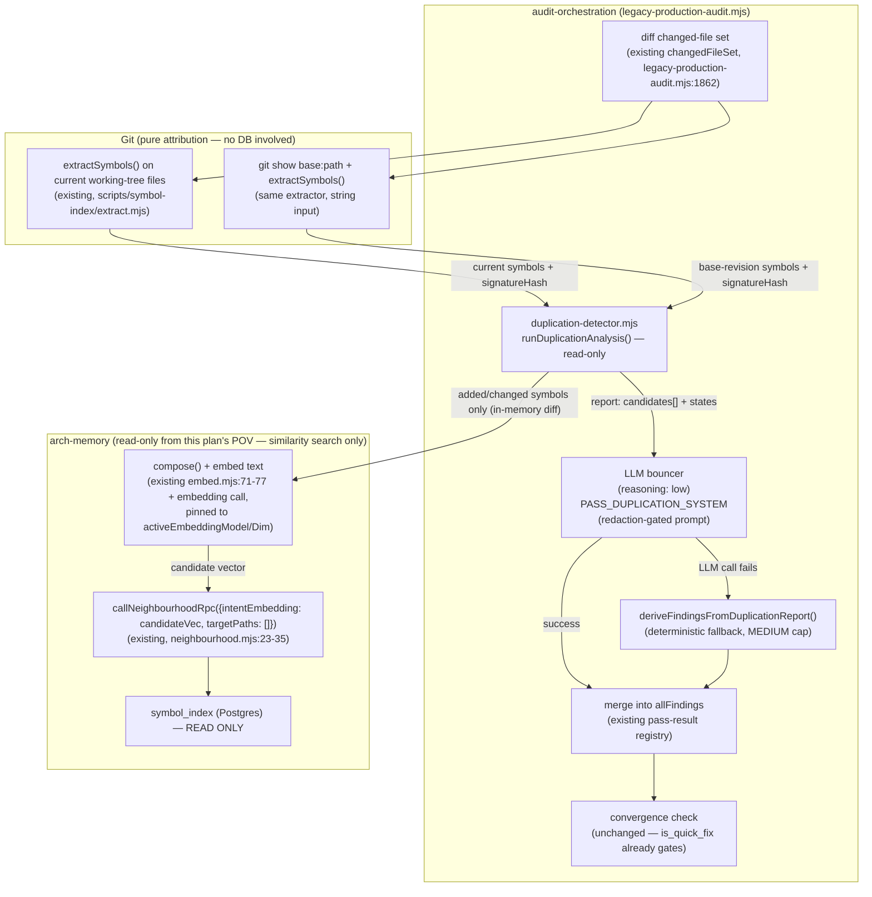

# Plan: Duplication Audit Wave for /audit-code

- **Date**: 2026-07-13
- **Status**: Complete — shipped as commit `138dec8` (2026-07-14). Implemented via `/cycle --autonomous` (2 execution clusters, each audited), closed out with a mandatory consolidated Gemini gate (2 rounds) over the union diff. See §8 Audit Trail + the Implementation Log below.
- **Author**: Claude + Louis Strydom
- **Scope**: backend
- **Target domain(s)**: `arch-memory`, `audit-orchestration`, `scripts`, `shared-lib`
- ⚠ **Cross-domain work** — touches `arch-memory` (symbol-index/embedding layer) and `audit-orchestration` (the pass pipeline); the coupling is intentional (the whole point is wiring one into the other) — flagged per Phase 0.5b, not a smell.

## 0. Origin

This plan implements the design decided in a three-way brainstorm
(`/brainstorm --with-gemini`, session `1783970857572`, synthesised
2026-07-13): `npm run arch:drift` went RED (score 54, threshold 20 — more
than double the 22/20 reading that triggered and auto-closed two months
earlier). The weekly GitHub Action sweep that surfaces this has zero
commit-time enforcement, and the repo's mandatory architectural-memory
"consult before writing new code" hook was evidently bypassed for the top
offending cluster. The synthesis's recommendation — reuse this repo's
existing two-layer quickfix-detection precedent rather than inventing new
pre-push-hook or tool-boundary-interception infrastructure — is the design
basis below. That precedent, and the immediate fixes, are grounded directly
in the live `arch:drift` output and code read during this planning session,
not re-guessed.

## Neighbourhood considered

`get-neighbourhood` on the target files (`scripts/openai-audit.mjs`,
`scripts/symbol-index/{drift,refresh}.mjs`, `scripts/lib/config.mjs`,
`scripts/lib/audit/seeded-random.mjs`) returned only `review`-band matches
(similarity 0.65–0.68) — no near-duplicate of the proposed detector exists.
Confirms this is genuinely new functionality, not a case the plan itself
should have been catching.

## Security incidents considered

One incident surfaced (INC-001, symlink-based sensitive-path bypass,
composite score 0.51) — not directly applicable: the duplication detector
reads only already-indexed embedding rows from Postgres, it does not read
file contents directly, so the symlink-canonicalisation class doesn't
apply to its own code path. Noted, not actioned. (`docs/security-strategy.md`
has a pending freshness warning unrelated to this plan — separate from this work.)

---

## 1. Context Summary

**What exists today** (Code Trace):

- `npm run arch:drift` → `scripts/symbol-index/drift.mjs:main` (`drift.mjs:75-145`) calls the Postgres RPCs `computeDriftScore`/`getTopDuplicateClusters` (`scripts/lib/store/arch/neighbourhood.mjs:37-65`, thin wrappers over `scripts/lib/db/rpc.mjs`). These operate over the **whole active snapshot** — a global inventory count, not diff-aware. Only reachable via a weekly GitHub Action (`.github/workflows/architectural-drift.yml`) that opens/closes a sticky issue. Not part of `npm run check`.
- `scripts/symbol-index/refresh.mjs:main` (`refresh.mjs:121-478`) already supports `--since-commit <sha>` (`refresh.mjs:71-81` parseArgs), and `symbolIndexConfig.refreshIncrementalDefault` (`scripts/lib/config.mjs:396`) is `true` by default — **incremental, diff-scoped refresh already exists**; this plan does not need to build it.
- `scripts/lib/audit/legacy-production-audit.mjs` runs 5 named passes (`structure`, `wiring`, `backend`, `frontend`, `sustainability` — `PASS_NAMES`, `scripts/lib/config.mjs:228`) plus two **unlisted, code-level waves**:
  - **Architecture** (`runArchitecturePass`, `legacy-production-audit.mjs:641-760`): a **mechanical analyser** (`runArchIntentAnalysis`) produces a `report` object; if clean → no findings; if violations exist → a **low/medium-reasoning LLM "bouncer"** (`PASS_ARCH_INTENT_SYSTEM`) classifies severity and filters false positives; if the LLM call fails, `deriveFindingsFromReport(report)` (`legacy-production-audit.mjs:981-1049`) emits deterministic findings directly — **capped at MEDIUM, "no HIGH without LLM judgement"** (decision-11, documented in the function's own docstring). Findings use `FindingSchema` (`scripts/lib/schemas.mjs:36-45`): `id` (prefix convention: `H`/`M`/`L` = model-assigned, `T` = tool, `A` = architecture-deterministic), `is_mechanical: boolean`, `is_quick_fix: boolean` ("band-aid rather than a proper fix").
  - **Quickfix** (`legacy-production-audit.mjs:1909-1950`, Wave 4): a **pure LLM pass** (`reasoning: 'low'`, `getPassPrompt('quickfix')` from `scripts/lib/prompt-seeds.mjs:115,160`), gated by `shouldRunPass('quickfix')` (the `--passes` CLI flag, `openai-audit.mjs:550`), forces `is_quick_fix: true` on every finding it emits.
  - **Convergence** (`legacy-production-audit.mjs:2682-2684`): `quickFix = allFindings.filter(f => f.is_quick_fix).length; converged = highCount === 0 && mediumCount <= 2 && quickFix === 0`. This aggregates `is_quick_fix` across **every** pass's findings, not just the `quickfix` wave — the architecture pass's LOW findings ("File missing domain rule", "Dead declared domain") already set `is_quick_fix: true` to gate convergence the same way. **This means a new pass's findings participate in convergence for free by setting `is_quick_fix: true` — no change to the convergence check itself is needed.**
- `scripts/lib/neighbourhood-query.mjs::getNeighbourhoodForIntent` embeds a caller-supplied text string and calls `adapters.callNeighbourhoodRpc({repoId, refreshId, targetPaths, intentEmbedding, kindFilter, k})` (`neighbourhood-query.mjs:202-209`) — `intentEmbedding` is a **raw vector**, not tied to a persisted row, and `callNeighbourhoodRpc` is **read-only** against the active snapshot (no mutation). The embedding space is the same index regardless of what text produced the query vector — the only thing that matters is embedding the candidate with the *same* `compose()` shape (`scripts/symbol-index/embed.mjs:71-77`: kind+name+path+summary+signature) that indexed symbols were embedded with, so the comparison is apples-to-apples. **This means `callNeighbourhoodRpc` is already the correct, existing, non-mutating, symbol-level query primitive this plan needs** — round 1 of this audit (GPT, H1/H2/H5 below) is what surfaced that the original framing (reusing `getTopDuplicateClusters`, a global top-N drift-cluster query, plus a client-side file-membership filter) was the wrong mechanism; §2 below reflects the corrected design.
- `scripts/lib/store/arch/symbols.mjs::listSymbolsForSnapshot({refreshId, kind, domainTag, filePathPrefix, limit, offset})` (`symbols.mjs:154`) exists and would have supported a DB-baseline-diff design — an earlier round of this plan used it this way, until Gemini's final review (round 3, G1 — see §8) showed that comparing against the DB snapshot for *attribution* (not just similarity search) creates an operational deadlock, because the snapshot's commit essentially never exactly matches an audit's base commit in practice. The shipped design (§2) does not use this function at all; attribution is pure Git.
- `scripts/lib/sensitive-paths.mjs::shouldSkipForIndexing(rel, categories)` (used by `scripts/symbol-index/extract.mjs:100-101`) already supports a non-security skip category (`generatedNoise` — lockfiles, `.min.js`, `.map`), alongside `sensitive`. This is the existing extension point for excluding known false-positive duplication sources at the point they'd otherwise enter the index — cheaper and more correct than filtering post-hoc at every query site.
- The two concrete duplications from the live `arch:drift` run: `mulberry32`/`seededShuffleCopy`, canonical at `scripts/lib/audit/seeded-random.mjs`, reimplemented in `scripts/lib/solo-control/{cheap-triager-validate,scoring,stratified-sample}.mjs` and `scripts/model-eval-auditor.mjs`.

**Patterns reused**: the architecture pass's two-stage (mechanical report → LLM bouncer → deterministic fallback) structure, `FindingSchema`/`is_mechanical`/`is_quick_fix`, the `--passes`/`shouldRunPass` gating mechanism, `sensitive-paths.mjs`'s category-based skip-indexing mechanism, `extractSymbols`' existing parsing logic (reused for both the Git base-revision and current-working-tree sides), `callNeighbourhoodRpc`. (`refresh.mjs --since-commit` — noted above as existing prior art for incremental indexing — is **not** used by the shipped design; attribution went a different, DB-independent route per the Gemini-round-3 decoupling, §8.)

**Patterns new**: a `D`-prefixed deterministic-finding id class (extending the existing `H`/`M`/`L`/`T`/`A` convention); a `// @duplicate-justification: <reason>` inline pragma convention (new, AI-legible per the brainstorm's Gemini view — visible in the diff, not an external ledger an agent can forget).

---

## 2. Proposed Architecture

> **Revised after audit-plan round 1** (GPT H1/H2/H5 — see §8 Audit Trail).
> The original design reused `getTopDuplicateClusters` (a global top-N drift
> query) with a client-side file-membership filter. That was wrong on three
> counts: file-level attribution flags unrelated edits to a file that merely
> *contains* a pre-existing duplicate (H1); triggering `refresh.mjs
> --since-commit` from an audit would write into the shared **active**
> Postgres snapshot with no defined lifecycle for dirty/branch state (H2);
> and a global top-N query can miss diff-relevant duplicates that don't make
> the global cutoff (H5). The design below is symbol-level, read-only against
> the active snapshot (no mutation, so H2 doesn't apply — the detector never
> calls `refresh.mjs`), and queries per-candidate rather than adapting a
> global endpoint (so H5 doesn't apply).

**Detection algorithm** (`duplication-detector.mjs`, deterministic, no LLM,
**read-only against the active snapshot**):

> **Decoupled at Gemini round 3** (G1 — see §8, and read this note before the steps below): the design through round 3 tied symbol-diff *attribution* (is this symbol new/changed?) to requiring the DB snapshot's `walk_end_commit` to exactly equal the audit's base commit. In practice the active snapshot is refreshed on its own cadence (weekly, or manually) and essentially never exactly matches a PR's merge-base — so that requirement made the wave return `unavailable` on almost every real audit, a critical, silent "it never actually runs" bug (also independently flagged as an over-engineering smell: solving a local git-diffing problem with a brittle global-database constraint). **Fix**: attribution (steps 2–3) now diffs pure Git content — `git show <auditBaseCommit>:<previousPath>` vs. the current working-tree file — entirely independent of the database. The database snapshot is used **only** for the similarity search (steps 5–8), where being slightly stale is an acceptable, bounded recall gap (a very recently-added canonical symbol might not yet be searchable), never a correctness or availability failure. Step 0 below is therefore no longer a hard gate.

0. **Snapshot availability check (soft — not a hard commit-match gate)**: resolve `getActiveSnapshot(repoId)` → `{refreshId, activeEmbeddingModel, activeEmbeddingDim}`. If no active snapshot exists at all, or `!activeEmbeddingModel` (existing `EMBEDDING_MISMATCH` guard, `neighbourhood-query.mjs:174-180`, reused as-is) → `state: 'unavailable'`. Otherwise proceed — carry `refreshId`/`activeEmbeddingModel`/`activeEmbeddingDim` forward for steps 5–8. **No commit-equality check against `auditBaseCommit`** — attribution no longer depends on it (see the decoupling note above); staleness only affects search *recall*, which is a known, acceptable v1 limitation, not a blocking state.
1. **File-count preflight, before any extraction** (resolves round-2 H3's "unbounded work before the cap can fire"): the input is not a flat file set but `changedFiles: [{ status: 'added'|'modified'|'deleted'|'renamed'|'copied', currentPath, previousPath? }]` (resolves round-3 H4's "a plain file set cannot distinguish add/modify/delete/rename" — normalized diff records the audit pipeline already has available from its existing diff-scoping step, just not previously threaded into this detector's input contract). Drop `deleted` entries immediately (a deletion cannot introduce a duplicate) and any non-regular-file/non-source entries — **before** counting toward the cap, so a diff with many deletions doesn't spuriously trip it. If the remaining eligible (`added`/`modified`/`renamed`/`copied`) file count `> symbolIndexConfig.maxDuplicationScanFiles` (default 30) → `state: 'unavailable'`, reason names the cap. This must run **before** step 2.
2. **Extract symbols from both sides of the diff, via Git, not the DB** (Gemini round-3 G1 fix): for each eligible file, extract symbols from the **current** working-tree content at `currentPath` (existing `extractSymbols`, `scripts/symbol-index/extract.mjs:73-256`) AND, for `modified`/`renamed` entries, from the **base-revision** content — `git show <auditBaseCommit>:<previousPath ?? currentPath>` piped through the same extractor (in-memory, not written to disk; a small new adapter around `extractSymbols` that accepts a string body instead of a file read — the extractor's parsing logic itself is unchanged, only its input source). `added` entries have no base-revision side by definition.
3. **Diff symbol identity in-memory, not against the DB, and body-aware**: for each current-side symbol, compare against the base-revision extraction (from step 2) matching on `(symbolName, kind)` — no DB round-trip at all for this comparison, which is what removes the round-3 G1 deadlock. No base-side match → `added`. Match but `signatureHash` differs → `changed` (the candidate carries its own `currentPath` and, for `renamed` entries, `previousPath` — step 7's self-exclusion below matches the RPC's returned rows against these paths directly; there is no DB `definitionId` to carry forward any more, since the base-revision side is Git-extracted, not DB-fetched). Match with same `signatureHash` → not a candidate. **Still body-aware**: `signatureHash` (`scripts/lib/symbol-index.mjs::signatureHash`, `extract.mjs:230-236`) hashes `bodyText` alongside the signature (resolves round-2 H2) — unchanged by this decoupling, just now compared against a Git-sourced base extraction instead of a DB-sourced one.
   - **`renamed`/`copied` entries (round-3 H4, scoped)**: v1 diffs `currentPath`'s current content against `previousPath`'s base-revision content (both available via Git — this is actually now *easier* than the round-3 design, since `previousPath` was always resolvable via Git regardless of the DB snapshot's staleness) — an unchanged renamed symbol correctly matches its base-revision self and is **not** a candidate at all, which incidentally narrows the `Out of Scope (Future)` rename limitation below to only the *cross-file* embedding-index case (the renamed symbol still sitting under its *old path* in the persisted DB index until the next `arch:refresh`), not the diff-attribution case this step now handles correctly.
4. Cap the added/changed candidate set at `symbolIndexConfig.maxDuplicationCandidates` (default 40) — if exceeded, `state: 'unavailable'`, reason names the cap (unchanged from round 1, resolves M6; now sits after the cheaper step-1 file-count preflight, not as the only bound).
5. **Embed each candidate — same vector space as the persisted index, explicitly** (Gemini round-2 G2 fix, see §8: without this, a candidate embedded under a since-changed embedding provider/deployment would yield meaningless cosine similarities against the persisted index, or a Postgres dimension-mismatch error): reuse `embed.mjs::compose()` to build the same kind+name+path+summary+signature text indexed symbols use, then embed it via `embedText(text, model, dim)` (generalized/renamed from `generateIntentEmbedding`'s low-level call) called with the **exact** `activeEmbeddingModel`/`activeEmbeddingDim` resolved in step 0 — never the caller's default/env-configured model, mirroring exactly how `getNeighbourhoodForIntent` already sources these two values from the active snapshot before embedding (`neighbourhood-query.mjs:192-196`).
6. **Query, read-only, `targetPaths: []`** (Gemini gate finding G1, round 1 — see §8): `callNeighbourhoodRpc({repoId, refreshId, intentEmbedding: candidateVector, targetPaths: [], kindFilter: [candidate.kind], k: 5})` (existing, `neighbourhood.mjs:23-35` — no mutation, no new RPC). **`targetPaths` is not a filter — it's a scoring boost**: the underlying RPC (`scripts/lib/symbol-index.mjs:114-118`) computes `score = hopScore * 0.4 + sim * 0.6` where `hopScore = 1.0` for any result whose file is in `targetPaths`, else `0.0`. Passing `[candidate.filePath]` (the plan's original, wrong framing — verified live during round 1, when this API was used for a different purpose, `/plan`'s architecture-neighbourhood consultation, where proximity boosting is exactly the intended behaviour) means an unrelated same-file symbol at `sim ≈ 0.35` scores `1.0*0.4 + 0.35*0.6 = 0.61`, **outranking a genuine cross-file exact duplicate** at `sim = 1.0` (`0 + 1.0*0.6 = 0.60`) — and with `k: 5`, the real duplicate can be pushed out of the result set entirely, never returned. Passing `targetPaths: []` makes `hopScore` uniformly `0.0` for every result, so ranking is pure cosine similarity — the correct behaviour for a duplication search, which has no reason to favour a candidate's own file. This also removes the need for identity-scoped self-filtering as a *ranking* concern (round-3 H3 remains correct as an *inclusion* rule below — a same-file match can still legitimately rank in the top-5 once ranking is unbiased, and must not be excluded outright).
7. **Path-and-name-scoped exclusion, not file-scoped** (round-3 H3, restated against the corrected step 6, and against the Gemini-round-3-decoupled attribution — no `definitionId` to match on any more, see step 3): from the top-5 pure-similarity results, exclude only results where `(result.filePath === candidate.currentPath || result.filePath === candidate.previousPath) && result.symbolName === candidate.symbolName && result.kind === candidate.kind` — i.e. the DB's own currently-indexed row for this exact symbol at this exact path, if one exists. Any other same-file result (a genuinely different existing symbol) is valid signal and proceeds to threshold evaluation below — this is what makes the round-3 H3 same-file-blind-spot fix actually reachable (it was moot as long as step 6 could rank the true duplicate out of the results before this exclusion ever ran).
8. **Threshold — keep the full matching set, not just the top result** (Gemini round-2 G1 fix, see §8): keep **every** remaining result with `similarityScore >= symbolIndexConfig.driftSimDup` (existing config, 0.85), not only the single top-ranked one. When multiple canonical files are equally exact duplicates of each other (e.g. A, B, and C all at `sim=1.0`), Postgres row-order tie-breaking can arbitrarily surface any one of them as "the top match" — keeping only that one would make a developer's factually-correct pragma (naming B) get rejected because the detector happened to rank A first. The full set is threaded through to steps 9–10 below; only the single best-scoring match (still deterministic — highest `similarityScore`, ties broken by `definitionId` for stability) is cited in the eventual finding/bouncer prompt as "the" canonical example, but pragma validation checks the **whole set**.
9. **Egress gate on BOTH paths before any read** (resolves round-2 H5 — the original egress fix only covered secret-shaped *content*, not the *path itself*): before reading source for either the candidate or the matched canonical symbol (for the LLM bouncer prompt below), route both file paths through the existing `resolveAndClassify(path, {repoRoot})` / `gateSymbolForEgress` (`scripts/lib/sensitive-paths.mjs`, the WS-CANON canonical-path layer — realpath-resolved, fail-closed on symlink escape). A stale-indexed canonical match can point at a path that's sensitive today even if it wasn't when originally indexed. If **either** path classifies as sensitive, drop that candidate from the semantic list entirely (it never reaches the bouncer, no content or path is ever placed in a prompt) — no diagnostic finding is emitted for it (avoids leaking path existence; deliberately narrower than GPT's optional "safe internal diagnostic" suggestion — deferred as unnecessary for a v1).
10. **Pragma check against the full matching set** (resolves M2's grammar ask, round-2 M3's "the deterministic finding can be lost on the successful LLM path," and Gemini round-2 G1's tie-breaking fragility): look for `// @duplicate-justification: target=<file>:<symbolName> reason=<text>` — matched **language-agnostically** (Gemini round-3 G2 fix: this repo is explicitly multi-language, per the existing `tests/arch-intent-adapter-{java,postgres,python}.test.mjs` adapters — a hardcoded `//` match would make the pragma unusable, forcing a syntax error, in Python/YAML/HTML files; match `(?:\/\/|#|\/\*|<!--)\s*@duplicate-justification:` instead, whatever native comment syntax the file uses) — on the line immediately preceding the candidate's declaration. `target` matches **any** result in step 8's full thresholded set (not just the single top-ranked one) → suppress (removed from both channels below). Present but `target` doesn't match **any** result in the set, or references a nonexistent target → route to `report.deterministicFindings` (not the semantic/bouncer channel) as a `[Duplication] Orphaned suppression pragma` finding.
11. **Split into two typed channels** (resolves round-2 M3): `report.deterministicFindings` — orphaned-pragma findings from step 10, plus the `'failed'`-state finding described below; always merged into `allFindings` unconditionally, never passed through or gated by the bouncer. `report.semanticCandidates` — the remaining post-pragma, post-egress-gate candidates; sent to the bouncer (below). The bouncer's success/failure only ever affects `semanticCandidates`' fate, never `deterministicFindings`.
12. Emit `report = { state: 'clean' | 'findings' | 'unavailable' | 'failed', deterministicFindings: [...], semanticCandidates: [...], reason?: string }` — see the failure-state contract below (resolves H4).

**Failure-state contract** (resolves H4 — "degrade to `[]`" collapsed clean and broken into one signal):

| State | Meaning | Convergence effect |
|---|---|---|
| `clean` | Ran successfully, 0 candidates over threshold | No findings; passes normally |
| `findings` | Ran successfully, ≥1 candidate | Findings emitted per severity (below) |
| `unavailable` | No active snapshot, or embedding model/dim unconfigured (`EMBEDDING_MISMATCH`, step 0); changed-file count over `maxDuplicationScanFiles` (step 1); or candidate count over `maxDuplicationCandidates` (step 4). **Not** triggered by snapshot staleness (round-3 decoupling, Gemini G1 fix — attribution no longer depends on snapshot freshness at all; a stale snapshot only narrows similarity-search recall, which is a silent-but-bounded v1 limitation, not a blocking state) | **No findings emitted, but the pass summary line explicitly states "Duplication: SKIPPED (unavailable — `<reason>`)"** — never rendered identically to a clean 0-finding result; does not block convergence (matches how this repo already treats other optional infra as loud-not-silent, e.g. the model-resolution fallback ladder) |
| `failed` | Embedding call, RPC call, or extraction step threw | Emits **one** deterministic finding: `[Duplication] detector failed — audit incomplete for this control`, `severity: MEDIUM`, `is_mechanical: true`, `is_quick_fix: true` (reuses the existing convergence gate to make "the check itself couldn't run" block convergence exactly like a real finding would — no new convergence logic needed). **`detail` never carries the raw error** (round-3 M1 fix — a raw DB/filesystem/HTTP error can contain absolute paths, endpoint config, or credentials, and findings are durable artifacts that can be re-synced or fed into later LLM context): `detail` is a stable, non-sensitive public failure code + action-oriented message (e.g. `DUPLICATION_DETECTOR_FAILED: extraction step threw — see local logs`); the raw cause is routed through the existing `redactSecrets`/error-sanitization utilities to a local diagnostic log only, never serialized into the finding itself |

**LLM bouncer** (`PASS_DUPLICATION_SYSTEM`, new prompt in `prompt-seeds.mjs`, `reasoning: 'low'` — matches quickfix's tier), given `report.semanticCandidates` (post-pragma, post-egress-gate — never the full candidate set):

- **Narrow response contract** (resolves round-2 H4 — "a model can emit `is_quick_fix: false` or omit the flag while still producing a schema-valid finding" — schema corrected again at round-3 H2, see `DuplicationBouncerResponseSchema` in §4 Phase 3): the bouncer's Zod schema is deliberately **not** `ProducerFindingSchema`. It returns only `decisions: [{ candidateId, decision: 'keep' | 'drop', severity: 'MEDIUM' | 'HIGH', rationale }]`, one entry per submitted candidate — no field for `is_quick_fix`, `is_mechanical`, `id`, or `category` exists for the model to set, and the mapper rejects (as a full bouncer failure, not a partial one) any response that doesn't cover every submitted candidate ID exactly once. **Orchestration code** (not the model) maps each `decision: 'keep'` entry to a full `FindingSchema`-shaped finding, filling `is_quick_fix: true` and `is_mechanical: true` as **hardcoded literals in the mapping function**, using the candidate metadata already held in-process — the model cannot influence either flag because they're not in its output schema at all. `decision: 'drop'` entries are discarded. Severity: `MEDIUM` default, `HIGH` only on explicit model judgement (matches the architecture pass's existing decision-11 doctrine — never HIGH from the deterministic fallback below, only from this LLM path).
- **Egress**: the prompt is built by reading each surviving candidate's and its matched-canonical-symbol's live source snippet through the same `readFilesAsContext`/`redactSecrets` path every other GPT-facing pass in this pipeline already uses — never by concatenating raw DB-stored purpose-summary strings or raw `fs.readFileSync` output directly into the prompt. Combined with step 9's path-level egress gate (§2 above), this closes both the "secret-shaped content" and "sensitive path" halves of H3/H5. A same-commit test asserting a secret-shaped literal in a candidate/canonical file is redacted before it reaches the constructed prompt, AND a same-commit test asserting a sensitive/symlink-resolved-sensitive path is excluded from the candidate list before any read occurs, are both required in Phase 4 — mirroring `tests/audit-scope-egress.test.mjs`'s existing pattern per this repo's Tier 3 testing doctrine.

**Fallback** (`deriveFindingsFromDuplicationReport`, mirrors `deriveFindingsFromReport`): if the bouncer call fails (a `failed`-bouncer sub-case, distinct from detector-`failed` above), emit MEDIUM findings for every mechanical candidate directly (`is_mechanical: true`, no HIGH).

### Design decisions (principles cited)

- **Canonical query primitive (resolves round-2 M1 — a contradictory leftover bullet from the pre-redesign draft)**: the detector uses `callNeighbourhoodRpc` (per-candidate, symbol-level) exclusively. It must **never** use `getTopDuplicateClusters` — that remains reserved for `arch:drift`'s global reporting and is exactly the endpoint round 1 (H1/H5) proved wrong for this purpose. This is the single canonical statement; no other part of this plan should be read as endorsing the global endpoint.
- Reuse `is_quick_fix` for convergence-gating instead of adding a `duplicationCount` threshold — the flag's existing semantics ("band-aid rather than a proper fix") apply exactly: shipping a duplicate instead of importing the canonical module *is* the band-aid (#1 DRY, #5 SSoT). **Enforced in orchestration code, not model output** — see the bouncer contract in §2 (round-2 H4 fix).
- Mechanical-detection-first, LLM-bouncer-second — mirrors the one existing precedent for exactly this shape of problem in this codebase, rather than introducing a third pattern (#3 reusable abstractions, consistency).
- `// @duplicate-justification:` inline pragma over an external ledger — visible in the diff a reviewer/future-agent reads, not state that can be forgotten or hallucinated separately from the code (addresses the brainstorm's specific "AI agents are compliance-hacking machines" concern about ledger-based justification).

---

## 3. Sustainability Notes

### Right-sizing gate (new structure is being introduced)

- **Band-aid extreme**: raise `ARCH_DRIFT_SCORE_THRESHOLD` or just fix the two known duplications and stop — the score drops below threshold today but nothing stops the next AI-authored duplicate from landing, and the score doubled once already in two months.
- **Over-engineered extreme**: a pre-push hook or CI branch-protection gate running a full embedding re-index on every push (rejected explicitly in the brainstorm synthesis — expensive, inconsistent with this repo's established local-first-CI convention, duplicates infrastructure this repo already has for exactly this shape of check).
- **Chosen**: a new pass wired into the *existing* `/audit-code` pipeline, using the *existing* incremental-refresh capability and the *existing* convergence gate, scoped to the diff. Current requirement it serves: `/audit-code` already runs on every non-trivial change (per this repo's own testing doctrine) and already gates on `is_quick_fix === 0` — this closes the actual gap (duplication has no representation in that gate today) without adding a new enforcement surface.

### Assumptions that could change

- Assumes `/audit-code` is actually run before most merges (true today per this repo's stated practice, not mechanically enforced — same caveat that applies to every other audit-code finding class, not new to this plan).
- **Superseded by the Gemini-round-3 decoupling** (kept here, struck through in spirit rather than deleted, so the reasoning trail stays visible): earlier rounds assumed attribution needed either a DB snapshot ratchet (GPT's original H1/H5 proposal) or an exact-commit-matched DB snapshot (round-3 H1's fix, which turned out to deadlock in practice — Gemini round-3 G1). The shipped design uses pure Git diffing for attribution (§2 steps 2–3) instead of either — a real before/after comparison, just Git-sourced rather than DB-sourced, sidestepping the DB-freshness question entirely for this specific concern.
- Assumes `git show <auditBaseCommit>:<path>` is always available in the audit's execution environment (true for any checkout with full history to the merge-base; a shallow clone missing that commit would fail this specific call) — treated as a `state: 'failed'` case (§2 failure-state contract), not a design gap; CI checkouts in this repo are not shallow today.

### Extension points

- The `driftExempt` category in `sensitive-paths.mjs` is a general escape hatch — any future known-intentional-mirror subtree exempts the same way `docs/plans/security/files/**` does here, without touching the detector.
- `PASS_DUPLICATION_SYSTEM` follows the same `getPassPrompt(passName)` registry as every other pass — a future prompt-evolution pass (`refine-prompts.mjs`) can tune it identically to the others.

---

## 4. File-Level Plan

### Phase 1 — Fix the known duplications + exempt known false positives (independent of Phase 2/3)

- `scripts/lib/solo-control/cheap-triager-validate.mjs` (modify) — replace local `mulberry32`/`seededShuffleCopy` definitions with `import { mulberry32, seededShuffleCopy } from '../audit/seeded-random.mjs'`. **Done** (implementation session, 2026-07-14).
- `scripts/lib/solo-control/scoring.mjs` (modify) — same for `mulberry32`. **Done.**
- `scripts/lib/solo-control/stratified-sample.mjs` (modify) — same for both. **Done.**
- ~~`scripts/model-eval-auditor.mjs` (modify) — same for `mulberry32`.~~ **Corrected during implementation, NOT done, deliberately**: `seeded-random.mjs`'s own docstring says the solo-control copies were "left as-is (out of this cluster's scope)" — a previously *deferred*, not justified, duplicate. `model-eval-auditor.mjs`'s copy is different: its own comment (line ~53-57) explicitly states the duplication is intentional — *"a small, self-contained PRNG (not exported anywhere else in this repo... so this CLI has no runtime dependency on Math.random())"* — a deliberate self-containment design choice from a prior audit round (Round-2 M2 self-correction), not an oversight. Importing from `seeded-random.mjs` here would relitigate an already-made, already-documented architectural decision, not fix a bug. Left untouched; this is exactly the "genuine architectural drift vs. justified near-miss" distinction the plan's own Phase 2/3 detector (§2) is designed to make automatically — this one instance was caught by hand because Phase 1 predates the detector.
- `scripts/lib/sensitive-paths.mjs` (modify) — add a `driftExempt` category (mirrors the existing `generatedNoise` category's shape), scoped **narrowly to `docs/plans/security/files/**` only** — that subtree is a verbatim text mirror of a corporate kit, carrying zero architectural signal for *any* index consumer (not just duplication), so full removal from the index via `shouldSkipForIndexing` is correct there. `shouldSkipForIndexing` callers that want the new behaviour pass `['sensitive', 'generatedNoise', 'driftExempt']`.
- `scripts/symbol-index/extract.mjs` (modify, 1 line) — add `'driftExempt'` to the categories array at `extract.mjs:101`.
- **`DUPLICATION_QUERY_EXCLUDE_GLOBS` moved to Phase 2** (round-3 M2 fix — round-1's M1 fix put this list in a Cluster-A-owned `duplication-report.mjs`, but nothing in Cluster A consumes it; that made the "independent" cluster ship dead code if Cluster B were delayed, and split one feature's exclusion semantics across two separately-reviewed changes). Cluster A now touches only `sensitive-paths.mjs`/`extract.mjs` (consumed immediately by the existing index, genuinely independent of the new detector) plus the canonical-import fixes below. The test-fixture exclusion list lives with the module that consumes it — see §4 Phase 2.
- **Close-out (not a phase)**: run `npm run arch:refresh:full` once after this phase lands, to purge already-indexed rows for the newly-excluded paths from the live snapshot (a config-driven exclusion doesn't retroactively tombstone previously-indexed rows the way a file deletion does — this is a one-time operational step, not a recurring cost). Then run `npm run arch:drift` to confirm the score drops from 54 toward the true remaining long-tail count.

### Phase 2 — Duplication detector (mechanical, no LLM, read-only, dependency-injected)

- `scripts/lib/audit/duplication-detector.mjs` (create) — exports `runDuplicationAnalysis({ repoRoot, changedFiles, auditBaseCommit, adapters })`, where `changedFiles` is the normalized `{status, currentPath, previousPath?}[]` diff-record list (round-3 H4 fix, replaces a flat file-path Set) and `adapters` (injected, defaulting to the real implementations) bundles `{ extractSymbolsForFiles, extractSymbolsFromGitRevision, embedText, callNeighbourhoodRpc, getActiveSnapshot, gateSymbolForEgress, redactSecrets }` — **dependency injection specifically to satisfy M4**: seam-level tests (Phase 4) supply fake adapters instead of hitting real Git/embedding/RPC calls, and the orchestration function itself becomes testable rather than only its pure sub-pieces. Implements the algorithm in §2 (round-2 revision: file-count preflight, body-aware identity diff, path-level egress gate, typed deterministic/semantic channel split; round-3 revision: delete/rename-aware file eligibility, path-and-name-scoped self-filtering, redacted failure details; **Gemini-round-3 decoupling**: attribution moved off the DB snapshot entirely onto pure Git diffing — see the note above step 0 — which also **removes** the `listSymbolsForSnapshot(Batch)`/`getRefreshRun` dependencies an earlier round of this plan had introduced; there is no DB baseline read left in this module at all). Depends on: `scripts/symbol-index/extract.mjs::extractSymbols` (existing, used both for the current working-tree side and, via a small new `extractSymbolsFromGitRevision(gitShowOutput, path)` adapter around the same parsing logic, for the `git show <auditBaseCommit>:<path>` base-revision side), `scripts/symbol-index/embed.mjs::compose` (existing) + the generalized `embedText` helper, `scripts/lib/store/arch/neighbourhood.mjs::callNeighbourhoodRpc` + `getActiveSnapshot` (existing, no changes — and per §2's design decision, the **only** neighbourhood query primitive this module may call), `scripts/lib/sensitive-paths.mjs::resolveAndClassify`/`gateSymbolForEgress` (existing, WS-CANON layer), `scripts/lib/repo-identity.mjs` (existing, repo UUID resolution). Returns `{ state, deterministicFindings, semanticCandidates, reason? }` per the §2 failure-state contract — callers must branch on `state`, never treat empty arrays alone as `'clean'`.
- `scripts/lib/audit/duplication-report.mjs` (create) — `isDuplicationReportClean(report)` (checks `state === 'clean'`, not just empty arrays), `formatCandidatesForPrompt(report.semanticCandidates)` (builds the bouncer prompt via `readFilesAsContext`/`redactSecrets`, per §2's egress requirement), `mapBouncerDecisionsToFindings(decisions, candidatesById)` (the round-2 H4 fix — orchestration-side mapper that hardcodes `is_quick_fix: true`/`is_mechanical: true`, never reads those fields from model output), `deriveFindingsFromDuplicationReport(report.semanticCandidates)` (deterministic fallback for bouncer failure — mirrors `deriveFindingsFromReport`, `D`-prefixed ids, `severity: 'MEDIUM'`, `is_mechanical: true`, `is_quick_fix: true`), `DUPLICATION_QUERY_EXCLUDE_GLOBS` (the M1/round-1 fix — test-fixture excludes checked only here, not in `sensitive-paths.mjs`), and the deterministic `[Duplication] detector failed`/`Orphaned suppression pragma` finding constructors (always land in `report.deterministicFindings`, per round-2 M3).
- `scripts/lib/config.mjs` (modify) — add `symbolIndexConfig.maxDuplicationCandidates` (default 40, env `ARCH_DUPLICATION_MAX_CANDIDATES`, §2 step 4) and `symbolIndexConfig.maxDuplicationScanFiles` (default 30, env `ARCH_DUPLICATION_MAX_FILES`, §2 step 1 — the cheap preflight bound that resolves round-2 H3).

### Phase 3 — Wire into the audit pipeline (depends on Phase 2)

- `scripts/lib/prompt-seeds.mjs` (modify) — add `PASS_DUPLICATION_SYSTEM` (the bouncer rubric: classify each candidate as genuine duplication vs. coincidental near-miss, assign severity, default MEDIUM, cite the canonical file to import) and register it as `duplication: PASS_DUPLICATION_SYSTEM` in the pass-prompt lookup (mirrors line 160).
- `scripts/lib/schemas.mjs` (modify) — add **`DuplicationBouncerResponseSchema`** (round-3 H2 fix — the round-2 H4 fix narrowed the bouncer's contract to decisions-only, but Phase 3 still named the old `ProducerFindingSchema`-shaped `DuplicationPassSchema`; that was internally contradictory and is corrected here, resolving both the schema mismatch and the "silently discards candidates the model didn't mention" gap): `{ decisions: z.array(z.object({ candidateId: z.string(), decision: z.enum(['keep','drop']), severity: z.enum(['MEDIUM','HIGH']), rationale: z.string().max(300) })).max(<= maxDuplicationCandidates>) }`. Placement: **`schemas.mjs`**, alongside every other pass schema (not the local block in `legacy-production-audit.mjs` where `QuickfixPassSchema` currently lives — naming the authoritative module now, not deferring it, since round 3 flagged the earlier "confirm during implementation" phrasing as itself a gap). The orchestration mapper (`mapBouncerDecisionsToFindings`, `duplication-report.mjs`) validates **completeness**: every submitted candidate ID appears exactly once in `decisions`, all IDs are known/non-duplicate. Any violation (missing candidate, duplicate ID, unknown ID) is treated as a **bouncer failure** — the entire submitted `semanticCandidates` set (not just the malformed subset) routes to `deriveFindingsFromDuplicationReport`'s deterministic fallback, never a partial mix of the two paths.
- `scripts/lib/audit/legacy-production-audit.mjs` (modify) — add "Wave 5: Duplication detector" following the exact `runArchitecturePass` two-stage shape (§2): call `runDuplicationAnalysis`, branch on `report.state` per the failure-state contract (skip cleanly only on `'clean'`, emit the deterministic failed-finding on `'failed'`, log-but-don't-block on `'unavailable'`), otherwise call the LLM bouncer (`reasoning: 'low'`, gated by `shouldRunPass('duplication')`), fall back to `deriveFindingsFromDuplicationReport` on bouncer failure, `cachePassResult('duplication', duplicationResult)`, register in the pass-result registry (the Phase-3 registry block noted at `legacy-production-audit.mjs:1955-1969` — add one entry, not a new hand-maintained list).
- **Pass-selection contract (resolves M3 — verified, not deferred)**: `shouldRunPass(name)` (`legacy-production-audit.mjs:1402-1409`) is: `if (passFilter && !passFilter.includes(name)) return false;` — i.e. when no `--passes` flag is given, `passFilter` is falsy and **every** named pass/wave runs by default, including unlisted ones like `quickfix` and `architecture` today. `duplication` needs **no `PASS_NAMES` change** (that array is specifically the 5 GPT-authored core passes) — it only needs its own `shouldRunPass('duplication')` call site, exactly mirroring `quickfix`'s `const runQuickfix = shouldRunPass('quickfix')` (`legacy-production-audit.mjs:1913`). Default: **on**. Opt-out: `--passes structure,wiring,backend` (a list that omits `duplication`). Explicit-only: `--passes duplication` runs only this wave. No new config surface required beyond `maxDuplicationCandidates` (Phase 2).

### Phase 4 — Tests + docs (depends on Phase 2/3)

**Testing (resolves M4 — expanded from pure-function-only to seam-level, via Phase 2's injected adapters):**

- `tests/duplication-detector.test.mjs` (create) — Tier 2 (LLM-orchestration seam, per this repo's testing doctrine): fixture tests against `runDuplicationAnalysis` with **injected fake adapters** (no live Git/embedding/RPC/LLM calls). Cases: (a) a current-side symbol with no base-revision counterpart (fake `extractSymbolsFromGitRevision` returns nothing matching) → `added` candidate; (b) a current-side symbol whose base-revision counterpart has a different `signatureHash` (including a same-signature body-only rewrite fixture, per round-2 H2) → `changed` candidate; (c) same `signatureHash` on both sides → not a candidate (round-1 H1 fix — an unrelated same-file edit doesn't false-positive); (d) an RPC result matching `(currentPath|previousPath, symbolName, kind)` → excluded as the symbol's own indexed self (round-3 H3, restated post-decoupling); (e) match below `driftSimDup` → not a candidate; (f) valid pragma whose `target` matches **any** result in the full thresholded set, including a non-top-ranked one (Gemini round-2 G1 tie-break fix) → suppressed; (g) pragma present but `target` doesn't match any result in the set → lands in `deterministicFindings` as `Orphaned suppression pragma`, survives even when `semanticCandidates` is separately emptied by the bouncer (round-2 M3); (h) a pragma written in `#`/`/* */`/`<!-- -->` comment syntax (non-JS fixture files) → still recognized (Gemini round-3 G2 language-agnostic fix); (i) candidate count exceeding `maxDuplicationCandidates` → `state: 'unavailable'`; (j) changed-file count exceeding `maxDuplicationScanFiles`, asserted via a spy showing extraction was never called → `state: 'unavailable'` (round-2 H3 preflight-before-extraction); (k) `git show` for the base revision throwing (e.g. shallow clone missing the commit) → `state: 'failed'`, not silently treated as "no base side, so `added`"; (l) the candidate embedding call receives the active snapshot's exact `activeEmbeddingModel`/`activeEmbeddingDim`, asserted via a spy (Gemini round-2 G2 fix); (m) a matched-canonical path that `gateSymbolForEgress` classifies sensitive → candidate dropped from `semanticCandidates` before any file read, asserted via a spy on the read function (round-2 H5); (n) `isCloudEnabled()`/no active snapshot → `state: 'unavailable'`, not `'clean'`; (o) injected adapter throws → `state: 'failed'`, and the emitted finding's `detail` contains the stable failure code, never the raw thrown error text even when the fake adapter throws an error containing a fake secret/path (round-3 M1); (p) a `deleted`-status entry in `changedFiles` → excluded before extraction, no crash, doesn't count toward `maxDuplicationScanFiles` (round-3 H4, crash-safety half); (q) a new `added` candidate matching an *existing, different* canonical symbol in the **same file** → correctly surfaces as a candidate (round-3 H3 — the same-file blind spot, now reachable per the round-3-Gemini `targetPaths: []` fix); (r) a `renamed` entry whose symbol is unchanged between `previousPath`'s base-revision content and `currentPath`'s current content → correctly **not** a candidate (round-3-Gemini decoupling note — this narrows the `Out of Scope (Future)` rename limitation to only the stale-DB-index case, not diff attribution).
- `tests/duplication-bouncer-mapping.test.mjs` (create) — asserts `mapBouncerDecisionsToFindings` hardcodes `is_quick_fix: true`/`is_mechanical: true` regardless of what a (fake, adversarial) bouncer response contains — since the bouncer's Zod schema has no such fields, this test constructs a decisions array directly and confirms the mapper's output is invariant to anything the schema doesn't expose (round-2 H4, the "the model can't be trusted to set the flag" fix verified structurally, not just by schema shape).
- `tests/duplication-report.test.mjs` (create) — `deriveFindingsFromDuplicationReport` emits `D`-prefixed ids, `severity` capped at MEDIUM, `is_quick_fix: true`, `is_mechanical: true`, validates against `FindingSchema.parse`; the `'failed'`-state deterministic finding constructor likewise validates and correctly carries `is_quick_fix: true`.
- `tests/duplication-pipeline.test.mjs` (create) — seam-level integration test on `legacy-production-audit.mjs`'s Wave 5 wiring (not the detector internals, which the two files above already cover): pass registration appears in the pass-result registry; `--passes` inclusion/exclusion behaves per the M3 contract; `state: 'clean'` skips the bouncer call entirely (asserted via a spy — the bouncer must not be invoked for a clean report); a successful bouncer classification reaches `allFindings` and flips `converged` to `false`; a bouncer failure exercises `deriveFindingsFromDuplicationReport` and reaches the same place; `state: 'unavailable'` does not affect `converged`; `state: 'failed'` does (via its deterministic finding). This is the layer M4 flagged as missing — the pure-function tests above don't exercise pipeline registration, pass selection, or the convergence effect together.
- **Tier 3 same-commit egress test** (resolves H3): assert a secret-shaped literal (e.g. an AWS-key-shaped string) placed in a candidate's or matched-canonical's source file does not appear in the string `formatCandidatesForPrompt` builds for the bouncer — mirrors `tests/audit-scope-egress.test.mjs`'s existing pattern. Lands in the same commit as Phase 2/3, per this repo's Tier 3 testing doctrine (non-negotiable, not a Phase-4 afterthought — listed here for file-plan completeness, but implementation must write it alongside the code it guards, not after).

**Docs (resolves M5 — corrected canonical surface):**

- `skills/audit-code/SKILL.md` (modify) — **this, not `AGENTS.md` and not `.claude/skills/audit-code/SKILL.md`, is the authoritative source** per this repo's own documented skill-file structure (`AGENTS.md`: "`skills/<name>/` ← authoritative; edit ONLY here... `.claude/skills/<name>/` ← generated copy"). Document Wave 5 (mirrors how `quickfix` is already documented in the skill), the `// @duplicate-justification: target=<file>:<symbolName> reason=<text>` pragma grammar, and the `--passes` opt-out.
- Close-out (not a phase): run `npm run skills:regenerate` after the `SKILL.md` edit — regenerates `.claude/skills/audit-code/` from source; hand-editing the generated copy directly would be silently overwritten on the next regen (per this repo's own generated-artifact policy).
- `AGENTS.md` (modify) — add the `driftExempt` sensitive-paths category and the pragma convention to the existing "Skill Chain" / audit-code bullet, one line, pointing at the SKILL.md for detail rather than duplicating it (avoids the AGENTS.md/SKILL.md content ever needing to be kept in sync by hand for this feature).
- `scripts/symbol-index/drift.mjs` (modify, small addition — the Out of Scope mitigation for stale rename pragmas, Gemini gate round 2): the weekly report additionally lists any `// @duplicate-justification: target=<file>` pragma whose target file no longer exists on disk, as a LOW-severity "stale suppression pragma" section. **Implementation note (round-1 code-audit H6, self-caught)**: the sweep logic lives in `scripts/lib/symbol-index/stale-pragma-sweep.mjs`, not inline in `drift.mjs` and not under `scripts/lib/audit/` — putting it in `lib/audit/` would make `drift.mjs` (arch-memory domain) import from audit-orchestration, creating a bidirectional arch-memory↔audit-orchestration edge where only the reverse direction is an approved dependency. The module has zero cross-domain imports, so placing it in arch-memory (the domain of its sole caller) resolves this cleanly.

---

## 5. Execution Clustering

- **Cluster A** — Phase 1 — fix-gate: none
  Coupling: single-purpose cleanup (import fixes + exclude-category addition); fully independent of the new detector — can land, be reviewed, and re-baseline the drift score on its own.
- **Cluster B** — Phases 2–4 — fix-gate: final
  Coupling: Phase 3 directly consumes Phase 2's exported functions (`runDuplicationAnalysis`, `deriveFindingsFromDuplicationReport`); Phase 4's tests assert Phase 2's filter logic and Phase 3's schema/wiring together — splitting them would leave either an untested detector or an untestable wave.

- **Final gate**: mandatory consolidated Gemini review over the union diff of Cluster B (the new pass + pipeline wiring) before this plan is considered shipped. Cluster A can ship independently ahead of Cluster B if desired — its own `/audit-code` pass provides sufficient coverage for a same-shaped mechanical fix.

---

## 6. Risk & Trade-off Register

- **New cost/latency on every `/audit-code` run**: per-candidate embedding + RPC calls add a dependency to the audit hot path. Bounded by `maxDuplicationCandidates` (default 40, §4 Phase 2) — over-cap returns `unavailable` rather than scanning unboundedly (resolves M6). `isCloudEnabled()` false → `unavailable`, no crash (existing pattern, no new code). `shouldRunPass('duplication')` allows explicit opt-out via `--passes` like `quickfix` already supports.
- **Heuristic false-negatives**: if both a new symbol and its only match are introduced in the same diff, there's no pre-existing persisted row to diff against yet, so it won't surface as `added`/`changed` relative to a duplicate — acceptable, `arch:drift`'s weekly sweep remains the backstop; this plan changes the primary control, not the backstop.
- **Heuristic false-positives on trivial helpers**: a 2-line `logWarn`-style near-miss could still surface as a mechanical candidate before the LLM bouncer filters it. Mitigated by the bouncer step existing specifically for this.
- **New Tier 3 egress surface, now correctly scoped** (was H3 — previously the plan wrongly claimed no Tier 3 surface was touched): the bouncer prompt is the only place this plan sends source content to an external LLM; §2 requires it go through the existing redaction path, and §4 Phase 4 requires a same-commit egress test. The mechanical detection steps (0–12 in §2) never call an LLM and never leave the process boundary except to Git (local, no network) and Postgres (already-indexed, already-redacted-at-index-time data) — so the egress surface is deliberately narrow, not eliminated.
- **Deferred, explicitly**: real-time tool-call-boundary interception (Gemini's brainstorm proposal) and CI branch-protection as the primary venue (GPT's proposal) — both rejected in the brainstorm synthesis in favour of reusing existing audit-pass/convergence machinery; not investigated further in this plan (whether Claude Code hooks even support blocking a tool call was an open question going into planning and remains unresolved — irrelevant to the chosen design, so deliberately not spent effort on).
- **Superseded**: this bullet originally deferred "a stored before/after baseline" in favour of a DB-persisted-row diff. Gemini round 3 (G1) showed the DB-persisted-row approach itself was the flaw (an exact-commit-match requirement against a periodically-refreshed snapshot deadlocks in practice — see §8). The shipped design performs the before/after comparison via pure Git (`git show` at the base commit vs. current working tree, §2 steps 2–3), which is simpler than either prior version and has no DB-freshness dependency for attribution at all.

## 7. Testing Strategy

- Unit/fixture (Tier 2): `tests/duplication-detector.test.mjs` (cases a–m), `tests/duplication-report.test.mjs`, `tests/duplication-bouncer-mapping.test.mjs` (§4 Phase 4).
- Seam-level integration (Tier 2, via injected adapters — resolves M4): `tests/duplication-pipeline.test.mjs` (§4 Phase 4) — pipeline registration, `--passes` selection, all four `state` values' effect on `converged`, bouncer-not-called-on-clean.
- **Tier 3, same-commit, non-negotiable** (resolves H3): the bouncer-prompt egress test (§4 Phase 4).
- Manual verification after Phase 1 ships: `npm run arch:drift` score should drop from 54 by exactly the fixed `mulberry32`/`seededShuffleCopy` pairs plus the doc-mirror exclusion; the `DUPLICATION_QUERY_EXCLUDE_GLOBS` test-fixture exclusion does NOT affect `arch:drift`'s score (by design, per the M1 fix — it only narrows the duplication *wave's* candidates, not the global index or the drift score) — this is a deliberately weaker, verifiable claim than the original plan's "confirm the remaining long tail" (flagged as an unfalsifiable ambiguity in round 1).
- Manual verification after Phase 2/3 ship: introduce a deliberate throwaway duplicate of an existing canonical symbol on a branch, run `/audit-code`, confirm it surfaces as a MEDIUM `is_quick_fix: true` finding and blocks convergence; add a matching `// @duplicate-justification:` pragma, re-run, confirm it's suppressed; add a pragma with a wrong `target`, re-run, confirm the orphaned-pragma finding fires instead.

## Out of Scope (Future)

Recorded per this repo's audit-plan convergence doctrine (GPT round cap reached at round 3 — see §8): the following round-3 finding is a genuine, named gap, not silently dropped, but its full fix is deferred rather than expanding this plan's v1 scope further.

- **Rename-aware symbol-identity carry-forward** (round-3 H4, the narrower half — the crash-safety half, skipping `deleted` entries, IS fixed in §2 step 1). v1 looks up an extracted symbol's baseline only by its **current** path (§2 step 4), so a symbol that was renamed without changing its body has no matching persisted row at the new path and is classified `added` — if that renamed symbol closely matches its own *old* self still sitting in the index under the old path, it can surface as a false-positive duplicate-of-itself. **Corrected mitigation** (Gemini's gate flagged the round-3 deferral's original "self-healing" claim as factually wrong, `wrongly_dismissed`, recommended HIGH — see §8: pragma validation only runs against *active candidates*, so once the next `arch:refresh` re-indexes the rename and the symbol stops being a candidate at all, its `// @duplicate-justification` pragma is never re-checked and would sit as permanent dead documentation, not actually "heal"). The one-line-suppressible mitigation still holds as a **workaround** (a developer hitting this false positive can still unblock with the existing pragma), but it does not clean up after itself the way the deferral originally claimed — that claim is retracted here rather than left standing. **Why still deferred rather than building full rename-tracking now**: this failure mode is bounded to *false positives* (a suppressible annoyance) — it can never produce a false *negative* (a real new duplicate silently passing) or a crash, unlike H1–H3 which had no mitigation at all. The honest, bounded commitment for v1: a stale `@duplicate-justification` pragma is dead documentation, not a safety gap, and is left for the **existing weekly `arch:drift` sweep** to catch — a small follow-on addition to that sweep (grep the repo for the pragma's `target` reference and flag any whose target symbol no longer resolves or no longer represents a real duplicate) reuses infrastructure that already runs on a cadence, rather than building new v1 machinery for a dead-code-hygiene concern. Revisit pulling full rename-tracking into the diff-scoped wave itself if that weekly-sweep addition proves insufficient in practice.

## 8. Audit Trail

- **Round 1** (`/audit-plan`, GPT-5.6-terra, `--mode plan`): `SIGNIFICANT_GAPS`, H:5 M:6 L:0. All 11 findings judged `valid` + `in-scope` + `fix-now` (no `rebut`/`dismiss`). H1/H2/H5 collectively invalidated the original detection mechanism (file-membership filtering over the global `getTopDuplicateClusters` drift endpoint, plus a shared-snapshot-mutating `refresh.mjs` subprocess call) and were resolved by a symbol-level, read-only redesign using `listSymbolsForSnapshot` + `callNeighbourhoodRpc` with a per-candidate embedding. H3/H4/M1–M6 resolved as fixes in place.
- **Round 2** (R2+, ledger-informed, GPT-5.6-terra): `SIGNIFICANT_GAPS`, H:5 M:3 L:0, 0 suppressed (all 8 genuinely new). All 8 judged `valid` + `in-scope` + `fix-now`. This round probed the round-1 redesign itself and found real gaps: **H1** (no snapshot-provenance check), **H2** (whether `signatureHash` is body-aware — resolved by reading `extract.mjs:230-236` directly: already hashes `bodyText`, a plan-citation gap not a mechanism gap), **H3** (unbounded work before the candidate cap could fire), **H4** (the bouncer's free-form output could defeat convergence), **H5** (egress gate covered content but not the canonical match's file path), **M1** (a contradictory leftover bullet — deleted), **M2** (persisted-baseline read could silently truncate — folded into H3's fix), **M3** (a bouncer that drops all candidates could lose the deterministic orphaned-pragma finding — resolved via typed channels).
- **Round 3** (R2+, ledger-informed, GPT-5.6-terra, **hard cap round** per this repo's max-3-GPT-rounds doctrine): `SIGNIFICANT_GAPS`, H:4 M:2 L:0, 0 suppressed. HIGH count 5→5→4 — a real but modest decrease, not the >30% that would justify a round 4; stopped here per the skill's explicit cap, findings resolved or deferred rather than iterated further. **H1** (ancestry was insufficient for baseline correctness — corrected to exact-match), **H2** (the round-2 H4 fix wasn't fully propagated: Phase 3 still named the old findings-shaped schema — corrected to `DuplicationBouncerResponseSchema` with completeness validation), **H3** (the self-file filter excluded every symbol in the file, not just the candidate's own prior self — a real same-file blind spot, fixed to identity-scoped filtering), **H4** (partially fixed: delete-safety now handled; rename-identity-carry-forward explicitly deferred, see `Out of Scope (Future)`, with a named, bounded mitigation — not a silent drop), **M1** (raw error text in a durable finding — fixed to a stable code + redacted diagnostic), **M2** (Cluster A shipped dead code — `duplication-report.mjs` moved fully into Cluster B). 5 of 6 findings fixed directly; 1 honestly scoped out with rationale, matching this repo's right-sizing rule (a scope boundary needs a true independence argument, not "the correct fix is larger").
- **Step 6, Gemini round 1** (mandatory final review, `gemini-pro-latest`, transcript = all 3 GPT rounds): `CONCERNS`, 1 new finding, 0 wrongly-dismissed (Gemini's `deliberation_quality` explicitly rated the 3-round GPT deliberation "fair," GPT's findings "consistently accurate," no bias detected — an independent endorsement of the round 1–3 process above, not just its own new finding). **G1** (HIGH, verified against `scripts/lib/symbol-index.mjs:114-118` before accepting — confirmed real, not a model hallucination): the query in §2 step 7 passed `targetPaths: [candidate.filePath]`, but that parameter isn't a filter — it's a `score = hopScore*0.4 + sim*0.6` ranking boost (borrowed from `/plan`'s architecture-neighbourhood consultation, where proximity boosting is correct; wrong for a duplication search). A same-file unrelated symbol at `sim≈0.35` (score 0.61) would outrank a genuine cross-file exact duplicate at `sim=1.0` (score 0.60), and `k:5` meant the real duplicate could be dropped from the result set entirely — silently defeating the wave's actual purpose. Fixed: `targetPaths: []` (pure cosine ranking); round-3 H3's identity-scoped exclusion (step 8) is restated as an *inclusion* rule against the now-unbiased top-5, which is what makes it actually reachable.
- **Gemini round 2**: `CONCERNS_REMAINING`, 2 new findings, 1 wrongly-dismissed. The round-1 G1 fix was not re-flagged (silently accepted as resolved). **G1** (MEDIUM, tie-breaking fragility): keeping only the single top-ranked match meant a developer's factually-correct `@duplicate-justification` pragma naming canonical file B could be rejected if Postgres tie-breaking arbitrarily surfaced identical-similarity file A as "the" top match instead — fixed by validating the pragma against the **full** thresholded match set (§2 steps 9/11), not just the top one. **G2** (HIGH, vector-space provenance): candidates were embedded without pinning `activeEmbeddingModel`/`activeEmbeddingDim` from the active snapshot — if the embedding provider changed since indexing, similarity scores would be meaningless or the RPC would throw a dimension-mismatch error; fixed by threading those two fields from step 0 through to step 6, mirroring exactly how `getNeighbourhoodForIntent` already does it. **`wrongly_dismissed`: H4** (Gemini recommended reopening at HIGH): correctly identified that the round-3 deferral's "self-healing" claim for rename-caused false positives was factually wrong — pragma validation only runs on active candidates, so a pragma survives dead once its symbol stops being a candidate, never getting cleaned up as claimed. **Deliberation outcome**: partial concession, not a rubber-stamp reversal — the false "self-healing" claim is retracted in the `Out of Scope (Future)` section above, replaced with an honest bound (this is a suppressible-false-positive-only failure mode, never a false negative or crash, unlike H1–H3) and a real, cheap mitigation (extend the existing weekly `arch:drift` sweep to flag stale pragmas, rather than building rename-tracking into the diff-scoped wave for v1). The core scope decision (defer full rename-identity-carry-forward) stands; the unsound justification for it does not.
- **Gemini round 3** (exceeds the normal 2-round cap under this repo's documented exception — "one more round IS warranted... rare" — used once already for round 2→3; this is a second use of the same exception, justified below rather than assumed): `CONCERNS`, 2 new findings, 0 wrongly-dismissed (the round-2 G1/G2 fixes and the H4 concession were all accepted without challenge). **G1** (HIGH, and the most severe finding of the whole session): round-3 H1's "exact commit match" requirement, satisfying GPT's demand for attribution purity, created an **operational deadlock** — the active snapshot is refreshed on its own cadence and essentially never exactly equals a PR's merge-base, so the wave would return `unavailable` on almost every real audit, silently providing zero enforcement. Independently flagged in Gemini's own `over_engineering_flags` as solving a local Git-diffing problem with a brittle global-DB constraint. **Fixed by decoupling**: attribution (§2 steps 2–3) now diffs pure Git content (`git show <auditBaseCommit>:<path>` vs. current working tree) with no DB dependency at all; the DB snapshot is used only for the similarity search, where staleness is an acceptable recall gap, not a blocking failure. This also simplified the design — no more `listSymbolsForSnapshotBatch`/`getRefreshRun` dependencies, no more `priorDefinitionId` DB-row bookkeeping. **G2** (MEDIUM, TRIVIAL effort): the pragma syntax was hardcoded to `//` (JS/TS), but this repo is explicitly multi-language (`tests/arch-intent-adapter-{java,postgres,python}.test.mjs` already prove it) — fixed to match any native comment syntax. **Stopping decision**: this is the second use of the "rare exception" (round 2→3, then again here). I am **not** running a round 4. G1's severity justified this second exception (a shipped-but-inert control is worse than one more round costs), but repeatedly re-invoking "rare" stops being rare — continuing indefinitely is exactly the infinite-refinement-surface failure mode this doctrine exists to prevent. The fixes above are verified by me against the same sources Gemini cited (the `hopScore` formula, `signatureHash`'s inputs, the multi-language adapter tests) rather than accepted blind, which is the substitute for a fourth automated pass.

### Implementation — `/cycle --autonomous` code-audit rounds (post-plan-approval)

- **Cluster A code-audit** (`/audit-code`, GPT-5.6-terra, `--scope` explicit file list, fix-gate: none): `SIGNIFICANT_ISSUES`, H:7 M:9 L:3. 18 of 19 findings judged pre-existing/independent per the impact test (mostly in `cheap-triager-validate.mjs`'s CSV parser, `stratified-sample.mjs`/`scoring.mjs`'s statistical design, `extract.mjs`'s pre-existing `v.isExported()` bug, and stale domain-map entries — none touched or depended on by Cluster A's actual diff, which only added three import statements + the `driftExempt` category). One genuine self-introduced regression: **H6**, a bidirectional arch-memory↔audit-orchestration dependency cycle from placing `stale-pragma-sweep.mjs` under `scripts/lib/audit/` when its sole caller (`drift.mjs`) lives in arch-memory — fixed by moving the file to `scripts/lib/symbol-index/` (zero cross-domain imports, resolves cleanly, verified against `.audit-loop/domain-map.json`'s actual rules). **Flagged but deliberately not fixed**: H4/H5, a real, pre-existing, already-documented (`sensitive-paths.mjs` lines 30-34) security tradeoff — `SENSITIVE_PATTERNS` stopped recognizing `secret-keys/`-style directory names after an earlier WS3 migration, relying on a rename mitigation. Not introduced or touched by this diff (which only added a separate `DRIFT_EXEMPT_PATTERNS` array); surfaced to the user directly rather than silently dismissed, since it deserves its own dedicated fix rather than a rushed bundle into this PR.
- **Cluster B code-audit** (`/audit-code`, GPT-5.6-terra, `--scope` explicit file list, fix-gate: final): `SIGNIFICANT_ISSUES`, H:9 M:33 L:2. The large majority (40/44) were pre-existing findings in `legacy-production-audit.mjs` (a ~2600-line file predating this diff — map-reduce usage accounting, ledger-write ordering, orphan-pass revision consistency, etc.), the pre-existing Gemini/Opus-fallback design already documented repo-wide in AGENTS.md (misread by the auditor as a "mandatory gate bypass" — it doesn't understand the SKILL-orchestration split between the code-audit script and the separately-invoked `gemini-review.mjs` step), and pre-existing domain-map staleness (same pattern as Cluster A). **4 real findings on this diff's own new code, all fixed**: **M8** (SKILL.md's "this repo is multi-language" phrasing overclaimed the duplication wave's actual scope — extraction is JS/TS-only via ts-morph; corrected the wording to state this precisely rather than implying full multi-language symbol scanning). **M24** (`formatCandidatesForPrompt` sent the bouncer whole-file context via `buildRedactedAuditContext`, which could both bury the relevant symbol in noise and truncate it out of a large file's fixed-size window — fixed to excerpt just the candidate's/match's own `[startLine, endLine]` span with small padding, reading files directly and scanning the excerpt via `scanEgressPayload`; the detector now also carries `startLine`/`endLine` on RPC match results, which it previously discarded). **M25/M26** (the pipeline test's own docblock already admitted it never exercised the `state:'findings'` → bouncer → convergence path — GPT independently confirmed this gap was real, not just an honestly-scoped limitation. Added a test-only `ctx.__runDuplicationAnalysis` injection point to Wave 5 and 5 new integration tests with a synthetic `findings` report; **this surfaced a second, more serious bug during the fix itself**: the injection point was originally placed *inside* the `if (auditBaseCommit)` branch, so a test that supplied an override without also faking a real base commit silently never reached it — moved the injection check to the top, bypassing Git resolution entirely when set). **Deliberated and kept as-is (not a silent dismiss)**: **H8** — reusing `is_quick_fix` for all three duplication finding categories (including the detector-failed finding) was an explicit, 3-round-deliberated design choice in this plan's own audit-plan cycle (§8 above); the categories are already distinguishable by their `category` string for human triage, and a separate convergence-gating mechanism would be more machinery than the problem needs. The semantic-purity critique (a genuine fix recommendation isn't really a "band-aid") is a legitimate secondary consideration noted for future refinement.
- **Stopping decision (code-audit rounds)**: one round per cluster, not iterated to GPT convergence, per this plan's Step 3C.2 doctrine — the consolidated Gemini gate (next) runs "regardless of per-cluster GPT convergence," and the round-1 findings on this diff's own code were narrow enough (4 real issues in Cluster B, 1 in Cluster A, all fixed) that a second GPT round would mostly re-litigate the same pre-existing-code findings already correctly triaged as out-of-scope.

### Consolidated Gemini gate — union diff (Step 3C.2, mandatory, max 2 rounds)

- **Round 1** (`gemini-pro-latest`, transcript = both clusters' `/audit-code` outputs): `CONCERNS_REMAINING`, 2 new findings, 1 wrongly-dismissed. `deliberation_quality.claude_bias_detected: true` — Gemini correctly caught a real bias, not a false alarm. **G1** (HIGH, real bug, fixed): `duplication-report.mjs`'s `readExcerpt`/`formatCandidatesForPrompt` (added in Cluster B's M24 fix) resolved file paths via bare `path.resolve(filePath)`, implicitly binding to `process.cwd()` — a silent no-op if the audit tool ever runs from outside the repo root (this repo's own consumer-sync architecture makes that a real scenario, not hypothetical). Also used the weaker lexical `isSensitiveFile` instead of the WS-CANON symlink-aware gate, breaking the M4 dependency-injection pattern. Fixed: `repoRoot` is now a REQUIRED explicit param (`formatCandidatesForPrompt` throws if omitted), reads go through `path.join(repoRoot, filePath)`, and the sensitivity re-check uses an injectable `gateSymbolForEgress` defaulting to the real `resolveAndClassify`. **G2** (LOW): flagged `neighbourhood-query.mjs`'s `putCached` as an O(N²) I/O bottleneck/TOCTOU race the new wave would trigger by embedding up to 40 candidates per run — **challenged and dismissed as invalid**, not deferred: direct code trace shows the detector's `embedText`/`callNeighbourhoodRpc` adapters call `generateIntentEmbedding`/the raw RPC function directly (duplication-detector.mjs:79-85), never touching `putCached`/`getCached` (those live only inside `getNeighbourhoodForIntent`/`getIncidentNeighbourhoodForIntent`, functions this detector never calls); the candidate loop is also a sequential `for...await`, so the cited race can't occur regardless of the cache question. **`wrongly_dismissed`: H4** (Gemini correctly caught real bias): Cluster A's audit had dismissed the exact `secret-keys/`-style `sensitive-paths.mjs` gap (self-documented at that file's own lines 30-34) as "pre-existing, not introduced by this diff" — but the duplication wave's own egress gate (`gateSymbolForEgress`, defaulting to `resolveAndClassify`) depends on this exact classifier, making it in-scope per AGENTS.md's "impact not authorship" rule regardless of who introduced the gap. **Reversed and fixed**: broadened `SENSITIVE_PATTERNS`'s directory rule from an exact `(secrets|credentials|private|.aws|.ssh)/` match to `(secrets?|credentials?)[\w-]*\/` (any directory segment starting with secret/credential — `secret-keys/`, `credential-store/`, etc.) `| (private|.aws|.ssh)/`, while still requiring a trailing `/` so a FILE named e.g. `src/secret-helper.ts` remains correctly non-sensitive (preserves the module's other documented trade-off). Added positive test coverage; full suite green (5167/5167, 21 skipped).
- **Round 2** (`gemini-pro-latest`, transcript v2 + `claude_resolutions` describing the round-1 fixes/challenge): `CONCERNS_REMAINING`, 3 new findings, 0 wrongly-dismissed (the G1 fix, the G2 challenge, and the H4 reversal were all silently accepted — no re-litigation). All 3 new findings are **hallucinations that do not match the actual code** — verified line-by-line and challenged, not fixed: **G1** ("HIGH — the detector reads `m.similarityScore` camelCase but the RPC returns snake_case `similarity`, so the threshold is always false") — false; `duplication-detector.mjs:286` already reads `Number(r.similarity ?? r.similarityScore ?? 0)`, `r.similarity` is the primary (and correct) read, confirmed against the RPC's own SQL definition (`supabase/migrations/20260501120000_symbol_index.sql:249`, `RETURNS TABLE(..., similarity NUMERIC, ...)`) — the `pg` driver returns raw column names verbatim, no camelCase transform exists anywhere in the db layer. **G2** ("LOW — step 10's pragma check bypasses the injected `a.readFileSync` adapter, calling bare `fs.readFileSync`") — false; `duplication-detector.mjs:303` already calls `a.readFileSync(...)`; the only bare `fs.readFileSync` in the file is `defaultAdapters()`'s own backing implementation of that adapter (line 99-100), which is exactly where it belongs. **G3** ("LOW — an orphaned-pragma finding is inline-constructed with a non-deterministic `D${crypto.randomBytes(4).toString('hex')}` id, bypassing `duplication-report.mjs`'s `nextId()` sequencer") — false on two counts: the detector pushes only a raw untagged shape (no id field at all, per the comment directly above it), and `finalizeDeterministicFindings()` in `duplication-report.mjs` does call `nextId()` for every such record exactly as designed; the file's only `crypto.randomBytes(4)` call (line 113) names a temp extraction-manifest file, and its only other id-shaped hash (line 321, `dup-<sha1>`) is the semantic candidate's own deterministic (not random) content-hash id, unrelated to finding-id sequencing.
- **Stopping decision (consolidated gate)**: round 2 is the hard cap (Step 3C.2: max 2 rounds). No round 3 — and unlike the plan-audit's two "rare exception" invocations above, no exception applies here anyway: all 3 round-2 findings were verified false against the actual source, so there is no genuine design/correctness defect to justify exceeding the cap. Gate closed with round-1's one real bug (G1) fixed, one real cross-round bias correction (H4) applied, and 4 total false-positive findings (round-1 G2, round-2 G1/G2/G3) challenged with cited evidence rather than blindly implemented. Full suite green throughout (5167/5167 pass, 21 skipped, 0 fail).
- **Outcome-capture data-loop bug (self-caught, post-gate)**: while finalizing Cluster A/B triage outcomes into the cloud learning store (Step 3C.4.5), discovered my own hand-written ledger-writing scripts computed `topicId` via a homemade `sha1(id+category)` formula instead of the canonical `generateTopicId()` (`scripts/lib/ledger.mjs`) — silently producing 0/19 and 0/44 labelled outcomes despite the ledger files themselves looking correct. Worse, for Cluster B, the audit orchestrator's own auto-seeded `pending` placeholder entries (written before triage, one per finding) were never replaced because the wrong topicId meant my real triage entries appended as duplicates rather than upserting — and `Array.find()` picked the stale placeholder first. Fixed: repaired both ledgers' topicIds via `generateTopicId()`, deduped Cluster B's placeholder/real pairs (keeping the real triage decision), and re-ran `finalize-outcomes` — now 19/19 and 44/44 correctly labelled in the cloud store.
- **Live self-check against `arch:drift` (this feature's own target metric)**: ran `npm run arch:refresh` + `npm run arch:drift` against the real repo post-implementation. Score improved 54→43 (still RED vs threshold 20 — this feature prevents *new* drift going forward via the audit-code gate; it does not retroactively clean up the ~43-worth of pre-existing duplication this repo already carries, which is a separate, larger cleanup effort). This run also caught **two more real, self-introduced false positives** in the "Out of Scope (Future)" stale-pragma-sweep mitigation, both now fixed with regression tests: (1) the sweep's own test fixtures (`tests/duplication-detector.test.mjs`, `tests/drift-stale-pragma.test.mjs`) deliberately write synthetic pragmas with fake targets to exercise the sweep itself, polluting the real report — fixed by excluding `tests/*` from the `git grep` pathspec (mirroring the existing `*.md` docs exclusion); (2) `duplication-report.mjs`'s own `recommendation` string *builds* the pragma syntax as instructional text via template interpolation (`` `target=${topMatch.filePath}` ``), which the sweep's `-F` fixed-string grep matched as a literal (nonexistent) target path — fixed with a general `[<>${}]` placeholder-character guard in `findStalePragmas` (catches both this case and the earlier `<file>` docs-placeholder case at the regex level, not just by path exclusion). Exactly the "audit your success paths — can this return green without actually checking?" doctrine (`docs/runbooks/pre-ship-empirical-verify.md`) applied to this feature's own health-check surface.

## Implementation Log

### 2026-07-14
- **Completed**: The full duplication audit wave (Wave 5) — mechanical detector (Git-based attribution + architectural-memory similarity search), LLM bouncer report shaping, wiring into `/audit-code`'s pass registry, the `@duplicate-justification` pragma convention, the weekly stale-pragma sweep in `arch:drift`, and the `sensitive-paths.mjs` `secret-keys/`-style directory fix the new egress gate's own dependency surfaced. Shipped in commit `138dec8` (a separate, pre-existing tiered-recall doc rename that had accidentally been bundled into the same commit was split out into `889ed7b` after being caught).
- **Remaining**: None for v1. The one open item — rename-aware symbol-identity carry-forward (see "Out of Scope (Future)" above) — has its documented safety-net mitigation (the weekly stale-pragma sweep) already shipped as part of this same implementation, not left as a dangling promise.
- **Deviations from the approved plan**: (1) Gemini round 3 (plan-audit phase) decoupled attribution from the DB snapshot's `walk_end_commit` — a design change made during plan-audit itself, already captured in §8, not a post-approval deviation. (2) The consolidated Gemini gate (post-implementation) found and fixed one additional real bug (`repoRoot` threading in `formatCandidatesForPrompt`) and reversed one of Cluster A's own triage dismissals (the `sensitive-paths.mjs` gap) — both are exactly the kind of finding the gate exists to catch, not scope creep. (3) Two additional false positives in the stale-pragma sweep were found and fixed via a live `arch:drift` self-check after the Gemini gate closed — not required by the plan, done because the feature's own health-check surface deserved the same "does this return green without actually checking" scrutiny the rest of the repo holds itself to.
