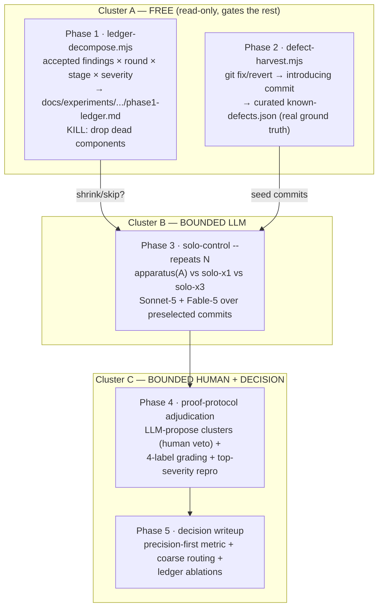

# Plan: Audit-Effectiveness Experiment — cheap credible traction on "what's the cost-effective, high-quality code-audit setup"

- **Date**: 2026-07-04
- **Status**: Complete — every §12.6 CLI this plan specifies was built (`scripts/ledger-decompose.mjs`, `scripts/defect-harvest.mjs`, `scripts/solo-control-audit.mjs`, `scripts/lib/solo-control/scoring.mjs`) and run against real commits; results are `docs/research/experiment-1-solo-control.md`, `experiment-2-arm-eval-and-model-ab.md`, `experiment-3-model-swap-glm-vs-gpt.md`. `docs/research/next-steps.md` (2026-07-09) explicitly hands the continuation roadmap to `docs/plans/tiered-recall-audit-pipeline.md` — nothing remains scoped to this plan. Verified 2026-07-15 (this repo's plans systematically lag actual state — see `project_plan_statuses_stale` memory — confirmed by tracing the code + research docs, not by the stale header alone).
- **Author**: Claude + Louis
- **Scope**: backend
- **Origin**: `/brainstorm --with-gemini` + debate (sessions `1783195469435`, `1783195780211`); synthesis converged on a cost-ordered, phase-gated methodology.

- **Target domain(s)**: `audit-orchestration` (experiment tooling sits beside the audit + arm-eval harnesses)

> **Not a study — a decision aid.** The goal is a *credible initial hypothesis* + an actionable routing recommendation with the **least** LLM spend and human-adjudication time. Every phase can **kill or shrink** the next.

---

## 1. Context Summary

**Detected scope**: backend · **stack**: js-ts · no Python.

**The question.** Our production code-audit is a multi-round apparatus (arm A = GPT gen → up to ~3 GPT rounds → Gemini final gate + R2+ suppression). The A/B/C shadow + the new solo control (`scripts/solo-control-audit.mjs`) let us compare it against single-model reviews. But we lack a cheap, credible way to decide *what's actually worth paying for*. The brainstorm's shared prior: the apparatus most likely buys **recall through iteration**, some **precision through the gate**, and only marginal value from model *diversity* — and "accepted" labels measure *plausibility*, not truth.

**What exists today** (ground truth this plan builds on):
- **`scripts/solo-control-audit.mjs`** — the offline solo harness: `run` (cold-diff over the 5 audit passes, per author model, incremental, toggle-gated, chunked), `merge` (source-blinded shuffled adjudication CSV pulling A/B/C from the `model_ab_finding_scores` view), `score` (per-arm recall/unique/apparatus-only). Written this session.
- **`model_ab_finding_scores` view** — correct arm attribution (A from baseline `arm=NULL`, B/C via `model_ab_attribute_arms` + `unnest`); joined to `audit_findings` for detail text.
- **`audit_findings`** — `round_raised`, `stage` (`null`/`oss-gen`/`gpt-round`/`gemini`), `severity`, `category`, `adjudication_outcome`, `finding_fingerprint`. **Verified populated**: 13,205 findings, 382 accepted, `round_raised` on all rows, 7 distinct rounds.
- **`scripts/lib/db/query.mjs`** — the pg read seam. **`scripts/.cli-catalog.json`** — every `npm run` script must have an entry (enforced by `tests/dashboard-cli.test.mjs`).

**Code Trace** (Phase 1 evidence): `solo-control-audit.mjs::cmdRun` → `runPass` (per-pass `claude -p` via `createAnthropicClient` `anthropic-client.mjs:367`) → `clampToSchema`/`ShadowPassSchema` (`audit-shadow.mjs:107`); `cmdMerge` → `fetchExternalFindings` (reads `model_ab_finding_scores` ⨝ `audit_findings`) → `seededShuffle` (`audit-shadow.mjs:62`); `cmdScore` → cluster/verdict tally. Phase-0 decomposition reads `audit_findings.{round_raised,stage,severity,adjudication_outcome}` directly via `db/query.mjs`.

**Neighbourhood considered**: arch-memory returned all `review` (≤0.68 similarity) — the ledger-decompose query, git-history harvester, and same-model-×N arm are greenfield; the adjudication/scoring work extends the existing solo-control harness (reuse, not new infra).

**Patterns reused vs new**: reuse `db/query.mjs`, the solo-control harness, the `model_ab_finding_scores` view, `seededShuffle`, `assertEgressSafe`, `.cli-catalog.json`. New: two read-only analysis CLIs + a `--repeats` arm + proof-protocol grading.

---

## 2. Proposed Architecture

A **cost-ordered pipeline** where each phase emits a gate signal the operator reads before authorizing the next. No new DB schema; results live in gitignored run artifacts + committed docs writeups + one small committed curated ground-truth set.



**Key design decisions (principles):**
- **Phase gating is the whole point (#20 long-term flexibility, #10 SSoT).** The free phases can make the paid ones smaller or unnecessary. Phase 1's output is a *kill criterion*, not the causal answer (survivorship: we only have labels for what the apparatus surfaced) — stated verbatim in its writeup.
- **Reuse the solo harness; add one arm, don't fork (#2 DRY, #3 modularity).** Same-model-×N is a `--repeats N` flag + a union-dedupe, not a new pipeline.
- **Ground truth from git history, not human skim (#12 validation).** The *fix commit is the label* — objective, survivorship-free, signal-dense.
- **The clusterer proposes; the human arbitrates (#15 error handling, avoid false authority).** LLM clustering biases to over-split; per-arm finding text stays visible (never collapse to a single synthesis — that erases per-arm quality and re-imports bias). Human keeps merge/split veto.
- **No new persistence (#19 observability vs YAGNI).** Run outputs are gitignored artifacts; the decision + decomposition are committed markdown; the only committed *data* is the small curated `known-defects.json` (a diffable rubric, like `.requirements/ledger.json`).

---

## 5. Right-Sizing Gate

New structure introduced: two analysis CLIs, a `--repeats` flag, grading changes, one committed ground-truth file, a docs/experiments dir.

- **Band-aid extreme**: hand-run ad-hoc SQL + eyeball a few diffs in a scratch buffer; no harvester, no repeatable protocol. → resurfaces as un-credible, unreproducible claims; can't re-run when models change.
- **Over-engineered extreme**: a new `experiment_runs` DB schema, a generic pluggable "arm registry", an automated statistical-significance pipeline, a UI dashboard for adjudication. → nothing at N≈15 needs persistence or significance machinery; that's the cliff the brainstorm explicitly warned against ("wildly over-engineered for this stage").
- **Chosen**: two small read-only CLIs + one flag on the existing harness + markdown writeups + one curated JSON. **Current requirement it serves**: get a credible directional decision *now* at minimum spend, re-runnable when a model ships. No `experiment_runs` table because **no one reads experiment history back** — the decision writeup is the durable artifact.

**Manual vs scripted**: the git-history harvest is *regular and verifiable* (parse fix commits → map to introducer → assert the fix touches lines the introducer added) → **script it** (`defect-harvest.mjs`), but it emits *candidates* a human curates (deciding "this fix means the earlier commit had a real defect" is judgment). Ledger decomposition is a pure query → script. Adjudication itself is judgment → stays human, tooling only removes toil.

---

## 7. File-Level Plan

**New — `scripts/ledger-decompose.mjs`** (Phase 1)
- Purpose: read-only decomposition of adjudicated `audit_findings` → "where does accepted value come from."
- Key exports: `decompose({stageType}, deps={query})` → `{byRound, byStage, byRoundBySeverity, gateMarginalValue}` (`deps.query` injectable for tests — M4); `main()` with `--selfcheck-relocation`, `--out <md>`, `--json`.
- Metrics — emit both counts AND **severity-weighted value** (R2-M1) so the §12.3 gate consumes value fields, not prose: `acceptedValueByRound`, `acceptedValueByStage`, `acceptedValueRound1Share` (value = Σ `sev_weight` over `adjudication_outcome='accepted'` rows, same §12.2 weights); plus accepted counts by `round_raised`/`stage` and accepted-HIGH share per round. **gate marginal value** (R1-M1 correction) = acceptance rate of findings the gate itself RAISED (`stage='gemini'`) — because `stage` records the stage that *raised* a finding, NOT the gate's disposition of prior findings. So this measures "are the gate's own net-new findings accepted?" (a valid ablation signal), NOT "did the gate delete valid GPT findings" — the gate's suppressions aren't recorded as findings and are a stated blind spot. `round_raised` is the primary lever; stage is secondary.
- Deps: `lib/db/query.mjs`. Imported by: none (CLI). Emits `docs/experiments/audit-effectiveness/phase1-ledger-decomposition.md`.
- Why: the free kill-criterion; the `#10 SSoT` decomposition of existing labels.

**New — `scripts/defect-harvest.mjs`** (Phase 2)
- Purpose: mine `commit → later-fix/revert` pairs into a candidate ground-truth set of known-buggy commits.
- Key exports: `harvestCandidates({sinceN, roots}, deps={git})` → `[{buggyCommit, fixCommit, files, kind:'revert'|'fixes-ref'|'blame', desc, severityHint}]` (`deps.git` injectable for tests — M4); `main()` with `--selfcheck-relocation`, `--out`, `--apply`.
- **Extraction rules (deterministic, testable — M2), LOCAL GIT ONLY (no GitHub/PR/network lookup)**: (a) `git revert` commits → parse the reverted SHA from the canonical `This reverts commit <sha>` body; (b) `Fixes <sha>` / `fix(...): … <sha>` bodies referencing an **in-repo 7-40 hex SHA** (bare issue numbers with no SHA → skipped, logged); (c) else for `fix:`-typed commits, `git blame -w -C` the fix's pre-image (deleted/modified) lines of each modified **text, non-generated, non-renamed-only** file → the introducing commit(s). Exclusions: merge commits, binary/`generatedNoise` files (`classifyPath`), files added-by the fix (no pre-image), and introducers older than `--since`. Multiple introducers → emit each as a candidate. Ambiguous/low-confidence (blame spread across >2 commits) → still emitted but flagged `confidence:low` for human curation.
- **Pure-addition (omission) defects (Gemini-HIGH)**: a fix that is **all added lines, 0 deletions** (missing null-check / missing auth guard / missing validation) has **no pre-image to blame** — blaming adjacent context lines reliably misattributes the bug to the scaffold-creating commit. Detect zero-deletion hunks and do **NOT** auto-attribute: emit the candidate with `kind:'pure-addition'`, `confidence:low`, and `introducerHint:` = the commit that introduced the enclosing function signature (`git log -L` on the function range, best-effort) — but leave `buggyCommit` for **human curation** (the curator decides which commit "should have had" the guard). These omission defects are the *most valuable* code-audit targets, so they're surfaced, not dropped — just never auto-labeled.
- Output: writes **candidates** to `docs/experiments/audit-effectiveness/known-defects.candidates.json`; the operator curates the accepted subset into the committed **`known-defects.json`** (schema in §12.1 — carries a stable `id` + `evidenceHunk` + `expectedFindingRubric`, not just files).
- Deps: `child_process` git (injectable), `lib/sensitive-paths.mjs` (skip sensitive + generated files). Why: survivorship-free, signal-dense real labels (#12).

**Modify — `scripts/solo-control-audit.mjs`** (Phase 3 + Phase 4)
- **Phase 3**: add `--repeats N` (default 1). For each (pass × chunk), call the model **N independent times, SEQUENTIALLY** (Gemini-R1-MEDIUM — never `Promise.all` the repeats: N concurrent identical large-context payloads would trip Anthropic 429s; the per-call timeout + backoff absorbs throttling only when serialized); union + `dupHash`-dedupe within the commit (extends the existing `seen` set).
- **Sampling diversity — the xN arm is INVALID at temperature 0 (Gemini-R2-HIGH, load-bearing).** If the N repeats run deterministically (temperature 0), they return identical outputs, `dupHash` collapses them to one, and xN silently degenerates to x1 — measuring nothing. So the experiment **pins a non-zero temperature (1.0) for repeated calls** to draw genuinely independent samples. Because the cli backend (`claude -p`) does **not** expose a temperature flag, **solo runs for this experiment use the SDK backend** (`CLAUDE_BACKEND=sdk`, `ANTHROPIC_API_KEY` — present in `~/.audit-loop.env`) with explicit `temperature`. **Degeneracy guard**: after a commit's repeats, if the N raw outputs are byte-identical (no sampling variation actually occurred), flag the arm `sampling:degenerate` and treat it as **x1, not xN** (never report a collapsed arm as if it had iterated). Record the resolved `temperature` + backend in the S-findings provenance (§12.5). Arm label gains a suffix: `S-sonnet` (×1) vs `S-sonnet-x3`. `run` records `repeats` in the S-findings file. `--commits <file>` accepts the Phase 2 `known-defects.json` (audit exactly those buggy commits).
- **Apparatus-input contract (H1) — the apparatus (arm A) must be RUN on the known-defect commits, not just read; and that RUN belongs in generation, not `merge` (Gemini-R2-MEDIUM).** Git-mined known-defect commits are historical and will usually have **no** `model_ab_finding_scores` rows. Keep the separation of concerns: **generation** (slow, AI) vs **aggregation** (`merge`, fast, offline). So a **new `run --arm apparatus` preflight** (not `merge`) produces the missing apparatus finding-sets: for each commit, (a) if apparatus shadow rows exist in the view → reuse them; (b) else run the production audit (arm-A config, or the *lean* config the §12.3 P1 gate selects) on that commit via the existing audit path, tagged `run_context:'audit-effectiveness'`, persisting to the same store the view reads. **`merge` stays a pure aggregator** — it reads via `collectArmFindings({commits, arms})` (view + any preflight-produced rows) and never triggers generation. **Coverage preflight**: before Phase 3 spends, map every selected commit → required arm artifacts and report gaps; the apparatus-run preflight must fill them before `merge` runs — a commit never dead-ends on "0 external rows." Cost: running the apparatus fresh on ~15 commits is real spend, bounded by the €500 cap and shrinkable via the P1 lean-apparatus gate.
- **Phase 4**: `merge` — add an LLM **cluster-propose** pre-pass (bias to over-split; per-arm rows stay visible; adds a `proposed_cluster` hint column the human may override in `cluster`). Grading columns change from `verdict∈{accept,dismiss}` to **`label ∈ {proven, actionable, plausible, false}`** + a `proof` column (file:line / repro for high-severity). `score` — compute the precision-first metrics (below), counting only `proven`+`actionable`, severity-weighted; add per-arm **false-positive burden** and, when a commit is in `known-defects.json`, **known-defect recall** (did the arm catch the documented bug?).
- Deps: `createAnthropicClient` (cluster-propose call), existing helpers. Why: reuse over new infra (#2, #3).

**New — `scripts/lib/solo-control/cluster-propose.mjs`** (Phase 4)
- Purpose: the single LLM cluster-proposer (isolated so it's testable + swappable). `proposeClusters(rows, {client})` → `{clusterId → [rowIdx]}`, prompted to over-split, deterministic ordering. Returns proposals only; never merges authoritatively. `client` is injectable (M4).
- **Egress contract (H3)**: finding rows carry file paths + code snippets. Before the Anthropic call, every row's text is routed through `redactSecrets(...).text` AND `assertEgressSafe(...)`; a row whose file is sensitive (`classifyPath`) is excluded from the payload and clustered deterministically by `dupHash` instead. An egress refusal aborts the propose step (falls back to `dupHash` clustering, `clustering:degraded`) — never sends. Mirrors the `run`/`defect-harvest` egress posture.
- Why: keep the load-bearing "what counts as the same finding" boundary in one auditable place (#3), and the external-call egress gate in one place.

**New — `scripts/lib/solo-control/scoring.mjs`** (Phase 4, resolves M3 god-script)
- Purpose: extract the metric math out of the CLI so `solo-control-audit.mjs` stays a thin orchestrator. Pure, deterministic, no I/O: `scoreArms(labeledRows, {knownDefects})` → per-arm severity-weighted value, precision, FP burden, known-defect recall, eligibility vs the FP ceiling + recall floor (§12.2). Directly unit-testable (M4 — takes data, not a DB).
- Why: `#3` modularity — the CLI adds `--repeats`, known-defect loading, cluster-propose wiring, and 4-label parsing; the *scoring* is a separate concern with a crisp input/output contract → its own module + Tier-1 test.

**New — `docs/experiments/audit-effectiveness/`** (committed)
- `README.md` (methodology + phase-gate protocol + confound controls), `phase1-ledger-decomposition.md` (Phase 1 out), `known-defects.json` (curated ground truth), `phase5-decision.md` (Phase 5 out). Run artifacts (S-findings, blind CSV, scores) stay under gitignored `.audit-loop/solo-control/`.

**Modify — `package.json` + `scripts/.cli-catalog.json`**
- Add `audit-exp:ledger`, `audit-exp:harvest` scripts + **matching catalog entries** (the ship gate that bit us: `tests/dashboard-cli.test.mjs` fails without them).

**New — tests**: `tests/defect-harvest.test.mjs` (commit-pair extraction on fixtures), `tests/solo-control-scoring.test.mjs` (4-label weighting + precision/known-defect-recall math), `tests/ledger-decompose.test.mjs` (decomposition aggregation on a fixture rowset).

### 7b. Implementation Phases

- **Phase 1 — Ledger decomposition**. Read-only "where does accepted value come from" + gate-effect. Files: `scripts/ledger-decompose.mjs` (create), `tests/ledger-decompose.test.mjs` (create), `docs/experiments/audit-effectiveness/phase1-ledger-decomposition.md` (create).
- **Phase 2 — Defect harvest**. `commit→fix` candidate miner + curated set. Files: `scripts/defect-harvest.mjs` (create), `tests/defect-harvest.test.mjs` (create), `docs/experiments/audit-effectiveness/known-defects.json` (create, curated).
- **Phase 3 — Same-model-×N arm**. `--repeats N` + union-dedupe + `--commits <known-defects>`. Files: `scripts/solo-control-audit.mjs` (modify).
- **Phase 4 — Proof-protocol adjudication + scoring**. Cluster-propose, 4-label grading, precision-first + known-defect-recall metrics. Files: `scripts/solo-control-audit.mjs` (modify), `scripts/lib/solo-control/cluster-propose.mjs` (create), `tests/solo-control-scoring.test.mjs` (create).
- **Phase 5 — Decision + ablation writeup**. Compute the call; fold Phase 1 ablations. Files: `docs/experiments/audit-effectiveness/phase5-decision.md` (create), `docs/experiments/audit-effectiveness/README.md` (create).
- **Close-out (not a phase)**: add `package.json` scripts + `scripts/.cli-catalog.json` entries; `npm test`; `npm run skills:check` (n/a) — run `node scripts/ledger-decompose.mjs --selfcheck-relocation` + `defect-harvest --selfcheck-relocation`.

---

## 8. Risk & Trade-off Register

| Risk / trade-off | Mitigation / rationale |
|---|---|
| **Phase 1 survivorship bias** (labels only exist for apparatus-surfaced findings) | Stated verbatim in the writeup; Phase 1 is a *kill criterion*, never the causal claim. The causal answer needs Phase 3. |
| **`known-defects` mislabels** (a "fix" commit that isn't fixing a real prior defect) | Harvester emits *candidates*; a human curates the committed set. `blame`-derived introducers are heuristic → curation required. |
| **Cluster-propose over-merges → destroys "unique" signal** | Bias-to-over-split prompt; per-arm rows stay visible; human merge/split veto; isolated in one testable module. |
| **N≈15 is underpowered for fine routing** | Output is a *coarse* routing recommendation (default + escalate risky classes), explicitly not a per-class table. |
| **Single adjudicator bias** | Second-rater on all high-severity + a random 10%; top-10 severity-weighted get file:line/repro proof. |
| **`claude -p` cost/latency for solo-x3** (3× the calls) | Bounded to the preselected commit set; budget already €500; `--repeats` opt-in, off by default. |
| **Deferred**: Action Rate as a metric | Deliberately *weak secondary only* — severity-inverted (rewards cheap nits) + circular when the author is an agent. Documented, not built as a headline. |

**Decision metric (Phase 5)**: headline = **severity-weighted (proven+actionable) findings under a hard false-positive ceiling** (precision-first; recall as a *floor* on risky classes: security, migrations, concurrency, auth, data-loss). Secondary = **known-defect recall** (Phase 2 commits). An arm/config "wins its lane" only if it clears the FP ceiling AND matches the apparatus on known-defect recall at lower cost.

---

## 9. Testing Strategy

- **Tier-1 (test-first, deterministic seams)**: `defect-harvest` commit-pair extraction (revert-SHA, `Fixes #`, blame-introducer) against a fixture git log; `score` 4-label weighting + precision + known-defect-recall math; `ledger-decompose` aggregation on a fixture rowset.
- **Tier-2 (invariant, LLM seam)**: `cluster-propose` — assert it returns *proposals only* and never fewer clusters than a "merge-nothing" floor for clearly-distinct inputs (over-split invariant); do **not** assert on prose.
- **Egress (R1-H3 + R2-M3)**: `defect-harvest`, solo `run`, **AND `cluster-propose`** route payloads through `assertEgressSafe` + sensitive-path filtering. `cluster-propose` gets **dedicated tests with an injectable client spy**: a sensitive-path row is excluded and never reaches the payload; a planted secret is redacted before payload construction; an `assertEgressSafe` refusal prevents the client from being called and returns deterministic `dupHash` clusters (`clustering:degraded`).
- **Harvester spec/test alignment (R2-L1)**: Tier-1 tests assert `Fixes <7-40 hex sha>` / `fix(...): … <sha>` are **accepted**, and a separate negative test asserts a bare `Fixes #123` (no SHA) is **skipped + logged**, no network lookup.
- **Relocation**: both new CLIs implement `--selfcheck-relocation`.
- **Manual/empirical**: run Phase 1 against the live ledger (it's read-only) and eyeball the decomposition for sanity before trusting Phase 3 numbers.

---

## 11. Execution Clustering

- **Cluster A** — Phases 1–2 — fix-gate: none
  - Coupling: both are standalone **read-only** analysis CLIs that share the `docs/experiments/audit-effectiveness/` output surface and the same db/git read patterns; together they form the **free gate** whose outputs decide whether (and how small) the paid phases run. Neither writes runtime code the other imports, so no convergence gate is needed — but they audit together because a reviewer must check both against the "is this credible/free?" claim as a unit.
  - author-tier: standard
- **Cluster B** — Phase 3 — fix-gate: yes
  - Coupling: single-file extension to `solo-control-audit.mjs` (`--repeats` + union-dedupe); must reach convergence before Phase 4, because Phase 4's scoring consumes the ×N output shape (arm-label suffix, `repeats` field).
  - author-tier: standard
- **Cluster C** — Phases 4–5 — fix-gate: final
  - Coupling: the scoring extensions (4-label weighting, precision-first, known-defect-recall) and the decision writeup share one set of **metric definitions** — the decision reads exactly what `score` emits; clustering them lets the audit inspect that seam.
  - author-tier: frontier
- **Final gate**: mandatory consolidated Gemini review over the union diff of all clusters.

---

## 12. Metrics, Gates & Contracts (resolves audit R1 — makes the plan executable)

### 12.1 `known-defects.json` schema + known-defect-recall match rule (H1)

```json
{ "version": 1, "defects": [{
  "id": "KD-001", "buggyCommit": "<sha>", "fixCommit": "<sha>",
  "files": ["scripts/x.mjs"], "evidenceHunk": "scripts/x.mjs:L40-L58",
  "defectDesc": "reconcile() derefs ledger[id] with no null check",
  "expectedFindingRubric": "flags the unchecked ledger[id] deref / missing null-guard",
  "severity": "HIGH" }] }
```

**Match rule** (survivorship-free recall, no auto-text-match → avoids the clusterer-as-judge trap): during blind adjudication the sheet carries a `matches` column; the adjudicator — still blind to arm — links a graded finding to a defect `id` iff the finding is (a) graded `proven`|`actionable`, (b) its `primary_file ∈ KD.files`, and (c) it describes KD per `expectedFindingRubric`. **Known-defect recall(arm)** = |distinct KD linked to a finding from `arm`| / |KD in the run|.

### 12.2 Decision metric — executable formulas (H2, M2, M4)

- **Scoring unit = the human cluster (H2).** Before ANY metric, `scoreArms` collapses raw rows to **one item per `(commit, arm, human_cluster)`** — so an xN arm's repeated calls that surface the same issue (even when `dupHash` exact-match misses them) count **once**. Raw repetition is reported separately as `repetitionBurden` (how much redundant text a reviewer would wade through), never folded into value.
- **Severity weights** LOW=1, MEDIUM=3, HIGH=8 (mirror `model_ab` `SEV_WEIGHTS`). **Label factors** `proven`=1.0, `actionable`=0.6, `plausible`=0, `false`=0.
- **value(arm)** = Σ over its *collapsed* items of `sev_weight × label_factor`.
- **severity-weighted precision (M2)** = `value / Σ sev_weight over ALL labeled collapsed items` (denominator includes `plausible` AND `false`, not just `false`) — so an arm that floods plausible-but-unproven noise is correctly penalized, not just one that emits outright-false.
- **Hard eligibility ceiling (trust budget, M2)** — an arm/config is *eligible* only if `count(plausible ∪ false) / count(total collapsed items) ≤ 0.5` **AND** `count(false)/count(total) ≤ 0.33`. Below either, recall is irrelevant (noisy tool rejected).
- **Execution-completeness gate (M4)** — `scoreArms` returns `eligible:false` for any required arm with incomplete chunks/repeats (`repeats_completed < N` or a stalled chunk) unless the operator explicitly re-labels it as a distinct config (e.g. `S-sonnet-x2-partial`). Phase 5 is `final` only if every required arm ran complete; else `directional-only`.
- **Recall floor on risky classes** (security, migrations, concurrency, auth, data-loss): of the findings the **apparatus** proved in those classes, an eligible candidate must recover **≥ 0.70**.
- **Cost** = `€/accepted-value` = `(LLM_cost + human_minutes × €rate) / value` — **reported, not gated** (human-minutes is a rough estimate; Action-Rate is NOT used — severity-inverted + agent-circular).
- **"Matches the apparatus"** ⟺ eligible AND `value(arm) ≥ 0.9 × value(apparatus)` AND `known-defect-recall(arm) ≥ known-defect-recall(apparatus)` at lower `€/accepted-value`.
- **Tie-break**: higher precision, then lower cost.

### 12.3 Phase-gate decision rules (M8 — the "kill or shrink" made concrete)

- **P1 → P3**: consume the ledger-decompose **value** fields (not counts): if `acceptedValueRound1Share ≥ 0.80` AND gate marginal-value acceptance `< 0.15` → compare against the **lean apparatus** (drop round-3 + gate) and record the ablation. If Phase-1 accepted N < 50 → `INSUFFICIENT_DATA`, run the full apparatus config.
- **P2 → P3**: require **≥ 6 curated known-defect commits**; else widen the harvest window or proceed at documented lower power.
- **P3 → P4**: if any arm produced **0 conformant findings across all commits** (capture failure) → fix before adjudicating (never adjudicate an empty arm as "clean" — silent-green).
- **P4 → P5**: require top-10 severity-weighted accepted findings to carry proof AND the 10% second-rater sample done; else the decision is labelled **"directional only."**

### 12.4 Failure semantics — every CLI (H4; invariant "silent green is the enemy")

Non-zero exit + explicit cause on every degraded state; a green/empty result must never read as "clean" or "solo won":
- **ledger-decompose**: DB unreachable → exit 3; 0 adjudicated rows → exit 0 with an `INSUFFICIENT_DATA` banner (not empty tables misread as "no value").
- **defect-harvest**: git failure → exit 3; 0 candidates → exit 0 + explicit "no candidates in window" (never an empty *committed* set).
- **solo `run`**: already egress-gated + per-pass degrade; a partial-repeat records `repeats_completed < N` and flags the arm `underpowered` (not silently fewer passes).
- **merge**: missing `model_ab_finding_scores` / 0 external rows → **refuse (exit 4)** — an empty apparatus arm must not read as "solo won".
- **cluster-propose** LLM/egress failure → deterministic `dupHash` fallback + `clustering:degraded` flag; never blocks adjudication.
- **score**: malformed/unlabeled rows → warn + exclude + report coverage %; a run < 90% labeled is `incomplete`, not scored as final.

### 12.5 Provenance, fairness & artifacts (M5, M6, M7)

- **Fairness/independence**: all arms receive the **identical** diff/context/severity-bar (same chunker, same `PASS_PROMPTS`). `--repeats N` = **N separate calls with NO shared context**. Each S-findings file records: resolved **concrete** model id (via `resolveModel` after a catalog refresh — `latest-sonnet` currently resolves to `claude-sonnet-4-6`, so the experiment **pins** `claude-sonnet-5` / `claude-fable-5` explicitly), prompt-version hash, `repeats`, chunk size, and per-call tokens/cost.
- **Schema/compat (M6)**: S-findings + blind CSV carry a `version` field. Run artifacts are **ephemeral** (gitignored `.audit-loop/solo-control/`, regenerated) → no migration; a stale CSV is rebuilt, not upgraded.
- **Reproducibility (M7)**: `phase5-decision.md` carries a provenance header (model ids, commit SHAs, run timestamps, prompt version). No manifest-hash system — over-engineering at N≈15 (right-sizing). `.audit-loop/solo-control/` ignore status was verified (`git check-ignore`).

### 12.6 CLI contracts (L1)

- **ledger-decompose**: `[--stage-type audit-code] [--out <md>] [--json]`; read-only; paths repo-root-relative.
- **defect-harvest**: `[--since <N|sha>] [--roots <csv>] [--out <path>] [--apply]` (`--apply` writes the candidates file; curation into `known-defects.json` is manual); no network.
- **solo-control run**: `[--repeats N=1] [--commits <known-defects.json|csv>] [--model <id>] [--label <S-x>]`.
- All new CLIs: absolute-or-repo-root path resolution, `--selfcheck-relocation`, never overwrite a committed file without `--apply`/`--force`.

---

## Audit Trail

- **R1 plan audit** (GPT-5.5, `--mode plan`): 4 HIGH + 8 MEDIUM + 1 LOW, all valid/in-scope/fix-now (no rebuttal — no uncertain/invalid findings). Resolved: H1 §12.1, H2 §12.2, H3 (cluster-propose egress bullet), H4 §12.4, M1 (gate-marginal-value correction in ledger-decompose bullet), M2 (harvester rules bullet), M3 (`scoring.mjs` extraction), M4 (injectable `deps` on all new modules), M5/M6/M7 §12.5, M8 §12.3, L1 §12.6. **M1 was a genuine semantic catch** — `stage` records the raising stage, not gate disposition.
- **R2 plan audit** (GPT-5.5, R2+ suppression): HIGH 4→2, 7 findings, all valid net-new design refinements (not rigor pressure). Resolved: **H1** — `collectArmFindings` read-or-**run** apparatus on git-mined known-defect commits + coverage preflight (they have no shadow rows → `merge` would dead-end); **H2** — scoring unit = `(commit,arm,human_cluster)`, xN repetition can't inflate value; **M1** — ledger-decompose emits severity-weighted `acceptedValueBy*`, §12.3 consumes value not counts; **M2** — precision denominator + eligibility ceiling now include `plausible` (noise-flooding penalized); **M3** — dedicated `cluster-propose` egress test; **M4** — underpowered arm → `eligible:false` / `directional-only`; **L1** — §9 test spec aligned with harvester rules. **H1 was the most valuable** — the known-defect experiment would have dead-ended without running the apparatus fresh.
- **Convergence**: stopping GPT at R2 (rigor-pressure cap) — R2's remaining surface is implementation-completeness detail that belongs to the code audit; proceeding to the mandatory Gemini final gate.
- **Gemini final gate** (gemini-pro, `--mode plan`): 2 rounds, 4 concerns total, **all resolved** — R1: pure-addition (omission) defects break git-blame attribution (`kind:pure-addition`/`confidence:low`/human-curate, never auto-attribute), `--repeats` concurrency → 429 (sequential execution). R2: **the xN arm is invalid at temperature 0** (identical outputs → `dupHash` collapse → silent degeneration to x1; pinned temperature 1.0 via SDK backend + a byte-identical degeneracy guard) — *the single most important finding of the audit*; and apparatus-run belongs in a `run --arm apparatus` preflight, not `merge` (separation of concerns). **Stopped at the 2-round cap**: the pattern was 2 findings/round with the last being tidiness; remaining surface is implementation-completeness the code audit verifies against real code. **Verdict: design-sound, ready for implementation.**
