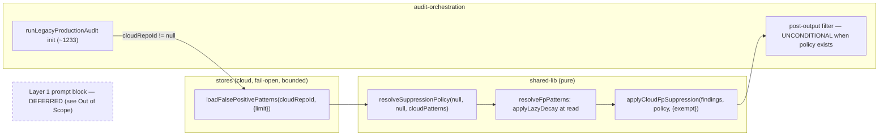

# Plan: Wire the Cloud FP-Pattern Read Loop into Audit Suppression

- **Date**: 2026-07-17
- **Status**: Complete — implemented + audited. Plan audit: 5 GPT + 2 Gemini
  rounds. Code audit: 5 GPT rounds + 1 deliberation + 3 Gemini rounds →
  **APPROVE** (0 new, 0 wrongly dismissed). Full suite 6690 pass / 0 fail.
- **Author**: Claude + Louis Strydom
- **Scope**: backend

## Code-audit trail (implementation)

5 GPT rounds over the union diff (base `a2d0b83`). HIGH: 5 → 1 → 1 → 3 → 2.
Every HIGH resolved — **fixed**, **disproven at runtime**, or **overruled by
deliberation**. Four findings changed the design:

- **R3-H1 — I reversed my own R1 deferral.** I first deferred the GLOBAL-bucket
  contamination risk as "narrow", having asked *"does my change call the
  writer?"* (no). That is the wrong question. The rule asks whether the change's
  correctness **rides on** the path — and here it is sharper still: before this
  plan, `loadFalsePositivePatterns` had **no production caller**, so a
  write-side mislabelling was completely inert. **This change is the activator.**
  Fixed at the sync boundary (`isSyncableRepoId`), preserving 718ca90's
  never-null builder guarantee.
- **R4-H3 — the plan itself was wrong.** Decision #5 conflated two opposite
  senses of "fail-open": failing toward *keeping the finding* (correct) vs
  keeping an undatable pattern at full strength, which fails toward
  *suppressing* — manufacturing the immortal row the decay exists to kill. Plan
  and code both corrected.
- **R3-M1 / R4-H1 / R5-M1 — the same accountability class, three times.** Cloud
  suppression is deliberately independent of the ledger branch, but provenance
  rode on `_suppressionData`, which only that branch builds. Findings vanished
  with no `suppression_events` row in the no-ledger case, then (after a half-fix)
  in the both-active case, then on round 1. All three closed.
- **R2-H1 — disproven at runtime**, not argued: it claimed missing prompt-seed
  bindings; the module loads, both bindings resolve, two audits had already run
  through that path, and 6690 tests pass.

**Gemini code gate (3 rounds — the 3rd earned under the cap's concrete-defect
exception)**:
- R1 → `CONCERNS_REMAINING`: plan §7 still instructed the half-fix for R4-H1/
  R3-M1 (a plan contradicting its own shipped code is a trap for the next
  reader), plus a **tautological test** — the fixture key replicated its
  structured values, so `structured fields come from the pattern object` passed
  either way. Both fixed; its code claim was false and is recorded as such.
- R2 → `CONCERNS_REMAINING` + **2 wrongly-dismissed**. A legitimate catch of a
  **process failure**: the R4/R5 triage scripts applied a canned
  architecture-churn rationale as a *fallback* to any un-enumerated finding, so
  two backend logic bugs (`R5-M1` provenance-on-R1, `R5-M2` stale `keptCount`)
  received a domain-map justification that had nothing to do with them. Reading
  the HIGHs and letting boilerplate absorb the MEDIUMs is exactly the
  reflex-defer the rules forbid — and worse than a miss, because the ledger then
  carries a false justification. Every bulk-deferred non-Architecture finding was
  re-read; both bugs fixed.
- R3 → **`APPROVE`** (0 new, 0 wrongly dismissed).

**Deliberation (1)**: R5-H1 challenged → GPT ruled **overrule** ("valid against
the earlier behavior but **stale against the supplied diff**"). Its one
condition — a test pinning the *egress boundary*, not just the predicate — was
adopted in full, and the guard was hoisted above the cloud check to make that
test structurally possible.

**Deferred with named independence** (never silently): repo-wide
`.audit-loop/domain-map.json` findings re-raised with fresh hashes every round —
which is why ledger suppression cannot catch them and why the `M<=2` threshold is
structurally unreachable for this PR — plus a pre-existing `diffText` egress
finding. This diff adds exactly **one** new module edge:
`audit-orchestration → shared-lib`, the allowed direction. Two HIGH-value
independent findings were **spawned as their own tasks** rather than buried:
`syncBanditArms`' NULL-conflict key (the 403k-row class, different table) and the
local `fpTracker` trapped in the ledger branch (the same bug this plan fixed for
the cloud path; fixing it would violate constraint 1).

## Plan-audit trail

**GPT (5 rounds, 22 findings, zero re-raises)** — HIGH: 2 → 1 → 3 → 2 → 1.
Every round's findings were **net-new consequences of the prior round's fixes**
(`Suppressed 0 | Reopened 0` in all R2+ rounds), which is why the count rose
mid-audit rather than plateauing. 21 accepted+fixed, 1 severity_adjusted (R2-M1
— read bound accepted, ranking machinery rejected as over-engineering).

**Rounds 4-5 deliberately exceeded the 3-round cap** under the genuine-bugs
exception, not rigor pressure. The two findings that justified it:
- **R3-H1** — the R2 composition seam returned its input array by reference,
  and the call site cleared that array before re-pushing: **every finding erased
  on every cloud-off run**. Introduced by the R2 fix for R1-H1.
- **R5-H1** — the `auto_suppress = true` predicate excluded exactly the repo
  *blockers* the scope hierarchy depends on, so a global pattern could suppress
  a finding a repo override would have kept. This lived **one layer below** all
  of R3/R4's completeness machinery: those rounds guarded rows we failed to
  *read*; this was rows we never *asked for*.

**Stopped after R5 by decision** — remaining concerns were implementation-level
and belong to `/audit-code` against real code.

**Gemini gate (2 rounds, cap reached)**:
- Round 1 → `CONCERNS_REMAINING`: 1 new HIGH (**G1** — attaching the cloud count
  inside the ledger branch reads `cloudPass` before its `const` declaration: a
  TDZ `ReferenceError` crashing every cloud-enabled run with ledger entries).
  0 wrongly dismissed, no Claude bias detected. Sustained + fixed.
- Round 2 → `CONCERNS`: 2 new, both **internal documentation contradictions in
  this plan**, both fixed: (a) the file-plan's `~:2353` anchor sat *inside* the
  ledger branch — verified against the source, the branch spans `:2315-:2453`,
  so the hint was wrong by 100 lines and would have **recreated R1-H1 while
  appearing to fix it**; anchors are now structural, not numeric. (b) §7 still
  called the index "partial" after R5-H1 removed the predicate, which would have
  silently recreated the R5-H1 recall failure.
- **Gate closed at the 2-round cap by rule**: round-2 findings were
  implementation-completeness/consistency, not design defects. Both fixed in
  place; `/audit-code` verifies against the real implementation.

- **Target domain(s)**: `audit-orchestration` (`legacy-production-audit.mjs`,
  `llm-helpers.mjs`), `shared-lib` (`suppression-policy.mjs` — read-only reuse),
  `stores` (`bandit-fp.mjs` — read-only reuse)
- ⚠ **Cross-domain work** — deliberate and in the already-allowed direction:
  `audit-orchestration` → `shared-lib` / `stores`. No new domain edge; both
  callees already exist and are imported by siblings.

## Neighbourhood considered

`get-neighbourhood` returned the exact modules this plan wires (self-similarity,
expected): `resolveFpPatterns` (0.849), `resolveSuppressionPolicy` (0.845),
`shouldSuppressFinding` (0.835), `loadFalsePositivePatterns` (0.832), all
`recommendation: review`. **This plan creates no new sibling** — it adds a
production caller for existing, currently-dead symbols. The one adjacent
suppressor family (`suppressReRaises`, `applyLedgerSuppression`,
`applyStage1MechanicalEarlyFilter` in `findings-pipeline.mjs`) is deliberately
NOT touched: ledger-keyed suppression stays owned by those mechanisms (see
"Reopen-churn reconciliation").

## Past incidents to verify against

| Incident | Relevance |
|---|---|
| **INC-002** — prod DB wiped via non-disposable test DSN | Any new test touching the DB path must stay on mocked/fixture seams — this plan's tests are pure-function only (no live DSN, no pool). The store reader is already schema-guard-tested in `tests/store-bandit-fp.test.mjs` without a live DB. |
| **INC-001** — symlink egress bypass | Not on this surface (no file reads added). The one egress-adjacent change is Layer 1 prompt injection — see "Security Considerations". |

---

## 1. Context Summary

**Detected scope + stack**: backend; `js-ts` (Node ESM).

### What exists today (Code Trace)

The R2+ suppression machinery has **two parallel implementations**, one live
and one dead:

**Live path** (what every production audit runs):

- **Layer 1 (rulings injection)** — `buildCachePrompt`
  `scripts/lib/audit/llm-helpers.mjs:95-111`: `isR2Plus && ledgerFile` →
  `buildRulingsBlock(ledgerFile, passName, impactSet)` (`ledger.mjs`), joined
  with `historyBlock` into msg #2 (`history`) for cache stability. Every pass
  reaches it via the `passPrompt` wrapper
  (`legacy-production-audit.mjs:1400`: `const passPrompt = (opts) =>
  buildCachePrompt({ ...opts, requirementsRubric })`), plus one direct call at
  `:745` (architecture-intent bouncer).
- **Layer 2 (R2+ prompt rubric)** — `R2_ROUND_MODIFIER` threaded as
  `roundModifier` at `llm-helpers.mjs:109`. Static text; round-gated.
- **Layer 3 (post-output suppression)** — `legacy-production-audit.mjs:2315-2353`:
  inside `if (mergedLedger.entries.length > 0)`, `suppressReRaises(allFindings,
  mergedLedger, { changedFiles, impactSet })` (`:2321`) splits kept /
  suppressed / reopened; then the **local** FP tracker filters `kept` only
  (`:2335-2349`, `fpTracker.shouldSuppress(f)` — called with no
  repoFingerprint, so only legacy single-key patterns match); `allFindings`
  becomes `kept + reopened` (`:2352-2353`). Counters land in
  `_suppressionData` (`:2357-2364`) incl. `fpSuppressedCount`.
- **Cloud identity + write path** — `cloudRepoId` resolved at `:1166-1172`
  (`resolveRepoForStore` → `repoRowId`, only when cloud is on and a
  `repoProfile` exists); local dirty FP patterns are **synced up** at `:2758`
  (`syncFalsePositivePatterns(cloudRepoId, fpTracker.dirtyPatterns())`).

**Dead path** (built by the signal-recovery plan, no production caller):

- `loadFalsePositivePatterns(repoId)` — `scripts/lib/store/bandit-fp.mjs:199-225`.
  Reads `false_positive_patterns` WHERE `auto_suppress = true`, two queries
  (repo UUID + `GLOBAL_REPO_ID` sentinel `00000000-…-0000`), returns
  `{repoPatterns, globalPatterns}`. Fail-open: cloud-off → empty; query error
  → logged + empty. Columns pinned by `FP_PATTERN_READ_COLUMNS`
  (`:114-118`) and schema-guard-tested (`tests/store-bandit-fp.test.mjs`).
- `resolveSuppressionPolicy(ledger, fpTracker, cloudPatterns, repoFingerprint)`
  — `scripts/lib/suppression-policy.mjs:134-152`. Merges ledger exclusions +
  local + cloud FP patterns; `resolveFpPatterns` (`:40-76`) maps the cloud
  snake_case counters (`decayed_accepted`/`decayed_dismissed`) onto the
  camelCase shape `effectiveSampleSize` consumes; dedup prefers local.
- `shouldSuppressFinding(finding, policy)` — `:174-205`. Hierarchical scope
  walk (`repo+fileType` → `repo` → `global`), each scope gated on
  `effectiveSampleSize(match) >= learningConfig.minFpSamples` (default 5,
  `config.mjs:337`) AND `ema < 0.15`; a scope with enough data that doesn't
  suppress **stops** the walk (narrow overrides broad). Falls through to a
  `ledgerExclusions` category match (confidence 1, **no reopen logic**).
- `formatPolicyForPrompt(policy)` — `:159-165`. Renders
  `systemPromptExclusions` as a "KNOWN FALSE POSITIVES (do NOT re-raise)"
  block; empty string when no exclusions.

**Why the cloud read is now trustworthy**: commit `718ca90` + migration
`20260717120000_fp_sync_idempotency.sql` made rows repo/sentinel-keyed and
idempotent on `(repo_id, pattern_type, pattern_value)` (`buildFpPatternRows`,
`bandit-fp.mjs:137-167` — repo_id never NULL, GLOBAL sentinel fallback).
History before 2026-07-17 was purged; rows accumulate from now.

**Semantic trap found in trace (drives the whole design)**: the local
tracker's `shouldSuppress` (`findings-tracker.mjs:194-227`) has a **legacy
raw-count fallback** — when decayed ESS < min it still suppresses if
`(accepted+dismissed) >= 5 && ema < 0.15` (`:222-225`). The policy module's
`shouldSuppressFinding` has **no such fallback**. Replacing the local call
with the unified policy would therefore change cloud-off behaviour —
violating the byte-identical constraint. Hence: **additive cloud-only layer,
local path untouched**.

### Patterns reused vs new

**Reused** — `loadFalsePositivePatterns` (as-is), `resolveSuppressionPolicy` /
`shouldSuppressFinding` / `formatPolicyForPrompt` (as-is), the `passPrompt`
wrapper seam (`:1400`), the existing Layer-3 kept-loop shape (`:2335-2349`),
`_suppressionData` counter convention, the `[learning]` stderr log prefix.

**New** — one optional `policyBlock` parameter on `buildCachePrompt`; ~30
lines of orchestrator wiring; one new Tier-1 test file. **No new module, no
schema change, no migration.**

---

## 2. Proposed Architecture



### Right-sizing gate

- **Band-aid extreme**: bolt `shouldSuppressFinding` onto the kept-loop with a
  full policy (ledger + local + cloud). Fast, but the policy's ledger branch
  (confidence-1 category match, no reopen check) would silently fight
  `suppressReRaises`' reopen decisions — a second, contradictory ledger
  suppressor, exactly the dismissed-vs-fixed conflation class the reopen-policy
  plan just fixed in Layer 1. Rejected.
- **Over-engineered extreme**: make `resolveSuppressionPolicy` the single
  suppression authority — replace `fpTracker.shouldSuppress` and fold ledger
  exclusion into the policy (the module's original ambition). Changes cloud-off
  behaviour (the legacy raw-count fallback differs → violates the
  byte-identical constraint), drags reopen-policy Phase-2 semantics into scope,
  and unifies two mechanisms no current requirement needs unified. Rejected;
  recorded in §Out of Scope with a revisit trigger.
- **Chosen**: an **additive, cloud-only, deterministic Layer-3 filter**. The
  cloud patterns are resolved into a policy carrying **zero ledger exclusions
  and zero local patterns** (`resolveSuppressionPolicy(null, null,
  cloudPatterns)`), decayed at read, and applied through one pure seam over the
  post-ledger finding set. Ledger semantics remain solely owned by
  `suppressReRaises`; local-tracker semantics remain byte-identical. Smallest
  change that makes the cloud read live; every existing behaviour is provably
  preserved when the policy is null.

### Why Layer 1 (prompt injection) is NOT in this plan (R1-H2 + R1-M3)

**This is a scope boundary, not a deferral of difficulty** — the plan's design
does not depend on Layer 1, and shipping Layer 3 alone fully satisfies the
"make the cloud read live" requirement.

R1-H2 established a real correctness defect in the R1 draft's Layer 1: the
`formatPolicyForPrompt` block is a **category-level** "do NOT re-raise"
instruction delivered **before** the model emits findings. A finding that
`suppressReRaises` would have classified as a **required reopen** (a regression
against a `fixed` ledger entry on a changed file) can be omitted by the model
merely because it shares a category with a cloud FP pattern. The draft's claim
that "cloud suppression never touches `reopened`" was therefore **false for the
prompt path**: Layer 1 prevents candidate reopens from ever reaching the
deterministic reopen classifier. That is silent recall loss — this repo's
most-repeated failure class.

A safe Layer 1 needs two things this plan does not own:

1. a **reopen-aware projection** — subtract from the block every category with a
   reopen-eligible ledger entry on a changed file. That couples prompt assembly
   to per-outcome reopen semantics which `docs/plans/dismissed-fp-reopen-policy.md`
   **Phase 2 is actively redesigning** and has not shipped. Building against
   semantics that are mid-flight would need rework the moment Phase 2 lands.
2. a **category data contract** (R1-M3) — `category` is model-generated free
   text persisted to cloud and would be interpolated into an instruction-bearing
   block. It needs canonicalization, length/control-char bounds, a rejection or
   fail-open rule at the store boundary, and delimited data-not-instruction
   rendering, with adversarial fixtures. That is a security design review, not a
   parameter.

**Independence (the defer test)**: Layer 3 is the suppression *authority* — it
is deterministic, inspectable, and counted. Layer 1 is a token-saving hint whose
only effect is to stop a finding being generated. With cloud rows accumulating
only from 2026-07-17, the block would be empty or near-empty for months, so its
current value is ~zero while its recall risk is immediate. Nothing in this
plan's correctness rides on it.

**Consequence: the dead prompt surface is DELETED, not documented** (R4-M2).
The R3 draft left `formatPolicyForPrompt` uncalled with a JSDoc warning telling
future maintainers not to wire it. R4-M2 is right that this is the messy
middle: **a JSDoc comment is not an architectural boundary**, and what it guards
is a ready-made API whose output is precisely the cloud-derived prompt content
this section just established *cannot safely exist* without a category contract
and a reopen-aware projection. Leaving it makes accidental future use **more**
likely, not less — the next reader sees a working formatter and a comment, and
comments lose. The honest move is to remove it; the future Layer-1 plan
introduces a renderer **alongside** its canonicalization, bounds enforcement,
delimited rendering, adversarial fixtures, and projection — not before.

Verified dead before proposing deletion (`rg` over `scripts/` + `tests/`):

| Symbol | Status | Action |
|---|---|---|
| `formatPolicyForPrompt` (`:159`) | defined + re-exported via the `shared.mjs:232` barrel; **zero callers** | **delete** (incl. the barrel line) |
| `systemPromptExclusions` (`:138`, `:149`) | consumed **only** by `formatPolicyForPrompt` | **delete** |
| `deduplicateExclusions` (`:81`) | feeds **only** `systemPromptExclusions` | **delete** |
| `suppressionTopics` (`:139`, `:150`) | produced, **consumed nowhere** — already dead today | **delete** |
| `fpSuppressions` (`:148`) | consumed by `shouldSuppressFinding:177` | **keep** |
| `ledgerExclusions` (`:147`) | consumed by `shouldSuppressFinding:199` | **keep** |

This shrinks `resolveSuppressionPolicy`'s return to the two fields that
actually decide something. It is in scope by the impact test, not authorship:
this plan is what establishes the surface is unsafe, so leaving it behind a
comment would be this plan's band-aid.

### Key design decisions

1. **Load once at audit start, fail-open with DISTINGUISHABLE states**
   (#16 graceful degradation, #19 observability; R1-L1). After `cloudRepoId`
   resolution (~`:1233`). The R1 draft's telemetry conflated "no data yet" with
   "the read blew up" — both produced silence, so the plan's own empirical
   check could not tell a working thin-data wiring from a broken one. That is
   the reader-green/producer-absent trap this repo has hit before, so the
   lifecycle state is now explicit and closed:

   **The R1 fix was itself defeated by the reader (R2-M1 — a real hole, not a
   nit).** The R1 draft put a `try/catch` in the orchestrator and declared the
   states distinguishable. They were not: `loadFalsePositivePatterns` **catches
   query errors internally, logs, and returns empty arrays**
   (`bandit-fp.mjs:221-224`). So an ordinary DB/query failure never escapes the
   loader — it arrives as "0 rows" and gets classified `loaded-zero`. A broken
   reader would have read as a healthy thin-data reader, which is the *exact*
   vacuous-green failure this decision exists to prevent. An empty array cannot
   carry the difference between "no data" and "the read blew up"; only a typed
   envelope can.

   **The reader therefore returns a status envelope, per scope**:
   ```js
   // loadFalsePositivePatterns(repoId, {limit, nowMs}) →
   {
     repo:   { status: 'ok'|'failed'|'skipped', patterns: [...], atLimit: bool, errorName?: string },
     global: { status: 'ok'|'failed',           patterns: [...], atLimit: bool, errorName?: string },
   }
   ```
   (`skipped` is the existing non-UUID-repoId case at `bandit-fp.mjs:205`,
   which is a legitimate "not queried", not a failure.) The two scopes are
   independent `Promise.all` queries and can fail independently, so status is
   **per scope** — a `partial` overall state is real and must not read as `ok`.

   **The envelope→policy interpretation is ONE PURE FACTORY, not orchestrator
   code** (R4-H2). The R3 draft specified three policy-construction test cases
   but left them with **no API to call**: `resolveSuppressionPolicy` receives
   only pattern *arrays* and cannot observe scope status, so the
   `failed`/`ok`/`skipped`/`truncated` interpretation would have lived as
   implicit, untested branching inside `legacy-production-audit.mjs` — the exact
   untestable-composition class R2-M2 already caught once in this same plan.
   So the interpretation gets its own seam in `suppression-policy.mjs`:

   ```js
   buildCloudFpPolicy(envelope, { nowMs }) →
     { policy: <policy>|null, lifecycleState: '<state>', availability: {repo, global} }
   ```
   It owns **every** status rule below, projects only usable patterns into
   `resolveSuppressionPolicy`, and is directly unit-testable. The orchestrator
   is reduced to: load → `buildCloudFpPolicy` → log `lifecycleState` → hand
   `policy` to `runCloudFpPass`. No decision logic survives in the orchestrator.

   **Repo-scope completeness is the only axis; the transition table is
   exhaustive over all four repo statuses** (R5-M1 — the R4 draft defined rules
   for `ok`/`failed`/`atLimit` and left the loader's fourth status, `skipped`,
   unspecified in the very factory introduced to centralise all state rules;
   an unspecified state in an exhaustive-by-design seam is a defect, not a gap
   in prose):

   | repo status | Complete? | Rationale |
   |---|---|---|
   | `ok`, `atLimit:false` | **yes** | full narrow override set is known |
   | `ok`, `atLimit:true` | no | truncated ⇒ omitted blockers (R4-H1) |
   | `failed` | no | override set unknown (R3-H2) |
   | `skipped` | **no** | non-UUID repoId ⇒ the repo override set was never queried. Unavailable is unavailable: treating it as "complete and empty" would license global suppression against an unknown narrow scope — the same absence-as-evidence bug. It is *unreachable* on this path (the factory is only called when `cloudRepoId` is a resolved UUID), so it is specified for exhaustiveness and fails safe if that ever changes. |

   | `lifecycleState` | Condition | stderr |
   |---|---|---|
   | `cloud-disabled` | `cloudRepoId == null` (factory not called) | *(silent — the common local case)* |
   | `loaded-zero` | repo complete, 0 usable patterns | `[cloud-fp] no patterns yet (repo=0 global=0) — layer inert` |
   | `loaded-active` | repo complete, ≥1 usable pattern | `[cloud-fp] policy active: N repo + M global (limit=<n>)` |
   | `degraded-global-dropped` | repo complete, global `failed` **or** `atLimit` | `[cloud-fp] global scope unusable (<reason>) — repo patterns only` |
   | `load-failed` | **repo not complete** (any cause above), or the loader threw | `[cloud-fp] load failed (<reason>) — falling back to local-only` |

   The `<reason>` distinguishes the causes (`failed:<errorName>` / `truncated` /
   `skipped:non-uuid-repo-id`) so a degraded run is diagnosable without a
   separate lifecycle state per cause.

   **Fail-open now means something precise**: a policy is built **only from
   scopes whose status is explicitly usable**. A `failed` scope contributes
   **nothing** — it is never silently treated as "that scope has no patterns".

   **An INCOMPLETE narrow scope voids the whole policy — scope completeness is
   a decision input, not telemetry** (R2's `partial-load` was unsound → R3-H2;
   R3's `atLimit`-as-telemetry was unsound the same way → R4-H1).
   `shouldSuppressFinding` walks `repo+fileType` → `repo` → `global`, and a
   narrow scope with enough data that does **not** suppress **stops the walk**
   (`suppression-policy.mjs:194-195`) — narrow-overrides-broad. So if the repo
   scope is missing patterns, the walk falls straight through to global and
   suppresses — when a repo pattern (ESS ≥ 5, `ema >= 0.15`) would have stopped
   it. **The absence of a repo pattern is being read as "no narrow override
   exists"** — this repo's recurring absence-as-evidence class, in the
   silent-suppression direction.

   The key insight from R4-H1: **`failed` and `atLimit` are the same defect**.
   A truncated repo read is an *incomplete* repo read; the omitted rows are
   exactly the ones no longer able to stop the walk. R3 fixed the `failed` case
   and left the `atLimit` case open, which is the same bug wearing a different
   status. Hence one rule over **completeness**, not two rules over statuses:

   - **repo incomplete (`failed` OR `atLimit`)** → the narrow override set is
     *unknown*, so global cannot be trusted to decide anything → **no policy at
     all** (`load-failed`, fail-open to local-only). Dropping the run's cloud
     suppression is the conservative direction; suppressing on unknown-override
     data is not.
   - **global incomplete, repo complete** → **safe**: a repo pattern that
     suppresses is authoritative (narrowest wins), and one that stops the walk
     is authoritative too. A finding with no repo match simply finds no global
     row to fall through to and is **kept** — the layer under-suppresses, the
     harmless direction. Policy is built from repo patterns only.

   The asymmetry is not a special case; it falls straight out of
   narrow-overrides-broad. **Deliberately not built** (R4-H1's subtler
   alternative — honour retained repo matches on a truncated read, keep the
   finding only when no retained match exists): it adds a third
   `truncated`-specific evaluator path for a state that, with 500/scope against
   thin post-purge data, cannot occur for months. The blunt rule is provably
   safe and free. Revisit trigger recorded in §Out of Scope.

   `cloudRepoId == null` → the factory is never called, `cloudFpPolicy` stays
   `null` → **every downstream branch is skipped → byte-identical to today**. A
   cloud read failure can never block or bias an audit (constraint 2).

   Only `errorName` (the error's `name`) crosses the envelope — never
   `err.message`, which can carry a DSN fragment. The orchestrator's outer
   `try` remains as a backstop for a synchronous throw, mapping to
   `load-failed`.

   **Contract note for the implementer**: this changes
   `loadFalsePositivePatterns`' return shape from `{repoPatterns,
   globalPatterns}` to the envelope above. Safe — it has **no other production
   caller** (that is the premise of this whole plan), and its only test is the
   schema-guard suite, updated in §7. `resolveFpPatterns`' existing
   `{repoPatterns, globalPatterns}` input contract is **unchanged**; the
   orchestrator projects `ok`-scope patterns into that shape.

2. **Layer 1 — DEFERRED.** See §"Why Layer 1 is NOT in this plan" above
   (R1-H2 + R1-M3). `llm-helpers.mjs` and `buildCachePrompt` are **not touched
   by this plan**, which makes the cloud-off byte-identity constraint trivially
   true for the entire prompt path rather than something a test must defend.

3. **Layer 2 — explicitly nothing to wire.** `R2_ROUND_MODIFIER` is static
   rubric text. No current requirement changes the rubric. Stated so the
   auditor doesn't flag an omission.

4. **Layer 3 — ONE unconditional call to a testable composition seam, never
   nested in the ledger branch** (R1-H1, R2-M2). The R1 draft placed the cloud
   filter inside `if (mergedLedger.entries.length > 0)`. That made the entire
   advertised cross-machine read loop **conditional on unrelated local ledger
   state**: an audit with an empty/absent ledger — precisely the case a pattern
   learned on *another* machine is meant to serve — would load the policy and
   suppress nothing. Worse, no listed test would have caught it, because they
   all exercised pure functions *below* the orchestration bug.

   The R1 fix lifted the filter out but then **declared the placement
   untestable** and settled for a code comment. R2-M2 correctly refused that:
   R1-H1 *was* a composition failure, so leaving composition unguarded in
   changed production code re-exposes the identical class. The fix is to shrink
   the unguarded surface to something a test can hold:

   ```js
   // BEFORE the ledger branch — empty when the branch does not run.
   let reopenedSet = new Set();
   if (mergedLedger.entries.length > 0) {
     /* ...existing flow, byte-identical, incl. the local fpTracker loop... */
     reopenedSet = new Set(reopened);          // identity Set over the same objects
     allFindings.length = 0; allFindings.push(...kept, ...reopened);
   }

   // AFTER the branch — ONE unconditional call. No branch, no ledger coupling.
   // runCloudFpPass ALWAYS returns a fresh array (never the input reference) —
   // see the ownership contract below; clearing allFindings first would
   // otherwise empty the result too.
   const cloudPass = runCloudFpPass(allFindings, {
     policy: cloudFpPolicy,          // null → fresh copy, no decisions
     exempt: reopenedSet,
     log: (line) => process.stderr.write(line),
   });
   allFindings.length = 0;
   allFindings.push(...cloudPass.findings);
   ```

   - **`runCloudFpPass(findings, {policy, exempt, log})` is the composition
     seam** (R2-M2) — a new pure-except-for-`log` export in
     `suppression-policy.mjs`. Returns `{findings, suppressedCount,
     suppressed}`.
   - **ARRAY OWNERSHIP CONTRACT — the seam ALWAYS returns a NEW array, never
     the input reference** (R3-H1, and the sharpest bug in this plan's history).
     The R2 draft specified "a null policy returns `findings` unchanged", which
     naturally reads as *returns the same array*. Composed with the call site's
     `allFindings.length = 0` — which the R2 draft also specified — the two
     names alias one array: **the clear empties `cloudPass.findings` as well,
     the spread pushes nothing, and every finding is erased on every
     cloud-disabled run.** The R2 test 9a could not catch it, because it tested
     the seam in isolation and the defect lives in the *composition*. The fix is
     to make the contract explicit and load-bearing:
     - **Null policy → `{ findings: [...findings], suppressedCount: 0,
       suppressed: [] }`** — a shallow copy, so the returned array is always
       distinct from the input. (Finding *objects* are shared by reference,
       which is intended and matches the existing `kept`/`reopened` handling.)
     - "Unchanged" now means **contents and order are identical**, explicitly
       **not** "same array object".
     - Test 9a asserts **both**: `result.findings` deep-equals the input **and**
       `result.findings !== input` (the non-aliasing pin), plus a composition
       case that reproduces the exact call-site sequence
       (`length = 0` → `push(...result.findings)`) and asserts the findings
       survive.
     This keeps R2-M2's property — the call site stays unconditional and
     null-safe, so there is no `if` for a future edit to get wrong — while
     removing the aliasing hazard that property accidentally created.
     It wraps `applyCloudFpSuppression` and owns the logging.
   - **`applyCloudFpSuppression(findings, policy, {exempt})`** stays the inner
     pure decision helper (`{kept, suppressed:[{finding, reason, scope,
     confidence}]}`), wrapping `shouldSuppressFinding` per finding. Two
     functions, not one, so the decision logic stays testable free of the log
     side-channel.
   - **Residual honesty**: a test cannot prove the call sits *after* the ledger
     branch rather than before it. But with an unconditional, null-safe seam,
     the only remaining defect mode is ordering — not existence — and ordering
     is visible in a 3-line diff. That is a genuinely smaller surface than R1's
     "trust the comment", which is what R2-M2 asked for.
   - **`exempt` carries the reopen exclusion** (decision #6). Membership is
     object identity — `allFindings` holds the same object references pushed
     from `reopened`. Empty set when no ledger ran, which is correct: nothing
     was reopened, so nothing needs exempting.
   - **Ordering vs the local tracker is preserved** where both run: the local
     loop still filters `kept` inside the ledger branch first, so a pattern
     known both locally and in cloud attributes to the local counter. The
     net-new coverage is GLOBAL-sentinel patterns and repo rows written by
     other machines/sessions — which is the point.
   - **Output-contract rule (R3-H3): when `cloudRepoId == null`, NOTHING
     cloud-specific reaches the serialized result — no field, no object, no
     key with an `undefined`/`0` value.** The R2 draft caught only half of
     this: it refused to synthesize `_suppressionData` for a *no-ledger* run,
     but still added `cloudFpSuppressedCount` **unconditionally inside the
     ledger branch** — so a cloud-off run **with** ledger entries (the ordinary
     R2+ local case) would gain a new serialized property and break the
     byte-identical constraint it claims to honour. "Verify the TDZ handling at
     implementation" also left the contract to the implementer, which is not a
     specification.

     The rule, concretely — **and the attachment happens AFTER the pass, never
     inside the ledger branch** (Gemini gate G1). An earlier draft of this rule
     said "inside the existing ledger branch … attach the cloud key", which is a
     **guaranteed `ReferenceError`**: the ledger branch executes *before* the
     `const cloudPass = runCloudFpPass(...)` declaration that follows it, so
     reading `cloudPass`/`cloudFpSuppressedCount` from inside the branch hits
     the temporal dead zone and crashes the orchestrator on **every
     cloud-enabled run that has ledger entries**. Ordering, not just
     conditionality, is load-bearing here. Correct sequence:

     1. **Ledger branch** — constructs `var _suppressionData` **exactly as
        today**, with no cloud key and no cloud reference of any kind.
     2. **After the branch** — the unconditional
        `const cloudPass = runCloudFpPass(allFindings, {...})`.
     3. **After the pass** — attach, guarded:
        ```js
        if (cloudRepoId != null) {
          if (_suppressionData) {
            _suppressionData.cloudFpSuppressedCount = cloudPass.suppressedCount;
            // The UNION — a count alone leaves cloud decisions unpersisted while
            // ledger ones are recorded (code-audit R4-H1). Legal because every
            // entry carries matchedTopic/matchScore/reason, so
            // recordSuppressionEvents treats them identically.
            if (cloudPass.suppressed.length > 0) {
              _suppressionData.suppressed = [..._suppressionData.suppressed, ...cloudPass.suppressed];
            }
          } else if (cloudPass.suppressedCount > 0) {
            // Ledger branch never ran but the cloud pass DID suppress — the case
            // this layer exists to serve. Synthesize the envelope so the cloud
            // path is as accountable as the ledger path (code-audit R3-M1).
            _suppressionData = {
              suppressed: cloudPass.suppressed, reopened: [],
              keptCount: allFindings.length, suppressedCount: 0,
              reopenedCount: 0, fpSuppressedCount: 0,
              cloudFpSuppressedCount: cloudPass.suppressedCount,
            };
          }
        }
        ```
        > **Corrected at implementation (code-audit R3-M1 + R4-H1, flagged by the
        > Gemini code gate).** This block originally attached only
        > `cloudFpSuppressedCount`. That silently dropped cloud suppression
        > **events**: `_suppressionData` → `mergedResult._suppression` gates
        > `recordSuppressionEvents`, so cloud-suppressed findings vanished with
        > no persisted provenance — in the no-ledger case (no envelope at all)
        > *and* in the both-active case (ledger entries only). The per-source
        > counts stay separate; `suppressed` is deliberately the union total.

     The `var` declaration is what makes step 3 legal: `var _suppressionData` is
     **function-scoped**, so it is readable after the branch (`undefined` when
     the branch never ran). This is not incidental — the existing code already
     uses `var` deliberately for exactly this reason (`:2357`, "Stored in temp
     var because mergedResult is defined later (TDZ)"), and this plan keeps the
     declaration exactly where it is.

     The single guard discharges all three requirements at once: `cloudRepoId !=
     null` gives the cloud-off contract (a conditional property *addition*,
     never a conditional value); `&& _suppressionData` gives the no-ledger rule
     (never synthesize the object — unchanged from R2's reasoning; the count is
     reported on the stderr line only); and the placement after step 2 gives
     TDZ-safety.

     **Net effect**: `cloudRepoId == null` → the `--out` JSON is byte-identical
     to today in **both** the ledger and no-ledger cases. Cloud-enabled runs
     gain exactly one integer key, in the one place `_suppressionData` already
     exists.

5. **Evidence is decayed AT READ, not trusted as-at-last-sync** (constraint 3;
   R1-M2; #12 validation at boundaries). Two independent gates, both reader-side:

   - **The `auto_suppress = true` filter is not trusted.** The writer computes
     that flag from **raw** counts (`bandit-fp.mjs:163`:
     `(accepted + dismissed) >= 5 && ema < 0.15`). `shouldSuppressFinding`
     independently re-gates every scope — including `global` — on
     `effectiveSampleSize(match) >= minFpSamples` over the **decayed**
     counters. A GLOBAL row that passes the writer's raw-count flag but whose
     decayed ESS is below 5 must not suppress. Pinned by a named test.
   - **Reader-side lazy decay closes the immortal-row hole.** The R1 draft
     omitted the decay anchor and defended it with "thin data" — which R1-M2
     correctly names as a build-time excuse, not a mechanism: a row whose
     writer stops syncing keeps its last-synced ESS **forever** and can suppress
     indefinitely. `resolveFpPatterns`' cloud branch now maps
     `lastDecayTs = Date.parse(cp.last_dismissed_at)` and runs the **existing**
     `applyLazyDecay` (`findings-tracker.mjs:21`, already this module's ESS
     source — one decay implementation, shared semantics, `shared-lib` →
     `shared-lib`) before `effectiveSampleSize` is consulted.

5a. **The evaluation clock is an explicit parameter, defaulted ONCE per policy
   resolution** (R2-M3). `applyLazyDecay` reads `Date.now()` internally
   (`findings-tracker.mjs:22`) and has **no clock seam** — verified, not
   assumed. Without one, decay tests must monkey-patch global time or use
   `Date.now()`-relative fixtures that silently rot (a "recent" fixture
   eventually decays past the threshold and the test flips years later), and an
   implementer would be guessing which. Two coupled changes, both
   backwards-compatible:

   - `applyLazyDecay(pattern, halfLifeMs = learningConfig.outcomeHalfLifeMs,
     nowMs = Date.now())` — a third optional param replacing the internal
     `Date.now()` at `:22`. **Every existing caller is unaffected**
     (`shouldSuppress`, `getReport`, `recordWithDecay` in
     `findings-tracker.mjs`) — the default preserves today's behaviour exactly,
     so this is not a constraint-1 risk.
   - `resolveSuppressionPolicy(ledger, fpTracker, cloudPatterns,
     repoFingerprint, { nowMs = Date.now() } = {})` → threads `nowMs` to
     `resolveFpPatterns` → `applyLazyDecay`. Production resolves the default
     **once**, at policy construction; tests inject a fixed value.

   Beyond testability this fixes a real (if small) correctness wart: every
   pattern in one audit's policy is now evaluated against **one instant**,
   rather than each `applyLazyDecay` call re-reading the wall clock mid-loop.

   **Why `last_dismissed_at` is a sound anchor** (not an approximation to
   apologise for): the column exists and is `NOT NULL DEFAULT NOW()`
   (`20260330063355_learning_store.sql:106`), and `buildFpPatternRows` sets it
   to the sync moment on every row it writes. The writer only ever writes
   `fpTracker.dirtyPatterns()` — patterns `record()`-ed **in that same process**,
   whose `lastDecayTs` was set moments earlier by `recordWithDecay`. So the gap
   between the true decay anchor and `last_dismissed_at` is bounded by one audit
   run's duration (minutes) against a half-life of `outcomeHalfLifeMs` (weeks) —
   provably negligible, and provable *from the writer's own contract* rather
   than assumed.

   > **CORRECTED AT IMPLEMENTATION (code-audit R4-H3 — the plan was wrong).**
   > This decision originally read: *"an unparseable/absent timestamp → skip
   > decay for that row (fail-open to today's as-at-sync value) rather than
   > dropping the row."* That **conflated two opposite senses of fail-open**.
   > Decision #1's fail-open means *fail toward keeping the finding* (a read
   > failure must never suppress). But keeping an undatable row at its
   > **as-written ESS** fails toward **suppressing** — it preserves a pattern's
   > full strength at exactly the moment its freshness cannot be established,
   > which is the immortal row this decay exists to kill. **Shipped behaviour**:
   > an undatable anchor makes the pattern **unusable** — dropped from the
   > policy, counted, and logged once (silently discarding a suppression layer's
   > own inputs would be its own unauditable hole). Unreachable for real rows
   > (`last_dismissed_at` is `NOT NULL DEFAULT NOW()`), so this is defensive.

   Adding `last_dismissed_at` to `FP_PATTERN_READ_COLUMNS` keeps the existing
   schema-guard test (`tests/store-bandit-fp.test.mjs`) honest — the column is
   migration-declared, so the guard passes.

5b. **The store read is bounded — in Postgres, not just in Node** (R1-M1,
   R2-H1, R2-L1). `false_positive_patterns` is keyed by model-generated
   `pattern_value` (`category::severity::principle`), so its cardinality is not
   inherently bounded — and this exact table has a proven blow-up history
   (403k rows in 3 days, 2026-07-17). An unbounded
   `SELECT ... WHERE auto_suppress = true` is therefore a real risk, not a
   theoretical one.

   **The repo scope must retrieve BLOCKERS, not just suppressors — the
   `auto_suppress` predicate was silently deleting the decision (R5-H1).** Every
   prior round's completeness machinery (R3-H2's `failed` rule, R4-H1's
   `atLimit` rule) guards against rows we *failed to read*. R5-H1 found the
   rows we were **never asking for**: the hierarchy in
   `shouldSuppressFinding` depends on a sufficiently-evidenced repo pattern
   with **`ema >= 0.15`** to return `{suppress:false}` and **stop the walk**
   (`:194-195`), blocking a matching global pattern from suppressing. But
   `auto_suppress` is written as `(accepted + dismissed) >= 5 && ema < 0.15`
   (`bandit-fp.mjs:163`) — so **every blocker has `auto_suppress = false` and
   was excluded by the query predicate before the policy could ever see it.**
   The envelope would then report the repo scope `status:'ok', atLimit:false`
   — *complete* — while the decision-relevant negative override had been
   filtered out in SQL. Concretely: a finding matching a repo blocker
   (`ema = 0.5`) **and** a global suppressor (`ema = 0.1`) would fall through
   the unread blocker and be **silently suppressed**. That is the primary fear
   in this plan's risk register, reached through the one layer no round had
   examined.

   Note this is a **cloud-only** defect: the local tracker reads its whole
   pattern map (`findings-tracker.mjs:205-215`), so its blockers work. The
   cloud path invented the filter.

   `loadFalsePositivePatterns(repoId, {limit, nowMs})` therefore issues **two
   deliberately asymmetric queries**:
   ```sql
   -- repo scope: NO auto_suppress predicate — blockers are decision data.
   SELECT <FP_PATTERN_READ_COLUMNS> FROM false_positive_patterns
    WHERE repo_id = $1
    ORDER BY decayed_dismissed DESC, pattern_value ASC
    LIMIT $2                                   -- $2 = limit + 1 (see below)

   -- global scope: predicate retained — see the asymmetry proof below.
   SELECT <FP_PATTERN_READ_COLUMNS> FROM false_positive_patterns
    WHERE repo_id = '00000000-…-0000' AND auto_suppress = true
    ORDER BY decayed_dismissed DESC, pattern_value ASC
    LIMIT $2
   ```
   **Why filtering `global` stays correct** (so the asymmetry is a proof, not a
   hedge): `global` is the **last** scope in the walk. A global blocker returns
   `{suppress:false}`, and an *unread* global pattern makes `find` return
   `undefined` → the loop ends → the ledger branch (empty for a cloud-only
   policy) → `{suppress:false}`. **Identical outcome**, so the global predicate
   cannot change a decision. Only the narrow scope's blockers are load-bearing,
   because only they pre-empt a broader scope.

   Strongest evidence first; total order via the unique-keyed tie-break, so two
   runs against the same rows read the same set. Ordering is for determinism
   only, not correctness — an incomplete repo read voids the policy outright
   (decision #1), so no blocker can be lost to truncation either.

   **The limit is RANGE-VALIDATED, not merely parsed** (R3-M1). The R2 draft
   said "validated and clamped" in prose but specified only
   `safeInt(process.env.FP_READ_LIMIT, 500)` in the file plan — and `safeInt`
   (`file-io.mjs:81-84`) is a **NaN-fallback parser, not a range validator**:
   it returns whatever integer it parses. So `FP_READ_LIMIT=999999999` would
   sail through and defeat the entire bounded-payload rationale, while `0` or a
   negative would produce an inert or invalid `LIMIT 1`/`LIMIT -4`. A bound
   that a typo can disable is not a bound. The contract:

   | | Value |
   |---|---|
   | Default | `500` per scope |
   | Inclusive range | `[1, 5000]` — 1 keeps the layer usable for debugging; 5000 is ~10× the realistic ceiling and still a trivially-sized read on the indexed query |
   | Malformed / non-integer | fall back to the default (`safeInt`'s existing behaviour) |
   | Out of range | **clamp to the nearest bound + one stderr warning** — never reject and never silently honour |

   **Enforced at the LOADER boundary, not only at config resolution** (R4-M1).
   The R3 draft clamped inside `config.mjs` and claimed the value was then
   "valid everywhere downstream" — **untrue for the loader's own public API**:
   `loadFalsePositivePatterns(repoId, { limit })` accepts an explicit `limit`,
   so any present or future caller passing one directly bypasses the only
   validation point and issues an oversized/zero/negative SQL limit. A
   validation seam that only guards *one* of two entry paths is not a boundary.
   So `clampFpReadLimit` is exported once from `config.mjs` and applied to the
   **effective** limit inside `loadFalsePositivePatterns` — covering both the
   config-derived default and any explicit argument — with `config.mjs` using
   the same helper at resolution. The warning fires on an out-of-range value
   without double-warning the normal config-derived path (already-clamped input
   clamps to itself, which is a no-op and warns nothing). `limit + 1` is
   computed only from the clamped result. The effective limit is included in the
   `loaded-active` log line, since operational tuning is the reason the env var
   exists.

   - **A matching index is REQUIRED, and is this plan's one migration**
     (R2-H1). `LIMIT` bounds the rows crossing the wire; it does **not** bound
     the work Postgres does. The existing unique key `(repo_id, pattern_type,
     pattern_value)` cannot serve `WHERE repo_id = $1 ORDER BY
     decayed_dismissed DESC, pattern_value ASC` — Postgres would scan every
     eligible row and sort it before applying the limit, twice per audit. A
     plan that claims a bounded read while declaring no database-side mechanism
     is asserting, not designing. New migration
     `supabase/migrations/<ts>_fp_pattern_read_index.sql`:
     ```sql
     CREATE INDEX IF NOT EXISTS false_positive_patterns_read_idx
       ON false_positive_patterns (repo_id, decayed_dismissed DESC, pattern_value ASC);
     ```
     **Plain, not partial** — R2-H1's `WHERE auto_suppress = true` predicate
     died with R5-H1: a partial index cannot serve the repo query, which now
     *deliberately* omits that predicate. One plain index serves both scopes:
     the repo query as a pure index scan, and the global query as an index scan
     on the `repo_id` prefix with `auto_suppress` as a cheap filter. Simpler
     than the partial version it replaces, and one index instead of two.
   - **Plain `CREATE INDEX`, deliberately NOT `CONCURRENTLY`** — and this is a
     design choice with a reason, per R2-H1's ask to state the execution mode.
     The table is small *right now* (migration `20260717120000` step 2 deleted
     the 403k NULL-repo rows; real rows accumulate only from 2026-07-17), so a
     plain build takes milliseconds and its brief `SHARE` lock is a non-event.
     `CONCURRENTLY` cannot run inside a transaction block, which is how this
     repo's migration runner applies migrations — using it would break
     `setup-postgres --migrate`'s atomicity for a table that does not need it.
     **Revisit trigger**: if this index is ever added to a deployment where the
     table is already large, split it into its own non-transactional step.
   - **Not built** (R2-H1's fuller ask): a Postgres-backed `EXPLAIN`/query-plan
     verification test. It would need a live DB in the suite — precisely what
     INC-002 says not to do — to assert a planner choice that the committed
     migration + `--check-drift` already make deterministic. The unit test
     asserts query *shape*; the migration guarantees the index exists; neither
     is claimed to prove efficiency.
   - **`atLimit`, not a mis-named `truncated`** (R2-L1). Each scope fetches
     `limit + 1` rows, returns at most `limit` to the policy, and sets
     `atLimit: true` **only if the extra row actually came back** — so a result
     set of exactly `limit` qualifying rows is correctly reported as complete
     rather than falsely flagged. `atLimit` surfaces in the `loaded-active` log
     line, so real truncation can never read as full coverage.

   **Deliberately NOT built** (R1-M1's fuller ask — the over-engineering cliff):
   a configurable multi-factor ranking policy (evidence strength × scope
   precedence × recency), truncation telemetry to the store, and a separate
   bounded decision set. No current requirement needs them: with thin
   post-purge data the limit will not bind for months, and an indexed
   `LIMIT`+deterministic-order read is the smallest thing that makes the read
   provably bounded. Revisit trigger recorded in §Out of Scope.

6. **Reopen-churn reconciliation** (the task's reconciliation requirement,
   vs `docs/plans/dismissed-fp-reopen-policy.md` Phase 1):
   - **Cloud suppression never touches `reopened`** — enforced by the `exempt`
     set (decision #4), not by placement. A reopened finding is either a
     `fixed`-entry regression check or (until reopen-policy Phase 2 lands) a
     dismissed-entry reopen; letting category-level statistics override a
     per-finding reopen decision would mask regressions and re-conflate the two
     classes Phase 1 just separated.
   - **The prompt path cannot front-run the reopen classifier either** — because
     Layer 1 is not wired (R1-H2). This is the half the R1 draft got wrong: an
     exemption in Layer 3 is worthless if Layer 1 already talked the model out
     of emitting the finding. With Layer 1 deferred, `suppressReRaises` sees
     every finding the model produces, and the exemption is then sufficient
     rather than decorative.
   - **The cloud policy carries no ledger exclusions** (`ledger` arg is
     `null`), so `shouldSuppressFinding`'s ledger branch — which has no
     file-touch/reopen logic — is unreachable. Ledger-keyed suppression has
     exactly one owner: `suppressReRaises`.
   - **Cloud-suppressed findings write no ledger entries** (they are filtered
     pre-triage, like local FP suppressions), so they can never become new
     `dismissed` entries feeding the reopen-on-touch churn.
   - **Explicitly not solved here**: the field-confirmed churn case (a
     dismissed entry reopening every round on file-touch) — the reopened
     finding bypasses this layer by design. That fix is reopen-policy Phase 2
     / tiered-pipeline evidence anchors, not category statistics. Named, not
     hidden.

7. **`repoFingerprint` argument**: passed as `undefined`.
   `resolveSuppressionPolicy` accepts it but never consumes it (verified in
   trace, `suppression-policy.mjs:40,134`); passing a value would imply a
   scoping behaviour that doesn't exist.

---

## 6. Sustainability Notes

- **Assumption**: `last_dismissed_at` remains a sound decay anchor. It holds
  **because** `syncFalsePositivePatterns` writes only `dirtyPatterns()` (see
  decision #5). **Trigger to re-verify**: any change that makes the writer sync
  patterns it did not `record()` this run (e.g. a full-map resync, a backfill
  job, or a consumer writing rows it read from elsewhere) breaks the bound and
  demands a real `last_decay_ts` column.
- **Assumption**: the local tracker remains the primary per-repo source and
  cloud adds global/cross-machine reach. If the local tracker is ever retired
  in favour of cloud-only, that is the §Out-of-Scope unification — do it as
  its own plan with a parity test against the legacy fallback semantics.
- **Seam built in**: all suppression decisions flow through the pure policy
  module; the orchestrator only loads, applies, and counts. Swapping the
  store (e.g. tiered-pipeline evidence anchors superseding category patterns)
  changes the loader call, not the layer.
- **Coupling**: no new domain edge. The prompt path (`llm-helpers.mjs`) is not
  touched at all.

---

## 7. File-Level Plan

### `supabase/migrations/<ts>_fp_pattern_read_index.sql` (create)

The retrieval index from decision #5b — the database-side mechanism the
bounded-read claim rests on (R2-H1). **PLAIN, not partial** (Gemini gate G2 —
this section still said "partial" after R5-H1 removed the predicate, which
would have led an implementer to re-add `WHERE auto_suppress = true` and
**silently recreate the R5-H1 recall failure** by making the index unusable for
the blocker-bearing repo query):

```sql
CREATE INDEX IF NOT EXISTS false_positive_patterns_read_idx
  ON false_positive_patterns (repo_id, decayed_dismissed DESC, pattern_value ASC);
```

No `WHERE` clause — one plain index serves both scopes (#5b). Idempotent
(`IF NOT EXISTS`), transactional (plain `CREATE INDEX`, rationale in #5b).
Applied by `node scripts/setup-postgres.mjs --migrate`; `--check-drift` covers
it thereafter.

### `scripts/lib/store/bandit-fp.mjs` (modify)

- `FP_PATTERN_READ_COLUMNS` gains `last_dismissed_at` (decision #5 — the decay
  anchor; migration-declared at `20260330063355_learning_store.sql:106`, so the
  existing schema-guard test passes).
- `loadFalsePositivePatterns(repoId, { limit = learningConfig.fpReadLimit } = {})`
  — **returns the per-scope status envelope** from decision #1 (replacing
  `{repoPatterns, globalPatterns}`; no other production caller exists). Each
  scope: `ORDER BY decayed_dismissed DESC, pattern_value ASC LIMIT limit+1`,
  returning ≤ `limit` with `atLimit` set only when the extra row materialised
  (#5b, R2-L1). Each scope's `catch` records `{status:'failed', errorName:
  err.name}` for **that scope** instead of laundering the error into an empty
  array — it still never throws (fail-open preserved), it just stops lying
  about why it's empty. Note the two queries are already an independent
  `Promise.all` (`bandit-fp.mjs:206-219`), so per-scope status is a property of
  the existing shape, not a new concurrency model.
- **Why this file**: it is the store seam that already owns this table's read
  contract (#5 single source of truth).

### `scripts/lib/findings-tracker.mjs` (modify)

- `applyLazyDecay(pattern, halfLifeMs, nowMs = Date.now())` — the injectable
  clock from decision #5a, replacing the internal `Date.now()` at `:22`. Every
  existing caller keeps today's behaviour via the default.
- **Why this file**: it is the single decay implementation; adding a second one
  in `suppression-policy.mjs` to dodge the clock problem would be exactly the
  duplication the arch-memory wave flags (#1 DRY).

### `scripts/lib/suppression-policy.mjs` (modify)

- `resolveFpPatterns(fpTracker, cloudPatterns, repoFingerprint, nowMs)` cloud
  branch: map `lastDecayTs` from `last_dismissed_at` and run `applyLazyDecay`
  (already this module's `effectiveSampleSize` source) with the injected
  `nowMs` before the pattern is pushed (decisions #5, #5a).
  An undatable timestamp makes the pattern UNUSABLE (dropped + counted +
  logged once) — see decision #5 as corrected at implementation. Keeping it at
  its as-written ESS would fail toward suppressing, not toward keeping findings.
- `resolveSuppressionPolicy(..., { nowMs = Date.now() } = {})` — resolves the
  clock **once** and threads it (decision #5a).
- **New export `applyCloudFpSuppression(findings, policy, { exempt = new Set() })`**
  → `{kept, suppressed:[{finding, reason, scope, confidence, matchedTopic, matchScore}]}`
  (decision #4). Pure; wraps the existing `shouldSuppressFinding` per finding,
  skipping `exempt` members. **`matchedTopic`/`matchScore` are MANDATORY**
  (added at implementation — code-audit R3-M1): they mirror `suppressReRaises`'
  entry shape so a cloud suppression persists through the **existing**
  `recordSuppressionEvents` path unchanged. Without them a cloud-suppressed
  finding disappears with no attributable cause. `shouldSuppressFinding`
  therefore also returns the matched pattern's `topicId`.
- **New export `runCloudFpPass(findings, { policy, exempt, log })`** →
  `{findings, suppressedCount, suppressed}` — the composition seam (decision
  #4, R2-M2). **Null policy → a fresh shallow copy of `findings`** (same
  contents and order, **never the same array reference** — the R3-H1 ownership
  contract), which is what lets the orchestrator call it unconditionally
  *and* clear-then-push safely.
- **New export `buildCloudFpPolicy(envelope, { nowMs })`** →
  `{policy, lifecycleState, availability}` — the envelope→policy factory
  (decision #1, R4-H2). Owns the completeness rules (repo incomplete → `policy:
  null`; global incomplete → repo-only) and projects usable patterns into
  `resolveSuppressionPolicy`. This is what makes the status rules testable
  instead of implicit orchestrator branching.
- **Deletions** (R4-M2, verified zero-consumer — see §"Why Layer 1 is NOT in
  this plan"): `formatPolicyForPrompt`, `systemPromptExclusions`,
  `deduplicateExclusions`, `suppressionTopics`. `resolveSuppressionPolicy`'s
  return narrows to `{ledgerExclusions, fpSuppressions}`.
- JSDoc: note `repoFingerprint` is accepted-but-unused.
- **Why this file**: it owns suppression decisions; the orchestrator must hold
  none (#2 modularity, #11 testability).

### `scripts/shared.mjs` (modify)

- Remove the `formatPolicyForPrompt` re-export (`:232`) — the barrel is
  functions-only and the function is gone (R4-M2).

### `scripts/lib/config.mjs` (modify)

- `learningConfig` gains `fpReadLimit: clampFpReadLimit(safeInt(process.env.FP_READ_LIMIT, 500))`
  (decision #5b, R3-M1) — `safeInt` handles malformed input (the repo's config
  idiom, alongside `minFpSamples` at `:337`); the new local `clampFpReadLimit`
  enforces the inclusive `[1, 5000]` range and warns once on clamp, because
  `safeInt` alone is a parser and would happily return `999999999`.

### `scripts/lib/audit/legacy-production-audit.mjs` (modify)

- **Imports** (R1-L1 — resolved by inspection, no ambiguity left): add
  `loadFalsePositivePatterns` to the **existing** `../../learning-store.mjs`
  barrel import at **`:92`** (which already imports its sibling
  `syncFalsePositivePatterns` — same module, same barrel). Add
  `buildCloudFpPolicy, runCloudFpPass` from `../suppression-policy.mjs`.
  `resolveSuppressionPolicy`, `shouldSuppressFinding` and
  `applyCloudFpSuppression` are **not** imported here — the factory and the
  pass own them. The orchestrator holds no suppression decision logic at all.
- **~`:1233`** (after `cloudRepoId` resolution, before Phase D): load →
  `buildCloudFpPolicy(envelope, {nowMs})` → log `lifecycleState` →
  `cloudFpPolicy = result.policy` (decision #1). Wrapped in a `try` whose
  `catch` maps to `load-failed` + `null` policy.
> **Anchors are STRUCTURAL, not line numbers** (Gemini gate G2). An earlier
> draft mixed the two and produced a spatial paradox that would have defeated
> its own G1 fix: it said `_suppressionData` is built at `:2357-2364` **and**
> that the pass goes "after the ledger branch (~`:2353`)" — but `2353 < 2357`,
> so an implementer following the hint literally would place the call **inside**
> the branch, **recreating R1-H1 while believing they were fixing it**.
> Verified against the real file: the `if (mergedLedger.entries.length > 0)`
> branch **opens at `:2315` and closes at `:2453`** (not `:2353` — the draft was
> wrong by 100 lines; `:2353` is deep inside the branch). Every anchor below is
> therefore expressed against a named syntactic landmark; the line numbers are
> orientation only and must be re-confirmed at implementation.

- **Immediately before `if (mergedLedger.entries.length > 0)` (`:2315`)**:
  declare `let reopenedSet = new Set();`. Assign it **inside** the branch, after
  `suppressReRaises` returns (decision #4).
- **Inside the branch, at the `var _suppressionData = {...}` literal
  (`:2357-2364`)**: construct it **unchanged** — no cloud key, no cloud
  reference of any kind (Gemini G1: `cloudPass` does not exist yet here; naming
  it is a TDZ `ReferenceError`).
- **After the branch's CLOSING BRACE (`:2453`) and before the
  `if (ledgerFile && !noLedger)` "Auto-write ledger" block (`:2455-2456`)** —
  this is the single insertion point, and the two landmarks bracket it
  unambiguously:
  ```js
  const cloudPass = runCloudFpPass(allFindings, { policy: cloudFpPolicy, exempt: reopenedSet, log });
  allFindings.length = 0;
  allFindings.push(...cloudPass.findings);
  if (cloudRepoId != null && _suppressionData) {
    _suppressionData.cloudFpSuppressedCount = cloudPass.suppressedCount;
  }
  ```
  The attachment is legal here because `_suppressionData` is `var`-declared and
  therefore function-scoped (decision #4's `--out`-shape rule). Placing this
  block **before** the auto-write ledger step also matters: that step reads
  `allFindings` (`:2458`), so the cloud pass must have already filtered it.
- **Why this file**: it is the audit entry path — the single orchestrator that
  owns cloud identity and post-output suppression (#5).

### `tests/suppression-policy.test.mjs` (create — Tier 1, test-first)

The module has zero direct tests today. Cases (pure-function, no DB, no LLM —
INC-002: nothing here touches a DSN):

1. **Cloud-shape mapping**: `resolveSuppressionPolicy(null, null, {repoPatterns:
   [rowWithSnakeCaseCounters], globalPatterns: []})` → pattern carries
   `decayedAccepted`/`decayedDismissed` mapped from `decayed_*`.
2. **GLOBAL ESS gate (the constraint-3 pin)**: a `scope:'global'` cloud row
   with `auto_suppress: true` but decayed ESS `< minFpSamples` →
   `shouldSuppressFinding` returns `suppress:false`. A twin row with ESS ≥ 5
   and `ema < 0.15` → `suppress:true, scope:'global'`.
3. **Reader-side decay (the R1-M2 pin)**: an otherwise-eligible row (raw
   `auto_suppress: true`, ESS ≥ 5 as-written) whose `last_dismissed_at` is
   several half-lives before the **injected `nowMs`** decays below
   `minFpSamples` → **not suppressed**, with **no new write**. Its recent twin
   still suppresses. Both fixture timestamps and `nowMs` are fixed constants
   (decision #5a) — nothing is `Date.now()`-relative, so the test cannot rot.
4. **Undatable anchor cannot suppress** (corrected — see decision #5):
    absent/unparseable → the pattern is dropped from the
   policy and cannot suppress; its datable twin still does (the mirror, so the
   drop is anchor-specific rather than a blanket kill).
5. **Scope hierarchy**: a `repo` row with sufficient data and `ema >= 0.15`
   **stops** the walk — a matching `global` row below it must NOT be consulted.
6. **Cloud-only policy has no ledger reach**: policy built with `ledger:null`
   → `ledgerExclusions` empty; a finding matching a would-be dismissed entry is
   not suppressed by the ledger branch.
7. **`applyCloudFpSuppression` exempts reopened** (the R1-H1/#6 pin): a finding
   in `exempt` whose category matches a suppressing pattern is **kept**, and
   absent from `suppressed`.
8. **`applyCloudFpSuppression` on an empty exempt set** (the no-ledger case):
   a matching finding IS suppressed — proving the layer works with no ledger
   at all, which is the exact orchestration hole R1-H1 found.
9. **`runCloudFpPass` composition seam** (R2-M2, R3-H1), four cases:
   (a) `policy: null` → `findings` deep-equals the input in the same order,
   `suppressedCount: 0`, `log` never called — the cloud-off byte-identity
   property, now *tested* rather than asserted;
   (a2) **the non-aliasing pin (R3-H1)**: `result.findings !== input` for
   **both** the null-policy and populated-policy paths, **plus** a case that
   replays the exact call-site sequence — `const r = runCloudFpPass(arr, {policy:
   null, ...}); arr.length = 0; arr.push(...r.findings);` — and asserts `arr`
   still holds every original finding. This is the regression that would
   otherwise erase all findings on every cloud-disabled run;
   (b) empty-ledger outcome (`exempt` empty, policy present) → matching finding
   suppressed + one log line; (c) a reopened finding in `exempt` → kept even
   though its category matches.
10. **Clock is resolved once** (decision #5a): two patterns in one
    `resolveSuppressionPolicy({nowMs})` call are decayed against the same
    instant.
11. **Dedup**: same (category, severity, principle, scope) locally and in cloud
    → one pattern, local wins.
12. **Empty policy** (R5-M2 — the R4 draft still asserted the **deleted**
    `systemPromptExclusions` here, a test that could not compile against its own
    prescribed API): zero patterns → `resolveSuppressionPolicy` returns
    `{ledgerExclusions: [], fpSuppressions: []}` and nothing else;
    `applyCloudFpSuppression` returns all findings kept, none suppressed.
13. **Export-surface pin** (R5-M2): `formatPolicyForPrompt`,
    `systemPromptExclusions`, `deduplicateExclusions` and `suppressionTopics`
    are **absent** from `suppression-policy.mjs`'s exports and from the
    `shared.mjs` barrel — so a future re-introduction is a test failure, not a
    silent restoration of an unsafe prompt formatter.
14. **The repo blocker is READ and it blocks** (R5-H1, the deepest pin in this
    plan): given a repo pattern with ESS ≥ 5 and `ema = 0.5`
    (`auto_suppress = false` — the row the old predicate excluded) **and** a
    matching global pattern with `ema = 0.1` (`auto_suppress = true`), the
    finding is **KEPT**. Asserted at two levels: the loader's repo query carries
    **no** `auto_suppress` predicate (query-shape), and the resulting policy
    keeps the finding (decision). Its mirror: with no repo blocker present, the
    same global pattern **does** suppress — so the test cannot pass by having
    broken global suppression entirely.

### `tests/store-bandit-fp.test.mjs` (modify — Tier 1)

- Extend the existing schema-guard case to cover `last_dismissed_at`.
- Assert the read builds a bounded, deterministically-ordered query (`LIMIT` +
  `ORDER BY decayed_dismissed DESC, pattern_value ASC`) — via the suite's
  existing query-capture seam, not a live DB (INC-002). Asserts query *shape*
  only; efficiency rests on the committed index (decision #5b).
- **`atLimit` semantics** (R2-L1): exactly `limit` qualifying rows →
  `atLimit: false`; `limit + 1` available → `atLimit: true` and exactly `limit`
  patterns returned.
- **Limit validation at the loader boundary** (R3-M1, R4-M1): malformed
  (`"abc"`) → default 500; below-minimum (`0`, `-5`) → clamped to 1 + warning;
  above-maximum (`999999999`) → clamped to 5000 + warning; normal value passes
  through unchanged and warns nothing. **Plus the R4-M1 pin**: an **explicit**
  `loadFalsePositivePatterns(repoId, {limit: 999999999})` — bypassing config
  entirely — is still clamped, proving the boundary is the loader and not just
  config resolution. Asserts the clamped value is what reaches `limit + 1`.
- **Envelope status** (R2-M1), each pinned separately: no-row success →
  `status:'ok'`, empty patterns; total failure → both scopes `status:'failed'`
  with `errorName`, **never** an `ok`-with-empty; global-only failure → repo
  `ok` + global `failed`. Assert `errorName` is present and that no raw
  `err.message` reaches the envelope.

### `buildCloudFpPolicy` — the completeness/asymmetry cases (R3-H2, R4-H1, R4-H2)

These live in `tests/suppression-policy.test.mjs` against the **named factory**
(R4-H2 — the R3 draft specified these cases with no API to call):

- **repo `failed` + global `ok` with a suppressing pattern → `policy: null`,
  `lifecycleState: 'load-failed'`**; a finding matching that global pattern is
  **kept**. The R3-H2 pin: a failed narrow scope must never let global decide.
- **repo `atLimit` + global `ok` with a suppressing pattern → `policy: null`,
  `lifecycleState: 'load-failed'`** — the R4-H1 pin, proving truncation is
  treated as incompleteness, not as telemetry.
- **repo `ok` + global `failed` → policy from repo patterns only**,
  `lifecycleState: 'degraded-global-dropped'`; a repo-matching finding still
  suppresses (safe direction), a global-only match is kept.
- **repo `ok` + global `atLimit` → same as above** (global incompleteness is
  harmless).
- **repo `ok`-but-empty ≠ repo `failed`**: an explicitly-empty repo scope
  **does** permit global suppression; a failed one does not. Two states an
  empty array cannot distinguish — the whole reason for the envelope.
- **`lifecycleState` is exhaustive**: every returned state is one of the five
  documented values; `loaded-zero` vs `loaded-active` distinguish correctly.

### Close-out (not a phase)

`node scripts/setup-postgres.mjs --migrate` (applies the new index migration;
idempotent) → `npm test` (full suite). No skills regeneration (no SKILL.md
change). AGENTS.md: verify at implementation whether the "R2+ Audit Mode"
section names the local tracker as the sole FP source — if it does, add one
line noting the cloud Layer-3 filter and that Layer 1 remains
local-ledger-only. Do not restructure the section.

---

## 8. Risk & Trade-off Register

| Risk | Direction | Mitigation |
|---|---|---|
| A real finding silently suppressed by a cloud pattern (primary fear; this repo's recurring class) | recall | Reader-side decay → ESS + `ema < 0.15` re-gate per scope (writer's flag not trusted); `reopened` exempted by identity set; per-finding stderr line carrying scope/n/ema; `cloudFpSuppressedCount`. Layer 1 not wired, so the model still emits every finding and the deterministic classifiers see them all. Thin post-purge data means the layer starts near-inert and earns reach as evidence accumulates. |
| **The query predicate itself hides the decision** — repo blockers (`auto_suppress = false`) never read, so a global pattern suppresses a finding a repo override would have kept (R5-H1) | recall | The repo query drops the `auto_suppress` predicate entirely; the global query keeps it under a proof that it cannot change a decision (last scope in the walk). Pinned by §7 case 14 at both query-shape and decision level, with a mirror so it can't pass by breaking global suppression. **Note this defect lived one layer below every prior round's completeness machinery** — reading rows correctly does not help if the predicate never asked for them. |
| Cloud read latency/failure biases or blocks the audit | availability | Single awaited, **bounded + indexed** query at init; fail-open at the orchestration boundary — a `failed` scope contributes nothing and is *named*, never treated as "that scope is empty". Never retried mid-run. |
| Double suppression / attribution confusion vs the local tracker | observability | Local loop runs first where a ledger exists; separate counter + distinct `[cloud-fp]` prefix; dedup semantics documented (local wins). |
| Unbounded store read on a table with a proven blow-up history | cost / latency | `LIMIT` + deterministic `ORDER BY` **backed by a matching partial index** (decision #5b — `LIMIT` alone bounds the wire, not the scan+sort); `atLimit` surfaced in the active log line so truncation never reads as full coverage. |
| Stale cloud counters suppressing forever | recall | Closed, not accepted: reader-side `applyLazyDecay` anchored on `last_dismissed_at` against an injected, once-resolved clock (decisions #5, #5a), pinned by test 3. The residual is the anchor's soundness, which rides on the writer's `dirtyPatterns()` contract — named with a re-verify trigger in §Sustainability. |
| The layer sits inert for months (thin data) and nobody notices it never worked | vacuous-green | The 5 lifecycle states are distinguishable **because the reader returns a typed envelope** — an empty array cannot carry the difference (decision #1). This is the reader-green/producer-absent trap that hid the phantom `AI-Gate` producer for 11 commits, and R1's orchestrator-`try/catch` version of this mitigation did **not** actually close it (R2-M1). |
| A future edit re-conditionalises the cloud pass (R1-H1's class recurring) | recall | The call is unconditional and null-safe by construction (`runCloudFpPass` copies findings through on a null policy), so there is no branch to get wrong — pinned by test 9a. Ordering remains review-time (see §9). |
| **Aliasing erases every finding on cloud-off runs** (R3-H1 — the sharpest defect this plan produced, introduced by the R2 fix for R1-H1) | correctness / total data loss | Explicit array-ownership contract: the seam **always** returns a fresh array. Pinned by test 9a2, which replays the exact destructive call-site sequence rather than testing the seam in isolation — the isolation-only test is what let this through R2. |
| An **incomplete** narrow (repo) scope lets global patterns suppress on unknown-override data — whether `failed` (R3-H2) or truncated (R4-H1) | recall | repo incomplete (either cause) → **no policy at all**, never a global-only policy. Completeness is a decision input, not telemetry, and both causes get **one** rule rather than two; owned by `buildCloudFpPolicy` and pinned by its named test cases. |
| Status rules rot as untestable orchestrator branching (R4-H2) | vacuous-green | `buildCloudFpPolicy` is a named pure factory that owns every status rule and returns `lifecycleState`; the orchestrator loads, logs, and forwards. The R3 draft's three "policy-construction cases" had no API to call — that gap is what this closes. |
| The dead prompt formatter gets wired later by someone who missed the comment (R4-M2) | recall / security | Deleted, not documented. A JSDoc warning is not an architectural boundary; the future Layer-1 plan builds a renderer alongside its contracts. |
| Cloud-off `--out` JSON gains a key, breaking constraint 1 (R3-H3) | contract | Cloud keys are attached only under `if (cloudRepoId != null)`, as a conditional property *addition* — never a conditional value. Byte-identical in **both** the ledger and no-ledger cloud-off cases. |
| A typo'd `FP_READ_LIMIT` silently disables the bound (R3-M1) | cost / latency | `safeInt` parses; `clampFpReadLimit` enforces `[1, 5000]` and warns. A bound a typo can disable is not a bound. |

**Deliberately deferred**: Layer-1 prompt injection (§"Why Layer 1 is NOT in
this plan" + §Out of Scope); unifying local+cloud+ledger under the policy
module; reopen-churn Phase 2 (owned by
`docs/plans/dismissed-fp-reopen-policy.md`).

## Out of Scope (Future)

| Item | Revisit trigger |
|---|---|
| **Layer-1 prompt injection** — needs a NEW renderer built alongside a reopen-aware category projection + a category data contract (canonicalization, bounds, delimited data-not-instruction rendering, adversarial fixtures). The old `formatPolicyForPrompt` is **deleted by this plan, not dormant** (R4-M2, R5-M2) — there is nothing to "re-enable", and restoring it is pinned as a test failure (§7 case 13). | **Both** must hold: reopen-policy Phase 2 has shipped (so per-outcome reopen semantics are stable enough to project against) **and** cloud patterns are materially non-empty (the block is worth prompt tokens). Ships as its own plan with its own security review — never as a follow-on commit here. |
| Replace `fpTracker.shouldSuppress` with the unified policy (single suppression authority) | The legacy raw-count fallback is retired from the local tracker, OR the local tracker itself is retired — requires a parity test suite first. |
| Multi-factor bounded-retrieval ranking (evidence × scope precedence × recency) + store-side truncation telemetry | The `atLimit` flag actually fires on a real run, i.e. a scope exceeds 500 eligible patterns. |
| Truncation-aware evaluation (honour retained repo matches on a truncated repo read; keep the finding only when no retained match exists) instead of voiding the policy | Same trigger — repo `atLimit` actually fires. Until then the blunt "incomplete → no policy" rule is free, and a third evaluator path is unjustified machinery (R4-H1). |
| Non-transactional (`CONCURRENTLY`) index build | The read index is ever introduced to a deployment where `false_positive_patterns` is already large (decision #5b). |
| Postgres-backed query-plan (`EXPLAIN`) verification in CI | A disposable-DB integration tier exists that satisfies INC-002's constraints — today asserting a planner choice would need a live DB in the suite. |
| Cloud patterns consulted for `reopened` findings | Reopen-policy Phase 2 lands and defines per-outcome reopen semantics; category stats must not front-run it. |
| A true `last_decay_ts` column | The writer ever syncs patterns it did not `record()` in the same run (see §Sustainability) — that breaks the `last_dismissed_at` anchor's soundness proof. |

---

## 9. Testing Strategy

- **Tier 1 (test-first)**: both test files above — pure functions, injected
  fixtures, no I/O, no DSN. Written RED first (`applyCloudFpSuppression`, the
  `limit`/`truncated` contract and the decay mapping don't exist yet; the rest
  pins behaviour that exists but is unpinned).
- **Success-path adversarialism** (repo doctrine): the dangerous green here is
  "audit passes, findings silently gone". Pinned by test 2's negative twin
  (thin GLOBAL data must NOT suppress), test 3 (a stale row must stop
  suppressing with no new write), test 6 (no ledger reach), and test 7
  (reopened stays reopened). The mirror matters as much: **tests 8 and 9b**
  prove the layer still suppresses with an empty exempt set / no ledger — a
  suite that only asserted "nothing was wrongly suppressed" would pass with the
  feature dead, which is precisely the R1-H1 bug. The **`store-bandit-fp`
  envelope cases** are the same doctrine one layer down: a `failed` read must
  never be able to present as `ok`-with-no-rows.
- **Invariant, not mock-orchestration** (Tier-2 doctrine): no test mocks the
  5-pass pipeline to assert call order. `runCloudFpPass` is a narrow
  composition seam over `(findings, policy, exempt)` — not a pipeline mock.
- **Test the composition, not just the seam** (R3-H1's lesson, and the reason
  that finding is in this plan's history at all): R2 tested `runCloudFpPass` in
  isolation and shipped a call-site aliasing bug that would have erased every
  finding on every cloud-off run. Isolation tests cannot see composition
  defects. Test 9a2 therefore replays the **literal call-site sequence**
  (`length = 0` → `push(...result.findings)`) rather than trusting the seam's
  return value in a vacuum. Any future test for this layer does the same.
- **The residual, stated honestly** (R2-M2 shrank it; it is not zero): no test
  proves the `runCloudFpPass` call sits *after* the ledger branch rather than
  before it. What R1's "trust the comment" left unguarded — whether the call
  happens at all, and whether it's wrongly conditional — is closed by the seam
  being unconditional and null-safe (test 9a); the aliasing hazard that
  property created is closed by 9a2. Ordering is the only remaining mode, and
  it is visible in a 3-line diff. The call site still carries a comment saying
  the position is load-bearing.
- **Key edge cases**: severity `UNKNOWN` rows; `principle` empty vs
  `'unknown'` (the `matchesFinding` wildcard: empty pattern-principle matches
  any); category strings with `[bracket] ` prefixes (normalised by
  `matchesFinding`); a repo row and global row for the same dimensions where
  only one clears ESS.
- **Pre-ship empirical verify**: not a browser/live-runtime skill — the
  doctrine's live-app shakedown doesn't apply. The empirical check is one real
  R2+ audit run with cloud on, asserting the lifecycle state line is one of
  `loaded-zero` / `loaded-active` / `load-failed` (never silence), and that a
  `loaded-zero` run's findings are unchanged vs the same run cloud-off.

## Security Considerations

- **Egress: none. This plan adds nothing to any provider payload.** With Layer 1
  deferred, `llm-helpers.mjs` / `buildCachePrompt` / the prompt-assembly path
  are untouched, so no new bytes reach GPT. The R1 draft argued that
  `category`/`severity` were "harmless because they originated as provider
  output" — **R1-M3 correctly rejected that**: `category` is model-generated
  free text persisted to a shared cloud table, and interpolating it into an
  instruction-bearing block ("do NOT re-raise …") is a new untrusted
  cloud→prompt path regardless of where the text came from. That argument is
  withdrawn, not weakened. The data contract R1-M3 demands (canonicalization,
  length/control-char bounds, boundary rejection or fail-open, delimited
  data-not-instruction rendering, adversarial fixtures for instruction-like /
  multiline / oversized categories) is a **precondition** of the deferred
  Layer-1 plan — recorded in §Out of Scope, not silently dropped.
- **The known unguarded prompt-assembly gap** documented in
  `dismissed-fp-reopen-policy.md` §Egress trace (`createOpenAIClient` has no
  `assertEgressSafe`) is **independent** of this change and stays out of scope:
  this plan's correctness does not ride on it, because it adds no prompt bytes
  at all.
- **DB**: read-only, now **bounded** queries via the existing pooled client; no
  new write path. No test touches a live DSN (INC-002) — every case is a pure
  function over injected fixtures.
- **Logs**: the `load-failed` line emits `err.name` only, never `err.message`
  (which can carry DSN fragments).
