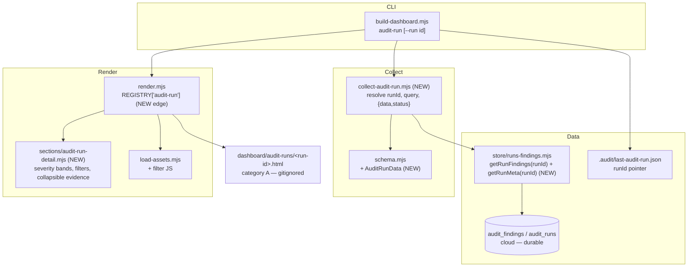

# Plan: Read-only Audit-Run Findings Viewer (dashboard module)

- **Date**: 2026-06-09
- **Status**: Complete (implemented + audited — see Implementation Log)
- **Author**: Claude + Louis
- **Scope**: full-stack (store read-query [backend] + dashboard collector & HTML section renderer [frontend])
- **Stack**: js-ts (+ postgres)
- **Target domain(s)**: `dashboard`
- **Origin**: `/brainstorm 1780994181644` (the-unreasonable-effectiveness-of-HTML) — synthesised first step: a read-only per-run findings HTML view, highest-value/lowest-risk slice of "HTML for dense, decision-oriented output".

---

## 1. Context Summary

**What this is.** A new local dashboard page that renders **one audit run's findings** as a dense, navigable HTML view — severity-banded, filterable by pass/severity/file/adjudication-status, with collapsible evidence. It is the smallest proof of the blog's thesis ("HTML beats Markdown for multi-dimensional/decision-oriented output") inside our constraints, without any write-back.

**What exists today (Phase 1 exploration):**
- **Dashboard pipeline** (`scripts/lib/dashboard/`): `build-dashboard.mjs` (CLI orchestrator) → `collect-*.mjs` collectors (each returns `{data, status}` per source, with cloud→local degraded-mode fallback) → `schema.mjs` (Zod validation) → `render.mjs` (`renderDocument(data, kind, assets)` — **pure, no I/O**, a `REGISTRY` mapping each `kind` to an ordered list of `sections/*.mjs`) → `sections/<name>.mjs` (`default(data, ui) → string`, receiving `ui.escapeHtml/jsonScriptSafe/panel/emptyPanel/warningPanel/tab/buildUi`) → `load-assets.mjs` (CSS/JS) → `atomicWriteFileSync`. `serve.mjs` serves over path-contained localhost.
- **`sections/audit-runs.mjs`** already exists but renders **aggregate pass-stats** (per-pass runs/raised/accepted/dismissed) — *not* a per-run findings detail. No overlap with this work.
- **Store** (`scripts/lib/store/runs-findings.mjs`): has writes (`recordFindings`, `recordRunStart/Complete`) and partial reads (`getRunFindingOutcomeCounts(runId)`, `getAuditRunConvergence(runId)`). **No full per-run findings read query exists.**
- **Run pointer**: `.audit/last-audit-run.json` = `{runId, sid, round, ts}` (the durable handle). The ledger lives in **OS temp** (`AppData\Local\Temp\…-ledger.json`) and the `--out` findings JSON is caller-specified temp — both **ephemeral**, not a reliable source.
- **`dashboard/` is fully gitignored** (`.gitignore` L113–114 + the L105 note: both pages are per-machine local-only).

**Neighbourhood considered** (arch-memory, cloud:true): `build-dashboard.mjs` symbols (`buildTelemetry`/`buildReference`/`reportDegraded`) scored `review` (~0.61–0.77) — no reuse/extend candidate; this is additive. Decision: **follow the existing collector→schema→section pattern** rather than invent a new rendering path.

**Patterns reused vs new:** Reuses the entire dashboard pipeline (collector contract, Zod schema, `render.mjs` REGISTRY, `ui` helpers, `atomicWriteFileSync`, git provenance). New: one store read-query, one collector, one section renderer, one `kind`, one CLI subcommand.

---

## 2. Proposed Architecture



**Key design decisions:**
- **Cloud-by-runId is the data source (#5 Single Source of Truth, #16 Graceful Degradation).** Findings are durable only in `audit_findings`; the ledger/`--out` are ephemeral. The collector resolves `runId` (CLI `--run`, else `.audit/last-audit-run.json`), queries the store, and returns a `{data, status}` envelope with a **discriminated `status.code`** (§7.0 Collector result model) — `ok`/`cloud_disabled`/`missing_run_pointer`/`invalid_run_pointer`/`run_not_found`/`query_error`. There is **no** "partial local fallback" state: unlike telemetry (which has `outcomes.jsonl`), audit findings have **no** local source, so absence is always one of those codes, never a half-rendered page.
- **Reuse the pure-render pipeline (#1 DRY, #11 Testability).** A new `kind: 'audit-run'` in the `REGISTRY` + one section module. `renderDocument` stays pure → unit-testable without I/O or a browser. **Two shared-shell adaptations are required (G1)** because the page is nested in `dashboard/audit-runs/`: `nav()` takes a `pathPrefix` (`../` for this kind so back-links don't 404) and the data supplies a `provenance` block (so `freshnessBanner()` doesn't read `undefined`). Both are backward-compatible — adapt the abstraction, don't fork a second renderer.
- **Read-only; client-side interactivity only (right-sizing, see §6).** Filters/collapse are vanilla-JS over server-rendered rows — no framework, no server round-trip, no write-back.
- **XSS-safe, context-specific rendering (#12 Validation).** Raw cloud text (`detail` from `detail_snapshot`, `category`, `file` from `primary_file`, `pass`) is escaped in **text nodes only** via `ui.escapeHtml`. CSS band classes and `data-severity`/`data-status` attributes are emitted **only from closed normalized enums** via the presenter (§7.0) — never from raw DB values — so there is no attribute-injection surface. Embedded JSON (none in v1) would use `ui.jsonScriptSafe`. Cloud data is LLM-authored → escape unconditionally.

---

## 3. UX Design Decisions

- **Severity color bands (Gestalt similarity + visual hierarchy).** P0/HIGH→red, MEDIUM→amber, LOW→grey left-border bands so triage scanning is pre-attentive, not read-word-by-word. Color is **redundant** with a text severity label + `data-severity` attribute (never color-only — accessibility).
- **Cognitive-load reduction via progressive disclosure.** Each finding row shows severity + a one-line summary (first line of `detail`); the full `detail` (`detail_snapshot`) plus metadata (category, pass, file, status) collapse behind a `<details>` (native, keyboard-accessible, no JS to open). There is no `recommendation`/rebuttal content — those are not durable columns (§7.0), so the disclosure holds `detail_snapshot` only.
- **Filters as the primary interaction (Nielsen: flexibility/efficiency).** Toggle chips for severity, pass, adjudication status; a free-text file filter. Filtering is the genuine HTML win over a flat Markdown list of 30+ findings.
- **Honest empty/degraded states.** Each discriminated status code (§7.0) maps to a specific panel — `cloud_disabled` → "set `AUDIT_DB_URL`", `run_not_found` → "Run `<id>` not found", etc. Never a blank page.

### Filter contract (M1)

- **Default**: all rows visible (no chip active = no constraint).
- **OR within a group, AND across groups**: clicking `HIGH`+`MEDIUM` shows both severities; severity ∩ pass ∩ status are intersected. The free-text file filter is ANDed (case-insensitive substring on `file`).
- **Filter keys (H3 — no raw values in attributes)**: severity/pass/status are matched via **closed-enum `data-*` attributes** the presenter emits — `data-severity` (HIGH/MEDIUM/LOW), `data-pass` (the closed pass set: `structure|wiring|backend|frontend|sustainability|quickfix`), `data-status` (the `statusToken` enum). The **file filter matches against the row's escaped file cell `textContent`** — `primary_file` is arbitrary text, so it is **never** placed in a `data-*` attribute (avoids attribute-injection and keeps the escaping rule intact).
- Multiple chips per group allowed; an empty group imposes no constraint.
- **Reset** control clears all chips + file text → all visible.
- **Status group** values are the closed set the presenter derives (`statusToken`): `accepted | dismissed | severity_adjusted | pending | fixed | verified | regressed | none`. Absent/unknown raw values → `none` (still shown and filterable — never silently dropped).
- **No match** → a polite `role="status"` line: "No findings match the current filters." (not an empty void).

---

## 4. Technical Architecture (frontend)

- **Component**: one `sections/audit-run-detail.mjs` returning an HTML string built from `ui` helpers (matches every existing section). No new rendering primitive.
- **State management**: none server-side. Client filter state lives in the DOM (chip `aria-pressed`, row `hidden`); no persistence (#34 minimal client state).
- **Event handling**: a single delegated `click` listener on the filter bar toggles `data-*`-driven row visibility (#36 event delegation). `<details>` handles collapse natively — no JS.
- **Asset ownership (M3 + G2 — decided)**: the filter JS ships as a **namespaced, guarded initializer** `initAuditRunFilters(root)` added to the **browser bundle `scripts/lib/dashboard/assets/dashboard.js`** (NOT `load-assets.mjs`, which is the Node-side file-reader that embeds the bundle at build time). It **no-ops unless** a `[data-dashboard-kind="audit-run"]` container is present (the section sets that attribute on its root). Result: zero side-effects on `index.html`/`telemetry.html`, no per-section inline duplication, one place to test.
- **CSS**: reuse the dashboard's existing variables/classes (`.table-wrap`, `.section-note`, `.status-dot`); add `.sev-high/.sev-med/.sev-low` bands as CSS-variable-driven classes (#40 design tokens, #43 no inline styles).

---

## 5. State Map (`audit-run-detail` section)

Keyed off the discriminated `status.code` (§7.0). No "partial local" state — audit findings have no local source (H2).

| `status.code` | Render |
|---|---|
| `ok` + ≥1 finding | run header + filter bar + severity-banded table with collapsible evidence |
| `ok` + 0 findings, `round_converged_after` set | "No open findings — run converged after round N." + header (M5: convergence asserted from meta, never inferred from a zero count) |
| `ok` + 0 findings, no convergence meta | neutral: "No findings recorded for this run." + run status/round from meta (M5) |
| `cloud_disabled` (id resolved) | **HTML** `emptyPanel`: "No cloud store — set `AUDIT_DB_URL` and re-run an audit." (file written — an id was given) |
| `missing_run_pointer` | **CLI-only (G3)**: stderr + non-zero exit, **no HTML page** — "No run specified and no `.audit/last-audit-run.json` — run an audit or pass `--run <id>`." Not section-rendered. |
| `invalid_run_pointer` | **CLI-only (G3)**: stderr + non-zero exit, **no HTML page** — "`.audit/last-audit-run.json` is unreadable/malformed." Not section-rendered. |
| `run_not_found` | **HTML** `emptyPanel`: "Run `<id>` not found in the store." |
| `query_error` | `warningPanel`: "Findings query failed (redacted)." — no rows (nothing to preserve; there is no local fallback). |
| **Loading** | N/A — static build; the page is generated, not fetched. |
| **Edge: filter excludes all** (client-side) | polite `role="status"`: "No findings match the current filters." |

---

## 6. Sustainability Notes

### Right-sizing gate (new structure introduced — gate fires)
- **Band-aid extreme**: dump a prettier HTML of the terminal audit output. No durable source (the transcript is ephemeral), so it can't be regenerated for a past run → low value, dies as a README screenshot.
- **Over-engineered extreme**: an interactive triage SPA (draggable accept/defer/suppress) that writes adjudication back to the ledger/cloud via a local server (the brainstorm "command-compiler"/write-back idea). New persistence path, a server, suppression-danger, **and it conflicts with the autonomous loop** (`/audit-loop`/`/cycle --autonomous` deliberately remove the human from triage — a manual board is a regression there).
- **Chosen**: a **read-only** per-run page reusing the existing collect→schema→render pipeline, sourced from the durable cloud `audit_findings`, gitignored. **Current requirement**: make one run's dense findings reviewable (severity, filters, evidence). Write-back is explicitly **deferred** until the read-only view earns its keep on a real audit — and if ever built, scoped to the human-in-the-loop path only. No "might need interactivity later" abstraction now (YAGNI).

### Manual vs scripted
This is net-new code, not a repeated edit — N/A.

### System-level
- **Assumption**: the cloud store holds the run's findings. If `AUDIT_DB_URL` is unset the page degrades gracefully (no hard dependency).
- **Seam**: the store query (`getRunFindings`) is the single adapter; swapping the backing store touches one function.
- **Pattern**: this establishes the template for future per-entity detail pages (`persona/<id>.html`, `brainstorm/<id>.html`) — same collector→section recipe, a new `kind` each.

---

### 7.0 Data Contract (verified against migrations — load-bearing, H1/M4/M7)

Columns **verified** against `20260330063355_learning_store.sql`,
`20260404231518_add_classification.sql`, `20260417120000_outcome_data_loop.sql`,
`20260419120000_cross_skill_data_loop.sql`, `20260508120000_adaptive_learning_v1.sql`.
Earlier guesses were wrong and are corrected here: there is **no** `recommendation`,
`affected_files`, `semantic_id`, `confidence`, or `is_quick_fix` column. Detail text
is `detail_snapshot`; the dedup id is `finding_fingerprint`; the file is `primary_file`
(singular); the round is `round_raised`.

**`getRunFindings(runId)` → `AuditRunFinding[] | null`** — parameterised SQL (`$1=runId`), deterministic ordering (M4):

```sql
SELECT id, finding_fingerprint, pass_name, severity, category,
       primary_file, detail_snapshot, round_raised, created_at
       /* + adjudication_outcome, remediation_state WHEN the column-probe says they exist */
FROM audit_findings
WHERE run_id = $1
ORDER BY CASE severity WHEN 'HIGH' THEN 0 WHEN 'MEDIUM' THEN 1 ELSE 2 END,
         round_raised, pass_name, primary_file NULLS LAST, id;
```

- `adjudication_outcome`/`remediation_state` (and any classification cols) are added by later migrations. **Reuse the existing column-probe** in `runs-findings.mjs` (`SELECT col … LIMIT 0`, cached) and omit absent columns so an un-migrated DB still returns rows.
- Returns `null` **only** when `isCloudEnabled()` is false. An **empty array** is a valid "run exists, zero findings" result — distinct from `null` (the collector maps the two differently per §5).

`AuditRunFinding` (domain shape — **no presentation tokens**, M7):

| field | type | source column | null handling |
|---|---|---|---|
| `id` | string(uuid) | `id` | — |
| `fingerprint` | string | `finding_fingerprint` | — |
| `pass` | string | `pass_name` | — |
| `severity` | `'HIGH'\|'MEDIUM'\|'LOW'` | `severity` (DB CHECK enum) | — |
| `category` | string | `category` | — |
| `file` | string\|null | `primary_file` | nullable |
| `detail` | string | `detail_snapshot` | null→`''` |
| `round` | number | `round_raised` | — |
| `adjudication` | string\|null | `adjudication_outcome` | null/absent |
| `remediation` | string\|null | `remediation_state` | null/absent |

**`getRunMeta(runId)` → `AuditRunMeta | null`**:

```sql
SELECT id, plan_file, mode, rounds, gemini_verdict, total_findings,
       round_converged_after, commit_sha, branch, plan_id, created_at
FROM audit_runs WHERE id = $1;
```
`null` → collector maps to `run_not_found`. `commit_sha`/`branch`/`plan_id` (cross-skill migration) **and `round_converged_after`** (`20260508120000_adaptive_learning_v1.sql`, `ADD COLUMN IF NOT EXISTS`) are all later-migration columns — **probe-guard all of them** (reuse the column-probe), so an un-migrated DB still returns a row. **Convergence signal (G1)**: `round_converged_after` is frequently NULL even when present (it's resolved out-of-band by the learning pipeline), so the collector treats a present-and-non-null value as authoritative and otherwise calls the existing **`getAuditRunConvergence(runId)`** for the §5 empty-state decision rather than inferring convergence from a zero finding count.

**Separation of concerns (M7)**: `runs-findings.mjs` returns ONLY these domain shapes (persistence + raw→domain mapping). A pure presenter `scripts/lib/dashboard/audit-run-presenter.mjs` (NEW) maps a domain finding → UI tokens `{ sevClass:'sev-high'|'sev-med'|'sev-low', sevLabel, statusToken, fileLabel }`. The section consumes presenter output and never sees raw DB column names or derives CSS classes from raw values.

**`statusToken` precedence (M3)** — it collapses two optional columns into one closed token, **remediation_state wins when present** (it is the later lifecycle state), else `adjudication_outcome`, else `none`:
`fixed|verified|regressed|pending` (from `remediation_state`) **take precedence over** `accepted|dismissed|severity_adjusted` (from `adjudication_outcome`); both absent → `none`. The closed token set is the union of those plus `none`; the filter status group lists exactly these.

### Collector result model (H2 — discriminated, no incoherent states)

`collectAuditRun({runId})` → `{ data, status }` where `status.code ∈ { ok, cloud_disabled, missing_run_pointer, invalid_run_pointer, run_not_found, query_error }`:

| code | trigger |
|---|---|
| `ok` | `getRunMeta` found; findings array (possibly empty) |
| `cloud_disabled` | `isCloudEnabled()` false (`getRunFindings`→`null`) |
| `missing_run_pointer` | no `--run` AND no `.audit/last-audit-run.json` |
| `invalid_run_pointer` | pointer JSON malformed / lacks `runId` |
| `run_not_found` | `getRunMeta`→`null` |
| `query_error` | store threw (message redacted) |

There is **no** "degraded cloud / partial local rows" state (that pattern in `collect-telemetry.mjs` exists only because telemetry has `outcomes.jsonl`; audit findings do not). §5 renders one panel per code.

**Resolution order (M1, G3)**: resolve the runId from `--run` or `.audit/last-audit-run.json` **first**, independent of cloud — this both names the output file and gates writability. **No id resolves → `missing_run_pointer`/`invalid_run_pointer`: these are CLI-only** (stderr + non-zero exit, **no HTML, not section-rendered**). With an id in hand, check `isCloudEnabled()` (off → `cloud_disabled`, kept distinct from `run_not_found` because `getRunMeta` is never called when cloud is off — M1); else `getRunMeta` (`null` → `run_not_found`) + `getRunFindings`, wrapping store throws as `query_error`. **Every id-resolved state (`ok`, `cloud_disabled`, `run_not_found`, `query_error`) renders an HTML panel AND writes `<slug>.html`** — so each section-rendered state has a real file (no unreachable UI, G3).

**Top-level `AuditRunData` shape (H2)** — mirrors the existing section contract (`sections/audit-runs.mjs` consumes `{src, auditRuns}` and reads `src.status`). The section signature is `default({ src, auditRun }, ui)` where:
- `src = { status: '<status.code>' }` — the discriminated code lives in `src.status`, exactly the field every other section already reads via `ui.NON_OK`/`warningPanel`.
- `auditRun = { meta: AuditRunMeta|null, findings: PresentedFinding[] }` — `findings` is the **presenter output** (domain rows already mapped to UI tokens), empty `[]` for the zero-findings `ok` case.
- `provenance = { baseSha, dirty, generatedAt, mode }` — **required (G1)**: `freshnessBanner()` reads `data.provenance` for every non-reference page. **`gitProvenance()` returns only `{baseSha, dirty}` (G2)**, so the collector **augments** it: `provenance: { ...gitProvenance(), generatedAt: <ISO string passed in by the CLI — scripts can't call Date.now() in some contexts, so build-dashboard stamps it>, mode: 'audit-run' }`. Omitting `provenance` crashes the build with `Cannot read properties of undefined (generatedAt)`.
`schema.mjs` validates this whole `{src, provenance, auditRun}` object for `kind: 'audit-run'`.

### File list

1. **`scripts/lib/store/runs-findings.mjs`** (modify) — add `getRunFindings(runId)` and `getRunMeta(runId)` exactly per §7.0 (verified columns, probe-guarded optional columns, SQL `ORDER BY`). Reuse the existing `one`/`many` helpers and column-probe cache; return `null` only when cloud is off. *(#5 single source of truth, #11 testable pure query)*
2. **`scripts/lib/dashboard/collect-audit-run.mjs`** (create) — `collectAuditRun({runId})`: resolve runId (arg → `.audit/last-audit-run.json`), call the two store reads, return `{data, status}` with the **discriminated `status.code`** of the §7.0 result model (not telemetry's partial-local degraded mode — audit findings have no local source). *(#16 graceful degradation)*
3. **`scripts/lib/dashboard/schema.mjs`** (modify) — add `AuditRunDataSchema` (run meta + findings array + cloud/scope flags) so `renderDocument` validates the new `kind`. *(#12 validation at the boundary)*
4. **`scripts/lib/dashboard/audit-run-presenter.mjs`** (create) — pure presenter (§7.0, M7): `AuditRunFinding → { sevClass, sevLabel, statusToken, fileLabel }`. Closed-enum mapping (severity→band, adjudication/remediation→`statusToken`); unknown→`none`. No I/O → directly unit-testable.
5. **`scripts/lib/dashboard/sections/audit-run-detail.mjs`** (create) — `default({src, auditRun}, ui) → string`: sets `data-dashboard-kind="audit-run"` on its root (asset guard, M3), renders run header, filter bar (`<button type="button">` chips with `aria-pressed`, labeled file input, `role="status"` no-match line — L1), and a severity-banded table with `<details>` evidence. Raw text via `ui.escapeHtml`; CSS/`data-*` only from presenter tokens. *(component pattern, #36/#40/#43)*
6. **`scripts/lib/dashboard/render.mjs`** (modify) — import the new section; add `REGISTRY['audit-run'] = [sectionAuditRunDetail]`. **Shell-coupling fixes (G1, backward-compatible)**: (a) `nav(kind, pathPrefix='./')` — pass `../` for `audit-run` so `../index.html`/`../telemetry.html` resolve from the nested dir instead of 404ing; existing kinds keep `./`. (b) `freshnessBanner()` reads `data.provenance` — supplied by the collector (§7.0), so no `undefined.generatedAt` crash. *(#1 DRY — adapt the shared abstraction)*
7. **`scripts/lib/dashboard/assets/dashboard.js`** (modify — the **browser bundle**, NOT `load-assets.mjs` which is the Node file-reader, G2) — add the namespaced, guarded `initAuditRunFilters(root)` (§4, M3): on load it queries for a `[data-dashboard-kind="audit-run"]` root and **no-ops when absent**, so `index.html`/`telemetry.html` are unaffected.
8. **`scripts/build-dashboard.mjs`** (modify) — add `audit-run [--run <id>]` subcommand → `collectAuditRun`. **Extend `parseArgs` (G3)**: it currently throws `ArgvError` on any `--` flag except `--help`/`--port`; add `--run <value>` capture (valid only with the `audit-run` subcommand, mirroring how `--port` is gated to `serve`) and stamp `generatedAt` (ISO) to pass into `provenance` (G2). **Output path depends solely on whether a runId resolved (H1, G3)**: only `missing_run_pointer`/`invalid_run_pointer` (no id to name a file) print to **stderr + exit non-zero — no file**. Every id-resolved state — `ok`, `cloud_disabled`, `run_not_found`, `query_error` — renders its panel and writes `dashboard/audit-runs/<slug>.html` (so no rendered state is unreachable). **Slug algorithm (L2)**: lowercase the runId, replace any char ∉ `[a-z0-9-]` with `-`, collapse repeats, trim leading/trailing `-`; empty result → error (never write `-.html`). Create the dir with `ensureDir`. **Also fix the stale header docstring** that calls `index.html` "committed" — both pages are gitignored.
9. **`.gitignore`** (modify) — add `dashboard/audit-runs/` (the new output subdir; the two existing lines are file-specific). *(category-A invariant)*
10. **`package.json`** (modify) — add `"dashboard:audit-run": "node scripts/build-dashboard.mjs audit-run"`.
11. **`scripts/.cli-catalog.json`** (modify) — add the `dashboard:audit-run` entry (category `dashboard`). **Mandatory** — the `dashboard-cli.test.mjs` regression gate fails if any `package.json` script is uncatalogued.
12. **`tests/dashboard-audit-run.test.mjs`** (create) — see §9.

### 7b. Implementation Phases (Gate 1: 12 files, 2 subsystems — store + dashboard)

- **Phase 1 — Store read query**: add `getRunFindings`/`getRunMeta` per §7.0. Files: `scripts/lib/store/runs-findings.mjs` (modify), `tests/dashboard-audit-run.test.mjs` (create — store-query portion).
- **Phase 2 — Collector + schema**: resolve runId, discriminated status, validate. Files: `scripts/lib/dashboard/collect-audit-run.mjs` (create), `scripts/lib/dashboard/schema.mjs` (modify).
- **Phase 3 — Presenter + renderer + assets**: domain→token presenter, section, registry (+ nav/provenance shell fixes), guarded filter JS in the browser bundle. Files: `scripts/lib/dashboard/audit-run-presenter.mjs` (create), `scripts/lib/dashboard/sections/audit-run-detail.mjs` (create), `scripts/lib/dashboard/render.mjs` (modify — G1 nav/freshnessBanner), `scripts/lib/dashboard/assets/dashboard.js` (modify — G2 client JS).
- **Phase 4 — CLI wiring + policy**: subcommand, output dir, scripts, gitignore. Files: `scripts/build-dashboard.mjs` (modify), `package.json` (modify), `scripts/.cli-catalog.json` (modify), `.gitignore` (modify).
- **Close-out (not a phase)**: `npm test`; `node scripts/build-dashboard.mjs audit-run` against `last-audit-run.json`; dogfood the output through `/click-test` for semantic-HTML contracts.

### 11. Execution Clustering (Gate 2: 2 clusters)

- **Cluster A — Phases 1 — fix-gate: yes**
  - Coupling: the store read-query is the **data contract** every dashboard phase consumes; it must converge (and its shape be fixed) before the collector/renderer build on it. Audit scope = `runs-findings.mjs` + the store-query tests.
- **Cluster B — Phases 2–4 — fix-gate: final**
  - Coupling: the collector, schema, section renderer, and CLI wiring share **one seam** — the dashboard render pipeline (collector `{data,status}` → Zod `AuditRunData` → `REGISTRY['audit-run']` → section → CLI write). They are co-designed against the same data shape and should be audited together so the cross-cutting wiring pass sees the whole path.
- **Final gate**: consolidated Gemini review over the union diff (Phases 1–4).

---

## 8. Risk & Trade-off Register

| Risk / trade-off | Decision |
|---|---|
| Full GPT→Claude→Gemini **rebuttal trail** is **not** a persisted per-finding column (the deliberation transcript is ephemeral) | v1 renders what `audit_findings` durably holds: severity, category, pass, file, `detail_snapshot`, and `adjudication_outcome`/`remediation_state` (when migrated). The rebuttal trail is **out of scope** (no durable source), stated plainly — not "deferred pending a column check". |
| `cloud:false` (no `AUDIT_DB_URL`) | `cloud_disabled` panel; the page builds and is viewable. No hard dependency. |
| Severity vocabulary | `audit_findings.severity` is a **DB CHECK enum** (`HIGH/MEDIUM/LOW`) — the presenter maps exactly those three to bands. An unknown value is impossible per the constraint, but the presenter still falls back to a grey band + raw escaped label defensively. |
| `dashboard/audit-runs/` accidentally committed | `.gitignore` entry in Phase 4; category-A invariant. |
| Deferred: write-back interactivity | Out of scope by design (right-sizing §6) — revisit only if read-only proves value, human-in-the-loop path only. |

---

## 9. Testing Strategy

- **Unit (Tier 1 — `render.mjs` is pure)**: `renderDocument({src, auditRun}, 'audit-run', assets)` asserts: severity rows carry `.sev-high/.sev-med/.sev-low` + `data-severity`; filter chips are `<button type="button">` with `aria-pressed`; finding `detail` containing `<script>`/`"` is **escaped** (XSS contract); each **id-resolved** `src.status` code (`ok`/`cloud_disabled`/`run_not_found`/`query_error`) renders its §5 panel. The two no-id codes (`missing_run_pointer`/`invalid_run_pointer`) are **not** rendered — they're asserted at the CLI level (non-zero exit + stderr message), not via `renderDocument` (G3).
- **Unit (collector)**: `collectAuditRun` with injected store stubs → asserts the discriminated `status.code` for each path — `cloud_disabled` (cloud off), `run_not_found` (`getRunMeta`→null), `ok` with `[]` (zero findings) vs `ok` with rows. No `missing-optional`/`partial-rows` assertions (those codes/states do not exist in this collector).
- **Store contract (Tier 1 — the highest-risk part, M6)**: inject a **fake `one`/`many` query client** (no live DB) and assert: (a) the SQL targets `audit_findings`/`audit_runs` with `run_id = $1`/`id = $1` bound to the passed runId; (b) raw rows map to the `AuditRunFinding`/`AuditRunMeta` domain shape (column→field, `detail_snapshot`→`detail` with null→`''`); (c) **ordering** — ordering is SQL's responsibility, so assert the **query text** passed to the fake client contains the `ORDER BY CASE severity …` clause (a fake client doesn't execute SQL, so don't assert reordered rows — M4); the renderer/section trusts store order; (d) the column-probe path omits `adjudication_outcome`/`remediation_state` when the probe reports them absent; (e) `getRunFindings`→`null` when `isCloudEnabled()` is false, vs `[]` for a real run with zero findings.
- **Manual / dogfood**: build the page on a real `last-audit-run.json`; run **`/click-test dashboard/audit-runs/<id>.html`** to assert semantic-HTML contracts (duplicate IDs, table semantics, heading hierarchy, `<details>` keyboard access) — closes the "dogfood our own HTML through our own tool" loop.
- **Edge cases**: 0 findings; 100+ findings (filter perf, all client-side); a finding with empty `affected_files`; mixed severities.

## 10. Acceptance Criteria (Playwright-verifiable)

- [P0] [state] The page renders the run's findings table when cloud data is present.
  - Setup: build `audit-run` against a run id with ≥1 finding; open the HTML.
  - Assert: `getByRole('table')` is visible and `getByRole('row')` count > 1.
- [P0] [interaction] Severity filter hides non-matching findings.
  - Setup: open a page with mixed severities; click the "HIGH" chip (`getByRole('button', {name:/HIGH/})`).
  - Assert: rows with `[data-severity="HIGH"]` remain visible; rows with other `data-severity` become `hidden`; the chip is a real `<button type="button">` with `aria-pressed="true"`.
- [P1] [a11y] Each finding's evidence is keyboard-expandable without JS.
  - Setup: locate a finding's `<summary>` by its visible text (`getByText(/show evidence/i)` — a stable author-controlled label, not a role mapping); click/press Enter.
  - Assert: the previously-hidden evidence text becomes visible via `getByText`. Do not assert on `getByRole('group'|'button')` for `<details>/<summary>` — native role mappings vary by browser (L1).
- [P1] [a11y] The file filter has an accessible name and the no-match state is announced.
  - Setup: type a non-matching string into the file filter (`getByLabel(/file/i)`).
  - Assert: the file input is reachable by label; a `getByRole('status')` region shows "No findings match the current filters".
- [P1] [state] Empty/degraded state is explicit, not blank.
  - Setup: build with no `AUDIT_DB_URL`.
  - Assert: `getByText(/AUDIT_DB_URL/)` is visible; no findings table is rendered.
- [P2] [a11y] Severity is conveyed redundantly (not color-only).
  - Setup: open any populated page.
  - Assert: every severity-banded row exposes a text label via `getByText` and a `data-severity` attribute (color is decorative).
- [P2] [text] Finding text is HTML-escaped.
  - Setup: a fixture finding whose `detail` contains `<script>`.
  - Assert: the literal text renders; no injected element exists (`page.locator('script#xss')` count == 0).

---

## Audit Trail

- **GPT R1** (`NEEDS_REVISION`, H2 M7 L2): all 11 valid + in-scope, no rebuttals. Caught the load-bearing gap — the data contract was punted ("confirm columns during impl"). Fixed: verified §7.0 contract against migrations (corrected wrong guesses — no `recommendation`/`affected_files`/`semantic_id`), discriminated collector state model, filter/escaping/asset/ordering/presenter contracts.
- **GPT R2** (`NEEDS_REVISION`, H3 M5 L1; 0 re-raised, 0 reopened): 9 *new* findings, all internal contradictions introduced by the R1 edits (output-path vs no-id states, undefined `AuditRunData` shape, filter keys vs escaping, stale §9 text, `statusToken` precedence). All concrete net-new bugs → fixed. **Stopped GPT at R2** (cap; fixes were consistency tightenings, not new design surface).
- **Gemini R1** (`CONCERNS`, 3): genuine design defects from reading `render.mjs` — G1 `freshnessBanner`/`nav` shell coupling (crash + 404), G2 client-JS-in-Node-loader category error, G3 file-write/render contradiction. All fixed (the design-defect exception).
- **Gemini R2** (`CONCERNS`, 3; coherence **Strong**, over-engineering none, no Claude bias): G1 probe-guard `round_converged_after` + use `getAuditRunConvergence()`; G2 augment `gitProvenance()` with `generatedAt`/`mode`; G3 extend `parseArgs` for `--run`. **Stopped at the Gemini 2-round cap** — these are implementation-completeness nits (verdict drifted off design defects), folded into the plan and to be verified against real code by `/cycle`'s code audit. Closing the gate.

## Implementation Log

- **2026-06-10 — `/cycle code` autonomous clustered run (both clusters + consolidated gate).**
  - **Cluster A (Phase 1 — store read-query, fix-gate: yes).** Added `getRunFindings(runId)` / `getRunMeta(runId)` to [scripts/lib/store/runs-findings.mjs](../../scripts/lib/store/runs-findings.mjs) exactly per §7.0 (verified columns, deterministic `ORDER BY`, probe-guarded optional columns, `null` only when cloud off vs `[]` for zero findings). Designed with an optional dependency-injection seam (`{one,many,isCloudEnabled}`) so the store contract is unit-testable without a live DB (the repo uses no ESM module mocking). 12 store-query tests in [tests/dashboard-audit-run.test.mjs](../../tests/dashboard-audit-run.test.mjs). Audited R1→R2 (GPT): in-scope set converged. The repo/tenant-scope HIGHs were adjudicated **rigor-pressure** (`run_id` is a globally-unique UUID point-lookup resolved from local `.audit/last-audit-run.json`; single-tenant store — no cross-repo leak); the remaining HIGHs were "Cluster-B-modules-absent" — out-of-scope by the clustering design. **In-scope fix applied:** the new `columnExists` probe now caches `false` only on undefined-column/table (42703/42P01), not on transient connectivity errors (which would permanently drop adjudication/remediation columns).
  - **Cluster B (Phases 2–4 — collector/schema/presenter/section/render/CLI/assets, fix-gate: final).** Created [collect-audit-run.mjs](../../scripts/lib/dashboard/collect-audit-run.mjs) (discriminated `{data,status}` model), [audit-run-presenter.mjs](../../scripts/lib/dashboard/audit-run-presenter.mjs) (pure domain→token mapping, closed enums), [sections/audit-run-detail.mjs](../../scripts/lib/dashboard/sections/audit-run-detail.mjs) (severity bands, filter bar, `<details>` evidence); extended [schema.mjs](../../scripts/lib/dashboard/schema.mjs) (`AuditRunDataSchema`), [render.mjs](../../scripts/lib/dashboard/render.mjs) (`REGISTRY['audit-run']`, `nav(kind, pathPrefix)` G1, audit-run title), the browser bundle [dashboard.js](../../scripts/lib/dashboard/assets/dashboard.js) (guarded `initAuditRunFilters`), [dashboard.css](../../scripts/lib/dashboard/assets/dashboard.css) (sev bands + filter chips), [build-dashboard.mjs](../../scripts/build-dashboard.mjs) (`audit-run [--run]` subcommand, `--run` parse-gate, slug, provenance stamp, header-docstring fix), `package.json`, `scripts/.cli-catalog.json`, `.gitignore`. GPT audit applied **5 in-scope fixes**: collector checks `meta == null` before the findings query (state machine + no wasted query); stderr error redacted via `redactSecrets`; non-fatal convergence-lookup logged not swallowed; `buildAuditRun` returns a `cliError` (main owns `process.exit`); `renderDocument` JSDoc kinds. Dismissed (over-engineering/plan-compliant): shared-status-enum module, run-id schema validation, distinct UNKNOWN-severity token, slug-collision (UUIDs), `emptyPanel` escaping (escapes internally — verified).
  - **Close-out.** Full suite green (3480 tests; updated the pinned `learning-store` export-surface contract for the 3 new re-exports). Built `dashboard/audit-runs/<id>.html` against the live run `ecae388d` (5 real findings). Dogfooded live via Playwright: filter chips toggle rows (`aria-pressed`), MEDIUM filter → 4/5 rows, reset → 5, no-match file filter → `role="status"` shown / 0 rows.
  - **Consolidated Gemini gate (mandatory, union diff).** R1 `CONCERNS_REMAINING` (one suspected unescaped-`runId` self-XSS in `run_not_found`); **deliberated + empirically refuted** — `ui.emptyPanel` escapes its message internally, a `<script>` runId renders escaped (locked by a regression test); added a clarifying call-site comment. R2 **APPROVE** — architectural coherence Strong, 0 new findings, no Claude bias, GPT's tenant-scope + slug-collision confirmed false positives.
  - **Tests:** 33 feature tests in [tests/dashboard-audit-run.test.mjs](../../tests/dashboard-audit-run.test.mjs) (store contract, presenter, collector status codes, pure `renderDocument` incl. XSS + degraded panels). Cloud outcomes recorded for both clusters' audit rounds.
