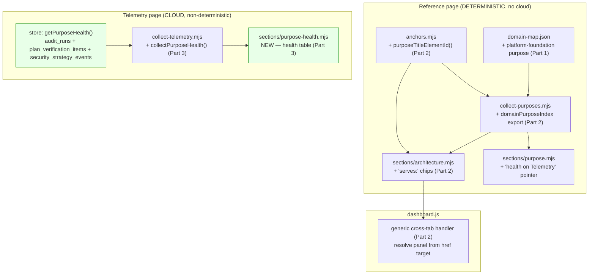

# Plan: Dashboard "Purpose" view — v2 (coverage, reverse-link, live health)

- **Date**: 2026-05-31
- **Status**: Complete
- **Author**: Claude + Louis
- **Audit trail**: `/audit-plan` — GPT-5.5 R1(2H/4M/2L)→R2(5H, propagation of R1 fixes)→R3(2H/4M/1L), all accepted+fixed; pinned the 3 repo-scoped SQL queries against verified live columns. Gemini gate: 3 passes — accepted the `audit_findings`-exists rebuttal, caught a real `count(*)` bigint→string crash, a platform-bucket contradiction, and a genuinely-wrong dual-status claim (status lives in `sources.X` not `data.X`), plus 2 edge-guards (ENOENT, NaN). Final architectural coherence: **Strong**. Loop stopped at Gemini-p3 (coherence Strong; residual items are impl-detail guards the code audit verifies).
- **Scope**: full-stack (deterministic reference edits + a new cloud-backed telemetry section + client-JS generalisation)
- **Target domain(s)**: `dashboard` (single domain — not cross-domain; `ruleCount=47`)
- **Builds on**: v1 (shipped `a744c5f`); deferred items from
  [dashboard-purpose-view.md §11](dashboard-purpose-view.md) + the persona-test (Sofia) finding.

> **Neighbourhood considered**: target domain `dashboard`; all new code extends
> the v1 collector/section/anchors pattern + mirrors the **Security section**
> (the existing cloud-backed telemetry section) for Part 3. Reuse, not new paths.

---

## 1. Context Summary

Three deferred v2 items, in ascending cost. **The spine of this plan is the
determinism boundary**: v1's Purpose tab lives on the **reference** page, which
is committed, offline-buildable, and content-hashed (`sourceHash`). Parts 1–2
stay on that deterministic page. **Part 3 (health) needs cloud and therefore
must NOT touch the reference page at all** — it becomes a *separate telemetry
section*, exactly like the Security section shipped earlier.

**What exists (v1, Phase 1 re-read):**
- [collect-purposes.mjs](../../scripts/lib/dashboard/collect-purposes.mjs) — pure join → `{status, detail, ledgerPresent, nodes[], hygiene}`. Already computes domain→purpose membership.
- [sections/purpose.mjs](../../scripts/lib/dashboard/sections/purpose.mjs) — reference renderer.
- [sections/architecture.mjs](../../scripts/lib/dashboard/sections/architecture.mjs) — domain boxes with `id="arch-domain-<name>"` (via [anchors.mjs](../../scripts/lib/dashboard/anchors.mjs)).
- [anchors.mjs](../../scripts/lib/dashboard/anchors.mjs) — `archDomainElementId(name)` (the canonical cross-link contract).
- [dashboard.js](../../scripts/lib/dashboard/assets/dashboard.js) — cross-tab handler, **hardcoded** to `panel-architecture`.
- [sections/security.mjs](../../scripts/lib/dashboard/sections/security.mjs) + `collect-telemetry.mjs::collectSecurity` + `getSecurityStats` — **the template for Part 3** (a cloud telemetry section keyed by `resolveRepoIdentity`, graceful when cloud off).

**Known user-visible issue (persona Sofia, 2026-05-31):** only 31/115 invariants attach to a purpose; the rest live in unmapped infra. Part 1 addresses this.

**Patterns reused vs new:** ~90% reuse. New = one telemetry section + collector (Part 3), one anchors helper + one renderer block + a handler generalisation (Part 2), one config edit (Part 1).

---

## 2. Proposed Architecture



### Part 1 — `platform-foundation` purpose (data edit, no cloud)

Add to `.audit-loop/domain-map.json`:
```jsonc
{ "id": "platform-foundation", "label": "Platform & tooling foundation", "kind": "curated", "flowNodes": [],
  "summary": "The shared substrate every outcome rests on: utilities, CLI tooling, install, and the test suite — and the invariants that keep it sound." }
```
and map the infra domains: `shared-lib`, `scripts`, `install`, `root-scripts`, `tests` → `["platform-foundation"]`.

**Honest finding that shapes this (#5 Single Source of Truth, #19 Observability):**
`shared-lib` is the `scripts/lib/**` **catch-all** rule, so **90 of 115
invariants** tag through it. Mapping it attaches almost all currently-orphaned
invariants — coverage jumps from 31 → ~110+. That is *honest* (most code does
live under `scripts/lib`) but it concentrates the bulk of invariants under one
"substrate" purpose rather than distributing them across outcomes.

Decision: **map them anyway** — "keep the platform sound" IS a real outcome and
those invariants (atomic writes, validation, redaction) genuinely belong to it;
hiding them as "unmapped" was worse. BUT the plan explicitly records that the
*deeper* fix — finer-grained domain rules so a `lib/ledger.mjs` invariant tags
to `audit-orchestration` rather than the `shared-lib` catch-all — is **out of
scope** (it's a re-tagging exercise touching `domain-map.json` rules + an
`arch:refresh`, not a dashboard change).

**(M2) Coverage stratification — don't let the catch-all inflate the headline.**
A single "110 of 115 mapped" number would *overstate* how well invariants map to
*specific* outcomes. So the collector + header distinguish three buckets, by
each invariant's derived domains (the collector already has them):
- **direct** — attached via ≥1 domain mapped to a NON-`platform-foundation`
  purpose (genuinely outcome-specific, e.g. `findings`→deliver-audits). Wins
  over platform: if an invariant hits both a real-outcome domain AND a platform
  domain, it counts **direct**.
- **platform** — attached ONLY through `platform-foundation` domains (any of the
  five infra domains, not just `shared-lib`) — i.e. no real-outcome domain.
- **unmapped** — derived domains hit no mapped domain at all.

`collectPurposes` computes `coverage:{direct, platform, unmapped, total,
catchAllPct}`, where `catchAllPct` = share of the *platform* bucket whose only
mapping path is the `shared-lib` catch-all rule specifically (the concentration
warning) — **guarded: `platform > 0 ? round(sharedLibOnly/platform*100) : 0`**,
never `0/0`→`NaN` (which `z.number()` would reject — Gemini-p3). Header reads e.g. *"31 direct · 79 platform · 5 unmapped (of 115)"* +
a note: *"platform is a substrate sweep — N% via the `shared-lib` catch-all."*
The number goes up AND its quality is visible (#19).

### Part 2 — Reverse cross-link (Architecture → Purpose)

**Single source of truth for the inverse edge (#1, #5):** the membership is
already computed inside `collectPurposes`. Export a derived
`domainPurposeIndex` from the *same* collector pass — `{ [domainId]:
[{id,label}] }` — and thread it onto the **reference** data so
`sections/architecture.mjs` can render it. No recomputation, no second read of
`domain-map.json`.

- **anchors.mjs**: add `purposeTitleElementId(purposeId) → \`purpose-${purposeId}-title\`` — the id `sections/purpose.mjs` already stamps as the `<section aria-labelledby>` target. This makes the reverse link target canonical (mirrors `archDomainElementId`).
- **collect-purposes.mjs**: return `domainPurposeIndex` alongside `{nodes,hygiene,…}`. `collect-reference.mjs` puts it on `data.architecture.domainPurposes` (architecture slice already exists).
- **sections/architecture.mjs**: inside each domain `<details>`, render a `serves:` line of chips — `<a class="serves-chip" data-cross-tab href="#purpose-<id>-title">{label}</a>` — escaped, only when the domain has purposes. A domain with none is silent (no empty "serves:").
- **dashboard.js generalisation (M4 — the key correctness change), exact algorithm:**
  one delegated listener on `<main>` (unchanged). On click:
  1. `link = e.target.closest('a[data-cross-tab]')`; if none → return (let other handlers run).
  2. `href = link.getAttribute('href')`; if it is missing or does NOT start with `#` (not a same-page hash) → **return WITHOUT `preventDefault`** (allow native navigation; never swallow a real link).
  3. `target = document.getElementById(href.slice(1))`; if null → return without preventDefault (don't trap a dead anchor).
  4. `panel = target.closest('[role="tabpanel"]')`; if null → return without preventDefault.
  5. `tab = tabs.find(t => t.getAttribute('aria-controls') === panel.id)`; **(L1) if no controlling tab → return WITHOUT preventDefault** (don't trap a click we can't service). Only once BOTH `panel` and `tab` are confirmed: `e.preventDefault()`, `select(tab)`, `tab.focus()`. **(L1) Focus rationale:** focus moves to the activated TAB, not the scrolled target — this is the WAI-ARIA tabs pattern (the existing keyboard handler already focuses tabs), so a keyboard/SR user lands on the now-selected tab and can Tab forward into the revealed panel. The target is *scrolled* into view (sighted affordance) but not focused (focusing arbitrary mid-panel content would strand SR users). This matches v1's existing behaviour — no regression.
  6. **Open ancestor `<details>` from outermost → innermost** so a nested
     target (e.g. a purpose `<section><details>`, or a kind-group inside it)
     is actually visible: walk `target.closest('details')` upward, setting
     `.open = true` on each, before scrolling. Also open `target` itself if it
     is a `<details>`.
  7. `target.scrollIntoView({ block: 'center' })`.

  This makes BOTH directions flow through one handler (Purpose→Architecture
  domain box; Architecture→Purpose `<section>`). Forward-link regression is
  covered by an acceptance test.

### Part 3 — Live health colouring (cloud — telemetry section, NOT reference)

**Chosen boundary (the load-bearing decision, #16 Graceful Degradation, #20):**
health is a **new telemetry-page section** `sections/purpose-health.mjs`, fed by
`collect-telemetry.mjs::collectPurposeHealth()`. It does **not** touch the
reference Purpose tab, `PurposesSchema`, or `sourceHash` — so reference
determinism is fully preserved. (This **supersedes** the v1 plan's note about
reserving an optional `health?` field on the reference `PurposesSchema` — a
separate telemetry section is cleaner than threading cloud data through the
deterministic contract.) The reference Purpose tab gains only a static
one-liner: *"Live governance health → Telemetry → Purpose Health."*

**(H1) Two clearly-separated structures — no fake per-purpose precision.** The
output distinguishes *repo-wide context* (always honest) from *purpose-specific
badges* (only where the schema supports attribution):

```jsonc
// data.purposeHealth (TelemetryDataSchema.purposeHealth, optional)
// NOTE: NO status/detail here — the source-state lives in sources.purposeHealth
// ONLY, exactly like data.security / data.learning (verified in collect-telemetry.mjs:
// collectSecurity returns { data: securityData(...), status: {...} } and
// securityData() carries no status). The renderer gates on src.status.
{
  "asOf": "<ISO>",                       // build time; telemetry is inherently time-varying
  "windowDays": 30,
  "repoWide": {                          // scope: repo-wide-context — NOT attributed to a purpose
    "recentHighFindings": <int>,
    "plansWithFailingCriteria": <int>,
    "refusedSecrets": <int>
  },
  "purposeBadges": [                     // (H3) ALL purposes, in domain-map order
    { "id": "preserve-trust-safety", "label": "Preserve trust & safety",
      "health": "ok",                    // ok | at-risk | failing | na
      "scope": "purpose-specific",       // this one IS attributed
      "reason": "0 refused secrets in 30d" },
    { "id": "deliver-quality-audits", "label": "Deliver quality audits",
      "health": "na",                    // (H5) NOT painted at-risk from a repo-wide metric
      "scope": "repo-wide-only",
      "reason": "repo-wide only — see summary" }
    /* …every other purpose, all health:"na", scope:"repo-wide-only"… */
  ]
}
```

**(H3) `purposeBadges` contains EVERY purpose** (read from `domain-map.json`, the
same committed taxonomy), in declaration order — so `sections/purpose-health.mjs`
just renders the array; it never has to re-derive "which purposes are missing".
**(H5) Exactly one purpose is `scope:"purpose-specific"` in v2** —
`preserve-trust-safety`, attributed from `security_strategy_events` (the only
signal that maps cleanly to one outcome). Every other purpose is
`scope:"repo-wide-only"`, `health:"na"`, reason "repo-wide only — see summary".
The renderer NEVER paints a green/amber/red per-purpose badge from a repo-wide
metric — that false-precision is the exact trap §2's principle forbids. The
repo-wide block is the honest headline; the per-purpose `na` rows make the
*absence* of attribution explicit rather than implying coverage. `purposeBadges`
gains real badges only as attribution improves (§11).

**(H2) Exact, PINNED store contract** — `scripts/lib/store/purpose-health.mjs`
**(L1: named module)** exports `getPurposeHealth(repoId, {windowDays = 30})`.
Columns verified against the live migrations; all three are **repo-scoped** (the
audit DB is shared across consumer repos, so an unscoped count would leak other
repos' data — every query filters `repo_id = $1`):

```sql
-- recentHighFindings: HIGH findings raised in the window for this repo.
-- audit_findings(severity, run_id, created_at) ⋈ audit_runs(id, repo_id).
-- NOTE the ::int cast — count(*) is bigint, which node-pg returns as a STRING;
-- casting (counts never exceed 2^31) keeps the value a JS number so the Zod
-- z.number().int() boundary doesn't crash. (getSecurityStats does the same.)
SELECT count(*)::int FROM audit_findings f JOIN audit_runs r ON f.run_id = r.id
 WHERE r.repo_id = $1 AND f.severity = 'HIGH'
   AND f.created_at >= now() - ($2 * interval '1 day');

-- plansWithFailingCriteria: distinct plans with a failing P0/P1 criterion.
-- plan_verification_items(plan_id, severity, passed, created_at) ⋈ plans(id, repo_id).
SELECT count(DISTINCT i.plan_id)::int FROM plan_verification_items i
   JOIN plans p ON i.plan_id = p.id
 WHERE p.repo_id = $1 AND i.passed = false AND i.severity IN ('P0','P1')
   AND i.created_at >= now() - ($2 * interval '1 day');

-- refusedSecrets: refused-secret audit-trail events for this repo.
-- security_strategy_events(repo_id, event_kind, created_at).
SELECT count(*)::int FROM security_strategy_events
 WHERE repo_id = $1 AND event_kind = 'refused_secret'
   AND created_at >= now() - ($2 * interval '1 day');
```

**Schema verified** (Gemini-gate FP rebuttal): the `audit_findings` table DOES
exist — `supabase/migrations/20260330063355_learning_store.sql` defines
`audit_findings(id, run_id → audit_runs, severity CHECK IN
('HIGH','MEDIUM','LOW'), category, primary_file, created_at, …)`. The SQL above
is valid as written; no JSONB extraction or `audit_pass_stats` aggregate is
needed. (A reviewer working from a summary may believe findings are only
aggregate counts — they are not; there is a normalised per-finding table.)
Note `audit_findings` has no per-row resolution column (adjudication lives in
the separate `finding_adjudication_events` table), so `recentHighFindings`
counts HIGH findings *raised* in the window — labelled exactly that, no implied
"unresolved". (`primary_file` exists, which is what makes the v3 per-domain
attribution in §11 feasible — deferred, not used in v2.) Each read is wrapped individually: a single failing query degrades
that metric to `null` (rendered "—"), never failing the section.

**(M2) Indexes already exist** — no migration needed. `audit_findings.run_id`
(FK), `idx_audit_runs_plan`/`audit_runs.repo_id`, `idx_plans_repo`, `idx_pvr_plan`
(plan_verification_runs by plan), and `idx_security_strategy_events_repo`
(`repo_id, created_at DESC`) cover the predicates. These are bounded COUNTs over
a 30-day window on one repo's rows; mirrors `getSecurityStats` cost.

**(M1) Source-state contract** — `collectPurposeHealth` mirrors
`collectSecurity` and returns the **same `{status, detail}` source shape** every
other collector uses, distinguishing: cloud off / not configured →
`missing-optional` (benign, "needs a cloud database connection"); a query error
→ `unexpected-error` with a `redactSecrets`-cleaned detail (NOT silently
"cloud:false"); success → `ok`. A partial failure (one of three metrics threw)
stays `ok` with that metric `null` + a `detail` note. `getPurposeHealth` catches
per-query and logs the cause to stderr (like `getSecurityStats`).

**(M2-corrected — Gemini was right, my earlier claim was wrong) Source-state
lives ONLY in `sources.purposeHealth`, NOT in `data.purposeHealth`.** Verified
in `collect-telemetry.mjs`: `collectSecurity` returns `{ data:
securityData(stats), status: {status,detail} }` and `securityData()` carries NO
status/detail — the telemetry sections (`auditRuns`/`learning`/`security`) keep
status purely in the `sources` map. `collectPurposeHealth` follows THAT pattern:
it returns `{ data: <the purposeHealth object WITHOUT status>, status:
{status,detail} }`; `collect-telemetry.mjs` puts `data` on `data.purposeHealth`
and `status` on `sources.purposeHealth`. The render slicer passes
`sources.purposeHealth` as `src`; the renderer gates on `src.status`. (This also
means the v1 reference `purposes` section — which DID embed `status` in its data
object — is the *odd one out*; v2's telemetry section deliberately matches the
telemetry siblings, not v1.)

**(M3) Identity + config wording** — keyed by the SAME identity as the Security
section: `resolveRepoIdentity(root)` → `getRepoIdByUuid` → `repoId`. The empty
state says **"needs a cloud database connection (`AUDIT_DB_URL`)"** — NOT
"service-role key" (this store is single-tenant; the DSN password IS the
secret, per AGENTS.md Postgres-Parity). No `service_role` wording anywhere.
The stderr cause-logging on a swallowed query error runs through `redactSecrets`
too (M3-r3 — not just the returned `detail`; a DSN/identifier could appear in a
pg error string).

**(H1-r3) Responsibility split — who builds `purposeBadges`.** The STORE
(`getPurposeHealth`) is pure data: it returns ONLY `{recentHighFindings,
plansWithFailingCriteria, refusedSecrets}` (each `null` on its own query
failure). It knows nothing about the purpose taxonomy. The COLLECTOR
(`collectPurposeHealth` in `collect-telemetry.mjs`) owns the taxonomy join: it
reads the purposes from `.audit-loop/domain-map.json` (the same committed source
the reference Purpose tab uses), calls `getPurposeHealth(repoId)` for the
counts, then ASSEMBLES `purposeBadges` (every purpose, in declaration order) +
`repoWide` + the `{status,detail}` source-state. This keeps the store reusable
and the taxonomy in one place (#1, #5). **(Gemini-p3) Graceful taxonomy read** —
`collectPurposeHealth` reads `domain-map.json` inside try/catch: `ENOENT` (a
consumer repo without the purpose map) → `status:'missing-optional'`, empty
`purposeBadges` (NOT a thrown telemetry build); a malformed file → `'unexpected-
error'` with redacted detail. Same ENOENT-vs-real-error discipline as the other
collectors.

**(H2-r3) Deterministic health classification** — the ONLY attributed purpose in
v2 is `preserve-trust-safety`:
- `failing` — unused in v2 (reserved; no signal currently rises to "failing").
- `at-risk` — `refusedSecrets > 0` in the window (a secret was put in the
  strategy markdown and refused — a real process-hygiene miss bearing on the
  trust-safety outcome).
- `ok` — `refusedSecrets === 0` AND the metric is non-null (query succeeded).
- `na` — the metric is `null` (query failed) OR the purpose is any OTHER purpose
  (`scope:"repo-wide-only"`). Every non-trust-safety purpose is `na` by rule.

This table is the whole classifier — no other thresholds exist in v2, so the
output is fully deterministic given the three counts.

### Key decisions (cited)

- **Determinism boundary = the spine** (#16, #20) — cloud strictly telemetry-side; reference page untouched by cloud.
- **One inverse-edge source** (#1, #5) — `domainPurposeIndex` from the existing collector pass; no recompute.
- **Generic cross-tab handler** (#2 SOLID/OCP, #10) — resolve panel from the DOM, not a hardcoded id; both link directions reuse it.
- **No fake precision** (#19 Observability honesty) — only attribute health where the schema supports it; label the rest repo-wide.
- **Schema additivity** (#18 Backward Compat) — the telemetry schema gains a `purposeHealth` block, `.optional()` so old snapshots validate (the Security-section trick).

---

## 3. UX Design Decisions

- **Reverse link (Part 2)** — Gestalt **common region**: the `serves:` chips sit inside the domain's own `<details>` body, below its deps line, so the bidirectional relationship reads in place. Cognitive load: a domain with no purpose shows nothing (no empty label). Nielsen #2 (match real world): "serves" is plainer than "is referenced by purpose edges."
- **Health (Part 3)** — colour is **never the only signal** (#41 a11y, WCAG 1.4.1): each badge pairs an emoji/text label ("at risk", "failing", "ok") with the colour, and a `reason` string. The section leads with the repo-wide summary line, then per-purpose rows.
- **Discoverability** — the reference Purpose tab's one-line pointer tells the reader where live health lives, so the split doesn't hide it.

### ASCII wireframe — Telemetry → Purpose Health

```
┌ Audit Runs · Requirements · Learning · Security · Purpose Health ─────────┐
│  Governance as of 2026-05-31 14:02 · repo: claude-engineering-skills      │
│  3 recent HIGH audit findings · 1 plan with failing P0/P1 · 0 refused secrets │
│                                                                            │
│  Purpose                         Health        Why                         │
│  ──────────────────────────────  ───────────   ───────────────────────────│
│  Preserve trust & safety         🟢 ok          0 refused secrets in 30d   │
│  Deliver quality audits          ⚪ n/a          repo-wide only — see summary│
│  (every other purpose)           ⚪ n/a          repo-wide only — see summary│
│                                                                            │
│  (the "3 recent HIGH" lives ONLY in the summary line above — it is NOT     │
│   attributed to any single purpose; per-purpose attribution is v3.)        │
└────────────────────────────────────────────────────────────────────────────┘
```

---

## 4. Technical Architecture (frontend)

- **sections/purpose-health.mjs** — `default({src, purposeHealth}, ui)`; no imports (ui injected); mirrors `sections/security.mjs`. Renders the summary line + a table; all dynamic values via `ui.escapeHtml`; `ui.NON_OK`→warning, `missing-optional`/`!cloud`→empty panel.
- **serves-chips (architecture.mjs)** — `architecture.mjs` may import `anchors.mjs` (already does for Part-1-adjacent v1); add `purposeTitleElementId`. Chips escaped.
- **dashboard.js** — generalise the existing handler; no new listener (still one delegated handler on `<main>`); no client state.
- **CSS** — `.serves-chip` reuses `.domain-chip` tokens; `.purpose-health-*` + badge colours use existing `--ok`/`--warn`/`--err`/`--muted` tokens — no new primitives.

---

## 5. State Map

| Component | State | Render |
|---|---|---|
| serves-chips | domain has ≥1 purpose | `serves:` + chips |
| serves-chips | domain has none (e.g. an unmapped infra domain pre-Part-1) | nothing (no empty label) |
| Purpose Health | cloud off / not configured | `status:'missing-optional'` → empty panel: "needs a cloud database connection (`AUDIT_DB_URL`)" (M3 — NOT "service-role key") |
| Purpose Health | cloud on, all metrics succeed | `status:'ok'` → summary line + per-purpose table (trust-safety badge real; all others `na`/"repo-wide only") |
| Purpose Health | cloud on, ONE metric query throws | `status:'ok'`, that metric `null`→"—", `detail` notes the partial failure (logged); section still renders (M1 — partial ≠ total failure) |
| Purpose Health | identity/connection error | `status:'unexpected-error'` with `redactSecrets`-cleaned detail → warning panel (M1 — NOT silently "cloud:false") |

---

## 6. Sustainability Notes

- **(M1) Determinism stays intact** — health is telemetry-only, so the reference page remains byte-reproducible. The new reference-side derived objects MUST preserve that: `domainPurposeIndex` keys are emitted in sorted domain order, each domain's purpose array sorted by purpose `id`; `coverage` is plain integers. No `Date`/random. A build-smoke test asserts two consecutive `reference` builds produce an identical `sourceHash` (regression guard against accidental Map-iteration-order or unsorted output).
- **Per-purpose attribution seam** — `getPurposeHealth` returns `purposeBadges[]`; today most are repo-wide/`n/a`. When finer domain attribution lands (domain column on `audit_runs`, or finer domain rules), the same shape carries richer badges with no renderer change.
- **Part 1 is pure data** — adding/removing a purpose or remapping infra is a `domain-map.json` edit; the coverage header self-updates.
- **Reverse link generalises** — the now-generic handler supports any future cross-tab chip (e.g. Plans→Architecture) for free.

---

## 7. File-Level Plan

| File | Disposition | Key change | Why |
|---|---|---|---|
| `.audit-loop/domain-map.json` | edit | `platform-foundation` purpose + map 5 infra domains | Part 1 (#10, #20) |
| `scripts/lib/dashboard/anchors.mjs` | edit | `purposeTitleElementId(id)` | Part 2 canonical reverse target (#5) |
| `scripts/lib/dashboard/collect-purposes.mjs` | edit | (Part 2) also return `domainPurposeIndex {domainId:[{id,label}]}` from the existing pass — keys + arrays sorted (M1 determinism). (H4) also compute `coverage:{direct,platform,unmapped,total,catchAllPct}` where `platform` = invariants attached ONLY via `platform-foundation` domains (ANY of the five infra domains — `direct` wins ties; matches Part 1, NOT "shared-lib only") and `catchAllPct` = share of `platform` reachable only through the `shared-lib` catch-all rule | Part 2 inverse edge (#1) + Part 1 stratification (#19) |
| `scripts/lib/dashboard/collect-reference.mjs` | edit | put `domainPurposeIndex` on `data.architecture.domainPurposes`; `coverage` rides on `data.purposes`; fold both into `sourceHash` (deterministic — see M1 note in §6) | Part 2 wiring; stays deterministic |
| `scripts/lib/dashboard/schema.mjs` | edit | (H4) add `coverage` to the reference `PurposesSchema` (optional, back-compat); add `architecture.domainPurposes` (optional, `record(domainId, array({id,label}))`) to `ReferenceDataSchema`; add `purposeHealth` (optional) to `TelemetryDataSchema` — `{asOf, windowDays, repoWide, purposeBadges}` per §2, **no `status` in the data object** (status lives in `sources.purposeHealth`, matching the security/learning sections); `repoWide` ints may be `null` on per-metric failure | Part 1+2+3 boundary validation (#12, back-compat) |
| `scripts/lib/dashboard/sections/architecture.mjs` | edit | render escaped `serves:` chips from `domainPurposes` | Part 2 |
| `scripts/lib/dashboard/sections/purpose.mjs` | edit | (H4) render the stratified header — "N direct · N platform · N unmapped (of T)" + the catch-all concentration note — from `purposes.coverage`; (Part 3) one-line "live health → Telemetry" pointer | Part 1 stratification + Part 3 discoverability |
| `scripts/lib/dashboard/assets/dashboard.js` | edit | generalise cross-tab handler (resolve panel from target) | Part 2 (#2) |
| `scripts/lib/dashboard/assets/dashboard.css` | edit | `.serves-chip`, `.purpose-health-*`, badges on existing tokens | Part 2+3 |
| `scripts/lib/store/purpose-health.mjs` | new (L1: named, not "or extend") | `getPurposeHealth(repoId, {windowDays})` — the 3 resilient reads in §2 Part 3's store-contract table; per-query catch → metric `null`. Imported DIRECTLY by `collect-telemetry.mjs` (`'../store/purpose-health.mjs'`), the same way `getSecurityStats` is — NOT via the `learning-store` barrel, so the pinned export-contract test is untouched | Part 3 cloud reader (#16) |
| `scripts/lib/dashboard/collect-telemetry.mjs` | edit | `collectPurposeHealth(root)` mirroring `collectSecurity`; add to `Promise.all` + `sources.purposeHealth` + `data.purposeHealth` | Part 3 |
| `scripts/lib/dashboard/sections/purpose-health.mjs` | new | `default({src, purposeHealth}, ui)` renderer | Part 3 (#27) |
| `scripts/lib/dashboard/render.mjs` | edit | import + `SLICERS.purposeHealth` + register in `REGISTRY.telemetry` after `security` | Part 3 registration |
| `tests/dashboard-section-contract.test.mjs` | edit | add `purpose-health.mjs` to `SECTION_FILES` | contract |
| `tests/dashboard-purpose.test.mjs` | edit | `domainPurposeIndex` correctness; `purposeTitleElementId`; serves-chip render + escaping | Part 2 |
| `tests/dashboard-purpose-health.test.mjs` | new | `getPurposeHealth` shaping (mock/fixture), `collectPurposeHealth` empty/cloud-off, renderer badge + a11y (colour+label), escaping | Part 3 |

---

## 8. Risk & Trade-off Register

| Risk | Lk | Impact | Mitigation |
|---|---|---|---|
| Part 1 dumps ~90 invariants under one "platform" purpose (shared-lib catch-all) | High | Med | Accepted + documented; coverage header shows the denominator; finer domain rules noted as future work |
| Part 3 implies false per-purpose precision | Med | High | Ship repo-wide summary + only the one confidently-attributable badge (security→trust); subtitle states the limitation |
| Cloud health leaks into deterministic reference page | Low | High | Structural: health is a separate telemetry section; reference code/schema/sourceHash untouched |
| Generic handler breaks the v1 Purpose→Architecture link | Low | High | The generalisation is a superset; a test asserts BOTH directions resolve the right panel |
| `getPurposeHealth` query cost on every telemetry build | Low | Low | 3 indexed COUNTs in a 30-day window; mirrors `getSecurityStats` |
| plan→domain→purpose join unreliable | Med | Low | v2 uses repo-wide failing-criteria count, not per-purpose, where the join is weak |

**Deliberately deferred (v3):** per-domain `audit_runs` attribution; finer domain rules to de-concentrate `shared-lib`; a reference-side static health *placeholder* that links to the live telemetry badge; trend/sparkline history.

---

## 9. Testing Strategy

- **Unit (pure):** `domainPurposeIndex` inverse correctness (a domain serving 2 purposes lists both; dedup); `purposeTitleElementId`; architecture `serves:` chip render + XSS escaping + "no chips when none"; `purpose-health` renderer badges pair colour+label, escape `reason`, empty/cloud-off panel.
- **Store (fixture/mocked):** `getPurposeHealth` returns the documented
  `{recentHighFindings, plansWithFailingCriteria, refusedSecrets}` shape; a
  single failing query yields that metric `null` (not a thrown section). The
  collector `collectPurposeHealth` assembles `purposeBadges` (all purposes; only
  `preserve-trust-safety` attributed) + maps a hard failure to
  `status:'unexpected-error'`, cloud-off to `missing-optional` (never silent
  `cloud:false`); classifies trust-safety per the deterministic rule
  (`refusedSecrets>0 → at-risk`, `=0 → ok`, `null → na`).
- **(M4) SQL repo-scoping** — assert each of the three queries filters by
  `repo_id` and a window predicate (string-match the query text, or — preferred
  — a live integration check that a second repo's rows are NOT counted). The
  shared multi-tenant audit DB makes repo-scoping a correctness invariant, not a
  nicety; a test pins it so a future edit can't drop the filter.
- **Contract:** `purpose-health.mjs` passes the section-contract (arity-2, no render/helpers import, registered).
- **Schema:** `TelemetryDataSchema`/`ReferenceDataSchema` round-trip with and without the new optional blocks.
- **Build smoke:** `build-dashboard.mjs reference` (serves-chips present; deterministic — same `sourceHash` across two builds) and `telemetry` (Purpose Health tab present; degrades to empty when cloud off).
- **Live (click-test + persona-test):** cross-link both directions; does the health section read honestly to a governance-minded persona?

---

## 10. Acceptance Criteria (Playwright-verifiable)

- [P0] [navigation] Reverse link: an Architecture domain that serves a purpose shows a link that cross-navigates to the Purpose tab.
  - Setup: build reference; open Architecture; expand a domain that maps to ≥1 purpose.
  - Assert: a `getByRole('link')` whose `href` is `#purpose-<id>-title`; clicking selects `getByRole('tab',{name:'Purpose'})` and the target purpose `<section>`/`<details>` is revealed.
- [P0] [navigation] Forward link still works (regression): a Purpose domain chip still activates the Architecture tab and opens the domain box.
  - Assert: as v1 — Architecture tab selected, `#arch-domain-<id>` open.
- [P1] [state] An Architecture domain with no purpose renders no `serves:` line. (L2: renderer-level via FIXTURE, not a live domain — Part 1 remaps the previously-unmapped infra domains, so no live domain is reliably purpose-less.)
  - Setup: unit-render `sectionArchitecture` with a fixture where one domain has an empty `domainPurposes` entry.
  - Assert: that domain's rendered body contains no "serves" text/link; a domain WITH purposes does.
- [P1] [navigation] The Telemetry page exposes a "Purpose Health" tab.
  - Setup: build telemetry.
  - Assert: `getByRole('tab',{name:/purpose health/i})` exists; its panel renders a governance summary line.
- [P1] [a11y] Health is not conveyed by colour alone.
  - Assert: each health row exposes a text label ("ok"/"at risk"/"failing"/"n/a") alongside any colour (axe-core: no critical violations; programmatic label present).
- [P2] [state] Purpose Health degrades gracefully with no cloud.
  - Setup: build telemetry with cloud disabled.
  - Assert: the panel shows a non-error "needs cloud" message; the rest of the telemetry page renders.
- [P2] [state] Platform-foundation purpose appears; coverage is stratified (deterministic facts, L2).
  - Setup: reference build post-Part-1.
  - Assert (deterministic, not "materially higher"): a `getByRole('region',{name:/platform & tooling foundation/i})` exists; the summary header shows the three-bucket form ("… direct · … platform · … unmapped") with the catch-all concentration note present; the 5 intended infra domains no longer appear in the hygiene "unmapped domains" list.

---

## 11. Out of Scope (v3 / future)

- Per-domain `audit_runs` attribution (needs a domain column or commit→domain mapping) → finer per-purpose health.
- Finer domain rules to de-concentrate the `shared-lib` catch-all so infra invariants distribute across outcomes.
- Reference-side static health placeholder linking to the live telemetry badge.
- Health history / trend sparkline.
- Outcome×domain matrix view (carried from v1 §11).
