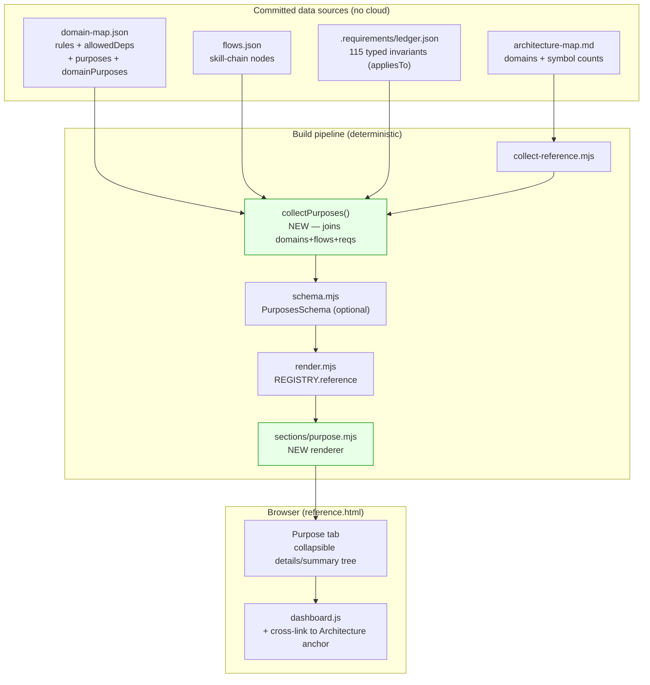

# Plan: Dashboard "Purpose" view — outcome/requirement map

- **Date**: 2026-05-31
- **Status**: Approved
- **Author**: Claude + Louis
- **Scope**: full-stack (deterministic reference-data collector + Zod schema + a new section renderer + a thin client-JS interaction; v2 adds a cloud-backed health overlay)
- **Target domain(s)**: `dashboard` (single domain — not cross-domain; `ruleCount=47`)
- **Source brainstorm**: session `1780212916147` (`/brainstorm --with-gemini --with-arch`)
- **Audit trail**: `/audit-plan` — GPT-5.5 R1 (2H/5M/2L) + R2 (1H/2M/1L) all accepted & fixed; Gemini (gemini-pro-latest) final gate ran 3 passes (4 → 3 → APPROVE), every concern genuine and fixed (state-machine contradiction, ledger wiring, sibling-panel DOM binding, `select()` scope, `ledgerPresent`/`flowNodes` contract gaps, null-`flows` guard, `<summary>` content model). 0 wrongly-dismissed across all passes.

> **Neighbourhood considered**: arch-memory returned 50 candidates, all in the
> `dashboard` domain — the new collector + section mirror the existing
> `collect-telemetry.mjs` / `sections/security.mjs` pattern shipped this week.
> Recommendation: **extend the established pipeline pattern**, do not invent a
> new rendering path.

---

## 1. Context Summary

**Scope/stack**: full-stack, `js-ts` (ESM). Frontend = a new dashboard tab +
collapsible tree + cross-link interaction; backend = a deterministic data
collector + Zod schema, plus (v2) a cloud telemetry join.

**The brainstorm verdict** (three peers diverged): OpenAI wanted a curated
purpose tree + outcome×domain matrix; Gemini pushed back hard on a mindmap
(many-to-many ⇒ "a graph wearing a tree costume") and recommended a *purpose
overlay* on the existing functional map; my lead recommendation — **don't
invent a taxonomy, reuse what the repo already ships** — is what this plan
implements:

1. **The outcome spine already exists** — `scripts/lib/dashboard/flows.json`
   is the committed skill-chain manifest (`plan → audit-plan → audit-code →
   ux-lock → persona-test → ship`, plus `cycle`). It is *already* an
   outcome/journey artifact rendered by the Process Flows tab. Purposes are a
   thin curated layer over it, not a from-scratch tree.
2. **Provenance is already solved** — the repo has a two-layer dependency
   model (observed import-graph vs manual `allowedDeps`) merged with per-edge
   `source ∈ {observed, manual, both}` and a **rules-digest staleness gate**
   ([collect-reference.mjs:134](../../scripts/lib/dashboard/collect-reference.mjs#L134)).
   Domain→purpose edges reuse this exact idiom.
3. **Requirements already carry their own join keys** — every entry in
   `.requirements/ledger.json` (115 today) has `appliesTo: string[]` (file
   paths) and a typed `kind` (`security|safety|correctness|behavioural|
   persistence`). So **requirement→domain edges are DERIVED for free** via
   the existing `computeTargetDomains(appliesTo, rules)`
   ([domain-tagger.mjs:150](../../scripts/lib/symbol-index/domain-tagger.mjs#L150)).
   No hand-mapping; the `kind` field is the cross-cutting lens.

**What exists today (Phase 1 exploration)**:

| Asset | File | Reuse |
|---|---|---|
| Reference collector (deterministic, committed-page) | [collect-reference.mjs](../../scripts/lib/dashboard/collect-reference.mjs) | **Extend** — add `collectPurposes()` + a `purposes` key |
| Domain map (rules + `allowedDeps`) | `.audit-loop/domain-map.json` | **Extend** — add `purposes` + `domainPurposes` blocks |
| Skill-chain manifest | [flows.json](../../scripts/lib/dashboard/flows.json) | **Read** — flow node ids seed `skill-chain` purposes |
| Requirements ledger (115, typed, `appliesTo`) | `.requirements/ledger.json` | **Read** — derive requirement→domain |
| Path→domain tagger | [domain-tagger.mjs](../../scripts/lib/symbol-index/domain-tagger.mjs) | **Reuse** `loadDomainRules` + `computeTargetDomains` |
| Zod boundary schema | [schema.mjs](../../scripts/lib/dashboard/schema.mjs) | **Extend** — add optional `PurposesSchema` |
| Section registry + slicers | [render.mjs](../../scripts/lib/dashboard/render.mjs) | **Extend** — register `sectionPurpose` in `REGISTRY.reference` |
| Section renderer pattern | [sections/security.mjs](../../scripts/lib/dashboard/sections/security.mjs) (this week) | **Mirror** — `default({src, purposes}, ui)` |
| Client JS (WAI-ARIA tabs, search, collapse) | [dashboard.js](../../scripts/lib/dashboard/assets/dashboard.js) | **Extend** — cross-link click handler |

**Patterns reused vs new**: 95% reuse. New = one collector function, one
schema block, one section renderer, two small config blocks in
`domain-map.json`, ~20 lines of client JS. No new rendering path, no cloud
dependency in v1.

---

## 2. Proposed Architecture

### 2.1 v1/v2 split (explicit)

| | **v1 (this plan)** | **v2 (follow-up)** |
|---|---|---|
| Data source | Committed files only (deterministic reference page) | + cloud telemetry (`audit_runs`, `plan_verification_items`, `security_strategy_events`) |
| Purpose nodes | Curated `purposes` block + `flows.json` | + LLM-suggested edges (human-accepted into the manual block) |
| Domain→purpose | Manual edges (`domainPurposes`) | + `llm-suggested` provenance |
| Requirement→domain | **Derived** from `appliesTo` (automatic) | unchanged |
| Health | none (structure only) | **Live colouring** — purpose glows amber/red when a constraining requirement has a failing/at-risk signal |
| Cross-view | Domain chips deep-link to the Architecture tab anchor | True synchronised highlight across tabs (shared client state) |
| Validation aid | Hygiene warnings (unmapped domains, unattached requirements) | outcome×domain **matrix** view |

The split is load-bearing: **v1 stays on the deterministic, committed,
no-cloud reference page** (so the dashboard's `sourceHash` determinism and
offline build are preserved). Health is the *only* thing that needs cloud, so
it is the v2 boundary by construction.

### 2.2 Data model (the heart of v1)

Two committed blocks added to `.audit-loop/domain-map.json` (hand-edited,
not Zod-pinned — same treatment as `allowedDeps`):

```jsonc
{
  "rules": { /* existing path→domain */ },
  "allowedDeps": { /* existing domain→domain */ },

  // NEW — the curated purpose taxonomy (5–7 nodes; intentionally small).
  "purposes": [
    { "id": "plan-and-design",      "label": "Plan & design work",        "kind": "skill-chain", "flowNodes": ["plan","audit-plan"], "summary": "Turn intent into an audited, buildable plan." },
    { "id": "deliver-quality-audits","label": "Deliver quality audits",    "kind": "skill-chain", "flowNodes": ["audit-code"],         "summary": "Multi-pass GPT+Gemini code audit to a clean gate." },
    { "id": "verify-live-ux",       "label": "Verify live UX",            "kind": "skill-chain", "flowNodes": ["ux-lock","persona-test"], "summary": "Lock DOM contracts + narrative/structural UX QA." },
    { "id": "learn-from-outcomes",  "label": "Learn & improve from outcomes","kind": "curated", "flowNodes": [],                    "summary": "Close the loop: FP tracking, bandit, prompt evolution." },
    { "id": "preserve-trust-safety","label": "Preserve trust & safety",   "kind": "curated",    "flowNodes": [],                    "summary": "Secret exclusion, RLS, redaction, atomic writes, graceful degradation." },
    { "id": "ship-and-sync",        "label": "Ship & sync",               "kind": "skill-chain", "flowNodes": ["ship"],              "summary": "Commit, push, and propagate to consumer repos." },
    { "id": "understand-the-repo",  "label": "Understand the repo",       "kind": "curated",    "flowNodes": [],                    "summary": "Arch-memory, symbol index, requirements ledger, this dashboard." }
  ],

  // NEW — manual domain→purpose edges (the one piece of curation that pays
  // for the whole view). source defaults to "manual".
  "domainPurposes": {
    "audit-orchestration": ["deliver-quality-audits"],
    "findings":            ["deliver-quality-audits","learn-from-outcomes"],
    "learning-store":      ["learn-from-outcomes"],
    "arch-memory":         ["understand-the-repo"],
    "stores":              ["preserve-trust-safety","learn-from-outcomes"],
    "dashboard":           ["understand-the-repo"],
    "plan":                ["plan-and-design"],
    "claude-hooks":        ["preserve-trust-safety"]
    /* … one line per tagged domain; unmapped domains surface as hygiene warnings … */
  }
}
```

**Derived at collect time** (no manual entry):

- `requirement → domain` : `computeTargetDomains(req.appliesTo, rules).domains`
- `requirement → purpose` : transitive — for each derived domain, look up
  `domainPurposes[domain]`; a requirement can surface under several purposes
  (its `kind` is shown as a badge so cross-cutting invariants read as
  cross-cutting, addressing Gemini's "orphaned invariant" warning).

**Edge provenance** (mirrors the deps model):

| Edge | v1 source | Notes |
|---|---|---|
| domain → purpose | `manual` | (`llm-suggested` reserved for v2) |
| requirement → domain | `derived` | from `appliesTo` |
| requirement → purpose | `transitive` | via domain |

**(M2) v1 provenance is uniform, so it is NOT materialized in the output.**
Every domain→purpose edge in v1 has source `manual` (the only source until
v2 adds `llm-suggested`). Because it is constant, v1 does **not** add a
per-edge `source` field to the output contract above — that would be the
"dead optional shape" §6/L2 deliberately avoids. The provenance *model* (a
materialized `source ∈ {manual, llm-suggested}` per edge) lands in v2 exactly
when a second source appears. The dependency-model analogy in §2.4 is about
*reusing the merge idiom conceptually*, not about emitting a `source` column
in v1.

### 2.2.1 Input & validation contracts (boundary)

**(H1) The hand-edited config IS validated** — "not Zod-pinned" applies only
to how we *store* it (a plain JSON block, like `allowedDeps`), NOT to how the
collector *consumes* it. `collect-purposes.mjs` `safeParse`s the raw
`{purposes, domainPurposes}` against a dedicated **`PurposeConfigSchema`**
before any join. Validation rules:

- `purposes[].id`: unique, `^[a-z][a-z0-9-]*$` slug; `label`/`summary`:
  non-empty strings; `kind ∈ {skill-chain, curated}`; `flowNodes`: string[]
  whose every id resolves against `flows.json` node ids — **but only when
  `flows` is non-null** (Gemini3-M): `ReferenceDataSchema` types `flows` as
  `FlowManifestSchema.nullable()`, so when `flows.json` is absent/malformed
  (`flows === null`) the collector **skips** `flowNodes` cross-validation
  (storing the ids unverified) rather than dereferencing null. A missing flow
  manifest degrades the skill-chain badge, never crashes the build.
- `domainPurposes`: object whose every value is a string[] of **existing**
  purpose ids; an unknown id ⇒ collector returns `status:'invalid'` naming
  the offending `(domain, id)` pair. Unknown *domain* keys are tolerated but
  reported as a hygiene warning (not invalid — domains come and go).
- On any schema failure the Purpose section degrades to an `invalid` panel
  naming the first issue; the rest of the dashboard is unaffected (boundary
  isolation, #12/#16).

**(M1) Requirement input contract** — the collector consumes exactly four
fields per ledger entry, via a small normalizer `normalizeRequirement(r)`:
`{ id: string, kind: enum, appliesTo: string[], assertion: string }`. Display
text is `assertion` (the only prose field); entries missing `id` or `assertion`
are skipped and counted in a `skippedRequirements` hygiene number. No other
ledger field is read, so ledger-schema growth cannot break this view.

**(H1) ONE canonical collector output contract** — the collector returns a
single discriminated object that IS `data.purposes`, and `sources.purposes`
is derived from its `status`. The same shape is what `PurposesSchema`
validates and what `sectionPurpose` consumes — no third variant:

```jsonc
// data.purposes  (and PurposesSchema)  — status is the discriminant
{
  "status": "ok" | "missing-optional" | "invalid",
  "detail": "",                       // human reason when not ok (e.g. the bad (domain,id))
  "ledgerPresent": <bool>,            // (Gemini2-M) false ⇒ renderer shows "run npm run requirements";
                                      //   true + empty requirements ⇒ "no invariants mapped here"
  "nodes": [ {
    "id","label","kind","summary",
    "flowNodes": [ "audit-code" ],                                        // (Gemini2-L) skill ids backing a skill-chain purpose; [] for curated
    "domains": [ { "id", "anchor": <string|null>, "alsoServes": <int> } ], // anchor: canonical cross-link (§2.2.2) or null
    "requirements": [ { "id","kind","assertion" } ]                        // grouped by kind in the renderer
  } ],
  "hygiene": {
    "unmappedDomains": [],            // known domain with no domainPurposes entry
    "unattachedRequirements": [],     // requirement whose derived domains hit no mapped domain
    "skippedRequirements": 0,         // ledger entries missing id/assertion
    "unknownDomains": [],             // (Gemini-M2) domainPurposes KEY that is not a known domain
    "domainsMissingArchitecture": []  // (Gemini-M2) mapped domain with no architecture-map entry → link-less chip
  }
}
```

**(Gemini-H1) The taxonomy and the ledger are INDEPENDENT inputs — distinct
states, no contradiction:**

- **Absent/invalid taxonomy** (`purposes` block missing or fails
  `PurposeConfigSchema`) → the view cannot render: `status:'missing-optional'`
  (missing) or `'invalid'` (malformed), `nodes:[]`, `detail` explains which
  (and names the offending `(domain,id)` when invalid).
- **Absent requirements ledger** but a VALID taxonomy → the view STILL
  renders: `status:'ok'`, `nodes` populated with domains, every node's
  `requirements:[]`. The renderer shows "no requirements ledger — run
  `npm run requirements`" inside each node. A missing ledger is NOT a missing
  purpose view.

`sources.purposes` mirrors `{status, detail}` 1:1. The State Map (§5) rows map
exactly onto these cases.

**(M1) Set semantics** — the transitive join dedupes: **unique purpose ids
per domain, unique domain ids per purpose, unique requirement ids per
purpose**, each in a stable order (`domains` by `id` asc; `requirements` by
`(kind asc, id asc)`; `nodes` in `purposes[]` declaration order). So a
requirement whose `appliesTo` resolves to two domains that both map to the
same purpose appears **once** under that purpose. Determinism (§2.4) depends
on this ordering.

### 2.2.2 Domain universe & cross-link anchor (single source of truth)

**(M2) The domain universe is defined**, not implied: `knownDomains = the
domain set already produced by `collectArchitecture()` (the `docs/architecture-
map.md` Contents block) ∪ the distinct rule target-domains from
`loadDomainRules()`. Each domain carries `source ∈ {architecture, rules,
both}`. Hygiene is then unambiguous: `unmappedDomains = knownDomains − keys of
domainPurposes`. `unattachedRequirements = requirements whose derived domains
∩ (domains that appear in domainPurposes) = ∅`.

**(H2) Cross-link uses the anchor the Architecture collector already emits** —
`collectArchitecture()` returns `domains[].anchor`
([collect-reference.mjs:283](../../scripts/lib/dashboard/collect-reference.mjs#L283)).
That value IS the canonical Architecture-tab anchor. `collect-purposes.mjs`
receives the collected `architecture.domains` and copies each domain's
`anchor` onto the purpose node's domain entry — the renderer NEVER
re-slugifies a domain name into an href. One source, zero drift. (If a mapped
domain has no architecture entry — e.g. exists only in rules — its chip
renders as plain text with no link, and it is reported in hygiene.)

### 2.3 Component / data-flow diagram



### 2.4 Key design decisions (cited principles)

- **Reuse the merge/provenance idiom, don't reinvent** (#1 DRY, #5 Single
  Source of Truth) — domain→purpose edges carry a `source`, requirement edges
  are derived from `appliesTo`. One mental model for the whole dashboard.
- **Data-driven taxonomy** (#20 Long-Term Flexibility, #10 No Hardcoding) —
  purposes live in JSON config; adding/renaming a purpose is a data edit, not
  a code change. A new purpose never requires touching the renderer.
- **Deterministic, no-cloud v1** (#16 Graceful Degradation) — the whole view
  is committed-file-derived, so it builds offline and keeps the reference
  page's content-hash determinism. Missing ledger / missing `purposes` block
  ⇒ `missing-optional`, never a build failure.
- **Boundary validation** (#12) — `PurposesSchema` is `.optional()` so older
  snapshots still validate (same trick the Security section shipped with).
- **Hygiene as a first-class output** (#19 Observability) — unmapped domains
  and unattached requirements are *rendered*, not hidden, so the curation
  surface can't silently rot.
- **(M5) Determinism is preserved by construction** (#16) — `collectPurposes`
  is a **pure function of committed file contents** with no `Date.now()` /
  randomness, and its *normalized output* (`purposes` node list + hygiene) is
  folded into the existing reference-page `sourceHash`
  ([collect-reference.mjs:417](../../scripts/lib/dashboard/collect-reference.mjs#L417)).
  Identical inputs ⇒ identical hash. Absent/invalid optional inputs map to
  **stable empty structures** (`{nodes:[], hygiene:{…empty…}}` with a
  `sources.purposes` status of `missing-optional`/`invalid`), never to a
  timestamp or a partial nondeterministic blob — so the committed page stays
  byte-reproducible. A dedicated per-file sha manifest (the auditor's stronger
  suggestion) is **deferred**: folding the normalized payload into the
  existing content hash already gives input-determinism; a separate manifest
  is redundant surface for v1.

---

## 3. UX Design Decisions

### 3.1 ASCII wireframe (Purpose tab)

```
┌ Skills · CLI · Process Flows · Architecture · Purpose · Plans ─────────────┐
│                                                                            │
│  7 purposes · 18 domains mapped · 115 invariants · 2 unmapped · 3 loose    │
│                                                                            │
│  ▼ Deliver quality audits            skill-chain   [audit-code]            │
│      Multi-pass GPT+Gemini code audit to a clean gate.                     │
│      Delivered by:  [audit-orchestration ·also serves 1]  [findings ·2]   │
│      Invariants (6):                                                        │
│        ┌ correctness (3) ───────────────────────────────────────────┐     │
│        │ • Re-raised finding above threshold is reopened when …      │     │
│        └─────────────────────────────────────────────────────────────┘     │
│        ┌ behavioural (2) · persistence (1) ─ collapsed ─────────────┐     │
│        └─────────────────────────────────────────────────────────────┘     │
│                                                                            │
│  ▶ Preserve trust & safety           curated                              │
│  ▶ Learn & improve from outcomes     curated                              │
│  ▶ Understand the repo               curated                              │
│                                                                            │
│  ⚠ Hygiene                                                                 │
│     Unmapped domains (2): root-scripts, memory-health  → add to            │
│        domainPurposes in .audit-loop/domain-map.json                       │
│     Unattached invariants (3): REQ-… (appliesTo maps to no mapped domain)  │
└────────────────────────────────────────────────────────────────────────────┘
```

### 3.2 Principles driving the layout

- **#21 Proximity / #22 Common Region (Gestalt)** — each purpose is a bordered
  region; its domains and invariants sit inside it. Invariants group by `kind`
  inside the purpose, so the cross-cutting taxonomy is visible at a glance.
- **#33 Progressive disclosure / cognitive load** — `<details>`/`<summary>`
  native collapsibles. Top level (purposes) open; invariant `kind` groups
  collapsed by default. A reader sees 7 outcomes, expands only what they care
  about — directly answering "is this easier for a human to follow?" (yes, vs.
  an 18-domain dependency lattice) without the mindmap spiderweb Gemini warned
  about.
- **#1 / Gestalt similarity** — a domain that serves multiple purposes renders
  identically everywhere with an "·also serves N" badge (canonical by id), so
  the many-to-many reality reads honestly without node duplication.
- **#41 Accessibility** — native `<details>` is keyboard- and
  screen-reader-native; domain chips are real `<a href="#domain-anchor">`
  links (work without JS); the tab joins the existing WAI-ARIA tablist.
  Nielsen #2 (match real world): "what the system is FOR" is plainer language
  than "top-level → core → foundation tiers."

### 3.3 Cross-view link (v1) vs synchronised highlight (v2)

v1: a domain chip is an anchor to the Architecture tab's existing
`#<domain-anchor>`. Clicking switches tab + scrolls (cheap, JS-optional). v2:
true bidirectional highlight (select a domain anywhere → it lights up in both
tabs) needs shared client state — deferred to keep v1's client JS trivial.

---

## 4. Technical Architecture (frontend)

- **Component**: one new section module `sections/purpose.mjs`, signature
  `default({src, purposes}, ui) → string` — pure HTML string builder, no
  imports (the section-contract test forbids importing render/helpers; ui is
  injected). Mirrors `sections/security.mjs` exactly (#27 component arch).
- **(M3) Escaping is mandatory, not optional** — every dynamic value
  (purpose `label`/`summary`, requirement `assertion`, domain `id`, and the
  `anchor` used in an `href`) is emitted through `ui.escapeHtml(...)`. Text
  nodes AND attribute values both go through it; the `anchor` is additionally
  constrained to the slug charset before use in `href="#..."`. The renderer
  contains **zero** raw interpolation of file-derived strings into HTML. This
  is a security contract, not a style note: the inputs are file content that a
  contributor (or a synced consumer repo) controls. A test feeds
  `<script>`, `"`, `&`, and an exotic domain id and asserts they are escaped.
- **(M4) Concrete accessible markup** (replaces the looser "`<details>` ≈
  group" assumption). Each purpose:

  ```html
  <!-- exact nesting (illustrative — all dynamic values escaped via ui.escapeHtml) -->
  <section class="purpose" aria-labelledby="purpose-{id}-title">
    <details open>
      <!-- HTML5 <summary> content model = ONE heading element; kind/flows
           nest INSIDE the <h3>, not as siblings (Gemini3-L). -->
      <summary>
        <h3 id="purpose-{id}-title" class="purpose-title">{label}
          <span class="purpose-kind">{kind}</span>
          <span class="purpose-flows">{flowNodes.join(', ')}</span><!-- skill-chain only -->
        </h3>
      </summary>
      <p class="purpose-summary">{summary}</p>
      <!-- domain chips: a[data-cross-tab][href="#{anchor}"] -->
      <!-- requirements grouped by kind -->
    </details>
  </section>
  ```

  The `<section aria-labelledby>` (not the raw `<details>`) is the queryable
  landmark for the accessible name; `<summary>` is the native
  expand/collapse control; the `<h3>` keeps heading hierarchy under the tab's
  `<h2>`. Acceptance criteria in §10 query the `<section>` by its label, not a
  `<details>` `group` role.
- **State**: stateless render. Collapse state is DOM-native (`<details open>`),
  no client store in v1 (behavioural constraint, not a line count).
- **Events (Gemini-M-DOM + Gemini2-M-scope)**: ONE delegated click handler in
  `dashboard.js`. Two implementation facts the plan pins so the handler
  actually works:
  1. **Binding target** — chips live inside a tab *panel*, a **sibling** of
     `.tabstrip`; a listener on `.tabstrip` never receives the bubble. Bind on
     `<main id="main">` (or `document`); match `e.target.closest('a[data-cross-tab]')`.
  2. **`select()` scope + signature** — `select` is declared *inside* the
     `if (strip) { … }` block in `dashboard.js` and takes a **DOM element**,
     not an id. So the new handler must be added **inside that same block**
     (where `select` and `tabs` are in scope), and must first resolve the
     Architecture tab's element — e.g. `tabs.find(t =>
     t.getAttribute('aria-controls') === 'panel-architecture')` — then call
     `select(el)` and `scrollIntoView` the `#anchor`. (If a future refactor
     hoists `select`, update this accordingly.)
  Constraints: delegated only (no per-chip listener), reuses the single
  canonical `select()` helper, adds no client-side state.
- **CSS**: new classes `.purpose`, `.purpose-title`, `.domain-chip`,
  `.kind-group`, `.hygiene` built **only** on existing CSS custom properties —
  no new colour primitives in v1 (health colours are a v2 concern). Constraint
  is "reuse existing design tokens" (#40), not a byte budget.

---

## 5. State Map (Purpose tab)

| State | Trigger | Render |
|---|---|---|
| **Empty (no taxonomy)** | `domain-map.json` lacks a `purposes` block | `status:'missing-optional'`, `nodes:[]` → panel: "No purpose map — add a `purposes` block to `.audit-loop/domain-map.json`." |
| **No ledger, valid taxonomy** | `.requirements/ledger.json` absent (`ledgerPresent:false`) | `status:'ok'`, `nodes` populated — purposes + domains render; each node's requirement sub-tree shows "no requirements ledger — run `npm run requirements`". Distinct from `ledgerPresent:true` + a node with zero invariants → "no invariants mapped here" (Gemini-H1 / Gemini2-M). |
| **Loaded** | both present | full tree + hygiene summary |
| **Partial / hygiene** | some domains unmapped or some `appliesTo` resolve to no mapped domain | tree renders + a `⚠ Hygiene` region lists the gaps (never a hard error) |
| **Invalid** | `purposes` block malformed (e.g. a `domainPurposes` value references a non-existent purpose id) | `invalid` panel naming the bad id; rest of dashboard unaffected (boundary isolation) |

---

## 6. Sustainability Notes

- **Assumption that could change**: "the skill chain ≈ the product purpose."
  If the product grows beyond the skill chain, `purposes` is just JSON — add
  curated nodes without touching code. The taxonomy is intentionally tiny
  (7 nodes) to stay maintainable; the design resists the "LLM-derived drift"
  both external models feared by making humans own the canonical ids.
- **(L2) Extension seam for v2 health — NOT pre-reserved in v1**: v1 ships
  **no** `health` field. Because `PurposesSchema` is the boundary contract and
  optional-field additions are backward-compatible (old snapshots validate),
  v2 simply *adds* `health?: {status, signalCount}` when it builds the
  telemetry enrichment. Adding an unused, under-specified optional field in v1
  is avoided deliberately — the seam is "the schema can grow", not "the schema
  carries dead shape".
- **Coupling**: the collector depends only on already-public helpers
  (`loadDomainRules`, `computeTargetDomains`, `discoverPlans`-style reads).
  Swapping the requirements source or domain tagger is a 1-function change.
- **Matrix view (v2)** is additive — same `purposes` data, a different
  renderer; no data-model change.

---

## 7. File-Level Plan

| File | Disposition | Key additions | Why |
|---|---|---|---|
| `.audit-loop/domain-map.json` | **edit** | `purposes[]` + `domainPurposes{}` blocks (§2.2) | Data-driven taxonomy (#10, #20) |
| `scripts/lib/dashboard/schema.mjs` | **edit** | **`PurposeConfigSchema`** (validates the raw domain-map extension — §2.2.1) + **`PurposesSchema`** (the single discriminated collector OUTPUT contract — §2.2.1: `status`+`detail`+`nodes[]`{id/label/kind/summary/domains[{id,anchor,alsoServes}]/requirements[{id,kind,assertion}]}+`hygiene`{unmappedDomains[]/unattachedRequirements[]/skippedRequirements}; **no `health` field in v1**, L2). Add `purposes: PurposesSchema.optional()` to `ReferenceDataSchema`; `sources.purposes` mirrors `{status,detail}` | Boundary validation (#12, H1); optional ⇒ old snapshots valid |
| `scripts/lib/dashboard/collect-purposes.mjs` | **new** | `collectPurposes(root, {architectureDomains, flows, rules, requirements})` → `{nodes, hygiene, status}`; pure/deterministic; **safeParse via `PurposeConfigSchema`** (→`invalid` on failure, H1); `knownDomains` universe = arch-map ∪ rule targets (M2); requirement→domain via `computeTargetDomains`, transitive→purpose; **copies `anchor` from the architecture domain** (H2); `normalizeRequirement` reads only id/kind/appliesTo/assertion (M1); computes unmapped/unattached/skipped | Single join point (#1, #5); testable in isolation (#11) |
| `scripts/lib/dashboard/collect-reference.mjs` | **edit** | **load `.requirements/ledger.json`** here (Gemini-H2 — this collector does NOT read it today; mirror `collect-telemetry.mjs::collectRequirements`'s `fs.readFileSync`+`JSON.parse`, ENOENT→`[]`, malformed→`[]`+a `sources.purposes` note); derive `ledgerPresent` (read succeeded vs ENOENT — Gemini2-M); call `collectPurposes` passing the already-collected `arch.domains` + the ledger requirements + `ledgerPresent`; add `purposes` + `sources.purposes`; fold the normalized payload into `sourceHash` (M5) | Pipeline wiring; preserves determinism |
| `scripts/lib/dashboard/sections/purpose.mjs` | **new** | `default({src, purposes}, ui)` renderer — `<section aria-labelledby>`+`<details>`+`<summary><h3>` regions (M4), domain chips as `a[data-cross-tab]` using `anchor`, kind-grouped invariants, hygiene block. **All dynamic text/attrs via `ui.escapeHtml`** (M3) | Mirrors `sections/security.mjs` (#27) |
| `scripts/lib/dashboard/render.mjs` | **edit** | import `sectionPurpose`; add `SLICERS.purposes` (with empty default); register `{id:'purpose', title:'Purpose'}` in `REGISTRY.reference` after `architecture` | Section registration |
| `scripts/lib/dashboard/assets/dashboard.js` | **edit** | ONE delegated `a[data-cross-tab]` handler bound on `<main id="main">`/`document` (NOT `.tabstrip` — panels are its siblings, Gemini-M-DOM) → `closest('a[data-cross-tab]')` → existing `select(tab)` + `scrollIntoView`; no per-chip listener, no client store (L1) | Cross-link |
| `scripts/lib/dashboard/assets/dashboard.css` | **edit** | `.purpose`/`.purpose-title`/`.domain-chip`/`.kind-group`/`.hygiene` on existing CSS custom properties; no new colour primitives (L1) | Visual structure (#40) |
| `tests/dashboard-section-contract.test.mjs` | **edit** | add `purpose.mjs` to `SECTION_FILES` | Contract coverage |
| `tests/dashboard-purpose.test.mjs` | **new** | pure tests — see §9 (join correctness, hygiene universe, **config-validation rejection**, **HTML-escaping/XSS**, renderer a11y markup, determinism) | Regression lock (#11) |

---

## 8. Risk & Trade-off Register

| Risk | Likelihood | Impact | Mitigation |
|---|---|---|---|
| Manual `domainPurposes` rots as domains are added | Med | Med | Hygiene "unmapped domains" warning renders the gap every build; cheap to keep current (one line/domain). |
| Purpose taxonomy is subjective / bikeshed | Med | Low | Seed from the skill chain (already curated); keep to 7 nodes; it's JSON, trivially revisable. |
| Requirement `appliesTo` paths drift from domain rules → wrong/empty edges | Low | Med | Edges are derived each build from live rules; "unattached invariants" hygiene surfaces mismatches. |
| Many-to-many rendered as a tree misleads | Med | Med | Canonical-by-id + "·also serves N" badges; honest about multi-membership (Gemini's core objection addressed). |
| Scope creep into v2 (health/matrix/LLM edges) | Med | Med | Explicit v1/v2 table (§2.1); v1 ships zero cloud dependency. |
| `domain-map.json` not Zod-pinned → malformed `purposes` slips in | Low | Low | `collectPurposes` validates purpose-id integrity and returns `invalid` with the offending id; build continues. |

**Deliberately deferred (OK because…)**: live health colouring (needs cloud —
the whole reason it's the v1/v2 line); synchronised cross-tab highlight (needs
shared client state — anchor links cover 80%); outcome×domain matrix (additive,
same data); LLM-suggested edges (v1 proves the manual path first).

---

## 9. Testing Strategy

- **Unit (pure, no cloud)** — `tests/dashboard-purpose.test.mjs`:
  - `collectPurposes` joins a fixture domain-map + flows + a 3-entry ledger →
    asserts requirement→domain→purpose transitivity, including a requirement
    whose `appliesTo` spans two domains surfacing under two purposes.
  - hygiene/universe (M2): `knownDomains` = arch-map ∪ rule targets; an unmapped
    domain appears in `unmappedDomains`; a requirement whose `appliesTo`
    resolves to no *mapped* domain appears in `unattachedRequirements`; an
    entry missing `id`/`assertion` increments `skippedRequirements`.
  - **config validation (H1)**: `domainPurposes` referencing an unknown purpose
    id ⇒ `status:'invalid'` naming the `(domain,id)`; a duplicate `purposes[].id`
    and a `flowNodes` id absent from `flows.json` are both rejected.
  - **anchor contract (H2)**: a domain's chip carries the `anchor` from the
    fixture architecture domains verbatim (not a re-slug); a mapped domain with
    no architecture entry renders link-less and appears in hygiene.
  - **HTML-escaping / XSS (M3)**: a purpose label `<script>alert(1)</script>`,
    a requirement assertion with `"`/`&`, and a domain id with `">` are
    all escaped in the rendered string (assert no raw `<script>` / unescaped
    quote in an attribute).
  - **a11y markup (M4)**: each purpose renders `<section aria-labelledby>` with
    a matching `<h3 id>` inside `<summary>`; the renderer output contains the
    `data-cross-tab` link attribute on domain chips.
  - **determinism (M5)**: two `collectPurposes` calls on identical fixtures
    deep-equal; absent ledger/`purposes` yield the documented stable empty
    structures (not throws, not timestamps).
- **Contract** — `dashboard-section-contract.test.mjs` gains `purpose.mjs`
  (arity-2 default export, no render/helpers import, registered in render.mjs).
- **Schema** — a `ReferenceDataSchema.parse` round-trip with and without the
  `purposes` key (optional-field back-compat).
- **Build smoke** — `node scripts/build-dashboard.mjs reference` succeeds and
  the output HTML contains a `Purpose` tab (degrades to an empty panel when the
  `purposes` block is absent).
- **Edge cases**: empty ledger; zero `domainPurposes`; a purpose with no
  domains; a domain serving 3+ purposes (badge math).

---

## 10. Acceptance Criteria (Playwright-verifiable)

> Drives `/ux-lock verify`. Semantic DOM contracts only — no CSS class
> selectors. Where a contract can only be expressed structurally, a
> `data-testid` is added during implementation.

- [P0] [navigation] A "Purpose" tab is reachable in the reference dashboard tablist.
  - Setup: build the reference dashboard with a populated `purposes` block; open `reference.html`.
  - Assert: `getByRole('tab', { name: 'Purpose' })` exists; activating it shows a `getByRole('tabpanel')` containing the purpose regions.
- [P0] [state] Each purpose renders as a labelled, collapsible region.
  - Setup: Purpose tab active.
  - Assert: for each purpose, a `getByRole('region', { name: <purpose label> })` (the `<section aria-labelledby>`); inside it a `<summary>` control with an `<h3>` whose accessible name equals the label; activating `<summary>` reveals the summary text. (Query the `<section>` landmark, NOT a raw `<details>` group role — M4.)
- [P1] [interaction] A domain served by a purpose is a link that cross-navigates to the Architecture tab.
  - Setup: Purpose tab active; a purpose with ≥1 domain.
  - Assert: the domain chip is a link (`getByRole('link')`) whose `href` targets the Architecture domain anchor; clicking activates the Architecture tab (`getByRole('tab', { name: 'Architecture' })` becomes selected).
- [P1] [state] Requirements appear grouped by kind under the purpose they constrain.
  - Setup: a purpose with mapped requirements of ≥2 kinds.
  - Assert: within the purpose region, a group per `kind` (e.g. accessible name containing "correctness") listing ≥1 invariant assertion as text.
- [P1] [state] A domain serving multiple purposes is badged, not duplicated as distinct nodes.
  - Setup: fixture where one domain maps to 2 purposes.
  - Assert: the domain chip carries an "also serves" badge (via `getByTestId('domain-also-serves')` or accessible text), and the domain id appears under both purpose regions referencing the same anchor.
- [P2] [visibility] Hygiene gaps are surfaced, not hidden.
  - Setup: fixture with ≥1 unmapped domain and ≥1 unattached requirement.
  - Assert: a hygiene region (`getByRole('region', { name: /hygiene/i })` or `getByTestId('purpose-hygiene')`) lists the unmapped domain name and the unattached requirement id.
- [P2] [a11y] The Purpose tab is keyboard-operable and the tree is screen-reader navigable.
  - Setup: Purpose tab focused via keyboard.
  - Assert: arrow-key tablist navigation reaches it; `<details>` toggles via Enter/Space; an axe-core scan of the panel reports no critical violations.
- [P3] [state] Empty-state when no taxonomy is configured.
  - Setup: build with no `purposes` block.
  - Assert: the Purpose panel shows a non-error empty message referencing `domain-map.json`, and the rest of the dashboard still renders.

---

## 11. Out of Scope (v2 / future)

- Live health colouring from `audit_runs` / `plan_verification_items` /
  `security_strategy_events` (the cloud boundary).
- Bidirectional synchronised highlight across Architecture ↔ Purpose.
- outcome×domain matrix (validation grid).
- LLM-suggested domain→purpose edges with a human-acceptance loop.
- Telemetry-tab "purpose health" summary.
