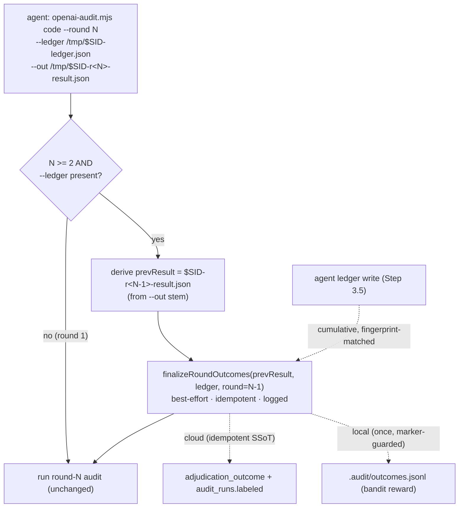

# Plan: Deterministic `/audit-code` outcome capture for rounds 1..N-1 (orchestrator-only)

> **Title scope (L1)**: "deterministic" applies to the **non-final rounds** of a standalone
> multi-round `/audit-code`. The final converged round and pure 1-round audits use the
> documented manual/`/cycle` fallback — see *Accepted scope boundary*. This is a deliberate
> right-sizing, not an oversight.

- **Date**: 2026-06-29
- **Status**: Complete — shipped 2026-06-29. Audit trail: v1 hook+queue design REJECTED by Gemini (coherence *Weak*, over-engineered minted UUID a stateless orchestrator can't persist). User chose orchestrator-only. v2 GPT rounds H:2→1 (decayed to spec/wiring/polish); **Gemini APPROVE** — coherence *Strong*, 0 over-engineering flags, "excellent convergence". One LOW deferred (pre-existing `file-lock.mjs` double-`statSync`, out of scope).
  - **Post-implementation `/audit-code` (5 rounds, R1→R5 PASS H:0/M:0/L:0)**: fixed 8 genuine in-scope findings on the implementation — stable-sid idempotency for the cloud-off manual CLI (`parseResultPath` → `{sid,round}`), filename↔`--round`↔`result.round` reconciliation that fails closed on conflict, strict `--round` validation, `loadAuditInputs` contract consolidation, and a compact `_outcomeCapture` (scalars only, never the enriched payload). Deferred H2 (`resolveRepoId` fail-open) + M4 (cross-skill god-module) as pre-existing/independent debt. Final **Gemini APPROVE** (coherence *Strong*, 0 new / 0 wrongly-dismissed / 0 over-engineering).
  - **Empirical pre-ship verify (live Supabase `uahjjdelnnpfmaqjrwoz`)**: a real multi-round standalone `/audit-code` labelled rounds 1..N-1 with **no manual step** — run `6a68fa7c`: `labeled` false→true, 7 accepted / 5 dismissed, 12/12 `audit_findings.adjudication_outcome` set, 12 `finding_adjudication_events`. Re-running the finalize did **not** double-grow `.audit/outcomes.jsonl` (marker-guarded, `skippedLocal:true`); cloud re-labelled idempotently.
- **Author**: Claude + Louis
- **Scope**: backend
- **Target domain(s)**: `audit-orchestration`, `shared-lib`, `scripts`, `skills-content`

> **Origin**: 2026-06-29 live Supabase audit — `adjudication_outcome` covers only
> 475/12042 findings and `audit_runs.labeled` 26/713, because `/audit-code` Step 3.5b
> (the outcome-capture call) is **prose the agent skips**. `/cycle` captures; standalone
> `/audit-code` mostly doesn't.
>
> **Design history (load-bearing)**: a v1 design (a `Stop` hook draining a `.audit/`
> breadcrumb queue, with a minted `auditExecutionId`, egress-gated path reads, a record
> state machine, and a dead-letter journal) was taken through 2 `/audit-plan` rounds and
> **REJECTED** by the Gemini gate: architectural coherence *Weak*; it over-engineered a
> UUID identity that a **stateless per-round orchestrator cannot persist** and that the
> agent won't preserve in a hand-edited ledger (≈100% validation-failure). The decision:
> **revert to the existing `$SID` identity and ride the invocation the agent already
> makes**, which dissolves the queue, the hook, the concurrency, and the identity problem.

---

## 1. Context Summary

- **Scope / stack**: backend · `js-ts` + postgres · `node --test`.
- **Not a new feature** — the writers exist and are correct. This makes an existing,
  correct, agent-discretionary step **deterministic** with the *smallest* surface.

### Code Trace (evidence)

- **Round loop**: `/audit-code` runs `node scripts/openai-audit.mjs code <plan> --round N
  --ledger /tmp/$SID-ledger.json --out /tmp/$SID-r<N>-result.json --changed … --diff …`
  per round ([`skills/audit-code/SKILL.md`](../../skills/audit-code/SKILL.md) Step 2 / Step 5).
  **Key fact**: on rounds N ≥ 2 the orchestrator is **already handed `--ledger`** (the
  cumulative ledger the agent wrote after round N-1's deliberation, for R2+ suppression)
  and `--round N`, and `--out` follows the `…-r<N>-result.json` convention.
- **The skipped step**: [`skills/audit-code/SKILL.md:287`](../../skills/audit-code/SKILL.md#L287)
  Step 3.5b documents `write-code-outcomes.mjs` as MANDATORY but it's an agent-run bash step.
- **The writer**: [`scripts/write-code-outcomes.mjs`](../../scripts/write-code-outcomes.mjs) and
  the duplicate [`cross-skill.mjs:590`](../../scripts/cross-skill.mjs#L590) `cmdFinalizeOutcomes`
  both call `recordTriageOutcomes` ([`outcome-sync.mjs:138`](../../scripts/lib/outcome-sync.mjs#L138)).
- **Identity**: `$SID` is a unique, timestamped per-execution id (`SID=audit-code-$(date +%s)`)
  already embedded in every temp path — a durable execution identity. **No new identity is
  needed** (the v1 minted UUID was the rejected over-engineering). Cloud writes key on the
  result's existing `_cloudRunId`.
- **Idempotency**: cloud is **already idempotent** — `recordAdjudicationEvent` does
  `deleteWhere(finding_id) → insert` ([`runs-findings.mjs:1020`](../../scripts/lib/store/runs-findings.mjs#L1020)).
  The only non-idempotent surface is the local `.audit/outcomes.jsonl` append
  ([`outcome-sync.mjs:172`](../../scripts/lib/outcome-sync.mjs#L172)) — guarded by one marker file.
- **Patterns reused vs new**: reuse `recordTriageOutcomes` + `markRunFindingsNeedsTriage`;
  consolidate the two duplicate finalize bodies into one shared fn. New: a prior-round
  finalize call at R2+ orchestrator start + a one-line local-append marker. **No hook, no
  queue, no breadcrumb, no lock, no minted id.**
- **Neighbourhood considered**: `recordTriageOutcomes`/`writeCloudOutcomes` → `review` (reuse).

---

## 2. Proposed Architecture

Ride the invocation the agent already makes. When the orchestrator runs round N (N ≥ 2),
the round-(N-1) result + the cumulative ledger both already exist — so finalize round N-1
**inside the orchestrator**, before auditing round N. No external trigger.

### Key design decisions (principles cited)

1. **Single shared `finalizeRoundOutcomes`** (#1 DRY, #5 SSoT). Extract the body
   duplicated across `write-code-outcomes.mjs` and `cmdFinalizeOutcomes` into
   [`scripts/lib/finalize-outcomes.mjs`](../../scripts/lib/finalize-outcomes.mjs)
   `finalizeRoundOutcomes({result, ledger, round, store})`. The orchestrator + both CLIs
   call it — identical, tested logic.
2. **Trigger = the existing R2+ invocation** (simplest structurally-honest). At round N ≥ 2
   the orchestrator already has `--ledger` and `--round`; it derives the prior result path
   from the `--out` stem (`-r<N>-` → `-r<N-1>-`) and finalizes round N-1. **No hook, no
   queue** — the rejected v1 surfaces (untrusted queue egress, claim/lease, cross-session
   concurrency, minted identity) **do not exist** because there is no out-of-band trigger.
3. **Identity = existing `$SID` + `_cloudRunId`** (#5 SSoT) — reverts the rejected UUID.
   `$SID` is already unique per execution and in the paths; cloud writes key on the
   result's `_cloudRunId`. Nothing new to mint or persist across the stateless orchestrator.
4. **Idempotency: cloud is already transactionally idempotent; the local append is
   lock-guarded** (#13, #14) — **verified, not assumed (H2)**. `recordAdjudicationEvent`
   ([`runs-findings.mjs:999-1035`](../../scripts/lib/store/runs-findings.mjs#L999)) looks up the
   finding by a **scoped** key `(run_id, finding_fingerprint, pass_name, round_raised)` and
   performs `delete → insert → update audit_findings` inside **`withTx(...)`** — so it is
   atomic and naturally keyed; re-finalizing a round is safe with no data-loss window. The
   one non-idempotent surface, the local `.audit/outcomes.jsonl` append, is guarded by a
   marker `.audit/.outcomes-finalized` (set of `"<cloudRunId|sid>:<round>"` keys); the
   check→append→mark critical section runs under the **existing** `withFileLock`
   ([`scripts/lib/file-lock.mjs`](../../scripts/lib/file-lock.mjs)) so two
   concurrent same-repo audit sessions can't double-count bandit reward (M1). One small
   file. **No dead-letter, no `--status`, no state machine** (the rejected over-engineering).
5. **Best-effort, never blocks the audit** (#16 Graceful Degradation). The finalize is
   wrapped so any failure (cloud-off, missing prior result, ledger parse error) logs to
   stderr and the round-N audit proceeds unchanged — identical to today's "step skipped"
   outcome, never worse.
6. **Audit-artifact naming is centralized, not a hidden control plane** (#5 SSoT) —
   **resolves M3**. The `-r<N>-result.json` ↔ prior-round mapping lives in ONE shared
   helper `resolveAuditArtifacts({outPath, round})` (in `finalize-outcomes.mjs`), consumed
   by both `openai-audit.mjs` and cited verbatim in the SKILL.md — so the convention has a
   single source. Drift is **loud, not silent**: a no-match emits a visible
   `[finalize] WARN: could not resolve prior-round result from --out (<path>); skipping
   capture` to stderr (not a silent no-op), and the empirical pre-ship test asserts capture
   actually happened. The prior result's own `round`/`_cloudRunId` fields remain the SSoT
   for *what* is finalized — the filename only *locates* the file.
7. **Ledger matching uses the existing, deduped `enrichFindings`** (#correctness) —
   **resolves M4**. The ledger is **upsert-deduped per finding** on write
   ([`ledger.mjs`](../../scripts/lib/ledger.mjs) preserves both adjudication axes on upsert →
   one entry per `topicId`), so `enrichFindings`' `.find()`
   ([`outcome-sync.mjs:28-41`](../../scripts/lib/outcome-sync.mjs#L28)) resolves a single
   unambiguous current ruling (latest decision wins via the upsert); un-ruled findings stay
   `pending` → `markRunFindingsNeedsTriage`. No new matching rules — reuse the tested path.
8. **Minimal, durable capture status — no new infra** (#19 Observability) — **resolves M5**.
   `finalizeRoundOutcomes` returns `{round, labelled, total, cloudOk, skippedLocal}`; the
   orchestrator stamps it onto the round-N **result artifact** as `result._outcomeCapture`
   (the existing `--out` file — already persisted, already inspectable), and logs the
   one-line summary. No dead-letter file, no `--status` CLI (the rejected over-engineering);
   the status rides the artifact that already exists.

### Accepted scope boundary (user-ratified — H1)

- **The final converged round and pure 1-round audits are not auto-captured.** A standalone
  audit that converges at round N has no round N+1 invocation to finalize round N; a
  1-round audit has no second invocation at all. **This boundary was explicitly chosen by
  the user** (orchestrator-only over the rejected hook) and is **independent of the plan's
  correctness** — the design does not depend on capturing the final round; it captures
  rounds 1..N-1 deterministically at near-zero surface (vs ~zero today). Covered by:
  (a) `/cycle` finalizes every round including the last; (b) the manual
  `write-code-outcomes.mjs` is documented as the final-round / 1-round fallback in the
  SKILL.md; (c) most `/audit-code` runs are 2–3 rounds (the bulk is captured). Closing it
  fully requires the rejected out-of-band trigger — **deferred as out-of-scope**, not a
  silent gap.

### Right-sizing gate

- **Band-aid**: harden the SKILL.md wording — still agent-discretionary.
- **Over-engineered**: the **rejected v1** — Stop hook + breadcrumb queue + minted UUID +
  egress gating + record state machine + dead-letter + `--status`.
- **Chosen**: finalize the prior round inside the invocation the agent already makes + one
  shared fn + one marker file. Serves the current requirement (capture outcomes on
  standalone `/audit-code`) with the smallest surface that is a true function of the
  problem. The accepted final-round gap is the honest scope boundary, not a deferred fix.

---

## 6. Sustainability Notes

- **Assumption**: the `-r<N>-result.json` naming convention (already in the SKILL). If it
  changes, finalize fails soft (logged no-op) — a missing capture, never a crash.
- **Extension seam**: `finalizeRoundOutcomes` is the single choke point; a future
  final-round capture (e.g. a convergence-time call) plugs in there without touching call sites.
- **Artifacts**: the marker is Category-A (gitignored `.audit/`), regenerated each run.

---

## 7. File-Level Plan

| File | Action | Purpose |
|---|---|---|
| [`scripts/lib/finalize-outcomes.mjs`](../../scripts/lib/finalize-outcomes.mjs) | create | **Contract**: `loadAuditInputs({resultPath, ledgerPath})` → `{result, ledger}` validated with a **permissive** schema (asserts only `result.findings:array` + `ledger.entries:array`, `.passthrough()` so underscore annotations like `_cloudRunId`/`_outcomeCapture` never break it — M3); `resolveAuditArtifacts({outPath, round})` → `{priorResultPath\|null, sid}` (single naming SSoT — M3); `finalizeRoundOutcomes({result, ledger, round, store, sid})` (parsed objects in) → a status `{round, labelled, total, cloudOk, skippedLocal}`. The **marker key** is derived inside as `result._cloudRunId ?? sid` (H1 — both inputs are in scope: `_cloudRunId` from the result, `sid` from `resolveAuditArtifacts`/opts). Composes `recordTriageOutcomes` + `markRunFindingsNeedsTriage` + the marker guard. Shared by orchestrator + both CLIs. |
| [`scripts/lib/outcome-sync.mjs`](../../scripts/lib/outcome-sync.mjs) | modify | Extract the local append into `writeLocalOutcomesOnce(enriched, {key})` — `withFileLock`-guarded check→append→mark against `.audit/.outcomes-finalized`; `recordTriageOutcomes` delegates to it (back-compat preserved). |
| [`scripts/openai-audit.mjs`](../../scripts/openai-audit.mjs) | modify | Already imports the store fns (`recordAdjudicationEvent` at line 75; **add** `updatePassStatsPostDeliberation`, `updateRunMeta`) + `isCloudEnabled` — so it builds the same `store` object the CLIs use (or `null` when `!isCloudEnabled()`) — **M4**. In `runMultiPassCodeAudit`, when `round >= 2 && ledgerFile`: `resolveAuditArtifacts` → if `priorResultPath` resolves + exists, `loadAuditInputs` + `finalizeRoundOutcomes(..., {store, sid})` best-effort BEFORE the round-N audit; stamp the status onto `result._outcomeCapture` **on success, skip, AND failure** (`{status:'captured'\|'skipped'\|'failed', round, labelled, reason?}` — M2/M5); log `[finalize] round N-1: X/Y labelled` or the loud WARN on resolver no-match (M3). Wrapped try/catch — never blocks the audit. |
| [`scripts/write-code-outcomes.mjs`](../../scripts/write-code-outcomes.mjs) | modify | Delegate to `finalizeRoundOutcomes` (thin CLI; manual fallback / cloud-off CI). |
| [`scripts/cross-skill.mjs`](../../scripts/cross-skill.mjs) | modify | `cmdFinalizeOutcomes` delegates to `finalizeRoundOutcomes` (removes the duplicate body). |
| [`skills/audit-code/SKILL.md`](../../skills/audit-code/SKILL.md) | modify | Step 3.5b: note that prior-round outcomes are captured automatically by the next round's orchestrator invocation; the manual CLI is the fallback for the **final** round / non-`/cycle` cloud-off CI. |
| [`tests/finalize-outcomes.test.mjs`](../../tests/finalize-outcomes.test.mjs) | create | Tier-1 deterministic tests (below). |

> No `.claude/skills` / `.github/prompts` content change beyond what `skills:regenerate`
> propagates from the canonical SKILL.md (freshness already enforced by `skills:check`).
> No new hook, no `settings.json` change, no sync-inventory change.

### 7b. Implementation Phases

Flat plan — one cohesive change (shared fn + its 3 call sites + test), < a sitting. **No
§7b phase list / §11 clustering** (Gate-1 not met: one tight seam, no cross-sitting
dependency chain).

- **Close-out (not a phase)**: `npm run skills:regenerate` (Step 3.5b wording changed) +
  `npm run skills:check` (freshness of `.claude/skills` + `.github/prompts` — **L1**) +
  `npm test`.

---

## 8. Risk & Trade-off Register

| Risk / fork | Decision | Mitigation |
|---|---|---|
| **Final / 1-round audits not captured (H1)** | Defer (out-of-scope, user-ratified) | Independent of correctness; `/cycle` + documented manual CLI fallback cover it; bulk (2–3-round) audits captured. Closing it needs the rejected trigger. |
| **`--out` naming drift breaks derivation (M3)** | Fail-soft + **loud** | Single `resolveAuditArtifacts` SSoT; no-match → visible stderr WARN (not silent) + empirical test asserts capture; prior result's `round`/`_cloudRunId` is the data SSoT. |
| **Concurrent same-repo sessions → double local append** | Prevented | `withFileLock` around check→append→mark; cloud idempotent regardless. |
| **Crash/SIGINT between local append and marker write (M1 R2)** | Accept (minor) | Worst case: a rare interrupted finalize re-appends one round's outcomes to `.audit/outcomes.jsonl` → a small bandit-reward double-count. Cloud (the SSoT for `audit_effectiveness`) is transactional + idempotent and unaffected. Data-model dedup (per-event `outcomeKey`) was **deliberately rejected** as over-engineering (Gemini flag, v1) — not worth re-introducing for a local cache feeding an already-under-fed bandit. Documented accepted debt. |
| **Cloud idempotency unsafe/un-transactional (H2)** | Verified safe | `recordAdjudicationEvent` = scoped `(run_id,fingerprint,pass,round)` lookup + `delete→insert→update` in `withTx` ([runs-findings.mjs:999](../../scripts/lib/store/runs-findings.mjs#L999)). |
| **Ledger match ambiguity across rounds (M4)** | Non-issue | Ledger upsert-deduped per finding → `enrichFindings.find()` unambiguous (latest ruling). |
| **Prior result missing / ledger unparseable** | Tolerate | Best-effort try/catch → logged, audit unaffected (≡ today's skipped step). |
| **Silent multi-run capture failure (M5)** | Surfaced | `result._outcomeCapture` on the existing artifact + one-line log; no new infra. |
| **Rejected v1 surfaces** (queue egress, minted UUID, lock-across-network, claim lease) | Eliminated | No out-of-band trigger, no untrusted input, existing identity — they don't exist here. |
| **Cloud-off run** | Local-only | `store=null` path in `recordTriageOutcomes`; local marker + lock still apply. |

---

## 9. Testing Strategy

- **Tier-1 (test-first)** — `tests/finalize-outcomes.test.mjs`:
  - **Idempotency**: two `finalizeRoundOutcomes` calls for the same `(key, round)` →
    `.audit/outcomes.jsonl` gains the round's outcomes **once** (marker); the (mocked)
    cloud store receives the enriched set both times (already idempotent, asserted no-dup
    via delete+insert semantics).
  - **Cloud-off** (`store=null`) → local-only, no throw; **cloud-on** → both surfaces.
  - **Enrichment correctness**: cumulative ledger matched to a prior round's findings by
    fingerprint labels exactly the accepted/dismissed set; un-ruled findings stay `pending`.
  - **Resolver SSoT (M3)**: `resolveAuditArtifacts` maps `-r3-result.json`→`-r2-result.json`;
    a non-matching stem → `priorResultPath:null` (→ orchestrator emits the loud WARN, no-op).
  - **Contract/loader (M2)**: `loadAuditInputs` rejects a result without a `findings` array
    / a ledger without `entries` via the Zod schema; `finalizeRoundOutcomes` takes parsed
    objects and returns the documented `{round,labelled,total,cloudOk,skippedLocal}` shape.
  - **Status field (M5)**: the returned status object is the value stamped to
    `result._outcomeCapture` (asserted shape).
  - **DRY invariant**: orchestrator path, `write-code-outcomes` CLI, and `cmdFinalizeOutcomes`
    produce identical state for the same `(result, ledger, round)` (shared fn).
- **Orchestrator integration** (hermetic, no network): a fake prior-result + ledger on disk;
  assert `runMultiPassCodeAudit` at round 2 invokes finalize for round 1, stamps
  `result._outcomeCapture`, and proceeds; at round 1 it does NOT finalize; a drifted `--out`
  emits the WARN and proceeds.
- **Generated surfaces (L1)**: close-out runs `skills:regenerate` + `skills:check`; CI
  freshness gate covers `.claude/skills` + `.github/prompts` drift (existing).
- **Empirical (pre-ship, mandatory)**: run one real **multi-round** standalone `/audit-code`
  (no `/cycle`); confirm `audit_runs.labeled` + `adjudication_outcome` populate for rounds
  1..N-1 **without** the agent running any manual step. Re-run and confirm
  `.audit/outcomes.jsonl` did not double-grow (live idempotency). Green unit suite alone is
  insufficient — this asserts on live DB writes.
