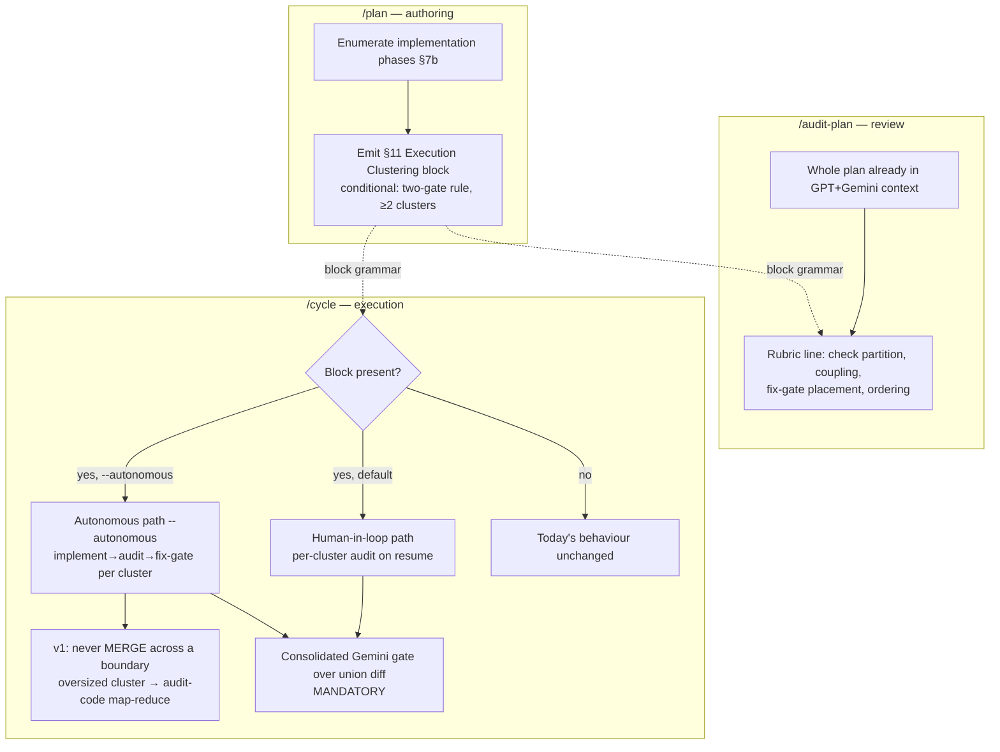

# Plan: Plan-Declared Execution Clustering Across the Skill Chain

- **Date**: 2026-06-03
- **Status**: Complete
- **Author**: Claude + Louis
- **Scope**: backend (skill-definition / orchestration-contract authoring; no UI, no DB schema)

---

## 1. Context Summary

**Detected scope/stack**: backend · `js-ts` (skill `.md` files + their generated copies). No Python, no UI surface, no Playwright-verifiable acceptance criteria.

**The problem.** When `/cycle` drives a multi-phase plan, the expensive step is `/audit-code` (5 parallel GPT passes + mandatory Gemini gate, × rounds). Running it once per phase is wasteful (re-audits unchanged upstream code, churns findings); running it once over a giant union diff loses signal (pushes past `computePassLimits()` into map-reduce, diluting per-finding attention). The sweet spot — grouping phases by *coupling* first and *diff budget* second — is currently a judgment call the operator re-makes by hand every session.

**What exists today** (from exploration):
- [`skills/cycle/SKILL.md`](../../skills/cycle/SKILL.md) — thin orchestrator. Step 3 **pauses for the human** (`/cycle` does NOT implement; it resumes at `/cycle code <plan>`). Step 4 runs a single `/audit-code`. Hard rule: "never auto-fix between steps without confirmation"; charter: "does NOT duplicate logic from the atomic skills."
- [`skills/plan/SKILL.md`](../../skills/plan/SKILL.md) — Phase 6 emits a document with sections §1–§10. §10 "Acceptance Criteria" is the **machine-parseable house pattern** (list grammar, closed category set) consumed by `/ux-lock verify`. **There is no "implementation phases" section today** — phases are an ad-hoc convention, not a template output.
- [`skills/audit-plan/SKILL.md`](../../skills/audit-plan/SKILL.md) — sends the whole plan file to GPT (Step 2) and Gemini (Step 6). Anything in the plan is already in the auditor's context; the auditor just needs to be *told* to scrutinize it.
- Regeneration: `npm run skills:regenerate` (sync shared refs + regenerate `.claude/skills/**` copies); `npm run skills:check` validates (part of `npm run check`).

**Patterns reused vs new**:
- **Reused**: the §10 acceptance-criteria list grammar (Single Source of Truth, #1) becomes the template for the new clustering block; the existing "whole plan → auditor context" path (no new audit machinery); the existing `/cycle` step structure.
- **New**: a §11 "Execution Clustering" block in `/plan`; an opt-in autonomous implement-loop in `/cycle`; one rubric line in `/audit-plan`.

**Neighbourhood considered**: skipped — this change edits orchestration `.md` files and introduces no new code symbols (functions/classes/components). The one symbol-introducing item (an optional clustering linter) is deferred to §8. Per CLAUDE.md, doc-class changes are exempt from mandatory arch-memory consultation.

---

## 2. Proposed Architecture

The contract is a **declarative clustering block authored by `/plan`, reviewed by `/audit-plan`, executed by `/cycle`**. The split of responsibility is the load-bearing design decision (#1 Single Source of Truth, #20 Long-Term Flexibility):

| Concern | Owner | Why |
|---|---|---|
| **Semantic clustering** — which phases group, coupling rationale, ordering, fix-gates | **`/plan`** (the block) | The planner has the real coupling signal (knows the seams, the dependency order) and the block can then be **reviewed by `/audit-plan` before any code is written** — the cheapest place to catch a bad boundary. |
| **Diff-budget enforcement** — splitting an over-large cluster | **`/cycle`** (runtime) | Actual diff size is unknowable until code exists. A planned-small phase can balloon. |

**The asymmetry (the core safety invariant)**: the plan can only make clusters *bigger* (declare a merge); `/cycle` may **never merge across a plan-declared cluster boundary** — merging is a semantic call the plan owns. The dual capability — `/cycle` making a cluster *smaller* by splitting an oversized one at runtime — is the mechanical safety valve runtime *would* own, but in **v1 it is deferred**: `/audit-code` already map-reduces large diffs internally, so v1 leans on that and `/cycle` does no splitting (it needs a cross-skill chunk-signal contract that doesn't exist yet — see Out of Scope). The never-merge half of the invariant is the part that matters for correctness and ships in v1.

**Why coupling-clustering is quality-positive, not just cheaper**: `/audit-code`'s wiring pass (cross-module interaction) can only inspect the *seam* between two phases when they are audited together. Auditing coupled phases as one cluster is strictly more correct than auditing them in isolation — the token saving is a side effect of the correctness win, not the goal.



### 2a. The Execution Clustering block grammar (the shared contract)

Added as a new **conditional §11** in the `/plan` output, modelled on the §10 list grammar so it is parseable by a reader (`/cycle` reads it *as Claude* — no new parser script, preserving `/cycle`'s thin charter):

```markdown
## 11. Execution Clustering

> How implementation phases group for build + audit. /cycle reads this.
> v1: /cycle never MERGES across a cluster boundary; an oversized cluster is
> handled by /audit-code's internal map-reduce (runtime splitting is v2).
> Clusters partition the phases into contiguous ascending ranges: every
> phase appears in exactly one cluster, in dependency order.

- **Cluster A** — Phases 0–2 — fix-gate: yes
  - Coupling: shared DeckStore/RunController seam — wiring pass must see both together
- **Cluster B** — Phase 3 — fix-gate: yes
  - Coupling: standalone PresentationPipeline (no shared state with A)
- **Cluster C** — Phases 4–6 — fix-gate: final
  - Coupling: Exporter → CanvasView → EditScope render chain
- **Final gate**: consolidated Gemini review over the union diff (mandatory, regardless of per-cluster GPT convergence)
```

(Each cluster's audit scope is the union of its member phases' §7b file lists — not restated here.)

**Grammar rules** (so the contract is unambiguous):
1. One top-level bullet per cluster: `- **Cluster <ID>** — Phases <range> — fix-gate: <yes|final|none>`. **Each cluster is a contiguous range of the ordered §7b phase list, and cluster bullets appear in ascending phase order** (v1). This makes "cluster order is a valid topological order" decidable from the phase numbering alone — no separate dependency graph. (Non-contiguous grouping with an explicit `Depends on:` declaration is deferred to v2; see Out of Scope.)
2. `Coupling:` sub-bullet **required** — the rationale; states *why* these phases group (the auditable claim).
3. **Cluster scope is derived, not duplicated (single source of truth, #1).** A cluster's `--scope diff` file set is the **union of the `Files:` lists of its member §7b phases** — `/cycle` computes it; the cluster bullet does not restate it. If a cluster genuinely needs files beyond its phases' files, it adds an optional `Additional files:` sub-bullet (each entry intent-tagged per rule 7), and `/audit-plan` must check that list against the phase files. No free-standing per-cluster `Files:` line (it would be a second source of truth that drifts).
4. `fix-gate: yes` → cluster must reach `/audit-code`'s native convergence threshold (`HIGH == 0 && MEDIUM <= 2 && quickFix == 0`; see Step 3.5) before the next cluster builds on it. `final` → the last cluster, gated only by the consolidated Gemini pass. `none` → independent cluster, no blocking gate.
5. Trailing `- **Final gate**:` line is mandatory and always declares the consolidated Gemini review.
6. **Partition invariant — over *implementation phases only*.** The union of all clusters' phases equals the plan's **implementation-phase** set (§7b), with no phase in two clusters and no phase omitted. **Mechanical close-out work (regenerate / build / lint / verify) is explicitly NOT an implementation phase** — it is a post-phase close-out step listed outside §7b's phase set and is therefore exempt from the partition. This prevents the degenerate "is `regenerate` a phase?" ambiguity (the H1 trap this plan itself fell into).
7. **§7b file lists (and any `Additional files:`) annotate intent**: each file is tagged `(create)`, `(modify)`, or `(delete)` — e.g. `Files: scripts/lib/deck-store.mjs (modify), tests/deck-store.test.mjs (create), scripts/lib/legacy.mjs (delete)`. **`Additional files:` entries carry the same tags (GV3-M1)** — every path in the derived scope is tagged, since the preflight validates the whole scope. The tag's expectation is evaluated **per cluster against that cluster's `gateStatus` in the §5 state record — NOT against the global `/cycle` mode (GV3-H2)**. This is the unifying rule: an interrupted `--autonomous` run is globally "pre-implementation" yet its already-cleared clusters have their files on disk, so a global-mode check would false-fail them. Concretely, a cluster that is `pending` (or absent from state) uses **pre-implementation** expectations; a cluster that is `audited`/`gate-clear`/`stale` uses **post-implementation** expectations:
   - `(modify)` — must resolve on disk in both states.
   - `(create)` — pre-implementation: resolvable repo-relative parent dir, **no collision** with an existing file, no sensitive-path violation. Post-implementation (cluster already cleared/audited): the file is *expected* to exist — the no-collision check is **skipped** (the prior baseline is the source of truth).
   - `(delete)` — pre-implementation: must resolve on disk (can't delete what's absent). Post-implementation: must be **absent** (deletion already happened). Declaring the deletion keeps it from tripping the Step 3.5 out-of-scope-edit check.

### 2b. Phase enumeration prerequisite — and the two-gate rationality rule

The block references phases, but `/plan` doesn't formalize phases today. Add a lightweight **§7b "Implementation Phases"** (a sub-part of the existing §7 File-Level Plan) that lists ordered phases with their files. Critically, **phases are not the default** — small plans must stay flat. Two independent gates, each emitting only when there is a real decision to make:

| Gate | Emits | Fires when | Else |
|---|---|---|---|
| **Gate 1 — phases (§7b)** | the ordered phase list | the work is genuinely large: **≥6 files touched OR ≥2 distinct subsystems/domains OR a sequential dependency chain (from Phase 1.5 Execution Model) OR clearly >1 sitting of work** | **No §7b. Flat §7 File-Level Plan, exactly as today.** |
| **Gate 2 — clustering (§11)** | the cluster block | Gate 1 fired **AND** the phases group into **≥2 clusters** (a genuine merge/split decision exists) | **No §11.** Phases listed in §7b, but a single implicit cluster — nothing to declare. |

**The anti-degenerate rule (explicit):** never emit a lone "Phase 1". If the work doesn't clear Gate 1, it has *no* phases — not one. A plan with phases always has **≥2**; a plan with a §11 block always has **≥2 clusters**. This keeps the structure proportional to the work and stops every plan from sprouting ceremony it doesn't need.

So the three plan shapes are: **(a) small** → flat §7, no §7b, no §11 (today's shape); **(b) large but cohesive** → §7b with ≥2 phases, no §11 (one implicit cluster); **(c) large and decomposable** → §7b + §11 with ≥2 clusters. The clustering machinery only activates for shape (c).

---

## 3. (UX) — N/A

Backend scope. No user-facing UI. The only "UX" is the operator-facing status cards in `/cycle`, covered in §4 below as orchestration behaviour.

---

## 4. Technical Architecture (the three edits)

### Edit 1 — `skills/plan/SKILL.md`

- **Phase 6 §7** gains an optional **§7b Implementation Phases** sub-section (ordered phase list + per-phase files), gated by the **two-gate rationality rule** in §2b.
- **Phase 6** gains a new conditional **§11 Execution Clustering** with the grammar from §2a.
- **Emission condition** — the two-gate rule from §2b, restated inline in the skill:
  - **Gate 1 (§7b phases)**: emit only when the work is genuinely large (≥6 files, OR ≥2 subsystems/domains, OR a sequential dependency chain from Phase 1.5, OR clearly >1 sitting). Otherwise the plan stays flat (§7 only) — **no phases, not a lone "Phase 1".**
  - **Gate 2 (§11 clustering)**: emit only when Gate 1 fired AND the phases group into **≥2 clusters**. A large-but-cohesive plan keeps §7b phases with no §11.
  - **Anti-degenerate invariant**: a plan with phases has ≥2; a plan with §11 has ≥2 clusters. Document this so the planner never pads.
- **Authoring guidance**: group *coupled* phases into one cluster (cite the seam in `Coupling:`); keep *independent* phases splittable; place a `fix-gate: yes` before any cluster that builds on a prior cluster's output; the last cluster is `fix-gate: final`.
- Add a one-line reminder to the Phase 6 "Reminders" list.

### Edit 2 — `skills/audit-plan/SKILL.md`

- Step 3 triage and "Key Principles": add **one rubric line** directing the auditor (and the Gemini gate) to scrutinize the §11 block when present. No new machinery — the block is already in the GPT/Gemini context because the whole plan file is sent. Checklist the auditor applies:
  - **Partition** — every implementation phase (§7b) in exactly one cluster; none omitted, none duplicated; close-out work is correctly outside the phase set.
  - **Coupling soundness** — are grouped phases genuinely coupled (a real shared seam)? Are split phases genuinely independent?
  - **Fix-gate placement** — is there a `fix-gate: yes` before every cluster that depends on a prior cluster's output?
  - **Ordering** — is the cluster order a valid topological order of the declared dependencies?
  - **Derived scope** — does each cluster's file scope resolve from its member phases' `Files:` (plus any `Additional files:`)? Flag a free-standing per-cluster `Files:` line as a second source of truth (H2).
- Frame it as advisory rigor (a malformed block is a HIGH finding only when it would cause `/cycle` to build on un-audited coupled code). **This is the *first* of two validation layers** — `/cycle`'s Step 0.7 preflight (Edit 3) re-validates fail-closed at execution time, because a plan can reach `/cycle code` without passing `/audit-plan`.

### Edit 3 — `skills/cycle/SKILL.md`

- **New opt-in flag `--autonomous`** (alias `--implement`). **Default unchanged**: without it, Step 3 pauses for the human exactly as today. This preserves the current human-in-the-loop contract — the autonomous behaviour is never silent.
- **New `--cluster <ID>` flag** — selects a single cluster to implement/audit (used by the human resume workflow, below).
- **New `--baseline-ref <sha>` flag (GV2-L1)** — supplies the audit baseline on a resume where `/cycle` never captured `clusterStartRef` (work already committed). Documented in the `cycle/SKILL.md` frontmatter usage block alongside `--cluster`. Absent + no recorded baseline → union-diff fallback (never a blind HEAD default).
- **New `--authorize-stale-reaudit` flag (GV3-H1)** — resumes a halted autonomous run by re-processing exactly the `stale` clusters (and re-running the final gate). Without it, a run halted on stale clusters stays halted.
- **Step 0 (Parse Input)**: detect presence of a §11 Execution Clustering block in the target plan; record `hasClustering` + parsed clusters + each cluster's derived file scope (union of its member §7b phases' files + any `Additional files:`).
- **Step 0.7 — Clustering preflight (fail-closed; H4).** When `hasClustering`, validate the block **before any execution**, because `/cycle code <plan>` reaches `/cycle` *without* having passed `/audit-plan`. Checks: (a) phase **partition** complete over §7b — no omitted/duplicated phase; (b) clusters are **contiguous** ascending ranges (grammar rule 1); (c) every `fix-gate` value in `{yes, final, none}`; (d) `Coupling:` present on each cluster; (e) derived file scope (including `Additional files:`) is non-empty, fully intent-tagged, and passes the **per-cluster `gateStatus`-aware intent checks of grammar rule 7** — each `(create)`/`(modify)`/`(delete)` validated against *that cluster's* state, not the global `/cycle` mode (so a planned-new file is never a false failure, and a cluster already cleared in an interrupted run is judged by post-implementation expectations); (f) trailing `Final gate` line present. **On any failure**: stop and present the defect; offer (1) correct the plan, or (2) explicit fallback to the legacy single-audit path (`--no-cluster`). Never silently proceed with a malformed block.
- **Step 3 (Implementation gate)** — branch on mode:
  - **Human-in-loop (default), block present**: still pauses. Prints the cluster plan as implementation guidance and instructs the operator to **implement only the next cluster**, then resume with **`/cycle code <plan> --cluster <ID>` (the `--cluster` arg is required on every human resume** — `/cycle` does *not* try to auto-divine which cluster is next from a cumulative working tree). `/cycle` records progress in the cluster-state record (below) keyed by `(plan path, cluster ID)`. **If the operator implemented several/all clusters at once** (the working-tree diff spans multiple clusters and per-cluster isolation is impossible), `/cycle` says so explicitly and **falls back to a single union-diff `/audit-code` + consolidated Gemini gate** — it does not pretend to isolate diffs it cannot.
  - **Autonomous (`--autonomous`), block present**: enter the **implement-and-audit cluster loop** (new Step 3.5).
  - **No block** (either mode): today's behaviour exactly.
- **New Step 3.5 — Cluster loop (autonomous only)**. The loop is **state-driven and resumable (GV3-H1)**: it reads the §5 record first and **skips any cluster already `gate-clear`** (an interrupted `--autonomous` run resumes at the first non-cleared cluster rather than re-implementing finished work). For each remaining cluster in declared order:
  1. **Implement** the cluster's phases (write code for its member files).
  2. **Budget handling (M2 — v1: delegated entirely to `/audit-code`)**: `/cycle` cannot call `computePassLimits()` (it's markdown-driven), and there is no cross-skill contract for an "I had to chunk" signal today — so **v1 does no runtime splitting**. `/cycle` invokes `/audit-code` on the cluster's derived scope and `/audit-code` map-reduces internally exactly as it already does for any large diff. The one invariant `/cycle` enforces stays: it **never merges across a plan-declared cluster boundary**. (Runtime splitting of an oversized cluster into per-phase sub-audits is deferred to v2, gated on a small explicit `/audit-code` scope-handling status contract — see Out of Scope.)
  3. **Audit — explicit cluster envelope (R3-H1)**. In a cumulative working tree, Cluster B's raw diff still contains Cluster A's changes, so `--scope=diff` alone cannot isolate a cluster. `/cycle` builds the envelope from primitives `/audit-code` already exposes:
     - **`clusterStartRef`**: capture the git ref (`vcs.gitCommitSha`) at the moment the cluster's implementation begins, recorded in the §5 state as `auditedBaselineRef`. (Autonomous mode commits or stashes each cleared cluster so the baseline is clean; if it can't, it falls back to the union path like the human path does.) **On a resume where no `clusterStartRef` was recorded (G-H2)** — e.g. a direct `/cycle code <plan> --cluster <ID>` after the operator already committed the work — `/cycle` must **not** default `--diff` to `HEAD` (that yields an empty diff and silently skips the real changes). It either requires the operator to supply `--baseline-ref <sha>`, or explicitly falls back to the union-diff path. Never a blind HEAD default.
     - **Path filter**: pass the cluster's normalized `derivedScope` as `/audit-code`'s **`--changed <list>`** (authoritative file set) and the `clusterStartRef..WORKTREE` diff via **`--diff <path>`**, so the audit sees only this cluster's files relative to its own baseline.
     - **In/out-of-scope reconciliation**: compute the set of files actually changed since `clusterStartRef`; a changed file **outside this cluster's `derivedScope`** is an out-of-scope edit → **fail closed** (stop, summarize, ask the user to amend the cluster plan or authorize the union-diff fallback). **Exception for stale re-audit (GV4-H1)**: when re-auditing a `stale` cluster, later clusters have already committed changes since this cluster's old `clusterStartRef`, so the worktree legitimately contains files owned by *other* declared clusters. Reconciliation therefore flags only files that belong to **no** cluster's `derivedScope` — files owned by another cluster are accounted for there, not treated as this cluster's out-of-scope leak. (Equivalently, re-audit a stale cluster against a fresh baseline restricted to its own `derivedScope` paths.)
     Round policy is **`/audit-code`'s own existing cap** — `/cycle` adds no new round policy (M5). New concrete HIGHs are fixed within that cap; if HIGHs persist or new ones appear at the cap, stop and hand back with a summary. No discretionary extra rounds.
  4. **Fix-gate**: if `fix-gate: yes`, the cluster must reach **`/audit-code`'s native convergence threshold — `HIGH == 0 && MEDIUM <= 2 && quickFix == 0`** — before the next cluster builds on it (G-M3: align with the real threshold, not a looser "HIGH to 0" that would let `/cycle` advance while `/audit-code` still considers the cluster non-converged). `fix-gate: none` skips the gate; `fix-gate: final` defers to the consolidated gate. Autonomous mode **authorizes within-cluster fixing** (the opt-in flag is the authorization that relaxes the "never auto-fix" hard rule). **Out-of-scope fix rule (M3)**: if resolving a finding requires editing files *outside* the current cluster's derived scope — a prior cluster, a future cluster, or a shared artifact — `/cycle` **stops**, summarizes the cross-cluster dependency, and asks the user to amend the cluster plan or authorize a controlled re-audit. **A prior cluster whose files are changed after its gate cleared is marked stale and must be re-audited** before the final gate. Still surfaces a per-cluster summary; still hands back on persistent non-convergence.
  5. **Stale-cluster handling after the loop (GV2-M2, GV3-H1)**: the loop iterates non-cleared clusters once — it does **not** autonomously loop back. After the last cluster, if any earlier `gate-clear` cluster was flipped to `stale` (its files changed during a later cluster's work), `/cycle` **halts and summarizes the stale clusters**. Resuming is an explicit, bounded operator action: re-invoke with **`--authorize-stale-reaudit`**, which tells the loop to re-process exactly the `stale` clusters (re-audit + re-gate them, then re-run the final gate) and nothing else. Without the flag the loop stays halted. This keeps autonomous execution bounded (no unbounded re-audit cascades) and human-controlled at the one point where cross-cluster coupling leaked.
- **Step 4 (Audit Code)** — when a block is present, becomes the per-cluster audit driven by Step 3.5 (autonomous) or the `--cluster`-scoped audit on human resume. When no block, unchanged single audit.
- **Step 3.6 — Close-out execution (autonomous; G-M1).** The cluster loop iterates only over §7b phases, so the close-out work that grammar rule 6 deliberately keeps *outside* the phase set (e.g. `npm run skills:regenerate` + `npm run skills:check`, or a build/codegen step the plan lists) would never run. After the final cluster clears and **before** the consolidated Gemini gate, `/cycle` parses the plan's unclustered close-out step(s) and executes them, surfacing failures. (Running it before the gate means the gate reviews the regenerated artifacts' source-of-truth state. The human path leaves close-out to the operator, as today.)
- **Consolidated Gemini gate (closed loop, not one-shot; R2-H2)**: after all clusters, run a Gemini final review over the **union diff** of the canonical source edits — mandatory regardless of per-cluster GPT convergence (per the Gemini-always memory). It is the **closed loop** the project requires, not an advisory one-shot: on `APPROVE` → done; on `CONCERNS`/`REJECT` → **deliberate on Gemini's findings, apply fixes scoped to the union diff, then re-run Gemini**. **(G-M2) The M3 per-cluster "out-of-scope file" stop does NOT apply here** — at the final gate there is no active cluster and the whole union diff is in scope by design, so cross-cutting fixes are expected. The only carry-over from §5: if a fix touches a file belonging to an already-`gate-clear` cluster, that cluster is marked **stale** (an accounting flag for the next run; it does not block the final-gate loop). The loop exits only on Gemini `APPROVE` or an explicit handback to the user with unresolved blockers named. It is never replaced by GPT rebuttal. Generated `.claude/skills/**` copies are byte-verified by `skills:check`, not re-reviewed (L1). This is the global correctness gate that no per-cluster pass replaces.
  - **Invocation (GV4-M2)**: `gemini-review.mjs review` takes a deliberation `transcript.json`, not a raw `git diff` — so `/cycle` builds the transcript the same way `/audit-code` already does: `changed_files` = the union diff's file set, plus the accumulated per-cluster GPT findings/positions/fixes as the `rounds[]` trail, then calls `node scripts/gemini-review.mjs review <plan-or-union-target> <transcript.json> --out …`. `/cycle` reuses `/audit-code`'s existing transcript-assembly path rather than inventing a second one (keeps it thin — no new gate machinery).
- **Hard rules** updated: `--autonomous` is the explicit authorization that permits within-cluster auto-fixing, scoped to the cluster's derived file set, with summaries surfaced and persistent-HIGH handback preserved. Cross-cluster fixes always stop for confirmation. The "never auto-fix without confirmation" rule otherwise stands.
- **Kickoff card + Step 8 summary**: show the cluster plan, the preflight result, and per-cluster audit results.

### Edit 4 — Regenerate + verify

Run `npm run skills:regenerate` then `npm run skills:check` (also covered by `npm run check`). No reference-file frontmatter changes (we edit SKILL.md bodies only), so the byte-match `skills:check` constraint is unaffected.

---

## 5. State Map — cluster execution-state contract

Backend orchestration; no component state machine, but `/cycle` needs **durable per-cluster state** so it can know what's cleared, detect post-gate staleness, and survive a resume (R2-M1). Defined explicitly:

- **Store**: `.audit/cycle-cluster-state.json` (gitignored, alongside the existing `.audit/` learning artifacts).
- **Identity & schema (R3-M2; corrected per GV2-L2)**: `{ schemaVersion: 1, repoId, entries: { <canonicalPlanPath>: { clusters: { <clusterId>: { …per-cluster record… } } } } }`. The key is `<canonicalPlanPath>` (repo-root-relative, normalized) → an object holding a **collection** of per-cluster records (one plan has many clusters), **not** a single record. The path is **not** hashed against the §11 content. **(G-H1)** Hashing the whole §11 block into the key would orphan every cleared cluster's baseline the moment a user amends the clustering (which the M3 out-of-scope flow explicitly tells them to do). Instead, freshness is tracked **per cluster** via a `scopeHash` field (below), so amending one cluster never destroys another's recorded state.
- **Concurrency**: read-modify-write is wrapped in a file lock (the repo's existing `withFileLock` pattern, as used by `requirements.mjs`) and the write itself is atomic temp+rename. Lock-acquire failure → `/cycle` stops with a clear "another session holds cluster state" message (fail-closed, never a racy overwrite).
- **Per-cluster record**: `{ clusterId, gateStatus: pending | audited | gate-clear | stale, scopeHash (hash of this cluster's §11 declaration + its derivedScope), auditedBaselineRef, derivedScope: [<normalized path>…] (explicitly persisted — the union of member `Files:` **plus** any `Additional files:`), auditedFileHashes: {path: sha256} (every path in `derivedScope`, not just member files), lastAuditRound, lastUpdated }`.
- **Transitions**: `pending` → (implement + `/audit-code`) → `audited` → (fix-gate satisfied — see Step 3.5) → `gate-clear` → next cluster. A `gate-clear` cluster flips to **`stale`** (and must be re-audited before the final Gemini gate) when either (a) any of its **`derivedScope`** paths' current hashes differ from `auditedFileHashes`, or (b) its `scopeHash` changed (the §11 declaration for *this* cluster was amended). **Amending one cluster updates/invalidates only that cluster's record (G-H1):** a `pending` cluster whose `scopeHash` changed just refreshes its `derivedScope`; a `gate-clear` cluster whose `scopeHash` changed goes `stale`. No global wipe.
- **Baseline source**: `auditedBaselineRef` is the git ref at audit time (`vcs.gitCommitSha`); "changed after gate cleared" is decidable by hashing the persisted `derivedScope` against `auditedFileHashes` — no guessing from a cumulative working-tree diff.
- **Human path** reads/writes the same record via the required `--cluster <ID>`; **autonomous path** writes it as it walks the loop. One versioned contract, both paths (avoids two state models).

The other "states" are `/cycle`'s top-level execution branches (no block / block+human / block+autonomous / malformed→preflight-stop), captured in §4.

---

## 6. Sustainability Notes

- **Backward compatible (#18)**: the block is purely additive. Plans without it → `/cycle` behaves exactly as today. No migration, no DB change. Old plans keep working.
- **Single source of truth (#1)**: the grammar is defined once in `/plan`'s §11; `/audit-plan` and `/cycle` reference that grammar, they don't redefine it. If the grammar changes, it changes in one place.
- **Thin-orchestrator charter preserved (#20)**: `/cycle` reads the block *as Claude*, not via a new parser script — no logic duplicated from atomic skills. The split/gate logic that is genuinely new is execution-sequencing, which is `/cycle`'s sole legitimate domain.
- **Extension seam**: if structural validation proves necessary (malformed blocks reaching `/cycle`), a `plans:lint` rule is the natural home (see §8) — but it is deliberately out of v1.
- **Assumption that could change**: that "phases" are the right granularity for clustering. If future plans cluster by sub-feature or file-group instead, §7b's phase enumeration is the seam to revise — the §11 grammar (cluster → member-units → coupling/files/gate) is unit-agnostic.

---

## 7. File-Level Plan

### §7b Implementation Phases (of THIS plan)

This plan has **4 implementation phases** (the partition-bound set) plus a mechanical close-out step that is **not** a phase:

- **Phase 0 — Grammar contract**: define the §11 block grammar + partition invariant (lives inside Edit 1's authoring text). Files: `skills/plan/SKILL.md` (modify).
- **Phase 1 — Producer**: `/plan` emits §7b + §11 conditionally. Files: `skills/plan/SKILL.md` (modify).
- **Phase 2 — Reviewer**: `/audit-plan` rubric line. Files: `skills/audit-plan/SKILL.md` (modify).
- **Phase 3 — Executor**: `/cycle` `--autonomous` mode + cluster loop + consolidated gate. Files: `skills/cycle/SKILL.md` (modify).

**Close-out (not a phase, exempt from the partition)**: `npm run skills:regenerate` + `npm run skills:check` to regenerate and byte-verify `.claude/skills/{plan,audit-plan,cycle}/SKILL.md`. This is mechanical build output, not implementation work — per grammar rule 6 it sits outside §7b and is not clustered.

| File | Change | Why (principle) |
|---|---|---|
| `skills/plan/SKILL.md` | Add §7b Implementation Phases + §11 Execution Clustering (conditional) + Phase 6 reminder | Producer of the contract (#1) |
| `skills/audit-plan/SKILL.md` | One rubric line + Key-Principles entry to scrutinize §11 | Reviewer; no new machinery (#11 testability of the contract pre-code) |
| `skills/cycle/SKILL.md` | `--autonomous` flag, Step 0 detection, Step 3 branch, new Step 3.5 cluster loop, Step 4 per-cluster, consolidated Gemini gate, hard-rule + summary updates | Executor; thin (#20) |
| `.claude/skills/{plan,audit-plan,cycle}/SKILL.md` | Regenerated copies | Generated artifact — never hand-edited |

### §11 Execution Clustering (of THIS plan — dogfooding the feature)

> Runtime may split, never merges across a boundary. Clusters partition the phases.

- **Cluster A** — Phases 0–1 — fix-gate: yes
  - Coupling: the §11 grammar (Phase 0) and `/plan`'s emission of it (Phase 1) are the same file and the same contract — the producer must be settled before any consumer is written. Wiring seam = the grammar itself. (Audit scope derives to `skills/plan/SKILL.md` — the union of both phases' files.)
- **Cluster B** — Phases 2–3 — fix-gate: final
  - Coupling: `/audit-plan` (reviewer) and `/cycle` (executor) are both **consumers of the grammar** fixed in Cluster A; they share that contract dependency but not each other's internals. Grouped because they must agree on the same parsed shape; safe to audit together against the frozen grammar. (Audit scope derives to `skills/audit-plan/SKILL.md` + `skills/cycle/SKILL.md`.)
- **Final gate**: consolidated Gemini review over the union diff. Scope policy: Gemini reviews the **canonical source** edits (the three `skills/**/SKILL.md` files) for semantic findings; the regenerated `.claude/skills/**` copies are verified to byte-match by `npm run skills:check` (not re-reviewed — they are duplicates by construction) and are listed in the changed-file summary. If `skills:check` fails, the divergence is surfaced as a blocking finding.

(The close-out step runs after both clusters; it is outside the phase partition per grammar rule 6.)

---

## 8. Risk & Trade-off Register

| Risk / trade-off | Mitigation | Decision |
|---|---|---|
| Malformed §11 block → `/cycle` mis-executes | **Two layers**: `/audit-plan` partition + coupling check (Edit 2) catches it pre-code; `/cycle` Step 0.7 **fail-closed preflight** (Edit 3) re-validates at execution time (covers `/cycle code` which skips plan audit). Optional `plans:lint` structural rule deferred. | Accept; lint deferred to v2 |
| `--autonomous` auto-fixing conflicts with `/cycle`'s "never auto-fix" hard rule | Opt-in flag = explicit authorization; relaxation scoped to within-cluster diff only; summaries surfaced; persistent-HIGH hands back to user | Accept |
| "Phases" not a `/plan` output today | Add §7b Implementation Phases as the prerequisite; emit §11 only when phases exist | In scope (Edit 1) |
| Every plan sprouts phases / a degenerate "Phase 1" | Two-gate rationality rule (§2b): Gate 1 keeps small plans flat; anti-degenerate invariant forbids a lone phase; phases ≥2, clusters ≥2 | In scope (Edit 1) |
| Scope creep into a parser script (would break `/cycle`'s thin charter) | `/cycle` reads the block as Claude; no new script | Hard boundary — out of scope |
| Block adds plan length / noise on small plans | Two-gate rule (§2b) is the single canonical activation contract — referenced, never restated with different thresholds | Accept |
| Runtime split — `/cycle` can't read the budget from markdown, and the "had to chunk" signal has no cross-skill contract (M2) | v1 does **no** splitting: `/audit-code` owns map-reduce internally for any large diff; `/cycle` only enforces never-merge. Split deferred to v2 behind an explicit `/audit-code` scope-handling status contract. | Accept; split → v2 |
| Cluster state durability — knowing what's cleared / detecting post-gate staleness (R2-M1) | Explicit `.audit/cycle-cluster-state.json` record (§5): per-cluster gate status + audited baseline ref + file hashes; required `--cluster <ID>` on human resume | In scope (§5, Edit 3) |
| **Deferred (v2)**: `plans:lint` rule validating §11 partition/grammar statically | Document the seam in §6; revisit if malformed blocks reach `/cycle` in practice | Out of scope for v1 |

---

## 9. Testing Strategy

No automated unit tests (these are `.md` definition edits, not `.mjs` logic). Verification is structural + manual:

1. **`npm run skills:check`** — confirms the generated `.claude/skills/**` copies match source after `skills:regenerate`; confirms reference-frontmatter byte-match still holds (we touch no reference files, so this must stay green).
2. **`npm run check`** — full pre-push gate (`context:check` + `skills:check` + `plans:lint` + `npm test`) stays green. (This plan's own `mermaid` block must pass `plans:lint`.)
3. **Manual dry-run — producer**: run `/plan` on a synthetic ≥3-phase task; confirm §7b + §11 emit with a valid partition; run `/plan` on a 1-phase task; confirm neither emits.
4. **Manual dry-run — reviewer**: run `/audit-plan` on a plan with a deliberately broken partition (a phase omitted); confirm the auditor flags it.
5. **Manual dry-run — executor**: `/cycle <plan>` (default) on a clustered plan → confirms it still pauses and prints the cluster guidance; `/cycle --autonomous <plan>` on a small clustered plan → confirms per-cluster implement→audit→fix-gate loop and one consolidated Gemini gate at the end.
6. **Backward-compat check**: `/cycle` on a plan with no §11 block behaves identically to today.
7. **Safety-path scenarios (R3-M3)** — doc-level scenario walk-throughs with expected outcomes (since `skills:check` only verifies generated-copy sync, not orchestration semantics):
   - Malformed partition / non-contiguous range / bad `fix-gate` → Step 0.7 stops.
   - `(create)` file absent → preflight passes; `(modify)` file absent → preflight fails (AC6).
   - `Additional files:` present → persisted in `derivedScope` and hashed; sensitive-path entry → rejected.
   - Out-of-scope edit during a cluster → fail-closed stop (AC9).
   - `gate-clear` cluster's file changed later → flips `stale`, re-audited before final gate.
   - Human resume without `--cluster` → rejected with guidance; multi-cluster working tree → union-diff fallback.
   - State lock held by another session → stop, no racy overwrite; `planContentHash` mismatch → stale state ignored.
   - Final Gemini `CONCERNS`/`REJECT` → deliberate → fix → re-run Gemini (closed loop).

---

## 10. Acceptance Criteria (behavioral — non-Playwright)

`/ux-lock verify` (which consumes the frontend §10) does not apply — these are skill `.md` edits with no live DOM. But the change alters the observable behaviour of three skills, so the contract is stated as explicit, checkable pass/fail criteria (verified by the §9 dry-runs):

- **AC1 — small plan stays flat**: `/plan` on a 1–2 file task emits **no §7b and no §11** (no lone "Phase 1").
- **AC2 — large cohesive plan**: `/plan` on a ≥6-file but single-cluster task emits **§7b with ≥2 phases and no §11**.
- **AC3 — large decomposable plan**: `/plan` on a multi-subsystem task emits **§7b + §11 with ≥2 clusters**, a valid partition, and a `Final gate` line.
- **AC4 — partition enforcement**: `/audit-plan` on a plan whose §11 omits or duplicates a §7b phase raises a HIGH finding.
- **AC5 — derived scope**: a §11 block with a free-standing per-cluster `Files:` line (duplicating phase files) is flagged by `/audit-plan` (H2).
- **AC6 — fail-closed preflight**: `/cycle code <plan>` on a plan with a malformed §11 (bad `fix-gate` value, unresolvable `(modify)` file, non-contiguous range, broken partition) **stops** and offers correct-or-fallback; it never executes the malformed block (H4). A `(create)` file that doesn't yet exist is **not** a failure (R2-H1).
- **AC7 — default path unchanged**: `/cycle <plan>` (no `--autonomous`) on a clustered plan **still pauses** at the implementation gate and does not auto-fix.
- **AC8 — autonomous gating**: `/cycle --autonomous <plan>` implements clusters in order, runs `/audit-code` per cluster, and does not advance past a `fix-gate: yes` cluster until it reaches `/audit-code`'s convergence threshold (`HIGH == 0 && MEDIUM <= 2 && quickFix == 0`) (G-M3).
- **AC9 — cross-cluster stop**: in autonomous mode, a fix requiring out-of-scope files halts for confirmation (M3).
- **AC10 — mandatory final gate (closed loop)**: after clustered execution, a consolidated Gemini review over the union diff always runs; on CONCERNS/REJECT it deliberates → fixes → **re-runs Gemini**, exiting only on APPROVE or explicit handback (never replaced by GPT rebuttal) (R2-H2).
- **AC11 — backward compat**: `/cycle <plan>` on a plan with no §11 behaves byte-for-byte as today.
- **AC12 — generated copies**: after the edits, `npm run skills:check` is green (source ↔ `.claude/skills/**` byte-match).
- **AC13 — cluster audit isolation**: per-cluster `/audit-code` is invoked with `--changed` = the cluster's `derivedScope` and a `clusterStartRef..WORKTREE` diff, so it sees only that cluster's files; an out-of-scope changed file fails closed (R3-H1).
- **AC14 — required `--cluster`**: a human `/cycle code <plan>` resume without `--cluster <ID>` is rejected with guidance; it is never auto-divined.
- **AC15 — stale re-audit**: changing a file in a `gate-clear` cluster flips it to `stale` and forces re-audit before the final gate (R2-M1/§5).
- **AC16 — state safety**: concurrent `/cycle` sessions cannot corrupt `.audit/cycle-cluster-state.json` (lock + atomic write); amending one cluster's §11 declaration marks only that cluster stale/refreshed (per-cluster `scopeHash`) and never orphans other clusters' baselines (R3-M2, G-H1).
- **AC17 — no silent-skip on resume**: `/cycle code <plan> --cluster <ID>` with no recorded `clusterStartRef` (e.g. work already committed) does **not** default `--diff` to HEAD; it requires `--baseline-ref <sha>` or falls back to the union-diff path (G-H2).
- **AC18 — resumable autonomous run**: an interrupted `/cycle --autonomous` skips `gate-clear` clusters on restart (no re-implementation of finished work), and preflight judges each cluster's `(create)`/`(delete)` files by that cluster's `gateStatus`, not the global mode, so already-cleared clusters don't false-fail (GV3-H1/H2).
- **AC19 — stale re-audit is explicit**: a run halted on stale clusters resumes only with `--authorize-stale-reaudit`, which re-processes exactly the stale clusters and re-runs the final gate (GV3-H1).

---

## Out of Scope (Future)

- **Runtime cluster splitting** (`/cycle` subdividing an oversized cluster into per-phase sub-audits). Deferred because it needs a small explicit `/audit-code` scope-handling status contract (`single-pass | map-reduce/chunked`) that doesn't exist yet, and `skills/audit-code/SKILL.md` is out of scope for this change. v1 leans on `/audit-code`'s existing internal map-reduce instead (R2-M2).
- **Non-contiguous cluster grouping** with explicit `Depends on:` metadata and a real DAG validator. v1 requires contiguous ascending phase ranges, which makes ordering decidable from numbering alone (R2-M3).
- A `plans:lint` rule that statically validates the §11 partition + grammar (only if malformed blocks reach `/cycle` in practice — the Step 0.7 preflight already fails closed at runtime).
- Clustering by units other than phases (sub-feature, file-group) — the §7b seam supports it later without changing the §11 grammar.
- Automatic cluster *proposal* by `/cycle` when a plan has phases but no §11 block — deliberately rejected; clustering is the plan's job, not runtime's.

---

## Implementation Log

### 2026-06-03 — Complete

| Planned edit | Status | Notes |
|---|---|---|
| `skills/plan/SKILL.md` — §7b + §11 + reminder (Phases 0–1 / Cluster A) | ✅ Done | Two-gate emission rule, 6-rule grammar, intent-tagged files |
| `skills/audit-plan/SKILL.md` — §11 rubric + Key Principle (Phase 2 / Cluster B) | ✅ Done | First validation layer; no new machinery |
| `skills/cycle/SKILL.md` — flags, Step 0.7 preflight, Step 3C loop, 3C.1 close-out, 3C.2 gate, state contract, hard rules, summary (Phase 3 / Cluster B) | ✅ Done | Default human-pause path preserved |
| Close-out: `skills:regenerate` + `skills:check` | ✅ Done | 3 `.claude` copies regenerated; 13/13 IN SYNC |

- **Completed**: all 3 skill edits + regenerated generated copies. Full `npm run check` green (3340 tests, 0 fail).
- **Deviations**: implemented **manually, cluster-by-cluster** rather than via `/cycle --autonomous` (chicken-and-egg — this plan *builds* that mode). The clustered audit loop the plan describes was therefore not self-executed; the plan itself was exhaustively pre-audited instead (GPT R1–R3 + 4 Gemini rounds, 35 findings, all applied).
- **Structural choice**: in `/cycle` the clustered path is housed in a dedicated `Step 3C` (loop) + `3C.1` (close-out) + `3C.2` (gate) block rather than threading through every existing step, keeping the classic linear flow intact for the no-§11 case.
- **Remaining**: none for v1. v2 candidates listed in Out of Scope.
