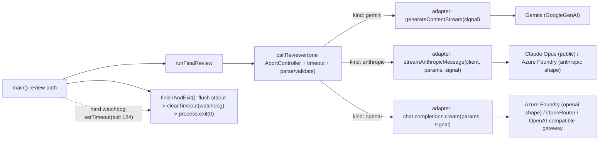

# Plan: Background-safe & provider-agnostic final-review gate

- **Date**: 2026-07-17
- **Status**: Complete
- **Author**: Claude + Louis
- **Scope**: backend
- **Target domain(s)**: `audit-orchestration`, `shared-lib`
- ⚠ **Cross-domain work** — touches `audit-orchestration` (`gemini-review.mjs`)
  and `shared-lib` (`config.mjs`, reuse of `openai-client.mjs`). Intentional:
  the provider config lives in the shared-lib config module by convention;
  no new cross-domain import edge is introduced (gemini-review already imports
  config + openai-client).

---

## 1. Context Summary

**Detected scope/stack**: backend · `js-ts` (+ postgres) · no Python.

**The problem (two coupled symptoms, one root):**

1. **Background hang.** The consolidated Gemini gate "hangs" when run in the
   background but "completes fine" foreground. Root cause is *not* the model
   call — it's process termination.
2. **Provider lock-in.** The gate is hard-wired to `gemini | anthropic
   (claude-opus) | azure-claude`. Other users (and our own work profile) run a
   different model for the same job — Azure Foundry Opus works, but OpenRouter /
   Together / Fireworks / local OpenAI-compatible gateways have no path.

**Code Trace (evidence Phase 1 happened):**

- Success path `main()` [gemini-review.mjs:1754-1781](../../scripts/gemini-review.mjs#L1754-L1781)
  runs `emitReviewOutput` → cloud writes → **returns**. There is **no
  `process.exit(0)`** on this path. Only the *fixture* path
  ([:1708](../../scripts/gemini-review.mjs#L1708)) and *ping*
  ([:1248](../../scripts/gemini-review.mjs#L1248)) force-exit.
- With `--out`, `emitReviewOutput` → `writeOutput`
  ([file-io.mjs:105-116](../../scripts/lib/file-io.mjs#L105-L116)) writes the
  result file *synchronously* before main returns. The documented invocation is
  `… --out <file> 2>…stderr.log`
  ([gemini-gate.md:69](../../skills/audit-code/references/gemini-gate.md#L69)) —
  so stdout/stderr are files, **not** a backpressured pipe. Pipe backpressure is
  ruled out.
- A lingering LLM-SDK keep-alive socket (undici) therefore blocks natural
  event-loop drain. **Foreground** the Bash-tool timeout reaps the process — and
  because `--out` already wrote the file, the user sees "completed fine."
  **Background** has no reaper; the harness only notifies on process *exit*,
  which never comes → indefinite hang. `db/client.mjs` sets
  `allowExitOnIdle: true` ([:314](../../scripts/lib/db/client.mjs#L314)) so the
  pg pool is *not* the culprit — the SDK socket is.
- **Mechanism reproduced**: a Node process that returns from `main()` with one
  lingering handle and no `process.exit` never self-exits (killed by `timeout`,
  exit 124). This is the same class as the historical keep-alive-hang note.
- Three divergent per-provider call functions:
  `callGemini` ([:359](../../scripts/gemini-review.mjs#L359)) aborts correctly
  (AbortController + `signal`); `callClaudeOpus`
  ([:506](../../scripts/gemini-review.mjs#L506)) and `callAzureClaude`
  ([:595](../../scripts/gemini-review.mjs#L595)) use a **leaky `Promise.race`**
  with **no signal wired** — on timeout the losing streaming request is never
  aborted, keeping a socket (and the event loop) alive.
- Dispatch is a 3-branch `if` in `runFinalReview`
  ([:810-836](../../scripts/gemini-review.mjs#L810-L836)); `selectProvider`
  ([:1320](../../scripts/gemini-review.mjs#L1320)), `buildClient`
  ([:1431](../../scripts/gemini-review.mjs#L1431)), `SETTING_PROVIDERS`
  ([:1365](../../scripts/gemini-review.mjs#L1365)) all enumerate the same three.

**Neighbourhood considered** (arch-memory, `reuse`/`extend` signals acted on):

- **REUSE** `createOpenAIClient({ oss: { baseURL, apiKey, headers } })`
  ([openai-client.mjs:109-127](../../scripts/lib/openai-client.mjs#L109-L127)) —
  an OpenAI-compatible OSS/OpenRouter client seam **already exists** (built for
  the model-A/B/C harness), with header-aware cache keys. The new
  `openai-compatible`/`openrouter` providers reuse this — **no new client code**.
- **REUSE** `auditShadowConfig.openrouter*`
  ([config.mjs:181-182](../../scripts/lib/config.mjs#L181-L182)) — `OPENROUTER_API_KEY`
  + `OPENROUTER_BASE_URL` (default `https://openrouter.ai/api/v1`) are already
  bound; the `openrouter` preset reads them.
- **EXTEND** `streamAnthropicMessage`
  ([:486](../../scripts/gemini-review.mjs#L486)) — gains a `{ signal }` arg so
  the anthropic transport aborts like the gemini one.
- All `call*`/dispatch/`selectProvider`/`buildClient` symbols returned
  `recommendation: review` (this plan *is* that review — we intentionally
  collapse them, not create siblings).

**Patterns reused vs new**: reuses the OSS client seam, the `azureThrottle`
gate, `truncateToSchema`, the `_internals` test-export convention, the
`applyEnvSetting` set-provider mechanism. New: one `callReviewer` seam, a
`finishAndExit` terminal helper + watchdog, two provider strings, one config
block.

---

## 2. Proposed Architecture



**Key design decisions (principles cited):**

- **D1 — Termination is guaranteed via an idempotent terminal state** (#15 Error
  Handling, #19 Observability). One `finishAndExit(code)` helper is the *single*
  terminal exit for the real, fixture, AND catch paths. It is an **idempotent state
  machine** (`running → finishing → exited`): a second call while `finishing` is a
  no-op, so a watchdog racing a successful emit can never replace a clean exit with
  124. It **awaits a bounded stdout drain** (`await once(process.stdout,'drain')`
  guarded by a short timer; EPIPE/error → proceed to exit, never hang), then clears
  the watchdog, then `process.exit(code)`. Because `--out` already wrote the artifact
  synchronously, exit safety does not depend on the drain succeeding.
- **D2 — A hard watchdog is the background reaper, and it aborts before it exits**
  (#16 Graceful Degradation). `main()` (review mode only) arms
  `setTimeout(() => { stderr; activeReviewController?.abort('hard-deadline'); finishAndExit(124); }, FINAL_REVIEW_HARD_DEADLINE_MS)`.
  It **aborts the in-flight review first** (releasing the socket) then routes through
  the same idempotent `finishAndExit` — so 124 is a real teardown, not a forced kill
  that leaves work running. Not `.unref()`'d — it must preempt a wedged await; timers
  fire even while a socket read is pending. `main()` holds a module-level
  `activeReviewController` reference set by `callReviewer` so the watchdog can reach it.
- **D3 — One abort-correct call seam** (#1 DRY, #2 SOLID, #14 Transaction/Resource
  Safety). `callReviewer` owns ONE `AbortController` + timeout (cleared in
  `finally`) and threads `signal` into every SDK call. This deletes the
  `Promise.race` leak on the opus/azure paths and makes provider #N a small
  adapter, not a 4th copy of timeout logic.
- **D4 — Reuse the existing OSS client seam** (#1 DRY, #5 Single Source of Truth).
  `openai-compatible`/`openrouter` build via `createOpenAIClient({ oss })`; the
  `openai` transport adapter is the exact `chat.completions` shape the azure
  `openai` branch already uses ([:625-630](../../scripts/gemini-review.mjs#L625-L630)).
- **D5 — Explicit-only new providers; auto-detect is byte-identical to today**
  (secure defaults — Gemini G1). New providers are reachable **only** via explicit
  `--provider` / `FINAL_REVIEW_PROVIDER`. The auto-detect chain stays exactly
  Gemini → Azure-if-active → Opus → hard error — **no last-resort fallback to a
  compatible/OpenRouter route**. Rationale: `OPENROUTER_API_KEY` is a *globally
  scoped* key already used by other skills (the model-A/B harness); an auto-fallback
  that fired on its mere presence would **silently egress proprietary code** to a
  third-party gateway when first-party creds happen to be absent. Egress to a gateway
  must be a deliberate, review-scoped choice — a user with only an OpenRouter key sees
  the actionable "set `FINAL_REVIEW_PROVIDER=openrouter`" error, never a silent route.
  Likewise the openrouter preset's fallback to `auditShadowConfig.openrouterApiKey`
  applies **only after** the operator has explicitly selected `openrouter`.
- **D6 — Concrete gateway model ids bypass sentinel resolution** (#4 No
  Hardcoding, correctly scoped). `FINAL_REVIEW_MODEL` (e.g.
  `anthropic/claude-opus-4`, `google/gemini-2.5-pro`) is passed through verbatim —
  `resolveModel()` sentinels are for the first-party catalogs only and must not
  rewrite a gateway's id.

**Provider → transport map** (the whole dispatch, data-driven):

| provider | client | transport `kind` | model source |
|---|---|---|---|
| `gemini` | GoogleGenAI | `gemini` | `MODEL` (geminiConfig) |
| `claude-opus` | anthropic (public) | `anthropic` | `CLAUDE_OPUS_MODEL` |
| `azure-claude` (anthropic shape) | anthropic @ Foundry baseURL | `anthropic` | `azureConfig.claudeDeployment` |
| `azure-claude` (openai shape) | openai @ Foundry | `openai` | `azureConfig.claudeDeployment` |
| `openai-compatible` | `createOpenAIClient({oss})` | `openai` | `FINAL_REVIEW_MODEL` |
| `openrouter` | `createOpenAIClient({oss})` + preset baseURL | `openai` | `FINAL_REVIEW_MODEL` |

### 2b. Contracts (round-1-audit-hardened — binding for implementation)

These four contracts are the executable spine the round-1 audit (H1/H2/H3/M1/M2/M3)
required. They are authoritative for Clusters A–B.

**C1 — `ReviewerTransport` normalized contract (H1, M1).** `callReviewer` takes a
normalized input and each transport adapter maps it to its installed-SDK shape and
returns ONE normalized result. No adapter leaks SDK-specific shapes upward.

```
Input  (normalized): { model, maxTokens, systemPrompt, userPrompt, zodSchema, jsonSchema, passName, signal }
Output (normalized): { text: string, usage: {input_tokens, output_tokens, thinking_tokens}, finishReason: string|null }
```

| transport | request mapping | abort arg | structured output | usage location | stream aggregation |
|---|---|---|---|---|---|
| `gemini` | `ai.models.generateContentStream({model, contents:userPrompt, config:{systemInstruction, responseMimeType:'application/json', responseSchema:jsonSchema, maxOutputTokens, thinkingConfig}}, { signal })` | 2nd-arg `{ signal }` | native `responseSchema` | `chunk.usageMetadata` (promptTokenCount/candidatesTokenCount/thoughtsTokenCount) | `for await` accumulate `chunk.text` |
| `anthropic` | `client.messages.create({model, max_tokens, system:`${sys}\n\nOutput strictly valid JSON. No markdown fences.`, messages:[{role:'user',content:userPrompt}], stream:true}, { signal })` | 2nd-arg `{ signal }` | prompt-directed JSON + Zod + `truncateToSchema` | `message_start`/`message_delta` events | `streamAnthropicMessage` |
| `openai` | `client.chat.completions.create({model, max_tokens, messages:[{role:'system',content:sys},{role:'user',content:userPrompt}]}, { signal })` | 2nd-arg `{ signal }` (OpenAI request-options) | prompt-directed JSON + Zod + `truncateToSchema` | `usage.prompt_tokens`/`completion_tokens` | non-streamed (Foundry-parity with today's azure `openai` shape) |

Each adapter maps the normalized `maxTokens` to its SDK key (`maxOutputTokens` for
Gemini, `max_tokens` for anthropic/openai) — no hardcoded token limit inside an
adapter (Gemini G3).

Shared post-step (once, in `callReviewer`): **strip markdown fences** → `JSON.parse`
→ `truncateToSchema` → Zod `safeParse` → normalized result. The fence-strip
(`extractJsonBlock`: unwrap ` ```json … ``` ` / leading-prose before the first `{`)
is load-bearing for the openai-compatible route — weaker OSS models reached via
OpenRouter routinely wrap output in a code fence despite the "strictly valid JSON,
no markdown fences" instruction, and a raw `JSON.parse` would `SyntaxError` and burn
the retry budget (Gemini G2). Reuse an existing helper if one exists
(`scripts/lib/requirements/llm-json.mjs` `parseLlmJson` / the audit JSON parser;
imported as `./lib/requirements/llm-json.mjs` from `scripts/gemini-review.mjs`);
else add a small local one. Malformed output *after* stripping throws a `ReviewParseError` (caught by
`runReviewWithRetry`'s truncation-retry, unchanged eligibility). A
provider/transport/auth/model error is normalized to a **redacted** domain error
carrying `{provider, attempt, status?}` and the provider's own message — **never**
the baseURL, key, or endpoint identity.

**C2 — Timeout & abort ownership (M1, H3).** `callReviewer` owns **one**
`AbortController` + `setTimeout(() => controller.abort(reason='timeout'), TIMEOUT_MS)`,
cleared in `finally`. **TIMEOUT_MS is per-attempt** (unchanged 120s default). The
truncation-retry in `runReviewWithRetry` invokes `runFinalReview` again → a **fresh
controller per attempt** (no inherited aborted signal — closes M1). The **total**
budget is the process-level `FINAL_REVIEW_HARD_DEADLINE_MS` watchdog (D2), which must
be ≥ `MAX_ATTEMPTS × TIMEOUT_MS + shadow + cloud slack` (validated at config build,
M3). A caller-initiated timeout abort is distinguished from a provider/network abort
by the `reason` on the controller.

**C3 — Single egress envelope (H2).** The review payload (`userPrompt`) is assembled
**exactly once** in `runFinalReview` (transcript + `code_files`), and `callReviewer`
+ every adapter receive **only** that already-built string — no adapter re-reads
files or re-assembles a prompt. Sensitive-path exclusion happens at that single
assembly point via the existing source of truth (`isSensitiveFile`/`classifyPath`
through `readFilesAsContext`); the reviewer never re-implements egress rules. This
makes the boundary structural: adding a transport cannot open a new egress path
because there is one envelope and one assembly site. **Verify during implementation**
that `runFinalReview`'s `code_files` read already routes through the sensitive-path
filter; if any gap exists, close it at that site (in-scope by impact — the new
routes ride on this boundary). Guarded by an egress-capture test (§9).

**C4 — Provider descriptor catalog (M2).** A static, in-module `PROVIDERS` object
(NOT a dynamic plugin system) is the single source of truth for provider identity.
One immutable descriptor per provider resolves everything the dispatch needs:

```
PROVIDERS[id] = {
  id, label,
  transportKind,          // 'gemini' | 'anthropic' | 'openai' — a fn for azure-claude (reads azureConfig.claudeApiShape)
  resolveModel,           // () => concrete model id
  assertReady,            // () => throws with a redacted, actionable message
  buildClient,            // async () => SDK client
}
```

`selectProvider` validation, `SETTING_PROVIDERS`, set-provider help, `buildClient`,
`formatReviewResult` labels/models, and `runFinalReview` dispatch are all **derived
from the catalog** — adding a provider is one descriptor entry + (only if a genuinely
new wire shape) one transport adapter. The `azure-claude` descriptor's `transportKind`
is a function returning `'anthropic'|'openai'` from `azureConfig.claudeApiShape`,
making the dynamic Azure shape explicit rather than an undocumented branch.

---

## 6. Sustainability Notes

### Right-sizing gate

- **Band-aid**: add `process.exit(0)` to the success path only. Fixes the
  reported hang but leaves three leaky/divergent call paths and zero provider
  extensibility — the next provider re-copies the leak, and "other users use
  something else" stays unmet.
- **Over-engineered**: a pluggable provider *registry* with dynamic module
  loading, per-provider retry/backoff DSL, and a config-file transport
  abstraction. No current requirement — three first-party providers + one
  generic OpenAI-compatible seam cover every gateway named.
- **Chosen**: guarantee termination (`finishAndExit` + watchdog), collapse the
  three call paths into one abort-correct `callReviewer`, and reuse the existing
  `createOpenAIClient({oss})` seam for one generic compatible provider + a thin
  OpenRouter preset. Serves all three *current* requirements (background-safety,
  the socket leak, provider-agnosticism) and nothing speculative. The watchdog is
  justified by an *observed* failure, not a hypothetical.

**Assumptions that could change**: OpenAI-compatible remains the lingua franca of
gateways (true today for OpenRouter/Together/Fireworks/Groq/vLLM/Ollama/LM
Studio). If a gateway needs a bespoke transport, it's one new adapter arm in
`callReviewer` — the seam is built for exactly that (loose coupling, #20).

**Manual vs scripted**: hand edits — one file is heavily rewritten, the rest are
small, judgment-heavy touches. No codemod.

---

## 7. File-Level Plan

- **`scripts/lib/config.mjs`** (modify, shared-lib) — add a **dedicated frozen
  `finalReviewConfig`** (M3 — provider-neutral, NOT tucked into `geminiConfig`):
  - `baseUrl` (`FINAL_REVIEW_BASE_URL`), `apiKey` (`FINAL_REVIEW_API_KEY`), `model`
    (`FINAL_REVIEW_MODEL`) — raw strings, `|| null` (validated per-provider at
    `selectProvider`, mirroring `shadowReviewConfig`'s permissive discipline).
  - `hardDeadlineMs` (`FINAL_REVIEW_HARD_DEADLINE_MS`) via `clampConfigNumber`,
    default 600000, min 60000, max 3600000. **Build-time validation**: assert
    `hardDeadlineMs ≥ MAX_ATTEMPTS(2) × geminiConfig.timeoutMs + 60000` slack; on
    violation, warn + raise to the floor (never silently accept a deadline that
    can't contain a legit run — M3).
  - OpenRouter preset resolution (in the descriptor, reading config): `apiKey =
    FINAL_REVIEW_API_KEY ?? auditShadowConfig.openrouterApiKey`, `baseUrl =
    FINAL_REVIEW_BASE_URL ?? auditShadowConfig.openrouterBaseUrl` (default
    `https://openrouter.ai/api/v1`).
  - **Attribution headers dropped from scope** (M3/right-sizing): no
    `HTTP-Referer`/`X-Title` env surface — the `oss` client works without them and
    they are not a current requirement. Revisit only if a gateway rejects
    header-less requests.
- **`scripts/gemini-review.mjs`** (modify, audit-orchestration — the bulk):
  - `PROVIDERS` descriptor catalog (C4) — the single source of truth for provider
    id/label/transportKind/resolveModel/assertReady/buildClient.
  - `callReviewer(client, { transportKind, model, systemPrompt, userPrompt, zodSchema,
    jsonSchema, passName })` implementing contracts **C1+C2**: one AbortController +
    per-attempt `setTimeout(abort, TIMEOUT_MS)` (cleared in `finally`), sets/clears the
    module-level `activeReviewController`, transport adapter switch
    (`gemini`/`anthropic`/`openai`), shared `truncateToSchema`+Zod+usage+logging,
    normalized `{text,usage,finishReason}` result + redacted error normalization.
    Replaces `callGemini`/`callClaudeOpus`/`callAzureClaude` (delete the three; the
    `Promise.race` leak goes with them — abort now tears the socket down on all paths).
  - `streamAnthropicMessage(client, params, { signal })` — pass `signal` to `.create()`.
  - `runFinalReview` — assemble the single egress envelope (C3) once, then one
    `callReviewer` call using `PROVIDERS[provider].transportKind()` + `.resolveModel()`
    (deletes the `if`-ladder + `modelMap`/`labelMap`).
  - `finishAndExit(code)` terminal helper (C-D1) — idempotent `running→finishing→exited`,
    bounded stdout drain (EPIPE-safe), `clearTimeout(watchdog)`, `process.exit(code)`;
    `main()` success path + `runFixtureReview` + the `catch` all route through it. Arm
    the abort-then-finish watchdog (D2) at the top of review mode.
  - `selectProvider` — add `openai-compatible` + `openrouter` **explicit-only**
    branches (fail-fast via the descriptor's `assertReady`); the auto-detect chain is
    unchanged (Gemini → Azure → Opus → error — **no** compatible/OpenRouter fallback,
    Gemini G1); derive `SETTING_PROVIDERS`, `runSetProvider` help, and `formatReviewResult`
    labels/models from the catalog; `buildClient` delegates to the descriptor
    (openrouter/compatible → `createOpenAIClient({oss:{baseURL,apiKey}})`).
  - `_internals` — export `callReviewer`, `PROVIDERS`, `finishAndExit`, `selectProvider`
    (already), and the egress-envelope builder for tests.
- **`tests/gemini-review-termination.test.mjs`** (create) — Tier-1, **real-route**
  (H3): spin a local `http.createServer` acting as an OpenAI-compatible endpoint
  (`/chat/completions`) that returns a valid review body **but keeps the connection
  alive** (a lingering keep-alive handle — the actual bug condition). Spawn the CLI
  as a child process pointed at it via `FINAL_REVIEW_BASE_URL=http://127.0.0.1:<port>`
  `--provider openai-compatible --out <tmp>` and assert it **exits 0 within a few
  seconds** (proves the real SDK/socket path reaches `finishAndExit`, not just the
  fixture). Cases: (a) real-route clean exit; (b) server that never responds →
  watchdog aborts + exits 124 (tiny `FINAL_REVIEW_HARD_DEADLINE_MS`); (c) **no-`--out`**
  invocation also terminates (L1); (d) fixture path still exits 0.
- **`tests/gemini-review-callreviewer.test.mjs`** (create) — unit: injected fake
  client whose request never resolves + tiny `TIMEOUT_MS` → `callReviewer` rejects
  with a timeout AND `signal.aborted === true` with `reason==='timeout'` (socket-
  teardown + self-abort-distinct proof); one happy-path per transport
  (`gemini`/`anthropic`/`openai`) via fake clients asserting the normalized
  `{text,usage,finishReason}`; a redacted-error case (no baseURL/key in the thrown
  message).
- **`tests/gemini-review-provider.test.mjs`** (create OR extend existing
  selectProvider test) — precedence: `openrouter`/`openai-compatible` explicit choice
  validates env via `assertReady`; last-resort auto-detect; unknown provider still
  errors; `buildClient` returns the oss client for both; default (Gemini/Azure/Opus)
  precedence byte-identical; the `PROVIDERS` catalog is internally consistent (every
  id has label/transportKind/resolveModel/assertReady/buildClient).
- **`tests/gemini-review-egress.test.mjs`** (create) — H2: assert the single review
  envelope built by `runFinalReview` excludes sensitive files (a planted `.env`,
  a credential path, an out-of-root symlink, a symlink resolving into a sensitive
  target) for the openai-compatible route — capture the outbound `userPrompt` via a
  fake client and prove no sensitive content is present; confirms adapters receive
  only the approved envelope.
- **`AGENTS.md`** (modify) — final-reviewer precedence + Shadow section note (unified
  seam + termination guarantee); Environment Variables table gains
  `FINAL_REVIEW_BASE_URL` / `FINAL_REVIEW_API_KEY` / `FINAL_REVIEW_MODEL` /
  `FINAL_REVIEW_HARD_DEADLINE_MS` + the `openrouter` preset note.
- **`docs/runbooks/azure-work-profile.md`** (modify) — the unified seam preserves
  both azure shapes; how to point the gate at OpenRouter/compatible.
- **`skills/audit-code/references/gemini-gate.md`** + **`skills/audit-plan/references/gemini-gate.md`**
  (modify) — provider auto-selection list gains `openai-compatible`/`openrouter`.
  **L1**: document `--out` as required for a durable artifact + recommended for
  background execution, while stating termination is guaranteed **with or without** it
  (the watchdog covers the no-`--out` path too).
- **`defaults/work-profile.env.example`** (modify) — commented new vars.
- **Close-out (not a phase)**: `npm run skills:regenerate` (gemini-gate.md lives
  under `skills/**`), `npm test`, `npm run context:check`, `npm run check`.

### 7b. Implementation Phases

Gate 1 fires (≥6 files, 2 subsystems, new tests).

- **Phase 1 — Termination guarantee**: idempotent `finishAndExit` + abort-then-finish
  watchdog + `finalReviewConfig.hardDeadlineMs` (with build-time bound check); route
  real/fixture/catch paths through it. Files: `scripts/gemini-review.mjs` (modify),
  `scripts/lib/config.mjs` (modify), `tests/gemini-review-termination.test.mjs`
  (create).
- **Phase 2 — Unified abort-correct seam + catalog + egress envelope**: `PROVIDERS`
  catalog (C4) for the **existing three** providers; `callReviewer` (C1+C2) + adapter
  switch + `streamAnthropicMessage(signal)`; single egress envelope in `runFinalReview`
  (C3, verify the sensitive-path filter on `code_files`); dispatch/`buildClient`/
  `formatReviewResult` derived from the catalog; delete the three `call*`. Files:
  `scripts/gemini-review.mjs` (modify), `tests/gemini-review-callreviewer.test.mjs`
  (create), `tests/gemini-review-egress.test.mjs` (create).
- **Phase 3 — Provider-agnostic providers**: add the `openai-compatible` + `openrouter`
  descriptors to the catalog; `finalReviewConfig` provider fields; extend
  `selectProvider` (explicit-only branches; no auto-fallback — G1) + `SETTING_PROVIDERS`
  + set-provider help; reuse `createOpenAIClient({oss})` in the two new descriptors'
  `buildClient`. Files: `scripts/lib/config.mjs` (modify), `scripts/gemini-review.mjs`
  (modify), `tests/gemini-review-provider.test.mjs` (create). Test adds: G1 —
  `OPENROUTER_API_KEY` set but no explicit provider selection → auto-detect must NOT
  pick a compatible route (hard error / Opus, never silent egress).
- **Phase 4 — Docs & example**: Files: `AGENTS.md` (modify),
  `docs/runbooks/azure-work-profile.md` (modify),
  `skills/audit-code/references/gemini-gate.md` (modify),
  `skills/audit-plan/references/gemini-gate.md` (modify),
  `defaults/work-profile.env.example` (modify).

### 11. Execution Clustering

- **Cluster A** — Phases 1-2 — fix-gate: yes
  - Coupling: both rewrite the same hot region of `gemini-review.mjs` (the call
    functions + `main()` terminal path). The watchdog (P1) and the abort seam (P2)
    are the two halves of "guaranteed bounded termination"; auditing them together
    lets `/audit-code` inspect the seam where `finishAndExit` clears the watchdog
    and `callReviewer`'s `finally` clears the timeout — the exact place a
    double-exit or un-cleared-timer regression would hide.
- **Cluster B** — Phase 3 — fix-gate: yes
  - Coupling: `config` + `selectProvider`/`buildClient` + the `oss` reuse are one
    provider-resolution surface; the dispatch they feed is the Cluster-A seam, so
    this must build on a converged A.
- **Cluster C** — Phase 4 — fix-gate: final
  - Coupling: docs/env reflect the shipped behaviour of A+B; gated by the
    consolidated final-review pass.
- **Final gate**: mandatory consolidated Gemini (or configured provider) review
  over the union diff of Clusters A-C.

---

## 8. Risk & Trade-off Register

- **`process.exit(0)` can truncate a slow stdout write** → mitigated: `--out`
  writes the artifact synchronously first; `finishAndExit` flushes stdout
  (`await drain`) before exit; the only stdout content is a one-line summary.
- **Watchdog fires during a legitimately slow-but-valid run** → default 600s is
  well above 2 retry attempts × 120s + shadow + cloud; configurable via
  `FINAL_REVIEW_HARD_DEADLINE_MS`. It logs loudly and exits 124 (distinct from a
  clean 0/1) so a premature fire is diagnosable, not silent.
- **Deleting `callGemini`/`callClaudeOpus`/`callAzureClaude`** → they are
  module-local (not in `_internals`), so no external importer breaks; behaviour is
  preserved by the adapters. Guarded by the new callReviewer + provider tests.
- **Egress to a third-party gateway** (OpenRouter etc.) — see Security below.
- **Deferred (OK)**: no per-provider retry/backoff policy (the existing
  truncation-retry + azureThrottle suffice); no auto-detection *priority* change
  for the new providers beyond the D5 last-resort (avoids surprising a Gemini/Azure
  user).

## Security Considerations

- **Egress trust boundary (C3 enforcement, H2)**: selecting `openai-compatible`/
  `openrouter` sends the audit transcript + `code_files` to that gateway — the *same*
  posture as choosing Gemini/OpenAI/Azure, and an explicit operator opt-in (never a
  default). The boundary is made **structural, not asserted**: `runFinalReview` builds
  ONE egress envelope through the existing `isSensitiveFile`/`classifyPath` source of
  truth, and every transport adapter receives only that string — no adapter re-reads
  files or re-implements egress rules, so a new transport cannot open a new egress
  path. Implementation must verify the `code_files` read already routes through the
  sensitive filter and close any gap at that single site. Guarded by
  `tests/gemini-review-egress.test.mjs` (planted `.env`/credential/symlink cases) and
  the mandatory `tests/sensitive-egress.test.mjs` + `tests/audit-scope-egress.test.mjs`
  (repo Tier-3 seam — run + retain).
- **No silent egress via auto-fallback (G1)**: the compatible/OpenRouter routes are
  **explicit-selection-only**; auto-detect never falls back to them, so a globally
  scoped `OPENROUTER_API_KEY` (used by other skills) can't silently route code egress
  when first-party creds are absent. Tested (Phase 3, G1 case).
- **API-key handling**: `FINAL_REVIEW_API_KEY` flows to `createOpenAIClient({oss})`
  which digests (never logs) key material for its cache key
  ([:121-122](../../scripts/lib/openai-client.mjs#L121-L122)); no key is written to
  the `--out` artifact or stderr.

---

## Audit Trail

- **Round 1 — GPT (gpt-5.4)**: `SIGNIFICANT_GAPS`, H:3 M:3 L:1. All 7 valid + in-scope
  (load-bearing); none deferred. Folded in as contracts C1–C4 + D1/D2 hardening +
  `finalReviewConfig` + egress envelope + real-route test.
- **Round 1 — Gemini final gate (gemini-pro-latest)**: `CONCERNS`, 3 new
  (G1 HIGH security, G2 MEDIUM, G3 LOW). Coherence "Strong". All 3 folded:
  G1 → removed D5 auto-fallback (explicit-only); G2 → markdown-fence strip before
  parse; G3 → `maxTokens` in the normalized input.
- **Stop decision**: 1 GPT round + 1 Gemini round (operator-scoped). Stopping — all
  findings were concrete design/contract/security defects and are resolved; no
  rigor-pressure loop. Proceed to implementation (Clusters A→B→C).

## 9. Testing Strategy

- **Unit (Tier-1 deterministic)**: `callReviewer` timeout→abort (signal.aborted
  proof) + per-transport happy path via fake clients; `selectProvider` precedence
  (new + unchanged); `buildClient` oss construction.
- **Tier-1 termination (child-process smoke)**: CLI exits 0 quickly on the fixture
  review (now sharing `finishAndExit`); watchdog forces 124 on a simulated hang.
  This is the guard for the reported regression class — a silent "never exits" is
  exactly a background-invisible break.
- **Edge cases**: openrouter preset with only `OPENROUTER_API_KEY` set; missing
  `FINAL_REVIEW_MODEL` → fail-fast; azure both shapes still route correctly;
  `LEARNING_DISABLE`/cloud-off still terminates cleanly.
- **Pre-ship empirical verify**: one real background run of the gate against a live
  transcript with `--out` — assert the harness receives the exit event (no hang)
  for at least the default provider and one openai-compatible provider.
