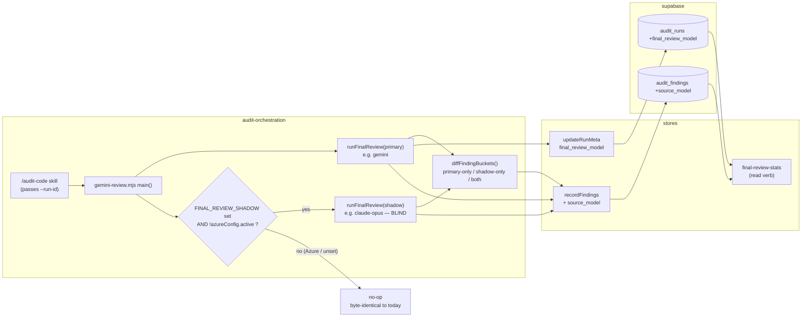

# Plan: Shadow Final-Review Reviewer (A/B test final-gate effectiveness)

- **Date**: 2026-06-10
- **Status**: Complete (verified built; status corrected from Approved during archive triage 2026-06-27)
- **Author**: Claude + Louis
- **Scope**: backend

> **Audit trail** — `/audit-plan` (SID `audit-plan-1781084542`): GPT 3 rounds
> (H:5→3→3, plateaued → stopped at the 3-round rigor-pressure cap; all 32 findings
> adjudicated valid and fixed). Gemini final gate 2 rounds (R1 CONCERNS, 3 findings
> — atomicity, primary/shadow persistence decoupling, config-default precedence — all
> fixed; R2 CONCERNS, 1 MEDIUM — shadow latency column — folded in, then **stopped at
> the 2-round Gemini cap** per the rising-praise + single-implementation-nit stop
> signal). Final arch coherence: **Strong**; claude_bias_detected: **false**;
> deliberation fair. Residual: the R2 latency nit is fully incorporated; remaining
> precision is left to `/audit-code` against the real implementation.
- **Stack**: js-ts + postgres
- **Target domain(s)**: `audit-orchestration`, `stores`, `supabase`
- ⚠ **Cross-domain work** — touches 3 domains; the boundary crossings are intentional (orchestration emits findings → store persists → migration defines the schema). Confirmed below in §2.

---

## 1. Context Summary

**Goal.** After the primary final review (default Gemini) runs, optionally run a
**second "shadow" reviewer** (Claude Opus today; `claude-mythos-5` / `claude-fable-5`
when access lands) **blind on the identical audit transcript** (independent inputs —
the shadow never sees the primary's output; execution is sequential, not concurrent —
R1 L1), attribute every finding to its `source_model`, persist both reviewers'
per-finding results to the cloud store, and measure the **unique-finding rate**
(automated) plus **human-adjudicated unique-acceptance** over ≥20 runs to decide —
empirically — whether a second final gate is worth keeping. The shadow **never gates
the build**; it is observation-only.

**Why now.** The user asked whether Claude (Mythos/Fable) could be a final-gate
reviewer on top of Gemini, and whether we can A/B-test it with our Supabase
effectiveness tracking. Investigation showed the *idea* is sound but the *plumbing*
isn't there yet (see "What exists today").

**Advisor tool — considered and rejected.** The `advisor_20260301` beta tool pairs a
cheap executor with a smarter advisor mid-generation. Rejected for this use case:
(1) the compatibility table restricts `claude-mythos-5` / `claude-fable-5` to advising
*themselves*, so there is no cost benefit over a plain direct call; (2) it is
unavailable on Azure Foundry / Bedrock / Vertex; (3) our final review is a single
structured-output call, not a long agentic loop — the advisor's value (steering many
mechanical turns) doesn't apply. **The shadow is a plain second direct API call.**

### What exists today (Phase 1 findings — ground truth)

| Fact | Location | Consequence for this plan |
|---|---|---|
| `runFinalReview(provider, client, planContent, transcriptContent, projectContext, auditMode)` is already provider-parameterized (`gemini` \| `claude-opus` \| `azure-claude`) | [gemini-review.mjs:606](../../scripts/gemini-review.mjs#L606) | Shadow = a **second call** with a different provider on the **same** `transcriptContent`. Reuse the seam; do not duplicate prompt/schema/suppression/scope logic. |
| `addSemanticIds(result, provider)` stamps `f._hash = semanticId(f)` and `f._source = provider` on every finding | [gemini-review.mjs:1157](../../scripts/gemini-review.mjs#L1157) | The **diff key already exists** — bucketing primary-only / shadow-only / both is a set operation over `_hash`. |
| `recordGeminiOutcomes` persists findings **only to local `.audit/outcomes.jsonl`** and **hardcodes `model: 'gemini'`** | [gemini-review.mjs:1184-1239](../../scripts/gemini-review.mjs#L1184) | **The cloud-persistence gap.** Nothing per-finding from the final review reaches Supabase today; this must be closed for any trend/diff to be queryable. |
| `gemini-review.mjs` runs as a **standalone subprocess** invoked by the `/audit-code` skill; it does **not** receive `cloudRunId` | `main()` [gemini-review.mjs:1253](../../scripts/gemini-review.mjs#L1253); orchestrator sets `geminiVerdict: null // updated by gemini-review after Step 7` [openai-audit.mjs:2861](../../scripts/openai-audit.mjs#L2861) | To attribute cloud rows to the right `audit_run`, the process **needs the run id passed in** (`--run-id`). This is the central design fork (§2 D1). |
| `updateRunMeta(runId, meta)` is an additive, partial-update path; `recordFindings(runId, findings, passName, round)` writes `audit_findings` | [runs-findings.mjs:165](../../scripts/lib/store/runs-findings.mjs#L165), [:188](../../scripts/lib/store/runs-findings.mjs#L188) | New `final_review_model` rides `updateRunMeta`; shadow findings can **reuse `recordFindings`** if `audit_findings` gains a `source_model` column (§2 D2). |
| Store reader is `columnExists`-guarded (e.g. `round_converged_after`, `commit_sha`, `plan_id`) | [runs-findings.mjs:520-523](../../scripts/lib/store/runs-findings.mjs#L520) | New columns degrade gracefully on un-migrated DBs — additive, no breaking change. |
| `selectProvider(choice, …)` resolves the **single** primary provider; `FINAL_REVIEW_PROVIDER` is its persistent setting | [gemini-review.mjs:927](../../scripts/gemini-review.mjs#L927) | The shadow is a **new concept** (`FINAL_REVIEW_SHADOW`), NOT a value of the existing single-value setting. `selectProvider` stays untouched. |
| `azureConfig` gates the Azure work profile; advisor/Fable/Mythos models are **not on Foundry** | [config.mjs](../../scripts/lib/config.mjs) `buildAzureConfig` | **Load-bearing guard:** the shadow arm is a **no-op when an Azure profile is active**. |
| Sensitive-egress is gated end-to-end (Tier-3 hard test-first) | `tests/sensitive-egress.test.mjs`, `audit-scope.mjs` | Shadow transcript egress reuses the **same** code path as the primary (same `transcriptContent`), so it inherits the gate — but a test must prove it. |

> **Two independent invariants — do not conflate (R1 H1).** This feature has
> *two* additive behaviours with *different* gates:
> 1. **Shadow arm** — fires only when `FINAL_REVIEW_SHADOW` set AND no Azure
>    profile. **Unset ⇒ no shadow call, no shadow cost, the build-gating reviewer
>    is unchanged.** This is the "byte-identical" invariant, and it is scoped to
>    the *shadow path*, NOT the whole feature (test-guarded, §9).
> 2. **Primary final-review cloud persistence** (`final_review_model` +
>    per-finding `source_model`/`bucket`) — NEW additive observability that fires
>    whenever **cloud is enabled AND `--run-id` is passed**, regardless of the
>    shadow. It is *intentional new behaviour*, not a regression: with cloud off
>    OR `--run-id` absent it degrades to **exactly today's** local
>    `.audit/outcomes.jsonl` path. Closing the cloud-persistence gap is a stated
>    goal — so the honest claim is "shadow is opt-in and free when unset; primary
>    persistence is additive and gated on cloud+run-id", never "the whole feature
>    is byte-identical".

### Neighbourhood considered (Phase 0.5)

Arch-memory consultation (`get-neighbourhood`, k=8) over `gemini-review.mjs`,
`plans-ship.mjs`, `cross-skill.mjs` returned **all `review`** (similarity < 0.75):
`runFinalReview` (0.68), `recordNewFindings` (0.68), `recordGeminiOutcomes` (0.66),
`applyDebtSuppression` (0.66). **No near-duplicate of any new symbol** — these are the
existing seams to **extend/reuse**, exactly as this plan does. No greenfield-vs-reuse
conflict.

### Patterns reused vs new

- **Reused**: `runFinalReview` (second call), `applyDebtSuppression`, `applyScopeFilter`,
  `addSemanticIds`, `semanticId`, `GeminiFinalReviewSchema`, `getReviewPrompt`,
  `updateRunMeta`, `recordFindings`, `columnExists` graceful-degrade, the additive-migration
  + `expected-schema.json` drift contract, the opt-in env-presence invariant (mirrors
  `azure`/`anthropic-client` seams).
- **New**: `FINAL_REVIEW_SHADOW` config surface; the shadow orchestration block in `main()`;
  the three-bucket diff; one `source_model` column + `final_review_model` column; a
  measurement read verb/view.

---

## 2. Proposed Architecture



### Data flow

1. `/audit-code` invokes `gemini-review.mjs review … --run-id <cloudRunId>` (the id is
   already known to the orchestrator that ran the audit).
2. Primary review runs exactly as today (result held in memory).
3. **If `FINAL_REVIEW_SHADOW` is set AND no Azure profile is active**: a second
   `runFinalReview(shadowProvider, …)` runs on the **same `transcriptContent`** — it
   never receives the primary's result object, so it is **blind**. (Skipped otherwise;
   `_shadow.state` records which skip reason.)
4. `diffFindingBuckets(primary._hashes, shadow._hashes)` → `both` / `primary-only` /
   `shadow-only`.
5. **Then** emit the enriched `--out` (primary result + `_shadow` block) — the shadow
   runs *before* the file is written (R1 M1), so the artifact is never partial.
6. Persist (only when cloud enabled AND `--run-id` present), via the **single replace
   wrapper** `recordFinalReviewFindings(runId, {primary, shadow, models})` (R3 H1 — §2 and
   §7 must name the *same* idempotent entry point, not two raw `recordFindings` calls).
   It (a) `updateRunMeta(runId, { finalReviewModel, finalReviewShadowModel, shadow usage })`,
   then (b) in one transaction deletes prior `final-review*` rows and inserts the findings.
   **Primary vs shadow rows are decoupled (Gemini G2)**: the **primary** final-review rows
   are inserted whenever cloud+run-id (independent of the shadow). The **shadow** rows +
   `finalReviewShadowModel`/usage are inserted **only when `_shadow.state==='ran'`**; a
   `skipped-*`/`error-unavailable` shadow leaves the primary persistence fully intact (it
   just contributes no shadow rows). The shadow's verdict is logged to `--out` but **does
   not** touch `gemini_verdict` (no build gating).
   - **Best-effort / cloud-failure degradation (R3 H2)**: every persistence write is
     wrapped (matching the existing `recordRunComplete`/`updateRunMeta` try/catch that logs
     `[learning] … failed` and continues). A DB outage, unapplied migration, or
     `columnExists`-false path **logs and proceeds** — this observability-only feature must
     never fail an audit. The `--out` artifact (with `_shadow`) is always written even when
     cloud persistence is skipped or errors.

### Key design decisions (with the design forks the audit must pressure-test)

**D1 — Thread `cloudRunId` into `gemini-review.mjs` via `--run-id` (chosen).**
The standalone subprocess can't otherwise attribute cloud rows. (#3 No-Hardcoding, #19
Observability)
- *Band-aid extreme*: parse the latest `audit_runs` row by `commit_sha` inside
  gemini-review — guesses identity, races concurrent audits, re-implements run lookup.
- *Over-engineered extreme*: a shared run-context daemon / IPC channel passing full
  state between the audit and the reviewer subprocess.
- *Chosen*: pass `--run-id <id>` (one CLI arg, already how `--out`/`--provider` flow).
  **Current requirement**: attribute exactly the findings of *this* run. When the id is
  absent (ad-hoc manual `gemini-review` call), cloud persistence is skipped — local
  `.audit/outcomes.jsonl` still written, behaviour unchanged.

**D2 — Extend `audit_findings` with one nullable `source_model` column; reuse
`recordFindings` (chosen) — do NOT build a `final_review_findings` table.**
(#5 Single Source of Truth, #18 Backward Compat)
- *Band-aid extreme*: stuff the source into the existing `pass_name` string
  (`'final-review-shadow'`) and parse it back out — overloads a free-text column,
  un-queryable, drifts.
- *Over-engineered extreme*: a dedicated `final_review_findings` table with its own RLS,
  indexes, FK, and a parallel `recordFinalReviewFindings` writer — a second findings
  store to keep in sync for a column that one `ALTER TABLE … ADD COLUMN` covers.
- *Chosen*: extend `audit_findings` with **two** nullable columns —
  `source_model TEXT` and `bucket TEXT` — and reuse `recordFindings`.
  **Precise column semantics (R1 H3/M8 — these were ambiguous; now pinned):**
  - `pass_name` = **role only**: `'final-review'` for the primary reviewer's
    `new_findings`, `'final-review-shadow'` for the shadow's. It **never** encodes
    model/provider identity. (This replaces the old `'gemini-new'` provider-coupled
    name — see M2 fix in §7.4.)
  - `source_model` = the **resolved concrete model id** (e.g. `gemini-3.1-pro`,
    `claude-opus-4-8`), NOT the provider label (`gemini`) and NOT the `_source`
    short-tag from `addSemanticIds`. It is the same value written to
    `audit_runs.final_review_model` / `final_review_shadow_model` for that reviewer.
  - `bucket` = the diff classification `∈ {both, primary-only, shadow-only}` (R1 H2 —
    the diff result must be *persisted*, not just computed). `finding_fingerprint`
    (already written by `recordFindings` as `f._hash`) is the semantic key that the
    diff and any cross-run dedup use — no new hash column needed.
  Reuses `recordFindings`, the `columnExists` guard, and existing RLS. **Current
  requirement**: query "findings by concrete model and bucket" — these two columns +
  the existing fingerprint deliver it. Revisit a dedicated table only if final-review
  findings need a shape `audit_findings` can't hold (no current evidence).

**D3 — `final_review_model` (+ `final_review_shadow_model`) on `audit_runs`, storing the
*resolved concrete id* per run.** Defeats the `latest-*` sentinel auto-upgrade that would
silently change what "Gemini vs Fable" means mid-experiment. The analysis groups by this
column. We do **not** pin sentinels in code (honours the no-pinning rule) — we *record*
what the sentinel resolved to at run time. (#19 Observability, #2 model-resolver contract)

**D4 — `FINAL_REVIEW_SHADOW` is a distinct config surface, not a `FINAL_REVIEW_PROVIDER`
value.** A shadow second reviewer is orthogonal to "which single reviewer gates the
build." Overloading the provider setting would let `set-provider azure-claude` users
silently lose the single-gate guarantee. New env var + (optional) `FINAL_REVIEW_SHADOW_MODEL`
sentinel (default `latest-opus`). `selectProvider()` untouched. (#1 DRY via reuse, but
#10 distinct-concept-distinct-surface)

**D5 — Azure guard mirrors the load-bearing opt-in invariant (scoped precisely).**
Shadow arm fires only when `FINAL_REVIEW_SHADOW` is set **and** `azureConfig.active` is
false. With the env unset, control flow does not enter the shadow block at all → **no
shadow reviewer runs, no shadow cost, the build-gating reviewer is unchanged**
(regression-guarded by a test asserting the *shadow path* is not entered, mirroring
`tests/openai-client.test.mjs`). **This invariant is scoped to the shadow arm, not the
whole feature** — primary final-review cloud persistence (D1/D2/D3) is a separate,
intentional additive behaviour gated on cloud+`--run-id` (see the "Two independent
invariants" callout in §1). (#16 Graceful Degradation, #18 Backward Compat)

**D6 — The v1 metric is implementable because acceptance is human-adjudicated, not
auto-derived (R1 H4 — the original "accepted-finding rate" was NOT implementable).**
The honest gap: final-review `new_findings` today land in local `.audit/outcomes.jsonl`
with `accepted: null`; **nothing wires a final-review finding's accept/dismiss outcome to
the cloud.** So an *automated* "accepted-finding rate" depends on a data path that does
not exist (the same class as the `audit_effectiveness` "unmeasurable until outcome labels
restored" gap). Building that writeback is real scope expansion — **deferred** (§8).

**What v1 actually measures (two tiers, both implementable now):**
1. **Unique-finding rate** — fully automated from the persisted `bucket` column:
   `shadow-only count / total runs`, split by severity, grouped by `source_model`.
   This is *volume*, and the stopping rule (below) explicitly discounts polish volume.
2. **Human-adjudicated unique-acceptance** — `final-review-stats` emits the
   **shadow-only finding list** (the spot-check queue). The operator marks each
   `accepted | dismissed` (a one-line CLI: `final-review-stats adjudicate <run-id>
   <fingerprint> <accepted|dismissed>` — `run-id` scopes the fingerprint to one run, R3
   L1/M2), which writes `user_action` onto that `audit_findings` row.
   The metric is then `accepted shadow-only HIGH/MEDIUM / runs`. At n=20 a human
   adjudicating ~1–3 shadow-only findings/run is entirely tractable — and it sidesteps
   the **self-evaluation bias** (Claude judging a Claude shadow): the human is the
   arbiter, not Claude. Routing adjudication through **GPT rebuttal** is the deferred
   automation escalation (§8), warranted only if human spot-check proves too slow.

This keeps v1 honest: we automate what is automatable (volume + persistence) and put a
human on the one judgement that is both bias-prone and low-volume at n=20.

**Pre-registered stopping rule (R2 M4 — denominator + threshold pinned, decided BEFORE
data collection so it can't be rationalised post-hoc).**
- **Denominator `N`** = audit runs where the shadow actually ran (`_shadow.state='ran'`)
  for a *fixed* `(primary source_model, shadow source_model)` pair — NOT all audit runs,
  and NOT runs where the shadow was skipped. Grouping by the concrete model pair (D3) is
  what defeats sentinel drift; a model change starts a fresh `N`.
- **Collect until `N ≥ 20`** for the pair under test.
- **KEEP the shadow as a permanent second gate** iff: shadow-only findings that a human
  marks `accepted` AND are `severity ∈ {HIGH, MEDIUM}` occur at a rate **≥ 1 per 5 runs**
  (i.e. ≥ `N/5` accepted unique HIGH/MEDIUM across the window) **and** the
  cost-per-accepted-unique-finding (shadow API $ over the window ÷ accepted unique
  HIGH/MEDIUM count) is within the operator's tolerance.
- **DROP the shadow** iff shadow-only findings are predominantly `dismissed` OR
  predominantly `LOW`/polish (the "a second gate always catches *something*" failure mode
  — volume without effectiveness). Polish volume is explicitly **not** evidence to keep.
- **Cost (R3 H3, Gemini R2 G1)**: the keep-test's cost factor is **operator-computed, not
  an automated gate** — both **token cost** (`_shadow.usage` → `final_review_shadow_*_tokens`
  × current per-model pricing) and **time cost** (`final_review_shadow_latency_ms` — gate
  latency overhead matters for a CI gate), summed over the window. We do **not** build a
  pricing table or a hard cost threshold (pricing drifts; over-engineering for an n=20
  experiment); the operator reads aggregate tokens + latency from `final-review-stats` and
  applies their own tolerance. The hard automated gate is the acceptance-rate; cost (token
  + time) is the human overlay.
- **Inconclusive** (between the two) → extend to `N ≥ 40` once, then decide; do not loop
  indefinitely (the same rigor-pressure cap the audit skills use).

---

## 5. Sustainability Notes

- **Assumption that could change**: that Mythos/Fable will become directly callable
  (non-Azure). The provider dispatch in `runFinalReview` already abstracts this — adding
  a `claude-mythos`/`claude-fable` provider is a `modelMap`/`labelMap` entry + a
  `callClaude*` reuse, not a rewrite. The shadow mechanism is **model-agnostic**: it takes
  whatever `FINAL_REVIEW_SHADOW_MODEL` resolves to.
- **Seam built deliberately**: the shadow is a *second invocation of an existing
  function*, so a future "third reviewer" or "panel" is an array iteration, not new code
  paths. We do **not** build the panel now (YAGNI — current requirement is exactly one
  shadow).
- **Coupling**: loosened, not tightened — the shadow reads the same transcript the primary
  reads; it has zero dependency on the primary's *output*. Removing the shadow is deleting
  one guarded block.

---

## 7. File-Level Plan

1. **`supabase/migrations/20260610120000_final_review_shadow.sql`** (create)
   - `ALTER TABLE audit_runs ADD COLUMN IF NOT EXISTS final_review_model TEXT;`
   - `ALTER TABLE audit_runs ADD COLUMN IF NOT EXISTS final_review_shadow_model TEXT;`
   - `ALTER TABLE audit_runs ADD COLUMN IF NOT EXISTS final_review_shadow_input_tokens INTEGER;`
   - `ALTER TABLE audit_runs ADD COLUMN IF NOT EXISTS final_review_shadow_output_tokens INTEGER;` (R3 H3 — the token-cost data path; populated from `_shadow.usage`)
   - `ALTER TABLE audit_runs ADD COLUMN IF NOT EXISTS final_review_shadow_latency_ms INTEGER;` (Gemini R2 G1 — time-cost is as load-bearing as token-cost for a gate A/B; populated from `_shadow.usage.latency_ms`)
   - `ALTER TABLE audit_findings ADD COLUMN IF NOT EXISTS source_model TEXT;`
   - **Precondition (R3 M3)**: `audit_findings.user_action` (the human-adjudication target)
     **already exists** — added by `20260508120000_adaptive_learning_v1.sql`. The
     adjudication writeback reuses it with a `columnExists` guard; no new column needed.
   - `ALTER TABLE audit_findings ADD COLUMN IF NOT EXISTS bucket TEXT;` (R1 H2 — persist
     the diff classification). **No CHECK constraint (R2 M1).** Postgres has no portable
     `ADD CONSTRAINT IF NOT EXISTS`, so a re-run would either error or need a `DO`-block
     `pg_constraint` guard — added complexity for a value the *single writer*
     (`diffFindingBuckets`) fully controls. `bucket` is validated at the app layer (the
     writer only ever emits the three literals); the column stays a plain nullable `TEXT`,
     keeping the migration cleanly idempotent (`ADD COLUMN IF NOT EXISTS` only).
   - `CREATE INDEX IF NOT EXISTS idx_audit_findings_source_model ON audit_findings
     (run_id, source_model) WHERE source_model IS NOT NULL;` (R1 M7 — the
     `final-review-stats` predicates are `run_id` + `source_model`; partial index keeps
     it cheap and only covers final-review rows).
   - **No read view (R1 H5/M4).** A Postgres view does **not** transparently inherit base-
     table RLS — under PG15+ a view runs with the *owner's* rights unless created `WITH
     (security_invoker = true)`, which would be an RLS-bypass footgun. Rather than reason
     about view security on a single-tenant owner-bypass store, **`final-review-stats`
     queries the base tables directly** (parameterized, through `cross-skill.mjs`). This
     also removes the "optional view vs the verb's real source" ambiguity.
   - Idempotent (`IF NOT EXISTS` / `NOT VALID`), no clocks/network → re-runs byte-
     identically (migration ledger contract). Additive columns on existing RLS-enabled
     tables inherit their RLS.
   - **Why**: closes the cloud-persistence gap; gives the A/B its queryable axis
     (`source_model` × `bucket` × `severity` × `user_action`).

2. **`scripts/lib/config.mjs`** (modify)
   - Read `FINAL_REVIEW_SHADOW` (provider string) and `FINAL_REVIEW_SHADOW_MODEL`
     (sentinel) into config **as raw values — config injects NO default** (Gemini G3). If
     `FINAL_REVIEW_SHADOW_MODEL` is unset, config stores `null`/`undefined`, NOT
     `latest-opus`. The per-provider default (`claude-opus`→`latest-opus`, future
     `gemini`→`latest-pro`) is derived in `resolveShadow()` (§7.3) — so it can distinguish
     "user explicitly pinned a model" from "unset, derive from provider". A hardcoded
     config default would collapse that distinction and break the provider/model
     compatibility check (R3 M1).
   - **Permissive read — must NOT throw at import/startup (R1 M-config, R2 H1).** An
     *optional, observation-only* feature must never be able to break the *mandatory*
     audit path. `config.mjs` stores the raw string verbatim and does **no** allow-list
     validation; an unknown/garbage `FINAL_REVIEW_SHADOW` value is handled downstream by
     `resolveShadow()`, which returns `_shadow.state='skipped-unsupported-provider'` (a
     logged no-op), never an exception. This deliberately diverges from the fail-fast
     posture of *required* config (e.g. `buildAzureConfig`) — correct because the gate is
     "is the audit allowed to run", and an opt-in shadow must answer "yes" regardless.
   - **Why**: centralized env reads (project rule — all env vars through config.mjs), but
     opt-in-additive semantics, not fail-fast.

3. **`scripts/gemini-review.mjs`** (modify) — the core seam
   - `parseReviewArgs`: accept `--run-id <id>` (optional; absent ⇒ cloud-persist skipped,
     local-only — today's behaviour).
   - New `resolveShadow()` → `{ provider, model } | null`. Returns null when
     `FINAL_REVIEW_SHADOW` unset **or** `azureConfig.active` (the guard). **Provider/model
     compatibility (R3 M1)**: the default model is **derived from the provider**, not a
     fixed `latest-opus` — `claude-opus`→`latest-opus`, a future `gemini` shadow→`latest-pro`,
     etc. `FINAL_REVIEW_SHADOW_MODEL` overrides the default but is validated against the
     provider's family; a mismatch (`FINAL_REVIEW_SHADOW=gemini` + an opus model) →
     `skipped-unsupported-provider` (logged no-op), never a wrong-model call. The resolved
     model runs through the existing `resolveModel()` and is re-resolved after
     `refreshCatalogAndWarn()` so a `latest-*` sentinel picks up the live catalog (R1 M3).
     The *resolved concrete id* is what gets stored as `source_model` /
     `final_review_shadow_model`.
   - New `runShadowReview(...)`: builds a **fresh** client for the shadow provider, calls
     `runFinalReview(shadowProvider, …, transcriptContent, …)` on the **same** transcript,
     then `applyDebtSuppression` + `applyScopeFilter` + `addSemanticIds` (identical
     pipeline to the primary). The shadow receives the transcript only — **never** the
     primary's result object (the blind invariant, §9 test).
   - New `diffFindingBuckets(primary, shadow)` → **dedups each reviewer's findings by
     `_hash` first** (R3 M2 — a model emitting two same-fingerprint findings must not
     inflate counts), then tags each surviving finding `bucket ∈ {both, primary-only,
     shadow-only}` by `_hash` set membership. **This is the single bucket-value writer
     (R3 M5)** — the only place the three literals are produced, which is why the column
     needs no DB `CHECK` (app-layer validation lives here). The `final-review-stats`
     queries likewise use `COUNT(DISTINCT finding_fingerprint)` (R3 M2).
   - **Ordering (R1 M1)**: `main()` runs the shadow **before** emitting the final `--out`
     JSON — sequence is: primary review → shadow review (guarded) → diff → **then** emit
     the enriched output + persist. `emitReviewOutput` must not write the file before the
     `_shadow` block exists, or the artifact is incomplete.
   - **`_shadow` output schema (R1 L2/M6)** — the `--out` JSON gains:
     ```
     _shadow: {
       state: 'ran' | 'skipped-unset' | 'skipped-azure' | 'skipped-no-key'
              | 'skipped-unsupported-provider' | 'error-unavailable',
       provider: string|null,        // e.g. 'claude-opus'
       model: string|null,           // resolved concrete id, e.g. 'claude-opus-4-8'
       verdict: string|null,         // shadow's verdict — LOGGED ONLY, never gates
       usage: { input_tokens, output_tokens, latency_ms } | null,  // R3 H3 — already
                                     // computed by runFinalReview; surfaced so cost is
                                     // derivable. Also persisted to audit_runs.
       buckets: { both: n, primaryOnly: n, shadowOnly: n } | null,
       shadowOnlyFindings: [ {fingerprint, severity, category, section, detail} ] | null,
                            // detail included (R2 L1) so a human can adjudicate from the
                            // --out artifact alone, without opening a DB row
       error: string|null            // provider message when state='error-unavailable'
     }
     ```
   - **Shadow state machine (R1 M6)** — exactly one `state` per run: `skipped-unset`
     (env absent), `skipped-azure` (`azureConfig.active`), `skipped-no-key` (provider key
     missing), `skipped-unsupported-provider` (unknown `FINAL_REVIEW_SHADOW` value),
     `error-unavailable` (provider call threw — primary review is **unaffected**; logged,
     not fatal), `ran` (success). **Only the *shadow rows* gate on `state==='ran'`; primary
     final-review persistence is independent of the shadow state (Gemini G2)** — a skipped
     or failed shadow never suppresses primary telemetry.
   - **Why**: the only place where both reviewers' results coexist with the run id.

4. **`scripts/lib/store/runs-findings.mjs`** (modify)
   - `updateRunMeta`: accept `meta.finalReviewModel` / `meta.finalReviewShadowModel`
     (additive, `columnExists`-guarded like the rest).
   - `recordFindings` keeps its **public signature** `recordFindings(runId, findings,
     passName, round)` (R2 M3 — no positional-arg leak) but gains an **optional trailing
     `opts` object** `recordFindings(runId, findings, passName, round, opts={})` where
     `opts.client` lets a caller run the insert on an existing pg client/transaction
     (Gemini G1 — without this the wrapper's delete+insert cannot be atomic, since
     `recordFindings` would otherwise grab its own pool connection). Default `opts={}`
     preserves every existing call site byte-for-byte. `source_model`/`bucket` are carried
     **on each finding object** (`f._sourceModel`, `f._bucket`), read in the row-builder
     like the existing `f._hash`→`finding_fingerprint` / `f._primaryFile`→`primary_file`.
     Columns written only when present (`columnExists` guard). `passName='final-review'|
     'final-review-shadow'` (**role**, R1 M8).
   - **Idempotent final-review persistence (R2 H2 — metric-corruption guard).** A retry or
     manual rerun with the same `--run-id` must not double-count. `recordFinalReviewFindings`
     opens **one transaction** (`BEGIN`/`COMMIT` on a single pg client) and within it:
     `DELETE FROM audit_findings WHERE run_id=$1 AND pass_name IN ('final-review',
     'final-review-shadow')` (scoped to final-review pass_names so the GPT audit's own rows
     are untouched), then `recordFindings(runId, rows, passName, 0, {client})` reusing the
     **same client** so delete+insert are genuinely atomic (Gemini G1). Replace, not append
     — the natural idempotency for "the final review of run X".
   - New `adjudicateFinalReviewFinding(runId, fingerprint, action)` → sets `user_action`
     on the matching row, scoped `WHERE run_id=$1 AND finding_fingerprint=$2 AND
     bucket='shadow-only'` (R2 M2 — the bucket scope disambiguates; if >1 row still
     matches, update all and return the count so the CLI can report it). Reuses
     `updateWhere`; cloud-guarded.
   - **Why**: additive store writes; reuse over a parallel table (D2); replace-semantics
     for idempotency.

5b. **`scripts/gemini-review.mjs` — `recordGeminiOutcomes` parameterization (R1 M2)**.
   The function currently hardcodes `model: 'gemini'` in the local `appendOutcome` calls.
   Parameterize it by the actual primary provider's concrete model id so the local
   `.audit/outcomes.jsonl` attribution matches the cloud `source_model` (otherwise the
   primary is mislabelled `gemini` even when the primary is Azure-Claude or Opus). Small,
   self-contained; keeps local and cloud attribution consistent.

5. **`scripts/learning-store.mjs`** (modify) — barrel re-export any new signatures (no new
   functions if `recordFindings`/`updateRunMeta` extensions suffice).

6. **`scripts/cross-skill.mjs`** (modify)
   - Add a `final-review-stats --repo <name>` read verb querying **base tables directly**
     (no view, R1 H5): per-`source_model` × `bucket` × `severity` counts, the v1
     unique-finding rate, and the **shadow-only spot-check queue** (D6). Graceful no-op
     when cloud off.
   - Add a `final-review-stats adjudicate <run-id> <fingerprint> <accepted|dismissed>`
     subcommand → calls `adjudicateFinalReviewFinding` (the human acceptance writeback).
   - **Why**: the design rule — all cross-skill cloud reads/writes go through this facade,
     never hand-written SQL in a SKILL.md.

7. **`tests/gemini-review-shadow.test.mjs`** (create) — Tier-1/Tier-3 guards
   - **Byte-identical-when-unset** invariant (D5): with `FINAL_REVIEW_SHADOW` unset, the
     shadow code path is never entered (mirrors `openai-client.test.mjs`).
   - **Azure no-op** invariant: env set **but** `azureConfig.active` → shadow skipped.
   - **Blind** invariant: the shadow call receives the transcript, never the primary
     result object.
   - **Diff-bucket correctness**: known `_hash` sets → correct three-way partition.
   - **Sensitive-egress parity** (Tier-3, same commit): the shadow transcript goes through
     the same sensitive-path gate as the primary — no `.env`/secret path reaches the
     shadow provider payload.

8. **`tests/fixtures/expected-schema.json`** (modify) — add the seven new columns
   (`audit_runs.final_review_model`, `audit_runs.final_review_shadow_model`,
   `audit_runs.final_review_shadow_input_tokens`, `audit_runs.final_review_shadow_output_tokens`,
   `audit_runs.final_review_shadow_latency_ms`, `audit_findings.source_model`,
   `audit_findings.bucket`) and the new partial index so
   `setup-postgres --adopt` drift detection stays accurate. **No view** (R2 H3 — consistent
   with §7 item 1's decision to drop it; the earlier "+ the view" was a self-contradiction).

9. **`AGENTS.md`** (modify) — document `FINAL_REVIEW_SHADOW` / `FINAL_REVIEW_SHADOW_MODEL`
   in the env-var table + a short "Shadow final-review A/B" subsection (the stopping rule
   lives here so it's pre-registered and visible). `CLAUDE.md` stays a thin addendum.

10. **`.claude/skills/audit-code/SKILL.md`** + source `skills/audit-code/SKILL.md` (modify)
    — **run-id propagation (R1 M5)**. The Step-7 invocation becomes:
    `node scripts/gemini-review.mjs review <plan> <transcript.json> --out <file> --run-id <cloudRunId>`
    where `<cloudRunId>` is the `audit_runs.id` the orchestrator already created in
    `recordRunStart`. **Envelope field contract (R3 M4)**: `openai-audit.mjs` adds
    `cloud_run_id: string|null` to its `--out` result JSON — the resolved `audit_runs.id`,
    or **`null` when cloud is off** (no run row exists). The skill reads it; when null it
    omits `--run-id` entirely (gemini-review then runs local-only, today's path). One line
    on the shadow being observation-only. Regenerated copy is byte-verified by
    `skills:check`.
    - **Note**: this adds `scripts/openai-audit.mjs` (modify) to surface `cloud_run_id`
      in the audit result envelope — folded into Phase 3 scope.

### 7b. Implementation Phases

- **Phase 1 — Schema + store**: the migration, `expected-schema.json`, `updateRunMeta` +
  `recordFindings` extensions, `config.mjs` reads. Files: `supabase/migrations/20260610120000_final_review_shadow.sql` (create),
  `tests/fixtures/expected-schema.json` (modify), `scripts/lib/store/runs-findings.mjs` (modify),
  `scripts/lib/config.mjs` (modify), `scripts/learning-store.mjs` (modify).
- **Phase 2 — Shadow orchestration**: the shadow arm, guard, blind second call, diff
  buckets, `--run-id`, `_shadow` schema/state-machine, `recordGeminiOutcomes`
  provider-parameterization (R1 M2), persistence calls. Files:
  `scripts/gemini-review.mjs` (modify), `tests/gemini-review-shadow.test.mjs` (create).
- **Phase 3 — Measurement + wiring + docs**: the `final-review-stats` read verb +
  `adjudicate` subcommand, `cloud_run_id` in the audit result envelope, skill `--run-id`
  wiring, docs/stopping-rule. Files: `scripts/cross-skill.mjs` (modify),
  `scripts/openai-audit.mjs` (modify), `skills/audit-code/SKILL.md` (modify),
  `.claude/skills/audit-code/SKILL.md` (modify), `AGENTS.md` (modify).
- **Close-out (not a phase)**: `npm test`; `npm run skills:regenerate` + `npm run skills:check`;
  `node scripts/setup-postgres.mjs --migrate` then `--check-drift`; `npm run sync` then
  `npm run sync:dry`.

---

## 8. Risk & Trade-off Register

| Risk / trade-off | Decision | Why OK |
|---|---|---|
| Shadow doubles final-review API cost on opted-in runs | Accept; opt-in + observation-only + the pre-registered stopping rule caps the experiment at ~20 runs | Cost is bounded and the entire point is to measure whether it's worth it |
| Self-evaluation bias (Claude judges Claude shadow) | v1: human spot-check via `final-review-stats` + weekly review; GPT-rebuttal arbitration **deferred** | Building arbitration now is over-engineering before we know spot-check is insufficient |
| `gemini_verdict` semantics: shadow must not pollute it | Shadow verdict → `--out` JSON only; `updateRunMeta` writes `final_review_model`, never `gemini_verdict` | No build-gating contamination; the single-gate guarantee holds |
| Model drift mid-experiment (`latest-*`) | Store resolved concrete id per run; group analysis by it | No pinning; honours model-resolver contract |
| Concurrent audits + `--run-id` | Each audit passes its own id; absent id → cloud-skip, local only | No cross-run attribution race |
| Self-eval bias: automated accepted-rate would have Claude judge a Claude shadow | v1 uses **human** adjudication via the spot-check queue; automation deferred | Human is the arbiter at n=20 (low volume, bias-free); see D6 |
| **Deferred**: automated ledger→cloud acceptance writeback for final-review findings (the data path that doesn't exist today, R1 H4); GPT-rebuttal arbitration of the diff bucket; a dashboard tab for the A/B; a third/panel reviewer | Out of scope v1 | No current requirement; v1's human-adjudicated metric is implementable now and the seam supports adding automation without rework |

---

## 9. Testing Strategy

- **Unit (Tier-1, test-first)**: `diffFindingBuckets` partition; `resolveShadow` returns
  null when unset / when Azure active; `config.mjs` shadow reads.
- **Invariant (Tier-3, same commit — non-negotiable)**: **shadow-path-not-entered**
  when `FINAL_REVIEW_SHADOW` unset (the scoped invariant, R1 H1 — `resolveShadow` returns
  `skipped-unset`, asserting no shadow call, NOT whole-feature byte-identity).
  **Sensitive-egress parity is structural, not a new test**: `runShadowReview` reuses
  `runFinalReview` verbatim on the *same in-memory `transcriptContent`* the primary
  consumed and opens **no files of its own**, so it introduces no new egress surface — the
  actual sensitive-path gate lives upstream at transcript assembly and is already covered
  by `tests/sensitive-egress.test.mjs` + `tests/audit-scope-egress.test.mjs`. Adding a
  shadow-specific egress test would mock the provider and thus test the mock; the honest
  guarantee is the structural reuse + the upstream gate.
- **Integration (fixture)**: a canned transcript + two canned reviewer results → assert
  the three buckets, the `--out` `_shadow` block, and that `recordFindings` is called with
  `source_model` set (mock the store; assert the call shape, not the network).
- **Store**: `updateRunMeta` / `recordFindings` degrade gracefully when the new columns
  are absent (`columnExists` false path).
- **Edge cases**: shadow provider API failure → primary review unaffected, shadow logged
  as `unavailable` (graceful degradation #16); `--run-id` absent → local-only, no crash.

---

## 11. Execution Clustering

- **Cluster A** — Phases 1–2 — fix-gate: yes
  - **Coupling**: the shadow orchestration (Phase 2) writes through the exact store +
    schema surface defined in Phase 1 (`source_model`, `final_review_model`,
    `recordFindings`/`updateRunMeta` extensions). Auditing them together lets the
    cross-cutting wiring pass inspect the producer→column seam in one pass; a green Phase 1
    schema with a Phase 2 writer that mis-keys it is the exact bug a split would miss.
    Derived scope = the union of Phase 1 + Phase 2 `Files:`.
- **Cluster B** — Phase 3 — fix-gate: final
  - **Coupling**: measurement read verb + skill wiring + docs consume the persisted data
    but do not alter the write path; they gate on the consolidated Gemini review over the
    union diff. Derived scope = Phase 3 `Files:`.
- **Final gate**: one consolidated Gemini review over the union diff of A+B, mandatory
  regardless of per-cluster convergence.
