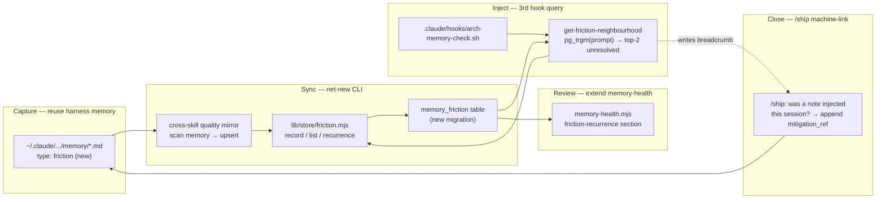

# Plan: Friction-Feedback Loop (recurrence-aware quality signal)

- **Date**: 2026-06-28
- **Status**: Complete (built Clusters A–C 2026-06-28; `/audit-code` R1 found 8 genuine in-scope bugs — all fixed; consolidated Gemini gate APPROVE after rebutting one false-positive with live-DB evidence; full empirical verify against the live DB passed: add→mirror→digest→inject→link + secret-refusal + tombstone-reactivation; 3925 tests pass / 0 fail. Plan-audit history below.)
- **Author**: Claude + Louis
- **Scope**: backend (CLI + hook + migration + memory-health — no UI)

> **Target domain(s)**: `cross-skill-bridge`, `claude-hooks`, `memory-health`, `supabase`.
> ⚠ **Cross-domain work** — touches 4 domains; this is a horizontal feature (capture → mirror →
> inject → review → close) by design, each step landing in its owning subsystem. No new domain.
> **Origin**: `/brainstorm --with-gemini` (Claude + GPT-5.5 + Gemini-pro, debate round, 2026-06-28).
> Both models, post-debate, converged: do NOT build a parallel capture system — reuse memory for
> capture, the UserPromptSubmit hook for injection, memory-health+pg_trgm for recurrence, and /ship
> for closure-linking. Net-new = one mirror table + ~2 CLI commands + a 3rd hook query + a
> memory-health section + a ship prompt.

## 1. Context Summary

**Scope/stack**: backend, js-ts + postgres (ESM). **The gap**: today we persist *structured*
artifacts (audit findings, deferred tech-debt) but capture NO recurrence-aware "how is it to work
in THIS repo" signal. ~15 such learnings this session landed in the harness memory + AGENTS.md ad
hoc, invisible to cross-repo trend review. The unique value a DB layer adds over flat per-user
memory is **cross-repo / cross-session recurrence aggregation** — nothing else.

**Code Trace** (read this session — grounds every design decision):
- **The memory is the HARNESS auto-memory**, NOT a repo dir: `~/.claude/projects/c--GIT-claude-engineering-skills/memory/`
  — 29 `*.md` files + `MEMORY.md` index, frontmatter `metadata.type: feedback|project|reference|user`.
  `memory/feedback_sw_cache_bust_before_verify.md` is *already a friction note* stored as
  `type: feedback` — so `type: friction` is a **new sibling type**, and the friction/feedback
  boundary is a real design question (§8 Q1).
- Existing neighbourhood-injection pattern: [`scripts/cross-skill.mjs:1020`](../../scripts/cross-skill.mjs#L1020)
  `cmdGetIncidentNeighbourhood` → [`scripts/lib/neighbourhood-query.mjs:325`](../../scripts/lib/neighbourhood-query.mjs#L325)
  `getIncidentNeighbourhoodForIntent` (embeds the intent, calls an RPC); fired by the
  `UserPromptSubmit` hook [`.claude/hooks/arch-memory-check.sh`](../../.claude/hooks/arch-memory-check.sh)
  alongside `get-neighbourhood`. This is Gemini's "Ghost in the Repo" consumer — it already exists;
  friction is a 3rd query.
- Recurrence engine: [`scripts/memory-health.mjs`](../../scripts/memory-health.mjs) calls the
  `memory_health_metrics(window_days, similarity_*)` Postgres RPC (migration
  `20260421163525_memory_health.sql`) — `CREATE EXTENSION pg_trgm` + `similarity(detail_snapshot, …)`
  GIN-indexed. The friction recurrence detector mirrors this `similarity()` shape over a `trgm_text`
  column.
- Store-module pattern: [`scripts/lib/store/security.mjs:41`](../../scripts/lib/store/security.mjs#L41)
  `recordSecurityIncidents` / `getSecurityIncidentsByRepo` / `callIncidentNeighbourhoodRpc` — the
  template for a new `store/friction.mjs`.
- jsonb-write seam (load-bearing): the M3 rule — `mitigation_refs` (jsonb) is passed **raw** (the
  `db/query.mjs serializeWriteParam` seam JSON-serializes it); `scope_tags`/`files`/`symbols`
  (`text[]`) opt OUT via **`pgArray()`** (AGENTS.md "jsonb-safe write seam").

**Patterns reused**: memory capture (harness), the UserPromptSubmit neighbourhood hook, the pg_trgm
`similarity()` RPC, the `store/<x>.mjs` writer shape, the cross-skill graceful-cloud-off contract,
the redact-before-egress security gate. **New**: one `memory_friction` table + a `store/friction.mjs`
+ `quality` CLI subcommands + a `get-friction-neighbourhood` query + a memory-health section + a
ship closure prompt.

## 2. Proposed Architecture



**Key design decisions (principles):**
- **Memory file is the source of truth; the DB row is a derived mirror** (#1 SSoT, #5 single source) —
  the mirror is a *sync* (`quality mirror` re-scans + idempotently upserts), NOT a per-note write, so
  there is no two-write drift. A friction memory exists even with cloud off; the DB only adds
  cross-repo recurrence.
- **Recurrence × cost is the priority, not a human number** (#4 no-hardcoding, the brainstorm
  convergence) — recurrence comes free from `pg_trgm similarity()` (reused from memory-health); `cost`
  is a coarse `S|M|L` (default `M`) the human CAN bucket, unlike exact minutes. Rank = recurrence × cost.
  No `severity`, no `time_wasted`, no `status` field.
- **Closure is artifact-linked, machine-assisted — never a status workflow** (#15, the load-bearing
  anti-graveyard mechanism) — `resolved` is DERIVED (`mitigation_refs` non-empty). The link is written
  by `/ship` (it knows what the hook injected this session), not hand-appended to a 3-week-old file.
- **Injection by pg_trgm, NOT embeddings** (#16, right-sizing) — friction injection trigram-matches the
  prompt against `trgm_text` (cheap, no embed API call, reuses the memory-health infra, dodges the
  vector-provenance entanglement the arch/incident path carries). A deliberate divergence from the
  embedding-based siblings, justified by cost (§8 Q3).
- **Warn by default; hard-fail only for protected `scope_tags`** (#16, matches memory-health's existing
  sticky-issue advisory posture) — a recurring-unmitigated friction WARNs; it blocks (non-zero exit)
  ONLY when one of its `scope_tags` is in the configured protected set (`secret-egress`/`consumer-sync`/
  `false-green`). ONE mechanism — there is no per-note `gate:true` flag (R2-MED: a second toggle would
  drift from the scope-tag contract).
- **Graceful cloud-off everywhere** (#16) — every DB touch no-ops when `AUDIT_DB_URL` is unset, exactly
  like all cross-skill writes; the memory file still gets written.

## 2a. Explicit contracts (R1/R2-HIGH — pin every contract before Phase 2)

**(C0) `quality add` — the local-first CAPTURE command (R2-HIGH).** Capture is a COMMAND, not the
agent hand-writing a memory file (schema-guaranteed, not honor-system): `quality add --title …
--scope-tag … [--cost M] [--files …] [--symbols …]` (or stdin JSON) → resolve the memory dir (C4,
creating it if absent) → write a C1-schema-valid `type:friction` memory file via `atomicWriteFileSync`
→ update the `MEMORY.md` index pointer → THEN best-effort mirror the one row (C5). **Cloud-off still
writes the memory file** (the SoT); the DB catches up on the next `mirror`. The agent calls this when
the user says "log friction X"; the user can run it directly. Idempotent on `name` (re-add updates).

**(C1) Friction-memory frontmatter schema (the parse contract, versioned).** A `type: friction`
memory file MUST carry:
```yaml
---
name: <kebab-slug>                 # stable, doubles as memory_name (unique per repo)
description: <one-line>            # → title
metadata:
  node_type: memory
  type: friction                  # the new sibling; mirror scans ONLY this
  schema_version: 1               # forward-compat; parser rejects unknown major, warns on unknown minor
  friction:
    cost: S | M | L               # default M if absent
    scope_tags: [<tag>, …]        # required (≥1) — drives injection match + protected-class check
    files: [<repo-rel path>, …]   # optional
    symbols: [<symbol>, …]        # optional
    mitigation_refs:              # closure; [] = open
      - { kind: commit|agents_rule|doc|test|durable_memory|ignore, ref: <string> }
---
<body: what / why / how-to-avoid>
```
The parser (`memory-paths.mjs`) validates this with a Zod schema; a malformed/`type:friction`-but-
schema-invalid file is **skipped with a counted warning** (never silently dropped, never crashes the
mirror). `schema_version` lets the shape evolve without breaking old rows.

**(C2) Repo identity = `repo_id` (existing), NOT a new key.** Every row + RPC uses the unified
`repo_id` resolved by the existing `resolveRepoIdentity(cwd) → repoUuid → getRepoIdByUuid`, exactly
as `security_incidents`/`audit_findings` do. No new repo key is introduced. Exact DDL lives in the
migration (single source); §2a fixes the column set + types.

**(C3) `memory_friction` row** (exact column set; DDL in the migration): `id uuid pk`, `repo_id`,
`memory_name text` (C1 `name`), `source_hash text` (sha256 of the file bytes — change detection),
`last_seen_at timestamptz` (reconcile marker), `active bool` (tombstone — see C5), `created_at`,
`title`, `body_excerpt`, `scope_tags text[]`, `files text[]`, `symbols text[]`,
`cost text CHECK (cost IN ('S','M','L'))`, `fingerprint text` (sha256 of normalized
`title|sorted(scope_tags)`), `trgm_text text` (lowercased `title || ' ' || body_excerpt || ' ' || tags`),
`mitigation_refs jsonb DEFAULT '[]'::jsonb CHECK (jsonb_typeof(mitigation_refs) = 'array')`, `resolved bool GENERATED ALWAYS AS (jsonb_array_length(mitigation_refs) > 0) STORED`.
**Unique** `(repo_id, memory_name)`. **jsonb/array seam (M3 rule)**: `mitigation_refs` passed RAW;
`scope_tags`/`files`/`symbols` wrapped in **`pgArray()`**. **Schema/privilege posture (R3-HIGH —
match the verified store contract):** `public` schema, accessed via the direct `pg` pool
(`db/client.mjs`), which OWNS `public` and **bypasses RLS** (postgres-parity, single-tenant, the DSN
password IS the secret). RLS policies are still declared **deny-all + owner-bypass, identical to
`security_incidents`** — defense-in-depth that the runtime role bypasses, NOT a second auth model.
Required columns `NOT NULL` (`repo_id`, `memory_name`, `cost DEFAULT 'M'`, `trgm_text`).

**(C4) `resolveHarnessMemoryDir({repoRoot, env})` — explicit precedence** (the path-coupling contract,
one helper in `memory-paths.mjs`): (1) `FRICTION_MEMORY_DIR` env override (absolute) → (2) derive
`~/.claude/projects/<slug>/memory/` from the repo identity slug → (3) **dir absent / unreadable →
return `{dir, exists:false}`; every caller treats this as a graceful no-op** (mirror upserts 0, the
hook injects nothing, memory-health shows "no friction data"). Never throws on absence.
**Slug algorithm (pinned, verified):** take the absolute repo root, replace every non-`[A-Za-z0-9]`
run (drive colon, path separators) with a single `-`, preserving case and leading char — e.g.
`C:\GIT\claude-engineering-skills` → `c--GIT-claude-engineering-skills` (the verified live path this
session). If a harness-public helper exists at build, prefer it and assert it yields this string for
the known input; else this algorithm is the contract (with a unit test pinning the example).

**(C5) `quality mirror` = RECONCILIATION, gated on a COMPLETE scan (R2-MED).** The parser (C1) returns
`{scanComplete, observedNames, validRows, skipped}` — `scanComplete:false` when the dir read or any
file read errored mid-pass. Mirror: upsert each `validRow` keyed on `(repo_id, memory_name)` with
`source_hash` (skip the write when unchanged) + `last_seen_at`, `active=true`. **Tombstone
(`active=false`) absent rows ONLY when `scanComplete===true`** — a partial scan must NEVER tombstone
(it would mark live notes deleted). A `type:friction`-but-schema-invalid file lands in `skipped` (its
row is left untouched, NOT tombstoned). Returns `{ok, cloud, dir, exists, scanComplete, upserted,
unchanged, tombstoned, skipped:[{name,reason}], warnings}`. Cloud-off → `{ok:true, cloud:false,
upserted:0}` no-op; the parse still runs so warnings surface.

**(C6) `quality link` = LOCAL-FIRST atomic.** Resolve the memory file → validate C1 schema → acquire
`withFileLock` (the `requirements.mjs` pattern) → append the `mitigation_ref` to the frontmatter →
`atomicWriteFileSync` → THEN best-effort mirror the one row. **Cloud-off still appends locally**
(memory file is the SoT); the DB catches up on the next `mirror`. Idempotent (a duplicate
`{kind,ref}` is a no-op).

**(C7) Recurrence read — CROSS-REPO by design (R3-HIGH: scope split).** The unique value over flat
memory is recurrence ACROSS the user's repos (the DB is single-tenant — it holds rows for
claude-engineering-skills + wine-cellar + ai-organiser). So `friction_recurrence(repo_id_filter
uuid DEFAULT NULL, window_days, min_similarity)` aggregates over **ALL** rows when `repo_id_filter IS
NULL** (the cross-repo view memory-health renders), or one repo when passed. Distinct from C9
(injection = always repo-scoped). Algorithm (mirrors `memory_health_metrics`): inside the function
**`PERFORM set_config('pg_trgm.similarity_threshold', min_similarity::text, true)`** (txn-local) so the
`%` operator matches at `min_similarity`; base set = `(repo_id_filter IS NULL OR repo_id =
repo_id_filter) AND active AND resolved=false`. **Both sides OPEN, but the window is ASYMMETRIC
(Gemini-MED): the ANCHOR `a` is additionally `created_at >= now() - make_interval(days => window_days)`
(recent activity), the PEER `b` is NOT windowed** — so a freshly-logged note still matches an OLDER
recurring peer (a 40-day-old recurrence with a 30-day window would otherwise be missed). Recurrence
among OPEN friction only (a resolved note recurring is the deferred "mitigation regressed" signal).
`a.id <> b.id` (count peers per anchor);
**`a.trgm_text % b.trgm_text` first** (GIN prefilter; symmetric `similarity()` is correct here — both
sides are full `trgm_text` of comparable length, unlike C9's short-prompt case) THEN `similarity(...)`
to score; **hard cap** (`LIMIT 500` on the filtered set before the self-join). **`max_cost` is computed
via an explicit cost RANK (`CASE cost WHEN 'L' THEN 3 WHEN 'M' THEN 2 ELSE 1`), NOT `MAX(cost)` on the
text** (Gemini-MED: `MAX('S','M','L')` returns `'S'` alphabetically — the SMALLEST cost — inverting the
ranking); the output `max_cost` maps the highest rank back to its letter. Cluster output:
`{cluster_key, recurrence_count, repos_seen[], max_cost, oldest_age_days, scope_tags[], protected bool,
sample_names[]}` — `protected` is TRUE when any `scope_tag` is in the configured protected set, so the
memory-health gate decision is a DATA-DRIVEN field of the query (R3-HIGH), not a separate flag. Alarm =
`recurrence_count ≥ N AND oldest_age_days > M` (config). Rank = `recurrence_count × costWeight(max_cost)`.

**(C8) CLI + breadcrumb JSON schemas (stable contracts).** Every `quality`/`get-friction-neighbourhood`
command emits `{ok, cloud, ...payload, warnings?}`; graceful-empty (cloud-off / dir-absent / no
matches) is `ok:true` exit 0; only an argv/contract error is non-zero. **Breadcrumb**: the
`UserPromptSubmit` hook envelope is `{hook_event_name, prompt}` — it carries **NO session id**
(Gemini-MED), so the breadcrumb is a SINGLE rolling `.audit/friction-injected.jsonl` (gitignored), NOT
per-session; line schema `{ts, memory_name, title(redacted), repo_id}`. `get-friction-neighbourhood`
appends on inject; `breadcrumb.mjs` prunes lines older than `breadcrumbTtlDays`. `/ship`/`session-review`
match by the **recent time-window** (notes injected since this work began) — and because closure is a
y/N prompt per note (C10), a wrong-window suggestion is human-rejected, never a silent mislink.

**(C9) `get-friction-neighbourhood`** (hook-invoked, **trigram not embedding** — §8 Q3): input
`{prompt}` (the hook envelope is `{hook_event_name, prompt}` — NO structured `targetPaths`; arch/incident
embed the prompt, we trigram it). **Match the friction's SHORT signature against the prompt, asymmetric
direction (Gemini-HIGH ×2):** rank by `word_similarity(signature, prompt)` where `signature = title ||
' ' || array_to_string(scope_tags, ' ')` (short) is the QUERY and the (possibly long) `prompt` is the
DOCUMENT — `word_similarity(A,B)` = best match of A's trigrams in any substring of B, so a short
signature found anywhere in a long prompt scores high (whereas matching the whole `prompt` against the
body-bearing `trgm_text` fails for BOTH long prompts and long bodies). **Set
`pg_trgm.word_similarity_threshold` txn-local** (its OWN GUC, distinct from C7's, Gemini-MED). This is
**keyword-level recall** (shared domain/tool terms in the signature), NOT semantic — the accepted §8 Q3
trade-off; an embedding column is the additive upgrade if recall proves poor. Top-2 `active AND
resolved=false` → `{ok, cloud, records:[{memory_name,title,cost,recurrence_count}]}`. Cloud-off →
`{cloud:false, records:[]}`.

**(C10) Closure** — `quality session-review --session <id>` (synced command) returns the pending
injected-but-unlinked notes + a ready `quality link` per note. `/ship` (user-global skill) calls it
post-push, prompts the user "you were warned about [title] — did this commit fix it? (y/N)", and runs
`quality link --memory <name> --kind commit --ref <sha>` (C6) on `y`. The capability is in the
command (synced); the `/ship` prose is the trigger. Advisory; never blocks ship.

**Public command registry** (the complete surface — all under `cross-skill.mjs`, dispatching to
`lib/friction/commands.mjs`; all `{ok, cloud, …, warnings?}`, graceful-empty = exit 0):

| Command | Writes | Reads | Cloud-off behaviour |
|---|---|---|---|
| `quality add` | memory file (SoT) + best-effort mirror | — | writes memory file; mirror no-op |
| `quality mirror` | DB rows (reconcile, C5) | memory dir | `upserted:0` no-op; parse still runs |
| `quality digest` | — | recurrence RPC (C7, cross-repo) | empty list |
| `quality link` | memory file (atomic, C6) + best-effort mirror | memory file | appends locally; mirror no-op |
| `quality session-review` | — | breadcrumb + DB | reads breadcrumb only |
| `get-friction-neighbourhood` | breadcrumb (on inject) | trigram RPC (C9, repo-scoped) | `records:[]` |

## 2b. Security Considerations (R1-HIGH — egress invariant)

Friction bodies are free text (user/agent prose) → ONE named sanitization choke-point (R2-HIGH):
**`sanitizeFrictionQueryInput(payload)` in `lib/friction/commands.mjs`** — every field that will hit a
DB/RPC call, the breadcrumb, or rendered output passes through it FIRST. It wraps the canonical
`redactSecrets` / sensitive-egress gate; a single boundary so no path can bypass it (and one test
proves the boundary). It enforces:
- **DB egress**: `title`/`body_excerpt`/`trgm_text` **and the free-text `mitigation_refs[].ref`**
  (Gemini-LOW — a ref can be a doc path/string carrying a secret) redacted before upsert (mirrors the
  `security:refresh` secret-gate posture — high-confidence secret shape REFUSES the row + counts it;
  low-confidence PII auto-redacts).
- **Breadcrumb egress**: only `{session_id, ts, memory_name, title(redacted), repo_id}` — never the body.
- **Hook callout egress**: the rendered `> Relevant prior friction` block prints redacted title + cost
  only (no body) — it enters the agent's prompt context.
- **Path safety**: the memory dir is resolved + the parser refuses symlinks escaping the dir (reuse
  `resolveAndClassify`); a `files:` entry is repo-root-contained before storage.
The sensitive-egress test (HARD tier) asserts the DB + breadcrumb + callout paths all route through
`sanitizeFrictionQueryInput`.

## 5. Sustainability (right-sizing gate)

New structure: one table + one store module + CLI subcommands + a hook query + a health section + a
ship prompt.
- **Band-aid extreme**: `quality note` writes free text to a new table nobody reads → the exact
  data-graveyard the brainstorm warned about; no recurrence, no closure, no injection.
- **Over-engineered extreme**: a sentiment-analysis telemetry pipeline, a new dashboard tab, a
  Jira-style `open/triaged/fixed` status workflow, an embedding column + its own vector provenance,
  per-note auto-logging of every agent "hmm".
- **Chosen**: capture stays in the memory mechanism that already exists; the ONLY net-new persistent
  artifact is the mirror table (its current requirement: cross-repo recurrence, unachievable with
  per-user files). Recurrence reuses pg_trgm; injection reuses the hook; closure reuses /ship.
  Priority is recurrence×cost (no human scales). No status field (derived `resolved`). This is the
  smallest thing that is a true function of "make repeated friction visible and self-closing."

**Manual vs scripted**: the mirror is a *script* (`quality mirror`) because it's a regular, verifiable
transform (frontmatter → row) over ≥5 files, re-runnable idempotently — the right call vs hand-syncing.

## 6. Sustainability Notes

- **Assumption that could change**: the harness memory path (`~/.claude/projects/<slug>/memory/`). All
  path resolution goes through ONE helper (§7) so a harness layout change is a 1-line fix; the mirror
  **skips gracefully** (logs, no error) when the dir is absent (other repos/users/CI).
- **Extension point**: `cost` and the recurrence/age thresholds are config (`config.mjs`), not literals
  — a future per-repo tune needs no code change.
- **Graduation path**: a mitigated friction whose lesson is durable should GRADUATE into a
  `type: feedback`/AGENTS.md rule (that IS its `mitigation_ref`) — friction is the transient inbox,
  feedback is the durable outbox. Documented, not enforced.

## 7. File-Level Plan

- **`supabase/migrations/<ts>_memory_friction.sql`** (create) — `memory_friction` table (exact cols
  per C3, incl. `source_hash`/`last_seen_at`/`active` reconciliation cols + the GENERATED `resolved`),
  `CREATE EXTENSION IF NOT EXISTS pg_trgm`, a GIN index on `trgm_text` (`gin_trgm_ops`), the unique
  `(repo_id, memory_name)`, RLS deny-all + owner-bypass (matching `security_incidents`), and the
  `friction_recurrence(repo_id, window_days, min_similarity)` RPC (C7 algorithm). Idempotent
  (re-runnable via `setup-postgres --migrate`).
- **`scripts/lib/store/friction.mjs`** (create) — `upsertFrictionRow(repoId, row)` (pgArray on the
  text[] cols, raw jsonb on `mitigation_refs`), `reconcileTombstones(repoId, seenNames)` (C5),
  `listOpenFriction(repoId)`, `callFrictionNeighbourhoodRpc({repoId, prompt|tags, k})` (C9),
  `callFrictionRecurrenceRpc({repoId, window, sim})` (C7). Barrel-exported via `learning-store.mjs`
  like the other stores.
- **`scripts/lib/memory-paths.mjs`** (create) — `resolveHarnessMemoryDir({repoRoot, env})` (C4
  precedence) + `FrictionFrontmatterSchema` (Zod, C1) + `parseFrictionMemories(dir)` (frontmatter+body
  parse, `type: friction` filter, schema-validate-or-skip-with-warning, symlink-escape refusal,
  secret-redaction via `redactSecrets`). The single source for the path coupling + parse contract.
- **`scripts/lib/friction/commands.mjs`** (create) — the `quality` add/mirror/digest/link/session-review
  + `get-friction-neighbourhood` IMPLEMENTATIONS (keeps `cross-skill.mjs` a thin dispatcher — R1-MED;
  matches the codebase's dispatcher discipline) + the `sanitizeFrictionQueryInput()` choke-point (§2b).
  Pure-ish: takes the store + path adapters, returns the C8 JSON shapes. Unit-testable without the CLI shell.
- **`scripts/lib/friction/breadcrumb.mjs`** (create) — the ONLY reader/writer of the SINGLE rolling
  `.audit/friction-injected.jsonl` (no per-session id — the hook has none, Gemini-MED):
  `appendInjected(record)` (prunes lines older than `frictionConfig.breadcrumbTtlDays` (default 7) on
  each write — bounds growth) + `readRecent(sinceMs)` (time-window). Closure is **human-gated** (the C10
  y/N prompt), so a wrong-window suggestion is rejected by the user — never a silent mislink.
- **`scripts/cross-skill.mjs`** (modify) — register `quality` (sub-dispatch to `mirror|digest|link`) +
  `get-friction-neighbourhood` in the `commands` map, delegating to `lib/friction/commands.mjs`. All
  graceful cloud-off.
- **`.claude/hooks/arch-memory-check.sh`** (modify) — after the arch + incident queries, fire
  `get-friction-neighbourhood` on the same intent-verb gate; prepend a `> **Relevant prior friction**`
  callout when records returned; append a breadcrumb line to `.audit/friction-injected-<session>.jsonl`.
- **`scripts/memory-health.mjs`** (modify) — a "Friction recurrence" section: call
  `callFrictionRecurrenceRpc`, render clusters ranked by recurrence × cost, flag unmitigated-after-N-days
  as the alarm. Warn by default; the protected-class/`gate:true` hard-fail path.
- **closure trigger** — the load-bearing logic is a SYNCED command `quality session-review --session <id>`
  (in `lib/friction/commands.mjs`): reads the breadcrumb, lists injected-but-unlinked notes + the
  ready-to-run `quality link` command per note, emits `{ok, cloud, pending:[…]}`. `/ship` is a
  **user-global** skill (`~/.claude/skills/ship`, NOT repo-synced) — so its prose change ("Step 6.x:
  run `quality session-review`; ask the user y/N per pending note; `quality link` on yes") is a
  best-effort trigger documented here, while the actual capability ships in the cross-skill command
  (so consumers get it regardless of their `/ship` prose). Advisory, post-push, never blocks.
- **`scripts/lib/config.mjs`** (modify) — `frictionConfig` (cost weights, recurrence/age thresholds,
  protected-class scope list) — env-validated, defaults baked.
- **`tests/`** (create) — `store-friction.test.mjs` (jsonb/pgArray round-trip, `resolved` derivation,
  upsert idempotency), `memory-paths.test.mjs` (frontmatter parse, `type:friction` filter, redaction,
  absent-dir graceful), `friction-cli.test.mjs` (mirror/digest/link cloud-off no-op + selfcheck-relocation).

### 7b. Implementation Phases

- **Phase 1 — data layer**: the migration (table + extension + index + RLS + recurrence RPC) and the
  store module. Files: `supabase/migrations/<ts>_memory_friction.sql` (create), `scripts/lib/store/friction.mjs` (create), `scripts/lib/config.mjs` (modify).
- **Phase 2 — capture + mirror/digest CLI**: the memory-path resolver/parser/schema, the friction CLI
  module (`add`/`mirror`/`digest` + the sanitize choke-point), and the cross-skill dispatch. Files:
  `scripts/lib/memory-paths.mjs` (create), `scripts/lib/friction/commands.mjs` (create), `scripts/cross-skill.mjs` (modify).
- **Phase 3 — injection**: the `get-friction-neighbourhood` command + the breadcrumb seam + the hook's
  3rd query. Files: `scripts/lib/friction/commands.mjs` (modify), `scripts/lib/friction/breadcrumb.mjs` (create), `.claude/hooks/arch-memory-check.sh` (modify).
- **Phase 4 — review surface**: the memory-health friction-recurrence section. Files: `scripts/memory-health.mjs` (modify).
- **Phase 5 — closure**: the `quality link` + `quality session-review` commands + breadcrumb
  consumption (the synced capability). `/ship` prose is a best-effort user-global trigger (documented,
  not a repo file). Files: `scripts/lib/friction/commands.mjs` (modify), `scripts/cross-skill.mjs` (modify).
- **Phase 6 — tests**: per §9. Files: `tests/store-friction.test.mjs` (create), `tests/memory-paths.test.mjs` (create), `tests/friction-cli.test.mjs` (create).
- **Close-out (not a phase)**: `npm run skills:regenerate` + `npm run skills:check`; `node scripts/setup-postgres.mjs --migrate` (apply the migration); `npm test`.

## 8. Risk & Trade-off Register / Open Questions

- **Q1 — `type: friction` vs `type: feedback` boundary — RESOLVED (C1).** Rule: **friction** = a
  tooling/workflow papercut that *wasted time* and has a mitigation lifecycle (transient inbox);
  **feedback** = durable behavioural guidance (outbox). A mitigated friction graduates INTO feedback
  (that graduation IS a `mitigation_ref` of kind `durable_memory`/`agents_rule`). The mirror scans
  ONLY `type: friction`; `feedback` is never double-counted.
- **Q2 — harness memory-path coupling — RESOLVED (C4).** `resolveHarnessMemoryDir` precedence
  (env override → identity-slug derive → absent=graceful no-op), reads not writes, ONE helper.
  Implementation note: derive the slug from the existing repo identity (same `cwd → slug` the harness
  uses); confirm the helper at build, else compute from cwd.
- **Q3 — injection: pg_trgm vs embedding — DECIDED (accepted trade-off).** Chosen pg_trgm (cheap,
  reuses memory-health, no vector provenance). Trade-off: lower semantic recall than the embedding
  siblings. Accept for v1; an embedding column is an additive upgrade, not a rewrite, if recall proves poor.
- **Q4 — session-injection breadcrumb — RESOLVED (C8).** `.audit/friction-injected-<session>.jsonl`,
  line `{session_id, ts, memory_name, title, repo_id}`. `/ship` matches on `session_id`; **fallback**
  when the id isn't shared: a time-window match (notes injected in the last N minutes) — the closure
  is advisory, so a missed match just means a note stays open (safe failure, not a wrong link).
- **Deferred (NOT silent)**: autonomous agent auto-logging of friction (start user-initiated only —
  prove the retrieval loop helps before adding noise); a dashboard tab (memory-health is the surface);
  cross-user aggregation (single-tenant DB — out of scope).

## 8b. Plan-audit stop decision

**Gemini final gate: 3 rounds (R1 CONCERNS → R2 CONCERNS → R3 CONCERNS — STOP).** Each round caught
GENUINE correctness defects (the genuine-bug exception that justifies exceeding the 2-round cap), all
now fixed: R1 — `pg_trgm` length-mismatch (injection must use asymmetric `word_similarity`, not
`similarity()`), breadcrumb unbounded growth, self-join open/resolved ambiguity. R2 — `MAX(cost)` on
text inverts the ranking (cost-RANK CASE, not text MAX), missing `word_similarity_threshold` GUC,
`mitigation_refs` skipped the sanitizer. R3 — `word_similarity` direction (the friction's short
signature is the QUERY, the prompt the DOCUMENT — robust to long prompts; the hook has no structured
targetPaths), the recurrence window must be ASYMMETRIC (anchor windowed, peer not — else old
recurrences are missed), and the hook envelope carries NO session id (single rolling breadcrumb +
time-window). STOP at R3: the gate is now surfacing ever-finer SQL/IR detail — the documented
"detailed spec yields edge findings indefinitely" pattern — and that depth is verified far better by
the BUILD's `/audit-code` against the real migration + tests than by another plan round.

**GPT plan-audit: 3 rounds (R1 H:6 → R2 H:3 → R3 H:6 — HIGH increased on R3 → STOP per the
rigor-pressure cap).** R1 firmed the contracts (schema, identity, atomicity, reconciliation, egress);
R2 added the local-first `quality add`, the named sanitize choke-point, tombstone-on-complete-scan, the
explicit pg_trgm threshold, and dropped the redundant `gate:true`; R3 surfaced TWO genuine design
clarifications — **cross-repo recurrence vs repo-scoped injection** (C7/C9) and the **RLS/public-schema
posture** (C3) — now fixed, plus `protected` as a data-driven recurrence output + the command registry.
The remaining R3 findings decayed into **implementation-granularity spec** (exact `NOT NULL` per column,
excerpt-length ordering, module co-location of the Zod schema, candidate ordering) that the BUILD's
`/audit-code` verifies against real code far better than another plan round. Deliberately deferred to
implementation (NOT silent): co-locate the Zod frontmatter schema + `sanitizeFrictionQueryInput` in a
`lib/friction/schema.mjs` if cleaner at build; the exact excerpt cap N (config); deterministic candidate
ordering in the RPC (`resolved ASC, protected DESC, recurrence DESC`); the `--name` derive-from-title
fallback. These are code-shape choices; the contracts (C0–C10) are fixed above.

## 9. Testing Strategy

- **Tier-1 (deterministic seams, test-first)**: `store-friction.mjs` (jsonb raw vs `pgArray` text[]
  round-trip — the M3 regression class; `resolved` generated-column derivation; upsert idempotency on
  `(repo, memory_name)`), `memory-paths.mjs` (frontmatter parse, `type:friction` filter, secret
  redaction in `body_excerpt`/`trgm_text`, absent-dir → empty not throw).
- **Tier-2 (CLI invariants)**: `quality mirror`/`digest`/`link` graceful cloud-off no-op;
  `--selfcheck-relocation` handler; `get-friction-neighbourhood` cloud-off → `{cloud:false, records:[]}`.
- **Security egress (HARD)**: a friction body containing a secret-shaped token must be redacted before
  the DB write (reuse the sensitive-egress guard pattern) — guarded test.
- **Recurrence RPC**: a seeded pair of similar friction rows surfaces in `friction_recurrence` above the
  threshold; an unmitigated-old row flags the alarm; a mitigated one does not.
- **Pre-ship empirical verify**: run `quality mirror` against THIS repo's real memory dir once (it has
  the sw-cache-bust + jsonb-array friction notes) → confirm rows land, recurrence ranks, the hook
  injects on a relevant prompt. The doctrine for any new analyzer.

## 11. Execution Clustering

- **Cluster A** — Phases 1 — fix-gate: yes
  - Coupling: the data foundation — the migration's table/columns/RPC and `store/friction.mjs` are one
    schema↔writer seam (the store binds the exact column set + the jsonb/text[] rules the migration
    declares); `config.mjs` holds the thresholds both the RPC defaults and the store read. Everything
    downstream builds on this, so it gates first.
- **Cluster B** — Phases 2–3 — fix-gate: yes
  - Coupling: the write+read path over the table — the memory parser feeds `quality mirror` (write) and
    `get-friction-neighbourhood` (read) share the same `store/friction.mjs` query surface + the
    scope/trgm matching; the hook consumes the query. They must agree on the row shape and the
    breadcrumb contract, so they're audited as one seam.
  - Additional files: `.claude/hooks/arch-memory-check.sh` (modify)
- **Cluster C** — Phases 4–6 — fix-gate: final
  - Coupling: the review+close loop + its tests — memory-health recurrence and the closure command both
    read the mirror and the `resolved`/`mitigation_refs` contract; the tests pin the whole stack. Gated
    by the consolidated review. (The `/ship` prose trigger is user-global, not a repo file — out of the
    clustered scope; the synced capability is `lib/friction/commands.mjs`, already in Phase 5.)
- **Final gate**: mandatory consolidated Gemini review over the union diff.
