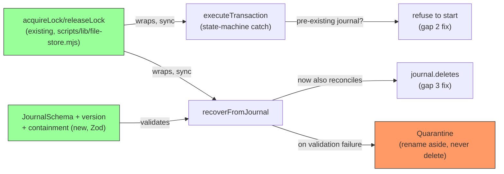

# Plan: Harden `scripts/lib/install/transaction.mjs`'s WAL Crash-Safety Contract

- **Date**: 2026-07-16
- **Status**: Complete
- **Author**: Claude + Louis
- **Scope**: backend
- **Target domain(s)**: `install`
- Single domain — no cross-domain concern (the sibling audit-clean.mjs/
  diff-scope-resolver.mjs traversal-safety work is tracked as a separate
  plan, `docs/plans/audit-cleanup-traversal-safety.md`, since it's a
  different domain — `audit-orchestration` — with zero shared code).

> **Origin**: deferred by `docs/completed/windows-fs-transient-error-hardening.md`'s
> code-audit (rounds 1-3) as genuinely out-of-scope for that narrower
> retry-hardening plan — this file's `renameSync`/`unlinkSync` calls are
> already retry-hardened; these are separate, deeper gaps in the WAL's
> own crash-safety/concurrency/validation design that the retry work
> never touched. The user asked to close this now.

---

## 1. Context Summary

**Scope/stack**: backend; `js-ts` (Node ESM, `engines: >=22`).

**What exists today**: `scripts/lib/install/transaction.mjs` implements a
crash-safe install transaction via an on-disk write-ahead log (its own
docstring: "It is created + fsynced before any write occurs... If the
process crashes mid-transaction, the next installer run detects the
journal and either rolls forward... or rolls back"). Read in full this
session (249 lines) — the guarantee is **real but incomplete** in 6
specific ways.

**Code Trace** (every gap traced to the exact line, not inferred):

1. **`fsyncFile()` (line 50-52) swallows every fsync error identically**:
   `try { fs.fsyncSync(fd); } catch { /* best-effort */ }`. The comment
   only justifies this for "some filesystems lack fsync support" — but
   the same catch also swallows a genuine `EIO`/`ENOSPC` disk error,
   silently downgrading a real durability failure to the same
   no-op as an unsupported-feature no-op. The file's own docstring
   claims "fsynced before any write occurs" — this makes that claim
   sometimes false without any signal.
2. **No concurrent-instance locking**: neither `executeTransaction` nor
   `recoverFromJournal` acquires any lock around the journal path. Confirmed
   this is a real, not hypothetical, exposure — `scripts/install-skills.mjs::reconcileJournals`
   (lines 150-157) calls `recoverFromJournal` at every installer
   startup; two concurrent installer invocations (a user re-running
   install, or two sibling consumer-repo installs sharing a machine)
   race on the same `.audit-loop-install-txn.json`.
3. **`recoverFromJournal` never reconciles recorded deletes.** Traced the
   full lifecycle: `executeTransaction`'s Phase 4 (delete loop, lines
   154-173) runs strictly AFTER Phase 3 (rename loop) with **no
   intervening journal update** — the journal still reads
   `stage: 'renaming'` throughout Phase 4. If the process crashes during
   Phase 4, `recoverFromJournal`'s `'renaming'` branch (lines 225-232)
   rolls forward any incomplete **renames** and then unconditionally
   deletes the journal (line 242) — `journal.deletes` is never read
   anywhere in `recoverFromJournal`. Files that should have been removed
   are silently left in place with no second chance at cleanup.
4. **`recoverFromJournal` trusts journal-provided paths with zero
   validation** — `journal.staged[].absPath`/`.tmpPath` are parsed from
   JSON and used directly in `fs.renameSync`/`fs.unlinkSync`/`fs.existsSync`
   with no schema check, no containment check. The realistic threat here
   is corruption (a partial write, an interrupted process, a bad merge
   of a stray file), not an external attacker — the journal is
   self-written by this same tool, not user-supplied input — but
   `INC-001`'s lesson (`docs/security-strategy.md`, consulted this
   session, cosine 0.64: "Path classification on lexical strings is
   necessary but not sufficient... Fail-closed on resolution errors")
   still applies to the corruption case: a malformed journal should be
   rejected loudly, not partially trusted.
5. **`writeJournal()` (line 59-71) can leave its own temp file behind.**
   `fs.writeFileSync(fd, content)` / `fsyncFile(fd)` run inside a
   `try {...} finally { fs.closeSync(fd) }` with no `catch` — the `finally`
   closes the descriptor, but if `writeFileSync` throws, the temp file
   itself is never unlinked and the exception propagates raw. Mirrors
   the exact class of gap `atomicWriteFileSync` was hardened against
   (its own temp-cleanup-on-failure `catch`), just not applied here
   since `writeJournal` predates that pattern and does its own fsync
   (which `atomicWriteFileSync` doesn't do, so simple delegation isn't
   an option — see Sustainability Notes).
6. **`executeTransaction`'s documented return contract only holds for
   Phase 3 failures.** Its own JSDoc promises `{success, written, deleted,
   skippedDeletes, error}` on any failure. Traced each phase: Phase 1
   (snapshot + first `writeJournal` call, lines 91-116) and Phase 2
   (staging writes, lines 118-130) have **no surrounding try/catch at
   all** — a thrown error from either phase propagates raw out of
   `executeTransaction`, silently breaking the documented contract for
   any caller that (correctly) only handles the return-value failure
   shape. Only Phase 3 (lines 140-152) has the try/catch + rollback the
   docstring implies applies throughout.

**Test coverage found** (checked, not assumed): `tests/install/transaction.test.mjs`
(3 tests — `executeTransaction` happy paths only) and
`tests/install/lifecycle.test.mjs` (12 tests — `recoverFromJournal` +
delete-with-orphan-protection covered) exist, but **none** of the 6 gaps
above have any test today — grep-confirmed zero matches for
`concurrent`/`fsync`/`lock` in either file, and no test constructs a
journal with a crash mid-Phase-4 or a malformed journal.

**Patterns reused vs new**: reuses `scripts/lib/file-store.mjs::acquireLock`/`releaseLock`
(already used internally by `MutexFileStore` for the identical
single-exclusive-writer need, and exported specifically "for external
use... without MutexFileStore state writes" per its own docstring) for
the concurrency fix — no new locking primitive. **Deliberately NOT**
`scripts/lib/brainstorm/file-lock.mjs::withFileLock` — checked its actual
signature before designing around it (not assumed): `withFileLock` is
`async` (`export async function withFileLock(lockPath, opts, fn)`).
`executeTransaction`/`recoverFromJournal` are currently fully
synchronous, and so is their only caller,
`scripts/install-skills.mjs::main()` (bare `main();` at the bottom, not
`await`ed) — adopting `withFileLock` would force both functions AND
`main()` AND `reconcileJournals()` to become `async`, a signature-breaking
cascade with no functional benefit here (nothing in this file's flow
needs to be async — every operation is already a sync `fs.*Sync` call).
`acquireLock`/`releaseLock` are fully synchronous, so the fix stays
localized to `transaction.mjs` with zero caller changes. Reuses this
repo's existing Zod-schema-for-persisted-JSON pattern (used throughout
`scripts/lib/schemas.mjs`) for journal validation — no new validation
framework.

**Neighbourhood considered**: `scripts/install-skills.mjs::reconcileJournals`
(similarity 0.38, the actual caller — confirms the concurrent-instance
risk is real, not hypothetical, and confirms the sync-call-chain that
ruled out `withFileLock`) and `scripts/lib/file-store.mjs::_acquireLockSync`/`acquireLock`
(0.39 — the chosen primitive, per the above).

**Security incidents consulted**: `INC-001` (symlink/path-canonicalisation
bypass, cosine 0.64) informs gap 4's fix — fail-closed on an unresolvable
or malformed journal rather than partially trusting it. `INC-002`
(DB-wipe from an unverified test DSN) returned as a candidate but shares
no trust boundary with this plan (DSN safety vs. WAL journal integrity).

---

## 2. Proposed Architecture



No new files except a small schema addition (co-located in
`transaction.mjs` itself — see right-sizing gate below, a separate
schema module isn't warranted for one journal shape). **Redesigned at
audit-plan R1** — GPT's round 1 (H:5, M:2, all genuine — no rigor
pressure) found the original 6 fixes underspecified the actual
crash-safety state machine. Redesigned as 7 fixes:

1. **fsync failure is now a hard abort for definite failures, honestly
   degraded (not silently) for unsupported-feature cases** (R1-H1,
   revised; R2-H3 pushed for hard-abort on ENOTSUP/directory-fsync too —
   partially accepted, partially rebutted, see below): the original
   "warn and continue" design defeated the WAL's own purpose — if the
   journal isn't durably on disk, proceeding with renames means the
   installer mutates files with no recoverable record. `fsyncFile` now
   takes a `{critical: boolean}` flag; for the journal's own fsync
   (`critical: true`), a non-benign error code (anything except
   `ENOTSUP`/`EINVAL`) makes `writeJournal` **throw**, which Fix 7's
   state machine correctly treats as a before-mutation abort. Staged-file-content
   fsync (already present, Phase 2) stays `critical: true` too. **Directory
   fsync added** (R1-H1's second point): POSIX `rename` durability
   requires fsyncing the *containing directory*, not just the file —
   added after the journal rename and after each target rename in
   Phase 3.
   **R2-H3's pushback and this plan's response**: R2 argued that
   treating `ENOTSUP`/`EINVAL` (critical fsync) and every directory-fsync
   failure as best-effort retains an "unconditional crash-safety"
   framing the implementation can't actually provide, and that
   `executeTransaction` still reports unqualified success in those
   cases. **Accepted in part**: the *framing* was wrong — this plan's
   Context Summary and this file's own docstring will state the honest,
   narrower guarantee ("best-effort, platform-dependent durability —
   hard-aborts on definite fsync failures; degrades with a **visible**
   warning, never silently, when fsync/directory-fsync isn't supported
   by the platform") instead of implying an unconditional guarantee.
   **Rebutted in part**: hard-aborting installs on `ENOTSUP`/directory-fsync
   failure is the over-engineered extreme for a local developer CLI tool
   — some real, legitimate environments (certain network filesystems,
   some container volume mount types, older filesystem versions)
   genuinely lack full fsync support, and making this tool refuse to
   install at all there is a materially worse practical outcome than an
   honestly-degraded-and-warned install. This is a judgment call
   documented explicitly (Risk register), not an oversight — the line is
   drawn at "silent" vs. "loud," not "best-effort" vs. "database-grade
   ACID."

   **R3-M1 — "loud" was load-bearing but never specified; specify it or
   it won't happen.** The entire R2-H3 compromise above rests on
   degradation being *visible*, yet the design named only
   `fsyncFile({critical})` — no result type, no warning channel, no
   caller-side rendering. An implementer could satisfy the letter of the
   plan with a silent `catch {}` or an ad-hoc `console.warn`, recreating
   precisely the silent-degradation behaviour R2-H3 rejected. A guarantee
   with no specified delivery mechanism is a guarantee that quietly
   doesn't exist. **Contract**:
   - `fsyncFile(fd, {critical, what})` returns
     `{ok:true} | {ok:false, degraded:{code, what}}`, and **throws only**
     when `critical` and the code is outside the benign allowlist
     (`ENOTSUP`/`EINVAL`). Non-critical (directory) failures and benign
     critical codes return `degraded` — never throw, never swallow.
   - `executeTransaction` collects every `degraded` into a local array and
     returns it as **`degradations: [{code, what}]`** on its existing
     result object (additive; `[]` on the happy path, so no caller
     breaks).
   - The **caller renders it**: `install-skills.mjs` prints one stderr
     line per degradation
     (`⚠ durability degraded: <what> fsync unsupported (<code>) — install completed but is not crash-safe on this filesystem`).
     Putting rendering in the caller (not deep in `fsyncFile`) keeps
     `transaction.mjs` free of I/O-presentation concerns and matches this
     repo's `process.stderr.write`-at-the-CLI-boundary convention.
   - **Test**: an injected `ENOTSUP` on the directory fsync yields
     `success:true` **with a non-empty `degradations`** — asserting the
     warning path exists rather than trusting prose. This is the
     "audit your success paths" rule from
     `docs/pre-ship-empirical-verify.md`: a degraded install that reports
     clean is exactly the false-green that doctrine names.
2. **Concurrent-instance locking + pre-existing-journal check** (R1-H4/H5
   combined; **the lock parameterisation was factually wrong until R2-M1**):
   wrap `executeTransaction`'s entire body and `recoverFromJournal`'s
   entire body in
   `acquireLock(journalPath + '.lock')` / `try {...} finally { releaseLock(...) }`
   — the exported-for-this-purpose sync primitive from
   `scripts/lib/file-store.mjs`, zero signature changes to callers.

   **R2-M1 correction — read the primitive, don't assume its signature.**
   R1's design passed `300_000` as a second argument, describing it as a
   "conservative 5-minute timeout … install runs are usually seconds, but
   a debugger pause is plausible". That was a misreading, verified against
   the source this round: the signature is
   `acquireLock(lockPath, staleLockTimeoutMs = 60000)`
   (`file-store.mjs:80`) — the parameter is **the age at which an EXISTING
   lock is declared stale and force-broken**, not a wait budget. The wait
   is hard-coded and unconfigurable: `maxAttempts = 50` × `retryMs = 100`
   (`file-store.mjs:39-40`) = **5 seconds**, after which it **throws**
   (`file-store.mjs:69`). So R1's `300_000` inverted its own stated intent
   — it made a contended install *more* likely to fail, by refusing to
   break a crashed predecessor's lock for 5 minutes, while doing nothing
   whatsoever for patience. The plan's own §8 row already contained the
   correct fact ("max 50×100ms=5s") sitting beside the wrong
   interpretation; neither R0 nor R1 noticed the self-contradiction.

   **Corrected design**: pass no second argument — take the primitive's
   own `60000` default. Rationale, stated as a real trade-off rather than
   a number pulled from intuition:
   - *Wait budget (5s, fixed)*: absorbs brief overlap. Beyond it, an
     installer that **refuses to start** while another install holds the
     journal is the correct behaviour — two concurrent installs racing the
     same journal is the failure this lock exists to prevent, so failing
     fast with a clear message beats waiting.
   - *Stale age (60s)*: bounds how long a **crashed** predecessor's
     orphaned lock blocks recovery. The 300s of R1 would have made a
     crashed install un-recoverable for 5 minutes — strictly worse for
     the exact scenario this plan exists to serve. 60s is comfortably
     above a normal install (seconds) while keeping post-crash blockage
     short.
   - The R1-H4 limitation stands and is unchanged by this correction: the
     takeover is timestamp-age-based, not liveness-based, so a holder
     stalled past 60s can be preempted. Fixing that means changing the
     shared primitive (other callers: `MutexFileStore`) — out of scope
     (see Out of Scope), flagged rather than silently accepted.

   **Public failure contract (R2-M1's second half — was unspecified)**:
   `_acquireLockSync` throws a plain `Error` on exhaustion
   (`file-store.mjs:69`). Both entry points MUST catch it at the lock
   boundary and convert it into the documented return shape rather than
   letting a raw lock error escape as if it were a transaction failure:
   `{success: false, error: 'another install is in progress (lock held at <path>) — retry in a moment'}`.
   `recoverFromJournal` returns the analogous `{recovered: false, error: …}`.
   Neither performs ANY filesystem mutation before the lock is held, so a
   lock failure is always a clean no-op — nothing to roll back.

   **R3-H1 — this fix created a new hole in the R2-H2 fix; the caller must
   key on `error`, not on a growing list of named flags.** R2-H2 made
   `reconcileJournals` treat `rec.quarantined` as fatal. But R2-M1 (above)
   then introduced a *second* non-benign failure result —
   `{recovered:false, error:'another install is in progress…'}` — which
   `reconcileJournals` still cannot distinguish from the benign
   "no journal exists" case, so a lock-contended recovery would silently
   fall through and the install would proceed over unrecovered state.
   Enumerating flags is how this recurs a third time. **Corrected rule:
   `reconcileJournals` treats ANY truthy `rec.error` as fatal**, and the
   benign no-journal case is the *only* result carrying neither `error`
   nor `quarantined`. `quarantined` then serves purely as extra context in
   the message (which path to inspect), not as the gate. New failure
   modes added later are fatal by default — fail-closed by construction
   rather than by remembering to extend a list.

   **New**:
   after acquiring the lock, `executeTransaction` now checks
   `fs.existsSync(journalPath)` — R1-H5 caught that the original design
   silently overwrote a leftover journal from an unrecovered prior crash,
   destroying its recovery record. A pre-existing journal now makes
   `executeTransaction` refuse to start
   (`{success:false, error: 'a prior transaction journal exists — run recovery first'}`)
   rather than blindly overwrite it.
3. **Delete reconciliation on recovery** (unchanged from the R0 draft —
   not touched by R1's findings): `recoverFromJournal`'s `'renaming'`
   branch, after rolling forward staged renames, now ALSO iterates
   `journal.deletes` via a shared `attemptDelete(d)` helper factored out
   of `executeTransaction`'s own Phase 4 (both call sites share one
   implementation, can't drift). Deletes are naturally idempotent-safe to
   retry.
   **Gemini-G2-M1 — share the helper, share its OUTPUT too (accepted).**
   Factoring `attemptDelete` gave both callers the orphan-protection
   *behaviour* (`expectedSha` skip-on-conflict) but only `executeTransaction`
   projects its `skippedDeletes` to the user. `recoverFromJournal`'s return
   shape was never widened, so a conflict-skip **during crash recovery** —
   precisely when the user most needs to know a file they modified was left
   alone — is silently swallowed. Sharing an implementation while dropping
   half its result is a subtler form of the drift the factoring was meant to
   prevent. Fixed: `recoverFromJournal` returns `skippedDeletes: []`
   (additive; `[]` on the happy path), and `reconcileJournals` renders each
   entry as a warning line alongside the R3-M1 `degradations` rendering —
   same channel, same one-line-per-item shape.
4. **Journal validation: schema + version + real path containment**
   (R1-H2/M1, widened again at R2-H1/H4): the R0 draft's "self-written,
   not third-party input" framing was wrong on two counts, both caught
   at R1. **(a) Path containment (R1-H2, corrected R2-H4)**: R1's design
   (`realpathSync` only when the FULL path already exists, else a bare
   lexical/absolute check) was itself insufficient — R2-H4 caught the
   exact `INC-001` attack class this fix was meant to close: a rename
   TARGET legitimately does not exist before the rename (so the
   "exists" branch never fires for the common case), and a lexical
   check alone misses a symlinked *ancestor* directory
   (`<repo>/generated-link/new-file` is lexically inside the repo while
   `generated-link` itself resolves outside it). Fixed properly: walk
   upward from the target path until an EXISTING ancestor is found,
   `realpathSync` THAT ancestor, verify the resolved ancestor is
   contained within **one of `allowedRoots`** (see (b2) — NOT a single
   `repoRoot`; that assumption was itself wrong), then re-append the
   (necessarily non-symlink, since they don't exist) remaining path
   segments and verify the reconstructed full path is still contained
   in that same root (defends
   against a literal `../` embedded in a journal entry's un-resolved
   tail). No existing repo helper does this — the closest,
   `scripts/lib/gate-honesty/schema.mjs::resolveContainedPath` (checked
   this round, not assumed), wraps `resolveAndClassify`, which
   fail-closes on `ENOENT` — exactly wrong for a target that's SUPPOSED
   to not exist yet. New small helper, local to `transaction.mjs` (one
   consumer, no shared-module warranted per the right-sizing gate).

   **(b2) Containment is against an ALLOWED-ROOT SET, not a single
   `repoRoot` (Gemini-G1 — this would have broken the global install
   surface).** Every prior round of this plan — R0 through R3, GPT and me
   alike — wrote "contained within `repoRoot`" without checking what
   `executeTransaction` is actually handed. It is handed a **mixed-scope**
   write list: `install-skills.mjs:243` builds `allSafe` from repo-scoped
   **and** global-scoped writes, and `:322` passes that single list to one
   transaction. Global-scope writes target the user's `~/.claude/skills/`
   surface (`surface-paths.mjs:99`), which is **not** under `repoRoot`. A
   single-root containment rule therefore rejects every global write →
   quarantines a perfectly valid journal → durably blocks installs (via
   R3-H2's new blocker). The hardening would have broken the feature it
   was hardening.
   - **Fix**: validation takes an explicit `allowedRoots` array —
     `[repoRoot, globalSurfaceRoot]` — and each entry must canonicalise
     (per the walk-to-ancestor algorithm above) into **at least one** of
     them. `globalSurfaceRoot` is derived from the same
     `surface-paths.mjs` helpers the writer uses, never recomputed from
     `os.homedir()` locally — one source of truth for where the global
     surface lives, so the reader cannot drift from the writer.
   - **The INC-001 protection is fully retained**: a symlinked ancestor
     escaping to `/etc/` or `~/.ssh/` is contained by *neither* root and
     still fails. Widening from one root to two named roots is not
     loosening — it is describing the transaction's real, pre-existing
     boundary instead of a boundary I assumed.
   - **Note on Gemini's stated mechanism**: it reported "two
     `executeTransaction` scopes". Verified — that part is not accurate;
     there is exactly ONE call site (`:322`), writing one journal at
     `repoRoot`. The *substance* is nonetheless correct and load-bearing
     (one transaction, two write roots), so it is accepted on the verified
     mechanism rather than the reported one.
   - **Separately surfaced by the same check**: `reconcileJournals`
     (`:152`) scans for a journal at `path.dirname(globalReceiptPath)` =
     `os.homedir()`, i.e. `~/.audit-loop-install-txn.json` — a path **no
     current code path ever writes** (the only writer is `:322`, at
     `repoRoot`). It is vestigial. This plan does **not** remove it:
     recovering a journal left by an older version that *did* write there
     is exactly the backward-compatible behaviour R2-H1 established, and
     an unused recovery scan is harmless. Recorded here so a future reader
     doesn't mistake it for evidence of a second writer (as this audit
     initially did).
   **(c) Staged-pair structural invariant (R3-H3 — PARTIALLY accepted).**
   R3-H3 correctly observes that containment stops an *escape from the
   repo*, not a *destructive operation within* it: a structurally valid
   journal whose `tmpPath` and `absPath` both resolve inside `repoRoot`
   could direct recovery to rename one unrelated repo file over another.
   - **Accepted (cheap, and it asserts an invariant the writer already
     maintains)**: `executeTransaction` builds every staged pair as
     ``tmpPath = `${absPath}.tmp.${tmpSuffix()}` `` (`transaction.mjs:105-107`)
     — `tmpPath` is *always* its own `absPath` plus a `.tmp.<suffix>`
     extension. Validation now asserts exactly that, per entry. It makes
     R3-H3's scenario impossible **by construction** (a pair naming two
     unrelated files cannot satisfy it) for one string comparison. An
     invariant the writer already guarantees but the reader never checked
     is not new machinery — it closes the gap between the two.
   - **Rebutted (the broader ask — "semantic invariants connecting a staged
     source, target, delete entry, and this transaction")**: that presumes
     an adversary who can author `<repoRoot>/.audit-loop-install-txn.json`
     but cannot touch the files it names. No such actor exists here — the
     journal is written by this installer, in this repo, under the
     operator's own uid; anyone able to forge it can edit the target files
     directly, so the invariant buys no security. Recovery also already
     has two real bindings to the originating transaction: it rolls forward
     only entries whose randomized `tmpPath` still exists (created by
     *this* transaction's staging phase and nothing else), and deletes
     carry `expectedSha` with a skip-on-conflict path
     (`transaction.mjs:154-166`). Containment defends against *accidents*
     (R2-H4's symlinked-ancestor class), the real threat for a local dev
     installer. A transaction-identity protocol to defeat an attacker who
     already holds write access is the over-engineering cliff.
   **(b) Version field (R1-M1, corrected R2-H1)**: R1's design made
   `version: 1` a REQUIRED field — R2-H1 caught that this makes every
   journal written by the CURRENTLY DEPLOYED code (before this plan
   ships) invalid on its first post-upgrade recovery attempt, since
   those journals have no version field at all — exactly the in-flight,
   legitimately-recoverable crash scenario this whole plan exists to
   handle. Fixed: `version` is now OPTIONAL; its absence means the
   legacy (pre-this-plan) format and is treated as fully valid/recoverable
   (not quarantined); only an EXPLICIT, unrecognized value (a future
   version this code doesn't know how to read) is schema-invalid.
   Newly-written journals (by this updated code) always include
   `version: 1`; only a hypothetical FUTURE version bump would ever
   produce a rejected value.
5. **Corrupt/invalid journals are quarantined, never deleted** (R1-H3 —
   the single most important fix this round): the R0 draft's "delete an
   invalid journal to avoid an infinite recovery loop" was itself a
   quick-fix — a schema-invalid or version-mismatched journal may
   describe a transaction that already partially renamed/deleted targets;
   destroying the only recovery record turns an observable, blocked
   condition into silent, undetectable partial-install state. Adopts the
   exact pattern `scripts/lib/file-store.mjs::_quarantineRecord` already
   established in this repo for "never silently discard corrupted
   recoverable state" (adapted locally, not imported — that function is
   module-private): on any validation failure (JSON-parse, schema, version,
   or containment), the journal is **renamed aside** (not deleted) with the
   validation error recorded alongside it, and
   `recoverFromJournal` returns `{recovered:false, error, quarantined: <path>}`
   so the caller can surface it loudly rather than silently proceeding.

   **R2-M2 correction — reuse the EXISTING quarantine location; do not
   invent a new artifact.** R1 specified
   `<journalDir>/.audit-quarantine/<basename>.<timestamp>.json`, a brand-new
   top-level directory. Three things are wrong with that, all found by
   reading the code this round rather than reasoning from the name:
   - **The repo already has this artifact.** `.audit/quarantine/` is
     already in the installer's own `OPERATIONAL_PATTERNS`
     (`scripts/lib/install/gitignore.mjs:31`) and is exactly where
     `_quarantineRecord` — the pattern R1 claimed to mirror — actually
     writes. R1 mirrored the *idea* and invented a *new location*, which
     is the drift this repo's generated-artifact policy exists to
     prevent. **Corrected target: `<repoRoot>/.audit/quarantine/`.** Zero
     new gitignore entries; genuinely the established pattern.
   - **Do NOT copy `_quarantineRecord`'s path derivation.** It computes
     `path.dirname(sourcePath)/../quarantine` (`file-store.mjs:20`), which
     is correct for its callers (sources under `.audit/<sub>/`) but
     **escapes the repository** for ours: the journal lives at
     `<repoRoot>/.audit-loop-install-txn.json` (`transaction.mjs:247`), so
     `dirname` is `repoRoot` and `../quarantine` resolves to
     `<repoRoot>/../quarantine` — a sibling of the repo. The target is
     constructed explicitly from `repoRoot`, and is itself subject to the
     Fix-4 containment check.
   - **The lock file is genuinely un-ignored** (the real gap R2-M2 names,
     and it survives the relocation above). Fix 2's lock is
     `<journalPath>.lock` = `<repoRoot>/.audit-loop-install-txn.json.lock`
     at the repo **root**. `OPERATIONAL_PATTERNS` covers
     `.audit/**/*.lock` (only under `.audit/`) and the journal's exact
     filename (`:44`) — neither matches. Without a new pattern, every
     install dirties the consumer's working tree with an untracked file,
     and a crashed install leaves it there permanently. **Add
     `.audit-loop-install-txn.json.lock` to `OPERATIONAL_PATTERNS`.**

   Both artifacts are **Category A** under the generated-artifact policy
   (derived from crash state, volatile, never a pure function of committed
   source) → gitignored, never committed. `scripts/lib/install/gitignore.mjs`
   joins the file-level plan.

   **R3-H2 — quarantining REMOVES the blocker it was meant to preserve
   (the deepest hole found in this audit).** R1-H3 correctly rejected
   "delete the invalid journal" because it destroys recovery evidence. But
   the quarantine design traded that for the opposite defect, and I did
   not notice: quarantine **renames the journal away from
   `<repoRoot>/.audit-loop-install-txn.json`**. On the *next* invocation
   there is therefore no journal at all — Fix 2's pre-existing-journal
   refusal does not fire, `recoverFromJournal` reports the benign
   no-journal case, and a fresh transaction proceeds happily **over
   partially-applied state from the crashed one**. Aborting the *current*
   invocation (R2-H2) never addressed this: it stops run N, not run N+1.
   So R0 destroyed the evidence, and R1–R2 preserved the evidence while
   destroying its only effect. Both fail the same requirement — an
   unresolved partial transaction must **durably block** installs until a
   human resolves it.

   **Fix — the quarantine directory IS the blocker; no new artifact.**
   `executeTransaction`'s pre-flight (Fix 2) checks *two* conditions, not
   one: (a) no live journal at `journalPath`, and (b) **no unresolved
   quarantined journal** — i.e. `<repoRoot>/.audit/quarantine/` contains no
   `<journalBasename>.*.json` entry. Either → refuse to start:
   `{success:false, error:'a prior install transaction was quarantined at <path> and has not been resolved — inspect it, then remove it to unblock installs'}`.
   Resolution is deliberately a **human deleting the file after reading
   it**: the whole reason the journal was quarantined is that this code
   could not understand it, so no automatic resolution rule can be
   trustworthy — the operator is the only party who can decide whether the
   partial state is safe. This keeps evidence AND restores blocking, with
   zero new artifacts (the dir already exists and is already ignored), and
   it makes the block **durable across runs** rather than per-invocation.
   The scan is scoped to this journal's basename so an unrelated
   `_quarantineRecord` entry from `file-store.mjs` can never block an
   install.

   **Gemini-G2-H2 — the durable blocker had its own bypass (accepted).**
   The R3-H2 design has the same shape of hole it was written to close, one
   scope over. `reconcileJournals` (`:152`) recovers from **two** journal
   locations — `repoRoot` and `os.homedir()` (the vestigial global journal,
   see Fix 4(b2)). If the *global* journal is the corrupt one, quarantining
   it "next to itself" would put the record under the home directory, while
   `executeTransaction`'s pre-flight scans only `<repoRoot>/.audit/quarantine/`
   — so the block silently never fires for a subsequent local install. The
   caller-side `error` check (R3-H1) still aborts the run where the
   quarantine *happens*, but the next run finds no journal (it was moved)
   and no blocker (wrong directory) and proceeds — R3-H2's exact failure,
   reintroduced through the scope I had not considered.
   **Fix — one canonical quarantine location, not one-per-source.** ALL
   quarantined journals go to `<repoRoot>/.audit/quarantine/`, regardless of
   which journal location they came from, with the originating path recorded
   *inside* the quarantine record (it is already carrying the validation
   error, so this is a field, not a new artifact). The pre-flight scans that
   single directory. Rationale: `executeTransaction` is always repo-anchored
   (`install-skills.mjs:322`), so the repo is the correct blocking anchor,
   and "one place to look" is the property that made the blocker durable in
   the first place — a per-source quarantine location reintroduces exactly
   the enumerate-every-scope fragility that R3-H1 rejected for error flags.
   **Caller-side propagation added (R2-H2)**: R1 designed the quarantine
   signal but never checked whether its only caller actually surfaces
   it — it doesn't. `scripts/install-skills.mjs::reconcileJournals`
   (line 150-157) today only logs when `rec.recovered` is truthy; a
   `{recovered:false, error, quarantined}` result is currently
   indistinguishable from the ordinary, benign "no journal exists"
   case and the install would silently continue, potentially building
   a fresh transaction on top of unresolved quarantined state — the
   exact silent-continuation failure mode this fix exists to prevent.
   `reconcileJournals` now checks for `rec.quarantined` explicitly and
   treats it as fatal: prints the error + quarantined path clearly and
   aborts the install (`process.exit(1)`) rather than proceeding. This
   is the one caller-side change in this plan (the lock fix itself
   remains zero-caller-change; only quarantine-signal propagation
   needs one).
6. **`writeJournal` temp-file cleanup**: unchanged from the R0 draft —
   wraps the write in `try/catch`, unlinks the temp file and rethrows on
   failure (now also the natural path for Fix 1's hard-abort-on-fsync-failure).
   **Ordering constraint (Gemini-G2-H1 — rationale REBUTTED, ordering
   ADOPTED anyway).** Gemini argued the cleanup would throw `EPERM`/`EBUSY`
   because `catch` runs *before* `finally { closeSync(fd) }`, so the unlink
   targets a still-open descriptor — masking the original error and leaking
   the temp file. **Empirically false on the target platform**: a direct
   repro on this machine (Windows 11, `win32`) opening `fd = openSync(p,'w')`,
   writing, then `unlinkSync(p)` **while the fd is still open** →
   *succeeded*, file removed, no error. Windows 10 1709+ / libuv use POSIX
   delete semantics (`FILE_SHARE_DELETE` + POSIX disposition), so the
   "Windows cannot delete open files" folklore does not apply to Node's own
   descriptors. Asserted from an executed repro, not from reasoning —
   third-time-lucky on this session's "verify the surprising claim" rule.
   **However, the ordering is adopted regardless**: `closeSync` the fd
   *before* unlinking in the cleanup path. Not to fix EPERM (there isn't
   one), but because it is free, unambiguously correct, and forecloses the
   residual class I *cannot* characterise from one repro — network shares,
   AV/indexer handles, older Windows builds. Accepting a zero-cost ordering
   is not cargo-culting a disproven premise; asserting the premise would be.
7. **`executeTransaction` as an explicit state machine, not a blanket
   try/catch** (R1-H5, redesigned): the R0 draft's "wrap the whole
   function in try/catch, always roll back and clean the journal" was
   itself unsafe — R1 correctly named the specific states that need
   *different* handling: before the journal is durably written (no
   cleanup needed — nothing has changed on disk yet); during/after
   staging (Phase 2, roll back the same way Phase 3 failures already do
   — no target has been touched, only `.tmp` files exist); during/after
   renaming (Phase 3 — existing rollback, unchanged); **during deletes
   (Phase 4) — a NEW, distinct case**: at this point every rename already
   succeeded, so rolling them back would be *wrong* (they're legitimately
   complete); an unexpected failure here must leave the journal in place
   (still `'renaming'` stage) rather than calling `cleanupJournal`, so
   Fix 3's recovery-time delete-reconciliation gets a chance to finish
   the job on the next run instead of the failure being silently
   forgotten. Implemented via a small internal `stage` tracker consulted
   in a single top-level `catch`, not per-phase try/catch blocks
   scattered through the function.

   **R2-H5 correction — the R1 stage set had a hole that leaks temp files.**
   R1's set was
   `'not-started' | 'journal-written' | 'staged' | 'renamed' | 'deleting'`
   — with **no state covering staging-in-progress**. Phase 2 writes
   *several* temp files; if the 3rd of 7 fails, `stage` is still
   `'journal-written'`, whose documented handling above is "no cleanup
   needed — nothing has changed on disk yet". That is **false** in
   exactly this window: the journal IS durable and 2 temp files DO exist,
   so the catch cleans nothing and they leak. The R1 prose even says
   "during/after staging … roll back" while the R1 state set makes
   "during staging" unrepresentable — the same shape of self-contradiction
   R2-M1 found in the lock parameterisation.

   **Corrected state set** (6 states, one per *boundary the disk can be
   observed at*, not per phase):
   `'not-started' | 'journal-written' | 'staging' | 'staged' | 'renaming' | 'renamed' | 'deleting'`.
   `'staging'` is entered **before the first temp write** and exited only
   once every temp file exists; its catch handling removes every temp file
   created so far. Symmetrically, `'renaming'` is entered before the first
   rename (R1 conflated it with `'staged'`, which has the same hole one
   phase later — a rename failing at 3-of-7 leaves 3 targets replaced
   while `stage` still reads `'staged'`).

   **Cleanup must be driven by the journal, not by an in-memory list**
   (the invariant that makes this correct rather than merely more
   granular): the journal is written durably *before* staging begins and
   already records every `staged[].tmpPath`/`.absPath`, so both the
   in-process catch AND `recoverFromJournal` can enumerate exactly the
   same candidate set and use `existsSync` per entry (already the
   established idempotency pattern for `attemptDelete`, Fix 3). An
   in-memory "files I created so far" array would be correct in-process
   and useless after a crash — two mechanisms that must agree, i.e. the
   drift this plan exists to eliminate. One enumeration source, two
   callers.

8. **Journal placement follows the transaction's SCOPE, and a foreign journal
   blocks** (the Gemini code-audit HIGH — the gap that BLOCKED this plan;
   closed 2026-07-17).

   **The defect**: a mixed-scope transaction mutates both `<repoRoot>` and the
   SHARED `~/.claude/skills/` surface but journalled only to `<repoRoot>/`. A
   crash mid-global-rename stranded the sole recovery record inside repo A —
   invisible to repo B, which found nothing, broke A's stale global lock after
   60s, and installed over the half-applied global state. Repo-scoped blocker,
   global damage: the plan's own durable-blocker guarantee was false.

   **(a) Placement — anchor at the WIDEST surface touched.** A transaction that
   touches the global surface journals at `~/.audit-loop-install-txn.json`
   (already scanned by `reconcileJournals`, previously vestigial — it was the
   right location all along, just never written); a purely repo-scoped one keeps
   `<repoRoot>/.audit-loop-install-txn.json`. Quarantine follows the same anchor
   (`~/.audit-loop-install-quarantine/` for global), because a global journal
   quarantined into whichever repo happened to find it leaves every other repo
   unblocked — Gemini-G2-H2's defect one scope over. **Rejected: two journals**
   (repo + global) — two sources of truth, and it breaks cross-scope rollback,
   which today correctly reverts global renames when a repo rename fails.

   **(b) Ownership without circularity — an identity CLAIM, not an
   authorisation.** Recovery must validate containment for a journal whose
   originating repoRoot is not the recovering process's. Recording `repoRoot`
   inside the journal looks circular *only if the journal is trusted to
   authorise its own paths*. It isn't: `originRepoRoot` is compared **only**
   against the recovering process's independently-known repoRoot, to answer "is
   this mine?". `allowedRoots` still comes exclusively from the caller
   (`[myRepoRoot, globalSurfaceRoot()]`), so a journal claiming
   `originRepoRoot: '/etc'` widens nothing — it simply fails to match. That
   distinction is the whole fix.

   **(c) A foreign journal BLOCKS — argued, not assumed.** Repo B never rolls
   forward repo A's journal, and never moves it:
   - *Rolling forward isn't ours to do.* The transaction is only half the
     install — the originating process writes the receipt AFTER commit
     (`install-skills.mjs`, `writeReceiptsByScope`). Repo B completing A's
     renames would leave A with files installed and no receipt, so A's next
     install computes no deletes and orphans them. This is the decisive
     argument: even a global-ONLY journal, which B *could* fully validate
     against `globalSurfaceRoot()` alone, is semantically not B's to finish.
   - *Bounded vs unbounded harm.* Blocking is loud and reversible; installing
     over unverified partial state silently corrupts a surface every repo
     shares.
   - *It is self-healing.* Repo A's next run recovers it and unblocks everyone;
     a human is needed only if repo A is gone — which genuinely warrants a human.
   - *Not quarantined.* Moving a foreign journal strands it from the only party
     who can resolve it automatically, converting a self-healing state into a
     permanent human-gated one. An UNPARSEABLE journal is still quarantined
     (to the global dir): no owner can ever be established, so no automatic
     resolution exists and the human needs the artifact. The asymmetry is
     principled, not accidental — parseable+foreign has a known owner; invalid
     has none.
   - **Order is load-bearing**: schema → **ownership** → containment. Running
     containment first would validate repo A's paths against repo B's roots and
     quarantine a perfectly healthy journal — the exact bug, inverted.

   **(d) Exhaustiveness — proven, not enumerated.** This gap was the THIRD
   instance of "I enumerated only the scopes I happened to think of" (R3-H1
   error flags; Gemini-G2-H2 quarantine locations; now placement). The fix is
   structural: ONE predicate, `touchesGlobalSurface(writes ∪ deletes)`, drives
   **all four** scope-dependent decisions — journal placement, the lock set, the
   quarantine target, and the pre-flight blocker scan. A scope can no longer be
   handled in one place and forgotten in another, because there is only one
   place. The predicate is **total** (a path either resolves inside the global
   surface or does not — no third case) and **monotone** (it asks "does this
   touch the shared surface?", not "is this exclusively repo-scoped"), so it
   stays correct even where roots overlap, e.g. a repo checked out inside `~`.
   Two latent bugs fell out of writing it down: the shipped lock predicate read
   only `writes` (a global-**deletes**-only transaction took no global lock),
   and `repoRoot` was derived FROM the journal path, so a caller passing only
   `repoRoot` journalled to the cwd while quarantining to the repo — two anchors
   for one transaction. Both fixed; both found by execution, not review.

**Right-sizing gate**:
- **Band-aid extreme**: only fix gap 1 (fsync visibility, the easiest)
  and call it done. Rejected — gaps 2/3/6 are correctness bugs (data
  loss / silent contract violation / a real concurrency race with a
  named caller), not polish; leaving them defeats the plan's own stated
  purpose.
- **Over-engineered extreme**: build a general-purpose WAL/transaction
  library (configurable isolation levels, a replay log format versioned
  independently, a separate schema module with its own test suite) for
  what is a single local-installer's crash-safety mechanism. Rejected —
  no current requirement drives generality beyond THIS journal's actual
  shape; a second, unrelated WAL user doesn't exist in this repo (compare
  `persona-consistency-promote.mjs`'s deliberately-separate,
  DB-coordinated promotion journal, which stays separate per the prior
  plan's own right-sizing decision).
- **Chosen**: 6 targeted fixes, each reusing an existing repo pattern
  (`acquireLock`/`releaseLock`, Zod schemas, the `atomicWriteFileSync`
  temp-cleanup-on-failure idiom) — no new abstractions, no new files
  beyond the schema addition.

**Manual vs scripted**: 6 fixes, one file, each requiring judgment about
exact failure-mode preservation (which errors are genuinely benign vs.
must surface) — hand-edited, not scriptable (not a repeated pattern
across many sites).

---

## 6. Sustainability Notes

**Why `writeJournal` isn't delegated to `atomicWriteFileSync`**: the WAL's
crash-safety guarantee specifically depends on `fsync`-before-rename
(durable on disk before the journal is considered "written"), which
`atomicWriteFileSync` deliberately does NOT do (it's a lighter-weight
primitive for the repo's many non-durability-critical config/ledger
writes). Delegating would silently weaken the one file in the repo that
actually needs the stronger guarantee — kept as its own small function,
now hardened directly.

**Assumptions that could change**: `acquireLock`'s stale-lock detection is
timestamp-age-based (not PID-liveness-based like `withFileLock`) —
an existing, already-accepted assumption this plan inherits from
`file-store.mjs`'s current design, not a new one; the default
`staleLockTimeoutMs` (60s) comfortably exceeds a normal install's
runtime. If `transaction.mjs` ever gains a second, structurally
different journal consumer, revisit whether the Zod schema should move
to a shared module (today, one consumer, one schema, co-located is
correct per the right-sizing gate).

---

## 7. File-Level Plan

| File | Intent | Purpose |
|---|---|---|
| `scripts/lib/install/transaction.mjs` | modify | All 7 redesigned fixes in place: `fsyncFile(fd, {critical, what})` returns `{ok}|{ok:false,degraded}` and throws only on a non-benign critical failure; `executeTransaction` surfaces collected `degradations: []` on its result (R3-M1); directory-fsync added as best-effort after journal/target renames; `executeTransaction`/`recoverFromJournal` wrapped in `acquireLock(journalPath + '.lock')`/`releaseLock` (sync, no signature change; **no second arg — the primitive's 60s stale default is correct, R2-M1**), with the lock-exhaustion `Error` caught at the lock boundary and converted to the documented `{success:false, error:'another install is in progress…'}` shape; a pre-flight that refuses to start on **either** a live journal **or an unresolved quarantined one** (R3-H2 — the durable blocker); `recoverFromJournal` reconciles `journal.deletes` via a shared `attemptDelete(d)` helper; a co-located `JournalSchema` (Zod, `version` OPTIONAL, real path-containment validation **against an `allowedRoots` set — `[repoRoot, globalSurfaceRoot]`, derived from `surface-paths.mjs`, NOT a single repoRoot (Gemini-G1: the transaction writes both scopes, `install-skills.mjs:243`+`:322`)**, **plus the `tmpPath === absPath + '.tmp.<suffix>'` staged-pair invariant**, R3-H3); invalid journals quarantined instead of deleted — **always to the single canonical `<repoRoot>/.audit/quarantine/` regardless of source journal location (Gemini-G2-H2: a per-source location let a globally-quarantined journal bypass the repo-scoped blocker), with the originating path recorded inside the record**; path built explicitly from repoRoot — **not** `_quarantineRecord`'s `../quarantine` derivation, which escapes the repo for a root-level journal; `recoverFromJournal` also returns `skippedDeletes: []` (Gemini-G2-M1 — sharing `attemptDelete` must share its output, or a recovery-time conflict-skip is silent); `writeJournal` cleans up its temp file on failure, **`closeSync` before `unlinkSync`** (Gemini-G2-H1 ordering adopted; its EPERM rationale empirically disproven on win32 — see Fix 6); `executeTransaction` uses an explicit 7-state `stage` tracker (`not-started`/`journal-written`/**`staging`**/`staged`/**`renaming`**/`renamed`/`deleting` — R2-H5 added the two in-progress states) so its single top-level catch cleans up correctly per-state, enumerating temp files **from the journal** (not an in-memory list) so the in-process catch and `recoverFromJournal` share one source of truth; **a Phase-4 (delete) failure leaves the journal in place, not cleaned, for Fix 3 to finish on next run**. No `_testHoldMsAfterLock` — deleted at R3-M2. |
| `tests/install/transaction-hardening.test.mjs` | create | **(actual path — a NEW sibling rather than growing `transaction.test.mjs`, which owns happy-path + rollback; every case here is a named regression guard, so a separate file keeps that intent legible)** 29 cases across: allowedRoots containment incl. the symlinked-ancestor + `../`-in-tail cases, legacy/future version handling, the staged-pair invariant, quarantine + the durable blocker, pre-existing-journal refusal, deterministic lock contention, the cross-repo global-surface lock (code-audit H6), staging-window temp cleanup, recovery `skippedDeletes`, and the no-crying-wolf degradation case. Original plan text for `transaction.test.mjs` follows: |
| `tests/install/transaction.test.mjs` | unchanged | Left as-is (happy paths + rollback, 53 pre-existing cases still green). Originally planned to hold: | a critical `fsyncFile` failure (injected non-benign error code) makes `writeJournal`/`executeTransaction` abort with `{success:false}`, no rename attempted; a Phase-1/Phase-2 failure returns the documented shape (no cleanup needed, nothing changed on disk); a Phase-4 (delete) failure leaves the journal in place rather than cleaning it up; `writeJournal`'s temp file is cleaned up on an injected write failure; `executeTransaction` refuses to start when a journal already exists at the target path. |
| `tests/install/lifecycle.test.mjs` | modify | New cases: `recoverFromJournal` on a `'renaming'`-stage journal WITH recorded deletes actually performs them (including the `expectedSha` skip-on-conflict path); a **legacy (versionless) journal** is still recovered successfully, not quarantined (R2-H1 regression guard — the exact case this fix protects); a schema-invalid, explicitly-future-versioned, or containment-violating journal (including the symlinked-ancestor case, R2-H4) is quarantined (moved to `<repoRoot>/.audit/quarantine/`, NOT deleted) and `recoverFromJournal` reports it; a **deterministic in-process** concurrency test (R1-M2 → R2-M1 → **R3-M2 final**): the test itself calls the exported `acquireLock(journalPath+'.lock')`, then asserts `executeTransaction` returns the documented contention error and writes nothing — no subprocesses, no test hook, contention guaranteed by construction; plus the mirror case (succeeds after `releaseLock`); a **staging-phase failure** (injected on the 2nd of 3 temp writes) leaves **no** temp files behind (R2-H5 — fails on the R1 5-state design, which would classify it `journal-written` and clean nothing); an **unresolved quarantined journal durably blocks a subsequent `executeTransaction`** even though no live journal exists (R3-H2 — the regression guard for the "quarantine removed the blocker" hole); a journal whose `tmpPath` is not its own `absPath + '.tmp.<suffix>'` is rejected (R3-H3); **a mixed-scope journal — one entry under `repoRoot`, one under the global `~/.claude/skills/` surface — validates and recovers successfully (Gemini-G1 regression guard: this is the exact case a single-root containment rule would quarantine, breaking every global install), while an entry under NEITHER root (including via a symlinked ancestor) is still rejected**. |
| `scripts/install-skills.mjs` | modify | `reconcileJournals` treats **any truthy `rec.error`** as fatal (R2-H2 → widened at R3-H1: keying on the `quarantined` flag alone left R2-M1's new lock-failure result silently benign; `error` is fail-closed by construction, so future failure modes are covered without extending a list) — prints the error, plus the quarantined path when present, and aborts the install rather than continuing past unrecovered state. Also renders `result.degradations` as one stderr warning per entry (R3-M1) — the delivery mechanism the R2-H3 "loud, never silent" compromise depends on. |
| `scripts/lib/install/surface-paths.mjs` | modify | Owns BOTH anchors, so the writer (`transaction.mjs`) and reader (`install-skills.mjs`) can never drift: `globalSurfaceRoot()` (existing) plus `INSTALL_JOURNAL_BASENAME`, `globalJournalPath()` (`~/.audit-loop-install-txn.json` — the location `reconcileJournals` already scanned), `globalQuarantineDir()` (`~/.audit-loop-install-quarantine/`, outside every repo so it needs no gitignore entry), `repoJournalPath()`, `repoQuarantineDir()`. Fix 8(a). |
| `tests/install/global-journal-placement.test.mjs` | create | The Fix-8 guard, and the only test here that FAILS against the pre-fix code. Repo A crashes mid-global-rename via a real `process.exit` in a subprocess (no catch/finally/lock-release) with a redirected HOME; repo B must abort, name repo A, and leave the half-applied global state untouched; repo A's own re-run must recover and unblock repo B. Plus the scope-derivation unit cases (a global **delete** counts; a caller cannot override a global journal into its own repo; the anchor is read from the journal's LOCATION so a corrupt journal still routes) and the identity-not-authorisation case (a journal claiming an origin that would contain its escaping path is still rejected). |
| `tests/install/reconcile-journals.test.mjs` | create | **(actual path — the plan originally guessed `tests/install-skills.test.mjs`; the repo convention is `tests/install/`)** Subprocess-driven (the abort is `process.exit(1)`): a corrupt journal ABORTS the install and names the quarantine path; a clean repo proceeds; a valid journal recovers and proceeds; a containment-violating journal aborts. Required an `isMain` guard + `_internals` export on `install-skills.mjs` so importing it does not run an install. |
| `scripts/lib/install/gitignore.mjs` | modify | R2-M2: add `.audit-loop-install-txn.json.lock` to `OPERATIONAL_PATTERNS` (`:27`) — the Fix-2 lock file sits at the repo root and is matched by no existing pattern (`.audit/**/*.lock` covers only `.audit/`; `:44` covers the journal's exact filename, not its `.lock` sibling). No pattern needed for the quarantine dir: `.audit/quarantine/` is already listed at `:31`. |
| `tests/install/gitignore.test.mjs` | modify | **(actual path — extended the EXISTING file; the plan originally guessed `tests/install-gitignore.test.mjs`, but the repo convention is `tests/install/`)** The lock pattern is present, and the quarantine target is covered by the pre-existing `.audit/quarantine/` entry (a Category-A artifact reaching a consumer's `git status` is the regression this guards). **Plus the code-audit H2 fix**: adding `.audit-loop-install-txn.json.lock` made it the ONLY strict superstring in the pattern set, so the old substring `gi.includes()` reported the shorter journal pattern as present from the `.lock` line alone — leaving the journal unignored. `hasPattern()` now matches whole trimmed lines (shared by ensure+check); 4 regression tests including a superstring-collision guard. |

No `§7b`/`§11` — 6 files, but only `transaction.mjs` carries real design;
the other five are each a single-purpose addition (one caller-side check,
one gitignore line, their tests) with no dependency chain between them.
Still below the Gate-1 threshold for phasing — one sitting of work.

---

## 8. Risk & Trade-off Register

| Risk / trade-off | Assessment |
|---|---|
| **Lock contention adds latency to every install** | `acquireLock` is already used elsewhere in this repo (`MutexFileStore`) for equivalent single-writer needs — the pattern's cost profile is already accepted repo-wide; installs are not a hot/high-frequency path where added lock-acquire latency matters. |
| **Sync lock retry uses a CPU-spinning busy-wait (`file-store.mjs`'s existing `_acquireLockSync`), not `Atomics.wait`** | Pre-existing behavior of the reused primitive, not introduced by this plan — matches the "reuse an existing pattern, don't build a new one" right-sizing choice; the retry window (max 50×100ms=5s, `file-store.mjs:39-40`) is short enough that the CPU cost is bounded and this repo already accepts it elsewhere. |
| **A contended install fails after ~5s rather than waiting** (R2-M1) | Accepted, and argued as correct rather than tolerated: the 5s wait is hard-coded in the primitive (`file-store.mjs:39-40`) and unconfigurable without changing a shared module (out of scope, same boundary as R1-H4). An installer that refuses to start while another install holds the journal is the *desired* semantics — concurrent installs racing one journal is precisely what this lock prevents — so the honest behaviour is a fast, clearly-worded failure, not a longer wait. Surfaced as `{success:false, error:'another install is in progress…'}`, never as a raw lock exception. |
| **Stale-lock age stays at the primitive's 60s default rather than a longer, "safer-looking" value** (R2-M1) | Deliberate reversal of R1's `300_000`, which was based on a misreading of the parameter and made things strictly worse: a longer stale age does not buy patience (the wait is fixed at 5s) — it only prolongs how long a *crashed* predecessor's orphaned lock blocks recovery, defeating the plan's own purpose. 60s sits well above a normal install (seconds) while bounding post-crash blockage. The R1-H4 preemption limitation is unchanged by this choice. |
| **Delete reconciliation on recovery could re-attempt an already-completed delete** | Explicitly designed to be safe — `attemptDelete`'s `existsSync` check makes a repeat delete a no-op, identical to `executeTransaction`'s own Phase 4 idempotency today. |
| **Journal `version` bump requires a corresponding schema/migration decision** (R1-M1, corrected R2-H1) | Deliberately minimal, and asymmetric by design: an ABSENT version means the legacy pre-this-plan format and is fully valid/recoverable (R2-H1 — rejecting it would quarantine exactly the in-flight crash this plan exists to recover); an EXPLICIT unrecognized version is schema-invalid → quarantined per Fix 5, never silently coerced. A real forward-migration path (reading a future-version journal and downgrading it) is impossible by construction and not attempted; a backward one isn't needed (`version: 1` is the only version that has ever been written). Revisit only if a future format change actually ships. |
| **`fsyncFile`'s benign-error-code allowlist might miss a platform-specific benign code** | Conservative default: allowlist only well-documented benign codes (`ENOTSUP`, `EINVAL`); anything else now hard-aborts for the journal's own (critical) fsync (Fix 1) rather than a soft warning — a false-positive abort (a genuinely benign code not yet allowlisted) fails the install loudly, which is the safe direction to be wrong in for a crash-safety mechanism. |
| **Lock-staleness takeover is timestamp-age-based, not liveness-based** (R1-H4, explicitly NOT fully solved) | A genuinely stalled-but-alive holder past the 60s stale threshold could theoretically be preempted. Fixing this means changing the shared `file-store.mjs::acquireLock` primitive itself — out of scope for a `transaction.mjs`-focused plan (see Out of Scope). Mitigated, not eliminated: 60s is well above a normal install (seconds), and the competing risk (a longer age prolonging post-crash blockage) is the worse trade — see the R2-M1 row above. |
| **A foreign global journal blocks until its origin repo re-runs, or a human deletes it** (Fix 8(c); code-audit M10) | Accepted, and it IS the resolution path rather than the absence of one: the origin repo recovers its own journal automatically on its next install, so the common case self-heals with no human at all. The residual case — the origin repo is deleted, or **relocated** (a moved checkout computes a different `repoRoot`, so its own journal reads as foreign) — needs a human to read the journal and delete it, which is exactly what the error message instructs, naming the origin path. M10 asked for a provenance-verifying "ownership migration/reassignment workflow"; **rebutted as the over-engineering cliff** — an operator-approved reassignment protocol for a local dev installer, where the whole reason we refuse is that we cannot verify the other repo's half, and where the safe manual action is one `rm` after reading a JSON file. Building a trust-transfer mechanism to avoid an `rm` adds a new authority surface to the exact seam this plan spent seven rounds making fail-closed. Revisit trigger: a real report of this blocking someone. |
| **Directory fsync is best-effort, not hard-aborting like file fsync** | A deliberate two-tier durability stance (Fix 1): file-content fsync failure aborts (the content itself might not be safely on disk); directory-entry fsync failure only warns (the renamed file's content IS durable; only the directory's record of the rename might not be, a narrower and more platform-inconsistent guarantee not worth failing installs over). |

---

## 9. Testing Strategy

- **Unit**: all 7 fixes get dedicated test cases per the File-Level Plan
  table — each testing the SPECIFIC failure mode traced in the Context
  Summary, not a generic "still works" smoke test.
- **Key edge cases**: a crash mid-Phase-4 scenario (hand-construct a
  `'renaming'`-stage journal with both completed staged renames AND
  pending deletes, confirm recovery processes the deletes and the
  journal is left in place rather than cleaned if Phase 4 itself throws
  again); a schema-invalid/version-mismatched/containment-violating
  journal is quarantined (moved aside, not deleted) with the reason
  recorded; a pre-existing journal makes `executeTransaction` refuse to
  start rather than overwrite it.
- **Real, deterministic concurrency test, not a same-process approximation
  or a racy timing comparison (R1-M2, tightened R2-M1)**: the original
  plan's "two concurrent calls" idea can't exercise genuine lock
  contention inside a single Node process — synchronous filesystem code
  blocks the event loop, so a "second call" never actually races the
  first (fixed at R1 with a two-subprocess design). **R2-M1 caught that
  the subprocess design was itself non-deterministic**: comparing
  timestamped "acquired" log lines doesn't prove contention was
  exercised — if the OS happens to schedule the first child through its
  *entire* transaction before the second even attempts acquisition, a
  broken or missing lock would still pass the test. R2's fix was a
  test-only injectable hold (`_testHoldMsAfterLock`) to force the race.

  **R3-M2 correction — the hook was the wrong answer, and deleting it
  yields a better test.** R3-M2 is right that
  `executeTransaction(ops, { _testHoldMsAfterLock })` adds a
  production-reachable, unvalidated option whose only purpose is test
  synchronization — an underscore is a naming convention, not an access
  control, and it embeds an artificial stall in the transaction API. The
  finding prompted the realisation that **the whole apparatus is
  unnecessary**: the lock is a *file*, and `acquireLock`/`releaseLock` are
  already **exported** from `file-store.mjs` (`:80`, `:84`) for exactly
  this kind of external lock management. So the test simply **takes the
  lock itself**, in-process, then calls `executeTransaction` and asserts
  it fails with the documented contention error — no subprocesses, no
  hold hook, no timing assumptions, no production surface:

  ```
  acquireLock(journalPath + '.lock');           // the test IS the contender
  try {
    const r = executeTransaction(ops);          // spins the hard-coded 5s, then fails
    assert.equal(r.success, false);
    assert.match(r.error, /another install is in progress/);
    assert.equal(fs.existsSync(journalPath), false);  // clean no-op: nothing written
  } finally { releaseLock(journalPath + '.lock'); }
  // and the mirror case: after release, the same call succeeds.
  ```

  Contention is now guaranteed by construction rather than by scheduling
  luck, and the assertion is on the *documented contract* rather than on
  log-line ordering. Cost: the one case takes ~5s (the primitive's fixed
  wait) — an acceptable price for determinism, and cheaper than spawning
  two Node processes. The lock file is written fresh, so the 60s stale
  threshold cannot break it mid-test. **`_testHoldMsAfterLock` is deleted
  from the design entirely.** The general lesson, worth stating because it
  recurred: R1 and R2 both reached for *new machinery* (subprocesses, then
  an injectable hook) to test a seam that an already-exported primitive
  made directly testable — the fix was to read what was on the shelf.
- **Full-suite close-out**: `npm test` clean, no regressions in either
  existing test file's current 15 passing cases.

---

## Out of Scope (Future)

- **`executeTransaction` does not validate its OWN write set against
  `allowedRoots` the way recovery does.** A write to a path outside both
  `repoRoot` and `globalSurfaceRoot()` is accepted at execute time but would be
  *rejected* by `recoverFromJournal`'s containment check — so a crash on such a
  transaction quarantines its own journal and durably blocks installs. Real, and
  the writer/reader asymmetry is genuinely ugly. **Independence** (the reason
  this is a defer, not a dodge): Fix 8's placement rule does not ride on it. The
  scope predicate is total *regardless* — a path outside both roots is simply
  "not global", so it cannot mislead placement, locks, quarantine, or the
  blocker scan. Adding the check would also change documented legacy behaviour:
  the array-signature callers in `transaction.test.mjs`/`lifecycle.test.mjs`
  legitimately write to `os.tmpdir()` with `repoRoot` defaulting to the cwd, and
  would start hard-failing. That is a separate decision about the legacy
  contract, not a larger version of this fix. **Revisit trigger**: the next time
  the array signature is touched, or a real self-inflicted quarantine.
- **~48 stale `.audit-loop-install-txn.json.tmp.*` files in this repo's root**,
  dating to May, left by the test suite via the cwd-relative `defaultJournalPath()`
  (see the 2026-07-17 note above). Gitignored, harmless, and pre-existing;
  cleaning them is repo hygiene, a separate task from this plan's guarantee.
- **The sibling `audit-clean.mjs`/`diff-scope-resolver.mjs`
  traversal-safety work** — tracked as a separate plan
  (`docs/plans/audit-cleanup-traversal-safety.md`) since it's a
  different domain (`audit-orchestration` vs. `install`) with zero
  shared code or functions.
- **Fixing `scripts/lib/file-store.mjs::acquireLock`'s timestamp-age-based
  (not liveness-based) stale-lock takeover** (R1-H4) — a real, named
  limitation this plan inherits by reusing the primitive rather than
  building a new one. Fixing it means changing a shared primitive with
  other existing callers (`MutexFileStore` and its consumers) — a
  materially larger, riskier change than this plan's stated scope
  (`transaction.mjs`'s own crash-safety contract). Mitigated here by
  taking the primitive's 60s stale default — well above a normal install
  — not eliminated. **The same boundary also bounds the hard-coded 5s
  wait budget** (`file-store.mjs:39-40`): making the wait configurable is
  the same shared-primitive change, so a contended install fails fast by
  design (R2-M1). Revisit trigger: a real incident where a slow-but-alive
  install gets incorrectly preempted, or where the 5s wait proves too
  short in practice.
- **Locking the WHOLE install lifecycle, not just the transaction**
  (code-audit R3-H1) — `install-skills.mjs::main()` reads receipts and computes
  conflicts *outside* any lock, so two concurrent same-repo installs can each
  compute conflicts from receipts the other then invalidates. **Independence**:
  this plan's guarantee is `transaction.mjs`'s crash-safety contract, and the
  journal's integrity does not depend on the wider boundary — the transaction
  stays internally consistent either way. The lifecycle TOCTOU existed with **no
  lock at all** before this change; adding a narrower one is strictly an
  improvement, not a regression, and the failure mode is unchanged in kind.
  **Minimal in-scope fix considered and rejected**: hoisting the lock to wrap
  `main()` — that moves lifecycle ownership into the transaction module and is a
  materially different plan, not a larger version of this one. **Residual risk**:
  concurrent same-repo installs may act on stale conflict data; each transaction
  remains atomic. Revisit trigger: a real report of two installs racing in one
  repo, or any move to run installs from CI concurrently.
- ~~**Fixing the `populateFindingMetadata(f, f._pass)` snippet**~~ — **DONE
  2026-07-17**, and the predicted recurrence is exactly what surfaced it. Fixed
  at the canonical source, `docs/audit/shared-references/ledger-format.md`, which
  `sync-shared-audit-refs.mjs` propagates to BOTH audit-plan and audit-code — the
  per-skill path this entry names is a generated copy, so editing it there is
  silently overwritten (learned the hard way). Now `f._pass || 'plan'`, matching
  the auto-writers; the two forms were reproduced yielding different topicIds for
  the same finding, confirming the orphaning. A second defect rode along: the
  recipe told operators to inline their triage as `node -e "…"`, so an apostrophe
  in the rationale prose ("the plan's constraint") killed the command — and the
  workaround people reached for was stripping apostrophes out of the audit record
  itself. Both recipes are now file-based. Original note kept for the trail:
- **Fixing `skills/audit-plan/references/ledger-format.md`'s
  `populateFindingMetadata(f, f._pass)` snippet** (found while auditing
  this plan, 2026-07-16) — in a **plan** audit the result JSON carries no
  `_pass`, so the documented call yields `pass:'unknown'` and a topicId
  that joins to nothing, silently orphaning every hand-written entry (the
  precise failure the doc's own load-bearing warning block describes).
  The auto-writer (`openai-audit.mjs:943`) passes the literal `'plan'`.
  Independence: this plan's design does not depend on the ledger's
  correctness — the ledger is `/audit-plan`'s own working artifact, and
  the defect is in a skill reference doc, not in `transaction.mjs` or any
  path this plan's code rides on. Deferred as a **separate one-line doc
  fix** (likely widen the snippet to `populateFindingMetadata(f, f._pass ||
  'plan')` or split the plan/code examples), not folded in here, because
  bundling a skills-doc edit into an `install`-domain code plan is the
  scope creep the repo's own discipline warns against. Revisit trigger:
  next `/audit-plan` run — this WILL recur, so it should be fixed soon.
- **Extending the journal schema/locking pattern to
  `scripts/persona-consistency-promote.mjs`'s promotion journal** — see
  the right-sizing gate above; that journal is DB-coordinated
  (fundamentally different reconciliation logic), not a candidate for
  sharing this WAL's schema or lock helper without a real, current
  requirement to unify them.

## Audit Trail

- **GPT round 1**: `SIGNIFICANT_GAPS` H5/M2. All 7 findings valid and
  in-scope, folded in — no rigor-pressure character; every finding named
  a concrete crash-safety correctness gap in the R0 draft's own design,
  several catching that my own initial fix design was itself unsafe
  (the same "my own fix introduces a new bug" pattern that recurred
  across the two prior plans this session). H1: "warn and continue" on a
  genuine fsync failure defeated the WAL's own purpose — redesigned as a
  hard abort for critical (journal/staged-content) fsync failures, plus
  added best-effort directory fsync (a real POSIX durability requirement
  the R0 draft missed entirely). H2: the "self-written, not third-party
  input" framing used to reject path-containment validation was wrong —
  added real canonicalise-and-contain checking per journal entry,
  citing INC-001's directly-applicable lesson. H3 (the most
  consequential): deleting a schema-invalid journal to "avoid an
  infinite recovery loop" could destroy the only record of a
  partially-completed transaction — redesigned to quarantine (rename
  aside, never delete), reusing `file-store.mjs::_quarantineRecord`'s
  established pattern (a claim R2-M2 later showed was only half-true —
  R1 mirrored the idea but invented a new location). H4: the reused
  `acquireLock` primitive's timestamp-age stale-lock takeover has a real,
  honestly-documented limitation (not liveness-based) — mitigated via
  what R1 called "a conservative 5-minute timeout" and explicitly NOT
  claimed as fully solved (fixing the shared primitive itself is out of
  scope). **That mitigation was factually wrong and was reversed at
  R2-M1** — `300_000` is the stale-lock AGE, not a wait budget, so it
  bought no patience and merely prolonged post-crash blockage; the
  corrected design takes the 60s default. H5: "wrap the whole function in
  try/catch" isn't a safe general policy — redesigned as an explicit
  `stage`-tracking state machine so a Phase-4 (delete) failure correctly
  leaves the journal in place for Fix 3's recovery-time reconciliation,
  instead of the original draft's blanket rollback-and-clean, which
  would have been wrong for that specific state. Also caught (same
  finding) that the R0 draft never checked for a pre-existing journal at
  transaction start, silently overwriting a prior crash's recovery
  record — added a refusal check. M1: journal versioning was needed
  after all — a journal is written by one process invocation and read
  by a LATER, possibly-different-code-version invocation across an
  update, which the R0 "self-written, same-process" framing missed —
  added a `version` field, validated the same way as any other
  schema-invalid case (quarantine). M2: the planned "two concurrent
  calls" test couldn't actually exercise lock contention within a
  single Node process (synchronous code blocks the event loop) —
  redesigned as a real two-subprocess test.
- **GPT round 2**: `SIGNIFICANT_GAPS` H4/M1. All 5 findings valid and
  in-scope — genuinely new bugs introduced by the round-1 fixes
  themselves, not rigor pressure (the "my own fix introduces a new bug"
  pattern for a third time this session). H1: making `version: 1`
  REQUIRED would quarantine every pre-plan-existing journal on its first
  post-upgrade recovery — exactly the in-flight-crash scenario the WAL
  exists to handle — fixed by making `version` optional (absence = valid
  legacy format; only a schema mismatch or an explicit future version is
  quarantined). H2: the quarantine signal from Fix 5 was never
  propagated to its only caller — `install-skills.mjs::reconcileJournals`
  silently ignored `rec.quarantined` and would let the install continue
  atop unresolved crashed state — added a caller-side fatal check (now
  §7's 4th file row). H3: pushed for hard-abort on ALL fsync
  degradation, including platform cases where directory-fsync isn't
  supported (ENOTSUP) — **partially rebutted**: accepted the
  documentation-honesty half (Fix 1 now states the durability guarantee
  is best-effort and platform-dependent, never silently claimed as
  unconditional) but declined to make the tool refuse to install on
  filesystems with partial fsync support — that's over-engineering for a
  local dev CLI (see the right-sizing gate), not a correctness gap; the
  critical-path (journal + staged content) fsync already hard-aborts,
  which is the actual durability boundary that matters. H4: the round-1
  containment fix (`realpathSync` only when the full target path
  already exists) misses the common case of a rename TARGET that
  doesn't exist yet but has a symlinked ANCESTOR directory — the exact
  INC-001 attack class — fixed with a new local "walk to nearest
  existing ancestor, realpath that, re-append the literal remainder"
  helper (verified no existing repo helper handles non-existent targets
  correctly; `sensitive-paths.mjs::resolveAndClassify` and
  `gate-honesty/schema.mjs::resolveContainedPath` both fail-closed on
  `ENOENT`, which is correct for THEIR use case — validating paths that
  should already exist — but wrong here). M1: the subprocess concurrency
  test's timing-comparison design could pass even with a broken lock (a
  coincidentally-serial race is indistinguishable from a genuinely
  enforced one) — fixed by adding a test-only injectable
  `_testHoldMsAfterLock` hold parameter so the second process is
  guaranteed to observe real contention, not favourable timing.
  (**Superseded at R3-M2** — that hook was a production-reachable surface
  and was deleted entirely; the exported `acquireLock` makes the test
  trivially deterministic without it. Recorded here as what R2 decided at
  the time, not as the final design.)
  **Convergence check (WITHDRAWN — see the round-2 recovery below)**: on
  the retry run's 5 findings alone, H dropped 5→4 and M 2→1, and I called
  convergence, arguing a round 3 would be rigor pressure. **That call was
  made on incomplete data and was wrong.** Round 2's true result is
  **H:5 M:2**, not H:4 M:1.
- **GPT round 2 — recovered lost findings (process failure worth
  recording).** Round 2 was invoked twice: the first invocation's GPT call
  completed (`[plan] Done in 104.9s`) but the Bash tool timed out at its
  5-minute default before post-processing wrote the `--out` file, so I
  retried. The retry is a *fresh sample*, not a resumption — it returned
  **5** findings where the first returned **7**. Because the auto-ledger
  write (`openai-audit.mjs:939-968`) happens before the `--out` write, the
  first run's 7 findings survived in the ledger even though its result
  JSON never existed. I only found them while repairing an unrelated
  ledger bug (below). **Three were net-new and none were rigor pressure:**
  - **R2-H5** (state machine): the R1 stage set had no `staging` state, so
    a failure partway through Phase 2's multi-file temp write leaves
    `stage === 'journal-written'` — documented as "nothing has changed on
    disk yet" — and the catch cleans nothing while temp files exist. R1's
    own prose said "during/after staging … roll back" while its state set
    made "during staging" unrepresentable. Fixed: 7 states (adding
    `staging` + `renaming`), with cleanup enumerated **from the journal**
    so the in-process catch and `recoverFromJournal` cannot drift.
  - **R2-M1** (lock semantics): **the sharpest finding of the whole audit,
    and it caught a plain factual error.** R1 passed `300_000` to
    `acquireLock` believing it a wait budget. Verified against source this
    round: the signature is `acquireLock(lockPath, staleLockTimeoutMs =
    60000)` (`file-store.mjs:80`) — it is the stale-lock *age*; the wait is
    hard-coded 50×100ms = 5s then throws (`:39-40`, `:69`). R1's value
    therefore *inverted its own stated intent*, prolonging how long a
    crashed install blocks recovery while buying zero patience. The plan's
    §8 already stated the correct fact ("max 50×100ms=5s") **directly
    beside** the wrong interpretation, and neither R0, R1, nor my own
    review caught the self-contradiction. Fixed: no second argument (60s
    default), plus the previously-unspecified public failure contract.
  - **R2-M2** (artifact ownership): `.audit-quarantine/` is a new
    Category-A artifact with no gitignore plan. Reading the code made it
    worse than reported: `.audit/quarantine/` **already exists** and is
    already ignored (`gitignore.mjs:31`) — it is where `_quarantineRecord`,
    the pattern R1 claimed to mirror, actually writes. Worse,
    `_quarantineRecord`'s `dirname(sourcePath)/../quarantine` derivation
    would resolve **outside the repo** for our root-level journal. And the
    genuinely-unignored artifact is the *lock file*
    (`<repoRoot>/.audit-loop-install-txn.json.lock`), matched by no
    existing pattern. Fixed: reuse `.audit/quarantine/` (path built
    explicitly from `repoRoot`), add the lock pattern.

  **Lesson (process, not design)**: a tool-level timeout is not a failed
  LLM call. The retry produced a *different, smaller* sample of the same
  round — treating it as authoritative silently discarded 3 genuine
  findings including the audit's most important one. Where an invocation
  is retried, the union of both samples is the round's result. This is the
  "shared-input corroboration isn't independent" discipline in reverse:
  two samples of the same prompt are two *observations*, and the second
  agreeing on 4 of 7 is not evidence the other 3 were noise.
- **Ledger repair (tooling bug found in the process)**: my hand-written
  round-1 ledger entries were orphaned — 26 distinct topicIds for ~12
  topics. Root cause: `skills/audit-plan/references/ledger-format.md`'s
  snippet says `populateFindingMetadata(f, f._pass)`, but a **plan**
  audit's result JSON does not persist `_pass` (a code audit's does), so
  `_pass` was `undefined` → `pass: 'unknown'` → a topicId matching
  nothing. The auto-writer at `openai-audit.mjs:943` passes the literal
  `'plan'`. Reproduced both derivations directly (`42fe8eb796e8` correct
  vs `6373587e8fe1` orphaned) rather than inferring. Ledger repaired;
  the reference-doc bug is filed in Out of Scope — following the doc
  verbatim silently produces the exact "INVISIBLE to all of them" failure
  its own warning block describes.
- **Round 3**: warranted and NOT rigor pressure — 3 genuine unaddressed
  findings (one a factual design error) is the textbook "concrete net-new
  bug" exception to the 3-round cap. Ran against the repaired ledger.
- **GPT round 3**: `SIGNIFICANT_GAPS` H:3 M:2 — 4 accepted, 1 partially
  rebutted. Two of the three HIGHs were **holes created by round-2's own
  fixes**, which is now a five-for-five pattern across this plan: every
  round's fixes have introduced at least one new defect the next round
  caught.
  - **H1** (accepted): R2-M1's new lock-failure result
    `{recovered:false, error}` was invisible to R2-H2's caller check,
    which gated on `rec.quarantined` alone — so a lock-contended recovery
    would silently fall through and the install would proceed over
    unrecovered state. Fixed by keying on **any truthy `error`** rather
    than enumerating named flags, so the next failure mode added is fatal
    by default instead of by remembering to extend a list. The finding is
    really about the *shape* of the check, not the missing case.
  - **H2** (accepted — **the deepest hole in the whole audit**):
    quarantine *removes the blocker it exists to preserve*. R0 deleted the
    invalid journal (destroying evidence); R1 quarantined it (preserving
    evidence) — but quarantine renames the journal away from
    `journalPath`, so the NEXT run sees no journal, the pre-existing check
    doesn't fire, and a fresh transaction proceeds over partially-applied
    state. R2-H2's caller abort only stopped run N, never run N+1. Three
    rounds all satisfied "don't lose the evidence" while none delivered
    "durably block until resolved". Fixed: the pre-flight refuses on an
    unresolved quarantined journal too — the existing quarantine dir *is*
    the blocker, no new artifact, and resolution is deliberately a human
    reading the file (the reason it was quarantined is that this code
    couldn't understand it, so no automatic rule could be trustworthy).
  - **H3** (**partially rebutted**): correct that containment stops
    repo-escape, not in-repo destruction. Accepted the cheap half — assert
    `tmpPath === absPath + '.tmp.<suffix>'`, an invariant
    `executeTransaction` already maintains (`transaction.mjs:105-107`) but
    the reader never checked, which kills the scenario by construction for
    one string compare. Rebutted the broader "semantic invariants tying
    entries to this transaction": it presumes an adversary who can forge
    the journal but not touch the files it names — no such actor exists
    for a local installer running under the operator's own uid, and
    recovery already binds to the originating transaction twice (the
    randomized `tmpPath` must still exist; deletes carry `expectedSha`).
  - **M1** (accepted): the R2-H3 compromise made "visible degradation"
    load-bearing but specified no delivery mechanism — an implementer
    could satisfy the plan with a silent catch, recreating exactly what
    R2-H3 rejected. Fixed with a concrete contract (`fsyncFile` returns
    `degraded`; `executeTransaction` surfaces `degradations[]`; the CLI
    renders it) and a test asserting a degraded install reports
    `success:true` **with a non-empty `degradations`** — the false-green
    that `docs/pre-ship-empirical-verify.md` §"audit your success paths"
    exists to catch.
  - **M2** (accepted, and it improved the design): `_testHoldMsAfterLock`
    was a production-reachable stall added at R2-M1 purely for test
    synchronization. Investigating it revealed the apparatus was
    unnecessary: `acquireLock`/`releaseLock` are already **exported**
    (`file-store.mjs:80,84`), so the test simply takes the lock itself and
    asserts the documented contention error — no subprocesses, no hook, no
    timing luck, no production surface. R1 reached for subprocesses and R2
    for an injectable hook to test a seam an on-the-shelf primitive made
    directly testable.
  **Convergence**: H 5→(5 true)→3, M 2→(2 true)→2. Stopping here and
  proceeding to the mandatory Gemini gate. The GPT cap is 3 rounds and
  round 3's character has shifted decisively: H1/H2 were regressions in my
  own round-2 fixes (a class that is now exhausted — R3's fixes introduce
  no new state, only *narrow* existing checks), H3 needed a partial
  rebuttal on threat-model grounds (the first over-reach of the audit),
  and M1/M2 are specification/hygiene rather than design defects. That is
  the documented stop signal, not a HIGH count to keep grinding down. A
  round 4 would be probing an already-thrice-hardened path.
- **Gemini gate round 1**: `CONCERNS` — 1 new HIGH, 0 wrongly-dismissed.
  **Accepted; it caught a plan-breaking defect that all three GPT rounds
  and I missed identically.** Every round wrote "contained within
  `repoRoot`" without ever checking what `executeTransaction` is actually
  handed. Verified: `install-skills.mjs:243` builds `allSafe` from
  repo-scoped **and** global-scoped writes and `:322` passes that one
  mixed list to a single transaction; global writes target
  `~/.claude/skills/` (`surface-paths.mjs:99`), outside `repoRoot`. So the
  R1-H2 → R2-H4 containment design would have rejected every global write,
  quarantined a valid journal, and — via R3-H2's brand-new durable blocker
  — **permanently blocked installs**. The hardening would have broken the
  feature it hardened, and the R3-H2 fix would have amplified it from a
  per-run failure into a persistent one. Fixed: containment validates
  against an `allowedRoots` set `[repoRoot, globalSurfaceRoot]` sourced
  from `surface-paths.mjs` (one source of truth with the writer);
  INC-001's protection is untouched, since an escape to `/etc` or `~/.ssh`
  is contained by neither root.
  - **Partial correction to Gemini's mechanism, per the peer rule**: it
    reported "TWO `executeTransaction` scopes". That is not accurate —
    there is one call site writing one journal at `repoRoot`. The
    *substance* (one transaction, two write roots) is correct and
    load-bearing, so it is accepted on the verified mechanism, not the
    reported one. Checking rather than deferring also surfaced that
    `reconcileJournals:152` scans `~/.audit-loop-install-txn.json`, which
    **no current writer produces** — vestigial, deliberately retained
    (recovering an older version's journal is the same backward
    compatibility R2-H1 established) and now documented so it isn't
    misread as a second writer.
  - **Why this one landed where GPT's three rounds didn't**: every GPT
    round audited the plan largely *against itself* — internal
    consistency, state coverage, contract completeness — and the
    `repoRoot` premise was consistent throughout, so it was never the
    thing under test. Gemini read the plan against the *calling code*.
    That is the independent-reviewer value the mandatory gate exists for,
    and it is the third time this session a "verify the premise against
    source" step changed an answer (after R2-M1's `acquireLock` signature
    and R2-M2's quarantine location).
- **Gemini gate round 2**: `CONCERNS` — 3 new (2 HIGH, 1 MEDIUM), 0
  wrongly-dismissed, and it independently **credited both of my rebuttals**
  in `over_engineering_flags` (R2-H3's fsync hard-abort push and R3-H3's
  semantic-invariant push) — corroboration that those were over-reach
  rather than me dodging work.
  - **G2-H1 (Windows `EPERM` unlinking an open fd) — REBUTTED on an
    executed repro.** The claim is specific and testable, so I tested it
    rather than defer: on this machine (Windows 11, `win32`),
    `openSync(p,'w')` → `writeFileSync(fd)` → `unlinkSync(p)` **with the fd
    still open** succeeds and removes the file. No `EPERM`, no `EBUSY`.
    Windows 10 1709+/libuv use POSIX delete semantics, so the folklore
    doesn't apply to Node's own descriptors. **Third Gemini misattribution
    disproven this session** (after the `Atomics.wait` claim and the
    `archive-completed-plans` relocation claim). I nonetheless **adopted the
    close-before-unlink ordering**: free, unambiguously correct, and it
    forecloses the residual class one repro cannot characterise (network
    shares, AV handles, older builds). Adopting a zero-cost ordering is not
    cargo-culting a disproven premise; restating the premise as fact would
    have been.
  - **G2-H2 (durable-blocker bypass) — ACCEPTED; my R3-H2 fix contained the
    very hole it was written to close.** Quarantining the *vestigial global*
    journal would place the record under `os.homedir()` while the pre-flight
    scans only `<repoRoot>/.audit/quarantine/` — so the next local install
    finds no journal, no blocker, and proceeds. Fixed with a single
    canonical quarantine location for all sources. This is the **sixth**
    consecutive round where a fix of mine introduced a defect the next
    reviewer caught, and the second time the defect was specifically "I
    enumerated only the scopes I happened to think of" — R3-H1 taught that
    for error flags and I failed to generalise it to locations.
  - **G2-M1 (recovery-time `skippedDeletes` dropped) — ACCEPTED.** Factoring
    `attemptDelete` shared the behaviour but not the output, so a
    conflict-skip during crash recovery — when the user most needs to know
    their modified file was spared — is invisible. Additive return field +
    caller rendering.
  **Gemini loop STOPPED at the 2-round cap.** Doctrine permits a third round
  only for a concrete net-new *design* defect, and round 2 does not qualify
  on balance: one HIGH was empirically false, the genuine HIGH (G2-H2) is a
  narrow one-location fix, and the MEDIUM is a missing return field. The
  findings have decayed from "the architecture is wrong" (G1: containment
  scope) to platform trivia, one scope gap, and a return-shape omission —
  atop rising praise ("technically sound, highly detailed, and thoroughly
  reasoned"). That is the documented stop signal. The residue is
  implementation-level, and `/audit-code` verifies it against real code —
  the right artifact for "does the unlink actually behave this way", which
  is exactly how G2-H1 got settled.

  **Final state**: GPT 3 rounds (H:5 → 5 → 3), Gemini 2 rounds (1 HIGH → 2
  HIGH + 1 MEDIUM, of which 1 HIGH disproven). 4 files of design + 4 test
  files. Ready for implementation.

### Code audit (implementation)

- **GPT rounds 1-4**: H:6 → 2 → 2 → 4. Real fixes landed: the gitignore
  superstring collision (**caused by my own new pattern** — verified
  empirically that `.audit-loop-install-txn.json.lock` is the ONLY strict
  superstring in the set, so the old substring `includes()` reported the
  shorter journal pattern present from the `.lock` line alone, leaving the
  journal committable; root-caused via line-matching, not by renaming my
  pattern); the **cross-repo global lock** (R1-H6 — I had widened *containment*
  to two roots at Gemini-G1 but never widened the *lock* to match, so two
  consumer repos each held their own journal lock while racing the same global
  paths); **recovery fsync + degradation reporting** (R2-H2 — recovery did the
  same renames with no barrier and no reporting, a hole in the never-silent
  guarantee on exactly the crash path it serves); **journal-directory fsync is
  now critical** (R4-H4 — target dirs stay report-only, since by then the
  rename succeeded and content is already durably fsynced, but an undurable
  *journal* rename means the WAL itself is untrustworthy and nothing real has
  happened yet, so aborting there is coherent); and the **Git leading-space
  semantics** fix (R3-H2 — `git check-ignore` confirms ` .env` does NOT ignore
  `.env`, so `line.trim()` reported the secret-protection rule satisfied when
  it wasn't; pre-existing in kind, fixed anyway because it's the secret path in
  a function this change now owns — impact, not authorship).
- **Three HIGHs were empirically DISPROVEN, not argued away**: R4-H1/H3 (global
  lock missing) were re-raises of an already-shipped fix — a live probe with a
  redirected HOME showed a second repo IS blocked; R4-H2 (stale lock blocks
  forever) ignored `acquireLock`'s own 60s stale-age takeover
  (`file-store.mjs:57`), now guarded both ways (a 10-minute-old lock is broken;
  a fresh one is still honoured).
- **Deferred with named independence** (not because they were larger): the
  install-lifecycle TOCTOU (R3-H1 — pre-existing, and this change is strictly
  an improvement over *no* lock), the 2026-07-15 contaminated-checkout
  remediation (R3-M2), and six `architecture-intent.md` domain-map findings —
  none of which this change touches or rides on.
- **Empirical verification (the doctrine paying off, twice)**: a real
  end-to-end mixed-scope install with a redirected HOME proved the Gemini-G1
  fix works — AND revealed that **every Windows install would print four
  "durability degraded" warnings**, because win32 has no fd-level directory
  fsync to degrade *from*. A warning that always fires trains operators to
  ignore it and would drown a real one. Neither static review nor 4 GPT rounds
  caught it; only running it did. `fsyncDir` now skips win32 by design.
- **Gemini gate: `CONCERNS_REMAINING` — 1 new HIGH, ACCEPTED and NOT FIXED.**
  **Stranded global recovery record.** A mixed-scope transaction writes ONE
  journal, at `<repoRoot>/` (`install-skills.mjs:393`). Crash mid-transaction
  while mutating `~/.claude/skills/` → the WAL sits in repo A. Repo B's
  `reconcileJournals` scans only `[repoB, os.homedir()]` (`:167`), never repo
  A, so it finds nothing, breaks A's stale global lock after 60s, and installs
  over the half-applied global state. Verified against the code, not taken on
  faith. **This is the same defect pattern for the third time — "I enumerated
  only the scopes I happened to think of" (R3-H1 for error flags, Gemini-G2-H2
  for quarantine locations, now journal placement) — and it is load-bearing:
  it falsifies this plan's own durable-blocker guarantee.**
  **Why it was not fixed in that pass**: the honest fix is a journal-*placement*
  decision (a mixed-scope transaction's journal must live where every repo
  already looks — `~/.audit-loop-install-txn.json`, which `reconcileJournals`
  scans today), which drags in a real design question: recovery must then
  validate containment for a journal whose originating `repoRoot` is not the
  recovering process's. Recording `repoRoot` *inside* the journal makes the
  journal declare its own allowed root — circular, and exactly the kind of
  subtlety that this session has repeatedly gotten wrong on the first attempt
  (seven consecutive rounds where a fix introduced the next defect). Rushing it
  is the failure mode. **Not deferred as debt** — the plan was BLOCKED, not
  Complete, and nothing ships claiming a guarantee that is false.

### Closing the stranded-global-journal gap (2026-07-17)

Fix 8 above is the design; this is what settling it actually took.

- **The circularity dissolved once the journal's role was named precisely.**
  `originRepoRoot` is only circular if it *authorises*. As an identity claim
  checked against the recovering process's own known root, it authorises
  nothing — `allowedRoots` never includes a journal-supplied value. The block
  was conceptual, not technical.
- **"Roll forward or block?" was decided on a mechanism, not a preference.**
  The conservative answer is also the only correct one, and the reason is not
  "we can't validate repo A's paths" (true, but it would let a *global-only*
  journal be rolled forward as a special case). It is that **the transaction is
  only half the install**: the receipt is written by the originating process
  after commit, so a foreign roll-forward silently leaves the origin repo with
  files and no receipt. That kills the special case and leaves ONE uniform rule
  — no partial trust, no second code path, nothing new to enumerate.
- **The three-time-recurring pattern got a structural answer, not a fourth
  patch.** One `touchesGlobalSurface` predicate now drives placement, locks,
  quarantine, and the blocker scan (Fix 8(d)). Writing it down immediately
  exposed two more instances of the same pattern that four GPT rounds and two
  Gemini rounds had missed: the lock predicate ignored `deletes`, and `repoRoot`
  was derived from the journal path rather than the reverse.
- **Execution beat review again, twice.** (1) The first probe revealed
  `defaultJournalPath()` is **cwd-relative**, so `executeTransaction({repoRoot})`
  journalled into whatever directory the process happened to start in — which is
  why ~48 stale `.audit-loop-install-txn.json.tmp.*` files dating back to May are
  sitting in this repo's own root, written by its own test suite. Static reading
  of the same lines had not surfaced it. (2) `reconcile-journals.test.mjs` was
  silently scanning the developer's REAL home directory once the global scan went
  live; it now redirects HOME. Both found by running the thing.
- **Verification**: a regression test that fails against the pre-fix code (repo A
  crashes mid-global-rename via a genuine `process.exit` — no catch, no finally,
  no lock release — and repo B must refuse), plus a real end-to-end run with a
  redirected HOME and two temp repos: repo B's REAL installer aborts with exit 1
  naming repo A, the half-applied global state is untouched, repo A's next run
  recovers it (`rolled-forward=1`) and unblocks repo B. Windows installs still
  print zero spurious durability warnings. 108 install tests, full suite 6545
  pass / 0 fail.
- **Code audit of the fix — GPT round 1**: `SIGNIFICANT_ISSUES` H:6 M:26. Run at
  `--scope plan` (not `diff`) because a concurrent session was editing unrelated
  files in the working tree; that scope's fuzzy file discovery pulls in every
  file the plan *mentions*, so most findings cite modules this change never
  touches. **Three fixed, and all three are the same false-green class** — a
  test that passes for a reason unrelated to the contract it names:
  - **H6** (the best finding of the round): `lifecycle.test.mjs`'s corrupt-journal
    case asserted `existsSync(journal) === false` with the comment *"corrupt
    journal removed to avoid loop"* — verbatim the R0 contract that R1-H3
    rejected. It kept passing only because quarantine also *moves* the file, so
    it could not distinguish preserved-elsewhere from destroyed: a revert to
    `unlinkSync` would have stayed green. The plan's §7 had *required* this file
    be updated to assert quarantine; it never was. Now asserts the quarantine
    path exists and the raw bytes + origin + reason survive.
  - **M8**: no test pinned an `error`-without-`quarantined` result, so a revert
    of R3-H1 (fail-closed on ANY truthy `error`) back to gating on
    `rec.quarantined` would also have stayed green — and my own foreign-journal
    block depends on exactly that rule. Added the lock-contention case.
  - **M20**: `writes journal during transaction and removes on success` could
    not observe what it named; an absent journal afterwards is equally produced
    by an implementation that never wrote one. Renamed to what it actually
    asserts, and the real barrier ("a valid `renaming`-stage journal naming this
    very target already exists at the instant of the first target rename") is now
    asserted at the filesystem seam in a subprocess.
- **Deferred with named independence** (not because they were larger): findings
  citing `brainstorm/file-lock.mjs`, `gate-honesty/schema.mjs`, and
  `persona-consistency-promote.mjs` — this change imports none of them (the plan
  deliberately chose `file-store.mjs::acquireLock` over `file-lock.mjs`, and
  considered-then-rejected `resolveContainedPath`); `gitignore.mjs`'s unlocked
  read/compute/append (pre-existing; adding one pattern string does not ride on
  its atomicity); and the `architecture-intent.md` domain-map rows.
- **Gemini gate: `APPROVE` — 0 new findings, 0 wrongly-dismissed.** It
  independently credited **both** rebuttals in `over_engineering_flags`: the push
  to warn/abort on win32 directory fsync ("the capability does not exist on
  win32, making the warning constant noise") and M10's foreign-journal
  reassignment workflow ("blocking and a manual `rm` is the safest and most
  transparent action"). After eight consecutive rounds where a fix of mine
  introduced the next defect, this is the first round that broke the streak —
  and notably the fix that broke it is the one that replaced a per-site
  enumeration with a single derivation.
- **Guarantee restored**: an unresolved partial transaction now durably blocks
  installs *in every repo that shares the affected surface*, until the
  originating repo completes it or a human resolves it. The banner is removed
  because that sentence is now true, not because the work stopped.
