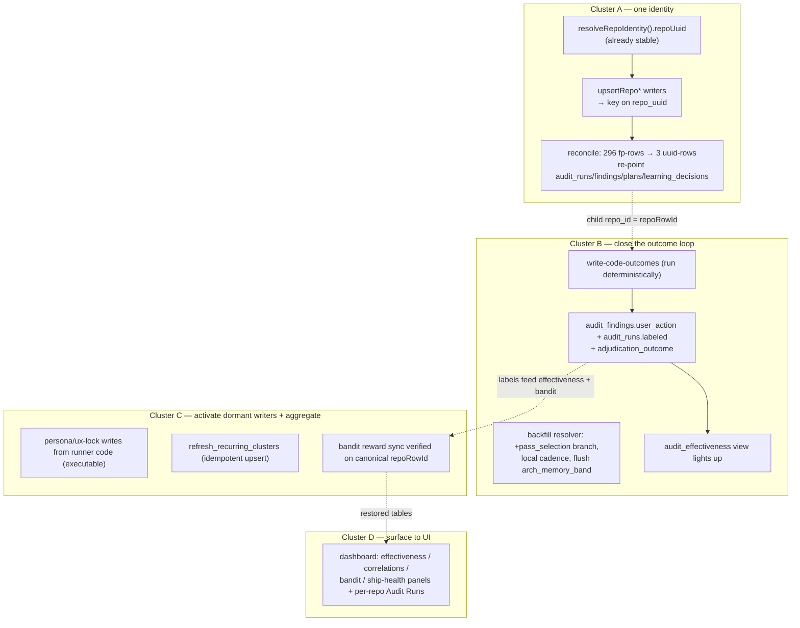

# Plan: Learning-Store Signal Recovery — Identity, Outcomes, Dead Loops

- **Date**: 2026-06-03
- **Status**: **Complete** (Clusters A–D landed 2026-06-03/04 with their own
  2-round Gemini gate; the sole remaining tail — the two determinism follow-ups
  — shipped 2026-06-22 as `docs/completed/determinism-follow-ups.md`: WS1
  run-unification + finalize-outcomes `8248429`, WS2 deterministic ux-lock
  runners `b691717`). Two follow-ups remain tracked but OUT OF SCOPE here — see
  the close-out note below.
- **Author**: Claude + Louis
- **Scope**: backend
- **Target domain(s)**: `audit-orchestration`, `cross-skill-bridge`, `shared-lib`, `stores`, `scripts`
- ⚠ **Cross-domain work** — touches 5 domains; the seam is deliberate (one
  identity + one outcome contract must hold across all writers).

> **Origin**: live-store investigation (2026-06-03). The Supabase store has high
> volume but low usable signal. This plan fixes **every** break found, not just
> the highest-leverage one, sequenced so each fix unblocks the next.

---

## 1. Context Summary

- **Scope / stack**: backend/tooling · `js-ts` + postgres · `node --test`.
- **Investigation method**: direct SQL against the live store + code tracing of
  every writer/resolver. Every claim below is evidence-backed (DB row counts +
  `file:line`), not inferred.

### The seven verified breaks

| # | Symptom (live DB) | Root cause (code) | Evidence |
|---|---|---|---|
| **B1 — Repo identity fragmentation** | `audit_repos`: 299 rows, **299 distinct fingerprints for 11 names**; wine-cellar-app = **193** UUIDs. Only **3/299 rows have `repo_uuid`**. All 554 `audit_runs` join to fingerprint-PK rows. | The audit/plan/learning path keys repos on a **volatile content fingerprint** = `sha256(package.json + CLAUDE.md + sorted file inventory)` — changes on any file add/rename. The arch/symbol-index path keys on the **stable** `resolveRepoIdentity().repoUuid`. Two identity systems in one table. | [context.mjs:442-451](scripts/lib/context.mjs#L442-L451); [repo.mjs:99-119](scripts/lib/store/repo.mjs#L99-L119) `onConflict:'fingerprint'`; [openai-audit.mjs:1473](scripts/openai-audit.mjs#L1473) `upsertRepo(profile, basename)`; vs stable [repo.mjs:165](scripts/lib/store/repo.mjs#L165) `upsertRepoByUuid`; [repo-identity.mjs:122](scripts/lib/repo-identity.mjs#L122). |
| **B2 — No outcome labels** | 9,546 findings, **100% `user_action=null`**; 549/554 runs `labeled=false`; `adjudication_outcome` unpopulated on cloud rows. | `scripts/write-code-outcomes.mjs` (which drives `outcome-sync` → `updateRunMeta{labeled}` + `recordAdjudicationEvent`) is **never invoked**. `/audit-code` SKILL.md documents "Step 3.5b" as MANDATORY but no executable path runs it. `recordFindingResolution` (writes `user_action`) has **zero callers**. | `skills/audit-code/SKILL.md` Step 3.5b (described, not run); `scripts/lib/outcome-sync.mjs` (only caller = write-code-outcomes); `recordFindingResolution` 0 refs. |
| **B3 — `audit_effectiveness` dark** | View returns all-zero precision/recall, `null` everywhere, per fragmented repo_id. | Pure consequence of **B1 + B2** — the view aggregates labeled findings per repo; both inputs are broken. | view confirmed `VIEW`; rows all zero. |
| **B4 — Learning telemetry never resolved** | `learning_decisions`: 626 rows (pass_selection 316, convergence_predict 310), **0 resolved**. **No** `arch_memory_band` / `quickfix_hit` rows at all. | (a) `resolveUnresolvedOutcomes` only runs from the weekly GH cron, never locally; (b) it has **no `pass_selection` branch** (handles only `quickfix_hit`/`arch_memory_band`/`convergence_predict`) so 316 rows are permanently unresolvable; (c) `arch_memory_band` is enqueued in `neighbourhood-query.mjs` but the **cross-skill CLI path never flushes**; (d) `quickfix_hit` lands in `.audit/quickfix-hits.jsonl` but the drain (backfill) never runs. | `scripts/learning/backfill-outcomes.mjs` RESOLVABLE set; `neighbourhood-query.mjs` recordDecision w/o flush; `.github/workflows/learning-weekly-review.yml` sole caller. |
| **B5 — Cross-skill tables empty** | `persona_audit_correlations`, `regression_specs`, `regression_spec_runs`, `plan_verification_runs`, `plan_verification_items` = **0 rows**. | Writers exist (`scripts/lib/store/plans-ship.mjs`, exposed via `cross-skill.mjs` subcommands) but are **described in skill *reference* files, not executed as deterministic skill steps** — Claude reads them as docs and skips. `persona_audit_correlations` (the highest-leverage table) needs persona P0/P1 ↔ finding hashes the skill never emits. | `skills/persona-test/SKILL.md` Phase 6b → `references/audit-correlation.md`; `skills/ux-lock/references/*` V5; cross-skill subcommands present, 0 invocations. |
| **B6 — `recurring_finding_clusters` empty** | 0 rows; it's a **BASE TABLE**. | Weekly review **reads** it; **nothing writes it**. No aggregation job, trigger, or matview refresh exists. | confirmed `BASE TABLE`; `weekly-review.mjs` read-only. |
| **B7 — Bandit stale** | `bandit_arms`: 14 rows, last update **2026-04-11** (~7wk). | `syncBanditArms` fires only on `mode==='rebuttal'` deliberations producing `resolutions`. Those have not landed since April — and rewards keyed off `persona_audit_correlations` (B5) are starved. Also writes under the fragmented identity (B1). | [openai-audit.mjs:3375](scripts/openai-audit.mjs#L3375); `computeUserImpactReward` depends on B5. |

- **Patterns reused vs new**: reuse `resolveRepoIdentity` (the existing stable
  identity — no new identity scheme) and `upsertRepoByUuid` (already correct).
  Reuse the existing migration ledger + `setup-postgres --migrate` path. New: a
  one-shot reconcile script, a local resolver-cadence hook.
- **Neighbourhood considered**: the fix is to make the audit path *converge on
  the arch path's existing identity function* — explicitly an anti-duplication
  move (#1 DRY, #5 SSoT). No new identity primitive.

---

## 2. Proposed Architecture



### Key design decisions (cite `references/engineering-principles.md`)

- **One identity function, repo-wide** (#1 DRY, #5 SSoT, #18 Backward Compat).
  The audit/plan/learning writers switch to `resolveRepoIdentity().repoUuid` —
  the *same* path arch/symbol-index uses. We don't invent a new id; we delete
  the second (fingerprint) system. `fingerprint` is retained as a non-identity
  profile attribute.

- **§2.1 — Storage-identity contract (R1-H1: `repo_uuid` ≠ `repo_id`)**. The
  fragmentation hides a second hazard: child tables (`audit_runs`,
  `audit_findings` via run, `plans`, `learning_decisions`, `persona_*`,
  `bandit_arms`) carry a `repo_id` FK that references **`audit_repos.id`** (the
  row PK), *not* `repo_uuid`. `repo_uuid` is the stable **dedupe/upsert key**;
  `id` is the **storage FK**. Writing a raw `repo_uuid` into a `repo_id` column
  creates dangling FKs. **Single contract, defined now**:
  ```
  resolveRepoForStore({ root, name }) → { repoRowId, repoUuid, name, fingerprint }
  ```
  It calls `resolveRepoIdentity()` for `repoUuid`, upserts `audit_repos` on
  `repo_uuid` (dedupe), and returns the resulting **`audit_repos.id` as
  `repoRowId`**. Every child-table write stores `repoRowId`. `repoUuid` is used
  ONLY as the upsert conflict key. This is the single seam Phase 1 introduces
  and Phase 2 reconciles onto — defined before any code.

- **§2.2 — Deterministic execution, not documented steps (R1-H5/H6 — the
  root-cause lesson)**. B2 and B5 exist *because* the writes lived in skill/
  reference prose and the model skipped them. The fix must NOT repeat that: each
  outcome/correlation write becomes an **executable adapter called from a script
  flow that already runs**, with the SKILL.md merely invoking the command:
  - `syncRoundOutcomes({ runId, round, ledgerPath, resultPath })` — called from
    the audit orchestrator (`scripts/openai-audit.mjs` / `audit-loop.mjs`) right
    after each ledger write, so labels persist whether or not a human/model
    "remembers" Step 3.5b.
  - `record-correlation` / `record-regression-spec-run` / `record-plan-verify-*`
    — invoked from the persona-test / ux-lock *runner* code paths (the consistency
    runner, the verify-mode generator), not from prose. Each has a defined input
    JSON + idempotency key (§2.3).

- **§2.3 — Concurrency + idempotency (R1-M2)**. Every new DB job
  (reconcile, resolver drain, cluster refresh, outcome sync) takes a **Postgres
  advisory lock** (single-tenant → one writer) and writes via **idempotent
  upsert on a defined natural key** (e.g. `(run_id, finding_fingerprint, round)`
  for outcomes; `(repo_id, cluster_key)` for clusters). Audit-start drains are
  time-bounded and **degrade gracefully** — a drain failure logs a warning and
  the audit continues; it never blocks a run.

- **Reconcile is reversible + evidence-gated** (#14, #16). One-shot,
  transaction-wrapped, `--dry-run` default, **evidence-backed alias map**
  (R1-H2, §Phase 2), full before/after report, abort on ambiguity, `--apply`
  to commit.

- **Local-first cadence** (repo convention: prefer pre-push hooks over GH
  Actions) — resolver/refresh run opportunistically from a local hook +
  audit-start drain; the Monday cron stays a backstop. (R1-M3: a required
  scratch-schema DB test guards the migration regardless of cadence — §9.)

- **Fix order is dependency order**: identity (A) → labels/resolver (B) →
  activation/aggregation (C) → dashboard surfacing (D, which only shows true
  numbers once A makes per-repo grouping coherent).

---

## 5. Sustainability Notes

- **Assumption that could change**: a repo's git origin URL. `resolveRepoIdentity`
  already handles this (committed `.audit-loop/repo-id` wins; origin-URL UUIDv5
  fallback) — adopting it inherits that resilience. Fragmentation cannot recur
  because identity no longer depends on mutable content.
- **Extension seam**: the resolver's per-`decision_type` branch table is the home
  for future telemetry types — adding one is a branch, not a rearchitecture.
- **Guardrail**: add a cheap CI/test assertion that `audit_repos` has **≤1 row
  per `(name, repo_uuid)`** going forward, so a regression that reintroduces
  fingerprint-keying is caught immediately rather than after another 190 rows.

---

## 7. File-Level Plan

> **Intra-cluster ordering (R2-H1 — load-bearing)**: within Cluster A the
> **Phase 2 migration applies BEFORE Phase 1 code deploys**. The `ON CONFLICT
> (repo_uuid)` upsert is invalid until the partial unique index exists, so
> deploy order is migration → code (the phase *numbers* are logical, not deploy
> order; this note is the deploy contract `/cycle` and the operator follow).

### Phase 1 — Repo identity unification (implements §2.1 contract; deploys after Phase 2 migration)
- **`scripts/lib/store/repo.mjs`** (modify): add `resolveRepoForStore({root, name})`
  → `{repoRowId, repoUuid, name, fingerprint}` (§2.1). It resolves `repoUuid`
  via `resolveRepoIdentity()`, upserts `audit_repos` **on conflict `repo_uuid`**
  (Phase 2 adds the constraint), and returns the row's **`id` as `repoRowId`**.
  **R3-H1 — no fingerprint conflict survives**: `upsertRepo`'s `ON CONFLICT
  (fingerprint)` path is **removed** (Phase 2 drops that unique constraint, so any
  fingerprint-conflict upsert would error at runtime); `fingerprint` is written as
  a plain non-unique column only. All identity upserts go through `repo_uuid`.
  Frozen public return shapes preserved. **Profile telemetry preserved
  (Gemini-1)**: `resolveRepoForStore` still writes the repo *profile* columns
  (`stack`, `file_breakdown`, `focus_areas`, `fingerprint`, `last_audited_at`) onto
  the canonical `repo_uuid` row — switching the conflict key from fingerprint to
  uuid must NOT drop the profile data `upsertRepo` used to persist; the upsert
  updates those columns on the canonical row.
- **`scripts/openai-audit.mjs`** (modify ~L1473): replace
  `upsertRepo(repoProfile, basename)` with `resolveRepoForStore(...)`; thread the
  returned **`repoRowId`** (NOT `repoUuid`) into `recordRunStart` /
  `recordFindings` / `insertLearningDecision` — these store it in the `repo_id`
  FK column.
- **`scripts/cross-skill.mjs`** (modify): `upsert-plan` + correlation subcommands
  call `resolveRepoForStore` and store `repoRowId`.
- **`scripts/lib/learning/decision-logger.mjs`** (modify): `learning_decisions.repo_id`
  := `repoRowId` from the same contract.
- **Dashboard + learning-stats repo resolution (modify — Gemini-G3)**: every
  `getRepoIdByName()` / volatile-`repoName` caller in the identity sweep —
  notably the dashboard learning-stats collector and `learning:stats` — switches
  to the canonical `resolveRepoIdentity()` → `repoRowId` path, so reads land on
  the unified row (otherwise the dashboard would still group by the volatile name
  after the rest of the sweep). This is part of the Phase 1 sweep, consumed by
  Phase 7.
- **Why**: collapses 296→3 identities at the source AND fixes the latent FK
  hazard (R1-H1); unblocks B3/B4/B6/B7 and the dashboard's per-repo panels (D).

### Phase 2 — Identity backfill + reconcile (one-shot, reversible)
- **`supabase/migrations/<ts>_unify_repo_identity.sql`** (create) — **exact DDL +
  preflight**:
  1. Preflight `SELECT repo_uuid, count(*) FROM audit_repos WHERE repo_uuid IS NOT NULL GROUP BY 1 HAVING count(*)>1` — abort if any duplicate non-null `repo_uuid` exists.
  2. **Drop the `fingerprint` UNIQUE constraint, demote to a plain column (R2-H2)** — keeping it leaves a volatile *alternate* identity and makes a canonical `repo_uuid` upsert that touches `fingerprint` collide with a legacy fingerprint row. After this, `repo_uuid` is the **only** identity constraint; `fingerprint` is a non-unique profile attribute.
  3. **Plain full** `ALTER TABLE audit_repos ADD CONSTRAINT audit_repos_repo_uuid_key UNIQUE (repo_uuid)` — **not `CONCURRENTLY`, not partial (R2-H3 + Gemini-G2)**: the table is ~299 rows so the brief lock is negligible and it runs safely inside the migration runner's transaction (CIC cannot). A **full** unique constraint is correct because **SQL NULLs are non-equal** — legacy NULL-`repo_uuid` rows coexist freely under it, exactly like a partial index, but the conflict target is plain `ON CONFLICT (repo_uuid)` with **no `WHERE` predicate**, which the existing `db/query.mjs` `upsert()` helper *can* express (a partial-index target would need a `WHERE` clause the helper can't emit — Gemini-G2). Single-tenant — global uniqueness; **no `cellar_id`** (R1-H4 dismissed).
- **`scripts/reconcile-repo-identity.mjs`** (create) + **`.audit-loop/repo-alias-map.json`**
  (create, committed, operator-approved): `--dry-run` default, advisory-locked,
  transaction-wrapped. **Honest evidence model (R2-H4 — historical rows hold only
  name+fingerprint, so pure automatic provenance is impossible)**:
  1. canonical row = `audit_repos` row whose `repo_uuid` = `resolveRepoIdentity()` for each known repo (mint via `resolveRepoForStore` if absent);
  2. the script **proposes** a `legacy_repo_id → canonical_repo_uuid` map by clustering fingerprint-rows on name + profile similarity, writes it to `repo-alias-map.json` for **human review**;
  3. `--apply` consumes only the **operator-approved** map — name+fingerprint is evidence *with sign-off*, never an automatic merge key;
  4. anything not in the approved map → **quarantine** (untouched, reported).
  **Exhaustive FK discovery (R3-H2 — no static table list)**: before repointing,
  the script queries `information_schema` for every table with a `repo_id` column
  (or an FK referencing `audit_repos.id`) and repoints **all** of them in the
  transaction — `audit_runs`, `audit_findings` (via run), `plans`,
  `learning_decisions`, `persona_test_sessions`, `bandit_arms`, `ship_events`,
  `regression_specs`, `plan_verification_runs`, and any future table — then
  **asserts zero rows still reference a quarantined/legacy id** before commit. A
  hardcoded list would silently orphan a table Phase 7 later reads.
  **Child-row collision handling (Gemini-G1 — load-bearing)**: blindly
  `UPDATE ... SET repo_id=canonical` crashes when a child table has a repo-scoped
  unique constraint and both the legacy and canonical ids already hold a matching
  row (e.g. `plans (repo_id, path)`, `bandit_arms (repo_id, pass, variant)`). For
  each child table, the reconcile detects its repo-scoped unique keys from
  `information_schema` and **dedupe-on-merge**: keep the newest row per
  (canonical_id, unique-key), repoint it, and drop/merge the now-duplicate legacy
  rows — never a blind UPDATE that violates the constraint. Covered by the
  scratch-DB test (§9). before/after report. Implements `--selfcheck-relocation`.
- **Why**: makes the existing 9.5k findings retroactively usable per-repo, with
  a reviewed mapping rather than a risky auto-merge.

### Phase 3 — Outcome-labeling loop activation (executable, R1-H5)
- **`scripts/lib/outcome-sync.mjs`** (modify) / **`scripts/openai-audit.mjs`**
  (modify): add `syncRoundOutcomes({runId, round, ledgerPath, resultPath})`,
  **called from the audit orchestrator after each ledger write** — not SKILL.md
  prose. **Target + constraint (R3-H3)**: writes to the existing
  `finding_adjudication_events` table and patches `audit_findings`; the migration
  in this phase adds a **UNIQUE constraint `(run_id, finding_fingerprint, round)`**
  on the events table so the upsert is genuinely idempotent (advisory lock alone
  is insufficient — R3-M1). **Failure semantics (R3-H4 — load-bearing, since this
  replaces the skipped manual step)**: a DB failure is **non-fatal** — the
  outcome record spills to the existing `.audit/learning-outbox/` (the established
  outbox pattern) for replay on the next audit start; the run is **not** marked
  `labeled` and the audit continues with a warning. Outcome sync never fails an
  audit. **Outbox captures run-finalize state too (Gemini-2)**: the spilled entry
  includes the per-finding outcomes **and** the run-level `labeled`/finalize
  intent — otherwise a replay would re-insert finding rows but never complete the
  run, orphaning it from `audit_effectiveness` (which keys off `labeled`). Replay
  is idempotent and drives the run to its finalized labeled state.
- **Run-level `labeled` set at finalize, not per-round (R2-H6)**: `syncRoundOutcomes`
  writes *finding* outcomes per round, but `audit_runs.labeled=true` is set ONLY
  by `recordRunComplete` after the final round's adjudication — so `labeled`
  means "run fully adjudicated", never "some outcomes recorded". `audit_effectiveness`
  keys off `labeled` runs, so this prevents counting partially-labeled runs.
- **`user_action` collapse — with the view + reader migration (R2-H5)**:
  `adjudication_outcome` becomes the single source of truth. This requires, in
  the same phase: (a) a migration redefining the **`audit_effectiveness` view** to
  aggregate `adjudication_outcome` (not `user_action`); (b) grep + update every
  reader of `user_action` (dashboard collectors, learning readers); (c) delete
  the 0-caller `recordFindingResolution`; (d) `user_action` retained as a
  generated/read-through alias for one release, dropped in a follow-up migration.
  Writing only `adjudication_outcome` without the view+reader update would leave
  the view dark — the bug this clause closes.
- **`skills/audit-code/SKILL.md`** (modify): Step 3.5b text now just *documents*
  that the orchestrator runs `syncRoundOutcomes` automatically — no manual command.
- **Why**: lights up `audit_effectiveness` (B3), feeds bandit rewards (B7).

### Phase 4 — Learning resolver completeness + local cadence (R1-H7)
- **`scripts/learning/backfill-outcomes.mjs`** (modify): **define the
  `pass_selection` contract now** — resolve a `pass_selection` decision by
  joining its recorded context to the adjudication outcomes of findings raised by
  that pass in the same run, within a fixed resolution window; reward = fraction
  of that pass's findings that were `accepted`/`fixed` (not dismissed).
  **Zero-findings guard (Gemini-3)**: a pass that raised **0 findings** has no
  denominator — it resolves to terminal `low-yield` with a neutral reward (e.g.
  0), never a division-by-zero/NaN. Idempotency key = decision id; terminal states
  `useful` / `low-yield` / `expired`. (If a join field is genuinely unavailable, stop *emitting*
  `pass_selection` rows rather than leaving them permanently unresolved — but the
  join above is available via `audit_findings.pass_name` + `run_id`.)
- **`scripts/lib/neighbourhood-query.mjs`** (modify): flush enqueued
  `arch_memory_band` decisions on the cross-skill CLI path (enqueue-only today).
- **Local cadence**: opportunistic resolver drain at audit-start with **defined
  bounds (R3-M3)** — batch size ≤200 rows/drain, ≤5s wall-clock budget, advisory
  lock key `learning_resolver_drain`, skip-and-continue on lock contention, and
  observability fields (`drained`, `resolved`, `skipped`, `ms`) logged. Graceful
  per §2.3; keep the Monday cron as backstop.
- **Why**: turns 626 write-only rows into a closed counterfactual-replay dataset.

### Phase 5 — Cross-skill write activation (executable adapters, R1-H6)
- **`scripts/lib/store/plans-ship.mjs`** + **`scripts/cross-skill.mjs`** (modify):
  ensure each writer has a thin **executable adapter** with a defined input
  JSON + idempotency key, callable from runner code.
- **`scripts/persona-consistency-run.mjs`** + persona-test runner path (modify):
  emit one `record-correlation` per P0/P1 from the **runner code**. **Canonical
  matching contract (R2-M2)**: the link hash is `semanticId()` (the existing
  finding-identity fn) computed the **same way on both** persona and audit sides
  (single source of truth — no parallel hash); audit-run context = the most
  recent `audit_runs` row for the repo matching `commit_sha` (fall back to latest
  for the repo); a P0/P1 with **no matching audit finding** is still recorded with
  a **null `audit_finding` link** (persona-only signal is valuable — it's an
  audit *miss* candidate, exactly what `audit_effectiveness.audit_misses` wants).
  Dedupe key = `(session_id, finding_hash)`.
- **`scripts/` ux-lock lock + verify runners** (modify): call
  `record-regression-spec-run` (lock) and `record-plan-verify-run` /
  `record-plan-verify-items` (verify V5) from the generator code with defined
  JSON inputs + idempotency keys.
- **SKILL.md/reference files**: updated to *invoke the commands*, with the
  determinism living in the runner code.
- **Why**: populates the 5 empty cross-skill tables, incl. the highest-leverage
  `persona_audit_correlations`.

### Phase 6 — Aggregation job + bandit verification (R1-M1)
- **`supabase/migrations/<ts>_recurring_clusters_refresh.sql`** (create): **keep
  the existing `recurring_finding_clusters` base-table contract** (do NOT convert
  to a matview — breaks consumers). Add `refresh_recurring_clusters(repo_id)` as
  a **full per-repo recompute under the advisory lock** (R2-M3 — not append-only):
  idempotent upsert on `(repo_id, cluster_key)` where `cluster_key` is a
  deterministic normalization of finding title/category/semantic-id. **DRY
  (R3-M5)**: `cluster_key` is computed in **JS via the existing `semanticId()` /
  finding normalizer** and stored on `audit_findings` (or passed to the refresh) —
  the SQL function groups by that stored key and does **not** reimplement the
  hashing (no parallel identity logic). Bounded — group by the key, no O(n²)
  pairwise scan — AND clusters not present in the
  current computation are **deactivated** (`active=false` + `last_seen`), so
  reconciliation/finding-resolution/normalization changes don't leave stale
  clusters as phantom recurring signal. Add supporting indexes.
- **Refresh cadence**: invoked from the audit-start drain / weekly-review
  pre-step (advisory-locked, §2.3).
- **`scripts/bandit.mjs`** (verify, not assume): with identity (A) + labeled
  outcomes (B) + correlations (Phase 5) restored, confirm `syncBanditArms` fires
  on a real rebuttal run and writes under the canonical `repoRowId`. Code change
  only if the trace shows a second gap beyond the upstream loops.
- **Why**: revives recurring-cluster digests (B6) and bandit learning (B7).

### Phase 7 — Dashboard surfacing (answers the "pull through to the UI" question)
- **Context**: the dashboard groups telemetry by stable `repo_uuid → audit_repos.id`,
  but because of B1 the audit data hangs off the 193 *fingerprint* ids — so the
  per-repo audit panels read ~empty until Phase 2 reconciles. Several restored
  signals have **no panel at all**: `audit_effectiveness`,
  `persona_audit_correlations`, `bandit_arms`, `ship_events`,
  `regression_specs`/`_runs`, `plan_verification_*`. (Investigation 2026-06-03.)
- **`scripts/lib/dashboard/collect-telemetry.mjs`** (modify): add collectors
  calling the existing readers (`readAuditEffectiveness`, correlation readers,
  `loadBanditArms`, ship/regression/verify readers in `plans-ship.mjs`).
- **`scripts/lib/dashboard/sections/prompt-variants.mjs`** (create — **DONE
  2026-06-04**): bandit-arm effectiveness panel (pass × variant, pulls, posterior
  mean, α/β; cold-start markers). Wired end-to-end — collector
  (`collectPromptVariants` → `loadBanditArms`), `render.mjs` REGISTRY +
  SLICER, `schema.mjs` `promptVariants` block, `dashboard-section-contract.test`.
  Renders live: 14 arms (best `gemini-review` variant mean 0.45 vs most-pulled
  0.29). This is the data-backed panel that surfaces the bandit we analysed.
- **`audit-effectiveness.mjs` + `ship-health.mjs` — DEFERRED (rationale, not a
  silent omission)**: both render ~empty on today's data, so they're held until
  the data justifies a panel. `audit_effectiveness` needs `persona_audit_correlations`
  rows (Cluster C activated the writer, but it's exploratory-persona/model-driven
  — no rows yet). `ship_events` has 4 rows and **lacks a reader** (only
  `recordShipEvent` exists) — a `readShipEvents` reader is the prerequisite.
  Each is a mechanical repeat of the prompt-variants vertical once its data/reader
  lands. Tracked here as the remaining Phase 7 work.
- **`scripts/lib/dashboard/render.mjs`** (modify): prompt-variants
  registered. **Done (2026-06-04)**: the Audit Runs tab is now per-repo —
  `fetchCloudMetrics(_sb, days, repoId)` gained an optional `repoId` filtering
  `audit_runs` by `repo_id` and the run_id-only child tables via a windowed
  subquery; `collectAuditRuns(repoId)` resolves the canonical row via
  `canonicalRepoId(root)` and tags `auditRuns.scope` (`repo|project`,
  schema-defaulted `project` for back-compat). Section labels "Supabase (this
  repo)" vs "(project-wide)". `($2::uuid IS NULL)` short-circuit preserves the
  CLI's project-wide path. Verified live (project-wide 341 vs this-repo 86).
  Gemini gate APPROVE.
- **Why**: makes the recovered signal *visible* — the bandit panel ships now;
  effectiveness/ship-health follow their data.

### Close-out (not a phase)
`npm run arch:refresh && npm run dashboard:build && npm test` — regenerate the
symbol index + dashboard, run the suite.

#### 11. Execution Clustering

- **Cluster A** — Phases 1-2 — fix-gate: yes
  - Coupling: Phase 2's reconcile re-points child `repo_id` FKs onto the exact
    `repoRowId` the §2.1 contract (Phase 1) returns; auditing them together
    inspects the write-path ↔ backfill ↔ FK seam (a mismatch silently
    re-fragments, orphans, or dangles FKs).
- **Cluster B** — Phases 3-4 — fix-gate: yes
  - Coupling: the resolver (4) resolves the outcomes the labeling path (3)
    writes; together they form the single "outcome closes the loop" contract
    `audit_effectiveness` + bandit consume. Builds on A's stable identity + FK.
- **Cluster C** — Phases 5-6 — fix-gate: yes
  - Coupling: both activate dormant writers and aggregate the now-clean per-repo
    signal (cross-skill writes feed the tables the aggregation + bandit read).
    Builds on A (identity) + B (labels).
- **Cluster D** — Phase 7 — fix-gate: final
  - Coupling: read-only presentation layer over A/B/C's restored tables; gated
    last because its per-repo panels are only correct once A+B+C land. Isolated
    from the write path (dashboard build is non-mutating), so a low-risk final.
- **Final gate**: consolidated Gemini review over the union diff of all phases.

---

## 8. Risk & Trade-off Register

| Risk / trade-off | Decision |
|---|---|
| **R1-H1**: `repo_uuid` (logical) vs `repo_id` (FK to `audit_repos.id`) conflation → dangling FKs. | §2.1 storage-identity contract: child tables store `repoRowId` (the row PK); `repo_uuid` is only the upsert dedupe key. Defined before coding. |
| **R1-H2**: reconcile-by-name is unsafe (shared basenames, renames, missing canonical rows). | Evidence-backed alias map (repo_uuid → committed repo-id → provenance; name = display only); mint canonical rows for the 3 known repos; **quarantine** unprovable rows, never force-merge. |
| **R1-H3**: `repo_uuid` unique constraint underspecified (nulls, dupes, partial-index `ON CONFLICT`). | Exact DDL in Phase 2: preflight duplicate-detection (abort), partial unique index `WHERE repo_uuid IS NOT NULL`, explicit `ON CONFLICT` target. |
| **R1-H4 (DISMISSED)**: "all queries must scope by `cellar_id`." | **Invalid for this repo** — verified **0 `cellar_id` columns**; the audit store is single-tenant (the DSN password IS the secret, per AGENTS.md). `cellar_id` is a wine-cellar-app *app* column — cross-project contamination in the auditor's context, not a rule here. No change. |
| **R1-H5/H6**: fixes for B2/B5 risked repeating the "documented-but-skipped" root cause. | §2.2: writes become **executable adapters called from runner/orchestrator code** (`syncRoundOutcomes`, runner-emitted correlations), each with defined input JSON + idempotency key; SKILL.md only *invokes* them. |
| **R1-H7**: `pass_selection` resolver semantics undefined; "mark terminal" would fake-resolve. | Phase 4 defines the join (pass_name+run_id → finding adjudications), reward, window, idempotency, terminal states — real resolution, available from existing columns. |
| **R1-M1**: matview conversion + unbounded fuzzy clustering risk. | Keep base-table contract; `refresh_recurring_clusters` = idempotent upsert on deterministic `(repo_id, cluster_key)`, group-by not pairwise; indexed. |
| **R1-M2**: concurrent jobs without locks/idempotency. | §2.3: advisory locks + idempotent upserts + time-bounded, graceful audit-start drains. |
| **R1-M3**: DB tests skip when `AUDIT_DB_URL` unset → migration unguarded. | §9: a **required DB test** (transaction-rollback on `public`, never a non-public schema per R2-M1) runs fail-closed in the pre-push hook when `AUDIT_DB_TEST_URL` is set; local unit tests still skip gracefully. |
| **R2-H1/H2/H3, R2-H4/H5/H6, R2-M1/M2/M3** | Resolved: migration-before-code deploy order; fingerprint UNIQUE dropped (no alternate identity); plain (non-CONCURRENT) index; operator-approved alias map; `audit_effectiveness` view + reader migration with the `user_action` collapse; `labeled` set at finalize; public-only test DB; canonical `semanticId()` correlation hash; full-recompute cluster refresh with deactivation. |
| **R3-H1/H2/H3/H4, R3-M4/M5/M6, R3-L1** | Resolved: removed the contradictory fingerprint-conflict path; exhaustive `information_schema` FK discovery in reconcile; named `finding_adjudication_events` target + UNIQUE `(run_id,finding_fingerprint,round)`; outcome-sync failure spills to `.audit/learning-outbox/` (non-fatal); `npm run test:db` + hook wiring; `cluster_key` via JS `semanticId()` (no SQL re-impl); dashboard empty/stale/null-link states; base-table (not matview) test wording. |
| **R3-M2 (accepted, documented follow-up)**: bandit only updates on `mode==='rebuttal'` runs — restoring upstream labels/correlations doesn't *guarantee* regular updates. | **Accept for v1**: rebuttal-gating is by design (rewards come from deliberation outcomes). Phase 6 verifies one real rebuttal run writes correctly on the canonical id. If `bandit_arms` updates remain sparse after Clusters A–C land, a follow-up widens the reward trigger (e.g. update on every adjudicated finding, not only rebuttal). Out of scope here. |
| **Bandit "worth it?" — keep vs simplify (data-gated follow-up, NOT folded in here)**. Live data (2026-06-03): 14 arms, 1,269 total pulls, top arm 538 (α154/β386), differentiated posteriors (≈0.20–0.44) — so NOT starved in aggregate. But: **single `context_bucket='global'`** (the contextual machinery is unused), and several arms re-seeded today to a uniform α8.86/β29.14 (fragmentation likely reaching the bandit too — B1). | **Decision is downstream of this plan, by construction**: "worth it" means "does the variant the bandit picks yield *better audits*" — measurable only via `audit_effectiveness` (B3), which is dark until B2 lands. So the keep-vs-simplify call **cannot be made on today's data** and is deliberately NOT new phases here. **Instrument + decision rule**: the Phase 7 bandit panel + `audit_effectiveness` are the instruments; after Clusters A–C + ≥30 days of clean labeled data, evaluate three questions — (1) does per-bucket contextualization beat the single global bucket? (2) is the reward signal trustworthy once correlations/labels flow? (3) does bandit selection beat a fixed argmax-of-best-variant heuristic? **Simplify trigger**: if (3) shows no measurable precision/recall lift over fixed-best, replace Thompson sampling with the static best-variant pick. Tracked as a follow-up, gated on the data this plan restores. |
| `user_action` vs `adjudication_outcome` redundancy. | Phase 3: collapse to `adjudication_outcome` (one source of truth); delete the 0-caller `recordFindingResolution`. |
| Reconcile could mis-merge or orphan rows. | `--dry-run` default, advisory-locked, transaction-wrapped, before/after report, `--apply` opt-in. Reversible. |
| Scope is large (7 phases, 5 domains). | Sequenced + clustered with fix-gates; **Cluster A alone is the unlock and independently shippable** even if B/C/D slip. |
| **Deferred**: migrating `pass_selection` to a *live* learner; pgvector memory-health graph. | Out of scope — this plan restores *signal capture* + visibility; promoting learners waits for ≥30 days of clean labeled data. |

---

## 9. Testing Strategy

- **Phase 1**: unit-test the identity write path returns the stable uuid for a
  fixture repo across two different file inventories (proves fingerprint-
  invariance); assert `audit_repos` upsert is idempotent on `repo_uuid`.
- **Phase 2**: reconcile dry-run on a seeded fixture DB (or transaction-rollback
  against a scratch schema) — assert N fingerprint rows collapse to 1 and all
  child `repo_id`s re-point; assert abort on ambiguous name.
- **Phase 3/4**: a labeled-run integration test asserts `audit_runs.labeled=true`
  and `adjudication_outcome` populated after `write-code-outcomes`; resolver test
  asserts `pass_selection`/`convergence_predict` rows resolve (or are marked
  terminal) from fixture context.
- **Phase 5**: assert each cross-skill subcommand writes exactly one row for a
  fixture input (already partly covered by `cross-skill-*.test.mjs` — extend).
- **Phase 6**: assert the refresh **function** (base table — not a matview, R3-L1)
  produces ≥1 cluster from seeded recurring findings and **deactivates** a cluster
  whose findings were resolved.
- **Phase 7**: extend `dashboard-section-contract.test.mjs` for the new sections;
  assert each renders the defined **empty / build-failure / stale-data / null-link
  states** (R3-M6 — e.g. "no labeled runs yet", "persona-only miss (no audit
  link)", "bandit cold-start") without throwing, on empty + populated fixtures.
- **Guardrail test**: no logical repo resolves to >1 `audit_repos.id` via the
  canonical `repo_uuid` path (catches fragmentation regression).
- **Required DB test (R1-M3 / R2-M1)**: the harness uses a **transaction-rollback
  against `public`** (or a disposable throwaway database) — **never a non-public
  schema** (v1 hard-wires `public`; arbitrary schemas are forbidden per the
  postgres-parity contract). It applies the migrations, runs reconcile dry-run +
  the guardrail + the resolver against seeded rows, then `ROLLBACK`. Gated on a
  dedicated `AUDIT_DB_TEST_URL` so it never touches the live store. **Wiring
  (R3-M4)**: the file-level plan includes an `npm run test:db` script + a pre-push
  hook-installer edit so this actually runs (fail-closed) when `AUDIT_DB_TEST_URL`
  is set — not just a test file with no runner. Local unit tests still skip
  gracefully without it.

---

> **Plan is phased + clustered** (§7b + §11): 7 phases across 5 domains in 4
> fix-gated clusters, a sequential chain (identity → outcomes → activation →
> UI). Well past Gate 1/Gate 2. **Cluster A is the unlock and independently
> shippable.**

---

## Audit trail

- **GPT plan-audit**: 3 rounds. HIGH 7 → 6 → 4. 1 R1 HIGH **dismissed**
  (`cellar_id` scoping — verified 0 such columns; single-tenant store;
  cross-project contamination). All other R1/R2/R3 findings fixed in-plan.
- **Gemini final gate**: 2 rounds (the cap). R1 → 3 concerns (profile-telemetry
  drop, outbox run-finalize, pass_selection div-by-zero) — all fixed. R2 → 3
  concerns (G1 child-row collision, G2 partial-index `ON CONFLICT`, G3 dashboard
  name-resolution) — all **folded in**. Stopped at the 2-round Gemini cap per the
  documented "detailed-spec refinement yields ~3 edge findings/round
  indefinitely" rule; remaining surface is implementation-time detail, each item
  captured above as an explicit design clause (Gemini-G1/G2/G3). Architectural
  coherence rated **Strong** by Gemini both rounds.

---

## Close-out (2026-06-22)

All seven breaks (B1–B7) are addressed and shipped. The plan's remaining tail —
the two determinism follow-ups carved out into
`docs/completed/determinism-follow-ups.md` — landed today:

- **WS1** (`8248429`) — one unified `run_id` across audit rounds +
  `finalize-outcomes` deterministic capture (closes B2's *deterministic*
  invocation: `write-code-outcomes` was made runnable in Cluster B, but capture
  was still model-remembered until WS1's finalize hook).
- **WS2** (`b691717`) — deterministic `/ux-lock` runner that writes
  `regression_spec_runs` / `plan_verification_*` without the model (activates
  the B5 cross-skill writers from runner code, not skill prose).

### Tracked follow-ups (deliberately OUT OF SCOPE — not new phases)

1. **`resolveRepoId` transient fail-open** — ✅ **RESOLVED 2026-06-23**:
   `getRepoIdByUuid` gained a `{strict}` opt-in (default contract unchanged for
   its ~15 callers; genuine not-found still returns null INSIDE the try); the
   `catch` now re-throws under `strict`. `resolveRepoId` uses `strict:true` and
   fails the command closed (`REPO_RESOLVE_FAILED`, exit 1) on a transient
   lookup error instead of silently writing unscoped. _Original finding:_ on a
   *transient* DB error resolving an explicit `repoUuid`, `resolveRepoId` /
   `getRepoIdByUuid` swallowed the error and returned `null` → an unscoped
   (`repo_id` null) cross-skill write — the same transient-vs-absent bug class
   WS1 fixed in the audit_pass_stats / classification column probes. Independent
   of WS1/WS2's paths (finalize keys on `run_id`); worth a small standalone fix
   applying the same 42703-vs-transient distinction to the repo resolver.
2. **Bandit "keep vs simplify"** (already noted in §8) — data-gated, NOT
   foldable here: it needs ≥30 days of the clean labeled data this plan restores
   before the Thompson-vs-fixed-best call can be made on real
   `audit_effectiveness` signal.
