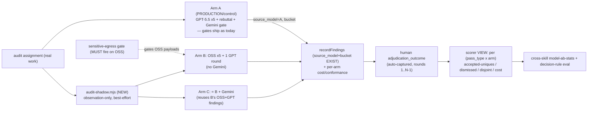

# Plan: Model A/B/C effectiveness experiment harness (auditor-model selection from real data)

- **Date**: 2026-07-01
- **Status**: Complete (built + audited 2026-07-01; see Implementation Log)
- **Author**: Claude + Louis
- **Scope**: backend (`js-ts` + postgres; `node --test`)
- **Target domain(s)**: `audit-orchestration`, `shared-lib`, `stores`
- ⚠ **Cross-domain work** — touches 3 domains (the harness spans config → audit loop → store); boundary crossings are intentional (a shadow that runs in the loop and persists to the store).
- **Origin**: `/brainstorm --with-gemini` (session `1782883207516`) — cost of the GPT audit rounds now exceeds the Claude Max spend. Decision to choose auditor configs from **real human-adjudication data**, not model self-opinion. Budget: **~€200-400** real burn-in spend.

> **Neighbourhood considered**: `get-neighbourhood` (cloud, 50 records) → top recommendation `review` (<0.75 cosine) — no near-duplicate of a *generation-pass* shadow. The plan **generalizes** the existing final-review shadow rather than creating a sibling (justified §2).

---

## 1. Context Summary

**Detected**: backend · `js-ts`+postgres. This is a **tooling/experiment harness**, not a user feature.

**What exists today (Code Trace — files read Phase 1):**
- **Final-review shadow = the pattern to generalize.** `shadowReviewConfig`
  ([`config.mjs:92`](../../scripts/lib/config.mjs#L92)) reads `FINAL_REVIEW_SHADOW`;
  `runShadowReview` ([`gemini-review.mjs:913`](../../scripts/gemini-review.mjs#L913)) runs a
  **blind, observation-only** second reviewer; `bucketFindings`
  ([`gemini-review.mjs:952-960`](../../scripts/gemini-review.mjs#L952)) stamps
  `_bucket ∈ {both, primary-only, shadow-only}` via `semanticId` set-membership; never gates.
- **The store already carries the A/B columns.** `recordFindings`
  ([`runs-findings.mjs:307-333`](../../scripts/lib/store/runs-findings.mjs#L307)) persists
  **`source_model`** + **`bucket`** on `audit_findings` (added for the final-review shadow),
  column-existence-guarded. So per-arm finding attribution is **already schema-supported**.
- **The generation loop = the injection point.** `runMultiPassCodeAudit` in
  [`openai-audit.mjs`](../../scripts/openai-audit.mjs) runs 5 passes with tiered reasoning
  (structure/wiring=low ∥, backend/frontend=high ∥, sustainability=medium), each via
  `createOpenAIClient` ([openai-audit.mjs:83](../../scripts/openai-audit.mjs#L83)) wrapped by
  `safeCallGPT`. Cost preflight at `openai-audit.mjs:98`.
- **OSS drops in via the existing client seam.** `createOpenAIClient({purpose})`
  ([`openai-client.mjs:85`](../../scripts/lib/openai-client.mjs#L85)) already overrides
  `baseURL` for Azure — the same mechanism routes an OpenRouter/OSS endpoint. `VALID_PURPOSES`
  is a closed set (extend it or add an explicit provider-override arg).
- **Scorer inputs already persisted.** `adjudication_outcome` (human accept/dismiss) →
  `audit_effectiveness` view; the just-shipped deterministic outcome-capture
  ([`finalize-outcomes.mjs`](../../scripts/lib/finalize-outcomes.mjs)) auto-labels rounds
  1..N-1. `persona_audit_correlations` = sparse field-truth. `final-review-stats`
  (cross-skill.mjs) is the read-CLI precedent.
- **Egress gate** — [`sensitive-egress-gate.mjs`](../../scripts/lib/sensitive-egress-gate.mjs)
  + `audit-scope.mjs` redact BEFORE any provider call (Tier-3 tested). Must be proven to fire
  on the OSS arm's payloads (Security Considerations).

**Patterns reused vs new**: reuse the shadow/bucket/source_model machinery + `createOpenAIClient`
baseURL + `recordFindings` + the `final-review-stats` CLI shape + the deterministic capture.
New: an **arm config model**, a **generation-pass** shadow runner, per-arm **cost/conformance**
capture, a **scorer view + CLI** joined to the human ledger, and the OSS provider wiring.

---

## 1.5 Execution Model (dependencies)

**A hard safety ordering exists** (not all independent): the OSS provider wiring + **egress
verification** MUST complete and pass before the generation shadow is allowed to send any real
audit content to OSS. Chain: `arm-config + OSS client` → **`egress gate proven on OSS`** →
`generation shadow` → `persistence` → `scorer`. Atomicity: the shadow is best-effort per arm
(one arm failing never blocks the baseline audit or another arm — mirrors `runShadowReview`'s
never-gate contract). Concurrency: arms run in parallel with the baseline, capped like the
existing pass concurrency.

---

## 2. Proposed Architecture

A **generation-pass shadow**: when `AUDIT_MODEL_SHADOW` names arms, `runMultiPassCodeAudit`
runs the baseline (A) as today AND spawns each configured arm's generation **observation-only**
in parallel, stamping `source_model`(arm) + `bucket` on findings and recording per-arm
cost/conformance. Nothing an arm produces gates or ships. A Supabase **scorer view** joins
per-arm findings to the human `adjudication_outcome`; a CLI reads per-`(pass_type × arm)` cells
against a pre-registered rule.

### Key design decisions (principles cited)

1. **Generalize the final-review shadow; do NOT build a parallel system** (#1 DRY, #2 Modularity,
   #5 SSoT). `runShadowReview` + `bucketFindings` + `source_model`/`bucket` are the proven
   observation-only A/B primitives; the new `audit-shadow.mjs` applies the *same* shape to the
   generation passes. One shadow concept, two attachment points (final-review + generation).
2. **Arms are DATA, not code — and models are SENTINELS, not concrete IDs** (#1, #4 No
   Hardcoding, #20; resolves R1-H6). An arm =
   `{id, generation:{modelSentinel, provider?}, gptRound:bool, geminiGate:bool}`. Arms
   reference **sentinels** (`latest-gpt`, and new `latest-oss-coder` / `latest-oss-reasoner`)
   resolved via `model-resolver.mjs` — NO concrete IDs pinned in arm code (the load-bearing
   anti-pattern). New OSS sentinels are added to the resolver's pool exactly like the existing
   `latest-*` families; the arm carries the sentinel, the resolver picks the newest match.
   A/B/C are three config rows; a 4th candidate = a row. Parsed from `AUDIT_MODEL_SHADOW`
   (like `FINAL_REVIEW_SHADOW`) + an `arms.json` block.
3. **The "1 GPT round" = one INDEPENDENT GPT 5-pass round injected as the final round** (open
   design question — resolved). *Chosen (i)* over *(ii) a GPT arbiter/rebuttal over OSS findings*.
   Justification: the whole experiment tests the **disjoint-coverage** thesis, and this session
   is direct evidence — GPT and Gemini each caught findings the other missed (background-shorthand
   FN, silent-clean, CDP-origin vs empty-input, icon-button). An independent GPT round contributes
   GPT's *own* catches (the diversity payoff we're measuring); an arbiter pass is anchoring-prone
   (it only re-judges OSS's list) and would under-measure diversity. **Tradeoff surfaced**: (i) costs
   a full GPT round (5 passes) vs (ii)'s single pass — but (ii) would bias the experiment toward
   "OSS + rubber-stamp," which is not what we're testing. If cost proves prohibitive, (ii) is the
   documented fallback.
4. **Compute sharing: C = B + Gemini** (#17 no redundant work). C reuses B's OSS+GPT findings and
   only adds the Gemini gate. Per assignment ≈ A + (OSS 5-pass + 1 GPT round) + (one extra Gemini),
   NOT three independent stacks.
5. **Scorer = the human ledger, never a model** (#correctness — the anti-circularity decision).
   Primary signal = `adjudication_outcome` (accepted/dismissed). Gemini-gate-survival is
   **excluded as a primary metric** (same model-on-model circularity we reject for
   GPT-judging-GPT); weak secondary only. No model (incl. Gemini) votes.

5a. **Shadow findings ARE adjudicated — via a blinded human queue** (resolves R1-H1, the crux).
   The deterministic capture only labels the **production (A)** findings the agent triages during
   a real audit; **shadow-only B/C findings never gate, so nothing triages them** — the scorer
   would have no ground truth. Fix: **reuse the final-review shadow's precedent** — it already has
   a shadow-only spot-check queue + `final-review-adjudicate --run-id --fingerprint --action`
   (AGENTS.md). Add `model-ab-adjudicate`: presents a **blinded** (source_model hidden) merged
   queue of not-yet-labelled arm findings for the human to mark
   `accepted|dismissed|duplicate|not-actionable`. **Cross-model dedup is the HUMAN's job**
   (resolves R1-M1): `semanticId` set-membership is only a first-pass grouping (cross-model
   phrasing differs → it over-counts disjoint uniques), so the queue presents likely-equivalent
   findings adjacently and the `duplicate` action is the real dedup the "disjoint coverage" metric
   uses. Blinding sidesteps the human's own model bias.
6. **Structured-output conformance is a HARD pre-filter** (#15 Error Handling, #19 Observability).
   Per arm × pass, record whether the pass returned valid `responses.parse()` JSON or fell back to
   empty (`safeCallGPT`'s degrade path). An arm below a conformance floor is **disqualified before
   quality is even scored** — a model that silently drops 10% of passes to malformed JSON is a net
   coverage loss (the silent-clean class).
7. **Observation-only during burn-in; A (or C once trusted) is the only gating arm** (#16 Graceful
   Degradation, mirrors the shadow's never-gate contract). B (no Gemini) is logged, NEVER acted on.
   No "act on winner" routing in v1 (Out of Scope).
8. **Pre-registered decision rule with EXACT constants** (#19; resolves R1-M2). Pinned as named
   config (not fuzzy prose), written BEFORE data: `MIN_ACCEPTED_RATIO=0.80` (arm accepted-uniques
   ≥ 0.80×A), `MAX_DISMISSED_RATIO=1.25`, `MAX_COST_RATIO=0.50`, `MIN_CONFORMANCE=0.98`,
   `CELL_N=20` paired runs per `(pass_type × arm)` cell, `MIN_ASSIGNMENTS=2`. **A cell is DECIDABLE
   only when it has ≥`CELL_N` runs AND its findings are FULLY adjudicated — 0 `pending`** (resolves
   R2-H4; deciding on un-labelled findings is deciding on noise). Otherwise the cell reads
   `collecting` (needs runs) or `awaiting-adjudication` (drain the human queue). No model votes.
   **Ratio math edge cases (R3-M1)**: when A's denominator is 0 (A had zero accepted, or zero
   dismissed), the ratio is undefined → the cell reads `insufficient-baseline`, not a pass;
   a `null` cost (unknown price) excludes that run from the cost ratio (logged), never counts as 0.

9. **OSS arms use the Chat Completions API, NOT `responses.parse()`** (resolves R1-H2 — a real
   blocker). OpenRouter/OSS routers support `/chat/completions`, generally **not** the OpenAI
   Responses API our GPT passes use. So an OSS arm cannot baseURL-swap into `responses.parse()`.
   A thin **structured-output adapter** issues `chat.completions.create` with
   `response_format: json_schema` (or tool-calling for models lacking it) using the SAME derived
   JSON Schema (`zodToGeminiSchema`-style) + our own `zod` validation of the reply. The GPT arms
   keep `responses.parse()` unchanged. **Conformance** (decision 6) is measured precisely here:
   did the OSS reply parse+validate, or degrade to empty? The adapter reuses `classifyLlmError`
   (R3-M3): **no 4xx retry except 429**; surface the provider's real `error.message`+`status`
   (never collapse to `"API error N"`) — same egress-error discipline as the GPT/Gemini clients.

10. **Attribution = the PRODUCING stage/model; arm membership is DERIVED, not stored per finding**
    (resolves R1-H3/M4 AND R2-H2 the compute-sharing double-count). Each finding carries
    `{stage (oss-gen | gpt-round | gemini), source_model (resolved id), pass_name}` — the config
    that *produced* it, recorded ONCE. **`arm_id` is NOT a finding column** — because B and C share
    the same OSS+GPT execution, storing `arm_id` per finding would either duplicate rows under C
    (double-counting cost/uniques) or force a false single-arm choice. Instead **arm membership is
    derived in the scorer view** from the arm config: `B = {oss-gen ∪ gpt-round}`,
    `C = B ∪ {gemini}`. So a produced finding is stored once; the view expands it to the arms whose
    config includes its stage. This faithfully represents compute-sharing and lets the scorer
    attribute B's accepted uniques to OSS-vs-GPT-within-B (what the GPT round adds) and C-minus-B to
    what Gemini adds.

10a. **Gemini's role in arm C = its production role** (resolves R2-M2). In C, Gemini runs exactly
    as the production final gate: it may emit `new_findings` (stage=gemini, source_model=gemini —
    these are what C adds over B) and flag `wrongly_dismissed`. That is distinct from
    "gemini-survival" (whether Gemini KEPT a prior finding), which stays a **weak secondary** signal
    only (decision 5) — the two are separate columns, never conflated.

10b. **Human equivalence is durable schema** (resolves R2-H1). The blinded `duplicate` action
    writes a `finding_equivalence` mapping (`canonical_finding_id`), so cross-model "same issue"
    grouping persists and the **disjoint-coverage** metric is computed over canonical findings, not
    raw `semanticId` membership.

11. **Redact ONCE upstream; the shadow consumes already-redacted context** (resolves R1-H5 — the
    structural egress fix). `runGenerationShadow` receives the **same redacted context object** the
    baseline built (via `audit-scope`/`sensitive-egress-gate`), NOT the raw assignment. Redaction
    is a single upstream step shared by all arms, so an arm **cannot structurally bypass** it — the
    signature takes `{redactedContext, arms}`, never raw paths. (A test still asserts a sensitive
    path never reaches an arm payload — defence in depth, but the architecture makes it unbypassable.)

12. **Shadow lifecycle: awaited-but-non-gating, under a hard spend + concurrency cap** (resolves
    R1-H4 / R1-M5). The shadow runs concurrently with A but the CLI **awaits its persistence before
    exit** (never fire-and-forget → no lost writes; the added latency is acceptable for a background
    experiment). It **never affects A's verdict** (A drives the interactive/ship flow; the shadow's
    findings are observation-only). **Bounded await (Gemini NF-MED)**: the pre-exit wait has a
    per-arm timeout — on timeout the process persists what completed and marks the rest
    `unverified` (that run simply doesn't count toward its cells), so a slow/hung OSS provider can't
    stall the CLI indefinitely. A **global concurrency cap** bounds total in-flight LLM calls
    across A+arms (reuses the existing pass-concurrency limiter), and a **hard cumulative spend cap**
    (`AUDIT_MODEL_SHADOW_BUDGET_EUR`) is enforced by a **reserve-then-reconcile** ledger (resolves
    R2-M1 the parallel race): before a call, **reserve** its pre-flight cost *estimate* against the
    remaining budget (atomic); after `usage` returns, **reconcile** to actual. A call is refused
    when the *reserved* total would exceed the cap — so parallel arms can't collectively overshoot
    beyond one in-flight call's estimate (the documented bound). The €ceiling is enforced in code.

13. **When the shadow is ENABLED, missing schema is a HARD preflight failure — never a silent
    spend** (resolves R2-M3). Graceful column/view degradation is correct only when the feature is
    OFF (or cloud is off). With `AUDIT_MODEL_SHADOW` set, `runGenerationShadow` **preflights** that
    the required columns + scorer view exist and **refuses to run** (no OSS calls, no spend) if they
    don't — you must never burn budget on an audit whose results can't be recorded. The preflight
    message points to `setup-postgres --migrate`.

### Right-sizing gate

- **Band-aid**: hand-run one OSS audit, eyeball the findings, decide by vibe — no attribution, no
  ledger join, no cost/conformance, non-reproducible; exactly the "model self-opinion" trap.
- **Over-engineered**: a live per-repo routing engine that dynamically picks a model per pass at
  runtime, with auto-promotion — no *current* requirement (we must first MEASURE), high blast radius
  on the production audit.
- **Chosen**: an observation-only generation shadow reusing existing shadow/bucket/source_model
  machinery + a scorer view/CLI over the human ledger. Serves the current requirement (get
  trustworthy A/B/C data for €200-400) at the smallest surface. Auto-routing is the named v2.

---

## 6. Sustainability Notes

- **Assumption**: `source_model`/`bucket` on `audit_findings` stay stable (the final-review shadow's
  contract). **Two distinct paths, not a contradiction (R3-L1)**: with the shadow **OFF** (or cloud
  off), a missing column degrades gracefully (log, no crash — the production audit is unaffected);
  with the shadow **ON**, decision 13's hard preflight refuses to run (no spend without persistence).
  Off→degrade, On→hard-fail.
- **Extension seam**: adding a 5th arm/model = one config row. `audit-shadow.mjs` is the single
  choke point where a future **auto-router** (v2) reads the scorer's decision and selects the
  production arm — plugs in without touching the generation loop.
- **Artifacts**: no new gitignored runtime artifact; findings/cost ride existing tables + one view.

---

## 7. File-Level Plan

| File | Action | Purpose |
|---|---|---|
| [`config.mjs`](../../scripts/lib/config.mjs) | modify | `auditShadowConfig` (mirror `shadowReviewConfig`): parse `AUDIT_MODEL_SHADOW` → arm list; env-gated, unset → byte-identical to today. |
| `scripts/lib/audit-arms.mjs` | **create** | Pure arm-config model + parser/validator (Zod): `{id, generation:{model,baseURL?,provider?}, gptRound, geminiGate}`; the 3 canonical arms A/B/C as data; `resolveArms(env)`. |
| [`openai-client.mjs`](../../scripts/lib/openai-client.mjs) | modify | OSS provider path via an explicit `{baseURL, apiKey, modelSentinel}` override (OpenRouter). Public/Azure paths **byte-identical** when no OSS arm. |
| `scripts/lib/oss-structured-output.mjs` | **create** | **Chat Completions structured-output adapter** (decision 9 — R1-H2): `chat.completions.create({response_format: json_schema})` (tool-call fallback) using the SAME derived JSON Schema + our `zod` validation; returns `{parsed, conformant:bool, usage}`. The one seam that differs from the GPT `responses.parse()` path. |
| [`model-resolver.mjs`](../../scripts/lib/model-resolver.mjs) | modify | Add OSS **sentinels** (`latest-oss-coder`, `latest-oss-reasoner`) resolving from the pool (decision 2 — R1-H6). No concrete IDs pinned in arm code. |
| [`sensitive-egress-gate.mjs`](../../scripts/lib/sensitive-egress-gate.mjs) / [`audit-scope.mjs`](../../scripts/lib/audit-scope.mjs) | modify | Ensure redaction is a **single upstream step** whose output (redactedContext) is what the shadow consumes (decision 11 — R1-H5); no per-arm raw-path access. |
| `scripts/lib/model-pricing.mjs` | **create** | Versioned **pricing table** (per resolved model id → $/1M in/out; currency-normalized) + `costFromUsage(usage, modelId)` (decision R1-M3). Capture token **usage** (universal) always; cost is derived; **null-cost policy** (log, don't fail) when a model's price is unknown. Reuses the `px` map already in `openai-audit.mjs`. |
| `scripts/lib/audit-shadow.mjs` | **create** | Generalize `runShadowReview` to **generation**. `runGenerationShadow({redactedContext, arms, baseline})` (redacted input only — decision 11): per arm, run 5-pass generation (GPT via `responses.parse`, OSS via the adapter) + 1 independent GPT round if `gptRound` + Gemini if `geminiGate`, observation-only; tag each finding with the **attribution tuple** (decision 10); `bucketFindings` vs baseline; capture usage/cost/conformance. Awaited-non-gating, under the concurrency + **spend cap** (decision 12). Best-effort per arm. |
| [`openai-audit.mjs`](../../scripts/openai-audit.mjs) | modify | In `runMultiPassCodeAudit`: build the redacted context ONCE; run baseline (A); if `auditShadowConfig.arms`, `await runGenerationShadow({redactedContext,...})` (persist before exit; never affects A's verdict). |
| [`runs-findings.mjs`](../../scripts/lib/store/runs-findings.mjs) | modify | Persist the PRODUCING attribution (`source_model`+`bucket` exist; add `stage` — **no `arm_id`**, decision 10) + per-pass `usage`/`cost_usd`/`structured_output_ok` on `audit_pass_stats`. When the shadow is enabled, **preflight** the schema (decision 13) — refuse (no spend) if absent; graceful-degrade only when off. |
| `supabase/migrations/<ts>_model_ab.sql` | **create** | Add `stage` to `audit_findings` (NOT `arm_id`); add `source_model`,`stage`,`structured_output_ok`,`input_tokens`,`output_tokens`,`cost_usd` to `audit_pass_stats` with a new composite unique key `(run_id, pass_name, round, source_model, stage)` (R2-H3 — the grain is now per-arm-execution). Create `finding_equivalence(canonical_finding_id, duplicate_finding_id)` for durable human dedup (R2-H1). Create idempotent scorer view `model_ab_effectiveness` that **derives arm membership** from a small `audit_arms` config table (`B={oss-gen,gpt-round}`, `C=B∪{gemini}`) so shared findings aren't duplicated (R2-H2), grouping per `run × pass_type × arm × stage` with accepted/dismissed/**pending** uniques (over canonical findings) via `adjudication_outcome`, disjoint-vs-A, usage/cost, conformance. Postgres-parity path (`setup-postgres --migrate`). |
| `scripts/lib/store/model-ab.mjs` | **create** | Store helpers: the reserve-then-reconcile **spend ledger** over a `model_ab_spend_ledger` table (reservation rows + `SELECT … FOR UPDATE` row-lock for atomic reservation across parallel arms — R3-H2; `audit_pass_stats` records *actuals*, the ledger holds *reservations*). **Crash-safe (Gemini NF-HIGH)**: each reservation carries a `reserved_at` + short TTL; a **reconcile-on-startup** (and a `WHERE reserved_at > now()-TTL` filter in the cap sum) releases orphaned reservations from an aborted (Ctrl-C'd) process, so a killed run can't permanently inflate `spent` and block future runs; the schema **preflight** (decision 13, invoked from the shadow layer NOT persistence — R3-M4); the **adjudication state machine** (R3-H3): a queue action maps to `adjudication_outcome` (`accepted`→accepted, `dismissed`/`not-actionable`→dismissed) and `duplicate` writes `finding_equivalence` pointing the dup at the canonical ROOT (transitive chains collapsed via union-find on write — Gemini NF-MED: a dup-of-a-dup resolves to the single root, never a chain) + sets the dup outcome to its canonical.s; transitions are idempotent + append-only. |
| `audit_arms` config (in the migration) | **create** | **Versioned** arm definitions (R3-H4): `(arm_set_version, arm_id, stages[], effective_at)`; each `audit_run` snapshots the `arm_set_version` it used, so the view's derived membership is stable even when arm configs change mid-experiment. |
| [`cross-skill.mjs`](../../scripts/cross-skill.mjs) | modify | `model-ab-adjudicate` (blinded human queue — decision 5a, mirrors `final-review-adjudicate`); `model-ab-stats --repo <r>` (per pass_type × arm × stage); `model-ab-decision` (evaluate the pinned constants per cell → DECIDE/CONTINUE + cumulative spend vs budget). Graceful no-op when cloud off. |
| `docs/research/runbooks/model-ab-experiment.md` | **create** | Runbook: the **pinned pre-registered rule** (decision 8 constants), the cost model + how the burn-in stops at budget, the `AUDIT_MODEL_SHADOW` **env syntax + `OPENROUTER_API_KEY` binding + validation errors** (R1-L1), and how to run the adjudication queue + read the CLI. |
| `tests/audit-arms.test.mjs`, `tests/audit-shadow.test.mjs`, `tests/model-ab-egress.test.mjs` | **create** | Tier-1 pure (arm parse/validate; bucket/conformance logic) + Tier-3 egress (OSS arm payload is redacted). |

### 7b. Implementation Phases

- **Phase 1 — Arm config + OSS client/adapter + sentinels + pricing**: config + arm model + client override + the Chat-Completions adapter + OSS sentinels + pricing table. Files: `config.mjs` (modify), `audit-arms.mjs` (create), `openai-client.mjs` (modify), `oss-structured-output.mjs` (create), `model-resolver.mjs` (modify), `model-pricing.mjs` (create), `tests/audit-arms.test.mjs` (create).
- **Phase 2 — Redact-once + Egress verification for OSS (SAFETY)**: single upstream redaction + prove the gate fires on the OSS adapter path; preflight refusal if not. Files: `audit-scope.mjs` (modify), `sensitive-egress-gate.mjs` (modify), `tests/model-ab-egress.test.mjs` (create).
- **Phase 3 — Generation-pass shadow (awaited-non-gating, spend-capped)**: the observation-only runner consuming redactedContext + the 1-independent-GPT-round + attribution tuple + bucketing/conformance + concurrency/spend cap. Files: `audit-shadow.mjs` (create), `openai-audit.mjs` (modify), `tests/audit-shadow.test.mjs` (create).
- **Phase 4 — Persistence (attribution + usage/cost/conformance) + scorer view**: findings `stage` (NOT `arm_id` — decision 10) + pass_stats columns + the versioned `audit_arms` + `finding_equivalence` + `model_ab_spend_ledger` tables + the arm-derived view. Files: `runs-findings.mjs` (modify), `store/model-ab.mjs` (create), `supabase/migrations/<ts>_model_ab.sql` (create).
- **Phase 5 — Adjudication queue + Scorer CLI + decision-rule evaluator**: the blinded `model-ab-adjudicate` human queue + `model-ab-stats` + `model-ab-decision` (pinned constants + cumulative-spend). Files: `cross-skill.mjs` (modify).
- **Phase 6 — Runbook + pre-registered rule**: Files: `docs/research/runbooks/model-ab-experiment.md` (create).
- **Close-out (not a phase)**: `npm test` + `node scripts/setup-postgres.mjs --migrate` + `--check-drift`; then the **empirical burn-in** (§9).

### 11. Execution Clustering

- **Cluster A** — Phases 1–2 — fix-gate: yes
  - Coupling: the OSS client override, arm config, and the **egress verification** are one seam — no OSS audit content may egress until the gate is proven on that exact client path. Safety-critical → must converge before the shadow that sends content is built.
- **Cluster B** — Phases 3–4 — fix-gate: yes
  - Coupling: the generation shadow produces the per-arm findings/cost/conformance that the persistence + scorer view consume; they share the `source_model`/`bucket` contract and must be audited as one seam (the shadow's bucketing must match the view's grouping).
- **Cluster C** — Phases 5–6 — fix-gate: final
  - Coupling: the CLI + decision-rule read the Cluster-B view; the runbook records the pre-registered rule the CLI evaluates. Last cluster; gated by the consolidated Gemini pass.
- **Final gate**: mandatory consolidated Gemini review over the union diff of A ∪ B ∪ C.

---

## 8. Risk & Trade-off Register

| Risk / fork | Decision | Mitigation |
|---|---|---|
| **Burn-in doubles/triples cost during the experiment** | Bounded + shared compute | C reuses B (decision 4); per-cell N stops shadowing a decided cell; budget cap (§9). The whole point is a *bounded* €200-400 spend that buys a durable routing decision. |
| **OSS egress leaks our source to a new provider** | Gate FIRST (Cluster A, Security §) | Phase 2 proves the redaction gate fires on the OSS client path before Phase 3 can send content; Tier-3 egress test; preflight refusal if the gate isn't wired. |
| **Circular measurement (score by Gemini)** | Excluded (decision 5) | Primary metric is the human ledger only; Gemini-survival demoted to weak secondary. |
| **OSS structured-output flakiness → silent coverage loss** | Hard pre-filter (decision 6) | Per-arm conformance rate; a low-conformance arm is disqualified before quality scoring; the shadow logs dropped passes, never silent. |
| **"1 GPT round" choice biases the result** | Independent round (decision 3) | (i) measures diversity (the thesis); (ii) arbiter is the documented fallback if (i) is too costly. |
| **Variance → premature promotion on a lucky run** | Pre-registered rule (decision 8) | Per-cell N + ≥2-assignment repetition + the fixed thresholds; no model votes. |
| **Shadow slows/destabilizes the real audit** | Never-gate, best-effort | Mirrors `runShadowReview`; an arm failure logs + is skipped; baseline audit + ship path untouched. |
| **OSS router API-shape mismatch (no Responses API, differing usage/error fields)** | Adapter isolates it (decision 9) | `oss-structured-output.mjs` is the one seam that speaks Chat Completions + json_schema/tool-calling; usage normalized; a non-conformant reply → conformance miss (disqualifies the arm), never a corrupt finding. |
| **Cost/currency drift across providers** | Usage + versioned pricing (decision R1-M3) | Capture universal token usage; derive cost from `model-pricing.mjs`; unknown price → null-cost logged, arm not silently mis-scored. |

### Out of Scope (Future)

- **v2 auto-router** — reading the scorer's decision to select the production generation model per
  pass (the "act on winner"); explicitly deferred until the data decides.
- Self-hosting OSS (GPU/vLLM) — solo-dev ops/capex sink; revisit only if hosted proves quality AND
  volume justifies it.
- Reasoning-effort ablation — **rejected** (empirically degrades quality; we tried it).

---

## Security Considerations

This harness sends **our own source code** (audit payloads) to a **new external provider**
(OpenRouter/OSS) — a trust-boundary crossing. Invariants:
- **The OSS arm MUST route through the same `sensitive-egress-gate` / `audit-scope` redaction as the
  public/Azure paths** — no bypass. Phase 2 proves this with a Tier-3 test (a sensitive path in the
  arm's payload is redacted) BEFORE Phase 3 sends any real content; a missing gate is a preflight
  refusal, not a warning.
- OSS **API keys** come from env (`OPENROUTER_API_KEY`), never committed; the arm config carries no
  secret.
- Unset `AUDIT_MODEL_SHADOW` → **byte-identical** to today (no new egress path active) — guarded like
  the Azure opt-in and regression-tested.

---

## 9. Testing Strategy

- **Tier-1 (pure)**: `audit-arms` parse/validate (3 canonical arms; malformed arm → reject);
  bucket/conformance classification; the decision-rule evaluator (given fixture per-cell stats →
  DECIDE/CONTINUE, thresholds respected).
- **Tier-3 (HARD — egress)**: `model-ab-egress.test.mjs` — an OSS-arm payload containing a sensitive
  path is **redacted** before the client call; unset shadow → no OSS client constructed.
- **Invariant tests**: shadow failure never blocks the baseline audit (best-effort); `source_model`
  on findings round-trips through `recordFindings`; the scorer view returns per-cell aggregates on a
  seeded fixture.
- **Cost model (for sizing the €200-400)**: document per-assignment burn-in cost ≈ `cost(A) +
  cost(OSS 5-pass) + cost(1 GPT round) + cost(1 extra Gemini)`; from `openai-audit.mjs`'s cost
  preflight + the clients' self-reported `cost_usd`, estimate N assignments within budget; the CLI
  reports cumulative spend so the burn-in stops at budget.
- **Empirical (pre-ship, MANDATORY)**: run ONE real audit with `AUDIT_MODEL_SHADOW` set to a cheap
  arm; confirm (a) per-arm findings persist with the distinct **attribution tuple**
  (`arm_id`/`stage`/`source_model`), (b) usage/cost + conformance recorded, (c) `model-ab-adjudicate`
  presents a **blinded** queue and a human label writes `adjudication_outcome`, (d) the scorer view +
  `model-ab-stats` return per-`(pass_type × arm × stage)` rows joined to the ledger, (e) the baseline
  audit + ship path is unchanged, (f) a sensitive path in the OSS payload was redacted, (g) the spend
  cap aborts a pass when the budget would be exceeded. Green unit suite alone is insufficient (asserts
  on live DB writes + live egress + OSS API shape).

---

## Implementation Log

### 2026-07-01
Built via `/cycle code --autonomous` over the §11 clusters (all committed to main).

- **Cluster A** (`6518bff`) — Phases 1–2, safety-gated. `audit-arms.mjs` (arm
  config, sentinels-only, provenance-aware attribution), OSS sentinels +
  role-partitioned pool in `model-resolver.mjs`, `model-pricing.mjs` (versioned
  table + `costFromUsage`/`costForBudget`), `oss-structured-output.mjs`
  (Chat-Completions json_schema adapter + conformance), `openai-client.mjs` OSS
  path, `config.mjs` `auditShadowConfig`, egress gate (`scanEgressPayload`/
  `assertEgressSafe` + redact-once producer). Audited GPT R1–R5 (H:7→0 in-scope).
- **Cluster B** (`c7f7f12`) — Phases 3–4. `audit-shadow.mjs` (`runGenerationShadow`
  — redact-once input, reserve-then-reconcile € cap, schema preflight, compute-
  shared arms, per-stage timeout, conformance denominator), `store/model-ab.mjs`
  (spend ledger + preflight + adjudication union-find state machine), migration
  `20260701120000` (stage col, `audit_arms`, `finding_equivalence`,
  `model_ab_spend_ledger`, arm-derived `model_ab_effectiveness` view), persistence
  wiring. Migration applied + DB-verified. Audited GPT R1–R5 (H:8→1 residual =
  redundant preflight-column rigor).
- **Cluster C** (`6232b6f`) — Phases 5–6, fix-gate final. `model-ab-decision.mjs`
  (pure pre-registered evaluator), `cross-skill.mjs` `model-ab-adjudicate` (blinded
  queue) / `model-ab-stats` / `model-ab-decision`, runbook `docs/research/runbooks/model-ab-experiment.md`.
  Audited GPT R1 (H:0).
- **Consolidated Gemini gate** (`f0d83b9`) — 6 rounds over the A∪B∪C union diff,
  REJECT→CONCERNS_REMAINING (0 new findings). Caught **5 genuine budget-safety /
  correctness defects the per-cluster GPT audits missed**: G1 budget-leak on failed
  call (release, don't keep), G2 distinct-assignment gate (migration `20260701130000`
  adds `commit_sha`), G3 `costForBudget` honors `usageMissing`, G4 dead-baseline
  removal, G5 strict `isValidCount`. One HIGH challenged as a verified Zod-4
  category error (`z.toJSONSchema` exists + is used at `schemas.mjs:142`).

**Deviations**: adapter returns `{result, …}` not `{parsed, …}` (repo
`{result, usage, latencyMs}` convention). `audit_arms` table is informational in
v1 (the view derives arm membership from the `stage` CASE, not the table). Cost
RATIO degrades to `excluded` in v1 (arm A's cost isn't in the model_ab pass-cost
path); the hard € budget is protected independently by the spend ledger — the
cost-ratio gate activates once A's cost is wired (v2).

**Remaining (operator)**: to run the burn-in, set `OPENROUTER_API_KEY` + add
credits, set `AUDIT_MODEL_SHADOW_BUDGET_EUR`, then `AUDIT_MODEL_SHADOW=B,C`.
Building the harness spent nothing; only enabling the shadow spends. v2 auto-router
(act-on-winner) remains Out of Scope until the data decides.
