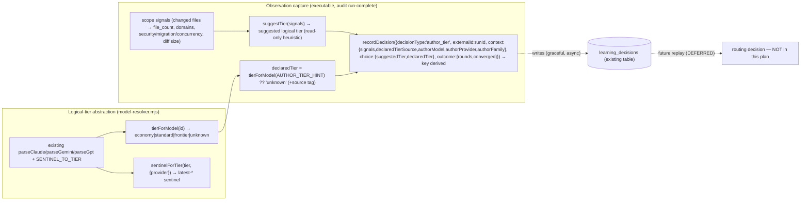

# Plan: Provider-Agnostic Model-Tier — Observation + Abstraction (instrument before routing)

- **Date**: 2026-06-15
- **Status**: Complete (verified built; status corrected from Approved during archive triage 2026-06-27)
- **Author**: Claude + Louis
- **Scope**: backend
- **Target domain(s)**: `shared-lib`, `audit-orchestration`
- ⚠ **Cross-domain work** — touches the resolver/learning libs (`shared-lib`) and the audit run-complete path (`audit-orchestration`). The seam is deliberate: one logical-tier vocabulary must hold across the resolver, the recorder, and the plan grammar.

> **Origin**: `/brainstorm --with-gemini` synthesis (2026-06-15). We tier models on
> the AUDIT side but not the AUTHORING side. Before building any router, **measure**.
> This plan ships the **logical-tier abstraction** + the **observation capture** ONLY.
> It changes NO execution: no model is downgraded, no routing/escalation/delegation is
> added. Those are an explicitly-deferred routing phase gated on the collected data.
>
> **What this observation CAN and CANNOT conclude (R1-M4 — epistemics, stated up front).**
> Execution is observation-only, so the *actual* author tier does not vary — the dataset
> is **correlational, not causal**:
> - **CAN answer**: "which scope-signatures correlate with audit *difficulty*
>   (rounds-to-converge, converged-or-not)?" — a useful **prior** for *where* routing
>   could matter, and whether the `suggestTier` heuristic tracks real difficulty.
> - **CANNOT answer**: "would authoring tier X have used fewer rounds?" — a counterfactual
>   requiring the actual tier to *vary*, i.e. the deferred routing-phase **canary** (vary
>   tier on a cohort, then replay). This plan builds the prior + the abstraction the canary
>   reuses; it does not claim a causal result.

---

## 1. Context Summary

- **Scope / stack**: backend · `js-ts` + postgres · `node --test`.
- **What exists today (reuse, don't reinvent)**:
  - `scripts/lib/model-resolver.mjs` — `latest-*` sentinels, `SENTINEL_TO_TIER`,
    `parseClaudeModel`/`parseGeminiModel`/(gpt parser), live-catalog refresh. Already
    classifies a concrete id by provider/family/tier — the tier fns are a thin layer on top.
  - `scripts/lib/learning/decision-logger.mjs` — `recordDecision({decisionType,...})`
    with bounded per-type queues + outbox; `convergence_predict` is the established
    per-run telemetry type (emitted in `openai-audit.mjs` ~L2853). Graceful when cloud off.
  - `learning_decisions` (Supabase) — `decision_type` is free-text + a JSONB `context`
    + a resolvable `outcome`. **No migration needed** — the observation reuses this shape.
  - `scripts/lib/learning/replay.mjs` — counterfactual replay; the future routing
    graduation path (a candidate policy is replayed against recorded rows).
  - The §11 Execution-Clustering block is **LLM-parsed** by `/cycle` + `/audit-plan`
    (SKILL.md instructions), not a code parser — so the optional tier field is a
    documentation/instruction change, not a parser change.
- **Neighbourhood considered**: `get-neighbourhood` → all `review` (<0.75); the tier
  fns sit beside `parseClaudeModel`/`parseGeminiModel`/`SENTINEL_TO_TIER` and reuse them
  (anti-duplication #1/#5). No new resolver scheme.

### The provider-asymmetry reality (load-bearing for the abstraction)

Not every provider has three clean tiers. The mapping the abstraction encodes:

| logical | anthropic | google | openai |
|---|---|---|---|
| `economy`  | haiku  | flash-lite | gpt-mini |
| `standard` | sonnet | flash      | gpt (lower reasoning) |
| `frontier` | opus   | pro        | gpt (higher reasoning) |

OpenAI has **two model tiers** (`gpt`, `gpt-mini`) + reasoning-effort as the
standard↔frontier axis — so `standard` and `frontier` resolve to the *same* OpenAI
model, differentiated by reasoning, not model id. `tierForModel('gpt-…')` therefore
classifies to `standard` from the id alone (reasoning isn't in the id); the future
routing phase, not this one, handles the reasoning axis. The abstraction must degrade
cleanly when a provider can't express a distinct tier (return the nearest, never throw).

---

## 2. Proposed Architecture



### Key design decisions (cite `references/engineering-principles.md`)

- **One logical vocabulary, bound per provider (#1 DRY, #5 SSoT).** All tier logic is
  written in `{economy, standard, frontier}`; `model-resolver` is the single place that
  binds logical↔concrete (via the existing `SENTINEL_TO_TIER` + parsers). "Claude is an
  example": nothing in the recorder or plan grammar names a concrete model. Works for
  the Azure profile too — `tierForModel` classifies the resolved sentinel, not the
  deployment name (the deployment-vs-sentinel split in model-resolver's docs stays the
  binding seam).
- **Executable capture, not documented prose (#11, anti-B5).** The recorder fires from
  `openai-audit.mjs`'s run-complete path exactly like `convergence_predict` — NOT a
  step a SKILL.md asks the model to "remember." The only prose-dependent part is the
  OPTIONAL `AUTHOR_TIER_HINT` enrichment; the core observation (signals + suggested +
  rounds + converged) records unconditionally.
- **Audit-rounds is the primary outcome metric (the cost-center finding).** The
  brainstorm + this session showed the expensive thing is audit *rounds*, not author
  tier. The observation's `outcome` keys on `rounds_to_converge` + `converged`, so a
  future replay can ask "did a given suggested tier correlate with fewer rounds."
- **Graceful no-op (#16).** Cloud off / `LEARNING_DISABLE=1` → the recorder is a no-op,
  mirroring `convergence_predict`. Never blocks or fails an audit.
- **Idempotency is the store's, not ours (#13 — R2-H3).** `learning_decisions` upserts on
  `decision_key` UNIQUE with **`ON CONFLICT DO NOTHING`** (verified in
  `store/learning-decisions.mjs`). So `decisionKey = author_tier:<runId>` guarantees
  exactly one row per audit run — the recorder fires once at terminal run-complete, and
  any retry/resume is a no-op (first write wins). We add no dedupe mechanism; we use the
  existing contract. `decisionKey` is the canonical field name throughout (not `key`).
- **Observation-only (the right-sizing spine).** Records `suggestedTier` vs `declaredTier`
  (a hint, source-tagged) but acts on neither. No model changes, no escalation, no delegation.

### §6 Right-sizing gate

- **Band-aid**: hard-code a heuristic tier table and route on it now. Rots immediately,
  isn't provider-portable, and we have no data to validate it.
- **Over-engineered**: build the full router + ML classifier + escalation + subagent/
  per-call delegation + bandit-promotion now. That's the deferred phase; building it
  blind is exactly what the brainstorm warned against.
- **Chosen**: the *abstraction* (needed so any future logic is provider-agnostic) + the
  *measurement* (needed to decide from evidence). Current requirement: "answer whether
  tier-routing helps, and where, without guessing." No router until the data says so.

---

## 6. Sustainability Notes

- **Assumption that could change**: provider tier ladders (a new OpenAI mini, a 4th
  Claude tier). Contained but not free (R2-L1): a new tier touches `TIER_MAP` +
  `LOGICAL_TIERS` + the Zod tier enum (three co-located edits in two files) + their unit
  tests — but **no routing logic and no caller** change, because everything downstream
  speaks logical tiers, not model names. That's the bound the abstraction buys.
- **Extension seam**: `decision_type:'author_tier'` rows are replay-ready — the future
  routing phase adds a reward fn in `replay.mjs` and (if it graduates) a policy, with
  zero schema change.
- **Guardrail**: a unit test pins `tierForModel`/`sentinelForTier` round-trips for every
  `STATIC_POOL` family, so a new model id can't silently classify as `unknown`.

---

## 7. File-Level Plan

### Phase 1 — Logical-tier abstraction (pure)
- **`scripts/lib/model-resolver.mjs`** (modify): add
  - `export const LOGICAL_TIERS = ['economy','standard','frontier']` + a frozen
    `TIER_MAP` enumerating EXACT sentinels (R1-H3 — **all already exist in
    `SENTINEL_TO_TIER`; NO new sentinels are introduced**):
    ```
    anthropic: { economy:'latest-haiku',     standard:'latest-sonnet', frontier:'latest-opus' }
    google:    { economy:'latest-flash-lite',standard:'latest-flash',  frontier:'latest-pro'  }
    openai:    { economy:'latest-gpt-mini',  standard:'latest-gpt',     frontier:'latest-gpt'  }
    ```
    (OpenAI `standard`===`frontier`===`latest-gpt` — the tier axis there is reasoning
    effort, not model id; documented, and the routing phase, not this one, handles it.)
  - `export function tierForModel(modelId)` → `economy|standard|frontier|unknown`.
    Resolve sentinels first (`SENTINEL_TO_TIER`), else parse via the existing
    `parseClaudeModel`/`parseGeminiModel`/gpt parser → map (provider, tier/variant) → logical.
    Never throws; unknown ids → `'unknown'`. (Anthropic haiku/sonnet/opus and Google
    flash-lite/flash/pro map 1:1; OpenAI mini→economy, non-mini gpt→standard since
    reasoning isn't in the id.)
  - `export function describeModel(modelId)` → `{ provider, family, tier, concreteModel } | null`
    — a thin wrapper over the existing `parseClaudeModel`/`parseGeminiModel`/gpt parser
    (resolving a sentinel to its concrete id first). This is the **bias-partition key**
    the observation needs (provider + family + concrete model), distinct from the logical
    `tier` used for routing-space logic. `null` for an unrecognised id.
  - `export function sentinelForTier(logicalTier, { provider })` → `TIER_MAP[provider][tier]`.
    For all THREE current providers every logical tier resolves to a sentinel (OpenAI
    `frontier` → `latest-gpt`, the documented collapse — **NOT `null`**). `null` is
    returned only for an unrecognised `provider` or a `logicalTier` absent from `TIER_MAP`
    (a defensive path, unreachable for current inputs); never throws. (R3-H2 — the risk
    register's "degrade to null" refers to this unrecognised-provider path, not the
    OpenAI collapse.)
  - **Mapping is NOT bijective for OpenAI (R2-H2 — explicit non-round-trip).**
    `sentinelForTier('standard'|'frontier', {provider:'openai'})` both yield `latest-gpt`,
    and `tierForModel('latest-gpt')` returns `'standard'` (the lower of the collapsed
    pair, by convention). So the §9 round-trip test asserts
    `tierForModel(sentinelForTier(t,p)) === t` **only for providers/tiers with a unique
    sentinel** (Claude + Gemini, all three tiers; OpenAI `economy`). For OpenAI
    `standard`/`frontier` the test asserts the documented collapse
    (`sentinelForTier('frontier','openai') === sentinelForTier('standard','openai')`),
    not a round-trip. No false contract.
  - **Why**: SSoT for logical↔concrete; the provider-agnostic spine (#1, #5). A guardrail
    test (§9) asserts no `STATIC_POOL` family classifies as `unknown`.

### Phase 2 — Scope-signal heuristic + observation builder (pure)
- **`scripts/lib/learning/author-tier-observation.mjs`** (create):
  - `export function deriveSignals({ changedFiles, domains, diffLines })` → an
    **aggregates-only** signal object — NO raw paths (R1-H2): `{ fileCount,
    domainTags:string[], crossDomain:bool, floorTouch:bool, mechanicalOnly:bool,
    diffBucket:'xs'|'s'|'m'|'l' }`. Raw `changedFiles` are consumed here and discarded;
    they never enter the returned object. `floorTouch`/`mechanicalOnly` delegate to the
    EXISTING classifier `classifyPath(p)` from `scripts/lib/sensitive-paths.mjs` (returns
    `sensitive | generatedNoise | null`) — no parallel logic:
    - **`floorTouch`** (detectable signals only) = any path with `classifyPath(p) ===
      'sensitive'` OR under `supabase/migrations/**`. **Concurrency is NOT reliably
      path-detectable, so it is NOT in the auto heuristic** (single source of truth — no
      "concurrency marker" anywhere); it's exactly the case the optional §11 `author-tier`
      override exists for (a human flags a concurrency-heavy cluster `frontier`).
    - **`mechanicalOnly`** = every path is docs/config/test-only (a small extension-/
      dir-based predicate in this module, e.g. `*.md`, `docs/**`, `*.test.*`, config
      globs) — NOT a `classifyPath` category, so it's defined here as a named local helper.
    - **`diffBucket` boundaries (R2-M1)**: `xs` <10, `s` 10–49, `m` 50–199, `l` ≥200
      changed lines (constants at the top of the file).
  - `export function suggestTier(signals)` — read-only heuristic with **explicit
    precedence + thresholds (R1-M3)**: (1) `floorTouch` → `frontier`; (2) else
    `fileCount > 5` OR `crossDomain` OR `diffBucket==='l'` → `frontier`; (3) else
    `mechanicalOnly && fileCount <= 2` → `economy`; (4) else `standard`. Pure.
    Thresholds are constants at the top of the file (one place to tune).
  - `AuthorTierObservationSchema` (Zod, R1-M1) — validates the three `recordDecision`
    payload parts: `context` (signals + `declaredTierSource` + the **ladder partition key**
    `{ authorModel, authorProvider, authorFamily }`, each nullable), `choice`
    (`{ suggestedTier, declaredTier }` — the "decision" being logged), and `outcome`
    (`roundsToConverge`, `converged`) before it's handed to `recordDecision`. The partition
    key is what lets a future analysis **never pool Sonnet-standard with Qwen-standard**
    (cross-model-bias defence — see Deferred §). **Owned by
    THIS module** (R3-L1) — it's a local telemetry envelope, not a cross-module/LLM-output
    contract (which is what `schemas.mjs` holds); decided, not "co-located or maybe
    schemas.mjs." Validation throws in tests, logs+skips in prod (never blocks an audit).
  - `normalizeTierHint(hint)` (R2-H1/R3-M4 — total, no fuzzy "looks like"): if `hint` ∈
    `LOGICAL_TIERS` (the §11 `author-tier: economy` form) return it directly; otherwise
    return `tierForModel(hint)` — which already resolves sentinels (`latest-opus`) AND
    concrete ids AND returns `'unknown'` for anything unrecognised. No heuristic guess;
    `tierForModel` is the total fallback. This is the only correct bridge — passing a
    logical-tier string straight to
    `tierForModel` (a model-id parser) would always yield `'unknown'`.
  - `export function buildAuthorTierObservation({ runId, signals, rounds, converged, authorTierHint })`
    → returns the EXACT `recordDecision` **input** shape (G1 — match the real contract;
    `recordDecision` derives the key itself, it is NOT passed one):
    ```
    { decisionType: 'author_tier',
      externalId:   runId,                              // → decision_key = 'author_tier:'+runId
      repoId,                                            // optional
      context: { ...signals, declaredTierSource,
                 authorModel, authorProvider, authorFamily },  // ladder partition key (nullable)
      choice:  { suggestedTier, declaredTier },          // the "decision" logged (required by recordDecision)
      outcome: { roundsToConverge: rounds, converged } }
    ```
    **Ladder partition key (cross-model-bias defence)**: when `authorTierHint` is a
    CONCRETE model id, `const d = describeModel(authorTierHint)` populates
    `authorModel=d.concreteModel`, `authorProvider=d.provider`, `authorFamily=d.family`
    (so the row is attributable to a specific ladder, e.g. `anthropic/claude` vs
    `local/qwen`). When the hint is only a logical tier (or absent) these are `null`. The
    logical `declaredTier` is still derived for routing-space logic; the concrete partition
    key is what keeps a future per-ladder analysis from pooling distinct models.
    **G1 (integration contract)**: `recordDecision` requires `decisionType` + `context` +
    `choice` + EITHER (`auditRunId`,`round`,`sequence`) OR `externalId`, and **derives**
    `decision_key` via `buildDecisionKey`. We use the **`externalId: runId`** branch
    (this is a per-RUN observation, not per-round) → `buildDecisionKey` yields
    `author_tier:<runId>`. So `choice` carries the suggested/declared tiers (the logged
    decision); `context` carries the signals + provenance; `outcome` carries rounds +
    converged. `buildAuthorTierObservation` returns this object directly to
    `recordDecision(...)` — no pre-built `decisionKey`.
    **R1-H1 (honest naming)**: `declaredTier = normalizeTierHint(authorTierHint)` (NOT
    `actualAuthorTier`) with `declaredTierSource ∈ {provided, unknown}` — a
    *declared/hinted* tier, explicitly NOT an observed authoring fact; `unknown` when no
    hint. **R3-M2**: the recorder reads ONE channel (`AUDIT_AUTHOR_TIER_HINT`), so it only
    knows *whether* a hint was provided, not its origin (a §11-sourced hint and a hand-set
    env arrive identically); plan-vs-manual provenance is **deferred** (needs a separate
    `…_SOURCE` channel). **R1-H4 / R2-H3 / G1 (idempotency)**: the derived
    `decision_key = author_tier:<runId>` + the store's `ON CONFLICT DO NOTHING` on
    `decision_key` UNIQUE gives one row per run (recorder fires once at terminal
    run-complete); `runId` joins back to `audit_runs` for replay.
  - **Why**: pure + unit-testable in isolation from the audit run (#11); aggregates-only
    payload makes egress leakage structurally impossible (#12 Validation, egress invariant).

### Phase 3 — Wire the recorder into audit run-complete (executable, graceful)
- **`scripts/openai-audit.mjs`** (modify, next to the `convergence_predict` emit ~L2853):
  after a run completes, call `deriveSignals` (aggregates-only) from the run's own data
  (changed files, resolved domains, diff size), then `buildAuthorTierObservation({ runId,
  signals, rounds, converged, authorTierHint: process.env.AUDIT_AUTHOR_TIER_HINT })` and
  `recordDecision(...)`. Best-effort: validation/record failure logs + continues, never
  blocks the audit (identical to existing telemetry). **`AUDIT_AUTHOR_TIER_HINT` SHOULD
  carry a concrete author model id** (e.g. `claude-sonnet-4-6`, `qwen2.5-coder-7b`) so the
  ladder partition key populates; a bare logical tier still works but leaves the partition
  fields null (coarser, unpartitionable by ladder).
- **Record-or-skip + outcome rules (R1-M2 — define the state machine)**:
  - **The discriminator (R2-M3)** is *did the run produce a verdict object*, NOT which
    verdict. `INCOMPLETE` IS a terminal verdict and is **recorded**; only a run with NO
    verdict object — a hard error, crash, or interruption before the verdict is computed
    — is skipped.
  - **Skip recording** when: there are **no changed files** (nothing authored), OR no
    verdict object was produced (error/crash/interrupt).
  - **Record** on any run that produced a terminal verdict (`CONVERGED` /
    `SIGNIFICANT_ISSUES` / `INCOMPLETE`): `roundsToConverge` = rounds actually run;
    `converged` = quality threshold met (`HIGH==0 && MEDIUM<=2 && quickFix==0`) — so an
    `INCOMPLETE` (timed-out passes) or max-rounds-not-converged run records with
    `converged:false` (a non-convergence is a *valid, informative* outcome, not a skip).
  - Idempotent on `decisionKey=author_tier:<runId>` — re-invocation for the same run
    upserts, so resumes/retries don't double-count.
- **`scripts/lib/learning/decision-logger.mjs`** (modify): add `'author_tier'` to
  `VALID_DECISION_TYPES` (else `recordDecision` rejects it) so it's accepted + queued.
  The `externalId`-keyed path (G1) is already supported by `buildDecisionKey`/`validateInput`
  — no logger contract change beyond the type registration.
- **Why**: executable capture at the seam that already records run outcomes (anti-B5,
  the documented-but-never-executed failure class).

### Phase 4 — Optional §11 advisory metadata + docs (observation-only)
- **`skills/plan/SKILL.md`** + **`skills/audit-plan/SKILL.md`** (modify §11 grammar):
  document an OPTIONAL, advisory per-cluster `author-tier: economy|standard|frontier`
  hint — explicitly "observational; `/cycle` records it but does NOT act on it." Note the
  planner MAY set it from the same signals `suggestTier` uses.
- **`skills/cycle/SKILL.md`** (modify): document that when a cluster carries an
  `author-tier` hint, `/cycle` MAY set `AUDIT_AUTHOR_TIER_HINT` before invoking the audit
  so the observation captures actual-vs-suggested — but tier is NOT changed at execution.
- **Why**: lets future analysis correlate a human/planner's intended tier with outcomes,
  with zero behavioral coupling now.

**Close-out (not a phase) — deterministic order**: (1) `npm test`; (2) `npm run skills:regenerate` + `npm run skills:check` (Phase 4 touched SKILL.md — regen `.claude/skills/**`); (3) `npm run sync` (manifest refresh for changed core scripts).

### 11. Execution Clustering

- **Cluster A** — Phases 1–2 — fix-gate: yes
  - Coupling: the heuristic + observation builder (2) consume the tier abstraction (1);
    both are pure, no-I/O functions that must agree on the `{economy,standard,frontier}`
    vocabulary and the provider-asymmetry degradation. Auditing together inspects that
    contract; everything downstream depends on it.
- **Cluster B** — Phases 3–4 — fix-gate: final
  - Coupling: the recorder wiring (3) calls Cluster A's pure fns from the audit
    run-complete path, and the docs (4) describe the same vocabulary + the optional env
    hint the recorder reads. Builds on A; no execution change, so a low-risk final.
- **Final gate**: consolidated Gemini review over the union diff.

---

## 8. Risk & Trade-off Register

| Risk / trade-off | Decision |
|---|---|
| **Scope creep into the router** (the whole point is to NOT build it yet). | Hard line: observation + abstraction only. §"Deferred" lists every routing piece as out of scope, gated on the collected data. The recorder writes `suggestedTier`/`declaredTier` but nothing reads them to act. |
| **Provider asymmetry** (OpenAI 2 tiers + reasoning vs 3 clean tiers). | The abstraction degrades, never throws: `sentinelForTier` returns `null` for an inexpressible tier; `tierForModel('gpt')` → `standard`. Documented; the reasoning axis is the routing phase's problem. |
| **Audit subprocess can't see the author model.** | `actualAuthorTier` is an OPTIONAL `AUDIT_AUTHOR_TIER_HINT` env (→ `unknown` when absent). Core observation (signals + suggested + rounds + converged) records regardless — already useful (rounds-by-signal), and the full triple lands whenever the hint is set. No hard dependency on a value the audit can't obtain. |
| **Prose-dependent capture (the B5 anti-pattern we fought).** | Core recorder is executable in `openai-audit` (like `convergence_predict`), not a SKILL.md step. Only the optional hint is set by `/cycle` prose — and its absence degrades gracefully. |
| **Telemetry leaking secrets/paths.** | `changedFiles` run through the sensitive-path classifier before entering `context`; no raw payloads (egress invariant, tier-3 testing doctrine). |
| **Schema churn.** | None — reuses `learning_decisions` (free-text `decision_type` + JSONB). No migration. |
| **Heuristic `suggestTier` is itself a guess.** | That's fine — it's RECORDED for comparison, not acted on. The replay (future) measures whether it correlated with fewer rounds; a wrong heuristic is data, not a bug. |
| **R1-H1 — `actualAuthorTier` misnamed** (it's a hint, not observed). | Renamed `declaredTier` + `declaredTierSource ∈ {env,plan-hint,unknown}`; explicitly a declared/hinted value, not an observed authoring fact. |
| **R1-H2 — egress payload shape undefined.** | Telemetry context is **aggregates-only** (counts/flags/buckets); raw `changedFiles` are consumed in `deriveSignals` and never stored — leakage is structurally impossible. |
| **R1-H3 — tier map underspecified / new sentinels?** | `TIER_MAP` enumerated with exact sentinels; **all 8 already exist in `SENTINEL_TO_TIER` — no new sentinels**. OpenAI standard==frontier collapse documented. |
| **R1-H4 — idempotency / replay correlation undefined.** | `decisionKey=author_tier:<runId>` (one row/run, upsert on retry); `runId` is the join to `audit_runs` for replay. |
| **R1-M1 — boundary schema missing.** | `AuthorTierObservationSchema` (Zod) validates the envelope before record; throws in tests, logs+skips in prod. |
| **R1-M2 — outcome state machine.** | Skip when no changed files / errored / interrupted; record on terminal verdicts; non-convergence records `converged:false` (informative, not skipped). |
| **R1-M3 — vague heuristic.** | Explicit precedence + numeric thresholds; `floorTouch`/`mechanicalOnly` delegate to existing `sensitive-paths` + path classifiers (no parallel logic). |
| **R1-M4 — correlational, not causal.** | Reframed up front: this yields a signal→difficulty *prior*; the causal answer needs the deferred canary (vary tier + replay). No overclaim. |
| **R1-L1 — section numbering.** | Sustainability renumbered §5→§6 (per the planner's canonical numbering; §3–5 are frontend-only and skipped). |
| **G1 (Gemini) — envelope vs `recordDecision` contract.** | `buildAuthorTierObservation` returns the real input shape (`decisionType`+`context`+`choice`+`externalId:runId`); key is derived (not passed); `'author_tier'` registered in `VALID_DECISION_TYPES`. |
| **Deferred — the routing phase (gated on data)**: the actual tier router, escalation, burn-it-down, delegation binding, hard-floor enforcement, bandit promotion, the `replay.mjs` reward fn for `author_tier`. | Explicitly out of scope — see the dedicated **"Deferred — routing phase"** section below for the split-B + diversity-gate recipe (cross-model-bias defence). |
| **Cross-model bias** (a router learned from one user's dominant model mis-serves others). | Defended at the data layer: the ladder partition key (`authorModel/authorProvider/authorFamily`) keeps ladders un-pooled, and the store is **per-repo** (bias is opt-in, only via a cross-repo global artifact). The Deferred section gates any *shared* artifact on ladder DIVERSITY, not sample count. |

---

## 9. Testing Strategy

- **Phase 1 (unit)**: `tierForModel` classifies every `STATIC_POOL` id to the expected
  tier (incl. sentinels, dated Claude ids, Gemini aliases/versioned, gpt/gpt-mini);
  unknown id → `'unknown'`. `sentinelForTier` per §"non-bijective" (round-trip for unique
  sentinels; OpenAI standard/frontier collapse). `describeModel` returns
  `{provider,family,tier,concreteModel}` for known ids (incl. sentinel→concrete) and
  `null` for unknown. Guardrail test: no `STATIC_POOL` family classifies as `unknown`.
- **Phase 2 (unit)**: `suggestTier` — floor paths (security/migration) → `frontier`;
  tiny single-domain test/doc/config change → `economy`; ordinary multi-file → `standard`.
  `buildAuthorTierObservation` produces the correct envelope shape (decisionType,
  externalId, context with `declaredTierSource` + ladder partition key, choice with
  suggestedTier+declaredTier, outcome with rounds+converged). **Partition-key cases**: a
  CONCRETE-model hint populates `authorModel/authorProvider/authorFamily` (e.g.
  `claude-sonnet-4-6` → `anthropic/claude`); a logical-tier-only hint and a missing hint
  leave them `null`. Egress: `deriveSignals` is aggregates-only — assert a `.env`-style
  path never appears in the emitted context (raw paths consumed + discarded).
- **Phase 3 (invariant, not mock-the-API)**: the recorder is invoked at run-complete and
  is a graceful no-op when cloud is off / `LEARNING_DISABLE=1` (assert it never throws
  and never blocks); a fixture run records exactly one `author_tier` row. Reuse the
  decision-logger test seam (DI), don't mock the whole store.
- **Egress**: no new external payload; telemetry context is path-classified. Covered by
  the existing sensitive-egress gate where applicable.
- **Regression**: full `npm test` + `skills:check` (Phase 4 regen).

---

## Deferred — routing phase (data-gated; split to defeat cross-model bias)

This section SPECIFIES the next phase so the path is explicit — it is **not built
here** (no clusters, no code). The `/brainstorm --with-gemini` review (2026-06-15)
established that a single prescriptive global router learned from the maintainer's
dominant model would mis-serve users on other base models. The defence is to **split**
the routing phase into two halves with *different* bias rules, and to gate on
**diversity, not sample count**:

- **B1 — Portable difficulty *prior* (a shared/shippable artifact → diversity-gated).**
  The only thing that travels across users is a **relative difficulty RANK** (which scope
  signatures are harder — `migrations > multi-file-cross-domain > ordinary > docs`), NOT
  absolute tier prescriptions. **Bias rule**: ship/update B1 only when the data has
  `≥N` convergence events spanning **≥3 distinct provider ladders** (`authorFamily`) with
  per-cell minimums — a flat "N samples" gate is a trap (10k Sonnet rows is still 100%
  biased). B1 ships a rank, never "use Opus for X".
- **B2 — Local per-model *calibration* (per-repo → NO diversity gate).** Each consumer
  repo's own `author_tier` rows calibrate **their** model's action thresholds against the
  B1 rank ("my Qwen-7b stops converging above difficulty-rank R → step up / call out").
  Single-model data is **correct** here, not biased — it's *that* user's model. This is
  the bundle's existing per-repo, local-first grain; it needs no cross-user diversity.
- **Bias is opt-in, not a default to defend.** Because the store is per-repo, the only
  way the maintainer's model biases anyone else is a cross-repo global artifact — which is
  exactly (and only) B1, the diversity-gated half. The ladder partition key added in
  Phase 2 is what keeps B1's input un-pooled by construction.
- **Then, and only then**: the router/escalation/floors/delegation/bandit-promotion +
  the `replay.mjs` reward fn — designed *after* B1+B2 data exists, because the data may
  even show the answer is "prune context, don't downgrade the model" (Gemini's position),
  in which case a tier router isn't built at all.

**Graduation trigger to (re)plan the routing phase**: `author_tier` store has `≥N`
convergence events from `≥3` provider ladders (B1), OR any single repo has enough
single-model rows to self-calibrate (B2). Until then, this stays observation-only.

## Audit trail
- **GPT plan-audit R1**: SIGNIFICANT_GAPS — H:4 M:4 L:1, all valid, all `fix-now`
  (no rigor pressure). H1 (honest `declaredTier` naming), H2 (aggregates-only egress),
  H3 (enumerated TIER_MAP, no new sentinels), H4 (`decisionKey` idempotency), M1 (Zod
  boundary schema), M2 (outcome state machine), M3 (concrete heuristic thresholds +
  reused classifiers), M4 (correlational-not-causal reframe), L1 (§ renumber) — all
  folded (Risk Register R1-* rows). No rebuttal (nothing dismissed).
- **GPT plan-audit R2**: SIGNIFICANT_GAPS — H:3 M:3 L:1 (0 R1 findings reopened). The
  findings were mostly inconsistencies the R1 edits introduced + two underspecs: R2-H1
  (hint is a logical tier, not a model id → `normalizeTierHint`), R2-H2 (non-bijective
  OpenAI round-trip → fixed test contract), R2-H3 (idempotency — verified the store
  upserts on `decision_key` UNIQUE / `ON CONFLICT DO NOTHING`, cited it), R2-M1 (diff
  buckets + dropped undefined concurrency marker), R2-M2 (`actual`→`declared` residual),
  R2-M3 (outcome state machine), R2-L1 (sustainability claim). All folded.
- **GPT plan-audit R3 (cap round) — STOPPED**: SIGNIFICANT_GAPS — H:2 M:4 L:1. HIGH
  4→3→2; every R3 item was a **residual contradiction the R2 edits left** (stale
  "concurrency marker" vs the drop note; `sentinelForTier` null-vs-collapse; mermaid
  `key:` vs `decisionKey:`; provenance `{env,plan-hint}` undeterminable via one channel)
  or a "name the exact function" precision ask (`classifyPath`; schema ownership;
  `normalizeTierHint` totality) — **no net-new design flaw, no rigor pressure**. All
  fixed. Stopped at the **3-round plan-audit cap** with the findings clearly decayed to
  consistency-polish (per the rigor-pressure convergence rule). → Gemini final gate.
- **Gemini final gate (gemini-pro-latest, --mode plan)**: verdict **CONCERNS**;
  **architectural coherence Strong**; no Claude bias, **0 over-engineering flags**, 0
  wrongly-dismissed ("exceptionally well thought-out; observation-before-execution;
  provider asymmetry handled gracefully; privacy boundary enforced via aggregates-only
  telemetry"). 1 new finding **G1 (HIGH, mechanical, both GPT rounds missed it)**: the
  observation envelope must match `recordDecision`'s real input contract — it requires
  `choice` + (`externalId` OR audit-bound triple) and **derives** the key, rather than
  accepting a pre-built `decisionKey`. **Folded**: `buildAuthorTierObservation` now
  returns the exact input shape (`externalId: runId` → derived `author_tier:<runId>`;
  `choice:{suggestedTier,declaredTier}`); `'author_tier'` added to `VALID_DECISION_TYPES`.
  **Stopped at Gemini round 1** (cap 2): G1 is implementation-completeness/mechanical with
  Strong coherence — re-running to convert CONCERNS→APPROVE on a payload-shape fix is the
  spin-for-a-stamp anti-pattern; `/audit-code` will verify the shape against the real
  `recordDecision` at implementation.
- **Outcome**: plan **Approved** for implementation. GPT 3 rounds (cap, stopped on
  consistency-decay), Gemini 1 round (cap 2). 19 findings total, all accepted + folded;
  none dismissed. Coherence Strong; 0 over-engineering flags — the observation-only +
  provider-agnostic + aggregates-only design held up.

### Code-audit trail — Cluster A (`/cycle code --autonomous`, fix-gate: yes)
- **Per-round key deviation from the G1-approved envelope**: G1 approved an
  `externalId: runId` envelope (→ `author_tier:<runId>`, one row/run). But
  `openai-audit.mjs` is invoked **once per round**, so an `externalId` key with
  `ON CONFLICT DO NOTHING` would capture only round 1 and never know the run's
  final outcome at emit. Switched to an **audit-bound per-round key**
  (`auditRunId + round + sequence=0` → `<runId>:author_tier:r<round>:s0`); each
  round carries that round's `{converged}`, and run-level rounds-to-converge
  derives at read/replay. Documented in `author-tier-observation.mjs`.
- **R1 → R2 (H:4→0)**: domainTags egress (slug-sanitise + Zod), `String(runId)`
  coercion (guard non-empty string), Gemini flash-lite mis-tier (alternation
  order), OpenAI `pro`/`4o` variants (coarse fallback + `o?`/`pro` parser), TIER_MAP
  deep-freeze — all fixed.
- **R3 (H:2 M:6) → fixed 6, deferred 2**:
  - **Fixed**: `sentinelForTier` null-safe (R3-H); `validateInput`/`buildDecisionKey`
    type+range key-field validation (R3-H, shared predicates); `tierForModel`/
    `describeModel` apply `deprecatedRemap` (partition-key consistency — the
    bias-defence goal); `SECURITY_PATH_RE` `-`/`.` boundaries; `PER_TYPE_QUEUE_CAP`
    `resolveQueueCap` validation (a NaN cap would unbound author_tier's own queue);
    `DOMAIN_SLUG_RE` lowercase-only egress hardening.
  - **Deferred (independent — not load-bearing for this feature)**:
    - *Caller-mutation enqueue snapshot* (decision-logger generic): the `author_tier`
      envelope is freshly built per round and never mutated after `recordDecision`
      enqueues it — the divergence cannot occur on this path. Generic snapshot
      hardening spans all decision types; pre-existing; follow-up.
    - *`backfillOutcome` bypasses the per-type cap* (decision-logger generic):
      `author_tier` sets `outcome` inline at emit and never calls `backfillOutcome`,
      so the unbounded `_outcome_update` path is not exercised by this feature;
      pre-existing; follow-up.
- **R4 (cap-region; H:1 M:7 L:1 QF:1) → fixed 3, dismissed 6 → CONVERGED (H:0 M:2 QF:0)**.
  Findings had decayed to re-litigation + rigor pressure (per the stop-at-rigor rule):
  - **Fixed**: `buildDecisionKey` delimiter+`decisionType` guard (reject `:` in id
    components → no forged key segments); `buildAuthorTierObservation` non-object
    `signals` guard; **security-config floor split** — only docs/tests ABOUT auth are
    excluded (`DOC_TEST_RE`), so `config/auth.yaml`/`oauth.json` still floor. The QF
    finding demanded a 4-category path taxonomy → **rejected as over-engineering** for
    an observation-only signal (the §11 `author-tier:` override is the escape hatch);
    fixed its real kernel (the config gap) with the minimal doc/test-vs-config split.
  - **Dismissed**: 2× path-shorthand false-positives (recurring); the "non-atomic
    outbox" **HIGH was invalid** — `writeOutbox` already uses temp+`renameSync`
    atomicity, is pre-existing/untouched, and local-FS is its deliberate env-aware
    design; OpenAI dated-snapshot parser ask (coarse fallback already tiers them);
    lowercase-token egress (already adjudicated — wired source is the closed
    domain-map); "migration floor missing" (invalid — the migration check is present).
  - Stopped at R4 by adjudication (genuine kernels fixed, remainder rigor pressure);
    the mandatory consolidated Gemini gate over the union diff is the final cross-check.
- **Consolidated Gemini gate (union diff A+B; gemini-pro-latest)** — coherence **Strong**,
  **0 over-engineering flags**, deliberation fair ("excellently implements... robust and
  crash-safe; Claude correctly fixed real issues and pushed back on GPT hallucinations").
  - **Round 1 (CONCERNS)**: 1 valid MEDIUM — `SECURITY_PATH_RE` missed camelCase/PascalCase
    (`useAuth.ts`, `LoginForm.tsx`), the *common* case in a JS/TS tree → systematically
    under-floored frontend security work. **Fixed**: dropped `/i`, enumerated lowercase +
    Capitalized forms with a case-transition boundary (catches `useAuth`/`authGuard`,
    still rejects `author`/`authority`). Re-ran.
  - **Round 2 (CONCERNS_REMAINING — cap)**: (a) escalated a **wrongly-dismissed** claim that
    `describeModel` drops the partition key for dated OpenAI snapshots — **empirically
    refuted**: the coarse OpenAI fallback populates `{openai, gpt, <tier>, <full id>}` for
    `gpt-4o-mini-2024-07-18` et al., so the bias key is never null (Gemini missed the
    fallback; my R4 dismissal stands). (b) New MEDIUM: `authentication`/`authorization`
    full words missed — **fixed** (listed longer morphology before bare `auth`; still
    rejects `author`/`authority`).
  - **Stopped at the 2-round cap**: round-2 findings were one factually-invalid escalation
    + one keyword-completeness nit (now fixed) with rising praise — no concrete design
    defect to earn a 3rd round (per the gate protocol). Coherence Strong; observation-only,
    provider-agnostic, aggregates-only design confirmed intact.
