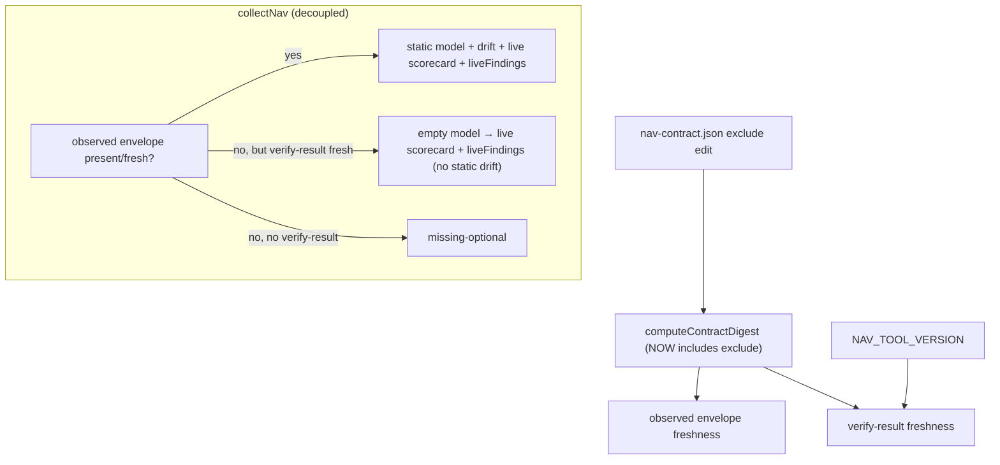

# Plan: nav-audit Debt — Digest Completeness + Live/Static Decoupling

- **Date**: 2026-06-26
- **Status**: Complete (GPT 3-round + Gemini APPROVE; implemented 2026-06-26)
- **Author**: Claude + Louis
- **Scope**: backend (nav-audit lib: digest + dashboard collector + verify-store; no UI)

> **Target domain**: `nav-audit`. **Scope/stack**: backend · `js-ts`.
> **Origin**: 3 pre-existing issues surfaced (and deferred with named independence) during the v1.3 `/cycle` audits. They are real but were out of scope for the live-findings/activation seam; this plan addresses them as a focused unit.

## 1. Context Summary

Three independent correctness/freshness gaps in nav-audit's digest + dashboard layer:

1. **`computeContractDigest` omits `contract.exclude`.** `exclude` directly drives source extraction (`nav-audit.mjs:51` `readSources(..., { exclude: earlyContract?.exclude ?? [] })`), so editing it changes the static graph — but the digest (which gates observed-envelope + verify-result freshness) doesn't change, so a stale envelope is accepted after an `exclude` edit.
2. **The dashboard gates ALL live evidence behind the static observed envelope.** `collectNav` returns `missing-optional` and never reads the verify result when `nav-graph-observed.json` is absent/stale (`collect-nav.mjs:30-43`) — even though the live scorecard + `liveFindings` derive from live DOM (`liveAttribution`), not the static graph. So a fresh authenticated `--verify` result can't surface on the dashboard until a static `arch`-style observed envelope is also fresh.
3. **The persisted verify-result is keyed on `contractDigest` only.** A change to nav's tool/taxonomy *semantics* (e.g. the v1.3 live-findings classes) does not invalidate a stale persisted live result, so the dashboard could render live findings produced by an older tool version against a newer reader.

**Code Trace**:
- `scripts/lib/nav/schema.mjs:156-172` — `computeContractDigest` canonical object = `{appRoots, navLayers, personas[...]}`; **no `exclude`**. `NAV_TOOL_VERSION` = 1 (`:24`). `NavVerifyResultSchema` (`:130`) has `version` but no tool-version binding.
- `scripts/nav-audit.mjs:51` — `readSources(root, sourceFiles, { exclude: earlyContract?.exclude ?? [] })` — `exclude` changes extraction. `:126` persists the verify result with `contractDigest` only.
- `scripts/lib/dashboard/collect-nav.mjs:30-43` — bails `missing-optional` on absent contract / stale observed envelope *before* `readVerifyResult` (`:49`). `:48` `buildModel(env.envelope.edges, …)` — the live scorecard currently needs the observed model.
- `scripts/lib/nav/verify-store.mjs:24,46` — `readVerifyResult` validates `NavVerifyResultSchema` + compares `contractDigest`; no tool-version check.
- `scripts/lib/nav/findings.mjs:227` — `personaScorecard(model, contract, {liveAttribution})` builds rows from **`contract.personas` intents** (not model destinations); `model.destinations.get` is a per-intent lookup that already tolerates `undefined` (`:232-233` `d ? [...d.anchors] : []`). So the live scorecard works with an **empty model** — only static anchors/drift need the observed envelope.

**Patterns reused vs new**: ~95% reuse. Fix 1 + 3 are field additions to existing canonical/schema code. Fix 2 reuses `personaScorecard`'s existing live path with an empty model; no new modules.

**Neighbourhood considered**: intra-domain; `computeContractDigest`/`collectNav`/`readVerifyResult` extended in place.

## 2. Proposed Architecture

**Key design decisions** (principles from `references/engineering-principles.md`):

1. **`exclude` joins the canonical digest** (#5 SSoT, #13 idempotency). One line in the canonical object — `exclude: sorted array`. **Sorting is canonical-correct because `exclude` is set-semantics (R1-M2)**: `readSources` excludes a file if it matches ANY exclude glob, so pattern order is irrelevant — exactly like the already-sorted `appRoots`/`navLayers`. Now the digest is a complete function of every contract field that affects extraction, so freshness is correct.
   - **Band-aid**: clear the verify result manually after an `exclude` edit. **Over-built**: a content-hash of every source file. **Chosen**: include the one missing contract field that drives extraction.

2. **Decouple live evidence from the static observed envelope** (#16 graceful degradation, loose coupling). `collectNav`: when the observed envelope is absent/stale BUT a fresh verify result exists, build the scorecard from `contract` + an **empty model** + `liveAttribution` (the live path already tolerates an empty model), surface persisted `liveFindings`, and mark static-only outputs (drift) empty with a clear status. Live evidence is live-DOM-derived — it should never be hidden by a stale static graph.
   - **Band-aid**: tell users to re-run static `arch` refresh first. **Over-built**: a second persistence path for live-only dashboards. **Chosen**: read the verify result independently and reuse the existing empty-model-tolerant live scorecard.

3. **Bind the verify-result to the tool version** (#18 backward compat, #19 observability). Add `toolVersion: NAV_TOOL_VERSION` to the persisted verify result; `readVerifyResult` rejects (as stale) when it doesn't match the current `NAV_TOOL_VERSION`. So a tool-semantics bump invalidates old live results deterministically.
   - **Band-aid**: rely on the operator to re-run `--verify` after upgrades. **Over-built**: a semantic-version range negotiation. **Chosen**: an integer equality gate on the existing `NAV_TOOL_VERSION` lever.

## 6. Sustainability Notes

- **Assumption**: `NAV_TOOL_VERSION` is bumped when nav's finding/attribution semantics change. This plan makes the verify-result honour it; the bump discipline is pre-existing.
- **Forward seam**: `collectNav`'s live-only branch is the natural place any future live-only dashboard surface plugs into.

## 7. File-Level Plan

- `scripts/lib/nav/schema.mjs` (**modify**) — `computeContractDigest`: add `exclude: Array.isArray(c.exclude) ? [...c.exclude].sort() : []` to the canonical object (fix 1). `NavVerifyResultSchema`: add `toolVersion: z.number().int().optional()` (optional → a v1/v2 envelope without it reads back-compat) (fix 3).
- `scripts/lib/nav/verify-store.mjs` (**modify**) — `readVerifyResult`: after schema + contractDigest checks, reject with a `stale: tool version` reason when **`envelope.toolVersion !== NAV_TOOL_VERSION`** (R1-H2 — this single condition makes BOTH a mismatch AND an absent/legacy `toolVersion` (`undefined !== 1`) read as stale, matching the prose; the schema keeps `toolVersion` *optional* so a legacy envelope still PARSES — it just fails the freshness gate and the operator re-runs `--verify`). No throw — returns `{result:null, rejectedReason}` like the existing digest path.
- `scripts/nav-audit.mjs` (**modify**) — persist `toolVersion: NAV_TOOL_VERSION` in the `writeVerifyResult` payload (fix 3); import `NAV_TOOL_VERSION`.
- `scripts/lib/dashboard/collect-nav.mjs` (**modify**, fix 2) — explicit seam (R1-H1): the change is at the existing `if (!env.envelope) return wrap({…missing-optional…})` guard (`:38-43`). Replace with: when `!env.envelope` (observed absent OR stale OR malformed — whatever `readEnvelope` reported), **attempt `readVerifyResult(root, computeContractDigest(contract))`**; if it returns a fresh `result` → take the **live-only branch**, returning through the SAME `wrap({ contract, scorecard, drift, verifyMeta, liveFindings, status })` the full path uses (R2-M1 — complete shape, no missing field): `scorecard = personaScorecard({ destinations: new Map() }, contract, { liveAttribution: result.liveAttribution, statesRequested: result.statesRequested, statesCollected: result.statesCollected }).rows`, `liveFindings = result.liveFindings ?? []`, `verifyMeta = { live: true, url: result.url, generatedAt: result.generatedAt, states: result.statesCollected, staticStale: true }`, `drift = []`, `status = { status: 'ok', detail: 'live-only — static graph absent/stale; run /nav-audit to refresh drift' }`. Else (no fresh verify result — whatever `verify.rejectedReason`/none) → keep today's `missing-optional`, **preserving `env.reason`** as the detail (R2-M2: the malformed/stale/absent observed reason is not lost). The observed-present path below is byte-unchanged.
- `tests/nav-contract-digest.test.mjs` (**create**) — `computeContractDigest` changes when `exclude` changes (and is stable across `exclude` key order); unchanged when unrelated fields move.
- `tests/nav-verify-store.test.mjs` (**modify** if present, else create) — a verify result with a mismatched/absent `toolVersion` is rejected as stale; a matching one passes.
- `tests/nav-dashboard.test.mjs` (**modify**) — `collectNav` surfaces live scorecard + `liveFindings` from a fresh verify result when the observed envelope is **absent** AND when it is **stale** (both hit the `!env.envelope` branch — R2-M3); still `missing-optional` (with `env.reason` preserved) when no fresh verify result exists; observed-present path unchanged.

- `scripts/lib/dashboard/sections/nav-audit.mjs` (**modify**) — the live-only renderer half of fix 2: when `verifyMeta.staticStale`, the drift panel must NOT claim "No drift — observed matches intent" (drift wasn't evaluated) — show "Nav drift not evaluated — static graph stale/absent" instead. (Added during audit R2: the live-only data branch in `collect-nav.mjs` and its renderer are coupled.)

**Close-out (not a phase)**: `npm test`.

## 8. Risk & Trade-off Register

- **Fix 1 risk — digest change invalidates existing envelopes/verify-results once.** Acceptable: a one-time re-run after deploy; the digest was *wrong* before (a real freshness bug). No data loss (both artifacts are gitignored Category-A, regenerated).
- **Fix 2 risk — live-only scorecard lacks static anchor context** (drift, static `observedAnchors`). Correct by construction: those ARE static-only; the live verdicts (pass/misplaced/missing) come wholly from `liveAttribution`. The status detail says `live-only (static graph stale — run /nav-audit)` so the operator knows drift is absent.
- **Fix 3 risk — legacy un-versioned verify results now read as stale.** Intended: they were produced by an older tool; re-running `--verify` is the correct refresh. Documented in the read-reject reason.
- **Accepted (R2-M4)**: `NAV_TOOL_VERSION` remains a manual bump lever — this plan makes the verify-result *honour* it but does not automate the bump. Auto-deriving a tool-semantics version (e.g. hashing the taxonomy class list) is a separate, larger concern; the manual lever is the pre-existing, intended mechanism and is documented at its definition site. The risk of a forgotten bump is unchanged by this plan (it existed for the observed envelope already).
- **Deliberately deferred**: a content-hash of source files in the digest (over-built); a live-only persistence schema (no requirement); automating the `NAV_TOOL_VERSION` bump (separate concern).

## 9. Testing Strategy

- **Tier 1 (deterministic)**: `computeContractDigest` — `exclude` edit ⇒ different digest; `exclude` reorder ⇒ same digest; unrelated change ⇒ unaffected by the new field. `readVerifyResult` — `toolVersion` match ⇒ accepted; mismatch/absent ⇒ `stale` reason (no throw). `collectNav` — observed-absent + fresh verify-result ⇒ live scorecard + `liveFindings` surfaced, drift `[]`, `verifyMeta.live=true`; observed-absent + no verify-result ⇒ `missing-optional`; observed-present ⇒ unchanged full path.
- **Invariant**: the observed-present path is byte-identical to today (decoupling only adds a branch for the observed-absent case); a v1/v2 verify result without `toolVersion` still parses (optional field) but reads stale.
- **Close-out**: full `npm test` green.

## 12. Plan Audit Trail
- **GPT plan audit (gpt-5.5)**: R1 H:2 M:2 → R2 H:0 M:4. Fixed: the `collectNav` seam made explicit (replace the `!env.envelope` guard; live-only branch via the shared `wrap()`); the `toolVersion` freshness condition reconciled to `!== NAV_TOOL_VERSION` (absent legacy → stale, consistent with optional-schema-parses); `exclude` sort justified by `readSources`'s `.some()` any-match set-semantics (verified at extract.mjs:59); stale-AND-absent test coverage; `NAV_TOOL_VERSION` manual-bump accepted as the pre-existing lever. **Stopped at R2** (HIGH cleared; remainder spec-completeness).
- **Gemini final review**: appended after the gate.
- **Gemini final review (gemini-pro-latest, `--mode plan`)**: **APPROVE**, 0 new findings (R1). Plan **Approved**.

## 13. Implementation + Audit Trail
Implemented all 3 fixes + a recurring footgun fix. **GPT /audit-code**: R1 H:1 M:3 (+2 QF) → R2 H:1 M:3 → R3 H:0 M:3. Fixed: the malformed-`nav-contract.json` footgun (now ERRORS in `--verify`/static, bootstrap regenerates); the live-only branch surfaces the observed-envelope `reason` (no masking of a corrupt envelope) AND the section renderer no longer claims "No drift" when drift wasn't evaluated (`staticStale`); the empty-model call documented at the site. Residual MEDIUMs accepted: `toolVersion` is optional for READ back-compat (the single writer always sets it); the live/observed projection overlap is negligible (different model/drift/staticStale). **Gemini final review: APPROVE, 0 findings.** 136 nav tests pass.
