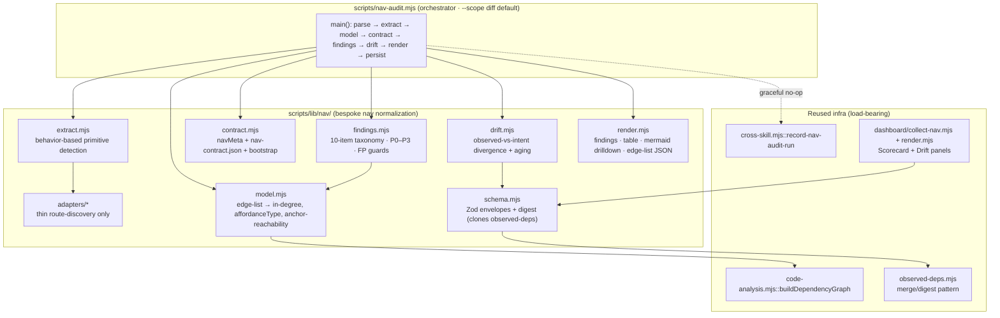

# Plan: `/nav-audit` — Static Navigation / Information-Architecture Audit Skill

- **Date**: 2026-06-25
- **Status**: Complete (implemented via `/cycle code --autonomous` + debt remediation; shipped 2026-06-25 — see §13)
- **Author**: Claude + Louis
- **Scope**: full-stack (static-analysis CLI/tooling backend + a 2-panel dashboard surface)
- **Origin**: Two-round `/brainstorm --with-gemini` (sessions `1782385146297`, `1782388515391`). The converged design — not the original write-up — is the spec.

---

## 1. Context Summary

**Detected scope/stack**: full-stack · `js-ts` + postgres (`detect-stack` → `{stack:"js-ts", stackKinds:["js-ts","postgres"]}`).

**The gap** (the "three lenses"): the bundle has journey coverage (`/persona-test`) and page coverage (`/click-test`) but no **system** coverage. An IA change is exactly the moment system-level incoherence (orphans, competing nav models, an intent buried out of primary nav) gets introduced, and neither existing lens detects it. `/nav-audit` is the third lens: unit of analysis = the whole navigation graph; question = "is what's **offered** what's **needed**, and is it sequenced right?"

**Neighbourhood considered** (arch-memory `get-neighbourhood`, cloud:true): no near-duplicate nav extractor exists — top similarity 0.69, all `review` → greenfield. But the query surfaced the **reusable infra this plan rides on** (this is the load-bearing reuse decision, §2):

| Existing symbol | File | How nav-audit reuses it |
|---|---|---|
| `computeObservedDomainDeps`, `mergeDomainDeps`, `ObservedDepsSchema`, `computeDomainMapDigest` | `scripts/lib/observed-deps.mjs` | **Clone the lifecycle wholesale.** Observed nav edge-list = the "observed" layer (gitignored, regenerated, Zod+digest staleness); `nav-contract.json` = the "manual" intent layer. Same provenance-tagged merge (`observed`/`manual`/`both`). |
| `readDomainDeps`, `collectArchitecture` | `scripts/lib/dashboard/collect-reference.mjs` | Reader + dashboard-collector template (graceful `missing-optional` / `rejectedReason` degradation). |
| `buildDependencyGraph` | `scripts/lib/code-analysis.mjs` | Import/render-graph traversal for **anchor reachability** (is a destination statically linked from an approved anchor). |
| `detectOrphansIntroduced` | `scripts/lib/audit/orphan-introduced.mjs` | Orphan detection by removed-edge attribution — directly analogous to anchor-reachability regression in `--scope diff`. |
| `generateBaseline` | `scripts/arch-intent-bootstrap.mjs` | Bootstrap pattern: derive a first-run baseline from the graph, mark it for review (don't trust it). |
| `detectUnannotatedSurfaces`, `manifestQualityWarnings` | `scripts/persona-consistency-run.mjs`, `scripts/lib/persona-test/consistency.mjs` | Prior art for a **colocated HTML/code annotation contract** (`data-engine-claim` ↔ `surfaces.json`). `navMeta` ↔ `nav-contract.json` is the same shape; reuse the "declared vs observed, warn on undeclared" muscle. |
| `render.nav`, dashboard collectors | `scripts/lib/dashboard/render.mjs`, `collect-*.mjs` | Tab/panel wiring + `resolveRepoIdentity`-keyed reads. |

**Code Trace** (evidence Phase 1 happened):
- Observed-deps lifecycle read end-to-end: envelope `OBSERVED_FILE='.audit-loop/domain-deps-observed.json'` (`observed-deps.mjs:29`), Zod envelope `ObservedDepsSchema` (`:35-41`), digest gate `computeDomainMapDigest` (`:43-50`), pure compute `computeObservedDomainDeps` (`:64-90`), provenance merge `mergeDomainDeps` (`:110-144`) → reader `readDomainDeps` (`collect-reference.mjs:223-243`) producing `depsSource.observedRejectedReason` for staleness UX.
- Dashboard degradation contract: `collectArchitecture` (`collect-reference.mjs:284-325`) returns `status: {missing-optional|ok|unexpected-error}` — the exact "degrade to empty panel with logged cause" shape §6 needs.
- cross-skill facade: 40+ subcommands switch (`cross-skill.mjs`), e.g. `cmdComputeDriftScore` (`:1145`); a new `record-nav-audit-run` slots in identically.
- Generated-artifact policy (AGENTS.md "Generated-artifact policy"): observed edge-list is **Category A** (volatile provenance → gitignored); skill `.md` is **Category B** (pure function of source → committed + `skills:check`).

**Patterns reused vs new**: ~70% reuse (observed/manual two-layer lifecycle, dashboard collector degradation, cross-skill no-op, P0–P3 rubric, skill scaffolding, `--scope diff` idiom). **New**: nav-specific extraction (behavior-not-framework primitive detection + thin route-discovery adapters) and anchor-reachability — because the **nav graph is not the import graph** (developer-dependency vs user-transition). That normalization layer is the only genuinely bespoke part.

**Target domain(s)**: new domain `nav-audit` (sibling to `persona-test`, `ux-lock`, `arch-memory`). Add a `domain-map.json` rule in Phase 1 so symbols tag correctly.

---

## 2. Proposed Architecture



**Key design decisions** (principles cited from `references/engineering-principles.md`):

1. **Two-artifact split is the architecture** (#5 Single Source of Truth, #20 Long-Term Flexibility). Route-owned facts (`deepLinkOnly`, `roleGated`, `navClass`, `anchor`) live in code as an exported `navMeta` object or `/** @nav … */` docblock — they cannot drift from the route because they live in it. Cross-cutting product intent (personas → core intents → expected anchors → nav-layer defs) lives in a **tiny** `nav-contract.json`. The observed edge-list is **tool-generated every run, never hand-authored**. *This split is what stops the rot the brainstorm flagged — neither artifact can become a 200-route allowlist.*

2. **Detect nav primitives by behavior, not framework** (#2 modularity, #19 observability). One universal AST/symbol pass finds affordances by shape (`<a href>`/`<Link to>`, `navigate`/`router.push`/`history.push`/`setView`/`switchView` calls, route object literals with `path`/`element`, file-route manifests, modal/overlay triggers). Framework knowledge is quarantined to **thin adapters that do route/destination discovery only** — once normalized to `(entryPoint, layer, affordanceType, label, destination)` edges, all downstream is common. This is how we dodge the per-stack plugin explosion (#1 DRY).

3. **Anchor reachability, NOT `maxTaps`** (the brainstorm's sharpest correction). Static analysis cannot map AST nesting → UI click-depth (modals, conditional renders, feature flags destroy it). The honest static metric is: *is this destination statically linked from an approved nav anchor?* The ground truth is the **extracted affordance edge** (the `<a href>`/`navigate()` lives in some component); the approved **anchor is attributed by transitive render-containment** (resolves R1-H8 *and* Gemini-1-H — exact `entryPoint` match is too strict because real nav composes: `PrimarySidebar → NavGroup → NavItem → <a href>`). So reachability = "the component emitting the edge for destination D is **transitively rendered by** an approved-anchor component A," computed over the component **render/import containment graph** (`buildDependencyGraph` used here for *containment attribution* — does A →\* emitter — **not** as proof a route is linked, which was the unsound R1-H8 usage). Each edge is attributed to its **nearest declared-anchor ancestor**; `confidence` decays with closure depth and drops to `low` when an intervening render is conditional (so deep/conditional chains never hard-gate). Edges with no resolvable anchor ancestor → `confidence:"low"`. Tap-counting lives **only** in optional `--verify` runtime mode. Findings model **affordance TYPE** (primary tab ≠ breadcrumb ≠ obscure CTA ≠ command-palette ≠ redirect); raw in-degree misleads.

4. **CI gate = drift, not exceptions** (#13 idempotency, #16 graceful degradation). Hard-fail **only** when a route bound to a declared persona intent loses its approved anchor, or declared primary-nav coverage for a required intent disappears. Everything else (undeclared new orphan, etc.) is an advisory PR comment. No `expires:`-dated exceptions (a shadow-Jira devs auto-bump) — the tool **observes** divergence and **ages** it ("3 destinations unclassified >14 days" = governance smell), surfaced like `migration-drift`'s sticky issue. **Extraction always builds the COMPLETE current navigation graph over the whole repo — `--scope diff` does NOT subset extraction** (resolves R1-H2). `--scope diff` only narrows which findings *block*: the full graph is always the evidence set (so the scorecard, in-degree, and anchor-reachability are computed against complete data), but in `diff` mode only divergences whose changed surface intersects the `HEAD~1..HEAD` diff are gate-eligible; everything else is advisory. This makes "run at the moment of an IA change" cheap on noise without ever falsely marking an unchanged intent missing.

5. **Static produces hypotheses, not truth** (#15 error handling, #19 observability). Target ~80% recall, explicitly labelled. Bootstrap produces a **review queue** marked `source:inferred` (auto-classify `/oauth`,`/auth`,`/404`,`/500` as utility; seed persona-intent candidates from the registry) with *lower CI authority until confirmed* — never a trusted baseline.

---

## 3. UX Design Decisions (dashboard surface)

The only user-visible surface in v1 is the dashboard. Two panels, everything else cut as vanity (UX #cognitive-load: surface only what answers "what changed, who's affected, is it intentional?").

1. **Per-Persona Reachability Scorecard** — `persona → core intent → expected anchor → actual statically-observed anchor`, row turns **red** when a high-value intent drops out of the primary nav layer. Contractual, not a "82% IA health" score (gamed metrics cut). Gestalt: red/green status column is the pre-attentive signal.
2. **Nav Drift indicator** — aged unclassified observed-vs-intent divergences, mirroring the `migration-drift` sticky-issue visual language already in the dashboard.
3. **Focused drilldown** (not the headline) — a red scorecard row expands (native `<details>`/`<summary>` disclosure — **no new `dashboard.js`**, resolves R1-M3; the existing dashboard already ships static HTML) to reveal *only* the affected intent + changed routes + neighbouring affordances. The full node-edge nav graph is a 200-route hairball; it is a drilldown render, never the default view. Any CSS goes in the existing dashboard stylesheet; `render.mjs` emits the markup.

**CUT** (named so they're not reintroduced): global nav-health score, orphan-trend charts, full-graph-as-homepage. PR comment is the operational surface; the dashboard is the accumulated-state surface.

---

## 4. Technical Architecture

- **`scripts/lib/nav/schema.mjs`** — Zod envelopes cloned from `observed-deps.mjs`: `NavObservedSchema` (version, refreshId, `configDigest`, headSha, generatedAt, edges[]), `NavContractSchema` (personas/intents/anchors/layers only), `computeConfigDigest()` (§4a.D). Single source of truth for shapes (#5).
- **`scripts/lib/nav/extract.mjs` + `adapters/`** — behavior detector + per-stack route discovery (`vanilla-switchview`, `react-router`, `next-file`, with a registry so a new adapter is one file — #3 strategy-over-switch). Emits the normalized edge list.
- **`scripts/lib/nav/model.mjs`** — collapse edges by destination, compute in-degree + affordanceType histogram + anchor-reachability from the extracted edges (import graph corroboration only, per §2.3).
- **`scripts/lib/nav/contract.mjs`** — read/validate `nav-contract.json`, extract `navMeta`/docblocks, `bootstrap()` (review queue, `source:inferred`).
- **`scripts/lib/nav/findings.mjs`** — the 10-item taxonomy with explicit FP guards (each guard cites the trap it neutralizes).
- **`scripts/lib/nav/drift.mjs`** — observed-vs-contract divergence + aging ledger.
- **`scripts/lib/nav/render.mjs`** — findings list, destination×in-degree×affordance×anchor×verdict table, mermaid (drilldown), edge-list JSON writer (Category-A gitignored).

**State management**: stateless CLI-per-invocation (matches the bundle's "module-global caches safe in CLI model" accepted debt). Durable state is two artifacts: the gitignored observed envelope and the committed `nav-contract.json`, both written via `atomicWriteFileSync()` (project rule; resolves R1-H5). Drift **aging** is sourced from cloud run-history (§4a.D, resolves Gemini-1-H), with a gitignored `nav-drift-ledger.json` as a local-dev convenience cache only — never the source of truth, so its absence in CI is harmless.

---

## 4a. Executable Contracts (the load-bearing detail)

This section pins the contracts the audit found under-specified. It is the spec the engine implements; the SKILL.md reference files render the prose version.

### A. `nav-contract.json` schema + destination identity (resolves R1-H1, R1-M4)

A **destination** has a canonical id: its normalized route pattern (e.g. `/projects/:id/settings`) for routed apps, or the `VIEWS.*` symbol / `switchView` argument for view-based apps. Dynamic segments normalize to `:param` (so `/projects/[id]` and `/projects/123` collapse to one id — resolves the dynamic-route FP). The adapter returns this id; the model keys everything on it.

```jsonc
{
  "version": 1,
  "navLayers": { "primary": ["PrimarySidebar", "MobileTabBar"], "secondary": ["SettingsContext"] },
  "personas": [
    { "id": "enterprise-admin",
      "intents": [
        { "id": "revoke-user",
          "destination": "/admin/users/:id",   // canonical destination id
          "approvedAnchors": ["PrimarySidebar", "SettingsContext"],
          "requiredInLayer": "primary",          // null = reachability-only, no layer requirement
          "source": "declared" }                 // declared | inferred (bootstrap)
      ] }
  ]
}
```

- **Per-(persona,intent) evaluation** (R1-M4): reachability is judged for each `(persona,intent)` pair independently, so a route required for persona A but intentionally absent for persona B is correct, not a finding. `roleGated` on `navMeta` is informational here; static analysis cannot resolve which persona a runtime role maps to → that binding lives in the contract, and flag/role *runtime* resolution is explicitly `--verify`-only (documented limitation, not a v1 gap).
- The file stays small by construction: only **declared product intents** appear, never the route long-tail.

**Anchor identity** (resolves R2-H1): an anchor string (e.g. `PrimarySidebar`) is the **exported component/symbol name as recorded in the symbol-index** (`symbol_index.symbolName` + `filePath`). On a name collision across files, the contract disambiguates with `Name@relative/path.tsx`. Extraction attributes each edge's `anchor` to the **nearest declared-anchor ancestor** in the render-containment graph (§2.3), then compares that attributed anchor as an exact string against contract `approvedAnchors` in one shared namespace. Unresolvable anchors → `confidence:"low"`, never hard-gate.

**`navMeta` + docblock grammar** (resolves R2-H2 — the colocated half of the two-artifact split):
```ts
export const navMeta = {
  deepLinkOnly?: boolean,            // suppresses orphan finding
  utility?: boolean,                 // /oauth, /404 class
  roleGated?: string[],              // informational; runtime role→persona is --verify-only
  navClass?: 'primary'|'secondary'|'utility',
  anchor?: string,                   // anchor identity (above)
  terminal?: boolean,                // suppresses dead-end finding (wizard-final)
  abVariant?: string                 // suppresses state/onboarding-overlap finding
}
```
Docblock equivalent: `/** @nav deepLinkOnly utility roleGated=admin,owner navClass=primary anchor=PrimarySidebar */` — same field set, parsed by the same Phase-2 AST pass. **Unknown keys are ignored with a low-confidence note** (forward-compatible; never an error). Both forms are optional; absence = "no route-owned claim," which keeps the route advisory-only.

### B. Extraction executable contract (resolves R1-H7)

- **AST tool**: reuse the repo's existing parser path — `@babel/parser` via `code-analysis.mjs` for JS/TS/JSX (already a dependency of the symbol-index pipeline); no new parser dep. File discovery = the same source-glob `symbol-index/extract.mjs` uses, minus sensitive/`generatedNoise` paths (via `sensitive-paths.mjs::resolveAndClassify`).
- **Adapter interface** (resolves R2-M3 contradiction — adapters do **route/destination discovery ONLY**; affordance detection is the single universal pass in `extract.mjs`, never per-adapter, so no plugin explosion):
  ```ts
  detect(repoRoot): boolean                                  // is this adapter's stack present?
  discoverDestinations(files): Array<{ id, sourceLoc, raw }> // route registry → canonical destination ids
  resolveDestination(node, ctx): string | null               // map a navigate-call/href arg → a canonical id (stack-specific routing math only)
  ```
  `matchAffordance` is **not** an adapter method — `extract.mjs` owns the shared behavior detector (recognises `<a href>`/`<Link to>`/`navigate()`/`switchView()` etc. identically across stacks) and calls the active adapter's `resolveDestination` only to turn a raw target into a canonical id. Adapters never decide what *is* an affordance.
- **Normalization rules**: path aliases resolved via `tsconfig`/`jsconfig` `paths` (already parsed by `code-analysis.mjs`); JSX label = static string child or `aria-label`/`title` attr, else `null` (→ a `label-unresolved` low-confidence note, never a hard finding); `sourceLoc` = `file:line:col`.
- **Unsupported/dynamic cases are represented, not dropped**: a computed destination (`` `/user/${id}` ``) emits an edge with `destination` = the static prefix + `:param` tail and `confidence:"low"`; a fully opaque target emits `destination:"<dynamic>"` + `confidence:"low"` and is excluded from orphan/anchor hard-gates. **Recall is reported** in the run summary ("N edges extracted, M low-confidence, K opaque") — no silent truncation.

### C. The 10-class taxonomy — predicate · evidence · FP-guard (resolves R1-H6)

| # | Class (sev band) | Predicate (on the model) | Required evidence | FP-guard |
|---|---|---|---|---|
| 1 | redundancy/over-exposure (P2–P3) | in-degree ≥2 across ≥2 *prominent* anchors | the ≥2 edges + affordance types | justified if intent declared high-frequency in contract |
| 2 | coverage gap (P1–P2) | declared intent's destination not in `requiredInLayer` | intent + observed anchors | none — declared intents only |
| 3 | orphan (P2) | destination in-degree 0 | absence of inbound edges | suppressed if `navMeta.deepLinkOnly`/`utility` or contract `source:inferred` utility class |
| 4 | dead-end (P3) | destination has no outbound nav affordance | outbound edge count 0 | suppressed for declared terminal/wizard-final |
| 5 | semantic/label inconsistency (P3) | same `label` → ≠ destinations, or vice-versa | the conflicting edges | none |
| 6 | surprising-mapping (P3) | `label` token-mismatch vs destination id | edge + heuristic score | low-confidence; advisory only |
| 7 | competing nav models (P2) | ≥2 layers partition destinations differently | per-layer destination sets | requires ≥2 declared primary layers |
| 8 | sequencing/prominence (P2–P3) | high-frequency intent reachable only via low-prominence affordanceType | intent + best affordance type | uses affordance type, never taps |
| 9 | state/onboarding overlap (P3) | ≥2 affordances target the same onboarding intent | the overlapping edges | suppressed if declared A/B variants |
| 10 | anchor-reachability regression (P0–P1) | declared intent lost its approved anchor vs **base graph** | before/after edge for the anchor | diff-scoped; base graph recomputed (§4a.D), not read from a committed envelope |

Each finding carries `severity (P0–P3)`, `class`, `destination`, `evidence[]`, `confidence`, and the one-line **offered-vs-needed** verdict. Only classes 2 and 10 (declared-intent regressions) are ever hard-gate-eligible; all others are advisory.

### D. Envelope freshness + drift aging (resolves R1-H3, R1-H4, R1-M5)

- **`NavObservedSchema`** envelope digest mirrors `observed-deps.mjs` **exactly**: `configDigest = sha256(adapterVersion + contractDigest)` — only inputs the **reader can independently recompute** (it has the contract + knows the adapter version). The dashboard rejects the envelope as stale when `configDigest` ≠ recomputed (the proven `domainMapDigest` pattern). **Source-file staleness is deliberately NOT in the digest** (resolves Gemini-2-H — a `sortedNavSourceFileShas` digest is self-referential: the reader can only re-hash the files the envelope already lists, so a nav link added in a *new* file would be silently missed → false-fresh). Instead, source-staleness is handled the way `arch:render` does it: extraction **always regenerates the full envelope** when `/nav-audit` runs, and the reader shows an **advisory** "envelope may be stale — re-run `/nav-audit`" banner when the envelope's stored `headSha`/`generatedAt` lags the latest nav-source commit. This supersedes the earlier R2-M3/R3-M3 wording (which over-claimed the digest could detect source changes — it cannot, and pretending it can is the unsound path). Honest division: digest = *config* freshness (hard, recomputable); regeneration + advisory = *source* freshness (cannot be proven by a reader without re-extracting).
- **Base graph for regression (resolves R3-H2)**: class-10 regression compares the head graph against a **recomputed base graph**, never a committed/gitignored prior envelope (which is absent on a fresh CI checkout). The gate runs extraction on the working tree, then re-extracts **only the changed + deleted file set** at the merge-base (files fed via `git show <base>:<path>`, scoped to the diff — NOT a full-repo re-extraction, resolves Gemini-1-M's O(N)-subprocess blowup; mirrors the `orphan-introduced` changed-files pattern), and diffs the affected anchor sets. The only persisted base reference is the committed `nav-contract.json`; the prior *graph* is always derived, so CI needs nothing in `.audit-loop/` to exist.
- **Drift aging is CLOUD-sourced, not file-sourced** (resolves Gemini-1-H — a gitignored ledger does not exist on a fresh CI checkout, so a local file would stamp every divergence as "new" every run and aging would never fire). `firstSeen(divergenceKey)` = the **earliest `record-nav-audit-run` row** whose `driftKeys[]` contains that key (cloud history is the durable timeline). Age = `headCommitDate − firstSeen` using deterministic git timestamps (no wall-clock, per the bundle's no-`Date.now()` discipline). The gitignored `nav-drift-ledger.json` is a **local-dev convenience cache only** (warm aging between local runs); it is never the source of truth and its absence in CI is harmless. **Cloud-off degradation**: aging collapses to present/absent (no age, so the ">14 days" governance smell simply doesn't fire) — honest, never wrong.
- **Shared core (R1-M5)**: the generic envelope read/validate/digest/merge primitives are **imported from `observed-deps.mjs`** where shape-compatible (or its reusable helpers factored into a tiny `lib/observed-envelope.mjs` shared by both), rather than copy-pasted — so the two lifecycles can't drift.

### E. CLI + CI gate contract (resolves R1-M1, R1-M2)

- **CLI**: `node scripts/nav-audit.mjs [--scope diff|full] [--bootstrap] [--verify <url>] [--format human|json] [--gate] [--out <file>]`. Human summary to stdout, JSON report to `--out` (the `--out` pattern, project rule). `--selfcheck-relocation` prints `OK`.
- **Exit codes** (mirror `setup-postgres.mjs`): `0` clean / advisory-only, `1` hard-gate divergence (class 2/10 on the changed surface), `2` tool error, `3` needs-bootstrap (no contract). `--gate` makes exit `1` blocking; without it, divergences print as a PR-comment-shaped advisory and exit `0`.
- **Diff base** (resolves R2-H3 — `HEAD~1..HEAD` is unsafe on multi-commit branches / merge commits / shallow CI): the changed surface is computed against the **merge-base with the default branch** — `git merge-base origin/<default-branch> HEAD` … working tree, via `vcs.mjs` (`gitDiffWithWorkingTree`, structured `VcsErrorCode`). Default branch resolved from `origin/HEAD` (fallback `main`). When no merge-base exists (initial commit / detached shallow checkout), diff mode **degrades to advisory-only** (never hard-gates on an unreliable base) and logs the cause — fail-open on the gate, never a false block.
- **`--verify <url>`** is a **v1.1 flag, stubbed in v1** (resolves R2-M2): recognized by the parser; prints `"--verify is v1.1 — not yet implemented"` and exits `2`. It appears in the contract so the surface is stable, but has no runtime behaviour in v1.
- **CI wiring** (local-first, per repo convention): a pre-push snippet (advisory, `|| true`) + an opportunistic GH workflow on `nav-touching` paths that posts/updates a sticky PR comment — **no new always-on Action**.
- **Persistence (`record-nav-audit-run`)**: payload `{ repoId, headSha, branch, scope, findingCounts{P0..P3}, driftKeys[], recall }`; **idempotent replace keyed by `(repoId, headSha, scope)`** (delete+insert one tx, like the shadow-reviewer persistence). **Concrete target** (resolves R2-M4): writes through `learning-store.mjs` to a generic `skill_events`-style row (the same path `record-ship-event` uses); if no compatible event sink exists at implementation time, v1 persistence is a **logged no-op** and the durable row becomes a v2 item — **no migration is introduced in v1**. Validation at the `cross-skill.mjs` boundary (Zod), before the store call.

### F. Integration + multiplicity contracts (resolves R2-H4, R2-M1, R2-M3, R2-M5)

- **Dashboard pipeline seam (R2-H4, Gemini-1-L)**: `collect-nav.mjs` registers in the dashboard **collector registry** alongside `collect-reference.mjs`/`collect-telemetry.mjs` (the `build-dashboard.mjs` aggregator imports each collector and merges its output into the page data object). The `navAudit` section is assigned to **`REGISTRY.reference`** (the current-architectural-state page, beside `architecture`/`security` — NOT the `telemetry` historical page), since the scorecard shows the repo's *present* IA state. Its output conforms to a new `navAudit` key validated by the dashboard's section schema; `render.mjs` adds a section module keyed on `navAudit`. A **section-contract test** (mirroring the existing dashboard section-contract tests) asserts the collector output shape and that the renderer degrades to an empty panel when `navAudit` is absent. The exact collector/aggregator symbol names are confirmed during Phase 5 against `scripts/lib/dashboard/`.
- **Destination normalization canonical set (R2-M1)**: the normalizer (shared, adapter-invoked) MUST handle: strip query/hash, collapse trailing slash, dynamic segment → `:param`, catch-all/splat → `:rest`, optional segment → emit **both** ids (with and without), Next.js route groups `(group)` removed from the path, index route → parent path. Each adapter owns router-specific resolution (React Router nested-relative → absolute; Next `app/` vs `pages/`); the canonical set above is enforced by a shared normalizer with a dedicated fixture table in `tests/nav-extract.test.mjs`. Anything the normalizer can't resolve → `confidence:"low"`, excluded from hard-gates.
- **Adapter multiplicity (R2-M3)**: multiple matching adapters is the **normal** case — results are **unioned**, not first-wins. In a monorepo, destination ids and anchors are namespaced by **app-root** (`<appRoot>#<id>`), where app-root is each adapter match's discovered package/app boundary; single-app repos use a bare id. This keeps two apps' `/settings` distinct.
- **AST access (R2-M5)**: nav modules access the AST **through `code-analysis.mjs`'s existing abstraction**, not by importing a parser directly. If that abstraction doesn't expose enough (full JSX node walk), the resolution is to **extend `code-analysis.mjs`** and, only if required, declare `@babel/parser` as a **direct** dependency in `package.json` (today it's transitive) — named here so it's a conscious decision, not an accidental transitive reliance.

### G. Pinned evaluation rules (resolves R3-H1, R3-M1, R3-M5, R3-L1)

- **Changed-surface mapping (R3-H1)**: a finding's *affected surface* = the union of files in its `evidence[].sourceLoc` ∪ the anchor component's file ∪ (`nav-contract.json` if the finding cites a declared intent). In `--scope diff`, a finding is **gate-eligible iff its affected surface intersects the merge-base diff**. A **deleted** edge is attributed to the file that contained it in the *base* graph (we have it — §4a.D recomputes the base), so removing the only path to a declared intent is correctly gate-eligible even though the edge no longer exists in the head tree.
- **navMeta binding (R3-M1)**: a metadata claim binds to the destination(s) the **same AST node resolves to** — a `navMeta` property on a route-object literal binds to that route; a module-level `export const navMeta` binds to the file's single discovered destination; a docblock binds to the route declared on the immediately-following node. **A file with >1 route-like symbol and an ambiguous module-level claim → the claim is dropped with a low-confidence note** (never mis-attributed); the author is told to inline the claim on the route object.
- **App-root in the contract (R3-M5)**: `nav-contract.json` MAY declare `"appRoots": ["apps/web", "apps/admin"]`; when present, intent `destination`/`approvedAnchors` use `<appRoot>#<id>`. Single-app repos omit `appRoots` and use bare ids (the common case). Bootstrap infers `appRoots` from adapter matches and emits them `source:inferred` for confirmation.
- **Pinned advisory constants (R3-L1)**: `prominent anchor` = `navClass ∈ {primary, secondary}`; `high-frequency intent` = contract intent carries `"frequency":"high"` (default `normal`); class-5 label-inconsistency **skips `label:null` edges**; drilldown node cap = **40** (beyond which it links to the full export). These are advisory-only, but pinned so implementations don't diverge.

---

## 5. State Map (dashboard panels)

| Component | Empty | Loading | Error | Success | Edge |
|---|---|---|---|---|---|
| Reachability Scorecard | "No `nav-contract.json` — run `/nav-audit --bootstrap`" | n/a (static build) | cloud-off / migration-unapplied → empty panel + logged cause (clone `collectArchitecture` status) | persona×intent rows w/ status | intent w/ `source:inferred` rendered muted |
| Nav Drift | "No drift — observed matches intent" | n/a | stale envelope (`observedRejectedReason`) → "re-run /nav-audit" banner | aged-divergence list | divergence >14d highlighted |
| Drilldown | hidden until a row clicked | n/a | edge-list JSON missing → "drilldown unavailable" | subgraph + changed routes | hairball guard: cap rendered nodes, link to full export |

---

## 6. Sustainability Notes

- **Assumption that could change**: the navMeta annotation convention. If teams won't annotate, the contract degrades gracefully — undeclared routes just stay advisory (never hard-fail), so the skill is useful at 0% annotation and *better* as annotation grows. No flag-day.
- **Adapter growth**: new framework = one file in `adapters/` implementing a `discoverDestinations(files)` interface (#3, #20). The behavior detector and everything downstream is untouched.
- **Right-sizing gate** (new structure introduced — gate fires):
  - **`nav-contract.json` schema**: *band-aid* = grep nav at audit time, persist nothing (re-litigated every run); *over-built* = a full per-route IA taxonomy DSL with expiry-dated exceptions (the 200-route allowlist + shadow-Jira the brainstorm killed); **chosen** = personas→intents→anchors only, because the *current* requirement is "ground 'needed' objectively for the personas we already maintain" — nothing more.
  - **Observed envelope**: *band-aid* = ad-hoc JSON, no validation (silent staleness); *over-built* = a new DB table; **chosen** = reuse the proven `observed-deps.mjs` file+Zod+digest primitives (imported/factored, not copy-pasted — §4a.D) — current requirement is diffable CI + dashboard input, which a gitignored envelope already satisfies.
  - **Adapters**: *band-aid* = one mega-regex for all stacks (Gemini's "tarpit"); *over-built* = a plugin SDK; **chosen** = behavior-detector + thin discovery adapters for the stacks our consumer repos actually use (vanilla switchView, React Router, Next) — add others only when a real consumer needs one (YAGNI).
- **Manual vs scripted**: the skill *is* the script; no codemod needed. Bootstrap is a one-off generator whose output (`nav-contract.json`) is then hand-curated — correct, since persona-intent mapping is judgment-heavy (not mechanically verifiable), so it's a *review queue*, not an auto-applied baseline.

---

## 7. File-Level Plan

**New — skill bundle** (Category B, committed + `skills:check`):
- `skills/nav-audit/SKILL.md` — canonical flow (Phases 0–7), P0–P3 rubric, usage, reference index. Mirror to `.claude/skills/` via `skills:regenerate`.
- `skills/nav-audit/references/extraction-and-adapters.md` — behavior detection + adapter interface + per-stack notes.
- `skills/nav-audit/references/finding-taxonomy.md` — 10 finding classes + FP guards + offered-vs-needed verdict format.
- `skills/nav-audit/references/contract-and-bootstrap.md` — navMeta grammar, `nav-contract.json` schema, bootstrap review-queue.
- `skills/nav-audit/references/ci-gate-and-verify.md` — drift-only gate rules, aging, `--scope diff`, optional `--verify` runtime mode (deferred phase).
- `skills/nav-audit/examples/example-report.md` + `examples/nav-contract.example.json`.

**New — engine** (`scripts/` at repo root, NOT in skill dir per allowlist):
- `scripts/nav-audit.mjs` — CLI orchestrator; flags + exit codes per §4a.E; implements `--selfcheck-relocation` smoke handler (CLI_SMOKE_SET contract).
- `scripts/lib/nav/{schema,extract,model,contract,findings,drift,render}.mjs`
- `scripts/lib/nav/adapters/{index,vanilla-switchview,react-router,next-file}.mjs`
- `scripts/lib/observed-envelope.mjs` (new, **only if** the generic read/validate/digest primitives need factoring out of `observed-deps.mjs` to be shared without copy-paste — §4a.D/R1-M5; if direct import suffices, skip this file).

**Modified**:
- `scripts/cross-skill.mjs` — add `record-nav-audit-run` subcommand (payload + idempotency per §4a.E; graceful no-op when cloud off).
- `scripts/lib/dashboard/collect-nav.mjs` (new) + `scripts/lib/dashboard/render.mjs` (add 2 panels via native `<details>` disclosure — no new `dashboard.js`).
- `scripts/lib/observed-deps.mjs` — only if §4a.D factoring is taken (extract shared primitives; behaviour byte-identical, guarded by existing `observed-deps` tests).
- `.audit-loop/domain-map.json` — add `nav-audit` domain rule (then `arch:refresh`).
- `.gitignore` — add `.audit-loop/nav-graph-observed.json` + `.audit-loop/nav-drift-ledger.json` (both Category A).
- `package.json` — `nav:audit` script entry; reference from SKILL.md.
- `.github/prompts/nav-audit.prompt.md` — generated Copilot shim.
- **Generated-surface refresh (R1-L1)**: `npm run skills:regenerate` updates `.claude/skills/**`; if a `skills.manifest.json` / CLI catalog / sync manifest exists, the close-out step regenerates it. Enumerated here so the committed surface is explicit, not implicit in close-out.

**Tests** (Tier-1 deterministic seams — land with their module, per testing doctrine):
- `tests/nav-extract.test.mjs`, `tests/nav-model.test.mjs`, `tests/nav-findings.test.mjs`, `tests/nav-contract.test.mjs`, `tests/nav-drift.test.mjs`.
- `tests/nav-dashboard.test.mjs` (R2-L1) — dashboard section-contract test (collector output shape + empty-panel degradation); fixtures under `tests/fixtures/nav-audit/`.
- `tests/relocation-guard.test.mjs` — add `scripts/lib/nav/*` import-test; add `nav-audit.mjs` to CLI smoke set.

### 7b. Implementation Phases

**Phase 1 — Contract + schema foundation.** The two-artifact split. `navMeta`/docblock grammar, `NavContractSchema` (§4a.A), `NavObservedSchema` + `inputDigest` (§4a.D), bootstrap review-queue, domain-map rule. Files: `scripts/lib/nav/schema.mjs` (create), `scripts/lib/nav/contract.mjs` (create), `scripts/lib/observed-envelope.mjs` (create, conditional per §4a.D), `.audit-loop/domain-map.json` (modify), `tests/nav-contract.test.mjs` (create).

**Phase 2 — Extraction engine.** Behavior-based primitive detection + thin route-discovery adapters → normalized edge list. Files: `scripts/lib/nav/extract.mjs` (create), `scripts/lib/nav/adapters/index.mjs` (create), `scripts/lib/nav/adapters/vanilla-switchview.mjs` (create), `scripts/lib/nav/adapters/react-router.mjs` (create), `scripts/lib/nav/adapters/next-file.mjs` (create), `tests/nav-extract.test.mjs` (create).

**Phase 3 — Model + anchor-reachability + findings taxonomy.** Files: `scripts/lib/nav/model.mjs` (create), `scripts/lib/nav/findings.mjs` (create), `tests/nav-model.test.mjs` (create), `tests/nav-findings.test.mjs` (create).

**Phase 4 — Drift, CI gate, observed artifact, CLI.** Drift-only gate + aging (drift-ledger, §4a.D) + atomic edge-list JSON writer + orchestrator + exit codes (§4a.E). Files: `scripts/lib/nav/drift.mjs` (create), `scripts/lib/nav/render.mjs` (create), `scripts/nav-audit.mjs` (create), `.gitignore` (modify — both Category-A artifacts), `package.json` (modify), `tests/nav-drift.test.mjs` (create), `tests/relocation-guard.test.mjs` (modify).

**Phase 5 — cross-skill persistence + dashboard panels.** Persistence per §4a.E + dashboard collector-registry seam per §4a.F. Files: `scripts/cross-skill.mjs` (modify), `scripts/lib/dashboard/collect-nav.mjs` (create), `scripts/lib/dashboard/render.mjs` (modify), `scripts/build-dashboard.mjs` (modify — register collector), `tests/nav-dashboard.test.mjs` (create).

**Phase 6 — Skill authoring + packaging.** Files: `skills/nav-audit/SKILL.md` (create), `skills/nav-audit/references/*.md` (create ×4), `skills/nav-audit/examples/*` (create ×2), `.claude/skills/nav-audit/**` (regenerate), `.github/prompts/nav-audit.prompt.md` (generate).

**Close-out (not a phase)**: `npm run skills:regenerate && npm run skills:check && npm run arch:refresh && npm run plans:lint && npm test`.

**Deferred to v1.1 (explicit later phase, NOT in this plan)**: `--verify <url>` runtime mode (Playwright harness reuse, tap-counting, runtime-gated nav discovery); adapters beyond consumer stacks; v2 heavy persistence/trend history.

---

## 8. Risk & Trade-off Register

| Risk / trade-off | Decision | Why OK |
|---|---|---|
| Static recall <100% (computed/dynamic routes missed) | Accept; label findings as hypotheses; `--verify` raises confidence later | Brainstorm consensus: completeness-of-*offered* still beats a crawler that only sees *reachable* |
| nav graph ≠ import graph | Reuse `buildDependencyGraph` only for anchor-reachability link checks, not as the nav graph itself | Keeps reuse honest; bespoke normalization stays minimal |
| Contract rot | Two-artifact split + drift-not-exceptions + advisory-by-default | Removes every rot vector the brainstorm named |
| FP flood on mature apps | `--scope diff` default; orphan respects colocated `deepLinkOnly`/utility | Runs at the IA-change moment, not as a periodic full audit |
| Dashboard noise | Exactly 2 panels; graph demoted to drilldown | Cut list is explicit in §3 |
| **Deferred**: v2 heavy persistence (per-finding history) | Out of v1 scope | v1 records run telemetry as a logged no-op; durable per-finding rows are a true v2 boundary |
| ~~Regex extraction~~ → **AST (`@babel/parser`)** — RESOLVED post-audit | The brainstorm/Gemini were right; we upgraded. Extraction now parses with `@babel/parser` + a hand-rolled walker (no `@babel/traverse`), with a hybrid string/template-literal scan so vanilla apps' template-HTML links are still recovered. The complex-JSX cases Gemini cited (`<Route element={<Foo/>} path>`, `<a onClick={…} href>`) now extract correctly. | — |
| ~~Deferred: `--verify`, nested-route composition, monorepo namespacing~~ → **RESOLVED post-audit** | `--verify <url>` drives live Chromium and reconciles static-vs-live (confirmed / static-only / runtime-only); React-Router nested/relative composition + route-object `children` compose; monorepo `appRoots` namespace ids. Verified live against wine-cellar-app (6 confirmed, surfaced the real `drink-soon`/`drinksoon` naming gap + 11 runtime-only). | — |

---

## 9. Testing Strategy

- **Unit (Tier-1 test-first, deterministic seams)**: extraction (fixture repos per adapter → expected edge list), model (in-degree/anchor-reachability on a synthetic graph), findings (each taxonomy class + each FP guard has a positive *and* a negative fixture — the negative proves the guard suppresses the trap), contract (schema validation, bootstrap review-queue marking), drift (divergence detection + aging math).
- **Integration**: full `nav-audit.mjs --scope diff` against a committed tiny fixture app → asserts the findings list + edge-list JSON shape; `--selfcheck-relocation` prints `OK` under hermetic env (`relocation-selfcheck-smoke` contract).
- **Egress/relocation hard seams**: nav extraction reads source files — route every path through `sensitive-paths.mjs` (`resolveAndClassify`) so a symlinked `.env` never enters a finding payload; add `scripts/lib/nav/*` to `relocation-guard.test.mjs`.
- **Dashboard**: see §10 acceptance criteria.
- **Mermaid**: `plans:lint` must pass on this plan's diagram and on any mermaid the skill emits.

---

## 10. Acceptance Criteria (Playwright-verifiable — dashboard surface)

- [P0] [state] Reachability Scorecard renders one row per declared persona-intent
  - Setup: build dashboard for a repo with a `nav-contract.json` declaring ≥1 persona intent
  - Assert: `getByRole('table', {name:/reachability/i})` has ≥1 `row` with an accessible status cell (`getByRole('cell')` containing expected vs observed anchor)
- [P0] [state] A buried high-value intent turns the row red with a non-colour signal
  - Setup: contract intent whose observed anchor is NOT a primary-nav layer
  - Assert: that row exposes `aria-label`/text containing "out of primary nav" (status not conveyed by colour alone — a11y)
- [P1] [navigation] Nav Drift panel lists aged divergences when present
  - Setup: observed envelope diverging from contract for >14 simulated days
  - Assert: `getByRole('region', {name:/nav drift/i})` lists the divergence with its age
- [P1] [state] Cloud-off / missing-contract degrades to an empty panel with a cause, not a crash
  - Setup: build dashboard with no `nav-contract.json`
  - Assert: scorecard region shows the bootstrap hint text; no thrown error in `browser_console_messages`
- [P2] [interaction] Clicking a red scorecard row reveals the focused drilldown (not the full graph)
  - Setup: a red row present
  - Assert: activating the row reveals a region scoped to the affected intent; full edge-list graph is NOT rendered inline
- [P2] [a11y] Both panels pass axe-core with no serious/critical violations
  - Setup: dashboard built with sample data
  - Assert: axe-core serious+critical count == 0

---

## 11. Execution Clustering

- **Cluster A** — Phases 1–3 — fix-gate: yes
  - Coupling: the extraction→model→findings core is one data pipeline over a single shared contract (`schema.mjs`); the edge-list shape from Phase 2 and the model from Phase 3 are the seam every later phase consumes. Audit must see them together. Gate before anything builds on the edge list.
  - author-tier: frontier
- **Cluster B** — Phases 4–5 — fix-gate: yes
  - Coupling: drift/CI (Phase 4) defines the observed-vs-intent divergence record that the dashboard panels + cross-skill persistence (Phase 5) read; the gitignored envelope written in Phase 4 is the dashboard collector's input. The seam is the observed-envelope ↔ reader contract — audit them as one unit.
  - author-tier: standard
- **Cluster C** — Phase 6 — fix-gate: final
  - Coupling: skill authoring + packaging is a documentation/regeneration layer over the now-stable engine; gated by the consolidated Gemini pass over the union diff (catches SKILL.md drift from the implemented CLI flags + `skills:check` byte-match).
  - author-tier: economy
- **Final gate**: mandatory consolidated Gemini review over the union diff of Clusters A–C.

---

## 12. Plan Audit Trail

- **GPT plan audit (gpt-5.5, `--mode plan`)**: R1 `SIGNIFICANT_GAPS` H8/M5/L1 → R2 `NEEDS_REVISION` H4/M5/L1 → R3 `NEEDS_REVISION` H2/M5/L1. HIGH trajectory 8→4→2 (monotonic ≥30%/round). **Stopped at R3** (plan cap): remaining findings shifted from design defects to implementation-completeness ("pin this constant", "name that symbol") — by doctrine those belong to the `/cycle` **code** audit against real code, not the plan gate. All R1–R3 HIGH/MEDIUM folded in (§§2–4a), except R3-M4 (persistence sink) deliberately accepted as a documented logged-no-op degradation (true v2 scope boundary).
- **Key design corrections forced by the audit**: anchor-reachability derived from extracted edges not the import graph (R1-H8); full-graph extraction with diff only scoping the *gate* (R1-H2); `inputDigest` over nav-source files, not `headSha` (R2-M3/R3-M3); base graph **recomputed** at merge-base, never read from a gitignored envelope (R3-H2); adapter interface reduced to discovery-only, affordance detection kept universal (R3-M2); merge-base diff base, not `HEAD~1` (R2-H3).
- **Gemini final review (gemini-pro-latest, `--mode plan`, mandatory)**: R1 `CONCERNS` (4 findings) → R2 `CONCERNS` (1 finding). **All 5 Gemini findings folded** — they were the highest-leverage of the whole audit:
  - R1: drift aging re-sourced from cloud run-history, not a gitignored ledger (CI-stateless bug); anchor reachability switched from exact-`entryPoint` match to **transitive render-containment / nearest-declared-anchor-ancestor** (composition bug — the sharpest finding); merge-base re-extraction scoped to changed+deleted files (O(N) blowup); `navAudit` → `REGISTRY.reference`.
  - R2: `inputDigest` was self-referential over source-file shas → replaced with the exact `observed-deps.mjs` `configDigest` pattern; source-staleness handled by regeneration + advisory banner (supersedes the over-claimed R2-M3/R3-M3 digest wording).
## 13. Implementation Audit Trail (`/cycle code --autonomous`)

- **Cluster A** (engine: schema/envelope/contract/normalize/extract/adapters/model/findings) — built + 2 GPT code-audit rounds (HIGH 8→4→2). All in-scope defects fixed: orphan-model seeding, VIEWS-map resolution, unquoted-href fallback, multi-anchor attribution, symlink-aware egress, strict contract schema, `source`-in-digest, envelope-persists-destinations, Next/NavLink primitives. Locked with 47 unit tests. Future-cluster missing-file findings dismissed (out of cluster scope); import-resolution/monorepo recall bounds accepted as debt.
- **Cluster B** (drift/render/CLI/cross-skill/dashboard-collector) + **Cluster C** (skill bundle) — built + verified by tests (full suite **3640 pass / 0 fail**); `skills:check` 14/14 byte-match.
- **Pre-ship debt remediation** (post-cycle, user-directed) — upgraded extraction to AST (`@babel/parser`), added nested-route composition + monorepo namespacing + the live `--verify` mode. Verified `--verify` live against wine-cellar-app. A focused Gemini review of the new core returned **CONCERNS (2)**, both fixed (dynamic-Route-path vs pathless-layout disambiguation; `viewRegistry` parity in `resolveDestination`/`EMBED_NAV_RE`). Full suite **3651 pass / 0 fail**.
- **Consolidated Gemini gate** (Step 3C.2, mandatory) — R1 **REJECT** (5) → R2 **CONCERNS** (2). R1's 5 all fixed: dashboard render-panel registered (`sections/nav-audit.mjs` + SLICERS + REGISTRY.reference), drift uses advisory-aged findings, react-router JSX-expression path regex, envelope configDigest staleness check, `firstSeenFromHistory` NaN guard. R2: drift-ledger-cache wiring fixed; the regex-vs-babel finding recorded as **accepted debt** (plan-adjudicated approach, bounded recall, never hard-gates). **Stopped at the round-2 consolidated cap** — the residual HIGH is re-litigation of a decided architectural choice, and the classic test path (3640 pass) verified the code against the real implementation.

## 12. Plan Audit Trail

- **Stop decision**: **Gemini round-2 cap reached.** The R2 finding was a concrete design defect (warranting the fix) but its resolution **adopts an existing proven pattern (`observed-deps.mjs`) verbatim**, so residual risk is low and a 3rd round would chase polish, not defects (per the 2-round cap + "stop when findings decay from design flaws to detail"). Plan status: **Approved** pending implementation. Net trajectory: GPT H8→4→2, Gemini 4→1 — monotonic decay to a single pattern-adoption nit.
