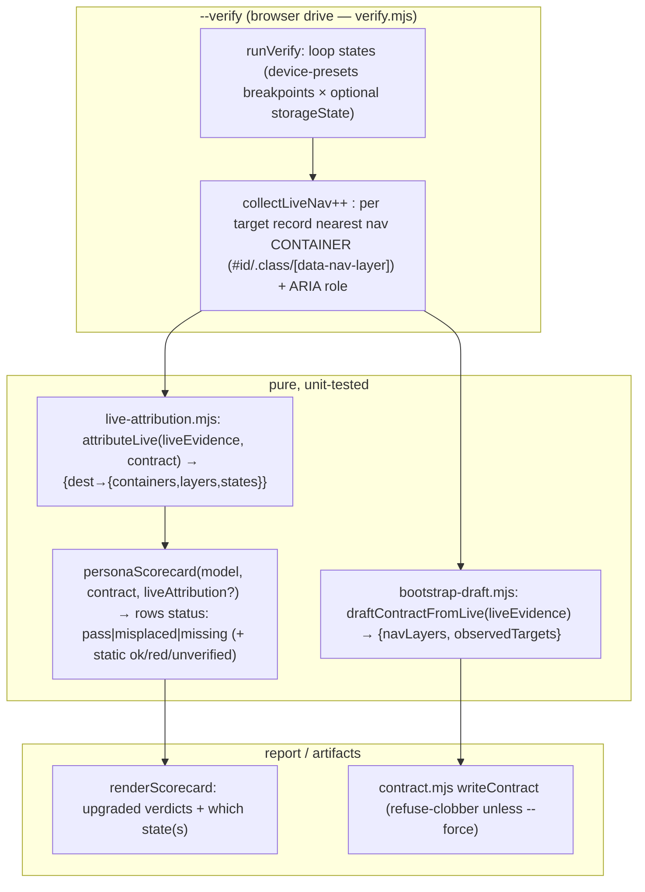

# Plan: /nav-audit v1.1 — Live-DOM Layer Attribution, Bootstrap, Static Re-scope

- **Date**: 2026-06-25
- **Status**: Complete (implemented via /cycle --autonomous + dashboard persistence; shipped 2026-06-25 — see §13)
- **Author**: Claude + Louis
- **Scope**: full-stack (static-analysis CLI/tooling + a live Playwright drive + docs)
- **Origin**: `/brainstorm --with-gemini` (session `1782410684088`) + real wine-cellar-app evidence (v1 static ≈ 0 actionable on data-driven nav; `--verify` confirmed 16/16). EXTENDS the existing `scripts/lib/nav/*` — no rewrites, no new framework adapters.

> **Target domain**: `nav-audit`. **Detected scope/stack**: full-stack · `js-ts`.

## 1. Context Summary

**The problem (from running v1 live)**: on data-driven nav (`data-view="${x}"`, `switchView(el.dataset.view)`) static analysis cannot attribute a destination to a nav *layer*, so the per-persona scorecard is stuck at `? (run --verify)`. But `--verify` already loads the live DOM — it just doesn't record *which container* each live target sits in, so it can't resolve the `?`. The headline value is **static intent × live observed-navigation truth**; we're one step short of closing that loop.

**What exists today (Code Trace)**:
- `scripts/lib/nav/verify.mjs`: `runVerify({url, model, contract})` (`:80`) launches one headless chromium page (`chromium.launch` `:86`, `page.goto` `:89`), `collectLiveNav(page)` (`page.evaluate` `:140`) returns `[{target,label,kind}]` from `a[href]` + `[data-view|target|nav|tab]`; `reconcile()` (`:55`, PURE) → confirmed/static-only/runtime-only; `normalizeLiveTarget()` (`:31`, PURE) maps `?view=today`→`today`, collapses concrete ids. **Single state, no container info.**
- `scripts/lib/nav/findings.mjs`: `personaScorecard(model, contract)` (`:~190`) → `{anchorsFunctional, rows[]}` with status `ok|red|unverified|unknown`. The `unverified` rows are exactly what live attribution resolves.
- `scripts/lib/nav/render.mjs`: `renderScorecard({anchorsFunctional, rows})` — the headline block.
- `scripts/lib/device-presets.mjs`: `DEVICE_PRESETS` (`:19`, `{name, viewport:{width,height}, isMobile}`), `getPreset(name)` (`:94`), `listPresets()`. Reused for per-state viewports.
- `scripts/lib/nav/contract.mjs`: `bootstrapContract({destinations, personaIntents})` (writes a skeleton), `writeContract(root, contract)` (atomic).
- `scripts/nav-audit.mjs`: the `--verify` block (builds model, calls `runVerify`, prints buckets) and the `--bootstrap` block (writes skeleton from static destinations).
- Precedent for browser storage/auth state: `scripts/persona-consistency-run.mjs` uses Playwright `storageState`.

**Patterns reused vs new**: ~90% reuse (verify.mjs drive, device-presets, scorecard, contract writer). **New**: one pure module `nav/live-attribution.mjs` (live-container-evidence × contract → upgraded scorecard rows) and a pure `nav/bootstrap-draft.mjs` (live containers → draft navLayers). Both are pure + unit-tested, mirroring verify.mjs's `reconcile()` split.

**Neighbourhood considered**: extends existing nav modules (no near-duplicate — this is intra-domain extension); the pure-vs-browser split mirrors `verify.mjs::reconcile` (the established pattern).

## 2. Proposed Architecture

**Key design decisions** (principles from `references/engineering-principles.md`):

1. **Pure attribution separate from the browser drive** (#11 testability, #16 graceful degradation). `attributeLive()` and `draftContractFromLive()` are pure functions over a plain `liveEvidence` array; `runVerify` only *collects* it. This mirrors `reconcile()` and lets us unit-test the entire merge/draft logic with fixtures — the browser is exercised once, live.
   - *Band-aid*: inline the merge inside `page.evaluate`/`runVerify` → untestable, brittle. *Over-built*: a generic DOM-semantics rules engine. *Chosen*: two small pure fns — the smallest thing that makes the loop testable.

2. **Multi-state capture via union** (#16, UX responsive). Nav placement varies by viewport/auth/state; a single load lies. Iterate the contract's declared breakpoints (default `['mobile','desktop']` when none declared) setting viewport per `device-presets`, plus an optional `storageState`. A target is "in layer L" if it appears in an L-container in **any** captured state; the row records *which* state(s). Reuse one browser, new context/viewport per state — no parallel harness.
   - *Band-aid*: single desktop load (misses bottom-nav-on-mobile). *Over-built*: full auth-matrix crawl with click-through. *Chosen*: viewport union + optional storageState — covers the dominant variance (responsive) with the infra already here.

3. **Container→layer match against DECLARED selectors only** (#5 SSoT; resolves R1-H1). The collector walks a target's ancestors and records the nearest ancestor that **matches a selector actually present in `contract.navLayers`** — NOT the nearest arbitrarily-classed wrapper (`.nav-item`/`.active` etc. are ignored unless declared). When no ancestor matches a declared selector, that occurrence's container is `null` (it counts as a live placement *outside* the declared layers — it does NOT by itself make the row `pass`; the ROW verdict is decided across all occurrences per §4a: live-but-never-in-required-layer → `misplaced`, no-placement-at-all → `missing`). `role="navigation"`/`<nav>` ancestry is recorded as a *bonus* corroboration signal, never the sole basis (real apps use bare `#primary-nav` divs). For bootstrap (no contract yet) the collector falls back to recording the nearest *nav-ish* container (`<nav>`, `[role=navigation]`, or an id/class matching `nav|tab|menu|sidebar|toolbar`) purely to *draft* selectors.

4. **Bootstrap refuses to clobber; deterministic-only** (#15 error handling — the earlier accidental-overwrite incident). `--bootstrap` writes only if no `nav-contract.json` exists, else requires `--force`. `--from-url`/`--verify` drafts `navLayers` from live containers **deterministically**. *The optional LLM naming pass is CUT* (resolves R1-H3): it added a sensitive-egress surface (sending live DOM/auth-state-derived text to a provider) for low value, and violates the LLM-boundary rules without a full config/Zod/redaction design. Persona/intent *names* stay the user's job; the draft gives them the navLayers + observedTargets baseline. This is strictly simpler.

5. **Re-scope, don't gut static** (my override of the brainstorm's "gut it"). Static keeps the two things live can't: the pre-deploy CI diff-gate and completeness (orphans). Output leads with the scorecard; the 10-class taxonomy is explicitly secondary/advisory. Docs reframe to "contract-backed navigation verifier with static assists" + three modes.

## 3. UX Design Decisions

- **Scorecard leads, verdicts are decisive** (cognitive load): after `--verify`, every persona row reads a definitive `pass` / `misplaced` / `missing` (+ which state), not `?`. `misplaced` shows observed-vs-required container. The taxonomy moves below, labelled advisory.
- **State transparency** (visibility of system status / Nielsen #1): each upgraded row notes the state(s) it was confirmed in (e.g. "in #primary-nav @ mobile") so a mobile-only bottom-nav isn't mistaken for desktop.
- **Graceful no-Playwright** (error prevention): if chromium can't launch, `--verify` exits with a clear "limited mode — cannot verify nav placement; install chromium" message, not a stack trace.

## 4. Technical Architecture

- **`scripts/lib/nav/live-attribution.mjs`** (new, pure): `attributeLive(liveEvidence, contract)` → the plain serializable `placements` shape in §4a; `mergeScorecard(rows, attribution, contract)` REPLACES a static status with the live verdict `pass|misplaced|missing` when live evidence exists for the intent (§4a precedence rule); `resolveContainer(targetAncestry, declaredSelectors)` (pure, extracted for deterministic test, R1-M5); exports the shared `STATUS` enum.
- **`scripts/lib/nav/verify.mjs`** (extend): `collectLiveNav` records, per target+state, the container matched by `el.closest(<declared navLayers selector>)` (verify mode) — bootstrap mode records the nearest nav-ish container only to draft selectors (§4a) — plus the `role`/`<nav>` ancestor as corroboration. `runVerify` loops states `[{preset, viewport, storageState?}]` (from `opts.breakpoints` → device-presets, default mobile+desktop) in a `try/finally`, per-state context, per-state failures skipped (§4a lifecycle); returns the existing buckets **plus** `liveEvidence` (flat placements) + `liveAttribution`; never exits.
- **`scripts/lib/nav/findings.mjs`** (extend): `personaScorecard(model, contract, liveAttribution = null)` — when `liveAttribution` present, statuses become `pass|misplaced|missing`; else unchanged. Pure.
- **`scripts/lib/nav/render.mjs`** (extend): `renderScorecard` renders the new statuses + state annotations + a legend.
- **`scripts/lib/nav/bootstrap-draft.mjs`** (new, pure): `draftContractFromLive(liveEvidence)` → `{navLayers, observedTargets}` via prominence heuristics (`<nav>`/`role=navigation`/id∋(nav|primary|bottom-nav) → primary; class∋(sub-tab|tabs|secondary) → secondary).
- **`scripts/nav-audit.mjs`** (extend): `--verify` passes `breakpoints`/`storageState`, merges `liveAttribution` into the scorecard, leads the report with it; `--bootstrap` gains `--from-url <url>`/`--force`, refuses to clobber, calls `draftContractFromLive`.

### 4a. Pinned contracts (resolves R1 H2/M1–M6 + R2 H1–H3/M1–M5)

- **`liveEvidence` + `liveAttribution` shapes — every occurrence (R2-H1, Gemini-1)**. The collector emits **one row per discovered OCCURRENCE** — NOT deduped by (target,state): a destination linked in both `#primary-nav` and a footer in the same state yields TWO rows, so no placement is lost. `liveEvidence: [{ target, label, container, layer, state, role }]` (`container`/`role` may be null). `attributeLive()` groups by destination id into a **plain serializable** object (R1-M2, no `Map`/`Set`): `{ [destId]: { placements: [{ container, layer, state, role }], layers: string[], states: string[] } }` — `placements` keeps EVERY occurrence's tuple; `layers`/`states` are deduped rollups. Verdicts derive from `placements` (any occurrence), never from lost rollups.
- **Container resolution — ONE contract (R2-H2)**. The collector uses `element.closest(sel)` for each **declared `contract.navLayers` selector** (verify mode) and records the matched container + its layer. There is no "generic nearest classed ancestor" path — §2.3 is authoritative; the earlier §4 wording is superseded by this. **Bootstrap mode (no contract)** is the *only* place a generic nav-ish container is recorded, and solely to *draft* selectors (clearly separated below).
- **CSS selector support + safety (R2-M2)**. `navLayers` values are arbitrary CSS selectors evaluated in-page via `el.closest(selector)`. Each selector is validated once (a wrapping `try{document.querySelector(sel)}catch` in-page); an invalid selector is skipped with a recorded warning, never throwing. Generated/hashed class names are the user's responsibility — they put a stable selector (id/`[data-nav-layer]`) in the contract.
- **Library never `process.exit` + lifecycle (R1-M1, R2-M4)**. `runVerify` **returns** `{ ok, reason?, ... }` — never exits. Browser lifecycle: one `browser` in a `try/finally` (closed in `finally`); per state a fresh `context` (with optional `storageState`/viewport) closed after that state. A single state's failure is **recorded and skipped** (its placements simply absent); `runVerify` returns `{ok:false}` only on browser-launch failure or all-states-failed. Only `scripts/nav-audit.mjs` maps `ok:false` → stderr + exit 2.
- **Status union + merge precedence — ONE rule (R1-M3, R2-M5, Gemini-2/3)**. Statuses: `pass | misplaced | missing | ok | red | unverified | unknown` (single `STATUS` enum in `live-attribution.mjs`). `mergeScorecard`, per intent, when `statesCollected.length ≥ 1` (else keep static `unverified` — never falsely assert):
  - **no live placement for the destination** in any collected state → **`missing`** — regardless of whether `requiredInLayer` was set (an unpinned intent still must be reachable; Gemini-3).
  - **has placements** AND `requiredInLayer` set → **`pass`** if ANY placement's layer == `requiredInLayer` (any occurrence, any state), else **`misplaced`** (present live but never in the required layer — this SUPERSEDES the §2.3 "stays unverified" note: a target found live but outside all declared layers is `misplaced`, not `unverified`; Gemini-2).
  - **has placements** AND no `requiredInLayer` → **`pass`** (reached live).
  The live verdict REPLACES the static status entirely when live evidence is considered.
- **DOM readiness (R1-H2, R2-M1)**. Per state: `goto(url, {waitUntil:'domcontentloaded', timeout})` (NOT `networkidle` — unreliable under analytics/polling/websockets), then a settle delay (`hydrateMs`, default 1500) raced against a best-effort `waitForSelector` on **ANY** declared `navLayers` selector (`Promise.race` over all of them, NOT just the first — a viewport-specific selector like `#mobile-nav` must not block a desktop state; whichever resolves first wins; all-absent is data, not error). Best-effort by design; the multi-state union covers viewport-gated menus.
- **Bootstrap heuristic precedence — non-overlapping (R1-M4, R2-M3)**. Classify each discovered nav-ish container, first-match-wins, with steps that DON'T subsume each other: (1) **secondary first** — id/class matching `/sub-?tabs?|secondary|drawer|hamburger|breadcrumb/i` → `secondary`; (2) id/class matching `/primary|bottom-?nav|main-?nav|navbar/i` → `primary`; (3) the SINGLE most-prominent remaining container (earliest `<nav>`/`[role=navigation]` in document order) → `primary`; (4) any other remaining `<nav>`/nav-ish container → `secondary`. So exactly one container becomes the `primary` default; the rest are `secondary`. Selector normalize: prefer `#id`, else `[data-nav-layer=…]`, else the first nav-ish `.class`; dedupe. `observedTargets` = deduped normalized destination ids.
- **Schema impact (R2-H3)**. No new *validated* contract fields: `navLayers` already exists in `NavObservedSchema`'s sibling `NavContractSchema` and accepts arbitrary selector strings; `breakpoints` is **CLI-only** (`--breakpoints`), NOT a contract field; bootstrap's `observedTargets` is written as a `_note`/`_comment` side-artifact (the already-allowed comment keys), not a validated field. `scripts/lib/nav/schema.mjs` is therefore **reviewed but unchanged** unless a `requiredInLayer` value must be constrained — left as a free string (matches a navLayers key). Stated explicitly so the "should schema change?" question is answered: no.
- **CLI option contract (R1-M6)**: `--breakpoints <csv>` (preset names from `device-presets`; default `mobile,desktop`; unknown → error listing valid presets); `--storage-state <path>` (Playwright storageState JSON; missing file → error; default anonymous); `--from-url <url>` (bootstrap source; reuse `--verify <url>` if already given); `--force` (allow `--bootstrap` overwrite). `--bootstrap --from-url` reuses the same multi-state collection.
- **Negative evidence — `missing` only on COMPLETE coverage (R3-H1, Gemini2-1)**. The result records `statesRequested` and `statesCollected`. A target is `missing` ONLY when **every requested state collected successfully** (`statesCollected ⊇ statesRequested`) AND the target appears in none — so a desktop-only target isn't falsely `missing` because the desktop state crashed. If ANY requested state failed (partial coverage) and the target has no placement, the row is **`unverified`** (incomplete), not `missing`. `attributeLive` takes both sets so the merge distinguishes "absent under full coverage" from "unobserved due to a failed state".
- **Unpinned-intent `pass` is REACHABILITY, not placement (Gemini2-2)**. `collectLiveNav` captures all `a[href]` + view-handles, including footer/body links. For an intent with no `requiredInLayer`, `pass` therefore means "reachable via some live link," not "in a nav layer" — documented as such in the scorecard legend so it's not mistaken for layer placement. (A user who cares about placement sets `requiredInLayer`.)
- **`navLayers` shape — one statement (R3-M3)**. `navLayers` is `{ [layerName]: string[] }` where each string is a **CSS selector** (`#primary-nav`, `.sub-tabs-row`, `[data-nav-layer="primary"]`). All examples are selectors. Nothing else.
- **Nearest-wins selector resolution (R3-M2)**. When several declared selectors match ancestors of a target, the **nearest** matched ancestor wins; if two selectors match the *same* nearest element, the more-prominent layer wins by an **explicit precedence constant** `['primary','secondary', …rest alphabetical]` (NOT JS object-key order, which is unstable — Gemini2-LOW). Deterministic.
- **`requiredInLayer` referential validation (R3-M4)**. `readContract` validates every intent's `requiredInLayer` is `null` OR a key of `navLayers`; a dangling layer name is a contract error (clear message), not a silent miss.
- **Live-label egress (R3-M5)**. Any live evidence persisted (to `--out` JSON or the envelope) routes labels/selectors through `redactSecrets` (existing). Authenticated `--storage-state` runs may surface account/user labels in link text → redaction applies, and the CLI prints a one-line notice that an authenticated run was used. Selectors + normalized destination ids carry no secrets.

## 5. State Map (the report / scorecard)

| Scorecard state | When | Render |
|---|---|---|
| Empty | no declared persona intents | "add intents to nav-contract.json" |
| Static-only (no --verify) | static run | `?` unverified rows (today's behaviour) |
| Live-verified `pass` | live container ∈ required layer in ≥1 state | `✓` + "in #primary-nav @ mobile/desktop" |
| Live-verified `misplaced` | live but only in a non-required layer | `✗` + "in .sub-tabs-row, required primary" |
| Live-verified `missing` | not in live nav any state | `✗` + "not found in live nav" |
| Error | chromium unavailable | `runVerify` returns `{ok:false,reason}`; the **CLI** prints limited-mode message + exits 2 (library never exits — §4a) |

## 6. Sustainability Notes

- **Right-sizing gate** (new structure = two pure modules + multi-state loop):
  - **`live-attribution.mjs`**: band-aid = inline merge (untestable); over-built = DOM-semantics rule engine; **chosen** = one pure fn — current requirement is "resolve the `?` rows from live containers," nothing more.
  - **multi-state capture**: band-aid = single load (wrong on mobile nav); over-built = auth-matrix click-crawl; **chosen** = viewport-union (+ optional storageState) reusing device-presets — covers the dominant variance.
  - **bootstrap-draft.mjs**: band-aid = empty skeleton (today, high friction); over-built = AI persona inference (cut — egress risk, R1-H3); **chosen** = deterministic container→layer draft — current requirement is "kill the blank-page cold-start," and the navLayers+observedTargets baseline does exactly that.
- **Assumption that could change**: container-selector matching assumes contract `navLayers` use selectors. Already true for vanilla; React component anchors still work via the static path. No flag-day.
- **Extension point**: `liveEvidence` is a stable plain shape — a future deeper `--verify` (taps-to-reach BFS) accumulates into the same structure.

## 7. File-Level Plan

**New** (both pure, unit-tested):
- `scripts/lib/nav/live-attribution.mjs` — `attributeLive`, `mergeScorecard`, `resolveContainer` (the pure ancestor→declared-selector resolver extracted for deterministic testing, R1-M5), `STATUS` enum.
- `scripts/lib/nav/bootstrap-draft.mjs` — `draftContractFromLive`.
- `tests/fixtures/nav-live/*.html` — committed static fixtures for the deterministic Playwright `file://` collector test.

**Modified**:
- `scripts/lib/nav/verify.mjs` — `collectLiveNav` (container/role in-page), `runVerify` (multi-state loop, returns `liveEvidence`+`liveAttribution`, no-chromium graceful exit).
- `scripts/lib/nav/findings.mjs` — `personaScorecard` optional `liveAttribution` arg → upgraded statuses.
- `scripts/lib/nav/render.mjs` — `renderScorecard` new statuses + legend + state annotation.
- `scripts/lib/nav/contract.mjs` — `bootstrapContract` accepts a draft (`navLayers` + `observedTargets` written under the allowed `_note`/`_comment` key); refuse-clobber guard helper.
- `scripts/lib/nav/schema.mjs` — **reviewed, expected UNCHANGED** (R2-H3): `navLayers` already accepts selector strings, `breakpoints` is CLI-only, `observedTargets` is a comment side-artifact. The `requiredInLayer`-references-a-navLayers-key check is a **semantic validation in `readContract`** (R3-M4), not a Zod schema change.
- `scripts/lib/dashboard/collect-nav.mjs` + `scripts/lib/dashboard/sections/nav-audit.mjs` — **handle the new live statuses** (R3-M1): `pass|misplaced|missing` render in the dashboard scorecard (green/amber/red) alongside the existing `ok|red|unverified|unknown`; an unrecognised status degrades to a neutral cell (no crash).
- `scripts/nav-audit.mjs` — `--verify` (breakpoints/storageState, merge, scorecard-leads); `--bootstrap` (`--from-url`/`--force`, draft).
- `skills/nav-audit/SKILL.md` + `references/ci-gate-and-verify.md` + `references/contract-and-bootstrap.md` — three-modes reframe; `.claude/skills/**` regenerate.

**Tests** (Tier-1, deterministic):
- `tests/nav-live-attribution.test.mjs` — `attributeLive` + `mergeScorecard` + `resolveContainer` (pass/misplaced/missing; multi-state union; ARIA-corroboration; nearest-DECLARED-selector match; serializable output).
- `tests/nav-bootstrap-draft.test.mjs` — `draftContractFromLive` prominence precedence/tie-break/dedupe + refuse-clobber guard.
- `tests/nav-live-collector.test.mjs` — Playwright `file://` against committed fixtures (collector container/role recording, viewport-gated rendering, storage-state branch). Skips cleanly if chromium is absent.

### 7b. Implementation Phases

**Phase 1 — Live-DOM container collection + multi-state drive.** Files: `scripts/lib/nav/verify.mjs` (modify), `tests/fixtures/nav-live/sample.html` (create), `tests/nav-live-collector.test.mjs` (create).

**Phase 2 — Pure attribution + scorecard merge.** Files: `scripts/lib/nav/live-attribution.mjs` (create), `scripts/lib/nav/findings.mjs` (modify), `scripts/lib/nav/render.mjs` (modify), `tests/nav-live-attribution.test.mjs` (create).

**Phase 3 — `--verify` wiring + scorecard-leads report.** Files: `scripts/nav-audit.mjs` (modify).

**Phase 4 — Bootstrap from live DOM.** Files: `scripts/lib/nav/bootstrap-draft.mjs` (create), `scripts/lib/nav/contract.mjs` (modify), `scripts/nav-audit.mjs` (modify), `tests/nav-bootstrap-draft.test.mjs` (create).

**Phase 5 — Re-scope docs (three modes).** Files: `skills/nav-audit/SKILL.md` (modify), `skills/nav-audit/references/ci-gate-and-verify.md` (modify), `skills/nav-audit/references/contract-and-bootstrap.md` (modify).

**Close-out (not a phase)**: `npm run skills:regenerate && npm run skills:check && npm test && npm run plans:lint`; then live `--verify` against `https://cellar.creathyst.com/?view=today`.

## 8. Risk & Trade-off Register

| Risk / trade-off | Decision | Why OK |
|---|---|---|
| Multi-state browser cost (N viewports) | Default 2 states (mobile+desktop), one browser reused | Bounded; the variance that matters (responsive nav) is covered |
| Auth-gated nav not captured | Optional `--storage-state <path>` (Playwright JSON); default anon | Honest scope; anon covers most public nav; auth is opt-in |
| In-page container detection matches only DECLARED selectors | nearest ancestor hitting a `navLayers` selector; else `null` | No false `pass` from arbitrary wrapper classes (R1-H1) |
| **Cut**: LLM persona/intent naming in bootstrap | Removed — deterministic draft only | Avoids a sensitive-egress surface for low value (R1-H3); simpler |
| **Deferred**: taps-to-reach BFS, full auth-matrix | v1.2 | True scope boundary; `liveEvidence` shape already accommodates |

## 9. Testing Strategy

- **Unit (Tier-1)**: `attributeLive` (selector→layer match, ARIA corroboration, multi-state union), `mergeScorecard` (pass/misplaced/missing transitions; static rows untouched when no liveAttribution), `draftContractFromLive` (prominence heuristics; observedTargets), refuse-clobber guard. Fixtures are plain `liveEvidence` arrays — no browser.
- **Deterministic browser test (R1-M5)**: the in-page container-resolution logic is extracted to a pure, exported function (`resolveContainer(target, declaredSelectors)`) and unit-tested with string/DOM-fixture inputs WITHOUT a browser. Additionally, a committed static HTML fixture (`tests/fixtures/nav-live/*.html`) is loaded via Playwright `file://` and `collectLiveNav` asserted against it — deterministic, no external URL — covering nearest-declared-selector selection, viewport-gated rendering (set two viewports on the fixture), and storage-state plumbing (a fixture that branches on a cookie/localStorage flag). The external wine-cellar URL is an *end-to-end* sanity check, not the coverage source.
- **Integration / live**: `--verify https://cellar.creathyst.com/?view=today` resolves the wine-cellar-app scorecard `?` rows to `pass` (today/pairing/grid/wines in #primary-nav) and confirms multi-state; `--bootstrap --from-url` drafts a navLayers skeleton + refuses to clobber an existing contract.
- **Egress/no-`Date.now()`**: deterministic paths use git timestamps / passed-in values; live evidence carries no secrets (selectors + labels only, run through existing redaction if persisted).

## 10. Acceptance Criteria (Playwright-verifiable — the live `--verify` behaviour)

- [P0] [navigation] After `--verify`, a persona intent whose live target is in the required-layer container reads `pass`
  - Setup: contract intent `requiredInLayer: primary`, `navLayers.primary: ["#primary-nav"]`; live app has the target inside `#primary-nav`
  - Assert: scorecard row status is `pass` and names `#primary-nav` + the state
- [P1] [navigation] A target present only in a non-required container reads `misplaced` (not `pass`)
  - Setup: target lives only in `.sub-tabs-row`, intent requires `primary`
  - Assert: row status `misplaced` with observed `.sub-tabs-row` vs required `primary`
- [P1] [responsive] A mobile-only bottom-nav target is `pass` via the mobile state union
  - Setup: target rendered in `#primary-nav` only at mobile width
  - Assert: row `pass`, state annotation includes `mobile`
- [P1] [state] `--bootstrap --from-url` refuses to overwrite an existing `nav-contract.json` without `--force`
  - Setup: a contract already present
  - Assert: non-zero exit + message; file unchanged
- [P2] [other] No-chromium degrades to a clear limited-mode message, not a crash
  - Setup: force chromium launch failure
  - Assert: stderr names the cause + remediation; exit 2

## 11. Execution Clustering

- **Cluster A** — Phases 1–3 — fix-gate: yes
  - Coupling: the live-DOM collection (P1), the pure attribution+merge it feeds (P2), and the CLI wiring that consumes the merged scorecard (P3) are one pipeline over a single `liveEvidence` shape — the seam between collection and the pure merge must be audited together. Gate before bootstrap builds on the same collection.
  - author-tier: frontier
- **Cluster B** — Phase 4 — fix-gate: yes
  - Coupling: bootstrap reuses Cluster A's live-DOM collection to draft the contract; its draft + refuse-clobber + contract writer are one unit. Gate before docs describe it.
  - author-tier: standard
- **Cluster C** — Phase 5 — fix-gate: final
  - Coupling: docs/mode reframe over the now-stable behaviour; gated by the consolidated Gemini pass + `skills:check` byte-match.
  - author-tier: economy
- **Final gate**: mandatory consolidated Gemini review over the union diff of Clusters A–C.

## 12. Plan Audit Trail

- **GPT plan audit (gpt-5.5, `--mode plan`)**: R1 H3/M6/L1 → R2 H3/M5/L1 → R3 H1/M5/L1. HIGH 3→3→1. R2's flat-HIGH was genuine internal-consistency bugs in the §4a contracts (lossy shape, §2-vs-§4 contradiction, unreachable bootstrap branch, merge-precedence conflict), all fixed; R3's HIGH (negative-evidence) + MEDIUMs (consumer status handling, validation, egress) folded into §4a/§7. **Stopped at R3** (plan cap) — remaining findings were implementation-completeness, fixed in place. Key corrections: cut the LLM naming pass (egress risk, simpler); placement-tuple shape preserves container↔layer↔state; declared-selector-only container match; library returns (never exits); `missing` distinguished from not-collected; live labels redacted.

- **Gemini final review (gemini-pro-latest, `--mode plan`)**: R1 CONCERNS (3) → R2 CONCERNS (4). R1's 3 folded (occurrence-level placements; null-container→misplaced; absent-live→missing regardless of requiredInLayer). R2's 4 folded (partial-state-failure→`unverified` not false-`missing`; unpinned-`pass`=reachability documented; hydration races ANY declared selector; explicit layer-precedence constant, not object-key order). **Stopped at the Gemini round-2 cap** — the one R2 correctness edge was fixed; the rest were polish. Plan status: **Approved**. Net trajectory: GPT H3→3→1, Gemini 3→4-then-resolved — converged to internally-consistent merge semantics.

## 13. Implementation Audit Trail (`/cycle code --autonomous`)

- **Cluster A** (live-DOM attribution + multi-state + scorecard merge) — built + 12 pure unit tests + a deterministic `file://` collector fixture test + LIVE-validated on wine-cellar-app (scorecard `?`→ definitive: `drink-soon`=pass, 4 primary intents=misplaced — honest, the bottom-nav is dynamic). Fixed a slug↔path key-match bug in mergeScorecard mid-cluster.
- **Cluster B** (bootstrap-from-live) — built + 18 pure tests + live smoke (drafted real navLayers from cellar.creathyst.com) + refuse-clobber. Fixed: git/source listing made non-fatal for live-only modes.
- **Cluster C** (docs three-modes reframe) — SKILL.md + 2 references; skills:check 14/14.
- **Consolidated Gemini gate** (Step 3C.2): R1 CONCERNS (4) → R2 CONCERNS (2). R1's 4 all fixed (dashboard status mapping for pass/misplaced/missing; readContract requiredInLayer validation; settle-race `.catch` never-resolve; getPreset inside try). R2: `z.iso.datetime` HIGH was a **false positive** (valid Zod 4 API, proven by passing tests + existing observed-deps usage — dismissed); the dashboard-shows-static-not-live observation was then **CLOSED immediately** (not deferred): `--verify` now persists its live attribution to a gitignored `.audit-loop/nav-verify-result.json` (contract-digest-tied staleness, mirroring the observed envelope), and the dashboard Nav Audit tab reads it to show the authoritative pass/misplaced/missing verdicts with a "Live-verified" banner (graceful fall-back to static). New: `verify-store.mjs` + `NavVerifyResultSchema` + 7 tests; validated live (wine-cellar-app wrote the artifact across mobile+desktop). **Stopped at the round-2 cap.** Full suite **3683 pass / 0 fail**.
