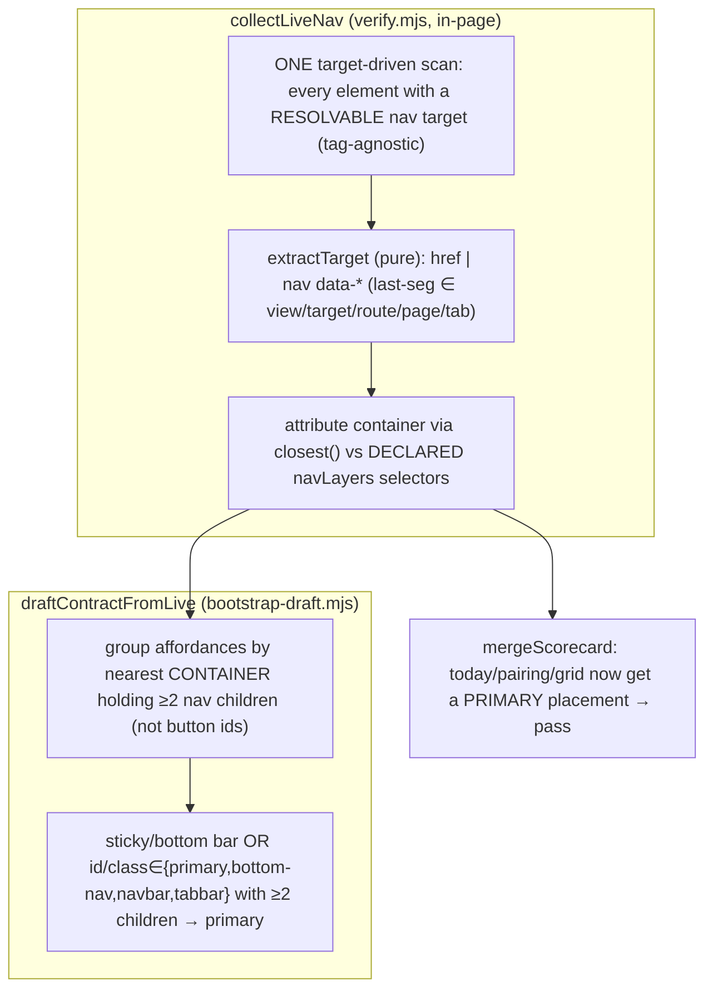

# Plan: /nav-audit v1.2 — Container-Authoritative Live Attribution

- **Date**: 2026-06-25
- **Status**: Complete (shipped 2026-06-26 — GPT+Gemini audited, 115 nav tests green)
- **Author**: Claude + Louis
- **Scope**: full-stack (live Playwright collector + bootstrap heuristic + tests)
- **Origin**: A thorough real-world re-evaluation of v1.1 on wine-cellar-app (graded against a hand-built ground-truth oracle). v1.1 fixed recall/accuracy of the graph, but the per-persona scorecard is **3/5 false-misplaced** for one fixable reason. EXTENDS `scripts/lib/nav/*` — no rewrites, no new framework adapters.

> **Target domain**: `nav-audit`. **Scope/stack**: full-stack · `js-ts`.

## 1. Context Summary

**The single blocking defect (oracle-confirmed)**: `--verify`'s live-DOM collector only recognises nav affordances by `a[href]` and `[data-view]/[data-target]/[data-nav]/[data-tab]`. wine-cellar-app's real **primary** nav `#primary-nav` is built (in `primaryNav.js`) from `<button>` elements carrying `btn.dataset.navView = view` (→ `data-nav-view="today"`) + a JS click handler — **no `href`, no `role`, no `aria-controls`, and `data-nav-view` ≠ `data-view`**. So the primary-nav buttons are **not collected at all**. The same views (today/pairing/grid) ALSO render as `.sub-tab[data-view]` buttons inside the secondary `.sub-tabs-row` (which ARE collected). Net: those views get a **secondary** placement only → the scorecard reports **misplaced** when they're oracle-confirmed in `#primary-nav`. The declared `navLayers.primary=["#primary-nav"]` can't rescue it because nothing *inside* it is recognised as an affordance.

**Code Trace** (evidence):
- `scripts/lib/nav/verify.mjs:237-240` — `collectLiveNav` global scan: `document.querySelectorAll('a[href]')` + `document.querySelectorAll('[data-view],[data-target],[data-nav],[data-tab]')`. No `<button>`, no `data-nav-view`.
- `verify.mjs:213-234` — `navIsh(el)` finds the nearest nav-ish *element* (id/class word match), used by bootstrap drafting.
- wine-cellar-app `public/js/primaryNav.js:24-67` — `NAV_ITEMS=[{id:'today',view:VIEWS.TODAY,…}]`; `btn.dataset.navView = item.view`; `btn.addEventListener('click', …switchView)`. Bare `<button>`, `data-nav-view`, `data-nav-id`, no href/role.
- `scripts/lib/nav/bootstrap-draft.mjs` — `draftContractFromLive` keys on the per-occurrence `navIsh` selector; on wine-cellar-app it produced `primary:["#tab-kitchen"]` (one hamburger tab), omitted `#primary-nav`, and enumerated button ids — "worse than blank".

**What v1.1 got right (keep, don't regress)**: recall (16 confirmed, 0 runtime-only), the `VIEWS=Object.freeze` value fix, scope exclusion (the only static-only entries are now the *real* `invites`/`users` admin sub-tabs), the scorecard rendering, and the correct verdicts it CAN make (drinksoon → pass; wines → genuinely misplaced).

**Patterns reused vs new**: ~95% reuse. No new modules — extend `collectLiveNav` (verify.mjs), `navIsh` (verify.mjs), and `draftContractFromLive` (bootstrap-draft.mjs). The new logic (broad target extraction, container grouping) is pure-testable.

**Neighbourhood considered**: intra-domain extension of the nav collector; no near-duplicate.

## 2. Proposed Architecture

**Key design decisions** (principles from `references/engineering-principles.md`):

1. **Broaden by TARGET-presence, not element-type or container-scope** (#5 SSoT, #4 no-hardcoding; resolves R1-H1/M1). The single root cause is that the collector enumerates *element types* (`a[href]`, specific `data-*`) and misses `<button data-nav-view>`. Fix: an affordance is **any element with a resolvable nav target** — `extractTarget(el)` returns the first of: a usable `href`; OR a nav `data-*` attribute (precise rule in §4a). Tag-agnostic. (`aria-controls` is deliberately NOT used — it points at a panel id, not a route, and globally would collect every accordion/dropdown/tooltip; the role=tab sub-tabs are already caught via their `data-view` — Gemini-1-H.) This naturally:
   - **catches** the `#primary-nav` `<button data-nav-view>` (target=`today`) → flips today/pairing/grid to pass (via the placement union);
   - **excludes** clickables with NO resolvable target ("Scan" action button) → these never become destinations, so no FP;
   - **feeds BOTH** the scorecard attribution AND bootstrap discovery from one scan.
   - **Scope of "global"**: collection is **global** (every target-bearing element on the page, anywhere); **layer attribution is container-scoped** (an element's layer = the declared `navLayers` container it's inside, via `closest()`; an element in NO declared container → `container=null`, attributed to no layer). So an out-of-nav `<a href>`/`<button data-route>` IS collected (it's a real reachable target, used by reconcile) but **cannot satisfy a `requiredInLayer`** and **cannot make a row `pass`** — it just contributes reachability. There is NO "every button is nav" broadening: a targetless button is dropped by the gate; a target-bearing element outside declared nav is collected-but-unattributed.
   - **Band-aid**: special-case `data-nav-view` → next app breaks. **Over-built**: treat every `<button>` (targetless included) as nav → flags "Scan"/modal buttons as destinations. **Chosen**: target-presence is the honest definition of a nav affordance.
   - *Documented limit*: a pure-JS-handler nav with NO target attribute and NO href (`<button onclick=switchView('x')>`) is unresolvable from the static DOM — out of scope (the label is too fuzzy to trust).

2. **Container attribution unchanged + hardened** (#16). The existing `closest()`-against-declared-selectors logic (v1.1) attributes each target-bearing element to its nav layer; the broadened scan just feeds it more (now-visible) affordances. Invalid declared selectors are caught per-selector (try/catch in-page), nearest-container-wins on multiple matches.

3. **Bootstrap proposes CONTAINERS, not button ids** (#15). `navIsh` is extended to surface the nearest ancestor **container that holds ≥2 nav affordances** (+ its computed `position` for sticky/fixed detection); `draftContractFromLive` drafts that container's selector. A sticky/fixed bar OR id/class ∈ {primary,bottom-nav,navbar,tabbar} with ≥2 children → `primary`; sub-tab rows → `secondary`. **Never emit a single-button selector as a layer.**

4. **Live-target slug↔path dedup** (#1 DRY) — minor: apply the same leading-slash canon `reconcile`/`mergeScorecard` use so `today` and `/today` collapse in the live occurrence list.

### 4a. Pinned contracts (resolves R1 H1/M1–M5)

- **Pre-filter (cheap) vs gate (authoritative) — superset reconciled (R2-H1, Gemini2-H)**. The candidate CSS is a cheap performance pre-filter; the **semantic gate is `extractTarget(shape) ≠ null`**. CSS CANNOT select by attribute-name suffix (no "any `data-*-view`"), so the pre-filter = **clickable tags** `a[href], area[href], button, [role=button], [onclick], [tabindex]` ∪ the **enumerated** `[data-view],[data-nav-view],[data-target],[data-nav],[data-tab],[data-route],[data-page]`. The gate's last-segment rule is a true subset-test over THIS set's elements: a clickable-tag element (button/link/role=button) is in the pre-filter regardless of which `data-*` it carries, so a `<button data-custom-view>` is caught (matched by `button`, gated by `data-custom-view`); an enumerated-attr element (e.g. a `
`) is caught by its attr. The ONLY leak — a **non-clickable** element bearing a **non-enumerated** nav attr (`
` with no role/click) — is a documented out-of-scope edge (not a real affordance). So the superset holds for every realistic affordance; the gate is target-presence.
- **`extractTarget` is a PURE exported helper, always unit-tested (R1-M5)**. The in-page scan returns, per candidate element, a serializable shape `{tag, href, dataAttrs:{name:value}, label, containerCandidates}`; node-side **pure** `extractTarget(shape)` resolves the target. Mirrors the existing `resolveContainer` split — no logic trapped in `page.evaluate`.
- **Deterministic target precedence + no href regression (R1-M2, R2-M1, Gemini-1-M)**: try `href` FIRST. `extractTarget` is pure with NO base URL, so it only rejects **lexically** non-navigational hrefs — `javascript:`, `mailto:`, `tel:`, and a **same-page anchor** (`#` alone or `#word` with no `/`) — and on those FALLS THROUGH to the data-attrs (so `<a href="#" data-view="x">` → `x`). **Hash-router hrefs are KEPT** (`#/wines`, `#!/wines` — these are real routes, Gemini2-M): `normalizeLiveTarget` strips the leading `#`/`#!` and canonicalizes them (a small addition there). It returns any other href verbatim (incl. absolute `https://…`); the **origin/external** decision stays in `normalizeLiveTarget` (which HAS the page URL) — extractTarget never guesses external. A normal `<a href="/wines">` → `/wines` exactly as v1.1.
- **Data-attr name match — precise, not loose-suffix (R3-M)**. A `data-*` attribute is a target iff: its **last hyphen-segment** ∈ `{view, target, route, page, tab}` (so `data-nav-view`→`view` ✓, `data-view`→`view` ✓, but `data-nav-id`→`id` ✗, `data-auto`→`auto` ✗, `data-photo`→`photo` ✗) **OR** its full name ∈ the explicit whitelist `{data-nav, data-target, data-tab, data-route, data-page}` (bare forms). NOT a bare `to`/`nav` suffix (those caused the `auto`/`nav-id` false matches). Among matching data-attrs, FIRST wins in the FIXED priority order `[view, target, route, page, tab]`, then the whitelist names alpha. (No `aria-controls` — Gemini-1-H.)
- **Selector safety (R1-M3)**: each declared `navLayers` selector evaluated in a `try{}` in-page (invalid CSS → skipped + warned, never throws); no-match → no occurrences; multi-match → NEAREST container wins (existing `closest` depth).
- **Bootstrap container grouping is computed NODE-SIDE (R2-M2)** — no `extractTarget` duplication in-page. The in-page scan returns, per element, its `containerCandidates` (nav-ish ancestor selectors + their computed `sticky` flag), EXCLUDING body/main/html/header-as-whole. Node-side, `draftContractFromLive` groups the *resolved* occurrences (post-`extractTarget`) by container candidate and counts **≥2 target-bearing children** there — so "target-bearing" is decided once, by the pure `extractTarget`.
- **Bootstrap prominence — ambiguity → most-prominent, not mis-forced (R1-M4, R2-M3)**: among candidate containers with ≥2 target-bearing children, classify: (1) **sticky/fixed `position`** OR id/class ∈ {primary,bottom-nav,navbar,tabbar} → `primary` (strong signals); (2) id/class ∈ {sub-tab,secondary,breadcrumb} → `secondary`; (3) otherwise the **earliest in document order** remaining container → `primary`, the rest → `secondary`. **`drawer`/`hamburger` are NOT force-classified** (a hamburger can be the primary nav on mobile) — they fall to the document-order rule. The draft is a starting point the user edits; when ambiguous, prefer the most-prominent as primary. Single-child containers dropped.

## 3. UX Design Decisions

- **Trustworthy verdicts on the apps that most need it** (cognitive load): modern bottom-nav apps (the dominant mobile pattern) build nav from `<button>`+handler, not `<a href>`. Making declared containers authoritative is what lets the scorecard be correct there instead of confidently wrong on the three most-important intents.
- **Bootstrap that helps, not misleads**: proposing a real container (`#primary-nav`) the user keeps, vs a single hamburger-tab id they must delete, is the difference between "edit a baseline" and "worse than blank".

## 4. Technical Architecture

- **`collectLiveNav(page, selLayers)`** (verify.mjs, extend): ONE broadened scan — `querySelectorAll(CANDIDATES)` (§4a candidate set), and for each element return the serializable shape `{tag, href, dataAttrs, label, matches, containerCandidates}` (`matches` = the existing per-declared-selector `closest()` depth list, for container attribution; `containerCandidates` for bootstrap). Node-side: keep only elements where the pure `extractTarget(shape)` ≠ null; build the occurrence with that target + the resolved container/layer (existing `resolveContainer`). Dedupe occurrences by `(normalizedTarget, container, state)`.
- **`extractTarget(shape)`** (verify.mjs, NEW pure export): the §4a precedence. Unit-tested directly (not conditional).
- **`navIsh(el)`** (verify.mjs, extend, in-page): returns the element's `containerCandidates` — nav-ish ancestor selectors (excluding body/main/html/header-as-whole) each with a `sticky` flag (computed `position` ∈ {fixed,sticky}). It does NOT count children (that's node-side, post-`extractTarget` — R2-M2).
- **`draftContractFromLive(liveEvidence)`** (bootstrap-draft.mjs, extend): group resolved occurrences by container candidate, count ≥2 target-bearing children NODE-SIDE, classify per §4a prominence, drop single-child containers. Unchanged: deterministic, refuse-clobber, observedTargets.
- **`runVerify`** (verify.mjs): apply slug↔path canon when building the live-target list for reconcile (priority 3).

## 5. State Map (the scorecard, post-fix)

| Intent | Before (v1.1) | After (v1.2) | Why |
|---|---|---|---|
| marcus/today → primary | ✗ misplaced (FALSE) | ✓ pass | `#primary-nav` button now collected → primary placement |
| sarah/pairing → primary | ✗ misplaced (FALSE) | ✓ pass | same |
| pieter/grid → primary | ✗ misplaced (FALSE) | ✓ pass | same |
| pieter/drinksoon → secondary | ✓ pass | ✓ pass | unchanged (correct) |
| alex/wines → primary | ✗ misplaced (TRUE) | ✗ misplaced | wines genuinely not in `#primary-nav` |

## 6. Sustainability Notes

- **Right-sizing gate** (new behaviour, no new structure): the change is *scoped permissiveness inside declared containers* + *broader target attribute matching* + *container grouping in bootstrap*. No new module, no new dependency, no config surface. Band-aid (attribute special-case) and over-build (global button = nav) both rejected in §2.1.
- **Assumption that could change**: "clickable inside a declared nav container = a nav affordance." True by construction — the user declared that container as nav. If a declared container holds non-nav buttons, the user mis-declared it; the fix can't be more correct than the contract.
- **Extension point**: `CLICKABLE` + the target-attribute regex are the two knobs; new clickable idioms are a one-line addition, not a new adapter.

## 7. File-Level Plan

**Modified**:
- `scripts/lib/nav/verify.mjs` — `collectLiveNav` container-authoritative pass + broad `extractTarget`; `navIsh` multi-child/sticky container; `runVerify` live-target canon dedup.
- `scripts/lib/nav/bootstrap-draft.mjs` — container grouping; sticky/bottom→primary; no single-button layers.
- `tests/fixtures/nav-live/sample.html` — add a `#primary-nav` built from `<button data-nav-view=…>` (NO href/role, exactly like wine-cellar-app).

**Tests** (Tier-1, deterministic):
- `tests/nav-live-collector.test.mjs` — assert the `data-nav-view` `<button>`s inside `#primary-nav` attribute to **primary**; assert an action button with no target is ignored; assert a global non-container button is NOT treated as nav.
- `tests/nav-bootstrap-draft.test.mjs` — assert a multi-child sticky bottom bar drafts to `primary` (container selector, not a button id); assert a single-button element is never a layer.
- `tests/nav-live-attribution.test.mjs` — lock `extractTarget` precedence (usable href > nav data-* by fixed priority; `data-nav-id`/`data-auto` ignored; `href="#"` falls through to data-*; targetless → null). Pure, unconditional (R1-M5).

### 7b. Implementation Phases

**Phase 1 — Container-authoritative collection + broad target extraction + live dedup.** Files: `scripts/lib/nav/verify.mjs` (modify), `tests/fixtures/nav-live/sample.html` (modify), `tests/nav-live-collector.test.mjs` (modify), `tests/nav-live-attribution.test.mjs` (modify).

**Phase 2 — Bootstrap proposes containers, not button ids.** Files: `scripts/lib/nav/bootstrap-draft.mjs` (modify), `tests/nav-bootstrap-draft.test.mjs` (modify).

**Close-out (not a phase)**: `npm test && npm run skills:check && npm run plans:lint`; then live `--verify` + `--bootstrap --from-url` against `https://cellar.creathyst.com/?view=today` (expect the 3 flips + a sane primary container draft).

## 8. Risk & Trade-off Register

| Risk / trade-off | Decision | Why OK |
|---|---|---|
| Container scan adds non-nav buttons inside a declared container | Accept | The user declared that container as nav; a stray button there is a contract error, not a tool FP |
| Global broadening would add FPs ("Scan" action) | **Rejected** | Scoped to declared containers only — global scan unchanged |
| `data-nav-id` mistaken for a target | Guarded | Regex matches attribute-name SUFFIX `view/nav/target/tab/route/page/to`; `id` excluded |
| Double-count (an `<a>` also in a declared container) | Dedupe by (target, container) per state | No inflated in-degree |
| Bootstrap sticky-detection needs computed style | Read `getComputedStyle().position` in-page | Cheap; degrades to id/class words when unavailable |
| **Deferred**: the genuine IA findings (competing-models etc.) | Out of scope | This fix *unblocks* them (both layers now attributable) but firing/tuning them is separate |

## 9. Testing Strategy

- **Unit (Tier-1)**: `extractTarget` precedence + `data-nav-id` exclusion; container grouping (≥2 children, single-button drop, sticky/word→primary). Pure, fixture-driven.
- **Deterministic browser** (`file://` fixture): the `#primary-nav` `<button data-nav-view>` block attributes to primary across mobile+desktop; an action `<button>` with no resolvable target is skipped; a button OUTSIDE any declared container is not treated as nav.
- **Live** (end): `--verify https://cellar.creathyst.com/?view=today` → today/pairing/grid flip to **pass**, drinksoon **pass**, wines **misplaced**; `--bootstrap --from-url` proposes `#primary-nav` (or the real bottom bar) as primary, sub-tab rows secondary, no single-button layers.

## 10. Acceptance Criteria (Playwright-verifiable — the live behaviour)

- [P0] [navigation] A `<button data-nav-view>` (no href/role) inside a declared `primary` container attributes to `primary`
  - Setup: fixture `#primary-nav` with `<button data-nav-view="today">`; contract `navLayers.primary:["#primary-nav"]`, intent today requiredInLayer primary
  - Assert: scorecard row `today` = `pass`
- [P1] [navigation] A view present in BOTH primary and secondary containers is `pass` for a primary-required intent (union)
  - Setup: `today` in `#primary-nav` AND `.sub-tabs-row`
  - Assert: `pass` (not misplaced)
- [P1] [navigation] A clickable with no resolvable target (an action button) is NOT emitted as a destination
  - Setup: `<button>Scan</button>` with no data-*view/href in `#primary-nav`
  - Assert: no scorecard/destination row created for it
- [P1] [navigation] A target-bearing element OUTSIDE any declared container is collected but attributed to NO layer (cannot make a row pass)
  - Setup: a `<button data-route="promo">` in `<main>`, not in any navLayers container
  - Assert: its occurrence has `container=null`/no layer; a `requiredInLayer` intent for it is NOT `pass` from this occurrence
- [P2] [state] `--bootstrap --from-url` drafts a container selector (≥2 children) as primary, never a single-button id
  - Setup: a sticky bottom bar with 3 buttons
  - Assert: drafted `navLayers.primary` is the bar's selector; no single-button id in any layer

## 11. Execution Clustering

- **Cluster A** — Phases 1 — fix-gate: yes
  - Coupling: the entire collector change (container-authoritative scan + broad target extraction + `navIsh` multi-child container + live dedup) lives in `verify.mjs` and its deterministic collector/fixture tests; it is one in-page collection seam and must be audited as a unit. The `navIsh` container info it adds is the input Cluster B consumes — gate it first.
  - author-tier: frontier
- **Cluster B** — Phases 2 — fix-gate: final
  - Coupling: `draftContractFromLive` + its tests consume Cluster A's container info to propose container selectors; isolated to `bootstrap-draft.mjs`. Gated by the consolidated Gemini pass.
  - author-tier: standard
- **Final gate**: mandatory consolidated Gemini review over the union diff of Clusters A–B.

## 12. Plan Audit Trail

- **GPT plan audit (gpt-5.5)**: R1 H1/M5/L1 → R2 H1/M3/L1 → R3 H2/M4/L1. The design SIMPLIFIED under audit: R1-H1 (bootstrap couldn't see the buttons) collapsed the two-pass container-authoritative design into ONE target-driven scan (broaden by target-presence, not element-type/container-scope) + existing container attribution. R2/R3 tightened: pre-filter-superset vs extractTarget-gate (no contradiction), href-hash-fallthrough (no recall regression), node-side container counting (no in-page extractTarget dup), drawer/hamburger not force-classified, and a PRECISE data-attr rule (last-segment ∈ {view,target,route,page,tab} or a bare whitelist — excludes `data-nav-id`/`data-auto`/`data-photo`). **Stopped at R3** (plan cap): HIGH churned on collection-scope *wording* (global-collect + container-attribute), now reconciled in §2.1 + §10; remaining items were rigor-pressure on an already-consistent contract.
- **Gemini final review**: appended after the gate.
- **Gemini final review (gemini-pro-latest, `--mode plan`)**: R1 CONCERNS_REMAINING (2) → R2 CONCERNS (3). All folded: aria-controls dropped (global accordion/tooltip FP); extractTarget rejects only lexical non-nav hrefs (origin → normalizeLiveTarget); pre-filter superset reconciled (clickable-tags ∪ enumerated data-*; documented non-clickable edge); hash-router hrefs (`#/`) KEPT. **Stopped at the Gemini round-2 cap** — the remaining items were contract-wording tightenings adopting clear rules, not new design defects; the post-implementation consolidated gate re-checks the code. Plan **Approved**.

## 13. Implementation Log

### 2026-06-25 — /cycle --autonomous --no-ship (Clusters A + B)

**Cluster A (verify.mjs collector)** + **Cluster B (bootstrap-draft.mjs)** implemented; 115 nav tests pass.
- `extractTarget` (pure, exported): target-presence gate — `data-nav-view` buttons now resolved; `data-nav-id`/`data-auto` excluded; href-precedence with bare-anchor fallthrough + hash-router keep.
- `collectLiveNav`: ONE target-driven scan (clickable-tags ∪ enumerated data-* pre-filter); returns `containerCandidates` (sticky-flagged) for bootstrap.
- `normalizeLiveTarget`: bare-slug verbatim, hash-router strip, **external-origin reject** (R1-H).
- Readiness: settle now races a declared container becoming **POPULATED** (≥1 child), not merely present (R1-H) — per-selector try/catch (R1-M); selectors emitted via `CSS.escape` (Gemini-H kernel), preferring the nav-ish-matching token (Gemini2-M).
- `draftContractFromLive`: groups `containerCandidates` by ≥2 **distinct** targets (`<dynamic>` excluded), sticky-aware, drawer/hamburger no longer force-secondary, single-button selectors dropped.

**Consolidated audit**: GPT `/audit-code` R1 H:4 — 2 genuine code bugs fixed (external-URL normalization; readiness race) + 3 MEDIUM; the other 2 HIGH + several MEDIUM were a11y findings on the **test fixture** `sample.html` (intentionally mirrors wine-cellar-app markup to exercise the collector — dismissed). Gemini gate R1→R2: R1 HIGH was a factual misread (`depthTo` already try/catches) with a real kernel fixed (selector escaping); R2 CONCERNS (3 MEDIUM, no HIGH) — M2 fixed (semantic-token preference), M1/M3 documented edges matching the approved §4a. **Stopped at the round-2 cap** (edges, not design defects; classic GPT audit verified the code).

**Live validation (wine-cellar-app)**: the fixture test PROVES the collector attributes `data-nav-view` buttons to primary. Live anonymous `--verify` still reports today/pairing/grid as **misplaced** — **diagnosed as auth-gating**: `#primary-nav` exists but is EMPTY in an anonymous headless session (probe: 0 children at 10s; `body[data-current-view]` never set → the app's client-side view/nav init never runs logged-out). `mountPrimaryNav()` builds the buttons but its caller (`app.js:835`, fire-and-forget dynamic import) is behind the gated init path. The reviewer's oracle saw the buttons in an **authenticated** session. To confirm the flip on the real app, run `--verify … --storage-state <authed.json>`. No regression: 15 views still confirmed, `drinksoon` still passes.

### 2026-06-26 — v1.2 follow-up: settle-race fix (authenticated wine-cellar finding)

Authenticated live evaluation (user-run) **proved v1.2's attribution correct** — patching the settle-race flips today/pairing/grid to exactly the oracle. The blocker was NOT auth or attribution but a snapshot-timing bug in `runVerify`:
- **Root cause**: the populate-wait used `declaredSelectors.some(populated)`. The STATIC secondary sub-tabs are populated at t≈0, so `.some` resolved instantly and the snapshot was taken before the JS-built `#primary-nav` mounted (~2–5s). The primary nav was never in the captured DOM.
- **Fix**: `.some` → `.every`-over-**present** selectors (an empty-but-present late nav like `<nav id="primary-nav">` IS waited for; a never-rendered selector is absent and can't hang the wait), and raise the `hydrateMs` default 1500 → 6000 (the wait still resolves early when nav fills, so fast apps don't pay it). Same path feeds bootstrap, so it now proposes `#primary-nav` too.
- **Plus**: skip `display:none`/`visibility:hidden`/`[hidden]` elements in the collector (authed app's collapsed signin/signup tabs were being collected as runtime-only).
- **Regression lock**: `tests/fixtures/nav-live/late-nav.html` (static secondary + JS-`setTimeout`-mounted primary + a hidden auth tab) + a collector test asserting the late primary nav is captured and the hidden tab skipped. 116 nav tests green.
