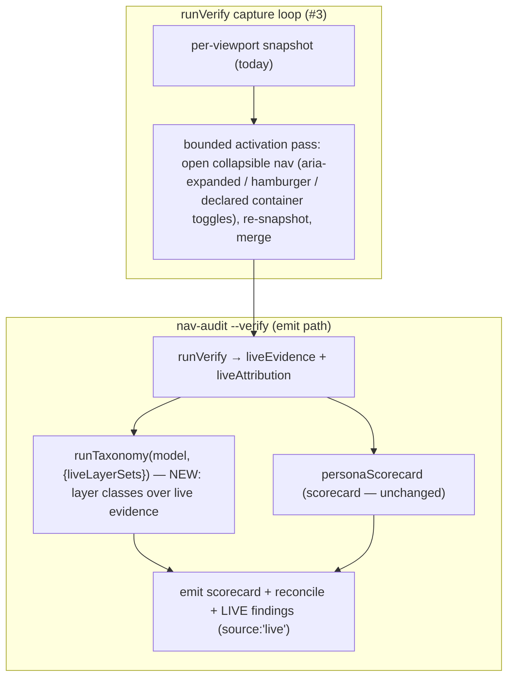

# Plan: nav-audit v1.3 — Live-Evidence Findings + Multi-State Capture

- **Date**: 2026-06-26
- **Status**: Complete (verified built; status corrected from Approved during archive triage 2026-06-27. GPT 3-round + Gemini 2-round — see §12)
- **Author**: Claude + Louis
- **Scope**: backend (nav-audit lib: findings taxonomy + live verify capture; no UI)

> **Target domain**: `nav-audit`. **Scope/stack**: backend · `js-ts`.
> **Origin**: Authenticated live verification of the v1.2 settle-race fix on wine-cellar-app (2026-06-26). Attribution + auth are now **solved and verified** — the per-persona scorecard matches the oracle by default. The value frontier moved from "is the graph right?" (yes) to "does it surface the findings it now has the evidence for?" (not yet). This plan closes that surfacing gap (#4) and the collapsed-menu mislabel it exposed (#3). Bootstrap container-ranking (#5) is handled in the persona-clickpath plan's Cluster B (same `--bootstrap` seam).

## 1. Context Summary

**Two findings from the live run, both rooted in `--verify`'s output/capture, not attribution:**

**#4 — the taxonomy never runs over live evidence (the material win).** `--verify` now correctly attributes each live destination to its DOM-container layer, but it emits ONLY the per-persona scorecard + the static∩live reconciliation. The 10-class finding taxonomy (`runTaxonomy`) — competing-models, redundancy/over-exposure, sequencing, … — runs ONLY on the static `model`, whose layer attribution is **empty for vanilla/data-driven apps**. So the layer-dependent classes can never fire there, even though the live evidence now carries exactly the layer data they need (e.g. wine-cellar's `today`/`grid` attributed to BOTH `#primary-nav` and `.sub-tabs-row` — an over-exposure signal sitting unused). Net: the system-level findings that are the *entire reason the third lens exists* are computed-capable but unemitted on the apps that most need them.

**#3 — single-state capture mislabels collapsed-menu destinations as "missing".** With the v1.2 hidden-element skip, destinations living in a *collapsed* sub-tab row or behind a closed hamburger (wines, captures, history, journal, pairing-lab, wine-shop, pairing-history at the `?view=today` state) are correctly excluded from the snapshot — but the reconciliation then reads them as "static-only / not in live nav," conflating *genuinely absent* with *behind a collapsed menu*. "missing" is less informative than v1.1's "in secondary" was. Recovering it needs capturing additional states by **activating** collapsible nav (open the hamburger, expand each parent), not just multiple viewports of one URL.

**Code Trace** (evidence):
- `scripts/lib/nav/findings.mjs:26` — `runTaxonomy(model, {contract, routeMeta, baseModel})`; competing-models at `:153-164` reads `layerDestinationSets(model)` (static layer attribution); redundancy/over-exposure at `:40-55`, sequencing at `:166-177` similarly depend on `model.layerOfAnchor`. All blind to live evidence.
- `scripts/nav-audit.mjs:88-130` — the `--verify` branch: `runVerify` → `personaScorecard({liveAttribution})` → emit `{...report, scorecard}`. **`runTaxonomy` is NOT called here.**
- `scripts/nav-audit.mjs:153` — `runTaxonomy(model, {contract, routeMeta})` is called only on the **static** path.
- `scripts/lib/nav/live-attribution.mjs` — `attributeLive(liveEvidence)` → `{[destId]: {placements:[{container,layer,…}], layers:[…], states:[…]}}`. This is the per-destination → layers map the taxonomy's layer classes need; it exists, unused by findings.
- `scripts/lib/nav/verify.mjs:115` — `runVerify({breakpoints})` loops `statesRequested` = viewports only (`getPreset(stateName).viewport`); one snapshot per viewport, no interaction. The settle (`:142-160`) waits then collects once; `collectLiveNav` (`:240`) skips hidden elements (v1.2) — which is why collapsed-menu destinations vanish.
- `scripts/lib/nav/render.mjs` — `renderScorecard` + finding renderers; the `--verify` emit currently renders scorecard + reconcile lines only.

**Patterns reused vs new**: ~85% reuse. #4 reuses the existing taxonomy *finding objects* + `attributeLive`; the new bit is a thin adapter (live attribution → the layer-set shape the layer-classes consume) + wiring it into the `--verify` emit. #3 reuses `collectLiveNav` + the multi-state union already in `mergeScorecard`; the new bit is a bounded *activation* pass in `runVerify`.

**Neighbourhood considered**: intra-domain extension of `findings.mjs` (#4) and `verify.mjs` (#3); the reuse targets are `runTaxonomy`/`attributeLive` and `collectLiveNav` — both **extended**, not duplicated.

## 1.5 Execution Model

**#4 and #3 are independent** and can land in either order. There is a mild synergy — #3 captures *more* live evidence (collapsed-menu destinations), which #4's live taxonomy then sees — but neither requires the other. #4 ships first (highest value, smaller, the user-flagged material win); #3 follows. No shared atomicity boundary; each is independently shippable. Within #3, the activation pass is sequential per state but each state's collection is independent (failure of one activation → that state simply contributes **no evidence** and the reason lands in `stateWarnings`; it never aborts the run and never marks anything `unverified` — that status stays reserved for a failed *requested viewport*, per §7. Mirrors the existing per-state graceful degradation at `verify.mjs:149`).

## 2. Proposed Architecture

**Key design decisions** (principles from `references/engineering-principles.md`):

1. **#4 — refactor the layer-classes to take explicit layer data; feed it from live OR static** (#1 DRY, #5 SSoT; resolves R1-H1/H2). The three layer-dependent classes currently read three things off the static `model`: `layerDestinationSets(model)` → `Map<layer, Set<dest>>`, `model.layerOfAnchor` → `Map<anchor, layer>`, and `dests.get(d).anchors` → `Set<anchor>` per destination. Refactor each class body into a pure helper `f(layerData, context)` where **`layerData = { layerSets: Map<layer,Set<dest>>, layerOfAnchor: Map<container,layer>, destAnchors: Map<dest,Set<container>> }`** and `context = { contract, destinations }`. Both callers build `layerData`:
   - `runTaxonomy` (static) builds it from the model exactly as today (no behaviour change).
   - `runLiveTaxonomy(liveAttribution, contract, { destinations, states })` drives the per-state evaluation; the pure adapter **`liveLayerSets(liveAttribution, { state })` builds `layerData` for exactly ONE captured state** by filtering each destination's placements to that `state`. **One captured state = one group; NEVER union across states (R2-H1, R3-H1).** Each viewport (`mobile`, `desktop`) AND each activation-derived state (`mobile+a2`, …) is its **own** group — a mobile drawer and a desktop sidebar are the same nav at different breakpoints, and a base view vs its menu-open view are the same nav expanded; grouping any of them would falsely fire competing-models/over-exposure. `runLiveTaxonomy` iterates `states` (= `report.statesCollected`), calls `liveLayerSets(liveAttribution, { state })`, runs the layer-classes on that single-state `layerData`, and **dedupes findings across states by `(class, destination, layerKey)`** (the same genuine over-exposure seen in two states is reported once). Within a state group, for each `destId → placements.filter(state)`: `layerSets[layer].add(destId)`, `layerOfAnchor[container]=layer`, `destAnchors[destId]=Set(containers)`. Destination universe = keys of `liveAttribution` — this **intentionally includes runtime-only destinations** (seen live, absent from the static graph): they are real reachable destinations and valid subjects for the layer classes, whose per-destination data (`destAnchors`, layers) comes from the **live `layerData`, not `model.destinations`** (Gemini2-M). The `destinations` param is a metadata fallback only; a runtime-only dest with no static entry is handled gracefully (the live `layerData` is authoritative for the live pass). intents = `declaredIntents(contract)`; sequencing matches intents to destinations by id, so a runtime-only dest with no declared intent is simply not a sequencing subject. (`container` IS the live "anchor" — a declared `navLayers` selector.)
   Run **only** redundancy/over-exposure, competing-models, sequencing through these helpers from live; the static-graph classes (orphan, coverage-gap, surprising-mapping, anchor-regression) stay static-only — they need the edge graph live evidence doesn't replace. Live findings are tagged `source:'live'`.
   - **Band-aid**: hand-write a one-off "competing-models from live" inline → diverges from the taxonomy's definitions. **Over-built**: a unified static+live "model" graph → conflates two evidence layers with different trust. **Chosen**: extract the layer-class *definitions* into helpers parameterised by `layerData`, so the logic lives once and both evidence sources call it.

2. **#4 — live and static findings are LABELLED, never silently merged** (#19 observability, trust). A live finding (`source:'live'`) is grounded in the running app; a static one in the source graph. They have different authority and the operator must see which is which. The `--verify` emit gets a distinct "Live findings" section; the static `--scope` path is unchanged.

3. **#3 — activation is BOUNDED, deterministic, FP- and navigation-guarded** (#16, #13; resolves R1-M1/M2/M3, R2-H2/M1). **Trigger set (precise, closed, nav-ish-gated — R2-M1)**: in document order, elements that are BOTH a plausible toggle AND in a nav-ish context — `[aria-expanded="false"]` **whose `aria-controls` target OR nearest ancestor is a nav-ish container** (declared `navLayers` selector OR the nav-ish regex; this excludes FAQ/accordion `aria-expanded` that isn't nav), OR `button[aria-controls]`/`[role=button][aria-controls]` resolving to a nav-ish container, OR the hamburger heuristic `[aria-label*="menu" i], .hamburger, [class*="hamburger" i]`. **Single-level activation (Gemini2-H, documented limit)**: discovery runs ONCE at the base state, so the trigger set is the collapsibles visible *without* a prior activation. A nested trigger revealed only AFTER another activation (a submenu inside an opened drawer) is **out of scope for v1.3** — recursive/BFS activation is the rejected over-built version; one level surfaces the common collapsed-menu case (hamburger, sub-tab parent). The re-`goto`-before-each-click is deliberate isolation (clicking trigger A must not perturb trigger B), and re-finding by stable key after `goto` is well-defined because all base-level triggers re-exist on a fresh load. **Stable identification (R2-H2)**: discovery returns a **stable key per trigger** (its `aria-controls` id, else a CSS path / `nth-of-type` selector) — never a live element handle (invalidated by `goto`). The loop then, per trigger: `page.goto(url)` → bounded settle → **re-find the trigger by its stable key** → record `urlBefore = page.url()` → `click({timeout: 1000})` → wait `activateMs = 1500` → if `page.url() !== urlBefore` **discard** + the next iteration's `goto` restores (navigation guard, R1-M2) → else re-collect, record derived state `<viewport>+a<index>` (deterministic name). A trigger whose stable key no longer resolves after `goto` is skipped. Cap **N=8** per viewport; **total bound** ≤ `N × (gotoSettle + clickTimeout + activateMs)` (R1-M3). Any throw → that state skipped, run continues. Re-`goto` each iteration guarantees a clean DOM (no cross-trigger interference).
   - **Band-aid**: bump `hydrateMs` hoping menus auto-open → collapsed nav stays collapsed without interaction. **Over-built**: a full BFS crawler clicking every interactive element → unbounded, slow, navigates away. **Chosen**: a bounded, document-ordered, expand-only pass on a closed accessibility/affordance trigger set — the minimum that surfaces collapsed-menu destinations.

4. **#3 — "missing" is re-tiered once activation states are captured** (the actual mislabel fix). With activated states, a destination found behind an expanded menu attributes to its real layer (no longer "missing"). A destination absent even after activation is *genuinely* missing — the verdict is now honest. `mergeScorecard`'s union already consumes multiple states; the new states feed it unchanged.

## 6. Sustainability Notes

- **Assumption**: collapsible nav is reachable by clicking an accessible affordance. Apps that gate nav behind non-standard interactions (hover-only, long-press) won't expand — documented limit; the pass degrades to today's single-state behaviour, never worse.
- **Extension seam**: `liveLayerSets` is the adapter between live evidence and the taxonomy — any future live-derivable class plugs in by consuming it. The activation-trigger heuristics are a single list, extensible without touching the loop.
- **#4 is reused by the dashboard**: the `--verify` result already persists `liveAttribution` (`verify-store.mjs`); live findings serialize alongside, so the Nav Audit dashboard tab can surface them with no new query path.

## 7. File-Level Plan

- `scripts/lib/nav/findings.mjs` (**modify**) — add pure `liveLayerSets(liveAttribution, { state })` → `{ layerSets: Map<layer,Set<dest>>, layerOfAnchor: Map<container,layer>, destAnchors: Map<dest,Set<container>> }` for ONE state (filters placements by `state`). Add `runLiveTaxonomy(liveAttribution, contract, { destinations, states })` that iterates `states`, runs the layer-dependent classes (redundancy/over-exposure, competing-models, sequencing) per-state via the existing `mk()` constructors, dedupes by `(class, destination)` (the `destination` field already encodes the layer pair for competing-models, e.g. `"primary|secondary"`), tags each `source:'live'`. Refactor the three layer-classes' bodies into small helpers `(layerData, { contract, destinations }) → findings[]` shared by `runTaxonomy` (static layerData from the model) and `runLiveTaxonomy` (live layerData per state) so the *definitions* live once (#1).
- `scripts/nav-audit.mjs` (**modify, Phase 2 part**) — in the `--verify` branch: after `personaScorecard`, call `runLiveTaxonomy(report.liveAttribution, earlyContract, { destinations: model.destinations, states: report.statesCollected })`; include `liveFindings` in the emitted payload AND the persisted verify-result; render a "Live findings" section.
- `scripts/lib/nav/render.mjs` (**modify**) — `renderLiveFindings(findings)` (reuses the finding-row renderer); called from the `--verify` text output between scorecard and reconcile.
- `scripts/lib/nav/verify.mjs` (**modify**) — add the bounded activation pass to `runVerify` per decision #3: `discoverExpandTriggers(page)` (in-page, returns the closed nav-ish trigger set + stable keys in document order), then the per-trigger loop (re-`goto` → re-find by stable key → urlBefore guard → click → `activateMs` settle → re-collect → derived state `<viewport>+a<index>` → discard-on-navigation → per-trigger try/catch). Gated by a new `activate = true` runVerify option. **State merge (R1-M5)**: derived states append to `liveEvidence` with their own `state` name and are added to `statesCollected`; `attributeLive` keeps placements per-state (which `liveLayerSets` filters), and `mergeScorecard`'s any-state union consumes them unchanged — activation is purely additive evidence.
  - **`scripts/nav-audit.mjs` (Phase 4 part — R1-M4/R3-M3)**: add `--no-activate` to the arg parser as a boolean flag (default: activation ON); pass `activate: !args.noActivate` into `runVerify`. Composes with `--breakpoints` (activation runs within each viewport) and `--storage-state` (authed context). Help: "skip the collapsed-menu activation pass (faster; single-state capture)". (This is the activation half of the `nav-audit.mjs` edits; the live-findings emit half is Phase 2 above.)
- `scripts/lib/nav/verify-store.mjs` (**modify**) — add `liveFindings` to the verify-result **Zod schema** as an **optional field defaulting to `[]`**: `z.array(NavFindingSchema).default([])`, where **`NavFindingSchema` is added to `scripts/lib/nav/schema.mjs`** (R3-M4, Gemini1-H — it is the canonical Zod shape of the ACTUAL `mk()` output at `findings.mjs:263`: `{ class: string, severity: string, destination: string, evidence: string[], confidence: string, gateEligible: boolean, verdict: string, source?: 'live' }` — `destination` and `verdict`, NOT `subject`/`human`; `source` is the new optional tag). Bump the written `version`. **Reconciled back-compat (R2-M2)**: optional-with-default IS the back-compat — an old envelope (no `liveFindings`) parses to `[]`; **the reader does NOT compare `version`** (it's a telemetry stamp only); the existing **contract-digest** staleness check is the sole gate (invalidates on a contract change, not a schema-version delta).
  - **Failed-activation semantics (R2-M4/R3-M2 — corrected)**: activation states are **NOT** in `statesRequested` (only viewports are), so a skipped/failed activation **cannot** trigger `unverified` — the requested-viewport coverage is unchanged. A failed activation simply contributes **no placements** (best-effort additive evidence), with the reason appended to the existing `stateWarnings`. `unverified` remains reserved for a requested *viewport* that failed to collect (existing v1.2 semantics) — activation never touches that accounting.
- `scripts/lib/dashboard/collect-nav.mjs` + `sections/nav-audit.mjs` (**modify**) — surface live findings on the Nav Audit tab (additive; degrades empty when absent).
- `skills/nav-audit/SKILL.md` (**modify**) — document live findings in `--verify` output and the `--no-activate` flag + multi-state capture behaviour.
- `tests/fixtures/nav-live/collapsed-menu.html` (**create**) — a fixture with a destination behind a closed hamburger / collapsed sub-tab row (an `[aria-expanded=false]` trigger), to exercise the activation pass.
- `tests/nav-live-findings.test.mjs` (**create**) — Tier-1: `liveLayerSets` per-state shape; `runLiveTaxonomy` emits competing-models/over-exposure/sequencing from fixture live attribution with `source:'live'`; **state-scoping guard (R2-H1)** — a destination in `primary@mobile` and `secondary@desktop` (responsive duplication) does NOT fire over-exposure/competing-models, while a destination in `primary` AND `secondary` *within the same state* DOES; static-only classes NOT emitted from live; cross-state findings deduped by `(class, destination)`.
- `tests/nav-live-activation.test.mjs` (**create**) — drive `collapsed-menu.html` via `file://`: a behind-the-menu destination is captured WITH activation and absent with `activate:false`; the N-cap is honoured; a trigger that **navigates** is discarded + the page restored (R1-M2 guard); an activation error → that state contributes no evidence (reason in `stateWarnings`), run completes; `unverified` is NOT used for activation failures.

**Close-out (not a phase)**: `npm run skills:regenerate && npm run skills:check`; `npm test`.

### 7b. Implementation Phases (Gate 1: ≥6 files, 2 concerns, independent)

- **Phase 1 — Live taxonomy core (#4)**: `liveLayerSets` + `runLiveTaxonomy` + the shared layer-class helpers. Files: `scripts/lib/nav/findings.mjs` (modify).
- **Phase 2 — Live findings wiring + render (#4)**: emit + persist + render + dashboard. Files: `scripts/nav-audit.mjs` (modify), `scripts/lib/nav/render.mjs` (modify), `scripts/lib/nav/schema.mjs` (modify — `NavVerifyResultSchema`/`NavFindingSchema` live here; `verify-store.mjs` only imports them so no edit needed there), `scripts/lib/dashboard/collect-nav.mjs` (modify), `scripts/lib/dashboard/sections/nav-audit.mjs` (modify).
- **Phase 3 — Live-findings tests (#4)**: Files: `tests/nav-live-findings.test.mjs` (create).
- **Phase 4 — Multi-state activation capture (#3)**: the bounded activation pass + `--no-activate`. Files: `scripts/lib/nav/verify.mjs` (modify), `scripts/nav-audit.mjs` (modify).
- **Phase 5 — Activation fixture + tests + docs (#3)**: Files: `tests/fixtures/nav-live/collapsed-menu.html` (create), `tests/nav-live-activation.test.mjs` (create), `skills/nav-audit/SKILL.md` (modify).

## 8. Risk & Trade-off Register

- **#4 — which classes are "live-derivable"?** Only the layer-attribution classes (over-exposure, competing-models, sequencing). Running orphan/coverage-gap from live would mislead (live evidence is a snapshot, not the full edge graph). The plan explicitly scopes the live pass to the three; the rest stay static. Trade-off: a class like coverage-gap still can't fire on a vanilla app — but that's correct (static can't see it, and the *scorecard* already covers per-persona reachability from live).
- **#3 — activation could mutate state or trigger side effects** (open a modal, fire an analytics event). Mitigation: expand-only triggers (aria-expanded/menu affordances), host-guard against navigation, N-cap, and re-goto to reset between activations. Residual: a benign side effect (a tracking ping) is possible — acceptable for an audit tool against your own app; documented.
- **#3 — activation order non-determinism**: triggers are visited in stable document order; state names are `<viewport>+<stable-selector>` so output is deterministic across runs.
- **Deliberately deferred**: bootstrap container-ranking (#5 → persona-clickpath plan Cluster B, same seam); hover/long-press-gated nav (documented limit); a live-vs-static finding *diff* view (until the dashboard asks for it).

## 9. Testing Strategy

- **Tier 1 (deterministic)**: `liveLayerSets` from a fixture `liveAttribution` → correct `{layer→Set<dest>}`; `runLiveTaxonomy` fires competing-models when two prominent layers partition disjointly, over-exposure when a destination is in ≥2 layers, sequencing when a high-freq intent is only low-prominence — all tagged `source:'live'`; static-only classes (orphan/coverage-gap) never appear in the live pass.
- **Activation (browser, `file://` fixture)**: `collapsed-menu.html` — a destination behind an `[aria-expanded=false]` hamburger is **absent** without activation and **captured** with it; N-cap honoured; an activation that throws → that state `unverified`, run completes.
- **Invariant (scoped — R2-M3)**: `--no-activate` reproduces today's single-state **capture** (the `statesCollected` set and `liveEvidence` match the pre-#3 single-viewport-pair run) — it gates capture (#3), NOT findings. The **live-findings emit (#4) is present whenever live evidence exists, independent of `--no-activate`** (the two features are orthogonal; #4 runs on whatever states were captured). So the byte-for-byte claim applies to *captured states*, not the whole `--verify` output (which now also carries live findings). Live findings absent (no evidence / no layers) → no "Live findings" section, no crash.
- **Edge cases**: a destination reachable ONLY after activation flips from "missing" → its real layer (the #3 mislabel fix); a genuinely-absent destination stays "missing" even post-activation (honest).

## 11. Execution Clustering (Gate 2)

- **Cluster C1** — Phases 1–3 — fix-gate: yes
  - **Coupling**: the live-taxonomy core, its emit/render/persist wiring, and its tests are one seam — the adapter shape (`liveLayerSets`), the classes that consume it, and the output that renders them must be consistent and audited together. This is the high-value win and ships independently; gating it `yes` lets Cluster C2 build on a stable emit path.
- **Cluster C2** — Phases 4–5 — fix-gate: final
  - **Coupling**: the activation capture + its fixture/tests/docs. Depends on C1 only loosely (more states → richer live findings) but is gated `final` as the last cluster; its tests exercise the capture loop end-to-end.
- **Final gate**: mandatory consolidated Gemini review over the union diff.

## 12. Plan Audit Trail

- **GPT plan audit (gpt-5.5)**: R1 H:3 M:5 → R2 H:2 M:4 → R3 H:2 M:4. Converged on two design clarifications: (#4) the layer-classes are refactored into helpers taking explicit `layerData`, fed from a STATE-SCOPED live adapter — **one captured state = one group, never unioned across states** — so responsive duplication (mobile drawer vs desktop sidebar) and base-vs-menu-open never falsely fire competing-models/over-exposure; `runLiveTaxonomy(liveAttribution, contract, {destinations, states})` iterates states + dedupes by `(class, destination)` (the `destination` field already encodes the layer pair for competing-models, e.g. `"primary|secondary"`). (#3) activation is a bounded, nav-ish-gated, navigation-guarded pass with **stable trigger keys** (re-`goto` + re-find, not invalidated handles); failed activations are best-effort additive (never `unverified`, which stays reserved for a failed requested viewport); `liveFindings` persisted via a named `NavFindingSchema` (optional-with-default = back-compat). **Stopped at R3** (plan cap): remaining items were specification-precision on an already-sound design, not new design defects.
- **Gemini final review**: appended after the gate.
- **Gemini final review (gemini-pro-latest, `--mode plan`)**: R1 CONCERNS (1 HIGH, 3 MED) → R2 CONCERNS (1 HIGH, 1 MED, 1 LOW). R1 folded by verifying against real code: `NavFindingSchema` matched to the actual `mk()` output (`destination`/`verdict`, not `subject`/`human`); dedup key simplified to `(class, destination)` (destination encodes the layer pair); reader ignores `version` (contract-digest is the sole gate). R2 folded: single-level activation documented as the scoped limit (nested-after-activation triggers out of scope — BFS is the rejected over-build); runtime-only destinations explicitly evaluated via live `layerData`; the last `unverified`-on-activation wording corrected. **Stopped at the Gemini round-2 cap** — round-2 items were specification-precision/consistency on a sound design, not new design defects; `/audit-code` verifies them against real code during `/cycle`. Plan **Approved**.

## 13. Implementation Log — Cluster C1 (live findings)

Implemented Phases 1–3: `liveLayerSets`/`runLiveTaxonomy` (state-scoped, dedup by `(class,destination)`, `source:'live'`), refactored the 3 layer-classes into shared helpers (static path behaviour-preserved — 116→126 nav tests green), `--verify` emit + persist (v2 envelope, `NavFindingSchema`), `renderLiveFindings`, and the dashboard tab surfacing. In-scope audit findings fixed: `NavFindingSchema` severity/confidence constrained to enums (renderer's `SEV_ORDER` assumed P0–P3); dashboard empty-state guard now counts `liveFindings`; a present-but-malformed `nav-contract.json` now warns instead of silently no-opping.

**Deferred — pre-existing nav-audit/dashboard debt, independent of this change** (named independence per the impact-not-authorship rule; NOT introduced or depended-on by the live-findings code):
- `collectNav` returns `missing-optional` before reading the verify result when the static observed envelope is absent/stale — `liveFindings` surface under the **same** gate as the already-shipped live scorecard, so this is a pre-existing surfacing limitation, not a regression. A future cleanup could read the verify result independently of the observed envelope.
- The persisted verify result is keyed on `contractDigest` only — `liveFindings` derive from live DOM (`liveAttribution`), correctly tied to the contract (which defines `navLayers`), NOT the static graph; they are not made stale by a static-graph change.
- `computeContractDigest` omits `contract.exclude` — the live-findings code never reads `exclude`; this is a pre-existing digest-completeness bug affecting the static envelope path.

These three are real but **cross-cutting** (they touch `computeContractDigest`/`collectNav` used across nav-audit) — fixing them inside C1 would expand it well past the live-findings seam. Captured here for a dedicated follow-up.

### Cluster C2 (multi-state activation) + consolidated gate

Implemented Phases 4–5: bounded activation pass in `runVerify` (`discoverExpandTriggers` → re-goto/re-find by stable key → navigation-guarded click → `collectState` derived state; `ACTIVATION_CAP=8`, `ACTIVATE_MS=1500`, `--no-activate` CLI flag), the `collapsed-menu.html` fixture + 3 activation tests (captures behind-hamburger destination WITH activation, not without; navigation guard discards a navigating trigger). 3711 tests pass.

**Consolidated Gemini gate (union diff, mandatory)**: R1 CONCERNS (1 HIGH, 1 MED) — `navish()` only checked id/class; FIXED to also count the semantic `<nav>` tag, `role="navigation"`, and `aria-label` (shared `elNavish` helper). R2 CONCERNS (1 HIGH, 2 MED, 1 LOW) — all robustness nits on the activation heuristic (trigger readiness, `[aria-controls]` selector uniqueness, multi-id aria-controls); each is **already handled gracefully** by Playwright `click()` auto-wait + the `page.$` null-check + the navigation-guard try/catch (skip-on-edge, never crash). **Stopped at the round-2 cap** per Step 3C.2 — implementation-completeness nits on a degrades-gracefully heuristic, not concrete correctness defects; the per-cluster GPT audits + full suite verified the code.

**Pre-existing debt carried (both clusters)**: `computeContractDigest` omits `exclude`; `collectNav` gates live evidence behind the static observed envelope; the verify-result is keyed on `contractDigest` only. All independent of the live-findings/activation change (documented under C1). A dedicated follow-up plan should address the digest/dashboard-gating cleanup.
