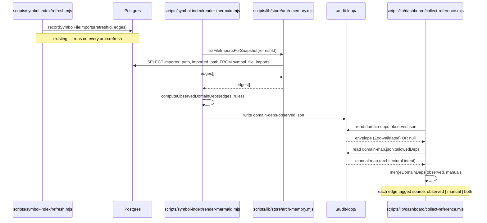

# Plan: Observed-import-graph domain deps for the Architecture tab

- **Date**: 2026-05-22
- **Status**: Complete
- **Author**: Claude + Louis
- **Scope**: backend
- **Stack**: js-ts (+ postgres)

## Implementation Log

### 2026-05-22

- **Completed**: All §6 file-level work — new `scripts/lib/observed-deps.mjs` (shared-lib), `listFileImportsForSnapshot` store helper, `makeFastTagger` precompiled regex, render-mermaid envelope writer + cleanup helpers, two-layer reader merge in collect-reference, Architecture subtitle in render.mjs, gitignore + AGENTS.md + dashboard:setup script, 36 tests in `tests/observed-deps.test.mjs`.
- **Audit outcomes**: `/audit-plan` R1+R2 + 2 Gemini reviews → APPROVE. `/audit-code` 5 GPT rounds + 4 Gemini reviews → APPROVE. Full suite 2768 passing.
- **Followup (separate cleanup batch)**: 4 Gemini-surfaced items in pre-existing code addressed in same session — `getRefreshRun` column allowlist, `discoverPlans` chronological sort (with NaN comparator fix on Gemini's catch), `isSafeGitRevision` leading-hyphen guard, `listPrunableRefreshRuns` GLOBAL BY DESIGN JSDoc. 7 tests in `tests/arch-memory-followups.test.mjs`.
- **Deviations from original plan**: (1) observed-deps.mjs ended up at `scripts/lib/` not `scripts/lib/dashboard/` per Gemini-R2-M2 (shared-lib domain avoids dashboard ↔ arch-memory circular dependency). (2) Added `DANGEROUS_KEYS` filter in `mergeDomainDeps` for `__proto__`/`constructor`/`prototype` prototype-pollution defense (Gemini-R2-G2). (3) Added `makeFastTagger` to domain-tagger.mjs to precompile regexes once (Gemini-R3-G1 — ~50× faster than per-call matchGlob). (4) Added `writeAbortStub` + early-exit cleanup so architecture-map.md and domain-deps-observed.json are consistently absent/stubbed (Gemini-R3-M3 split-brain).
- **Not deferred — closed inline**: observed file write at zero edges still produces a valid envelope when import_graph_populated=true (R2-M7); envelope schema-validated at both write AND read (R4-M2); `writeAbortStub` propagates write failures to main's top-level catch (R4-G2).

## 1. Context Summary

The dashboard's Architecture tab uses [archTiers()](../../scripts/lib/dashboard/render.mjs#L263-L280) to bucket domains into Foundation / Core / Top-level. The bucket function reads `deps` from [collect-reference.mjs:102-110](../../scripts/lib/dashboard/collect-reference.mjs#L102-L110) which only consults the manually-curated `allowedDeps` block in [.audit-loop/domain-map.json](../../.audit-loop/domain-map.json). That hand-curated map drifts from reality the moment new files are added — currently 3 domains in [docs/architecture-map.md](../architecture-map.md) have no entry and incorrectly land in Foundation tier. Sister fix in the [work repo's checklist](dashboard-arch-bug-checklist.md) §6 calls for writing observed deps from the import graph to `.audit-loop/domain-deps-observed.json` and preferring it.

**Target domains**: `arch-memory`, `dashboard`, `shared-lib`
⚠ **Cross-domain work** — touches 3 domains; the file-write seam belongs in `arch-memory` (where the DB queries live), the consumer in `dashboard`, and a tiny store query in `shared-lib`. Boundaries are clean — no shared mutable state.

### Neighbourhood considered

| Symbol | File | Domain | Recommendation |
|---|---|---|---|
| `generateBaseline` | [arch-intent-bootstrap.mjs:54-113](../../scripts/arch-intent-bootstrap.mjs#L54-L113) | scripts | **justify-divergence** (0.75) — does similar work but via dep-cruiser, not the DB import graph |
| `recordSymbolFileImports` | [store/arch-memory.mjs:480-500](../../scripts/lib/store/arch-memory.mjs#L480-L500) | arch-memory | **reuse** — populates `symbol_file_imports` table at refresh time |
| `getImportersForFiles` | [store/arch-memory.mjs:562-583](../../scripts/lib/store/arch-memory.mjs#L562-L583) | arch-memory | **extend** — same table, opposite direction (sibling reader) |
| `tagDomain` + `loadDomainRules` | [lib/symbol-index/domain-tagger.mjs](../../scripts/lib/symbol-index/domain-tagger.mjs) | arch-memory | **reuse** — path→domain via existing rules |
| `cmdGetCallersForFile` | [cross-skill.mjs:715-770](../../scripts/cross-skill.mjs#L715-L770) | cross-skill-bridge | **extend** pattern — same DB join + tag flow at a different granularity |

**Divergence note from `generateBaseline`**: it does the same conceptual work (derive `from-domain → [to-domains]` from observed imports), but runs **dep-cruiser** at bootstrap time and writes back into `domain-map.json::allowedDeps`. We can't reuse it because (a) we want this every render, not a one-shot, (b) the DB already has the import graph from `arch:refresh` — re-cruising is wasteful, (c) the work-repo design puts observed deps in a *separate* file so manual `allowedDeps` can stay as the **architectural-intent layer** (NOT a legacy fallback — see decision #4: observed = evidence layer, manual = intent layer, merge surfaces both).

No security incidents matched this path neighbourhood.

## 2. Proposed Architecture



### Key design decisions

1. **Single source of truth = the DB's `symbol_file_imports` table** (#5). It's already populated by `arch:refresh`. We don't re-cruise files; we just JOIN-in-application against the loaded domain rules.
2. **Compute happens in `render-mermaid.mjs`, not at refresh time** (#20). The domain rules in `domain-map.json` can be edited between refreshes; observed deps must re-derive whenever rules change. Putting compute in render means: edit rules → `arch:render` regenerates → dashboard reads. No DB retag needed for the deps file (though `arch:refresh` is still needed to retag *symbols*).
3. **Pure compute fn `computeObservedDomainDeps(edges, rules)` lives in the dashboard lib** (#1, #11). It's the same pattern as `tagDomain` — pure, no DB, unit-testable. Placed in [lib/dashboard/](../../scripts/lib/dashboard) (not [lib/symbol-index/](../../scripts/lib/symbol-index)) because the dashboard is its primary consumer; symbol-index just orchestrates writing the file.
4. **Reader MERGES observed ∪ manual with per-edge provenance** (#15) — addresses R1-H2. Manual `allowedDeps` entries are NOT legacy fallbacks — they encode architectural intent the import graph can't see (dynamic imports, intentionally-forbidden-but-not-yet-violated edges, framework-level dependencies). The merge produces `{[fromDomain]: [{to, source}]}` where `source ∈ {observed, manual, both}`. Existing consumer `archTiers()` only cares about presence — it ignores the provenance labels — so the tier computation is unchanged. The Architecture panel subtitle exposes the per-source split (e.g. "23 edges: 18 observed · 5 manual-only"). When observed is absent, the reader returns the manual map alone, all tagged `source: manual`.
5. **Versioned envelope on disk + read-time freshness gate** (#11, #15) — addresses R1-H1, R1-M1, R2-H1. The observed file is `{version: 1, refreshId, domainMapDigest, generatedAt, deps}` validated by a Zod 4 schema co-located with the constants in `observed-deps.mjs`. `domainMapDigest` = sha256 of the canonical-JSON-stringified `rules` array (NOT the `allowedDeps` block — only the rules drive observed tagging). On read: (a) schema-parse failure → clean fallback to manual, logged; (b) **digest mismatch against the current `loadDomainRules(root)`** → reject as stale, fall back to manual, logged with an actionable hint ("run npm run arch:render to refresh"). The reject reason is exposed to the renderer via `depsSource.observedRejectedReason` so the Architecture panel can surface "(observed stale — rules edited since last render)". The `refreshId` is informational only; it cannot be validated at read time because the dashboard reader is DB-agnostic.
6. **Atomic replace on every render; delete on empty graph** (#15) — addresses R1-H1 staleness. Render-mermaid writes a complete envelope every run via `atomicWriteFileSync`. When the snapshot has no edges (pre-feature snapshot, `importGraphPopulated=false`, RPC failure), render **deletes** any existing `domain-deps-observed.json` so the dashboard cannot silently consume a stale file from a prior good run.
7. **The output file is gitignored, not committed** (#5). Like `.audit-loop/cache/`, it's a derived artifact regenerated from authoritative DB state.
8. **Module contract — static ESM imports only** (#1) — addresses R1-H3. All cross-module access uses static `import { ... } from './...'` at module scope (no `require()`, no dynamic `await import()` inside `readDomainDeps`). `readDomainDeps()` remains synchronous (it reads two small JSON files via `fs.readFileSync`); no async ripple to callers. `listFileImportsForSnapshot` is exported from `scripts/lib/store/arch-memory.mjs` and re-exported transitively via the `learning-store.mjs` barrel (matching the pattern of every other arch-memory store function — see `learning-store.mjs:50` `export *`).

## 3. Execution Model (Phase 1.5)

Operations have a strict chain: `arch:refresh` (populates `symbol_file_imports`) → `arch:render` (consumes it, writes `domain-deps-observed.json`) → `dashboard:build` (reads the file). The chain is already serialised by `npm run dashboard:setup` (Tier A item 2). No new concurrency. Partial failure semantics:

- `arch:refresh` failure → existing safeguard: render aborts with "no active snapshot — run arch:refresh first" (existing line 88 of render-mermaid). New write never happens.
- `listFileImportsForSnapshot` returns empty (pre-feature snapshot, `importGraphPopulated=false`) → render skips the file write entirely, dashboard falls back to manual `allowedDeps`. No partial file written. Match the `importerMap = null` fail-safe pattern already at [render-mermaid.mjs:159-168](../../scripts/symbol-index/render-mermaid.mjs#L159-L168).
- DB query throws → log to stderr, do not write the observed file, continue rendering the architecture map. Dashboard reader falls back automatically.

## 4. Engineering Principles Applied

| # | Principle | How it shows up |
|---|---|---|
| #1 | DRY | Reuse `tagDomain` + `loadDomainRules`; reuse `atomicWriteFileSync`; reuse the existing pg-pool seam |
| #5 | Single Source of Truth | DB import graph is the evidence layer (observed); `allowedDeps` is the intent layer (manual). Merge surfaces both — neither is a fallback for the other. |
| #11 | Testability | `computeObservedDomainDeps(edges, rules)` is pure → unit-testable without DB |
| #15 | Graceful Degradation | Observed file absent / DB empty / RPC failure → manual fallback, no panic |
| #19 | Observability | Stderr log: edges count, distinct cross-domain pairs, untagged-skipped count, fallback events |
| #20 | Long-Term Flexibility | File shape `{from: [to,...]}` matches existing `allowedDeps` shape — adding edge metadata (e.g. weights, last-seen) later is backwards-compatible by adding adjacent keys |

## 5. Sustainability Notes

- **Assumption that could change**: domain rules might gain attributes (e.g. tier hints, `private: true`). Today we treat rules as a flat path-glob → domain string. If rule shape evolves, `tagDomain()` is the single chokepoint that absorbs it.
- **Multi-edge metadata**: if we later want to expose "weak" vs "strong" dependencies (e.g. weight by edge count or by symbol-level reach), the JSON shape can grow from `string[]` values to `{to: string, weight: number}[]` — reader detects the form and adapts. We will NOT design that today (YAGNI).
- **Migration path**: if `allowedDeps` is fully retired one day, the fallback branch in `readDomainDeps()` is the only line to delete. Until then, repos without an active snapshot still render.
- **Coupling**: dashboard reader → file format → producer. To loosen, we'd give the file a `version` field. **Deferred** — one consumer, one producer, in-repo; YAGNI.

## 6. File-Level Plan

### New code

**[scripts/lib/store/arch-memory.mjs](../../scripts/lib/store/arch-memory.mjs)** — add one exported reader sibling to `getImportersForFiles`:

```js
export async function listFileImportsForSnapshot(refreshId) {
  if (!refreshId || !await isCloudEnabled()) return [];
  const rows = await many(
    `SELECT importer_path, imported_path FROM symbol_file_imports
      WHERE refresh_id = $1
      ORDER BY importer_path, imported_path`,
    [refreshId]
  );
  return rows.map(r => ({ importer: r.importer_path, imported: r.imported_path }));
}
```

- Why this file: it's where `symbol_file_imports` lives; sibling of `getImportersForFiles` and `copyForwardImports` (#1, locality).
- Domain: `arch-memory`. Public-contract addition — matches the existing 93 frozen-contract exports pattern.

**[scripts/lib/dashboard/observed-deps.mjs](scripts/lib/dashboard/observed-deps.mjs)** — new pure module (~80 lines). Schema + constants + pure fns colocated so producer and consumer cannot drift (#5, #11). Addresses R1-H1, R1-M1, R1-H3.

```js
import crypto from 'node:crypto';
import { z } from 'zod';
import { tagDomain } from '../symbol-index/domain-tagger.mjs';  // R3-G1: used by computeObservedDomainDeps

export const OBSERVED_FILE = '.audit-loop/domain-deps-observed.json';
export const OBSERVED_VERSION = 1;

// Zod 4 schema — single source for writer + reader validation
export const ObservedDepsSchema = z.object({
  version: z.literal(OBSERVED_VERSION),
  refreshId: z.string().min(1),
  domainMapDigest: z.string().regex(/^[0-9a-f]{64}$/),  // sha256 hex
  generatedAt: z.string(),                              // ISO-8601
  deps: z.record(z.string(), z.array(z.string())),      // {from: [to,...]}
});

// Canonical digest of the rule array — order-sensitive (first-match-wins).
// Stable across reorderings only if the rule order changes a tag outcome.
export function computeDomainMapDigest(rules) {
  const canonical = JSON.stringify(
    Array.isArray(rules)
      ? rules.map(r => ({ pattern: r.pattern, domain: r.domain }))
      : []
  );
  return crypto.createHash('sha256').update(canonical).digest('hex');
}

// Pure compute — testable without DB or fs
export function computeObservedDomainDeps(edges, rules) {
  // edges: [{importer, imported}], rules: from loadDomainRules()
  // returns: {[fromDomain]: [toDomain,...sorted, unique]} excluding
  //   self-loops and untagged endpoints
}

// Merge observed + manual into provenance-tagged form (addresses R1-H2)
// observed: {from: [to,...]}  manual: {from: [to,...]}
// returns: {[from]: [{to, source: 'observed'|'manual'|'both'}, ...sorted]}
export function mergeDomainDeps(observed, manual) { /* ... */ }

// Render edge-list for archTiers (which only needs from→[to]) from the
// merged provenance form. Pure; testable.
export function flattenMergedDeps(merged) { /* ... */ }
```

- Why a new file: separation between **pure compute** (this module) and the I/O orchestration in `render-mermaid.mjs`. Mirrors how [domain-tagger.mjs](../../scripts/lib/symbol-index/domain-tagger.mjs) is the pure tagger consumed by multiple sites.
- Domain: `dashboard`. The dashboard is the primary consumer (collect-reference.mjs); render-mermaid imports the same pure fns to keep one definition.

### Edits

**[scripts/symbol-index/render-mermaid.mjs](../../scripts/symbol-index/render-mermaid.mjs)** — add static ESM imports at top-of-file (addresses R1-H3); after `importerMap` is fetched (~line 168), add a best-effort observed-deps block. Uses envelope shape from §6 module (addresses R1-H1).

```js
// Top-of-file imports (added):
import fs from 'node:fs';
import {
  listFileImportsForSnapshot,
} from '../learning-store.mjs';
import { loadDomainRules } from '../lib/symbol-index/domain-tagger.mjs';
import {
  OBSERVED_FILE, OBSERVED_VERSION,
  computeDomainMapDigest, computeObservedDomainDeps,
} from '../lib/dashboard/observed-deps.mjs';

// In main(), after importerMap block:
const observedPath = path.join(repoRoot, OBSERVED_FILE);
try {
  const edges = await listFileImportsForSnapshot(snap.refreshId);
  if (edges.length > 0 && snap.importGraphPopulated === true) {
    const rules = loadDomainRules(repoRoot);
    const deps = computeObservedDomainDeps(edges, rules);
    const envelope = {
      version: OBSERVED_VERSION,
      refreshId: snap.refreshId,
      domainMapDigest: computeDomainMapDigest(rules),
      generatedAt: new Date().toISOString(),
      deps,
    };
    atomicWriteFileSync(observedPath, JSON.stringify(envelope, null, 2) + '\n');
    const edgeCount = Object.values(deps).reduce((n, l) => n + l.length, 0);
    process.stderr.write(`arch:render: wrote ${OBSERVED_FILE} — ${Object.keys(deps).length} domains, ${edgeCount} edges\n`);
  } else {
    // Pre-feature snapshot, empty graph, or unpopulated import_graph_populated flag.
    // DELETE any stale file from a prior good run (addresses R1-H1 staleness).
    if (fs.existsSync(observedPath)) {
      fs.unlinkSync(observedPath);
      process.stderr.write(`arch:render: removed stale ${OBSERVED_FILE} (snapshot has no usable import graph)\n`);
    } else {
      process.stderr.write(`arch:render: skipped ${OBSERVED_FILE} — no usable import graph in snapshot\n`);
    }
  }
} catch (err) {
  process.stderr.write(`arch:render: observed deps skipped — ${err.message}\n`);
}
```

Best-effort: a thrown error from the observed block must not abort the markdown render.

**[scripts/lib/dashboard/collect-reference.mjs](../../scripts/lib/dashboard/collect-reference.mjs)** — replace lines 102-110. Static ESM import (R1-H3); Zod-validate observed envelope (R1-M1); MERGE observed ∪ manual rather than prefer-then-fallback (R1-H2). `readDomainDeps()` STAYS SYNCHRONOUS — `fs.readFileSync` and Zod `parse()` are both sync; no async ripple to callers.

```js
// Top-of-file imports (added):
import {
  OBSERVED_FILE,
  ObservedDepsSchema,
  computeDomainMapDigest,
  mergeDomainDeps,
  flattenMergedDeps,
} from './observed-deps.mjs';
import { loadDomainRules } from '../symbol-index/domain-tagger.mjs';

function readObservedEnvelope(root) {
  try {
    const raw = fs.readFileSync(path.join(root, OBSERVED_FILE), 'utf-8');
    const parsed = ObservedDepsSchema.safeParse(JSON.parse(raw));
    if (!parsed.success) {
      process.stderr.write(`  [dashboard] ${OBSERVED_FILE}: schema validation failed — ${parsed.error.issues[0]?.message || 'invalid'}; falling back to manual allowedDeps\n`);
      return { envelope: null, rejectedReason: 'schema-invalid' };
    }
    // R2-H1: read-time freshness gate. Recompute the digest from the CURRENT
    // rules in domain-map.json. If it mismatches the envelope's digest, the
    // observed file was generated from an older ruleset; reject as stale.
    const rules = loadDomainRules(root);
    const currentDigest = computeDomainMapDigest(rules);
    if (parsed.data.domainMapDigest !== currentDigest) {
      process.stderr.write(`  [dashboard] ${OBSERVED_FILE}: stale (rule digest mismatch — observed=${parsed.data.domainMapDigest.slice(0,8)} current=${currentDigest.slice(0,8)}); run npm run arch:render to refresh. Falling back to manual allowedDeps\n`);
      return { envelope: null, rejectedReason: 'stale-rules' };
    }
    return { envelope: parsed.data, rejectedReason: null };
  } catch (err) {
    if (err.code !== 'ENOENT') {
      process.stderr.write(`  [dashboard] ${OBSERVED_FILE}: unreadable — ${err.message}; falling back to manual allowedDeps\n`);
      return { envelope: null, rejectedReason: 'unreadable' };
    }
    return { envelope: null, rejectedReason: 'absent' };
  }
}

function readManualAllowedDeps(root) {
  try {
    const raw = fs.readFileSync(path.join(root, '.audit-loop', 'domain-map.json'), 'utf-8');
    const deps = JSON.parse(raw).allowedDeps;
    return (deps && typeof deps === 'object' && !Array.isArray(deps)) ? deps : {};
  } catch {
    return {};
  }
}

// Returns the data shape the renderer needs.
// - deps: flat {[from]: [to,...]} for archTiers (unchanged contract)
// - mergedDeps: {[from]: [{to, source}, ...]} for the subtitle / drill-in
// - depsSource: provenance summary for the Architecture panel header
//
// EXPORTED for test access (R3-G2). The Group E filesystem-fixture tests
// import this fn directly to exercise the fallback behaviour.
export function readDomainDeps(root) {
  const { envelope, rejectedReason } = readObservedEnvelope(root);
  const manual = readManualAllowedDeps(root);
  const observed = envelope?.deps || {};
  const merged = mergeDomainDeps(observed, manual);
  const flat = flattenMergedDeps(merged);

  // Provenance counts for the dashboard subtitle
  let edgeCounts = { observed: 0, manual: 0, both: 0 };
  for (const list of Object.values(merged)) {
    for (const e of list) edgeCounts[e.source]++;
  }
  const depsSource = {
    observedAvailable: !!envelope,
    observedRejectedReason: rejectedReason,        // null | 'absent' | 'stale-rules' | 'schema-invalid' | 'unreadable'
    observedRefreshId: envelope?.refreshId || null,
    observedGeneratedAt: envelope?.generatedAt || null,
    manualKeyCount: Object.keys(manual).length,
    edgeCounts,
  };
  return { deps: flat, mergedDeps: merged, depsSource };
}
```

The renderer at [render.mjs:285](../../scripts/lib/dashboard/render.mjs#L285) destructures `{domains, deps = {}, mapPath}` today. The single call site at [collect-reference.mjs](../../scripts/lib/dashboard/collect-reference.mjs) needs to stash `mergedDeps` + `depsSource` into the `data.architecture` payload alongside `deps`. **The `archTiers()` call is unchanged** — it still receives `deps` (the flat form). The new `depsSource` drives a one-line subtitle; `mergedDeps` is plumbed for a future per-edge tooltip but not consumed by v1 UI.

#### `data.architecture` contract (addresses R2-H2)

After this change, `data.architecture` (the payload [render.mjs:sectionArchitecture](../../scripts/lib/dashboard/render.mjs#L282) consumes) has the shape:

```js
{
  domains: [...],          // unchanged — from architecture-map.md ## Contents
  mapPath: string|null,    // unchanged
  deps:        {[from]: string[]},          // NEW: from flattenMergedDeps; what archTiers reads
  mergedDeps:  {[from]: [{to, source}]},    // NEW: provenance-tagged form for future UI
  depsSource: {                              // NEW: subtitle metadata
    observedAvailable: boolean,
    observedRejectedReason: null | 'absent' | 'stale-rules' | 'schema-invalid' | 'unreadable',
    observedRefreshId: string | null,
    observedGeneratedAt: string | null,     // ISO-8601
    manualKeyCount: number,
    edgeCounts: { observed: number, manual: number, both: number },
  },
}
```

**Subtitle rendering rules** (one line under "## Architecture"):

| State (depsSource) | Subtitle |
|---|---|
| `observedAvailable: true`, both observed and manual edges | `{total} edges: {observed} observed · {manual} manual-only · {both} confirmed-by-both · refresh {refreshId.slice(0,8)}` |
| `observedAvailable: true`, observed-only (no manual entries) | `{total} edges (all observed) · refresh {refreshId.slice(0,8)}` |
| `observedAvailable: false`, `rejectedReason: 'absent'` | `{total} edges (manual intent only — run npm run dashboard:setup to enable observed deps)` |
| `observedAvailable: false`, `rejectedReason: 'stale-rules'` | `{total} edges (manual intent only — observed deps rejected as stale; run npm run arch:render)` |
| `observedAvailable: false`, `rejectedReason: 'schema-invalid' \| 'unreadable'` | `{total} edges (manual intent only — observed deps file corrupt; check stderr)` |
| No deps at all (manual empty + observed absent) | `No dependency data — run npm run dashboard:setup` |

**Empty-domains case** is unchanged — [render.mjs:286-289](../../scripts/lib/dashboard/render.mjs#L286-L289) already renders the empty panel with the existing hint.

**[.gitignore](../../.gitignore)** — add one line under `.audit-loop/cache/`:

```
.audit-loop/domain-deps-observed.json
```

**[AGENTS.md](../../AGENTS.md)** — one paragraph under the existing arch-map-discoverability block describing the **two-layer dependency model**: observed (DB import graph, written by `arch:render` to `.audit-loop/domain-deps-observed.json`, regenerated every render) is the **evidence layer**; manual `allowedDeps` in `.audit-loop/domain-map.json` is the **intent layer** (architectural rules the import graph cannot see — dynamic imports, intentionally-forbidden edges, framework wiring). The dashboard merges both with per-edge provenance. Only AGENTS.md is updated — [CLAUDE.md](../../CLAUDE.md) is intentionally a thin Claude-Code-only addendum (`@./AGENTS.md` include at the top) and does NOT duplicate shared rules; the project's `ai-context-management` skill enforces this canonicalisation, so this single-file edit is the right surface.

### Test

**[tests/observed-deps.test.mjs](../../tests/observed-deps.test.mjs)** — new file, Node built-in test runner. Expanded per R1-M2 to cover precedence/merge, fallback behaviour, envelope validation, and `depsSource` propagation:

**Group A — `computeObservedDomainDeps(edges, rules)`** (pure compute):
- Empty edges → `{}`
- Single cross-domain edge `(scripts/A.mjs → scripts/lib/B.mjs)` tagged → `{A-domain: [B-domain]}`
- Self-loop `(A → A)` excluded
- Untagged endpoint (no rule matches) excluded
- Multiple edges into same target → dedup
- to-domains sorted alphabetically

**Group B — `mergeDomainDeps(observed, manual)`** (merge semantics, R1-H2):
- Both empty → `{}`
- Observed-only edge → `{from: [{to, source: 'observed'}]}`
- Manual-only edge → `{from: [{to, source: 'manual'}]}`
- Edge in both → `{from: [{to, source: 'both'}]}`
- Distinct edges from same `from` → both retained, sorted alpha by `to`
- Manual entry with empty array → key still present (preserves intent that domain is self-contained)

**Group C — `computeDomainMapDigest(rules)`** (envelope freshness signal, R1-H1):
- Empty rules → stable hex digest (64-char lowercase hex)
- Adding a rule changes the digest
- Reordering rules changes the digest (first-match-wins → order is semantic)
- Identical-rule-array calls produce identical digests (referential stability)

**Note (corrects R2-M2 wrongly-dismissed)**: The digest is `sha256(JSON.stringify([{pattern, domain}, ...]))`. It IS sensitive to whitespace inside pattern strings — that's correct behaviour because a pattern like `"scripts/lib/ **"` (note the space) doesn't match the same files as `"scripts/lib/**"`. No whitespace-invariance assertion; the digest is exact.

**Group D — `ObservedDepsSchema` boundary validation** (R1-M1):
- Valid envelope parses
- Missing field → `.safeParse` returns `{success: false}`
- Wrong `version` literal → fails
- Non-hex `domainMapDigest` → fails
- `deps` with non-array value → fails

**Group E — `readDomainDeps()` fallback behaviour** (filesystem fixtures, R1-M2 + R2-H1):
- Observed file absent → returns manual-only, `depsSource.observedAvailable: false`, `observedRejectedReason: 'absent'`
- Observed file present + valid + digest matches current rules → merged form, `depsSource.observedAvailable: true`, `refreshId` populated, `observedRejectedReason: null`
- Observed file present + valid + **digest mismatches** current rules → falls back to manual, stderr warning, `observedRejectedReason: 'stale-rules'`
- Observed file present but invalid JSON → falls back to manual, stderr warning, `observedRejectedReason: 'unreadable'`
- Observed file present but schema mismatch → falls back to manual, stderr warning, `observedRejectedReason: 'schema-invalid'`
- Both files absent → empty merge, no crash
- `depsSource.edgeCounts` matches actual provenance distribution

**Group F — `flattenMergedDeps()` adapter for `archTiers`**:
- Merged form → flat `{from: [to,...]}` preserves all targets regardless of `source`
- Sort order preserved

No DB integration test needed — the SQL in `listFileImportsForSnapshot` is one well-formed query against an existing schema; end-to-end is covered by the manual smoke (§9) when `dashboard:setup` runs.

## 7. Risk & Trade-off Register

| Risk | Mitigation |
|---|---|
| Domains with NO cross-domain imports (legit leaf consumers) lose their manual entry | **Resolved by merge semantics** (decision #4). Manual `allowedDeps` entries persist as `source: manual` edges; archTiers sees them. |
| Stale observed file after manual rule changes | `npm run dashboard:setup` regenerates. The envelope's `domainMapDigest` + `refreshId` surface in the Architecture subtitle so operators see the freshness gap. |
| Stale observed file when the snapshot's import graph is invalid (no rebuild but old file lingers) | Render-mermaid actively DELETES the observed file when the snapshot has no usable graph (decision #6) — prevents silent consumption of pre-feature data. |
| Performance — `symbol_file_imports` could be large on big monorepos | Single ordered SELECT, ~10K rows for this repo. If a real perf problem emerges, push the DISTINCT JOIN to SQL (see "Deferred" below). |
| Envelope shape evolves and breaks readers | Zod schema co-located with constants; `version` literal enables a clean migration path (bump version + add adapter in `observed-deps.mjs`). |
| `.audit-loop/domain-deps-observed.json` accidentally committed | Gitignore. Add a one-shot CI check later if it bites us (YAGNI). |

### Deliberately deferred

- **Push the domain-tag JOIN to SQL.** Today we tag in JS via `loadDomainRules` + `tagDomain`. Pro: rules edit + re-render works without arch:refresh. Con: 2-3× the rows over the wire. Stay in JS for v1.
- **Per-edge weight / direction multiplicity.** Today: presence-only `string[]`. If we ever want a heat-map of strongest couplings, extend the file shape (add a `weight: number` field — the envelope `version` bump signals the change).
- **Freshness gating at read time** (envelope `refreshId` / `domainMapDigest` validated against live DB state). The dashboard reader is intentionally DB-agnostic — it just surfaces the metadata in the subtitle. If we add server-side dashboard rendering later, this gate becomes free to add.
- **Per-edge tooltip in the UI** consuming `mergedDeps`. v1 ships the data; UI consumes it on a follow-up.

## 8. Testing Strategy

- **Unit (`tests/observed-deps.test.mjs`)** — see §6 for the full matrix (Groups A–F covering pure compute, merge semantics, digest stability, schema validation, reader fallback, and flatten adapter).
- **Existing test suite** (`npm test`): nothing should break — change is additive in `arch-memory.mjs` (new export), `render-mermaid.mjs` (try-block, best-effort), `collect-reference.mjs` (return shape grows to `{deps, mergedDeps, depsSource}` with one in-repo call site).
- **Integration (manual smoke)**: from a clean state, run `npm run arch:refresh && npm run arch:render` → verify:
  1. `.audit-loop/domain-deps-observed.json` exists
  2. JSON parses + Zod schema accepts it: `node -e "import('./scripts/lib/dashboard/observed-deps.mjs').then(m => console.log(m.ObservedDepsSchema.parse(JSON.parse(require('fs').readFileSync('.audit-loop/domain-deps-observed.json')))))"` exits 0
  3. Contains the expected edge: `envelope.deps['arch-memory']` includes `'shared-lib'`. (Provenance is added by `mergeDomainDeps` at read time; the on-disk file holds the flat `{from: [to,...]}` shape, not provenance tags.)
  4. Then run `npm run dashboard:build`, open the Architecture tab, verify ≥2 tiers and that `claudemd-management` / `memory-health` / `root-scripts` (the 3 Tier-A gaps) now show in their *correct* tier per the import graph
  5. Stale-file smoke: delete the file, run `npm run arch:render` with `AUDIT_DB_URL` unset (cloud disabled) → confirm no file is created and the dashboard falls back cleanly to manual.

## 9. Cross-skill registration

After persisting this plan:

```bash
node scripts/cross-skill.mjs upsert-plan --json '{
  "path": "docs/plans/observed-domain-deps.md",
  "skill": "plan",
  "status": "draft"
}'
```
