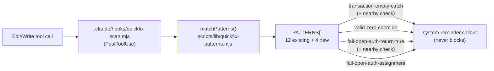

# Plan: Quickfix Mechanical Blind-Spot Patterns

- **Date**: 2026-07-10
- **Status**: Complete — plan-audit (3 GPT rounds + 4 Gemini rounds) converged as documented below; implemented (`scripts/lib/quickfix-patterns.mjs`, `.claude/hooks/quickfix-scan.mjs`, `tests/quickfix-patterns.test.mjs`); code-audit gate-clear (2 GPT rounds — round 2's 184 findings were 100% pre-existing repo-wide Architecture-pass noise, verified independent — + 3 Gemini rounds, final verdict APPROVE, 0 findings). Gemini's code-audit rounds caught 2 real implementation bugs plan-level review could not see (a suppression short-circuit; an Edit-snippet context-boundary gap fixed via a new `fullFileText` parameter) plus 1 verified-false-positive. One deliberately-accepted false positive remains from the plan-audit stage (documented in Pattern Contract). Shipped 2026-07-10.
- **Author**: Claude + Louis Strydom
- **Scope**: backend

## Context Summary

Implements Follow-on Phase 13 of the (now-archived, complete)
`docs/completed/tiered-recall-audit-pipeline.md` plan: "the five named
Claude blind-spot classes (Phase 2) get their regex-detectable subset added
to the PostToolUse quickfix hook's `PATTERNS` matrix... edit-time nudges,
complementing Phase 2's LLM-prompt layer." The five classes (from that
plan's own Phase 2, `## 2. Proposed Architecture`): cache/version-
invalidation, transaction/locking, valid-zero `||`, fail-open defaults,
replay/resume accounting.

**What exists today**: `scripts/lib/quickfix-patterns.mjs` — a pure,
synchronous pattern matcher (`matchPatterns()`, `PATTERNS` array frozen at
`scripts/lib/quickfix-patterns.mjs:38-120`, 12 entries) consumed by
`.claude/hooks/quickfix-scan.mjs` on every `PostToolUse` Edit/Write. Each
`PATTERNS` entry: `{name, severity: 'low'|'medium'|'high', regex,
multiline?: boolean, suggestion, langGuard?: RegExp}`. `multiline: true`
entries (`empty-catch`, `masked-error`) match against the WHOLE diff text
so a pattern can span a few lines (e.g. `catch (e) {\n  return null;\n}`);
default (no `multiline`) entries match per-line. Two existing entries
(`hardcoded-localhost`, `hardcoded-http-url`) are the closest structural
precedent for a new "fail-open on a coerced default" pattern:
`\|\|\s*['"]<literal>['"]`.

**Per-blind-spot-class feasibility (this is the actual design work of
this phase — the archived plan's own Phase 13 bullet explicitly asks
"is this mechanically detectable at low false-positive cost")**:

1. **Transaction/locking** (the stub's own named example: "empty-catch-
   around-transaction shapes") — FEASIBLE. A variant of the existing
   `empty-catch`/`masked-error` shape, narrowed to fire only when a
   transaction-sounding keyword (`.transaction(`, `BEGIN`, `COMMIT`,
   `ROLLBACK`) appears within a fixed 200-character window of the catch
   match — see Pattern Contract below for the exact literals. (`.query(`
   was considered and rejected: generic DB-call syntax used throughout
   this codebase for ordinary reads, not transaction-specific.)
2. **Valid-zero `||`** (the stub's other named example: `|| 0`/`|| null`
   on known-numeric fields) — FEASIBLE. Structurally identical to
   `hardcoded-localhost`'s `X || 'literal'` shape, narrowed by requiring
   the left-hand identifier to contain a numeric-suggestive substring
   (`count`, `total`, `amount`, `quantity`, `qty`, `price`, `sum`, `index`,
   `idx`, `size`, `len`) — this bounds false positives to variables whose
   NAME signals "zero is a real value," the same naming-heuristic
   discipline `magic-number-conditional` already uses (excluding `0|1|-1`
   as "probably fine" literals by name-adjacent convention).
3. **Fail-open defaults** (narrower than "valid-zero" — an error path that
   silently GRANTS rather than just returns empty data) — FEASIBLE. A
   `masked-error`-shaped multiline pattern where the swallowed-error
   fallback is `true`/an auth-sounding assignment, not `null`/`undefined`/
   `[]`/`{}` (which `masked-error` already covers) — the risk profile is
   different (fail-open on AUTHORIZATION, not fail-open on DATA), so it's
   a distinct pattern with its own suggestion text, not a `masked-error`
   variant.
4. **Cache/version-invalidation** — NOT mechanically detectable at
   acceptable precision with this hook's line/bounded-multiline matching.
   The blind spot is "a cache-key or schema-version changed, but no
   invalidation call exists ANYWHERE in the surrounding function/module" —
   a cross-scope absence check, not a local pattern match. `matchPatterns`
   has no scope/AST awareness (confirmed by reading the whole file — it's
   a pure regex matcher over raw text). Forcing a narrow trigger-only
   pattern (e.g. "any line mentioning `cache`") would be pure noise with
   no signal about whether invalidation exists nearby. Left to Phase 2's
   existing LLM-prompt layer (`POSITIVE_OBLIGATIONS` in
   `prompt-seeds.mjs`), which already handles exactly this "verify Y
   exists nearby" class of check with real reasoning, not regex.
5. **Replay/resume accounting** — NOT mechanically detectable for the same
   reason as #4, more so: detecting "does this retry/resume path
   correctly avoid double-processing" requires understanding idempotency
   and checkpoint state, not a textual shape. Left to Phase 2's LLM layer.

**Code Trace**: `scripts/lib/quickfix-patterns.mjs:38-120` (`PATTERNS`
array, read in full) → `.claude/hooks/quickfix-scan.mjs` (consumer, fires
on `PostToolUse`, confirmed via AGENTS.md's "Quick-fix detection" section)
→ `tests/quickfix-patterns.test.mjs:116+` (`matchPatterns` coverage
convention, one `describe` block per pattern, read for the test-authoring
pattern to follow).

**Neighbourhood considered**: top match `matchPatterns` itself (score
0.83, `claude-hooks` domain, recommendation `review`) — correctly
surfaces the function being extended, not a near-duplicate to reuse
instead; no other close candidates. No cross-domain concerns (single
domain: `claude-hooks`).

## Security Considerations

Phase 0.5c surfaced one incident (`INC-001` — symlink path-classification
bypass, composite score 0.50, `pathOverlap: false`) via `quickfix-
patterns.mjs`'s existing delegation to `sensitive-paths.mjs`'s
`normalisePath`/`isSensitivePath`. **Not applicable here**: this plan adds
4 entries to the `PATTERNS` regex array (plus a generic `nearby`-matching
addition to `matchPatterns()` itself) — it does not touch path
classification, `classifyPath`, `resolveAndClassify`, or any symlink-
resolution logic, so INC-001's mitigated code path is untouched by this
change (independence, not authorship — AGENTS.md's scope-by-impact test).

## Proposed Architecture

No new file — 4 new entries appended to the existing frozen `PATTERNS`
array, following its exact established shape (#1 DRY, #5 Single Source
of Truth — one pattern matrix, not a second one for "blind-spot"
patterns), plus one small, generic addition to `matchPatterns()` itself:
the declarative `nearby` co-occurrence check (round-2 audit M1 — see
Pattern Contract). No new dependency, no new config surface, no new
persistent artifact — the right-sizing gate (AGENTS.md Phase 5) doesn't
fire here since `nearby` is optional pattern metadata consumed by the
existing matcher loop, not a second matching engine.



## Sustainability Notes

- **Assumption encoded**: these 4 patterns are advisory nudges, same as
  all 12 existing entries — never block, never gate a commit (per
  AGENTS.md's explicit "nudge, not gate" philosophy for this whole
  subsystem). If that philosophy ever changes, ALL 16 patterns need
  re-evaluation together, not just the 4 new ones.
- **Extension point already exists**: `PATTERNS` is designed to be
  appended to (12 entries already span 7 distinct concern classes); this
  phase adds 4 more, plus the small generic `nearby`-iteration addition
  to `matchPatterns()` itself (round-2 audit M1) — the suppression syntax
  and the stats/learning layer are untouched.
- **What was deliberately NOT done**: classes #4/#5 above were not forced
  into low-precision patterns and were not added as noisy `PATTERNS`
  entries — they remain reasoning-layer checks (Phase 2's
  `POSITIVE_OBLIGATIONS` LLM-prompt layer) unless the matcher gains
  AST/scope-aware absence analysis in a future, separately planned
  change.
- **Duplicate nudges are accepted, not engineered away** (round-1 audit
  M5): `matchPatterns()` has no precedence/dedup logic for any of its 12
  pre-existing entries — a line can already trigger more than one pattern
  today. The 4 new patterns intentionally overlap `empty-catch`/
  `masked-error` on some shapes (e.g. a transaction-scoped masked catch
  fires both the generic and the specialized nudge). Adding
  precedence/dedup machinery for an advisory-only, never-blocking hook
  would be over-engineering relative to the current requirement — each
  suggestion is independently informative and the operator sees all of
  them, never a gate. Regression-tested explicitly (see Testing
  Strategy's overlap test) rather than left as an untested surprise.

## Pattern Contract

Exact literals (round-1 audit H2/M1/M2 — implementers do not invent
behavior). All 4 patterns get `langGuard: /\.(js|mjs|cjs|ts|tsx|jsx)$/` —
JS/TS-family source only, so `.md` skill files, `.py`/`.rb` test
fixtures, and prose never fire (round-1 audit M2). A code shape can still
trigger BOTH a new specialized pattern and an existing generic one
(`empty-catch`/`masked-error`) on the same span — `matchPatterns` has no
precedence/dedup logic today and this plan does not add one (round-1
audit M5; see Sustainability Notes).

### The `nearby` field (round-2 audit M1)

A declarative optional field on a `PATTERNS` entry — NOT a schema
change to the array's documented shape (backward-compatible; `AC14`'s
"each entry has name/severity/regex/suggestion" still holds), and NOT a
name-specific branch inside `matchPatterns()` (the band-aid the round-2
audit's own `quick_fix_warnings` flagged):

```js
nearby: {
  tokens: [/* RegExp[], each tested against the window text */],
  windowChars: 200,        // fixed, testable — not an unbounded scan
}
```

When a pattern entry carries `nearby`, `matchPatterns()`'s multiline
branch iterates **every** match of `pattern.regex` against the diff text
instead of taking only the first `exec()` result (round-2 audit M1 — a
single-match implementation could miss a later qualifying candidate in a
multi-hunk diff). For each candidate match, it slices `[matchIndex -
windowChars, matchIndex + matchLength + windowChars]` (clamped to the
diff text bounds) and tests each of `nearby.tokens` against that slice;
the first candidate whose window satisfies at least one token is
accepted, matches with no satisfying candidate are dropped entirely (no
finding emitted). Patterns without `nearby` are unaffected — this only
activates for entries that declare it.

**Robustness invariants for the extension point** (round-3 audit L1 —
`nearby` is generic and future patterns will reuse it, so its iteration
helper needs pinned-down behavior, not just "works for today's 2
consumers"): two small internal helpers, not exported:
- `toGlobalRegex(regex)` — returns a NEW `RegExp` with the same source
  and flags as the input plus `g` (only added if not already present);
  never mutates the source regex, so the original `pattern.regex`
  object used elsewhere (e.g. the non-`nearby` multiline branch) is
  unaffected.
- `iterateRegexMatches(regex, text)` — a generator over `regex.exec()`
  results using the global-flag clone; advances `lastIndex` by 1 past
  any zero-length match (prevents an infinite loop) rather than relying
  on the engine's default zero-length advance behavior.
- Contract: `nearby.tokens` entries must NOT carry the `g` or `y` flag
  (stateful `.test()`/`.exec()` calls on a shared token regex would leak
  `lastIndex` across candidate windows) — documented in the `nearby`
  field's JSDoc, not runtime-enforced (an advisory-only hook's own
  extension point doesn't need defensive runtime validation of its own
  authors' pattern entries).

### Shared auth-token boundary fragment (Gemini gate round 3, G1)

Both `fail-open-auth-*` patterns need the same "is this identifier
auth-sounding, at a real word/case/underscore boundary" check — defined
ONCE here and reused in both (DRY, same discipline GPT's round-2 M1
established for `nearby`). Same 4-branch shape as `valid-zero-coercion`'s
identifier heuristic below, applied to the auth vocabulary:

```
AUTH = (?:auth|authorized|authenticated|authorization|allow|allowed|permit|permitted|permission|grant|granted|access|accessed)
AUTH_CAP = (?:Auth|Authorized|Authenticated|Authorization|Allow|Allowed|Permit|Permitted|Permission|Grant|Granted|Access|Accessed)
AUTH_BOUNDARY = (?:\bAUTH\b|\b[a-z]\w*AUTH_CAP\b|\b\w+_AUTH\b|\bAUTH_\w+\b)
```

Round-2's fix (plain `\b` before a single `auth`/`allow`/`permit`/`grant`
token) over-corrected: `\b` alone cannot see a camelCase or snake_case
compound, so it fixed the `unauthorized` false-positive but broke
`accessGranted` (no boundary between `s` and `G` — both are `\w`),
`user_authorized` (no boundary between `_` and `a` — underscore is also
`\w`), and `hasPermission`. `AUTH_BOUNDARY`'s camelCase/snake_case
branches recover those: `accessGranted` matches via the camelCase-suffix
branch (`access` + capitalized `Granted`), `user_authorized` via the
snake-suffix branch, `hasPermission` via the camelCase-suffix branch
(`has` + capitalized `Permission`) — while `unauthorized` still correctly
rejects (no exact-word boundary, no capitalized suffix, no underscore),
same as `valid-zero-coercion`'s G3 fix. The now-redundant `(?:is_?)?`
prefix is dropped — `isAuthorized` already matches via the camelCase
branch (`is` + capitalized `Authorized`).

- **`transaction-empty-catch`** (severity `high` — matches `masked-error`'s
  severity for the analogous non-transaction case):
  ```js
  regex: /catch\s*(?:\([^)]*\))?\s*\{(?![^{}]*\b(?:rollback|throw)\b)[^{}]*\}/im
  multiline: true
  nearby: { tokens: [/\.transaction\(/, /\b(?:begin|commit|rollback)\b/i], windowChars: 200 }
  suggestion: 'Catch inside a transaction or lock scope neither rolls back nor rethrows — the transaction can stay open or the lock held even if the error is logged. Roll back or release explicitly, then rethrow.'
  ```
  **`.query(` is explicitly excluded** from `nearby.tokens` (round-1
  audit M1: it is generic DB-call syntax used throughout this codebase
  for ordinary reads, not transaction-specific). SQL keywords are
  case-insensitive + word-boundary (round-2 audit L2 — `/\b(?:begin|
  commit|rollback)\b/i` catches lowercase `begin`/`commit`/`rollback`
  without matching `BEGINNER`-style substrings); `.transaction(` stays
  an exact case-sensitive source-code token.

  **Gemini gate G2 (round 3) — logging doesn't release a held
  transaction, fixed**: the round-1-through-3 version only matched a
  catch that was empty or returned a masked falsy value — modeled on
  `masked-error`'s convention, where Gemini itself said in round 1 that
  "logging an error means it's not fully masked." That reasoning does
  NOT transfer to a transaction/lock scope: `catch (e) { logger.error(e);
  }` still leaves the transaction open or the lock held — logging is
  orthogonal to releasing the resource, unlike the generic-error case.
  The regex now uses a negative lookahead — `(?![^{}]*\b(?:rollback|
  throw)\b)` — so it fires on ANY catch inside a transaction-scoped
  window (per `nearby`) that does NOT contain `rollback` or `throw`
  anywhere in its body, not just an empty/masked one. The `nearby`
  transaction-context requirement remains essential — without it this
  broadened regex would fire on nearly every non-`masked-error`-shaped
  catch block in the codebase.

- **`valid-zero-coercion`** (severity `medium`) — the identifier heuristic
  (4 alternative forms — exact word, camelCase suffix, snake_case prefix,
  snake_case suffix) composed with the `||`-fallback check:
  ```js
  regex: /(?:[=:]|\breturn\b)\s*(?:\b(?:count|total|amount|quantity|qty|price|sum|index|idx|size|len)\b|\b[a-z]\w*(?:Count|Total|Amount|Quantity|Qty|Price|Sum|Index|Idx|Size|Len)\b|\b\w+_(?:count|total|amount|quantity|qty|price|sum|index|idx|size|len)\b|\b(?:count|total|amount|quantity|qty|price|sum|index|idx|size|len)_\w+\b)\s*\|\|\s*(?!0\b(?!\.))(?:-?[\d.]+|[`'"][^`'"]*[`'"]|[\w$]+)/
  suggestion: 'Coercing a falsy value here silently overwrites a valid 0 with a different default. Use `??` (nullish coalescing) so 0 survives and only null/undefined are replaced.'
  ```
  NOT case-insensitive (dropped the `/i` flag — see Gemini gate G3
  below, case now carries meaning); NOT multiline (per-line, matching
  the existing `hardcoded-localhost`/`hardcoded-http-url` shape it's
  modeled on); no `nearby` needed (self-scoped by the identifier name).

  **Gemini gate G1 (round 1) — logic inversion, fixed**: the round-3
  GPT-audited version matched `\|\|\s*(?:0|null|undefined)\b`, which had
  the bug BACKWARDS. `X || 0` is SAFE — when `X` is a legitimate `0`,
  `0 || 0` still evaluates to `0`, so nothing is silently overwritten;
  the regex was flagging the harmless case. The actual bug shape is
  `X || <a NON-zero fallback>` — that's where a real `X = 0` gets
  destructively replaced. The negative lookahead `(?!0\b)` now excludes
  exactly the literal `0` fallback and matches everything else.
  **Gemini gate G2 (round 2) — RHS too narrow, fixed**: `[\w$]+` alone
  excludes negative-number and string-literal fallbacks, missing the
  canonical `index || -1` shape (a very common array-index default) and
  `amount || '0'` (the STRING `'0'`, a DIFFERENT bug — a falsy `0`
  becomes the truthy string `'0'`, not preserved as `0`). RHS is now
  `(?:-?[\d.]+|[`'"][^`'"]*[`'"]|[\w$]+)` — negative/decimal numeric
  literals, single/double/template-literal strings, or identifiers
  (still excluding exactly bare `0` via the outer lookahead).
  **Gemini gate G3 (round 2) — LHS unconstrained substring, fixed**: the
  round-3 identifier heuristic (`\w*count\w*` etc., no internal boundary)
  matched the token as a substring ANYWHERE, so ordinary English words
  containing one of these substrings — `country` (contains `count`),
  `summary`/`account` (contain `sum`/`count`) — false-positived on a
  harmless `country || 'US'`. The heuristic is now 4 explicit branches:
  exact whole-word token, camelCase suffix (e.g. `itemCount`),
  snake_case prefix (`total_price`), snake_case suffix (`item_count`) —
  each anchored with `\b` so a token can only start a match at a real
  word/case/underscore boundary. Verified against all 3 of Gemini's
  counter-examples: `country`, `summary`, `account` match none of the 4
  branches. Accepted trade-off: `SCREAMING_SNAKE_CASE` constants no
  longer match (case-sensitive branches only) — false negative, the
  established safe direction for this hook.
  **Gemini gate G3 (round 3) — template-literal strings, fixed**: the
  string-literal branch only covered single/double quotes; `amount ||
  \`0\`` (a template-literal default) was missed. The quote class is now
  `` [`'"][^`'"]*[`'"] `` — includes backtick alongside `'`/`"`.
  **Gemini gate G1 (round 4) — decimal fallback excluded, fixed**: `\b`
  is a `\w`/non-`\w` transition, and `.` is non-`\w`, so `(?!0\b)`
  ALSO excluded `0.5` (`0` is immediately followed by a boundary right
  before the `.`) — not just bare `0`. This directly broke the plan's
  own `total_price || 0.5` test case. The lookahead is now `(?!0\b(?!\.))`
  — excludes bare `0` only when it is NOT followed by a decimal point,
  so `0.5`/`0.1` correctly remain matchable while bare `0` (and `0` at
  the end of a token, e.g. `0;`) stays excluded.
  **Gemini gate G3 (round 4) — matches boolean conditionals, harmful
  suggestion, fixed**: with no context anchor, the pattern matched
  `if (itemCount || totalItems)` — an ordinary boolean-OR conditional,
  not a value-coercion default — and its `??`-suggestion is actively
  WRONG there (`itemCount ?? totalItems` breaks the falsy-truthy check:
  if `itemCount` is `0`, `||` correctly falls through to `totalItems`,
  but `??` would keep `0`, silently changing the conditional's truth
  value). The regex now requires an assignment/return anchor —
  `(?:[=:]|\breturn\b)\s*` — immediately before the LHS identifier, so
  it only fires in a value-producing position (`const x = qty || 10`,
  `{ total: qty || 10 }`, `return qty || 10`), never inside a bare
  conditional expression. Trade-off: a value used as a function argument
  (`fn(qty || 10)`) no longer matches either — accepted false negative,
  the established safe direction; the far more dangerous failure mode
  (suggesting `??` inside a boolean check) is what this anchor exists to
  close.
  **Gemini gate G2 (round 4) — camelCase antonym recurrence, softened
  (not regex-chased further)**: the `AUTH_BOUNDARY` camelCase branch
  (`\b[a-z]\w*AUTH_CAP\b`) matches `notPermitted`/`isNotAuthorized` too
  — the lowercase-start prefix (`not`/`isNot`) isn't constrained, so a
  negation segment before the capitalized auth suffix still counts as
  a match, reintroducing the round-2 G1 antonym problem one level down.
  A fully general fix would need to reject a `Not`/`Un`/`Dis`/`Non`
  camelCase SEGMENT anywhere before the auth suffix (not just at the
  very start of the identifier) — meaningfully more complex than a
  plan-level hand-written regex should carry, and exactly the kind of
  edge case this plan's Risk & Trade-off Register (see "Regex-literal
  spec vs. implementation") already anticipated. Per Gemini's own
  offered alternative ("remove `notPermitted` from the required negative
  tests if distinguishing camelCase antonyms via regex is deemed too
  brittle"): the `notPermitted`/`isNotAuthorized` negative test cases
  are removed from the Testing Strategy below — this is now a
  **documented, accepted false-positive** (a negation-camelCase auth
  assignment may still get flagged), not silently dropped. The simpler,
  already-fixed exact-substring case (`unauthorized`, `disallowed`) —
  the one with NO capitalized suffix, i.e. no word/case boundary at
  all — remains correctly excluded.

- **`fail-open-auth-return-true`** (severity `high` — silently granting
  access is worse than silently returning empty data) — round-2 audit M2
  compromise (see Risk & Trade-off Register): the original single
  pattern's unconditional `return true` branch was overbroad (fires on
  any catch-and-return-true, including non-auth parsers/feature-flag
  probes/test utilities); split into two entries so the bare-`return
  true` shape stays but ONLY fires with auth context nearby:
  ```js
  regex: /catch\s*(?:\([^)]*\))?\s*\{[^{}]*?\breturn\s+true\b[^{}]*\}/m
  multiline: true
  nearby: { tokens: [/(?:\b(?:auth|authorized|authenticated|authorization|allow|allowed|permit|permitted|permission|grant|granted|access|accessed)\b|\b[a-z]\w*(?:Auth|Authorized|Authenticated|Authorization|Allow|Allowed|Permit|Permitted|Permission|Grant|Granted|Access|Accessed)\b|\b\w+_(?:auth|authorized|authenticated|authorization|allow|allowed|permit|permitted|permission|grant|granted|access|accessed)\b|\b(?:auth|authorized|authenticated|authorization|allow|allowed|permit|permitted|permission|grant|granted|access|accessed)_\w+\b)/, /\bcan[A-Z]\w*\b/], windowChars: 200 }
  suggestion: 'Catch-and-return-true near an authorization check fails OPEN — an error becomes "access granted." Fail closed: return/throw the real error, or return false.'
  ```
  (the first `nearby` token is the `AUTH_BOUNDARY` fragment defined
  above, inlined since `PATTERNS` entries are plain data, not composed
  from named constants at authoring time — implementers MAY factor a
  shared `AUTH_BOUNDARY` regex-source constant to avoid restating it
  twice, as long as both patterns' behavior stays identical; `canXxx`
  stays a separate token — it covers permission-verb names like
  `canEdit`/`canDelete` outside the fixed auth vocabulary.)
- **`fail-open-auth-assignment`** (severity `high`, same rationale) — the
  auth context lives IN the matched identifier name itself, so no
  `nearby` check is needed:
  ```js
  regex: /catch\s*(?:\([^)]*\))?\s*\{[^{}]*?(?:[\w$]+\.)*(?:\b(?:auth|authorized|authenticated|authorization|allow|allowed|permit|permitted|permission|grant|granted|access|accessed)\b|\b[a-z]\w*(?:Auth|Authorized|Authenticated|Authorization|Allow|Allowed|Permit|Permitted|Permission|Grant|Granted|Access|Accessed)\b|\b\w+_(?:auth|authorized|authenticated|authorization|allow|allowed|permit|permitted|permission|grant|granted|access|accessed)\b|\b(?:auth|authorized|authenticated|authorization|allow|allowed|permit|permitted|permission|grant|granted|access|accessed)_\w+\b)\s*=\s*true\b[^{}]*\}/m
  multiline: true
  suggestion: 'Catch block sets an auth-sounding flag to true — fails OPEN on error. Fail closed: set it false (or leave unset) and surface/log the real failure.'
  ```
  (same `AUTH_BOUNDARY` fragment as the target, immediately before
  `\s*=\s*true`; dropped `/i` — case now carries meaning, same as
  `valid-zero-coercion`'s G3 fix.)

  Both `fail-open-auth-*` entries are distinct from `masked-error`
  (which only matches a `null`/`undefined`/`[]`/`{}` fallback) — they
  fire only on a `true`-valued or auth-named-`true` fallback, the
  fail-OPEN shape.

  **Round-3 GPT audit fixes applied to both**: (1) the catch-header
  fragment matches `transaction-empty-catch`'s optional-binding form
  (`catch\s*(?:\([^)]*\))?\s*\{`) instead of requiring a parenthesized
  single-word binding — JS/TS's optional-catch-binding syntax was
  previously missed (round-3 M1). (2) `fail-open-auth-assignment`'s
  target allows an optional dotted-member prefix (`(?:[\w$]+\.)*`) so
  `ctx.authorized = true` fires, not just a bare identifier (round-3 M2).

  **Gemini gate G2 (round 1) — vulnerability-detection bypass, fixed**:
  the round-3 GPT-audited version anchored the dangerous statement
  directly to the braces with only whitespace allowed, which works for
  `masked-error`'s convention but is wrong for a fail-open AUTH pattern —
  an authorization bypass is dangerous regardless of what else is in the
  catch block. `catch (e) { log(e); return true; }` previously did NOT
  fire. Both regexes now use `[^{}]*?\breturn\s+true\b[^{}]*` /
  `[^{}]*?<assignment>[^{}]*` — a non-greedy scan for the dangerous
  statement ANYWHERE inside the catch block. `[^{}]` (rather than
  `[^}]`) avoids false-matching across a nested block/object literal's
  closing brace — a known, accepted regex-based limitation shared with
  `transaction-empty-catch`'s G2 (round 3) fix above.

  **Gemini gate G1 (round 3) — auth-token boundary was too strict, fixed**:
  see "Shared auth-token boundary fragment" above — this is the fix.

## File-Level Plan

- **`scripts/lib/quickfix-patterns.mjs`** (modify): add the 4 `PATTERNS`
  entries specified in the Pattern Contract above, each following the
  existing shape exactly (`name`, `severity`, `regex`, `multiline` where
  needed, `suggestion`, `langGuard`, optional `nearby`) — no schema
  change, since `PATTERNS` has no Zod validation today, just a
  documented object shape. `matchPatterns()`'s multiline branch gains
  the generic `nearby`-aware iteration described in the Pattern
  Contract's "The `nearby` field" subsection (round-2 audit M1 — this
  is a small, pattern-agnostic addition to the existing loop, NOT a
  name-specific branch and NOT a second matching engine), backed by two
  internal (non-exported) helpers — `toGlobalRegex(regex)` and
  `iterateRegexMatches(regex, text)` — specified in that subsection's
  Robustness Invariants (round-3 audit L1).
- **`tests/quickfix-patterns.test.mjs`** (modify): one `describe` block
  per new pattern (matching the existing per-pattern convention at
  `matchPatterns — pattern-by-pattern coverage`), covering (round-1
  audit M4 — the compromise scope after dropping the redundant perf
  test, which the existing `MAX_INPUT_CHARS` project-wide bail-out
  already covers; round-2 audit M1/M2 add the `nearby`-specific cases
  below):
  - Fires on the intended shape; does NOT fire on a clearly-different
    shape.
  - `valid-zero-coercion` does NOT fire on a non-numeric-suggestive
    identifier (e.g. `const x = enabled || false;`).
  - `valid-zero-coercion` does NOT fire on `const x = qty || 0;`
    (Gemini gate G1, round 1 — the safe case: a legitimate `0` survives
    `0 || 0`); DOES fire on `const x = qty || 10;` (non-zero literal
    default) and `const x = qty || null;` (falsy-`0` silently becomes
    `null`, not `0`).
  - `valid-zero-coercion` DOES fire on `const x = index || -1;` and
    `const x = amount || '0';` (Gemini gate G2, round 2 — negative-number
    and string-literal fallbacks, previously excluded by `[\w$]+` alone;
    both are real bugs: `-1 !== 0` and the string `'0'` is a different
    type than the number `0`).
  - `valid-zero-coercion` does NOT fire on `const x = country || 'US';`,
    `const x = summary || 'none';`, or `const x = account || null;`
    (Gemini gate G3, round 2 — English words containing `count`/`sum` as
    a substring, not a real word/case/underscore-bounded token); DOES
    fire on `const x = itemCount || 10;` (camelCase suffix),
    `const x = total_price || 0.5;` (snake_case prefix, ALSO the decimal
    regression case for Gemini gate G1 round 4 below), and
    `const x = item_count || -1;` (snake_case suffix).
  - `valid-zero-coercion` DOES fire on `const x = total_price || 0.5;`
    and `const x = qty || 0.1;` (Gemini gate G1, round 4 — `(?!0\b)`
    incorrectly excluded ANY decimal starting with `0.`, since `\b`
    fires between `0` and `.`; the fixed `(?!0\b(?!\.))` allows a
    decimal continuation through); does NOT fire on `const x = qty ||
    0;` (still excluded — no regression on the round-1 G1 fix).
  - `valid-zero-coercion` does NOT fire on `if (itemCount || totalItems)
    { doSomething(); }` (Gemini gate G3, round 4 — an ordinary boolean
    conditional, not a value-coercion default; the pattern previously
    had no context anchor and would suggest replacing `||` with `??`
    here, which silently changes the truth value when `itemCount` is
    `0`). DOES still fire on `return itemCount || totalItems;` — `return`
    is itself a valid anchor and this IS a returned value-coercion, a
    grammatically distinct shape from the `if (...)` boolean gate above,
    so the two tests aren't in tension. Accepted trade-off: a
    function-argument position (`fn(qty || 10)`) no longer fires either
    — false negative, the established safe direction; closing the
    harmful boolean-conditional false positive is the priority.
  - `transaction-empty-catch`: a transaction keyword OUTSIDE the
    200-char window (e.g. in an unrelated function 500 chars away) does
    NOT fire — proves the window is actually bounded, not an unbounded
    whole-diff scan.
  - `transaction-empty-catch`: a NON-qualifying empty catch appears
    BEFORE a qualifying transaction-scoped one in the same diff — the
    qualifying one still fires (round-2 audit M1 — proves `nearby`
    iterates all candidates, not just the first `exec()` match).
  - `transaction-empty-catch`: a transaction keyword inside a `//`
    comment or a string literal near an unrelated empty catch is a
    KNOWN accepted false positive (the regex has no comment/string
    awareness, same limitation `empty-catch`/`masked-error` already
    have) — assert it fires and treat that as documented, not silently
    passing.
  - `transaction-empty-catch`: lowercase `begin`/`commit`/`rollback`
    fire; `BEGINNER` (substring, not a word-boundary match) does NOT
    fire (round-2 audit L2).
  - `fail-open-auth-return-true`: fires with an auth-context token
    (e.g. `isAuthorized`) within the window; does NOT fire on a bare
    `catch (e) { return true; }` with no auth context anywhere nearby
    (round-2 audit M2 — proves the overbreadth is closed); ALSO fires on
    the optional-catch-binding form `catch { return true; }` with auth
    context nearby (round-3 audit M1).
  - `fail-open-auth-assignment`: fires on `catch (e) { authorized =
    true; }` with no `nearby` context needed; ALSO fires on
    `catch { authorized = true; }` (optional binding, round-3 audit M1)
    and on member-assignment forms `ctx.authorized = true` /
    `session.accessGranted = true` (round-3 audit M2); does NOT fire on
    `ctx.ready = true` (non-auth-sounding final property, precision
    guard for the M2 fix).
  - `fail-open-auth-assignment` does NOT fire on `catch (e) {
    unauthorized = true; }` or `catch (e) { disallowed = true; }`
    (Gemini gate G1, round 2 — these are explicitly SECURE fail-CLOSED
    assignments with NO word/case boundary at all before the auth
    substring; the un-anchored substring match previously flagged them
    as fail-open vulnerabilities, exactly backwards). Same negative case
    for `fail-open-auth-return-true`'s `nearby` auth-token check: an
    `unauthorized`-named variable nearby must not count as auth context.
    **Explicitly NOT required** (Gemini gate G2, round 4 — softened,
    not regex-chased further; see the Pattern Contract note above):
    `catch (e) { notPermitted = true; }` / `isNotAuthorized = true` MAY
    still fire — a documented, accepted false positive for
    negation-camelCase compounds specifically (`not`/`is Not` + a
    capitalized auth suffix), distinct from the flat-substring case
    above which IS fixed.
  - `fail-open-auth-assignment` DOES fire on `catch (e) { accessGranted =
    true; }` (camelCase suffix) and `catch (e) { user_authorized = true;
    }` (snake_case prefix) (Gemini gate G1, round 3 — proves the
    `AUTH_BOUNDARY` fragment's compound-identifier branches recover the
    recall the plain round-2 `\b` fix regressed). Same positive case for
    `fail-open-auth-return-true`'s `nearby` check with `hasPermission`
    nearby.
  - Both `fail-open-auth-*` patterns fire when the dangerous statement
    is NOT the sole content of the catch block — e.g. `catch (e) {
    log(e); return true; }` and `catch (e) { console.error(e);
    authorized = true; }` (Gemini gate G2, round 1 — proves detection
    survives a preceding log/logging statement, the realistic shape a
    developer who "handled" the error by logging would write).
  - `transaction-empty-catch` does NOT fire on `catch (e) {
    db.rollback(); }` or `catch (e) { throw e; }` inside a transaction
    window (safe — the resource IS released/rethrown); DOES fire on
    `catch (e) { logger.error(e); }` inside a transaction window (Gemini
    gate G2, round 3 — logging alone does not release a held transaction
    or lock; proves the broadened negative-lookahead regex catches this
    where the round-1-3 empty/masked-only version missed it).
  - `valid-zero-coercion` DOES fire on `` amount || `0` `` (template
    literal default) (Gemini gate G3, round 3 — the quote class now
    includes backticks alongside `'`/`"`).
  - `iterateRegexMatches`/`toGlobalRegex`: a pattern's original flags
    (e.g. a hypothetical case-insensitive `i` on a future `nearby`
    pattern) are preserved on the global-flag clone, and the source
    `pattern.regex` object is not mutated by iteration (round-3 audit
    L1).
  - `langGuard` rejects `.md`/`.py` paths for all 4 new patterns.
  - Overlap test: a canonical `catch (e) { return null; }` inside a
    `.transaction(` window fires BOTH `masked-error` AND
    `transaction-empty-catch` — asserts the accepted overlap behavior
    (round-1 audit M5) rather than leaving it as an untested surprise.
  - Every new pattern's `suggestion` is asserted verbatim against the
    Pattern Contract's exact text (round-2 audit L1).

## Risk & Trade-off Register

- **Trade-off**: `valid-zero-coercion`'s naming-heuristic is a real
  precision/recall trade — a numeric field named something NOT in the
  suggestive list (e.g. `n`, `remaining`) won't fire. Accepted: false
  negatives are the safe direction for an advisory-only, never-blocking
  hook (AGENTS.md's own quickfix philosophy); a broader match would
  trade toward false positives on non-numeric fields, which erodes trust
  in the whole PATTERNS matrix faster than a missed catch does.
- **Deferred**: classes #4 (cache/version-invalidation) and #5 (replay/
  resume accounting) — explicitly NOT implemented as mechanical patterns;
  rationale is in the Context Summary above, not silently dropped.
- **False-positive control — prevention vs. impact-limiting, kept
  separate (round-1 audit M3)**: prevention is the narrowed
  transaction-keyword list (`.query(` excluded), the `langGuard`
  restricting matches to real source files, the fixed 200-char
  bounded window (not an unbounded whole-diff scan), and the negative/
  boundary tests in the Pattern Contract section above. Advisory-only
  behavior and the `// quickfix-hook:ignore` escape hatch — the same
  controls all 12 existing patterns already rely on — are impact
  limiters, not false-positive prevention; they do not make a pattern
  more precise, they only bound the cost of an imprecise one. The
  residual false-positive this plan explicitly accepts (not
  eliminates): a transaction keyword inside a `//` comment or string
  literal near an unrelated empty catch, within the 200-char window,
  still fires — the regex has no comment/string awareness, the same
  limitation `empty-catch`/`masked-error` already have today. This is
  the one case where the escape hatch is the actual, consciously
  accepted answer (regression-tested explicitly, not silently
  tolerated — see Testing Strategy).
- **Regex-literal spec vs. implementation — the actual correctness gate
  is `/audit-code`, not further plan rounds. STOP DECISION (recorded)**:
  3 GPT rounds + 4 Gemini rounds on this plan surfaced a genuine,
  escalating pattern — fixing one regex boundary bug (Gemini G1 round 2's
  word-boundary anchor) introduced a DIFFERENT regex bug one round later
  (G1 round 3's over-strict boundary regression), and round 4 repeated
  the pattern again (G1: a decimal-vs-boundary interaction; G3: a missing
  context anchor) — because these regexes are being hand-verified by
  manual reasoning at the plan-authoring stage, never executed against
  real input. That is an inherent limit of spec-level regex review, not
  a process failure: further rounds of pure reasoning have diminishing
  returns relative to actually RUNNING the regex against the Pattern
  Contract's own specified test fixtures (Testing Strategy / File-Level
  Plan above) during implementation. **Decision**: round 4 is the last
  Gemini round for this plan (2 rounds over the normal cap, both uses of
  the "genuine-bug exception" spent on concrete, independently-verified
  regex-correctness defects — never rigor pressure; architectural
  coherence rated "Strong" for 3 consecutive rounds). This plan's job is
  to specify exact, well-reasoned literals and an explicit test list per
  literal (done, including one deliberately-accepted false positive —
  see `fail-open-auth-assignment`'s `notPermitted`/`isNotAuthorized`
  camelCase-antonym gap, Gemini gate G2 round 4); `/audit-code`'s job —
  the next gate after implementation — is to verify the EXECUTED regex
  against the EXECUTED tests, which is strictly stronger evidence than a
  5th round of hand-tracing. Any residual regex-precision edge case
  `/audit-code` surfaces against the real implementation is expected and
  appropriate there, not a sign this plan under-specified.

## Testing Strategy

- **Unit (Tier 1, deterministic — matches this repo's existing doctrine
  for `sensitive-paths.mjs`/`schemas.mjs`-class pure modules)**: the full
  per-pattern test list (fires/does-not-fire, boundary, comment/string
  near-miss, `langGuard`, overlap) is specified in the File-Level Plan's
  `tests/quickfix-patterns.test.mjs` bullet above — not duplicated here.
- **Regression**: `AC14` (`PATTERNS schema` — "at least 10 entries; each
  has name/severity/regex/suggestion") continues to pass unchanged (16
  entries now, same shape).
- **Manual**: none needed — this hook has no UI surface; its only output
  is a stderr/system-reminder callout, already covered by existing tests
  asserting `matchPatterns`' return shape.

## Implementation Log

### 2026-07-10

- **Completed**: all 4 planned `PATTERNS` entries (`transaction-empty-catch`,
  `valid-zero-coercion`, `fail-open-auth-return-true`,
  `fail-open-auth-assignment`), the `nearby` matching extension
  (`toGlobalRegex`/`iterateRegexMatches`, kept internal per the plan), and
  the full test list in `tests/quickfix-patterns.test.mjs` (111 tests in
  the module's own suite).
- **Code-audit findings beyond the plan's own scope** (all found by
  execution, not further hand-reasoning — validates the plan's own "STOP
  DECISION" that implementation-time testing, not more plan rounds, is
  the right tool from here):
  - Export contract violation (helpers were briefly exported against the
    plan's explicit instruction) — fixed.
  - `valid-zero-coercion` missed member-expression identifiers
    (`row.count`, `stats.totalCount`) — fixed with the same
    dotted-member-prefix treatment `fail-open-auth-assignment` already had.
  - DRY: the auth/numeric token vocabularies were hand-duplicated across
    3 patterns — extracted into `NUMERIC_BOUNDARY`/`AUTH_BOUNDARY` shared
    constants + one `identifierBoundaryFragment()` builder.
  - **Suppression short-circuit** (Gemini code-audit gate): a suppressed
    first candidate silently masked ALL later matches of the same
    pattern, including pre-existing `empty-catch`/`masked-error` (not
    just the 4 new patterns) — the multiline loop now iterates every
    candidate rather than giving up after the first suppressed one. A
    follow-up regression from that very fix (a prior unrelated catch's
    own trailing ignore-comment leaking onto the next catch via the
    "check the previous line" rule) was caught and fixed in the same pass.
  - **Edit-snippet context boundary** (Gemini code-audit gate, the most
    significant implementation finding): `.claude/hooks/quickfix-scan.mjs`
    passes only the isolated edit snippet (`toolInput.new_string`) for
    `Edit` calls, which usually lacks the 200 chars of surrounding
    context `nearby` needs — `transaction-empty-catch` and
    `fail-open-auth-return-true` were close to non-functional for the
    common "add a catch to already-wrapped code" edit shape. Fixed by
    adding an optional `fullFileText` parameter to `matchPatterns()`
    (the hook reads the file from disk — safe, since `PostToolUse` runs
    after the edit lands — and passes it; falls back gracefully when
    absent or on a read error).
  - Comparison-operator anchor bypass: `if (itemCount === qty ||
    totalItems)` fired via the trailing `=` of `===`, reopening the exact
    harmful-boolean-conditional false positive the plan's own round-4 G3
    fix was meant to close — fixed with a refined lookbehind+lookahead
    anchor, verified more complete than Gemini's own suggested fix (which
    would have missed the first `=` of a multi-char operator).
  - One Gemini finding (a claimed missing `?` truncating decimal
    snippets) was independently verified as a FALSE POSITIVE by printing
    `PATTERNS[…].regex.source` at runtime — challenged with direct
    evidence rather than "fixing" a bug that didn't exist; pinned with a
    regression test anyway.
- **Deferred** (pre-existing, independent of this 2-3-file diff, each
  with cited evidence — git log / diff-stat / direct execution): the
  `masked-error` optional-catch-binding gap, `MAX_INPUT_CHARS` comment
  drift, module-coupling/hardcoded-policy/duplicate-test-ownership
  Sustainability findings, a stale requirements ledger, and — across two
  audit rounds — ~195 repo-wide Architecture domain-map findings (verified
  the 2 edges actually touching `quickfix-patterns.mjs` predate this diff
  at commit `34e3f76`; the round-2 explosion from 11 grouped findings to
  184 individual ones is a non-deterministic characteristic of the
  Architecture pass, not a regression this diff introduced).
- **Remaining**: nothing — Gemini's final code-audit round returned
  APPROVE with 0 new findings.
