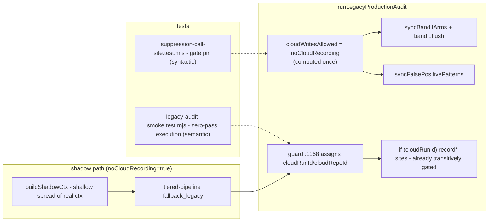

# Plan: Shadow write-gate + orchestrator smoke execution

- **Date**: 2026-07-18
- **Status**: Complete
- **Author**: Claude + Louis
- **Scope**: backend
- **Target domain(s)**: `audit-orchestration`, `stores`, `tests`
- ⚠ **Cross-domain work** — touches >1 domain; the crossing is the point: the orchestrator's write boundary into the stores is exactly what's being gated.

> **Past incidents to verify against** (from the security-incident index)
>
> | Incident | Relevance | Constraint it imposes here |
> |---|---|---|
> | **INC-002** — test DSN aliased to prod wiped the shared DB (2026-07-14) | The new smoke test *executes* the orchestrator | The smoke test must run **cloud-off by construction**: first statement sets `process.env.AUDIT_DB_URL = ''` (the `tests/suppression-policy.test.mjs:16` precedent), never a scratch DSN. No destructive suites against any real DSN. |

## 1. Context Summary

Two audit findings from the sibling-path cycle (2026-07-18), both in
`runLegacyProductionAudit` — the ~1,900-line orchestrator in
[`scripts/lib/audit/legacy-production-audit.mjs`](../../scripts/lib/audit/legacy-production-audit.mjs):

**Finding H1 — the `noCloudRecording` leak.** The flag gates cloud-run
creation (`legacy-production-audit.mjs:1168` — `if (!noCloudRecording &&
(await isCloudEnabled()) && repoProfile)`) and, transitively, every write
keyed on the `cloudRunId` that guard assigns. But two learning-state syncs at
the tail are keyed only on object presence:

- `:2836-2837` — `if (bandit) { bandit.flush(); syncBanditArms(bandit.arms) }`
- `:2842-2843` — `if (fpTracker) syncFalsePositivePatterns(cloudRepoId, fpTracker.dirtyPatterns())`

**Code Trace** (verified in this planning pass, not assumed):

- Guard + assignment: `legacy-production-audit.mjs:1168` (`cloudRepoId`/`cloudRunId`
  assigned only inside) → all `if (cloudRunId)` sites are transitively gated:
  `recordFindings :2749`, `recordPassStats :2756`, `recordSuppressionEvents :2777`,
  `convergence_predict :2856`, author-tier `:2883` (`if (cloudRunId && …)`),
  `recordRunComplete :2912`, `backfillLearningOutcome + _learningFlush :2942-2952`
  (inside the `:2911 if (cloudRunId)` block). Decision-logger lifecycle hooks are
  installed at `:1230`, also inside the guard.
- The two leak sites `:2836-2843` are the ONLY cloud-write sites not under the
  policy. `syncBanditArms` takes **no repoId** (`bandit_arms` is a shared global
  table — `store/bandit-fp.mjs`), so nothing downstream refuses it: **it writes
  whenever cloud is on.**
- The FP half is **inert today by coincidence, not design**: `cloudRepoId` is
  null on the shadow path (never assigned — the `:1168` guard was skipped), and
  since 2026-07-18 `syncFalsePositivePatterns` refuses a non-syncable repoId
  (`store/bandit-fp.mjs::isSyncableRepoId`, verified by reading the guard: null
  → silent return, nothing written). Its inertness rides on *where a different
  variable happens to be assigned* — precisely the scattered-re-derivation
  fragility the fix removes. `fpTracker.dirtyPatterns()` is non-destructive
  (returns a copy; `findings-tracker.mjs:190` — verified), so no data-loss
  side channel exists.
- Who sets the flag: `tiered-shadow-compare.mjs:121` (`noCloudRecording: true`)
  and `verify-anchor-contract.mjs:556`. The shadow ctx is built by
  `buildShadowCtx(ctx)` as a **shallow spread of the real run's ctx**
  (`tiered-shadow-compare.mjs:85`) — so the shadow's fallback legacy audit
  (`tiered-pipeline.mjs:533`) receives the real run's **live `bandit` and
  `fpTracker` objects** and runs *concurrently* with the real gating audit.
  The module's own doc comment ("Blocks ALL learning-store writes … in
  runLegacyProductionAudit's cloud-recording block") is **false today** for
  these two sites; this plan makes it true.
- Sharper than the brief: beyond the cloud write, the shadow also calls
  `bandit.flush()` (writes the **local** bandit-state file via `_store.save`,
  `bandit.mjs:207`) and `bandit.addArm(...)` (`legacy-production-audit.mjs:1395`,
  mutates the shared object) while the real run holds the same instance —
  the same shared-nested-value hazard class `buildShadowCtx`'s own comment
  documents for `generatorOutcomes` (audit round-1 M2, reproduced then).

**Finding M15 — nothing executes the orchestrator.** No test calls
`runLegacyProductionAudit`. The evidence is concrete: the sibling-path cycle's
refactor left a dangling `cloudPass.suppressedCount` reference that crashed
every cloud-enabled R2+ run — through 180 scoped and 6,767 suite tests, all
green, because the reference sat on a line nothing ever executed. Three cycles
have each concluded "the call site is review-time" and each time a real bug
shipped through that exact gap.

**What already exists (build on, don't duplicate):**

- `tests/suppression-call-site.test.mjs` — source-assertion pins incl. a
  dangling-reference pin + a module-load test. Syntactic only.
- The Tier-2 doctrine (AGENTS.md) forbids mocking the provider API to test
  orchestration order.
- Injection seams that make execution feasible **without any mock**
  (verified): `passFilter` (`:1461` — sole consumer; `passFilter: []` selects
  **zero passes**, so no LLM call is ever attempted), `providers = {}`
  (`:1100-1102` — the `openai` handle is destructured from it), and
  `bandit`/`fpTracker` as plain constructor-injectable params
  (`openai-audit.mjs:703-704` is the production recipe).
- `--selfcheck-relocation` + `tests/relocation-selfcheck-smoke.test.mjs` — the
  repo's precedent for "run the real handler under a hermetic env".

**Patterns reused**: the hoisted-named-policy move mirrors `runSuppressionPasses`
(one composition boundary instead of scattered re-derivations); the smoke test
mirrors the relocation-selfcheck pattern (execute the real thing hermetically);
the source pin extends the existing `suppression-call-site.test.mjs` file.

**Neighbourhood considered**: top candidate is `runLegacyProductionAudit`
itself (sim 0.76, `justify-divergence`) — correct: this plan modifies that
function rather than creating any sibling. No new near-duplicate symbols are
introduced.

## 2. Proposed Architecture



### WS1 — gate the learning-state syncs (the leak)

One named boolean, computed once next to the existing `:1168` guard, used at
every write site the `cloudRunId` key does not already cover (#5 Single Source
of Truth, #13 Idempotency of the observation contract):

```js
// May THIS run write learning state (cloud or local)? One policy, one place.
// noCloudRecording marks an observation-only run (tiered shadow / anchor
// verify): it must be able to READ bandit/fpTracker for faithful suppression,
// but must never persist — the whole point is that the real, concurrent
// gating audit is the only writer.
const learningWritesAllowed = !noCloudRecording;
```

- `:2836` becomes `if (bandit && learningWritesAllowed) { bandit.flush(); syncBanditArms(...) }`
  — the **local** `flush()` is gated too: an observation-only run persisting
  the shared bandit file is the same contamination class as the cloud write
  (and races the real run's debounced save of the same object).
- `:2842` becomes `if (fpTracker && learningWritesAllowed) syncFalsePositivePatterns(...)`
  — turning coincidence-inert into policy-inert. The `isSyncableRepoId`
  refusal stays as defence-in-depth (it guards a *different* failure:
  unresolved repo identity on a REAL run).
- Sites keyed on `cloudRunId` are left keyed on `cloudRunId` — that key is
  *necessary* there (the id is an argument) and already transitively encodes
  the policy. Rewriting them onto the boolean would decouple them from the
  argument they need (#4 No Hardcoding of a second policy path).
- `tiered-shadow-compare.mjs` contract comment updated to cite the now-true
  guarantee + these line refs.
- **Two persistence channels, two mechanisms (audit R1-H1 compromise).** The
  gate above closes the **cloud** channel (`syncBanditArms` reads `.arms` and
  writes the DB regardless of the bandit's store). But `bandit.addArm(...)`
  (`:1395`) has a second, **local** channel: on an arm not yet in the map it
  calls `_save()` (verified — `bandit.mjs::addArm` is `if (!this.arms[key])
  { …create…; this._save(); }`; an existing key is a complete no-op). In the
  concurrent-shadow case the real run registers the identical arms, so a
  shadow-first write is byte-identical content — but `verify-anchor-contract`
  (the second `noCloudRecording` setter) runs **standalone**: there its
  `addArm` is the sole writer and genuinely persists from an observation-only
  run. Fix at the narrowest point (per the deliberation ruling): a
  `nonPersistingView()` instance method on `PromptBandit` (`bandit.mjs`) —
  returns a new instance with `structuredClone`d arms and a no-op `store`
  (the constructor already accepts `options.store`, verified) — applied once
  at the orchestrator boundary alongside the boolean:
  `if (!learningWritesAllowed && bandit) bandit = bandit.nonPersistingView();`

  **Swap placement + reach (Gemini G1).** The swap line sits immediately
  after the boolean's declaration, at function entry — before ANY use.
  Reassigning the local is *sufficient*, not hopeful: `bandit` enters as a
  destructured function parameter (reassignable binding, `:1096`), and its
  complete in-function use surface is exactly three sites, all reading that
  local binding — `addArm :1395`, `flush :2836`, `syncBanditArms(bandit.arms)
  :2837` (verified by grep during planning; no helper receives `bandit`, no
  `ctx.bandit` re-read exists inside this function — `tiered-pipeline.mjs`'s
  `ctx.bandit` read is in the *caller's* module and sees the real instance
  by design). The Phase-2 pin additionally asserts the swap line precedes
  the first use site, so a future refactor that hoists a `bandit` use above
  the swap turns the pin red.
  Read fidelity is preserved (same arms/posteriors at snapshot time); every
  in-run mutation stays in the view's memory. `fpTracker` needs no view: the
  orchestrator only *reads* it (`dirtyPatterns()` returns a copy; its `save`
  lives in the CLI caller, outside this function — verified).

  **Exact view contract (audit R2-N3 — nothing left to the implementer).**
  The store protocol `PromptBandit` consumes is exactly two methods —
  `load()` (constructor, `bandit.mjs:61`) and `save(arms)` (`:212, :249,
  :290`); verified there are no other `_store.` call sites. Therefore:

  ```js
  nonPersistingView() {
    // A sentinel path, NOT this.statePath (Gemini G2): the injected store
    // neutralizes save(), but if PromptBandit ever grows a secondary
    // statePath-derived filesystem touch (debug dump, backup), a real path
    // would silently re-open the leak. The sentinel makes any such future
    // touch fail loudly on an obviously-fake location instead.
    return new PromptBandit('<non-persisting-view>', {
      // NO rng passthrough (audit R3-M1): a seeded RNG is a stateful closure —
      // sharing it lets the view's sampling advance the real run's sequence,
      // which is exactly the shared-mutable-state class the view exists to
      // close. The view gets its own default RNG; sampling divergence is
      // inherent to Thompson sampling either way.
      store: {
        load: () => structuredClone(this.arms),  // snapshot at swap time
        save: () => {},                          // every persist is a no-op
      },
    });
  }
  ```

  The constructor's own `load()` call is what seeds the clone, so no
  post-construction copying exists to drift. Non-arm instance state is
  per-instance ephemera (`statePath` cosmetic label, `_saveTimer` starts
  null, `_rng` deliberately NOT shared per R3-M1) — enumerated here so
  "clone only the arms" is a verified-sufficient decision, not an
  assumption. The view's unit tests assert (observables corrected per audit
  R3-M4 — the view's no-op `save` IS invoked by `addArm`/`flush`, by
  design, so "save never called" would force a wrong implementation):
  same arms/posteriors as the parent at construction; a mutation on the
  view (`addArm` of a new key) never appears in the parent's map (clone
  isolation); and **the state file on disk is byte-identical before/after**
  view mutations + `flush()` — the disk file is the observable, not the
  call count of the injected no-op.
- **Deliberately NOT nulling `bandit`/`fpTracker` in `buildShadowCtx`**: the
  shadow's *reads* of them keep its suppression behaviour faithful to the real
  audit (the comparison's fidelity requirement). The view above makes that
  sharing write-safe instead of merely accepted-risk.

### WS2 — the smoke test that executes the orchestrator

`tests/legacy-audit-smoke.test.mjs` — calls the **real**
`runLegacyProductionAudit` (no pipeline mock, no canned LLM responses):

- **Zero passes**: `passFilter: []` → the pass loop selects nothing → no LLM
  call is ever attempted. This is not a mock — nothing is substituted; a whole
  category of work is simply empty, and everything around it (setup, merge of
  zero findings, R2+ suppression composition, `_suppression` assembly,
  telemetry tail) executes for real.
- **Poisoned provider HANDLES, inert container (audit R1-H2)**: the function
  itself destructures the container (`const { openai } = providers`,
  `:1102`), so the container must be a plain object — poisoning IT would
  throw on the valid zero-pass path. Instead each *handle* inside it
  (`openai`, `anthropicClient`, `ossCall`, `geminiReviewCall`,
  `geminiCleanRegionCall` — the five `main()` wires at `:3219`) is a `Proxy`
  whose every property access / invocation throws `SMOKE_TOUCHED_PROVIDER`.
  The invariant asserted is precisely "zero selected passes ⇒ zero provider
  *use*", which tolerates the container read the code legitimately performs.
- **Hermetic env (INC-002 — ESM-ordering-correct, audit R1-H3)**: static
  imports evaluate before any test-body statement, so the env pin must
  precede the *import*, not just the call. The smoke file uses the exact
  `tests/suppression-policy.test.mjs:16` pattern: `process.env.AUDIT_DB_URL = ''`
  at **module top**, then `await import('../scripts/lib/audit/legacy-production-audit.mjs')`
  **dynamically** — the orchestrator's module graph is evaluated only after
  the env is pinned. Cloud off ⇒ the `:1168` guard is false ⇒ no cloud write
  is attemptable. **Per-variant isolation (audit R2-N1)**: `makeSmokeInput`
  itself calls `fs.mkdtempSync(join(tmpdir(), 'legacy-smoke-'))` — every
  variant gets its OWN directory, so the allow-variants' "bandit file
  exists" and the deny-variant's "bandit file absent" assertions can never
  observe each other's state, in any execution order (including node:test
  concurrency). Each variant removes its own dir in `finally` (cleanup owned
  by the creator, crash-safe). The bandit state path is constructor-injected
  (`new PromptBandit(join(tmp, 'bandit-state.json'))` — the constructor takes
  `statePath`, verified), so no `cwd` switching is needed at all.
- **Three variants** (same fixture builder, different flags):
  1. **R1 allow-path** — `round: 1`, `noCloudRecording: false`: the plain
    path; asserts the tmp bandit state file **exists afterward** (the gated
    `flush()` ran — the allow path is executed, not assumed).
  2. **R2+ allow-path** — `round: 2` + the minimal ledger fixture: executes
    the R2+ suppression composition (`runSuppressionPasses`, `_suppression`
    assembly — outside the cloud block, so cloud-off reaches it). **Honest
    scope correction (audit R3-M3)**: the historical `cloudPass` crash line
    itself sits *inside* the `if (cloudRunId)` body (`:2748-2778`, verified),
    so THIS test could not have caught that exact line — the claim in an
    earlier draft was wrong. What it does execute is the same *class* of
    surface (the composition's gate expressions and bindings) everywhere
    outside cloud-gated bodies; the cloud-gated interior remains covered by
    the syntactic dangling-reference pin, which was built from that incident
    and targets that exact site.
  3. **Deny-path (audit R1-H4)** — `round: 2`, `noCloudRecording: true`, a
    bandit whose tmp state file does not yet exist: asserts afterward the
    file **still does not exist** — a behavioural, file-system observable
    that the gate + non-persisting view actually deny persistence (no store
    mock; the observable is the absence of the write itself). This variant
    *executes* Phase 1's deny branch; variants 1–2 execute the allow branch.
  4. All three assert: resolves without throwing; result-contract shape
    (`findings` array present; when round ≥2, `_suppression` present with
    numeric counts consistent with `_suppressionData`); no poisoned handle
    was ever touched.
- **Fixture contract (audit R1-M2)** — one named builder in the test file,
  `makeSmokeInput(tmp, { round, noCloudRecording })`, returns the full
  argument object; every parameter listed, nothing left to the implementer:
  `openai: undefined` (comes poisoned via `providers`), `planContent:
  '# smoke plan'`, `projectContext/historyContext: ''`, `passFilter: []`,
  `fileFilter: null`, `round`, `ledgerFile: round >= 2 ? join(tmp,
  'ledger.json') : null`, `diffFile: join(tmp, 'smoke.patch')` (fixture: one
  hunk touching `smoke-target.mjs`), `changedFiles: ['smoke-target.mjs']`,
  `auditBaseCommit: null`, `repoProfile: null` (keeps the `:1168` guard false
  independently of env), `bandit: new PromptBandit(join(tmp,
  'bandit-state.json'))`, `fpTracker: new FalsePositiveTracker(join(tmp,
  'fp-tracker.json'))` (verified, audit R3-M2 — `findings-tracker.mjs`'s
  constructor is `(statePath = '.audit/fp-tracker.json', options = {})`,
  the same path-first shape as `PromptBandit`; nothing left to confirm at
  implementation), `noLedger: false`, `noTools: true`, `strictLint: false`,
  `noDebtLedger: true`, `readOnlyDebt: true`, `debtLedgerPath/debtEventsPath:
  join(tmp, ...)`, `escalateRecurring: null`, `sessionCacheHit: null`,
  `scopeMode: 'diff'`, `planFile: null`, `runId: null`, `allowInfraScope:
  false`, `outFile: null`, `providers: <poisoned container>`,
  `noCloudRecording`. **Ledger fixture — produced by the production writer,
  never hand-typed (audit R2-N2)**: the builder creates it via the real
  `writeLedgerEntry` (from `ledger.mjs`) with one dismissed entry — using
  the writer that validates on write makes schema-validity structural (the
  fixture cannot drift from the schema, because it IS the schema's output).
  Two preconditions asserted before invoking the orchestrator, so the R2
  variant cannot pass vacuously: (a) the file exists and the production
  read path consumes it — asserted via `buildRulingsBlock(ledgerPath,
  'structure')` (`ledger.mjs:499`, a real exported reader) returning a
  non-empty rulings block for the written entry (audit R3-M2: the reader is
  named, not "the read path"); (b) after the run, the result carries the R2
  marker the composition emits (`_suppression` present). A
  silently-rejected fixture therefore fails the test at the precondition,
  not as a green empty-ledger run.
- **What the smoke provably covers vs not** (honesty over coverage — stated,
  not implied): it executes every line reachable with `cloudRunId == null`,
  on both the allow and deny sides of the new gate. Lines strictly *inside*
  `if (cloudRunId)` bodies stay unexecuted — that residual remains covered
  only by the syntactic dangling-reference pin. Named in the Risk Register;
  accepted rather than papered over with a fake store (the tests-the-mock
  cliff).

### WS1 test — the gate pin

Extend `tests/suppression-call-site.test.mjs`: a source-assertion pin that (a)
the `learningWritesAllowed` declaration exists and derives from
`noCloudRecording`, (b) **every** direct persistence sink in the orchestrator —
`syncBanditArms`, `syncFalsePositivePatterns`, **and `bandit.flush()`** (the
M1 deliberation's inventory) — sits inside a condition referencing it
(brace-matched region, same technique as the existing `ledgerBranchRange()`
pin), and (c) the `nonPersistingView()` swap line exists and references
`learningWritesAllowed`. Mutation-proof it during implementation: removing the
gate must turn it red. The smoke test then *executes* both sides of the gate
(deny variant 3, allow variants 1–2).

### Right-sizing (the Phase-5 gate of /plan)

- **Band-aid**: add `!noCloudRecording &&` inline at the two sites, no test,
  no named policy — the next writer re-derives the condition and drifts,
  which is the literal history of this bug (three prior "review-time" calls).
- **Over-built**: extract the whole ~500-line post-merge tail into a
  data-in/data-out module now, or build a fake-provider harness that replays
  canned LLM responses — the latter tests the mock (doctrine-forbidden), the
  former is a large-blast-radius refactor of a function two sessions have
  just destabilised, motivated by testability alone.
- **Chosen**: one named boolean + two gated sites + a syntactic pin
  (current requirement: the H1 leak) and a zero-pass real execution
  (current requirement: M15's proven ReferenceError class). No new module,
  no new abstraction; the smoke test is ~100 lines against existing seams.
  The tail-extraction remains the *documented upgrade path* (§6) if the
  orchestrator keeps growing — not built now.

## 6. Sustainability Notes

- **Assumption that could change**: `noCloudRecording` currently has exactly
  two setters. If a third appears (e.g. a dry-run CLI flag), the named boolean
  is the single point it flows through — the pin forces the discovery.
- **Upgrade path**: if a future cycle extracts the post-merge tail
  (`runSuppressionPasses`-style), the smoke test transfers as-is — it asserts
  the public contract, not internals. That extraction is the right moment to
  bring `if (cloudRunId)` bodies under executable coverage too.
- **Extension point**: the smoke fixture (tmp-dir ledger + diff + zero-pass
  invocation) is deliberately reusable for future orchestrator-level
  regression tests (e.g. a fixture reproducing the next field crash).

## 7. File-Level Plan

| File | Intent | What changes |
|---|---|---|
| `scripts/bandit.mjs` | modify | Add `nonPersistingView()`: new `PromptBandit` with `structuredClone`d arms + a no-op `store` (constructor already accepts `options.store`). ~10 lines + JSDoc. |
| `scripts/lib/audit/legacy-production-audit.mjs` | modify | Hoist `const learningWritesAllowed = !noCloudRecording` beside the `:1168` guard; swap `bandit` for its non-persisting view when denied; gate `:2836-2843` (both sync sites + `bandit.flush()`) on it. No other site changes. |
| `scripts/lib/audit/tiered-shadow-compare.mjs` | modify | Comment-only: the "Blocks ALL learning-store writes" contract note gains the two sync sites + the named boolean + the view as the now-true mechanism. |
| `tests/bandit.test.mjs` | modify | `nonPersistingView` unit tests: preserves arms/posteriors; `addArm`/`flush` on the view never touch the store or the parent's arms map. (If the bandit suite lives elsewhere, extend that file — locate at implementation.) |
| `tests/suppression-call-site.test.mjs` | modify | Add the gate pin: declaration exists; `syncBanditArms` + `syncFalsePositivePatterns` + `bandit.flush()` all sit under it; the view-swap line exists. Mutation-proven during implementation. |
| `tests/legacy-audit-smoke.test.mjs` | create | Zero-pass real execution of `runLegacyProductionAudit`: allow-path R1/R2 + deny-path variants, poisoned handles in an inert container, env-before-dynamic-import, mkdtemp fixture contract via `makeSmokeInput`, bandit-file behavioural observable. |

### 7b. Implementation Phases

**Phase 1 — Non-persisting view + gate the learning-state writes
(test-first within the phase, audit R2-N4)**: the bandit view is a Tier-1
deterministic seam, so its unit tests are written FIRST (red — the method
doesn't exist), then `nonPersistingView()` lands to turn them green; the
same commit then hoists the named boolean, swaps in the view on deny, gates
the two sync sites + `flush()`, and updates the shadow-compare contract
comment. Tests and implementation land in the same commit per the Tier-1
doctrine.
Files: `tests/bandit.test.mjs` (modify — first), `scripts/bandit.mjs`
(modify), `scripts/lib/audit/legacy-production-audit.mjs` (modify),
`scripts/lib/audit/tiered-shadow-compare.mjs` (modify).

**Phase 2 — Pin the gate**: extend the call-site pin suite to assert the
boolean exists, covers all three sinks, and the view-swap line is present;
mutation-prove (remove gate → red, restore → green — recorded in the test's
comments as the executed evidence, same convention as the existing pins).
Files: `tests/suppression-call-site.test.mjs` (modify).

**Phase 3 — Execute the orchestrator**: the zero-pass smoke test, all three
variants, hermetic per INC-002; the deny variant executes Phase 1's deny
branch, the allow variants its allow branch.
Files: `tests/legacy-audit-smoke.test.mjs` (create).

**Close-out (not a phase)**: `node --test tests/suppression-call-site.test.mjs
tests/legacy-audit-smoke.test.mjs` + the full `npm test`; one real
`/audit-code`-style invocation is NOT required here (the smoke test exists
precisely so the suite executes the orchestrator without one).

## 8. Risk & Trade-off Register

- **Behaviour change for `verify-anchor-contract`** (the second
  `noCloudRecording` setter): it stops persisting bandit state entirely —
  both the flush (gate) and the standalone `addArm._save()` channel (view).
  Verified intent: that script is an observation-only harness, so this is
  the contract becoming true for it too; called out so the audit judges it
  deliberately.
- **View snapshot semantics**: the non-persisting view clones arms at swap
  time; the shadow's reads reflect that snapshot, not the real run's
  concurrent in-run mutations. That is *more* deterministic than today's
  shared-object reads (Thompson sampling is stochastic anyway), but it is a
  semantic change to the shadow's read path — named so the comparison
  window's owners see it.
- **Named residual**: lines inside `if (cloudRunId)` bodies remain
  execution-untested (cloud-off smoke cannot reach them; a fake store would
  test the mock). Covered by the syntactic dangling-reference pin only. The
  honest statement is "the smoke halves the unexecuted surface and executes
  the composition surface outside cloud-gated bodies"; it does not claim
  to reach the historical crash line itself (inside `if (cloudRunId)` —
  see the R3-M3 correction in the variant list) nor full coverage.
- **Smoke-test brittleness**: it calls a 19-param function; signature drift
  will break it loudly (which is the point), but fixture upkeep is a real
  maintenance cost — kept minimal by using defaults for everything not
  load-bearing.
- **Concurrency**: the leak fires today only when cloud is ON during a shadow
  fallback; the fix removes the write, not the fallback. The tiered-recall
  measurement window (already restarted once) should note that pre-fix rows
  may include shadow-contaminated bandit state.

## 9. Testing Strategy

- **Tier 1 (deterministic)**: the gate pin (syntactic, mutation-proven); the
  smoke test's contract assertions (execution, no mocks).
- **Tier 2 (invariants, no provider mocking)**: the poisoned-provider Proxy
  asserts "zero-pass ⇒ zero provider touches" as an invariant, not an
  orchestration-order assertion.
- **Edge cases**: R2 ledger fixture with one suppressible entry (executes the
  suppression composition with non-empty input); `AUDIT_DB_URL=''` asserted
  in-test before any invocation (INC-002).
- **Explicitly not tested**: LLM output quality, cloud-write bodies (residual
  above), multi-round convergence (out of scope — round-loop lives in the CLI
  caller, not this function).

## Out of Scope (Future)

- Extracting the post-merge tail into a pure data-in/data-out module
  (documented upgrade path; no current requirement beyond what the smoke
  covers — independence: the gate + smoke do not depend on that extraction).
- Executable coverage for `if (cloudRunId)` bodies via an injectable store
  seam (independence: those bodies are unchanged by this plan; their risk
  class is covered by the syntactic pin today).
- `buildShadowCtx` deep-isolation (nulling/cloning nested objects) — a
  measurement-fidelity trade the tiered-recall plan owns, not this fix.

## Audit Trail

- **GPT rounds**: 3 (H:4→2→0). R1 caught two real internal inconsistencies in
  the plan's own test design (poisoning the provider *container* would throw
  on the legitimate destructure; ESM static imports evaluate before a
  test-body env pin). R1 deliberation: H1 compromised HIGH→MEDIUM (the
  shared-bandit facade was disproportionate, but `addArm._save()` is a real
  persistence channel for the standalone `verify-anchor-contract` caller →
  the `nonPersistingView()` design); M1 compromised MEDIUM→LOW (no capability
  interface; pin covers all three sinks). R2 fixed per-variant tmp isolation,
  writer-produced ledger fixtures, the exact view contract, and test-first
  sequencing. R3 (all MEDIUM, all accepted): no shared RNG in the view, the
  FalsePositiveTracker signature verified into the fixture contract, the
  named production reader for the ledger precondition, the spy-vs-disk
  observable correction, and an honest scope correction — the historical
  `cloudPass` crash line is inside `if (cloudRunId)`, which the cloud-off
  smoke cannot reach; the pin covers that interior.
- **Gemini gate**: round 1 CONCERNS_REMAINING — G1 (HIGH): the view-swap's
  reach needed proof, not assertion (now: swap at entry + the 3-site local-
  binding use surface verified + a pin that the swap precedes first use);
  G2 (LOW): sentinel path instead of the real statePath in the view. Round 2:
  **APPROVE (0 new, 0 wrongly dismissed)**.

## Implementation Log

### 2026-07-18 (autonomous /cycle, single-unit — no §11 block)
- **Completed**: all three phases. Phase 1 test-first (5 view tests red →
  `nonPersistingView()` green), boolean + swap + both tail gates, contract
  comment updated. Phase 2 pins (mutation-proven: gate-removal and
  swap-removal each turn exactly one pin red). Phase 3 smoke: 3 variants
  green — the first test ever to execute `runLegacyProductionAudit`.
- **Deviations from plan** (all forced by execution, none by preference):
  1. `const`→`let` on the ctx destructure — the plan (and Gemini G1) assumed
     a reassignable parameter binding; the function actually destructures
     `ctx` with `const`, so the view swap needed `let`.
  2. `allowInfraScope: true` in the smoke fixture (plan specified `false`) —
     the smoke target lives in the audit tool's own tree, and
     `extractPlanPaths` excludes audit-infra files from a normal audit's
     subject set; with `false` the A1 empty-scope guard (correctly) aborts.
  3. The smoke plan text must CITE the target file — subject discovery
     parses plan content, not `changedFiles`.
  4. Ledger fixture needed the full `LedgerEntrySchema` shape (`pass:`, not
     `passName:`; + semanticHash/originalSeverity/ruling/rulingRationale/
     resolvedRound) — caught by the production writer's validation, exactly
     as designed.
  5. **Scope extension (audit R1-H1, verified real)**: `emitOrphanRunMetrics`
     appends durable local telemetry on shadow runs — the same
     contamination class one file over. `learningWritesAllowed` is now
     threaded into `runOrphanIntroducedPass` and gates both emit sites.
- **Layered-coverage note**: removing the gate alone leaves the smoke green
  (the view absorbs the local flush — the gate's distinct contribution is
  the cloud channel, invisible cloud-off); each mechanism is pin-covered
  individually; both-removed turns smoke variant 3 red. Verified by
  mutation at implementation.
