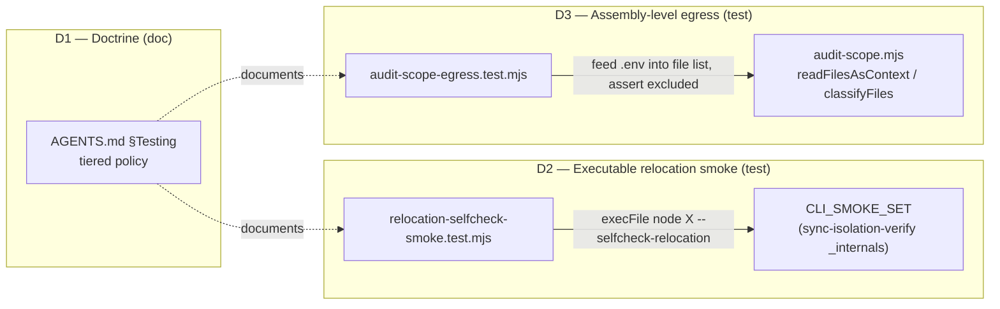

# Plan: Tiered Testing Doctrine + Egress/Relocation Behavioral-Gap Backfill

- **Date**: 2026-06-03
- **Status**: Complete
- **Author**: Claude + Louis
- **Scope**: backend

> Originated from a `/brainstorm --with-gemini` session (SID `1780480617884`)
> on "is test-first/TDD valuable for this repo". Consensus across GPT-5.5,
> Gemini-pro, and Claude: blanket TDD is theatre at the LLM boundary; test-first
> is high-value at **deterministic seams** and **mandatory** at two
> silent-regression-prone seams — sensitive-path egress and the consumer-sync /
> relocation contract.

---

## 1. Context Summary

- **Scope / stack**: backend-only · `js-ts` (+ postgres) · Node built-in test
  runner (`node --test`), no new deps.
- **What exists today** (this is the load-bearing finding): the two seams the
  brainstorm flagged as "highest-leverage to backfill" are **already among the
  best-covered modules in the repo**. Concretely:
  - **Egress**: `tests/sensitive-egress.test.mjs` (gate: `isPathSensitive`,
    `gateSymbolForEgress`, symlink-escape fail-closed, generatedNoise,
    `redactSecrets` fail-closed), `tests/sensitive-paths.test.mjs`,
    `tests/sensitive-paths-canonical.test.mjs`, `tests/redact.test.mjs`,
    `tests/secret-classifier.test.mjs`, `tests/secret-patterns.test.mjs`.
  - **Sync/relocation**: `tests/sync-path-map.test.mjs` (bidirectional +
    round-trip invariant), `tests/sync-rewriter.test.mjs` (ownership-aware,
    idempotency N=10, JSON walking), `tests/relocation-guard.test.mjs`
    (inventory-driven anti-pattern scan + CLI_SMOKE_SET coverage).
- **Revised thesis**: the original deliverable "write the missing unit tests"
  is **mostly already done**. The real, verified gaps are narrower and more
  valuable: (1) a *written doctrine* (absent), and (2) two *behavioral* gaps the
  existing unit tests structurally cannot reach.

### Verified gaps (each confirmed by reading the code, not assumed)

| # | Gap | Evidence | Why it matters |
|---|-----|----------|----------------|
| G1 | **No testing doctrine exists.** `AGENTS.md` `### Testing` is 2 lines and stale ("47 tests" — actual count is ~180 test files). | `AGENTS.md:260-263` | The brainstorm's central output — *which seams get TDD vs evals vs hard test-first* — has nowhere to live. Future contributors (human or AI) get no policy. |
| G2 | **`--selfcheck-relocation` is verified by string-grep, never executed.** The guard test only asserts the literal `--selfcheck-relocation` *appears in the file* — a script with a broken top-level import (or the flag in a comment) passes. | `tests/relocation-guard.test.mjs:84-96` | This is the **exact silent-break-ships-to-consumer failure mode** the brainstorm worried about, and the `--selfcheck-relocation` contract was *built specifically to catch it* — yet nothing runs it. |
| G3 | **`audit-scope.mjs` has zero direct tests.** It exports `isSensitiveFile`, `safeReadFile`, `readFilesAsContext` — the chain that assembles the LLM audit payload, enforcing sensitive-exclusion + `realpath` containment at read time. The egress gate is tested *in isolation*; the *assembly path real audits use* is not. (`classifyFiles` is pure backend/frontend/shared routing — it does **not** filter sensitive files; the invariant lives in `safeReadFile`/`readFilesAsContext`.) | `ls tests/` (no `audit-scope*.test.mjs`); `audit-scope.mjs:82-138` | An egress regression in `readFilesAsContext` / `safeReadFile` (the integration point) would not be caught by the gate-level tests. End-to-end invariant is untested. |

- **Patterns reused vs new**: reuse the established CLI-subprocess test idiom
  (`runCli`/`runChild`/`run` in `tests/cross-skill-persona.test.mjs`,
  `tests/config-shared-env.test.mjs`, `tests/debt-budget-check-cli.test.mjs`) for
  G2 — clean env, `execFileSync`/`spawnSync` on `node`. No new test helper module.
- **Neighbourhood considered** (arch-memory, k=50): top candidates all
  `recommendation: review` (similarity 0.66–0.73, below the 0.75
  justify-divergence band) — greenfield test files are correct. Notable
  adjacencies steering the design: `sync-isolation-verify.mjs::gate4` (already
  smoke-tests CLIs, but only on the *consumer* side via the verifier, not in
  `npm test`); `audit-scope.mjs::readFilesAsContext` + `classifyFiles` (the G3
  targets); the four subprocess-spawn test helpers (G2 idiom).

---

## 2. Proposed Architecture

Three deliverables, each independent (no sequencing dependency — see §Execution
Model). One doc edit, two new test files.

### Key design decisions (principles cited from `references/engineering-principles.md`)

- **D1 doctrine is descriptive, not a new mechanism** (#18 Backward Compat, #20
  Long-Term Flexibility). It codifies the tier model already implicit in the
  test suite; it adds no gate and changes no script. This avoids the
  brainstorm's own warning about TDD-as-theatre — we're not mandating ceremony,
  we're writing down where rigor already pays.
- **D2 sources its target list from `sync-isolation-verify._internals.CLI_SMOKE_SET`** —
  the *same* single source of truth `relocation-guard.test.mjs` already uses
  (#5 Single Source of Truth). The new test never hardcodes the script list, so
  it can't drift from the grep-level test beside it.
- **D2 runs each script as a subprocess with a clean, cloud-disabled env**
  (#16 Graceful Degradation) following the existing `runCli` idiom — the
  selfcheck handler is designed to short-circuit *before* `main()` touches
  network/DB, so the test must prove that holds (exit 0, stdout `OK`, no
  AUDIT_DB_URL needed). This is the assertion the grep test cannot make.
- **D3 tests the integration seam, not the classifier again** (#1 DRY, #11
  Testability). It does NOT re-test `isSensitiveFile`'s path patterns (that's
  `sensitive-paths.test.mjs`). It tests the *composition*: given a file list
  containing a sensitive path, `classifyFiles` buckets it out and
  `readFilesAsContext` never emits its contents into the returned string.

---

## 3. Sustainability Notes

- **Assumption that could change**: `CLI_SMOKE_SET` membership. D2 is
  inventory-driven, so adding a script to the set automatically extends the
  smoke test — no test edit needed. (Same resilience the grep test already has.)
- **Assumption**: the selfcheck handler stays a pre-`main()` short-circuit. If a
  future refactor moves it after config load, D2 will start failing (correctly —
  that *is* the regression). The test failure message will name the offending
  script.
- **Extension seam built in**: D1's doctrine table is the natural home for
  future tiers (e.g. if `fast-check` property testing is ever adopted — the
  brainstorm's deferred option — it slots in as a row without restructuring).
- **Windows**: D2 spawns `process.execPath` (not bare `node`) and D3 uses
  `os.tmpdir()` + skips symlink assertions on win32, matching the existing
  `sensitive-egress.test.mjs` `skipOnWin` pattern. No new cross-platform risk.

---

## 7. File-Level Plan

### `AGENTS.md` (modify) — D1: the doctrine
- **What**: replace the 2-line `### Testing` section (line ~260) with a tiered
  testing-strategy section. Fix the stale "47 tests" count (use a
  non-numeric phrasing like "the `node --test` suite under `tests/`" to avoid
  re-staling).
- **Content** — three tiers, each with a one-line rule + the modules it governs:
  1. **Tier 1 — test-first / TDD for deterministic seams**: `schemas`,
     `sensitive-paths`, `vcs`, `bandit`, `ledger`, `findings-*`, `config`,
     `file-io`, `sync-path-map`, `sync-rewriter`. Crisp inputs/outputs;
     regressions are cheap to assert and expensive to ship.
  2. **Tier 2 — eval / fixture / invariant testing for LLM-orchestration
     seams**: `openai-audit`, `gemini-review`, prompt builders. *Do not* assert
     on model prose or mock the whole API to test orchestration order. Assert
     **invariants** (e.g. "Gemini final review always runs regardless of GPT
     convergence" — already a known rule in memory; "Supabase failure never
     blocks the local ledger write"; "sensitive paths never enter a provider
     payload") and use canned-response fixtures for parse/fallback/dedup paths.
  3. **Tier 3 — HARD test-first (non-negotiable) for the two
     silent-regression-prone seams**: sensitive-path **egress** (a leak ships
     credentials to a third-party LLM) and the consumer-**sync/relocation**
     contract (a break ships silently to consumer repos you can't observe).
     Any change here lands with its test in the same commit.
- **Cross-reference**: link the doctrine to the brainstorm origin and to
  `CONTRIBUTING`-style "Do NOT" list already in `AGENTS.md`.
- **Why this file**: `AGENTS.md` is the canonical agent-context file (#5);
  `CLAUDE.md` stays a thin `@./AGENTS.md` addendum per repo convention.
- **Sync**: `### Testing` is shared content → after editing, `npm run check`
  runs `context:check` (drift) so CLAUDE.md alignment is verified. No manual
  CLAUDE.md edit.

### `tests/relocation-selfcheck-smoke.test.mjs` (create) — D2: executable smoke

> **Hermetic subprocess contract (H2 — the proof depends on it)**. Because
> `dotenv` loads `.env` from the process cwd and `config.mjs` autoloads
> `~/.audit-loop.env`, a blacklist-only env is insufficient — the subprocess
> could still observe credentials. The test therefore runs each script in a
> **fully controlled** subprocess:
> - **Allowlist env, not blacklist**: build `env` from scratch containing only
>   what Node needs to start — `PATH`, and on Windows `SystemRoot`, `ComSpec`,
>   `PATHEXT`, `TEMP`, `TMP` (copied from `process.env` if present) — plus
>   `AUDIT_LOOP_DISABLE_SHARED=1` (the real bypass flag in `config.mjs:44`),
>   `CI=1`, `NO_COLOR=1`. **No** `AUDIT_DB_URL` / `OPENAI_API_KEY` /
>   `GEMINI_API_KEY` / `ANTHROPIC_API_KEY` / shared config is present.
> - **cwd isolation**: run each script with `cwd` set to a fresh
>   `mkdtempSync` dir that contains **no `.env`**, so dotenv finds nothing.
> - This proves the `--selfcheck-relocation` handler short-circuits *before*
>   any credentialed/network/DB path — exit 0 with **no** secrets reachable.

- **Constants & helper** (M2 — deterministic, no intentional hangs):
  - `const SELFCHECK_TIMEOUT_MS = 30_000;` — a concrete named constant (a
    regressed script that genuinely hangs fails fast and names itself, rather
    than stalling CI indefinitely). Not "e.g. 30s".
  - `assertSelfcheckOk(scriptAbsPath)` helper: `execFileSync(process.execPath,
    [scriptAbsPath, '--selfcheck-relocation'], {env: hermeticEnv, cwd: tmpDir,
    timeout: SELFCHECK_TIMEOUT_MS, encoding: 'utf8'})` → asserts exit 0 (no
    throw) AND `stdout.trim() === 'OK'`. Throws a message naming the script on
    failure. **R2-MEDIUM fix**: the helper is **synchronous** (`execFileSync`),
    so failing cases are asserted with `assert.throws(() =>
    assertSelfcheckOk(p))` — never `assert.rejects` (that's for promises).
- **Key test cases**:
  - For each `rel` in `verifyInternals.CLI_SMOKE_SET` (sourced from
    `sync-isolation-verify._internals` — same single source as the grep test):
    resolve `absPath` from `import.meta.dirname` (`../scripts/<rel>`, **not**
    `process.cwd()`), assert it stays under the repo root and exists (diagnostic
    pre-check, L1), then `assertSelfcheckOk(absPath)`.
  - **Negative control (M2 — deterministic, no hang)**: write a temp script that
    **exits 0 but prints `NOT_OK`** (legal arg-ignoring script) and a second that
    **exits 1**; `assert.throws` that `assertSelfcheckOk` rejects *both* with a
    clear message (synchronous helper → `assert.throws`, R2-MEDIUM). This proves
    the test catches a missing/broken handler without relying on a timeout/hang.
- **Imports**: `_internals` from `scripts/lib/sync-isolation-verify.mjs`,
  `node:child_process`, `node:fs`, `node:os`, `node:path`, `node:test`,
  `node:assert/strict`. Temp dirs cleaned in `t.after` (L1).
- **Why this file**: companion to `relocation-guard.test.mjs` — that proves the
  string is *present*; this proves the string *works* under a hermetic env. Kept
  separate so a runtime failure (broken import in a smoke-set script) is
  diagnosed distinctly from a missing-handler failure.
- **Runtime note**: spawns 5 fast-exit subprocesses (selfcheck returns
  pre-`main`); added `npm test` time is small. The bounded `SELFCHECK_TIMEOUT_MS`
  converts a genuine regression-hang into a fast, named failure.

### `tests/audit-scope-egress.test.mjs` (create) — D3: assembly-level egress

> **Ground-truth signatures** (read from `audit-scope.mjs`, not assumed — these
> are non-optional, no "if the API accepts repoRoot" conditional):
> - `isSensitiveFile(relPath)` → `boolean` (delegates to `classifyPath`).
> - `safeReadFile(relPath, cwdBoundary)` → `{content, absPath} | null`. **Already
>   fail-closed**: rejects sensitive paths (line 83), `realpathSync`-resolves and
>   rejects any target whose real path escapes `cwdBoundary` (lines 86-88), size
>   guard (line 91). The containment boundary is an **injected parameter** — the
>   test passes a temp `cwdBoundary` directly, no refactor needed.
> - `readFilesAsContext(filePaths, {maxPerFile, maxTotal})` → `string`. Filters
>   sensitive paths (line 118), delegates per-file reads to `safeReadFile` with
>   `cwdBoundary = path.resolve('.')`, and appends a literal
>   `[N sensitive file(s) excluded …]` footer (line 136) when it drops any.
> - ⚠ **`classifyFiles` does NOT filter sensitive files** — it only routes
>   backend/frontend/shared by regex (lines 147-166). The egress invariant lives
>   entirely in `safeReadFile`/`readFilesAsContext`. The test must NOT assert
>   `classifyFiles` excludes secrets (it doesn't, and such an assertion would
>   fail). H1/M1 fix: test the functions that actually enforce egress.

- **Key test cases** (real `audit-scope.mjs` exports; temp dirs via
  `mkdtempSync(path.join(os.tmpdir(), 'audit-scope-egress-'))`; `t.after`
  cleanup with `fs.rmSync(..., {recursive:true, force:true})`):
  - **Two-sided leak invariant (M1 — guards against false-green on empty
    return)**: write a benign source file containing sentinel `BENIGN_MARKER_aaa`
    and a `.env` containing sentinel `SECRET_TOKEN_zzz` into a temp dir; run
    `readFilesAsContext` with **cwd set to that temp dir** (so `path.resolve('.')`
    boundary matches). Assert the returned string (a) **contains**
    `BENIGN_MARKER_aaa` and the benign file's `### <path>` header (proves
    non-empty, real inclusion), AND (b) **does not contain** `SECRET_TOKEN_zzz`
    nor a `### .env` header, AND (c) contains the `sensitive file(s) excluded`
    footer (proves active exclusion, not silent skip). Restore cwd in `t.after`.
  - **Fail-closed symlink containment (H1 — non-optional, win32-guarded via
    `if (process.platform === 'win32') return`)**: create temp `cwdBoundary` dir
    and an `outside` dir holding `secret.txt`; symlink `cwdBoundary/notes.txt` →
    `outside/secret.txt`. **R2-HIGH fix — cwd matters**: `safeReadFile` resolves
    its `relPath` via `path.resolve(relPath)` against the *process cwd* (line 84),
    using `cwdBoundary` only as the containment check (line 87). So the test must
    `process.chdir(cwdBoundary)` first (save the prior cwd, restore in `t.after`),
    then call `safeReadFile('notes.txt', cwdBoundary)` and assert it returns
    `null` (realpath follows the symlink to `outside/`, which escapes the
    boundary). Passing an absolute or unresolvable relPath would not exercise the
    realpath-escape branch — the chdir is what makes the assertion meaningful.
    Mirrors the proven `skipOnWin` pattern in `sensitive-egress.test.mjs`.
  - **Direct sensitive-path rejection**: `safeReadFile('.env', cwdBoundary)` and
    `readFilesAsContext(['.env'])` both exclude — one integration-layer assertion
    on `isSensitiveFile('.env') === true` (DRY: pattern enumeration stays in
    `sensitive-paths.test.mjs`, not re-done here).
- **Imports**: `isSensitiveFile`, `safeReadFile`, `readFilesAsContext` from
  `scripts/lib/audit-scope.mjs`; `node:fs`, `node:os`, `node:path`. Repo paths
  resolved from `import.meta.dirname`, never `process.cwd()` (L1). The cwd-set
  test saves/restores `process.cwd()` in `t.after` so it can't leak to sibling
  tests.
- **Why this file**: closes the one egress seam the gate-level suite doesn't
  reach — the assembler real audits call. Tests the *composition*
  (`readFilesAsContext` → `safeReadFile` → realpath containment), where
  integration bugs actually hide, with two-sided assertions so the test can't
  pass on an empty/short-circuited return.

---

## 8. Risk & Trade-off Register

| Risk / trade-off | Decision |
|---|---|
| **The brainstorm over-scoped "backfill the seams" — most tests exist.** Writing duplicate egress/sync unit tests would be the very "theatre" all three models warned against. | **Deliberately narrowed** to the 3 verified gaps. Surfaced honestly here rather than padding the plan with redundant tests. |
| D2 subprocess spawning could be flaky/slow on CI. | Reuse the proven `runCli` idiom; named `SELFCHECK_TIMEOUT_MS` constant converts a regression-hang into a fast named failure; only 5 fast-exit processes; deterministic negative control (no intentional hang). |
| D2's credential-isolation proof could be undermined by dotenv/shared-config autoload. | Allowlist env (not blacklist) + `AUDIT_LOOP_DISABLE_SHARED=1` + `.env`-free `mkdtemp` cwd — the subprocess has no path to any secret (H2). |
| D3 might drift into re-testing the classifier, or assert a non-existent invariant on `classifyFiles`. | Design pins the real signatures: egress assertions target `safeReadFile`/`readFilesAsContext` only; `classifyFiles` is explicitly out (pure routing); pattern enumeration stays in `sensitive-paths.test.mjs` (H1/M1). |
| D3 leak test could false-green on an empty/short-circuited return. | Two-sided assertion: benign sentinel + header MUST be present, secret sentinel MUST be absent, exclusion footer MUST be present (M1). |
| Doctrine could be read as mandating TDD everywhere (the anti-goal). | Tier 1/2/3 split makes the *non*-mandate explicit: Tier 2 says "do not mock the model / assert prose". |
| **Deferred**: `fast-check` property-based fuzzing (Gemini's suggestion) and an offline LLM eval matrix (EDD). | Out of scope — no new deps per the task; doctrine leaves a documented seam for both. Revisit if schema-boundary bugs recur. |

---

## 9. Testing Strategy

- **D1** is documentation — verified by `npm run check` (`context:check` drift +
  `skills:check`). No runtime test.
- **D2 / D3** are themselves tests; they run under `npm test` and the pre-push
  `npm run check`. Self-validating: D2 includes a negative control proving it
  catches a missing handler; D3 uses a sentinel-string assertion proving it
  catches a leak.
- **Edge cases covered**: missing/arg-ignoring handler (D2 negative control —
  exit-0-but-`NOT_OK` and exit-1, no hang), broken import in a smoke-set script
  (D2 exec failure under hermetic env), credential reachability (D2 allowlist
  env + `.env`-free cwd), false-green on empty return (D3 two-sided benign+secret
  sentinels + exclusion footer), symlink escaping the containment boundary (D3
  `safeReadFile`, win32-guarded), Windows path separators (both, via
  `process.execPath` + `os.tmpdir()` + `import.meta.dirname` resolution).
- **Self-cleanup**: every temp dir/file via `mkdtempSync` + `t.after`
  `fs.rmSync(..., {recursive, force})`; D3's cwd-set test saves/restores
  `process.cwd()` so it cannot leak to sibling tests.
- No frontend → no §10 acceptance criteria, no Playwright.

---

> **Plan stays flat** (no §7b phases / §11 clusters): 3 files, 1 subsystem
> (test+doc tooling), no sequential dependency — below Gate 1. The three
> deliverables are independent and can be implemented and audited together.

---

## Implementation Log

### 2026-06-03 — implemented via `/cycle --autonomous`
- **Completed**: all three deliverables.
  - `AGENTS.md` — D1 tiered doctrine (Tier 1/2/3), stale "47 tests" count removed.
  - `tests/relocation-selfcheck-smoke.test.mjs` — D2, ✅ Done. Adopted GPT's
    stderr-leak check + non-vacuity guard + `scripts/` containment during audit.
  - `tests/audit-scope-egress.test.mjs` — D3, ✅ Done. Added an end-to-end
    `readFilesAsContext` symlink-escape case (GPT R1) on top of the planned
    two-sided leak invariant + `safeReadFile` containment.
- **Deviations**: D2 helper uses `spawnSync` (not `execFileSync`) to capture
  stderr for the short-circuit assertion — strengthens the hermetic-env proof
  beyond the plan's exit-0/stdout-OK contract. No scope change.
- **Audit**: `/audit-code` R1 H:0 M:8 → R2 PASS H:0 M:0 quickFix:0; Gemini
  final APPROVE (coherence Strong). 4 MEDIUMs declined with rationale (notably
  "assert path-token absent" — the legitimate exclusion footer contains ".env").
- **Remaining**: none.
