# Plan: Tiered Recall-Weighted Audit Pipeline

- **Date**: 2026-07-09
- **Status**: Complete — Clusters A-F implemented and gate-clear. Cluster E's
  pre-existing debt was scoped into a dedicated companion plan
  (`docs/plans/audit-orchestrator-hardening.md`, also complete). Mandatory
  consolidated Gemini gate over the Cluster E+F(+hardening) union diff:
  `APPROVE` (round 2, after fixing 2 genuine bugs round 1 surfaced — a
  stage1-mechanical suppression not checking `remediationState==='regressed'`,
  and a Zod-validation-bypass in `cost-budget.mjs`'s event loaders). Shipped
  2026-07-10. **Phase 5's validation session (the actual human-graded run —
  distinct from the tooling, which shipped with the rest of Cluster C) ran
  2026-07-12**: `docs/experiments/audit-effectiveness/cheap-triager-validation.json`
  PASSED for `z-ai/glm-5.2` (both load-bearing strata at 0.0% false-dismissal;
  see status.md 2026-07-12 for the full write-up and the omission-stratum
  small-sample caveat). Phase 7 can now select GLM as the Stage-1 triager.
- **Author**: Claude + Louis
- **Scope**: backend

- **Target domain(s)**: `audit-orchestration`, `learning-store`, `shared-lib`
- ⚠ **Cross-domain work** — touches all three; the coupling is deliberate (orchestration reads/writes the ledger, which is `shared-lib`, and records bandit rewards into `learning-store`).

## Neighbourhood considered

`get-neighbourhood` returned one dominant candidate across all 8 slots: `runMultiPassCodeAudit` (`scripts/openai-audit.mjs:1556-3182`, domain `audit-orchestration`, score ~0.78-0.80, recommendation **`review`**). This confirms the redesign is an **extension of the existing orchestrator**, not a new sibling pipeline — Phase 1 exploration below traces exactly which of its internals change vs. stay. No `reuse`/`extend`-tier (≥0.85) candidates existed, so the divergence from a pure "add one more pass" change is justified: this plan restructures *control flow* (tiers, gates, dismissal authority), not just adds a pass. Round-1 audit finding #12 (God-function risk) sharpened this further — see Phase 6/7/9 below, which now extract named stage functions rather than growing `runMultiPassCodeAudit` inline.

## Past incidents to verify against

INC-001 (symlink-bypass on lexical path classification, `manual-verification-required`) surfaced against `scripts/lib/sensitive-paths.mjs`. Not directly in scope — Stage 0's file-existence check classifies diff-cited paths (already-trusted git output, not attacker-controlled), not arbitrary filesystem paths — but Stage 0's implementation reuses `classifyPath`-adjacent patterns, so **Security Considerations** below states explicitly why this incident's failure mode doesn't recur here.

---

## 1. Context Summary

**What exists today.** The production audit pipeline (`runMultiPassCodeAudit` in `openai-audit.mjs`) runs GPT-5.5 across 5 passes (structure/wiring/backend/frontend/sustainability, from `PASS_PROMPTS` in `lib/prompt-seeds.mjs`), multi-round with R2+ adjudication, then a mandatory Gemini final review (`gemini-review.mjs::runFinalReview`). Findings flow through a **pure post-processing pipeline** (`lib/audit/findings-pipeline.mjs::processFindings`) that fingerprints and applies two suppression layers, then (separately, at the ledger layer) a **fuzzy re-raise suppressor** (`lib/ledger.mjs::suppressReRaises`) that Jaccard-scores findings against prior rulings. A narrow deterministic auto-defer classifier already exists (`lib/audit/deferral-classifier.mjs::classifyDeferralEvidence`) but is scoped to *low-risk categories only* (style/formatting/unused-import — `AUTO_DEFERRABLE_CLASSES`) and explicitly excludes security/correctness/concurrency/data-integrity (`FORBIDDEN_CLASSES`). A Thompson-sampling bandit (`bandit.mjs::PromptBandit`) already exists for prompt-*variant* selection within a pass. An OSS-model calling path (`lib/oss-structured-output.mjs::ossStructuredCall`) already exists — it was built for the experiment's Arm B/C and is production-ready for GLM. A live shadow-run toggle (`lib/arm-eval/toggle.mjs::resolveShadowArmsWithToggle`) already exists and is the mechanism behind the standing model-A/B/C shadow. Diff-scope tooling already computes blast-radius/entry-points (`lib/audit/diff-scope-resolver.mjs::computeEntryPoints`) — reused below for both the GPT-sentinel trigger and Stage 0's impact-independence check.

**The governing empirical finding** (from the completed solo-control experiment, `docs/experiments/audit-effectiveness/`): the current pipeline is precision-gated but the operator's real utility function is recall-weighted and cost-governed. A cost re-scoring of the experiment data (this session, not yet a committed artifact) showed GLM-5.2 + Gemini review matches the production pipeline's known-defect recall at ~1/6 the cost, and that output-token pricing (not diff/input size) is the dominant cost driver.

**Code Trace** (Phase 1 exploration, backend scope):
- `runMultiPassCodeAudit` (`scripts/openai-audit.mjs:1556`) → per-pass GPT calls → `lib/audit/findings-pipeline.mjs:143 processFindings()` → `applyLedgerSuppression` (exact-fingerprint, **no reopen**) → `applyAcceptV1Suppression` → survivors handed to R2+ round logic → `lib/ledger.mjs:266 suppressReRaises()` (fuzzy Jaccard, **has reopen-on-file-touch** at line 359-364) is invoked separately at the round-boundary, not inside `processFindings`.
- `gemini-review.mjs:613 runFinalReview()` → `applyScopeFilter` → `applyDebtSuppression` → provider call → `recordNewFindings` / `recordWronglyDismissed` (`gemini-review.mjs:1399-1442`) — the **wrongly-dismissed channel is already wired end-to-end**; this plan's Stage 2 reuses it rather than building a parallel oversight path.
- `bandit.mjs:50 PromptBandit` keys arms as `passName:variantId:contextBucket`, Thompson-selects via Beta(alpha,beta). Reusable for the GPT-sentinel decision by registering it as a pass (`gpt-sentinel-trigger`) with two variants (`fire`/`skip`), not by building a new selection mechanism — round-1 finding #11 below adds the counterfactual-exploration design this reuse needs to actually learn correctly.

**A load-bearing correction found during exploration** (this changes synthesis point #6 from the brainstorm): the brainstorm session assumed the ledger had **no** reopen-on-touch mechanism. That's only true of `findings-pipeline.mjs::applyLedgerSuppression` (exact fingerprint, permanent). `lib/ledger.mjs::suppressReRaises` (the fuzzy path used at round boundaries) **already reopens a suppressed finding when its affected file is touched again** (`scopeDirectlyChanged` check, ledger.mjs:359). So the real design problem is narrower than originally scoped: **Stage 1's cheap-tier dismissals must be recorded into the fuzzy/reopenable ledger path, not the exact-fingerprint permanent path** — this is a *routing* decision, not new reopen logic to build. Phase 8 below implements exactly this routing, plus closes one adjacent gap: the `HARD_SUPPRESS_THRESHOLD = 3` "overrule 3×" path (ledger.mjs:292-314) bypasses reopen entirely, so Stage 1's mechanical dismissals must be tagged distinctly from judgment overrules so they never accumulate toward that hard-suppress count.

**Patterns reused vs. new**: reused — `ossStructuredCall` (GLM calls), `PromptBandit` (GPT-sentinel weighting), `resolveShadowArmsWithToggle` (prospective shadow validation), `classifyDeferralEvidence`'s Gate-1/Gate-2 shape (Stage 0 extends this pattern rather than inventing a new one), `recordWronglyDismissed`/`applyDebtSuppression` (Stage 2 oversight), `computeEntryPoints` (blast-radius, reused twice — see above). New — the versioned evidence-contract schema (§2 below), the `AuditCandidateEnvelope` provenance wrapper (round-1 finding #9), Stage 0's file/quote/blame/impact verifiers, Stage 1's cheap-triage orchestrator, per-stage cost-budget instrumentation (`UsageEvent` schema, round-1 finding #13), the contrarian-stratified validation script + its machine-readable manifest (round-1 finding #7).

---

## 1.5 Execution Model

### Authoritative state machine (round-1 finding #1)

The round-1 audit correctly flagged that the component diagram (Stage 0→1→2→Human) and Phase 7's prose ("Stage 1 is wired... before the existing R2+ round logic") described two different, unreconciled control flows. Resolving this required a real design decision, not just clearer prose: **tiered triage and R2+'s round logic operate on different axes and are not in competition.**

- **Tiered triage (Stage 0→1→2) runs WITHIN a single round**, filtering raw generation output down to a curated candidate set. This is new.
- **R2+'s round-over-round logic (rulings injection, regression detection) is RETAINED, but re-scoped to operate on Stage 2's output**, not on raw Stage 0/1 candidates. Round 2's proven field-record value — catching regressions round 1's own fixes introduced — is exactly the kind of check that belongs after triage has already curated the candidate set, not before.

Full candidate lifecycle (every candidate is an `AuditCandidateEnvelope` — schema in round-1 finding #9, Phase 3):

```
generated (raw, from Discovery Portfolio)
  → Stage 0 verify
      → stage0_rejected            (fabricated anchor / file not in diff — LOCAL TELEMETRY ONLY, never touches the ledger; see quick-fix guard below)
      → stage0_verified             (passes to Stage 1)
      → stage0_unverifiable         (verifier itself failed — e.g. blob unreadable; escalates to Stage 1, never silently dismissed)
  → Stage 1 triage (on stage0_verified / stage0_unverifiable)
      → stage1_mechanical_dismissed (deterministic evidence only — ledger entry, source='stage1-mechanical', routed via suppressReRaises)
      → stage1_escalated            (judgment dismissal of a HIGH/omission candidate, OR any parse/API failure — never silently dismissed)
      → stage1_confirmed_survivor   (not dismissed, not HIGH/omission enough to force escalation — routes DIRECTLY to human_queue below,
                                      bypassing Stage 2 — audit-plan fix H2, round 2: an earlier draft left this state's terminal path
                                      undefined, since Phase 9/12's Stage-2 work-selection list only ever named stage1_escalated +
                                      sampled stage1_mechanical_dismissed + clean-region files. Nothing was DISMISSED here, so there is
                                      no dismissal for Gemini to re-verify — spending an adjudication call on an undisputed survivor
                                      would be pure cost with no signal. This is the MAJORITY-VOLUME path: most real findings that pass
                                      Stage 0 are neither dismissed nor HIGH/omission-escalated, they are just correct and should reach
                                      a human without an extra gate.)
  → Stage 2 (Gemini adjudicator + bounded clean-challenge — round-1 finding #4)
      reviews: all stage1_escalated + 100% of HIGH stage1_mechanical_dismissed lacking deterministic disproof
               + 100% of omission-type stage1_mechanical_dismissed + a bounded random tail
               + a bounded stratified "clean region" sample (files NO portfolio model flagged at all)
      → stage2_reversed             (Gemini overturns a mechanical dismissal → re-enters as active; recordWronglyDismissed)
      → stage2_confirmed_dismissal  (Gemini agrees → ledger entry confirmed, stays suppressed)
      → stage2_missed_candidate     (Gemini's clean-challenge sample surfaces something the whole portfolio missed — NEW candidate, not a reversal)
      → stage2_verified             (survivor confirmed → human queue)
  → human_queue (terminal state for anything a person sees — reached via stage1_confirmed_survivor directly, OR stage2_verified/
                  stage2_reversed/stage2_missed_candidate)

Cross-round (R2+, operating on this round's human_queue + stage2_confirmed_dismissal set):
  → reopened_on_touch  (existing suppressReRaises mechanism — a stage1_mechanical_dismissed entry's file is touched again in a LATER round)
  → superseded         (a later round's candidate replaces a stale round-N entry for the same underlying issue)
```

The **quick-fix guard this state machine enforces**: `stage0_rejected` candidates (fabricated anchors, non-existent files) are diagnostic telemetry for tuning the discovery prompts — they are explicitly **never** written to the adjudication ledger, so a hallucinated candidate can never accumulate toward `HARD_SUPPRESS_THRESHOLD` or pollute `suppressReRaises`'s fuzzy-match candidate pool. Only `stage1_mechanical_dismissed` (a real candidate with a real deterministic disproof) reaches the ledger.

### Dependencies

- **Evidence contract (Phase 1) must land before Stage 0 (Phase 3)** — Stage 0 verifies anchor blocks that don't exist until generators emit them.
- **Validation (Phase 5) must complete before Stage 1's cheap model is chosen (Phase 7)** — the whole point of the contrarian-stratified session is to pick the model empirically rather than assume one. Phase 7 reads Phase 5's machine-readable manifest (round-1 finding #7), not a hand-parsed markdown file.
- **Ledger routing fix (Phase 8) must land alongside Stage 1 (Phase 7)** — shipping asymmetric dismissal authority without fixing where dismissals are recorded would create the exact permanent-recall-hole failure mode the brainstorm flagged, just via the corrected (routing) root cause instead of the originally-assumed one.
- **Discovery portfolio (Phase 6) is independent of the triage stages** — it changes what feeds INTO the pipeline, not how the pipeline processes findings. It can ship before or after Phases 3/5/7/8.

### Failure semantics (round-1 finding #6 — new)

No stage may treat a failure as an implicit "no finding" (quick-fix guard: *"Do not silence Stage 1, Gemini, or git failures by treating them as empty findings. Fail incomplete or escalate."*):

Each discovery-portfolio generator is classified `required` (GLM, Sonnet), `optional`, or `exploratory` (the GPT sentinel/exploration fires — round-1 finding #11). **Generator status is tracked at the RUN level, not the finding level** (revised: Gemini gate round-1 finding #G3, a real domain-modeling error in the round-2 draft — a generator that fails and produces zero findings creates zero envelopes, so a finding-level `sources[].status` would silently lose the failure signal entirely, breaking every row of the table below): `AuditRunContext.generatorOutcomes: [{model, role: 'required'|'optional'|'exploratory', status: 'succeeded'|'failed'|'skipped'}]`, populated once per generator invocation regardless of how many (if any) findings it produced. An envelope's own `sources[]` (Phase 3) lists only the models that actually **contributed to that specific finding** — a narrower, correctly-scoped concept.

| Failure | Behavior |
|---|---|
| A `required` discovery generator fails (whether it was the sole generator or one of several — round-2 finding #2 closed the original gap covering only the "sole generator" case) | Run marked `incomplete` for that commit; falls back to `runLegacyProductionAudit` (round-2 finding #1 — see Phase 6), the **extracted, unchanged current production path** (GPT 5-pass + Gemini), same output contract as the tiered path. Never silently proceeds with partial/degraded discovery. |
| An `optional` or `exploratory` generator fails | Logged on `AuditRunContext.generatorOutcomes`; does not block the run — the portfolio's `required` members are sufficient to proceed. |
| Stage 0 verifier fails (diff/blob unreadable) | Candidate marked `stage0_unverifiable` → escalates to Stage 1. Never dismissed, never silently dropped. |
| Stage 1 parse/API failure | Escalates to Stage 2 (`stage1_escalated`). Never treated as an implicit dismissal. |
| `git blame` fails (shallow clone, rename, merge commit) | `tagPreExisting` returns `unknown` — `unknown` can **never** satisfy the two-check `pre_existing_independent` requirement (round-1 finding #3 below); the candidate routes through normal triage. |
| Provider rate-limited | Standard retry/backoff — reuses the existing `classifyLlmError` retry pattern (AGENTS.md "Model Resolution"), not new logic. |
| Gemini (Stage 2) unavailable | Reuses the existing Claude Opus fallback in `gemini-review.mjs` unchanged. If both are unavailable, escalated items stay `stage1_escalated` — pending, retried next round, **never** silently treated as accepted or dismissed. |
| Uncommitted/staged worktree diff (no real `headSha`) | Anchors use the literal `headSha: 'WORKTREE'`; Stage 0 re-reads live file content instead of `git show`. |

Every phase below remains additive/env-var-gated — no phase requires a rollback plan beyond flipping its gate off. The validation session (Phase 5) is offline and touches no production path — if it produces an inconclusive result, Phase 7 stays on GPT-5.5 as the Stage 1 triager (the status quo model, just in a new role) rather than blocking.

---

## 2. Proposed Architecture

### Right-sizing gate (new structure: the tiered pipeline itself)

- **Band-aid extreme**: keep the current single GPT-5.5-primary pipeline and just lower its severity thresholds or truncate its rounds to cut cost. Doesn't touch the actual cost driver (output-token pricing on a noisy generator) and would silently cut recall on whatever findings get truncated.
- **Over-engineered extreme**: a fully generic, pluggable N-tier triage framework with configurable model routing, arbitrary DAGs of triage stages, and a rules-engine for dismissal authority. No current requirement needs more than the 3 tiers this plan specifies (deterministic / cheap-model / Gemini-adjudicator) — a config-driven arbitrary-depth framework would be solving a problem we don't have.
- **Chosen**: exactly 3 fixed tiers (Stage 0 deterministic → Stage 1 cheap-model → Stage 2 Gemini-adjudicator), because that's the number of trust levels the data actually supports (mechanically-provable / probabilistically-triaged / human-adjacent-oversight) and each tier maps to a currently-measured cost/accuracy tradeoff. Adding a 4th tier is not a current requirement.

### Right-sizing gate (new structure: evidence contract schema — revised per round-1 finding #2)

- **Band-aid**: keep the existing free-text `detail`/`section` fields and have Stage 0 regex-guess whether a quote is present. Fragile, silently degrades as prompt wording drifts, and — round-1's sharpest objection — **cannot distinguish a real anchor from a syntactically-plausible fabricated one**, since a bare `{file, symbolName, startLine, endLine}` tuple has no content to verify against, only line numbers (which drift across chunked diffs anyway).
- **Over-engineered**: a full structured-argumentation schema (claim/warrant/backing/rebuttal per Toulmin). No current consumer needs more than a causal chain string plus a content-verifiable anchor.
- **Chosen — `EvidenceAnchorV2`** (versioned; legacy findings normalize to V1, see round-1 finding #10 in Phase 1 below):
  ```
  evidenceType: 'commission' | 'omission'
  anchor (commission only): {
    diffPathId: string,             // stable identity for this diff's file-pair (round-2 finding #8)
    oldFile?: string,                // base-side path — present for modified/deleted/renamed/copied
    newFile?: string,                // head-side path — present for modified/added/renamed/copied
    fileStatus: 'modified' | 'added' | 'deleted' | 'renamed' | 'copied',
    side: 'base' | 'head',          // omission claims often cite BASE — "this used to exist, should have changed"
    startLine: number,
    endLine: number,
    quote: string,                   // the actual cited text — content-verifiable, not line-number-only
    symbolName?: string,
    headSha: string,                 // 'WORKTREE' for uncommitted diffs
  }
  triggerAnchor (omission only): { ...same shape as `anchor` above }   // the cited trigger fact (e.g. the schema-changing line) — a commission, deterministically verifiable
  causalChain (omission only): string   // structured as: changed → obligation created → what was searched → why it's absent
  ```
  **`triggerAnchor` added by round-3 finding #G1**: an omission claim's `causalChain` is free text — a Stage 0 verifier can't mechanically check it, which would let a hallucinated trigger slip past deterministic filtering entirely. Splitting out a structured `triggerAnchor` (same verifiable shape as a commission anchor) lets Stage 0 check the one fact within an omission claim that IS mechanically checkable — the trigger — while leaving the absence itself, correctly, to judgment.
  Minimal relative to full argumentation schema, but the `quote`+`side`+`headSha` triple is exactly what closes the fabrication gap: Stage 0 verifies the quote's actual content appears in the named file/side of the named commit snapshot, not just that a symbol name superficially resembles something in the diff. **Round-2 finding #8**: a bare `file` field is ambiguous for renamed/copied/deleted files, where the base-side and head-side paths differ — `verifyAnchor` resolves `diffPathId` through a central diff-path map produced by `diff-scope-resolver.mjs` (reused, not new parsing logic) and checks the quote against `oldFile` when `side==='base'`, `newFile` when `side==='head'`.

### Component diagram

```mermaid
graph LR
  subgraph Discovery["Discovery Portfolio (cheap, recall-max)"]
    GLM["GLM-5.2 5-pass\n(ossStructuredCall)"]
    Sonnet["Claude Sonnet-5\ncold pass"]
    GPTSentinel["GPT-5.5\ntriggered specialist\n+ low-freq sentinel\n+ exploration sample\n(PromptBandit-weighted)"]
  end

  subgraph S0["Stage 0 — deterministic (0 LLM cost)"]
    Envelope["AuditCandidateEnvelope\n(dedupe preserves provenance)"]
    FileCheck["file-exists-in-diff"]
    AnchorCheck["anchor content+side\nverify (quote match)"]
    BlameCheck["git-blame + impact-independence\n(2-check pre-existing tag)"]
  end

  subgraph S1["Stage 1 — cheap-model triage"]
    CheapTriage["candidate model\n(chosen by Phase 5\nvalidation manifest)"]
  end

  subgraph S2["Stage 2 — Gemini adjudicator + bounded clean-challenge"]
    Gemini["gemini-review.mjs\nadjudicator-only role:\ncontested + 100% HIGH/omission\ndismissals + clean-region sample"]
  end

  subgraph R2P["R2+ round logic (cross-round, re-scoped)"]
    Rulings["rulings injection +\nregression detection\n— operates on Stage 2 OUTPUT only"]
  end

  GLM --> Envelope
  Sonnet --> Envelope
  GPTSentinel --> Envelope
  Envelope --> FileCheck --> AnchorCheck --> BlameCheck
  AnchorCheck -->|stage0_rejected: LOCAL TELEMETRY ONLY, never ledger| Telemetry["diagnostic log"]
  BlameCheck -->|stage0_verified / unverifiable| CheapTriage
  CheapTriage -->|stage1_mechanical_dismissed| Ledger["lib/ledger.mjs\nsuppressReRaises\n(fuzzy, reopen-on-touch,\nexcluded from hard-suppress count)"]
  CheapTriage -->|stage1_escalated: HIGH/omission judgment\nor any parse/API failure| Gemini
  CheapTriage -->|stage1_confirmed_survivor:\nno dismissal to re-verify,\nbypasses Stage 2| HumanQ["Human review queue"]
  Gemini -->|stage2_verified| HumanQ
  Gemini -->|stage2_reversed| Ledger
  Gemini -->|stage2_missed_candidate| HumanQ
  HumanQ --> Rulings
  Ledger --> Rulings

  CostBudget["Cost-budget tracker\n(UsageEvent per call →\neuros + operator-minutes\nper accepted-HIGH)"] -.observes.-> GLM
  CostBudget -.observes.-> CheapTriage
  CostBudget -.observes.-> Gemini
```



### Key design decisions

- **GPT-5.5 stays, demoted to triggered specialist + sentinel + a separate exploration sample** (#4 no-hardcoding — the trigger conditions are config, not code; #20 long-term flexibility — its bandit weight can rise again if data shows it earning its keep). Trigger conditions, defaults, and the exploration-sample design are fully specified in Phase 6 below (round-1 findings #11, #14 closed the vagueness the first draft left here).
- **Evidence contract splits by type, is content-verifiable, not a single string-match tax** (#2 SOLID). This is the direct fix for the flaw both external brainstorm models converged on independently, sharpened by round-1 finding #2 into a content+side+commit-identity check.
- **Stage 0 extends `deferral-classifier.mjs`'s Gate-1/Gate-2 shape rather than inventing new classification logic** (#1 DRY, #5 single source of truth) — same two-gate pattern, new gate content, now including the two-check impact-independence requirement from round-1 finding #3.
- **Stage 1 dismissals route through `suppressReRaises` (fuzzy, reopen-on-touch), never through `applyLedgerSuppression` (exact, permanent)** (#11 idempotency / #16 graceful degradation) — and per round-1 finding #1's state machine, `stage0_rejected` candidates never reach the ledger at all.
- **Stage 2 is adjudicator-plus-bounded-clean-challenge, not strictly "never net-new"** (round-1 finding #4) — closes the false-clean risk (a fully-missed defect would otherwise have no candidate for Gemini to ever review) while staying bounded in cost (a stratified sample, not full re-discovery).
- **Cost-budget tracking is a cross-cutting observer via one `UsageEvent` schema, not embedded per-stage logic** (#3 modularity) — full schema in Phase 4 (round-1 finding #13).
- **Orchestration is extracted into named stage functions, not grown inline inside `runMultiPassCodeAudit`** (#1 DRY / #3 modularity — round-1 finding #12) — see Phase 6/7/9.

---

## 3. Sustainability Notes

- **Assumption that could change**: GLM-5.2 remains cheap and competent. If GLM pricing rises or a better cheap model emerges, the discovery portfolio's model choice is config (`AUDIT_DISCOVERY_MODEL` sentinel via `model-resolver.mjs`, per the existing `latest-*` sentinel pattern), not code — swapping models touches 1 env var.
- **6-months-out risk**: if the evidence contract's `omission` branch turns out to need more structure (e.g. per-obligation-class templates), the schema is additive — new fields, not a breaking change, because `causalChain` is a free-text field with a documented shape, not a rigid sub-schema. The V1/V2 normalizer (round-1 finding #10) means this kind of extension never breaks historical data.
- **Extension points deliberately built in**: the 3-tier structure allows a 4th "trusted" tier later (e.g. a fine-tuned classifier) by adding a stage between 0 and 1 without touching Stage 2's adjudicator role — but per the right-sizing gate above, this is explicitly NOT being built now.
- **Coupling**: Stage 0/1 are loosely coupled to the discovery portfolio (they process whatever `AuditCandidateEnvelope` arrives, regardless of which model produced it) — swapping GLM for another OSS model changes zero triage code.

---

## 4. File-Level Plan

### Phase 1 — Evidence contract schema (revised: round-1 findings #2, #10)

- **`scripts/lib/schemas.mjs`** (modify): add the versioned `EvidenceAnchorV2` shape (§2 above) — `evidenceType`, `anchor` (nested: `file`, `side`, `startLine`, `endLine`, `quote`, `symbolName?`, `headSha`), `causalChain`. **Versioning** (round-1 finding #10): findings without these fields parse as `FindingV1` (legacy — normalizes to `evidenceStatus: 'missing'`); findings with them parse as `FindingV2`. A single `normalizeFindingEvidence(finding)` function returns the unified internal shape every downstream stage consumes, so old ledger entries, canned test fixtures, and pre-migration Gemini outputs keep working unchanged. V2 is enforced only at NEW generator call sites, after Phase 1/2 prompts ship. Exports feed `zodToGeminiSchema()` (already the single source of truth per AGENTS.md) so all providers pick it up automatically.
- **`scripts/lib/prompt-seeds.mjs`** (modify): `PASS_PROMPTS` — add the contract instruction (cite a content-verifiable anchor with `quote`+`side` for a commission claim; state the `causalChain` for an omission claim) to each of the 5 pass prompts.

### Phase 2 — Known blind-spot obligation checks

- **`scripts/lib/prompt-seeds.mjs`** (modify): add a `POSITIVE_OBLIGATIONS` block (cache/version-invalidation, transaction/locking, valid-zero `||`, fail-open defaults, replay/resume accounting) injected into the `backend` and `sustainability` pass prompts. Structured as "if you see X changed, verify Y exists nearby" — each with a real quotable trigger. **Classified as `omission`-type, not `commission`** (revised: Gemini gate round-2 finding #G3 — the original draft called these "commission-type findings," but the defect they describe IS an omission (something's missing), and forcing them into `commission` would strip them of Phase 9's 100% Stage-2-review guarantee for omission-type dismissals — exactly the safety net these five field-record blind-spot classes most need). The `causalChain` quotes the real trigger (e.g. the schema-changing line) to prove the obligation was created; the defect itself — the missing invalidation/lock/etc — is structurally an omission.

### Phase 3 — Stage 0 deterministic triage (revised: round-1 findings #3, #9; round-2 findings #3, #4, #6)

- **`scripts/lib/schemas.mjs`** (modify — round-2 finding #4): add `AuditStageDecisionV1`, a Zod discriminated union on `stage`, replacing the original draft's untyped `stageDecisions: {}`:
  ```
  {stage: 'stage0', outcome: 'verified'|'rejected'|'unverifiable', reasonCode: string, evidenceRef: string, createdAt: string}
  {stage: 'stage1', outcome: 'mechanical_dismissed'|'escalated'|'confirmed_survivor', reasonCode: string, hasDeterministicDisproof: boolean, createdAt: string}
  {stage: 'stage2', outcome: 'reversed'|'confirmed_dismissal'|'verified'|'missed_candidate'|'pending_adjudication', reasonCode: string, createdAt: string}
  ```
  Every field that was previously implied by prose or a string comparison (whether a dismissal has deterministic disproof, whether it's omission-type-driven, whether it's ledger-eligible) is now a typed field on the decision record every stage appends to. **`pending_adjudication` added 2026-07-10** (audit-plan fix H1, round 3): Phase 9's `FinalAdjudicationBudget` (round-2 addition) can skip a work item on per-call timeout or total-budget exhaustion — this is that item's typed terminal state for the round, distinct from the four Gemini-produced verdicts above (no Gemini call happened at all). Retried next round via the existing R2+ mechanism, same as any other unresolved item — never silently dropped or treated as `confirmed_dismissal`.
- **`scripts/lib/audit/candidate-envelope.mjs`** (new — round-1 finding #9): `AuditCandidateEnvelope` shape — `{candidateId, canonicalFinding, evidenceAlternatives: [{sourceModel, evidenceType, anchor|causalChain, rawDetail}], sources: [{model, pass, timestamp}], stageDecisions: AuditStageDecisionV1[], fingerprint}` (append-only decision log, not a mutable object). **`sources[]` intentionally carries no `status` field** (Gemini gate round-1 finding #G3) — generator-level success/failure is a run-level concern (`AuditRunContext.generatorOutcomes`, §1.5), not a finding-level property; an envelope only exists at all once a generator has produced a finding, so a failed generator would never get a chance to record its own failure here. **Merge contract** (round-2 finding #6, closing the original draft's under-specification): `mergeIntoEnvelopes(rawFindings)` groups raw findings into ONE envelope only when their fingerprints indicate the exact same underlying issue **after normalization** (never a fuzzy file+category proximity match — that risks conflating distinct issues that happen to share a fingerprint prefix); envelope severity is the **maximum** of contributing sources' normalized severities unless a later stage (Stage 2 or human review) explicitly lowers it; every contributing source's full claim is preserved as a distinct `evidenceAlternatives` entry, including ones that *disagree* with the chosen `canonicalFinding` — disagreement is never silently discarded on merge.
- **`scripts/lib/audit/evidence-triage.mjs`** (new):
  - `verifyAnchor(envelope, diffText)` — confirms the anchor's `quote` string-matches (exact or normalized-whitespace) real content at the named `oldFile`/`newFile` (per `side` and `fileStatus` — round-2 finding #8) and lines in the diff for `headSha` (reuses diff-parsing + the diff-path map already in `lib/audit/diff-scope-resolver.mjs`). Returns `verified` / `unverifiable` (diff unreadable) / `fabricated` (file exists but quote doesn't match anywhere near the cited location). **Called only for `evidenceType === 'commission'` claims** (Gemini gate round-1 finding #G4 — an omission claim has no `anchor`, only a `causalChain`; calling `verifyAnchor` on one is a type error, not a missing-anchor case to handle gracefully). **Envelope-aware fallback, not canonical-only** (Gemini gate round-2 finding #G1 — a genuine data-loss bug the original draft had: `mergeIntoEnvelopes` runs before Stage 0, so if the chosen `canonicalFinding` happens to be the one contributing model's hallucinated/malformed anchor, verifying only the canonical claim would mark the WHOLE envelope `stage0_rejected` and silently discard a perfectly valid anchor another model contributed to the same envelope's `evidenceAlternatives`): if the canonical claim's anchor is `fabricated`, `verifyAnchor` retries against each `evidenceAlternatives` entry in order; the first one that verifies is **promoted to `canonicalFinding`** (the original canonical claim demotes to an `evidenceAlternatives` entry tagged `verificationFailed: true`, never discarded) and the envelope proceeds as `stage0_verified`. Only when **every** alternative fails does the envelope become `stage0_rejected`.
  - `tagPreExisting(envelope, {repoRoot, sha})` — **two-check requirement, not blame alone** (round-1 finding #3, correcting the original draft's conflict with this repo's own documented "scope by impact, not authorship" invariant): (1) **line-ancestry** — `git blame` proves the cited lines predate `sha` (implements `deferral-classifier.mjs`'s previously-deferred item (d)); (2) **impact-independence** — the diff's changed hunks do not call, configure, migrate, route to, or otherwise depend on the cited pre-existing path (reuses `computeEntryPoints`/blast-radius machinery from `diff-scope-resolver.mjs` for the reachability check). Returns `pre_existing_independent` only when **both** hold; returns `unknown` on blame failure (shallow clone, rename, merge commit — never silently treated as pre-existing). A `pre_existing_independent` tag is a **deferral candidate** (routes toward "Out of Scope (this PR)"), never a silent drop — matching AGENTS.md's explicit rule that scope is decided by impact, not authorship.
  - **`runStage0EvidenceTriage(envelopes, ctx, adapters)`** — the Stage 0 **orchestration** entry point (round-2 finding #3, correcting a real design error the round-1 draft introduced): `verifyAnchor`/`tagPreExisting` need VCS/diff/blob access, but `findings-pipeline.mjs::processFindings` is documented — correctly, per Phase 1 exploration — as a **pure, I/O-free** normalization/suppression pipeline. Stage 0 does **not** live inside `processFindings()`. The real sequence is: raw findings → `processFindings()` (**unchanged, stays pure** — normalizes, fingerprints, applies the existing ledger/accept-v1 suppression exactly as it does today) → `mergeIntoEnvelopes` → `runStage0EvidenceTriage(envelopes, ctx, adapters)` (a new orchestration layer, explicit `adapters` param for git/diff/blob access — injectable for testing, per Tier-1 unit-test doctrine). **First branch: `evidenceType`** (Gemini gate round-1 finding #G4, refined by round-3 finding #G1 — see the schema update below): `commission` claims run `verifyAnchor` + `tagPreExisting` against the `anchor`; `omission` claims run `verifyAnchor` **against `triggerAnchor` only** (never `tagPreExisting`, which doesn't apply) — the obligation's *absence* is semantic (deferred to Stage 1/2 judgment, not mechanically checkable), but the *trigger* the `causalChain` cites (e.g. "the schema-changing line") is itself a commission-type fact and must be deterministically checked, or a hallucinated trigger would sail past Stage 0 straight into expensive downstream processing. Per the state machine in §1.5: `stage0_rejected` (fabricated `anchor` or `triggerAnchor`, or file not in diff) is written to a **local diagnostic log only, one file per run** (round-3 finding #G3 — no cross-run append, so no unbounded growth; the file is truncated/recreated at run start, named by `runId`, and — per the same Category A/B test used elsewhere in this plan — gitignored, since it's ephemeral per-run telemetry, not a durable record) — it never reaches `applyLedgerSuppression`, `suppressReRaises`, or any ledger write path.
- **`scripts/lib/audit/deferral-classifier.mjs`** (modify): wire `tagPreExisting`'s two-check result as the deterministic evidence source for the `pre-existing` class, closing the gap the file's own comments had flagged as deferred — but gated behind the impact-independence check, not blame alone.

### Phase 4 — Cost-budget tracking (revised: round-1 finding #13)

- **`scripts/lib/audit/usage-event.mjs`** (new): the provider-neutral `UsageEvent` schema — `{provider: 'openai'|'anthropic'|'gemini'|'oss', modelSentinel, resolvedModel, inputTokens, outputTokens, cachedTokens?, costAmountUsd, costAmountEurAtRecordedFx, fxRateUsed, wallClockMs, usageReliability: 'exact'|'estimated'|'unavailable'}`. Provider prices are USD at source; **EUR is snapshotted at event-RECORDING time, not report time** (corrected: round-3 finding #G2 — the original draft's "convert at report time from one documented FX point" was logically inverted. Report-time conversion using a *current* rate means any future FX-rate update silently re-prices every historical run — exactly the corruption the original wording claimed to avoid. Snapshotting `fxRateUsed` and `costAmountEurAtRecordedFx` on the event itself at recording time makes every historical EUR figure immutable once written; a report can still show a *live-rate* re-estimate alongside the recorded one if useful, but the recorded figure never changes retroactively).
- **`scripts/lib/audit/review-effort-event.mjs`** (new — round-2 finding #7, closing the original draft's ambiguous combined-scalar design): a separate `ReviewEffortEvent` schema, stored beside `UsageEvent` rather than folded into it — `{envelopeId, reviewerId?, startedAt, endedAt, minutesSpent}`. Manually logged at the human-queue review stage (**operator-minutes are NOT inferred from model wall-clock** — that's latency, not human time; documented v1 limitation: auto-tracking human review time is out of scope).
- **`scripts/lib/audit/cost-budget.mjs`** (new): `recordUsageEvent(event)` / `recordReviewEffort(event)` append to per-run ledgers, each event's EUR figure already snapshotted at write time (round-3 finding #G2). `computeCostReport(runId)` returns a **structured tuple, not one ambiguous combined scalar** (round-2 finding #7): `{costUsd, costEurAsRecorded, operatorMinutes, acceptedHighEquivalentCount, costUsdPerAcceptedHigh, operatorMinutesPerAcceptedHigh}` — `costEurAsRecorded` is a pure sum of each event's already-immutable `costAmountEurAtRecordedFx`, never a fresh conversion. **`acceptedHighEquivalentCount` is defined explicitly** (round-2 finding #7): the severity-weighted count of envelopes reaching `stage2_verified` or `stage2_missed_candidate`, using the **same `SEV_WEIGHTS` ratios already in production use** (`model_ab_finding_scores`'s `SEV_WEIGHTS: {LOW:1, MEDIUM:3, HIGH:8}`, confirmed live in this session's `model-ab-decision` output) rather than inventing a new weighting — a HIGH counts as 1.0 equivalent, a MEDIUM as 3/8. **Zero-accepted-HIGH edge case**: returns `{acceptedHighEquivalentCount: 0, costUsdPerAcceptedHigh: null, reason: 'no-accepted-highs', ...}` rather than dividing by zero or silently reporting 0.
- **`scripts/lib/anthropic-client.mjs` / `scripts/lib/openai-client.mjs`** (modify, small): surface `cost_usd`/`usage` from each provider response as a `UsageEvent` instead of being discarded (closes the gap confirmed absent from both `openai-audit.mjs` and `gemini-review.mjs` in Phase 1 exploration).
- **Gemini and OSS/GLM call sites** (`gemini-review.mjs`, `lib/oss-structured-output.mjs`) (modify, small): emit `UsageEvent`s too — round-1 finding #13 flagged the original draft covered only OpenAI/Anthropic, leaving 2 of 4 providers unaccounted.
- **`scripts/openai-audit.mjs`, `scripts/gemini-review.mjs`** (modify, small): call `recordUsageEvent` at existing per-call sites.

### Phase 5 — Validation session tooling (revised: round-1 finding #7 — gates Phase 7)

- **`scripts/lib/solo-control/cheap-triager-validate.mjs`** (new): runs a candidate cheap model (configurable: GLM / Gemini Flash / Haiku) as triager over the existing 2,314-row experiment sheet; **contrarian stratified sampling** — isolates rows where the candidate disagrees with the two-judge consensus, unions with all known-defect-linked rows, all HIGH dismissals, all omission-type dismissals (retrofit-labeled where the historical data allows), plus a random tail — and renders a human-gradeable worksheet.
- **Output — machine-readable manifest, not a hand-parsed markdown file** (round-1 finding #7 — quick-fix guard: *"Do not parse a human markdown validation report in production code"*): `docs/experiments/audit-effectiveness/cheap-triager-validation.json`:
  ```
  {
    datasetHash: string,          // sha256 of blind-adjudication.csv + .blind-map.json content
    candidateModel: string,       // resolved sentinel
    strata: [{name, count, falseDismissalRate, ci95: [lo, hi]}],
    thresholds: {highOrOmissionMaxFalseDismissalRate: 0.05, overallMaxFalseDismissalRate: 0.10},
    passed: boolean,
    generatedAt: ISO string,
  }
  ```
  Thresholds are an explicit **starting bar to calibrate against** (≤5% false-dismissal on the load-bearing HIGH/omission strata, ≤10% overall) — stated as revisable after the first real validation run, not sacred. A companion `cheap-triager-validation.md` is **rendered from** the JSON for human readability, never the primary artifact. Phase 7 checks `datasetHash` against the current experiment files before trusting `passed` — a mismatch means the validation is stale and Phase 7 falls back to GPT-5.5 as the Stage 1 triager (the safe default) with a loud warning, never silently trusting a stale manifest.
- **Generated-artifact policy classification** (round-2 finding #5 — this repo has an explicit, load-bearing Category A/B policy in AGENTS.md, and the original draft left the artifact unclassified): `cheap-triager-validation.json` is **neither** Category A (gitignored — it's not routine derived noise) **nor** strict Category B (regenerate-and-byte-diff-checked in `check` — it is not a pure deterministic function of committed source, since it depends on a one-time human grading session and live model calls). It follows the **existing precedent already committed in this repo**: `docs/experiments/audit-effectiveness/known-defects.json` — a hand-curated, non-deterministically-authored research/ground-truth artifact that IS committed as a durable decision record, not regenerated on every run. `cheap-triager-validation.json`/`.md` are committed the same way: a permanent record of the one-time validation decision, never subject to the pre-push byte-identical regeneration check.
- This session also doubles as the first human ground-truth check on the original two LLM judges' "false" labels (dual-purpose, per the brainstorm synthesis).

### Phase 6 — Discovery portfolio wiring (revised: round-1 findings #11, #12, #14; round-2 findings #1, #2)

- **`scripts/lib/audit/legacy-production-audit.mjs`** (new — round-2 finding #1, and ordered FIRST in this phase deliberately): before anything else changes, **extract the current production pass-orchestration loop unchanged** into `runLegacyProductionAudit(ctx): AuditRunResult`, with the exact output contract downstream R2+/Gemini logic already expects today. This is a pure extraction (no behavior change) — verified by the existing test suite passing unchanged against the extracted function. This is what §1.5's failure-fallback ("falls back to the current production path") actually calls; the original draft named this fallback in prose without ever specifying that it must survive as a callable, tested unit once `runMultiPassCodeAudit` stops hosting the loop inline.
- **`scripts/lib/audit/discovery-portfolio.mjs`** (new — extracts the discovery step out of `runMultiPassCodeAudit`, round-1 finding #12): `runDiscoveryPortfolio(ctx)` orchestrates GLM (via `ossStructuredCall`, classified `required`) + one Sonnet cold pass (via `createAnthropicClient`, classified `required`) as the default generators, plus conditional GPT-5.5 (classified `optional`/`exploratory` per the trigger logic below). **Run-level generator status tracking** (round-2 finding #2, corrected by Gemini gate round-1 finding #G3): each generator's outcome (`succeeded`/`failed`/`skipped`) is recorded on `ctx.generatorOutcomes` (an `AuditRunContext`-scoped list) **independent of whether that generator produced any findings** — required-generator failure triggers `runLegacyProductionAudit` fallback for that commit per §1.5; optional/exploratory failure is logged and does not block. All provider calls go through the existing guarded client factories (`createAnthropicClient` / `createOpenAIClient` / `ossStructuredCall`), which already call `assertEgressSafe` internally (round-1 finding #8) — **no call site in this module talks to a provider SDK directly.**
- **`scripts/lib/audit/gpt-sentinel-trigger.mjs`** (new): three independent trigger paths, each logged with which one fired:
  1. **Deterministic** — `shouldTriggerGpt({diffSize, changedFiles, keywordMatches, portfolioDisagreement})`, pure function. Diff-size and blast-radius inputs reuse `computeEntryPoints` from `diff-scope-resolver.mjs`; keyword groups live centrally in this module's `KEYWORD_GROUPS` export (tested, not inline strings — round-1 finding #14).
  2. **Sentinel** — `PromptBandit`-backed `shouldFireSentinel()`, registers `gpt-sentinel-trigger:fire`/`:skip` arms, rewards on whether GPT found a unique accepted HIGH the portfolio's `AuditCandidateEnvelope.sources` shows it alone contributed (reuses `computeReward` from `bandit.mjs`, and the envelope's provenance from Phase 3 — this is exactly what round-1 finding #9 unblocked).
  3. **Exploration sample** (round-1 finding #11 — fixes the bandit's missing counterfactual): a separate, smaller config'd fraction of commits (`AUDIT_GPT_EXPLORATION_RATE`, default 0.1) where GPT **fires regardless of the bandit's `skip` choice**, purely to generate the counterfactual label "would GPT have found something the portfolio missed here." Only this exploration sample's outcomes feed the `skip` arm's reward update — deterministic-trigger fires are forced, not exploratory, and never count as bandit signal.
- **`scripts/lib/config.mjs`** (modify) — concrete config table (round-1 finding #14, closing the original draft's vague-threshold gap):

  | Env var | Default | Range | Notes |
  |---|---|---|---|
  | `AUDIT_DISCOVERY_MODEL` | `z-ai/glm-5.2` (concrete) | OpenRouter model id | **Documented divergence from the "sentinels, not concrete IDs" rule** (post-audit alignment check): `model-resolver.mjs` has NO GLM/OSS tier — OpenRouter models route through `oss-structured-output.mjs`, outside the resolver's catalog entirely, so a `latest-glm` sentinel would be an invented alias (the exact anti-pattern AGENTS.md forbids). The env var itself is the staleness seam (one-line override when GLM-6 ships). Adding an OSS tier to model-resolver is deliberately deferred (right-sizing: one OSS model in use — no current requirement for a resolver tier). |
  | `AUDIT_GPT_SENTINEL_RATE` | `0.2` | 0.0–1.0 | random specialist-sentinel trigger rate |
  | `AUDIT_GPT_EXPLORATION_RATE` | `0.1` | 0.0–1.0 | forced-fire rate for bandit counterfactual |
  | `AUDIT_GPT_DIFF_SIZE_TRIGGER_CHARS` | `150000` | positive int | deterministic size trigger |
  | `AUDIT_STAGE1_MODEL` | *(set by Phase 5 manifest)* | any sentinel | override for re-validation |
  | `AUDIT_STAGE1_MAX_FALSE_DISMISSAL_HIGH` | `0.05` | 0.0–1.0 | validation gate threshold |
  | `AUDIT_STAGE1_MAX_FALSE_DISMISSAL_OVERALL` | `0.10` | 0.0–1.0 | validation gate threshold |
- **`scripts/openai-audit.mjs`** (modify): `runMultiPassCodeAudit` becomes a chooser between `runTieredAuditPipeline` (the new Stage 0→1→2 sequence, built across Phases 6-9) and `runLegacyProductionAudit` (the extracted fallback), selected per §1.5's required-generator-failure rule — never hosting orchestration logic inline itself.

### Phase 7 — Stage 1 cheap-model triage wiring

- **`scripts/lib/audit/stage1-triage.mjs`** (new): `runStage1CheapTriage(envelopes, ctx)` — calls the model chosen by Phase 5's `cheap-triager-validation.json` (freshness-checked via `datasetHash`; falls back to GPT-5.5 on staleness — see Phase 5), routed through the existing guarded client factories only (round-1 finding #8). Verifies each Stage-0 survivor against its cited anchor/causal-chain. **Dismissal validity is severity-independent; escalation-on-valid-dismissal is severity-gated** (revised: Gemini gate round-2 finding #G2, which correctly noted the original rule left non-HIGH/non-omission invalid dismissals in an undefined state): a dismissal is **valid only when an explicit deterministic disproof is cited** (a real, checkable fact contradicting the claim), **regardless of severity** — an invalid dismissal attempt (no disproof cited) on ANY candidate never produces `stage1_mechanical_dismissed`; it reverts to `stage1_confirmed_survivor` instead (proceeding to Stage 2's normal coverage, same as any un-dismissed candidate). Severity only controls what happens to a **valid** dismissal: a valid dismissal of a HIGH-severity or omission-type candidate is **not** trusted outright — it sets the candidate to `stage1_escalated` for mandatory Stage 2 review; a valid dismissal of a MEDIUM/LOW commission-type candidate becomes `stage1_mechanical_dismissed` directly. Any parse/API failure also sets the candidate to `stage1_escalated` (per §1.5's failure semantics). (The original condition additionally referenced `verifyAnchor === 'fabricated'`, which was dead code — Stage 0 already routes fabricated anchors to `stage0_rejected` and never passes them to Stage 1 at all, per §1.5's state machine; corrected in Gemini gate round-1 finding #G1.)
- **`scripts/openai-audit.mjs`** (modify): calls `runStage1CheapTriage` between Stage 0 and Stage 2 — the state machine in §1.5 is now the single authoritative sequence (resolves round-1 finding #1).

### Phase 8 — Ledger routing fix

- **`scripts/lib/ledger.mjs`** (modify): Stage 1's deterministic dismissals are appended as ledger entries with `source: 'stage1-mechanical'` (new tag, distinct from `session`/`debt`) so they (a) flow through `suppressReRaises`'s fuzzy/reopen-on-touch path, never `applyLedgerSuppression`'s exact/permanent path, and (b) are **excluded from the `overruleCountIndex` hard-suppress-at-3 count** (ledger.mjs:292-314) — a mechanical dismissal reason (file didn't exist) can become false later (file gets created) in a way a judgment overrule never does.
- **`scripts/lib/audit/findings-pipeline.mjs`** (modify, small): `processFindings` stops calling `applyLedgerSuppression` for `stage1-mechanical`-sourced entries and defers **authoritative** suppression decisions to the round-boundary `suppressReRaises` call exclusively — exactly one authoritative suppression path with reopen semantics, not two (#1 DRY). **Cheap early filter, to avoid an LLM-cost leak** (Gemini gate round-2 finding #G4: relying solely on the round-boundary check means a still-dismissed finding gets re-verified by Stage 0/1, and potentially re-reviewed by the expensive Stage 2 Gemini adjudicator, on every subsequent round until its file happens to be touched): `processFindings` gains one additional **pure** step (a `changedFiles`-membership `Set` lookup — no I/O, no LLM call, doesn't reintroduce round-2 finding #3's purity violation) that drops any `stage1-mechanical` ledger-matched candidate whose file is **not** in the current round's changed-file set, before it ever reaches Stage 0/1/2. `suppressReRaises` remains the sole **authoritative** reopen mechanism (its fuzzy match + `scopeDirectlyChanged` check is the real decision); this early filter is a cost-saving fast path only, never a correctness path — on any doubt (file ambiguity, fuzzy-match edge cases) the candidate falls through to the normal pipeline rather than being dropped early.
- **Ledger lifecycle states** (round-1 finding #5 — durable dismissal lifecycle, closing the ambiguity between the diagram, Phase 3, and Phase 8): the states enumerated in §1.5's state machine (`stage1_mechanical_dismissed`, `stage2_reversed`, `stage2_confirmed_dismissal`, `reopened_on_touch`, `superseded`) are the full, authoritative lifecycle — `stage0_rejected` is explicitly excluded (never persisted to the ledger).

### Phase 9 — Gemini adjudicator + bounded clean-challenge (revised: round-1 finding #4)

- **`scripts/lib/audit/final-adjudication.mjs`** (new — extracts this step out of inline orchestration, round-1 finding #12): `runFinalAdjudication(envelopes, ctx)` calls `gemini-review.mjs` in a new `--role adjudicator-only` mode.
- **`scripts/gemini-review.mjs`** (modify): add `--role adjudicator-only` (default for this pipeline; existing `--role` behavior preserved for other call sites). Reviews: **100% of `stage1_escalated` items whose escalation reason is a VALID dismissal of a HIGH/omission candidate** (`reasonCode: 'valid_dismissal_high_or_omission_escalated'` — corrected 2026-07-10, audit-plan fix M4: an earlier draft said "100% of HIGH `stage1_mechanical_dismissed` entries," but Phase 7's severity gate means that set is EMPTY BY CONSTRUCTION — a valid HIGH/omission dismissal is logged as `stage1_escalated`, never `stage1_mechanical_dismissed`, exactly so it reaches this mandatory review instead of going straight to the ledger; Cluster D's actual implementation, `final-adjudication.mjs::interpretVerdict`, already checks the correct condition) plus **every OTHER `stage1_escalated` item** (parse/API failures, no-disproof-cited attempts — anything not a valid HIGH/omission dismissal). Gemini's job on the valid-dismissal subset is to **re-verify the cited disproof is genuinely sound**, catching a Stage-1 model that hallucinates a disproof, a smaller random tail sample of MEDIUM/LOW commission `stage1_mechanical_dismissed` entries — **plus a bounded stratified "clean region" sample** (files/regions **no** discovery-portfolio model flagged at all). **`FinalAdjudicationBudget`** (audit-plan fix M2, round 2 — `min(10%, N)` was not a concrete formula and left no caps/timeouts; the config lives in `tieredAuditConfig`, resolved from env vars matching this repo's existing `AUDIT_*` naming convention): `cleanRegionRate` (`AUDIT_CLEAN_REGION_RATE`, default `0.1`), `maxCleanRegionFiles` (`AUDIT_MAX_CLEAN_REGION_FILES`, default `20`) — precise formula `min(maxCleanRegionFiles, ceil(cleanRegionRate * changedFileCount))`, seeded via the same `mulberry32` family `seeded-random.mjs` already exports; `maxMechanicalTailItems` (`AUDIT_MAX_MECHANICAL_TAIL_ITEMS`, default `50`) — a hard cap alongside the existing `tailSampleRate`, whichever is smaller; `perCallTimeoutMs` (`AUDIT_ADJUDICATION_CALL_TIMEOUT_MS`, default `120000`) — passed to the subprocess invocation (Phase 12); `maxTotalStage2Ms` (`AUDIT_MAX_STAGE2_WALLCLOCK_MS`, default `1800000`, 30 min) — a run-level ceiling `runFinalAdjudication` checks between items, stopping early if exceeded. **Deterministic degradation semantics**: an item not reviewed because the run hit `maxTotalStage2Ms` (or any per-call timeout) is marked `pending_adjudication` (a new terminal-for-this-round state, recorded on `AuditRunResult` as `_stage2BudgetExhausted: {count, itemIds}`) and retried next round via the existing R2+ mechanism — **never** silently marked clean or dropped. On the clean-region sample only, Gemini may emit a `stage2_missed_candidate` finding — a genuinely new candidate, not a dismissal reversal. This directly fixes round-1's false-clean objection: **"never emits net-new findings" is no longer an absolute invariant** (removed from Testing Strategy below) — Gemini's role stays bounded (a sized sample, not full re-discovery) while a fully-missed defect now has a path to surface. Reuses `recordWronglyDismissed`/`applyDebtSuppression` unchanged.
- **`scripts/lib/ledger.mjs`** (modify, small): `finalizeLedgerOutcomes(envelopes)` — the terminal step (round-1 finding #12) that writes `stage2_reversed`/`stage2_confirmed_dismissal`/`stage2_missed_candidate` outcomes.

### Phase 10 — Regression-test harness for `runMultiPassCodeAudit` (added 2026-07-10, completes Cluster D's deferred scope — harness BEFORE extraction)

> **Why this phase exists**: `/cycle --autonomous`'s Cluster D run scoped OUT the `legacy-production-audit.mjs` extraction (original Phase 6) because research (an Explore-agent investigation, recorded in `.audit/cycle-cluster-state.json`'s `consolidatedGate`/`clusters.D` notes) found the plan's own stated safety net — "verified by the existing test suite passing unchanged" — does not exist. `runMultiPassCodeAudit` (`scripts/openai-audit.mjs:1556-3232`, 1677 lines) has zero test coverage of its actual pass-fan-out/merge/suppression/verdict logic; the only two tests that reach it (`tests/audit-no-files-cli.test.mjs`) exercise early-exit guards in the first ~530 lines and never touch the substantive orchestration body. This phase builds that missing harness FIRST, so Phase 11's extraction has something real to verify against.

- **`scripts/openai-audit.mjs`** (modify, small — a prerequisite for this phase's own tests, not a behavior change): add `return mergedResult;` at the end of `runMultiPassCodeAudit`, immediately after the existing `--out`/stdout output block. The function is currently side-effect-only (writes/prints, returns nothing); its sole call site (`main()`) already discards any return value (`await runMultiPassCodeAudit(...); return;`), so this is a strictly ADDITIVE change — no existing caller's behavior changes; it only makes a value available for the harness (and, later, Phase 11's chooser) to consume instead of parsing `--out` JSON back off disk.
- **`tests/run-multi-pass-code-audit-harness.test.mjs`** (new — Tier 2, LLM-orchestration invariants per this repo's testing doctrine, canned-response fixtures, no live model calls): calls `runMultiPassCodeAudit` directly with the ALREADY-INJECTED `openai` client parameter stubbed (`responses.parse()` returns canned Zod-shaped fixtures per pass — structure/wiring/backend/frontend/sustainability/quickfix), against tiny fixture plan + source files under `tests/fixtures/harness-plan/`. Asserts INVARIANTS (never exact prose, matching Tier 2 doctrine), one test per row:
  - **Merge/dedup**: two stubbed passes returning overlapping findings collapse into one entry in `mergedResult.findings` (exercises `addFindings()`'s fuzzy/semantic dedup).
  - **Verdict computation**: given canned HIGH/MEDIUM/LOW finding counts, `mergedResult.verdict` matches the documented threshold logic (`PASS`/`NEEDS_FIXES`/`SIGNIFICANT_ISSUES`).
  - **R2+ suppression**: with `--round 2` + a fixture ledger containing a `dismissed` entry matching a canned finding's category+file, that finding is excluded from `mergedResult.findings` and counted in `_suppression`.
  - **Partial-failure resilience**: one stubbed pass rejects (simulates a provider timeout) → `mergedResult._failed_passes` is populated, findings from the OTHER (successful) passes are still present — never a full-run crash on one pass's failure.
  - **Mechanical pass wiring**: `runOrphanIntroducedPass`'s mechanical (non-LLM) findings fold into `mergedResult.findings` alongside the LLM passes' output.
  - **Telemetry shape**: `_pass_timings`, `_usage`, `_cacheMetrics` are present and structurally valid (not exact values — provider timing is inherently non-deterministic even with stubs).
  - **Return-value regression guard**: `mergedResult` is deep-equal (module output ignoring timestamps/durations) whether the CLI wrapper called `runMultiPassCodeAudit` with `--out` set or not — proves the new `return` statement doesn't interact badly with the existing write/print branches.

This harness is the regression BASELINE Phase 11 tests its extraction against — same stubs, same fixtures, same assertions, run a second time through `runLegacyProductionAudit`.

### Phase 11 — `legacy-production-audit.mjs` extraction + tiered-pipeline assembly + chooser wiring (completes Cluster D's deferred Phase 6 scope)

> **Sequential dependency on Phase 10** (§1.5 Execution Model pattern): this phase's extraction is verified BY Phase 10's harness — it cannot start meaningfully before that harness exists. **Also resolves a second gap Cluster D didn't close**: Cluster D built `discovery-portfolio.mjs`, `stage1-triage.mjs`, and `final-adjudication.mjs` as independently-tested modules, but never assembled them into ONE callable pipeline function — there is currently nothing for the chooser below to choose as its "tiered" branch. This phase builds that assembly for the first time.

- **`scripts/lib/schemas.mjs`** (modify, small): add `AuditRunResultSchema` — the shared output contract both `runLegacyProductionAudit` and `runTieredAuditPipeline` must satisfy (audit-plan fix M1: neither the `ctx` input nor the `AuditRunResult` output shape was enumerated in an earlier draft). Fields: `{verdict, files_planned, files_found, files_missing, code_files, findings, wiring_issues, quick_fix_warnings, dead_code, overall_reasoning, _pass_timings, _usage, _cacheMetrics, _toolCapability, _sid, generatorOutcomes, runStatus, fallbackReason}` (always present) plus the existing conditional fields (`_failed_passes`, `_executionMeta`, `_suppression`, `_debtMemory`, `_ledgerRejectedCount`, `_ledgerWriteError`, `_linterOverlap`, `_cloudRunId`, `_modelAbShadow`, `_stage2BudgetExhausted`, `pendingAdjudicationItems`) as `.optional()` (the last two added 2026-07-10, audit-plan fix H1, round 3, alongside the `pending_adjudication` Stage2 outcome above — `_stage2BudgetExhausted: {count, itemIds}` and `pendingAdjudicationItems: string[]` are how the budget-exhaustion path from Phase 9 actually surfaces on the run result the next round's R2+ mechanism reads). **`generatorOutcomes`/`runStatus`/`fallbackReason` are first-class, not optional** (audit-plan fix H1, round 2: an earlier draft omitted them from the shared contract, splitting `discovery-portfolio.mjs`'s already-load-bearing `ctx.generatorOutcomes` tracking — §1.5's failure-semantics table already requires it — from what the two orchestrators actually return): `generatorOutcomes: GeneratorOutcome[]` (`runLegacyProductionAudit` called DIRECTLY, with no prior discovery attempt, returns `[]`; `runTieredAuditPipeline`'s fallback path returns the discovery outcomes recorded BEFORE it fell back — see the fallback bullet below, audit-plan fix M2 — never `[]`, since a real discovery attempt DID happen); `runStatus: 'complete'|'incomplete'|'fallback_legacy'` (`'fallback_legacy'` is new — set when `runTieredAuditPipeline` itself invoked the legacy fallback mid-run per the required-generator-failure rule below, so a caller can tell "chose legacy" apart from "was told to run legacy" without inspecting `generatorOutcomes` itself); `fallbackReason?: string` (populated only when `runStatus === 'fallback_legacy'`, e.g. `"required generator 'glm' failed: <message>"`). `AuditRunContextSchema` — the `ctx` input contract: `{planContent, projectContext, historyContext, passFilter, fileFilter, round, ledgerFile, diffFile, changedFiles, repoProfile, bandit, fpTracker, noLedger, noTools, strictLint, noDebtLedger, readOnlyDebt, debtLedgerPath, debtEventsPath, escalateRecurring, scopeMode, planFile, runId, allowInfraScope, generatorOutcomes, providers}` — the orchestration-relevant subset of `runMultiPassCodeAudit`'s ~19 params (excludes CLI-presentation-only concerns — `jsonMode`, `outFile` — which stay in the CLI wrapper per Cluster D's research finding #4) **plus `generatorOutcomes: GeneratorOutcome[]`** (audit-plan fix H1: `discovery-portfolio.mjs::runDiscoveryPortfolio` already mutates `ctx.generatorOutcomes` in place per Cluster D's implementation — making it an explicit `ctx` field, initialized to `[]` by the builder below, means `runTieredAuditPipeline` and `runLegacyProductionAudit` share one place generator/pass outcomes are recorded, instead of the field only existing informally on whatever object happens to get passed to `runDiscoveryPortfolio`) **plus `providers: {openai, anthropicClient, ossCall, geminiReviewCall}`** (audit-plan fix M4, round 3 — an earlier draft carried only a bare `openai` field, but discovery-portfolio.mjs/stage1-triage.mjs's production adapters need Anthropic/OSS/Gemini-adjudication call handles too, per those modules' own already-documented "production wraps `createAnthropicClient`/`ossStructuredCall`" design; without a shared slot, each stage module would be left to choose between constructing its own client per call or reaching for an ad-hoc module-level singleton, defeating the guarded-factory discipline). All four are constructed ONCE by `buildAuditRunContext` (below) via the existing guarded factories (`createOpenAIClient`, `createAnthropicClient`, `ossStructuredCall`'s client, and a thin `geminiReviewCall` wrapper around Phase 12's subprocess adapter) and threaded through unchanged — no stage module constructs a provider SDK client itself; a static test (mirroring §6's existing sensitive-egress import-check pattern) asserts this for every new Phases 6-12 module. A small `buildAuditRunContext(cliArgs)` builder function (co-located in `legacy-production-audit.mjs`, exported) maps `main()`'s existing parsed CLI args into this shape, including `generatorOutcomes: []` and the four `providers` clients — audit-plan fix M1's second gap: the original draft moved CLI-only concerns out without ever defining what builds the replacement context.
- **`scripts/lib/audit/legacy-production-audit.mjs`** (new): `runLegacyProductionAudit(ctx: AuditRunContext): AuditRunResult` — the extracted pass-orchestration loop (Waves 1-4, merge/dedup, R2+ suppression, ledger write, verdict computation), a pure relocation with no behavior change beyond the Phase 10 return-statement addition (already present after Phase 10) and setting `generatorOutcomes: []`/`runStatus: 'complete'` on its return (this branch has no discovery-portfolio generators to report). **Helper-function resolution — split by actual usage, not relocated as one block** (audit-plan fix H3, round 4: an earlier draft's "physically relocate all ~15 helpers" instruction was WRONG for a subset of them — `openai-audit.mjs` is a multi-mode CLI (`code`/`plan`/`rebuttal` subcommands, confirmed by a direct `callGPT(...)` call site inside `main()` at line ~3624, OUTSIDE `runMultiPassCodeAudit`'s 1556-3232 range), and relocating the LOW-LEVEL, mode-agnostic GPT-calling primitives into a code-audit-only file would have silently broken `/audit-plan`'s plan-audit and rebuttal paths, which call these same primitives directly. Two groups, verified by an explicit symbol-use inventory BEFORE this phase starts (not asserted from memory):
  - **Extracted into a THIRD, neutral module — `scripts/lib/audit/llm-helpers.mjs` (new) — not left in `openai-audit.mjs`** (Gemini gate fix G2, round 3 of this gate: the round-4 GPT draft's "stays in `openai-audit.mjs`, exported" placement, and its own accompanying rationale claiming no circular-import risk, were WRONG — `openai-audit.mjs`'s chooser wiring (below) imports `runLegacyProductionAudit`, which **is** `legacy-production-audit.mjs`'s orchestration entry point, while `legacy-production-audit.mjs` would simultaneously import these primitives back FROM `openai-audit.mjs` — a genuine two-file A-imports-B/B-imports-A cycle, exactly the shape the original draft's rationale claimed was avoided but wasn't). `_callGPTOnce`, `callGPT`, `safeCallGPT` (already the ONLY three exposed via the existing `__testExports` gate, itself a signal they're the stable, mode-agnostic primitive layer), `getPassPrompt`, `buildCachePrompt` move into `llm-helpers.mjs`; `openai-audit.mjs` (all three CLI modes) AND `legacy-production-audit.mjs` both import FROM this neutral module — neither imports the other's orchestration entry point through this seam, so the cycle is eliminated structurally, not by directional reasoning. `openai-audit.mjs`'s existing `__testExports` gate re-exports these three from their new home, so `/audit-plan`'s plan/rebuttal call sites and existing tests referencing `__testExports` need no changes beyond the import path.
  - **Physically relocated into `scripts/lib/audit/legacy-production-audit.mjs`** (code-audit-orchestration-specific, confirmed single-mode via the same inventory): `printCostPreflight`, `shouldMapReduce`/`shouldMapReduceHighReasoning`, the result-cache functions, `validateLedgerForR2`, `runOneMapUnit`/`runMapReducePass`, `runArchitecturePass`, `orphanToStandardFinding`/`runOrphanIntroducedPass`, `finalizePriorRoundOutcomes`.
  - **Regression coverage for the split**: Phase 10's harness (already covers `runMultiPassCodeAudit`'s code-audit behavior) is joined by a NEW, minimal smoke test asserting `/audit-plan`'s plan/rebuttal paths still resolve `callGPT`/`safeCallGPT`/`getPassPrompt`/`buildCachePrompt` correctly after the split — a stubbed-client plan-audit invocation, asserting it still produces a result, is sufficient (this is Tier 2 regression-guarding a refactor, not new plan-audit feature testing).
- **`scripts/lib/audit/tiered-pipeline.mjs`** (new): `runTieredAuditPipeline(ctx: AuditRunContext): AuditRunResult` — the first assembly of the tiered sequence into one callable function, matching `runLegacyProductionAudit`'s `AuditRunResult` output contract so the chooser can treat both branches uniformly. **Correct sequence** (audit-plan fix H1, round 1 — an earlier draft of this bullet listed Stage 0 BEFORE discovery, which the plan's own authoritative §1.5 state machine already rules out: Stage 0 verifies candidates that don't exist until a generator emits them): discovery portfolio (`discovery-portfolio.mjs::runDiscoveryPortfolio`, populates `ctx.generatorOutcomes`) generates raw findings → if `requiredGeneratorFailed` (returned by `runDiscoveryPortfolio`, per §1.5's failure-semantics table): **capture `const discoveryGeneratorOutcomes = [...ctx.generatorOutcomes]` BEFORE delegating** (audit-plan fix M2, round 3 — an earlier draft let `runLegacyProductionAudit`'s own `generatorOutcomes: []` silently overwrite the discovery attempt that JUST happened, discarding exactly the failure record `runStatus: 'fallback_legacy'` exists to surface), then delegate to `runLegacyProductionAudit(ctx)` and return `{...legacyResult, generatorOutcomes: discoveryGeneratorOutcomes, runStatus: 'fallback_legacy', fallbackReason}` — never proceed into Stage 0/1/2 on incomplete discovery, and never let the fallback's own empty `generatorOutcomes` mask that a real discovery attempt was made and failed → `findings-pipeline.mjs::processFindings` (existing, unchanged, pure) normalizes/fingerprints them → `candidate-envelope.mjs::mergeIntoEnvelopes` (existing, unchanged) groups them into envelopes → Stage 0 (`evidence-triage.mjs::runStage0EvidenceTriage`) verifies the envelopes → Stage 1 triage (`stage1-triage.mjs::runStage1CheapTriage`) → **exhaustive Stage 1→Stage 2/human_queue routing** (audit-plan fix H2, round 2 — closes the §1.5 state-machine gap fixed above): a new `selectFinalAdjudicationWorkItems(triageResult, cleanRegionFiles, budget: FinalAdjudicationBudget)` (co-located in `final-adjudication.mjs`, exported — thin wrapper around Cluster D's existing `selectAdjudicationSample`, extended additively to accept `maxCleanRegionFiles`/`maxMechanicalTailItems` alongside its current `cleanRegionRate`/`tailSampleRate`/`totalChangedFilesCount` options, backward-compatible with Cluster D's existing tests) is the SINGLE place that classifies every Stage 1 terminal state — `stage1_confirmed_survivor` envelopes route DIRECTLY to the human-queue accumulator (never enter `runFinalAdjudication`'s Gemini-call path at all); `stage1_escalated`/`stage1_mechanical_dismissed`/clean-region files route into `runFinalAdjudication` as today. Both `runTieredAuditPipeline` and Phase 12's harness/tests import this SAME function, so "does every Stage 1 outcome have a Stage 2/human-queue path" is asserted once, not reimplemented per caller → Stage 2 final adjudication (`final-adjudication.mjs::runFinalAdjudication` + `ledger.mjs::finalizeLedgerOutcomes`) on the routed subset → `AuditRunResult.findings` is the union of Stage 2's `verified`/`reversed`/`missedCandidates` output, the `stage1_confirmed_survivor` set routed directly above, **AND the `pendingAdjudication`/`pendingSecurityReview` accumulators' envelopes** (Gemini gate fix G1, round 3 of this gate — an earlier draft's union omitted these two accumulators entirely: their IDs were recorded on `pendingAdjudicationItems`/`pendingSecurityReviewItems`, but the envelope CONTENT — the actual finding detail a human needs to act on — was silently dropped from the output array a human reviewer actually reads. Both accumulators exist precisely because they need a **human** decision, not an LLM one, per their own definitions above — omitting them from `findings` means that decision point never surfaces. Included unchanged, tagged with their Stage 2 `outcome` field so the CLI presentation layer can visually distinguish them from resolved findings). **Flattened to homogeneous `Finding[]` before returning — never a raw envelope array** (Gemini gate fix G1, round 4 of this gate — the round-3 fix above unions `AuditCandidateEnvelope` objects and `missed_candidate` raw findings into one array without reconciling their shapes; `AuditRunResultSchema` is the SAME shared contract the legacy path already returns a flat `Finding[]` against, and both `computeAuditVerdict` (this bullet's own round-1 fix) and the CLI presentation layer read flat properties like `f.severity`/`f.is_quick_fix` — an envelope in that array fails schema validation and crashes the CLI). Before returning, `runTieredAuditPipeline` maps every envelope in the union (`verified`, `reversed`, `stage1_confirmed_survivor`, `pendingAdjudication`, `pendingSecurityReview`) through a small pure `flattenEnvelopeToFinding(envelope)` (co-located in `candidate-envelope.mjs`, exported): spreads `envelope.canonicalFinding`'s flat properties, and appends a short summary of `evidenceAlternatives` (already inlined into `detail` per Phase 12's own transcript-fix precedent) and the terminal `stageDecisions` entry's `outcome` as a `_stage2Outcome` field — the flat `missed_candidate` findings (already `Finding`-shaped, never wrapped in an envelope) pass through `flattenEnvelopeToFinding` unchanged (identity for already-flat input). Result: `findings` is always a homogeneous `Finding[]`, matching the legacy path's shape exactly. Implements §1.5's required-generator-failure fallback (a `required` discovery generator failing mid-run falls back to `runLegacyProductionAudit(ctx)` for that commit, per the existing failure-semantics table — this phase REALIZES that row, not re-specifies it).
  - **`writeStage1MechanicalLedgerEntry` wiring — load-bearing gap in already-built Phase 8 infrastructure, closed here because Phase 11 is what makes it reachable** (Gemini gate fix G2, round 4 of this gate — verified via direct code inspection, not accepted from plan prose alone: `writeStage1MechanicalLedgerEntry` is fully implemented and unit-tested in `ledger.mjs`/`tests/stage1-mechanical-ledger.test.mjs`, but a `grep` across `stage1-triage.mjs` shows it never references "ledger" at all — no production code path calls this function anywhere. `finalizeLedgerOutcomes` (Phase 9's terminal writer) only persists Stage 2 outcomes (`stage2_reversed`/`stage2_confirmed_dismissal`/`stage2_missed_candidate`), so an unsampled `stage1_mechanical_dismissed` envelope — one that never enters Stage 2 at all — is never written to the ledger by ANY code path today. This is a gap in already-implemented, already-gate-clear Phase 8/9 content, which this audit pass's scope explicitly excludes from re-litigation — **except that AGENTS.md's scope-by-impact test overrides ownership-based scoping here**: `runTieredAuditPipeline` (Phase 11, this audit pass's own new work) is the FIRST production code path that actually calls `runStage1CheapTriage`, so the orphaned-function gap becomes load-bearing for THIS phase's correctness the moment it ships — without the wiring, unsampled mechanical dismissals are silently lost every round, meaning the exact cost-leak the plan's original Gemini-round-2 G4 fix was designed to prevent resurfaces for the unsampled tail, and this phase's own `_suppression` count (this bullet's round-1 fix) becomes actively misleading — it would count dismissals as suppressed that the ledger has no record of, so next round's R2+ rulings-injection re-flags them as new). **Fix**: `stage1-triage.mjs::runStage1CheapTriage` calls the EXISTING, already-tested `writeStage1MechanicalLedgerEntry(ledgerPath, entry)` for every `stage1_mechanical_dismissed` decision at the point the decision is made (not deferred to a later finalize step) — a pure wiring fix, zero new logic, since the write function and its schema were already built and tested in Phase 8.
  - **Populating the FULL `AuditRunResultSchema` contract, not just `findings`** (Gemini gate fix G1 — the round-4 draft specified how `runTieredAuditPipeline` produces its survivor `findings` in exhaustive detail but never specified the schema's other mandatory run-level fields, which would either fail schema validation or crash the CLI's holistic-summary presentation layer): before returning, the tiered branch computes/defaults every `AuditRunResultSchema` field, split by whether the field has a tiered-pipeline data source:
    - **`verdict`** — extracted as a new shared pure function `computeAuditVerdict(findings, {incomplete})` (co-located in `findings-pipeline.mjs`, existing/pure module) from the legacy path's EXISTING inline logic (`openai-audit.mjs` ~line 2748-2759: `high>0 → SIGNIFICANT_ISSUES`; `medium>2 → NEEDS_FIXES`; else `PASS`; any incomplete/failed signal → `INCOMPLETE` regardless) — `runLegacyProductionAudit` calls the extracted function with zero behavior change (pure relocation, mirroring Phase 11's own helper-split precedent), and `runTieredAuditPipeline` calls the SAME function over its Stage 2 + `stage1_confirmed_survivor` union, with `incomplete: true` when `_stage2BudgetExhausted` or a non-empty `pendingAdjudicationItems`/`pendingSecurityReviewItems` is present (the tiered branch's analogue of legacy's `failedPasses.length > 0`). One verdict function, not two independently-maintained copies that could silently drift.
    - **`overall_reasoning`** — synthesized deterministically (no new LLM call — right-sizing: an LLM rollup call here would be over-engineered for a plain accounting summary, and the legacy path's own `overall_reasoning` is already a non-LLM `summaryLines.join('\n')` string build, not a model output) from stage/severity counts: generator outcomes (succeeded/failed per model), envelope counts surviving Stage 0/1, `stage1_confirmed_survivor` count routed direct-to-human-queue, and Stage 2's per-outcome tally (`verified`/`reversed`/`confirmed_dismissal`/`missed_candidate`/`pending_adjudication`/`pending_security_review`).
    - **`_suppression`** — assembled from the tiered pipeline's OWN accounting (Stage 1 `stage1_mechanical_dismissed` count + Stage 2 `confirmed_dismissal` count), **not** a call to `suppressReRaises`/legacy's `_suppressionData` shape — the tiered pipeline's Stage 0-2 envelope/ledger sequence (Phases 3-9) already **is** the re-raise-suppression mechanism for this branch (that's the whole point of the tiered design), so invoking the session-ledger fuzzy-match suppressor on top would double-suppress against a different, incompatible bookkeeping model.
    - **`quick_fix_warnings`** — collected via `findings.filter(f => f.is_quick_fix)` over the same final `findings` union (the per-finding `is_quick_fix` tag already exists on `canonicalFinding` per the shared finding shape — no new tagging logic needed).
    - **`files_planned`/`files_found`/`files_missing`/`wiring_issues`/`dead_code` have NO tiered-pipeline equivalent** — the discovery portfolio's generators (`discovery-portfolio.mjs`: GLM + a Sonnet cold pass + an optional sentinel-gated GPT pass) are a bug-finding fan-out, not the legacy path's dedicated structure/wiring/sustainability GPT passes that these fields are actually sourced from. Rather than silently defaulting to `0`/`0`/`0`/`[]`/`[]` (which a CLI consumer could misread as "0 files missing, verified clean" when it actually means "this check never ran" — the exact false-clean pattern Phase 12's `pending_security_review` fix exists to prevent), the tiered branch sets these to the same zero/empty values **explicitly documented** here as "not computed by this pipeline" and the CLI wrapper's presentation layer (next bullet) prints a one-line disclaimer (`"Structure/wiring/dead-code checks: not run (tiered pipeline)"`) whenever `runStatus !== 'fallback_legacy'` on the tiered branch, so the omission is visible in the output rather than silently blank.
    - **Remaining mandatory fields — passthrough, existing-infra reuse, or a named v1 limitation, never left unspecified** (Gemini gate fix G1, round 2 of this gate — the round-1 fix above addressed `verdict`/`overall_reasoning`/`_suppression`/`quick_fix_warnings`/the five zeroed structural fields but silently left `code_files`/`_pass_timings`/`_usage`/`_cacheMetrics`/`_toolCapability`/`_sid`/`runStatus`/`generatorOutcomes`/`fallbackReason` unaddressed on THIS bullet, even though several are already established elsewhere in this plan — Gemini correctly read the omission as schema-validation risk since a reader of only this bullet couldn't tell): on the success (non-fallback) path, `runStatus: 'complete'`, `generatorOutcomes: ctx.generatorOutcomes`, `fallbackReason: undefined` (all three already specified by name in the `AuditRunResultSchema`/`tiered-pipeline.mjs` bullets above — restated here for completeness, not new behavior); `code_files: ctx.changedFiles` (the tiered pipeline operates over the diff scope, not a plan's file-level table, so this is the tiered analogue of legacy's `found`); `_sid: ctx.runId` (already an `AuditRunContextSchema` field, passthrough); `_pass_timings` — a stage-keyed latency map (`{discovery, stage0, stage1, stage2, total}`, each already-returned/trivially-added `latencyMs` from its stage function) mirroring legacy's pass-keyed map shape; `_usage`/`_cacheMetrics` — derived from `cost-budget.mjs::computeCostReport({usageEvents, reviewEffortEvents, acceptedFindings})` (existing, Cluster-B-built, pure) called with `usageEvents`/`reviewEffortEvents` from the `UsageEvent[]`/`ReviewEffortEvent[]` the discovery portfolio + Stage 0-2 adapters already record via `usage-event.mjs::buildUsageEvent`, **and `acceptedFindings: findings`** — the same final combined `findings` array this bullet computes above (Gemini gate fix G3, round 3 of this gate: `computeCostReport` requires `acceptedFindings` to compute `acceptedHighEquivalentCount`/`costUsdPerAcceptedHigh`; omitting it silently zeroes those metrics rather than erroring, since they're optional-with-default params — passing the real array is required, not optional, for this call site) — reusing Cluster B's already-shipped cost-tracking infrastructure exactly as designed, not reinvented. **`_toolCapability` — a named v1 limitation, not silently dropped**: the tool pre-pass (linters/type-checkers, `executeTools`) was never wired into `discovery-portfolio.mjs`'s generator fan-out across Phases 6-9, so the tiered branch has no tool-pre-pass data to report; it sets `_toolCapability` to the SAME disabled-shape the legacy path already produces under `--no-tools` (`{toolsAvailable: [], toolsFailed: [], strictLint: false, disabled: true, timestamp: Date.now()}`) — an honest "not run" signal using the existing schema shape, rather than a fabricated result. Wiring the tool pre-pass into the tiered branch is deferred to a follow-on phase (named explicitly here, not silently absent), consistent with this plan's other accepted v1 simplifications (e.g. Phase 12's one-subprocess-per-item call granularity).
- **`scripts/openai-audit.mjs`** (modify): `runMultiPassCodeAudit` becomes a thin chooser — resolves `tieredAuditConfig.pipelineEnabled` (new config, see below); calls `runTieredAuditPipeline(ctx)` when true, else `runLegacyProductionAudit(ctx)`. CLI-only concerns (`--out` write, `jsonMode` stdout, pretty-print) move to the wrapper, operating on the returned `AuditRunResult` regardless of which branch produced it — the existing pretty-printer/writer logic is reused unchanged, just relocated to consume a return value instead of a captured closure variable.
- **`scripts/lib/config.mjs`** (modify, small): add `pipelineEnabled: process.env.AUDIT_TIERED_PIPELINE_ENABLED === 'true'` (default `false`) to `tieredAuditConfig` — an explicit opt-in flag, never silently flipping default behavior (§1.5's "every phase remains additive/env-var-gated" invariant). **Right-sizing** (AGENTS.md Phase 5 gate): band-aid would be skipping the chooser and leaving the tiered pipeline permanently dormant (defeats the plan's purpose); over-engineered would be a pluggable N-variant strategy registry; chosen is a plain boolean-gated two-branch chooser, matching the CURRENT requirement of exactly two variants during a deliberate feature-flag rollout (Phase 14's already-planned production flip is the only foreseen next variant-count change, and that phase already exists as a decision gate, not a new abstraction need).
- **Verification**: re-run Phase 10's harness — same stubs, same fixtures, same assertions — against `runLegacyProductionAudit` directly. Results must match Phase 10's pre-extraction baseline, proving the extraction preserved behavior. This is the actual "verified by the existing test suite passing unchanged" claim the original Phase 6 draft asserted without the test suite existing to back it.

### Phase 12 — `gemini-review.mjs` harness + `--role adjudicator-only` flag (completes Cluster D's deferred Phase 9 scope)

> **Independent of Phases 10-11** (different file, no shared seam) but same harness-first theme. **Lower-risk than Phases 10-11**: research (Explore-agent investigation) found `runFinalReview` (`scripts/gemini-review.mjs:613-772`, ~160 lines) already takes its provider `client` as an injected parameter (not internally constructed) and already RETURNS a real value (`{result, usage, latencyMs}`) — unlike `runMultiPassCodeAudit`'s side-effect-only, un-injected pattern, this function is already structurally testable via dependency injection; no return-statement addition needed.

- **`tests/run-final-review-harness.test.mjs`** (new — Tier 2, same doctrine as Phase 10): calls `runFinalReview` directly with a stubbed `client` (mocking the Gemini/Claude/Azure-Claude call shape per `provider`) returning canned APPROVE/CONCERNS/REJECT verdict fixtures, against small fixture transcripts. Asserts on the returned `{result, usage, latencyMs}` shape: verdict routing, `new_findings`/`wrongly_dismissed` pass-through, and — critically for Phase 12's own new code below — that `applyScopeFilter`/`recordNewFindings` (called by `main()`, not `runFinalReview` itself, per the research's call-graph finding) still receive a well-formed `result` regardless of which role wrapper produced it. **Does NOT cover the subprocess boundary** (audit-plan fix M1, round 2 — an earlier draft treated this direct-call harness as sufficient coverage for the production adapter below, but the adapter's real risk surface — cwd/path resolution, CLI arg parsing, exit codes, `--out` file I/O — is entirely below this harness's line).
- **`tests/final-adjudication-subprocess-adapter.test.mjs`** (new — Tier 2, closes audit-plan fix M1's gap). **Negative/early-exit path**: spawns the ACTUAL `scripts/gemini-review.mjs` CLI entrypoint as a real subprocess (mirroring this repo's existing `tests/audit-no-files-cli.test.mjs` subprocess-test pattern), with `GEMINI_API_KEY`/`ANTHROPIC_API_KEY` unset (a deterministic early-exit, no live call) and a `--role` value the CLI is expected to reject, against a real temp transcript file. Asserts: `cwd` is the repo root and relative paths resolve correctly; `--role adjudicator-only` is accepted by `parseReviewArgs`; a non-zero exit and a missing/malformed `--out` file are both correctly surfaced as adapter failures (never silently treated as success); the private temp directory is removed in both paths. **Success path — a deterministic fixture-provider seam** (audit-plan fix M1, round 3: an earlier draft covered only negative/early-exit cases, leaving exit-0 + valid-`--out`-parse + verdict-mapping + post-success-cleanup entirely uncovered by any test): `gemini-review.mjs` gains a test-only `--provider fixture` value (rejected outside `NODE_ENV=test`, mirroring how `--role`'s own value set is closed) that skips all real provider client construction and writes a canned, schema-valid review result straight to `--out` — this is the SAME kind of test-gated determinism this repo already uses for provider stubbing elsewhere (e.g. `openai-wrapper-contract.test.mjs`'s injected client pattern), just crossing a subprocess boundary instead of a function-call boundary. The success-path test spawns the real CLI with `--provider fixture`, asserts exit 0, asserts the adapter correctly parses the canned `--out` JSON into `{verdict, rationale}`/`{verdict, finding}`, and asserts the temp directory is removed after a SUCCESSFUL run too (the negative-path tests above only prove cleanup-on-failure).
- **`scripts/gemini-review.mjs`** (modify): add `--role adjudicator-only` CLI flag (`parseReviewArgs`). Following the **proven, already-shipped shadow-review precedent** (`runShadowReview`/`runShadowAndPersist` wrap `runReviewWithRetry`→`runFinalReview` from OUTSIDE, at lines 913-1041, without touching `runFinalReview`'s body at all): add `runAdjudicatorOnlyReview(...)`, a new sibling function that wraps `runReviewWithRetry`/`runFinalReview` the same way — injecting a role-specific system-prompt addendum (steering focus per Phase 9's spec above: 100% of `stage1_escalated` items — including the valid-HIGH/omission-dismissal subset needing disproof re-verification — plus the MEDIUM/LOW `stage1_mechanical_dismissed` tail sample and the bounded clean-region sample) — **without modifying `runFinalReview`'s own body**. Default (`--role` omitted) is byte-identical to today (the opt-in invariant already used elsewhere in this repo for the Azure work profile — regression-guarded the same way: a test asserting no-flag-passed output is unchanged).
- **`scripts/lib/audit/final-adjudication.mjs`** (modify, small): `runFinalAdjudication`'s `adapters.reviewCall`/`adapters.cleanRegionCall` — currently injectable stubs with no real implementation (Cluster D deliberately left them adapter-only) — gain their PRODUCTION implementation. **Fully specified** (audit-plan fix M5 — an earlier draft left the transcript schema, temp-file lifecycle, exit-code handling, and call granularity unstated):
  - **Call granularity — one subprocess invocation per envelope/file, v1** (right-sizing, AGENTS.md Phase 5 gate: band-aid would be N synchronous blocking calls with no batching *and* no stated cost tradeoff — silently slow; over-engineered would be a full batched-review protocol with response-to-envelope correlation IDs before any real usage data justifies the complexity; chosen is N separate calls, matching `runFinalAdjudication`'s EXISTING per-item loop structure exactly — Cluster D's already-shipped, already-tested calling convention is unchanged, only the adapter's real implementation is new). Cost/latency of N small Gemini calls per round is an accepted, explicitly-named v1 simplification, not an oversight; batching into one multi-envelope call per round is a natural follow-on once real shadow-run cost data (Close-out) shows it's warranted.
  - **Sensitive-egress gate — MANDATORY before any transcript is written or subprocess spawned** (audit-plan fix H2, round 3 — an earlier draft fully specified temp-file permissions but never required this repo's own Tier-3 egress gate on the CONTENT being sent to Gemini; this is a genuine gap in a mandatory, non-negotiable invariant, not a nice-to-have): before building a transcript, every path referenced (the envelope's `anchor.oldFile`/`anchor.newFile`, `triggerAnchor`'s file, and — for the clean-region path — the file itself) is classified via the EXISTING `resolveAndClassify`/`classifyPath` (`scripts/lib/sensitive-paths.mjs`) — the SAME gate `audit-scope.mjs`'s `readFilesAsContext` already applies to every other GPT/Gemini call site in this codebase, reused here rather than reinvented. A `sensitive`-classified path is never inlined into the transcript's `detail`/`rawDetail`/`causalChain` text.
    - **`pending_security_review` is a typed Stage 2 outcome, not a repurposed `reviewCall` value** (audit-plan fix H2, round 4 — the round-3 draft returned `{verdict: 'clean'}` for a SKIPPED sensitive clean-region file, which conflates "Gemini reviewed this and found nothing" with "nothing was ever sent" — exactly the false-clean pattern AGENTS.md's "audit your success paths" section calls out by name, and which this same phase's own M2/round-2 budget-exhaustion fix already correctly avoided for `pending_adjudication`; treating the security case differently was the actual bug). Add `pending_security_review` as a fifth Stage 2 decision outcome (alongside `reversed`/`confirmed_dismissal`/`verified`/`missed_candidate`/`pending_adjudication` from Phase 9's fix above — six total) to `AuditStageDecisionV1`'s stage2 variant (Phase 3) and to `AuditRunResultSchema`'s optional fields as `pendingSecurityReviewItems: string[]` (Phase 11). For a candidate whose evidence is sensitive: `reviewCall` returns `{verdict: 'pending_security_review'}` (a fourth recognized value, alongside `reversed`/`confirmed`/`verified` — `interpretVerdict` gains one more branch, not a repurposed one) and `runFinalAdjudication` routes it to a NEW `pendingSecurityReview` accumulator (distinct from `unresolved`, since this isn't a transient failure to retry blindly — it's a standing classification that needs a human decision, not a re-attempt). For the clean-region path: `cleanRegionCall` returns `{verdict: 'pending_security_review'}` (never `'clean'`) and the file is recorded in `cleanRegionFailures` with `reason: 'sensitive_path'` (reusing the EXISTING `cleanRegionFailures` field from Cluster D rather than adding a parallel list, since both represent "this file was not actually reviewed this round"). Either way: a sensitive-evidence item is NEVER represented as reviewed-and-clean.
    - **Tier 3 test-first (AGENTS.md — non-negotiable, lands in the SAME commit as this adapter)**: `tests/final-adjudication-egress.test.mjs` asserts a `.env`-path anchor, a configured-sensitive-path anchor, and a symlink whose target resolves into a sensitive path (mirroring `sensitive-paths.mjs`'s existing `resolveAndClassify` symlink test) all correctly produce `pending_security_review` — NEVER a transcript containing the sensitive content, and NEVER a `'clean'`/`confirmed_dismissal` verdict for an item that was never actually sent.
  - **Transcript schema**: reuses the EXISTING minimal transcript shape from `audit-code/references/gemini-gate.md` (`{audit_mode: 'code', changed_files, code_files, summary, rounds: [{round: 1, findings: [<one envelope's canonicalFinding, with its anchor/causalChain/rawDetail inlined into detail>]}], claude_resolutions}`) — no new parsing logic needed in `gemini-review.mjs` beyond the `--role` flag itself; `runAdjudicatorOnlyReview` reads the same fields `runFinalReview` already reads. **`detail` also carries surviving alternative evidence, not just the canonical claim** (audit-plan fix M1, round 4 — Phase 3 makes provenance preservation load-bearing: `mergeIntoEnvelopes` keeps every contributing source's claim in `evidenceAlternatives`, including disagreeing ones and ones tagged `verificationFailed: true` by the Stage-0 fallback promotion above; sending only `canonicalFinding` silently throws that provenance away right at the one stage — human/Gemini adjudication — where a source disagreement or a failed-verification tag is exactly the signal a reviewer needs). The finding entry's `detail` is built as the canonical claim's text followed by a short **"Alternative evidence"** block, one line per `evidenceAlternatives` entry that differs from the canonical claim: `sourceModel`, `evidenceType`, and (if `verificationFailed: true`) an explicit `[unverified anchor]` tag — each line passed through the SAME sensitive-egress gate as the canonical claim before inlining (an alternative's anchor file can differ from the canonical claim's). No new transcript field — this stays inside the existing `detail` string field `gemini-review.mjs` already parses, so no `--role`-flag-adjacent parsing change is needed. The clean-region path passes `changed_files: [file]`, `code_files: [file]`, and an EMPTY `rounds[].findings` (nothing flagged yet — that's the point of the clean-region sample), asking Gemini to inspect the file fresh. All paths in this transcript have already passed the sensitive-egress gate above.
  - **Temp file lifecycle** (audit-plan fix M3, round 2 — an earlier draft left exclusivity/permissions/symlink-avoidance unstated for files that may carry finding text/anchor quotes from the diff): each subprocess call gets its own **private temp directory** via `fs.mkdtempSync(path.join(os.tmpdir(), 'audit-adjudication-'))` (atomic, collision-proof unlike a random-suffixed filename in the shared tmpdir root — this is Category A per the generated-artifact policy, never committed). The transcript and `--out` files are written inside that directory with explicit `mode: 0o600` (owner-read-write only — transcripts may contain source snippets) and exclusive-creation flags (`{flag: 'wx'}`, refusing to follow an existing path/symlink at that name). The ENTIRE directory is removed recursively (`fs.rmSync(dir, {recursive: true, force: true})`) in a `finally` block after parsing, success or failure — never left behind on a thrown error, and never just the two files individually (a directory-level removal is robust to the adapter having written anything else transient into it).
  - **Exit-code handling**: a non-zero exit OR a missing/unparseable `--out` file is treated as an adapter FAILURE (the subprocess wrapper throws) — `runFinalAdjudication`'s existing catch-and-escalate/catch-and-skip logic (already implemented, tested in Cluster D: `unresolved.push(envelope)` for `reviewCall`, `cleanRegionFailures.push(...)` for `cleanRegionCall`) handles it unchanged. Exit 0 with a successfully-parsed `--out` is the only success path — matches this repo's own "audit your success paths, don't read exit-code-0 alone as success" convention (AGENTS.md). **`perCallTimeoutMs` is actively enforced, not merely passed through** (Gemini gate fix G3, round 4 of this gate — Phase 9 defines `perCallTimeoutMs` and this bullet specified `finally`-block cleanup on success/failure, but neither specified that the wrapper must actually kill a hung child process; a subprocess that hangs natively — e.g. an infinite loop, a network call with no client-side timeout of its own — would never exit on its own, so a timeout value alone guarantees nothing without active enforcement). The subprocess is spawned via `child_process.execFile` with its `timeout: perCallTimeoutMs` option (Node's built-in enforcement: sends `SIGTERM` to the child when the timeout elapses, no hand-rolled timer needed) — a `killed: true` result on the returned error is treated as the SAME adapter-FAILURE path as a non-zero exit above (`unresolved.push(envelope)` / `cleanRegionFailures.push(...)`), and the temp directory's `finally`-block cleanup runs unchanged regardless of whether the process exited, was killed, or threw.
  - **Verdict mapping**: `runAdjudicatorOnlyReview`'s result maps to `{verdict: 'reversed'|'confirmed'|'verified', rationale}` for `reviewCall` (derived from whether the single reviewed finding appears in `wrongly_dismissed[]` → `'reversed'`, or the run completes with no dispute → `'confirmed'`/`'verified'` per the same logic `interpretVerdict` already implements) and `{verdict: 'missed_candidate'|'clean', finding}` for `cleanRegionCall` (derived from whether `new_findings[]` is non-empty).

### Close-out (not a phase)

- Prospective shadow validation: reuse `lib/arm-eval/toggle.mjs::resolveShadowArmsWithToggle` (the existing model-A/B/C shadow infra) to run the new pipeline as a fourth shadow arm on the next 10-15 real commits, never gating. No new shadow mechanism built.
- `npm run check` (pre-push hook); confirm whether `.claude/skills/audit-loop/SKILL.md`'s operator-facing description needs updating to describe the new pipeline shape — deferred until the design is validated (Phase 5) and wired end-to-end (Clusters D-F: the tiered modules built in Cluster D are only actually reachable once Cluster E's chooser and Cluster F's adjudicator flag land), not part of this plan's implementation scope.

### Follow-on phases (post-shadow-validation — OUTSIDE the audited Cluster A-D scope)

> Added 2026-07-09 **after** the /audit-plan gate closed, so the full roadmap
> lives in one document. These are **milestone stubs, not audited designs** —
> each gets validated/planned in detail (and re-audited where warranted) before
> actioning. They are deliberately excluded from §8's clustering partition and
> from `/cycle`'s implementation scope.

- **Phase 13 — Mechanical blind-spot layer in `quickfix-patterns.mjs`**: the five named Claude blind-spot classes (Phase 2) get their regex-detectable subset added to the PostToolUse quickfix hook's `PATTERNS` matrix (e.g. `|| 0`/`|| null` on known-numeric fields, empty-catch-around-transaction shapes) — edit-time nudges, complementing Phase 2's LLM-prompt layer. Cheap, independent of the pipeline work; can land any time. Files: `scripts/lib/quickfix-patterns.mjs` (modify), `tests/` (extend).
- **Phase 14 — Production flip + consumer re-sync**: after the shadow validation (close-out above) passes its pre-registered comparison (accepted-HIGHs, triage minutes, euros vs. the legacy path over 10-15 commits), flip the tiered pipeline to default (`runMultiPassCodeAudit`'s chooser), retire the always-on GPT 5-pass, update `.claude/skills/audit-loop/SKILL.md` + AGENTS.md operator docs, and `npm run sync` to the consumer repos. **This is a decision gate, not just a task** — the operator reviews the shadow numbers before the flip; an inconclusive shadow means staying on legacy and extending the shadow window.
- **Phase 15 — Marginal-budget shift toward live verification (process convention, not code)**: both repos' field records show the worst escapes passed every static reviewer and fell only to live tests (persona/consistency/ux-lock). Once the tiered pipeline's cost drop lands, the freed budget's first claim is more live verification on UI-bearing changes — recorded here as a standing allocation principle to apply at /cycle and /ship time, not a tooling change.

---

## 5. Risk & Trade-off Register

| Risk | Mitigation |
|---|---|
| Stage 0's anchor-verification is exploitable (generator quotes a real-but-irrelevant symbol to pass the check) | Content-verifiable `quote`+`side`+`headSha` (round-1 finding #2) closes the "line numbers only" gap the original draft had. Stage 1's asymmetric authority means passing Stage 0 does NOT mean accepted — Stage 0 only filters *fabricated* anchors, never substitutes for correctness review. |
| Discovery portfolio (GLM+Sonnet) may share blind spots not visible in the 13-commit benchmark | The GPT sentinel's bandit weight is the correction mechanism — and round-1 finding #11's exploration sample means the bandit can now actually learn from missed-opportunity counterfactuals, not just from forced fires. |
| Cheap-triager validation circularity (measuring conformity to unvalidated judges) | Contrarian stratified sampling (Phase 5) — human time is spent exactly where the cheap triager disagrees with the judges. Now backed by explicit numeric thresholds and a freshness-checked manifest (round-1 finding #7), not a hand-read markdown file. |
| A wrongly-dismissed HIGH/omission finding is never seen by a human because Stage 2's sample missed it | Bounded clean-challenge sample (round-1 finding #4) gives fully-missed defects a path to surface without unbounding Gemini's cost. |
| `git blame`-based pre-existing tagging could silently defer a load-bearing bug because "the line predates this diff" | Two-check requirement — blame alone is never sufficient; impact-independence must also hold (round-1 finding #3), matching this repo's own documented scope-by-impact rule. |
| New provider call sites (Stage 1 triager, GPT sentinel) bypass the existing sensitive-egress gate | Explicit requirement: all new call sites route through the existing guarded client factories only (round-1 finding #8) — no direct SDK calls. |
| Cost-budget tracking adds instrumentation overhead to every provider call site | Kept to one `UsageEvent` emission per site (Phase 4) — same pattern as existing telemetry calls already in these files. |
| Deliberately deferred: a 4th "trusted classifier" tier | Right-sizing gate above — no current requirement for it. |
| Deliberately deferred: consumer-repo-specific triage logic | Explicit non-goal — this is upstream tooling; consumer repos inherit via the existing sync mechanism unchanged. |
| Deliberately deferred: auto-tracked operator-minutes | Explicit v1 limitation (Phase 4) — human review time is manually logged, not inferred from model latency; revisit if the metric proves load-bearing enough to justify tooling. |

## 6. Testing Strategy

- **Unit** (Tier 1, deterministic seams — test-first per AGENTS.md testing doctrine): `evidence-triage.mjs` (`verifyAnchor`'s three outcomes against fixture diffs incl. `side`/`quote` mismatches; `tagPreExisting`'s two-check gate, including the `unknown`-on-blame-failure path), `candidate-envelope.mjs` (`mergeIntoEnvelopes` preserves all contributing sources on dedupe — round-1 finding #9), `gpt-sentinel-trigger.mjs` (all three trigger paths independently, incl. the exploration-sample rate), `usage-event.mjs`/`cost-budget.mjs` (`computeCostPerAcceptedHigh` arithmetic incl. the zero-accepted-HIGH null-return case), `ledger.mjs`'s new `stage1-mechanical` source tag (exclusion from `overruleCountIndex`, inclusion in `suppressReRaises`'s reopen path) — extends the existing `tests/` suite pattern for `ledger.mjs`/`deferral-classifier.mjs`.
- **Schema compatibility** (round-1 finding #10, #15): `normalizeFindingEvidence` correctly parses both legacy `FindingV1` fixtures (old ledger entries, canned Gemini outputs) and new `FindingV2` findings without breaking either.
- **Provider failure modes** (round-1 finding #6, #15): one test per row of the §1.5 failure-semantics table — discovery-provider failure triggers the production-path fallback (not silent zero-discovery); Stage 0 verifier failure escalates (not dismisses); Stage 1 parse/API failure escalates; `git blame` failure yields `unknown` (never `pre_existing_independent`); Gemini+Opus both unavailable leaves items pending, never silently resolved.
- **Sensitive-egress enforcement** (round-1 finding #8, #15): a static import-check test (mirrors the existing `--selfcheck-relocation` / relocation-guard pattern) asserting `stage1-triage.mjs` and `gpt-sentinel-trigger.mjs` import only the guarded client factories, never a provider SDK directly.
- **Validation-manifest freshness** (round-1 finding #7, #15): a stale/mismatched `datasetHash` correctly triggers the GPT-5.5 fallback, not a silently-trusted stale `passed: true`.
- **Worktree/uncommitted diff scenarios** (round-1 finding #15): `headSha: 'WORKTREE'` anchors verify against live file content, not `git show`.
- **Integration** (Tier 2, LLM-orchestration invariants, not prose assertions, canned-response fixtures, no live model calls in CI): "a Stage 1 dismissal is NEVER written via `applyLedgerSuppression`'s exact-fingerprint path"; "a `stage0_rejected` candidate NEVER reaches any ledger write path"; "an omission-type finding is NEVER auto-demoted for lacking an anchor". (The original draft's "Gemini adjudicator-only mode never emits net-new findings" invariant is **removed** — round-1 finding #4 replaced it with the bounded clean-challenge design, which explicitly CAN emit `stage2_missed_candidate`.)
- **End-to-end golden run** (round-1 finding #15): one canned-provider fixture running the full sequence from diff input to final ledger/human-queue output, covering: no findings, all dismissed, provider failure, invalid/fabricated anchor, omission finding, sensitive path, uncommitted worktree diff, duplicate multi-model finding merged into one envelope with preserved provenance.
- **Validation session** (Phase 5) is itself the acceptance gate for Stage 1's model choice — a one-time human-graded run producing the machine-readable manifest that Phase 7 reads, not a CI-run test.
- **Key edge case**: a commit with zero Stage-0 survivors (everything mechanically dismissed) must not silently read as "clean" — Stage 0 must emit a distinguishable `all-dismissed` state, not indistinguishable from `no-findings` (AGENTS.md "audit your success paths").
- **Consumer-sync/relocation contract (Tier 3 — non-negotiable per AGENTS.md, added by post-audit alignment check; updated 2026-07-10, audit-plan fix M4, round 2 — an earlier draft of this list omitted `tiered-pipeline.mjs` and `seeded-random.mjs`, both new runtime modules from the same plan)**: every new lib module this plan creates (`candidate-envelope.mjs`, `evidence-triage.mjs`, `usage-event.mjs`, `review-effort-event.mjs`, `cost-budget.mjs`, `discovery-portfolio.mjs`, `gpt-sentinel-trigger.mjs`, `stage1-triage.mjs`, `final-adjudication.mjs`, `seeded-random.mjs`, `legacy-production-audit.mjs`, `tiered-pipeline.mjs`) syncs to consumer repos via the import-graph closure and MUST land with its import-test entry in `tests/relocation-guard.test.mjs` **in the same commit** — a silent relocation break ships invisibly to consumers. `sync-to-repos.mjs` picks the modules up automatically (entry-point closure); only fs-read assets (e.g. if the Phase 5 manifest is read at runtime by a synced script) need explicit declaration. **Checklist assertion**: before shipping any of Phases 10-12, confirm every new `scripts/lib/**` file introduced is either in this list (and has its relocation-guard test) or is explicitly documented here as intentionally NOT consumer-synced with a one-sentence reason — no new lib module ships un-triaged.

---

## 7. Security Considerations

INC-001's failure mode (lexical path classification bypassed by a symlink resolving outside the expected target) does not recur here: Stage 0's `verifyAnchor`/`tagPreExisting` operate on **paths already emitted by `git show`/`git blame` against a trusted commit SHA** — not attacker-supplied filesystem paths requiring canonicalization. The relevant analogous risk — a finding's cited file path escaping the diff's actual file set — is exactly what `verifyAnchor` checks (file must appear in the diff's own file list, content-verified against the correct `side`), a stronger, narrower guarantee than the incident's general symlink-canonicalization concern.

**New from round-1 finding #8**: every new external-model call site this plan introduces (`discovery-portfolio.mjs`'s GLM/Sonnet/GPT-sentinel calls, `stage1-triage.mjs`'s cheap-triager call) **must** route through the existing guarded client factories (`createAnthropicClient`, `createOpenAIClient`, `ossStructuredCall`) — all three already call `assertEgressSafe` internally. No new call site may construct a provider SDK client directly; this is enforced by the static import-check test in §6.

**New from audit-plan fix H2, round 3**: Phase 12's `final-adjudication.mjs` production adapter is a DIFFERENT kind of external-model call site than the two above — it doesn't call a provider SDK directly at all, it spawns `gemini-review.mjs` as a subprocess and writes the content to review (an envelope's anchor/causalChain/rawDetail, or a clean-region file path) into a transcript file. The guarded-factory invariant above doesn't cover this path, since there's no SDK client construction to gate — the gate that matters here is on the CONTENT, not the transport. Phase 12 therefore applies the existing `resolveAndClassify`/`classifyPath` sensitive-path gate (`scripts/lib/sensitive-paths.mjs`) directly to every path referenced before transcript construction, with Tier-3 test-first coverage in the same commit (see Phase 12's egress-gate bullet above) — the same gate `audit-scope.mjs` already applies to every GPT/Gemini call site elsewhere in this codebase, reused rather than reinvented for this new transport.

---

## 8. Execution Clustering

- **Cluster A** — Phases 1-2 — fix-gate: yes
  - Coupling: both are pass-prompt/schema changes to the generator contract (now including the versioned `EvidenceAnchorV2` + V1/V2 normalizer); must land together so Stage 0 (Cluster B) verifies against a stable shape.
- **Cluster B** — Phases 3-4 — fix-gate: yes
  - Coupling: both are verification/instrumentation layers wrapped around the `AuditCandidateEnvelope` stream, operating strictly AFTER the existing pure `processFindings()` (round-2 finding #3 clarified this — Stage 0 is its own orchestration layer, `runStage0EvidenceTriage`, not an insertion into `findings-pipeline.mjs`) — Stage 0 verifies evidence validity (now content+impact+rename-aware), cost-budget verifies spend (now via the provider-neutral `UsageEvent` + `ReviewEffortEvent` schemas). Neither depends on the other but both consume the same envelope shape and its typed `AuditStageDecisionV1` log.
- **Cluster C** — Phase 5 — fix-gate: yes
  - Coupling: standalone (operates on historical experiment data, not production code) — isolated because it gates Cluster D's Stage 1 model choice via its machine-readable, freshness-checked manifest and must complete first.
- **Cluster D** — Phases 6-9 — fix-gate: final
  - Coupling: all four phases modify the same orchestration sequence (extracted into named stage functions per round-1 finding #12 and round-2 finding #1: `runLegacyProductionAudit`, `runDiscoveryPortfolio`, `runStage1CheapTriage`, `runFinalAdjudication`, `finalizeLedgerOutcomes`) and its ledger interaction — discovery portfolio (with the extracted legacy-path fallback and per-generator required/optional/exploratory classification), Stage 1 triage, ledger routing fix, and Gemini's reconfigured adjudicator-plus-clean-challenge role are one coherent change to "what happens to a candidate between generation and human review" and must be reviewed as a single diff to catch cross-phase interactions (e.g. Stage 1's dismissal shape must match Phase 8's routing expectations, and the exploration-sample design in Phase 6 must match the reward-attribution the envelope in Phase 3 provides).
- **Final gate**: mandatory consolidated Gemini review over the full union diff (all 4 clusters) before this ships — per existing pipeline convention, and appropriately meta given the plan redesigns what that gate does.

> **Clusters E-F added 2026-07-10** — completes the scope Cluster D's `/cycle --autonomous` run deliberately deferred (see `.audit/cycle-cluster-state.json`). Clusters A-D above are already implemented and gate-clear; this is a SECOND, INCREMENTAL clustering pass over the same plan document, with its own final gate — not a retroactive edit to the already-shipped A-D partition.

- **Cluster E** — Phases 10-11 — fix-gate: yes
  - Coupling: Phase 11's extraction is verified BY Phase 10's harness — a hard sequential dependency, not a thematic grouping. Phase 10 cannot be usefully audited alone (a harness with nothing yet to guard is inert); Phase 11 cannot be safely written without Phase 10's baseline to diff against. Both phases touch the same function (`runMultiPassCodeAudit` → `runLegacyProductionAudit`) and must be reviewed together to catch a harness that doesn't actually constrain the extraction (e.g. an assertion loose enough to pass both the pre- and post-extraction code despite a real behavior change).
- **Cluster F** — Phase 12 — fix-gate: final
  - Coupling: standalone (different file, `gemini-review.mjs`, no shared seam with Cluster E) — isolated because it's independently completable and lower-risk (the target function is already dependency-injected and already returns a value, per Phase 12's own header note).
- **Final gate (Clusters E-F)**: mandatory consolidated Gemini review over the union diff of Clusters E+F before this ships — same protocol as the Cluster A-D final gate, run as its own pass (not a re-run of the already-closed A-D gate).

---

## Audit Trail

- **Round 1** (GPT-5.5, `--mode plan`): verdict `SIGNIFICANT_GAPS`, H:9 M:6 L:0. All 15 findings triaged `valid`/`in-scope`/`fix-now` — no disputes, no rebuttal round needed.
- **Round 2** (GPT-5.5, `--mode plan --round 2`, prior rulings injected): verdict `NEEDS_REVISION`, H:4 M:4 L:0 — HIGH count dropped 9→4 (56%). All 8 findings triaged `valid`/`in-scope`/`fix-now` — no disputes. Sharpest catch: round-2 finding #3 caught that the round-1 draft's own Phase 3 design contradicted `findings-pipeline.mjs`'s documented pure/no-I/O contract (a contract Phase 1's own exploration had correctly identified one round earlier) — corrected by extracting Stage 0 into its own orchestration layer.
- **GPT round cap**: 2 rounds (explicit user override of the skill's default 3-round cap). All 23 findings across both rounds are addressed in this document; ledger entries recorded `accepted`/`sustain`/`fixed`.
- **Gemini gate, round 1** (`gemini-pro-latest`): verdict `CONCERNS`. Deliberation-quality check: `claude_bias_detected: false`, `gpt_false_positive_count: 0`, "excellent deliberation... no dispute." 4 new findings (G1 MEDIUM, G2 MEDIUM, G3 HIGH, G4 MEDIUM) — all genuine internal contradictions between phases written in different passes, no disputes. Sharpest: **G3** caught that round-2's own fix (per-generator status tracking) was placed on the wrong object — a finding-level envelope, which doesn't exist when a generator fails and produces zero findings, silently losing the exact failure signal §1.5's fallback logic depends on. Fixed by moving generator status to a run-level `AuditRunContext.generatorOutcomes`. G1/G2 were dead-code/empty-set contradictions between Phase 3/7/9 (Stage 0 already filters what Stage 1's dismissal condition referenced; Phase 9's "lacking disproof" sample described a set Phase 7's own rules make impossible). G4 caught that Stage 0 never branched on `evidenceType` before calling anchor-only verifiers against omission claims, which have no anchor.
- **Gemini gate, round 2**: verdict `CONCERNS` again — 4 new findings (G1 HIGH, G2/G3/G4 MEDIUM), still `claude_bias_detected: false`. Unlike round 1's internal-contradiction class, these were genuine design/correctness defects, not implementation-completeness nits — the skill's "exceed the cap only for a concrete net-new design bug" exception applies: **G1** was a real silent-data-loss bug (merge-before-verify meant a hallucinated anchor on the *chosen* canonical claim could discard a valid finding another model contributed to the same envelope) — fixed with alternative-promotion on verification failure. **G3** was sharply ironic: the plan's own `POSITIVE_OBLIGATIONS` block (the five named field-record Claude blind-spot classes — the checks this whole plan is motivated by) was classified `commission`, which silently stripped them of Phase 9's 100%-Gemini-review guarantee for omissions — reclassified to `omission`. **G2** closed an undefined fallback state for a disproof-less dismissal of a non-HIGH/non-omission candidate. **G4** closed a real cost leak (relying solely on late round-boundary suppression means a dismissed finding gets re-verified, and potentially re-reviewed by expensive Gemini, every round until its file is touched) — fixed with a cheap, pure, non-LLM early filter.
- **Gemini gate, round 3**: verdict `CONCERNS` again, 3 findings (G1 HIGH, G2 MEDIUM, G3 LOW) — count and severity mix declining from round 2 (4: 1H/3M → 3: 1H/1M/1L), still `claude_bias_detected: false`. **G1** caught a gap in the round-2 fix itself: bypassing Stage 0 entirely for omission claims meant a hallucinated *trigger* citation (not just the unverifiable absence) would leak past deterministic filtering into expensive Stage 1/2 — fixed by splitting a structured, verifiable `triggerAnchor` out of the free-text `causalChain`. **G2** caught a genuinely inverted piece of logic: "convert to EUR at report time to avoid drift" in fact *guarantees* historical re-pricing whenever the FX rate updates — the opposite of what was intended — fixed by snapshotting the rate at event-recording time instead. **G3** (LOW) was a missing log-retention policy — fixed with one-file-per-run, gitignored.
- **Stop decision**: fixed all 3, but **did not run a 4th Gemini round.** Rounds 2 and 3 both qualified for the skill's "genuine-bug exception" (real design/correctness defects, not rigor pressure) — but that exception is meant to be rare, not chained indefinitely, and both the finding count and severity are declining round-over-round (a convergence signal, not a plateau). A 4th round risks exactly the infinite-refinement pattern the round caps exist to prevent. The pattern across rounds 2-3 (each fix occasionally exposes a narrower gap one level deeper) is itself expected and healthy — it's what "the design got harder to attack" looks like, not evidence of an unstable design.
- **Total**: 26 findings across 3 GPT+Gemini rounds combined (23 GPT + 3 Gemini-only, since Gemini round 1's 4 findings and round 2's 4 findings were fixed and not re-flagged in later rounds — genuine convergence, not re-raises), all `valid`/`in-scope`/`fix-now`, zero disputes, zero wrongly-dismissed reversals. Ledger entries recorded `accepted`/`sustain`/`fixed` throughout.
- **Status (Clusters A-D)**: implemented and gate-clear per the trail above.

### Second Audit Pass — Phases 10-12 (deferred-work incorporation)

Scope: the three items deferred from the original `/cycle --autonomous` run —
Phase 10 (regression-test harness for `runMultiPassCodeAudit`), Phase 11
(`legacy-production-audit.mjs` extraction + tiered-pipeline assembly +
`openai-audit.mjs` chooser wiring), Phase 12 (`gemini-review.mjs` harness +
`--role adjudicator-only`) — plus the new §8 Cluster E/F Execution
Clustering block. Clusters A-D content above was explicitly out of scope
for re-litigation (already gate-clear); this pass audits only the newly
added phases.

- **Round 1** (GPT, `--mode plan`): verdict `SIGNIFICANT_ISSUES`, H:6. 8 of 11
  findings were scope-bleed onto already-audited Cluster A-D content (the
  audit CLI has no section-scoping mechanism) — triaged against the actual
  shipped code, not just plan prose, and several proved to be stale-plan-prose
  mismatches rather than real defects (e.g. a claim that Stage 0 "rejects"
  missing files, when the shipped `evidence-triage.mjs` correctly returns
  `unverifiable`, which escalates). Genuine new-phase findings fixed.
- **Round 2**: HIGH 6→2. **H2** was the sharpest catch: `stage1_confirmed_survivor`
  (defined in the original, already-implemented §1.5) had no path to Stage 2 or
  `human_queue` anywhere in the plan — load-bearing for Phase 11 since it's the
  first wiring that makes this pipeline reachable in production, not a
  pre-existing-and-deferrable gap. Fixed with explicit routing in §1.5 and a
  new `selectFinalAdjudicationWorkItems` function.
- **Round 3**: HIGH steady at 2. **H2** (this round's numbering): the fully-specified
  Phase 12 subprocess mechanics never required this repo's own mandatory
  Tier-3 sensitive-egress gate on transcript CONTENT — fixed via
  `resolveAndClassify`/`classifyPath` reuse + Tier-3 test-first coverage in
  the same commit.
- **Round 4**: HIGH 3, one a false premise (real count 2 — steady). **H2**: my
  own round-3 fix introduced a false-clean bug — returning `{verdict:'clean'}`
  for a skipped sensitive file conflated "not reviewed" with "reviewed, found
  nothing," violating the AGENTS.md "audit your success paths" principle the
  round-3 fix itself had cited. Fixed by adding `pending_security_review` as
  a distinct typed Stage 2 outcome. **H3**: verified via direct `grep` that
  `callGPT` is invoked inside `openai-audit.mjs`'s `main()` outside
  `runMultiPassCodeAudit`'s range, confirming the low-level GPT primitives
  are shared across `/audit-code`'s `code`/`plan`/`rebuttal` modes — the
  original "relocate all ~15 helpers" instruction would have broken
  `/audit-plan`; fixed by splitting shared-stays-put vs.
  code-audit-specific-relocates. **M1**: the round-3 subprocess transcript
  sent only `canonicalFinding`, silently discarding `evidenceAlternatives`
  provenance (disagreeing source claims, `verificationFailed` tags) that
  Phase 3 makes load-bearing for merge — fixed by inlining a short
  "Alternative evidence" block into the existing `detail` field. **H1**
  (this round) was a false premise: GPT claimed the Phase 10 harness must
  test Gemini invocation from inside the legacy audit path — dismissed and
  challenged, citing this session's earlier direct-code verification that
  `runFinalReview`/`gemini-review.mjs` is never called from inside
  `runMultiPassCodeAudit` (it's a separate, externally-invoked CLI process);
  Phase 12 already covers the Gemini harness separately.
- **Stop decision — no round 5.** HIGH count trajectory (real, excluding false
  premises): 6 → 2 → 2 → 2 — a plateau, not a decrease, across rounds 2-4.
  Rounds 3 and 4 both qualified for the skill's "genuine-bug exception" (real
  design/security/scoping defects, not rigor pressure), but that exception
  already fired twice — a third exception in a row starts to look like
  chasing the infinite-refinement surface the round cap exists to prevent
  rather than converging. Round 4's remaining findings (a false-clean
  labeling fix, a helper-scoping correctness fix, a provenance-preservation
  completeness fix) read as narrowing/polish on an already-sound design, not
  fundamental gaps. Stopping at 4 GPT rounds (1 over the normal 3-round cap,
  justified by 2 genuine-bug exceptions) and proceeding to the mandatory
  Gemini final review.
- **Status (Phases 10-12)**: GPT-round audit complete.

#### Gemini final review (mandatory gate, Phases 10-12)

- **Round 1**: verdict `CONCERNS`. `claude_bias_detected: false`; deliberation
  quality explicitly praised the R1 scope-bleed dismissals and the R4 H1
  false-premise challenge as correct. 1 new HIGH (**G1**): Phase 11 specified
  how `runTieredAuditPipeline` produces survivor `findings` but never
  specified the `AuditRunResultSchema` contract's other mandatory run-level
  fields (`verdict`, `overall_reasoning`, `files_planned/found/missing`,
  `wiring_issues`, `dead_code`, `_suppression`, `quick_fix_warnings`) —
  verified genuine (the fields' legacy data sources are dedicated
  structure/wiring/sustainability GPT passes the tiered discovery portfolio
  doesn't run). Fixed: `verdict` extracted into a shared pure function reused
  by both branches; `overall_reasoning`/`_suppression`/`quick_fix_warnings`
  computed from the tiered pipeline's own stage accounting; the
  structure/wiring/dead-code fields explicitly zeroed with a documented
  CLI disclaimer (never silently blank).
- **Round 2** (within the normal 2-round cap): verdict `CONCERNS` again — same
  G1 topic, narrowed: round 1's fix left `code_files`/`_pass_timings`/`_usage`/
  `_cacheMetrics`/`_toolCapability`/`_sid`/`runStatus`/`generatorOutcomes`/
  `fallbackReason` unaddressed on that bullet. A genuine, concrete
  schema-contract defect (would crash validation at runtime) — the skill's
  genuine-bug exception applies. Fixed exhaustively: passthrough fields
  restated; `code_files`/`_sid` mapped from `ctx`; `_pass_timings` as a
  stage-keyed latency map; `_usage`/`_cacheMetrics` derived from the
  EXISTING Cluster-B-built `cost-budget.mjs::computeCostReport()` over the
  already-recorded `UsageEvent[]` ledger (reused, not reinvented);
  `_toolCapability` set to the same disabled-shape legacy produces under
  `--no-tools`, honestly naming the tool pre-pass as an out-of-scope v1
  limitation for the tiered branch rather than fabricating a result.
- **Round 3** (1st genuine-bug exception — the skill's "fix + run ONE more
  round, rare"): verdict `CONCERNS`, 3 new findings (G1 HIGH, G2 MEDIUM, G3
  LOW), all verified genuine via direct code inspection, not accepted from
  plan prose alone. **G1**: the `findings` union silently dropped the
  `pendingAdjudication`/`pendingSecurityReview` accumulators' envelope
  content — only their IDs were recorded elsewhere, so the exact findings
  needing a HUMAN decision never reached the array a human reviewer reads.
  Fixed: both accumulators' envelopes included in the union. **G2**: verified
  a genuine two-file circular import — the round-4 GPT draft's own rationale
  claiming no circularity was wrong, since the chooser imports
  `runLegacyProductionAudit` (the extracted file's orchestration entry point)
  while that same file would import helpers back from `openai-audit.mjs`.
  Fixed: extracted the 5 shared LLM primitives into a new neutral
  `scripts/lib/audit/llm-helpers.mjs`, imported by both files, eliminating
  the cycle structurally. **G3**: `computeCostReport`'s actual signature
  (confirmed by reading `cost-budget.mjs`, not assumed) requires an
  `acceptedFindings` param the round-2 fix's call description omitted —
  fixed by passing the final `findings` array explicitly.
- **Round 4** (2nd and final genuine-bug exception, per this repo's own "1-2
  extra rounds for genuine bugs" allowance): verdict `CONCERNS`, 3 new
  findings (G1 HIGH, G2 HIGH, G3 MEDIUM), all verified genuine. **G1**: the
  round-3 findings-union fix produced a heterogeneous array mixing
  `AuditCandidateEnvelope` objects with flat `Finding` objects — `f.severity`/
  `f.is_quick_fix` reads and schema validation both expect a homogeneous
  `Finding[]`. Fixed: a `flattenEnvelopeToFinding()` mapping step before
  return. **G2**: cites Phase 8/9 (pre-existing, already-implemented,
  out-of-scope-by-ownership content) — but verified LOAD-BEARING under
  AGENTS.md's scope-by-impact test, not deferred: direct `grep` confirmed
  `writeStage1MechanicalLedgerEntry` (built + unit-tested in Phase 8) is
  never called from `stage1-triage.mjs` in production, and Phase 11 is the
  first code path that makes `runStage1CheapTriage` reachable in production
  — so the pre-existing orphaned-function gap becomes load-bearing for THIS
  phase's correctness (unsampled mechanical dismissals would be silently
  lost every round, re-flagged, and corrupt this phase's own `_suppression`
  count). Fixed: wired the existing, already-tested write function into
  `stage1-triage.mjs`'s decision point. **G3**: Phase 12 passed a
  `perCallTimeoutMs` value to the subprocess invocation without specifying
  active enforcement — a hung child process would never actually be killed.
  Fixed: `execFile`'s built-in `timeout` option (`SIGTERM` on expiry) routed
  through the same adapter-FAILURE path as a non-zero exit.
- **Stop decision — no round 5.** 4 Gemini rounds ran: 2 within the normal
  cap, 2 as genuine-bug exceptions (rounds 3 and 4 both surfaced concrete,
  verified design/correctness defects — data loss, a circular import, an
  orphaned persistence function, an unenforced timeout — never rigor
  pressure or implementation-completeness nits). This repo's own guidance
  caps the exception at 1-2 extra rounds; round 4 was the second and is the
  hard stop regardless of round 4's finding character. Round 4's fixes were
  verified by Claude via direct code inspection (the same standard applied
  to every other finding this session) but are **not** Gemini-re-confirmed —
  an explicit, named limitation of stopping at the cap rather than a claim
  of exhaustive re-verification.
- **Status (Phases 10-12)**: plan-audit complete.

#### Cluster E implementation + fix-gate (post-plan-audit)

Implemented via a delegated agent + independent verification (tests run
directly, diffs spot-checked against the original pre-extraction source).
`/audit-code` round 1 (H:20 M:15 L:2) surfaced 4 genuine new-code bugs
(H2/H4/H7/H12/H13/H18 — discovery adapters lacking real code context,
unstructured Sonnet JSON.parse, a silent Gemini-gate bypass path, a
non-hermetic test) — all fixed and verified via round 3's fresh audit.
The remaining 12 HIGH were verified byte-identical to the last-committed
`openai-audit.mjs` (full-body diff: 93/1650 lines changed, all matching
this plan's own Phase 11 spec) — genuinely pre-existing debt in
`legacy-production-audit.mjs`, the wholesale-relocated file, never
introduced by this extraction. **Fix-gate could not converge
mechanically**: `suppressReRaises`'s `scopeDirectlyChanged` check reopens
any ledger-deferred finding whose file is in the round's diff, and this
file is permanently "in the diff" for any cluster that touches it —
confirmed with properly-schema'd `LedgerEntrySchema` ledger entries
(correct `affectedFiles`/`pass`), `suppressedCount` stayed 0 across
rounds. Rather than chase non-convergence indefinitely, the pre-existing
debt was scoped into its own dedicated plan.

#### `docs/plans/audit-orchestrator-hardening.md` — dedicated debt-remediation plan

A new, separately-planned-and-audited initiative (4 GPT rounds + 4 Gemini
rounds, its own full rigor) targeting `legacy-production-audit.mjs`'s
pre-existing debt plus adjacent gaps in `stage1-triage.mjs`/
`candidate-envelope.mjs` — 9 implementation phases across 5 execution
clusters: atomic artifact writes, ledger structural validation, a
pass-result registry (closing the dropped-quickfix/architecture-findings
bug), map-reduce failure-state propagation, schema-consistent
deterministic findings, monotonic tool-finding IDs, bounds-validated
runtime config, a minimized/redacted Stage 1 triager DTO, and
provenance-preserving evidence entries. Implemented and audited
(`/audit-code`, 2 rounds: H:10→5, then 3 more genuine bugs from the
hardening code itself fixed directly — a ledger-validation-bypass in the
orphan-introduced pass, a `causalChain` redaction gap, cross-pass dedup
losing higher-severity duplicates, a second hand-built-finding call site
missing required schema fields). The SAME structural fix-gate limitation
recurred (confirmed: round 1's genuinely-pre-existing bundled findings did
NOT reappear in round 2, confirming they were correctly scoped out; round
2's findings were all about the hardening code itself and were fixed) —
manually cleared for the same reason as Cluster E's own gate.

**Net effect on Cluster E's original 12 deferred HIGH findings**: Phases
1/3/4/5/6/7 of the hardening plan directly address 6 of them (non-atomic
writes, dropped pass results, false-clean map-reduce, schema-bypassed
deterministic findings, duplicate tool IDs, unvalidated config). The
remaining findings (ledger-governance fragmentation as originally framed,
sensitive-egress boundary depth, module-global state) were either
partially addressed (Phase 2/8), verified as intentional/documented
design (not bugs), or explicitly deferred as genuinely open-ended,
bounded-by-design scope (see that plan's own Risk Register).

- **Status (Cluster E, Phases 10-11)**: implemented, fix-gate manually
  cleared per the structural non-convergence rationale above, its
  pre-existing debt addressed via the dedicated hardening plan.

#### Cluster F (Phase 12) — status correction (2026-07-13)

This document's own narrative stopped at "ready to proceed to Cluster F"
and was never updated after Cluster F actually landed — a documentation
gap, not an implementation gap. Tracing the code directly (per this
project's standing "docs/plans statuses go stale — verify against the
code" rule) confirms Phase 12 is genuinely implemented, not merely
planned:

- `scripts/gemini-review.mjs` has `--role adjudicator-only` fully wired
  (usage string, closed-value-set validation, the `runAdjudicatorOnlyReview`
  subprocess-adapter wrapper) — 11 direct references in the file.
- Covered by 22 passing tests across `tests/final-adjudication-subprocess-
  adapter.test.mjs` and `tests/run-final-review-harness.test.mjs`.
- Its **plan-level** review already happened as part of the SAME GPT/Gemini
  rounds documented above, not a separate pass: Gemini round 4's **G3**
  finding above is explicitly about Phase 12 (`perCallTimeoutMs` passed to
  the subprocess invocation without active enforcement — fixed with
  `execFile`'s `timeout` option), which only makes sense if Phase 12's
  design was already part of the reviewed union diff. The plan's own
  Execution Clustering section required a "Final gate (Clusters E-F):
  mandatory consolidated Gemini review over the union diff of Clusters E+F"
  — the rounds above satisfy that; there is no separate Cluster-F-only
  gate to point to, and none was needed given the union-diff protocol.
- What this document's implementation narrative never explicitly recorded
  (an honest gap, not smoothed over): whether Cluster F's *code* went
  through its own dedicated `/audit-code` pass the way Cluster E's
  extraction did, or was implemented and verified as part of the same
  delegated-agent pass alongside Cluster E without a separately-narrated
  fix-gate story. The test coverage and live wiring are the evidence that
  actually matters going forward; this paragraph exists so a future reader
  doesn't have to re-discover the same gap from scratch.

- **Status (Phases 10-12)**: all three implemented, tested, and reachable
  from `openai-audit.mjs`'s chooser (`runTieredAuditPipeline` /
  `runLegacyProductionAudit`). The chooser defaults `pipelineEnabled: false`
  (`AUDIT_TIERED_PIPELINE_ENABLED` unset) — production still runs the
  legacy path until an operator opts in, per the plan's own
  additive/env-gated design. **Also wired 2026-07-13**: Stage 1's triager
  model now reads Cluster C's validation manifest via
  `stage1-triager-resolver.mjs` (falls back to GPT-5.5 when the manifest is
  missing/failed, or when an operator pins `AUDIT_STAGE1_MODEL` explicitly)
  — previously the manifest existed and had passed but nothing read it, so
  Stage 1 silently ran GPT-5.5 unconditionally regardless of Phase 5's
  result. **Remaining before production**: the Close-out shadow-validation
  step (run the tiered pipeline as an observation-only comparison against
  the legacy path on real commits) has not started — no wiring exists for
  it yet, and it's a genuinely new mechanism to design (the plan's "reuse
  the existing model-A/B/C shadow toggle" premise doesn't fit the tiered
  pipeline's whole-run shape; see status.md for the open design question).
  Phase 14 (the production-flip decision gate) is contingent on that
  shadow validation completing.

### Addendum 2026-07-13 — Close-out shadow validation built + wiring history (moved from AGENTS.md sprawl trim)

The "Remaining before production" paragraph above is superseded: the Close-out
shadow-validation mechanism now exists (`scripts/lib/audit/tiered-shadow-compare.mjs`
+ `scripts/lib/store/tiered-shadow.mjs` + `scripts/tiered-shadow-report.mjs`),
deliberately NOT built as a 4th arm on the model-A/B/C shadow infra
(`audit-shadow.mjs`/`arm-eval/toggle.mjs`) despite the plan text suggesting
reuse — that infra substitutes a model into a per-pass GPT-5-pass loop
(Thompson sampling, spend caps), a different shape from
`runTieredAuditPipeline`'s self-contained whole-run function; forcing the fit
would mean either new code in an already-complex module for a one-time
comparison, or dead code once Phase 14 resolves. It runs genuinely
concurrently with the legacy audit (neither pipeline mutates `process.cwd()`,
so no chdir hazard forces serialization).

**Stage-2 adapter wiring history (the 4-gap pre-flight fix, commit e0660b5)**:
`buildAuditRunContext` constructs Phase 12's subprocess adapters
(`createGeminiReviewSubprocessAdapters`) whenever `pipelineEnabled` OR
`shadowEnabled` — TWO provider handles (`geminiReviewCall` /
`geminiCleanRegionCall`), because `runFinalAdjudication`'s two adapters have
different signatures (envelope vs file) and the earlier single-handle design
could never have served both. The adapter resolves `gemini-review.mjs` as a
**module-relative sibling** (`new URL('../../gemini-review.mjs', import.meta.url)`)
— the prior repoRoot-relative default was the consumer-relocation defect class
(KD-021/KD-026) and would have ENOENT'd in every consumer's
`scripts/.claude-skills/` layout.

**Shadow-flip incident + the `allowTiered` per-call gate (commit d73dc9d)**:
flipping `AUDIT_TIERED_SHADOW_ENABLED=true` globally routed fully-mocked unit
tests into real multi-provider execution (`~/.audit-loop.env` loads into every
Node process). Root cause: the env flags express operator intent ("the window
is open" — correctly global) but were also read as call-site EXECUTION
eligibility (not correctly global). Fix: `AuditRunContextSchema.allowTiered`
(default false); only `openai-audit.mjs`'s `main()` — the one production CLI
entrypoint — passes `true`. Both the chooser and the shadow comparison require
`ctx.allowTiered`; providers are only constructed when
`(pipelineEnabled || shadowEnabled) && allowTiered`.

**Cloud persistence (commit d48fafd)**: observations write to the local
gitignored `.audit/tiered-shadow-log.jsonl` (always) AND Supabase's
`tiered_shadow_observations` (best-effort, migration `20260713140000`) — the
local-only design couldn't answer "have we hit 15 total yet" across 3 local
repos without manually summing separate JSONL files, and a real incident (58
contaminated local entries of real API-calling test noise from the
`allowTiered` diagnosis window, archived to
`.audit/tiered-shadow-log.pre-incident-test-noise.jsonl`) needed a clean,
cross-repo-visible restart point. `getTieredShadowObservations` requires an
explicit `repoIds` list — never an ambient "all repos" scan.
`npm run audit:tiered-shadow-report` is the operator progress surface
(cloud-first; `--repos <path,...>` aggregates siblings; `--log <path>` forces
local-only).
