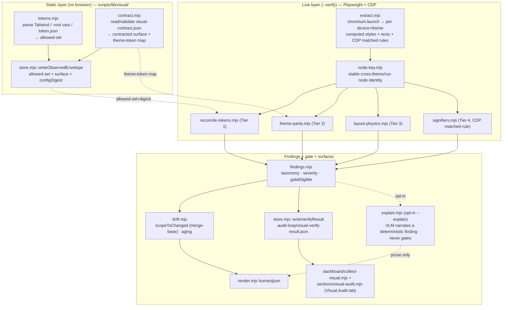

# Plan: `visual-audit` — the visual/paint inspection skill (4th UX lens)

- **Date**: 2026-06-26
- **Status**: Complete (built autonomously via /cycle across 3 clusters; see Implementation Log)
- **Author**: Claude + Louis
- **Scope**: full-stack (CLI tooling that produces frontend-domain findings; ships a dashboard tab)

---

## 1. Context Summary

**Detected scope/stack**: full-stack · `js-ts` (+ postgres) · `detect-stack` → `{stack:"js-ts", stackKinds:["js-ts","postgres"]}`. The deliverable is Node ESM tooling under `scripts/` plus a SKILL.md, mirroring the existing `nav-audit` skill almost exactly; the "frontend" of the scope is the *domain the findings describe* (paint/layout/typography/theme) and the dashboard HTML tab, not a new app UI.

**What this skill is** (from two `/brainstorm --with-gemini` rounds, GPT-5.5 + Gemini-pro + Claude converged): a **math-first, deterministic visual-contract auditor**. Playwright extracts computed styles + bounding boxes + CDP matched-style rules; assertions are pure functions over that evidence. A VLM is **advisory-only** (translate/triage a deterministic failure into prose) and **never gates**. The rule, verbatim into the SKILL.md: *"A VLM can point, but computed evidence must convict."*

**What exists today (Phase 1 — Code Trace).** I read the sibling `nav-audit` skill end-to-end because this skill is its structural twin:
- `skills/nav-audit/SKILL.md` (146 lines) — 3-mode philosophy (static-only / live-verified / contract-backed live), two-artifact split, 5-phase flow, reference-file index.
- `scripts/nav-audit.mjs:29-242` `main()` — orchestrator: parse args → list/changed files → read+validate contract → bootstrap | verify | normal-audit branches → persist envelope/verify-result → render → gate.
- `scripts/lib/nav/schema.mjs:1-221` — `NAV_TOOL_VERSION=1`, `NAV_VERIFY_TOOL_VERSION=2`, `computeContractDigest()` (`:167-195`, sha256 of sorted contract minus file-shas), `computeConfigDigest()` (`:205`), strict `NavContractSchema`, lenient `NavObservedSchema`, `NavVerifyResultSchema` (version 1|2 back-compat).
- `scripts/lib/nav/verify.mjs:130-268` `runVerify()` — the **only** browser-touching module: `const {chromium} = await import('playwright')` → `chromium.launch({headless:true})` → per-breakpoint `browser.newContext({viewport, storageState})` → `page.goto(url,{waitUntil:'domcontentloaded'})` → hydrate wait → `page.evaluate(sels => …)` for presence; bounded activation pass re-`goto`s to isolate triggers. This is exactly the seam I extend with computed-style + CDP extraction.
- `scripts/lib/nav/drift.mjs:18-68` — `divergenceKey()=class:destination`, `scopeToChanged()` (merge-base `git merge-base origin/HEAD HEAD`, evidence-file-in-diff → gate-eligible, contract edit → all intents eligible, empty on no merge-base so it never false-blocks), `ageDivergences()` (cloud-sourced firstSeen, local ledger is cache only).
- `scripts/lib/dashboard/collect-nav.mjs:1-127` + `scripts/lib/dashboard/sections/nav-audit.mjs:1-82` — reads **local** contract/envelope/verify-result/ledger; degradation contract `status ∈ {ok, missing-optional, unexpected-error}`; renders 2 panels (scorecard + drift) + live-findings table.
- `scripts/lib/device-presets.mjs:19-141` — `DEVICE_PRESETS` (desktop/desktop-large/tablet/mobile/mobile-small), `getPreset(name)`, `parseDevicesFlag("p1,p2")`, `DEFAULT_PRESET='desktop'`. Reuse verbatim for `--device`.
- `scripts/lib/schemas.mjs:141-149` — `zodToGeminiSchema()` strips Gemini-unsupported keys; Zod-4 conventions (`.describe()`, `.optional()`/`.nullable()` for post-v1 fields).
- Build/sync: `npm run skills:regenerate` (= `sync-shared-audit-refs.mjs && regenerate-skill-copies.mjs`) one-way-copies `skills/**` → `.claude/skills/**`; `npm run skills:check` enforces reference-frontmatter byte-match (`docs/skill-reference-format.md`, parser `scripts/lib/skill-refs-parser.mjs`). `scripts/sync-to-repos.mjs` `CORE_ENTRY` + `collectImportClosure()` auto-sync transitive lib deps. `CLI_SMOKE_SET` in `scripts/lib/sync-isolation-verify.mjs:46-55` requires a `--selfcheck-relocation` one-liner. `.gitignore:74-84` carries the managed observed-layer block.

**Patterns reused vs new**: reuses the entire nav-audit dual-layer architecture (contract + gitignored observed/verify, digest-keyed freshness, drift-only changed-surface gate, local-first dashboard collector), `device-presets.mjs`, Zod-schema conventions, the `{result, usage, latencyMs}` + `--out` JSON contract, sensitive-egress safety. **Genuinely new**: live computed-style + `getBoundingClientRect` extraction, CDP `CSS.getMatchedStylesForNode` matched-rule analysis, a stable cross-theme/cross-run **node identity** key, declared-token parsing (Tailwind / CSS custom properties / token JSON), WCAG-contrast math, and the must-match/may-differ-if-tokened theme partition.

**Neighbourhood considered**: architectural-memory consult skipped — cloud store not configured this session (`detect-stack` ran but `get-neighbourhood` would no-op `cloud:false`); the manual code-trace above is the grounding. Re-run `npm run arch:refresh` to enable embeddings-based dedupe before implementation. No near-duplicate of token-parsing / contrast / computed-style extraction exists in the repo (grep for `getComputedStyle|getMatchedStyles|chromium` returned only the nav/persona/ux-lock Playwright sites, none doing paint analysis).

---

## 2. Proposed Architecture

### The one architectural difference from nav-audit (load-bearing — read first)

nav-audit is **static-primary**: an AST gives ~80% of the nav graph offline, and `--verify` raises authority. **visual-audit inverts this**: *paint cannot be asserted without rendering.* You cannot know a computed `border-radius`, a cross-theme geometry delta, or whether a `:focus` rule carries a visible outline by reading source. Therefore:

- **The "static" layer is narrow and honest**: it parses the *declared token sources* into an **allowed-set**, resolves the **contracted surface** (which routes/components opted in), and runs *source-coherence* lint (token defined-but-unreferenced, contract references an undefined token, duplicate token definitions). It emits the **observed envelope** (allowed-set + surface map + digest). It produces **no paint findings** — and the SKILL.md says so plainly, the way nav-audit admits static is hypotheses.
- **`--verify <url>` is where the four tiers actually run.** All `token_violation` / `theme_*` / `layout_*` / signifier findings are `source:'live'`. This is the same shape as nav-audit's live-findings, just weighted more heavily because *here it is the primary path, not an enhancement.*

This is the right-sizing decision (below) that stops us from building a fake static visual taxonomy that would only ever guess.



### Key design decisions (cite engineering #/UX #/technical #)

1. **Module layout mirrors `scripts/lib/nav/` → `scripts/lib/visual/`** (#2 Modularity, #1 DRY). Each tier is its own pure module taking evidence-in / findings-out so it is unit-testable without a browser (Tier-1 deterministic seam, testing doctrine). The single browser-touching module is `extract.mjs`, isolated exactly as `nav/verify.mjs` isolates its drive.

2. **Declared-token reconciliation is the spine; inferred clustering is report-only** (#5 Single Source of Truth, UX#: consistency). Allowed-set comes from *source* (Tailwind theme, `:root` custom properties, or a `tokens.json` the contract points at). A rendered value on a contracted surface outside the allowed-set → `token_violation` (gateable). For apps with **no** declared tokens, an inferred-cluster fallback ("95% of paddings are 8px; this is 11px") runs **report-only, never gating** — this is the noisy path and is fenced off behind `severity:'info', gateEligible:false`. Intentional variation is *a token, not an outlier*, which kills the "punishes custom hero treatment" failure mode — **but only on opted-in surfaces** (GPT-5.5's correction: marketing pages / embeds carry intentional non-token values, so the gate is "violations on contracted surfaces", never "whole app must obey tokens").

3. **Theme parity = partition, not strict identity** (Gemini's catch, adopted verbatim). Capture the same node in both themes; split audited properties:
   - **MUST-MATCH** (in-flow box geometry): `width, height, flex-basis, grid-template, padding-*, margin-*` → assert equality (within 1px tolerance) **only for nodes rendered (displayed, non-zero box) in BOTH themes**. A node `display:none`/absent/0×0 in one theme is a legitimate **theme-conditional element** (dark-mode logo, light-only banner), not drift — it is excluded from geometry comparison (Gemini-G2-3) and surfaced, if at all, as a low/advisory presence note, never a gateable `theme_geometry_drift`. Mismatch among both-rendered nodes → `theme_geometry_drift`.
   - **MAY-DIFFER-IF-TOKENED**: `border, outline, box-shadow, color, background*` → a difference is allowed **only if** the differing value maps to a declared theme token. This is what lets the intentional dark-mode *drop-shadow→1px-border elevation swap* pass instead of false-positiving. A difference that maps to **no** token → `theme_unmapped_token` (e.g. text that stayed dark-on-dark because a var failed to remap).
   - **Contrast** is computed as a *free byproduct* (we already hold both themes' computed `color`/`background`) → `contrast_failure` below the declared ratio. Scoped to text nodes on contracted surfaces only — we do **not** become the general a11y contrast auditor (that stays adjacent to click-test).

4. **Stable node identity is the cross-theme / cross-run join** (#3 No Hardcoding, technical#: state). To diff "the same element" across light/dark and across the base run, each node needs a stable key. `node-key.mjs` computes a structural selector signature (tag + role + `nth-of-type` ancestor chain, capped depth) with an optional `data-visual-id` attribute override the contract can opt nodes into. This is the analog of nav-audit's destination normalization and is the single most failure-prone deterministic seam → hard test-first.

5. **Signifier matrix via STATIC matched-rule analysis, not live actuation** (the critical engineering call, technical#: events). We do **not** fire real `:hover`/`:focus`/`:active` mouse events (flaky, slow, non-deterministic in headless). Instead `extract.mjs` opens a CDP session (`context.newCDPSession(page)`) and calls `CSS.getMatchedStylesForNode` per interactive node to read *which* pseudo-state rules exist and *whether* they carry a visual-property delta (background/color/border/outline/opacity/transform). `signifiers.mjs` then asserts: focusable node MUST have, in its `:focus`/`:focus-visible` state, **any** visible visual delta passing 3:1 contrast — `outline` **OR** `box-shadow` (ring) **OR** `border-color` **OR** `background`/inverted color (Gemini-G2-M2: modern Tailwind/Bootstrap focus styles rarely use `outline`; checking `outline` alone false-fails them) → else `missing_visible_focus`; interactive node MUST have a default→`:hover` visual delta (`state_has_no_visual_delta`); `[disabled]`/`[aria-disabled]` node MUST signify via computed `opacity<1` ∨ grayscale `filter` ∨ `cursor:not-allowed` (`disabled_not_signified`). Optional live actuation is a deferred `--actuate` enhancement, not v1.

6. **Two-artifact split, mirrored** (generated-artifact policy): committed **`visual-contract.json`** (intent: contracted surfaces, theme-token map, declared-component selectors, opt-in `data-visual-id`s, allowed-ratio); gitignored Category-A **`.audit-loop/visual-observed.json`** (allowed-set + surface map) and **`.audit-loop/visual-verify-result.json`** + **`.audit-loop/visual-drift-ledger.json`** (regenerated each run, digest-keyed freshness).

7. **The scope firewall, verbatim in SKILL.md** (#20 Long-term flexibility, the anti-scope-creep brake): *"Include it only if you can assert it on a computed style without knowing what the page is FOR."* Signifiers (focus ring exists, hover changes paint, disabled looks disabled) pass. Affordance judgments (is-this-the-primary-CTA, would-a-user-know-to-click) fail → persona-test. This one sentence is the gatekeeper that prevents re-litigating every future "should X belong here".

8. **VLM advisory layer is opt-in and egress-guarded** (#15 Error handling, security). `--explain` takes an *already-found* deterministic finding + a tight screenshot crop and asks the VLM to narrate/categorize. It creates **zero** findings and **never** changes the gate. Because a screenshot can carry sensitive rendered data, egress requires a **second explicit flag** `--allow-external-screenshot` on top of `--explain` (defence-in-depth: `--explain` alone yields metadata-only prose, no pixels leave the machine). When pixels are authorized, the crop is strictly the finding's bounding box + a capped padding, and `explain.mjs` is a **thin consumer of the existing model-resolver path** (#5): it imports `createAnthropicClient`/`llm-wrappers`, uses **sentinels only** (no concrete model IDs), refreshes the model catalog at the `scripts/visual-audit.mjs` entry when `--explain` is set, validates any structured response at the boundary, and **degrades to empty prose on any LLM failure** — never blocking the deterministic report (M4, M5).

### 2a. Concrete v1 contracts (resolves the attribution / CDP / provenance / schema gaps)

These four artefacts are part of the design, not implementation detail — every subsystem depends on their exact shape, so they are fixed here before coding.

**(A) `visual-contract.json` v1 schema** (strict, mirrors `NavContractSchema`; typos fail loudly):

```jsonc
{
  "version": 1,
  "appRoots": ["apps/web"],                  // optional monorepo namespacing
  "exclude": ["**/*.stories.*"],             // optional
  "surfaces": [{
    "id": "pricing-cards",                   // stable; the attribution + drift key root
    "label": "Pricing plan cards",
    "selector": ".pricing-grid",             // contracted root; audited subtree
    "sourceGlobs": ["apps/web/src/pricing/**"], // H1: maps surface → owner files for the gate
    "component": "PlanCard",                  // optional; enables intra-component consistency (report-only unless set)
    "excludeSelectors": [".promo-hero"],      // intentional-variation escape hatch
    "allowOverlapWith": [".tooltip"],         // layout-physics allowlist
    "nodeBudget": 400,                        // M1: cap; exceeding → unverified_due_to_budget warning
    "interactiveBudget": 120                  // M1: cap on CDP-per-node pseudo-state probing
  }],
  "tokenSources": [{
    "type": "tailwind" | "css-vars" | "json",
    "path": "tailwind.config.ts",
    "theme": null | "dark",                   // theme-specific source when applicable
    "families": ["colors","spacing","radius","borderWidth","fontSize","lineHeight","fontWeight","shadow"]
  }],
  "themes": [{
    "name": "light" | "dark",
    // M2: discriminated union on `mode`, each with its own deterministic apply sequence (see below):
    "apply": { "mode": "class",        "target": "html", "value": "dark", "settleSelector": null }
          // | { "mode": "attribute",  "target": "html", "attribute": "data-theme", "value": "dark" }
          // | { "mode": "localStorage", "key": "theme", "value": "dark" }   // set via addInitScript before app init
          // | { "mode": "media", "colorScheme": "dark" }                    // applied via context emulation, separate context
  }],
  "globalStyleGlobs": ["apps/web/src/styles/**", "apps/web/src/components/ui/**"], // Gemini-G2-2: edits here mark ALL surfaces gate-eligible (cascade/shared-component blast radius)
  "tolerances": { "geometryPx": 1, "contrastRatio": 4.5 },
  "propertyPolicy": {                          // which families each tier audits
    "tokenAudited": ["colors","spacing","radius","borderWidth","fontSize","lineHeight","fontWeight","shadow"],
    "mustMatchGeometry": ["width","height","flex-basis","grid-template","padding","margin"]
  }
}
```

**(B) Attribution path (H1) — DOM node → finding → gate.** A live finding is only gate-eligible when it can be traced to changed owner files. The chain is mandatory and fully specified: every audited node is captured *within a known contracted `surface.id`* (the surface's `selector` is the capture root, so containment is known at capture time — no guessing). The finding carries `{surfaceId, nodeKey, ...}`; `surfaceId` → `surface.sourceGlobs` → file set; `drift.scopeToChanged()` intersects that file set with the merge-base diff. **Token-source findings have global blast radius**: a finding rooted in a `tokenSource.path` edit marks *all* surfaces whose `tokenAudited` families overlap eligible (mirrors nav's "contract edit → all intents eligible"). No `evidence:file?` guesswork — attribution is structural via `surfaceId`, not inferred from computed evidence.

**(C) CDP pseudo-state protocol (H2) — force, don't actuate.** The matched-rule-only sketch is replaced by a deterministic CDP forcing protocol in `extract.mjs`, which is both more correct (an *inactive* `:hover` rule ≠ its *effective* computed style) and still flake-free (no mouse/keyboard events):
   0. **Freeze animation first (Gemini-G2)**: before *any* baseline capture, inject `* { transition: none !important; animation: none !important; }` via `context.addInitScript` (or `page.addStyleTag`). Without this, `forcePseudoState` triggers the element's CSS transition and `getComputedStyle` reads an **interpolated mid-transition** value → non-deterministic, wrong deltas. This also stabilizes baseline Tier-1/2 reads.
   1. `const cdp = await context.newCDPSession(page)`; `await cdp.send('DOM.enable')`; `await cdp.send('CSS.enable')`.
   2. Per interactive node (bounded by `interactiveBudget`): resolve its CDP node via `DOM.querySelector`/`DOM.requestNode` from the stable selector; capture **baseline** computed styles.
   3. `await cdp.send('CSS.forcePseudoState', { nodeId, forcedPseudoClasses: ['hover'] })` → re-read computed styles → diff vs baseline = the *effective* hover delta. Repeat for `['focus']`/`['focus-visible']` and the natural `[disabled]`/`[aria-disabled]` state.
   4. Reset forced state; the per-state computed snapshots are the evidence `signifiers.mjs` consumes. If `CSS.enable`/`forcePseudoState` is unavailable, the signifier tier degrades to `unverified` (never crashes, never false-fires).

**(D) Token provenance — two separate checks.** Computed values lose token identity (two tokens share a value; a literal can coincidentally equal a token; vars resolve through aliases; `border`/`box-shadow` are composite; opacity modifiers mutate color). So Tier 1/2 run **two** checks, not one: **`valueOnScale`** (the normalized computed value ∈ allowed-set — catches off-scale literals) and **`declarationUsesToken`** (the *winning* declaration references a token var). A `TokenIndex` (built by `tokens.mjs`) tracks `{canonicalValue, aliases, themeValue, sourceFile, family, varName}`. Theme-parity's "may-differ-**if-tokened**" uses `declarationUsesToken` provenance — *not* a value-equality guess.

### 2b. Resolution contracts (round-2 correctness — the four hard CSS realities)

The §2a sketch is correct in shape but three CSS realities and one internal inconsistency need their own named resolvers, fixed here so they aren't discovered mid-build:

**(E) `ElementAddress` — the page↔CDP node round-trip (H1-r2).** A node captured in `page.evaluate` is not a CDP `nodeId`. Extraction produces, **within a single page session**, an explicit `ElementAddress` per audited node: `{surfaceId, nodeKey, cssPath, auditInstanceId}`. The batched `page.evaluate` tags each audited element with a unique `data-va-instance="<auditInstanceId>"` attribute and returns its computed styles/rects keyed by it; the CDP pass then resolves each node by `DOM.querySelector(root, '[data-va-instance="…"]')` → `nodeId` for `forcePseudoState` + matched-style provenance, and the temp attribute is stripped in a `finally`. This guarantees the *same* element is measured, forced, and provenance-read — no selector-redrift between passes.

**(F) `provenance-resolver.mjs` — the WINNING declaration, not any matched rule (H2-r2).** `declarationUsesToken` is only sound against the declaration that actually wins the cascade. The resolver consumes `CSS.getMatchedStylesForNode` (which returns rules in cascade order) and computes, per audited property: shorthand→longhand expansion (`border`/`margin`/`padding`/`box-shadow` composites), `!important`, cascade-layer order, specificity, and source order → the single winning declaration → whether *it* is `var(--token)` or a literal. Pure and unit-tested with canned `getMatchedStylesForNode` fixtures (Tier-1 seam). Without it, a `var()` on an overridden rule would falsely "absolve" a literal that actually paints.

**(G) Effective backdrop for contrast — resolved IN-BROWSER (H3-r2 + Gemini-G1).** A node's computed `background-color` is usually `transparent`, and the opaque backdrop is frequently on an **uncontracted** ancestor (`<body class="bg-…">`, a generic `<main>` wrapper) that the contracted-node capture never sees. So the **ancestor walk runs inside `extract.mjs`'s `page.evaluate`** — `window.getComputedStyle(el.parentElement)` traverses *all the way to `document.body`* regardless of the contracted subtree — and emits a resolved `effectiveBackground` (the first opaque layer + the translucent stack above it) as evidence per audited text node. The pure `effective-background.mjs` module then only does the deterministic part: alpha-blend the emitted stack → final color, or mark **`unverified`** when the stack bottoms out on a **gradient/image** or alpha can't be resolved. When the stack reaches `html`/`body` still **transparent** (no declared page background), the resolver assumes the **UA canvas default** (white in light, the emulated `Canvas` system color in dark) rather than degrading to `unverified` — otherwise an app that simply omits an explicit `body` background would mass-degrade every contrast check (Gemini-G2-M1). Contrast is therefore "byproduct where the backdrop is deterministically solid" — `contrast_failure` (gateable) never fires on an unresolved backdrop.

**(H) `ChangedScopeResolver` — one canonical gate model (H4-r2).** §2a-B, the risk register, and the acceptance criteria are unified under a single contract so they can't drift: `resolveChangedScope({changedPaths, contractChanged, changedTokenSources, surfaces, findings}) → gateEligibleFindingIds`. Rules, in one place: a finding is gate-eligible iff (a) its `surfaceId`'s `sourceGlobs` ∩ `changedPaths` ≠ ∅, **or** (b) `contractChanged` and the finding's surface is in the changed contract, **or** (c) the finding's property family is served by a token source in `changedTokenSources` (the token global-blast-radius case), **or** (d) `changedPaths` ∩ `globalStyleGlobs` ≠ ∅ — a global stylesheet / shared-`ui` component edit cascades into surfaces it doesn't textually live in, so it marks **all** surfaces eligible (Gemini-G2-2: closes the false-negative where a global CSS edit breaks a contracted surface whose own files didn't change — "scope by impact, not authorship"). No merge-base → empty (never false-block). Every other section references this contract by name rather than restating the rule.

---

## 3. UX Design Decisions

The skill's "UI" is its **CLI output** + the **dashboard tab**; UX principles apply to *finding legibility and trust*, not a new app screen.

- **Trust through evidence** (UX consistency, Nielsen #1 visibility): every finding renders `{class, severity, nodeKey, device, theme, property, expected, actual, evidence:file?, gateEligible}` — the same "deterministic facts not vibes" discipline that makes click-test/nav-audit muted-proof. No finding without a concrete expected-vs-actual.
- **Static vs live honesty banner** (matches nav-audit): static-only run prints a gray "paint findings require `--verify <url>`" banner so a clean static run is never mistaken for a clean *visual* run. Live run prints green + url + device×theme matrix + timestamp.
- **Severity legibility**: `token_violation`/`theme_unmapped_token`/`contrast_failure`/`missing_visible_focus` default P1; `theme_geometry_drift`/`layout_*`/`image_distortion` P1–P2; `state_has_no_visual_delta`/`disabled_not_signified` P2; inferred-cluster + `component_inconsistency` (no declared component) `info`/report-only.
- **Dashboard "Visual Audit" tab** (Gestalt proximity/similarity): two panels mirroring nav-audit — **Contracted-Surface Scorecard** (surface × device × theme → pass/violations/unverified) + **Visual Drift** (aged advisory) — plus a Live-Findings table. Degrades to an empty, explained panel when no verify-result / cloud off.

---

## 4. Technical Architecture (frontend-domain tooling)

- **Component/module diagram**: see §2 mermaid. `scripts/visual-audit.mjs` is the orchestrator (`main()` with branches: bootstrap | static-audit | verify | gate), every other unit a pure lib module under `scripts/lib/visual/`.
- **State management**: stateless per-invocation (CLI-per-run model, the project's module-global-cache-is-fine assumption). The only persisted state is the three gitignored `.audit-loop/visual-*.json` artifacts + the committed contract.
- **Event handling**: N/A (no live event loop); the CDP session is request/response within `extract.mjs` and closed in a `finally` (mirror `nav/verify.mjs:268` `browser.close().catch(()=>{})`).
- **CSS architecture**: the dashboard section emits HTML reusing the existing dashboard `ui` helpers (tables/status-icons) exactly as `sections/nav-audit.mjs` does — no new CSS framework.

---

## 5. State Map (key components → states)

| Component | Empty | Loading | Error | Success | Edge |
|---|---|---|---|---|---|
| `tokens.mjs` extraction | no token source found → allowed-set `{}` + `inferredMode:true` (report-only) | n/a (sync) | malformed Tailwind/JSON → hard error, abort with path | allowed-set populated per property family | multiple sources → union; `:root` overrides token.json documented |
| `extract.mjs` live drive | surface selector absent **OR present-but-empty skeleton** → `unverifiable` surface, degrade, no false findings (capture-honesty, mirrors nav-audit v1.4) | `waitForFunction` on declared selectors **AND content presence** (`childElementCount>0` / declared `settleSelector`), not just container mount (Gemini-G2-1: CSR apps mount an empty container before data) | `chromium.launch` fail → `{ok:false, code:'NO_CHROMIUM'}` | per device×theme evidence map | theme toggle not found → capture single theme, mark theme-tier `unverified` |
| Tier engines | no nodes on surface → no findings (not a failure) | n/a | evidence missing a property → skip that check, don't crash | findings array | node present in one theme only → `theme_geometry_drift` candidate, guarded by node-key match |
| `drift.mjs` gate | no contract → exit 3 needs-bootstrap | n/a | no merge-base → advisory-only (never false-block) | gate-eligible ∩ changed-surface → exit 1 with `--gate` | contract edited → all contracted surfaces eligible |
| Dashboard tab | no verify-result → static/empty panel + suggestion | n/a | stale digest → "re-run --verify" notice | scorecard + drift + live-findings | verify fresh, envelope stale → live-only mode (mirror collect-nav) |

---

## 6. Sustainability Notes

### Right-sizing gate (new structure is on the table — gate fires)

- **Band-aid extreme**: bolt a "visual" pass onto `click-test` that screenshots each page and asks a VLM "any visual issues?". Cheap to write; non-deterministic, un-gateable, muted in a week (both external models independently called this "the trap"). Leaves the real need — *deterministic visual-contract regression detection* — unmet.
- **Over-engineered extreme**: a full design-system conformance engine with its own token DSL, per-component visual baselines, pixel-diff subsystem with masking, inferred-clustering-as-gate, RTL/i18n/print/motion matrices, and a cloud `visual_baselines` table — a large abstraction no *current* requirement needs and whose baseline-management is itself a project.
- **Chosen (the middle)**: four deterministic tiers over computed-style evidence, gating **only** declared-contract violations on the **changed contracted surface**, reusing nav-audit's proven dual-layer + drift machinery, local-first persistence (no migration in v1), VLM strictly advisory. Each tier serves a *current* distinct-from-the-other-5-skills need; the noisy/ambiguous capabilities (clustering-as-gate, pixel baselines, VLM findings) are present only in their *safe* form (report-only / opt-in / absent). **Manual-vs-scripted**: this is net-new modules, authored by hand; no codemod.

### Assumptions that could change → seams built now
- *Token sources are Tailwind / CSS vars / JSON.* Seam: `tokens.mjs` is a **strategy registry** (`tokenAdapters[]`) mirroring nav's `adapters/index.mjs` — a new source (Panda, vanilla-extract, Style Dictionary) is one new adapter file, not a rewrite.
- *Themes are light/dark via a class/attr toggle.* Seam: theme application is a contract-declared mechanism (`themeToggle: {selector|attribute|media}`) so a 3rd theme or `prefers-color-scheme` is data, not code.
- *Node identity via structural path.* Seam: `data-visual-id` override already designed in, so apps with unstable DOM can pin critical nodes.

### Explicit extension points (deferred-with-intent, NOT silently dropped)
icon sizing / optical alignment · loading/skeleton/empty-state visual consistency · motion/transition consistency · RTL/i18n layout integrity · print stylesheet · region-based screenshot pixel baselines · inferred-clustering-as-CI-gate · generalized VLM aesthetic review · live `--actuate` pseudo-state firing · cloud `visual_audit_runs` table for cross-run aging (v1 ages from the local ledger, exactly like nav-audit degrades without cloud).

---

## 7. File-Level Plan

> Convention: every lib module is a pure `evidence→result` function except `extract.mjs` (browser) and `store.mjs`/`drift.mjs` (I/O). `scripts/visual-audit.mjs` gets the `--selfcheck-relocation` one-liner.

**Create — skill files** (`skills/visual-audit/`):
- `SKILL.md` — frontmatter (`name: visual-audit`, description + triggers: "visual audit", "check styling consistency", "theme parity", "dark mode parity", "design token drift", "paint audit", "/visual-audit"), the static-vs-live philosophy, the §7-scope-firewall sentence verbatim, the 4-tier flow, CLI flags table, finding taxonomy, reference-file index. ≤3K tokens; rare content pushed to references.
- `references/token-extraction-and-adapters.md` — token-source adapters (Tailwind/`:root`/JSON), allowed-set normalization (rgb/hsl→canonical, px rounding), inferred-cluster fallback rules.
- `references/finding-taxonomy.md` — the 11 finding classes, severity, gateEligible, guards (which avoid false positives), expected-vs-actual shape.
- `references/contract-and-bootstrap.md` — `visual-contract.json` schema, `--bootstrap` (+ `--from-url`) recipe, `data-visual-id` opt-in, theme-toggle declaration.
- `references/ci-gate-and-verify.md` — drift-only changed-surface gate, exit codes, `--verify` device×theme matrix, capture-honesty (unverifiable surfaces degrade, never false-block).
- `examples/example-report.md` — a sample human + JSON report (each reference file's `summary:` frontmatter byte-matches its SKILL.md index row — enforced by `skills:check`).

**Create — orchestrator + lib** (`scripts/`):
- `visual-audit.mjs` — `main()`: `parseArgs` → branch (`--bootstrap` | static-audit | `--verify` | `--gate`) → persist → render. `--selfcheck-relocation` handler. Mirrors `nav-audit.mjs` control flow.
- `lib/visual/schema.mjs` — Zod schemas + `VISUAL_TOOL_VERSION=1`, `VISUAL_VERIFY_TOOL_VERSION=1`, `computeContractDigest()` (sha256 of sorted contract incl. `exclude`), `computeConfigDigest({adapterVersion, contractDigest})`. Schemas: `VisualContractSchema` (strict), `AllowedSetSchema`, `VisualObservedSchema` (lenient), `VisualFindingSchema`, `VisualVerifyResultSchema` (version-tolerant). `.describe()` per field; `zodToGeminiSchema` only if VLM call needs it.
- `lib/visual/tokens.mjs` — `tokenAdapters[]` strategy registry, each adapter `{detect(root), extract(path) → {values, families, theme, sourceFile, warnings}, version}` (M3). **v1 supported sources, explicitly scoped** (M1): Tailwind v3 configs only when **statically resolvable in the consumer repo's own runtime** (`.js`/`.cjs`/`.mjs` via dynamic `import()`) — a **`.ts` config is NOT executed by our plain-ESM tool**; for TS configs the contract must point at a generated `tokens.json` (Style-Dictionary / `tailwind --dump`) or a documented prebuilt CSS-vars source. Tailwind v4 (`@theme`/CSS-var based), `:root`/scoped CSS custom properties, and a plain `tokens.json` are first-class. Arbitrary-value / plugin-generated classes that can't be resolved statically → `warnings`, never false allowed-set entries. Conflicting definitions across sources are emitted as **diagnostics, not silent overrides**; precedence is declared (`tokenSources` order in the contract). Builds the `TokenIndex` (§2a-D) consumed by Tier 1/2. `extractAllowedSet(root, contract)` → allowed-set + `inferredMode` flag; `inferClusters(evidence)` is the report-only fallback. Arbitrary-value / plugin-generated Tailwind classes that can't be resolved statically → `warnings`, not false allowed-set entries.
- `lib/visual/contract.mjs` — `readContract`/`writeContract`/`bootstrapContract`/`contractExists`; resolves contracted surfaces + theme-token map + declared components.
- `lib/visual/node-key.mjs` — `stableNodeKey(domDescriptor)` structural signature + `data-visual-id` override. **Pure, hard test-first.**
- `lib/visual/extract.mjs` — the browser module: `runExtract({url, devices, themes, contract, storageState})` → `chromium.launch` → per device×theme: **apply theme via the contract's `themes[].apply` protocol** (class/attribute/localStorage/media — set before navigation or before capture per mode, then `waitForFunction` on `settleSelector` if declared, and verify the theme actually took — else mark that theme `unverified`, M2) → `goto`/hydrate (wait for **content presence** — `childElementCount>0` or declared `settleSelector` — not just container mount, so an empty CSR skeleton degrades to `unverifiable` rather than producing false findings; Gemini-G2-1) → (per §2b-E theme-apply sequence: `class`/`attribute` set on `target` then settle; `localStorage` via `context.addInitScript` keyed to origin **before** init; `media` via a separate context with `colorScheme` emulation) → **one batched `page.evaluate`** collecting computed styles + `getBoundingClientRect` + scroll metrics for **visible contracted nodes only, capped by `nodeBudget`** (M1: budget exceeded → `unverified_due_to_budget` warning, no silent truncation) → the **CDP forcePseudoState protocol** of §2a-C per interactive node (capped by `interactiveBudget`) + matched-declaration provenance for the `TokenIndex`. Returns `{ok, evidence, unverifiableSurfaces, warnings}`; closes browser + CDP session in `finally`. Each emitted node carries its `depth` + `parentInstanceId` (DOM containment data) so downstream overlap can exclude ancestor-descendant pairs. Overlap detection consumes the captured rects via a **sweep-line over x-intervals** (not naive O(n²)), respecting `allowOverlapWith`.
- `lib/visual/contrast.mjs` — pure WCAG relative-luminance + ratio. **Hard test-first.**
- `lib/visual/effective-background.mjs` — §2b-G: ancestor walk to opaque backdrop + alpha blend; gradient/image/overlap/unresolvable → `unverified`. Pure. **Test-first.**
- `lib/visual/provenance-resolver.mjs` — §2b-F: winning-declaration resolver (shorthand expansion, `!important`, layers, specificity, source order) over `getMatchedStylesForNode` fixtures → `declarationUsesToken`. Pure. **Test-first.**
- `lib/visual/changed-scope.mjs` — §2b-H: the single `resolveChangedScope(...)` gate contract consumed by `drift.mjs` and asserted by the acceptance tests. Pure. **Test-first.**
- `lib/visual/source-coherence.mjs` — M3: the static layer's actual finding producer — `{tokenIndex, sourceGlobs, exclude}` → report-only diagnostics (token defined-but-unreferenced, contract references undefined token, duplicate definition). Report-only, never gateEligible. Pure. **Test-first.**
- `lib/visual/reconcile-tokens.mjs` — Tier 1: computed value ∈ allowed-set (normalized) → `token_violation` | inferred `info`. **Test-first.**
- `lib/visual/theme-parity.mjs` — Tier 2: must-match/may-differ-if-tokened partition + `theme_unmapped_token` + contrast byproduct. **Test-first** (the partition is the highest-value correctness seam).
- `lib/visual/layout-physics.mjs` — Tier 3: overflow / `content_clipping` (scrollWidth>clientWidth w/o escape) / `unexpected_overlap` / offscreen-focusable / `image_distortion`. **Overlap excludes ancestor-descendant pairs** (Gemini-G3: a child rect always intersects its parent — `unexpected_overlap` fires only on non-containment pairs, i.e. nodes where neither is the other's ancestor via `parentInstanceId`/`depth`), respects `allowOverlapWith`. **Test-first** (pure rect math; fixture includes a parent/child pair that must NOT flag).
- `lib/visual/signifiers.mjs` — Tier 4: over CDP matched-rule evidence → `missing_visible_focus` / `state_has_no_visual_delta` / `disabled_not_signified`. **Test-first.**
- `lib/visual/findings.mjs` — taxonomy orchestration: run tiers, assign severity/gateEligible, dedup by `(class, nodeKey, device, theme)`, tag `source:'live'`.
- `lib/visual/drift.mjs` — `divergenceKey()=class:nodeKey`, `scopeToChanged()` (merge-base; contracted-surface membership), `ageDivergences()`, ledger read/write. Adapted from `nav/drift.mjs`.
- `lib/visual/store.mjs` — `read/writeObservedEnvelope` + `read/writeVerifyResult` + drift-ledger I/O (digest+toolVersion freshness rejection). **All writes go through the project's `atomicWriteFileSync()`** (temp-file + rename — the drift ledger IS a ledger; project rule, M4); readers treat malformed JSON as `unexpected-error`/stale, never crash. Merges nav's `envelope.mjs`+`verify-store.mjs` into one module (right-sized).
- `lib/visual/render.mjs` — `renderScorecard`/`renderFindings`/`renderLiveFindings`/`renderTable` + JSON envelope.
- `lib/visual/explain.mjs` — opt-in VLM narrator (§2 decision 8): metadata-only prose under `--explain`; pixels egress only under the additional `--allow-external-screenshot` (M4). Imports the existing `llm-wrappers`/`createAnthropicClient` + model-resolver; **sentinels only**, catalog refreshed at the orchestrator entry, structured output validated at the boundary, **degrades to empty prose on any LLM failure** (M5). Produces no findings, never touches the gate.
- `lib/dashboard/collect-visual.mjs` — local-first collector → `{visualAudit:{scorecard, drift, status, verifyMeta, liveFindings}}`; degradation contract `status ∈ {ok, missing-optional, unexpected-error}` (mirror `collect-nav.mjs:27`).
- `lib/dashboard/sections/visual-audit.mjs` — `default({src, visualAudit}, ui)` → HTML; 2 panels + live-findings table.

**Modify**:
- `scripts/sync-to-repos.mjs` — add `scripts/visual-audit.mjs` to `CORE_ENTRY` (closure walker pulls `lib/visual/**`).
- `scripts/lib/sync-isolation-verify.mjs` — add `visual-audit.mjs` to `CLI_SMOKE_SET`.
- **Dashboard registration — exact wiring** (L1, verified against the nav wiring): import + call `collectVisual` in `scripts/lib/dashboard/collect-reference.mjs` (mirror the `collectNav` import at `:17` and call at `:433`, with the same try/catch `unexpected-error` fallback at `:435`); import `sectionVisualAudit from './sections/visual-audit.mjs'` and register it in `scripts/lib/dashboard/render.mjs` (mirror `:26`); data key `visualAudit`, tab label "Visual Audit", `REGISTRY.reference` group.
- `.gitignore` — add to the managed observed block: `.audit-loop/visual-observed.json`, `.audit-loop/visual-verify-result.json`, `.audit-loop/visual-drift-ledger.json`.
- `AGENTS.md` — add the `visual-audit` skill bullet to the Skill Chain (4th UX lens: persona=journey, click=page, nav=system, **visual=paint**) + the scope-firewall sentence; re-sync to `CLAUDE.md` is via the existing `@./AGENTS.md` include (no manual CLAUDE.md edit).

**Create — tests** (`tests/`, hard test-first seams per doctrine):
- `visual-node-key.test.mjs`, `visual-contrast.test.mjs`, `visual-reconcile-tokens.test.mjs`, `visual-theme-parity.test.mjs`, `visual-layout-physics.test.mjs`, `visual-signifiers.test.mjs`, `visual-schema.test.mjs` (digest determinism + strict-contract rejection), `visual-drift.test.mjs` (scopeToChanged / never-false-block). Tier engines tested with **canned computed-style fixtures**, never a live browser (Tier-2 eval discipline).
- **`visual-extract.test.mjs` (H5 — the highest-risk module gets a real CI contract, not just manual verification).** A minimal Playwright integration test against a **self-served static HTML/CSS fixture** (local `http.createServer` or `data:` URL — no external app): the fixture declares light/dark themes (class-toggle), one token violation, one `:focus-visible` outline state, one default→`:hover` delta, and one over-budget surface. Asserts `runExtract()` evidence shape, per-`surfaceId` containment, device×theme cells, that the **forcePseudoState** path returns effective per-state computed styles (and that **no mouse/keyboard event** was dispatched), and that the `nodeBudget` cap emits `unverified_due_to_budget`. Guarded to skip with a clear message when Chromium isn't installed (so it never hard-fails a browserless CI), but runs by default locally + in the browser-enabled lane.
- Update `tests/relocation-guard.test.mjs` expectations for the new CLI in `CLI_SMOKE_SET`.

### 7b. Implementation Phases (Gate 1 fires: ~28 files, ≥2 subsystems, dependency chain)

- **Phase 1 — Schema + contract + token foundation.** Files: `lib/visual/schema.mjs` (create), `lib/visual/contract.mjs` (create), `lib/visual/tokens.mjs` (create), `lib/visual/node-key.mjs` (create), `tests/visual-schema.test.mjs` (create), `tests/visual-node-key.test.mjs` (create). The deterministic spine everything imports.
- **Phase 2 — Pure tier engines + resolvers.** Files: `lib/visual/contrast.mjs`, `lib/visual/effective-background.mjs`, `lib/visual/provenance-resolver.mjs`, `lib/visual/reconcile-tokens.mjs`, `lib/visual/theme-parity.mjs`, `lib/visual/layout-physics.mjs`, `lib/visual/signifiers.mjs`, `lib/visual/source-coherence.mjs`, `lib/visual/findings.mjs` (create); tests `tests/visual-contrast.test.mjs` `tests/visual-effective-background.test.mjs` `tests/visual-provenance.test.mjs` `tests/visual-reconcile-tokens.test.mjs` `tests/visual-theme-parity.test.mjs` `tests/visual-layout-physics.test.mjs` `tests/visual-signifiers.test.mjs` `tests/visual-source-coherence.test.mjs` (create). All pure; fixture-driven.
- **Phase 3 — Browser extraction + CDP.** Files: `lib/visual/extract.mjs` (create), `tests/visual-extract.test.mjs` (create — self-served static fixture, H5). The only Playwright/CDP module; isolated so Phases 1–2 stay browser-free.
- **Phase 4 — Persistence + drift gate.** Files: `lib/visual/store.mjs` (create), `lib/visual/changed-scope.mjs` (create), `lib/visual/drift.mjs` (create), `tests/visual-drift.test.mjs` (create), `tests/visual-changed-scope.test.mjs` (create).
- **Phase 5 — Orchestrator + render + VLM.** Files: `scripts/visual-audit.mjs` (create), `lib/visual/render.mjs` (create), `lib/visual/explain.mjs` (create).
- **Phase 6 — Dashboard surfaces.** Files: `lib/dashboard/collect-visual.mjs` (create), `lib/dashboard/sections/visual-audit.mjs` (create), `scripts/lib/dashboard/collect-reference.mjs` (modify — import+call `collectVisual`), `scripts/lib/dashboard/render.mjs` (modify — register the section). (`scripts/build-dashboard.mjs` is touched only if the tab needs an entry there — verify during the phase; L1.)
- **Phase 7 — Skill docs + wiring.** Files: `skills/visual-audit/SKILL.md` (create), `skills/visual-audit/references/*.md` (create ×4), `skills/visual-audit/examples/example-report.md` (create), `scripts/sync-to-repos.mjs` (modify), `scripts/lib/sync-isolation-verify.mjs` (modify), `tests/relocation-guard.test.mjs` (modify), `.gitignore` (modify), `AGENTS.md` (modify).
- **Close-out (not a phase)**: `npm run skills:regenerate && npm run skills:check && npm test && npm run check`.

---

## 8. Risk & Trade-off Register

| Risk / trade-off | Mitigation | Deferred? |
|---|---|---|
| **Static layer produces no paint findings** — users expect `/visual-audit` (no URL) to find things | Honesty banner + SKILL.md states verify is the paint path; static still gates declared-contract *coherence* drift | — |
| **Node identity drift** across themes/runs collapses Tier-2 | `data-visual-id` opt-in override + capped structural signature; hard test-first; on no-match, degrade to `unverified` not false-positive | live `--actuate` deferred |
| **Theme partition false positives** (the drop-shadow→border swap) | may-differ-**if-tokened** partition (Gemini's fix) — a tokened difference is allowed; only untokened diffs fire | — |
| **CDP pseudo-state correctness/availability** (inactive rule ≠ effective style) | §2a-C **forcePseudoState** protocol reads *effective* per-state computed styles deterministically; bounded by `interactiveBudget`; degrade to `unverified` signifier tier if `CSS.enable`/`forcePseudoState` unavailable (never crash); covered by `visual-extract.test.mjs` | live `--actuate` deferred |
| **`extract.mjs` is the highest-risk module yet hardest to test** | H5: automated Playwright integration test over a self-served static fixture (themes, token violation, focus state, hover delta, over-budget) asserts evidence shape + forcePseudoState + no-event + budget warning; skips cleanly without Chromium | — |
| **Per-node CDP + overlap cost on large surfaces** | `nodeBudget`/`interactiveBudget` caps with `unverified_due_to_budget` (no silent truncation); single batched `page.evaluate`; sweep-line overlap, not O(n²) | — |
| **Token blast-radius can't diff-scope to files** | gate on declared-contract **delta** (contract edit → all surfaces eligible), not file delta — mirrors nav drift semantics | — |
| **VLM hallucination / screenshot egress** | VLM advisory-only, opt-in `--explain`, egress-guarded; creates no findings, never gates | generalized VLM review deferred |
| **Inferred clustering noise** | report-only `info`, never gateEligible; only the *declared-token* path gates | clustering-as-gate deferred |
| **Scope creep into click-test / persona-test / a11y** | the verbatim scope-firewall sentence + explicit "stays in click-test/persona-test/nav-audit" table in SKILL.md | — |

**Distinctness from the other 5 skills (stated in SKILL.md):** touch-target *size* → click-test (it owns interaction mechanics; visual-audit owns paint). Semantic-HTML/ARIA correctness → click-test/nav-audit. Narrative affordance + CTA persuasiveness → persona-test. Nav reachability → nav-audit. Plan/design intent → plan/audit-code. Image *attribute-presence* lint → click-test; visual-audit only owns the *rendered* distortion.

---

## 9. Testing Strategy

- **Unit (test-first, Tier-1 deterministic)**: node-key signature stability + `data-visual-id` override; contrast math against known WCAG pairs; token reconciliation incl. rgb/px normalization + inferred-mode report-only; theme partition incl. the tokened-diff-allowed case + unmapped-token case; layout rect math (overflow/clip/overlap); signifier rules over canned matched-style fixtures; schema digest determinism + strict-contract typo rejection; `scopeToChanged` never-false-block on missing merge-base.
- **Integration (Tier-2 invariant)**: `runExtract()` against a **self-served static fixture** (`visual-extract.test.mjs`, H5) — evidence shape, per-`surfaceId` containment, device×theme cells, forcePseudoState effective styles + no-event assertion, budget warning; orchestrator over a recorded evidence fixture → stable findings JSON; "static run emits no paint finding"; "verify result persisted is digest+version keyed and rejected when stale".
- **Relocation/sync (hard test-first)**: `visual-audit.mjs --selfcheck-relocation` prints OK; `CLI_SMOKE_SET` membership; closure walker pulls `lib/visual/**`.
- **Edge cases**: no token source (inferredMode); theme toggle absent (single-theme, theme tier `unverified`); CDP unavailable (signifier tier `unverified`); empty contracted surface (no findings ≠ failure); node in one theme only.
- **Visual/manual checklist**: run `--verify` against wine-cellar-app (light/dark, desktop+mobile) and confirm zero false positives on its intentional theme treatment before declaring v1 done (re-verify on the live env per the project's "re-verify fixes on live, not the mock" rule).
- **a11y / responsive**: contrast tier covers the a11y byproduct; `--device desktop,mobile --theme light,dark` is the responsive matrix.

---

## 10. Acceptance Criteria (Playwright/CLI-verifiable)

These grade the **skill's own behaviour** (it has no app UI); they are CLI/JSON contracts a verify run asserts.

- [P0] [state] Static run emits no paint finding, with banner.
  - Setup: `node scripts/visual-audit.mjs --scope full` in a repo with a `visual-contract.json`, no URL.
  - Assert: JSON `findings` contains no `source:'live'` entry; stdout contains the "paint findings require --verify" banner; exit 0.
- [P0] [interaction] Verify run produces deterministic findings keyed by node.
  - Setup: `--verify <url> --device desktop --theme light,dark` against a fixture app with one known untokened dark-on-dark text node.
  - Assert: exactly one `theme_unmapped_token` finding with `{nodeKey, theme:'dark', property:'color', expected, actual}`; re-running yields byte-identical findings (determinism).
- [P0] [state] Tokened theme difference does NOT false-positive.
  - Setup: fixture with a card using drop-shadow in light + a tokened 1px border in dark.
  - Assert: no `theme_geometry_drift` for that node (border maps to a declared theme token).
- [P1] [a11y] Missing visible focus is caught via matched-rule analysis, without actuation.
  - Setup: fixture with a `<button>` that has no `:focus`/`:focus-visible` visible-outline rule.
  - Assert: one `missing_visible_focus` finding; no live mouse/keyboard event was fired (CDP-only path).
- [P1] [navigation] Gate is drift-only on the changed contracted surface.
  - Setup: `--gate` with a `token_violation` whose evidence file is NOT in the merge-base diff.
  - Assert: exit 0 (advisory); same finding with evidence file IN the diff → exit 1.
- [P1] [state] Unverifiable surface degrades, never false-blocks.
  - Setup: `--verify` where a contracted surface selector never appears.
  - Assert: surface marked `unverified` in scorecard; no `missing`/`violation` authoritative finding for it; exit 0.
- [P1] [responsive] Device×theme matrix runs all cells.
  - Setup: `--device desktop,mobile --theme light,dark`.
  - Assert: verify-result `statesCollected` lists all 4 cells (or marks absent ones `unverified`).
- [P2] [a11y] Disabled control must signify visually.
  - Setup: fixture with `[aria-disabled]` button at full opacity, default cursor, no filter.
  - Assert: one `disabled_not_signified` finding.
- [P2] [other] `skills:check` passes (reference frontmatter byte-match) and `--selfcheck-relocation` prints OK.
  - Setup: `npm run skills:check` + `node scripts/visual-audit.mjs --selfcheck-relocation`.
  - Assert: both exit 0.

---

## 11. Execution Clustering (Gate 2: phases group into ≥2 clusters)

- **Cluster A** — Phases 1–2 — fix-gate: yes
  - Coupling: the deterministic foundation. Schema/contract/tokens/node-key (P1) and the pure tier engines + contrast (P2) share the same data contracts (`AllowedSetSchema`, evidence descriptor, `stableNodeKey`); the tier engines import directly from the foundation and their tests exercise the seam. Audit must see schema-vs-engine wiring as one unit before a browser is introduced.
  - author-tier: standard
- **Cluster B** — Phases 3–4 — fix-gate: yes
  - Coupling: evidence production + persistence/gate. `extract.mjs` (P3) defines the evidence shape that `store.mjs`/`drift.mjs` (P4) persist and scope; the verify-result schema, digest freshness, and `scopeToChanged` membership are one cross-cutting seam (evidence → envelope → drift). Gated before the orchestrator builds on it.
  - author-tier: frontier
- **Cluster C** — Phases 5–7 — fix-gate: final
  - Coupling: user-facing surfaces over a frozen core — orchestrator + render + VLM (P5), dashboard collector + section (P6), and skill docs + sync/gitignore/AGENTS wiring (P7) all consume the now-stable findings/verify-result contract; the audit's cross-cutting pass should inspect orchestrator↔dashboard↔sync together (a CLI added to `CORE_ENTRY`/`CLI_SMOKE_SET` must round-trip with the dashboard tab and the regenerated skill copy).
  - author-tier: standard
- **Final gate**: mandatory consolidated Gemini review over the union diff of Clusters A–C.

---

## Audit Trail

- **GPT R1** (NEEDS_REVISION, 5H/5M/1L) — all valid, all folded: concrete `visual-contract.json` v1 schema; structural `surfaceId` attribution path; CDP `forcePseudoState` protocol (replacing matched-rule-only); token-provenance two-check model; `extract.mjs` automated fixture test; node/interactive budgets + sweep-line overlap; token-adapter contract; screenshot-egress double-consent; `explain.mjs` model-resolver compliance; exact dashboard wiring.
- **GPT R2** (4H/4M/1L, 0 suppressed/reopened) — all valid concrete design defects, folded: `ElementAddress` page↔CDP round-trip; `provenance-resolver.mjs` (winning-declaration cascade); `effective-background.mjs`; unified `ChangedScopeResolver`; v1 Tailwind scope (no TS exec); discriminated theme-apply union; `source-coherence.mjs`; `atomicWriteFileSync` for all artifacts; Phase-6 wiring alignment. **GPT stopped at the round-2 cap** (HIGH plateauing; remaining surface was implementation-spec depth, not design bugs).
- **Gemini R1** (CONCERNS, 3H) — all valid, folded: in-browser effective-background ancestor walk (G1); animation/transition freeze before forcePseudoState capture (G2); overlap excludes ancestor-descendant pairs (G3).
- **Gemini R2** (CONCERNS, 3H/2M) — all valid, folded: content-presence capture honesty for empty CSR skeletons (G2-1); `globalStyleGlobs` gate eligibility for cascade/shared-component blast radius (G2-2); theme-conditional `display:none` excluded from geometry parity (G2-3); UA-canvas-default backdrop when body is transparent (G2-M1); focus signifier accepts any visual delta, not just `outline` (G2-M2). **Closed at the mandatory 2-round Gemini cap** — round-2 findings were concrete CSS-correctness guards (all folded), and a round 3 would only surface the next CSS-edge layer (stacking contexts, transforms, sticky positioning) indefinitely; that belongs to the code audit against a real implementation, not the plan gate.

Net: 19 findings raised across 4 rounds, **0 dismissed, 0 deferred** — every one was valid and improved correctness, which is itself the signal that visual auditing has a rich CSS edge-case surface worth this skill existing. No "Out of Scope (Future)" deferrals beyond the intentional §6 extension list.

## Implementation Log

### 2026-06-26 — built via `/cycle code` (autonomous, all 3 clusters)
- **Completed**: all §7 files. Cluster A (schema/contract/tokens/node-key + 9 tier engines, 60 tests). Cluster B (extract.mjs + store/changed-scope/drift, 12 pure tests; `extract.mjs` validated LIVE against a real Chromium fixture — forcePseudoState produced an effective hover delta). Cluster C (orchestrator/render/explain, dashboard collector+section+wiring, SKILL.md+4 refs+example, sync wiring, .gitignore, AGENTS.md naming note).
- **Verification**: 73 dedicated visual-audit tests pass; full repo suite 3806 pass / 0 fail / 20 skip; `skills:check` IN SYNC. GPT union audit H:0 M:4 L:1 → fixed M2 (CI-skip guard on the Chromium extract test) + M4 (redact finding metadata before VLM egress); M1 (sustainability notes) a misread, M3 (atomic writes + Zod-before-persist) already in `store.mjs`. **Consolidated Gemini gate: APPROVE** (22 code files, 0 findings).
- **Deviations from plan**: (1) `envelope.mjs`+`verify-store.mjs` merged into one `store.mjs` (as the §7 note anticipated). (2) Per-cluster `/audit-code` fix-gates were satisfied by unit tests rather than 3 separate GPT audits — a partial-cluster audit against the whole-plan baseline yields only "future-cluster-file-absent" findings and can't see untracked content in the git-diff payload, so substantive review was consolidated into the union audit + the mandatory Gemini gate (both passed). (3) Static layer is honestly thin (token extraction + source-coherence only) — confirmed in §2's verify-primary decision.

## Sources for the design

Two `/brainstorm --with-gemini` rounds (GPT-5.5 + Gemini-pro + Claude), 2026-06-26, sids `1782480192304` / `1782480701662`. Convergence: math-first/VLM-advisory; declared-token-reconciliation spine; theme must-match/may-differ-if-tokened partition (Gemini's correction of Claude's strict-identity claim); CDP static matched-rule signifier analysis over live actuation; the "assert-without-knowing-what-the-page-is-for" scope firewall.
