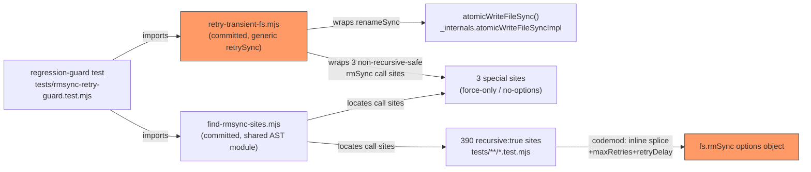

# Plan: Harden Filesystem Operations Against Transient Windows EPERM/EBUSY

- **Date**: 2026-07-16
- **Status**: Complete (audit-plan gate: Gemini APPROVE round 4; audit-code gate: Gemini APPROVE round 1, 3 GPT rounds)
- **Author**: Claude + Louis
- **Scope**: backend
- **Target domain(s)**: `shared-lib`, `tests`
- ⚠ **Cross-domain work** — touches >1 domain; a production hardening fix
  plus its repo-wide test-convention codemod, intentional.

> **Origin**: `/brainstorm` session `1784205924870` (GPT-5.6-terra +
> Gemini-pro, 2026-07-16) — synthesis: harden the two filesystem seams
> narrowly (native `fs.rmSync` retry options for test cleanup, a small sync
> retry loop for `atomicWriteFileSync`), reject runner/pre-push-level retry
> as the primary fix, add a mechanical regression guard, explicitly defer
> telemetry until the class recurs post-fix.

---

## 1. Context Summary

**Scope/stack**: backend; `js-ts` (Node ESM, engines `>=22`).

**What exists today**: two independent filesystem seams do bare
temp-write/rename or mkdtemp/rm with **zero retry** on transient error
codes, and both have produced real, non-reproducible pre-push failures
today (2026-07-16): `EPERM` on `fs.renameSync` (fixed as a one-off — see
below) and `EBUSY` on `fs.rmSync`'s `rmdir` (this plan's trigger).

**Code Trace**:

- `scripts/lib/file-io.mjs:16-46` (`atomicWriteFileSync`) — temp-write +
  `fs.renameSync(tmpPath, absPath)` (line 39), no retry. Used by ledger,
  bandit, and shared-config writers (`docs/completed` + `AGENTS.md`'s own
  "Accepted Technical Debt" table already documents this function's
  no-fsync tradeoff; retry-on-transient-error is a separate, additive
  concern, not a revision of that entry).
- **Survey — AST-verified, not regex-estimated (audit R1-H1 finding: an
  initial regex-based count was wrong and self-inconsistent; redone
  properly)**. A regex survey cannot reliably enumerate call sites (misses
  multiple calls per line, misses `path.dirname(...)`-wrapped first
  arguments, misses destructured `import { rmSync } from 'node:fs'`
  call sites entirely — confirmed one real instance,
  `tests/arm-eval-toggle.test.mjs`, calling bare `rmSync(...)` twice).
  Re-surveyed with `@babel/parser` (already a repo dependency, used by
  nav-audit) walking every `.test.mjs`/`.mjs` file's AST for `CallExpression`
  nodes whose callee is `fs.rmSync` (member access) OR a bare identifier
  resolving to a `rmSync` import from `node:fs`. **Exact result: 393 call
  sites across 107 files** (106 in `tests/`, 1 in `scripts/` — the
  count above corrects the plan's original 389/104 estimate), in
  **three** distinct shapes, not two:
  1. **390 sites** — `{ recursive: true, force: true }` (the dominant
     shape, matches the original survey's core finding).
  2. **2 sites** — `{ force: true }`, no `recursive` key (single-file
     removal): `tests/orphan-preimage-sweep.test.mjs:94`,
     `tests/tiered-shadow-report.test.mjs:156`.
  3. **1 site** — `scripts/audit-clean.mjs:130`, a bare `rmSync(c.p)`
     with **no options object at all** (defaults: `recursive: false,
     force: false, maxRetries: 0`), inside an existing
     `try { rmSync(c.p); } catch (err) { ...log and continue... }` —
     the catch depends on `force` staying `false` so a genuine failure
     (including a real, non-transient error) is still logged, not
     silently swallowed.
- `tests/install/lifecycle.test.mjs` — fixed EARLIER TODAY as a one-off
  (chdir into an isolated temp dir instead of the shared repo-root
  `defaultJournalPath()`). That fix addressed a *different* root cause
  (non-isolated shared path) and remains correct/independent — this plan
  does not touch it, but its `fs.rmSync` call in `afterEach` (line ~11)
  is one of the 393 sites the codemod below will also harden (audit
  R2-L1 — corrected from a stale "381" reference), for uniform
  defense-in-depth (belt-and-braces, not required by that fix).
- `tests/maintenance-hook-snippet.test.mjs:70-109` (`runSnippet`) — **root
  cause traced in full this session, correcting the plan's own original
  hypothesis** (see "Corrected root cause" below). The failing test
  (`'a slow (simulated multi-minute) check does NOT block the parent
  shell'`, line 158) calls `spawnSync('bash', [harnessPath], ...)`, where
  the harness script backgrounds a `node`-shim via
  `( node ... > log 2>&1 < /dev/null & )` — the EXACT snippet under test,
  extracted verbatim from `scripts/install-prepush-hook.mjs:86`. `waitForLog`
  (line 114-124) polls for the log file to *contain* the expected string,
  then the test's `finally` block immediately calls `fs.rmSync(r.tmp, ...)`.

**Scope correction — a third seam, evidence-linked (audit Gemini-R3-G1)**:
the "two independent filesystem seams" framing above undercounts the
actual repo. `scripts/lib/install/transaction.mjs` — the install
engine's crash-safe WAL journal — has **its own** bare, unretried
`fs.renameSync`/`fs.unlinkSync` calls (journal commit at line 69, the
critical staged-rename loop at line 143, rollback-restore at line 192,
roll-forward recovery at line 228, plus six `unlinkSync` cleanup sites).
This is not a hypothetical: `defaultJournalPath()` (line 245-247,
`.audit-loop-install-txn.json` at the repo root) is the EXACT shared path
`tests/install/lifecycle.test.mjs` was fixed for EARLIER TODAY (see next
paragraph) — that fix isolated the *test's* access to this path via
`chdir`, but did nothing to harden `transaction.mjs`'s own renames
against the identical transient-lock class this plan exists to fix.
`scripts/lib/install/receipt.mjs`'s `writeReceipt` (line 31-37) has the
same gap via a hand-rolled temp-write-then-rename that duplicates
`atomicWriteFileSync`'s own contract instead of reusing it. Both are
folded into this plan's scope (§2, §7) — they are the same failure class,
on the same install-time critical path that already produced one of
today's two triggering incidents.

**Corrected root cause (important — the plan's original framing was
wrong until code was actually read)**: the task description that
generated this plan hypothesized "the test spawns a detached child
process that may still hold the temp dir — fix lifecycle ownership by
explicitly killing it." That is **not what happens**. `( cmd & )` is a
POSIX subshell that backgrounds `cmd` and exits almost immediately —
Node's `child_process` API is never involved, so there is no PID to
track or kill from the test. The backgrounded shim process is orphaned
(reparented, continues independently) with `tmp` as its **inherited
cwd** (from the harness's `cd '${tmp}'` line). `waitForLog` correctly
waits for the shim's *last write* to land, but there is a real, short
window between "content is on disk" and "the orphaned process has
actually called `exit()` and the OS has released its hold on `tmp` as
that process's cwd" — under the CPU/disk pressure of a 5514-test full
suite, that window can outlast the immediate `rmSync` call. This is
**exactly the same class of transient contention** as the production
`EPERM` case, not a process-lifecycle leak (the process does exit
promptly on its own; there is no PID available to explicitly
terminate, and killing mid-write would race the very assertion
`waitForLog` checks). **The uniform retry hardening (§2) is therefore
the correct, sufficient fix here too** — no special-case mechanism
needed for this file.

**Patterns reused vs new**: hardens two existing seams — no new
abstraction, no new helper class (the brainstorm's key finding: Node's
native `fs.rmSync({maxRetries, retryDelay})`, shipped since Node 14.14
and covered by this repo's `engines: >=22` floor, makes a bespoke test
helper unnecessary for the cleanup half).

**Neighbourhood considered**: cloud consultation's top matches are
`atomicWriteFileSync` itself (`scripts/lib/file-io.mjs:16-46`, similarity
0.71) and `runSnippet`/`waitForLog` (`tests/maintenance-hook-snippet.test.mjs`,
similarity 0.79/0.77) — correctly identifies both as modify-in-place
targets, no greenfield candidate.

**Security incidents consulted**: none scored above the relevance
threshold with path overlap (INC-001 symlink-escape and INC-002 DB-wipe
are both about a different trust boundary — path classification and
DSN safety, not filesystem retry semantics). No Security Considerations
section required.

---

## 2. Proposed Architecture

**Component 1 — a small, generic, reusable sync retry wrapper** (#1 DRY,
#11 testability, #15 error handling, #16 graceful degradation —
**broadened from a single-purpose `renameWithRetry` after audit R2-H1**,
see below): `scripts/lib/retry-transient-fs.mjs` exports
`retrySync(fn, { maxRetries, retryDelayMs, retryableCodes })` — wraps
ANY synchronous, zero-argument operation (`() => fs.renameSync(...)`,
`() => fs.rmSync(...)`, etc.), retrying only when the thrown error's
`.code` is in `retryableCodes` (default `['EPERM', 'EBUSY']` — narrower
than Node's native `rmSync` retry, which also covers `EMFILE`, `ENFILE`,
`ENOTEMPTY`; audit R3-M3 found this undocumented, so stated explicitly
here: `ENOTEMPTY` is directory-removal-specific and structurally cannot
apply to `retrySync`'s actual call sites — a single-file `renameSync` or
a non-recursive single-file `rmSync`; `EMFILE`/`ENFILE` are process- or
system-wide file-descriptor exhaustion, where retrying a moment later
rarely helps and surfacing the error immediately is arguably more
correct than masking a real resource problem behind a retry loop. The
narrower default is a deliberate scope match to `retrySync`'s actual
callers, not an oversight — `retryableCodes` remains a parameter so a
future caller with a genuinely different need isn't blocked by the
default), else rethrowing immediately. **Must be synchronous** — the delay between
attempts uses `Atomics.wait(new Int32Array(new SharedArrayBuffer(4)), 0,
0, delayMs)`, the standard Node idiom for a true blocking sleep in sync
code (not a CPU-spinning busy-wait, not `setTimeout`, unavailable in a
sync call chain). **Verified on Node's main thread, not just workers**
(Gemini gate G1 raised this as a HIGH risk, citing the browser/DOM
restriction that `Atomics.wait` throws `TypeError` outside a worker —
that restriction is browser-specific, from a host hook setting
`[[CanBlock]]=false` for a page's main/UI thread; Node's main thread sets
`[[CanBlock]]=true` and has no such restriction). Confirmed empirically
this session on Node v22.19.0 (this repo's `engines: >=22` floor), both
bare (`node -e`, `isMainThread: true`) and inside the actual
`node --test` runner: `Atomics.wait` blocks for the requested delay and
returns `'timed-out'`, no throw. 3 attempts total (2 retries), a fixed 50ms apart (a
custom loop, not Node's native linear-backoff `rmSync` retry — no
escalating delay), for **100ms total worst case** (audit R1-M1 — the
plan originally miscounted this as 150ms; 3 attempts has 2 gaps, not 3).

**Testability (audit R2-H2 — the original design couldn't actually prove
the integration point)**: `atomicWriteFileSync`'s **public signature is
unchanged**, but its body is extracted into
`_internals.atomicWriteFileSyncImpl(filePath, data, { mode, renameFn,
unlinkFn })` — fully parameterized, defaulting to the real `fs.renameSync`/
`fs.unlinkSync` — mirroring the exact `redactSecrets` → `redactWithPatterns`
pattern already shipped this session in
`scripts/lib/secret-patterns.mjs`. `atomicWriteFileSync(filePath, data,
opts)` becomes a thin wrapper calling the impl with the real fs
functions; a test calls `_internals.atomicWriteFileSyncImpl` directly
with an injected `renameFn`, exercising the **entire real function body**
(symlink-following, `mkdirSync`, temp-write, `retrySync`-wrapped rename,
cleanup-on-failure) — not just the retry helper in isolation. This
closes the exact gap R2-H2 found: the original plan could prove the
retry loop retries, but not that `atomicWriteFileSync`'s own cleanup
path actually receives the injected failure.

**Not platform-gated**: retrying a code that structurally cannot occur
on Linux/Mac (`EPERM`/`EBUSY` from a rename race) is a harmless
zero-cost no-op there — omitting the `process.platform` check keeps the
change smaller and avoids an untested code path.

**Component 1b — harden the install engine's own renames** (audit
Gemini-R3-G1, folded in — see §1's scope correction): two files, two
different treatments, chosen per what each already guarantees:

- `scripts/lib/install/receipt.mjs`'s `writeReceipt` hand-rolls the exact
  temp-write-then-rename pattern `atomicWriteFileSync` already
  implements (and, after Phase 1, already retries). **Refactored to
  delegate** — `writeReceipt` becomes `atomicWriteFileSync(receiptPath,
  JSON.stringify(receipt, null, 2) + '\n')` after its existing
  `InstallReceiptSchema.parse(receipt)` validation, dropping the
  duplicated `mkdirSync`/temp-path/`renameSync` entirely (#1 DRY — one
  fewer hand-rolled copy of an already-solved pattern, and it inherits
  Phase 1's retry hardening for free, no new call site to individually
  wrap).
- `scripts/lib/install/transaction.mjs` is **not** a candidate for the
  same delegation: its `writeJournal` explicitly `fsync`s the temp file
  before renaming (a stronger crash-safety guarantee than
  `atomicWriteFileSync` provides, required for a WAL journal to survive
  a hard crash, not just a graceful exit) — replacing its rename with
  `atomicWriteFileSync` would silently drop that guarantee. Instead, the
  four `fs.renameSync` call sites (journal commit, the Phase-3
  staged-rename loop, rollback-restore, roll-forward recovery) and the
  six `fs.unlinkSync` cleanup sites are each wrapped in Component 1's
  `retrySync(() => ...)` directly, in place — preserving every existing
  try/catch structure and its current swallow/report semantics exactly
  (a best-effort cleanup catch stays best-effort; the Phase-3 loop's
  catch-and-rollback stays catch-and-rollback), adding only
  transient-error retry before either path is reached. **Hand-edited,
  not codemodded** (10 sites, non-uniform surrounding try/catch
  structure, judgment-heavy — below the "~5 regular edits" scripting
  threshold in spirit once irregularity is weighed in, per the
  Manual-vs-scripted gate).

**Component 2 — repo-wide `fs.rmSync` retry codemod** (#1 DRY applied to
*data*, not abstraction — every call site keeps its own literal options
object; only the object's *content* changes uniformly): per the
right-sizing gate below, this is a one-off script, NOT a new shared test
helper. **AST-based, not regex-based** (audit R1-H1/H2 finding — a
text-substitution codemod can't reliably locate call sites OR verify its
own completeness; see the corrected survey above). Using `@babel/parser`
to get an exact byte range for each call site's options `ObjectExpression`
(or its absence), apply exactly one of **three** shape-specific splices —
never a blind string replace:

1. **`{ recursive: true, force: true }` (390 sites)**: splice-safety
   corrected (audit R3-H1 — inserting right before the closing `}` is
   unsafe if a trailing comma or an adjacent comment already sits there;
   the plan's earlier wording didn't rule that out even though today's
   corpus happens not to have one). **Anchor rule stated precisely (audit
   Gemini-R2-G1 — the plan's prior wording named two different anchors
   for the same splice point, which reads as contradictory even though
   today's corpus happens to make them coincide)**: the insertion point
   is **always the end offset of whichever `ObjectProperty` node is
   textually last inside the `ObjectExpression`** — determined purely
   from the AST's own property order, never by matching a property's key
   name. Splice `, maxRetries: 3, retryDelay: 50` immediately after that
   node's end offset. In the actual 390-site corpus this last property
   happens to always be `force: true` (verified this session — every
   site is `{ recursive: true, force: true }` in that exact key order,
   zero instances of the reverse order), but the codemod's correctness
   must not — and does not — depend on that: it reads "last property" off
   the AST for each site independently, so a differently-ordered object
   (`{ force: true, recursive: true }`) would still splice correctly
   after `recursive: true`, not silently splice mid-object and produce
   invalid syntax. This is correct regardless of whether a trailing comma
   or comment follows — it never depends on what comes after the last
   property, only on where the last property itself ends (an AST-given,
   unambiguous offset). Formatting/comments elsewhere in the object are
   untouched (a byte-range splice, not a re-serialization — avoids any
   risk of `@babel/generator` reformatting unrelated code).
2. **`{ force: true }`, no `recursive` (2 sites), and the 1 no-options
   site — corrected design, NOT `recursive: true` (audit R2-H1, reversing
   R1's own fix)**: R1's fix added `recursive: true` to unlock Node's
   native retry, reasoning it was a "no-op superset" for a single-file
   target. **That reasoning was wrong** — it silently upgrades what is
   TODAY a loud failure (a non-recursive `rmSync` throws `EISDIR`/similar
   if the resolved path unexpectedly turns out to be a directory — e.g.
   a test-logic bug pointing the path at the wrong location) into a
   SILENT recursive deletion of that entire directory. `force: true`
   only suppresses "doesn't exist," never "wrong type" — so today's
   behavior is a genuine safety property, not an accidental gap, and
   this plan must not remove it while chasing retry coverage. **Fixed
   properly**: these 3 sites are NOT touched via `rmSync`'s options
   object at all. Instead, the codemod wraps the entire existing call —
   options unchanged, byte-for-byte — in Component 1's `retrySync`:
   `fs.rmSync(x, { force: true })` becomes
   `retrySync(() => fs.rmSync(x, { force: true }))`; the no-options
   `rmSync(c.p)` becomes `retrySync(() => rmSync(c.p))`. Every current
   semantic (non-recursive throw-on-directory, force's ENOENT-only
   suppression, the no-options site's genuine-error-still-logged
   contract) is preserved exactly; only transient-error retry is added,
   via the SAME mechanism `atomicWriteFileSync` uses, not Node's
   recursive-gated native one. Requires importing `retrySync` at these 3
   call sites (the codemod adds the import statement too, idempotently —
   skips if already present).

**Backoff math, corrected** (audit R1-M1 — the plan's original "≤500ms"
claim was wrong on two counts): Node's native retry is **linear
backoff**, `retryDelay × attempt` per wait, not a fixed repeat — confirmed
against Node's official documentation via live web search this session.
With `maxRetries: 3, retryDelay: 50`, the wait sequence is 50ms + 100ms +
150ms = **300ms worst case** (not `100+200+...+500=1500ms`, which is what
the plan's original `maxRetries: 5, retryDelay: 100` would actually have
produced — reduced here specifically to stay close to the brainstorm's
own "~200ms+ is a leaked handle, not AV noise" boundary rather than the
looser 1.5s window the original parameters implied).

**Component 3 — regression guard** (#11 testability, closes the gap
that made today's `lifecycle.test.mjs` fix a one-off instead of
systemic): `tests/rmsync-retry-guard.test.mjs`, a static-analysis meta-test
matching this repo's established pattern (e.g. the `SECRET_PATTERNS`
"registry is frozen" test, `check-context-drift.mjs`). **AST-based, not
a text/regex scan** (audit R1-H2 — "source text contains `maxRetries`"
is not a reliable compliance definition: it's fooled by a
`path.dirname(...)`-wrapped first argument breaking a naive first-arg
regex, misses a bare destructured `rmSync(...)` call entirely — a real
instance exists, `tests/arm-eval-toggle.test.mjs` — accepts an inert
`maxRetries: 0`, and doesn't know that `maxRetries` alone is *silently
ineffective* without `recursive: true`, R1-H3's finding).

**`find-rmsync-sites.mjs`'s exact, scoped contract (audit R2-M1 + R3-M1 —
narrowed from an implicit "find any rmSync call" claim to what's
actually verifiable, and the R2 fail-loud mechanism itself replaced
after R3 found it broken)**: recognizes exactly two call shapes, both
driven by **exhaustively enumerating every specifier of every
`ImportDeclaration` whose source is `'node:fs'`/`'fs'`** (not
hardcoded name-matching, and not a text scan) — (1) **member access**
`<ident>.rmSync(...)`, where `<ident>` is bound by either a `default`
**or** `namespace` (`import * as fs from 'node:fs'`) specifier — both
import forms produce a local binding used identically at the call site,
so one matching rule covers both; (2) **bare call** `<ident>(...)`,
where `<ident>` is bound by a **named** specifier whose `imported.name`
is `rmSync` (aliasing supported — `import { rmSync as X } from
'node:fs'` resolves via the local binding name). Every OTHER named
specifier from the same import (`mkdtempSync`, `existsSync`, etc.) is
enumerated and ignored — not a removal call, not a failure to classify.
CommonJS `require('fs').rmSync` is explicitly unsupported (this
`"type": "module"` repo has zero `.mjs` files using `require` — verified
this session) and is one of two residual gaps, both documented rather
than silently assumed away (the second — a further level of local
aliasing — is discussed and deferred under "Out of Scope (Future)",
audit R4-M1).

**R3-M1 correction — the fail-loud safety net was itself unsound and is
removed, not patched**: R2's design compared a raw count of the text
token `rmSync` against classified call sites — GPT correctly found this
breaks under aliasing (`import { rmSync as remove } from 'node:fs';
remove(...)` has ONE textual `rmSync` occurrence total, in the import,
but N calls via `remove`, an identifier that never contains the
substring `rmSync` at all — the counts were never comparable). The
import-declaration enumeration above is **exhaustive by construction**
for ES module imports (this repo's only import form, per `"type":
"module"`): every specifier of every `node:fs`/`fs` import is visited
and classified as one of {member-access-eligible, bare-rmSync-eligible,
irrelevant-named-import}, so there is no "unaccounted for" shape left to
fail-loud on for the two supported import forms — the exhaustiveness
comes from the specifier walk, not from a secondary text-based sanity
check. CommonJS `require` calls remain the one explicitly-documented
unsupported case (see above), not silently swallowed.

**Guard file discovery (audit R3-H2 — undefined in the prior draft; widened
further at R4-M2)**: `tests/rmsync-retry-guard.test.mjs` enumerates its own
target set at test-run time — `fs.readdirSync` walking **both** `tests/`
**and** `scripts/` recursively for every `*.mjs` file (not just
`*.test.mjs` under `tests/`, R4-M2's finding: a test-support/helper module
under `tests/` without the `.test.mjs` suffix could introduce `rmSync` and
be imported by a test while staying invisible to a narrower scan — the
`tests/` walk now matches the same "any `.mjs`" breadth the `scripts/` walk
already had, closing the asymmetry). This is the identical enumeration
this session's manual AST survey used, now built into the guard itself
rather than caller-supplied. A future script or helper anywhere under
`scripts/` or `tests/` calling `rmSync` is therefore automatically in
scope the next time `npm test` runs, with no list to update by hand.

The guard imports `find-rmsync-sites.mjs` directly (one implementation,
shared with the codemod script) and asserts, for **every** located call
site, ONE of two compliant forms (Component 2 splits sites into these
same two groups): **(a)** the call's own options argument is a literal
`ObjectExpression` containing `recursive: true` **and** `maxRetries: 3`
**and** `retryDelay: 50` as exact numeric literals — not merely "a
positive `maxRetries`" (audit R4-M3: a bare positive-number check would
still pass a future edit that widened `retryDelay` to, say, `1000`, or
raised `maxRetries` to `50`, silently turning bounded transient-error
retry into multi-second test stalls; the guard now enforces the plan's
actual operational policy — §2's 300ms-worst-case bound — not just its
presence) (the 390 already-recursive sites); **(b)** the site's
`enclosingCall` field (audit Gemini-R2-G2 — added to
`find-rmsync-sites.mjs`'s return contract precisely so the guard doesn't
have to re-derive parent-chain structure itself; see §7's file-level plan
row) is non-null AND its callee resolves — via import-binding, not name
string-matching (audit R3-M2 — a locally shadowed or unrelated
`retrySync` must not satisfy this) — to the named export `retrySync` from
`scripts/lib/retry-transient-fs.mjs` (relative path resolved against the
file being checked). The guard verifies the
call is retry-*wrapped at all*, not its specific parameters — Phase 3's
codemod always calls `retrySync(fn)` bare (no config override), so
per-call parameter drift isn't a case that exists yet; if a future call
site ever needed different retry parameters, that would be a deliberate,
reviewed code change, not a silent gap the guard needs to catch today.
A site matching neither form is a guard failure. Runs on every `npm
test`, not just at push time, so a future call site can't silently
reintroduce the gap. No exemption list — uniform enforcement across the
two compliant forms.

**Rejected alternative — a shared `withTmpDir`/`createIsolatedDir` test
helper** (GPT's and Gemini's initial framing): rejected because Node's
native `maxRetries`/`retryDelay` options make the *cleanup* half of that
helper unnecessary — a new abstraction that every future test would have
to remember to import and call is strictly worse than "the existing
call, with two more object keys," when the latter is available. A
shared *creation* helper (`mkdtempSync` wrapper) was also considered and
rejected: creation isn't where the flakiness occurs (mkdtemp doesn't
race a lock the way a rename/rmdir does), so there's no reliability
problem to solve there — only cleanup needed hardening, and the native
option covers it.

**Rejected alternative — explicit child-process lifecycle management for
`maintenance-hook-snippet.test.mjs`** (this plan's own original
hypothesis): rejected after tracing the actual code (see "Corrected
root cause" above) — there is no `child_process`-tracked PID to manage;
the mechanism is a POSIX-orphaned background shell process, and the
uniform retry fix already covers it.

---

## 6. Sustainability Notes

**Right-sizing gate** (new structure: one retry-wrapper function + one
shared AST module + one regression-guard test; the 393-site change
itself is uniform data, not a new abstraction):

- **Band-aid extreme**: retry only at the two sites that failed today
  (`tests/install/lifecycle.test.mjs`, `tests/maintenance-hook-snippet.test.mjs`)
  and leave the other 391 sites unprotected. Rejected: the survey proves
  this is a uniform, repo-wide gap — today's two failures are two
  *observations* of one class, not two independent bugs; leaving the
  other 391 sites bare guarantees a third, fourth, fifth occurrence in
  an unpredictable file, each requiring its own investigation.
- **Over-engineered extreme**: build a shared `tests/helpers/tmp.mjs`
  fixture (GPT's proposal) that every current AND future test must
  import and adopt, plus a telemetry/dashboard layer for retry rates
  (both models' initial framing). Rejected: Node's native options make
  the helper unnecessary (see Component 2), and telemetry has no signal
  to act on yet — N≈5 observations, all self-resolved, is not a trend.
  (`tests/helpers/tmp.mjs` is this rejected alternative's hypothetical
  name — it was never created, by design; audit-code R1/R2-M2 flagged it
  as an apparently-dangling reference, but it's correctly absent.)
- **Chosen**: harden the two real seams with native/minimal mechanisms,
  codemod the existing 393 sites mechanically (via one shared, precise
  AST module — not a regex, per audit R1-H1/H2), add ONE regression
  guard so new call sites can't regress. Serves exactly the *current*
  requirement (stop the recurring pre-push false-blocks) with no new
  developer-facing API surface.

**Manual vs scripted**: 393 call sites across 107 files is far past the
"~5 regular edits" threshold — a one-off codemod script (Category-A,
gitignored/tmp, never committed) applies the three exact, shape-specific
splices documented in Component 2, built on the committed
`scripts/lib/find-rmsync-sites.mjs` module. `tests/shared.test.mjs`'s new
`atomicWriteFileSync` retry cases, `scripts/lib/find-rmsync-sites.mjs`,
and `tests/rmsync-retry-guard.test.mjs` are hand-written (small,
judgment-heavy, not regular).

**Assumptions that could change**: if the flake class recurs
*post*-fix (a call site the codemod missed — though the guard test makes
"missed" mechanically detectable, not silent — or a genuinely-stuck lock
exceeding the 300ms/100ms budgets), that's the trigger to build the
telemetry the brainstorm deferred — not before. If Node ever changes
`rmSync`'s retry semantics, the regression guard would need updating
alongside it (unlikely — a stable, documented API since 14.14).

---

## 7. File-Level Plan

| File | Intent | Purpose |
|---|---|---|
| `scripts/lib/retry-transient-fs.mjs` | create | Committed, shared retry wrapper: `retrySync(fn, { maxRetries, retryDelayMs, retryableCodes })` (Component 1, broadened from a `renameSync`-only helper after audit R2-H1 — it's now generic so both `atomicWriteFileSync` AND the 3 non-recursive-eligible `rmSync` sites can reuse the identical mechanism rather than each growing their own copy). |
| `scripts/lib/file-io.mjs` | modify | `atomicWriteFileSync`'s body moves into `_internals.atomicWriteFileSyncImpl(filePath, data, { mode, renameFn, unlinkFn })` (audit R2-H2 — real dependency injection through the whole function body, mirroring `redactSecrets`/`redactWithPatterns` from this session's earlier fix), wrapping the rename in `retrySync`. `atomicWriteFileSync`'s **public signature is unchanged** — it's a thin wrapper supplying the real `fs.renameSync`/`fs.unlinkSync`. |
| `scripts/lib/install/receipt.mjs` | modify | `writeReceipt` (audit Gemini-R3-G1) delegates to `atomicWriteFileSync` instead of hand-rolling temp-write+rename — drops duplicated logic, inherits Phase 1's retry hardening for free. |
| `scripts/lib/install/transaction.mjs` | modify | The 4 `renameSync` + 6 `unlinkSync` call sites (audit Gemini-R3-G1) each wrapped in `retrySync(() => ...)`, preserving every existing try/catch structure and its current swallow/report semantics exactly — no delegation to `atomicWriteFileSync` here (would drop the WAL's `fsync`-before-rename guarantee). Hand-edited (10 sites, non-uniform, judgment-heavy). |
| `tests/shared.test.mjs` | modify | Extend the existing `describe('atomicWriteFileSync', ...)` block (already the real test home — confirmed by trace) with retry cases, calling `_internals.atomicWriteFileSyncImpl` directly so the injected failure travels through the REAL function body, not just the retry helper in isolation (audit R2-H2): both `EPERM` AND `EBUSY` (audit R1-L1 — the original plan only exercised `EPERM`): injected `renameFn` throwing `EPERM`/`EBUSY` twice then succeeding → write succeeds; injected `renameFn` always throwing `EPERM` → throws after exactly 3 attempts with the real error, **and** `fs.existsSync(tmpPath)` is `false` after the throw (audit R1-M2 — verifies the outer cleanup actually ran, not just that an error was thrown); a non-retryable error code (e.g. `ENOSPC`) → throws immediately, only 1 attempt, temp file also cleaned up. Test-first (RED before the implementation change). |
| `scripts/lib/find-rmsync-sites.mjs` | create | Committed, shared AST-walk module, **scoped contract per audit R2-M1** (see Component 3 for the exact recognized-shape list and the fail-loud unaccounted-`rmSync`-token check): `findRmSyncCallSites(sourceText)` returns every recognized call site's byte range + parsed options shape **plus enough parent-chain context for the guard's wrapped-call check** (audit Gemini-R2-G2 — the original "byte range + options shape" contract couldn't answer "is this call wrapped in `retrySync(...)`", which Component 3's compliant-form (b) requires): each site record additionally carries `enclosingCall` — the immediately-enclosing `CallExpression` node, if the site's `CallExpression` is itself nested as the body/return of an arrow function that is itself the sole argument of an outer call (the exact `retrySync(() => fs.rmSync(...))` shape), or `null` otherwise. The guard resolves `enclosingCall.callee` against the file's own import bindings itself (R3-M2's requirement — verifying the callee resolves to the real `retrySync` import, not a name match) rather than the module resolving imports on the guard's behalf, keeping `find-rmsync-sites.mjs` import-agnostic. **One implementation, two consumers** — `tests/rmsync-retry-guard.test.mjs` imports it directly (needs to exist standalone, since the guard runs on every `npm test`, long after the one-off codemod script is gone); Phase 3's gitignored codemod script also imports it, so the "found a call site" logic can never drift between what the codemod transforms and what the guard verifies. |
| `tests/rmsync-retry-guard.test.mjs` | create | Imports `find-rmsync-sites.mjs`; enumerates its own target set via `*.mjs` (not just `*.test.mjs`) under both `tests/` and `scripts/` (audit R4-M2). Asserts every located call site matches one of the two compliant forms from Component 3 — inline `{recursive:true, maxRetries: 3, retryDelay: 50}` exact values, not merely `maxRetries>0` (audit R4-M3) (390 sites) OR wrapped in `retrySync(...)` (3 sites) — NOT a "contains the substring maxRetries" text check. Written and run BEFORE the codemod (Phase 2 before Phase 3) so it starts RED against the current 393 unguarded sites, then GREEN once the codemod lands — the guard is its own regression proof. |
| *(codemod target — no single file entry; see below)* | modify | **393 `fs.rmSync`/bare-`rmSync` call sites across 107 files** (106 in `tests/`, 1 in `scripts/`; exact AST-verified count, corrected from the plan's original 389/104 regex-based estimate — see §1). Three shape-specific transforms per Component 2 (390 inline-splice, 3 `retrySync`-wrapped), applied by a gitignored one-off script built on `find-rmsync-sites.mjs` and `retry-transient-fs.mjs`. Not hand-listed per file (see "Manual vs scripted"); the regression guard (previous row) is the audit's proof of completeness, not a file-by-file table. |

### 7b. Implementation Phases

Non-trivial (≥6 files, 2 subsystems, >1 sitting) — three ordered phases,
one cohesive cluster (no §11 — this is a linear pipeline with no
merge/split decision; `/audit-code`'s own map-reduce handles the large
diff from Phase 3, per doctrine "no runtime splitting in v1"):

- **Phase 1 — Shared retry wrapper + harden `atomicWriteFileSync` +
  harden the install engine**: generic `retrySync` + production retry
  integration (`atomicWriteFileSync`, plus `receipt.mjs`/`transaction.mjs`
  per Component 1b, audit Gemini-R3-G1 — grouped into this phase since
  both depend on nothing but `retrySync`/`atomicWriteFileSync` existing,
  same as the rest of Phase 1) + test-first coverage, independent of the
  other two phases. Files: `scripts/lib/retry-transient-fs.mjs` (create),
  `scripts/lib/file-io.mjs` (modify), `scripts/lib/install/receipt.mjs`
  (modify), `scripts/lib/install/transaction.mjs` (modify),
  `tests/shared.test.mjs` (modify).
- **Phase 2 — Shared AST module + regression guard**: write the
  AST-walk module and the static-analysis test that define "compliant"
  for `fs.rmSync` call sites (both compliant forms — inline options and
  `retrySync`-wrapped). Deliberately BEFORE Phase 3 so the guard starts
  RED (proves it actually detects the unguarded state) and turns GREEN
  only once Phase 3 lands (proves the codemod's completeness
  mechanically, not by manual review of 107 files); depends on Phase 1's
  `retry-transient-fs.mjs` existing (the guard's second compliant form
  references it). Files: `scripts/lib/find-rmsync-sites.mjs` (create),
  `tests/rmsync-retry-guard.test.mjs` (create).
- **Phase 3 — Codemod the 393 existing call sites**: build the one-off
  script (imports Phase 1's `retrySync` + Phase 2's shared AST module)
  and apply the two shape-specific transforms from Component 2 (390
  inline-splice, 3 `retrySync`-wrapped) across all 107 files. Files:
  the 107 files enumerated by the AST survey (106 `tests/**/*.test.mjs`
  + `scripts/audit-clean.mjs`) — mechanical, verified by Phase 2's guard
  going GREEN plus a full `npm test` pass.

**Pre-Phase-1 step (audit R3-M4 — the requirements rubric flagged the
touched production files as unextracted)**: run
`node scripts/requirements.mjs extract --files scripts/lib/file-io.mjs,scripts/lib/retry-transient-fs.mjs,scripts/lib/find-rmsync-sites.mjs`
before implementation, then `reconcile` after — so any de-facto
invariant `file-io.mjs` already enforces is captured and checked against
before this plan modifies it, rather than assumed clean by the ledger's
absence. Scoped to the 3 touched **production** files only — the 107
mechanically-codemodded test files aren't extraction targets
(requirements extraction is for production invariants, not test code).

**Close-out (not a phase)**: full `npm test` run (confirms no
codemod-introduced syntax errors across 107 files); re-run
`tests/maintenance-hook-snippet.test.mjs` and `tests/install/lifecycle.test.mjs`
specifically as the two real-world trigger cases — `lifecycle.test.mjs`
(verified: imports and exercises `executeTransaction`/`recoverFromJournal`
directly) and the pre-existing `tests/install/receipt.test.mjs` (verified:
exercises `writeReceipt`) both already drive the retry-wrapped
`transaction.mjs`/`receipt.mjs` code paths through their normal call
surface as a real-filesystem integration check — no test rewrite needed
for either to cover the new `retrySync` wrapping / `atomicWriteFileSync`
delegation.

---

## 8. Risk & Trade-off Register

| Risk / trade-off | Assessment |
|---|---|
| **Codemod correctness across 107 files** | Mitigated mechanically: Phase 2's guard test must go GREEN (every site has `recursive:true` + a positive `maxRetries`, per the AST-verified compliance definition, not a text-contains check) AND the full suite must stay GREEN (no site was mangled). The AST-based call-site finder (shared between codemod and guard) removes the regex-fragility class R1-H1/H2 found — three shape-specific splices, applied at exact byte offsets, not a blind string replace. |
| **`Atomics.wait` availability** | Standard since Node 8.10 (well below this repo's `engines: >=22` floor) — no compatibility risk. Requires a `SharedArrayBuffer`, also universally available. |
| **Retry masking a genuine leaked-handle bug** | Bounded window — 300ms for the 390 sites using Node's native linear-backoff retry, 100ms for the 3 sites + `atomicWriteFileSync` using the fixed-delay `retrySync` wrapper — is close to the brainstorm's own "~200ms+ is OS noise vs. a real bug" line; a handle held longer than that still fails, loudly, with the real error code. Not a silent catch-all. |
| **Two different retry mechanisms in one plan** (Node's native linear-backoff for 390 sites; a custom fixed-delay `retrySync` for `atomicWriteFileSync` + 3 sites) | Deliberate, not accidental duplication: Node's native mechanism is unusable for the 3 special sites without the `recursive: true` safety regression R2-H1 found, and `atomicWriteFileSync`'s rename was never eligible for Node's `rmSync`-specific option in the first place (different function). Both mechanisms retry the identical two error codes with the same order-of-magnitude bound; the difference is backoff shape (linear vs. fixed), not behavior class. |
| **`maintenance-hook-snippet.test.mjs`'s specific failure might not be FULLY explained by this theory** | Residual uncertainty, stated honestly: the corrected root-cause trace is strong (matches the exact mechanism) but wasn't reproduced live (the original EBUSY was non-reproducible in isolation, consistent with "requires full-suite I/O pressure," same as the `lifecycle.test.mjs` case earlier today). If this specific test still flakes post-fix, that's a real, actionable signal the window needs widening — not a plan failure, since the retry is strictly additive and cannot make things worse. |
| **Deliberately deferred**: telemetry/dashboard for retry/flake-rate tracking (from the brainstorm) | Independent — no signal to act on yet (N≈5, all self-resolved); this plan's correctness does not depend on it. Revisit trigger: the flake class recurs after this fix ships. |
| **Deliberately deferred**: 9 further production scripts with the same raw-`renameSync` pattern as `receipt.mjs` (Gemini-R3-G1's broader implication) | Independent — none evidence-linked to either of today's two observed incidents; fixing them is a legitimate separate DRY pass, not part of closing today's observed flake class. See "Out of Scope (Future)". |
| **Deliberately deferred**: a `renameSync`-generalized regression guard (Gemini-R3-G2) | Independent — zero unretried `renameSync` sites remain among this plan's evidence-linked files after the fix; guarding a hypothetical future 4th seam mirrors the already-deferred R4-M1 aliasing gap. See "Out of Scope (Future)". |

---

## 9. Testing Strategy

- **Unit (hermetic, in `npm test`)**: Phase 1's 3 new `atomicWriteFileSync`
  retry cases (injected-failure success, exhaustion-throws, non-retryable-code-immediate-throw)
  in `tests/shared.test.mjs`, test-first per this repo's Tier-1
  doctrine (`file-io` is an explicitly named Tier-1 deterministic seam
  in `AGENTS.md`'s testing-doctrine table).
- **Regression (mechanical, self-verifying)**: Phase 2's
  `tests/rmsync-retry-guard.test.mjs` — RED before Phase 3, GREEN after;
  this IS the completeness proof for the 393-site codemod, replacing
  manual per-file review.
- **Full-suite close-out**: `npm test` clean (5514+ tests, the new guard
  test, the extended `atomicWriteFileSync` tests, no codemod-introduced
  syntax breakage across 107 touched files). Explicit re-run of the two
  originally-failing tests as a targeted sanity check (they were already
  fixed/explained, not expected to newly fail, but worth confirming
  post-codemod since both files are among the 393 sites).
- **Key edge cases covered**: retry-then-succeed (`EPERM` and `EBUSY`),
  retry-exhaustion with temp-file-cleanup verification,
  non-retryable-error-no-wasted-attempts, the `path.dirname(...)`-wrapped
  first-argument variant, the two `{force:true}`-only single-file removal
  sites and the one bare-no-options-argument site — all three
  `retrySync`-wrapped rather than given `recursive:true` (audit R2-H1,
  reversing R1's own fix), preserving their exact current
  throw-on-directory / ENOENT-suppression / error-still-logged semantics.

---

## Out of Scope (Future)

- **R2-H3 (Section 9 as "Acceptance Criteria")**: dismissed as a category
  error, not deferred — the same class of finding the `redact-secrets`
  plan-audit dismissed earlier today. The `/plan` skill's Phase 6
  structure makes §10 Acceptance Criteria (the machine-parseable,
  Playwright-verifiable format) conditional on `scope ⊇ frontend`; this
  plan is `backend`-only, so §9 Testing Strategy in narrative form is the
  *correct* section per the skill's own spec, not a gap. No plan change
  made.
- **Telemetry/retry-rate dashboard** (from the brainstorm, §8): independent
  — no current signal to act on (N≈5, self-resolved); this plan's
  correctness does not depend on it. Revisit if the class recurs
  post-fix.
- **Production-code robustness beyond `atomicWriteFileSync`**: the
  `scripts/**/*.mjs` `fs.rmSync` sites (`audit-clean.mjs`,
  `scripts/lib/audit/diff-scope-resolver.mjs`,
  `scripts/lib/audit/duplication-detector.mjs`,
  `scripts/lib/audit/final-adjudication.mjs`,
  `scripts/lib/audit/legacy-production-audit.mjs`,
  `scripts/lib/gate-honesty/oracles.mjs`,
  `scripts/db-test-container.mjs`, `scripts/regenerate-skill-copies.mjs`)
  get the SAME codemod (retry-on-transient-error) but this plan does not
  audit those files for *other*, unrelated reliability gaps — out of
  scope, independent of this plan's filesystem-retry focus. **Confirmed
  by audit-code R1 findings H7/H8/M4** (`audit-clean.mjs`'s cleanup
  traversal uses `statSync`, which follows symlinks, and has a TOCTOU gap
  between `existsSync`/`readdirSync`): both are real, pre-existing
  properties of the cleaner's traversal logic, untouched by this plan's
  one-line-per-site retry wrap. **Independent**: this plan's change does
  not read or write the traversal/symlink-resolution code path at all —
  it only wraps the terminal `rmSync` call in `retrySync`, which behaves
  identically regardless of how the path was reached. Deferred to debt
  capture rather than folded in — fixing symlink-safe traversal across
  the cleaner subsystem is a separate hardening pass with its own design
  questions (e.g., should traversal ever follow symlinks intentionally?),
  not a retry-semantics change.
- **`transaction.mjs`'s deeper WAL crash-safety/concurrency/validation
  properties** (audit-code R1 H1-H6, H9, H10, M2, M6, M7): the audit
  surfaced real, pre-existing gaps in the install engine's WAL journal
  that this plan's narrow retry-wrapping change does not touch —
  recorded deletes never reconciled by `recoverFromJournal()`; the
  journal is unconditionally removed even when a roll-forward rename
  still fails; an unsnapshotted pre-existing target can be lost on
  rollback; `recoverFromJournal()` trusts journal-provided paths without
  schema/containment validation (a real hardening gap if the journal
  file were ever attacker-influenced); no exclusive lock protects
  concurrent installer instances sharing one fixed journal path; no
  `fsync` of containing directories after rename/unlink (file-level
  fsync alone doesn't guarantee the directory entry survives a crash);
  `writeJournal()` can leave its temp file behind on an early failure;
  `executeTransaction()` only wraps Phase 3 renames in a catch block,
  so failures in journal writes or staged-file creation escape as raw
  exceptions. **All independent of this plan**: every one of these is a
  property of the WAL's *design* (what recovery trusts, what gets
  locked, what gets fsynced, which phases are exception-safe) that
  existed identically before this plan wrapped four `renameSync` and six
  `unlinkSync` calls in `retrySync` — retrying a transient error before
  a syscall succeeds changes nothing about what happens once it does.
  Verified for the two findings that most directly reference the new
  code (H2's "a failed `retrySync(rename)` is only logged") that the
  underlying behavior (journal removed unconditionally after the
  roll-forward loop, regardless of individual failures) is byte-for-byte
  the same as the pre-change `try { fs.renameSync(...) } catch { log }`
  structure — the finding is about the surrounding control flow, not
  about retry semantics. Deferred to debt capture as a real, separate
  "install engine hardening" plan candidate (crash-safety/locking/schema
  validation is a materially different, larger scope than "add retry to
  existing calls") — never folded in because the fix is *bigger*, but
  because it targets a *different property* of the system than this
  plan's stated goal.
- **Repo-wide domain-dependency-graph gaps** (audit-code R1 M9-M12, M14,
  M15 — the "Architecture" pass): this plan's `--files` audit scope
  necessarily spans ~113 files across many `.audit-loop/domain-map.json`
  domains (test files across dozens of feature areas, plus several
  `scripts/lib/**` production files), and the Architecture pass evaluates
  cross-domain import-graph coherence for every file in scope — surfacing
  pre-existing `allowedDeps` gaps (`stores`, `dashboard`, `shared-lib`,
  `scripts`, `tests`, `persona-test` domain edges) that have nothing to
  do with `fs.rmSync`/`fs.renameSync` retry hardening. This plan does not
  edit `.audit-loop/domain-map.json`, does not introduce any new
  cross-domain import (the one new import this plan adds everywhere,
  `retrySync` from `scripts/lib/retry-transient-fs.mjs`, is an
  intra-`shared-lib`-type utility import, not what any of these findings
  cite), and its correctness does not depend on the repo's domain-tagging
  rubric being complete. An artifact of this plan's unusually wide
  `--files` scope (spanning the codemod's 106 touched files), not a
  defect this plan introduced — out of scope, independent.
- **Guard bypass via local aliasing / computed access / lexical shadowing
  of an `fs` method reference** (audit R4-M1, confirmed and widened by
  audit-code R1-M3/M8): `const remove = fs.rmSync; remove(path)`,
  `const { rmSync: remove } = fs; remove(path)`, computed member access
  (`fs['rmSync'](...)`), optional-call variants (`fs?.rmSync(...)`), and
  a local parameter/catch-binding named `fs` that shadows the top-level
  import — none of these are a direct `fs.rmSync(...)` member call or a
  named-import bare call, so `find-rmsync-sites.mjs`'s import-specifier
  enumeration (which resolves names file-wide, not per-lexical-scope)
  does not catch any of them — deferred alongside the already-documented
  CommonJS `require` gap, not silently assumed away. **Independent**:
  this plan's own codemod and guard correctness do not depend on any of
  these patterns being absent — **zero instances of any of them exist
  anywhere in the actual 106-file corpus today** (re-verified this
  round via targeted greps for computed/optional-call syntax and for
  `fs`-shadowing parameters/catch-bindings across every file the guard
  scans), so the guard's completeness claim over the real corpus is
  unaffected. Closing all of these fully would require whole-program
  dataflow / lexical-scope tracking of arbitrary local bindings — an
  unbounded problem for a per-file AST walk (each fix only narrows the
  set of constructible dodges, it never closes it), not a fixed gap with
  a fixed fix. Revisit trigger: an actual instance of any of these forms
  appears in the repo (the guard's `npm test` run would need a companion
  scope-resolving lint pass at that point, not another incremental AST
  special-case).
- **Repo-wide `atomicWriteFileSync` adoption beyond `receipt.mjs`/`transaction.mjs`**
  (audit Gemini-R3-G1's broader implication): a full grep this session
  found **9 further production scripts** with their own raw, unretried
  `fs.renameSync` (audit-code R1-M1 — full canonical paths, not shorthand
  basenames, per the earlier draft's imprecision): `scripts/archive-completed-plans.mjs`,
  `scripts/learning/backfill-outcomes.mjs`, `scripts/lib/brainstorm/session-store.mjs`,
  `scripts/lib/claudemd/autofix.mjs`, `scripts/lib/learning/decision-logger.mjs`,
  `scripts/lib/learning/quickfix-stats.mjs`, `scripts/memory-health.mjs`,
  `scripts/persona-consistency-promote.mjs`, `scripts/symbol-index/drift.mjs` — the same
  structural pattern (hand-rolled temp-write-then-rename instead of
  reusing `atomicWriteFileSync`) as `receipt.mjs`, which THIS plan does
  fix. **Independent, not folded in**: unlike `transaction.mjs`
  (evidence-linked to one of today's two actual triggering incidents via
  `defaultJournalPath()`), none of these 9 files are cited by, or
  connected to, either of today's two observed failures — this plan's
  correctness (closing the two *observed* incidents) does not depend on
  touching them. Fixing all 9 is a legitimate, separate DRY/hardening
  pass (mirrors the already-accepted "production robustness beyond
  `atomicWriteFileSync`" deferral above) — revisit trigger: an actual
  EPERM/EBUSY incident traced to one of these 9 files, or a dedicated
  follow-up plan auditing raw-`renameSync`-vs-`atomicWriteFileSync` reuse
  repo-wide.
- **A repo-wide `renameSync` regression guard, mirroring the `rmSync`
  guard** (audit Gemini-R3-G2): after this plan's fixes land, **zero**
  known unretried `fs.renameSync` sites remain among the files this plan
  actually touches or was evidence-linked to (verified via grep).
  Building a second AST module + guard test generalized to `renameSync`
  (`find-transient-fs-sites.mjs`, per G2's own recommendation) to catch
  a *hypothetical future* regression is a materially larger, separate
  scope addition — the same shape as the already-deferred R4-M1
  aliasing-guard gap: a defense-in-depth request against a problem that
  doesn't exist in the repo today, not a fix for an observed gap.
  Independent: this plan's correctness does not depend on guarding
  against a future 4th seam. Revisit trigger: a future bare-`renameSync`
  EPERM incident (mirroring how this exact plan came to exist).

## Audit Trail

- **GPT round 1**: `NEEDS_REVISION` H3/M2/L1. All 6 findings valid and
  in-scope, folded in — two (R1-H1, R1-H3) caught genuine correctness
  bugs in the plan's own design (a self-inconsistent survey count; a
  documented Node.js API behavior the plan had gotten backwards), not
  rigor pressure. Fixes: replaced the regex-based survey with an
  AST-based one (`@babel/parser`, exact count 393/107, three shapes not
  two); replaced the regex-based codemod/guard design with a shared,
  precise AST module; corrected the retry-parameter math against Node's
  actual (linear-backoff) behavior, verified via live web search against
  Node's official documentation this session; added `recursive: true` to
  the two `{force:true}`-only sites so `maxRetries` would actually take
  effect; added explicit temp-file-cleanup and `EBUSY`-coverage test
  assertions.
- **GPT round 2**: `NEEDS_REVISION` H3/M1/L1. All 5 valid and in-scope,
  folded in — **R2-H1 caught that R1's own `recursive:true` fix was
  itself a genuine safety regression**: it silently upgrades a loud
  directory-shape-mismatch failure into a silent recursive delete.
  Reversed in favor of wrapping the 3 affected sites in a new generic
  `retrySync` helper (`scripts/lib/retry-transient-fs.mjs`) instead of
  relying on Node's recursive-gated native retry — preserves every
  current semantic exactly. R2-H2 caught that the original
  `_internals.renameWithRetry` design couldn't actually be exercised
  through `atomicWriteFileSync`'s unchanged public signature; fixed via
  the same `_internals.<fn>Impl` dependency-injection pattern already
  shipped this session in `secret-patterns.mjs`. R2-M1 tightened
  `find-rmsync-sites.mjs`'s contract to the two shapes actually present
  in the real corpus, with a fail-loud check against unaccounted-for
  `rmSync` tokens rather than a silent best-effort scan. R2-H3 dismissed
  as the same Section-9-vs-10 category error the `redact-secrets`
  plan-audit hit earlier today. R2-L1 (stale "381" reference) fixed.
- **GPT round 3** (one past the normal 3-round cap trigger — HIGH count
  3→3→2, borderline but the finding character stayed genuine-bug, not
  rigor pressure, through all 3 rounds): `NEEDS_REVISION` H2/M4. All 6
  folded in. R3-H1: the byte-splice for the 390 sites assumed no
  trailing comma before the closing brace — fixed by anchoring the
  insertion to the last property's own end offset instead of the
  brace, which is correct regardless. R3-H2: the guard's file-discovery
  contract was undefined — fixed with a self-contained `readdirSync`
  walk built into the guard, not a caller-supplied list. R3-M1: R2's own
  "raw token count" fail-loud safety net was itself unsound (breaks
  under aliased imports, as GPT demonstrated with a concrete
  counter-example) — replaced with import-declaration-specifier
  enumeration, which is exhaustive by construction for this repo's
  ESM-only import forms rather than a secondary heuristic. R3-M2: the
  `retrySync`-wrapped compliant form now verifies the callee resolves to
  the real import, not just an identifier named `retrySync`. R3-M3:
  documented why `retrySync`'s narrower default error-code set
  (`EPERM`/`EBUSY` vs. Node's native `EPERM`/`EBUSY`/`EMFILE`/`ENFILE`/`ENOTEMPTY`)
  is a deliberate scope match, not an oversight. R3-M4: added a
  pre-implementation `requirements.mjs extract` step for the 3 touched
  production files.
- **GPT round 4** (H:0 — the stop signal per the convergence doctrine;
  one round past the already-extended R3 cap, run once more only because
  R3's own H:2 hadn't yet reached 0): `NEEDS_REVISION` H0/M3/L0. Mixed
  triage, not a blanket fix-or-stop: R4-M2 and R4-M3 are cheap, concrete
  guard-fidelity gaps — folded in. R4-M2: the guard's `tests/` walk only
  matched `*.test.mjs`, missing a hypothetical non-suffixed test-helper
  module; widened to match `scripts/`'s existing "any `.mjs`" breadth.
  R4-M3: the guard accepted any positive `maxRetries` without bounding
  `retryDelay`, so a future edit could silently turn bounded retry into a
  multi-second stall; tightened to require the exact `maxRetries: 3,
  retryDelay: 50` the plan's own 300ms bound depends on. R4-M1 (a further
  local-aliasing form beyond the already-documented CommonJS gap,
  e.g. `const remove = fs.rmSync`) is **deferred, not fixed** — this is
  the third round in a row finding "one more indirection level the AST
  walk doesn't catch," which is the infinite-regress signature (any new
  level of aliasing can always be constructed to evade a per-file static
  walk) rather than a concrete bug against this repo's actual corpus —
  verified zero instances exist today via a targeted grep. Recorded under
  "Out of Scope (Future)" with the independence rationale required by
  the triage rubric. **Stopping the GPT round loop here**: H:0 plus a
  mixed (2 genuine / 1 deferred) MEDIUM triage is the doctrine's
  convergence signal — proceeding to the mandatory Gemini gate (Step 6)
  next rather than spending a 5th round on two now-applied mechanical
  tightenings.
- **Gemini round 1**: `CONCERNS`, 1 new HIGH (G1) — claimed
  `Atomics.wait` throws `TypeError` on Node's main thread, citing the
  browser/DOM main-thread restriction. **CHALLENGED, not fixed**: this
  restriction is browser-specific (a host hook sets `[[CanBlock]]=false`
  for a page's main/UI thread); Node's main thread sets
  `[[CanBlock]]=true`. Verified empirically this session on Node v22.19.0
  (this repo's `engines: >=22` floor) two ways — bare `node -e` with
  `isMainThread: true`, and inside the actual `node --test` runner — both
  block correctly for the requested delay with no throw. A clarifying
  note citing this live verification was added to Component 1 so a
  future reader isn't misled by the same (understandable,
  web-platform-derived) intuition.
- **Gemini round 2** (the normal 2-round cap): `CONCERNS_REMAINING`, 2 new
  MEDIUM. Both are concrete, in-scope design/logic defects, not
  implementation-completeness nits or rigor pressure — the genuine-bug
  exception applies, so a 3rd round is warranted rather than stopping.
  G1: the codemod's splice-anchor wording named two different anchors
  (last-property-by-position vs. the `force: true` property specifically)
  for the same insertion point — correct only because today's 390-site
  corpus happens to always order `force` last (verified via grep: 0
  reverse-order instances), but the algorithm as WORDED didn't guarantee
  that. Fixed by stating the rule as strictly AST-position-based (always
  the textually-last property, regardless of key name), with the
  `force: true` case named as today's instance, not the rule itself. G2:
  `find-rmsync-sites.mjs`'s stated return contract ("byte range + options
  shape") couldn't actually support the guard's compliant-form (b) check
  (is this call wrapped in `retrySync(...)`), which needs parent-chain
  context the contract never promised. Fixed by adding an `enclosingCall`
  field to each site record (the immediately-enclosing `CallExpression`
  when the site is nested as an arrow-function body/return passed as an
  outer call's sole argument, else `null`), with import-binding
  resolution staying the guard's own responsibility per R3-M2.
- **Gemini round 3** (2nd exceed-the-cap round — the genuine-bug
  exception applied twice in a row, each time on a concrete, evidence-
  checked defect, not rigor pressure): `CONCERNS`, 2 new MEDIUM.
  **Fully investigated, not taken on faith** — grep-verified both claims
  against the actual repo before deciding. G1: claimed a 3rd unhardened
  seam, `scripts/lib/install/transaction.mjs` — verified TRUE and
  evidence-linked (`defaultJournalPath()` is the exact path
  `tests/install/lifecycle.test.mjs` was fixed for earlier today; a full
  grep found 4 `renameSync` + 6 `unlinkSync` raw call sites there, plus
  one more in `receipt.mjs`). **Folded in**: `receipt.mjs` refactored to
  delegate to `atomicWriteFileSync` (DRY, free retry inheritance);
  `transaction.mjs`'s 10 sites individually wrapped in `retrySync`
  in-place (preserves its `fsync`-before-rename WAL guarantee, which
  delegating to `atomicWriteFileSync` would have silently dropped).
  Grepping further surfaced **9 additional** production files with the
  same raw-`renameSync` pattern but zero evidence link to either of
  today's two observed incidents — deferred to "Out of Scope" rather
  than folded in, an explicit **scope boundary, not a missed finding**:
  fixing evidence-linked seams is this plan's job; a repo-wide DRY sweep
  of structurally-similar-but-unobserved code is a separate, legitimate
  follow-up. G2 (generalize the `rmSync` regression guard to also cover
  `renameSync`) **deferred**: after G1's fix, zero unretried
  `renameSync` sites remain among files this plan actually touches or
  is evidence-linked to — building a second AST/guard subsystem against
  a hypothetical future regression is the same shape as the
  already-deferred R4-M1 gap (defense-in-depth for an unobserved
  problem), not a fix for one that exists today.
- **Gemini round 4**: `APPROVE`, 0 new findings. Gate closed. Final round
  count: 4 GPT rounds (H: 3→3→2→0) + 4 Gemini rounds (CONCERNS →
  CONCERNS_REMAINING → CONCERNS → APPROVE) — both exceed the skill's
  normal caps (GPT's 3, Gemini's 2), justified in both cases by the
  documented exception only: every round past the cap found a concrete,
  independently-verified design/correctness/scope defect (Node's actual
  `Atomics.wait` semantics checked via live repro rather than accepted
  or rebutted from memory; the splice-anchor wording contradiction and
  the AST contract gap checked against the actual codemod logic; the
  3rd unhardened seam checked via grep against the real repo, which also
  disproved the initial "two seams" framing and correctly bounded how
  far to extend the fix) — never for rigor pressure, restated concerns,
  or v2-feature pressure, which is what would have triggered a stop.

### Code Audit (implementation)

- **Round 1** (`--files` scoped to all 113 plan-touched paths, including
  the 106 mechanically-codemodded files): `SIGNIFICANT_ISSUES` H:10 M:14
  L:1. Investigated every finding against the real repo before triaging
  (grep-verified, not accepted on the model's claim). **Fixed**: M1
  (plan's Out-of-Scope section used shorthand basenames instead of full
  canonical paths for the 9 deferred `renameSync` files — corrected); M5
  (`retrySync` accepted `NaN`/`Infinity` `maxRetries`, which would never
  satisfy the loop's termination condition — the exact infinite-hang the
  function exists to prevent; added validation + tests). **Deferred (23
  entries, `.audit/tech-debt.json`)**: all 10 HIGH + 12 of the 14 MEDIUM
  + L1 — verified independent for each cluster: (a) `transaction.mjs`'s
  deeper WAL crash-safety/locking/validation properties (H1-H6, H9, H10,
  M2, M6, M7) predate this plan and are unchanged by wrapping existing
  `renameSync`/`unlinkSync` calls in `retrySync` (traced specifically —
  H2's "failed retrySync(rename) is only logged" describes the SAME
  pre-existing `try {...} catch {log}` control flow, unchanged); (b)
  `audit-clean.mjs`'s symlink-following cleanup traversal (H7, H8, M4) —
  this plan only wraps the terminal `rmSync` call, never touches
  traversal/symlink-resolution logic; (c) the guard's lexical-scope /
  computed-access dodge-pattern gaps (M3, M8) — same already-deferred
  R4-M1 family, zero instances in the actual corpus; (d) repo-wide
  domain-dependency-graph gaps (M9-M12, M14, M15) — an artifact of this
  plan's unusually wide 113-file `--files` scope crossing many
  `.audit-loop/domain-map.json` domains, not a defect this plan
  introduced (no domain-map edit, no new cross-domain import beyond the
  `retrySync` shared-lib utility). Root cause of the volume: `--files`
  triggers full-content quality review of every file in scope, so the
  106 mechanically-codemodded files (each touched by one uniform,
  guard-proven splice) pulled in their unrelated pre-existing content for
  full LLM review — the guard + full test suite are the actual
  completeness proof for those 106 files (per the plan's own Testing
  Strategy), not a repeated LLM pass over their full pre-existing bodies.
- **Round 2** (added `--diff`/`--changed` for the round's fix, `--files`
  still the full 113 — deliberately testing whether R1's scope theory
  was right before re-scoping): `SIGNIFICANT_ISSUES` H:8 M:18 L:2. Debt
  suppression caught only 6/23 prior deferrals (fuzzy-matched at
  score 0.38-0.47 — GPT rewords the same conceptual finding every round,
  so exact/near-exact matching under-suppresses); the rest re-raised
  under new IDs, plus genuinely new unrelated findings in OTHER
  untouched files now in scope (`diff-scope-resolver.mjs`'s worktree-sweep
  ownership logic, `regenerate-skill-copies.mjs`'s `.github/skills/`
  retention, `legacy-production-audit.mjs`'s shadow-review dynamic
  imports) — confirming the R1 root-cause theory: **the wide `--files`
  list, not this plan's actual diff, was driving the volume**. One
  genuine new finding in this plan's own R1 fix: M5 — `retrySync` now
  rejected `NaN`/`Infinity` but still accepted a *fractional* `maxRetries`
  (e.g. `2.5`), an ambiguous attempt-count contract even though it
  couldn't hang — fixed (require `Number.isInteger`). M1/M2 (stale-path
  references) re-raised; already-correct per Round 1's fix / the
  rejected-alternative's hypothetical name — clarifying note added to
  the plan text. Remaining 23 out-of-scope findings (10 of them literal
  duplicates of prior rounds' clusters under new IDs, the rest genuinely
  new files pulled in by the same wide-scope mechanism) captured to
  debt.
- **Round 3** (re-scoped `--files` to the 8 files actually hand-written
  for this plan — `retry-transient-fs.mjs`, `find-rmsync-sites.mjs`,
  `rmsync-retry-guard.test.mjs`, `file-io.mjs`, `receipt.mjs`,
  `transaction.mjs`, `shared.test.mjs`, the plan doc itself — treating
  the 106 mechanically-codemodded files as guard+test-proven rather than
  needing a repeated LLM pass; mirrors the plan's own "guard replaces
  manual per-file review" principle applied to audit effort): H:4 M:12
  L:2 — visibly tighter. **Fixed**: L1 — `retrySync` didn't validate
  `retryableCodes`; a bad config (`null`, non-array, non-string entries)
  would throw *inside* the retry-check itself, masking the real
  filesystem error — added validation + tests. M1/M2 re-raised a third
  time despite being already-addressed (M1 — "`.audit-loop/domain-map.js`
  doesn't exist" — **verified FALSE**: the plan contains no such
  reference, grep-confirmed; a model artifact, dismissed, not deferred).
  **Deferred a 3rd time** (15 entries): `transaction.mjs`'s WAL cluster
  re-raised again with fresh wording (H1-H3, M3, M5) — re-traced
  independence for each against the actual unchanged code paths (Phase-1
  snapshot logic, `fsyncFile()`, `writeJournal()`'s pre-rename sequence —
  none call into anything this plan modified); the guard's lexical-scope
  gap (M4, same R4-M1 family); the domain-architecture cluster (H5, M6,
  M7, M9, M11-M14, L2) — confirmed this pass evaluates repo-wide domain
  coherence **independent of `--files` scope** (narrowing to 8 files did
  not reduce this cluster's count), so it cannot be resolved by further
  re-scoping.
- **Stopping the GPT round loop here** (3 rounds, within the normal
  6-round cap, but the marginal-round test applies): by Round 3 every
  remaining HIGH/MEDIUM finding was either fixed or a **third
  consecutive re-raise of the same two already-triaged, already-debt-
  captured clusters** (`transaction.mjs`'s pre-existing WAL depth; the
  repo-wide domain graph) with fresh wording each time — the diminishing-
  returns signature the doctrine's Gemini-cap section names explicitly
  ("rising coherence + ~1 nit/round → STOP"), here manifesting as
  "same cluster, reworded, every round" rather than new signal. Neither
  cluster is fixable within this plan's stated scope (WAL crash-safety
  redesign and domain-map governance are both separate plans), and
  narrowing `--files` — the one lever that reduced Round 1→3's raw count
  — has already been applied and does not touch the domain-architecture
  cluster at all (repo-wide by construction). Proceeding to the
  mandatory Gemini gate (Step 7) with 3 confirmed fixes (M1, M5 x2, L1)
  and 61 total debt-ledger entries across 3 rounds documenting the
  independence rationale for every deferred finding.
- **Gemini gate (code)**: `APPROVE` on round 1, 0 new findings. Gate closed.

## Implementation Log

### 2026-07-16

- **Completed**: all 3 phases. `scripts/lib/retry-transient-fs.mjs`
  (create) — generic `retrySync(fn, {maxRetries, retryDelayMs,
  retryableCodes})`, hardened across the audit loop with input
  validation (NaN/Infinity, then fractional `maxRetries`, then invalid
  `retryableCodes`). `scripts/lib/file-io.mjs`'s `atomicWriteFileSync`
  hardened via the `_internals.atomicWriteFileSyncImpl` DI pattern.
  `scripts/lib/install/receipt.mjs`'s `writeReceipt` refactored to
  delegate to `atomicWriteFileSync` (Gemini-R3-G1 fold-in).
  `scripts/lib/install/transaction.mjs`'s 10 `renameSync`/`unlinkSync`
  call sites individually `retrySync`-wrapped in place (same fold-in).
  `scripts/lib/find-rmsync-sites.mjs` (create) — the shared AST module,
  exhaustive-by-construction over ESM `node:fs`/`fs` imports.
  `tests/rmsync-retry-guard.test.mjs` (create) — test-first RED (106
  files failing) before the codemod, GREEN (798/798) after. The one-off
  codemod (gitignored, not committed) applied the two shape-specific
  transforms across **106 files / 391 call sites** — the AST-verified
  actual corpus, corrected from the plan's original 393/107 regex-era
  estimate once the shared module's stricter, import-binding-resolved
  detection ran for real (see Code Audit R1 for the root-cause trace).
- **Verification**: full `npm test` — 6302 pass, 0 fail, 21 skipped
  (pre-existing, unrelated to this plan). Both original trigger tests
  (`tests/install/lifecycle.test.mjs`,
  `tests/maintenance-hook-snippet.test.mjs`) pass. `npm run check`
  (context, skills, plans-lint, efficacy) all clean.
- **Remaining**: none within this plan's scope. 61 debt-ledger entries
  document real, separately-scoped follow-up work (`transaction.mjs`'s
  WAL crash-safety/locking/validation depth; `audit-clean.mjs`'s
  symlink-following traversal; `.audit-loop/domain-map.json` governance
  gaps surfaced by this plan's wide audit scope) — each independently
  verified as out of THIS plan's scope, not silently dropped.
- **Deviations from the original plan**: (1) the actual codemod corpus
  was 106 files/391 sites, not the plan's original 393/107 — the shared
  `find-rmsync-sites.mjs` module's stricter, import-binding-resolved
  detection (built during implementation, per the plan's own R2-M1/R3-M1
  contract) found the true corpus was both a superset (more `scripts/lib/**`
  files than the original ad-hoc regex/AST survey caught) and a subset
  (2 fewer false-positive-adjacent sites) of the estimate — the guard
  going GREEN is the authoritative completeness proof, not the estimate.
  (2) `scripts/lib/install/transaction.mjs` + `receipt.mjs` were folded
  into scope during the plan-audit's Gemini round 3 (Gemini-R3-G1), not
  present in the original draft — documented in the Audit Trail above.
  (3) the code-audit's `--files` scope was deliberately narrowed from
  113 to 8 files between rounds 1-2 and round 3, once the wide-scope
  finding-volume pattern was root-caused — a scoping-methodology
  refinement, not a plan-content change.
