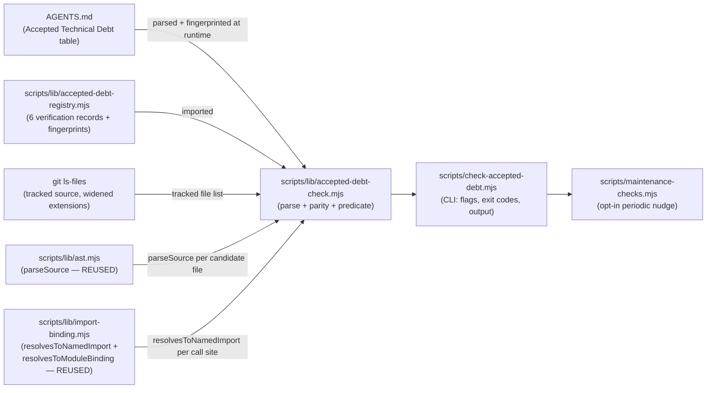

# Plan: Accepted Technical Debt Table — Mechanical Revisit-Trigger Verification (V1)

- **Date**: 2026-08-14
- **Status**: Complete
- **Author**: Claude + Test
- **Scope**: backend

## 1. Context Summary

This plan is the output of a `/brainstorm` (OpenAI gpt-5.6-terra + Gemini
gemini-pro-latest) on why backlog/debt entries in this repo go stale, and
what to do about it. Both external models converged on the same shape: don't
build one generic cross-backlog storage ledger — build a narrow, safe
verification protocol scoped to ONE backlog first. This plan is that V1,
scoped to the **6-row "Accepted Technical Debt" table in `AGENTS.md`**
(`AGENTS.md:1076-1086` as of `8c0bd8cf`). The other three backlogs discussed
in the brainstorm (`docs/plans/*.md` status frontmatter, the
`.audit/tech-debt.json` audit-capture ledger, and Claude's own auto-memory
files) are explicitly **out of scope**.

### What exists today (Phase 1 exploration)

**The AGENTS.md table itself** — 6 rows, each `{Item, Rationale, Revisit
trigger}`, hand-written prose. No tooling reads it today. I hand-audited each
row's "Revisit trigger" against what's mechanically derivable from repo
state:

| # | Item | Revisit trigger | Mechanically checkable? |
|---|---|---|---|
| 1 | `atomicWriteFileSync` no fsync | "Never — unless used in a daemon/server context" | No — "daemon/server context" is a deployment fact, not repo state |
| 2 | `atomicWriteFileSync` temp naming | "Never" | N/A — permanent accept, no predicate needed |
| 3 | `readFileOrDie` process.exit(1) | "If ever called from a library context" | **Yes** — this repo's own call sites are inspectable |
| 4 | `normalizePath()` lowercasing | "If deployed as a CI service on Linux" | No — deployment platform, not repo state |
| 5 | Module-global caches | "If extracting as a library or running as a long-lived server" | No — same class as #4, no repo-local signal distinguishes "still a CLI tool" from "about to be extracted" |
| 6 | `anthropic-client.mjs` `_internals` exports | "If we adopt stricter export hygiene project-wide" | No — a policy-adoption fact, not repo state |

**Result: 1 of 6 rows is genuinely mechanical.** This is the load-bearing
finding of this plan (see Risk & Trade-off Register — it's also why the plan
stays this small).

### Neighbourhood considered (Phase 0.5)

`get-neighbourhood` surfaced no `precedent`-band match (everything scored
`review` — nothing rose above this repo's noise floor) — but one `review`-band
hit was too topically close to skip by score alone: **`scripts/debt-budget-check.mjs`**
/ **`scripts/debt-health-check.mjs`** (domain `tech-debt`), plus the sibling
family `debt-resolve.mjs`, `debt-review.mjs`, `debt-auto-capture.mjs`,
`debt-git-history.mjs`, `debt-memory.mjs`, `debt-backfill.mjs`,
`debt-pr-comment.mjs` backed by `scripts/lib/debt-ledger.mjs` and
`.audit/tech-debt.json` (134 entries live, per
`scripts/debt-health-check.mjs:1-30` and `scripts/lib/debt-ledger.mjs:1-25`,
read at `8c0bd8cf`).

**This is a different system, confirmed by reading it, not assumed by name
collision.** `.audit/tech-debt.json` is `/audit-code`'s Step 3.6 out-of-scope
finding-deferral ledger (Phase D — `docs/plans/phase-d-tech-debt-memory.md`):
entries are model-sourced audit findings keyed by content-hash `topicId`,
staleness is **TTL-based** (`DEBT_HEALTH_TTL_DAYS`, default 180d — "hasn't
been touched"), and recurrence is **run-count-based**
(`distinctRunCount >= 3`). The AGENTS.md table's claims are **condition-based**
("if X becomes true"), not time-based — a TTL/recurrence check cannot express
"has `readFileOrDie` been imported from outside `scripts/**` yet?". The two
systems don't overlap in population or in what "stale" means, so this plan
adds a **sibling**, not a duplicate — but see the naming decision below, made
specifically to avoid the two being confused later.

The closest **structural** precedent, and the one this plan's CLI shape
copies, is **`scripts/check-plan-status.mjs`** (`scripts/check-plan-status.mjs:1-25`)
— a local lint over a doc's declared state, human+JSON dual output, spawned
by `maintenance-checks.mjs`, never blocking `npm run check` on its own. And
**`scripts/debt-health-check.mjs`**'s own docstring (`scripts/debt-health-check.mjs:10-19`)
records a lesson this plan deliberately avoids repeating: a local check that
exists but is "referenced by no skill step, no CI gate, and no maintenance
check" is undiscoverable — so this plan wires the new check into
`maintenance-checks.mjs` from V1, not as a later follow-up.

### Code Trace

- `AGENTS.md:1076-1086` (`8c0bd8cf`) — the 6-row Accepted Technical Debt table.
- `scripts/lib/file-io.mjs:161-168` (`8c0bd8cf`) — `readFileOrDie` definition.
- `scripts/gemini-review.mjs:2328,2556-2557` and `scripts/openai-audit.mjs:727,906`
  (`8c0bd8cf`) — the only two files with an actual `readFileOrDie(` invocation;
  both under `scripts/`. `scripts/shared.mjs:36` and
  `scripts/lib/audit/legacy-production-audit.mjs:56` only **import** it
  (barrel re-export), confirmed by reading each — no invocation there.
- `docs/architecture-map.md:4205` (`8c0bd8cf`) — checked and **rejected** as a
  data source for the one real predicate: it lists callers of the whole
  `scripts/lib/file-io.mjs` file (barrel-transitive), not callers of
  `readFileOrDie` specifically — every one of the 6 exports on that file
  (`atomicWriteFileSyncImpl`, `canonicalizeEol`, `normalizePath`,
  `readFileOrDie`, `safeInt`, `writeOutput`) shows the identical "+90 more"
  caller list. Using it would produce ~90 false "callers" for a symbol two
  files actually invoke. This directly overturned the brainstorm's assumption
  that the existing architecture-map/symbol-index could back this predicate —
  it can't, at the precision this check needs, so the predicate below does its
  own narrow text-search instead of querying that index.
- `scripts/debt-health-check.mjs:1-30`, `scripts/lib/debt-ledger.mjs:1-25`,
  `scripts/debt-budget-check.mjs:1-24` (`8c0bd8cf`) — the sibling debt system,
  confirmed out of scope (see Neighbourhood above).
- `scripts/check-plan-status.mjs:1-56` (`8c0bd8cf`) — structural precedent
  for the new CLI's shape (flag parsing, exit codes, dual output).
- `scripts/maintenance-checks.mjs:148-240` (`8c0bd8cf`) — the `CHECKS` array
  and the `debt-health` entry this plan's registration mirrors.
- **(Added in Round 1, after GPT audit H1/H2)** `scripts/lib/import-binding.mjs:82-141`,
  `scripts/lib/ast.mjs:1-87`, `scripts/lib/find-rmsync-sites.mjs:1-51`
  (`8c0bd8cf`) — this repo already has a real-lexical-scope call-site
  resolver (`resolvesToNamedImport`/`resolvesToModuleBinding`, built on
  `@babel/traverse`'s `Scope` API) used by `find-rmsync-sites.mjs` and
  `scripts/lib/audit/adjacency-detector.mjs` to solve **exactly** this class
  of problem: "does this identifier reference genuinely resolve to a named
  import of X, correctly excluding shadows and correctly following
  aliases." `@babel/parser` (`^8.0.0`) and `@babel/traverse` are already
  direct `package.json` dependencies — confirmed by reading `package.json:181`
  and the 8 existing consumer files, not assumed. `docs/architecture-map.md`'s
  rejection above stands (it's an import-graph index, not a call-site
  resolver) — this is a *different*, more precise existing primitive the
  first pass of this plan missed. Round-1 GPT audit (H1) caught the gap;
  this Code Trace addition is why the predicate design below changed from a
  text regex to reusing this module.

## 2. Proposed Architecture

- **`scripts/lib/accepted-debt-registry.mjs`** — the sidecar the brainstorm
  called for, in this repo's own idiom: a plain `.mjs` module exporting one
  array constant (`ACCEPTED_DEBT_ROWS`), mirroring the existing
  "explicit-registration" pattern already used for `MECHANICAL_WAVES` and
  `quickfix-patterns.mjs` rather than inventing a new YAML/JSON sidecar
  format (#10 — one more config format is not a single source of truth, it's
  a second one). Each entry: `{id, agentsTableAnchor, verification}`, where
  `verification` is either `{mode: 'checked', predicate: {...}}` or
  `{mode: 'unverifiable', reason: '...'}`.
- **`scripts/lib/accepted-debt-check.mjs`** — pure logic, no CLI concerns
  (#2, #7): `parseAgentsDebtTable(markdown)` extracts `{item, rationale,
  trigger}` per row by matching the `## Accepted Technical Debt` table;
  `checkRegistryParity(tableRows, registryRows)` diffs the two by
  `agentsTableAnchor` and reports added/removed rows either side; `runPredicate(predicate,
  {listTrackedFiles})` executes the one V1 predicate type.
- **One predicate type in V1, not an algebra**: `no-invocation-outside-scope`
  — `{symbol, provenanceModules, allowedGlobs}` (**`definedIn` renamed to
  `provenanceModules: string[]` in Round 4** — see below). **Revised in
  Round 1** (GPT H1/H2): the original design used a text regex
  (`\bsymbol\s*\(`), which false-positives on comments/strings/unrelated
  member calls and false-negatives on aliased imports (`import
  {readFileOrDie as rfod}`) — a broken predicate is worse than none here,
  since it's the only real check V1 delivers. **Fix: reuse
  `scripts/lib/import-binding.mjs`'s `resolvesToNamedImport`** (the same
  primitive `find-rmsync-sites.mjs` uses for this exact class of problem —
  real lexical-scope resolution via `@babel/traverse`'s `Scope` API, not
  name matching). Implementation: confirm every module in
  `provenanceModules` still exports `symbol` (fail `unknown` if not);
  enumerate tracked source files via `git ls-files` against the **JS/TS-
  family superset** `*.mjs *.js *.ts *.tsx *.jsx *.mts *.cjs *.cts`,
  **excluding `tests/fixtures/**`** (those are simulated *other* repos'
  source used by `fit-check`-style tests — they cannot import this repo's
  own `scripts/lib/file-io.mjs` at all, so including them would be a
  category error, not extra safety). **`allowedGlobs` is applied FIRST,
  before the analyzed/unsupported-format split** (Gemini gate G1: the
  original ordering ran the format split over the *whole* enumeration,
  so a legitimate `.cjs` file added anywhere inside an *allowed* directory
  — e.g. a test fixture under `tests/**` — would have permanently tripped
  `unknown`/exit-1 even though an allowed caller's format is irrelevant; a
  file allowed to call the symbol doesn't need to be parsed at all).
  Within the *remaining* (non-allowed) files, split by **analyzed**
  (`*.mjs *.js *.ts *.tsx *.jsx *.mts` — GPT H2/M2, rounds 1 and 3: the old
  `.mjs`/`.js`-only list would silently miss a future `.ts`/`.jsx`/`.mts`
  consumer) vs. **unsupported-format** (`*.cjs *.cts` — no CommonJS
  `require()` resolver exists — this repo has no such files today,
  confirmed by `git ls-files '*.cjs' '*.cts'` returning empty, and is
  ESM-only by its own declared convention (AGENTS.md "Code Style": no
  `require()`); building one would be new machinery for a module system
  this repo doesn't use, so it stays genuinely out of scope; see Risk &
  Trade-off Register). Every unsupported-format file found among the
  *non-allowed* files (zero today) contributes explicit `unknown` evidence
  naming the file, so a future `.cjs`/`.cts` file outside allowed scope
  cannot silently vanish from the scan. For every *analyzed, non-allowed*
  tracked file, parse via
  `scripts/lib/ast.mjs`'s `parseSource` (already configured with the
  `jsx`/`typescript` Babel plugins — parsing TS/JSX syntax was never
  actually blocked, just never attempted) and `@babel/traverse` every
  `CallExpression`/`OptionalCallExpression`, checking **two call shapes**
  (GPT H1, round 2 — **not just one**): (a) a bare `Identifier` callee,
  resolved via `resolvesToNamedImport(calleePath, {importedName: symbol,
  moduleAbsPath: <a provenance module's abs path>, fromFileAbsPath:
  <candidate file abs path>})` against **every** entry in
  `provenanceModules`; (b) a `MemberExpression`/`OptionalMemberExpression`
  callee whose property name is `symbol` and whose object identifier
  resolves via `resolvesToModuleBinding` against the same set — the
  namespace-import case (`import * as fileIo from '...';
  fileIo.readFileOrDie()`). This is the **exact two-shape pattern
  `find-rmsync-sites.mjs:158-176` already implements** for `fs.rmSync`
  (bare-identifier named import + namespace-member call) — reused, not
  reinvented. My Round-1 draft had deferred the namespace-import shape as
  "no call site uses that form today," which doesn't hold up: the
  predicate's whole purpose is catching a *future* library-context caller,
  and "doesn't exist yet" is true of the entire failure mode this row
  exists to detect.

  **`provenanceModules` — manually-curated, not auto-discovered (Round 4
  GPT H1 raised, compromised on an auto-discovery walk; Round 5 GPT H1
  REOPENED and correctly showed that walk was directionally broken; net
  resolution below reverts to the simpler design)**: a single-hop check
  against only `definedIn` misses a REAL, currently-live gap in this repo —
  `scripts/shared.mjs` re-exports `readFileOrDie` alongside every other
  named export of `scripts/lib/file-io.mjs` (confirmed in the Code Trace
  above), so a consumer importing it FROM `scripts/shared.mjs` would fall
  through as a false `holds`. Round 4's fix widened `definedIn` to
  `provenanceModules: string[]` and *also* added an automatic
  `discoverProvenanceModules` walk to keep that list current without
  manual maintenance — but Round 5 caught that the walk followed `export
  ... from` edges in the wrong direction (from a seed toward what IT
  imports, not toward modules that re-export FROM it), so it could never
  actually discover a new downstream barrel; fixing the direction would
  need a repository-wide reverse-export index, which is real new machinery
  for a single-symbol V1, and Round 5's own H2 finding was independently
  already pushing the predicate toward open-ended soundness questions
  (indirect call-reference forms) that a single accepted-debt row has no
  business chasing. **Net resolution: drop `discoverProvenanceModules`
  entirely.** `provenanceModules` is a plain, manually-curated array —
  `['scripts/lib/file-io.mjs', 'scripts/shared.mjs']` for row 3, closing
  the one concrete, currently-known gap directly. A future, wholly new
  local barrel that isn't added to `provenanceModules` by hand is a
  **named, honest residual limitation** (see Risk & Trade-off Register),
  not a silently-claimed-solved one — the same "register it, don't
  auto-discover it" discipline this plan already applies to the AGENTS.md
  debt table itself (§2's registry/table parity section) and to the
  unsupported-format extension list above. Maintaining `provenanceModules`
  by hand when a new local re-export is added is a one-line registry edit,
  proportionate to a V1 whose whole premise is "small, explicit, honest
  about what it doesn't check" over "automatically sound."

  A `true` resolution on either call shape (against any resolved
  provenance module) = predicate **contradicted**, reported with the real
  call site's file:line (scope resolution means an alias or a shadowing
  local is handled correctly on both shapes — the Round-1 failure modes
  GPT flagged). No resolved call anywhere = **holds**.

  **Per-candidate failure contract (GPT M2, round 2)**: enumeration
  (`git ls-files` failing outright), source read, parse (`parseSource`
  hard-failure or **recovered**/partial-tree result), AST traversal, and
  binding resolution are each wrapped so **any exception or non-clean
  result for a single candidate file converts to `unknown` evidence scoped
  to that file** (repo-relative path + a safe error-class string) — it
  never falls through to an implicit "no match found here" that would read
  as `holds`. `git` unavailable/failing for the *whole* enumeration step is
  `unknown` for the whole predicate (#16 — the brainstorm's Gemini leg
  raised exactly this "checked nothing, still green" failure mode). Exit-2
  op-errors are reserved strictly for setup-level failures that prevent the
  check from running at all (AGENTS.md unreadable, table malformed,
  registry invalid) — never for a per-candidate analysis failure, which is
  always `unknown`/exit-1 attention, distinguishing "the tool is broken"
  from "one file couldn't be soundly analyzed."

  No `command`/shell-exec predicate type exists in V1 at all — per the
  brainstorm's shared security conclusion (an arbitrary-command predicate is
  a real injection surface in a repo with agent-writable files elsewhere in
  its ecosystem), there was never a reason to build one for a single
  call-site check, and this AST-based approach needs no such escape hatch.
- **Registry/table parity is the anti-silent-green mechanism** — not a
  hand-maintained `--expected-count` (Gemini's original suggestion). Because
  the registry's `agentsTableAnchor` values are checked against the live
  parsed AGENTS.md table on every run, a 7th row added to AGENTS.md with no
  matching registry entry is *itself* reported as a finding ("row not
  registered — mechanically unverified by omission, not by classification"),
  and a registry entry whose anchor no longer matches any table row is
  reported the other direction. This is stronger than a hardcoded count: it
  can't go stale by being forgotten, because it's derived from both sides
  every run (#10). **Revised in Round 1** (GPT M1): anchor identity alone
  proves only that a row with that `Item` text exists on both sides — it
  says nothing about whether the `Rationale`/`Revisit trigger` cells still
  say what the registry's `verification` classification assumes. An editor
  changing row 3's trigger text without touching the anchor would leave
  parity green while silently invalidating the predicate's premise. **Fix**:
  each registry entry also carries a `rowFingerprint` — a hash of the row's
  full cell text (`item + rationale + trigger`, normalized). Parity checking
  compares fingerprints, not just anchors: a mismatch is reported as
  `registry-stale` (attention — "this row's prose changed since it was last
  classified; re-review the `verification` field"), distinct from
  `unregistered`/`orphaned` (the two anchor-only mismatch cases). The
  fingerprint is recomputed from the live table on every run, never cached,
  so it cannot itself go stale. **Execution precondition (Round 5, GPT M2)**:
  `checkAll` does **not** execute a row's predicate when that row's parity
  status is `registry-stale`/`unregistered`/`orphaned` — `predicateState`
  is `null` for that row, with an evidence entry naming the reason, rather
  than running the predicate against a premise that's no longer the live
  table's actual claim and risking a `holds` that means nothing (the exact
  "looks clean, evaluated the wrong thing" failure mode this whole plan
  exists to prevent). Reclassification (fixing the registry entry to match
  the live row) is required before the predicate can report `holds` again.
- **`scripts/check-accepted-debt.mjs`** — thin CLI, structurally identical to
  `check-plan-status.mjs`/`debt-health-check.mjs`: `assertKnownFlags` (per
  this repo's own CLI convention), `--json`, `--out <file>`, `--help`, and
  the same `0=clean / 1=attention / 2=op-error` exit contract
  `debt-health-check.mjs` already uses (#15 — one contract, not a new one).

## 3. Sustainability Notes

- **Assumption that could change**: that exactly one row is mechanically
  checkable. If a 7th debt row is added later with a genuinely mechanical
  trigger of a *different shape* (not "symbol called from outside scope"),
  the registry's `verification.predicate.type` field is the extension point
  — add a second predicate type in `accepted-debt-check.mjs` only when a
  second real case exists, not speculatively now (YAGNI; see right-sizing
  below).
- **Extension points deliberately built in**: `verification.mode:
  'unverifiable'` with a required `reason` string means a future row that
  genuinely can't be checked is never silently treated as passing — it's
  visible in every report, forever, until someone reclassifies it.
- **What was deliberately NOT built**: a generic predicate algebra, a
  cross-backlog schema, a `command`-exec escape hatch, and a pre-push gate.
  See Risk & Trade-off Register.

### Right-sizing gate (new structure introduced: a registry format + one predicate type)

- **Band-aid extreme**: do nothing — keep re-reading the AGENTS.md table by
  eye occasionally. This is the status quo the brainstorm identified as the
  actual current failure mode.
- **Over-engineered extreme**: the generic cross-backlog claim ledger both
  brainstorm models initially sketched — a typed predicate algebra
  (`grep`/`file-exists`/`jsonPath`/`databaseQuery`/`namedCheck`), a
  committed central schema, wired into `npm run check` on day one, covering
  all four backlogs at once.
- **Chosen, and the current requirement it serves**: one predicate type,
  one backlog, local-only via the *existing* opt-in `maintenance-checks.mjs`
  mechanism (no new graduation process invented — it reuses the one this
  repo already runs `debt-health`/`memory-health` through). Current
  requirement: stop the one row that can silently go wrong
  (`readFileOrDie`'s CLI-only assumption) from doing so unnoticed, while
  making the five non-mechanical rows' unverified status *visible* instead
  of implicitly (and wrongly) "fine." No current requirement calls for
  checking the other three backlogs from the brainstorm — they stay
  explicitly out of scope, per the brainstorm synthesis's "prove the shape
  on one backlog first" conclusion.

## 4. File-Level Plan

- **`scripts/lib/accepted-debt-registry.mjs`** (create) — Exports
  **raw, unvalidated** `ACCEPTED_DEBT_ROWS` data (array of 6 entries, one
  per current AGENTS.md row) plus a separate **`loadRegistry(rows =
  ACCEPTED_DEBT_ROWS)`** function that validates against a Zod 4
  `.strict()` schema (`AcceptedDebtRowSchema`) and returns `{ok:true,
  rows}` or `{ok:false, error}` — **never throws, never validates at
  import time** (GPT H1, round 3: a static ESM import evaluates before any
  CLI error boundary exists, so import-time validation would crash the
  process with Node's own uncaught-module-evaluation exit code, not the
  plan's stated exit-2 contract, and `executeCheck()`'s injection seam
  couldn't exercise that path anyway). Production `main()` calls
  `loadRegistry()` inside its own error boundary; tests call it directly
  with a fixture array, so the invalid-registry path is both correctly
  exit-coded AND testable without touching source files — the same
  discipline the round-2 `executeCheck()` fix already established, applied
  one layer earlier. `.strict()` matters on its own merits too (GPT M2,
  round 1): an un-`.strict()` schema silently strips typos instead of
  rejecting them, per this repo's own established lesson.
  **Collection-level validation (Round 5, GPT M3)**: per-row `.strict()`
  parsing alone doesn't establish uniqueness across the array — `loadRegistry`
  wraps the row schema in an `AcceptedDebtRegistrySchema` that additionally
  rejects (as `{ok:false}`, `registry_invalid`) a duplicate `id` or a
  duplicate `agentsTableAnchor`, since two rows claiming the same live
  table row with conflicting `verification` would make the report's
  meaning ambiguous. Each row:
  `{id, agentsTableAnchor, rowFingerprint, verification}`. Row 3
  (`readFileOrDie`) gets `verification: {mode: 'checked', predicate:
  {type: 'no-invocation-outside-scope', symbol: 'readFileOrDie',
  provenanceModules: ['scripts/lib/file-io.mjs', 'scripts/shared.mjs'],
  allowedGlobs: ['scripts/*.mjs', 'tests/**']}}` (**Round 4**:
  `provenanceModules` seeded with both the definition site and the known
  `scripts/shared.mjs` re-export — see §2. **Gemini gate G1**: `allowedGlobs`
  originally omitted `tests/**`, so a genuine unit test calling
  `readFileOrDie` directly would have been flagged as `contradicted` — a
  test is not a library-context consumer, and this would have penalized
  writing test coverage for the audited function itself. `tests/fixtures/**`
  stays excluded from enumeration entirely, a different mechanism — those
  files can't call this repo's own `scripts/lib/file-io.mjs` at all, so
  they're never even candidates, while ordinary `tests/**` files are real
  candidates that are simply an *allowed* caller. **Gemini gate G2 (HIGH —
  the genuine-bug exception to the round cap; corrects G1's own first-pass
  fix)**: `allowedGlobs: ['scripts/**', 'tests/**']` was itself wrong —
  `scripts/**` matches `scripts/lib/**`, and this repo's own AGENTS.md
  Architecture section states the convention directly: "`scripts/*.mjs` are
  CLI entry points; `scripts/lib/**` are focused modules." The debt row's
  entire premise is "only called from CLI entry points" — `scripts/lib/**`
  IS a library context by the row's own definition, so allowing it defeated
  the predicate's whole purpose: a future call from, say,
  `scripts/lib/ast.mjs` would have been silently permitted and never
  flagged, exactly the failure mode row 3 exists to catch. Narrowed to
  `scripts/*.mjs`, a single-level glob matching only the repo's top-level
  CLI entry-point scripts (this repo's own documented distinction, not an
  invented one) — `scripts/lib/**` is now a *disallowed*, fully-analyzed
  location, as it must be for this check to mean anything). Rows 1, 4, 5, 6
  get `{mode: 'unverifiable', reason: '<the specific external fact this row
  depends on>'}`. Row 2 gets `{mode: 'unverifiable', reason: 'permanent
  accept — trigger is "Never"'}`. `rowFingerprint` values are generated once
  by running the parser against the current AGENTS.md content and pasting
  the output in (never hand-typed — a hand-typed fingerprint could silently
  disagree with the actual cell text it's supposed to represent). Depends
  on: `node:crypto` (fingerprint hashing), `zod`. Imported by:
  `accepted-debt-check.mjs`. Why this file: #10 single source of truth for
  "what does this repo currently believe about each row," kept separate
  from the parsing/execution logic (#2); the raw-data/loader split follows
  #15 consistent error handling — no path in this tool throws an uncaught
  exception for expected-shape input errors.
- **`scripts/lib/accepted-debt-check.mjs`** (create) — Exports
  `parseAgentsDebtTable(markdown)` (GPT M2: requires the exact
  `## Accepted Technical Debt` heading and exactly the three named columns
  in order `Item | Rationale | Revisit trigger`; a malformed row — missing
  cell, duplicate anchor, empty anchor — is a **hard parse error**, not a
  silently-dropped row, because a silently-shrunk table is indistinguishable
  from a clean one downstream), `computeRowFingerprint(row)`,
  `checkRegistryParity(tableRows, registryRows)` (anchor **and** fingerprint
  comparison — see §2), `enumerateTrackedSources({allowedGlobs, excludeGlobs})`
  (wraps `git ls-files` against the JS/TS-family superset `*.mjs *.js *.ts
  *.tsx *.jsx *.mts *.cjs *.cts`, default excludes `tests/fixtures/**`,
  returns `{analyzed: [...], unsupportedFormat: [...]}` split per §2's
  Round-3 revision — `.cjs`/`.cts` are enumerated but never parsed, only
  reported as `unknown` evidence), `runPredicate(predicate,
  {enumerateTrackedSources, readTrackedSource, hasSymbol})` (the two-shape
  AST resolver described in §2, resolving against every module manually
  registered in `provenanceModules` — **not** an auto-discovered set; see
  §2's Round-5 resolution — **every step wrapped so a per-candidate
  exception becomes `unknown` evidence for that file, never an uncaught
  throw or a silent fallthrough to `holds`**, per GPT M2 round
  2), `checkAll({...})` (orchestrates the above into one summary object).
  Pure functions, git and filesystem access injected as parameters (mirrors
  `check-plan-status.mjs`'s `rev()` injection) so tests never shell out or
  touch the real working tree. Depends on: `scripts/lib/ast.mjs`
  (`parseSource`), `scripts/lib/import-binding.mjs`
  (`resolvesToNamedImport`, `resolvesToModuleBinding`), `@babel/traverse`,
  `node:fs`/`node:path` only for the default `enumerateTrackedSources`/
  `readTrackedSource` implementations. Imported by: `check-accepted-debt.mjs`
  and the test file. Why this file: #11 testability — this is the only file
  the test suite needs to exercise directly.
- **`scripts/check-accepted-debt.mjs`** (create) — CLI entry point, contract
  pinned explicitly (GPT M3 — the prior draft left `--json`/`--out`
  interaction, stdout/stderr discipline, and the exit mapping unstated), AND
  structured as a **thin process adapter, not a monolith** (GPT M1, round
  2 — the earlier draft statically imported `ACCEPTED_DEBT_ROWS` and
  hard-read the real `AGENTS.md`, leaving no seam for the fixture-driven
  exit-code tests §4's own test plan promised). Exports **`executeCheck({
  agentsLoadResult, registryLoadResult, deps})`** (Round 4, GPT M1:
  `agentsMarkdown` as a bare string couldn't distinguish "file unreadable"
  from "file empty/invalid," and left `main()` a plausible path to bypass
  the seam on a read failure — `agentsLoadResult` now mirrors
  `registryLoadResult`'s own discriminated-union shape: `{ok:true,
  markdown} | {ok:false, errorClass}`) — pure, returns a **versioned result
  envelope** (GPT M3, round 3: `{ok: boolean, code:
  'clean'|'attention'|'agents_unreadable'|'table_malformed'|
  'registry_invalid', exitCode: 0|1|2, summary, rendering}` — every handled
  outcome, success or operational error, produces the SAME envelope shape,
  so `--json` mode has exactly one thing to serialize regardless of path).
  **`summary` is a versioned, fully-specified schema** (Round 4, GPT M1 —
  the prior draft left it implicit, risking the five unverifiable rows'
  reasons collapsing into a bare count): `{schemaVersion: 1, rows: [{
  anchor, liveFingerprint, registryStatus: 'registered'|'unregistered'|
  'orphaned'|'registry-stale', verificationMode: 'checked'|'unverifiable',
  predicateState: 'holds'|'contradicted'|'unknown'|null, evidence: [...],
  reason: string|null}]}` — one entry per row on EITHER side (table or
  registry), so an unregistered/orphaned row still gets an entry rather
  than silently vanishing from the report. Both `rendering` (human) and
  the JSON envelope's `summary` field derive from this ONE schema — no
  second, separately-maintained rendering logic. `executeCheck()` is pure
  and testable directly — both `main()` and the test suite call it.
  **`main()`** is the only piece that touches `process.argv`,
  `fs.readFileSync('AGENTS.md')` (wrapped into `agentsLoadResult`), and
  calls `loadRegistry()` (GPT H1, round 3 — see the registry file above:
  this is where that load happens, inside `main()`'s own try/catch, never
  at import time) before handing `{agentsLoadResult, registryLoadResult}`
  to `executeCheck()`. `assertKnownFlags(process.argv, ['--json','--out','--help','-h'],
  {cli: 'check-accepted-debt'})`. **`--json`**: the envelope, exactly one
  JSON object + trailing newline, on stdout — nothing else; all
  progress/diagnostics on stderr; this holds for EVERY code, including the
  three operational-error codes (GPT M3 — the prior draft only specified
  the success-path JSON shape). **Human mode** (default): the envelope's
  `rendering` field, printed on stdout. **`--out <file>`**: redirects the
  selected rendering (JSON envelope or human, whichever mode is active) to
  the file *instead of* stdout — same semantics as `debt-health-check.mjs`'s
  own `--out`, not a second copy. A write failure to `--out` is the one
  case with no redirected result to guarantee: a concise stderr diagnostic,
  exit 2, nothing written to the target file. **Exit contract** (mirrors
  `envelope.exitCode`): `0` (`clean`) — every checked predicate `holds` and
  registry/table are in full parity (anchor + fingerprint); `1`
  (`attention`) — any predicate is `contradicted`/`unknown`, or any parity
  mismatch (`unregistered`/`orphaned`/`registry-stale`) — never blocks a
  push (mirrors `debt-health-check.mjs`'s semantics exactly); `2`
  (`agents_unreadable`/`table_malformed`/`registry_invalid`, or an `--out`
  write failure) — op-error; never for a per-candidate analysis failure,
  which is always exit-1 `unknown` per §2's error contract. Depends on:
  `accepted-debt-check.mjs`, `accepted-debt-registry.mjs`,
  `scripts/lib/cli-io.mjs` (`assertKnownFlags`). Why this file: matches the
  existing `check-*.mjs` CLI convention (#1 — DRY against the pattern
  `check-plan-status.mjs`
  already established, not a new shape); the `executeCheck` seam follows
  #11 testability directly.
- **`tests/accepted-debt-check.test.mjs`** (create) — Tier 1 (deterministic
  module, test-first per the repo's testing doctrine). Cases: (a) parser
  against a small fixture markdown table, including malformed-row cases
  (duplicate anchor, missing cell, wrong column order) asserting a hard
  parse error rather than a silently-shrunk row set (GPT M2); (b) parser
  against the **real** `AGENTS.md` content, asserting it currently yields
  exactly 6 rows whose anchors AND fingerprints match `ACCEPTED_DEBT_ROWS`
  1:1 — this is the "derive at least one fixture from a row actually in the
  store" rule, applied here as "derive the parity baseline from the real
  file, not a hand-written mirror of it"; (c) `runPredicate` with injected
  source fixtures covering **both call shapes** (Round 2, GPT H1): a plain
  named-import call, an aliased named-import call, a shadowing-local call
  that must NOT match, a namespace-import member call (`import * as x;
  x.readFileOrDie()`), and a namespace-import member call on an unrelated
  object with the same property name that must NOT match → asserts
  `contradicted` for the three real call sites and `holds` for the two
  shadow/unrelated cases; with a call resolved only through the
  `scripts/shared.mjs` registered `provenanceModules` entry (not the
  direct `scripts/lib/file-io.mjs` definition) → asserts `contradicted`,
  proving the barrel fix actually closes the gap it was written for; with
  a registered provenance module reporting the symbol missing → asserts
  `unknown`; with a candidate file that fails to parse (hard
  failure or Babel's recovered/partial-tree case) → asserts `unknown`,
  never `holds` (GPT H2); with an injected `readTrackedSource` that throws
  for one candidate file → asserts that file alone contributes `unknown`
  and the rest of the run is unaffected (GPT M2, round 2); with an injected
  `enumerateTrackedSources` fixture reporting a `.cjs` file in
  `unsupportedFormat` → asserts that file is named in `unknown` evidence,
  never silently absent (GPT M2, round 3); (d)
  `checkRegistryParity` with a deliberately mismatched registry (extra row,
  missing row, and a row whose
  fingerprint no longer matches its anchor's live cell text) → asserts all
  three directions are reported distinctly (per this repo's own "test the
  direction a gate must NOT fire" lesson); `checkAll` with a
  `registry-stale` row → asserts `predicateState: null` for that row and
  that `runPredicate` was **never invoked** for it (an execution-order
  spy/injected dependency, not just an output assertion — GPT M2, round 5);
  (e) **`loadRegistry()` tests**
  (GPT H1, round 3): a Zod-valid fixture array → `{ok:true, rows}`; a
  Zod-invalid fixture array (missing field, wrong `verification.mode`
  value) → `{ok:false, error}`, asserted to **never throw**; a fixture
  array with a duplicate `id` and a separate fixture with a duplicate
  `agentsTableAnchor` → both `{ok:false, error: 'registry_invalid'}` (GPT
  M3, round 5) — the tests that prove the invalid-registry path is a
  handled operational error, not an
  uncaught module-evaluation crash; (f) **`executeCheck()` envelope tests**
  (GPT M1 rounds 2 and 4 + M3 round 3 — this is where the promised
  exit-code fixture cases actually live, since `executeCheck` takes
  `{agentsLoadResult, registryLoadResult, deps}` directly): all five
  envelope codes (`clean`/`attention`/`agents_unreadable`/`table_malformed`/
  `registry_invalid`) each exercised against an in-memory fixture,
  asserting `{ok, code, exitCode}` together, PLUS asserting `summary.rows`
  carries every table/registry row with its `reason`/`evidence` intact —
  including a fixture where all 5 unverifiable rows are present, proving
  they don't collapse into a bare count (GPT M1, round 4); an
  `agentsLoadResult: {ok:false, ...}` fixture → `agents_unreadable`
  envelope, proving `main()` cannot bypass the seam on a read failure — no
  real repo file touched, no process spawned; (g) a **small**
  `child_process.spawnSync` suite against
  the real `check-accepted-debt.mjs` (GPT M3 — this is the true
  process-boundary
  contract `executeCheck()` tests can't reach): `--help` exits 0; an
  unknown flag is rejected; `--json` output is valid single-line JSON with
  nothing else on stdout; one smoke run against the real repo confirming
  `main()` actually wires `executeCheck()` up (exit code and top-level
  shape only — the exit-code *matrix* itself is already fully covered by
  (f), so this suite stays deliberately small).
- **`scripts/maintenance-checks.mjs`** (modify) — Add one `CHECKS` entry
  after the `debt-health` entry (`scripts/maintenance-checks.mjs:236-240`):
  `key: 'accepted-debt'`, `label: 'AGENTS.md accepted-debt revisit-trigger
  drift'`, `requiredEnv: []`, `steps: [{script:
  'check-accepted-debt.mjs', args: []}]`. Same opt-in, non-blocking
  semantics as every other entry in that array — no new plumbing needed,
  `CHECKS.length` is already the self-describing source of truth the file's
  own header comment calls for.

**Not in file scope for V1** (explicitly deferred, not silently dropped):
`docs/runbooks/local-maintenance-checks.md`'s hardcoded check-count mention
— its own neighbouring comment already documents this count as tolerated
drift (`scripts/maintenance-checks.mjs:148-150`), so bumping it here would be
scope creep against an invariant this repo has already decided not to
enforce mechanically.

## 5. Risk & Trade-off Register

- **Trade-off**: only 1 of 6 rows gets real verification. **Why OK**: the
  alternative (fabricating a predicate for the other 5) is worse than no
  predicate — a predicate that can structurally never fire is a permanent
  false "clean," exactly the defect class this repo's sandbox-honesty rule
  exists to prevent. Making the 5 unverifiable rows *visible as
  unverifiable* is strictly better than the current state (invisible and
  silently trusted).
- **Trade-off**: local-only, not wired into `npm run check`. **Why OK**:
  matches this repo's own established pattern for a new check earning trust
  (`debt-health`, `memory-health` are both opt-in via
  `AUDIT_LOOP_WEEKLY_MAINTENANCE=1`, not `npm run check` gates). Promotion
  path if this proves valuable: same bar those checks would need to clear —
  drift-only mode (like `check-plan-status.mjs --drift`, gating only on
  AGENTS.md changes in the push range, never pre-existing violations) before
  it could join `npm run check` without breaking a first push in a repo that
  already has an unverified state.
- **What could go wrong (last revised in Round 4)**: the residual risk is no
  longer regex false-positives (`resolvesToNamedImport`/
  `resolvesToModuleBinding` resolve real bindings, not text) — both call
  shapes (named-import and namespace-import) **are covered**, per §2. Three
  residual risks remain, each mitigated by degrading to `unknown` rather
  than a silent `holds`:
  1. **Unparseable-but-valid syntax**: a candidate file uses valid JS/TS the
     repo's own toolchain accepts but outside the `jsx`/`typescript`/
     `decorators-legacy` Babel plugin set `ast.mjs` enables. Mitigation: per
     §2's per-candidate error contract, this degrades to `unknown` for that
     file, never a silent `holds`.
  2. **Unsupported module format** (GPT M2, round 3): `.mts` is included in
     the analyzed set from V1 (same TS-capable parser already handles it,
     zero extra cost) — but `.cjs`/`.cts` (or any future JS/TS-family
     extension not yet in the analyzed set) genuinely have **no resolver**;
     building CJS `require()` binding resolution is real new machinery this
     repo's own tooling doesn't need today (confirmed zero such files exist
     anywhere, including fixtures) and stays out of scope. The silent-green
     risk this would otherwise create is closed by **enumerating** tracked
     files against a JS/TS-family superset glob (`*.mjs *.js *.ts *.tsx
     *.jsx *.mts *.cjs *.cts`, excluding `tests/fixtures/**`), not just the
     analyzed subset: any enumerated file in the unsupported-format set
     (`.cjs`/`.cts`) contributes explicit `unknown` evidence naming the file
     and the unsupported format, rather than being silently absent from the
     scan entirely. Today this enumerates zero such files (so current
     behavior is unchanged); the moment one appears, the report goes to
     attention (`unknown`) instead of staying silently green.
  3. **A brand-new, never-registered local re-export barrel** (GPT H1,
     rounds 4 and 5 — round 4 compromised on an automatic discovery walk;
     round 5 REOPENED it, showing the walk followed re-export edges in the
     wrong direction and so could never actually discover a new barrel;
     net resolution reverts to the simpler design — see §2): a repo-wide
     reverse-export index would be needed to auto-discover new re-export
     points, which is real new machinery beyond a single-symbol V1's
     proportionate scope — and round 5's own H2 finding was independently
     already pushing this predicate toward open-ended soundness questions
     a V1 has no business chasing. `provenanceModules` is instead a plain,
     manually-curated array, seeded with every currently-known re-export
     point (`scripts/lib/file-io.mjs` + `scripts/shared.mjs` for row 3).
     This is a genuinely manual tripwire, same as #2 above's discipline:
     adding a new local re-export of `readFileOrDie` anywhere in
     `scripts/**` must also add that module to `provenanceModules` by
     hand, or the check silently misses calls through it — named here,
     not hidden.
- **Deliberately deferred**: the other three backlogs from the brainstorm.
  Not a silent scope-narrowing — the brainstorm synthesis explicitly named
  this as the fastest way to find out whether the "shared structure" bet is
  right, and this V1's own finding (1 of 6 rows mechanical) is itself a data
  point for that later decision, not a foregone conclusion that the other
  backlogs will look the same.

## 6. Testing Strategy

- **Unit** (Tier 1, test-first): `parseAgentsDebtTable`, `checkRegistryParity`,
  `runPredicate` — all pure, all covered per `tests/accepted-debt-check.test.mjs`
  above.
- **Integration-shaped but still local**: the real-`AGENTS.md` parity
  assertion (case (b)) doubles as a live smoke test — if this plan's
  implementation and AGENTS.md's actual table ever diverge (someone edits
  the table without updating the registry), that test fails immediately
  rather than the drift going unnoticed until a maintenance run.
- **Edge cases**: git unavailable/non-repo (predicate → `unknown`, CLI exit
  1, never crashes); AGENTS.md missing the `## Accepted Technical Debt`
  heading (op-error, exit 2); a malformed table row — duplicate/empty
  anchor, missing column (op-error, exit 2 — GPT M2: rejected, not
  silently dropped); registry file syntactically valid but fails Zod
  validation (op-error, exit 2); registry file valid but empty array
  (parity check reports all 6 table rows as unregistered — never a silent
  0-checked "clean" report, per the anti-silent-green requirement above); a
  registry entry whose `rowFingerprint` no longer matches its anchor's live
  cell text (`registry-stale`, exit 1 — GPT M1); a candidate source file
  that fails to parse cleanly (`unknown` for that file, exit 1 — GPT H2,
  never a silent `holds`).
- **Manual verification**: run `node scripts/check-accepted-debt.mjs` locally
  against current `HEAD` and confirm the human-readable report matches the
  Context Summary table above (1 checked/holds, 5 unverifiable, 0 parity
  mismatches) before considering V1 done.

## Out of Scope (Future)

Deferred at the `/audit-plan` round-5 stop (see Audit Trail below) —
genuine findings, independent of V1's core value, not silently dropped:

- **Full indirect call-form soundness** (GPT H2, round 5): the predicate
  only resolves two direct callee shapes (named-import identifier,
  namespace-member access). It does not resolve tear-off references
  (`const die = readFileOrDie; die(...)`), callback-argument passing
  (`promise.then(readFileOrDie)`, `queueMicrotask(readFileOrDie)`),
  destructuring from a namespace import, or dynamic-`import()`-then-call
  chains — all of which would still cause a `holds` even though the
  function genuinely ran from an out-of-scope caller. Closing this
  soundly needs a general alias/points-to-style analysis, a materially
  larger and different feature than a single accepted-debt row's V1
  predicate should attempt. V1's value — catching the two actual, direct
  call sites this repo has today, plus the concrete `scripts/shared.mjs`
  barrel gap — does not depend on this. Revisit if a future accepted-debt
  row's revisit-trigger genuinely needs indirect-call soundness to be
  meaningful (unlikely, since a "library context" trigger is naturally
  about import surface, not runtime reference flow).
- **Formal Zod result-envelope schema** (GPT M1, round 5): §4 specifies
  the `executeCheck()` result envelope and per-row `summary` shape in
  prose (fields, types, discriminated states), but doesn't define a
  collection-level Zod schema, a stable evidence-item shape
  (`{kind, path, line, messageCode, message}`), deterministic sort order,
  or a closed diagnostic-code vocabulary. The prose spec is sufficient to
  implement V1 and to review this plan; formalizing it into an exact,
  tested Zod schema is implementation work best verified by `/audit-code`
  against the real `executeCheck()` code, not iterated further at the plan
  level.

## Audit Trail

`/audit-plan` ran 5 GPT rounds + 1 rebuttal (all against `--mode plan`),
stopping at the absolute round cap:

| Round | Findings | Verdict | Acceptance | Note |
|---|---|---|---|---|
| 1 | H:2 M:3 | SIGNIFICANT_GAPS | 100% (5/5 fix-now) | Predicate redesigned from regex to AST (reused `import-binding.mjs`) |
| 2 | H:1 M:2 | NEEDS_REVISION | 100% (3/3 fix-now) | Two-shape call detection added; `.cjs`/`.mts`/`.cts` scope narrowed |
| 3 | H:1 M:3 | NEEDS_REVISION | 100% (4/4 fix-now) | `loadRegistry()` boundary fix; own stale-prose self-contradiction caught |
| 4 | H:1 M:2 | NEEDS_REVISION | 100% (3/3, 1 severity-adjusted via rebuttal) | `provenanceModules` barrel fix; rebuttal narrowed GPT's "general resolver" ask to a bounded walk |
| 5 | H:2 M:3 | SIGNIFICANT_GAPS | 60% (3/5 fix-now, 2 deferred) | Round-4 walk REOPENED as directionally broken — reverted to manual list; 2 findings deferred as independent/implementation-level |

**Stop decision (round 5, absolute cap)**: acceptance dropped to 60% (below
the ≤⅓ "stop" line only for HIGH-count-plus-low-acceptance, but squarely in
the "decide by finding character" band), the verdict regressed
(`NEEDS_REVISION` → `SIGNIFICANT_GAPS`), and two of five findings (H2, M1)
were genuinely open-ended — full alias-analysis soundness and a formal
schema — rather than concrete design defects, matching this skill's
documented stop signal ("Rising HIGH count and acceptance rate low →
STOP"; "implementation-completeness... hand off to the code audit"). The
one HIGH that WAS a concrete defect (round-5 H1: round 4's auto-discovery
walk was directionally broken) is fixed by simplifying rather than adding
more machinery — reverting to a manually-curated `provenanceModules` list,
which was Claude's original round-4 rebuttal position before GPT's
compromise asked for automatic discovery. Per this repo's own AGENTS.md
design-right-sizing rule, this is the deliberate choice of the smaller
design over the "more correct but more machinery" one when the machinery
itself has now twice failed to deliver the soundness it was built for.

Step 6 (Gemini independent review) runs next, mandatory regardless of this
stop decision.

**Gemini gate (Step 6, `--mode plan`), 3 rounds:**

| Round | Verdict | New findings | Note |
|---|---|---|---|
| 1 | CONCERNS | G1 (MEDIUM) | `allowedGlobs` for row 3 omitted `tests/**`, so a genuine unit test calling `readFileOrDie` would false-positive as `contradicted` — fixed |
| 2 | CONCERNS | G1 (MEDIUM), G2 (HIGH) | G1: the round-1 fix applied the unsupported-format split before the allowedGlobs filter, so an allowed `.cjs` file would permanently break the check — fixed. G2 (genuine-bug exception to the 2-round cap): `allowedGlobs: ['scripts/**', ...]` matched `scripts/lib/**`, which this repo's own AGENTS.md names as the "library context" the debt row exists to catch — the predicate was blind to its own primary target. Narrowed to `scripts/*.mjs` |
| 3 | **APPROVE** | 0 | Closed |

**Final status**: Approved. 5 GPT rounds (20 findings, 1 rebuttal) + 3
Gemini rounds (3 findings) = 23 total findings across the loop, all
resolved (18 fixed, 2 deferred to Out of Scope with rationale, 3 resolved
via simplification after a compromise fix was shown unsound). Gemini's own
G2 catch is worth flagging explicitly: it is the single most consequential
finding in this entire loop — every earlier round improved the predicate's
*mechanics* (call-shape resolution, error handling, output contract)
without questioning whether its *scope boundary* actually matched the debt
row's own stated intent, and Gemini caught that mismatch that both the
5-round GPT loop and Claude's own design missed.

## Implementation Log

### 2026-08-14 — shipped

`/cycle --autonomous` on this plan (no §11 clustering — the degenerate
single-cluster path). All 5 planned files created + 1 modified as
specified (`scripts/lib/accepted-debt-registry.mjs`,
`scripts/lib/accepted-debt-check.mjs`, `scripts/check-accepted-debt.mjs`,
`tests/accepted-debt-check.test.mjs`, `scripts/maintenance-checks.mjs`),
plus one new file the code-audit loop required that the plan didn't
anticipate (`scripts/lib/is-source-repo.mjs`). Check chain: 12,264 pass /
0 fail. `/audit-code` ran 6 GPT rounds (the absolute cap) + 2 Gemini
rounds, verdict `APPROVE`.

**Deviation the plan did not anticipate, and the code-audit loop's most
consequential catch**: the plan never considered that `maintenance-checks.mjs`
— the orchestrator this check is wired into — is itself synced to consumer
repos. Round 2 of `/audit-code` (Quickfix M7) caught that shipping this
check as designed would have delivered a permanently-failing, meaningless
maintenance check to every consumer, since `ACCEPTED_DEBT_ROWS` is
hardcoded to this repo's own 6 rows and fingerprints. Fixed by excluding
`check-accepted-debt.mjs` and its two lib files from the sync manifest
entirely (`CLI_SMOKE_SET`, `sync-to-repos.mjs`, `sync-inventory.mjs`, with
regression-pin tests so the exclusion can't silently regress) and adding a
`sourceRepoOnly` flag + `isSourceRepo()` gate to the shared CHECKS entry —
extracted to its own zero-side-effect module after round 6 flagged the
first version as unnecessarily coupled to `maintenance-checks.mjs`'s own
scheduler machinery.

**A literal NUL byte reached committed source** from an early draft of
`computeRowFingerprint` (a stray `\u0000` join separator instead of a
space) — caught only because a later `Grep` call returned a "binary file
matches" result on a `.mjs` file that should never be binary. Fixed at the
byte level; all 6 registry fingerprints recomputed (they had been
generated against the broken separator and were themselves silently
wrong).

**Round 6 of `/audit-code` (the absolute cap) raised a false-positive
HIGH** claiming `scripts/lib/glob-match.mjs` doesn't exist, confusing it
with the unrelated `scripts/lib/audit/glob-match.mjs` (documented
different `**` semantics, a different domain). Gemini's own round 1
doubled down, calling the dismissal a hallucination. Both reviewers made
the same category error — a file outside the `--changed`/diff scope isn't
the same as a file that doesn't exist. Settled with direct evidence
(`git ls-files`, `git log`, `git show HEAD:<path>`, all confirming a real,
committed, history-bearing file); Gemini withdrew the claim on round 2.

**The predicate's own two-shape call resolution — the plan's central
design — needed zero code-time correction.** Every round-1-through-6
`/audit-code` finding was about surrounding contract precision (error
handling, output shape, CLI flag validation, markdown-fence edge cases,
sync scope) or a pre-existing concurrency-safety issue in code this plan
extends but didn't introduce (`AUDIT_LOOP_STATE_DIR`, deferred all 7 times
it recurred, captured as debt) — never about whether `resolvesToNamedImport`/
`resolvesToModuleBinding` correctly resolve a real out-of-scope call. The
`/audit-plan` loop's own 5 rounds + Gemini's G2 had already done that work
before any code existed.

**Manual verification**: `node scripts/check-accepted-debt.mjs` against
the real repo at ship time reports exactly what §1's Context Summary
predicted — 1 row checked (`holds`), 5 unverifiable, 0 parity mismatches,
exit 0.
