# Plan: Containment-Adjacency Check — a mechanical wave that asks "what else is in this branch?"

- **Date**: 2026-07-17
- **Status**: Complete — all three clusters implemented, tested and gated
  (`/cycle --autonomous`, 2026-07-17). The §11 prerequisite cleared before the
  run: the evidence-anchor working set landed, so `parseAllDiffSections` was
  **consumed** rather than a third diff parser written.
- **Author**: Claude + Louis Strydom
- **Scope**: backend
- **Sign-off (2026-07-17)**: the three design decisions carrying real cost were
  approved by the operator — (1) add `@babel/traverse` (D4a), (2) commit the
  165KB frozen full-file fixture (§7), (3) promote the AST primitive to
  `shared-lib` and **sequence this plan after** evidence-anchor Cluster B
  (D6 / §11). No code written this session; next step is implementation once the
  §11 prerequisite clears.

- **Target domain(s)**: `audit-orchestration` (the new wave + its orchestrator
  wiring), `shared-lib` (config + the AST primitive), `nav-audit` (only if
  decision D6 takes the promote option)
- ⚠ **Cross-domain work** — see **D6**. The naive import (`audit/` → `nav/ast.mjs`)
  is a **forbidden edge**: `audit-orchestration`'s `allowedDeps` are
  `[findings, learning-store, plan, shared-lib, tech-debt]` — `nav-audit` is not
  among them. D6 resolves this deliberately rather than by accident.

## Provenance

Spawned from `docs/plans/sibling-path-suppression-defects.md` §Out of Scope,
which recorded this as *"a 'what else is nested in this branch?' step in
`/audit-code`'s wiring pass"* with a **now-ish** revisit trigger.

> **Correction carried from that plan (it must be fixed there).** The
> §Out-of-Scope line says this belongs *"in the audit's wiring pass"*. **That is
> wrong.** `PASS_WIRING_SYSTEM` (`prompt-seeds.mjs:13`) is frontend↔backend
> API-contract auditing only — verbatim: *"Does every frontend API call have a
> matching backend route? Do HTTP methods match?"*. A containment check has
> nothing to do with API wiring. It is a **new wave**, sibling to `duplication`.
> This plan owns that correction; the sibling plan's line is amended by
> Phase 6.

## Neighbourhood considered

`get-neighbourhood` over the three target paths returned **8 records, all
`recommendation: review`** (cloud on, refresh `09e50ea7`). Top matches are the
orchestrator's own pass functions — `runOrphanIntroducedPass` (0.688),
`runLegacyProductionAudit` (0.676), `runArchitecturePass` (0.668) — i.e. *"this
looks like another audit pass"*, which is exactly what it is. **No `reuse` or
`extend` candidate exists at any threshold.** Independently corroborated:
`rg -i adjacen` across the repo returns **only prose inside stored findings** —
there is no adjacency concept in code. Greenfield, confirmed two ways.

The four existing adjacency primitives were each checked and **none covers
containment**:

| Primitive | Adjacency kind | Why it misses this class |
|---|---|---|
| `buildT1` (`repo-context.mjs:67`) | import | file-granular; blind inside a file |
| `computeImpactSet` (`ledger.mjs:660`) | changed + importers | file-granular; same |
| `duplication-detector.mjs` | near-duplicate symbols | symbol-granular; a trapped statement is not a duplicate |
| `get-neighbourhood` | embedding | semantic similarity ≠ lexical containment |

## Past incidents to verify against

| Incident | Status | Relevance |
|---|---|---|
| **INC-001** — lexical path classifier bypassed by a symlink | `manual-verification-required` | **Directly in path.** This detector reads source files by path and ships excerpts to an LLM. Its lesson is binding: *"Anywhere we make a security decision based on a path, the path MUST be canonicalised before classification."* → §Security. |
| **INC-002** — test DSN aliased to prod wiped the DB | `manual-verification-required` | Binding constraint: **no test in this plan touches a DSN**. Every unit is a pure function over injected fixtures. The detector never touches the DB at all (D2). |

---

## 1. Context Summary

**Detected scope + stack**: backend; `js-ts` (Node ESM) + postgres
(`detect-stack` → `stackKinds: ["js-ts","postgres"]`; the postgres half is
irrelevant here — D2).

### The problem, stated precisely

Three confirmed defects in two days share one meta-failure: **a fix scoped to
the instance that hurt, not the class.**

1. `false_positive_patterns` NULL-conflict key → 403k garbage rows in 3 days,
   Supabase Disk IO depleted. Fixed by `718ca90` + migration `20260717120000`.
2. `bandit_arms` carries the **identical shape** (`context_bucket:
   arm.contextBucket || null` inside its own `ON CONFLICT` target —
   `store/bandit-fp.mjs:36,42`). Nobody checked the sibling table when fixing
   #1. Found **5 weeks later** by `/audit-code` R1-H2+H4. Latent.
3. `populateFindingMetadata` trapped inside `if (mergedLedger.entries.length > 0)`
   (`legacy-production-audit.mjs:2369`, branch `:2366-2505`).

**The finding that drives this design is #3, and it is uncomfortable.** The
cloud-FP cycle ran **5 GPT rounds + 3 Gemini rounds across two model families**
over that exact file. It found the *sibling* defect inside that same branch (the
local `fpTracker` loop, R1-M2). **Not one round asked what else was in the
branch.** A single hand-sweep found #3 in minutes.

A review that thorough missing something that adjacent is **not an attention
problem** — attention is what it already spent. It is a **question** problem.
That is why this is a mechanism and not a checklist line.

### Code Trace

The evidence path, followed end to end:

- **The defect site**: `legacy-production-audit.mjs:2366` opens
  `if (mergedLedger.entries.length > 0)`, closing at `:2505` (139 lines).
  Inside at `:2367-2371`: `for (const f of allFindings) populateFindingMetadata(f, f._pass)`.
- **Why it is the only producer**: `FindingBase` (`schemas.mjs:35-46`) declares
  `section` but **no** `_primaryFile`, **no** `affectedFiles`. Those are derived
  solely by `populateFindingMetadata` (`ledger.mjs:272-273`). `addFindings`
  (`:2265-2271`) sets `_hash` but not the derived paths.
- **The two consumers, both outside the branch**: `.audit/outcomes.jsonl`
  (`:2771-2772`, the local bandit reward signal) and cloud `audit_findings`
  (`runs-findings.mjs:358`). Both do `f._primaryFile || f.section` — so a
  no-ledger run silently records the raw prose section where a normalized path
  belongs. No error, no crash.
- **The trigger's ground truth**: `git show 59f196f` (the cloud-FP fix) →
  hunk `@@ -2349,6 +2400,7 @@` in that file = **new lines 2400-2406, inside the
  branch**. Its own commit message deferred the `fpTracker` sibling and never
  mentions `populateFindingMetadata`.
- **The precedents**: `duplication-detector.mjs` (mechanical → bouncer →
  fallback, inputs `{repoRoot, changedFiles, auditBaseCommit}`) read end to end;
  `efficacy-lints.mjs:23-27` (the coverage-honesty rule) and
  `suppression-policy.mjs:205-273` (`buildCloudFpPolicy`, the pure state factory)
  read end to end.
- **The wiring**: `passRegistry` (`:2156-2166`), `shouldRunPass` (`:1459-1467`),
  `cachePassResult` (`:2118`), `evaluateConvergence` (`convergence.mjs:14-25`).
- **The AST surface**: `nav/ast.mjs` (`parseSource`, `walk`),
  `find-rmsync-sites.mjs:128` (`walkAst(node, ancestors, visit)` — ancestor-chain
  threading), `symbol-index/extract.mjs:155-192` (top-level declarations only).

### THE HEADLINE: the finding-anchored trigger is not buildable — measured, not assumed

The obvious design — *"when a finding names a container, enumerate it"* —
**cannot be built**, and finding this out changed the design rather than being
worked around.

| Check | Result | Consequence |
|---|---|---|
| `section`'s contract (`schemas.mjs:39`) | `.describe('Which plan/code section or file this relates to')` — the **only** instruction the LLM ever receives | Line numbers are never requested |
| Occurrences of `section` in `prompt-seeds.mjs` | **0** | No pass rubric constrains the format |
| Stored `section` values across `.audit/*.json` | **1764** | — |
| …of which carry a line number | **6 (0.34%)** | Unusable as an anchor |
| `populateFindingMetadata`'s file regex (`language-profiles.mjs:302-308`) | capture group **terminates at the file extension** | A `:2384` suffix is **structurally discarded even when present** |

Real values, verbatim: `"scripts/ship-commit.mjs — compose + commit block"`,
`"learning-store → stores (12 edges)"`, `"Entire plan"`, `"F2 — gate honesty"`.
`section` is prose. `ledger.mjs:261` calls it *"free-text"* in its own comment.

**And the structured alternative is unavailable.** `EvidenceAnchorSchema`
(`schemas.mjs:135-175`) is real and good — file + `startLine`/`endLine` + a
content-verified `quote`. But: it exists **only** in the tiered pipeline (legacy
uses V1 `ProducerFindingSchema`, which `tiered-pipeline.mjs:546` states outright
*"has NO evidence fields"*); the tiered pipeline is `shadowEnabled`-only
(`config.mjs:499`, default off); anchors are **~100% destroyed today** — 4/4
rejected, **4/4 malformed by our own schema, 0/4 genuine fabrications**, with
`stage0Verified > 0` in **1 of 62** runs (`evidence-anchor-path-contract.md:20-25`);
and that plan is `Status: Draft` with Cluster B unbuilt (`diff-path-map.mjs` does
not exist).

**⇒ The trigger is the FIX DIFF, not the finding.** This is forced by evidence,
not preference — and it is strictly better on four counts:

1. **100% reliable** — a unified-diff hunk header carries exact new-file line
   numbers, always.
2. **Zero new dependencies** — `changedFiles`, `--diff` and `auditBaseCommit`
   are *already* threaded into the audit; the duplication wave takes exactly
   these inputs.
3. **No fix-attribution problem** — never needs to answer "which hunk fixed
   which finding?", which is genuinely hard and which the ledger cannot answer.
4. **Cannot self-trigger** — a finding-driven design would enumerate the
   container an adjacency finding points into, re-emit, and churn every round.
   A diff-driven trigger structurally cannot (D4).

### The trigger is verified against the real commit, not asserted

`59f196f` — the cloud-FP fix that **hoisted `runCloudFpPass` out of this exact
branch** — has hunk `@@ -2349,6 +2400,7 @@`, i.e. new lines **2400-2406, inside
the branch** (2366-2505). Walking up from there reaches
`if (mergedLedger.entries.length > 0)`; enumerating it yields **both** WS-B and
WS-C.

The residue is still in the code — `:2361-2364` declares `reopenedSet` *outside*
the branch with a comment explaining why. That comment is a human having done
this analysis **once, by hand, for one statement**, and stopping. The check
would have done it for all six.

**Counterfactual, stated plainly**: had this wave existed on 2026-07-17, the
cloud-FP fix's own audit would have surfaced WS-C at that moment. Instead WS-B
was deferred by luck and WS-C was never seen by any of 8 rounds.

### Why only ~1 of 6 hunks fires (the bounding evidence)

`59f196f` touches that file in **6 hunks**. Their new-file positions:
`+90` (imports), `+1233` (function-body level), `+2358` (function-body level —
the `reopenedSet` declaration, *outside* the branch), `+2400` (**inside the
branch**), `+2504` (just after the branch closes), `+2803` (function-body level).

**One of six lands inside a conditional.** This is not a tuned threshold — it is
the natural shape of code: most edits happen at function-body level. That is why
D3 (container = conditional, never a function) is the bound that matters.

### Patterns reused vs new

**Reused** — the duplication wave's mechanical-detector → LLM-bouncer →
deterministic-fallback shape and its `{repoRoot, changedFiles, auditBaseCommit}`
input contract (`duplication-detector.mjs`); its egress doctrine
(`readExcerpt`/`formatCandidatesForPrompt`, refuse-never-scrub); its
`ctx.__runDuplicationAnalysis` test-injection seam (`:2025-2032`); its
orchestration-side flag hardcoding (`duplication-report.mjs:150-154`);
`buildDetectorFailedFinding`'s "the control didn't run" finding (`:215-231`);
`efficacy-lints.mjs`'s coverage-honesty rule (`:23-27`) and its `parseSource`/
`walk` usage; `buildCloudFpPolicy`'s pure-state-factory shape
(`suppression-policy.mjs:205-273`); `clampFpReadLimit`'s range-validated bound
(`config.mjs:352-361`); `find-rmsync-sites.mjs:128`'s ancestor-chain walker.

**New** — `findEnclosingConditional(ast, line)` and
`enumerateBlockStatements(node)` (nothing in the repo can answer either question
today: `IfStatement` appears **zero** times repo-wide; `extract.mjs` records
top-level declarations only); `classifyStatementDependence` (the scope rule);
one frozen state enum; one bouncer schema; one prompt seed.

---

## 2. Proposed Architecture

```mermaid
graph LR
  subgraph mech["MECHANICAL — authoritative, no LLM, one traverse, ONE read"]
    PRE["git diff --numstat<br/>PREFLIGHT before materialising"] --> DIFF["git diff --unified=0<br/>anchorLines per hunk"]
    DIFF --> ENC["findEnclosingConditional<br/>nearest IfStatement BRANCH"]
    ENC --> ENUM["enumerateBlockStatements<br/>top-level only; unbraced OK"]
    ENUM --> DEP["classifyStatementDependence<br/>NodePath.scope.getBinding<br/>resolved READ refs only"]
    DEP --> EV["AdjacencyCandidateEvidence<br/>scanned at CONSTRUCTION<br/>unsafe text never stored"]
  end
  EV --> IND["independent<br/>(WS-C class)"]
  EV --> AMB["consumes-in-branch<br/>(WS-B class)"]
  subgraph judge["JUDGMENT — never enumerates, no filesystem"]
    IND --> BOUNCE["runAdjacencyBouncer<br/>keep/drop + severity"]
    AMB --> BOUNCE
    BOUNCE -.any failure.-> FALL["deterministic fallback<br/>independent -> MEDIUM"]
  end
  BOUNCE --> MAP["mapDecisionsToFindings<br/>is_quick_fix HARDCODED"]
  FALL --> MAP
  MAP --> COMP["composeAdjacencyResult<br/>SOLE buildAdjacencyState call site<br/>label never suppresses a fact"]
  INC["incompleteness from ALL stages<br/>caps · parse · egress · bouncer"] --> COMP
  COMP --> CONV["convergence: quickFix === 0"]
```



### Right-sizing gate (mandatory — new structure is on the table)

- **Band-aid**: a line in `skills/audit-code/SKILL.md` — *"when you fix something
  inside a conditional, check what else is in it."* This is **precisely what
  already failed**. The audit prompts are thousands of words of exactly this kind
  of instruction, and 8 rounds across two model families did not ask the
  question. Adding a 9th sentence to a prompt that already lost is not a fix; it
  is a note to self. The root cause resurfaces on the next fix.
- **Over-engineered**: a general defect-class static-analysis engine — shape
  adjacency, dataflow across modules, a taxonomy of defect shapes, an
  LLM-tagged adjacency class on every finding. **No current requirement.** Each
  of those needs its own evidence, and the one shape-class we actually have
  (#1→#2) is better served by a **specific 40-line lint** already recorded in the
  sibling plan's §Out of Scope (D5). Building the engine to catch one instance is
  the cliff.
- **Chosen**: **one mechanical wave over conditionals only, triggered by the
  diff.** Its *current requirement* is a specific, verified, repeated failure —
  a defect the existing apparatus **provably cannot find** (8 rounds, 2 model
  families, 0 findings; a hand-sweep, minutes, 1 finding). It reuses the
  duplication wave's proven shape, adds no dependency (`@babel/parser` is already
  in `package.json`), and needs **zero** convergence code (D8). The smallest
  thing that is a true function of the problem: the problem is *"nobody asked
  what else was in the branch"*; the fix is *"ask, mechanically, every time a
  change lands in a branch."*

### Manual vs scripted

Not applicable — this is one feature, not a repeated edit across sites.

### Key design decisions

**D1 — The trigger is the diff hunk, not the finding** (#12 validation at
boundaries). Forced by the measurement in §1: `section` is prose (0.34% line
rate, and the regex discards lines structurally), and evidence anchors are
tiered-only + shadow-only + ~100% broken. A hunk header is exact
and free.

> ⚠ **Premise refreshed mid-audit — one leg of this argument is already stale.**
> While this plan was being written, **`scripts/lib/audit/diff-path-map.mjs` was
> created** (2026-07-17 14:13) and `schemas.mjs` gained
> `ProducerEvidenceAnchorSchema` + a per-run `diffPathId` enum builder — i.e.
> `evidence-anchor-path-contract.md`'s **Cluster B is landing right now**, in a
> parallel working set this plan does not own and has not touched. The "half-unbuilt"
> leg is therefore **withdrawn**, and this note replaces it rather than leaving a
> claim that was true when written and false when read.
>
> **The decision does not move, because it never rested on that leg.** Verified
> against HEAD at the time of writing: `legacy-production-audit.mjs:44/124/140`
> still imports and uses **`ProducerFindingSchema` (V1)**, which has **no evidence
> fields at all** — so the path that production actually runs still has no anchor,
> whatever the tiered pipeline gains. Combined with tiered being `shadowEnabled`-only
> (default **off**), the two decisive legs stand. §Out of Scope already names the
> exact three-part revisit trigger for this; one part of it is now firing, which is
> the trigger working as designed rather than a surprise. **Consequence to accept honestly**: this is not "when a finding is
fixed" — it is "when a change lands inside a conditional." That is a *superset*
of fixes (it also fires on fresh code), and a *proper* one — it fires on the
verified counterfactual (`59f196f`) that a finding-driven design would also have
caught, without the anchor dependency.

**D1a — ONE diff/source snapshot contract, derived not supplied** (#10 SSoT, #12).
*(R1-H1: the original signature took a `diffText` whose provenance was never
stated. Hunk coordinates are meaningless unless they index the exact source the
detector parses — a stale `--diff`, or a diff taken against a different revision
than the files on disk, silently points valid coordinates at the wrong AST node
or none.)*

The **base→working-tree** direction is the right one and is verified: it is what
the duplication wave audits against (`legacy-production-audit.mjs:2034`), and it
means new-side hunk coordinates index the working tree — exactly what the detector
parses off disk. Same snapshot **by construction**.

> **Factual correction (found while fixing R3-H1 — the plan was wrong).** An
> earlier draft said the diff text comes from `gitDiffWithWorkingTree`. **It does
> not.** That helper (`vcs.mjs:160`) shells `git diff --name-status` and returns a
> **file list** — `{ok, files:{added, modified, deleted, untracked, renamed}}` —
> with **no hunks and no line numbers**. The duplication wave uses it for exactly
> that (a changed-file list) and needs nothing more. **There is no unified-diff
> helper in `vcs.mjs` at all**, so this wave must add one. Recording this because
> the wrong claim would have been discovered only at implementation, and it is the
> same "plausible-sounding, never traced" failure this plan is about.

Therefore:
- **New `gitUnifiedDiffWithWorkingTree(cwd, sinceCommit, {maxBytes})`** in
  `vcs.mjs` — `git diff --unified=0 <base>`, returning text under the module's
  existing structured `{ok:true,…} | {ok:false, error:{code,…}}` contract and its
  closed `VcsErrorCode` enum. **`--unified=0`** because this wave needs only
  `@@` headers and paths — zero context lines is both the smallest payload and
  the least to mis-parse.
- Signature is `runAdjacencyAnalysis({repoRoot, auditBaseCommit, bounds, adapters})`.
  **`auditBaseCommit` is required**; the diff is **derived internally**, never
  accepted from a caller. The audit's `--diff` flag (line-level prompt
  annotation) is **deliberately not consumed** — it is a second,
  independently-produced view whose revision we do not control, and trusting it
  would reintroduce exactly the provenance gap this decision closes.
- **The diff bound must precede the diff** *(R3-H1 — a real bug in the R2-M1 fix:
  `maxDiffBytes` was checked **after** `gitDiffWithWorkingTree` returned, but a
  helper returns a **fully materialised string**, so a 40MB diff is already
  generated, buffered across the child-process boundary, decoded and retained
  before the check can fire. A bound applied to an object you already built does
  not bound building it.)* So: **`git diff --numstat <base>` runs first** — its
  output is one `added<TAB>deleted<TAB>path` line per file (**verified**: 1 line /
  ~50 bytes for `59f196f`, versus 10,695 bytes for that commit's full diff, and
  the ratio only widens on large diffs). `maxChangedFiles` and a changed-line
  budget are enforced against `--numstat`, and the unified diff is materialised
  **only if** the preflight passes — with `maxBytes` passed down as a
  belt-and-braces cap inside the helper. Exceeding either records an
  `incompleteness` record (never a silent pass, D7).
- The **file set is derived from the parsed diff itself**, not from
  `changedFiles`. Two lists of "what changed" is two sources of truth that drift;
  the diff is the one that carries the coordinates, so it wins. Each derived path
  still passes `resolveAndClassify` + the source-extension filter.
- `auditBaseCommit` must pass `isSafeGitRevision` before use (the duplication
  detector's `:172-173` guard), else `control-unavailable` (D9).
- **Accepted, named residual**: the working tree can be mutated *during* a run,
  after the diff is taken and before/between file reads. Git's view and disk
  cannot be snapshotted atomically. Mitigation: each file's text is read
  **exactly once** and reused for parse + excerpt, so a mid-run edit cannot make
  the parse and the excerpt disagree *with each other*. A file that changes
  between the diff and its read yields a hunk that no longer resolves inside a
  container → `not-triggered` for that hunk, which is safe (under-report, never
  a fabricated location). This exposure is identical to the duplication wave's
  and is inherent to auditing a live working tree.

**D1b — the single-read contract needs a carrier, or it is just a wish**
(#10 SSoT, #12). *(R2-H1: D1a mandated "read each file exactly once, reuse for
parse and excerpt" — but §7 then handed excerpt-building to
`formatCandidatesForPrompt` in a **different module**, passing it only
`{repoRoot}`. The natural implementation re-reads from disk, **reintroducing the
exact race D1a was written to eliminate**. A decision with no carrier in the file
plan is a comment, not a contract.)*

The detector's single canonicalised read produces an **immutable
`AdjacencyCandidateEvidence`** per candidate, and it is the *only* thing that
crosses into the report stage:

```
{ id, canonicalPath, egressClassification,   // resolveAndClassify result — computed ONCE, at read
  span:{startLine,endLine}, conditionSpan,
  payload: {safe:true, statementText, conditionText}   //  ── OR ──
         | {safe:false, reason},                       // NO raw text retained
  dependence: 'independent'|'consumes-in-branch'|'references-condition' }
```

> **R3-H2 — two correct fixes combined into a leak, and the audit caught it.**
> R2-H1's fix put raw `statementText` into the evidence carrier. R1-H2's fix
> established that candidates are **always retained and always emitted**. Each is
> right alone. Together — with the composed result flowing into
> `cachePassResult('adjacency', …)` and the `--out` JSON, while `scanEgressPayload`
> ran **later**, in the formatter — a statement refused for an inline secret would
> still survive **with its raw text attached** in the cache and the result file.
> That directly contradicts this plan's own "refuse, never scrub" claim. It is the
> third time in this audit that a *combination* of individually-sound decisions
> produced the defect; see the meta-observation below.

**The fix is to scan at construction, not at formatting.** `scanEgressPayload`
runs inside the detector's single read, **before** the evidence object exists.
Unsafe text is **never placed in the carrier at all** — the evidence records
`payload:{safe:false, reason}` plus spans, becomes an `incompleteness` record, and
is skipped by the bouncer. Consequences, all load-bearing:
- **No raw unsafe excerpt can reach the composed result, the pass cache, or
  `--out`** — there is no field for it to occupy.
- Egress classification and payload scanning are both **properties of the
  evidence**, computed once, rather than repeated computations that can drift
  apart (the duplication wave's G1 class).
- "Refused" remains **visible** — a dropped candidate still produces coverage +
  an incompleteness record, so refusal is never silent. The record carries the
  reason code and span only, never the offending text (round-3 M1's rule).

**`adjacency-report.mjs` performs no filesystem access at all** — no `readFileSync`,
no `resolveAndClassify`, no path resolution. This is stronger than the duplication
wave's arrangement (where `readExcerpt` re-reads and re-classifies, and needed a
Gemini G1 fix precisely because that second classification had drifted lexical):
here there is **no second read to drift**, and the egress classification is a
property of the evidence rather than a repeated computation. Pinned by a test that
asserts the report module never touches `fs` (§9).

**D2 — Zero DB, zero network in the detector** (#7 modularity, #11 testability).
Unlike the duplication wave — which needs the architectural-memory snapshot,
an embedding call, and an RPC per candidate, and degrades to `unavailable`
whenever any is absent — containment is **pure syntax over files already on
disk**. It needs the diff and the source text. Nothing else. This is why it can
be Tier-1 test-first in full, and why INC-002 is satisfied structurally rather
than by discipline.

**D3 — The container is the nearest enclosing CONDITIONAL, never a function**
(#7). This single choice is what bounds the whole design:
- A 600-line function is **never** enumerated — a function is not a container.
- A hunk at function-body level yields **no container** and does nothing (5 of 6
  hunks in `59f196f`).
- **Nearest-only, not walk-up-N** (decided, not deferred): the verified case
  needs exactly one level (the hunk at `+2400` sits directly in the ledger
  branch, not in a nested one). Walking up N multiplies candidates by nesting
  depth for zero evidenced gain. If a hunk sits in a nested `if` inside a larger
  `if`, v1 enumerates the inner one only. **Named limit, recorded in §Out of
  Scope with a revisit trigger** — not silently absent.
- Container kinds v1: `IfStatement` consequent and alternate (incl. `else if`
  chains). **Not** loops, `try`/`catch`, or `switch` — a loop body's contents are
  *definitionally* iteration-scoped, and a `catch` block's are error-scoped, so
  "why is this nested?" has an obvious answer that is not a defect. Conditionals
  are where "merely nested" is a live question. Recorded as a limit.

**D4 — The mechanical stage enumerates; the LLM only judges** (#7, #11). This is
the load-bearing seam and it is **evidence-forced, not stylistic**:

*Failing to enumerate IS the demonstrated failure.* Eight rounds of two frontier
model families, pointed at this exact file, did not enumerate the branch. So
enumeration can never be an LLM's job. This is the same argument shape
`efficacy-lints.mjs` already makes for itself (*"NO LLM … LLMs can't reliably
count tokens / trace coverage"*) — here it is *can't reliably enumerate*, with
8 rounds of field evidence behind it.

The scope rule, **verified by reading the real branch's six top-level
statements**:

| Statement (`legacy-production-audit.mjs`) | References | Verdict |
|---|---|---|
| `for (const f of allFindings) populateFindingMetadata(f, f._pass)` (`:2367-2371`) | `allFindings` (**outer**) + an import. Zero in-branch bindings, **zero reference to `mergedLedger`** | **INDEPENDENT → WS-C** |
| `suppressReRaises(allFindings, mergedLedger, …)` (`:2372`) | `mergedLedger` — the **condition's own subject** | dependent ✓ correctly silent |
| stderr card (`:2374-2382`) | `kept`/`suppressed`/`reopened` (in-branch) | dependent ✓ |
| `fpTracker` loop (`:2384-2401`) | `kept` — declared **in-branch** at `:2372` | **AMBIGUOUS → WS-B** |
| `reopenedSet`/`allFindings` replace (`:2403-2405`) | in-branch | dependent ✓ |
| `var _suppressionData` (`:2409`) | in-branch | dependent ✓ |

**Of six statements, exactly one is mechanically independent — and it is WS-C,
the defect 8 rounds missed. Precision 1-of-6 with zero LLM involvement.**

> ⚠ **CORRECTED AT IMPLEMENTATION (Cluster B, 2026-07-17) — the table above was
> hand-analysis and it was wrong in two ways. Measured, not re-derived:**
>
> 1. **The branch has 26 top-level statements, not 6.** The table listed the six
>    landmark ones; it was never the full enumeration. Any precision figure
>    quoted from it is therefore not a precision figure.
> 2. **The naive rule misclassified WS-C itself.** Running the real detector
>    against the frozen fixture put `for (const f of allFindings)
>    populateFindingMetadata(f, …)` in `consumes-in-branch` — because it declares
>    its own loop variable `f` in-branch and then reads it. **The single
>    statement this entire wave exists to find was the one the first
>    implementation got wrong.** Fix: a statement's *own* bindings are not branch
>    dependencies (depending on a local you introduced yourself is not depending
>    on the branch). Without that rule every loop and every statement with a
>    local reads as condition-dependent — the false-negative direction, which
>    hides trapped statements silently.
> 3. **A second class needed a second rule.** With the fix, 11 of 26 were
>    `independent` — 6 of them declarations (`const debtEvents = []`,
>    `const surfacedTopics = new Map()`, …) that read nothing in-branch but whose
>    *consumers* are in-branch. They are the setup half of branch machinery, not
>    trapped statements. New verdict **`produces-for-branch`**, computed from
>    `binding.referencePaths` (which Babel already produced, so it costs nothing)
>    rather than spending an LLM call on the largest FP class.
>
> **Measured final distribution on the real branch**: `independent` **5**,
> `produces-for-branch` 6, `consumes-in-branch` 13, `references-condition` 2 — of
> 26. WS-C is among the 5. The other 4 are three `process.stderr.write` log lines
> and `allFindings.length = 0` — i.e. **exactly the "bare log line" false-positive
> class D5 named as the bouncer's reason to exist**, which is the one prediction
> in this section that held.
>
> **So the honest headline is "1 true positive in 5 mechanical candidates per
> container", not "1 of 6".** Recall is what the mechanical stage carries (WS-C
> is found); the bouncer is genuinely load-bearing for precision, not a nicety.
> Both regressions above are pinned by tests that fail if either rule is removed.

Note what this proves about the two classes: the thing the apparatus **could
not** find is the *mechanically certain* one; the thing it **did** find (WS-B) is
the ambiguous one needing judgment. The mechanical core is not a cheap
pre-filter for the LLM — it is the part that carries the actual recall.

**D4a — the scope rule is real lexical analysis, and it needs the real tool**
(#11, #12). *(R1-M1: "collect identifiers referenced by `stmt`" is not a
specification. A naive AST walk miscounts **property keys** (`{foo: 1}` is not a
reference to `foo`), **shorthand** (`{foo}` **is**), **destructuring patterns**
(`const {a} = x` binds `a`, reads `x`), **member expressions** (`a.b` reads `a`,
not `b`), labels, imports, nested-function captures, and `var` hoisting. Get any
of these wrong and D4's whole precision claim is fiction.)*

**`@babel/traverse` is NOT currently a dependency** — verified: `node_modules/@babel/`
holds only `parser`, `types`, and helpers. So this decision is forced into the
open rather than assumed:

- **Chosen: add `@babel/traverse` (`^8.0.0`, version-matched to the
  `@babel/parser` we already ship).** Use its `Scope` API — `scope.getBinding(name)`,
  `binding.scope`, resolved **read** references only — to answer the two questions
  the rule actually asks: *(i)* which bindings does this statement **read**?
  *(ii)* is each such binding declared **inside the container block**, **by the
  condition's subject**, or **outside**?
- **Why this is not the dependency cliff**: the only alternative is
  hand-implementing JavaScript lexical scoping — which is exactly what R1-M1 says
  will be wrong, and which would silently falsify D4's "mechanically certain"
  claim while *looking* like it worked (the failure mode: a miscounted property
  key makes a trapped statement look dependent, and it is never flagged — a false
  green in the recall path this wave exists to fix). Reimplementing a solved,
  subtle, well-tested problem *is* the over-engineering cliff here; the
  same-vendor companion to a parser already in `package.json` is the
  right-sized answer. The dependency has a **current requirement**, not a
  speculative one.
- **Why `@babel/traverse` and not `ts-morph`, which we ALSO already ship**
  (the reviewer's inevitable question, answered before it is asked): `ts-morph`
  binds scope analysis to the TypeScript compiler's *program* model — it
  constructs a `Project`/`Program` per file, which is heavyweight and slow on a
  hot audit path that runs on every changed file every round. More decisively,
  the shared AST primitive Cluster A promotes (`parseSource`, D6) is **Babel**-based,
  and the container walk (G3) is a Babel `traverse`. Using `ts-morph` for the
  scope half would mean **two different ASTs of the same source in one detector**
  — a second parse, a second node identity space, and a standing invitation for
  the two to disagree about the same code. The durable shape is **one parse, one
  traversal, one node-identity space**: `@babel/parser` → `@babel/traverse`,
  end to end. `ts-morph` stays where it earns its weight — the symbol-index
  extractor (`symbol-index/extract.mjs`), which genuinely needs the type-aware
  program model this detector deliberately does not.
- **Explicit rule detail** (must be pinned by tests, §9): a binding declared
  earlier in the block counts as a dependency **only if the statement reads it**
  — mere textual precedence is not dependence. `var` is function-scoped, so a
  `var` declared in-block is **not** an in-block binding (this is why
  `_suppressionData` at `:2409` is `var` — the code already relies on the
  distinction, so getting it wrong would misclassify real code in this very file).

**D5 — The bouncer exists for one named residual class, not for coverage**
(#16). A statement can reference nothing in-branch and still be *legitimately*
conditional — e.g. a bare `process.stderr.write('ledger loaded')`. The scope rule
is a **proxy** for "genuinely dependent", not the thing itself, and shipping
proxy hits as findings would be noise. So the bouncer judges keep/drop on what
it is handed. Mirroring the round-2 H4 lesson recorded verbatim at
`schemas.mjs:57-66`: the response schema exposes **only**
`{candidateId, decision, severity, rationale}` — never `is_quick_fix`/
`is_mechanical`, which the orchestration mapper **hardcodes as literals**, so a
model cannot defeat convergence by omitting a flag. Bouncer failure → the
deterministic fallback emits the **independent** class as MEDIUM (never the
ambiguous class — no HIGH, and no unjudged guess, without model judgement).

**D6 — The AST primitive must not create a forbidden edge** (#10 SSoT, #1 DRY).
`nav/ast.mjs` is tagged **`nav-audit`**; `audit-orchestration`'s `allowedDeps`
are `[findings, learning-store, plan, shared-lib, tech-debt]`. A direct import
from `audit/` is a **forbidden edge** `runArchitecturePass` would flag.
Worse, the violation already exists once: `efficacy-lints.mjs` (**`shared-lib`**,
whose `allowedDeps` are `[findings, plan]`) already imports `nav/ast.mjs`.

Per AGENTS.md's **impact-not-authorship** rule this is in scope for a decision:
my change would ride on that exact import path, so "pre-existing" does not clear
it. Three options:

- **(a) Promote** `parseSource`/`walk` to `scripts/lib/ast.mjs` (**`shared-lib`**);
  `nav/ast.mjs` re-exports them for its existing callers. Both domains then
  depend on `shared-lib`, which **is** allowed — and the pre-existing
  `shared-lib → nav-audit` edge disappears as a side effect. ~35 lines moved,
  zero behaviour change.
- **(b) Import `@babel/parser` directly** in the new module + silence the
  resulting duplication with a `@duplicate-justification` pragma. **Rejected —
  and rejected harder after R1-M5.** This knowingly ships a second parse wrapper
  and then **suppresses the very detector built to find that duplication**. A
  pragma *records* debt; it does not make the architecture sustainable. Trading
  an architecture violation for a DRY one is the band-aid cliff wearing a
  justification comment — and this plan's own §Right-sizing condemns exactly that
  move.
- **(c) Import `nav/ast.mjs` anyway.** Ships a known forbidden edge. Rejected.

**Chosen: (a), as a PREREQUISITE — not an optional cluster.** It has a current
requirement (a **third** consumer of `parseSource` is arriving, and there is
nothing nav-specific about a Babel parse wrapper), it is the smallest change that
leaves both domains legal, and it removes an existing violation rather than adding
a second. *(Narrowed by Gemini-gate round-2 G3: the detector consumes
**`parseSource` only** — `@babel/traverse` now owns the walk, so adjacency never
uses `walk`. `walk` still moves with `parseSource` because `efficacy-lints` and
`nav` both use it and splitting the pair would leave the same forbidden edge
half-open.)*

*(R1-M5 corrected the delivery model here.* The original framed Cluster A as
"independently rejectable, with (b) as the fallback" — which sounds like humility
but actually pre-authorised shipping a known DRY violation.*)* **A legal shared
AST abstraction is a hard precondition for Clusters B and C.** If `shared-lib` is
judged the wrong home, the correct response is to **agree an alternative neutral
module with clear ownership before B/C begin** — not to proceed with a duplicate.
Cluster A remains separately auditable (it is its own cluster, and a reviewer can
still reject the *location*), but "no shared abstraction" is not an available
outcome.

**D3a — a deletion anchor is a claim to be verified, not a location to trust**
(#12). *(R1-M3: the original text asserted a pure-deletion hunk's `+c,0` marks
"exactly where the removed statement was". It does not — `c` is an **insertion
anchor** in the new file. If the deletion removed the container itself, or removed
the block's last statement, or shifted following code, the anchor can land
outside the former container or inside a different one.)*

The fix is to make the anchor **self-validating**, which costs nothing because we
already parse the current source: **an anchor is used only when it demonstrably
resolves inside a container in the current parsed file.** If it does not, that
hunk is `not-triggered` — never a guessed location. This is correct by
construction for the case that matters (the container survives the fix and we
want its *remaining* contents — the WS-B-fix shape) and honestly silent for the
case that does not (the container itself was removed → there is nothing left to
enumerate, and base-side historical analysis is **out of scope**, §Out of Scope).
The original test plan proved only the favourable case — itself an instance of
the success-path credulity this plan preaches against; §9 now carries the
adversarial twins.

**D7 — Bounds are range-validated, and a hit bound is REPORTED, never silent**
(#8 no hardcoding, #12, #19 observability). The two existing waves **disagree**
about caps, so this is decided rather than copied:
- Duplication: cap exceeded → `unavailable` → **silent pass, no finding**
  (`config.mjs:434-439`: *"Both return `unavailable` rather than silently
  truncating"* — but `unavailable` **is** the silent pass).
- Cloud-FP: `atLimit` → incompleteness → voids the policy (*"`failed` and
  `atLimit` are the same defect"*).

**This wave follows cloud-FP.** A cap-exceeded silent pass **is the vacuous
green** — the exact class this repo keeps re-learning. So a cap hit is recorded
as **incompleteness** and **emits a control finding** naming what was not
enumerated, *without discarding the findings that were* (D9).
Bounds use `clamp`-style range validation (`clampFpReadLimit`'s shape), **not**
`safeInt`/`parseFloat`: today `ARCH_DUPLICATION_MAX_FILES=999999` sails through
and `ARCH_DRIFT_SIM_DUP=abc` yields `NaN`, silently zeroing every candidate. Per
that plan's own rule — *"a bound that a typo can disable is not a bound"* — those
three are not bounds. Ours will be.

**Bounds are counts AND bytes AND inputs** *(R2-M1: the original bounded only what
happens **after** the expensive part. `runAdjacencyAnalysis` materialises the whole
working-tree diff, then reads and parses changed files looking for conditionals —
so a 40MB diff, 900 changed files, or one 12MB generated source file consumes
unbounded memory/CPU while **every advertised cap stays green**. A bound that
engages after the cost is incurred is not a bound on the cost.)*

**Preflight input bounds, enforced BEFORE any read or parse** — mirroring the
duplication wave's one genuinely good bound (`maxDuplicationScanFiles`, checked
*before* extraction, `duplication-detector.mjs:178`): `maxDiffBytes`,
`maxChangedFiles`, `maxSourceFileBytes` (checked after canonical resolution,
before read), `maxTotalSourceBytes`. Hitting any of these stops deterministically
and records an `incompleteness` record naming what was skipped — **never a silent
truncation and never a silent pass** (D7's whole point, applied to the input side).

**Payload bounds** *(R1-M2: the original bounded containers,
statements and candidates — none of which bounds a **payload**. "Excerpts are
bounded to statement spans" is not a size bound: one minified declaration or
generated object literal can occupy an arbitrarily large span. `scanEgressPayload`
guards secrets, not cost, provider limits, or latency.)* Three byte budgets,
each `clamp`-validated: **per excerpt** (default 3000 — the duplication wave's
`MAX_EXCERPT_CHARS`, reused rather than reinvented), **per candidate** (excerpt +
condition context), and **per formatted prompt** (total request). Truncation is
syntax-preserving and carries an explicit `truncated` marker plus the real source
span, so the bouncer is never silently shown a fragment it believes is whole. A
candidate whose *minimum* context cannot fit is **not silently dropped** — it
becomes an `incompleteness` record (D9), because "too big to judge" is a coverage
gap, not a clean result.

**D7a — the config lives with the wave, not with the symbol index** (#2 SRP,
#10). *(R1-M4.)* The original put these knobs in `symbolIndexConfig` by copying
duplication's placement — but duplication legitimately *uses* the symbol index
(snapshot, embeddings, RPC), whereas this detector **provably does not** (D2:
zero DB, zero network). Filing audit-wave policy under an unrelated subsystem is
accidental coupling that makes every future reader learn a false relationship.
The knobs live in a new **`adjacencyConfig`** section owned by
`audit-orchestration`, validated in the central loader, with the resolved
immutable bounds **passed into** the detector rather than imported by it (#6
dependency inversion — and it is what makes the caps injectable in tests without
touching env).

**D8 — Convergence is inherited, not written** (#3 open/closed). `is_quick_fix:
true` + `evaluateConvergence`'s `quickFix === 0` exact equality means **one**
finding blocks. Do **not** touch `convergence.mjs`; do **not** add a
`gate-contract.json` entry — no new threshold is introduced, so there is nothing
new to pin.

**D9 — Honest failure: emission is driven by facts, not by a status label**
(#15, #19). State rules live in **`buildAdjacencyState(...)`, a pure factory**
(the `buildCloudFpPolicy` shape) — **not** inline `if/else` at the call site,
which is why duplication's states are untestable except through
`ctx.__runDuplicationAnalysis`. The enum is a **frozen constant in the module**:
neither existing wave has one, and the cloud-FP guard test is titled *"the five
documented values"* while containing four. Not copied.

> **R1-H2 — the single-status model was itself a vacuous-green bug, and the
> audit was right to kill it.** A run is multi-file and multi-container: it can
> simultaneously have real trapped statements in file A, a cap hit in file B,
> and a parse failure in file C. Forcing those into one mutually-exclusive enum
> means *some fact gets dropped* — a `capped` return would have **discarded real
> findings**, and a `findings` return would have **hidden incomplete coverage**.
> That is the exact defect class this wave exists to catch, reproduced in the
> wave's own design. The fix is structural: **the status label never decides what
> is emitted.**

**D9a — one composer, one `buildAdjacencyState` call, at the END** (#2 SRP, #10).
*(R2-H2: the original had the **detector** call `buildAdjacencyState`. But
incompleteness is produced at three separate stages — mechanical analysis (caps,
parse failures), **formatting/egress** (a candidate whose minimum context cannot
fit), and **bouncer validation** (a completeness violation → fallback). The last
two happen **after** the detector returned. So D9's invariants — "every
incompleteness emits a control finding", "`clean` is forbidden when incompleteness
exists" — were **unenforceable against a state computed too early**. The state
would be stale by construction: a formatting-stage incompleteness could coexist
with a `clean` label.)*

Therefore:
- **`runAdjacencyAnalysis` returns FACTS, not a state**:
  `{coverage, candidates: AdjacencyCandidateEvidence[], incompleteness[]}`.
  It does **not** call `buildAdjacencyState`.
- **`composeAdjacencyResult(...)`** — one orchestration-level composer — is the
  **sole owner of the final result**. It merges mechanical events + formatting/
  egress events + bouncer-validation/fallback events + every `incompleteness`
  record, and calls **`buildAdjacencyState` exactly once**, at the end, over the
  merged facts.
- The invariant that makes this checkable: **`buildAdjacencyState` is called from
  exactly one place in the codebase.** A grep-guard test pins it (§9) — the same
  shape as the repo's existing `new Anthropic()` migration guard.

The composed result is `{state, coverage, candidates, incompleteness[]}`, and:

- **`candidates` are ALWAYS retained and always emitted**, whatever `state` says.
- **`incompleteness[]`** is a list of `{kind, scope, detail}` records — one per
  cap hit, per unparseable file, per unresolvable excerpt. **Each emits its own
  convergence-blocking control finding**, *in addition to* candidate findings.
- **`state` is a summary for logs and tests only.** Precedence (`failed` >
  `control-unavailable` > `findings` > `capped` > `clean` > `not-triggered` >
  `not-applicable`) exists so the stderr line is deterministic — it does **not**
  gate emission. A test pins that a run with both candidates and incompleteness
  emits **both** finding sets (§9).

| State | Meaning | Control finding? | Blocks convergence? |
|---|---|---|---|
| `not-applicable` | The audit has **no diff contract by design** (no `auditBaseCommit`, e.g. `--scope full`), or `adjacency` not selected. Nothing was ever askable. | no | no |
| `not-triggered` | Ran. Parsed ≥1 file. **No hunk resolved inside a conditional.** | no | no |
| `clean` | Ran. Enumerated ≥1 container, judged ≥1 statement, none trapped. | no | no |
| `findings` | Trapped statement(s) found. | — (candidate findings) | **yes** |
| `capped` | A bound was hit — enumeration **incomplete** (D7). | **yes**, naming what was skipped | **yes** |
| `control-unavailable` | Adjacency **was** selected on a diff-capable audit, but the diff/source could not be obtained or parsed. | **yes** | **yes** |
| `failed` | An internal step threw. | **yes** (`buildDetectorFailedFinding` shape) | **yes** |

> **R1-H3 — I preached the rule at caps and broke it one state over.** The
> original table had a single `unavailable` covering *both* "no diff by design"
> and "adjacency was required here and I couldn't look", with **no finding and no
> block**. That is precisely the silent-pass-on-a-cap I had just rejected as *"the
> vacuous green"* in D7 — reintroduced, in the very next decision, in a different
> state. `not-applicable` and `control-unavailable` are now **separate**: the
> first is honest absence, the second is a control that was asked for and did not
> run, which must be as loud as `failed`.

**The vacuous-green defence is structural, not documentary**: `clean` **cannot be
constructed** without `containersEnumerated > 0 && statementsJudged > 0` **and**
`incompleteness.length === 0`. The factory throws on the contradiction; a test
pins it (§9). `not-triggered`, `clean`, `not-applicable` and `control-unavailable`
are four *different* states, so "ran, found nothing", "there was nothing to look
at", "this audit can't ask" and "I was asked and failed" can never read the same
— the `loaded-zero`-vs-`load-failed` lesson, applied one level deeper (those two
are distinguishable only in stderr; ours differ in the result object, which is
what a test can assert).

### Scope decision — containment only for v1, and the honest scorecard

**Shape adjacency is OUT.** Against the three real defects, without adjusting the
story to fit:

| Defect | Caught by containment v1? | Honest reason |
|---|---|---|
| **#1** FP NULL-conflict key | **No** — it is the **SEED** | Its *fix* is the trigger. **Nothing catches the first instance of a class.** This is a class-**propagation** mechanism, not a discovery one. Naming this is the point; a design that claimed otherwise would be lying. |
| **#2** `bandit_arms` same shape | **No** | Different file entirely. Containment is intra-container; this is **shape**. Honestly outside v1. |
| **#3** `populateFindingMetadata` | **YES** | And it is the one the whole apparatus **provably cannot find** — 8 rounds, 2 model families, 0 findings. |

**v1 catches 1 of 3.** That is the honest number and it is still the right build,
because of *which* one: #2's class **was** found by the existing apparatus (late —
5 weeks — but found), whereas #3's class has a **demonstrated zero recall**. The
marginal value of containment is therefore higher than shape's, despite the worse
raw score.

And #2's class does not need a general engine: it needs the **specific**
*"`onConflict` target naming a column the writer can emit as null"* lint already
recorded in the sibling plan's §Out of Scope — cheap, because the write builders
are a small enumerable set. That is its own plan. Building a general
shape-adjacency engine to catch it is the over-engineering cliff (§Right-sizing).

**Shipping one well beats two badly.**

---

## 6. Sustainability Notes

- **Assumption that could change (the trigger's yield)**: that ~1-in-6 hunks land
  inside a conditional. Measured on one commit (`59f196f`). If real-world yield is
  far higher, the LLM cost rises — bounded by D7's caps, and the counts are in the
  result object, so this is **measurable from run data rather than guessed**. That
  is deliberate: the `not-triggered`/`clean` split makes fire-rate a number we
  will actually have.
- **Assumption that could change (the scope rule's precision)**: that
  "references nothing in-branch" is a good proxy for "trapped". Verified 1-of-6 on
  one real branch. The bouncer exists precisely because it is a proxy (D5); if the
  proxy proves noisy, the bouncer absorbs it before findings ship, and its
  keep/drop ratio is the signal that tells us.
- **What this design deliberately does NOT encode**: any notion of *defect shape*.
  Adding shape later does not require touching containment — it would be a sibling
  detector behind the same wave plumbing (`passRegistry` entry, state factory,
  bouncer contract). The seam is the wave, not the rule.
- **Coupling**: one new allowed edge only (`audit-orchestration → shared-lib`,
  already permitted). D6(a) **removes** an existing forbidden edge rather than
  adding one. The detector's zero-DB/zero-network property (D2) means it cannot
  acquire a store dependency by drift — there is nothing to drift toward.
- **This plan's own lesson, applied to itself**: the sibling plan's §Out-of-Scope
  named the wrong home for this work (the wiring pass). That line was written by
  the same process that missed WS-C — a plausible-sounding placement nobody
  traced. Phase 6 fixes it **in that file**, rather than leaving a correct plan
  next to a wrong pointer.

---

## 7. File-Level Plan

### D6(a) — the AST primitive (a PREREQUISITE; its *location* is reviewable, its *existence* is not)

#### `scripts/lib/ast.mjs` (create — `shared-lib`)
- **Move** `parseSource(content)` and `walk(ast, visit)` verbatim from
  `scripts/lib/nav/ast.mjs`. Zero behaviour change.
- **Why this file**: makes generic AST parsing a `shared-lib` primitive, which
  both `nav-audit` and `audit-orchestration` may legally depend on (D6).

#### `scripts/lib/nav/ast.mjs` (modify — `nav-audit`)
- Re-export `parseSource`/`walk` from `../ast.mjs`; keep every nav-specific
  helper (`jsxLabel`, `componentNameOf`, `classifyTarget`, …) in place.
- **Why**: nav's existing callers keep working unchanged (#18 backward compat).

#### `scripts/lib/efficacy-lints.mjs` (modify — `shared-lib`)
- Repoint `import { parseSource, walk }` from `./nav/ast.mjs` → `./ast.mjs`.
- **Why**: closes the pre-existing `shared-lib → nav-audit` forbidden edge (D6).
  One line; the reason it is in this plan at all is impact-not-authorship.

#### `scripts/lib/lint/on-conflict.mjs` (modify — `shared-lib`)
- Repoint `import { parseSource }` from `../nav/ast.mjs` → `../ast.mjs`.
- **Why — discovered at implementation, amended into scope rather than done
  silently** (Cluster A, 2026-07-17). D6's survey found **one** forbidden edge
  (`efficacy-lints`); enumerating *every* importer of `nav/ast.mjs` before
  touching it found a **second** `shared-lib` consumer. Both are the same
  violation and the same one-line fix, so leaving this one would have closed the
  edge the plan happened to notice while leaving its twin open — which is
  precisely the sibling-path failure this entire wave exists to prevent. Recorded
  here because §11's reconciliation rule requires an out-of-scope edit to be
  amended into the plan, never absorbed quietly.

### The mechanical core

#### `scripts/lib/audit/evidence-triage.mjs` (modify — `audit-orchestration`)
- **Export** the already-hardened `extractFileDiffSection` (`:64`) and the hunk-header
  parser (`:106`), and add `listDiffFilePaths(diffText)` → `{newPath, oldPath,
  fileStatus}[]` built on the **same** `diff --git` split and the **same** header
  regex.
- **Why here and not a new parser** *(R2-M2 asked for a strict Git-diff grammar;
  writing one would be the third diff parser in this repo and the exact
  duplication class this plan exists to prevent)*: this module's parser already
  carries two **regression-locked Gemini-gate fixes** that a fresh implementation
  would have to rediscover — **G1**, CRLF headers (`.` never matches `\r`, so the
  original regex silently failed **every** file lookup on a Windows-generated
  diff), and **G3**, git's `core.quotepath` quoting of any path containing a space
  (`diff --git "a/path with spaces.js" …`). Same domain (`audit-orchestration`),
  so no boundary question. We **inherit its documented accepted debt verbatim**
  (`:41-58`: a fully grammar-compliant parser is *"a substantial, orthogonal scope
  expansion"*) rather than silently re-scoping it here — and R2-M2's "strict
  grammar" recommendation is recorded in §Out of Scope as the over-built answer.
- ⚠ **Cross-plan coordination (must not be built twice)**:
  `docs/plans/evidence-anchor-path-contract.md` §4i already proposes an
  extract-shared-core refactor (`parseAllDiffSections`) over these same
  functions. **Whichever plan lands first owns the extraction; the other
  consumes it.** This plan's need is strictly smaller (enumerate new-side paths +
  hunk anchors), so if that plan ships first, `listDiffFilePaths` collapses into a
  thin call. Named here because two plans quietly building one shared core is
  precisely the sibling-path failure this wave exists to catch.

#### `scripts/lib/audit/adjacency-detector.mjs` (create — `audit-orchestration`)
- `parseHunkTargets(diffText)` → `{canonicalPath, anchorLines:number[]}[]` — pure;
  built on the **reused** `listDiffFilePaths` + hunk-header parser above, never a
  hand-rolled `@@` regex. Associates each hunk with its **new-side** path (never a
  "nearby header"), skips `/dev/null` (pure additions/deletions of whole files),
  and canonicalises only **after** association. Pure deletions (`d === 0`) yield an
  **anchor**, not a location — the name says so, and D3a makes its use
  self-validating.
- **A hunk is a SET of anchors, not one** *(Gemini-gate G1 — a real recall bug,
  and the **fourth** combination defect in this audit: R3-M1's fix, correct in
  isolation, silently broke a case R3-M1 never considered).* A unified-diff hunk
  spans multiple lines. Edit an `if` condition **and** add a statement inside its
  body in one contiguous hunk, and a single `newAnchorLine` taken from the hunk's
  head lands on the **condition** — whereupon R3-M1's exclusion rule
  (`ifNode.test` → `null`) **discards the whole hunk**, and the body change that
  actually landed inside the branch is never enumerated. A false green in the
  recall path, produced by a rule written to remove a false trigger.
  So: **every added/changed new-side line in the hunk is an anchor.**
  `--unified=0` (D1a) makes this exact and cheap — with zero context lines, a
  hunk's `+` lines *are* the changes, nothing more. The container resolves if
  **any** anchor lands inside a branch; containers are then **deduplicated by
  `(canonicalPath, ifNode span, branchKind)`** so one container is enumerated once
  no matter how many anchors hit it. R3-M1's exclusion survives intact but now
  applies **per anchor**, not per hunk — a condition-only edit still yields
  nothing, because *all* of its anchors are in the `test` span.
- **A pure deletion has zero `+` lines — it still has an anchor** *(Gemini-gate
  round-2 G1 — the **fifth** combination defect, and the tightest loop yet: the
  round-1 G1 fix above ("every added/changed new-side line is an anchor")
  **silently broke D3a**, which exists precisely to handle deletions. A pure
  deletion hunk `@@ -a,b +c,0 @@` contains no `+` lines at all, so a strict
  added-lines rule yields an **empty** `anchorLines`, no container, and deletions
  are ignored — the exact case D3a was written for, killed by a fix two rounds
  later.)* The rule is therefore:
  `anchorLines = addedLines.length > 0 ? addedLines : [newStart]` — the `+c`
  position is the **deletion anchor**, used only when the hunk adds nothing.
  D3a's self-validation still governs it: the anchor is a **claim**, honoured only
  if it demonstrably resolves inside a container in the current parsed source.
- `findEnclosingConditional(ast, line)` → `{ifPath, conditionNode, branchPath,
  branchKind:'consequent'|'alternate'} | null` — nearest `IfStatement` **branch**
  containing `line` (D3). `null` at function-body level, and `null` is the
  **verification** step for a deletion anchor (D3a).

  > **Gemini-gate round-2 G3 — the earlier design was technically impossible, and
  > the correction simplifies it.** The plan had a **custom raw-AST walker** (the
  > `find-rmsync-sites.mjs:128` ancestor-chain pattern, via `nav/ast.mjs`'s `walk`)
  > locate the container, and then `@babel/traverse`'s `Scope` API resolve bindings
  > (D4a). **Those two cannot be combined.** Babel's `scope` and `.getBinding()`
  > live on **`NodePath`**, which only exists inside a real `traverse(ast)` run —
  > a raw node yielded by a hand-rolled walker carries no `.scope` and no `.path`.
  > The design would have failed at the first line of implementation.
  >
  > **Correction: `@babel/traverse` owns the whole walk.** A single
  > `traverse(ast, {IfStatement(path){…}})` collects candidate `IfStatement`
  > **paths**; branch containment is tested against `path.get('consequent')` /
  > `path.get('alternate')` spans; statements are enumerated as child **paths**;
  > and `path.scope.getBinding(name)` then works because we are holding a
  > `NodePath`, which is the whole point. This **removes** the custom-walker
  > machinery rather than adding to it — one traversal, one abstraction, and the
  > `find-rmsync-sites.mjs` precedent is no longer used for this purpose (its
  > ancestor-chain trick is the right answer only when you have no `NodePath`;
  > here we deliberately do).
  >
  > **Knock-on to D6**: the detector consumes only `parseSource` from the shared
  > primitive — **not** `walk`. D6 is unaffected in substance (the `audit/` →
  > `nav-audit` edge still exists via `parseSource`, and `walk` still moves with
  > it because `efficacy-lints` and `nav` use it), but the "third consumer of
  > `walk`" framing is withdrawn: adjacency is a third consumer of **`parseSource`**.

  Two normal AST forms are handled explicitly *(R3-M1 — the earlier contract said
  "blockNode" throughout and would have been wrong on both)*:
  - **Unbraced branches.** `if (ok) doWork(); else recover();` — the branch is an
    `ExpressionStatement`, **not** a `BlockStatement`. A block-only implementation
    would silently skip every single-statement branch (a **false-green in the
    recall path**). The contract is therefore over a **branch node**, and
    `enumerateBlockStatements` normalises a non-block branch to a one-element
    list. Such a branch has exactly one statement and so can never yield a
    "what else is in here?" finding — but it must resolve as a *container*, not
    be silently dropped, or the coverage counts lie.
  - **A hunk in the `test` expression itself.** `if (mergedLedger.entries.length > 0)`
    edited on its own line is **not** a change *inside* the branch. Enumerating
    the body on a condition-only edit is a false trigger. Explicitly excluded: a
    line inside `ifNode.test`'s span resolves to `null`.
- `enumerateBlockStatements(branchNode)` → `{node, startLine, endLine}[]` — the
  branch's **top-level** statements only (never recursing into nested blocks);
  normalises an unbraced branch to a single-element list.
- `collectReadBindings(statementPath)` → `{name, declaredIn}[]` — the D4a lexical
  contract, via the statement's **`NodePath`** (`path.scope.getBinding(name)`,
  reachable only because `traverse` owns the walk — G3). **Resolved read
  references only**; property keys, labels, and declaration identifiers excluded;
  shorthand and destructuring handled by the binding resolver, not by hand.
- `classifyStatementDependence(statementPath, {conditionNode, branchPath})` →
  `'independent' | 'consumes-in-branch' | 'produces-for-branch' | 'references-condition'`
  — the D4 rule, built on `collectReadBindings`. A binding declared earlier in the
  branch counts **only if read**; `var` is function-scoped and therefore not
  in-branch (D4a) — `binding.scope` gives that for free rather than by a
  hand-written rule. Two rules were added at implementation, each because the
  real fixture proved the rule without it was wrong (see §1's correction box):
  **(a)** a statement's own bindings (loop variables, its own locals) are not
  branch dependencies — without this, WS-C itself misclassifies; **(b)**
  `produces-for-branch` — a declaration whose binding is referenced by a later
  in-branch statement is branch machinery, not a trapped statement, computed from
  `binding.referencePaths`.
- `runAdjacencyAnalysis({repoRoot, auditBaseCommit, bounds, adapters})` →
  **`{coverage, candidates: AdjacencyCandidateEvidence[], incompleteness[]}` —
  FACTS, not a state** (D9a). Derives the diff internally (D1a); enforces the
  preflight input bounds before any read (D7); reads each file **exactly once**
  and builds the immutable evidence carrier from that text (D1b); `bounds`
  injected (D7a); `adapters` injected + defaulted (the `defaultAdapters()` shape).
  **Does not call `buildAdjacencyState`.**
- **Why this file**: mirrors `duplication-detector.mjs`'s role exactly — the
  mechanical stage, and the sole owner of enumeration (#7).

#### `scripts/lib/audit/adjacency-compose.mjs` (create — `audit-orchestration`)
- `composeAdjacencyResult({analysis, formatting, bouncer})` → the final
  `{state, coverage, candidates, incompleteness[]}`. Merges incompleteness from
  all three stages, then calls **`buildAdjacencyState` exactly once** (D9a).
- **Why a separate file**: it is the only place the final result exists, and
  keeping it out of both the detector and the orchestrator is what makes
  "called from exactly one place" a greppable, testable invariant (#2, #11)
  rather than a convention.

#### `scripts/lib/audit/adjacency-state.mjs` (create — `audit-orchestration`)
- `export const ADJACENCY_STATES = Object.freeze({...})` — the frozen enum
  (D9), **in the module**, with all seven values.
- `buildAdjacencyState({containersEnumerated, statementsJudged, candidates, incompleteness, selected, diffContractAvailable, threw})`
  → `{state, coverage, candidates, incompleteness, reason}` — the **pure factory**
  owning every rule (`buildCloudFpPolicy` shape). Applies the D9 precedence for
  the `state` **label only**; `candidates` and `incompleteness` pass through
  **untouched** so the label can never suppress a fact. **Throws** on
  `state === 'clean'` with zero coverage or non-empty `incompleteness`.
- **Why a separate file**: the state rules are the part most worth unit-testing
  and most easily corrupted by living inline at the call site — the duplication
  wave's one weakness (#11).

#### `scripts/lib/audit/adjacency-report.mjs` (create — `audit-orchestration`)
- `formatCandidatesForPrompt(evidence, {bounds})` → `{prompt, includedIds,
  incompleteness[]}` — builds the bouncer prompt **purely from the immutable
  `AdjacencyCandidateEvidence`** (D1b). **No `repoRoot`, no filesystem access, no
  re-classification** — the detector's single read already resolved both the
  egress classification and the payload scan, so the duplication wave's "second
  read re-classifies (and drifted lexical — Gemini G1)" failure has no surface
  here. **Asserts `payload.safe === true` on every evidence it receives and throws
  (→ `failed`) otherwise.**
  *(Gemini-gate G2: §7 still carried the pre-D1b instructions to drop sensitive
  evidence and run `scanEgressPayload` on the assembled text — a leftover that
  **contradicted** the contract D1b had just established, and precisely the
  two-sources-of-truth class this plan exists to catch. Under D1b an unsafe
  payload cannot exist in a carrier, so that logic was dead code that nonetheless
  read as the real control. Replacing it with a genuine **re-scan** was rejected
  too: a second computation of the same judgement is exactly what drifted apart in
  the duplication wave's G1. An **assertion** is the honest middle — it cannot
  drift, costs nothing, and can only ever fire on a D1b bug, which is a `failed`
  audit rather than a silent drop.)*
  Enforces the byte budgets (D7); syntax-preserving truncation
  with an explicit `truncated` marker + real source span; a candidate whose
  minimum context cannot fit yields an `incompleteness` record — never a silent
  drop — which the composer (D9a) then merges.
- `mapDecisionsToFindings(decisions, candidates, expectedIds)` — completeness-
  validated (missing/dupe/unknown id → whole set routes to fallback);
  `is_quick_fix`/`is_mechanical` **hardcoded literals** (D5).
- `deriveFindingsFromAdjacencyReport(candidates)` — deterministic fallback;
  `independent` class → MEDIUM only.
- `buildAdjacencyFailedFinding(_reason)`, `buildAdjacencyIncompleteFinding(record)`
  — the convergence-blocking control findings (D7/D9). `buildAdjacencyIncompleteFinding`
  covers **every** `incompleteness.kind` (cap hit, parse failure, unresolvable
  excerpt, `control-unavailable`) with one shape, so a new incompleteness kind
  cannot be added without a finding to carry it. Neither carries the raw error
  (round-3 M1 lesson — a stable public code only).
- `runAdjacencyBouncer(evidence, {bounds, callLlm})` → `{ok:true, decisions} |
  {ok:false, reason}` — **the operation that actually invokes the model**, which
  the plan previously left unspecified while specifying everything around it
  *(R3-H3)*. Explicit contract, mirroring the duplication wave's inline block
  (`legacy-production-audit.mjs:2074-2098`) but extracted so it is testable:
  - **Eligibility**: only `payload.safe === true` evidence is eligible. **Zero
    eligible candidates → return `{ok:true, decisions:[]}` without any model
    call** — an empty prompt must never be sent (that is a paid no-op that
    returns garbage the mapper would then reject).
  - **Rubric**: `getPassPrompt('adjacency')` — which is why the `PASS_PROMPTS`
    entry is mandatory, not optional (an unregistered pass returns the **empty
    string silently**, `llm-helpers.mjs:68-72`, i.e. a bouncer with no rubric).
  - **Routing**: the same low-reasoning GPT path + `schemaName:'adjacency_bouncer'`
    structured-output parse the duplication wave uses. **No bandit arm** (D8 —
    arms are registered only over `PASS_NAMES`).
  - **Failure mapping**: timeout, non-2xx, parse failure, schema-validation
    failure, and completeness violation **all** map to `{ok:false, reason}` → the
    deterministic fallback. Never a throw, never silence.
- `_resetAdjacencyIdCounter()` — test-only, mirroring the `D`-id counter pattern.
- **Why this file**: finding shaping + egress + the model call, exactly
  `duplication-report.mjs`'s split (#7), with the invocation extracted rather than
  buried in the orchestrator so it can be tested without the orchestrator.

### Wiring + config

#### `package.json` (modify)
- Add `"@babel/traverse": "^8.0.0"` — version-matched to the existing
  `@babel/parser ^8.0.0`. **Why**: D4a — the alternative is hand-rolling JS
  lexical scoping, which R1-M1 identifies as the thing that will be silently
  wrong. Verified absent today (`node_modules/@babel/` holds `parser`, `types`,
  helpers only).

#### `scripts/lib/config.mjs` (modify — `shared-lib`)
- `clampAdjacencyBound(value, {min, max, dflt, name})` — range-validated,
  clamp-and-warn (the `clampFpReadLimit` shape), **not** `safeInt`/`parseFloat` (D7).
- **New `adjacencyConfig` section** — *not* `symbolIndexConfig` (D7a / R1-M4:
  this detector never touches the symbol index). Three bound families:
  - **Input preflight** (R2-M1, enforced before any read/parse): `maxChangedFiles`
    (60) and **`maxChangedLines`** (20_000) — both enforced against `--numstat`
    **before** the unified diff is materialised (D1a / R3-H1; `maxChangedLines`
    added by Gemini-gate G3, which caught that D1a named a "changed-line budget"
    that the config section never defined — a knob described but not declared is a
    bound that does not exist); then `maxDiffBytes` (2_000_000) as the
    belt-and-braces cap inside `gitUnifiedDiffWithWorkingTree`; then
    `maxSourceFileBytes` (1_000_000, checked after canonical resolution and before
    read) and `maxTotalSourceBytes` (8_000_000).
  - **Enumeration**: `maxContainers` (20), `maxStatementsPerContainer` (40),
    `maxCandidates` (25).
  - **Payload**: `maxExcerptChars` (3000 — the duplication wave's value, reused),
    `maxCandidateChars` (8000), `maxPromptChars` (60000).

  Each `clamp`-validated with an `ADJACENCY_*` env var; the resolved frozen object
  is **passed into** the detector, not imported by it (#6).
- **Why**: #8 no hardcoding, #2 SRP, and D7's "a bound a typo can disable is not
  a bound".

#### `scripts/lib/schemas.mjs` (modify — `shared-lib`)
- `AdjacencyBouncerResponseSchema` — `{decisions: [{candidateId, decision:
  enum['keep','drop'], severity: enum['MEDIUM','HIGH'], rationale}]}`. **No**
  `is_quick_fix`/`is_mechanical` (D5). Docblock cites `:57-66`'s H4 rationale.
- **Why**: schemas are the single source of truth for LLM contracts.

#### `scripts/lib/prompt-seeds.mjs` (modify — `shared-lib`)
- `PASS_ADJACENCY_SYSTEM` + an `adjacency:` entry in `PASS_PROMPTS`.
- **Why this is mandatory, not optional**: without the `PASS_PROMPTS` entry
  `getPassPrompt` returns the **empty string silently**
  (`llm-helpers.mjs:68-72`) — a bouncer with no rubric, failing green.

#### `scripts/lib/audit/legacy-production-audit.mjs` (modify — `audit-orchestration`)
- Wave block mirroring Wave 5's structure; default report state `unavailable`
  (not `clean` — `:2024`'s lesson).
- `ctx.__runAdjacencyAnalysis` test-injection seam (mirrors `:2025-2032`).
- `cachePassResult('adjacency', result)` (`:2118`).
- **One line** in `passRegistry` (`:2156-2166`) — the list whose docblock records
  that prior hand-maintained lists drifted and silently dropped whole passes'
  findings. Omitting it = the wave runs and its findings vanish.
- `ctx` destructuring (`:3250`) to thread `__runAdjacencyAnalysis`.
- **Why this file**: it is the orchestrator; it holds **no** decision logic (all
  state rules live in `adjacency-state.mjs`).

### Tests (Tier 1 test-first for the mechanical units; **Tier 3 for the egress route** — see §9)

#### `tests/fixtures/adjacency/legacy-production-audit@59f196f.mjs.txt` (create)
#### `tests/fixtures/adjacency/59f196f.diff` (create)
- The **complete, frozen source file at commit `59f196f`** (measured: **3266
  lines / 165KB**) plus **the real unified diff of `59f196f`** for that file.
  **The fixture IS the historical defect, at the exact moment it was missed.**
- **Why a whole file and not the 139-line branch** *(R1-H4 — a genuine bug: the
  original fixture was the branch fragment alone, so Babel would number it from
  **line 1**, while the test feeds the real hunk coordinate **2403**.
  `findEnclosingConditional(ast, 2403)` would find nothing and **the flagship
  test could never pass**.)* Two repairs were considered:
  - *Blank-line padding* to restore coordinates — small, but it fabricates a
    source that never existed, and worse, it **omits `allFindings`' real
    declaration**, so the very binding the WS-C verdict turns on ("declared
    **outside** the branch") would resolve as an undeclared global. The fixture
    would agree with reality by luck, not by structure.
  - *Full-file snapshot at the real commit* — **chosen**. Real coordinates, real
    scope chain, real diff, and it exercises the true diff→AST path end to end
    rather than a test-only offset mechanism. **Accepted cost: a 165KB frozen
    text fixture.** `.mjs.txt` keeps it out of `extract.mjs`'s source filter
    (`SOURCE_EXT_RE`), so it cannot pollute the symbol index or the duplication
    wave.
- Carries a header comment stating it is a **frozen historical snapshot, not a
  mirror of HEAD** — the sibling plan's WS-C fix will hoist
  `populateFindingMetadata` out of live code, and this fixture must **not** be
  "helpfully" updated to match. Its value is that it is the real defect.
- **Convention for the class, established here because this is the first of it**
  (right-sized: a one-line naming rule + a header stanza, **not** a fixtures
  framework — no current requirement for governance over one file, and building
  it would be the over-engineering cliff). This is the repo's first
  *frozen-historical-snapshot* fixture and they will accumulate; the second
  should copy a pattern, not misread a precedent. The convention, stated in the
  fixture's own header so it travels with the file:
  - **Name**: `<basename>@<short-sha>.<ext>.txt` (e.g.
    `legacy-production-audit@59f196f.mjs.txt`). The `@<sha>` says "pinned to a
    commit"; the `.txt` suffix keeps it out of every source-glob (`SOURCE_EXT_RE`,
    lint, type-check).
  - **Header stanza** (verbatim intent): *"FROZEN at `<sha>` — do NOT update to
    match HEAD. This is a historical snapshot that reproduces a specific past
    defect; its correctness is that it matches the commit, not the current
    tree."*
  - **Regeneration is deterministic and recorded, not remembered**: the header
    also carries the exact command that produced it
    (`git show <sha>:<path> > <fixture>`), so a reviewer can re-derive it and
    confirm it is untampered without trusting the committer.

#### `tests/adjacency-detector.test.mjs` (create)
#### `tests/adjacency-state.test.mjs` (create)
#### `tests/adjacency-report.test.mjs` (create)
#### `tests/adjacency-egress.test.mjs` (create)
- Contents in §9.

### 7b. Implementation Phases

**Phase 1 — AST primitive relocation (D6a) + traverse dependency**: move
`parseSource`/`walk` to `shared-lib`; re-export from nav; repoint efficacy-lints;
add `@babel/traverse`. Files: `scripts/lib/ast.mjs` (create),
`scripts/lib/nav/ast.mjs` (modify), `scripts/lib/efficacy-lints.mjs` (modify),
`package.json` (modify).

**Phase 2 — state factory + enum**: `ADJACENCY_STATES` (7 values) +
`buildAdjacencyState`, incl. the `clean`-requires-coverage-and-no-incompleteness
throw and the label-never-suppresses-a-fact contract (D9). Files:
`scripts/lib/audit/adjacency-state.mjs` (create),
`tests/adjacency-state.test.mjs` (create).

**Phase 3 — diff helper + parser reuse + mechanical detector**: add
`gitUnifiedDiffWithWorkingTree` + the `--numstat` preflight (R3-H1);
export/extend `evidence-triage`'s hardened parser (R2-M2); the D1a snapshot
contract; hunk anchoring + self-validation (D3a); enclosing-conditional walk
incl. unbraced branches + test-expression exclusion (R3-M1); statement
enumeration; the D4a scope rule; the D1b evidence carrier with
scan-at-construction (R3-H2). Files: `scripts/lib/vcs.mjs` (modify),
`tests/vcs.test.mjs` (modify — Tier 1, the structured `{ok,error}` contract),
`scripts/lib/audit/evidence-triage.mjs` (modify),
`scripts/lib/audit/adjacency-detector.mjs` (create),
`tests/fixtures/adjacency/legacy-production-audit@59f196f.mjs.txt` (create),
`tests/fixtures/adjacency/59f196f.diff` (create),
`tests/adjacency-detector.test.mjs` (create),
`tests/evidence-triage.test.mjs` (modify — pin `extractFileDiffSection`
byte-identical; its CRLF/quotepath regressions must not move).

**Phase 4 — bounds**: `clampAdjacencyBound` + the `adjacencyConfig` section
(input preflight + enumeration + payload); detector enforces the input bounds
**before** any read (R2-M1) → `incompleteness` records. Files:
`scripts/lib/config.mjs` (modify), `scripts/lib/audit/adjacency-detector.mjs`
(modify), `tests/adjacency-detector.test.mjs` (modify).

**Phase 5 — report shaping, bouncer invocation, egress + the composer**: prompt
formatting from the evidence carrier, `runAdjacencyBouncer` (R3-H3), decision
mapper, fallback, control findings, and `composeAdjacencyResult` — the single
`buildAdjacencyState` call site (D9a). **Tier-3 egress tests land in this same
commit** (R3-H4). Files: `scripts/lib/audit/adjacency-report.mjs` (create),
`scripts/lib/audit/adjacency-compose.mjs` (create),
`tests/adjacency-report.test.mjs` (create),
`tests/adjacency-compose.test.mjs` (create),
`tests/adjacency-egress.test.mjs` (create),
`tests/sensitive-egress.test.mjs` (modify — **Tier 3, the repo-wide gate**),
`tests/audit-scope-egress.test.mjs` (modify — **Tier 3, the assembly path**).

**Phase 6 — orchestrator wiring + schema + prompt**: the wave block, registry
entry, cache, test seam, bouncer schema, prompt seed. **Also amends
`docs/plans/sibling-path-suppression-defects.md` §Out of Scope** to correct the
"wiring pass" placement (§Provenance). Files:
`scripts/lib/audit/legacy-production-audit.mjs` (modify),
`scripts/lib/schemas.mjs` (modify), `scripts/lib/prompt-seeds.mjs` (modify),
`docs/plans/sibling-path-suppression-defects.md` (modify),
`skills/audit-code/SKILL.md` (modify).

**Close-out (not a phase)**: `npm test`; `npm run skills:regenerate` (Phase 6
edits a SKILL.md — the committed `.claude/skills/**` copy is freshness-verified
by `skills:check`); `npm run arch:refresh` then `arch:render` (new symbols +
the D6 domain-edge change must reach the map before the next audit reads it).

---

## 8. Risk & Trade-off Register

| Risk | Direction | Mitigation |
|---|---|---|
| **The wave reports `clean` without having enumerated** — the vacuous green, this repo's recurring class | correctness / false assurance | Structural, not documentary: `buildAdjacencyState` **throws** if `clean` is claimed with zero coverage **or** with non-empty `incompleteness`; `not-triggered`/`not-applicable`/`control-unavailable` are separate states; coverage counts ride in the result. Pinned by tests that assert the throws (§9). |
| **A status label silently eats a real finding** (`capped` in file B discards trapped statements found in file A) | correctness / recall | R1-H2. The label is **summary-only**: `candidates` and `incompleteness` pass through the factory untouched, and emission reads those, never `state`. Pinned by §9 state-test 3. **This bug was in v1 of this plan** — the same instance-vs-class blindness the wave exists to catch, in the wave's own design. |
| **`@babel/traverse` is a new dependency** | over-engineering / supply chain | D4a. Current requirement, not speculative: the alternative is hand-rolling JS lexical scoping, which R1-M1 shows will be silently wrong in the recall path. Same vendor, version-matched to the parser already shipped. |
| **The 165KB fixture is heavy** | repo hygiene | Accepted and measured (3266 lines). `.mjs.txt` keeps it out of `SOURCE_EXT_RE`, so it cannot reach the symbol index or the duplication wave. The alternatives fabricate a source that never existed and break the very scope chain the WS-C verdict depends on (H4). |
| **The scope rule is a proxy for "trapped" and will emit false positives** (e.g. a bare log line with no in-branch refs) | noise / audit fatigue | Named, not hidden (D5). The bouncer is exactly this class's filter; the fallback ships only the `independent` class at MEDIUM. If noise persists, the keep/drop ratio measures it. |
| **D6(a) is scope creep** — it touches `nav-audit` and `efficacy-lints`, neither of which this feature is about | scope | Real, and isolated in Cluster A so the *location* is independently reviewable. It is in-scope by **impact, not authorship** (my import path rides on it). **Not optional** (R1-M5): "ship a duplicate wrapper + a suppression pragma" was withdrawn as a delivery path — it would suppress the very detector built to find that duplication. If `shared-lib` is the wrong home, agree another legal one before B/C; "no shared abstraction" is not an outcome. |
| **A 600-line function drowns the audit** (the brief's explicit worry) | cost / noise | Structurally impossible: a function is **not** a container (D3). Only the conditional the hunk sits in is enumerated; 5 of 6 hunks in `59f196f` yield nothing. Plus D7's caps. |
| **Cap exceeded silently passes** | false assurance | Rejected the duplication wave's precedent here and followed cloud-FP's (D7): a cap hit becomes an `incompleteness` record emitting a convergence-blocking control finding naming what was skipped — while the findings already gathered are still emitted. |
| **A required control fails and reads as "nothing to see"** | false assurance | R1-H3 — **this was a real hole in v1 of this plan**: one `unavailable` state covered both "no diff by design" and "adjacency was required and could not run", both silent. Now `not-applicable` (honest absence, silent) vs `control-unavailable` (asked-for and failed → finding + block). |
| **An unbounded excerpt blows cost / provider limits** | cost / availability | R1-M2. Three `clamp`-validated byte budgets (excerpt / candidate / prompt), syntax-preserving truncation with an explicit marker, and "too big to judge" → `incompleteness`, never a silent drop. |
| **A huge diff exhausts memory/CPU while every cap stays green** | availability | R2-M1. Input preflight bounds (diff bytes / changed files / per-file bytes / total bytes) enforced **before** any read or parse, mirroring `maxDuplicationScanFiles`' pre-extraction placement. A hit bound records incompleteness, never a silent truncation. |
| **The report module re-reads from disk, reintroducing the D1a race** | correctness | R2-H1. Structural: the immutable `AdjacencyCandidateEvidence` is the only thing crossing the stage boundary, and a test pins that `adjacency-report.mjs` imports no `fs`. There is no second read to drift. |
| **A stale state label contradicts late-arriving facts** (`clean` alongside a formatting-stage incompleteness) | false assurance | R2-H2. `buildAdjacencyState` is called **once**, at the end, by the sole composer, over merged facts from all three stages; a grep-guard pins the single call site. |
| **A third diff parser diverges from the two hardened ones** | correctness | R2-M2. Reuse `evidence-triage`'s parser (same domain) with its regression-locked CRLF (G1) + quoted-path (G3) fixes; inherit its documented debt verbatim; coordinate the shared-core extraction with `evidence-anchor-path-contract.md` §4i so it is built once. |
| **A raw secret-bearing excerpt reaches the pass cache / `--out` even though the bouncer refused it** | **security — the worst outcome in this plan** | R3-H2. Scan at **construction**: unsafe text never enters the evidence carrier, so no field exists for it to occupy downstream. Pinned by deep-scanning the serialized composed result (§9 egress-test 5), not by inspecting the formatter. **This bug was created by two individually-correct fixes (R2-H1 + R1-H2) combining** — the plan's own thesis, third instance. |
| **The diff bound is applied to a string already materialised** | availability | R3-H1. `--numstat` preflight (verified ~50 bytes vs 10,695 for the same commit) gates whether the unified diff is generated at all; pinned by a test asserting the diff adapter is never called when the preflight fails. |
| **The bouncer route is not registered in the repo-wide egress gate** | security / policy | R3-H4. Egress is a **Tier-3 non-negotiable** seam per AGENTS.md; `tests/sensitive-egress.test.mjs` + `tests/audit-scope-egress.test.mjs` are modified **in the same commit** as Phase 5, alongside (not instead of) the module test. |
| **A single-statement `if` branch is silently skipped**, or a condition-only edit falsely triggers | recall / noise | R3-M1. The contract is over a **branch node** (unbraced normalised to a one-element list), and a hunk inside `ifNode.test` resolves to `null`. Both pinned (§9 tests 9a/9b) — a block-only implementation passes every other test and fails exactly one. |
| **The scope rule miscounts JS lexical roles** (property keys, shorthand, destructuring, `var` hoisting) and silently under-reports | correctness / recall — the worst direction | R1-M1. Resolved via `@babel/traverse`'s binding resolver (D4a), never a hand-rolled walk. Pinned by §9 detector tests 4-5 against real code in the real fixture that already depends on the `var` distinction. |
| **The bouncer model omits a flag and defeats convergence** | correctness | Cannot: the schema does not expose the flags; the mapper hardcodes them (`schemas.mjs:57-66`, round-2 H4). |
| **Excerpts leak a secret to the bouncer** | security | INC-001's lesson: canonicalise before classifying. `resolveAndClassify({repoRoot})` + `scanEgressPayload`, refuse-never-scrub. §Security. |
| **`is_quick_fix: true` makes every adjacency finding block convergence, including LOW-value ones** | velocity | Deliberate and inherited — it is how `duplication` and the quickfix wave already behave, and `quickFix === 0` is exact. A finding here means "a statement may be trapped", which is precisely a thing to resolve before shipping. Opt out per-run via `--passes` omitting `adjacency`, exactly like duplication. |
| **The fixture drifts from live source once WS-C is fixed** | test rot | Intended. The fixture is a frozen historical snapshot, not a mirror; a header comment says so. Its value is that it is the real defect, not that it matches HEAD. |
| **Nearest-only misses a trap in an outer conditional** | recall | Accepted v1 limit, **named** in §Out of Scope with a revisit trigger — not silently absent. The verified case needs exactly one level. |
| **`else if` chains / ternaries / `&&` short-circuits are containers too** | recall | v1 covers `IfStatement` consequent + alternate (incl. `else if`). Expression-level conditionals (ternary, `&&`) cannot contain statements, so they are out by construction, not by omission. |

**Deliberately deferred**: shape adjacency (→ the specific `onConflict` lint, its
own plan); walk-up-N containers; loop/try/switch containers; the tiered
pipeline's evidence-anchor trigger (blocked on a Draft, half-built plan).

## Out of Scope (Future)

| Item | Revisit trigger |
|---|---|
| **Shape adjacency** ("what else matches this defect's shape?") — would have caught #2 | Only via the **specific** *"`onConflict` target naming a column the writer can emit as null"* lint already recorded in `sibling-path-suppression-defects.md` §Out of Scope. A **general** shape engine needs its own evidence; two instances of one SQL shape is not that evidence. |
| **Walk up N enclosing conditionals**, not nearest-only | A real trapped statement is found in an **outer** conditional while the hunk sat in an inner one. v1's limit is named, not hidden. |
| **Loop / `try`-`catch` / `switch` containers** | A confirmed trap in one of those. Excluded by reasoning (iteration/error scoping answers "why is this nested?"), not by oversight. |
| **Finding-anchored trigger** (fire on a finding, not a diff) | `evidence-anchor-path-contract.md` Cluster B ships **and** `stage0Verified` is materially > 1-in-62 **and** the tiered pipeline leaves `shadowEnabled`. All three, or the anchor is not real. **Status 2026-07-17: leg 1 is landing** (`diff-path-map.mjs` created mid-audit — see §1's refreshed-premise note). Legs 2 and 3 remain unmet, and leg 3 is the load-bearing one: while the legacy path uses V1 `ProducerFindingSchema` (no evidence fields), production has no anchor regardless. Re-evaluate when the tiered pipeline flips on (its Phase 14). |
| **Cross-module dataflow** ("is this statement's output read outside the branch?") — would raise precision above the scope-rule proxy | The bouncer's drop-rate shows the proxy is the bottleneck. Within-function is tractable; cross-module is the over-built cliff. |
| **Base-side (historical) analysis** — when a fix **removes the container itself**, enumerate the container as it existed at `auditBaseCommit` | R1-M3 named this case; v1 is honestly silent on it (D3a → `not-triggered`). It needs a second, separately-labelled analysis mode over base-side coordinates, and its own evidence that a removed container's contents are worth judging at all. Revisit if a real trapped statement is ever lost this way. |
| **A strict, fully grammar-compliant Git unified-diff parser** (R2-M2's recommendation) | The **over-built answer** for this plan's need, and not ours to absorb: `evidence-triage.mjs:41-58` already records the same judgement verbatim (*"a substantial, orthogonal scope expansion"*) for the same parser. We reuse that parser and inherit its debt honestly rather than re-scoping it under a wave that only needs new-side paths + hunk anchors. Revisit when a real run surfaces a hunk lost to a grammar gap — the same trigger that module already declares. |

---

## 9. Testing Strategy

**Tier 1, test-first** for the mechanical units (AGENTS.md doctrine) — every unit
is a pure function over injected fixtures. **No DSN, no network, no LLM**
(INC-002 satisfied structurally per D2: the detector has no DB code path to
mis-point).

> **The egress route is TIER 3, not Tier 1** *(R3-H4 — a real policy violation,
> not a preference).* AGENTS.md's testing doctrine makes **sensitive-path egress**
> one of exactly two **HARD test-first, non-negotiable** seams — *"a leak ships
> credentials to a third-party LLM"* — and names its guards explicitly:
> `tests/sensitive-egress.test.mjs` (**the gate**) and
> `tests/audit-scope-egress.test.mjs` (**the assembly path real audits use**).
> This wave opens a **new egress route** (code excerpts, including statements the
> author did not write, to the bouncer). A bespoke module-level test proves the
> module behaves; it does **not** prove the new route is *registered in and
> constrained by* the repo-wide egress policy — which is the only thing that
> survives a future refactor that adds a fourth caller.
>
> Therefore, **in the same commit as Phase 5** (Tier-3 rule: test lands with the
> change):
> - **`tests/sensitive-egress.test.mjs` (modify)** — register the adjacency
>   bouncer route in the repo-wide gate, so it is covered by the same
>   never-egress assertions as every other provider payload.
> - **`tests/audit-scope-egress.test.mjs` (modify)** — cover the adjacency
>   assembly path, since this is a path a real audit run actually takes.
>
> The module-level `tests/adjacency-egress.test.mjs` stays — it pins the
> structural properties (no `fs` in the report module; scan-at-construction) the
> repo-wide gates do not express. Both, not either.

### Success-path adversarialism — every "found nothing" path proves it can find something

This is the plan's central test obligation, not a section to skim.

**`tests/adjacency-detector.test.mjs`** — driven by the real
`legacy-production-audit@59f196f` source + the real `59f196f.diff` (H4), so every
coordinate below is genuine, not constructed.
1. **THE PIN — the fixture IS the defect.** Given the frozen file at `59f196f`
   and its real hunk `@@ -2349,6 +2400,7 @@`, the detector resolves the
   `if (mergedLedger.entries.length > 0)` container and returns the
   `populateFindingMetadata` loop as `independent`. **This is the test that proves
   the check finds the thing 8 rounds across two model families missed.**
2. **MIRROR (the anti-vacuity twin)**: the same run returns `suppressReRaises` as
   `references-condition`, and the stderr card / `reopenedSet` / `_suppressionData`
   as `consumes-in-branch` — so the suite **cannot pass by flagging everything**.
   Together 1↔2 pin precision at the verified **1-of-6**.
3. **The ambiguous class**: the `fpTracker` loop classifies as
   `consumes-in-branch` (it reads `kept`, declared in-branch), not `independent`
   — pinning D4's seam.
4. **`var` is function-scoped** (D4a): `_suppressionData` (`var`, `:2409`) is not
   treated as an in-block binding. Real code in the real fixture already depends
   on this distinction.
5. **Read, not mere precedence** (D4a): a statement that does not read an
   earlier in-block binding is not made dependent by its existence.
6. **No container**: a hunk at function-body level (real new-line 2361, the
   `reopenedSet` declaration) → `not-triggered`, **not** `clean`.
7. **Deletion anchor — the favourable case**: a `+c,0` hunk whose anchor lands
   inside a surviving container resolves it (the WS-B-fix shape).
7a. **A pure-deletion hunk yields a NON-EMPTY `anchorLines`** (Gemini-gate round-2
    G1): `@@ -a,b +c,0 @@` has zero `+` lines, and must still produce `[c]`. This
    is the test that would have caught the round-1 G1 fix silently killing D3a —
    an added-lines-only implementation passes tests 1-7 and fails only this one.
8. **Deletion anchor — the ADVERSARIAL twins** (D3a / R1-M3, the cases the
   original plan's single happy-path test would have missed): (a) an anchor that
   lands **outside** any container → `not-triggered`, never a guessed location;
   (b) a deletion that **removed the container itself** → `not-triggered`, not a
   neighbouring container's contents.
9. **Nesting**: a hunk inside the nested `if (fpTracker)` resolves to that inner
   block (D3 nearest-only), not the outer branch.
9a. **Unbraced branch** (R3-M1): `if (ok) doWork();` resolves as a container with
    exactly one statement — **not** skipped. A block-only implementation passes
    every other test in this file and fails only this one.
9b. **Condition-only edit** (R3-M1): a hunk on the real `if (mergedLedger.entries.length > 0)`
    line (2366) → `not-triggered`. Editing the test is not a change *inside* the
    branch, and enumerating the body would be a false trigger.
9c. **`--numstat` preflight precedes materialisation** (R3-H1): with
    `maxChangedFiles` exceeded, the injected unified-diff adapter is **never
    called** — asserted by the adapter recording zero invocations. This is the
    test that proves the bound bounds the *cost*, not just the *result*.
10. **Unparseable file** → an `incompleteness` record + `control-unavailable`,
    **never** `clean`.
11. **Missing/unsafe `auditBaseCommit`** → `not-applicable` when adjacency was
    not selected on a diff-capable audit; `control-unavailable` (finding +
    block) when it was (D9 / R1-H3).
12. **Caps** → `incompleteness` records with coverage counts, and **candidates
    found before the cap are still returned** (R1-H2 — the label must not eat the
    facts).

**`tests/adjacency-state.test.mjs`**
1. **`clean` with zero coverage THROWS** — the vacuous-green pin (D9).
2. **`clean` with non-empty `incompleteness` THROWS** — the R1-H2 pin.
3. **The label never suppresses a fact**: a factory input carrying **both**
   candidates **and** incompleteness returns **both**, whatever the `state` label
   resolves to. This is the test that would have caught the original design's
   "`capped` discards findings" bug.
4. `not-triggered`, `clean`, `not-applicable` and `control-unavailable` are
   **four distinguishable states in the result object**, not merely in stderr (the
   `loaded-zero`/`load-failed` lesson, gone one level deeper).
5. **Every state in `ADJACENCY_STATES` is reachable** by some factory input, and
   every state the factory returns is in the enum — **both directions**. (The
   cloud-FP guard tests only one direction and its title disagrees with its
   contents; not copied.)
6. **Precedence is total and deterministic** — every pair of co-occurring facts
   resolves to exactly one label.

**`tests/adjacency-report.test.mjs`**
1. `is_quick_fix`/`is_mechanical` are `true` **regardless** of what the decisions
   array says — including a decision object that tries to set them (proving the
   model cannot reach the flag).
2. Bouncer completeness: missing / duplicate / unknown `candidateId` → `ok:false`
   → whole set routes to the fallback (never a partial result).
3. Fallback emits `independent` at MEDIUM and **never** HIGH.
4. `buildAdjacencyFailedFinding` carries **no raw error text** (round-3 M1).

**`tests/adjacency-compose.test.mjs`** (D9a / R2-H2)
1. **Incompleteness from the FORMATTING stage** (an oversized candidate) reaches
   the final result and **forbids `clean`** — the precise staleness bug R2-H2
   found, now pinned.
2. Incompleteness from the **bouncer** stage (completeness violation → fallback)
   likewise reaches the result.
3. Mechanical candidates + formatting incompleteness → **both** emitted.
4. **Grep-guard**: `buildAdjacencyState` is called from **exactly one** place in
   `scripts/` (the composer) — the same shape as the repo's existing
   `new Anthropic()` migration guard. This is what keeps D9a true under future
   edits rather than by convention.

**`tests/adjacency-egress.test.mjs`**
1. Evidence whose `egressClassification` is sensitive is **dropped**, and no
   diagnostic finding leaks its existence.
2. A **symlink** whose visible name is innocent but resolves into `secrets/` is
   classified sensitive **at the detector's read** (`resolveAndClassify({repoRoot})`,
   never the lexical classifier) and therefore never reaches the report — the
   **INC-001 pin**.
3. An excerpt containing a secret shape is **refused, not scrubbed**.
4. **Structural pin (D1b / R2-H1)**: `adjacency-report.mjs` performs **no
   filesystem access** — asserted by import-surface inspection (no `node:fs`, no
   `resolveAndClassify`). This is what makes "read once" a property of the module
   graph instead of a promise in a docblock, and it is strictly stronger than the
   duplication wave, whose second read needed a Gemini gate to catch a drifted
   re-classification.
5. **THE LEAK PIN (R3-H2)**: given a statement containing a secret shape, the
   **composed result, the pass cache payload, and the `--out` JSON contain no
   trace of the raw text** — asserted by deep-scanning the serialized result, not
   by inspecting the formatter. The candidate still appears as coverage + an
   incompleteness record (refusal is visible, never silent). A test that only
   checked the prompt would have passed against the leaking design.
6. **No model call with zero eligible candidates** (R3-H3): all evidence
   `payload.safe === false` → `runAdjacencyBouncer` returns `{ok:true,
   decisions:[]}` and the injected `callLlm` records **zero invocations**.

### Tier 2 — orchestration invariants (no LLM mocking)

Via `ctx.__runAdjacencyAnalysis` + canned fixtures. Assert **invariants**, never
call order:
- A `findings` state's findings **reach `mergedResult.findings`** (the
  `passRegistry` drift class that already silently dropped quickfix +
  architecture — the one wiring bug this plan can actually repeat).
- A bouncer failure degrades to the deterministic fallback, **never to silence**.
- `--passes` omitting `adjacency` → the wave does not run and emits nothing.
- Wave off/`unavailable` → `--out` JSON is **byte-identical** to today (the
  cloud-FP no-op proof shape).

### Pre-ship empirical verify

Not a browser skill, so the runbook's browser rules do not apply — but its
**success-path rule** does: *"audit your success paths — can this return green
without having actually checked anything?"* The live check is a real
`/audit-code --scope diff` run on a diff **known** to touch inside a conditional;
confirm the wave reports `findings` or `clean` **with non-zero coverage counts**,
never `clean` with zeros, and never `not-triggered` when a hunk demonstrably
landed in a branch.

## Security Considerations

- **INC-001 (binding — the detector reads paths and ships excerpts).** Every
  path is canonicalised **before** classification via
  `resolveAndClassify(p, {repoRoot})` — never the lexical `classifyPath`. This is
  the incident's own lesson verbatim, and the duplication wave already had to be
  corrected here by its Gemini gate (its step-9 gate vs `readExcerpt`'s originally
  lexical re-check). Fail-closed: `resolutionFailed` / `escapedRepo` → sensitive →
  dropped. Pinned by `tests/adjacency-egress.test.mjs` case 2.
- **Refuse, never scrub.** An excerpt that trips `scanEgressPayload` drops the
  candidate entirely — mirroring `buildRedactedAuditContext` doctrine. A dropped
  candidate emits **no** diagnostic finding, so the check cannot leak the
  existence of a sensitive path.
- **INC-002 (binding).** No test touches a DSN. Structural, not disciplinary:
  the detector has no DB code path at all (D2).
- **No raw error text in findings** — `buildAdjacencyFailedFinding` emits a stable
  public code only; the raw cause goes to local stderr (round-3 M1's class: an
  error string can carry paths or credentials).
- **New egress surface, stated plainly**: this wave sends code excerpts to the
  bouncer that no pass sent before — specifically, *statements the author did not
  change*. The excerpt is bounded to the enumerated statement spans (never whole
  files) and passes the same gate as the duplication wave's.

---

## 11. Execution Clustering

> **Prerequisite gate — this whole plan lands AFTER the evidence-anchor working
> set, not concurrently with it** (decided at sign-off, 2026-07-17). The facts
> resolved the "whichever plan lands first owns the shared diff-parser
> extraction" note in §7: `evidence-anchor-path-contract.md`'s Cluster B **is
> already landing** — `scripts/lib/audit/diff-path-map.mjs` was created and
> `schemas.mjs` / `evidence-triage.mjs` edited during this plan's own audit. Two
> in-flight changes extracting overlapping seams from the same files (`schemas.mjs`,
> `evidence-triage.mjs`) is exactly the two-sources-of-truth collision this wave
> exists to prevent — so building it concurrently would be the plan contradicting
> itself in the act of shipping. **Ordering, binding**:
> 1. Let the evidence-anchor working set settle and land first (it is ahead).
> 2. **Rebase this implementation onto it** and **consume** its diff-parser
>    extraction (`parseAllDiffSections`, per that plan's §4i) rather than
>    exporting `evidence-triage`'s parser ourselves — §7's `listDiffFilePaths`
>    then collapses into a thin call over their shared core, as §7 already
>    anticipated.
> 3. Only then start Cluster A.
>
> This converts a merge-conflict risk into a one-line dependency, and it means
> the very first thing this wave does is *reuse instead of re-extract* — the
> behaviour it will spend its life enforcing on others.

- **Cluster A** — Phase 1 — fix-gate: yes
  - Coupling: the four edits are **one atomic dependency-and-boundary change** —
    a module move, its re-export, the one consumer repoint, and the
    `@babel/traverse` addition the detector's scope rule requires (D4a). Split
    apart, the intermediate state is a broken import or a detector with no
    binding resolver. Audited together, a reviewer judges exactly one question:
    *is `shared-lib` the right home for the shared AST primitive?*
  - **Prerequisite, not optional** (R1-M5): B and C **may not proceed** without a
    legal shared abstraction. A reviewer may reject the *location* — in which
    case an alternative neutral module is agreed **before** B/C begin — but
    "duplicate the wrapper and suppress it with a pragma" is not an available
    outcome.
  - author-tier: standard
- **Cluster B** — Phases 2-4 — fix-gate: yes
  - Coupling: the state factory, the detector, and the bounds are the **honest-
    failure contract** and only exist correctly at their join. The detector is the
    factory's only caller; the caps are what *produce* the `capped` state, so a
    bound added after the fact would land in a factory whose state set did not
    anticipate it. D9's central invariant (`clean` is unconstructable without
    coverage) spans all three — it is asserted in Phase 2 and only becomes *true*
    once Phase 3 supplies real counts and Phase 4 can contradict them.
  - author-tier: frontier
- **Cluster C** — Phases 5-6 — fix-gate: final
  - Coupling: report shaping and orchestrator wiring are the classic composition
    pair — the bouncer schema, the prompt seed, the mapper's hardcoded flags, and
    the `passRegistry` entry are each individually correct and collectively
    load-bearing. The registry docblock records that this exact seam **already
    drifted once** and silently dropped whole passes' findings, so only an audit
    of the whole join can verify it. Egress lives here because the prompt is where
    excerpts leave the process.
  - author-tier: frontier
- **Final gate**: mandatory consolidated Gemini review over the union diff.

> **Cluster A is a hard prerequisite for B and C** (R1-M5) — B's detector imports
> the shared `parseSource` **and** the `@babel/traverse` A adds; without A there
> is no legal, non-duplicating way to build it. A is still *separately auditable*
> (its own cluster, its own gate) and its **location** is reviewable, but it is
> not skippable. **B must precede C**: C's wave block calls the detector B builds.
> A's `fix-gate: yes` is therefore both about A's own atomicity and about B/C's
> dependency on it.

---

## Implementation Trail (`/cycle --autonomous`, 2026-07-17)

| Cluster | Scope | Outcome |
|---|---|---|
| **A** | shared AST primitive + `@babel/traverse` | Landed. Closed **two** forbidden `shared-lib → nav-audit` edges — the plan had found one; enumerating every importer before touching the module found `lint/on-conflict.mjs` as well, and it was **amended into §7** rather than absorbed silently. |
| **B** | state factory, detector, config bounds | Landed. The flagship pin passes: from `59f196f`'s real hunk anchor it resolves the branch at 2366-2505 and classifies `populateFindingMetadata` as `independent`. |
| **C** | report, bouncer, composer, Wave 6 wiring | Landed. Convergence inherited via `is_quick_fix`; no `convergence.mjs` change; no `gate-contract.json` entry. |

**Consolidated Gemini gate: `APPROVE`** (round 2; round 1 `CONCERNS` — G1 accepted
and fixed, G2 refuted with evidence). 0 wrongly-dismissed across both rounds.

**Verification**: 7102 → 7206 tests (+104), failures **15 → 15, identical by
name** (pre-existing `anthropic-client` cli-backend, baselined before any edit).
All 9 non-test pre-push gates pass; `npm run check` exits 1 solely on those same
pre-existing failures, which fail at baseline too.

### Five defects found by RUNNING the code, not reading it

The repo's pre-ship-empirical-verify doctrine earned its keep here — none of
these was visible to static review, and two were invisible to a green unit suite:

| # | Defect | How it surfaced |
|---|---|---|
| 1 | **The naive scope rule misclassified WS-C itself** — the one statement the wave exists to find — because the `for…of` declares its own loop variable in-branch | First run against the frozen fixture |
| 2 | **A seam mismatch 47 passing unit tests missed**: detector returned `{coverage:{…}}` nested, factory destructured flat → "0 containers alongside 2 candidates" | First live end-to-end run |
| 3 | **Guard clauses were false positives** (`if (!m) continue;`) | Pointing the detector at its own newly-written code |
| 4 | **Adding `adjacency` to `PASS_PROMPTS` silently enrolled the wave in the model-A/B/C shadow's *paid generator* comparison** (5 gen passes/arm → 6) | The existing spend-cap test |
| 5 | **A bouncer completeness violation degraded silently** — fallback findings emitted, nothing recorded that judgement had failed | Consolidated Gemini gate (G1) |

Defects 2 and 5 are the plan's own thesis turned on itself: each arose only
where two individually-correct pieces met, and each produced *plausible output
while reporting nothing wrong*. Fix 4 also renamed the exclusion into a
`MECHANICAL_WAVES` set, so the next wave's author has one obvious place to look
instead of an unnamed inline filter.

---

## Audit Trail

| Round | Model | Verdict | Findings | Outcome |
|---|---|---|---|---|
| R1 | GPT-5.6 (`--mode plan`) | `SIGNIFICANT_GAPS` | H:4 M:5 L:0 | **All 9 valid + in-scope → fixed.** No rebuttals: none was invalid, out-of-scope, or uncertain. |
| R2 | GPT-5.6 (`--mode plan`, ledger) | `NEEDS_REVISION` | H:2 M:2 L:0 | **All 4 valid → fixed.** HIGH -50% (4→2), past the >30% continue threshold. Suppression: 0 suppressed / 0 reopened — all 4 net-new, i.e. R1's fixes opened new seams rather than R1 being re-litigated. |
| R3 | GPT-5.6 (`--mode plan`, ledger) | `SIGNIFICANT_GAPS` | H:4 M:1 L:0 | **All 5 valid → fixed.** HIGH rose 2→4, which is the skill's documented **stop** signal — **deliberately overridden** under the genuine-bugs exception (see below). 0 suppressed / 0 reopened again. |

**R3 findings and their resolution** — and the reason the round cap was exceeded:

| ID | Finding | Fix |
|---|---|---|
| **H1** | `maxDiffBytes` checked **after** the diff was materialised — the OOM has already happened | **D1a** — `git diff --numstat` preflight first (**verified** ~50 bytes vs 10,695 for `59f196f`); unified diff generated only if it passes. Also surfaced a **plain factual error**: `gitDiffWithWorkingTree` returns a **file list**, not diff text — there is no unified-diff helper in `vcs.mjs`, so one is added |
| **H2** | Raw `statementText` in the evidence + "candidates always retained" + `cachePassResult`/`--out` ⇒ **a refused secret still ships** into the cache and result file | **D1b** — `scanEgressPayload` at **construction**; unsafe text never enters the carrier; refusal stays visible as coverage + incompleteness |
| **H3** | Everything *around* the bouncer specified; the operation that **invokes** it never was | **§7** — explicit `runAdjacencyBouncer` contract: eligibility, zero-candidate short-circuit (no paid no-op call), rubric via `getPassPrompt`, routing, and total failure→fallback mapping |
| **H4** | New egress route classified Tier 1; AGENTS.md makes egress **Tier-3 non-negotiable** with two named repo-wide guards | **§9** — `tests/sensitive-egress.test.mjs` + `tests/audit-scope-egress.test.mjs` modified in the same commit as Phase 5, alongside the module test |
| **M1** | Unbraced `if` branches and condition-only edits unhandled | **§7** — contract is over a **branch node** (unbraced → one-element list); a hunk inside `ifNode.test` → `null` |

> **Why R3 was run and why the cap was then exceeded — stated, not buried.** The
> skill stops at 3 rounds *"unless HIGH is actively decreasing"*, and treats a
> rising HIGH count as *"scope pressure"*. R2→R3 went **2→4**, which reads as the
> stop signal. It was overridden under the documented **genuine-bugs exception**,
> because **5 of 5 were concrete, verifiable defects** — one of which
> (**H2**) is a *security* bug that ships a secret into a cache file, and one of
> which (**H1**) exposed a **factually false claim** about an existing helper's
> return type. None was a request for more rigor, more specification, or a v2
> feature. The rule exists to stop churn, not to stop bug-fixing; a rising HIGH
> count driven by *new seams that the previous round's fixes opened* is the
> opposite of the churn the rule targets. **Stop decision: R3 is the last GPT
> round.** R4 is not run — the remaining surface is implementation-completeness,
> which belongs to the code audit against real code, not to the plan gate.

| Gate | Model | Verdict | Findings | Outcome |
|---|---|---|---|---|
| Gemini R1 | Gemini 3.1 Pro (`--mode plan`) | `CONCERNS` | 3 new (H:1 M:1 L:1), **0 wrongly dismissed** | All 3 valid → fixed. The 0-wrongly-dismissed result independently validates the GPT deliberation: no finding was fixed for the wrong reason and none was dismissed under motivated reasoning. |

**Gemini-gate findings and their resolution:**

| ID | Finding | Fix |
|---|---|---|
| **G1** (HIGH) | `parseHunkTargets` returned **one** anchor per hunk, but a hunk spans many lines. Edit an `if` condition *and* add a statement in its body in one contiguous hunk → the anchor lands on the condition → **R3-M1's exclusion discards the whole hunk** and the real in-branch change is never enumerated | `anchorLines:number[]` — **every** added/changed new-side line is an anchor; `--unified=0` makes that exact; container resolves if **any** anchor lands inside a branch; containers deduped by `(path, ifNode span, branchKind)`; R3-M1's exclusion now applies **per anchor**, so a condition-only edit still yields nothing |
| **G2** (MEDIUM) | §7's report bullet still carried the **pre-D1b** instructions (drop sensitive evidence, scan assembled text) — **contradicting** the contract D1b had just established | Removed. The formatter **asserts** `payload.safe === true` and throws (→ `failed`). A re-scan was rejected: a second computation of the same judgement is what drifted in the duplication wave's G1 |
| **G3** (LOW) | D1a enforced a "changed-line budget" that `adjacencyConfig` never declared | `maxChangedLines` (20_000) added and mapped to the `--numstat` preflight |

> **G1 is the fourth combination defect in this audit**, and the most instructive:
> R3-M1's exclusion rule was **correct** — a condition-only edit should not
> enumerate the body — and it introduced a **recall bug** in a case it never
> considered, where the same hunk touches both the condition and the body. Every
> individual decision in this plan has been sound; four separate defects arose
> only where two sound decisions met. That is the sibling-path failure in its
> purest form, and it is why the mechanism this plan builds is scoped to
> *containers* — the smallest unit where "what else is in here?" has a mechanical
> answer.

| Gate | Model | Verdict | Findings | Outcome |
|---|---|---|---|---|
| Gemini R2 | Gemini 3.1 Pro (`--mode plan`) | `CONCERNS` | 3 new (H:3), **0 wrongly dismissed** | **2 fixed, 1 REBUTTED with cited evidence.** Gate closed at the 2-round cap. |

| ID | Finding | Outcome |
|---|---|---|
| **G1** (HIGH) | A pure deletion hunk has **zero `+` lines**, so round-1 G1's "every added line is an anchor" rule yields an **empty** `anchorLines` — silently killing D3a's deletion handling | **ACCEPTED + fixed.** `anchorLines = addedLines.length > 0 ? addedLines : [newStart]`. The **fifth** combination defect: a round-1 fix broke a round-3 requirement. |
| **G2** (HIGH) | *"`passRegistry` is strictly for LLM passes consuming an `execute(ctx, passName, diffText, annotatedContext, …)` signature; adding a mechanical wave will crash it."* | **REBUTTED — false, verified against source.** `passRegistry` (`legacy-production-audit.mjs:2156-2166`) is a plain **data list** of already-computed `{name, ran, result, displayPrefix}` entries, `.map`ped to read `result?.result?.findings`. **No `execute()` signature exists anywhere** (`grep "execute(ctx"` → no matches). `duplication` — a *mechanical* wave whose detector takes `{repoRoot, changedFiles, auditBaseCommit}` and returns its own shape — **is already in that list** (`:2163`), normalised to `{result:{pass_name,findings,summary}, usage, latencyMs}` at `:2109-2113` before entry; `architecture` and `orphan-introduced` are too. The registry's own docblock (`:2275-2281`) states mechanical passes are *"no different in kind from the LLM quality passes here."* The plan's design — mirror Wave 5, normalise, then add one registry line — is precisely the established pattern. |
| **G3** (HIGH) | Babel's `Scope`/`.getBinding()` exist only on **`NodePath`**, instantiated only inside a real `traverse(ast)` run — so a **custom raw-AST walker** (D4a's `find-rmsync-sites.mjs:128` ancestor-chain) can never expose `.scope`. The design was **technically impossible**. | **ACCEPTED + fixed**, and it *simplified* the design: `@babel/traverse` now owns the whole walk (container **and** scope), the custom-walker machinery is **removed**, and D6's justification narrows from `walk` to `parseSource`. The single most valuable finding of the gate — it would have failed at the first line of implementation. |

**Gemini gate stop decision — closed at the 2-round cap.** Round 2 returned
`CONCERNS`, but the cap is not exceeded: of its three findings, **one was a false
positive** (G2 — a hallucinated `execute()` signature, refuted above with source
citations and a negative grep), and the two real ones are fixed. The skill permits
a third round only for *"a concrete net-new **design** defect"*; the remaining
surface is implementation-completeness, which belongs to the **code** audit against
real code — the right artifact — not to the plan gate. **`CONCERNS` is the recorded
final verdict**, with the one disputed finding rebutted rather than silently
dropped. Both round-1 and round-2 gates returned **0 wrongly-dismissed**, which is
the gate's own confirmation that no finding in this audit was disposed of by
motivated reasoning.

> **The noise count matters and is worth recording.** Across 3 GPT rounds + 2
> Gemini rounds, **21 of 24 findings were valid and fixed; 0 were re-raises; 1 was
> a false positive.** The one FP was a *fabricated API contract* — the failure mode
> the repo already guards against elsewhere (`gate-honesty`'s "cited lines must
> actually contain the code"). It was caught by reading `passRegistry` rather than
> trusting the reviewer, which is the same discipline this plan asks of every
> future implementer.

**R1 findings and their resolution** — every one changed the design, three of them
materially:

| ID | Finding | Fix |
|---|---|---|
| **H1** | Diff provenance unspecified; signature omitted `auditBaseCommit`; coordinates could index a different snapshot than the parsed source | **D1a** — one derived snapshot contract via `gitDiffWithWorkingTree` (the call duplication already makes, `:2034`, **verified**); `--diff` deliberately not consumed; file set derived from the diff (SSoT); residual working-tree race named + bounded |
| **H2** | Single mutually-exclusive state can't model a multi-file run — `capped` would **discard real findings** | **D9** — `{state, coverage, candidates, incompleteness[]}`; the label is summary-only and **never gates emission**; every incompleteness emits its own control finding |
| **H3** | `unavailable` = silent pass conflated "no diff by design" with "required control couldn't run" — the exact hole D7 had just rejected for caps | **D9** — split into `not-applicable` (silent) vs `control-unavailable` (finding + block) |
| **H4** | The flagship regression test **could not pass**: a 139-line fragment numbers from line 1, but the test feeds real coordinate 2403 | **§7** — fixture is the full frozen file at `59f196f` (3266 lines/165KB) + the real diff; blank-padding rejected (fabricates a source and breaks the scope chain the WS-C verdict depends on) |
| **M1** | The scope rule hand-waved JS lexical semantics; `@babel/traverse` **verified absent** | **D4a** — add `@babel/traverse ^8.0.0`; resolved read-references only via the `Scope` API; `var`/read-vs-precedence rules pinned |
| **M2** | Counts bounded, payload bytes unbounded | **D7** — three clamp-validated byte budgets; syntax-preserving truncation; "too big to judge" → incompleteness |
| **M3** | `+c,0` treated as an exact location; only the favourable case tested | **D3a** — anchors are self-validating claims; adversarial twins added (§9 test 8) |
| **M4** | Adjacency bounds filed under `symbolIndexConfig`, which the detector never touches | **D7a** — own `adjacencyConfig`, injected not imported |
| **M5** | "Duplicate + pragma" offered as a fallback — suppressing the detector built to find that duplication | **D6** — fallback withdrawn; Cluster A is a prerequisite |

**R2 findings and their resolution** — all four are *seams opened by R1's own
fixes*, which is why none was a re-raise:

| ID | Finding | Fix |
|---|---|---|
| **H1** | D1a mandated one read, but §7 gave excerpt-building to a different module with only `{repoRoot}` — the natural implementation re-reads and **reintroduces the race D1a eliminated** | **D1b** — immutable `AdjacencyCandidateEvidence` carrier; `adjacency-report.mjs` touches no filesystem; pinned by an import-surface test |
| **H2** | `buildAdjacencyState` was called by the detector, but incompleteness also arises at the **formatting** and **bouncer** stages — so D9's invariants were computed against a **stale** state | **D9a** — detector returns facts; one `composeAdjacencyResult` merges all three stages and calls `buildAdjacencyState` **once**; grep-guard pins the single call site |
| **M1** | Every bound engaged **after** the expensive work; a huge diff/file blows memory while all caps read green | **D7** — input preflight bounds before any read/parse, mirroring `maxDuplicationScanFiles` |
| **M2** | `parseHunkTargets`' diff grammar unspecified (quoted paths, renames, `/dev/null`, CRLF) | **§7** — reuse `evidence-triage`'s hardened parser (CRLF/G1 + quotepath/G3 regression-locked), inherit its documented debt, coordinate the shared core with `evidence-anchor-path-contract.md` §4i. A strict grammar is recorded as the over-built answer in §Out of Scope. |

**Meta-observation worth keeping — the audit reproduced the plan's own thesis
three times over.**

*Round 1*: three of nine findings (H2, H3, M3) were **the very defect class this
plan exists to catch, committed in the plan's own design** — H2 let a status label
discard the facts underneath it; H3 preached "never silently pass a control
failure" at caps and then silently passed one state over; M3 tested only the
favourable path of the mechanism whose entire purpose is to distrust favourable
paths.

*Rounds 2 and 3 are the sharper evidence*, because in both, **every finding was a
seam opened by the previous round's own fix** — and 0 of 9 were re-raises. R2-H1
came from R1-H1's fix; R2-H2 from R1-H2's fix. Most tellingly, **R3-H2 — the
security bug — did not exist in any single decision.** It was created by R2-H1's
fix (put the raw text in a carrier) *combining* with R1-H2's fix (always retain
candidates) across a boundary neither decision could see alone. Each was correct.
Together they leaked a secret into a cache file.

That is the thesis, restated with the plan itself as the specimen: **a fix lands
on the instance in front of it, and the class question does not get asked unless
something asks it.** Here the something was three rounds of adjudication over a
document. The wave exists so the same question gets asked of *code*, mechanically,
every time a change lands inside a branch — because 8 rounds over that same code
never asked it once.
