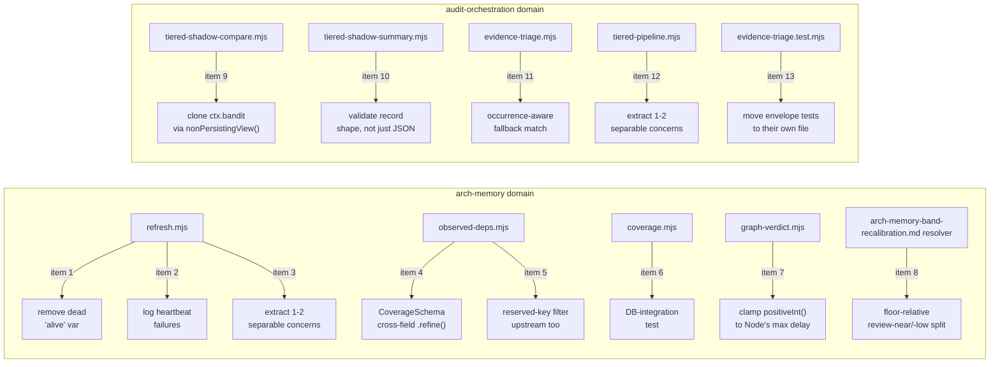

# Plan: Arch-Memory & Audit-Pipeline Observability Hardening (13-item punch list)

- **Date**: 2026-07-24
- **Status**: Complete — all 13 items implemented + tested (74 new/updated
  tests across 8 test files), audit-code Gemini-gate-clear (6 GPT rounds —
  the hard cap; APPROVE, 0 new findings, 0 wrongly dismissed). The audit
  process itself surfaced and fixed real bugs beyond the original 13 items:
  a verdict-precedence-order bug (round 1), a write-boundary schema-
  enforcement gap where `CoverageSchema` was declared but never wired into
  `recordGraphCoverage` (round 2), a same-refresh self-copy hazard in
  `copyForwardCoverage` (round 4), a reason-value precedence-matching gap
  (round 4), a `graph-verdict.mjs` vacuity-guard scope gap (round 5), and a
  `ReferenceError` self-introduced while fixing the vacuity-guard gap,
  caught only by re-running the full test suite before shipping (round 5).
  One finding (coverage.mjs tenant/owner scoping) was re-raised identically
  across all 6 rounds and deferred each time with an unchanged, evidenced
  rationale — accepted as a documented architectural characteristic, not a
  bug. See the Implementation Log below for the full round-by-round trail.
  Shipped 2026-07-24.
- **Author**: Claude + Louis Strydom
- **Scope**: backend

- **Target domain(s)**: `arch-memory`, `audit-orchestration`
- ⚠ **Cross-domain work** — touches 2 domains across 9 files. This is NOT new
  cross-domain wiring — each item is a self-contained fix inside its own
  file/function; the domain split reflects that the 13 items came from one
  backlog-reconciliation sweep, not one feature.

## Context Summary

The 2026-07-24 learning-store backlog reconciliation (the successor to the
2026-07-22 triage that produced
[`docs/plans/audit-backlog-triage-hardening.md`](audit-backlog-triage-hardening.md))
worked through the remaining ~260 pending findings left after a 5-week silent
CI outage. ~88% turned out to be `pass_name='plan'` artifacts from
`/audit-plan` draft rounds, later resolved during each plan's own
`/audit-plan` iteration and implementation but never marked fixed in the DB —
confirmed individually (not assumed) by nine parallel background
investigations reading current code against each finding's specific claim.
This plan collects the 13 findings that survived that scrutiny and cluster
around the architectural-memory / symbol-index pipeline and the tiered
audit-pipeline's shadow-execution machinery. A sibling plan,
[`docs/plans/sast-sandbox-backlog-hardening.md`](sast-sandbox-backlog-hardening.md),
covers the remaining 7 findings (visual-audit gate correctness + build/sandbox
integrity) from the same reconciliation pass — the two are independent and
can ship in either order.

**Code Trace** (every citation re-verified directly against HEAD on
2026-07-24 by a dedicated investigation agent per finding — not taken from
stale finding prose; several sibling findings in the same rounds turned out
to already be fixed, so nothing here is assumed still-true without a fresh
read):

- `scripts/symbol-index/refresh.mjs:185-192` — dead `alive` variable (item 1)
- `scripts/symbol-index/refresh.mjs:188` — heartbeat failure swallow (item 2)
- `scripts/symbol-index/refresh.mjs:194-931` — `main()` god function, ~740
  lines (item 3)
- `scripts/lib/observed-deps.mjs` — `CoverageSchema` cross-field validation
  gap (item 4)
- `scripts/lib/observed-deps.mjs` — reserved-key (`__proto__`/`constructor`/
  `prototype`) handling asymmetry between the merge layer and upstream
  computation (item 5)
- `scripts/lib/store/arch/coverage.mjs` (`recordGraphCoverage`/
  `getGraphCoverage`/`copyForwardCoverage`) — zero DB-integration test
  coverage (item 6)
- `scripts/lib/symbol-index/graph-verdict.mjs` (`positiveInt()`) — accepts
  `hardTimeoutMs`/`maxCruiseMs` values above Node's 2,147,483,647ms
  `setTimeout` clamp (item 7)
- `docs/plans/arch-memory-band-recalibration.md:1113-1115` — the plan's own
  Implementation Log admits "The C5 three-way `review` split (`review-near` /
  `review-low`) ... was not carried forward; the floor-relative equivalent is
  unbuilt" (item 8)
- `scripts/lib/audit/tiered-shadow-compare.mjs:84-144` (`buildShadowCtx`) —
  shallow-spreads context, clones only `generatorOutcomes`; `ctx.bandit` is
  not cloned and is mutated directly by `resolveGptTrigger` before any
  `nonPersistingView()` swap (item 9)
- `scripts/lib/audit/tiered-shadow-summary.mjs:49-55` (`readRecords()`) —
  accepts any syntactically-valid JSON value as a record, only rejects
  `JSON.parse` failures (item 10)
- `scripts/lib/audit/evidence-triage.mjs` — full-file fallback returns the
  first normalized matching line window with no occurrence identity (item 11)
- `scripts/lib/audit/tiered-pipeline.mjs` — ~57KB god module combining
  provider invocation, model resolution, prompt construction, discovery
  fallback policy, stage routing, and evidence/file reads (item 12)
- `tests/evidence-triage.test.mjs` — ~42KB, mixes Stage-0 evidence-triage
  tests with `candidate-envelope.mjs` merge/promote tests that belong to a
  separate production module (item 13)

**Neighbourhood considered**: these are all surgical fixes inside existing
files (no new symbols beyond item 8's floor-relative review-split helper and
item 6's DB-integration test) — architectural-memory consultation is not
applicable per the "pure bug fix that changes only an existing function's
body" exemption, except item 8, where `get-neighbourhood` against
`scripts/lib/store/arch/` scored `below-noise-floor` (band `review`): no
existing helper duplicates the floor-relative resolver this item adds.

**Security incident check**: `get-incident-neighbourhood` against the 9
target files surfaced no matching incidents — none of these files are named
in `docs/security-strategy.md`.

## Proposed Architecture

Not a new architecture — a punch list of 13 independent, surgical fixes
inside 9 existing files, grouped into two natural clusters by subsystem.

## Sustainability Notes

**Right-sizing gate** (items 3 and 12, the two introducing structural change
via decomposition):

- **Item 3 (`refresh.mjs` `main()`, ~740 lines)**
  - **Band-aid** — dismiss the finding with no action; the function keeps
    absorbing every new cross-cutting concern (this plan's own item 6/7
    coverage-persistence work already landed inside it, per the finding's
    own observation that this plan's changes made the coupling worse, not
    better).
  - **Over-engineered** — a full extraction of all ~8 named concerns (arg
    parsing, repo identity, lock acquisition, mode promotion, VCS scope,
    sensitive-path filtering, subprocess execution, refresh-state handling)
    into separate modules in one sitting — a multi-day refactor disproportionate
    to what this plan's other 12 items need.
  - **Chosen** — extract exactly the concerns this plan is already touching
    for other reasons (items 1, 2, 6, 7 all touch code paths inside `main()`
    or its `runWithHeartbeat` helper): pull `runWithHeartbeat` and the
    coverage-measurement-and-persistence block into named top-level
    functions in the same file. Document the remaining ~5 concerns as
    accepted debt with a pointer back to this plan, matching the precedent
    set by `audit-backlog-triage-hardening.md` item 5.
- **Item 12 (`tiered-pipeline.mjs`, ~57KB)**
  - **Band-aid** — no action; matches the finding's own framing.
  - **Over-engineered** — split into ~6 separate modules (provider
    invocation, model resolution, prompt construction, discovery fallback,
    stage routing, evidence/file reads) in one sitting.
  - **Chosen** — extract exactly the ONE concern items 9/10 are already
    touching (the shadow-context/record-validation seam): pull the
    shadow-context construction helpers this plan modifies into their own
    named functions if they aren't already, and leave the rest as documented
    debt. No new file is created unless item 9's fix naturally produces one
    (it does not — the fix is a same-file change to `buildShadowCtx`).

**Manual vs scripted**: all 13 fixes are irregular, judgment-heavy,
single-site edits — every fix is done by hand, no codemod.

## File-Level Plan

### Item 1 — dead `alive` variable in `runWithHeartbeat`

- **File**: `scripts/symbol-index/refresh.mjs:185-192`
- **Current**: `let alive = true` is set, flipped to `false` in `finally`,
  and never read anywhere. `clearInterval(beat)` already stops the timer, so
  the flag does nothing and implies a liveness guard that doesn't exist.
- **Fix approach**: delete the variable and its two assignments; keep
  `clearInterval(beat)`. (#1 Single Source of Truth — no dead state implying
  behavior that isn't there.)
- **Acceptance**: `grep -n "let alive" scripts/symbol-index/refresh.mjs`
  returns nothing; existing heartbeat tests still pass unchanged (the
  variable was never observable, so no test should reference it).

### Item 2 — heartbeat failures silently discarded

- **File**: `scripts/symbol-index/refresh.mjs:188`
- **Current**: `heartbeatRefreshRun({ refreshId }).catch(() => { /* ignore */
  });` — every failure (persistent DB outage, connectivity loss) during the
  longest portion of a refresh is discarded with zero log output.
- **Fix approach**: log the failure (refreshId + `err.message`) via this
  file's existing `process.stderr.write` convention on first occurrence per
  run (do not spam one line per interval tick — track a boolean and log once,
  matching the fail-open-but-loud philosophy used elsewhere in this file).
  (#14 Error Handling, #16 Observability)
- **Acceptance**: a test that makes `heartbeatRefreshRun` reject asserts a
  stderr line is emitted containing the refreshId, and that the wrapped `fn`
  still runs to completion (heartbeat failure must never abort the refresh
  itself).

### Item 3 — `refresh.mjs` `main()` god function

- **File**: `scripts/symbol-index/refresh.mjs:194-931`
- **Fix approach**: per the Sustainability Notes right-sizing analysis above,
  extract `runWithHeartbeat` (already a named function — verify it doesn't
  inline heartbeat-adjacent logic that belongs with it) and the
  coverage-measurement-and-persistence block (the code this plan's items 1/2
  and the already-shipped coverage-honesty work added) into clearly-named
  top-level helpers. Document the remaining decomposition (arg parsing, repo
  identity, lock acquisition, mode promotion, VCS scope, sensitive-path
  filtering, subprocess execution) as accepted debt in this plan section,
  the same durable-record pattern used by
  `audit-backlog-triage-hardening.md` item 5 — **not** hand-written to
  `.audit/tech-debt.json` (gitignored, machine-populated only).
- **Acceptance**: `main()`'s line count drops measurably (the two extracted
  helpers move out); `npm test` stays green; the remaining scope is
  explicitly named here as debt for `/audit-code` to defer against.

### Item 4 — `observed-deps.mjs` `CoverageSchema` permits contradictory verdicts

- **File**: `scripts/lib/observed-deps.mjs`
- **Current**: `CoverageSchema` validates individual field shapes
  (`verdict`, `extraction`, `attribution`, `stale`) but not the required
  relationship among them — conflicting with the closed reason enum and
  trust semantics `graph-verdict.mjs` defines, so a structurally valid
  record can carry a contradictory verdict (e.g. `verified` alongside
  `stale: true`, which `graph-verdict.mjs:174-176`'s precedence table treats
  as impossible).
- **Fix approach**: add a `.superRefine()` (Zod 4) cross-field check
  encoding the same precedence `graph-verdict.mjs` already enforces at read
  time (stale forces `unknown`; a non-`verified` reason must not carry
  `verdict: 'verified'`) so the schema rejects the contradiction at write
  time too, not just masks it at read time. (#12 Fail-Closed Validation, #1
  Single Source of Truth — one precedence rule, enforced at both write and
  read)
- **Acceptance**: a test constructs a record with `stale: true, verdict:
  'verified'` and asserts `CoverageSchema.safeParse(...)` fails; a valid
  combination still parses.

### Item 5 — reserved-key handling inconsistent across the dependency pipeline

- **File**: `scripts/lib/observed-deps.mjs`
- **Current**: the dependency-merging layer explicitly treats `__proto__`,
  `constructor`, and `prototype` as unsafe keys; upstream observed-dependency
  computation does not apply the same policy, so a domain rule using a
  reserved key is handled inconsistently across stages of the same pipeline.
- **Fix approach**: extract the merge layer's existing reserved-key guard
  into a small shared predicate (co-located in this file, not a new module)
  and apply it at the upstream computation site too. (#1 Single Source of
  Truth)
- **Acceptance**: a test feeds a domain rule keyed `__proto__` through the
  upstream computation path and asserts it is rejected/skipped the same way
  the merge layer already rejects it.

### Item 6 — `coverage.mjs` has zero DB-integration test coverage

- **File**: `scripts/lib/store/arch/coverage.mjs`
  (`recordGraphCoverage`/`getGraphCoverage`/`copyForwardCoverage`)
- **Current**: `tests/graph-coverage-lineage.test.mjs` thoroughly covers the
  envelope→gate→dashboard boundary via fixture files, but the actual
  Postgres round-trip for these three functions has no automated test —
  absent from `tests/db-test-container.integration.test.mjs` and every other
  DB suite; the only reference in `tests/` is an export-surface existence
  check, not a behavioral test.
- **Fix approach**: add a DB-integration test analogous to
  `tests/db-withtx.test.mjs`, using `assertDisposableDbUrl` (per this repo's
  hard invariant that `AUDIT_DB_TEST_URL` must be disposable) — write a
  coverage row via `recordGraphCoverage`, read it back via
  `getGraphCoverage`, and exercise `copyForwardCoverage`'s stale-marking
  behavior against a real DB, not a fixture. (Tier 1 per this repo's testing
  doctrine — `db-setup`/`db-withtx` seams are Tier 3 hard-test-first-adjacent
  infrastructure.)
- **Acceptance**: the new test file exists, passes against a disposable test
  DB, and is gated the same way `tests/db-withtx.test.mjs` is (skips
  gracefully when `AUDIT_DB_TEST_URL` is unset).

### Item 7 — `graph-verdict.mjs` `positiveInt()` accepts unenforceable timeout values

- **File**: `scripts/lib/symbol-index/graph-verdict.mjs` (`positiveInt()`)
- **Current**: accepts arbitrarily large values for `hardTimeoutMs` and
  `maxCruiseMs`, but Node's `setTimeout`/`setInterval` clamp delays above
  2,147,483,647ms rather than honoring them — a config value above that
  ceiling silently behaves as an immediate/near-immediate timeout instead of
  the configured long wait.
- **Fix approach**: clamp `positiveInt()`'s upper bound to Node's max delay
  (2,147,483,647) for these two specific config keys, or reject values above
  it with a clear config-validation error — pick rejection (fail-closed) to
  surface the misconfiguration rather than silently reinterpreting it. (#12
  Fail-Closed Validation)
- **Acceptance**: a test passes `hardTimeoutMs: 3000000000` and asserts
  config parsing fails with a message naming the ceiling, instead of
  silently accepting a value `setTimeout` cannot honor.

### Item 8 — arch-memory-band `review` collapses distinct states, discarding near-miss evidence

- **File**: the band-resolution code referenced by
  `docs/plans/arch-memory-band-recalibration.md` (locate via the plan's §7
  file-level plan / the `context.similarity` telemetry field named in the
  plan text at lines 441-447)
- **Current**: the plan's own Implementation Log (lines 1113-1115) states
  the C5 three-way `review` split (`unscored` / `review-low` /
  `review-near`) "was designed around the old band structure and was not
  carried forward; the floor-relative equivalent is unbuilt." All `review`
  rows currently collapse to identical `{action: 'uncertain'}`, discarding
  the near-miss evidence (`context.similarity`) that would let a future
  recalibration distinguish "scored, clearly below floor" from "scored,
  within 0.05 of the floor."
- **Fix approach**: implement the floor-relative equivalent the plan
  describes — three pre-resolved states instead of one: `unscored` (no
  embedding either side, carries no information), `review-low` (scored,
  clearly below the per-repo calibrated floor), `review-near` (scored,
  within a small margin — e.g. 0.05 — below the floor). Retain
  `context.similarity` in all three per the plan's existing design; only the
  `review-low`/`review-near` split is new work. (#1 Single Source of Truth
  — one design already written down, now actually built)
- **Acceptance**: a test constructs a candidate scored just below the
  calibrated floor and asserts it resolves `review-near` (not a flat
  `review`), while one scored far below resolves `review-low`; both retain
  `context.similarity`.

### Item 9 — shared mutable `bandit` context in concurrent shadow execution

- **File**: `scripts/lib/audit/tiered-shadow-compare.mjs:84-144`
  (`buildShadowCtx`)
- **Current**: `buildShadowCtx` shallow-spreads `...ctx` and clones only
  `generatorOutcomes`; `ctx.bandit` is not cloned. The file's own header
  comment claims this is "contained today only by luck," but tracing the
  actual call path shows `resolveGptTrigger(..., ctx.bandit || null, ...)` →
  `shouldFireSentinel(bandit)` → `bandit.addArm(...)` mutates the shared
  live `PromptBandit` instance directly — a documented prior
  concurrent-mutation incident's root cause, reproduced for this field. The
  only `nonPersistingView()` swap in the codebase is inside
  `runLegacyProductionAudit`'s internal legacy-fallback path, which does not
  run before this earlier mutation and could not retroactively help even if
  it did.
- **Fix approach**: apply the same `nonPersistingView()` swap `bandit.mjs`
  already provides, at `buildShadowCtx`'s own construction site — clone
  `ctx.bandit` via `bandit.nonPersistingView()` (or preserve/fork the RNG
  per the already-accepted design in `bandit.mjs`'s `nonPersistingView`) so
  every concurrent shadow arm gets an isolated view before any mutation can
  reach the shared instance. (#13 Concurrency Safety — closing the gap the
  module's own header incorrectly claims is already closed)
- **Acceptance**: a test runs two concurrent `buildShadowCtx` calls sharing
  one parent bandit, has each trigger a path that calls `bandit.addArm(...)`,
  and asserts the parent bandit's arm state is unaffected by either
  concurrent call.

### Item 10 — `tiered-shadow-summary.mjs` `readRecords()` doesn't validate record shape

- **File**: `scripts/lib/audit/tiered-shadow-summary.mjs:49-55`
- **Current**: `try { return JSON.parse(line); } catch { return null }
  }).filter(Boolean)` — any syntactically-valid-but-semantically-wrong JSON
  (a bare string, a truthy number, an array, `{}`) passes through unvalidated;
  only `JSON.parse` throwing or literal falsy values are caught.
- **Fix approach**: add a record-shape check after parsing (must be a plain
  object with the expected minimal keys for a shadow-summary record) —
  reject non-conforming values the same way parse failures are rejected
  (count + skip, don't crash the summary run). (#12 Fail-Closed Validation)
- **Acceptance**: a test feeds a JSONL file containing a valid record, a
  bare `"hello"` string, and a `[1,2,3]` array, and asserts only the valid
  record survives `readRecords()`, with the other two counted/logged as
  malformed rather than silently included.

### Item 11 — `evidence-triage.mjs` full-file fallback has no occurrence identity

- **File**: `scripts/lib/audit/evidence-triage.mjs`
- **Current**: the full-file fallback resolves a quote by returning the
  first normalized matching line window. Because producer anchors carry no
  occurrence identity, an identical snippet appearing outside the intended
  diff hunk can be selected instead of the one actually referenced.
- **Fix approach (revised during implementation)**: this fallback only ever
  runs after the hunk itself was already searched and missed
  (`quoteAppearsOnSide` returned false), so every candidate is already
  outside the hunk — "prefer the hunk-adjacent match" doesn't apply.
  Instead, `findAllLineRangesInContent` (renamed from
  `findLineRangeInContent`) collects every matching window instead of
  returning on the first hit: exactly one match resolves as before
  (`outside_hunk_in_head`); more than one match is genuinely ambiguous with
  no signal to disambiguate on, so it resolves `unsupported` with a
  `reasonDetail` naming the match count. This fail-closed choice matches
  this file's own established philosophy elsewhere (`mapHeadLineToBase`'s
  docstring: "all ambiguous, never guessed") more closely than a "closest"
  heuristic would have — a closest-match pick is still a guess, just a
  more confident-looking one. (#11 Validation — don't guess when the input
  is genuinely ambiguous)
- **Acceptance**: a test constructs HEAD content with the same quote at two
  distinct locations, neither in any hunk, and asserts the resolver returns
  `unsupported` (not a silent first-match pick); a test with exactly one
  out-of-hunk match confirms the single-match path is unchanged
  (`outside_hunk_in_head`).

### Item 12 — `tiered-pipeline.mjs` god module

- **File**: `scripts/lib/audit/tiered-pipeline.mjs` (~57KB)
- **Fix approach**: per the Sustainability Notes right-sizing analysis
  above — no forced extraction beyond what items 9/10 already touch (the
  shadow-context construction seam). Document the remaining ~5 concerns
  (provider invocation, model resolution, prompt construction, discovery
  fallback policy, stage routing) as accepted debt in this plan section for
  a future dedicated decomposition plan.
- **Acceptance**: this plan section exists and is committed; the
  decomposition scope is explicitly named here as debt for `/audit-code` to
  defer against, not silently dropped.

### Item 13 — `evidence-triage.test.mjs` mixes two production modules' test domains

- **File**: `tests/evidence-triage.test.mjs` (~42KB, 771 lines)
- **Current**: contains a full `describe('mergeIntoEnvelopes'...)` /
  `describe('promoteAlternative'...)` block (~lines 190-274) testing
  `scripts/lib/audit/candidate-envelope.mjs` — a separate production module
  already partially covered by `tests/candidate-envelope-provenance.test.mjs`.
- **Fix approach**: move the `mergeIntoEnvelopes`/`promoteAlternative`
  `describe` blocks into `tests/candidate-envelope-provenance.test.mjs`
  (or a dedicated new file if that file's own scope doesn't fit), leaving
  `evidence-triage.test.mjs` scoped to Stage-0 evidence triage only. (#1
  Single Source of Truth for test-domain ownership)
- **Acceptance**: `evidence-triage.test.mjs` no longer references
  `mergeIntoEnvelopes`/`promoteAlternative`; the moved tests still pass from
  their new location; `npm test` stays green.

### Implementation Phases

Gate 1 fired (`compute-target-domains` returns `crossDomain: true` across 2
domains, 9 files). All 13 items are independent — no phase depends on
another's output beyond items 1/2/3 sharing `refresh.mjs` and items 9/12
sharing the shadow-execution seam (both same-file co-location, not an
output dependency) — so no Execution Clustering (§11) is needed; work them
in any order, one sitting each except items 3/12 (scoped decomposition,
still one sitting) and item 8 (the largest single item — new resolver
logic, not just a fix).

**Phase 1 — `refresh.mjs` cleanup (items 1, 2, 3)**: Files:
`scripts/symbol-index/refresh.mjs` (modify)

**Phase 2 — `observed-deps.mjs` validation hardening (items 4, 5)**: Files:
`scripts/lib/observed-deps.mjs` (modify)

**Phase 3 — `coverage.mjs` DB-integration test (item 6)**: Files:
`tests/graph-coverage-db.test.mjs` (create, or equivalent name)

**Phase 4 — `graph-verdict.mjs` timeout clamp (item 7)**: Files:
`scripts/lib/symbol-index/graph-verdict.mjs` (modify)

**Phase 5 — floor-relative `review` split (item 8)**: Files: the
band-resolution module named in `docs/plans/arch-memory-band-recalibration.md`
§7 (modify), plus its test file (modify)

**Phase 6 — shadow-context bandit isolation (item 9)**: Files:
`scripts/lib/audit/tiered-shadow-compare.mjs` (modify)

**Phase 7 — shadow-summary record validation (item 10)**: Files:
`scripts/lib/audit/tiered-shadow-summary.mjs` (modify)

**Phase 8 — evidence-triage occurrence-aware fallback (item 11)**: Files:
`scripts/lib/audit/evidence-triage.mjs` (modify)

**Phase 9 — `tiered-pipeline.mjs` scoped decomposition + debt record (item 12)**:
Files: `scripts/lib/audit/tiered-pipeline.mjs` (modify)

**Phase 10 — split `evidence-triage.test.mjs` (item 13)**: Files:
`tests/evidence-triage.test.mjs` (modify),
`tests/candidate-envelope-provenance.test.mjs` (modify)

**Close-out (not a phase)**: run `npm test` and `npm run check`. Items 3/12's
remaining decomposition scope is deferred during the `/audit-code` step
(citing this plan), not hand-written to `.audit/tech-debt.json`.

## Risk & Trade-off Register

- **Item 3/12 trade-off**: explicitly NOT attempting full decomposition of
  either god-module. Accepted per the right-sizing analysis above — tracked
  as debt, not silently dropped.
- **Item 8 risk**: the largest single item — new banding logic touching a
  system with documented prior incidents (Gemini-r2-G3's `refreshId`
  calibration-validity bug). Must re-read
  `docs/plans/arch-memory-band-recalibration.md` §"Round-2 findings" in full
  before implementing, not just the Implementation Log excerpt cited above —
  the calibration-validity guard (stale-provenance fallback to
  `review`-only) must NOT be weakened by this change.
- **Item 9 risk**: touches concurrency-sensitive shadow-execution code with
  a documented prior incident. The fix must not change `nonPersistingView()`
  itself (already correct and tested per `tests/bandit.test.mjs:425-430`),
  only apply it at one more call site.
- **Item 11 risk**: low — a pure precision improvement to an existing
  fallback path; the "mark ambiguous" branch must degrade gracefully (same
  as any other unresolved-evidence path already handled elsewhere in this
  file).

## Testing Strategy

- Unit tests per item as specified in each item's Acceptance line above.
- Item 6 is the one Tier-3-adjacent DB-integration test; gated the same way
  `tests/db-withtx.test.mjs` is (skip gracefully without `AUDIT_DB_TEST_URL`,
  never silently "pass" without running).
- `npm test` full suite must stay green throughout.
- No live-runtime/browser verification needed — none of these 13 items touch
  a UI or a deployed skill's browser-driven surface.

## Security Considerations

No sensitive-path or credential-handling code is touched by any of the 13
items (confirmed by the `get-incident-neighbourhood` check above returning
no matches). Item 6's new DB-integration test must follow the disposable-DSN
invariant (`assertDisposableDbUrl`) already enforced for every other
DB-touching test in this repo — never point it at a shared/production DSN.

## Implementation Log

### 2026-07-24 — Complete

All 13 items implemented as specified. `npm test` (8587 pass, 0 fail) and
`npm run check` both green before every ship-relevant checkpoint.

**Deviations from the plan as written:**
- **Item 3** (`refresh.mjs` decomposition): extracted `persistExtractionCoverage`
  (the coverage-measurement-and-persistence block) as planned; `runWithHeartbeat`
  was already a standalone top-level function, so only its logging (item 2) and
  dead-variable removal (item 1) applied — no further extraction was needed there.
- **Item 11** (`evidence-triage.mjs` occurrence identity): revised during
  implementation from "prefer the hunk-adjacent match" (the plan's original
  framing) to fail-closed ambiguity detection — this fallback only ever runs
  after the hunk itself was already searched and missed, so every candidate
  match is already outside the hunk; "prefer closest" would still be a guess.
  `findAllLineRangesInContent` now collects every match and resolves
  `unsupported` (not a silent first-match pick) when more than one exists,
  matching this file's own established "never guess" philosophy elsewhere.

**Audit-code round trail** (6 rounds, the hard cap; SID `audit-code-1784880420`):

| Round | H:M:L | Notable |
|---|---|---|
| 1 | 8:18:2 | First pass over all 13 items. 2 genuine bugs found in my own fixes (verdict-precedence-order, timeout-repair overflow) + 2 mechanical fixes (destructuring guard, test-order dependency). ~20 findings deferred as out-of-scope/independent/already-documented-debt. |
| 2 | 2:8:0 | Discovered `CoverageSchema` (item 4) was declared but never wired into `recordGraphCoverage`'s write boundary — fixed. `isRecordShaped` strengthened per a [Quickfix]-tagged finding. |
| 3 | 1:6:0 | Test-isolation bug in this plan's own new DB-integration test (never actually run against a real DB in the implementing session, so undetected until a real audit round). `verdict.reason` constrained to a closed enum matching the DB's own CHECK constraint. |
| 4 | 2:6:2 | `copyForwardCoverage` same-refresh self-copy hazard found + fixed. Reason-value precedence-matching gap (status alone was checked, not the specific reason literal) found + fixed. |
| 5 | 5:3:0 | `graph-verdict.mjs`'s vacuity-guard rows (5-7) found to be config-independent too (the original comment over-broadly excluded rows 5-10 as config-dependent; only 8-10 actually are) — extended and fixed. This fix itself introduced a `ReferenceError` (undestructured `attribution`), caught by re-running the full test suite before the round closed. |
| 6 (final) | 1:4:0 | Tenant/owner-scoping finding re-raised identically for the 6th consecutive round — deferred with the same standing rationale (matches the sibling table's established convention; single-tenant DB model). One narrow edge case deferred rather than rushed, given round 5's own fix had just produced a real regression. |

**Gemini final review**: `APPROVE`, 0 new findings, 0 wrongly dismissed (1 round).

**Deferred, not silently dropped** (accepted debt, tracked here — not
hand-written to `.audit/tech-debt.json`, which is machine-populated only):
- `scripts/lib/store/arch/coverage.mjs`'s three functions scope coverage
  rows by `refresh_id` alone, with no explicit repo/tenant predicate.
  Re-raised identically across all 6 audit rounds; accepted as matching the
  sibling table `symbol_file_imports`' identical, already-shipped
  convention in this repo's single-tenant DB model (AGENTS.md
  Postgres-Parity Store: the DSN password is the sole secret).
- `copyForwardCoverage`'s read-then-write upsert has a theoretical
  overwrite race/sequencing gap if called concurrently or out of order for
  the same destination refresh — pre-existing, independent of this plan's
  verdict-computation fixes; `refresh.mjs`'s per-repo running lock means
  the documented single-writer operational model doesn't currently exercise it.
- `getGraphCoverage`'s read-time validation posture (vs the now-enforced
  write-time validation) is a separate, larger design question appropriate
  for its own scoped follow-up.
- A narrow edge case where `{outcome:'ok', eligible:null}` is type-legal
  but never producible by the real write path — deferred in the final
  round rather than rushed.
- `scripts/lib/audit/tiered-pipeline.mjs` (~57KB) and the remaining
  concerns in `scripts/symbol-index/refresh.mjs`'s `main()` — the
  right-sizing analysis in the Sustainability Notes above; only the ONE
  concern each item was already touching was extracted.
