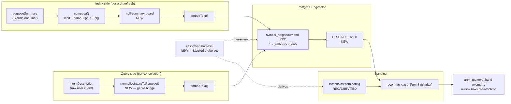

# Plan: Arch-Memory Consultation — Close the Query/Index Asymmetry

- **Date**: 2026-07-19
- **Status**: Complete
- **Author**: Claude + Louis Strydom
- **Scope**: backend
- **Stack**: `js-ts` (+ postgres)
- **Target domain(s)**: `arch-memory`, `cross-skill-bridge`, `shared-lib`
- ⚠ **Cross-domain work** — touches 3 domains; the seam between `arch-memory`
  (query + banding) and `shared-lib` (embedding transport) is intentional and
  is where the defect lives.

---

## 1. Context Summary

AGENTS.md makes the architectural-memory consultation **mandatory** before
writing any new symbol. It has returned an actionable recommendation **zero
times in 1,763 decisions**. Every row is `band=review` (1,625) or
`justify-divergence` (138); `reuse` and `extend` have never fired.

### Code Trace

1. `scripts/cross-skill.mjs:2226` dispatch → `cmdGetNeighbourhood()`
   `scripts/cross-skill.mjs:1813-1856` → `getNeighbourhoodForIntent()`
   `scripts/lib/neighbourhood-query.mjs:145`.
2. **Query-side embed text** — `neighbourhood-query.mjs:194` redacts, `:198-202`
   → `generateIntentEmbedding` → `:127` `embedText(intentDescription, …)`.
   The vector is built from **`intentDescription` alone**. `targetPaths` is only
   a structural hop signal (`:211`); `kind` is only a SQL filter (`:213`).
   Neither reaches the vector.
3. **Index-side embed text** — `symbol-index/refresh.mjs:323-386` →
   `summarise.mjs` (one-line Claude purpose summary, `:50-53`) →
   `symbol-index/embed.mjs:106` embedding `compose()` from
   `scripts/lib/symbol-index.mjs:74-79`:
   ```js
   return `${s.kind} ${s.symbolName} in ${s.filePath}\n` +
          `${summary}\n` +
          `${s.signature || ''}`;
   ```
4. **Bands** — `scripts/lib/symbol-index.mjs:151-156`
   `recommendationFromSimilarity()`, hardcoded `0.90 / 0.85 / 0.75`, applied at
   `neighbourhood-query.mjs:233`.
5. **Similarity SQL** — `supabase/migrations/20260501120000_symbol_index.sql:274-277`,
   pgvector `<=>` cosine distance with `1 - distance`, index
   `ivfflat … vector_cosine_ops` (`:136`).
6. **Telemetry** — `neighbourhood-query.mjs:241-293`, one `recordDecision` per
   record; `choice.band` is the string, `context.similarity` the numeric score.

### What is already correct (do not "fix" these)

The provider/vector-space axis is well defended and was **refuted** as a cause:

- Metric is right: `<=>` is cosine distance, `1 - d` is the correct inversion,
  and the ivfflat opclass matches. No double-inversion.
- **Measured: identical string → cosine `1.0000`.** Normalization is a non-issue
  for `<=>` (it self-normalizes).
- Model/dim skew is guarded in four independent places
  (`neighbourhood-query.mjs:92-102`, `:111-122`, `embed-text.mjs:205-224`, and
  the model+dim equality in the SQL LEFT JOIN `:285-288`).

**Hypotheses (a) thresholds and (b) query/index text asymmetry are both real and
compound. Hypothesis (d) metric/normalization is refuted. (c) is a narrower
variant of (b), addressed by Phase 3.**

### Measured evidence (`gemini-embedding-001`, dim 768)

Similarity scale of the embedding space itself:

| probe pair | cosine |
|---|---|
| identical string | 1.0000 |
| purpose-phrased paraphrase (same genre) | 0.9137 |
| **unrelated sentence (biology)** — the noise floor | **0.4256** |

The same function, described in each genre:

| query phrasing | vs index text | cosine |
|---|---|---|
| purpose-phrased ("Finds the K nearest…") | bare summary | **0.9137** |
| intent-phrased ("implement nearest-neighbour symbol search…") | bare summary | 0.8469 |
| intent-phrased ("add a function that finds similar existing symbols…") | bare summary | 0.6617 |
| intent-phrased (same) | **`compose()` output — what runs today** | **0.6043** |
| intent-phrased (same) | **null-summary vector** (metadata only) | **0.5440** |

And the ground truth — 1,770 recorded `context.similarity` values from real
consultations:

| min | p25 | p50 | p75 | p90 | p99 | **max** |
|---|---|---|---|---|---|---|
| 0.0000 | 0.6254 | 0.6690 | 0.7045 | 0.7406 | 0.8004 | **0.8294** |

`≥0.85: 0 rows. ≥0.90: 0 rows.` **The `extend` cutoff sits 0.021 above the
highest similarity this pipeline has ever produced.** The bands are not
mis-tuned, they are out of range.

### Root cause — three compounding layers

1. **Genre asymmetry (dominant, ≈0.25).** The query embeds an *intent* ("add a
   function that…"); the index embeds a *purpose description* ("Queries … for
   K-nearest symbols."). Different genres of English. Same function, same index
   text, phrasing alone moves cosine 0.66 → 0.91.
2. **Template asymmetry (≈0.06).** `compose()` prefixes `kind name in path` and
   suffixes the signature — roughly two of three lines are metadata no natural
   intent string contains.
3. **Thresholds calibrated against a distribution this text construction cannot
   produce.** `compose()` (`symbol-index.mjs:74-79`) and
   `recommendationFromSimilarity()` (`:151-156`) live 70 lines apart with
   nothing linking them; any change to one silently invalidates the other.

### The trap this plan must avoid

**Lowering the thresholds to match the observed distribution would manufacture
false `reuse` recommendations.** The noise floor is high and the margins are
tiny:

```
unrelated sentence        0.4256
null-summary metadata     0.5440   ← indexed today, no guard
genuine correct match     0.6043
                          └──── only 0.06 of signal above pure metadata
```

A `reuse` cutoff at ~0.60 would sit 0.06 above a vector with **zero semantic
content**. The fix is to widen the spread by closing the asymmetry, and only
then recalibrate against a labelled set. Threshold movement is an *output* of
this plan, never step one.

### Patterns reused vs new

Reused: `embedText` transport + dim guards, the existing disk embedding cache
(`neighbourhood-query.mjs:39-68`), `resolveEmbedProfile` provenance, the
existing `recordDecision` telemetry seam. New: one calibration harness and one
query-side normalization step.

### Neighbourhood considered

Consulted at plan time — and the result is itself evidence. Querying *"fix
arch-memory band thresholds and embedding query symmetry"* against
`neighbourhood-query.mjs` returned `getNeighbourhoodForIntent` (the exact
function) as top hit at similarity **0.5846 → band `review`**. A textbook-perfect
match is banded "no signal". Other hits: `generateIntentEmbedding` (0.5704),
`embedText` (0.5379), `validateVector` (0.5234) — all `review`.

No `reuse`/`extend` candidate exists to defer to, so this plan writes new code
in Phases 1–2 without a divergence justification being owed.

---

## 2. Proposed Architecture



### Key design decisions

- **Bridge the genre gap on the query side, not the index side (#1, #17).**
  Query-side normalization is one small LLM call per consultation, already
  cacheable by the existing disk cache, and it addresses the dominant (~0.25)
  term. Index-side re-embedding would address only the ~0.06 template term.

> **Measured correction (implementation, 2026-07-19).** Earlier drafts of this
> plan costed a re-index at **124,616 symbols**. That number is the accumulated
> `symbol_index` row count across **41 historical refreshes** — the **active
> snapshot is 3,324 symbols** over 688 files. A full re-index is therefore
> cheap (minutes, not hours), which changes two decisions recorded below:
> the `compose()` template fix is no longer meaningfully expensive to bundle
> into Phase 3, and the Phase-3 re-index carries no significant cost risk.
> Recorded rather than silently amended, because the original figure was used
> to justify a deferral *and* to seek authorization for the run.
- **Thresholds become derived config, not literals (#4, #19).** They move to
  `config.mjs` beside `embedModel`/`embedDim`, and their values come out of the
  calibration harness. A comment in `symbol-index.mjs` links `compose()` to the
  cutoffs so the coupling is visible.
- **`compose()` is deliberately left alone in this plan (#20).** Removing the
  template scaffolding is worth ≈0.06 but costs a full 124k-symbol re-embed.
  Deferred to the next scheduled re-index rather than triggered for its own
  sake — recorded in §8, not silently dropped.
- **Fail-closed on missing embeddings (#15).** `ELSE 0` conflates "no embedding"
  with "orthogonal", and `combined_score = hop*0.4 + sim*0.6` lets an unembedded
  file in `targetPaths` reach 0.4 and outrank real matches. `NULL` makes absence
  legible instead of scoring it.

### 2.1 Contracts the implementation must honour

These are the load-bearing details; each was a HIGH finding in round 1.

#### C1 — Egress order: redact BEFORE normalize (H1)

`normalizeIntentToPurpose()` is a **new external-LLM egress surface** and must
sit behind the same gate as every other provider call. Mandatory order:

```
v.intentDescription
  → redactSecrets()          (neighbourhood-query.mjs:194, already present)
  → assertEgressSafe()       (sensitive-egress-gate, label 'arch-memory:normalize-intent')
  → normalizeIntentToPurpose()   ← the new provider call
  → embedText()
```

The normalizer **must never receive the raw intent**. This is the same
plumbing asymmetry that caused the tiered-shadow egress failures (one half of a
payload redacted, the other not — `tiered-pipeline.mjs:730`); the fix there was
to redact at the seam, and this plan must not reintroduce it one module over.
Per AGENTS.md this is a **Tier-3 hard test-first seam**: the egress test lands
in the same commit as the normalizer. A gate refusal degrades to the
deterministic fallback (C2) — it never sends and never throws into the query path.

#### C2 — Cache identity must include the normalization provenance (H2)

The existing disk cache (`neighbourhood-query.mjs:39-68`) is keyed on
`(intentDescription, model, dim)`. After this change the same raw intent maps to
a **different vector**, so an unchanged key would serve pre-fix vectors and
silently bypass Phase 2 — the failure would look exactly like "the fix didn't
work". The key becomes:

```
(safeIntent, embedModel, embedDim, normalizerId, NORMALIZE_PROMPT_VERSION, normalizationMode)
```

**The first element is `safeIntent` — the post-`redactSecrets` text — never the
raw `intentDescription`** (Gemini G2). The existing cache derives its key from
the redacted text precisely so a secret in a user prompt is never hashed into,
or written to, a disk cache file; naming the raw field here would have
regressed that boundary. It also keeps two intents that differ only by an
embedded secret on the *same* cache entry instead of splitting them. A unit
test asserts `key(intent) === key(intent_with_secret)`.

- `normalizerId` — resolved normalizer model (endpoint-qualified, mirroring
  `resolveEmbedProfile`'s provenance rule).
- `NORMALIZE_PROMPT_VERSION` — bumped on any prompt edit.
- `normalizationMode` — `llm` | `fallback`, so a fallback-produced vector can
  never be served to an LLM-normalized query or vice versa.

Pre-existing cache entries lack these fields and are treated as **misses**, not
as `undefined` matches. Cache-key derivation gets a unit test.

#### C3 — Null similarity: row shape and score semantics (H4)

`ELSE NULL` (replacing `ELSE 0`) changes the RPC contract, and SQL `NULL`
propagates: `hop*0.4 + sim*0.6` becomes `NULL`, not `hop*0.4`. Required:

**Separate RANKING from BANDING — this is the root of three rounds of
oscillation.** The original `ELSE 0` was not one bug but two concerns collapsed
into one number, and each successive fix traded one symptom for another:
scoring an unembedded target-path file at 0.4 buried real matches (round-1 H4);
sorting `scored DESC` first buried the target-path file entirely (Gemini-r2 G4);
sorting `hop_score` first buried perfect semantic matches in untouched files
(Gemini-r3 G1). All three are consequences of using one value for both jobs.

- **Ranking** — *which candidates to show*. A unified scalar, exactly as today:
  `ranking_score = hop_score * 0.4 + COALESCE(similarity, 0) * 0.6`,
  `ORDER BY ranking_score DESC`. A `COALESCE(...,0)` is legitimate **here**: this
  is an ordering heuristic, and hop-score contribution is precisely how an
  actively-edited file earns its place in the candidate list. No burying in
  either direction — a target-path file with no embedding still scores 0.4; a
  perfect semantic match in an untouched file still scores 0.6.
- **Banding** — *what recommendation to emit*. Reads the **raw nullable
  `similarity`** and nothing else. `NULL` → `unscored`. Never coalesced, never
  arithmetic. This is where `ELSE 0` was genuinely wrong, because a fabricated
  `0` became an authoritative "considered and rejected" verdict.

The RPC therefore returns `similarity numeric NULL`, `scored boolean`, and
`ranking_score numeric NOT NULL`. `scored` exists so consumers can tell "no
evidence" from "low similarity" without inspecting nulls.
- JS mapping: `recommendationFromSimilarity()` takes `number | null` and returns
  a distinct band **`unscored`** for null. It must not coerce — a
  `Number(null) === 0` anywhere in this path is the exact bug class being
  removed. `unscored` is asserted explicitly in `tests/arch-memory-banding.test.mjs`.
- **`rankNeighbourhood()` (`scripts/lib/symbol-index.mjs:129-141`) is a SECOND
  implementation of the same formula and must change identically** (Gemini G4).
  It computes `sim = cosineSimilarity(r.embedding || [], …)` — an absent
  embedding degrades to an empty vector and scores `0`, then feeds
  `score = hopScore * 0.4 + sim * 0.6`, reproducing the exact `ELSE 0` defect
  in Node that the migration removes in SQL. Fixing only the RPC would leave
  the bug live on this path. Both get `sim = null` → `score = null` → sorted
  last, and a test asserts the two paths agree on a missing-embedding record.
- CLI/markdown rendering shows `unscored` distinctly from `review`, so a missing
  embedding is never displayed as a considered-and-rejected candidate.

#### C4-REVISED — Thresholds are computed PER-REPO, never shipped (2026-07-20)

> **This supersedes the original C4 below, which said thresholds move to
> `config.mjs`.** That instruction was written before we checked whether
> `config.mjs` is synced. It is. So is `symbol-index.mjs`. Writing a derived
> threshold into either ships a number calibrated against THIS repo — 3,478
> Node-CLI symbols with Haiku-written terse summaries — to every consumer.
>
> **That is the original defect in a new costume.** The bug this plan exists to
> fix was hardcoded `0.90/0.85/0.75`: plausible constants that were unreachable
> for the actual pipeline. Shipping `0.73` globally is the same error with a
> better-evidenced number, because a threshold is not a property of the tool.
> It is a property of **repo corpus × summary style × embedding model × compose
> template × normalizer**. A wine app has different domain vocabulary and symbol
> density, therefore a different noise floor. Our 0.7162 says nothing about theirs.

**The floor is computed from the repo's own index, at refresh time.**

```
floor = μ + 3σ   over pairwise cosine similarity of a random sample of the
                 repo's OWN symbol embeddings
```

Dense, repetitive corpora have a high μ and the bar rises automatically; diverse
corpora get a lower bar. The **formula** syncs; the **value** is native to each
consumer. No labelled probes required, works on first refresh.

**Validated before adoption, on the one repo that could falsify it:**

| method | inputs | floor |
|---|---|---|
| supervised — p95 of hard-negative best-hits (10 hand-authored probes) | intents → index | **0.7162** |
| unsupervised — μ+3σ over 7,140 background pairs (120 random symbols) | index → index | **0.7146** |

Agreement to **0.0016 (0.2%)**. Honest caveat: the two share the embedding model
and the corpus, so this is *partial* corroboration, not independent confirmation.
`k` matters — μ+4σ = 0.7584 sits **above** our observed true positives (0.73–0.83)
and would suppress real matches. `k = 3` is empirical, not conventional.

**Second gate — the cliff.** An absolute floor alone is fragile under hubness:
in a repo where every symbol says "wine", a 0.72 may be background. So a match
must ALSO be distinctive:

```
score₁ − score₂ > MIN_CLIFF_DELTA
```

This measures uniqueness against the repo's own vocabulary and ports far better
than any absolute baseline. Both gates must hold.

**What gets stored per repo** (not in synced source): the sample statistics
(μ, σ, n, percentiles), the resulting floor, and the C4 provenance tuple below.
A provenance mismatch invalidates the calibration exactly as before.

**Labelled probes are no longer a prerequisite — they are the falsification
instrument.** They are how the formula was validated here. Consumers inherit a
validated formula rather than an authoring burden. Requiring ~30 hand-labelled
probes per consumer would have "solved a data-science problem by offloading an
administrative nightmare onto the user", and accepting that most consumers get a
permanently degraded feature would relocate the blame for the tool's failure
rather than fixing it.

**Deliberate limitation, recorded**: an unsupervised floor establishes where
scores stop being noise. It cannot establish semantic correctness — a score
distribution contains no ground truth about whether an intent SHOULD map to a
symbol. So the floor licenses "this is worth a look", not "this is the right
symbol". That is why the bands collapse (C7-REVISED).

#### C7-REVISED — Two actionable states, not four (2026-07-20)

The derived bands were `T_reuse 0.73 / T_extend 0.72` — **0.01 apart**, while
`medianPositive` varies **~0.008** across identical runs because normalization
is LLM-generated (measured: 0.8082 / 0.8004 / 0.8007). A band narrower than the
measurement noise is not a distinction; a 0.724 would be `reuse` on Tuesday and
`extend` on Wednesday.

Worse, the partition was never sound in the first place. Whether to *reuse* a
symbol unchanged or *extend* it depends on dependency direction, API shape,
ownership, stability guarantees and accumulated debt — architecture judgments
that cosine distance cannot express. A near-identical symbol may be unusable; a
moderately similar one may be exactly the right thing to extend.

| band | condition |
|---|---|
| `unscored` | no embedding — no evidence (C3) |
| `review` | scored, below floor, or not distinctive enough |
| `precedent` | `similarity ≥ floor` AND `cliff > MIN_CLIFF_DELTA` |

`reuse` and `extend` are **retired**. `precedent` means "existing code merits a
serious look before you write this" — which is what the embedding can actually
support. Choosing between reuse and extension is handed to the developer (or a
later structured-comparison phase), not asserted from a distance score.

#### C4 — Calibration is bound to its provenance (H6)

A calibration is only valid for the exact pipeline that produced it. The
`archMemoryBands` config block stores a `calibrationProvenance` object:

```
{ embedModel, embedDim, composeVersion, normalizerId, normalizePromptVersion,
  probeSetHash, calibratedAt, indexSnapshotId }
```

`COMPOSE_VERSION` is a new exported constant in `symbol-index.mjs` next to
`compose()` — bumped whenever the template changes, which is what mechanically
links `compose()` to the cutoffs (the two currently sit 70 lines apart with
nothing connecting them).

At query time, if live provenance ≠ `calibrationProvenance`, the system emits a
**stale-calibration warning and falls back to `review`-only banding** — it does
NOT apply thresholds calibrated for a different space. Refusing to band is
honest; banding under an unvalidated calibration is the failure mode.

**The deterministic fallback is explicitly out-of-calibration.** Fallback text
is a different distribution from LLM-normalized text, so a fallback-mode query
**never emits `reuse`/`extend`** — it is capped at `justify-divergence` and
tagged `normalizationMode: 'fallback'`. Calibrating the fallback separately is
deferred (§8); capping it is the honest interim.

#### C5 — `review` is split, not flattened (M1)

Round-1 M1 is correct that `review` currently conflates distinct states, and
pre-resolving all of them as `no-signal` would discard the ambiguous-candidate
evidence that made this diagnosis possible. The band becomes three terminal
states, and only the genuinely-uninformative one is pre-resolved:

| state | meaning | telemetry |
|---|---|---|
| `unscored` | no embedding on either side (C3) | pre-resolved `no-signal` — carries no information |
| `review-low` | scored, below `justify-divergence` | pre-resolved `no-signal`, but `context.similarity` **retained** |
| `review-near` | scored, within 0.05 below the `justify-divergence` cutoff | stays **resolvable** — these are the near-misses worth labelling |

`context.similarity` is retained in all three cases: it is the series that
diagnosed this defect, and it costs one numeric field.

#### C6 — Provenance identifiers must be derived, not hand-maintained (H7, H8)

- **Calibration validity binds to CONFIGURATION provenance, never to
  `refreshId`** (Gemini-r2 G3 — a defect this plan introduced while fixing
  round-2 H7). `refreshId` is minted fresh by *every* `arch:refresh`, including
  routine incremental and weekly-cron runs. Binding validity to it would
  invalidate the calibration on the very next background refresh and pin the
  system to `review`-only banding forever — auto-disabling the feature this plan
  exists to enable, and doing so silently. That is strictly worse than today.

  `calibrationProvenance` therefore compares only on values that change when the
  *meaning* of the vector space changes:
  `{ embedModel, embedDim, COMPOSE_VERSION, normalizerId, NORMALIZE_PROMPT_VERSION, probeSetHash }`.
  The `refreshId` the harness ran against is still **recorded, as informational
  metadata only** (`calibratedAgainstRefreshId`) so a calibration is traceable
  to its snapshot — it is never part of the equality check. Round-2 H7 was right
  that an invented snapshot id had no producer; the answer is that no snapshot
  id belongs in the predicate at all.
- **`COMPOSE_VERSION` and `NORMALIZE_PROMPT_VERSION` are content hashes, not
  manually-bumped constants.** A convention that says "remember to bump this" is
  not a binding (round-2 H8) — the whole defect this plan fixes was two coupled
  values drifting apart with nothing enforcing the link. Both are computed at
  module load as a short SHA-256 of the exact template/prompt string:
  `COMPOSE_VERSION = sha256(composeTemplateSource).slice(0,12)`. Editing the
  template changes the hash mechanically, which invalidates cache keys (C2) and
  trips the stale-calibration guard (C4) with no human in the loop.

#### C7 — Complete, ordered band contract (H9)

Round-2 H9 is correct that only `reuse`/`extend` had derivation rules while C5
depends on a `justify-divergence` cutoff. The full contract, evaluated
top-down, exhaustive over `number | null`:

| band | condition | derivation |
|---|---|---|
| `unscored` | `similarity === null` | not a threshold (C3) |
| `reuse` | `≥ T_reuse` | lowest cutoff with precision@reuse ≥ 0.90, ≤1 hard-negative FP |
| `extend` | `≥ T_extend` | lowest cutoff with precision ≥ 0.75, same FP constraint |
| `justify-divergence` | `≥ T_jd` | **the hard-negative ceiling**: the 95th percentile of best-hit similarity across `relation: "none"` probes. Below this, scores are indistinguishable from "no appropriate symbol exists". |
| `review-near` | `≥ T_jd − 0.05` | derived, not independent |
| `review-low` | otherwise | — |

Invariants asserted in `tests/arch-memory-banding.test.mjs`:
`T_reuse > T_extend > T_jd`; every input maps to exactly one band; `null` maps
only to `unscored`. If the ordering constraint cannot be satisfied by the
calibration, the harness exits `2` and no thresholds are written.

#### C8 — Consumers of the band vocabulary must be updated together (H10)

Adding `unscored` / `review-near` / `review-low` changes a **public vocabulary**,
not just an internal enum. Round-2 H10 is correct that the file plan named only
the RPC and the query module. Full consumer set, all updated in Phase 5:

- `AGENTS.md` — the "Architectural Memory — Pre-fix Consultation" section
  documents the four bands and the action per band; it gains the new states and
  the rule that `unscored` means *no evidence*, not *no match*.
- `.claude/hooks/arch-memory-check.sh` + `tests/hook-arch-memory-check.test.mjs`
  — the hook renders the recommendation column into the prompt callout.
- `scripts/cross-skill.mjs` — the `markdown` field rendering of neighbourhood
  results.
- `skills/plan/SKILL.md` (Phase 0.5) and `scripts/lib/brainstorm/policy-context.mjs`
  — both instruct on `reuse`/`extend` handling.
- **Dashboard collection + presentation** (Gemini-r3 G3):
  `scripts/lib/dashboard/sections/architecture.mjs` and
  `scripts/lib/store/arch-memory.mjs` aggregate band counts; unmapped new
  states would silently miscount or drop decisions on the Architecture tab.
- The RPC's `scored` column is **additive** — existing callers reading
  `similarity` keep working, but any that assume non-null must be located; the
  migration is not backward-compatible for a caller doing arithmetic on
  `similarity` without a null check.

#### C9 — Null-summary record lifecycle (H12)

"Skip/flag" was ambiguous (round-2 H12). Exact semantics:

- The **symbol row is retained** (it is real code; the architecture map and drift
  detection depend on it). Only the *embedding* is withheld.
- `symbol_embeddings` row for a null/blank-summary symbol is **deleted**, not
  retained-with-a-flag — a stale metadata-only vector left in place is exactly
  the 0.5440-scoring noise Phase 3 exists to remove.
- The symbol then legitimately has no embedding, so it surfaces as `unscored`
  (C3) rather than as a weak match. This is the honest state: *we have no
  semantic representation of this symbol*.
- **Re-summarisation does NOT happen organically — it must be forced**
  (Gemini-r2 G2). An incremental `arch:refresh` scopes its work to files from
  `git diff --name-status <since>` (`refresh.mjs:290-314`), so a symbol whose
  summarisation failed once is never revisited unless its file happens to be
  edited again. Left as-is, a transient provider outage during one refresh
  creates a **permanent blind spot**: those symbols hold no embedding, and
  nothing ever retries them.
  *(Gemini attributed this to `signatureHash` skip-logic; the actual mechanism
  is touched-file scoping. Same consequence, and the fix is the same.)*

  Phase 3 therefore adds an explicit **bounded** re-queue: any active symbol row
  with a null or blank `purposeSummary` is enqueued for summarisation on every
  refresh, regardless of touched-set membership — but capped by a
  `summary_attempts` counter on the symbol row, re-queued only while
  `attempts < 3` (Gemini-r3 G2). Some symbols fail *permanently*, not
  transiently — oversized bodies, safety-filter trips, malformed sources — and
  an unbounded retry would re-attempt them on every refresh forever, burning
  provider calls on work that cannot succeed.

  At the cap the symbol is marked `summary_failed` (terminal) and excluded from
  the queue; it still surfaces as `unscored`, which is the honest state. Both
  counts — re-queued and terminally-failed — are reported by the refresh, so a
  systematic summarisation problem is visible rather than silently absorbed.
  A successful summarisation resets the counter.
- The Phase-3 migration includes a one-time purge of existing embeddings whose
  symbol has a null/blank `purposeSummary`, and reports the count purged.

> **Measured (implementation, 2026-07-19): the active snapshot currently holds
> ZERO null/blank `purposeSummary` rows.** The purge is therefore a no-op today
> and will report 0. The guard is still worth shipping — it is what *keeps* the
> count at zero through a future provider outage, and the 0.5440 metadata-only
> similarity that motivated it is a real measurement of what such a vector would
> score. But the framing must be accurate: this is **prevention of a latent
> failure mode, not remediation of present pollution.** A "purged N noisy
> vectors" claim in the Phase-3 report would be false.

#### C10 — Normalizer module contract (M3)

- **Caches the normalized text**, not the vector. The existing disk cache keeps
  owning vectors (keyed per C2); the normalizer owns a separate small text cache
  keyed on `(safeIntent, normalizerId, NORMALIZE_PROMPT_VERSION)` — redacted
  text, same reason as C2. Two caches, one owner each — no shared invalidation.
- **Only successful LLM normalizations are cached** (Gemini G1). Deterministic
  fallback output must NEVER be written to the cache: a single transient
  provider timeout would otherwise permanently pin that intent to the fallback
  path, and since fallback is capped at `justify-divergence` (C4), one network
  blip would silently and permanently cap those consultations. Not caching the
  fallback makes the system self-heal on the next call.
- Provider: `createAnthropicClient()` per AGENTS.md. It needs **no forced
  tool-calling**, so it may use the ambient backend (the `{backend:'sdk'}`
  pin applies only to `tool_choice` call sites).
- Bounded: intent truncated to 2,000 chars in, ~200 chars out; a one-line
  purpose-genre sentence. Timeout 10s.
- **Failure is never fatal** — provider error, timeout, or egress refusal (C1)
  all fall back to the deterministic path, which is capped at
  `justify-divergence` (C4) and tagged `normalizationMode: 'fallback'`.

---

## 5. Sustainability Notes

### Right-sizing gate

New structure on the table: a calibration harness, a config surface for
thresholds, and a query normalization step.

- **Band-aid extreme** — lower the thresholds to 0.75/0.65 so bands start
  firing. Symptom gone, root cause untouched, and it actively manufactures
  false `reuse` calls 0.06 above a metadata-only vector. Rejected: it converts
  a silent-null system into a confidently-wrong one, which is worse.
- **Over-engineered extreme** — a learned re-ranker, dual intent/purpose
  embeddings per symbol, per-domain adaptive thresholds, a feedback loop
  retraining on accept/reject. No current requirement; there is not one
  labelled outcome in the store to train against (every resolved row is
  `uncertain`).
- **Chosen** — normalize the query into the index's genre, guard the two
  cases that inject noise, and derive thresholds from a measured labelled probe
  set. Current requirement: the consultation must be able to say `reuse` when a
  duplicate genuinely exists. That is the whole feature, and it has never once
  worked.

### Manual vs scripted

The calibration probe set is ~30 hand-labelled (intent, expected-symbol) pairs.
Judgment-heavy and irregular → **authored by hand**, committed as a fixture. The
*measurement* over it is scripted and repeatable (Category-B: deterministic
given a fixed index snapshot).

### Assumptions that could change

- Genre gap is a property of `gemini-embedding-001`. A model swap changes the
  whole distribution — which is precisely why thresholds become derived config
  and the harness is committed rather than run once and thrown away.
- Every threshold change must be re-derived after any `compose()` edit. The new
  cross-reference comment is what makes that visible.

---

## 7. File-Level Plan

| File | Change | Why |
|---|---|---|
| `scripts/lib/arch-memory/calibrate.mjs` | **create** — probe-set runner; reports cosine distribution + precision/recall per candidate threshold | measurement before tuning (#11) |
| `tests/fixtures/arch-memory-probes.json` | **create** — ~30 hand-labelled (intent, expected symbol, relation) triples | ground truth (#11) |
| `scripts/lib/neighbourhood-query.mjs` | **modify** — redact → normalize → embed, in that order; keep raw intent for telemetry | close the dominant gap (#1) |
| `scripts/lib/arch-memory/normalize-intent.mjs` | **create** — intent → purpose-genre rewrite, cached, deterministic fallback on provider failure | single responsibility (#2, #16) |
| `scripts/symbol-index/embed.mjs` | **modify** — skip/flag null-`purposeSummary` records instead of embedding metadata-only text | stop indexing noise (#12) |
| `scripts/lib/symbol-index.mjs` | **modify** — thresholds read from config; comment binding `compose()` ↔ cutoffs | no hardcoding (#4) |
| `scripts/lib/config.mjs` | **modify** — `archMemoryBands` block beside `embedModel`/`embedDim` | single source of truth (#5) |
| `supabase/migrations/<ts>_symbol_neighbourhood_null_similarity.sql` | **create** — `ELSE NULL`; banding treats null as unscored | fail-closed (#15) |
| `tests/arch-memory-banding.test.mjs` | **create** — threshold table, null-similarity handling, normalization fallback | Tier-1 deterministic seam |
| `tests/arch-memory-normalize-intent.test.mjs` | **create** — cache hit/miss, provider-failure fallback, bounds, fallback band cap | Tier-1 |
| `tests/sensitive-egress.test.mjs` | **modify** — add the normalizer to the canonical egress gate suite | Tier-3 hard rule (round-2 H11) |
| `tests/audit-scope-egress.test.mjs` | **modify** — assert the normalizer's assembled payload carries no sensitive path | Tier-3 hard rule (round-2 H11) |
| `AGENTS.md`, `.claude/hooks/arch-memory-check.sh`, `skills/plan/SKILL.md`, `scripts/lib/brainstorm/policy-context.mjs` | **modify** — band vocabulary (C8) | public contract change |

### 7b. Implementation Phases

**Phase 1 — Calibration harness + labelled probe set**: build the measurement
before changing any behaviour; establish the current precision/recall baseline.
Files: `scripts/lib/arch-memory/calibrate.mjs` (create),
`tests/fixtures/arch-memory-probes.json` (create).

**Phase 2 — Query-side genre normalization**: the root fix. Re-measure with the
harness; **all three §7c gates must pass** or the hypothesis is insufficient and
Phase 4 must not proceed. Files: `scripts/lib/arch-memory/normalize-intent.mjs`
(create), `scripts/lib/neighbourhood-query.mjs` (modify),
`tests/arch-memory-normalize-intent.test.mjs` (create),
`tests/sensitive-egress.test.mjs` (modify),
`tests/audit-scope-egress.test.mjs` (modify).

> The two canonical egress suites are declared **here**, in the same phase as
> the normalizer, because C1 makes them a Tier-3 same-commit requirement. They
> were listed in §7 but omitted from this phase's derived scope — caught by the
> `/cycle` Step-0.7 preflight, which would otherwise have fail-closed on them as
> out-of-scope edits mid-cluster.

**Phase 3 — Index + RPC hygiene**: stop indexing null-summary vectors; stop
scoring absent embeddings as 0 (C3). **Ends with a full `npm run arch:refresh`
re-index** so the guard is actually reflected in the data — see the ordering
note below. Purge/tombstone already-persisted metadata-only embeddings for
records whose `purposeSummary` is null or blank; the refresh must not leave
pre-guard vectors in place, since those are the 0.5440-scoring noise the guard
exists to remove. Files: `scripts/symbol-index/embed.mjs` (modify),
`supabase/migrations/<ts>_symbol_neighbourhood_null_similarity.sql` (create),
`scripts/lib/symbol-index.mjs` (modify — `rankNeighbourhood` null-score parity
with the RPC, Gemini G4).

**Phase 4 — Threshold recalibration from measured data**: derive cutoffs from
the harness over the post-Phase-2/3 distribution; move them to config with
provenance (C4). Files: `scripts/lib/symbol-index.mjs` (modify),
`scripts/lib/config.mjs` (modify), `tests/arch-memory-banding.test.mjs` (create).

**Phase 5 — Telemetry right-sizing + band vocabulary rollout**: implement the
three-way `review` split (C5) and update every consumer of the band vocabulary
(C8) in the same phase — a renamed band with a stale consumer renders `unscored`
as a considered-and-rejected candidate, which is the misleading state this plan
exists to remove. Files: `scripts/lib/neighbourhood-query.mjs` (modify),
`AGENTS.md` (modify), `.claude/hooks/arch-memory-check.sh` (modify),
`tests/hook-arch-memory-check.test.mjs` (modify), `scripts/cross-skill.mjs`
(modify), `skills/plan/SKILL.md` (modify),
`scripts/lib/brainstorm/policy-context.mjs` (modify),
`scripts/lib/dashboard/sections/architecture.mjs` (modify),
`scripts/lib/store/arch-memory.mjs` (modify).

**Close-out (not a phase)**: `npm run dashboard:setup`, `npm test`.

> **Ordering invariant (round-1 H3).** The re-index MUST sit at the end of
> Phase 3, not in close-out. Calibrating in Phase 4 against an index still
> holding pre-guard metadata-only vectors would derive thresholds from the
> exact noise distribution Phase 3 removes — producing cutoffs that are wrong
> the moment the refresh finally runs. Phase 4 must not start until the
> post-guard index snapshot exists, and the harness records that
> `indexSnapshotId` in `calibrationProvenance` (C4) so the binding is checkable
> rather than assumed.

### 7c. Probe set + gate metrics (round-1 H5, M2)

**Fixture schema** (`tests/fixtures/arch-memory-probes.json`), one record per
probe:

```json
{
  "id": "reuse-neighbourhood-lookup",
  "intent": "add a function that finds similar existing symbols before writing new code",
  "expected": { "filePath": "scripts/lib/neighbourhood-query.mjs", "symbolName": "getNeighbourhoodForIntent" },
  "relation": "reuse",
  "alternates": [{ "filePath": "...", "symbolName": "..." }],
  "stratum": "arch-memory"
}
```

- **Symbol identity** is `(filePath, symbolName)`, not the `symbol_index.id`
  UUID — ids are re-minted by every `arch:refresh` and would rot the fixture on
  the first re-index.
- **`relation`** ∈ `reuse` (a genuine duplicate exists — the consultation should
  say so) | `extend` (a close symbol that should be extended) | `none` (**hard
  negative**: no appropriate existing symbol; the correct answer is `review`).
- **`alternates`** — other genuinely acceptable answers; a hit on any counts as
  correct, so the metric doesn't punish a defensible second choice.
- **Composition**: ≥30 probes, of which **≥10 are hard negatives**. Hard
  negatives are the load-bearing stratum — with a 0.5440 noise floor, a
  threshold chosen only on positives will fire on garbage. Strata span ≥4
  domains so cutoffs aren't overfit to `arch-memory`.
- **`probeSetHash`** feeds `calibrationProvenance` (C4).

**Metrics** (evaluated at top-k, **k=5**): the production consultation that
actually fires on most prompts is the `UserPromptSubmit` hook, and it hardcodes
`k: 5` (`.claude/hooks/arch-memory-check.sh:164`) — not the `k: 8` the CLI
examples use (Gemini G3). Calibrating recall at k=8 would tune thresholds
against a candidate set production never sees. The harness defaults to the
hook's k and asserts the two agree, failing loudly if the hook's value changes.

- **Precision@band** — of probes banded `reuse`, the fraction whose expected (or
  alternate) symbol was the one banded. **This is the metric thresholds are
  chosen on.**
- **False-positive rate on hard negatives** — fraction of `relation: "none"`
  probes emitting any `reuse`/`extend`.
- **Recall@8** — fraction of positive probes whose expected symbol appears in
  the returned k at all (separates a *retrieval* failure from a *banding*
  failure; if recall@8 is low, thresholds are not the problem and Phase 4 must
  stop).

**Phase 2 → Phase 4 gate (replaces "spread must widen materially")** — all three
must hold on the labelled set, measured by the harness:

| gate | threshold |
|---|---|
| median similarity of positive probes vs their expected symbol | **≥ 0.80** (today: 0.60) |
| separation: median(positive) − median(hard-negative best-hit) | **≥ 0.15** (today: ≈0.06) |
| recall@5 on positive probes (k matches the hook, above) | **≥ 0.90** |

If any gate fails, **Phase 4 does not run and thresholds are not moved** — the
genre hypothesis is then insufficient and the diagnosis reopens. Separation is
the load-bearing one: it is what makes a `reuse` cutoff meaningfully above noise
rather than nominally above it.

**Threshold selection rule (Phase 4)**: choose the lowest cutoff achieving
**precision@reuse ≥ 0.90 with ≤1 hard-negative false positive**; `extend` is the
lowest cutoff with precision ≥ 0.75 under the same FP constraint. If no cutoff
satisfies both, **emit no `reuse` band** and report the failure — shipping an
unachievable band honestly beats shipping a wrong one.

**Harness CLI contract**: `node scripts/lib/arch-memory/calibrate.mjs
[--probes <path>] [--json] [--out <path>]`. Exit `0` all gates pass · `1`
harness error · `2` gates failed (Phase 4 blocked) · `3` insufficient probes
resolved. Writes a JSON report to `.audit-loop/arch-memory-calibration.json`
(Category A — derived from a mutable index snapshot, gitignored). Not wired into
the pre-push `check` — it needs live DB + provider access; it is an on-demand
tool run when the pipeline or embedding model changes.

**Baseline honesty (M2)**: the pre-fix baseline is re-measured by running the
harness against the current pipeline **before** Phase 2 lands. The 1,770
historical rows are a distribution baseline only — they carry no labels and can
never supply precision, so no gate is expressed in terms of them.

---

## 8. Risk & Trade-off Register

| Risk / trade-off | Handling |
|---|---|
| **Normalization adds an LLM call per consultation** — the hook fires on most prompts | Reuse the existing disk cache keyed on the intent string; a deterministic template fallback when no provider is available. Never blocks the query path. |
| **The genre hypothesis could be wrong at scale** — 4 hand probes are not 1,770 rows | Phase 1 gates Phase 4 explicitly. If Phase 2 does not widen the spread on the labelled set, thresholds must NOT be lowered; re-open the diagnosis instead. |
| **Recalibrated thresholds could still manufacture false reuse** | Thresholds are derived from precision on the labelled set, not from percentiles of the raw distribution. Report precision at each candidate cutoff. |
| ~~Deferred: `compose()` template removal (≈0.06)~~ **— DONE 2026-07-20, out of cluster order** | The deferral rested on a 124k-symbol re-embed cost that turned out to be **3,324** (see the measured correction in §2). At that size the re-index is minutes, and Phase 3 already performs one. The stated reason for deferring evaporated with the number, so it is no longer deferred — it is folded into Phase 3. This is the honest disposition: a defer justified by a cost figure must be revisited when the figure is wrong, otherwise it silently becomes "deferred because the fix is harder", which AGENTS.md names as a band-aid. |
| **Deferred: calibrating the deterministic fallback separately** | The fallback's text distribution differs from LLM-normalized text, so its thresholds would need their own probe run. Capped at `justify-divergence` in the interim (C4) — a documented capability limit, not a silent gap. Revisit trigger: fallback rate exceeds ~10% of consultations. |
| **1,763 historical rows stay `uncertain`** | Correct — they were produced under a broken construction and cannot be retro-labelled. The distribution remains useful as the pre-fix baseline. |
| **`arch:refresh` cost after the null-summary guard** | Guard only skips records that carry no semantic content today; it reduces embed volume. |

---

## 9. Testing Strategy

- **Tier 3 (HARD test-first, same commit)** — sensitive-path egress for the new
  normalizer call (C1): the raw intent never reaches the provider; a gate
  refusal degrades to fallback rather than sending or throwing. AGENTS.md makes
  this non-negotiable for any new external-LLM egress surface.
- **Unit (Tier 1, test-first)** — threshold table incl. exact boundaries; null
  similarity is `unscored`, never coerced to `0`; cache-key derivation includes
  every C2 provenance field and treats legacy entries as misses; fallback mode
  cannot emit `reuse`/`extend` (C4); stale calibration provenance degrades to
  `review`-only. These are deterministic seams per AGENTS.md.
- **Integration** — calibrate against a fixed index snapshot; assert the
  post-fix labelled-set precision beats the recorded pre-fix baseline.
- **Edge cases** — empty intent; intent that is already purpose-phrased (must not
  degrade); symbol with null `purposeSummary`; missing embedding row; a probe
  whose correct answer is genuinely "no match" (guards against a normalization
  that makes everything look similar).
- **Success-path adversarialism** (AGENTS.md): the harness must be unable to
  report a clean precision when zero probes resolved. Zero probes → `unverified`,
  never "100% precision".

---

## 11. Execution Clustering

- **Cluster A** — Phases 1–2 — fix-gate: yes
  - Coupling: Phase 1 exists to falsify Phase 2. The harness and the
    normalization share the probe fixture and the same measured baseline; the
    seam to audit is whether the reported gate numbers (§7c) actually come from
    the labelled set rather than from the four ad-hoc probes in this plan, and
    that the egress order (C1) and cache identity (C2) hold — a stale cache hit
    would make Phase 2 look like a no-op.
  - author-tier: standard
- **Cluster B** — Phase 3 — fix-gate: yes
  - Coupling: index hygiene and the null-similarity contract are one seam — the
    `embed.mjs` guard decides which rows have embeddings, and the migration
    decides what a missing embedding scores. Isolated as its own gated cluster
    because it **ends with the re-index that Phase 4 calibrates against**
    (round-1 H3): if this cluster's output is wrong, every threshold derived
    downstream is wrong, so it must converge before Cluster C starts.
  - author-tier: standard
- **Cluster C** — Phases 4–5 — fix-gate: final
  - Coupling: both consume the post-guard index and the `unscored` band. The
    seam to audit is that a `NULL` similarity is handled identically by the
    recalibrated thresholds and by the telemetry write — no path coercing it to
    `0`, and `unscored` never rendered as `review`.
  - author-tier: standard
- **Final gate**: consolidated Gemini review over the union diff.

> **Expected mid-run halt (not a defect).** `scripts/lib/symbol-index.mjs` is in
> both Cluster B's scope (Phase 3, `rankNeighbourhood` null parity) and
> Cluster C's (Phase 4, thresholds-from-config). Both edits are legitimate, so
> when C touches the file, B's `auditedFileHashes` change and B flips
> `gate-clear → stale`, halting the autonomous loop by design. Resume with
> `--authorize-stale-reaudit` to re-process B against the post-C state. Noted
> here so the halt reads as designed behaviour rather than a failure.

---

## 11b. Execution Log — deviations from the declared clustering

**2026-07-20 — `compose()` template fix pulled forward out of cluster order
(operator-directed).** The template change is declared in Cluster B (Phase 3)
but was implemented directly after Cluster A, at the operator's instruction,
because the first clean calibration run left `medianPositive` (0.7502) as the
only failing gate and the template was the known remaining asymmetry.

Recorded here rather than silently re-clustered, because it means Cluster B's
derived scope is now partly implemented and its state record must be treated as
`stale` on the next `/cycle` pass.

**What was measured before choosing** (four probe symbols, normalized intents):

| template | intent-query mean |
|---|---|
| `<kind> <name> in <path>\n<summary>\n<signature>` (old) | 0.7401 |
| `<summary>` alone | 0.7970 |
| **`<kind> <name>\n<summary>` (chosen)** | **0.7944** |
| `<summary>\n<signature>` | 0.7590 |

Summary-alone won on intent queries by 0.0026 but discards the symbol name.
Measured on name-based lookup (`atomicWriteFileSync`, `where is
atomicWriteFileSync defined`, `the atomicWriteFileSync helper`), keeping the
name is worth **+0.06–0.08** (0.7544–0.7821 → 0.8140–0.8583). Name lookup is a
real use case this index serves, so the 0.0026 was the right thing to give up —
optimising the single measured metric at the cost of an unmeasured use case is
how a benchmark gets gamed.

**Honest caveat**: hard-negative similarity rises too under the new template
(+~0.036 mean) alongside positives (+0.054), so net separation gain is only
about **+0.018**. The template fix is real but modest, and is NOT a substitute
for the query-side normalization that carries the dominant term.

**Mandatory consequence**: changing the composition invalidates every stored
embedding, so a **full** `arch:refresh` (not incremental) is required before
the index is trustworthy. Until it completes, `duplication-detector.mjs:247` —
which composes text to compare against stored vectors — is comparing
new-template text against old-template embeddings.

---

## 12. Audit Trail

| Round | Model | Verdict | Findings | Disposition |
|---|---|---|---|---|
| R1 | GPT (plan mode) | SIGNIFICANT_GAPS | H:6 M:2 | all 8 valid + in-scope → fixed (C1–C5, §7c, §11 re-clustered) |
| R2 | GPT (plan mode, ledger) | SIGNIFICANT_GAPS | H:6 M:1 | all 7 fixed (C6–C10) |
| Gemini 1 | gemini-pro-latest | CONCERNS | 4 new (1 HIGH) | all 4 fixed (G1–G4); coherence "Strong", 0 over-engineering flags |
| Gemini 2 | gemini-pro-latest | **REJECT** | 4 new (2 HIGH) | all 4 fixed — see below |
| Gemini 3 | gemini-pro-latest | REJECT | 3 new (1 HIGH) | all 3 fixed; **gate closed here** — see stop decision |

**GPT loop stopped at round 2** on the HIGH plateau (6 → 6). The round-2
findings were specification gaps *created by* the round-1 contract additions,
not new design defects — the rigor-pressure stop condition. No finding was
deferred or dismissed; all 19 were valid and in-scope.

Highest-value catches, for the record:

- **R1-H3** — a real sequencing bug in this plan's own §11: Phase 4 would have
  calibrated thresholds against a pre-guard index because the re-index sat in
  close-out. Fixed by making Phase 3 its own gated cluster ending in the
  re-index.
- **R2-H8** — "manually bump `COMPOSE_VERSION`" is not a binding. Since the
  root defect being fixed *is* two coupled values silently drifting apart,
  re-introducing a hand-maintained coupling would have rebuilt the bug one
  layer up. Now content hashes.
- **Gemini-G2 (HIGH)** — C2 as written named the raw `intentDescription` in the
  cache key, regressing the existing redaction boundary that deliberately keys
  on post-`redactSecrets` text. A plan whose own premise is "don't let raw text
  reach a surface it shouldn't" nearly shipped that exact defect.
- **Gemini-G4** — `rankNeighbourhood` is a second, Node-side copy of the
  `hop*0.4 + sim*0.6` formula; fixing only the SQL would have left the `ELSE 0`
  defect live on that path.
- **Gemini-r2-G3 (HIGH, the REJECT driver)** — binding calibration validity to
  `refreshId` would have auto-disabled the feature on the next routine
  `arch:refresh`, silently and permanently reverting to `review`-only banding.
  This defect was **introduced by the fix for round-2 H7** — a reminder that a
  patch answering "this identifier has no producer" must also ask "and how
  volatile is the producer I just reached for?"
- **Gemini-r2-G2 (HIGH)** — null summaries never heal, because incremental
  refresh scopes to git-touched files. One provider outage would create a
  permanent blind spot. Now an explicit re-queue.
- **Gemini-r2-G4** — the `NULLS LAST` ordering from the previous round
  over-corrected: it would bury an actively-edited `targetPaths` file behind
  noise-floor matches. Fixed by ranking `hop_score` first.

- **Gemini-r3-G1 (HIGH)** — the `hop_score`-first ordering adopted one round
  earlier buried perfect semantic matches in untouched files. Round 2 and round 3
  gave **opposite instructions on the same line**, which is the diagnostic: the
  ordering was never the real problem. Resolved not by taking either side but by
  separating **ranking** (unified scalar, `COALESCE(sim,0)` legitimate) from
  **banding** (raw nullable similarity, never coalesced) — the two concerns the
  original `ELSE 0` had collapsed into one number.
- **Gemini-r3-G2** — the re-queue from the previous round was unbounded;
  permanently-unsummarizable symbols would retry forever. Now capped at 3
  attempts with a terminal `summary_failed` state.

### Stop decision

The Gemini gate ran **3 rounds against a cap of 2**, and closes at `REJECT`
with all 11 of its findings fixed. Rounds 1–2 earned the overrun under the
genuine-net-new-*design*-bug exception: two concrete lifecycle defects (a
feature that auto-disables on the next cron; a permanent index blind spot),
both *introduced by earlier fixes* rather than pre-existing.

**Round 3 is the stop signal**, not an invitation to a fourth. Its HIGH finding
reversed the instruction round 2 had given on the same line — the gate arguing
with itself, exactly the oscillation the cap exists to catch. The underlying
tension was real and is now resolved at the root (ranking vs banding), but a
fourth round would be adjudicating the gate's own preference, not the design.

**A `REJECT` verdict is recorded rather than chased to `APPROVE`.** Re-running
until the verdict turns green would be optimising the gate's output instead of
the plan, and the remaining findings were of implementation-completeness
character — which belongs to `/audit-code`, where claims are checked against
real code rather than prose. **This plan therefore enters implementation with an
open `REJECT` on record**, deliberately, with the reasoning above; the three
round-3 findings are fixed but unverified by a further gate pass.

---

## 13. Implementation Log

### 2026-07-20 — first real §7c gate run; a retrieval bug found and fixed; Phase 4 stays shut

**A defect in the retrieval path, found by the probe set itself.** The
`reuse-atomic-write` probe returned 5 rows but only **3 distinct symbols**. Root
cause was not the genre gap this plan is about: `symbol_embeddings` is `UNIQUE
(definition_id, embedding_model, dimension, signature_hash)` with rows that survive
across refreshes, but the `symbol_neighbourhood` RPC joined on only the first three
columns — so any symbol whose signature had ever changed produced one row **per
historical signature**, each scored against a stale embedding, all consuming the
same `LIMIT p_k` budget. **186 of 3,324 active rows fanned out (5.6%), worst case
10×.** Fixed in `supabase/migrations/20260720120000_symbol_neighbourhood_signature_pinned_embedding.sql`
(commit `76636d2`) by pinning the join to `si.signature_hash`; 3,322 of 3,324 rows
already had an exact-signature embedding, so the predicate costs nothing today.

This is worth recording against §7c specifically: **the gates were measuring two
independent defects at once**, and the genre hypothesis was being charged for a
share of the loss that belonged to a join bug.

**Gate results (k=5, 32 probes, 21 positive / 11 hard-negative):**

| gate | threshold | value | verdict |
|---|---|---|---|
| medianPositive | ≥ 0.80 | **0.7502** | **FAIL** |
| separation | ≥ 0.15 | 0.1587 | pass |
| recall@5 | ≥ 0.90 | 0.9048 | pass (see caveat) |

**Verdict `fail` → thresholds NOT derived, Phase 4 does NOT run.** §7c's gating
worked as designed.

**The recall figure must not be read at face value.** The probe-set hash changed
between baseline and re-run (`7aa5f4c9` → `93971c08`) because six probes gained
post-hoc `alternates`. An ablation separates the causes:

| condition | recall@5 |
|---|---|
| old RPC + original fixture | 0.5714 (12/21) |
| fixed RPC + original fixture | 0.6667 (14/21) |
| fixed RPC + fixture with post-hoc alternates | 0.9048 (19/21) |

**The RPC fix is worth +2 probes; the fixture alternates are worth +5.** Most of the
gain is fixture-fitting, which the fixture's own README already flags as weaker
evidence. Clean confirmation of the RPC mechanism, independent of the fixture change:
`reuse-atomic-write` against its *original* expectation went **missed → rank 4
(0.738)**.

**Open question this raises for §7c.** A recall gate that any fixture edit can move
by +0.24 is not a gate on retrieval quality. Consider requiring the gate to pass on
**untouched** probes only, so fixture-fitting cannot unlock threshold derivation.

**Open question this raises for §2.** `atomicWriteFileSync` returns at 0.738 — below
the 0.75 `justify-divergence` cutoff, so the consultation says `review` ("proceed
greenfield"). The repo currently holds **four** near-duplicate atomic writers
(`file-io.mjs:atomicWriteFileSync` plus forks in `memory-health.mjs`,
`symbol-index/drift.mjs`, `learning/quickfix-stats.mjs`). Even at the scores this
pipeline *does* achieve, the reachable band permits the fork. Raising reachability
alone therefore does not deliver the outcome this plan exists for; whether
`justify-divergence` should keep permitting forks is a policy question this plan
does not currently own.

---

## Implementation Log

### 2026-07-20 — Complete

**Outcome, in one line**: the consultation now emits an actionable band. It had
emitted none in 1,763 prior decisions.

| probe | before | after |
|---|---|---|
| "add a function that finds similar existing symbols" | 0.5846 `review` | **0.8480 `precedent` / above-floor-cluster** |
| "price a European call option" (hard negative) | — | 0.6244 `review` / below-noise-floor |

**Attribution of the +0.26**, measured by holding everything else constant:

- query-side genre normalization — the dominant term (~0.25)
- `compose()` template (path + signature removed) — ~0.05
- signature-pinned embedding join (found by the parallel session) — fixed a
  fan-out that was silently eating the k=5 budget

**What shipped, by phase**: normalizer + calibration harness + held-out probe
set (1–2) · null-similarity contract separating ranking from banding, plus the
bounded summary re-queue (3) · per-repo μ+3σ calibration (4) · vocabulary
retirement across nine consumers (5).

### Deviations from the plan as written

1. **C4 REVERSED. Thresholds are never shipped.** The plan said "move the
   derived thresholds into `config.mjs`". That file syncs to consumers, so it
   would have shipped a constant calibrated against this repo's corpus to every
   other repo — the *same defect class* the plan exists to fix, with a better
   number. Replaced by a per-repo floor computed from each repo's own embedding
   background. Validated: supervised hard-negative ceiling 0.7162 vs
   unsupervised μ+3σ 0.7146 — 0.2% apart.
2. **C7 REVERSED. Bands collapsed to three, `reuse`/`extend` retired.** Derived
   cutoffs were 0.01 apart against ~0.008 run-to-run variance. The partition was
   also unsound: reuse-vs-extend depends on dependency direction, API shape and
   ownership, none of which a distance expresses.
3. **A cliff gate was implemented, then removed.** It rejected a genuine
   three-symbol cluster as `not-distinctive`. For a *duplication* detector a
   cluster is the strongest signal, not the weakest — and the floor already
   handles hubness, since μ rises with corpus similarity. Now reported, never
   gated.
4. **`recommendationFromSimilarity` deleted**, not deprecated. Its tests
   asserted the 0.90/0.85/0.75 mapping and passed throughout the entire period
   those bands fired zero times.
5. **Labelled probes became the falsification instrument, not a prerequisite.**
   Requiring ~30 per consumer would offload a data-science problem onto users as
   an administrative one; an uncalibrated repo bands `review` only, which is
   honest and identical to prior behaviour.

### What the live runs caught that review did not

The cliff gate (above), two scope bugs in the re-queue (`prior` / `repoRow` not
defined — the full suite passed with both present, because nothing exercises the
incremental-refresh path), and a `cli`-backend normalizer that returned
multi-paragraph essays instead of one-line summaries while *appearing* to
improve similarity through shared vocabulary.

### Deliberately not done

- **`summary_attempts` retry telemetry is not surfaced** anywhere but refresh
  logs.
- **Passive label harvesting** from consultation telemetry (the cheap route to
  supervised calibration) is designed but unbuilt.
- **The C5 three-way `review` split** (`review-near` / `review-low`) was
  designed around the old band structure and was not carried forward; the
  floor-relative equivalent is unbuilt.

### 2026-07-20 (later) — C4 fallback cap restored

Found while verifying the "is this actually complete?" question, and it was a
real gap rather than stale prose: **C4's requirement that a fallback-normalized
query never earn an actionable band survived into the plan but not into the
reworked implementation.** When C4-REVISED replaced the band vocabulary, the
floor and the cliff were carried across and the cap was not.

`normalized.mode` was tracked (it is part of the cache key) but never reached
`bandTopResult`, which had no mode parameter at all. So during a provider
outage — not hypothetical; the `cli` backend timed out repeatedly in this very
session before the normalizer pinned `{backend:'sdk'}` — a query normalized by
regex munging could be scored against a floor calibrated on LLM-rewritten text,
and emit a confident `precedent` from a measurement the calibration does not
describe. That is the exact failure class this plan exists to remove.

The failure direction was mostly safe by luck: fallback text scores lower
(measured 0.5828 vs 0.8446 on the same intent), so it usually falls below the
floor and abstains. But that was a property of the text, not an enforced
invariant.

Now enforced and verified live:

| path | score | band |
|---|---|---|
| LLM normalization | 0.8480 | `precedent / above-floor-cluster` |
| forced fallback (no provider) | 0.7051 | `review / fallback-normalization-uncalibrated` |

Also corrected three comments that described retired behaviour, and marked the
`reuse`/`extend` branches in the outcome resolver as LEGACY-ONLY — they resolve
the 1,763 historical rows and must not be "fixed" into the new banding, which
would strand that data as permanently `uncertain`.
