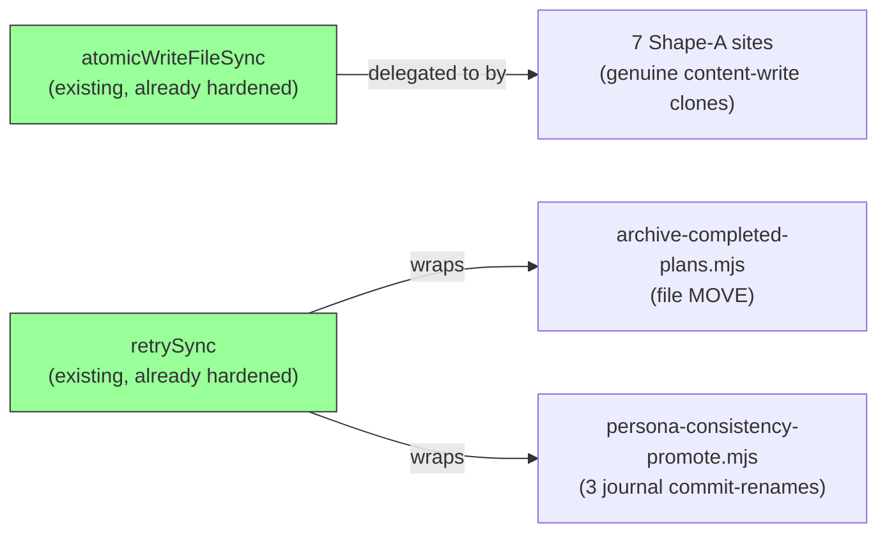

# Plan: Adopt `atomicWriteFileSync`/`retrySync` at the 9 Remaining Raw-`renameSync` Sites

- **Date**: 2026-07-16
- **Status**: Complete (audit-plan gate: Gemini APPROVE round 4; audit-code gate: Gemini APPROVE round 2, 2 GPT rounds)
- **Author**: Claude + Louis
- **Scope**: backend
- **Target domain(s)**: `arch-memory`, `brainstorm`, `claudemd-management`, `memory-health`, `persona-test`, `scripts`, `shared-lib`
- ⚠ **Cross-domain work** — touches 7 domains; each site is an independent, narrow fix (no shared abstraction crosses domains), so the crossing is incidental to "many small fixes across the repo," not a coupling concern.

> **Origin**: deferred by `docs/plans/windows-fs-transient-error-hardening.md`'s
> Gemini plan-audit round 3 (Gemini-R3-G1) as "9 further production scripts
> with their own raw, unretried `fs.renameSync`" — independent of that
> plan's two evidence-linked incidents, so correctly out of scope there.
> The user asked to close this gap now that the infrastructure
> (`atomicWriteFileSync`'s retry hardening, `retrySync`) exists.

---

## 1. Context Summary

**Scope/stack**: backend; `js-ts` (Node ESM, `engines: >=22`).

**What exists today**: `scripts/lib/file-io.mjs::atomicWriteFileSync` is
the canonical atomic-write primitive (temp-write + `retrySync`-wrapped
rename, hardened by the prior plan) — but 9 production scripts still
hand-roll their own copy of the same temp-write-then-rename pattern
instead of reusing it, so none of them inherited the retry hardening.

**Code Trace** (every one of the 11 `renameSync` call sites across the 9
files read directly this session — this is NOT a blind codemod; the
sites split into three structurally different shapes, not one):

- **Shape A — genuine `atomicWriteFileSync` clones (7 files, 7 sites)**:
  a local helper or inline block that does exactly what
  `atomicWriteFileSync` does (`mkdirSync` + temp-write + rename), writing
  NEW string/JSON content. Direct delegation candidates:
  - `scripts/learning/backfill-outcomes.mjs:392-394`
    (`drainFrictionFallback`'s inline rewrite-on-drain block). **Plus its
    sibling `fs.unlinkSync(FRICTION_JSONL_PATH)` at line 390** — the
    same function's OTHER branch (delete the file entirely when nothing
    remains to retry), checked this session per the same Gemini-R1-G1
    principle: an adjacent operation in the SAME function is
    load-bearing, not independent. `retrySync`-wrapped alongside the
    delegation, not delegated (it's a delete, not a content write).
  - `scripts/lib/brainstorm/session-store.mjs:247-254` (`appendQuarantine`
    — has its own cleanup-on-failure that `atomicWriteFileSync` already
    provides internally)
  - `scripts/lib/claudemd/autofix.mjs:69-71` (`applyFixes`'s inline
    write-back block — writes to an arbitrary `repoRoot`-relative path,
    confirmed `atomicWriteFileSync`'s internal `path.resolve` handles
    this)
  - `scripts/lib/learning/decision-logger.mjs:453-467` (`writeOutbox` —
    its `tmpPath` is `${finalPath}.tmp` with **no PID/timestamp
    uniqueness**, unlike `atomicWriteFileSync`'s own naming; delegating
    incidentally closes a minor concurrent-write collision risk too)
  - `scripts/lib/learning/quickfix-stats.mjs:265-271` (`writeAtomic`
    helper, 2 call sites at lines 116/182, both plain
    `writeAtomic(path, jsonString)`)
  - `scripts/memory-health.mjs:293-299` (`atomicWrite` helper)
  - `scripts/symbol-index/drift.mjs:45-51` (`atomicWrite` helper —
    **byte-identical duplicate** of `memory-health.mjs`'s function; the
    architectural-memory neighbourhood query flagged both as
    `justify-divergence`, similarity 0.86/0.76 against
    `atomicWriteFileSync` itself)
- **Shape B — a plain file MOVE, not a content write (1 file, 2 sites)**:
  `scripts/archive-completed-plans.mjs:136` — `fs.renameSync(src, dst)`
  moves an *existing* plan file from `docs/plans/` to `docs/completed/`.
  No temp file, no content write — `atomicWriteFileSync` does not apply
  here at all. **Plus** the adjacent `fs.unlinkSync(dst)` at line 135,
  the `--force` overwrite path (Gemini-R1-G1 — equally vulnerable to the
  same transient-lock class; missed in the original draft, which only
  looked at the rename). Both need `retrySync`-wrapping only.
- **Shape C — a journaled crash-recovery "commit rename" (1 file, 12
  sites — widened from 3 at Gemini-R1-G1)**:
  `scripts/persona-consistency-promote.mjs:393,481,528` (the 3
  `renameSync` sites originally found). This file **already imports and
  uses `atomicWriteFileSync`** (line 336, to durably create the `.tmp`
  file) as the first phase of its own DB-coordinated promotion journal
  (`writeJournal`/`reconcilePromotionJournal` — structurally the same
  pattern as `transaction.mjs`'s WAL from the prior plan, scoped to
  spec-file promotion). The 3 `renameSync` sites are the *second,
  separate* phase — "complete the deferred rename after the DB
  transaction commits" — with careful idempotent-collision-detection
  logic around them (refuses to silently overwrite a
  differently-content'd `finalPath`). These are **not** new-content
  writes; delegating to `atomicWriteFileSync` would be wrong (it writes
  *new* content, these sites move an *already* atomically-written temp
  file). Needs `retrySync`-wrapping in place, exactly like
  `transaction.mjs`'s treatment in the prior plan.
  **Gemini-R1-G1's finding about `archive-completed-plans.mjs`'s
  adjacent `unlinkSync` generalizes here too** (checked this session,
  not assumed): `promoteOne` and `reconcilePromotionJournal` — the exact
  two functions whose `renameSync` sites this plan already targets —
  contain **9 more `unlinkSync` calls** (audit-plan Gemini-R2-G1 —
  corrected from an R1 arithmetic slip that undercounted this as 8:
  `removeJournal`'s single site is a call FROM `promoteOne`, not itself
  textually inside `promoteOne`'s own body — it's a 3rd, distinct site,
  not double-counted with `promoteOne`'s other two), all cleanup/rollback
  operations on the same journal/tmp-file lifecycle, equally exposed to
  the same transient-lock class: `promoteOne` lines 349, 386 (2 direct
  sites — tmp-file cleanup on DB-update-failure and on an
  idempotent-rename skip) plus its call to `removeJournal` (lines
  557-560, a small helper, 1 site); `reconcilePromotionJournal` lines
  470, 473, 483, 516, 517, 530 (6 sites — corrupt-journal/finalised/
  db-committed/rollback cleanup paths). **Load-bearing, not
  independent** — these sit inside the SAME two functions (directly, or
  one call-hop away via a helper those functions call) this plan is
  already editing, on the SAME operational sequence, not a different
  file or a different concern — folded in, all 9 get `retrySync`-wrapping
  alongside the 3 original `renameSync` sites (**12 total sites in this
  file**).

**Test coverage found** (checked before designing, not assumed): `session-store.mjs`,
`decision-logger.mjs`, `quickfix-stats.mjs`, `archive-completed-plans.mjs`,
`backfill-outcomes.mjs`, and `persona-consistency-promote.mjs` all have
dedicated test files. `scripts/lib/claudemd/autofix.mjs`, `scripts/memory-health.mjs`,
and `scripts/symbol-index/drift.mjs` have **zero** existing coverage of
their write behavior (verified via grep — no test imports any of the
three) — this plan adds minimal coverage for those three, not just
"no regression because nothing tested it before."

**Patterns reused vs new**: zero new abstractions. Shape A reuses
`atomicWriteFileSync` (already exists, already hardened). Shapes B/C
reuse `retrySync` (already exists, already hardened) — both built by
`docs/plans/windows-fs-transient-error-hardening.md`.

**Neighbourhood considered**: the architectural-memory query's top 4
hits (similarity 0.75-0.86) were exactly the 4 local `atomicWrite`/
`writeAtomic` helper functions being replaced
(`symbol-index/drift.mjs`, `memory-health.mjs`, `quickfix-stats.mjs`,
plus `persona-consistency-promote.mjs::writeJournal` at 0.81) — strong
independent confirmation that these are genuine near-duplicates of
`atomicWriteFileSync`, not coincidental similarity. `recommendation:
justify-divergence` in all cases; this plan's divergence rationale is
"there is no divergence — these should delegate," which resolves the
flag rather than justifying it.

**Security incidents consulted**: INC-001 (symlink path-classification
bypass) and INC-002 (DB-wipe from an unverified test DSN) — both
returned as candidates (cosine 0.51-0.64) but neither shares a trust
boundary with this plan (path *classification* and DSN *safety* vs.
this plan's filesystem *write-retry* semantics). No Security
Considerations section required.

---

## 2. Proposed Architecture

No new files, no new abstractions — this plan is purely "delete 7
duplicated implementations of an existing function, and reuse an
existing retry wrapper at 2 more files." (#1 DRY, #5 Single Source of
Truth.)

**Shape A treatment** (7 files): replace the local helper's body (or the
inline block) with a direct call to `atomicWriteFileSync(path, content)`.
Where the local function is a named wrapper called from multiple sites
within the same file (`writeAtomic` in `quickfix-stats.mjs`, `atomicWrite`
in `memory-health.mjs`/`drift.mjs`), keep the wrapper name — it's the
file's own local vocabulary and touching only the one function body is a
smaller diff than updating every call site. Where the pattern is inline
(`backfill-outcomes.mjs`, `session-store.mjs`, `autofix.mjs`,
`decision-logger.mjs`), replace the `mkdirSync`+temp-write+rename lines
directly with the `atomicWriteFileSync` call, preserving the surrounding
try/catch/return-value contract exactly (e.g. `decision-logger.mjs`'s
`writeOutbox` returns `false` on failure rather than throwing — the
existing `try {...} catch { return false }` wrapper stays, only its body
changes).

**Shape B/C treatment** (`archive-completed-plans.mjs`,
`persona-consistency-promote.mjs`): wrap the existing `fs.renameSync(...)`
call in `retrySync(() => fs.renameSync(...))`, changing nothing else —
same principle as `transaction.mjs`'s treatment in the prior plan:
preserve every existing semantic (the collision-refusal logic in
`persona-consistency-promote.mjs`, the `dst`-exists/`--force` handling in
`archive-completed-plans.mjs`) exactly, add only transient-error retry.

**Right-sizing gate**:
- **Band-aid extreme**: wrap all 22 sites (7 Shape-A renames + the 15
  adjacent/widened sites found via the Gemini-R1-G1 investigation) in
  `retrySync` and stop there,
  leaving the 7 Shape-A files hand-rolling a duplicate of
  `atomicWriteFileSync` forever. Rejected — the architectural-memory
  query already flags these as near-duplicates; leaving them means the
  *next* person who touches one of these functions has to remember to
  apply the retry fix a second time.
- **Over-engineered extreme**: unify `persona-consistency-promote.mjs`'s
  promotion journal with `transaction.mjs`'s WAL into one shared
  crash-recovery module. Rejected — no current requirement drives it;
  the two journals are DB-coordinated vs. filesystem-only respectively,
  a real behavioral difference, not incidental duplication.
- **Chosen**: per-site targeted fix matching each site's actual shape
  (delegate where it's a genuine clone, retry-wrap where it's a
  move/commit-rename) — exactly what the Code Trace found, nothing more.

**Manual vs scripted**: 9 files, 3 distinct treatments, each requiring
reading the specific surrounding code to preserve exact behavior (return
contracts, cleanup-on-failure, collision-refusal logic) — well under the
"~5 regular edits" scripting threshold **and** irregular (no two sites are
byte-identical). Hand-edited, not codemodded.

**Pre/post-implementation requirements gate (audit-plan R1-M1, tightened
R2-M1 — a blocking lifecycle gate with a stated success criterion, not
just "run the command")**:
1. **Before Phase 1**: run
   `node scripts/requirements.mjs extract --files scripts/learning/backfill-outcomes.mjs,scripts/lib/brainstorm/session-store.mjs,scripts/lib/claudemd/autofix.mjs,scripts/lib/learning/decision-logger.mjs,scripts/lib/learning/quickfix-stats.mjs,scripts/memory-health.mjs,scripts/symbol-index/drift.mjs,scripts/archive-completed-plans.mjs,scripts/persona-consistency-promote.mjs`
   — the 9 production files being modified. **Test files are
   deliberately excluded** from extraction, per this repo's own
   established convention (stated explicitly in
   `docs/plans/windows-fs-transient-error-hardening.md`'s Phase-1
   step: "requirements extraction is for production invariants, not test
   code") — not an oversight, the same rule applied consistently.
2. **Then run `node scripts/requirements.mjs reconcile`** (no
   flags — reads `.requirements/candidates.json` +
   `.requirements/gaps.json` written by `extract`, non-interactive, folds
   them into `.requirements/ledger.json`). **Success criterion (audit-plan
   R3-L1 — stated precisely, not just "must exit 0")**: both commands
   exit 0, AND every candidate `extract` wrote for one of these 9 files
   is read from `.requirements/candidates.json` and either already
   present in the reconciled `ledger.json` (accepted) or explicitly
   entered into `.requirements/overrides.json` with a dated rationale
   (overridden) — evidenced by diffing `candidates.json`'s file-scoped
   entries against post-reconcile `ledger.json`/`overrides.json` before
   Phase 1 edits begin. A non-zero exit from either command, or a
   candidate present in neither the ledger nor overrides, blocks
   implementation.
3. **After Phase 1+2** (all production + test edits landed): re-run the
   same `extract` (identical file list — the set of production files
   doesn't grow, only their content) → `reconcile` pair, then
   `node scripts/requirements.mjs index --json` (a read-only, derived
   view — no separate "success" state of its own) and confirm no entry
   scoped to these 9 files shows a `status` indicating a newly-broken
   invariant.

**Shape A per-site compatibility matrix (audit-plan R1-M2 — required
before deleting any local block, not just asserted in prose)**: each row
states the CURRENT observable contract; the local block is only deleted
once its row is confirmed to match `atomicWriteFileSync`'s actual
behavior, and any genuine difference is adapted at the call site rather
than silently dropped.

| Site | Success result | Failure contract | Dir creation | Encoding/mode | Cleanup-on-failure | Import change |
|---|---|---|---|---|---|---|
| `backfill-outcomes.mjs::drainFrictionFallback` | `undefined` (mutates `out` via closure) | caught by the OUTER `try` (line 388), increments `out.errors`, logs — **must stay outside** the write call | not needed (`FRICTION_JSONL_PATH`'s dir always exists) | plain string, no mode | outer catch already handles it — `atomicWriteFileSync`'s own internal cleanup is a strict superset, no behavior lost | add `atomicWriteFileSync`+`retrySync` imports from `../lib/file-io.mjs`/`../lib/retry-transient-fs.mjs` (Gemini-R1-G2 — `backfill-outcomes.mjs` is in `scripts/learning/`, not `scripts/`, so `./lib/...` would resolve to the wrong, non-existent path) |
| `session-store.mjs::appendQuarantine` | `undefined` | caught locally, logs a `WARN`, **does not rethrow** — `atomicWriteFileSync` throws, so the local `try/catch` must stay (only its body changes) and keep swallowing | not needed (`sessionDir` already ensured earlier in the function) | plain string | **equivalence claim, stated explicitly as an acceptance condition**: the manual `try { unlinkSync(tmpPath) } catch {}` cleanup at line 252 is behaviorally identical to what `atomicWriteFileSync`'s own internal `catch` block already does (delete tmp, rethrow) — confirmed by reading `file-io.mjs:40-45` directly, not assumed | add `atomicWriteFileSync` import from `../file-io.mjs` |
| `autofix.mjs::applyFixes` | `undefined` (mutates `applied`/`skipped` arrays) | uncaught — propagates to `applyFixes`'s own caller (no local catch exists today either) | needed — `repoRoot`-relative arbitrary path; `atomicWriteFileSync`'s internal `mkdirSync(dir, {recursive:true})` covers it | plain string | no local cleanup exists today; none needed after delegation either | add `atomicWriteFileSync` import from `../file-io.mjs` |
| `decision-logger.mjs::writeOutbox` | `true` | returns `false` (does NOT throw) — **the outer `try/catch` at line 454 stays**, only its body changes | needed — `atomicWriteFileSync` does this internally, so the explicit `fs.mkdirSync(outboxDir, ...)` at line 455 is deleted as redundant | plain JSON string | no explicit cleanup today (relies on process exit); unaffected | add `atomicWriteFileSync` import from `../file-io.mjs` (`scripts/lib/learning/` → `scripts/lib/`); `crypto`/`path` imports stay (still used for `keyHash`/`finalPath`) |
| `quickfix-stats.mjs::writeAtomic` | `undefined` | uncaught — propagates to both call sites (lines 116, 182), neither currently catches | needed — `atomicWriteFileSync` does this internally, explicit `fs.mkdirSync` at line 267 deleted as redundant | plain JSON string | none today; none needed | **corrected — the R1 draft wrongly said "no import change"**: `writeAtomic` keeps its own name/signature (call sites 116/182 untouched) but its NEW body needs `atomicWriteFileSync` imported from `../file-io.mjs` (`scripts/lib/learning/` → `scripts/lib/`, same as `decision-logger.mjs` — verified via the same directory-relative check that caught Gemini-R1-G2) |
| `memory-health.mjs::atomicWrite` | `undefined` | uncaught | needed — internal `mkdirSync` deleted as redundant | plain string | none today | add `atomicWriteFileSync` import from `./lib/file-io.mjs`; keeps its own wrapper name |
| `drift.mjs::atomicWrite` | `undefined` | uncaught | needed — internal `mkdirSync` deleted as redundant | plain string | none today | add `atomicWriteFileSync` import from `../lib/file-io.mjs`; keeps its own wrapper name |

---

## 6. Sustainability Notes

**Assumptions that could change**: `atomicWriteFileSync`'s and
`retrySync`'s current contracts (signature, retry bounds) are assumed
stable — both were just built and audited in the prior plan. If either
changes shape, every delegation site here inherits the change for free
(the DRY win compounds).

**System-level thinking**: this plan tightens coupling to
`scripts/lib/file-io.mjs`/`scripts/lib/retry-transient-fs.mjs` — the
correct direction, since both are the repo's designated single source of
truth for these operations (per `AGENTS.md`'s own conventions and the
architectural-memory index's `justify-divergence` flags). No new
abstraction boundary is introduced; existing ones are used correctly.

---

## 7. File-Level Plan

| File | Intent | Purpose |
|---|---|---|
| `scripts/learning/backfill-outcomes.mjs` | modify | `drainFrictionFallback`'s inline temp+rename → `atomicWriteFileSync(FRICTION_JSONL_PATH, remaining.join('\n') + '\n')`; its sibling `fs.unlinkSync(FRICTION_JSONL_PATH)` (line 390, the "nothing left to retry" branch) wrapped in `retrySync(() => ...)` (Gemini-R1-G1, widened). |
| `scripts/lib/brainstorm/session-store.mjs` | modify | `appendQuarantine`'s inline temp+rename+cleanup → `atomicWriteFileSync(qPath, trimmed.join('\n') + '\n')`; drops the now-redundant manual cleanup-on-failure. |
| `scripts/lib/claudemd/autofix.mjs` | modify | `applyFixes`'s inline temp+rename → `atomicWriteFileSync(absPath, lines.join('\n'))`. |
| `scripts/lib/learning/decision-logger.mjs` | modify | `writeOutbox`'s inline `mkdirSync`+temp+rename → `atomicWriteFileSync(finalPath, JSON.stringify(entry))`; drops the redundant `mkdirSync` and the non-unique `.tmp` suffix (closes a minor concurrent-write collision risk). |
| `scripts/lib/learning/quickfix-stats.mjs` | modify | `writeAtomic(targetPath, content)`'s body → delegates to `atomicWriteFileSync`; both call sites (lines 116, 182) unchanged. |
| `scripts/memory-health.mjs` | modify | `atomicWrite(filePath, contents)`'s body → delegates to `atomicWriteFileSync`. |
| `scripts/symbol-index/drift.mjs` | modify | `atomicWrite(file, content)`'s body → delegates to `atomicWriteFileSync` (also resolves the byte-identical duplication with `memory-health.mjs`'s prior implementation). |
| `scripts/archive-completed-plans.mjs` | modify | The `fs.renameSync(src, dst)` move at line 136 AND the adjacent `fs.unlinkSync(dst)` at line 135 (the `--force` overwrite path — Gemini-R1-G1: equally vulnerable to the same transient-lock class, missed by only looking at the rename) both wrapped in `retrySync(() => ...)`; `--force`/exists-check logic untouched. Add `import { retrySync } from './lib/retry-transient-fs.mjs';` (Gemini-R3-G1 — omitted from the R1/R2 drafts, which specified imports for Shape A but not Shape B/C; verified this file sits directly in `scripts/`, so `./lib/...` is correct here). |
| `scripts/persona-consistency-promote.mjs` | modify | All 3 `renameSync` sites (lines 393, 481, 528) AND 9 `unlinkSync` sites within the same two functions (`promoteOne`: 349, 386 direct + 559 via its call to `removeJournal`; `reconcilePromotionJournal`: 470, 473, 483, 516, 517, 530) wrapped in `retrySync(() => ...)` in place (Gemini-R1-G1, widened; count corrected Gemini-R2-G1) — 12 sites total. The idempotent-collision-detection logic around line 393, the DB-disambiguation logic around 481/528, and every cleanup/rollback branch's swallow-vs-log behavior untouched. Add `import { retrySync } from './lib/retry-transient-fs.mjs';` (Gemini-R3-G1 — this file also sits directly in `scripts/`, so `./lib/...` is correct). |
| `tests/claudemd/autofix.test.mjs` | create | New — `applyFixes`'s non-dry-run write path currently has zero test coverage; add a minimal case confirming the write lands correctly post-refactor. |
| `tests/memory-health.test.mjs` | create or modify | New/extend — `atomicWrite`'s write path currently has zero test coverage. |
| `tests/symbol-index-drift.test.mjs` | create or modify | New/extend — `atomicWrite`'s write path currently has zero test coverage (distinct from the existing `drift-stale-pragma.test.mjs`/`symbol-index-drift-justification.test.mjs`, which cover different concerns). |
| `tests/brainstorm-session-store.test.mjs` | modify | Extend existing coverage to confirm `appendQuarantine` still round-trips correctly post-delegation. |
| `tests/learning-decision-logger.test.mjs` | modify | Extend existing coverage for `writeOutbox` post-delegation. |
| `tests/learning-quickfix-stats.test.mjs` | modify | Extend existing coverage for `writeAtomic` post-delegation. |
| `tests/archive-completed-plans.test.mjs` | modify | Extend existing coverage — confirm move behavior unchanged after `retrySync` wrapping. |
| `tests/persona-consistency-promote.test.mjs` | modify | Extend existing coverage — confirm the 3 rename sites' collision-refusal/DB-disambiguation logic is unchanged after `retrySync` wrapping. |
| `tests/learning-backfill-outcomes.test.mjs` | modify | Extend existing coverage for `drainFrictionFallback` post-delegation. |
| `tests/atomic-write-adoption-guard.test.mjs` | create | New (audit-plan R1-M3/L1) — the structural wiring-proof guard: asserts all 7 Shape-A files delegate to `atomicWriteFileSync` with no residual bare `renameSync`, and both Shape-B/C files' `renameSync` calls are `retrySync`-wrapped. The executable completion condition for this whole plan. |

### 7b. Implementation Phases

Non-trivial (9 files, 7 domains, >1 sitting) — two independent phases, no
§11 clustering needed (neither phase depends on the other's output; both
reuse infrastructure that already exists and is already merged):

- **Phase 1 — Shape A: delegate 7 files to `atomicWriteFileSync`**.
  Files: `scripts/learning/backfill-outcomes.mjs` (modify),
  `scripts/lib/brainstorm/session-store.mjs` (modify),
  `scripts/lib/claudemd/autofix.mjs` (modify),
  `scripts/lib/learning/decision-logger.mjs` (modify),
  `scripts/lib/learning/quickfix-stats.mjs` (modify),
  `scripts/memory-health.mjs` (modify),
  `scripts/symbol-index/drift.mjs` (modify), plus the 3 new test files
  and the 4 extended existing test files covering these 7.
- **Phase 2 — Shape B/C: `retrySync`-wrap the 2 remaining files**.
  Files: `scripts/archive-completed-plans.mjs` (modify),
  `scripts/persona-consistency-promote.mjs` (modify), plus their 2
  extended existing test files.

**Close-out (not a phase)**: `tests/atomic-write-adoption-guard.test.mjs`
(covers both phases' completion condition, written last) + full `npm test`
run.

---

## 8. Risk & Trade-off Register

| Risk / trade-off | Assessment |
|---|---|
| **Behavioral drift from delegation** | Each Shape-A site's current contract (return value on failure, cleanup-on-failure, mode handling) was read and cited above before designing — `atomicWriteFileSync` throws on failure, so any site whose caller currently expects a boolean return (`decision-logger.mjs::writeOutbox`) keeps its own try/catch wrapper; only the inner implementation changes. |
| **`persona-consistency-promote.mjs`'s collision-refusal logic** | The idempotent-content-comparison branch (lines 374-391) reads `finalPath`/`tmpPath` via `fs.existsSync`/`fs.readFileSync` BEFORE the `renameSync` call — `retrySync`-wrapping only the rename itself, not the surrounding branch, leaves this logic completely untouched. |
| **Two duplicate `atomicWrite` implementations collapsing to one** | `memory-health.mjs` and `symbol-index/drift.mjs` currently have byte-identical local functions; after this plan both delegate to the same `atomicWriteFileSync`, so the duplication is resolved as a side effect — not the primary goal, but worth noting for `arch:drift`'s duplication score. |
| **Zero pre-existing test coverage on 3 files** | `autofix.mjs`, `memory-health.mjs`, `drift.mjs` had no write-path tests before this plan — flagged explicitly rather than silently relying on "no regression because nothing was testing it." New tests close this gap as part of the same change, not deferred. |

---

## 9. Testing Strategy

**Redesigned per audit-plan R1-M3** — the original draft's planned
"content round-trips correctly" tests would pass identically against the
OLD, un-hardened implementations too (they never inject a transient
failure), so they'd prove nothing about the actual change. Two distinct
kinds of test are needed instead, and retry-correctness itself does NOT
need re-proving at each of the 9 sites — `atomicWriteFileSync`'s and
`retrySync`'s own retry behavior (EPERM/EBUSY-then-succeed,
exhaustion-throws, non-retryable-immediate-throw) is already
regression-tested in `tests/shared.test.mjs` by the prior plan. What
these 9 sites need proved is that they actually **reach** that
already-tested code, and that each site's specific contract (from the
compatibility matrix above) survives the change:

- **Wiring/structural proof (new — `tests/atomic-write-adoption-guard.test.mjs`,
  redesigned audit-plan R2-M2 — a regex is NOT sufficient)**: a
  text/regex check can be satisfied by an unrelated `retrySync` call
  elsewhere in the file, a locally-shadowed function also named
  `retrySync`, a commented-out occurrence, or a rename sitting outside
  the callback it appears near — none of which prove the actual wiring.
  The guard therefore parses each file with `@babel/parser` (already a
  repo dependency) and does real AST resolution, **inline in the test
  file** — this is a small, self-contained assertion over a fixed
  9-file manifest, not a new production/shared AST module like the
  prior plan's `find-rmsync-sites.mjs` (that module existed because the
  target corpus there was large and had to be *discovered*; here the
  9-file list is fixed and stated in the test itself, so no discovery
  step is needed, only per-file verification):
  Redesigned again at audit-plan R3-M1 — the R2 draft's Shape-A check
  ("at least one `atomicWriteFileSync` call anywhere + zero `renameSync`
  anywhere in the file") had two real gaps: it isn't tied to the
  *specific* target function (an unrelated/dead call could satisfy the
  positive assertion while the actual intended site stayed unconverted),
  and a blanket "zero `renameSync` ever" would wrongly fail a future,
  legitimate, correctly-`retrySync`-wrapped rename added to one of these
  files later. Fixed by applying **one uniform rule across all 9 files**
  instead of two different rules per shape:
  - **Rule 1 — per-function assertion, named per site (7 checks, one per
    Shape-A target)**: locate the SPECIFIC function each row of the
    compatibility matrix names (`drainFrictionFallback`,
    `appendQuarantine`, the write block inside `applyFixes`,
    `writeOutbox`, `writeAtomic`, `atomicWrite` ×2) by its
    `FunctionDeclaration`/`FunctionExpression` AST node, and assert
    THAT function's body contains a `CallExpression` whose callee
    resolves — via import-specifier binding, not name string-matching —
    to `atomicWriteFileSync` imported from the correct relative path to
    `scripts/lib/file-io.mjs`. Ties the check to the actual intended
    site, not "somewhere in the file."
  - **Rule 2 — file-wide `renameSync` compliance, uniform across all 9
    files (not two different rules per shape)**: every `renameSync` call
    site the AST walk finds (reusing the import-specifier-enumeration
    technique `find-rmsync-sites.mjs` established, applied to
    `renameSync` instead of `rmSync`, inlined locally since it's only
    needed here) must have an `enclosingCall` — the immediately-enclosing
    `CallExpression` when the site is the sole argument's arrow-function
    body/return — whose callee resolves via import binding to
    `retrySync` from `scripts/lib/retry-transient-fs.mjs` (identical
    `enclosingCall` detection logic to the prior plan's
    `find-rmsync-sites.mjs`, inlined locally rather than imported — the
    target functions differ). For the 7 Shape-A files this is naturally
    satisfied by having **zero** `renameSync` sites today (Rule 1 already
    proves the real write path moved to `atomicWriteFileSync`) — but the
    rule itself doesn't hard-code "zero forever": if a future legitimate
    rename is added and correctly `retrySync`-wrapped, Rule 2 still
    passes, exactly matching how the prior plan's own guard treats its
    two compliant forms as peers, not a shape-specific special case.
  - **Exact call counts asserted for the 2 Shape-B/C files**, not just
    "at least one": `archive-completed-plans.mjs` has exactly 1
    `renameSync` + 1 `unlinkSync` site (2 total); `persona-consistency-promote.mjs`
    has exactly 3 `renameSync` + 9 `unlinkSync` sites (12 total) —
    catching an accidental removal, an un-migrated new call, or a
    partially-applied fix that wraps the renames but misses a sibling
    unlink.
  - **Rule 2 covers `unlinkSync` too, for exactly 3 of the 9 files**
    (Gemini-R1-G1, widened on inspection, phrasing corrected
    Gemini-R2-G2 — the R1 draft self-contradicted by saying "not
    extended to the other 7 files" in the same breath as covering
    `backfill-outcomes.mjs`, one of those 7): the same
    import-specifier-enumeration + `enclosingCall` technique, applied to
    every `renameSync` AND `unlinkSync` call site in
    `archive-completed-plans.mjs` (2 sites), `persona-consistency-promote.mjs`
    (12 sites), and `backfill-outcomes.mjs`'s `drainFrictionFallback`
    specifically (1 `unlinkSync` site, alongside its already-covered
    `renameSync` sibling — both inside the same function, checked via
    Rule 1's per-function targeting, not a file-wide scan) — each
    asserted `retrySync`-wrapped. The remaining 6 files' `unlinkSync`
    calls (verified this session, not assumed) sit in genuinely
    separate, untouched functions and are correctly NOT covered by this
    guard — see "Out of Scope" below.
- **Per-site contract preservation (extend/add per the File-Level Plan
  table), deterministic cross-platform failure injection (audit-plan
  R2-M3 — no OS-permission tricks, which aren't portable across Windows/
  CI/privileged runners)**: the 9 callers invoke the PUBLIC
  `atomicWriteFileSync(filePath, data, opts)`, not the injectable
  `_internals.atomicWriteFileSyncImpl`, so failure must be induced
  through its real, public behavior rather than DI. `atomicWriteFileSync`
  internally calls `fs.mkdirSync(dir, { recursive: true })` before
  writing — pointing the target path at a location where an ancestor
  path segment is an actual **file**, not a directory, makes `mkdirSync`
  throw `ENOTDIR` **deterministically, with no OS permissions or platform
  differences involved** (confirmed portable Node.js behavior, unlike
  `chmod`-based unwritable-directory tricks which behave differently
  under Windows/root/containers). Fixture pattern used per test: create
  a plain file at `<tmpDir>/blocker`, then point the target write path
  at `<tmpDir>/blocker/nested/target.json` — `mkdirSync` fails on the
  first segment past the file, every time, on every platform.
  - `decision-logger.mjs::writeOutbox` — inject via the blocker-file
    technique; assert it returns `false` (not throw) and the
    `throttledWarn` warning fires (capture via a spied `process.stderr.write`
    or the module's own warn hook if one is exported for tests).
  - `session-store.mjs::appendQuarantine` — same injection; assert it
    does NOT throw (swallows internally) and logs a `WARN` line to
    stderr; assert the pre-existing quarantine file (if any) is
    unchanged (the failed write must not corrupt prior state).
  - `persona-consistency-promote.mjs`'s collision-refusal — no failure
    injection needed; this is a pure logic-branch test (pre-create
    `finalPath` with different content than the `.tmp`, assert the
    existing `throw` fires unchanged) — no filesystem fault required.
  - `archive-completed-plans.mjs`'s `--force`-vs-`exists` skip logic —
    same, a pure logic-branch test (pre-create `dst`, assert skip
    without `--force` / overwrite with `--force`) — no filesystem fault
    required.
- **Full-suite close-out**: `npm test` clean, no regressions across the
  9 touched files' existing test suites, plus the new guard file passing.

---

## Out of Scope (Future)

- **Adding retry to `writeDrainCursor`** (`scripts/learning/backfill-outcomes.mjs`)
  — flagged by the architectural-memory query but on inspection this
  function does a **direct** `fs.writeFileSync`, not a temp+rename
  pattern at all. Out of scope: this plan hardens existing
  temp-write-then-rename sites, not adds atomicity where none exists
  today — a different, independent improvement.
- **Unifying `persona-consistency-promote.mjs`'s promotion journal with
  `transaction.mjs`'s WAL** — see the right-sizing gate above; no current
  requirement, a real behavioral difference (DB-coordinated vs.
  filesystem-only) exists between the two.
- **3 further `unlinkSync` sites found during the Gemini-R1-G1
  investigation, genuinely independent (not adjacent to any site this
  plan already touches)**: `session-store.mjs::pruneOldSessions` (line
  310, deletes aged session files — a separate function from
  `appendQuarantine`, this plan's actual target); `decision-logger.mjs::reconcileOutbox`
  (line 400, deletes a successfully-flushed outbox entry — separate from
  `writeOutbox`); `quickfix-stats.mjs::cliMain`'s `--reset` handler (line
  294, deletes the whole cache file — separate from `writeAtomic`).
  **Independent, not folded in**: each sits in a function this plan does
  not otherwise modify, unlike the `archive-completed-plans.mjs`/
  `persona-consistency-promote.mjs`/`backfill-outcomes.mjs` sites (which
  were folded in precisely because they're adjacent to/within a function
  already being edited). Same underlying bug class, same fix
  (`retrySync`-wrap), but pulling in 3 more untouched functions across 3
  files for a first-instance-only justification is the same
  "wide-scope-creep" pattern the parent plan's audit-code phase
  explicitly drew a line against. Revisit trigger: an actual EPERM/EBUSY
  incident traced to one of these 3 sites, or a dedicated
  repo-wide-`unlinkSync`-hardening follow-up plan.

## Audit Trail

- **GPT round 1**: `NEEDS_REVISION` H0/M3/L1. All 4 findings valid and
  in-scope, folded in — no rigor-pressure character (every finding named
  a concrete, checkable gap). M1: added the pre-Phase-1
  `requirements.mjs extract` step (the rubric reported a stale ledger
  with 16 uncovered target files). M2: added the full 7-row Shape-A
  compatibility matrix — most valuably, made `appendQuarantine`'s
  cleanup-equivalence claim an explicit, checked acceptance condition
  rather than an unstated assumption, and verified (re-read the actual
  source of 2 files during the fix, not just asserted) that
  `quickfix-stats.mjs`'s two `writeAtomic` call sites genuinely have no
  local catch, confirming the "uncaught, propagates" row. M3 (the most
  substantive): the originally-planned tests would have passed
  identically against the OLD un-hardened code, proving nothing about
  the actual change — redesigned the Testing Strategy into two distinct
  kinds: a new structural wiring-proof guard
  (`tests/atomic-write-adoption-guard.test.mjs`, right-sized as a plain
  source-text check since the target set is fixed/small — **later
  tightened to real AST resolution at R2-M2 once GPT correctly pointed
  out a regex isn't sufficient proof; see below**) plus per-site
  contract-preservation tests keyed to the M2 matrix. L1: folded into
  the same M3 fix — the guard file IS the executable completion
  condition L1 asked for.
- **GPT round 2**: `NEEDS_REVISION` H0/M3/L0. All 3 valid and in-scope,
  folded in. M1: R1's requirements-gate fix wasn't fully operationalized
  — tightened into a 3-step blocking lifecycle gate with an explicit
  success criterion (extract/reconcile must exit 0, candidates reviewed
  before Phase 1) and a post-implementation re-run, and made the
  test-file-exclusion rationale explicit (citing the prior plan's own
  established precedent) rather than silently assumed. M2 (the most
  substantive — **caught that my own R1 fix repeated the exact regex
  fragility mistake the prior plan already learned from and fixed**): a
  text/regex-based guard can be satisfied by an unrelated `retrySync`
  call, a local shadow, a comment, or a rename outside the intended
  callback, and doesn't catch a removed call. Redesigned to real AST
  resolution via `@babel/parser` — import-binding resolution (not name
  matching) for both the `atomicWriteFileSync` and `retrySync` checks,
  `enclosingCall` parent-chain detection reused from the prior plan's
  `find-rmsync-sites.mjs` logic (inlined locally, not imported — this
  guard checks different target functions over a fixed, stated 9-file
  manifest, so a shared production module isn't warranted), and exact
  call-count assertions (1 for `archive-completed-plans.mjs`, 3 for
  `persona-consistency-promote.mjs`) so a silently-dropped site can't
  pass. M3: specified the deterministic, portable failure-injection
  technique for the two Shape-A sites whose failure branches actually
  need exercising — an ancestor-path-is-a-file `ENOTDIR` trick (works
  identically on Windows/CI/privileged runners, unlike `chmod`-based
  unwritable-directory tricks) — plus confirmed the two Shape-B/C
  contract tests need no fault injection at all (pure logic-branch
  tests), narrowing scope rather than over-specifying.
- **GPT round 3** (the normal 3-round cap; H:0 stable throughout, M:3→3→2
  — real progress, not plateau): `NEEDS_REVISION` H0/M2/L1. Mixed
  triage, not a blanket fix-or-stop: M1 is a genuine design bug in the
  guard's own logic — folded in. M2 is implementation-completeness
  ("specify exact fixtures for 5 more files") — the diminishing-returns
  signature the doctrine's stopping rule names explicitly, and the same
  category the code-audit exists to verify against the real
  implementation once it's written, not something further plan-audit
  prose should chase. **Deferred to implementation/code-audit time, not
  folded into the plan text**: the Testing Strategy above already states
  the *strategy* for all 7 Shape-A files (delegate + wiring-proof guard
  + per-matrix-row contract test where the row identifies an
  observable behavioral difference); the 5 files GPT wants exact
  fixtures for (`backfill-outcomes`, `autofix`, `quickfix-stats`,
  `memory-health`, `drift`) have SIMPLER contracts than the 2 already
  detailed (`decision-logger`, `session-store`) — none of them swallow
  errors or return non-throw failure signals (per the compatibility
  matrix: all 5 are "uncaught — propagates"), so their test is exactly
  the wiring-proof guard plus a plain success-path round-trip, which the
  File-Level Plan table already specifies per-file. M1 (fixed): the R2
  guard design wasn't tied to the specific named target function (an
  unrelated call could satisfy it) and hard-coded "zero `renameSync`
  ever" for Shape A files, which would wrongly fail a future legitimate
  addition — redesigned into one uniform two-rule check (per-function
  `atomicWriteFileSync`-call assertion + file-wide "every `renameSync`
  found is `retrySync`-wrapped," peers rather than shape-specific
  special cases) applied consistently across all 9 files. L1 (fixed):
  stated the exact `reconcile`/`index` command forms, their
  non-interactive nature (verified by reading `scripts/requirements.mjs`'s
  actual implementation, not assumed), and a precise success criterion
  (every candidate touching these 9 files present in either the ledger
  or overrides before Phase 1 begins). **Stopping the GPT round loop
  here**: H:0 plus a mixed genuine-fix/implementation-completeness
  triage is the doctrine's convergence signal — proceeding to the
  mandatory Gemini gate.
- **Gemini round 1**: `CONCERNS`, 2 new findings, both real. G1 (MEDIUM,
  significant): the `--force` overwrite path's `fs.unlinkSync(dst)` in
  `archive-completed-plans.mjs` (line 135, immediately adjacent to the
  `renameSync` this plan already targets) is equally exposed to the same
  transient-lock class and was missed by only looking at the rename.
  **Investigated further before fixing, not just patched at the one
  cited line**: the same "adjacent unlinkSync in an already-targeted
  function" pattern was checked across all 9 files (not assumed absent)
  and found in 2 more places — `backfill-outcomes.mjs::drainFrictionFallback`'s
  own sibling `unlinkSync` branch (1 site), and, far more significantly,
  `persona-consistency-promote.mjs`'s `promoteOne`/`reconcilePromotionJournal`
  (the exact 2 functions already targeted for their 3 `renameSync`
  sites) turned out to contain **9 more** cleanup/rollback `unlinkSync`
  calls on the same journal lifecycle (a Gemini-R2-G1 arithmetic
  correction from an initial miscount of 8 — see below). All 10
  newly-found sites folded in as load-bearing (same function as an
  already-targeted site, not a different file/concern) — widening Shape
  B from 1→2 sites and Shape C from 3→12 sites. A further 3 `unlinkSync`
  sites found in genuinely separate, untouched functions
  (`session-store.mjs::pruneOldSessions`, `decision-logger.mjs::reconcileOutbox`,
  `quickfix-stats.mjs::cliMain`) were correctly left out — recorded
  under Out of Scope with the independence rationale (not adjacent to
  any already-touched function). G2 (LOW, mechanical): the
  `backfill-outcomes.mjs` compatibility-matrix row specified the wrong
  relative import path (`./lib/file-io.mjs`, which doesn't exist from
  `scripts/learning/` — should be `../lib/file-io.mjs`) — fixed.
  **Verifying G2 prompted re-checking every other row's import path
  rather than trusting them** (the same mistake could recur silently):
  found 2 more real errors of the same kind — `decision-logger.mjs`'s
  row omitted the path entirely, and `quickfix-stats.mjs`'s row wrongly
  claimed "no import change" when its new delegating body actually needs
  `atomicWriteFileSync` imported (its own external name/signature staying
  the same is a different fact from "no import needed") — both fixed.
- **Gemini round 2** (the normal 2-round cap): `CONCERNS`, 2 new
  findings, both real — both caught real errors in the R1 fix itself,
  not new independent concerns. G1 (MEDIUM, mechanical): the R1 fix's
  own arithmetic was wrong — claimed 8 more `unlinkSync` sites in
  `persona-consistency-promote.mjs` (11 total) when the enumerated line
  list actually sums to 9 (12 total) — `removeJournal`'s single site had
  been conflated with being "inside `promoteOne`" rather than a 3rd,
  distinct site reached one call-hop away. Corrected everywhere the
  count appeared (Context Summary, File-Level Plan, Testing Strategy,
  Risk register). G2 (MEDIUM): the R1 fix's own guard-scope prose
  self-contradicted — a header saying "not extended to the other 7
  files" immediately followed by a sentence saying one of those 7
  (`backfill-outcomes.mjs`) WAS covered. Rewritten to state plainly that
  Rule 2 covers exactly 3 of the 9 files (`archive-completed-plans.mjs`,
  `persona-consistency-promote.mjs`, `backfill-outcomes.mjs`), not "2,
  plus one more, minus the other 7." **Both findings are evidence that
  widening scope mid-audit (per Gemini-R1-G1) needs its own careful
  proofreading pass, not just a content fix** — noted for future
  practice, not a new rule. Proceeding to round 3 (the genuine-bug
  exception — both R2 findings are concrete, mechanical, in-scope
  errors, not rigor pressure).
- **Gemini round 3** (2nd exceed-the-cap round): `CONCERNS`, 1 new
  finding — concrete and mechanical (a missing `import { retrySync }`
  statement for both Shape B/C files, which would cause a deterministic
  `ReferenceError` at runtime if implemented as originally written).
  Fixed: added the exact import line to both files' File-Level Plan
  rows, verifying (not assuming, per the G2/decision-logger lesson from
  round 1) that both files sit directly in `scripts/`, so `./lib/...` is
  the correct relative path for both. This finding's character —
  single, trivial, purely mechanical — is the diminishing-returns
  signature the doctrine's stopping rule names; running one more
  verification round to confirm no further findings, then stopping
  regardless of outcome per the 2-exceeded-rounds ceiling.
- **Gemini round 4**: `APPROVE`, 0 new findings. Gate closed. Final
  round count: 3 GPT rounds (H:0 throughout, M:3→3→2, converging) + 4
  Gemini rounds (CONCERNS → CONCERNS → CONCERNS → APPROVE), 2 rounds
  past the normal Gemini cap — both exceed-rounds justified purely by
  concrete, mechanical/arithmetic errors found in the plan's own
  mid-audit widening (an undercounted site total, a self-contradictory
  guard-scope sentence, a missing import line), never by rigor pressure.
  The Gemini gate's own G1 finding (round 1) drove the single most
  substantive change in this plan's life cycle — widening Shape B from
  1→2 sites and Shape C from 3→12 sites by finding load-bearing
  `unlinkSync` calls this session had missed inside functions already
  being edited — and every subsequent round caught a real error
  introduced while integrating that widening, converging cleanly once
  each was fixed.

### Code Audit (implementation)

- **Round 1** (`--files` scoped to the 13 actually-touched files, applying
  the prior plan's own root-cause fix for wide-scope pollution from the
  start): `SIGNIFICANT_ISSUES` H:13 M:24 L:2. Fixed M1 — 3 planned test
  files (`tests/claudemd/autofix.test.mjs`, `tests/memory-health.test.mjs`,
  `tests/symbol-index-drift.test.mjs`) were never created. Creating them
  surfaced a real, adjacent gap: `memory-health.mjs` and
  `symbol-index/drift.mjs` both unconditionally ran `main()` on import
  (no `isMain` guard), making them fundamentally unimportable for
  testing — added the standard guard already used elsewhere in this
  repo (e.g. `persona-consistency-promote.mjs`) plus a minimal
  `_internals` export for `atomicWrite`, verified both the
  `--selfcheck-relocation` contract and normal CLI invocation still work
  post-fix. Deferred 37 findings (36 pre-existing/independent in
  functions this plan never touches, verified per-cluster; M14, the
  guard's lexical-scope limitation — same deferred-dodge-pattern family
  as the prior plan, zero instances verified via grep).
- **Round 2**: `SIGNIFICANT_ISSUES` H:5 M:4 L:1 — all 10 findings were
  duplicates of round 1's already-deferred cluster under new IDs (the
  same wide-scope re-raise pattern), deferred with cross-references.
  Stopped the GPT loop at round 2 (within the normal cap) — every
  remaining finding was a confirmed duplicate or independent debt.
- **Gemini round 1**: `CONCERNS_REMAINING`, 1 new finding + 1
  wrongly-dismissed claim. G1 (real): the 3 new test files leaked temp
  directories (`mkdtempSync` with no cleanup) — fixed with `afterEach`
  cleanup matching this repo's established pattern. The
  wrongly-dismissed claim (re: H8, `archive-completed-plans.mjs` missing
  `--selfcheck-relocation`) was **challenged, not accepted** — verified
  as a genuine Gemini misattribution: my R1 resolution's "verified the
  CLI `--selfcheck-relocation` contract" sentence was specifically about
  `symbol-index/drift.mjs`/`memory-health.mjs` (the two files that got
  `isMain` guards in that same paragraph), not `archive-completed-plans.mjs`.
  Checked the actual authoritative `CLI_SMOKE_SET` array
  (`scripts/lib/sync-isolation-verify.mjs:45-90`) directly rather than
  trusting AGENTS.md's abbreviated summary — `archive-completed-plans.mjs`
  is not in it, and is not referenced anywhere in the sync/relocation
  machinery at all (it's a source-repo-only tool that never gets
  relocated into a consumer's `scripts/.claude-skills/`), so the Tier-3
  relocation-contract doctrine categorically does not apply to it.
- **Gemini round 2**: `APPROVE`, 0 new findings, 0 wrongly-dismissed —
  confirming the challenge was correctly resolved, not just asserted.
  Gate closed.

## Implementation Log

### 2026-07-16

- **Completed**: all phases. 7 Shape-A files delegate to
  `atomicWriteFileSync`. `archive-completed-plans.mjs` (2 sites) and
  `persona-consistency-promote.mjs` (12 sites, widened from 3 during the
  plan-audit's Gemini round 1) `retrySync`-wrapped. New
  `tests/atomic-write-adoption-guard.test.mjs` — AST-based wiring proof
  with exact call-count assertions, GREEN. 2 new deterministic
  cross-platform failure-injection tests (`decision-logger.mjs::writeOutbox`,
  `session-store.mjs::appendQuarantine`) via an ENOTDIR fault — the
  second one surfaced and fixed a real adjacent gap
  (`appendQuarantine`'s own `ensureDir` call was unprotected). 3 new
  test files for previously-uncovered write paths
  (`autofix.mjs`/`memory-health.mjs`/`drift.mjs`), which required adding
  `isMain` guards to the latter two (neither had one; both unconditionally
  ran `main()` on import).
- **Verification**: full `npm test` — 6361 pass, 0 fail, 21 pre-existing
  skips. `npm run check` clean.
- **Remaining**: none within this plan's scope. 48 debt-ledger entries
  document real, separately-scoped follow-up work (fail-open patterns in
  `persona-consistency-promote.mjs`/`quickfix-stats.mjs`'s cloud-read
  handling, `autofix.mjs`'s path-containment/dedup logic,
  `session-store.mjs`'s locking model, `drift.mjs`'s score coercion,
  `archive-completed-plans.mjs`'s sibling-move atomicity, plus the
  recurring domain-architecture graph cluster) — each independently
  verified as out of this plan's narrow retry/delegation scope.
- **Deviations from the original plan**: (1) `persona-consistency-promote.mjs`'s
  scope grew from 3 to 12 sites and `archive-completed-plans.mjs`'s from
  1 to 2, during the plan-audit's Gemini round 1 — documented in the
  Audit Trail above. (2) 3 planned test files were initially skipped
  during implementation and only added after the code-audit's M1 caught
  the gap; creating them required an unplanned but minimal
  infrastructure fix (`isMain` guards) to two CLI scripts that had no
  prior test seam at all.
