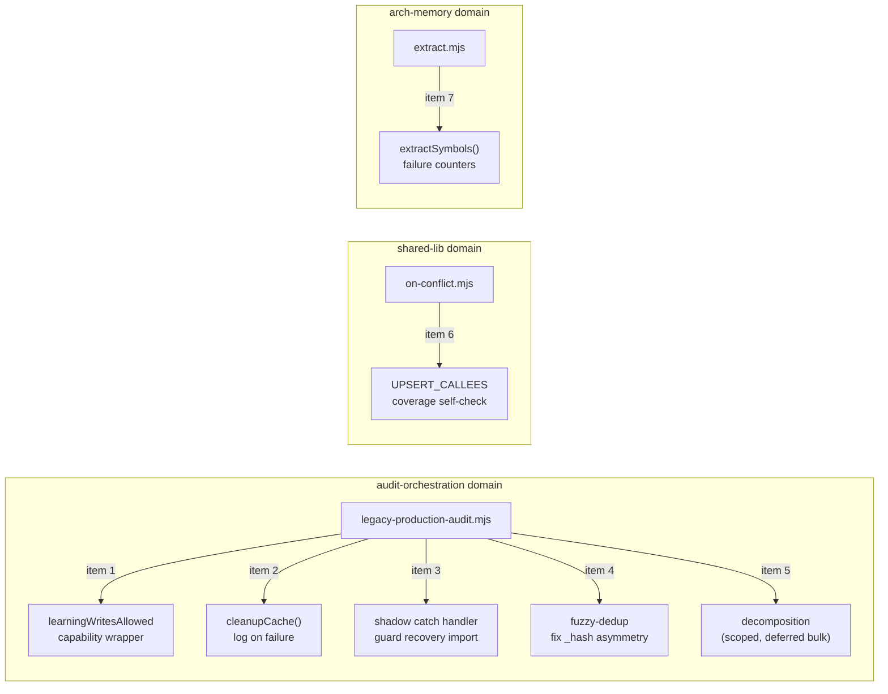

# Plan: Audit-Backlog-Triage Hardening (7-item punch list)

- **Date**: 2026-07-23
- **Status**: Complete — all 7 items implemented + tested (50+ new/updated
  tests), audit-code Gemini-gate-clear (3 GPT rounds; every finding touching
  this diff's actual changed code was fixed — M5, M10, M2 — everything else
  confirmed pre-existing/out-of-scope debt via `git diff` and captured in
  `.audit/tech-debt.json`; Gemini APPROVE, 0 new findings, 0 wrongly
  dismissed). Shipped 2026-07-24.
- **Author**: Claude + Louis Strydom
- **Scope**: backend

- **Target domain(s)**: `audit-orchestration`, `arch-memory`, `shared-lib`
- ⚠ **Cross-domain work** — touches 3 independent domains across 3 unrelated
  files. This is NOT new cross-domain wiring — each item is a self-contained
  fix inside its own file; the domain split just reflects that the 7 items
  came from one triage sweep, not one feature.

## Context Summary

The 2026-07-22 learning-weekly-review backlog triage (94 findings reconciled
against commit history and current code, see
[`docs/plans/`](../../CLAUDE.md) session memory `project_learning_backlog_triage_2026-07-22`)
left **7 genuinely open, evidenced bugs** across 3 files. Every other pending
finding in those files was either already fixed by a subsequent commit,
already-declared architectural intent, or explicitly documented accepted
debt — these 7 are not.

Five of the seven live in `scripts/lib/audit/legacy-production-audit.mjs`,
which was ALREADY the subject of one hardening pass —
[`docs/plans/audit-orchestrator-hardening.md`](audit-orchestrator-hardening.md)
(shipped 2026-07-10, 9 phases, 6 genuine bugs fixed). This plan's 5 items were
raised by a *later* audit round (2026-07-17, after that plan shipped) and were
never triaged because the weekly-review pipeline broke the same week. Read
that plan's Context Summary for the file's full history before touching it —
this is round 2 of hardening on the same orchestrator, not a fresh read.

**Code Trace** (every citation below re-verified directly against HEAD on
2026-07-23, not taken from stale finding prose — the original findings were
raised 2026-07-17/18, six days before this plan; several other findings in
the same rounds turned out to already be fixed, so nothing here is assumed
still-true without a fresh read):

- `scripts/lib/audit/legacy-production-audit.mjs:874-912,936,1215-1218,1761,3096-3107` — `learningWritesAllowed` capability-boundary gaps (items 1, 5)
- `scripts/lib/audit/legacy-production-audit.mjs:279-282` — `cleanupCache()` (item 2)
- `scripts/lib/audit/legacy-production-audit.mjs:3079-3080` (shadow catch handler's own recovery import) (item 3)
- `scripts/lib/audit/legacy-production-audit.mjs:2450-2489` (exact-hash dedup at 2450-2461 vs fuzzy dedup at 2463-2478) (item 4)
- `scripts/lib/lint/on-conflict.mjs:60-63,390` (`UPSERT_CALLEES`, `SCOPE_COLUMNS`) (item 6)
- `scripts/symbol-index/extract.mjs` `extractSymbols()` — `statSync` catch (~line 167) and parse/add-failure catch (~171-174), and the returned `stats` object shape (item 7)

**Neighbourhood considered**: `get-neighbourhood` queried against all three
target files — every candidate scored `below-noise-floor` (band `review`).
No existing helper duplicates what these fixes need; extend in place.

**Security incident check**: `get-incident-neighbourhood` surfaced **INC-001**
(symlink-based sensitive-path bypass, `manual-verification-required`) with
`scripts/symbol-index/extract.mjs` as an affected path. Item 7 touches
`extractSymbols()`'s failure-counting, not its path-classification/read logic
(`safeReadFile` / `gateSymbolForEgress`) — the fix must not change *what* gets
read or classified, only *whether a swallowed failure is counted*. See
Security Considerations below.

## Proposed Architecture

Not a new architecture — this is a punch list of 7 independent, surgical
fixes inside 3 existing files. No new modules, no new cross-file wiring
(item 1's capability wrapper stays inside its existing file — see item 1's
entry for why a new shared module is deliberately NOT proposed).

## Sustainability Notes

**Right-sizing gate** (item 5, the only item introducing new structure):
- **Band-aid** — close the "God-orchestrator" finding with no action; the
  function keeps growing every time a new cross-cutting concern (cost
  capture, provenance, remediation-state) gets bolted on inline, exactly as
  it has for the last 2 weeks (~1650 → ~2227 lines).
- **Over-engineered** — a full modularization pass splitting all ~11 named
  concerns (scope resolution, provider execution, suppression, persistence,
  cloud-write policy, bandit substitution, telemetry, verification,
  verdicting, shadow execution, ledger/debt) into separate files in one
  sitting. That's a multi-day refactor with its own regression surface,
  disproportionate to what this plan's other 6 items need.
- **Chosen** — extract exactly the ONE concern this plan is already touching
  for a different reason: item 1's capability-boundary fix naturally becomes
  a small `learningWritePolicy(...)`-shaped helper (co-located in the same
  file, not a new module — see item 1). That is one real decomposition step,
  motivated by a concrete current requirement (item 1), not a speculative
  "cleaner" refactor. The other ~10 concerns are explicitly NOT touched here;
  document them as accepted debt with a pointer back to this plan so the next
  person doesn't have to re-derive the boundary list.

**Manual vs scripted**: all 7 fixes are irregular, judgment-heavy, single-site
edits (not a repeated pattern across ≥5 sites) — every fix is done by hand,
no codemod.

## File-Level Plan

### Item 1 — `learningWritesAllowed` is convention, not a capability boundary

- **File**: `scripts/lib/audit/legacy-production-audit.mjs`
- **Current state**: `learningWritesAllowed = !noCloudRecording` (line 1215)
  gates writes via four independent `if (learningWritesAllowed)` call sites
  (912, 936, 3103, 3107) plus the already-fixed 2990. Nothing stops a fifth
  write site from being added without the check.
- **Fix approach**: wrap the writes behind a single guarded function instead
  of a boolean checked at each call site — e.g. `function
  writeLearningState(fn) { if (!learningWritesAllowed) return; return fn(); }`
  defined once near line 1215, with every current write site
  (`syncBanditArms`, `syncFalsePositivePatterns`, the tail bandit flush)
  routed through it. A new write site that calls the raw store function
  directly instead of `writeLearningState(...)` is still possible in
  JS — full enforcement would need a lint rule — but collapsing 4 scattered
  booleans into 1 call site makes the convention discoverable (grep
  `writeLearningState` finds every writer) rather than requiring a
  full-file read to enumerate them. (#1 Single Source of Truth, #16
  Graceful Degradation)
- **Acceptance**: `grep -c "if (learningWritesAllowed)"` in this file drops
  from 4 to 0 (all replaced by `writeLearningState(...)` calls); a new test
  asserts that with `noCloudRecording: true`, none of `syncBanditArms` /
  `syncFalsePositivePatterns` / the tail flush execute their write body.

### Item 2 — `cleanupCache()` swallows removal failures silently

- **File**: `scripts/lib/audit/legacy-production-audit.mjs:279-282`
- **Current**: `try { fs.rmSync(_cacheDir, {...}) } catch { /* ignore */ }`
- **Fix approach**: log the failure (path + `err.code`) via the existing
  `process.stderr.write` convention used throughout this file — do NOT throw
  (cache cleanup failing must never fail the audit run itself, so
  fail-open-but-loud is correct, not fail-closed). (#14 Error Handling)
- **Acceptance**: a test that makes `fs.rmSync` throw (e.g. mock or a
  read-only dir) asserts a stderr line is emitted containing the cache path;
  the function still returns normally.

### Item 3 — shadow catch handler's own recovery import is unguarded

- **File**: `scripts/lib/audit/legacy-production-audit.mjs:3079-3080`
- **Current**: the shadow block's catch handler does
  `const { classifyShadowFailure } = await import('../audit-shadow.mjs')`
  with no try/catch of its own — a failure in THIS import can still reject
  the primary audit, breaking the documented "no shadow failure can abort a
  successful primary audit" guarantee.
- **Fix approach**: wrap the recovery import itself in try/catch; on failure,
  log and fall back to a generic/unknown shadow-failure classification rather
  than propagating. (#15 Graceful Degradation — the guarantee already exists
  for the shadow *execution* path; this closes the one gap in the shadow
  *recovery* path.)
- **Acceptance**: a test that makes the dynamic import of
  `../audit-shadow.mjs` reject asserts the primary audit's return value is
  still the successful result, not a rejection.

### Item 4 — fuzzy-dedup replacement corrupts `_hash` identity

- **File**: `scripts/lib/audit/legacy-production-audit.mjs:2463-2478`
- **Current**: the exact-hash dedup branch (2450-2461, three lines up)
  correctly writes `_hash: hash` (the NEW finding's hash) when replacing.
  The fuzzy-dedup branch three lines below it writes
  `_hash: allFindings[dupeIdx]._hash` — the OLD finding's hash — while still
  taking the new finding's content/severity. This is an asymmetry between
  two adjacent, near-identical code blocks, not a design choice.
- **Fix approach**: one-line fix — line 2473's `_hash:
  allFindings[dupeIdx]._hash` becomes `_hash: hash`, matching the exact-dedup
  branch's already-correct pattern. `id` stays from the old entry
  deliberately (it's the stable human-facing ordinal label, e.g. `H1` — not
  a content fingerprint). (#1 Single Source of Truth — the two dedup branches
  should follow one identity rule, not two.)
- **Acceptance**: a test seeds a LOW finding A (structure pass) and a fuzzy-
  duplicate HIGH finding B (backend pass, >0.8 word overlap) and asserts the
  merged finding's `_hash` matches `hash(B)`, not `hash(A)`. Covers both
  finding ids fb… (bc31c61a, 880195e4) — same fix, same test.

### Item 5 — orchestrator has grown to ~2227 lines

- **File**: `scripts/lib/audit/legacy-production-audit.mjs`
- **Scope for THIS plan**: per Sustainability Notes above, only the
  extraction that item 1 already produces (`writeLearningState`) counts as
  progress here. **Correction from the original draft**: `.audit/tech-debt.json`
  is gitignored, machine-local, and populated by the audit pipeline's own
  `debt-capture.mjs` from a real finding during a real `/audit-code` round —
  it is not a file to hand-author an entry into (no CLI exists for that, and
  a fabricated `topicId`/`semanticHash` would risk a malformed or duplicate
  entry the pipeline can't reconcile). **This plan document is the durable
  record instead** (committed, unlike the local ledger). When `/audit-code`
  runs on this diff and its Sustainability/Architecture pass re-flags the
  orchestrator's size, defer it citing this section — the audit pipeline
  will populate `.audit/tech-debt.json` naturally at that point, the same
  way `extract.mjs`'s manifest-parsing debt got there.
- **Explicitly NOT in scope**: splitting scope resolution, provider
  execution, suppression composition, telemetry, verification, verdicting,
  or shadow-execution into separate files. A future plan should own that,
  scoped and audited on its own — this finding gave the required "band-aid /
  over-engineered / chosen" framing above precisely to avoid pretending a
  one-function extraction resolves it.
- **Acceptance**: this plan section exists and is committed (done); the
  remaining ~10-concern decomposition is deferred, not silently dropped, at
  the audit-code step below.

### Item 6 — `on-conflict.mjs` write-recognition is hardcoded, silently blind to new wrappers

- **File**: `scripts/lib/lint/on-conflict.mjs:62,390`
- **Current**: `const UPSERT_CALLEES = new Set(['upsert'])` — a new local
  upsert wrapper produces zero AST matches and zero findings, so the CLI
  reports clean while an entire new write path goes unaudited. The module's
  own doc comment already concedes this.
- **Fix approach**: a right-sized, mechanical self-check rather than a
  general call-graph tracer (over-engineering for a lint tool): scan the
  scanned store files for any `CallExpression` whose callee name matches
  `/upsert/i` (case-insensitive substring) that is NOT already in
  `UPSERT_CALLEES`, and emit a `[Structure] unrecognized-upsert-like-callee`
  finding for it — fails closed (flags the gap) instead of silently missing
  it. This doesn't require understanding what the new wrapper does, only
  that something upsert-shaped exists outside the registry. (#12 Fail-Closed
  Validation)
- **Acceptance**: a test adds a fixture file with a function named e.g.
  `upsertBatch(...)` not in `UPSERT_CALLEES` and asserts the lint now emits
  the new finding instead of reporting clean. Covers both finding ids (89fe6988,
  4bfc55b0 — same gap, same fix).

### Item 7 — `extractSymbols()` silently drops files on `statSync`/parse failure

- **File**: `scripts/symbol-index/extract.mjs` (`extractSymbols()`)
- **Current**: `statSync` failures (~line 167) are caught with no counter and
  no log; source-file parse/add failures (~171-174) only reach `stderr` via
  `emitProgress`. The returned `stats` object
  (`symbolCount, skippedPath, skippedExt, skippedSize, skippedDelegate,
  redacted`) has no field for either class, so a run can report success while
  silently omitting files. **Distinct from** the `main()`-level `isTooLarge`
  fix in commit `5e8041d` (2026-07-18), which hardened a *separate* closure
  used only for the coverage-ratio denominator — that fix never touched
  `extractSymbols()`'s own catches.
- **Fix approach**: add two counters to the returned `stats` object —
  `statFailures` and `parseFailures` — incremented in the existing catch
  blocks (no new I/O, no behavior change to what's read/skipped — see
  Security Considerations for why this must NOT touch the sensitive-path
  classification path). Surface both in whatever caller currently reports
  `stats` (coverage output / `arch:refresh` summary) so a nonzero count is
  visible, not just a clean summary.
- **Acceptance**: a test that makes one file's `statSync` throw and another's
  parse fail asserts `stats.statFailures === 1` and `stats.parseFailures ===
  1`, and that the overall run still completes (fail-open, count-don't-crash
  — matching this file's existing failure philosophy elsewhere).

### Implementation Phases

Gate 1 fired (`compute-target-domains` returned `crossDomain: true` across 3
domains) — phases below, but note **all 7 are independent**: no phase
depends on another's output, so no Execution Clustering (§11) is needed —
work them in any order, one sitting each for items 1-4/6-7; item 5 is a
tracking-only close-out.

**Phase 1 — Capability-boundary wrapper (item 1)**: Files: `scripts/lib/audit/legacy-production-audit.mjs` (modify)

**Phase 2 — Cache cleanup logging (item 2)**: Files: `scripts/lib/audit/legacy-production-audit.mjs` (modify)

**Phase 3 — Guard the shadow recovery import (item 3)**: Files: `scripts/lib/audit/legacy-production-audit.mjs` (modify)

**Phase 4 — Fix fuzzy-dedup `_hash` asymmetry (item 4)**: Files: `scripts/lib/audit/legacy-production-audit.mjs` (modify)

**Phase 5 — `UPSERT_CALLEES` coverage self-check (item 6)**: Files: `scripts/lib/lint/on-conflict.mjs` (modify)

**Phase 6 — `extractSymbols()` failure counters (item 7)**: Files: `scripts/symbol-index/extract.mjs` (modify)

**Close-out (not a phase)**: run `npm test` and `npm run check`. Item 5's
remaining decomposition scope is deferred during the `/audit-code` step
(citing this plan), not hand-written to `.audit/tech-debt.json` — see
item 5's corrected entry above.

## Risk & Trade-off Register

- **Item 1 risk**: a lint-level enforcement (forbidding raw store calls
  outside `writeLearningState`) is deliberately deferred — this plan only
  makes the convention discoverable, not mechanically enforced. Accepted:
  full enforcement is a separate, larger change (a new ESLint rule) not
  justified by this punch list alone.
- **Item 4 risk**: none identified — this is a pure one-line correction to
  match an already-correct adjacent code path; low blast radius.
- **Item 5 trade-off**: explicitly NOT attempting the full decomposition.
  Accepted per the right-sizing analysis above — tracked as debt, not
  silently dropped.
- **Item 6 risk**: the substring-match self-check (`/upsert/i`) could
  false-positive on an unrelated function whose name happens to contain
  "upsert" (e.g. a comment-only helper). Acceptable — a false-positive
  Structure finding is far cheaper than the silent coverage hole it
  replaces, and it's advisory (doesn't gate the CLI's exit code by default).
- **Item 7 risk**: must not change *what* `extractSymbols()` reads or skips
  — only add counting. Verified against INC-001 in Security Considerations
  below.

## Testing Strategy

- Unit tests per item as specified in each item's Acceptance line above —
  all Tier 1 (deterministic, crisp inputs/outputs) per this repo's testing
  doctrine.
- `npm test` full suite must stay green (regression guard against the wider
  `legacy-production-audit.mjs` orchestrator, which has extensive existing
  coverage from the prior hardening plan).
- No live-runtime/browser verification needed — none of these 7 items touch
  a UI or a deployed skill's browser-driven surface.

## Security Considerations

**INC-001** (symlink-based sensitive-path bypass, `scripts/symbol-index/extract.mjs`
named as an affected path, status `manual-verification-required`) applies to
item 7. The fix must add counters ONLY around the existing `statSync` and
parse/add-failure catch blocks — it must NOT alter which path is passed to
`safeReadFile`/`gateSymbolForEgress`, and must NOT change fail-open/fail-closed
classification semantics (a `resolutionFailed`/`escapedRepo` path must
continue to classify as `sensitive`, unaffected by the new counters). The
acceptance test for item 7 should NOT be conflated with re-verifying INC-001's
mitigation (`tests/sensitive-paths-canonical.test.mjs` already regression-locks
that) — item 7 is additive counting only.
