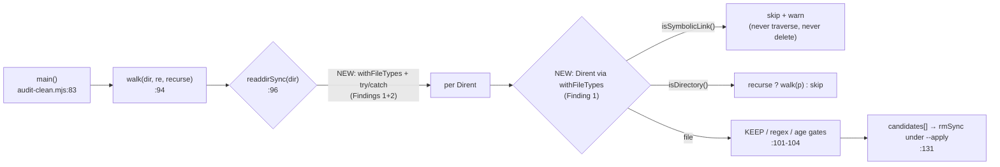

# Plan — audit-clean.mjs traversal safety

- **Status**: Complete
- **Scope**: backend
- **Target domain(s)**: `audit-orchestration`
- **Stack**: js-ts

> Sibling plan: `docs/plans/install-transaction-wal-hardening.md` (domain
> `install`). Split deliberately — different domains, zero shared code or
> functions. See that plan's Out of Scope section.

## 1. Context Summary

> **Neighbourhood considered** (arch-memory, `k=8`, all `recommendation:
> review` — no `reuse`/`extend` candidate, so greenfield is correct):
>
> | Symbol | File | Domain | Sim | Disposition |
> |---|---|---|---|---|
> | `main` | `scripts/audit-clean.mjs:83` | audit-orchestration | 0.73 | The caller being fixed. |
> | `listStalePreimages` | `scripts/audit-clean.mjs:40` | audit-orchestration | 0.70 | Sibling in the same file; its guarded `readdirSync` (`:43`) is prior art for Fix 2. |
> | **`fsWalkFallback`** | `scripts/lib/arch-intent/adapter-contract.mjs:68` | shared-lib | 0.72 | **Load-bearing find — see the Code Trace.** A second recursive walker, already immune via `withFileTypes`. It changed Fix 1's design and falsified this plan's original right-sizing premise. |
> | `isSensitiveViaSymlinkResolution` | `scripts/lib/audit/stage1-triage.mjs:112` | audit-orchestration | 0.73 | Considered and rejected: answers "is this path *sensitive*", not "does this entry escape the tree I'm sweeping". |
> | `resolveContainedPath` | `scripts/lib/gate-honesty/schema.mjs:111` | shared-lib | 0.71 | Considered and rejected: same reason, and fail-closes on ENOENT. |
>
> The consultation earned its keep here: it surfaced `fsWalkFallback`,
> which is why Fix 1 is `withFileTypes` rather than the draft's
> `lstatSync`, and why the "only one recursive walker" claim is gone.

Track B's second half. The Track-A plan
(`docs/plans/atomic-write-adoption-remaining-sites.md`) deferred a
traversal-safety question in two `audit-orchestration` scripts. Having now
read both, **only one of the two carries a real defect** — the honest
scoping is below, and it is materially smaller than the deferral note
implied.

### Code Trace

- `scripts/audit-clean.mjs:94-107` — `walk(dir, re, recurse)`, the
  allowlist-driven delete-candidate collector. Called from
  `main()` at `:107` for each `TRANSIENT` entry.
- `scripts/audit-clean.mjs:99` — `st = statSync(p)` inside the walk.
  **`statSync` follows symlinks.**
- `scripts/audit-clean.mjs:100` — `if (st.isDirectory()) { if (recurse) walk(p, re, recurse); continue; }`
  → a symlink *to a directory* reports `isDirectory() === true`, and the
  recursion reads through it via `readdirSync` at `:96`.
- `scripts/audit-clean.mjs:69` — the only `recurse: true` entry:
  `{ dir: '.audit-loop/cache', re: /./, recurse: true }`. Note `re: /./`
  **matches every basename**.
- `scripts/audit-clean.mjs:131` — the sink: `retrySync(() => rmSync(c.p))`
  under `--apply`.
- `scripts/audit-clean.mjs:43` — the *contrasting* pattern in the same
  file: `try { entries = readdirSync(os.tmpdir()); } catch { return out; }`
  — guarded, where `walk`'s `readdirSync(dir)` at `:96` is not.
- `scripts/lib/audit/diff-scope-resolver.mjs:188-212` —
  `sweepStaleOrphanPreimages`; `:197` `statSync`, `:201` `git worktree
  remove --force`, `:203` `fs.rmSync(p, {recursive:true, force:true})`
  fallback.
- `tests/orphan-preimage-sweep.test.mjs:69-79` — proves the
  unregistered-dir fs-fallback removal is **intended, tested behaviour**,
  not an oversight.
- `scripts/lib/file-io.mjs:29-39` — establishes that symlinked paths are an
  *expected, accommodated* condition in this codebase (dotfile managers:
  stow/chezmoi), not a hypothetical.
- `scripts/lib/arch-intent/adapter-contract.mjs:68-88` — **`fsWalkFallback`,
  the in-repo PRIOR ART for both fixes** (surfaced by the Phase-0.5
  architectural-memory consultation, which also falsified this plan's original
  "there is exactly ONE recursive walker" premise — there are two). It walks
  recursively via `readdirSync(dir, { withFileTypes: true })` + `e.isDirectory()`
  / `e.isFile()`, and guards its `readdirSync` in `try`/`catch`. It is therefore
  **already immune** to Finding 1 and already implements Finding 2 — not by
  special-casing symlinks, but by using the primitive that never followed them.

### Finding 1 (real) — `walk()` traverses symlinks out of the repo

`walk` is documented as ALLOWLIST-only and directory-scoped
(`audit-clean.mjs:8-14`), but the scoping is by *lexical* directory, and
`statSync`+`readdirSync` resolve links. If `.audit-loop/cache` — or any
directory beneath it — is a symlink, `--apply` collects and deletes
matching files **inside the link target, outside the repo**. Under the
`recurse: true` + `re: /./` pair, "matching" means *every file older than
`--age-days`* (default 14) in the target tree. `KEEP` (`:73-81`) only
guards ~22 known basenames, so it is no defence for arbitrary foreign
files.

The realistic trigger is **not** an attacker — this is a local dev CLI.
It is the ordinary practice of relocating a cache onto another disk:
`ln -s /mnt/big/audit-cache .audit-loop/cache`. `file-io.mjs:29-39`
documents symlinked dotfiles as a supported real-world condition in
exactly this toolchain, so a symlinked cache dir is a plausible user
setup, and today it silently converts `npm run audit:clean --apply` into
a recursive delete of unrelated files. This is the same class as INC-001
(`docs/security-strategy.md`): an innocent-looking path whose canonical
target is elsewhere.

### Finding 2 (real, minor) — unguarded `readdirSync` in `walk`

`walk` checks `existsSync(dir)` at `:95` then calls `readdirSync(dir)` at
`:96` with no `try`/`catch` — a TOCTOU gap, and an inconsistency with
`listStalePreimages`'s guarded read at `:43` in the same file. A
directory vanishing between check and read (or an unreadable dir) throws
out of the CLI. Impact is low (dry-run by default; `--apply` is
idempotent and re-runnable, so a mid-way crash strands nothing), but it
is a 3-line fix adjacent to Finding 1's line, in a function whose whole
job is to be fail-safe.

### Non-finding — `sweepStaleOrphanPreimages` ownership (investigated, dropped)

The deferral note flagged that `sweepStaleOrphanPreimages` treats any
aged `os.tmpdir()/orphan-preimage-*` directory as its own without
verifying the worktree belongs to `repoPath` — a live concern because
this repo's tooling is synced into consumer repos that share a machine's
`os.tmpdir()`. **On inspection it does not survive as a defect worth
fixing:**

- *Cross-repo sweep*: repo A's sweep can remove repo B's orphaned
  worktree. But it only fires past the 1h age gate — by which point B's
  run is dead by construction (a live preimage lives seconds,
  `diff-scope-resolver.mjs:180-181`). The residue is a dangling
  `.git/worktrees/` entry in B, since A's `git worktree prune` (`:208`)
  runs in A. Worktree paths are `mkdtemp`-random, so the dangling entry
  can never collide with a future `worktree add`. Impact: cosmetic
  metadata clutter in a sibling repo. Not worth a code change.
- *Symlink traversal*: `:197`'s `statSync` does follow a link, but the
  sink at `:203` is `fs.rmSync(p, {recursive, force})`. **Executed
  2026-07-17 (§9), not reasoned about**: `rmSync` on a symlink removes the
  *link* and leaves the target and its contents intact, so there is no
  out-of-tree delete here. **The non-finding stands; no Fix 3.** The same
  probe confirmed `statSync(link).isDirectory() === true`, which is
  precisely what makes Finding 1 real — so one check settled both
  questions, in opposite directions.

Recording this as an explicit non-finding rather than silently dropping
it: the deferral note asserted a risk, and "we looked and it isn't one"
is the answer, with the reasoning attached so a future reader does not
re-raise it.

## 2. Proposed Architecture

One function changes. No new module, no new abstraction, no new config.



**Fix 1 — adopt `withFileTypes`, the primitive that never followed
symlinks** (revised after the Phase-0.5 consultation surfaced
`fsWalkFallback`). The original draft proposed `statSync` → `lstatSync` +
an explicit symlink branch. That works, but it is the *second-best*
answer: it treats symlink-following as a special case to be detected,
when the real defect is that `walk` asks the filesystem the wrong
question. `readdirSync(dir, { withFileTypes: true })` returns `Dirent`
objects whose `isDirectory()` reflects the **directory entry**, not a
followed target — so a symlink reports `isDirectory() === false` /
`isSymbolicLink() === true` and simply never enters the recursion.

Verified side-by-side rather than assumed (executed, `win32`):

| For a symlink → a directory | Result |
|---|---|
| `statSync(link).isDirectory()` — today's code | **`true`** → `walk()` recurses through it |
| `Dirent.isDirectory()` via `withFileTypes` | **`false`** (and `isSymbolicLink() === true`) |

**R1-H1 — `withFileTypes` alone is NOT the fix; it protects the entries and
leaves the ROOT open (the exact case this plan documents).** Caught at plan
audit and confirmed by execution: `readdirSync` has *already opened* `dir`
by the time it returns Dirents, so if `dir` **itself** is the symlink —
`ln -s /mnt/big/audit-cache .audit-loop/cache`, the ordinary trigger named
in Finding 1 — the target's children come back as **normal files**:

```
existsSync('cache')                 -> true          (the :95 gate passes)
readdirSync('cache',{withFileTypes}) -> [{ name:'important.txt',
                                           isFile: true,
                                           isSymbolicLink: false }]
```

Those Dirents are indistinguishable from real in-tree files, so they'd flow
straight to the `rmSync` sink. Worse, the draft's test only covered
`cache/link -> outside`, never `cache -> outside` — so it would have gone
**green on a fix that misses the primary scenario**. That is the
false-green shape `docs/runbooks/pre-ship-empirical-verify.md` §"audit your success
paths" exists to catch, and it is the second time on this plan that the
test and the fix shared the same blind spot.

**So the fix has two halves, and both are required:**
1. **Root** — `lstatSync(dir)`; if `isSymbolicLink()` → warn + return, never
   `readdirSync` it. This is the half that closes the documented trigger.
2. **Entries** — `readdirSync(dir, { withFileTypes: true })`, branching on
   `e.isDirectory()` / `e.isFile()`, and skipping `e.isSymbolicLink()`
   **explicitly with a warning** rather than letting it fall through
   silently.

**R2-H1 — the two halves and the error policy were incoherent as written
(and my own test fixture disproved my own contract).** The draft put the
root `lstatSync` *outside* the `readdirSync` catch, and never reconciled it
with the pre-existing `existsSync(dir)` gate (`:95`). Against the specified
ENOTDIR fixture (`<plain-file>/child`) that is not merely untidy, it is
**unsatisfiable**: with `existsSync` first, the path returns `false` and is
**silently skipped** — no warning, contradicting §2's "always warn" policy;
with `lstatSync` first, it **throws ENOTDIR uncaught** — contradicting
"skip and continue". Either way the stated contract cannot hold. Third time
on this plan that a fix and its test shared a blind spot.

**One error boundary, and `existsSync` is deleted.** `lstatSync` **and**
`readdirSync` go inside a single `try`/`catch`. The `existsSync` gate is
removed outright, not kept alongside: it is redundant (`lstatSync` answers
the same question), a TOCTOU (`:95`→`:96` — Finding 2's origin), and it is
the *cause* of the silent-skip half of this incoherence. Errors are then
classified once, in one place:

| errno | Treatment | Why |
|---|---|---|
| `ENOENT` | **silent skip** | A `TRANSIENT` dir that simply doesn't exist is the normal case (most repos lack most of them). Warning here would fire on every run and train operators to ignore the channel — the same cry-wolf failure the WAL work hit on win32. |
| everything else (`EACCES`, `ENOTDIR`, `EIO`, …) | **warn + skip subtree + continue** | Real, unexpected, and must never read as a clean sweep. |

A benign-code allowlist keyed on errno, mirroring
`transaction.mjs::BENIGN_FSYNC_CODES` — the same shape the repo already
uses for exactly this "expected absence vs real failure" distinction. The
ENOTDIR fixture now satisfies the contract precisely: `lstatSync` throws
`ENOTDIR`, it is not `ENOENT`, so it warns and the sweep continues.

The `statSync(p)` at the age/size gate stays inside the same boundary — it
can throw on a file that vanishes mid-sweep, and today's bare
`try { st = statSync(p) } catch { continue }` (`:99`) silently swallows it.
It keeps `continue`, but routes through the same classifier so a real error
is reported rather than dropped.

The root check makes the entry check technically redundant *today* (with
the root guarded and symlinked entries never recursed into, `walk` can only
ever be called on a real directory). It is kept anyway for two reasons that
are not "belt and braces": the entry branch is what stops a symlink being
**deleted** as a `re: /./` match, which the root check does not address; and
a future `TRANSIENT` entry pointing `walk` at a new root would otherwise
depend on the caller remembering the invariant. Defence at the boundary the
data actually crosses. The explicit branch is the one place this plan diverges from
`fsWalkFallback` — which drops symlinks silently, correct for a read-only
inventory but wrong for a delete tool, where silently ignoring part of a
cleanup is how the next confusion starts. It also matters that a symlink
must be **skipped, not deleted**: under `re: /./` it would otherwise match
the file branch and destroy the user's link to their relocated cache.

`walk` is then *literally* what its docstring already claims (`:8-14`):
allowlist-only and lexically scoped — and it converges on the pattern the
repo already uses one directory over.

This deliberately does **not** reuse
`sensitive-paths.mjs::resolveAndClassify` (the canonical
canonicalise-and-classify helper) nor
`stage1-triage.mjs::isSensitiveViaSymlinkResolution` (also surfaced by the
consultation, at 0.73 — `review`, not `reuse`). Both answer "is this path
*sensitive*", a different question from "does this directory entry escape
the tree I am sweeping", and both fail-closed to a sensitivity
classification `walk` has no use for. The right-sized fix is the correct
`readdir` primitive, not a dependency on a classifier built for another
question.

**Fix 2 — guard the `readdirSync`, and WARN — never silently.** Wrap `:96`
in `try`/`catch` — matching BOTH `listStalePreimages`'s shape at `:43` and
`fsWalkFallback`'s at `:71-72`; `walk` is the outlier of three.

**R1-M2 — "catch and return" was underspecified, and silence is the bug.**
The draft said "return on failure" without saying *which* failures, whether
the user is told, or what exit code results. A blanket silent catch turns a
permission denial or an I/O error into an **apparently successful cleanup**
— `audit-clean: nothing transient older than 14d — clean.` — while stale
data sits unreadable. That is the same false-green class as R1-H1, one
layer down. Policy: catch, classify by errno (table above), never abort the
run — a cleaner that dies on one unreadable directory is worse than one
that reports it and cleans the rest, and `--apply` is idempotent and
re-runnable. **Exit code stays 0**: this is a best-effort maintenance tool,
and an unreadable cache subtree is not a failed cleanup. The warning is the
contract, not the exit code. (A `--strict` gate would be a separate
requirement — not one this plan has.)

**R2-M1 — the collector must not own CLI policy; inject a reporter, and
drop the `--apply` condition.** The draft gave `collectCandidates` a
UI-facing responsibility whose policy depended on CLI mode ("a stderr line
under `--apply`") while declaring it a pure, module-state-independent seam
and handing it neither a mode nor a reporter. That forces an implementer to
read `process.argv` from library logic, `console.error` from a collector, or
quietly change the signature — all three mix CLI concerns into the extracted
function and make the warnings untestable without capturing stderr.

Two changes, and both simplify:
- **Signature takes a reporter**:
  `collectCandidates(dir, re, recurse, cutoff, out, { warn })`. `main()`
  passes `msg => process.stderr.write(\`  [audit-clean] \${msg}\n\`)`; tests
  pass a collecting spy and assert on the array — deterministic, no stderr
  capture, no mode inspection.
- **The `--apply` condition is deleted; warnings are unconditional.** It was
  wrong on its own terms: a dry run is a *preview of what `--apply` would
  do*, so if `--apply` would skip a symlinked cache the preview must say so
  — that is precisely when the operator can still act on it. Making it
  unconditional removes the mode dependency that created this finding, and
  is the more correct behaviour. The collector ends up with no knowledge of
  CLI mode at all.

### Right-sizing gate

- **Band-aid**: document "don't symlink your cache dir" in the docstring.
  Leaves a destructive default one `ln -s` away; the root cause (the walk
  resolves links) survives.
- **Over-engineered**: a general repo-containment traversal helper
  (realpath every entry, assert `repoRoot` containment, shared across
  `audit-clean` / the sweep / future walkers), plus a config surface for
  allowed link targets. **The original premise for rejecting this was
  wrong** — the draft claimed "exactly ONE recursive walker exists"; the
  consultation found a second (`fsWalkFallback`). But the conclusion
  survives on a *better* argument: the second walker needs no such helper,
  because it is already correct **by using the right primitive**. Two
  walkers that both use `withFileTypes` need no shared containment
  abstraction — the correctness is in the `readdir` call, not in a layer
  above it. A shared abstraction whose only job is to re-derive what
  `readdir` already tells you is the abstraction cliff.
- **Chosen**: `withFileTypes` + an explicit symlink skip (one warn line) +
  a guarded `readdirSync`, inside the one function that recurses. Serves
  the current requirement (`walk` must not delete outside its declared
  directory) with no new module, no new dependency, no config — and
  converges the codebase's two recursive walkers on one primitive instead
  of adding a third way to do this.

## 6. Sustainability Notes

- **Assumption encoded**: `walk` sweeps a *lexical* tree, and a symlink is
  a boundary it does not cross. If a future `TRANSIENT` entry ever
  legitimately needs to follow a link, that becomes an explicit per-entry
  opt-in (`followSymlinks: true`) — a visible decision at the pattern
  table, not an ambient property of the walker. No such requirement
  exists today, so the flag is not built now.
- **Extension point deliberately NOT built**: the shared containment
  helper (see the right-sizing gate). Revisit trigger: a *second*
  recursive walker appears, or the sweep's ownership question is
  promoted by a real incident.
- **What could change**: if `TRANSIENT` grows more `recurse: true`
  entries with narrower regexes, Finding 1's blast radius shrinks — but
  the fix is regex-independent, so it stays correct either way.

## 7. File-Level Plan

| File | Intent | Purpose |
|---|---|---|
| `scripts/audit-clean.mjs` | modify | **(1)** Hoist `walk` out of `main()` to module scope as `collectCandidates(dir, re, recurse, cutoff, out)` — see the R1-M1 note below; it currently closes over main-local `candidates`/`cutoff`, so it cannot be exported where it sits. **(2)** Root guard: `lstatSync(dir)` → symlink ⇒ warn + return (R1-H1 — the half that closes the documented trigger). **(3)** `readdirSync(dir, { withFileTypes: true })` + branch on `e.isDirectory()`/`e.isFile()`, matching `fsWalkFallback` (`adapter-contract.mjs:68-88`); explicit `e.isSymbolicLink()` ⇒ warn + skip (never traverse, never delete). **(4)** `readdirSync` in try/catch → warn with dir + errno, skip subtree, continue (R1-M2). **(5)** `_internals` export + `isMain` guard (`main()` runs bare at `:136`). `statSync` stays imported — still correct for age/size gates on real files, and used by `listStalePreimages` (`:48`) — it just no longer decides recursion. Add `lstatSync` to the `node:fs` import (`:25`); no non-builtin imports. |
| `tests/audit-clean-traversal.test.mjs` | create | New Tier-1 file — no existing test covers `audit-clean.mjs` (verified: `tests/**/*{audit-clean,diff-scope,orphan}*` matches only the sweep/diff-scope suites). Unit-tests `_internals.collectCandidates` for collection, and drives the **real CLI via subprocess** for the `--apply` deletion sink (R1-M1). |

**R1-M1 — the testability contract, made concrete.** The draft asked for an
`_internals` export without saying what could be exported: `walk` is nested
inside `main()` (`:94`) and mutates main-local `candidates`, closing over
`cutoff`. Exporting it in place is impossible without leaking main's state.
**Contract**: hoist it to module scope as
`collectCandidates(dir, re, recurse, cutoff, out, { warn }) -> void`
(pushes `{p, bytes, ageDays}` into `out`; calls `warn(msg)` for every
skipped symlink and every non-`ENOENT` filesystem error), pure w.r.t.
module state and with **no knowledge of CLI mode** (R2-M1). `main()` builds
`candidates`, passes `warn: msg => process.stderr.write(...)`, and calls it
per `TRANSIENT` entry exactly as today — no behaviour change, just a seam.

**And the tests must split accordingly** (the draft conflated them —
asserting "still exists after `--apply`" while only calling the collector,
which cannot prove the *sink* didn't unlink anything):
- **Collector tests** (in-process, fast): assert what does/doesn't become a
  candidate.
- **Sink tests** (subprocess, real CLI with `--apply`): assert what is/isn't
  on disk afterwards. This is the only honest way to prove the delete path.

**R1-M3 — relocation-contract prerequisite: REBUTTED with evidence, not
deferred.** The finding infers from the presence of `--selfcheck-relocation`
(`:31`) that `audit-clean.mjs`'s consumer/relocation behaviour is
contractual, and asks for sync-path-map / sync-rewriter / relocation-guard /
selfcheck-smoke evidence per the Tier-3 hard rule. Checked the authoritative
sources directly rather than AGENTS.md's prose summary (the same
misattribution shape as `archive-completed-plans.mjs` earlier this session):
- **Not in `CLI_SMOKE_SET`** — `scripts/lib/sync-isolation-verify.mjs:44-70`
  lists 13 entries; `audit-clean.mjs` is not among them.
- **Not in the sync machinery at all** — no reference in
  `scripts/sync-to-repos.mjs` or `scripts/lib/sync-path-map.mjs`, so it is
  never relocated into a consumer's `scripts/.claude-skills/`.
- **Not required by `tests/relocation-guard.test.mjs`.**
It is a **source-repo-only tool** that prunes *this* repo's own `.audit/`.
The selfcheck handler is defensive boilerplate, not evidence of contract
membership — that inference is exactly what the authoritative array exists
to settle. The Tier-3 doctrine governs the relocation *mechanism* and its
named members; it is not a blanket rule for every CLI script. There is no
consumer execution path whose behaviour this change could alter.

No `§7b`/`§11` — one function, two fixes, one sitting; below the Gate-1
threshold for phasing.

## 8. Risk & Trade-off Register

| Risk / trade-off | Assessment |
|---|---|
| **Skipping symlinks changes behaviour for anyone relying on the current traversal** | Intentional — that traversal is the defect. A user who symlinked their cache onto another disk currently gets foreign files deleted; after the fix they get one stderr line and no deletion inside the link. The stderr line is what makes the behaviour change discoverable rather than silent. |
| **A symlinked cache dir means its contents now never get swept** | Accepted, and correct: `audit-clean`'s safety model is "unknown files are never touched" (`:9-11`). A link target is by definition outside the declared tree. If a user genuinely wants the relocated cache swept, the honest fix is to point `TRANSIENT`'s `dir` at the real path — a config change, not a traversal. |
| **`isMain` guard + `_internals` export to make the CLI testable** | Same shape as `memory-health.mjs` / `symbol-index/drift.mjs` this session; the alternative (subprocess-only testing of a delete path) is slower and can't assert the skip branch directly. |
| **The §9 `rmSync` check could invalidate the non-finding** | Named and bounded: if it traverses, the non-finding becomes a fix and the plan grows. This is why the check runs BEFORE code lands, not after. |

## 9. Testing Strategy

**Pre-implementation empirical check — EXECUTED 2026-07-17, non-finding
STANDS.** Run before writing any fix, per the repo's
pre-ship-empirical-verify doctrine (`docs/runbooks/pre-ship-empirical-verify.md`)
and the "verify surprising findings against source-of-truth" rule. Result
on `win32`:

```
tmp/target/keep.txt ; tmp/link -> tmp/target
fs.rmSync('tmp/link', {recursive:true, force:true})
  -> link removed, target/ survives, target/keep.txt INTACT
```

`rmSync` unlinks the symlink and does not traverse it, so
`sweepStaleOrphanPreimages`'s fs-fallback cannot delete through a link.
**The §1 non-finding stands; no Fix 3.** The same probe also confirmed the
REAL bug from the other direction: `statSync(link).isDirectory()` returned
`true`, which is exactly what makes `walk()` recurse today.

**Tier-1 tests** (`tests/audit-clean-traversal.test.mjs`) — deterministic,
real FS, no mocks, `afterEach` tmpdir cleanup per this repo's established
test shape. **Two tiers, per R1-M1**: collector tests call
`_internals.collectCandidates` in-process; **sink tests drive the real CLI
via subprocess with `--apply`**, because only the sink can prove nothing
was unlinked.

*Collector (in-process):*
1. **THE regression — a symlinked ROOT** (R1-H1; the draft omitted this and
   would have gone green on a broken fix). `cache -> outside/`, where
   `outside/` holds an aged file. Collect over `cache` with `recurse: true`,
   `re: /./`. Assert **zero candidates AND exactly one `warn` naming the
   root path** (R2-M2). Fails on today's code AND on the
   `withFileTypes`-only design — this is the case the plan's own Finding 1
   names as the ordinary trigger (`ln -s /mnt/big/audit-cache .audit-loop/cache`).
2. **A symlinked ENTRY** — `cache/link -> outside/`. Assert `outside/`'s
   aged file is not a candidate, **and that `warn` fired naming the link**.
3. **The link itself is not a candidate** — same fixture; guards the
   half-fix where the symlink stops the recursion but falls into the file
   branch and gets deleted as a `re: /./` match.

**R2-M2 — assert the DIAGNOSTIC, not just the exclusion.** The draft made
unconditional warnings a central safety behaviour (a dry run must disclose
that `--apply` would skip a symlinked cache) but asserted a warning in
exactly one test — and that one covers ENOTDIR, neither symlink path. So a
silent implementation would pass every primary safety test while violating
the contract the plan calls load-bearing. Tests 1-2 now assert the warning
**and its payload** (it must name the offending path — a warning that
doesn't say *which* directory was skipped is not actionable). The injected
`warn` spy (R2-M1) is what makes this assertable without capturing stderr.
4. **Real subdirectories still recurse** — a genuine nested dir under
   `cache/` with an aged file IS collected (guards over-correcting into
   "skip all directories").
5. **Age + KEEP gates unchanged** — a fresh file and a `KEEP` basename are
   both excluded, through the new Dirent path.
6. **A real filesystem error warns and continues** (R1-M2; fixture fixed at
   R2-H1, then **fixed again at implementation time — by measurement**).
   Point the walk **AT a plain file**: `readdirSync(<file>)` throws
   `ENOTDIR` on win32 *and* POSIX. Assert via the injected `warn` spy: no
   throw, exactly one warning naming the path + `ENOTDIR`, sweep continues.
   **This case is unsatisfiable against the R1 design** (`existsSync`
   returned true for a file, then `readdirSync` threw uncaught out of the
   CLI) — so it is the regression guard for R2-H1.

   > **Corrected during implementation.** R2 specified `<plain-file>/child`
   > and called it "deterministic + portable". It is **neither** — measured
   > on win32, `lstatSync('<file>/child')` returns **`ENOENT`**, not
   > `ENOTDIR`, which this classifier correctly treats as benign, so the
   > test passed vacuously as "absent" while asserting nothing about the
   > error path. Two audit rounds and a Gemini APPROVE all carried the
   > claim; running it caught it in one command. Pointing the walk at the
   > file itself is portable because the throw then comes from `readdirSync`,
   > not from path resolution. (Permission fixtures remain out: they differ
   > on Windows and are bypassed by elevated CI.)
7. **A missing dir is SILENT** (R2-H1) — `collectCandidates` over a
   nonexistent path: zero candidates, and **zero warnings**. Guards the
   cry-wolf failure: most repos lack most `TRANSIENT` dirs, so warning on
   `ENOENT` would fire every run and train operators to ignore the channel.

*Sink (subprocess, real CLI) — with a MANDATORY isolation contract:*

**R2-M1 — the sink test is destructive and must be sandboxed, not merely
"run against" a fixture.** This is the finding with the sharpest teeth. Two
process-wide couplings make a naive subprocess run dangerous **to the
developer's own machine**:
- `TRANSIENT` paths are **relative** (`.audit-loop/cache`), resolved from
  `process.cwd()` — so without an explicit `cwd` the CLI sweeps *this repo*.
- The same `main()` also calls `sweepStaleOrphanPreimages`, which scans the
  **real `os.tmpdir()`** and `rm`s any `orphan-preimage-*` worktree older
  than 1h. Under `--apply` that is a genuine, irreversible delete of real
  files outside the fixture.

This is the same class as the 2026-07-14 destructive-diagnostic incident: a
test that looks scoped but acts on a real shared resource. Executable
contract — all four required:
  1. `cwd`: the fixture root (never `process.cwd()`), so relative
     `TRANSIENT` paths resolve inside the fixture.
  2. Fixture shape: a real `<fixture>/.audit-loop/cache` tree — the plan's
     one `recurse: true` entry — so the path under test is actually reached.
  3. Script path: **absolute**, resolved from the test file, since `cwd` is
     no longer the repo.
  4. **`env: { ...process.env, TMPDIR, TEMP, TMP }` all pointed at a
     throwaway dir**, so `sweepStaleOrphanPreimages` scans a sandbox rather
     than the developer's real temp. Non-negotiable: without it, a green
     test run deletes real worktrees.

8. **`--apply` deletes nothing through a symlinked root** — fixture as (1),
   under the contract above: run `<abs>/scripts/audit-clean.mjs --apply
   --age-days 0`; assert `outside/`'s file still exists, the link survives,
   exit code 0, and the symlink warning reached stderr. This is the
   assertion the draft *claimed* to make but structurally couldn't, having
   only called the collector.
9. **The sandbox itself is verified** — assert the subprocess's resolved
   temp dir is the throwaway one, not the host's. A sandbox that silently
   fails to apply would make test 8 destructive *and* still green — the
   exact false-green shape this plan keeps finding.

Symlink creation on Windows needs Developer Mode or elevation; if
`fs.symlinkSync` throws `EPERM`, the traversal tests **skip with a loud
reason** rather than passing vacuously — a green that proves nothing is
the failure mode `docs/runbooks/pre-ship-empirical-verify.md` §"audit your success
paths" names explicitly. CI (Linux) always runs them for real.

Plus `npm test` (full suite) before ship.

## Out of Scope (Future)

- **`sweepStaleOrphanPreimages` worktree-ownership verification** — see
  the §1 non-finding. Independence: this plan's fix is confined to
  `audit-clean.mjs::walk`, which does not call into the sweep and does not
  depend on its ownership semantics (`audit-clean.mjs:118` calls the sweep
  on a separate branch, for a separate candidate list). Revisit trigger: a
  real incident where a sibling repo's live worktree is swept, or the §9
  check promotes the non-finding.
- **A shared repo-containment traversal helper** — see the right-sizing
  gate. Revisit trigger: a second recursive walker.

## Audit Trail

**Plan audit — GPT 3 rounds (H:1→1→0), Gemini APPROVE (0 findings).**
- **R1-H1** — `withFileTypes` protects the ENTRIES but not the traversal ROOT.
  Confirmed by execution: a symlinked `cache` returns the target's children as
  normal files, so the fix missed `ln -s /mnt/big/audit-cache .audit-loop/cache`
  — the trigger the plan's own Finding 1 names — and the draft test only covered
  `cache/link`, so it would have gone **green on a broken fix**. Fixed: root
  `lstat` guard + entry `withFileTypes`.
- **R1-M1/M2** — the `_internals` contract was undefined (`walk` closes over
  main-local state) and "catch and return" was underspecified. Fixed:
  `collectCandidates(...)` hoisted with an injected reporter; errno policy named.
- **R1-M3 REBUTTED** with authoritative evidence: `audit-clean.mjs` is not in
  `CLI_SMOKE_SET` (`sync-isolation-verify.mjs:44-70`), not in `sync-to-repos.mjs`
  or `sync-path-map.mjs`, not required by `relocation-guard.test.mjs` — a
  source-repo-only tool. The selfcheck handler is defensive boilerplate, not
  contract membership (same misattribution shape as `archive-completed-plans.mjs`).
- **R2-H1** — the two R1 fixes were mutually incoherent and my own fixture
  disproved my own contract: the root `lstat` sat outside the catch and was never
  reconciled with `existsSync`, making the ENOTDIR case unsatisfiable either way.
  Fixed: `existsSync` DELETED; one error boundary; errno classified once
  (`ENOENT` silent — a `TRANSIENT` dir that doesn't exist is normal and warning
  would cry wolf every run; everything else warns).
- **R2-M1** — the collector must not own CLI policy. Fixed by injecting a
  reporter AND deleting the `--apply` condition (a dry run is a preview, so it
  must disclose what `--apply` would skip) — which removed the coupling entirely.
- **R3-M1/M2** — the sink test was **destructive**: `main()` also sweeps the real
  `os.tmpdir()` under `--apply`, so a naive subprocess run deletes real worktrees
  (the 2026-07-14 destructive-diagnostic class). Fixed with a mandatory isolation
  contract (cwd, absolute script, fixture shape, `TMPDIR/TEMP/TMP` redirected) +
  a test asserting the sandbox actually applied. Symlink tests now assert the
  warning and its payload, not just exclusion.

**Code audit — GPT 2 rounds, Gemini APPROVE (after one closed-loop round).**
- **TOCTOU (R1-H1, re-raised R2-H1) — REBUTTED, twice, and documented in code.**
  The proposed fix does not exist in Node: race-free traversal needs `openat` +
  `O_NOFOLLOW` and there is no `readdirat`, so re-checking only shrinks the
  window. The threat model also does not fit a local dev CLI — an actor who can
  win a microsecond race already has repo write access and can delete the files
  directly. Recorded as a KNOWN LIMIT in the docstring rather than left as an
  implied race-free claim.
- **R1-M1 / R2-M1 — my own defect class, twice, one layer up each time.**
  `listStalePreimages` had a silent `catch { return out; }` (fixed: same
  classifier + `warn`), and then the WARNING ALONE was still not enough — the
  summary line printed `0 stale worktree(s)`, which is the authoritative-looking
  output and reads clean regardless. Fixed: returns `{stale, scanned}`; the
  summary prints `stale worktrees UNKNOWN (scan failed)` and `NOT verified clean`.
- **Gemini wrongly_dismissed L1 — ACCEPTED.** I triaged HIGH + non-architecture
  MEDIUM and dropped the LOWs *without justification*. Substance was right too:
  `trySymlink`'s blanket `catch { return false }` would let ENOSPC/EIO/a fixture
  defect masquerade as "unsupported host" and silently skip the three symlink
  regression tests — this file's own false-green class, reproduced in the helper
  gating its most important tests. Narrowed to `EPERM`/`EACCES`; everything else
  rethrows.
- Deferred with named independence: six `architecture-intent.md` domain-map
  findings — this change declares no domain boundary and adds no cross-layer
  dependency.

**Verification**: 13/13 in `tests/audit-clean-traversal.test.mjs` with **0
skipped** (symlinks available on this host, so the guarded cases genuinely ran);
full suite 6584 pass / 0 fail; the real CLI dry-run and `--selfcheck-relocation`
both intact.

**Fixture corrected at implementation time, by measurement**: the plan specified
`<plain-file>/child` as a "deterministic + portable" ENOTDIR fixture. It is
neither — on win32 `lstatSync` of that path returns **ENOENT**, which this
classifier correctly treats as benign, so the test would have passed vacuously
while asserting nothing. Two GPT rounds and a Gemini APPROVE all carried the
claim; one command caught it. Pointing the walk AT the file is portable, because
the throw then comes from `readdirSync`.
