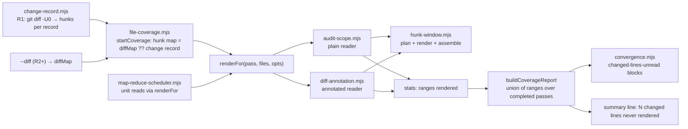

# Plan: Audit read windows that cover the change (upstream 58f4e3a5)
- **Date**: 2026-10-10
- **Status**: Complete
- **Author**: Claude + Louis
- **Scope**: backend — stack `js-ts` (universal engineering principles)
- **Target domain(s)**: `audit-orchestration`, `shared-lib`
- ⚠ **Cross-domain work** — touches >1 domain; the boundary crossings are the existing ones (audit-orchestration modules calling the shared readers in `scripts/lib/audit-scope.mjs` / `scripts/lib/diff-annotation.mjs`). No new edge.
- **Source**: upstream report `58f4e3a5-b5e1-44f0-afdf-5bf295dde3bc` (HIGH, Lbstrydom/wine-cellar-app, filed `path_recognised:false`).

---

## 1. Context Summary

### The defect

`/audit-code` returned `PASS H:0 M:0 L:0` and converged (wine PR #819, six-round `--scope diff`,
session `audit-code-1791624187`) while 844 changed lines across five files had never been put in
front of any pass. A manual re-audit of those lines, chunked so every line was rendered, found four
real defects. The tool measured part of this (`_coverage.status: partial`) and the round converged
anyway.

### Code Trace (pinned to `5884285b`)

Confirmed against current source — every claim in the report checked, line numbers re-derived here
because the reporter's were taken at bundle `07287f42` and drift by a few lines:

| Claim | Confirmed at | Note |
|---|---|---|
| Fixed per-pass head-cut windows | `scripts/lib/audit/legacy-production-audit.mjs:897` structure 2000 · `:930` wiring 8000 · `:1132` be-routes 8000 · `:1179` be-services 8000 · `:1226` backend 8000 · `:1282` frontend 10000 · `:1349` sustainability 4000 · `:1390` quickfix 4000 (`5884285b`) | Also `:880` shared-context 6000, not in the report. All go through `renderFor`. |
| The cut is a head cut, with no change focus | `scripts/lib/audit-scope.mjs:224-227` (`raw.slice(0, maxPerFile)`) and `scripts/lib/diff-annotation.mjs:313-316` (`_buildFileBlock`, cuts the ANNOTATED text) (`5884285b`) | Report cited `:330`; it is `:313` here. |
| Map-reduce reads are unmetered | `scripts/lib/audit/map-reduce-scheduler.mjs:196` (`readFilesAsContext(unit.files, {maxPerFile: 10000, maxTotal: 80000})`) (`5884285b`) | Report cited `:201`. The read never reaches `coverageRecorder`, so a map-reduce pass (be-routes/be-services/backend/frontend/sustainability) contributes nothing to `_coverage.files[].read.byPass`. Confirmed. |
| `measured` units fit "whole corpus" or "10 KB each" equally | `scripts/lib/code-analysis.mjs:224` `buildAuditUnits` bin-packs by FULL file size (30000 tok/unit) while the reader then cuts each file at 10000 chars (`5884285b`) | Confirmed, and worse than reported: the packer budgets for content the reader then drops. |

Found while tracing, not in the report:

- **R1 has no hunks at all.** `diffMap` is parsed only inside `if (isR2Plus)` from `--diff`
  (`legacy-production-audit.mjs:733-736`), and `makeCoverageInput` passes `hunks: diffMap ? … : null`
  (`scripts/lib/audit/file-coverage.mjs:215`). So in R1 `changedLinesUnread` is `null` for every
  head-cut file — the round cannot even count what it missed. The R1 change record
  (`scripts/lib/audit/change-record.mjs:29`, called from `scripts/openai-audit.mjs:870`) knows the
  base SHA and runs `git diff --name-status`, but never asks for hunks.
- **Unread lines are counted against the single best render, not the union.** `readEvidence` keeps
  `bestCharsRendered` (max prefix over completed passes) and `buildCoverageReport` counts hunk lines
  past that one prefix (`file-coverage.mjs:243-288`, `:351-366`). Two passes that each read a
  different part of a file cannot add up, and a non-prefix render is unrepresentable.
- **Convergence ignores coverage.** `evaluateConvergenceWithDetectors`
  (`scripts/lib/audit/convergence.mjs:55`) reads finding counts and the detector census only; its one
  call site (`scripts/lib/audit/finding-assembly.mjs:816`) is what licenses `AI-Gate: passed|converged`.
  The coverage `gate: 'fail'` path (nothing audited) makes the verdict INCOMPLETE
  (`finding-assembly.mjs:834`), but `partial` with changed lines unread converges clean.
- **The summary already names a file count** (`scripts/lib/coverage-format.mjs:81-82`:
  "N file(s) with changed lines past the read window"). The reporter saw it and the run converged:
  wording alone did not stop it.

### Why the report was filed `path_recognised: false` (already fixed in this branch)

`validateAffectedPath` (`scripts/lib/upstream/commands.mjs:121`, `5884285b`) tested the reported
path for exact membership in the consumer's `scripts/.sync-manifest.json` `files` map. Consumer
manifests key the file by its CONSUMER path (`scripts/.claude-skills/lib/audit/legacy-production-audit.mjs`,
checked against wine's live manifest); the reporter gave the UPSTREAM path
(`scripts/lib/audit/legacy-production-audit.mjs`). Both name the same synced file, so the recogniser
was wrong, not the reporter. Measured 2026-10-10 against the store: 3 of 40 `fixed` reports and both
`open` ones used the upstream spelling and were stamped `false`. Fix: also try
`sourceRelToDestRel` (`scripts/lib/sync-path-map.mjs`, the layout's single source of truth) and store
the manifest key on a hit, so prior-fix lookup (exact `affected_path` match,
`scripts/lib/store/upstream-issues.mjs:233`) sees one spelling. Test:
`tests/upstream-issue-triage.test.mjs` — red before, green after (§9).

### Patterns reused vs new

Reused: `parseDiffText` (`diff-annotation.mjs:84`) for hunk parsing; the `{context, stats}`
detailed-reader contract; `renderFor` as the one measured read seam; `sourceRelToDestRel`.
New: one pure module for planning/rendering hunk windows.

### Neighbourhood considered

`get-neighbourhood` returned `precedent` (`above-floor-cluster`) on `parseDiffText` and
`_annotateHeaderOnlyStyle` — both are reused, not duplicated. Also examined by hand:
`scripts/lib/campaign/cited-source.mjs:344` `planWindows` (campaign domain). It windows a file around
prose ANCHOR hits with a hard cap of 3 windows dividing a fixed budget — right for "show the region a
finding cites", wrong for a diff review, which must show EVERY hunk and must report which lines it
showed. Sibling written, not reused; no shared helper is warranted by two call shapes this different.

---

## 2. Proposed Architecture

### Decisions

**D1 — One windowing seam, two readers (#1 DRY, #5 SRP).** A new pure module
`scripts/lib/hunk-window.mjs` owns: turning hunks into clipped changed-line ranges, planning which
original lines a file renders, rendering kept ranges with gap markers, and the breadth-first block
assembly. Both readers call it; no pass call site changes its options. Fixing this per pass (eight
`maxPerFile` literals) would be eight band-aids on one cause.

**D2 — The window is centred on the change.** For a file over `maxPerFile` WITH known hunks:

1. Reserve a head (imports) of at most 15% of `maxPerFile`.
2. Add changed lines in file order, line by line, while the per-file budget lasts.
3. Spend what remains on context: ±3 lines around each kept changed range.

Elided spans render as one marker line in the file's own comment syntax naming the original line
numbers (`// … [lines 41–119 not shown] …`; plain text where the language has no line comment), so a
reviewer can still cite a real line number. A file with no hunks, or within `maxPerFile`, renders
exactly as today.

**D3 — Changed lines may grow past `maxPerFile`, never past `maxTotal`, and never at another file's
expense (#16 graceful degradation).** The reporter's files are the case a pure window cannot fix:
the CHANGED text in each exceeded the widest window any pass applied (quickfix's 4000), so the
report's own asked-for fix ("window around each hunk") alone would still have left most lines
unread. The per-file cap exists so one file cannot crowd others out of `maxTotal`; it is not a
reason to drop the change under review. So assembly is two-phase:

- Phase 1 places every file's BASE block (≤ `maxPerFile`, windowed where applicable) with today's
  exact omit rule (`total + block > maxTotal` → `budgetOmitted`).
- Phase 2 walks the windowed files in order and swaps each base block for its GROWN block (every
  changed line + head + context) when the delta fits the budget left after phase 1.

Breadth first, depth second: no file is worse off than in phase 1, and phase 1 is no worse than
today's head cut for any file (it shows the changed region instead of the top). Output is
byte-identical whenever no file is windowed.

**D4 — Stats carry the lines rendered, not just a character count (#19 observability).** A windowed
render cannot be described by a prefix length. Each `headTruncated` entry gains `ranges` (1-based,
inclusive, original line numbers) and `windowed: true`; a plain head-cut also carries its prefix
range. Existing fields keep their meaning (`charsRendered` = original characters shown), so
`final-review/code-coverage.mjs` and `envelope.mjs`, which read `headTruncated`, are unaffected.

**D5 — Coverage counts lines no completed pass rendered (#11, #19).** `readEvidence` unions the
ranges from every COMPLETED pass (a pass that failed vouches for nothing, as today) and
`changedLinesUnread` = changed lines outside that union. A stats record without `ranges` (older
producers, e.g. the tiered discovery path) keeps today's prefix semantics. File-level read state
gains `windowed` (a partial render centred on hunks) beside `full` / `head-cut`; `examined` treats
`windowed` exactly like `head-cut` — wholly examined only when `changedLinesUnread === 0`. An added
or untracked file with no hunk record counts as wholly changed (its every line is new).

**D6 — R1 gets hunks from the change record, without touching `openai-audit.mjs`.**
`buildChangeRecord` already runs git against the resolved base. It additionally runs
`git diff -U0 --no-color --no-ext-diff --src-prefix=a/ --dst-prefix=b/ <base>` (prefixes forced
because `diff.noprefix` user config would otherwise break the `+++ b/` parse; `maxBuffer` raised so
a large diff is not silently truncated) through `parseDiffText`, and attaches `hunks` to each record:
an array (possibly empty — a binary or mode-only change has no changed TEXT line, and that is a
measurement) when the diff was read, one whole-file hunk for an untracked file. `rec.changed` already
flows unchanged through `openai-audit.mjs:871` into the orchestrator as `coverageChanged`, so the
other session's file is not edited.

**D7 — One hunk map, two sources, and absent evidence is never a pass (#10 SSOT, #16).**
`file-coverage.mjs` builds the hunk map once and both `renderFor` (rendering) and `makeCoverageInput`
(measuring) read that one map, so the reader and the ledger cannot disagree about what "changed" means.

| Round | Source | Evidence state |
|---|---|---|
| R1 `--scope diff` | change record `hunks` | `expected` |
| R2+ with `--diff` (what the SKILL always passes) | `--diff` → `diffMap`, verified (below) | `expected` |
| R1 `--scope plan`/`full`; R2+ without `--diff` (e.g. a `--scope full` re-run); explicit `--files` without a diff | none | `not-applicable` |

Evidence is keyed on whether the round DECLARED a diff (a VCS record, or a supplied `--diff` — even
one that then parsed to nothing), never on the round number: an R2+ `--scope full` re-run declares
none and must not be blocked for lacking one (final gate G2).

When evidence is `expected` but a changed file has none — the `-U0` call failed, the supplied `--diff`
was unparseable or empty, the file is absent from it, or its verification failed — the file is
treated as **wholly changed**: with no evidence of where the change is, the whole file is the change.
Its unread lines are then measured (and grow into budget like any change), so a lost diff blocks
convergence instead of reverting to an unmeasured head cut. Every such fallback writes one stderr
line naming the file and the cause. Only `not-applicable` leaves `changedLinesUnread: null`.

**Stale-diff verification (R2+).** One shared map does not make a stale diff fail visibly — the
renderer and the ledger would agree on the same wrong lines and report `0` unread. A weaker check
("do its added lines still exist?") is not enough either: an old patch's additions can all survive
while another region of the file was edited afterwards, and a deletion-only hunk has no added text
at all (audit-plan R2). So `parseDiffText` keeps each file's POST-IMAGE blob id from the patch's own
`index <pre>..<post>` line, and `buildHunkMap` accepts the file's hunks only when
`git hash-object -- <file>` (git's clean filters applied, so a CRLF checkout hashes as the patch did;
injectable for tests) starts with that id — i.e. the patch describes exactly the current content.
A mismatch, a missing `index` line, or a hashing failure demotes the file to wholly changed, with a
stderr line naming which. Verified 2026-10-10 that `git diff <base>` and `git diff --no-index
/dev/null <untracked>` both print the working-tree blob id `git hash-object` returns. The R1 hunks
are taken from git against the working tree at round start, so they need no such check.

**In-round stability (pre-existing, documented).** Every pass reads the working tree during one
process run; the ledger has always assumed the tree does not change under it (the best-prefix rule
had the same exposure). Unioning ranges across passes does not add a new hazard — passes read in
the same seconds as before. Detecting a concurrent edit mid-round is out of scope here.

**D8 — Map-reduce reads go through the measured seam (#10).** `runMapReducePass` takes
`{renderFor, coverageRecorder}` in its existing options bag; a file unit reads via
`renderFor(passName, unit.files, {maxPerFile: 10000, maxTotal: 80000})` — metered, windowed, its own
10000 cut now visible in `_coverage`. A chunked unit (a file over ~120 KB, split by function) records
its items' line ranges directly. Absent injection (tests, library callers) keeps today's unmetered
read.

**D9 — Measured unread changed lines block convergence (#11).** `evaluateConvergenceWithDetectors`
gains the round's coverage ledger as a third input; after the finding thresholds and the detector
census, a ledger reporting `changedLinesUnread > 0` on any AUDITED file blocks.
`changedLinesUnread` is measured for two outcomes only: `audited` (lines no completed pass rendered)
and `budget-omitted` (a pass asked for the file and the budget ran out first — every changed line is
unread, at least as bad as a partial read; final gate round 2). Every other outcome —
`excluded-infra`, `excluded-user`, `sensitive`, `not-admitted` (non-code/uncovered), `deleted`,
`unreadable` — carries `null`, and `changedLinesUnreadTotal` sums the two measured outcomes only. So
a lockfile, a workflow file or a user-excluded path can never block convergence by being unread on
purpose (final gate G1); a policy exclusion stays the existing `excludedRequired` warning, and
`unreadable` (missing, refused, never requested) stays its own short outcome.
The block then returns
`{converged: false, reason: 'changed-lines-unread'}`. This is what stops `AI-Gate: passed|converged`
on a round that did not read the change: `assembled.convergence` is the one value
`run-persistence.mjs:308-331` (`5884285b`) reads, and a non-converged round writes no
`round_converged_after`, which refuses BOTH verified gate values (they clear the same store bar,
AGENTS.md §Commit provenance); it also logs `[gate-evidence] not converged: changed-lines-unread`.
The verdict word (`PASS`) stays the FINDINGS verdict and is not release eligibility; the summary line
says so beside it (D10).

- `null` occurs only when hunk evidence is `not-applicable` (D7 — e.g. `--scope full`, which has no
  diff). It does NOT block: unknown is reported (the file is `short`, the suffix says so), never
  manufactured into a failure. Evidence that was expected and is missing never yields `null` (D7).
- No ledger at all (library callers that build none) does not block either; the convergence banner
  already prints `coverageMissingNote` for that case.
- Does this contradict the deliberate rule at `file-coverage.mjs:436-438` ("failing a round because a
  large file exceeds the per-file read window would make every repo with a big file unable to
  converge")? No, and the distinction is the point of D3: that rule was right while a file's window
  was fixed — re-running could not help, so blocking would have been a dead end. With D3 a re-run on
  the short files (`--files <them>`) gets the whole pass budget, so for every file whose changed
  text fits a pass's `maxTotal` (30000–80000 chars) the remedy exists. For a file whose changed text
  exceeds that budget even alone, `--files` does NOT help (phase 1 picks the same lines every time);
  that round is an explicit, named non-convergence — the honest outcome, not a dead end dressed as a
  pass — and the operator's choices are the existing ones (split the change, review it by hand,
  ship `AI-Gate: waived`). In-file continuation is deferred (§8). The `partial` STATUS stays a warn,
  not a fail; only convergence is withheld.

**D11 — Size each pass by what it actually sends (#17).** Each single-shot pass call site renders
first and feeds `computePassLimits` the rendered context's real length, instead of
`measureContextChars(files, maxPerFile)` computed before the render (which a grown window, the head
reserve and gap markers all make wrong). Map-reduce units already size from `context.length`
(`map-reduce-scheduler.mjs:198`). Line-neutral: each site's estimate line becomes the render line and
vice versa.

**D10 — Say the number where the verdict is (#19).** The coverage suffix states lines, not just
files: `N changed line(s) in M file(s) never rendered`; `formatAuditSummaryLine` appends
`— not convergence evidence` when that count is above zero. SKILL.md's convergence table gains the
row and the remedy.

---

## 5. Execution model

Single-process, synchronous reads; no new concurrency. Map-reduce units read concurrently (existing
slot limiter) and each `renderFor` call appends one stats record to the recorder — append-only, no
shared mutable state beyond the existing array. Ordering dependency: the hunk map must exist before
the first `renderFor` call; it is computed lazily from `getDiffMap()` (already lazy because `diffMap`
is parsed after `startCoverage` runs) and the change record (available at function entry).

---

## 6. Sustainability Notes

- **Assumption**: hunk line numbers are new-side numbers of the WORKING TREE file the readers open.
  True for R1 by construction (git, base vs working tree, at round start). For R2+ it is CHECKED, not
  assumed: added-line verification (D7) demotes a stale file to wholly-changed.
- **Budget semantics**: `maxPerFile` becomes the per-file window TARGET for unchanged context;
  `maxTotal` stays the hard prompt bound. Annotation marker lines in the R2+ windowed render add a
  small overshoot over `maxPerFile` (bounded by marker count); `maxTotal` is checked on actual block
  length.
- **Extension point**: the windowing planner takes `contextLines` and `headShare`; a per-pass tuning
  later is a call-site option, not a rewrite. Not exposed now (no requirement).

### Right-sizing gate

- **Band-aid extreme** — print the unread line count next to `PASS` (the report's "at least"). The
  count was already printed as a file count and the run converged anyway; the reads stay head cuts.
- **Over-engineered extreme** — automatic chunking: split every oversized changed file into extra LLM
  calls per pass, with a new unit scheduler, per-chunk findings merge and cost accounting.
- **Chosen** — hunk-centred windows + breadth-first growth into the budget the pass already has +
  metered map-reduce + a convergence block on a measured shortfall. For the reporter's five files
  (62,540 chars on disk together, 844 changed lines unread) quickfix's 60000 budget can now hold their
  changed regions rather than their first 4000 chars each — whether ALL of it fits in one run depends
  on the changed text's size, which the report does not give, and the ledger will say. It adds no LLM
  call, and leaves a residual (changed text > a pass's whole budget) that is now both measured and
  remediable by `--files`.

**Manual vs scripted**: the eight pass call sites are NOT edited (the seam is below them). The five
`runMapReducePass` call sites get one appended argument each — by hand, line-neutral.

---

## 7. File-Level Plan

| File | Change | Why |
|---|---|---|
| `scripts/lib/hunk-window.mjs` (create) | `changedLineRanges(hunks, lineCount)`, `planHunkWindow(lines, ranges, {maxPerFile, contextLines, headShare})` → `{base, grown}`, `renderRanges(lines, ranges, gapMarker)`, `unionRanges`, `countUncovered`, `assembleBlocks(entries, maxTotal)` | D1–D3. Pure, no I/O, Tier-1 testable. |
| `scripts/lib/audit-scope.mjs` (modify) | `readFilesAsContextDetailed` accepts `hunks` (Map); windowed base/grown blocks; two-phase assembly; `ranges` in stats | D2–D4 |
| `scripts/lib/diff-annotation.mjs` (modify) | `_buildFileBlock` windowed path: kept ranges annotated per segment (block style via `_annotateBlockStyle` on shifted sub-hunks; header-only numbered from the real line); `readFilesAsAnnotatedContextDetailed` two-phase assembly; `ranges` in stats; `parseDiffText` keeps each file's post-image blob id for verification | D2–D4, D7 |
| `scripts/lib/audit/file-coverage.mjs` (modify) | `buildHunkMap({diffMap, changed, isR2Plus, readText})` → `{map, evidence}` with the D7 expected/not-applicable rule and stale-diff verification; `startCoverage({…, changed, isR2Plus})`; `makeRenderFor` passes `hunksFor` to the plain reader; `makeCoverageInput` uses the same map; `readEvidence` unions ranges; `READ_STATES` += `windowed` | D5, D7 |
| `scripts/lib/audit/change-record.mjs` (modify) | per-record `hunks` from `git diff -U0` (+ untracked whole-file); failure leaves `hunks` absent and is reported (the map then treats the file as wholly changed, D7) | D6 |
| `scripts/lib/audit/map-reduce-scheduler.mjs` (modify) | `runMapReducePass(…, {changedFileSet, renderFor, coverageRecorder})`; `runOneMapUnit` reads via `renderFor`, records chunk ranges | D8 |
| `scripts/lib/audit/legacy-production-audit.mjs` (modify, line-neutral) | `startCoverage({…, changed: coverageChanged, isR2Plus})` at `:677`; `isR2Plus` into `makeCoverageInput` at `:1491`; `{renderFor, coverageRecorder}` appended to the five `runMapReducePass` calls; the eight single-shot pass sites render before `computePassLimits` and size from the rendered length | D7, D8, D11. Size-ratcheted: same line count. |
| `scripts/lib/audit/convergence.mjs` (modify) | `evaluateConvergenceWithDetectors(counts, detectorResult, coverage)` → `changed-lines-unread` | D9 |
| `scripts/lib/audit/finding-assembly.mjs` (modify) | pass `coverage` at `:816` | D9 |
| `scripts/lib/audit/run-finalization.mjs` (modify) | `_convergence` (the AI-Gate value) on the round JSON, beside `_coverage` | D9 — the skill reads it instead of re-deriving convergence from H/M/L |
| `tests/fixtures/hunk-window/big-module.js`, `tests/fixtures/hunk-window/big-module-b.js` (create) | ~21 KB generated fixtures for the orchestrator-level tests | §9 |
| `scripts/lib/coverage-format.mjs` (modify) | `changedLinesUnreadTotal(cov)`; suffix states line count; `isShort` treats `windowed` like `head-cut` | D10 |
| `scripts/lib/audit/findings-pipeline.mjs` (modify) | `formatAuditSummaryLine` appends "not convergence evidence" when unread > 0 | D10 |
| `scripts/lib/upstream/commands.mjs` (modify — DONE) | `validateAffectedPath` accepts the upstream spelling | §1 |
| `skills/audit-code/SKILL.md` (modify) | convergence table row + remedy; Step 6 coverage row wording | D10 |
| `.claude/skills/audit-code/SKILL.md` (regenerate) | `npm run skills:regenerate` | generated copy |
| tests (create/modify) | `tests/hunk-window.test.mjs` (create); `tests/file-coverage.test.mjs`, `tests/coverage-orchestrator.test.mjs`, `tests/upstream-issue-triage.test.mjs`, and the existing reader / change-record / map-reduce / convergence / summary-line suites (modify, located at implementation) | §9 |

---

## 8. Risk & Trade-off Register

- **Prompt size grows** in rounds with large changed files (D3), bounded by each pass's existing
  `maxTotal` (30000–80000 chars), and sized by the real context (D11). Cost rises with the changed
  text a round actually reads — that is the point.
- **Structure pass** (2000 "File Signatures") now sees changed regions of big files instead of their
  top. Intended — the head reserve keeps the imports/signature region; bounded by its 30000 total.
- **Schema compatibility** (`READ_STATES` += `windowed`, `headTruncated[].ranges/windowed`). Census
  at `5884285b`: `_coverage` is never written to the store (`run-finalization.mjs:131` puts it on the
  round JSON only); its readers are `coverage-format.mjs`, `transcript.mjs` (projection),
  `final-review/envelope.mjs` and `audit-loop.mjs` — all string comparisons, none validate with
  `CoverageSchema` (`validateCoverage` has no production caller). An older reader meeting `windowed`
  takes `isShort`'s not-`full` branch → the file reads SHORT, the conservative direction, never
  examined. `headTruncated` readers (`final-review/code-coverage.mjs`, `envelope.mjs`) spread or count
  entries, so extra fields are inert. `schemaVersion` stays 1 (additive); a test pins the
  conservative degradation.
- **Deferred — final-review envelope's own head-cut render** (`final-review/envelope.mjs`, 8000).
  Independent of this change: it is a separate render the convergence decision does not read
  (convergence reads the round's `_coverage`, D9); the envelope already measures and states its own
  coverage (`final-review/code-coverage.mjs`). It could adopt the same seam by passing `hunks`;
  that is its own small follow-up, flagged, not silently dropped.
- **Deferred — prior-fix lookup across the two path spellings for EXISTING rows.** New reports are
  stored under the manifest key; the 5 historical rows keep their upstream spelling. A backfill is a
  data change in the shared store and is the coordinator's call.
- **Residual / deferred — in-file continuation.** Changed text larger than a pass's entire `maxTotal`
  in ONE file remains partly unread, and re-running does not advance (phase 1 is deterministic). It is
  measured and blocks convergence by name, so it can never read as a pass. Continuation windows
  (advance through uncovered ranges across calls, union the evidence for one snapshot) are the
  automatic-chunking extreme from §6: new per-file call scheduling, cost and termination policy. Not
  independent of the residual — it IS the residual's fix — but the residual's outcome is already
  honest and its population is narrow (one file with >30–80 KB of changed text in one round).
  Revisit trigger: a real round blocked on `changed-lines-unread` for a file `--files` could not fix.

---

## 9. Testing Strategy

Tier 1 (test-first, deterministic):

- `tests/hunk-window.test.mjs`: ranges clipped to the file and merged; a `+X,0` deletion hunk keeps
  its deletion site; the planner keeps the head, then every changed line that fits, then context;
  grown holds every changed line; gap markers name the elided line numbers and never contain `*/`;
  `assembleBlocks` is breadth-first (a later small file is never omitted to grow an earlier big one)
  and byte-identical to a plain concatenation when nothing is windowed.
- Reader tests: the reporter's shape — a ~17 KB file with hunks past char 4000 read at
  `{maxPerFile: 4000, maxTotal: 60000}` with hunks — renders every changed line; without hunks it
  renders exactly today's bytes. RED before (head cut), GREEN after.
- `file-coverage` tests: two completed passes each rendering a different half of the changed lines →
  `changedLinesUnread: 0`; a failed pass's ranges do not count; `windowed` state; the hunk map prefers
  `diffMap` over the change record; evidence `expected` + a file with no hunks (failed `-U0`, empty
  `--diff`, file absent from the patch) → wholly changed and its unread lines measured; a `--diff`
  whose post-image id differs from the working-tree file's hash — including an old patch whose
  additions all still match while another region changed, and a deletion-only patch — → wholly
  changed (without verification the same test reads `0` unread); `not-applicable` → `null`.
- `change-record` test with an injected `run` returning a `-U0` diff: hunks attached per path,
  untracked file gets a whole-file hunk, a binary/mode-only change gets `[]`, git failure → no
  `hunks` + reported.
- `assembleFindings`-level: a clean-count round whose coverage has unread > 0 yields
  `convergence: {converged: false, reason: 'changed-lines-unread'}` — the value run-persistence reads.
- `coverage-format`: an unrecognised read state (an older reader meeting `windowed`) counts as short.
- D11: a pass's limits are computed from the rendered context's length (a grown context gets larger
  limits than its pre-render estimate).
- map-reduce: `runOneMapUnit` with an injected `renderFor` reads through it and the recorder holds the
  pass's stats (the 10000 cut visible); without injection the old reader runs.
- convergence: thresholds met + detectors clean + ledger with unread > 0 → `changed-lines-unread`;
  `null` unread → converged; no ledger → converged.
- summary line / suffix: states the line count and "not convergence evidence".
- recogniser: `tests/upstream-issue-triage.test.mjs` (done; red→green recorded in the PR).

Every new test is run once before its fix to show it fails (verification discipline §3).

---

## 7b. Implementation Phases

**Phase 1 — Windowing seam**: pure planner/renderer/assembler. Files: `scripts/lib/hunk-window.mjs` (create), `tests/hunk-window.test.mjs` (create).
**Phase 2 — Readers**: both readers window + two-phase assembly + ranges. Files: `scripts/lib/audit-scope.mjs` (modify), `scripts/lib/diff-annotation.mjs` (modify).
**Phase 3 — Measurement**: hunk map, union, R1 hunks, metered map-reduce. Files: `scripts/lib/audit/file-coverage.mjs` (modify), `scripts/lib/audit/change-record.mjs` (modify), `scripts/lib/audit/map-reduce-scheduler.mjs` (modify), `scripts/lib/audit/legacy-production-audit.mjs` (modify), `tests/file-coverage.test.mjs` (modify).
**Phase 4 — Verdict**: convergence block, suffix wording, SKILL prose. Files: `scripts/lib/audit/convergence.mjs` (modify), `scripts/lib/audit/finding-assembly.mjs` (modify), `scripts/lib/coverage-format.mjs` (modify), `scripts/lib/audit/findings-pipeline.mjs` (modify), `skills/audit-code/SKILL.md` (modify).

## Audit trail

- **R1 (GPT, plan mode)**: NEEDS_REVISION H:4 M:2 — all 6 accepted (100%): H1 AI-Gate path made
  explicit + assembly test; H2 expected-but-absent hunk evidence → wholly changed; H3 false `--files`
  remedy corrected, continuation deferred; H4 stale-diff verification; M1 limits from rendered size
  (D11); M2 compatibility census.
- **R2 (GPT)**: NEEDS_REVISION H:1 — accepted (100%): added-line matching replaced by post-image
  blob-id verification. Stopped GPT rounds here (H 4 → 1, every finding a concrete design defect,
  none rigor pressure) and moved to the mandatory final gate.
- **Final gate R1 (Gemini)**: CONCERNS, blocked on G1 (HIGH) + G2 (MEDIUM), both accepted. G1: the
  convergence block's population made explicit — audited files only, which is what the ledger already
  measures (unread is computed only for `audited`). G2: evidence keyed on a DECLARED diff, not on the
  round number, so an R2+ `--scope full` re-run is not-applicable.
- **Final gate R2 (Gemini, cap reached)**: CONCERNS, blocked on G1 (HIGH, a concrete design defect —
  a budget-omitted changed file escaped the convergence block) — fixed: `budget-omitted` now measures
  every changed line unread and blocks, with a test. G2 (MEDIUM, non-blocking) recorded as debt below.
  No third Gemini round exists; the round-2 design fix is reported to the user with this result.

- **Code audit (`/audit-code`, SID `audit-code-1791638582`)** — R1 (`--scope diff --base origin/main`): H:4 M:7
  (10 accepted, 1 dismissed: an adjacency-wave enumeration bound). R2 (R2+ mode, `--allow-infra-scope` so the
  two infra-listed readers `audit-scope.mjs` / `diff-annotation.mjs` were read — R1 had policy-excluded them):
  H:5 M:1 (4 accepted; H1/H4 "redaction shifts hunk coordinates" overruled in GPT deliberation — redaction
  re-appends each match's newlines). R3: H:1 M:1, both accepted (per-range overhead charged up front could zero
  the budget). Stopped at 3 GPT rounds per repo norm. The live runs exercised this change: every audited file
  read `windowed` with `changedLinesUnread: 0`, and `_convergence` appeared on each round JSON.
- **Code final gate (Gemini, round 1)**: APPROVE, gate `approve`, 0 blocking, 0 debt. Note: the final-review
  envelope's OWN render was partial (1 file head-cut, 27 budget-omitted) — the deferred item below, observed
  live; that APPROVE is over the transcript plus the files it was shown.

## Remaining / debt

- **G2 (final gate R2, MEDIUM, non-blocking) — an R2+ round run in diff mode WITHOUT `--diff` is
  `not-applicable`.** Gemini suggests keying evidence on the scope mode instead. Not done: an R2+ round
  passes `--files`, and `openai-audit.mjs` ignores `--scope` whenever `--files` is given (SKILL.md
  §Round 2+), so the scope mode is not a reliable signal there, and the file is held by another session.
  The SKILL's R2+ invocation always passes `--diff`; a round without one keeps `changedLinesUnread: null`
  (unknown, shown as short, never as examined). Revisit if R2+ gains a real scope signal.
- **Code audit R1 M2 — per-pass render + limits duplication in `legacy-production-audit.mjs`.** Valid design
  debt, deferred: it is the legacy orchestrator's pre-existing shape; this change reordered those lines
  line-neutrally under the size ratchet (D11), and a pass-preparation helper belongs to
  `docs/plans/legacy-production-audit-decomposition.md`. Residual risk: a future pass added by copy can
  regress to estimate-based sizing; the behavioural D11 test covers quickfix only.
- **`--changed` does not bound what is rendered (field evidence, `claude/fleet-followups` R2/R3 runs,
  2026-10-10).** By design, not changed here: `--files` bounds the rendered set; `--changed` feeds R2+
  impact scoping, reopen detection and — when no VCS record exists — the ledger's changed list. A run
  given `--changed` WITHOUT `--files` re-derives the scope from git (`scripts/openai-audit.mjs:813`),
  so every working-tree change is both rendered and ledgered. What this change does alter for those
  runs: their nine `budget-omitted` changed files now carry every changed line as unread, so the round
  cannot converge (D9), and the remedy (`--files` on the short files) now reads them in full.
- **Final-review envelope's own head-cut render**, and the **tiered pipeline's discovery read**
  (`scripts/lib/audit/tiered-pipeline.mjs:170`, default-off) still render head cuts: neither passes
  hunks, and neither feeds the legacy round's convergence. Adopting the seam is a one-option change each.

**Close-out (not a phase)**: `npm run skills:regenerate`, `npm test`, `npm run check` via the pre-push hook.

## 11. Execution Clustering

- **Cluster A** — Phases 1–3 — fix-gate: yes
  - Coupling: the readers' `ranges` stats are the ledger's input; the hunk map feeds both. One seam.
- **Cluster B** — Phase 4 — fix-gate: final
  - Coupling: consumes the measured `changedLinesUnread` that Cluster A makes trustworthy.
- **Final gate**: consolidated Gemini review over the union diff.
