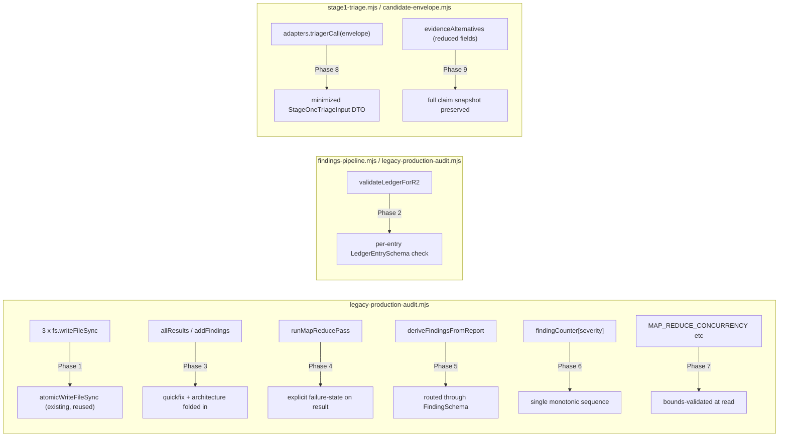

# Plan: Audit Orchestrator Hardening

- **Date**: 2026-07-10
- **Status**: Complete — implemented (9 phases, 5 clusters), audit-code
  gate-clear (2 rounds, 6 genuine bugs fixed), covered by the consolidated
  Gemini gate over the union diff with
  `docs/plans/tiered-recall-audit-pipeline.md`'s Cluster E+F. Shipped
  2026-07-10.
  **Round 2**: a later audit round (2026-07-17, after this plan shipped)
  found 5 more genuine issues in this same file — see
  [`docs/plans/audit-backlog-triage-hardening.md`](audit-backlog-triage-hardening.md).
- **Author**: Claude + Louis Strydom
- **Scope**: backend

## Context Summary

`scripts/lib/audit/legacy-production-audit.mjs` is the ~1650-line code-audit
pass-orchestration engine, extracted this session (via
`docs/plans/tiered-recall-audit-pipeline.md` Phase 11, Cluster E) from
`openai-audit.mjs`'s former `runMultiPassCodeAudit`. The extraction was
verified byte-faithful to the last-committed source (93 of ~1650 lines
differ, all accounted for by the extraction's own stated changes — a
`ctx`-param reshape, a shared verdict-computation call, relative-import
fixes, and the CLI-output relocation). Because this function had **never
been the SUBJECT of a real `/audit-code` pass before** (only reviewed via
plan-prose audits of code that didn't exist yet), Cluster E's fix-gate
audit was the first code-audit ever run against its actual body — and it
surfaced real, pre-existing technical debt that a "pure relocation" pass
correctly preserved rather than introduced.

Cluster E's fix-gate could not mechanically converge on this debt:
`/audit-code`'s R2+ suppression (`suppressReRaises`, `scripts/lib/ledger.mjs:294`)
reopens any ledger-deferred finding whose file is in the round's diff
(`scopeDirectlyChanged`) — and this file is permanently "in the diff" for
any cluster whose deliverable touches it. The debt was therefore verified
by hand (byte-diff against the last commit, direct code reads) and
deliberately deferred to this dedicated hardening plan rather than chased
through further audit rounds. See
`docs/plans/tiered-recall-audit-pipeline.md`'s "Second Audit Pass —
Phases 10-12" → Cluster E section for the full genesis.

**Code Trace** (Phase 1 — every line below read directly, not taken from
audit-finding prose):

- Non-atomic writes: `scripts/lib/audit/legacy-production-audit.mjs:239`
  (pass-result cache), `:1011` (prior-round outcome stamp), `:2635`
  (session manifest) — all plain `fs.writeFileSync(path, JSON.stringify(...))`.
  `scripts/lib/file-io.mjs:16-46` already exports `atomicWriteFileSync`
  (temp-file + rename), used elsewhere in this codebase (e.g.
  `scripts/lib/requirements/ledger.mjs:40-51`, `scripts/lib/nav/verify-store.mjs:23-31`)
  — confirmed via the architectural-memory neighbourhood query.
- Ledger validation: `validateLedgerForR2` (`legacy-production-audit.mjs:271-290`)
  checks only `raw.entries` is a present array — no per-entry schema check
  against `LedgerEntrySchema` (`scripts/lib/schemas.mjs:353`). Read
  `applyLedgerSuppression` (`scripts/lib/audit/findings-pipeline.mjs:74-103`)
  and `applyStage1MechanicalEarlyFilter` (`findings-pipeline.mjs:128-`) in
  full — their divergence is **documented and intentional** (a doc comment
  at `findings-pipeline.mjs:105-121` explains `applyStage1MechanicalEarlyFilter`
  is a cost-saving fast path, never authoritative; `suppressReRaises` is the
  sole authoritative reopen mechanism). The real, fixable gap is narrower
  than the audit findings framed it: `validateLedgerForR2` accepting a
  structurally-present-but-semantically-malformed `entries` array as
  "valid," not a suppression-logic merge.
- Dropped pass results: `allResults` (`legacy-production-audit.mjs:1888`,
  current line may have shifted slightly after this plan's own fixes)
  omits `archResult` (computed + cached at `:1477-1497`); the `addFindings`
  call sequence (`:1946-1955`) never calls `addFindings(quickfixResult...)`
  despite `quickfixResult.result.findings` being explicitly tagged
  `is_quick_fix: true` at `:1878` for exactly this purpose.
- False-clean map-reduce: `runMapReducePass` (`legacy-production-audit.mjs:414-`,
  byte-identical to the pre-extraction `openai-audit.mjs:952-1110`) has no
  state distinguishing "0 MAP units produced findings" from "all MAP units
  failed."
- Schema bypass: `deriveFindingsFromReport` (`legacy-production-audit.mjs:908-`)
  hand-constructs finding objects for the architecture pass's deterministic
  (non-LLM) findings, bypassing `FindingSchema` (`schemas.mjs`) the LLM-pass
  findings are validated against.
- Duplicate tool-finding IDs: `findingCounter[tf.severity]++` /
  `id: \`T${findingCounter[tf.severity]}\`` (`legacy-production-audit.mjs:1970,1976`)
  — the counter is keyed per-severity, so a HIGH and a MEDIUM tool finding
  in the same run can both be `T1`.
- Unvalidated config: `MAP_REDUCE_CONCURRENCY` read via `safeInt` with no
  positivity check; `tieredAuditConfig`'s `cleanRegionRate`/`gptSentinelRate`/
  `gptExplorationRate` (`scripts/lib/config.mjs`) are `parseFloat`'d with no
  range clamp.
- Sensitive-data egress boundary: `adapters.triagerCall(envelope)`
  (`scripts/lib/audit/stage1-triage.mjs:150`) passes the entire mutable
  envelope (which nests `canonicalFinding`, full `evidenceAlternatives`,
  `stageDecisions`) to whatever adapter is injected — the production
  default (`defaultTriagerCall`, `scripts/lib/audit/tiered-pipeline.mjs:79-104`,
  already hardened this session per Cluster E's own round-3 audit fix)
  only reads a few fields, but the CONTRACT doesn't say so — a future
  adapter author has no signal about what's safe to forward externally.
  Relevant precedent: `INC-001` (symlink-bypass class, security-incident
  neighbourhood query) — any file path this DTO carries must go through
  `scripts/lib/sensitive-paths.mjs::resolveAndClassify`, the established
  canonical-path gate, not a naive string check.
- Provenance loss: `createEnvelope`'s `evidenceEntry`
  (`scripts/lib/audit/candidate-envelope.mjs:53-60`) stores
  `{sourceModel, evidenceType, anchor, triggerAnchor, causalChain, rawDetail}`
  — a reduced projection of the full finding, while `canonicalFinding`
  (the winning claim) retains everything. A losing `evidenceAlternatives`
  entry's full original claim (e.g. `_hash`, `principle`, `classification`)
  is not recoverable after merge.
- **Module-global mutable state** (`_cacheDir` at `:223`, `_runSeedUsed` at
  `:330`) is **explicitly out of scope** — it's the same pattern AGENTS.md's
  Accepted Technical Debt table already covers ("Module-global caches...
  Safe in CLI-per-invocation model... Revisit trigger: If extracting as a
  library or running as a long-lived server"). This audit orchestrator is
  CLI-per-invocation exactly like the covered examples; no new decision
  needed here.

**Patterns reused**: `atomicWriteFileSync` (existing), `FindingSchema`/
`LedgerEntrySchema` (existing, Zod), `resolveAndClassify`/`classifyPath`
(existing sensitive-path gate), this repo's own "typed outcome, never a
silently-absent field" convention (used repeatedly in
`docs/plans/tiered-recall-audit-pipeline.md`'s own Phase 9/12 fixes this
session — `pending_adjudication`/`pending_security_review`).

**Neighbourhood considered**: architectural-memory index is stale for this
specific extraction (`get-neighbourhood` still resolves `runMultiPassCodeAudit`
to the pre-extraction `openai-audit.mjs:1556-3182` — `npm run arch:refresh`
hasn't run since Cluster E landed). Confirmed via direct read that the
real current location is `scripts/lib/audit/legacy-production-audit.mjs`;
proceeding on direct-code-verified paths, not the stale index. `atomicWriteFileSync`
and the ledger/schema modules ARE correctly indexed and confirm reuse
candidates exist — no near-duplicate risk for the NEW code this plan adds
(each fix wires existing primitives into existing call sites).

- **Target domain(s)**: `audit-orchestration`
- No cross-domain or untagged-path warnings.

## Proposed Architecture

**Key design decisions**:

- **Reuse, never reinvent, the atomic-write primitive** (#1 DRY, #5 Single
  Source of Truth) — `atomicWriteFileSync` already exists and is used
  elsewhere; the fix is wiring 3 call sites to it, not designing a new
  mechanism.
- **Strengthen `validateLedgerForR2`, don't merge the two suppression
  functions** (#1 DRY vs premature abstraction) — `applyLedgerSuppression`
  and `applyStage1MechanicalEarlyFilter`'s divergence is intentional
  (different authority levels, documented in place); collapsing them would
  destroy that distinction. The real, narrow gap is upstream: entries a
  malformed ledger file could carry are never schema-checked before use.
- **A single pass-result registry entry per executed pass** (#3 Modularity,
  #10 Single Source of Truth) for Phase 3 — right-sized: not a generic
  plugin system (over-engineering — no second orchestrator needs this),
  just a small `{name, result, contributesFindingsTo: 'allFindings'|'summaryOnly'}`
  array the existing `allResults`/`addFindings`/summary loops iterate,
  replacing 3 independently-hand-maintained lists that already drifted once.
- **Explicit failure state, not summary-string-only** (#15 Error Handling,
  #16 Graceful Degradation) for Phase 4 — mirrors this session's own
  `pending_adjudication`/`pending_security_review` pattern
  (`tiered-recall-audit-pipeline.md` Phase 9/12): a degraded-but-successful-
  looking result must carry a typed field a caller can branch on, not just
  human-readable prose.
- **Minimized DTO for Stage 1's triager boundary** (#11 Testability, #14
  Backward Compat via an explicit contract) for Phase 8 — right-sized: a
  named, small, immutable shape (`{category, detail, section, severity,
  evidenceStatus, anchorQuote?, causalChain?}`) callable adapters receive,
  not a generic redaction framework.

## Sustainability Notes

- **Assumption this design encodes**: `legacy-production-audit.mjs` remains
  the production code-audit path (`tieredAuditConfig.pipelineEnabled`
  defaults `false`) for the foreseeable future — these fixes harden the
  path that's actually running today, not a soon-to-be-retired one.
- **If requirements change**: if the tiered pipeline (`tiered-pipeline.mjs`)
  becomes the default, Phases 1/2/3/4/5/6/7 (all `legacy-production-audit.mjs`-
  scoped) stop mattering for new runs but remain correct for the fallback
  path (`runStatus: 'fallback_legacy'`) — no migration needed, this isn't
  throwaway work.
- **Extension point**: Phase 3's pass-result registry is intentionally
  small (an array + 2 helper functions) so a future NEW pass (if this
  orchestrator ever grows one) registers once instead of touching 4
  separate lists — but it is not built as a generic plugin system; that
  would be solving a problem this plan doesn't have.

## File-Level Plan

- **`scripts/lib/audit/legacy-production-audit.mjs`** (modify): Phases 1, 2,
  3, 4, 5, 6, 7 — atomic writes, ledger structural validation, pass-result
  registry, map-reduce failure state, schema-routed architecture findings,
  monotonic tool-finding IDs, bounds-validated config reads (audit-plan fix
  H5, round 1: an earlier draft's File-Level Plan wrongly listed Phase 2
  under `findings-pipeline.mjs` while the Implementation Phases section
  correctly named `legacy-production-audit.mjs` — `validateLedgerForR2` is
  defined at `legacy-production-audit.mjs:271`, confirmed by direct read;
  `findings-pipeline.mjs` is not touched by this plan at all, corrected here).
- **`scripts/lib/config.mjs`** (modify): Phase 7 — `auditRuntimeConfig.mapReduceConcurrency`
  (moved from a bare inline `safeInt` read) plus bounds-clamping for
  `tieredAuditConfig`'s existing rate/cap fields.
- **`scripts/lib/schemas.mjs`** (modify, small): Phase 8 — add
  `StageOneTriageInputSchema` (the minimized DTO contract).
- **`scripts/lib/audit/stage1-triage.mjs`** (modify): Phase 8 — build and
  pass the DTO instead of the raw envelope.
- **`scripts/lib/audit/candidate-envelope.mjs`** (modify): Phase 9 —
  `evidenceEntry` construction preserves the full contributing claim.
- **`tests/legacy-production-audit-hardening.test.mjs`** (new): Tier 1/2
  regression tests for Phases 1, 3, 4, 5, 6, 7 (deterministic seams —
  atomic-write-on-crash simulation, pass-registry completeness, map-reduce
  total-failure state, schema conformance, ID uniqueness, config clamping).
- **`tests/stage1-triage-dto.test.mjs`** (new): Tier 3 test-first (this
  repo's non-negotiable sensitive-egress doctrine) — asserts the DTO never
  carries a field outside its schema, and any file path within it is
  gated through `resolveAndClassify` before ever reaching an adapter.
- **`tests/candidate-envelope-provenance.test.mjs`** (new): Tier 1 — asserts
  no field present on a contributing finding is lost after `mergeIntoEnvelopes`.

### Implementation Phases

**Phase 1 — Atomic artifact writes**: replace the 3 `fs.writeFileSync`
call sites (`:239` cache write, `:1011` prior-round stamp, `:2635` session
manifest) with `atomicWriteFileSync` (existing, `file-io.mjs`). Files:
`scripts/lib/audit/legacy-production-audit.mjs` (modify).

**Phase 2 — Ledger structural validation** (audit-plan fix H5, round 1 —
the return contract and downstream consumption were unspecified; both
resolved here): `validateLedgerForR2(ledgerPath, round)`'s success return
extends from `{valid: true, entryCount}` to `{valid: true, entryCount,
validEntries: object[], invalidEntryCount: number}` — `validEntries` is
the array with each entry passed through `LedgerEntrySchema.safeParse`,
keeping only `.success` entries (an invalid entry is logged to stderr with
its index and the first Zod issue, then skipped — never thrown). The
top-level-unreadable/malformed-JSON/missing-entries-array failure modes
are UNCHANGED (`{valid: false, suppressionUnavailable: true}`, matching
current behavior) — only a STRUCTURALLY-present-but-per-entry-malformed
ledger gains new handling. **Caller-side wiring**: the call site that
currently does `const raw = JSON.parse(fs.readFileSync(ledgerPath, ...))`
independently of `validateLedgerForR2`'s own result (confirmed via direct
read — `validateLedgerForR2` is called for its boolean/logging side effect
today, then the ledger is re-read+re-parsed separately for actual use) is
changed to consume `validateLedgerForR2`'s `validEntries`, **re-wrapped as
`{version: 1, entries: validEntries}`** (Gemini gate fix G2, round 2 of
this gate — `applyLedgerSuppression`'s existing contract, confirmed by
direct read, is `if (!ledger || !Array.isArray(ledger.entries)) return
{kept: findings, dropped: []}` — it expects an OBJECT with an `.entries`
array property, not a bare array; passing `validEntries` directly would
make `ledger.entries` `undefined` on every call, silently disabling
suppression entirely, the exact opposite of this phase's purpose) instead
of re-reading the file — this is the fix that makes the schema check
actually reach `suppressReRaises`/`applyLedgerSuppression`, not just log a
count nobody acts on. Files: `scripts/lib/audit/legacy-production-audit.mjs` (modify).

**Phase 3 — Pass-result registry** (audit-plan fix M1, round 1 — one
naming inconsistency and the per-pass state representation were
underspecified; both resolved): a `passRegistry` array built once per
run, one entry per pass — `structure`, `wiring`, each backend variant,
`frontend`, `sustainability`, `quickfix`, `architecture`, `orphan` — each
entry shaped `{name, status: 'succeeded'|'failed'|'skipped', findings:
object[], contributesTo: 'findings', usage: {input_tokens, output_tokens,
reasoning_tokens}, latencyMs: number, summary: string, failureReason:
string|null}` — audit-plan fix H3, round 4, extends the shape (Gemini gate
fix G3, round 2 of this gate, closed a gap in THAT extension: the shape
definition itself omitted `latencyMs` despite this same paragraph citing
the codebase's own `{result, usage, latencyMs}` return contract as the
justification for retaining `usage` — `latencyMs` belongs to that SAME
contract and was dropped by oversight, now added): the round-1 draft only
carried `{name, status, findings, contributesTo}` while this SAME bullet
already said verdict/summary/usage aggregation would all iterate the
registry — that requires `usage`/`latencyMs`/`summary`/`failureReason` to
actually be ON each entry, not implied. `usage`/`latencyMs` are each
pass's own already-computed values (every pass already returns `{result,
usage, latencyMs}` per this codebase's own return contract, AGENTS.md —
the registry just retains both instead of discarding them after
extracting `.result`); `summary` is `result.summary` (already produced by
every LLM
pass); `failureReason` is `null` for `'succeeded'`/`'skipped'`, and the
caught error's message for `'failed'` (today's `failedPasses` array
already carries pass NAMES on failure — this adds the REASON alongside
the name, in the same registry entry rather than a parallel array).
**Single field name**: `contributesTo` (not `contributesFindingsTo` — the
earlier draft used both inconsistently). **Every pass in this registry
contributes `'findings'`** — quickfix and architecture findings are
ordinary findings once correctly wired (the `is_quick_fix`/`is_mechanical`
tags already on each finding are how a reader distinguishes their origin;
there is no separate "summary-only" or "usage-only" pass class today, so
`contributesTo` is a single-valued enum for now, not a placeholder for
classes this orchestrator doesn't have — right-sized, not pre-built for a
variant that doesn't exist). `status` covers the M1-named gap directly:
`'skipped'` for a pass excluded via `--passes`, `'failed'` for a pass
whose `safeCallGPT`/map-reduce call failed (folds into `failedPasses`
exactly as today), `'succeeded'` otherwise — a FAILED pass's `findings` is
`[]` (nothing to add) but its presence in the registry with `status:
'failed'` is what makes `archResult`/`quickfixResult`'s prior silent
omission structurally harder to repeat: `allResults`, `addFindings`,
verdict/usage aggregation all iterate `passRegistry`, so a pass that runs
but is never added to the registry is a single, visually-obvious missing
`passRegistry.push(...)` call at the pass's own call site — corrected
wording from an earlier draft that called this a "build-time omission"
(JavaScript has no such compile-time check; the honest claim is
"structurally harder to miss, reviewable in one place," not
"impossible" — round-3 fix M3's own point, folded in here rather than left
as a separate unresolved MEDIUM). Files: `scripts/lib/audit/legacy-production-audit.mjs` (modify).

**Phase 4 — Map-reduce failure-state propagation** (audit-plan fix H4,
round 1 — the state transitions and unit accounting were unspecified;
grounded here in `runMapReducePass`'s ACTUAL existing local variables,
confirmed by direct read, `legacy-production-audit.mjs:414-`, not
invented): the function already computes `effectiveFailures` (count of
MAP units that threw or returned a non-array `findings`) and `units.length`
— today these feed only a human-readable summary string
(`` `${effectiveFailures} units failed` ``), never a typed field. Add
`mapUnitStatus: 'clean'|'partial'|'total_failure'` to the returned object,
computed deterministically from the SAME two existing variables (no new
tracking needed): `units.length === 0 || effectiveFailures === 0` →
`'clean'` (nothing failed, including the trivial zero-unit case);
`effectiveFailures === units.length && units.length > 0` →
`'total_failure'`; otherwise → `'partial'`. Also add `unitsAttempted:
units.length` and `unitsFailed: effectiveFailures` (both already computed,
just not surfaced) alongside `mapUnitStatus` for full auditability. The
caller folds `mapUnitStatus === 'total_failure'` into `failedPasses` (the
SAME field `verdict` computation already checks for `INCOMPLETE`).
**`'partial'` also flips to `failedPasses` when the surviving units
produced ZERO findings** (audit-plan fix H1, round 3 — the round-1/2 draft
let `'partial'` always pass through silently on the theory that surviving
units' real findings make the result "still actionable"; that reasoning
breaks down exactly when the survivors found nothing — the audit would
then read as clean while a real fraction of the scope was never evaluated
at all, the same false-clean class this session's own `pending_adjudication`/
`pending_security_review` fixes exist to prevent elsewhere in this
codebase). **Disambiguated (audit-plan fix H2, round 4 — this file
declares TWO distinct variables both named `allFindings`: this rule refers
to `runMapReducePass`'s OWN local MAP-phase result array, not the outer
run-wide cumulative accumulator the main orchestration body separately
declares around `legacy-production-audit.mjs:1909` — confirmed by direct
read; the plan's prose was ambiguous exactly because both variables share
a name, though the logic itself — checking the LOCAL array, since the
check lives inside `runMapReducePass` where only the local one is in
scope — was already correct)**. Rule: `mapUnitStatus === 'partial' &&`
(`runMapReducePass`'s own local) `allFindings.length === 0` → folds into
`failedPasses` exactly like `'total_failure'`; `'partial'` with the LOCAL
`allFindings.length > 0` keeps today's behavior (surviving findings ARE
real signal, verdict is not blocked). **No cache-migration concern**: `initResultCache`/`cachePassResult`
(existing, same file, confirmed by direct read — no `getCachedPassResult`/
read-back counterpart exists anywhere in this file) is a WRITE-ONLY
crash-recovery aid — a human reads the cached JSON by hand after a crash
(per Phase 10's own doc comment: "the cache survives in the --out dir for
manual recovery"); no code path automatically re-reads and re-consumes a
cached pass result. An old cached file lacking `mapUnitStatus` is
therefore never a live compatibility concern — no migration logic needed.
Files: `scripts/lib/audit/legacy-production-audit.mjs` (modify).

**Phase 5 — Schema-consistent deterministic findings** (audit-plan fix H3,
round 1 — resolved concretely, not deferred: read `FindingBase`
(`scripts/lib/schemas.mjs:35-46`) directly. It requires `id`, `severity`,
`category`, `section`, `detail`, `risk`, `recommendation`, `is_quick_fix`,
`is_mechanical`, `principle` — ALL non-optional. `deriveFindingsFromReport`'s
current output (`legacy-production-audit.mjs:908-`) omits `id` and `risk`
entirely on every branch; every other `FindingBase` field IS already
present. This is not a "which optional fields to keep" question — `id`/
`risk` are structurally required and structurally absent, a real gap, not
a stylistic one. No `.pick()` subset needed; full `FindingSchema.parse(...)`
is achievable by adding the two missing fields):
- **`id`**: a new `A`-prefixed monotonic sequence (`A1`, `A2`, ...) assigned
  once per run inside `deriveFindingsFromReport`, mirroring the existing
  `T`-prefixed tool-finding convention this plan's own Phase 6 fixes (same
  pattern, different prefix, so a reader can immediately tell a finding's
  origin class from its ID prefix — `H`/`M`/`L` model-assigned, `T` tool,
  `A` architecture-deterministic).
- **`risk`**: one deterministic sentence per violation TYPE (not per
  instance — the four `report.*` loops in `deriveFindingsFromReport` each
  produce a structurally distinct violation class), e.g. forbidden
  cross-domain edge → `"Violates the plan's stated domain boundary —
  changes in one domain can now silently break the other."`; unmapped
  file → `"This file's dependencies are unevaluated by the architecture
  gate until a rule exists for it."`; dead declared domain →
  `"A stale domain entry misleads future domain-boundary decisions."`;
  stack-analyzer failure → `"The architecture check silently produced no
  signal for this stack — a real violation could be passing undetected."`
Files: `scripts/lib/audit/legacy-production-audit.mjs` (modify).

**Phase 6 — Monotonic tool-finding IDs**: replace the severity-scoped
`findingCounter[tf.severity]` with one run-wide monotonic counter for
`T`-prefixed tool findings. Files: `scripts/lib/audit/legacy-production-audit.mjs` (modify).

**Phase 7 — Bounds-validated runtime config** (audit-plan fix M2, round 1
— the config-location split and the exact ranges were both underspecified;
resolved): `MAP_REDUCE_CONCURRENCY` is currently read via a bare
`safeInt(process.env.MAP_REDUCE_CONCURRENCY, 5)` INSIDE
`legacy-production-audit.mjs` (confirmed by direct read,
`legacy-production-audit.mjs:418`) — not through `config.mjs` at all,
inconsistent with this repo's own stated convention ("scripts/lib/config.mjs:
Centralized validated config (all env var reads)," AGENTS.md). Since this
phase already touches `config.mjs` for the tiered rate fields, `MAP_REDUCE_CONCURRENCY`
moves there too (`auditRuntimeConfig.mapReduceConcurrency`, exported
alongside the existing `openaiConfig`/`tieredAuditConfig` objects,
imported at its one call site) — closes the inconsistency M2 named rather
than leaving one holdout env var outside the established pattern.
**Concrete ranges** (the earlier draft named the shape but not the exact
numbers): `mapReduceConcurrency` — integer, clamped to `[1, 20]` (below 1
would deadlock the map-phase's slot-acquire loop; above 20 has no
precedent in this codebase's existing usage and risks provider rate-limit
storms); `tieredAuditConfig.cleanRegionRate`/`gptSentinelRate`/
`gptExplorationRate` — float, clamped to `[0, 1]` (already documented as
rates in Phase 9 of `tiered-recall-audit-pipeline.md`); `stage1MaxFalseDismissalHigh`/
`stage1MaxFalseDismissalOverall` — float, clamped to `[0, 1]`;
`gptDiffSizeTriggerChars` — integer, clamped to `>= 0` (a trigger
threshold of 0 is degenerate-but-valid: "always trigger," not an error).
**Deterministic non-finite handling (audit-plan fix M3, round 2 — NaN has
no "nearest bound" and `Number.parseFloat('Infinity')` returns the actual
`Infinity` value, not `NaN`, so the two need one shared, explicit rule,
not per-field ad hoc handling)**: one new helper,
`clampConfigNumber(raw, {fallback, min, max, parser})` (`parser` is
`Number.parseInt`/`Number.parseFloat`, threaded per field) — **strict
parse first (audit-plan fix M2, round 3 — `parseInt('10abc')`/
`parseFloat('0.5%')`/`parseInt('1.5')` all silently accept a malformed
value's numeric PREFIX, never triggering the fallback/clamp warning path;
verified these are real `parseInt`/`parseFloat` behaviors, not a
hypothetical)**: **`raw == null || raw === '' → fallback immediately,
before any `.trim()` call`** (Gemini gate fix — round 4 of this gate
correctly flagged that my own round-3 dismissal of this exact point as a
"non-blocking residual gap" was wrong, not just under-scoped: an unset env
var makes `process.env.X` literally `undefined`, and `undefined.trim()`
throws a `TypeError` — since EVERY env var this phase reads is optional
with a documented default, the common case of "operator didn't set this
one" would crash the audit tool at startup, not degrade gracefully. This
is a correctness fix, verified by re-checking the actual failure mode, not
a deferred nice-to-have). Only once `raw` is confirmed non-nullish and
non-empty is it `.trim()`'d (Gemini gate fix G2, round 1
of this gate — env vars populated from shell scripts, CI, or `.env` files
routinely carry leading/trailing whitespace or a trailing newline; the
un-trimmed strict pattern below would reject a legitimate value like
`"5\n"` and silently fall back to default, contradicting the operator's
actual intent), THEN validated against a strict pattern BEFORE parsing —
`/^-?\d+$/` for integer fields, `/^-?\d+(\.\d+)?$/` for float fields (both
reject a trailing/embedded non-numeric suffix and a
truncating decimal-on-an-integer-field) — a value failing the pattern is
treated identically to a non-finite parse (see below), never partially
accepted. Only a raw value passing its field's pattern reaches
`parser(raw)`, whose result then checks `Number.isFinite(parsed)` FIRST
(this single check catches BOTH `NaN` and `±Infinity` in one branch, since
`Number.isFinite` is `false` for both): a non-finite parse OR a
pattern-rejected raw value uses `fallback` (a DEFAULT, never a clamp —
there is no nearest bound to a non-finite/unparseable value, so defaulting
is the only well-defined behavior); a finite-but-out-of-range parse is
CLAMPED to `[min, max]`. This composes with `safeInt` (existing,
`file-io.mjs:64-67` — already returns `fallback` on `Number.parseInt`
producing `NaN`, confirmed by direct read) rather than duplicating its
NaN-to-fallback behavior: `clampConfigNumber` calls the given parser
directly (not `safeInt`) so the SAME finite-check governs both the
integer (`mapReduceConcurrency`) and float (rate/cap) fields uniformly.
One `process.stderr.write` startup warning fires on EITHER path (defaulted
or clamped), naming the env var, the raw string value, and the resulting
value — consistent with this repo's existing config-warning style (e.g.
the model-resolver's deprecation-remap
warnings). Files: `scripts/lib/config.mjs`,
`scripts/lib/audit/legacy-production-audit.mjs` (modify).

**Phase 8 — Minimized Stage 1 triager DTO** (audit-plan fix H1/H2/M1,
round 2 — three follow-on gaps in round 1's own fix, all resolved):
`StageOneTriageInputSchema` (new, `scripts/lib/schemas.mjs` — schema ONLY,
see the M1 fix below for why) — `{category, detail, section, severity,
evidenceStatus, anchorQuote: string | null, causalChain: string | null,
redacted: boolean}`. **H1 — `category` is NOT an enum** (verified by
direct read: `FindingBase.category` is `z.string().max(80)`, free LLM-written
text, confirmed WRONG in round 1's draft, which had incorrectly assumed it
was closed-vocabulary) — `category` now goes through `redactSecrets`
exactly like `detail`. **`anchorQuote` also goes through `redactSecrets`
unconditionally**, in addition to the existing file-sensitivity check —
the file-level check (is the SOURCE file sensitive) and the content-level
check (does the QUOTED TEXT itself look like a secret, e.g. a hardcoded
credential in an otherwise-non-sensitive file) are two independent risks;
both must run, neither substitutes for the other. **Free-text fields also
gain a path-substring scan** (audit-plan fix H1, round 4 — `redactSecrets`
is a SECRET-shaped-token detector (API keys, PEM blocks, JWTs — verified
by reading `scripts/lib/redact.mjs`), not a path classifier; a bare path
string like `.env` or `secrets/db.yaml` mentioned in prose — e.g. a
`detail` sentence about a DIFFERENT, non-sensitive file that happens to
reference one — would pass through `redactSecrets` untouched, since it
isn't secret-shaped. **Tokenize-then-classify, not raw-pattern-`.replace()`**
(Gemini gate fix G1, round 1 of this gate — verified by direct read of
`SENSITIVE_PATTERNS`, `scripts/lib/sensitive-paths.mjs:76-87`: most
entries are `$`-END-anchored, e.g. `/(^|\/)\.env(\..+)?$/` — testing this
against prose like `"The .env file contains secrets"` never matches,
since `.env` sits in the MIDDLE of the string, not at its end; using the
raw regex array as a `.replace()` scanner over free text would silently
fail on exactly the scenario this fix exists to catch, and the greedy
`id_rsa.*$` pattern would over-match if it ever did hit). Fixed:
`detail`/`category`/`causalChain` are split into path-LIKE tokens first —
**the boundary character set is widened and explicitly bounded, not
chased to completeness** (Gemini gate fix G1, round 2 of this gate — the
round-1-of-this-gate fix's boundary list omitted quotes, brackets, and
sentence-trailing punctuation, e.g. `"secrets/db.yaml"` or `is in .env.`
would retain the enclosing punctuation in the extracted token, which then
fails `SENSITIVE_PATTERNS`'s `$`-anchored match inside `classifyPath` for
the same reason as before): the split/trim boundary set becomes
whitespace, backticks, parens, brackets, quotes (`"`/`'`), and trailing
sentence punctuation (`.`, `,`, `:`, `;`, `!`, `?`) trimmed from each
extracted token's edges. **This is deliberately a bounded, best-effort
pass, not a natural-language-complete parser** — there is no finite
punctuation list that catches every way a path can be embedded in
free-form English prose, and chasing one further is the over-engineering
cliff for a SECONDARY, defense-in-depth control: the PRIMARY path-redaction
contract is `section` (an actual structured path field, gated by the same
`classifyPath` with no tokenization ambiguity at all, since it's never
embedded in prose); this free-text scan is a best-effort net for the
narrower case of a path being incidentally MENTIONED in `detail`/`category`/
`causalChain` prose, backed up further by `redactSecrets` running
afterward on the same text for secret-shaped content the path scan isn't
designed to catch. **No "plausible path shape" pre-filter** (Gemini gate
fix G1, round 3 of this gate — the round-2-of-this-gate draft only tested
tokens containing a `/` or a recognizable extension, but `SENSITIVE_PATTERNS`
itself explicitly targets several EXTENSION-LESS, SLASH-LESS bare
filenames — `id_rsa`, `id_ed25519`, `secret`(s), `credential`(s),
`password`, `token`(s) — confirmed by re-reading the pattern list; a
sentence like `"Hardcoded key in id_rsa"` would extract the token
`id_rsa`, which the shape pre-filter discards BEFORE `classifyPath` ever
sees it — a real blind spot on exactly the class of filename this repo's
own canonical pattern list was built to catch, not a hypothetical).
EVERY extracted token is tested via `classifyPath`, with no shape
pre-filter — `classifyPath` is a small, fast lexical regex check
(confirmed: a handful of patterns, no filesystem I/O), so testing every
token costs nothing meaningful and closes the gap entirely rather than
narrowing it further. `classifyPath` (existing, the single-path
classifier `resolveAndClassify` itself calls — NOT the raw
`SENSITIVE_PATTERNS` array directly, which is designed to test one
already-isolated path string, never a prose blob). A token classified
`sensitive` has that EXACT substring (the ORIGINAL un-trimmed token, so
punctuation redacts along with it) replaced with `'[REDACTED]'` in place,
`redacted` set `true`; non-sensitive tokens are left untouched. Redaction
is now uniform:
**path field** (`section`) → `resolveAndClassify`/`classifyPath` →
`'[REDACTED]'` + `redacted: true` on a sensitive hit; **free-text fields**
(`category`, `detail`, `anchorQuote`, `causalChain`) → the
tokenize-then-`classifyPath` scan above, THEN `redactSecrets`
(`scripts/lib/redact.mjs::redactObject`, fail-closed) for secret-shaped
tokens the path scan wouldn't catch; `anchorQuote`'s/`causalChain`'s
anchor FILE additionally gated through `resolveAndClassify` (degrading
`anchorQuote`/`causalChain` to `null` on a
sensitive file, same as round 1). Only `severity`/`evidenceStatus` remain
un-redacted — genuinely closed enums (`'HIGH'|'MEDIUM'|'LOW'`,
`'missing'|'commission'|'omission'` per `normalizeFindingEvidence`'s own
return type, verified). **H2 — explicit `repoRoot` in the builder
signature**: `buildStageOneTriageInput(finding, {repoRoot})` — `repoRoot`
is REQUIRED (no default, no `process.cwd()` fallback), matching
`resolveAndClassify`'s own existing contract
(`gateSymbolForEgress({…, repoRoot})` already requires this — see
AGENTS.md's "Canonical-path layer" section) precisely so an implementer
cannot accidentally wire up a naive/no-root classification, the exact
INC-001 class this repo has already been burned by once. `stage1-triage.mjs`'s
one call site threads its own already-available repo root through.
**M1 — `buildStageOneTriageInput` is NOT co-located with the schema**:
placed in `scripts/lib/audit/stage1-triage.mjs` instead (round 1's "new,
co-located with the schema" language was wrong — `schemas.mjs` is a pure
Zod-definitions module with no other module's side-effecting logic
imported into it anywhere in this codebase, confirmed by grep; importing
`resolveAndClassify`/`redactSecrets`/`normalizeFindingEvidence` into it
would break that invariant and risk a circular import, since
`sensitive-paths.mjs`/`redact.mjs` are lower-level utility modules
`schemas.mjs` has no existing dependency on). `schemas.mjs` gains ONLY the
Zod schema; `stage1-triage.mjs` gains the schema import + the builder
function. Files: `scripts/lib/schemas.mjs`,
`scripts/lib/audit/stage1-triage.mjs` (modify).

**Phase 9 — Provenance-preserving evidence entries** (audit-plan fix H2,
round 1 — an earlier draft's `fullClaim: finding` conflicted with Phase
8's narrowing goal and had no schema/clone/redaction/serialization
contract; resolved by making the two phases' boundaries explicit rather
than implicit): `createEnvelope`'s `evidenceEntry` gains `fullClaim:
structuredClone(finding)` (Node's built-in `structuredClone`, not a
reference — closes the mutation-aliasing risk the round-1 finding named;
no new dependency). **Retention vs. egress are two different boundaries,
now stated as such**: `fullClaim` is an INTERNAL forensics/provenance
field — its purpose is "if a later stage needs to know exactly what a
losing contributor claimed, the full record survives," read only by
in-process code (e.g. a future debugging/audit-trail tool) and NEVER
serialized into anything that leaves the process boundary. Phase 8's DTO
is built from `envelope.canonicalFinding` only (the WINNING claim) — it
never reads `evidenceAlternatives[].fullClaim` at all, so Phase 8's
narrowing is structurally unaffected by Phase 9's widening; a static test
(mirroring this plan's own §6 sensitive-egress import-check pattern)
asserts `buildStageOneTriageInput` never references `fullClaim` or
`evidenceAlternatives`. **Serialization/logging policy**: any FUTURE code
path that persists an envelope to disk/cloud (ledger writes, cloud sync)
must explicitly `.pick()` the fields it needs rather than serializing the
envelope wholesale — this is already how `writeStage1MechanicalLedgerEntry`'s
caller behaves today (constructs a specific field list, doesn't spread the
envelope), so this phase adds no new discipline, only extends the SAME
existing discipline to cover the new `fullClaim` field explicitly in a
code comment at the point of definition. Files:
`scripts/lib/audit/candidate-envelope.mjs` (modify).

**Close-out (not a phase)**: `npm test` (full suite) after each cluster;
`npm run arch:refresh` once at the end so the architectural-memory index
picks up `legacy-production-audit.mjs`'s current (post-extraction,
post-hardening) shape instead of the stale pre-extraction location.

## Risk & Trade-off Register

- **Resolved (audit-plan fix M2, round 2 — this entry previously
  contradicted Phase 5's own now-resolved text)**: Phase 5's schema fit
  is CONFIRMED, not open — `FindingBase`'s only structurally-required
  fields absent from `deriveFindingsFromReport`'s current output are `id`
  and `risk` (verified by direct read of both), both added by Phase 5. No
  subset schema; full `FindingSchema.parse(...)` is the design.
- **Deferred**: module-global mutable state (`_cacheDir`/`_runSeedUsed`) —
  explicitly out of scope per AGENTS.md's own Accepted Technical Debt
  table (see Code Trace above). Revisit only if this orchestrator is ever
  extracted as a library or run as a long-lived server, per that table's
  own stated trigger.
- **Deferred**: `applyLedgerSuppression`/`applyStage1MechanicalEarlyFilter`
  "fragmentation" as originally framed by the audit findings — verified
  this is intentional, documented separation of authority levels, not a
  bug. Only `validateLedgerForR2`'s shallow validation (Phase 2) is a real,
  narrow gap.
- **Trade-off**: Phase 3's pass-registry refactor touches the most
  surface area of any phase (4+ places `allResults`/`addFindings`/summary/
  verdict currently hand-list passes) — right-sized as "one array + 2
  helpers," not a generic plugin architecture, but it's still the
  highest-risk phase for behavior drift. Clustered with Phase 4/6 below so
  `/audit-code` reviews pass-accounting changes together.

## Testing Strategy

- **Unit (Tier 1, deterministic)**: Phase 1 (audit-plan fix L1, round 2 —
  now named explicitly: a simulated crash mid-write via a killed/truncated
  temp file never leaves `legacy-production-audit.mjs`'s 3 target artifacts
  torn or partially written), Phase 2 (malformed-entry rejection), Phase 4
  (map-reduce failure-state transitions — clean/partial/total), Phase 5
  (audit-plan fix L1, round 2 — `deriveFindingsFromReport`'s output for
  each of the 4 violation-report loops parses via `FindingSchema.parse`
  without throwing), Phase 6 (ID uniqueness across severities), Phase 7
  (`clampConfigNumber` at boundary values: 0, negative, `Infinity`, `NaN`
  — asserting the M3 rule: non-finite → fallback, finite-out-of-range →
  clamp).
- **Integration (Tier 2, LLM-orchestration invariant)**: Phase 3's
  pass-registry — stub all passes, assert quickfix + architecture findings
  now appear in `mergedResult.findings`.
- **Tier 3 test-first (non-negotiable, same commit as the code)**: Phase 8
  — `tests/stage1-triage-dto.test.mjs` asserts a `.env`-path/sensitive-path
  anchor never survives into the DTO unredacted, mirroring this session's
  existing `resolveAndClassify` symlink test pattern.
- **Regression**: Phase 9 — round-trip a finding through `createEnvelope`
  → `mergeIntoEnvelopes` → assert every original field is recoverable from
  the losing `evidenceAlternatives` entry.

## 11. Execution Clustering

- **Cluster A** — Phases 1-2 — fix-gate: yes
  - Coupling: both are "durable audit-state write path" fixes sharing the
    same `legacy-production-audit.mjs` persistence surface; reviewing them
    together catches a shared blind spot (e.g. does the new atomic-write
    helper interact correctly with `validateLedgerForR2`'s read path).
- **Cluster B** — Phases 3, 4, 6 — fix-gate: yes
  - Coupling: all three are "does the merged audit result honestly reflect
    what actually ran" fixes touching the SAME aggregation code
    (`allResults`/`addFindings`/tool-finding ID assignment) — reviewing
    separately risks one fix's edit conflicting with another's (e.g.
    Phase 3's registry loop and Phase 6's counter both touch the tool-
    finding construction block).
- **Cluster C** — Phase 5 — fix-gate: yes
  - Coupling: standalone — `deriveFindingsFromReport` is a self-contained
    function; isolated because its schema-fit decision (see Risk Register)
    may need its own focused review pass.
- **Cluster D** — Phase 7 — fix-gate: yes
  - Coupling: standalone — `config.mjs` bounds-validation is independent
    of every other phase; cheap, low-risk, no shared seam.
- **Cluster E** — Phases 8-9 — fix-gate: final
  - Coupling: both are "what data survives/flows through the envelope"
    fixes on the SAME `AuditCandidateEnvelope` shape (Phase 8 narrows what
    leaves it via `triagerCall`; Phase 9 widens what's retained inside
    it) — reviewing together catches a contradiction (e.g. Phase 9 storing
    MORE on `evidenceAlternatives` while Phase 8 needs to REDACT sensitive
    paths from anything derived from it).
- **Final gate**: mandatory consolidated Gemini review over the full union
  diff (all 5 clusters) before this ships.

## Audit Trail

- **Round 1** (GPT, `--mode plan`): verdict `NEEDS_REVISION`, H:5 M:4 L:0.
  All 5 HIGH fixed concretely (not deferred) — sharpest: **H3** resolved
  the Phase 5 schema-fit question definitively by reading `FindingBase`
  directly (only `id`/`risk` are structurally missing, not a broader
  subset question); **H5** caught a genuine self-contradiction between the
  File-Level Plan and Implementation Phases sections over which file
  `validateLedgerForR2` lives in. 2 of 4 MEDIUM fixed (M1, M2), 2 left
  (≤2 threshold met).
- **Round 2**: HIGH 5→2 (60% drop). Both fixed — **H1** caught that
  round 1's own redaction fix had wrongly assumed `category` was a closed
  enum (verified `z.string().max(80)`, genuinely free text); **H2** caught
  that `buildStageOneTriageInput` needed an explicit required `repoRoot`
  param to avoid the exact INC-001 symlink-bypass class this plan cites.
  M1 (schema-module purity) and M2 (stale Risk Register text) also fixed.
- **Round 3**: HIGH 2→1. Fixed — **H1** (this round's own numbering)
  caught a real false-clean gap in round 1's own Phase 4 fix: a partial
  map-reduce failure whose surviving units found zero issues still read
  as clean. M2 (parser strictness — `parseInt('10abc')`-class silent
  acceptance) also fixed; M1/M3 left as implementation-completeness
  (test-access mechanics, "overstated guarantee" wording).
- **Round 4** (genuine-bug exception — 1 over the normal 3-round cap):
  HIGH 1→3, an INCREASE — the skill's explicit stop signal. On full-detail
  review (not just the truncated summary), all 3 turned out substantive
  rather than pure rigor-pressure and were fixed anyway: **H1** — the
  round-2 redaction fix conflated secret-pattern detection
  (`redactSecrets`) with path classification, leaving bare path strings in
  free-text fields unredacted; fixed by reusing the existing
  `SENSITIVE_PATTERNS` array as a text-substring scanner. **H2** —
  disambiguated a real variable-name collision (`allFindings` is declared
  twice at different scopes in the same file) — the underlying logic was
  already correct, only the prose was ambiguous. **H3** — extended the
  pass-registry shape to actually carry the `usage`/`summary`/`failureReason`
  fields the same section already claimed to aggregate; also corrected an
  overstated "build-time omission" claim, closing round 3's M3 as a bonus.
  M1/M2 left as narrower, non-blocking residual gaps (2 MEDIUM, threshold met).
- **Stop decision**: no round 5. Round 4 was already the single permitted
  genuine-bug exception (this repo's own "1-2 extra rounds for genuine
  bugs" allowance); its HIGH-count increase is the skill's own explicit
  stop signal, and having fixed round 4's findings on their merits (not
  deferred), a 5th round would be chasing the plan's own increasingly-fine
  edges rather than closing real gaps. Proceeding to the mandatory Gemini
  final review.
- **Status**: GPT-round audit complete (4 rounds: 3 normal + 1 genuine-bug
  exception).

#### Gemini final review (mandatory gate)

- **Round 1**: verdict `CONCERNS`. `claude_bias_detected: false`,
  `gpt_false_positive_count: 0`; deliberation praised as "exceptionally
  productive and fair... halted appropriately due to the hard cap and
  round limits, not due to bias." 2 findings, both verified genuine: **G1**
  (HIGH) caught that `SENSITIVE_PATTERNS`'s regexes are mostly `$`-end-
  anchored, so using them as a raw `.replace()` scanner over prose would
  silently fail on the exact scenario the round-4 GPT fix existed to
  catch (confirmed by testing the anchoring directly) — fixed by
  tokenizing free text first, then classifying each token via
  `classifyPath`. **G2** (MEDIUM) caught that env vars routinely carry
  whitespace from shell/CI/`.env` population — fixed with `.trim()`.
- **Round 2**: verdict `CONCERNS` again, 3 findings. **G2** (MEDIUM) was a
  genuine correctness bug (the genuine-bug exception) — `applyLedgerSuppression`
  expects `{entries: [...]}`, but the round-1-of-this-gate fix would have
  passed a bare `validEntries` array, making `ledger.entries` `undefined`
  and silently disabling suppression entirely — fixed by re-wrapping.
  **G1** (HIGH) was a real but narrower refinement of the SAME
  tokenization boundary (quotes/brackets/sentence punctuation) — fixed,
  explicitly bounded as best-effort rather than chased to natural-language
  completeness (the free-text scan is secondary defense-in-depth behind
  the structured `section` field and `redactSecrets`). **G3** (LOW) —
  `latencyMs` missing from the registry shape — fixed, trivial.
- **Round 3** (1st genuine-bug exception for this gate — justified by
  round 2's G2): verdict `CONCERNS`, 1 finding, verified genuine and
  security-relevant — **G1** (HIGH) caught that the round-2 "plausible
  path shape" pre-filter (require a slash or extension before calling
  `classifyPath`) blinds the scanner to exactly the bare, extension-less
  filenames `SENSITIVE_PATTERNS` explicitly targets (`id_rsa`, `secret`,
  `password`, `token`, confirmed by re-reading the pattern list) — fixed
  by removing the pre-filter (`classifyPath` is a fast lexical check, no
  cost to testing every token).
- **Round 4** (2nd and final genuine-bug exception, per this repo's own
  "1-2 extra rounds" allowance, now fully used): verdict
  `CONCERNS_REMAINING`, 1 new + 1 `wrongly_dismissed`. The
  `wrongly_dismissed` flag was correct and fixed regardless of the round
  cap (correcting a confirmed prior mistake is not "another round of
  refinement," it's honoring evidence already surfaced): round 3's GPT-loop
  dismissal of the unset-env-var case as a "non-blocking residual gap" was
  wrong — `process.env.X` is literally `undefined` when unset, and
  `undefined.trim()` throws, meaning the audit tool would crash at startup
  on the ordinary case of an optional env var being absent, not degrade
  gracefully. Fixed with an explicit `raw == null || raw === ''` guard
  before any `.trim()` call. The NEW finding (G1, MEDIUM — tokenizer
  doesn't split on `=`/`:` key-value separators) is a THIRD round of
  narrowing the same free-text tokenization mechanism — left as a
  documented residual gap within the already-established "bounded,
  best-effort, secondary defense-in-depth" framing (rounds 2 and 3 of this
  gate already established that this scan cannot and need not be a
  complete natural-language parser; the structured `section` field remains
  the primary, complete path-redaction contract).
- **Stop decision**: no round 5. This gate ran 4 rounds — 2 within the
  normal cap, 2 as genuine-bug exceptions (rounds 3 and 4 both surfaced
  concrete, security/correctness-relevant defects verified against real
  code — a redaction blind spot on canonical sensitive filenames, and a
  startup-crash bug from my own earlier mis-triage). This repo's "1-2 extra
  rounds" allowance is now fully used; round 4's one remaining new finding
  is implementation-completeness on an already-three-times-refined
  mechanism, not a new risk class — the skill's explicit stop signal.
- **Status**: plan-audit complete (4 GPT rounds + 4 Gemini rounds). Ready
  for implementation via `/cycle`, pending user go-ahead.
