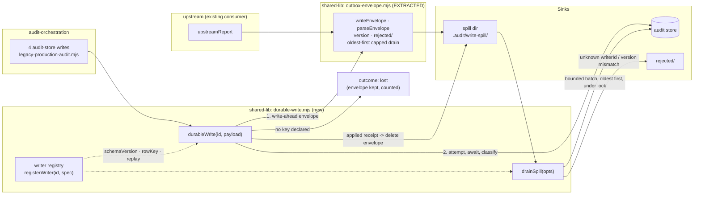

# Plan: Audit-store write durability and failure contract

- **Date**: 2026-08-11
- **Status**: Draft
- **Author**: Claude + Louis
- **Scope**: backend
- **Stack**: `js-ts` (detect-stack: `{stack:"js-ts", detectedFrom:["package.json"]}`)
- **Target domain(s)**: `audit-orchestration`, `stores`, `shared-lib`
- ⚠ **Cross-domain work** — the seam is new `shared-lib` surface consumed by
  `audit-orchestration`; `stores` gets an unrelated return-shape fix. Confirm
  that boundary is intentional at audit.

> **Audit trail**
>
> | Gate | Verdict | Findings | Accepted |
> |---|---|---|---|
> | GPT R1 | `SIGNIFICANT_GAPS` | H:8 M:2 L:1 | 11/11 fix-now |
> | GPT R2 | `SIGNIFICANT_GAPS` | H:6 M:3 | 9/9 fix-now |
> | Gemini R1 | `CONCERNS_REMAINING` | 3 new (2 HIGH) | 3/3 fix-now |
> | Gemini R2 | `CONCERNS_REMAINING` | 2 new (1 HIGH) + 1 wrongly-dismissed | 3/3 fix-now |
>
> **35 findings, 35 accepted, 0 dismissed, 0 deferred-as-rigor-pressure.**
>
> **Stop decision**: GPT stopped at 2 rounds (cap 3) — both rounds 100%
> acceptance, but R2's residual character was implementation-completeness, which
> the code audit verifies against real code rather than against prose. Gemini
> stopped at its **2-round cap**. R2's HIGH (batch-vs-scalar key) was a concrete
> design defect and by the skill's own rule would have earned a third round; it
> is **fixed but NOT re-gated** — that fix is the one thing in this plan no
> reviewer has seen. `/audit-code` should treat it as unreviewed.
>
> Two of the plan's own premises were falsified during the audit: the
> `updatePlanStatus` scoping defect (already fixed in `d1d8097c`, §1) and the
> "already in flight concurrently" latency claim (§7).
>
> **Re-check 2026-08-11 against `origin/main` (7 commits on from the plan).**
> All **19 pinned `file:line` citations still resolve exactly** — the pin
> discipline held. All three measured DB facts still hold (0 unique indexes on
> `finding_fingerprint`, 1 duplicate group / 1 excess row, 4,222 rows). One
> plan file changed (`cross-skill.mjs`, in the unrelated upstream-report path).
>
> **What DID change is the design, not the facts**: the re-check found
> `scripts/lib/upstream/commands.mjs` already implementing this pattern, which
> falsifies the plan's "proceed greenfield" conclusion (§1). Three consequences,
> folded in as decisions 1c–1e: adopt **write-ahead** ordering over
> spill-on-failure; **extract** the envelope core rather than ship a third
> outbox; and the extraction **fixes a live vacuous-pass defect** in upstream's
> own drain. A new **Phase 0** carries the extraction, and Cluster A grew to
> Phases 0–2. **These changes are un-gated** — they postdate the last review.

---

## 1. Context Summary

**Detected scope**: backend. No frontend surface; no acceptance-criteria section.

### The unifying defect

Two triage families — *durability / unverified writes* and *failure contract /
silent degrade* — are one principle violated two ways:

> **A failed write must not be representable as a normal outcome.**

| Shape | What it looks like | Example |
|---|---|---|
| **A — no representation** | `.catch(log)`, not awaited, nothing persisted | `recordFindings` in the orchestrator |
| **B — failure wears success's clothes** | error collapsed into `null` a caller reads as "absent" | `upsertPlan()` returning `null` on a DB failure |

Both produce one operational signature: **a believable false zero.** The store
looks healthy and under-reports.

### Corrected during audit — one premise was false

The plan originally carried a third shape, **C — succeeds against the wrong
rows**, citing `updatePlanStatus(planId, status)` as unscoped. **That is stale.**
`scripts/lib/store/plans-ship.mjs:195` (`61d2ec0b`) is
`updatePlanStatus({ repoId, planId, status })`, and `:215` carries the comment
*"TENANT SCOPE IS A SQL PREDICATE, NOT A CALLER VARIABLE… an explicit `planId`
can update a row owned by another repo"* — the exact defect, fixed in `d1d8097c`.
All five call sites already pass `repoId`. The finding was closed against that
commit; shape C is **removed from this plan**. `resolveLabelTarget` is untraced
and is deferred (§7) rather than assumed to share the defect.

### Code Trace

Read at `61d2ec0b`:

- `scripts/lib/audit/legacy-production-audit.mjs:3271` — comment reads *"Cloud
  store — record findings + pass stats (fire-and-forget)"*; `:3273`
  `recordFindings(...).catch(e => process.stderr.write(...))`; `:3280`
  `recordPassStats(...)` in a loop with the same tail; `:3301`
  `recordSuppressionEvents(...)`; `:3369` `syncBanditArms(...)`. No `await`, no
  spill, no counter.
- `scripts/lib/store/runs-findings.mjs:495` — `finding_fingerprint: f._hash`.
  **This is the idempotency key H2 needs**: `(run_id, finding_fingerprint)`
  identifies a finding row independently of insertion order.
- `scripts/lib/learning/decision-logger.mjs:431` — `flush()` returns
  `{flushed, dropped, outboxed, lostInCI, retained, …}`; `:588` `writeOutbox`
  keys the filename on `entry.decisionKey`; `:40` `OUTBOX_DIR_DEFAULT =
  '.audit/learning-outbox'`.
- `scripts/lib/store/plans-ship.mjs:114`,`:129`,`:137` — `upsertPlan` returns
  `null` on missing input, on cloud-off, **and on a caught DB failure**. Three
  causes, one value.

**Call path that loses data**: `runLegacyProductionAudit`
(`legacy-production-audit.mjs:1356`) → Phase 3 cloud block (`:3271`) →
`recordFindings` (`runs-findings.mjs`) → `insertReturning` (`db/query.mjs`) →
pool. A rejection anywhere is absorbed at the first hop.

**Caller inventory** (H6) — `upsertPlan` has exactly three call sites:
`scripts/cross-skill.mjs:350`, `scripts/lib/audit/legacy-production-audit.mjs:1499`,
`scripts/lib/audit/plan-audit-cloud.mjs:66`. All three currently read a falsy
return as "no plan". All three are in this plan's file list.

### Neighbourhood considered — and the conclusion it got wrong

`get-neighbourhood` (refresh `8ce25c7f`) returned 8 records, **all banded
`review`** — top score 0.775, `bandReason: below-noise-floor` — and the plan
concluded *"no existing symbol occupies this space: proceed greenfield."*

**That conclusion is false, and was false when written.** A re-check on
2026-08-11 against `origin/main` found `scripts/lib/upstream/commands.mjs`
already implementing this exact pattern for a different writer:

| Concept this plan proposed | Already shipped there |
|---|---|
| spill artifact | `writeEnvelope` / `parseEnvelope`, `OUTBOX_DIR = .audit/upstream-outbox` |
| `schemaVersion` + quarantine | `OUTBOX_ENVELOPE_VERSION`, `rejected/` |
| bounded drain batch | `DRAIN_CAP = 20`, env-overridable |
| three named outcomes | `{drained, rejected, failed}` |
| "a failed write is not a normal outcome" | *"A success line is never printed having persisted nothing; the envelope on disk is the proof."* |

The embedding query missed it because the module is `upstream`-domain and
report-shaped: nothing in its summaries reads as *durability*. **This is the
band contract working as documented and still yielding a wrong answer** —
`review` means "nothing cleared this repo's noise floor", not "nothing exists".
The plan treated it as the latter. Grep for the *mechanism* (`outbox`,
`envelope`, `drain`), not only the intent, before concluding greenfield.

Consequences for the design are in decisions 1c and 1d.

### Past incidents

INC-001/INC-002 returned at cosine ~0.55, `pathOverlap: false` — not governing.
One lesson transfers and is made testable in §6: *"an env-gate that checks 'is
this variable set' is not a safety gate — it only proves intent to run."*
`.catch(log)` proves intent to handle, not that anything was handled.

---

## 2. Proposed Architecture



**`stores` is deliberately NOT a seam consumer.** The `upsertPlan` fix is a local
return-shape change; it does not import `durable-write.mjs`. The earlier draft's
diagram showed four domains calling the seam while only one phase migrated call
sites — a contradiction the audit caught (H4). The rule is narrowed accordingly:

> **Decision 6 (revised)**: every **audit-store write in
> `legacy-production-audit.mjs`'s cloud block** goes through the seam. That is
> the set the call-site oracle enumerates. It is not "every DB write in the repo".

### Key design decisions

1. **A writer registry, because `fn` cannot be serialised** *(#5 Single Source of
   Truth)*. H1 was right: the original `durableWrite(label, fn, payload)` could
   never be replayed from disk. Instead each writer registers once:

   ```
   registerWriter('audit.findings', {
     schemaVersion: 1,
     // BATCH writer: the payload is {runId, passName, round, findings[]}.
     // The key is PER ROW, derived inside replay — not one key for the payload.
     rowKey: (row) => `${row.runId}:${row.finding_fingerprint}`,
     replay: async (payload) => { … },   // the same code path the live write uses
   })
   ```
   `durableWrite('audit.findings', payload)` awaits `replay(payload)` live. The
   spill artifact is `{writerId, schemaVersion, idempotencyKey, payload,
   enqueuedAt}` — data only. Drain looks `writerId` up in the registry; an
   **unknown id or a schemaVersion mismatch quarantines** the file rather than
   dropping or guessing it.

1b. **Registrations live in a module both processes import** *(#5)*. R2-H4 caught
   a bootstrap contradiction: the registry is process-local, but registrations
   were placed in `legacy-production-audit.mjs` while
   `cross-skill.mjs write-spill drain` runs in a **fresh process** that never
   loads that module — so the operator drain would find zero handlers and
   quarantine every artifact. Registrations therefore live in their own module,
   `scripts/lib/audit-store-writers.mjs`, imported by both the orchestrator and
   the CLI. The registry is populated by importing that one module, and a drain
   asserts the registry is non-empty before it starts (an empty registry is a
   **bootstrap failure**, not "nothing to do").

1c. **Write-ahead, not spill-on-failure — adopted from the upstream outbox.**
   The first draft attempted the store and spilled *on failure*. The shipped
   upstream mechanism does the opposite and is strictly better: *"validate →
   redact → write-ahead envelope → attempt the store"*. Spill-on-failure loses
   the payload if the process dies **during** the await — the window this plan
   most wants covered. Write-ahead closes it: the envelope exists before the
   attempt, and the successful path deletes it. Cost is one atomic write per
   store write, on a path that already does network I/O.

   This also **simplifies decision 2**: with write-ahead, a `lost` outcome no
   longer means "we could not spill", it means "we will not replay this" — which
   remains true for the three writers that declare no key, but their envelope is
   still written and can be inspected. Nothing vanishes silently.

1d. **Extract the envelope core; do not write a third outbox** *(#1 DRY, and the
   AGENTS.md single-oracle rule)*. Counting this plan's, the repo would have
   **three** implementations of the same idea: `learning/decision-logger.mjs`
   (decision entries), `upstream/commands.mjs` (reports), and a new one here.
   Two is already the smell the single-oracle rule names.

   Right-sized answer: extract `writeEnvelope` / `parseEnvelope` / version +
   `rejected/` handling from `upstream/commands.mjs` into
   `scripts/lib/outbox-envelope.mjs`, migrate that module onto it (mechanical,
   and it carries its own tests), and build the writer registry on top. The
   *registry* is what is genuinely new here — upstream has one writer and needs
   no dispatch; four writers do. `decision-logger.mjs` is **left alone**: its
   entries are keyed and evicted on a different contract, and refactoring a
   working backpressure implementation is scope this plan does not need.

1e. **The extracted drain fixes a live defect in the upstream one.**
   `upstream/commands.mjs::drainOutbox` returns `{drained: 0, rejected: 0,
   failed: 0}` both when the directory is absent **and** from
   `catch { … }` around `readdirSync` — so an unreadable outbox is
   indistinguishable from an empty one. That is precisely the vacuous-pass the
   Gemini gate flagged in this plan's own drain, already shipped one module over.
   The shared core carries this plan's `{state:'unavailable'}` contract, so
   extracting fixes upstream's drain as a side effect. In scope by the impact
   test: this plan's drain **is** that code once extracted.

   Also observed while reading it: `readdirSync(...).slice(0, cap)` takes
   directory order, so a capped drain processes an arbitrary subset rather than
   the oldest. The shared core sorts by enqueue time. Noted, not a finding
   against this plan.

2. **Only idempotent writers may spill, and exactly one qualifies today**
   *(#13 Idempotency)*. H2's scenario is real: a commit that fails at the client
   boundary spills, and the drain writes again. Spill eligibility is a property
   the writer **declares**; a writer with no `idempotencyKey` is **never
   spilled** — its failure classifies `lost` immediately. R2-H2 was right that
   the first draft declared this rule and then specified a key for only one of
   four writers, leaving three ambiguous. Stated explicitly:

   **These are BATCH writers, so the key is per ROW, not per payload** (Gemini
   gate R2, HIGH). `recordFindings(runId, findings[], passName, round)` takes an
   array; a payload-level key `${p.runId}:${p.fingerprint}` would have evaluated
   to `runId:undefined` for **every** spilled batch — one collapsed key, and an
   upsert that overwrites unrelated findings. The registry therefore declares a
   `rowKey(row)` applied inside `replay` when the batch is expanded, and the
   database constraint (2b) is what actually enforces it.

   | Writer | Per-row key | Spill-eligible? |
   |---|---|---|
   | `audit.findings` | `(run_id, finding_fingerprint)` | **yes**, once the constraint below exists |
   | `audit.passStats` | none declared | no — `lost`-only in v1 |
   | `audit.suppressionEvents` | none declared | no — `lost`-only in v1 |
   | `learning.banditArms` | already upserts on `(pass_name, variant_id, context_bucket)` | no — v1 keeps it out of the spill path; it has its own idempotent writer and no run-scoped payload |

   Three of four writers being `lost`-only is a **real reduction in ambition**
   and is the honest v1: they gain a counted, surfaced failure (shape A fixed)
   without a replay path nobody has designed. Adding one later is a
   `registerWriter` change plus its constraint.

2b. **The idempotency key needs a DATABASE constraint, which does not exist**
   *(#14)*. R2-H1's core point: a logical key is not an upsert target — Postgres
   requires a unique or exclusion constraint for `ON CONFLICT`. **Measured
   2026-08-11 on the live store**: `audit_findings` has `audit_findings_pkey` on
   `id`, non-unique `idx_audit_findings_fingerprint` and `idx_audit_findings_run`
   — and **no unique constraint on `(run_id, finding_fingerprint)`**. So the
   first draft's upsert would have failed at runtime with *"no unique or
   exclusion constraint matching the ON CONFLICT specification"*. Also measured:
   **1 duplicate group / 1 excess row across 4,222 rows**, so the constraint is
   addable after a one-row dedup. The migration does both, in that order, and
   Phase 1 does not ship without it.

2d. **A replay must PROVE it applied — silence is not success** *(Gemini gate,
   HIGH)*. The gate caught the plan reintroducing its own defect.
   `scripts/lib/store/runs-findings.mjs:472` is
   `if (!runId || !await isCloudEnabled()) return;` — `recordFindings` returns
   `undefined` **without throwing** when the store is off. Under the first
   draft's drain ("await `replay`, delete on success") an operator who disabled
   the cloud would have every spilled artifact replayed into a no-op and then
   **deleted** — permanent loss of exactly the data this plan exists to keep.

   So: a `replay` handler returns an explicit `{applied: true, rows}` receipt,
   and `drainSpill` deletes **only** on that receipt. `undefined`, `null`, or a
   falsy `applied` is treated as *not applied* — the artifact is retained. Two
   belts: the drain also **refuses to start when `isCloudEnabled()` is false**,
   reporting `unavailable` rather than draining into a void. This is the
   AGENTS.md success-path rule — *"can this return green without having checked
   anything?"* — applied to the drain.

2e. **A spill artifact that is git-TRACKED is not ours** *(Gemini gate, HIGH)*.
   `.gitignore` does not stop `git add -f`, so relying on it to keep
   `.audit/write-spill/` free of attacker-authored JSON is not a control. Rather
   than reason about content, the drain checks **provenance**: a legitimate
   spill artifact is written at runtime into a gitignored directory and is
   therefore never tracked. Any artifact that `git ls-files --error-unmatch`
   resolves is refused and quarantined. Cheap, decisive, and it keys on a
   property an attacker committing a file cannot avoid producing. The `repoId`
   check (R2-M1) stays as defence in depth, with its own limitation recorded:
   it reads an in-repo identity file, so it is a consistency check, not an
   authentication boundary.

   **One `git ls-files` call, not one per artifact** (Gemini gate R2, LOW): the
   drain reads the tracked set for the spill directory **once** with
   `git ls-files -z -- .audit/write-spill/` and tests membership in memory. A
   per-artifact `--error-unmatch` would be 100 synchronous spawns per batch.

2c. **Replay failure has a defined lifecycle** *(R2-H3)*. A known artifact whose
   `replay()` rejects is **retained with an incremented `attempts` counter**, not
   deleted and not retried in a loop. At `attempts >= 3` it moves to
   `quarantine/` with the last error recorded. The retryable/permanent classifier
   is the existing `normalizePostgresError` (`scripts/lib/db/errors.mjs`) — a
   permanent error (constraint violation, bad input) quarantines on the **first**
   failure rather than burning three attempts. Artifact states are exactly:
   `pending → (applied ∧ deleted) | quarantined`.

3. **Outcomes reach the run record, not just stderr** *(#19 Observability)*. H3
   was right that a counter in a log line is not a completion contract.
   `runLegacyProductionAudit` returns `writeOutcomes: {written, spilled, lost}`
   on its result object; a non-zero `lost` sets `runStatus: 'incomplete'`.
   **The persistence path is named** (R2-H5 — a migration alone cannot make the
   result reach the row): `recordRunComplete` in
   `scripts/lib/store/runs-findings.mjs` already maps the run result onto
   `audit_runs`, and it gains `write_outcomes`. Its own failure is reported
   through the same three-outcome classifier — the completion write is not
   exempt from the contract it records.

   **A lost completion write leaves a WRONG row, not a neutral one** (Gemini
   gate R2, wrongly-dismissed H5). The earlier text said the row "keeps its
   pre-existing state", which sounded harmless and is not: that state is
   `pending`/`in_progress`, so a completed-but-unrecorded run is
   indistinguishable from one still executing — a second false-zero shape, in
   the very mechanism added to report the first. So the completion write is
   itself a registered writer (`audit.runComplete`, keyed on `run_id`, therefore
   spill-eligible), and a run whose completion write is lost leaves a spilled
   artifact the next drain applies.

4. **Bounded spill, bounded drain, and a lock** *(#14 Transaction Safety)*. H5
   caught a self-contradiction: the plan deferred locking on "one audit per repo"
   while adding an operator-triggered drain — a second writer. So: a spill
   **admission cap** (refuse + count, never silently evict undelivered data), a
   **bounded drain batch**, and an advisory lock file the operator drain and the
   run-start drain both take. Reuses the single-instance lock pattern already at
   `.audit-loop/.maintenance.lock`.

5. **Spill, do not retry inline**. An audit run is long and the store may be down
   for its duration; in-process retry trades a silent failure for a slow one.

6. **Failure is never `null`** *(#15 Error Handling)*. `upsertPlan` returns a
   discriminated result so the causes stop sharing one value. R2-H6 was right
   that "discriminated result" is not a contract until the variants and each
   caller's behaviour are written down:

   | Variant | Meaning | Caller behaviour |
   |---|---|---|
   | `{ok:true, planId}` | written | proceed |
   | `{ok:false, reason:'cloud-off'}` | store disabled | proceed silently — today's normal path |
   | `{ok:false, reason:'invalid-input'}` | missing `path`/`skill` | caller bug; log and proceed |
   | `{ok:false, reason:'write-failed', error}` | DB rejected/unreachable | **report**; never treated as "no plan" |

   Per caller: `cross-skill.mjs:350` surfaces `write-failed` on its JSON envelope
   (it is a CLI whose output is read by a skill); `legacy-production-audit.mjs:1499`
   and `plan-audit-cloud.mjs:66` degrade to a local-only run **and count it as a
   `lost` write**, so the audit reports it rather than proceeding as if no plan
   existed. `cloud-off` keeps today's silence at all three.

### Right-sizing gate

- **Band-aid** — `await` the four calls. Removes the silence, introduces a worse
  bug: a store hiccup now fails an audit that already produced its findings,
  violating the graceful-degradation invariant that made the store optional.
- **Over-engineered** — a general write-ahead log with retry policy, backoff,
  dead-letter queue and scheduler over every DB write in the repo. Nothing today
  needs ordering, exactly-once, or cross-process coordination.
- **Chosen** — a registry of **four** writers, three named outcomes, a bounded
  spill and a drain-on-next-run, serving the requirement that exists today: an
  audit-store write that fails must leave evidence a later run can act on.
  Idempotency is required per-writer rather than assumed globally, which is what
  keeps this from needing a retry policy.

**Manual vs scripted**: four call sites plus three `upsertPlan` callers — seven
sites, each needing a judgement about spill eligibility. **By hand.**

---

## 3. Sustainability Notes

- **Assumption encoded**: `.audit/` is single-writer per repo. The lock (decision
  4) now enforces rather than assumes it.
- **If the store moves again** (Supabase → NAS, 2026-08-08), the seam is the one
  place write-failure semantics live.
- **Extension point built in**: the registry. A fifth writer is a `registerWriter`
  call, not a change to `durableWrite`.
- **Deliberately NOT built**: retry, backoff, ordering, dead-letter queue,
  cross-repo coordination, auto-eviction of spilled data.

---

## 4. Execution Model

1. **The seam precedes its callers.** Registry + `durableWrite` land before any
   migration. Sequential.
2. **Spill precedes drain.** Writing the drain first gives a green test over an
   empty directory — the vacuous-pass shape §6 forbids.
3. **The `upsertPlan` change and its three callers are one atomic unit.** A
   return-shape change landing without its callers is the regression this plan
   would otherwise introduce.

Everything else is parallel-safe. Each phase is independently revertable; no
migration, no schema change, no backfill — **except** decision 3, which adds
columns to `audit_runs` (see §7).

---

## 5. File-Level Plan

| File | Intent | Purpose |
|---|---|---|
| `scripts/lib/outbox-envelope.mjs` | create | Extracted from `upstream/commands.mjs` (decision 1d): `writeEnvelope`/`parseEnvelope`, version + `rejected/`, oldest-first capped drain, `{state:'drained'\|'empty'\|'unavailable'}`. |
| `scripts/lib/upstream/commands.mjs` | modify | Migrate onto the extracted core. Behaviour-preserving except the drain-failure contract, which is the point (decision 1e). |
| `tests/outbox-envelope.test.mjs` | create | The shared core's own suite, including the unavailable-vs-empty distinction upstream currently lacks. |
| `scripts/lib/durable-write.mjs` | create | Writer registry + `durableWrite()` (write-ahead), `drainSpill()`, `spillSummary()` — built ON the envelope core, not duplicating it. |
| `scripts/lib/audit-store-writers.mjs` | create | The four `registerWriter` calls. Imported by BOTH the orchestrator and the CLI (decision 1b) — the registry has no other bootstrap. |
| `tests/durable-write.test.mjs` | create | Three outcomes; spill round-trip; non-idempotent writer never spills; unknown writerId quarantines; replay-failure lifecycle; negative control. |
| `supabase/migrations/<ts>_audit_findings_fingerprint_unique.sql` | create | Dedup the 1 known excess row, then `CREATE UNIQUE INDEX … (run_id, finding_fingerprint)`. Without this the `audit.findings` upsert cannot run (decision 2b). |
| `scripts/lib/audit/legacy-production-audit.mjs` | modify | Import the writer module; migrate `:3273`,`:3280`,`:3301`,`:3369`; drain at run start; return `writeOutcomes`. |
| `tests/audit-store-durability-call-site.test.mjs` | create | Writer-set oracle (see §6 M1). |
| `scripts/lib/store/runs-findings.mjs` | modify | Expose the replay path used by `audit.findings`, upserting on `(run_id, finding_fingerprint)`. |
| `scripts/lib/store/plans-ship.mjs` | modify | `upsertPlan` discriminated result. |
| `scripts/cross-skill.mjs` | modify | `upsertPlan` caller; `write-spill status\|drain` subcommand; `assertKnownFlags` entries. |
| `scripts/lib/audit/plan-audit-cloud.mjs` | modify | `upsertPlan` caller. |
| `tests/plans-ship-failure-contract.test.mjs` | create | A DB failure and an absent row must not be the same value. |
| `supabase/migrations/<ts>_audit_runs_write_outcomes.sql` | create | `write_outcomes jsonb` + `run_status` handling for decision 3. |
| `AGENTS.md` | modify | One line: audit-store writes in the cloud block go through the seam. |

### 5b. Implementation Phases

**Phase 0 — Extract the envelope core** (new, from the 2026-08-11 re-check):
lift `writeEnvelope`/`parseEnvelope`/version/`rejected/` out of
`upstream/commands.mjs`, add the oldest-first capped drain and the
`drained|empty|unavailable` contract, migrate upstream onto it. Files:
`scripts/lib/outbox-envelope.mjs` (create), `scripts/lib/upstream/commands.mjs`
(modify), `tests/outbox-envelope.test.mjs` (create).

**Phase 1 — Registry + seam + the constraint it needs**: `registerWriter`,
`durableWrite` (write-ahead, on the Phase 0 core), `spillSummary`; the
unique-index migration (decision 2b); non-idempotent writers classify `lost`.
Files: `scripts/lib/durable-write.mjs` (create), `tests/durable-write.test.mjs`
(create).

**Phase 2 — Drain, bounded and locked**: `drainSpill` with batch cap, admission
cap, advisory lock, quarantine for unknown/mismatched artifacts. Files:
`scripts/lib/durable-write.mjs` (modify), `tests/durable-write.test.mjs` (modify).

**Phase 3 — Orchestrator migration + outcome contract**: register the four
writers, migrate the call sites, drain at run start, return `writeOutcomes`,
persist them. Files: `scripts/lib/audit/legacy-production-audit.mjs` (modify),
`scripts/lib/store/runs-findings.mjs` (modify),
`supabase/migrations/<ts>_audit_runs_write_outcomes.sql` (create),
`tests/audit-store-durability-call-site.test.mjs` (create).

**Phase 4 — Operator surface**: `write-spill status|drain`. Files:
`scripts/cross-skill.mjs` (modify).

**Phase 5 — `upsertPlan` shape B + all three callers, atomically**. Files:
`scripts/lib/store/plans-ship.mjs` (modify), `scripts/cross-skill.mjs` (modify),
`scripts/lib/audit/plan-audit-cloud.mjs` (modify),
`tests/plans-ship-failure-contract.test.mjs` (create), `AGENTS.md` (modify).

**Close-out (not a phase)**: `node scripts/setup-postgres.mjs --migrate` ·
`npm run requirements -- extract --files <the touched set>` then `reconcile`
(H8 — this plan changes persistence-adjacent modules and the ledger is known
partial) · `npm run check` · `npm test` · close each addressed finding with
`cross-skill.mjs final-review-record-fix` against its commit.

---

## 6. Testing Strategy

Tier 1 (test-first) — `durable-write.mjs` is deterministic, no LLM.

- **Three outcomes reachable and distinct**: `written` / `spilled` / `lost`.
- **Non-idempotent writer never spills** (decision 2) — a writer registered
  without `idempotencyKey` whose write rejects returns `lost`, and the spill
  directory stays empty. This is the assertion that keeps at-least-once honest.
- **Spill round-trip**: a spilled payload drains and applies; replaying it twice
  leaves one row (idempotency, on the real `(run_id, finding_fingerprint)` key).
- **Unknown `writerId` / `schemaVersion` mismatch quarantines** — not dropped,
  not guessed.
- **Bounded drain**: with N+1 spilled artifacts and a batch cap of N, exactly N
  drain and the report says so.
- **Negative control** (mandatory): a rejecting write with an **unwritable spill
  directory** must return `lost` and must not return `written`. A "0 lost" result
  and a broken classifier are otherwise identical.
- **Vacuous-pass guard**: `drainSpill` over an empty directory reports
  `{state:'empty'}`, distinguishable from `{state:'unavailable'}` and from never
  having run.
- **Cloud-off drain does not delete** (the gate's HIGH): with `isCloudEnabled()`
  false, `drainSpill` returns `{state:'unavailable'}` and the spill directory is
  **byte-identical afterwards**. Asserted on the directory, not on the return
  value — the return value is what was wrong in the first draft.
- **A replay returning `undefined` retains the artifact**: register a writer
  whose `replay` resolves `undefined`, drain, assert the artifact still exists.
  This is the regression test for the exact defect the gate found.
- **A git-tracked artifact is refused**: plant a tracked file in the spill dir
  (intent-to-add is enough) and assert it quarantines rather than replays.
- **Call-site oracle — derived, not enumerated (R1-M1, then R2-M3)**. Two
  iterations, and the second is the point. R1-M1 killed the first design (scan
  for a bare `.catch(`), which passes for an un-caught call, an `await`ed call
  outside the seam, or a wrapper. The replacement — a hand-listed set of four
  writer symbols — R2-M3 then killed for the same reason one level up: a fifth
  writer is invisible until someone updates the very list the test validates,
  at which point the test proves only that they updated it.

  So the writer set is **derived from the store modules**: enumerate the exported
  symbols of `scripts/lib/store/runs-findings.mjs` and `…/bandit-fp.mjs` whose
  names match the writer shape (`record*` / `sync*`), and assert every one of
  them is either **registered** in `scripts/lib/audit-store-writers.mjs` or
  present in an explicit, reasoned `NOT_A_DURABLE_WRITE` exemption list. A new
  export lands unregistered and unexempted → the test fails without anyone
  having edited it. This is the same disk-iterating shape as the DB-suite
  enrolment gate (`npm run db:enrolment:gate`), which exists because a list
  nobody updates cannot see what it omits.
- **Contract test for shape B**: DB failure vs absent row produce different
  values — the assertion that catches today's `upsertPlan`.
- **No live DSN** in any test (INC-002).

**Seen-to-fail**: every guard run red before green, one defect at a time.

---

## 7. Risk & Trade-off Register

| Risk | Mitigation |
|---|---|
| Spill grows unbounded while the store is down | Admission cap + `spillSummary()` reporting count and oldest age; the run prints it when non-zero. No auto-eviction — silent deletion of undelivered data is the failure this plan exists to stop; the cap **refuses and counts** instead. |
| At-least-once replay double-writes | Only writers declaring an `idempotencyKey` may spill; replay upserts on that key. Writers that cannot are never spilled. |
| Two drainers race (run-start + operator) | Advisory lock file, same pattern as `.audit-loop/.maintenance.lock`. |
| Spill artifact is attacker-influenced local JSON | Repo-root containment + `realpath` before read, no symlink follow, schema-validated, quarantine on mismatch. Path is `.audit/write-spill/` throughout — already gitignored by the blanket `.audit/` rule (R1-M2 also fixed a leading-slash inconsistency between diagram and prose). |
| The drain's OWN failure (spill dir unreadable, permissions, concurrent deletion) is undefined (Gemini gate, MEDIUM) | `drainSpill` returns a discriminated result: `{state:'drained', n}` / `{state:'empty'}` / `{state:'unavailable', reason}`. **`unavailable` is never rendered as `drained: 0`** — the vacuous-pass distinction §6 already requires. It never fails the audit; the run reports it and the artifacts stay on disk for the next attempt. |
| A **valid-shaped** artifact replays against another repo or run (R2-M1) | Schema validity is not authorization. Each artifact carries the `repoId` and `runId` current at spill time; the drain **refuses** any artifact whose `repoId` differs from the repo identity it resolves for itself, and quarantines it. Validation answers "is this well-formed"; this answers "is it mine". |
| "Admission cap / bounded batch / advisory lock" are labels, not contracts (R2-M2) | Concrete: capacity is **both** a file count (1000) and a total byte ceiling (64 MiB), whichever binds first, in `scripts/lib/config.mjs` beside the other audit knobs and overridable by env; the drain batch is 100 artifacts per invocation; temp files are written `*.tmp` in the same directory and excluded from both counts; the lock is a pid+timestamp file whose holder is considered stale after 15 minutes, at which point it is broken with a logged warning — same semantics as `.audit-loop/.maintenance.lock`. |
| `audit_runs` migration | Additive jsonb column; `--migrate` is idempotent. Consumers read it as optional. |
| Awaiting changes audit wall-clock | **Unmeasured.** The earlier draft asserted the four writes were "already in flight concurrently"; the trace does not establish that (L1) — they are separate un-awaited calls whose promises are never collected. Phase 3 **measures** before/after and, if material, collects them into one `Promise.allSettled`. No latency claim is made here. |

**Deferred to Out of Scope (Future)** — see §9.

---

## 8. Execution Clustering

- **Cluster A** — Phases 0–2 — fix-gate: `yes`
  - Coupling: Phase 0 defines the envelope + drain contract that Phase 1's
    `durableWrite` writes through and Phase 2's drain reads; Phase 0 also
    re-points an existing consumer (`upstream/commands.mjs`) at it, so a change
    to the artifact schema breaks all three at once. Auditing them together is
    the only way the wiring pass sees the extraction seam AND its two consumers.
  - author-tier: `standard`
- **Cluster B** — Phases 3–4 — fix-gate: `yes`
  - Coupling: Phase 4's operator command reports and drains the spill Phase 3's
    migrated call sites produce, through the same registry. Phase 3 also owns the
    outcome contract Phase 4 renders.
  - author-tier: `standard`
- **Cluster C** — Phase 5 — fix-gate: `final`
  - Coupling: single phase; the return-shape change and its three callers are one
    atomic unit (§4) and do **not** import the seam. Separated from A/B precisely
    because the wiring pass should see that it stands alone.
  - author-tier: `standard`
- **Final gate**: consolidated Gemini review over the union diff of A, B and C.

---

## 9. Out of Scope (Future)

Deferred with named **independence** — this plan's design does not depend on any
of them:

- **`scripts/lib/visual/contract.mjs` TOCTOU**, **`scripts/lib/sync-inventory.mjs`
  error swallowing**, **`scripts/symbol-index/render-mermaid.mjs` stale-artifact
  handling**, **`scripts/lib/audit/stage0-relevance-context.mjs` bare catch**.
  H7 correctly observed these carried labels, not specifications. They are local
  failure-contract fixes in files that do not import the seam and are not on the
  audit-store write path, so the seam's correctness does not rest on them. They
  were carried on a label alone, and inventing specifications for files this plan
  never traced would be worse than deferring them. **Trigger**: a follow-up plan
  that traces each file first — same principle, separate scope.
- **`resolveLabelTarget` scoping** — untraced. Its sibling `updatePlanStatus`
  turned out to be already fixed (§1), so the finding's premise needs verifying
  before any change. **Trigger**: read it; if unscoped, fold into the follow-up.
- **The god-module / layering family** (26 rows, 2 HIGH) — architectural
  refactoring; bundling it would prevent convergence.
- Retry policy, backoff, ordering, dead-letter queue.

---

## 10. Evidence

Backlog when this plan was revised: **158 unremediated acceptances** (was 201 at
session start). Three closed by verification during this work — the pragma
colon-safety row against `0bcb8d09`, the NUL row against `2fedee57`, the
`updatePlanStatus` scoping row against `d1d8097c` — one dismissed as a verified
false positive (`costFromUsage`), and 39 plan-mode rows written off as a class.
