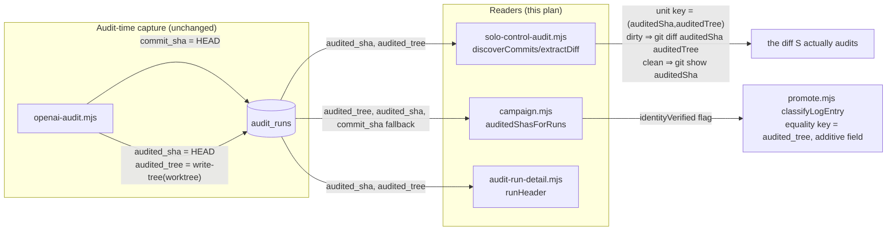

# Plan: Correct audit-target identity readers off `commit_sha` onto `audited_sha`/`audited_tree`

- **Date**: 2026-09-20
- **Status**: Complete
- **Author**: Claude + Louis Strydom
- **Scope**: backend

## Context Summary

**Detected scope**: backend (Node ESM CLI scripts + Postgres store; no UI). Stack: `js-ts` (`package.json`).

**What exists today.** `audit_runs.commit_sha` is written in `scripts/openai-audit.mjs:903-923`
(`ctxCommitSha = execFileSync('git', ['rev-parse', 'HEAD'], …)`, captured immediately before
`runMultiPassCodeAudit` is invoked) and threaded through `recordRunStart`
(`scripts/lib/store/runs-findings.mjs:247-290`) into the `commit_sha` column. Because `/audit-code`
normally runs against a **dirty working tree** (the standard pre-commit review), this value is
`HEAD` — the *parent* of whatever commit the audited change eventually lands in — not the commit
whose diff produced the findings.

A separate, more precise identity pair already exists: `audit_runs.audited_sha` /
`audit_runs.audited_tree` (migration
`supabase/migrations/20260719120000_audit_runs_audited_target_identity.sql`, "E1 hop 2"), captured
in `scripts/openai-audit.mjs:475-481` via `gitWorktreeTree(process.cwd())` /
`gitCommitSha(process.cwd())` (`scripts/lib/vcs.mjs`). `audited_sha` is operationally the same
`git rev-parse HEAD` value as `commit_sha` (both computed moments apart in the same process run).
`audited_tree` is materially different and is the actually-useful new fact: it is a real git tree
object, built by staging the **working tree** (not the index) into a throwaway index and running
`git write-tree` (`gitWorktreeTree`, `scripts/lib/vcs.mjs:236-`) — so on a dirty tree,
`audited_tree` captures the uncommitted changes the audit actually read, while `audited_sha`/
`commit_sha` stay pinned to the parent. Both columns are nullable; the migration's own comment says
historical (pre-2026-07-19) rows must stay unverifiable rather than backfilled.

**Code Trace** (commit `31f2ade7`, this branch):
- `scripts/openai-audit.mjs:903-923` (`fefd2e58` era) → `ctxCommitSha` = `git rev-parse HEAD`,
  passed as `commitSha` into `runMultiPassCodeAudit`'s opts → `recordRunStart(...,{commitSha,...})`.
- `scripts/openai-audit.mjs:475-481` → `ctx.auditedTree`/`ctx.auditedSha` captured via
  `gitWorktreeTree`/`gitCommitSha` (`scripts/lib/vcs.mjs`), independently of the `commit_sha` write
  above; persisted to `audit_runs.audited_tree`/`audited_sha` (write path not modified by this plan
  — already wired per the E1 migration).
- `scripts/solo-control-audit.mjs:153-163` (`discoverCommits`) → `SELECT DISTINCT ar.commit_sha ...
  WHERE ar.commit_sha IS NOT NULL` — the B/C-shadow commit set the solo-control (S) arm re-audits.
- `scripts/solo-control-audit.mjs:166-172` (`locateCommit`) → finds which `REPO_ROOTS` entry has
  `sha` as a real commit object.
- `scripts/solo-control-audit.mjs:183-200` (`extractDiff`) → `git show <sha> --name-only` then
  `git show <sha> -U8 -- <files>` — reconstructs "the diff arm S must audit" from a plain commit
  show, which is wrong when `sha` is the parent of a dirty-tree audit.
- `scripts/lib/store/campaign.mjs:1616-1638` (`auditedShasForRuns`) → docstring: *"This is where
  `audited_sha` comes from"*; SQL: `SELECT id, commit_sha FROM audit_runs ...` — reads the wrong
  column relative to its own stated contract.
- `scripts/lib/campaign/promote.mjs:129-` (`classifyLogEntry`) → consumes
  `shaByRunId` (from `auditedShasForRuns`) purely as an **equality key**: "one snapshot is one
  revision" (arms in a snapshot must agree on the same audited revision). It never diffs anything —
  it only needs a value that correctly represents "the revision this arm's run was taken at."
- `scripts/lib/dashboard/sections/audit-run-detail.mjs:20-32` (`runHeader`) → renders
  `commit <sha>` in the run's metadata line, sourced from `getRunMeta`
  (`scripts/lib/store/runs-findings.mjs:1894-1917`), which currently probes/selects only
  `commit_sha`, not `audited_sha`/`audited_tree`.
- `scripts/openai-audit.mjs:665-671` + `:780-847` (dirty-aware base resolution, `resolveRangeSnapshot`
  in `scripts/lib/audit-scope.mjs`) → the base an `/audit-code` run actually diffs against
  (`diffBase`/`snapshot.baseSha`) is **HEAD** when the working tree is dirty, **HEAD~1** when clean,
  or an **explicit `--base`** (e.g. `/cycle`'s `--cluster` resume passing `clusterStartRef`). This
  base is **never persisted** to `audit_runs` — no `diff_base_sha` or `working_tree_dirty` column
  exists (confirmed against the live schema this session). This is load-bearing for Design decision 1
  below (added in R1 after GPT flagged the original `auditedSha..auditedTree` reconstruction as
  correct only in the dirty-tree case).
- `scripts/solo-control-audit.mjs:1231-1245` (`fetchExternalFindings`) + `:1247-1382` (`cmdMerge`) →
  join S's findings (keyed by the bare `sha` string from `discoverCommits`) against A/B/C's findings
  (keyed by `model_ab_finding_scores.commit_sha`, a DB view) purely on that string. Two distinct
  `audit_runs` rows (different `audited_tree`, e.g. two WIP `/audit-code` invocations before either
  was committed) sharing one `commit_sha` are indistinguishable to this join — see Risk register.

**Measured evidence** (this session, prior to this plan): sampled 155 `audit_runs` rows
(`stage_type='audit-code'`) across `claude-engineering-skills`, `wine-cellar-app`, and
`ai-organiser`. Of 94 rows with findings carrying a `primary_file`, **68/94 (72%)** had zero file
overlap between `git show --name-only <commit_sha>` and the findings' `primary_file` set; **52/94
(55%)** still had zero overlap even after unioning the files touched by the next 1–3 descendant
commits on `main`. `audited_tree` was populated on 55–69% of sampled recent rows (added
2026-07-19); a spot-check on one row confirmed the tree correctly contains a `primary_file` the
commit's own diff did not.

**Neighbourhood considered** (Phase 0.5, `get-neighbourhood`): `auditedShasForRuns`
(`scripts/lib/store/campaign.mjs:1627-1638`) scored `above-floor-standout` / `precedent` — this is
the exact function this plan modifies, confirming the fix is a targeted edit of existing code, not
a new abstraction. `discoverCommits`, `extractDiff`, `locateCommit`, and `runHeader` all scored in
the `review` band (no closer precedent than the functions themselves) — expected, since this plan
edits them in place rather than writing siblings.

**Security incident neighbourhood** (Phase 0.5c): two incidents surfaced (INC-001 symlink-path
canonicalisation, INC-002 destructive-test DSN safety) — neither applies; this change touches
neither path classification nor destructive DB operations. No Security Considerations section
required.

**Target domain(s)**: `scripts` (solo-control-audit.mjs), `stores` (campaign.mjs,
runs-findings.mjs), `dashboard` (audit-run-detail.mjs). Cross-domain but all three are existing,
already-coupled call paths (solo-control reads the store; the dashboard reads the store) — not a
new boundary.

## Proposed Architecture

**Key design decisions** (revised in R1 after GPT audit — see `## Audit Trail` at the end of this
plan for the four findings that drove decisions 1–4):

1. **The dirty/clean split is self-evidencing from `audited_sha`/`audited_tree` alone — no new
   column needed** (#3 No Hardcoding, #11 Testability). Per the dirty-aware base rule
   (`scripts/openai-audit.mjs`'s scope resolution), absent an explicit `--base`:
   - **Tree was dirty at capture** ⇔ `audited_tree !== git rev-parse <audited_sha>^{tree}` (the
     worktree tree differs from the committed tree — self-evident from the two captured values,
     computable with one extra `git rev-parse` at read time, no new storage). In this case the real
     diff base **was** `audited_sha`, so `git diff <audited_sha> <audited_tree>` **is** the diff the
     arms audited.
   - **Tree was clean at capture** ⇔ the two trees are equal. In this case the dirty-aware rule put
     the base at `audited_sha~1` (the previous commit) — i.e. the audited diff **is** `git show
     <audited_sha>`, exactly what the original (buggy-in-the-dirty-case) `commit_sha`-based
     reconstruction already computes correctly. No change needed for this branch.
   - **Residual, explicitly named gap — genuinely undetectable from stored data, not merely
     unhandled**: an **explicit `--base`** (e.g. `/cycle`'s clustered `--cluster` resume, which
     passes `--base "$CLUSTER_START"` — see `cycle/SKILL.md`'s cluster-audit-command) audits against
     an arbitrary ancestor, not `HEAD~1`. Verified against the live schema this session: **no column
     on `audit_runs` records whether a run's base was the dirty-aware default or an explicit
     override** (`scope_mode` is `'diff'` in both cases — checked, does not distinguish them). When
     such a run's tree happens to be clean relative to its own `HEAD` (plausible right after a
     cluster's changes are committed), it is **indistinguishable** from the ordinary clean-tree case
     using `audited_sha`/`audited_tree` alone, and `extractDiff` will silently produce `git show
     <audited_sha>` — which is wrong for that run (it shows only the last commit, not the actual
     clustered range). This plan does **not** claim to detect or flag this subset; closing it fully
     requires persisting the real `diffBase`, a schema change **out of scope here** (no migration was
     authorized). Accepted as a named, bounded limitation — see Risk register for why the exposure is
     believed small in practice, not a claim that it is zero.

2. **`discoverCommits` requires BOTH `audited_sha` AND `audited_tree` non-null before treating a row
   as an audit unit** (closes the nullable-pair gap — a row could theoretically have one captured and
   not the other, since `openai-audit.mjs:475-481` sets each independently based on its own `.ok`
   check) — **but the SQL itself cannot both filter these rows out AND count them** (Gemini-gate
   finding G1, R3→gate). The query relaxes to `audited_sha IS NOT NULL OR audited_tree IS NOT NULL`
   and JS partitions the results: both-non-null rows become audit units, exactly-one-non-null rows are
   counted as `unresolved-incomplete-identity`. Distinct from `unresolved-object-missing` (the
   tree/commit object doesn't resolve locally — e.g. garbage-collected or captured on another
   machine). These are the only two DETECTABLE unresolved outcomes; the explicit-`--base` gap above
   is, by definition, not detectable and is never reported as a distinct outcome — it silently
   produces a (possibly wrong) result rather than an `unresolved` one, which is exactly why it is
   called out as a named risk rather than a handled case.

3. **The per-unit identity for `discoverCommits`/`cmdRun`'s resume bookkeeping is the COMPOSITE pair
   `(auditedSha, auditedTree)`, not `audited_tree` alone** (corrected in R2 after GPT caught a real
   collision this design introduced — see `## Audit Trail`). A diff is a function of BOTH its base
   and its target: two different runs can start from different HEADs (`H1` containing `f=0,g=0`;
   `H2` containing `f=1,g=1`) and land on the SAME resulting tree `T` (one changing `f`, the other
   changing `g`) — `audited_tree` alone cannot tell them apart, and discovery would silently drop one
   as "already covered". Among the both-non-null rows (Design decision 2's partition),
   `discoverCommits` dedups further on the composite `(auditedSha, auditedTree)` pair in JS and
   returns `{resolved: {commitSha, auditedSha, auditedTree}[], unresolvedIncompleteIdentityCount}`;
   `cmdRun`'s `covered`/`perCommit` resume-cache keys on `` `${auditedSha}:${auditedTree}` `` (composite,
   guaranteed non-null on both halves) while keeping `commitSha` as the human-readable label. This is
   **narrower** than Decision 4's `audited_tree`-alone key below — deliberately: solo-control needs a
   **diff-reconstruction identity** (base + target both matter), while campaign.mjs needs a **content
   -equality identity** (only "did these arms read the same state" matters, and the base is
   irrelevant to that question).

4. **`campaign.mjs`'s `auditedShasForRuns` uses `audited_tree` ALONE as its equality key** (correct
   here, unlike decision 3 above, because this is a content-equality question, not a diff-
   reconstruction one) — not `audited_sha`, **because `audited_sha` cannot catch the failure mode GPT
   identified**: two arms sharing `HEAD` while having audited different dirty trees would still read
   as "one revision" under an `audited_sha`-only equality check. Fallback chain: `audited_tree ??
   audited_sha ?? commit_sha`, with a returned `identityVerified: boolean` computed as
   `audited_tree != null && identity === audited_tree` (**explicit non-null guard** — corrected in R2
   after GPT caught that the naive `identity === audited_tree` reads `true` when both sides are `null`,
   i.e. an all-NULL legacy row would have falsely reported a *verified* identity) so `classifyLogEntry`
   — and eventually a human reviewing a promotion — can see when eligibility rested on the weaker,
   legacy identity rather than silently upgrading it. `classifyLogEntry`'s existing return shape and
   its `eligible`/`auditedSha` fields are **unchanged** (backward compatible with
   `tests/campaign-promote.test.mjs`); `identityVerified` is additive.

5. **Dashboard label fix is presentation-only** (#20 Observability). `runHeader` relabels the
   metadata bit from `commit <sha>` to `HEAD at capture <sha>` and adds `audited tree <sha>` when
   present, so a human reading findings next to the header is not misled into thinking `commit_sha`
   is the commit that contains the change under review.

6. **Comment/doc fixes carry the semantics forward** (#9 Comments explain WHY). A one-line comment
   at the `ctxCommitSha` capture site and a new bullet in AGENTS.md's Postgres-Parity-Store section
   state plainly: `commit_sha` is HEAD at audit-time capture, not necessarily the commit containing
   the audited diff; use `audited_sha`/`audited_tree` for target-identity purposes, and name the
   residual explicit-`--base` gap.

**No schema migration** — `audited_sha`/`audited_tree` already exist (migration `20260719120000`),
are nullable, and indexed. This plan only changes what reads them; the one gap that WOULD need a new
column (persisting the real `diffBase`) is explicitly named and deferred, not silently worked around.

## Sustainability Notes

- **Assumption that could change**: that `audited_sha` and `commit_sha` are always equal in
  practice (true today because both are captured from `HEAD` within the same process invocation).
  If a future change makes them diverge (e.g. capturing `audited_sha` asynchronously), campaign.mjs
  already prefers the more precise `audited_sha`, so no further change is needed there.
- **Extension point**: `discoverCommits`'s new return shape (`{resolved: {commitSha, auditedSha,
  auditedTree}[], unresolvedIncompleteIdentityCount}` instead of bare shas) gives any future consumer
  the full identity bundle AND the unresolved count rather than requiring another round-trip.
- **Migration path**: if `audited_tree`/`audited_sha` population rate ever needs to reach 100% for
  solo-control-audit's coverage to be acceptable, that is a capture-side change (ensuring
  `gitWorktreeTree` never fails) — out of scope here; this plan only changes reads.

## File-Level Plan

### `scripts/solo-control-audit.mjs`
- **Purpose**: fix `discoverCommits`/`locateCommit`/`extractDiff` to reconstruct the actual audited
  diff from `audited_sha`/`audited_tree`, branching on the self-evidencing dirty/clean signal
  (Design decision 1), instead of always treating `commit_sha` as a real commit to `git show`.
- **Key changes**:
  - `discoverCommits()`: **one query, relaxed filter, partitioned in memory** (corrected after the
    Gemini gate caught that a `WHERE ... IS NOT NULL` filter cannot ALSO be the source of a count of
    rows it excludes — a DB-side filter and an in-process count of what it filtered are mutually
    exclusive from one query). `SELECT DISTINCT ON (ar.id) ar.commit_sha, ar.audited_sha,
    ar.audited_tree FROM audit_findings f JOIN audit_runs ar ON ar.id = f.run_id WHERE f.arm IN
    ('B','C') AND ar.stage_type = $1 AND (ar.audited_sha IS NOT NULL OR ar.audited_tree IS NOT NULL)
    ORDER BY ar.id` — dedups by `ar.id` (never by the identity columns themselves, since a row with
    one NULL half has no identity to dedup on yet) and returns EVERY row with at least one identity
    half captured. In JS: partition into `resolved` (both non-null; deduped further by the composite
    `(audited_sha, audited_tree)` pair per Design decision 3) and `unresolvedIncompleteIdentity`
    (exactly one of the two is null) — the two counts this plan promised. `discoverCommits` returns
    `{resolved: {commitSha, auditedSha, auditedTree}[], unresolvedIncompleteIdentityCount: number}`;
    callers use `.resolved` for the audit unit list and log the count.
  - `locateCommit(auditedSha)`: unchanged logic (finds the `REPO_ROOTS` entry with `auditedSha` as a
    real commit) plus a new check that `audited_tree` also resolves in that root
    (`git cat-file -e <tree>^{tree}`); failure → `unresolved-object-missing`, never a crash.
  - `extractDiff(root, {auditedSha, auditedTree})`: computes `cleanTreeSha = git rev-parse
    <auditedSha>^{tree}`; if `cleanTreeSha === auditedTree` → dirty-tree branch was NOT taken at
    capture time → `git show <auditedSha> --name-only` / `git show <auditedSha> -U8 -- <files>`
    (identical to the original, already-correct-for-this-case logic); else → dirty-tree branch →
    `git diff --name-only <auditedSha> <auditedTree>` / `git diff <auditedSha> <auditedTree> -U8 --
    <files>`. Same secret redaction + egress-gate assertion wraps both branches.
  - **Blast radius is narrower than a first read suggests**: `discoverCommits()` is called from
    exactly ONE place in the file (`cmdRun`, only when its manual `--commits` override is absent —
    verified by grep, not assumed). `cmdApparatus`, `cmdApparatusBC`, `cmdJudgeGpt`, `cmdPassRetro`
    all take an explicit `--commits <sha,...>` of REAL historical commits (known-defect retro study)
    and call the existing `locateCommit(sha)`/`extractDiff(root, sha)` (`git show <sha>`) directly —
    correct as-is, since these are real commits with no dirty-tree ambiguity, and **stay untouched**.
    Only `cmdRun`'s loop changes: `sha` becomes `unit` (`{commitSha, auditedSha, auditedTree}`),
    `covered`/`perCommit` key on `` `${unit.auditedSha}:${unit.auditedTree}` ``, and the diff
    extraction call becomes the new dirty/clean-branching function (implemented as a distinct
    function — e.g. `extractAuditedDiff(root, {auditedSha, auditedTree})` — rather than overloading
    `extractDiff`'s existing `(root, sha)` signature, so the four unchanged manual-commit callers
    above are structurally guaranteed not to be affected by this change).
  - **NOT changed** (named, accepted limitation — see Risk register): `fetchExternalFindings`'s join
    against `model_ab_finding_scores.commit_sha` and `cmdMerge`'s row-merge by `commit`/`commit_sha`
    string remain keyed on the display `commitSha`, not `auditedTree` — the A/B/C side's data (a DB
    view over `audit_findings`) has no `audited_tree` column to join on, and adding one is a view
    change out of scope for this plan. Neither function calls `discoverCommits`, so this was never a
    "changed then reverted" decision — they simply aren't in this fix's call path.
- **Dependencies**: `scripts/lib/db/query.mjs` (query), `scripts/lib/sensitive-paths.mjs`
  (`classifyPath`), `scripts/lib/sensitive-egress-gate.mjs` (`redactSecrets`, `assertEgressSafe`) —
  all unchanged imports.
- **Why**: this is the confirmed-BREAKS reader (#5, #11); H1/H3/H4 from the plan audit.

### `scripts/lib/store/campaign.mjs`
- **Purpose**: fix `auditedShasForRuns`'s equality-key contract per Design decision 4 — `audited_tree`
  first (the only value that actually catches "same HEAD, different dirty tree"), not `audited_sha`.
- **Key changes**: SQL becomes `SELECT id, audited_tree, audited_sha, commit_sha FROM audit_runs
  WHERE id = ANY($1::uuid[])`. Return shape changes from `{ok, cloud, byRunId: Record<string,
  string|null>}` to `{ok, cloud, byRunId: Record<string, {identity: string|null, identityVerified:
  boolean}>}` — `identity = audited_tree ?? audited_sha ?? commit_sha`, `identityVerified =
  audited_tree != null && identity === audited_tree` (explicit non-null guard — an all-NULL row must
  never read as verified). Docstring rewritten to state the real contract and why `audited_tree`, not
  `audited_sha`, is the equality key.
- **Dependencies**: `many` from `scripts/lib/db/query.mjs` — unchanged. Consumer
  `scripts/lib/campaign/promote.mjs::classifyLogEntry` (`ctx.shaByRunId`) updated for the new
  per-run shape: `arm?.runId ? shaByRunId[arm.runId]?.identity : null` in place of the old bare
  string lookup, and the `identityVerified` values across the entry's arms are folded into the
  returned `eligible` result as a new (additive) `identityVerified: boolean` field — `false` when any
  contributing arm's identity came from the `audited_sha`/`commit_sha` fallback rather than a real
  `audited_tree` match. `tests/campaign-promote.test.mjs`'s existing assertions on `cls.auditedSha`,
  `cls.eligible`, `cls.mismatches` etc. are unaffected (additive field, same key names for the rest);
  only its `ctx.shaByRunId` fixture literals need updating to the new per-run object shape.
- **Why**: closes the docstring/implementation mismatch AND the real equality-key gap GPT identified
  (H2) — #5 Single Source of Truth.

### `scripts/lib/store/runs-findings.mjs`
- **Purpose**: extend `getRunMeta` to also probe/select `audited_sha` and `audited_tree` so the
  dashboard can render them.
- **Key changes**: add `'audited_sha'`, `'audited_tree'` to the probed-column list (same
  `columnExists` guard already used for `commit_sha`/`branch`/`plan_id`); map to `auditedSha`/
  `auditedTree` in the returned object.
- **Dependencies**: none new.
- **Why**: feeds the dashboard label fix below without a second query.

### `scripts/lib/dashboard/sections/audit-run-detail.mjs`
- **Purpose**: fix the misleading `commit <sha>` label.
- **Key changes**: `runHeader` relabels `commit <sha>` → `HEAD at capture <sha>`; appends `audited
  tree <sha>` when `meta.auditedTree` is present.
- **Dependencies**: `getRunMeta` (above).
- **Why**: confirmed-BREAKS reader (human-misleading), #20 Observability.

### `scripts/openai-audit.mjs`
- **Purpose**: document `commit_sha`'s real semantics at its capture site.
- **Key changes**: one-line comment near `ctxCommitSha` (~line 903-907) stating it is HEAD at
  capture time, not necessarily the commit containing the audited diff, and pointing to
  `ctx.auditedTree`/`ctx.auditedSha` (~line 475-481) as the precise identity.
- **Dependencies**: none (comment-only).
- **Why**: prevents the next reader from making the same assumption.

### `AGENTS.md`
- **Purpose**: document the semantics in the shared, load-bearing context file.
- **Key changes**: one new bullet under "Postgres-Parity Store (M1–M4)" clarifying `commit_sha` vs
  `audited_sha`/`audited_tree`, referencing this plan.
- **Dependencies**: none.
- **Why**: AGENTS.md is the canonical cross-agent context; this is exactly the kind of "load-bearing
  invariant" it exists to carry.

### `tests/solo-control-audit-target-diff.test.mjs` (new)
- **Purpose**: prove `extractDiff` reconstructs the dirty-tree diff via `auditedSha`/`auditedTree`,
  not the wrong diff a plain `git show <sha>` would give.
- **Key changes**: builds a throwaway git repo fixture (temp dir), commits a baseline, dirties the
  working tree, captures a tree object the same way `gitWorktreeTree` does, and asserts
  `extractDiff` against `{auditedSha: baselineSha, auditedTree: dirtyTree}` returns the dirty
  changes — and that the OLD `git show <baselineSha>` approach would have returned unrelated/empty
  content (negative control, per AGENTS.md verification-discipline).
- **Dependencies**: `node:child_process`, `node:fs`, `node:os` — no DB.
- **Why**: Tier 1 (deterministic, git-only module) per the testing doctrine; this is exactly the
  seam the bug lived in.

### `tests/campaign-promote.test.mjs` (extend — sole test file for Phase 2)
- **Purpose**: cover both halves of the H2 fix in the one file that already carries both the pure
  `classifyLogEntry` tests AND a DB-gated live-schema suite.
- **Key changes**:
  1. **Pure (no DB)**: update `classifyLogEntry`'s `ctx.shaByRunId` fixtures to the new per-run
     `{identity, identityVerified}` shape (three `ctx` object literals, ~lines 84/371/454), and add
     cases proving two arms sharing one `audited_sha`-derived identity but different `audited_tree`
     values are correctly rejected as "one snapshot is one revision" (H2), a legacy fallback stays
     eligible but `identityVerified: false` (never silently upgraded), and a mixed verified+legacy
     pairing downgrades the aggregate to `identityVerified: false` (M1's null-guard regression).
  2. **DB-gated**: add a case to the existing `describe('promoteFromLog against a live schema …',
     { skip })` block proving `auditedShasForRuns` prefers `audited_tree`, falls back through
     `audited_sha` then `commit_sha`, and reports `identityVerified` correctly at each tier —
     **verified** this is the right target file (the plan originally named
     `campaign-adjudicate.test.mjs`'s `recordAgentVerdict`/`recordHumanOverride` tests as the DB-gated
     precedent, but those turned out to be pre-write validation that never reaches the DB).
     `db-test-container.mjs` and `postgres-parity.yml` both already enroll
     `tests/campaign-promote.test.mjs`, so appending here needs no new registration edit.
- **Dependencies**: existing test DB fixture (`AUDIT_DB_TEST_URL`) for the DB-gated half only.
- **Why**: `classifyLogEntry` is the actual consumer of the equality-key fix; this file already
  exercises `campaign.mjs`/`promote.mjs` against a live test DB, avoiding the "adding a DB-gated
  suite is two edits" trap (AGENTS.md) a new file would trigger.

##### 7b. Implementation Phases

No sequential dependency chain exists between the phases below — each edits an independent read
path off the same two already-existing columns — so this stays a single degenerate cluster for
`/cycle --autonomous` rather than a multi-cluster (§11) plan.

**Phase 1 — Fix the real behavioral bug**: rewrite `discoverCommits`, add `extractAuditedDiff` (the
new dirty/clean self-evidencing branch), rewire `cmdRun`'s loop to the composite `(auditedSha,
auditedTree)`-keyed unit identity — the ONLY caller of `discoverCommits`; `fetchExternalFindings`,
`cmdMerge`, `cmdApparatus`, `dedupeFindings` are outside this call path and stay unchanged. Files:
`scripts/solo-control-audit.mjs` (modify), `tests/solo-control-audit-target-diff.test.mjs` (create).

**Phase 2 — Fix the equality-key gap**: `auditedShasForRuns` returns `{identity, identityVerified}`
per run, `audited_tree`-first; `classifyLogEntry` consumes the new shape. Files:
`scripts/lib/store/campaign.mjs` (modify), `scripts/lib/campaign/promote.mjs` (modify),
`tests/campaign-promote.test.mjs` (modify).

**Phase 3 — Surface the correct identity in the dashboard**: extend `getRunMeta`, relabel
`runHeader`. Files: `scripts/lib/store/runs-findings.mjs` (modify),
`scripts/lib/dashboard/sections/audit-run-detail.mjs` (modify).

**Phase 4 — Document the semantics**: comment at the capture site + AGENTS.md bullet. Files:
`scripts/openai-audit.mjs` (modify), `AGENTS.md` (modify).

**Close-out (not a phase)**: `npm test` (full suite, including the new/extended tests above).

## Risk & Trade-off Register

- **Accepted, named limitation (H3 — join collision)**: `fetchExternalFindings`'s join to
  `model_ab_finding_scores` and `cmdMerge`'s row-merge remain keyed on the display `commit_sha`
  string, not `audited_tree` — the A/B/C view has no tree column to join on, and adding one is a
  view-definition change out of scope for this plan (no migration authorized). **Independence**: this
  plan's primary fix (the diff-reconstruction bug, H1) does not depend on this join being collision-
  free — it is a pre-existing, separable defect in a different part of the same file. Two dirty
  `/audit-code` runs at the same `HEAD` sharing one `commit_sha` will still have their A/B/C findings
  merged together in `cmdMerge`'s comparison output; solo-control-audit.mjs is a research/measurement
  tool (not a ship gate), and this plan's Phase 1 already makes S's OWN side collision-free (unit
  identity = the composite `(auditedSha, auditedTree)` pair), so the exposure is narrowed to "the
  merge output may over-attribute
  A/B/C findings to the wrong specific WIP snapshot when two share one commit_sha" — a data-quality
  caveat for solo-control's experimental comparisons, not a functional break.
- **Accepted, named limitation (residual gap in H1's fix)**: an explicit `--base` run (e.g. `/cycle`
  clustered execution) whose tree is clean relative to its own `HEAD` is indistinguishable from the
  ordinary clean-tree case and will silently get `git show <auditedSha>` instead of the true clustered
  range. Not detectable from any currently-persisted column (verified: `scope_mode` is `'diff'` in
  both cases). Closing this needs a new column recording the real `diffBase` — deferred, since it
  requires the schema migration this plan was explicitly scoped to avoid; **independence**: the
  measured 72%-zero-overlap defect this plan fixes is dominated by the ordinary dirty-tree case (the
  common `/audit-code` invocation pattern), not by clustered `--base` runs, so this plan still closes
  the primary defect while leaving a narrower, named gap for a possible follow-up.
- **Trade-off**: `campaign.mjs`'s fallback chain (`audited_tree ?? audited_sha ?? commit_sha`) still
  falls back past `audited_tree` for any row missing it, whether that's a pre-2026-07-19 legacy row or
  a post-migration capture failure — these aren't distinguished (no cheap way to tell them apart
  without a timestamp heuristic that adds its own edge cases). The `identityVerified: false` flag makes
  this visible to a human/log rather than silently upgrading a weaker match, which is the concrete
  improvement over the status quo (today there is no way to tell at all).
- **Risk**: `audited_tree` objects are repo-local git objects; if a solo-control run happens on a
  different clone/machine than the one that captured the tree, or the object was garbage-collected,
  `locateCommit`'s new tree-existence check will correctly report it unresolved rather than fail
  confusingly deep inside `git diff`.
- **Deliberately deferred**: raising `audited_tree`/`audited_sha` population to 100% (currently
  55–69%) is a capture-side improvement, not a read-side one — out of scope.

## Testing Strategy

- **Unit (Tier 1, git-only)**: `extractDiff`'s dirty-branch AND clean-branch paths on the same
  fixture family (a temp repo with a baseline commit, then (a) a dirty working-tree edit captured via
  `gitWorktreeTree`-equivalent staging, and (b) a clean second commit) — asserting each branch picks
  the correct git invocation and returns the actually-correct diff. Negative control: assert the
  dirty-branch fixture would have produced DIFFERENT (wrong) output under the old `git show <sha>`
  logic, so the test would have failed pre-fix.
- **Unit (pure)**: `classifyLogEntry`'s new two-arms-share-`audited_sha`-but-differ-on-`audited_tree`
  case → `eligible: false` (the exact H2 failure mode); the existing agree-on-everything case stays
  `eligible: true` with `identityVerified: true`; an all-NULL identity (no `audited_tree`,
  `audited_sha`, or `commit_sha`) asserts `identityVerified: false` (the exact M1 failure mode — a
  naive `identity === audited_tree` reads `null === null` as `true`).
- **Unit (git-only)**: `discoverCommits`'s two-different-HEADs-same-target-tree case (the exact H5
  failure mode) — two fixture rows with `auditedSha` values `H1`/`H2` both producing `auditedTree`
  `T`, asserting BOTH are discovered as separate units, not collapsed to one.
- **Integration (DB-gated, existing suite)**: `auditedShasForRuns`'s tiered fallback
  (`audited_tree` → `audited_sha` → `commit_sha`) and `identityVerified` correctness against a live
  test DB.
- **Manual**: after implementation, re-run the measurement script from this session's investigation
  against a small number of runs to confirm `extractDiff`'s output file list now matches
  `primary_file` values where `audited_tree` is populated, for both the dirty- and clean-tree cases.
- **Edge cases**: `audited_tree` OR `audited_sha` NULL → `unresolved-incomplete-identity`, counted;
  `audited_tree` set but the tree object missing locally → `unresolved-object-missing`, not a crash;
  `audited_sha`/`audited_tree` both NULL but `commit_sha` present in `campaign.mjs` (legacy) → falls
  back to `commit_sha` with `identityVerified: false`.

## Audit Trail

**Round 1** (GPT, `--mode plan`): 4 HIGH findings (H1 incorrect diff-reconstruction contract — the
plan assumed `audited_sha..audited_tree` always equals the audited diff, true only in the dirty-tree
case; H2 insufficient snapshot equality — `audited_sha` cannot catch two arms sharing HEAD with
different dirty trees; H3 identity collisions in unchanged downstream joins; H4 incomplete
nullable-identity handling). All four judged **valid, in-scope** (Triage: validity=valid,
scope=in-scope, action=fix-now — no rebuttal needed, all findings correct on inspection against the
real `resolveRangeSnapshot`/dirty-aware-base code). Investigated the real diff-base semantics
(`scripts/openai-audit.mjs`'s `resolveRangeSnapshot`) before revising: confirmed no column persists
the actual `diffBase`, which reshaped Design decisions 1–4 above (self-evidencing dirty/clean branch;
both-non-null gate; composite `(auditedSha, auditedTree)`-keyed unit identity; `audited_tree`-first equality key with an
additive `identityVerified` flag) and added two explicitly-named, accepted residual limitations to the
Risk register rather than silently over-claiming full correctness. Plan revised in place (R1 →
current); proceeding to re-audit (R2) rather than treating R1 as final.

**Round 2** (GPT, `--round 2`, ledger-suppressed): acceptance 100% (4/4 R1 findings accepted,
0 dismissed/deferred) — productive round, continued past R1 per the acceptance-rate rule. Findings
dropped from H:4 to **H:1 M:1** (H5 new-audit-unit-identity collision, M1 incorrect nullable
verification flag) — both **new, genuine defects in the R1 revision itself**, not rigor pressure:
H5 caught that `audited_tree` ALONE is the wrong per-unit key for solo-control's diff-reconstruction
purpose (two different `audited_sha` values can land on the same `audited_tree`, e.g. one run
changing file `f` and another changing file `g` from different starting HEADs but ending at the same
resulting tree — collapsing them loses a real, distinct audit unit); M1 caught that the naive
`identity === audited_tree` expression reads `null === null` as `true`, so an all-NULL legacy row
would have falsely reported a *verified* identity. Both **valid, in-scope, fix-now** (no rebuttal —
correct on inspection). Corrected: Design decision 3 now keys on the **composite**
`(auditedSha, auditedTree)` pair (distinct from Decision 4's deliberate `audited_tree`-alone key,
whose different purpose — content equality, not diff reconstruction — is now stated explicitly to
preempt a future reader flagging the two as inconsistent); Decision 4's `identityVerified` formula
now guards `audited_tree != null` explicitly. Plan revised in place (R2 → current); proceeding to
round 3.

**Round 3** (GPT, `--round 3`, ledger-suppressed): acceptance 100% (2/2 R2 findings accepted).
Verdict **READY_TO_IMPLEMENT**, H:0 M:0 **L:1** (L1 — two stale prose references to
"`audited_tree`-keyed unit identity" left over from the R2 correction, in Phase 1's summary and the
H3 risk-register entry, not reconciled with Decision 3's composite-key fix). Valid, LOW, fix-now —
corrected both references directly without a fourth GPT round (a pure documentation-consistency fix,
not a design or correctness question). **Stopping here**: 3 rounds (the default cap), acceptance rate
100% every round (never rigor pressure), and the remaining/fixed finding is a wording nit, not a
design defect — proceeding to the mandatory Gemini final gate (Step 6).

**Gemini gate, round 1**: `CONCERNS`, 1 new finding (G1, MEDIUM, `Logical Contradiction`) — a real,
concrete design-contract bug: the R2-corrected SQL filters `WHERE ar.audited_sha IS NOT NULL AND
ar.audited_tree IS NOT NULL`, which means the query can never return the rows the plan promised to
COUNT as `unresolved-incomplete-identity` — a DB-side exclusion and an in-process count of what was
excluded are mutually exclusive from one query. Valid, in-scope, fix-now (concrete correctness defect
per the Gemini-gate calibration note, not an implementation-completeness nit — earns the one
permitted extra round). Fixed: `discoverCommits` now runs one relaxed-filter query
(`audited_sha IS NOT NULL OR audited_tree IS NOT NULL`, deduped by `ar.id`) and partitions the result
set in JS into `resolved` (both non-null, further deduped by the composite pair) and the
`unresolvedIncompleteIdentityCount`. Re-running Gemini (gate round 2, the cap).

**Gemini gate, round 2**: `APPROVE`, 0 new findings, 0 wrongly-dismissed. Plan audit converged —
3 GPT rounds (all 100% acceptance) + 2 Gemini rounds (the cap), 8 total findings across both models,
all fixed. Status → `Approved`.

## Implementation Log

### 2026-09-20
- **Completed**: all §7 phases implemented as designed (composite-key `discoverCommits`/
  `extractAuditedDiff`, `audited_tree`-first `auditedShasForRuns` with `identityVerified`,
  dashboard/doc updates). `/audit-code` ran 3 rounds, CONVERGED H:0 M:0 L:0, Gemini APPROVE. 24
  pre-existing findings in unrelated `runs-findings.mjs`/`promote.mjs` functions deferred as tech
  debt (verified zero call-path coupling). `npm test`: 16,048 pass, 0 fail.
- **Remaining**: the explicit-`--base` residual limitation named in the Risk register (needs a
  schema migration — out of scope, not authorized for this fix).
- **Deviations**: two design corrections during `/audit-plan` itself, before any code was written —
  see the Audit Trail above (composite `(auditedSha, auditedTree)` key instead of `audited_tree`
  alone; `identityVerified`'s explicit non-null guard) — plus one implementation-time correction not
  requiring a re-audit: `fetchExternalFindings`/`cmdMerge`/`cmdApparatus`/`dedupeFindings` turned out
  to never call `discoverCommits` (verified by grep), so they needed no changes — narrower than the
  plan's original File-Level Plan claimed.
